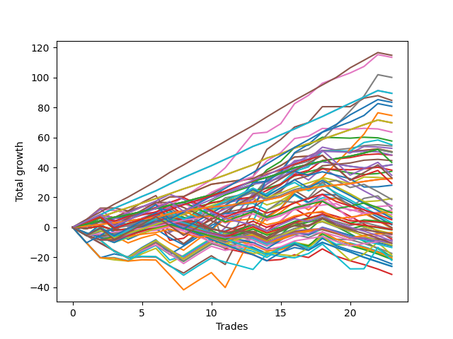

# Long Wallace Doodle 011 
- Symbol: TSLA_Unlimited
- Date Range: 03/23/2022 - 07/08/2022
- Trading Period: 7:20-12:30
- Number of Trades: 23



| Name | Win Percent | Profit | Avg Profit / Trade | Avg Time / Trade |      | Name | Win Percent | Profit | Avg Profit / Trade | Avg Time / Trade |
| ---- | ----------- | ------ | ------------------ | ---------------- | ---- | ---- | ----------- | ------ | ------------------ | ---------------- |
| Sorted By <br> Profit | | | | | | Sorted By <br> Win Percentage ||||
| Eighty-Five | 95.65 | 57420.00 | 2496.52 | 67:22 |     | One Hundred Twenty-Six | 100.00 | 16310.00 | 709.13 | 06:31 |
| Six | 86.96 | 56735.00 | 2466.74 | 94:42 |     | One Hundred Twenty-One | 100.00 | 16310.00 | 709.13 | 06:31 |
| Seven | 73.91 | 50035.00 | 2175.43 | 147:10 |     | Eighty-One | 100.00 | 16310.00 | 709.13 | 06:31 |
| One Hundred Twenty-Four | 95.65 | 44730.00 | 1944.78 | 52:02 |     | Eighty-Five | 95.65 | 57420.00 | 2496.52 | 67:22 |
| Eighty-Four | 95.65 | 44730.00 | 1944.78 | 52:02 |     | One Hundred Twenty-Four | 95.65 | 44730.00 | 1944.78 | 52:02 |
| Five | 82.61 | 42365.00 | 1841.96 | 66:14 |     | Eighty-Four | 95.65 | 44730.00 | 1944.78 | 52:02 |
| One Hundred Twenty-Five | 86.96 | 41720.00 | 1813.91 | 55:52 |     | One Hundred Twenty-Three | 95.65 | 34905.00 | 1517.61 | 37:59 |
| Sixty-Two | 78.26 | 40385.00 | 1755.87 | 78:38 |     | Eighty-Three | 95.65 | 34905.00 | 1517.61 | 37:59 |
| Sixty-Three | 60.87 | 37330.00 | 1623.04 | 115:58 |     | One Hundred Twenty-Two | 95.65 | 25080.00 | 1090.43 | 21:43 |
| One Hundred Twenty-Three | 95.65 | 34905.00 | 1517.61 | 37:59 |     | Eighty-Two | 95.65 | 25080.00 | 1090.43 | 21:43 |
| Eighty-Three | 95.65 | 34905.00 | 1517.61 | 37:59 |     | One Hundred Twenty-Seven | 95.65 | 21675.00 | 942.39 | 16:27 |
| Fifty-Eight | 69.57 | 31775.00 | 1381.52 | 26:08 |     | Six | 86.96 | 56735.00 | 2466.74 | 94:42 |
| Two | 69.57 | 28805.00 | 1252.39 | 28:39 |     | One Hundred Twenty-Five | 86.96 | 41720.00 | 1813.91 | 55:52 |
| Sixty-One | 73.91 | 27565.00 | 1198.48 | 57:25 |     | One Hundred Eleven | 86.96 | 7295.00 | 317.17 | 04:58 |
| Fifty-Nine | 82.61 | 27145.00 | 1180.22 | 30:11 |     | Five | 82.61 | 42365.00 | 1841.96 | 66:14 |
| Four | 69.57 | 26380.00 | 1146.96 | 50:58 |     | Fifty-Nine | 82.61 | 27145.00 | 1180.22 | 30:11 |
| Fifty-Seven | 82.61 | 25245.00 | 1097.61 | 17:54 |     | Fifty-Seven | 82.61 | 25245.00 | 1097.61 | 17:54 |
| One | 82.61 | 25245.00 | 1097.61 | 17:54 |     | One | 82.61 | 25245.00 | 1097.61 | 17:54 |
| One Hundred Twenty-Two | 95.65 | 25080.00 | 1090.43 | 21:43 |     | Three | 82.61 | 24080.00 | 1046.96 | 32:41 |
| Eighty-Two | 95.65 | 25080.00 | 1090.43 | 21:43 |     | Fifty-Six | 82.61 | 20885.00 | 908.04 | 10:24 |
| Sixty-Six | 65.22 | 24120.00 | 1048.70 | 22:59 |     | Zero | 82.61 | 20885.00 | 908.04 | 10:24 |
| Three | 82.61 | 24080.00 | 1046.96 | 32:41 |     | Sixty-Four | 82.61 | 18700.00 | 813.04 | 09:47 |
| Sixty-Seven | 78.26 | 22275.00 | 968.48 | 26:20 |     | One Hundred Twenty-Eight | 82.61 | 14660.00 | 637.39 | 21:22 |
| One Hundred Twenty-Seven | 95.65 | 21675.00 | 942.39 | 16:27 |     | One Hundred Sixteen | 82.61 | 5115.00 | 222.39 | 04:42 |
| Fifty-Six | 82.61 | 20885.00 | 908.04 | 10:24 |     | Sixty-Two | 78.26 | 40385.00 | 1755.87 | 78:38 |
| Zero | 82.61 | 20885.00 | 908.04 | 10:24 |     | Sixty-Seven | 78.26 | 22275.00 | 968.48 | 26:20 |
| Sixty-Five | 78.26 | 19100.00 | 830.43 | 16:38 |     | Sixty-Five | 78.26 | 19100.00 | 830.43 | 16:38 |
| Sixty-Four | 82.61 | 18700.00 | 813.04 | 09:47 |     | One Hundred Twenty-Nine | 78.26 | 17380.00 | 755.65 | 29:37 |
| One Hundred Twenty-Nine | 78.26 | 17380.00 | 755.65 | 29:37 |     | One Hundred Twelve | 78.26 | 9285.00 | 403.70 | 07:36 |
| One Hundred Thirty | 69.57 | 16530.00 | 718.70 | 32:55 |     | Seven | 73.91 | 50035.00 | 2175.43 | 147:10 |
| One Hundred Twenty-Six | 100.00 | 16310.00 | 709.13 | 06:31 |     | Sixty-One | 73.91 | 27565.00 | 1198.48 | 57:25 |
| One Hundred Twenty-One | 100.00 | 16310.00 | 709.13 | 06:31 |     | Seventy-Three | 73.91 | 14055.00 | 611.09 | 13:49 |
| Eighty-One | 100.00 | 16310.00 | 709.13 | 06:31 |     | Forty | 73.91 | 9590.00 | 416.96 | 08:31 |
| Sixty | 60.87 | 16220.00 | 705.22 | 46:30 |     | Fifty-Eight | 69.57 | 31775.00 | 1381.52 | 26:08 |
| One Hundred Twenty-Eight | 82.61 | 14660.00 | 637.39 | 21:22 |     | Two | 69.57 | 28805.00 | 1252.39 | 28:39 |
| Seventy-Three | 73.91 | 14055.00 | 611.09 | 13:49 |     | Four | 69.57 | 26380.00 | 1146.96 | 50:58 |
| Forty | 73.91 | 9590.00 | 416.96 | 08:31 |     | One Hundred Thirty | 69.57 | 16530.00 | 718.70 | 32:55 |
| One Hundred Twelve | 78.26 | 9285.00 | 403.70 | 07:36 |     | One Hundred Seventeen | 69.57 | 4840.00 | 210.43 | 06:55 |
| One Hundred Eleven | 86.96 | 7295.00 | 317.17 | 04:58 |     | Sixty-Six | 65.22 | 24120.00 | 1048.70 | 22:59 |
| Forty-Six | 43.48 | 7125.00 | 309.78 | 34:55 |     | Forty-Eight | 65.22 | 5740.00 | 249.57 | 07:43 |
| Sixty-Nine | 52.17 | 6185.00 | 268.91 | 42:00 |     | One Hundred Thirteen | 65.22 | 3575.00 | 155.43 | 10:18 |
| Forty-Eight | 65.22 | 5740.00 | 249.57 | 07:43 |     | One Hundred Six | 65.22 | -1860.00 | -80.87 | 02:42 |
| One Hundred Sixteen | 82.61 | 5115.00 | 222.39 | 04:42 |     | Sixty-Three | 60.87 | 37330.00 | 1623.04 | 115:58 |
| One Hundred Seventeen | 69.57 | 4840.00 | 210.43 | 06:55 |     | Sixty | 60.87 | 16220.00 | 705.22 | 46:30 |
| Sixty-Eight | 52.17 | 4235.00 | 184.13 | 37:27 |     | Ninety-Six | 60.87 | -1725.00 | -75.00 | 02:24 |
| One Hundred Thirteen | 65.22 | 3575.00 | 155.43 | 10:18 |     | Ninety-One | 60.87 | -2515.00 | -109.35 | 02:17 |
| One Hundred Fifteen | 52.17 | 2985.00 | 129.78 | 18:43 |     | One Hundred One | 60.87 | -4450.00 | -193.48 | 02:23 |
| One Hundred Eighteen | 56.52 | 2535.00 | 110.22 | 09:09 |     | One Hundred Eighteen | 56.52 | 2535.00 | 110.22 | 09:09 |
| Ninety-Seven | 52.17 | 1560.00 | 67.83 | 03:17 |     | One Hundred Fourteen | 56.52 | 1525.00 | 66.30 | 17:13 |
| One Hundred Fourteen | 56.52 | 1525.00 | 66.30 | 17:13 |     | Forty-One | 56.52 | -280.00 | -12.17 | 13:25 |
| Ninety-Eight | 47.83 | 1150.00 | 50.00 | 04:06 |     | Sixty-Nine | 52.17 | 6185.00 | 268.91 | 42:00 |
| Forty-Two | 47.83 | 840.00 | 36.52 | 16:18 |     | Sixty-Eight | 52.17 | 4235.00 | 184.13 | 37:27 |
| Forty-Seven | 34.78 | -60.00 | -2.61 | 54:39 |     | One Hundred Fifteen | 52.17 | 2985.00 | 129.78 | 18:43 |
| Forty-One | 56.52 | -280.00 | -12.17 | 13:25 |     | Ninety-Seven | 52.17 | 1560.00 | 67.83 | 03:17 |
| Forty-Three | 52.17 | -355.00 | -15.43 | 21:02 |     | Forty-Three | 52.17 | -355.00 | -15.43 | 21:02 |
| Ninety-Two | 52.17 | -635.00 | -27.61 | 04:11 |     | Ninety-Two | 52.17 | -635.00 | -27.61 | 04:11 |
| One Hundred Eight | 43.48 | -715.00 | -31.09 | 05:06 |     | One Hundred Seven | 52.17 | -870.00 | -37.83 | 04:04 |
| One Hundred Seven | 52.17 | -870.00 | -37.83 | 04:04 |     | One Hundred Two | 52.17 | -3295.00 | -143.26 | 04:20 |
| Ninety-Six | 60.87 | -1725.00 | -75.00 | 02:24 |     | Ninety-Eight | 47.83 | 1150.00 | 50.00 | 04:06 |
| One Hundred Six | 65.22 | -1860.00 | -80.87 | 02:42 |     | Forty-Two | 47.83 | 840.00 | 36.52 | 16:18 |
| Ninety-Three | 43.48 | -2100.00 | -91.30 | 05:34 |     | Ninety-Nine | 47.83 | -4345.00 | -188.91 | 04:38 |
| One Hundred Ten | 39.13 | -2275.00 | -98.91 | 07:30 |     | One Hundred | 47.83 | -4625.00 | -201.09 | 05:04 |
| Ninety-One | 60.87 | -2515.00 | -109.35 | 02:17 |     | Forty-Six | 43.48 | 7125.00 | 309.78 | 34:55 |
| One Hundred Two | 52.17 | -3295.00 | -143.26 | 04:20 |     | One Hundred Eight | 43.48 | -715.00 | -31.09 | 05:06 |
| Forty-Five | 43.48 | -3915.00 | -170.22 | 30:16 |     | Ninety-Three | 43.48 | -2100.00 | -91.30 | 05:34 |
| Ninety-Nine | 47.83 | -4345.00 | -188.91 | 04:38 |     | Forty-Five | 43.48 | -3915.00 | -170.22 | 30:16 |
| One Hundred One | 60.87 | -4450.00 | -193.48 | 02:23 |     | One Hundred Three | 43.48 | -5945.00 | -258.48 | 05:53 |
| One Hundred Ninteen | 39.13 | -4545.00 | -197.61 | 12:08 |     | Forty-Four | 43.48 | -9745.00 | -423.70 | 27:38 |
| One Hundred | 47.83 | -4625.00 | -201.09 | 05:04 |     | One Hundred Ten | 39.13 | -2275.00 | -98.91 | 07:30 |
| One Hundred Nine | 39.13 | -5255.00 | -228.48 | 06:31 |     | One Hundred Ninteen | 39.13 | -4545.00 | -197.61 | 12:08 |
| One Hundred Twenty | 30.43 | -5340.00 | -232.17 | 13:25 |     | One Hundred Nine | 39.13 | -5255.00 | -228.48 | 06:31 |
| One Hundred Three | 43.48 | -5945.00 | -258.48 | 05:53 |     | Seventy | 39.13 | -9265.00 | -402.83 | 47:32 |
| Ninety-Five | 26.09 | -6205.00 | -269.78 | 09:36 |     | Forty-Seven | 34.78 | -60.00 | -2.61 | 54:39 |
| Ninety-Four | 30.43 | -6735.00 | -292.83 | 08:24 |     | Forty-Nine | 34.78 | -8680.00 | -377.39 | 10:59 |
| Forty-Nine | 34.78 | -8680.00 | -377.39 | 10:59 |     | Fifty-One | 34.78 | -9750.00 | -423.91 | 12:24 |
| Seventy | 39.13 | -9265.00 | -402.83 | 47:32 |     | Seventy-One | 34.78 | -11000.00 | -478.26 | 65:46 |
| Forty-Four | 43.48 | -9745.00 | -423.70 | 27:38 |     | One Hundred Twenty | 30.43 | -5340.00 | -232.17 | 13:25 |
| Fifty-One | 34.78 | -9750.00 | -423.91 | 12:24 |     | Ninety-Four | 30.43 | -6735.00 | -292.83 | 08:24 |
| Fifty-Three | 30.43 | -10035.00 | -436.30 | 15:25 |     | Fifty-Three | 30.43 | -10035.00 | -436.30 | 15:25 |
| Fifty | 30.43 | -10495.00 | -456.30 | 11:49 |     | Fifty | 30.43 | -10495.00 | -456.30 | 11:49 |
| Fifty-Four | 30.43 | -10690.00 | -464.78 | 15:00 |     | Fifty-Four | 30.43 | -10690.00 | -464.78 | 15:00 |
| Seventy-One | 34.78 | -11000.00 | -478.26 | 65:46 |     | Fifty-Two | 30.43 | -12205.00 | -530.65 | 15:17 |
| Fifty-Two | 30.43 | -12205.00 | -530.65 | 15:17 |     | One Hundred Four | 30.43 | -12955.00 | -563.26 | 11:06 |
| One Hundred Four | 30.43 | -12955.00 | -563.26 | 11:06 |     | Fifty-Five | 30.43 | -15705.00 | -682.83 | 18:20 |
| One Hundred Five | 26.09 | -13050.00 | -567.39 | 12:20 |     | Ninety-Five | 26.09 | -6205.00 | -269.78 | 09:36 |
| Fifty-Five | 30.43 | -15705.00 | -682.83 | 18:20 |     | One Hundred Five | 26.09 | -13050.00 | -567.39 | 12:20 |

## NO STOPLOSS

### Test Zero
* Sell when price hits the middle line of the 20p bollinger
* No Stoploss
* Results:
```
Total Trades: 23
Percent Up: 82.61
Percent Down: 17.39
Total Points Moved Up: 41.77
Potential Profit: 20885.00
Total Points Ups: 49.14 Count Ups: 19
Total Points Downs: -7.37 Count Downs: 4
```

<details><summary>Trades</summary>

<code>In: 2022-03-23 10:21:00		Out: 2022-03-23 10:31:40		Total Position Time: 10:40		Total Move Up: 1.95		Total to Date: 1.95</code> <br />
<code>In: 2022-03-23 10:23:00		Out: 2022-03-23 10:31:40		Total Position Time: 08:40		Total Move Up: 4.37		Total to Date: 6.32</code> <br />
<code>In: 2022-03-25 08:11:00		Out: 2022-03-25 08:41:30		Total Position Time: 30:30		Total Move Up: -3.15		Total to Date: 3.17</code> <br />
<code>In: 2022-03-30 11:29:00		Out: 2022-03-30 11:32:50		Total Position Time: 03:50		Total Move Up: 3.97		Total to Date: 7.14</code> <br />
<code>In: 2022-03-31 10:18:00		Out: 2022-03-31 10:26:20		Total Position Time: 08:20		Total Move Up: 1.70		Total to Date: 8.84</code> <br />
<code>In: 2022-03-31 10:19:00		Out: 2022-03-31 10:26:20		Total Position Time: 07:20		Total Move Up: 0.72		Total to Date: 9.56</code> <br />
<code>In: 2022-04-07 07:51:00		Out: 2022-04-07 08:00:05		Total Position Time: 09:05		Total Move Up: 3.51		Total to Date: 13.07</code> <br />
<code>In: 2022-04-12 07:52:00		Out: 2022-04-12 08:02:20		Total Position Time: 10:20		Total Move Up: 2.45		Total to Date: 15.52</code> <br />
<code>In: 2022-04-25 12:05:00		Out: 2022-04-25 12:16:15		Total Position Time: 11:15		Total Move Up: 2.64		Total to Date: 18.16</code> <br />
<code>In: 2022-04-25 12:06:00		Out: 2022-04-25 12:16:15		Total Position Time: 10:15		Total Move Up: 2.30		Total to Date: 20.46</code> <br />
<code>In: 2022-04-29 07:48:00		Out: 2022-04-29 07:59:45		Total Position Time: 11:45		Total Move Up: 2.25		Total to Date: 22.71</code> <br />
<code>In: 2022-05-02 10:05:00		Out: 2022-05-02 10:14:55		Total Position Time: 09:55		Total Move Up: 3.11		Total to Date: 25.82</code> <br />
<code>In: 2022-05-02 10:06:00		Out: 2022-05-02 10:14:55		Total Position Time: 08:55		Total Move Up: 2.94		Total to Date: 28.76</code> <br />
<code>In: 2022-05-04 11:36:00		Out: 2022-05-04 11:41:15		Total Position Time: 05:15		Total Move Up: 1.64		Total to Date: 30.40</code> <br />
<code>In: 2022-05-06 11:11:00		Out: 2022-05-06 11:15:10		Total Position Time: 04:10		Total Move Up: 2.82		Total to Date: 33.22</code> <br />
<code>In: 2022-05-12 10:57:00		Out: 2022-05-12 11:01:05		Total Position Time: 04:05		Total Move Up: 5.51		Total to Date: 38.73</code> <br />
<code>In: 2022-05-13 11:07:00		Out: 2022-05-13 11:12:25		Total Position Time: 05:25		Total Move Up: 2.71		Total to Date: 41.44</code> <br />
<code>In: 2022-05-31 11:57:00		Out: 2022-05-31 12:04:50		Total Position Time: 07:50		Total Move Up: 2.42		Total to Date: 43.86</code> <br />
<code>In: 2022-06-06 08:14:00		Out: 2022-06-06 08:30:05		Total Position Time: 16:05		Total Move Up: -1.54		Total to Date: 42.32</code> <br />
<code>In: 2022-06-06 08:15:00		Out: 2022-06-06 08:30:05		Total Position Time: 15:05		Total Move Up: -1.59		Total to Date: 40.73</code> <br />
<code>In: 2022-06-17 07:26:00		Out: 2022-06-17 07:43:50		Total Position Time: 17:50		Total Move Up: -1.09		Total to Date: 39.64</code> <br />
<code>In: 2022-06-23 09:41:00		Out: 2022-06-23 09:54:00		Total Position Time: 13:00		Total Move Up: 0.67		Total to Date: 40.31</code> <br />
<code>In: 2022-06-27 09:04:00		Out: 2022-06-27 09:13:40		Total Position Time: 09:40		Total Move Up: 1.46		Total to Date: 41.77</code> <br />


</details>

### Test One
* Sell when the price hits the upper line of the 20p 1std bollinger
* No Stoploss
* Results:
```
Total Trades: 23
Percent Up: 82.61
Percent Down: 17.39
Total Points Moved Up: 50.49
Potential Profit: 25245.00
Total Points Ups: 54.93 Count Ups: 19
Total Points Downs: -4.44 Count Downs: 4
```

<details><summary>Trades</summary>

<code>In: 2022-03-23 10:21:00		Out: 2022-03-23 10:36:15		Total Position Time: 15:15		Total Move Up: 2.99		Total to Date: 2.99</code> <br />
<code>In: 2022-03-23 10:23:00		Out: 2022-03-23 10:36:15		Total Position Time: 13:15		Total Move Up: 5.41		Total to Date: 8.40</code> <br />
<code>In: 2022-03-25 08:11:00		Out: 2022-03-25 08:41:55		Total Position Time: 30:55		Total Move Up: -1.98		Total to Date: 6.42</code> <br />
<code>In: 2022-03-30 11:29:00		Out: 2022-03-30 11:36:15		Total Position Time: 07:15		Total Move Up: 4.44		Total to Date: 10.86</code> <br />
<code>In: 2022-03-31 10:18:00		Out: 2022-03-31 10:27:25		Total Position Time: 09:25		Total Move Up: 2.96		Total to Date: 13.82</code> <br />
<code>In: 2022-03-31 10:19:00		Out: 2022-03-31 10:27:25		Total Position Time: 08:25		Total Move Up: 1.98		Total to Date: 15.80</code> <br />
<code>In: 2022-04-07 07:51:00		Out: 2022-04-07 08:01:05		Total Position Time: 10:05		Total Move Up: 4.51		Total to Date: 20.31</code> <br />
<code>In: 2022-04-12 07:52:00		Out: 2022-04-12 08:21:10		Total Position Time: 29:10		Total Move Up: 0.25		Total to Date: 20.56</code> <br />
<code>In: 2022-04-25 12:05:00		Out: 2022-04-25 12:19:50		Total Position Time: 14:50		Total Move Up: 4.27		Total to Date: 24.83</code> <br />
<code>In: 2022-04-25 12:06:00		Out: 2022-04-25 12:19:50		Total Position Time: 13:50		Total Move Up: 3.93		Total to Date: 28.76</code> <br />
<code>In: 2022-04-29 07:48:00		Out: 2022-04-29 08:03:45		Total Position Time: 15:45		Total Move Up: 1.34		Total to Date: 30.10</code> <br />
<code>In: 2022-05-02 10:05:00		Out: 2022-05-02 10:25:35		Total Position Time: 20:35		Total Move Up: 1.28		Total to Date: 31.38</code> <br />
<code>In: 2022-05-02 10:06:00		Out: 2022-05-02 10:25:35		Total Position Time: 19:35		Total Move Up: 1.11		Total to Date: 32.49</code> <br />
<code>In: 2022-05-04 11:36:00		Out: 2022-05-04 11:42:00		Total Position Time: 06:00		Total Move Up: 4.44		Total to Date: 36.93</code> <br />
<code>In: 2022-05-06 11:11:00		Out: 2022-05-06 11:24:15		Total Position Time: 13:15		Total Move Up: 4.30		Total to Date: 41.23</code> <br />
<code>In: 2022-05-12 10:57:00		Out: 2022-05-12 11:16:15		Total Position Time: 19:15		Total Move Up: 5.70		Total to Date: 46.93</code> <br />
<code>In: 2022-05-13 11:07:00		Out: 2022-05-13 11:31:45		Total Position Time: 24:45		Total Move Up: 0.62		Total to Date: 47.55</code> <br />
<code>In: 2022-05-31 11:57:00		Out: 2022-05-31 12:07:40		Total Position Time: 10:40		Total Move Up: 3.72		Total to Date: 51.27</code> <br />
<code>In: 2022-06-06 08:14:00		Out: 2022-06-06 08:36:05		Total Position Time: 22:05		Total Move Up: -0.26		Total to Date: 51.01</code> <br />
<code>In: 2022-06-06 08:15:00		Out: 2022-06-06 08:36:05		Total Position Time: 21:05		Total Move Up: -0.31		Total to Date: 50.70</code> <br />
<code>In: 2022-06-17 07:26:00		Out: 2022-06-17 07:44:35		Total Position Time: 18:35		Total Move Up: 0.68		Total to Date: 51.38</code> <br />
<code>In: 2022-06-23 09:41:00		Out: 2022-06-23 10:11:35		Total Position Time: 30:35		Total Move Up: 1.00		Total to Date: 52.38</code> <br />
<code>In: 2022-06-27 09:04:00		Out: 2022-06-27 09:41:15		Total Position Time: 37:15		Total Move Up: -1.89		Total to Date: 50.49</code> <br />


</details>

### Test Two
* Sell when the price hits the upper line of the 20p 2std bollinger
* No Stoploss
* Results:
```
Total Trades: 23
Percent Up: 69.57
Percent Down: 30.43
Total Points Moved Up: 57.61
Potential Profit: 28805.00
Total Points Ups: 79.06 Count Ups: 16
Total Points Downs: -21.45 Count Downs: 7
```

<details><summary>Trades</summary>

<code>In: 2022-03-23 10:21:00		Out: 2022-03-23 10:38:40		Total Position Time: 17:40		Total Move Up: 4.86		Total to Date: 4.86</code> <br />
<code>In: 2022-03-23 10:23:00		Out: 2022-03-23 10:38:40		Total Position Time: 15:40		Total Move Up: 7.28		Total to Date: 12.14</code> <br />
<code>In: 2022-03-25 08:11:00		Out: 2022-03-25 08:44:45		Total Position Time: 33:45		Total Move Up: -0.79		Total to Date: 11.35</code> <br />
<code>In: 2022-03-30 11:29:00		Out: 2022-03-30 12:36:15		Total Position Time: 67:15		Total Move Up: -1.77		Total to Date: 9.58</code> <br />
<code>In: 2022-03-31 10:18:00		Out: 2022-03-31 10:29:25		Total Position Time: 11:25		Total Move Up: 4.03		Total to Date: 13.61</code> <br />
<code>In: 2022-03-31 10:19:00		Out: 2022-03-31 10:29:25		Total Position Time: 10:25		Total Move Up: 3.05		Total to Date: 16.66</code> <br />
<code>In: 2022-04-07 07:51:00		Out: 2022-04-07 09:09:30		Total Position Time: 78:30		Total Move Up: -15.79		Total to Date: 0.87</code> <br />
<code>In: 2022-04-12 07:52:00		Out: 2022-04-12 08:28:30		Total Position Time: 36:30		Total Move Up: 3.53		Total to Date: 4.40</code> <br />
<code>In: 2022-04-25 12:05:00		Out: 2022-04-25 12:20:10		Total Position Time: 15:10		Total Move Up: 6.66		Total to Date: 11.06</code> <br />
<code>In: 2022-04-25 12:06:00		Out: 2022-04-25 12:20:10		Total Position Time: 14:10		Total Move Up: 6.32		Total to Date: 17.38</code> <br />
<code>In: 2022-04-29 07:48:00		Out: 2022-04-29 08:05:15		Total Position Time: 17:15		Total Move Up: 4.27		Total to Date: 21.65</code> <br />
<code>In: 2022-05-02 10:05:00		Out: 2022-05-02 10:31:10		Total Position Time: 26:10		Total Move Up: 3.22		Total to Date: 24.87</code> <br />
<code>In: 2022-05-02 10:06:00		Out: 2022-05-02 10:31:10		Total Position Time: 25:10		Total Move Up: 3.05		Total to Date: 27.92</code> <br />
<code>In: 2022-05-04 11:36:00		Out: 2022-05-04 11:44:10		Total Position Time: 08:10		Total Move Up: 10.45		Total to Date: 38.37</code> <br />
<code>In: 2022-05-06 11:11:00		Out: 2022-05-06 11:24:20		Total Position Time: 13:20		Total Move Up: 5.62		Total to Date: 43.99</code> <br />
<code>In: 2022-05-12 10:57:00		Out: 2022-05-12 11:20:35		Total Position Time: 23:35		Total Move Up: 9.36		Total to Date: 53.35</code> <br />
<code>In: 2022-05-13 11:07:00		Out: 2022-05-13 11:51:25		Total Position Time: 44:25		Total Move Up: 1.57		Total to Date: 54.92</code> <br />
<code>In: 2022-05-31 11:57:00		Out: 2022-05-31 12:09:05		Total Position Time: 12:05		Total Move Up: 5.17		Total to Date: 60.09</code> <br />
<code>In: 2022-06-06 08:14:00		Out: 2022-06-06 08:36:05		Total Position Time: 22:05		Total Move Up: -0.26		Total to Date: 59.83</code> <br />
<code>In: 2022-06-06 08:15:00		Out: 2022-06-06 08:36:05		Total Position Time: 21:05		Total Move Up: -0.31		Total to Date: 59.52</code> <br />
<code>In: 2022-06-17 07:26:00		Out: 2022-06-17 07:56:25		Total Position Time: 30:25		Total Move Up: 0.62		Total to Date: 60.14</code> <br />
<code>In: 2022-06-23 09:41:00		Out: 2022-06-23 10:55:45		Total Position Time: 74:45		Total Move Up: -0.40		Total to Date: 59.74</code> <br />
<code>In: 2022-06-27 09:04:00		Out: 2022-06-27 09:44:10		Total Position Time: 40:10		Total Move Up: -2.13		Total to Date: 57.61</code> <br />


</details>

### Test Three
* Sell when price hits the middle line of the 50p bollinger
* No Stoploss
* Results:
```
Total Trades: 23
Percent Up: 82.61
Percent Down: 17.39
Total Points Moved Up: 48.16
Potential Profit: 24080.00
Total Points Ups: 70.89 Count Ups: 19
Total Points Downs: -22.73 Count Downs: 4
```

<details><summary>Trades</summary>

<code>In: 2022-03-23 10:21:00		Out: 2022-03-23 10:55:10		Total Position Time: 34:10		Total Move Up: 2.50		Total to Date: 2.50</code> <br />
<code>In: 2022-03-23 10:23:00		Out: 2022-03-23 10:55:10		Total Position Time: 32:10		Total Move Up: 4.92		Total to Date: 7.42</code> <br />
<code>In: 2022-03-25 08:11:00		Out: 2022-03-25 09:05:25		Total Position Time: 54:25		Total Move Up: -3.46		Total to Date: 3.96</code> <br />
<code>In: 2022-03-30 11:29:00		Out: 2022-03-30 12:33:35		Total Position Time: 64:35		Total Move Up: -2.47		Total to Date: 1.49</code> <br />
<code>In: 2022-03-31 10:18:00		Out: 2022-03-31 10:28:35		Total Position Time: 10:35		Total Move Up: 3.42		Total to Date: 4.91</code> <br />
<code>In: 2022-03-31 10:19:00		Out: 2022-03-31 10:28:35		Total Position Time: 09:35		Total Move Up: 2.44		Total to Date: 7.35</code> <br />
<code>In: 2022-04-07 07:51:00		Out: 2022-04-07 09:09:25		Total Position Time: 78:25		Total Move Up: -15.98		Total to Date: -8.63</code> <br />
<code>In: 2022-04-12 07:52:00		Out: 2022-04-12 08:26:10		Total Position Time: 34:10		Total Move Up: 1.33		Total to Date: -7.30</code> <br />
<code>In: 2022-04-25 12:05:00		Out: 2022-04-25 12:35:35		Total Position Time: 30:35		Total Move Up: 6.93		Total to Date: -0.37</code> <br />
<code>In: 2022-04-25 12:06:00		Out: 2022-04-25 12:35:35		Total Position Time: 29:35		Total Move Up: 6.59		Total to Date: 6.22</code> <br />
<code>In: 2022-04-29 07:48:00		Out: 2022-04-29 08:05:45		Total Position Time: 17:45		Total Move Up: 7.30		Total to Date: 13.52</code> <br />
<code>In: 2022-05-02 10:05:00		Out: 2022-05-02 10:55:45		Total Position Time: 50:45		Total Move Up: 1.80		Total to Date: 15.32</code> <br />
<code>In: 2022-05-02 10:06:00		Out: 2022-05-02 10:55:45		Total Position Time: 49:45		Total Move Up: 1.63		Total to Date: 16.95</code> <br />
<code>In: 2022-05-04 11:36:00		Out: 2022-05-04 11:43:35		Total Position Time: 07:35		Total Move Up: 5.78		Total to Date: 22.73</code> <br />
<code>In: 2022-05-06 11:11:00		Out: 2022-05-06 11:24:20		Total Position Time: 13:20		Total Move Up: 5.62		Total to Date: 28.35</code> <br />
<code>In: 2022-05-12 10:57:00		Out: 2022-05-12 11:18:50		Total Position Time: 21:50		Total Move Up: 7.11		Total to Date: 35.46</code> <br />
<code>In: 2022-05-13 11:07:00		Out: 2022-05-13 11:32:00		Total Position Time: 25:00		Total Move Up: 2.57		Total to Date: 38.03</code> <br />
<code>In: 2022-05-31 11:57:00		Out: 2022-05-31 12:15:15		Total Position Time: 18:15		Total Move Up: 6.65		Total to Date: 44.68</code> <br />
<code>In: 2022-06-06 08:14:00		Out: 2022-06-06 08:45:05		Total Position Time: 31:05		Total Move Up: 0.97		Total to Date: 45.65</code> <br />
<code>In: 2022-06-06 08:15:00		Out: 2022-06-06 08:45:05		Total Position Time: 30:05		Total Move Up: 0.92		Total to Date: 46.57</code> <br />
<code>In: 2022-06-17 07:26:00		Out: 2022-06-17 07:57:00		Total Position Time: 31:00		Total Move Up: 1.84		Total to Date: 48.41</code> <br />
<code>In: 2022-06-23 09:41:00		Out: 2022-06-23 10:17:20		Total Position Time: 36:20		Total Move Up: 0.57		Total to Date: 48.98</code> <br />
<code>In: 2022-06-27 09:04:00		Out: 2022-06-27 09:44:55		Total Position Time: 40:55		Total Move Up: -0.82		Total to Date: 48.16</code> <br />


</details>

### Test Four
* Sell when the price hits the upper line of the 50p 1std bollinger
* No Stoploss
* Results:
```
Total Trades: 23
Percent Up: 69.57
Percent Down: 30.43
Total Points Moved Up: 52.76
Potential Profit: 26380.00
Total Points Ups: 73.39 Count Ups: 16
Total Points Downs: -20.63 Count Downs: 7
```

<details><summary>Trades</summary>

<code>In: 2022-03-23 10:21:00		Out: 2022-03-23 11:29:15		Total Position Time: 68:15		Total Move Up: 0.56		Total to Date: 0.56</code> <br />
<code>In: 2022-03-23 10:23:00		Out: 2022-03-23 11:29:15		Total Position Time: 66:15		Total Move Up: 2.98		Total to Date: 3.54</code> <br />
<code>In: 2022-03-25 08:11:00		Out: 2022-03-25 09:08:40		Total Position Time: 57:40		Total Move Up: -1.35		Total to Date: 2.19</code> <br />
<code>In: 2022-03-30 11:29:00		Out: 2022-03-30 12:45:20		Total Position Time: 76:20		Total Move Up: -0.80		Total to Date: 1.39</code> <br />
<code>In: 2022-03-31 10:18:00		Out: 2022-03-31 10:42:45		Total Position Time: 24:45		Total Move Up: 4.75		Total to Date: 6.14</code> <br />
<code>In: 2022-03-31 10:19:00		Out: 2022-03-31 10:42:45		Total Position Time: 23:45		Total Move Up: 3.77		Total to Date: 9.91</code> <br />
<code>In: 2022-04-07 07:51:00		Out: 2022-04-07 09:10:55		Total Position Time: 79:55		Total Move Up: -13.40		Total to Date: -3.49</code> <br />
<code>In: 2022-04-12 07:52:00		Out: 2022-04-12 08:30:15		Total Position Time: 38:15		Total Move Up: 5.03		Total to Date: 1.54</code> <br />
<code>In: 2022-04-25 12:05:00		Out: 2022-04-25 12:47:00		Total Position Time: 42:00		Total Move Up: 5.94		Total to Date: 7.48</code> <br />
<code>In: 2022-04-25 12:06:00		Out: 2022-04-25 12:47:00		Total Position Time: 41:00		Total Move Up: 5.60		Total to Date: 13.08</code> <br />
<code>In: 2022-04-29 07:48:00		Out: 2022-04-29 08:31:05		Total Position Time: 43:05		Total Move Up: 3.19		Total to Date: 16.27</code> <br />
<code>In: 2022-05-02 10:05:00		Out: 2022-05-02 10:55:45		Total Position Time: 50:45		Total Move Up: 1.80		Total to Date: 18.07</code> <br />
<code>In: 2022-05-02 10:06:00		Out: 2022-05-02 10:55:45		Total Position Time: 49:45		Total Move Up: 1.63		Total to Date: 19.70</code> <br />
<code>In: 2022-05-04 11:36:00		Out: 2022-05-04 11:44:25		Total Position Time: 08:25		Total Move Up: 12.17		Total to Date: 31.87</code> <br />
<code>In: 2022-05-06 11:11:00		Out: 2022-05-06 11:49:20		Total Position Time: 38:20		Total Move Up: 3.98		Total to Date: 35.85</code> <br />
<code>In: 2022-05-12 10:57:00		Out: 2022-05-12 11:28:45		Total Position Time: 31:45		Total Move Up: 8.61		Total to Date: 44.46</code> <br />
<code>In: 2022-05-13 11:07:00		Out: 2022-05-13 11:51:20		Total Position Time: 44:20		Total Move Up: 1.12		Total to Date: 45.58</code> <br />
<code>In: 2022-05-31 11:57:00		Out: 2022-05-31 12:28:30		Total Position Time: 31:30		Total Move Up: 7.94		Total to Date: 53.52</code> <br />
<code>In: 2022-06-06 08:14:00		Out: 2022-06-06 09:41:50		Total Position Time: 87:50		Total Move Up: -1.94		Total to Date: 51.58</code> <br />
<code>In: 2022-06-06 08:15:00		Out: 2022-06-06 09:41:50		Total Position Time: 86:50		Total Move Up: -1.99		Total to Date: 49.59</code> <br />
<code>In: 2022-06-17 07:26:00		Out: 2022-06-17 08:03:55		Total Position Time: 37:55		Total Move Up: 4.32		Total to Date: 53.91</code> <br />
<code>In: 2022-06-23 09:41:00		Out: 2022-06-23 10:55:50		Total Position Time: 74:50		Total Move Up: -0.28		Total to Date: 53.63</code> <br />
<code>In: 2022-06-27 09:04:00		Out: 2022-06-27 10:13:00		Total Position Time: 69:00		Total Move Up: -0.87		Total to Date: 52.76</code> <br />


</details>

### Test Five
* Sell when the price hits the upper line of the 50p 2std bollinger
* No Stoploss
* Results:
```
Total Trades: 23
Percent Up: 82.61
Percent Down: 17.39
Total Points Moved Up: 84.73
Potential Profit: 42365.00
Total Points Ups: 103.28 Count Ups: 19
Total Points Downs: -18.55 Count Downs: 4
```

<details><summary>Trades</summary>

<code>In: 2022-03-23 10:21:00		Out: 2022-03-23 11:48:30		Total Position Time: 87:30		Total Move Up: 5.20		Total to Date: 5.20</code> <br />
<code>In: 2022-03-23 10:23:00		Out: 2022-03-23 11:48:30		Total Position Time: 85:30		Total Move Up: 7.62		Total to Date: 12.82</code> <br />
<code>In: 2022-03-25 08:11:00		Out: 2022-03-25 09:09:50		Total Position Time: 58:50		Total Move Up: 0.10		Total to Date: 12.92</code> <br />
<code>In: 2022-03-30 11:29:00		Out: 2022-03-30 12:47:00		Total Position Time: 78:00		Total Move Up: -1.97		Total to Date: 10.95</code> <br />
<code>In: 2022-03-31 10:18:00		Out: 2022-03-31 10:42:55		Total Position Time: 24:55		Total Move Up: 5.60		Total to Date: 16.55</code> <br />
<code>In: 2022-03-31 10:19:00		Out: 2022-03-31 10:42:55		Total Position Time: 23:55		Total Move Up: 4.62		Total to Date: 21.17</code> <br />
<code>In: 2022-04-07 07:51:00		Out: 2022-04-07 10:12:10		Total Position Time: 141:10		Total Move Up: -13.40		Total to Date: 7.77</code> <br />
<code>In: 2022-04-12 07:52:00		Out: 2022-04-12 10:00:45		Total Position Time: 128:45		Total Move Up: 2.77		Total to Date: 10.54</code> <br />
<code>In: 2022-04-25 12:05:00		Out: 2022-04-25 12:47:00		Total Position Time: 42:00		Total Move Up: 5.94		Total to Date: 16.48</code> <br />
<code>In: 2022-04-25 12:06:00		Out: 2022-04-25 12:47:00		Total Position Time: 41:00		Total Move Up: 5.60		Total to Date: 22.08</code> <br />
<code>In: 2022-04-29 07:48:00		Out: 2022-04-29 08:32:15		Total Position Time: 44:15		Total Move Up: 5.28		Total to Date: 27.36</code> <br />
<code>In: 2022-05-02 10:05:00		Out: 2022-05-02 10:58:30		Total Position Time: 53:30		Total Move Up: 3.23		Total to Date: 30.59</code> <br />
<code>In: 2022-05-02 10:06:00		Out: 2022-05-02 10:58:30		Total Position Time: 52:30		Total Move Up: 3.06		Total to Date: 33.65</code> <br />
<code>In: 2022-05-04 11:36:00		Out: 2022-05-04 11:47:00		Total Position Time: 11:00		Total Move Up: 18.34		Total to Date: 51.99</code> <br />
<code>In: 2022-05-06 11:11:00		Out: 2022-05-06 11:50:10		Total Position Time: 39:10		Total Move Up: 6.66		Total to Date: 58.65</code> <br />
<code>In: 2022-05-12 10:57:00		Out: 2022-05-12 12:18:55		Total Position Time: 81:55		Total Move Up: 8.30		Total to Date: 66.95</code> <br />
<code>In: 2022-05-13 11:07:00		Out: 2022-05-13 11:52:35		Total Position Time: 45:35		Total Move Up: 2.99		Total to Date: 69.94</code> <br />
<code>In: 2022-05-31 11:57:00		Out: 2022-05-31 12:31:05		Total Position Time: 34:05		Total Move Up: 10.58		Total to Date: 80.52</code> <br />
<code>In: 2022-06-06 08:14:00		Out: 2022-06-06 09:46:45		Total Position Time: 92:45		Total Move Up: 0.03		Total to Date: 80.55</code> <br />
<code>In: 2022-06-06 08:15:00		Out: 2022-06-06 09:46:45		Total Position Time: 91:45		Total Move Up: -0.02		Total to Date: 80.53</code> <br />
<code>In: 2022-06-17 07:26:00		Out: 2022-06-17 08:06:30		Total Position Time: 40:30		Total Move Up: 5.71		Total to Date: 86.24</code> <br />
<code>In: 2022-06-23 09:41:00		Out: 2022-06-23 11:09:40		Total Position Time: 88:40		Total Move Up: 1.65		Total to Date: 87.89</code> <br />
<code>In: 2022-06-27 09:04:00		Out: 2022-06-27 11:20:10		Total Position Time: 136:10		Total Move Up: -3.16		Total to Date: 84.73</code> <br />


</details>

### Test Six
* Sell when the price hits the middle line of the 1std VWAP
* No Stoploss
* Results:
```
Total Trades: 23
Percent Up: 86.96
Percent Down: 13.04
Total Points Moved Up: 113.47
Potential Profit: 56735.00
Total Points Ups: 118.75 Count Ups: 20
Total Points Downs: -5.28 Count Downs: 3
```

<details><summary>Trades</summary>

<code>In: 2022-03-23 10:21:00		Out: 2022-03-23 12:47:00		Total Position Time: 146:00		Total Move Up: 0.79		Total to Date: 0.79</code> <br />
<code>In: 2022-03-23 10:23:00		Out: 2022-03-23 12:47:00		Total Position Time: 144:00		Total Move Up: 3.21		Total to Date: 4.00</code> <br />
<code>In: 2022-03-25 08:11:00		Out: 2022-03-25 10:58:35		Total Position Time: 167:35		Total Move Up: 2.62		Total to Date: 6.62</code> <br />
<code>In: 2022-03-30 11:29:00		Out: 2022-03-30 12:47:00		Total Position Time: 78:00		Total Move Up: -1.97		Total to Date: 4.65</code> <br />
<code>In: 2022-03-31 10:18:00		Out: 2022-03-31 10:45:40		Total Position Time: 27:40		Total Move Up: 6.20		Total to Date: 10.85</code> <br />
<code>In: 2022-03-31 10:19:00		Out: 2022-03-31 10:45:40		Total Position Time: 26:40		Total Move Up: 5.22		Total to Date: 16.07</code> <br />
<code>In: 2022-04-07 07:51:00		Out: 2022-04-07 11:02:00		Total Position Time: 191:00		Total Move Up: -1.48		Total to Date: 14.59</code> <br />
<code>In: 2022-04-12 07:52:00		Out: 2022-04-12 10:20:25		Total Position Time: 148:25		Total Move Up: 5.62		Total to Date: 20.21</code> <br />
<code>In: 2022-04-25 12:05:00		Out: 2022-04-25 12:47:00		Total Position Time: 42:00		Total Move Up: 5.94		Total to Date: 26.15</code> <br />
<code>In: 2022-04-25 12:06:00		Out: 2022-04-25 12:47:00		Total Position Time: 41:00		Total Move Up: 5.60		Total to Date: 31.75</code> <br />
<code>In: 2022-04-29 07:48:00		Out: 2022-04-29 08:41:50		Total Position Time: 53:50		Total Move Up: 7.99		Total to Date: 39.74</code> <br />
<code>In: 2022-05-02 10:05:00		Out: 2022-05-02 11:22:10		Total Position Time: 77:10		Total Move Up: 11.50		Total to Date: 51.24</code> <br />
<code>In: 2022-05-02 10:06:00		Out: 2022-05-02 11:22:10		Total Position Time: 76:10		Total Move Up: 11.33		Total to Date: 62.57</code> <br />
<code>In: 2022-05-04 11:36:00		Out: 2022-05-04 11:40:25		Total Position Time: 04:25		Total Move Up: 0.91		Total to Date: 63.48</code> <br />
<code>In: 2022-05-06 11:11:00		Out: 2022-05-06 12:47:00		Total Position Time: 96:00		Total Move Up: 5.70		Total to Date: 69.18</code> <br />
<code>In: 2022-05-12 10:57:00		Out: 2022-05-12 12:21:25		Total Position Time: 84:25		Total Move Up: 13.40		Total to Date: 82.58</code> <br />
<code>In: 2022-05-13 11:07:00		Out: 2022-05-13 12:01:05		Total Position Time: 54:05		Total Move Up: 5.52		Total to Date: 88.10</code> <br />
<code>In: 2022-05-31 11:57:00		Out: 2022-05-31 12:16:05		Total Position Time: 19:05		Total Move Up: 8.07		Total to Date: 96.17</code> <br />
<code>In: 2022-06-06 08:14:00		Out: 2022-06-06 10:41:10		Total Position Time: 147:10		Total Move Up: 3.46		Total to Date: 99.63</code> <br />
<code>In: 2022-06-06 08:15:00		Out: 2022-06-06 10:41:10		Total Position Time: 146:10		Total Move Up: 3.41		Total to Date: 103.04</code> <br />
<code>In: 2022-06-17 07:26:00		Out: 2022-06-17 08:03:55		Total Position Time: 37:55		Total Move Up: 4.32		Total to Date: 107.36</code> <br />
<code>In: 2022-06-23 09:41:00		Out: 2022-06-23 12:07:25		Total Position Time: 146:25		Total Move Up: 7.94		Total to Date: 115.30</code> <br />
<code>In: 2022-06-27 09:04:00		Out: 2022-06-27 12:47:00		Total Position Time: 223:00		Total Move Up: -1.83		Total to Date: 113.47</code> <br />


</details>

### Test Seven
* Sell when the price hits the upper line of the 1std VWAP
* No Stoploss
* Results:
```
Total Trades: 23
Percent Up: 73.91
Percent Down: 26.09
Total Points Moved Up: 100.07
Potential Profit: 50035.00
Total Points Ups: 145.08 Count Ups: 17
Total Points Downs: -45.01 Count Downs: 6
```

<details><summary>Trades</summary>

<code>In: 2022-03-23 10:21:00		Out: 2022-03-23 12:47:00		Total Position Time: 146:00		Total Move Up: 0.79		Total to Date: 0.79</code> <br />
<code>In: 2022-03-23 10:23:00		Out: 2022-03-23 12:47:00		Total Position Time: 144:00		Total Move Up: 3.21		Total to Date: 4.00</code> <br />
<code>In: 2022-03-25 08:11:00		Out: 2022-03-25 12:47:00		Total Position Time: 276:00		Total Move Up: -0.23		Total to Date: 3.77</code> <br />
<code>In: 2022-03-30 11:29:00		Out: 2022-03-30 12:47:00		Total Position Time: 78:00		Total Move Up: -1.97		Total to Date: 1.80</code> <br />
<code>In: 2022-03-31 10:18:00		Out: 2022-03-31 12:47:00		Total Position Time: 149:00		Total Move Up: 0.84		Total to Date: 2.64</code> <br />
<code>In: 2022-03-31 10:19:00		Out: 2022-03-31 12:47:00		Total Position Time: 148:00		Total Move Up: -0.14		Total to Date: 2.50</code> <br />
<code>In: 2022-04-07 07:51:00		Out: 2022-04-07 12:11:25		Total Position Time: 260:25		Total Move Up: 12.04		Total to Date: 14.54</code> <br />
<code>In: 2022-04-12 07:52:00		Out: 2022-04-12 12:47:00		Total Position Time: 295:00		Total Move Up: -12.36		Total to Date: 2.18</code> <br />
<code>In: 2022-04-25 12:05:00		Out: 2022-04-25 12:47:00		Total Position Time: 42:00		Total Move Up: 5.94		Total to Date: 8.12</code> <br />
<code>In: 2022-04-25 12:06:00		Out: 2022-04-25 12:47:00		Total Position Time: 41:00		Total Move Up: 5.60		Total to Date: 13.72</code> <br />
<code>In: 2022-04-29 07:48:00		Out: 2022-04-29 12:47:00		Total Position Time: 299:00		Total Move Up: -28.48		Total to Date: -14.76</code> <br />
<code>In: 2022-05-02 10:05:00		Out: 2022-05-02 12:10:05		Total Position Time: 125:05		Total Move Up: 18.19		Total to Date: 3.43</code> <br />
<code>In: 2022-05-02 10:06:00		Out: 2022-05-02 12:10:05		Total Position Time: 124:05		Total Move Up: 18.02		Total to Date: 21.45</code> <br />
<code>In: 2022-05-04 11:36:00		Out: 2022-05-04 11:44:10		Total Position Time: 08:10		Total Move Up: 10.45		Total to Date: 31.90</code> <br />
<code>In: 2022-05-06 11:11:00		Out: 2022-05-06 12:47:00		Total Position Time: 96:00		Total Move Up: 5.70		Total to Date: 37.60</code> <br />
<code>In: 2022-05-12 10:57:00		Out: 2022-05-12 12:47:00		Total Position Time: 110:00		Total Move Up: 11.88		Total to Date: 49.48</code> <br />
<code>In: 2022-05-13 11:07:00		Out: 2022-05-13 12:47:00		Total Position Time: 100:00		Total Move Up: 2.84		Total to Date: 52.32</code> <br />
<code>In: 2022-05-31 11:57:00		Out: 2022-05-31 12:47:00		Total Position Time: 50:00		Total Move Up: 6.35		Total to Date: 58.67</code> <br />
<code>In: 2022-06-06 08:14:00		Out: 2022-06-06 10:57:15		Total Position Time: 163:15		Total Move Up: 9.53		Total to Date: 68.20</code> <br />
<code>In: 2022-06-06 08:15:00		Out: 2022-06-06 10:57:15		Total Position Time: 162:15		Total Move Up: 9.48		Total to Date: 77.68</code> <br />
<code>In: 2022-06-17 07:26:00		Out: 2022-06-17 10:04:40		Total Position Time: 158:40		Total Move Up: 9.94		Total to Date: 87.62</code> <br />
<code>In: 2022-06-23 09:41:00		Out: 2022-06-23 12:47:00		Total Position Time: 186:00		Total Move Up: 14.28		Total to Date: 101.90</code> <br />
<code>In: 2022-06-27 09:04:00		Out: 2022-06-27 12:47:00		Total Position Time: 223:00		Total Move Up: -1.83		Total to Date: 100.07</code> <br />


</details>

## STOPLOSS OF 5

### Test Forty
* Sell when price hits the middle line of the 20p bollinger
* Stoploss is 5 points
* Results:
```
Total Trades: 23
Percent Up: 73.91
Percent Down: 26.09
Total Points Moved Up: 19.18
Potential Profit: 9590.00
Total Points Ups: 45.55 Count Ups: 17
Total Points Downs: -26.37 Count Downs: 6
```

<details><summary>Trades</summary>

<code>In: 2022-03-23 10:21:00		Out: 2022-03-23 10:25:30		Total Position Time: 04:30		Total Move Up: -5.34		Total to Date: -5.34</code> <br />
<code>In: 2022-03-23 10:23:00		Out: 2022-03-23 10:31:40		Total Position Time: 08:40		Total Move Up: 4.37		Total to Date: -0.97</code> <br />
<code>In: 2022-03-25 08:11:00		Out: 2022-03-25 08:27:00		Total Position Time: 16:00		Total Move Up: -5.13		Total to Date: -6.10</code> <br />
<code>In: 2022-03-30 11:29:00		Out: 2022-03-30 11:32:50		Total Position Time: 03:50		Total Move Up: 3.97		Total to Date: -2.13</code> <br />
<code>In: 2022-03-31 10:18:00		Out: 2022-03-31 10:26:20		Total Position Time: 08:20		Total Move Up: 1.70		Total to Date: -0.43</code> <br />
<code>In: 2022-03-31 10:19:00		Out: 2022-03-31 10:26:20		Total Position Time: 07:20		Total Move Up: 0.72		Total to Date: 0.29</code> <br />
<code>In: 2022-04-07 07:51:00		Out: 2022-04-07 08:00:05		Total Position Time: 09:05		Total Move Up: 3.51		Total to Date: 3.80</code> <br />
<code>In: 2022-04-12 07:52:00		Out: 2022-04-12 08:02:20		Total Position Time: 10:20		Total Move Up: 2.45		Total to Date: 6.25</code> <br />
<code>In: 2022-04-25 12:05:00		Out: 2022-04-25 12:16:15		Total Position Time: 11:15		Total Move Up: 2.64		Total to Date: 8.89</code> <br />
<code>In: 2022-04-25 12:06:00		Out: 2022-04-25 12:16:15		Total Position Time: 10:15		Total Move Up: 2.30		Total to Date: 11.19</code> <br />
<code>In: 2022-04-29 07:48:00		Out: 2022-04-29 07:59:45		Total Position Time: 11:45		Total Move Up: 2.25		Total to Date: 13.44</code> <br />
<code>In: 2022-05-02 10:05:00		Out: 2022-05-02 10:14:55		Total Position Time: 09:55		Total Move Up: 3.11		Total to Date: 16.55</code> <br />
<code>In: 2022-05-02 10:06:00		Out: 2022-05-02 10:14:55		Total Position Time: 08:55		Total Move Up: 2.94		Total to Date: 19.49</code> <br />
<code>In: 2022-05-04 11:36:00		Out: 2022-05-04 11:39:00		Total Position Time: 03:00		Total Move Up: -4.50		Total to Date: 14.99</code> <br />
<code>In: 2022-05-06 11:11:00		Out: 2022-05-06 11:15:10		Total Position Time: 04:10		Total Move Up: 2.82		Total to Date: 17.81</code> <br />
<code>In: 2022-05-12 10:57:00		Out: 2022-05-12 11:01:05		Total Position Time: 04:05		Total Move Up: 5.51		Total to Date: 23.32</code> <br />
<code>In: 2022-05-13 11:07:00		Out: 2022-05-13 11:12:25		Total Position Time: 05:25		Total Move Up: 2.71		Total to Date: 26.03</code> <br />
<code>In: 2022-05-31 11:57:00		Out: 2022-05-31 12:04:50		Total Position Time: 07:50		Total Move Up: 2.42		Total to Date: 28.45</code> <br />
<code>In: 2022-06-06 08:14:00		Out: 2022-06-06 08:30:05		Total Position Time: 16:05		Total Move Up: -1.54		Total to Date: 26.91</code> <br />
<code>In: 2022-06-06 08:15:00		Out: 2022-06-06 08:17:50		Total Position Time: 02:50		Total Move Up: -4.73		Total to Date: 22.18</code> <br />
<code>In: 2022-06-17 07:26:00		Out: 2022-06-17 07:35:55		Total Position Time: 09:55		Total Move Up: -5.13		Total to Date: 17.05</code> <br />
<code>In: 2022-06-23 09:41:00		Out: 2022-06-23 09:54:00		Total Position Time: 13:00		Total Move Up: 0.67		Total to Date: 17.72</code> <br />
<code>In: 2022-06-27 09:04:00		Out: 2022-06-27 09:13:40		Total Position Time: 09:40		Total Move Up: 1.46		Total to Date: 19.18</code> <br />


</details>

### Test Forty-One
* Sell when the price hits the upper line of the 20p 1std bollinger
* Stoploss is 5 points
* Results:
```
Total Trades: 23
Percent Up: 56.52
Percent Down: 43.48
Total Points Moved Up: -0.56
Potential Profit: -280.00
Total Points Ups: 44.95 Count Ups: 13
Total Points Downs: -45.51 Count Downs: 10
```

<details><summary>Trades</summary>

<code>In: 2022-03-23 10:21:00		Out: 2022-03-23 10:25:30		Total Position Time: 04:30		Total Move Up: -5.34		Total to Date: -5.34</code> <br />
<code>In: 2022-03-23 10:23:00		Out: 2022-03-23 10:36:15		Total Position Time: 13:15		Total Move Up: 5.41		Total to Date: 0.07</code> <br />
<code>In: 2022-03-25 08:11:00		Out: 2022-03-25 08:27:00		Total Position Time: 16:00		Total Move Up: -5.13		Total to Date: -5.06</code> <br />
<code>In: 2022-03-30 11:29:00		Out: 2022-03-30 11:36:15		Total Position Time: 07:15		Total Move Up: 4.44		Total to Date: -0.62</code> <br />
<code>In: 2022-03-31 10:18:00		Out: 2022-03-31 10:27:25		Total Position Time: 09:25		Total Move Up: 2.96		Total to Date: 2.34</code> <br />
<code>In: 2022-03-31 10:19:00		Out: 2022-03-31 10:27:25		Total Position Time: 08:25		Total Move Up: 1.98		Total to Date: 4.32</code> <br />
<code>In: 2022-04-07 07:51:00		Out: 2022-04-07 08:01:05		Total Position Time: 10:05		Total Move Up: 4.51		Total to Date: 8.83</code> <br />
<code>In: 2022-04-12 07:52:00		Out: 2022-04-12 08:06:10		Total Position Time: 14:10		Total Move Up: -4.73		Total to Date: 4.10</code> <br />
<code>In: 2022-04-25 12:05:00		Out: 2022-04-25 12:19:50		Total Position Time: 14:50		Total Move Up: 4.27		Total to Date: 8.37</code> <br />
<code>In: 2022-04-25 12:06:00		Out: 2022-04-25 12:19:50		Total Position Time: 13:50		Total Move Up: 3.93		Total to Date: 12.30</code> <br />
<code>In: 2022-04-29 07:48:00		Out: 2022-04-29 08:03:45		Total Position Time: 15:45		Total Move Up: 1.34		Total to Date: 13.64</code> <br />
<code>In: 2022-05-02 10:05:00		Out: 2022-05-02 10:25:35		Total Position Time: 20:35		Total Move Up: 1.28		Total to Date: 14.92</code> <br />
<code>In: 2022-05-02 10:06:00		Out: 2022-05-02 10:25:35		Total Position Time: 19:35		Total Move Up: 1.11		Total to Date: 16.03</code> <br />
<code>In: 2022-05-04 11:36:00		Out: 2022-05-04 11:39:00		Total Position Time: 03:00		Total Move Up: -4.50		Total to Date: 11.53</code> <br />
<code>In: 2022-05-06 11:11:00		Out: 2022-05-06 11:24:15		Total Position Time: 13:15		Total Move Up: 4.30		Total to Date: 15.83</code> <br />
<code>In: 2022-05-12 10:57:00		Out: 2022-05-12 11:16:15		Total Position Time: 19:15		Total Move Up: 5.70		Total to Date: 21.53</code> <br />
<code>In: 2022-05-13 11:07:00		Out: 2022-05-13 11:23:45		Total Position Time: 16:45		Total Move Up: -5.58		Total to Date: 15.95</code> <br />
<code>In: 2022-05-31 11:57:00		Out: 2022-05-31 12:07:40		Total Position Time: 10:40		Total Move Up: 3.72		Total to Date: 19.67</code> <br />
<code>In: 2022-06-06 08:14:00		Out: 2022-06-06 08:36:05		Total Position Time: 22:05		Total Move Up: -0.26		Total to Date: 19.41</code> <br />
<code>In: 2022-06-06 08:15:00		Out: 2022-06-06 08:17:50		Total Position Time: 02:50		Total Move Up: -4.73		Total to Date: 14.68</code> <br />
<code>In: 2022-06-17 07:26:00		Out: 2022-06-17 07:35:55		Total Position Time: 09:55		Total Move Up: -5.13		Total to Date: 9.55</code> <br />
<code>In: 2022-06-23 09:41:00		Out: 2022-06-23 10:01:50		Total Position Time: 20:50		Total Move Up: -4.87		Total to Date: 4.68</code> <br />
<code>In: 2022-06-27 09:04:00		Out: 2022-06-27 09:26:40		Total Position Time: 22:40		Total Move Up: -5.24		Total to Date: -0.56</code> <br />


</details>

### Test Forty-Two
* Sell when the price hits the upper line of the 20p 2std bollinger
* Stoploss is 5 points
* Results:
```
Total Trades: 23
Percent Up: 47.83
Percent Down: 52.17
Total Points Moved Up: 1.68
Potential Profit: 840.00
Total Points Ups: 58.03 Count Ups: 11
Total Points Downs: -56.35 Count Downs: 12
```

<details><summary>Trades</summary>

<code>In: 2022-03-23 10:21:00		Out: 2022-03-23 10:25:30		Total Position Time: 04:30		Total Move Up: -5.34		Total to Date: -5.34</code> <br />
<code>In: 2022-03-23 10:23:00		Out: 2022-03-23 10:38:40		Total Position Time: 15:40		Total Move Up: 7.28		Total to Date: 1.94</code> <br />
<code>In: 2022-03-25 08:11:00		Out: 2022-03-25 08:27:00		Total Position Time: 16:00		Total Move Up: -5.13		Total to Date: -3.19</code> <br />
<code>In: 2022-03-30 11:29:00		Out: 2022-03-30 12:08:30		Total Position Time: 39:30		Total Move Up: -4.85		Total to Date: -8.04</code> <br />
<code>In: 2022-03-31 10:18:00		Out: 2022-03-31 10:29:25		Total Position Time: 11:25		Total Move Up: 4.03		Total to Date: -4.01</code> <br />
<code>In: 2022-03-31 10:19:00		Out: 2022-03-31 10:29:25		Total Position Time: 10:25		Total Move Up: 3.05		Total to Date: -0.96</code> <br />
<code>In: 2022-04-07 07:51:00		Out: 2022-04-07 08:09:35		Total Position Time: 18:35		Total Move Up: -5.99		Total to Date: -6.95</code> <br />
<code>In: 2022-04-12 07:52:00		Out: 2022-04-12 08:06:10		Total Position Time: 14:10		Total Move Up: -4.73		Total to Date: -11.68</code> <br />
<code>In: 2022-04-25 12:05:00		Out: 2022-04-25 12:20:10		Total Position Time: 15:10		Total Move Up: 6.66		Total to Date: -5.02</code> <br />
<code>In: 2022-04-25 12:06:00		Out: 2022-04-25 12:20:10		Total Position Time: 14:10		Total Move Up: 6.32		Total to Date: 1.30</code> <br />
<code>In: 2022-04-29 07:48:00		Out: 2022-04-29 08:05:15		Total Position Time: 17:15		Total Move Up: 4.27		Total to Date: 5.57</code> <br />
<code>In: 2022-05-02 10:05:00		Out: 2022-05-02 10:31:10		Total Position Time: 26:10		Total Move Up: 3.22		Total to Date: 8.79</code> <br />
<code>In: 2022-05-02 10:06:00		Out: 2022-05-02 10:31:10		Total Position Time: 25:10		Total Move Up: 3.05		Total to Date: 11.84</code> <br />
<code>In: 2022-05-04 11:36:00		Out: 2022-05-04 11:39:00		Total Position Time: 03:00		Total Move Up: -4.50		Total to Date: 7.34</code> <br />
<code>In: 2022-05-06 11:11:00		Out: 2022-05-06 11:24:20		Total Position Time: 13:20		Total Move Up: 5.62		Total to Date: 12.96</code> <br />
<code>In: 2022-05-12 10:57:00		Out: 2022-05-12 11:20:35		Total Position Time: 23:35		Total Move Up: 9.36		Total to Date: 22.32</code> <br />
<code>In: 2022-05-13 11:07:00		Out: 2022-05-13 11:23:45		Total Position Time: 16:45		Total Move Up: -5.58		Total to Date: 16.74</code> <br />
<code>In: 2022-05-31 11:57:00		Out: 2022-05-31 12:09:05		Total Position Time: 12:05		Total Move Up: 5.17		Total to Date: 21.91</code> <br />
<code>In: 2022-06-06 08:14:00		Out: 2022-06-06 08:36:05		Total Position Time: 22:05		Total Move Up: -0.26		Total to Date: 21.65</code> <br />
<code>In: 2022-06-06 08:15:00		Out: 2022-06-06 08:17:50		Total Position Time: 02:50		Total Move Up: -4.73		Total to Date: 16.92</code> <br />
<code>In: 2022-06-17 07:26:00		Out: 2022-06-17 07:35:55		Total Position Time: 09:55		Total Move Up: -5.13		Total to Date: 11.79</code> <br />
<code>In: 2022-06-23 09:41:00		Out: 2022-06-23 10:01:50		Total Position Time: 20:50		Total Move Up: -4.87		Total to Date: 6.92</code> <br />
<code>In: 2022-06-27 09:04:00		Out: 2022-06-27 09:26:40		Total Position Time: 22:40		Total Move Up: -5.24		Total to Date: 1.68</code> <br />


</details>

### Test Forty-Three
* Sell when price hits the middle line of the 50p bollinger
* Stoploss is 5 points
* Results:
```
Total Trades: 23
Percent Up: 52.17
Percent Down: 47.83
Total Points Moved Up: -0.71
Potential Profit: -355.00
Total Points Ups: 55.38 Count Ups: 12
Total Points Downs: -56.09 Count Downs: 11
```

<details><summary>Trades</summary>

<code>In: 2022-03-23 10:21:00		Out: 2022-03-23 10:25:30		Total Position Time: 04:30		Total Move Up: -5.34		Total to Date: -5.34</code> <br />
<code>In: 2022-03-23 10:23:00		Out: 2022-03-23 10:55:10		Total Position Time: 32:10		Total Move Up: 4.92		Total to Date: -0.42</code> <br />
<code>In: 2022-03-25 08:11:00		Out: 2022-03-25 08:27:00		Total Position Time: 16:00		Total Move Up: -5.13		Total to Date: -5.55</code> <br />
<code>In: 2022-03-30 11:29:00		Out: 2022-03-30 12:08:30		Total Position Time: 39:30		Total Move Up: -4.85		Total to Date: -10.40</code> <br />
<code>In: 2022-03-31 10:18:00		Out: 2022-03-31 10:28:35		Total Position Time: 10:35		Total Move Up: 3.42		Total to Date: -6.98</code> <br />
<code>In: 2022-03-31 10:19:00		Out: 2022-03-31 10:28:35		Total Position Time: 09:35		Total Move Up: 2.44		Total to Date: -4.54</code> <br />
<code>In: 2022-04-07 07:51:00		Out: 2022-04-07 08:09:35		Total Position Time: 18:35		Total Move Up: -5.99		Total to Date: -10.53</code> <br />
<code>In: 2022-04-12 07:52:00		Out: 2022-04-12 08:06:10		Total Position Time: 14:10		Total Move Up: -4.73		Total to Date: -15.26</code> <br />
<code>In: 2022-04-25 12:05:00		Out: 2022-04-25 12:35:35		Total Position Time: 30:35		Total Move Up: 6.93		Total to Date: -8.33</code> <br />
<code>In: 2022-04-25 12:06:00		Out: 2022-04-25 12:35:35		Total Position Time: 29:35		Total Move Up: 6.59		Total to Date: -1.74</code> <br />
<code>In: 2022-04-29 07:48:00		Out: 2022-04-29 08:05:45		Total Position Time: 17:45		Total Move Up: 7.30		Total to Date: 5.56</code> <br />
<code>In: 2022-05-02 10:05:00		Out: 2022-05-02 10:55:45		Total Position Time: 50:45		Total Move Up: 1.80		Total to Date: 7.36</code> <br />
<code>In: 2022-05-02 10:06:00		Out: 2022-05-02 10:55:45		Total Position Time: 49:45		Total Move Up: 1.63		Total to Date: 8.99</code> <br />
<code>In: 2022-05-04 11:36:00		Out: 2022-05-04 11:39:00		Total Position Time: 03:00		Total Move Up: -4.50		Total to Date: 4.49</code> <br />
<code>In: 2022-05-06 11:11:00		Out: 2022-05-06 11:24:20		Total Position Time: 13:20		Total Move Up: 5.62		Total to Date: 10.11</code> <br />
<code>In: 2022-05-12 10:57:00		Out: 2022-05-12 11:18:50		Total Position Time: 21:50		Total Move Up: 7.11		Total to Date: 17.22</code> <br />
<code>In: 2022-05-13 11:07:00		Out: 2022-05-13 11:23:45		Total Position Time: 16:45		Total Move Up: -5.58		Total to Date: 11.64</code> <br />
<code>In: 2022-05-31 11:57:00		Out: 2022-05-31 12:15:15		Total Position Time: 18:15		Total Move Up: 6.65		Total to Date: 18.29</code> <br />
<code>In: 2022-06-06 08:14:00		Out: 2022-06-06 08:45:05		Total Position Time: 31:05		Total Move Up: 0.97		Total to Date: 19.26</code> <br />
<code>In: 2022-06-06 08:15:00		Out: 2022-06-06 08:17:50		Total Position Time: 02:50		Total Move Up: -4.73		Total to Date: 14.53</code> <br />
<code>In: 2022-06-17 07:26:00		Out: 2022-06-17 07:35:55		Total Position Time: 09:55		Total Move Up: -5.13		Total to Date: 9.40</code> <br />
<code>In: 2022-06-23 09:41:00		Out: 2022-06-23 10:01:50		Total Position Time: 20:50		Total Move Up: -4.87		Total to Date: 4.53</code> <br />
<code>In: 2022-06-27 09:04:00		Out: 2022-06-27 09:26:40		Total Position Time: 22:40		Total Move Up: -5.24		Total to Date: -0.71</code> <br />


</details>

### Test Forty-Four
* Sell when the price hits the upper line of the 50p 1std bollinger
* Stoploss is 5 points
* Results:
```
Total Trades: 23
Percent Up: 43.48
Percent Down: 56.52
Total Points Moved Up: -19.49
Potential Profit: -9745.00
Total Points Ups: 47.21 Count Ups: 10
Total Points Downs: -66.70 Count Downs: 13
```

<details><summary>Trades</summary>

<code>In: 2022-03-23 10:21:00		Out: 2022-03-23 10:25:30		Total Position Time: 04:30		Total Move Up: -5.34		Total to Date: -5.34</code> <br />
<code>In: 2022-03-23 10:23:00		Out: 2022-03-23 11:05:10		Total Position Time: 42:10		Total Move Up: -5.18		Total to Date: -10.52</code> <br />
<code>In: 2022-03-25 08:11:00		Out: 2022-03-25 08:27:00		Total Position Time: 16:00		Total Move Up: -5.13		Total to Date: -15.65</code> <br />
<code>In: 2022-03-30 11:29:00		Out: 2022-03-30 12:08:30		Total Position Time: 39:30		Total Move Up: -4.85		Total to Date: -20.50</code> <br />
<code>In: 2022-03-31 10:18:00		Out: 2022-03-31 10:42:45		Total Position Time: 24:45		Total Move Up: 4.75		Total to Date: -15.75</code> <br />
<code>In: 2022-03-31 10:19:00		Out: 2022-03-31 10:42:45		Total Position Time: 23:45		Total Move Up: 3.77		Total to Date: -11.98</code> <br />
<code>In: 2022-04-07 07:51:00		Out: 2022-04-07 08:09:35		Total Position Time: 18:35		Total Move Up: -5.99		Total to Date: -17.97</code> <br />
<code>In: 2022-04-12 07:52:00		Out: 2022-04-12 08:06:10		Total Position Time: 14:10		Total Move Up: -4.73		Total to Date: -22.70</code> <br />
<code>In: 2022-04-25 12:05:00		Out: 2022-04-25 12:47:00		Total Position Time: 42:00		Total Move Up: 5.94		Total to Date: -16.76</code> <br />
<code>In: 2022-04-25 12:06:00		Out: 2022-04-25 12:47:00		Total Position Time: 41:00		Total Move Up: 5.60		Total to Date: -11.16</code> <br />
<code>In: 2022-04-29 07:48:00		Out: 2022-04-29 08:31:05		Total Position Time: 43:05		Total Move Up: 3.19		Total to Date: -7.97</code> <br />
<code>In: 2022-05-02 10:05:00		Out: 2022-05-02 10:55:45		Total Position Time: 50:45		Total Move Up: 1.80		Total to Date: -6.17</code> <br />
<code>In: 2022-05-02 10:06:00		Out: 2022-05-02 10:55:45		Total Position Time: 49:45		Total Move Up: 1.63		Total to Date: -4.54</code> <br />
<code>In: 2022-05-04 11:36:00		Out: 2022-05-04 11:39:00		Total Position Time: 03:00		Total Move Up: -4.50		Total to Date: -9.04</code> <br />
<code>In: 2022-05-06 11:11:00		Out: 2022-05-06 11:49:20		Total Position Time: 38:20		Total Move Up: 3.98		Total to Date: -5.06</code> <br />
<code>In: 2022-05-12 10:57:00		Out: 2022-05-12 11:28:45		Total Position Time: 31:45		Total Move Up: 8.61		Total to Date: 3.55</code> <br />
<code>In: 2022-05-13 11:07:00		Out: 2022-05-13 11:23:45		Total Position Time: 16:45		Total Move Up: -5.58		Total to Date: -2.03</code> <br />
<code>In: 2022-05-31 11:57:00		Out: 2022-05-31 12:28:30		Total Position Time: 31:30		Total Move Up: 7.94		Total to Date: 5.91</code> <br />
<code>In: 2022-06-06 08:14:00		Out: 2022-06-06 09:02:15		Total Position Time: 48:15		Total Move Up: -5.43		Total to Date: 0.48</code> <br />
<code>In: 2022-06-06 08:15:00		Out: 2022-06-06 08:17:50		Total Position Time: 02:50		Total Move Up: -4.73		Total to Date: -4.25</code> <br />
<code>In: 2022-06-17 07:26:00		Out: 2022-06-17 07:35:55		Total Position Time: 09:55		Total Move Up: -5.13		Total to Date: -9.38</code> <br />
<code>In: 2022-06-23 09:41:00		Out: 2022-06-23 10:01:50		Total Position Time: 20:50		Total Move Up: -4.87		Total to Date: -14.25</code> <br />
<code>In: 2022-06-27 09:04:00		Out: 2022-06-27 09:26:40		Total Position Time: 22:40		Total Move Up: -5.24		Total to Date: -19.49</code> <br />


</details>

### Test Forty-Five
* Sell when the price hits the upper line of the 50p 2std bollinger
* Stoploss is 5 points
* Results:
```
Total Trades: 23
Percent Up: 43.48
Percent Down: 56.52
Total Points Moved Up: -7.83
Potential Profit: -3915.00
Total Points Ups: 58.87 Count Ups: 10
Total Points Downs: -66.70 Count Downs: 13
```

<details><summary>Trades</summary>

<code>In: 2022-03-23 10:21:00		Out: 2022-03-23 10:25:30		Total Position Time: 04:30		Total Move Up: -5.34		Total to Date: -5.34</code> <br />
<code>In: 2022-03-23 10:23:00		Out: 2022-03-23 11:05:10		Total Position Time: 42:10		Total Move Up: -5.18		Total to Date: -10.52</code> <br />
<code>In: 2022-03-25 08:11:00		Out: 2022-03-25 08:27:00		Total Position Time: 16:00		Total Move Up: -5.13		Total to Date: -15.65</code> <br />
<code>In: 2022-03-30 11:29:00		Out: 2022-03-30 12:08:30		Total Position Time: 39:30		Total Move Up: -4.85		Total to Date: -20.50</code> <br />
<code>In: 2022-03-31 10:18:00		Out: 2022-03-31 10:42:55		Total Position Time: 24:55		Total Move Up: 5.60		Total to Date: -14.90</code> <br />
<code>In: 2022-03-31 10:19:00		Out: 2022-03-31 10:42:55		Total Position Time: 23:55		Total Move Up: 4.62		Total to Date: -10.28</code> <br />
<code>In: 2022-04-07 07:51:00		Out: 2022-04-07 08:09:35		Total Position Time: 18:35		Total Move Up: -5.99		Total to Date: -16.27</code> <br />
<code>In: 2022-04-12 07:52:00		Out: 2022-04-12 08:06:10		Total Position Time: 14:10		Total Move Up: -4.73		Total to Date: -21.00</code> <br />
<code>In: 2022-04-25 12:05:00		Out: 2022-04-25 12:47:00		Total Position Time: 42:00		Total Move Up: 5.94		Total to Date: -15.06</code> <br />
<code>In: 2022-04-25 12:06:00		Out: 2022-04-25 12:47:00		Total Position Time: 41:00		Total Move Up: 5.60		Total to Date: -9.46</code> <br />
<code>In: 2022-04-29 07:48:00		Out: 2022-04-29 08:32:15		Total Position Time: 44:15		Total Move Up: 5.28		Total to Date: -4.18</code> <br />
<code>In: 2022-05-02 10:05:00		Out: 2022-05-02 10:58:30		Total Position Time: 53:30		Total Move Up: 3.23		Total to Date: -0.95</code> <br />
<code>In: 2022-05-02 10:06:00		Out: 2022-05-02 10:58:30		Total Position Time: 52:30		Total Move Up: 3.06		Total to Date: 2.11</code> <br />
<code>In: 2022-05-04 11:36:00		Out: 2022-05-04 11:39:00		Total Position Time: 03:00		Total Move Up: -4.50		Total to Date: -2.39</code> <br />
<code>In: 2022-05-06 11:11:00		Out: 2022-05-06 11:50:10		Total Position Time: 39:10		Total Move Up: 6.66		Total to Date: 4.27</code> <br />
<code>In: 2022-05-12 10:57:00		Out: 2022-05-12 12:18:55		Total Position Time: 81:55		Total Move Up: 8.30		Total to Date: 12.57</code> <br />
<code>In: 2022-05-13 11:07:00		Out: 2022-05-13 11:23:45		Total Position Time: 16:45		Total Move Up: -5.58		Total to Date: 6.99</code> <br />
<code>In: 2022-05-31 11:57:00		Out: 2022-05-31 12:31:05		Total Position Time: 34:05		Total Move Up: 10.58		Total to Date: 17.57</code> <br />
<code>In: 2022-06-06 08:14:00		Out: 2022-06-06 09:02:15		Total Position Time: 48:15		Total Move Up: -5.43		Total to Date: 12.14</code> <br />
<code>In: 2022-06-06 08:15:00		Out: 2022-06-06 08:17:50		Total Position Time: 02:50		Total Move Up: -4.73		Total to Date: 7.41</code> <br />
<code>In: 2022-06-17 07:26:00		Out: 2022-06-17 07:35:55		Total Position Time: 09:55		Total Move Up: -5.13		Total to Date: 2.28</code> <br />
<code>In: 2022-06-23 09:41:00		Out: 2022-06-23 10:01:50		Total Position Time: 20:50		Total Move Up: -4.87		Total to Date: -2.59</code> <br />
<code>In: 2022-06-27 09:04:00		Out: 2022-06-27 09:26:40		Total Position Time: 22:40		Total Move Up: -5.24		Total to Date: -7.83</code> <br />


</details>

### Test Forty-Six
* Sell when the price hits the middle line of the 1std VWAP
* Stoploss is 5 points
* Results:
```
Total Trades: 23
Percent Up: 43.48
Percent Down: 56.52
Total Points Moved Up: 14.25
Potential Profit: 7125.00
Total Points Ups: 80.95 Count Ups: 10
Total Points Downs: -66.70 Count Downs: 13
```

<details><summary>Trades</summary>

<code>In: 2022-03-23 10:21:00		Out: 2022-03-23 10:25:30		Total Position Time: 04:30		Total Move Up: -5.34		Total to Date: -5.34</code> <br />
<code>In: 2022-03-23 10:23:00		Out: 2022-03-23 11:05:10		Total Position Time: 42:10		Total Move Up: -5.18		Total to Date: -10.52</code> <br />
<code>In: 2022-03-25 08:11:00		Out: 2022-03-25 08:27:00		Total Position Time: 16:00		Total Move Up: -5.13		Total to Date: -15.65</code> <br />
<code>In: 2022-03-30 11:29:00		Out: 2022-03-30 12:08:30		Total Position Time: 39:30		Total Move Up: -4.85		Total to Date: -20.50</code> <br />
<code>In: 2022-03-31 10:18:00		Out: 2022-03-31 10:45:40		Total Position Time: 27:40		Total Move Up: 6.20		Total to Date: -14.30</code> <br />
<code>In: 2022-03-31 10:19:00		Out: 2022-03-31 10:45:40		Total Position Time: 26:40		Total Move Up: 5.22		Total to Date: -9.08</code> <br />
<code>In: 2022-04-07 07:51:00		Out: 2022-04-07 08:09:35		Total Position Time: 18:35		Total Move Up: -5.99		Total to Date: -15.07</code> <br />
<code>In: 2022-04-12 07:52:00		Out: 2022-04-12 08:06:10		Total Position Time: 14:10		Total Move Up: -4.73		Total to Date: -19.80</code> <br />
<code>In: 2022-04-25 12:05:00		Out: 2022-04-25 12:47:00		Total Position Time: 42:00		Total Move Up: 5.94		Total to Date: -13.86</code> <br />
<code>In: 2022-04-25 12:06:00		Out: 2022-04-25 12:47:00		Total Position Time: 41:00		Total Move Up: 5.60		Total to Date: -8.26</code> <br />
<code>In: 2022-04-29 07:48:00		Out: 2022-04-29 08:41:50		Total Position Time: 53:50		Total Move Up: 7.99		Total to Date: -0.27</code> <br />
<code>In: 2022-05-02 10:05:00		Out: 2022-05-02 11:22:10		Total Position Time: 77:10		Total Move Up: 11.50		Total to Date: 11.23</code> <br />
<code>In: 2022-05-02 10:06:00		Out: 2022-05-02 11:22:10		Total Position Time: 76:10		Total Move Up: 11.33		Total to Date: 22.56</code> <br />
<code>In: 2022-05-04 11:36:00		Out: 2022-05-04 11:39:00		Total Position Time: 03:00		Total Move Up: -4.50		Total to Date: 18.06</code> <br />
<code>In: 2022-05-06 11:11:00		Out: 2022-05-06 12:47:00		Total Position Time: 96:00		Total Move Up: 5.70		Total to Date: 23.76</code> <br />
<code>In: 2022-05-12 10:57:00		Out: 2022-05-12 12:21:25		Total Position Time: 84:25		Total Move Up: 13.40		Total to Date: 37.16</code> <br />
<code>In: 2022-05-13 11:07:00		Out: 2022-05-13 11:23:45		Total Position Time: 16:45		Total Move Up: -5.58		Total to Date: 31.58</code> <br />
<code>In: 2022-05-31 11:57:00		Out: 2022-05-31 12:16:05		Total Position Time: 19:05		Total Move Up: 8.07		Total to Date: 39.65</code> <br />
<code>In: 2022-06-06 08:14:00		Out: 2022-06-06 09:02:15		Total Position Time: 48:15		Total Move Up: -5.43		Total to Date: 34.22</code> <br />
<code>In: 2022-06-06 08:15:00		Out: 2022-06-06 08:17:50		Total Position Time: 02:50		Total Move Up: -4.73		Total to Date: 29.49</code> <br />
<code>In: 2022-06-17 07:26:00		Out: 2022-06-17 07:35:55		Total Position Time: 09:55		Total Move Up: -5.13		Total to Date: 24.36</code> <br />
<code>In: 2022-06-23 09:41:00		Out: 2022-06-23 10:01:50		Total Position Time: 20:50		Total Move Up: -4.87		Total to Date: 19.49</code> <br />
<code>In: 2022-06-27 09:04:00		Out: 2022-06-27 09:26:40		Total Position Time: 22:40		Total Move Up: -5.24		Total to Date: 14.25</code> <br />


</details>

### Test Forty-Seven
* Sell when the price hits the upper line of the 1std VWAP
* Stoploss is 5 points
* Results:
```
Total Trades: 23
Percent Up: 34.78
Percent Down: 65.22
Total Points Moved Up: -0.12
Potential Profit: -60.00
Total Points Ups: 72.52 Count Ups: 8
Total Points Downs: -72.64 Count Downs: 15
```

<details><summary>Trades</summary>

<code>In: 2022-03-23 10:21:00		Out: 2022-03-23 10:25:30		Total Position Time: 04:30		Total Move Up: -5.34		Total to Date: -5.34</code> <br />
<code>In: 2022-03-23 10:23:00		Out: 2022-03-23 11:05:10		Total Position Time: 42:10		Total Move Up: -5.18		Total to Date: -10.52</code> <br />
<code>In: 2022-03-25 08:11:00		Out: 2022-03-25 08:27:00		Total Position Time: 16:00		Total Move Up: -5.13		Total to Date: -15.65</code> <br />
<code>In: 2022-03-30 11:29:00		Out: 2022-03-30 12:08:30		Total Position Time: 39:30		Total Move Up: -4.85		Total to Date: -20.50</code> <br />
<code>In: 2022-03-31 10:18:00		Out: 2022-03-31 12:47:00		Total Position Time: 149:00		Total Move Up: 0.84		Total to Date: -19.66</code> <br />
<code>In: 2022-03-31 10:19:00		Out: 2022-03-31 12:47:00		Total Position Time: 148:00		Total Move Up: -0.14		Total to Date: -19.80</code> <br />
<code>In: 2022-04-07 07:51:00		Out: 2022-04-07 08:09:35		Total Position Time: 18:35		Total Move Up: -5.99		Total to Date: -25.79</code> <br />
<code>In: 2022-04-12 07:52:00		Out: 2022-04-12 08:06:10		Total Position Time: 14:10		Total Move Up: -4.73		Total to Date: -30.52</code> <br />
<code>In: 2022-04-25 12:05:00		Out: 2022-04-25 12:47:00		Total Position Time: 42:00		Total Move Up: 5.94		Total to Date: -24.58</code> <br />
<code>In: 2022-04-25 12:06:00		Out: 2022-04-25 12:47:00		Total Position Time: 41:00		Total Move Up: 5.60		Total to Date: -18.98</code> <br />
<code>In: 2022-04-29 07:48:00		Out: 2022-04-29 09:40:50		Total Position Time: 112:50		Total Move Up: -5.80		Total to Date: -24.78</code> <br />
<code>In: 2022-05-02 10:05:00		Out: 2022-05-02 12:10:05		Total Position Time: 125:05		Total Move Up: 18.19		Total to Date: -6.59</code> <br />
<code>In: 2022-05-02 10:06:00		Out: 2022-05-02 12:10:05		Total Position Time: 124:05		Total Move Up: 18.02		Total to Date: 11.43</code> <br />
<code>In: 2022-05-04 11:36:00		Out: 2022-05-04 11:39:00		Total Position Time: 03:00		Total Move Up: -4.50		Total to Date: 6.93</code> <br />
<code>In: 2022-05-06 11:11:00		Out: 2022-05-06 12:47:00		Total Position Time: 96:00		Total Move Up: 5.70		Total to Date: 12.63</code> <br />
<code>In: 2022-05-12 10:57:00		Out: 2022-05-12 12:47:00		Total Position Time: 110:00		Total Move Up: 11.88		Total to Date: 24.51</code> <br />
<code>In: 2022-05-13 11:07:00		Out: 2022-05-13 11:23:45		Total Position Time: 16:45		Total Move Up: -5.58		Total to Date: 18.93</code> <br />
<code>In: 2022-05-31 11:57:00		Out: 2022-05-31 12:47:00		Total Position Time: 50:00		Total Move Up: 6.35		Total to Date: 25.28</code> <br />
<code>In: 2022-06-06 08:14:00		Out: 2022-06-06 09:02:15		Total Position Time: 48:15		Total Move Up: -5.43		Total to Date: 19.85</code> <br />
<code>In: 2022-06-06 08:15:00		Out: 2022-06-06 08:17:50		Total Position Time: 02:50		Total Move Up: -4.73		Total to Date: 15.12</code> <br />
<code>In: 2022-06-17 07:26:00		Out: 2022-06-17 07:35:55		Total Position Time: 09:55		Total Move Up: -5.13		Total to Date: 9.99</code> <br />
<code>In: 2022-06-23 09:41:00		Out: 2022-06-23 10:01:50		Total Position Time: 20:50		Total Move Up: -4.87		Total to Date: 5.12</code> <br />
<code>In: 2022-06-27 09:04:00		Out: 2022-06-27 09:26:40		Total Position Time: 22:40		Total Move Up: -5.24		Total to Date: -0.12</code> <br />


</details>

## TRAIL STOP OF 5

### Test Forty-Eight
* Sell when price hits the middle line of the 20p bollinger
* Trailing Stop is 5 points
* Results:
```
Total Trades: 23
Percent Up: 65.22
Percent Down: 34.78
Total Points Moved Up: 11.48
Potential Profit: 5740.00
Total Points Ups: 40.31 Count Ups: 15
Total Points Downs: -28.83 Count Downs: 8
```

<details><summary>Trades</summary>

<code>In: 2022-03-23 10:21:00		Out: 2022-03-23 10:31:40		Total Position Time: 10:40		Total Move Up: 1.95		Total to Date: 1.95</code> <br />
<code>In: 2022-03-23 10:23:00		Out: 2022-03-23 10:31:40		Total Position Time: 08:40		Total Move Up: 4.37		Total to Date: 6.32</code> <br />
<code>In: 2022-03-25 08:11:00		Out: 2022-03-25 08:24:20		Total Position Time: 13:20		Total Move Up: -2.69		Total to Date: 3.63</code> <br />
<code>In: 2022-03-30 11:29:00		Out: 2022-03-30 11:32:50		Total Position Time: 03:50		Total Move Up: 3.97		Total to Date: 7.60</code> <br />
<code>In: 2022-03-31 10:18:00		Out: 2022-03-31 10:26:20		Total Position Time: 08:20		Total Move Up: 1.70		Total to Date: 9.30</code> <br />
<code>In: 2022-03-31 10:19:00		Out: 2022-03-31 10:26:20		Total Position Time: 07:20		Total Move Up: 0.72		Total to Date: 10.02</code> <br />
<code>In: 2022-04-07 07:51:00		Out: 2022-04-07 08:00:05		Total Position Time: 09:05		Total Move Up: 3.51		Total to Date: 13.53</code> <br />
<code>In: 2022-04-12 07:52:00		Out: 2022-04-12 08:02:20		Total Position Time: 10:20		Total Move Up: 2.45		Total to Date: 15.98</code> <br />
<code>In: 2022-04-25 12:05:00		Out: 2022-04-25 12:07:20		Total Position Time: 02:20		Total Move Up: -4.33		Total to Date: 11.65</code> <br />
<code>In: 2022-04-25 12:06:00		Out: 2022-04-25 12:13:05		Total Position Time: 07:05		Total Move Up: -4.50		Total to Date: 7.15</code> <br />
<code>In: 2022-04-29 07:48:00		Out: 2022-04-29 07:52:45		Total Position Time: 04:45		Total Move Up: -4.26		Total to Date: 2.89</code> <br />
<code>In: 2022-05-02 10:05:00		Out: 2022-05-02 10:14:55		Total Position Time: 09:55		Total Move Up: 3.11		Total to Date: 6.00</code> <br />
<code>In: 2022-05-02 10:06:00		Out: 2022-05-02 10:14:55		Total Position Time: 08:55		Total Move Up: 2.94		Total to Date: 8.94</code> <br />
<code>In: 2022-05-04 11:36:00		Out: 2022-05-04 11:37:35		Total Position Time: 01:35		Total Move Up: -4.03		Total to Date: 4.91</code> <br />
<code>In: 2022-05-06 11:11:00		Out: 2022-05-06 11:15:10		Total Position Time: 04:10		Total Move Up: 2.82		Total to Date: 7.73</code> <br />
<code>In: 2022-05-12 10:57:00		Out: 2022-05-12 11:01:05		Total Position Time: 04:05		Total Move Up: 5.51		Total to Date: 13.24</code> <br />
<code>In: 2022-05-13 11:07:00		Out: 2022-05-13 11:12:25		Total Position Time: 05:25		Total Move Up: 2.71		Total to Date: 15.95</code> <br />
<code>In: 2022-05-31 11:57:00		Out: 2022-05-31 12:04:50		Total Position Time: 07:50		Total Move Up: 2.42		Total to Date: 18.37</code> <br />
<code>In: 2022-06-06 08:14:00		Out: 2022-06-06 08:17:40		Total Position Time: 03:40		Total Move Up: -4.88		Total to Date: 13.49</code> <br />
<code>In: 2022-06-06 08:15:00		Out: 2022-06-06 08:30:05		Total Position Time: 15:05		Total Move Up: -1.59		Total to Date: 11.90</code> <br />
<code>In: 2022-06-17 07:26:00		Out: 2022-06-17 07:34:35		Total Position Time: 08:35		Total Move Up: -2.55		Total to Date: 9.35</code> <br />
<code>In: 2022-06-23 09:41:00		Out: 2022-06-23 09:54:00		Total Position Time: 13:00		Total Move Up: 0.67		Total to Date: 10.02</code> <br />
<code>In: 2022-06-27 09:04:00		Out: 2022-06-27 09:13:40		Total Position Time: 09:40		Total Move Up: 1.46		Total to Date: 11.48</code> <br />


</details>

### Test Forty-Nine
* Sell when the price hits the upper line of the 20p 1std bollinger
* Trailing Stop is 5 points
* Results:
```
Total Trades: 23
Percent Up: 34.78
Percent Down: 65.22
Total Points Moved Up: -17.36
Potential Profit: -8680.00
Total Points Ups: 26.77 Count Ups: 8
Total Points Downs: -44.13 Count Downs: 15
```

<details><summary>Trades</summary>

<code>In: 2022-03-23 10:21:00		Out: 2022-03-23 10:35:30		Total Position Time: 14:30		Total Move Up: -0.76		Total to Date: -0.76</code> <br />
<code>In: 2022-03-23 10:23:00		Out: 2022-03-23 10:35:30		Total Position Time: 12:30		Total Move Up: 1.66		Total to Date: 0.90</code> <br />
<code>In: 2022-03-25 08:11:00		Out: 2022-03-25 08:24:20		Total Position Time: 13:20		Total Move Up: -2.69		Total to Date: -1.79</code> <br />
<code>In: 2022-03-30 11:29:00		Out: 2022-03-30 11:36:15		Total Position Time: 07:15		Total Move Up: 4.44		Total to Date: 2.65</code> <br />
<code>In: 2022-03-31 10:18:00		Out: 2022-03-31 10:27:25		Total Position Time: 09:25		Total Move Up: 2.96		Total to Date: 5.61</code> <br />
<code>In: 2022-03-31 10:19:00		Out: 2022-03-31 10:27:25		Total Position Time: 08:25		Total Move Up: 1.98		Total to Date: 7.59</code> <br />
<code>In: 2022-04-07 07:51:00		Out: 2022-04-07 08:01:05		Total Position Time: 10:05		Total Move Up: 4.51		Total to Date: 12.10</code> <br />
<code>In: 2022-04-12 07:52:00		Out: 2022-04-12 08:06:05		Total Position Time: 14:05		Total Move Up: -3.28		Total to Date: 8.82</code> <br />
<code>In: 2022-04-25 12:05:00		Out: 2022-04-25 12:07:20		Total Position Time: 02:20		Total Move Up: -4.33		Total to Date: 4.49</code> <br />
<code>In: 2022-04-25 12:06:00		Out: 2022-04-25 12:13:05		Total Position Time: 07:05		Total Move Up: -4.50		Total to Date: -0.01</code> <br />
<code>In: 2022-04-29 07:48:00		Out: 2022-04-29 07:52:45		Total Position Time: 04:45		Total Move Up: -4.26		Total to Date: -4.27</code> <br />
<code>In: 2022-05-02 10:05:00		Out: 2022-05-02 10:21:45		Total Position Time: 16:45		Total Move Up: -1.98		Total to Date: -6.25</code> <br />
<code>In: 2022-05-02 10:06:00		Out: 2022-05-02 10:21:45		Total Position Time: 15:45		Total Move Up: -2.15		Total to Date: -8.40</code> <br />
<code>In: 2022-05-04 11:36:00		Out: 2022-05-04 11:37:35		Total Position Time: 01:35		Total Move Up: -4.03		Total to Date: -12.43</code> <br />
<code>In: 2022-05-06 11:11:00		Out: 2022-05-06 11:24:15		Total Position Time: 13:15		Total Move Up: 4.30		Total to Date: -8.13</code> <br />
<code>In: 2022-05-12 10:57:00		Out: 2022-05-12 11:06:00		Total Position Time: 09:00		Total Move Up: 3.20		Total to Date: -4.93</code> <br />
<code>In: 2022-05-13 11:07:00		Out: 2022-05-13 11:15:15		Total Position Time: 08:15		Total Move Up: -1.86		Total to Date: -6.79</code> <br />
<code>In: 2022-05-31 11:57:00		Out: 2022-05-31 12:07:40		Total Position Time: 10:40		Total Move Up: 3.72		Total to Date: -3.07</code> <br />
<code>In: 2022-06-06 08:14:00		Out: 2022-06-06 08:17:40		Total Position Time: 03:40		Total Move Up: -4.88		Total to Date: -7.95</code> <br />
<code>In: 2022-06-06 08:15:00		Out: 2022-06-06 08:36:05		Total Position Time: 21:05		Total Move Up: -0.31		Total to Date: -8.26</code> <br />
<code>In: 2022-06-17 07:26:00		Out: 2022-06-17 07:34:35		Total Position Time: 08:35		Total Move Up: -2.55		Total to Date: -10.81</code> <br />
<code>In: 2022-06-23 09:41:00		Out: 2022-06-23 10:00:35		Total Position Time: 19:35		Total Move Up: -2.99		Total to Date: -13.80</code> <br />
<code>In: 2022-06-27 09:04:00		Out: 2022-06-27 09:24:50		Total Position Time: 20:50		Total Move Up: -3.56		Total to Date: -17.36</code> <br />


</details>

### Test Fifty
* Sell when the price hits the upper line of the 20p 2std bollinger
* Trailing Stop is 5 points
* Results:
```
Total Trades: 23
Percent Up: 30.43
Percent Down: 69.57
Total Points Moved Up: -20.99
Potential Profit: -10495.00
Total Points Ups: 23.30 Count Ups: 7
Total Points Downs: -44.29 Count Downs: 16
```

<details><summary>Trades</summary>

<code>In: 2022-03-23 10:21:00		Out: 2022-03-23 10:35:30		Total Position Time: 14:30		Total Move Up: -0.76		Total to Date: -0.76</code> <br />
<code>In: 2022-03-23 10:23:00		Out: 2022-03-23 10:35:30		Total Position Time: 12:30		Total Move Up: 1.66		Total to Date: 0.90</code> <br />
<code>In: 2022-03-25 08:11:00		Out: 2022-03-25 08:24:20		Total Position Time: 13:20		Total Move Up: -2.69		Total to Date: -1.79</code> <br />
<code>In: 2022-03-30 11:29:00		Out: 2022-03-30 11:47:10		Total Position Time: 18:10		Total Move Up: 0.57		Total to Date: -1.22</code> <br />
<code>In: 2022-03-31 10:18:00		Out: 2022-03-31 10:29:25		Total Position Time: 11:25		Total Move Up: 4.03		Total to Date: 2.81</code> <br />
<code>In: 2022-03-31 10:19:00		Out: 2022-03-31 10:29:25		Total Position Time: 10:25		Total Move Up: 3.05		Total to Date: 5.86</code> <br />
<code>In: 2022-04-07 07:51:00		Out: 2022-04-07 08:03:55		Total Position Time: 12:55		Total Move Up: -0.16		Total to Date: 5.70</code> <br />
<code>In: 2022-04-12 07:52:00		Out: 2022-04-12 08:06:05		Total Position Time: 14:05		Total Move Up: -3.28		Total to Date: 2.42</code> <br />
<code>In: 2022-04-25 12:05:00		Out: 2022-04-25 12:07:20		Total Position Time: 02:20		Total Move Up: -4.33		Total to Date: -1.91</code> <br />
<code>In: 2022-04-25 12:06:00		Out: 2022-04-25 12:13:05		Total Position Time: 07:05		Total Move Up: -4.50		Total to Date: -6.41</code> <br />
<code>In: 2022-04-29 07:48:00		Out: 2022-04-29 07:52:45		Total Position Time: 04:45		Total Move Up: -4.26		Total to Date: -10.67</code> <br />
<code>In: 2022-05-02 10:05:00		Out: 2022-05-02 10:21:45		Total Position Time: 16:45		Total Move Up: -1.98		Total to Date: -12.65</code> <br />
<code>In: 2022-05-02 10:06:00		Out: 2022-05-02 10:21:45		Total Position Time: 15:45		Total Move Up: -2.15		Total to Date: -14.80</code> <br />
<code>In: 2022-05-04 11:36:00		Out: 2022-05-04 11:37:35		Total Position Time: 01:35		Total Move Up: -4.03		Total to Date: -18.83</code> <br />
<code>In: 2022-05-06 11:11:00		Out: 2022-05-06 11:24:20		Total Position Time: 13:20		Total Move Up: 5.62		Total to Date: -13.21</code> <br />
<code>In: 2022-05-12 10:57:00		Out: 2022-05-12 11:06:00		Total Position Time: 09:00		Total Move Up: 3.20		Total to Date: -10.01</code> <br />
<code>In: 2022-05-13 11:07:00		Out: 2022-05-13 11:15:15		Total Position Time: 08:15		Total Move Up: -1.86		Total to Date: -11.87</code> <br />
<code>In: 2022-05-31 11:57:00		Out: 2022-05-31 12:09:05		Total Position Time: 12:05		Total Move Up: 5.17		Total to Date: -6.70</code> <br />
<code>In: 2022-06-06 08:14:00		Out: 2022-06-06 08:17:40		Total Position Time: 03:40		Total Move Up: -4.88		Total to Date: -11.58</code> <br />
<code>In: 2022-06-06 08:15:00		Out: 2022-06-06 08:36:05		Total Position Time: 21:05		Total Move Up: -0.31		Total to Date: -11.89</code> <br />
<code>In: 2022-06-17 07:26:00		Out: 2022-06-17 07:34:35		Total Position Time: 08:35		Total Move Up: -2.55		Total to Date: -14.44</code> <br />
<code>In: 2022-06-23 09:41:00		Out: 2022-06-23 10:00:35		Total Position Time: 19:35		Total Move Up: -2.99		Total to Date: -17.43</code> <br />
<code>In: 2022-06-27 09:04:00		Out: 2022-06-27 09:24:50		Total Position Time: 20:50		Total Move Up: -3.56		Total to Date: -20.99</code> <br />


</details>

### Test Fifty-One
* Sell when price hits the middle line of the 50p bollinger
* Trailing Stop is 5 points
* Results:
```
Total Trades: 23
Percent Up: 34.78
Percent Down: 65.22
Total Points Moved Up: -19.50
Potential Profit: -9750.00
Total Points Ups: 24.48 Count Ups: 8
Total Points Downs: -43.98 Count Downs: 15
```

<details><summary>Trades</summary>

<code>In: 2022-03-23 10:21:00		Out: 2022-03-23 10:35:30		Total Position Time: 14:30		Total Move Up: -0.76		Total to Date: -0.76</code> <br />
<code>In: 2022-03-23 10:23:00		Out: 2022-03-23 10:35:30		Total Position Time: 12:30		Total Move Up: 1.66		Total to Date: 0.90</code> <br />
<code>In: 2022-03-25 08:11:00		Out: 2022-03-25 08:24:20		Total Position Time: 13:20		Total Move Up: -2.69		Total to Date: -1.79</code> <br />
<code>In: 2022-03-30 11:29:00		Out: 2022-03-30 11:47:10		Total Position Time: 18:10		Total Move Up: 0.57		Total to Date: -1.22</code> <br />
<code>In: 2022-03-31 10:18:00		Out: 2022-03-31 10:28:35		Total Position Time: 10:35		Total Move Up: 3.42		Total to Date: 2.20</code> <br />
<code>In: 2022-03-31 10:19:00		Out: 2022-03-31 10:28:35		Total Position Time: 09:35		Total Move Up: 2.44		Total to Date: 4.64</code> <br />
<code>In: 2022-04-07 07:51:00		Out: 2022-04-07 08:03:55		Total Position Time: 12:55		Total Move Up: -0.16		Total to Date: 4.48</code> <br />
<code>In: 2022-04-12 07:52:00		Out: 2022-04-12 08:06:05		Total Position Time: 14:05		Total Move Up: -3.28		Total to Date: 1.20</code> <br />
<code>In: 2022-04-25 12:05:00		Out: 2022-04-25 12:07:20		Total Position Time: 02:20		Total Move Up: -4.33		Total to Date: -3.13</code> <br />
<code>In: 2022-04-25 12:06:00		Out: 2022-04-25 12:13:05		Total Position Time: 07:05		Total Move Up: -4.50		Total to Date: -7.63</code> <br />
<code>In: 2022-04-29 07:48:00		Out: 2022-04-29 07:52:45		Total Position Time: 04:45		Total Move Up: -4.26		Total to Date: -11.89</code> <br />
<code>In: 2022-05-02 10:05:00		Out: 2022-05-02 10:21:45		Total Position Time: 16:45		Total Move Up: -1.98		Total to Date: -13.87</code> <br />
<code>In: 2022-05-02 10:06:00		Out: 2022-05-02 10:21:45		Total Position Time: 15:45		Total Move Up: -2.15		Total to Date: -16.02</code> <br />
<code>In: 2022-05-04 11:36:00		Out: 2022-05-04 11:37:35		Total Position Time: 01:35		Total Move Up: -4.03		Total to Date: -20.05</code> <br />
<code>In: 2022-05-06 11:11:00		Out: 2022-05-06 11:24:20		Total Position Time: 13:20		Total Move Up: 5.62		Total to Date: -14.43</code> <br />
<code>In: 2022-05-12 10:57:00		Out: 2022-05-12 11:06:00		Total Position Time: 09:00		Total Move Up: 3.20		Total to Date: -11.23</code> <br />
<code>In: 2022-05-13 11:07:00		Out: 2022-05-13 11:15:15		Total Position Time: 08:15		Total Move Up: -1.86		Total to Date: -13.09</code> <br />
<code>In: 2022-05-31 11:57:00		Out: 2022-05-31 12:15:15		Total Position Time: 18:15		Total Move Up: 6.65		Total to Date: -6.44</code> <br />
<code>In: 2022-06-06 08:14:00		Out: 2022-06-06 08:17:40		Total Position Time: 03:40		Total Move Up: -4.88		Total to Date: -11.32</code> <br />
<code>In: 2022-06-06 08:15:00		Out: 2022-06-06 08:45:05		Total Position Time: 30:05		Total Move Up: 0.92		Total to Date: -10.40</code> <br />
<code>In: 2022-06-17 07:26:00		Out: 2022-06-17 07:34:35		Total Position Time: 08:35		Total Move Up: -2.55		Total to Date: -12.95</code> <br />
<code>In: 2022-06-23 09:41:00		Out: 2022-06-23 10:00:35		Total Position Time: 19:35		Total Move Up: -2.99		Total to Date: -15.94</code> <br />
<code>In: 2022-06-27 09:04:00		Out: 2022-06-27 09:24:50		Total Position Time: 20:50		Total Move Up: -3.56		Total to Date: -19.50</code> <br />


</details>

### Test Fifty-Two
* Sell when the price hits the upper line of the 50p 1std bollinger
* Trailing Stop is 5 points
* Results:
```
Total Trades: 23
Percent Up: 30.43
Percent Down: 69.57
Total Points Moved Up: -24.41
Potential Profit: -12205.00
Total Points Ups: 22.62 Count Ups: 7
Total Points Downs: -47.03 Count Downs: 16
```

<details><summary>Trades</summary>

<code>In: 2022-03-23 10:21:00		Out: 2022-03-23 10:35:30		Total Position Time: 14:30		Total Move Up: -0.76		Total to Date: -0.76</code> <br />
<code>In: 2022-03-23 10:23:00		Out: 2022-03-23 10:35:30		Total Position Time: 12:30		Total Move Up: 1.66		Total to Date: 0.90</code> <br />
<code>In: 2022-03-25 08:11:00		Out: 2022-03-25 08:24:20		Total Position Time: 13:20		Total Move Up: -2.69		Total to Date: -1.79</code> <br />
<code>In: 2022-03-30 11:29:00		Out: 2022-03-30 11:47:10		Total Position Time: 18:10		Total Move Up: 0.57		Total to Date: -1.22</code> <br />
<code>In: 2022-03-31 10:18:00		Out: 2022-03-31 10:42:45		Total Position Time: 24:45		Total Move Up: 4.75		Total to Date: 3.53</code> <br />
<code>In: 2022-03-31 10:19:00		Out: 2022-03-31 10:42:45		Total Position Time: 23:45		Total Move Up: 3.77		Total to Date: 7.30</code> <br />
<code>In: 2022-04-07 07:51:00		Out: 2022-04-07 08:03:55		Total Position Time: 12:55		Total Move Up: -0.16		Total to Date: 7.14</code> <br />
<code>In: 2022-04-12 07:52:00		Out: 2022-04-12 08:06:05		Total Position Time: 14:05		Total Move Up: -3.28		Total to Date: 3.86</code> <br />
<code>In: 2022-04-25 12:05:00		Out: 2022-04-25 12:07:20		Total Position Time: 02:20		Total Move Up: -4.33		Total to Date: -0.47</code> <br />
<code>In: 2022-04-25 12:06:00		Out: 2022-04-25 12:13:05		Total Position Time: 07:05		Total Move Up: -4.50		Total to Date: -4.97</code> <br />
<code>In: 2022-04-29 07:48:00		Out: 2022-04-29 07:52:45		Total Position Time: 04:45		Total Move Up: -4.26		Total to Date: -9.23</code> <br />
<code>In: 2022-05-02 10:05:00		Out: 2022-05-02 10:21:45		Total Position Time: 16:45		Total Move Up: -1.98		Total to Date: -11.21</code> <br />
<code>In: 2022-05-02 10:06:00		Out: 2022-05-02 10:21:45		Total Position Time: 15:45		Total Move Up: -2.15		Total to Date: -13.36</code> <br />
<code>In: 2022-05-04 11:36:00		Out: 2022-05-04 11:37:35		Total Position Time: 01:35		Total Move Up: -4.03		Total to Date: -17.39</code> <br />
<code>In: 2022-05-06 11:11:00		Out: 2022-05-06 11:32:25		Total Position Time: 21:25		Total Move Up: 0.73		Total to Date: -16.66</code> <br />
<code>In: 2022-05-12 10:57:00		Out: 2022-05-12 11:06:00		Total Position Time: 09:00		Total Move Up: 3.20		Total to Date: -13.46</code> <br />
<code>In: 2022-05-13 11:07:00		Out: 2022-05-13 11:15:15		Total Position Time: 08:15		Total Move Up: -1.86		Total to Date: -15.32</code> <br />
<code>In: 2022-05-31 11:57:00		Out: 2022-05-31 12:28:30		Total Position Time: 31:30		Total Move Up: 7.94		Total to Date: -7.38</code> <br />
<code>In: 2022-06-06 08:14:00		Out: 2022-06-06 08:17:40		Total Position Time: 03:40		Total Move Up: -4.88		Total to Date: -12.26</code> <br />
<code>In: 2022-06-06 08:15:00		Out: 2022-06-06 09:01:45		Total Position Time: 46:45		Total Move Up: -3.05		Total to Date: -15.31</code> <br />
<code>In: 2022-06-17 07:26:00		Out: 2022-06-17 07:34:35		Total Position Time: 08:35		Total Move Up: -2.55		Total to Date: -17.86</code> <br />
<code>In: 2022-06-23 09:41:00		Out: 2022-06-23 10:00:35		Total Position Time: 19:35		Total Move Up: -2.99		Total to Date: -20.85</code> <br />
<code>In: 2022-06-27 09:04:00		Out: 2022-06-27 09:24:50		Total Position Time: 20:50		Total Move Up: -3.56		Total to Date: -24.41</code> <br />


</details>

### Test Fifty-Three
* Sell when the price hits the upper line of the 50p 2std bollinger
* Trailing Stop is 5 points
* Results:
```
Total Trades: 23
Percent Up: 30.43
Percent Down: 69.57
Total Points Moved Up: -20.07
Potential Profit: -10035.00
Total Points Ups: 26.96 Count Ups: 7
Total Points Downs: -47.03 Count Downs: 16
```

<details><summary>Trades</summary>

<code>In: 2022-03-23 10:21:00		Out: 2022-03-23 10:35:30		Total Position Time: 14:30		Total Move Up: -0.76		Total to Date: -0.76</code> <br />
<code>In: 2022-03-23 10:23:00		Out: 2022-03-23 10:35:30		Total Position Time: 12:30		Total Move Up: 1.66		Total to Date: 0.90</code> <br />
<code>In: 2022-03-25 08:11:00		Out: 2022-03-25 08:24:20		Total Position Time: 13:20		Total Move Up: -2.69		Total to Date: -1.79</code> <br />
<code>In: 2022-03-30 11:29:00		Out: 2022-03-30 11:47:10		Total Position Time: 18:10		Total Move Up: 0.57		Total to Date: -1.22</code> <br />
<code>In: 2022-03-31 10:18:00		Out: 2022-03-31 10:42:55		Total Position Time: 24:55		Total Move Up: 5.60		Total to Date: 4.38</code> <br />
<code>In: 2022-03-31 10:19:00		Out: 2022-03-31 10:42:55		Total Position Time: 23:55		Total Move Up: 4.62		Total to Date: 9.00</code> <br />
<code>In: 2022-04-07 07:51:00		Out: 2022-04-07 08:03:55		Total Position Time: 12:55		Total Move Up: -0.16		Total to Date: 8.84</code> <br />
<code>In: 2022-04-12 07:52:00		Out: 2022-04-12 08:06:05		Total Position Time: 14:05		Total Move Up: -3.28		Total to Date: 5.56</code> <br />
<code>In: 2022-04-25 12:05:00		Out: 2022-04-25 12:07:20		Total Position Time: 02:20		Total Move Up: -4.33		Total to Date: 1.23</code> <br />
<code>In: 2022-04-25 12:06:00		Out: 2022-04-25 12:13:05		Total Position Time: 07:05		Total Move Up: -4.50		Total to Date: -3.27</code> <br />
<code>In: 2022-04-29 07:48:00		Out: 2022-04-29 07:52:45		Total Position Time: 04:45		Total Move Up: -4.26		Total to Date: -7.53</code> <br />
<code>In: 2022-05-02 10:05:00		Out: 2022-05-02 10:21:45		Total Position Time: 16:45		Total Move Up: -1.98		Total to Date: -9.51</code> <br />
<code>In: 2022-05-02 10:06:00		Out: 2022-05-02 10:21:45		Total Position Time: 15:45		Total Move Up: -2.15		Total to Date: -11.66</code> <br />
<code>In: 2022-05-04 11:36:00		Out: 2022-05-04 11:37:35		Total Position Time: 01:35		Total Move Up: -4.03		Total to Date: -15.69</code> <br />
<code>In: 2022-05-06 11:11:00		Out: 2022-05-06 11:32:25		Total Position Time: 21:25		Total Move Up: 0.73		Total to Date: -14.96</code> <br />
<code>In: 2022-05-12 10:57:00		Out: 2022-05-12 11:06:00		Total Position Time: 09:00		Total Move Up: 3.20		Total to Date: -11.76</code> <br />
<code>In: 2022-05-13 11:07:00		Out: 2022-05-13 11:15:15		Total Position Time: 08:15		Total Move Up: -1.86		Total to Date: -13.62</code> <br />
<code>In: 2022-05-31 11:57:00		Out: 2022-05-31 12:31:05		Total Position Time: 34:05		Total Move Up: 10.58		Total to Date: -3.04</code> <br />
<code>In: 2022-06-06 08:14:00		Out: 2022-06-06 08:17:40		Total Position Time: 03:40		Total Move Up: -4.88		Total to Date: -7.92</code> <br />
<code>In: 2022-06-06 08:15:00		Out: 2022-06-06 09:01:45		Total Position Time: 46:45		Total Move Up: -3.05		Total to Date: -10.97</code> <br />
<code>In: 2022-06-17 07:26:00		Out: 2022-06-17 07:34:35		Total Position Time: 08:35		Total Move Up: -2.55		Total to Date: -13.52</code> <br />
<code>In: 2022-06-23 09:41:00		Out: 2022-06-23 10:00:35		Total Position Time: 19:35		Total Move Up: -2.99		Total to Date: -16.51</code> <br />
<code>In: 2022-06-27 09:04:00		Out: 2022-06-27 09:24:50		Total Position Time: 20:50		Total Move Up: -3.56		Total to Date: -20.07</code> <br />


</details>

### Test Fifty-Four
* Sell when the price hits the middle line of the 1std VWAP
* Trailing Stop is 5 points
* Results:
```
Total Trades: 23
Percent Up: 30.43
Percent Down: 69.57
Total Points Moved Up: -21.38
Potential Profit: -10690.00
Total Points Ups: 25.65 Count Ups: 7
Total Points Downs: -47.03 Count Downs: 16
```

<details><summary>Trades</summary>

<code>In: 2022-03-23 10:21:00		Out: 2022-03-23 10:35:30		Total Position Time: 14:30		Total Move Up: -0.76		Total to Date: -0.76</code> <br />
<code>In: 2022-03-23 10:23:00		Out: 2022-03-23 10:35:30		Total Position Time: 12:30		Total Move Up: 1.66		Total to Date: 0.90</code> <br />
<code>In: 2022-03-25 08:11:00		Out: 2022-03-25 08:24:20		Total Position Time: 13:20		Total Move Up: -2.69		Total to Date: -1.79</code> <br />
<code>In: 2022-03-30 11:29:00		Out: 2022-03-30 11:47:10		Total Position Time: 18:10		Total Move Up: 0.57		Total to Date: -1.22</code> <br />
<code>In: 2022-03-31 10:18:00		Out: 2022-03-31 10:45:40		Total Position Time: 27:40		Total Move Up: 6.20		Total to Date: 4.98</code> <br />
<code>In: 2022-03-31 10:19:00		Out: 2022-03-31 10:45:40		Total Position Time: 26:40		Total Move Up: 5.22		Total to Date: 10.20</code> <br />
<code>In: 2022-04-07 07:51:00		Out: 2022-04-07 08:03:55		Total Position Time: 12:55		Total Move Up: -0.16		Total to Date: 10.04</code> <br />
<code>In: 2022-04-12 07:52:00		Out: 2022-04-12 08:06:05		Total Position Time: 14:05		Total Move Up: -3.28		Total to Date: 6.76</code> <br />
<code>In: 2022-04-25 12:05:00		Out: 2022-04-25 12:07:20		Total Position Time: 02:20		Total Move Up: -4.33		Total to Date: 2.43</code> <br />
<code>In: 2022-04-25 12:06:00		Out: 2022-04-25 12:13:05		Total Position Time: 07:05		Total Move Up: -4.50		Total to Date: -2.07</code> <br />
<code>In: 2022-04-29 07:48:00		Out: 2022-04-29 07:52:45		Total Position Time: 04:45		Total Move Up: -4.26		Total to Date: -6.33</code> <br />
<code>In: 2022-05-02 10:05:00		Out: 2022-05-02 10:21:45		Total Position Time: 16:45		Total Move Up: -1.98		Total to Date: -8.31</code> <br />
<code>In: 2022-05-02 10:06:00		Out: 2022-05-02 10:21:45		Total Position Time: 15:45		Total Move Up: -2.15		Total to Date: -10.46</code> <br />
<code>In: 2022-05-04 11:36:00		Out: 2022-05-04 11:37:35		Total Position Time: 01:35		Total Move Up: -4.03		Total to Date: -14.49</code> <br />
<code>In: 2022-05-06 11:11:00		Out: 2022-05-06 11:32:25		Total Position Time: 21:25		Total Move Up: 0.73		Total to Date: -13.76</code> <br />
<code>In: 2022-05-12 10:57:00		Out: 2022-05-12 11:06:00		Total Position Time: 09:00		Total Move Up: 3.20		Total to Date: -10.56</code> <br />
<code>In: 2022-05-13 11:07:00		Out: 2022-05-13 11:15:15		Total Position Time: 08:15		Total Move Up: -1.86		Total to Date: -12.42</code> <br />
<code>In: 2022-05-31 11:57:00		Out: 2022-05-31 12:16:05		Total Position Time: 19:05		Total Move Up: 8.07		Total to Date: -4.35</code> <br />
<code>In: 2022-06-06 08:14:00		Out: 2022-06-06 08:17:40		Total Position Time: 03:40		Total Move Up: -4.88		Total to Date: -9.23</code> <br />
<code>In: 2022-06-06 08:15:00		Out: 2022-06-06 09:01:45		Total Position Time: 46:45		Total Move Up: -3.05		Total to Date: -12.28</code> <br />
<code>In: 2022-06-17 07:26:00		Out: 2022-06-17 07:34:35		Total Position Time: 08:35		Total Move Up: -2.55		Total to Date: -14.83</code> <br />
<code>In: 2022-06-23 09:41:00		Out: 2022-06-23 10:00:35		Total Position Time: 19:35		Total Move Up: -2.99		Total to Date: -17.82</code> <br />
<code>In: 2022-06-27 09:04:00		Out: 2022-06-27 09:24:50		Total Position Time: 20:50		Total Move Up: -3.56		Total to Date: -21.38</code> <br />


</details>

### Test Fifty-Five
* Sell when the price hits the upper line of the 1std VWAP
* Trailing Stop is 5 points
* Results:
```
Total Trades: 23
Percent Up: 30.43
Percent Down: 69.57
Total Points Moved Up: -31.41
Potential Profit: -15705.00
Total Points Ups: 15.62 Count Ups: 7
Total Points Downs: -47.03 Count Downs: 16
```

<details><summary>Trades</summary>

<code>In: 2022-03-23 10:21:00		Out: 2022-03-23 10:35:30		Total Position Time: 14:30		Total Move Up: -0.76		Total to Date: -0.76</code> <br />
<code>In: 2022-03-23 10:23:00		Out: 2022-03-23 10:35:30		Total Position Time: 12:30		Total Move Up: 1.66		Total to Date: 0.90</code> <br />
<code>In: 2022-03-25 08:11:00		Out: 2022-03-25 08:24:20		Total Position Time: 13:20		Total Move Up: -2.69		Total to Date: -1.79</code> <br />
<code>In: 2022-03-30 11:29:00		Out: 2022-03-30 11:47:10		Total Position Time: 18:10		Total Move Up: 0.57		Total to Date: -1.22</code> <br />
<code>In: 2022-03-31 10:18:00		Out: 2022-03-31 11:09:30		Total Position Time: 51:30		Total Move Up: 2.34		Total to Date: 1.12</code> <br />
<code>In: 2022-03-31 10:19:00		Out: 2022-03-31 11:09:30		Total Position Time: 50:30		Total Move Up: 1.36		Total to Date: 2.48</code> <br />
<code>In: 2022-04-07 07:51:00		Out: 2022-04-07 08:03:55		Total Position Time: 12:55		Total Move Up: -0.16		Total to Date: 2.32</code> <br />
<code>In: 2022-04-12 07:52:00		Out: 2022-04-12 08:06:05		Total Position Time: 14:05		Total Move Up: -3.28		Total to Date: -0.96</code> <br />
<code>In: 2022-04-25 12:05:00		Out: 2022-04-25 12:07:20		Total Position Time: 02:20		Total Move Up: -4.33		Total to Date: -5.29</code> <br />
<code>In: 2022-04-25 12:06:00		Out: 2022-04-25 12:13:05		Total Position Time: 07:05		Total Move Up: -4.50		Total to Date: -9.79</code> <br />
<code>In: 2022-04-29 07:48:00		Out: 2022-04-29 07:52:45		Total Position Time: 04:45		Total Move Up: -4.26		Total to Date: -14.05</code> <br />
<code>In: 2022-05-02 10:05:00		Out: 2022-05-02 10:21:45		Total Position Time: 16:45		Total Move Up: -1.98		Total to Date: -16.03</code> <br />
<code>In: 2022-05-02 10:06:00		Out: 2022-05-02 10:21:45		Total Position Time: 15:45		Total Move Up: -2.15		Total to Date: -18.18</code> <br />
<code>In: 2022-05-04 11:36:00		Out: 2022-05-04 11:37:35		Total Position Time: 01:35		Total Move Up: -4.03		Total to Date: -22.21</code> <br />
<code>In: 2022-05-06 11:11:00		Out: 2022-05-06 11:32:25		Total Position Time: 21:25		Total Move Up: 0.73		Total to Date: -21.48</code> <br />
<code>In: 2022-05-12 10:57:00		Out: 2022-05-12 11:06:00		Total Position Time: 09:00		Total Move Up: 3.20		Total to Date: -18.28</code> <br />
<code>In: 2022-05-13 11:07:00		Out: 2022-05-13 11:15:15		Total Position Time: 08:15		Total Move Up: -1.86		Total to Date: -20.14</code> <br />
<code>In: 2022-05-31 11:57:00		Out: 2022-05-31 12:44:50		Total Position Time: 47:50		Total Move Up: 5.76		Total to Date: -14.38</code> <br />
<code>In: 2022-06-06 08:14:00		Out: 2022-06-06 08:17:40		Total Position Time: 03:40		Total Move Up: -4.88		Total to Date: -19.26</code> <br />
<code>In: 2022-06-06 08:15:00		Out: 2022-06-06 09:01:45		Total Position Time: 46:45		Total Move Up: -3.05		Total to Date: -22.31</code> <br />
<code>In: 2022-06-17 07:26:00		Out: 2022-06-17 07:34:35		Total Position Time: 08:35		Total Move Up: -2.55		Total to Date: -24.86</code> <br />
<code>In: 2022-06-23 09:41:00		Out: 2022-06-23 10:00:35		Total Position Time: 19:35		Total Move Up: -2.99		Total to Date: -27.85</code> <br />
<code>In: 2022-06-27 09:04:00		Out: 2022-06-27 09:24:50		Total Position Time: 20:50		Total Move Up: -3.56		Total to Date: -31.41</code> <br />


</details>

## STOPLOSS OF 10

### Test Fifty-Six
* Sell when price hits the middle line of the 20p bollinger
* Stoploss is 10 points
* Results:
```
Total Trades: 23
Percent Up: 82.61
Percent Down: 17.39
Total Points Moved Up: 41.77
Potential Profit: 20885.00
Total Points Ups: 49.14 Count Ups: 19
Total Points Downs: -7.37 Count Downs: 4
```

<details><summary>Trades</summary>

<code>In: 2022-03-23 10:21:00		Out: 2022-03-23 10:31:40		Total Position Time: 10:40		Total Move Up: 1.95		Total to Date: 1.95</code> <br />
<code>In: 2022-03-23 10:23:00		Out: 2022-03-23 10:31:40		Total Position Time: 08:40		Total Move Up: 4.37		Total to Date: 6.32</code> <br />
<code>In: 2022-03-25 08:11:00		Out: 2022-03-25 08:41:30		Total Position Time: 30:30		Total Move Up: -3.15		Total to Date: 3.17</code> <br />
<code>In: 2022-03-30 11:29:00		Out: 2022-03-30 11:32:50		Total Position Time: 03:50		Total Move Up: 3.97		Total to Date: 7.14</code> <br />
<code>In: 2022-03-31 10:18:00		Out: 2022-03-31 10:26:20		Total Position Time: 08:20		Total Move Up: 1.70		Total to Date: 8.84</code> <br />
<code>In: 2022-03-31 10:19:00		Out: 2022-03-31 10:26:20		Total Position Time: 07:20		Total Move Up: 0.72		Total to Date: 9.56</code> <br />
<code>In: 2022-04-07 07:51:00		Out: 2022-04-07 08:00:05		Total Position Time: 09:05		Total Move Up: 3.51		Total to Date: 13.07</code> <br />
<code>In: 2022-04-12 07:52:00		Out: 2022-04-12 08:02:20		Total Position Time: 10:20		Total Move Up: 2.45		Total to Date: 15.52</code> <br />
<code>In: 2022-04-25 12:05:00		Out: 2022-04-25 12:16:15		Total Position Time: 11:15		Total Move Up: 2.64		Total to Date: 18.16</code> <br />
<code>In: 2022-04-25 12:06:00		Out: 2022-04-25 12:16:15		Total Position Time: 10:15		Total Move Up: 2.30		Total to Date: 20.46</code> <br />
<code>In: 2022-04-29 07:48:00		Out: 2022-04-29 07:59:45		Total Position Time: 11:45		Total Move Up: 2.25		Total to Date: 22.71</code> <br />
<code>In: 2022-05-02 10:05:00		Out: 2022-05-02 10:14:55		Total Position Time: 09:55		Total Move Up: 3.11		Total to Date: 25.82</code> <br />
<code>In: 2022-05-02 10:06:00		Out: 2022-05-02 10:14:55		Total Position Time: 08:55		Total Move Up: 2.94		Total to Date: 28.76</code> <br />
<code>In: 2022-05-04 11:36:00		Out: 2022-05-04 11:41:15		Total Position Time: 05:15		Total Move Up: 1.64		Total to Date: 30.40</code> <br />
<code>In: 2022-05-06 11:11:00		Out: 2022-05-06 11:15:10		Total Position Time: 04:10		Total Move Up: 2.82		Total to Date: 33.22</code> <br />
<code>In: 2022-05-12 10:57:00		Out: 2022-05-12 11:01:05		Total Position Time: 04:05		Total Move Up: 5.51		Total to Date: 38.73</code> <br />
<code>In: 2022-05-13 11:07:00		Out: 2022-05-13 11:12:25		Total Position Time: 05:25		Total Move Up: 2.71		Total to Date: 41.44</code> <br />
<code>In: 2022-05-31 11:57:00		Out: 2022-05-31 12:04:50		Total Position Time: 07:50		Total Move Up: 2.42		Total to Date: 43.86</code> <br />
<code>In: 2022-06-06 08:14:00		Out: 2022-06-06 08:30:05		Total Position Time: 16:05		Total Move Up: -1.54		Total to Date: 42.32</code> <br />
<code>In: 2022-06-06 08:15:00		Out: 2022-06-06 08:30:05		Total Position Time: 15:05		Total Move Up: -1.59		Total to Date: 40.73</code> <br />
<code>In: 2022-06-17 07:26:00		Out: 2022-06-17 07:43:50		Total Position Time: 17:50		Total Move Up: -1.09		Total to Date: 39.64</code> <br />
<code>In: 2022-06-23 09:41:00		Out: 2022-06-23 09:54:00		Total Position Time: 13:00		Total Move Up: 0.67		Total to Date: 40.31</code> <br />
<code>In: 2022-06-27 09:04:00		Out: 2022-06-27 09:13:40		Total Position Time: 09:40		Total Move Up: 1.46		Total to Date: 41.77</code> <br />


</details>

### Test Fifty-Seven
* Sell when the price hits the upper line of the 20p 1std bollinger
* Stoploss is 10 points
* Results:
```
Total Trades: 23
Percent Up: 82.61
Percent Down: 17.39
Total Points Moved Up: 50.49
Potential Profit: 25245.00
Total Points Ups: 54.93 Count Ups: 19
Total Points Downs: -4.44 Count Downs: 4
```

<details><summary>Trades</summary>

<code>In: 2022-03-23 10:21:00		Out: 2022-03-23 10:36:15		Total Position Time: 15:15		Total Move Up: 2.99		Total to Date: 2.99</code> <br />
<code>In: 2022-03-23 10:23:00		Out: 2022-03-23 10:36:15		Total Position Time: 13:15		Total Move Up: 5.41		Total to Date: 8.40</code> <br />
<code>In: 2022-03-25 08:11:00		Out: 2022-03-25 08:41:55		Total Position Time: 30:55		Total Move Up: -1.98		Total to Date: 6.42</code> <br />
<code>In: 2022-03-30 11:29:00		Out: 2022-03-30 11:36:15		Total Position Time: 07:15		Total Move Up: 4.44		Total to Date: 10.86</code> <br />
<code>In: 2022-03-31 10:18:00		Out: 2022-03-31 10:27:25		Total Position Time: 09:25		Total Move Up: 2.96		Total to Date: 13.82</code> <br />
<code>In: 2022-03-31 10:19:00		Out: 2022-03-31 10:27:25		Total Position Time: 08:25		Total Move Up: 1.98		Total to Date: 15.80</code> <br />
<code>In: 2022-04-07 07:51:00		Out: 2022-04-07 08:01:05		Total Position Time: 10:05		Total Move Up: 4.51		Total to Date: 20.31</code> <br />
<code>In: 2022-04-12 07:52:00		Out: 2022-04-12 08:21:10		Total Position Time: 29:10		Total Move Up: 0.25		Total to Date: 20.56</code> <br />
<code>In: 2022-04-25 12:05:00		Out: 2022-04-25 12:19:50		Total Position Time: 14:50		Total Move Up: 4.27		Total to Date: 24.83</code> <br />
<code>In: 2022-04-25 12:06:00		Out: 2022-04-25 12:19:50		Total Position Time: 13:50		Total Move Up: 3.93		Total to Date: 28.76</code> <br />
<code>In: 2022-04-29 07:48:00		Out: 2022-04-29 08:03:45		Total Position Time: 15:45		Total Move Up: 1.34		Total to Date: 30.10</code> <br />
<code>In: 2022-05-02 10:05:00		Out: 2022-05-02 10:25:35		Total Position Time: 20:35		Total Move Up: 1.28		Total to Date: 31.38</code> <br />
<code>In: 2022-05-02 10:06:00		Out: 2022-05-02 10:25:35		Total Position Time: 19:35		Total Move Up: 1.11		Total to Date: 32.49</code> <br />
<code>In: 2022-05-04 11:36:00		Out: 2022-05-04 11:42:00		Total Position Time: 06:00		Total Move Up: 4.44		Total to Date: 36.93</code> <br />
<code>In: 2022-05-06 11:11:00		Out: 2022-05-06 11:24:15		Total Position Time: 13:15		Total Move Up: 4.30		Total to Date: 41.23</code> <br />
<code>In: 2022-05-12 10:57:00		Out: 2022-05-12 11:16:15		Total Position Time: 19:15		Total Move Up: 5.70		Total to Date: 46.93</code> <br />
<code>In: 2022-05-13 11:07:00		Out: 2022-05-13 11:31:45		Total Position Time: 24:45		Total Move Up: 0.62		Total to Date: 47.55</code> <br />
<code>In: 2022-05-31 11:57:00		Out: 2022-05-31 12:07:40		Total Position Time: 10:40		Total Move Up: 3.72		Total to Date: 51.27</code> <br />
<code>In: 2022-06-06 08:14:00		Out: 2022-06-06 08:36:05		Total Position Time: 22:05		Total Move Up: -0.26		Total to Date: 51.01</code> <br />
<code>In: 2022-06-06 08:15:00		Out: 2022-06-06 08:36:05		Total Position Time: 21:05		Total Move Up: -0.31		Total to Date: 50.70</code> <br />
<code>In: 2022-06-17 07:26:00		Out: 2022-06-17 07:44:35		Total Position Time: 18:35		Total Move Up: 0.68		Total to Date: 51.38</code> <br />
<code>In: 2022-06-23 09:41:00		Out: 2022-06-23 10:11:35		Total Position Time: 30:35		Total Move Up: 1.00		Total to Date: 52.38</code> <br />
<code>In: 2022-06-27 09:04:00		Out: 2022-06-27 09:41:15		Total Position Time: 37:15		Total Move Up: -1.89		Total to Date: 50.49</code> <br />


</details>

### Test Fifty-Eight
* Sell when the price hits the upper line of the 20p 2std bollinger
* Stoploss is 10 points
* Results:
```
Total Trades: 23
Percent Up: 69.57
Percent Down: 30.43
Total Points Moved Up: 63.55
Potential Profit: 31775.00
Total Points Ups: 79.06 Count Ups: 16
Total Points Downs: -15.51 Count Downs: 7
```

<details><summary>Trades</summary>

<code>In: 2022-03-23 10:21:00		Out: 2022-03-23 10:38:40		Total Position Time: 17:40		Total Move Up: 4.86		Total to Date: 4.86</code> <br />
<code>In: 2022-03-23 10:23:00		Out: 2022-03-23 10:38:40		Total Position Time: 15:40		Total Move Up: 7.28		Total to Date: 12.14</code> <br />
<code>In: 2022-03-25 08:11:00		Out: 2022-03-25 08:44:45		Total Position Time: 33:45		Total Move Up: -0.79		Total to Date: 11.35</code> <br />
<code>In: 2022-03-30 11:29:00		Out: 2022-03-30 12:36:15		Total Position Time: 67:15		Total Move Up: -1.77		Total to Date: 9.58</code> <br />
<code>In: 2022-03-31 10:18:00		Out: 2022-03-31 10:29:25		Total Position Time: 11:25		Total Move Up: 4.03		Total to Date: 13.61</code> <br />
<code>In: 2022-03-31 10:19:00		Out: 2022-03-31 10:29:25		Total Position Time: 10:25		Total Move Up: 3.05		Total to Date: 16.66</code> <br />
<code>In: 2022-04-07 07:51:00		Out: 2022-04-07 08:11:45		Total Position Time: 20:45		Total Move Up: -9.85		Total to Date: 6.81</code> <br />
<code>In: 2022-04-12 07:52:00		Out: 2022-04-12 08:28:30		Total Position Time: 36:30		Total Move Up: 3.53		Total to Date: 10.34</code> <br />
<code>In: 2022-04-25 12:05:00		Out: 2022-04-25 12:20:10		Total Position Time: 15:10		Total Move Up: 6.66		Total to Date: 17.00</code> <br />
<code>In: 2022-04-25 12:06:00		Out: 2022-04-25 12:20:10		Total Position Time: 14:10		Total Move Up: 6.32		Total to Date: 23.32</code> <br />
<code>In: 2022-04-29 07:48:00		Out: 2022-04-29 08:05:15		Total Position Time: 17:15		Total Move Up: 4.27		Total to Date: 27.59</code> <br />
<code>In: 2022-05-02 10:05:00		Out: 2022-05-02 10:31:10		Total Position Time: 26:10		Total Move Up: 3.22		Total to Date: 30.81</code> <br />
<code>In: 2022-05-02 10:06:00		Out: 2022-05-02 10:31:10		Total Position Time: 25:10		Total Move Up: 3.05		Total to Date: 33.86</code> <br />
<code>In: 2022-05-04 11:36:00		Out: 2022-05-04 11:44:10		Total Position Time: 08:10		Total Move Up: 10.45		Total to Date: 44.31</code> <br />
<code>In: 2022-05-06 11:11:00		Out: 2022-05-06 11:24:20		Total Position Time: 13:20		Total Move Up: 5.62		Total to Date: 49.93</code> <br />
<code>In: 2022-05-12 10:57:00		Out: 2022-05-12 11:20:35		Total Position Time: 23:35		Total Move Up: 9.36		Total to Date: 59.29</code> <br />
<code>In: 2022-05-13 11:07:00		Out: 2022-05-13 11:51:25		Total Position Time: 44:25		Total Move Up: 1.57		Total to Date: 60.86</code> <br />
<code>In: 2022-05-31 11:57:00		Out: 2022-05-31 12:09:05		Total Position Time: 12:05		Total Move Up: 5.17		Total to Date: 66.03</code> <br />
<code>In: 2022-06-06 08:14:00		Out: 2022-06-06 08:36:05		Total Position Time: 22:05		Total Move Up: -0.26		Total to Date: 65.77</code> <br />
<code>In: 2022-06-06 08:15:00		Out: 2022-06-06 08:36:05		Total Position Time: 21:05		Total Move Up: -0.31		Total to Date: 65.46</code> <br />
<code>In: 2022-06-17 07:26:00		Out: 2022-06-17 07:56:25		Total Position Time: 30:25		Total Move Up: 0.62		Total to Date: 66.08</code> <br />
<code>In: 2022-06-23 09:41:00		Out: 2022-06-23 10:55:45		Total Position Time: 74:45		Total Move Up: -0.40		Total to Date: 65.68</code> <br />
<code>In: 2022-06-27 09:04:00		Out: 2022-06-27 09:44:10		Total Position Time: 40:10		Total Move Up: -2.13		Total to Date: 63.55</code> <br />


</details>

### Test Fifty-Nine
* Sell when price hits the middle line of the 50p bollinger
* Stoploss is 10 points
* Results:
```
Total Trades: 23
Percent Up: 82.61
Percent Down: 17.39
Total Points Moved Up: 54.29
Potential Profit: 27145.00
Total Points Ups: 70.89 Count Ups: 19
Total Points Downs: -16.60 Count Downs: 4
```

<details><summary>Trades</summary>

<code>In: 2022-03-23 10:21:00		Out: 2022-03-23 10:55:10		Total Position Time: 34:10		Total Move Up: 2.50		Total to Date: 2.50</code> <br />
<code>In: 2022-03-23 10:23:00		Out: 2022-03-23 10:55:10		Total Position Time: 32:10		Total Move Up: 4.92		Total to Date: 7.42</code> <br />
<code>In: 2022-03-25 08:11:00		Out: 2022-03-25 09:05:25		Total Position Time: 54:25		Total Move Up: -3.46		Total to Date: 3.96</code> <br />
<code>In: 2022-03-30 11:29:00		Out: 2022-03-30 12:33:35		Total Position Time: 64:35		Total Move Up: -2.47		Total to Date: 1.49</code> <br />
<code>In: 2022-03-31 10:18:00		Out: 2022-03-31 10:28:35		Total Position Time: 10:35		Total Move Up: 3.42		Total to Date: 4.91</code> <br />
<code>In: 2022-03-31 10:19:00		Out: 2022-03-31 10:28:35		Total Position Time: 09:35		Total Move Up: 2.44		Total to Date: 7.35</code> <br />
<code>In: 2022-04-07 07:51:00		Out: 2022-04-07 08:11:45		Total Position Time: 20:45		Total Move Up: -9.85		Total to Date: -2.50</code> <br />
<code>In: 2022-04-12 07:52:00		Out: 2022-04-12 08:26:10		Total Position Time: 34:10		Total Move Up: 1.33		Total to Date: -1.17</code> <br />
<code>In: 2022-04-25 12:05:00		Out: 2022-04-25 12:35:35		Total Position Time: 30:35		Total Move Up: 6.93		Total to Date: 5.76</code> <br />
<code>In: 2022-04-25 12:06:00		Out: 2022-04-25 12:35:35		Total Position Time: 29:35		Total Move Up: 6.59		Total to Date: 12.35</code> <br />
<code>In: 2022-04-29 07:48:00		Out: 2022-04-29 08:05:45		Total Position Time: 17:45		Total Move Up: 7.30		Total to Date: 19.65</code> <br />
<code>In: 2022-05-02 10:05:00		Out: 2022-05-02 10:55:45		Total Position Time: 50:45		Total Move Up: 1.80		Total to Date: 21.45</code> <br />
<code>In: 2022-05-02 10:06:00		Out: 2022-05-02 10:55:45		Total Position Time: 49:45		Total Move Up: 1.63		Total to Date: 23.08</code> <br />
<code>In: 2022-05-04 11:36:00		Out: 2022-05-04 11:43:35		Total Position Time: 07:35		Total Move Up: 5.78		Total to Date: 28.86</code> <br />
<code>In: 2022-05-06 11:11:00		Out: 2022-05-06 11:24:20		Total Position Time: 13:20		Total Move Up: 5.62		Total to Date: 34.48</code> <br />
<code>In: 2022-05-12 10:57:00		Out: 2022-05-12 11:18:50		Total Position Time: 21:50		Total Move Up: 7.11		Total to Date: 41.59</code> <br />
<code>In: 2022-05-13 11:07:00		Out: 2022-05-13 11:32:00		Total Position Time: 25:00		Total Move Up: 2.57		Total to Date: 44.16</code> <br />
<code>In: 2022-05-31 11:57:00		Out: 2022-05-31 12:15:15		Total Position Time: 18:15		Total Move Up: 6.65		Total to Date: 50.81</code> <br />
<code>In: 2022-06-06 08:14:00		Out: 2022-06-06 08:45:05		Total Position Time: 31:05		Total Move Up: 0.97		Total to Date: 51.78</code> <br />
<code>In: 2022-06-06 08:15:00		Out: 2022-06-06 08:45:05		Total Position Time: 30:05		Total Move Up: 0.92		Total to Date: 52.70</code> <br />
<code>In: 2022-06-17 07:26:00		Out: 2022-06-17 07:57:00		Total Position Time: 31:00		Total Move Up: 1.84		Total to Date: 54.54</code> <br />
<code>In: 2022-06-23 09:41:00		Out: 2022-06-23 10:17:20		Total Position Time: 36:20		Total Move Up: 0.57		Total to Date: 55.11</code> <br />
<code>In: 2022-06-27 09:04:00		Out: 2022-06-27 09:44:55		Total Position Time: 40:55		Total Move Up: -0.82		Total to Date: 54.29</code> <br />


</details>

### Test Sixty
* Sell when the price hits the upper line of the 50p 1std bollinger
* Stoploss is 10 points
* Results:
```
Total Trades: 23
Percent Up: 60.87
Percent Down: 39.13
Total Points Moved Up: 32.44
Potential Profit: 16220.00
Total Points Ups: 69.85 Count Ups: 14
Total Points Downs: -37.41 Count Downs: 9
```

<details><summary>Trades</summary>

<code>In: 2022-03-23 10:21:00		Out: 2022-03-23 11:05:30		Total Position Time: 44:30		Total Move Up: -10.32		Total to Date: -10.32</code> <br />
<code>In: 2022-03-23 10:23:00		Out: 2022-03-23 11:09:25		Total Position Time: 46:25		Total Move Up: -10.01		Total to Date: -20.33</code> <br />
<code>In: 2022-03-25 08:11:00		Out: 2022-03-25 09:08:40		Total Position Time: 57:40		Total Move Up: -1.35		Total to Date: -21.68</code> <br />
<code>In: 2022-03-30 11:29:00		Out: 2022-03-30 12:45:20		Total Position Time: 76:20		Total Move Up: -0.80		Total to Date: -22.48</code> <br />
<code>In: 2022-03-31 10:18:00		Out: 2022-03-31 10:42:45		Total Position Time: 24:45		Total Move Up: 4.75		Total to Date: -17.73</code> <br />
<code>In: 2022-03-31 10:19:00		Out: 2022-03-31 10:42:45		Total Position Time: 23:45		Total Move Up: 3.77		Total to Date: -13.96</code> <br />
<code>In: 2022-04-07 07:51:00		Out: 2022-04-07 08:11:45		Total Position Time: 20:45		Total Move Up: -9.85		Total to Date: -23.81</code> <br />
<code>In: 2022-04-12 07:52:00		Out: 2022-04-12 08:30:15		Total Position Time: 38:15		Total Move Up: 5.03		Total to Date: -18.78</code> <br />
<code>In: 2022-04-25 12:05:00		Out: 2022-04-25 12:47:00		Total Position Time: 42:00		Total Move Up: 5.94		Total to Date: -12.84</code> <br />
<code>In: 2022-04-25 12:06:00		Out: 2022-04-25 12:47:00		Total Position Time: 41:00		Total Move Up: 5.60		Total to Date: -7.24</code> <br />
<code>In: 2022-04-29 07:48:00		Out: 2022-04-29 08:31:05		Total Position Time: 43:05		Total Move Up: 3.19		Total to Date: -4.05</code> <br />
<code>In: 2022-05-02 10:05:00		Out: 2022-05-02 10:55:45		Total Position Time: 50:45		Total Move Up: 1.80		Total to Date: -2.25</code> <br />
<code>In: 2022-05-02 10:06:00		Out: 2022-05-02 10:55:45		Total Position Time: 49:45		Total Move Up: 1.63		Total to Date: -0.62</code> <br />
<code>In: 2022-05-04 11:36:00		Out: 2022-05-04 11:44:25		Total Position Time: 08:25		Total Move Up: 12.17		Total to Date: 11.55</code> <br />
<code>In: 2022-05-06 11:11:00		Out: 2022-05-06 11:49:20		Total Position Time: 38:20		Total Move Up: 3.98		Total to Date: 15.53</code> <br />
<code>In: 2022-05-12 10:57:00		Out: 2022-05-12 11:28:45		Total Position Time: 31:45		Total Move Up: 8.61		Total to Date: 24.14</code> <br />
<code>In: 2022-05-13 11:07:00		Out: 2022-05-13 11:51:20		Total Position Time: 44:20		Total Move Up: 1.12		Total to Date: 25.26</code> <br />
<code>In: 2022-05-31 11:57:00		Out: 2022-05-31 12:28:30		Total Position Time: 31:30		Total Move Up: 7.94		Total to Date: 33.20</code> <br />
<code>In: 2022-06-06 08:14:00		Out: 2022-06-06 09:41:50		Total Position Time: 87:50		Total Move Up: -1.94		Total to Date: 31.26</code> <br />
<code>In: 2022-06-06 08:15:00		Out: 2022-06-06 09:41:50		Total Position Time: 86:50		Total Move Up: -1.99		Total to Date: 29.27</code> <br />
<code>In: 2022-06-17 07:26:00		Out: 2022-06-17 08:03:55		Total Position Time: 37:55		Total Move Up: 4.32		Total to Date: 33.59</code> <br />
<code>In: 2022-06-23 09:41:00		Out: 2022-06-23 10:55:50		Total Position Time: 74:50		Total Move Up: -0.28		Total to Date: 33.31</code> <br />
<code>In: 2022-06-27 09:04:00		Out: 2022-06-27 10:13:00		Total Position Time: 69:00		Total Move Up: -0.87		Total to Date: 32.44</code> <br />


</details>

### Test Sixty-One
* Sell when the price hits the upper line of the 50p 2std bollinger
* Stoploss is 10 points
* Results:
```
Total Trades: 23
Percent Up: 73.91
Percent Down: 26.09
Total Points Moved Up: 55.13
Potential Profit: 27565.00
Total Points Ups: 90.46 Count Ups: 17
Total Points Downs: -35.33 Count Downs: 6
```

<details><summary>Trades</summary>

<code>In: 2022-03-23 10:21:00		Out: 2022-03-23 11:05:30		Total Position Time: 44:30		Total Move Up: -10.32		Total to Date: -10.32</code> <br />
<code>In: 2022-03-23 10:23:00		Out: 2022-03-23 11:09:25		Total Position Time: 46:25		Total Move Up: -10.01		Total to Date: -20.33</code> <br />
<code>In: 2022-03-25 08:11:00		Out: 2022-03-25 09:09:50		Total Position Time: 58:50		Total Move Up: 0.10		Total to Date: -20.23</code> <br />
<code>In: 2022-03-30 11:29:00		Out: 2022-03-30 12:47:00		Total Position Time: 78:00		Total Move Up: -1.97		Total to Date: -22.20</code> <br />
<code>In: 2022-03-31 10:18:00		Out: 2022-03-31 10:42:55		Total Position Time: 24:55		Total Move Up: 5.60		Total to Date: -16.60</code> <br />
<code>In: 2022-03-31 10:19:00		Out: 2022-03-31 10:42:55		Total Position Time: 23:55		Total Move Up: 4.62		Total to Date: -11.98</code> <br />
<code>In: 2022-04-07 07:51:00		Out: 2022-04-07 08:11:45		Total Position Time: 20:45		Total Move Up: -9.85		Total to Date: -21.83</code> <br />
<code>In: 2022-04-12 07:52:00		Out: 2022-04-12 10:00:45		Total Position Time: 128:45		Total Move Up: 2.77		Total to Date: -19.06</code> <br />
<code>In: 2022-04-25 12:05:00		Out: 2022-04-25 12:47:00		Total Position Time: 42:00		Total Move Up: 5.94		Total to Date: -13.12</code> <br />
<code>In: 2022-04-25 12:06:00		Out: 2022-04-25 12:47:00		Total Position Time: 41:00		Total Move Up: 5.60		Total to Date: -7.52</code> <br />
<code>In: 2022-04-29 07:48:00		Out: 2022-04-29 08:32:15		Total Position Time: 44:15		Total Move Up: 5.28		Total to Date: -2.24</code> <br />
<code>In: 2022-05-02 10:05:00		Out: 2022-05-02 10:58:30		Total Position Time: 53:30		Total Move Up: 3.23		Total to Date: 0.99</code> <br />
<code>In: 2022-05-02 10:06:00		Out: 2022-05-02 10:58:30		Total Position Time: 52:30		Total Move Up: 3.06		Total to Date: 4.05</code> <br />
<code>In: 2022-05-04 11:36:00		Out: 2022-05-04 11:47:00		Total Position Time: 11:00		Total Move Up: 18.34		Total to Date: 22.39</code> <br />
<code>In: 2022-05-06 11:11:00		Out: 2022-05-06 11:50:10		Total Position Time: 39:10		Total Move Up: 6.66		Total to Date: 29.05</code> <br />
<code>In: 2022-05-12 10:57:00		Out: 2022-05-12 12:18:55		Total Position Time: 81:55		Total Move Up: 8.30		Total to Date: 37.35</code> <br />
<code>In: 2022-05-13 11:07:00		Out: 2022-05-13 11:52:35		Total Position Time: 45:35		Total Move Up: 2.99		Total to Date: 40.34</code> <br />
<code>In: 2022-05-31 11:57:00		Out: 2022-05-31 12:31:05		Total Position Time: 34:05		Total Move Up: 10.58		Total to Date: 50.92</code> <br />
<code>In: 2022-06-06 08:14:00		Out: 2022-06-06 09:46:45		Total Position Time: 92:45		Total Move Up: 0.03		Total to Date: 50.95</code> <br />
<code>In: 2022-06-06 08:15:00		Out: 2022-06-06 09:46:45		Total Position Time: 91:45		Total Move Up: -0.02		Total to Date: 50.93</code> <br />
<code>In: 2022-06-17 07:26:00		Out: 2022-06-17 08:06:30		Total Position Time: 40:30		Total Move Up: 5.71		Total to Date: 56.64</code> <br />
<code>In: 2022-06-23 09:41:00		Out: 2022-06-23 11:09:40		Total Position Time: 88:40		Total Move Up: 1.65		Total to Date: 58.29</code> <br />
<code>In: 2022-06-27 09:04:00		Out: 2022-06-27 11:20:10		Total Position Time: 136:10		Total Move Up: -3.16		Total to Date: 55.13</code> <br />


</details>

### Test Sixty-Two
* Sell when the price hits the middle line of the 1std VWAP
* Stoploss is 10 points
* Results:
```
Total Trades: 23
Percent Up: 78.26
Percent Down: 21.74
Total Points Moved Up: 80.77
Potential Profit: 40385.00
Total Points Ups: 114.75 Count Ups: 18
Total Points Downs: -33.98 Count Downs: 5
```

<details><summary>Trades</summary>

<code>In: 2022-03-23 10:21:00		Out: 2022-03-23 11:05:30		Total Position Time: 44:30		Total Move Up: -10.32		Total to Date: -10.32</code> <br />
<code>In: 2022-03-23 10:23:00		Out: 2022-03-23 11:09:25		Total Position Time: 46:25		Total Move Up: -10.01		Total to Date: -20.33</code> <br />
<code>In: 2022-03-25 08:11:00		Out: 2022-03-25 10:58:35		Total Position Time: 167:35		Total Move Up: 2.62		Total to Date: -17.71</code> <br />
<code>In: 2022-03-30 11:29:00		Out: 2022-03-30 12:47:00		Total Position Time: 78:00		Total Move Up: -1.97		Total to Date: -19.68</code> <br />
<code>In: 2022-03-31 10:18:00		Out: 2022-03-31 10:45:40		Total Position Time: 27:40		Total Move Up: 6.20		Total to Date: -13.48</code> <br />
<code>In: 2022-03-31 10:19:00		Out: 2022-03-31 10:45:40		Total Position Time: 26:40		Total Move Up: 5.22		Total to Date: -8.26</code> <br />
<code>In: 2022-04-07 07:51:00		Out: 2022-04-07 08:11:45		Total Position Time: 20:45		Total Move Up: -9.85		Total to Date: -18.11</code> <br />
<code>In: 2022-04-12 07:52:00		Out: 2022-04-12 10:20:25		Total Position Time: 148:25		Total Move Up: 5.62		Total to Date: -12.49</code> <br />
<code>In: 2022-04-25 12:05:00		Out: 2022-04-25 12:47:00		Total Position Time: 42:00		Total Move Up: 5.94		Total to Date: -6.55</code> <br />
<code>In: 2022-04-25 12:06:00		Out: 2022-04-25 12:47:00		Total Position Time: 41:00		Total Move Up: 5.60		Total to Date: -0.95</code> <br />
<code>In: 2022-04-29 07:48:00		Out: 2022-04-29 08:41:50		Total Position Time: 53:50		Total Move Up: 7.99		Total to Date: 7.04</code> <br />
<code>In: 2022-05-02 10:05:00		Out: 2022-05-02 11:22:10		Total Position Time: 77:10		Total Move Up: 11.50		Total to Date: 18.54</code> <br />
<code>In: 2022-05-02 10:06:00		Out: 2022-05-02 11:22:10		Total Position Time: 76:10		Total Move Up: 11.33		Total to Date: 29.87</code> <br />
<code>In: 2022-05-04 11:36:00		Out: 2022-05-04 11:40:25		Total Position Time: 04:25		Total Move Up: 0.91		Total to Date: 30.78</code> <br />
<code>In: 2022-05-06 11:11:00		Out: 2022-05-06 12:47:00		Total Position Time: 96:00		Total Move Up: 5.70		Total to Date: 36.48</code> <br />
<code>In: 2022-05-12 10:57:00		Out: 2022-05-12 12:21:25		Total Position Time: 84:25		Total Move Up: 13.40		Total to Date: 49.88</code> <br />
<code>In: 2022-05-13 11:07:00		Out: 2022-05-13 12:01:05		Total Position Time: 54:05		Total Move Up: 5.52		Total to Date: 55.40</code> <br />
<code>In: 2022-05-31 11:57:00		Out: 2022-05-31 12:16:05		Total Position Time: 19:05		Total Move Up: 8.07		Total to Date: 63.47</code> <br />
<code>In: 2022-06-06 08:14:00		Out: 2022-06-06 10:41:10		Total Position Time: 147:10		Total Move Up: 3.46		Total to Date: 66.93</code> <br />
<code>In: 2022-06-06 08:15:00		Out: 2022-06-06 10:41:10		Total Position Time: 146:10		Total Move Up: 3.41		Total to Date: 70.34</code> <br />
<code>In: 2022-06-17 07:26:00		Out: 2022-06-17 08:03:55		Total Position Time: 37:55		Total Move Up: 4.32		Total to Date: 74.66</code> <br />
<code>In: 2022-06-23 09:41:00		Out: 2022-06-23 12:07:25		Total Position Time: 146:25		Total Move Up: 7.94		Total to Date: 82.60</code> <br />
<code>In: 2022-06-27 09:04:00		Out: 2022-06-27 12:47:00		Total Position Time: 223:00		Total Move Up: -1.83		Total to Date: 80.77</code> <br />


</details>

### Test Sixty-Three
* Sell when the price hits the upper line of the 1std VWAP
* Stoploss is 10 points
* Results:
```
Total Trades: 23
Percent Up: 60.87
Percent Down: 39.13
Total Points Moved Up: 74.66
Potential Profit: 37330.00
Total Points Ups: 129.04 Count Ups: 14
Total Points Downs: -54.38 Count Downs: 9
```

<details><summary>Trades</summary>

<code>In: 2022-03-23 10:21:00		Out: 2022-03-23 11:05:30		Total Position Time: 44:30		Total Move Up: -10.32		Total to Date: -10.32</code> <br />
<code>In: 2022-03-23 10:23:00		Out: 2022-03-23 11:09:25		Total Position Time: 46:25		Total Move Up: -10.01		Total to Date: -20.33</code> <br />
<code>In: 2022-03-25 08:11:00		Out: 2022-03-25 12:47:00		Total Position Time: 276:00		Total Move Up: -0.23		Total to Date: -20.56</code> <br />
<code>In: 2022-03-30 11:29:00		Out: 2022-03-30 12:47:00		Total Position Time: 78:00		Total Move Up: -1.97		Total to Date: -22.53</code> <br />
<code>In: 2022-03-31 10:18:00		Out: 2022-03-31 12:47:00		Total Position Time: 149:00		Total Move Up: 0.84		Total to Date: -21.69</code> <br />
<code>In: 2022-03-31 10:19:00		Out: 2022-03-31 12:47:00		Total Position Time: 148:00		Total Move Up: -0.14		Total to Date: -21.83</code> <br />
<code>In: 2022-04-07 07:51:00		Out: 2022-04-07 08:11:45		Total Position Time: 20:45		Total Move Up: -9.85		Total to Date: -31.68</code> <br />
<code>In: 2022-04-12 07:52:00		Out: 2022-04-12 11:13:05		Total Position Time: 201:05		Total Move Up: -10.04		Total to Date: -41.72</code> <br />
<code>In: 2022-04-25 12:05:00		Out: 2022-04-25 12:47:00		Total Position Time: 42:00		Total Move Up: 5.94		Total to Date: -35.78</code> <br />
<code>In: 2022-04-25 12:06:00		Out: 2022-04-25 12:47:00		Total Position Time: 41:00		Total Move Up: 5.60		Total to Date: -30.18</code> <br />
<code>In: 2022-04-29 07:48:00		Out: 2022-04-29 09:42:15		Total Position Time: 114:15		Total Move Up: -9.99		Total to Date: -40.17</code> <br />
<code>In: 2022-05-02 10:05:00		Out: 2022-05-02 12:10:05		Total Position Time: 125:05		Total Move Up: 18.19		Total to Date: -21.98</code> <br />
<code>In: 2022-05-02 10:06:00		Out: 2022-05-02 12:10:05		Total Position Time: 124:05		Total Move Up: 18.02		Total to Date: -3.96</code> <br />
<code>In: 2022-05-04 11:36:00		Out: 2022-05-04 11:44:10		Total Position Time: 08:10		Total Move Up: 10.45		Total to Date: 6.49</code> <br />
<code>In: 2022-05-06 11:11:00		Out: 2022-05-06 12:47:00		Total Position Time: 96:00		Total Move Up: 5.70		Total to Date: 12.19</code> <br />
<code>In: 2022-05-12 10:57:00		Out: 2022-05-12 12:47:00		Total Position Time: 110:00		Total Move Up: 11.88		Total to Date: 24.07</code> <br />
<code>In: 2022-05-13 11:07:00		Out: 2022-05-13 12:47:00		Total Position Time: 100:00		Total Move Up: 2.84		Total to Date: 26.91</code> <br />
<code>In: 2022-05-31 11:57:00		Out: 2022-05-31 12:47:00		Total Position Time: 50:00		Total Move Up: 6.35		Total to Date: 33.26</code> <br />
<code>In: 2022-06-06 08:14:00		Out: 2022-06-06 10:57:15		Total Position Time: 163:15		Total Move Up: 9.53		Total to Date: 42.79</code> <br />
<code>In: 2022-06-06 08:15:00		Out: 2022-06-06 10:57:15		Total Position Time: 162:15		Total Move Up: 9.48		Total to Date: 52.27</code> <br />
<code>In: 2022-06-17 07:26:00		Out: 2022-06-17 10:04:40		Total Position Time: 158:40		Total Move Up: 9.94		Total to Date: 62.21</code> <br />
<code>In: 2022-06-23 09:41:00		Out: 2022-06-23 12:47:00		Total Position Time: 186:00		Total Move Up: 14.28		Total to Date: 76.49</code> <br />
<code>In: 2022-06-27 09:04:00		Out: 2022-06-27 12:47:00		Total Position Time: 223:00		Total Move Up: -1.83		Total to Date: 74.66</code> <br />


</details>

## TRAIL STOP OF 10

### Test Sixty-Four
* Sell when price hits the middle line of the 20p bollinger
* Trailing Stop is 10 points
* Results:
```
Total Trades: 23
Percent Up: 82.61
Percent Down: 17.39
Total Points Moved Up: 37.40
Potential Profit: 18700.00
Total Points Ups: 49.14 Count Ups: 19
Total Points Downs: -11.74 Count Downs: 4
```

<details><summary>Trades</summary>

<code>In: 2022-03-23 10:21:00		Out: 2022-03-23 10:31:40		Total Position Time: 10:40		Total Move Up: 1.95		Total to Date: 1.95</code> <br />
<code>In: 2022-03-23 10:23:00		Out: 2022-03-23 10:31:40		Total Position Time: 08:40		Total Move Up: 4.37		Total to Date: 6.32</code> <br />
<code>In: 2022-03-25 08:11:00		Out: 2022-03-25 08:27:30		Total Position Time: 16:30		Total Move Up: -7.52		Total to Date: -1.20</code> <br />
<code>In: 2022-03-30 11:29:00		Out: 2022-03-30 11:32:50		Total Position Time: 03:50		Total Move Up: 3.97		Total to Date: 2.77</code> <br />
<code>In: 2022-03-31 10:18:00		Out: 2022-03-31 10:26:20		Total Position Time: 08:20		Total Move Up: 1.70		Total to Date: 4.47</code> <br />
<code>In: 2022-03-31 10:19:00		Out: 2022-03-31 10:26:20		Total Position Time: 07:20		Total Move Up: 0.72		Total to Date: 5.19</code> <br />
<code>In: 2022-04-07 07:51:00		Out: 2022-04-07 08:00:05		Total Position Time: 09:05		Total Move Up: 3.51		Total to Date: 8.70</code> <br />
<code>In: 2022-04-12 07:52:00		Out: 2022-04-12 08:02:20		Total Position Time: 10:20		Total Move Up: 2.45		Total to Date: 11.15</code> <br />
<code>In: 2022-04-25 12:05:00		Out: 2022-04-25 12:16:15		Total Position Time: 11:15		Total Move Up: 2.64		Total to Date: 13.79</code> <br />
<code>In: 2022-04-25 12:06:00		Out: 2022-04-25 12:16:15		Total Position Time: 10:15		Total Move Up: 2.30		Total to Date: 16.09</code> <br />
<code>In: 2022-04-29 07:48:00		Out: 2022-04-29 07:59:45		Total Position Time: 11:45		Total Move Up: 2.25		Total to Date: 18.34</code> <br />
<code>In: 2022-05-02 10:05:00		Out: 2022-05-02 10:14:55		Total Position Time: 09:55		Total Move Up: 3.11		Total to Date: 21.45</code> <br />
<code>In: 2022-05-02 10:06:00		Out: 2022-05-02 10:14:55		Total Position Time: 08:55		Total Move Up: 2.94		Total to Date: 24.39</code> <br />
<code>In: 2022-05-04 11:36:00		Out: 2022-05-04 11:41:15		Total Position Time: 05:15		Total Move Up: 1.64		Total to Date: 26.03</code> <br />
<code>In: 2022-05-06 11:11:00		Out: 2022-05-06 11:15:10		Total Position Time: 04:10		Total Move Up: 2.82		Total to Date: 28.85</code> <br />
<code>In: 2022-05-12 10:57:00		Out: 2022-05-12 11:01:05		Total Position Time: 04:05		Total Move Up: 5.51		Total to Date: 34.36</code> <br />
<code>In: 2022-05-13 11:07:00		Out: 2022-05-13 11:12:25		Total Position Time: 05:25		Total Move Up: 2.71		Total to Date: 37.07</code> <br />
<code>In: 2022-05-31 11:57:00		Out: 2022-05-31 12:04:50		Total Position Time: 07:50		Total Move Up: 2.42		Total to Date: 39.49</code> <br />
<code>In: 2022-06-06 08:14:00		Out: 2022-06-06 08:30:05		Total Position Time: 16:05		Total Move Up: -1.54		Total to Date: 37.95</code> <br />
<code>In: 2022-06-06 08:15:00		Out: 2022-06-06 08:30:05		Total Position Time: 15:05		Total Move Up: -1.59		Total to Date: 36.36</code> <br />
<code>In: 2022-06-17 07:26:00		Out: 2022-06-17 07:43:50		Total Position Time: 17:50		Total Move Up: -1.09		Total to Date: 35.27</code> <br />
<code>In: 2022-06-23 09:41:00		Out: 2022-06-23 09:54:00		Total Position Time: 13:00		Total Move Up: 0.67		Total to Date: 35.94</code> <br />
<code>In: 2022-06-27 09:04:00		Out: 2022-06-27 09:13:40		Total Position Time: 09:40		Total Move Up: 1.46		Total to Date: 37.40</code> <br />


</details>

### Test Sixty-Five
* Sell when the price hits the upper line of the 20p 1std bollinger
* Trailing Stop is 10 points
* Results:
```
Total Trades: 23
Percent Up: 78.26
Percent Down: 21.74
Total Points Moved Up: 38.20
Potential Profit: 19100.00
Total Points Ups: 54.68 Count Ups: 18
Total Points Downs: -16.48 Count Downs: 5
```

<details><summary>Trades</summary>

<code>In: 2022-03-23 10:21:00		Out: 2022-03-23 10:36:15		Total Position Time: 15:15		Total Move Up: 2.99		Total to Date: 2.99</code> <br />
<code>In: 2022-03-23 10:23:00		Out: 2022-03-23 10:36:15		Total Position Time: 13:15		Total Move Up: 5.41		Total to Date: 8.40</code> <br />
<code>In: 2022-03-25 08:11:00		Out: 2022-03-25 08:27:30		Total Position Time: 16:30		Total Move Up: -7.52		Total to Date: 0.88</code> <br />
<code>In: 2022-03-30 11:29:00		Out: 2022-03-30 11:36:15		Total Position Time: 07:15		Total Move Up: 4.44		Total to Date: 5.32</code> <br />
<code>In: 2022-03-31 10:18:00		Out: 2022-03-31 10:27:25		Total Position Time: 09:25		Total Move Up: 2.96		Total to Date: 8.28</code> <br />
<code>In: 2022-03-31 10:19:00		Out: 2022-03-31 10:27:25		Total Position Time: 08:25		Total Move Up: 1.98		Total to Date: 10.26</code> <br />
<code>In: 2022-04-07 07:51:00		Out: 2022-04-07 08:01:05		Total Position Time: 10:05		Total Move Up: 4.51		Total to Date: 14.77</code> <br />
<code>In: 2022-04-12 07:52:00		Out: 2022-04-12 08:06:20		Total Position Time: 14:20		Total Move Up: -6.50		Total to Date: 8.27</code> <br />
<code>In: 2022-04-25 12:05:00		Out: 2022-04-25 12:19:50		Total Position Time: 14:50		Total Move Up: 4.27		Total to Date: 12.54</code> <br />
<code>In: 2022-04-25 12:06:00		Out: 2022-04-25 12:19:50		Total Position Time: 13:50		Total Move Up: 3.93		Total to Date: 16.47</code> <br />
<code>In: 2022-04-29 07:48:00		Out: 2022-04-29 08:03:45		Total Position Time: 15:45		Total Move Up: 1.34		Total to Date: 17.81</code> <br />
<code>In: 2022-05-02 10:05:00		Out: 2022-05-02 10:25:35		Total Position Time: 20:35		Total Move Up: 1.28		Total to Date: 19.09</code> <br />
<code>In: 2022-05-02 10:06:00		Out: 2022-05-02 10:25:35		Total Position Time: 19:35		Total Move Up: 1.11		Total to Date: 20.20</code> <br />
<code>In: 2022-05-04 11:36:00		Out: 2022-05-04 11:42:00		Total Position Time: 06:00		Total Move Up: 4.44		Total to Date: 24.64</code> <br />
<code>In: 2022-05-06 11:11:00		Out: 2022-05-06 11:24:15		Total Position Time: 13:15		Total Move Up: 4.30		Total to Date: 28.94</code> <br />
<code>In: 2022-05-12 10:57:00		Out: 2022-05-12 11:16:15		Total Position Time: 19:15		Total Move Up: 5.70		Total to Date: 34.64</code> <br />
<code>In: 2022-05-13 11:07:00		Out: 2022-05-13 11:31:45		Total Position Time: 24:45		Total Move Up: 0.62		Total to Date: 35.26</code> <br />
<code>In: 2022-05-31 11:57:00		Out: 2022-05-31 12:07:40		Total Position Time: 10:40		Total Move Up: 3.72		Total to Date: 38.98</code> <br />
<code>In: 2022-06-06 08:14:00		Out: 2022-06-06 08:36:05		Total Position Time: 22:05		Total Move Up: -0.26		Total to Date: 38.72</code> <br />
<code>In: 2022-06-06 08:15:00		Out: 2022-06-06 08:36:05		Total Position Time: 21:05		Total Move Up: -0.31		Total to Date: 38.41</code> <br />
<code>In: 2022-06-17 07:26:00		Out: 2022-06-17 07:44:35		Total Position Time: 18:35		Total Move Up: 0.68		Total to Date: 39.09</code> <br />
<code>In: 2022-06-23 09:41:00		Out: 2022-06-23 10:11:35		Total Position Time: 30:35		Total Move Up: 1.00		Total to Date: 40.09</code> <br />
<code>In: 2022-06-27 09:04:00		Out: 2022-06-27 09:41:15		Total Position Time: 37:15		Total Move Up: -1.89		Total to Date: 38.20</code> <br />


</details>

### Test Sixty-Six
* Sell when the price hits the upper line of the 20p 2std bollinger
* Trailing Stop is 10 points
* Results:
```
Total Trades: 23
Percent Up: 65.22
Percent Down: 34.78
Total Points Moved Up: 48.24
Potential Profit: 24120.00
Total Points Ups: 75.53 Count Ups: 15
Total Points Downs: -27.29 Count Downs: 8
```

<details><summary>Trades</summary>

<code>In: 2022-03-23 10:21:00		Out: 2022-03-23 10:38:40		Total Position Time: 17:40		Total Move Up: 4.86		Total to Date: 4.86</code> <br />
<code>In: 2022-03-23 10:23:00		Out: 2022-03-23 10:38:40		Total Position Time: 15:40		Total Move Up: 7.28		Total to Date: 12.14</code> <br />
<code>In: 2022-03-25 08:11:00		Out: 2022-03-25 08:27:30		Total Position Time: 16:30		Total Move Up: -7.52		Total to Date: 4.62</code> <br />
<code>In: 2022-03-30 11:29:00		Out: 2022-03-30 12:05:15		Total Position Time: 36:15		Total Move Up: -4.18		Total to Date: 0.44</code> <br />
<code>In: 2022-03-31 10:18:00		Out: 2022-03-31 10:29:25		Total Position Time: 11:25		Total Move Up: 4.03		Total to Date: 4.47</code> <br />
<code>In: 2022-03-31 10:19:00		Out: 2022-03-31 10:29:25		Total Position Time: 10:25		Total Move Up: 3.05		Total to Date: 7.52</code> <br />
<code>In: 2022-04-07 07:51:00		Out: 2022-04-07 08:09:35		Total Position Time: 18:35		Total Move Up: -5.99		Total to Date: 1.53</code> <br />
<code>In: 2022-04-12 07:52:00		Out: 2022-04-12 08:06:20		Total Position Time: 14:20		Total Move Up: -6.50		Total to Date: -4.97</code> <br />
<code>In: 2022-04-25 12:05:00		Out: 2022-04-25 12:20:10		Total Position Time: 15:10		Total Move Up: 6.66		Total to Date: 1.69</code> <br />
<code>In: 2022-04-25 12:06:00		Out: 2022-04-25 12:20:10		Total Position Time: 14:10		Total Move Up: 6.32		Total to Date: 8.01</code> <br />
<code>In: 2022-04-29 07:48:00		Out: 2022-04-29 08:05:15		Total Position Time: 17:15		Total Move Up: 4.27		Total to Date: 12.28</code> <br />
<code>In: 2022-05-02 10:05:00		Out: 2022-05-02 10:31:10		Total Position Time: 26:10		Total Move Up: 3.22		Total to Date: 15.50</code> <br />
<code>In: 2022-05-02 10:06:00		Out: 2022-05-02 10:31:10		Total Position Time: 25:10		Total Move Up: 3.05		Total to Date: 18.55</code> <br />
<code>In: 2022-05-04 11:36:00		Out: 2022-05-04 11:44:10		Total Position Time: 08:10		Total Move Up: 10.45		Total to Date: 29.00</code> <br />
<code>In: 2022-05-06 11:11:00		Out: 2022-05-06 11:24:20		Total Position Time: 13:20		Total Move Up: 5.62		Total to Date: 34.62</code> <br />
<code>In: 2022-05-12 10:57:00		Out: 2022-05-12 11:20:35		Total Position Time: 23:35		Total Move Up: 9.36		Total to Date: 43.98</code> <br />
<code>In: 2022-05-13 11:07:00		Out: 2022-05-13 11:51:25		Total Position Time: 44:25		Total Move Up: 1.57		Total to Date: 45.55</code> <br />
<code>In: 2022-05-31 11:57:00		Out: 2022-05-31 12:09:05		Total Position Time: 12:05		Total Move Up: 5.17		Total to Date: 50.72</code> <br />
<code>In: 2022-06-06 08:14:00		Out: 2022-06-06 08:36:05		Total Position Time: 22:05		Total Move Up: -0.26		Total to Date: 50.46</code> <br />
<code>In: 2022-06-06 08:15:00		Out: 2022-06-06 08:36:05		Total Position Time: 21:05		Total Move Up: -0.31		Total to Date: 50.15</code> <br />
<code>In: 2022-06-17 07:26:00		Out: 2022-06-17 07:56:25		Total Position Time: 30:25		Total Move Up: 0.62		Total to Date: 50.77</code> <br />
<code>In: 2022-06-23 09:41:00		Out: 2022-06-23 10:55:45		Total Position Time: 74:45		Total Move Up: -0.40		Total to Date: 50.37</code> <br />
<code>In: 2022-06-27 09:04:00		Out: 2022-06-27 09:44:10		Total Position Time: 40:10		Total Move Up: -2.13		Total to Date: 48.24</code> <br />


</details>

### Test Sixty-Seven
* Sell when price hits the middle line of the 50p bollinger
* Trailing Stop is 10 points
* Results:
```
Total Trades: 23
Percent Up: 78.26
Percent Down: 21.74
Total Points Moved Up: 44.55
Potential Profit: 22275.00
Total Points Ups: 69.56 Count Ups: 18
Total Points Downs: -25.01 Count Downs: 5
```

<details><summary>Trades</summary>

<code>In: 2022-03-23 10:21:00		Out: 2022-03-23 10:55:10		Total Position Time: 34:10		Total Move Up: 2.50		Total to Date: 2.50</code> <br />
<code>In: 2022-03-23 10:23:00		Out: 2022-03-23 10:55:10		Total Position Time: 32:10		Total Move Up: 4.92		Total to Date: 7.42</code> <br />
<code>In: 2022-03-25 08:11:00		Out: 2022-03-25 08:27:30		Total Position Time: 16:30		Total Move Up: -7.52		Total to Date: -0.10</code> <br />
<code>In: 2022-03-30 11:29:00		Out: 2022-03-30 12:05:15		Total Position Time: 36:15		Total Move Up: -4.18		Total to Date: -4.28</code> <br />
<code>In: 2022-03-31 10:18:00		Out: 2022-03-31 10:28:35		Total Position Time: 10:35		Total Move Up: 3.42		Total to Date: -0.86</code> <br />
<code>In: 2022-03-31 10:19:00		Out: 2022-03-31 10:28:35		Total Position Time: 09:35		Total Move Up: 2.44		Total to Date: 1.58</code> <br />
<code>In: 2022-04-07 07:51:00		Out: 2022-04-07 08:09:35		Total Position Time: 18:35		Total Move Up: -5.99		Total to Date: -4.41</code> <br />
<code>In: 2022-04-12 07:52:00		Out: 2022-04-12 08:06:20		Total Position Time: 14:20		Total Move Up: -6.50		Total to Date: -10.91</code> <br />
<code>In: 2022-04-25 12:05:00		Out: 2022-04-25 12:35:35		Total Position Time: 30:35		Total Move Up: 6.93		Total to Date: -3.98</code> <br />
<code>In: 2022-04-25 12:06:00		Out: 2022-04-25 12:35:35		Total Position Time: 29:35		Total Move Up: 6.59		Total to Date: 2.61</code> <br />
<code>In: 2022-04-29 07:48:00		Out: 2022-04-29 08:05:45		Total Position Time: 17:45		Total Move Up: 7.30		Total to Date: 9.91</code> <br />
<code>In: 2022-05-02 10:05:00		Out: 2022-05-02 10:55:45		Total Position Time: 50:45		Total Move Up: 1.80		Total to Date: 11.71</code> <br />
<code>In: 2022-05-02 10:06:00		Out: 2022-05-02 10:55:45		Total Position Time: 49:45		Total Move Up: 1.63		Total to Date: 13.34</code> <br />
<code>In: 2022-05-04 11:36:00		Out: 2022-05-04 11:43:35		Total Position Time: 07:35		Total Move Up: 5.78		Total to Date: 19.12</code> <br />
<code>In: 2022-05-06 11:11:00		Out: 2022-05-06 11:24:20		Total Position Time: 13:20		Total Move Up: 5.62		Total to Date: 24.74</code> <br />
<code>In: 2022-05-12 10:57:00		Out: 2022-05-12 11:18:50		Total Position Time: 21:50		Total Move Up: 7.11		Total to Date: 31.85</code> <br />
<code>In: 2022-05-13 11:07:00		Out: 2022-05-13 11:32:00		Total Position Time: 25:00		Total Move Up: 2.57		Total to Date: 34.42</code> <br />
<code>In: 2022-05-31 11:57:00		Out: 2022-05-31 12:15:15		Total Position Time: 18:15		Total Move Up: 6.65		Total to Date: 41.07</code> <br />
<code>In: 2022-06-06 08:14:00		Out: 2022-06-06 08:45:05		Total Position Time: 31:05		Total Move Up: 0.97		Total to Date: 42.04</code> <br />
<code>In: 2022-06-06 08:15:00		Out: 2022-06-06 08:45:05		Total Position Time: 30:05		Total Move Up: 0.92		Total to Date: 42.96</code> <br />
<code>In: 2022-06-17 07:26:00		Out: 2022-06-17 07:57:00		Total Position Time: 31:00		Total Move Up: 1.84		Total to Date: 44.80</code> <br />
<code>In: 2022-06-23 09:41:00		Out: 2022-06-23 10:17:20		Total Position Time: 36:20		Total Move Up: 0.57		Total to Date: 45.37</code> <br />
<code>In: 2022-06-27 09:04:00		Out: 2022-06-27 09:44:55		Total Position Time: 40:55		Total Move Up: -0.82		Total to Date: 44.55</code> <br />


</details>

### Test Sixty-Eight
* Sell when the price hits the upper line of the 50p 1std bollinger
* Trailing Stop is 10 points
* Results:
```
Total Trades: 23
Percent Up: 52.17
Percent Down: 47.83
Total Points Moved Up: 8.47
Potential Profit: 4235.00
Total Points Ups: 61.63 Count Ups: 12
Total Points Downs: -53.16 Count Downs: 11
```

<details><summary>Trades</summary>

<code>In: 2022-03-23 10:21:00		Out: 2022-03-23 11:03:05		Total Position Time: 42:05		Total Move Up: -5.45		Total to Date: -5.45</code> <br />
<code>In: 2022-03-23 10:23:00		Out: 2022-03-23 11:03:05		Total Position Time: 40:05		Total Move Up: -3.03		Total to Date: -8.48</code> <br />
<code>In: 2022-03-25 08:11:00		Out: 2022-03-25 08:27:30		Total Position Time: 16:30		Total Move Up: -7.52		Total to Date: -16.00</code> <br />
<code>In: 2022-03-30 11:29:00		Out: 2022-03-30 12:05:15		Total Position Time: 36:15		Total Move Up: -4.18		Total to Date: -20.18</code> <br />
<code>In: 2022-03-31 10:18:00		Out: 2022-03-31 10:42:45		Total Position Time: 24:45		Total Move Up: 4.75		Total to Date: -15.43</code> <br />
<code>In: 2022-03-31 10:19:00		Out: 2022-03-31 10:42:45		Total Position Time: 23:45		Total Move Up: 3.77		Total to Date: -11.66</code> <br />
<code>In: 2022-04-07 07:51:00		Out: 2022-04-07 08:09:35		Total Position Time: 18:35		Total Move Up: -5.99		Total to Date: -17.65</code> <br />
<code>In: 2022-04-12 07:52:00		Out: 2022-04-12 08:06:20		Total Position Time: 14:20		Total Move Up: -6.50		Total to Date: -24.15</code> <br />
<code>In: 2022-04-25 12:05:00		Out: 2022-04-25 12:47:00		Total Position Time: 42:00		Total Move Up: 5.94		Total to Date: -18.21</code> <br />
<code>In: 2022-04-25 12:06:00		Out: 2022-04-25 12:47:00		Total Position Time: 41:00		Total Move Up: 5.60		Total to Date: -12.61</code> <br />
<code>In: 2022-04-29 07:48:00		Out: 2022-04-29 08:13:50		Total Position Time: 25:50		Total Move Up: -2.77		Total to Date: -15.38</code> <br />
<code>In: 2022-05-02 10:05:00		Out: 2022-05-02 10:55:45		Total Position Time: 50:45		Total Move Up: 1.80		Total to Date: -13.58</code> <br />
<code>In: 2022-05-02 10:06:00		Out: 2022-05-02 10:55:45		Total Position Time: 49:45		Total Move Up: 1.63		Total to Date: -11.95</code> <br />
<code>In: 2022-05-04 11:36:00		Out: 2022-05-04 11:44:25		Total Position Time: 08:25		Total Move Up: 12.17		Total to Date: 0.22</code> <br />
<code>In: 2022-05-06 11:11:00		Out: 2022-05-06 11:49:20		Total Position Time: 38:20		Total Move Up: 3.98		Total to Date: 4.20</code> <br />
<code>In: 2022-05-12 10:57:00		Out: 2022-05-12 11:28:45		Total Position Time: 31:45		Total Move Up: 8.61		Total to Date: 12.81</code> <br />
<code>In: 2022-05-13 11:07:00		Out: 2022-05-13 11:51:20		Total Position Time: 44:20		Total Move Up: 1.12		Total to Date: 13.93</code> <br />
<code>In: 2022-05-31 11:57:00		Out: 2022-05-31 12:28:30		Total Position Time: 31:30		Total Move Up: 7.94		Total to Date: 21.87</code> <br />
<code>In: 2022-06-06 08:14:00		Out: 2022-06-06 09:04:20		Total Position Time: 50:20		Total Move Up: -8.26		Total to Date: 13.61</code> <br />
<code>In: 2022-06-06 08:15:00		Out: 2022-06-06 09:04:20		Total Position Time: 49:20		Total Move Up: -8.31		Total to Date: 5.30</code> <br />
<code>In: 2022-06-17 07:26:00		Out: 2022-06-17 08:03:55		Total Position Time: 37:55		Total Move Up: 4.32		Total to Date: 9.62</code> <br />
<code>In: 2022-06-23 09:41:00		Out: 2022-06-23 10:55:50		Total Position Time: 74:50		Total Move Up: -0.28		Total to Date: 9.34</code> <br />
<code>In: 2022-06-27 09:04:00		Out: 2022-06-27 10:13:00		Total Position Time: 69:00		Total Move Up: -0.87		Total to Date: 8.47</code> <br />


</details>

### Test Sixty-Nine
* Sell when the price hits the upper line of the 50p 2std bollinger
* Trailing Stop is 10 points
* Results:
```
Total Trades: 23
Percent Up: 52.17
Percent Down: 47.83
Total Points Moved Up: 12.37
Potential Profit: 6185.00
Total Points Ups: 73.98 Count Ups: 12
Total Points Downs: -61.61 Count Downs: 11
```

<details><summary>Trades</summary>

<code>In: 2022-03-23 10:21:00		Out: 2022-03-23 11:03:05		Total Position Time: 42:05		Total Move Up: -5.45		Total to Date: -5.45</code> <br />
<code>In: 2022-03-23 10:23:00		Out: 2022-03-23 11:03:05		Total Position Time: 40:05		Total Move Up: -3.03		Total to Date: -8.48</code> <br />
<code>In: 2022-03-25 08:11:00		Out: 2022-03-25 08:27:30		Total Position Time: 16:30		Total Move Up: -7.52		Total to Date: -16.00</code> <br />
<code>In: 2022-03-30 11:29:00		Out: 2022-03-30 12:05:15		Total Position Time: 36:15		Total Move Up: -4.18		Total to Date: -20.18</code> <br />
<code>In: 2022-03-31 10:18:00		Out: 2022-03-31 10:42:55		Total Position Time: 24:55		Total Move Up: 5.60		Total to Date: -14.58</code> <br />
<code>In: 2022-03-31 10:19:00		Out: 2022-03-31 10:42:55		Total Position Time: 23:55		Total Move Up: 4.62		Total to Date: -9.96</code> <br />
<code>In: 2022-04-07 07:51:00		Out: 2022-04-07 08:09:35		Total Position Time: 18:35		Total Move Up: -5.99		Total to Date: -15.95</code> <br />
<code>In: 2022-04-12 07:52:00		Out: 2022-04-12 08:06:20		Total Position Time: 14:20		Total Move Up: -6.50		Total to Date: -22.45</code> <br />
<code>In: 2022-04-25 12:05:00		Out: 2022-04-25 12:47:00		Total Position Time: 42:00		Total Move Up: 5.94		Total to Date: -16.51</code> <br />
<code>In: 2022-04-25 12:06:00		Out: 2022-04-25 12:47:00		Total Position Time: 41:00		Total Move Up: 5.60		Total to Date: -10.91</code> <br />
<code>In: 2022-04-29 07:48:00		Out: 2022-04-29 08:13:50		Total Position Time: 25:50		Total Move Up: -2.77		Total to Date: -13.68</code> <br />
<code>In: 2022-05-02 10:05:00		Out: 2022-05-02 10:58:30		Total Position Time: 53:30		Total Move Up: 3.23		Total to Date: -10.45</code> <br />
<code>In: 2022-05-02 10:06:00		Out: 2022-05-02 10:58:30		Total Position Time: 52:30		Total Move Up: 3.06		Total to Date: -7.39</code> <br />
<code>In: 2022-05-04 11:36:00		Out: 2022-05-04 11:47:00		Total Position Time: 11:00		Total Move Up: 18.34		Total to Date: 10.95</code> <br />
<code>In: 2022-05-06 11:11:00		Out: 2022-05-06 11:50:10		Total Position Time: 39:10		Total Move Up: 6.66		Total to Date: 17.61</code> <br />
<code>In: 2022-05-12 10:57:00		Out: 2022-05-12 12:11:00		Total Position Time: 74:00		Total Move Up: -0.96		Total to Date: 16.65</code> <br />
<code>In: 2022-05-13 11:07:00		Out: 2022-05-13 11:52:35		Total Position Time: 45:35		Total Move Up: 2.99		Total to Date: 19.64</code> <br />
<code>In: 2022-05-31 11:57:00		Out: 2022-05-31 12:31:05		Total Position Time: 34:05		Total Move Up: 10.58		Total to Date: 30.22</code> <br />
<code>In: 2022-06-06 08:14:00		Out: 2022-06-06 09:04:20		Total Position Time: 50:20		Total Move Up: -8.26		Total to Date: 21.96</code> <br />
<code>In: 2022-06-06 08:15:00		Out: 2022-06-06 09:04:20		Total Position Time: 49:20		Total Move Up: -8.31		Total to Date: 13.65</code> <br />
<code>In: 2022-06-17 07:26:00		Out: 2022-06-17 08:06:30		Total Position Time: 40:30		Total Move Up: 5.71		Total to Date: 19.36</code> <br />
<code>In: 2022-06-23 09:41:00		Out: 2022-06-23 11:09:40		Total Position Time: 88:40		Total Move Up: 1.65		Total to Date: 21.01</code> <br />
<code>In: 2022-06-27 09:04:00		Out: 2022-06-27 10:45:50		Total Position Time: 101:50		Total Move Up: -8.64		Total to Date: 12.37</code> <br />


</details>

### Test Seventy
* Sell when the price hits the middle line of the 1std VWAP
* Trailing Stop is 10 points
* Results:
```
Total Trades: 23
Percent Up: 39.13
Percent Down: 60.87
Total Points Moved Up: -18.53
Potential Profit: -9265.00
Total Points Ups: 49.72 Count Ups: 9
Total Points Downs: -68.25 Count Downs: 14
```

<details><summary>Trades</summary>

<code>In: 2022-03-23 10:21:00		Out: 2022-03-23 11:03:05		Total Position Time: 42:05		Total Move Up: -5.45		Total to Date: -5.45</code> <br />
<code>In: 2022-03-23 10:23:00		Out: 2022-03-23 11:03:05		Total Position Time: 40:05		Total Move Up: -3.03		Total to Date: -8.48</code> <br />
<code>In: 2022-03-25 08:11:00		Out: 2022-03-25 08:27:30		Total Position Time: 16:30		Total Move Up: -7.52		Total to Date: -16.00</code> <br />
<code>In: 2022-03-30 11:29:00		Out: 2022-03-30 12:05:15		Total Position Time: 36:15		Total Move Up: -4.18		Total to Date: -20.18</code> <br />
<code>In: 2022-03-31 10:18:00		Out: 2022-03-31 10:45:40		Total Position Time: 27:40		Total Move Up: 6.20		Total to Date: -13.98</code> <br />
<code>In: 2022-03-31 10:19:00		Out: 2022-03-31 10:45:40		Total Position Time: 26:40		Total Move Up: 5.22		Total to Date: -8.76</code> <br />
<code>In: 2022-04-07 07:51:00		Out: 2022-04-07 08:09:35		Total Position Time: 18:35		Total Move Up: -5.99		Total to Date: -14.75</code> <br />
<code>In: 2022-04-12 07:52:00		Out: 2022-04-12 08:06:20		Total Position Time: 14:20		Total Move Up: -6.50		Total to Date: -21.25</code> <br />
<code>In: 2022-04-25 12:05:00		Out: 2022-04-25 12:47:00		Total Position Time: 42:00		Total Move Up: 5.94		Total to Date: -15.31</code> <br />
<code>In: 2022-04-25 12:06:00		Out: 2022-04-25 12:47:00		Total Position Time: 41:00		Total Move Up: 5.60		Total to Date: -9.71</code> <br />
<code>In: 2022-04-29 07:48:00		Out: 2022-04-29 08:13:50		Total Position Time: 25:50		Total Move Up: -2.77		Total to Date: -12.48</code> <br />
<code>In: 2022-05-02 10:05:00		Out: 2022-05-02 11:20:20		Total Position Time: 75:20		Total Move Up: -2.37		Total to Date: -14.85</code> <br />
<code>In: 2022-05-02 10:06:00		Out: 2022-05-02 11:20:20		Total Position Time: 74:20		Total Move Up: -2.54		Total to Date: -17.39</code> <br />
<code>In: 2022-05-04 11:36:00		Out: 2022-05-04 11:40:25		Total Position Time: 04:25		Total Move Up: 0.91		Total to Date: -16.48</code> <br />
<code>In: 2022-05-06 11:11:00		Out: 2022-05-06 12:26:20		Total Position Time: 75:20		Total Move Up: -1.73		Total to Date: -18.21</code> <br />
<code>In: 2022-05-12 10:57:00		Out: 2022-05-12 12:11:00		Total Position Time: 74:00		Total Move Up: -0.96		Total to Date: -19.17</code> <br />
<code>In: 2022-05-13 11:07:00		Out: 2022-05-13 12:01:05		Total Position Time: 54:05		Total Move Up: 5.52		Total to Date: -13.65</code> <br />
<code>In: 2022-05-31 11:57:00		Out: 2022-05-31 12:16:05		Total Position Time: 19:05		Total Move Up: 8.07		Total to Date: -5.58</code> <br />
<code>In: 2022-06-06 08:14:00		Out: 2022-06-06 09:04:20		Total Position Time: 50:20		Total Move Up: -8.26		Total to Date: -13.84</code> <br />
<code>In: 2022-06-06 08:15:00		Out: 2022-06-06 09:04:20		Total Position Time: 49:20		Total Move Up: -8.31		Total to Date: -22.15</code> <br />
<code>In: 2022-06-17 07:26:00		Out: 2022-06-17 08:03:55		Total Position Time: 37:55		Total Move Up: 4.32		Total to Date: -17.83</code> <br />
<code>In: 2022-06-23 09:41:00		Out: 2022-06-23 12:07:25		Total Position Time: 146:25		Total Move Up: 7.94		Total to Date: -9.89</code> <br />
<code>In: 2022-06-27 09:04:00		Out: 2022-06-27 10:45:50		Total Position Time: 101:50		Total Move Up: -8.64		Total to Date: -18.53</code> <br />


</details>

### Test Seventy-One
* Sell when the price hits the upper line of the 1std VWAP
* Trailing Stop is 10 points
* Results:
```
Total Trades: 23
Percent Up: 34.78
Percent Down: 65.22
Total Points Moved Up: -22.00
Potential Profit: -11000.00
Total Points Ups: 46.39 Count Ups: 8
Total Points Downs: -68.39 Count Downs: 15
```

<details><summary>Trades</summary>

<code>In: 2022-03-23 10:21:00		Out: 2022-03-23 11:03:05		Total Position Time: 42:05		Total Move Up: -5.45		Total to Date: -5.45</code> <br />
<code>In: 2022-03-23 10:23:00		Out: 2022-03-23 11:03:05		Total Position Time: 40:05		Total Move Up: -3.03		Total to Date: -8.48</code> <br />
<code>In: 2022-03-25 08:11:00		Out: 2022-03-25 08:27:30		Total Position Time: 16:30		Total Move Up: -7.52		Total to Date: -16.00</code> <br />
<code>In: 2022-03-30 11:29:00		Out: 2022-03-30 12:05:15		Total Position Time: 36:15		Total Move Up: -4.18		Total to Date: -20.18</code> <br />
<code>In: 2022-03-31 10:18:00		Out: 2022-03-31 12:47:00		Total Position Time: 149:00		Total Move Up: 0.84		Total to Date: -19.34</code> <br />
<code>In: 2022-03-31 10:19:00		Out: 2022-03-31 12:47:00		Total Position Time: 148:00		Total Move Up: -0.14		Total to Date: -19.48</code> <br />
<code>In: 2022-04-07 07:51:00		Out: 2022-04-07 08:09:35		Total Position Time: 18:35		Total Move Up: -5.99		Total to Date: -25.47</code> <br />
<code>In: 2022-04-12 07:52:00		Out: 2022-04-12 08:06:20		Total Position Time: 14:20		Total Move Up: -6.50		Total to Date: -31.97</code> <br />
<code>In: 2022-04-25 12:05:00		Out: 2022-04-25 12:47:00		Total Position Time: 42:00		Total Move Up: 5.94		Total to Date: -26.03</code> <br />
<code>In: 2022-04-25 12:06:00		Out: 2022-04-25 12:47:00		Total Position Time: 41:00		Total Move Up: 5.60		Total to Date: -20.43</code> <br />
<code>In: 2022-04-29 07:48:00		Out: 2022-04-29 08:13:50		Total Position Time: 25:50		Total Move Up: -2.77		Total to Date: -23.20</code> <br />
<code>In: 2022-05-02 10:05:00		Out: 2022-05-02 11:20:20		Total Position Time: 75:20		Total Move Up: -2.37		Total to Date: -25.57</code> <br />
<code>In: 2022-05-02 10:06:00		Out: 2022-05-02 11:20:20		Total Position Time: 74:20		Total Move Up: -2.54		Total to Date: -28.11</code> <br />
<code>In: 2022-05-04 11:36:00		Out: 2022-05-04 11:44:10		Total Position Time: 08:10		Total Move Up: 10.45		Total to Date: -17.66</code> <br />
<code>In: 2022-05-06 11:11:00		Out: 2022-05-06 12:26:20		Total Position Time: 75:20		Total Move Up: -1.73		Total to Date: -19.39</code> <br />
<code>In: 2022-05-12 10:57:00		Out: 2022-05-12 12:11:00		Total Position Time: 74:00		Total Move Up: -0.96		Total to Date: -20.35</code> <br />
<code>In: 2022-05-13 11:07:00		Out: 2022-05-13 12:47:00		Total Position Time: 100:00		Total Move Up: 2.84		Total to Date: -17.51</code> <br />
<code>In: 2022-05-31 11:57:00		Out: 2022-05-31 12:47:00		Total Position Time: 50:00		Total Move Up: 6.35		Total to Date: -11.16</code> <br />
<code>In: 2022-06-06 08:14:00		Out: 2022-06-06 09:04:20		Total Position Time: 50:20		Total Move Up: -8.26		Total to Date: -19.42</code> <br />
<code>In: 2022-06-06 08:15:00		Out: 2022-06-06 09:04:20		Total Position Time: 49:20		Total Move Up: -8.31		Total to Date: -27.73</code> <br />
<code>In: 2022-06-17 07:26:00		Out: 2022-06-17 09:00:35		Total Position Time: 94:35		Total Move Up: 0.09		Total to Date: -27.64</code> <br />
<code>In: 2022-06-23 09:41:00		Out: 2022-06-23 12:47:00		Total Position Time: 186:00		Total Move Up: 14.28		Total to Date: -13.36</code> <br />
<code>In: 2022-06-27 09:04:00		Out: 2022-06-27 10:45:50		Total Position Time: 101:50		Total Move Up: -8.64		Total to Date: -22.00</code> <br />


</details>

## SPECIAL EXIT CONDITIONS 

### Test Seventy-Three
* Sell when the linear regression slope changes to negative
* No Stoploss
* Results:
```
Total Trades: 23
Percent Up: 73.91
Percent Down: 26.09
Total Points Moved Up: 28.11
Potential Profit: 14055.00
Total Points Ups: 48.03 Count Ups: 17
Total Points Downs: -19.92 Count Downs: 6
```

<details><summary>Trades</summary>

<code>In: 2022-03-23 10:21:00		Out: 2022-03-23 10:42:05		Total Position Time: 21:05		Total Move Up: 0.77		Total to Date: 0.77</code> <br />
<code>In: 2022-03-23 10:23:00		Out: 2022-03-23 10:42:05		Total Position Time: 19:05		Total Move Up: 3.19		Total to Date: 3.96</code> <br />
<code>In: 2022-03-25 08:11:00		Out: 2022-03-25 08:17:05		Total Position Time: 06:05		Total Move Up: 1.94		Total to Date: 5.90</code> <br />
<code>In: 2022-03-30 11:29:00		Out: 2022-03-30 11:43:05		Total Position Time: 14:05		Total Move Up: 1.65		Total to Date: 7.55</code> <br />
<code>In: 2022-03-31 10:18:00		Out: 2022-03-31 10:38:05		Total Position Time: 20:05		Total Move Up: 3.13		Total to Date: 10.68</code> <br />
<code>In: 2022-03-31 10:19:00		Out: 2022-03-31 10:38:05		Total Position Time: 19:05		Total Move Up: 2.15		Total to Date: 12.83</code> <br />
<code>In: 2022-04-07 07:51:00		Out: 2022-04-07 08:05:05		Total Position Time: 14:05		Total Move Up: -1.67		Total to Date: 11.16</code> <br />
<code>In: 2022-04-12 07:52:00		Out: 2022-04-12 08:08:05		Total Position Time: 16:05		Total Move Up: -5.39		Total to Date: 5.77</code> <br />
<code>In: 2022-04-25 12:05:00		Out: 2022-04-25 12:15:05		Total Position Time: 10:05		Total Move Up: 1.37		Total to Date: 7.14</code> <br />
<code>In: 2022-04-25 12:06:00		Out: 2022-04-25 12:15:05		Total Position Time: 09:05		Total Move Up: 1.03		Total to Date: 8.17</code> <br />
<code>In: 2022-04-29 07:48:00		Out: 2022-04-29 08:11:05		Total Position Time: 23:05		Total Move Up: 1.01		Total to Date: 9.18</code> <br />
<code>In: 2022-05-02 10:05:00		Out: 2022-05-02 10:19:05		Total Position Time: 14:05		Total Move Up: 0.86		Total to Date: 10.04</code> <br />
<code>In: 2022-05-02 10:06:00		Out: 2022-05-02 10:19:05		Total Position Time: 13:05		Total Move Up: 0.69		Total to Date: 10.73</code> <br />
<code>In: 2022-05-04 11:36:00		Out: 2022-05-04 11:59:05		Total Position Time: 23:05		Total Move Up: 22.51		Total to Date: 33.24</code> <br />
<code>In: 2022-05-06 11:11:00		Out: 2022-05-06 11:24:05		Total Position Time: 13:05		Total Move Up: 3.24		Total to Date: 36.48</code> <br />
<code>In: 2022-05-12 10:57:00		Out: 2022-05-12 11:11:05		Total Position Time: 14:05		Total Move Up: 0.97		Total to Date: 37.45</code> <br />
<code>In: 2022-05-13 11:07:00		Out: 2022-05-13 11:16:05		Total Position Time: 09:05		Total Move Up: -2.72		Total to Date: 34.73</code> <br />
<code>In: 2022-05-31 11:57:00		Out: 2022-05-31 12:05:05		Total Position Time: 08:05		Total Move Up: 2.36		Total to Date: 37.09</code> <br />
<code>In: 2022-06-06 08:14:00		Out: 2022-06-06 08:27:05		Total Position Time: 13:05		Total Move Up: -2.29		Total to Date: 34.80</code> <br />
<code>In: 2022-06-06 08:15:00		Out: 2022-06-06 08:27:05		Total Position Time: 12:05		Total Move Up: -2.34		Total to Date: 32.46</code> <br />
<code>In: 2022-06-17 07:26:00		Out: 2022-06-17 07:36:05		Total Position Time: 10:05		Total Move Up: -5.51		Total to Date: 26.95</code> <br />
<code>In: 2022-06-23 09:41:00		Out: 2022-06-23 09:48:05		Total Position Time: 07:05		Total Move Up: 0.10		Total to Date: 27.05</code> <br />
<code>In: 2022-06-27 09:04:00		Out: 2022-06-27 09:13:05		Total Position Time: 09:05		Total Move Up: 1.06		Total to Date: 28.11</code> <br />


</details>

## TAKE PROFIT

### Test Eighty-One
* Take Profit of 1 Point
* No Stoploss
* Results:
```
Total Trades: 23
Percent Up: 100.00
Percent Down: 0.00
Total Points Moved Up: 32.62
Potential Profit: 16310.00
Total Points Ups: 32.62 Count Ups: 23
Total Points Downs: 0.00 Count Downs: 0
```

<details><summary>Trades</summary>

<code>In: 2022-03-23 10:21:00		Out: 2022-03-23 10:31:35		Total Position Time: 10:35		Total Move Up: 0.90		Total to Date: 0.90</code> <br />
<code>In: 2022-03-23 10:23:00		Out: 2022-03-23 10:28:20		Total Position Time: 05:20		Total Move Up: 1.03		Total to Date: 1.93</code> <br />
<code>In: 2022-03-25 08:11:00		Out: 2022-03-25 08:12:20		Total Position Time: 01:20		Total Move Up: 1.08		Total to Date: 3.01</code> <br />
<code>In: 2022-03-30 11:29:00		Out: 2022-03-30 11:30:20		Total Position Time: 01:20		Total Move Up: 1.28		Total to Date: 4.29</code> <br />
<code>In: 2022-03-31 10:18:00		Out: 2022-03-31 10:19:10		Total Position Time: 01:10		Total Move Up: 1.31		Total to Date: 5.60</code> <br />
<code>In: 2022-03-31 10:19:00		Out: 2022-03-31 10:26:55		Total Position Time: 07:55		Total Move Up: 1.12		Total to Date: 6.72</code> <br />
<code>In: 2022-04-07 07:51:00		Out: 2022-04-07 07:52:10		Total Position Time: 01:10		Total Move Up: 2.30		Total to Date: 9.02</code> <br />
<code>In: 2022-04-12 07:52:00		Out: 2022-04-12 08:02:05		Total Position Time: 10:05		Total Move Up: 2.01		Total to Date: 11.03</code> <br />
<code>In: 2022-04-25 12:05:00		Out: 2022-04-25 12:11:05		Total Position Time: 06:05		Total Move Up: 1.39		Total to Date: 12.42</code> <br />
<code>In: 2022-04-25 12:06:00		Out: 2022-04-25 12:11:05		Total Position Time: 05:05		Total Move Up: 1.05		Total to Date: 13.47</code> <br />
<code>In: 2022-04-29 07:48:00		Out: 2022-04-29 07:59:30		Total Position Time: 11:30		Total Move Up: 0.89		Total to Date: 14.36</code> <br />
<code>In: 2022-05-02 10:05:00		Out: 2022-05-02 10:07:45		Total Position Time: 02:45		Total Move Up: 1.24		Total to Date: 15.60</code> <br />
<code>In: 2022-05-02 10:06:00		Out: 2022-05-02 10:07:45		Total Position Time: 01:45		Total Move Up: 1.07		Total to Date: 16.67</code> <br />
<code>In: 2022-05-04 11:36:00		Out: 2022-05-04 11:41:15		Total Position Time: 05:15		Total Move Up: 1.64		Total to Date: 18.31</code> <br />
<code>In: 2022-05-06 11:11:00		Out: 2022-05-06 11:12:10		Total Position Time: 01:10		Total Move Up: 2.01		Total to Date: 20.32</code> <br />
<code>In: 2022-05-12 10:57:00		Out: 2022-05-12 10:58:10		Total Position Time: 01:10		Total Move Up: 3.86		Total to Date: 24.18</code> <br />
<code>In: 2022-05-13 11:07:00		Out: 2022-05-13 11:10:15		Total Position Time: 03:15		Total Move Up: 1.54		Total to Date: 25.72</code> <br />
<code>In: 2022-05-31 11:57:00		Out: 2022-05-31 11:58:10		Total Position Time: 01:10		Total Move Up: 1.53		Total to Date: 27.25</code> <br />
<code>In: 2022-06-06 08:14:00		Out: 2022-06-06 08:45:05		Total Position Time: 31:05		Total Move Up: 0.97		Total to Date: 28.22</code> <br />
<code>In: 2022-06-06 08:15:00		Out: 2022-06-06 08:45:05		Total Position Time: 30:05		Total Move Up: 0.92		Total to Date: 29.14</code> <br />
<code>In: 2022-06-17 07:26:00		Out: 2022-06-17 07:27:10		Total Position Time: 01:10		Total Move Up: 1.47		Total to Date: 30.61</code> <br />
<code>In: 2022-06-23 09:41:00		Out: 2022-06-23 09:42:10		Total Position Time: 01:10		Total Move Up: 1.29		Total to Date: 31.90</code> <br />
<code>In: 2022-06-27 09:04:00		Out: 2022-06-27 09:12:20		Total Position Time: 08:20		Total Move Up: 0.72		Total to Date: 32.62</code> <br />


</details>

### Test Eighty-Two
* Take Profit of 2 Point
* No Stoploss
* Results:
```
Total Trades: 23
Percent Up: 95.65
Percent Down: 4.35
Total Points Moved Up: 50.16
Potential Profit: 25080.00
Total Points Ups: 51.99 Count Ups: 22
Total Points Downs: -1.83 Count Downs: 1
```

<details><summary>Trades</summary>

<code>In: 2022-03-23 10:21:00		Out: 2022-03-23 10:32:00		Total Position Time: 11:00		Total Move Up: 2.06		Total to Date: 2.06</code> <br />
<code>In: 2022-03-23 10:23:00		Out: 2022-03-23 10:30:45		Total Position Time: 07:45		Total Move Up: 2.38		Total to Date: 4.44</code> <br />
<code>In: 2022-03-25 08:11:00		Out: 2022-03-25 08:16:25		Total Position Time: 05:25		Total Move Up: 2.26		Total to Date: 6.70</code> <br />
<code>In: 2022-03-30 11:29:00		Out: 2022-03-30 11:30:30		Total Position Time: 01:30		Total Move Up: 1.75		Total to Date: 8.45</code> <br />
<code>In: 2022-03-31 10:18:00		Out: 2022-03-31 10:26:55		Total Position Time: 08:55		Total Move Up: 2.10		Total to Date: 10.55</code> <br />
<code>In: 2022-03-31 10:19:00		Out: 2022-03-31 10:27:25		Total Position Time: 08:25		Total Move Up: 1.98		Total to Date: 12.53</code> <br />
<code>In: 2022-04-07 07:51:00		Out: 2022-04-07 07:52:10		Total Position Time: 01:10		Total Move Up: 2.30		Total to Date: 14.83</code> <br />
<code>In: 2022-04-12 07:52:00		Out: 2022-04-12 08:02:05		Total Position Time: 10:05		Total Move Up: 2.01		Total to Date: 16.84</code> <br />
<code>In: 2022-04-25 12:05:00		Out: 2022-04-25 12:15:10		Total Position Time: 10:10		Total Move Up: 2.53		Total to Date: 19.37</code> <br />
<code>In: 2022-04-25 12:06:00		Out: 2022-04-25 12:15:50		Total Position Time: 09:50		Total Move Up: 2.25		Total to Date: 21.62</code> <br />
<code>In: 2022-04-29 07:48:00		Out: 2022-04-29 07:59:45		Total Position Time: 11:45		Total Move Up: 2.25		Total to Date: 23.87</code> <br />
<code>In: 2022-05-02 10:05:00		Out: 2022-05-02 10:08:15		Total Position Time: 03:15		Total Move Up: 3.50		Total to Date: 27.37</code> <br />
<code>In: 2022-05-02 10:06:00		Out: 2022-05-02 10:08:15		Total Position Time: 02:15		Total Move Up: 3.33		Total to Date: 30.70</code> <br />
<code>In: 2022-05-04 11:36:00		Out: 2022-05-04 11:41:30		Total Position Time: 05:30		Total Move Up: 2.68		Total to Date: 33.38</code> <br />
<code>In: 2022-05-06 11:11:00		Out: 2022-05-06 11:12:20		Total Position Time: 01:20		Total Move Up: 2.59		Total to Date: 35.97</code> <br />
<code>In: 2022-05-12 10:57:00		Out: 2022-05-12 10:58:10		Total Position Time: 01:10		Total Move Up: 3.86		Total to Date: 39.83</code> <br />
<code>In: 2022-05-13 11:07:00		Out: 2022-05-13 11:10:30		Total Position Time: 03:30		Total Move Up: 2.28		Total to Date: 42.11</code> <br />
<code>In: 2022-05-31 11:57:00		Out: 2022-05-31 11:58:20		Total Position Time: 01:20		Total Move Up: 2.11		Total to Date: 44.22</code> <br />
<code>In: 2022-06-06 08:14:00		Out: 2022-06-06 08:46:05		Total Position Time: 32:05		Total Move Up: 1.67		Total to Date: 45.89</code> <br />
<code>In: 2022-06-06 08:15:00		Out: 2022-06-06 08:46:05		Total Position Time: 31:05		Total Move Up: 1.62		Total to Date: 47.51</code> <br />
<code>In: 2022-06-17 07:26:00		Out: 2022-06-17 07:27:15		Total Position Time: 01:15		Total Move Up: 2.10		Total to Date: 49.61</code> <br />
<code>In: 2022-06-23 09:41:00		Out: 2022-06-23 11:28:50		Total Position Time: 107:50		Total Move Up: 2.38		Total to Date: 51.99</code> <br />
<code>In: 2022-06-27 09:04:00		Out: 2022-06-27 12:47:00		Total Position Time: 223:00		Total Move Up: -1.83		Total to Date: 50.16</code> <br />


</details>

### Test Eighty-Three
* Take Profit of 3 Point
* No Stoploss
* Results:
```
Total Trades: 23
Percent Up: 95.65
Percent Down: 4.35
Total Points Moved Up: 69.81
Potential Profit: 34905.00
Total Points Ups: 71.64 Count Ups: 22
Total Points Downs: -1.83 Count Downs: 1
```

<details><summary>Trades</summary>

<code>In: 2022-03-23 10:21:00		Out: 2022-03-23 10:32:35		Total Position Time: 11:35		Total Move Up: 3.56		Total to Date: 3.56</code> <br />
<code>In: 2022-03-23 10:23:00		Out: 2022-03-23 10:30:55		Total Position Time: 07:55		Total Move Up: 3.30		Total to Date: 6.86</code> <br />
<code>In: 2022-03-25 08:11:00		Out: 2022-03-25 10:58:40		Total Position Time: 167:40		Total Move Up: 3.16		Total to Date: 10.02</code> <br />
<code>In: 2022-03-30 11:29:00		Out: 2022-03-30 11:30:55		Total Position Time: 01:55		Total Move Up: 3.12		Total to Date: 13.14</code> <br />
<code>In: 2022-03-31 10:18:00		Out: 2022-03-31 10:27:55		Total Position Time: 09:55		Total Move Up: 3.00		Total to Date: 16.14</code> <br />
<code>In: 2022-03-31 10:19:00		Out: 2022-03-31 10:29:25		Total Position Time: 10:25		Total Move Up: 3.05		Total to Date: 19.19</code> <br />
<code>In: 2022-04-07 07:51:00		Out: 2022-04-07 07:55:55		Total Position Time: 04:55		Total Move Up: 3.25		Total to Date: 22.44</code> <br />
<code>In: 2022-04-12 07:52:00		Out: 2022-04-12 08:02:50		Total Position Time: 10:50		Total Move Up: 3.27		Total to Date: 25.71</code> <br />
<code>In: 2022-04-25 12:05:00		Out: 2022-04-25 12:18:15		Total Position Time: 13:15		Total Move Up: 2.96		Total to Date: 28.67</code> <br />
<code>In: 2022-04-25 12:06:00		Out: 2022-04-25 12:18:35		Total Position Time: 12:35		Total Move Up: 2.96		Total to Date: 31.63</code> <br />
<code>In: 2022-04-29 07:48:00		Out: 2022-04-29 08:00:30		Total Position Time: 12:30		Total Move Up: 3.25		Total to Date: 34.88</code> <br />
<code>In: 2022-05-02 10:05:00		Out: 2022-05-02 10:08:15		Total Position Time: 03:15		Total Move Up: 3.50		Total to Date: 38.38</code> <br />
<code>In: 2022-05-02 10:06:00		Out: 2022-05-02 10:08:15		Total Position Time: 02:15		Total Move Up: 3.33		Total to Date: 41.71</code> <br />
<code>In: 2022-05-04 11:36:00		Out: 2022-05-04 11:41:40		Total Position Time: 05:40		Total Move Up: 4.52		Total to Date: 46.23</code> <br />
<code>In: 2022-05-06 11:11:00		Out: 2022-05-06 11:15:10		Total Position Time: 04:10		Total Move Up: 2.82		Total to Date: 49.05</code> <br />
<code>In: 2022-05-12 10:57:00		Out: 2022-05-12 10:58:10		Total Position Time: 01:10		Total Move Up: 3.86		Total to Date: 52.91</code> <br />
<code>In: 2022-05-13 11:07:00		Out: 2022-05-13 11:10:50		Total Position Time: 03:50		Total Move Up: 2.98		Total to Date: 55.89</code> <br />
<code>In: 2022-05-31 11:57:00		Out: 2022-05-31 12:07:00		Total Position Time: 10:00		Total Move Up: 2.87		Total to Date: 58.76</code> <br />
<code>In: 2022-06-06 08:14:00		Out: 2022-06-06 09:59:15		Total Position Time: 105:15		Total Move Up: 3.24		Total to Date: 62.00</code> <br />
<code>In: 2022-06-06 08:15:00		Out: 2022-06-06 09:59:15		Total Position Time: 104:15		Total Move Up: 3.19		Total to Date: 65.19</code> <br />
<code>In: 2022-06-17 07:26:00		Out: 2022-06-17 08:03:30		Total Position Time: 37:30		Total Move Up: 3.31		Total to Date: 68.50</code> <br />
<code>In: 2022-06-23 09:41:00		Out: 2022-06-23 11:30:50		Total Position Time: 109:50		Total Move Up: 3.14		Total to Date: 71.64</code> <br />
<code>In: 2022-06-27 09:04:00		Out: 2022-06-27 12:47:00		Total Position Time: 223:00		Total Move Up: -1.83		Total to Date: 69.81</code> <br />


</details>

### Test Eighty-Four
* Take Profit of 4 Point
* No Stoploss
* Results:
```
Total Trades: 23
Percent Up: 95.65
Percent Down: 4.35
Total Points Moved Up: 89.46
Potential Profit: 44730.00
Total Points Ups: 91.29 Count Ups: 22
Total Points Downs: -1.83 Count Downs: 1
```

<details><summary>Trades</summary>

<code>In: 2022-03-23 10:21:00		Out: 2022-03-23 10:33:05		Total Position Time: 12:05		Total Move Up: 4.12		Total to Date: 4.12</code> <br />
<code>In: 2022-03-23 10:23:00		Out: 2022-03-23 10:31:40		Total Position Time: 08:40		Total Move Up: 4.37		Total to Date: 8.49</code> <br />
<code>In: 2022-03-25 08:11:00		Out: 2022-03-25 11:06:05		Total Position Time: 175:05		Total Move Up: 4.18		Total to Date: 12.67</code> <br />
<code>In: 2022-03-30 11:29:00		Out: 2022-03-30 11:32:55		Total Position Time: 03:55		Total Move Up: 3.91		Total to Date: 16.58</code> <br />
<code>In: 2022-03-31 10:18:00		Out: 2022-03-31 10:29:25		Total Position Time: 11:25		Total Move Up: 4.03		Total to Date: 20.61</code> <br />
<code>In: 2022-03-31 10:19:00		Out: 2022-03-31 10:42:45		Total Position Time: 23:45		Total Move Up: 3.77		Total to Date: 24.38</code> <br />
<code>In: 2022-04-07 07:51:00		Out: 2022-04-07 08:01:05		Total Position Time: 10:05		Total Move Up: 4.51		Total to Date: 28.89</code> <br />
<code>In: 2022-04-12 07:52:00		Out: 2022-04-12 08:28:50		Total Position Time: 36:50		Total Move Up: 4.33		Total to Date: 33.22</code> <br />
<code>In: 2022-04-25 12:05:00		Out: 2022-04-25 12:18:55		Total Position Time: 13:55		Total Move Up: 3.99		Total to Date: 37.21</code> <br />
<code>In: 2022-04-25 12:06:00		Out: 2022-04-25 12:19:50		Total Position Time: 13:50		Total Move Up: 3.93		Total to Date: 41.14</code> <br />
<code>In: 2022-04-29 07:48:00		Out: 2022-04-29 08:05:15		Total Position Time: 17:15		Total Move Up: 4.27		Total to Date: 45.41</code> <br />
<code>In: 2022-05-02 10:05:00		Out: 2022-05-02 10:59:40		Total Position Time: 54:40		Total Move Up: 4.10		Total to Date: 49.51</code> <br />
<code>In: 2022-05-02 10:06:00		Out: 2022-05-02 10:59:45		Total Position Time: 53:45		Total Move Up: 4.54		Total to Date: 54.05</code> <br />
<code>In: 2022-05-04 11:36:00		Out: 2022-05-04 11:41:45		Total Position Time: 05:45		Total Move Up: 3.39		Total to Date: 57.44</code> <br />
<code>In: 2022-05-06 11:11:00		Out: 2022-05-06 11:24:15		Total Position Time: 13:15		Total Move Up: 4.30		Total to Date: 61.74</code> <br />
<code>In: 2022-05-12 10:57:00		Out: 2022-05-12 10:59:10		Total Position Time: 02:10		Total Move Up: 3.95		Total to Date: 65.69</code> <br />
<code>In: 2022-05-13 11:07:00		Out: 2022-05-13 11:52:50		Total Position Time: 45:50		Total Move Up: 4.23		Total to Date: 69.92</code> <br />
<code>In: 2022-05-31 11:57:00		Out: 2022-05-31 12:07:45		Total Position Time: 10:45		Total Move Up: 4.06		Total to Date: 73.98</code> <br />
<code>In: 2022-06-06 08:14:00		Out: 2022-06-06 10:50:55		Total Position Time: 156:55		Total Move Up: 4.42		Total to Date: 78.40</code> <br />
<code>In: 2022-06-06 08:15:00		Out: 2022-06-06 10:50:55		Total Position Time: 155:55		Total Move Up: 4.37		Total to Date: 82.77</code> <br />
<code>In: 2022-06-17 07:26:00		Out: 2022-06-17 08:03:45		Total Position Time: 37:45		Total Move Up: 4.17		Total to Date: 86.94</code> <br />
<code>In: 2022-06-23 09:41:00		Out: 2022-06-23 11:31:15		Total Position Time: 110:15		Total Move Up: 4.35		Total to Date: 91.29</code> <br />
<code>In: 2022-06-27 09:04:00		Out: 2022-06-27 12:47:00		Total Position Time: 223:00		Total Move Up: -1.83		Total to Date: 89.46</code> <br />


</details>

### Test Eighty-Five
* Take Profit of 5 Point
* No Stoploss
* Results:
```
Total Trades: 23
Percent Up: 95.65
Percent Down: 4.35
Total Points Moved Up: 114.84
Potential Profit: 57420.00
Total Points Ups: 116.67 Count Ups: 22
Total Points Downs: -1.83 Count Downs: 1
```

<details><summary>Trades</summary>

<code>In: 2022-03-23 10:21:00		Out: 2022-03-23 11:48:35		Total Position Time: 87:35		Total Move Up: 5.30		Total to Date: 5.30</code> <br />
<code>In: 2022-03-23 10:23:00		Out: 2022-03-23 10:32:30		Total Position Time: 09:30		Total Move Up: 4.90		Total to Date: 10.20</code> <br />
<code>In: 2022-03-25 08:11:00		Out: 2022-03-25 11:07:30		Total Position Time: 176:30		Total Move Up: 5.25		Total to Date: 15.45</code> <br />
<code>In: 2022-03-30 11:29:00		Out: 2022-03-30 11:37:55		Total Position Time: 08:55		Total Move Up: 4.76		Total to Date: 20.21</code> <br />
<code>In: 2022-03-31 10:18:00		Out: 2022-03-31 10:42:50		Total Position Time: 24:50		Total Move Up: 5.26		Total to Date: 25.47</code> <br />
<code>In: 2022-03-31 10:19:00		Out: 2022-03-31 10:45:25		Total Position Time: 26:25		Total Move Up: 5.22		Total to Date: 30.69</code> <br />
<code>In: 2022-04-07 07:51:00		Out: 2022-04-07 11:53:05		Total Position Time: 242:05		Total Move Up: 5.93		Total to Date: 36.62</code> <br />
<code>In: 2022-04-12 07:52:00		Out: 2022-04-12 08:30:15		Total Position Time: 38:15		Total Move Up: 5.03		Total to Date: 41.65</code> <br />
<code>In: 2022-04-25 12:05:00		Out: 2022-04-25 12:20:00		Total Position Time: 15:00		Total Move Up: 5.40		Total to Date: 47.05</code> <br />
<code>In: 2022-04-25 12:06:00		Out: 2022-04-25 12:20:00		Total Position Time: 14:00		Total Move Up: 5.06		Total to Date: 52.11</code> <br />
<code>In: 2022-04-29 07:48:00		Out: 2022-04-29 08:05:20		Total Position Time: 17:20		Total Move Up: 5.36		Total to Date: 57.47</code> <br />
<code>In: 2022-05-02 10:05:00		Out: 2022-05-02 10:59:55		Total Position Time: 54:55		Total Move Up: 5.32		Total to Date: 62.79</code> <br />
<code>In: 2022-05-02 10:06:00		Out: 2022-05-02 10:59:55		Total Position Time: 53:55		Total Move Up: 5.15		Total to Date: 67.94</code> <br />
<code>In: 2022-05-04 11:36:00		Out: 2022-05-04 11:43:35		Total Position Time: 07:35		Total Move Up: 5.78		Total to Date: 73.72</code> <br />
<code>In: 2022-05-06 11:11:00		Out: 2022-05-06 11:24:20		Total Position Time: 13:20		Total Move Up: 5.62		Total to Date: 79.34</code> <br />
<code>In: 2022-05-12 10:57:00		Out: 2022-05-12 11:00:10		Total Position Time: 03:10		Total Move Up: 5.42		Total to Date: 84.76</code> <br />
<code>In: 2022-05-13 11:07:00		Out: 2022-05-13 12:00:45		Total Position Time: 53:45		Total Move Up: 5.11		Total to Date: 89.87</code> <br />
<code>In: 2022-05-31 11:57:00		Out: 2022-05-31 12:09:00		Total Position Time: 12:00		Total Move Up: 5.17		Total to Date: 95.04</code> <br />
<code>In: 2022-06-06 08:14:00		Out: 2022-06-06 10:51:55		Total Position Time: 157:55		Total Move Up: 5.06		Total to Date: 100.10</code> <br />
<code>In: 2022-06-06 08:15:00		Out: 2022-06-06 10:55:10		Total Position Time: 160:10		Total Move Up: 6.37		Total to Date: 106.47</code> <br />
<code>In: 2022-06-17 07:26:00		Out: 2022-06-17 08:04:20		Total Position Time: 38:20		Total Move Up: 5.06		Total to Date: 111.53</code> <br />
<code>In: 2022-06-23 09:41:00		Out: 2022-06-23 11:32:05		Total Position Time: 111:05		Total Move Up: 5.14		Total to Date: 116.67</code> <br />
<code>In: 2022-06-27 09:04:00		Out: 2022-06-27 12:47:00		Total Position Time: 223:00		Total Move Up: -1.83		Total to Date: 114.84</code> <br />


</details>

## TAKE PROFIT Stoploss of Two

### Test Ninety-One
* Take Profit of 1 Point
* Stoploss is 2 points
* Results:
```
Total Trades: 23
Percent Up: 60.87
Percent Down: 39.13
Total Points Moved Up: -5.03
Potential Profit: -2515.00
Total Points Ups: 21.82 Count Ups: 14
Total Points Downs: -26.85 Count Downs: 9
```

<details><summary>Trades</summary>

<code>In: 2022-03-23 10:21:00		Out: 2022-03-23 10:22:10		Total Position Time: 01:10		Total Move Up: -3.83		Total to Date: -3.83</code> <br />
<code>In: 2022-03-23 10:23:00		Out: 2022-03-23 10:24:10		Total Position Time: 01:10		Total Move Up: -2.44		Total to Date: -6.27</code> <br />
<code>In: 2022-03-25 08:11:00		Out: 2022-03-25 08:12:20		Total Position Time: 01:20		Total Move Up: 1.08		Total to Date: -5.19</code> <br />
<code>In: 2022-03-30 11:29:00		Out: 2022-03-30 11:30:20		Total Position Time: 01:20		Total Move Up: 1.28		Total to Date: -3.91</code> <br />
<code>In: 2022-03-31 10:18:00		Out: 2022-03-31 10:19:10		Total Position Time: 01:10		Total Move Up: 1.31		Total to Date: -2.60</code> <br />
<code>In: 2022-03-31 10:19:00		Out: 2022-03-31 10:26:55		Total Position Time: 07:55		Total Move Up: 1.12		Total to Date: -1.48</code> <br />
<code>In: 2022-04-07 07:51:00		Out: 2022-04-07 07:52:10		Total Position Time: 01:10		Total Move Up: 2.30		Total to Date: 0.82</code> <br />
<code>In: 2022-04-12 07:52:00		Out: 2022-04-12 07:55:10		Total Position Time: 03:10		Total Move Up: -2.16		Total to Date: -1.34</code> <br />
<code>In: 2022-04-25 12:05:00		Out: 2022-04-25 12:07:00		Total Position Time: 02:00		Total Move Up: -2.66		Total to Date: -4.00</code> <br />
<code>In: 2022-04-25 12:06:00		Out: 2022-04-25 12:07:10		Total Position Time: 01:10		Total Move Up: -4.11		Total to Date: -8.11</code> <br />
<code>In: 2022-04-29 07:48:00		Out: 2022-04-29 07:51:30		Total Position Time: 03:30		Total Move Up: -2.23		Total to Date: -10.34</code> <br />
<code>In: 2022-05-02 10:05:00		Out: 2022-05-02 10:07:45		Total Position Time: 02:45		Total Move Up: 1.24		Total to Date: -9.10</code> <br />
<code>In: 2022-05-02 10:06:00		Out: 2022-05-02 10:07:45		Total Position Time: 01:45		Total Move Up: 1.07		Total to Date: -8.03</code> <br />
<code>In: 2022-05-04 11:36:00		Out: 2022-05-04 11:37:15		Total Position Time: 01:15		Total Move Up: -4.07		Total to Date: -12.10</code> <br />
<code>In: 2022-05-06 11:11:00		Out: 2022-05-06 11:12:10		Total Position Time: 01:10		Total Move Up: 2.01		Total to Date: -10.09</code> <br />
<code>In: 2022-05-12 10:57:00		Out: 2022-05-12 10:58:10		Total Position Time: 01:10		Total Move Up: 3.86		Total to Date: -6.23</code> <br />
<code>In: 2022-05-13 11:07:00		Out: 2022-05-13 11:10:15		Total Position Time: 03:15		Total Move Up: 1.54		Total to Date: -4.69</code> <br />
<code>In: 2022-05-31 11:57:00		Out: 2022-05-31 11:58:10		Total Position Time: 01:10		Total Move Up: 1.53		Total to Date: -3.16</code> <br />
<code>In: 2022-06-06 08:14:00		Out: 2022-06-06 08:16:40		Total Position Time: 02:40		Total Move Up: -2.65		Total to Date: -5.81</code> <br />
<code>In: 2022-06-06 08:15:00		Out: 2022-06-06 08:16:40		Total Position Time: 01:40		Total Move Up: -2.70		Total to Date: -8.51</code> <br />
<code>In: 2022-06-17 07:26:00		Out: 2022-06-17 07:27:10		Total Position Time: 01:10		Total Move Up: 1.47		Total to Date: -7.04</code> <br />
<code>In: 2022-06-23 09:41:00		Out: 2022-06-23 09:42:10		Total Position Time: 01:10		Total Move Up: 1.29		Total to Date: -5.75</code> <br />
<code>In: 2022-06-27 09:04:00		Out: 2022-06-27 09:12:20		Total Position Time: 08:20		Total Move Up: 0.72		Total to Date: -5.03</code> <br />


</details>

### Test Ninety-Two
* Take Profit of 2 Point
* Stoploss is 2 points
* Results:
```
Total Trades: 23
Percent Up: 52.17
Percent Down: 47.83
Total Points Moved Up: -1.27
Potential Profit: -635.00
Total Points Ups: 30.16 Count Ups: 12
Total Points Downs: -31.43 Count Downs: 11
```

<details><summary>Trades</summary>

<code>In: 2022-03-23 10:21:00		Out: 2022-03-23 10:22:10		Total Position Time: 01:10		Total Move Up: -3.83		Total to Date: -3.83</code> <br />
<code>In: 2022-03-23 10:23:00		Out: 2022-03-23 10:24:10		Total Position Time: 01:10		Total Move Up: -2.44		Total to Date: -6.27</code> <br />
<code>In: 2022-03-25 08:11:00		Out: 2022-03-25 08:16:25		Total Position Time: 05:25		Total Move Up: 2.26		Total to Date: -4.01</code> <br />
<code>In: 2022-03-30 11:29:00		Out: 2022-03-30 11:30:30		Total Position Time: 01:30		Total Move Up: 1.75		Total to Date: -2.26</code> <br />
<code>In: 2022-03-31 10:18:00		Out: 2022-03-31 10:26:55		Total Position Time: 08:55		Total Move Up: 2.10		Total to Date: -0.16</code> <br />
<code>In: 2022-03-31 10:19:00		Out: 2022-03-31 10:27:25		Total Position Time: 08:25		Total Move Up: 1.98		Total to Date: 1.82</code> <br />
<code>In: 2022-04-07 07:51:00		Out: 2022-04-07 07:52:10		Total Position Time: 01:10		Total Move Up: 2.30		Total to Date: 4.12</code> <br />
<code>In: 2022-04-12 07:52:00		Out: 2022-04-12 07:55:10		Total Position Time: 03:10		Total Move Up: -2.16		Total to Date: 1.96</code> <br />
<code>In: 2022-04-25 12:05:00		Out: 2022-04-25 12:07:00		Total Position Time: 02:00		Total Move Up: -2.66		Total to Date: -0.70</code> <br />
<code>In: 2022-04-25 12:06:00		Out: 2022-04-25 12:07:10		Total Position Time: 01:10		Total Move Up: -4.11		Total to Date: -4.81</code> <br />
<code>In: 2022-04-29 07:48:00		Out: 2022-04-29 07:51:30		Total Position Time: 03:30		Total Move Up: -2.23		Total to Date: -7.04</code> <br />
<code>In: 2022-05-02 10:05:00		Out: 2022-05-02 10:08:15		Total Position Time: 03:15		Total Move Up: 3.50		Total to Date: -3.54</code> <br />
<code>In: 2022-05-02 10:06:00		Out: 2022-05-02 10:08:15		Total Position Time: 02:15		Total Move Up: 3.33		Total to Date: -0.21</code> <br />
<code>In: 2022-05-04 11:36:00		Out: 2022-05-04 11:37:15		Total Position Time: 01:15		Total Move Up: -4.07		Total to Date: -4.28</code> <br />
<code>In: 2022-05-06 11:11:00		Out: 2022-05-06 11:12:20		Total Position Time: 01:20		Total Move Up: 2.59		Total to Date: -1.69</code> <br />
<code>In: 2022-05-12 10:57:00		Out: 2022-05-12 10:58:10		Total Position Time: 01:10		Total Move Up: 3.86		Total to Date: 2.17</code> <br />
<code>In: 2022-05-13 11:07:00		Out: 2022-05-13 11:10:30		Total Position Time: 03:30		Total Move Up: 2.28		Total to Date: 4.45</code> <br />
<code>In: 2022-05-31 11:57:00		Out: 2022-05-31 11:58:20		Total Position Time: 01:20		Total Move Up: 2.11		Total to Date: 6.56</code> <br />
<code>In: 2022-06-06 08:14:00		Out: 2022-06-06 08:16:40		Total Position Time: 02:40		Total Move Up: -2.65		Total to Date: 3.91</code> <br />
<code>In: 2022-06-06 08:15:00		Out: 2022-06-06 08:16:40		Total Position Time: 01:40		Total Move Up: -2.70		Total to Date: 1.21</code> <br />
<code>In: 2022-06-17 07:26:00		Out: 2022-06-17 07:27:15		Total Position Time: 01:15		Total Move Up: 2.10		Total to Date: 3.31</code> <br />
<code>In: 2022-06-23 09:41:00		Out: 2022-06-23 10:00:15		Total Position Time: 19:15		Total Move Up: -2.35		Total to Date: 0.96</code> <br />
<code>In: 2022-06-27 09:04:00		Out: 2022-06-27 09:23:50		Total Position Time: 19:50		Total Move Up: -2.23		Total to Date: -1.27</code> <br />


</details>

### Test Ninety-Three
* Take Profit of 3 Point
* Stoploss is 2 points
* Results:
```
Total Trades: 23
Percent Up: 43.48
Percent Down: 56.52
Total Points Moved Up: -4.20
Potential Profit: -2100.00
Total Points Ups: 31.78 Count Ups: 10
Total Points Downs: -35.98 Count Downs: 13
```

<details><summary>Trades</summary>

<code>In: 2022-03-23 10:21:00		Out: 2022-03-23 10:22:10		Total Position Time: 01:10		Total Move Up: -3.83		Total to Date: -3.83</code> <br />
<code>In: 2022-03-23 10:23:00		Out: 2022-03-23 10:24:10		Total Position Time: 01:10		Total Move Up: -2.44		Total to Date: -6.27</code> <br />
<code>In: 2022-03-25 08:11:00		Out: 2022-03-25 08:21:50		Total Position Time: 10:50		Total Move Up: -2.00		Total to Date: -8.27</code> <br />
<code>In: 2022-03-30 11:29:00		Out: 2022-03-30 11:30:55		Total Position Time: 01:55		Total Move Up: 3.12		Total to Date: -5.15</code> <br />
<code>In: 2022-03-31 10:18:00		Out: 2022-03-31 10:27:55		Total Position Time: 09:55		Total Move Up: 3.00		Total to Date: -2.15</code> <br />
<code>In: 2022-03-31 10:19:00		Out: 2022-03-31 10:29:25		Total Position Time: 10:25		Total Move Up: 3.05		Total to Date: 0.90</code> <br />
<code>In: 2022-04-07 07:51:00		Out: 2022-04-07 07:55:55		Total Position Time: 04:55		Total Move Up: 3.25		Total to Date: 4.15</code> <br />
<code>In: 2022-04-12 07:52:00		Out: 2022-04-12 07:55:10		Total Position Time: 03:10		Total Move Up: -2.16		Total to Date: 1.99</code> <br />
<code>In: 2022-04-25 12:05:00		Out: 2022-04-25 12:07:00		Total Position Time: 02:00		Total Move Up: -2.66		Total to Date: -0.67</code> <br />
<code>In: 2022-04-25 12:06:00		Out: 2022-04-25 12:07:10		Total Position Time: 01:10		Total Move Up: -4.11		Total to Date: -4.78</code> <br />
<code>In: 2022-04-29 07:48:00		Out: 2022-04-29 07:51:30		Total Position Time: 03:30		Total Move Up: -2.23		Total to Date: -7.01</code> <br />
<code>In: 2022-05-02 10:05:00		Out: 2022-05-02 10:08:15		Total Position Time: 03:15		Total Move Up: 3.50		Total to Date: -3.51</code> <br />
<code>In: 2022-05-02 10:06:00		Out: 2022-05-02 10:08:15		Total Position Time: 02:15		Total Move Up: 3.33		Total to Date: -0.18</code> <br />
<code>In: 2022-05-04 11:36:00		Out: 2022-05-04 11:37:15		Total Position Time: 01:15		Total Move Up: -4.07		Total to Date: -4.25</code> <br />
<code>In: 2022-05-06 11:11:00		Out: 2022-05-06 11:15:10		Total Position Time: 04:10		Total Move Up: 2.82		Total to Date: -1.43</code> <br />
<code>In: 2022-05-12 10:57:00		Out: 2022-05-12 10:58:10		Total Position Time: 01:10		Total Move Up: 3.86		Total to Date: 2.43</code> <br />
<code>In: 2022-05-13 11:07:00		Out: 2022-05-13 11:10:50		Total Position Time: 03:50		Total Move Up: 2.98		Total to Date: 5.41</code> <br />
<code>In: 2022-05-31 11:57:00		Out: 2022-05-31 12:07:00		Total Position Time: 10:00		Total Move Up: 2.87		Total to Date: 8.28</code> <br />
<code>In: 2022-06-06 08:14:00		Out: 2022-06-06 08:16:40		Total Position Time: 02:40		Total Move Up: -2.65		Total to Date: 5.63</code> <br />
<code>In: 2022-06-06 08:15:00		Out: 2022-06-06 08:16:40		Total Position Time: 01:40		Total Move Up: -2.70		Total to Date: 2.93</code> <br />
<code>In: 2022-06-17 07:26:00		Out: 2022-06-17 07:34:35		Total Position Time: 08:35		Total Move Up: -2.55		Total to Date: 0.38</code> <br />
<code>In: 2022-06-23 09:41:00		Out: 2022-06-23 10:00:15		Total Position Time: 19:15		Total Move Up: -2.35		Total to Date: -1.97</code> <br />
<code>In: 2022-06-27 09:04:00		Out: 2022-06-27 09:23:50		Total Position Time: 19:50		Total Move Up: -2.23		Total to Date: -4.20</code> <br />


</details>

### Test Ninety-Four
* Take Profit of 4 Point
* Stoploss is 2 points
* Results:
```
Total Trades: 23
Percent Up: 30.43
Percent Down: 69.57
Total Points Moved Up: -13.47
Potential Profit: -6735.00
Total Points Ups: 28.53 Count Ups: 7
Total Points Downs: -42.00 Count Downs: 16
```

<details><summary>Trades</summary>

<code>In: 2022-03-23 10:21:00		Out: 2022-03-23 10:22:10		Total Position Time: 01:10		Total Move Up: -3.83		Total to Date: -3.83</code> <br />
<code>In: 2022-03-23 10:23:00		Out: 2022-03-23 10:24:10		Total Position Time: 01:10		Total Move Up: -2.44		Total to Date: -6.27</code> <br />
<code>In: 2022-03-25 08:11:00		Out: 2022-03-25 08:21:50		Total Position Time: 10:50		Total Move Up: -2.00		Total to Date: -8.27</code> <br />
<code>In: 2022-03-30 11:29:00		Out: 2022-03-30 11:32:55		Total Position Time: 03:55		Total Move Up: 3.91		Total to Date: -4.36</code> <br />
<code>In: 2022-03-31 10:18:00		Out: 2022-03-31 10:29:25		Total Position Time: 11:25		Total Move Up: 4.03		Total to Date: -0.33</code> <br />
<code>In: 2022-03-31 10:19:00		Out: 2022-03-31 10:42:45		Total Position Time: 23:45		Total Move Up: 3.77		Total to Date: 3.44</code> <br />
<code>In: 2022-04-07 07:51:00		Out: 2022-04-07 08:01:05		Total Position Time: 10:05		Total Move Up: 4.51		Total to Date: 7.95</code> <br />
<code>In: 2022-04-12 07:52:00		Out: 2022-04-12 07:55:10		Total Position Time: 03:10		Total Move Up: -2.16		Total to Date: 5.79</code> <br />
<code>In: 2022-04-25 12:05:00		Out: 2022-04-25 12:07:00		Total Position Time: 02:00		Total Move Up: -2.66		Total to Date: 3.13</code> <br />
<code>In: 2022-04-25 12:06:00		Out: 2022-04-25 12:07:10		Total Position Time: 01:10		Total Move Up: -4.11		Total to Date: -0.98</code> <br />
<code>In: 2022-04-29 07:48:00		Out: 2022-04-29 07:51:30		Total Position Time: 03:30		Total Move Up: -2.23		Total to Date: -3.21</code> <br />
<code>In: 2022-05-02 10:05:00		Out: 2022-05-02 10:22:20		Total Position Time: 17:20		Total Move Up: -2.05		Total to Date: -5.26</code> <br />
<code>In: 2022-05-02 10:06:00		Out: 2022-05-02 10:21:50		Total Position Time: 15:50		Total Move Up: -2.01		Total to Date: -7.27</code> <br />
<code>In: 2022-05-04 11:36:00		Out: 2022-05-04 11:37:15		Total Position Time: 01:15		Total Move Up: -4.07		Total to Date: -11.34</code> <br />
<code>In: 2022-05-06 11:11:00		Out: 2022-05-06 11:24:15		Total Position Time: 13:15		Total Move Up: 4.30		Total to Date: -7.04</code> <br />
<code>In: 2022-05-12 10:57:00		Out: 2022-05-12 10:59:10		Total Position Time: 02:10		Total Move Up: 3.95		Total to Date: -3.09</code> <br />
<code>In: 2022-05-13 11:07:00		Out: 2022-05-13 11:15:30		Total Position Time: 08:30		Total Move Up: -1.96		Total to Date: -5.05</code> <br />
<code>In: 2022-05-31 11:57:00		Out: 2022-05-31 12:07:45		Total Position Time: 10:45		Total Move Up: 4.06		Total to Date: -0.99</code> <br />
<code>In: 2022-06-06 08:14:00		Out: 2022-06-06 08:16:40		Total Position Time: 02:40		Total Move Up: -2.65		Total to Date: -3.64</code> <br />
<code>In: 2022-06-06 08:15:00		Out: 2022-06-06 08:16:40		Total Position Time: 01:40		Total Move Up: -2.70		Total to Date: -6.34</code> <br />
<code>In: 2022-06-17 07:26:00		Out: 2022-06-17 07:34:35		Total Position Time: 08:35		Total Move Up: -2.55		Total to Date: -8.89</code> <br />
<code>In: 2022-06-23 09:41:00		Out: 2022-06-23 10:00:15		Total Position Time: 19:15		Total Move Up: -2.35		Total to Date: -11.24</code> <br />
<code>In: 2022-06-27 09:04:00		Out: 2022-06-27 09:23:50		Total Position Time: 19:50		Total Move Up: -2.23		Total to Date: -13.47</code> <br />


</details>

### Test Ninety-Five
* Take Profit of 5 Point
* Stoploss is 2 points
* Results:
```
Total Trades: 23
Percent Up: 26.09
Percent Down: 73.91
Total Points Moved Up: -12.41
Potential Profit: -6205.00
Total Points Ups: 31.45 Count Ups: 6
Total Points Downs: -43.86 Count Downs: 17
```

<details><summary>Trades</summary>

<code>In: 2022-03-23 10:21:00		Out: 2022-03-23 10:22:10		Total Position Time: 01:10		Total Move Up: -3.83		Total to Date: -3.83</code> <br />
<code>In: 2022-03-23 10:23:00		Out: 2022-03-23 10:24:10		Total Position Time: 01:10		Total Move Up: -2.44		Total to Date: -6.27</code> <br />
<code>In: 2022-03-25 08:11:00		Out: 2022-03-25 08:21:50		Total Position Time: 10:50		Total Move Up: -2.00		Total to Date: -8.27</code> <br />
<code>In: 2022-03-30 11:29:00		Out: 2022-03-30 11:37:55		Total Position Time: 08:55		Total Move Up: 4.76		Total to Date: -3.51</code> <br />
<code>In: 2022-03-31 10:18:00		Out: 2022-03-31 10:42:50		Total Position Time: 24:50		Total Move Up: 5.26		Total to Date: 1.75</code> <br />
<code>In: 2022-03-31 10:19:00		Out: 2022-03-31 10:45:25		Total Position Time: 26:25		Total Move Up: 5.22		Total to Date: 6.97</code> <br />
<code>In: 2022-04-07 07:51:00		Out: 2022-04-07 08:05:20		Total Position Time: 14:20		Total Move Up: -1.86		Total to Date: 5.11</code> <br />
<code>In: 2022-04-12 07:52:00		Out: 2022-04-12 07:55:10		Total Position Time: 03:10		Total Move Up: -2.16		Total to Date: 2.95</code> <br />
<code>In: 2022-04-25 12:05:00		Out: 2022-04-25 12:07:00		Total Position Time: 02:00		Total Move Up: -2.66		Total to Date: 0.29</code> <br />
<code>In: 2022-04-25 12:06:00		Out: 2022-04-25 12:07:10		Total Position Time: 01:10		Total Move Up: -4.11		Total to Date: -3.82</code> <br />
<code>In: 2022-04-29 07:48:00		Out: 2022-04-29 07:51:30		Total Position Time: 03:30		Total Move Up: -2.23		Total to Date: -6.05</code> <br />
<code>In: 2022-05-02 10:05:00		Out: 2022-05-02 10:22:20		Total Position Time: 17:20		Total Move Up: -2.05		Total to Date: -8.10</code> <br />
<code>In: 2022-05-02 10:06:00		Out: 2022-05-02 10:21:50		Total Position Time: 15:50		Total Move Up: -2.01		Total to Date: -10.11</code> <br />
<code>In: 2022-05-04 11:36:00		Out: 2022-05-04 11:37:15		Total Position Time: 01:15		Total Move Up: -4.07		Total to Date: -14.18</code> <br />
<code>In: 2022-05-06 11:11:00		Out: 2022-05-06 11:24:20		Total Position Time: 13:20		Total Move Up: 5.62		Total to Date: -8.56</code> <br />
<code>In: 2022-05-12 10:57:00		Out: 2022-05-12 11:00:10		Total Position Time: 03:10		Total Move Up: 5.42		Total to Date: -3.14</code> <br />
<code>In: 2022-05-13 11:07:00		Out: 2022-05-13 11:15:30		Total Position Time: 08:30		Total Move Up: -1.96		Total to Date: -5.10</code> <br />
<code>In: 2022-05-31 11:57:00		Out: 2022-05-31 12:09:00		Total Position Time: 12:00		Total Move Up: 5.17		Total to Date: 0.07</code> <br />
<code>In: 2022-06-06 08:14:00		Out: 2022-06-06 08:16:40		Total Position Time: 02:40		Total Move Up: -2.65		Total to Date: -2.58</code> <br />
<code>In: 2022-06-06 08:15:00		Out: 2022-06-06 08:16:40		Total Position Time: 01:40		Total Move Up: -2.70		Total to Date: -5.28</code> <br />
<code>In: 2022-06-17 07:26:00		Out: 2022-06-17 07:34:35		Total Position Time: 08:35		Total Move Up: -2.55		Total to Date: -7.83</code> <br />
<code>In: 2022-06-23 09:41:00		Out: 2022-06-23 10:00:15		Total Position Time: 19:15		Total Move Up: -2.35		Total to Date: -10.18</code> <br />
<code>In: 2022-06-27 09:04:00		Out: 2022-06-27 09:23:50		Total Position Time: 19:50		Total Move Up: -2.23		Total to Date: -12.41</code> <br />


</details>

## TAKE PROFIT Trailstop of Two

### Test Ninety-Six
* Take Profit of 1 Point
* Trailing stop is 2 points
* Results:
```
Total Trades: 23
Percent Up: 60.87
Percent Down: 39.13
Total Points Moved Up: -3.45
Potential Profit: -1725.00
Total Points Ups: 21.82 Count Ups: 14
Total Points Downs: -25.27 Count Downs: 9
```

<details><summary>Trades</summary>

<code>In: 2022-03-23 10:21:00		Out: 2022-03-23 10:23:35		Total Position Time: 02:35		Total Move Up: -4.09		Total to Date: -4.09</code> <br />
<code>In: 2022-03-23 10:23:00		Out: 2022-03-23 10:25:20		Total Position Time: 02:20		Total Move Up: -1.67		Total to Date: -5.76</code> <br />
<code>In: 2022-03-25 08:11:00		Out: 2022-03-25 08:12:20		Total Position Time: 01:20		Total Move Up: 1.08		Total to Date: -4.68</code> <br />
<code>In: 2022-03-30 11:29:00		Out: 2022-03-30 11:30:20		Total Position Time: 01:20		Total Move Up: 1.28		Total to Date: -3.40</code> <br />
<code>In: 2022-03-31 10:18:00		Out: 2022-03-31 10:19:10		Total Position Time: 01:10		Total Move Up: 1.31		Total to Date: -2.09</code> <br />
<code>In: 2022-03-31 10:19:00		Out: 2022-03-31 10:26:55		Total Position Time: 07:55		Total Move Up: 1.12		Total to Date: -0.97</code> <br />
<code>In: 2022-04-07 07:51:00		Out: 2022-04-07 07:52:10		Total Position Time: 01:10		Total Move Up: 2.30		Total to Date: 1.33</code> <br />
<code>In: 2022-04-12 07:52:00		Out: 2022-04-12 07:55:10		Total Position Time: 03:10		Total Move Up: -2.16		Total to Date: -0.83</code> <br />
<code>In: 2022-04-25 12:05:00		Out: 2022-04-25 12:06:50		Total Position Time: 01:50		Total Move Up: -1.43		Total to Date: -2.26</code> <br />
<code>In: 2022-04-25 12:06:00		Out: 2022-04-25 12:07:20		Total Position Time: 01:20		Total Move Up: -4.67		Total to Date: -6.93</code> <br />
<code>In: 2022-04-29 07:48:00		Out: 2022-04-29 07:51:25		Total Position Time: 03:25		Total Move Up: -1.57		Total to Date: -8.50</code> <br />
<code>In: 2022-05-02 10:05:00		Out: 2022-05-02 10:07:45		Total Position Time: 02:45		Total Move Up: 1.24		Total to Date: -7.26</code> <br />
<code>In: 2022-05-02 10:06:00		Out: 2022-05-02 10:07:45		Total Position Time: 01:45		Total Move Up: 1.07		Total to Date: -6.19</code> <br />
<code>In: 2022-05-04 11:36:00		Out: 2022-05-04 11:37:15		Total Position Time: 01:15		Total Move Up: -4.07		Total to Date: -10.26</code> <br />
<code>In: 2022-05-06 11:11:00		Out: 2022-05-06 11:12:10		Total Position Time: 01:10		Total Move Up: 2.01		Total to Date: -8.25</code> <br />
<code>In: 2022-05-12 10:57:00		Out: 2022-05-12 10:58:10		Total Position Time: 01:10		Total Move Up: 3.86		Total to Date: -4.39</code> <br />
<code>In: 2022-05-13 11:07:00		Out: 2022-05-13 11:10:15		Total Position Time: 03:15		Total Move Up: 1.54		Total to Date: -2.85</code> <br />
<code>In: 2022-05-31 11:57:00		Out: 2022-05-31 11:58:10		Total Position Time: 01:10		Total Move Up: 1.53		Total to Date: -1.32</code> <br />
<code>In: 2022-06-06 08:14:00		Out: 2022-06-06 08:16:40		Total Position Time: 02:40		Total Move Up: -2.65		Total to Date: -3.97</code> <br />
<code>In: 2022-06-06 08:15:00		Out: 2022-06-06 08:16:55		Total Position Time: 01:55		Total Move Up: -2.96		Total to Date: -6.93</code> <br />
<code>In: 2022-06-17 07:26:00		Out: 2022-06-17 07:27:10		Total Position Time: 01:10		Total Move Up: 1.47		Total to Date: -5.46</code> <br />
<code>In: 2022-06-23 09:41:00		Out: 2022-06-23 09:42:10		Total Position Time: 01:10		Total Move Up: 1.29		Total to Date: -4.17</code> <br />
<code>In: 2022-06-27 09:04:00		Out: 2022-06-27 09:12:20		Total Position Time: 08:20		Total Move Up: 0.72		Total to Date: -3.45</code> <br />


</details>

### Test Ninety-Seven
* Take Profit of 2 Point
* Trailing stop is 2 points
* Results:
```
Total Trades: 23
Percent Up: 52.17
Percent Down: 47.83
Total Points Moved Up: 3.12
Potential Profit: 1560.00
Total Points Ups: 30.16 Count Ups: 12
Total Points Downs: -27.04 Count Downs: 11
```

<details><summary>Trades</summary>

<code>In: 2022-03-23 10:21:00		Out: 2022-03-23 10:23:35		Total Position Time: 02:35		Total Move Up: -4.09		Total to Date: -4.09</code> <br />
<code>In: 2022-03-23 10:23:00		Out: 2022-03-23 10:25:20		Total Position Time: 02:20		Total Move Up: -1.67		Total to Date: -5.76</code> <br />
<code>In: 2022-03-25 08:11:00		Out: 2022-03-25 08:16:25		Total Position Time: 05:25		Total Move Up: 2.26		Total to Date: -3.50</code> <br />
<code>In: 2022-03-30 11:29:00		Out: 2022-03-30 11:30:30		Total Position Time: 01:30		Total Move Up: 1.75		Total to Date: -1.75</code> <br />
<code>In: 2022-03-31 10:18:00		Out: 2022-03-31 10:26:55		Total Position Time: 08:55		Total Move Up: 2.10		Total to Date: 0.35</code> <br />
<code>In: 2022-03-31 10:19:00		Out: 2022-03-31 10:27:25		Total Position Time: 08:25		Total Move Up: 1.98		Total to Date: 2.33</code> <br />
<code>In: 2022-04-07 07:51:00		Out: 2022-04-07 07:52:10		Total Position Time: 01:10		Total Move Up: 2.30		Total to Date: 4.63</code> <br />
<code>In: 2022-04-12 07:52:00		Out: 2022-04-12 07:55:10		Total Position Time: 03:10		Total Move Up: -2.16		Total to Date: 2.47</code> <br />
<code>In: 2022-04-25 12:05:00		Out: 2022-04-25 12:06:50		Total Position Time: 01:50		Total Move Up: -1.43		Total to Date: 1.04</code> <br />
<code>In: 2022-04-25 12:06:00		Out: 2022-04-25 12:07:20		Total Position Time: 01:20		Total Move Up: -4.67		Total to Date: -3.63</code> <br />
<code>In: 2022-04-29 07:48:00		Out: 2022-04-29 07:51:25		Total Position Time: 03:25		Total Move Up: -1.57		Total to Date: -5.20</code> <br />
<code>In: 2022-05-02 10:05:00		Out: 2022-05-02 10:08:15		Total Position Time: 03:15		Total Move Up: 3.50		Total to Date: -1.70</code> <br />
<code>In: 2022-05-02 10:06:00		Out: 2022-05-02 10:08:15		Total Position Time: 02:15		Total Move Up: 3.33		Total to Date: 1.63</code> <br />
<code>In: 2022-05-04 11:36:00		Out: 2022-05-04 11:37:15		Total Position Time: 01:15		Total Move Up: -4.07		Total to Date: -2.44</code> <br />
<code>In: 2022-05-06 11:11:00		Out: 2022-05-06 11:12:20		Total Position Time: 01:20		Total Move Up: 2.59		Total to Date: 0.15</code> <br />
<code>In: 2022-05-12 10:57:00		Out: 2022-05-12 10:58:10		Total Position Time: 01:10		Total Move Up: 3.86		Total to Date: 4.01</code> <br />
<code>In: 2022-05-13 11:07:00		Out: 2022-05-13 11:10:30		Total Position Time: 03:30		Total Move Up: 2.28		Total to Date: 6.29</code> <br />
<code>In: 2022-05-31 11:57:00		Out: 2022-05-31 11:58:20		Total Position Time: 01:20		Total Move Up: 2.11		Total to Date: 8.40</code> <br />
<code>In: 2022-06-06 08:14:00		Out: 2022-06-06 08:16:40		Total Position Time: 02:40		Total Move Up: -2.65		Total to Date: 5.75</code> <br />
<code>In: 2022-06-06 08:15:00		Out: 2022-06-06 08:16:55		Total Position Time: 01:55		Total Move Up: -2.96		Total to Date: 2.79</code> <br />
<code>In: 2022-06-17 07:26:00		Out: 2022-06-17 07:27:15		Total Position Time: 01:15		Total Move Up: 2.10		Total to Date: 4.89</code> <br />
<code>In: 2022-06-23 09:41:00		Out: 2022-06-23 09:43:35		Total Position Time: 02:35		Total Move Up: -0.63		Total to Date: 4.26</code> <br />
<code>In: 2022-06-27 09:04:00		Out: 2022-06-27 09:17:10		Total Position Time: 13:10		Total Move Up: -1.14		Total to Date: 3.12</code> <br />


</details>

### Test Ninety-Eight
* Take Profit of 3 Point
* Trailing stop is 2 points
* Results:
```
Total Trades: 23
Percent Up: 47.83
Percent Down: 52.17
Total Points Moved Up: 2.30
Potential Profit: 1150.00
Total Points Ups: 29.68 Count Ups: 11
Total Points Downs: -27.38 Count Downs: 12
```

<details><summary>Trades</summary>

<code>In: 2022-03-23 10:21:00		Out: 2022-03-23 10:23:35		Total Position Time: 02:35		Total Move Up: -4.09		Total to Date: -4.09</code> <br />
<code>In: 2022-03-23 10:23:00		Out: 2022-03-23 10:25:20		Total Position Time: 02:20		Total Move Up: -1.67		Total to Date: -5.76</code> <br />
<code>In: 2022-03-25 08:11:00		Out: 2022-03-25 08:19:35		Total Position Time: 08:35		Total Move Up: 0.39		Total to Date: -5.37</code> <br />
<code>In: 2022-03-30 11:29:00		Out: 2022-03-30 11:30:55		Total Position Time: 01:55		Total Move Up: 3.12		Total to Date: -2.25</code> <br />
<code>In: 2022-03-31 10:18:00		Out: 2022-03-31 10:27:55		Total Position Time: 09:55		Total Move Up: 3.00		Total to Date: 0.75</code> <br />
<code>In: 2022-03-31 10:19:00		Out: 2022-03-31 10:29:25		Total Position Time: 10:25		Total Move Up: 3.05		Total to Date: 3.80</code> <br />
<code>In: 2022-04-07 07:51:00		Out: 2022-04-07 07:55:55		Total Position Time: 04:55		Total Move Up: 3.25		Total to Date: 7.05</code> <br />
<code>In: 2022-04-12 07:52:00		Out: 2022-04-12 07:55:10		Total Position Time: 03:10		Total Move Up: -2.16		Total to Date: 4.89</code> <br />
<code>In: 2022-04-25 12:05:00		Out: 2022-04-25 12:06:50		Total Position Time: 01:50		Total Move Up: -1.43		Total to Date: 3.46</code> <br />
<code>In: 2022-04-25 12:06:00		Out: 2022-04-25 12:07:20		Total Position Time: 01:20		Total Move Up: -4.67		Total to Date: -1.21</code> <br />
<code>In: 2022-04-29 07:48:00		Out: 2022-04-29 07:51:25		Total Position Time: 03:25		Total Move Up: -1.57		Total to Date: -2.78</code> <br />
<code>In: 2022-05-02 10:05:00		Out: 2022-05-02 10:08:15		Total Position Time: 03:15		Total Move Up: 3.50		Total to Date: 0.72</code> <br />
<code>In: 2022-05-02 10:06:00		Out: 2022-05-02 10:08:15		Total Position Time: 02:15		Total Move Up: 3.33		Total to Date: 4.05</code> <br />
<code>In: 2022-05-04 11:36:00		Out: 2022-05-04 11:37:15		Total Position Time: 01:15		Total Move Up: -4.07		Total to Date: -0.02</code> <br />
<code>In: 2022-05-06 11:11:00		Out: 2022-05-06 11:15:10		Total Position Time: 04:10		Total Move Up: 2.82		Total to Date: 2.80</code> <br />
<code>In: 2022-05-12 10:57:00		Out: 2022-05-12 10:58:10		Total Position Time: 01:10		Total Move Up: 3.86		Total to Date: 6.66</code> <br />
<code>In: 2022-05-13 11:07:00		Out: 2022-05-13 11:10:50		Total Position Time: 03:50		Total Move Up: 2.98		Total to Date: 9.64</code> <br />
<code>In: 2022-05-31 11:57:00		Out: 2022-05-31 12:02:35		Total Position Time: 05:35		Total Move Up: 0.38		Total to Date: 10.02</code> <br />
<code>In: 2022-06-06 08:14:00		Out: 2022-06-06 08:16:40		Total Position Time: 02:40		Total Move Up: -2.65		Total to Date: 7.37</code> <br />
<code>In: 2022-06-06 08:15:00		Out: 2022-06-06 08:16:55		Total Position Time: 01:55		Total Move Up: -2.96		Total to Date: 4.41</code> <br />
<code>In: 2022-06-17 07:26:00		Out: 2022-06-17 07:28:05		Total Position Time: 02:05		Total Move Up: -0.34		Total to Date: 4.07</code> <br />
<code>In: 2022-06-23 09:41:00		Out: 2022-06-23 09:43:35		Total Position Time: 02:35		Total Move Up: -0.63		Total to Date: 3.44</code> <br />
<code>In: 2022-06-27 09:04:00		Out: 2022-06-27 09:17:10		Total Position Time: 13:10		Total Move Up: -1.14		Total to Date: 2.30</code> <br />


</details>

### Test Ninety-Nine
* Take Profit of 4 Point
* Trailing stop is 2 points
* Results:
```
Total Trades: 23
Percent Up: 47.83
Percent Down: 52.17
Total Points Moved Up: -8.69
Potential Profit: -4345.00
Total Points Ups: 18.69 Count Ups: 11
Total Points Downs: -27.38 Count Downs: 12
```

<details><summary>Trades</summary>

<code>In: 2022-03-23 10:21:00		Out: 2022-03-23 10:23:35		Total Position Time: 02:35		Total Move Up: -4.09		Total to Date: -4.09</code> <br />
<code>In: 2022-03-23 10:23:00		Out: 2022-03-23 10:25:20		Total Position Time: 02:20		Total Move Up: -1.67		Total to Date: -5.76</code> <br />
<code>In: 2022-03-25 08:11:00		Out: 2022-03-25 08:19:35		Total Position Time: 08:35		Total Move Up: 0.39		Total to Date: -5.37</code> <br />
<code>In: 2022-03-30 11:29:00		Out: 2022-03-30 11:32:55		Total Position Time: 03:55		Total Move Up: 3.91		Total to Date: -1.46</code> <br />
<code>In: 2022-03-31 10:18:00		Out: 2022-03-31 10:29:25		Total Position Time: 11:25		Total Move Up: 4.03		Total to Date: 2.57</code> <br />
<code>In: 2022-03-31 10:19:00		Out: 2022-03-31 10:34:20		Total Position Time: 15:20		Total Move Up: 1.64		Total to Date: 4.21</code> <br />
<code>In: 2022-04-07 07:51:00		Out: 2022-04-07 07:56:10		Total Position Time: 05:10		Total Move Up: 0.33		Total to Date: 4.54</code> <br />
<code>In: 2022-04-12 07:52:00		Out: 2022-04-12 07:55:10		Total Position Time: 03:10		Total Move Up: -2.16		Total to Date: 2.38</code> <br />
<code>In: 2022-04-25 12:05:00		Out: 2022-04-25 12:06:50		Total Position Time: 01:50		Total Move Up: -1.43		Total to Date: 0.95</code> <br />
<code>In: 2022-04-25 12:06:00		Out: 2022-04-25 12:07:20		Total Position Time: 01:20		Total Move Up: -4.67		Total to Date: -3.72</code> <br />
<code>In: 2022-04-29 07:48:00		Out: 2022-04-29 07:51:25		Total Position Time: 03:25		Total Move Up: -1.57		Total to Date: -5.29</code> <br />
<code>In: 2022-05-02 10:05:00		Out: 2022-05-02 10:09:15		Total Position Time: 04:15		Total Move Up: 1.15		Total to Date: -4.14</code> <br />
<code>In: 2022-05-02 10:06:00		Out: 2022-05-02 10:09:15		Total Position Time: 03:15		Total Move Up: 0.98		Total to Date: -3.16</code> <br />
<code>In: 2022-05-04 11:36:00		Out: 2022-05-04 11:37:15		Total Position Time: 01:15		Total Move Up: -4.07		Total to Date: -7.23</code> <br />
<code>In: 2022-05-06 11:11:00		Out: 2022-05-06 11:16:25		Total Position Time: 05:25		Total Move Up: 1.58		Total to Date: -5.65</code> <br />
<code>In: 2022-05-12 10:57:00		Out: 2022-05-12 10:58:20		Total Position Time: 01:20		Total Move Up: 3.19		Total to Date: -2.46</code> <br />
<code>In: 2022-05-13 11:07:00		Out: 2022-05-13 11:11:20		Total Position Time: 04:20		Total Move Up: 1.11		Total to Date: -1.35</code> <br />
<code>In: 2022-05-31 11:57:00		Out: 2022-05-31 12:02:35		Total Position Time: 05:35		Total Move Up: 0.38		Total to Date: -0.97</code> <br />
<code>In: 2022-06-06 08:14:00		Out: 2022-06-06 08:16:40		Total Position Time: 02:40		Total Move Up: -2.65		Total to Date: -3.62</code> <br />
<code>In: 2022-06-06 08:15:00		Out: 2022-06-06 08:16:55		Total Position Time: 01:55		Total Move Up: -2.96		Total to Date: -6.58</code> <br />
<code>In: 2022-06-17 07:26:00		Out: 2022-06-17 07:28:05		Total Position Time: 02:05		Total Move Up: -0.34		Total to Date: -6.92</code> <br />
<code>In: 2022-06-23 09:41:00		Out: 2022-06-23 09:43:35		Total Position Time: 02:35		Total Move Up: -0.63		Total to Date: -7.55</code> <br />
<code>In: 2022-06-27 09:04:00		Out: 2022-06-27 09:17:10		Total Position Time: 13:10		Total Move Up: -1.14		Total to Date: -8.69</code> <br />


</details>

### Test One Hundred
* Take Profit of 5 Point
* Trailing stop is 2 points
* Results:
```
Total Trades: 23
Percent Up: 47.83
Percent Down: 52.17
Total Points Moved Up: -9.25
Potential Profit: -4625.00
Total Points Ups: 18.13 Count Ups: 11
Total Points Downs: -27.38 Count Downs: 12
```

<details><summary>Trades</summary>

<code>In: 2022-03-23 10:21:00		Out: 2022-03-23 10:23:35		Total Position Time: 02:35		Total Move Up: -4.09		Total to Date: -4.09</code> <br />
<code>In: 2022-03-23 10:23:00		Out: 2022-03-23 10:25:20		Total Position Time: 02:20		Total Move Up: -1.67		Total to Date: -5.76</code> <br />
<code>In: 2022-03-25 08:11:00		Out: 2022-03-25 08:19:35		Total Position Time: 08:35		Total Move Up: 0.39		Total to Date: -5.37</code> <br />
<code>In: 2022-03-30 11:29:00		Out: 2022-03-30 11:37:55		Total Position Time: 08:55		Total Move Up: 4.76		Total to Date: -0.61</code> <br />
<code>In: 2022-03-31 10:18:00		Out: 2022-03-31 10:34:20		Total Position Time: 16:20		Total Move Up: 2.62		Total to Date: 2.01</code> <br />
<code>In: 2022-03-31 10:19:00		Out: 2022-03-31 10:34:20		Total Position Time: 15:20		Total Move Up: 1.64		Total to Date: 3.65</code> <br />
<code>In: 2022-04-07 07:51:00		Out: 2022-04-07 07:56:10		Total Position Time: 05:10		Total Move Up: 0.33		Total to Date: 3.98</code> <br />
<code>In: 2022-04-12 07:52:00		Out: 2022-04-12 07:55:10		Total Position Time: 03:10		Total Move Up: -2.16		Total to Date: 1.82</code> <br />
<code>In: 2022-04-25 12:05:00		Out: 2022-04-25 12:06:50		Total Position Time: 01:50		Total Move Up: -1.43		Total to Date: 0.39</code> <br />
<code>In: 2022-04-25 12:06:00		Out: 2022-04-25 12:07:20		Total Position Time: 01:20		Total Move Up: -4.67		Total to Date: -4.28</code> <br />
<code>In: 2022-04-29 07:48:00		Out: 2022-04-29 07:51:25		Total Position Time: 03:25		Total Move Up: -1.57		Total to Date: -5.85</code> <br />
<code>In: 2022-05-02 10:05:00		Out: 2022-05-02 10:09:15		Total Position Time: 04:15		Total Move Up: 1.15		Total to Date: -4.70</code> <br />
<code>In: 2022-05-02 10:06:00		Out: 2022-05-02 10:09:15		Total Position Time: 03:15		Total Move Up: 0.98		Total to Date: -3.72</code> <br />
<code>In: 2022-05-04 11:36:00		Out: 2022-05-04 11:37:15		Total Position Time: 01:15		Total Move Up: -4.07		Total to Date: -7.79</code> <br />
<code>In: 2022-05-06 11:11:00		Out: 2022-05-06 11:16:25		Total Position Time: 05:25		Total Move Up: 1.58		Total to Date: -6.21</code> <br />
<code>In: 2022-05-12 10:57:00		Out: 2022-05-12 10:58:20		Total Position Time: 01:20		Total Move Up: 3.19		Total to Date: -3.02</code> <br />
<code>In: 2022-05-13 11:07:00		Out: 2022-05-13 11:11:20		Total Position Time: 04:20		Total Move Up: 1.11		Total to Date: -1.91</code> <br />
<code>In: 2022-05-31 11:57:00		Out: 2022-05-31 12:02:35		Total Position Time: 05:35		Total Move Up: 0.38		Total to Date: -1.53</code> <br />
<code>In: 2022-06-06 08:14:00		Out: 2022-06-06 08:16:40		Total Position Time: 02:40		Total Move Up: -2.65		Total to Date: -4.18</code> <br />
<code>In: 2022-06-06 08:15:00		Out: 2022-06-06 08:16:55		Total Position Time: 01:55		Total Move Up: -2.96		Total to Date: -7.14</code> <br />
<code>In: 2022-06-17 07:26:00		Out: 2022-06-17 07:28:05		Total Position Time: 02:05		Total Move Up: -0.34		Total to Date: -7.48</code> <br />
<code>In: 2022-06-23 09:41:00		Out: 2022-06-23 09:43:35		Total Position Time: 02:35		Total Move Up: -0.63		Total to Date: -8.11</code> <br />
<code>In: 2022-06-27 09:04:00		Out: 2022-06-27 09:17:10		Total Position Time: 13:10		Total Move Up: -1.14		Total to Date: -9.25</code> <br />


</details>

## TAKE PROFIT Stoploss of Three

### Test One Hundred One
* Take Profit of 1 Point
* Stoploss is 3 points
* Results:
```
Total Trades: 23
Percent Up: 60.87
Percent Down: 39.13
Total Points Moved Up: -8.90
Potential Profit: -4450.00
Total Points Ups: 21.82 Count Ups: 14
Total Points Downs: -30.72 Count Downs: 9
```

<details><summary>Trades</summary>

<code>In: 2022-03-23 10:21:00		Out: 2022-03-23 10:22:10		Total Position Time: 01:10		Total Move Up: -3.83		Total to Date: -3.83</code> <br />
<code>In: 2022-03-23 10:23:00		Out: 2022-03-23 10:25:30		Total Position Time: 02:30		Total Move Up: -2.92		Total to Date: -6.75</code> <br />
<code>In: 2022-03-25 08:11:00		Out: 2022-03-25 08:12:20		Total Position Time: 01:20		Total Move Up: 1.08		Total to Date: -5.67</code> <br />
<code>In: 2022-03-30 11:29:00		Out: 2022-03-30 11:30:20		Total Position Time: 01:20		Total Move Up: 1.28		Total to Date: -4.39</code> <br />
<code>In: 2022-03-31 10:18:00		Out: 2022-03-31 10:19:10		Total Position Time: 01:10		Total Move Up: 1.31		Total to Date: -3.08</code> <br />
<code>In: 2022-03-31 10:19:00		Out: 2022-03-31 10:26:55		Total Position Time: 07:55		Total Move Up: 1.12		Total to Date: -1.96</code> <br />
<code>In: 2022-04-07 07:51:00		Out: 2022-04-07 07:52:10		Total Position Time: 01:10		Total Move Up: 2.30		Total to Date: 0.34</code> <br />
<code>In: 2022-04-12 07:52:00		Out: 2022-04-12 07:55:15		Total Position Time: 03:15		Total Move Up: -2.81		Total to Date: -2.47</code> <br />
<code>In: 2022-04-25 12:05:00		Out: 2022-04-25 12:07:05		Total Position Time: 02:05		Total Move Up: -3.29		Total to Date: -5.76</code> <br />
<code>In: 2022-04-25 12:06:00		Out: 2022-04-25 12:07:10		Total Position Time: 01:10		Total Move Up: -4.11		Total to Date: -9.87</code> <br />
<code>In: 2022-04-29 07:48:00		Out: 2022-04-29 07:51:55		Total Position Time: 03:55		Total Move Up: -3.32		Total to Date: -13.19</code> <br />
<code>In: 2022-05-02 10:05:00		Out: 2022-05-02 10:07:45		Total Position Time: 02:45		Total Move Up: 1.24		Total to Date: -11.95</code> <br />
<code>In: 2022-05-02 10:06:00		Out: 2022-05-02 10:07:45		Total Position Time: 01:45		Total Move Up: 1.07		Total to Date: -10.88</code> <br />
<code>In: 2022-05-04 11:36:00		Out: 2022-05-04 11:37:15		Total Position Time: 01:15		Total Move Up: -4.07		Total to Date: -14.95</code> <br />
<code>In: 2022-05-06 11:11:00		Out: 2022-05-06 11:12:10		Total Position Time: 01:10		Total Move Up: 2.01		Total to Date: -12.94</code> <br />
<code>In: 2022-05-12 10:57:00		Out: 2022-05-12 10:58:10		Total Position Time: 01:10		Total Move Up: 3.86		Total to Date: -9.08</code> <br />
<code>In: 2022-05-13 11:07:00		Out: 2022-05-13 11:10:15		Total Position Time: 03:15		Total Move Up: 1.54		Total to Date: -7.54</code> <br />
<code>In: 2022-05-31 11:57:00		Out: 2022-05-31 11:58:10		Total Position Time: 01:10		Total Move Up: 1.53		Total to Date: -6.01</code> <br />
<code>In: 2022-06-06 08:14:00		Out: 2022-06-06 08:17:05		Total Position Time: 03:05		Total Move Up: -3.41		Total to Date: -9.42</code> <br />
<code>In: 2022-06-06 08:15:00		Out: 2022-06-06 08:16:55		Total Position Time: 01:55		Total Move Up: -2.96		Total to Date: -12.38</code> <br />
<code>In: 2022-06-17 07:26:00		Out: 2022-06-17 07:27:10		Total Position Time: 01:10		Total Move Up: 1.47		Total to Date: -10.91</code> <br />
<code>In: 2022-06-23 09:41:00		Out: 2022-06-23 09:42:10		Total Position Time: 01:10		Total Move Up: 1.29		Total to Date: -9.62</code> <br />
<code>In: 2022-06-27 09:04:00		Out: 2022-06-27 09:12:20		Total Position Time: 08:20		Total Move Up: 0.72		Total to Date: -8.90</code> <br />


</details>

### Test One Hundred Two
* Take Profit of 2 Point
* Stoploss is 3 points
* Results:
```
Total Trades: 23
Percent Up: 52.17
Percent Down: 47.83
Total Points Moved Up: -6.59
Potential Profit: -3295.00
Total Points Ups: 30.16 Count Ups: 12
Total Points Downs: -36.75 Count Downs: 11
```

<details><summary>Trades</summary>

<code>In: 2022-03-23 10:21:00		Out: 2022-03-23 10:22:10		Total Position Time: 01:10		Total Move Up: -3.83		Total to Date: -3.83</code> <br />
<code>In: 2022-03-23 10:23:00		Out: 2022-03-23 10:25:30		Total Position Time: 02:30		Total Move Up: -2.92		Total to Date: -6.75</code> <br />
<code>In: 2022-03-25 08:11:00		Out: 2022-03-25 08:16:25		Total Position Time: 05:25		Total Move Up: 2.26		Total to Date: -4.49</code> <br />
<code>In: 2022-03-30 11:29:00		Out: 2022-03-30 11:30:30		Total Position Time: 01:30		Total Move Up: 1.75		Total to Date: -2.74</code> <br />
<code>In: 2022-03-31 10:18:00		Out: 2022-03-31 10:26:55		Total Position Time: 08:55		Total Move Up: 2.10		Total to Date: -0.64</code> <br />
<code>In: 2022-03-31 10:19:00		Out: 2022-03-31 10:27:25		Total Position Time: 08:25		Total Move Up: 1.98		Total to Date: 1.34</code> <br />
<code>In: 2022-04-07 07:51:00		Out: 2022-04-07 07:52:10		Total Position Time: 01:10		Total Move Up: 2.30		Total to Date: 3.64</code> <br />
<code>In: 2022-04-12 07:52:00		Out: 2022-04-12 07:55:15		Total Position Time: 03:15		Total Move Up: -2.81		Total to Date: 0.83</code> <br />
<code>In: 2022-04-25 12:05:00		Out: 2022-04-25 12:07:05		Total Position Time: 02:05		Total Move Up: -3.29		Total to Date: -2.46</code> <br />
<code>In: 2022-04-25 12:06:00		Out: 2022-04-25 12:07:10		Total Position Time: 01:10		Total Move Up: -4.11		Total to Date: -6.57</code> <br />
<code>In: 2022-04-29 07:48:00		Out: 2022-04-29 07:51:55		Total Position Time: 03:55		Total Move Up: -3.32		Total to Date: -9.89</code> <br />
<code>In: 2022-05-02 10:05:00		Out: 2022-05-02 10:08:15		Total Position Time: 03:15		Total Move Up: 3.50		Total to Date: -6.39</code> <br />
<code>In: 2022-05-02 10:06:00		Out: 2022-05-02 10:08:15		Total Position Time: 02:15		Total Move Up: 3.33		Total to Date: -3.06</code> <br />
<code>In: 2022-05-04 11:36:00		Out: 2022-05-04 11:37:15		Total Position Time: 01:15		Total Move Up: -4.07		Total to Date: -7.13</code> <br />
<code>In: 2022-05-06 11:11:00		Out: 2022-05-06 11:12:20		Total Position Time: 01:20		Total Move Up: 2.59		Total to Date: -4.54</code> <br />
<code>In: 2022-05-12 10:57:00		Out: 2022-05-12 10:58:10		Total Position Time: 01:10		Total Move Up: 3.86		Total to Date: -0.68</code> <br />
<code>In: 2022-05-13 11:07:00		Out: 2022-05-13 11:10:30		Total Position Time: 03:30		Total Move Up: 2.28		Total to Date: 1.60</code> <br />
<code>In: 2022-05-31 11:57:00		Out: 2022-05-31 11:58:20		Total Position Time: 01:20		Total Move Up: 2.11		Total to Date: 3.71</code> <br />
<code>In: 2022-06-06 08:14:00		Out: 2022-06-06 08:17:05		Total Position Time: 03:05		Total Move Up: -3.41		Total to Date: 0.30</code> <br />
<code>In: 2022-06-06 08:15:00		Out: 2022-06-06 08:16:55		Total Position Time: 01:55		Total Move Up: -2.96		Total to Date: -2.66</code> <br />
<code>In: 2022-06-17 07:26:00		Out: 2022-06-17 07:27:15		Total Position Time: 01:15		Total Move Up: 2.10		Total to Date: -0.56</code> <br />
<code>In: 2022-06-23 09:41:00		Out: 2022-06-23 10:00:25		Total Position Time: 19:25		Total Move Up: -3.03		Total to Date: -3.59</code> <br />
<code>In: 2022-06-27 09:04:00		Out: 2022-06-27 09:24:40		Total Position Time: 20:40		Total Move Up: -3.00		Total to Date: -6.59</code> <br />


</details>

### Test One Hundred Three
* Take Profit of 3 Point
* Stoploss is 3 points
* Results:
```
Total Trades: 23
Percent Up: 43.48
Percent Down: 56.52
Total Points Moved Up: -11.89
Potential Profit: -5945.00
Total Points Ups: 31.78 Count Ups: 10
Total Points Downs: -43.67 Count Downs: 13
```

<details><summary>Trades</summary>

<code>In: 2022-03-23 10:21:00		Out: 2022-03-23 10:22:10		Total Position Time: 01:10		Total Move Up: -3.83		Total to Date: -3.83</code> <br />
<code>In: 2022-03-23 10:23:00		Out: 2022-03-23 10:25:30		Total Position Time: 02:30		Total Move Up: -2.92		Total to Date: -6.75</code> <br />
<code>In: 2022-03-25 08:11:00		Out: 2022-03-25 08:25:45		Total Position Time: 14:45		Total Move Up: -3.32		Total to Date: -10.07</code> <br />
<code>In: 2022-03-30 11:29:00		Out: 2022-03-30 11:30:55		Total Position Time: 01:55		Total Move Up: 3.12		Total to Date: -6.95</code> <br />
<code>In: 2022-03-31 10:18:00		Out: 2022-03-31 10:27:55		Total Position Time: 09:55		Total Move Up: 3.00		Total to Date: -3.95</code> <br />
<code>In: 2022-03-31 10:19:00		Out: 2022-03-31 10:29:25		Total Position Time: 10:25		Total Move Up: 3.05		Total to Date: -0.90</code> <br />
<code>In: 2022-04-07 07:51:00		Out: 2022-04-07 07:55:55		Total Position Time: 04:55		Total Move Up: 3.25		Total to Date: 2.35</code> <br />
<code>In: 2022-04-12 07:52:00		Out: 2022-04-12 07:55:15		Total Position Time: 03:15		Total Move Up: -2.81		Total to Date: -0.46</code> <br />
<code>In: 2022-04-25 12:05:00		Out: 2022-04-25 12:07:05		Total Position Time: 02:05		Total Move Up: -3.29		Total to Date: -3.75</code> <br />
<code>In: 2022-04-25 12:06:00		Out: 2022-04-25 12:07:10		Total Position Time: 01:10		Total Move Up: -4.11		Total to Date: -7.86</code> <br />
<code>In: 2022-04-29 07:48:00		Out: 2022-04-29 07:51:55		Total Position Time: 03:55		Total Move Up: -3.32		Total to Date: -11.18</code> <br />
<code>In: 2022-05-02 10:05:00		Out: 2022-05-02 10:08:15		Total Position Time: 03:15		Total Move Up: 3.50		Total to Date: -7.68</code> <br />
<code>In: 2022-05-02 10:06:00		Out: 2022-05-02 10:08:15		Total Position Time: 02:15		Total Move Up: 3.33		Total to Date: -4.35</code> <br />
<code>In: 2022-05-04 11:36:00		Out: 2022-05-04 11:37:15		Total Position Time: 01:15		Total Move Up: -4.07		Total to Date: -8.42</code> <br />
<code>In: 2022-05-06 11:11:00		Out: 2022-05-06 11:15:10		Total Position Time: 04:10		Total Move Up: 2.82		Total to Date: -5.60</code> <br />
<code>In: 2022-05-12 10:57:00		Out: 2022-05-12 10:58:10		Total Position Time: 01:10		Total Move Up: 3.86		Total to Date: -1.74</code> <br />
<code>In: 2022-05-13 11:07:00		Out: 2022-05-13 11:10:50		Total Position Time: 03:50		Total Move Up: 2.98		Total to Date: 1.24</code> <br />
<code>In: 2022-05-31 11:57:00		Out: 2022-05-31 12:07:00		Total Position Time: 10:00		Total Move Up: 2.87		Total to Date: 4.11</code> <br />
<code>In: 2022-06-06 08:14:00		Out: 2022-06-06 08:17:05		Total Position Time: 03:05		Total Move Up: -3.41		Total to Date: 0.70</code> <br />
<code>In: 2022-06-06 08:15:00		Out: 2022-06-06 08:16:55		Total Position Time: 01:55		Total Move Up: -2.96		Total to Date: -2.26</code> <br />
<code>In: 2022-06-17 07:26:00		Out: 2022-06-17 07:34:40		Total Position Time: 08:40		Total Move Up: -3.60		Total to Date: -5.86</code> <br />
<code>In: 2022-06-23 09:41:00		Out: 2022-06-23 10:00:25		Total Position Time: 19:25		Total Move Up: -3.03		Total to Date: -8.89</code> <br />
<code>In: 2022-06-27 09:04:00		Out: 2022-06-27 09:24:40		Total Position Time: 20:40		Total Move Up: -3.00		Total to Date: -11.89</code> <br />


</details>

### Test One Hundred Four
* Take Profit of 4 Point
* Stoploss is 3 points
* Results:
```
Total Trades: 23
Percent Up: 30.43
Percent Down: 69.57
Total Points Moved Up: -25.91
Potential Profit: -12955.00
Total Points Ups: 28.53 Count Ups: 7
Total Points Downs: -54.44 Count Downs: 16
```

<details><summary>Trades</summary>

<code>In: 2022-03-23 10:21:00		Out: 2022-03-23 10:22:10		Total Position Time: 01:10		Total Move Up: -3.83		Total to Date: -3.83</code> <br />
<code>In: 2022-03-23 10:23:00		Out: 2022-03-23 10:25:30		Total Position Time: 02:30		Total Move Up: -2.92		Total to Date: -6.75</code> <br />
<code>In: 2022-03-25 08:11:00		Out: 2022-03-25 08:25:45		Total Position Time: 14:45		Total Move Up: -3.32		Total to Date: -10.07</code> <br />
<code>In: 2022-03-30 11:29:00		Out: 2022-03-30 11:32:55		Total Position Time: 03:55		Total Move Up: 3.91		Total to Date: -6.16</code> <br />
<code>In: 2022-03-31 10:18:00		Out: 2022-03-31 10:29:25		Total Position Time: 11:25		Total Move Up: 4.03		Total to Date: -2.13</code> <br />
<code>In: 2022-03-31 10:19:00		Out: 2022-03-31 10:42:45		Total Position Time: 23:45		Total Move Up: 3.77		Total to Date: 1.64</code> <br />
<code>In: 2022-04-07 07:51:00		Out: 2022-04-07 08:01:05		Total Position Time: 10:05		Total Move Up: 4.51		Total to Date: 6.15</code> <br />
<code>In: 2022-04-12 07:52:00		Out: 2022-04-12 07:55:15		Total Position Time: 03:15		Total Move Up: -2.81		Total to Date: 3.34</code> <br />
<code>In: 2022-04-25 12:05:00		Out: 2022-04-25 12:07:05		Total Position Time: 02:05		Total Move Up: -3.29		Total to Date: 0.05</code> <br />
<code>In: 2022-04-25 12:06:00		Out: 2022-04-25 12:07:10		Total Position Time: 01:10		Total Move Up: -4.11		Total to Date: -4.06</code> <br />
<code>In: 2022-04-29 07:48:00		Out: 2022-04-29 07:51:55		Total Position Time: 03:55		Total Move Up: -3.32		Total to Date: -7.38</code> <br />
<code>In: 2022-05-02 10:05:00		Out: 2022-05-02 10:48:10		Total Position Time: 43:10		Total Move Up: -3.64		Total to Date: -11.02</code> <br />
<code>In: 2022-05-02 10:06:00		Out: 2022-05-02 10:42:50		Total Position Time: 36:50		Total Move Up: -3.20		Total to Date: -14.22</code> <br />
<code>In: 2022-05-04 11:36:00		Out: 2022-05-04 11:37:15		Total Position Time: 01:15		Total Move Up: -4.07		Total to Date: -18.29</code> <br />
<code>In: 2022-05-06 11:11:00		Out: 2022-05-06 11:24:15		Total Position Time: 13:15		Total Move Up: 4.30		Total to Date: -13.99</code> <br />
<code>In: 2022-05-12 10:57:00		Out: 2022-05-12 10:59:10		Total Position Time: 02:10		Total Move Up: 3.95		Total to Date: -10.04</code> <br />
<code>In: 2022-05-13 11:07:00		Out: 2022-05-13 11:23:20		Total Position Time: 16:20		Total Move Up: -3.93		Total to Date: -13.97</code> <br />
<code>In: 2022-05-31 11:57:00		Out: 2022-05-31 12:07:45		Total Position Time: 10:45		Total Move Up: 4.06		Total to Date: -9.91</code> <br />
<code>In: 2022-06-06 08:14:00		Out: 2022-06-06 08:17:05		Total Position Time: 03:05		Total Move Up: -3.41		Total to Date: -13.32</code> <br />
<code>In: 2022-06-06 08:15:00		Out: 2022-06-06 08:16:55		Total Position Time: 01:55		Total Move Up: -2.96		Total to Date: -16.28</code> <br />
<code>In: 2022-06-17 07:26:00		Out: 2022-06-17 07:34:40		Total Position Time: 08:40		Total Move Up: -3.60		Total to Date: -19.88</code> <br />
<code>In: 2022-06-23 09:41:00		Out: 2022-06-23 10:00:25		Total Position Time: 19:25		Total Move Up: -3.03		Total to Date: -22.91</code> <br />
<code>In: 2022-06-27 09:04:00		Out: 2022-06-27 09:24:40		Total Position Time: 20:40		Total Move Up: -3.00		Total to Date: -25.91</code> <br />


</details>

### Test One Hundred Five
* Take Profit of 5 Point
* Stoploss is 3 points
* Results:
```
Total Trades: 23
Percent Up: 26.09
Percent Down: 73.91
Total Points Moved Up: -26.10
Potential Profit: -13050.00
Total Points Ups: 31.45 Count Ups: 6
Total Points Downs: -57.55 Count Downs: 17
```

<details><summary>Trades</summary>

<code>In: 2022-03-23 10:21:00		Out: 2022-03-23 10:22:10		Total Position Time: 01:10		Total Move Up: -3.83		Total to Date: -3.83</code> <br />
<code>In: 2022-03-23 10:23:00		Out: 2022-03-23 10:25:30		Total Position Time: 02:30		Total Move Up: -2.92		Total to Date: -6.75</code> <br />
<code>In: 2022-03-25 08:11:00		Out: 2022-03-25 08:25:45		Total Position Time: 14:45		Total Move Up: -3.32		Total to Date: -10.07</code> <br />
<code>In: 2022-03-30 11:29:00		Out: 2022-03-30 11:37:55		Total Position Time: 08:55		Total Move Up: 4.76		Total to Date: -5.31</code> <br />
<code>In: 2022-03-31 10:18:00		Out: 2022-03-31 10:42:50		Total Position Time: 24:50		Total Move Up: 5.26		Total to Date: -0.05</code> <br />
<code>In: 2022-03-31 10:19:00		Out: 2022-03-31 10:45:25		Total Position Time: 26:25		Total Move Up: 5.22		Total to Date: 5.17</code> <br />
<code>In: 2022-04-07 07:51:00		Out: 2022-04-07 08:06:05		Total Position Time: 15:05		Total Move Up: -3.11		Total to Date: 2.06</code> <br />
<code>In: 2022-04-12 07:52:00		Out: 2022-04-12 07:55:15		Total Position Time: 03:15		Total Move Up: -2.81		Total to Date: -0.75</code> <br />
<code>In: 2022-04-25 12:05:00		Out: 2022-04-25 12:07:05		Total Position Time: 02:05		Total Move Up: -3.29		Total to Date: -4.04</code> <br />
<code>In: 2022-04-25 12:06:00		Out: 2022-04-25 12:07:10		Total Position Time: 01:10		Total Move Up: -4.11		Total to Date: -8.15</code> <br />
<code>In: 2022-04-29 07:48:00		Out: 2022-04-29 07:51:55		Total Position Time: 03:55		Total Move Up: -3.32		Total to Date: -11.47</code> <br />
<code>In: 2022-05-02 10:05:00		Out: 2022-05-02 10:48:10		Total Position Time: 43:10		Total Move Up: -3.64		Total to Date: -15.11</code> <br />
<code>In: 2022-05-02 10:06:00		Out: 2022-05-02 10:42:50		Total Position Time: 36:50		Total Move Up: -3.20		Total to Date: -18.31</code> <br />
<code>In: 2022-05-04 11:36:00		Out: 2022-05-04 11:37:15		Total Position Time: 01:15		Total Move Up: -4.07		Total to Date: -22.38</code> <br />
<code>In: 2022-05-06 11:11:00		Out: 2022-05-06 11:24:20		Total Position Time: 13:20		Total Move Up: 5.62		Total to Date: -16.76</code> <br />
<code>In: 2022-05-12 10:57:00		Out: 2022-05-12 11:00:10		Total Position Time: 03:10		Total Move Up: 5.42		Total to Date: -11.34</code> <br />
<code>In: 2022-05-13 11:07:00		Out: 2022-05-13 11:23:20		Total Position Time: 16:20		Total Move Up: -3.93		Total to Date: -15.27</code> <br />
<code>In: 2022-05-31 11:57:00		Out: 2022-05-31 12:09:00		Total Position Time: 12:00		Total Move Up: 5.17		Total to Date: -10.10</code> <br />
<code>In: 2022-06-06 08:14:00		Out: 2022-06-06 08:17:05		Total Position Time: 03:05		Total Move Up: -3.41		Total to Date: -13.51</code> <br />
<code>In: 2022-06-06 08:15:00		Out: 2022-06-06 08:16:55		Total Position Time: 01:55		Total Move Up: -2.96		Total to Date: -16.47</code> <br />
<code>In: 2022-06-17 07:26:00		Out: 2022-06-17 07:34:40		Total Position Time: 08:40		Total Move Up: -3.60		Total to Date: -20.07</code> <br />
<code>In: 2022-06-23 09:41:00		Out: 2022-06-23 10:00:25		Total Position Time: 19:25		Total Move Up: -3.03		Total to Date: -23.10</code> <br />
<code>In: 2022-06-27 09:04:00		Out: 2022-06-27 09:24:40		Total Position Time: 20:40		Total Move Up: -3.00		Total to Date: -26.10</code> <br />


</details>

## TAKE PROFIT Trailstop of Three

### Test One Hundred Six
* Take Profit of 1 Point
* Trailing stop is 3 points
* Results:
```
Total Trades: 23
Percent Up: 65.22
Percent Down: 34.78
Total Points Moved Up: -3.72
Potential Profit: -1860.00
Total Points Ups: 22.87 Count Ups: 15
Total Points Downs: -26.59 Count Downs: 8
```

<details><summary>Trades</summary>

<code>In: 2022-03-23 10:21:00		Out: 2022-03-23 10:25:30		Total Position Time: 04:30		Total Move Up: -5.34		Total to Date: -5.34</code> <br />
<code>In: 2022-03-23 10:23:00		Out: 2022-03-23 10:25:30		Total Position Time: 02:30		Total Move Up: -2.92		Total to Date: -8.26</code> <br />
<code>In: 2022-03-25 08:11:00		Out: 2022-03-25 08:12:20		Total Position Time: 01:20		Total Move Up: 1.08		Total to Date: -7.18</code> <br />
<code>In: 2022-03-30 11:29:00		Out: 2022-03-30 11:30:20		Total Position Time: 01:20		Total Move Up: 1.28		Total to Date: -5.90</code> <br />
<code>In: 2022-03-31 10:18:00		Out: 2022-03-31 10:19:10		Total Position Time: 01:10		Total Move Up: 1.31		Total to Date: -4.59</code> <br />
<code>In: 2022-03-31 10:19:00		Out: 2022-03-31 10:26:55		Total Position Time: 07:55		Total Move Up: 1.12		Total to Date: -3.47</code> <br />
<code>In: 2022-04-07 07:51:00		Out: 2022-04-07 07:52:10		Total Position Time: 01:10		Total Move Up: 2.30		Total to Date: -1.17</code> <br />
<code>In: 2022-04-12 07:52:00		Out: 2022-04-12 07:55:15		Total Position Time: 03:15		Total Move Up: -2.81		Total to Date: -3.98</code> <br />
<code>In: 2022-04-25 12:05:00		Out: 2022-04-25 12:07:00		Total Position Time: 02:00		Total Move Up: -2.66		Total to Date: -6.64</code> <br />
<code>In: 2022-04-25 12:06:00		Out: 2022-04-25 12:11:05		Total Position Time: 05:05		Total Move Up: 1.05		Total to Date: -5.59</code> <br />
<code>In: 2022-04-29 07:48:00		Out: 2022-04-29 07:51:30		Total Position Time: 03:30		Total Move Up: -2.23		Total to Date: -7.82</code> <br />
<code>In: 2022-05-02 10:05:00		Out: 2022-05-02 10:07:45		Total Position Time: 02:45		Total Move Up: 1.24		Total to Date: -6.58</code> <br />
<code>In: 2022-05-02 10:06:00		Out: 2022-05-02 10:07:45		Total Position Time: 01:45		Total Move Up: 1.07		Total to Date: -5.51</code> <br />
<code>In: 2022-05-04 11:36:00		Out: 2022-05-04 11:37:15		Total Position Time: 01:15		Total Move Up: -4.07		Total to Date: -9.58</code> <br />
<code>In: 2022-05-06 11:11:00		Out: 2022-05-06 11:12:10		Total Position Time: 01:10		Total Move Up: 2.01		Total to Date: -7.57</code> <br />
<code>In: 2022-05-12 10:57:00		Out: 2022-05-12 10:58:10		Total Position Time: 01:10		Total Move Up: 3.86		Total to Date: -3.71</code> <br />
<code>In: 2022-05-13 11:07:00		Out: 2022-05-13 11:10:15		Total Position Time: 03:15		Total Move Up: 1.54		Total to Date: -2.17</code> <br />
<code>In: 2022-05-31 11:57:00		Out: 2022-05-31 11:58:10		Total Position Time: 01:10		Total Move Up: 1.53		Total to Date: -0.64</code> <br />
<code>In: 2022-06-06 08:14:00		Out: 2022-06-06 08:16:55		Total Position Time: 02:55		Total Move Up: -2.91		Total to Date: -3.55</code> <br />
<code>In: 2022-06-06 08:15:00		Out: 2022-06-06 08:17:25		Total Position Time: 02:25		Total Move Up: -3.65		Total to Date: -7.20</code> <br />
<code>In: 2022-06-17 07:26:00		Out: 2022-06-17 07:27:10		Total Position Time: 01:10		Total Move Up: 1.47		Total to Date: -5.73</code> <br />
<code>In: 2022-06-23 09:41:00		Out: 2022-06-23 09:42:10		Total Position Time: 01:10		Total Move Up: 1.29		Total to Date: -4.44</code> <br />
<code>In: 2022-06-27 09:04:00		Out: 2022-06-27 09:12:20		Total Position Time: 08:20		Total Move Up: 0.72		Total to Date: -3.72</code> <br />


</details>

### Test One Hundred Seven
* Take Profit of 2 Point
* Trailing stop is 3 points
* Results:
```
Total Trades: 23
Percent Up: 52.17
Percent Down: 47.83
Total Points Moved Up: -1.74
Potential Profit: -870.00
Total Points Ups: 30.16 Count Ups: 12
Total Points Downs: -31.90 Count Downs: 11
```

<details><summary>Trades</summary>

<code>In: 2022-03-23 10:21:00		Out: 2022-03-23 10:25:30		Total Position Time: 04:30		Total Move Up: -5.34		Total to Date: -5.34</code> <br />
<code>In: 2022-03-23 10:23:00		Out: 2022-03-23 10:25:30		Total Position Time: 02:30		Total Move Up: -2.92		Total to Date: -8.26</code> <br />
<code>In: 2022-03-25 08:11:00		Out: 2022-03-25 08:16:25		Total Position Time: 05:25		Total Move Up: 2.26		Total to Date: -6.00</code> <br />
<code>In: 2022-03-30 11:29:00		Out: 2022-03-30 11:30:30		Total Position Time: 01:30		Total Move Up: 1.75		Total to Date: -4.25</code> <br />
<code>In: 2022-03-31 10:18:00		Out: 2022-03-31 10:26:55		Total Position Time: 08:55		Total Move Up: 2.10		Total to Date: -2.15</code> <br />
<code>In: 2022-03-31 10:19:00		Out: 2022-03-31 10:27:25		Total Position Time: 08:25		Total Move Up: 1.98		Total to Date: -0.17</code> <br />
<code>In: 2022-04-07 07:51:00		Out: 2022-04-07 07:52:10		Total Position Time: 01:10		Total Move Up: 2.30		Total to Date: 2.13</code> <br />
<code>In: 2022-04-12 07:52:00		Out: 2022-04-12 07:55:15		Total Position Time: 03:15		Total Move Up: -2.81		Total to Date: -0.68</code> <br />
<code>In: 2022-04-25 12:05:00		Out: 2022-04-25 12:07:00		Total Position Time: 02:00		Total Move Up: -2.66		Total to Date: -3.34</code> <br />
<code>In: 2022-04-25 12:06:00		Out: 2022-04-25 12:12:40		Total Position Time: 06:40		Total Move Up: -2.43		Total to Date: -5.77</code> <br />
<code>In: 2022-04-29 07:48:00		Out: 2022-04-29 07:51:30		Total Position Time: 03:30		Total Move Up: -2.23		Total to Date: -8.00</code> <br />
<code>In: 2022-05-02 10:05:00		Out: 2022-05-02 10:08:15		Total Position Time: 03:15		Total Move Up: 3.50		Total to Date: -4.50</code> <br />
<code>In: 2022-05-02 10:06:00		Out: 2022-05-02 10:08:15		Total Position Time: 02:15		Total Move Up: 3.33		Total to Date: -1.17</code> <br />
<code>In: 2022-05-04 11:36:00		Out: 2022-05-04 11:37:15		Total Position Time: 01:15		Total Move Up: -4.07		Total to Date: -5.24</code> <br />
<code>In: 2022-05-06 11:11:00		Out: 2022-05-06 11:12:20		Total Position Time: 01:20		Total Move Up: 2.59		Total to Date: -2.65</code> <br />
<code>In: 2022-05-12 10:57:00		Out: 2022-05-12 10:58:10		Total Position Time: 01:10		Total Move Up: 3.86		Total to Date: 1.21</code> <br />
<code>In: 2022-05-13 11:07:00		Out: 2022-05-13 11:10:30		Total Position Time: 03:30		Total Move Up: 2.28		Total to Date: 3.49</code> <br />
<code>In: 2022-05-31 11:57:00		Out: 2022-05-31 11:58:20		Total Position Time: 01:20		Total Move Up: 2.11		Total to Date: 5.60</code> <br />
<code>In: 2022-06-06 08:14:00		Out: 2022-06-06 08:16:55		Total Position Time: 02:55		Total Move Up: -2.91		Total to Date: 2.69</code> <br />
<code>In: 2022-06-06 08:15:00		Out: 2022-06-06 08:17:25		Total Position Time: 02:25		Total Move Up: -3.65		Total to Date: -0.96</code> <br />
<code>In: 2022-06-17 07:26:00		Out: 2022-06-17 07:27:15		Total Position Time: 01:15		Total Move Up: 2.10		Total to Date: 1.14</code> <br />
<code>In: 2022-06-23 09:41:00		Out: 2022-06-23 09:46:30		Total Position Time: 05:30		Total Move Up: -1.35		Total to Date: -0.21</code> <br />
<code>In: 2022-06-27 09:04:00		Out: 2022-06-27 09:23:35		Total Position Time: 19:35		Total Move Up: -1.53		Total to Date: -1.74</code> <br />


</details>

### Test One Hundred Eight
* Take Profit of 3 Point
* Trailing stop is 3 points
* Results:
```
Total Trades: 23
Percent Up: 43.48
Percent Down: 56.52
Total Points Moved Up: -1.43
Potential Profit: -715.00
Total Points Ups: 31.78 Count Ups: 10
Total Points Downs: -33.21 Count Downs: 13
```

<details><summary>Trades</summary>

<code>In: 2022-03-23 10:21:00		Out: 2022-03-23 10:25:30		Total Position Time: 04:30		Total Move Up: -5.34		Total to Date: -5.34</code> <br />
<code>In: 2022-03-23 10:23:00		Out: 2022-03-23 10:25:30		Total Position Time: 02:30		Total Move Up: -2.92		Total to Date: -8.26</code> <br />
<code>In: 2022-03-25 08:11:00		Out: 2022-03-25 08:20:20		Total Position Time: 09:20		Total Move Up: -0.42		Total to Date: -8.68</code> <br />
<code>In: 2022-03-30 11:29:00		Out: 2022-03-30 11:30:55		Total Position Time: 01:55		Total Move Up: 3.12		Total to Date: -5.56</code> <br />
<code>In: 2022-03-31 10:18:00		Out: 2022-03-31 10:27:55		Total Position Time: 09:55		Total Move Up: 3.00		Total to Date: -2.56</code> <br />
<code>In: 2022-03-31 10:19:00		Out: 2022-03-31 10:29:25		Total Position Time: 10:25		Total Move Up: 3.05		Total to Date: 0.49</code> <br />
<code>In: 2022-04-07 07:51:00		Out: 2022-04-07 07:55:55		Total Position Time: 04:55		Total Move Up: 3.25		Total to Date: 3.74</code> <br />
<code>In: 2022-04-12 07:52:00		Out: 2022-04-12 07:55:15		Total Position Time: 03:15		Total Move Up: -2.81		Total to Date: 0.93</code> <br />
<code>In: 2022-04-25 12:05:00		Out: 2022-04-25 12:07:00		Total Position Time: 02:00		Total Move Up: -2.66		Total to Date: -1.73</code> <br />
<code>In: 2022-04-25 12:06:00		Out: 2022-04-25 12:12:40		Total Position Time: 06:40		Total Move Up: -2.43		Total to Date: -4.16</code> <br />
<code>In: 2022-04-29 07:48:00		Out: 2022-04-29 07:51:30		Total Position Time: 03:30		Total Move Up: -2.23		Total to Date: -6.39</code> <br />
<code>In: 2022-05-02 10:05:00		Out: 2022-05-02 10:08:15		Total Position Time: 03:15		Total Move Up: 3.50		Total to Date: -2.89</code> <br />
<code>In: 2022-05-02 10:06:00		Out: 2022-05-02 10:08:15		Total Position Time: 02:15		Total Move Up: 3.33		Total to Date: 0.44</code> <br />
<code>In: 2022-05-04 11:36:00		Out: 2022-05-04 11:37:15		Total Position Time: 01:15		Total Move Up: -4.07		Total to Date: -3.63</code> <br />
<code>In: 2022-05-06 11:11:00		Out: 2022-05-06 11:15:10		Total Position Time: 04:10		Total Move Up: 2.82		Total to Date: -0.81</code> <br />
<code>In: 2022-05-12 10:57:00		Out: 2022-05-12 10:58:10		Total Position Time: 01:10		Total Move Up: 3.86		Total to Date: 3.05</code> <br />
<code>In: 2022-05-13 11:07:00		Out: 2022-05-13 11:10:50		Total Position Time: 03:50		Total Move Up: 2.98		Total to Date: 6.03</code> <br />
<code>In: 2022-05-31 11:57:00		Out: 2022-05-31 12:07:00		Total Position Time: 10:00		Total Move Up: 2.87		Total to Date: 8.90</code> <br />
<code>In: 2022-06-06 08:14:00		Out: 2022-06-06 08:16:55		Total Position Time: 02:55		Total Move Up: -2.91		Total to Date: 5.99</code> <br />
<code>In: 2022-06-06 08:15:00		Out: 2022-06-06 08:17:25		Total Position Time: 02:25		Total Move Up: -3.65		Total to Date: 2.34</code> <br />
<code>In: 2022-06-17 07:26:00		Out: 2022-06-17 07:28:20		Total Position Time: 02:20		Total Move Up: -0.89		Total to Date: 1.45</code> <br />
<code>In: 2022-06-23 09:41:00		Out: 2022-06-23 09:46:30		Total Position Time: 05:30		Total Move Up: -1.35		Total to Date: 0.10</code> <br />
<code>In: 2022-06-27 09:04:00		Out: 2022-06-27 09:23:35		Total Position Time: 19:35		Total Move Up: -1.53		Total to Date: -1.43</code> <br />


</details>

### Test One Hundred Nine
* Take Profit of 4 Point
* Trailing stop is 3 points
* Results:
```
Total Trades: 23
Percent Up: 39.13
Percent Down: 60.87
Total Points Moved Up: -10.51
Potential Profit: -5255.00
Total Points Ups: 23.02 Count Ups: 9
Total Points Downs: -33.53 Count Downs: 14
```

<details><summary>Trades</summary>

<code>In: 2022-03-23 10:21:00		Out: 2022-03-23 10:25:30		Total Position Time: 04:30		Total Move Up: -5.34		Total to Date: -5.34</code> <br />
<code>In: 2022-03-23 10:23:00		Out: 2022-03-23 10:25:30		Total Position Time: 02:30		Total Move Up: -2.92		Total to Date: -8.26</code> <br />
<code>In: 2022-03-25 08:11:00		Out: 2022-03-25 08:20:20		Total Position Time: 09:20		Total Move Up: -0.42		Total to Date: -8.68</code> <br />
<code>In: 2022-03-30 11:29:00		Out: 2022-03-30 11:32:55		Total Position Time: 03:55		Total Move Up: 3.91		Total to Date: -4.77</code> <br />
<code>In: 2022-03-31 10:18:00		Out: 2022-03-31 10:29:25		Total Position Time: 11:25		Total Move Up: 4.03		Total to Date: -0.74</code> <br />
<code>In: 2022-03-31 10:19:00		Out: 2022-03-31 10:42:45		Total Position Time: 23:45		Total Move Up: 3.77		Total to Date: 3.03</code> <br />
<code>In: 2022-04-07 07:51:00		Out: 2022-04-07 07:56:10		Total Position Time: 05:10		Total Move Up: 0.33		Total to Date: 3.36</code> <br />
<code>In: 2022-04-12 07:52:00		Out: 2022-04-12 07:55:15		Total Position Time: 03:15		Total Move Up: -2.81		Total to Date: 0.55</code> <br />
<code>In: 2022-04-25 12:05:00		Out: 2022-04-25 12:07:00		Total Position Time: 02:00		Total Move Up: -2.66		Total to Date: -2.11</code> <br />
<code>In: 2022-04-25 12:06:00		Out: 2022-04-25 12:12:40		Total Position Time: 06:40		Total Move Up: -2.43		Total to Date: -4.54</code> <br />
<code>In: 2022-04-29 07:48:00		Out: 2022-04-29 07:51:30		Total Position Time: 03:30		Total Move Up: -2.23		Total to Date: -6.77</code> <br />
<code>In: 2022-05-02 10:05:00		Out: 2022-05-02 10:09:30		Total Position Time: 04:30		Total Move Up: 0.34		Total to Date: -6.43</code> <br />
<code>In: 2022-05-02 10:06:00		Out: 2022-05-02 10:09:30		Total Position Time: 03:30		Total Move Up: 0.17		Total to Date: -6.26</code> <br />
<code>In: 2022-05-04 11:36:00		Out: 2022-05-04 11:37:15		Total Position Time: 01:15		Total Move Up: -4.07		Total to Date: -10.33</code> <br />
<code>In: 2022-05-06 11:11:00		Out: 2022-05-06 11:24:15		Total Position Time: 13:15		Total Move Up: 4.30		Total to Date: -6.03</code> <br />
<code>In: 2022-05-12 10:57:00		Out: 2022-05-12 10:58:35		Total Position Time: 01:35		Total Move Up: 2.11		Total to Date: -3.92</code> <br />
<code>In: 2022-05-13 11:07:00		Out: 2022-05-13 11:13:35		Total Position Time: 06:35		Total Move Up: -0.32		Total to Date: -4.24</code> <br />
<code>In: 2022-05-31 11:57:00		Out: 2022-05-31 12:07:45		Total Position Time: 10:45		Total Move Up: 4.06		Total to Date: -0.18</code> <br />
<code>In: 2022-06-06 08:14:00		Out: 2022-06-06 08:16:55		Total Position Time: 02:55		Total Move Up: -2.91		Total to Date: -3.09</code> <br />
<code>In: 2022-06-06 08:15:00		Out: 2022-06-06 08:17:25		Total Position Time: 02:25		Total Move Up: -3.65		Total to Date: -6.74</code> <br />
<code>In: 2022-06-17 07:26:00		Out: 2022-06-17 07:28:20		Total Position Time: 02:20		Total Move Up: -0.89		Total to Date: -7.63</code> <br />
<code>In: 2022-06-23 09:41:00		Out: 2022-06-23 09:46:30		Total Position Time: 05:30		Total Move Up: -1.35		Total to Date: -8.98</code> <br />
<code>In: 2022-06-27 09:04:00		Out: 2022-06-27 09:23:35		Total Position Time: 19:35		Total Move Up: -1.53		Total to Date: -10.51</code> <br />


</details>

### Test One Hundred Ten
* Take Profit of 5 Point
* Trailing stop is 3 points
* Results:
```
Total Trades: 23
Percent Up: 39.13
Percent Down: 60.87
Total Points Moved Up: -4.55
Potential Profit: -2275.00
Total Points Ups: 28.98 Count Ups: 9
Total Points Downs: -33.53 Count Downs: 14
```

<details><summary>Trades</summary>

<code>In: 2022-03-23 10:21:00		Out: 2022-03-23 10:25:30		Total Position Time: 04:30		Total Move Up: -5.34		Total to Date: -5.34</code> <br />
<code>In: 2022-03-23 10:23:00		Out: 2022-03-23 10:25:30		Total Position Time: 02:30		Total Move Up: -2.92		Total to Date: -8.26</code> <br />
<code>In: 2022-03-25 08:11:00		Out: 2022-03-25 08:20:20		Total Position Time: 09:20		Total Move Up: -0.42		Total to Date: -8.68</code> <br />
<code>In: 2022-03-30 11:29:00		Out: 2022-03-30 11:37:55		Total Position Time: 08:55		Total Move Up: 4.76		Total to Date: -3.92</code> <br />
<code>In: 2022-03-31 10:18:00		Out: 2022-03-31 10:42:50		Total Position Time: 24:50		Total Move Up: 5.26		Total to Date: 1.34</code> <br />
<code>In: 2022-03-31 10:19:00		Out: 2022-03-31 10:45:25		Total Position Time: 26:25		Total Move Up: 5.22		Total to Date: 6.56</code> <br />
<code>In: 2022-04-07 07:51:00		Out: 2022-04-07 07:56:10		Total Position Time: 05:10		Total Move Up: 0.33		Total to Date: 6.89</code> <br />
<code>In: 2022-04-12 07:52:00		Out: 2022-04-12 07:55:15		Total Position Time: 03:15		Total Move Up: -2.81		Total to Date: 4.08</code> <br />
<code>In: 2022-04-25 12:05:00		Out: 2022-04-25 12:07:00		Total Position Time: 02:00		Total Move Up: -2.66		Total to Date: 1.42</code> <br />
<code>In: 2022-04-25 12:06:00		Out: 2022-04-25 12:12:40		Total Position Time: 06:40		Total Move Up: -2.43		Total to Date: -1.01</code> <br />
<code>In: 2022-04-29 07:48:00		Out: 2022-04-29 07:51:30		Total Position Time: 03:30		Total Move Up: -2.23		Total to Date: -3.24</code> <br />
<code>In: 2022-05-02 10:05:00		Out: 2022-05-02 10:09:30		Total Position Time: 04:30		Total Move Up: 0.34		Total to Date: -2.90</code> <br />
<code>In: 2022-05-02 10:06:00		Out: 2022-05-02 10:09:30		Total Position Time: 03:30		Total Move Up: 0.17		Total to Date: -2.73</code> <br />
<code>In: 2022-05-04 11:36:00		Out: 2022-05-04 11:37:15		Total Position Time: 01:15		Total Move Up: -4.07		Total to Date: -6.80</code> <br />
<code>In: 2022-05-06 11:11:00		Out: 2022-05-06 11:24:20		Total Position Time: 13:20		Total Move Up: 5.62		Total to Date: -1.18</code> <br />
<code>In: 2022-05-12 10:57:00		Out: 2022-05-12 10:58:35		Total Position Time: 01:35		Total Move Up: 2.11		Total to Date: 0.93</code> <br />
<code>In: 2022-05-13 11:07:00		Out: 2022-05-13 11:13:35		Total Position Time: 06:35		Total Move Up: -0.32		Total to Date: 0.61</code> <br />
<code>In: 2022-05-31 11:57:00		Out: 2022-05-31 12:09:00		Total Position Time: 12:00		Total Move Up: 5.17		Total to Date: 5.78</code> <br />
<code>In: 2022-06-06 08:14:00		Out: 2022-06-06 08:16:55		Total Position Time: 02:55		Total Move Up: -2.91		Total to Date: 2.87</code> <br />
<code>In: 2022-06-06 08:15:00		Out: 2022-06-06 08:17:25		Total Position Time: 02:25		Total Move Up: -3.65		Total to Date: -0.78</code> <br />
<code>In: 2022-06-17 07:26:00		Out: 2022-06-17 07:28:20		Total Position Time: 02:20		Total Move Up: -0.89		Total to Date: -1.67</code> <br />
<code>In: 2022-06-23 09:41:00		Out: 2022-06-23 09:46:30		Total Position Time: 05:30		Total Move Up: -1.35		Total to Date: -3.02</code> <br />
<code>In: 2022-06-27 09:04:00		Out: 2022-06-27 09:23:35		Total Position Time: 19:35		Total Move Up: -1.53		Total to Date: -4.55</code> <br />


</details>

## TAKE PROFIT Stoploss of Five

### Test One Hundred Eleven
* Take Profit of 1 Point
* Stoploss is 5 points
* Results:
```
Total Trades: 23
Percent Up: 86.96
Percent Down: 13.04
Total Points Moved Up: 14.59
Potential Profit: 7295.00
Total Points Ups: 29.16 Count Ups: 20
Total Points Downs: -14.57 Count Downs: 3
```

<details><summary>Trades</summary>

<code>In: 2022-03-23 10:21:00		Out: 2022-03-23 10:25:30		Total Position Time: 04:30		Total Move Up: -5.34		Total to Date: -5.34</code> <br />
<code>In: 2022-03-23 10:23:00		Out: 2022-03-23 10:28:20		Total Position Time: 05:20		Total Move Up: 1.03		Total to Date: -4.31</code> <br />
<code>In: 2022-03-25 08:11:00		Out: 2022-03-25 08:12:20		Total Position Time: 01:20		Total Move Up: 1.08		Total to Date: -3.23</code> <br />
<code>In: 2022-03-30 11:29:00		Out: 2022-03-30 11:30:20		Total Position Time: 01:20		Total Move Up: 1.28		Total to Date: -1.95</code> <br />
<code>In: 2022-03-31 10:18:00		Out: 2022-03-31 10:19:10		Total Position Time: 01:10		Total Move Up: 1.31		Total to Date: -0.64</code> <br />
<code>In: 2022-03-31 10:19:00		Out: 2022-03-31 10:26:55		Total Position Time: 07:55		Total Move Up: 1.12		Total to Date: 0.48</code> <br />
<code>In: 2022-04-07 07:51:00		Out: 2022-04-07 07:52:10		Total Position Time: 01:10		Total Move Up: 2.30		Total to Date: 2.78</code> <br />
<code>In: 2022-04-12 07:52:00		Out: 2022-04-12 08:02:05		Total Position Time: 10:05		Total Move Up: 2.01		Total to Date: 4.79</code> <br />
<code>In: 2022-04-25 12:05:00		Out: 2022-04-25 12:11:05		Total Position Time: 06:05		Total Move Up: 1.39		Total to Date: 6.18</code> <br />
<code>In: 2022-04-25 12:06:00		Out: 2022-04-25 12:11:05		Total Position Time: 05:05		Total Move Up: 1.05		Total to Date: 7.23</code> <br />
<code>In: 2022-04-29 07:48:00		Out: 2022-04-29 07:59:30		Total Position Time: 11:30		Total Move Up: 0.89		Total to Date: 8.12</code> <br />
<code>In: 2022-05-02 10:05:00		Out: 2022-05-02 10:07:45		Total Position Time: 02:45		Total Move Up: 1.24		Total to Date: 9.36</code> <br />
<code>In: 2022-05-02 10:06:00		Out: 2022-05-02 10:07:45		Total Position Time: 01:45		Total Move Up: 1.07		Total to Date: 10.43</code> <br />
<code>In: 2022-05-04 11:36:00		Out: 2022-05-04 11:39:00		Total Position Time: 03:00		Total Move Up: -4.50		Total to Date: 5.93</code> <br />
<code>In: 2022-05-06 11:11:00		Out: 2022-05-06 11:12:10		Total Position Time: 01:10		Total Move Up: 2.01		Total to Date: 7.94</code> <br />
<code>In: 2022-05-12 10:57:00		Out: 2022-05-12 10:58:10		Total Position Time: 01:10		Total Move Up: 3.86		Total to Date: 11.80</code> <br />
<code>In: 2022-05-13 11:07:00		Out: 2022-05-13 11:10:15		Total Position Time: 03:15		Total Move Up: 1.54		Total to Date: 13.34</code> <br />
<code>In: 2022-05-31 11:57:00		Out: 2022-05-31 11:58:10		Total Position Time: 01:10		Total Move Up: 1.53		Total to Date: 14.87</code> <br />
<code>In: 2022-06-06 08:14:00		Out: 2022-06-06 08:45:05		Total Position Time: 31:05		Total Move Up: 0.97		Total to Date: 15.84</code> <br />
<code>In: 2022-06-06 08:15:00		Out: 2022-06-06 08:17:50		Total Position Time: 02:50		Total Move Up: -4.73		Total to Date: 11.11</code> <br />
<code>In: 2022-06-17 07:26:00		Out: 2022-06-17 07:27:10		Total Position Time: 01:10		Total Move Up: 1.47		Total to Date: 12.58</code> <br />
<code>In: 2022-06-23 09:41:00		Out: 2022-06-23 09:42:10		Total Position Time: 01:10		Total Move Up: 1.29		Total to Date: 13.87</code> <br />
<code>In: 2022-06-27 09:04:00		Out: 2022-06-27 09:12:20		Total Position Time: 08:20		Total Move Up: 0.72		Total to Date: 14.59</code> <br />


</details>

### Test One Hundred Twelve
* Take Profit of 2 Point
* Stoploss is 5 points
* Results:
```
Total Trades: 23
Percent Up: 78.26
Percent Down: 21.74
Total Points Moved Up: 18.57
Potential Profit: 9285.00
Total Points Ups: 43.25 Count Ups: 18
Total Points Downs: -24.68 Count Downs: 5
```

<details><summary>Trades</summary>

<code>In: 2022-03-23 10:21:00		Out: 2022-03-23 10:25:30		Total Position Time: 04:30		Total Move Up: -5.34		Total to Date: -5.34</code> <br />
<code>In: 2022-03-23 10:23:00		Out: 2022-03-23 10:30:45		Total Position Time: 07:45		Total Move Up: 2.38		Total to Date: -2.96</code> <br />
<code>In: 2022-03-25 08:11:00		Out: 2022-03-25 08:16:25		Total Position Time: 05:25		Total Move Up: 2.26		Total to Date: -0.70</code> <br />
<code>In: 2022-03-30 11:29:00		Out: 2022-03-30 11:30:30		Total Position Time: 01:30		Total Move Up: 1.75		Total to Date: 1.05</code> <br />
<code>In: 2022-03-31 10:18:00		Out: 2022-03-31 10:26:55		Total Position Time: 08:55		Total Move Up: 2.10		Total to Date: 3.15</code> <br />
<code>In: 2022-03-31 10:19:00		Out: 2022-03-31 10:27:25		Total Position Time: 08:25		Total Move Up: 1.98		Total to Date: 5.13</code> <br />
<code>In: 2022-04-07 07:51:00		Out: 2022-04-07 07:52:10		Total Position Time: 01:10		Total Move Up: 2.30		Total to Date: 7.43</code> <br />
<code>In: 2022-04-12 07:52:00		Out: 2022-04-12 08:02:05		Total Position Time: 10:05		Total Move Up: 2.01		Total to Date: 9.44</code> <br />
<code>In: 2022-04-25 12:05:00		Out: 2022-04-25 12:15:10		Total Position Time: 10:10		Total Move Up: 2.53		Total to Date: 11.97</code> <br />
<code>In: 2022-04-25 12:06:00		Out: 2022-04-25 12:15:50		Total Position Time: 09:50		Total Move Up: 2.25		Total to Date: 14.22</code> <br />
<code>In: 2022-04-29 07:48:00		Out: 2022-04-29 07:59:45		Total Position Time: 11:45		Total Move Up: 2.25		Total to Date: 16.47</code> <br />
<code>In: 2022-05-02 10:05:00		Out: 2022-05-02 10:08:15		Total Position Time: 03:15		Total Move Up: 3.50		Total to Date: 19.97</code> <br />
<code>In: 2022-05-02 10:06:00		Out: 2022-05-02 10:08:15		Total Position Time: 02:15		Total Move Up: 3.33		Total to Date: 23.30</code> <br />
<code>In: 2022-05-04 11:36:00		Out: 2022-05-04 11:39:00		Total Position Time: 03:00		Total Move Up: -4.50		Total to Date: 18.80</code> <br />
<code>In: 2022-05-06 11:11:00		Out: 2022-05-06 11:12:20		Total Position Time: 01:20		Total Move Up: 2.59		Total to Date: 21.39</code> <br />
<code>In: 2022-05-12 10:57:00		Out: 2022-05-12 10:58:10		Total Position Time: 01:10		Total Move Up: 3.86		Total to Date: 25.25</code> <br />
<code>In: 2022-05-13 11:07:00		Out: 2022-05-13 11:10:30		Total Position Time: 03:30		Total Move Up: 2.28		Total to Date: 27.53</code> <br />
<code>In: 2022-05-31 11:57:00		Out: 2022-05-31 11:58:20		Total Position Time: 01:20		Total Move Up: 2.11		Total to Date: 29.64</code> <br />
<code>In: 2022-06-06 08:14:00		Out: 2022-06-06 08:46:05		Total Position Time: 32:05		Total Move Up: 1.67		Total to Date: 31.31</code> <br />
<code>In: 2022-06-06 08:15:00		Out: 2022-06-06 08:17:50		Total Position Time: 02:50		Total Move Up: -4.73		Total to Date: 26.58</code> <br />
<code>In: 2022-06-17 07:26:00		Out: 2022-06-17 07:27:15		Total Position Time: 01:15		Total Move Up: 2.10		Total to Date: 28.68</code> <br />
<code>In: 2022-06-23 09:41:00		Out: 2022-06-23 10:01:50		Total Position Time: 20:50		Total Move Up: -4.87		Total to Date: 23.81</code> <br />
<code>In: 2022-06-27 09:04:00		Out: 2022-06-27 09:26:40		Total Position Time: 22:40		Total Move Up: -5.24		Total to Date: 18.57</code> <br />


</details>

### Test One Hundred Thirteen
* Take Profit of 3 Point
* Stoploss is 5 points
* Results:
```
Total Trades: 23
Percent Up: 65.22
Percent Down: 34.78
Total Points Moved Up: 7.15
Potential Profit: 3575.00
Total Points Ups: 47.52 Count Ups: 15
Total Points Downs: -40.37 Count Downs: 8
```

<details><summary>Trades</summary>

<code>In: 2022-03-23 10:21:00		Out: 2022-03-23 10:25:30		Total Position Time: 04:30		Total Move Up: -5.34		Total to Date: -5.34</code> <br />
<code>In: 2022-03-23 10:23:00		Out: 2022-03-23 10:30:55		Total Position Time: 07:55		Total Move Up: 3.30		Total to Date: -2.04</code> <br />
<code>In: 2022-03-25 08:11:00		Out: 2022-03-25 08:27:00		Total Position Time: 16:00		Total Move Up: -5.13		Total to Date: -7.17</code> <br />
<code>In: 2022-03-30 11:29:00		Out: 2022-03-30 11:30:55		Total Position Time: 01:55		Total Move Up: 3.12		Total to Date: -4.05</code> <br />
<code>In: 2022-03-31 10:18:00		Out: 2022-03-31 10:27:55		Total Position Time: 09:55		Total Move Up: 3.00		Total to Date: -1.05</code> <br />
<code>In: 2022-03-31 10:19:00		Out: 2022-03-31 10:29:25		Total Position Time: 10:25		Total Move Up: 3.05		Total to Date: 2.00</code> <br />
<code>In: 2022-04-07 07:51:00		Out: 2022-04-07 07:55:55		Total Position Time: 04:55		Total Move Up: 3.25		Total to Date: 5.25</code> <br />
<code>In: 2022-04-12 07:52:00		Out: 2022-04-12 08:02:50		Total Position Time: 10:50		Total Move Up: 3.27		Total to Date: 8.52</code> <br />
<code>In: 2022-04-25 12:05:00		Out: 2022-04-25 12:18:15		Total Position Time: 13:15		Total Move Up: 2.96		Total to Date: 11.48</code> <br />
<code>In: 2022-04-25 12:06:00		Out: 2022-04-25 12:18:35		Total Position Time: 12:35		Total Move Up: 2.96		Total to Date: 14.44</code> <br />
<code>In: 2022-04-29 07:48:00		Out: 2022-04-29 08:00:30		Total Position Time: 12:30		Total Move Up: 3.25		Total to Date: 17.69</code> <br />
<code>In: 2022-05-02 10:05:00		Out: 2022-05-02 10:08:15		Total Position Time: 03:15		Total Move Up: 3.50		Total to Date: 21.19</code> <br />
<code>In: 2022-05-02 10:06:00		Out: 2022-05-02 10:08:15		Total Position Time: 02:15		Total Move Up: 3.33		Total to Date: 24.52</code> <br />
<code>In: 2022-05-04 11:36:00		Out: 2022-05-04 11:39:00		Total Position Time: 03:00		Total Move Up: -4.50		Total to Date: 20.02</code> <br />
<code>In: 2022-05-06 11:11:00		Out: 2022-05-06 11:15:10		Total Position Time: 04:10		Total Move Up: 2.82		Total to Date: 22.84</code> <br />
<code>In: 2022-05-12 10:57:00		Out: 2022-05-12 10:58:10		Total Position Time: 01:10		Total Move Up: 3.86		Total to Date: 26.70</code> <br />
<code>In: 2022-05-13 11:07:00		Out: 2022-05-13 11:10:50		Total Position Time: 03:50		Total Move Up: 2.98		Total to Date: 29.68</code> <br />
<code>In: 2022-05-31 11:57:00		Out: 2022-05-31 12:07:00		Total Position Time: 10:00		Total Move Up: 2.87		Total to Date: 32.55</code> <br />
<code>In: 2022-06-06 08:14:00		Out: 2022-06-06 09:02:15		Total Position Time: 48:15		Total Move Up: -5.43		Total to Date: 27.12</code> <br />
<code>In: 2022-06-06 08:15:00		Out: 2022-06-06 08:17:50		Total Position Time: 02:50		Total Move Up: -4.73		Total to Date: 22.39</code> <br />
<code>In: 2022-06-17 07:26:00		Out: 2022-06-17 07:35:55		Total Position Time: 09:55		Total Move Up: -5.13		Total to Date: 17.26</code> <br />
<code>In: 2022-06-23 09:41:00		Out: 2022-06-23 10:01:50		Total Position Time: 20:50		Total Move Up: -4.87		Total to Date: 12.39</code> <br />
<code>In: 2022-06-27 09:04:00		Out: 2022-06-27 09:26:40		Total Position Time: 22:40		Total Move Up: -5.24		Total to Date: 7.15</code> <br />


</details>

### Test One Hundred Fourteen
* Take Profit of 4 Point
* Stoploss is 5 points
* Results:
```
Total Trades: 23
Percent Up: 56.52
Percent Down: 43.48
Total Points Moved Up: 3.05
Potential Profit: 1525.00
Total Points Ups: 53.73 Count Ups: 13
Total Points Downs: -50.68 Count Downs: 10
```

<details><summary>Trades</summary>

<code>In: 2022-03-23 10:21:00		Out: 2022-03-23 10:25:30		Total Position Time: 04:30		Total Move Up: -5.34		Total to Date: -5.34</code> <br />
<code>In: 2022-03-23 10:23:00		Out: 2022-03-23 10:31:40		Total Position Time: 08:40		Total Move Up: 4.37		Total to Date: -0.97</code> <br />
<code>In: 2022-03-25 08:11:00		Out: 2022-03-25 08:27:00		Total Position Time: 16:00		Total Move Up: -5.13		Total to Date: -6.10</code> <br />
<code>In: 2022-03-30 11:29:00		Out: 2022-03-30 11:32:55		Total Position Time: 03:55		Total Move Up: 3.91		Total to Date: -2.19</code> <br />
<code>In: 2022-03-31 10:18:00		Out: 2022-03-31 10:29:25		Total Position Time: 11:25		Total Move Up: 4.03		Total to Date: 1.84</code> <br />
<code>In: 2022-03-31 10:19:00		Out: 2022-03-31 10:42:45		Total Position Time: 23:45		Total Move Up: 3.77		Total to Date: 5.61</code> <br />
<code>In: 2022-04-07 07:51:00		Out: 2022-04-07 08:01:05		Total Position Time: 10:05		Total Move Up: 4.51		Total to Date: 10.12</code> <br />
<code>In: 2022-04-12 07:52:00		Out: 2022-04-12 08:06:10		Total Position Time: 14:10		Total Move Up: -4.73		Total to Date: 5.39</code> <br />
<code>In: 2022-04-25 12:05:00		Out: 2022-04-25 12:18:55		Total Position Time: 13:55		Total Move Up: 3.99		Total to Date: 9.38</code> <br />
<code>In: 2022-04-25 12:06:00		Out: 2022-04-25 12:19:50		Total Position Time: 13:50		Total Move Up: 3.93		Total to Date: 13.31</code> <br />
<code>In: 2022-04-29 07:48:00		Out: 2022-04-29 08:05:15		Total Position Time: 17:15		Total Move Up: 4.27		Total to Date: 17.58</code> <br />
<code>In: 2022-05-02 10:05:00		Out: 2022-05-02 10:59:40		Total Position Time: 54:40		Total Move Up: 4.10		Total to Date: 21.68</code> <br />
<code>In: 2022-05-02 10:06:00		Out: 2022-05-02 10:59:45		Total Position Time: 53:45		Total Move Up: 4.54		Total to Date: 26.22</code> <br />
<code>In: 2022-05-04 11:36:00		Out: 2022-05-04 11:39:00		Total Position Time: 03:00		Total Move Up: -4.50		Total to Date: 21.72</code> <br />
<code>In: 2022-05-06 11:11:00		Out: 2022-05-06 11:24:15		Total Position Time: 13:15		Total Move Up: 4.30		Total to Date: 26.02</code> <br />
<code>In: 2022-05-12 10:57:00		Out: 2022-05-12 10:59:10		Total Position Time: 02:10		Total Move Up: 3.95		Total to Date: 29.97</code> <br />
<code>In: 2022-05-13 11:07:00		Out: 2022-05-13 11:23:45		Total Position Time: 16:45		Total Move Up: -5.58		Total to Date: 24.39</code> <br />
<code>In: 2022-05-31 11:57:00		Out: 2022-05-31 12:07:45		Total Position Time: 10:45		Total Move Up: 4.06		Total to Date: 28.45</code> <br />
<code>In: 2022-06-06 08:14:00		Out: 2022-06-06 09:02:15		Total Position Time: 48:15		Total Move Up: -5.43		Total to Date: 23.02</code> <br />
<code>In: 2022-06-06 08:15:00		Out: 2022-06-06 08:17:50		Total Position Time: 02:50		Total Move Up: -4.73		Total to Date: 18.29</code> <br />
<code>In: 2022-06-17 07:26:00		Out: 2022-06-17 07:35:55		Total Position Time: 09:55		Total Move Up: -5.13		Total to Date: 13.16</code> <br />
<code>In: 2022-06-23 09:41:00		Out: 2022-06-23 10:01:50		Total Position Time: 20:50		Total Move Up: -4.87		Total to Date: 8.29</code> <br />
<code>In: 2022-06-27 09:04:00		Out: 2022-06-27 09:26:40		Total Position Time: 22:40		Total Move Up: -5.24		Total to Date: 3.05</code> <br />


</details>

### Test One Hundred Fifteen
* Take Profit of 5 Point
* Stoploss is 5 points
* Results:
```
Total Trades: 23
Percent Up: 52.17
Percent Down: 47.83
Total Points Moved Up: 5.97
Potential Profit: 2985.00
Total Points Ups: 62.64 Count Ups: 12
Total Points Downs: -56.67 Count Downs: 11
```

<details><summary>Trades</summary>

<code>In: 2022-03-23 10:21:00		Out: 2022-03-23 10:25:30		Total Position Time: 04:30		Total Move Up: -5.34		Total to Date: -5.34</code> <br />
<code>In: 2022-03-23 10:23:00		Out: 2022-03-23 10:32:30		Total Position Time: 09:30		Total Move Up: 4.90		Total to Date: -0.44</code> <br />
<code>In: 2022-03-25 08:11:00		Out: 2022-03-25 08:27:00		Total Position Time: 16:00		Total Move Up: -5.13		Total to Date: -5.57</code> <br />
<code>In: 2022-03-30 11:29:00		Out: 2022-03-30 11:37:55		Total Position Time: 08:55		Total Move Up: 4.76		Total to Date: -0.81</code> <br />
<code>In: 2022-03-31 10:18:00		Out: 2022-03-31 10:42:50		Total Position Time: 24:50		Total Move Up: 5.26		Total to Date: 4.45</code> <br />
<code>In: 2022-03-31 10:19:00		Out: 2022-03-31 10:45:25		Total Position Time: 26:25		Total Move Up: 5.22		Total to Date: 9.67</code> <br />
<code>In: 2022-04-07 07:51:00		Out: 2022-04-07 08:09:35		Total Position Time: 18:35		Total Move Up: -5.99		Total to Date: 3.68</code> <br />
<code>In: 2022-04-12 07:52:00		Out: 2022-04-12 08:06:10		Total Position Time: 14:10		Total Move Up: -4.73		Total to Date: -1.05</code> <br />
<code>In: 2022-04-25 12:05:00		Out: 2022-04-25 12:20:00		Total Position Time: 15:00		Total Move Up: 5.40		Total to Date: 4.35</code> <br />
<code>In: 2022-04-25 12:06:00		Out: 2022-04-25 12:20:00		Total Position Time: 14:00		Total Move Up: 5.06		Total to Date: 9.41</code> <br />
<code>In: 2022-04-29 07:48:00		Out: 2022-04-29 08:05:20		Total Position Time: 17:20		Total Move Up: 5.36		Total to Date: 14.77</code> <br />
<code>In: 2022-05-02 10:05:00		Out: 2022-05-02 10:59:55		Total Position Time: 54:55		Total Move Up: 5.32		Total to Date: 20.09</code> <br />
<code>In: 2022-05-02 10:06:00		Out: 2022-05-02 10:59:55		Total Position Time: 53:55		Total Move Up: 5.15		Total to Date: 25.24</code> <br />
<code>In: 2022-05-04 11:36:00		Out: 2022-05-04 11:39:00		Total Position Time: 03:00		Total Move Up: -4.50		Total to Date: 20.74</code> <br />
<code>In: 2022-05-06 11:11:00		Out: 2022-05-06 11:24:20		Total Position Time: 13:20		Total Move Up: 5.62		Total to Date: 26.36</code> <br />
<code>In: 2022-05-12 10:57:00		Out: 2022-05-12 11:00:10		Total Position Time: 03:10		Total Move Up: 5.42		Total to Date: 31.78</code> <br />
<code>In: 2022-05-13 11:07:00		Out: 2022-05-13 11:23:45		Total Position Time: 16:45		Total Move Up: -5.58		Total to Date: 26.20</code> <br />
<code>In: 2022-05-31 11:57:00		Out: 2022-05-31 12:09:00		Total Position Time: 12:00		Total Move Up: 5.17		Total to Date: 31.37</code> <br />
<code>In: 2022-06-06 08:14:00		Out: 2022-06-06 09:02:15		Total Position Time: 48:15		Total Move Up: -5.43		Total to Date: 25.94</code> <br />
<code>In: 2022-06-06 08:15:00		Out: 2022-06-06 08:17:50		Total Position Time: 02:50		Total Move Up: -4.73		Total to Date: 21.21</code> <br />
<code>In: 2022-06-17 07:26:00		Out: 2022-06-17 07:35:55		Total Position Time: 09:55		Total Move Up: -5.13		Total to Date: 16.08</code> <br />
<code>In: 2022-06-23 09:41:00		Out: 2022-06-23 10:01:50		Total Position Time: 20:50		Total Move Up: -4.87		Total to Date: 11.21</code> <br />
<code>In: 2022-06-27 09:04:00		Out: 2022-06-27 09:26:40		Total Position Time: 22:40		Total Move Up: -5.24		Total to Date: 5.97</code> <br />


</details>

## TAKE PROFIT Trailstop of Five

### Test One Hundred Sixteen
* Take Profit of 1 Point
* Trailing stop is 5 points
* Results:
```
Total Trades: 23
Percent Up: 82.61
Percent Down: 17.39
Total Points Moved Up: 10.23
Potential Profit: 5115.00
Total Points Ups: 27.73 Count Ups: 19
Total Points Downs: -17.50 Count Downs: 4
```

<details><summary>Trades</summary>

<code>In: 2022-03-23 10:21:00		Out: 2022-03-23 10:31:35		Total Position Time: 10:35		Total Move Up: 0.90		Total to Date: 0.90</code> <br />
<code>In: 2022-03-23 10:23:00		Out: 2022-03-23 10:28:20		Total Position Time: 05:20		Total Move Up: 1.03		Total to Date: 1.93</code> <br />
<code>In: 2022-03-25 08:11:00		Out: 2022-03-25 08:12:20		Total Position Time: 01:20		Total Move Up: 1.08		Total to Date: 3.01</code> <br />
<code>In: 2022-03-30 11:29:00		Out: 2022-03-30 11:30:20		Total Position Time: 01:20		Total Move Up: 1.28		Total to Date: 4.29</code> <br />
<code>In: 2022-03-31 10:18:00		Out: 2022-03-31 10:19:10		Total Position Time: 01:10		Total Move Up: 1.31		Total to Date: 5.60</code> <br />
<code>In: 2022-03-31 10:19:00		Out: 2022-03-31 10:26:55		Total Position Time: 07:55		Total Move Up: 1.12		Total to Date: 6.72</code> <br />
<code>In: 2022-04-07 07:51:00		Out: 2022-04-07 07:52:10		Total Position Time: 01:10		Total Move Up: 2.30		Total to Date: 9.02</code> <br />
<code>In: 2022-04-12 07:52:00		Out: 2022-04-12 08:02:05		Total Position Time: 10:05		Total Move Up: 2.01		Total to Date: 11.03</code> <br />
<code>In: 2022-04-25 12:05:00		Out: 2022-04-25 12:07:20		Total Position Time: 02:20		Total Move Up: -4.33		Total to Date: 6.70</code> <br />
<code>In: 2022-04-25 12:06:00		Out: 2022-04-25 12:11:05		Total Position Time: 05:05		Total Move Up: 1.05		Total to Date: 7.75</code> <br />
<code>In: 2022-04-29 07:48:00		Out: 2022-04-29 07:52:45		Total Position Time: 04:45		Total Move Up: -4.26		Total to Date: 3.49</code> <br />
<code>In: 2022-05-02 10:05:00		Out: 2022-05-02 10:07:45		Total Position Time: 02:45		Total Move Up: 1.24		Total to Date: 4.73</code> <br />
<code>In: 2022-05-02 10:06:00		Out: 2022-05-02 10:07:45		Total Position Time: 01:45		Total Move Up: 1.07		Total to Date: 5.80</code> <br />
<code>In: 2022-05-04 11:36:00		Out: 2022-05-04 11:37:35		Total Position Time: 01:35		Total Move Up: -4.03		Total to Date: 1.77</code> <br />
<code>In: 2022-05-06 11:11:00		Out: 2022-05-06 11:12:10		Total Position Time: 01:10		Total Move Up: 2.01		Total to Date: 3.78</code> <br />
<code>In: 2022-05-12 10:57:00		Out: 2022-05-12 10:58:10		Total Position Time: 01:10		Total Move Up: 3.86		Total to Date: 7.64</code> <br />
<code>In: 2022-05-13 11:07:00		Out: 2022-05-13 11:10:15		Total Position Time: 03:15		Total Move Up: 1.54		Total to Date: 9.18</code> <br />
<code>In: 2022-05-31 11:57:00		Out: 2022-05-31 11:58:10		Total Position Time: 01:10		Total Move Up: 1.53		Total to Date: 10.71</code> <br />
<code>In: 2022-06-06 08:14:00		Out: 2022-06-06 08:17:40		Total Position Time: 03:40		Total Move Up: -4.88		Total to Date: 5.83</code> <br />
<code>In: 2022-06-06 08:15:00		Out: 2022-06-06 08:45:05		Total Position Time: 30:05		Total Move Up: 0.92		Total to Date: 6.75</code> <br />
<code>In: 2022-06-17 07:26:00		Out: 2022-06-17 07:27:10		Total Position Time: 01:10		Total Move Up: 1.47		Total to Date: 8.22</code> <br />
<code>In: 2022-06-23 09:41:00		Out: 2022-06-23 09:42:10		Total Position Time: 01:10		Total Move Up: 1.29		Total to Date: 9.51</code> <br />
<code>In: 2022-06-27 09:04:00		Out: 2022-06-27 09:12:20		Total Position Time: 08:20		Total Move Up: 0.72		Total to Date: 10.23</code> <br />


</details>

### Test One Hundred Seventeen
* Take Profit of 2 Point
* Trailing stop is 5 points
* Results:
```
Total Trades: 23
Percent Up: 69.57
Percent Down: 30.43
Total Points Moved Up: 9.68
Potential Profit: 4840.00
Total Points Ups: 38.23 Count Ups: 16
Total Points Downs: -28.55 Count Downs: 7
```

<details><summary>Trades</summary>

<code>In: 2022-03-23 10:21:00		Out: 2022-03-23 10:32:00		Total Position Time: 11:00		Total Move Up: 2.06		Total to Date: 2.06</code> <br />
<code>In: 2022-03-23 10:23:00		Out: 2022-03-23 10:30:45		Total Position Time: 07:45		Total Move Up: 2.38		Total to Date: 4.44</code> <br />
<code>In: 2022-03-25 08:11:00		Out: 2022-03-25 08:16:25		Total Position Time: 05:25		Total Move Up: 2.26		Total to Date: 6.70</code> <br />
<code>In: 2022-03-30 11:29:00		Out: 2022-03-30 11:30:30		Total Position Time: 01:30		Total Move Up: 1.75		Total to Date: 8.45</code> <br />
<code>In: 2022-03-31 10:18:00		Out: 2022-03-31 10:26:55		Total Position Time: 08:55		Total Move Up: 2.10		Total to Date: 10.55</code> <br />
<code>In: 2022-03-31 10:19:00		Out: 2022-03-31 10:27:25		Total Position Time: 08:25		Total Move Up: 1.98		Total to Date: 12.53</code> <br />
<code>In: 2022-04-07 07:51:00		Out: 2022-04-07 07:52:10		Total Position Time: 01:10		Total Move Up: 2.30		Total to Date: 14.83</code> <br />
<code>In: 2022-04-12 07:52:00		Out: 2022-04-12 08:02:05		Total Position Time: 10:05		Total Move Up: 2.01		Total to Date: 16.84</code> <br />
<code>In: 2022-04-25 12:05:00		Out: 2022-04-25 12:07:20		Total Position Time: 02:20		Total Move Up: -4.33		Total to Date: 12.51</code> <br />
<code>In: 2022-04-25 12:06:00		Out: 2022-04-25 12:13:05		Total Position Time: 07:05		Total Move Up: -4.50		Total to Date: 8.01</code> <br />
<code>In: 2022-04-29 07:48:00		Out: 2022-04-29 07:52:45		Total Position Time: 04:45		Total Move Up: -4.26		Total to Date: 3.75</code> <br />
<code>In: 2022-05-02 10:05:00		Out: 2022-05-02 10:08:15		Total Position Time: 03:15		Total Move Up: 3.50		Total to Date: 7.25</code> <br />
<code>In: 2022-05-02 10:06:00		Out: 2022-05-02 10:08:15		Total Position Time: 02:15		Total Move Up: 3.33		Total to Date: 10.58</code> <br />
<code>In: 2022-05-04 11:36:00		Out: 2022-05-04 11:37:35		Total Position Time: 01:35		Total Move Up: -4.03		Total to Date: 6.55</code> <br />
<code>In: 2022-05-06 11:11:00		Out: 2022-05-06 11:12:20		Total Position Time: 01:20		Total Move Up: 2.59		Total to Date: 9.14</code> <br />
<code>In: 2022-05-12 10:57:00		Out: 2022-05-12 10:58:10		Total Position Time: 01:10		Total Move Up: 3.86		Total to Date: 13.00</code> <br />
<code>In: 2022-05-13 11:07:00		Out: 2022-05-13 11:10:30		Total Position Time: 03:30		Total Move Up: 2.28		Total to Date: 15.28</code> <br />
<code>In: 2022-05-31 11:57:00		Out: 2022-05-31 11:58:20		Total Position Time: 01:20		Total Move Up: 2.11		Total to Date: 17.39</code> <br />
<code>In: 2022-06-06 08:14:00		Out: 2022-06-06 08:17:40		Total Position Time: 03:40		Total Move Up: -4.88		Total to Date: 12.51</code> <br />
<code>In: 2022-06-06 08:15:00		Out: 2022-06-06 08:46:05		Total Position Time: 31:05		Total Move Up: 1.62		Total to Date: 14.13</code> <br />
<code>In: 2022-06-17 07:26:00		Out: 2022-06-17 07:27:15		Total Position Time: 01:15		Total Move Up: 2.10		Total to Date: 16.23</code> <br />
<code>In: 2022-06-23 09:41:00		Out: 2022-06-23 10:00:35		Total Position Time: 19:35		Total Move Up: -2.99		Total to Date: 13.24</code> <br />
<code>In: 2022-06-27 09:04:00		Out: 2022-06-27 09:24:50		Total Position Time: 20:50		Total Move Up: -3.56		Total to Date: 9.68</code> <br />


</details>

### Test One Hundred Eighteen
* Take Profit of 3 Point
* Trailing stop is 5 points
* Results:
```
Total Trades: 23
Percent Up: 56.52
Percent Down: 43.48
Total Points Moved Up: 5.07
Potential Profit: 2535.00
Total Points Ups: 41.91 Count Ups: 13
Total Points Downs: -36.84 Count Downs: 10
```

<details><summary>Trades</summary>

<code>In: 2022-03-23 10:21:00		Out: 2022-03-23 10:32:35		Total Position Time: 11:35		Total Move Up: 3.56		Total to Date: 3.56</code> <br />
<code>In: 2022-03-23 10:23:00		Out: 2022-03-23 10:30:55		Total Position Time: 07:55		Total Move Up: 3.30		Total to Date: 6.86</code> <br />
<code>In: 2022-03-25 08:11:00		Out: 2022-03-25 08:24:20		Total Position Time: 13:20		Total Move Up: -2.69		Total to Date: 4.17</code> <br />
<code>In: 2022-03-30 11:29:00		Out: 2022-03-30 11:30:55		Total Position Time: 01:55		Total Move Up: 3.12		Total to Date: 7.29</code> <br />
<code>In: 2022-03-31 10:18:00		Out: 2022-03-31 10:27:55		Total Position Time: 09:55		Total Move Up: 3.00		Total to Date: 10.29</code> <br />
<code>In: 2022-03-31 10:19:00		Out: 2022-03-31 10:29:25		Total Position Time: 10:25		Total Move Up: 3.05		Total to Date: 13.34</code> <br />
<code>In: 2022-04-07 07:51:00		Out: 2022-04-07 07:55:55		Total Position Time: 04:55		Total Move Up: 3.25		Total to Date: 16.59</code> <br />
<code>In: 2022-04-12 07:52:00		Out: 2022-04-12 08:02:50		Total Position Time: 10:50		Total Move Up: 3.27		Total to Date: 19.86</code> <br />
<code>In: 2022-04-25 12:05:00		Out: 2022-04-25 12:07:20		Total Position Time: 02:20		Total Move Up: -4.33		Total to Date: 15.53</code> <br />
<code>In: 2022-04-25 12:06:00		Out: 2022-04-25 12:13:05		Total Position Time: 07:05		Total Move Up: -4.50		Total to Date: 11.03</code> <br />
<code>In: 2022-04-29 07:48:00		Out: 2022-04-29 07:52:45		Total Position Time: 04:45		Total Move Up: -4.26		Total to Date: 6.77</code> <br />
<code>In: 2022-05-02 10:05:00		Out: 2022-05-02 10:08:15		Total Position Time: 03:15		Total Move Up: 3.50		Total to Date: 10.27</code> <br />
<code>In: 2022-05-02 10:06:00		Out: 2022-05-02 10:08:15		Total Position Time: 02:15		Total Move Up: 3.33		Total to Date: 13.60</code> <br />
<code>In: 2022-05-04 11:36:00		Out: 2022-05-04 11:37:35		Total Position Time: 01:35		Total Move Up: -4.03		Total to Date: 9.57</code> <br />
<code>In: 2022-05-06 11:11:00		Out: 2022-05-06 11:15:10		Total Position Time: 04:10		Total Move Up: 2.82		Total to Date: 12.39</code> <br />
<code>In: 2022-05-12 10:57:00		Out: 2022-05-12 10:58:10		Total Position Time: 01:10		Total Move Up: 3.86		Total to Date: 16.25</code> <br />
<code>In: 2022-05-13 11:07:00		Out: 2022-05-13 11:10:50		Total Position Time: 03:50		Total Move Up: 2.98		Total to Date: 19.23</code> <br />
<code>In: 2022-05-31 11:57:00		Out: 2022-05-31 12:07:00		Total Position Time: 10:00		Total Move Up: 2.87		Total to Date: 22.10</code> <br />
<code>In: 2022-06-06 08:14:00		Out: 2022-06-06 08:17:40		Total Position Time: 03:40		Total Move Up: -4.88		Total to Date: 17.22</code> <br />
<code>In: 2022-06-06 08:15:00		Out: 2022-06-06 09:01:45		Total Position Time: 46:45		Total Move Up: -3.05		Total to Date: 14.17</code> <br />
<code>In: 2022-06-17 07:26:00		Out: 2022-06-17 07:34:35		Total Position Time: 08:35		Total Move Up: -2.55		Total to Date: 11.62</code> <br />
<code>In: 2022-06-23 09:41:00		Out: 2022-06-23 10:00:35		Total Position Time: 19:35		Total Move Up: -2.99		Total to Date: 8.63</code> <br />
<code>In: 2022-06-27 09:04:00		Out: 2022-06-27 09:24:50		Total Position Time: 20:50		Total Move Up: -3.56		Total to Date: 5.07</code> <br />


</details>

### Test One Hundred Ninteen
* Take Profit of 4 Point
* Trailing stop is 5 points
* Results:
```
Total Trades: 23
Percent Up: 39.13
Percent Down: 60.87
Total Points Moved Up: -9.09
Potential Profit: -4545.00
Total Points Ups: 37.02 Count Ups: 9
Total Points Downs: -46.11 Count Downs: 14
```

<details><summary>Trades</summary>

<code>In: 2022-03-23 10:21:00		Out: 2022-03-23 10:33:05		Total Position Time: 12:05		Total Move Up: 4.12		Total to Date: 4.12</code> <br />
<code>In: 2022-03-23 10:23:00		Out: 2022-03-23 10:31:40		Total Position Time: 08:40		Total Move Up: 4.37		Total to Date: 8.49</code> <br />
<code>In: 2022-03-25 08:11:00		Out: 2022-03-25 08:24:20		Total Position Time: 13:20		Total Move Up: -2.69		Total to Date: 5.80</code> <br />
<code>In: 2022-03-30 11:29:00		Out: 2022-03-30 11:32:55		Total Position Time: 03:55		Total Move Up: 3.91		Total to Date: 9.71</code> <br />
<code>In: 2022-03-31 10:18:00		Out: 2022-03-31 10:29:25		Total Position Time: 11:25		Total Move Up: 4.03		Total to Date: 13.74</code> <br />
<code>In: 2022-03-31 10:19:00		Out: 2022-03-31 10:42:45		Total Position Time: 23:45		Total Move Up: 3.77		Total to Date: 17.51</code> <br />
<code>In: 2022-04-07 07:51:00		Out: 2022-04-07 08:01:05		Total Position Time: 10:05		Total Move Up: 4.51		Total to Date: 22.02</code> <br />
<code>In: 2022-04-12 07:52:00		Out: 2022-04-12 08:06:05		Total Position Time: 14:05		Total Move Up: -3.28		Total to Date: 18.74</code> <br />
<code>In: 2022-04-25 12:05:00		Out: 2022-04-25 12:07:20		Total Position Time: 02:20		Total Move Up: -4.33		Total to Date: 14.41</code> <br />
<code>In: 2022-04-25 12:06:00		Out: 2022-04-25 12:13:05		Total Position Time: 07:05		Total Move Up: -4.50		Total to Date: 9.91</code> <br />
<code>In: 2022-04-29 07:48:00		Out: 2022-04-29 07:52:45		Total Position Time: 04:45		Total Move Up: -4.26		Total to Date: 5.65</code> <br />
<code>In: 2022-05-02 10:05:00		Out: 2022-05-02 10:21:45		Total Position Time: 16:45		Total Move Up: -1.98		Total to Date: 3.67</code> <br />
<code>In: 2022-05-02 10:06:00		Out: 2022-05-02 10:21:45		Total Position Time: 15:45		Total Move Up: -2.15		Total to Date: 1.52</code> <br />
<code>In: 2022-05-04 11:36:00		Out: 2022-05-04 11:37:35		Total Position Time: 01:35		Total Move Up: -4.03		Total to Date: -2.51</code> <br />
<code>In: 2022-05-06 11:11:00		Out: 2022-05-06 11:24:15		Total Position Time: 13:15		Total Move Up: 4.30		Total to Date: 1.79</code> <br />
<code>In: 2022-05-12 10:57:00		Out: 2022-05-12 10:59:10		Total Position Time: 02:10		Total Move Up: 3.95		Total to Date: 5.74</code> <br />
<code>In: 2022-05-13 11:07:00		Out: 2022-05-13 11:15:15		Total Position Time: 08:15		Total Move Up: -1.86		Total to Date: 3.88</code> <br />
<code>In: 2022-05-31 11:57:00		Out: 2022-05-31 12:07:45		Total Position Time: 10:45		Total Move Up: 4.06		Total to Date: 7.94</code> <br />
<code>In: 2022-06-06 08:14:00		Out: 2022-06-06 08:17:40		Total Position Time: 03:40		Total Move Up: -4.88		Total to Date: 3.06</code> <br />
<code>In: 2022-06-06 08:15:00		Out: 2022-06-06 09:01:45		Total Position Time: 46:45		Total Move Up: -3.05		Total to Date: 0.01</code> <br />
<code>In: 2022-06-17 07:26:00		Out: 2022-06-17 07:34:35		Total Position Time: 08:35		Total Move Up: -2.55		Total to Date: -2.54</code> <br />
<code>In: 2022-06-23 09:41:00		Out: 2022-06-23 10:00:35		Total Position Time: 19:35		Total Move Up: -2.99		Total to Date: -5.53</code> <br />
<code>In: 2022-06-27 09:04:00		Out: 2022-06-27 09:24:50		Total Position Time: 20:50		Total Move Up: -3.56		Total to Date: -9.09</code> <br />


</details>

### Test One Hundred Twenty
* Take Profit of 5 Point
* Trailing stop is 5 points
* Results:
```
Total Trades: 23
Percent Up: 30.43
Percent Down: 69.57
Total Points Moved Up: -10.68
Potential Profit: -5340.00
Total Points Ups: 36.35 Count Ups: 7
Total Points Downs: -47.03 Count Downs: 16
```

<details><summary>Trades</summary>

<code>In: 2022-03-23 10:21:00		Out: 2022-03-23 10:35:30		Total Position Time: 14:30		Total Move Up: -0.76		Total to Date: -0.76</code> <br />
<code>In: 2022-03-23 10:23:00		Out: 2022-03-23 10:32:30		Total Position Time: 09:30		Total Move Up: 4.90		Total to Date: 4.14</code> <br />
<code>In: 2022-03-25 08:11:00		Out: 2022-03-25 08:24:20		Total Position Time: 13:20		Total Move Up: -2.69		Total to Date: 1.45</code> <br />
<code>In: 2022-03-30 11:29:00		Out: 2022-03-30 11:37:55		Total Position Time: 08:55		Total Move Up: 4.76		Total to Date: 6.21</code> <br />
<code>In: 2022-03-31 10:18:00		Out: 2022-03-31 10:42:50		Total Position Time: 24:50		Total Move Up: 5.26		Total to Date: 11.47</code> <br />
<code>In: 2022-03-31 10:19:00		Out: 2022-03-31 10:45:25		Total Position Time: 26:25		Total Move Up: 5.22		Total to Date: 16.69</code> <br />
<code>In: 2022-04-07 07:51:00		Out: 2022-04-07 08:03:55		Total Position Time: 12:55		Total Move Up: -0.16		Total to Date: 16.53</code> <br />
<code>In: 2022-04-12 07:52:00		Out: 2022-04-12 08:06:05		Total Position Time: 14:05		Total Move Up: -3.28		Total to Date: 13.25</code> <br />
<code>In: 2022-04-25 12:05:00		Out: 2022-04-25 12:07:20		Total Position Time: 02:20		Total Move Up: -4.33		Total to Date: 8.92</code> <br />
<code>In: 2022-04-25 12:06:00		Out: 2022-04-25 12:13:05		Total Position Time: 07:05		Total Move Up: -4.50		Total to Date: 4.42</code> <br />
<code>In: 2022-04-29 07:48:00		Out: 2022-04-29 07:52:45		Total Position Time: 04:45		Total Move Up: -4.26		Total to Date: 0.16</code> <br />
<code>In: 2022-05-02 10:05:00		Out: 2022-05-02 10:21:45		Total Position Time: 16:45		Total Move Up: -1.98		Total to Date: -1.82</code> <br />
<code>In: 2022-05-02 10:06:00		Out: 2022-05-02 10:21:45		Total Position Time: 15:45		Total Move Up: -2.15		Total to Date: -3.97</code> <br />
<code>In: 2022-05-04 11:36:00		Out: 2022-05-04 11:37:35		Total Position Time: 01:35		Total Move Up: -4.03		Total to Date: -8.00</code> <br />
<code>In: 2022-05-06 11:11:00		Out: 2022-05-06 11:24:20		Total Position Time: 13:20		Total Move Up: 5.62		Total to Date: -2.38</code> <br />
<code>In: 2022-05-12 10:57:00		Out: 2022-05-12 11:00:10		Total Position Time: 03:10		Total Move Up: 5.42		Total to Date: 3.04</code> <br />
<code>In: 2022-05-13 11:07:00		Out: 2022-05-13 11:15:15		Total Position Time: 08:15		Total Move Up: -1.86		Total to Date: 1.18</code> <br />
<code>In: 2022-05-31 11:57:00		Out: 2022-05-31 12:09:00		Total Position Time: 12:00		Total Move Up: 5.17		Total to Date: 6.35</code> <br />
<code>In: 2022-06-06 08:14:00		Out: 2022-06-06 08:17:40		Total Position Time: 03:40		Total Move Up: -4.88		Total to Date: 1.47</code> <br />
<code>In: 2022-06-06 08:15:00		Out: 2022-06-06 09:01:45		Total Position Time: 46:45		Total Move Up: -3.05		Total to Date: -1.58</code> <br />
<code>In: 2022-06-17 07:26:00		Out: 2022-06-17 07:34:35		Total Position Time: 08:35		Total Move Up: -2.55		Total to Date: -4.13</code> <br />
<code>In: 2022-06-23 09:41:00		Out: 2022-06-23 10:00:35		Total Position Time: 19:35		Total Move Up: -2.99		Total to Date: -7.12</code> <br />
<code>In: 2022-06-27 09:04:00		Out: 2022-06-27 09:24:50		Total Position Time: 20:50		Total Move Up: -3.56		Total to Date: -10.68</code> <br />


</details>

## TAKE PROFIT Stoploss of Ten

### Test One Hundred Twenty-One
* Take Profit of 1 Point
* Stoploss is 10 points
* Results:
```
Total Trades: 23
Percent Up: 100.00
Percent Down: 0.00
Total Points Moved Up: 32.62
Potential Profit: 16310.00
Total Points Ups: 32.62 Count Ups: 23
Total Points Downs: 0.00 Count Downs: 0
```

<details><summary>Trades</summary>

<code>In: 2022-03-23 10:21:00		Out: 2022-03-23 10:31:35		Total Position Time: 10:35		Total Move Up: 0.90		Total to Date: 0.90</code> <br />
<code>In: 2022-03-23 10:23:00		Out: 2022-03-23 10:28:20		Total Position Time: 05:20		Total Move Up: 1.03		Total to Date: 1.93</code> <br />
<code>In: 2022-03-25 08:11:00		Out: 2022-03-25 08:12:20		Total Position Time: 01:20		Total Move Up: 1.08		Total to Date: 3.01</code> <br />
<code>In: 2022-03-30 11:29:00		Out: 2022-03-30 11:30:20		Total Position Time: 01:20		Total Move Up: 1.28		Total to Date: 4.29</code> <br />
<code>In: 2022-03-31 10:18:00		Out: 2022-03-31 10:19:10		Total Position Time: 01:10		Total Move Up: 1.31		Total to Date: 5.60</code> <br />
<code>In: 2022-03-31 10:19:00		Out: 2022-03-31 10:26:55		Total Position Time: 07:55		Total Move Up: 1.12		Total to Date: 6.72</code> <br />
<code>In: 2022-04-07 07:51:00		Out: 2022-04-07 07:52:10		Total Position Time: 01:10		Total Move Up: 2.30		Total to Date: 9.02</code> <br />
<code>In: 2022-04-12 07:52:00		Out: 2022-04-12 08:02:05		Total Position Time: 10:05		Total Move Up: 2.01		Total to Date: 11.03</code> <br />
<code>In: 2022-04-25 12:05:00		Out: 2022-04-25 12:11:05		Total Position Time: 06:05		Total Move Up: 1.39		Total to Date: 12.42</code> <br />
<code>In: 2022-04-25 12:06:00		Out: 2022-04-25 12:11:05		Total Position Time: 05:05		Total Move Up: 1.05		Total to Date: 13.47</code> <br />
<code>In: 2022-04-29 07:48:00		Out: 2022-04-29 07:59:30		Total Position Time: 11:30		Total Move Up: 0.89		Total to Date: 14.36</code> <br />
<code>In: 2022-05-02 10:05:00		Out: 2022-05-02 10:07:45		Total Position Time: 02:45		Total Move Up: 1.24		Total to Date: 15.60</code> <br />
<code>In: 2022-05-02 10:06:00		Out: 2022-05-02 10:07:45		Total Position Time: 01:45		Total Move Up: 1.07		Total to Date: 16.67</code> <br />
<code>In: 2022-05-04 11:36:00		Out: 2022-05-04 11:41:15		Total Position Time: 05:15		Total Move Up: 1.64		Total to Date: 18.31</code> <br />
<code>In: 2022-05-06 11:11:00		Out: 2022-05-06 11:12:10		Total Position Time: 01:10		Total Move Up: 2.01		Total to Date: 20.32</code> <br />
<code>In: 2022-05-12 10:57:00		Out: 2022-05-12 10:58:10		Total Position Time: 01:10		Total Move Up: 3.86		Total to Date: 24.18</code> <br />
<code>In: 2022-05-13 11:07:00		Out: 2022-05-13 11:10:15		Total Position Time: 03:15		Total Move Up: 1.54		Total to Date: 25.72</code> <br />
<code>In: 2022-05-31 11:57:00		Out: 2022-05-31 11:58:10		Total Position Time: 01:10		Total Move Up: 1.53		Total to Date: 27.25</code> <br />
<code>In: 2022-06-06 08:14:00		Out: 2022-06-06 08:45:05		Total Position Time: 31:05		Total Move Up: 0.97		Total to Date: 28.22</code> <br />
<code>In: 2022-06-06 08:15:00		Out: 2022-06-06 08:45:05		Total Position Time: 30:05		Total Move Up: 0.92		Total to Date: 29.14</code> <br />
<code>In: 2022-06-17 07:26:00		Out: 2022-06-17 07:27:10		Total Position Time: 01:10		Total Move Up: 1.47		Total to Date: 30.61</code> <br />
<code>In: 2022-06-23 09:41:00		Out: 2022-06-23 09:42:10		Total Position Time: 01:10		Total Move Up: 1.29		Total to Date: 31.90</code> <br />
<code>In: 2022-06-27 09:04:00		Out: 2022-06-27 09:12:20		Total Position Time: 08:20		Total Move Up: 0.72		Total to Date: 32.62</code> <br />


</details>

### Test One Hundred Twenty-Two
* Take Profit of 2 Point
* Stoploss is 10 points
* Results:
```
Total Trades: 23
Percent Up: 95.65
Percent Down: 4.35
Total Points Moved Up: 50.16
Potential Profit: 25080.00
Total Points Ups: 51.99 Count Ups: 22
Total Points Downs: -1.83 Count Downs: 1
```

<details><summary>Trades</summary>

<code>In: 2022-03-23 10:21:00		Out: 2022-03-23 10:32:00		Total Position Time: 11:00		Total Move Up: 2.06		Total to Date: 2.06</code> <br />
<code>In: 2022-03-23 10:23:00		Out: 2022-03-23 10:30:45		Total Position Time: 07:45		Total Move Up: 2.38		Total to Date: 4.44</code> <br />
<code>In: 2022-03-25 08:11:00		Out: 2022-03-25 08:16:25		Total Position Time: 05:25		Total Move Up: 2.26		Total to Date: 6.70</code> <br />
<code>In: 2022-03-30 11:29:00		Out: 2022-03-30 11:30:30		Total Position Time: 01:30		Total Move Up: 1.75		Total to Date: 8.45</code> <br />
<code>In: 2022-03-31 10:18:00		Out: 2022-03-31 10:26:55		Total Position Time: 08:55		Total Move Up: 2.10		Total to Date: 10.55</code> <br />
<code>In: 2022-03-31 10:19:00		Out: 2022-03-31 10:27:25		Total Position Time: 08:25		Total Move Up: 1.98		Total to Date: 12.53</code> <br />
<code>In: 2022-04-07 07:51:00		Out: 2022-04-07 07:52:10		Total Position Time: 01:10		Total Move Up: 2.30		Total to Date: 14.83</code> <br />
<code>In: 2022-04-12 07:52:00		Out: 2022-04-12 08:02:05		Total Position Time: 10:05		Total Move Up: 2.01		Total to Date: 16.84</code> <br />
<code>In: 2022-04-25 12:05:00		Out: 2022-04-25 12:15:10		Total Position Time: 10:10		Total Move Up: 2.53		Total to Date: 19.37</code> <br />
<code>In: 2022-04-25 12:06:00		Out: 2022-04-25 12:15:50		Total Position Time: 09:50		Total Move Up: 2.25		Total to Date: 21.62</code> <br />
<code>In: 2022-04-29 07:48:00		Out: 2022-04-29 07:59:45		Total Position Time: 11:45		Total Move Up: 2.25		Total to Date: 23.87</code> <br />
<code>In: 2022-05-02 10:05:00		Out: 2022-05-02 10:08:15		Total Position Time: 03:15		Total Move Up: 3.50		Total to Date: 27.37</code> <br />
<code>In: 2022-05-02 10:06:00		Out: 2022-05-02 10:08:15		Total Position Time: 02:15		Total Move Up: 3.33		Total to Date: 30.70</code> <br />
<code>In: 2022-05-04 11:36:00		Out: 2022-05-04 11:41:30		Total Position Time: 05:30		Total Move Up: 2.68		Total to Date: 33.38</code> <br />
<code>In: 2022-05-06 11:11:00		Out: 2022-05-06 11:12:20		Total Position Time: 01:20		Total Move Up: 2.59		Total to Date: 35.97</code> <br />
<code>In: 2022-05-12 10:57:00		Out: 2022-05-12 10:58:10		Total Position Time: 01:10		Total Move Up: 3.86		Total to Date: 39.83</code> <br />
<code>In: 2022-05-13 11:07:00		Out: 2022-05-13 11:10:30		Total Position Time: 03:30		Total Move Up: 2.28		Total to Date: 42.11</code> <br />
<code>In: 2022-05-31 11:57:00		Out: 2022-05-31 11:58:20		Total Position Time: 01:20		Total Move Up: 2.11		Total to Date: 44.22</code> <br />
<code>In: 2022-06-06 08:14:00		Out: 2022-06-06 08:46:05		Total Position Time: 32:05		Total Move Up: 1.67		Total to Date: 45.89</code> <br />
<code>In: 2022-06-06 08:15:00		Out: 2022-06-06 08:46:05		Total Position Time: 31:05		Total Move Up: 1.62		Total to Date: 47.51</code> <br />
<code>In: 2022-06-17 07:26:00		Out: 2022-06-17 07:27:15		Total Position Time: 01:15		Total Move Up: 2.10		Total to Date: 49.61</code> <br />
<code>In: 2022-06-23 09:41:00		Out: 2022-06-23 11:28:50		Total Position Time: 107:50		Total Move Up: 2.38		Total to Date: 51.99</code> <br />
<code>In: 2022-06-27 09:04:00		Out: 2022-06-27 12:47:00		Total Position Time: 223:00		Total Move Up: -1.83		Total to Date: 50.16</code> <br />


</details>

### Test One Hundred Twenty-Three
* Take Profit of 3 Point
* Stoploss is 10 points
* Results:
```
Total Trades: 23
Percent Up: 95.65
Percent Down: 4.35
Total Points Moved Up: 69.81
Potential Profit: 34905.00
Total Points Ups: 71.64 Count Ups: 22
Total Points Downs: -1.83 Count Downs: 1
```

<details><summary>Trades</summary>

<code>In: 2022-03-23 10:21:00		Out: 2022-03-23 10:32:35		Total Position Time: 11:35		Total Move Up: 3.56		Total to Date: 3.56</code> <br />
<code>In: 2022-03-23 10:23:00		Out: 2022-03-23 10:30:55		Total Position Time: 07:55		Total Move Up: 3.30		Total to Date: 6.86</code> <br />
<code>In: 2022-03-25 08:11:00		Out: 2022-03-25 10:58:40		Total Position Time: 167:40		Total Move Up: 3.16		Total to Date: 10.02</code> <br />
<code>In: 2022-03-30 11:29:00		Out: 2022-03-30 11:30:55		Total Position Time: 01:55		Total Move Up: 3.12		Total to Date: 13.14</code> <br />
<code>In: 2022-03-31 10:18:00		Out: 2022-03-31 10:27:55		Total Position Time: 09:55		Total Move Up: 3.00		Total to Date: 16.14</code> <br />
<code>In: 2022-03-31 10:19:00		Out: 2022-03-31 10:29:25		Total Position Time: 10:25		Total Move Up: 3.05		Total to Date: 19.19</code> <br />
<code>In: 2022-04-07 07:51:00		Out: 2022-04-07 07:55:55		Total Position Time: 04:55		Total Move Up: 3.25		Total to Date: 22.44</code> <br />
<code>In: 2022-04-12 07:52:00		Out: 2022-04-12 08:02:50		Total Position Time: 10:50		Total Move Up: 3.27		Total to Date: 25.71</code> <br />
<code>In: 2022-04-25 12:05:00		Out: 2022-04-25 12:18:15		Total Position Time: 13:15		Total Move Up: 2.96		Total to Date: 28.67</code> <br />
<code>In: 2022-04-25 12:06:00		Out: 2022-04-25 12:18:35		Total Position Time: 12:35		Total Move Up: 2.96		Total to Date: 31.63</code> <br />
<code>In: 2022-04-29 07:48:00		Out: 2022-04-29 08:00:30		Total Position Time: 12:30		Total Move Up: 3.25		Total to Date: 34.88</code> <br />
<code>In: 2022-05-02 10:05:00		Out: 2022-05-02 10:08:15		Total Position Time: 03:15		Total Move Up: 3.50		Total to Date: 38.38</code> <br />
<code>In: 2022-05-02 10:06:00		Out: 2022-05-02 10:08:15		Total Position Time: 02:15		Total Move Up: 3.33		Total to Date: 41.71</code> <br />
<code>In: 2022-05-04 11:36:00		Out: 2022-05-04 11:41:40		Total Position Time: 05:40		Total Move Up: 4.52		Total to Date: 46.23</code> <br />
<code>In: 2022-05-06 11:11:00		Out: 2022-05-06 11:15:10		Total Position Time: 04:10		Total Move Up: 2.82		Total to Date: 49.05</code> <br />
<code>In: 2022-05-12 10:57:00		Out: 2022-05-12 10:58:10		Total Position Time: 01:10		Total Move Up: 3.86		Total to Date: 52.91</code> <br />
<code>In: 2022-05-13 11:07:00		Out: 2022-05-13 11:10:50		Total Position Time: 03:50		Total Move Up: 2.98		Total to Date: 55.89</code> <br />
<code>In: 2022-05-31 11:57:00		Out: 2022-05-31 12:07:00		Total Position Time: 10:00		Total Move Up: 2.87		Total to Date: 58.76</code> <br />
<code>In: 2022-06-06 08:14:00		Out: 2022-06-06 09:59:15		Total Position Time: 105:15		Total Move Up: 3.24		Total to Date: 62.00</code> <br />
<code>In: 2022-06-06 08:15:00		Out: 2022-06-06 09:59:15		Total Position Time: 104:15		Total Move Up: 3.19		Total to Date: 65.19</code> <br />
<code>In: 2022-06-17 07:26:00		Out: 2022-06-17 08:03:30		Total Position Time: 37:30		Total Move Up: 3.31		Total to Date: 68.50</code> <br />
<code>In: 2022-06-23 09:41:00		Out: 2022-06-23 11:30:50		Total Position Time: 109:50		Total Move Up: 3.14		Total to Date: 71.64</code> <br />
<code>In: 2022-06-27 09:04:00		Out: 2022-06-27 12:47:00		Total Position Time: 223:00		Total Move Up: -1.83		Total to Date: 69.81</code> <br />


</details>

### Test One Hundred Twenty-Four
* Take Profit of 4 Point
* Stoploss is 10 points
* Results:
```
Total Trades: 23
Percent Up: 95.65
Percent Down: 4.35
Total Points Moved Up: 89.46
Potential Profit: 44730.00
Total Points Ups: 91.29 Count Ups: 22
Total Points Downs: -1.83 Count Downs: 1
```

<details><summary>Trades</summary>

<code>In: 2022-03-23 10:21:00		Out: 2022-03-23 10:33:05		Total Position Time: 12:05		Total Move Up: 4.12		Total to Date: 4.12</code> <br />
<code>In: 2022-03-23 10:23:00		Out: 2022-03-23 10:31:40		Total Position Time: 08:40		Total Move Up: 4.37		Total to Date: 8.49</code> <br />
<code>In: 2022-03-25 08:11:00		Out: 2022-03-25 11:06:05		Total Position Time: 175:05		Total Move Up: 4.18		Total to Date: 12.67</code> <br />
<code>In: 2022-03-30 11:29:00		Out: 2022-03-30 11:32:55		Total Position Time: 03:55		Total Move Up: 3.91		Total to Date: 16.58</code> <br />
<code>In: 2022-03-31 10:18:00		Out: 2022-03-31 10:29:25		Total Position Time: 11:25		Total Move Up: 4.03		Total to Date: 20.61</code> <br />
<code>In: 2022-03-31 10:19:00		Out: 2022-03-31 10:42:45		Total Position Time: 23:45		Total Move Up: 3.77		Total to Date: 24.38</code> <br />
<code>In: 2022-04-07 07:51:00		Out: 2022-04-07 08:01:05		Total Position Time: 10:05		Total Move Up: 4.51		Total to Date: 28.89</code> <br />
<code>In: 2022-04-12 07:52:00		Out: 2022-04-12 08:28:50		Total Position Time: 36:50		Total Move Up: 4.33		Total to Date: 33.22</code> <br />
<code>In: 2022-04-25 12:05:00		Out: 2022-04-25 12:18:55		Total Position Time: 13:55		Total Move Up: 3.99		Total to Date: 37.21</code> <br />
<code>In: 2022-04-25 12:06:00		Out: 2022-04-25 12:19:50		Total Position Time: 13:50		Total Move Up: 3.93		Total to Date: 41.14</code> <br />
<code>In: 2022-04-29 07:48:00		Out: 2022-04-29 08:05:15		Total Position Time: 17:15		Total Move Up: 4.27		Total to Date: 45.41</code> <br />
<code>In: 2022-05-02 10:05:00		Out: 2022-05-02 10:59:40		Total Position Time: 54:40		Total Move Up: 4.10		Total to Date: 49.51</code> <br />
<code>In: 2022-05-02 10:06:00		Out: 2022-05-02 10:59:45		Total Position Time: 53:45		Total Move Up: 4.54		Total to Date: 54.05</code> <br />
<code>In: 2022-05-04 11:36:00		Out: 2022-05-04 11:41:45		Total Position Time: 05:45		Total Move Up: 3.39		Total to Date: 57.44</code> <br />
<code>In: 2022-05-06 11:11:00		Out: 2022-05-06 11:24:15		Total Position Time: 13:15		Total Move Up: 4.30		Total to Date: 61.74</code> <br />
<code>In: 2022-05-12 10:57:00		Out: 2022-05-12 10:59:10		Total Position Time: 02:10		Total Move Up: 3.95		Total to Date: 65.69</code> <br />
<code>In: 2022-05-13 11:07:00		Out: 2022-05-13 11:52:50		Total Position Time: 45:50		Total Move Up: 4.23		Total to Date: 69.92</code> <br />
<code>In: 2022-05-31 11:57:00		Out: 2022-05-31 12:07:45		Total Position Time: 10:45		Total Move Up: 4.06		Total to Date: 73.98</code> <br />
<code>In: 2022-06-06 08:14:00		Out: 2022-06-06 10:50:55		Total Position Time: 156:55		Total Move Up: 4.42		Total to Date: 78.40</code> <br />
<code>In: 2022-06-06 08:15:00		Out: 2022-06-06 10:50:55		Total Position Time: 155:55		Total Move Up: 4.37		Total to Date: 82.77</code> <br />
<code>In: 2022-06-17 07:26:00		Out: 2022-06-17 08:03:45		Total Position Time: 37:45		Total Move Up: 4.17		Total to Date: 86.94</code> <br />
<code>In: 2022-06-23 09:41:00		Out: 2022-06-23 11:31:15		Total Position Time: 110:15		Total Move Up: 4.35		Total to Date: 91.29</code> <br />
<code>In: 2022-06-27 09:04:00		Out: 2022-06-27 12:47:00		Total Position Time: 223:00		Total Move Up: -1.83		Total to Date: 89.46</code> <br />


</details>

### Test One Hundred Twenty-Five
* Take Profit of 5 Point
* Stoploss is 10 points
* Results:
```
Total Trades: 23
Percent Up: 86.96
Percent Down: 13.04
Total Points Moved Up: 83.44
Potential Profit: 41720.00
Total Points Ups: 105.44 Count Ups: 20
Total Points Downs: -22.00 Count Downs: 3
```

<details><summary>Trades</summary>

<code>In: 2022-03-23 10:21:00		Out: 2022-03-23 11:05:30		Total Position Time: 44:30		Total Move Up: -10.32		Total to Date: -10.32</code> <br />
<code>In: 2022-03-23 10:23:00		Out: 2022-03-23 10:32:30		Total Position Time: 09:30		Total Move Up: 4.90		Total to Date: -5.42</code> <br />
<code>In: 2022-03-25 08:11:00		Out: 2022-03-25 11:07:30		Total Position Time: 176:30		Total Move Up: 5.25		Total to Date: -0.17</code> <br />
<code>In: 2022-03-30 11:29:00		Out: 2022-03-30 11:37:55		Total Position Time: 08:55		Total Move Up: 4.76		Total to Date: 4.59</code> <br />
<code>In: 2022-03-31 10:18:00		Out: 2022-03-31 10:42:50		Total Position Time: 24:50		Total Move Up: 5.26		Total to Date: 9.85</code> <br />
<code>In: 2022-03-31 10:19:00		Out: 2022-03-31 10:45:25		Total Position Time: 26:25		Total Move Up: 5.22		Total to Date: 15.07</code> <br />
<code>In: 2022-04-07 07:51:00		Out: 2022-04-07 08:11:45		Total Position Time: 20:45		Total Move Up: -9.85		Total to Date: 5.22</code> <br />
<code>In: 2022-04-12 07:52:00		Out: 2022-04-12 08:30:15		Total Position Time: 38:15		Total Move Up: 5.03		Total to Date: 10.25</code> <br />
<code>In: 2022-04-25 12:05:00		Out: 2022-04-25 12:20:00		Total Position Time: 15:00		Total Move Up: 5.40		Total to Date: 15.65</code> <br />
<code>In: 2022-04-25 12:06:00		Out: 2022-04-25 12:20:00		Total Position Time: 14:00		Total Move Up: 5.06		Total to Date: 20.71</code> <br />
<code>In: 2022-04-29 07:48:00		Out: 2022-04-29 08:05:20		Total Position Time: 17:20		Total Move Up: 5.36		Total to Date: 26.07</code> <br />
<code>In: 2022-05-02 10:05:00		Out: 2022-05-02 10:59:55		Total Position Time: 54:55		Total Move Up: 5.32		Total to Date: 31.39</code> <br />
<code>In: 2022-05-02 10:06:00		Out: 2022-05-02 10:59:55		Total Position Time: 53:55		Total Move Up: 5.15		Total to Date: 36.54</code> <br />
<code>In: 2022-05-04 11:36:00		Out: 2022-05-04 11:43:35		Total Position Time: 07:35		Total Move Up: 5.78		Total to Date: 42.32</code> <br />
<code>In: 2022-05-06 11:11:00		Out: 2022-05-06 11:24:20		Total Position Time: 13:20		Total Move Up: 5.62		Total to Date: 47.94</code> <br />
<code>In: 2022-05-12 10:57:00		Out: 2022-05-12 11:00:10		Total Position Time: 03:10		Total Move Up: 5.42		Total to Date: 53.36</code> <br />
<code>In: 2022-05-13 11:07:00		Out: 2022-05-13 12:00:45		Total Position Time: 53:45		Total Move Up: 5.11		Total to Date: 58.47</code> <br />
<code>In: 2022-05-31 11:57:00		Out: 2022-05-31 12:09:00		Total Position Time: 12:00		Total Move Up: 5.17		Total to Date: 63.64</code> <br />
<code>In: 2022-06-06 08:14:00		Out: 2022-06-06 10:51:55		Total Position Time: 157:55		Total Move Up: 5.06		Total to Date: 68.70</code> <br />
<code>In: 2022-06-06 08:15:00		Out: 2022-06-06 10:55:10		Total Position Time: 160:10		Total Move Up: 6.37		Total to Date: 75.07</code> <br />
<code>In: 2022-06-17 07:26:00		Out: 2022-06-17 08:04:20		Total Position Time: 38:20		Total Move Up: 5.06		Total to Date: 80.13</code> <br />
<code>In: 2022-06-23 09:41:00		Out: 2022-06-23 11:32:05		Total Position Time: 111:05		Total Move Up: 5.14		Total to Date: 85.27</code> <br />
<code>In: 2022-06-27 09:04:00		Out: 2022-06-27 12:47:00		Total Position Time: 223:00		Total Move Up: -1.83		Total to Date: 83.44</code> <br />


</details>

## TAKE PROFIT Trailstop of Ten

### Test One Hundred Twenty-Six
* Take Profit of 1 Point
* Trailing stop is 10 points
* Results:
```
Total Trades: 23
Percent Up: 100.00
Percent Down: 0.00
Total Points Moved Up: 32.62
Potential Profit: 16310.00
Total Points Ups: 32.62 Count Ups: 23
Total Points Downs: 0.00 Count Downs: 0
```

<details><summary>Trades</summary>

<code>In: 2022-03-23 10:21:00		Out: 2022-03-23 10:31:35		Total Position Time: 10:35		Total Move Up: 0.90		Total to Date: 0.90</code> <br />
<code>In: 2022-03-23 10:23:00		Out: 2022-03-23 10:28:20		Total Position Time: 05:20		Total Move Up: 1.03		Total to Date: 1.93</code> <br />
<code>In: 2022-03-25 08:11:00		Out: 2022-03-25 08:12:20		Total Position Time: 01:20		Total Move Up: 1.08		Total to Date: 3.01</code> <br />
<code>In: 2022-03-30 11:29:00		Out: 2022-03-30 11:30:20		Total Position Time: 01:20		Total Move Up: 1.28		Total to Date: 4.29</code> <br />
<code>In: 2022-03-31 10:18:00		Out: 2022-03-31 10:19:10		Total Position Time: 01:10		Total Move Up: 1.31		Total to Date: 5.60</code> <br />
<code>In: 2022-03-31 10:19:00		Out: 2022-03-31 10:26:55		Total Position Time: 07:55		Total Move Up: 1.12		Total to Date: 6.72</code> <br />
<code>In: 2022-04-07 07:51:00		Out: 2022-04-07 07:52:10		Total Position Time: 01:10		Total Move Up: 2.30		Total to Date: 9.02</code> <br />
<code>In: 2022-04-12 07:52:00		Out: 2022-04-12 08:02:05		Total Position Time: 10:05		Total Move Up: 2.01		Total to Date: 11.03</code> <br />
<code>In: 2022-04-25 12:05:00		Out: 2022-04-25 12:11:05		Total Position Time: 06:05		Total Move Up: 1.39		Total to Date: 12.42</code> <br />
<code>In: 2022-04-25 12:06:00		Out: 2022-04-25 12:11:05		Total Position Time: 05:05		Total Move Up: 1.05		Total to Date: 13.47</code> <br />
<code>In: 2022-04-29 07:48:00		Out: 2022-04-29 07:59:30		Total Position Time: 11:30		Total Move Up: 0.89		Total to Date: 14.36</code> <br />
<code>In: 2022-05-02 10:05:00		Out: 2022-05-02 10:07:45		Total Position Time: 02:45		Total Move Up: 1.24		Total to Date: 15.60</code> <br />
<code>In: 2022-05-02 10:06:00		Out: 2022-05-02 10:07:45		Total Position Time: 01:45		Total Move Up: 1.07		Total to Date: 16.67</code> <br />
<code>In: 2022-05-04 11:36:00		Out: 2022-05-04 11:41:15		Total Position Time: 05:15		Total Move Up: 1.64		Total to Date: 18.31</code> <br />
<code>In: 2022-05-06 11:11:00		Out: 2022-05-06 11:12:10		Total Position Time: 01:10		Total Move Up: 2.01		Total to Date: 20.32</code> <br />
<code>In: 2022-05-12 10:57:00		Out: 2022-05-12 10:58:10		Total Position Time: 01:10		Total Move Up: 3.86		Total to Date: 24.18</code> <br />
<code>In: 2022-05-13 11:07:00		Out: 2022-05-13 11:10:15		Total Position Time: 03:15		Total Move Up: 1.54		Total to Date: 25.72</code> <br />
<code>In: 2022-05-31 11:57:00		Out: 2022-05-31 11:58:10		Total Position Time: 01:10		Total Move Up: 1.53		Total to Date: 27.25</code> <br />
<code>In: 2022-06-06 08:14:00		Out: 2022-06-06 08:45:05		Total Position Time: 31:05		Total Move Up: 0.97		Total to Date: 28.22</code> <br />
<code>In: 2022-06-06 08:15:00		Out: 2022-06-06 08:45:05		Total Position Time: 30:05		Total Move Up: 0.92		Total to Date: 29.14</code> <br />
<code>In: 2022-06-17 07:26:00		Out: 2022-06-17 07:27:10		Total Position Time: 01:10		Total Move Up: 1.47		Total to Date: 30.61</code> <br />
<code>In: 2022-06-23 09:41:00		Out: 2022-06-23 09:42:10		Total Position Time: 01:10		Total Move Up: 1.29		Total to Date: 31.90</code> <br />
<code>In: 2022-06-27 09:04:00		Out: 2022-06-27 09:12:20		Total Position Time: 08:20		Total Move Up: 0.72		Total to Date: 32.62</code> <br />


</details>

### Test One Hundred Twenty-Seven
* Take Profit of 2 Point
* Trailing stop is 10 points
* Results:
```
Total Trades: 23
Percent Up: 95.65
Percent Down: 4.35
Total Points Moved Up: 43.35
Potential Profit: 21675.00
Total Points Ups: 51.99 Count Ups: 22
Total Points Downs: -8.64 Count Downs: 1
```

<details><summary>Trades</summary>

<code>In: 2022-03-23 10:21:00		Out: 2022-03-23 10:32:00		Total Position Time: 11:00		Total Move Up: 2.06		Total to Date: 2.06</code> <br />
<code>In: 2022-03-23 10:23:00		Out: 2022-03-23 10:30:45		Total Position Time: 07:45		Total Move Up: 2.38		Total to Date: 4.44</code> <br />
<code>In: 2022-03-25 08:11:00		Out: 2022-03-25 08:16:25		Total Position Time: 05:25		Total Move Up: 2.26		Total to Date: 6.70</code> <br />
<code>In: 2022-03-30 11:29:00		Out: 2022-03-30 11:30:30		Total Position Time: 01:30		Total Move Up: 1.75		Total to Date: 8.45</code> <br />
<code>In: 2022-03-31 10:18:00		Out: 2022-03-31 10:26:55		Total Position Time: 08:55		Total Move Up: 2.10		Total to Date: 10.55</code> <br />
<code>In: 2022-03-31 10:19:00		Out: 2022-03-31 10:27:25		Total Position Time: 08:25		Total Move Up: 1.98		Total to Date: 12.53</code> <br />
<code>In: 2022-04-07 07:51:00		Out: 2022-04-07 07:52:10		Total Position Time: 01:10		Total Move Up: 2.30		Total to Date: 14.83</code> <br />
<code>In: 2022-04-12 07:52:00		Out: 2022-04-12 08:02:05		Total Position Time: 10:05		Total Move Up: 2.01		Total to Date: 16.84</code> <br />
<code>In: 2022-04-25 12:05:00		Out: 2022-04-25 12:15:10		Total Position Time: 10:10		Total Move Up: 2.53		Total to Date: 19.37</code> <br />
<code>In: 2022-04-25 12:06:00		Out: 2022-04-25 12:15:50		Total Position Time: 09:50		Total Move Up: 2.25		Total to Date: 21.62</code> <br />
<code>In: 2022-04-29 07:48:00		Out: 2022-04-29 07:59:45		Total Position Time: 11:45		Total Move Up: 2.25		Total to Date: 23.87</code> <br />
<code>In: 2022-05-02 10:05:00		Out: 2022-05-02 10:08:15		Total Position Time: 03:15		Total Move Up: 3.50		Total to Date: 27.37</code> <br />
<code>In: 2022-05-02 10:06:00		Out: 2022-05-02 10:08:15		Total Position Time: 02:15		Total Move Up: 3.33		Total to Date: 30.70</code> <br />
<code>In: 2022-05-04 11:36:00		Out: 2022-05-04 11:41:30		Total Position Time: 05:30		Total Move Up: 2.68		Total to Date: 33.38</code> <br />
<code>In: 2022-05-06 11:11:00		Out: 2022-05-06 11:12:20		Total Position Time: 01:20		Total Move Up: 2.59		Total to Date: 35.97</code> <br />
<code>In: 2022-05-12 10:57:00		Out: 2022-05-12 10:58:10		Total Position Time: 01:10		Total Move Up: 3.86		Total to Date: 39.83</code> <br />
<code>In: 2022-05-13 11:07:00		Out: 2022-05-13 11:10:30		Total Position Time: 03:30		Total Move Up: 2.28		Total to Date: 42.11</code> <br />
<code>In: 2022-05-31 11:57:00		Out: 2022-05-31 11:58:20		Total Position Time: 01:20		Total Move Up: 2.11		Total to Date: 44.22</code> <br />
<code>In: 2022-06-06 08:14:00		Out: 2022-06-06 08:46:05		Total Position Time: 32:05		Total Move Up: 1.67		Total to Date: 45.89</code> <br />
<code>In: 2022-06-06 08:15:00		Out: 2022-06-06 08:46:05		Total Position Time: 31:05		Total Move Up: 1.62		Total to Date: 47.51</code> <br />
<code>In: 2022-06-17 07:26:00		Out: 2022-06-17 07:27:15		Total Position Time: 01:15		Total Move Up: 2.10		Total to Date: 49.61</code> <br />
<code>In: 2022-06-23 09:41:00		Out: 2022-06-23 11:28:50		Total Position Time: 107:50		Total Move Up: 2.38		Total to Date: 51.99</code> <br />
<code>In: 2022-06-27 09:04:00		Out: 2022-06-27 10:45:50		Total Position Time: 101:50		Total Move Up: -8.64		Total to Date: 43.35</code> <br />


</details>

### Test One Hundred Twenty-Eight
* Take Profit of 3 Point
* Trailing stop is 10 points
* Results:
```
Total Trades: 23
Percent Up: 82.61
Percent Down: 17.39
Total Points Moved Up: 29.32
Potential Profit: 14660.00
Total Points Ups: 62.05 Count Ups: 19
Total Points Downs: -32.73 Count Downs: 4
```

<details><summary>Trades</summary>

<code>In: 2022-03-23 10:21:00		Out: 2022-03-23 10:32:35		Total Position Time: 11:35		Total Move Up: 3.56		Total to Date: 3.56</code> <br />
<code>In: 2022-03-23 10:23:00		Out: 2022-03-23 10:30:55		Total Position Time: 07:55		Total Move Up: 3.30		Total to Date: 6.86</code> <br />
<code>In: 2022-03-25 08:11:00		Out: 2022-03-25 08:27:30		Total Position Time: 16:30		Total Move Up: -7.52		Total to Date: -0.66</code> <br />
<code>In: 2022-03-30 11:29:00		Out: 2022-03-30 11:30:55		Total Position Time: 01:55		Total Move Up: 3.12		Total to Date: 2.46</code> <br />
<code>In: 2022-03-31 10:18:00		Out: 2022-03-31 10:27:55		Total Position Time: 09:55		Total Move Up: 3.00		Total to Date: 5.46</code> <br />
<code>In: 2022-03-31 10:19:00		Out: 2022-03-31 10:29:25		Total Position Time: 10:25		Total Move Up: 3.05		Total to Date: 8.51</code> <br />
<code>In: 2022-04-07 07:51:00		Out: 2022-04-07 07:55:55		Total Position Time: 04:55		Total Move Up: 3.25		Total to Date: 11.76</code> <br />
<code>In: 2022-04-12 07:52:00		Out: 2022-04-12 08:02:50		Total Position Time: 10:50		Total Move Up: 3.27		Total to Date: 15.03</code> <br />
<code>In: 2022-04-25 12:05:00		Out: 2022-04-25 12:18:15		Total Position Time: 13:15		Total Move Up: 2.96		Total to Date: 17.99</code> <br />
<code>In: 2022-04-25 12:06:00		Out: 2022-04-25 12:18:35		Total Position Time: 12:35		Total Move Up: 2.96		Total to Date: 20.95</code> <br />
<code>In: 2022-04-29 07:48:00		Out: 2022-04-29 08:00:30		Total Position Time: 12:30		Total Move Up: 3.25		Total to Date: 24.20</code> <br />
<code>In: 2022-05-02 10:05:00		Out: 2022-05-02 10:08:15		Total Position Time: 03:15		Total Move Up: 3.50		Total to Date: 27.70</code> <br />
<code>In: 2022-05-02 10:06:00		Out: 2022-05-02 10:08:15		Total Position Time: 02:15		Total Move Up: 3.33		Total to Date: 31.03</code> <br />
<code>In: 2022-05-04 11:36:00		Out: 2022-05-04 11:41:40		Total Position Time: 05:40		Total Move Up: 4.52		Total to Date: 35.55</code> <br />
<code>In: 2022-05-06 11:11:00		Out: 2022-05-06 11:15:10		Total Position Time: 04:10		Total Move Up: 2.82		Total to Date: 38.37</code> <br />
<code>In: 2022-05-12 10:57:00		Out: 2022-05-12 10:58:10		Total Position Time: 01:10		Total Move Up: 3.86		Total to Date: 42.23</code> <br />
<code>In: 2022-05-13 11:07:00		Out: 2022-05-13 11:10:50		Total Position Time: 03:50		Total Move Up: 2.98		Total to Date: 45.21</code> <br />
<code>In: 2022-05-31 11:57:00		Out: 2022-05-31 12:07:00		Total Position Time: 10:00		Total Move Up: 2.87		Total to Date: 48.08</code> <br />
<code>In: 2022-06-06 08:14:00		Out: 2022-06-06 09:04:20		Total Position Time: 50:20		Total Move Up: -8.26		Total to Date: 39.82</code> <br />
<code>In: 2022-06-06 08:15:00		Out: 2022-06-06 09:04:20		Total Position Time: 49:20		Total Move Up: -8.31		Total to Date: 31.51</code> <br />
<code>In: 2022-06-17 07:26:00		Out: 2022-06-17 08:03:30		Total Position Time: 37:30		Total Move Up: 3.31		Total to Date: 34.82</code> <br />
<code>In: 2022-06-23 09:41:00		Out: 2022-06-23 11:30:50		Total Position Time: 109:50		Total Move Up: 3.14		Total to Date: 37.96</code> <br />
<code>In: 2022-06-27 09:04:00		Out: 2022-06-27 10:45:50		Total Position Time: 101:50		Total Move Up: -8.64		Total to Date: 29.32</code> <br />


</details>

### Test One Hundred Twenty-Nine
* Take Profit of 4 Point
* Trailing stop is 10 points
* Results:
```
Total Trades: 23
Percent Up: 78.26
Percent Down: 21.74
Total Points Moved Up: 34.76
Potential Profit: 17380.00
Total Points Ups: 73.99 Count Ups: 18
Total Points Downs: -39.23 Count Downs: 5
```

<details><summary>Trades</summary>

<code>In: 2022-03-23 10:21:00		Out: 2022-03-23 10:33:05		Total Position Time: 12:05		Total Move Up: 4.12		Total to Date: 4.12</code> <br />
<code>In: 2022-03-23 10:23:00		Out: 2022-03-23 10:31:40		Total Position Time: 08:40		Total Move Up: 4.37		Total to Date: 8.49</code> <br />
<code>In: 2022-03-25 08:11:00		Out: 2022-03-25 08:27:30		Total Position Time: 16:30		Total Move Up: -7.52		Total to Date: 0.97</code> <br />
<code>In: 2022-03-30 11:29:00		Out: 2022-03-30 11:32:55		Total Position Time: 03:55		Total Move Up: 3.91		Total to Date: 4.88</code> <br />
<code>In: 2022-03-31 10:18:00		Out: 2022-03-31 10:29:25		Total Position Time: 11:25		Total Move Up: 4.03		Total to Date: 8.91</code> <br />
<code>In: 2022-03-31 10:19:00		Out: 2022-03-31 10:42:45		Total Position Time: 23:45		Total Move Up: 3.77		Total to Date: 12.68</code> <br />
<code>In: 2022-04-07 07:51:00		Out: 2022-04-07 08:01:05		Total Position Time: 10:05		Total Move Up: 4.51		Total to Date: 17.19</code> <br />
<code>In: 2022-04-12 07:52:00		Out: 2022-04-12 08:06:20		Total Position Time: 14:20		Total Move Up: -6.50		Total to Date: 10.69</code> <br />
<code>In: 2022-04-25 12:05:00		Out: 2022-04-25 12:18:55		Total Position Time: 13:55		Total Move Up: 3.99		Total to Date: 14.68</code> <br />
<code>In: 2022-04-25 12:06:00		Out: 2022-04-25 12:19:50		Total Position Time: 13:50		Total Move Up: 3.93		Total to Date: 18.61</code> <br />
<code>In: 2022-04-29 07:48:00		Out: 2022-04-29 08:05:15		Total Position Time: 17:15		Total Move Up: 4.27		Total to Date: 22.88</code> <br />
<code>In: 2022-05-02 10:05:00		Out: 2022-05-02 10:59:40		Total Position Time: 54:40		Total Move Up: 4.10		Total to Date: 26.98</code> <br />
<code>In: 2022-05-02 10:06:00		Out: 2022-05-02 10:59:45		Total Position Time: 53:45		Total Move Up: 4.54		Total to Date: 31.52</code> <br />
<code>In: 2022-05-04 11:36:00		Out: 2022-05-04 11:41:45		Total Position Time: 05:45		Total Move Up: 3.39		Total to Date: 34.91</code> <br />
<code>In: 2022-05-06 11:11:00		Out: 2022-05-06 11:24:15		Total Position Time: 13:15		Total Move Up: 4.30		Total to Date: 39.21</code> <br />
<code>In: 2022-05-12 10:57:00		Out: 2022-05-12 10:59:10		Total Position Time: 02:10		Total Move Up: 3.95		Total to Date: 43.16</code> <br />
<code>In: 2022-05-13 11:07:00		Out: 2022-05-13 11:52:50		Total Position Time: 45:50		Total Move Up: 4.23		Total to Date: 47.39</code> <br />
<code>In: 2022-05-31 11:57:00		Out: 2022-05-31 12:07:45		Total Position Time: 10:45		Total Move Up: 4.06		Total to Date: 51.45</code> <br />
<code>In: 2022-06-06 08:14:00		Out: 2022-06-06 09:04:20		Total Position Time: 50:20		Total Move Up: -8.26		Total to Date: 43.19</code> <br />
<code>In: 2022-06-06 08:15:00		Out: 2022-06-06 09:04:20		Total Position Time: 49:20		Total Move Up: -8.31		Total to Date: 34.88</code> <br />
<code>In: 2022-06-17 07:26:00		Out: 2022-06-17 08:03:45		Total Position Time: 37:45		Total Move Up: 4.17		Total to Date: 39.05</code> <br />
<code>In: 2022-06-23 09:41:00		Out: 2022-06-23 11:31:15		Total Position Time: 110:15		Total Move Up: 4.35		Total to Date: 43.40</code> <br />
<code>In: 2022-06-27 09:04:00		Out: 2022-06-27 10:45:50		Total Position Time: 101:50		Total Move Up: -8.64		Total to Date: 34.76</code> <br />


</details>

### Test One Hundred Thirty
* Take Profit of 5 Point
* Trailing stop is 10 points
* Results:
```
Total Trades: 23
Percent Up: 69.57
Percent Down: 30.43
Total Points Moved Up: 33.06
Potential Profit: 16530.00
Total Points Ups: 83.73 Count Ups: 16
Total Points Downs: -50.67 Count Downs: 7
```

<details><summary>Trades</summary>

<code>In: 2022-03-23 10:21:00		Out: 2022-03-23 11:03:05		Total Position Time: 42:05		Total Move Up: -5.45		Total to Date: -5.45</code> <br />
<code>In: 2022-03-23 10:23:00		Out: 2022-03-23 10:32:30		Total Position Time: 09:30		Total Move Up: 4.90		Total to Date: -0.55</code> <br />
<code>In: 2022-03-25 08:11:00		Out: 2022-03-25 08:27:30		Total Position Time: 16:30		Total Move Up: -7.52		Total to Date: -8.07</code> <br />
<code>In: 2022-03-30 11:29:00		Out: 2022-03-30 11:37:55		Total Position Time: 08:55		Total Move Up: 4.76		Total to Date: -3.31</code> <br />
<code>In: 2022-03-31 10:18:00		Out: 2022-03-31 10:42:50		Total Position Time: 24:50		Total Move Up: 5.26		Total to Date: 1.95</code> <br />
<code>In: 2022-03-31 10:19:00		Out: 2022-03-31 10:45:25		Total Position Time: 26:25		Total Move Up: 5.22		Total to Date: 7.17</code> <br />
<code>In: 2022-04-07 07:51:00		Out: 2022-04-07 08:09:35		Total Position Time: 18:35		Total Move Up: -5.99		Total to Date: 1.18</code> <br />
<code>In: 2022-04-12 07:52:00		Out: 2022-04-12 08:06:20		Total Position Time: 14:20		Total Move Up: -6.50		Total to Date: -5.32</code> <br />
<code>In: 2022-04-25 12:05:00		Out: 2022-04-25 12:20:00		Total Position Time: 15:00		Total Move Up: 5.40		Total to Date: 0.08</code> <br />
<code>In: 2022-04-25 12:06:00		Out: 2022-04-25 12:20:00		Total Position Time: 14:00		Total Move Up: 5.06		Total to Date: 5.14</code> <br />
<code>In: 2022-04-29 07:48:00		Out: 2022-04-29 08:05:20		Total Position Time: 17:20		Total Move Up: 5.36		Total to Date: 10.50</code> <br />
<code>In: 2022-05-02 10:05:00		Out: 2022-05-02 10:59:55		Total Position Time: 54:55		Total Move Up: 5.32		Total to Date: 15.82</code> <br />
<code>In: 2022-05-02 10:06:00		Out: 2022-05-02 10:59:55		Total Position Time: 53:55		Total Move Up: 5.15		Total to Date: 20.97</code> <br />
<code>In: 2022-05-04 11:36:00		Out: 2022-05-04 11:43:35		Total Position Time: 07:35		Total Move Up: 5.78		Total to Date: 26.75</code> <br />
<code>In: 2022-05-06 11:11:00		Out: 2022-05-06 11:24:20		Total Position Time: 13:20		Total Move Up: 5.62		Total to Date: 32.37</code> <br />
<code>In: 2022-05-12 10:57:00		Out: 2022-05-12 11:00:10		Total Position Time: 03:10		Total Move Up: 5.42		Total to Date: 37.79</code> <br />
<code>In: 2022-05-13 11:07:00		Out: 2022-05-13 12:00:45		Total Position Time: 53:45		Total Move Up: 5.11		Total to Date: 42.90</code> <br />
<code>In: 2022-05-31 11:57:00		Out: 2022-05-31 12:09:00		Total Position Time: 12:00		Total Move Up: 5.17		Total to Date: 48.07</code> <br />
<code>In: 2022-06-06 08:14:00		Out: 2022-06-06 09:04:20		Total Position Time: 50:20		Total Move Up: -8.26		Total to Date: 39.81</code> <br />
<code>In: 2022-06-06 08:15:00		Out: 2022-06-06 09:04:20		Total Position Time: 49:20		Total Move Up: -8.31		Total to Date: 31.50</code> <br />
<code>In: 2022-06-17 07:26:00		Out: 2022-06-17 08:04:20		Total Position Time: 38:20		Total Move Up: 5.06		Total to Date: 36.56</code> <br />
<code>In: 2022-06-23 09:41:00		Out: 2022-06-23 11:32:05		Total Position Time: 111:05		Total Move Up: 5.14		Total to Date: 41.70</code> <br />
<code>In: 2022-06-27 09:04:00		Out: 2022-06-27 10:45:50		Total Position Time: 101:50		Total Move Up: -8.64		Total to Date: 33.06</code> <br />


</details>