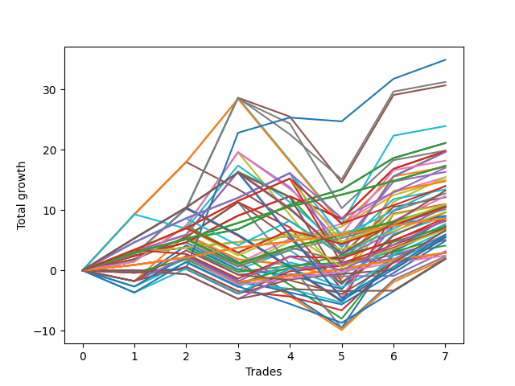

# Long Wallace Doodle 012 
- Symbol: TSLA_Unlimited
- Date Range: 03/23/2022 - 07/08/2022
- Trading Period: 7:20-12:30
- Number of Trades: 7



| Name | Win Percent | Profit | Avg Profit / Trade | Avg Time / Trade |      | Name | Win Percent | Profit | Avg Profit / Trade | Avg Time / Trade |
| ---- | ----------- | ------ | ------------------ | ---------------- | ---- | ---- | ----------- | ------ | ------------------ | ---------------- |
| Sorted By <br> Profit | | | | | | Sorted By <br> Win Percentage ||||
| Seventy-Three | 71.43 | 17440.00 | 2491.43 | 14:47 |     | Sixty-Four | 100.00 | 10550.00 | 1507.14 | 06:19 |
| Sixty-Nine | 71.43 | 15605.00 | 2229.29 | 30:57 |     | Fifty-Six | 100.00 | 10550.00 | 1507.14 | 06:19 |
| Five | 71.43 | 15325.00 | 2189.29 | 66:03 |     | Zero | 100.00 | 10550.00 | 1507.14 | 06:19 |
| Sixty-One | 71.43 | 11955.00 | 1707.86 | 33:25 |     | One Hundred Twenty-Seven | 100.00 | 8655.00 | 1236.43 | 05:47 |
| Sixty-Four | 100.00 | 10550.00 | 1507.14 | 06:19 |     | One Hundred Twenty-Two | 100.00 | 8655.00 | 1236.43 | 05:47 |
| Fifty-Six | 100.00 | 10550.00 | 1507.14 | 06:19 |     | Eighty-Two | 100.00 | 8655.00 | 1236.43 | 05:47 |
| Zero | 100.00 | 10550.00 | 1507.14 | 06:19 |     | Seventy | 100.00 | 5235.00 | 747.86 | 03:57 |
| Seven | 71.43 | 9925.00 | 1417.86 | 108:51 |     | Sixty-Two | 100.00 | 5235.00 | 747.86 | 03:57 |
| Sixty-Five | 85.71 | 9875.00 | 1410.71 | 16:45 |     | Six | 100.00 | 5235.00 | 747.86 | 03:57 |
| Fifty-Seven | 85.71 | 9875.00 | 1410.71 | 16:45 |     | One Hundred Twenty-Six | 100.00 | 4300.00 | 614.29 | 02:24 |
| One | 85.71 | 9875.00 | 1410.71 | 16:45 |     | One Hundred Twenty-One | 100.00 | 4300.00 | 614.29 | 02:24 |
| Two | 71.43 | 9835.00 | 1405.00 | 30:14 |     | Eighty-One | 100.00 | 4300.00 | 614.29 | 02:24 |
| Sixty-Six | 71.43 | 9795.00 | 1399.29 | 21:10 |     | Sixty-Five | 85.71 | 9875.00 | 1410.71 | 16:45 |
| Sixty-Eight | 71.43 | 9090.00 | 1298.57 | 28:58 |     | Fifty-Seven | 85.71 | 9875.00 | 1410.71 | 16:45 |
| One Hundred Twenty-Seven | 100.00 | 8655.00 | 1236.43 | 05:47 |     | One | 85.71 | 9875.00 | 1410.71 | 16:45 |
| One Hundred Twenty-Two | 100.00 | 8655.00 | 1236.43 | 05:47 |     | One Hundred Twenty-Nine | 85.71 | 8505.00 | 1215.00 | 20:26 |
| Eighty-Two | 100.00 | 8655.00 | 1236.43 | 05:47 |     | Forty-Eight | 85.71 | 7715.00 | 1102.14 | 05:47 |
| Sixty-Three | 71.43 | 8575.00 | 1225.00 | 66:09 |     | Forty | 85.71 | 7480.00 | 1068.57 | 06:00 |
| One Hundred Twenty-Nine | 85.71 | 8505.00 | 1215.00 | 20:26 |     | One Hundred Twenty-Four | 85.71 | 7010.00 | 1001.43 | 21:00 |
| Four | 71.43 | 8155.00 | 1165.00 | 44:37 |     | One Hundred Twenty-Eight | 85.71 | 6970.00 | 995.71 | 14:32 |
| Forty-Eight | 85.71 | 7715.00 | 1102.14 | 05:47 |     | One Hundred Twenty-Three | 85.71 | 5475.00 | 782.14 | 15:07 |
| Fifty | 57.14 | 7715.00 | 1102.14 | 12:17 |     | One Hundred Seventeen | 85.71 | 5300.00 | 757.14 | 05:14 |
| Forty | 85.71 | 7480.00 | 1068.57 | 06:00 |     | One Hundred Seven | 85.71 | 5280.00 | 754.29 | 05:11 |
| Fifty-Three | 42.86 | 7375.00 | 1053.57 | 18:07 |     | One Hundred Two | 85.71 | 5280.00 | 754.29 | 05:11 |
| One Hundred Twenty-Four | 85.71 | 7010.00 | 1001.43 | 21:00 |     | Ninety-Two | 85.71 | 5280.00 | 754.29 | 05:11 |
| One Hundred Twenty-Eight | 85.71 | 6970.00 | 995.71 | 14:32 |     | Eighty-Four | 85.71 | 5220.00 | 745.71 | 49:31 |
| Seventy-One | 57.14 | 6705.00 | 957.86 | 53:45 |     | One Hundred Twelve | 85.71 | 5065.00 | 723.57 | 05:26 |
| One Hundred Thirty | 71.43 | 6610.00 | 944.29 | 25:26 |     | Eighty-Three | 85.71 | 3685.00 | 526.43 | 43:37 |
| Forty-Nine | 71.43 | 6375.00 | 910.71 | 11:24 |     | Fifty-Four | 85.71 | 2765.00 | 395.00 | 03:32 |
| Fifty-Eight | 71.43 | 6145.00 | 877.86 | 23:38 |     | Forty-Six | 85.71 | 2530.00 | 361.43 | 03:45 |
| Forty-Seven | 57.14 | 6055.00 | 865.00 | 59:30 |     | One Hundred Sixteen | 85.71 | 1465.00 | 209.29 | 01:52 |
| Forty-Five | 57.14 | 5490.00 | 784.29 | 26:22 |     | One Hundred Six | 85.71 | 1445.00 | 206.43 | 01:50 |
| One Hundred Fourteen | 71.43 | 5480.00 | 782.86 | 16:40 |     | One Hundred One | 85.71 | 1445.00 | 206.43 | 01:50 |
| One Hundred Twenty-Three | 85.71 | 5475.00 | 782.14 | 15:07 |     | Ninety-Six | 85.71 | 1445.00 | 206.43 | 01:50 |
| Sixty | 71.43 | 5440.00 | 777.14 | 31:26 |     | Ninety-One | 85.71 | 1445.00 | 206.43 | 01:50 |
| Ninety-Three | 71.43 | 5410.00 | 772.86 | 08:24 |     | One Hundred Eleven | 85.71 | 1230.00 | 175.71 | 02:05 |
| One Hundred Seventeen | 85.71 | 5300.00 | 757.14 | 05:14 |     | Seventy-Three | 71.43 | 17440.00 | 2491.43 | 14:47 |
| One Hundred Eighteen | 71.43 | 5285.00 | 755.00 | 08:28 |     | Sixty-Nine | 71.43 | 15605.00 | 2229.29 | 30:57 |
| One Hundred Seven | 85.71 | 5280.00 | 754.29 | 05:11 |     | Five | 71.43 | 15325.00 | 2189.29 | 66:03 |
| One Hundred Two | 85.71 | 5280.00 | 754.29 | 05:11 |     | Sixty-One | 71.43 | 11955.00 | 1707.86 | 33:25 |
| Ninety-Two | 85.71 | 5280.00 | 754.29 | 05:11 |     | Seven | 71.43 | 9925.00 | 1417.86 | 108:51 |
| Seventy | 100.00 | 5235.00 | 747.86 | 03:57 |     | Two | 71.43 | 9835.00 | 1405.00 | 30:14 |
| Sixty-Two | 100.00 | 5235.00 | 747.86 | 03:57 |     | Sixty-Six | 71.43 | 9795.00 | 1399.29 | 21:10 |
| Six | 100.00 | 5235.00 | 747.86 | 03:57 |     | Sixty-Eight | 71.43 | 9090.00 | 1298.57 | 28:58 |
| Eighty-Four | 85.71 | 5220.00 | 745.71 | 49:31 |     | Sixty-Three | 71.43 | 8575.00 | 1225.00 | 66:09 |
| One Hundred Twelve | 85.71 | 5065.00 | 723.57 | 05:26 |     | Four | 71.43 | 8155.00 | 1165.00 | 44:37 |
| One Hundred Three | 71.43 | 4835.00 | 690.71 | 10:12 |     | One Hundred Thirty | 71.43 | 6610.00 | 944.29 | 25:26 |
| Sixty-Seven | 71.43 | 4810.00 | 687.14 | 23:26 |     | Forty-Nine | 71.43 | 6375.00 | 910.71 | 11:24 |
| Fifty-Two | 42.86 | 4525.00 | 646.43 | 16:32 |     | Fifty-Eight | 71.43 | 6145.00 | 877.86 | 23:38 |
| Forty-One | 71.43 | 4470.00 | 638.57 | 13:43 |     | One Hundred Fourteen | 71.43 | 5480.00 | 782.86 | 16:40 |
| Three | 71.43 | 4365.00 | 623.57 | 34:10 |     | Sixty | 71.43 | 5440.00 | 777.14 | 31:26 |
| Eighty-Five | 71.43 | 4310.00 | 615.71 | 70:36 |     | Ninety-Three | 71.43 | 5410.00 | 772.86 | 08:24 |
| One Hundred Twenty-Six | 100.00 | 4300.00 | 614.29 | 02:24 |     | One Hundred Eighteen | 71.43 | 5285.00 | 755.00 | 08:28 |
| One Hundred Twenty-One | 100.00 | 4300.00 | 614.29 | 02:24 |     | One Hundred Three | 71.43 | 4835.00 | 690.71 | 10:12 |
| Eighty-One | 100.00 | 4300.00 | 614.29 | 02:24 |     | Sixty-Seven | 71.43 | 4810.00 | 687.14 | 23:26 |
| One Hundred Ninteen | 57.14 | 4170.00 | 595.71 | 10:39 |     | Forty-One | 71.43 | 4470.00 | 638.57 | 13:43 |
| One Hundred Eight | 57.14 | 4090.00 | 584.29 | 07:50 |     | Three | 71.43 | 4365.00 | 623.57 | 34:10 |
| Ninety-Four | 57.14 | 3845.00 | 549.29 | 10:35 |     | Eighty-Five | 71.43 | 4310.00 | 615.71 | 70:36 |
| Eighty-Three | 85.71 | 3685.00 | 526.43 | 43:37 |     | Ninety-Seven | 71.43 | 3615.00 | 516.43 | 04:06 |
| Forty-Two | 57.14 | 3625.00 | 517.86 | 16:59 |     | Ninety-Eight | 71.43 | 3470.00 | 495.71 | 05:55 |
| Ninety-Seven | 71.43 | 3615.00 | 516.43 | 04:06 |     | One Hundred Thirteen | 71.43 | 3380.00 | 482.86 | 10:47 |
| Ninety-Eight | 71.43 | 3470.00 | 495.71 | 05:55 |     | Ninety-Nine | 71.43 | 2965.00 | 423.57 | 06:05 |
| One Hundred Thirteen | 71.43 | 3380.00 | 482.86 | 10:47 |     | One Hundred Twenty-Five | 71.43 | 2960.00 | 422.86 | 27:54 |
| One Hundred Twenty | 42.86 | 3320.00 | 474.29 | 12:55 |     | One Hundred | 71.43 | 2720.00 | 388.57 | 06:13 |
| Fifty-One | 42.86 | 3255.00 | 465.00 | 13:07 |     | Fifty-Nine | 71.43 | 1160.00 | 165.71 | 25:54 |
| Ninety-Nine | 71.43 | 2965.00 | 423.57 | 06:05 |     | Fifty | 57.14 | 7715.00 | 1102.14 | 12:17 |
| One Hundred Twenty-Five | 71.43 | 2960.00 | 422.86 | 27:54 |     | Seventy-One | 57.14 | 6705.00 | 957.86 | 53:45 |
| One Hundred Fifteen | 57.14 | 2775.00 | 396.43 | 21:20 |     | Forty-Seven | 57.14 | 6055.00 | 865.00 | 59:30 |
| One Hundred Four | 57.14 | 2775.00 | 396.43 | 13:10 |     | Forty-Five | 57.14 | 5490.00 | 784.29 | 26:22 |
| Fifty-Four | 85.71 | 2765.00 | 395.00 | 03:32 |     | One Hundred Ninteen | 57.14 | 4170.00 | 595.71 | 10:39 |
| One Hundred | 71.43 | 2720.00 | 388.57 | 06:13 |     | One Hundred Eight | 57.14 | 4090.00 | 584.29 | 07:50 |
| Forty-Six | 85.71 | 2530.00 | 361.43 | 03:45 |     | Ninety-Four | 57.14 | 3845.00 | 549.29 | 10:35 |
| Ninety-Five | 42.86 | 2450.00 | 350.00 | 12:54 |     | Forty-Two | 57.14 | 3625.00 | 517.86 | 16:59 |
| Forty-Four | 57.14 | 2060.00 | 294.29 | 24:45 |     | One Hundred Fifteen | 57.14 | 2775.00 | 396.43 | 21:20 |
| One Hundred Nine | 57.14 | 1585.00 | 226.43 | 08:09 |     | One Hundred Four | 57.14 | 2775.00 | 396.43 | 13:10 |
| Fifty-Five | 42.86 | 1475.00 | 210.71 | 19:12 |     | Forty-Four | 57.14 | 2060.00 | 294.29 | 24:45 |
| One Hundred Sixteen | 85.71 | 1465.00 | 209.29 | 01:52 |     | One Hundred Nine | 57.14 | 1585.00 | 226.43 | 08:09 |
| One Hundred Six | 85.71 | 1445.00 | 206.43 | 01:50 |     | One Hundred Ten | 57.14 | 990.00 | 141.43 | 08:21 |
| One Hundred One | 85.71 | 1445.00 | 206.43 | 01:50 |     | Forty-Three | 57.14 | 975.00 | 139.29 | 19:20 |
| Ninety-Six | 85.71 | 1445.00 | 206.43 | 01:50 |     | Fifty-Three | 42.86 | 7375.00 | 1053.57 | 18:07 |
| Ninety-One | 85.71 | 1445.00 | 206.43 | 01:50 |     | Fifty-Two | 42.86 | 4525.00 | 646.43 | 16:32 |
| One Hundred Eleven | 85.71 | 1230.00 | 175.71 | 02:05 |     | One Hundred Twenty | 42.86 | 3320.00 | 474.29 | 12:55 |
| Fifty-Nine | 71.43 | 1160.00 | 165.71 | 25:54 |     | Fifty-One | 42.86 | 3255.00 | 465.00 | 13:07 |
| One Hundred Ten | 57.14 | 990.00 | 141.43 | 08:21 |     | Ninety-Five | 42.86 | 2450.00 | 350.00 | 12:54 |
| Forty-Three | 57.14 | 975.00 | 139.29 | 19:20 |     | Fifty-Five | 42.86 | 1475.00 | 210.71 | 19:12 |
| One Hundred Five | 42.86 | 930.00 | 132.86 | 17:37 |     | One Hundred Five | 42.86 | 930.00 | 132.86 | 17:37 |

## NO STOPLOSS

### Test Zero
* Sell when price hits the middle line of the 20p bollinger
* No Stoploss
* Results:
```
Total Trades: 7
Percent Up: 100.00
Percent Down: 0.00
Total Points Moved Up: 21.10
Potential Profit: 10550.00
Total Points Ups: 21.10 Count Ups: 7
Total Points Downs: 0.00 Count Downs: 0
```

<details><summary>Trades</summary>

<code>In: 2022-03-24 09:05:00		Out: 2022-03-24 09:16:25		Total Position Time: 11:25		Total Move Up: 2.95		Total to Date: 2.95</code> <br />
<code>In: 2022-04-19 10:30:00		Out: 2022-04-19 10:37:10		Total Position Time: 07:10		Total Move Up: 2.23		Total to Date: 5.18</code> <br />
<code>In: 2022-05-04 11:36:00		Out: 2022-05-04 11:41:15		Total Position Time: 05:15		Total Move Up: 1.64		Total to Date: 6.82</code> <br />
<code>In: 2022-05-06 10:21:00		Out: 2022-05-06 10:23:35		Total Position Time: 02:35		Total Move Up: 4.09		Total to Date: 10.91</code> <br />
<code>In: 2022-06-08 08:33:00		Out: 2022-06-08 08:40:05		Total Position Time: 07:05		Total Move Up: 2.49		Total to Date: 13.40</code> <br />
<code>In: 2022-06-15 11:08:00		Out: 2022-06-15 11:12:35		Total Position Time: 04:35		Total Move Up: 5.21		Total to Date: 18.61</code> <br />
<code>In: 2022-06-17 12:15:00		Out: 2022-06-17 12:21:10		Total Position Time: 06:10		Total Move Up: 2.49		Total to Date: 21.10</code> <br />


</details>

### Test One
* Sell when the price hits the upper line of the 20p 1std bollinger
* No Stoploss
* Results:
```
Total Trades: 7
Percent Up: 85.71
Percent Down: 14.29
Total Points Moved Up: 19.75
Potential Profit: 9875.00
Total Points Ups: 23.49 Count Ups: 6
Total Points Downs: -3.74 Count Downs: 1
```

<details><summary>Trades</summary>

<code>In: 2022-03-24 09:05:00		Out: 2022-03-24 09:20:10		Total Position Time: 15:10		Total Move Up: 2.40		Total to Date: 2.40</code> <br />
<code>In: 2022-04-19 10:30:00		Out: 2022-04-19 10:48:20		Total Position Time: 18:20		Total Move Up: 2.23		Total to Date: 4.63</code> <br />
<code>In: 2022-05-04 11:36:00		Out: 2022-05-04 11:42:00		Total Position Time: 06:00		Total Move Up: 4.44		Total to Date: 9.07</code> <br />
<code>In: 2022-05-06 10:21:00		Out: 2022-05-06 10:35:10		Total Position Time: 14:10		Total Move Up: 3.20		Total to Date: 12.27</code> <br />
<code>In: 2022-06-08 08:33:00		Out: 2022-06-08 09:18:05		Total Position Time: 45:05		Total Move Up: -3.74		Total to Date: 8.53</code> <br />
<code>In: 2022-06-15 11:08:00		Out: 2022-06-15 11:16:15		Total Position Time: 08:15		Total Move Up: 8.29		Total to Date: 16.82</code> <br />
<code>In: 2022-06-17 12:15:00		Out: 2022-06-17 12:25:20		Total Position Time: 10:20		Total Move Up: 2.93		Total to Date: 19.75</code> <br />


</details>

### Test Two
* Sell when the price hits the upper line of the 20p 2std bollinger
* No Stoploss
* Results:
```
Total Trades: 7
Percent Up: 71.43
Percent Down: 28.57
Total Points Moved Up: 19.67
Potential Profit: 9835.00
Total Points Ups: 33.10 Count Ups: 5
Total Points Downs: -13.43 Count Downs: 2
```

<details><summary>Trades</summary>

<code>In: 2022-03-24 09:05:00		Out: 2022-03-24 09:21:05		Total Position Time: 16:05		Total Move Up: 3.17		Total to Date: 3.17</code> <br />
<code>In: 2022-04-19 10:30:00		Out: 2022-04-19 10:48:55		Total Position Time: 18:55		Total Move Up: 2.74		Total to Date: 5.91</code> <br />
<code>In: 2022-05-04 11:36:00		Out: 2022-05-04 11:44:10		Total Position Time: 08:10		Total Move Up: 10.45		Total to Date: 16.36</code> <br />
<code>In: 2022-05-06 10:21:00		Out: 2022-05-06 11:24:20		Total Position Time: 63:20		Total Move Up: -4.17		Total to Date: 12.19</code> <br />
<code>In: 2022-06-08 08:33:00		Out: 2022-06-08 09:56:55		Total Position Time: 83:55		Total Move Up: -9.26		Total to Date: 2.93</code> <br />
<code>In: 2022-06-15 11:08:00		Out: 2022-06-15 11:17:40		Total Position Time: 09:40		Total Move Up: 12.67		Total to Date: 15.60</code> <br />
<code>In: 2022-06-17 12:15:00		Out: 2022-06-17 12:26:35		Total Position Time: 11:35		Total Move Up: 4.07		Total to Date: 19.67</code> <br />


</details>

### Test Three
* Sell when price hits the middle line of the 50p bollinger
* No Stoploss
* Results:
```
Total Trades: 7
Percent Up: 71.43
Percent Down: 28.57
Total Points Moved Up: 8.73
Potential Profit: 4365.00
Total Points Ups: 23.13 Count Ups: 5
Total Points Downs: -14.40 Count Downs: 2
```

<details><summary>Trades</summary>

<code>In: 2022-03-24 09:05:00		Out: 2022-03-24 09:39:05		Total Position Time: 34:05		Total Move Up: 1.85		Total to Date: 1.85</code> <br />
<code>In: 2022-04-19 10:30:00		Out: 2022-04-19 10:49:10		Total Position Time: 19:10		Total Move Up: 3.68		Total to Date: 5.53</code> <br />
<code>In: 2022-05-04 11:36:00		Out: 2022-05-04 11:43:35		Total Position Time: 07:35		Total Move Up: 5.78		Total to Date: 11.31</code> <br />
<code>In: 2022-05-06 10:21:00		Out: 2022-05-06 11:24:20		Total Position Time: 63:20		Total Move Up: -4.17		Total to Date: 7.14</code> <br />
<code>In: 2022-06-08 08:33:00		Out: 2022-06-08 10:08:35		Total Position Time: 95:35		Total Move Up: -10.23		Total to Date: -3.09</code> <br />
<code>In: 2022-06-15 11:08:00		Out: 2022-06-15 11:15:55		Total Position Time: 07:55		Total Move Up: 7.96		Total to Date: 4.87</code> <br />
<code>In: 2022-06-17 12:15:00		Out: 2022-06-17 12:26:30		Total Position Time: 11:30		Total Move Up: 3.86		Total to Date: 8.73</code> <br />


</details>

### Test Four
* Sell when the price hits the upper line of the 50p 1std bollinger
* No Stoploss
* Results:
```
Total Trades: 7
Percent Up: 71.43
Percent Down: 28.57
Total Points Moved Up: 16.31
Potential Profit: 8155.00
Total Points Ups: 31.69 Count Ups: 5
Total Points Downs: -15.38 Count Downs: 2
```

<details><summary>Trades</summary>

<code>In: 2022-03-24 09:05:00		Out: 2022-03-24 09:53:05		Total Position Time: 48:05		Total Move Up: 1.48		Total to Date: 1.48</code> <br />
<code>In: 2022-04-19 10:30:00		Out: 2022-04-19 10:51:40		Total Position Time: 21:40		Total Move Up: 5.93		Total to Date: 7.41</code> <br />
<code>In: 2022-05-04 11:36:00		Out: 2022-05-04 11:44:25		Total Position Time: 08:25		Total Move Up: 12.17		Total to Date: 19.58</code> <br />
<code>In: 2022-05-06 10:21:00		Out: 2022-05-06 11:49:20		Total Position Time: 88:20		Total Move Up: -5.81		Total to Date: 13.77</code> <br />
<code>In: 2022-06-08 08:33:00		Out: 2022-06-08 10:18:05		Total Position Time: 105:05		Total Move Up: -9.57		Total to Date: 4.20</code> <br />
<code>In: 2022-06-15 11:08:00		Out: 2022-06-15 11:16:50		Total Position Time: 08:50		Total Move Up: 10.52		Total to Date: 14.72</code> <br />
<code>In: 2022-06-17 12:15:00		Out: 2022-06-17 12:47:00		Total Position Time: 32:00		Total Move Up: 1.59		Total to Date: 16.31</code> <br />


</details>

### Test Five
* Sell when the price hits the upper line of the 50p 2std bollinger
* No Stoploss
* Results:
```
Total Trades: 7
Percent Up: 71.43
Percent Down: 28.57
Total Points Moved Up: 30.65
Potential Profit: 15325.00
Total Points Ups: 44.72 Count Ups: 5
Total Points Downs: -14.07 Count Downs: 2
```

<details><summary>Trades</summary>

<code>In: 2022-03-24 09:05:00		Out: 2022-03-24 09:53:15		Total Position Time: 48:15		Total Move Up: 2.64		Total to Date: 2.64</code> <br />
<code>In: 2022-04-19 10:30:00		Out: 2022-04-19 10:58:35		Total Position Time: 28:35		Total Move Up: 7.62		Total to Date: 10.26</code> <br />
<code>In: 2022-05-04 11:36:00		Out: 2022-05-04 11:47:00		Total Position Time: 11:00		Total Move Up: 18.34		Total to Date: 28.60</code> <br />
<code>In: 2022-05-06 10:21:00		Out: 2022-05-06 11:50:10		Total Position Time: 89:10		Total Move Up: -3.13		Total to Date: 25.47</code> <br />
<code>In: 2022-06-08 08:33:00		Out: 2022-06-08 12:33:20		Total Position Time: 240:20		Total Move Up: -10.94		Total to Date: 14.53</code> <br />
<code>In: 2022-06-15 11:08:00		Out: 2022-06-15 11:21:05		Total Position Time: 13:05		Total Move Up: 14.53		Total to Date: 29.06</code> <br />
<code>In: 2022-06-17 12:15:00		Out: 2022-06-17 12:47:00		Total Position Time: 32:00		Total Move Up: 1.59		Total to Date: 30.65</code> <br />


</details>

### Test Six
* Sell when the price hits the middle line of the 1std VWAP
* No Stoploss
* Results:
```
Total Trades: 7
Percent Up: 100.00
Percent Down: 0.00
Total Points Moved Up: 10.47
Potential Profit: 5235.00
Total Points Ups: 10.47 Count Ups: 7
Total Points Downs: 0.00 Count Downs: 0
```

<details><summary>Trades</summary>

<code>In: 2022-03-24 09:05:00		Out: 2022-03-24 09:16:25		Total Position Time: 11:25		Total Move Up: 2.95		Total to Date: 2.95</code> <br />
<code>In: 2022-04-19 10:30:00		Out: 2022-04-19 10:31:10		Total Position Time: 01:10		Total Move Up: 0.83		Total to Date: 3.78</code> <br />
<code>In: 2022-05-04 11:36:00		Out: 2022-05-04 11:40:25		Total Position Time: 04:25		Total Move Up: 0.91		Total to Date: 4.69</code> <br />
<code>In: 2022-05-06 10:21:00		Out: 2022-05-06 10:22:20		Total Position Time: 01:20		Total Move Up: 1.01		Total to Date: 5.70</code> <br />
<code>In: 2022-06-08 08:33:00		Out: 2022-06-08 08:34:45		Total Position Time: 01:45		Total Move Up: 0.54		Total to Date: 6.24</code> <br />
<code>In: 2022-06-15 11:08:00		Out: 2022-06-15 11:09:25		Total Position Time: 01:25		Total Move Up: 1.74		Total to Date: 7.98</code> <br />
<code>In: 2022-06-17 12:15:00		Out: 2022-06-17 12:21:10		Total Position Time: 06:10		Total Move Up: 2.49		Total to Date: 10.47</code> <br />


</details>

### Test Seven
* Sell when the price hits the upper line of the 1std VWAP
* No Stoploss
* Results:
```
Total Trades: 7
Percent Up: 71.43
Percent Down: 28.57
Total Points Moved Up: 19.85
Potential Profit: 9925.00
Total Points Ups: 37.96 Count Ups: 5
Total Points Downs: -18.11 Count Downs: 2
```

<details><summary>Trades</summary>

<code>In: 2022-03-24 09:05:00		Out: 2022-03-24 12:23:25		Total Position Time: 198:25		Total Move Up: 9.30		Total to Date: 9.30</code> <br />
<code>In: 2022-04-19 10:30:00		Out: 2022-04-19 12:25:30		Total Position Time: 115:30		Total Move Up: 8.66		Total to Date: 17.96</code> <br />
<code>In: 2022-05-04 11:36:00		Out: 2022-05-04 11:44:10		Total Position Time: 08:10		Total Move Up: 10.45		Total to Date: 28.41</code> <br />
<code>In: 2022-05-06 10:21:00		Out: 2022-05-06 12:47:00		Total Position Time: 146:00		Total Move Up: -4.09		Total to Date: 24.32</code> <br />
<code>In: 2022-06-08 08:33:00		Out: 2022-06-08 12:47:00		Total Position Time: 254:00		Total Move Up: -14.02		Total to Date: 10.30</code> <br />
<code>In: 2022-06-15 11:08:00		Out: 2022-06-15 11:15:55		Total Position Time: 07:55		Total Move Up: 7.96		Total to Date: 18.26</code> <br />
<code>In: 2022-06-17 12:15:00		Out: 2022-06-17 12:47:00		Total Position Time: 32:00		Total Move Up: 1.59		Total to Date: 19.85</code> <br />


</details>

## STOPLOSS OF 5

### Test Forty
* Sell when price hits the middle line of the 20p bollinger
* Stoploss is 5 points
* Results:
```
Total Trades: 7
Percent Up: 85.71
Percent Down: 14.29
Total Points Moved Up: 14.96
Potential Profit: 7480.00
Total Points Ups: 19.46 Count Ups: 6
Total Points Downs: -4.50 Count Downs: 1
```

<details><summary>Trades</summary>

<code>In: 2022-03-24 09:05:00		Out: 2022-03-24 09:16:25		Total Position Time: 11:25		Total Move Up: 2.95		Total to Date: 2.95</code> <br />
<code>In: 2022-04-19 10:30:00		Out: 2022-04-19 10:37:10		Total Position Time: 07:10		Total Move Up: 2.23		Total to Date: 5.18</code> <br />
<code>In: 2022-05-04 11:36:00		Out: 2022-05-04 11:39:00		Total Position Time: 03:00		Total Move Up: -4.50		Total to Date: 0.68</code> <br />
<code>In: 2022-05-06 10:21:00		Out: 2022-05-06 10:23:35		Total Position Time: 02:35		Total Move Up: 4.09		Total to Date: 4.77</code> <br />
<code>In: 2022-06-08 08:33:00		Out: 2022-06-08 08:40:05		Total Position Time: 07:05		Total Move Up: 2.49		Total to Date: 7.26</code> <br />
<code>In: 2022-06-15 11:08:00		Out: 2022-06-15 11:12:35		Total Position Time: 04:35		Total Move Up: 5.21		Total to Date: 12.47</code> <br />
<code>In: 2022-06-17 12:15:00		Out: 2022-06-17 12:21:10		Total Position Time: 06:10		Total Move Up: 2.49		Total to Date: 14.96</code> <br />


</details>

### Test Forty-One
* Sell when the price hits the upper line of the 20p 1std bollinger
* Stoploss is 5 points
* Results:
```
Total Trades: 7
Percent Up: 71.43
Percent Down: 28.57
Total Points Moved Up: 8.94
Potential Profit: 4470.00
Total Points Ups: 19.05 Count Ups: 5
Total Points Downs: -10.11 Count Downs: 2
```

<details><summary>Trades</summary>

<code>In: 2022-03-24 09:05:00		Out: 2022-03-24 09:20:10		Total Position Time: 15:10		Total Move Up: 2.40		Total to Date: 2.40</code> <br />
<code>In: 2022-04-19 10:30:00		Out: 2022-04-19 10:48:20		Total Position Time: 18:20		Total Move Up: 2.23		Total to Date: 4.63</code> <br />
<code>In: 2022-05-04 11:36:00		Out: 2022-05-04 11:39:00		Total Position Time: 03:00		Total Move Up: -4.50		Total to Date: 0.13</code> <br />
<code>In: 2022-05-06 10:21:00		Out: 2022-05-06 10:35:10		Total Position Time: 14:10		Total Move Up: 3.20		Total to Date: 3.33</code> <br />
<code>In: 2022-06-08 08:33:00		Out: 2022-06-08 08:59:50		Total Position Time: 26:50		Total Move Up: -5.61		Total to Date: -2.28</code> <br />
<code>In: 2022-06-15 11:08:00		Out: 2022-06-15 11:16:15		Total Position Time: 08:15		Total Move Up: 8.29		Total to Date: 6.01</code> <br />
<code>In: 2022-06-17 12:15:00		Out: 2022-06-17 12:25:20		Total Position Time: 10:20		Total Move Up: 2.93		Total to Date: 8.94</code> <br />


</details>

### Test Forty-Two
* Sell when the price hits the upper line of the 20p 2std bollinger
* Stoploss is 5 points
* Results:
```
Total Trades: 7
Percent Up: 57.14
Percent Down: 42.86
Total Points Moved Up: 7.25
Potential Profit: 3625.00
Total Points Ups: 22.65 Count Ups: 4
Total Points Downs: -15.40 Count Downs: 3
```

<details><summary>Trades</summary>

<code>In: 2022-03-24 09:05:00		Out: 2022-03-24 09:21:05		Total Position Time: 16:05		Total Move Up: 3.17		Total to Date: 3.17</code> <br />
<code>In: 2022-04-19 10:30:00		Out: 2022-04-19 10:48:55		Total Position Time: 18:55		Total Move Up: 2.74		Total to Date: 5.91</code> <br />
<code>In: 2022-05-04 11:36:00		Out: 2022-05-04 11:39:00		Total Position Time: 03:00		Total Move Up: -4.50		Total to Date: 1.41</code> <br />
<code>In: 2022-05-06 10:21:00		Out: 2022-05-06 10:53:50		Total Position Time: 32:50		Total Move Up: -5.29		Total to Date: -3.88</code> <br />
<code>In: 2022-06-08 08:33:00		Out: 2022-06-08 08:59:50		Total Position Time: 26:50		Total Move Up: -5.61		Total to Date: -9.49</code> <br />
<code>In: 2022-06-15 11:08:00		Out: 2022-06-15 11:17:40		Total Position Time: 09:40		Total Move Up: 12.67		Total to Date: 3.18</code> <br />
<code>In: 2022-06-17 12:15:00		Out: 2022-06-17 12:26:35		Total Position Time: 11:35		Total Move Up: 4.07		Total to Date: 7.25</code> <br />


</details>

### Test Forty-Three
* Sell when price hits the middle line of the 50p bollinger
* Stoploss is 5 points
* Results:
```
Total Trades: 7
Percent Up: 57.14
Percent Down: 42.86
Total Points Moved Up: 1.95
Potential Profit: 975.00
Total Points Ups: 17.35 Count Ups: 4
Total Points Downs: -15.40 Count Downs: 3
```

<details><summary>Trades</summary>

<code>In: 2022-03-24 09:05:00		Out: 2022-03-24 09:39:05		Total Position Time: 34:05		Total Move Up: 1.85		Total to Date: 1.85</code> <br />
<code>In: 2022-04-19 10:30:00		Out: 2022-04-19 10:49:10		Total Position Time: 19:10		Total Move Up: 3.68		Total to Date: 5.53</code> <br />
<code>In: 2022-05-04 11:36:00		Out: 2022-05-04 11:39:00		Total Position Time: 03:00		Total Move Up: -4.50		Total to Date: 1.03</code> <br />
<code>In: 2022-05-06 10:21:00		Out: 2022-05-06 10:53:50		Total Position Time: 32:50		Total Move Up: -5.29		Total to Date: -4.26</code> <br />
<code>In: 2022-06-08 08:33:00		Out: 2022-06-08 08:59:50		Total Position Time: 26:50		Total Move Up: -5.61		Total to Date: -9.87</code> <br />
<code>In: 2022-06-15 11:08:00		Out: 2022-06-15 11:15:55		Total Position Time: 07:55		Total Move Up: 7.96		Total to Date: -1.91</code> <br />
<code>In: 2022-06-17 12:15:00		Out: 2022-06-17 12:26:30		Total Position Time: 11:30		Total Move Up: 3.86		Total to Date: 1.95</code> <br />


</details>

### Test Forty-Four
* Sell when the price hits the upper line of the 50p 1std bollinger
* Stoploss is 5 points
* Results:
```
Total Trades: 7
Percent Up: 57.14
Percent Down: 42.86
Total Points Moved Up: 4.12
Potential Profit: 2060.00
Total Points Ups: 19.52 Count Ups: 4
Total Points Downs: -15.40 Count Downs: 3
```

<details><summary>Trades</summary>

<code>In: 2022-03-24 09:05:00		Out: 2022-03-24 09:53:05		Total Position Time: 48:05		Total Move Up: 1.48		Total to Date: 1.48</code> <br />
<code>In: 2022-04-19 10:30:00		Out: 2022-04-19 10:51:40		Total Position Time: 21:40		Total Move Up: 5.93		Total to Date: 7.41</code> <br />
<code>In: 2022-05-04 11:36:00		Out: 2022-05-04 11:39:00		Total Position Time: 03:00		Total Move Up: -4.50		Total to Date: 2.91</code> <br />
<code>In: 2022-05-06 10:21:00		Out: 2022-05-06 10:53:50		Total Position Time: 32:50		Total Move Up: -5.29		Total to Date: -2.38</code> <br />
<code>In: 2022-06-08 08:33:00		Out: 2022-06-08 08:59:50		Total Position Time: 26:50		Total Move Up: -5.61		Total to Date: -7.99</code> <br />
<code>In: 2022-06-15 11:08:00		Out: 2022-06-15 11:16:50		Total Position Time: 08:50		Total Move Up: 10.52		Total to Date: 2.53</code> <br />
<code>In: 2022-06-17 12:15:00		Out: 2022-06-17 12:47:00		Total Position Time: 32:00		Total Move Up: 1.59		Total to Date: 4.12</code> <br />


</details>

### Test Forty-Five
* Sell when the price hits the upper line of the 50p 2std bollinger
* Stoploss is 5 points
* Results:
```
Total Trades: 7
Percent Up: 57.14
Percent Down: 42.86
Total Points Moved Up: 10.98
Potential Profit: 5490.00
Total Points Ups: 26.38 Count Ups: 4
Total Points Downs: -15.40 Count Downs: 3
```

<details><summary>Trades</summary>

<code>In: 2022-03-24 09:05:00		Out: 2022-03-24 09:53:15		Total Position Time: 48:15		Total Move Up: 2.64		Total to Date: 2.64</code> <br />
<code>In: 2022-04-19 10:30:00		Out: 2022-04-19 10:58:35		Total Position Time: 28:35		Total Move Up: 7.62		Total to Date: 10.26</code> <br />
<code>In: 2022-05-04 11:36:00		Out: 2022-05-04 11:39:00		Total Position Time: 03:00		Total Move Up: -4.50		Total to Date: 5.76</code> <br />
<code>In: 2022-05-06 10:21:00		Out: 2022-05-06 10:53:50		Total Position Time: 32:50		Total Move Up: -5.29		Total to Date: 0.47</code> <br />
<code>In: 2022-06-08 08:33:00		Out: 2022-06-08 08:59:50		Total Position Time: 26:50		Total Move Up: -5.61		Total to Date: -5.14</code> <br />
<code>In: 2022-06-15 11:08:00		Out: 2022-06-15 11:21:05		Total Position Time: 13:05		Total Move Up: 14.53		Total to Date: 9.39</code> <br />
<code>In: 2022-06-17 12:15:00		Out: 2022-06-17 12:47:00		Total Position Time: 32:00		Total Move Up: 1.59		Total to Date: 10.98</code> <br />


</details>

### Test Forty-Six
* Sell when the price hits the middle line of the 1std VWAP
* Stoploss is 5 points
* Results:
```
Total Trades: 7
Percent Up: 85.71
Percent Down: 14.29
Total Points Moved Up: 5.06
Potential Profit: 2530.00
Total Points Ups: 9.56 Count Ups: 6
Total Points Downs: -4.50 Count Downs: 1
```

<details><summary>Trades</summary>

<code>In: 2022-03-24 09:05:00		Out: 2022-03-24 09:16:25		Total Position Time: 11:25		Total Move Up: 2.95		Total to Date: 2.95</code> <br />
<code>In: 2022-04-19 10:30:00		Out: 2022-04-19 10:31:10		Total Position Time: 01:10		Total Move Up: 0.83		Total to Date: 3.78</code> <br />
<code>In: 2022-05-04 11:36:00		Out: 2022-05-04 11:39:00		Total Position Time: 03:00		Total Move Up: -4.50		Total to Date: -0.72</code> <br />
<code>In: 2022-05-06 10:21:00		Out: 2022-05-06 10:22:20		Total Position Time: 01:20		Total Move Up: 1.01		Total to Date: 0.29</code> <br />
<code>In: 2022-06-08 08:33:00		Out: 2022-06-08 08:34:45		Total Position Time: 01:45		Total Move Up: 0.54		Total to Date: 0.83</code> <br />
<code>In: 2022-06-15 11:08:00		Out: 2022-06-15 11:09:25		Total Position Time: 01:25		Total Move Up: 1.74		Total to Date: 2.57</code> <br />
<code>In: 2022-06-17 12:15:00		Out: 2022-06-17 12:21:10		Total Position Time: 06:10		Total Move Up: 2.49		Total to Date: 5.06</code> <br />


</details>

### Test Forty-Seven
* Sell when the price hits the upper line of the 1std VWAP
* Stoploss is 5 points
* Results:
```
Total Trades: 7
Percent Up: 57.14
Percent Down: 42.86
Total Points Moved Up: 12.11
Potential Profit: 6055.00
Total Points Ups: 27.51 Count Ups: 4
Total Points Downs: -15.40 Count Downs: 3
```

<details><summary>Trades</summary>

<code>In: 2022-03-24 09:05:00		Out: 2022-03-24 12:23:25		Total Position Time: 198:25		Total Move Up: 9.30		Total to Date: 9.30</code> <br />
<code>In: 2022-04-19 10:30:00		Out: 2022-04-19 12:25:30		Total Position Time: 115:30		Total Move Up: 8.66		Total to Date: 17.96</code> <br />
<code>In: 2022-05-04 11:36:00		Out: 2022-05-04 11:39:00		Total Position Time: 03:00		Total Move Up: -4.50		Total to Date: 13.46</code> <br />
<code>In: 2022-05-06 10:21:00		Out: 2022-05-06 10:53:50		Total Position Time: 32:50		Total Move Up: -5.29		Total to Date: 8.17</code> <br />
<code>In: 2022-06-08 08:33:00		Out: 2022-06-08 08:59:50		Total Position Time: 26:50		Total Move Up: -5.61		Total to Date: 2.56</code> <br />
<code>In: 2022-06-15 11:08:00		Out: 2022-06-15 11:15:55		Total Position Time: 07:55		Total Move Up: 7.96		Total to Date: 10.52</code> <br />
<code>In: 2022-06-17 12:15:00		Out: 2022-06-17 12:47:00		Total Position Time: 32:00		Total Move Up: 1.59		Total to Date: 12.11</code> <br />


</details>

## TRAIL STOP OF 5

### Test Forty-Eight
* Sell when price hits the middle line of the 20p bollinger
* Trailing Stop is 5 points
* Results:
```
Total Trades: 7
Percent Up: 85.71
Percent Down: 14.29
Total Points Moved Up: 15.43
Potential Profit: 7715.00
Total Points Ups: 19.46 Count Ups: 6
Total Points Downs: -4.03 Count Downs: 1
```

<details><summary>Trades</summary>

<code>In: 2022-03-24 09:05:00		Out: 2022-03-24 09:16:25		Total Position Time: 11:25		Total Move Up: 2.95		Total to Date: 2.95</code> <br />
<code>In: 2022-04-19 10:30:00		Out: 2022-04-19 10:37:10		Total Position Time: 07:10		Total Move Up: 2.23		Total to Date: 5.18</code> <br />
<code>In: 2022-05-04 11:36:00		Out: 2022-05-04 11:37:35		Total Position Time: 01:35		Total Move Up: -4.03		Total to Date: 1.15</code> <br />
<code>In: 2022-05-06 10:21:00		Out: 2022-05-06 10:23:35		Total Position Time: 02:35		Total Move Up: 4.09		Total to Date: 5.24</code> <br />
<code>In: 2022-06-08 08:33:00		Out: 2022-06-08 08:40:05		Total Position Time: 07:05		Total Move Up: 2.49		Total to Date: 7.73</code> <br />
<code>In: 2022-06-15 11:08:00		Out: 2022-06-15 11:12:35		Total Position Time: 04:35		Total Move Up: 5.21		Total to Date: 12.94</code> <br />
<code>In: 2022-06-17 12:15:00		Out: 2022-06-17 12:21:10		Total Position Time: 06:10		Total Move Up: 2.49		Total to Date: 15.43</code> <br />


</details>

### Test Forty-Nine
* Sell when the price hits the upper line of the 20p 1std bollinger
* Trailing Stop is 5 points
* Results:
```
Total Trades: 7
Percent Up: 71.43
Percent Down: 28.57
Total Points Moved Up: 12.75
Potential Profit: 6375.00
Total Points Ups: 19.05 Count Ups: 5
Total Points Downs: -6.30 Count Downs: 2
```

<details><summary>Trades</summary>

<code>In: 2022-03-24 09:05:00		Out: 2022-03-24 09:20:10		Total Position Time: 15:10		Total Move Up: 2.40		Total to Date: 2.40</code> <br />
<code>In: 2022-04-19 10:30:00		Out: 2022-04-19 10:48:20		Total Position Time: 18:20		Total Move Up: 2.23		Total to Date: 4.63</code> <br />
<code>In: 2022-05-04 11:36:00		Out: 2022-05-04 11:37:35		Total Position Time: 01:35		Total Move Up: -4.03		Total to Date: 0.60</code> <br />
<code>In: 2022-05-06 10:21:00		Out: 2022-05-06 10:35:10		Total Position Time: 14:10		Total Move Up: 3.20		Total to Date: 3.80</code> <br />
<code>In: 2022-06-08 08:33:00		Out: 2022-06-08 08:45:00		Total Position Time: 12:00		Total Move Up: -2.27		Total to Date: 1.53</code> <br />
<code>In: 2022-06-15 11:08:00		Out: 2022-06-15 11:16:15		Total Position Time: 08:15		Total Move Up: 8.29		Total to Date: 9.82</code> <br />
<code>In: 2022-06-17 12:15:00		Out: 2022-06-17 12:25:20		Total Position Time: 10:20		Total Move Up: 2.93		Total to Date: 12.75</code> <br />


</details>

### Test Fifty
* Sell when the price hits the upper line of the 20p 2std bollinger
* Trailing Stop is 5 points
* Results:
```
Total Trades: 7
Percent Up: 57.14
Percent Down: 42.86
Total Points Moved Up: 15.43
Potential Profit: 7715.00
Total Points Ups: 22.65 Count Ups: 4
Total Points Downs: -7.22 Count Downs: 3
```

<details><summary>Trades</summary>

<code>In: 2022-03-24 09:05:00		Out: 2022-03-24 09:21:05		Total Position Time: 16:05		Total Move Up: 3.17		Total to Date: 3.17</code> <br />
<code>In: 2022-04-19 10:30:00		Out: 2022-04-19 10:48:55		Total Position Time: 18:55		Total Move Up: 2.74		Total to Date: 5.91</code> <br />
<code>In: 2022-05-04 11:36:00		Out: 2022-05-04 11:37:35		Total Position Time: 01:35		Total Move Up: -4.03		Total to Date: 1.88</code> <br />
<code>In: 2022-05-06 10:21:00		Out: 2022-05-06 10:37:10		Total Position Time: 16:10		Total Move Up: -0.92		Total to Date: 0.96</code> <br />
<code>In: 2022-06-08 08:33:00		Out: 2022-06-08 08:45:00		Total Position Time: 12:00		Total Move Up: -2.27		Total to Date: -1.31</code> <br />
<code>In: 2022-06-15 11:08:00		Out: 2022-06-15 11:17:40		Total Position Time: 09:40		Total Move Up: 12.67		Total to Date: 11.36</code> <br />
<code>In: 2022-06-17 12:15:00		Out: 2022-06-17 12:26:35		Total Position Time: 11:35		Total Move Up: 4.07		Total to Date: 15.43</code> <br />


</details>

### Test Fifty-One
* Sell when price hits the middle line of the 50p bollinger
* Trailing Stop is 5 points
* Results:
```
Total Trades: 7
Percent Up: 42.86
Percent Down: 57.14
Total Points Moved Up: 6.51
Potential Profit: 3255.00
Total Points Ups: 15.50 Count Ups: 3
Total Points Downs: -8.99 Count Downs: 4
```

<details><summary>Trades</summary>

<code>In: 2022-03-24 09:05:00		Out: 2022-03-24 09:28:30		Total Position Time: 23:30		Total Move Up: -1.77		Total to Date: -1.77</code> <br />
<code>In: 2022-04-19 10:30:00		Out: 2022-04-19 10:49:10		Total Position Time: 19:10		Total Move Up: 3.68		Total to Date: 1.91</code> <br />
<code>In: 2022-05-04 11:36:00		Out: 2022-05-04 11:37:35		Total Position Time: 01:35		Total Move Up: -4.03		Total to Date: -2.12</code> <br />
<code>In: 2022-05-06 10:21:00		Out: 2022-05-06 10:37:10		Total Position Time: 16:10		Total Move Up: -0.92		Total to Date: -3.04</code> <br />
<code>In: 2022-06-08 08:33:00		Out: 2022-06-08 08:45:00		Total Position Time: 12:00		Total Move Up: -2.27		Total to Date: -5.31</code> <br />
<code>In: 2022-06-15 11:08:00		Out: 2022-06-15 11:15:55		Total Position Time: 07:55		Total Move Up: 7.96		Total to Date: 2.65</code> <br />
<code>In: 2022-06-17 12:15:00		Out: 2022-06-17 12:26:30		Total Position Time: 11:30		Total Move Up: 3.86		Total to Date: 6.51</code> <br />


</details>

### Test Fifty-Two
* Sell when the price hits the upper line of the 50p 1std bollinger
* Trailing Stop is 5 points
* Results:
```
Total Trades: 7
Percent Up: 42.86
Percent Down: 57.14
Total Points Moved Up: 9.05
Potential Profit: 4525.00
Total Points Ups: 18.04 Count Ups: 3
Total Points Downs: -8.99 Count Downs: 4
```

<details><summary>Trades</summary>

<code>In: 2022-03-24 09:05:00		Out: 2022-03-24 09:28:30		Total Position Time: 23:30		Total Move Up: -1.77		Total to Date: -1.77</code> <br />
<code>In: 2022-04-19 10:30:00		Out: 2022-04-19 10:51:40		Total Position Time: 21:40		Total Move Up: 5.93		Total to Date: 4.16</code> <br />
<code>In: 2022-05-04 11:36:00		Out: 2022-05-04 11:37:35		Total Position Time: 01:35		Total Move Up: -4.03		Total to Date: 0.13</code> <br />
<code>In: 2022-05-06 10:21:00		Out: 2022-05-06 10:37:10		Total Position Time: 16:10		Total Move Up: -0.92		Total to Date: -0.79</code> <br />
<code>In: 2022-06-08 08:33:00		Out: 2022-06-08 08:45:00		Total Position Time: 12:00		Total Move Up: -2.27		Total to Date: -3.06</code> <br />
<code>In: 2022-06-15 11:08:00		Out: 2022-06-15 11:16:50		Total Position Time: 08:50		Total Move Up: 10.52		Total to Date: 7.46</code> <br />
<code>In: 2022-06-17 12:15:00		Out: 2022-06-17 12:47:00		Total Position Time: 32:00		Total Move Up: 1.59		Total to Date: 9.05</code> <br />


</details>

### Test Fifty-Three
* Sell when the price hits the upper line of the 50p 2std bollinger
* Trailing Stop is 5 points
* Results:
```
Total Trades: 7
Percent Up: 42.86
Percent Down: 57.14
Total Points Moved Up: 14.75
Potential Profit: 7375.00
Total Points Ups: 23.74 Count Ups: 3
Total Points Downs: -8.99 Count Downs: 4
```

<details><summary>Trades</summary>

<code>In: 2022-03-24 09:05:00		Out: 2022-03-24 09:28:30		Total Position Time: 23:30		Total Move Up: -1.77		Total to Date: -1.77</code> <br />
<code>In: 2022-04-19 10:30:00		Out: 2022-04-19 10:58:35		Total Position Time: 28:35		Total Move Up: 7.62		Total to Date: 5.85</code> <br />
<code>In: 2022-05-04 11:36:00		Out: 2022-05-04 11:37:35		Total Position Time: 01:35		Total Move Up: -4.03		Total to Date: 1.82</code> <br />
<code>In: 2022-05-06 10:21:00		Out: 2022-05-06 10:37:10		Total Position Time: 16:10		Total Move Up: -0.92		Total to Date: 0.90</code> <br />
<code>In: 2022-06-08 08:33:00		Out: 2022-06-08 08:45:00		Total Position Time: 12:00		Total Move Up: -2.27		Total to Date: -1.37</code> <br />
<code>In: 2022-06-15 11:08:00		Out: 2022-06-15 11:21:05		Total Position Time: 13:05		Total Move Up: 14.53		Total to Date: 13.16</code> <br />
<code>In: 2022-06-17 12:15:00		Out: 2022-06-17 12:47:00		Total Position Time: 32:00		Total Move Up: 1.59		Total to Date: 14.75</code> <br />


</details>

### Test Fifty-Four
* Sell when the price hits the middle line of the 1std VWAP
* Trailing Stop is 5 points
* Results:
```
Total Trades: 7
Percent Up: 85.71
Percent Down: 14.29
Total Points Moved Up: 5.53
Potential Profit: 2765.00
Total Points Ups: 9.56 Count Ups: 6
Total Points Downs: -4.03 Count Downs: 1
```

<details><summary>Trades</summary>

<code>In: 2022-03-24 09:05:00		Out: 2022-03-24 09:16:25		Total Position Time: 11:25		Total Move Up: 2.95		Total to Date: 2.95</code> <br />
<code>In: 2022-04-19 10:30:00		Out: 2022-04-19 10:31:10		Total Position Time: 01:10		Total Move Up: 0.83		Total to Date: 3.78</code> <br />
<code>In: 2022-05-04 11:36:00		Out: 2022-05-04 11:37:35		Total Position Time: 01:35		Total Move Up: -4.03		Total to Date: -0.25</code> <br />
<code>In: 2022-05-06 10:21:00		Out: 2022-05-06 10:22:20		Total Position Time: 01:20		Total Move Up: 1.01		Total to Date: 0.76</code> <br />
<code>In: 2022-06-08 08:33:00		Out: 2022-06-08 08:34:45		Total Position Time: 01:45		Total Move Up: 0.54		Total to Date: 1.30</code> <br />
<code>In: 2022-06-15 11:08:00		Out: 2022-06-15 11:09:25		Total Position Time: 01:25		Total Move Up: 1.74		Total to Date: 3.04</code> <br />
<code>In: 2022-06-17 12:15:00		Out: 2022-06-17 12:21:10		Total Position Time: 06:10		Total Move Up: 2.49		Total to Date: 5.53</code> <br />


</details>

### Test Fifty-Five
* Sell when the price hits the upper line of the 1std VWAP
* Trailing Stop is 5 points
* Results:
```
Total Trades: 7
Percent Up: 42.86
Percent Down: 57.14
Total Points Moved Up: 2.95
Potential Profit: 1475.00
Total Points Ups: 11.94 Count Ups: 3
Total Points Downs: -8.99 Count Downs: 4
```

<details><summary>Trades</summary>

<code>In: 2022-03-24 09:05:00		Out: 2022-03-24 09:28:30		Total Position Time: 23:30		Total Move Up: -1.77		Total to Date: -1.77</code> <br />
<code>In: 2022-04-19 10:30:00		Out: 2022-04-19 11:11:15		Total Position Time: 41:15		Total Move Up: 2.39		Total to Date: 0.62</code> <br />
<code>In: 2022-05-04 11:36:00		Out: 2022-05-04 11:37:35		Total Position Time: 01:35		Total Move Up: -4.03		Total to Date: -3.41</code> <br />
<code>In: 2022-05-06 10:21:00		Out: 2022-05-06 10:37:10		Total Position Time: 16:10		Total Move Up: -0.92		Total to Date: -4.33</code> <br />
<code>In: 2022-06-08 08:33:00		Out: 2022-06-08 08:45:00		Total Position Time: 12:00		Total Move Up: -2.27		Total to Date: -6.60</code> <br />
<code>In: 2022-06-15 11:08:00		Out: 2022-06-15 11:15:55		Total Position Time: 07:55		Total Move Up: 7.96		Total to Date: 1.36</code> <br />
<code>In: 2022-06-17 12:15:00		Out: 2022-06-17 12:47:00		Total Position Time: 32:00		Total Move Up: 1.59		Total to Date: 2.95</code> <br />


</details>

## STOPLOSS OF 10

### Test Fifty-Six
* Sell when price hits the middle line of the 20p bollinger
* Stoploss is 10 points
* Results:
```
Total Trades: 7
Percent Up: 100.00
Percent Down: 0.00
Total Points Moved Up: 21.10
Potential Profit: 10550.00
Total Points Ups: 21.10 Count Ups: 7
Total Points Downs: 0.00 Count Downs: 0
```

<details><summary>Trades</summary>

<code>In: 2022-03-24 09:05:00		Out: 2022-03-24 09:16:25		Total Position Time: 11:25		Total Move Up: 2.95		Total to Date: 2.95</code> <br />
<code>In: 2022-04-19 10:30:00		Out: 2022-04-19 10:37:10		Total Position Time: 07:10		Total Move Up: 2.23		Total to Date: 5.18</code> <br />
<code>In: 2022-05-04 11:36:00		Out: 2022-05-04 11:41:15		Total Position Time: 05:15		Total Move Up: 1.64		Total to Date: 6.82</code> <br />
<code>In: 2022-05-06 10:21:00		Out: 2022-05-06 10:23:35		Total Position Time: 02:35		Total Move Up: 4.09		Total to Date: 10.91</code> <br />
<code>In: 2022-06-08 08:33:00		Out: 2022-06-08 08:40:05		Total Position Time: 07:05		Total Move Up: 2.49		Total to Date: 13.40</code> <br />
<code>In: 2022-06-15 11:08:00		Out: 2022-06-15 11:12:35		Total Position Time: 04:35		Total Move Up: 5.21		Total to Date: 18.61</code> <br />
<code>In: 2022-06-17 12:15:00		Out: 2022-06-17 12:21:10		Total Position Time: 06:10		Total Move Up: 2.49		Total to Date: 21.10</code> <br />


</details>

### Test Fifty-Seven
* Sell when the price hits the upper line of the 20p 1std bollinger
* Stoploss is 10 points
* Results:
```
Total Trades: 7
Percent Up: 85.71
Percent Down: 14.29
Total Points Moved Up: 19.75
Potential Profit: 9875.00
Total Points Ups: 23.49 Count Ups: 6
Total Points Downs: -3.74 Count Downs: 1
```

<details><summary>Trades</summary>

<code>In: 2022-03-24 09:05:00		Out: 2022-03-24 09:20:10		Total Position Time: 15:10		Total Move Up: 2.40		Total to Date: 2.40</code> <br />
<code>In: 2022-04-19 10:30:00		Out: 2022-04-19 10:48:20		Total Position Time: 18:20		Total Move Up: 2.23		Total to Date: 4.63</code> <br />
<code>In: 2022-05-04 11:36:00		Out: 2022-05-04 11:42:00		Total Position Time: 06:00		Total Move Up: 4.44		Total to Date: 9.07</code> <br />
<code>In: 2022-05-06 10:21:00		Out: 2022-05-06 10:35:10		Total Position Time: 14:10		Total Move Up: 3.20		Total to Date: 12.27</code> <br />
<code>In: 2022-06-08 08:33:00		Out: 2022-06-08 09:18:05		Total Position Time: 45:05		Total Move Up: -3.74		Total to Date: 8.53</code> <br />
<code>In: 2022-06-15 11:08:00		Out: 2022-06-15 11:16:15		Total Position Time: 08:15		Total Move Up: 8.29		Total to Date: 16.82</code> <br />
<code>In: 2022-06-17 12:15:00		Out: 2022-06-17 12:25:20		Total Position Time: 10:20		Total Move Up: 2.93		Total to Date: 19.75</code> <br />


</details>

### Test Fifty-Eight
* Sell when the price hits the upper line of the 20p 2std bollinger
* Stoploss is 10 points
* Results:
```
Total Trades: 7
Percent Up: 71.43
Percent Down: 28.57
Total Points Moved Up: 12.29
Potential Profit: 6145.00
Total Points Ups: 33.10 Count Ups: 5
Total Points Downs: -20.81 Count Downs: 2
```

<details><summary>Trades</summary>

<code>In: 2022-03-24 09:05:00		Out: 2022-03-24 09:21:05		Total Position Time: 16:05		Total Move Up: 3.17		Total to Date: 3.17</code> <br />
<code>In: 2022-04-19 10:30:00		Out: 2022-04-19 10:48:55		Total Position Time: 18:55		Total Move Up: 2.74		Total to Date: 5.91</code> <br />
<code>In: 2022-05-04 11:36:00		Out: 2022-05-04 11:44:10		Total Position Time: 08:10		Total Move Up: 10.45		Total to Date: 16.36</code> <br />
<code>In: 2022-05-06 10:21:00		Out: 2022-05-06 11:07:40		Total Position Time: 46:40		Total Move Up: -10.37		Total to Date: 5.99</code> <br />
<code>In: 2022-06-08 08:33:00		Out: 2022-06-08 09:27:25		Total Position Time: 54:25		Total Move Up: -10.44		Total to Date: -4.45</code> <br />
<code>In: 2022-06-15 11:08:00		Out: 2022-06-15 11:17:40		Total Position Time: 09:40		Total Move Up: 12.67		Total to Date: 8.22</code> <br />
<code>In: 2022-06-17 12:15:00		Out: 2022-06-17 12:26:35		Total Position Time: 11:35		Total Move Up: 4.07		Total to Date: 12.29</code> <br />


</details>

### Test Fifty-Nine
* Sell when price hits the middle line of the 50p bollinger
* Stoploss is 10 points
* Results:
```
Total Trades: 7
Percent Up: 71.43
Percent Down: 28.57
Total Points Moved Up: 2.32
Potential Profit: 1160.00
Total Points Ups: 23.13 Count Ups: 5
Total Points Downs: -20.81 Count Downs: 2
```

<details><summary>Trades</summary>

<code>In: 2022-03-24 09:05:00		Out: 2022-03-24 09:39:05		Total Position Time: 34:05		Total Move Up: 1.85		Total to Date: 1.85</code> <br />
<code>In: 2022-04-19 10:30:00		Out: 2022-04-19 10:49:10		Total Position Time: 19:10		Total Move Up: 3.68		Total to Date: 5.53</code> <br />
<code>In: 2022-05-04 11:36:00		Out: 2022-05-04 11:43:35		Total Position Time: 07:35		Total Move Up: 5.78		Total to Date: 11.31</code> <br />
<code>In: 2022-05-06 10:21:00		Out: 2022-05-06 11:07:40		Total Position Time: 46:40		Total Move Up: -10.37		Total to Date: 0.94</code> <br />
<code>In: 2022-06-08 08:33:00		Out: 2022-06-08 09:27:25		Total Position Time: 54:25		Total Move Up: -10.44		Total to Date: -9.50</code> <br />
<code>In: 2022-06-15 11:08:00		Out: 2022-06-15 11:15:55		Total Position Time: 07:55		Total Move Up: 7.96		Total to Date: -1.54</code> <br />
<code>In: 2022-06-17 12:15:00		Out: 2022-06-17 12:26:30		Total Position Time: 11:30		Total Move Up: 3.86		Total to Date: 2.32</code> <br />


</details>

### Test Sixty
* Sell when the price hits the upper line of the 50p 1std bollinger
* Stoploss is 10 points
* Results:
```
Total Trades: 7
Percent Up: 71.43
Percent Down: 28.57
Total Points Moved Up: 10.88
Potential Profit: 5440.00
Total Points Ups: 31.69 Count Ups: 5
Total Points Downs: -20.81 Count Downs: 2
```

<details><summary>Trades</summary>

<code>In: 2022-03-24 09:05:00		Out: 2022-03-24 09:53:05		Total Position Time: 48:05		Total Move Up: 1.48		Total to Date: 1.48</code> <br />
<code>In: 2022-04-19 10:30:00		Out: 2022-04-19 10:51:40		Total Position Time: 21:40		Total Move Up: 5.93		Total to Date: 7.41</code> <br />
<code>In: 2022-05-04 11:36:00		Out: 2022-05-04 11:44:25		Total Position Time: 08:25		Total Move Up: 12.17		Total to Date: 19.58</code> <br />
<code>In: 2022-05-06 10:21:00		Out: 2022-05-06 11:07:40		Total Position Time: 46:40		Total Move Up: -10.37		Total to Date: 9.21</code> <br />
<code>In: 2022-06-08 08:33:00		Out: 2022-06-08 09:27:25		Total Position Time: 54:25		Total Move Up: -10.44		Total to Date: -1.23</code> <br />
<code>In: 2022-06-15 11:08:00		Out: 2022-06-15 11:16:50		Total Position Time: 08:50		Total Move Up: 10.52		Total to Date: 9.29</code> <br />
<code>In: 2022-06-17 12:15:00		Out: 2022-06-17 12:47:00		Total Position Time: 32:00		Total Move Up: 1.59		Total to Date: 10.88</code> <br />


</details>

### Test Sixty-One
* Sell when the price hits the upper line of the 50p 2std bollinger
* Stoploss is 10 points
* Results:
```
Total Trades: 7
Percent Up: 71.43
Percent Down: 28.57
Total Points Moved Up: 23.91
Potential Profit: 11955.00
Total Points Ups: 44.72 Count Ups: 5
Total Points Downs: -20.81 Count Downs: 2
```

<details><summary>Trades</summary>

<code>In: 2022-03-24 09:05:00		Out: 2022-03-24 09:53:15		Total Position Time: 48:15		Total Move Up: 2.64		Total to Date: 2.64</code> <br />
<code>In: 2022-04-19 10:30:00		Out: 2022-04-19 10:58:35		Total Position Time: 28:35		Total Move Up: 7.62		Total to Date: 10.26</code> <br />
<code>In: 2022-05-04 11:36:00		Out: 2022-05-04 11:47:00		Total Position Time: 11:00		Total Move Up: 18.34		Total to Date: 28.60</code> <br />
<code>In: 2022-05-06 10:21:00		Out: 2022-05-06 11:07:40		Total Position Time: 46:40		Total Move Up: -10.37		Total to Date: 18.23</code> <br />
<code>In: 2022-06-08 08:33:00		Out: 2022-06-08 09:27:25		Total Position Time: 54:25		Total Move Up: -10.44		Total to Date: 7.79</code> <br />
<code>In: 2022-06-15 11:08:00		Out: 2022-06-15 11:21:05		Total Position Time: 13:05		Total Move Up: 14.53		Total to Date: 22.32</code> <br />
<code>In: 2022-06-17 12:15:00		Out: 2022-06-17 12:47:00		Total Position Time: 32:00		Total Move Up: 1.59		Total to Date: 23.91</code> <br />


</details>

### Test Sixty-Two
* Sell when the price hits the middle line of the 1std VWAP
* Stoploss is 10 points
* Results:
```
Total Trades: 7
Percent Up: 100.00
Percent Down: 0.00
Total Points Moved Up: 10.47
Potential Profit: 5235.00
Total Points Ups: 10.47 Count Ups: 7
Total Points Downs: 0.00 Count Downs: 0
```

<details><summary>Trades</summary>

<code>In: 2022-03-24 09:05:00		Out: 2022-03-24 09:16:25		Total Position Time: 11:25		Total Move Up: 2.95		Total to Date: 2.95</code> <br />
<code>In: 2022-04-19 10:30:00		Out: 2022-04-19 10:31:10		Total Position Time: 01:10		Total Move Up: 0.83		Total to Date: 3.78</code> <br />
<code>In: 2022-05-04 11:36:00		Out: 2022-05-04 11:40:25		Total Position Time: 04:25		Total Move Up: 0.91		Total to Date: 4.69</code> <br />
<code>In: 2022-05-06 10:21:00		Out: 2022-05-06 10:22:20		Total Position Time: 01:20		Total Move Up: 1.01		Total to Date: 5.70</code> <br />
<code>In: 2022-06-08 08:33:00		Out: 2022-06-08 08:34:45		Total Position Time: 01:45		Total Move Up: 0.54		Total to Date: 6.24</code> <br />
<code>In: 2022-06-15 11:08:00		Out: 2022-06-15 11:09:25		Total Position Time: 01:25		Total Move Up: 1.74		Total to Date: 7.98</code> <br />
<code>In: 2022-06-17 12:15:00		Out: 2022-06-17 12:21:10		Total Position Time: 06:10		Total Move Up: 2.49		Total to Date: 10.47</code> <br />


</details>

### Test Sixty-Three
* Sell when the price hits the upper line of the 1std VWAP
* Stoploss is 10 points
* Results:
```
Total Trades: 7
Percent Up: 71.43
Percent Down: 28.57
Total Points Moved Up: 17.15
Potential Profit: 8575.00
Total Points Ups: 37.96 Count Ups: 5
Total Points Downs: -20.81 Count Downs: 2
```

<details><summary>Trades</summary>

<code>In: 2022-03-24 09:05:00		Out: 2022-03-24 12:23:25		Total Position Time: 198:25		Total Move Up: 9.30		Total to Date: 9.30</code> <br />
<code>In: 2022-04-19 10:30:00		Out: 2022-04-19 12:25:30		Total Position Time: 115:30		Total Move Up: 8.66		Total to Date: 17.96</code> <br />
<code>In: 2022-05-04 11:36:00		Out: 2022-05-04 11:44:10		Total Position Time: 08:10		Total Move Up: 10.45		Total to Date: 28.41</code> <br />
<code>In: 2022-05-06 10:21:00		Out: 2022-05-06 11:07:40		Total Position Time: 46:40		Total Move Up: -10.37		Total to Date: 18.04</code> <br />
<code>In: 2022-06-08 08:33:00		Out: 2022-06-08 09:27:25		Total Position Time: 54:25		Total Move Up: -10.44		Total to Date: 7.60</code> <br />
<code>In: 2022-06-15 11:08:00		Out: 2022-06-15 11:15:55		Total Position Time: 07:55		Total Move Up: 7.96		Total to Date: 15.56</code> <br />
<code>In: 2022-06-17 12:15:00		Out: 2022-06-17 12:47:00		Total Position Time: 32:00		Total Move Up: 1.59		Total to Date: 17.15</code> <br />


</details>

## TRAIL STOP OF 10

### Test Sixty-Four
* Sell when price hits the middle line of the 20p bollinger
* Trailing Stop is 10 points
* Results:
```
Total Trades: 7
Percent Up: 100.00
Percent Down: 0.00
Total Points Moved Up: 21.10
Potential Profit: 10550.00
Total Points Ups: 21.10 Count Ups: 7
Total Points Downs: 0.00 Count Downs: 0
```

<details><summary>Trades</summary>

<code>In: 2022-03-24 09:05:00		Out: 2022-03-24 09:16:25		Total Position Time: 11:25		Total Move Up: 2.95		Total to Date: 2.95</code> <br />
<code>In: 2022-04-19 10:30:00		Out: 2022-04-19 10:37:10		Total Position Time: 07:10		Total Move Up: 2.23		Total to Date: 5.18</code> <br />
<code>In: 2022-05-04 11:36:00		Out: 2022-05-04 11:41:15		Total Position Time: 05:15		Total Move Up: 1.64		Total to Date: 6.82</code> <br />
<code>In: 2022-05-06 10:21:00		Out: 2022-05-06 10:23:35		Total Position Time: 02:35		Total Move Up: 4.09		Total to Date: 10.91</code> <br />
<code>In: 2022-06-08 08:33:00		Out: 2022-06-08 08:40:05		Total Position Time: 07:05		Total Move Up: 2.49		Total to Date: 13.40</code> <br />
<code>In: 2022-06-15 11:08:00		Out: 2022-06-15 11:12:35		Total Position Time: 04:35		Total Move Up: 5.21		Total to Date: 18.61</code> <br />
<code>In: 2022-06-17 12:15:00		Out: 2022-06-17 12:21:10		Total Position Time: 06:10		Total Move Up: 2.49		Total to Date: 21.10</code> <br />


</details>

### Test Sixty-Five
* Sell when the price hits the upper line of the 20p 1std bollinger
* Trailing Stop is 10 points
* Results:
```
Total Trades: 7
Percent Up: 85.71
Percent Down: 14.29
Total Points Moved Up: 19.75
Potential Profit: 9875.00
Total Points Ups: 23.49 Count Ups: 6
Total Points Downs: -3.74 Count Downs: 1
```

<details><summary>Trades</summary>

<code>In: 2022-03-24 09:05:00		Out: 2022-03-24 09:20:10		Total Position Time: 15:10		Total Move Up: 2.40		Total to Date: 2.40</code> <br />
<code>In: 2022-04-19 10:30:00		Out: 2022-04-19 10:48:20		Total Position Time: 18:20		Total Move Up: 2.23		Total to Date: 4.63</code> <br />
<code>In: 2022-05-04 11:36:00		Out: 2022-05-04 11:42:00		Total Position Time: 06:00		Total Move Up: 4.44		Total to Date: 9.07</code> <br />
<code>In: 2022-05-06 10:21:00		Out: 2022-05-06 10:35:10		Total Position Time: 14:10		Total Move Up: 3.20		Total to Date: 12.27</code> <br />
<code>In: 2022-06-08 08:33:00		Out: 2022-06-08 09:18:05		Total Position Time: 45:05		Total Move Up: -3.74		Total to Date: 8.53</code> <br />
<code>In: 2022-06-15 11:08:00		Out: 2022-06-15 11:16:15		Total Position Time: 08:15		Total Move Up: 8.29		Total to Date: 16.82</code> <br />
<code>In: 2022-06-17 12:15:00		Out: 2022-06-17 12:25:20		Total Position Time: 10:20		Total Move Up: 2.93		Total to Date: 19.75</code> <br />


</details>

### Test Sixty-Six
* Sell when the price hits the upper line of the 20p 2std bollinger
* Trailing Stop is 10 points
* Results:
```
Total Trades: 7
Percent Up: 71.43
Percent Down: 28.57
Total Points Moved Up: 19.59
Potential Profit: 9795.00
Total Points Ups: 33.10 Count Ups: 5
Total Points Downs: -13.51 Count Downs: 2
```

<details><summary>Trades</summary>

<code>In: 2022-03-24 09:05:00		Out: 2022-03-24 09:21:05		Total Position Time: 16:05		Total Move Up: 3.17		Total to Date: 3.17</code> <br />
<code>In: 2022-04-19 10:30:00		Out: 2022-04-19 10:48:55		Total Position Time: 18:55		Total Move Up: 2.74		Total to Date: 5.91</code> <br />
<code>In: 2022-05-04 11:36:00		Out: 2022-05-04 11:44:10		Total Position Time: 08:10		Total Move Up: 10.45		Total to Date: 16.36</code> <br />
<code>In: 2022-05-06 10:21:00		Out: 2022-05-06 10:54:25		Total Position Time: 33:25		Total Move Up: -6.06		Total to Date: 10.30</code> <br />
<code>In: 2022-06-08 08:33:00		Out: 2022-06-08 09:23:25		Total Position Time: 50:25		Total Move Up: -7.45		Total to Date: 2.85</code> <br />
<code>In: 2022-06-15 11:08:00		Out: 2022-06-15 11:17:40		Total Position Time: 09:40		Total Move Up: 12.67		Total to Date: 15.52</code> <br />
<code>In: 2022-06-17 12:15:00		Out: 2022-06-17 12:26:35		Total Position Time: 11:35		Total Move Up: 4.07		Total to Date: 19.59</code> <br />


</details>

### Test Sixty-Seven
* Sell when price hits the middle line of the 50p bollinger
* Trailing Stop is 10 points
* Results:
```
Total Trades: 7
Percent Up: 71.43
Percent Down: 28.57
Total Points Moved Up: 9.62
Potential Profit: 4810.00
Total Points Ups: 23.13 Count Ups: 5
Total Points Downs: -13.51 Count Downs: 2
```

<details><summary>Trades</summary>

<code>In: 2022-03-24 09:05:00		Out: 2022-03-24 09:39:05		Total Position Time: 34:05		Total Move Up: 1.85		Total to Date: 1.85</code> <br />
<code>In: 2022-04-19 10:30:00		Out: 2022-04-19 10:49:10		Total Position Time: 19:10		Total Move Up: 3.68		Total to Date: 5.53</code> <br />
<code>In: 2022-05-04 11:36:00		Out: 2022-05-04 11:43:35		Total Position Time: 07:35		Total Move Up: 5.78		Total to Date: 11.31</code> <br />
<code>In: 2022-05-06 10:21:00		Out: 2022-05-06 10:54:25		Total Position Time: 33:25		Total Move Up: -6.06		Total to Date: 5.25</code> <br />
<code>In: 2022-06-08 08:33:00		Out: 2022-06-08 09:23:25		Total Position Time: 50:25		Total Move Up: -7.45		Total to Date: -2.20</code> <br />
<code>In: 2022-06-15 11:08:00		Out: 2022-06-15 11:15:55		Total Position Time: 07:55		Total Move Up: 7.96		Total to Date: 5.76</code> <br />
<code>In: 2022-06-17 12:15:00		Out: 2022-06-17 12:26:30		Total Position Time: 11:30		Total Move Up: 3.86		Total to Date: 9.62</code> <br />


</details>

### Test Sixty-Eight
* Sell when the price hits the upper line of the 50p 1std bollinger
* Trailing Stop is 10 points
* Results:
```
Total Trades: 7
Percent Up: 71.43
Percent Down: 28.57
Total Points Moved Up: 18.18
Potential Profit: 9090.00
Total Points Ups: 31.69 Count Ups: 5
Total Points Downs: -13.51 Count Downs: 2
```

<details><summary>Trades</summary>

<code>In: 2022-03-24 09:05:00		Out: 2022-03-24 09:53:05		Total Position Time: 48:05		Total Move Up: 1.48		Total to Date: 1.48</code> <br />
<code>In: 2022-04-19 10:30:00		Out: 2022-04-19 10:51:40		Total Position Time: 21:40		Total Move Up: 5.93		Total to Date: 7.41</code> <br />
<code>In: 2022-05-04 11:36:00		Out: 2022-05-04 11:44:25		Total Position Time: 08:25		Total Move Up: 12.17		Total to Date: 19.58</code> <br />
<code>In: 2022-05-06 10:21:00		Out: 2022-05-06 10:54:25		Total Position Time: 33:25		Total Move Up: -6.06		Total to Date: 13.52</code> <br />
<code>In: 2022-06-08 08:33:00		Out: 2022-06-08 09:23:25		Total Position Time: 50:25		Total Move Up: -7.45		Total to Date: 6.07</code> <br />
<code>In: 2022-06-15 11:08:00		Out: 2022-06-15 11:16:50		Total Position Time: 08:50		Total Move Up: 10.52		Total to Date: 16.59</code> <br />
<code>In: 2022-06-17 12:15:00		Out: 2022-06-17 12:47:00		Total Position Time: 32:00		Total Move Up: 1.59		Total to Date: 18.18</code> <br />


</details>

### Test Sixty-Nine
* Sell when the price hits the upper line of the 50p 2std bollinger
* Trailing Stop is 10 points
* Results:
```
Total Trades: 7
Percent Up: 71.43
Percent Down: 28.57
Total Points Moved Up: 31.21
Potential Profit: 15605.00
Total Points Ups: 44.72 Count Ups: 5
Total Points Downs: -13.51 Count Downs: 2
```

<details><summary>Trades</summary>

<code>In: 2022-03-24 09:05:00		Out: 2022-03-24 09:53:15		Total Position Time: 48:15		Total Move Up: 2.64		Total to Date: 2.64</code> <br />
<code>In: 2022-04-19 10:30:00		Out: 2022-04-19 10:58:35		Total Position Time: 28:35		Total Move Up: 7.62		Total to Date: 10.26</code> <br />
<code>In: 2022-05-04 11:36:00		Out: 2022-05-04 11:47:00		Total Position Time: 11:00		Total Move Up: 18.34		Total to Date: 28.60</code> <br />
<code>In: 2022-05-06 10:21:00		Out: 2022-05-06 10:54:25		Total Position Time: 33:25		Total Move Up: -6.06		Total to Date: 22.54</code> <br />
<code>In: 2022-06-08 08:33:00		Out: 2022-06-08 09:23:25		Total Position Time: 50:25		Total Move Up: -7.45		Total to Date: 15.09</code> <br />
<code>In: 2022-06-15 11:08:00		Out: 2022-06-15 11:21:05		Total Position Time: 13:05		Total Move Up: 14.53		Total to Date: 29.62</code> <br />
<code>In: 2022-06-17 12:15:00		Out: 2022-06-17 12:47:00		Total Position Time: 32:00		Total Move Up: 1.59		Total to Date: 31.21</code> <br />


</details>

### Test Seventy
* Sell when the price hits the middle line of the 1std VWAP
* Trailing Stop is 10 points
* Results:
```
Total Trades: 7
Percent Up: 100.00
Percent Down: 0.00
Total Points Moved Up: 10.47
Potential Profit: 5235.00
Total Points Ups: 10.47 Count Ups: 7
Total Points Downs: 0.00 Count Downs: 0
```

<details><summary>Trades</summary>

<code>In: 2022-03-24 09:05:00		Out: 2022-03-24 09:16:25		Total Position Time: 11:25		Total Move Up: 2.95		Total to Date: 2.95</code> <br />
<code>In: 2022-04-19 10:30:00		Out: 2022-04-19 10:31:10		Total Position Time: 01:10		Total Move Up: 0.83		Total to Date: 3.78</code> <br />
<code>In: 2022-05-04 11:36:00		Out: 2022-05-04 11:40:25		Total Position Time: 04:25		Total Move Up: 0.91		Total to Date: 4.69</code> <br />
<code>In: 2022-05-06 10:21:00		Out: 2022-05-06 10:22:20		Total Position Time: 01:20		Total Move Up: 1.01		Total to Date: 5.70</code> <br />
<code>In: 2022-06-08 08:33:00		Out: 2022-06-08 08:34:45		Total Position Time: 01:45		Total Move Up: 0.54		Total to Date: 6.24</code> <br />
<code>In: 2022-06-15 11:08:00		Out: 2022-06-15 11:09:25		Total Position Time: 01:25		Total Move Up: 1.74		Total to Date: 7.98</code> <br />
<code>In: 2022-06-17 12:15:00		Out: 2022-06-17 12:21:10		Total Position Time: 06:10		Total Move Up: 2.49		Total to Date: 10.47</code> <br />


</details>

### Test Seventy-One
* Sell when the price hits the upper line of the 1std VWAP
* Trailing Stop is 10 points
* Results:
```
Total Trades: 7
Percent Up: 57.14
Percent Down: 42.86
Total Points Moved Up: 13.41
Potential Profit: 6705.00
Total Points Ups: 29.30 Count Ups: 4
Total Points Downs: -15.89 Count Downs: 3
```

<details><summary>Trades</summary>

<code>In: 2022-03-24 09:05:00		Out: 2022-03-24 12:23:25		Total Position Time: 198:25		Total Move Up: 9.30		Total to Date: 9.30</code> <br />
<code>In: 2022-04-19 10:30:00		Out: 2022-04-19 11:16:00		Total Position Time: 46:00		Total Move Up: -2.38		Total to Date: 6.92</code> <br />
<code>In: 2022-05-04 11:36:00		Out: 2022-05-04 11:44:10		Total Position Time: 08:10		Total Move Up: 10.45		Total to Date: 17.37</code> <br />
<code>In: 2022-05-06 10:21:00		Out: 2022-05-06 10:54:25		Total Position Time: 33:25		Total Move Up: -6.06		Total to Date: 11.31</code> <br />
<code>In: 2022-06-08 08:33:00		Out: 2022-06-08 09:23:25		Total Position Time: 50:25		Total Move Up: -7.45		Total to Date: 3.86</code> <br />
<code>In: 2022-06-15 11:08:00		Out: 2022-06-15 11:15:55		Total Position Time: 07:55		Total Move Up: 7.96		Total to Date: 11.82</code> <br />
<code>In: 2022-06-17 12:15:00		Out: 2022-06-17 12:47:00		Total Position Time: 32:00		Total Move Up: 1.59		Total to Date: 13.41</code> <br />


</details>

## SPECIAL EXIT CONDITIONS 

### Test Seventy-Three
* Sell when the linear regression slope changes to negative
* No Stoploss
* Results:
```
Total Trades: 7
Percent Up: 71.43
Percent Down: 28.57
Total Points Moved Up: 34.88
Potential Profit: 17440.00
Total Points Ups: 35.59 Count Ups: 5
Total Points Downs: -0.71 Count Downs: 2
```

<details><summary>Trades</summary>

<code>In: 2022-03-24 09:05:00		Out: 2022-03-24 09:14:05		Total Position Time: 09:05		Total Move Up: -0.08		Total to Date: -0.08</code> <br />
<code>In: 2022-04-19 10:30:00		Out: 2022-04-19 10:43:05		Total Position Time: 13:05		Total Move Up: 0.36		Total to Date: 0.28</code> <br />
<code>In: 2022-05-04 11:36:00		Out: 2022-05-04 11:59:05		Total Position Time: 23:05		Total Move Up: 22.51		Total to Date: 22.79</code> <br />
<code>In: 2022-05-06 10:21:00		Out: 2022-05-06 10:29:05		Total Position Time: 08:05		Total Move Up: 2.53		Total to Date: 25.32</code> <br />
<code>In: 2022-06-08 08:33:00		Out: 2022-06-08 08:46:05		Total Position Time: 13:05		Total Move Up: -0.63		Total to Date: 24.69</code> <br />
<code>In: 2022-06-15 11:08:00		Out: 2022-06-15 11:26:05		Total Position Time: 18:05		Total Move Up: 7.05		Total to Date: 31.74</code> <br />
<code>In: 2022-06-17 12:15:00		Out: 2022-06-17 12:34:05		Total Position Time: 19:05		Total Move Up: 3.14		Total to Date: 34.88</code> <br />


</details>

## TAKE PROFIT

### Test Eighty-One
* Take Profit of 1 Point
* No Stoploss
* Results:
```
Total Trades: 7
Percent Up: 100.00
Percent Down: 0.00
Total Points Moved Up: 8.60
Potential Profit: 4300.00
Total Points Ups: 8.60 Count Ups: 7
Total Points Downs: 0.00 Count Downs: 0
```

<details><summary>Trades</summary>

<code>In: 2022-03-24 09:05:00		Out: 2022-03-24 09:06:10		Total Position Time: 01:10		Total Move Up: 0.91		Total to Date: 0.91</code> <br />
<code>In: 2022-04-19 10:30:00		Out: 2022-04-19 10:33:05		Total Position Time: 03:05		Total Move Up: 1.24		Total to Date: 2.15</code> <br />
<code>In: 2022-05-04 11:36:00		Out: 2022-05-04 11:41:15		Total Position Time: 05:15		Total Move Up: 1.64		Total to Date: 3.79</code> <br />
<code>In: 2022-05-06 10:21:00		Out: 2022-05-06 10:22:20		Total Position Time: 01:20		Total Move Up: 1.01		Total to Date: 4.80</code> <br />
<code>In: 2022-06-08 08:33:00		Out: 2022-06-08 08:35:05		Total Position Time: 02:05		Total Move Up: 1.12		Total to Date: 5.92</code> <br />
<code>In: 2022-06-15 11:08:00		Out: 2022-06-15 11:09:20		Total Position Time: 01:20		Total Move Up: 1.49		Total to Date: 7.41</code> <br />
<code>In: 2022-06-17 12:15:00		Out: 2022-06-17 12:17:35		Total Position Time: 02:35		Total Move Up: 1.19		Total to Date: 8.60</code> <br />


</details>

### Test Eighty-Two
* Take Profit of 2 Point
* No Stoploss
* Results:
```
Total Trades: 7
Percent Up: 100.00
Percent Down: 0.00
Total Points Moved Up: 17.31
Potential Profit: 8655.00
Total Points Ups: 17.31 Count Ups: 7
Total Points Downs: 0.00 Count Downs: 0
```

<details><summary>Trades</summary>

<code>In: 2022-03-24 09:05:00		Out: 2022-03-24 09:16:25		Total Position Time: 11:25		Total Move Up: 2.95		Total to Date: 2.95</code> <br />
<code>In: 2022-04-19 10:30:00		Out: 2022-04-19 10:37:10		Total Position Time: 07:10		Total Move Up: 2.23		Total to Date: 5.18</code> <br />
<code>In: 2022-05-04 11:36:00		Out: 2022-05-04 11:41:30		Total Position Time: 05:30		Total Move Up: 2.68		Total to Date: 7.86</code> <br />
<code>In: 2022-05-06 10:21:00		Out: 2022-05-06 10:23:05		Total Position Time: 02:05		Total Move Up: 2.73		Total to Date: 10.59</code> <br />
<code>In: 2022-06-08 08:33:00		Out: 2022-06-08 08:39:35		Total Position Time: 06:35		Total Move Up: 1.96		Total to Date: 12.55</code> <br />
<code>In: 2022-06-15 11:08:00		Out: 2022-06-15 11:09:40		Total Position Time: 01:40		Total Move Up: 2.27		Total to Date: 14.82</code> <br />
<code>In: 2022-06-17 12:15:00		Out: 2022-06-17 12:21:10		Total Position Time: 06:10		Total Move Up: 2.49		Total to Date: 17.31</code> <br />


</details>

### Test Eighty-Three
* Take Profit of 3 Point
* No Stoploss
* Results:
```
Total Trades: 7
Percent Up: 85.71
Percent Down: 14.29
Total Points Moved Up: 7.37
Potential Profit: 3685.00
Total Points Ups: 21.39 Count Ups: 6
Total Points Downs: -14.02 Count Downs: 1
```

<details><summary>Trades</summary>

<code>In: 2022-03-24 09:05:00		Out: 2022-03-24 09:16:30		Total Position Time: 11:30		Total Move Up: 3.41		Total to Date: 3.41</code> <br />
<code>In: 2022-04-19 10:30:00		Out: 2022-04-19 10:49:05		Total Position Time: 19:05		Total Move Up: 3.58		Total to Date: 6.99</code> <br />
<code>In: 2022-05-04 11:36:00		Out: 2022-05-04 11:41:40		Total Position Time: 05:40		Total Move Up: 4.52		Total to Date: 11.51</code> <br />
<code>In: 2022-05-06 10:21:00		Out: 2022-05-06 10:23:20		Total Position Time: 02:20		Total Move Up: 3.70		Total to Date: 15.21</code> <br />
<code>In: 2022-06-08 08:33:00		Out: 2022-06-08 12:47:00		Total Position Time: 254:00		Total Move Up: -14.02		Total to Date: 1.19</code> <br />
<code>In: 2022-06-15 11:08:00		Out: 2022-06-15 11:10:05		Total Position Time: 02:05		Total Move Up: 3.02		Total to Date: 4.21</code> <br />
<code>In: 2022-06-17 12:15:00		Out: 2022-06-17 12:25:45		Total Position Time: 10:45		Total Move Up: 3.16		Total to Date: 7.37</code> <br />


</details>

### Test Eighty-Four
* Take Profit of 4 Point
* No Stoploss
* Results:
```
Total Trades: 7
Percent Up: 85.71
Percent Down: 14.29
Total Points Moved Up: 10.44
Potential Profit: 5220.00
Total Points Ups: 24.46 Count Ups: 6
Total Points Downs: -14.02 Count Downs: 1
```

<details><summary>Trades</summary>

<code>In: 2022-03-24 09:05:00		Out: 2022-03-24 09:54:25		Total Position Time: 49:25		Total Move Up: 4.66		Total to Date: 4.66</code> <br />
<code>In: 2022-04-19 10:30:00		Out: 2022-04-19 10:50:00		Total Position Time: 20:00		Total Move Up: 3.98		Total to Date: 8.64</code> <br />
<code>In: 2022-05-04 11:36:00		Out: 2022-05-04 11:41:45		Total Position Time: 05:45		Total Move Up: 3.39		Total to Date: 12.03</code> <br />
<code>In: 2022-05-06 10:21:00		Out: 2022-05-06 10:23:35		Total Position Time: 02:35		Total Move Up: 4.09		Total to Date: 16.12</code> <br />
<code>In: 2022-06-08 08:33:00		Out: 2022-06-08 12:47:00		Total Position Time: 254:00		Total Move Up: -14.02		Total to Date: 2.10</code> <br />
<code>In: 2022-06-15 11:08:00		Out: 2022-06-15 11:11:20		Total Position Time: 03:20		Total Move Up: 4.27		Total to Date: 6.37</code> <br />
<code>In: 2022-06-17 12:15:00		Out: 2022-06-17 12:26:35		Total Position Time: 11:35		Total Move Up: 4.07		Total to Date: 10.44</code> <br />


</details>

### Test Eighty-Five
* Take Profit of 5 Point
* No Stoploss
* Results:
```
Total Trades: 7
Percent Up: 71.43
Percent Down: 28.57
Total Points Moved Up: 8.62
Potential Profit: 4310.00
Total Points Ups: 26.73 Count Ups: 5
Total Points Downs: -18.11 Count Downs: 2
```

<details><summary>Trades</summary>

<code>In: 2022-03-24 09:05:00		Out: 2022-03-24 09:54:30		Total Position Time: 49:30		Total Move Up: 5.32		Total to Date: 5.32</code> <br />
<code>In: 2022-04-19 10:30:00		Out: 2022-04-19 10:50:25		Total Position Time: 20:25		Total Move Up: 5.10		Total to Date: 10.42</code> <br />
<code>In: 2022-05-04 11:36:00		Out: 2022-05-04 11:43:35		Total Position Time: 07:35		Total Move Up: 5.78		Total to Date: 16.20</code> <br />
<code>In: 2022-05-06 10:21:00		Out: 2022-05-06 12:47:00		Total Position Time: 146:00		Total Move Up: -4.09		Total to Date: 12.11</code> <br />
<code>In: 2022-06-08 08:33:00		Out: 2022-06-08 12:47:00		Total Position Time: 254:00		Total Move Up: -14.02		Total to Date: -1.91</code> <br />
<code>In: 2022-06-15 11:08:00		Out: 2022-06-15 11:12:35		Total Position Time: 04:35		Total Move Up: 5.21		Total to Date: 3.30</code> <br />
<code>In: 2022-06-17 12:15:00		Out: 2022-06-17 12:27:10		Total Position Time: 12:10		Total Move Up: 5.32		Total to Date: 8.62</code> <br />


</details>

## TAKE PROFIT Stoploss of Two

### Test Ninety-One
* Take Profit of 1 Point
* Stoploss is 2 points
* Results:
```
Total Trades: 7
Percent Up: 85.71
Percent Down: 14.29
Total Points Moved Up: 2.89
Potential Profit: 1445.00
Total Points Ups: 6.96 Count Ups: 6
Total Points Downs: -4.07 Count Downs: 1
```

<details><summary>Trades</summary>

<code>In: 2022-03-24 09:05:00		Out: 2022-03-24 09:06:10		Total Position Time: 01:10		Total Move Up: 0.91		Total to Date: 0.91</code> <br />
<code>In: 2022-04-19 10:30:00		Out: 2022-04-19 10:33:05		Total Position Time: 03:05		Total Move Up: 1.24		Total to Date: 2.15</code> <br />
<code>In: 2022-05-04 11:36:00		Out: 2022-05-04 11:37:15		Total Position Time: 01:15		Total Move Up: -4.07		Total to Date: -1.92</code> <br />
<code>In: 2022-05-06 10:21:00		Out: 2022-05-06 10:22:20		Total Position Time: 01:20		Total Move Up: 1.01		Total to Date: -0.91</code> <br />
<code>In: 2022-06-08 08:33:00		Out: 2022-06-08 08:35:05		Total Position Time: 02:05		Total Move Up: 1.12		Total to Date: 0.21</code> <br />
<code>In: 2022-06-15 11:08:00		Out: 2022-06-15 11:09:20		Total Position Time: 01:20		Total Move Up: 1.49		Total to Date: 1.70</code> <br />
<code>In: 2022-06-17 12:15:00		Out: 2022-06-17 12:17:35		Total Position Time: 02:35		Total Move Up: 1.19		Total to Date: 2.89</code> <br />


</details>

### Test Ninety-Two
* Take Profit of 2 Point
* Stoploss is 2 points
* Results:
```
Total Trades: 7
Percent Up: 85.71
Percent Down: 14.29
Total Points Moved Up: 10.56
Potential Profit: 5280.00
Total Points Ups: 14.63 Count Ups: 6
Total Points Downs: -4.07 Count Downs: 1
```

<details><summary>Trades</summary>

<code>In: 2022-03-24 09:05:00		Out: 2022-03-24 09:16:25		Total Position Time: 11:25		Total Move Up: 2.95		Total to Date: 2.95</code> <br />
<code>In: 2022-04-19 10:30:00		Out: 2022-04-19 10:37:10		Total Position Time: 07:10		Total Move Up: 2.23		Total to Date: 5.18</code> <br />
<code>In: 2022-05-04 11:36:00		Out: 2022-05-04 11:37:15		Total Position Time: 01:15		Total Move Up: -4.07		Total to Date: 1.11</code> <br />
<code>In: 2022-05-06 10:21:00		Out: 2022-05-06 10:23:05		Total Position Time: 02:05		Total Move Up: 2.73		Total to Date: 3.84</code> <br />
<code>In: 2022-06-08 08:33:00		Out: 2022-06-08 08:39:35		Total Position Time: 06:35		Total Move Up: 1.96		Total to Date: 5.80</code> <br />
<code>In: 2022-06-15 11:08:00		Out: 2022-06-15 11:09:40		Total Position Time: 01:40		Total Move Up: 2.27		Total to Date: 8.07</code> <br />
<code>In: 2022-06-17 12:15:00		Out: 2022-06-17 12:21:10		Total Position Time: 06:10		Total Move Up: 2.49		Total to Date: 10.56</code> <br />


</details>

### Test Ninety-Three
* Take Profit of 3 Point
* Stoploss is 2 points
* Results:
```
Total Trades: 7
Percent Up: 71.43
Percent Down: 28.57
Total Points Moved Up: 10.82
Potential Profit: 5410.00
Total Points Ups: 16.87 Count Ups: 5
Total Points Downs: -6.05 Count Downs: 2
```

<details><summary>Trades</summary>

<code>In: 2022-03-24 09:05:00		Out: 2022-03-24 09:16:30		Total Position Time: 11:30		Total Move Up: 3.41		Total to Date: 3.41</code> <br />
<code>In: 2022-04-19 10:30:00		Out: 2022-04-19 10:49:05		Total Position Time: 19:05		Total Move Up: 3.58		Total to Date: 6.99</code> <br />
<code>In: 2022-05-04 11:36:00		Out: 2022-05-04 11:37:15		Total Position Time: 01:15		Total Move Up: -4.07		Total to Date: 2.92</code> <br />
<code>In: 2022-05-06 10:21:00		Out: 2022-05-06 10:23:20		Total Position Time: 02:20		Total Move Up: 3.70		Total to Date: 6.62</code> <br />
<code>In: 2022-06-08 08:33:00		Out: 2022-06-08 08:44:50		Total Position Time: 11:50		Total Move Up: -1.98		Total to Date: 4.64</code> <br />
<code>In: 2022-06-15 11:08:00		Out: 2022-06-15 11:10:05		Total Position Time: 02:05		Total Move Up: 3.02		Total to Date: 7.66</code> <br />
<code>In: 2022-06-17 12:15:00		Out: 2022-06-17 12:25:45		Total Position Time: 10:45		Total Move Up: 3.16		Total to Date: 10.82</code> <br />


</details>

### Test Ninety-Four
* Take Profit of 4 Point
* Stoploss is 2 points
* Results:
```
Total Trades: 7
Percent Up: 57.14
Percent Down: 42.86
Total Points Moved Up: 7.69
Potential Profit: 3845.00
Total Points Ups: 16.41 Count Ups: 4
Total Points Downs: -8.72 Count Downs: 3
```

<details><summary>Trades</summary>

<code>In: 2022-03-24 09:05:00		Out: 2022-03-24 09:28:35		Total Position Time: 23:35		Total Move Up: -2.67		Total to Date: -2.67</code> <br />
<code>In: 2022-04-19 10:30:00		Out: 2022-04-19 10:50:00		Total Position Time: 20:00		Total Move Up: 3.98		Total to Date: 1.31</code> <br />
<code>In: 2022-05-04 11:36:00		Out: 2022-05-04 11:37:15		Total Position Time: 01:15		Total Move Up: -4.07		Total to Date: -2.76</code> <br />
<code>In: 2022-05-06 10:21:00		Out: 2022-05-06 10:23:35		Total Position Time: 02:35		Total Move Up: 4.09		Total to Date: 1.33</code> <br />
<code>In: 2022-06-08 08:33:00		Out: 2022-06-08 08:44:50		Total Position Time: 11:50		Total Move Up: -1.98		Total to Date: -0.65</code> <br />
<code>In: 2022-06-15 11:08:00		Out: 2022-06-15 11:11:20		Total Position Time: 03:20		Total Move Up: 4.27		Total to Date: 3.62</code> <br />
<code>In: 2022-06-17 12:15:00		Out: 2022-06-17 12:26:35		Total Position Time: 11:35		Total Move Up: 4.07		Total to Date: 7.69</code> <br />


</details>

### Test Ninety-Five
* Take Profit of 5 Point
* Stoploss is 2 points
* Results:
```
Total Trades: 7
Percent Up: 42.86
Percent Down: 57.14
Total Points Moved Up: 4.90
Potential Profit: 2450.00
Total Points Ups: 15.63 Count Ups: 3
Total Points Downs: -10.73 Count Downs: 4
```

<details><summary>Trades</summary>

<code>In: 2022-03-24 09:05:00		Out: 2022-03-24 09:28:35		Total Position Time: 23:35		Total Move Up: -2.67		Total to Date: -2.67</code> <br />
<code>In: 2022-04-19 10:30:00		Out: 2022-04-19 10:50:25		Total Position Time: 20:25		Total Move Up: 5.10		Total to Date: 2.43</code> <br />
<code>In: 2022-05-04 11:36:00		Out: 2022-05-04 11:37:15		Total Position Time: 01:15		Total Move Up: -4.07		Total to Date: -1.64</code> <br />
<code>In: 2022-05-06 10:21:00		Out: 2022-05-06 10:37:30		Total Position Time: 16:30		Total Move Up: -2.01		Total to Date: -3.65</code> <br />
<code>In: 2022-06-08 08:33:00		Out: 2022-06-08 08:44:50		Total Position Time: 11:50		Total Move Up: -1.98		Total to Date: -5.63</code> <br />
<code>In: 2022-06-15 11:08:00		Out: 2022-06-15 11:12:35		Total Position Time: 04:35		Total Move Up: 5.21		Total to Date: -0.42</code> <br />
<code>In: 2022-06-17 12:15:00		Out: 2022-06-17 12:27:10		Total Position Time: 12:10		Total Move Up: 5.32		Total to Date: 4.90</code> <br />


</details>

## TAKE PROFIT Trailstop of Two

### Test Ninety-Six
* Take Profit of 1 Point
* Trailing stop is 2 points
* Results:
```
Total Trades: 7
Percent Up: 85.71
Percent Down: 14.29
Total Points Moved Up: 2.89
Potential Profit: 1445.00
Total Points Ups: 6.96 Count Ups: 6
Total Points Downs: -4.07 Count Downs: 1
```

<details><summary>Trades</summary>

<code>In: 2022-03-24 09:05:00		Out: 2022-03-24 09:06:10		Total Position Time: 01:10		Total Move Up: 0.91		Total to Date: 0.91</code> <br />
<code>In: 2022-04-19 10:30:00		Out: 2022-04-19 10:33:05		Total Position Time: 03:05		Total Move Up: 1.24		Total to Date: 2.15</code> <br />
<code>In: 2022-05-04 11:36:00		Out: 2022-05-04 11:37:15		Total Position Time: 01:15		Total Move Up: -4.07		Total to Date: -1.92</code> <br />
<code>In: 2022-05-06 10:21:00		Out: 2022-05-06 10:22:20		Total Position Time: 01:20		Total Move Up: 1.01		Total to Date: -0.91</code> <br />
<code>In: 2022-06-08 08:33:00		Out: 2022-06-08 08:35:05		Total Position Time: 02:05		Total Move Up: 1.12		Total to Date: 0.21</code> <br />
<code>In: 2022-06-15 11:08:00		Out: 2022-06-15 11:09:20		Total Position Time: 01:20		Total Move Up: 1.49		Total to Date: 1.70</code> <br />
<code>In: 2022-06-17 12:15:00		Out: 2022-06-17 12:17:35		Total Position Time: 02:35		Total Move Up: 1.19		Total to Date: 2.89</code> <br />


</details>

### Test Ninety-Seven
* Take Profit of 2 Point
* Trailing stop is 2 points
* Results:
```
Total Trades: 7
Percent Up: 71.43
Percent Down: 28.57
Total Points Moved Up: 7.23
Potential Profit: 3615.00
Total Points Ups: 11.68 Count Ups: 5
Total Points Downs: -4.45 Count Downs: 2
```

<details><summary>Trades</summary>

<code>In: 2022-03-24 09:05:00		Out: 2022-03-24 09:08:50		Total Position Time: 03:50		Total Move Up: -0.38		Total to Date: -0.38</code> <br />
<code>In: 2022-04-19 10:30:00		Out: 2022-04-19 10:37:10		Total Position Time: 07:10		Total Move Up: 2.23		Total to Date: 1.85</code> <br />
<code>In: 2022-05-04 11:36:00		Out: 2022-05-04 11:37:15		Total Position Time: 01:15		Total Move Up: -4.07		Total to Date: -2.22</code> <br />
<code>In: 2022-05-06 10:21:00		Out: 2022-05-06 10:23:05		Total Position Time: 02:05		Total Move Up: 2.73		Total to Date: 0.51</code> <br />
<code>In: 2022-06-08 08:33:00		Out: 2022-06-08 08:39:35		Total Position Time: 06:35		Total Move Up: 1.96		Total to Date: 2.47</code> <br />
<code>In: 2022-06-15 11:08:00		Out: 2022-06-15 11:09:40		Total Position Time: 01:40		Total Move Up: 2.27		Total to Date: 4.74</code> <br />
<code>In: 2022-06-17 12:15:00		Out: 2022-06-17 12:21:10		Total Position Time: 06:10		Total Move Up: 2.49		Total to Date: 7.23</code> <br />


</details>

### Test Ninety-Eight
* Take Profit of 3 Point
* Trailing stop is 2 points
* Results:
```
Total Trades: 7
Percent Up: 71.43
Percent Down: 28.57
Total Points Moved Up: 6.94
Potential Profit: 3470.00
Total Points Ups: 11.39 Count Ups: 5
Total Points Downs: -4.45 Count Downs: 2
```

<details><summary>Trades</summary>

<code>In: 2022-03-24 09:05:00		Out: 2022-03-24 09:08:50		Total Position Time: 03:50		Total Move Up: -0.38		Total to Date: -0.38</code> <br />
<code>In: 2022-04-19 10:30:00		Out: 2022-04-19 10:41:10		Total Position Time: 11:10		Total Move Up: 0.61		Total to Date: 0.23</code> <br />
<code>In: 2022-05-04 11:36:00		Out: 2022-05-04 11:37:15		Total Position Time: 01:15		Total Move Up: -4.07		Total to Date: -3.84</code> <br />
<code>In: 2022-05-06 10:21:00		Out: 2022-05-06 10:23:20		Total Position Time: 02:20		Total Move Up: 3.70		Total to Date: -0.14</code> <br />
<code>In: 2022-06-08 08:33:00		Out: 2022-06-08 08:43:00		Total Position Time: 10:00		Total Move Up: 0.90		Total to Date: 0.76</code> <br />
<code>In: 2022-06-15 11:08:00		Out: 2022-06-15 11:10:05		Total Position Time: 02:05		Total Move Up: 3.02		Total to Date: 3.78</code> <br />
<code>In: 2022-06-17 12:15:00		Out: 2022-06-17 12:25:45		Total Position Time: 10:45		Total Move Up: 3.16		Total to Date: 6.94</code> <br />


</details>

### Test Ninety-Nine
* Take Profit of 4 Point
* Trailing stop is 2 points
* Results:
```
Total Trades: 7
Percent Up: 71.43
Percent Down: 28.57
Total Points Moved Up: 5.93
Potential Profit: 2965.00
Total Points Ups: 10.38 Count Ups: 5
Total Points Downs: -4.45 Count Downs: 2
```

<details><summary>Trades</summary>

<code>In: 2022-03-24 09:05:00		Out: 2022-03-24 09:08:50		Total Position Time: 03:50		Total Move Up: -0.38		Total to Date: -0.38</code> <br />
<code>In: 2022-04-19 10:30:00		Out: 2022-04-19 10:41:10		Total Position Time: 11:10		Total Move Up: 0.61		Total to Date: 0.23</code> <br />
<code>In: 2022-05-04 11:36:00		Out: 2022-05-04 11:37:15		Total Position Time: 01:15		Total Move Up: -4.07		Total to Date: -3.84</code> <br />
<code>In: 2022-05-06 10:21:00		Out: 2022-05-06 10:23:35		Total Position Time: 02:35		Total Move Up: 4.09		Total to Date: 0.25</code> <br />
<code>In: 2022-06-08 08:33:00		Out: 2022-06-08 08:43:00		Total Position Time: 10:00		Total Move Up: 0.90		Total to Date: 1.15</code> <br />
<code>In: 2022-06-15 11:08:00		Out: 2022-06-15 11:10:15		Total Position Time: 02:15		Total Move Up: 0.71		Total to Date: 1.86</code> <br />
<code>In: 2022-06-17 12:15:00		Out: 2022-06-17 12:26:35		Total Position Time: 11:35		Total Move Up: 4.07		Total to Date: 5.93</code> <br />


</details>

### Test One Hundred
* Take Profit of 5 Point
* Trailing stop is 2 points
* Results:
```
Total Trades: 7
Percent Up: 71.43
Percent Down: 28.57
Total Points Moved Up: 5.44
Potential Profit: 2720.00
Total Points Ups: 9.89 Count Ups: 5
Total Points Downs: -4.45 Count Downs: 2
```

<details><summary>Trades</summary>

<code>In: 2022-03-24 09:05:00		Out: 2022-03-24 09:08:50		Total Position Time: 03:50		Total Move Up: -0.38		Total to Date: -0.38</code> <br />
<code>In: 2022-04-19 10:30:00		Out: 2022-04-19 10:41:10		Total Position Time: 11:10		Total Move Up: 0.61		Total to Date: 0.23</code> <br />
<code>In: 2022-05-04 11:36:00		Out: 2022-05-04 11:37:15		Total Position Time: 01:15		Total Move Up: -4.07		Total to Date: -3.84</code> <br />
<code>In: 2022-05-06 10:21:00		Out: 2022-05-06 10:23:55		Total Position Time: 02:55		Total Move Up: 2.35		Total to Date: -1.49</code> <br />
<code>In: 2022-06-08 08:33:00		Out: 2022-06-08 08:43:00		Total Position Time: 10:00		Total Move Up: 0.90		Total to Date: -0.59</code> <br />
<code>In: 2022-06-15 11:08:00		Out: 2022-06-15 11:10:15		Total Position Time: 02:15		Total Move Up: 0.71		Total to Date: 0.12</code> <br />
<code>In: 2022-06-17 12:15:00		Out: 2022-06-17 12:27:10		Total Position Time: 12:10		Total Move Up: 5.32		Total to Date: 5.44</code> <br />


</details>

## TAKE PROFIT Stoploss of Three

### Test One Hundred One
* Take Profit of 1 Point
* Stoploss is 3 points
* Results:
```
Total Trades: 7
Percent Up: 85.71
Percent Down: 14.29
Total Points Moved Up: 2.89
Potential Profit: 1445.00
Total Points Ups: 6.96 Count Ups: 6
Total Points Downs: -4.07 Count Downs: 1
```

<details><summary>Trades</summary>

<code>In: 2022-03-24 09:05:00		Out: 2022-03-24 09:06:10		Total Position Time: 01:10		Total Move Up: 0.91		Total to Date: 0.91</code> <br />
<code>In: 2022-04-19 10:30:00		Out: 2022-04-19 10:33:05		Total Position Time: 03:05		Total Move Up: 1.24		Total to Date: 2.15</code> <br />
<code>In: 2022-05-04 11:36:00		Out: 2022-05-04 11:37:15		Total Position Time: 01:15		Total Move Up: -4.07		Total to Date: -1.92</code> <br />
<code>In: 2022-05-06 10:21:00		Out: 2022-05-06 10:22:20		Total Position Time: 01:20		Total Move Up: 1.01		Total to Date: -0.91</code> <br />
<code>In: 2022-06-08 08:33:00		Out: 2022-06-08 08:35:05		Total Position Time: 02:05		Total Move Up: 1.12		Total to Date: 0.21</code> <br />
<code>In: 2022-06-15 11:08:00		Out: 2022-06-15 11:09:20		Total Position Time: 01:20		Total Move Up: 1.49		Total to Date: 1.70</code> <br />
<code>In: 2022-06-17 12:15:00		Out: 2022-06-17 12:17:35		Total Position Time: 02:35		Total Move Up: 1.19		Total to Date: 2.89</code> <br />


</details>

### Test One Hundred Two
* Take Profit of 2 Point
* Stoploss is 3 points
* Results:
```
Total Trades: 7
Percent Up: 85.71
Percent Down: 14.29
Total Points Moved Up: 10.56
Potential Profit: 5280.00
Total Points Ups: 14.63 Count Ups: 6
Total Points Downs: -4.07 Count Downs: 1
```

<details><summary>Trades</summary>

<code>In: 2022-03-24 09:05:00		Out: 2022-03-24 09:16:25		Total Position Time: 11:25		Total Move Up: 2.95		Total to Date: 2.95</code> <br />
<code>In: 2022-04-19 10:30:00		Out: 2022-04-19 10:37:10		Total Position Time: 07:10		Total Move Up: 2.23		Total to Date: 5.18</code> <br />
<code>In: 2022-05-04 11:36:00		Out: 2022-05-04 11:37:15		Total Position Time: 01:15		Total Move Up: -4.07		Total to Date: 1.11</code> <br />
<code>In: 2022-05-06 10:21:00		Out: 2022-05-06 10:23:05		Total Position Time: 02:05		Total Move Up: 2.73		Total to Date: 3.84</code> <br />
<code>In: 2022-06-08 08:33:00		Out: 2022-06-08 08:39:35		Total Position Time: 06:35		Total Move Up: 1.96		Total to Date: 5.80</code> <br />
<code>In: 2022-06-15 11:08:00		Out: 2022-06-15 11:09:40		Total Position Time: 01:40		Total Move Up: 2.27		Total to Date: 8.07</code> <br />
<code>In: 2022-06-17 12:15:00		Out: 2022-06-17 12:21:10		Total Position Time: 06:10		Total Move Up: 2.49		Total to Date: 10.56</code> <br />


</details>

### Test One Hundred Three
* Take Profit of 3 Point
* Stoploss is 3 points
* Results:
```
Total Trades: 7
Percent Up: 71.43
Percent Down: 28.57
Total Points Moved Up: 9.67
Potential Profit: 4835.00
Total Points Ups: 16.87 Count Ups: 5
Total Points Downs: -7.20 Count Downs: 2
```

<details><summary>Trades</summary>

<code>In: 2022-03-24 09:05:00		Out: 2022-03-24 09:16:30		Total Position Time: 11:30		Total Move Up: 3.41		Total to Date: 3.41</code> <br />
<code>In: 2022-04-19 10:30:00		Out: 2022-04-19 10:49:05		Total Position Time: 19:05		Total Move Up: 3.58		Total to Date: 6.99</code> <br />
<code>In: 2022-05-04 11:36:00		Out: 2022-05-04 11:37:15		Total Position Time: 01:15		Total Move Up: -4.07		Total to Date: 2.92</code> <br />
<code>In: 2022-05-06 10:21:00		Out: 2022-05-06 10:23:20		Total Position Time: 02:20		Total Move Up: 3.70		Total to Date: 6.62</code> <br />
<code>In: 2022-06-08 08:33:00		Out: 2022-06-08 08:57:25		Total Position Time: 24:25		Total Move Up: -3.13		Total to Date: 3.49</code> <br />
<code>In: 2022-06-15 11:08:00		Out: 2022-06-15 11:10:05		Total Position Time: 02:05		Total Move Up: 3.02		Total to Date: 6.51</code> <br />
<code>In: 2022-06-17 12:15:00		Out: 2022-06-17 12:25:45		Total Position Time: 10:45		Total Move Up: 3.16		Total to Date: 9.67</code> <br />


</details>

### Test One Hundred Four
* Take Profit of 4 Point
* Stoploss is 3 points
* Results:
```
Total Trades: 7
Percent Up: 57.14
Percent Down: 42.86
Total Points Moved Up: 5.55
Potential Profit: 2775.00
Total Points Ups: 16.41 Count Ups: 4
Total Points Downs: -10.86 Count Downs: 3
```

<details><summary>Trades</summary>

<code>In: 2022-03-24 09:05:00		Out: 2022-03-24 09:34:05		Total Position Time: 29:05		Total Move Up: -3.66		Total to Date: -3.66</code> <br />
<code>In: 2022-04-19 10:30:00		Out: 2022-04-19 10:50:00		Total Position Time: 20:00		Total Move Up: 3.98		Total to Date: 0.32</code> <br />
<code>In: 2022-05-04 11:36:00		Out: 2022-05-04 11:37:15		Total Position Time: 01:15		Total Move Up: -4.07		Total to Date: -3.75</code> <br />
<code>In: 2022-05-06 10:21:00		Out: 2022-05-06 10:23:35		Total Position Time: 02:35		Total Move Up: 4.09		Total to Date: 0.34</code> <br />
<code>In: 2022-06-08 08:33:00		Out: 2022-06-08 08:57:25		Total Position Time: 24:25		Total Move Up: -3.13		Total to Date: -2.79</code> <br />
<code>In: 2022-06-15 11:08:00		Out: 2022-06-15 11:11:20		Total Position Time: 03:20		Total Move Up: 4.27		Total to Date: 1.48</code> <br />
<code>In: 2022-06-17 12:15:00		Out: 2022-06-17 12:26:35		Total Position Time: 11:35		Total Move Up: 4.07		Total to Date: 5.55</code> <br />


</details>

### Test One Hundred Five
* Take Profit of 5 Point
* Stoploss is 3 points
* Results:
```
Total Trades: 7
Percent Up: 42.86
Percent Down: 57.14
Total Points Moved Up: 1.86
Potential Profit: 930.00
Total Points Ups: 15.63 Count Ups: 3
Total Points Downs: -13.77 Count Downs: 4
```

<details><summary>Trades</summary>

<code>In: 2022-03-24 09:05:00		Out: 2022-03-24 09:34:05		Total Position Time: 29:05		Total Move Up: -3.66		Total to Date: -3.66</code> <br />
<code>In: 2022-04-19 10:30:00		Out: 2022-04-19 10:50:25		Total Position Time: 20:25		Total Move Up: 5.10		Total to Date: 1.44</code> <br />
<code>In: 2022-05-04 11:36:00		Out: 2022-05-04 11:37:15		Total Position Time: 01:15		Total Move Up: -4.07		Total to Date: -2.63</code> <br />
<code>In: 2022-05-06 10:21:00		Out: 2022-05-06 10:52:30		Total Position Time: 31:30		Total Move Up: -2.91		Total to Date: -5.54</code> <br />
<code>In: 2022-06-08 08:33:00		Out: 2022-06-08 08:57:25		Total Position Time: 24:25		Total Move Up: -3.13		Total to Date: -8.67</code> <br />
<code>In: 2022-06-15 11:08:00		Out: 2022-06-15 11:12:35		Total Position Time: 04:35		Total Move Up: 5.21		Total to Date: -3.46</code> <br />
<code>In: 2022-06-17 12:15:00		Out: 2022-06-17 12:27:10		Total Position Time: 12:10		Total Move Up: 5.32		Total to Date: 1.86</code> <br />


</details>

## TAKE PROFIT Trailstop of Three

### Test One Hundred Six
* Take Profit of 1 Point
* Trailing stop is 3 points
* Results:
```
Total Trades: 7
Percent Up: 85.71
Percent Down: 14.29
Total Points Moved Up: 2.89
Potential Profit: 1445.00
Total Points Ups: 6.96 Count Ups: 6
Total Points Downs: -4.07 Count Downs: 1
```

<details><summary>Trades</summary>

<code>In: 2022-03-24 09:05:00		Out: 2022-03-24 09:06:10		Total Position Time: 01:10		Total Move Up: 0.91		Total to Date: 0.91</code> <br />
<code>In: 2022-04-19 10:30:00		Out: 2022-04-19 10:33:05		Total Position Time: 03:05		Total Move Up: 1.24		Total to Date: 2.15</code> <br />
<code>In: 2022-05-04 11:36:00		Out: 2022-05-04 11:37:15		Total Position Time: 01:15		Total Move Up: -4.07		Total to Date: -1.92</code> <br />
<code>In: 2022-05-06 10:21:00		Out: 2022-05-06 10:22:20		Total Position Time: 01:20		Total Move Up: 1.01		Total to Date: -0.91</code> <br />
<code>In: 2022-06-08 08:33:00		Out: 2022-06-08 08:35:05		Total Position Time: 02:05		Total Move Up: 1.12		Total to Date: 0.21</code> <br />
<code>In: 2022-06-15 11:08:00		Out: 2022-06-15 11:09:20		Total Position Time: 01:20		Total Move Up: 1.49		Total to Date: 1.70</code> <br />
<code>In: 2022-06-17 12:15:00		Out: 2022-06-17 12:17:35		Total Position Time: 02:35		Total Move Up: 1.19		Total to Date: 2.89</code> <br />


</details>

### Test One Hundred Seven
* Take Profit of 2 Point
* Trailing stop is 3 points
* Results:
```
Total Trades: 7
Percent Up: 85.71
Percent Down: 14.29
Total Points Moved Up: 10.56
Potential Profit: 5280.00
Total Points Ups: 14.63 Count Ups: 6
Total Points Downs: -4.07 Count Downs: 1
```

<details><summary>Trades</summary>

<code>In: 2022-03-24 09:05:00		Out: 2022-03-24 09:16:25		Total Position Time: 11:25		Total Move Up: 2.95		Total to Date: 2.95</code> <br />
<code>In: 2022-04-19 10:30:00		Out: 2022-04-19 10:37:10		Total Position Time: 07:10		Total Move Up: 2.23		Total to Date: 5.18</code> <br />
<code>In: 2022-05-04 11:36:00		Out: 2022-05-04 11:37:15		Total Position Time: 01:15		Total Move Up: -4.07		Total to Date: 1.11</code> <br />
<code>In: 2022-05-06 10:21:00		Out: 2022-05-06 10:23:05		Total Position Time: 02:05		Total Move Up: 2.73		Total to Date: 3.84</code> <br />
<code>In: 2022-06-08 08:33:00		Out: 2022-06-08 08:39:35		Total Position Time: 06:35		Total Move Up: 1.96		Total to Date: 5.80</code> <br />
<code>In: 2022-06-15 11:08:00		Out: 2022-06-15 11:09:40		Total Position Time: 01:40		Total Move Up: 2.27		Total to Date: 8.07</code> <br />
<code>In: 2022-06-17 12:15:00		Out: 2022-06-17 12:21:10		Total Position Time: 06:10		Total Move Up: 2.49		Total to Date: 10.56</code> <br />


</details>

### Test One Hundred Eight
* Take Profit of 3 Point
* Trailing stop is 3 points
* Results:
```
Total Trades: 7
Percent Up: 57.14
Percent Down: 42.86
Total Points Moved Up: 8.18
Potential Profit: 4090.00
Total Points Ups: 13.29 Count Ups: 4
Total Points Downs: -5.11 Count Downs: 3
```

<details><summary>Trades</summary>

<code>In: 2022-03-24 09:05:00		Out: 2022-03-24 09:16:30		Total Position Time: 11:30		Total Move Up: 3.41		Total to Date: 3.41</code> <br />
<code>In: 2022-04-19 10:30:00		Out: 2022-04-19 10:46:00		Total Position Time: 16:00		Total Move Up: -0.69		Total to Date: 2.72</code> <br />
<code>In: 2022-05-04 11:36:00		Out: 2022-05-04 11:37:15		Total Position Time: 01:15		Total Move Up: -4.07		Total to Date: -1.35</code> <br />
<code>In: 2022-05-06 10:21:00		Out: 2022-05-06 10:23:20		Total Position Time: 02:20		Total Move Up: 3.70		Total to Date: 2.35</code> <br />
<code>In: 2022-06-08 08:33:00		Out: 2022-06-08 08:44:00		Total Position Time: 11:00		Total Move Up: -0.35		Total to Date: 2.00</code> <br />
<code>In: 2022-06-15 11:08:00		Out: 2022-06-15 11:10:05		Total Position Time: 02:05		Total Move Up: 3.02		Total to Date: 5.02</code> <br />
<code>In: 2022-06-17 12:15:00		Out: 2022-06-17 12:25:45		Total Position Time: 10:45		Total Move Up: 3.16		Total to Date: 8.18</code> <br />


</details>

### Test One Hundred Nine
* Take Profit of 4 Point
* Trailing stop is 3 points
* Results:
```
Total Trades: 7
Percent Up: 57.14
Percent Down: 42.86
Total Points Moved Up: 3.17
Potential Profit: 1585.00
Total Points Ups: 8.28 Count Ups: 4
Total Points Downs: -5.11 Count Downs: 3
```

<details><summary>Trades</summary>

<code>In: 2022-03-24 09:05:00		Out: 2022-03-24 09:17:15		Total Position Time: 12:15		Total Move Up: 0.05		Total to Date: 0.05</code> <br />
<code>In: 2022-04-19 10:30:00		Out: 2022-04-19 10:46:00		Total Position Time: 16:00		Total Move Up: -0.69		Total to Date: -0.64</code> <br />
<code>In: 2022-05-04 11:36:00		Out: 2022-05-04 11:37:15		Total Position Time: 01:15		Total Move Up: -4.07		Total to Date: -4.71</code> <br />
<code>In: 2022-05-06 10:21:00		Out: 2022-05-06 10:23:35		Total Position Time: 02:35		Total Move Up: 4.09		Total to Date: -0.62</code> <br />
<code>In: 2022-06-08 08:33:00		Out: 2022-06-08 08:44:00		Total Position Time: 11:00		Total Move Up: -0.35		Total to Date: -0.97</code> <br />
<code>In: 2022-06-15 11:08:00		Out: 2022-06-15 11:10:25		Total Position Time: 02:25		Total Move Up: 0.07		Total to Date: -0.90</code> <br />
<code>In: 2022-06-17 12:15:00		Out: 2022-06-17 12:26:35		Total Position Time: 11:35		Total Move Up: 4.07		Total to Date: 3.17</code> <br />


</details>

### Test One Hundred Ten
* Take Profit of 5 Point
* Trailing stop is 3 points
* Results:
```
Total Trades: 7
Percent Up: 57.14
Percent Down: 42.86
Total Points Moved Up: 1.98
Potential Profit: 990.00
Total Points Ups: 7.09 Count Ups: 4
Total Points Downs: -5.11 Count Downs: 3
```

<details><summary>Trades</summary>

<code>In: 2022-03-24 09:05:00		Out: 2022-03-24 09:17:15		Total Position Time: 12:15		Total Move Up: 0.05		Total to Date: 0.05</code> <br />
<code>In: 2022-04-19 10:30:00		Out: 2022-04-19 10:46:00		Total Position Time: 16:00		Total Move Up: -0.69		Total to Date: -0.64</code> <br />
<code>In: 2022-05-04 11:36:00		Out: 2022-05-04 11:37:15		Total Position Time: 01:15		Total Move Up: -4.07		Total to Date: -4.71</code> <br />
<code>In: 2022-05-06 10:21:00		Out: 2022-05-06 10:24:25		Total Position Time: 03:25		Total Move Up: 1.65		Total to Date: -3.06</code> <br />
<code>In: 2022-06-08 08:33:00		Out: 2022-06-08 08:44:00		Total Position Time: 11:00		Total Move Up: -0.35		Total to Date: -3.41</code> <br />
<code>In: 2022-06-15 11:08:00		Out: 2022-06-15 11:10:25		Total Position Time: 02:25		Total Move Up: 0.07		Total to Date: -3.34</code> <br />
<code>In: 2022-06-17 12:15:00		Out: 2022-06-17 12:27:10		Total Position Time: 12:10		Total Move Up: 5.32		Total to Date: 1.98</code> <br />


</details>

## TAKE PROFIT Stoploss of Five

### Test One Hundred Eleven
* Take Profit of 1 Point
* Stoploss is 5 points
* Results:
```
Total Trades: 7
Percent Up: 85.71
Percent Down: 14.29
Total Points Moved Up: 2.46
Potential Profit: 1230.00
Total Points Ups: 6.96 Count Ups: 6
Total Points Downs: -4.50 Count Downs: 1
```

<details><summary>Trades</summary>

<code>In: 2022-03-24 09:05:00		Out: 2022-03-24 09:06:10		Total Position Time: 01:10		Total Move Up: 0.91		Total to Date: 0.91</code> <br />
<code>In: 2022-04-19 10:30:00		Out: 2022-04-19 10:33:05		Total Position Time: 03:05		Total Move Up: 1.24		Total to Date: 2.15</code> <br />
<code>In: 2022-05-04 11:36:00		Out: 2022-05-04 11:39:00		Total Position Time: 03:00		Total Move Up: -4.50		Total to Date: -2.35</code> <br />
<code>In: 2022-05-06 10:21:00		Out: 2022-05-06 10:22:20		Total Position Time: 01:20		Total Move Up: 1.01		Total to Date: -1.34</code> <br />
<code>In: 2022-06-08 08:33:00		Out: 2022-06-08 08:35:05		Total Position Time: 02:05		Total Move Up: 1.12		Total to Date: -0.22</code> <br />
<code>In: 2022-06-15 11:08:00		Out: 2022-06-15 11:09:20		Total Position Time: 01:20		Total Move Up: 1.49		Total to Date: 1.27</code> <br />
<code>In: 2022-06-17 12:15:00		Out: 2022-06-17 12:17:35		Total Position Time: 02:35		Total Move Up: 1.19		Total to Date: 2.46</code> <br />


</details>

### Test One Hundred Twelve
* Take Profit of 2 Point
* Stoploss is 5 points
* Results:
```
Total Trades: 7
Percent Up: 85.71
Percent Down: 14.29
Total Points Moved Up: 10.13
Potential Profit: 5065.00
Total Points Ups: 14.63 Count Ups: 6
Total Points Downs: -4.50 Count Downs: 1
```

<details><summary>Trades</summary>

<code>In: 2022-03-24 09:05:00		Out: 2022-03-24 09:16:25		Total Position Time: 11:25		Total Move Up: 2.95		Total to Date: 2.95</code> <br />
<code>In: 2022-04-19 10:30:00		Out: 2022-04-19 10:37:10		Total Position Time: 07:10		Total Move Up: 2.23		Total to Date: 5.18</code> <br />
<code>In: 2022-05-04 11:36:00		Out: 2022-05-04 11:39:00		Total Position Time: 03:00		Total Move Up: -4.50		Total to Date: 0.68</code> <br />
<code>In: 2022-05-06 10:21:00		Out: 2022-05-06 10:23:05		Total Position Time: 02:05		Total Move Up: 2.73		Total to Date: 3.41</code> <br />
<code>In: 2022-06-08 08:33:00		Out: 2022-06-08 08:39:35		Total Position Time: 06:35		Total Move Up: 1.96		Total to Date: 5.37</code> <br />
<code>In: 2022-06-15 11:08:00		Out: 2022-06-15 11:09:40		Total Position Time: 01:40		Total Move Up: 2.27		Total to Date: 7.64</code> <br />
<code>In: 2022-06-17 12:15:00		Out: 2022-06-17 12:21:10		Total Position Time: 06:10		Total Move Up: 2.49		Total to Date: 10.13</code> <br />


</details>

### Test One Hundred Thirteen
* Take Profit of 3 Point
* Stoploss is 5 points
* Results:
```
Total Trades: 7
Percent Up: 71.43
Percent Down: 28.57
Total Points Moved Up: 6.76
Potential Profit: 3380.00
Total Points Ups: 16.87 Count Ups: 5
Total Points Downs: -10.11 Count Downs: 2
```

<details><summary>Trades</summary>

<code>In: 2022-03-24 09:05:00		Out: 2022-03-24 09:16:30		Total Position Time: 11:30		Total Move Up: 3.41		Total to Date: 3.41</code> <br />
<code>In: 2022-04-19 10:30:00		Out: 2022-04-19 10:49:05		Total Position Time: 19:05		Total Move Up: 3.58		Total to Date: 6.99</code> <br />
<code>In: 2022-05-04 11:36:00		Out: 2022-05-04 11:39:00		Total Position Time: 03:00		Total Move Up: -4.50		Total to Date: 2.49</code> <br />
<code>In: 2022-05-06 10:21:00		Out: 2022-05-06 10:23:20		Total Position Time: 02:20		Total Move Up: 3.70		Total to Date: 6.19</code> <br />
<code>In: 2022-06-08 08:33:00		Out: 2022-06-08 08:59:50		Total Position Time: 26:50		Total Move Up: -5.61		Total to Date: 0.58</code> <br />
<code>In: 2022-06-15 11:08:00		Out: 2022-06-15 11:10:05		Total Position Time: 02:05		Total Move Up: 3.02		Total to Date: 3.60</code> <br />
<code>In: 2022-06-17 12:15:00		Out: 2022-06-17 12:25:45		Total Position Time: 10:45		Total Move Up: 3.16		Total to Date: 6.76</code> <br />


</details>

### Test One Hundred Fourteen
* Take Profit of 4 Point
* Stoploss is 5 points
* Results:
```
Total Trades: 7
Percent Up: 71.43
Percent Down: 28.57
Total Points Moved Up: 10.96
Potential Profit: 5480.00
Total Points Ups: 21.07 Count Ups: 5
Total Points Downs: -10.11 Count Downs: 2
```

<details><summary>Trades</summary>

<code>In: 2022-03-24 09:05:00		Out: 2022-03-24 09:54:25		Total Position Time: 49:25		Total Move Up: 4.66		Total to Date: 4.66</code> <br />
<code>In: 2022-04-19 10:30:00		Out: 2022-04-19 10:50:00		Total Position Time: 20:00		Total Move Up: 3.98		Total to Date: 8.64</code> <br />
<code>In: 2022-05-04 11:36:00		Out: 2022-05-04 11:39:00		Total Position Time: 03:00		Total Move Up: -4.50		Total to Date: 4.14</code> <br />
<code>In: 2022-05-06 10:21:00		Out: 2022-05-06 10:23:35		Total Position Time: 02:35		Total Move Up: 4.09		Total to Date: 8.23</code> <br />
<code>In: 2022-06-08 08:33:00		Out: 2022-06-08 08:59:50		Total Position Time: 26:50		Total Move Up: -5.61		Total to Date: 2.62</code> <br />
<code>In: 2022-06-15 11:08:00		Out: 2022-06-15 11:11:20		Total Position Time: 03:20		Total Move Up: 4.27		Total to Date: 6.89</code> <br />
<code>In: 2022-06-17 12:15:00		Out: 2022-06-17 12:26:35		Total Position Time: 11:35		Total Move Up: 4.07		Total to Date: 10.96</code> <br />


</details>

### Test One Hundred Fifteen
* Take Profit of 5 Point
* Stoploss is 5 points
* Results:
```
Total Trades: 7
Percent Up: 57.14
Percent Down: 42.86
Total Points Moved Up: 5.55
Potential Profit: 2775.00
Total Points Ups: 20.95 Count Ups: 4
Total Points Downs: -15.40 Count Downs: 3
```

<details><summary>Trades</summary>

<code>In: 2022-03-24 09:05:00		Out: 2022-03-24 09:54:30		Total Position Time: 49:30		Total Move Up: 5.32		Total to Date: 5.32</code> <br />
<code>In: 2022-04-19 10:30:00		Out: 2022-04-19 10:50:25		Total Position Time: 20:25		Total Move Up: 5.10		Total to Date: 10.42</code> <br />
<code>In: 2022-05-04 11:36:00		Out: 2022-05-04 11:39:00		Total Position Time: 03:00		Total Move Up: -4.50		Total to Date: 5.92</code> <br />
<code>In: 2022-05-06 10:21:00		Out: 2022-05-06 10:53:50		Total Position Time: 32:50		Total Move Up: -5.29		Total to Date: 0.63</code> <br />
<code>In: 2022-06-08 08:33:00		Out: 2022-06-08 08:59:50		Total Position Time: 26:50		Total Move Up: -5.61		Total to Date: -4.98</code> <br />
<code>In: 2022-06-15 11:08:00		Out: 2022-06-15 11:12:35		Total Position Time: 04:35		Total Move Up: 5.21		Total to Date: 0.23</code> <br />
<code>In: 2022-06-17 12:15:00		Out: 2022-06-17 12:27:10		Total Position Time: 12:10		Total Move Up: 5.32		Total to Date: 5.55</code> <br />


</details>

## TAKE PROFIT Trailstop of Five

### Test One Hundred Sixteen
* Take Profit of 1 Point
* Trailing stop is 5 points
* Results:
```
Total Trades: 7
Percent Up: 85.71
Percent Down: 14.29
Total Points Moved Up: 2.93
Potential Profit: 1465.00
Total Points Ups: 6.96 Count Ups: 6
Total Points Downs: -4.03 Count Downs: 1
```

<details><summary>Trades</summary>

<code>In: 2022-03-24 09:05:00		Out: 2022-03-24 09:06:10		Total Position Time: 01:10		Total Move Up: 0.91		Total to Date: 0.91</code> <br />
<code>In: 2022-04-19 10:30:00		Out: 2022-04-19 10:33:05		Total Position Time: 03:05		Total Move Up: 1.24		Total to Date: 2.15</code> <br />
<code>In: 2022-05-04 11:36:00		Out: 2022-05-04 11:37:35		Total Position Time: 01:35		Total Move Up: -4.03		Total to Date: -1.88</code> <br />
<code>In: 2022-05-06 10:21:00		Out: 2022-05-06 10:22:20		Total Position Time: 01:20		Total Move Up: 1.01		Total to Date: -0.87</code> <br />
<code>In: 2022-06-08 08:33:00		Out: 2022-06-08 08:35:05		Total Position Time: 02:05		Total Move Up: 1.12		Total to Date: 0.25</code> <br />
<code>In: 2022-06-15 11:08:00		Out: 2022-06-15 11:09:20		Total Position Time: 01:20		Total Move Up: 1.49		Total to Date: 1.74</code> <br />
<code>In: 2022-06-17 12:15:00		Out: 2022-06-17 12:17:35		Total Position Time: 02:35		Total Move Up: 1.19		Total to Date: 2.93</code> <br />


</details>

### Test One Hundred Seventeen
* Take Profit of 2 Point
* Trailing stop is 5 points
* Results:
```
Total Trades: 7
Percent Up: 85.71
Percent Down: 14.29
Total Points Moved Up: 10.60
Potential Profit: 5300.00
Total Points Ups: 14.63 Count Ups: 6
Total Points Downs: -4.03 Count Downs: 1
```

<details><summary>Trades</summary>

<code>In: 2022-03-24 09:05:00		Out: 2022-03-24 09:16:25		Total Position Time: 11:25		Total Move Up: 2.95		Total to Date: 2.95</code> <br />
<code>In: 2022-04-19 10:30:00		Out: 2022-04-19 10:37:10		Total Position Time: 07:10		Total Move Up: 2.23		Total to Date: 5.18</code> <br />
<code>In: 2022-05-04 11:36:00		Out: 2022-05-04 11:37:35		Total Position Time: 01:35		Total Move Up: -4.03		Total to Date: 1.15</code> <br />
<code>In: 2022-05-06 10:21:00		Out: 2022-05-06 10:23:05		Total Position Time: 02:05		Total Move Up: 2.73		Total to Date: 3.88</code> <br />
<code>In: 2022-06-08 08:33:00		Out: 2022-06-08 08:39:35		Total Position Time: 06:35		Total Move Up: 1.96		Total to Date: 5.84</code> <br />
<code>In: 2022-06-15 11:08:00		Out: 2022-06-15 11:09:40		Total Position Time: 01:40		Total Move Up: 2.27		Total to Date: 8.11</code> <br />
<code>In: 2022-06-17 12:15:00		Out: 2022-06-17 12:21:10		Total Position Time: 06:10		Total Move Up: 2.49		Total to Date: 10.60</code> <br />


</details>

### Test One Hundred Eighteen
* Take Profit of 3 Point
* Trailing stop is 5 points
* Results:
```
Total Trades: 7
Percent Up: 71.43
Percent Down: 28.57
Total Points Moved Up: 10.57
Potential Profit: 5285.00
Total Points Ups: 16.87 Count Ups: 5
Total Points Downs: -6.30 Count Downs: 2
```

<details><summary>Trades</summary>

<code>In: 2022-03-24 09:05:00		Out: 2022-03-24 09:16:30		Total Position Time: 11:30		Total Move Up: 3.41		Total to Date: 3.41</code> <br />
<code>In: 2022-04-19 10:30:00		Out: 2022-04-19 10:49:05		Total Position Time: 19:05		Total Move Up: 3.58		Total to Date: 6.99</code> <br />
<code>In: 2022-05-04 11:36:00		Out: 2022-05-04 11:37:35		Total Position Time: 01:35		Total Move Up: -4.03		Total to Date: 2.96</code> <br />
<code>In: 2022-05-06 10:21:00		Out: 2022-05-06 10:23:20		Total Position Time: 02:20		Total Move Up: 3.70		Total to Date: 6.66</code> <br />
<code>In: 2022-06-08 08:33:00		Out: 2022-06-08 08:45:00		Total Position Time: 12:00		Total Move Up: -2.27		Total to Date: 4.39</code> <br />
<code>In: 2022-06-15 11:08:00		Out: 2022-06-15 11:10:05		Total Position Time: 02:05		Total Move Up: 3.02		Total to Date: 7.41</code> <br />
<code>In: 2022-06-17 12:15:00		Out: 2022-06-17 12:25:45		Total Position Time: 10:45		Total Move Up: 3.16		Total to Date: 10.57</code> <br />


</details>

### Test One Hundred Ninteen
* Take Profit of 4 Point
* Trailing stop is 5 points
* Results:
```
Total Trades: 7
Percent Up: 57.14
Percent Down: 42.86
Total Points Moved Up: 8.34
Potential Profit: 4170.00
Total Points Ups: 16.41 Count Ups: 4
Total Points Downs: -8.07 Count Downs: 3
```

<details><summary>Trades</summary>

<code>In: 2022-03-24 09:05:00		Out: 2022-03-24 09:28:30		Total Position Time: 23:30		Total Move Up: -1.77		Total to Date: -1.77</code> <br />
<code>In: 2022-04-19 10:30:00		Out: 2022-04-19 10:50:00		Total Position Time: 20:00		Total Move Up: 3.98		Total to Date: 2.21</code> <br />
<code>In: 2022-05-04 11:36:00		Out: 2022-05-04 11:37:35		Total Position Time: 01:35		Total Move Up: -4.03		Total to Date: -1.82</code> <br />
<code>In: 2022-05-06 10:21:00		Out: 2022-05-06 10:23:35		Total Position Time: 02:35		Total Move Up: 4.09		Total to Date: 2.27</code> <br />
<code>In: 2022-06-08 08:33:00		Out: 2022-06-08 08:45:00		Total Position Time: 12:00		Total Move Up: -2.27		Total to Date: -0.00</code> <br />
<code>In: 2022-06-15 11:08:00		Out: 2022-06-15 11:11:20		Total Position Time: 03:20		Total Move Up: 4.27		Total to Date: 4.27</code> <br />
<code>In: 2022-06-17 12:15:00		Out: 2022-06-17 12:26:35		Total Position Time: 11:35		Total Move Up: 4.07		Total to Date: 8.34</code> <br />


</details>

### Test One Hundred Twenty
* Take Profit of 5 Point
* Trailing stop is 5 points
* Results:
```
Total Trades: 7
Percent Up: 42.86
Percent Down: 57.14
Total Points Moved Up: 6.64
Potential Profit: 3320.00
Total Points Ups: 15.63 Count Ups: 3
Total Points Downs: -8.99 Count Downs: 4
```

<details><summary>Trades</summary>

<code>In: 2022-03-24 09:05:00		Out: 2022-03-24 09:28:30		Total Position Time: 23:30		Total Move Up: -1.77		Total to Date: -1.77</code> <br />
<code>In: 2022-04-19 10:30:00		Out: 2022-04-19 10:50:25		Total Position Time: 20:25		Total Move Up: 5.10		Total to Date: 3.33</code> <br />
<code>In: 2022-05-04 11:36:00		Out: 2022-05-04 11:37:35		Total Position Time: 01:35		Total Move Up: -4.03		Total to Date: -0.70</code> <br />
<code>In: 2022-05-06 10:21:00		Out: 2022-05-06 10:37:10		Total Position Time: 16:10		Total Move Up: -0.92		Total to Date: -1.62</code> <br />
<code>In: 2022-06-08 08:33:00		Out: 2022-06-08 08:45:00		Total Position Time: 12:00		Total Move Up: -2.27		Total to Date: -3.89</code> <br />
<code>In: 2022-06-15 11:08:00		Out: 2022-06-15 11:12:35		Total Position Time: 04:35		Total Move Up: 5.21		Total to Date: 1.32</code> <br />
<code>In: 2022-06-17 12:15:00		Out: 2022-06-17 12:27:10		Total Position Time: 12:10		Total Move Up: 5.32		Total to Date: 6.64</code> <br />


</details>

## TAKE PROFIT Stoploss of Ten

### Test One Hundred Twenty-One
* Take Profit of 1 Point
* Stoploss is 10 points
* Results:
```
Total Trades: 7
Percent Up: 100.00
Percent Down: 0.00
Total Points Moved Up: 8.60
Potential Profit: 4300.00
Total Points Ups: 8.60 Count Ups: 7
Total Points Downs: 0.00 Count Downs: 0
```

<details><summary>Trades</summary>

<code>In: 2022-03-24 09:05:00		Out: 2022-03-24 09:06:10		Total Position Time: 01:10		Total Move Up: 0.91		Total to Date: 0.91</code> <br />
<code>In: 2022-04-19 10:30:00		Out: 2022-04-19 10:33:05		Total Position Time: 03:05		Total Move Up: 1.24		Total to Date: 2.15</code> <br />
<code>In: 2022-05-04 11:36:00		Out: 2022-05-04 11:41:15		Total Position Time: 05:15		Total Move Up: 1.64		Total to Date: 3.79</code> <br />
<code>In: 2022-05-06 10:21:00		Out: 2022-05-06 10:22:20		Total Position Time: 01:20		Total Move Up: 1.01		Total to Date: 4.80</code> <br />
<code>In: 2022-06-08 08:33:00		Out: 2022-06-08 08:35:05		Total Position Time: 02:05		Total Move Up: 1.12		Total to Date: 5.92</code> <br />
<code>In: 2022-06-15 11:08:00		Out: 2022-06-15 11:09:20		Total Position Time: 01:20		Total Move Up: 1.49		Total to Date: 7.41</code> <br />
<code>In: 2022-06-17 12:15:00		Out: 2022-06-17 12:17:35		Total Position Time: 02:35		Total Move Up: 1.19		Total to Date: 8.60</code> <br />


</details>

### Test One Hundred Twenty-Two
* Take Profit of 2 Point
* Stoploss is 10 points
* Results:
```
Total Trades: 7
Percent Up: 100.00
Percent Down: 0.00
Total Points Moved Up: 17.31
Potential Profit: 8655.00
Total Points Ups: 17.31 Count Ups: 7
Total Points Downs: 0.00 Count Downs: 0
```

<details><summary>Trades</summary>

<code>In: 2022-03-24 09:05:00		Out: 2022-03-24 09:16:25		Total Position Time: 11:25		Total Move Up: 2.95		Total to Date: 2.95</code> <br />
<code>In: 2022-04-19 10:30:00		Out: 2022-04-19 10:37:10		Total Position Time: 07:10		Total Move Up: 2.23		Total to Date: 5.18</code> <br />
<code>In: 2022-05-04 11:36:00		Out: 2022-05-04 11:41:30		Total Position Time: 05:30		Total Move Up: 2.68		Total to Date: 7.86</code> <br />
<code>In: 2022-05-06 10:21:00		Out: 2022-05-06 10:23:05		Total Position Time: 02:05		Total Move Up: 2.73		Total to Date: 10.59</code> <br />
<code>In: 2022-06-08 08:33:00		Out: 2022-06-08 08:39:35		Total Position Time: 06:35		Total Move Up: 1.96		Total to Date: 12.55</code> <br />
<code>In: 2022-06-15 11:08:00		Out: 2022-06-15 11:09:40		Total Position Time: 01:40		Total Move Up: 2.27		Total to Date: 14.82</code> <br />
<code>In: 2022-06-17 12:15:00		Out: 2022-06-17 12:21:10		Total Position Time: 06:10		Total Move Up: 2.49		Total to Date: 17.31</code> <br />


</details>

### Test One Hundred Twenty-Three
* Take Profit of 3 Point
* Stoploss is 10 points
* Results:
```
Total Trades: 7
Percent Up: 85.71
Percent Down: 14.29
Total Points Moved Up: 10.95
Potential Profit: 5475.00
Total Points Ups: 21.39 Count Ups: 6
Total Points Downs: -10.44 Count Downs: 1
```

<details><summary>Trades</summary>

<code>In: 2022-03-24 09:05:00		Out: 2022-03-24 09:16:30		Total Position Time: 11:30		Total Move Up: 3.41		Total to Date: 3.41</code> <br />
<code>In: 2022-04-19 10:30:00		Out: 2022-04-19 10:49:05		Total Position Time: 19:05		Total Move Up: 3.58		Total to Date: 6.99</code> <br />
<code>In: 2022-05-04 11:36:00		Out: 2022-05-04 11:41:40		Total Position Time: 05:40		Total Move Up: 4.52		Total to Date: 11.51</code> <br />
<code>In: 2022-05-06 10:21:00		Out: 2022-05-06 10:23:20		Total Position Time: 02:20		Total Move Up: 3.70		Total to Date: 15.21</code> <br />
<code>In: 2022-06-08 08:33:00		Out: 2022-06-08 09:27:25		Total Position Time: 54:25		Total Move Up: -10.44		Total to Date: 4.77</code> <br />
<code>In: 2022-06-15 11:08:00		Out: 2022-06-15 11:10:05		Total Position Time: 02:05		Total Move Up: 3.02		Total to Date: 7.79</code> <br />
<code>In: 2022-06-17 12:15:00		Out: 2022-06-17 12:25:45		Total Position Time: 10:45		Total Move Up: 3.16		Total to Date: 10.95</code> <br />


</details>

### Test One Hundred Twenty-Four
* Take Profit of 4 Point
* Stoploss is 10 points
* Results:
```
Total Trades: 7
Percent Up: 85.71
Percent Down: 14.29
Total Points Moved Up: 14.02
Potential Profit: 7010.00
Total Points Ups: 24.46 Count Ups: 6
Total Points Downs: -10.44 Count Downs: 1
```

<details><summary>Trades</summary>

<code>In: 2022-03-24 09:05:00		Out: 2022-03-24 09:54:25		Total Position Time: 49:25		Total Move Up: 4.66		Total to Date: 4.66</code> <br />
<code>In: 2022-04-19 10:30:00		Out: 2022-04-19 10:50:00		Total Position Time: 20:00		Total Move Up: 3.98		Total to Date: 8.64</code> <br />
<code>In: 2022-05-04 11:36:00		Out: 2022-05-04 11:41:45		Total Position Time: 05:45		Total Move Up: 3.39		Total to Date: 12.03</code> <br />
<code>In: 2022-05-06 10:21:00		Out: 2022-05-06 10:23:35		Total Position Time: 02:35		Total Move Up: 4.09		Total to Date: 16.12</code> <br />
<code>In: 2022-06-08 08:33:00		Out: 2022-06-08 09:27:25		Total Position Time: 54:25		Total Move Up: -10.44		Total to Date: 5.68</code> <br />
<code>In: 2022-06-15 11:08:00		Out: 2022-06-15 11:11:20		Total Position Time: 03:20		Total Move Up: 4.27		Total to Date: 9.95</code> <br />
<code>In: 2022-06-17 12:15:00		Out: 2022-06-17 12:26:35		Total Position Time: 11:35		Total Move Up: 4.07		Total to Date: 14.02</code> <br />


</details>

### Test One Hundred Twenty-Five
* Take Profit of 5 Point
* Stoploss is 10 points
* Results:
```
Total Trades: 7
Percent Up: 71.43
Percent Down: 28.57
Total Points Moved Up: 5.92
Potential Profit: 2960.00
Total Points Ups: 26.73 Count Ups: 5
Total Points Downs: -20.81 Count Downs: 2
```

<details><summary>Trades</summary>

<code>In: 2022-03-24 09:05:00		Out: 2022-03-24 09:54:30		Total Position Time: 49:30		Total Move Up: 5.32		Total to Date: 5.32</code> <br />
<code>In: 2022-04-19 10:30:00		Out: 2022-04-19 10:50:25		Total Position Time: 20:25		Total Move Up: 5.10		Total to Date: 10.42</code> <br />
<code>In: 2022-05-04 11:36:00		Out: 2022-05-04 11:43:35		Total Position Time: 07:35		Total Move Up: 5.78		Total to Date: 16.20</code> <br />
<code>In: 2022-05-06 10:21:00		Out: 2022-05-06 11:07:40		Total Position Time: 46:40		Total Move Up: -10.37		Total to Date: 5.83</code> <br />
<code>In: 2022-06-08 08:33:00		Out: 2022-06-08 09:27:25		Total Position Time: 54:25		Total Move Up: -10.44		Total to Date: -4.61</code> <br />
<code>In: 2022-06-15 11:08:00		Out: 2022-06-15 11:12:35		Total Position Time: 04:35		Total Move Up: 5.21		Total to Date: 0.60</code> <br />
<code>In: 2022-06-17 12:15:00		Out: 2022-06-17 12:27:10		Total Position Time: 12:10		Total Move Up: 5.32		Total to Date: 5.92</code> <br />


</details>

## TAKE PROFIT Trailstop of Ten

### Test One Hundred Twenty-Six
* Take Profit of 1 Point
* Trailing stop is 10 points
* Results:
```
Total Trades: 7
Percent Up: 100.00
Percent Down: 0.00
Total Points Moved Up: 8.60
Potential Profit: 4300.00
Total Points Ups: 8.60 Count Ups: 7
Total Points Downs: 0.00 Count Downs: 0
```

<details><summary>Trades</summary>

<code>In: 2022-03-24 09:05:00		Out: 2022-03-24 09:06:10		Total Position Time: 01:10		Total Move Up: 0.91		Total to Date: 0.91</code> <br />
<code>In: 2022-04-19 10:30:00		Out: 2022-04-19 10:33:05		Total Position Time: 03:05		Total Move Up: 1.24		Total to Date: 2.15</code> <br />
<code>In: 2022-05-04 11:36:00		Out: 2022-05-04 11:41:15		Total Position Time: 05:15		Total Move Up: 1.64		Total to Date: 3.79</code> <br />
<code>In: 2022-05-06 10:21:00		Out: 2022-05-06 10:22:20		Total Position Time: 01:20		Total Move Up: 1.01		Total to Date: 4.80</code> <br />
<code>In: 2022-06-08 08:33:00		Out: 2022-06-08 08:35:05		Total Position Time: 02:05		Total Move Up: 1.12		Total to Date: 5.92</code> <br />
<code>In: 2022-06-15 11:08:00		Out: 2022-06-15 11:09:20		Total Position Time: 01:20		Total Move Up: 1.49		Total to Date: 7.41</code> <br />
<code>In: 2022-06-17 12:15:00		Out: 2022-06-17 12:17:35		Total Position Time: 02:35		Total Move Up: 1.19		Total to Date: 8.60</code> <br />


</details>

### Test One Hundred Twenty-Seven
* Take Profit of 2 Point
* Trailing stop is 10 points
* Results:
```
Total Trades: 7
Percent Up: 100.00
Percent Down: 0.00
Total Points Moved Up: 17.31
Potential Profit: 8655.00
Total Points Ups: 17.31 Count Ups: 7
Total Points Downs: 0.00 Count Downs: 0
```

<details><summary>Trades</summary>

<code>In: 2022-03-24 09:05:00		Out: 2022-03-24 09:16:25		Total Position Time: 11:25		Total Move Up: 2.95		Total to Date: 2.95</code> <br />
<code>In: 2022-04-19 10:30:00		Out: 2022-04-19 10:37:10		Total Position Time: 07:10		Total Move Up: 2.23		Total to Date: 5.18</code> <br />
<code>In: 2022-05-04 11:36:00		Out: 2022-05-04 11:41:30		Total Position Time: 05:30		Total Move Up: 2.68		Total to Date: 7.86</code> <br />
<code>In: 2022-05-06 10:21:00		Out: 2022-05-06 10:23:05		Total Position Time: 02:05		Total Move Up: 2.73		Total to Date: 10.59</code> <br />
<code>In: 2022-06-08 08:33:00		Out: 2022-06-08 08:39:35		Total Position Time: 06:35		Total Move Up: 1.96		Total to Date: 12.55</code> <br />
<code>In: 2022-06-15 11:08:00		Out: 2022-06-15 11:09:40		Total Position Time: 01:40		Total Move Up: 2.27		Total to Date: 14.82</code> <br />
<code>In: 2022-06-17 12:15:00		Out: 2022-06-17 12:21:10		Total Position Time: 06:10		Total Move Up: 2.49		Total to Date: 17.31</code> <br />


</details>

### Test One Hundred Twenty-Eight
* Take Profit of 3 Point
* Trailing stop is 10 points
* Results:
```
Total Trades: 7
Percent Up: 85.71
Percent Down: 14.29
Total Points Moved Up: 13.94
Potential Profit: 6970.00
Total Points Ups: 21.39 Count Ups: 6
Total Points Downs: -7.45 Count Downs: 1
```

<details><summary>Trades</summary>

<code>In: 2022-03-24 09:05:00		Out: 2022-03-24 09:16:30		Total Position Time: 11:30		Total Move Up: 3.41		Total to Date: 3.41</code> <br />
<code>In: 2022-04-19 10:30:00		Out: 2022-04-19 10:49:05		Total Position Time: 19:05		Total Move Up: 3.58		Total to Date: 6.99</code> <br />
<code>In: 2022-05-04 11:36:00		Out: 2022-05-04 11:41:40		Total Position Time: 05:40		Total Move Up: 4.52		Total to Date: 11.51</code> <br />
<code>In: 2022-05-06 10:21:00		Out: 2022-05-06 10:23:20		Total Position Time: 02:20		Total Move Up: 3.70		Total to Date: 15.21</code> <br />
<code>In: 2022-06-08 08:33:00		Out: 2022-06-08 09:23:25		Total Position Time: 50:25		Total Move Up: -7.45		Total to Date: 7.76</code> <br />
<code>In: 2022-06-15 11:08:00		Out: 2022-06-15 11:10:05		Total Position Time: 02:05		Total Move Up: 3.02		Total to Date: 10.78</code> <br />
<code>In: 2022-06-17 12:15:00		Out: 2022-06-17 12:25:45		Total Position Time: 10:45		Total Move Up: 3.16		Total to Date: 13.94</code> <br />


</details>

### Test One Hundred Twenty-Nine
* Take Profit of 4 Point
* Trailing stop is 10 points
* Results:
```
Total Trades: 7
Percent Up: 85.71
Percent Down: 14.29
Total Points Moved Up: 17.01
Potential Profit: 8505.00
Total Points Ups: 24.46 Count Ups: 6
Total Points Downs: -7.45 Count Downs: 1
```

<details><summary>Trades</summary>

<code>In: 2022-03-24 09:05:00		Out: 2022-03-24 09:54:25		Total Position Time: 49:25		Total Move Up: 4.66		Total to Date: 4.66</code> <br />
<code>In: 2022-04-19 10:30:00		Out: 2022-04-19 10:50:00		Total Position Time: 20:00		Total Move Up: 3.98		Total to Date: 8.64</code> <br />
<code>In: 2022-05-04 11:36:00		Out: 2022-05-04 11:41:45		Total Position Time: 05:45		Total Move Up: 3.39		Total to Date: 12.03</code> <br />
<code>In: 2022-05-06 10:21:00		Out: 2022-05-06 10:23:35		Total Position Time: 02:35		Total Move Up: 4.09		Total to Date: 16.12</code> <br />
<code>In: 2022-06-08 08:33:00		Out: 2022-06-08 09:23:25		Total Position Time: 50:25		Total Move Up: -7.45		Total to Date: 8.67</code> <br />
<code>In: 2022-06-15 11:08:00		Out: 2022-06-15 11:11:20		Total Position Time: 03:20		Total Move Up: 4.27		Total to Date: 12.94</code> <br />
<code>In: 2022-06-17 12:15:00		Out: 2022-06-17 12:26:35		Total Position Time: 11:35		Total Move Up: 4.07		Total to Date: 17.01</code> <br />


</details>

### Test One Hundred Thirty
* Take Profit of 5 Point
* Trailing stop is 10 points
* Results:
```
Total Trades: 7
Percent Up: 71.43
Percent Down: 28.57
Total Points Moved Up: 13.22
Potential Profit: 6610.00
Total Points Ups: 26.73 Count Ups: 5
Total Points Downs: -13.51 Count Downs: 2
```

<details><summary>Trades</summary>

<code>In: 2022-03-24 09:05:00		Out: 2022-03-24 09:54:30		Total Position Time: 49:30		Total Move Up: 5.32		Total to Date: 5.32</code> <br />
<code>In: 2022-04-19 10:30:00		Out: 2022-04-19 10:50:25		Total Position Time: 20:25		Total Move Up: 5.10		Total to Date: 10.42</code> <br />
<code>In: 2022-05-04 11:36:00		Out: 2022-05-04 11:43:35		Total Position Time: 07:35		Total Move Up: 5.78		Total to Date: 16.20</code> <br />
<code>In: 2022-05-06 10:21:00		Out: 2022-05-06 10:54:25		Total Position Time: 33:25		Total Move Up: -6.06		Total to Date: 10.14</code> <br />
<code>In: 2022-06-08 08:33:00		Out: 2022-06-08 09:23:25		Total Position Time: 50:25		Total Move Up: -7.45		Total to Date: 2.69</code> <br />
<code>In: 2022-06-15 11:08:00		Out: 2022-06-15 11:12:35		Total Position Time: 04:35		Total Move Up: 5.21		Total to Date: 7.90</code> <br />
<code>In: 2022-06-17 12:15:00		Out: 2022-06-17 12:27:10		Total Position Time: 12:10		Total Move Up: 5.32		Total to Date: 13.22</code> <br />


</details>