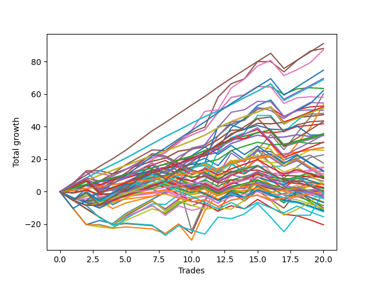

# Long Wallace Doodle 014 
- Symbol: TSLA_Unlimited
- Date Range: 03/23/2022 - 07/08/2022
- Trading Period: 7:20-12:30
- Number of Trades: 20



| Name | Win Percent | Profit | Avg Profit / Trade | Avg Time / Trade |      | Name | Win Percent | Profit | Avg Profit / Trade | Avg Time / Trade |
| ---- | ----------- | ------ | ------------------ | ---------------- | ---- | ---- | ----------- | ------ | ------------------ | ---------------- |
| Sorted By <br> Profit | | | | | | Sorted By <br> Win Percentage ||||
| Eighty-Five | 95.00 | 45530.00 | 2276.50 | 57:28 |     | One Hundred Twenty-Six | 100.00 | 13535.00 | 676.75 | 05:24 |
| Five | 85.00 | 44030.00 | 2201.50 | 61:35 |     | One Hundred Twenty-One | 100.00 | 13535.00 | 676.75 | 05:24 |
| Six | 90.00 | 43615.00 | 2180.75 | 83:31 |     | Eighty-One | 100.00 | 13535.00 | 676.75 | 05:24 |
| One Hundred Twenty-Five | 90.00 | 37335.00 | 1866.75 | 46:16 |     | Eighty-Five | 95.00 | 45530.00 | 2276.50 | 57:28 |
| Eighty-Four | 95.00 | 34805.00 | 1740.25 | 51:45 |     | Eighty-Four | 95.00 | 34805.00 | 1740.25 | 51:45 |
| One Hundred Twenty-Four | 95.00 | 34420.00 | 1721.00 | 42:42 |     | One Hundred Twenty-Four | 95.00 | 34420.00 | 1721.00 | 42:42 |
| Two | 75.00 | 31725.00 | 1586.25 | 27:01 |     | Eighty-Three | 95.00 | 26100.00 | 1305.00 | 38:16 |
| Sixty-Two | 80.00 | 31065.00 | 1553.25 | 64:31 |     | One Hundred Twenty-Three | 95.00 | 25715.00 | 1285.75 | 29:13 |
| Seven | 65.00 | 30075.00 | 1503.75 | 131:55 |     | One Hundred Twenty-Seven | 95.00 | 17840.00 | 892.00 | 13:54 |
| Fifty-Eight | 75.00 | 28960.00 | 1448.00 | 26:28 |     | Eighty-Two | 95.00 | 17645.00 | 882.25 | 23:15 |
| Four | 70.00 | 27265.00 | 1363.25 | 47:49 |     | One Hundred Twenty-Two | 95.00 | 17260.00 | 863.00 | 14:12 |
| Sixty-Three | 55.00 | 26770.00 | 1338.50 | 103:40 |     | Six | 90.00 | 43615.00 | 2180.75 | 83:31 |
| Three | 85.00 | 26350.00 | 1317.50 | 28:59 |     | One Hundred Twenty-Five | 90.00 | 37335.00 | 1866.75 | 46:16 |
| Eighty-Three | 95.00 | 26100.00 | 1305.00 | 38:16 |     | Fifty-Seven | 90.00 | 23660.00 | 1183.00 | 15:35 |
| One Hundred Twenty-Three | 95.00 | 25715.00 | 1285.75 | 29:13 |     | One | 90.00 | 23660.00 | 1183.00 | 15:35 |
| Sixty-One | 75.00 | 25530.00 | 1276.50 | 49:07 |     | Sixty-Five | 90.00 | 20890.00 | 1044.50 | 14:52 |
| Sixty-Six | 75.00 | 24970.00 | 1248.50 | 23:45 |     | One Hundred Eleven | 90.00 | 7345.00 | 367.25 | 04:59 |
| Fifty-Nine | 85.00 | 24070.00 | 1203.50 | 27:51 |     | Five | 85.00 | 44030.00 | 2201.50 | 61:35 |
| Fifty-Seven | 90.00 | 23660.00 | 1183.00 | 15:35 |     | Three | 85.00 | 26350.00 | 1317.50 | 28:59 |
| One | 90.00 | 23660.00 | 1183.00 | 15:35 |     | Fifty-Nine | 85.00 | 24070.00 | 1203.50 | 27:51 |
| Sixty-Seven | 85.00 | 21765.00 | 1088.25 | 24:14 |     | Sixty-Seven | 85.00 | 21765.00 | 1088.25 | 24:14 |
| One Hundred Thirty | 75.00 | 21580.00 | 1079.00 | 30:24 |     | Fifty-Six | 85.00 | 17285.00 | 864.25 | 10:16 |
| Sixty-Five | 90.00 | 20890.00 | 1044.50 | 14:52 |     | Zero | 85.00 | 17285.00 | 864.25 | 10:16 |
| One Hundred Twenty-Seven | 95.00 | 17840.00 | 892.00 | 13:54 |     | One Hundred Twenty-Eight | 85.00 | 15205.00 | 760.25 | 18:37 |
| Eighty-Two | 95.00 | 17645.00 | 882.25 | 23:15 |     | Sixty-Four | 85.00 | 15100.00 | 755.00 | 09:34 |
| Seventy-Three | 80.00 | 17450.00 | 872.50 | 12:44 |     | Sixty-Two | 80.00 | 31065.00 | 1553.25 | 64:31 |
| One Hundred Twenty-Nine | 80.00 | 17405.00 | 870.25 | 27:05 |     | Seventy-Three | 80.00 | 17450.00 | 872.50 | 12:44 |
| Fifty-Six | 85.00 | 17285.00 | 864.25 | 10:16 |     | One Hundred Twenty-Nine | 80.00 | 17405.00 | 870.25 | 27:05 |
| Zero | 85.00 | 17285.00 | 864.25 | 10:16 |     | One Hundred Twelve | 80.00 | 8780.00 | 439.00 | 08:28 |
| One Hundred Twenty-Two | 95.00 | 17260.00 | 863.00 | 14:12 |     | One Hundred Sixteen | 80.00 | 2340.00 | 117.00 | 03:20 |
| One Hundred Twenty-Eight | 85.00 | 15205.00 | 760.25 | 18:37 |     | Two | 75.00 | 31725.00 | 1586.25 | 27:01 |
| Sixty-Four | 85.00 | 15100.00 | 755.00 | 09:34 |     | Fifty-Eight | 75.00 | 28960.00 | 1448.00 | 26:28 |
| One Hundred Twenty-Six | 100.00 | 13535.00 | 676.75 | 05:24 |     | Sixty-One | 75.00 | 25530.00 | 1276.50 | 49:07 |
| One Hundred Twenty-One | 100.00 | 13535.00 | 676.75 | 05:24 |     | Sixty-Six | 75.00 | 24970.00 | 1248.50 | 23:45 |
| Eighty-One | 100.00 | 13535.00 | 676.75 | 05:24 |     | One Hundred Thirty | 75.00 | 21580.00 | 1079.00 | 30:24 |
| Sixty | 60.00 | 12720.00 | 636.00 | 44:02 |     | Forty | 75.00 | 7560.00 | 378.00 | 08:43 |
| Sixty-Nine | 55.00 | 11330.00 | 566.50 | 38:51 |     | Four | 70.00 | 27265.00 | 1363.25 | 47:49 |
| One Hundred Twelve | 80.00 | 8780.00 | 439.00 | 08:28 |     | Forty-Eight | 70.00 | 5540.00 | 277.00 | 07:20 |
| Forty | 75.00 | 7560.00 | 378.00 | 08:43 |     | One Hundred Seventeen | 70.00 | 4215.00 | 210.75 | 06:29 |
| One Hundred Eleven | 90.00 | 7345.00 | 367.25 | 04:59 |     | Ninety-Six | 70.00 | 2385.00 | 119.25 | 02:37 |
| Forty-Two | 55.00 | 6425.00 | 321.25 | 17:14 |     | Ninety-One | 70.00 | 1185.00 | 59.25 | 02:30 |
| Sixty-Eight | 55.00 | 6240.00 | 312.00 | 34:48 |     | One Hundred Six | 70.00 | 60.00 | 3.00 | 02:45 |
| One Hundred Fifteen | 55.00 | 6190.00 | 309.50 | 19:42 |     | One Hundred One | 70.00 | -295.00 | -14.75 | 02:37 |
| Forty-Eight | 70.00 | 5540.00 | 277.00 | 07:20 |     | Seven | 65.00 | 30075.00 | 1503.75 | 131:55 |
| Forty-Three | 60.00 | 5140.00 | 257.00 | 19:47 |     | Forty-One | 65.00 | 4510.00 | 225.50 | 12:50 |
| Ninety-Seven | 55.00 | 4680.00 | 234.00 | 04:18 |     | One Hundred Thirteen | 65.00 | 2485.00 | 124.25 | 11:32 |
| Forty-Six | 45.00 | 4600.00 | 230.00 | 31:35 |     | Sixty | 60.00 | 12720.00 | 636.00 | 44:02 |
| Forty-One | 65.00 | 4510.00 | 225.50 | 12:50 |     | Forty-Three | 60.00 | 5140.00 | 257.00 | 19:47 |
| Ninety-Eight | 50.00 | 4360.00 | 218.00 | 05:21 |     | One Hundred Eighteen | 60.00 | 4015.00 | 200.75 | 08:22 |
| One Hundred Seventeen | 70.00 | 4215.00 | 210.75 | 06:29 |     | Ninety-Two | 60.00 | 3205.00 | 160.25 | 05:19 |
| One Hundred Eighteen | 60.00 | 4015.00 | 200.75 | 08:22 |     | One Hundred Two | 60.00 | 890.00 | 44.50 | 05:34 |
| Ninety-Two | 60.00 | 3205.00 | 160.25 | 05:19 |     | Sixty-Three | 55.00 | 26770.00 | 1338.50 | 103:40 |
| One Hundred Thirteen | 65.00 | 2485.00 | 124.25 | 11:32 |     | Sixty-Nine | 55.00 | 11330.00 | 566.50 | 38:51 |
| Ninety-Six | 70.00 | 2385.00 | 119.25 | 02:37 |     | Forty-Two | 55.00 | 6425.00 | 321.25 | 17:14 |
| One Hundred Sixteen | 80.00 | 2340.00 | 117.00 | 03:20 |     | Sixty-Eight | 55.00 | 6240.00 | 312.00 | 34:48 |
| Ninety-Five | 35.00 | 2195.00 | 109.75 | 12:15 |     | One Hundred Fifteen | 55.00 | 6190.00 | 309.50 | 19:42 |
| One Hundred Ten | 40.00 | 2150.00 | 107.50 | 09:07 |     | Ninety-Seven | 55.00 | 4680.00 | 234.00 | 04:18 |
| Ninety-Three | 50.00 | 2140.00 | 107.00 | 07:03 |     | One Hundred Seven | 55.00 | 1095.00 | 54.75 | 04:41 |
| One Hundred Eight | 45.00 | 1340.00 | 67.00 | 06:00 |     | One Hundred Fourteen | 55.00 | -295.00 | -14.75 | 18:26 |
| Ninety-One | 70.00 | 1185.00 | 59.25 | 02:30 |     | Ninety-Eight | 50.00 | 4360.00 | 218.00 | 05:21 |
| One Hundred Seven | 55.00 | 1095.00 | 54.75 | 04:41 |     | Ninety-Three | 50.00 | 2140.00 | 107.00 | 07:03 |
| One Hundred Two | 60.00 | 890.00 | 44.50 | 05:34 |     | Seventy | 50.00 | 705.00 | 35.25 | 41:37 |
| Seventy | 50.00 | 705.00 | 35.25 | 41:37 |     | Ninety-Nine | 50.00 | 170.00 | 8.50 | 05:59 |
| One Hundred Twenty | 35.00 | 200.00 | 10.00 | 13:04 |     | One Hundred | 50.00 | -110.00 | -5.50 | 06:29 |
| Ninety-Nine | 50.00 | 170.00 | 8.50 | 05:59 |     | One Hundred Three | 50.00 | -1360.00 | -68.00 | 07:30 |
| One Hundred Six | 70.00 | 60.00 | 3.00 | 02:45 |     | Forty-Nine | 50.00 | -1820.00 | -91.00 | 09:44 |
| Seventy-One | 40.00 | -95.00 | -4.75 | 63:57 |     | Forty-Six | 45.00 | 4600.00 | 230.00 | 31:35 |
| One Hundred | 50.00 | -110.00 | -5.50 | 06:29 |     | One Hundred Eight | 45.00 | 1340.00 | 67.00 | 06:00 |
| One Hundred One | 70.00 | -295.00 | -14.75 | 02:37 |     | Forty-Five | 45.00 | -615.00 | -30.75 | 30:59 |
| One Hundred Fourteen | 55.00 | -295.00 | -14.75 | 18:26 |     | Forty-Four | 45.00 | -5700.00 | -285.00 | 27:30 |
| Forty-Five | 45.00 | -615.00 | -30.75 | 30:59 |     | One Hundred Ten | 40.00 | 2150.00 | 107.50 | 09:07 |
| One Hundred Nine | 40.00 | -1025.00 | -51.25 | 08:02 |     | Seventy-One | 40.00 | -95.00 | -4.75 | 63:57 |
| One Hundred Three | 50.00 | -1360.00 | -68.00 | 07:30 |     | One Hundred Nine | 40.00 | -1025.00 | -51.25 | 08:02 |
| One Hundred Ninteen | 40.00 | -1535.00 | -76.75 | 11:46 |     | One Hundred Ninteen | 40.00 | -1535.00 | -76.75 | 11:46 |
| Forty-Nine | 50.00 | -1820.00 | -91.00 | 09:44 |     | Fifty | 40.00 | -5265.00 | -263.25 | 12:02 |
| Ninety-Four | 35.00 | -2165.00 | -108.25 | 11:07 |     | Fifty-One | 40.00 | -6195.00 | -309.75 | 11:21 |
| Fifty-Three | 35.00 | -3160.00 | -158.00 | 15:00 |     | Ninety-Five | 35.00 | 2195.00 | 109.75 | 12:15 |
| One Hundred Five | 35.00 | -3365.00 | -168.25 | 14:25 |     | One Hundred Twenty | 35.00 | 200.00 | 10.00 | 13:04 |
| Fifty-Four | 35.00 | -4285.00 | -214.25 | 14:22 |     | Ninety-Four | 35.00 | -2165.00 | -108.25 | 11:07 |
| Forty-Seven | 30.00 | -4995.00 | -249.75 | 53:15 |     | Fifty-Three | 35.00 | -3160.00 | -158.00 | 15:00 |
| Fifty | 40.00 | -5265.00 | -263.25 | 12:02 |     | One Hundred Five | 35.00 | -3365.00 | -168.25 | 14:25 |
| Forty-Four | 45.00 | -5700.00 | -285.00 | 27:30 |     | Fifty-Four | 35.00 | -4285.00 | -214.25 | 14:22 |
| Fifty-Two | 35.00 | -5885.00 | -294.25 | 14:24 |     | Fifty-Two | 35.00 | -5885.00 | -294.25 | 14:24 |
| Fifty-One | 40.00 | -6195.00 | -309.75 | 11:21 |     | One Hundred Four | 35.00 | -7725.00 | -386.25 | 13:16 |
| One Hundred Four | 35.00 | -7725.00 | -386.25 | 13:16 |     | Fifty-Five | 35.00 | -10190.00 | -509.50 | 20:01 |
| Fifty-Five | 35.00 | -10190.00 | -509.50 | 20:01 |     | Forty-Seven | 30.00 | -4995.00 | -249.75 | 53:15 |

## NO STOPLOSS

### Test Zero
* Sell when price hits the middle line of the 20p bollinger
* No Stoploss
* Results:
```
Total Trades: 20
Percent Up: 85.00
Percent Down: 15.00
Total Points Moved Up: 34.57
Potential Profit: 17285.00
Total Points Ups: 40.35 Count Ups: 17
Total Points Downs: -5.78 Count Downs: 3
```

<details><summary>Trades</summary>

<code>In: 2022-03-23 10:21:00		Out: 2022-03-23 10:31:40		Total Position Time: 10:40		Total Move Up: 1.95		Total to Date: 1.95</code> <br />
<code>In: 2022-03-23 10:23:00		Out: 2022-03-23 10:31:40		Total Position Time: 08:40		Total Move Up: 4.37		Total to Date: 6.32</code> <br />
<code>In: 2022-03-25 08:11:00		Out: 2022-03-25 08:41:30		Total Position Time: 30:30		Total Move Up: -3.15		Total to Date: 3.17</code> <br />
<code>In: 2022-03-30 11:29:00		Out: 2022-03-30 11:32:50		Total Position Time: 03:50		Total Move Up: 3.97		Total to Date: 7.14</code> <br />
<code>In: 2022-03-31 10:18:00		Out: 2022-03-31 10:26:20		Total Position Time: 08:20		Total Move Up: 1.70		Total to Date: 8.84</code> <br />
<code>In: 2022-04-08 11:30:00		Out: 2022-04-08 11:37:15		Total Position Time: 07:15		Total Move Up: 2.00		Total to Date: 10.84</code> <br />
<code>In: 2022-04-08 11:30:00		Out: 2022-04-08 11:37:15		Total Position Time: 07:15		Total Move Up: 2.00		Total to Date: 12.84</code> <br />
<code>In: 2022-04-22 10:02:00		Out: 2022-04-22 10:06:05		Total Position Time: 04:05		Total Move Up: 1.62		Total to Date: 14.46</code> <br />
<code>In: 2022-04-25 12:05:00		Out: 2022-04-25 12:16:15		Total Position Time: 11:15		Total Move Up: 2.64		Total to Date: 17.10</code> <br />
<code>In: 2022-04-29 07:48:00		Out: 2022-04-29 07:59:45		Total Position Time: 11:45		Total Move Up: 2.25		Total to Date: 19.35</code> <br />
<code>In: 2022-05-02 10:05:00		Out: 2022-05-02 10:14:55		Total Position Time: 09:55		Total Move Up: 3.11		Total to Date: 22.46</code> <br />
<code>In: 2022-05-04 11:36:00		Out: 2022-05-04 11:41:15		Total Position Time: 05:15		Total Move Up: 1.64		Total to Date: 24.10</code> <br />
<code>In: 2022-05-12 10:57:00		Out: 2022-05-12 11:01:05		Total Position Time: 04:05		Total Move Up: 5.51		Total to Date: 29.61</code> <br />
<code>In: 2022-05-13 11:07:00		Out: 2022-05-13 11:12:25		Total Position Time: 05:25		Total Move Up: 2.71		Total to Date: 32.32</code> <br />
<code>In: 2022-05-31 11:57:00		Out: 2022-05-31 12:04:50		Total Position Time: 07:50		Total Move Up: 2.42		Total to Date: 34.74</code> <br />
<code>In: 2022-06-06 08:14:00		Out: 2022-06-06 08:30:05		Total Position Time: 16:05		Total Move Up: -1.54		Total to Date: 33.20</code> <br />
<code>In: 2022-06-08 09:07:00		Out: 2022-06-08 09:16:40		Total Position Time: 09:40		Total Move Up: 0.39		Total to Date: 33.59</code> <br />
<code>In: 2022-06-15 07:35:00		Out: 2022-06-15 07:47:40		Total Position Time: 12:40		Total Move Up: 1.40		Total to Date: 34.99</code> <br />
<code>In: 2022-06-17 07:26:00		Out: 2022-06-17 07:43:50		Total Position Time: 17:50		Total Move Up: -1.09		Total to Date: 33.90</code> <br />
<code>In: 2022-06-23 09:41:00		Out: 2022-06-23 09:54:00		Total Position Time: 13:00		Total Move Up: 0.67		Total to Date: 34.57</code> <br />


</details>

### Test One
* Sell when the price hits the upper line of the 20p 1std bollinger
* No Stoploss
* Results:
```
Total Trades: 20
Percent Up: 90.00
Percent Down: 10.00
Total Points Moved Up: 47.32
Potential Profit: 23660.00
Total Points Ups: 49.56 Count Ups: 18
Total Points Downs: -2.24 Count Downs: 2
```

<details><summary>Trades</summary>

<code>In: 2022-03-23 10:21:00		Out: 2022-03-23 10:36:15		Total Position Time: 15:15		Total Move Up: 2.99		Total to Date: 2.99</code> <br />
<code>In: 2022-03-23 10:23:00		Out: 2022-03-23 10:36:15		Total Position Time: 13:15		Total Move Up: 5.41		Total to Date: 8.40</code> <br />
<code>In: 2022-03-25 08:11:00		Out: 2022-03-25 08:41:55		Total Position Time: 30:55		Total Move Up: -1.98		Total to Date: 6.42</code> <br />
<code>In: 2022-03-30 11:29:00		Out: 2022-03-30 11:36:15		Total Position Time: 07:15		Total Move Up: 4.44		Total to Date: 10.86</code> <br />
<code>In: 2022-03-31 10:18:00		Out: 2022-03-31 10:27:25		Total Position Time: 09:25		Total Move Up: 2.96		Total to Date: 13.82</code> <br />
<code>In: 2022-04-08 11:30:00		Out: 2022-04-08 11:40:25		Total Position Time: 10:25		Total Move Up: 2.43		Total to Date: 16.25</code> <br />
<code>In: 2022-04-08 11:30:00		Out: 2022-04-08 11:40:25		Total Position Time: 10:25		Total Move Up: 2.43		Total to Date: 18.68</code> <br />
<code>In: 2022-04-22 10:02:00		Out: 2022-04-22 10:09:10		Total Position Time: 07:10		Total Move Up: 1.92		Total to Date: 20.60</code> <br />
<code>In: 2022-04-25 12:05:00		Out: 2022-04-25 12:19:50		Total Position Time: 14:50		Total Move Up: 4.27		Total to Date: 24.87</code> <br />
<code>In: 2022-04-29 07:48:00		Out: 2022-04-29 08:03:45		Total Position Time: 15:45		Total Move Up: 1.34		Total to Date: 26.21</code> <br />
<code>In: 2022-05-02 10:05:00		Out: 2022-05-02 10:25:35		Total Position Time: 20:35		Total Move Up: 1.28		Total to Date: 27.49</code> <br />
<code>In: 2022-05-04 11:36:00		Out: 2022-05-04 11:42:00		Total Position Time: 06:00		Total Move Up: 4.44		Total to Date: 31.93</code> <br />
<code>In: 2022-05-12 10:57:00		Out: 2022-05-12 11:16:15		Total Position Time: 19:15		Total Move Up: 5.70		Total to Date: 37.63</code> <br />
<code>In: 2022-05-13 11:07:00		Out: 2022-05-13 11:31:45		Total Position Time: 24:45		Total Move Up: 0.62		Total to Date: 38.25</code> <br />
<code>In: 2022-05-31 11:57:00		Out: 2022-05-31 12:07:40		Total Position Time: 10:40		Total Move Up: 3.72		Total to Date: 41.97</code> <br />
<code>In: 2022-06-06 08:14:00		Out: 2022-06-06 08:36:05		Total Position Time: 22:05		Total Move Up: -0.26		Total to Date: 41.71</code> <br />
<code>In: 2022-06-08 09:07:00		Out: 2022-06-08 09:18:05		Total Position Time: 11:05		Total Move Up: 0.89		Total to Date: 42.60</code> <br />
<code>In: 2022-06-15 07:35:00		Out: 2022-06-15 07:48:40		Total Position Time: 13:40		Total Move Up: 3.04		Total to Date: 45.64</code> <br />
<code>In: 2022-06-17 07:26:00		Out: 2022-06-17 07:44:35		Total Position Time: 18:35		Total Move Up: 0.68		Total to Date: 46.32</code> <br />
<code>In: 2022-06-23 09:41:00		Out: 2022-06-23 10:11:35		Total Position Time: 30:35		Total Move Up: 1.00		Total to Date: 47.32</code> <br />


</details>

### Test Two
* Sell when the price hits the upper line of the 20p 2std bollinger
* No Stoploss
* Results:
```
Total Trades: 20
Percent Up: 75.00
Percent Down: 25.00
Total Points Moved Up: 63.45
Potential Profit: 31725.00
Total Points Ups: 71.30 Count Ups: 15
Total Points Downs: -7.85 Count Downs: 5
```

<details><summary>Trades</summary>

<code>In: 2022-03-23 10:21:00		Out: 2022-03-23 10:38:40		Total Position Time: 17:40		Total Move Up: 4.86		Total to Date: 4.86</code> <br />
<code>In: 2022-03-23 10:23:00		Out: 2022-03-23 10:38:40		Total Position Time: 15:40		Total Move Up: 7.28		Total to Date: 12.14</code> <br />
<code>In: 2022-03-25 08:11:00		Out: 2022-03-25 08:44:45		Total Position Time: 33:45		Total Move Up: -0.79		Total to Date: 11.35</code> <br />
<code>In: 2022-03-30 11:29:00		Out: 2022-03-30 12:36:15		Total Position Time: 67:15		Total Move Up: -1.77		Total to Date: 9.58</code> <br />
<code>In: 2022-03-31 10:18:00		Out: 2022-03-31 10:29:25		Total Position Time: 11:25		Total Move Up: 4.03		Total to Date: 13.61</code> <br />
<code>In: 2022-04-08 11:30:00		Out: 2022-04-08 11:47:50		Total Position Time: 17:50		Total Move Up: 3.57		Total to Date: 17.18</code> <br />
<code>In: 2022-04-08 11:30:00		Out: 2022-04-08 11:47:50		Total Position Time: 17:50		Total Move Up: 3.57		Total to Date: 20.75</code> <br />
<code>In: 2022-04-22 10:02:00		Out: 2022-04-22 10:12:10		Total Position Time: 10:10		Total Move Up: 3.22		Total to Date: 23.97</code> <br />
<code>In: 2022-04-25 12:05:00		Out: 2022-04-25 12:20:10		Total Position Time: 15:10		Total Move Up: 6.66		Total to Date: 30.63</code> <br />
<code>In: 2022-04-29 07:48:00		Out: 2022-04-29 08:05:15		Total Position Time: 17:15		Total Move Up: 4.27		Total to Date: 34.90</code> <br />
<code>In: 2022-05-02 10:05:00		Out: 2022-05-02 10:31:10		Total Position Time: 26:10		Total Move Up: 3.22		Total to Date: 38.12</code> <br />
<code>In: 2022-05-04 11:36:00		Out: 2022-05-04 11:44:10		Total Position Time: 08:10		Total Move Up: 10.45		Total to Date: 48.57</code> <br />
<code>In: 2022-05-12 10:57:00		Out: 2022-05-12 11:20:35		Total Position Time: 23:35		Total Move Up: 9.36		Total to Date: 57.93</code> <br />
<code>In: 2022-05-13 11:07:00		Out: 2022-05-13 11:51:25		Total Position Time: 44:25		Total Move Up: 1.57		Total to Date: 59.50</code> <br />
<code>In: 2022-05-31 11:57:00		Out: 2022-05-31 12:09:05		Total Position Time: 12:05		Total Move Up: 5.17		Total to Date: 64.67</code> <br />
<code>In: 2022-06-06 08:14:00		Out: 2022-06-06 08:36:05		Total Position Time: 22:05		Total Move Up: -0.26		Total to Date: 64.41</code> <br />
<code>In: 2022-06-08 09:07:00		Out: 2022-06-08 09:56:55		Total Position Time: 49:55		Total Move Up: -4.63		Total to Date: 59.78</code> <br />
<code>In: 2022-06-15 07:35:00		Out: 2022-06-15 07:59:50		Total Position Time: 24:50		Total Move Up: 3.45		Total to Date: 63.23</code> <br />
<code>In: 2022-06-17 07:26:00		Out: 2022-06-17 07:56:25		Total Position Time: 30:25		Total Move Up: 0.62		Total to Date: 63.85</code> <br />
<code>In: 2022-06-23 09:41:00		Out: 2022-06-23 10:55:45		Total Position Time: 74:45		Total Move Up: -0.40		Total to Date: 63.45</code> <br />


</details>

### Test Three
* Sell when price hits the middle line of the 50p bollinger
* No Stoploss
* Results:
```
Total Trades: 20
Percent Up: 85.00
Percent Down: 15.00
Total Points Moved Up: 52.70
Potential Profit: 26350.00
Total Points Ups: 64.23 Count Ups: 17
Total Points Downs: -11.53 Count Downs: 3
```

<details><summary>Trades</summary>

<code>In: 2022-03-23 10:21:00		Out: 2022-03-23 10:55:10		Total Position Time: 34:10		Total Move Up: 2.50		Total to Date: 2.50</code> <br />
<code>In: 2022-03-23 10:23:00		Out: 2022-03-23 10:55:10		Total Position Time: 32:10		Total Move Up: 4.92		Total to Date: 7.42</code> <br />
<code>In: 2022-03-25 08:11:00		Out: 2022-03-25 09:05:25		Total Position Time: 54:25		Total Move Up: -3.46		Total to Date: 3.96</code> <br />
<code>In: 2022-03-30 11:29:00		Out: 2022-03-30 12:33:35		Total Position Time: 64:35		Total Move Up: -2.47		Total to Date: 1.49</code> <br />
<code>In: 2022-03-31 10:18:00		Out: 2022-03-31 10:28:35		Total Position Time: 10:35		Total Move Up: 3.42		Total to Date: 4.91</code> <br />
<code>In: 2022-04-08 11:30:00		Out: 2022-04-08 11:37:15		Total Position Time: 07:15		Total Move Up: 2.00		Total to Date: 6.91</code> <br />
<code>In: 2022-04-08 11:30:00		Out: 2022-04-08 11:37:15		Total Position Time: 07:15		Total Move Up: 2.00		Total to Date: 8.91</code> <br />
<code>In: 2022-04-22 10:02:00		Out: 2022-04-22 10:14:30		Total Position Time: 12:30		Total Move Up: 3.63		Total to Date: 12.54</code> <br />
<code>In: 2022-04-25 12:05:00		Out: 2022-04-25 12:35:35		Total Position Time: 30:35		Total Move Up: 6.93		Total to Date: 19.47</code> <br />
<code>In: 2022-04-29 07:48:00		Out: 2022-04-29 08:05:45		Total Position Time: 17:45		Total Move Up: 7.30		Total to Date: 26.77</code> <br />
<code>In: 2022-05-02 10:05:00		Out: 2022-05-02 10:55:45		Total Position Time: 50:45		Total Move Up: 1.80		Total to Date: 28.57</code> <br />
<code>In: 2022-05-04 11:36:00		Out: 2022-05-04 11:43:35		Total Position Time: 07:35		Total Move Up: 5.78		Total to Date: 34.35</code> <br />
<code>In: 2022-05-12 10:57:00		Out: 2022-05-12 11:18:50		Total Position Time: 21:50		Total Move Up: 7.11		Total to Date: 41.46</code> <br />
<code>In: 2022-05-13 11:07:00		Out: 2022-05-13 11:32:00		Total Position Time: 25:00		Total Move Up: 2.57		Total to Date: 44.03</code> <br />
<code>In: 2022-05-31 11:57:00		Out: 2022-05-31 12:15:15		Total Position Time: 18:15		Total Move Up: 6.65		Total to Date: 50.68</code> <br />
<code>In: 2022-06-06 08:14:00		Out: 2022-06-06 08:45:05		Total Position Time: 31:05		Total Move Up: 0.97		Total to Date: 51.65</code> <br />
<code>In: 2022-06-08 09:07:00		Out: 2022-06-08 10:08:35		Total Position Time: 61:35		Total Move Up: -5.60		Total to Date: 46.05</code> <br />
<code>In: 2022-06-15 07:35:00		Out: 2022-06-15 08:00:05		Total Position Time: 25:05		Total Move Up: 4.24		Total to Date: 50.29</code> <br />
<code>In: 2022-06-17 07:26:00		Out: 2022-06-17 07:57:00		Total Position Time: 31:00		Total Move Up: 1.84		Total to Date: 52.13</code> <br />
<code>In: 2022-06-23 09:41:00		Out: 2022-06-23 10:17:20		Total Position Time: 36:20		Total Move Up: 0.57		Total to Date: 52.70</code> <br />


</details>

### Test Four
* Sell when the price hits the upper line of the 50p 1std bollinger
* No Stoploss
* Results:
```
Total Trades: 20
Percent Up: 70.00
Percent Down: 30.00
Total Points Moved Up: 54.53
Potential Profit: 27265.00
Total Points Ups: 66.05 Count Ups: 14
Total Points Downs: -11.52 Count Downs: 6
```

<details><summary>Trades</summary>

<code>In: 2022-03-23 10:21:00		Out: 2022-03-23 11:29:15		Total Position Time: 68:15		Total Move Up: 0.56		Total to Date: 0.56</code> <br />
<code>In: 2022-03-23 10:23:00		Out: 2022-03-23 11:29:15		Total Position Time: 66:15		Total Move Up: 2.98		Total to Date: 3.54</code> <br />
<code>In: 2022-03-25 08:11:00		Out: 2022-03-25 09:08:40		Total Position Time: 57:40		Total Move Up: -1.35		Total to Date: 2.19</code> <br />
<code>In: 2022-03-30 11:29:00		Out: 2022-03-30 12:45:20		Total Position Time: 76:20		Total Move Up: -0.80		Total to Date: 1.39</code> <br />
<code>In: 2022-03-31 10:18:00		Out: 2022-03-31 10:42:45		Total Position Time: 24:45		Total Move Up: 4.75		Total to Date: 6.14</code> <br />
<code>In: 2022-04-08 11:30:00		Out: 2022-04-08 11:47:50		Total Position Time: 17:50		Total Move Up: 3.57		Total to Date: 9.71</code> <br />
<code>In: 2022-04-08 11:30:00		Out: 2022-04-08 11:47:50		Total Position Time: 17:50		Total Move Up: 3.57		Total to Date: 13.28</code> <br />
<code>In: 2022-04-22 10:02:00		Out: 2022-04-22 11:13:40		Total Position Time: 71:40		Total Move Up: -2.21		Total to Date: 11.07</code> <br />
<code>In: 2022-04-25 12:05:00		Out: 2022-04-25 12:47:00		Total Position Time: 42:00		Total Move Up: 5.94		Total to Date: 17.01</code> <br />
<code>In: 2022-04-29 07:48:00		Out: 2022-04-29 08:31:05		Total Position Time: 43:05		Total Move Up: 3.19		Total to Date: 20.20</code> <br />
<code>In: 2022-05-02 10:05:00		Out: 2022-05-02 10:55:45		Total Position Time: 50:45		Total Move Up: 1.80		Total to Date: 22.00</code> <br />
<code>In: 2022-05-04 11:36:00		Out: 2022-05-04 11:44:25		Total Position Time: 08:25		Total Move Up: 12.17		Total to Date: 34.17</code> <br />
<code>In: 2022-05-12 10:57:00		Out: 2022-05-12 11:28:45		Total Position Time: 31:45		Total Move Up: 8.61		Total to Date: 42.78</code> <br />
<code>In: 2022-05-13 11:07:00		Out: 2022-05-13 11:51:20		Total Position Time: 44:20		Total Move Up: 1.12		Total to Date: 43.90</code> <br />
<code>In: 2022-05-31 11:57:00		Out: 2022-05-31 12:28:30		Total Position Time: 31:30		Total Move Up: 7.94		Total to Date: 51.84</code> <br />
<code>In: 2022-06-06 08:14:00		Out: 2022-06-06 09:41:50		Total Position Time: 87:50		Total Move Up: -1.94		Total to Date: 49.90</code> <br />
<code>In: 2022-06-08 09:07:00		Out: 2022-06-08 10:18:05		Total Position Time: 71:05		Total Move Up: -4.94		Total to Date: 44.96</code> <br />
<code>In: 2022-06-15 07:35:00		Out: 2022-06-15 08:07:25		Total Position Time: 32:25		Total Move Up: 5.53		Total to Date: 50.49</code> <br />
<code>In: 2022-06-17 07:26:00		Out: 2022-06-17 08:03:55		Total Position Time: 37:55		Total Move Up: 4.32		Total to Date: 54.81</code> <br />
<code>In: 2022-06-23 09:41:00		Out: 2022-06-23 10:55:50		Total Position Time: 74:50		Total Move Up: -0.28		Total to Date: 54.53</code> <br />


</details>

### Test Five
* Sell when the price hits the upper line of the 50p 2std bollinger
* No Stoploss
* Results:
```
Total Trades: 20
Percent Up: 85.00
Percent Down: 15.00
Total Points Moved Up: 88.06
Potential Profit: 44030.00
Total Points Ups: 96.71 Count Ups: 17
Total Points Downs: -8.65 Count Downs: 3
```

<details><summary>Trades</summary>

<code>In: 2022-03-23 10:21:00		Out: 2022-03-23 11:48:30		Total Position Time: 87:30		Total Move Up: 5.20		Total to Date: 5.20</code> <br />
<code>In: 2022-03-23 10:23:00		Out: 2022-03-23 11:48:30		Total Position Time: 85:30		Total Move Up: 7.62		Total to Date: 12.82</code> <br />
<code>In: 2022-03-25 08:11:00		Out: 2022-03-25 09:09:50		Total Position Time: 58:50		Total Move Up: 0.10		Total to Date: 12.92</code> <br />
<code>In: 2022-03-30 11:29:00		Out: 2022-03-30 12:47:00		Total Position Time: 78:00		Total Move Up: -1.97		Total to Date: 10.95</code> <br />
<code>In: 2022-03-31 10:18:00		Out: 2022-03-31 10:42:55		Total Position Time: 24:55		Total Move Up: 5.60		Total to Date: 16.55</code> <br />
<code>In: 2022-04-08 11:30:00		Out: 2022-04-08 11:52:30		Total Position Time: 22:30		Total Move Up: 4.55		Total to Date: 21.10</code> <br />
<code>In: 2022-04-08 11:30:00		Out: 2022-04-08 11:52:30		Total Position Time: 22:30		Total Move Up: 4.55		Total to Date: 25.65</code> <br />
<code>In: 2022-04-22 10:02:00		Out: 2022-04-22 11:17:35		Total Position Time: 75:35		Total Move Up: -0.37		Total to Date: 25.28</code> <br />
<code>In: 2022-04-25 12:05:00		Out: 2022-04-25 12:47:00		Total Position Time: 42:00		Total Move Up: 5.94		Total to Date: 31.22</code> <br />
<code>In: 2022-04-29 07:48:00		Out: 2022-04-29 08:32:15		Total Position Time: 44:15		Total Move Up: 5.28		Total to Date: 36.50</code> <br />
<code>In: 2022-05-02 10:05:00		Out: 2022-05-02 10:58:30		Total Position Time: 53:30		Total Move Up: 3.23		Total to Date: 39.73</code> <br />
<code>In: 2022-05-04 11:36:00		Out: 2022-05-04 11:47:00		Total Position Time: 11:00		Total Move Up: 18.34		Total to Date: 58.07</code> <br />
<code>In: 2022-05-12 10:57:00		Out: 2022-05-12 12:18:55		Total Position Time: 81:55		Total Move Up: 8.30		Total to Date: 66.37</code> <br />
<code>In: 2022-05-13 11:07:00		Out: 2022-05-13 11:52:35		Total Position Time: 45:35		Total Move Up: 2.99		Total to Date: 69.36</code> <br />
<code>In: 2022-05-31 11:57:00		Out: 2022-05-31 12:31:05		Total Position Time: 34:05		Total Move Up: 10.58		Total to Date: 79.94</code> <br />
<code>In: 2022-06-06 08:14:00		Out: 2022-06-06 09:46:45		Total Position Time: 92:45		Total Move Up: 0.03		Total to Date: 79.97</code> <br />
<code>In: 2022-06-08 09:07:00		Out: 2022-06-08 12:33:20		Total Position Time: 206:20		Total Move Up: -6.31		Total to Date: 73.66</code> <br />
<code>In: 2022-06-15 07:35:00		Out: 2022-06-15 08:11:00		Total Position Time: 36:00		Total Move Up: 7.04		Total to Date: 80.70</code> <br />
<code>In: 2022-06-17 07:26:00		Out: 2022-06-17 08:06:30		Total Position Time: 40:30		Total Move Up: 5.71		Total to Date: 86.41</code> <br />
<code>In: 2022-06-23 09:41:00		Out: 2022-06-23 11:09:40		Total Position Time: 88:40		Total Move Up: 1.65		Total to Date: 88.06</code> <br />


</details>

### Test Six
* Sell when the price hits the middle line of the 1std VWAP
* No Stoploss
* Results:
```
Total Trades: 20
Percent Up: 90.00
Percent Down: 10.00
Total Points Moved Up: 87.23
Potential Profit: 43615.00
Total Points Ups: 98.59 Count Ups: 18
Total Points Downs: -11.36 Count Downs: 2
```

<details><summary>Trades</summary>

<code>In: 2022-03-23 10:21:00		Out: 2022-03-23 12:47:00		Total Position Time: 146:00		Total Move Up: 0.79		Total to Date: 0.79</code> <br />
<code>In: 2022-03-23 10:23:00		Out: 2022-03-23 12:47:00		Total Position Time: 144:00		Total Move Up: 3.21		Total to Date: 4.00</code> <br />
<code>In: 2022-03-25 08:11:00		Out: 2022-03-25 10:58:35		Total Position Time: 167:35		Total Move Up: 2.62		Total to Date: 6.62</code> <br />
<code>In: 2022-03-30 11:29:00		Out: 2022-03-30 12:47:00		Total Position Time: 78:00		Total Move Up: -1.97		Total to Date: 4.65</code> <br />
<code>In: 2022-03-31 10:18:00		Out: 2022-03-31 10:45:40		Total Position Time: 27:40		Total Move Up: 6.20		Total to Date: 10.85</code> <br />
<code>In: 2022-04-08 11:30:00		Out: 2022-04-08 11:52:15		Total Position Time: 22:15		Total Move Up: 4.38		Total to Date: 15.23</code> <br />
<code>In: 2022-04-08 11:30:00		Out: 2022-04-08 11:52:15		Total Position Time: 22:15		Total Move Up: 4.38		Total to Date: 19.61</code> <br />
<code>In: 2022-04-22 10:02:00		Out: 2022-04-22 12:33:15		Total Position Time: 151:15		Total Move Up: 4.32		Total to Date: 23.93</code> <br />
<code>In: 2022-04-25 12:05:00		Out: 2022-04-25 12:47:00		Total Position Time: 42:00		Total Move Up: 5.94		Total to Date: 29.87</code> <br />
<code>In: 2022-04-29 07:48:00		Out: 2022-04-29 08:41:50		Total Position Time: 53:50		Total Move Up: 7.99		Total to Date: 37.86</code> <br />
<code>In: 2022-05-02 10:05:00		Out: 2022-05-02 11:22:10		Total Position Time: 77:10		Total Move Up: 11.50		Total to Date: 49.36</code> <br />
<code>In: 2022-05-04 11:36:00		Out: 2022-05-04 11:40:25		Total Position Time: 04:25		Total Move Up: 0.91		Total to Date: 50.27</code> <br />
<code>In: 2022-05-12 10:57:00		Out: 2022-05-12 12:21:25		Total Position Time: 84:25		Total Move Up: 13.40		Total to Date: 63.67</code> <br />
<code>In: 2022-05-13 11:07:00		Out: 2022-05-13 12:01:05		Total Position Time: 54:05		Total Move Up: 5.52		Total to Date: 69.19</code> <br />
<code>In: 2022-05-31 11:57:00		Out: 2022-05-31 12:16:05		Total Position Time: 19:05		Total Move Up: 8.07		Total to Date: 77.26</code> <br />
<code>In: 2022-06-06 08:14:00		Out: 2022-06-06 10:41:10		Total Position Time: 147:10		Total Move Up: 3.46		Total to Date: 80.72</code> <br />
<code>In: 2022-06-08 09:07:00		Out: 2022-06-08 12:47:00		Total Position Time: 220:00		Total Move Up: -9.39		Total to Date: 71.33</code> <br />
<code>In: 2022-06-15 07:35:00		Out: 2022-06-15 08:00:00		Total Position Time: 25:00		Total Move Up: 3.64		Total to Date: 74.97</code> <br />
<code>In: 2022-06-17 07:26:00		Out: 2022-06-17 08:03:55		Total Position Time: 37:55		Total Move Up: 4.32		Total to Date: 79.29</code> <br />
<code>In: 2022-06-23 09:41:00		Out: 2022-06-23 12:07:25		Total Position Time: 146:25		Total Move Up: 7.94		Total to Date: 87.23</code> <br />


</details>

### Test Seven
* Sell when the price hits the upper line of the 1std VWAP
* No Stoploss
* Results:
```
Total Trades: 20
Percent Up: 65.00
Percent Down: 35.00
Total Points Moved Up: 60.15
Potential Profit: 30075.00
Total Points Ups: 104.37 Count Ups: 13
Total Points Downs: -44.22 Count Downs: 7
```

<details><summary>Trades</summary>

<code>In: 2022-03-23 10:21:00		Out: 2022-03-23 12:47:00		Total Position Time: 146:00		Total Move Up: 0.79		Total to Date: 0.79</code> <br />
<code>In: 2022-03-23 10:23:00		Out: 2022-03-23 12:47:00		Total Position Time: 144:00		Total Move Up: 3.21		Total to Date: 4.00</code> <br />
<code>In: 2022-03-25 08:11:00		Out: 2022-03-25 12:47:00		Total Position Time: 276:00		Total Move Up: -0.23		Total to Date: 3.77</code> <br />
<code>In: 2022-03-30 11:29:00		Out: 2022-03-30 12:47:00		Total Position Time: 78:00		Total Move Up: -1.97		Total to Date: 1.80</code> <br />
<code>In: 2022-03-31 10:18:00		Out: 2022-03-31 12:47:00		Total Position Time: 149:00		Total Move Up: 0.84		Total to Date: 2.64</code> <br />
<code>In: 2022-04-08 11:30:00		Out: 2022-04-08 12:47:00		Total Position Time: 77:00		Total Move Up: -0.61		Total to Date: 2.03</code> <br />
<code>In: 2022-04-08 11:30:00		Out: 2022-04-08 12:47:00		Total Position Time: 77:00		Total Move Up: -0.61		Total to Date: 1.42</code> <br />
<code>In: 2022-04-22 10:02:00		Out: 2022-04-22 12:47:00		Total Position Time: 165:00		Total Move Up: -2.93		Total to Date: -1.51</code> <br />
<code>In: 2022-04-25 12:05:00		Out: 2022-04-25 12:47:00		Total Position Time: 42:00		Total Move Up: 5.94		Total to Date: 4.43</code> <br />
<code>In: 2022-04-29 07:48:00		Out: 2022-04-29 12:47:00		Total Position Time: 299:00		Total Move Up: -28.48		Total to Date: -24.05</code> <br />
<code>In: 2022-05-02 10:05:00		Out: 2022-05-02 12:10:05		Total Position Time: 125:05		Total Move Up: 18.19		Total to Date: -5.86</code> <br />
<code>In: 2022-05-04 11:36:00		Out: 2022-05-04 11:44:10		Total Position Time: 08:10		Total Move Up: 10.45		Total to Date: 4.59</code> <br />
<code>In: 2022-05-12 10:57:00		Out: 2022-05-12 12:47:00		Total Position Time: 110:00		Total Move Up: 11.88		Total to Date: 16.47</code> <br />
<code>In: 2022-05-13 11:07:00		Out: 2022-05-13 12:47:00		Total Position Time: 100:00		Total Move Up: 2.84		Total to Date: 19.31</code> <br />
<code>In: 2022-05-31 11:57:00		Out: 2022-05-31 12:47:00		Total Position Time: 50:00		Total Move Up: 6.35		Total to Date: 25.66</code> <br />
<code>In: 2022-06-06 08:14:00		Out: 2022-06-06 10:57:15		Total Position Time: 163:15		Total Move Up: 9.53		Total to Date: 35.19</code> <br />
<code>In: 2022-06-08 09:07:00		Out: 2022-06-08 12:47:00		Total Position Time: 220:00		Total Move Up: -9.39		Total to Date: 25.80</code> <br />
<code>In: 2022-06-15 07:35:00		Out: 2022-06-15 08:39:10		Total Position Time: 64:10		Total Move Up: 10.13		Total to Date: 35.93</code> <br />
<code>In: 2022-06-17 07:26:00		Out: 2022-06-17 10:04:40		Total Position Time: 158:40		Total Move Up: 9.94		Total to Date: 45.87</code> <br />
<code>In: 2022-06-23 09:41:00		Out: 2022-06-23 12:47:00		Total Position Time: 186:00		Total Move Up: 14.28		Total to Date: 60.15</code> <br />


</details>

## STOPLOSS OF 5

### Test Forty
* Sell when price hits the middle line of the 20p bollinger
* Stoploss is 5 points
* Results:
```
Total Trades: 20
Percent Up: 75.00
Percent Down: 25.00
Total Points Moved Up: 15.12
Potential Profit: 7560.00
Total Points Ups: 36.76 Count Ups: 15
Total Points Downs: -21.64 Count Downs: 5
```

<details><summary>Trades</summary>

<code>In: 2022-03-23 10:21:00		Out: 2022-03-23 10:25:30		Total Position Time: 04:30		Total Move Up: -5.34		Total to Date: -5.34</code> <br />
<code>In: 2022-03-23 10:23:00		Out: 2022-03-23 10:31:40		Total Position Time: 08:40		Total Move Up: 4.37		Total to Date: -0.97</code> <br />
<code>In: 2022-03-25 08:11:00		Out: 2022-03-25 08:27:00		Total Position Time: 16:00		Total Move Up: -5.13		Total to Date: -6.10</code> <br />
<code>In: 2022-03-30 11:29:00		Out: 2022-03-30 11:32:50		Total Position Time: 03:50		Total Move Up: 3.97		Total to Date: -2.13</code> <br />
<code>In: 2022-03-31 10:18:00		Out: 2022-03-31 10:26:20		Total Position Time: 08:20		Total Move Up: 1.70		Total to Date: -0.43</code> <br />
<code>In: 2022-04-08 11:30:00		Out: 2022-04-08 11:37:15		Total Position Time: 07:15		Total Move Up: 2.00		Total to Date: 1.57</code> <br />
<code>In: 2022-04-08 11:30:00		Out: 2022-04-08 11:37:15		Total Position Time: 07:15		Total Move Up: 2.00		Total to Date: 3.57</code> <br />
<code>In: 2022-04-22 10:02:00		Out: 2022-04-22 10:06:05		Total Position Time: 04:05		Total Move Up: 1.62		Total to Date: 5.19</code> <br />
<code>In: 2022-04-25 12:05:00		Out: 2022-04-25 12:16:15		Total Position Time: 11:15		Total Move Up: 2.64		Total to Date: 7.83</code> <br />
<code>In: 2022-04-29 07:48:00		Out: 2022-04-29 07:59:45		Total Position Time: 11:45		Total Move Up: 2.25		Total to Date: 10.08</code> <br />
<code>In: 2022-05-02 10:05:00		Out: 2022-05-02 10:14:55		Total Position Time: 09:55		Total Move Up: 3.11		Total to Date: 13.19</code> <br />
<code>In: 2022-05-04 11:36:00		Out: 2022-05-04 11:39:00		Total Position Time: 03:00		Total Move Up: -4.50		Total to Date: 8.69</code> <br />
<code>In: 2022-05-12 10:57:00		Out: 2022-05-12 11:01:05		Total Position Time: 04:05		Total Move Up: 5.51		Total to Date: 14.20</code> <br />
<code>In: 2022-05-13 11:07:00		Out: 2022-05-13 11:12:25		Total Position Time: 05:25		Total Move Up: 2.71		Total to Date: 16.91</code> <br />
<code>In: 2022-05-31 11:57:00		Out: 2022-05-31 12:04:50		Total Position Time: 07:50		Total Move Up: 2.42		Total to Date: 19.33</code> <br />
<code>In: 2022-06-06 08:14:00		Out: 2022-06-06 08:30:05		Total Position Time: 16:05		Total Move Up: -1.54		Total to Date: 17.79</code> <br />
<code>In: 2022-06-08 09:07:00		Out: 2022-06-08 09:16:40		Total Position Time: 09:40		Total Move Up: 0.39		Total to Date: 18.18</code> <br />
<code>In: 2022-06-15 07:35:00		Out: 2022-06-15 07:47:40		Total Position Time: 12:40		Total Move Up: 1.40		Total to Date: 19.58</code> <br />
<code>In: 2022-06-17 07:26:00		Out: 2022-06-17 07:35:55		Total Position Time: 09:55		Total Move Up: -5.13		Total to Date: 14.45</code> <br />
<code>In: 2022-06-23 09:41:00		Out: 2022-06-23 09:54:00		Total Position Time: 13:00		Total Move Up: 0.67		Total to Date: 15.12</code> <br />


</details>

### Test Forty-One
* Sell when the price hits the upper line of the 20p 1std bollinger
* Stoploss is 5 points
* Results:
```
Total Trades: 20
Percent Up: 65.00
Percent Down: 35.00
Total Points Moved Up: 9.02
Potential Profit: 4510.00
Total Points Ups: 39.83 Count Ups: 13
Total Points Downs: -30.81 Count Downs: 7
```

<details><summary>Trades</summary>

<code>In: 2022-03-23 10:21:00		Out: 2022-03-23 10:25:30		Total Position Time: 04:30		Total Move Up: -5.34		Total to Date: -5.34</code> <br />
<code>In: 2022-03-23 10:23:00		Out: 2022-03-23 10:36:15		Total Position Time: 13:15		Total Move Up: 5.41		Total to Date: 0.07</code> <br />
<code>In: 2022-03-25 08:11:00		Out: 2022-03-25 08:27:00		Total Position Time: 16:00		Total Move Up: -5.13		Total to Date: -5.06</code> <br />
<code>In: 2022-03-30 11:29:00		Out: 2022-03-30 11:36:15		Total Position Time: 07:15		Total Move Up: 4.44		Total to Date: -0.62</code> <br />
<code>In: 2022-03-31 10:18:00		Out: 2022-03-31 10:27:25		Total Position Time: 09:25		Total Move Up: 2.96		Total to Date: 2.34</code> <br />
<code>In: 2022-04-08 11:30:00		Out: 2022-04-08 11:40:25		Total Position Time: 10:25		Total Move Up: 2.43		Total to Date: 4.77</code> <br />
<code>In: 2022-04-08 11:30:00		Out: 2022-04-08 11:40:25		Total Position Time: 10:25		Total Move Up: 2.43		Total to Date: 7.20</code> <br />
<code>In: 2022-04-22 10:02:00		Out: 2022-04-22 10:09:10		Total Position Time: 07:10		Total Move Up: 1.92		Total to Date: 9.12</code> <br />
<code>In: 2022-04-25 12:05:00		Out: 2022-04-25 12:19:50		Total Position Time: 14:50		Total Move Up: 4.27		Total to Date: 13.39</code> <br />
<code>In: 2022-04-29 07:48:00		Out: 2022-04-29 08:03:45		Total Position Time: 15:45		Total Move Up: 1.34		Total to Date: 14.73</code> <br />
<code>In: 2022-05-02 10:05:00		Out: 2022-05-02 10:25:35		Total Position Time: 20:35		Total Move Up: 1.28		Total to Date: 16.01</code> <br />
<code>In: 2022-05-04 11:36:00		Out: 2022-05-04 11:39:00		Total Position Time: 03:00		Total Move Up: -4.50		Total to Date: 11.51</code> <br />
<code>In: 2022-05-12 10:57:00		Out: 2022-05-12 11:16:15		Total Position Time: 19:15		Total Move Up: 5.70		Total to Date: 17.21</code> <br />
<code>In: 2022-05-13 11:07:00		Out: 2022-05-13 11:23:45		Total Position Time: 16:45		Total Move Up: -5.58		Total to Date: 11.63</code> <br />
<code>In: 2022-05-31 11:57:00		Out: 2022-05-31 12:07:40		Total Position Time: 10:40		Total Move Up: 3.72		Total to Date: 15.35</code> <br />
<code>In: 2022-06-06 08:14:00		Out: 2022-06-06 08:36:05		Total Position Time: 22:05		Total Move Up: -0.26		Total to Date: 15.09</code> <br />
<code>In: 2022-06-08 09:07:00		Out: 2022-06-08 09:18:05		Total Position Time: 11:05		Total Move Up: 0.89		Total to Date: 15.98</code> <br />
<code>In: 2022-06-15 07:35:00		Out: 2022-06-15 07:48:40		Total Position Time: 13:40		Total Move Up: 3.04		Total to Date: 19.02</code> <br />
<code>In: 2022-06-17 07:26:00		Out: 2022-06-17 07:35:55		Total Position Time: 09:55		Total Move Up: -5.13		Total to Date: 13.89</code> <br />
<code>In: 2022-06-23 09:41:00		Out: 2022-06-23 10:01:50		Total Position Time: 20:50		Total Move Up: -4.87		Total to Date: 9.02</code> <br />


</details>

### Test Forty-Two
* Sell when the price hits the upper line of the 20p 2std bollinger
* Stoploss is 5 points
* Results:
```
Total Trades: 20
Percent Up: 55.00
Percent Down: 45.00
Total Points Moved Up: 12.85
Potential Profit: 6425.00
Total Points Ups: 53.80 Count Ups: 11
Total Points Downs: -40.95 Count Downs: 9
```

<details><summary>Trades</summary>

<code>In: 2022-03-23 10:21:00		Out: 2022-03-23 10:25:30		Total Position Time: 04:30		Total Move Up: -5.34		Total to Date: -5.34</code> <br />
<code>In: 2022-03-23 10:23:00		Out: 2022-03-23 10:38:40		Total Position Time: 15:40		Total Move Up: 7.28		Total to Date: 1.94</code> <br />
<code>In: 2022-03-25 08:11:00		Out: 2022-03-25 08:27:00		Total Position Time: 16:00		Total Move Up: -5.13		Total to Date: -3.19</code> <br />
<code>In: 2022-03-30 11:29:00		Out: 2022-03-30 12:08:30		Total Position Time: 39:30		Total Move Up: -4.85		Total to Date: -8.04</code> <br />
<code>In: 2022-03-31 10:18:00		Out: 2022-03-31 10:29:25		Total Position Time: 11:25		Total Move Up: 4.03		Total to Date: -4.01</code> <br />
<code>In: 2022-04-08 11:30:00		Out: 2022-04-08 11:47:50		Total Position Time: 17:50		Total Move Up: 3.57		Total to Date: -0.44</code> <br />
<code>In: 2022-04-08 11:30:00		Out: 2022-04-08 11:47:50		Total Position Time: 17:50		Total Move Up: 3.57		Total to Date: 3.13</code> <br />
<code>In: 2022-04-22 10:02:00		Out: 2022-04-22 10:12:10		Total Position Time: 10:10		Total Move Up: 3.22		Total to Date: 6.35</code> <br />
<code>In: 2022-04-25 12:05:00		Out: 2022-04-25 12:20:10		Total Position Time: 15:10		Total Move Up: 6.66		Total to Date: 13.01</code> <br />
<code>In: 2022-04-29 07:48:00		Out: 2022-04-29 08:05:15		Total Position Time: 17:15		Total Move Up: 4.27		Total to Date: 17.28</code> <br />
<code>In: 2022-05-02 10:05:00		Out: 2022-05-02 10:31:10		Total Position Time: 26:10		Total Move Up: 3.22		Total to Date: 20.50</code> <br />
<code>In: 2022-05-04 11:36:00		Out: 2022-05-04 11:39:00		Total Position Time: 03:00		Total Move Up: -4.50		Total to Date: 16.00</code> <br />
<code>In: 2022-05-12 10:57:00		Out: 2022-05-12 11:20:35		Total Position Time: 23:35		Total Move Up: 9.36		Total to Date: 25.36</code> <br />
<code>In: 2022-05-13 11:07:00		Out: 2022-05-13 11:23:45		Total Position Time: 16:45		Total Move Up: -5.58		Total to Date: 19.78</code> <br />
<code>In: 2022-05-31 11:57:00		Out: 2022-05-31 12:09:05		Total Position Time: 12:05		Total Move Up: 5.17		Total to Date: 24.95</code> <br />
<code>In: 2022-06-06 08:14:00		Out: 2022-06-06 08:36:05		Total Position Time: 22:05		Total Move Up: -0.26		Total to Date: 24.69</code> <br />
<code>In: 2022-06-08 09:07:00		Out: 2022-06-08 09:27:20		Total Position Time: 20:20		Total Move Up: -5.29		Total to Date: 19.40</code> <br />
<code>In: 2022-06-15 07:35:00		Out: 2022-06-15 07:59:50		Total Position Time: 24:50		Total Move Up: 3.45		Total to Date: 22.85</code> <br />
<code>In: 2022-06-17 07:26:00		Out: 2022-06-17 07:35:55		Total Position Time: 09:55		Total Move Up: -5.13		Total to Date: 17.72</code> <br />
<code>In: 2022-06-23 09:41:00		Out: 2022-06-23 10:01:50		Total Position Time: 20:50		Total Move Up: -4.87		Total to Date: 12.85</code> <br />


</details>

### Test Forty-Three
* Sell when price hits the middle line of the 50p bollinger
* Stoploss is 5 points
* Results:
```
Total Trades: 20
Percent Up: 60.00
Percent Down: 40.00
Total Points Moved Up: 10.28
Potential Profit: 5140.00
Total Points Ups: 50.97 Count Ups: 12
Total Points Downs: -40.69 Count Downs: 8
```

<details><summary>Trades</summary>

<code>In: 2022-03-23 10:21:00		Out: 2022-03-23 10:25:30		Total Position Time: 04:30		Total Move Up: -5.34		Total to Date: -5.34</code> <br />
<code>In: 2022-03-23 10:23:00		Out: 2022-03-23 10:55:10		Total Position Time: 32:10		Total Move Up: 4.92		Total to Date: -0.42</code> <br />
<code>In: 2022-03-25 08:11:00		Out: 2022-03-25 08:27:00		Total Position Time: 16:00		Total Move Up: -5.13		Total to Date: -5.55</code> <br />
<code>In: 2022-03-30 11:29:00		Out: 2022-03-30 12:08:30		Total Position Time: 39:30		Total Move Up: -4.85		Total to Date: -10.40</code> <br />
<code>In: 2022-03-31 10:18:00		Out: 2022-03-31 10:28:35		Total Position Time: 10:35		Total Move Up: 3.42		Total to Date: -6.98</code> <br />
<code>In: 2022-04-08 11:30:00		Out: 2022-04-08 11:37:15		Total Position Time: 07:15		Total Move Up: 2.00		Total to Date: -4.98</code> <br />
<code>In: 2022-04-08 11:30:00		Out: 2022-04-08 11:37:15		Total Position Time: 07:15		Total Move Up: 2.00		Total to Date: -2.98</code> <br />
<code>In: 2022-04-22 10:02:00		Out: 2022-04-22 10:14:30		Total Position Time: 12:30		Total Move Up: 3.63		Total to Date: 0.65</code> <br />
<code>In: 2022-04-25 12:05:00		Out: 2022-04-25 12:35:35		Total Position Time: 30:35		Total Move Up: 6.93		Total to Date: 7.58</code> <br />
<code>In: 2022-04-29 07:48:00		Out: 2022-04-29 08:05:45		Total Position Time: 17:45		Total Move Up: 7.30		Total to Date: 14.88</code> <br />
<code>In: 2022-05-02 10:05:00		Out: 2022-05-02 10:55:45		Total Position Time: 50:45		Total Move Up: 1.80		Total to Date: 16.68</code> <br />
<code>In: 2022-05-04 11:36:00		Out: 2022-05-04 11:39:00		Total Position Time: 03:00		Total Move Up: -4.50		Total to Date: 12.18</code> <br />
<code>In: 2022-05-12 10:57:00		Out: 2022-05-12 11:18:50		Total Position Time: 21:50		Total Move Up: 7.11		Total to Date: 19.29</code> <br />
<code>In: 2022-05-13 11:07:00		Out: 2022-05-13 11:23:45		Total Position Time: 16:45		Total Move Up: -5.58		Total to Date: 13.71</code> <br />
<code>In: 2022-05-31 11:57:00		Out: 2022-05-31 12:15:15		Total Position Time: 18:15		Total Move Up: 6.65		Total to Date: 20.36</code> <br />
<code>In: 2022-06-06 08:14:00		Out: 2022-06-06 08:45:05		Total Position Time: 31:05		Total Move Up: 0.97		Total to Date: 21.33</code> <br />
<code>In: 2022-06-08 09:07:00		Out: 2022-06-08 09:27:20		Total Position Time: 20:20		Total Move Up: -5.29		Total to Date: 16.04</code> <br />
<code>In: 2022-06-15 07:35:00		Out: 2022-06-15 08:00:05		Total Position Time: 25:05		Total Move Up: 4.24		Total to Date: 20.28</code> <br />
<code>In: 2022-06-17 07:26:00		Out: 2022-06-17 07:35:55		Total Position Time: 09:55		Total Move Up: -5.13		Total to Date: 15.15</code> <br />
<code>In: 2022-06-23 09:41:00		Out: 2022-06-23 10:01:50		Total Position Time: 20:50		Total Move Up: -4.87		Total to Date: 10.28</code> <br />


</details>

### Test Forty-Four
* Sell when the price hits the upper line of the 50p 1std bollinger
* Stoploss is 5 points
* Results:
```
Total Trades: 20
Percent Up: 45.00
Percent Down: 55.00
Total Points Moved Up: -11.40
Potential Profit: -5700.00
Total Points Ups: 44.90 Count Ups: 9
Total Points Downs: -56.30 Count Downs: 11
```

<details><summary>Trades</summary>

<code>In: 2022-03-23 10:21:00		Out: 2022-03-23 10:25:30		Total Position Time: 04:30		Total Move Up: -5.34		Total to Date: -5.34</code> <br />
<code>In: 2022-03-23 10:23:00		Out: 2022-03-23 11:05:10		Total Position Time: 42:10		Total Move Up: -5.18		Total to Date: -10.52</code> <br />
<code>In: 2022-03-25 08:11:00		Out: 2022-03-25 08:27:00		Total Position Time: 16:00		Total Move Up: -5.13		Total to Date: -15.65</code> <br />
<code>In: 2022-03-30 11:29:00		Out: 2022-03-30 12:08:30		Total Position Time: 39:30		Total Move Up: -4.85		Total to Date: -20.50</code> <br />
<code>In: 2022-03-31 10:18:00		Out: 2022-03-31 10:42:45		Total Position Time: 24:45		Total Move Up: 4.75		Total to Date: -15.75</code> <br />
<code>In: 2022-04-08 11:30:00		Out: 2022-04-08 11:47:50		Total Position Time: 17:50		Total Move Up: 3.57		Total to Date: -12.18</code> <br />
<code>In: 2022-04-08 11:30:00		Out: 2022-04-08 11:47:50		Total Position Time: 17:50		Total Move Up: 3.57		Total to Date: -8.61</code> <br />
<code>In: 2022-04-22 10:02:00		Out: 2022-04-22 10:38:55		Total Position Time: 36:55		Total Move Up: -5.00		Total to Date: -13.61</code> <br />
<code>In: 2022-04-25 12:05:00		Out: 2022-04-25 12:47:00		Total Position Time: 42:00		Total Move Up: 5.94		Total to Date: -7.67</code> <br />
<code>In: 2022-04-29 07:48:00		Out: 2022-04-29 08:31:05		Total Position Time: 43:05		Total Move Up: 3.19		Total to Date: -4.48</code> <br />
<code>In: 2022-05-02 10:05:00		Out: 2022-05-02 10:55:45		Total Position Time: 50:45		Total Move Up: 1.80		Total to Date: -2.68</code> <br />
<code>In: 2022-05-04 11:36:00		Out: 2022-05-04 11:39:00		Total Position Time: 03:00		Total Move Up: -4.50		Total to Date: -7.18</code> <br />
<code>In: 2022-05-12 10:57:00		Out: 2022-05-12 11:28:45		Total Position Time: 31:45		Total Move Up: 8.61		Total to Date: 1.43</code> <br />
<code>In: 2022-05-13 11:07:00		Out: 2022-05-13 11:23:45		Total Position Time: 16:45		Total Move Up: -5.58		Total to Date: -4.15</code> <br />
<code>In: 2022-05-31 11:57:00		Out: 2022-05-31 12:28:30		Total Position Time: 31:30		Total Move Up: 7.94		Total to Date: 3.79</code> <br />
<code>In: 2022-06-06 08:14:00		Out: 2022-06-06 09:02:15		Total Position Time: 48:15		Total Move Up: -5.43		Total to Date: -1.64</code> <br />
<code>In: 2022-06-08 09:07:00		Out: 2022-06-08 09:27:20		Total Position Time: 20:20		Total Move Up: -5.29		Total to Date: -6.93</code> <br />
<code>In: 2022-06-15 07:35:00		Out: 2022-06-15 08:07:25		Total Position Time: 32:25		Total Move Up: 5.53		Total to Date: -1.40</code> <br />
<code>In: 2022-06-17 07:26:00		Out: 2022-06-17 07:35:55		Total Position Time: 09:55		Total Move Up: -5.13		Total to Date: -6.53</code> <br />
<code>In: 2022-06-23 09:41:00		Out: 2022-06-23 10:01:50		Total Position Time: 20:50		Total Move Up: -4.87		Total to Date: -11.40</code> <br />


</details>

### Test Forty-Five
* Sell when the price hits the upper line of the 50p 2std bollinger
* Stoploss is 5 points
* Results:
```
Total Trades: 20
Percent Up: 45.00
Percent Down: 55.00
Total Points Moved Up: -1.23
Potential Profit: -615.00
Total Points Ups: 55.07 Count Ups: 9
Total Points Downs: -56.30 Count Downs: 11
```

<details><summary>Trades</summary>

<code>In: 2022-03-23 10:21:00		Out: 2022-03-23 10:25:30		Total Position Time: 04:30		Total Move Up: -5.34		Total to Date: -5.34</code> <br />
<code>In: 2022-03-23 10:23:00		Out: 2022-03-23 11:05:10		Total Position Time: 42:10		Total Move Up: -5.18		Total to Date: -10.52</code> <br />
<code>In: 2022-03-25 08:11:00		Out: 2022-03-25 08:27:00		Total Position Time: 16:00		Total Move Up: -5.13		Total to Date: -15.65</code> <br />
<code>In: 2022-03-30 11:29:00		Out: 2022-03-30 12:08:30		Total Position Time: 39:30		Total Move Up: -4.85		Total to Date: -20.50</code> <br />
<code>In: 2022-03-31 10:18:00		Out: 2022-03-31 10:42:55		Total Position Time: 24:55		Total Move Up: 5.60		Total to Date: -14.90</code> <br />
<code>In: 2022-04-08 11:30:00		Out: 2022-04-08 11:52:30		Total Position Time: 22:30		Total Move Up: 4.55		Total to Date: -10.35</code> <br />
<code>In: 2022-04-08 11:30:00		Out: 2022-04-08 11:52:30		Total Position Time: 22:30		Total Move Up: 4.55		Total to Date: -5.80</code> <br />
<code>In: 2022-04-22 10:02:00		Out: 2022-04-22 10:38:55		Total Position Time: 36:55		Total Move Up: -5.00		Total to Date: -10.80</code> <br />
<code>In: 2022-04-25 12:05:00		Out: 2022-04-25 12:47:00		Total Position Time: 42:00		Total Move Up: 5.94		Total to Date: -4.86</code> <br />
<code>In: 2022-04-29 07:48:00		Out: 2022-04-29 08:32:15		Total Position Time: 44:15		Total Move Up: 5.28		Total to Date: 0.42</code> <br />
<code>In: 2022-05-02 10:05:00		Out: 2022-05-02 10:58:30		Total Position Time: 53:30		Total Move Up: 3.23		Total to Date: 3.65</code> <br />
<code>In: 2022-05-04 11:36:00		Out: 2022-05-04 11:39:00		Total Position Time: 03:00		Total Move Up: -4.50		Total to Date: -0.85</code> <br />
<code>In: 2022-05-12 10:57:00		Out: 2022-05-12 12:18:55		Total Position Time: 81:55		Total Move Up: 8.30		Total to Date: 7.45</code> <br />
<code>In: 2022-05-13 11:07:00		Out: 2022-05-13 11:23:45		Total Position Time: 16:45		Total Move Up: -5.58		Total to Date: 1.87</code> <br />
<code>In: 2022-05-31 11:57:00		Out: 2022-05-31 12:31:05		Total Position Time: 34:05		Total Move Up: 10.58		Total to Date: 12.45</code> <br />
<code>In: 2022-06-06 08:14:00		Out: 2022-06-06 09:02:15		Total Position Time: 48:15		Total Move Up: -5.43		Total to Date: 7.02</code> <br />
<code>In: 2022-06-08 09:07:00		Out: 2022-06-08 09:27:20		Total Position Time: 20:20		Total Move Up: -5.29		Total to Date: 1.73</code> <br />
<code>In: 2022-06-15 07:35:00		Out: 2022-06-15 08:11:00		Total Position Time: 36:00		Total Move Up: 7.04		Total to Date: 8.77</code> <br />
<code>In: 2022-06-17 07:26:00		Out: 2022-06-17 07:35:55		Total Position Time: 09:55		Total Move Up: -5.13		Total to Date: 3.64</code> <br />
<code>In: 2022-06-23 09:41:00		Out: 2022-06-23 10:01:50		Total Position Time: 20:50		Total Move Up: -4.87		Total to Date: -1.23</code> <br />


</details>

### Test Forty-Six
* Sell when the price hits the middle line of the 1std VWAP
* Stoploss is 5 points
* Results:
```
Total Trades: 20
Percent Up: 45.00
Percent Down: 55.00
Total Points Moved Up: 9.20
Potential Profit: 4600.00
Total Points Ups: 65.50 Count Ups: 9
Total Points Downs: -56.30 Count Downs: 11
```

<details><summary>Trades</summary>

<code>In: 2022-03-23 10:21:00		Out: 2022-03-23 10:25:30		Total Position Time: 04:30		Total Move Up: -5.34		Total to Date: -5.34</code> <br />
<code>In: 2022-03-23 10:23:00		Out: 2022-03-23 11:05:10		Total Position Time: 42:10		Total Move Up: -5.18		Total to Date: -10.52</code> <br />
<code>In: 2022-03-25 08:11:00		Out: 2022-03-25 08:27:00		Total Position Time: 16:00		Total Move Up: -5.13		Total to Date: -15.65</code> <br />
<code>In: 2022-03-30 11:29:00		Out: 2022-03-30 12:08:30		Total Position Time: 39:30		Total Move Up: -4.85		Total to Date: -20.50</code> <br />
<code>In: 2022-03-31 10:18:00		Out: 2022-03-31 10:45:40		Total Position Time: 27:40		Total Move Up: 6.20		Total to Date: -14.30</code> <br />
<code>In: 2022-04-08 11:30:00		Out: 2022-04-08 11:52:15		Total Position Time: 22:15		Total Move Up: 4.38		Total to Date: -9.92</code> <br />
<code>In: 2022-04-08 11:30:00		Out: 2022-04-08 11:52:15		Total Position Time: 22:15		Total Move Up: 4.38		Total to Date: -5.54</code> <br />
<code>In: 2022-04-22 10:02:00		Out: 2022-04-22 10:38:55		Total Position Time: 36:55		Total Move Up: -5.00		Total to Date: -10.54</code> <br />
<code>In: 2022-04-25 12:05:00		Out: 2022-04-25 12:47:00		Total Position Time: 42:00		Total Move Up: 5.94		Total to Date: -4.60</code> <br />
<code>In: 2022-04-29 07:48:00		Out: 2022-04-29 08:41:50		Total Position Time: 53:50		Total Move Up: 7.99		Total to Date: 3.39</code> <br />
<code>In: 2022-05-02 10:05:00		Out: 2022-05-02 11:22:10		Total Position Time: 77:10		Total Move Up: 11.50		Total to Date: 14.89</code> <br />
<code>In: 2022-05-04 11:36:00		Out: 2022-05-04 11:39:00		Total Position Time: 03:00		Total Move Up: -4.50		Total to Date: 10.39</code> <br />
<code>In: 2022-05-12 10:57:00		Out: 2022-05-12 12:21:25		Total Position Time: 84:25		Total Move Up: 13.40		Total to Date: 23.79</code> <br />
<code>In: 2022-05-13 11:07:00		Out: 2022-05-13 11:23:45		Total Position Time: 16:45		Total Move Up: -5.58		Total to Date: 18.21</code> <br />
<code>In: 2022-05-31 11:57:00		Out: 2022-05-31 12:16:05		Total Position Time: 19:05		Total Move Up: 8.07		Total to Date: 26.28</code> <br />
<code>In: 2022-06-06 08:14:00		Out: 2022-06-06 09:02:15		Total Position Time: 48:15		Total Move Up: -5.43		Total to Date: 20.85</code> <br />
<code>In: 2022-06-08 09:07:00		Out: 2022-06-08 09:27:20		Total Position Time: 20:20		Total Move Up: -5.29		Total to Date: 15.56</code> <br />
<code>In: 2022-06-15 07:35:00		Out: 2022-06-15 08:00:00		Total Position Time: 25:00		Total Move Up: 3.64		Total to Date: 19.20</code> <br />
<code>In: 2022-06-17 07:26:00		Out: 2022-06-17 07:35:55		Total Position Time: 09:55		Total Move Up: -5.13		Total to Date: 14.07</code> <br />
<code>In: 2022-06-23 09:41:00		Out: 2022-06-23 10:01:50		Total Position Time: 20:50		Total Move Up: -4.87		Total to Date: 9.20</code> <br />


</details>

### Test Forty-Seven
* Sell when the price hits the upper line of the 1std VWAP
* Stoploss is 5 points
* Results:
```
Total Trades: 20
Percent Up: 30.00
Percent Down: 70.00
Total Points Moved Up: -9.99
Potential Profit: -4995.00
Total Points Ups: 53.33 Count Ups: 6
Total Points Downs: -63.32 Count Downs: 14
```

<details><summary>Trades</summary>

<code>In: 2022-03-23 10:21:00		Out: 2022-03-23 10:25:30		Total Position Time: 04:30		Total Move Up: -5.34		Total to Date: -5.34</code> <br />
<code>In: 2022-03-23 10:23:00		Out: 2022-03-23 11:05:10		Total Position Time: 42:10		Total Move Up: -5.18		Total to Date: -10.52</code> <br />
<code>In: 2022-03-25 08:11:00		Out: 2022-03-25 08:27:00		Total Position Time: 16:00		Total Move Up: -5.13		Total to Date: -15.65</code> <br />
<code>In: 2022-03-30 11:29:00		Out: 2022-03-30 12:08:30		Total Position Time: 39:30		Total Move Up: -4.85		Total to Date: -20.50</code> <br />
<code>In: 2022-03-31 10:18:00		Out: 2022-03-31 12:47:00		Total Position Time: 149:00		Total Move Up: 0.84		Total to Date: -19.66</code> <br />
<code>In: 2022-04-08 11:30:00		Out: 2022-04-08 12:47:00		Total Position Time: 77:00		Total Move Up: -0.61		Total to Date: -20.27</code> <br />
<code>In: 2022-04-08 11:30:00		Out: 2022-04-08 12:47:00		Total Position Time: 77:00		Total Move Up: -0.61		Total to Date: -20.88</code> <br />
<code>In: 2022-04-22 10:02:00		Out: 2022-04-22 10:38:55		Total Position Time: 36:55		Total Move Up: -5.00		Total to Date: -25.88</code> <br />
<code>In: 2022-04-25 12:05:00		Out: 2022-04-25 12:47:00		Total Position Time: 42:00		Total Move Up: 5.94		Total to Date: -19.94</code> <br />
<code>In: 2022-04-29 07:48:00		Out: 2022-04-29 09:40:50		Total Position Time: 112:50		Total Move Up: -5.80		Total to Date: -25.74</code> <br />
<code>In: 2022-05-02 10:05:00		Out: 2022-05-02 12:10:05		Total Position Time: 125:05		Total Move Up: 18.19		Total to Date: -7.55</code> <br />
<code>In: 2022-05-04 11:36:00		Out: 2022-05-04 11:39:00		Total Position Time: 03:00		Total Move Up: -4.50		Total to Date: -12.05</code> <br />
<code>In: 2022-05-12 10:57:00		Out: 2022-05-12 12:47:00		Total Position Time: 110:00		Total Move Up: 11.88		Total to Date: -0.17</code> <br />
<code>In: 2022-05-13 11:07:00		Out: 2022-05-13 11:23:45		Total Position Time: 16:45		Total Move Up: -5.58		Total to Date: -5.75</code> <br />
<code>In: 2022-05-31 11:57:00		Out: 2022-05-31 12:47:00		Total Position Time: 50:00		Total Move Up: 6.35		Total to Date: 0.60</code> <br />
<code>In: 2022-06-06 08:14:00		Out: 2022-06-06 09:02:15		Total Position Time: 48:15		Total Move Up: -5.43		Total to Date: -4.83</code> <br />
<code>In: 2022-06-08 09:07:00		Out: 2022-06-08 09:27:20		Total Position Time: 20:20		Total Move Up: -5.29		Total to Date: -10.12</code> <br />
<code>In: 2022-06-15 07:35:00		Out: 2022-06-15 08:39:10		Total Position Time: 64:10		Total Move Up: 10.13		Total to Date: 0.01</code> <br />
<code>In: 2022-06-17 07:26:00		Out: 2022-06-17 07:35:55		Total Position Time: 09:55		Total Move Up: -5.13		Total to Date: -5.12</code> <br />
<code>In: 2022-06-23 09:41:00		Out: 2022-06-23 10:01:50		Total Position Time: 20:50		Total Move Up: -4.87		Total to Date: -9.99</code> <br />


</details>

## TRAIL STOP OF 5

### Test Forty-Eight
* Sell when price hits the middle line of the 20p bollinger
* Trailing Stop is 5 points
* Results:
```
Total Trades: 20
Percent Up: 70.00
Percent Down: 30.00
Total Points Moved Up: 11.08
Potential Profit: 5540.00
Total Points Ups: 33.82 Count Ups: 14
Total Points Downs: -22.74 Count Downs: 6
```

<details><summary>Trades</summary>

<code>In: 2022-03-23 10:21:00		Out: 2022-03-23 10:31:40		Total Position Time: 10:40		Total Move Up: 1.95		Total to Date: 1.95</code> <br />
<code>In: 2022-03-23 10:23:00		Out: 2022-03-23 10:31:40		Total Position Time: 08:40		Total Move Up: 4.37		Total to Date: 6.32</code> <br />
<code>In: 2022-03-25 08:11:00		Out: 2022-03-25 08:24:20		Total Position Time: 13:20		Total Move Up: -2.69		Total to Date: 3.63</code> <br />
<code>In: 2022-03-30 11:29:00		Out: 2022-03-30 11:32:50		Total Position Time: 03:50		Total Move Up: 3.97		Total to Date: 7.60</code> <br />
<code>In: 2022-03-31 10:18:00		Out: 2022-03-31 10:26:20		Total Position Time: 08:20		Total Move Up: 1.70		Total to Date: 9.30</code> <br />
<code>In: 2022-04-08 11:30:00		Out: 2022-04-08 11:37:15		Total Position Time: 07:15		Total Move Up: 2.00		Total to Date: 11.30</code> <br />
<code>In: 2022-04-08 11:30:00		Out: 2022-04-08 11:37:15		Total Position Time: 07:15		Total Move Up: 2.00		Total to Date: 13.30</code> <br />
<code>In: 2022-04-22 10:02:00		Out: 2022-04-22 10:06:05		Total Position Time: 04:05		Total Move Up: 1.62		Total to Date: 14.92</code> <br />
<code>In: 2022-04-25 12:05:00		Out: 2022-04-25 12:07:20		Total Position Time: 02:20		Total Move Up: -4.33		Total to Date: 10.59</code> <br />
<code>In: 2022-04-29 07:48:00		Out: 2022-04-29 07:52:45		Total Position Time: 04:45		Total Move Up: -4.26		Total to Date: 6.33</code> <br />
<code>In: 2022-05-02 10:05:00		Out: 2022-05-02 10:14:55		Total Position Time: 09:55		Total Move Up: 3.11		Total to Date: 9.44</code> <br />
<code>In: 2022-05-04 11:36:00		Out: 2022-05-04 11:37:35		Total Position Time: 01:35		Total Move Up: -4.03		Total to Date: 5.41</code> <br />
<code>In: 2022-05-12 10:57:00		Out: 2022-05-12 11:01:05		Total Position Time: 04:05		Total Move Up: 5.51		Total to Date: 10.92</code> <br />
<code>In: 2022-05-13 11:07:00		Out: 2022-05-13 11:12:25		Total Position Time: 05:25		Total Move Up: 2.71		Total to Date: 13.63</code> <br />
<code>In: 2022-05-31 11:57:00		Out: 2022-05-31 12:04:50		Total Position Time: 07:50		Total Move Up: 2.42		Total to Date: 16.05</code> <br />
<code>In: 2022-06-06 08:14:00		Out: 2022-06-06 08:17:40		Total Position Time: 03:40		Total Move Up: -4.88		Total to Date: 11.17</code> <br />
<code>In: 2022-06-08 09:07:00		Out: 2022-06-08 09:16:40		Total Position Time: 09:40		Total Move Up: 0.39		Total to Date: 11.56</code> <br />
<code>In: 2022-06-15 07:35:00		Out: 2022-06-15 07:47:40		Total Position Time: 12:40		Total Move Up: 1.40		Total to Date: 12.96</code> <br />
<code>In: 2022-06-17 07:26:00		Out: 2022-06-17 07:34:35		Total Position Time: 08:35		Total Move Up: -2.55		Total to Date: 10.41</code> <br />
<code>In: 2022-06-23 09:41:00		Out: 2022-06-23 09:54:00		Total Position Time: 13:00		Total Move Up: 0.67		Total to Date: 11.08</code> <br />


</details>

### Test Forty-Nine
* Sell when the price hits the upper line of the 20p 1std bollinger
* Trailing Stop is 5 points
* Results:
```
Total Trades: 20
Percent Up: 50.00
Percent Down: 50.00
Total Points Moved Up: -3.64
Potential Profit: -1820.00
Total Points Ups: 26.69 Count Ups: 10
Total Points Downs: -30.33 Count Downs: 10
```

<details><summary>Trades</summary>

<code>In: 2022-03-23 10:21:00		Out: 2022-03-23 10:35:30		Total Position Time: 14:30		Total Move Up: -0.76		Total to Date: -0.76</code> <br />
<code>In: 2022-03-23 10:23:00		Out: 2022-03-23 10:35:30		Total Position Time: 12:30		Total Move Up: 1.66		Total to Date: 0.90</code> <br />
<code>In: 2022-03-25 08:11:00		Out: 2022-03-25 08:24:20		Total Position Time: 13:20		Total Move Up: -2.69		Total to Date: -1.79</code> <br />
<code>In: 2022-03-30 11:29:00		Out: 2022-03-30 11:36:15		Total Position Time: 07:15		Total Move Up: 4.44		Total to Date: 2.65</code> <br />
<code>In: 2022-03-31 10:18:00		Out: 2022-03-31 10:27:25		Total Position Time: 09:25		Total Move Up: 2.96		Total to Date: 5.61</code> <br />
<code>In: 2022-04-08 11:30:00		Out: 2022-04-08 11:40:25		Total Position Time: 10:25		Total Move Up: 2.43		Total to Date: 8.04</code> <br />
<code>In: 2022-04-08 11:30:00		Out: 2022-04-08 11:40:25		Total Position Time: 10:25		Total Move Up: 2.43		Total to Date: 10.47</code> <br />
<code>In: 2022-04-22 10:02:00		Out: 2022-04-22 10:09:10		Total Position Time: 07:10		Total Move Up: 1.92		Total to Date: 12.39</code> <br />
<code>In: 2022-04-25 12:05:00		Out: 2022-04-25 12:07:20		Total Position Time: 02:20		Total Move Up: -4.33		Total to Date: 8.06</code> <br />
<code>In: 2022-04-29 07:48:00		Out: 2022-04-29 07:52:45		Total Position Time: 04:45		Total Move Up: -4.26		Total to Date: 3.80</code> <br />
<code>In: 2022-05-02 10:05:00		Out: 2022-05-02 10:21:45		Total Position Time: 16:45		Total Move Up: -1.98		Total to Date: 1.82</code> <br />
<code>In: 2022-05-04 11:36:00		Out: 2022-05-04 11:37:35		Total Position Time: 01:35		Total Move Up: -4.03		Total to Date: -2.21</code> <br />
<code>In: 2022-05-12 10:57:00		Out: 2022-05-12 11:06:00		Total Position Time: 09:00		Total Move Up: 3.20		Total to Date: 0.99</code> <br />
<code>In: 2022-05-13 11:07:00		Out: 2022-05-13 11:15:15		Total Position Time: 08:15		Total Move Up: -1.86		Total to Date: -0.87</code> <br />
<code>In: 2022-05-31 11:57:00		Out: 2022-05-31 12:07:40		Total Position Time: 10:40		Total Move Up: 3.72		Total to Date: 2.85</code> <br />
<code>In: 2022-06-06 08:14:00		Out: 2022-06-06 08:17:40		Total Position Time: 03:40		Total Move Up: -4.88		Total to Date: -2.03</code> <br />
<code>In: 2022-06-08 09:07:00		Out: 2022-06-08 09:18:05		Total Position Time: 11:05		Total Move Up: 0.89		Total to Date: -1.14</code> <br />
<code>In: 2022-06-15 07:35:00		Out: 2022-06-15 07:48:40		Total Position Time: 13:40		Total Move Up: 3.04		Total to Date: 1.90</code> <br />
<code>In: 2022-06-17 07:26:00		Out: 2022-06-17 07:34:35		Total Position Time: 08:35		Total Move Up: -2.55		Total to Date: -0.65</code> <br />
<code>In: 2022-06-23 09:41:00		Out: 2022-06-23 10:00:35		Total Position Time: 19:35		Total Move Up: -2.99		Total to Date: -3.64</code> <br />


</details>

### Test Fifty
* Sell when the price hits the upper line of the 20p 2std bollinger
* Trailing Stop is 5 points
* Results:
```
Total Trades: 20
Percent Up: 40.00
Percent Down: 60.00
Total Points Moved Up: -10.53
Potential Profit: -5265.00
Total Points Ups: 24.99 Count Ups: 8
Total Points Downs: -35.52 Count Downs: 12
```

<details><summary>Trades</summary>

<code>In: 2022-03-23 10:21:00		Out: 2022-03-23 10:35:30		Total Position Time: 14:30		Total Move Up: -0.76		Total to Date: -0.76</code> <br />
<code>In: 2022-03-23 10:23:00		Out: 2022-03-23 10:35:30		Total Position Time: 12:30		Total Move Up: 1.66		Total to Date: 0.90</code> <br />
<code>In: 2022-03-25 08:11:00		Out: 2022-03-25 08:24:20		Total Position Time: 13:20		Total Move Up: -2.69		Total to Date: -1.79</code> <br />
<code>In: 2022-03-30 11:29:00		Out: 2022-03-30 11:47:10		Total Position Time: 18:10		Total Move Up: 0.57		Total to Date: -1.22</code> <br />
<code>In: 2022-03-31 10:18:00		Out: 2022-03-31 10:29:25		Total Position Time: 11:25		Total Move Up: 4.03		Total to Date: 2.81</code> <br />
<code>In: 2022-04-08 11:30:00		Out: 2022-04-08 11:47:50		Total Position Time: 17:50		Total Move Up: 3.57		Total to Date: 6.38</code> <br />
<code>In: 2022-04-08 11:30:00		Out: 2022-04-08 11:47:50		Total Position Time: 17:50		Total Move Up: 3.57		Total to Date: 9.95</code> <br />
<code>In: 2022-04-22 10:02:00		Out: 2022-04-22 10:12:10		Total Position Time: 10:10		Total Move Up: 3.22		Total to Date: 13.17</code> <br />
<code>In: 2022-04-25 12:05:00		Out: 2022-04-25 12:07:20		Total Position Time: 02:20		Total Move Up: -4.33		Total to Date: 8.84</code> <br />
<code>In: 2022-04-29 07:48:00		Out: 2022-04-29 07:52:45		Total Position Time: 04:45		Total Move Up: -4.26		Total to Date: 4.58</code> <br />
<code>In: 2022-05-02 10:05:00		Out: 2022-05-02 10:21:45		Total Position Time: 16:45		Total Move Up: -1.98		Total to Date: 2.60</code> <br />
<code>In: 2022-05-04 11:36:00		Out: 2022-05-04 11:37:35		Total Position Time: 01:35		Total Move Up: -4.03		Total to Date: -1.43</code> <br />
<code>In: 2022-05-12 10:57:00		Out: 2022-05-12 11:06:00		Total Position Time: 09:00		Total Move Up: 3.20		Total to Date: 1.77</code> <br />
<code>In: 2022-05-13 11:07:00		Out: 2022-05-13 11:15:15		Total Position Time: 08:15		Total Move Up: -1.86		Total to Date: -0.09</code> <br />
<code>In: 2022-05-31 11:57:00		Out: 2022-05-31 12:09:05		Total Position Time: 12:05		Total Move Up: 5.17		Total to Date: 5.08</code> <br />
<code>In: 2022-06-06 08:14:00		Out: 2022-06-06 08:17:40		Total Position Time: 03:40		Total Move Up: -4.88		Total to Date: 0.20</code> <br />
<code>In: 2022-06-08 09:07:00		Out: 2022-06-08 09:26:50		Total Position Time: 19:50		Total Move Up: -4.25		Total to Date: -4.05</code> <br />
<code>In: 2022-06-15 07:35:00		Out: 2022-06-15 07:53:35		Total Position Time: 18:35		Total Move Up: -0.94		Total to Date: -4.99</code> <br />
<code>In: 2022-06-17 07:26:00		Out: 2022-06-17 07:34:35		Total Position Time: 08:35		Total Move Up: -2.55		Total to Date: -7.54</code> <br />
<code>In: 2022-06-23 09:41:00		Out: 2022-06-23 10:00:35		Total Position Time: 19:35		Total Move Up: -2.99		Total to Date: -10.53</code> <br />


</details>

### Test Fifty-One
* Sell when price hits the middle line of the 50p bollinger
* Trailing Stop is 5 points
* Results:
```
Total Trades: 20
Percent Up: 40.00
Percent Down: 60.00
Total Points Moved Up: -12.39
Potential Profit: -6195.00
Total Points Ups: 23.13 Count Ups: 8
Total Points Downs: -35.52 Count Downs: 12
```

<details><summary>Trades</summary>

<code>In: 2022-03-23 10:21:00		Out: 2022-03-23 10:35:30		Total Position Time: 14:30		Total Move Up: -0.76		Total to Date: -0.76</code> <br />
<code>In: 2022-03-23 10:23:00		Out: 2022-03-23 10:35:30		Total Position Time: 12:30		Total Move Up: 1.66		Total to Date: 0.90</code> <br />
<code>In: 2022-03-25 08:11:00		Out: 2022-03-25 08:24:20		Total Position Time: 13:20		Total Move Up: -2.69		Total to Date: -1.79</code> <br />
<code>In: 2022-03-30 11:29:00		Out: 2022-03-30 11:47:10		Total Position Time: 18:10		Total Move Up: 0.57		Total to Date: -1.22</code> <br />
<code>In: 2022-03-31 10:18:00		Out: 2022-03-31 10:28:35		Total Position Time: 10:35		Total Move Up: 3.42		Total to Date: 2.20</code> <br />
<code>In: 2022-04-08 11:30:00		Out: 2022-04-08 11:37:15		Total Position Time: 07:15		Total Move Up: 2.00		Total to Date: 4.20</code> <br />
<code>In: 2022-04-08 11:30:00		Out: 2022-04-08 11:37:15		Total Position Time: 07:15		Total Move Up: 2.00		Total to Date: 6.20</code> <br />
<code>In: 2022-04-22 10:02:00		Out: 2022-04-22 10:14:30		Total Position Time: 12:30		Total Move Up: 3.63		Total to Date: 9.83</code> <br />
<code>In: 2022-04-25 12:05:00		Out: 2022-04-25 12:07:20		Total Position Time: 02:20		Total Move Up: -4.33		Total to Date: 5.50</code> <br />
<code>In: 2022-04-29 07:48:00		Out: 2022-04-29 07:52:45		Total Position Time: 04:45		Total Move Up: -4.26		Total to Date: 1.24</code> <br />
<code>In: 2022-05-02 10:05:00		Out: 2022-05-02 10:21:45		Total Position Time: 16:45		Total Move Up: -1.98		Total to Date: -0.74</code> <br />
<code>In: 2022-05-04 11:36:00		Out: 2022-05-04 11:37:35		Total Position Time: 01:35		Total Move Up: -4.03		Total to Date: -4.77</code> <br />
<code>In: 2022-05-12 10:57:00		Out: 2022-05-12 11:06:00		Total Position Time: 09:00		Total Move Up: 3.20		Total to Date: -1.57</code> <br />
<code>In: 2022-05-13 11:07:00		Out: 2022-05-13 11:15:15		Total Position Time: 08:15		Total Move Up: -1.86		Total to Date: -3.43</code> <br />
<code>In: 2022-05-31 11:57:00		Out: 2022-05-31 12:15:15		Total Position Time: 18:15		Total Move Up: 6.65		Total to Date: 3.22</code> <br />
<code>In: 2022-06-06 08:14:00		Out: 2022-06-06 08:17:40		Total Position Time: 03:40		Total Move Up: -4.88		Total to Date: -1.66</code> <br />
<code>In: 2022-06-08 09:07:00		Out: 2022-06-08 09:26:50		Total Position Time: 19:50		Total Move Up: -4.25		Total to Date: -5.91</code> <br />
<code>In: 2022-06-15 07:35:00		Out: 2022-06-15 07:53:35		Total Position Time: 18:35		Total Move Up: -0.94		Total to Date: -6.85</code> <br />
<code>In: 2022-06-17 07:26:00		Out: 2022-06-17 07:34:35		Total Position Time: 08:35		Total Move Up: -2.55		Total to Date: -9.40</code> <br />
<code>In: 2022-06-23 09:41:00		Out: 2022-06-23 10:00:35		Total Position Time: 19:35		Total Move Up: -2.99		Total to Date: -12.39</code> <br />


</details>

### Test Fifty-Two
* Sell when the price hits the upper line of the 50p 1std bollinger
* Trailing Stop is 5 points
* Results:
```
Total Trades: 20
Percent Up: 35.00
Percent Down: 65.00
Total Points Moved Up: -11.77
Potential Profit: -5885.00
Total Points Ups: 25.26 Count Ups: 7
Total Points Downs: -37.03 Count Downs: 13
```

<details><summary>Trades</summary>

<code>In: 2022-03-23 10:21:00		Out: 2022-03-23 10:35:30		Total Position Time: 14:30		Total Move Up: -0.76		Total to Date: -0.76</code> <br />
<code>In: 2022-03-23 10:23:00		Out: 2022-03-23 10:35:30		Total Position Time: 12:30		Total Move Up: 1.66		Total to Date: 0.90</code> <br />
<code>In: 2022-03-25 08:11:00		Out: 2022-03-25 08:24:20		Total Position Time: 13:20		Total Move Up: -2.69		Total to Date: -1.79</code> <br />
<code>In: 2022-03-30 11:29:00		Out: 2022-03-30 11:47:10		Total Position Time: 18:10		Total Move Up: 0.57		Total to Date: -1.22</code> <br />
<code>In: 2022-03-31 10:18:00		Out: 2022-03-31 10:42:45		Total Position Time: 24:45		Total Move Up: 4.75		Total to Date: 3.53</code> <br />
<code>In: 2022-04-08 11:30:00		Out: 2022-04-08 11:47:50		Total Position Time: 17:50		Total Move Up: 3.57		Total to Date: 7.10</code> <br />
<code>In: 2022-04-08 11:30:00		Out: 2022-04-08 11:47:50		Total Position Time: 17:50		Total Move Up: 3.57		Total to Date: 10.67</code> <br />
<code>In: 2022-04-22 10:02:00		Out: 2022-04-22 10:26:40		Total Position Time: 24:40		Total Move Up: -1.51		Total to Date: 9.16</code> <br />
<code>In: 2022-04-25 12:05:00		Out: 2022-04-25 12:07:20		Total Position Time: 02:20		Total Move Up: -4.33		Total to Date: 4.83</code> <br />
<code>In: 2022-04-29 07:48:00		Out: 2022-04-29 07:52:45		Total Position Time: 04:45		Total Move Up: -4.26		Total to Date: 0.57</code> <br />
<code>In: 2022-05-02 10:05:00		Out: 2022-05-02 10:21:45		Total Position Time: 16:45		Total Move Up: -1.98		Total to Date: -1.41</code> <br />
<code>In: 2022-05-04 11:36:00		Out: 2022-05-04 11:37:35		Total Position Time: 01:35		Total Move Up: -4.03		Total to Date: -5.44</code> <br />
<code>In: 2022-05-12 10:57:00		Out: 2022-05-12 11:06:00		Total Position Time: 09:00		Total Move Up: 3.20		Total to Date: -2.24</code> <br />
<code>In: 2022-05-13 11:07:00		Out: 2022-05-13 11:15:15		Total Position Time: 08:15		Total Move Up: -1.86		Total to Date: -4.10</code> <br />
<code>In: 2022-05-31 11:57:00		Out: 2022-05-31 12:28:30		Total Position Time: 31:30		Total Move Up: 7.94		Total to Date: 3.84</code> <br />
<code>In: 2022-06-06 08:14:00		Out: 2022-06-06 08:17:40		Total Position Time: 03:40		Total Move Up: -4.88		Total to Date: -1.04</code> <br />
<code>In: 2022-06-08 09:07:00		Out: 2022-06-08 09:26:50		Total Position Time: 19:50		Total Move Up: -4.25		Total to Date: -5.29</code> <br />
<code>In: 2022-06-15 07:35:00		Out: 2022-06-15 07:53:35		Total Position Time: 18:35		Total Move Up: -0.94		Total to Date: -6.23</code> <br />
<code>In: 2022-06-17 07:26:00		Out: 2022-06-17 07:34:35		Total Position Time: 08:35		Total Move Up: -2.55		Total to Date: -8.78</code> <br />
<code>In: 2022-06-23 09:41:00		Out: 2022-06-23 10:00:35		Total Position Time: 19:35		Total Move Up: -2.99		Total to Date: -11.77</code> <br />


</details>

### Test Fifty-Three
* Sell when the price hits the upper line of the 50p 2std bollinger
* Trailing Stop is 5 points
* Results:
```
Total Trades: 20
Percent Up: 35.00
Percent Down: 65.00
Total Points Moved Up: -6.32
Potential Profit: -3160.00
Total Points Ups: 30.71 Count Ups: 7
Total Points Downs: -37.03 Count Downs: 13
```

<details><summary>Trades</summary>

<code>In: 2022-03-23 10:21:00		Out: 2022-03-23 10:35:30		Total Position Time: 14:30		Total Move Up: -0.76		Total to Date: -0.76</code> <br />
<code>In: 2022-03-23 10:23:00		Out: 2022-03-23 10:35:30		Total Position Time: 12:30		Total Move Up: 1.66		Total to Date: 0.90</code> <br />
<code>In: 2022-03-25 08:11:00		Out: 2022-03-25 08:24:20		Total Position Time: 13:20		Total Move Up: -2.69		Total to Date: -1.79</code> <br />
<code>In: 2022-03-30 11:29:00		Out: 2022-03-30 11:47:10		Total Position Time: 18:10		Total Move Up: 0.57		Total to Date: -1.22</code> <br />
<code>In: 2022-03-31 10:18:00		Out: 2022-03-31 10:42:55		Total Position Time: 24:55		Total Move Up: 5.60		Total to Date: 4.38</code> <br />
<code>In: 2022-04-08 11:30:00		Out: 2022-04-08 11:52:30		Total Position Time: 22:30		Total Move Up: 4.55		Total to Date: 8.93</code> <br />
<code>In: 2022-04-08 11:30:00		Out: 2022-04-08 11:52:30		Total Position Time: 22:30		Total Move Up: 4.55		Total to Date: 13.48</code> <br />
<code>In: 2022-04-22 10:02:00		Out: 2022-04-22 10:26:40		Total Position Time: 24:40		Total Move Up: -1.51		Total to Date: 11.97</code> <br />
<code>In: 2022-04-25 12:05:00		Out: 2022-04-25 12:07:20		Total Position Time: 02:20		Total Move Up: -4.33		Total to Date: 7.64</code> <br />
<code>In: 2022-04-29 07:48:00		Out: 2022-04-29 07:52:45		Total Position Time: 04:45		Total Move Up: -4.26		Total to Date: 3.38</code> <br />
<code>In: 2022-05-02 10:05:00		Out: 2022-05-02 10:21:45		Total Position Time: 16:45		Total Move Up: -1.98		Total to Date: 1.40</code> <br />
<code>In: 2022-05-04 11:36:00		Out: 2022-05-04 11:37:35		Total Position Time: 01:35		Total Move Up: -4.03		Total to Date: -2.63</code> <br />
<code>In: 2022-05-12 10:57:00		Out: 2022-05-12 11:06:00		Total Position Time: 09:00		Total Move Up: 3.20		Total to Date: 0.57</code> <br />
<code>In: 2022-05-13 11:07:00		Out: 2022-05-13 11:15:15		Total Position Time: 08:15		Total Move Up: -1.86		Total to Date: -1.29</code> <br />
<code>In: 2022-05-31 11:57:00		Out: 2022-05-31 12:31:05		Total Position Time: 34:05		Total Move Up: 10.58		Total to Date: 9.29</code> <br />
<code>In: 2022-06-06 08:14:00		Out: 2022-06-06 08:17:40		Total Position Time: 03:40		Total Move Up: -4.88		Total to Date: 4.41</code> <br />
<code>In: 2022-06-08 09:07:00		Out: 2022-06-08 09:26:50		Total Position Time: 19:50		Total Move Up: -4.25		Total to Date: 0.16</code> <br />
<code>In: 2022-06-15 07:35:00		Out: 2022-06-15 07:53:35		Total Position Time: 18:35		Total Move Up: -0.94		Total to Date: -0.78</code> <br />
<code>In: 2022-06-17 07:26:00		Out: 2022-06-17 07:34:35		Total Position Time: 08:35		Total Move Up: -2.55		Total to Date: -3.33</code> <br />
<code>In: 2022-06-23 09:41:00		Out: 2022-06-23 10:00:35		Total Position Time: 19:35		Total Move Up: -2.99		Total to Date: -6.32</code> <br />


</details>

### Test Fifty-Four
* Sell when the price hits the middle line of the 1std VWAP
* Trailing Stop is 5 points
* Results:
```
Total Trades: 20
Percent Up: 35.00
Percent Down: 65.00
Total Points Moved Up: -8.57
Potential Profit: -4285.00
Total Points Ups: 28.46 Count Ups: 7
Total Points Downs: -37.03 Count Downs: 13
```

<details><summary>Trades</summary>

<code>In: 2022-03-23 10:21:00		Out: 2022-03-23 10:35:30		Total Position Time: 14:30		Total Move Up: -0.76		Total to Date: -0.76</code> <br />
<code>In: 2022-03-23 10:23:00		Out: 2022-03-23 10:35:30		Total Position Time: 12:30		Total Move Up: 1.66		Total to Date: 0.90</code> <br />
<code>In: 2022-03-25 08:11:00		Out: 2022-03-25 08:24:20		Total Position Time: 13:20		Total Move Up: -2.69		Total to Date: -1.79</code> <br />
<code>In: 2022-03-30 11:29:00		Out: 2022-03-30 11:47:10		Total Position Time: 18:10		Total Move Up: 0.57		Total to Date: -1.22</code> <br />
<code>In: 2022-03-31 10:18:00		Out: 2022-03-31 10:45:40		Total Position Time: 27:40		Total Move Up: 6.20		Total to Date: 4.98</code> <br />
<code>In: 2022-04-08 11:30:00		Out: 2022-04-08 11:52:15		Total Position Time: 22:15		Total Move Up: 4.38		Total to Date: 9.36</code> <br />
<code>In: 2022-04-08 11:30:00		Out: 2022-04-08 11:52:15		Total Position Time: 22:15		Total Move Up: 4.38		Total to Date: 13.74</code> <br />
<code>In: 2022-04-22 10:02:00		Out: 2022-04-22 10:26:40		Total Position Time: 24:40		Total Move Up: -1.51		Total to Date: 12.23</code> <br />
<code>In: 2022-04-25 12:05:00		Out: 2022-04-25 12:07:20		Total Position Time: 02:20		Total Move Up: -4.33		Total to Date: 7.90</code> <br />
<code>In: 2022-04-29 07:48:00		Out: 2022-04-29 07:52:45		Total Position Time: 04:45		Total Move Up: -4.26		Total to Date: 3.64</code> <br />
<code>In: 2022-05-02 10:05:00		Out: 2022-05-02 10:21:45		Total Position Time: 16:45		Total Move Up: -1.98		Total to Date: 1.66</code> <br />
<code>In: 2022-05-04 11:36:00		Out: 2022-05-04 11:37:35		Total Position Time: 01:35		Total Move Up: -4.03		Total to Date: -2.37</code> <br />
<code>In: 2022-05-12 10:57:00		Out: 2022-05-12 11:06:00		Total Position Time: 09:00		Total Move Up: 3.20		Total to Date: 0.83</code> <br />
<code>In: 2022-05-13 11:07:00		Out: 2022-05-13 11:15:15		Total Position Time: 08:15		Total Move Up: -1.86		Total to Date: -1.03</code> <br />
<code>In: 2022-05-31 11:57:00		Out: 2022-05-31 12:16:05		Total Position Time: 19:05		Total Move Up: 8.07		Total to Date: 7.04</code> <br />
<code>In: 2022-06-06 08:14:00		Out: 2022-06-06 08:17:40		Total Position Time: 03:40		Total Move Up: -4.88		Total to Date: 2.16</code> <br />
<code>In: 2022-06-08 09:07:00		Out: 2022-06-08 09:26:50		Total Position Time: 19:50		Total Move Up: -4.25		Total to Date: -2.09</code> <br />
<code>In: 2022-06-15 07:35:00		Out: 2022-06-15 07:53:35		Total Position Time: 18:35		Total Move Up: -0.94		Total to Date: -3.03</code> <br />
<code>In: 2022-06-17 07:26:00		Out: 2022-06-17 07:34:35		Total Position Time: 08:35		Total Move Up: -2.55		Total to Date: -5.58</code> <br />
<code>In: 2022-06-23 09:41:00		Out: 2022-06-23 10:00:35		Total Position Time: 19:35		Total Move Up: -2.99		Total to Date: -8.57</code> <br />


</details>

### Test Fifty-Five
* Sell when the price hits the upper line of the 1std VWAP
* Trailing Stop is 5 points
* Results:
```
Total Trades: 20
Percent Up: 35.00
Percent Down: 65.00
Total Points Moved Up: -20.38
Potential Profit: -10190.00
Total Points Ups: 16.65 Count Ups: 7
Total Points Downs: -37.03 Count Downs: 13
```

<details><summary>Trades</summary>

<code>In: 2022-03-23 10:21:00		Out: 2022-03-23 10:35:30		Total Position Time: 14:30		Total Move Up: -0.76		Total to Date: -0.76</code> <br />
<code>In: 2022-03-23 10:23:00		Out: 2022-03-23 10:35:30		Total Position Time: 12:30		Total Move Up: 1.66		Total to Date: 0.90</code> <br />
<code>In: 2022-03-25 08:11:00		Out: 2022-03-25 08:24:20		Total Position Time: 13:20		Total Move Up: -2.69		Total to Date: -1.79</code> <br />
<code>In: 2022-03-30 11:29:00		Out: 2022-03-30 11:47:10		Total Position Time: 18:10		Total Move Up: 0.57		Total to Date: -1.22</code> <br />
<code>In: 2022-03-31 10:18:00		Out: 2022-03-31 11:09:30		Total Position Time: 51:30		Total Move Up: 2.34		Total to Date: 1.12</code> <br />
<code>In: 2022-04-08 11:30:00		Out: 2022-04-08 12:22:30		Total Position Time: 52:30		Total Move Up: 1.56		Total to Date: 2.68</code> <br />
<code>In: 2022-04-08 11:30:00		Out: 2022-04-08 12:22:30		Total Position Time: 52:30		Total Move Up: 1.56		Total to Date: 4.24</code> <br />
<code>In: 2022-04-22 10:02:00		Out: 2022-04-22 10:26:40		Total Position Time: 24:40		Total Move Up: -1.51		Total to Date: 2.73</code> <br />
<code>In: 2022-04-25 12:05:00		Out: 2022-04-25 12:07:20		Total Position Time: 02:20		Total Move Up: -4.33		Total to Date: -1.60</code> <br />
<code>In: 2022-04-29 07:48:00		Out: 2022-04-29 07:52:45		Total Position Time: 04:45		Total Move Up: -4.26		Total to Date: -5.86</code> <br />
<code>In: 2022-05-02 10:05:00		Out: 2022-05-02 10:21:45		Total Position Time: 16:45		Total Move Up: -1.98		Total to Date: -7.84</code> <br />
<code>In: 2022-05-04 11:36:00		Out: 2022-05-04 11:37:35		Total Position Time: 01:35		Total Move Up: -4.03		Total to Date: -11.87</code> <br />
<code>In: 2022-05-12 10:57:00		Out: 2022-05-12 11:06:00		Total Position Time: 09:00		Total Move Up: 3.20		Total to Date: -8.67</code> <br />
<code>In: 2022-05-13 11:07:00		Out: 2022-05-13 11:15:15		Total Position Time: 08:15		Total Move Up: -1.86		Total to Date: -10.53</code> <br />
<code>In: 2022-05-31 11:57:00		Out: 2022-05-31 12:44:50		Total Position Time: 47:50		Total Move Up: 5.76		Total to Date: -4.77</code> <br />
<code>In: 2022-06-06 08:14:00		Out: 2022-06-06 08:17:40		Total Position Time: 03:40		Total Move Up: -4.88		Total to Date: -9.65</code> <br />
<code>In: 2022-06-08 09:07:00		Out: 2022-06-08 09:26:50		Total Position Time: 19:50		Total Move Up: -4.25		Total to Date: -13.90</code> <br />
<code>In: 2022-06-15 07:35:00		Out: 2022-06-15 07:53:35		Total Position Time: 18:35		Total Move Up: -0.94		Total to Date: -14.84</code> <br />
<code>In: 2022-06-17 07:26:00		Out: 2022-06-17 07:34:35		Total Position Time: 08:35		Total Move Up: -2.55		Total to Date: -17.39</code> <br />
<code>In: 2022-06-23 09:41:00		Out: 2022-06-23 10:00:35		Total Position Time: 19:35		Total Move Up: -2.99		Total to Date: -20.38</code> <br />


</details>

## STOPLOSS OF 10

### Test Fifty-Six
* Sell when price hits the middle line of the 20p bollinger
* Stoploss is 10 points
* Results:
```
Total Trades: 20
Percent Up: 85.00
Percent Down: 15.00
Total Points Moved Up: 34.57
Potential Profit: 17285.00
Total Points Ups: 40.35 Count Ups: 17
Total Points Downs: -5.78 Count Downs: 3
```

<details><summary>Trades</summary>

<code>In: 2022-03-23 10:21:00		Out: 2022-03-23 10:31:40		Total Position Time: 10:40		Total Move Up: 1.95		Total to Date: 1.95</code> <br />
<code>In: 2022-03-23 10:23:00		Out: 2022-03-23 10:31:40		Total Position Time: 08:40		Total Move Up: 4.37		Total to Date: 6.32</code> <br />
<code>In: 2022-03-25 08:11:00		Out: 2022-03-25 08:41:30		Total Position Time: 30:30		Total Move Up: -3.15		Total to Date: 3.17</code> <br />
<code>In: 2022-03-30 11:29:00		Out: 2022-03-30 11:32:50		Total Position Time: 03:50		Total Move Up: 3.97		Total to Date: 7.14</code> <br />
<code>In: 2022-03-31 10:18:00		Out: 2022-03-31 10:26:20		Total Position Time: 08:20		Total Move Up: 1.70		Total to Date: 8.84</code> <br />
<code>In: 2022-04-08 11:30:00		Out: 2022-04-08 11:37:15		Total Position Time: 07:15		Total Move Up: 2.00		Total to Date: 10.84</code> <br />
<code>In: 2022-04-08 11:30:00		Out: 2022-04-08 11:37:15		Total Position Time: 07:15		Total Move Up: 2.00		Total to Date: 12.84</code> <br />
<code>In: 2022-04-22 10:02:00		Out: 2022-04-22 10:06:05		Total Position Time: 04:05		Total Move Up: 1.62		Total to Date: 14.46</code> <br />
<code>In: 2022-04-25 12:05:00		Out: 2022-04-25 12:16:15		Total Position Time: 11:15		Total Move Up: 2.64		Total to Date: 17.10</code> <br />
<code>In: 2022-04-29 07:48:00		Out: 2022-04-29 07:59:45		Total Position Time: 11:45		Total Move Up: 2.25		Total to Date: 19.35</code> <br />
<code>In: 2022-05-02 10:05:00		Out: 2022-05-02 10:14:55		Total Position Time: 09:55		Total Move Up: 3.11		Total to Date: 22.46</code> <br />
<code>In: 2022-05-04 11:36:00		Out: 2022-05-04 11:41:15		Total Position Time: 05:15		Total Move Up: 1.64		Total to Date: 24.10</code> <br />
<code>In: 2022-05-12 10:57:00		Out: 2022-05-12 11:01:05		Total Position Time: 04:05		Total Move Up: 5.51		Total to Date: 29.61</code> <br />
<code>In: 2022-05-13 11:07:00		Out: 2022-05-13 11:12:25		Total Position Time: 05:25		Total Move Up: 2.71		Total to Date: 32.32</code> <br />
<code>In: 2022-05-31 11:57:00		Out: 2022-05-31 12:04:50		Total Position Time: 07:50		Total Move Up: 2.42		Total to Date: 34.74</code> <br />
<code>In: 2022-06-06 08:14:00		Out: 2022-06-06 08:30:05		Total Position Time: 16:05		Total Move Up: -1.54		Total to Date: 33.20</code> <br />
<code>In: 2022-06-08 09:07:00		Out: 2022-06-08 09:16:40		Total Position Time: 09:40		Total Move Up: 0.39		Total to Date: 33.59</code> <br />
<code>In: 2022-06-15 07:35:00		Out: 2022-06-15 07:47:40		Total Position Time: 12:40		Total Move Up: 1.40		Total to Date: 34.99</code> <br />
<code>In: 2022-06-17 07:26:00		Out: 2022-06-17 07:43:50		Total Position Time: 17:50		Total Move Up: -1.09		Total to Date: 33.90</code> <br />
<code>In: 2022-06-23 09:41:00		Out: 2022-06-23 09:54:00		Total Position Time: 13:00		Total Move Up: 0.67		Total to Date: 34.57</code> <br />


</details>

### Test Fifty-Seven
* Sell when the price hits the upper line of the 20p 1std bollinger
* Stoploss is 10 points
* Results:
```
Total Trades: 20
Percent Up: 90.00
Percent Down: 10.00
Total Points Moved Up: 47.32
Potential Profit: 23660.00
Total Points Ups: 49.56 Count Ups: 18
Total Points Downs: -2.24 Count Downs: 2
```

<details><summary>Trades</summary>

<code>In: 2022-03-23 10:21:00		Out: 2022-03-23 10:36:15		Total Position Time: 15:15		Total Move Up: 2.99		Total to Date: 2.99</code> <br />
<code>In: 2022-03-23 10:23:00		Out: 2022-03-23 10:36:15		Total Position Time: 13:15		Total Move Up: 5.41		Total to Date: 8.40</code> <br />
<code>In: 2022-03-25 08:11:00		Out: 2022-03-25 08:41:55		Total Position Time: 30:55		Total Move Up: -1.98		Total to Date: 6.42</code> <br />
<code>In: 2022-03-30 11:29:00		Out: 2022-03-30 11:36:15		Total Position Time: 07:15		Total Move Up: 4.44		Total to Date: 10.86</code> <br />
<code>In: 2022-03-31 10:18:00		Out: 2022-03-31 10:27:25		Total Position Time: 09:25		Total Move Up: 2.96		Total to Date: 13.82</code> <br />
<code>In: 2022-04-08 11:30:00		Out: 2022-04-08 11:40:25		Total Position Time: 10:25		Total Move Up: 2.43		Total to Date: 16.25</code> <br />
<code>In: 2022-04-08 11:30:00		Out: 2022-04-08 11:40:25		Total Position Time: 10:25		Total Move Up: 2.43		Total to Date: 18.68</code> <br />
<code>In: 2022-04-22 10:02:00		Out: 2022-04-22 10:09:10		Total Position Time: 07:10		Total Move Up: 1.92		Total to Date: 20.60</code> <br />
<code>In: 2022-04-25 12:05:00		Out: 2022-04-25 12:19:50		Total Position Time: 14:50		Total Move Up: 4.27		Total to Date: 24.87</code> <br />
<code>In: 2022-04-29 07:48:00		Out: 2022-04-29 08:03:45		Total Position Time: 15:45		Total Move Up: 1.34		Total to Date: 26.21</code> <br />
<code>In: 2022-05-02 10:05:00		Out: 2022-05-02 10:25:35		Total Position Time: 20:35		Total Move Up: 1.28		Total to Date: 27.49</code> <br />
<code>In: 2022-05-04 11:36:00		Out: 2022-05-04 11:42:00		Total Position Time: 06:00		Total Move Up: 4.44		Total to Date: 31.93</code> <br />
<code>In: 2022-05-12 10:57:00		Out: 2022-05-12 11:16:15		Total Position Time: 19:15		Total Move Up: 5.70		Total to Date: 37.63</code> <br />
<code>In: 2022-05-13 11:07:00		Out: 2022-05-13 11:31:45		Total Position Time: 24:45		Total Move Up: 0.62		Total to Date: 38.25</code> <br />
<code>In: 2022-05-31 11:57:00		Out: 2022-05-31 12:07:40		Total Position Time: 10:40		Total Move Up: 3.72		Total to Date: 41.97</code> <br />
<code>In: 2022-06-06 08:14:00		Out: 2022-06-06 08:36:05		Total Position Time: 22:05		Total Move Up: -0.26		Total to Date: 41.71</code> <br />
<code>In: 2022-06-08 09:07:00		Out: 2022-06-08 09:18:05		Total Position Time: 11:05		Total Move Up: 0.89		Total to Date: 42.60</code> <br />
<code>In: 2022-06-15 07:35:00		Out: 2022-06-15 07:48:40		Total Position Time: 13:40		Total Move Up: 3.04		Total to Date: 45.64</code> <br />
<code>In: 2022-06-17 07:26:00		Out: 2022-06-17 07:44:35		Total Position Time: 18:35		Total Move Up: 0.68		Total to Date: 46.32</code> <br />
<code>In: 2022-06-23 09:41:00		Out: 2022-06-23 10:11:35		Total Position Time: 30:35		Total Move Up: 1.00		Total to Date: 47.32</code> <br />


</details>

### Test Fifty-Eight
* Sell when the price hits the upper line of the 20p 2std bollinger
* Stoploss is 10 points
* Results:
```
Total Trades: 20
Percent Up: 75.00
Percent Down: 25.00
Total Points Moved Up: 57.92
Potential Profit: 28960.00
Total Points Ups: 71.30 Count Ups: 15
Total Points Downs: -13.38 Count Downs: 5
```

<details><summary>Trades</summary>

<code>In: 2022-03-23 10:21:00		Out: 2022-03-23 10:38:40		Total Position Time: 17:40		Total Move Up: 4.86		Total to Date: 4.86</code> <br />
<code>In: 2022-03-23 10:23:00		Out: 2022-03-23 10:38:40		Total Position Time: 15:40		Total Move Up: 7.28		Total to Date: 12.14</code> <br />
<code>In: 2022-03-25 08:11:00		Out: 2022-03-25 08:44:45		Total Position Time: 33:45		Total Move Up: -0.79		Total to Date: 11.35</code> <br />
<code>In: 2022-03-30 11:29:00		Out: 2022-03-30 12:36:15		Total Position Time: 67:15		Total Move Up: -1.77		Total to Date: 9.58</code> <br />
<code>In: 2022-03-31 10:18:00		Out: 2022-03-31 10:29:25		Total Position Time: 11:25		Total Move Up: 4.03		Total to Date: 13.61</code> <br />
<code>In: 2022-04-08 11:30:00		Out: 2022-04-08 11:47:50		Total Position Time: 17:50		Total Move Up: 3.57		Total to Date: 17.18</code> <br />
<code>In: 2022-04-08 11:30:00		Out: 2022-04-08 11:47:50		Total Position Time: 17:50		Total Move Up: 3.57		Total to Date: 20.75</code> <br />
<code>In: 2022-04-22 10:02:00		Out: 2022-04-22 10:12:10		Total Position Time: 10:10		Total Move Up: 3.22		Total to Date: 23.97</code> <br />
<code>In: 2022-04-25 12:05:00		Out: 2022-04-25 12:20:10		Total Position Time: 15:10		Total Move Up: 6.66		Total to Date: 30.63</code> <br />
<code>In: 2022-04-29 07:48:00		Out: 2022-04-29 08:05:15		Total Position Time: 17:15		Total Move Up: 4.27		Total to Date: 34.90</code> <br />
<code>In: 2022-05-02 10:05:00		Out: 2022-05-02 10:31:10		Total Position Time: 26:10		Total Move Up: 3.22		Total to Date: 38.12</code> <br />
<code>In: 2022-05-04 11:36:00		Out: 2022-05-04 11:44:10		Total Position Time: 08:10		Total Move Up: 10.45		Total to Date: 48.57</code> <br />
<code>In: 2022-05-12 10:57:00		Out: 2022-05-12 11:20:35		Total Position Time: 23:35		Total Move Up: 9.36		Total to Date: 57.93</code> <br />
<code>In: 2022-05-13 11:07:00		Out: 2022-05-13 11:51:25		Total Position Time: 44:25		Total Move Up: 1.57		Total to Date: 59.50</code> <br />
<code>In: 2022-05-31 11:57:00		Out: 2022-05-31 12:09:05		Total Position Time: 12:05		Total Move Up: 5.17		Total to Date: 64.67</code> <br />
<code>In: 2022-06-06 08:14:00		Out: 2022-06-06 08:36:05		Total Position Time: 22:05		Total Move Up: -0.26		Total to Date: 64.41</code> <br />
<code>In: 2022-06-08 09:07:00		Out: 2022-06-08 09:46:00		Total Position Time: 39:00		Total Move Up: -10.16		Total to Date: 54.25</code> <br />
<code>In: 2022-06-15 07:35:00		Out: 2022-06-15 07:59:50		Total Position Time: 24:50		Total Move Up: 3.45		Total to Date: 57.70</code> <br />
<code>In: 2022-06-17 07:26:00		Out: 2022-06-17 07:56:25		Total Position Time: 30:25		Total Move Up: 0.62		Total to Date: 58.32</code> <br />
<code>In: 2022-06-23 09:41:00		Out: 2022-06-23 10:55:45		Total Position Time: 74:45		Total Move Up: -0.40		Total to Date: 57.92</code> <br />


</details>

### Test Fifty-Nine
* Sell when price hits the middle line of the 50p bollinger
* Stoploss is 10 points
* Results:
```
Total Trades: 20
Percent Up: 85.00
Percent Down: 15.00
Total Points Moved Up: 48.14
Potential Profit: 24070.00
Total Points Ups: 64.23 Count Ups: 17
Total Points Downs: -16.09 Count Downs: 3
```

<details><summary>Trades</summary>

<code>In: 2022-03-23 10:21:00		Out: 2022-03-23 10:55:10		Total Position Time: 34:10		Total Move Up: 2.50		Total to Date: 2.50</code> <br />
<code>In: 2022-03-23 10:23:00		Out: 2022-03-23 10:55:10		Total Position Time: 32:10		Total Move Up: 4.92		Total to Date: 7.42</code> <br />
<code>In: 2022-03-25 08:11:00		Out: 2022-03-25 09:05:25		Total Position Time: 54:25		Total Move Up: -3.46		Total to Date: 3.96</code> <br />
<code>In: 2022-03-30 11:29:00		Out: 2022-03-30 12:33:35		Total Position Time: 64:35		Total Move Up: -2.47		Total to Date: 1.49</code> <br />
<code>In: 2022-03-31 10:18:00		Out: 2022-03-31 10:28:35		Total Position Time: 10:35		Total Move Up: 3.42		Total to Date: 4.91</code> <br />
<code>In: 2022-04-08 11:30:00		Out: 2022-04-08 11:37:15		Total Position Time: 07:15		Total Move Up: 2.00		Total to Date: 6.91</code> <br />
<code>In: 2022-04-08 11:30:00		Out: 2022-04-08 11:37:15		Total Position Time: 07:15		Total Move Up: 2.00		Total to Date: 8.91</code> <br />
<code>In: 2022-04-22 10:02:00		Out: 2022-04-22 10:14:30		Total Position Time: 12:30		Total Move Up: 3.63		Total to Date: 12.54</code> <br />
<code>In: 2022-04-25 12:05:00		Out: 2022-04-25 12:35:35		Total Position Time: 30:35		Total Move Up: 6.93		Total to Date: 19.47</code> <br />
<code>In: 2022-04-29 07:48:00		Out: 2022-04-29 08:05:45		Total Position Time: 17:45		Total Move Up: 7.30		Total to Date: 26.77</code> <br />
<code>In: 2022-05-02 10:05:00		Out: 2022-05-02 10:55:45		Total Position Time: 50:45		Total Move Up: 1.80		Total to Date: 28.57</code> <br />
<code>In: 2022-05-04 11:36:00		Out: 2022-05-04 11:43:35		Total Position Time: 07:35		Total Move Up: 5.78		Total to Date: 34.35</code> <br />
<code>In: 2022-05-12 10:57:00		Out: 2022-05-12 11:18:50		Total Position Time: 21:50		Total Move Up: 7.11		Total to Date: 41.46</code> <br />
<code>In: 2022-05-13 11:07:00		Out: 2022-05-13 11:32:00		Total Position Time: 25:00		Total Move Up: 2.57		Total to Date: 44.03</code> <br />
<code>In: 2022-05-31 11:57:00		Out: 2022-05-31 12:15:15		Total Position Time: 18:15		Total Move Up: 6.65		Total to Date: 50.68</code> <br />
<code>In: 2022-06-06 08:14:00		Out: 2022-06-06 08:45:05		Total Position Time: 31:05		Total Move Up: 0.97		Total to Date: 51.65</code> <br />
<code>In: 2022-06-08 09:07:00		Out: 2022-06-08 09:46:00		Total Position Time: 39:00		Total Move Up: -10.16		Total to Date: 41.49</code> <br />
<code>In: 2022-06-15 07:35:00		Out: 2022-06-15 08:00:05		Total Position Time: 25:05		Total Move Up: 4.24		Total to Date: 45.73</code> <br />
<code>In: 2022-06-17 07:26:00		Out: 2022-06-17 07:57:00		Total Position Time: 31:00		Total Move Up: 1.84		Total to Date: 47.57</code> <br />
<code>In: 2022-06-23 09:41:00		Out: 2022-06-23 10:17:20		Total Position Time: 36:20		Total Move Up: 0.57		Total to Date: 48.14</code> <br />


</details>

### Test Sixty
* Sell when the price hits the upper line of the 50p 1std bollinger
* Stoploss is 10 points
* Results:
```
Total Trades: 20
Percent Up: 60.00
Percent Down: 40.00
Total Points Moved Up: 25.44
Potential Profit: 12720.00
Total Points Ups: 62.51 Count Ups: 12
Total Points Downs: -37.07 Count Downs: 8
```

<details><summary>Trades</summary>

<code>In: 2022-03-23 10:21:00		Out: 2022-03-23 11:05:30		Total Position Time: 44:30		Total Move Up: -10.32		Total to Date: -10.32</code> <br />
<code>In: 2022-03-23 10:23:00		Out: 2022-03-23 11:09:25		Total Position Time: 46:25		Total Move Up: -10.01		Total to Date: -20.33</code> <br />
<code>In: 2022-03-25 08:11:00		Out: 2022-03-25 09:08:40		Total Position Time: 57:40		Total Move Up: -1.35		Total to Date: -21.68</code> <br />
<code>In: 2022-03-30 11:29:00		Out: 2022-03-30 12:45:20		Total Position Time: 76:20		Total Move Up: -0.80		Total to Date: -22.48</code> <br />
<code>In: 2022-03-31 10:18:00		Out: 2022-03-31 10:42:45		Total Position Time: 24:45		Total Move Up: 4.75		Total to Date: -17.73</code> <br />
<code>In: 2022-04-08 11:30:00		Out: 2022-04-08 11:47:50		Total Position Time: 17:50		Total Move Up: 3.57		Total to Date: -14.16</code> <br />
<code>In: 2022-04-08 11:30:00		Out: 2022-04-08 11:47:50		Total Position Time: 17:50		Total Move Up: 3.57		Total to Date: -10.59</code> <br />
<code>In: 2022-04-22 10:02:00		Out: 2022-04-22 11:13:40		Total Position Time: 71:40		Total Move Up: -2.21		Total to Date: -12.80</code> <br />
<code>In: 2022-04-25 12:05:00		Out: 2022-04-25 12:47:00		Total Position Time: 42:00		Total Move Up: 5.94		Total to Date: -6.86</code> <br />
<code>In: 2022-04-29 07:48:00		Out: 2022-04-29 08:31:05		Total Position Time: 43:05		Total Move Up: 3.19		Total to Date: -3.67</code> <br />
<code>In: 2022-05-02 10:05:00		Out: 2022-05-02 10:55:45		Total Position Time: 50:45		Total Move Up: 1.80		Total to Date: -1.87</code> <br />
<code>In: 2022-05-04 11:36:00		Out: 2022-05-04 11:44:25		Total Position Time: 08:25		Total Move Up: 12.17		Total to Date: 10.30</code> <br />
<code>In: 2022-05-12 10:57:00		Out: 2022-05-12 11:28:45		Total Position Time: 31:45		Total Move Up: 8.61		Total to Date: 18.91</code> <br />
<code>In: 2022-05-13 11:07:00		Out: 2022-05-13 11:51:20		Total Position Time: 44:20		Total Move Up: 1.12		Total to Date: 20.03</code> <br />
<code>In: 2022-05-31 11:57:00		Out: 2022-05-31 12:28:30		Total Position Time: 31:30		Total Move Up: 7.94		Total to Date: 27.97</code> <br />
<code>In: 2022-06-06 08:14:00		Out: 2022-06-06 09:41:50		Total Position Time: 87:50		Total Move Up: -1.94		Total to Date: 26.03</code> <br />
<code>In: 2022-06-08 09:07:00		Out: 2022-06-08 09:46:00		Total Position Time: 39:00		Total Move Up: -10.16		Total to Date: 15.87</code> <br />
<code>In: 2022-06-15 07:35:00		Out: 2022-06-15 08:07:25		Total Position Time: 32:25		Total Move Up: 5.53		Total to Date: 21.40</code> <br />
<code>In: 2022-06-17 07:26:00		Out: 2022-06-17 08:03:55		Total Position Time: 37:55		Total Move Up: 4.32		Total to Date: 25.72</code> <br />
<code>In: 2022-06-23 09:41:00		Out: 2022-06-23 10:55:50		Total Position Time: 74:50		Total Move Up: -0.28		Total to Date: 25.44</code> <br />


</details>

### Test Sixty-One
* Sell when the price hits the upper line of the 50p 2std bollinger
* Stoploss is 10 points
* Results:
```
Total Trades: 20
Percent Up: 75.00
Percent Down: 25.00
Total Points Moved Up: 51.06
Potential Profit: 25530.00
Total Points Ups: 83.89 Count Ups: 15
Total Points Downs: -32.83 Count Downs: 5
```

<details><summary>Trades</summary>

<code>In: 2022-03-23 10:21:00		Out: 2022-03-23 11:05:30		Total Position Time: 44:30		Total Move Up: -10.32		Total to Date: -10.32</code> <br />
<code>In: 2022-03-23 10:23:00		Out: 2022-03-23 11:09:25		Total Position Time: 46:25		Total Move Up: -10.01		Total to Date: -20.33</code> <br />
<code>In: 2022-03-25 08:11:00		Out: 2022-03-25 09:09:50		Total Position Time: 58:50		Total Move Up: 0.10		Total to Date: -20.23</code> <br />
<code>In: 2022-03-30 11:29:00		Out: 2022-03-30 12:47:00		Total Position Time: 78:00		Total Move Up: -1.97		Total to Date: -22.20</code> <br />
<code>In: 2022-03-31 10:18:00		Out: 2022-03-31 10:42:55		Total Position Time: 24:55		Total Move Up: 5.60		Total to Date: -16.60</code> <br />
<code>In: 2022-04-08 11:30:00		Out: 2022-04-08 11:52:30		Total Position Time: 22:30		Total Move Up: 4.55		Total to Date: -12.05</code> <br />
<code>In: 2022-04-08 11:30:00		Out: 2022-04-08 11:52:30		Total Position Time: 22:30		Total Move Up: 4.55		Total to Date: -7.50</code> <br />
<code>In: 2022-04-22 10:02:00		Out: 2022-04-22 11:17:35		Total Position Time: 75:35		Total Move Up: -0.37		Total to Date: -7.87</code> <br />
<code>In: 2022-04-25 12:05:00		Out: 2022-04-25 12:47:00		Total Position Time: 42:00		Total Move Up: 5.94		Total to Date: -1.93</code> <br />
<code>In: 2022-04-29 07:48:00		Out: 2022-04-29 08:32:15		Total Position Time: 44:15		Total Move Up: 5.28		Total to Date: 3.35</code> <br />
<code>In: 2022-05-02 10:05:00		Out: 2022-05-02 10:58:30		Total Position Time: 53:30		Total Move Up: 3.23		Total to Date: 6.58</code> <br />
<code>In: 2022-05-04 11:36:00		Out: 2022-05-04 11:47:00		Total Position Time: 11:00		Total Move Up: 18.34		Total to Date: 24.92</code> <br />
<code>In: 2022-05-12 10:57:00		Out: 2022-05-12 12:18:55		Total Position Time: 81:55		Total Move Up: 8.30		Total to Date: 33.22</code> <br />
<code>In: 2022-05-13 11:07:00		Out: 2022-05-13 11:52:35		Total Position Time: 45:35		Total Move Up: 2.99		Total to Date: 36.21</code> <br />
<code>In: 2022-05-31 11:57:00		Out: 2022-05-31 12:31:05		Total Position Time: 34:05		Total Move Up: 10.58		Total to Date: 46.79</code> <br />
<code>In: 2022-06-06 08:14:00		Out: 2022-06-06 09:46:45		Total Position Time: 92:45		Total Move Up: 0.03		Total to Date: 46.82</code> <br />
<code>In: 2022-06-08 09:07:00		Out: 2022-06-08 09:46:00		Total Position Time: 39:00		Total Move Up: -10.16		Total to Date: 36.66</code> <br />
<code>In: 2022-06-15 07:35:00		Out: 2022-06-15 08:11:00		Total Position Time: 36:00		Total Move Up: 7.04		Total to Date: 43.70</code> <br />
<code>In: 2022-06-17 07:26:00		Out: 2022-06-17 08:06:30		Total Position Time: 40:30		Total Move Up: 5.71		Total to Date: 49.41</code> <br />
<code>In: 2022-06-23 09:41:00		Out: 2022-06-23 11:09:40		Total Position Time: 88:40		Total Move Up: 1.65		Total to Date: 51.06</code> <br />


</details>

### Test Sixty-Two
* Sell when the price hits the middle line of the 1std VWAP
* Stoploss is 10 points
* Results:
```
Total Trades: 20
Percent Up: 80.00
Percent Down: 20.00
Total Points Moved Up: 62.13
Potential Profit: 31065.00
Total Points Ups: 94.59 Count Ups: 16
Total Points Downs: -32.46 Count Downs: 4
```

<details><summary>Trades</summary>

<code>In: 2022-03-23 10:21:00		Out: 2022-03-23 11:05:30		Total Position Time: 44:30		Total Move Up: -10.32		Total to Date: -10.32</code> <br />
<code>In: 2022-03-23 10:23:00		Out: 2022-03-23 11:09:25		Total Position Time: 46:25		Total Move Up: -10.01		Total to Date: -20.33</code> <br />
<code>In: 2022-03-25 08:11:00		Out: 2022-03-25 10:58:35		Total Position Time: 167:35		Total Move Up: 2.62		Total to Date: -17.71</code> <br />
<code>In: 2022-03-30 11:29:00		Out: 2022-03-30 12:47:00		Total Position Time: 78:00		Total Move Up: -1.97		Total to Date: -19.68</code> <br />
<code>In: 2022-03-31 10:18:00		Out: 2022-03-31 10:45:40		Total Position Time: 27:40		Total Move Up: 6.20		Total to Date: -13.48</code> <br />
<code>In: 2022-04-08 11:30:00		Out: 2022-04-08 11:52:15		Total Position Time: 22:15		Total Move Up: 4.38		Total to Date: -9.10</code> <br />
<code>In: 2022-04-08 11:30:00		Out: 2022-04-08 11:52:15		Total Position Time: 22:15		Total Move Up: 4.38		Total to Date: -4.72</code> <br />
<code>In: 2022-04-22 10:02:00		Out: 2022-04-22 12:33:15		Total Position Time: 151:15		Total Move Up: 4.32		Total to Date: -0.40</code> <br />
<code>In: 2022-04-25 12:05:00		Out: 2022-04-25 12:47:00		Total Position Time: 42:00		Total Move Up: 5.94		Total to Date: 5.54</code> <br />
<code>In: 2022-04-29 07:48:00		Out: 2022-04-29 08:41:50		Total Position Time: 53:50		Total Move Up: 7.99		Total to Date: 13.53</code> <br />
<code>In: 2022-05-02 10:05:00		Out: 2022-05-02 11:22:10		Total Position Time: 77:10		Total Move Up: 11.50		Total to Date: 25.03</code> <br />
<code>In: 2022-05-04 11:36:00		Out: 2022-05-04 11:40:25		Total Position Time: 04:25		Total Move Up: 0.91		Total to Date: 25.94</code> <br />
<code>In: 2022-05-12 10:57:00		Out: 2022-05-12 12:21:25		Total Position Time: 84:25		Total Move Up: 13.40		Total to Date: 39.34</code> <br />
<code>In: 2022-05-13 11:07:00		Out: 2022-05-13 12:01:05		Total Position Time: 54:05		Total Move Up: 5.52		Total to Date: 44.86</code> <br />
<code>In: 2022-05-31 11:57:00		Out: 2022-05-31 12:16:05		Total Position Time: 19:05		Total Move Up: 8.07		Total to Date: 52.93</code> <br />
<code>In: 2022-06-06 08:14:00		Out: 2022-06-06 10:41:10		Total Position Time: 147:10		Total Move Up: 3.46		Total to Date: 56.39</code> <br />
<code>In: 2022-06-08 09:07:00		Out: 2022-06-08 09:46:00		Total Position Time: 39:00		Total Move Up: -10.16		Total to Date: 46.23</code> <br />
<code>In: 2022-06-15 07:35:00		Out: 2022-06-15 08:00:00		Total Position Time: 25:00		Total Move Up: 3.64		Total to Date: 49.87</code> <br />
<code>In: 2022-06-17 07:26:00		Out: 2022-06-17 08:03:55		Total Position Time: 37:55		Total Move Up: 4.32		Total to Date: 54.19</code> <br />
<code>In: 2022-06-23 09:41:00		Out: 2022-06-23 12:07:25		Total Position Time: 146:25		Total Move Up: 7.94		Total to Date: 62.13</code> <br />


</details>

### Test Sixty-Three
* Sell when the price hits the upper line of the 1std VWAP
* Stoploss is 10 points
* Results:
```
Total Trades: 20
Percent Up: 55.00
Percent Down: 45.00
Total Points Moved Up: 53.54
Potential Profit: 26770.00
Total Points Ups: 100.37 Count Ups: 11
Total Points Downs: -46.83 Count Downs: 9
```

<details><summary>Trades</summary>

<code>In: 2022-03-23 10:21:00		Out: 2022-03-23 11:05:30		Total Position Time: 44:30		Total Move Up: -10.32		Total to Date: -10.32</code> <br />
<code>In: 2022-03-23 10:23:00		Out: 2022-03-23 11:09:25		Total Position Time: 46:25		Total Move Up: -10.01		Total to Date: -20.33</code> <br />
<code>In: 2022-03-25 08:11:00		Out: 2022-03-25 12:47:00		Total Position Time: 276:00		Total Move Up: -0.23		Total to Date: -20.56</code> <br />
<code>In: 2022-03-30 11:29:00		Out: 2022-03-30 12:47:00		Total Position Time: 78:00		Total Move Up: -1.97		Total to Date: -22.53</code> <br />
<code>In: 2022-03-31 10:18:00		Out: 2022-03-31 12:47:00		Total Position Time: 149:00		Total Move Up: 0.84		Total to Date: -21.69</code> <br />
<code>In: 2022-04-08 11:30:00		Out: 2022-04-08 12:47:00		Total Position Time: 77:00		Total Move Up: -0.61		Total to Date: -22.30</code> <br />
<code>In: 2022-04-08 11:30:00		Out: 2022-04-08 12:47:00		Total Position Time: 77:00		Total Move Up: -0.61		Total to Date: -22.91</code> <br />
<code>In: 2022-04-22 10:02:00		Out: 2022-04-22 12:47:00		Total Position Time: 165:00		Total Move Up: -2.93		Total to Date: -25.84</code> <br />
<code>In: 2022-04-25 12:05:00		Out: 2022-04-25 12:47:00		Total Position Time: 42:00		Total Move Up: 5.94		Total to Date: -19.90</code> <br />
<code>In: 2022-04-29 07:48:00		Out: 2022-04-29 09:42:15		Total Position Time: 114:15		Total Move Up: -9.99		Total to Date: -29.89</code> <br />
<code>In: 2022-05-02 10:05:00		Out: 2022-05-02 12:10:05		Total Position Time: 125:05		Total Move Up: 18.19		Total to Date: -11.70</code> <br />
<code>In: 2022-05-04 11:36:00		Out: 2022-05-04 11:44:10		Total Position Time: 08:10		Total Move Up: 10.45		Total to Date: -1.25</code> <br />
<code>In: 2022-05-12 10:57:00		Out: 2022-05-12 12:47:00		Total Position Time: 110:00		Total Move Up: 11.88		Total to Date: 10.63</code> <br />
<code>In: 2022-05-13 11:07:00		Out: 2022-05-13 12:47:00		Total Position Time: 100:00		Total Move Up: 2.84		Total to Date: 13.47</code> <br />
<code>In: 2022-05-31 11:57:00		Out: 2022-05-31 12:47:00		Total Position Time: 50:00		Total Move Up: 6.35		Total to Date: 19.82</code> <br />
<code>In: 2022-06-06 08:14:00		Out: 2022-06-06 10:57:15		Total Position Time: 163:15		Total Move Up: 9.53		Total to Date: 29.35</code> <br />
<code>In: 2022-06-08 09:07:00		Out: 2022-06-08 09:46:00		Total Position Time: 39:00		Total Move Up: -10.16		Total to Date: 19.19</code> <br />
<code>In: 2022-06-15 07:35:00		Out: 2022-06-15 08:39:10		Total Position Time: 64:10		Total Move Up: 10.13		Total to Date: 29.32</code> <br />
<code>In: 2022-06-17 07:26:00		Out: 2022-06-17 10:04:40		Total Position Time: 158:40		Total Move Up: 9.94		Total to Date: 39.26</code> <br />
<code>In: 2022-06-23 09:41:00		Out: 2022-06-23 12:47:00		Total Position Time: 186:00		Total Move Up: 14.28		Total to Date: 53.54</code> <br />


</details>

## TRAIL STOP OF 10

### Test Sixty-Four
* Sell when price hits the middle line of the 20p bollinger
* Trailing Stop is 10 points
* Results:
```
Total Trades: 20
Percent Up: 85.00
Percent Down: 15.00
Total Points Moved Up: 30.20
Potential Profit: 15100.00
Total Points Ups: 40.35 Count Ups: 17
Total Points Downs: -10.15 Count Downs: 3
```

<details><summary>Trades</summary>

<code>In: 2022-03-23 10:21:00		Out: 2022-03-23 10:31:40		Total Position Time: 10:40		Total Move Up: 1.95		Total to Date: 1.95</code> <br />
<code>In: 2022-03-23 10:23:00		Out: 2022-03-23 10:31:40		Total Position Time: 08:40		Total Move Up: 4.37		Total to Date: 6.32</code> <br />
<code>In: 2022-03-25 08:11:00		Out: 2022-03-25 08:27:30		Total Position Time: 16:30		Total Move Up: -7.52		Total to Date: -1.20</code> <br />
<code>In: 2022-03-30 11:29:00		Out: 2022-03-30 11:32:50		Total Position Time: 03:50		Total Move Up: 3.97		Total to Date: 2.77</code> <br />
<code>In: 2022-03-31 10:18:00		Out: 2022-03-31 10:26:20		Total Position Time: 08:20		Total Move Up: 1.70		Total to Date: 4.47</code> <br />
<code>In: 2022-04-08 11:30:00		Out: 2022-04-08 11:37:15		Total Position Time: 07:15		Total Move Up: 2.00		Total to Date: 6.47</code> <br />
<code>In: 2022-04-08 11:30:00		Out: 2022-04-08 11:37:15		Total Position Time: 07:15		Total Move Up: 2.00		Total to Date: 8.47</code> <br />
<code>In: 2022-04-22 10:02:00		Out: 2022-04-22 10:06:05		Total Position Time: 04:05		Total Move Up: 1.62		Total to Date: 10.09</code> <br />
<code>In: 2022-04-25 12:05:00		Out: 2022-04-25 12:16:15		Total Position Time: 11:15		Total Move Up: 2.64		Total to Date: 12.73</code> <br />
<code>In: 2022-04-29 07:48:00		Out: 2022-04-29 07:59:45		Total Position Time: 11:45		Total Move Up: 2.25		Total to Date: 14.98</code> <br />
<code>In: 2022-05-02 10:05:00		Out: 2022-05-02 10:14:55		Total Position Time: 09:55		Total Move Up: 3.11		Total to Date: 18.09</code> <br />
<code>In: 2022-05-04 11:36:00		Out: 2022-05-04 11:41:15		Total Position Time: 05:15		Total Move Up: 1.64		Total to Date: 19.73</code> <br />
<code>In: 2022-05-12 10:57:00		Out: 2022-05-12 11:01:05		Total Position Time: 04:05		Total Move Up: 5.51		Total to Date: 25.24</code> <br />
<code>In: 2022-05-13 11:07:00		Out: 2022-05-13 11:12:25		Total Position Time: 05:25		Total Move Up: 2.71		Total to Date: 27.95</code> <br />
<code>In: 2022-05-31 11:57:00		Out: 2022-05-31 12:04:50		Total Position Time: 07:50		Total Move Up: 2.42		Total to Date: 30.37</code> <br />
<code>In: 2022-06-06 08:14:00		Out: 2022-06-06 08:30:05		Total Position Time: 16:05		Total Move Up: -1.54		Total to Date: 28.83</code> <br />
<code>In: 2022-06-08 09:07:00		Out: 2022-06-08 09:16:40		Total Position Time: 09:40		Total Move Up: 0.39		Total to Date: 29.22</code> <br />
<code>In: 2022-06-15 07:35:00		Out: 2022-06-15 07:47:40		Total Position Time: 12:40		Total Move Up: 1.40		Total to Date: 30.62</code> <br />
<code>In: 2022-06-17 07:26:00		Out: 2022-06-17 07:43:50		Total Position Time: 17:50		Total Move Up: -1.09		Total to Date: 29.53</code> <br />
<code>In: 2022-06-23 09:41:00		Out: 2022-06-23 09:54:00		Total Position Time: 13:00		Total Move Up: 0.67		Total to Date: 30.20</code> <br />


</details>

### Test Sixty-Five
* Sell when the price hits the upper line of the 20p 1std bollinger
* Trailing Stop is 10 points
* Results:
```
Total Trades: 20
Percent Up: 90.00
Percent Down: 10.00
Total Points Moved Up: 41.78
Potential Profit: 20890.00
Total Points Ups: 49.56 Count Ups: 18
Total Points Downs: -7.78 Count Downs: 2
```

<details><summary>Trades</summary>

<code>In: 2022-03-23 10:21:00		Out: 2022-03-23 10:36:15		Total Position Time: 15:15		Total Move Up: 2.99		Total to Date: 2.99</code> <br />
<code>In: 2022-03-23 10:23:00		Out: 2022-03-23 10:36:15		Total Position Time: 13:15		Total Move Up: 5.41		Total to Date: 8.40</code> <br />
<code>In: 2022-03-25 08:11:00		Out: 2022-03-25 08:27:30		Total Position Time: 16:30		Total Move Up: -7.52		Total to Date: 0.88</code> <br />
<code>In: 2022-03-30 11:29:00		Out: 2022-03-30 11:36:15		Total Position Time: 07:15		Total Move Up: 4.44		Total to Date: 5.32</code> <br />
<code>In: 2022-03-31 10:18:00		Out: 2022-03-31 10:27:25		Total Position Time: 09:25		Total Move Up: 2.96		Total to Date: 8.28</code> <br />
<code>In: 2022-04-08 11:30:00		Out: 2022-04-08 11:40:25		Total Position Time: 10:25		Total Move Up: 2.43		Total to Date: 10.71</code> <br />
<code>In: 2022-04-08 11:30:00		Out: 2022-04-08 11:40:25		Total Position Time: 10:25		Total Move Up: 2.43		Total to Date: 13.14</code> <br />
<code>In: 2022-04-22 10:02:00		Out: 2022-04-22 10:09:10		Total Position Time: 07:10		Total Move Up: 1.92		Total to Date: 15.06</code> <br />
<code>In: 2022-04-25 12:05:00		Out: 2022-04-25 12:19:50		Total Position Time: 14:50		Total Move Up: 4.27		Total to Date: 19.33</code> <br />
<code>In: 2022-04-29 07:48:00		Out: 2022-04-29 08:03:45		Total Position Time: 15:45		Total Move Up: 1.34		Total to Date: 20.67</code> <br />
<code>In: 2022-05-02 10:05:00		Out: 2022-05-02 10:25:35		Total Position Time: 20:35		Total Move Up: 1.28		Total to Date: 21.95</code> <br />
<code>In: 2022-05-04 11:36:00		Out: 2022-05-04 11:42:00		Total Position Time: 06:00		Total Move Up: 4.44		Total to Date: 26.39</code> <br />
<code>In: 2022-05-12 10:57:00		Out: 2022-05-12 11:16:15		Total Position Time: 19:15		Total Move Up: 5.70		Total to Date: 32.09</code> <br />
<code>In: 2022-05-13 11:07:00		Out: 2022-05-13 11:31:45		Total Position Time: 24:45		Total Move Up: 0.62		Total to Date: 32.71</code> <br />
<code>In: 2022-05-31 11:57:00		Out: 2022-05-31 12:07:40		Total Position Time: 10:40		Total Move Up: 3.72		Total to Date: 36.43</code> <br />
<code>In: 2022-06-06 08:14:00		Out: 2022-06-06 08:36:05		Total Position Time: 22:05		Total Move Up: -0.26		Total to Date: 36.17</code> <br />
<code>In: 2022-06-08 09:07:00		Out: 2022-06-08 09:18:05		Total Position Time: 11:05		Total Move Up: 0.89		Total to Date: 37.06</code> <br />
<code>In: 2022-06-15 07:35:00		Out: 2022-06-15 07:48:40		Total Position Time: 13:40		Total Move Up: 3.04		Total to Date: 40.10</code> <br />
<code>In: 2022-06-17 07:26:00		Out: 2022-06-17 07:44:35		Total Position Time: 18:35		Total Move Up: 0.68		Total to Date: 40.78</code> <br />
<code>In: 2022-06-23 09:41:00		Out: 2022-06-23 10:11:35		Total Position Time: 30:35		Total Move Up: 1.00		Total to Date: 41.78</code> <br />


</details>

### Test Sixty-Six
* Sell when the price hits the upper line of the 20p 2std bollinger
* Trailing Stop is 10 points
* Results:
```
Total Trades: 20
Percent Up: 75.00
Percent Down: 25.00
Total Points Moved Up: 49.94
Potential Profit: 24970.00
Total Points Ups: 71.30 Count Ups: 15
Total Points Downs: -21.36 Count Downs: 5
```

<details><summary>Trades</summary>

<code>In: 2022-03-23 10:21:00		Out: 2022-03-23 10:38:40		Total Position Time: 17:40		Total Move Up: 4.86		Total to Date: 4.86</code> <br />
<code>In: 2022-03-23 10:23:00		Out: 2022-03-23 10:38:40		Total Position Time: 15:40		Total Move Up: 7.28		Total to Date: 12.14</code> <br />
<code>In: 2022-03-25 08:11:00		Out: 2022-03-25 08:27:30		Total Position Time: 16:30		Total Move Up: -7.52		Total to Date: 4.62</code> <br />
<code>In: 2022-03-30 11:29:00		Out: 2022-03-30 12:05:15		Total Position Time: 36:15		Total Move Up: -4.18		Total to Date: 0.44</code> <br />
<code>In: 2022-03-31 10:18:00		Out: 2022-03-31 10:29:25		Total Position Time: 11:25		Total Move Up: 4.03		Total to Date: 4.47</code> <br />
<code>In: 2022-04-08 11:30:00		Out: 2022-04-08 11:47:50		Total Position Time: 17:50		Total Move Up: 3.57		Total to Date: 8.04</code> <br />
<code>In: 2022-04-08 11:30:00		Out: 2022-04-08 11:47:50		Total Position Time: 17:50		Total Move Up: 3.57		Total to Date: 11.61</code> <br />
<code>In: 2022-04-22 10:02:00		Out: 2022-04-22 10:12:10		Total Position Time: 10:10		Total Move Up: 3.22		Total to Date: 14.83</code> <br />
<code>In: 2022-04-25 12:05:00		Out: 2022-04-25 12:20:10		Total Position Time: 15:10		Total Move Up: 6.66		Total to Date: 21.49</code> <br />
<code>In: 2022-04-29 07:48:00		Out: 2022-04-29 08:05:15		Total Position Time: 17:15		Total Move Up: 4.27		Total to Date: 25.76</code> <br />
<code>In: 2022-05-02 10:05:00		Out: 2022-05-02 10:31:10		Total Position Time: 26:10		Total Move Up: 3.22		Total to Date: 28.98</code> <br />
<code>In: 2022-05-04 11:36:00		Out: 2022-05-04 11:44:10		Total Position Time: 08:10		Total Move Up: 10.45		Total to Date: 39.43</code> <br />
<code>In: 2022-05-12 10:57:00		Out: 2022-05-12 11:20:35		Total Position Time: 23:35		Total Move Up: 9.36		Total to Date: 48.79</code> <br />
<code>In: 2022-05-13 11:07:00		Out: 2022-05-13 11:51:25		Total Position Time: 44:25		Total Move Up: 1.57		Total to Date: 50.36</code> <br />
<code>In: 2022-05-31 11:57:00		Out: 2022-05-31 12:09:05		Total Position Time: 12:05		Total Move Up: 5.17		Total to Date: 55.53</code> <br />
<code>In: 2022-06-06 08:14:00		Out: 2022-06-06 08:36:05		Total Position Time: 22:05		Total Move Up: -0.26		Total to Date: 55.27</code> <br />
<code>In: 2022-06-08 09:07:00		Out: 2022-06-08 09:39:55		Total Position Time: 32:55		Total Move Up: -9.00		Total to Date: 46.27</code> <br />
<code>In: 2022-06-15 07:35:00		Out: 2022-06-15 07:59:50		Total Position Time: 24:50		Total Move Up: 3.45		Total to Date: 49.72</code> <br />
<code>In: 2022-06-17 07:26:00		Out: 2022-06-17 07:56:25		Total Position Time: 30:25		Total Move Up: 0.62		Total to Date: 50.34</code> <br />
<code>In: 2022-06-23 09:41:00		Out: 2022-06-23 10:55:45		Total Position Time: 74:45		Total Move Up: -0.40		Total to Date: 49.94</code> <br />


</details>

### Test Sixty-Seven
* Sell when price hits the middle line of the 50p bollinger
* Trailing Stop is 10 points
* Results:
```
Total Trades: 20
Percent Up: 85.00
Percent Down: 15.00
Total Points Moved Up: 43.53
Potential Profit: 21765.00
Total Points Ups: 64.23 Count Ups: 17
Total Points Downs: -20.70 Count Downs: 3
```

<details><summary>Trades</summary>

<code>In: 2022-03-23 10:21:00		Out: 2022-03-23 10:55:10		Total Position Time: 34:10		Total Move Up: 2.50		Total to Date: 2.50</code> <br />
<code>In: 2022-03-23 10:23:00		Out: 2022-03-23 10:55:10		Total Position Time: 32:10		Total Move Up: 4.92		Total to Date: 7.42</code> <br />
<code>In: 2022-03-25 08:11:00		Out: 2022-03-25 08:27:30		Total Position Time: 16:30		Total Move Up: -7.52		Total to Date: -0.10</code> <br />
<code>In: 2022-03-30 11:29:00		Out: 2022-03-30 12:05:15		Total Position Time: 36:15		Total Move Up: -4.18		Total to Date: -4.28</code> <br />
<code>In: 2022-03-31 10:18:00		Out: 2022-03-31 10:28:35		Total Position Time: 10:35		Total Move Up: 3.42		Total to Date: -0.86</code> <br />
<code>In: 2022-04-08 11:30:00		Out: 2022-04-08 11:37:15		Total Position Time: 07:15		Total Move Up: 2.00		Total to Date: 1.14</code> <br />
<code>In: 2022-04-08 11:30:00		Out: 2022-04-08 11:37:15		Total Position Time: 07:15		Total Move Up: 2.00		Total to Date: 3.14</code> <br />
<code>In: 2022-04-22 10:02:00		Out: 2022-04-22 10:14:30		Total Position Time: 12:30		Total Move Up: 3.63		Total to Date: 6.77</code> <br />
<code>In: 2022-04-25 12:05:00		Out: 2022-04-25 12:35:35		Total Position Time: 30:35		Total Move Up: 6.93		Total to Date: 13.70</code> <br />
<code>In: 2022-04-29 07:48:00		Out: 2022-04-29 08:05:45		Total Position Time: 17:45		Total Move Up: 7.30		Total to Date: 21.00</code> <br />
<code>In: 2022-05-02 10:05:00		Out: 2022-05-02 10:55:45		Total Position Time: 50:45		Total Move Up: 1.80		Total to Date: 22.80</code> <br />
<code>In: 2022-05-04 11:36:00		Out: 2022-05-04 11:43:35		Total Position Time: 07:35		Total Move Up: 5.78		Total to Date: 28.58</code> <br />
<code>In: 2022-05-12 10:57:00		Out: 2022-05-12 11:18:50		Total Position Time: 21:50		Total Move Up: 7.11		Total to Date: 35.69</code> <br />
<code>In: 2022-05-13 11:07:00		Out: 2022-05-13 11:32:00		Total Position Time: 25:00		Total Move Up: 2.57		Total to Date: 38.26</code> <br />
<code>In: 2022-05-31 11:57:00		Out: 2022-05-31 12:15:15		Total Position Time: 18:15		Total Move Up: 6.65		Total to Date: 44.91</code> <br />
<code>In: 2022-06-06 08:14:00		Out: 2022-06-06 08:45:05		Total Position Time: 31:05		Total Move Up: 0.97		Total to Date: 45.88</code> <br />
<code>In: 2022-06-08 09:07:00		Out: 2022-06-08 09:39:55		Total Position Time: 32:55		Total Move Up: -9.00		Total to Date: 36.88</code> <br />
<code>In: 2022-06-15 07:35:00		Out: 2022-06-15 08:00:05		Total Position Time: 25:05		Total Move Up: 4.24		Total to Date: 41.12</code> <br />
<code>In: 2022-06-17 07:26:00		Out: 2022-06-17 07:57:00		Total Position Time: 31:00		Total Move Up: 1.84		Total to Date: 42.96</code> <br />
<code>In: 2022-06-23 09:41:00		Out: 2022-06-23 10:17:20		Total Position Time: 36:20		Total Move Up: 0.57		Total to Date: 43.53</code> <br />


</details>

### Test Sixty-Eight
* Sell when the price hits the upper line of the 50p 1std bollinger
* Trailing Stop is 10 points
* Results:
```
Total Trades: 20
Percent Up: 55.00
Percent Down: 45.00
Total Points Moved Up: 12.48
Potential Profit: 6240.00
Total Points Ups: 59.32 Count Ups: 11
Total Points Downs: -46.84 Count Downs: 9
```

<details><summary>Trades</summary>

<code>In: 2022-03-23 10:21:00		Out: 2022-03-23 11:03:05		Total Position Time: 42:05		Total Move Up: -5.45		Total to Date: -5.45</code> <br />
<code>In: 2022-03-23 10:23:00		Out: 2022-03-23 11:03:05		Total Position Time: 40:05		Total Move Up: -3.03		Total to Date: -8.48</code> <br />
<code>In: 2022-03-25 08:11:00		Out: 2022-03-25 08:27:30		Total Position Time: 16:30		Total Move Up: -7.52		Total to Date: -16.00</code> <br />
<code>In: 2022-03-30 11:29:00		Out: 2022-03-30 12:05:15		Total Position Time: 36:15		Total Move Up: -4.18		Total to Date: -20.18</code> <br />
<code>In: 2022-03-31 10:18:00		Out: 2022-03-31 10:42:45		Total Position Time: 24:45		Total Move Up: 4.75		Total to Date: -15.43</code> <br />
<code>In: 2022-04-08 11:30:00		Out: 2022-04-08 11:47:50		Total Position Time: 17:50		Total Move Up: 3.57		Total to Date: -11.86</code> <br />
<code>In: 2022-04-08 11:30:00		Out: 2022-04-08 11:47:50		Total Position Time: 17:50		Total Move Up: 3.57		Total to Date: -8.29</code> <br />
<code>In: 2022-04-22 10:02:00		Out: 2022-04-22 10:39:55		Total Position Time: 37:55		Total Move Up: -6.35		Total to Date: -14.64</code> <br />
<code>In: 2022-04-25 12:05:00		Out: 2022-04-25 12:47:00		Total Position Time: 42:00		Total Move Up: 5.94		Total to Date: -8.70</code> <br />
<code>In: 2022-04-29 07:48:00		Out: 2022-04-29 08:13:50		Total Position Time: 25:50		Total Move Up: -2.77		Total to Date: -11.47</code> <br />
<code>In: 2022-05-02 10:05:00		Out: 2022-05-02 10:55:45		Total Position Time: 50:45		Total Move Up: 1.80		Total to Date: -9.67</code> <br />
<code>In: 2022-05-04 11:36:00		Out: 2022-05-04 11:44:25		Total Position Time: 08:25		Total Move Up: 12.17		Total to Date: 2.50</code> <br />
<code>In: 2022-05-12 10:57:00		Out: 2022-05-12 11:28:45		Total Position Time: 31:45		Total Move Up: 8.61		Total to Date: 11.11</code> <br />
<code>In: 2022-05-13 11:07:00		Out: 2022-05-13 11:51:20		Total Position Time: 44:20		Total Move Up: 1.12		Total to Date: 12.23</code> <br />
<code>In: 2022-05-31 11:57:00		Out: 2022-05-31 12:28:30		Total Position Time: 31:30		Total Move Up: 7.94		Total to Date: 20.17</code> <br />
<code>In: 2022-06-06 08:14:00		Out: 2022-06-06 09:04:20		Total Position Time: 50:20		Total Move Up: -8.26		Total to Date: 11.91</code> <br />
<code>In: 2022-06-08 09:07:00		Out: 2022-06-08 09:39:55		Total Position Time: 32:55		Total Move Up: -9.00		Total to Date: 2.91</code> <br />
<code>In: 2022-06-15 07:35:00		Out: 2022-06-15 08:07:25		Total Position Time: 32:25		Total Move Up: 5.53		Total to Date: 8.44</code> <br />
<code>In: 2022-06-17 07:26:00		Out: 2022-06-17 08:03:55		Total Position Time: 37:55		Total Move Up: 4.32		Total to Date: 12.76</code> <br />
<code>In: 2022-06-23 09:41:00		Out: 2022-06-23 10:55:50		Total Position Time: 74:50		Total Move Up: -0.28		Total to Date: 12.48</code> <br />


</details>

### Test Sixty-Nine
* Sell when the price hits the upper line of the 50p 2std bollinger
* Trailing Stop is 10 points
* Results:
```
Total Trades: 20
Percent Up: 55.00
Percent Down: 45.00
Total Points Moved Up: 22.66
Potential Profit: 11330.00
Total Points Ups: 70.18 Count Ups: 11
Total Points Downs: -47.52 Count Downs: 9
```

<details><summary>Trades</summary>

<code>In: 2022-03-23 10:21:00		Out: 2022-03-23 11:03:05		Total Position Time: 42:05		Total Move Up: -5.45		Total to Date: -5.45</code> <br />
<code>In: 2022-03-23 10:23:00		Out: 2022-03-23 11:03:05		Total Position Time: 40:05		Total Move Up: -3.03		Total to Date: -8.48</code> <br />
<code>In: 2022-03-25 08:11:00		Out: 2022-03-25 08:27:30		Total Position Time: 16:30		Total Move Up: -7.52		Total to Date: -16.00</code> <br />
<code>In: 2022-03-30 11:29:00		Out: 2022-03-30 12:05:15		Total Position Time: 36:15		Total Move Up: -4.18		Total to Date: -20.18</code> <br />
<code>In: 2022-03-31 10:18:00		Out: 2022-03-31 10:42:55		Total Position Time: 24:55		Total Move Up: 5.60		Total to Date: -14.58</code> <br />
<code>In: 2022-04-08 11:30:00		Out: 2022-04-08 11:52:30		Total Position Time: 22:30		Total Move Up: 4.55		Total to Date: -10.03</code> <br />
<code>In: 2022-04-08 11:30:00		Out: 2022-04-08 11:52:30		Total Position Time: 22:30		Total Move Up: 4.55		Total to Date: -5.48</code> <br />
<code>In: 2022-04-22 10:02:00		Out: 2022-04-22 10:39:55		Total Position Time: 37:55		Total Move Up: -6.35		Total to Date: -11.83</code> <br />
<code>In: 2022-04-25 12:05:00		Out: 2022-04-25 12:47:00		Total Position Time: 42:00		Total Move Up: 5.94		Total to Date: -5.89</code> <br />
<code>In: 2022-04-29 07:48:00		Out: 2022-04-29 08:13:50		Total Position Time: 25:50		Total Move Up: -2.77		Total to Date: -8.66</code> <br />
<code>In: 2022-05-02 10:05:00		Out: 2022-05-02 10:58:30		Total Position Time: 53:30		Total Move Up: 3.23		Total to Date: -5.43</code> <br />
<code>In: 2022-05-04 11:36:00		Out: 2022-05-04 11:47:00		Total Position Time: 11:00		Total Move Up: 18.34		Total to Date: 12.91</code> <br />
<code>In: 2022-05-12 10:57:00		Out: 2022-05-12 12:11:00		Total Position Time: 74:00		Total Move Up: -0.96		Total to Date: 11.95</code> <br />
<code>In: 2022-05-13 11:07:00		Out: 2022-05-13 11:52:35		Total Position Time: 45:35		Total Move Up: 2.99		Total to Date: 14.94</code> <br />
<code>In: 2022-05-31 11:57:00		Out: 2022-05-31 12:31:05		Total Position Time: 34:05		Total Move Up: 10.58		Total to Date: 25.52</code> <br />
<code>In: 2022-06-06 08:14:00		Out: 2022-06-06 09:04:20		Total Position Time: 50:20		Total Move Up: -8.26		Total to Date: 17.26</code> <br />
<code>In: 2022-06-08 09:07:00		Out: 2022-06-08 09:39:55		Total Position Time: 32:55		Total Move Up: -9.00		Total to Date: 8.26</code> <br />
<code>In: 2022-06-15 07:35:00		Out: 2022-06-15 08:11:00		Total Position Time: 36:00		Total Move Up: 7.04		Total to Date: 15.30</code> <br />
<code>In: 2022-06-17 07:26:00		Out: 2022-06-17 08:06:30		Total Position Time: 40:30		Total Move Up: 5.71		Total to Date: 21.01</code> <br />
<code>In: 2022-06-23 09:41:00		Out: 2022-06-23 11:09:40		Total Position Time: 88:40		Total Move Up: 1.65		Total to Date: 22.66</code> <br />


</details>

### Test Seventy
* Sell when the price hits the middle line of the 1std VWAP
* Trailing Stop is 10 points
* Results:
```
Total Trades: 20
Percent Up: 50.00
Percent Down: 50.00
Total Points Moved Up: 1.41
Potential Profit: 705.00
Total Points Ups: 51.30 Count Ups: 10
Total Points Downs: -49.89 Count Downs: 10
```

<details><summary>Trades</summary>

<code>In: 2022-03-23 10:21:00		Out: 2022-03-23 11:03:05		Total Position Time: 42:05		Total Move Up: -5.45		Total to Date: -5.45</code> <br />
<code>In: 2022-03-23 10:23:00		Out: 2022-03-23 11:03:05		Total Position Time: 40:05		Total Move Up: -3.03		Total to Date: -8.48</code> <br />
<code>In: 2022-03-25 08:11:00		Out: 2022-03-25 08:27:30		Total Position Time: 16:30		Total Move Up: -7.52		Total to Date: -16.00</code> <br />
<code>In: 2022-03-30 11:29:00		Out: 2022-03-30 12:05:15		Total Position Time: 36:15		Total Move Up: -4.18		Total to Date: -20.18</code> <br />
<code>In: 2022-03-31 10:18:00		Out: 2022-03-31 10:45:40		Total Position Time: 27:40		Total Move Up: 6.20		Total to Date: -13.98</code> <br />
<code>In: 2022-04-08 11:30:00		Out: 2022-04-08 11:52:15		Total Position Time: 22:15		Total Move Up: 4.38		Total to Date: -9.60</code> <br />
<code>In: 2022-04-08 11:30:00		Out: 2022-04-08 11:52:15		Total Position Time: 22:15		Total Move Up: 4.38		Total to Date: -5.22</code> <br />
<code>In: 2022-04-22 10:02:00		Out: 2022-04-22 10:39:55		Total Position Time: 37:55		Total Move Up: -6.35		Total to Date: -11.57</code> <br />
<code>In: 2022-04-25 12:05:00		Out: 2022-04-25 12:47:00		Total Position Time: 42:00		Total Move Up: 5.94		Total to Date: -5.63</code> <br />
<code>In: 2022-04-29 07:48:00		Out: 2022-04-29 08:13:50		Total Position Time: 25:50		Total Move Up: -2.77		Total to Date: -8.40</code> <br />
<code>In: 2022-05-02 10:05:00		Out: 2022-05-02 11:20:20		Total Position Time: 75:20		Total Move Up: -2.37		Total to Date: -10.77</code> <br />
<code>In: 2022-05-04 11:36:00		Out: 2022-05-04 11:40:25		Total Position Time: 04:25		Total Move Up: 0.91		Total to Date: -9.86</code> <br />
<code>In: 2022-05-12 10:57:00		Out: 2022-05-12 12:11:00		Total Position Time: 74:00		Total Move Up: -0.96		Total to Date: -10.82</code> <br />
<code>In: 2022-05-13 11:07:00		Out: 2022-05-13 12:01:05		Total Position Time: 54:05		Total Move Up: 5.52		Total to Date: -5.30</code> <br />
<code>In: 2022-05-31 11:57:00		Out: 2022-05-31 12:16:05		Total Position Time: 19:05		Total Move Up: 8.07		Total to Date: 2.77</code> <br />
<code>In: 2022-06-06 08:14:00		Out: 2022-06-06 09:04:20		Total Position Time: 50:20		Total Move Up: -8.26		Total to Date: -5.49</code> <br />
<code>In: 2022-06-08 09:07:00		Out: 2022-06-08 09:39:55		Total Position Time: 32:55		Total Move Up: -9.00		Total to Date: -14.49</code> <br />
<code>In: 2022-06-15 07:35:00		Out: 2022-06-15 08:00:00		Total Position Time: 25:00		Total Move Up: 3.64		Total to Date: -10.85</code> <br />
<code>In: 2022-06-17 07:26:00		Out: 2022-06-17 08:03:55		Total Position Time: 37:55		Total Move Up: 4.32		Total to Date: -6.53</code> <br />
<code>In: 2022-06-23 09:41:00		Out: 2022-06-23 12:07:25		Total Position Time: 146:25		Total Move Up: 7.94		Total to Date: 1.41</code> <br />


</details>

### Test Seventy-One
* Sell when the price hits the upper line of the 1std VWAP
* Trailing Stop is 10 points
* Results:
```
Total Trades: 20
Percent Up: 40.00
Percent Down: 60.00
Total Points Moved Up: -0.19
Potential Profit: -95.00
Total Points Ups: 50.92 Count Ups: 8
Total Points Downs: -51.11 Count Downs: 12
```

<details><summary>Trades</summary>

<code>In: 2022-03-23 10:21:00		Out: 2022-03-23 11:03:05		Total Position Time: 42:05		Total Move Up: -5.45		Total to Date: -5.45</code> <br />
<code>In: 2022-03-23 10:23:00		Out: 2022-03-23 11:03:05		Total Position Time: 40:05		Total Move Up: -3.03		Total to Date: -8.48</code> <br />
<code>In: 2022-03-25 08:11:00		Out: 2022-03-25 08:27:30		Total Position Time: 16:30		Total Move Up: -7.52		Total to Date: -16.00</code> <br />
<code>In: 2022-03-30 11:29:00		Out: 2022-03-30 12:05:15		Total Position Time: 36:15		Total Move Up: -4.18		Total to Date: -20.18</code> <br />
<code>In: 2022-03-31 10:18:00		Out: 2022-03-31 12:47:00		Total Position Time: 149:00		Total Move Up: 0.84		Total to Date: -19.34</code> <br />
<code>In: 2022-04-08 11:30:00		Out: 2022-04-08 12:47:00		Total Position Time: 77:00		Total Move Up: -0.61		Total to Date: -19.95</code> <br />
<code>In: 2022-04-08 11:30:00		Out: 2022-04-08 12:47:00		Total Position Time: 77:00		Total Move Up: -0.61		Total to Date: -20.56</code> <br />
<code>In: 2022-04-22 10:02:00		Out: 2022-04-22 10:39:55		Total Position Time: 37:55		Total Move Up: -6.35		Total to Date: -26.91</code> <br />
<code>In: 2022-04-25 12:05:00		Out: 2022-04-25 12:47:00		Total Position Time: 42:00		Total Move Up: 5.94		Total to Date: -20.97</code> <br />
<code>In: 2022-04-29 07:48:00		Out: 2022-04-29 08:13:50		Total Position Time: 25:50		Total Move Up: -2.77		Total to Date: -23.74</code> <br />
<code>In: 2022-05-02 10:05:00		Out: 2022-05-02 11:20:20		Total Position Time: 75:20		Total Move Up: -2.37		Total to Date: -26.11</code> <br />
<code>In: 2022-05-04 11:36:00		Out: 2022-05-04 11:44:10		Total Position Time: 08:10		Total Move Up: 10.45		Total to Date: -15.66</code> <br />
<code>In: 2022-05-12 10:57:00		Out: 2022-05-12 12:11:00		Total Position Time: 74:00		Total Move Up: -0.96		Total to Date: -16.62</code> <br />
<code>In: 2022-05-13 11:07:00		Out: 2022-05-13 12:47:00		Total Position Time: 100:00		Total Move Up: 2.84		Total to Date: -13.78</code> <br />
<code>In: 2022-05-31 11:57:00		Out: 2022-05-31 12:47:00		Total Position Time: 50:00		Total Move Up: 6.35		Total to Date: -7.43</code> <br />
<code>In: 2022-06-06 08:14:00		Out: 2022-06-06 09:04:20		Total Position Time: 50:20		Total Move Up: -8.26		Total to Date: -15.69</code> <br />
<code>In: 2022-06-08 09:07:00		Out: 2022-06-08 09:39:55		Total Position Time: 32:55		Total Move Up: -9.00		Total to Date: -24.69</code> <br />
<code>In: 2022-06-15 07:35:00		Out: 2022-06-15 08:39:10		Total Position Time: 64:10		Total Move Up: 10.13		Total to Date: -14.56</code> <br />
<code>In: 2022-06-17 07:26:00		Out: 2022-06-17 09:00:35		Total Position Time: 94:35		Total Move Up: 0.09		Total to Date: -14.47</code> <br />
<code>In: 2022-06-23 09:41:00		Out: 2022-06-23 12:47:00		Total Position Time: 186:00		Total Move Up: 14.28		Total to Date: -0.19</code> <br />


</details>

## SPECIAL EXIT CONDITIONS 

### Test Seventy-Three
* Sell when the linear regression slope changes to negative
* No Stoploss
* Results:
```
Total Trades: 20
Percent Up: 80.00
Percent Down: 20.00
Total Points Moved Up: 34.90
Potential Profit: 17450.00
Total Points Ups: 45.75 Count Ups: 16
Total Points Downs: -10.85 Count Downs: 4
```

<details><summary>Trades</summary>

<code>In: 2022-03-23 10:21:00		Out: 2022-03-23 10:42:05		Total Position Time: 21:05		Total Move Up: 0.77		Total to Date: 0.77</code> <br />
<code>In: 2022-03-23 10:23:00		Out: 2022-03-23 10:42:05		Total Position Time: 19:05		Total Move Up: 3.19		Total to Date: 3.96</code> <br />
<code>In: 2022-03-25 08:11:00		Out: 2022-03-25 08:17:05		Total Position Time: 06:05		Total Move Up: 1.94		Total to Date: 5.90</code> <br />
<code>In: 2022-03-30 11:29:00		Out: 2022-03-30 11:43:05		Total Position Time: 14:05		Total Move Up: 1.65		Total to Date: 7.55</code> <br />
<code>In: 2022-03-31 10:18:00		Out: 2022-03-31 10:38:05		Total Position Time: 20:05		Total Move Up: 3.13		Total to Date: 10.68</code> <br />
<code>In: 2022-04-08 11:30:00		Out: 2022-04-08 11:35:05		Total Position Time: 05:05		Total Move Up: 0.67		Total to Date: 11.35</code> <br />
<code>In: 2022-04-08 11:30:00		Out: 2022-04-08 11:35:05		Total Position Time: 05:05		Total Move Up: 0.67		Total to Date: 12.02</code> <br />
<code>In: 2022-04-22 10:02:00		Out: 2022-04-22 10:18:05		Total Position Time: 16:05		Total Move Up: 2.31		Total to Date: 14.33</code> <br />
<code>In: 2022-04-25 12:05:00		Out: 2022-04-25 12:15:05		Total Position Time: 10:05		Total Move Up: 1.37		Total to Date: 15.70</code> <br />
<code>In: 2022-04-29 07:48:00		Out: 2022-04-29 08:11:05		Total Position Time: 23:05		Total Move Up: 1.01		Total to Date: 16.71</code> <br />
<code>In: 2022-05-02 10:05:00		Out: 2022-05-02 10:19:05		Total Position Time: 14:05		Total Move Up: 0.86		Total to Date: 17.57</code> <br />
<code>In: 2022-05-04 11:36:00		Out: 2022-05-04 11:59:05		Total Position Time: 23:05		Total Move Up: 22.51		Total to Date: 40.08</code> <br />
<code>In: 2022-05-12 10:57:00		Out: 2022-05-12 11:11:05		Total Position Time: 14:05		Total Move Up: 0.97		Total to Date: 41.05</code> <br />
<code>In: 2022-05-13 11:07:00		Out: 2022-05-13 11:16:05		Total Position Time: 09:05		Total Move Up: -2.72		Total to Date: 38.33</code> <br />
<code>In: 2022-05-31 11:57:00		Out: 2022-05-31 12:05:05		Total Position Time: 08:05		Total Move Up: 2.36		Total to Date: 40.69</code> <br />
<code>In: 2022-06-06 08:14:00		Out: 2022-06-06 08:27:05		Total Position Time: 13:05		Total Move Up: -2.29		Total to Date: 38.40</code> <br />
<code>In: 2022-06-08 09:07:00		Out: 2022-06-08 09:10:05		Total Position Time: 03:05		Total Move Up: -0.33		Total to Date: 38.07</code> <br />
<code>In: 2022-06-15 07:35:00		Out: 2022-06-15 07:48:05		Total Position Time: 13:05		Total Move Up: 2.24		Total to Date: 40.31</code> <br />
<code>In: 2022-06-17 07:26:00		Out: 2022-06-17 07:36:05		Total Position Time: 10:05		Total Move Up: -5.51		Total to Date: 34.80</code> <br />
<code>In: 2022-06-23 09:41:00		Out: 2022-06-23 09:48:05		Total Position Time: 07:05		Total Move Up: 0.10		Total to Date: 34.90</code> <br />


</details>

## TAKE PROFIT

### Test Eighty-One
* Take Profit of 1 Point
* No Stoploss
* Results:
```
Total Trades: 20
Percent Up: 100.00
Percent Down: 0.00
Total Points Moved Up: 27.07
Potential Profit: 13535.00
Total Points Ups: 27.07 Count Ups: 20
Total Points Downs: 0.00 Count Downs: 0
```

<details><summary>Trades</summary>

<code>In: 2022-03-23 10:21:00		Out: 2022-03-23 10:31:35		Total Position Time: 10:35		Total Move Up: 0.90		Total to Date: 0.90</code> <br />
<code>In: 2022-03-23 10:23:00		Out: 2022-03-23 10:28:20		Total Position Time: 05:20		Total Move Up: 1.03		Total to Date: 1.93</code> <br />
<code>In: 2022-03-25 08:11:00		Out: 2022-03-25 08:12:20		Total Position Time: 01:20		Total Move Up: 1.08		Total to Date: 3.01</code> <br />
<code>In: 2022-03-30 11:29:00		Out: 2022-03-30 11:30:20		Total Position Time: 01:20		Total Move Up: 1.28		Total to Date: 4.29</code> <br />
<code>In: 2022-03-31 10:18:00		Out: 2022-03-31 10:19:10		Total Position Time: 01:10		Total Move Up: 1.31		Total to Date: 5.60</code> <br />
<code>In: 2022-04-08 11:30:00		Out: 2022-04-08 11:31:20		Total Position Time: 01:20		Total Move Up: 0.92		Total to Date: 6.52</code> <br />
<code>In: 2022-04-08 11:30:00		Out: 2022-04-08 11:31:20		Total Position Time: 01:20		Total Move Up: 0.92		Total to Date: 7.44</code> <br />
<code>In: 2022-04-22 10:02:00		Out: 2022-04-22 10:06:00		Total Position Time: 04:00		Total Move Up: 1.49		Total to Date: 8.93</code> <br />
<code>In: 2022-04-25 12:05:00		Out: 2022-04-25 12:11:05		Total Position Time: 06:05		Total Move Up: 1.39		Total to Date: 10.32</code> <br />
<code>In: 2022-04-29 07:48:00		Out: 2022-04-29 07:59:30		Total Position Time: 11:30		Total Move Up: 0.89		Total to Date: 11.21</code> <br />
<code>In: 2022-05-02 10:05:00		Out: 2022-05-02 10:07:45		Total Position Time: 02:45		Total Move Up: 1.24		Total to Date: 12.45</code> <br />
<code>In: 2022-05-04 11:36:00		Out: 2022-05-04 11:41:15		Total Position Time: 05:15		Total Move Up: 1.64		Total to Date: 14.09</code> <br />
<code>In: 2022-05-12 10:57:00		Out: 2022-05-12 10:58:10		Total Position Time: 01:10		Total Move Up: 3.86		Total to Date: 17.95</code> <br />
<code>In: 2022-05-13 11:07:00		Out: 2022-05-13 11:10:15		Total Position Time: 03:15		Total Move Up: 1.54		Total to Date: 19.49</code> <br />
<code>In: 2022-05-31 11:57:00		Out: 2022-05-31 11:58:10		Total Position Time: 01:10		Total Move Up: 1.53		Total to Date: 21.02</code> <br />
<code>In: 2022-06-06 08:14:00		Out: 2022-06-06 08:45:05		Total Position Time: 31:05		Total Move Up: 0.97		Total to Date: 21.99</code> <br />
<code>In: 2022-06-08 09:07:00		Out: 2022-06-08 09:16:50		Total Position Time: 09:50		Total Move Up: 1.16		Total to Date: 23.15</code> <br />
<code>In: 2022-06-15 07:35:00		Out: 2022-06-15 07:42:25		Total Position Time: 07:25		Total Move Up: 1.16		Total to Date: 24.31</code> <br />
<code>In: 2022-06-17 07:26:00		Out: 2022-06-17 07:27:10		Total Position Time: 01:10		Total Move Up: 1.47		Total to Date: 25.78</code> <br />
<code>In: 2022-06-23 09:41:00		Out: 2022-06-23 09:42:10		Total Position Time: 01:10		Total Move Up: 1.29		Total to Date: 27.07</code> <br />


</details>

### Test Eighty-Two
* Take Profit of 2 Point
* No Stoploss
* Results:
```
Total Trades: 20
Percent Up: 95.00
Percent Down: 5.00
Total Points Moved Up: 35.29
Potential Profit: 17645.00
Total Points Ups: 44.68 Count Ups: 19
Total Points Downs: -9.39 Count Downs: 1
```

<details><summary>Trades</summary>

<code>In: 2022-03-23 10:21:00		Out: 2022-03-23 10:32:00		Total Position Time: 11:00		Total Move Up: 2.06		Total to Date: 2.06</code> <br />
<code>In: 2022-03-23 10:23:00		Out: 2022-03-23 10:30:45		Total Position Time: 07:45		Total Move Up: 2.38		Total to Date: 4.44</code> <br />
<code>In: 2022-03-25 08:11:00		Out: 2022-03-25 08:16:25		Total Position Time: 05:25		Total Move Up: 2.26		Total to Date: 6.70</code> <br />
<code>In: 2022-03-30 11:29:00		Out: 2022-03-30 11:30:30		Total Position Time: 01:30		Total Move Up: 1.75		Total to Date: 8.45</code> <br />
<code>In: 2022-03-31 10:18:00		Out: 2022-03-31 10:26:55		Total Position Time: 08:55		Total Move Up: 2.10		Total to Date: 10.55</code> <br />
<code>In: 2022-04-08 11:30:00		Out: 2022-04-08 11:37:20		Total Position Time: 07:20		Total Move Up: 2.04		Total to Date: 12.59</code> <br />
<code>In: 2022-04-08 11:30:00		Out: 2022-04-08 11:37:20		Total Position Time: 07:20		Total Move Up: 2.04		Total to Date: 14.63</code> <br />
<code>In: 2022-04-22 10:02:00		Out: 2022-04-22 10:07:15		Total Position Time: 05:15		Total Move Up: 2.38		Total to Date: 17.01</code> <br />
<code>In: 2022-04-25 12:05:00		Out: 2022-04-25 12:15:10		Total Position Time: 10:10		Total Move Up: 2.53		Total to Date: 19.54</code> <br />
<code>In: 2022-04-29 07:48:00		Out: 2022-04-29 07:59:45		Total Position Time: 11:45		Total Move Up: 2.25		Total to Date: 21.79</code> <br />
<code>In: 2022-05-02 10:05:00		Out: 2022-05-02 10:08:15		Total Position Time: 03:15		Total Move Up: 3.50		Total to Date: 25.29</code> <br />
<code>In: 2022-05-04 11:36:00		Out: 2022-05-04 11:41:30		Total Position Time: 05:30		Total Move Up: 2.68		Total to Date: 27.97</code> <br />
<code>In: 2022-05-12 10:57:00		Out: 2022-05-12 10:58:10		Total Position Time: 01:10		Total Move Up: 3.86		Total to Date: 31.83</code> <br />
<code>In: 2022-05-13 11:07:00		Out: 2022-05-13 11:10:30		Total Position Time: 03:30		Total Move Up: 2.28		Total to Date: 34.11</code> <br />
<code>In: 2022-05-31 11:57:00		Out: 2022-05-31 11:58:20		Total Position Time: 01:20		Total Move Up: 2.11		Total to Date: 36.22</code> <br />
<code>In: 2022-06-06 08:14:00		Out: 2022-06-06 08:46:05		Total Position Time: 32:05		Total Move Up: 1.67		Total to Date: 37.89</code> <br />
<code>In: 2022-06-08 09:07:00		Out: 2022-06-08 12:47:00		Total Position Time: 220:00		Total Move Up: -9.39		Total to Date: 28.50</code> <br />
<code>In: 2022-06-15 07:35:00		Out: 2022-06-15 07:47:55		Total Position Time: 12:55		Total Move Up: 2.31		Total to Date: 30.81</code> <br />
<code>In: 2022-06-17 07:26:00		Out: 2022-06-17 07:27:15		Total Position Time: 01:15		Total Move Up: 2.10		Total to Date: 32.91</code> <br />
<code>In: 2022-06-23 09:41:00		Out: 2022-06-23 11:28:50		Total Position Time: 107:50		Total Move Up: 2.38		Total to Date: 35.29</code> <br />


</details>

### Test Eighty-Three
* Take Profit of 3 Point
* No Stoploss
* Results:
```
Total Trades: 20
Percent Up: 95.00
Percent Down: 5.00
Total Points Moved Up: 52.20
Potential Profit: 26100.00
Total Points Ups: 61.59 Count Ups: 19
Total Points Downs: -9.39 Count Downs: 1
```

<details><summary>Trades</summary>

<code>In: 2022-03-23 10:21:00		Out: 2022-03-23 10:32:35		Total Position Time: 11:35		Total Move Up: 3.56		Total to Date: 3.56</code> <br />
<code>In: 2022-03-23 10:23:00		Out: 2022-03-23 10:30:55		Total Position Time: 07:55		Total Move Up: 3.30		Total to Date: 6.86</code> <br />
<code>In: 2022-03-25 08:11:00		Out: 2022-03-25 10:58:40		Total Position Time: 167:40		Total Move Up: 3.16		Total to Date: 10.02</code> <br />
<code>In: 2022-03-30 11:29:00		Out: 2022-03-30 11:30:55		Total Position Time: 01:55		Total Move Up: 3.12		Total to Date: 13.14</code> <br />
<code>In: 2022-03-31 10:18:00		Out: 2022-03-31 10:27:55		Total Position Time: 09:55		Total Move Up: 3.00		Total to Date: 16.14</code> <br />
<code>In: 2022-04-08 11:30:00		Out: 2022-04-08 11:40:30		Total Position Time: 10:30		Total Move Up: 3.03		Total to Date: 19.17</code> <br />
<code>In: 2022-04-08 11:30:00		Out: 2022-04-08 11:40:30		Total Position Time: 10:30		Total Move Up: 3.03		Total to Date: 22.20</code> <br />
<code>In: 2022-04-22 10:02:00		Out: 2022-04-22 10:12:00		Total Position Time: 10:00		Total Move Up: 2.83		Total to Date: 25.03</code> <br />
<code>In: 2022-04-25 12:05:00		Out: 2022-04-25 12:18:15		Total Position Time: 13:15		Total Move Up: 2.96		Total to Date: 27.99</code> <br />
<code>In: 2022-04-29 07:48:00		Out: 2022-04-29 08:00:30		Total Position Time: 12:30		Total Move Up: 3.25		Total to Date: 31.24</code> <br />
<code>In: 2022-05-02 10:05:00		Out: 2022-05-02 10:08:15		Total Position Time: 03:15		Total Move Up: 3.50		Total to Date: 34.74</code> <br />
<code>In: 2022-05-04 11:36:00		Out: 2022-05-04 11:41:40		Total Position Time: 05:40		Total Move Up: 4.52		Total to Date: 39.26</code> <br />
<code>In: 2022-05-12 10:57:00		Out: 2022-05-12 10:58:10		Total Position Time: 01:10		Total Move Up: 3.86		Total to Date: 43.12</code> <br />
<code>In: 2022-05-13 11:07:00		Out: 2022-05-13 11:10:50		Total Position Time: 03:50		Total Move Up: 2.98		Total to Date: 46.10</code> <br />
<code>In: 2022-05-31 11:57:00		Out: 2022-05-31 12:07:00		Total Position Time: 10:00		Total Move Up: 2.87		Total to Date: 48.97</code> <br />
<code>In: 2022-06-06 08:14:00		Out: 2022-06-06 09:59:15		Total Position Time: 105:15		Total Move Up: 3.24		Total to Date: 52.21</code> <br />
<code>In: 2022-06-08 09:07:00		Out: 2022-06-08 12:47:00		Total Position Time: 220:00		Total Move Up: -9.39		Total to Date: 42.82</code> <br />
<code>In: 2022-06-15 07:35:00		Out: 2022-06-15 07:48:20		Total Position Time: 13:20		Total Move Up: 2.93		Total to Date: 45.75</code> <br />
<code>In: 2022-06-17 07:26:00		Out: 2022-06-17 08:03:30		Total Position Time: 37:30		Total Move Up: 3.31		Total to Date: 49.06</code> <br />
<code>In: 2022-06-23 09:41:00		Out: 2022-06-23 11:30:50		Total Position Time: 109:50		Total Move Up: 3.14		Total to Date: 52.20</code> <br />


</details>

### Test Eighty-Four
* Take Profit of 4 Point
* No Stoploss
* Results:
```
Total Trades: 20
Percent Up: 95.00
Percent Down: 5.00
Total Points Moved Up: 69.61
Potential Profit: 34805.00
Total Points Ups: 79.00 Count Ups: 19
Total Points Downs: -9.39 Count Downs: 1
```

<details><summary>Trades</summary>

<code>In: 2022-03-23 10:21:00		Out: 2022-03-23 10:33:05		Total Position Time: 12:05		Total Move Up: 4.12		Total to Date: 4.12</code> <br />
<code>In: 2022-03-23 10:23:00		Out: 2022-03-23 10:31:40		Total Position Time: 08:40		Total Move Up: 4.37		Total to Date: 8.49</code> <br />
<code>In: 2022-03-25 08:11:00		Out: 2022-03-25 11:06:05		Total Position Time: 175:05		Total Move Up: 4.18		Total to Date: 12.67</code> <br />
<code>In: 2022-03-30 11:29:00		Out: 2022-03-30 11:32:55		Total Position Time: 03:55		Total Move Up: 3.91		Total to Date: 16.58</code> <br />
<code>In: 2022-03-31 10:18:00		Out: 2022-03-31 10:29:25		Total Position Time: 11:25		Total Move Up: 4.03		Total to Date: 20.61</code> <br />
<code>In: 2022-04-08 11:30:00		Out: 2022-04-08 11:52:15		Total Position Time: 22:15		Total Move Up: 4.38		Total to Date: 24.99</code> <br />
<code>In: 2022-04-08 11:30:00		Out: 2022-04-08 11:52:15		Total Position Time: 22:15		Total Move Up: 4.38		Total to Date: 29.37</code> <br />
<code>In: 2022-04-22 10:02:00		Out: 2022-04-22 11:21:10		Total Position Time: 79:10		Total Move Up: 4.46		Total to Date: 33.83</code> <br />
<code>In: 2022-04-25 12:05:00		Out: 2022-04-25 12:18:55		Total Position Time: 13:55		Total Move Up: 3.99		Total to Date: 37.82</code> <br />
<code>In: 2022-04-29 07:48:00		Out: 2022-04-29 08:05:15		Total Position Time: 17:15		Total Move Up: 4.27		Total to Date: 42.09</code> <br />
<code>In: 2022-05-02 10:05:00		Out: 2022-05-02 10:59:40		Total Position Time: 54:40		Total Move Up: 4.10		Total to Date: 46.19</code> <br />
<code>In: 2022-05-04 11:36:00		Out: 2022-05-04 11:41:45		Total Position Time: 05:45		Total Move Up: 3.39		Total to Date: 49.58</code> <br />
<code>In: 2022-05-12 10:57:00		Out: 2022-05-12 10:59:10		Total Position Time: 02:10		Total Move Up: 3.95		Total to Date: 53.53</code> <br />
<code>In: 2022-05-13 11:07:00		Out: 2022-05-13 11:52:50		Total Position Time: 45:50		Total Move Up: 4.23		Total to Date: 57.76</code> <br />
<code>In: 2022-05-31 11:57:00		Out: 2022-05-31 12:07:45		Total Position Time: 10:45		Total Move Up: 4.06		Total to Date: 61.82</code> <br />
<code>In: 2022-06-06 08:14:00		Out: 2022-06-06 10:50:55		Total Position Time: 156:55		Total Move Up: 4.42		Total to Date: 66.24</code> <br />
<code>In: 2022-06-08 09:07:00		Out: 2022-06-08 12:47:00		Total Position Time: 220:00		Total Move Up: -9.39		Total to Date: 56.85</code> <br />
<code>In: 2022-06-15 07:35:00		Out: 2022-06-15 08:00:05		Total Position Time: 25:05		Total Move Up: 4.24		Total to Date: 61.09</code> <br />
<code>In: 2022-06-17 07:26:00		Out: 2022-06-17 08:03:45		Total Position Time: 37:45		Total Move Up: 4.17		Total to Date: 65.26</code> <br />
<code>In: 2022-06-23 09:41:00		Out: 2022-06-23 11:31:15		Total Position Time: 110:15		Total Move Up: 4.35		Total to Date: 69.61</code> <br />


</details>

### Test Eighty-Five
* Take Profit of 5 Point
* No Stoploss
* Results:
```
Total Trades: 20
Percent Up: 95.00
Percent Down: 5.00
Total Points Moved Up: 91.06
Potential Profit: 45530.00
Total Points Ups: 100.45 Count Ups: 19
Total Points Downs: -9.39 Count Downs: 1
```

<details><summary>Trades</summary>

<code>In: 2022-03-23 10:21:00		Out: 2022-03-23 11:48:35		Total Position Time: 87:35		Total Move Up: 5.30		Total to Date: 5.30</code> <br />
<code>In: 2022-03-23 10:23:00		Out: 2022-03-23 10:32:30		Total Position Time: 09:30		Total Move Up: 4.90		Total to Date: 10.20</code> <br />
<code>In: 2022-03-25 08:11:00		Out: 2022-03-25 11:07:30		Total Position Time: 176:30		Total Move Up: 5.25		Total to Date: 15.45</code> <br />
<code>In: 2022-03-30 11:29:00		Out: 2022-03-30 11:37:55		Total Position Time: 08:55		Total Move Up: 4.76		Total to Date: 20.21</code> <br />
<code>In: 2022-03-31 10:18:00		Out: 2022-03-31 10:42:50		Total Position Time: 24:50		Total Move Up: 5.26		Total to Date: 25.47</code> <br />
<code>In: 2022-04-08 11:30:00		Out: 2022-04-08 11:53:20		Total Position Time: 23:20		Total Move Up: 5.96		Total to Date: 31.43</code> <br />
<code>In: 2022-04-08 11:30:00		Out: 2022-04-08 11:53:20		Total Position Time: 23:20		Total Move Up: 5.96		Total to Date: 37.39</code> <br />
<code>In: 2022-04-22 10:02:00		Out: 2022-04-22 11:21:15		Total Position Time: 79:15		Total Move Up: 5.10		Total to Date: 42.49</code> <br />
<code>In: 2022-04-25 12:05:00		Out: 2022-04-25 12:20:00		Total Position Time: 15:00		Total Move Up: 5.40		Total to Date: 47.89</code> <br />
<code>In: 2022-04-29 07:48:00		Out: 2022-04-29 08:05:20		Total Position Time: 17:20		Total Move Up: 5.36		Total to Date: 53.25</code> <br />
<code>In: 2022-05-02 10:05:00		Out: 2022-05-02 10:59:55		Total Position Time: 54:55		Total Move Up: 5.32		Total to Date: 58.57</code> <br />
<code>In: 2022-05-04 11:36:00		Out: 2022-05-04 11:43:35		Total Position Time: 07:35		Total Move Up: 5.78		Total to Date: 64.35</code> <br />
<code>In: 2022-05-12 10:57:00		Out: 2022-05-12 11:00:10		Total Position Time: 03:10		Total Move Up: 5.42		Total to Date: 69.77</code> <br />
<code>In: 2022-05-13 11:07:00		Out: 2022-05-13 12:00:45		Total Position Time: 53:45		Total Move Up: 5.11		Total to Date: 74.88</code> <br />
<code>In: 2022-05-31 11:57:00		Out: 2022-05-31 12:09:00		Total Position Time: 12:00		Total Move Up: 5.17		Total to Date: 80.05</code> <br />
<code>In: 2022-06-06 08:14:00		Out: 2022-06-06 10:51:55		Total Position Time: 157:55		Total Move Up: 5.06		Total to Date: 85.11</code> <br />
<code>In: 2022-06-08 09:07:00		Out: 2022-06-08 12:47:00		Total Position Time: 220:00		Total Move Up: -9.39		Total to Date: 75.72</code> <br />
<code>In: 2022-06-15 07:35:00		Out: 2022-06-15 08:00:10		Total Position Time: 25:10		Total Move Up: 5.14		Total to Date: 80.86</code> <br />
<code>In: 2022-06-17 07:26:00		Out: 2022-06-17 08:04:20		Total Position Time: 38:20		Total Move Up: 5.06		Total to Date: 85.92</code> <br />
<code>In: 2022-06-23 09:41:00		Out: 2022-06-23 11:32:05		Total Position Time: 111:05		Total Move Up: 5.14		Total to Date: 91.06</code> <br />


</details>

## TAKE PROFIT Stoploss of Two

### Test Ninety-One
* Take Profit of 1 Point
* Stoploss is 2 points
* Results:
```
Total Trades: 20
Percent Up: 70.00
Percent Down: 30.00
Total Points Moved Up: 2.37
Potential Profit: 1185.00
Total Points Ups: 20.25 Count Ups: 14
Total Points Downs: -17.88 Count Downs: 6
```

<details><summary>Trades</summary>

<code>In: 2022-03-23 10:21:00		Out: 2022-03-23 10:22:10		Total Position Time: 01:10		Total Move Up: -3.83		Total to Date: -3.83</code> <br />
<code>In: 2022-03-23 10:23:00		Out: 2022-03-23 10:24:10		Total Position Time: 01:10		Total Move Up: -2.44		Total to Date: -6.27</code> <br />
<code>In: 2022-03-25 08:11:00		Out: 2022-03-25 08:12:20		Total Position Time: 01:20		Total Move Up: 1.08		Total to Date: -5.19</code> <br />
<code>In: 2022-03-30 11:29:00		Out: 2022-03-30 11:30:20		Total Position Time: 01:20		Total Move Up: 1.28		Total to Date: -3.91</code> <br />
<code>In: 2022-03-31 10:18:00		Out: 2022-03-31 10:19:10		Total Position Time: 01:10		Total Move Up: 1.31		Total to Date: -2.60</code> <br />
<code>In: 2022-04-08 11:30:00		Out: 2022-04-08 11:31:20		Total Position Time: 01:20		Total Move Up: 0.92		Total to Date: -1.68</code> <br />
<code>In: 2022-04-08 11:30:00		Out: 2022-04-08 11:31:20		Total Position Time: 01:20		Total Move Up: 0.92		Total to Date: -0.76</code> <br />
<code>In: 2022-04-22 10:02:00		Out: 2022-04-22 10:06:00		Total Position Time: 04:00		Total Move Up: 1.49		Total to Date: 0.73</code> <br />
<code>In: 2022-04-25 12:05:00		Out: 2022-04-25 12:07:00		Total Position Time: 02:00		Total Move Up: -2.66		Total to Date: -1.93</code> <br />
<code>In: 2022-04-29 07:48:00		Out: 2022-04-29 07:51:30		Total Position Time: 03:30		Total Move Up: -2.23		Total to Date: -4.16</code> <br />
<code>In: 2022-05-02 10:05:00		Out: 2022-05-02 10:07:45		Total Position Time: 02:45		Total Move Up: 1.24		Total to Date: -2.92</code> <br />
<code>In: 2022-05-04 11:36:00		Out: 2022-05-04 11:37:15		Total Position Time: 01:15		Total Move Up: -4.07		Total to Date: -6.99</code> <br />
<code>In: 2022-05-12 10:57:00		Out: 2022-05-12 10:58:10		Total Position Time: 01:10		Total Move Up: 3.86		Total to Date: -3.13</code> <br />
<code>In: 2022-05-13 11:07:00		Out: 2022-05-13 11:10:15		Total Position Time: 03:15		Total Move Up: 1.54		Total to Date: -1.59</code> <br />
<code>In: 2022-05-31 11:57:00		Out: 2022-05-31 11:58:10		Total Position Time: 01:10		Total Move Up: 1.53		Total to Date: -0.06</code> <br />
<code>In: 2022-06-06 08:14:00		Out: 2022-06-06 08:16:40		Total Position Time: 02:40		Total Move Up: -2.65		Total to Date: -2.71</code> <br />
<code>In: 2022-06-08 09:07:00		Out: 2022-06-08 09:16:50		Total Position Time: 09:50		Total Move Up: 1.16		Total to Date: -1.55</code> <br />
<code>In: 2022-06-15 07:35:00		Out: 2022-06-15 07:42:25		Total Position Time: 07:25		Total Move Up: 1.16		Total to Date: -0.39</code> <br />
<code>In: 2022-06-17 07:26:00		Out: 2022-06-17 07:27:10		Total Position Time: 01:10		Total Move Up: 1.47		Total to Date: 1.08</code> <br />
<code>In: 2022-06-23 09:41:00		Out: 2022-06-23 09:42:10		Total Position Time: 01:10		Total Move Up: 1.29		Total to Date: 2.37</code> <br />


</details>

### Test Ninety-Two
* Take Profit of 2 Point
* Stoploss is 2 points
* Results:
```
Total Trades: 20
Percent Up: 60.00
Percent Down: 40.00
Total Points Moved Up: 6.41
Potential Profit: 3205.00
Total Points Ups: 28.73 Count Ups: 12
Total Points Downs: -22.32 Count Downs: 8
```

<details><summary>Trades</summary>

<code>In: 2022-03-23 10:21:00		Out: 2022-03-23 10:22:10		Total Position Time: 01:10		Total Move Up: -3.83		Total to Date: -3.83</code> <br />
<code>In: 2022-03-23 10:23:00		Out: 2022-03-23 10:24:10		Total Position Time: 01:10		Total Move Up: -2.44		Total to Date: -6.27</code> <br />
<code>In: 2022-03-25 08:11:00		Out: 2022-03-25 08:16:25		Total Position Time: 05:25		Total Move Up: 2.26		Total to Date: -4.01</code> <br />
<code>In: 2022-03-30 11:29:00		Out: 2022-03-30 11:30:30		Total Position Time: 01:30		Total Move Up: 1.75		Total to Date: -2.26</code> <br />
<code>In: 2022-03-31 10:18:00		Out: 2022-03-31 10:26:55		Total Position Time: 08:55		Total Move Up: 2.10		Total to Date: -0.16</code> <br />
<code>In: 2022-04-08 11:30:00		Out: 2022-04-08 11:37:20		Total Position Time: 07:20		Total Move Up: 2.04		Total to Date: 1.88</code> <br />
<code>In: 2022-04-08 11:30:00		Out: 2022-04-08 11:37:20		Total Position Time: 07:20		Total Move Up: 2.04		Total to Date: 3.92</code> <br />
<code>In: 2022-04-22 10:02:00		Out: 2022-04-22 10:07:15		Total Position Time: 05:15		Total Move Up: 2.38		Total to Date: 6.30</code> <br />
<code>In: 2022-04-25 12:05:00		Out: 2022-04-25 12:07:00		Total Position Time: 02:00		Total Move Up: -2.66		Total to Date: 3.64</code> <br />
<code>In: 2022-04-29 07:48:00		Out: 2022-04-29 07:51:30		Total Position Time: 03:30		Total Move Up: -2.23		Total to Date: 1.41</code> <br />
<code>In: 2022-05-02 10:05:00		Out: 2022-05-02 10:08:15		Total Position Time: 03:15		Total Move Up: 3.50		Total to Date: 4.91</code> <br />
<code>In: 2022-05-04 11:36:00		Out: 2022-05-04 11:37:15		Total Position Time: 01:15		Total Move Up: -4.07		Total to Date: 0.84</code> <br />
<code>In: 2022-05-12 10:57:00		Out: 2022-05-12 10:58:10		Total Position Time: 01:10		Total Move Up: 3.86		Total to Date: 4.70</code> <br />
<code>In: 2022-05-13 11:07:00		Out: 2022-05-13 11:10:30		Total Position Time: 03:30		Total Move Up: 2.28		Total to Date: 6.98</code> <br />
<code>In: 2022-05-31 11:57:00		Out: 2022-05-31 11:58:20		Total Position Time: 01:20		Total Move Up: 2.11		Total to Date: 9.09</code> <br />
<code>In: 2022-06-06 08:14:00		Out: 2022-06-06 08:16:40		Total Position Time: 02:40		Total Move Up: -2.65		Total to Date: 6.44</code> <br />
<code>In: 2022-06-08 09:07:00		Out: 2022-06-08 09:23:10		Total Position Time: 16:10		Total Move Up: -2.09		Total to Date: 4.35</code> <br />
<code>In: 2022-06-15 07:35:00		Out: 2022-06-15 07:47:55		Total Position Time: 12:55		Total Move Up: 2.31		Total to Date: 6.66</code> <br />
<code>In: 2022-06-17 07:26:00		Out: 2022-06-17 07:27:15		Total Position Time: 01:15		Total Move Up: 2.10		Total to Date: 8.76</code> <br />
<code>In: 2022-06-23 09:41:00		Out: 2022-06-23 10:00:15		Total Position Time: 19:15		Total Move Up: -2.35		Total to Date: 6.41</code> <br />


</details>

### Test Ninety-Three
* Take Profit of 3 Point
* Stoploss is 2 points
* Results:
```
Total Trades: 20
Percent Up: 50.00
Percent Down: 50.00
Total Points Moved Up: 4.28
Potential Profit: 2140.00
Total Points Ups: 31.15 Count Ups: 10
Total Points Downs: -26.87 Count Downs: 10
```

<details><summary>Trades</summary>

<code>In: 2022-03-23 10:21:00		Out: 2022-03-23 10:22:10		Total Position Time: 01:10		Total Move Up: -3.83		Total to Date: -3.83</code> <br />
<code>In: 2022-03-23 10:23:00		Out: 2022-03-23 10:24:10		Total Position Time: 01:10		Total Move Up: -2.44		Total to Date: -6.27</code> <br />
<code>In: 2022-03-25 08:11:00		Out: 2022-03-25 08:21:50		Total Position Time: 10:50		Total Move Up: -2.00		Total to Date: -8.27</code> <br />
<code>In: 2022-03-30 11:29:00		Out: 2022-03-30 11:30:55		Total Position Time: 01:55		Total Move Up: 3.12		Total to Date: -5.15</code> <br />
<code>In: 2022-03-31 10:18:00		Out: 2022-03-31 10:27:55		Total Position Time: 09:55		Total Move Up: 3.00		Total to Date: -2.15</code> <br />
<code>In: 2022-04-08 11:30:00		Out: 2022-04-08 11:40:30		Total Position Time: 10:30		Total Move Up: 3.03		Total to Date: 0.88</code> <br />
<code>In: 2022-04-08 11:30:00		Out: 2022-04-08 11:40:30		Total Position Time: 10:30		Total Move Up: 3.03		Total to Date: 3.91</code> <br />
<code>In: 2022-04-22 10:02:00		Out: 2022-04-22 10:12:00		Total Position Time: 10:00		Total Move Up: 2.83		Total to Date: 6.74</code> <br />
<code>In: 2022-04-25 12:05:00		Out: 2022-04-25 12:07:00		Total Position Time: 02:00		Total Move Up: -2.66		Total to Date: 4.08</code> <br />
<code>In: 2022-04-29 07:48:00		Out: 2022-04-29 07:51:30		Total Position Time: 03:30		Total Move Up: -2.23		Total to Date: 1.85</code> <br />
<code>In: 2022-05-02 10:05:00		Out: 2022-05-02 10:08:15		Total Position Time: 03:15		Total Move Up: 3.50		Total to Date: 5.35</code> <br />
<code>In: 2022-05-04 11:36:00		Out: 2022-05-04 11:37:15		Total Position Time: 01:15		Total Move Up: -4.07		Total to Date: 1.28</code> <br />
<code>In: 2022-05-12 10:57:00		Out: 2022-05-12 10:58:10		Total Position Time: 01:10		Total Move Up: 3.86		Total to Date: 5.14</code> <br />
<code>In: 2022-05-13 11:07:00		Out: 2022-05-13 11:10:50		Total Position Time: 03:50		Total Move Up: 2.98		Total to Date: 8.12</code> <br />
<code>In: 2022-05-31 11:57:00		Out: 2022-05-31 12:07:00		Total Position Time: 10:00		Total Move Up: 2.87		Total to Date: 10.99</code> <br />
<code>In: 2022-06-06 08:14:00		Out: 2022-06-06 08:16:40		Total Position Time: 02:40		Total Move Up: -2.65		Total to Date: 8.34</code> <br />
<code>In: 2022-06-08 09:07:00		Out: 2022-06-08 09:23:10		Total Position Time: 16:10		Total Move Up: -2.09		Total to Date: 6.25</code> <br />
<code>In: 2022-06-15 07:35:00		Out: 2022-06-15 07:48:20		Total Position Time: 13:20		Total Move Up: 2.93		Total to Date: 9.18</code> <br />
<code>In: 2022-06-17 07:26:00		Out: 2022-06-17 07:34:35		Total Position Time: 08:35		Total Move Up: -2.55		Total to Date: 6.63</code> <br />
<code>In: 2022-06-23 09:41:00		Out: 2022-06-23 10:00:15		Total Position Time: 19:15		Total Move Up: -2.35		Total to Date: 4.28</code> <br />


</details>

### Test Ninety-Four
* Take Profit of 4 Point
* Stoploss is 2 points
* Results:
```
Total Trades: 20
Percent Up: 35.00
Percent Down: 65.00
Total Points Moved Up: -4.33
Potential Profit: -2165.00
Total Points Ups: 28.95 Count Ups: 7
Total Points Downs: -33.28 Count Downs: 13
```

<details><summary>Trades</summary>

<code>In: 2022-03-23 10:21:00		Out: 2022-03-23 10:22:10		Total Position Time: 01:10		Total Move Up: -3.83		Total to Date: -3.83</code> <br />
<code>In: 2022-03-23 10:23:00		Out: 2022-03-23 10:24:10		Total Position Time: 01:10		Total Move Up: -2.44		Total to Date: -6.27</code> <br />
<code>In: 2022-03-25 08:11:00		Out: 2022-03-25 08:21:50		Total Position Time: 10:50		Total Move Up: -2.00		Total to Date: -8.27</code> <br />
<code>In: 2022-03-30 11:29:00		Out: 2022-03-30 11:32:55		Total Position Time: 03:55		Total Move Up: 3.91		Total to Date: -4.36</code> <br />
<code>In: 2022-03-31 10:18:00		Out: 2022-03-31 10:29:25		Total Position Time: 11:25		Total Move Up: 4.03		Total to Date: -0.33</code> <br />
<code>In: 2022-04-08 11:30:00		Out: 2022-04-08 11:52:15		Total Position Time: 22:15		Total Move Up: 4.38		Total to Date: 4.05</code> <br />
<code>In: 2022-04-08 11:30:00		Out: 2022-04-08 11:52:15		Total Position Time: 22:15		Total Move Up: 4.38		Total to Date: 8.43</code> <br />
<code>In: 2022-04-22 10:02:00		Out: 2022-04-22 10:34:05		Total Position Time: 32:05		Total Move Up: -2.40		Total to Date: 6.03</code> <br />
<code>In: 2022-04-25 12:05:00		Out: 2022-04-25 12:07:00		Total Position Time: 02:00		Total Move Up: -2.66		Total to Date: 3.37</code> <br />
<code>In: 2022-04-29 07:48:00		Out: 2022-04-29 07:51:30		Total Position Time: 03:30		Total Move Up: -2.23		Total to Date: 1.14</code> <br />
<code>In: 2022-05-02 10:05:00		Out: 2022-05-02 10:22:20		Total Position Time: 17:20		Total Move Up: -2.05		Total to Date: -0.91</code> <br />
<code>In: 2022-05-04 11:36:00		Out: 2022-05-04 11:37:15		Total Position Time: 01:15		Total Move Up: -4.07		Total to Date: -4.98</code> <br />
<code>In: 2022-05-12 10:57:00		Out: 2022-05-12 10:59:10		Total Position Time: 02:10		Total Move Up: 3.95		Total to Date: -1.03</code> <br />
<code>In: 2022-05-13 11:07:00		Out: 2022-05-13 11:15:30		Total Position Time: 08:30		Total Move Up: -1.96		Total to Date: -2.99</code> <br />
<code>In: 2022-05-31 11:57:00		Out: 2022-05-31 12:07:45		Total Position Time: 10:45		Total Move Up: 4.06		Total to Date: 1.07</code> <br />
<code>In: 2022-06-06 08:14:00		Out: 2022-06-06 08:16:40		Total Position Time: 02:40		Total Move Up: -2.65		Total to Date: -1.58</code> <br />
<code>In: 2022-06-08 09:07:00		Out: 2022-06-08 09:23:10		Total Position Time: 16:10		Total Move Up: -2.09		Total to Date: -3.67</code> <br />
<code>In: 2022-06-15 07:35:00		Out: 2022-06-15 08:00:05		Total Position Time: 25:05		Total Move Up: 4.24		Total to Date: 0.57</code> <br />
<code>In: 2022-06-17 07:26:00		Out: 2022-06-17 07:34:35		Total Position Time: 08:35		Total Move Up: -2.55		Total to Date: -1.98</code> <br />
<code>In: 2022-06-23 09:41:00		Out: 2022-06-23 10:00:15		Total Position Time: 19:15		Total Move Up: -2.35		Total to Date: -4.33</code> <br />


</details>

### Test Ninety-Five
* Take Profit of 5 Point
* Stoploss is 2 points
* Results:
```
Total Trades: 20
Percent Up: 35.00
Percent Down: 65.00
Total Points Moved Up: 4.39
Potential Profit: 2195.00
Total Points Ups: 37.67 Count Ups: 7
Total Points Downs: -33.28 Count Downs: 13
```

<details><summary>Trades</summary>

<code>In: 2022-03-23 10:21:00		Out: 2022-03-23 10:22:10		Total Position Time: 01:10		Total Move Up: -3.83		Total to Date: -3.83</code> <br />
<code>In: 2022-03-23 10:23:00		Out: 2022-03-23 10:24:10		Total Position Time: 01:10		Total Move Up: -2.44		Total to Date: -6.27</code> <br />
<code>In: 2022-03-25 08:11:00		Out: 2022-03-25 08:21:50		Total Position Time: 10:50		Total Move Up: -2.00		Total to Date: -8.27</code> <br />
<code>In: 2022-03-30 11:29:00		Out: 2022-03-30 11:37:55		Total Position Time: 08:55		Total Move Up: 4.76		Total to Date: -3.51</code> <br />
<code>In: 2022-03-31 10:18:00		Out: 2022-03-31 10:42:50		Total Position Time: 24:50		Total Move Up: 5.26		Total to Date: 1.75</code> <br />
<code>In: 2022-04-08 11:30:00		Out: 2022-04-08 11:53:20		Total Position Time: 23:20		Total Move Up: 5.96		Total to Date: 7.71</code> <br />
<code>In: 2022-04-08 11:30:00		Out: 2022-04-08 11:53:20		Total Position Time: 23:20		Total Move Up: 5.96		Total to Date: 13.67</code> <br />
<code>In: 2022-04-22 10:02:00		Out: 2022-04-22 10:34:05		Total Position Time: 32:05		Total Move Up: -2.40		Total to Date: 11.27</code> <br />
<code>In: 2022-04-25 12:05:00		Out: 2022-04-25 12:07:00		Total Position Time: 02:00		Total Move Up: -2.66		Total to Date: 8.61</code> <br />
<code>In: 2022-04-29 07:48:00		Out: 2022-04-29 07:51:30		Total Position Time: 03:30		Total Move Up: -2.23		Total to Date: 6.38</code> <br />
<code>In: 2022-05-02 10:05:00		Out: 2022-05-02 10:22:20		Total Position Time: 17:20		Total Move Up: -2.05		Total to Date: 4.33</code> <br />
<code>In: 2022-05-04 11:36:00		Out: 2022-05-04 11:37:15		Total Position Time: 01:15		Total Move Up: -4.07		Total to Date: 0.26</code> <br />
<code>In: 2022-05-12 10:57:00		Out: 2022-05-12 11:00:10		Total Position Time: 03:10		Total Move Up: 5.42		Total to Date: 5.68</code> <br />
<code>In: 2022-05-13 11:07:00		Out: 2022-05-13 11:15:30		Total Position Time: 08:30		Total Move Up: -1.96		Total to Date: 3.72</code> <br />
<code>In: 2022-05-31 11:57:00		Out: 2022-05-31 12:09:00		Total Position Time: 12:00		Total Move Up: 5.17		Total to Date: 8.89</code> <br />
<code>In: 2022-06-06 08:14:00		Out: 2022-06-06 08:16:40		Total Position Time: 02:40		Total Move Up: -2.65		Total to Date: 6.24</code> <br />
<code>In: 2022-06-08 09:07:00		Out: 2022-06-08 09:23:10		Total Position Time: 16:10		Total Move Up: -2.09		Total to Date: 4.15</code> <br />
<code>In: 2022-06-15 07:35:00		Out: 2022-06-15 08:00:10		Total Position Time: 25:10		Total Move Up: 5.14		Total to Date: 9.29</code> <br />
<code>In: 2022-06-17 07:26:00		Out: 2022-06-17 07:34:35		Total Position Time: 08:35		Total Move Up: -2.55		Total to Date: 6.74</code> <br />
<code>In: 2022-06-23 09:41:00		Out: 2022-06-23 10:00:15		Total Position Time: 19:15		Total Move Up: -2.35		Total to Date: 4.39</code> <br />


</details>

## TAKE PROFIT Trailstop of Two

### Test Ninety-Six
* Take Profit of 1 Point
* Trailing stop is 2 points
* Results:
```
Total Trades: 20
Percent Up: 70.00
Percent Down: 30.00
Total Points Moved Up: 4.77
Potential Profit: 2385.00
Total Points Ups: 20.25 Count Ups: 14
Total Points Downs: -15.48 Count Downs: 6
```

<details><summary>Trades</summary>

<code>In: 2022-03-23 10:21:00		Out: 2022-03-23 10:23:35		Total Position Time: 02:35		Total Move Up: -4.09		Total to Date: -4.09</code> <br />
<code>In: 2022-03-23 10:23:00		Out: 2022-03-23 10:25:20		Total Position Time: 02:20		Total Move Up: -1.67		Total to Date: -5.76</code> <br />
<code>In: 2022-03-25 08:11:00		Out: 2022-03-25 08:12:20		Total Position Time: 01:20		Total Move Up: 1.08		Total to Date: -4.68</code> <br />
<code>In: 2022-03-30 11:29:00		Out: 2022-03-30 11:30:20		Total Position Time: 01:20		Total Move Up: 1.28		Total to Date: -3.40</code> <br />
<code>In: 2022-03-31 10:18:00		Out: 2022-03-31 10:19:10		Total Position Time: 01:10		Total Move Up: 1.31		Total to Date: -2.09</code> <br />
<code>In: 2022-04-08 11:30:00		Out: 2022-04-08 11:31:20		Total Position Time: 01:20		Total Move Up: 0.92		Total to Date: -1.17</code> <br />
<code>In: 2022-04-08 11:30:00		Out: 2022-04-08 11:31:20		Total Position Time: 01:20		Total Move Up: 0.92		Total to Date: -0.25</code> <br />
<code>In: 2022-04-22 10:02:00		Out: 2022-04-22 10:06:00		Total Position Time: 04:00		Total Move Up: 1.49		Total to Date: 1.24</code> <br />
<code>In: 2022-04-25 12:05:00		Out: 2022-04-25 12:06:50		Total Position Time: 01:50		Total Move Up: -1.43		Total to Date: -0.19</code> <br />
<code>In: 2022-04-29 07:48:00		Out: 2022-04-29 07:51:25		Total Position Time: 03:25		Total Move Up: -1.57		Total to Date: -1.76</code> <br />
<code>In: 2022-05-02 10:05:00		Out: 2022-05-02 10:07:45		Total Position Time: 02:45		Total Move Up: 1.24		Total to Date: -0.52</code> <br />
<code>In: 2022-05-04 11:36:00		Out: 2022-05-04 11:37:15		Total Position Time: 01:15		Total Move Up: -4.07		Total to Date: -4.59</code> <br />
<code>In: 2022-05-12 10:57:00		Out: 2022-05-12 10:58:10		Total Position Time: 01:10		Total Move Up: 3.86		Total to Date: -0.73</code> <br />
<code>In: 2022-05-13 11:07:00		Out: 2022-05-13 11:10:15		Total Position Time: 03:15		Total Move Up: 1.54		Total to Date: 0.81</code> <br />
<code>In: 2022-05-31 11:57:00		Out: 2022-05-31 11:58:10		Total Position Time: 01:10		Total Move Up: 1.53		Total to Date: 2.34</code> <br />
<code>In: 2022-06-06 08:14:00		Out: 2022-06-06 08:16:40		Total Position Time: 02:40		Total Move Up: -2.65		Total to Date: -0.31</code> <br />
<code>In: 2022-06-08 09:07:00		Out: 2022-06-08 09:16:50		Total Position Time: 09:50		Total Move Up: 1.16		Total to Date: 0.85</code> <br />
<code>In: 2022-06-15 07:35:00		Out: 2022-06-15 07:42:25		Total Position Time: 07:25		Total Move Up: 1.16		Total to Date: 2.01</code> <br />
<code>In: 2022-06-17 07:26:00		Out: 2022-06-17 07:27:10		Total Position Time: 01:10		Total Move Up: 1.47		Total to Date: 3.48</code> <br />
<code>In: 2022-06-23 09:41:00		Out: 2022-06-23 09:42:10		Total Position Time: 01:10		Total Move Up: 1.29		Total to Date: 4.77</code> <br />


</details>

### Test Ninety-Seven
* Take Profit of 2 Point
* Trailing stop is 2 points
* Results:
```
Total Trades: 20
Percent Up: 55.00
Percent Down: 45.00
Total Points Moved Up: 9.36
Potential Profit: 4680.00
Total Points Ups: 26.42 Count Ups: 11
Total Points Downs: -17.06 Count Downs: 9
```

<details><summary>Trades</summary>

<code>In: 2022-03-23 10:21:00		Out: 2022-03-23 10:23:35		Total Position Time: 02:35		Total Move Up: -4.09		Total to Date: -4.09</code> <br />
<code>In: 2022-03-23 10:23:00		Out: 2022-03-23 10:25:20		Total Position Time: 02:20		Total Move Up: -1.67		Total to Date: -5.76</code> <br />
<code>In: 2022-03-25 08:11:00		Out: 2022-03-25 08:16:25		Total Position Time: 05:25		Total Move Up: 2.26		Total to Date: -3.50</code> <br />
<code>In: 2022-03-30 11:29:00		Out: 2022-03-30 11:30:30		Total Position Time: 01:30		Total Move Up: 1.75		Total to Date: -1.75</code> <br />
<code>In: 2022-03-31 10:18:00		Out: 2022-03-31 10:26:55		Total Position Time: 08:55		Total Move Up: 2.10		Total to Date: 0.35</code> <br />
<code>In: 2022-04-08 11:30:00		Out: 2022-04-08 11:37:20		Total Position Time: 07:20		Total Move Up: 2.04		Total to Date: 2.39</code> <br />
<code>In: 2022-04-08 11:30:00		Out: 2022-04-08 11:37:20		Total Position Time: 07:20		Total Move Up: 2.04		Total to Date: 4.43</code> <br />
<code>In: 2022-04-22 10:02:00		Out: 2022-04-22 10:07:15		Total Position Time: 05:15		Total Move Up: 2.38		Total to Date: 6.81</code> <br />
<code>In: 2022-04-25 12:05:00		Out: 2022-04-25 12:06:50		Total Position Time: 01:50		Total Move Up: -1.43		Total to Date: 5.38</code> <br />
<code>In: 2022-04-29 07:48:00		Out: 2022-04-29 07:51:25		Total Position Time: 03:25		Total Move Up: -1.57		Total to Date: 3.81</code> <br />
<code>In: 2022-05-02 10:05:00		Out: 2022-05-02 10:08:15		Total Position Time: 03:15		Total Move Up: 3.50		Total to Date: 7.31</code> <br />
<code>In: 2022-05-04 11:36:00		Out: 2022-05-04 11:37:15		Total Position Time: 01:15		Total Move Up: -4.07		Total to Date: 3.24</code> <br />
<code>In: 2022-05-12 10:57:00		Out: 2022-05-12 10:58:10		Total Position Time: 01:10		Total Move Up: 3.86		Total to Date: 7.10</code> <br />
<code>In: 2022-05-13 11:07:00		Out: 2022-05-13 11:10:30		Total Position Time: 03:30		Total Move Up: 2.28		Total to Date: 9.38</code> <br />
<code>In: 2022-05-31 11:57:00		Out: 2022-05-31 11:58:20		Total Position Time: 01:20		Total Move Up: 2.11		Total to Date: 11.49</code> <br />
<code>In: 2022-06-06 08:14:00		Out: 2022-06-06 08:16:40		Total Position Time: 02:40		Total Move Up: -2.65		Total to Date: 8.84</code> <br />
<code>In: 2022-06-08 09:07:00		Out: 2022-06-08 09:21:30		Total Position Time: 14:30		Total Move Up: -0.78		Total to Date: 8.06</code> <br />
<code>In: 2022-06-15 07:35:00		Out: 2022-06-15 07:43:35		Total Position Time: 08:35		Total Move Up: -0.17		Total to Date: 7.89</code> <br />
<code>In: 2022-06-17 07:26:00		Out: 2022-06-17 07:27:15		Total Position Time: 01:15		Total Move Up: 2.10		Total to Date: 9.99</code> <br />
<code>In: 2022-06-23 09:41:00		Out: 2022-06-23 09:43:35		Total Position Time: 02:35		Total Move Up: -0.63		Total to Date: 9.36</code> <br />


</details>

### Test Ninety-Eight
* Take Profit of 3 Point
* Trailing stop is 2 points
* Results:
```
Total Trades: 20
Percent Up: 50.00
Percent Down: 50.00
Total Points Moved Up: 8.72
Potential Profit: 4360.00
Total Points Ups: 26.12 Count Ups: 10
Total Points Downs: -17.40 Count Downs: 10
```

<details><summary>Trades</summary>

<code>In: 2022-03-23 10:21:00		Out: 2022-03-23 10:23:35		Total Position Time: 02:35		Total Move Up: -4.09		Total to Date: -4.09</code> <br />
<code>In: 2022-03-23 10:23:00		Out: 2022-03-23 10:25:20		Total Position Time: 02:20		Total Move Up: -1.67		Total to Date: -5.76</code> <br />
<code>In: 2022-03-25 08:11:00		Out: 2022-03-25 08:19:35		Total Position Time: 08:35		Total Move Up: 0.39		Total to Date: -5.37</code> <br />
<code>In: 2022-03-30 11:29:00		Out: 2022-03-30 11:30:55		Total Position Time: 01:55		Total Move Up: 3.12		Total to Date: -2.25</code> <br />
<code>In: 2022-03-31 10:18:00		Out: 2022-03-31 10:27:55		Total Position Time: 09:55		Total Move Up: 3.00		Total to Date: 0.75</code> <br />
<code>In: 2022-04-08 11:30:00		Out: 2022-04-08 11:40:30		Total Position Time: 10:30		Total Move Up: 3.03		Total to Date: 3.78</code> <br />
<code>In: 2022-04-08 11:30:00		Out: 2022-04-08 11:40:30		Total Position Time: 10:30		Total Move Up: 3.03		Total to Date: 6.81</code> <br />
<code>In: 2022-04-22 10:02:00		Out: 2022-04-22 10:12:00		Total Position Time: 10:00		Total Move Up: 2.83		Total to Date: 9.64</code> <br />
<code>In: 2022-04-25 12:05:00		Out: 2022-04-25 12:06:50		Total Position Time: 01:50		Total Move Up: -1.43		Total to Date: 8.21</code> <br />
<code>In: 2022-04-29 07:48:00		Out: 2022-04-29 07:51:25		Total Position Time: 03:25		Total Move Up: -1.57		Total to Date: 6.64</code> <br />
<code>In: 2022-05-02 10:05:00		Out: 2022-05-02 10:08:15		Total Position Time: 03:15		Total Move Up: 3.50		Total to Date: 10.14</code> <br />
<code>In: 2022-05-04 11:36:00		Out: 2022-05-04 11:37:15		Total Position Time: 01:15		Total Move Up: -4.07		Total to Date: 6.07</code> <br />
<code>In: 2022-05-12 10:57:00		Out: 2022-05-12 10:58:10		Total Position Time: 01:10		Total Move Up: 3.86		Total to Date: 9.93</code> <br />
<code>In: 2022-05-13 11:07:00		Out: 2022-05-13 11:10:50		Total Position Time: 03:50		Total Move Up: 2.98		Total to Date: 12.91</code> <br />
<code>In: 2022-05-31 11:57:00		Out: 2022-05-31 12:02:35		Total Position Time: 05:35		Total Move Up: 0.38		Total to Date: 13.29</code> <br />
<code>In: 2022-06-06 08:14:00		Out: 2022-06-06 08:16:40		Total Position Time: 02:40		Total Move Up: -2.65		Total to Date: 10.64</code> <br />
<code>In: 2022-06-08 09:07:00		Out: 2022-06-08 09:21:30		Total Position Time: 14:30		Total Move Up: -0.78		Total to Date: 9.86</code> <br />
<code>In: 2022-06-15 07:35:00		Out: 2022-06-15 07:43:35		Total Position Time: 08:35		Total Move Up: -0.17		Total to Date: 9.69</code> <br />
<code>In: 2022-06-17 07:26:00		Out: 2022-06-17 07:28:05		Total Position Time: 02:05		Total Move Up: -0.34		Total to Date: 9.35</code> <br />
<code>In: 2022-06-23 09:41:00		Out: 2022-06-23 09:43:35		Total Position Time: 02:35		Total Move Up: -0.63		Total to Date: 8.72</code> <br />


</details>

### Test Ninety-Nine
* Take Profit of 4 Point
* Trailing stop is 2 points
* Results:
```
Total Trades: 20
Percent Up: 50.00
Percent Down: 50.00
Total Points Moved Up: 0.34
Potential Profit: 170.00
Total Points Ups: 17.74 Count Ups: 10
Total Points Downs: -17.40 Count Downs: 10
```

<details><summary>Trades</summary>

<code>In: 2022-03-23 10:21:00		Out: 2022-03-23 10:23:35		Total Position Time: 02:35		Total Move Up: -4.09		Total to Date: -4.09</code> <br />
<code>In: 2022-03-23 10:23:00		Out: 2022-03-23 10:25:20		Total Position Time: 02:20		Total Move Up: -1.67		Total to Date: -5.76</code> <br />
<code>In: 2022-03-25 08:11:00		Out: 2022-03-25 08:19:35		Total Position Time: 08:35		Total Move Up: 0.39		Total to Date: -5.37</code> <br />
<code>In: 2022-03-30 11:29:00		Out: 2022-03-30 11:32:55		Total Position Time: 03:55		Total Move Up: 3.91		Total to Date: -1.46</code> <br />
<code>In: 2022-03-31 10:18:00		Out: 2022-03-31 10:29:25		Total Position Time: 11:25		Total Move Up: 4.03		Total to Date: 2.57</code> <br />
<code>In: 2022-04-08 11:30:00		Out: 2022-04-08 11:42:45		Total Position Time: 12:45		Total Move Up: 0.86		Total to Date: 3.43</code> <br />
<code>In: 2022-04-08 11:30:00		Out: 2022-04-08 11:42:45		Total Position Time: 12:45		Total Move Up: 0.86		Total to Date: 4.29</code> <br />
<code>In: 2022-04-22 10:02:00		Out: 2022-04-22 10:15:05		Total Position Time: 13:05		Total Move Up: 1.86		Total to Date: 6.15</code> <br />
<code>In: 2022-04-25 12:05:00		Out: 2022-04-25 12:06:50		Total Position Time: 01:50		Total Move Up: -1.43		Total to Date: 4.72</code> <br />
<code>In: 2022-04-29 07:48:00		Out: 2022-04-29 07:51:25		Total Position Time: 03:25		Total Move Up: -1.57		Total to Date: 3.15</code> <br />
<code>In: 2022-05-02 10:05:00		Out: 2022-05-02 10:09:15		Total Position Time: 04:15		Total Move Up: 1.15		Total to Date: 4.30</code> <br />
<code>In: 2022-05-04 11:36:00		Out: 2022-05-04 11:37:15		Total Position Time: 01:15		Total Move Up: -4.07		Total to Date: 0.23</code> <br />
<code>In: 2022-05-12 10:57:00		Out: 2022-05-12 10:58:20		Total Position Time: 01:20		Total Move Up: 3.19		Total to Date: 3.42</code> <br />
<code>In: 2022-05-13 11:07:00		Out: 2022-05-13 11:11:20		Total Position Time: 04:20		Total Move Up: 1.11		Total to Date: 4.53</code> <br />
<code>In: 2022-05-31 11:57:00		Out: 2022-05-31 12:02:35		Total Position Time: 05:35		Total Move Up: 0.38		Total to Date: 4.91</code> <br />
<code>In: 2022-06-06 08:14:00		Out: 2022-06-06 08:16:40		Total Position Time: 02:40		Total Move Up: -2.65		Total to Date: 2.26</code> <br />
<code>In: 2022-06-08 09:07:00		Out: 2022-06-08 09:21:30		Total Position Time: 14:30		Total Move Up: -0.78		Total to Date: 1.48</code> <br />
<code>In: 2022-06-15 07:35:00		Out: 2022-06-15 07:43:35		Total Position Time: 08:35		Total Move Up: -0.17		Total to Date: 1.31</code> <br />
<code>In: 2022-06-17 07:26:00		Out: 2022-06-17 07:28:05		Total Position Time: 02:05		Total Move Up: -0.34		Total to Date: 0.97</code> <br />
<code>In: 2022-06-23 09:41:00		Out: 2022-06-23 09:43:35		Total Position Time: 02:35		Total Move Up: -0.63		Total to Date: 0.34</code> <br />


</details>

### Test One Hundred
* Take Profit of 5 Point
* Trailing stop is 2 points
* Results:
```
Total Trades: 20
Percent Up: 50.00
Percent Down: 50.00
Total Points Moved Up: -0.22
Potential Profit: -110.00
Total Points Ups: 17.18 Count Ups: 10
Total Points Downs: -17.40 Count Downs: 10
```

<details><summary>Trades</summary>

<code>In: 2022-03-23 10:21:00		Out: 2022-03-23 10:23:35		Total Position Time: 02:35		Total Move Up: -4.09		Total to Date: -4.09</code> <br />
<code>In: 2022-03-23 10:23:00		Out: 2022-03-23 10:25:20		Total Position Time: 02:20		Total Move Up: -1.67		Total to Date: -5.76</code> <br />
<code>In: 2022-03-25 08:11:00		Out: 2022-03-25 08:19:35		Total Position Time: 08:35		Total Move Up: 0.39		Total to Date: -5.37</code> <br />
<code>In: 2022-03-30 11:29:00		Out: 2022-03-30 11:37:55		Total Position Time: 08:55		Total Move Up: 4.76		Total to Date: -0.61</code> <br />
<code>In: 2022-03-31 10:18:00		Out: 2022-03-31 10:34:20		Total Position Time: 16:20		Total Move Up: 2.62		Total to Date: 2.01</code> <br />
<code>In: 2022-04-08 11:30:00		Out: 2022-04-08 11:42:45		Total Position Time: 12:45		Total Move Up: 0.86		Total to Date: 2.87</code> <br />
<code>In: 2022-04-08 11:30:00		Out: 2022-04-08 11:42:45		Total Position Time: 12:45		Total Move Up: 0.86		Total to Date: 3.73</code> <br />
<code>In: 2022-04-22 10:02:00		Out: 2022-04-22 10:15:05		Total Position Time: 13:05		Total Move Up: 1.86		Total to Date: 5.59</code> <br />
<code>In: 2022-04-25 12:05:00		Out: 2022-04-25 12:06:50		Total Position Time: 01:50		Total Move Up: -1.43		Total to Date: 4.16</code> <br />
<code>In: 2022-04-29 07:48:00		Out: 2022-04-29 07:51:25		Total Position Time: 03:25		Total Move Up: -1.57		Total to Date: 2.59</code> <br />
<code>In: 2022-05-02 10:05:00		Out: 2022-05-02 10:09:15		Total Position Time: 04:15		Total Move Up: 1.15		Total to Date: 3.74</code> <br />
<code>In: 2022-05-04 11:36:00		Out: 2022-05-04 11:37:15		Total Position Time: 01:15		Total Move Up: -4.07		Total to Date: -0.33</code> <br />
<code>In: 2022-05-12 10:57:00		Out: 2022-05-12 10:58:20		Total Position Time: 01:20		Total Move Up: 3.19		Total to Date: 2.86</code> <br />
<code>In: 2022-05-13 11:07:00		Out: 2022-05-13 11:11:20		Total Position Time: 04:20		Total Move Up: 1.11		Total to Date: 3.97</code> <br />
<code>In: 2022-05-31 11:57:00		Out: 2022-05-31 12:02:35		Total Position Time: 05:35		Total Move Up: 0.38		Total to Date: 4.35</code> <br />
<code>In: 2022-06-06 08:14:00		Out: 2022-06-06 08:16:40		Total Position Time: 02:40		Total Move Up: -2.65		Total to Date: 1.70</code> <br />
<code>In: 2022-06-08 09:07:00		Out: 2022-06-08 09:21:30		Total Position Time: 14:30		Total Move Up: -0.78		Total to Date: 0.92</code> <br />
<code>In: 2022-06-15 07:35:00		Out: 2022-06-15 07:43:35		Total Position Time: 08:35		Total Move Up: -0.17		Total to Date: 0.75</code> <br />
<code>In: 2022-06-17 07:26:00		Out: 2022-06-17 07:28:05		Total Position Time: 02:05		Total Move Up: -0.34		Total to Date: 0.41</code> <br />
<code>In: 2022-06-23 09:41:00		Out: 2022-06-23 09:43:35		Total Position Time: 02:35		Total Move Up: -0.63		Total to Date: -0.22</code> <br />


</details>

## TAKE PROFIT Stoploss of Three

### Test One Hundred One
* Take Profit of 1 Point
* Stoploss is 3 points
* Results:
```
Total Trades: 20
Percent Up: 70.00
Percent Down: 30.00
Total Points Moved Up: -0.59
Potential Profit: -295.00
Total Points Ups: 20.25 Count Ups: 14
Total Points Downs: -20.84 Count Downs: 6
```

<details><summary>Trades</summary>

<code>In: 2022-03-23 10:21:00		Out: 2022-03-23 10:22:10		Total Position Time: 01:10		Total Move Up: -3.83		Total to Date: -3.83</code> <br />
<code>In: 2022-03-23 10:23:00		Out: 2022-03-23 10:25:30		Total Position Time: 02:30		Total Move Up: -2.92		Total to Date: -6.75</code> <br />
<code>In: 2022-03-25 08:11:00		Out: 2022-03-25 08:12:20		Total Position Time: 01:20		Total Move Up: 1.08		Total to Date: -5.67</code> <br />
<code>In: 2022-03-30 11:29:00		Out: 2022-03-30 11:30:20		Total Position Time: 01:20		Total Move Up: 1.28		Total to Date: -4.39</code> <br />
<code>In: 2022-03-31 10:18:00		Out: 2022-03-31 10:19:10		Total Position Time: 01:10		Total Move Up: 1.31		Total to Date: -3.08</code> <br />
<code>In: 2022-04-08 11:30:00		Out: 2022-04-08 11:31:20		Total Position Time: 01:20		Total Move Up: 0.92		Total to Date: -2.16</code> <br />
<code>In: 2022-04-08 11:30:00		Out: 2022-04-08 11:31:20		Total Position Time: 01:20		Total Move Up: 0.92		Total to Date: -1.24</code> <br />
<code>In: 2022-04-22 10:02:00		Out: 2022-04-22 10:06:00		Total Position Time: 04:00		Total Move Up: 1.49		Total to Date: 0.25</code> <br />
<code>In: 2022-04-25 12:05:00		Out: 2022-04-25 12:07:05		Total Position Time: 02:05		Total Move Up: -3.29		Total to Date: -3.04</code> <br />
<code>In: 2022-04-29 07:48:00		Out: 2022-04-29 07:51:55		Total Position Time: 03:55		Total Move Up: -3.32		Total to Date: -6.36</code> <br />
<code>In: 2022-05-02 10:05:00		Out: 2022-05-02 10:07:45		Total Position Time: 02:45		Total Move Up: 1.24		Total to Date: -5.12</code> <br />
<code>In: 2022-05-04 11:36:00		Out: 2022-05-04 11:37:15		Total Position Time: 01:15		Total Move Up: -4.07		Total to Date: -9.19</code> <br />
<code>In: 2022-05-12 10:57:00		Out: 2022-05-12 10:58:10		Total Position Time: 01:10		Total Move Up: 3.86		Total to Date: -5.33</code> <br />
<code>In: 2022-05-13 11:07:00		Out: 2022-05-13 11:10:15		Total Position Time: 03:15		Total Move Up: 1.54		Total to Date: -3.79</code> <br />
<code>In: 2022-05-31 11:57:00		Out: 2022-05-31 11:58:10		Total Position Time: 01:10		Total Move Up: 1.53		Total to Date: -2.26</code> <br />
<code>In: 2022-06-06 08:14:00		Out: 2022-06-06 08:17:05		Total Position Time: 03:05		Total Move Up: -3.41		Total to Date: -5.67</code> <br />
<code>In: 2022-06-08 09:07:00		Out: 2022-06-08 09:16:50		Total Position Time: 09:50		Total Move Up: 1.16		Total to Date: -4.51</code> <br />
<code>In: 2022-06-15 07:35:00		Out: 2022-06-15 07:42:25		Total Position Time: 07:25		Total Move Up: 1.16		Total to Date: -3.35</code> <br />
<code>In: 2022-06-17 07:26:00		Out: 2022-06-17 07:27:10		Total Position Time: 01:10		Total Move Up: 1.47		Total to Date: -1.88</code> <br />
<code>In: 2022-06-23 09:41:00		Out: 2022-06-23 09:42:10		Total Position Time: 01:10		Total Move Up: 1.29		Total to Date: -0.59</code> <br />


</details>

### Test One Hundred Two
* Take Profit of 2 Point
* Stoploss is 3 points
* Results:
```
Total Trades: 20
Percent Up: 60.00
Percent Down: 40.00
Total Points Moved Up: 1.78
Potential Profit: 890.00
Total Points Ups: 28.73 Count Ups: 12
Total Points Downs: -26.95 Count Downs: 8
```

<details><summary>Trades</summary>

<code>In: 2022-03-23 10:21:00		Out: 2022-03-23 10:22:10		Total Position Time: 01:10		Total Move Up: -3.83		Total to Date: -3.83</code> <br />
<code>In: 2022-03-23 10:23:00		Out: 2022-03-23 10:25:30		Total Position Time: 02:30		Total Move Up: -2.92		Total to Date: -6.75</code> <br />
<code>In: 2022-03-25 08:11:00		Out: 2022-03-25 08:16:25		Total Position Time: 05:25		Total Move Up: 2.26		Total to Date: -4.49</code> <br />
<code>In: 2022-03-30 11:29:00		Out: 2022-03-30 11:30:30		Total Position Time: 01:30		Total Move Up: 1.75		Total to Date: -2.74</code> <br />
<code>In: 2022-03-31 10:18:00		Out: 2022-03-31 10:26:55		Total Position Time: 08:55		Total Move Up: 2.10		Total to Date: -0.64</code> <br />
<code>In: 2022-04-08 11:30:00		Out: 2022-04-08 11:37:20		Total Position Time: 07:20		Total Move Up: 2.04		Total to Date: 1.40</code> <br />
<code>In: 2022-04-08 11:30:00		Out: 2022-04-08 11:37:20		Total Position Time: 07:20		Total Move Up: 2.04		Total to Date: 3.44</code> <br />
<code>In: 2022-04-22 10:02:00		Out: 2022-04-22 10:07:15		Total Position Time: 05:15		Total Move Up: 2.38		Total to Date: 5.82</code> <br />
<code>In: 2022-04-25 12:05:00		Out: 2022-04-25 12:07:05		Total Position Time: 02:05		Total Move Up: -3.29		Total to Date: 2.53</code> <br />
<code>In: 2022-04-29 07:48:00		Out: 2022-04-29 07:51:55		Total Position Time: 03:55		Total Move Up: -3.32		Total to Date: -0.79</code> <br />
<code>In: 2022-05-02 10:05:00		Out: 2022-05-02 10:08:15		Total Position Time: 03:15		Total Move Up: 3.50		Total to Date: 2.71</code> <br />
<code>In: 2022-05-04 11:36:00		Out: 2022-05-04 11:37:15		Total Position Time: 01:15		Total Move Up: -4.07		Total to Date: -1.36</code> <br />
<code>In: 2022-05-12 10:57:00		Out: 2022-05-12 10:58:10		Total Position Time: 01:10		Total Move Up: 3.86		Total to Date: 2.50</code> <br />
<code>In: 2022-05-13 11:07:00		Out: 2022-05-13 11:10:30		Total Position Time: 03:30		Total Move Up: 2.28		Total to Date: 4.78</code> <br />
<code>In: 2022-05-31 11:57:00		Out: 2022-05-31 11:58:20		Total Position Time: 01:20		Total Move Up: 2.11		Total to Date: 6.89</code> <br />
<code>In: 2022-06-06 08:14:00		Out: 2022-06-06 08:17:05		Total Position Time: 03:05		Total Move Up: -3.41		Total to Date: 3.48</code> <br />
<code>In: 2022-06-08 09:07:00		Out: 2022-06-08 09:25:45		Total Position Time: 18:45		Total Move Up: -3.08		Total to Date: 0.40</code> <br />
<code>In: 2022-06-15 07:35:00		Out: 2022-06-15 07:47:55		Total Position Time: 12:55		Total Move Up: 2.31		Total to Date: 2.71</code> <br />
<code>In: 2022-06-17 07:26:00		Out: 2022-06-17 07:27:15		Total Position Time: 01:15		Total Move Up: 2.10		Total to Date: 4.81</code> <br />
<code>In: 2022-06-23 09:41:00		Out: 2022-06-23 10:00:25		Total Position Time: 19:25		Total Move Up: -3.03		Total to Date: 1.78</code> <br />


</details>

### Test One Hundred Three
* Take Profit of 3 Point
* Stoploss is 3 points
* Results:
```
Total Trades: 20
Percent Up: 50.00
Percent Down: 50.00
Total Points Moved Up: -2.72
Potential Profit: -1360.00
Total Points Ups: 31.15 Count Ups: 10
Total Points Downs: -33.87 Count Downs: 10
```

<details><summary>Trades</summary>

<code>In: 2022-03-23 10:21:00		Out: 2022-03-23 10:22:10		Total Position Time: 01:10		Total Move Up: -3.83		Total to Date: -3.83</code> <br />
<code>In: 2022-03-23 10:23:00		Out: 2022-03-23 10:25:30		Total Position Time: 02:30		Total Move Up: -2.92		Total to Date: -6.75</code> <br />
<code>In: 2022-03-25 08:11:00		Out: 2022-03-25 08:25:45		Total Position Time: 14:45		Total Move Up: -3.32		Total to Date: -10.07</code> <br />
<code>In: 2022-03-30 11:29:00		Out: 2022-03-30 11:30:55		Total Position Time: 01:55		Total Move Up: 3.12		Total to Date: -6.95</code> <br />
<code>In: 2022-03-31 10:18:00		Out: 2022-03-31 10:27:55		Total Position Time: 09:55		Total Move Up: 3.00		Total to Date: -3.95</code> <br />
<code>In: 2022-04-08 11:30:00		Out: 2022-04-08 11:40:30		Total Position Time: 10:30		Total Move Up: 3.03		Total to Date: -0.92</code> <br />
<code>In: 2022-04-08 11:30:00		Out: 2022-04-08 11:40:30		Total Position Time: 10:30		Total Move Up: 3.03		Total to Date: 2.11</code> <br />
<code>In: 2022-04-22 10:02:00		Out: 2022-04-22 10:12:00		Total Position Time: 10:00		Total Move Up: 2.83		Total to Date: 4.94</code> <br />
<code>In: 2022-04-25 12:05:00		Out: 2022-04-25 12:07:05		Total Position Time: 02:05		Total Move Up: -3.29		Total to Date: 1.65</code> <br />
<code>In: 2022-04-29 07:48:00		Out: 2022-04-29 07:51:55		Total Position Time: 03:55		Total Move Up: -3.32		Total to Date: -1.67</code> <br />
<code>In: 2022-05-02 10:05:00		Out: 2022-05-02 10:08:15		Total Position Time: 03:15		Total Move Up: 3.50		Total to Date: 1.83</code> <br />
<code>In: 2022-05-04 11:36:00		Out: 2022-05-04 11:37:15		Total Position Time: 01:15		Total Move Up: -4.07		Total to Date: -2.24</code> <br />
<code>In: 2022-05-12 10:57:00		Out: 2022-05-12 10:58:10		Total Position Time: 01:10		Total Move Up: 3.86		Total to Date: 1.62</code> <br />
<code>In: 2022-05-13 11:07:00		Out: 2022-05-13 11:10:50		Total Position Time: 03:50		Total Move Up: 2.98		Total to Date: 4.60</code> <br />
<code>In: 2022-05-31 11:57:00		Out: 2022-05-31 12:07:00		Total Position Time: 10:00		Total Move Up: 2.87		Total to Date: 7.47</code> <br />
<code>In: 2022-06-06 08:14:00		Out: 2022-06-06 08:17:05		Total Position Time: 03:05		Total Move Up: -3.41		Total to Date: 4.06</code> <br />
<code>In: 2022-06-08 09:07:00		Out: 2022-06-08 09:25:45		Total Position Time: 18:45		Total Move Up: -3.08		Total to Date: 0.98</code> <br />
<code>In: 2022-06-15 07:35:00		Out: 2022-06-15 07:48:20		Total Position Time: 13:20		Total Move Up: 2.93		Total to Date: 3.91</code> <br />
<code>In: 2022-06-17 07:26:00		Out: 2022-06-17 07:34:40		Total Position Time: 08:40		Total Move Up: -3.60		Total to Date: 0.31</code> <br />
<code>In: 2022-06-23 09:41:00		Out: 2022-06-23 10:00:25		Total Position Time: 19:25		Total Move Up: -3.03		Total to Date: -2.72</code> <br />


</details>

### Test One Hundred Four
* Take Profit of 4 Point
* Stoploss is 3 points
* Results:
```
Total Trades: 20
Percent Up: 35.00
Percent Down: 65.00
Total Points Moved Up: -15.45
Potential Profit: -7725.00
Total Points Ups: 28.95 Count Ups: 7
Total Points Downs: -44.40 Count Downs: 13
```

<details><summary>Trades</summary>

<code>In: 2022-03-23 10:21:00		Out: 2022-03-23 10:22:10		Total Position Time: 01:10		Total Move Up: -3.83		Total to Date: -3.83</code> <br />
<code>In: 2022-03-23 10:23:00		Out: 2022-03-23 10:25:30		Total Position Time: 02:30		Total Move Up: -2.92		Total to Date: -6.75</code> <br />
<code>In: 2022-03-25 08:11:00		Out: 2022-03-25 08:25:45		Total Position Time: 14:45		Total Move Up: -3.32		Total to Date: -10.07</code> <br />
<code>In: 2022-03-30 11:29:00		Out: 2022-03-30 11:32:55		Total Position Time: 03:55		Total Move Up: 3.91		Total to Date: -6.16</code> <br />
<code>In: 2022-03-31 10:18:00		Out: 2022-03-31 10:29:25		Total Position Time: 11:25		Total Move Up: 4.03		Total to Date: -2.13</code> <br />
<code>In: 2022-04-08 11:30:00		Out: 2022-04-08 11:52:15		Total Position Time: 22:15		Total Move Up: 4.38		Total to Date: 2.25</code> <br />
<code>In: 2022-04-08 11:30:00		Out: 2022-04-08 11:52:15		Total Position Time: 22:15		Total Move Up: 4.38		Total to Date: 6.63</code> <br />
<code>In: 2022-04-22 10:02:00		Out: 2022-04-22 10:34:40		Total Position Time: 32:40		Total Move Up: -2.96		Total to Date: 3.67</code> <br />
<code>In: 2022-04-25 12:05:00		Out: 2022-04-25 12:07:05		Total Position Time: 02:05		Total Move Up: -3.29		Total to Date: 0.38</code> <br />
<code>In: 2022-04-29 07:48:00		Out: 2022-04-29 07:51:55		Total Position Time: 03:55		Total Move Up: -3.32		Total to Date: -2.94</code> <br />
<code>In: 2022-05-02 10:05:00		Out: 2022-05-02 10:48:10		Total Position Time: 43:10		Total Move Up: -3.64		Total to Date: -6.58</code> <br />
<code>In: 2022-05-04 11:36:00		Out: 2022-05-04 11:37:15		Total Position Time: 01:15		Total Move Up: -4.07		Total to Date: -10.65</code> <br />
<code>In: 2022-05-12 10:57:00		Out: 2022-05-12 10:59:10		Total Position Time: 02:10		Total Move Up: 3.95		Total to Date: -6.70</code> <br />
<code>In: 2022-05-13 11:07:00		Out: 2022-05-13 11:23:20		Total Position Time: 16:20		Total Move Up: -3.93		Total to Date: -10.63</code> <br />
<code>In: 2022-05-31 11:57:00		Out: 2022-05-31 12:07:45		Total Position Time: 10:45		Total Move Up: 4.06		Total to Date: -6.57</code> <br />
<code>In: 2022-06-06 08:14:00		Out: 2022-06-06 08:17:05		Total Position Time: 03:05		Total Move Up: -3.41		Total to Date: -9.98</code> <br />
<code>In: 2022-06-08 09:07:00		Out: 2022-06-08 09:25:45		Total Position Time: 18:45		Total Move Up: -3.08		Total to Date: -13.06</code> <br />
<code>In: 2022-06-15 07:35:00		Out: 2022-06-15 08:00:05		Total Position Time: 25:05		Total Move Up: 4.24		Total to Date: -8.82</code> <br />
<code>In: 2022-06-17 07:26:00		Out: 2022-06-17 07:34:40		Total Position Time: 08:40		Total Move Up: -3.60		Total to Date: -12.42</code> <br />
<code>In: 2022-06-23 09:41:00		Out: 2022-06-23 10:00:25		Total Position Time: 19:25		Total Move Up: -3.03		Total to Date: -15.45</code> <br />


</details>

### Test One Hundred Five
* Take Profit of 5 Point
* Stoploss is 3 points
* Results:
```
Total Trades: 20
Percent Up: 35.00
Percent Down: 65.00
Total Points Moved Up: -6.73
Potential Profit: -3365.00
Total Points Ups: 37.67 Count Ups: 7
Total Points Downs: -44.40 Count Downs: 13
```

<details><summary>Trades</summary>

<code>In: 2022-03-23 10:21:00		Out: 2022-03-23 10:22:10		Total Position Time: 01:10		Total Move Up: -3.83		Total to Date: -3.83</code> <br />
<code>In: 2022-03-23 10:23:00		Out: 2022-03-23 10:25:30		Total Position Time: 02:30		Total Move Up: -2.92		Total to Date: -6.75</code> <br />
<code>In: 2022-03-25 08:11:00		Out: 2022-03-25 08:25:45		Total Position Time: 14:45		Total Move Up: -3.32		Total to Date: -10.07</code> <br />
<code>In: 2022-03-30 11:29:00		Out: 2022-03-30 11:37:55		Total Position Time: 08:55		Total Move Up: 4.76		Total to Date: -5.31</code> <br />
<code>In: 2022-03-31 10:18:00		Out: 2022-03-31 10:42:50		Total Position Time: 24:50		Total Move Up: 5.26		Total to Date: -0.05</code> <br />
<code>In: 2022-04-08 11:30:00		Out: 2022-04-08 11:53:20		Total Position Time: 23:20		Total Move Up: 5.96		Total to Date: 5.91</code> <br />
<code>In: 2022-04-08 11:30:00		Out: 2022-04-08 11:53:20		Total Position Time: 23:20		Total Move Up: 5.96		Total to Date: 11.87</code> <br />
<code>In: 2022-04-22 10:02:00		Out: 2022-04-22 10:34:40		Total Position Time: 32:40		Total Move Up: -2.96		Total to Date: 8.91</code> <br />
<code>In: 2022-04-25 12:05:00		Out: 2022-04-25 12:07:05		Total Position Time: 02:05		Total Move Up: -3.29		Total to Date: 5.62</code> <br />
<code>In: 2022-04-29 07:48:00		Out: 2022-04-29 07:51:55		Total Position Time: 03:55		Total Move Up: -3.32		Total to Date: 2.30</code> <br />
<code>In: 2022-05-02 10:05:00		Out: 2022-05-02 10:48:10		Total Position Time: 43:10		Total Move Up: -3.64		Total to Date: -1.34</code> <br />
<code>In: 2022-05-04 11:36:00		Out: 2022-05-04 11:37:15		Total Position Time: 01:15		Total Move Up: -4.07		Total to Date: -5.41</code> <br />
<code>In: 2022-05-12 10:57:00		Out: 2022-05-12 11:00:10		Total Position Time: 03:10		Total Move Up: 5.42		Total to Date: 0.01</code> <br />
<code>In: 2022-05-13 11:07:00		Out: 2022-05-13 11:23:20		Total Position Time: 16:20		Total Move Up: -3.93		Total to Date: -3.92</code> <br />
<code>In: 2022-05-31 11:57:00		Out: 2022-05-31 12:09:00		Total Position Time: 12:00		Total Move Up: 5.17		Total to Date: 1.25</code> <br />
<code>In: 2022-06-06 08:14:00		Out: 2022-06-06 08:17:05		Total Position Time: 03:05		Total Move Up: -3.41		Total to Date: -2.16</code> <br />
<code>In: 2022-06-08 09:07:00		Out: 2022-06-08 09:25:45		Total Position Time: 18:45		Total Move Up: -3.08		Total to Date: -5.24</code> <br />
<code>In: 2022-06-15 07:35:00		Out: 2022-06-15 08:00:10		Total Position Time: 25:10		Total Move Up: 5.14		Total to Date: -0.10</code> <br />
<code>In: 2022-06-17 07:26:00		Out: 2022-06-17 07:34:40		Total Position Time: 08:40		Total Move Up: -3.60		Total to Date: -3.70</code> <br />
<code>In: 2022-06-23 09:41:00		Out: 2022-06-23 10:00:25		Total Position Time: 19:25		Total Move Up: -3.03		Total to Date: -6.73</code> <br />


</details>

## TAKE PROFIT Trailstop of Three

### Test One Hundred Six
* Take Profit of 1 Point
* Trailing stop is 3 points
* Results:
```
Total Trades: 20
Percent Up: 70.00
Percent Down: 30.00
Total Points Moved Up: 0.12
Potential Profit: 60.00
Total Points Ups: 20.25 Count Ups: 14
Total Points Downs: -20.13 Count Downs: 6
```

<details><summary>Trades</summary>

<code>In: 2022-03-23 10:21:00		Out: 2022-03-23 10:25:30		Total Position Time: 04:30		Total Move Up: -5.34		Total to Date: -5.34</code> <br />
<code>In: 2022-03-23 10:23:00		Out: 2022-03-23 10:25:30		Total Position Time: 02:30		Total Move Up: -2.92		Total to Date: -8.26</code> <br />
<code>In: 2022-03-25 08:11:00		Out: 2022-03-25 08:12:20		Total Position Time: 01:20		Total Move Up: 1.08		Total to Date: -7.18</code> <br />
<code>In: 2022-03-30 11:29:00		Out: 2022-03-30 11:30:20		Total Position Time: 01:20		Total Move Up: 1.28		Total to Date: -5.90</code> <br />
<code>In: 2022-03-31 10:18:00		Out: 2022-03-31 10:19:10		Total Position Time: 01:10		Total Move Up: 1.31		Total to Date: -4.59</code> <br />
<code>In: 2022-04-08 11:30:00		Out: 2022-04-08 11:31:20		Total Position Time: 01:20		Total Move Up: 0.92		Total to Date: -3.67</code> <br />
<code>In: 2022-04-08 11:30:00		Out: 2022-04-08 11:31:20		Total Position Time: 01:20		Total Move Up: 0.92		Total to Date: -2.75</code> <br />
<code>In: 2022-04-22 10:02:00		Out: 2022-04-22 10:06:00		Total Position Time: 04:00		Total Move Up: 1.49		Total to Date: -1.26</code> <br />
<code>In: 2022-04-25 12:05:00		Out: 2022-04-25 12:07:00		Total Position Time: 02:00		Total Move Up: -2.66		Total to Date: -3.92</code> <br />
<code>In: 2022-04-29 07:48:00		Out: 2022-04-29 07:51:30		Total Position Time: 03:30		Total Move Up: -2.23		Total to Date: -6.15</code> <br />
<code>In: 2022-05-02 10:05:00		Out: 2022-05-02 10:07:45		Total Position Time: 02:45		Total Move Up: 1.24		Total to Date: -4.91</code> <br />
<code>In: 2022-05-04 11:36:00		Out: 2022-05-04 11:37:15		Total Position Time: 01:15		Total Move Up: -4.07		Total to Date: -8.98</code> <br />
<code>In: 2022-05-12 10:57:00		Out: 2022-05-12 10:58:10		Total Position Time: 01:10		Total Move Up: 3.86		Total to Date: -5.12</code> <br />
<code>In: 2022-05-13 11:07:00		Out: 2022-05-13 11:10:15		Total Position Time: 03:15		Total Move Up: 1.54		Total to Date: -3.58</code> <br />
<code>In: 2022-05-31 11:57:00		Out: 2022-05-31 11:58:10		Total Position Time: 01:10		Total Move Up: 1.53		Total to Date: -2.05</code> <br />
<code>In: 2022-06-06 08:14:00		Out: 2022-06-06 08:16:55		Total Position Time: 02:55		Total Move Up: -2.91		Total to Date: -4.96</code> <br />
<code>In: 2022-06-08 09:07:00		Out: 2022-06-08 09:16:50		Total Position Time: 09:50		Total Move Up: 1.16		Total to Date: -3.80</code> <br />
<code>In: 2022-06-15 07:35:00		Out: 2022-06-15 07:42:25		Total Position Time: 07:25		Total Move Up: 1.16		Total to Date: -2.64</code> <br />
<code>In: 2022-06-17 07:26:00		Out: 2022-06-17 07:27:10		Total Position Time: 01:10		Total Move Up: 1.47		Total to Date: -1.17</code> <br />
<code>In: 2022-06-23 09:41:00		Out: 2022-06-23 09:42:10		Total Position Time: 01:10		Total Move Up: 1.29		Total to Date: 0.12</code> <br />


</details>

### Test One Hundred Seven
* Take Profit of 2 Point
* Trailing stop is 3 points
* Results:
```
Total Trades: 20
Percent Up: 55.00
Percent Down: 45.00
Total Points Moved Up: 2.19
Potential Profit: 1095.00
Total Points Ups: 26.42 Count Ups: 11
Total Points Downs: -24.23 Count Downs: 9
```

<details><summary>Trades</summary>

<code>In: 2022-03-23 10:21:00		Out: 2022-03-23 10:25:30		Total Position Time: 04:30		Total Move Up: -5.34		Total to Date: -5.34</code> <br />
<code>In: 2022-03-23 10:23:00		Out: 2022-03-23 10:25:30		Total Position Time: 02:30		Total Move Up: -2.92		Total to Date: -8.26</code> <br />
<code>In: 2022-03-25 08:11:00		Out: 2022-03-25 08:16:25		Total Position Time: 05:25		Total Move Up: 2.26		Total to Date: -6.00</code> <br />
<code>In: 2022-03-30 11:29:00		Out: 2022-03-30 11:30:30		Total Position Time: 01:30		Total Move Up: 1.75		Total to Date: -4.25</code> <br />
<code>In: 2022-03-31 10:18:00		Out: 2022-03-31 10:26:55		Total Position Time: 08:55		Total Move Up: 2.10		Total to Date: -2.15</code> <br />
<code>In: 2022-04-08 11:30:00		Out: 2022-04-08 11:37:20		Total Position Time: 07:20		Total Move Up: 2.04		Total to Date: -0.11</code> <br />
<code>In: 2022-04-08 11:30:00		Out: 2022-04-08 11:37:20		Total Position Time: 07:20		Total Move Up: 2.04		Total to Date: 1.93</code> <br />
<code>In: 2022-04-22 10:02:00		Out: 2022-04-22 10:07:15		Total Position Time: 05:15		Total Move Up: 2.38		Total to Date: 4.31</code> <br />
<code>In: 2022-04-25 12:05:00		Out: 2022-04-25 12:07:00		Total Position Time: 02:00		Total Move Up: -2.66		Total to Date: 1.65</code> <br />
<code>In: 2022-04-29 07:48:00		Out: 2022-04-29 07:51:30		Total Position Time: 03:30		Total Move Up: -2.23		Total to Date: -0.58</code> <br />
<code>In: 2022-05-02 10:05:00		Out: 2022-05-02 10:08:15		Total Position Time: 03:15		Total Move Up: 3.50		Total to Date: 2.92</code> <br />
<code>In: 2022-05-04 11:36:00		Out: 2022-05-04 11:37:15		Total Position Time: 01:15		Total Move Up: -4.07		Total to Date: -1.15</code> <br />
<code>In: 2022-05-12 10:57:00		Out: 2022-05-12 10:58:10		Total Position Time: 01:10		Total Move Up: 3.86		Total to Date: 2.71</code> <br />
<code>In: 2022-05-13 11:07:00		Out: 2022-05-13 11:10:30		Total Position Time: 03:30		Total Move Up: 2.28		Total to Date: 4.99</code> <br />
<code>In: 2022-05-31 11:57:00		Out: 2022-05-31 11:58:20		Total Position Time: 01:20		Total Move Up: 2.11		Total to Date: 7.10</code> <br />
<code>In: 2022-06-06 08:14:00		Out: 2022-06-06 08:16:55		Total Position Time: 02:55		Total Move Up: -2.91		Total to Date: 4.19</code> <br />
<code>In: 2022-06-08 09:07:00		Out: 2022-06-08 09:22:05		Total Position Time: 15:05		Total Move Up: -1.72		Total to Date: 2.47</code> <br />
<code>In: 2022-06-15 07:35:00		Out: 2022-06-15 07:45:15		Total Position Time: 10:15		Total Move Up: -1.03		Total to Date: 1.44</code> <br />
<code>In: 2022-06-17 07:26:00		Out: 2022-06-17 07:27:15		Total Position Time: 01:15		Total Move Up: 2.10		Total to Date: 3.54</code> <br />
<code>In: 2022-06-23 09:41:00		Out: 2022-06-23 09:46:30		Total Position Time: 05:30		Total Move Up: -1.35		Total to Date: 2.19</code> <br />


</details>

### Test One Hundred Eight
* Take Profit of 3 Point
* Trailing stop is 3 points
* Results:
```
Total Trades: 20
Percent Up: 45.00
Percent Down: 55.00
Total Points Moved Up: 2.68
Potential Profit: 1340.00
Total Points Ups: 28.22 Count Ups: 9
Total Points Downs: -25.54 Count Downs: 11
```

<details><summary>Trades</summary>

<code>In: 2022-03-23 10:21:00		Out: 2022-03-23 10:25:30		Total Position Time: 04:30		Total Move Up: -5.34		Total to Date: -5.34</code> <br />
<code>In: 2022-03-23 10:23:00		Out: 2022-03-23 10:25:30		Total Position Time: 02:30		Total Move Up: -2.92		Total to Date: -8.26</code> <br />
<code>In: 2022-03-25 08:11:00		Out: 2022-03-25 08:20:20		Total Position Time: 09:20		Total Move Up: -0.42		Total to Date: -8.68</code> <br />
<code>In: 2022-03-30 11:29:00		Out: 2022-03-30 11:30:55		Total Position Time: 01:55		Total Move Up: 3.12		Total to Date: -5.56</code> <br />
<code>In: 2022-03-31 10:18:00		Out: 2022-03-31 10:27:55		Total Position Time: 09:55		Total Move Up: 3.00		Total to Date: -2.56</code> <br />
<code>In: 2022-04-08 11:30:00		Out: 2022-04-08 11:40:30		Total Position Time: 10:30		Total Move Up: 3.03		Total to Date: 0.47</code> <br />
<code>In: 2022-04-08 11:30:00		Out: 2022-04-08 11:40:30		Total Position Time: 10:30		Total Move Up: 3.03		Total to Date: 3.50</code> <br />
<code>In: 2022-04-22 10:02:00		Out: 2022-04-22 10:12:00		Total Position Time: 10:00		Total Move Up: 2.83		Total to Date: 6.33</code> <br />
<code>In: 2022-04-25 12:05:00		Out: 2022-04-25 12:07:00		Total Position Time: 02:00		Total Move Up: -2.66		Total to Date: 3.67</code> <br />
<code>In: 2022-04-29 07:48:00		Out: 2022-04-29 07:51:30		Total Position Time: 03:30		Total Move Up: -2.23		Total to Date: 1.44</code> <br />
<code>In: 2022-05-02 10:05:00		Out: 2022-05-02 10:08:15		Total Position Time: 03:15		Total Move Up: 3.50		Total to Date: 4.94</code> <br />
<code>In: 2022-05-04 11:36:00		Out: 2022-05-04 11:37:15		Total Position Time: 01:15		Total Move Up: -4.07		Total to Date: 0.87</code> <br />
<code>In: 2022-05-12 10:57:00		Out: 2022-05-12 10:58:10		Total Position Time: 01:10		Total Move Up: 3.86		Total to Date: 4.73</code> <br />
<code>In: 2022-05-13 11:07:00		Out: 2022-05-13 11:10:50		Total Position Time: 03:50		Total Move Up: 2.98		Total to Date: 7.71</code> <br />
<code>In: 2022-05-31 11:57:00		Out: 2022-05-31 12:07:00		Total Position Time: 10:00		Total Move Up: 2.87		Total to Date: 10.58</code> <br />
<code>In: 2022-06-06 08:14:00		Out: 2022-06-06 08:16:55		Total Position Time: 02:55		Total Move Up: -2.91		Total to Date: 7.67</code> <br />
<code>In: 2022-06-08 09:07:00		Out: 2022-06-08 09:22:05		Total Position Time: 15:05		Total Move Up: -1.72		Total to Date: 5.95</code> <br />
<code>In: 2022-06-15 07:35:00		Out: 2022-06-15 07:45:15		Total Position Time: 10:15		Total Move Up: -1.03		Total to Date: 4.92</code> <br />
<code>In: 2022-06-17 07:26:00		Out: 2022-06-17 07:28:20		Total Position Time: 02:20		Total Move Up: -0.89		Total to Date: 4.03</code> <br />
<code>In: 2022-06-23 09:41:00		Out: 2022-06-23 09:46:30		Total Position Time: 05:30		Total Move Up: -1.35		Total to Date: 2.68</code> <br />


</details>

### Test One Hundred Nine
* Take Profit of 4 Point
* Trailing stop is 3 points
* Results:
```
Total Trades: 20
Percent Up: 40.00
Percent Down: 60.00
Total Points Moved Up: -2.05
Potential Profit: -1025.00
Total Points Ups: 23.81 Count Ups: 8
Total Points Downs: -25.86 Count Downs: 12
```

<details><summary>Trades</summary>

<code>In: 2022-03-23 10:21:00		Out: 2022-03-23 10:25:30		Total Position Time: 04:30		Total Move Up: -5.34		Total to Date: -5.34</code> <br />
<code>In: 2022-03-23 10:23:00		Out: 2022-03-23 10:25:30		Total Position Time: 02:30		Total Move Up: -2.92		Total to Date: -8.26</code> <br />
<code>In: 2022-03-25 08:11:00		Out: 2022-03-25 08:20:20		Total Position Time: 09:20		Total Move Up: -0.42		Total to Date: -8.68</code> <br />
<code>In: 2022-03-30 11:29:00		Out: 2022-03-30 11:32:55		Total Position Time: 03:55		Total Move Up: 3.91		Total to Date: -4.77</code> <br />
<code>In: 2022-03-31 10:18:00		Out: 2022-03-31 10:29:25		Total Position Time: 11:25		Total Move Up: 4.03		Total to Date: -0.74</code> <br />
<code>In: 2022-04-08 11:30:00		Out: 2022-04-08 11:52:15		Total Position Time: 22:15		Total Move Up: 4.38		Total to Date: 3.64</code> <br />
<code>In: 2022-04-08 11:30:00		Out: 2022-04-08 11:52:15		Total Position Time: 22:15		Total Move Up: 4.38		Total to Date: 8.02</code> <br />
<code>In: 2022-04-22 10:02:00		Out: 2022-04-22 10:20:15		Total Position Time: 18:15		Total Move Up: 0.60		Total to Date: 8.62</code> <br />
<code>In: 2022-04-25 12:05:00		Out: 2022-04-25 12:07:00		Total Position Time: 02:00		Total Move Up: -2.66		Total to Date: 5.96</code> <br />
<code>In: 2022-04-29 07:48:00		Out: 2022-04-29 07:51:30		Total Position Time: 03:30		Total Move Up: -2.23		Total to Date: 3.73</code> <br />
<code>In: 2022-05-02 10:05:00		Out: 2022-05-02 10:09:30		Total Position Time: 04:30		Total Move Up: 0.34		Total to Date: 4.07</code> <br />
<code>In: 2022-05-04 11:36:00		Out: 2022-05-04 11:37:15		Total Position Time: 01:15		Total Move Up: -4.07		Total to Date: -0.00</code> <br />
<code>In: 2022-05-12 10:57:00		Out: 2022-05-12 10:58:35		Total Position Time: 01:35		Total Move Up: 2.11		Total to Date: 2.11</code> <br />
<code>In: 2022-05-13 11:07:00		Out: 2022-05-13 11:13:35		Total Position Time: 06:35		Total Move Up: -0.32		Total to Date: 1.79</code> <br />
<code>In: 2022-05-31 11:57:00		Out: 2022-05-31 12:07:45		Total Position Time: 10:45		Total Move Up: 4.06		Total to Date: 5.85</code> <br />
<code>In: 2022-06-06 08:14:00		Out: 2022-06-06 08:16:55		Total Position Time: 02:55		Total Move Up: -2.91		Total to Date: 2.94</code> <br />
<code>In: 2022-06-08 09:07:00		Out: 2022-06-08 09:22:05		Total Position Time: 15:05		Total Move Up: -1.72		Total to Date: 1.22</code> <br />
<code>In: 2022-06-15 07:35:00		Out: 2022-06-15 07:45:15		Total Position Time: 10:15		Total Move Up: -1.03		Total to Date: 0.19</code> <br />
<code>In: 2022-06-17 07:26:00		Out: 2022-06-17 07:28:20		Total Position Time: 02:20		Total Move Up: -0.89		Total to Date: -0.70</code> <br />
<code>In: 2022-06-23 09:41:00		Out: 2022-06-23 09:46:30		Total Position Time: 05:30		Total Move Up: -1.35		Total to Date: -2.05</code> <br />


</details>

### Test One Hundred Ten
* Take Profit of 5 Point
* Trailing stop is 3 points
* Results:
```
Total Trades: 20
Percent Up: 40.00
Percent Down: 60.00
Total Points Moved Up: 4.30
Potential Profit: 2150.00
Total Points Ups: 30.16 Count Ups: 8
Total Points Downs: -25.86 Count Downs: 12
```

<details><summary>Trades</summary>

<code>In: 2022-03-23 10:21:00		Out: 2022-03-23 10:25:30		Total Position Time: 04:30		Total Move Up: -5.34		Total to Date: -5.34</code> <br />
<code>In: 2022-03-23 10:23:00		Out: 2022-03-23 10:25:30		Total Position Time: 02:30		Total Move Up: -2.92		Total to Date: -8.26</code> <br />
<code>In: 2022-03-25 08:11:00		Out: 2022-03-25 08:20:20		Total Position Time: 09:20		Total Move Up: -0.42		Total to Date: -8.68</code> <br />
<code>In: 2022-03-30 11:29:00		Out: 2022-03-30 11:37:55		Total Position Time: 08:55		Total Move Up: 4.76		Total to Date: -3.92</code> <br />
<code>In: 2022-03-31 10:18:00		Out: 2022-03-31 10:42:50		Total Position Time: 24:50		Total Move Up: 5.26		Total to Date: 1.34</code> <br />
<code>In: 2022-04-08 11:30:00		Out: 2022-04-08 11:53:20		Total Position Time: 23:20		Total Move Up: 5.96		Total to Date: 7.30</code> <br />
<code>In: 2022-04-08 11:30:00		Out: 2022-04-08 11:53:20		Total Position Time: 23:20		Total Move Up: 5.96		Total to Date: 13.26</code> <br />
<code>In: 2022-04-22 10:02:00		Out: 2022-04-22 10:20:15		Total Position Time: 18:15		Total Move Up: 0.60		Total to Date: 13.86</code> <br />
<code>In: 2022-04-25 12:05:00		Out: 2022-04-25 12:07:00		Total Position Time: 02:00		Total Move Up: -2.66		Total to Date: 11.20</code> <br />
<code>In: 2022-04-29 07:48:00		Out: 2022-04-29 07:51:30		Total Position Time: 03:30		Total Move Up: -2.23		Total to Date: 8.97</code> <br />
<code>In: 2022-05-02 10:05:00		Out: 2022-05-02 10:09:30		Total Position Time: 04:30		Total Move Up: 0.34		Total to Date: 9.31</code> <br />
<code>In: 2022-05-04 11:36:00		Out: 2022-05-04 11:37:15		Total Position Time: 01:15		Total Move Up: -4.07		Total to Date: 5.24</code> <br />
<code>In: 2022-05-12 10:57:00		Out: 2022-05-12 10:58:35		Total Position Time: 01:35		Total Move Up: 2.11		Total to Date: 7.35</code> <br />
<code>In: 2022-05-13 11:07:00		Out: 2022-05-13 11:13:35		Total Position Time: 06:35		Total Move Up: -0.32		Total to Date: 7.03</code> <br />
<code>In: 2022-05-31 11:57:00		Out: 2022-05-31 12:09:00		Total Position Time: 12:00		Total Move Up: 5.17		Total to Date: 12.20</code> <br />
<code>In: 2022-06-06 08:14:00		Out: 2022-06-06 08:16:55		Total Position Time: 02:55		Total Move Up: -2.91		Total to Date: 9.29</code> <br />
<code>In: 2022-06-08 09:07:00		Out: 2022-06-08 09:22:05		Total Position Time: 15:05		Total Move Up: -1.72		Total to Date: 7.57</code> <br />
<code>In: 2022-06-15 07:35:00		Out: 2022-06-15 07:45:15		Total Position Time: 10:15		Total Move Up: -1.03		Total to Date: 6.54</code> <br />
<code>In: 2022-06-17 07:26:00		Out: 2022-06-17 07:28:20		Total Position Time: 02:20		Total Move Up: -0.89		Total to Date: 5.65</code> <br />
<code>In: 2022-06-23 09:41:00		Out: 2022-06-23 09:46:30		Total Position Time: 05:30		Total Move Up: -1.35		Total to Date: 4.30</code> <br />


</details>

## TAKE PROFIT Stoploss of Five

### Test One Hundred Eleven
* Take Profit of 1 Point
* Stoploss is 5 points
* Results:
```
Total Trades: 20
Percent Up: 90.00
Percent Down: 10.00
Total Points Moved Up: 14.69
Potential Profit: 7345.00
Total Points Ups: 24.53 Count Ups: 18
Total Points Downs: -9.84 Count Downs: 2
```

<details><summary>Trades</summary>

<code>In: 2022-03-23 10:21:00		Out: 2022-03-23 10:25:30		Total Position Time: 04:30		Total Move Up: -5.34		Total to Date: -5.34</code> <br />
<code>In: 2022-03-23 10:23:00		Out: 2022-03-23 10:28:20		Total Position Time: 05:20		Total Move Up: 1.03		Total to Date: -4.31</code> <br />
<code>In: 2022-03-25 08:11:00		Out: 2022-03-25 08:12:20		Total Position Time: 01:20		Total Move Up: 1.08		Total to Date: -3.23</code> <br />
<code>In: 2022-03-30 11:29:00		Out: 2022-03-30 11:30:20		Total Position Time: 01:20		Total Move Up: 1.28		Total to Date: -1.95</code> <br />
<code>In: 2022-03-31 10:18:00		Out: 2022-03-31 10:19:10		Total Position Time: 01:10		Total Move Up: 1.31		Total to Date: -0.64</code> <br />
<code>In: 2022-04-08 11:30:00		Out: 2022-04-08 11:31:20		Total Position Time: 01:20		Total Move Up: 0.92		Total to Date: 0.28</code> <br />
<code>In: 2022-04-08 11:30:00		Out: 2022-04-08 11:31:20		Total Position Time: 01:20		Total Move Up: 0.92		Total to Date: 1.20</code> <br />
<code>In: 2022-04-22 10:02:00		Out: 2022-04-22 10:06:00		Total Position Time: 04:00		Total Move Up: 1.49		Total to Date: 2.69</code> <br />
<code>In: 2022-04-25 12:05:00		Out: 2022-04-25 12:11:05		Total Position Time: 06:05		Total Move Up: 1.39		Total to Date: 4.08</code> <br />
<code>In: 2022-04-29 07:48:00		Out: 2022-04-29 07:59:30		Total Position Time: 11:30		Total Move Up: 0.89		Total to Date: 4.97</code> <br />
<code>In: 2022-05-02 10:05:00		Out: 2022-05-02 10:07:45		Total Position Time: 02:45		Total Move Up: 1.24		Total to Date: 6.21</code> <br />
<code>In: 2022-05-04 11:36:00		Out: 2022-05-04 11:39:00		Total Position Time: 03:00		Total Move Up: -4.50		Total to Date: 1.71</code> <br />
<code>In: 2022-05-12 10:57:00		Out: 2022-05-12 10:58:10		Total Position Time: 01:10		Total Move Up: 3.86		Total to Date: 5.57</code> <br />
<code>In: 2022-05-13 11:07:00		Out: 2022-05-13 11:10:15		Total Position Time: 03:15		Total Move Up: 1.54		Total to Date: 7.11</code> <br />
<code>In: 2022-05-31 11:57:00		Out: 2022-05-31 11:58:10		Total Position Time: 01:10		Total Move Up: 1.53		Total to Date: 8.64</code> <br />
<code>In: 2022-06-06 08:14:00		Out: 2022-06-06 08:45:05		Total Position Time: 31:05		Total Move Up: 0.97		Total to Date: 9.61</code> <br />
<code>In: 2022-06-08 09:07:00		Out: 2022-06-08 09:16:50		Total Position Time: 09:50		Total Move Up: 1.16		Total to Date: 10.77</code> <br />
<code>In: 2022-06-15 07:35:00		Out: 2022-06-15 07:42:25		Total Position Time: 07:25		Total Move Up: 1.16		Total to Date: 11.93</code> <br />
<code>In: 2022-06-17 07:26:00		Out: 2022-06-17 07:27:10		Total Position Time: 01:10		Total Move Up: 1.47		Total to Date: 13.40</code> <br />
<code>In: 2022-06-23 09:41:00		Out: 2022-06-23 09:42:10		Total Position Time: 01:10		Total Move Up: 1.29		Total to Date: 14.69</code> <br />


</details>

### Test One Hundred Twelve
* Take Profit of 2 Point
* Stoploss is 5 points
* Results:
```
Total Trades: 20
Percent Up: 80.00
Percent Down: 20.00
Total Points Moved Up: 17.56
Potential Profit: 8780.00
Total Points Ups: 37.56 Count Ups: 16
Total Points Downs: -20.00 Count Downs: 4
```

<details><summary>Trades</summary>

<code>In: 2022-03-23 10:21:00		Out: 2022-03-23 10:25:30		Total Position Time: 04:30		Total Move Up: -5.34		Total to Date: -5.34</code> <br />
<code>In: 2022-03-23 10:23:00		Out: 2022-03-23 10:30:45		Total Position Time: 07:45		Total Move Up: 2.38		Total to Date: -2.96</code> <br />
<code>In: 2022-03-25 08:11:00		Out: 2022-03-25 08:16:25		Total Position Time: 05:25		Total Move Up: 2.26		Total to Date: -0.70</code> <br />
<code>In: 2022-03-30 11:29:00		Out: 2022-03-30 11:30:30		Total Position Time: 01:30		Total Move Up: 1.75		Total to Date: 1.05</code> <br />
<code>In: 2022-03-31 10:18:00		Out: 2022-03-31 10:26:55		Total Position Time: 08:55		Total Move Up: 2.10		Total to Date: 3.15</code> <br />
<code>In: 2022-04-08 11:30:00		Out: 2022-04-08 11:37:20		Total Position Time: 07:20		Total Move Up: 2.04		Total to Date: 5.19</code> <br />
<code>In: 2022-04-08 11:30:00		Out: 2022-04-08 11:37:20		Total Position Time: 07:20		Total Move Up: 2.04		Total to Date: 7.23</code> <br />
<code>In: 2022-04-22 10:02:00		Out: 2022-04-22 10:07:15		Total Position Time: 05:15		Total Move Up: 2.38		Total to Date: 9.61</code> <br />
<code>In: 2022-04-25 12:05:00		Out: 2022-04-25 12:15:10		Total Position Time: 10:10		Total Move Up: 2.53		Total to Date: 12.14</code> <br />
<code>In: 2022-04-29 07:48:00		Out: 2022-04-29 07:59:45		Total Position Time: 11:45		Total Move Up: 2.25		Total to Date: 14.39</code> <br />
<code>In: 2022-05-02 10:05:00		Out: 2022-05-02 10:08:15		Total Position Time: 03:15		Total Move Up: 3.50		Total to Date: 17.89</code> <br />
<code>In: 2022-05-04 11:36:00		Out: 2022-05-04 11:39:00		Total Position Time: 03:00		Total Move Up: -4.50		Total to Date: 13.39</code> <br />
<code>In: 2022-05-12 10:57:00		Out: 2022-05-12 10:58:10		Total Position Time: 01:10		Total Move Up: 3.86		Total to Date: 17.25</code> <br />
<code>In: 2022-05-13 11:07:00		Out: 2022-05-13 11:10:30		Total Position Time: 03:30		Total Move Up: 2.28		Total to Date: 19.53</code> <br />
<code>In: 2022-05-31 11:57:00		Out: 2022-05-31 11:58:20		Total Position Time: 01:20		Total Move Up: 2.11		Total to Date: 21.64</code> <br />
<code>In: 2022-06-06 08:14:00		Out: 2022-06-06 08:46:05		Total Position Time: 32:05		Total Move Up: 1.67		Total to Date: 23.31</code> <br />
<code>In: 2022-06-08 09:07:00		Out: 2022-06-08 09:27:20		Total Position Time: 20:20		Total Move Up: -5.29		Total to Date: 18.02</code> <br />
<code>In: 2022-06-15 07:35:00		Out: 2022-06-15 07:47:55		Total Position Time: 12:55		Total Move Up: 2.31		Total to Date: 20.33</code> <br />
<code>In: 2022-06-17 07:26:00		Out: 2022-06-17 07:27:15		Total Position Time: 01:15		Total Move Up: 2.10		Total to Date: 22.43</code> <br />
<code>In: 2022-06-23 09:41:00		Out: 2022-06-23 10:01:50		Total Position Time: 20:50		Total Move Up: -4.87		Total to Date: 17.56</code> <br />


</details>

### Test One Hundred Thirteen
* Take Profit of 3 Point
* Stoploss is 5 points
* Results:
```
Total Trades: 20
Percent Up: 65.00
Percent Down: 35.00
Total Points Moved Up: 4.97
Potential Profit: 2485.00
Total Points Ups: 40.66 Count Ups: 13
Total Points Downs: -35.69 Count Downs: 7
```

<details><summary>Trades</summary>

<code>In: 2022-03-23 10:21:00		Out: 2022-03-23 10:25:30		Total Position Time: 04:30		Total Move Up: -5.34		Total to Date: -5.34</code> <br />
<code>In: 2022-03-23 10:23:00		Out: 2022-03-23 10:30:55		Total Position Time: 07:55		Total Move Up: 3.30		Total to Date: -2.04</code> <br />
<code>In: 2022-03-25 08:11:00		Out: 2022-03-25 08:27:00		Total Position Time: 16:00		Total Move Up: -5.13		Total to Date: -7.17</code> <br />
<code>In: 2022-03-30 11:29:00		Out: 2022-03-30 11:30:55		Total Position Time: 01:55		Total Move Up: 3.12		Total to Date: -4.05</code> <br />
<code>In: 2022-03-31 10:18:00		Out: 2022-03-31 10:27:55		Total Position Time: 09:55		Total Move Up: 3.00		Total to Date: -1.05</code> <br />
<code>In: 2022-04-08 11:30:00		Out: 2022-04-08 11:40:30		Total Position Time: 10:30		Total Move Up: 3.03		Total to Date: 1.98</code> <br />
<code>In: 2022-04-08 11:30:00		Out: 2022-04-08 11:40:30		Total Position Time: 10:30		Total Move Up: 3.03		Total to Date: 5.01</code> <br />
<code>In: 2022-04-22 10:02:00		Out: 2022-04-22 10:12:00		Total Position Time: 10:00		Total Move Up: 2.83		Total to Date: 7.84</code> <br />
<code>In: 2022-04-25 12:05:00		Out: 2022-04-25 12:18:15		Total Position Time: 13:15		Total Move Up: 2.96		Total to Date: 10.80</code> <br />
<code>In: 2022-04-29 07:48:00		Out: 2022-04-29 08:00:30		Total Position Time: 12:30		Total Move Up: 3.25		Total to Date: 14.05</code> <br />
<code>In: 2022-05-02 10:05:00		Out: 2022-05-02 10:08:15		Total Position Time: 03:15		Total Move Up: 3.50		Total to Date: 17.55</code> <br />
<code>In: 2022-05-04 11:36:00		Out: 2022-05-04 11:39:00		Total Position Time: 03:00		Total Move Up: -4.50		Total to Date: 13.05</code> <br />
<code>In: 2022-05-12 10:57:00		Out: 2022-05-12 10:58:10		Total Position Time: 01:10		Total Move Up: 3.86		Total to Date: 16.91</code> <br />
<code>In: 2022-05-13 11:07:00		Out: 2022-05-13 11:10:50		Total Position Time: 03:50		Total Move Up: 2.98		Total to Date: 19.89</code> <br />
<code>In: 2022-05-31 11:57:00		Out: 2022-05-31 12:07:00		Total Position Time: 10:00		Total Move Up: 2.87		Total to Date: 22.76</code> <br />
<code>In: 2022-06-06 08:14:00		Out: 2022-06-06 09:02:15		Total Position Time: 48:15		Total Move Up: -5.43		Total to Date: 17.33</code> <br />
<code>In: 2022-06-08 09:07:00		Out: 2022-06-08 09:27:20		Total Position Time: 20:20		Total Move Up: -5.29		Total to Date: 12.04</code> <br />
<code>In: 2022-06-15 07:35:00		Out: 2022-06-15 07:48:20		Total Position Time: 13:20		Total Move Up: 2.93		Total to Date: 14.97</code> <br />
<code>In: 2022-06-17 07:26:00		Out: 2022-06-17 07:35:55		Total Position Time: 09:55		Total Move Up: -5.13		Total to Date: 9.84</code> <br />
<code>In: 2022-06-23 09:41:00		Out: 2022-06-23 10:01:50		Total Position Time: 20:50		Total Move Up: -4.87		Total to Date: 4.97</code> <br />


</details>

### Test One Hundred Fourteen
* Take Profit of 4 Point
* Stoploss is 5 points
* Results:
```
Total Trades: 20
Percent Up: 55.00
Percent Down: 45.00
Total Points Moved Up: -0.59
Potential Profit: -295.00
Total Points Ups: 45.68 Count Ups: 11
Total Points Downs: -46.27 Count Downs: 9
```

<details><summary>Trades</summary>

<code>In: 2022-03-23 10:21:00		Out: 2022-03-23 10:25:30		Total Position Time: 04:30		Total Move Up: -5.34		Total to Date: -5.34</code> <br />
<code>In: 2022-03-23 10:23:00		Out: 2022-03-23 10:31:40		Total Position Time: 08:40		Total Move Up: 4.37		Total to Date: -0.97</code> <br />
<code>In: 2022-03-25 08:11:00		Out: 2022-03-25 08:27:00		Total Position Time: 16:00		Total Move Up: -5.13		Total to Date: -6.10</code> <br />
<code>In: 2022-03-30 11:29:00		Out: 2022-03-30 11:32:55		Total Position Time: 03:55		Total Move Up: 3.91		Total to Date: -2.19</code> <br />
<code>In: 2022-03-31 10:18:00		Out: 2022-03-31 10:29:25		Total Position Time: 11:25		Total Move Up: 4.03		Total to Date: 1.84</code> <br />
<code>In: 2022-04-08 11:30:00		Out: 2022-04-08 11:52:15		Total Position Time: 22:15		Total Move Up: 4.38		Total to Date: 6.22</code> <br />
<code>In: 2022-04-08 11:30:00		Out: 2022-04-08 11:52:15		Total Position Time: 22:15		Total Move Up: 4.38		Total to Date: 10.60</code> <br />
<code>In: 2022-04-22 10:02:00		Out: 2022-04-22 10:38:55		Total Position Time: 36:55		Total Move Up: -5.00		Total to Date: 5.60</code> <br />
<code>In: 2022-04-25 12:05:00		Out: 2022-04-25 12:18:55		Total Position Time: 13:55		Total Move Up: 3.99		Total to Date: 9.59</code> <br />
<code>In: 2022-04-29 07:48:00		Out: 2022-04-29 08:05:15		Total Position Time: 17:15		Total Move Up: 4.27		Total to Date: 13.86</code> <br />
<code>In: 2022-05-02 10:05:00		Out: 2022-05-02 10:59:40		Total Position Time: 54:40		Total Move Up: 4.10		Total to Date: 17.96</code> <br />
<code>In: 2022-05-04 11:36:00		Out: 2022-05-04 11:39:00		Total Position Time: 03:00		Total Move Up: -4.50		Total to Date: 13.46</code> <br />
<code>In: 2022-05-12 10:57:00		Out: 2022-05-12 10:59:10		Total Position Time: 02:10		Total Move Up: 3.95		Total to Date: 17.41</code> <br />
<code>In: 2022-05-13 11:07:00		Out: 2022-05-13 11:23:45		Total Position Time: 16:45		Total Move Up: -5.58		Total to Date: 11.83</code> <br />
<code>In: 2022-05-31 11:57:00		Out: 2022-05-31 12:07:45		Total Position Time: 10:45		Total Move Up: 4.06		Total to Date: 15.89</code> <br />
<code>In: 2022-06-06 08:14:00		Out: 2022-06-06 09:02:15		Total Position Time: 48:15		Total Move Up: -5.43		Total to Date: 10.46</code> <br />
<code>In: 2022-06-08 09:07:00		Out: 2022-06-08 09:27:20		Total Position Time: 20:20		Total Move Up: -5.29		Total to Date: 5.17</code> <br />
<code>In: 2022-06-15 07:35:00		Out: 2022-06-15 08:00:05		Total Position Time: 25:05		Total Move Up: 4.24		Total to Date: 9.41</code> <br />
<code>In: 2022-06-17 07:26:00		Out: 2022-06-17 07:35:55		Total Position Time: 09:55		Total Move Up: -5.13		Total to Date: 4.28</code> <br />
<code>In: 2022-06-23 09:41:00		Out: 2022-06-23 10:01:50		Total Position Time: 20:50		Total Move Up: -4.87		Total to Date: -0.59</code> <br />


</details>

### Test One Hundred Fifteen
* Take Profit of 5 Point
* Stoploss is 5 points
* Results:
```
Total Trades: 20
Percent Up: 55.00
Percent Down: 45.00
Total Points Moved Up: 12.38
Potential Profit: 6190.00
Total Points Ups: 58.65 Count Ups: 11
Total Points Downs: -46.27 Count Downs: 9
```

<details><summary>Trades</summary>

<code>In: 2022-03-23 10:21:00		Out: 2022-03-23 10:25:30		Total Position Time: 04:30		Total Move Up: -5.34		Total to Date: -5.34</code> <br />
<code>In: 2022-03-23 10:23:00		Out: 2022-03-23 10:32:30		Total Position Time: 09:30		Total Move Up: 4.90		Total to Date: -0.44</code> <br />
<code>In: 2022-03-25 08:11:00		Out: 2022-03-25 08:27:00		Total Position Time: 16:00		Total Move Up: -5.13		Total to Date: -5.57</code> <br />
<code>In: 2022-03-30 11:29:00		Out: 2022-03-30 11:37:55		Total Position Time: 08:55		Total Move Up: 4.76		Total to Date: -0.81</code> <br />
<code>In: 2022-03-31 10:18:00		Out: 2022-03-31 10:42:50		Total Position Time: 24:50		Total Move Up: 5.26		Total to Date: 4.45</code> <br />
<code>In: 2022-04-08 11:30:00		Out: 2022-04-08 11:53:20		Total Position Time: 23:20		Total Move Up: 5.96		Total to Date: 10.41</code> <br />
<code>In: 2022-04-08 11:30:00		Out: 2022-04-08 11:53:20		Total Position Time: 23:20		Total Move Up: 5.96		Total to Date: 16.37</code> <br />
<code>In: 2022-04-22 10:02:00		Out: 2022-04-22 10:38:55		Total Position Time: 36:55		Total Move Up: -5.00		Total to Date: 11.37</code> <br />
<code>In: 2022-04-25 12:05:00		Out: 2022-04-25 12:20:00		Total Position Time: 15:00		Total Move Up: 5.40		Total to Date: 16.77</code> <br />
<code>In: 2022-04-29 07:48:00		Out: 2022-04-29 08:05:20		Total Position Time: 17:20		Total Move Up: 5.36		Total to Date: 22.13</code> <br />
<code>In: 2022-05-02 10:05:00		Out: 2022-05-02 10:59:55		Total Position Time: 54:55		Total Move Up: 5.32		Total to Date: 27.45</code> <br />
<code>In: 2022-05-04 11:36:00		Out: 2022-05-04 11:39:00		Total Position Time: 03:00		Total Move Up: -4.50		Total to Date: 22.95</code> <br />
<code>In: 2022-05-12 10:57:00		Out: 2022-05-12 11:00:10		Total Position Time: 03:10		Total Move Up: 5.42		Total to Date: 28.37</code> <br />
<code>In: 2022-05-13 11:07:00		Out: 2022-05-13 11:23:45		Total Position Time: 16:45		Total Move Up: -5.58		Total to Date: 22.79</code> <br />
<code>In: 2022-05-31 11:57:00		Out: 2022-05-31 12:09:00		Total Position Time: 12:00		Total Move Up: 5.17		Total to Date: 27.96</code> <br />
<code>In: 2022-06-06 08:14:00		Out: 2022-06-06 09:02:15		Total Position Time: 48:15		Total Move Up: -5.43		Total to Date: 22.53</code> <br />
<code>In: 2022-06-08 09:07:00		Out: 2022-06-08 09:27:20		Total Position Time: 20:20		Total Move Up: -5.29		Total to Date: 17.24</code> <br />
<code>In: 2022-06-15 07:35:00		Out: 2022-06-15 08:00:10		Total Position Time: 25:10		Total Move Up: 5.14		Total to Date: 22.38</code> <br />
<code>In: 2022-06-17 07:26:00		Out: 2022-06-17 07:35:55		Total Position Time: 09:55		Total Move Up: -5.13		Total to Date: 17.25</code> <br />
<code>In: 2022-06-23 09:41:00		Out: 2022-06-23 10:01:50		Total Position Time: 20:50		Total Move Up: -4.87		Total to Date: 12.38</code> <br />


</details>

## TAKE PROFIT Trailstop of Five

### Test One Hundred Sixteen
* Take Profit of 1 Point
* Trailing stop is 5 points
* Results:
```
Total Trades: 20
Percent Up: 80.00
Percent Down: 20.00
Total Points Moved Up: 4.68
Potential Profit: 2340.00
Total Points Ups: 22.18 Count Ups: 16
Total Points Downs: -17.50 Count Downs: 4
```

<details><summary>Trades</summary>

<code>In: 2022-03-23 10:21:00		Out: 2022-03-23 10:31:35		Total Position Time: 10:35		Total Move Up: 0.90		Total to Date: 0.90</code> <br />
<code>In: 2022-03-23 10:23:00		Out: 2022-03-23 10:28:20		Total Position Time: 05:20		Total Move Up: 1.03		Total to Date: 1.93</code> <br />
<code>In: 2022-03-25 08:11:00		Out: 2022-03-25 08:12:20		Total Position Time: 01:20		Total Move Up: 1.08		Total to Date: 3.01</code> <br />
<code>In: 2022-03-30 11:29:00		Out: 2022-03-30 11:30:20		Total Position Time: 01:20		Total Move Up: 1.28		Total to Date: 4.29</code> <br />
<code>In: 2022-03-31 10:18:00		Out: 2022-03-31 10:19:10		Total Position Time: 01:10		Total Move Up: 1.31		Total to Date: 5.60</code> <br />
<code>In: 2022-04-08 11:30:00		Out: 2022-04-08 11:31:20		Total Position Time: 01:20		Total Move Up: 0.92		Total to Date: 6.52</code> <br />
<code>In: 2022-04-08 11:30:00		Out: 2022-04-08 11:31:20		Total Position Time: 01:20		Total Move Up: 0.92		Total to Date: 7.44</code> <br />
<code>In: 2022-04-22 10:02:00		Out: 2022-04-22 10:06:00		Total Position Time: 04:00		Total Move Up: 1.49		Total to Date: 8.93</code> <br />
<code>In: 2022-04-25 12:05:00		Out: 2022-04-25 12:07:20		Total Position Time: 02:20		Total Move Up: -4.33		Total to Date: 4.60</code> <br />
<code>In: 2022-04-29 07:48:00		Out: 2022-04-29 07:52:45		Total Position Time: 04:45		Total Move Up: -4.26		Total to Date: 0.34</code> <br />
<code>In: 2022-05-02 10:05:00		Out: 2022-05-02 10:07:45		Total Position Time: 02:45		Total Move Up: 1.24		Total to Date: 1.58</code> <br />
<code>In: 2022-05-04 11:36:00		Out: 2022-05-04 11:37:35		Total Position Time: 01:35		Total Move Up: -4.03		Total to Date: -2.45</code> <br />
<code>In: 2022-05-12 10:57:00		Out: 2022-05-12 10:58:10		Total Position Time: 01:10		Total Move Up: 3.86		Total to Date: 1.41</code> <br />
<code>In: 2022-05-13 11:07:00		Out: 2022-05-13 11:10:15		Total Position Time: 03:15		Total Move Up: 1.54		Total to Date: 2.95</code> <br />
<code>In: 2022-05-31 11:57:00		Out: 2022-05-31 11:58:10		Total Position Time: 01:10		Total Move Up: 1.53		Total to Date: 4.48</code> <br />
<code>In: 2022-06-06 08:14:00		Out: 2022-06-06 08:17:40		Total Position Time: 03:40		Total Move Up: -4.88		Total to Date: -0.40</code> <br />
<code>In: 2022-06-08 09:07:00		Out: 2022-06-08 09:16:50		Total Position Time: 09:50		Total Move Up: 1.16		Total to Date: 0.76</code> <br />
<code>In: 2022-06-15 07:35:00		Out: 2022-06-15 07:42:25		Total Position Time: 07:25		Total Move Up: 1.16		Total to Date: 1.92</code> <br />
<code>In: 2022-06-17 07:26:00		Out: 2022-06-17 07:27:10		Total Position Time: 01:10		Total Move Up: 1.47		Total to Date: 3.39</code> <br />
<code>In: 2022-06-23 09:41:00		Out: 2022-06-23 09:42:10		Total Position Time: 01:10		Total Move Up: 1.29		Total to Date: 4.68</code> <br />


</details>

### Test One Hundred Seventeen
* Take Profit of 2 Point
* Trailing stop is 5 points
* Results:
```
Total Trades: 20
Percent Up: 70.00
Percent Down: 30.00
Total Points Moved Up: 8.43
Potential Profit: 4215.00
Total Points Ups: 33.17 Count Ups: 14
Total Points Downs: -24.74 Count Downs: 6
```

<details><summary>Trades</summary>

<code>In: 2022-03-23 10:21:00		Out: 2022-03-23 10:32:00		Total Position Time: 11:00		Total Move Up: 2.06		Total to Date: 2.06</code> <br />
<code>In: 2022-03-23 10:23:00		Out: 2022-03-23 10:30:45		Total Position Time: 07:45		Total Move Up: 2.38		Total to Date: 4.44</code> <br />
<code>In: 2022-03-25 08:11:00		Out: 2022-03-25 08:16:25		Total Position Time: 05:25		Total Move Up: 2.26		Total to Date: 6.70</code> <br />
<code>In: 2022-03-30 11:29:00		Out: 2022-03-30 11:30:30		Total Position Time: 01:30		Total Move Up: 1.75		Total to Date: 8.45</code> <br />
<code>In: 2022-03-31 10:18:00		Out: 2022-03-31 10:26:55		Total Position Time: 08:55		Total Move Up: 2.10		Total to Date: 10.55</code> <br />
<code>In: 2022-04-08 11:30:00		Out: 2022-04-08 11:37:20		Total Position Time: 07:20		Total Move Up: 2.04		Total to Date: 12.59</code> <br />
<code>In: 2022-04-08 11:30:00		Out: 2022-04-08 11:37:20		Total Position Time: 07:20		Total Move Up: 2.04		Total to Date: 14.63</code> <br />
<code>In: 2022-04-22 10:02:00		Out: 2022-04-22 10:07:15		Total Position Time: 05:15		Total Move Up: 2.38		Total to Date: 17.01</code> <br />
<code>In: 2022-04-25 12:05:00		Out: 2022-04-25 12:07:20		Total Position Time: 02:20		Total Move Up: -4.33		Total to Date: 12.68</code> <br />
<code>In: 2022-04-29 07:48:00		Out: 2022-04-29 07:52:45		Total Position Time: 04:45		Total Move Up: -4.26		Total to Date: 8.42</code> <br />
<code>In: 2022-05-02 10:05:00		Out: 2022-05-02 10:08:15		Total Position Time: 03:15		Total Move Up: 3.50		Total to Date: 11.92</code> <br />
<code>In: 2022-05-04 11:36:00		Out: 2022-05-04 11:37:35		Total Position Time: 01:35		Total Move Up: -4.03		Total to Date: 7.89</code> <br />
<code>In: 2022-05-12 10:57:00		Out: 2022-05-12 10:58:10		Total Position Time: 01:10		Total Move Up: 3.86		Total to Date: 11.75</code> <br />
<code>In: 2022-05-13 11:07:00		Out: 2022-05-13 11:10:30		Total Position Time: 03:30		Total Move Up: 2.28		Total to Date: 14.03</code> <br />
<code>In: 2022-05-31 11:57:00		Out: 2022-05-31 11:58:20		Total Position Time: 01:20		Total Move Up: 2.11		Total to Date: 16.14</code> <br />
<code>In: 2022-06-06 08:14:00		Out: 2022-06-06 08:17:40		Total Position Time: 03:40		Total Move Up: -4.88		Total to Date: 11.26</code> <br />
<code>In: 2022-06-08 09:07:00		Out: 2022-06-08 09:26:50		Total Position Time: 19:50		Total Move Up: -4.25		Total to Date: 7.01</code> <br />
<code>In: 2022-06-15 07:35:00		Out: 2022-06-15 07:47:55		Total Position Time: 12:55		Total Move Up: 2.31		Total to Date: 9.32</code> <br />
<code>In: 2022-06-17 07:26:00		Out: 2022-06-17 07:27:15		Total Position Time: 01:15		Total Move Up: 2.10		Total to Date: 11.42</code> <br />
<code>In: 2022-06-23 09:41:00		Out: 2022-06-23 10:00:35		Total Position Time: 19:35		Total Move Up: -2.99		Total to Date: 8.43</code> <br />


</details>

### Test One Hundred Eighteen
* Take Profit of 3 Point
* Trailing stop is 5 points
* Results:
```
Total Trades: 20
Percent Up: 60.00
Percent Down: 40.00
Total Points Moved Up: 8.03
Potential Profit: 4015.00
Total Points Ups: 38.01 Count Ups: 12
Total Points Downs: -29.98 Count Downs: 8
```

<details><summary>Trades</summary>

<code>In: 2022-03-23 10:21:00		Out: 2022-03-23 10:32:35		Total Position Time: 11:35		Total Move Up: 3.56		Total to Date: 3.56</code> <br />
<code>In: 2022-03-23 10:23:00		Out: 2022-03-23 10:30:55		Total Position Time: 07:55		Total Move Up: 3.30		Total to Date: 6.86</code> <br />
<code>In: 2022-03-25 08:11:00		Out: 2022-03-25 08:24:20		Total Position Time: 13:20		Total Move Up: -2.69		Total to Date: 4.17</code> <br />
<code>In: 2022-03-30 11:29:00		Out: 2022-03-30 11:30:55		Total Position Time: 01:55		Total Move Up: 3.12		Total to Date: 7.29</code> <br />
<code>In: 2022-03-31 10:18:00		Out: 2022-03-31 10:27:55		Total Position Time: 09:55		Total Move Up: 3.00		Total to Date: 10.29</code> <br />
<code>In: 2022-04-08 11:30:00		Out: 2022-04-08 11:40:30		Total Position Time: 10:30		Total Move Up: 3.03		Total to Date: 13.32</code> <br />
<code>In: 2022-04-08 11:30:00		Out: 2022-04-08 11:40:30		Total Position Time: 10:30		Total Move Up: 3.03		Total to Date: 16.35</code> <br />
<code>In: 2022-04-22 10:02:00		Out: 2022-04-22 10:12:00		Total Position Time: 10:00		Total Move Up: 2.83		Total to Date: 19.18</code> <br />
<code>In: 2022-04-25 12:05:00		Out: 2022-04-25 12:07:20		Total Position Time: 02:20		Total Move Up: -4.33		Total to Date: 14.85</code> <br />
<code>In: 2022-04-29 07:48:00		Out: 2022-04-29 07:52:45		Total Position Time: 04:45		Total Move Up: -4.26		Total to Date: 10.59</code> <br />
<code>In: 2022-05-02 10:05:00		Out: 2022-05-02 10:08:15		Total Position Time: 03:15		Total Move Up: 3.50		Total to Date: 14.09</code> <br />
<code>In: 2022-05-04 11:36:00		Out: 2022-05-04 11:37:35		Total Position Time: 01:35		Total Move Up: -4.03		Total to Date: 10.06</code> <br />
<code>In: 2022-05-12 10:57:00		Out: 2022-05-12 10:58:10		Total Position Time: 01:10		Total Move Up: 3.86		Total to Date: 13.92</code> <br />
<code>In: 2022-05-13 11:07:00		Out: 2022-05-13 11:10:50		Total Position Time: 03:50		Total Move Up: 2.98		Total to Date: 16.90</code> <br />
<code>In: 2022-05-31 11:57:00		Out: 2022-05-31 12:07:00		Total Position Time: 10:00		Total Move Up: 2.87		Total to Date: 19.77</code> <br />
<code>In: 2022-06-06 08:14:00		Out: 2022-06-06 08:17:40		Total Position Time: 03:40		Total Move Up: -4.88		Total to Date: 14.89</code> <br />
<code>In: 2022-06-08 09:07:00		Out: 2022-06-08 09:26:50		Total Position Time: 19:50		Total Move Up: -4.25		Total to Date: 10.64</code> <br />
<code>In: 2022-06-15 07:35:00		Out: 2022-06-15 07:48:20		Total Position Time: 13:20		Total Move Up: 2.93		Total to Date: 13.57</code> <br />
<code>In: 2022-06-17 07:26:00		Out: 2022-06-17 07:34:35		Total Position Time: 08:35		Total Move Up: -2.55		Total to Date: 11.02</code> <br />
<code>In: 2022-06-23 09:41:00		Out: 2022-06-23 10:00:35		Total Position Time: 19:35		Total Move Up: -2.99		Total to Date: 8.03</code> <br />


</details>

### Test One Hundred Ninteen
* Take Profit of 4 Point
* Trailing stop is 5 points
* Results:
```
Total Trades: 20
Percent Up: 40.00
Percent Down: 60.00
Total Points Moved Up: -3.07
Potential Profit: -1535.00
Total Points Ups: 33.20 Count Ups: 8
Total Points Downs: -36.27 Count Downs: 12
```

<details><summary>Trades</summary>

<code>In: 2022-03-23 10:21:00		Out: 2022-03-23 10:33:05		Total Position Time: 12:05		Total Move Up: 4.12		Total to Date: 4.12</code> <br />
<code>In: 2022-03-23 10:23:00		Out: 2022-03-23 10:31:40		Total Position Time: 08:40		Total Move Up: 4.37		Total to Date: 8.49</code> <br />
<code>In: 2022-03-25 08:11:00		Out: 2022-03-25 08:24:20		Total Position Time: 13:20		Total Move Up: -2.69		Total to Date: 5.80</code> <br />
<code>In: 2022-03-30 11:29:00		Out: 2022-03-30 11:32:55		Total Position Time: 03:55		Total Move Up: 3.91		Total to Date: 9.71</code> <br />
<code>In: 2022-03-31 10:18:00		Out: 2022-03-31 10:29:25		Total Position Time: 11:25		Total Move Up: 4.03		Total to Date: 13.74</code> <br />
<code>In: 2022-04-08 11:30:00		Out: 2022-04-08 11:52:15		Total Position Time: 22:15		Total Move Up: 4.38		Total to Date: 18.12</code> <br />
<code>In: 2022-04-08 11:30:00		Out: 2022-04-08 11:52:15		Total Position Time: 22:15		Total Move Up: 4.38		Total to Date: 22.50</code> <br />
<code>In: 2022-04-22 10:02:00		Out: 2022-04-22 10:26:40		Total Position Time: 24:40		Total Move Up: -1.51		Total to Date: 20.99</code> <br />
<code>In: 2022-04-25 12:05:00		Out: 2022-04-25 12:07:20		Total Position Time: 02:20		Total Move Up: -4.33		Total to Date: 16.66</code> <br />
<code>In: 2022-04-29 07:48:00		Out: 2022-04-29 07:52:45		Total Position Time: 04:45		Total Move Up: -4.26		Total to Date: 12.40</code> <br />
<code>In: 2022-05-02 10:05:00		Out: 2022-05-02 10:21:45		Total Position Time: 16:45		Total Move Up: -1.98		Total to Date: 10.42</code> <br />
<code>In: 2022-05-04 11:36:00		Out: 2022-05-04 11:37:35		Total Position Time: 01:35		Total Move Up: -4.03		Total to Date: 6.39</code> <br />
<code>In: 2022-05-12 10:57:00		Out: 2022-05-12 10:59:10		Total Position Time: 02:10		Total Move Up: 3.95		Total to Date: 10.34</code> <br />
<code>In: 2022-05-13 11:07:00		Out: 2022-05-13 11:15:15		Total Position Time: 08:15		Total Move Up: -1.86		Total to Date: 8.48</code> <br />
<code>In: 2022-05-31 11:57:00		Out: 2022-05-31 12:07:45		Total Position Time: 10:45		Total Move Up: 4.06		Total to Date: 12.54</code> <br />
<code>In: 2022-06-06 08:14:00		Out: 2022-06-06 08:17:40		Total Position Time: 03:40		Total Move Up: -4.88		Total to Date: 7.66</code> <br />
<code>In: 2022-06-08 09:07:00		Out: 2022-06-08 09:26:50		Total Position Time: 19:50		Total Move Up: -4.25		Total to Date: 3.41</code> <br />
<code>In: 2022-06-15 07:35:00		Out: 2022-06-15 07:53:35		Total Position Time: 18:35		Total Move Up: -0.94		Total to Date: 2.47</code> <br />
<code>In: 2022-06-17 07:26:00		Out: 2022-06-17 07:34:35		Total Position Time: 08:35		Total Move Up: -2.55		Total to Date: -0.08</code> <br />
<code>In: 2022-06-23 09:41:00		Out: 2022-06-23 10:00:35		Total Position Time: 19:35		Total Move Up: -2.99		Total to Date: -3.07</code> <br />


</details>

### Test One Hundred Twenty
* Take Profit of 5 Point
* Trailing stop is 5 points
* Results:
```
Total Trades: 20
Percent Up: 35.00
Percent Down: 65.00
Total Points Moved Up: 0.40
Potential Profit: 200.00
Total Points Ups: 37.43 Count Ups: 7
Total Points Downs: -37.03 Count Downs: 13
```

<details><summary>Trades</summary>

<code>In: 2022-03-23 10:21:00		Out: 2022-03-23 10:35:30		Total Position Time: 14:30		Total Move Up: -0.76		Total to Date: -0.76</code> <br />
<code>In: 2022-03-23 10:23:00		Out: 2022-03-23 10:32:30		Total Position Time: 09:30		Total Move Up: 4.90		Total to Date: 4.14</code> <br />
<code>In: 2022-03-25 08:11:00		Out: 2022-03-25 08:24:20		Total Position Time: 13:20		Total Move Up: -2.69		Total to Date: 1.45</code> <br />
<code>In: 2022-03-30 11:29:00		Out: 2022-03-30 11:37:55		Total Position Time: 08:55		Total Move Up: 4.76		Total to Date: 6.21</code> <br />
<code>In: 2022-03-31 10:18:00		Out: 2022-03-31 10:42:50		Total Position Time: 24:50		Total Move Up: 5.26		Total to Date: 11.47</code> <br />
<code>In: 2022-04-08 11:30:00		Out: 2022-04-08 11:53:20		Total Position Time: 23:20		Total Move Up: 5.96		Total to Date: 17.43</code> <br />
<code>In: 2022-04-08 11:30:00		Out: 2022-04-08 11:53:20		Total Position Time: 23:20		Total Move Up: 5.96		Total to Date: 23.39</code> <br />
<code>In: 2022-04-22 10:02:00		Out: 2022-04-22 10:26:40		Total Position Time: 24:40		Total Move Up: -1.51		Total to Date: 21.88</code> <br />
<code>In: 2022-04-25 12:05:00		Out: 2022-04-25 12:07:20		Total Position Time: 02:20		Total Move Up: -4.33		Total to Date: 17.55</code> <br />
<code>In: 2022-04-29 07:48:00		Out: 2022-04-29 07:52:45		Total Position Time: 04:45		Total Move Up: -4.26		Total to Date: 13.29</code> <br />
<code>In: 2022-05-02 10:05:00		Out: 2022-05-02 10:21:45		Total Position Time: 16:45		Total Move Up: -1.98		Total to Date: 11.31</code> <br />
<code>In: 2022-05-04 11:36:00		Out: 2022-05-04 11:37:35		Total Position Time: 01:35		Total Move Up: -4.03		Total to Date: 7.28</code> <br />
<code>In: 2022-05-12 10:57:00		Out: 2022-05-12 11:00:10		Total Position Time: 03:10		Total Move Up: 5.42		Total to Date: 12.70</code> <br />
<code>In: 2022-05-13 11:07:00		Out: 2022-05-13 11:15:15		Total Position Time: 08:15		Total Move Up: -1.86		Total to Date: 10.84</code> <br />
<code>In: 2022-05-31 11:57:00		Out: 2022-05-31 12:09:00		Total Position Time: 12:00		Total Move Up: 5.17		Total to Date: 16.01</code> <br />
<code>In: 2022-06-06 08:14:00		Out: 2022-06-06 08:17:40		Total Position Time: 03:40		Total Move Up: -4.88		Total to Date: 11.13</code> <br />
<code>In: 2022-06-08 09:07:00		Out: 2022-06-08 09:26:50		Total Position Time: 19:50		Total Move Up: -4.25		Total to Date: 6.88</code> <br />
<code>In: 2022-06-15 07:35:00		Out: 2022-06-15 07:53:35		Total Position Time: 18:35		Total Move Up: -0.94		Total to Date: 5.94</code> <br />
<code>In: 2022-06-17 07:26:00		Out: 2022-06-17 07:34:35		Total Position Time: 08:35		Total Move Up: -2.55		Total to Date: 3.39</code> <br />
<code>In: 2022-06-23 09:41:00		Out: 2022-06-23 10:00:35		Total Position Time: 19:35		Total Move Up: -2.99		Total to Date: 0.40</code> <br />


</details>

## TAKE PROFIT Stoploss of Ten

### Test One Hundred Twenty-One
* Take Profit of 1 Point
* Stoploss is 10 points
* Results:
```
Total Trades: 20
Percent Up: 100.00
Percent Down: 0.00
Total Points Moved Up: 27.07
Potential Profit: 13535.00
Total Points Ups: 27.07 Count Ups: 20
Total Points Downs: 0.00 Count Downs: 0
```

<details><summary>Trades</summary>

<code>In: 2022-03-23 10:21:00		Out: 2022-03-23 10:31:35		Total Position Time: 10:35		Total Move Up: 0.90		Total to Date: 0.90</code> <br />
<code>In: 2022-03-23 10:23:00		Out: 2022-03-23 10:28:20		Total Position Time: 05:20		Total Move Up: 1.03		Total to Date: 1.93</code> <br />
<code>In: 2022-03-25 08:11:00		Out: 2022-03-25 08:12:20		Total Position Time: 01:20		Total Move Up: 1.08		Total to Date: 3.01</code> <br />
<code>In: 2022-03-30 11:29:00		Out: 2022-03-30 11:30:20		Total Position Time: 01:20		Total Move Up: 1.28		Total to Date: 4.29</code> <br />
<code>In: 2022-03-31 10:18:00		Out: 2022-03-31 10:19:10		Total Position Time: 01:10		Total Move Up: 1.31		Total to Date: 5.60</code> <br />
<code>In: 2022-04-08 11:30:00		Out: 2022-04-08 11:31:20		Total Position Time: 01:20		Total Move Up: 0.92		Total to Date: 6.52</code> <br />
<code>In: 2022-04-08 11:30:00		Out: 2022-04-08 11:31:20		Total Position Time: 01:20		Total Move Up: 0.92		Total to Date: 7.44</code> <br />
<code>In: 2022-04-22 10:02:00		Out: 2022-04-22 10:06:00		Total Position Time: 04:00		Total Move Up: 1.49		Total to Date: 8.93</code> <br />
<code>In: 2022-04-25 12:05:00		Out: 2022-04-25 12:11:05		Total Position Time: 06:05		Total Move Up: 1.39		Total to Date: 10.32</code> <br />
<code>In: 2022-04-29 07:48:00		Out: 2022-04-29 07:59:30		Total Position Time: 11:30		Total Move Up: 0.89		Total to Date: 11.21</code> <br />
<code>In: 2022-05-02 10:05:00		Out: 2022-05-02 10:07:45		Total Position Time: 02:45		Total Move Up: 1.24		Total to Date: 12.45</code> <br />
<code>In: 2022-05-04 11:36:00		Out: 2022-05-04 11:41:15		Total Position Time: 05:15		Total Move Up: 1.64		Total to Date: 14.09</code> <br />
<code>In: 2022-05-12 10:57:00		Out: 2022-05-12 10:58:10		Total Position Time: 01:10		Total Move Up: 3.86		Total to Date: 17.95</code> <br />
<code>In: 2022-05-13 11:07:00		Out: 2022-05-13 11:10:15		Total Position Time: 03:15		Total Move Up: 1.54		Total to Date: 19.49</code> <br />
<code>In: 2022-05-31 11:57:00		Out: 2022-05-31 11:58:10		Total Position Time: 01:10		Total Move Up: 1.53		Total to Date: 21.02</code> <br />
<code>In: 2022-06-06 08:14:00		Out: 2022-06-06 08:45:05		Total Position Time: 31:05		Total Move Up: 0.97		Total to Date: 21.99</code> <br />
<code>In: 2022-06-08 09:07:00		Out: 2022-06-08 09:16:50		Total Position Time: 09:50		Total Move Up: 1.16		Total to Date: 23.15</code> <br />
<code>In: 2022-06-15 07:35:00		Out: 2022-06-15 07:42:25		Total Position Time: 07:25		Total Move Up: 1.16		Total to Date: 24.31</code> <br />
<code>In: 2022-06-17 07:26:00		Out: 2022-06-17 07:27:10		Total Position Time: 01:10		Total Move Up: 1.47		Total to Date: 25.78</code> <br />
<code>In: 2022-06-23 09:41:00		Out: 2022-06-23 09:42:10		Total Position Time: 01:10		Total Move Up: 1.29		Total to Date: 27.07</code> <br />


</details>

### Test One Hundred Twenty-Two
* Take Profit of 2 Point
* Stoploss is 10 points
* Results:
```
Total Trades: 20
Percent Up: 95.00
Percent Down: 5.00
Total Points Moved Up: 34.52
Potential Profit: 17260.00
Total Points Ups: 44.68 Count Ups: 19
Total Points Downs: -10.16 Count Downs: 1
```

<details><summary>Trades</summary>

<code>In: 2022-03-23 10:21:00		Out: 2022-03-23 10:32:00		Total Position Time: 11:00		Total Move Up: 2.06		Total to Date: 2.06</code> <br />
<code>In: 2022-03-23 10:23:00		Out: 2022-03-23 10:30:45		Total Position Time: 07:45		Total Move Up: 2.38		Total to Date: 4.44</code> <br />
<code>In: 2022-03-25 08:11:00		Out: 2022-03-25 08:16:25		Total Position Time: 05:25		Total Move Up: 2.26		Total to Date: 6.70</code> <br />
<code>In: 2022-03-30 11:29:00		Out: 2022-03-30 11:30:30		Total Position Time: 01:30		Total Move Up: 1.75		Total to Date: 8.45</code> <br />
<code>In: 2022-03-31 10:18:00		Out: 2022-03-31 10:26:55		Total Position Time: 08:55		Total Move Up: 2.10		Total to Date: 10.55</code> <br />
<code>In: 2022-04-08 11:30:00		Out: 2022-04-08 11:37:20		Total Position Time: 07:20		Total Move Up: 2.04		Total to Date: 12.59</code> <br />
<code>In: 2022-04-08 11:30:00		Out: 2022-04-08 11:37:20		Total Position Time: 07:20		Total Move Up: 2.04		Total to Date: 14.63</code> <br />
<code>In: 2022-04-22 10:02:00		Out: 2022-04-22 10:07:15		Total Position Time: 05:15		Total Move Up: 2.38		Total to Date: 17.01</code> <br />
<code>In: 2022-04-25 12:05:00		Out: 2022-04-25 12:15:10		Total Position Time: 10:10		Total Move Up: 2.53		Total to Date: 19.54</code> <br />
<code>In: 2022-04-29 07:48:00		Out: 2022-04-29 07:59:45		Total Position Time: 11:45		Total Move Up: 2.25		Total to Date: 21.79</code> <br />
<code>In: 2022-05-02 10:05:00		Out: 2022-05-02 10:08:15		Total Position Time: 03:15		Total Move Up: 3.50		Total to Date: 25.29</code> <br />
<code>In: 2022-05-04 11:36:00		Out: 2022-05-04 11:41:30		Total Position Time: 05:30		Total Move Up: 2.68		Total to Date: 27.97</code> <br />
<code>In: 2022-05-12 10:57:00		Out: 2022-05-12 10:58:10		Total Position Time: 01:10		Total Move Up: 3.86		Total to Date: 31.83</code> <br />
<code>In: 2022-05-13 11:07:00		Out: 2022-05-13 11:10:30		Total Position Time: 03:30		Total Move Up: 2.28		Total to Date: 34.11</code> <br />
<code>In: 2022-05-31 11:57:00		Out: 2022-05-31 11:58:20		Total Position Time: 01:20		Total Move Up: 2.11		Total to Date: 36.22</code> <br />
<code>In: 2022-06-06 08:14:00		Out: 2022-06-06 08:46:05		Total Position Time: 32:05		Total Move Up: 1.67		Total to Date: 37.89</code> <br />
<code>In: 2022-06-08 09:07:00		Out: 2022-06-08 09:46:00		Total Position Time: 39:00		Total Move Up: -10.16		Total to Date: 27.73</code> <br />
<code>In: 2022-06-15 07:35:00		Out: 2022-06-15 07:47:55		Total Position Time: 12:55		Total Move Up: 2.31		Total to Date: 30.04</code> <br />
<code>In: 2022-06-17 07:26:00		Out: 2022-06-17 07:27:15		Total Position Time: 01:15		Total Move Up: 2.10		Total to Date: 32.14</code> <br />
<code>In: 2022-06-23 09:41:00		Out: 2022-06-23 11:28:50		Total Position Time: 107:50		Total Move Up: 2.38		Total to Date: 34.52</code> <br />


</details>

### Test One Hundred Twenty-Three
* Take Profit of 3 Point
* Stoploss is 10 points
* Results:
```
Total Trades: 20
Percent Up: 95.00
Percent Down: 5.00
Total Points Moved Up: 51.43
Potential Profit: 25715.00
Total Points Ups: 61.59 Count Ups: 19
Total Points Downs: -10.16 Count Downs: 1
```

<details><summary>Trades</summary>

<code>In: 2022-03-23 10:21:00		Out: 2022-03-23 10:32:35		Total Position Time: 11:35		Total Move Up: 3.56		Total to Date: 3.56</code> <br />
<code>In: 2022-03-23 10:23:00		Out: 2022-03-23 10:30:55		Total Position Time: 07:55		Total Move Up: 3.30		Total to Date: 6.86</code> <br />
<code>In: 2022-03-25 08:11:00		Out: 2022-03-25 10:58:40		Total Position Time: 167:40		Total Move Up: 3.16		Total to Date: 10.02</code> <br />
<code>In: 2022-03-30 11:29:00		Out: 2022-03-30 11:30:55		Total Position Time: 01:55		Total Move Up: 3.12		Total to Date: 13.14</code> <br />
<code>In: 2022-03-31 10:18:00		Out: 2022-03-31 10:27:55		Total Position Time: 09:55		Total Move Up: 3.00		Total to Date: 16.14</code> <br />
<code>In: 2022-04-08 11:30:00		Out: 2022-04-08 11:40:30		Total Position Time: 10:30		Total Move Up: 3.03		Total to Date: 19.17</code> <br />
<code>In: 2022-04-08 11:30:00		Out: 2022-04-08 11:40:30		Total Position Time: 10:30		Total Move Up: 3.03		Total to Date: 22.20</code> <br />
<code>In: 2022-04-22 10:02:00		Out: 2022-04-22 10:12:00		Total Position Time: 10:00		Total Move Up: 2.83		Total to Date: 25.03</code> <br />
<code>In: 2022-04-25 12:05:00		Out: 2022-04-25 12:18:15		Total Position Time: 13:15		Total Move Up: 2.96		Total to Date: 27.99</code> <br />
<code>In: 2022-04-29 07:48:00		Out: 2022-04-29 08:00:30		Total Position Time: 12:30		Total Move Up: 3.25		Total to Date: 31.24</code> <br />
<code>In: 2022-05-02 10:05:00		Out: 2022-05-02 10:08:15		Total Position Time: 03:15		Total Move Up: 3.50		Total to Date: 34.74</code> <br />
<code>In: 2022-05-04 11:36:00		Out: 2022-05-04 11:41:40		Total Position Time: 05:40		Total Move Up: 4.52		Total to Date: 39.26</code> <br />
<code>In: 2022-05-12 10:57:00		Out: 2022-05-12 10:58:10		Total Position Time: 01:10		Total Move Up: 3.86		Total to Date: 43.12</code> <br />
<code>In: 2022-05-13 11:07:00		Out: 2022-05-13 11:10:50		Total Position Time: 03:50		Total Move Up: 2.98		Total to Date: 46.10</code> <br />
<code>In: 2022-05-31 11:57:00		Out: 2022-05-31 12:07:00		Total Position Time: 10:00		Total Move Up: 2.87		Total to Date: 48.97</code> <br />
<code>In: 2022-06-06 08:14:00		Out: 2022-06-06 09:59:15		Total Position Time: 105:15		Total Move Up: 3.24		Total to Date: 52.21</code> <br />
<code>In: 2022-06-08 09:07:00		Out: 2022-06-08 09:46:00		Total Position Time: 39:00		Total Move Up: -10.16		Total to Date: 42.05</code> <br />
<code>In: 2022-06-15 07:35:00		Out: 2022-06-15 07:48:20		Total Position Time: 13:20		Total Move Up: 2.93		Total to Date: 44.98</code> <br />
<code>In: 2022-06-17 07:26:00		Out: 2022-06-17 08:03:30		Total Position Time: 37:30		Total Move Up: 3.31		Total to Date: 48.29</code> <br />
<code>In: 2022-06-23 09:41:00		Out: 2022-06-23 11:30:50		Total Position Time: 109:50		Total Move Up: 3.14		Total to Date: 51.43</code> <br />


</details>

### Test One Hundred Twenty-Four
* Take Profit of 4 Point
* Stoploss is 10 points
* Results:
```
Total Trades: 20
Percent Up: 95.00
Percent Down: 5.00
Total Points Moved Up: 68.84
Potential Profit: 34420.00
Total Points Ups: 79.00 Count Ups: 19
Total Points Downs: -10.16 Count Downs: 1
```

<details><summary>Trades</summary>

<code>In: 2022-03-23 10:21:00		Out: 2022-03-23 10:33:05		Total Position Time: 12:05		Total Move Up: 4.12		Total to Date: 4.12</code> <br />
<code>In: 2022-03-23 10:23:00		Out: 2022-03-23 10:31:40		Total Position Time: 08:40		Total Move Up: 4.37		Total to Date: 8.49</code> <br />
<code>In: 2022-03-25 08:11:00		Out: 2022-03-25 11:06:05		Total Position Time: 175:05		Total Move Up: 4.18		Total to Date: 12.67</code> <br />
<code>In: 2022-03-30 11:29:00		Out: 2022-03-30 11:32:55		Total Position Time: 03:55		Total Move Up: 3.91		Total to Date: 16.58</code> <br />
<code>In: 2022-03-31 10:18:00		Out: 2022-03-31 10:29:25		Total Position Time: 11:25		Total Move Up: 4.03		Total to Date: 20.61</code> <br />
<code>In: 2022-04-08 11:30:00		Out: 2022-04-08 11:52:15		Total Position Time: 22:15		Total Move Up: 4.38		Total to Date: 24.99</code> <br />
<code>In: 2022-04-08 11:30:00		Out: 2022-04-08 11:52:15		Total Position Time: 22:15		Total Move Up: 4.38		Total to Date: 29.37</code> <br />
<code>In: 2022-04-22 10:02:00		Out: 2022-04-22 11:21:10		Total Position Time: 79:10		Total Move Up: 4.46		Total to Date: 33.83</code> <br />
<code>In: 2022-04-25 12:05:00		Out: 2022-04-25 12:18:55		Total Position Time: 13:55		Total Move Up: 3.99		Total to Date: 37.82</code> <br />
<code>In: 2022-04-29 07:48:00		Out: 2022-04-29 08:05:15		Total Position Time: 17:15		Total Move Up: 4.27		Total to Date: 42.09</code> <br />
<code>In: 2022-05-02 10:05:00		Out: 2022-05-02 10:59:40		Total Position Time: 54:40		Total Move Up: 4.10		Total to Date: 46.19</code> <br />
<code>In: 2022-05-04 11:36:00		Out: 2022-05-04 11:41:45		Total Position Time: 05:45		Total Move Up: 3.39		Total to Date: 49.58</code> <br />
<code>In: 2022-05-12 10:57:00		Out: 2022-05-12 10:59:10		Total Position Time: 02:10		Total Move Up: 3.95		Total to Date: 53.53</code> <br />
<code>In: 2022-05-13 11:07:00		Out: 2022-05-13 11:52:50		Total Position Time: 45:50		Total Move Up: 4.23		Total to Date: 57.76</code> <br />
<code>In: 2022-05-31 11:57:00		Out: 2022-05-31 12:07:45		Total Position Time: 10:45		Total Move Up: 4.06		Total to Date: 61.82</code> <br />
<code>In: 2022-06-06 08:14:00		Out: 2022-06-06 10:50:55		Total Position Time: 156:55		Total Move Up: 4.42		Total to Date: 66.24</code> <br />
<code>In: 2022-06-08 09:07:00		Out: 2022-06-08 09:46:00		Total Position Time: 39:00		Total Move Up: -10.16		Total to Date: 56.08</code> <br />
<code>In: 2022-06-15 07:35:00		Out: 2022-06-15 08:00:05		Total Position Time: 25:05		Total Move Up: 4.24		Total to Date: 60.32</code> <br />
<code>In: 2022-06-17 07:26:00		Out: 2022-06-17 08:03:45		Total Position Time: 37:45		Total Move Up: 4.17		Total to Date: 64.49</code> <br />
<code>In: 2022-06-23 09:41:00		Out: 2022-06-23 11:31:15		Total Position Time: 110:15		Total Move Up: 4.35		Total to Date: 68.84</code> <br />


</details>

### Test One Hundred Twenty-Five
* Take Profit of 5 Point
* Stoploss is 10 points
* Results:
```
Total Trades: 20
Percent Up: 90.00
Percent Down: 10.00
Total Points Moved Up: 74.67
Potential Profit: 37335.00
Total Points Ups: 95.15 Count Ups: 18
Total Points Downs: -20.48 Count Downs: 2
```

<details><summary>Trades</summary>

<code>In: 2022-03-23 10:21:00		Out: 2022-03-23 11:05:30		Total Position Time: 44:30		Total Move Up: -10.32		Total to Date: -10.32</code> <br />
<code>In: 2022-03-23 10:23:00		Out: 2022-03-23 10:32:30		Total Position Time: 09:30		Total Move Up: 4.90		Total to Date: -5.42</code> <br />
<code>In: 2022-03-25 08:11:00		Out: 2022-03-25 11:07:30		Total Position Time: 176:30		Total Move Up: 5.25		Total to Date: -0.17</code> <br />
<code>In: 2022-03-30 11:29:00		Out: 2022-03-30 11:37:55		Total Position Time: 08:55		Total Move Up: 4.76		Total to Date: 4.59</code> <br />
<code>In: 2022-03-31 10:18:00		Out: 2022-03-31 10:42:50		Total Position Time: 24:50		Total Move Up: 5.26		Total to Date: 9.85</code> <br />
<code>In: 2022-04-08 11:30:00		Out: 2022-04-08 11:53:20		Total Position Time: 23:20		Total Move Up: 5.96		Total to Date: 15.81</code> <br />
<code>In: 2022-04-08 11:30:00		Out: 2022-04-08 11:53:20		Total Position Time: 23:20		Total Move Up: 5.96		Total to Date: 21.77</code> <br />
<code>In: 2022-04-22 10:02:00		Out: 2022-04-22 11:21:15		Total Position Time: 79:15		Total Move Up: 5.10		Total to Date: 26.87</code> <br />
<code>In: 2022-04-25 12:05:00		Out: 2022-04-25 12:20:00		Total Position Time: 15:00		Total Move Up: 5.40		Total to Date: 32.27</code> <br />
<code>In: 2022-04-29 07:48:00		Out: 2022-04-29 08:05:20		Total Position Time: 17:20		Total Move Up: 5.36		Total to Date: 37.63</code> <br />
<code>In: 2022-05-02 10:05:00		Out: 2022-05-02 10:59:55		Total Position Time: 54:55		Total Move Up: 5.32		Total to Date: 42.95</code> <br />
<code>In: 2022-05-04 11:36:00		Out: 2022-05-04 11:43:35		Total Position Time: 07:35		Total Move Up: 5.78		Total to Date: 48.73</code> <br />
<code>In: 2022-05-12 10:57:00		Out: 2022-05-12 11:00:10		Total Position Time: 03:10		Total Move Up: 5.42		Total to Date: 54.15</code> <br />
<code>In: 2022-05-13 11:07:00		Out: 2022-05-13 12:00:45		Total Position Time: 53:45		Total Move Up: 5.11		Total to Date: 59.26</code> <br />
<code>In: 2022-05-31 11:57:00		Out: 2022-05-31 12:09:00		Total Position Time: 12:00		Total Move Up: 5.17		Total to Date: 64.43</code> <br />
<code>In: 2022-06-06 08:14:00		Out: 2022-06-06 10:51:55		Total Position Time: 157:55		Total Move Up: 5.06		Total to Date: 69.49</code> <br />
<code>In: 2022-06-08 09:07:00		Out: 2022-06-08 09:46:00		Total Position Time: 39:00		Total Move Up: -10.16		Total to Date: 59.33</code> <br />
<code>In: 2022-06-15 07:35:00		Out: 2022-06-15 08:00:10		Total Position Time: 25:10		Total Move Up: 5.14		Total to Date: 64.47</code> <br />
<code>In: 2022-06-17 07:26:00		Out: 2022-06-17 08:04:20		Total Position Time: 38:20		Total Move Up: 5.06		Total to Date: 69.53</code> <br />
<code>In: 2022-06-23 09:41:00		Out: 2022-06-23 11:32:05		Total Position Time: 111:05		Total Move Up: 5.14		Total to Date: 74.67</code> <br />


</details>

## TAKE PROFIT Trailstop of Ten

### Test One Hundred Twenty-Six
* Take Profit of 1 Point
* Trailing stop is 10 points
* Results:
```
Total Trades: 20
Percent Up: 100.00
Percent Down: 0.00
Total Points Moved Up: 27.07
Potential Profit: 13535.00
Total Points Ups: 27.07 Count Ups: 20
Total Points Downs: 0.00 Count Downs: 0
```

<details><summary>Trades</summary>

<code>In: 2022-03-23 10:21:00		Out: 2022-03-23 10:31:35		Total Position Time: 10:35		Total Move Up: 0.90		Total to Date: 0.90</code> <br />
<code>In: 2022-03-23 10:23:00		Out: 2022-03-23 10:28:20		Total Position Time: 05:20		Total Move Up: 1.03		Total to Date: 1.93</code> <br />
<code>In: 2022-03-25 08:11:00		Out: 2022-03-25 08:12:20		Total Position Time: 01:20		Total Move Up: 1.08		Total to Date: 3.01</code> <br />
<code>In: 2022-03-30 11:29:00		Out: 2022-03-30 11:30:20		Total Position Time: 01:20		Total Move Up: 1.28		Total to Date: 4.29</code> <br />
<code>In: 2022-03-31 10:18:00		Out: 2022-03-31 10:19:10		Total Position Time: 01:10		Total Move Up: 1.31		Total to Date: 5.60</code> <br />
<code>In: 2022-04-08 11:30:00		Out: 2022-04-08 11:31:20		Total Position Time: 01:20		Total Move Up: 0.92		Total to Date: 6.52</code> <br />
<code>In: 2022-04-08 11:30:00		Out: 2022-04-08 11:31:20		Total Position Time: 01:20		Total Move Up: 0.92		Total to Date: 7.44</code> <br />
<code>In: 2022-04-22 10:02:00		Out: 2022-04-22 10:06:00		Total Position Time: 04:00		Total Move Up: 1.49		Total to Date: 8.93</code> <br />
<code>In: 2022-04-25 12:05:00		Out: 2022-04-25 12:11:05		Total Position Time: 06:05		Total Move Up: 1.39		Total to Date: 10.32</code> <br />
<code>In: 2022-04-29 07:48:00		Out: 2022-04-29 07:59:30		Total Position Time: 11:30		Total Move Up: 0.89		Total to Date: 11.21</code> <br />
<code>In: 2022-05-02 10:05:00		Out: 2022-05-02 10:07:45		Total Position Time: 02:45		Total Move Up: 1.24		Total to Date: 12.45</code> <br />
<code>In: 2022-05-04 11:36:00		Out: 2022-05-04 11:41:15		Total Position Time: 05:15		Total Move Up: 1.64		Total to Date: 14.09</code> <br />
<code>In: 2022-05-12 10:57:00		Out: 2022-05-12 10:58:10		Total Position Time: 01:10		Total Move Up: 3.86		Total to Date: 17.95</code> <br />
<code>In: 2022-05-13 11:07:00		Out: 2022-05-13 11:10:15		Total Position Time: 03:15		Total Move Up: 1.54		Total to Date: 19.49</code> <br />
<code>In: 2022-05-31 11:57:00		Out: 2022-05-31 11:58:10		Total Position Time: 01:10		Total Move Up: 1.53		Total to Date: 21.02</code> <br />
<code>In: 2022-06-06 08:14:00		Out: 2022-06-06 08:45:05		Total Position Time: 31:05		Total Move Up: 0.97		Total to Date: 21.99</code> <br />
<code>In: 2022-06-08 09:07:00		Out: 2022-06-08 09:16:50		Total Position Time: 09:50		Total Move Up: 1.16		Total to Date: 23.15</code> <br />
<code>In: 2022-06-15 07:35:00		Out: 2022-06-15 07:42:25		Total Position Time: 07:25		Total Move Up: 1.16		Total to Date: 24.31</code> <br />
<code>In: 2022-06-17 07:26:00		Out: 2022-06-17 07:27:10		Total Position Time: 01:10		Total Move Up: 1.47		Total to Date: 25.78</code> <br />
<code>In: 2022-06-23 09:41:00		Out: 2022-06-23 09:42:10		Total Position Time: 01:10		Total Move Up: 1.29		Total to Date: 27.07</code> <br />


</details>

### Test One Hundred Twenty-Seven
* Take Profit of 2 Point
* Trailing stop is 10 points
* Results:
```
Total Trades: 20
Percent Up: 95.00
Percent Down: 5.00
Total Points Moved Up: 35.68
Potential Profit: 17840.00
Total Points Ups: 44.68 Count Ups: 19
Total Points Downs: -9.00 Count Downs: 1
```

<details><summary>Trades</summary>

<code>In: 2022-03-23 10:21:00		Out: 2022-03-23 10:32:00		Total Position Time: 11:00		Total Move Up: 2.06		Total to Date: 2.06</code> <br />
<code>In: 2022-03-23 10:23:00		Out: 2022-03-23 10:30:45		Total Position Time: 07:45		Total Move Up: 2.38		Total to Date: 4.44</code> <br />
<code>In: 2022-03-25 08:11:00		Out: 2022-03-25 08:16:25		Total Position Time: 05:25		Total Move Up: 2.26		Total to Date: 6.70</code> <br />
<code>In: 2022-03-30 11:29:00		Out: 2022-03-30 11:30:30		Total Position Time: 01:30		Total Move Up: 1.75		Total to Date: 8.45</code> <br />
<code>In: 2022-03-31 10:18:00		Out: 2022-03-31 10:26:55		Total Position Time: 08:55		Total Move Up: 2.10		Total to Date: 10.55</code> <br />
<code>In: 2022-04-08 11:30:00		Out: 2022-04-08 11:37:20		Total Position Time: 07:20		Total Move Up: 2.04		Total to Date: 12.59</code> <br />
<code>In: 2022-04-08 11:30:00		Out: 2022-04-08 11:37:20		Total Position Time: 07:20		Total Move Up: 2.04		Total to Date: 14.63</code> <br />
<code>In: 2022-04-22 10:02:00		Out: 2022-04-22 10:07:15		Total Position Time: 05:15		Total Move Up: 2.38		Total to Date: 17.01</code> <br />
<code>In: 2022-04-25 12:05:00		Out: 2022-04-25 12:15:10		Total Position Time: 10:10		Total Move Up: 2.53		Total to Date: 19.54</code> <br />
<code>In: 2022-04-29 07:48:00		Out: 2022-04-29 07:59:45		Total Position Time: 11:45		Total Move Up: 2.25		Total to Date: 21.79</code> <br />
<code>In: 2022-05-02 10:05:00		Out: 2022-05-02 10:08:15		Total Position Time: 03:15		Total Move Up: 3.50		Total to Date: 25.29</code> <br />
<code>In: 2022-05-04 11:36:00		Out: 2022-05-04 11:41:30		Total Position Time: 05:30		Total Move Up: 2.68		Total to Date: 27.97</code> <br />
<code>In: 2022-05-12 10:57:00		Out: 2022-05-12 10:58:10		Total Position Time: 01:10		Total Move Up: 3.86		Total to Date: 31.83</code> <br />
<code>In: 2022-05-13 11:07:00		Out: 2022-05-13 11:10:30		Total Position Time: 03:30		Total Move Up: 2.28		Total to Date: 34.11</code> <br />
<code>In: 2022-05-31 11:57:00		Out: 2022-05-31 11:58:20		Total Position Time: 01:20		Total Move Up: 2.11		Total to Date: 36.22</code> <br />
<code>In: 2022-06-06 08:14:00		Out: 2022-06-06 08:46:05		Total Position Time: 32:05		Total Move Up: 1.67		Total to Date: 37.89</code> <br />
<code>In: 2022-06-08 09:07:00		Out: 2022-06-08 09:39:55		Total Position Time: 32:55		Total Move Up: -9.00		Total to Date: 28.89</code> <br />
<code>In: 2022-06-15 07:35:00		Out: 2022-06-15 07:47:55		Total Position Time: 12:55		Total Move Up: 2.31		Total to Date: 31.20</code> <br />
<code>In: 2022-06-17 07:26:00		Out: 2022-06-17 07:27:15		Total Position Time: 01:15		Total Move Up: 2.10		Total to Date: 33.30</code> <br />
<code>In: 2022-06-23 09:41:00		Out: 2022-06-23 11:28:50		Total Position Time: 107:50		Total Move Up: 2.38		Total to Date: 35.68</code> <br />


</details>

### Test One Hundred Twenty-Eight
* Take Profit of 3 Point
* Trailing stop is 10 points
* Results:
```
Total Trades: 20
Percent Up: 85.00
Percent Down: 15.00
Total Points Moved Up: 30.41
Potential Profit: 15205.00
Total Points Ups: 55.19 Count Ups: 17
Total Points Downs: -24.78 Count Downs: 3
```

<details><summary>Trades</summary>

<code>In: 2022-03-23 10:21:00		Out: 2022-03-23 10:32:35		Total Position Time: 11:35		Total Move Up: 3.56		Total to Date: 3.56</code> <br />
<code>In: 2022-03-23 10:23:00		Out: 2022-03-23 10:30:55		Total Position Time: 07:55		Total Move Up: 3.30		Total to Date: 6.86</code> <br />
<code>In: 2022-03-25 08:11:00		Out: 2022-03-25 08:27:30		Total Position Time: 16:30		Total Move Up: -7.52		Total to Date: -0.66</code> <br />
<code>In: 2022-03-30 11:29:00		Out: 2022-03-30 11:30:55		Total Position Time: 01:55		Total Move Up: 3.12		Total to Date: 2.46</code> <br />
<code>In: 2022-03-31 10:18:00		Out: 2022-03-31 10:27:55		Total Position Time: 09:55		Total Move Up: 3.00		Total to Date: 5.46</code> <br />
<code>In: 2022-04-08 11:30:00		Out: 2022-04-08 11:40:30		Total Position Time: 10:30		Total Move Up: 3.03		Total to Date: 8.49</code> <br />
<code>In: 2022-04-08 11:30:00		Out: 2022-04-08 11:40:30		Total Position Time: 10:30		Total Move Up: 3.03		Total to Date: 11.52</code> <br />
<code>In: 2022-04-22 10:02:00		Out: 2022-04-22 10:12:00		Total Position Time: 10:00		Total Move Up: 2.83		Total to Date: 14.35</code> <br />
<code>In: 2022-04-25 12:05:00		Out: 2022-04-25 12:18:15		Total Position Time: 13:15		Total Move Up: 2.96		Total to Date: 17.31</code> <br />
<code>In: 2022-04-29 07:48:00		Out: 2022-04-29 08:00:30		Total Position Time: 12:30		Total Move Up: 3.25		Total to Date: 20.56</code> <br />
<code>In: 2022-05-02 10:05:00		Out: 2022-05-02 10:08:15		Total Position Time: 03:15		Total Move Up: 3.50		Total to Date: 24.06</code> <br />
<code>In: 2022-05-04 11:36:00		Out: 2022-05-04 11:41:40		Total Position Time: 05:40		Total Move Up: 4.52		Total to Date: 28.58</code> <br />
<code>In: 2022-05-12 10:57:00		Out: 2022-05-12 10:58:10		Total Position Time: 01:10		Total Move Up: 3.86		Total to Date: 32.44</code> <br />
<code>In: 2022-05-13 11:07:00		Out: 2022-05-13 11:10:50		Total Position Time: 03:50		Total Move Up: 2.98		Total to Date: 35.42</code> <br />
<code>In: 2022-05-31 11:57:00		Out: 2022-05-31 12:07:00		Total Position Time: 10:00		Total Move Up: 2.87		Total to Date: 38.29</code> <br />
<code>In: 2022-06-06 08:14:00		Out: 2022-06-06 09:04:20		Total Position Time: 50:20		Total Move Up: -8.26		Total to Date: 30.03</code> <br />
<code>In: 2022-06-08 09:07:00		Out: 2022-06-08 09:39:55		Total Position Time: 32:55		Total Move Up: -9.00		Total to Date: 21.03</code> <br />
<code>In: 2022-06-15 07:35:00		Out: 2022-06-15 07:48:20		Total Position Time: 13:20		Total Move Up: 2.93		Total to Date: 23.96</code> <br />
<code>In: 2022-06-17 07:26:00		Out: 2022-06-17 08:03:30		Total Position Time: 37:30		Total Move Up: 3.31		Total to Date: 27.27</code> <br />
<code>In: 2022-06-23 09:41:00		Out: 2022-06-23 11:30:50		Total Position Time: 109:50		Total Move Up: 3.14		Total to Date: 30.41</code> <br />


</details>

### Test One Hundred Twenty-Nine
* Take Profit of 4 Point
* Trailing stop is 10 points
* Results:
```
Total Trades: 20
Percent Up: 80.00
Percent Down: 20.00
Total Points Moved Up: 34.81
Potential Profit: 17405.00
Total Points Ups: 65.94 Count Ups: 16
Total Points Downs: -31.13 Count Downs: 4
```

<details><summary>Trades</summary>

<code>In: 2022-03-23 10:21:00		Out: 2022-03-23 10:33:05		Total Position Time: 12:05		Total Move Up: 4.12		Total to Date: 4.12</code> <br />
<code>In: 2022-03-23 10:23:00		Out: 2022-03-23 10:31:40		Total Position Time: 08:40		Total Move Up: 4.37		Total to Date: 8.49</code> <br />
<code>In: 2022-03-25 08:11:00		Out: 2022-03-25 08:27:30		Total Position Time: 16:30		Total Move Up: -7.52		Total to Date: 0.97</code> <br />
<code>In: 2022-03-30 11:29:00		Out: 2022-03-30 11:32:55		Total Position Time: 03:55		Total Move Up: 3.91		Total to Date: 4.88</code> <br />
<code>In: 2022-03-31 10:18:00		Out: 2022-03-31 10:29:25		Total Position Time: 11:25		Total Move Up: 4.03		Total to Date: 8.91</code> <br />
<code>In: 2022-04-08 11:30:00		Out: 2022-04-08 11:52:15		Total Position Time: 22:15		Total Move Up: 4.38		Total to Date: 13.29</code> <br />
<code>In: 2022-04-08 11:30:00		Out: 2022-04-08 11:52:15		Total Position Time: 22:15		Total Move Up: 4.38		Total to Date: 17.67</code> <br />
<code>In: 2022-04-22 10:02:00		Out: 2022-04-22 10:39:55		Total Position Time: 37:55		Total Move Up: -6.35		Total to Date: 11.32</code> <br />
<code>In: 2022-04-25 12:05:00		Out: 2022-04-25 12:18:55		Total Position Time: 13:55		Total Move Up: 3.99		Total to Date: 15.31</code> <br />
<code>In: 2022-04-29 07:48:00		Out: 2022-04-29 08:05:15		Total Position Time: 17:15		Total Move Up: 4.27		Total to Date: 19.58</code> <br />
<code>In: 2022-05-02 10:05:00		Out: 2022-05-02 10:59:40		Total Position Time: 54:40		Total Move Up: 4.10		Total to Date: 23.68</code> <br />
<code>In: 2022-05-04 11:36:00		Out: 2022-05-04 11:41:45		Total Position Time: 05:45		Total Move Up: 3.39		Total to Date: 27.07</code> <br />
<code>In: 2022-05-12 10:57:00		Out: 2022-05-12 10:59:10		Total Position Time: 02:10		Total Move Up: 3.95		Total to Date: 31.02</code> <br />
<code>In: 2022-05-13 11:07:00		Out: 2022-05-13 11:52:50		Total Position Time: 45:50		Total Move Up: 4.23		Total to Date: 35.25</code> <br />
<code>In: 2022-05-31 11:57:00		Out: 2022-05-31 12:07:45		Total Position Time: 10:45		Total Move Up: 4.06		Total to Date: 39.31</code> <br />
<code>In: 2022-06-06 08:14:00		Out: 2022-06-06 09:04:20		Total Position Time: 50:20		Total Move Up: -8.26		Total to Date: 31.05</code> <br />
<code>In: 2022-06-08 09:07:00		Out: 2022-06-08 09:39:55		Total Position Time: 32:55		Total Move Up: -9.00		Total to Date: 22.05</code> <br />
<code>In: 2022-06-15 07:35:00		Out: 2022-06-15 08:00:05		Total Position Time: 25:05		Total Move Up: 4.24		Total to Date: 26.29</code> <br />
<code>In: 2022-06-17 07:26:00		Out: 2022-06-17 08:03:45		Total Position Time: 37:45		Total Move Up: 4.17		Total to Date: 30.46</code> <br />
<code>In: 2022-06-23 09:41:00		Out: 2022-06-23 11:31:15		Total Position Time: 110:15		Total Move Up: 4.35		Total to Date: 34.81</code> <br />


</details>

### Test One Hundred Thirty
* Take Profit of 5 Point
* Trailing stop is 10 points
* Results:
```
Total Trades: 20
Percent Up: 75.00
Percent Down: 25.00
Total Points Moved Up: 43.16
Potential Profit: 21580.00
Total Points Ups: 79.74 Count Ups: 15
Total Points Downs: -36.58 Count Downs: 5
```

<details><summary>Trades</summary>

<code>In: 2022-03-23 10:21:00		Out: 2022-03-23 11:03:05		Total Position Time: 42:05		Total Move Up: -5.45		Total to Date: -5.45</code> <br />
<code>In: 2022-03-23 10:23:00		Out: 2022-03-23 10:32:30		Total Position Time: 09:30		Total Move Up: 4.90		Total to Date: -0.55</code> <br />
<code>In: 2022-03-25 08:11:00		Out: 2022-03-25 08:27:30		Total Position Time: 16:30		Total Move Up: -7.52		Total to Date: -8.07</code> <br />
<code>In: 2022-03-30 11:29:00		Out: 2022-03-30 11:37:55		Total Position Time: 08:55		Total Move Up: 4.76		Total to Date: -3.31</code> <br />
<code>In: 2022-03-31 10:18:00		Out: 2022-03-31 10:42:50		Total Position Time: 24:50		Total Move Up: 5.26		Total to Date: 1.95</code> <br />
<code>In: 2022-04-08 11:30:00		Out: 2022-04-08 11:53:20		Total Position Time: 23:20		Total Move Up: 5.96		Total to Date: 7.91</code> <br />
<code>In: 2022-04-08 11:30:00		Out: 2022-04-08 11:53:20		Total Position Time: 23:20		Total Move Up: 5.96		Total to Date: 13.87</code> <br />
<code>In: 2022-04-22 10:02:00		Out: 2022-04-22 10:39:55		Total Position Time: 37:55		Total Move Up: -6.35		Total to Date: 7.52</code> <br />
<code>In: 2022-04-25 12:05:00		Out: 2022-04-25 12:20:00		Total Position Time: 15:00		Total Move Up: 5.40		Total to Date: 12.92</code> <br />
<code>In: 2022-04-29 07:48:00		Out: 2022-04-29 08:05:20		Total Position Time: 17:20		Total Move Up: 5.36		Total to Date: 18.28</code> <br />
<code>In: 2022-05-02 10:05:00		Out: 2022-05-02 10:59:55		Total Position Time: 54:55		Total Move Up: 5.32		Total to Date: 23.60</code> <br />
<code>In: 2022-05-04 11:36:00		Out: 2022-05-04 11:43:35		Total Position Time: 07:35		Total Move Up: 5.78		Total to Date: 29.38</code> <br />
<code>In: 2022-05-12 10:57:00		Out: 2022-05-12 11:00:10		Total Position Time: 03:10		Total Move Up: 5.42		Total to Date: 34.80</code> <br />
<code>In: 2022-05-13 11:07:00		Out: 2022-05-13 12:00:45		Total Position Time: 53:45		Total Move Up: 5.11		Total to Date: 39.91</code> <br />
<code>In: 2022-05-31 11:57:00		Out: 2022-05-31 12:09:00		Total Position Time: 12:00		Total Move Up: 5.17		Total to Date: 45.08</code> <br />
<code>In: 2022-06-06 08:14:00		Out: 2022-06-06 09:04:20		Total Position Time: 50:20		Total Move Up: -8.26		Total to Date: 36.82</code> <br />
<code>In: 2022-06-08 09:07:00		Out: 2022-06-08 09:39:55		Total Position Time: 32:55		Total Move Up: -9.00		Total to Date: 27.82</code> <br />
<code>In: 2022-06-15 07:35:00		Out: 2022-06-15 08:00:10		Total Position Time: 25:10		Total Move Up: 5.14		Total to Date: 32.96</code> <br />
<code>In: 2022-06-17 07:26:00		Out: 2022-06-17 08:04:20		Total Position Time: 38:20		Total Move Up: 5.06		Total to Date: 38.02</code> <br />
<code>In: 2022-06-23 09:41:00		Out: 2022-06-23 11:32:05		Total Position Time: 111:05		Total Move Up: 5.14		Total to Date: 43.16</code> <br />


</details>