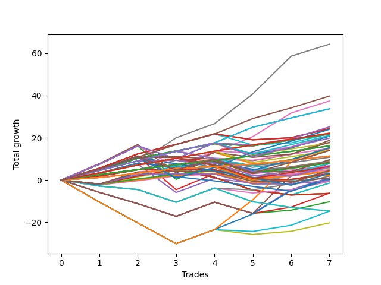

# Long Wallace Doodle 016 
- Symbol: TSLA_Unlimited
- Date Range: 03/23/2022 - 07/08/2022
- Trading Period: 7:20-12:30
- Number of Trades: 7



| Name | Win Percent | Profit | Avg Profit / Trade | Avg Time / Trade |      | Name | Win Percent | Profit | Avg Profit / Trade | Avg Time / Trade |
| ---- | ----------- | ------ | ------------------ | ---------------- | ---- | ---- | ----------- | ------ | ------------------ | ---------------- |
| Sorted By <br> Profit | | | | | | Sorted By <br> Win Percentage ||||
| Seven | 100.00 | 32175.00 | 4596.43 | 132:22 |     | Seven | 100.00 | 32175.00 | 4596.43 | 132:22 |
| Eighty-Five | 100.00 | 19890.00 | 2841.43 | 58:38 |     | Eighty-Five | 100.00 | 19890.00 | 2841.43 | 58:38 |
| Six | 85.71 | 18725.00 | 2675.00 | 108:45 |     | One Hundred Twenty-Four | 100.00 | 16855.00 | 2407.86 | 25:02 |
| One Hundred Twenty-Four | 100.00 | 16855.00 | 2407.86 | 25:02 |     | Eighty-Four | 100.00 | 16855.00 | 2407.86 | 25:02 |
| Eighty-Four | 100.00 | 16855.00 | 2407.86 | 25:02 |     | One Hundred Twenty-Eight | 100.00 | 11065.00 | 1580.71 | 12:49 |
| Sixty-Six | 71.43 | 12580.00 | 1797.14 | 17:15 |     | One Hundred Twenty-Three | 100.00 | 11065.00 | 1580.71 | 12:49 |
| Sixty-Five | 85.71 | 12165.00 | 1737.86 | 13:41 |     | Eighty-Three | 100.00 | 11065.00 | 1580.71 | 12:49 |
| Fifty-Seven | 85.71 | 12165.00 | 1737.86 | 13:41 |     | One Hundred Twenty-Seven | 100.00 | 8080.00 | 1154.29 | 10:32 |
| One | 85.71 | 12165.00 | 1737.86 | 13:41 |     | One Hundred Twenty-Two | 100.00 | 8080.00 | 1154.29 | 10:32 |
| One Hundred Twenty-Five | 85.71 | 12000.00 | 1714.29 | 27:01 |     | Eighty-Two | 100.00 | 8080.00 | 1154.29 | 10:32 |
| One Hundred Twenty-Eight | 100.00 | 11065.00 | 1580.71 | 12:49 |     | One Hundred Twenty-Six | 100.00 | 5675.00 | 810.71 | 09:41 |
| One Hundred Twenty-Three | 100.00 | 11065.00 | 1580.71 | 12:49 |     | One Hundred Twenty-One | 100.00 | 5675.00 | 810.71 | 09:41 |
| Eighty-Three | 100.00 | 11065.00 | 1580.71 | 12:49 |     | Eighty-One | 100.00 | 5675.00 | 810.71 | 09:41 |
| Forty-One | 85.71 | 10935.00 | 1562.14 | 10:37 |     | Six | 85.71 | 18725.00 | 2675.00 | 108:45 |
| Sixty-Four | 85.71 | 10900.00 | 1557.14 | 07:22 |     | Sixty-Five | 85.71 | 12165.00 | 1737.86 | 13:41 |
| Fifty-Six | 85.71 | 10900.00 | 1557.14 | 07:22 |     | Fifty-Seven | 85.71 | 12165.00 | 1737.86 | 13:41 |
| Zero | 85.71 | 10900.00 | 1557.14 | 07:22 |     | One | 85.71 | 12165.00 | 1737.86 | 13:41 |
| Fifty-Eight | 71.43 | 10650.00 | 1521.43 | 17:33 |     | One Hundred Twenty-Five | 85.71 | 12000.00 | 1714.29 | 27:01 |
| One Hundred Fourteen | 85.71 | 10515.00 | 1502.14 | 13:53 |     | Forty-One | 85.71 | 10935.00 | 1562.14 | 10:37 |
| Forty-Two | 71.43 | 10380.00 | 1482.86 | 13:22 |     | Sixty-Four | 85.71 | 10900.00 | 1557.14 | 07:22 |
| One Hundred Twenty-Nine | 85.71 | 9920.00 | 1417.14 | 24:47 |     | Fifty-Six | 85.71 | 10900.00 | 1557.14 | 07:22 |
| Five | 71.43 | 9385.00 | 1340.71 | 70:02 |     | Zero | 85.71 | 10900.00 | 1557.14 | 07:22 |
| Sixty-Seven | 71.43 | 8935.00 | 1276.43 | 31:11 |     | One Hundred Fourteen | 85.71 | 10515.00 | 1502.14 | 13:53 |
| Forty | 85.71 | 8755.00 | 1250.71 | 05:50 |     | One Hundred Twenty-Nine | 85.71 | 9920.00 | 1417.14 | 24:47 |
| One Hundred Twenty-Seven | 100.00 | 8080.00 | 1154.29 | 10:32 |     | Forty | 85.71 | 8755.00 | 1250.71 | 05:50 |
| One Hundred Twenty-Two | 100.00 | 8080.00 | 1154.29 | 10:32 |     | One Hundred Thirteen | 85.71 | 6945.00 | 992.14 | 04:22 |
| Eighty-Two | 100.00 | 8080.00 | 1154.29 | 10:32 |     | One Hundred Two | 85.71 | 5385.00 | 769.29 | 02:06 |
| Two | 71.43 | 7680.00 | 1097.14 | 25:48 |     | One Hundred Twelve | 85.71 | 4425.00 | 632.14 | 02:12 |
| One Hundred Fifteen | 71.43 | 7590.00 | 1084.29 | 15:33 |     | One Hundred Seven | 85.71 | 4125.00 | 589.29 | 02:15 |
| Forty-Eight | 71.43 | 7500.00 | 1071.43 | 06:55 |     | One Hundred Seventeen | 85.71 | 4025.00 | 575.00 | 04:44 |
| Forty-Three | 71.43 | 7445.00 | 1063.57 | 23:48 |     | One Hundred One | 85.71 | 3385.00 | 483.57 | 01:36 |
| Sixty-Three | 57.14 | 7090.00 | 1012.86 | 70:25 |     | One Hundred Eleven | 85.71 | 2425.00 | 346.43 | 01:42 |
| Fifty-Nine | 71.43 | 7005.00 | 1000.71 | 31:30 |     | One Hundred Six | 85.71 | 2125.00 | 303.57 | 01:45 |
| One Hundred Thirty | 71.43 | 6995.00 | 999.29 | 26:27 |     | One Hundred Sixteen | 85.71 | 2025.00 | 289.29 | 04:14 |
| One Hundred Thirteen | 85.71 | 6945.00 | 992.14 | 04:22 |     | Sixty-Six | 71.43 | 12580.00 | 1797.14 | 17:15 |
| One Hundred Twenty-Six | 100.00 | 5675.00 | 810.71 | 09:41 |     | Fifty-Eight | 71.43 | 10650.00 | 1521.43 | 17:33 |
| One Hundred Twenty-One | 100.00 | 5675.00 | 810.71 | 09:41 |     | Forty-Two | 71.43 | 10380.00 | 1482.86 | 13:22 |
| Eighty-One | 100.00 | 5675.00 | 810.71 | 09:41 |     | Five | 71.43 | 9385.00 | 1340.71 | 70:02 |
| One Hundred Two | 85.71 | 5385.00 | 769.29 | 02:06 |     | Sixty-Seven | 71.43 | 8935.00 | 1276.43 | 31:11 |
| One Hundred Ten | 71.43 | 4790.00 | 684.29 | 06:32 |     | Two | 71.43 | 7680.00 | 1097.14 | 25:48 |
| One Hundred Three | 71.43 | 4530.00 | 647.14 | 03:52 |     | One Hundred Fifteen | 71.43 | 7590.00 | 1084.29 | 15:33 |
| Seventy-Three | 71.43 | 4455.00 | 636.43 | 13:22 |     | Forty-Eight | 71.43 | 7500.00 | 1071.43 | 06:55 |
| One Hundred Twelve | 85.71 | 4425.00 | 632.14 | 02:12 |     | Forty-Three | 71.43 | 7445.00 | 1063.57 | 23:48 |
| One Hundred Eight | 71.43 | 4305.00 | 615.00 | 03:57 |     | Fifty-Nine | 71.43 | 7005.00 | 1000.71 | 31:30 |
| One Hundred Seven | 85.71 | 4125.00 | 589.29 | 02:15 |     | One Hundred Thirty | 71.43 | 6995.00 | 999.29 | 26:27 |
| One Hundred Seventeen | 85.71 | 4025.00 | 575.00 | 04:44 |     | One Hundred Ten | 71.43 | 4790.00 | 684.29 | 06:32 |
| Three | 71.43 | 3940.00 | 562.86 | 39:44 |     | One Hundred Three | 71.43 | 4530.00 | 647.14 | 03:52 |
| Forty-Seven | 42.86 | 3895.00 | 556.43 | 50:45 |     | Seventy-Three | 71.43 | 4455.00 | 636.43 | 13:22 |
| One Hundred Four | 57.14 | 3875.00 | 553.57 | 10:35 |     | One Hundred Eight | 71.43 | 4305.00 | 615.00 | 03:57 |
| One Hundred One | 85.71 | 3385.00 | 483.57 | 01:36 |     | Three | 71.43 | 3940.00 | 562.86 | 39:44 |
| Ninety-Two | 71.43 | 3325.00 | 475.00 | 01:25 |     | Ninety-Two | 71.43 | 3325.00 | 475.00 | 01:25 |
| One Hundred Nine | 71.43 | 3255.00 | 465.00 | 06:17 |     | One Hundred Nine | 71.43 | 3255.00 | 465.00 | 06:17 |
| One Hundred Eighteen | 71.43 | 3170.00 | 452.86 | 06:30 |     | One Hundred Eighteen | 71.43 | 3170.00 | 452.86 | 06:30 |
| One Hundred Ninteen | 57.14 | 3040.00 | 434.29 | 10:12 |     | Ninety-One | 71.43 | 2000.00 | 285.71 | 01:16 |
| Ninety-Three | 57.14 | 2800.00 | 400.00 | 03:09 |     | Four | 71.43 | 1975.00 | 282.14 | 54:53 |
| Sixty-Nine | 42.86 | 2440.00 | 348.57 | 39:33 |     | Ninety-Seven | 71.43 | 1435.00 | 205.00 | 01:39 |
| One Hundred Eleven | 85.71 | 2425.00 | 346.43 | 01:42 |     | Ninety-Six | 71.43 | 1175.00 | 167.86 | 01:32 |
| One Hundred Twenty | 42.86 | 2240.00 | 320.00 | 10:51 |     | Sixty-Three | 57.14 | 7090.00 | 1012.86 | 70:25 |
| One Hundred Six | 85.71 | 2125.00 | 303.57 | 01:45 |     | One Hundred Four | 57.14 | 3875.00 | 553.57 | 10:35 |
| Ninety-Four | 42.86 | 2060.00 | 294.29 | 06:44 |     | One Hundred Ninteen | 57.14 | 3040.00 | 434.29 | 10:12 |
| One Hundred Sixteen | 85.71 | 2025.00 | 289.29 | 04:14 |     | Ninety-Three | 57.14 | 2800.00 | 400.00 | 03:09 |
| Ninety-One | 71.43 | 2000.00 | 285.71 | 01:16 |     | Ninety-Eight | 57.14 | 1555.00 | 222.14 | 03:00 |
| Four | 71.43 | 1975.00 | 282.14 | 54:53 |     | Forty-Nine | 57.14 | 940.00 | 134.29 | 11:25 |
| One Hundred Five | 42.86 | 1600.00 | 228.57 | 11:32 |     | One Hundred | 57.14 | 470.00 | 67.14 | 03:20 |
| Ninety-Eight | 57.14 | 1555.00 | 222.14 | 03:00 |     | Sixty-Two | 57.14 | 400.00 | 57.14 | 56:43 |
| Ninety-Seven | 71.43 | 1435.00 | 205.00 | 01:39 |     | Ninety-Nine | 57.14 | -140.00 | -20.00 | 03:13 |
| Ninety-Six | 71.43 | 1175.00 | 167.86 | 01:32 |     | Forty-Seven | 42.86 | 3895.00 | 556.43 | 50:45 |
| Forty-Nine | 57.14 | 940.00 | 134.29 | 11:25 |     | Sixty-Nine | 42.86 | 2440.00 | 348.57 | 39:33 |
| Forty-Six | 42.86 | 550.00 | 78.57 | 43:55 |     | One Hundred Twenty | 42.86 | 2240.00 | 320.00 | 10:51 |
| One Hundred | 57.14 | 470.00 | 67.14 | 03:20 |     | Ninety-Four | 42.86 | 2060.00 | 294.29 | 06:44 |
| Sixty-Two | 57.14 | 400.00 | 57.14 | 56:43 |     | One Hundred Five | 42.86 | 1600.00 | 228.57 | 11:32 |
| Ninety-Five | 28.57 | 145.00 | 20.71 | 07:28 |     | Forty-Six | 42.86 | 550.00 | 78.57 | 43:55 |
| Ninety-Nine | 57.14 | -140.00 | -20.00 | 03:13 |     | Sixty-Eight | 42.86 | -330.00 | -47.14 | 38:39 |
| Sixty-Eight | 42.86 | -330.00 | -47.14 | 38:39 |     | Fifty-One | 42.86 | -735.00 | -105.00 | 11:50 |
| Fifty-One | 42.86 | -735.00 | -105.00 | 11:50 |     | Fifty | 42.86 | -735.00 | -105.00 | 11:50 |
| Fifty | 42.86 | -735.00 | -105.00 | 11:50 |     | Forty-Five | 42.86 | -3105.00 | -443.57 | 32:25 |
| Forty-Five | 42.86 | -3105.00 | -443.57 | 32:25 |     | Fifty-Five | 42.86 | -3180.00 | -454.29 | 12:59 |
| Fifty-Five | 42.86 | -3180.00 | -454.29 | 12:59 |     | Fifty-Four | 42.86 | -3180.00 | -454.29 | 12:59 |
| Fifty-Four | 42.86 | -3180.00 | -454.29 | 12:59 |     | Fifty-Three | 42.86 | -3180.00 | -454.29 | 12:59 |
| Fifty-Three | 42.86 | -3180.00 | -454.29 | 12:59 |     | Fifty-Two | 42.86 | -3180.00 | -454.29 | 12:59 |
| Fifty-Two | 42.86 | -3180.00 | -454.29 | 12:59 |     | Forty-Four | 42.86 | -5160.00 | -737.14 | 31:54 |
| Forty-Four | 42.86 | -5160.00 | -737.14 | 31:54 |     | Sixty-One | 42.86 | -7390.00 | -1055.71 | 41:50 |
| Seventy-One | 14.29 | -7355.00 | -1050.71 | 50:57 |     | Sixty | 42.86 | -10160.00 | -1451.43 | 40:56 |
| Seventy | 14.29 | -7355.00 | -1050.71 | 50:57 |     | Ninety-Five | 28.57 | 145.00 | 20.71 | 07:28 |
| Sixty-One | 42.86 | -7390.00 | -1055.71 | 41:50 |     | Seventy-One | 14.29 | -7355.00 | -1050.71 | 50:57 |
| Sixty | 42.86 | -10160.00 | -1451.43 | 40:56 |     | Seventy | 14.29 | -7355.00 | -1050.71 | 50:57 |

## NO STOPLOSS

### Test Zero
* Sell when price hits the middle line of the 20p bollinger
* No Stoploss
* Results:
```
Total Trades: 7
Percent Up: 85.71
Percent Down: 14.29
Total Points Moved Up: 21.80
Potential Profit: 10900.00
Total Points Ups: 22.79 Count Ups: 6
Total Points Downs: -0.99 Count Downs: 1
```

<details><summary>Trades</summary>

<code>In: 2022-03-23 10:25:00		Out: 2022-03-23 10:31:40		Total Position Time: 06:40		Total Move Up: 4.52		Total to Date: 4.52</code> <br />
<code>In: 2022-03-23 10:27:00		Out: 2022-03-23 10:31:40		Total Position Time: 04:40		Total Move Up: 5.75		Total to Date: 10.27</code> <br />
<code>In: 2022-04-07 07:51:00		Out: 2022-04-07 08:00:05		Total Position Time: 09:05		Total Move Up: 3.51		Total to Date: 13.78</code> <br />
<code>In: 2022-04-25 12:09:00		Out: 2022-04-25 12:16:15		Total Position Time: 07:15		Total Move Up: 3.38		Total to Date: 17.16</code> <br />
<code>In: 2022-05-02 10:02:00		Out: 2022-05-02 10:14:55		Total Position Time: 12:55		Total Move Up: -0.99		Total to Date: 16.17</code> <br />
<code>In: 2022-05-02 10:08:00		Out: 2022-05-02 10:14:55		Total Position Time: 06:55		Total Move Up: 2.81		Total to Date: 18.98</code> <br />
<code>In: 2022-05-06 11:11:00		Out: 2022-05-06 11:15:10		Total Position Time: 04:10		Total Move Up: 2.82		Total to Date: 21.80</code> <br />


</details>

### Test One
* Sell when the price hits the upper line of the 20p 1std bollinger
* No Stoploss
* Results:
```
Total Trades: 7
Percent Up: 85.71
Percent Down: 14.29
Total Points Moved Up: 24.33
Potential Profit: 12165.00
Total Points Ups: 27.15 Count Ups: 6
Total Points Downs: -2.82 Count Downs: 1
```

<details><summary>Trades</summary>

<code>In: 2022-03-23 10:25:00		Out: 2022-03-23 10:36:15		Total Position Time: 11:15		Total Move Up: 5.56		Total to Date: 5.56</code> <br />
<code>In: 2022-03-23 10:27:00		Out: 2022-03-23 10:36:15		Total Position Time: 09:15		Total Move Up: 6.79		Total to Date: 12.35</code> <br />
<code>In: 2022-04-07 07:51:00		Out: 2022-04-07 08:01:05		Total Position Time: 10:05		Total Move Up: 4.51		Total to Date: 16.86</code> <br />
<code>In: 2022-04-25 12:09:00		Out: 2022-04-25 12:19:50		Total Position Time: 10:50		Total Move Up: 5.01		Total to Date: 21.87</code> <br />
<code>In: 2022-05-02 10:02:00		Out: 2022-05-02 10:25:35		Total Position Time: 23:35		Total Move Up: -2.82		Total to Date: 19.05</code> <br />
<code>In: 2022-05-02 10:08:00		Out: 2022-05-02 10:25:35		Total Position Time: 17:35		Total Move Up: 0.98		Total to Date: 20.03</code> <br />
<code>In: 2022-05-06 11:11:00		Out: 2022-05-06 11:24:15		Total Position Time: 13:15		Total Move Up: 4.30		Total to Date: 24.33</code> <br />


</details>

### Test Two
* Sell when the price hits the upper line of the 20p 2std bollinger
* No Stoploss
* Results:
```
Total Trades: 7
Percent Up: 71.43
Percent Down: 28.57
Total Points Moved Up: 15.36
Potential Profit: 7680.00
Total Points Ups: 32.03 Count Ups: 5
Total Points Downs: -16.67 Count Downs: 2
```

<details><summary>Trades</summary>

<code>In: 2022-03-23 10:25:00		Out: 2022-03-23 10:38:40		Total Position Time: 13:40		Total Move Up: 7.43		Total to Date: 7.43</code> <br />
<code>In: 2022-03-23 10:27:00		Out: 2022-03-23 10:38:40		Total Position Time: 11:40		Total Move Up: 8.66		Total to Date: 16.09</code> <br />
<code>In: 2022-04-07 07:51:00		Out: 2022-04-07 09:09:30		Total Position Time: 78:30		Total Move Up: -15.79		Total to Date: 0.30</code> <br />
<code>In: 2022-04-25 12:09:00		Out: 2022-04-25 12:20:10		Total Position Time: 11:10		Total Move Up: 7.40		Total to Date: 7.70</code> <br />
<code>In: 2022-05-02 10:02:00		Out: 2022-05-02 10:31:10		Total Position Time: 29:10		Total Move Up: -0.88		Total to Date: 6.82</code> <br />
<code>In: 2022-05-02 10:08:00		Out: 2022-05-02 10:31:10		Total Position Time: 23:10		Total Move Up: 2.92		Total to Date: 9.74</code> <br />
<code>In: 2022-05-06 11:11:00		Out: 2022-05-06 11:24:20		Total Position Time: 13:20		Total Move Up: 5.62		Total to Date: 15.36</code> <br />


</details>

### Test Three
* Sell when price hits the middle line of the 50p bollinger
* No Stoploss
* Results:
```
Total Trades: 7
Percent Up: 71.43
Percent Down: 28.57
Total Points Moved Up: 7.88
Potential Profit: 3940.00
Total Points Ups: 26.16 Count Ups: 5
Total Points Downs: -18.28 Count Downs: 2
```

<details><summary>Trades</summary>

<code>In: 2022-03-23 10:25:00		Out: 2022-03-23 10:55:10		Total Position Time: 30:10		Total Move Up: 5.07		Total to Date: 5.07</code> <br />
<code>In: 2022-03-23 10:27:00		Out: 2022-03-23 10:55:10		Total Position Time: 28:10		Total Move Up: 6.30		Total to Date: 11.37</code> <br />
<code>In: 2022-04-07 07:51:00		Out: 2022-04-07 09:09:25		Total Position Time: 78:25		Total Move Up: -15.98		Total to Date: -4.61</code> <br />
<code>In: 2022-04-25 12:09:00		Out: 2022-04-25 12:35:35		Total Position Time: 26:35		Total Move Up: 7.67		Total to Date: 3.06</code> <br />
<code>In: 2022-05-02 10:02:00		Out: 2022-05-02 10:55:45		Total Position Time: 53:45		Total Move Up: -2.30		Total to Date: 0.76</code> <br />
<code>In: 2022-05-02 10:08:00		Out: 2022-05-02 10:55:45		Total Position Time: 47:45		Total Move Up: 1.50		Total to Date: 2.26</code> <br />
<code>In: 2022-05-06 11:11:00		Out: 2022-05-06 11:24:20		Total Position Time: 13:20		Total Move Up: 5.62		Total to Date: 7.88</code> <br />


</details>

### Test Four
* Sell when the price hits the upper line of the 50p 1std bollinger
* No Stoploss
* Results:
```
Total Trades: 7
Percent Up: 71.43
Percent Down: 28.57
Total Points Moved Up: 3.95
Potential Profit: 1975.00
Total Points Ups: 19.65 Count Ups: 5
Total Points Downs: -15.70 Count Downs: 2
```

<details><summary>Trades</summary>

<code>In: 2022-03-23 10:25:00		Out: 2022-03-23 11:29:15		Total Position Time: 64:15		Total Move Up: 3.13		Total to Date: 3.13</code> <br />
<code>In: 2022-03-23 10:27:00		Out: 2022-03-23 11:29:15		Total Position Time: 62:15		Total Move Up: 4.36		Total to Date: 7.49</code> <br />
<code>In: 2022-04-07 07:51:00		Out: 2022-04-07 09:10:55		Total Position Time: 79:55		Total Move Up: -13.40		Total to Date: -5.91</code> <br />
<code>In: 2022-04-25 12:09:00		Out: 2022-04-25 12:47:00		Total Position Time: 38:00		Total Move Up: 6.68		Total to Date: 0.77</code> <br />
<code>In: 2022-05-02 10:02:00		Out: 2022-05-02 10:55:45		Total Position Time: 53:45		Total Move Up: -2.30		Total to Date: -1.53</code> <br />
<code>In: 2022-05-02 10:08:00		Out: 2022-05-02 10:55:45		Total Position Time: 47:45		Total Move Up: 1.50		Total to Date: -0.03</code> <br />
<code>In: 2022-05-06 11:11:00		Out: 2022-05-06 11:49:20		Total Position Time: 38:20		Total Move Up: 3.98		Total to Date: 3.95</code> <br />


</details>

### Test Five
* Sell when the price hits the upper line of the 50p 2std bollinger
* No Stoploss
* Results:
```
Total Trades: 7
Percent Up: 71.43
Percent Down: 28.57
Total Points Moved Up: 18.77
Potential Profit: 9385.00
Total Points Ups: 33.04 Count Ups: 5
Total Points Downs: -14.27 Count Downs: 2
```

<details><summary>Trades</summary>

<code>In: 2022-03-23 10:25:00		Out: 2022-03-23 11:48:30		Total Position Time: 83:30		Total Move Up: 7.77		Total to Date: 7.77</code> <br />
<code>In: 2022-03-23 10:27:00		Out: 2022-03-23 11:48:30		Total Position Time: 81:30		Total Move Up: 9.00		Total to Date: 16.77</code> <br />
<code>In: 2022-04-07 07:51:00		Out: 2022-04-07 10:12:10		Total Position Time: 141:10		Total Move Up: -13.40		Total to Date: 3.37</code> <br />
<code>In: 2022-04-25 12:09:00		Out: 2022-04-25 12:47:00		Total Position Time: 38:00		Total Move Up: 6.68		Total to Date: 10.05</code> <br />
<code>In: 2022-05-02 10:02:00		Out: 2022-05-02 10:58:30		Total Position Time: 56:30		Total Move Up: -0.87		Total to Date: 9.18</code> <br />
<code>In: 2022-05-02 10:08:00		Out: 2022-05-02 10:58:30		Total Position Time: 50:30		Total Move Up: 2.93		Total to Date: 12.11</code> <br />
<code>In: 2022-05-06 11:11:00		Out: 2022-05-06 11:50:10		Total Position Time: 39:10		Total Move Up: 6.66		Total to Date: 18.77</code> <br />


</details>

### Test Six
* Sell when the price hits the middle line of the 1std VWAP
* No Stoploss
* Results:
```
Total Trades: 7
Percent Up: 85.71
Percent Down: 14.29
Total Points Moved Up: 37.45
Potential Profit: 18725.00
Total Points Ups: 38.93 Count Ups: 6
Total Points Downs: -1.48 Count Downs: 1
```

<details><summary>Trades</summary>

<code>In: 2022-03-23 10:25:00		Out: 2022-03-23 12:47:00		Total Position Time: 142:00		Total Move Up: 3.36		Total to Date: 3.36</code> <br />
<code>In: 2022-03-23 10:27:00		Out: 2022-03-23 12:47:00		Total Position Time: 140:00		Total Move Up: 4.59		Total to Date: 7.95</code> <br />
<code>In: 2022-04-07 07:51:00		Out: 2022-04-07 11:02:00		Total Position Time: 191:00		Total Move Up: -1.48		Total to Date: 6.47</code> <br />
<code>In: 2022-04-25 12:09:00		Out: 2022-04-25 12:47:00		Total Position Time: 38:00		Total Move Up: 6.68		Total to Date: 13.15</code> <br />
<code>In: 2022-05-02 10:02:00		Out: 2022-05-02 11:22:10		Total Position Time: 80:10		Total Move Up: 7.40		Total to Date: 20.55</code> <br />
<code>In: 2022-05-02 10:08:00		Out: 2022-05-02 11:22:10		Total Position Time: 74:10		Total Move Up: 11.20		Total to Date: 31.75</code> <br />
<code>In: 2022-05-06 11:11:00		Out: 2022-05-06 12:47:00		Total Position Time: 96:00		Total Move Up: 5.70		Total to Date: 37.45</code> <br />


</details>

### Test Seven
* Sell when the price hits the upper line of the 1std VWAP
* No Stoploss
* Results:
```
Total Trades: 7
Percent Up: 100.00
Percent Down: 0.00
Total Points Moved Up: 64.35
Potential Profit: 32175.00
Total Points Ups: 64.35 Count Ups: 7
Total Points Downs: 0.00 Count Downs: 0
```

<details><summary>Trades</summary>

<code>In: 2022-03-23 10:25:00		Out: 2022-03-23 12:47:00		Total Position Time: 142:00		Total Move Up: 3.36		Total to Date: 3.36</code> <br />
<code>In: 2022-03-23 10:27:00		Out: 2022-03-23 12:47:00		Total Position Time: 140:00		Total Move Up: 4.59		Total to Date: 7.95</code> <br />
<code>In: 2022-04-07 07:51:00		Out: 2022-04-07 12:11:25		Total Position Time: 260:25		Total Move Up: 12.04		Total to Date: 19.99</code> <br />
<code>In: 2022-04-25 12:09:00		Out: 2022-04-25 12:47:00		Total Position Time: 38:00		Total Move Up: 6.68		Total to Date: 26.67</code> <br />
<code>In: 2022-05-02 10:02:00		Out: 2022-05-02 12:10:05		Total Position Time: 128:05		Total Move Up: 14.09		Total to Date: 40.76</code> <br />
<code>In: 2022-05-02 10:08:00		Out: 2022-05-02 12:10:05		Total Position Time: 122:05		Total Move Up: 17.89		Total to Date: 58.65</code> <br />
<code>In: 2022-05-06 11:11:00		Out: 2022-05-06 12:47:00		Total Position Time: 96:00		Total Move Up: 5.70		Total to Date: 64.35</code> <br />


</details>

## STOPLOSS OF 5

### Test Forty
* Sell when price hits the middle line of the 20p bollinger
* Stoploss is 5 points
* Results:
```
Total Trades: 7
Percent Up: 85.71
Percent Down: 14.29
Total Points Moved Up: 17.51
Potential Profit: 8755.00
Total Points Ups: 22.79 Count Ups: 6
Total Points Downs: -5.28 Count Downs: 1
```

<details><summary>Trades</summary>

<code>In: 2022-03-23 10:25:00		Out: 2022-03-23 10:31:40		Total Position Time: 06:40		Total Move Up: 4.52		Total to Date: 4.52</code> <br />
<code>In: 2022-03-23 10:27:00		Out: 2022-03-23 10:31:40		Total Position Time: 04:40		Total Move Up: 5.75		Total to Date: 10.27</code> <br />
<code>In: 2022-04-07 07:51:00		Out: 2022-04-07 08:00:05		Total Position Time: 09:05		Total Move Up: 3.51		Total to Date: 13.78</code> <br />
<code>In: 2022-04-25 12:09:00		Out: 2022-04-25 12:16:15		Total Position Time: 07:15		Total Move Up: 3.38		Total to Date: 17.16</code> <br />
<code>In: 2022-05-02 10:02:00		Out: 2022-05-02 10:04:05		Total Position Time: 02:05		Total Move Up: -5.28		Total to Date: 11.88</code> <br />
<code>In: 2022-05-02 10:08:00		Out: 2022-05-02 10:14:55		Total Position Time: 06:55		Total Move Up: 2.81		Total to Date: 14.69</code> <br />
<code>In: 2022-05-06 11:11:00		Out: 2022-05-06 11:15:10		Total Position Time: 04:10		Total Move Up: 2.82		Total to Date: 17.51</code> <br />


</details>

### Test Forty-One
* Sell when the price hits the upper line of the 20p 1std bollinger
* Stoploss is 5 points
* Results:
```
Total Trades: 7
Percent Up: 85.71
Percent Down: 14.29
Total Points Moved Up: 21.87
Potential Profit: 10935.00
Total Points Ups: 27.15 Count Ups: 6
Total Points Downs: -5.28 Count Downs: 1
```

<details><summary>Trades</summary>

<code>In: 2022-03-23 10:25:00		Out: 2022-03-23 10:36:15		Total Position Time: 11:15		Total Move Up: 5.56		Total to Date: 5.56</code> <br />
<code>In: 2022-03-23 10:27:00		Out: 2022-03-23 10:36:15		Total Position Time: 09:15		Total Move Up: 6.79		Total to Date: 12.35</code> <br />
<code>In: 2022-04-07 07:51:00		Out: 2022-04-07 08:01:05		Total Position Time: 10:05		Total Move Up: 4.51		Total to Date: 16.86</code> <br />
<code>In: 2022-04-25 12:09:00		Out: 2022-04-25 12:19:50		Total Position Time: 10:50		Total Move Up: 5.01		Total to Date: 21.87</code> <br />
<code>In: 2022-05-02 10:02:00		Out: 2022-05-02 10:04:05		Total Position Time: 02:05		Total Move Up: -5.28		Total to Date: 16.59</code> <br />
<code>In: 2022-05-02 10:08:00		Out: 2022-05-02 10:25:35		Total Position Time: 17:35		Total Move Up: 0.98		Total to Date: 17.57</code> <br />
<code>In: 2022-05-06 11:11:00		Out: 2022-05-06 11:24:15		Total Position Time: 13:15		Total Move Up: 4.30		Total to Date: 21.87</code> <br />


</details>

### Test Forty-Two
* Sell when the price hits the upper line of the 20p 2std bollinger
* Stoploss is 5 points
* Results:
```
Total Trades: 7
Percent Up: 71.43
Percent Down: 28.57
Total Points Moved Up: 20.76
Potential Profit: 10380.00
Total Points Ups: 32.03 Count Ups: 5
Total Points Downs: -11.27 Count Downs: 2
```

<details><summary>Trades</summary>

<code>In: 2022-03-23 10:25:00		Out: 2022-03-23 10:38:40		Total Position Time: 13:40		Total Move Up: 7.43		Total to Date: 7.43</code> <br />
<code>In: 2022-03-23 10:27:00		Out: 2022-03-23 10:38:40		Total Position Time: 11:40		Total Move Up: 8.66		Total to Date: 16.09</code> <br />
<code>In: 2022-04-07 07:51:00		Out: 2022-04-07 08:09:35		Total Position Time: 18:35		Total Move Up: -5.99		Total to Date: 10.10</code> <br />
<code>In: 2022-04-25 12:09:00		Out: 2022-04-25 12:20:10		Total Position Time: 11:10		Total Move Up: 7.40		Total to Date: 17.50</code> <br />
<code>In: 2022-05-02 10:02:00		Out: 2022-05-02 10:04:05		Total Position Time: 02:05		Total Move Up: -5.28		Total to Date: 12.22</code> <br />
<code>In: 2022-05-02 10:08:00		Out: 2022-05-02 10:31:10		Total Position Time: 23:10		Total Move Up: 2.92		Total to Date: 15.14</code> <br />
<code>In: 2022-05-06 11:11:00		Out: 2022-05-06 11:24:20		Total Position Time: 13:20		Total Move Up: 5.62		Total to Date: 20.76</code> <br />


</details>

### Test Forty-Three
* Sell when price hits the middle line of the 50p bollinger
* Stoploss is 5 points
* Results:
```
Total Trades: 7
Percent Up: 71.43
Percent Down: 28.57
Total Points Moved Up: 14.89
Potential Profit: 7445.00
Total Points Ups: 26.16 Count Ups: 5
Total Points Downs: -11.27 Count Downs: 2
```

<details><summary>Trades</summary>

<code>In: 2022-03-23 10:25:00		Out: 2022-03-23 10:55:10		Total Position Time: 30:10		Total Move Up: 5.07		Total to Date: 5.07</code> <br />
<code>In: 2022-03-23 10:27:00		Out: 2022-03-23 10:55:10		Total Position Time: 28:10		Total Move Up: 6.30		Total to Date: 11.37</code> <br />
<code>In: 2022-04-07 07:51:00		Out: 2022-04-07 08:09:35		Total Position Time: 18:35		Total Move Up: -5.99		Total to Date: 5.38</code> <br />
<code>In: 2022-04-25 12:09:00		Out: 2022-04-25 12:35:35		Total Position Time: 26:35		Total Move Up: 7.67		Total to Date: 13.05</code> <br />
<code>In: 2022-05-02 10:02:00		Out: 2022-05-02 10:04:05		Total Position Time: 02:05		Total Move Up: -5.28		Total to Date: 7.77</code> <br />
<code>In: 2022-05-02 10:08:00		Out: 2022-05-02 10:55:45		Total Position Time: 47:45		Total Move Up: 1.50		Total to Date: 9.27</code> <br />
<code>In: 2022-05-06 11:11:00		Out: 2022-05-06 11:24:20		Total Position Time: 13:20		Total Move Up: 5.62		Total to Date: 14.89</code> <br />


</details>

### Test Forty-Four
* Sell when the price hits the upper line of the 50p 1std bollinger
* Stoploss is 5 points
* Results:
```
Total Trades: 7
Percent Up: 42.86
Percent Down: 57.14
Total Points Moved Up: -10.32
Potential Profit: -5160.00
Total Points Ups: 12.16 Count Ups: 3
Total Points Downs: -22.48 Count Downs: 4
```

<details><summary>Trades</summary>

<code>In: 2022-03-23 10:25:00		Out: 2022-03-23 11:05:15		Total Position Time: 40:15		Total Move Up: -5.87		Total to Date: -5.87</code> <br />
<code>In: 2022-03-23 10:27:00		Out: 2022-03-23 11:05:20		Total Position Time: 38:20		Total Move Up: -5.34		Total to Date: -11.21</code> <br />
<code>In: 2022-04-07 07:51:00		Out: 2022-04-07 08:09:35		Total Position Time: 18:35		Total Move Up: -5.99		Total to Date: -17.20</code> <br />
<code>In: 2022-04-25 12:09:00		Out: 2022-04-25 12:47:00		Total Position Time: 38:00		Total Move Up: 6.68		Total to Date: -10.52</code> <br />
<code>In: 2022-05-02 10:02:00		Out: 2022-05-02 10:04:05		Total Position Time: 02:05		Total Move Up: -5.28		Total to Date: -15.80</code> <br />
<code>In: 2022-05-02 10:08:00		Out: 2022-05-02 10:55:45		Total Position Time: 47:45		Total Move Up: 1.50		Total to Date: -14.30</code> <br />
<code>In: 2022-05-06 11:11:00		Out: 2022-05-06 11:49:20		Total Position Time: 38:20		Total Move Up: 3.98		Total to Date: -10.32</code> <br />


</details>

### Test Forty-Five
* Sell when the price hits the upper line of the 50p 2std bollinger
* Stoploss is 5 points
* Results:
```
Total Trades: 7
Percent Up: 42.86
Percent Down: 57.14
Total Points Moved Up: -6.21
Potential Profit: -3105.00
Total Points Ups: 16.27 Count Ups: 3
Total Points Downs: -22.48 Count Downs: 4
```

<details><summary>Trades</summary>

<code>In: 2022-03-23 10:25:00		Out: 2022-03-23 11:05:15		Total Position Time: 40:15		Total Move Up: -5.87		Total to Date: -5.87</code> <br />
<code>In: 2022-03-23 10:27:00		Out: 2022-03-23 11:05:20		Total Position Time: 38:20		Total Move Up: -5.34		Total to Date: -11.21</code> <br />
<code>In: 2022-04-07 07:51:00		Out: 2022-04-07 08:09:35		Total Position Time: 18:35		Total Move Up: -5.99		Total to Date: -17.20</code> <br />
<code>In: 2022-04-25 12:09:00		Out: 2022-04-25 12:47:00		Total Position Time: 38:00		Total Move Up: 6.68		Total to Date: -10.52</code> <br />
<code>In: 2022-05-02 10:02:00		Out: 2022-05-02 10:04:05		Total Position Time: 02:05		Total Move Up: -5.28		Total to Date: -15.80</code> <br />
<code>In: 2022-05-02 10:08:00		Out: 2022-05-02 10:58:30		Total Position Time: 50:30		Total Move Up: 2.93		Total to Date: -12.87</code> <br />
<code>In: 2022-05-06 11:11:00		Out: 2022-05-06 11:50:10		Total Position Time: 39:10		Total Move Up: 6.66		Total to Date: -6.21</code> <br />


</details>

### Test Forty-Six
* Sell when the price hits the middle line of the 1std VWAP
* Stoploss is 5 points
* Results:
```
Total Trades: 7
Percent Up: 42.86
Percent Down: 57.14
Total Points Moved Up: 1.10
Potential Profit: 550.00
Total Points Ups: 23.58 Count Ups: 3
Total Points Downs: -22.48 Count Downs: 4
```

<details><summary>Trades</summary>

<code>In: 2022-03-23 10:25:00		Out: 2022-03-23 11:05:15		Total Position Time: 40:15		Total Move Up: -5.87		Total to Date: -5.87</code> <br />
<code>In: 2022-03-23 10:27:00		Out: 2022-03-23 11:05:20		Total Position Time: 38:20		Total Move Up: -5.34		Total to Date: -11.21</code> <br />
<code>In: 2022-04-07 07:51:00		Out: 2022-04-07 08:09:35		Total Position Time: 18:35		Total Move Up: -5.99		Total to Date: -17.20</code> <br />
<code>In: 2022-04-25 12:09:00		Out: 2022-04-25 12:47:00		Total Position Time: 38:00		Total Move Up: 6.68		Total to Date: -10.52</code> <br />
<code>In: 2022-05-02 10:02:00		Out: 2022-05-02 10:04:05		Total Position Time: 02:05		Total Move Up: -5.28		Total to Date: -15.80</code> <br />
<code>In: 2022-05-02 10:08:00		Out: 2022-05-02 11:22:10		Total Position Time: 74:10		Total Move Up: 11.20		Total to Date: -4.60</code> <br />
<code>In: 2022-05-06 11:11:00		Out: 2022-05-06 12:47:00		Total Position Time: 96:00		Total Move Up: 5.70		Total to Date: 1.10</code> <br />


</details>

### Test Forty-Seven
* Sell when the price hits the upper line of the 1std VWAP
* Stoploss is 5 points
* Results:
```
Total Trades: 7
Percent Up: 42.86
Percent Down: 57.14
Total Points Moved Up: 7.79
Potential Profit: 3895.00
Total Points Ups: 30.27 Count Ups: 3
Total Points Downs: -22.48 Count Downs: 4
```

<details><summary>Trades</summary>

<code>In: 2022-03-23 10:25:00		Out: 2022-03-23 11:05:15		Total Position Time: 40:15		Total Move Up: -5.87		Total to Date: -5.87</code> <br />
<code>In: 2022-03-23 10:27:00		Out: 2022-03-23 11:05:20		Total Position Time: 38:20		Total Move Up: -5.34		Total to Date: -11.21</code> <br />
<code>In: 2022-04-07 07:51:00		Out: 2022-04-07 08:09:35		Total Position Time: 18:35		Total Move Up: -5.99		Total to Date: -17.20</code> <br />
<code>In: 2022-04-25 12:09:00		Out: 2022-04-25 12:47:00		Total Position Time: 38:00		Total Move Up: 6.68		Total to Date: -10.52</code> <br />
<code>In: 2022-05-02 10:02:00		Out: 2022-05-02 10:04:05		Total Position Time: 02:05		Total Move Up: -5.28		Total to Date: -15.80</code> <br />
<code>In: 2022-05-02 10:08:00		Out: 2022-05-02 12:10:05		Total Position Time: 122:05		Total Move Up: 17.89		Total to Date: 2.09</code> <br />
<code>In: 2022-05-06 11:11:00		Out: 2022-05-06 12:47:00		Total Position Time: 96:00		Total Move Up: 5.70		Total to Date: 7.79</code> <br />


</details>

## TRAIL STOP OF 5

### Test Forty-Eight
* Sell when price hits the middle line of the 20p bollinger
* Trailing Stop is 5 points
* Results:
```
Total Trades: 7
Percent Up: 71.43
Percent Down: 28.57
Total Points Moved Up: 15.00
Potential Profit: 7500.00
Total Points Ups: 19.41 Count Ups: 5
Total Points Downs: -4.41 Count Downs: 2
```

<details><summary>Trades</summary>

<code>In: 2022-03-23 10:25:00		Out: 2022-03-23 10:31:40		Total Position Time: 06:40		Total Move Up: 4.52		Total to Date: 4.52</code> <br />
<code>In: 2022-03-23 10:27:00		Out: 2022-03-23 10:31:40		Total Position Time: 04:40		Total Move Up: 5.75		Total to Date: 10.27</code> <br />
<code>In: 2022-04-07 07:51:00		Out: 2022-04-07 08:00:05		Total Position Time: 09:05		Total Move Up: 3.51		Total to Date: 13.78</code> <br />
<code>In: 2022-04-25 12:09:00		Out: 2022-04-25 12:13:05		Total Position Time: 04:05		Total Move Up: -3.42		Total to Date: 10.36</code> <br />
<code>In: 2022-05-02 10:02:00		Out: 2022-05-02 10:14:55		Total Position Time: 12:55		Total Move Up: -0.99		Total to Date: 9.37</code> <br />
<code>In: 2022-05-02 10:08:00		Out: 2022-05-02 10:14:55		Total Position Time: 06:55		Total Move Up: 2.81		Total to Date: 12.18</code> <br />
<code>In: 2022-05-06 11:11:00		Out: 2022-05-06 11:15:10		Total Position Time: 04:10		Total Move Up: 2.82		Total to Date: 15.00</code> <br />


</details>

### Test Forty-Nine
* Sell when the price hits the upper line of the 20p 1std bollinger
* Trailing Stop is 5 points
* Results:
```
Total Trades: 7
Percent Up: 57.14
Percent Down: 42.86
Total Points Moved Up: 1.88
Potential Profit: 940.00
Total Points Ups: 13.66 Count Ups: 4
Total Points Downs: -11.78 Count Downs: 3
```

<details><summary>Trades</summary>

<code>In: 2022-03-23 10:25:00		Out: 2022-03-23 10:35:30		Total Position Time: 10:30		Total Move Up: 1.81		Total to Date: 1.81</code> <br />
<code>In: 2022-03-23 10:27:00		Out: 2022-03-23 10:35:30		Total Position Time: 08:30		Total Move Up: 3.04		Total to Date: 4.85</code> <br />
<code>In: 2022-04-07 07:51:00		Out: 2022-04-07 08:01:05		Total Position Time: 10:05		Total Move Up: 4.51		Total to Date: 9.36</code> <br />
<code>In: 2022-04-25 12:09:00		Out: 2022-04-25 12:13:05		Total Position Time: 04:05		Total Move Up: -3.42		Total to Date: 5.94</code> <br />
<code>In: 2022-05-02 10:02:00		Out: 2022-05-02 10:21:45		Total Position Time: 19:45		Total Move Up: -6.08		Total to Date: -0.14</code> <br />
<code>In: 2022-05-02 10:08:00		Out: 2022-05-02 10:21:45		Total Position Time: 13:45		Total Move Up: -2.28		Total to Date: -2.42</code> <br />
<code>In: 2022-05-06 11:11:00		Out: 2022-05-06 11:24:15		Total Position Time: 13:15		Total Move Up: 4.30		Total to Date: 1.88</code> <br />


</details>

### Test Fifty
* Sell when the price hits the upper line of the 20p 2std bollinger
* Trailing Stop is 5 points
* Results:
```
Total Trades: 7
Percent Up: 42.86
Percent Down: 57.14
Total Points Moved Up: -1.47
Potential Profit: -735.00
Total Points Ups: 10.47 Count Ups: 3
Total Points Downs: -11.94 Count Downs: 4
```

<details><summary>Trades</summary>

<code>In: 2022-03-23 10:25:00		Out: 2022-03-23 10:35:30		Total Position Time: 10:30		Total Move Up: 1.81		Total to Date: 1.81</code> <br />
<code>In: 2022-03-23 10:27:00		Out: 2022-03-23 10:35:30		Total Position Time: 08:30		Total Move Up: 3.04		Total to Date: 4.85</code> <br />
<code>In: 2022-04-07 07:51:00		Out: 2022-04-07 08:03:55		Total Position Time: 12:55		Total Move Up: -0.16		Total to Date: 4.69</code> <br />
<code>In: 2022-04-25 12:09:00		Out: 2022-04-25 12:13:05		Total Position Time: 04:05		Total Move Up: -3.42		Total to Date: 1.27</code> <br />
<code>In: 2022-05-02 10:02:00		Out: 2022-05-02 10:21:45		Total Position Time: 19:45		Total Move Up: -6.08		Total to Date: -4.81</code> <br />
<code>In: 2022-05-02 10:08:00		Out: 2022-05-02 10:21:45		Total Position Time: 13:45		Total Move Up: -2.28		Total to Date: -7.09</code> <br />
<code>In: 2022-05-06 11:11:00		Out: 2022-05-06 11:24:20		Total Position Time: 13:20		Total Move Up: 5.62		Total to Date: -1.47</code> <br />


</details>

### Test Fifty-One
* Sell when price hits the middle line of the 50p bollinger
* Trailing Stop is 5 points
* Results:
```
Total Trades: 7
Percent Up: 42.86
Percent Down: 57.14
Total Points Moved Up: -1.47
Potential Profit: -735.00
Total Points Ups: 10.47 Count Ups: 3
Total Points Downs: -11.94 Count Downs: 4
```

<details><summary>Trades</summary>

<code>In: 2022-03-23 10:25:00		Out: 2022-03-23 10:35:30		Total Position Time: 10:30		Total Move Up: 1.81		Total to Date: 1.81</code> <br />
<code>In: 2022-03-23 10:27:00		Out: 2022-03-23 10:35:30		Total Position Time: 08:30		Total Move Up: 3.04		Total to Date: 4.85</code> <br />
<code>In: 2022-04-07 07:51:00		Out: 2022-04-07 08:03:55		Total Position Time: 12:55		Total Move Up: -0.16		Total to Date: 4.69</code> <br />
<code>In: 2022-04-25 12:09:00		Out: 2022-04-25 12:13:05		Total Position Time: 04:05		Total Move Up: -3.42		Total to Date: 1.27</code> <br />
<code>In: 2022-05-02 10:02:00		Out: 2022-05-02 10:21:45		Total Position Time: 19:45		Total Move Up: -6.08		Total to Date: -4.81</code> <br />
<code>In: 2022-05-02 10:08:00		Out: 2022-05-02 10:21:45		Total Position Time: 13:45		Total Move Up: -2.28		Total to Date: -7.09</code> <br />
<code>In: 2022-05-06 11:11:00		Out: 2022-05-06 11:24:20		Total Position Time: 13:20		Total Move Up: 5.62		Total to Date: -1.47</code> <br />


</details>

### Test Fifty-Two
* Sell when the price hits the upper line of the 50p 1std bollinger
* Trailing Stop is 5 points
* Results:
```
Total Trades: 7
Percent Up: 42.86
Percent Down: 57.14
Total Points Moved Up: -6.36
Potential Profit: -3180.00
Total Points Ups: 5.58 Count Ups: 3
Total Points Downs: -11.94 Count Downs: 4
```

<details><summary>Trades</summary>

<code>In: 2022-03-23 10:25:00		Out: 2022-03-23 10:35:30		Total Position Time: 10:30		Total Move Up: 1.81		Total to Date: 1.81</code> <br />
<code>In: 2022-03-23 10:27:00		Out: 2022-03-23 10:35:30		Total Position Time: 08:30		Total Move Up: 3.04		Total to Date: 4.85</code> <br />
<code>In: 2022-04-07 07:51:00		Out: 2022-04-07 08:03:55		Total Position Time: 12:55		Total Move Up: -0.16		Total to Date: 4.69</code> <br />
<code>In: 2022-04-25 12:09:00		Out: 2022-04-25 12:13:05		Total Position Time: 04:05		Total Move Up: -3.42		Total to Date: 1.27</code> <br />
<code>In: 2022-05-02 10:02:00		Out: 2022-05-02 10:21:45		Total Position Time: 19:45		Total Move Up: -6.08		Total to Date: -4.81</code> <br />
<code>In: 2022-05-02 10:08:00		Out: 2022-05-02 10:21:45		Total Position Time: 13:45		Total Move Up: -2.28		Total to Date: -7.09</code> <br />
<code>In: 2022-05-06 11:11:00		Out: 2022-05-06 11:32:25		Total Position Time: 21:25		Total Move Up: 0.73		Total to Date: -6.36</code> <br />


</details>

### Test Fifty-Three
* Sell when the price hits the upper line of the 50p 2std bollinger
* Trailing Stop is 5 points
* Results:
```
Total Trades: 7
Percent Up: 42.86
Percent Down: 57.14
Total Points Moved Up: -6.36
Potential Profit: -3180.00
Total Points Ups: 5.58 Count Ups: 3
Total Points Downs: -11.94 Count Downs: 4
```

<details><summary>Trades</summary>

<code>In: 2022-03-23 10:25:00		Out: 2022-03-23 10:35:30		Total Position Time: 10:30		Total Move Up: 1.81		Total to Date: 1.81</code> <br />
<code>In: 2022-03-23 10:27:00		Out: 2022-03-23 10:35:30		Total Position Time: 08:30		Total Move Up: 3.04		Total to Date: 4.85</code> <br />
<code>In: 2022-04-07 07:51:00		Out: 2022-04-07 08:03:55		Total Position Time: 12:55		Total Move Up: -0.16		Total to Date: 4.69</code> <br />
<code>In: 2022-04-25 12:09:00		Out: 2022-04-25 12:13:05		Total Position Time: 04:05		Total Move Up: -3.42		Total to Date: 1.27</code> <br />
<code>In: 2022-05-02 10:02:00		Out: 2022-05-02 10:21:45		Total Position Time: 19:45		Total Move Up: -6.08		Total to Date: -4.81</code> <br />
<code>In: 2022-05-02 10:08:00		Out: 2022-05-02 10:21:45		Total Position Time: 13:45		Total Move Up: -2.28		Total to Date: -7.09</code> <br />
<code>In: 2022-05-06 11:11:00		Out: 2022-05-06 11:32:25		Total Position Time: 21:25		Total Move Up: 0.73		Total to Date: -6.36</code> <br />


</details>

### Test Fifty-Four
* Sell when the price hits the middle line of the 1std VWAP
* Trailing Stop is 5 points
* Results:
```
Total Trades: 7
Percent Up: 42.86
Percent Down: 57.14
Total Points Moved Up: -6.36
Potential Profit: -3180.00
Total Points Ups: 5.58 Count Ups: 3
Total Points Downs: -11.94 Count Downs: 4
```

<details><summary>Trades</summary>

<code>In: 2022-03-23 10:25:00		Out: 2022-03-23 10:35:30		Total Position Time: 10:30		Total Move Up: 1.81		Total to Date: 1.81</code> <br />
<code>In: 2022-03-23 10:27:00		Out: 2022-03-23 10:35:30		Total Position Time: 08:30		Total Move Up: 3.04		Total to Date: 4.85</code> <br />
<code>In: 2022-04-07 07:51:00		Out: 2022-04-07 08:03:55		Total Position Time: 12:55		Total Move Up: -0.16		Total to Date: 4.69</code> <br />
<code>In: 2022-04-25 12:09:00		Out: 2022-04-25 12:13:05		Total Position Time: 04:05		Total Move Up: -3.42		Total to Date: 1.27</code> <br />
<code>In: 2022-05-02 10:02:00		Out: 2022-05-02 10:21:45		Total Position Time: 19:45		Total Move Up: -6.08		Total to Date: -4.81</code> <br />
<code>In: 2022-05-02 10:08:00		Out: 2022-05-02 10:21:45		Total Position Time: 13:45		Total Move Up: -2.28		Total to Date: -7.09</code> <br />
<code>In: 2022-05-06 11:11:00		Out: 2022-05-06 11:32:25		Total Position Time: 21:25		Total Move Up: 0.73		Total to Date: -6.36</code> <br />


</details>

### Test Fifty-Five
* Sell when the price hits the upper line of the 1std VWAP
* Trailing Stop is 5 points
* Results:
```
Total Trades: 7
Percent Up: 42.86
Percent Down: 57.14
Total Points Moved Up: -6.36
Potential Profit: -3180.00
Total Points Ups: 5.58 Count Ups: 3
Total Points Downs: -11.94 Count Downs: 4
```

<details><summary>Trades</summary>

<code>In: 2022-03-23 10:25:00		Out: 2022-03-23 10:35:30		Total Position Time: 10:30		Total Move Up: 1.81		Total to Date: 1.81</code> <br />
<code>In: 2022-03-23 10:27:00		Out: 2022-03-23 10:35:30		Total Position Time: 08:30		Total Move Up: 3.04		Total to Date: 4.85</code> <br />
<code>In: 2022-04-07 07:51:00		Out: 2022-04-07 08:03:55		Total Position Time: 12:55		Total Move Up: -0.16		Total to Date: 4.69</code> <br />
<code>In: 2022-04-25 12:09:00		Out: 2022-04-25 12:13:05		Total Position Time: 04:05		Total Move Up: -3.42		Total to Date: 1.27</code> <br />
<code>In: 2022-05-02 10:02:00		Out: 2022-05-02 10:21:45		Total Position Time: 19:45		Total Move Up: -6.08		Total to Date: -4.81</code> <br />
<code>In: 2022-05-02 10:08:00		Out: 2022-05-02 10:21:45		Total Position Time: 13:45		Total Move Up: -2.28		Total to Date: -7.09</code> <br />
<code>In: 2022-05-06 11:11:00		Out: 2022-05-06 11:32:25		Total Position Time: 21:25		Total Move Up: 0.73		Total to Date: -6.36</code> <br />


</details>

## STOPLOSS OF 10

### Test Fifty-Six
* Sell when price hits the middle line of the 20p bollinger
* Stoploss is 10 points
* Results:
```
Total Trades: 7
Percent Up: 85.71
Percent Down: 14.29
Total Points Moved Up: 21.80
Potential Profit: 10900.00
Total Points Ups: 22.79 Count Ups: 6
Total Points Downs: -0.99 Count Downs: 1
```

<details><summary>Trades</summary>

<code>In: 2022-03-23 10:25:00		Out: 2022-03-23 10:31:40		Total Position Time: 06:40		Total Move Up: 4.52		Total to Date: 4.52</code> <br />
<code>In: 2022-03-23 10:27:00		Out: 2022-03-23 10:31:40		Total Position Time: 04:40		Total Move Up: 5.75		Total to Date: 10.27</code> <br />
<code>In: 2022-04-07 07:51:00		Out: 2022-04-07 08:00:05		Total Position Time: 09:05		Total Move Up: 3.51		Total to Date: 13.78</code> <br />
<code>In: 2022-04-25 12:09:00		Out: 2022-04-25 12:16:15		Total Position Time: 07:15		Total Move Up: 3.38		Total to Date: 17.16</code> <br />
<code>In: 2022-05-02 10:02:00		Out: 2022-05-02 10:14:55		Total Position Time: 12:55		Total Move Up: -0.99		Total to Date: 16.17</code> <br />
<code>In: 2022-05-02 10:08:00		Out: 2022-05-02 10:14:55		Total Position Time: 06:55		Total Move Up: 2.81		Total to Date: 18.98</code> <br />
<code>In: 2022-05-06 11:11:00		Out: 2022-05-06 11:15:10		Total Position Time: 04:10		Total Move Up: 2.82		Total to Date: 21.80</code> <br />


</details>

### Test Fifty-Seven
* Sell when the price hits the upper line of the 20p 1std bollinger
* Stoploss is 10 points
* Results:
```
Total Trades: 7
Percent Up: 85.71
Percent Down: 14.29
Total Points Moved Up: 24.33
Potential Profit: 12165.00
Total Points Ups: 27.15 Count Ups: 6
Total Points Downs: -2.82 Count Downs: 1
```

<details><summary>Trades</summary>

<code>In: 2022-03-23 10:25:00		Out: 2022-03-23 10:36:15		Total Position Time: 11:15		Total Move Up: 5.56		Total to Date: 5.56</code> <br />
<code>In: 2022-03-23 10:27:00		Out: 2022-03-23 10:36:15		Total Position Time: 09:15		Total Move Up: 6.79		Total to Date: 12.35</code> <br />
<code>In: 2022-04-07 07:51:00		Out: 2022-04-07 08:01:05		Total Position Time: 10:05		Total Move Up: 4.51		Total to Date: 16.86</code> <br />
<code>In: 2022-04-25 12:09:00		Out: 2022-04-25 12:19:50		Total Position Time: 10:50		Total Move Up: 5.01		Total to Date: 21.87</code> <br />
<code>In: 2022-05-02 10:02:00		Out: 2022-05-02 10:25:35		Total Position Time: 23:35		Total Move Up: -2.82		Total to Date: 19.05</code> <br />
<code>In: 2022-05-02 10:08:00		Out: 2022-05-02 10:25:35		Total Position Time: 17:35		Total Move Up: 0.98		Total to Date: 20.03</code> <br />
<code>In: 2022-05-06 11:11:00		Out: 2022-05-06 11:24:15		Total Position Time: 13:15		Total Move Up: 4.30		Total to Date: 24.33</code> <br />


</details>

### Test Fifty-Eight
* Sell when the price hits the upper line of the 20p 2std bollinger
* Stoploss is 10 points
* Results:
```
Total Trades: 7
Percent Up: 71.43
Percent Down: 28.57
Total Points Moved Up: 21.30
Potential Profit: 10650.00
Total Points Ups: 32.03 Count Ups: 5
Total Points Downs: -10.73 Count Downs: 2
```

<details><summary>Trades</summary>

<code>In: 2022-03-23 10:25:00		Out: 2022-03-23 10:38:40		Total Position Time: 13:40		Total Move Up: 7.43		Total to Date: 7.43</code> <br />
<code>In: 2022-03-23 10:27:00		Out: 2022-03-23 10:38:40		Total Position Time: 11:40		Total Move Up: 8.66		Total to Date: 16.09</code> <br />
<code>In: 2022-04-07 07:51:00		Out: 2022-04-07 08:11:45		Total Position Time: 20:45		Total Move Up: -9.85		Total to Date: 6.24</code> <br />
<code>In: 2022-04-25 12:09:00		Out: 2022-04-25 12:20:10		Total Position Time: 11:10		Total Move Up: 7.40		Total to Date: 13.64</code> <br />
<code>In: 2022-05-02 10:02:00		Out: 2022-05-02 10:31:10		Total Position Time: 29:10		Total Move Up: -0.88		Total to Date: 12.76</code> <br />
<code>In: 2022-05-02 10:08:00		Out: 2022-05-02 10:31:10		Total Position Time: 23:10		Total Move Up: 2.92		Total to Date: 15.68</code> <br />
<code>In: 2022-05-06 11:11:00		Out: 2022-05-06 11:24:20		Total Position Time: 13:20		Total Move Up: 5.62		Total to Date: 21.30</code> <br />


</details>

### Test Fifty-Nine
* Sell when price hits the middle line of the 50p bollinger
* Stoploss is 10 points
* Results:
```
Total Trades: 7
Percent Up: 71.43
Percent Down: 28.57
Total Points Moved Up: 14.01
Potential Profit: 7005.00
Total Points Ups: 26.16 Count Ups: 5
Total Points Downs: -12.15 Count Downs: 2
```

<details><summary>Trades</summary>

<code>In: 2022-03-23 10:25:00		Out: 2022-03-23 10:55:10		Total Position Time: 30:10		Total Move Up: 5.07		Total to Date: 5.07</code> <br />
<code>In: 2022-03-23 10:27:00		Out: 2022-03-23 10:55:10		Total Position Time: 28:10		Total Move Up: 6.30		Total to Date: 11.37</code> <br />
<code>In: 2022-04-07 07:51:00		Out: 2022-04-07 08:11:45		Total Position Time: 20:45		Total Move Up: -9.85		Total to Date: 1.52</code> <br />
<code>In: 2022-04-25 12:09:00		Out: 2022-04-25 12:35:35		Total Position Time: 26:35		Total Move Up: 7.67		Total to Date: 9.19</code> <br />
<code>In: 2022-05-02 10:02:00		Out: 2022-05-02 10:55:45		Total Position Time: 53:45		Total Move Up: -2.30		Total to Date: 6.89</code> <br />
<code>In: 2022-05-02 10:08:00		Out: 2022-05-02 10:55:45		Total Position Time: 47:45		Total Move Up: 1.50		Total to Date: 8.39</code> <br />
<code>In: 2022-05-06 11:11:00		Out: 2022-05-06 11:24:20		Total Position Time: 13:20		Total Move Up: 5.62		Total to Date: 14.01</code> <br />


</details>

### Test Sixty
* Sell when the price hits the upper line of the 50p 1std bollinger
* Stoploss is 10 points
* Results:
```
Total Trades: 7
Percent Up: 42.86
Percent Down: 57.14
Total Points Moved Up: -20.32
Potential Profit: -10160.00
Total Points Ups: 12.16 Count Ups: 3
Total Points Downs: -32.48 Count Downs: 4
```

<details><summary>Trades</summary>

<code>In: 2022-03-23 10:25:00		Out: 2022-03-23 11:09:30		Total Position Time: 44:30		Total Move Up: -10.45		Total to Date: -10.45</code> <br />
<code>In: 2022-03-23 10:27:00		Out: 2022-03-23 11:10:30		Total Position Time: 43:30		Total Move Up: -9.88		Total to Date: -20.33</code> <br />
<code>In: 2022-04-07 07:51:00		Out: 2022-04-07 08:11:45		Total Position Time: 20:45		Total Move Up: -9.85		Total to Date: -30.18</code> <br />
<code>In: 2022-04-25 12:09:00		Out: 2022-04-25 12:47:00		Total Position Time: 38:00		Total Move Up: 6.68		Total to Date: -23.50</code> <br />
<code>In: 2022-05-02 10:02:00		Out: 2022-05-02 10:55:45		Total Position Time: 53:45		Total Move Up: -2.30		Total to Date: -25.80</code> <br />
<code>In: 2022-05-02 10:08:00		Out: 2022-05-02 10:55:45		Total Position Time: 47:45		Total Move Up: 1.50		Total to Date: -24.30</code> <br />
<code>In: 2022-05-06 11:11:00		Out: 2022-05-06 11:49:20		Total Position Time: 38:20		Total Move Up: 3.98		Total to Date: -20.32</code> <br />


</details>

### Test Sixty-One
* Sell when the price hits the upper line of the 50p 2std bollinger
* Stoploss is 10 points
* Results:
```
Total Trades: 7
Percent Up: 42.86
Percent Down: 57.14
Total Points Moved Up: -14.78
Potential Profit: -7390.00
Total Points Ups: 16.27 Count Ups: 3
Total Points Downs: -31.05 Count Downs: 4
```

<details><summary>Trades</summary>

<code>In: 2022-03-23 10:25:00		Out: 2022-03-23 11:09:30		Total Position Time: 44:30		Total Move Up: -10.45		Total to Date: -10.45</code> <br />
<code>In: 2022-03-23 10:27:00		Out: 2022-03-23 11:10:30		Total Position Time: 43:30		Total Move Up: -9.88		Total to Date: -20.33</code> <br />
<code>In: 2022-04-07 07:51:00		Out: 2022-04-07 08:11:45		Total Position Time: 20:45		Total Move Up: -9.85		Total to Date: -30.18</code> <br />
<code>In: 2022-04-25 12:09:00		Out: 2022-04-25 12:47:00		Total Position Time: 38:00		Total Move Up: 6.68		Total to Date: -23.50</code> <br />
<code>In: 2022-05-02 10:02:00		Out: 2022-05-02 10:58:30		Total Position Time: 56:30		Total Move Up: -0.87		Total to Date: -24.37</code> <br />
<code>In: 2022-05-02 10:08:00		Out: 2022-05-02 10:58:30		Total Position Time: 50:30		Total Move Up: 2.93		Total to Date: -21.44</code> <br />
<code>In: 2022-05-06 11:11:00		Out: 2022-05-06 11:50:10		Total Position Time: 39:10		Total Move Up: 6.66		Total to Date: -14.78</code> <br />


</details>

### Test Sixty-Two
* Sell when the price hits the middle line of the 1std VWAP
* Stoploss is 10 points
* Results:
```
Total Trades: 7
Percent Up: 57.14
Percent Down: 42.86
Total Points Moved Up: 0.80
Potential Profit: 400.00
Total Points Ups: 30.98 Count Ups: 4
Total Points Downs: -30.18 Count Downs: 3
```

<details><summary>Trades</summary>

<code>In: 2022-03-23 10:25:00		Out: 2022-03-23 11:09:30		Total Position Time: 44:30		Total Move Up: -10.45		Total to Date: -10.45</code> <br />
<code>In: 2022-03-23 10:27:00		Out: 2022-03-23 11:10:30		Total Position Time: 43:30		Total Move Up: -9.88		Total to Date: -20.33</code> <br />
<code>In: 2022-04-07 07:51:00		Out: 2022-04-07 08:11:45		Total Position Time: 20:45		Total Move Up: -9.85		Total to Date: -30.18</code> <br />
<code>In: 2022-04-25 12:09:00		Out: 2022-04-25 12:47:00		Total Position Time: 38:00		Total Move Up: 6.68		Total to Date: -23.50</code> <br />
<code>In: 2022-05-02 10:02:00		Out: 2022-05-02 11:22:10		Total Position Time: 80:10		Total Move Up: 7.40		Total to Date: -16.10</code> <br />
<code>In: 2022-05-02 10:08:00		Out: 2022-05-02 11:22:10		Total Position Time: 74:10		Total Move Up: 11.20		Total to Date: -4.90</code> <br />
<code>In: 2022-05-06 11:11:00		Out: 2022-05-06 12:47:00		Total Position Time: 96:00		Total Move Up: 5.70		Total to Date: 0.80</code> <br />


</details>

### Test Sixty-Three
* Sell when the price hits the upper line of the 1std VWAP
* Stoploss is 10 points
* Results:
```
Total Trades: 7
Percent Up: 57.14
Percent Down: 42.86
Total Points Moved Up: 14.18
Potential Profit: 7090.00
Total Points Ups: 44.36 Count Ups: 4
Total Points Downs: -30.18 Count Downs: 3
```

<details><summary>Trades</summary>

<code>In: 2022-03-23 10:25:00		Out: 2022-03-23 11:09:30		Total Position Time: 44:30		Total Move Up: -10.45		Total to Date: -10.45</code> <br />
<code>In: 2022-03-23 10:27:00		Out: 2022-03-23 11:10:30		Total Position Time: 43:30		Total Move Up: -9.88		Total to Date: -20.33</code> <br />
<code>In: 2022-04-07 07:51:00		Out: 2022-04-07 08:11:45		Total Position Time: 20:45		Total Move Up: -9.85		Total to Date: -30.18</code> <br />
<code>In: 2022-04-25 12:09:00		Out: 2022-04-25 12:47:00		Total Position Time: 38:00		Total Move Up: 6.68		Total to Date: -23.50</code> <br />
<code>In: 2022-05-02 10:02:00		Out: 2022-05-02 12:10:05		Total Position Time: 128:05		Total Move Up: 14.09		Total to Date: -9.41</code> <br />
<code>In: 2022-05-02 10:08:00		Out: 2022-05-02 12:10:05		Total Position Time: 122:05		Total Move Up: 17.89		Total to Date: 8.48</code> <br />
<code>In: 2022-05-06 11:11:00		Out: 2022-05-06 12:47:00		Total Position Time: 96:00		Total Move Up: 5.70		Total to Date: 14.18</code> <br />


</details>

## TRAIL STOP OF 10

### Test Sixty-Four
* Sell when price hits the middle line of the 20p bollinger
* Trailing Stop is 10 points
* Results:
```
Total Trades: 7
Percent Up: 85.71
Percent Down: 14.29
Total Points Moved Up: 21.80
Potential Profit: 10900.00
Total Points Ups: 22.79 Count Ups: 6
Total Points Downs: -0.99 Count Downs: 1
```

<details><summary>Trades</summary>

<code>In: 2022-03-23 10:25:00		Out: 2022-03-23 10:31:40		Total Position Time: 06:40		Total Move Up: 4.52		Total to Date: 4.52</code> <br />
<code>In: 2022-03-23 10:27:00		Out: 2022-03-23 10:31:40		Total Position Time: 04:40		Total Move Up: 5.75		Total to Date: 10.27</code> <br />
<code>In: 2022-04-07 07:51:00		Out: 2022-04-07 08:00:05		Total Position Time: 09:05		Total Move Up: 3.51		Total to Date: 13.78</code> <br />
<code>In: 2022-04-25 12:09:00		Out: 2022-04-25 12:16:15		Total Position Time: 07:15		Total Move Up: 3.38		Total to Date: 17.16</code> <br />
<code>In: 2022-05-02 10:02:00		Out: 2022-05-02 10:14:55		Total Position Time: 12:55		Total Move Up: -0.99		Total to Date: 16.17</code> <br />
<code>In: 2022-05-02 10:08:00		Out: 2022-05-02 10:14:55		Total Position Time: 06:55		Total Move Up: 2.81		Total to Date: 18.98</code> <br />
<code>In: 2022-05-06 11:11:00		Out: 2022-05-06 11:15:10		Total Position Time: 04:10		Total Move Up: 2.82		Total to Date: 21.80</code> <br />


</details>

### Test Sixty-Five
* Sell when the price hits the upper line of the 20p 1std bollinger
* Trailing Stop is 10 points
* Results:
```
Total Trades: 7
Percent Up: 85.71
Percent Down: 14.29
Total Points Moved Up: 24.33
Potential Profit: 12165.00
Total Points Ups: 27.15 Count Ups: 6
Total Points Downs: -2.82 Count Downs: 1
```

<details><summary>Trades</summary>

<code>In: 2022-03-23 10:25:00		Out: 2022-03-23 10:36:15		Total Position Time: 11:15		Total Move Up: 5.56		Total to Date: 5.56</code> <br />
<code>In: 2022-03-23 10:27:00		Out: 2022-03-23 10:36:15		Total Position Time: 09:15		Total Move Up: 6.79		Total to Date: 12.35</code> <br />
<code>In: 2022-04-07 07:51:00		Out: 2022-04-07 08:01:05		Total Position Time: 10:05		Total Move Up: 4.51		Total to Date: 16.86</code> <br />
<code>In: 2022-04-25 12:09:00		Out: 2022-04-25 12:19:50		Total Position Time: 10:50		Total Move Up: 5.01		Total to Date: 21.87</code> <br />
<code>In: 2022-05-02 10:02:00		Out: 2022-05-02 10:25:35		Total Position Time: 23:35		Total Move Up: -2.82		Total to Date: 19.05</code> <br />
<code>In: 2022-05-02 10:08:00		Out: 2022-05-02 10:25:35		Total Position Time: 17:35		Total Move Up: 0.98		Total to Date: 20.03</code> <br />
<code>In: 2022-05-06 11:11:00		Out: 2022-05-06 11:24:15		Total Position Time: 13:15		Total Move Up: 4.30		Total to Date: 24.33</code> <br />


</details>

### Test Sixty-Six
* Sell when the price hits the upper line of the 20p 2std bollinger
* Trailing Stop is 10 points
* Results:
```
Total Trades: 7
Percent Up: 71.43
Percent Down: 28.57
Total Points Moved Up: 25.16
Potential Profit: 12580.00
Total Points Ups: 32.03 Count Ups: 5
Total Points Downs: -6.87 Count Downs: 2
```

<details><summary>Trades</summary>

<code>In: 2022-03-23 10:25:00		Out: 2022-03-23 10:38:40		Total Position Time: 13:40		Total Move Up: 7.43		Total to Date: 7.43</code> <br />
<code>In: 2022-03-23 10:27:00		Out: 2022-03-23 10:38:40		Total Position Time: 11:40		Total Move Up: 8.66		Total to Date: 16.09</code> <br />
<code>In: 2022-04-07 07:51:00		Out: 2022-04-07 08:09:35		Total Position Time: 18:35		Total Move Up: -5.99		Total to Date: 10.10</code> <br />
<code>In: 2022-04-25 12:09:00		Out: 2022-04-25 12:20:10		Total Position Time: 11:10		Total Move Up: 7.40		Total to Date: 17.50</code> <br />
<code>In: 2022-05-02 10:02:00		Out: 2022-05-02 10:31:10		Total Position Time: 29:10		Total Move Up: -0.88		Total to Date: 16.62</code> <br />
<code>In: 2022-05-02 10:08:00		Out: 2022-05-02 10:31:10		Total Position Time: 23:10		Total Move Up: 2.92		Total to Date: 19.54</code> <br />
<code>In: 2022-05-06 11:11:00		Out: 2022-05-06 11:24:20		Total Position Time: 13:20		Total Move Up: 5.62		Total to Date: 25.16</code> <br />


</details>

### Test Sixty-Seven
* Sell when price hits the middle line of the 50p bollinger
* Trailing Stop is 10 points
* Results:
```
Total Trades: 7
Percent Up: 71.43
Percent Down: 28.57
Total Points Moved Up: 17.87
Potential Profit: 8935.00
Total Points Ups: 26.16 Count Ups: 5
Total Points Downs: -8.29 Count Downs: 2
```

<details><summary>Trades</summary>

<code>In: 2022-03-23 10:25:00		Out: 2022-03-23 10:55:10		Total Position Time: 30:10		Total Move Up: 5.07		Total to Date: 5.07</code> <br />
<code>In: 2022-03-23 10:27:00		Out: 2022-03-23 10:55:10		Total Position Time: 28:10		Total Move Up: 6.30		Total to Date: 11.37</code> <br />
<code>In: 2022-04-07 07:51:00		Out: 2022-04-07 08:09:35		Total Position Time: 18:35		Total Move Up: -5.99		Total to Date: 5.38</code> <br />
<code>In: 2022-04-25 12:09:00		Out: 2022-04-25 12:35:35		Total Position Time: 26:35		Total Move Up: 7.67		Total to Date: 13.05</code> <br />
<code>In: 2022-05-02 10:02:00		Out: 2022-05-02 10:55:45		Total Position Time: 53:45		Total Move Up: -2.30		Total to Date: 10.75</code> <br />
<code>In: 2022-05-02 10:08:00		Out: 2022-05-02 10:55:45		Total Position Time: 47:45		Total Move Up: 1.50		Total to Date: 12.25</code> <br />
<code>In: 2022-05-06 11:11:00		Out: 2022-05-06 11:24:20		Total Position Time: 13:20		Total Move Up: 5.62		Total to Date: 17.87</code> <br />


</details>

### Test Sixty-Eight
* Sell when the price hits the upper line of the 50p 1std bollinger
* Trailing Stop is 10 points
* Results:
```
Total Trades: 7
Percent Up: 42.86
Percent Down: 57.14
Total Points Moved Up: -0.66
Potential Profit: -330.00
Total Points Ups: 12.16 Count Ups: 3
Total Points Downs: -12.82 Count Downs: 4
```

<details><summary>Trades</summary>

<code>In: 2022-03-23 10:25:00		Out: 2022-03-23 11:03:05		Total Position Time: 38:05		Total Move Up: -2.88		Total to Date: -2.88</code> <br />
<code>In: 2022-03-23 10:27:00		Out: 2022-03-23 11:03:05		Total Position Time: 36:05		Total Move Up: -1.65		Total to Date: -4.53</code> <br />
<code>In: 2022-04-07 07:51:00		Out: 2022-04-07 08:09:35		Total Position Time: 18:35		Total Move Up: -5.99		Total to Date: -10.52</code> <br />
<code>In: 2022-04-25 12:09:00		Out: 2022-04-25 12:47:00		Total Position Time: 38:00		Total Move Up: 6.68		Total to Date: -3.84</code> <br />
<code>In: 2022-05-02 10:02:00		Out: 2022-05-02 10:55:45		Total Position Time: 53:45		Total Move Up: -2.30		Total to Date: -6.14</code> <br />
<code>In: 2022-05-02 10:08:00		Out: 2022-05-02 10:55:45		Total Position Time: 47:45		Total Move Up: 1.50		Total to Date: -4.64</code> <br />
<code>In: 2022-05-06 11:11:00		Out: 2022-05-06 11:49:20		Total Position Time: 38:20		Total Move Up: 3.98		Total to Date: -0.66</code> <br />


</details>

### Test Sixty-Nine
* Sell when the price hits the upper line of the 50p 2std bollinger
* Trailing Stop is 10 points
* Results:
```
Total Trades: 7
Percent Up: 42.86
Percent Down: 57.14
Total Points Moved Up: 4.88
Potential Profit: 2440.00
Total Points Ups: 16.27 Count Ups: 3
Total Points Downs: -11.39 Count Downs: 4
```

<details><summary>Trades</summary>

<code>In: 2022-03-23 10:25:00		Out: 2022-03-23 11:03:05		Total Position Time: 38:05		Total Move Up: -2.88		Total to Date: -2.88</code> <br />
<code>In: 2022-03-23 10:27:00		Out: 2022-03-23 11:03:05		Total Position Time: 36:05		Total Move Up: -1.65		Total to Date: -4.53</code> <br />
<code>In: 2022-04-07 07:51:00		Out: 2022-04-07 08:09:35		Total Position Time: 18:35		Total Move Up: -5.99		Total to Date: -10.52</code> <br />
<code>In: 2022-04-25 12:09:00		Out: 2022-04-25 12:47:00		Total Position Time: 38:00		Total Move Up: 6.68		Total to Date: -3.84</code> <br />
<code>In: 2022-05-02 10:02:00		Out: 2022-05-02 10:58:30		Total Position Time: 56:30		Total Move Up: -0.87		Total to Date: -4.71</code> <br />
<code>In: 2022-05-02 10:08:00		Out: 2022-05-02 10:58:30		Total Position Time: 50:30		Total Move Up: 2.93		Total to Date: -1.78</code> <br />
<code>In: 2022-05-06 11:11:00		Out: 2022-05-06 11:50:10		Total Position Time: 39:10		Total Move Up: 6.66		Total to Date: 4.88</code> <br />


</details>

### Test Seventy
* Sell when the price hits the middle line of the 1std VWAP
* Trailing Stop is 10 points
* Results:
```
Total Trades: 7
Percent Up: 14.29
Percent Down: 85.71
Total Points Moved Up: -14.71
Potential Profit: -7355.00
Total Points Ups: 6.68 Count Ups: 1
Total Points Downs: -21.39 Count Downs: 6
```

<details><summary>Trades</summary>

<code>In: 2022-03-23 10:25:00		Out: 2022-03-23 11:03:05		Total Position Time: 38:05		Total Move Up: -2.88		Total to Date: -2.88</code> <br />
<code>In: 2022-03-23 10:27:00		Out: 2022-03-23 11:03:05		Total Position Time: 36:05		Total Move Up: -1.65		Total to Date: -4.53</code> <br />
<code>In: 2022-04-07 07:51:00		Out: 2022-04-07 08:09:35		Total Position Time: 18:35		Total Move Up: -5.99		Total to Date: -10.52</code> <br />
<code>In: 2022-04-25 12:09:00		Out: 2022-04-25 12:47:00		Total Position Time: 38:00		Total Move Up: 6.68		Total to Date: -3.84</code> <br />
<code>In: 2022-05-02 10:02:00		Out: 2022-05-02 11:20:20		Total Position Time: 78:20		Total Move Up: -6.47		Total to Date: -10.31</code> <br />
<code>In: 2022-05-02 10:08:00		Out: 2022-05-02 11:20:20		Total Position Time: 72:20		Total Move Up: -2.67		Total to Date: -12.98</code> <br />
<code>In: 2022-05-06 11:11:00		Out: 2022-05-06 12:26:20		Total Position Time: 75:20		Total Move Up: -1.73		Total to Date: -14.71</code> <br />


</details>

### Test Seventy-One
* Sell when the price hits the upper line of the 1std VWAP
* Trailing Stop is 10 points
* Results:
```
Total Trades: 7
Percent Up: 14.29
Percent Down: 85.71
Total Points Moved Up: -14.71
Potential Profit: -7355.00
Total Points Ups: 6.68 Count Ups: 1
Total Points Downs: -21.39 Count Downs: 6
```

<details><summary>Trades</summary>

<code>In: 2022-03-23 10:25:00		Out: 2022-03-23 11:03:05		Total Position Time: 38:05		Total Move Up: -2.88		Total to Date: -2.88</code> <br />
<code>In: 2022-03-23 10:27:00		Out: 2022-03-23 11:03:05		Total Position Time: 36:05		Total Move Up: -1.65		Total to Date: -4.53</code> <br />
<code>In: 2022-04-07 07:51:00		Out: 2022-04-07 08:09:35		Total Position Time: 18:35		Total Move Up: -5.99		Total to Date: -10.52</code> <br />
<code>In: 2022-04-25 12:09:00		Out: 2022-04-25 12:47:00		Total Position Time: 38:00		Total Move Up: 6.68		Total to Date: -3.84</code> <br />
<code>In: 2022-05-02 10:02:00		Out: 2022-05-02 11:20:20		Total Position Time: 78:20		Total Move Up: -6.47		Total to Date: -10.31</code> <br />
<code>In: 2022-05-02 10:08:00		Out: 2022-05-02 11:20:20		Total Position Time: 72:20		Total Move Up: -2.67		Total to Date: -12.98</code> <br />
<code>In: 2022-05-06 11:11:00		Out: 2022-05-06 12:26:20		Total Position Time: 75:20		Total Move Up: -1.73		Total to Date: -14.71</code> <br />


</details>

## SPECIAL EXIT CONDITIONS 

### Test Seventy-Three
* Sell when the linear regression slope changes to negative
* No Stoploss
* Results:
```
Total Trades: 7
Percent Up: 71.43
Percent Down: 28.57
Total Points Moved Up: 8.91
Potential Profit: 4455.00
Total Points Ups: 13.82 Count Ups: 5
Total Points Downs: -4.91 Count Downs: 2
```

<details><summary>Trades</summary>

<code>In: 2022-03-23 10:25:00		Out: 2022-03-23 10:42:05		Total Position Time: 17:05		Total Move Up: 3.34		Total to Date: 3.34</code> <br />
<code>In: 2022-03-23 10:27:00		Out: 2022-03-23 10:42:05		Total Position Time: 15:05		Total Move Up: 4.57		Total to Date: 7.91</code> <br />
<code>In: 2022-04-07 07:51:00		Out: 2022-04-07 08:05:05		Total Position Time: 14:05		Total Move Up: -1.67		Total to Date: 6.24</code> <br />
<code>In: 2022-04-25 12:09:00		Out: 2022-04-25 12:15:05		Total Position Time: 06:05		Total Move Up: 2.11		Total to Date: 8.35</code> <br />
<code>In: 2022-05-02 10:02:00		Out: 2022-05-02 10:19:05		Total Position Time: 17:05		Total Move Up: -3.24		Total to Date: 5.11</code> <br />
<code>In: 2022-05-02 10:08:00		Out: 2022-05-02 10:19:05		Total Position Time: 11:05		Total Move Up: 0.56		Total to Date: 5.67</code> <br />
<code>In: 2022-05-06 11:11:00		Out: 2022-05-06 11:24:05		Total Position Time: 13:05		Total Move Up: 3.24		Total to Date: 8.91</code> <br />


</details>

## TAKE PROFIT

### Test Eighty-One
* Take Profit of 1 Point
* No Stoploss
* Results:
```
Total Trades: 7
Percent Up: 100.00
Percent Down: 0.00
Total Points Moved Up: 11.35
Potential Profit: 5675.00
Total Points Ups: 11.35 Count Ups: 7
Total Points Downs: 0.00 Count Downs: 0
```

<details><summary>Trades</summary>

<code>In: 2022-03-23 10:25:00		Out: 2022-03-23 10:28:20		Total Position Time: 03:20		Total Move Up: 1.18		Total to Date: 1.18</code> <br />
<code>In: 2022-03-23 10:27:00		Out: 2022-03-23 10:28:10		Total Position Time: 01:10		Total Move Up: 1.95		Total to Date: 3.13</code> <br />
<code>In: 2022-04-07 07:51:00		Out: 2022-04-07 07:52:10		Total Position Time: 01:10		Total Move Up: 2.30		Total to Date: 5.43</code> <br />
<code>In: 2022-04-25 12:09:00		Out: 2022-04-25 12:10:55		Total Position Time: 01:55		Total Move Up: 0.88		Total to Date: 6.31</code> <br />
<code>In: 2022-05-02 10:02:00		Out: 2022-05-02 10:59:55		Total Position Time: 57:55		Total Move Up: 1.22		Total to Date: 7.53</code> <br />
<code>In: 2022-05-02 10:08:00		Out: 2022-05-02 10:09:10		Total Position Time: 01:10		Total Move Up: 1.81		Total to Date: 9.34</code> <br />
<code>In: 2022-05-06 11:11:00		Out: 2022-05-06 11:12:10		Total Position Time: 01:10		Total Move Up: 2.01		Total to Date: 11.35</code> <br />


</details>

### Test Eighty-Two
* Take Profit of 2 Point
* No Stoploss
* Results:
```
Total Trades: 7
Percent Up: 100.00
Percent Down: 0.00
Total Points Moved Up: 16.16
Potential Profit: 8080.00
Total Points Ups: 16.16 Count Ups: 7
Total Points Downs: 0.00 Count Downs: 0
```

<details><summary>Trades</summary>

<code>In: 2022-03-23 10:25:00		Out: 2022-03-23 10:30:45		Total Position Time: 05:45		Total Move Up: 2.53		Total to Date: 2.53</code> <br />
<code>In: 2022-03-23 10:27:00		Out: 2022-03-23 10:28:20		Total Position Time: 01:20		Total Move Up: 2.41		Total to Date: 4.94</code> <br />
<code>In: 2022-04-07 07:51:00		Out: 2022-04-07 07:52:10		Total Position Time: 01:10		Total Move Up: 2.30		Total to Date: 7.24</code> <br />
<code>In: 2022-04-25 12:09:00		Out: 2022-04-25 12:11:05		Total Position Time: 02:05		Total Move Up: 2.13		Total to Date: 9.37</code> <br />
<code>In: 2022-05-02 10:02:00		Out: 2022-05-02 11:02:20		Total Position Time: 60:20		Total Move Up: 2.03		Total to Date: 11.40</code> <br />
<code>In: 2022-05-02 10:08:00		Out: 2022-05-02 10:09:45		Total Position Time: 01:45		Total Move Up: 2.17		Total to Date: 13.57</code> <br />
<code>In: 2022-05-06 11:11:00		Out: 2022-05-06 11:12:20		Total Position Time: 01:20		Total Move Up: 2.59		Total to Date: 16.16</code> <br />


</details>

### Test Eighty-Three
* Take Profit of 3 Point
* No Stoploss
* Results:
```
Total Trades: 7
Percent Up: 100.00
Percent Down: 0.00
Total Points Moved Up: 22.13
Potential Profit: 11065.00
Total Points Ups: 22.13 Count Ups: 7
Total Points Downs: 0.00 Count Downs: 0
```

<details><summary>Trades</summary>

<code>In: 2022-03-23 10:25:00		Out: 2022-03-23 10:30:50		Total Position Time: 05:50		Total Move Up: 3.30		Total to Date: 3.30</code> <br />
<code>In: 2022-03-23 10:27:00		Out: 2022-03-23 10:30:45		Total Position Time: 03:45		Total Move Up: 3.76		Total to Date: 7.06</code> <br />
<code>In: 2022-04-07 07:51:00		Out: 2022-04-07 07:55:55		Total Position Time: 04:55		Total Move Up: 3.25		Total to Date: 10.31</code> <br />
<code>In: 2022-04-25 12:09:00		Out: 2022-04-25 12:15:50		Total Position Time: 06:50		Total Move Up: 3.33		Total to Date: 13.64</code> <br />
<code>In: 2022-05-02 10:02:00		Out: 2022-05-02 11:03:15		Total Position Time: 61:15		Total Move Up: 2.96		Total to Date: 16.60</code> <br />
<code>In: 2022-05-02 10:08:00		Out: 2022-05-02 10:11:00		Total Position Time: 03:00		Total Move Up: 2.71		Total to Date: 19.31</code> <br />
<code>In: 2022-05-06 11:11:00		Out: 2022-05-06 11:15:10		Total Position Time: 04:10		Total Move Up: 2.82		Total to Date: 22.13</code> <br />


</details>

### Test Eighty-Four
* Take Profit of 4 Point
* No Stoploss
* Results:
```
Total Trades: 7
Percent Up: 100.00
Percent Down: 0.00
Total Points Moved Up: 33.71
Potential Profit: 16855.00
Total Points Ups: 33.71 Count Ups: 7
Total Points Downs: 0.00 Count Downs: 0
```

<details><summary>Trades</summary>

<code>In: 2022-03-23 10:25:00		Out: 2022-03-23 10:31:40		Total Position Time: 06:40		Total Move Up: 4.52		Total to Date: 4.52</code> <br />
<code>In: 2022-03-23 10:27:00		Out: 2022-03-23 10:30:50		Total Position Time: 03:50		Total Move Up: 4.53		Total to Date: 9.05</code> <br />
<code>In: 2022-04-07 07:51:00		Out: 2022-04-07 08:01:05		Total Position Time: 10:05		Total Move Up: 4.51		Total to Date: 13.56</code> <br />
<code>In: 2022-04-25 12:09:00		Out: 2022-04-25 12:18:35		Total Position Time: 09:35		Total Move Up: 4.04		Total to Date: 17.60</code> <br />
<code>In: 2022-05-02 10:02:00		Out: 2022-05-02 11:22:10		Total Position Time: 80:10		Total Move Up: 7.40		Total to Date: 25.00</code> <br />
<code>In: 2022-05-02 10:08:00		Out: 2022-05-02 10:59:45		Total Position Time: 51:45		Total Move Up: 4.41		Total to Date: 29.41</code> <br />
<code>In: 2022-05-06 11:11:00		Out: 2022-05-06 11:24:15		Total Position Time: 13:15		Total Move Up: 4.30		Total to Date: 33.71</code> <br />


</details>

### Test Eighty-Five
* Take Profit of 5 Point
* No Stoploss
* Results:
```
Total Trades: 7
Percent Up: 100.00
Percent Down: 0.00
Total Points Moved Up: 39.78
Potential Profit: 19890.00
Total Points Ups: 39.78 Count Ups: 7
Total Points Downs: 0.00 Count Downs: 0
```

<details><summary>Trades</summary>

<code>In: 2022-03-23 10:25:00		Out: 2022-03-23 10:32:30		Total Position Time: 07:30		Total Move Up: 5.05		Total to Date: 5.05</code> <br />
<code>In: 2022-03-23 10:27:00		Out: 2022-03-23 10:31:40		Total Position Time: 04:40		Total Move Up: 5.75		Total to Date: 10.80</code> <br />
<code>In: 2022-04-07 07:51:00		Out: 2022-04-07 11:53:05		Total Position Time: 242:05		Total Move Up: 5.93		Total to Date: 16.73</code> <br />
<code>In: 2022-04-25 12:09:00		Out: 2022-04-25 12:19:50		Total Position Time: 10:50		Total Move Up: 5.01		Total to Date: 21.74</code> <br />
<code>In: 2022-05-02 10:02:00		Out: 2022-05-02 11:22:10		Total Position Time: 80:10		Total Move Up: 7.40		Total to Date: 29.14</code> <br />
<code>In: 2022-05-02 10:08:00		Out: 2022-05-02 10:59:55		Total Position Time: 51:55		Total Move Up: 5.02		Total to Date: 34.16</code> <br />
<code>In: 2022-05-06 11:11:00		Out: 2022-05-06 11:24:20		Total Position Time: 13:20		Total Move Up: 5.62		Total to Date: 39.78</code> <br />


</details>

## TAKE PROFIT Stoploss of Two

### Test Ninety-One
* Take Profit of 1 Point
* Stoploss is 2 points
* Results:
```
Total Trades: 7
Percent Up: 71.43
Percent Down: 28.57
Total Points Moved Up: 4.00
Potential Profit: 2000.00
Total Points Ups: 8.95 Count Ups: 5
Total Points Downs: -4.95 Count Downs: 2
```

<details><summary>Trades</summary>

<code>In: 2022-03-23 10:25:00		Out: 2022-03-23 10:26:10		Total Position Time: 01:10		Total Move Up: -2.31		Total to Date: -2.31</code> <br />
<code>In: 2022-03-23 10:27:00		Out: 2022-03-23 10:28:10		Total Position Time: 01:10		Total Move Up: 1.95		Total to Date: -0.36</code> <br />
<code>In: 2022-04-07 07:51:00		Out: 2022-04-07 07:52:10		Total Position Time: 01:10		Total Move Up: 2.30		Total to Date: 1.94</code> <br />
<code>In: 2022-04-25 12:09:00		Out: 2022-04-25 12:10:55		Total Position Time: 01:55		Total Move Up: 0.88		Total to Date: 2.82</code> <br />
<code>In: 2022-05-02 10:02:00		Out: 2022-05-02 10:03:10		Total Position Time: 01:10		Total Move Up: -2.64		Total to Date: 0.18</code> <br />
<code>In: 2022-05-02 10:08:00		Out: 2022-05-02 10:09:10		Total Position Time: 01:10		Total Move Up: 1.81		Total to Date: 1.99</code> <br />
<code>In: 2022-05-06 11:11:00		Out: 2022-05-06 11:12:10		Total Position Time: 01:10		Total Move Up: 2.01		Total to Date: 4.00</code> <br />


</details>

### Test Ninety-Two
* Take Profit of 2 Point
* Stoploss is 2 points
* Results:
```
Total Trades: 7
Percent Up: 71.43
Percent Down: 28.57
Total Points Moved Up: 6.65
Potential Profit: 3325.00
Total Points Ups: 11.60 Count Ups: 5
Total Points Downs: -4.95 Count Downs: 2
```

<details><summary>Trades</summary>

<code>In: 2022-03-23 10:25:00		Out: 2022-03-23 10:26:10		Total Position Time: 01:10		Total Move Up: -2.31		Total to Date: -2.31</code> <br />
<code>In: 2022-03-23 10:27:00		Out: 2022-03-23 10:28:20		Total Position Time: 01:20		Total Move Up: 2.41		Total to Date: 0.10</code> <br />
<code>In: 2022-04-07 07:51:00		Out: 2022-04-07 07:52:10		Total Position Time: 01:10		Total Move Up: 2.30		Total to Date: 2.40</code> <br />
<code>In: 2022-04-25 12:09:00		Out: 2022-04-25 12:11:05		Total Position Time: 02:05		Total Move Up: 2.13		Total to Date: 4.53</code> <br />
<code>In: 2022-05-02 10:02:00		Out: 2022-05-02 10:03:10		Total Position Time: 01:10		Total Move Up: -2.64		Total to Date: 1.89</code> <br />
<code>In: 2022-05-02 10:08:00		Out: 2022-05-02 10:09:45		Total Position Time: 01:45		Total Move Up: 2.17		Total to Date: 4.06</code> <br />
<code>In: 2022-05-06 11:11:00		Out: 2022-05-06 11:12:20		Total Position Time: 01:20		Total Move Up: 2.59		Total to Date: 6.65</code> <br />


</details>

### Test Ninety-Three
* Take Profit of 3 Point
* Stoploss is 2 points
* Results:
```
Total Trades: 7
Percent Up: 57.14
Percent Down: 42.86
Total Points Moved Up: 5.60
Potential Profit: 2800.00
Total Points Ups: 12.54 Count Ups: 4
Total Points Downs: -6.94 Count Downs: 3
```

<details><summary>Trades</summary>

<code>In: 2022-03-23 10:25:00		Out: 2022-03-23 10:26:10		Total Position Time: 01:10		Total Move Up: -2.31		Total to Date: -2.31</code> <br />
<code>In: 2022-03-23 10:27:00		Out: 2022-03-23 10:30:45		Total Position Time: 03:45		Total Move Up: 3.76		Total to Date: 1.45</code> <br />
<code>In: 2022-04-07 07:51:00		Out: 2022-04-07 07:55:55		Total Position Time: 04:55		Total Move Up: 3.25		Total to Date: 4.70</code> <br />
<code>In: 2022-04-25 12:09:00		Out: 2022-04-25 12:12:55		Total Position Time: 03:55		Total Move Up: -1.99		Total to Date: 2.71</code> <br />
<code>In: 2022-05-02 10:02:00		Out: 2022-05-02 10:03:10		Total Position Time: 01:10		Total Move Up: -2.64		Total to Date: 0.07</code> <br />
<code>In: 2022-05-02 10:08:00		Out: 2022-05-02 10:11:00		Total Position Time: 03:00		Total Move Up: 2.71		Total to Date: 2.78</code> <br />
<code>In: 2022-05-06 11:11:00		Out: 2022-05-06 11:15:10		Total Position Time: 04:10		Total Move Up: 2.82		Total to Date: 5.60</code> <br />


</details>

### Test Ninety-Four
* Take Profit of 4 Point
* Stoploss is 2 points
* Results:
```
Total Trades: 7
Percent Up: 42.86
Percent Down: 57.14
Total Points Moved Up: 4.12
Potential Profit: 2060.00
Total Points Ups: 13.34 Count Ups: 3
Total Points Downs: -9.22 Count Downs: 4
```

<details><summary>Trades</summary>

<code>In: 2022-03-23 10:25:00		Out: 2022-03-23 10:26:10		Total Position Time: 01:10		Total Move Up: -2.31		Total to Date: -2.31</code> <br />
<code>In: 2022-03-23 10:27:00		Out: 2022-03-23 10:30:50		Total Position Time: 03:50		Total Move Up: 4.53		Total to Date: 2.22</code> <br />
<code>In: 2022-04-07 07:51:00		Out: 2022-04-07 08:01:05		Total Position Time: 10:05		Total Move Up: 4.51		Total to Date: 6.73</code> <br />
<code>In: 2022-04-25 12:09:00		Out: 2022-04-25 12:12:55		Total Position Time: 03:55		Total Move Up: -1.99		Total to Date: 4.74</code> <br />
<code>In: 2022-05-02 10:02:00		Out: 2022-05-02 10:03:10		Total Position Time: 01:10		Total Move Up: -2.64		Total to Date: 2.10</code> <br />
<code>In: 2022-05-02 10:08:00		Out: 2022-05-02 10:21:45		Total Position Time: 13:45		Total Move Up: -2.28		Total to Date: -0.18</code> <br />
<code>In: 2022-05-06 11:11:00		Out: 2022-05-06 11:24:15		Total Position Time: 13:15		Total Move Up: 4.30		Total to Date: 4.12</code> <br />


</details>

### Test Ninety-Five
* Take Profit of 5 Point
* Stoploss is 2 points
* Results:
```
Total Trades: 7
Percent Up: 28.57
Percent Down: 71.43
Total Points Moved Up: 0.29
Potential Profit: 145.00
Total Points Ups: 11.37 Count Ups: 2
Total Points Downs: -11.08 Count Downs: 5
```

<details><summary>Trades</summary>

<code>In: 2022-03-23 10:25:00		Out: 2022-03-23 10:26:10		Total Position Time: 01:10		Total Move Up: -2.31		Total to Date: -2.31</code> <br />
<code>In: 2022-03-23 10:27:00		Out: 2022-03-23 10:31:40		Total Position Time: 04:40		Total Move Up: 5.75		Total to Date: 3.44</code> <br />
<code>In: 2022-04-07 07:51:00		Out: 2022-04-07 08:05:20		Total Position Time: 14:20		Total Move Up: -1.86		Total to Date: 1.58</code> <br />
<code>In: 2022-04-25 12:09:00		Out: 2022-04-25 12:12:55		Total Position Time: 03:55		Total Move Up: -1.99		Total to Date: -0.41</code> <br />
<code>In: 2022-05-02 10:02:00		Out: 2022-05-02 10:03:10		Total Position Time: 01:10		Total Move Up: -2.64		Total to Date: -3.05</code> <br />
<code>In: 2022-05-02 10:08:00		Out: 2022-05-02 10:21:45		Total Position Time: 13:45		Total Move Up: -2.28		Total to Date: -5.33</code> <br />
<code>In: 2022-05-06 11:11:00		Out: 2022-05-06 11:24:20		Total Position Time: 13:20		Total Move Up: 5.62		Total to Date: 0.29</code> <br />


</details>

## TAKE PROFIT Trailstop of Two

### Test Ninety-Six
* Take Profit of 1 Point
* Trailing stop is 2 points
* Results:
```
Total Trades: 7
Percent Up: 71.43
Percent Down: 28.57
Total Points Moved Up: 2.35
Potential Profit: 1175.00
Total Points Ups: 8.95 Count Ups: 5
Total Points Downs: -6.60 Count Downs: 2
```

<details><summary>Trades</summary>

<code>In: 2022-03-23 10:25:00		Out: 2022-03-23 10:27:15		Total Position Time: 02:15		Total Move Up: -1.92		Total to Date: -1.92</code> <br />
<code>In: 2022-03-23 10:27:00		Out: 2022-03-23 10:28:10		Total Position Time: 01:10		Total Move Up: 1.95		Total to Date: 0.03</code> <br />
<code>In: 2022-04-07 07:51:00		Out: 2022-04-07 07:52:10		Total Position Time: 01:10		Total Move Up: 2.30		Total to Date: 2.33</code> <br />
<code>In: 2022-04-25 12:09:00		Out: 2022-04-25 12:10:55		Total Position Time: 01:55		Total Move Up: 0.88		Total to Date: 3.21</code> <br />
<code>In: 2022-05-02 10:02:00		Out: 2022-05-02 10:03:55		Total Position Time: 01:55		Total Move Up: -4.68		Total to Date: -1.47</code> <br />
<code>In: 2022-05-02 10:08:00		Out: 2022-05-02 10:09:10		Total Position Time: 01:10		Total Move Up: 1.81		Total to Date: 0.34</code> <br />
<code>In: 2022-05-06 11:11:00		Out: 2022-05-06 11:12:10		Total Position Time: 01:10		Total Move Up: 2.01		Total to Date: 2.35</code> <br />


</details>

### Test Ninety-Seven
* Take Profit of 2 Point
* Trailing stop is 2 points
* Results:
```
Total Trades: 7
Percent Up: 71.43
Percent Down: 28.57
Total Points Moved Up: 2.87
Potential Profit: 1435.00
Total Points Ups: 9.47 Count Ups: 5
Total Points Downs: -6.60 Count Downs: 2
```

<details><summary>Trades</summary>

<code>In: 2022-03-23 10:25:00		Out: 2022-03-23 10:27:15		Total Position Time: 02:15		Total Move Up: -1.92		Total to Date: -1.92</code> <br />
<code>In: 2022-03-23 10:27:00		Out: 2022-03-23 10:28:20		Total Position Time: 01:20		Total Move Up: 2.41		Total to Date: 0.49</code> <br />
<code>In: 2022-04-07 07:51:00		Out: 2022-04-07 07:52:10		Total Position Time: 01:10		Total Move Up: 2.30		Total to Date: 2.79</code> <br />
<code>In: 2022-04-25 12:09:00		Out: 2022-04-25 12:11:05		Total Position Time: 02:05		Total Move Up: 2.13		Total to Date: 4.92</code> <br />
<code>In: 2022-05-02 10:02:00		Out: 2022-05-02 10:03:55		Total Position Time: 01:55		Total Move Up: -4.68		Total to Date: 0.24</code> <br />
<code>In: 2022-05-02 10:08:00		Out: 2022-05-02 10:09:30		Total Position Time: 01:30		Total Move Up: 0.04		Total to Date: 0.28</code> <br />
<code>In: 2022-05-06 11:11:00		Out: 2022-05-06 11:12:20		Total Position Time: 01:20		Total Move Up: 2.59		Total to Date: 2.87</code> <br />


</details>

### Test Ninety-Eight
* Take Profit of 3 Point
* Trailing stop is 2 points
* Results:
```
Total Trades: 7
Percent Up: 57.14
Percent Down: 42.86
Total Points Moved Up: 3.11
Potential Profit: 1555.00
Total Points Ups: 9.87 Count Ups: 4
Total Points Downs: -6.76 Count Downs: 3
```

<details><summary>Trades</summary>

<code>In: 2022-03-23 10:25:00		Out: 2022-03-23 10:27:15		Total Position Time: 02:15		Total Move Up: -1.92		Total to Date: -1.92</code> <br />
<code>In: 2022-03-23 10:27:00		Out: 2022-03-23 10:30:45		Total Position Time: 03:45		Total Move Up: 3.76		Total to Date: 1.84</code> <br />
<code>In: 2022-04-07 07:51:00		Out: 2022-04-07 07:55:55		Total Position Time: 04:55		Total Move Up: 3.25		Total to Date: 5.09</code> <br />
<code>In: 2022-04-25 12:09:00		Out: 2022-04-25 12:11:30		Total Position Time: 02:30		Total Move Up: -0.16		Total to Date: 4.93</code> <br />
<code>In: 2022-05-02 10:02:00		Out: 2022-05-02 10:03:55		Total Position Time: 01:55		Total Move Up: -4.68		Total to Date: 0.25</code> <br />
<code>In: 2022-05-02 10:08:00		Out: 2022-05-02 10:09:30		Total Position Time: 01:30		Total Move Up: 0.04		Total to Date: 0.29</code> <br />
<code>In: 2022-05-06 11:11:00		Out: 2022-05-06 11:15:10		Total Position Time: 04:10		Total Move Up: 2.82		Total to Date: 3.11</code> <br />


</details>

### Test Ninety-Nine
* Take Profit of 4 Point
* Trailing stop is 2 points
* Results:
```
Total Trades: 7
Percent Up: 57.14
Percent Down: 42.86
Total Points Moved Up: -0.28
Potential Profit: -140.00
Total Points Ups: 6.48 Count Ups: 4
Total Points Downs: -6.76 Count Downs: 3
```

<details><summary>Trades</summary>

<code>In: 2022-03-23 10:25:00		Out: 2022-03-23 10:27:15		Total Position Time: 02:15		Total Move Up: -1.92		Total to Date: -1.92</code> <br />
<code>In: 2022-03-23 10:27:00		Out: 2022-03-23 10:30:50		Total Position Time: 03:50		Total Move Up: 4.53		Total to Date: 2.61</code> <br />
<code>In: 2022-04-07 07:51:00		Out: 2022-04-07 07:56:10		Total Position Time: 05:10		Total Move Up: 0.33		Total to Date: 2.94</code> <br />
<code>In: 2022-04-25 12:09:00		Out: 2022-04-25 12:11:30		Total Position Time: 02:30		Total Move Up: -0.16		Total to Date: 2.78</code> <br />
<code>In: 2022-05-02 10:02:00		Out: 2022-05-02 10:03:55		Total Position Time: 01:55		Total Move Up: -4.68		Total to Date: -1.90</code> <br />
<code>In: 2022-05-02 10:08:00		Out: 2022-05-02 10:09:30		Total Position Time: 01:30		Total Move Up: 0.04		Total to Date: -1.86</code> <br />
<code>In: 2022-05-06 11:11:00		Out: 2022-05-06 11:16:25		Total Position Time: 05:25		Total Move Up: 1.58		Total to Date: -0.28</code> <br />


</details>

### Test One Hundred
* Take Profit of 5 Point
* Trailing stop is 2 points
* Results:
```
Total Trades: 7
Percent Up: 57.14
Percent Down: 42.86
Total Points Moved Up: 0.94
Potential Profit: 470.00
Total Points Ups: 7.70 Count Ups: 4
Total Points Downs: -6.76 Count Downs: 3
```

<details><summary>Trades</summary>

<code>In: 2022-03-23 10:25:00		Out: 2022-03-23 10:27:15		Total Position Time: 02:15		Total Move Up: -1.92		Total to Date: -1.92</code> <br />
<code>In: 2022-03-23 10:27:00		Out: 2022-03-23 10:31:40		Total Position Time: 04:40		Total Move Up: 5.75		Total to Date: 3.83</code> <br />
<code>In: 2022-04-07 07:51:00		Out: 2022-04-07 07:56:10		Total Position Time: 05:10		Total Move Up: 0.33		Total to Date: 4.16</code> <br />
<code>In: 2022-04-25 12:09:00		Out: 2022-04-25 12:11:30		Total Position Time: 02:30		Total Move Up: -0.16		Total to Date: 4.00</code> <br />
<code>In: 2022-05-02 10:02:00		Out: 2022-05-02 10:03:55		Total Position Time: 01:55		Total Move Up: -4.68		Total to Date: -0.68</code> <br />
<code>In: 2022-05-02 10:08:00		Out: 2022-05-02 10:09:30		Total Position Time: 01:30		Total Move Up: 0.04		Total to Date: -0.64</code> <br />
<code>In: 2022-05-06 11:11:00		Out: 2022-05-06 11:16:25		Total Position Time: 05:25		Total Move Up: 1.58		Total to Date: 0.94</code> <br />


</details>

## TAKE PROFIT Stoploss of Three

### Test One Hundred One
* Take Profit of 1 Point
* Stoploss is 3 points
* Results:
```
Total Trades: 7
Percent Up: 85.71
Percent Down: 14.29
Total Points Moved Up: 6.77
Potential Profit: 3385.00
Total Points Ups: 10.13 Count Ups: 6
Total Points Downs: -3.36 Count Downs: 1
```

<details><summary>Trades</summary>

<code>In: 2022-03-23 10:25:00		Out: 2022-03-23 10:28:20		Total Position Time: 03:20		Total Move Up: 1.18		Total to Date: 1.18</code> <br />
<code>In: 2022-03-23 10:27:00		Out: 2022-03-23 10:28:10		Total Position Time: 01:10		Total Move Up: 1.95		Total to Date: 3.13</code> <br />
<code>In: 2022-04-07 07:51:00		Out: 2022-04-07 07:52:10		Total Position Time: 01:10		Total Move Up: 2.30		Total to Date: 5.43</code> <br />
<code>In: 2022-04-25 12:09:00		Out: 2022-04-25 12:10:55		Total Position Time: 01:55		Total Move Up: 0.88		Total to Date: 6.31</code> <br />
<code>In: 2022-05-02 10:02:00		Out: 2022-05-02 10:03:20		Total Position Time: 01:20		Total Move Up: -3.36		Total to Date: 2.95</code> <br />
<code>In: 2022-05-02 10:08:00		Out: 2022-05-02 10:09:10		Total Position Time: 01:10		Total Move Up: 1.81		Total to Date: 4.76</code> <br />
<code>In: 2022-05-06 11:11:00		Out: 2022-05-06 11:12:10		Total Position Time: 01:10		Total Move Up: 2.01		Total to Date: 6.77</code> <br />


</details>

### Test One Hundred Two
* Take Profit of 2 Point
* Stoploss is 3 points
* Results:
```
Total Trades: 7
Percent Up: 85.71
Percent Down: 14.29
Total Points Moved Up: 10.77
Potential Profit: 5385.00
Total Points Ups: 14.13 Count Ups: 6
Total Points Downs: -3.36 Count Downs: 1
```

<details><summary>Trades</summary>

<code>In: 2022-03-23 10:25:00		Out: 2022-03-23 10:30:45		Total Position Time: 05:45		Total Move Up: 2.53		Total to Date: 2.53</code> <br />
<code>In: 2022-03-23 10:27:00		Out: 2022-03-23 10:28:20		Total Position Time: 01:20		Total Move Up: 2.41		Total to Date: 4.94</code> <br />
<code>In: 2022-04-07 07:51:00		Out: 2022-04-07 07:52:10		Total Position Time: 01:10		Total Move Up: 2.30		Total to Date: 7.24</code> <br />
<code>In: 2022-04-25 12:09:00		Out: 2022-04-25 12:11:05		Total Position Time: 02:05		Total Move Up: 2.13		Total to Date: 9.37</code> <br />
<code>In: 2022-05-02 10:02:00		Out: 2022-05-02 10:03:20		Total Position Time: 01:20		Total Move Up: -3.36		Total to Date: 6.01</code> <br />
<code>In: 2022-05-02 10:08:00		Out: 2022-05-02 10:09:45		Total Position Time: 01:45		Total Move Up: 2.17		Total to Date: 8.18</code> <br />
<code>In: 2022-05-06 11:11:00		Out: 2022-05-06 11:12:20		Total Position Time: 01:20		Total Move Up: 2.59		Total to Date: 10.77</code> <br />


</details>

### Test One Hundred Three
* Take Profit of 3 Point
* Stoploss is 3 points
* Results:
```
Total Trades: 7
Percent Up: 71.43
Percent Down: 28.57
Total Points Moved Up: 9.06
Potential Profit: 4530.00
Total Points Ups: 15.84 Count Ups: 5
Total Points Downs: -6.78 Count Downs: 2
```

<details><summary>Trades</summary>

<code>In: 2022-03-23 10:25:00		Out: 2022-03-23 10:30:50		Total Position Time: 05:50		Total Move Up: 3.30		Total to Date: 3.30</code> <br />
<code>In: 2022-03-23 10:27:00		Out: 2022-03-23 10:30:45		Total Position Time: 03:45		Total Move Up: 3.76		Total to Date: 7.06</code> <br />
<code>In: 2022-04-07 07:51:00		Out: 2022-04-07 07:55:55		Total Position Time: 04:55		Total Move Up: 3.25		Total to Date: 10.31</code> <br />
<code>In: 2022-04-25 12:09:00		Out: 2022-04-25 12:13:05		Total Position Time: 04:05		Total Move Up: -3.42		Total to Date: 6.89</code> <br />
<code>In: 2022-05-02 10:02:00		Out: 2022-05-02 10:03:20		Total Position Time: 01:20		Total Move Up: -3.36		Total to Date: 3.53</code> <br />
<code>In: 2022-05-02 10:08:00		Out: 2022-05-02 10:11:00		Total Position Time: 03:00		Total Move Up: 2.71		Total to Date: 6.24</code> <br />
<code>In: 2022-05-06 11:11:00		Out: 2022-05-06 11:15:10		Total Position Time: 04:10		Total Move Up: 2.82		Total to Date: 9.06</code> <br />


</details>

### Test One Hundred Four
* Take Profit of 4 Point
* Stoploss is 3 points
* Results:
```
Total Trades: 7
Percent Up: 57.14
Percent Down: 42.86
Total Points Moved Up: 7.75
Potential Profit: 3875.00
Total Points Ups: 17.86 Count Ups: 4
Total Points Downs: -10.11 Count Downs: 3
```

<details><summary>Trades</summary>

<code>In: 2022-03-23 10:25:00		Out: 2022-03-23 10:31:40		Total Position Time: 06:40		Total Move Up: 4.52		Total to Date: 4.52</code> <br />
<code>In: 2022-03-23 10:27:00		Out: 2022-03-23 10:30:50		Total Position Time: 03:50		Total Move Up: 4.53		Total to Date: 9.05</code> <br />
<code>In: 2022-04-07 07:51:00		Out: 2022-04-07 08:01:05		Total Position Time: 10:05		Total Move Up: 4.51		Total to Date: 13.56</code> <br />
<code>In: 2022-04-25 12:09:00		Out: 2022-04-25 12:13:05		Total Position Time: 04:05		Total Move Up: -3.42		Total to Date: 10.14</code> <br />
<code>In: 2022-05-02 10:02:00		Out: 2022-05-02 10:03:20		Total Position Time: 01:20		Total Move Up: -3.36		Total to Date: 6.78</code> <br />
<code>In: 2022-05-02 10:08:00		Out: 2022-05-02 10:42:50		Total Position Time: 34:50		Total Move Up: -3.33		Total to Date: 3.45</code> <br />
<code>In: 2022-05-06 11:11:00		Out: 2022-05-06 11:24:15		Total Position Time: 13:15		Total Move Up: 4.30		Total to Date: 7.75</code> <br />


</details>

### Test One Hundred Five
* Take Profit of 5 Point
* Stoploss is 3 points
* Results:
```
Total Trades: 7
Percent Up: 42.86
Percent Down: 57.14
Total Points Moved Up: 3.20
Potential Profit: 1600.00
Total Points Ups: 16.42 Count Ups: 3
Total Points Downs: -13.22 Count Downs: 4
```

<details><summary>Trades</summary>

<code>In: 2022-03-23 10:25:00		Out: 2022-03-23 10:32:30		Total Position Time: 07:30		Total Move Up: 5.05		Total to Date: 5.05</code> <br />
<code>In: 2022-03-23 10:27:00		Out: 2022-03-23 10:31:40		Total Position Time: 04:40		Total Move Up: 5.75		Total to Date: 10.80</code> <br />
<code>In: 2022-04-07 07:51:00		Out: 2022-04-07 08:06:05		Total Position Time: 15:05		Total Move Up: -3.11		Total to Date: 7.69</code> <br />
<code>In: 2022-04-25 12:09:00		Out: 2022-04-25 12:13:05		Total Position Time: 04:05		Total Move Up: -3.42		Total to Date: 4.27</code> <br />
<code>In: 2022-05-02 10:02:00		Out: 2022-05-02 10:03:20		Total Position Time: 01:20		Total Move Up: -3.36		Total to Date: 0.91</code> <br />
<code>In: 2022-05-02 10:08:00		Out: 2022-05-02 10:42:50		Total Position Time: 34:50		Total Move Up: -3.33		Total to Date: -2.42</code> <br />
<code>In: 2022-05-06 11:11:00		Out: 2022-05-06 11:24:20		Total Position Time: 13:20		Total Move Up: 5.62		Total to Date: 3.20</code> <br />


</details>

## TAKE PROFIT Trailstop of Three

### Test One Hundred Six
* Take Profit of 1 Point
* Trailing stop is 3 points
* Results:
```
Total Trades: 7
Percent Up: 85.71
Percent Down: 14.29
Total Points Moved Up: 4.25
Potential Profit: 2125.00
Total Points Ups: 10.13 Count Ups: 6
Total Points Downs: -5.88 Count Downs: 1
```

<details><summary>Trades</summary>

<code>In: 2022-03-23 10:25:00		Out: 2022-03-23 10:28:20		Total Position Time: 03:20		Total Move Up: 1.18		Total to Date: 1.18</code> <br />
<code>In: 2022-03-23 10:27:00		Out: 2022-03-23 10:28:10		Total Position Time: 01:10		Total Move Up: 1.95		Total to Date: 3.13</code> <br />
<code>In: 2022-04-07 07:51:00		Out: 2022-04-07 07:52:10		Total Position Time: 01:10		Total Move Up: 2.30		Total to Date: 5.43</code> <br />
<code>In: 2022-04-25 12:09:00		Out: 2022-04-25 12:10:55		Total Position Time: 01:55		Total Move Up: 0.88		Total to Date: 6.31</code> <br />
<code>In: 2022-05-02 10:02:00		Out: 2022-05-02 10:04:25		Total Position Time: 02:25		Total Move Up: -5.88		Total to Date: 0.43</code> <br />
<code>In: 2022-05-02 10:08:00		Out: 2022-05-02 10:09:10		Total Position Time: 01:10		Total Move Up: 1.81		Total to Date: 2.24</code> <br />
<code>In: 2022-05-06 11:11:00		Out: 2022-05-06 11:12:10		Total Position Time: 01:10		Total Move Up: 2.01		Total to Date: 4.25</code> <br />


</details>

### Test One Hundred Seven
* Take Profit of 2 Point
* Trailing stop is 3 points
* Results:
```
Total Trades: 7
Percent Up: 85.71
Percent Down: 14.29
Total Points Moved Up: 8.25
Potential Profit: 4125.00
Total Points Ups: 14.13 Count Ups: 6
Total Points Downs: -5.88 Count Downs: 1
```

<details><summary>Trades</summary>

<code>In: 2022-03-23 10:25:00		Out: 2022-03-23 10:30:45		Total Position Time: 05:45		Total Move Up: 2.53		Total to Date: 2.53</code> <br />
<code>In: 2022-03-23 10:27:00		Out: 2022-03-23 10:28:20		Total Position Time: 01:20		Total Move Up: 2.41		Total to Date: 4.94</code> <br />
<code>In: 2022-04-07 07:51:00		Out: 2022-04-07 07:52:10		Total Position Time: 01:10		Total Move Up: 2.30		Total to Date: 7.24</code> <br />
<code>In: 2022-04-25 12:09:00		Out: 2022-04-25 12:11:05		Total Position Time: 02:05		Total Move Up: 2.13		Total to Date: 9.37</code> <br />
<code>In: 2022-05-02 10:02:00		Out: 2022-05-02 10:04:25		Total Position Time: 02:25		Total Move Up: -5.88		Total to Date: 3.49</code> <br />
<code>In: 2022-05-02 10:08:00		Out: 2022-05-02 10:09:45		Total Position Time: 01:45		Total Move Up: 2.17		Total to Date: 5.66</code> <br />
<code>In: 2022-05-06 11:11:00		Out: 2022-05-06 11:12:20		Total Position Time: 01:20		Total Move Up: 2.59		Total to Date: 8.25</code> <br />


</details>

### Test One Hundred Eight
* Take Profit of 3 Point
* Trailing stop is 3 points
* Results:
```
Total Trades: 7
Percent Up: 71.43
Percent Down: 28.57
Total Points Moved Up: 8.61
Potential Profit: 4305.00
Total Points Ups: 15.84 Count Ups: 5
Total Points Downs: -7.23 Count Downs: 2
```

<details><summary>Trades</summary>

<code>In: 2022-03-23 10:25:00		Out: 2022-03-23 10:30:50		Total Position Time: 05:50		Total Move Up: 3.30		Total to Date: 3.30</code> <br />
<code>In: 2022-03-23 10:27:00		Out: 2022-03-23 10:30:45		Total Position Time: 03:45		Total Move Up: 3.76		Total to Date: 7.06</code> <br />
<code>In: 2022-04-07 07:51:00		Out: 2022-04-07 07:55:55		Total Position Time: 04:55		Total Move Up: 3.25		Total to Date: 10.31</code> <br />
<code>In: 2022-04-25 12:09:00		Out: 2022-04-25 12:12:40		Total Position Time: 03:40		Total Move Up: -1.35		Total to Date: 8.96</code> <br />
<code>In: 2022-05-02 10:02:00		Out: 2022-05-02 10:04:25		Total Position Time: 02:25		Total Move Up: -5.88		Total to Date: 3.08</code> <br />
<code>In: 2022-05-02 10:08:00		Out: 2022-05-02 10:11:00		Total Position Time: 03:00		Total Move Up: 2.71		Total to Date: 5.79</code> <br />
<code>In: 2022-05-06 11:11:00		Out: 2022-05-06 11:15:10		Total Position Time: 04:10		Total Move Up: 2.82		Total to Date: 8.61</code> <br />


</details>

### Test One Hundred Nine
* Take Profit of 4 Point
* Trailing stop is 3 points
* Results:
```
Total Trades: 7
Percent Up: 71.43
Percent Down: 28.57
Total Points Moved Up: 6.51
Potential Profit: 3255.00
Total Points Ups: 13.74 Count Ups: 5
Total Points Downs: -7.23 Count Downs: 2
```

<details><summary>Trades</summary>

<code>In: 2022-03-23 10:25:00		Out: 2022-03-23 10:31:40		Total Position Time: 06:40		Total Move Up: 4.52		Total to Date: 4.52</code> <br />
<code>In: 2022-03-23 10:27:00		Out: 2022-03-23 10:30:50		Total Position Time: 03:50		Total Move Up: 4.53		Total to Date: 9.05</code> <br />
<code>In: 2022-04-07 07:51:00		Out: 2022-04-07 07:56:10		Total Position Time: 05:10		Total Move Up: 0.33		Total to Date: 9.38</code> <br />
<code>In: 2022-04-25 12:09:00		Out: 2022-04-25 12:12:40		Total Position Time: 03:40		Total Move Up: -1.35		Total to Date: 8.03</code> <br />
<code>In: 2022-05-02 10:02:00		Out: 2022-05-02 10:04:25		Total Position Time: 02:25		Total Move Up: -5.88		Total to Date: 2.15</code> <br />
<code>In: 2022-05-02 10:08:00		Out: 2022-05-02 10:17:05		Total Position Time: 09:05		Total Move Up: 0.06		Total to Date: 2.21</code> <br />
<code>In: 2022-05-06 11:11:00		Out: 2022-05-06 11:24:15		Total Position Time: 13:15		Total Move Up: 4.30		Total to Date: 6.51</code> <br />


</details>

### Test One Hundred Ten
* Take Profit of 5 Point
* Trailing stop is 3 points
* Results:
```
Total Trades: 7
Percent Up: 71.43
Percent Down: 28.57
Total Points Moved Up: 9.58
Potential Profit: 4790.00
Total Points Ups: 16.81 Count Ups: 5
Total Points Downs: -7.23 Count Downs: 2
```

<details><summary>Trades</summary>

<code>In: 2022-03-23 10:25:00		Out: 2022-03-23 10:32:30		Total Position Time: 07:30		Total Move Up: 5.05		Total to Date: 5.05</code> <br />
<code>In: 2022-03-23 10:27:00		Out: 2022-03-23 10:31:40		Total Position Time: 04:40		Total Move Up: 5.75		Total to Date: 10.80</code> <br />
<code>In: 2022-04-07 07:51:00		Out: 2022-04-07 07:56:10		Total Position Time: 05:10		Total Move Up: 0.33		Total to Date: 11.13</code> <br />
<code>In: 2022-04-25 12:09:00		Out: 2022-04-25 12:12:40		Total Position Time: 03:40		Total Move Up: -1.35		Total to Date: 9.78</code> <br />
<code>In: 2022-05-02 10:02:00		Out: 2022-05-02 10:04:25		Total Position Time: 02:25		Total Move Up: -5.88		Total to Date: 3.90</code> <br />
<code>In: 2022-05-02 10:08:00		Out: 2022-05-02 10:17:05		Total Position Time: 09:05		Total Move Up: 0.06		Total to Date: 3.96</code> <br />
<code>In: 2022-05-06 11:11:00		Out: 2022-05-06 11:24:20		Total Position Time: 13:20		Total Move Up: 5.62		Total to Date: 9.58</code> <br />


</details>

## TAKE PROFIT Stoploss of Five

### Test One Hundred Eleven
* Take Profit of 1 Point
* Stoploss is 5 points
* Results:
```
Total Trades: 7
Percent Up: 85.71
Percent Down: 14.29
Total Points Moved Up: 4.85
Potential Profit: 2425.00
Total Points Ups: 10.13 Count Ups: 6
Total Points Downs: -5.28 Count Downs: 1
```

<details><summary>Trades</summary>

<code>In: 2022-03-23 10:25:00		Out: 2022-03-23 10:28:20		Total Position Time: 03:20		Total Move Up: 1.18		Total to Date: 1.18</code> <br />
<code>In: 2022-03-23 10:27:00		Out: 2022-03-23 10:28:10		Total Position Time: 01:10		Total Move Up: 1.95		Total to Date: 3.13</code> <br />
<code>In: 2022-04-07 07:51:00		Out: 2022-04-07 07:52:10		Total Position Time: 01:10		Total Move Up: 2.30		Total to Date: 5.43</code> <br />
<code>In: 2022-04-25 12:09:00		Out: 2022-04-25 12:10:55		Total Position Time: 01:55		Total Move Up: 0.88		Total to Date: 6.31</code> <br />
<code>In: 2022-05-02 10:02:00		Out: 2022-05-02 10:04:05		Total Position Time: 02:05		Total Move Up: -5.28		Total to Date: 1.03</code> <br />
<code>In: 2022-05-02 10:08:00		Out: 2022-05-02 10:09:10		Total Position Time: 01:10		Total Move Up: 1.81		Total to Date: 2.84</code> <br />
<code>In: 2022-05-06 11:11:00		Out: 2022-05-06 11:12:10		Total Position Time: 01:10		Total Move Up: 2.01		Total to Date: 4.85</code> <br />


</details>

### Test One Hundred Twelve
* Take Profit of 2 Point
* Stoploss is 5 points
* Results:
```
Total Trades: 7
Percent Up: 85.71
Percent Down: 14.29
Total Points Moved Up: 8.85
Potential Profit: 4425.00
Total Points Ups: 14.13 Count Ups: 6
Total Points Downs: -5.28 Count Downs: 1
```

<details><summary>Trades</summary>

<code>In: 2022-03-23 10:25:00		Out: 2022-03-23 10:30:45		Total Position Time: 05:45		Total Move Up: 2.53		Total to Date: 2.53</code> <br />
<code>In: 2022-03-23 10:27:00		Out: 2022-03-23 10:28:20		Total Position Time: 01:20		Total Move Up: 2.41		Total to Date: 4.94</code> <br />
<code>In: 2022-04-07 07:51:00		Out: 2022-04-07 07:52:10		Total Position Time: 01:10		Total Move Up: 2.30		Total to Date: 7.24</code> <br />
<code>In: 2022-04-25 12:09:00		Out: 2022-04-25 12:11:05		Total Position Time: 02:05		Total Move Up: 2.13		Total to Date: 9.37</code> <br />
<code>In: 2022-05-02 10:02:00		Out: 2022-05-02 10:04:05		Total Position Time: 02:05		Total Move Up: -5.28		Total to Date: 4.09</code> <br />
<code>In: 2022-05-02 10:08:00		Out: 2022-05-02 10:09:45		Total Position Time: 01:45		Total Move Up: 2.17		Total to Date: 6.26</code> <br />
<code>In: 2022-05-06 11:11:00		Out: 2022-05-06 11:12:20		Total Position Time: 01:20		Total Move Up: 2.59		Total to Date: 8.85</code> <br />


</details>

### Test One Hundred Thirteen
* Take Profit of 3 Point
* Stoploss is 5 points
* Results:
```
Total Trades: 7
Percent Up: 85.71
Percent Down: 14.29
Total Points Moved Up: 13.89
Potential Profit: 6945.00
Total Points Ups: 19.17 Count Ups: 6
Total Points Downs: -5.28 Count Downs: 1
```

<details><summary>Trades</summary>

<code>In: 2022-03-23 10:25:00		Out: 2022-03-23 10:30:50		Total Position Time: 05:50		Total Move Up: 3.30		Total to Date: 3.30</code> <br />
<code>In: 2022-03-23 10:27:00		Out: 2022-03-23 10:30:45		Total Position Time: 03:45		Total Move Up: 3.76		Total to Date: 7.06</code> <br />
<code>In: 2022-04-07 07:51:00		Out: 2022-04-07 07:55:55		Total Position Time: 04:55		Total Move Up: 3.25		Total to Date: 10.31</code> <br />
<code>In: 2022-04-25 12:09:00		Out: 2022-04-25 12:15:50		Total Position Time: 06:50		Total Move Up: 3.33		Total to Date: 13.64</code> <br />
<code>In: 2022-05-02 10:02:00		Out: 2022-05-02 10:04:05		Total Position Time: 02:05		Total Move Up: -5.28		Total to Date: 8.36</code> <br />
<code>In: 2022-05-02 10:08:00		Out: 2022-05-02 10:11:00		Total Position Time: 03:00		Total Move Up: 2.71		Total to Date: 11.07</code> <br />
<code>In: 2022-05-06 11:11:00		Out: 2022-05-06 11:15:10		Total Position Time: 04:10		Total Move Up: 2.82		Total to Date: 13.89</code> <br />


</details>

### Test One Hundred Fourteen
* Take Profit of 4 Point
* Stoploss is 5 points
* Results:
```
Total Trades: 7
Percent Up: 85.71
Percent Down: 14.29
Total Points Moved Up: 21.03
Potential Profit: 10515.00
Total Points Ups: 26.31 Count Ups: 6
Total Points Downs: -5.28 Count Downs: 1
```

<details><summary>Trades</summary>

<code>In: 2022-03-23 10:25:00		Out: 2022-03-23 10:31:40		Total Position Time: 06:40		Total Move Up: 4.52		Total to Date: 4.52</code> <br />
<code>In: 2022-03-23 10:27:00		Out: 2022-03-23 10:30:50		Total Position Time: 03:50		Total Move Up: 4.53		Total to Date: 9.05</code> <br />
<code>In: 2022-04-07 07:51:00		Out: 2022-04-07 08:01:05		Total Position Time: 10:05		Total Move Up: 4.51		Total to Date: 13.56</code> <br />
<code>In: 2022-04-25 12:09:00		Out: 2022-04-25 12:18:35		Total Position Time: 09:35		Total Move Up: 4.04		Total to Date: 17.60</code> <br />
<code>In: 2022-05-02 10:02:00		Out: 2022-05-02 10:04:05		Total Position Time: 02:05		Total Move Up: -5.28		Total to Date: 12.32</code> <br />
<code>In: 2022-05-02 10:08:00		Out: 2022-05-02 10:59:45		Total Position Time: 51:45		Total Move Up: 4.41		Total to Date: 16.73</code> <br />
<code>In: 2022-05-06 11:11:00		Out: 2022-05-06 11:24:15		Total Position Time: 13:15		Total Move Up: 4.30		Total to Date: 21.03</code> <br />


</details>

### Test One Hundred Fifteen
* Take Profit of 5 Point
* Stoploss is 5 points
* Results:
```
Total Trades: 7
Percent Up: 71.43
Percent Down: 28.57
Total Points Moved Up: 15.18
Potential Profit: 7590.00
Total Points Ups: 26.45 Count Ups: 5
Total Points Downs: -11.27 Count Downs: 2
```

<details><summary>Trades</summary>

<code>In: 2022-03-23 10:25:00		Out: 2022-03-23 10:32:30		Total Position Time: 07:30		Total Move Up: 5.05		Total to Date: 5.05</code> <br />
<code>In: 2022-03-23 10:27:00		Out: 2022-03-23 10:31:40		Total Position Time: 04:40		Total Move Up: 5.75		Total to Date: 10.80</code> <br />
<code>In: 2022-04-07 07:51:00		Out: 2022-04-07 08:09:35		Total Position Time: 18:35		Total Move Up: -5.99		Total to Date: 4.81</code> <br />
<code>In: 2022-04-25 12:09:00		Out: 2022-04-25 12:19:50		Total Position Time: 10:50		Total Move Up: 5.01		Total to Date: 9.82</code> <br />
<code>In: 2022-05-02 10:02:00		Out: 2022-05-02 10:04:05		Total Position Time: 02:05		Total Move Up: -5.28		Total to Date: 4.54</code> <br />
<code>In: 2022-05-02 10:08:00		Out: 2022-05-02 10:59:55		Total Position Time: 51:55		Total Move Up: 5.02		Total to Date: 9.56</code> <br />
<code>In: 2022-05-06 11:11:00		Out: 2022-05-06 11:24:20		Total Position Time: 13:20		Total Move Up: 5.62		Total to Date: 15.18</code> <br />


</details>

## TAKE PROFIT Trailstop of Five

### Test One Hundred Sixteen
* Take Profit of 1 Point
* Trailing stop is 5 points
* Results:
```
Total Trades: 7
Percent Up: 85.71
Percent Down: 14.29
Total Points Moved Up: 4.05
Potential Profit: 2025.00
Total Points Ups: 10.13 Count Ups: 6
Total Points Downs: -6.08 Count Downs: 1
```

<details><summary>Trades</summary>

<code>In: 2022-03-23 10:25:00		Out: 2022-03-23 10:28:20		Total Position Time: 03:20		Total Move Up: 1.18		Total to Date: 1.18</code> <br />
<code>In: 2022-03-23 10:27:00		Out: 2022-03-23 10:28:10		Total Position Time: 01:10		Total Move Up: 1.95		Total to Date: 3.13</code> <br />
<code>In: 2022-04-07 07:51:00		Out: 2022-04-07 07:52:10		Total Position Time: 01:10		Total Move Up: 2.30		Total to Date: 5.43</code> <br />
<code>In: 2022-04-25 12:09:00		Out: 2022-04-25 12:10:55		Total Position Time: 01:55		Total Move Up: 0.88		Total to Date: 6.31</code> <br />
<code>In: 2022-05-02 10:02:00		Out: 2022-05-02 10:21:45		Total Position Time: 19:45		Total Move Up: -6.08		Total to Date: 0.23</code> <br />
<code>In: 2022-05-02 10:08:00		Out: 2022-05-02 10:09:10		Total Position Time: 01:10		Total Move Up: 1.81		Total to Date: 2.04</code> <br />
<code>In: 2022-05-06 11:11:00		Out: 2022-05-06 11:12:10		Total Position Time: 01:10		Total Move Up: 2.01		Total to Date: 4.05</code> <br />


</details>

### Test One Hundred Seventeen
* Take Profit of 2 Point
* Trailing stop is 5 points
* Results:
```
Total Trades: 7
Percent Up: 85.71
Percent Down: 14.29
Total Points Moved Up: 8.05
Potential Profit: 4025.00
Total Points Ups: 14.13 Count Ups: 6
Total Points Downs: -6.08 Count Downs: 1
```

<details><summary>Trades</summary>

<code>In: 2022-03-23 10:25:00		Out: 2022-03-23 10:30:45		Total Position Time: 05:45		Total Move Up: 2.53		Total to Date: 2.53</code> <br />
<code>In: 2022-03-23 10:27:00		Out: 2022-03-23 10:28:20		Total Position Time: 01:20		Total Move Up: 2.41		Total to Date: 4.94</code> <br />
<code>In: 2022-04-07 07:51:00		Out: 2022-04-07 07:52:10		Total Position Time: 01:10		Total Move Up: 2.30		Total to Date: 7.24</code> <br />
<code>In: 2022-04-25 12:09:00		Out: 2022-04-25 12:11:05		Total Position Time: 02:05		Total Move Up: 2.13		Total to Date: 9.37</code> <br />
<code>In: 2022-05-02 10:02:00		Out: 2022-05-02 10:21:45		Total Position Time: 19:45		Total Move Up: -6.08		Total to Date: 3.29</code> <br />
<code>In: 2022-05-02 10:08:00		Out: 2022-05-02 10:09:45		Total Position Time: 01:45		Total Move Up: 2.17		Total to Date: 5.46</code> <br />
<code>In: 2022-05-06 11:11:00		Out: 2022-05-06 11:12:20		Total Position Time: 01:20		Total Move Up: 2.59		Total to Date: 8.05</code> <br />


</details>

### Test One Hundred Eighteen
* Take Profit of 3 Point
* Trailing stop is 5 points
* Results:
```
Total Trades: 7
Percent Up: 71.43
Percent Down: 28.57
Total Points Moved Up: 6.34
Potential Profit: 3170.00
Total Points Ups: 15.84 Count Ups: 5
Total Points Downs: -9.50 Count Downs: 2
```

<details><summary>Trades</summary>

<code>In: 2022-03-23 10:25:00		Out: 2022-03-23 10:30:50		Total Position Time: 05:50		Total Move Up: 3.30		Total to Date: 3.30</code> <br />
<code>In: 2022-03-23 10:27:00		Out: 2022-03-23 10:30:45		Total Position Time: 03:45		Total Move Up: 3.76		Total to Date: 7.06</code> <br />
<code>In: 2022-04-07 07:51:00		Out: 2022-04-07 07:55:55		Total Position Time: 04:55		Total Move Up: 3.25		Total to Date: 10.31</code> <br />
<code>In: 2022-04-25 12:09:00		Out: 2022-04-25 12:13:05		Total Position Time: 04:05		Total Move Up: -3.42		Total to Date: 6.89</code> <br />
<code>In: 2022-05-02 10:02:00		Out: 2022-05-02 10:21:45		Total Position Time: 19:45		Total Move Up: -6.08		Total to Date: 0.81</code> <br />
<code>In: 2022-05-02 10:08:00		Out: 2022-05-02 10:11:00		Total Position Time: 03:00		Total Move Up: 2.71		Total to Date: 3.52</code> <br />
<code>In: 2022-05-06 11:11:00		Out: 2022-05-06 11:15:10		Total Position Time: 04:10		Total Move Up: 2.82		Total to Date: 6.34</code> <br />


</details>

### Test One Hundred Ninteen
* Take Profit of 4 Point
* Trailing stop is 5 points
* Results:
```
Total Trades: 7
Percent Up: 57.14
Percent Down: 42.86
Total Points Moved Up: 6.08
Potential Profit: 3040.00
Total Points Ups: 17.86 Count Ups: 4
Total Points Downs: -11.78 Count Downs: 3
```

<details><summary>Trades</summary>

<code>In: 2022-03-23 10:25:00		Out: 2022-03-23 10:31:40		Total Position Time: 06:40		Total Move Up: 4.52		Total to Date: 4.52</code> <br />
<code>In: 2022-03-23 10:27:00		Out: 2022-03-23 10:30:50		Total Position Time: 03:50		Total Move Up: 4.53		Total to Date: 9.05</code> <br />
<code>In: 2022-04-07 07:51:00		Out: 2022-04-07 08:01:05		Total Position Time: 10:05		Total Move Up: 4.51		Total to Date: 13.56</code> <br />
<code>In: 2022-04-25 12:09:00		Out: 2022-04-25 12:13:05		Total Position Time: 04:05		Total Move Up: -3.42		Total to Date: 10.14</code> <br />
<code>In: 2022-05-02 10:02:00		Out: 2022-05-02 10:21:45		Total Position Time: 19:45		Total Move Up: -6.08		Total to Date: 4.06</code> <br />
<code>In: 2022-05-02 10:08:00		Out: 2022-05-02 10:21:45		Total Position Time: 13:45		Total Move Up: -2.28		Total to Date: 1.78</code> <br />
<code>In: 2022-05-06 11:11:00		Out: 2022-05-06 11:24:15		Total Position Time: 13:15		Total Move Up: 4.30		Total to Date: 6.08</code> <br />


</details>

### Test One Hundred Twenty
* Take Profit of 5 Point
* Trailing stop is 5 points
* Results:
```
Total Trades: 7
Percent Up: 42.86
Percent Down: 57.14
Total Points Moved Up: 4.48
Potential Profit: 2240.00
Total Points Ups: 16.42 Count Ups: 3
Total Points Downs: -11.94 Count Downs: 4
```

<details><summary>Trades</summary>

<code>In: 2022-03-23 10:25:00		Out: 2022-03-23 10:32:30		Total Position Time: 07:30		Total Move Up: 5.05		Total to Date: 5.05</code> <br />
<code>In: 2022-03-23 10:27:00		Out: 2022-03-23 10:31:40		Total Position Time: 04:40		Total Move Up: 5.75		Total to Date: 10.80</code> <br />
<code>In: 2022-04-07 07:51:00		Out: 2022-04-07 08:03:55		Total Position Time: 12:55		Total Move Up: -0.16		Total to Date: 10.64</code> <br />
<code>In: 2022-04-25 12:09:00		Out: 2022-04-25 12:13:05		Total Position Time: 04:05		Total Move Up: -3.42		Total to Date: 7.22</code> <br />
<code>In: 2022-05-02 10:02:00		Out: 2022-05-02 10:21:45		Total Position Time: 19:45		Total Move Up: -6.08		Total to Date: 1.14</code> <br />
<code>In: 2022-05-02 10:08:00		Out: 2022-05-02 10:21:45		Total Position Time: 13:45		Total Move Up: -2.28		Total to Date: -1.14</code> <br />
<code>In: 2022-05-06 11:11:00		Out: 2022-05-06 11:24:20		Total Position Time: 13:20		Total Move Up: 5.62		Total to Date: 4.48</code> <br />


</details>

## TAKE PROFIT Stoploss of Ten

### Test One Hundred Twenty-One
* Take Profit of 1 Point
* Stoploss is 10 points
* Results:
```
Total Trades: 7
Percent Up: 100.00
Percent Down: 0.00
Total Points Moved Up: 11.35
Potential Profit: 5675.00
Total Points Ups: 11.35 Count Ups: 7
Total Points Downs: 0.00 Count Downs: 0
```

<details><summary>Trades</summary>

<code>In: 2022-03-23 10:25:00		Out: 2022-03-23 10:28:20		Total Position Time: 03:20		Total Move Up: 1.18		Total to Date: 1.18</code> <br />
<code>In: 2022-03-23 10:27:00		Out: 2022-03-23 10:28:10		Total Position Time: 01:10		Total Move Up: 1.95		Total to Date: 3.13</code> <br />
<code>In: 2022-04-07 07:51:00		Out: 2022-04-07 07:52:10		Total Position Time: 01:10		Total Move Up: 2.30		Total to Date: 5.43</code> <br />
<code>In: 2022-04-25 12:09:00		Out: 2022-04-25 12:10:55		Total Position Time: 01:55		Total Move Up: 0.88		Total to Date: 6.31</code> <br />
<code>In: 2022-05-02 10:02:00		Out: 2022-05-02 10:59:55		Total Position Time: 57:55		Total Move Up: 1.22		Total to Date: 7.53</code> <br />
<code>In: 2022-05-02 10:08:00		Out: 2022-05-02 10:09:10		Total Position Time: 01:10		Total Move Up: 1.81		Total to Date: 9.34</code> <br />
<code>In: 2022-05-06 11:11:00		Out: 2022-05-06 11:12:10		Total Position Time: 01:10		Total Move Up: 2.01		Total to Date: 11.35</code> <br />


</details>

### Test One Hundred Twenty-Two
* Take Profit of 2 Point
* Stoploss is 10 points
* Results:
```
Total Trades: 7
Percent Up: 100.00
Percent Down: 0.00
Total Points Moved Up: 16.16
Potential Profit: 8080.00
Total Points Ups: 16.16 Count Ups: 7
Total Points Downs: 0.00 Count Downs: 0
```

<details><summary>Trades</summary>

<code>In: 2022-03-23 10:25:00		Out: 2022-03-23 10:30:45		Total Position Time: 05:45		Total Move Up: 2.53		Total to Date: 2.53</code> <br />
<code>In: 2022-03-23 10:27:00		Out: 2022-03-23 10:28:20		Total Position Time: 01:20		Total Move Up: 2.41		Total to Date: 4.94</code> <br />
<code>In: 2022-04-07 07:51:00		Out: 2022-04-07 07:52:10		Total Position Time: 01:10		Total Move Up: 2.30		Total to Date: 7.24</code> <br />
<code>In: 2022-04-25 12:09:00		Out: 2022-04-25 12:11:05		Total Position Time: 02:05		Total Move Up: 2.13		Total to Date: 9.37</code> <br />
<code>In: 2022-05-02 10:02:00		Out: 2022-05-02 11:02:20		Total Position Time: 60:20		Total Move Up: 2.03		Total to Date: 11.40</code> <br />
<code>In: 2022-05-02 10:08:00		Out: 2022-05-02 10:09:45		Total Position Time: 01:45		Total Move Up: 2.17		Total to Date: 13.57</code> <br />
<code>In: 2022-05-06 11:11:00		Out: 2022-05-06 11:12:20		Total Position Time: 01:20		Total Move Up: 2.59		Total to Date: 16.16</code> <br />


</details>

### Test One Hundred Twenty-Three
* Take Profit of 3 Point
* Stoploss is 10 points
* Results:
```
Total Trades: 7
Percent Up: 100.00
Percent Down: 0.00
Total Points Moved Up: 22.13
Potential Profit: 11065.00
Total Points Ups: 22.13 Count Ups: 7
Total Points Downs: 0.00 Count Downs: 0
```

<details><summary>Trades</summary>

<code>In: 2022-03-23 10:25:00		Out: 2022-03-23 10:30:50		Total Position Time: 05:50		Total Move Up: 3.30		Total to Date: 3.30</code> <br />
<code>In: 2022-03-23 10:27:00		Out: 2022-03-23 10:30:45		Total Position Time: 03:45		Total Move Up: 3.76		Total to Date: 7.06</code> <br />
<code>In: 2022-04-07 07:51:00		Out: 2022-04-07 07:55:55		Total Position Time: 04:55		Total Move Up: 3.25		Total to Date: 10.31</code> <br />
<code>In: 2022-04-25 12:09:00		Out: 2022-04-25 12:15:50		Total Position Time: 06:50		Total Move Up: 3.33		Total to Date: 13.64</code> <br />
<code>In: 2022-05-02 10:02:00		Out: 2022-05-02 11:03:15		Total Position Time: 61:15		Total Move Up: 2.96		Total to Date: 16.60</code> <br />
<code>In: 2022-05-02 10:08:00		Out: 2022-05-02 10:11:00		Total Position Time: 03:00		Total Move Up: 2.71		Total to Date: 19.31</code> <br />
<code>In: 2022-05-06 11:11:00		Out: 2022-05-06 11:15:10		Total Position Time: 04:10		Total Move Up: 2.82		Total to Date: 22.13</code> <br />


</details>

### Test One Hundred Twenty-Four
* Take Profit of 4 Point
* Stoploss is 10 points
* Results:
```
Total Trades: 7
Percent Up: 100.00
Percent Down: 0.00
Total Points Moved Up: 33.71
Potential Profit: 16855.00
Total Points Ups: 33.71 Count Ups: 7
Total Points Downs: 0.00 Count Downs: 0
```

<details><summary>Trades</summary>

<code>In: 2022-03-23 10:25:00		Out: 2022-03-23 10:31:40		Total Position Time: 06:40		Total Move Up: 4.52		Total to Date: 4.52</code> <br />
<code>In: 2022-03-23 10:27:00		Out: 2022-03-23 10:30:50		Total Position Time: 03:50		Total Move Up: 4.53		Total to Date: 9.05</code> <br />
<code>In: 2022-04-07 07:51:00		Out: 2022-04-07 08:01:05		Total Position Time: 10:05		Total Move Up: 4.51		Total to Date: 13.56</code> <br />
<code>In: 2022-04-25 12:09:00		Out: 2022-04-25 12:18:35		Total Position Time: 09:35		Total Move Up: 4.04		Total to Date: 17.60</code> <br />
<code>In: 2022-05-02 10:02:00		Out: 2022-05-02 11:22:10		Total Position Time: 80:10		Total Move Up: 7.40		Total to Date: 25.00</code> <br />
<code>In: 2022-05-02 10:08:00		Out: 2022-05-02 10:59:45		Total Position Time: 51:45		Total Move Up: 4.41		Total to Date: 29.41</code> <br />
<code>In: 2022-05-06 11:11:00		Out: 2022-05-06 11:24:15		Total Position Time: 13:15		Total Move Up: 4.30		Total to Date: 33.71</code> <br />


</details>

### Test One Hundred Twenty-Five
* Take Profit of 5 Point
* Stoploss is 10 points
* Results:
```
Total Trades: 7
Percent Up: 85.71
Percent Down: 14.29
Total Points Moved Up: 24.00
Potential Profit: 12000.00
Total Points Ups: 33.85 Count Ups: 6
Total Points Downs: -9.85 Count Downs: 1
```

<details><summary>Trades</summary>

<code>In: 2022-03-23 10:25:00		Out: 2022-03-23 10:32:30		Total Position Time: 07:30		Total Move Up: 5.05		Total to Date: 5.05</code> <br />
<code>In: 2022-03-23 10:27:00		Out: 2022-03-23 10:31:40		Total Position Time: 04:40		Total Move Up: 5.75		Total to Date: 10.80</code> <br />
<code>In: 2022-04-07 07:51:00		Out: 2022-04-07 08:11:45		Total Position Time: 20:45		Total Move Up: -9.85		Total to Date: 0.95</code> <br />
<code>In: 2022-04-25 12:09:00		Out: 2022-04-25 12:19:50		Total Position Time: 10:50		Total Move Up: 5.01		Total to Date: 5.96</code> <br />
<code>In: 2022-05-02 10:02:00		Out: 2022-05-02 11:22:10		Total Position Time: 80:10		Total Move Up: 7.40		Total to Date: 13.36</code> <br />
<code>In: 2022-05-02 10:08:00		Out: 2022-05-02 10:59:55		Total Position Time: 51:55		Total Move Up: 5.02		Total to Date: 18.38</code> <br />
<code>In: 2022-05-06 11:11:00		Out: 2022-05-06 11:24:20		Total Position Time: 13:20		Total Move Up: 5.62		Total to Date: 24.00</code> <br />


</details>

## TAKE PROFIT Trailstop of Ten

### Test One Hundred Twenty-Six
* Take Profit of 1 Point
* Trailing stop is 10 points
* Results:
```
Total Trades: 7
Percent Up: 100.00
Percent Down: 0.00
Total Points Moved Up: 11.35
Potential Profit: 5675.00
Total Points Ups: 11.35 Count Ups: 7
Total Points Downs: 0.00 Count Downs: 0
```

<details><summary>Trades</summary>

<code>In: 2022-03-23 10:25:00		Out: 2022-03-23 10:28:20		Total Position Time: 03:20		Total Move Up: 1.18		Total to Date: 1.18</code> <br />
<code>In: 2022-03-23 10:27:00		Out: 2022-03-23 10:28:10		Total Position Time: 01:10		Total Move Up: 1.95		Total to Date: 3.13</code> <br />
<code>In: 2022-04-07 07:51:00		Out: 2022-04-07 07:52:10		Total Position Time: 01:10		Total Move Up: 2.30		Total to Date: 5.43</code> <br />
<code>In: 2022-04-25 12:09:00		Out: 2022-04-25 12:10:55		Total Position Time: 01:55		Total Move Up: 0.88		Total to Date: 6.31</code> <br />
<code>In: 2022-05-02 10:02:00		Out: 2022-05-02 10:59:55		Total Position Time: 57:55		Total Move Up: 1.22		Total to Date: 7.53</code> <br />
<code>In: 2022-05-02 10:08:00		Out: 2022-05-02 10:09:10		Total Position Time: 01:10		Total Move Up: 1.81		Total to Date: 9.34</code> <br />
<code>In: 2022-05-06 11:11:00		Out: 2022-05-06 11:12:10		Total Position Time: 01:10		Total Move Up: 2.01		Total to Date: 11.35</code> <br />


</details>

### Test One Hundred Twenty-Seven
* Take Profit of 2 Point
* Trailing stop is 10 points
* Results:
```
Total Trades: 7
Percent Up: 100.00
Percent Down: 0.00
Total Points Moved Up: 16.16
Potential Profit: 8080.00
Total Points Ups: 16.16 Count Ups: 7
Total Points Downs: 0.00 Count Downs: 0
```

<details><summary>Trades</summary>

<code>In: 2022-03-23 10:25:00		Out: 2022-03-23 10:30:45		Total Position Time: 05:45		Total Move Up: 2.53		Total to Date: 2.53</code> <br />
<code>In: 2022-03-23 10:27:00		Out: 2022-03-23 10:28:20		Total Position Time: 01:20		Total Move Up: 2.41		Total to Date: 4.94</code> <br />
<code>In: 2022-04-07 07:51:00		Out: 2022-04-07 07:52:10		Total Position Time: 01:10		Total Move Up: 2.30		Total to Date: 7.24</code> <br />
<code>In: 2022-04-25 12:09:00		Out: 2022-04-25 12:11:05		Total Position Time: 02:05		Total Move Up: 2.13		Total to Date: 9.37</code> <br />
<code>In: 2022-05-02 10:02:00		Out: 2022-05-02 11:02:20		Total Position Time: 60:20		Total Move Up: 2.03		Total to Date: 11.40</code> <br />
<code>In: 2022-05-02 10:08:00		Out: 2022-05-02 10:09:45		Total Position Time: 01:45		Total Move Up: 2.17		Total to Date: 13.57</code> <br />
<code>In: 2022-05-06 11:11:00		Out: 2022-05-06 11:12:20		Total Position Time: 01:20		Total Move Up: 2.59		Total to Date: 16.16</code> <br />


</details>

### Test One Hundred Twenty-Eight
* Take Profit of 3 Point
* Trailing stop is 10 points
* Results:
```
Total Trades: 7
Percent Up: 100.00
Percent Down: 0.00
Total Points Moved Up: 22.13
Potential Profit: 11065.00
Total Points Ups: 22.13 Count Ups: 7
Total Points Downs: 0.00 Count Downs: 0
```

<details><summary>Trades</summary>

<code>In: 2022-03-23 10:25:00		Out: 2022-03-23 10:30:50		Total Position Time: 05:50		Total Move Up: 3.30		Total to Date: 3.30</code> <br />
<code>In: 2022-03-23 10:27:00		Out: 2022-03-23 10:30:45		Total Position Time: 03:45		Total Move Up: 3.76		Total to Date: 7.06</code> <br />
<code>In: 2022-04-07 07:51:00		Out: 2022-04-07 07:55:55		Total Position Time: 04:55		Total Move Up: 3.25		Total to Date: 10.31</code> <br />
<code>In: 2022-04-25 12:09:00		Out: 2022-04-25 12:15:50		Total Position Time: 06:50		Total Move Up: 3.33		Total to Date: 13.64</code> <br />
<code>In: 2022-05-02 10:02:00		Out: 2022-05-02 11:03:15		Total Position Time: 61:15		Total Move Up: 2.96		Total to Date: 16.60</code> <br />
<code>In: 2022-05-02 10:08:00		Out: 2022-05-02 10:11:00		Total Position Time: 03:00		Total Move Up: 2.71		Total to Date: 19.31</code> <br />
<code>In: 2022-05-06 11:11:00		Out: 2022-05-06 11:15:10		Total Position Time: 04:10		Total Move Up: 2.82		Total to Date: 22.13</code> <br />


</details>

### Test One Hundred Twenty-Nine
* Take Profit of 4 Point
* Trailing stop is 10 points
* Results:
```
Total Trades: 7
Percent Up: 85.71
Percent Down: 14.29
Total Points Moved Up: 19.84
Potential Profit: 9920.00
Total Points Ups: 26.31 Count Ups: 6
Total Points Downs: -6.47 Count Downs: 1
```

<details><summary>Trades</summary>

<code>In: 2022-03-23 10:25:00		Out: 2022-03-23 10:31:40		Total Position Time: 06:40		Total Move Up: 4.52		Total to Date: 4.52</code> <br />
<code>In: 2022-03-23 10:27:00		Out: 2022-03-23 10:30:50		Total Position Time: 03:50		Total Move Up: 4.53		Total to Date: 9.05</code> <br />
<code>In: 2022-04-07 07:51:00		Out: 2022-04-07 08:01:05		Total Position Time: 10:05		Total Move Up: 4.51		Total to Date: 13.56</code> <br />
<code>In: 2022-04-25 12:09:00		Out: 2022-04-25 12:18:35		Total Position Time: 09:35		Total Move Up: 4.04		Total to Date: 17.60</code> <br />
<code>In: 2022-05-02 10:02:00		Out: 2022-05-02 11:20:20		Total Position Time: 78:20		Total Move Up: -6.47		Total to Date: 11.13</code> <br />
<code>In: 2022-05-02 10:08:00		Out: 2022-05-02 10:59:45		Total Position Time: 51:45		Total Move Up: 4.41		Total to Date: 15.54</code> <br />
<code>In: 2022-05-06 11:11:00		Out: 2022-05-06 11:24:15		Total Position Time: 13:15		Total Move Up: 4.30		Total to Date: 19.84</code> <br />


</details>

### Test One Hundred Thirty
* Take Profit of 5 Point
* Trailing stop is 10 points
* Results:
```
Total Trades: 7
Percent Up: 71.43
Percent Down: 28.57
Total Points Moved Up: 13.99
Potential Profit: 6995.00
Total Points Ups: 26.45 Count Ups: 5
Total Points Downs: -12.46 Count Downs: 2
```

<details><summary>Trades</summary>

<code>In: 2022-03-23 10:25:00		Out: 2022-03-23 10:32:30		Total Position Time: 07:30		Total Move Up: 5.05		Total to Date: 5.05</code> <br />
<code>In: 2022-03-23 10:27:00		Out: 2022-03-23 10:31:40		Total Position Time: 04:40		Total Move Up: 5.75		Total to Date: 10.80</code> <br />
<code>In: 2022-04-07 07:51:00		Out: 2022-04-07 08:09:35		Total Position Time: 18:35		Total Move Up: -5.99		Total to Date: 4.81</code> <br />
<code>In: 2022-04-25 12:09:00		Out: 2022-04-25 12:19:50		Total Position Time: 10:50		Total Move Up: 5.01		Total to Date: 9.82</code> <br />
<code>In: 2022-05-02 10:02:00		Out: 2022-05-02 11:20:20		Total Position Time: 78:20		Total Move Up: -6.47		Total to Date: 3.35</code> <br />
<code>In: 2022-05-02 10:08:00		Out: 2022-05-02 10:59:55		Total Position Time: 51:55		Total Move Up: 5.02		Total to Date: 8.37</code> <br />
<code>In: 2022-05-06 11:11:00		Out: 2022-05-06 11:24:20		Total Position Time: 13:20		Total Move Up: 5.62		Total to Date: 13.99</code> <br />


</details>