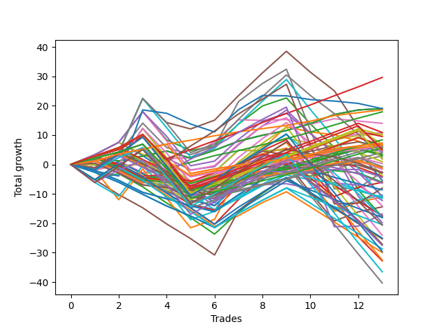

# Long Wallace Doodle 0225_009 
- Symbol: TSLA_Unlimited
- Date Range: 03/23/2022 - 07/08/2022
- Trading Period: 7:20-12:30
- Number of Trades: 13



| Name | Win Percent | Profit | Avg Profit / Trade | Avg Time / Trade |      | Name | Win Percent | Profit | Avg Profit / Trade | Avg Time / Trade |
| ---- | ----------- | ------ | ------------------ | ---------------- | ---- | ---- | ----------- | ------ | ------------------ | ---------------- |
| Sorted By <br> Profit | | | | | | Sorted By <br> Win Percentage ||||
| Eighty-Three | 92.31 | 14810.00 | 1139.23 | 38:25 |     | Eighty-One | 100.00 | 9285.00 | 714.23 | 09:33 |
| Sixty-Four | 84.62 | 9505.00 | 731.15 | 06:35 |     | Eighty-Three | 92.31 | 14810.00 | 1139.23 | 38:25 |
| Fifty-Six | 84.62 | 9505.00 | 731.15 | 06:35 |     | Eighty-Two | 92.31 | 8950.00 | 688.46 | 20:34 |
| Zero | 84.62 | 9505.00 | 731.15 | 06:35 |     | One Hundred Twenty-Six | 92.31 | 3630.00 | 279.23 | 06:38 |
| Seventy-Three | 23.08 | 9490.00 | 730.00 | 13:28 |     | One Hundred Twenty-One | 92.31 | 3630.00 | 279.23 | 06:38 |
| Eighty-One | 100.00 | 9285.00 | 714.23 | 09:33 |     | Sixty-Four | 84.62 | 9505.00 | 731.15 | 06:35 |
| Eighty-Two | 92.31 | 8950.00 | 688.46 | 20:34 |     | Fifty-Six | 84.62 | 9505.00 | 731.15 | 06:35 |
| Six | 53.85 | 6995.00 | 538.08 | 24:47 |     | Zero | 84.62 | 9505.00 | 731.15 | 06:35 |
| One Hundred Eighteen | 69.23 | 5445.00 | 418.85 | 09:11 |     | One Hundred Sixteen | 84.62 | 3300.00 | 253.85 | 04:53 |
| Forty-Eight | 76.92 | 5410.00 | 416.15 | 05:41 |     | One Hundred Eleven | 84.62 | 3065.00 | 235.77 | 05:00 |
| Forty | 76.92 | 5175.00 | 398.08 | 05:48 |     | One Hundred Twenty-Seven | 84.62 | 2830.00 | 217.69 | 09:11 |
| Ninety-Three | 61.54 | 5035.00 | 387.31 | 05:42 |     | One Hundred Twenty-Two | 84.62 | 2050.00 | 157.69 | 09:45 |
| Ninety-Eight | 61.54 | 4760.00 | 366.15 | 05:00 |     | Forty-Eight | 76.92 | 5410.00 | 416.15 | 05:41 |
| One Hundred Seventeen | 76.92 | 4185.00 | 321.92 | 06:13 |     | Forty | 76.92 | 5175.00 | 398.08 | 05:48 |
| One Hundred Twenty-Six | 92.31 | 3630.00 | 279.23 | 06:38 |     | One Hundred Seventeen | 76.92 | 4185.00 | 321.92 | 06:13 |
| One Hundred Twenty-One | 92.31 | 3630.00 | 279.23 | 06:38 |     | One Hundred Twelve | 76.92 | 3200.00 | 246.15 | 07:10 |
| One Hundred Thirteen | 69.23 | 3430.00 | 263.85 | 10:24 |     | One Hundred Twenty-Eight | 76.92 | 2505.00 | 192.69 | 12:36 |
| One Hundred Sixteen | 84.62 | 3300.00 | 253.85 | 04:53 |     | One Hundred Twenty-Three | 76.92 | 865.00 | 66.54 | 13:18 |
| One Hundred Eight | 53.85 | 3210.00 | 246.92 | 06:01 |     | One Hundred Eighteen | 69.23 | 5445.00 | 418.85 | 09:11 |
| One Hundred Twelve | 76.92 | 3200.00 | 246.15 | 07:10 |     | One Hundred Thirteen | 69.23 | 3430.00 | 263.85 | 10:24 |
| One Hundred Three | 61.54 | 3130.00 | 240.77 | 06:35 |     | Ninety-One | 69.23 | 160.00 | 12.31 | 03:00 |
| One Hundred Eleven | 84.62 | 3065.00 | 235.77 | 05:00 |     | One Hundred Six | 69.23 | -605.00 | -46.54 | 03:40 |
| One Hundred | 61.54 | 2955.00 | 227.31 | 06:44 |     | One Hundred One | 69.23 | -840.00 | -64.62 | 03:38 |
| One Hundred Twenty-Seven | 84.62 | 2830.00 | 217.69 | 09:11 |     | Sixty-Five | 69.23 | -3025.00 | -232.69 | 14:31 |
| Five | 46.15 | 2775.00 | 213.46 | 61:57 |     | Eighty-Five | 69.23 | -4025.00 | -309.62 | 119:11 |
| One Hundred Twenty-Eight | 76.92 | 2505.00 | 192.69 | 12:36 |     | One | 69.23 | -5540.00 | -426.15 | 22:47 |
| Fifty-Three | 30.77 | 2405.00 | 185.00 | 15:37 |     | Fifty-Seven | 69.23 | -7205.00 | -554.23 | 16:04 |
| Ninety-Nine | 61.54 | 2205.00 | 169.62 | 06:37 |     | Eighty-Four | 69.23 | -8405.00 | -646.54 | 118:11 |
| One Hundred Twenty-Two | 84.62 | 2050.00 | 157.69 | 09:45 |     | Ninety-Three | 61.54 | 5035.00 | 387.31 | 05:42 |
| Ninety-Seven | 61.54 | 1775.00 | 136.54 | 03:59 |     | Ninety-Eight | 61.54 | 4760.00 | 366.15 | 05:00 |
| Ninety-Two | 61.54 | 1545.00 | 118.85 | 03:55 |     | One Hundred Three | 61.54 | 3130.00 | 240.77 | 06:35 |
| One Hundred Seven | 61.54 | 1460.00 | 112.31 | 04:28 |     | One Hundred | 61.54 | 2955.00 | 227.31 | 06:44 |
| Forty-Nine | 53.85 | 1460.00 | 112.31 | 09:34 |     | Ninety-Nine | 61.54 | 2205.00 | 169.62 | 06:37 |
| Sixty-Nine | 46.15 | 1080.00 | 83.08 | 27:28 |     | Ninety-Seven | 61.54 | 1775.00 | 136.54 | 03:59 |
| One Hundred Twenty-Three | 76.92 | 865.00 | 66.54 | 13:18 |     | Ninety-Two | 61.54 | 1545.00 | 118.85 | 03:55 |
| Fifty | 38.46 | 480.00 | 36.92 | 12:19 |     | One Hundred Seven | 61.54 | 1460.00 | 112.31 | 04:28 |
| Ninety-One | 69.23 | 160.00 | 12.31 | 03:00 |     | One Hundred Two | 61.54 | -360.00 | -27.69 | 04:48 |
| One Hundred Two | 61.54 | -360.00 | -27.69 | 04:48 |     | Ninety-Six | 61.54 | -445.00 | -34.23 | 03:21 |
| Ninety-Six | 61.54 | -445.00 | -34.23 | 03:21 |     | Seven | 61.54 | -1270.00 | -97.69 | 145:39 |
| One Hundred Six | 69.23 | -605.00 | -46.54 | 03:40 |     | Six | 53.85 | 6995.00 | 538.08 | 24:47 |
| One Hundred One | 69.23 | -840.00 | -64.62 | 03:38 |     | One Hundred Eight | 53.85 | 3210.00 | 246.92 | 06:01 |
| Seven | 61.54 | -1270.00 | -97.69 | 145:39 |     | Forty-Nine | 53.85 | 1460.00 | 112.31 | 09:34 |
| One Hundred Twenty | 30.77 | -1350.00 | -103.85 | 12:48 |     | Forty-One | 53.85 | -5185.00 | -398.85 | 11:43 |
| Fifty-Two | 30.77 | -1375.00 | -105.77 | 12:15 |     | Sixty-Six | 53.85 | -5430.00 | -417.69 | 19:53 |
| One Hundred Ten | 46.15 | -1440.00 | -110.77 | 08:06 |     | Two | 53.85 | -8915.00 | -685.77 | 48:01 |
| Seventy | 46.15 | -1845.00 | -141.92 | 10:26 |     | Fifty-Eight | 53.85 | -12050.00 | -926.92 | 23:55 |
| Fifty-Five | 30.77 | -2040.00 | -156.92 | 13:29 |     | Five | 46.15 | 2775.00 | 213.46 | 61:57 |
| One Hundred Nine | 46.15 | -2190.00 | -168.46 | 07:58 |     | Sixty-Nine | 46.15 | 1080.00 | 83.08 | 27:28 |
| Sixty-Two | 46.15 | -2705.00 | -208.08 | 10:33 |     | One Hundred Ten | 46.15 | -1440.00 | -110.77 | 08:06 |
| Fifty-Four | 30.77 | -2995.00 | -230.38 | 04:46 |     | Seventy | 46.15 | -1845.00 | -141.92 | 10:26 |
| Sixty-Five | 69.23 | -3025.00 | -232.69 | 14:31 |     | One Hundred Nine | 46.15 | -2190.00 | -168.46 | 07:58 |
| One Hundred Ninteen | 30.77 | -3170.00 | -243.85 | 12:39 |     | Sixty-Two | 46.15 | -2705.00 | -208.08 | 10:33 |
| Eighty-Five | 69.23 | -4025.00 | -309.62 | 119:11 |     | Sixty-One | 46.15 | -5540.00 | -426.15 | 31:30 |
| Ninety-Five | 23.08 | -4310.00 | -331.54 | 09:15 |     | Sixty-Eight | 46.15 | -7045.00 | -541.92 | 23:44 |
| Forty-One | 53.85 | -5185.00 | -398.85 | 11:43 |     | Four | 46.15 | -9910.00 | -762.31 | 51:58 |
| Sixty-Six | 53.85 | -5430.00 | -417.69 | 19:53 |     | One Hundred Thirty | 46.15 | -10305.00 | -792.69 | 27:03 |
| Ninety-Four | 23.08 | -5525.00 | -425.00 | 09:06 |     | Sixty-Seven | 46.15 | -13540.00 | -1041.54 | 20:17 |
| One | 69.23 | -5540.00 | -426.15 | 22:47 |     | Sixty | 46.15 | -13665.00 | -1051.15 | 27:46 |
| Sixty-One | 46.15 | -5540.00 | -426.15 | 31:30 |     | One Hundred Twenty-Nine | 46.15 | -13760.00 | -1058.46 | 26:08 |
| Fifty-One | 30.77 | -5760.00 | -443.08 | 11:44 |     | One Hundred Twenty-Five | 46.15 | -14800.00 | -1138.46 | 42:47 |
| Forty-Six | 30.77 | -6120.00 | -470.77 | 05:47 |     | Three | 46.15 | -16385.00 | -1260.38 | 39:16 |
| Sixty-Eight | 46.15 | -7045.00 | -541.92 | 23:44 |     | One Hundred Twenty-Four | 46.15 | -18255.00 | -1404.23 | 41:53 |
| Fifty-Seven | 69.23 | -7205.00 | -554.23 | 16:04 |     | Fifty-Nine | 46.15 | -20160.00 | -1550.77 | 24:19 |
| Eighty-Four | 69.23 | -8405.00 | -646.54 | 118:11 |     | Fifty | 38.46 | 480.00 | 36.92 | 12:19 |
| Forty-Two | 38.46 | -8710.00 | -670.00 | 15:02 |     | Forty-Two | 38.46 | -8710.00 | -670.00 | 15:02 |
| Forty-Five | 30.77 | -8785.00 | -675.77 | 21:13 |     | Seventy-One | 38.46 | -9045.00 | -695.77 | 39:57 |
| Two | 53.85 | -8915.00 | -685.77 | 48:01 |     | Sixty-Three | 38.46 | -16245.00 | -1249.62 | 56:05 |
| One Hundred Five | 23.08 | -9020.00 | -693.85 | 11:14 |     | Fifty-Three | 30.77 | 2405.00 | 185.00 | 15:37 |
| Seventy-One | 38.46 | -9045.00 | -695.77 | 39:57 |     | One Hundred Twenty | 30.77 | -1350.00 | -103.85 | 12:48 |
| Four | 46.15 | -9910.00 | -762.31 | 51:58 |     | Fifty-Two | 30.77 | -1375.00 | -105.77 | 12:15 |
| One Hundred Four | 23.08 | -10235.00 | -787.31 | 11:05 |     | Fifty-Five | 30.77 | -2040.00 | -156.92 | 13:29 |
| One Hundred Thirty | 46.15 | -10305.00 | -792.69 | 27:03 |     | Fifty-Four | 30.77 | -2995.00 | -230.38 | 04:46 |
| Fifty-Eight | 53.85 | -12050.00 | -926.92 | 23:55 |     | One Hundred Ninteen | 30.77 | -3170.00 | -243.85 | 12:39 |
| One Hundred Fifteen | 30.77 | -12540.00 | -964.62 | 18:25 |     | Fifty-One | 30.77 | -5760.00 | -443.08 | 11:44 |
| Forty-Four | 30.77 | -12565.00 | -966.54 | 17:51 |     | Forty-Six | 30.77 | -6120.00 | -470.77 | 05:47 |
| Forty-Seven | 23.08 | -12655.00 | -973.46 | 27:44 |     | Forty-Five | 30.77 | -8785.00 | -675.77 | 21:13 |
| Sixty-Seven | 46.15 | -13540.00 | -1041.54 | 20:17 |     | One Hundred Fifteen | 30.77 | -12540.00 | -964.62 | 18:25 |
| Sixty | 46.15 | -13665.00 | -1051.15 | 27:46 |     | Forty-Four | 30.77 | -12565.00 | -966.54 | 17:51 |
| One Hundred Twenty-Nine | 46.15 | -13760.00 | -1058.46 | 26:08 |     | One Hundred Fourteen | 30.77 | -14360.00 | -1104.62 | 18:15 |
| One Hundred Fourteen | 30.77 | -14360.00 | -1104.62 | 18:15 |     | Forty-Three | 30.77 | -14985.00 | -1152.69 | 16:58 |
| One Hundred Twenty-Five | 46.15 | -14800.00 | -1138.46 | 42:47 |     | Seventy-Three | 23.08 | 9490.00 | 730.00 | 13:28 |
| Forty-Three | 30.77 | -14985.00 | -1152.69 | 16:58 |     | Ninety-Five | 23.08 | -4310.00 | -331.54 | 09:15 |
| Sixty-Three | 38.46 | -16245.00 | -1249.62 | 56:05 |     | Ninety-Four | 23.08 | -5525.00 | -425.00 | 09:06 |
| Three | 46.15 | -16385.00 | -1260.38 | 39:16 |     | One Hundred Five | 23.08 | -9020.00 | -693.85 | 11:14 |
| One Hundred Twenty-Four | 46.15 | -18255.00 | -1404.23 | 41:53 |     | One Hundred Four | 23.08 | -10235.00 | -787.31 | 11:05 |
| Fifty-Nine | 46.15 | -20160.00 | -1550.77 | 24:19 |     | Forty-Seven | 23.08 | -12655.00 | -973.46 | 27:44 |

## NO STOPLOSS

### Test Zero
* Sell when price hits the middle line of the 20p bollinger
* No Stoploss
* Results:
```
Total Trades: 13
Percent Up: 84.62
Percent Down: 15.38
Total Points Moved Up: 19.01
Potential Profit: 9505.00
Total Points Ups: 22.11 Count Ups: 11
Total Points Downs: -3.10 Count Downs: 2
```

<details><summary>Trades</summary>

<code>In: 2022-04-01 08:40:00		Out: 2022-04-01 08:47:15		Total Position Time: 07:15		Total Move Up: 1.85		Total to Date: 1.85</code> <br />
<code>In: 2022-05-02 08:44:00		Out: 2022-05-02 08:52:25		Total Position Time: 08:25		Total Move Up: -0.62		Total to Date: 1.23</code> <br />
<code>In: 2022-05-04 11:36:00		Out: 2022-05-04 11:41:15		Total Position Time: 05:15		Total Move Up: 1.64		Total to Date: 2.87</code> <br />
<code>In: 2022-05-13 10:33:00		Out: 2022-05-13 10:34:10		Total Position Time: 01:10		Total Move Up: 1.73		Total to Date: 4.60</code> <br />
<code>In: 2022-05-13 10:55:00		Out: 2022-05-13 11:12:25		Total Position Time: 17:25		Total Move Up: -2.48		Total to Date: 2.12</code> <br />
<code>In: 2022-05-13 11:07:00		Out: 2022-05-13 11:12:25		Total Position Time: 05:25		Total Move Up: 2.71		Total to Date: 4.83</code> <br />
<code>In: 2022-05-19 10:51:00		Out: 2022-05-19 10:54:20		Total Position Time: 03:20		Total Move Up: 3.10		Total to Date: 7.93</code> <br />
<code>In: 2022-05-23 10:23:00		Out: 2022-05-23 10:26:30		Total Position Time: 03:30		Total Move Up: 2.01		Total to Date: 9.94</code> <br />
<code>In: 2022-06-21 08:56:00		Out: 2022-06-21 09:02:30		Total Position Time: 06:30		Total Move Up: 1.61		Total to Date: 11.55</code> <br />
<code>In: 2022-06-22 08:29:00		Out: 2022-06-22 08:32:25		Total Position Time: 03:25		Total Move Up: 2.34		Total to Date: 13.89</code> <br />
<code>In: 2022-06-22 08:31:00		Out: 2022-06-22 08:32:25		Total Position Time: 01:25		Total Move Up: 3.11		Total to Date: 17.00</code> <br />
<code>In: 2022-06-23 08:38:00		Out: 2022-06-23 08:49:05		Total Position Time: 11:05		Total Move Up: 1.55		Total to Date: 18.55</code> <br />
<code>In: 2022-06-23 09:06:00		Out: 2022-06-23 09:17:35		Total Position Time: 11:35		Total Move Up: 0.46		Total to Date: 19.01</code> <br />


</details>

### Test One
* Sell when the price hits the upper line of the 20p 1std bollinger
* No Stoploss
* Results:
```
Total Trades: 13
Percent Up: 69.23
Percent Down: 30.77
Total Points Moved Up: -11.08
Potential Profit: -5540.00
Total Points Ups: 25.55 Count Ups: 9
Total Points Downs: -36.63 Count Downs: 4
```

<details><summary>Trades</summary>

<code>In: 2022-04-01 08:40:00		Out: 2022-04-01 08:52:15		Total Position Time: 12:15		Total Move Up: 2.73		Total to Date: 2.73</code> <br />
<code>In: 2022-05-02 08:44:00		Out: 2022-05-02 08:52:35		Total Position Time: 08:35		Total Move Up: 2.42		Total to Date: 5.15</code> <br />
<code>In: 2022-05-04 11:36:00		Out: 2022-05-04 11:42:00		Total Position Time: 06:00		Total Move Up: 4.44		Total to Date: 9.59</code> <br />
<code>In: 2022-05-13 10:33:00		Out: 2022-05-13 11:31:45		Total Position Time: 58:45		Total Move Up: -10.55		Total to Date: -0.96</code> <br />
<code>In: 2022-05-13 10:55:00		Out: 2022-05-13 11:31:45		Total Position Time: 36:45		Total Move Up: -4.57		Total to Date: -5.53</code> <br />
<code>In: 2022-05-13 11:07:00		Out: 2022-05-13 11:31:45		Total Position Time: 24:45		Total Move Up: 0.62		Total to Date: -4.91</code> <br />
<code>In: 2022-05-19 10:51:00		Out: 2022-05-19 10:55:10		Total Position Time: 04:10		Total Move Up: 4.87		Total to Date: -0.04</code> <br />
<code>In: 2022-05-23 10:23:00		Out: 2022-05-23 10:28:35		Total Position Time: 05:35		Total Move Up: 3.66		Total to Date: 3.62</code> <br />
<code>In: 2022-06-21 08:56:00		Out: 2022-06-21 09:11:45		Total Position Time: 15:45		Total Move Up: 1.96		Total to Date: 5.58</code> <br />
<code>In: 2022-06-22 08:29:00		Out: 2022-06-22 09:18:15		Total Position Time: 49:15		Total Move Up: -11.14		Total to Date: -5.56</code> <br />
<code>In: 2022-06-22 08:31:00		Out: 2022-06-22 09:18:15		Total Position Time: 47:15		Total Move Up: -10.37		Total to Date: -15.93</code> <br />
<code>In: 2022-06-23 08:38:00		Out: 2022-06-23 08:50:50		Total Position Time: 12:50		Total Move Up: 3.14		Total to Date: -12.79</code> <br />
<code>In: 2022-06-23 09:06:00		Out: 2022-06-23 09:20:25		Total Position Time: 14:25		Total Move Up: 1.71		Total to Date: -11.08</code> <br />


</details>

### Test Two
* Sell when the price hits the upper line of the 20p 2std bollinger
* No Stoploss
* Results:
```
Total Trades: 13
Percent Up: 53.85
Percent Down: 46.15
Total Points Moved Up: -17.83
Potential Profit: -8915.00
Total Points Ups: 35.86 Count Ups: 7
Total Points Downs: -53.69 Count Downs: 6
```

<details><summary>Trades</summary>

<code>In: 2022-04-01 08:40:00		Out: 2022-04-01 08:54:05		Total Position Time: 14:05		Total Move Up: 3.33		Total to Date: 3.33</code> <br />
<code>In: 2022-05-02 08:44:00		Out: 2022-05-02 09:00:45		Total Position Time: 16:45		Total Move Up: 4.20		Total to Date: 7.53</code> <br />
<code>In: 2022-05-04 11:36:00		Out: 2022-05-04 11:44:10		Total Position Time: 08:10		Total Move Up: 10.45		Total to Date: 17.98</code> <br />
<code>In: 2022-05-13 10:33:00		Out: 2022-05-13 11:51:25		Total Position Time: 78:25		Total Move Up: -9.60		Total to Date: 8.38</code> <br />
<code>In: 2022-05-13 10:55:00		Out: 2022-05-13 11:51:25		Total Position Time: 56:25		Total Move Up: -3.62		Total to Date: 4.76</code> <br />
<code>In: 2022-05-13 11:07:00		Out: 2022-05-13 11:51:25		Total Position Time: 44:25		Total Move Up: 1.57		Total to Date: 6.33</code> <br />
<code>In: 2022-05-19 10:51:00		Out: 2022-05-19 10:55:20		Total Position Time: 04:20		Total Move Up: 7.41		Total to Date: 13.74</code> <br />
<code>In: 2022-05-23 10:23:00		Out: 2022-05-23 10:33:15		Total Position Time: 10:15		Total Move Up: 6.17		Total to Date: 19.91</code> <br />
<code>In: 2022-06-21 08:56:00		Out: 2022-06-21 09:12:35		Total Position Time: 16:35		Total Move Up: 2.73		Total to Date: 22.64</code> <br />
<code>In: 2022-06-22 08:29:00		Out: 2022-06-22 09:33:45		Total Position Time: 64:45		Total Move Up: -8.81		Total to Date: 13.83</code> <br />
<code>In: 2022-06-22 08:31:00		Out: 2022-06-22 09:33:45		Total Position Time: 62:45		Total Move Up: -8.04		Total to Date: 5.79</code> <br />
<code>In: 2022-06-23 08:38:00		Out: 2022-06-23 10:55:45		Total Position Time: 137:45		Total Move Up: -14.48		Total to Date: -8.69</code> <br />
<code>In: 2022-06-23 09:06:00		Out: 2022-06-23 10:55:45		Total Position Time: 109:45		Total Move Up: -9.14		Total to Date: -17.83</code> <br />


</details>

### Test Three
* Sell when price hits the middle line of the 50p bollinger
* No Stoploss
* Results:
```
Total Trades: 13
Percent Up: 46.15
Percent Down: 53.85
Total Points Moved Up: -32.77
Potential Profit: -16385.00
Total Points Ups: 20.86 Count Ups: 6
Total Points Downs: -53.63 Count Downs: 7
```

<details><summary>Trades</summary>

<code>In: 2022-04-01 08:40:00		Out: 2022-04-01 09:29:30		Total Position Time: 49:30		Total Move Up: -1.22		Total to Date: -1.22</code> <br />
<code>In: 2022-05-02 08:44:00		Out: 2022-05-02 08:52:30		Total Position Time: 08:30		Total Move Up: 0.69		Total to Date: -0.53</code> <br />
<code>In: 2022-05-04 11:36:00		Out: 2022-05-04 11:43:35		Total Position Time: 07:35		Total Move Up: 5.78		Total to Date: 5.25</code> <br />
<code>In: 2022-05-13 10:33:00		Out: 2022-05-13 11:32:00		Total Position Time: 59:00		Total Move Up: -8.60		Total to Date: -3.35</code> <br />
<code>In: 2022-05-13 10:55:00		Out: 2022-05-13 11:32:00		Total Position Time: 37:00		Total Move Up: -2.62		Total to Date: -5.97</code> <br />
<code>In: 2022-05-13 11:07:00		Out: 2022-05-13 11:32:00		Total Position Time: 25:00		Total Move Up: 2.57		Total to Date: -3.40</code> <br />
<code>In: 2022-05-19 10:51:00		Out: 2022-05-19 10:54:45		Total Position Time: 03:45		Total Move Up: 3.69		Total to Date: 0.29</code> <br />
<code>In: 2022-05-23 10:23:00		Out: 2022-05-23 10:31:40		Total Position Time: 08:40		Total Move Up: 4.45		Total to Date: 4.74</code> <br />
<code>In: 2022-06-21 08:56:00		Out: 2022-06-21 09:12:50		Total Position Time: 16:50		Total Move Up: 3.68		Total to Date: 8.42</code> <br />
<code>In: 2022-06-22 08:29:00		Out: 2022-06-22 09:32:00		Total Position Time: 63:00		Total Move Up: -10.14		Total to Date: -1.72</code> <br />
<code>In: 2022-06-22 08:31:00		Out: 2022-06-22 09:32:00		Total Position Time: 61:00		Total Move Up: -9.37		Total to Date: -11.09</code> <br />
<code>In: 2022-06-23 08:38:00		Out: 2022-06-23 10:17:20		Total Position Time: 99:20		Total Move Up: -13.51		Total to Date: -24.60</code> <br />
<code>In: 2022-06-23 09:06:00		Out: 2022-06-23 10:17:20		Total Position Time: 71:20		Total Move Up: -8.17		Total to Date: -32.77</code> <br />


</details>

### Test Four
* Sell when the price hits the upper line of the 50p 1std bollinger
* No Stoploss
* Results:
```
Total Trades: 13
Percent Up: 46.15
Percent Down: 53.85
Total Points Moved Up: -19.82
Potential Profit: -9910.00
Total Points Ups: 34.57 Count Ups: 6
Total Points Downs: -54.39 Count Downs: 7
```

<details><summary>Trades</summary>

<code>In: 2022-04-01 08:40:00		Out: 2022-04-01 09:47:35		Total Position Time: 67:35		Total Move Up: -1.94		Total to Date: -1.94</code> <br />
<code>In: 2022-05-02 08:44:00		Out: 2022-05-02 08:52:40		Total Position Time: 08:40		Total Move Up: 2.04		Total to Date: 0.10</code> <br />
<code>In: 2022-05-04 11:36:00		Out: 2022-05-04 11:44:25		Total Position Time: 08:25		Total Move Up: 12.17		Total to Date: 12.27</code> <br />
<code>In: 2022-05-13 10:33:00		Out: 2022-05-13 11:51:20		Total Position Time: 78:20		Total Move Up: -10.05		Total to Date: 2.22</code> <br />
<code>In: 2022-05-13 10:55:00		Out: 2022-05-13 11:51:20		Total Position Time: 56:20		Total Move Up: -4.07		Total to Date: -1.85</code> <br />
<code>In: 2022-05-13 11:07:00		Out: 2022-05-13 11:51:20		Total Position Time: 44:20		Total Move Up: 1.12		Total to Date: -0.73</code> <br />
<code>In: 2022-05-19 10:51:00		Out: 2022-05-19 10:55:20		Total Position Time: 04:20		Total Move Up: 7.41		Total to Date: 6.68</code> <br />
<code>In: 2022-05-23 10:23:00		Out: 2022-05-23 10:33:35		Total Position Time: 10:35		Total Move Up: 6.42		Total to Date: 13.10</code> <br />
<code>In: 2022-06-21 08:56:00		Out: 2022-06-21 09:16:45		Total Position Time: 20:45		Total Move Up: 5.41		Total to Date: 18.51</code> <br />
<code>In: 2022-06-22 08:29:00		Out: 2022-06-22 09:34:20		Total Position Time: 65:20		Total Move Up: -7.86		Total to Date: 10.65</code> <br />
<code>In: 2022-06-22 08:31:00		Out: 2022-06-22 09:34:20		Total Position Time: 63:20		Total Move Up: -7.09		Total to Date: 3.56</code> <br />
<code>In: 2022-06-23 08:38:00		Out: 2022-06-23 10:55:50		Total Position Time: 137:50		Total Move Up: -14.36		Total to Date: -10.80</code> <br />
<code>In: 2022-06-23 09:06:00		Out: 2022-06-23 10:55:50		Total Position Time: 109:50		Total Move Up: -9.02		Total to Date: -19.82</code> <br />


</details>

### Test Five
* Sell when the price hits the upper line of the 50p 2std bollinger
* No Stoploss
* Results:
```
Total Trades: 13
Percent Up: 46.15
Percent Down: 53.85
Total Points Moved Up: 5.55
Potential Profit: 2775.00
Total Points Ups: 50.17 Count Ups: 6
Total Points Downs: -44.62 Count Downs: 7
```

<details><summary>Trades</summary>

<code>In: 2022-04-01 08:40:00		Out: 2022-04-01 09:48:25		Total Position Time: 68:25		Total Move Up: -1.29		Total to Date: -1.29</code> <br />
<code>In: 2022-05-02 08:44:00		Out: 2022-05-02 09:00:50		Total Position Time: 16:50		Total Move Up: 5.41		Total to Date: 4.12</code> <br />
<code>In: 2022-05-04 11:36:00		Out: 2022-05-04 11:47:00		Total Position Time: 11:00		Total Move Up: 18.34		Total to Date: 22.46</code> <br />
<code>In: 2022-05-13 10:33:00		Out: 2022-05-13 11:52:35		Total Position Time: 79:35		Total Move Up: -8.18		Total to Date: 14.28</code> <br />
<code>In: 2022-05-13 10:55:00		Out: 2022-05-13 11:52:35		Total Position Time: 57:35		Total Move Up: -2.20		Total to Date: 12.08</code> <br />
<code>In: 2022-05-13 11:07:00		Out: 2022-05-13 11:52:35		Total Position Time: 45:35		Total Move Up: 2.99		Total to Date: 15.07</code> <br />
<code>In: 2022-05-19 10:51:00		Out: 2022-05-19 10:55:30		Total Position Time: 04:30		Total Move Up: 8.35		Total to Date: 23.42</code> <br />
<code>In: 2022-05-23 10:23:00		Out: 2022-05-23 10:47:55		Total Position Time: 24:55		Total Move Up: 7.73		Total to Date: 31.15</code> <br />
<code>In: 2022-06-21 08:56:00		Out: 2022-06-21 09:38:00		Total Position Time: 42:00		Total Move Up: 7.35		Total to Date: 38.50</code> <br />
<code>In: 2022-06-22 08:29:00		Out: 2022-06-22 09:59:50		Total Position Time: 90:50		Total Move Up: -7.10		Total to Date: 31.40</code> <br />
<code>In: 2022-06-22 08:31:00		Out: 2022-06-22 09:59:50		Total Position Time: 88:50		Total Move Up: -6.33		Total to Date: 25.07</code> <br />
<code>In: 2022-06-23 08:38:00		Out: 2022-06-23 11:09:40		Total Position Time: 151:40		Total Move Up: -12.43		Total to Date: 12.64</code> <br />
<code>In: 2022-06-23 09:06:00		Out: 2022-06-23 11:09:40		Total Position Time: 123:40		Total Move Up: -7.09		Total to Date: 5.55</code> <br />


</details>

### Test Six
* Sell when the price hits the middle line of the 1std VWAP
* No Stoploss
* Results:
```
Total Trades: 13
Percent Up: 53.85
Percent Down: 46.15
Total Points Moved Up: 13.99
Potential Profit: 6995.00
Total Points Ups: 18.12 Count Ups: 7
Total Points Downs: -4.13 Count Downs: 6
```

<details><summary>Trades</summary>

<code>In: 2022-04-01 08:40:00		Out: 2022-04-01 08:41:40		Total Position Time: 01:40		Total Move Up: -0.15		Total to Date: -0.15</code> <br />
<code>In: 2022-05-02 08:44:00		Out: 2022-05-02 08:47:15		Total Position Time: 03:15		Total Move Up: -0.54		Total to Date: -0.69</code> <br />
<code>In: 2022-05-04 11:36:00		Out: 2022-05-04 11:40:25		Total Position Time: 04:25		Total Move Up: 0.91		Total to Date: 0.22</code> <br />
<code>In: 2022-05-13 10:33:00		Out: 2022-05-13 10:34:10		Total Position Time: 01:10		Total Move Up: 1.73		Total to Date: 1.95</code> <br />
<code>In: 2022-05-13 10:55:00		Out: 2022-05-13 12:01:05		Total Position Time: 66:05		Total Move Up: 0.33		Total to Date: 2.28</code> <br />
<code>In: 2022-05-13 11:07:00		Out: 2022-05-13 12:01:05		Total Position Time: 54:05		Total Move Up: 5.52		Total to Date: 7.80</code> <br />
<code>In: 2022-05-19 10:51:00		Out: 2022-05-19 10:55:20		Total Position Time: 04:20		Total Move Up: 7.41		Total to Date: 15.21</code> <br />
<code>In: 2022-05-23 10:23:00		Out: 2022-05-23 10:24:10		Total Position Time: 01:10		Total Move Up: -0.23		Total to Date: 14.98</code> <br />
<code>In: 2022-06-21 08:56:00		Out: 2022-06-21 08:57:10		Total Position Time: 01:10		Total Move Up: 0.33		Total to Date: 15.31</code> <br />
<code>In: 2022-06-22 08:29:00		Out: 2022-06-22 08:30:10		Total Position Time: 01:10		Total Move Up: -1.64		Total to Date: 13.67</code> <br />
<code>In: 2022-06-22 08:31:00		Out: 2022-06-22 08:32:10		Total Position Time: 01:10		Total Move Up: 1.89		Total to Date: 15.56</code> <br />
<code>In: 2022-06-23 08:38:00		Out: 2022-06-23 08:39:10		Total Position Time: 01:10		Total Move Up: -0.77		Total to Date: 14.79</code> <br />
<code>In: 2022-06-23 09:06:00		Out: 2022-06-23 12:07:25		Total Position Time: 181:25		Total Move Up: -0.80		Total to Date: 13.99</code> <br />


</details>

### Test Seven
* Sell when the price hits the upper line of the 1std VWAP
* No Stoploss
* Results:
```
Total Trades: 13
Percent Up: 61.54
Percent Down: 38.46
Total Points Moved Up: -2.54
Potential Profit: -1270.00
Total Points Ups: 50.69 Count Ups: 8
Total Points Downs: -53.23 Count Downs: 5
```

<details><summary>Trades</summary>

<code>In: 2022-04-01 08:40:00		Out: 2022-04-01 12:47:00		Total Position Time: 247:00		Total Move Up: -1.86		Total to Date: -1.86</code> <br />
<code>In: 2022-05-02 08:44:00		Out: 2022-05-02 12:10:05		Total Position Time: 206:05		Total Move Up: 5.48		Total to Date: 3.62</code> <br />
<code>In: 2022-05-04 11:36:00		Out: 2022-05-04 11:44:10		Total Position Time: 08:10		Total Move Up: 10.45		Total to Date: 14.07</code> <br />
<code>In: 2022-05-13 10:33:00		Out: 2022-05-13 12:47:00		Total Position Time: 134:00		Total Move Up: -8.33		Total to Date: 5.74</code> <br />
<code>In: 2022-05-13 10:55:00		Out: 2022-05-13 12:47:00		Total Position Time: 112:00		Total Move Up: -2.35		Total to Date: 3.39</code> <br />
<code>In: 2022-05-13 11:07:00		Out: 2022-05-13 12:47:00		Total Position Time: 100:00		Total Move Up: 2.84		Total to Date: 6.23</code> <br />
<code>In: 2022-05-19 10:51:00		Out: 2022-05-19 12:02:45		Total Position Time: 71:45		Total Move Up: 15.15		Total to Date: 21.38</code> <br />
<code>In: 2022-05-23 10:23:00		Out: 2022-05-23 10:33:15		Total Position Time: 10:15		Total Move Up: 6.17		Total to Date: 27.55</code> <br />
<code>In: 2022-06-21 08:56:00		Out: 2022-06-21 09:16:20		Total Position Time: 20:20		Total Move Up: 4.86		Total to Date: 32.41</code> <br />
<code>In: 2022-06-22 08:29:00		Out: 2022-06-22 12:47:00		Total Position Time: 258:00		Total Move Up: -20.73		Total to Date: 11.68</code> <br />
<code>In: 2022-06-22 08:31:00		Out: 2022-06-22 12:47:00		Total Position Time: 256:00		Total Move Up: -19.96		Total to Date: -8.28</code> <br />
<code>In: 2022-06-23 08:38:00		Out: 2022-06-23 12:47:00		Total Position Time: 249:00		Total Move Up: 0.20		Total to Date: -8.08</code> <br />
<code>In: 2022-06-23 09:06:00		Out: 2022-06-23 12:47:00		Total Position Time: 221:00		Total Move Up: 5.54		Total to Date: -2.54</code> <br />


</details>

## STOPLOSS OF 5

### Test Forty
* Sell when price hits the middle line of the 20p bollinger
* Stoploss is 5 points
* Results:
```
Total Trades: 13
Percent Up: 76.92
Percent Down: 23.08
Total Points Moved Up: 10.35
Potential Profit: 5175.00
Total Points Ups: 20.47 Count Ups: 10
Total Points Downs: -10.12 Count Downs: 3
```

<details><summary>Trades</summary>

<code>In: 2022-04-01 08:40:00		Out: 2022-04-01 08:47:15		Total Position Time: 07:15		Total Move Up: 1.85		Total to Date: 1.85</code> <br />
<code>In: 2022-05-02 08:44:00		Out: 2022-05-02 08:52:25		Total Position Time: 08:25		Total Move Up: -0.62		Total to Date: 1.23</code> <br />
<code>In: 2022-05-04 11:36:00		Out: 2022-05-04 11:39:00		Total Position Time: 03:00		Total Move Up: -4.50		Total to Date: -3.27</code> <br />
<code>In: 2022-05-13 10:33:00		Out: 2022-05-13 10:34:10		Total Position Time: 01:10		Total Move Up: 1.73		Total to Date: -1.54</code> <br />
<code>In: 2022-05-13 10:55:00		Out: 2022-05-13 11:04:25		Total Position Time: 09:25		Total Move Up: -5.00		Total to Date: -6.54</code> <br />
<code>In: 2022-05-13 11:07:00		Out: 2022-05-13 11:12:25		Total Position Time: 05:25		Total Move Up: 2.71		Total to Date: -3.83</code> <br />
<code>In: 2022-05-19 10:51:00		Out: 2022-05-19 10:54:20		Total Position Time: 03:20		Total Move Up: 3.10		Total to Date: -0.73</code> <br />
<code>In: 2022-05-23 10:23:00		Out: 2022-05-23 10:26:30		Total Position Time: 03:30		Total Move Up: 2.01		Total to Date: 1.28</code> <br />
<code>In: 2022-06-21 08:56:00		Out: 2022-06-21 09:02:30		Total Position Time: 06:30		Total Move Up: 1.61		Total to Date: 2.89</code> <br />
<code>In: 2022-06-22 08:29:00		Out: 2022-06-22 08:32:25		Total Position Time: 03:25		Total Move Up: 2.34		Total to Date: 5.23</code> <br />
<code>In: 2022-06-22 08:31:00		Out: 2022-06-22 08:32:25		Total Position Time: 01:25		Total Move Up: 3.11		Total to Date: 8.34</code> <br />
<code>In: 2022-06-23 08:38:00		Out: 2022-06-23 08:49:05		Total Position Time: 11:05		Total Move Up: 1.55		Total to Date: 9.89</code> <br />
<code>In: 2022-06-23 09:06:00		Out: 2022-06-23 09:17:35		Total Position Time: 11:35		Total Move Up: 0.46		Total to Date: 10.35</code> <br />


</details>

### Test Forty-One
* Sell when the price hits the upper line of the 20p 1std bollinger
* Stoploss is 5 points
* Results:
```
Total Trades: 13
Percent Up: 53.85
Percent Down: 46.15
Total Points Moved Up: -10.37
Potential Profit: -5185.00
Total Points Ups: 20.49 Count Ups: 7
Total Points Downs: -30.86 Count Downs: 6
```

<details><summary>Trades</summary>

<code>In: 2022-04-01 08:40:00		Out: 2022-04-01 08:52:15		Total Position Time: 12:15		Total Move Up: 2.73		Total to Date: 2.73</code> <br />
<code>In: 2022-05-02 08:44:00		Out: 2022-05-02 08:52:35		Total Position Time: 08:35		Total Move Up: 2.42		Total to Date: 5.15</code> <br />
<code>In: 2022-05-04 11:36:00		Out: 2022-05-04 11:39:00		Total Position Time: 03:00		Total Move Up: -4.50		Total to Date: 0.65</code> <br />
<code>In: 2022-05-13 10:33:00		Out: 2022-05-13 10:52:20		Total Position Time: 19:20		Total Move Up: -5.49		Total to Date: -4.84</code> <br />
<code>In: 2022-05-13 10:55:00		Out: 2022-05-13 11:04:25		Total Position Time: 09:25		Total Move Up: -5.00		Total to Date: -9.84</code> <br />
<code>In: 2022-05-13 11:07:00		Out: 2022-05-13 11:23:45		Total Position Time: 16:45		Total Move Up: -5.58		Total to Date: -15.42</code> <br />
<code>In: 2022-05-19 10:51:00		Out: 2022-05-19 10:55:10		Total Position Time: 04:10		Total Move Up: 4.87		Total to Date: -10.55</code> <br />
<code>In: 2022-05-23 10:23:00		Out: 2022-05-23 10:28:35		Total Position Time: 05:35		Total Move Up: 3.66		Total to Date: -6.89</code> <br />
<code>In: 2022-06-21 08:56:00		Out: 2022-06-21 09:11:45		Total Position Time: 15:45		Total Move Up: 1.96		Total to Date: -4.93</code> <br />
<code>In: 2022-06-22 08:29:00		Out: 2022-06-22 08:44:45		Total Position Time: 15:45		Total Move Up: -5.13		Total to Date: -10.06</code> <br />
<code>In: 2022-06-22 08:31:00		Out: 2022-06-22 08:45:35		Total Position Time: 14:35		Total Move Up: -5.16		Total to Date: -15.22</code> <br />
<code>In: 2022-06-23 08:38:00		Out: 2022-06-23 08:50:50		Total Position Time: 12:50		Total Move Up: 3.14		Total to Date: -12.08</code> <br />
<code>In: 2022-06-23 09:06:00		Out: 2022-06-23 09:20:25		Total Position Time: 14:25		Total Move Up: 1.71		Total to Date: -10.37</code> <br />


</details>

### Test Forty-Two
* Sell when the price hits the upper line of the 20p 2std bollinger
* Stoploss is 5 points
* Results:
```
Total Trades: 13
Percent Up: 38.46
Percent Down: 61.54
Total Points Moved Up: -17.42
Potential Profit: -8710.00
Total Points Ups: 23.84 Count Ups: 5
Total Points Downs: -41.26 Count Downs: 8
```

<details><summary>Trades</summary>

<code>In: 2022-04-01 08:40:00		Out: 2022-04-01 08:54:05		Total Position Time: 14:05		Total Move Up: 3.33		Total to Date: 3.33</code> <br />
<code>In: 2022-05-02 08:44:00		Out: 2022-05-02 09:00:45		Total Position Time: 16:45		Total Move Up: 4.20		Total to Date: 7.53</code> <br />
<code>In: 2022-05-04 11:36:00		Out: 2022-05-04 11:39:00		Total Position Time: 03:00		Total Move Up: -4.50		Total to Date: 3.03</code> <br />
<code>In: 2022-05-13 10:33:00		Out: 2022-05-13 10:52:20		Total Position Time: 19:20		Total Move Up: -5.49		Total to Date: -2.46</code> <br />
<code>In: 2022-05-13 10:55:00		Out: 2022-05-13 11:04:25		Total Position Time: 09:25		Total Move Up: -5.00		Total to Date: -7.46</code> <br />
<code>In: 2022-05-13 11:07:00		Out: 2022-05-13 11:23:45		Total Position Time: 16:45		Total Move Up: -5.58		Total to Date: -13.04</code> <br />
<code>In: 2022-05-19 10:51:00		Out: 2022-05-19 10:55:20		Total Position Time: 04:20		Total Move Up: 7.41		Total to Date: -5.63</code> <br />
<code>In: 2022-05-23 10:23:00		Out: 2022-05-23 10:33:15		Total Position Time: 10:15		Total Move Up: 6.17		Total to Date: 0.54</code> <br />
<code>In: 2022-06-21 08:56:00		Out: 2022-06-21 09:12:35		Total Position Time: 16:35		Total Move Up: 2.73		Total to Date: 3.27</code> <br />
<code>In: 2022-06-22 08:29:00		Out: 2022-06-22 08:44:45		Total Position Time: 15:45		Total Move Up: -5.13		Total to Date: -1.86</code> <br />
<code>In: 2022-06-22 08:31:00		Out: 2022-06-22 08:45:35		Total Position Time: 14:35		Total Move Up: -5.16		Total to Date: -7.02</code> <br />
<code>In: 2022-06-23 08:38:00		Out: 2022-06-23 09:02:45		Total Position Time: 24:45		Total Move Up: -5.21		Total to Date: -12.23</code> <br />
<code>In: 2022-06-23 09:06:00		Out: 2022-06-23 09:35:55		Total Position Time: 29:55		Total Move Up: -5.19		Total to Date: -17.42</code> <br />


</details>

### Test Forty-Three
* Sell when price hits the middle line of the 50p bollinger
* Stoploss is 5 points
* Results:
```
Total Trades: 13
Percent Up: 30.77
Percent Down: 69.23
Total Points Moved Up: -29.97
Potential Profit: -14985.00
Total Points Ups: 12.51 Count Ups: 4
Total Points Downs: -42.48 Count Downs: 9
```

<details><summary>Trades</summary>

<code>In: 2022-04-01 08:40:00		Out: 2022-04-01 09:29:30		Total Position Time: 49:30		Total Move Up: -1.22		Total to Date: -1.22</code> <br />
<code>In: 2022-05-02 08:44:00		Out: 2022-05-02 08:52:30		Total Position Time: 08:30		Total Move Up: 0.69		Total to Date: -0.53</code> <br />
<code>In: 2022-05-04 11:36:00		Out: 2022-05-04 11:39:00		Total Position Time: 03:00		Total Move Up: -4.50		Total to Date: -5.03</code> <br />
<code>In: 2022-05-13 10:33:00		Out: 2022-05-13 10:52:20		Total Position Time: 19:20		Total Move Up: -5.49		Total to Date: -10.52</code> <br />
<code>In: 2022-05-13 10:55:00		Out: 2022-05-13 11:04:25		Total Position Time: 09:25		Total Move Up: -5.00		Total to Date: -15.52</code> <br />
<code>In: 2022-05-13 11:07:00		Out: 2022-05-13 11:23:45		Total Position Time: 16:45		Total Move Up: -5.58		Total to Date: -21.10</code> <br />
<code>In: 2022-05-19 10:51:00		Out: 2022-05-19 10:54:45		Total Position Time: 03:45		Total Move Up: 3.69		Total to Date: -17.41</code> <br />
<code>In: 2022-05-23 10:23:00		Out: 2022-05-23 10:31:40		Total Position Time: 08:40		Total Move Up: 4.45		Total to Date: -12.96</code> <br />
<code>In: 2022-06-21 08:56:00		Out: 2022-06-21 09:12:50		Total Position Time: 16:50		Total Move Up: 3.68		Total to Date: -9.28</code> <br />
<code>In: 2022-06-22 08:29:00		Out: 2022-06-22 08:44:45		Total Position Time: 15:45		Total Move Up: -5.13		Total to Date: -14.41</code> <br />
<code>In: 2022-06-22 08:31:00		Out: 2022-06-22 08:45:35		Total Position Time: 14:35		Total Move Up: -5.16		Total to Date: -19.57</code> <br />
<code>In: 2022-06-23 08:38:00		Out: 2022-06-23 09:02:45		Total Position Time: 24:45		Total Move Up: -5.21		Total to Date: -24.78</code> <br />
<code>In: 2022-06-23 09:06:00		Out: 2022-06-23 09:35:55		Total Position Time: 29:55		Total Move Up: -5.19		Total to Date: -29.97</code> <br />


</details>

### Test Forty-Four
* Sell when the price hits the upper line of the 50p 1std bollinger
* Stoploss is 5 points
* Results:
```
Total Trades: 13
Percent Up: 30.77
Percent Down: 69.23
Total Points Moved Up: -25.13
Potential Profit: -12565.00
Total Points Ups: 21.28 Count Ups: 4
Total Points Downs: -46.41 Count Downs: 9
```

<details><summary>Trades</summary>

<code>In: 2022-04-01 08:40:00		Out: 2022-04-01 09:34:15		Total Position Time: 54:15		Total Move Up: -5.15		Total to Date: -5.15</code> <br />
<code>In: 2022-05-02 08:44:00		Out: 2022-05-02 08:52:40		Total Position Time: 08:40		Total Move Up: 2.04		Total to Date: -3.11</code> <br />
<code>In: 2022-05-04 11:36:00		Out: 2022-05-04 11:39:00		Total Position Time: 03:00		Total Move Up: -4.50		Total to Date: -7.61</code> <br />
<code>In: 2022-05-13 10:33:00		Out: 2022-05-13 10:52:20		Total Position Time: 19:20		Total Move Up: -5.49		Total to Date: -13.10</code> <br />
<code>In: 2022-05-13 10:55:00		Out: 2022-05-13 11:04:25		Total Position Time: 09:25		Total Move Up: -5.00		Total to Date: -18.10</code> <br />
<code>In: 2022-05-13 11:07:00		Out: 2022-05-13 11:23:45		Total Position Time: 16:45		Total Move Up: -5.58		Total to Date: -23.68</code> <br />
<code>In: 2022-05-19 10:51:00		Out: 2022-05-19 10:55:20		Total Position Time: 04:20		Total Move Up: 7.41		Total to Date: -16.27</code> <br />
<code>In: 2022-05-23 10:23:00		Out: 2022-05-23 10:33:35		Total Position Time: 10:35		Total Move Up: 6.42		Total to Date: -9.85</code> <br />
<code>In: 2022-06-21 08:56:00		Out: 2022-06-21 09:16:45		Total Position Time: 20:45		Total Move Up: 5.41		Total to Date: -4.44</code> <br />
<code>In: 2022-06-22 08:29:00		Out: 2022-06-22 08:44:45		Total Position Time: 15:45		Total Move Up: -5.13		Total to Date: -9.57</code> <br />
<code>In: 2022-06-22 08:31:00		Out: 2022-06-22 08:45:35		Total Position Time: 14:35		Total Move Up: -5.16		Total to Date: -14.73</code> <br />
<code>In: 2022-06-23 08:38:00		Out: 2022-06-23 09:02:45		Total Position Time: 24:45		Total Move Up: -5.21		Total to Date: -19.94</code> <br />
<code>In: 2022-06-23 09:06:00		Out: 2022-06-23 09:35:55		Total Position Time: 29:55		Total Move Up: -5.19		Total to Date: -25.13</code> <br />


</details>

### Test Forty-Five
* Sell when the price hits the upper line of the 50p 2std bollinger
* Stoploss is 5 points
* Results:
```
Total Trades: 13
Percent Up: 30.77
Percent Down: 69.23
Total Points Moved Up: -17.57
Potential Profit: -8785.00
Total Points Ups: 28.84 Count Ups: 4
Total Points Downs: -46.41 Count Downs: 9
```

<details><summary>Trades</summary>

<code>In: 2022-04-01 08:40:00		Out: 2022-04-01 09:34:15		Total Position Time: 54:15		Total Move Up: -5.15		Total to Date: -5.15</code> <br />
<code>In: 2022-05-02 08:44:00		Out: 2022-05-02 09:00:50		Total Position Time: 16:50		Total Move Up: 5.41		Total to Date: 0.26</code> <br />
<code>In: 2022-05-04 11:36:00		Out: 2022-05-04 11:39:00		Total Position Time: 03:00		Total Move Up: -4.50		Total to Date: -4.24</code> <br />
<code>In: 2022-05-13 10:33:00		Out: 2022-05-13 10:52:20		Total Position Time: 19:20		Total Move Up: -5.49		Total to Date: -9.73</code> <br />
<code>In: 2022-05-13 10:55:00		Out: 2022-05-13 11:04:25		Total Position Time: 09:25		Total Move Up: -5.00		Total to Date: -14.73</code> <br />
<code>In: 2022-05-13 11:07:00		Out: 2022-05-13 11:23:45		Total Position Time: 16:45		Total Move Up: -5.58		Total to Date: -20.31</code> <br />
<code>In: 2022-05-19 10:51:00		Out: 2022-05-19 10:55:30		Total Position Time: 04:30		Total Move Up: 8.35		Total to Date: -11.96</code> <br />
<code>In: 2022-05-23 10:23:00		Out: 2022-05-23 10:47:55		Total Position Time: 24:55		Total Move Up: 7.73		Total to Date: -4.23</code> <br />
<code>In: 2022-06-21 08:56:00		Out: 2022-06-21 09:38:00		Total Position Time: 42:00		Total Move Up: 7.35		Total to Date: 3.12</code> <br />
<code>In: 2022-06-22 08:29:00		Out: 2022-06-22 08:44:45		Total Position Time: 15:45		Total Move Up: -5.13		Total to Date: -2.01</code> <br />
<code>In: 2022-06-22 08:31:00		Out: 2022-06-22 08:45:35		Total Position Time: 14:35		Total Move Up: -5.16		Total to Date: -7.17</code> <br />
<code>In: 2022-06-23 08:38:00		Out: 2022-06-23 09:02:45		Total Position Time: 24:45		Total Move Up: -5.21		Total to Date: -12.38</code> <br />
<code>In: 2022-06-23 09:06:00		Out: 2022-06-23 09:35:55		Total Position Time: 29:55		Total Move Up: -5.19		Total to Date: -17.57</code> <br />


</details>

### Test Forty-Six
* Sell when the price hits the middle line of the 1std VWAP
* Stoploss is 5 points
* Results:
```
Total Trades: 13
Percent Up: 30.77
Percent Down: 69.23
Total Points Moved Up: -12.24
Potential Profit: -6120.00
Total Points Ups: 11.36 Count Ups: 4
Total Points Downs: -23.60 Count Downs: 9
```

<details><summary>Trades</summary>

<code>In: 2022-04-01 08:40:00		Out: 2022-04-01 08:41:40		Total Position Time: 01:40		Total Move Up: -0.15		Total to Date: -0.15</code> <br />
<code>In: 2022-05-02 08:44:00		Out: 2022-05-02 08:47:15		Total Position Time: 03:15		Total Move Up: -0.54		Total to Date: -0.69</code> <br />
<code>In: 2022-05-04 11:36:00		Out: 2022-05-04 11:39:00		Total Position Time: 03:00		Total Move Up: -4.50		Total to Date: -5.19</code> <br />
<code>In: 2022-05-13 10:33:00		Out: 2022-05-13 10:34:10		Total Position Time: 01:10		Total Move Up: 1.73		Total to Date: -3.46</code> <br />
<code>In: 2022-05-13 10:55:00		Out: 2022-05-13 11:04:25		Total Position Time: 09:25		Total Move Up: -5.00		Total to Date: -8.46</code> <br />
<code>In: 2022-05-13 11:07:00		Out: 2022-05-13 11:23:45		Total Position Time: 16:45		Total Move Up: -5.58		Total to Date: -14.04</code> <br />
<code>In: 2022-05-19 10:51:00		Out: 2022-05-19 10:55:20		Total Position Time: 04:20		Total Move Up: 7.41		Total to Date: -6.63</code> <br />
<code>In: 2022-05-23 10:23:00		Out: 2022-05-23 10:24:10		Total Position Time: 01:10		Total Move Up: -0.23		Total to Date: -6.86</code> <br />
<code>In: 2022-06-21 08:56:00		Out: 2022-06-21 08:57:10		Total Position Time: 01:10		Total Move Up: 0.33		Total to Date: -6.53</code> <br />
<code>In: 2022-06-22 08:29:00		Out: 2022-06-22 08:30:10		Total Position Time: 01:10		Total Move Up: -1.64		Total to Date: -8.17</code> <br />
<code>In: 2022-06-22 08:31:00		Out: 2022-06-22 08:32:10		Total Position Time: 01:10		Total Move Up: 1.89		Total to Date: -6.28</code> <br />
<code>In: 2022-06-23 08:38:00		Out: 2022-06-23 08:39:10		Total Position Time: 01:10		Total Move Up: -0.77		Total to Date: -7.05</code> <br />
<code>In: 2022-06-23 09:06:00		Out: 2022-06-23 09:35:55		Total Position Time: 29:55		Total Move Up: -5.19		Total to Date: -12.24</code> <br />


</details>

### Test Forty-Seven
* Sell when the price hits the upper line of the 1std VWAP
* Stoploss is 5 points
* Results:
```
Total Trades: 13
Percent Up: 23.08
Percent Down: 76.92
Total Points Moved Up: -25.31
Potential Profit: -12655.00
Total Points Ups: 26.18 Count Ups: 3
Total Points Downs: -51.49 Count Downs: 10
```

<details><summary>Trades</summary>

<code>In: 2022-04-01 08:40:00		Out: 2022-04-01 09:34:15		Total Position Time: 54:15		Total Move Up: -5.15		Total to Date: -5.15</code> <br />
<code>In: 2022-05-02 08:44:00		Out: 2022-05-02 09:54:30		Total Position Time: 70:30		Total Move Up: -5.08		Total to Date: -10.23</code> <br />
<code>In: 2022-05-04 11:36:00		Out: 2022-05-04 11:39:00		Total Position Time: 03:00		Total Move Up: -4.50		Total to Date: -14.73</code> <br />
<code>In: 2022-05-13 10:33:00		Out: 2022-05-13 10:52:20		Total Position Time: 19:20		Total Move Up: -5.49		Total to Date: -20.22</code> <br />
<code>In: 2022-05-13 10:55:00		Out: 2022-05-13 11:04:25		Total Position Time: 09:25		Total Move Up: -5.00		Total to Date: -25.22</code> <br />
<code>In: 2022-05-13 11:07:00		Out: 2022-05-13 11:23:45		Total Position Time: 16:45		Total Move Up: -5.58		Total to Date: -30.80</code> <br />
<code>In: 2022-05-19 10:51:00		Out: 2022-05-19 12:02:45		Total Position Time: 71:45		Total Move Up: 15.15		Total to Date: -15.65</code> <br />
<code>In: 2022-05-23 10:23:00		Out: 2022-05-23 10:33:15		Total Position Time: 10:15		Total Move Up: 6.17		Total to Date: -9.48</code> <br />
<code>In: 2022-06-21 08:56:00		Out: 2022-06-21 09:16:20		Total Position Time: 20:20		Total Move Up: 4.86		Total to Date: -4.62</code> <br />
<code>In: 2022-06-22 08:29:00		Out: 2022-06-22 08:44:45		Total Position Time: 15:45		Total Move Up: -5.13		Total to Date: -9.75</code> <br />
<code>In: 2022-06-22 08:31:00		Out: 2022-06-22 08:45:35		Total Position Time: 14:35		Total Move Up: -5.16		Total to Date: -14.91</code> <br />
<code>In: 2022-06-23 08:38:00		Out: 2022-06-23 09:02:45		Total Position Time: 24:45		Total Move Up: -5.21		Total to Date: -20.12</code> <br />
<code>In: 2022-06-23 09:06:00		Out: 2022-06-23 09:35:55		Total Position Time: 29:55		Total Move Up: -5.19		Total to Date: -25.31</code> <br />


</details>

## TRAIL STOP OF 5

### Test Forty-Eight
* Sell when price hits the middle line of the 20p bollinger
* Trailing Stop is 5 points
* Results:
```
Total Trades: 13
Percent Up: 76.92
Percent Down: 23.08
Total Points Moved Up: 10.82
Potential Profit: 5410.00
Total Points Ups: 20.47 Count Ups: 10
Total Points Downs: -9.65 Count Downs: 3
```

<details><summary>Trades</summary>

<code>In: 2022-04-01 08:40:00		Out: 2022-04-01 08:47:15		Total Position Time: 07:15		Total Move Up: 1.85		Total to Date: 1.85</code> <br />
<code>In: 2022-05-02 08:44:00		Out: 2022-05-02 08:52:25		Total Position Time: 08:25		Total Move Up: -0.62		Total to Date: 1.23</code> <br />
<code>In: 2022-05-04 11:36:00		Out: 2022-05-04 11:37:35		Total Position Time: 01:35		Total Move Up: -4.03		Total to Date: -2.80</code> <br />
<code>In: 2022-05-13 10:33:00		Out: 2022-05-13 10:34:10		Total Position Time: 01:10		Total Move Up: 1.73		Total to Date: -1.07</code> <br />
<code>In: 2022-05-13 10:55:00		Out: 2022-05-13 11:04:25		Total Position Time: 09:25		Total Move Up: -5.00		Total to Date: -6.07</code> <br />
<code>In: 2022-05-13 11:07:00		Out: 2022-05-13 11:12:25		Total Position Time: 05:25		Total Move Up: 2.71		Total to Date: -3.36</code> <br />
<code>In: 2022-05-19 10:51:00		Out: 2022-05-19 10:54:20		Total Position Time: 03:20		Total Move Up: 3.10		Total to Date: -0.26</code> <br />
<code>In: 2022-05-23 10:23:00		Out: 2022-05-23 10:26:30		Total Position Time: 03:30		Total Move Up: 2.01		Total to Date: 1.75</code> <br />
<code>In: 2022-06-21 08:56:00		Out: 2022-06-21 09:02:30		Total Position Time: 06:30		Total Move Up: 1.61		Total to Date: 3.36</code> <br />
<code>In: 2022-06-22 08:29:00		Out: 2022-06-22 08:32:25		Total Position Time: 03:25		Total Move Up: 2.34		Total to Date: 5.70</code> <br />
<code>In: 2022-06-22 08:31:00		Out: 2022-06-22 08:32:25		Total Position Time: 01:25		Total Move Up: 3.11		Total to Date: 8.81</code> <br />
<code>In: 2022-06-23 08:38:00		Out: 2022-06-23 08:49:05		Total Position Time: 11:05		Total Move Up: 1.55		Total to Date: 10.36</code> <br />
<code>In: 2022-06-23 09:06:00		Out: 2022-06-23 09:17:35		Total Position Time: 11:35		Total Move Up: 0.46		Total to Date: 10.82</code> <br />


</details>

### Test Forty-Nine
* Sell when the price hits the upper line of the 20p 1std bollinger
* Trailing Stop is 5 points
* Results:
```
Total Trades: 13
Percent Up: 53.85
Percent Down: 46.15
Total Points Moved Up: 2.92
Potential Profit: 1460.00
Total Points Ups: 20.49 Count Ups: 7
Total Points Downs: -17.57 Count Downs: 6
```

<details><summary>Trades</summary>

<code>In: 2022-04-01 08:40:00		Out: 2022-04-01 08:52:15		Total Position Time: 12:15		Total Move Up: 2.73		Total to Date: 2.73</code> <br />
<code>In: 2022-05-02 08:44:00		Out: 2022-05-02 08:52:35		Total Position Time: 08:35		Total Move Up: 2.42		Total to Date: 5.15</code> <br />
<code>In: 2022-05-04 11:36:00		Out: 2022-05-04 11:37:35		Total Position Time: 01:35		Total Move Up: -4.03		Total to Date: 1.12</code> <br />
<code>In: 2022-05-13 10:33:00		Out: 2022-05-13 10:41:20		Total Position Time: 08:20		Total Move Up: -3.99		Total to Date: -2.87</code> <br />
<code>In: 2022-05-13 10:55:00		Out: 2022-05-13 11:04:25		Total Position Time: 09:25		Total Move Up: -5.00		Total to Date: -7.87</code> <br />
<code>In: 2022-05-13 11:07:00		Out: 2022-05-13 11:15:15		Total Position Time: 08:15		Total Move Up: -1.86		Total to Date: -9.73</code> <br />
<code>In: 2022-05-19 10:51:00		Out: 2022-05-19 10:55:10		Total Position Time: 04:10		Total Move Up: 4.87		Total to Date: -4.86</code> <br />
<code>In: 2022-05-23 10:23:00		Out: 2022-05-23 10:28:35		Total Position Time: 05:35		Total Move Up: 3.66		Total to Date: -1.20</code> <br />
<code>In: 2022-06-21 08:56:00		Out: 2022-06-21 09:11:45		Total Position Time: 15:45		Total Move Up: 1.96		Total to Date: 0.76</code> <br />
<code>In: 2022-06-22 08:29:00		Out: 2022-06-22 08:41:40		Total Position Time: 12:40		Total Move Up: -1.73		Total to Date: -0.97</code> <br />
<code>In: 2022-06-22 08:31:00		Out: 2022-06-22 08:41:40		Total Position Time: 10:40		Total Move Up: -0.96		Total to Date: -1.93</code> <br />
<code>In: 2022-06-23 08:38:00		Out: 2022-06-23 08:50:50		Total Position Time: 12:50		Total Move Up: 3.14		Total to Date: 1.21</code> <br />
<code>In: 2022-06-23 09:06:00		Out: 2022-06-23 09:20:25		Total Position Time: 14:25		Total Move Up: 1.71		Total to Date: 2.92</code> <br />


</details>

### Test Fifty
* Sell when the price hits the upper line of the 20p 2std bollinger
* Trailing Stop is 5 points
* Results:
```
Total Trades: 13
Percent Up: 38.46
Percent Down: 61.54
Total Points Moved Up: 0.96
Potential Profit: 480.00
Total Points Ups: 23.84 Count Ups: 5
Total Points Downs: -22.88 Count Downs: 8
```

<details><summary>Trades</summary>

<code>In: 2022-04-01 08:40:00		Out: 2022-04-01 08:54:05		Total Position Time: 14:05		Total Move Up: 3.33		Total to Date: 3.33</code> <br />
<code>In: 2022-05-02 08:44:00		Out: 2022-05-02 09:00:45		Total Position Time: 16:45		Total Move Up: 4.20		Total to Date: 7.53</code> <br />
<code>In: 2022-05-04 11:36:00		Out: 2022-05-04 11:37:35		Total Position Time: 01:35		Total Move Up: -4.03		Total to Date: 3.50</code> <br />
<code>In: 2022-05-13 10:33:00		Out: 2022-05-13 10:41:20		Total Position Time: 08:20		Total Move Up: -3.99		Total to Date: -0.49</code> <br />
<code>In: 2022-05-13 10:55:00		Out: 2022-05-13 11:04:25		Total Position Time: 09:25		Total Move Up: -5.00		Total to Date: -5.49</code> <br />
<code>In: 2022-05-13 11:07:00		Out: 2022-05-13 11:15:15		Total Position Time: 08:15		Total Move Up: -1.86		Total to Date: -7.35</code> <br />
<code>In: 2022-05-19 10:51:00		Out: 2022-05-19 10:55:20		Total Position Time: 04:20		Total Move Up: 7.41		Total to Date: 0.06</code> <br />
<code>In: 2022-05-23 10:23:00		Out: 2022-05-23 10:33:15		Total Position Time: 10:15		Total Move Up: 6.17		Total to Date: 6.23</code> <br />
<code>In: 2022-06-21 08:56:00		Out: 2022-06-21 09:12:35		Total Position Time: 16:35		Total Move Up: 2.73		Total to Date: 8.96</code> <br />
<code>In: 2022-06-22 08:29:00		Out: 2022-06-22 08:41:40		Total Position Time: 12:40		Total Move Up: -1.73		Total to Date: 7.23</code> <br />
<code>In: 2022-06-22 08:31:00		Out: 2022-06-22 08:41:40		Total Position Time: 10:40		Total Move Up: -0.96		Total to Date: 6.27</code> <br />
<code>In: 2022-06-23 08:38:00		Out: 2022-06-23 08:58:45		Total Position Time: 20:45		Total Move Up: -2.18		Total to Date: 4.09</code> <br />
<code>In: 2022-06-23 09:06:00		Out: 2022-06-23 09:32:30		Total Position Time: 26:30		Total Move Up: -3.13		Total to Date: 0.96</code> <br />


</details>

### Test Fifty-One
* Sell when price hits the middle line of the 50p bollinger
* Trailing Stop is 5 points
* Results:
```
Total Trades: 13
Percent Up: 30.77
Percent Down: 69.23
Total Points Moved Up: -11.52
Potential Profit: -5760.00
Total Points Ups: 12.51 Count Ups: 4
Total Points Downs: -24.03 Count Downs: 9
```

<details><summary>Trades</summary>

<code>In: 2022-04-01 08:40:00		Out: 2022-04-01 08:56:45		Total Position Time: 16:45		Total Move Up: -1.15		Total to Date: -1.15</code> <br />
<code>In: 2022-05-02 08:44:00		Out: 2022-05-02 08:52:30		Total Position Time: 08:30		Total Move Up: 0.69		Total to Date: -0.46</code> <br />
<code>In: 2022-05-04 11:36:00		Out: 2022-05-04 11:37:35		Total Position Time: 01:35		Total Move Up: -4.03		Total to Date: -4.49</code> <br />
<code>In: 2022-05-13 10:33:00		Out: 2022-05-13 10:41:20		Total Position Time: 08:20		Total Move Up: -3.99		Total to Date: -8.48</code> <br />
<code>In: 2022-05-13 10:55:00		Out: 2022-05-13 11:04:25		Total Position Time: 09:25		Total Move Up: -5.00		Total to Date: -13.48</code> <br />
<code>In: 2022-05-13 11:07:00		Out: 2022-05-13 11:15:15		Total Position Time: 08:15		Total Move Up: -1.86		Total to Date: -15.34</code> <br />
<code>In: 2022-05-19 10:51:00		Out: 2022-05-19 10:54:45		Total Position Time: 03:45		Total Move Up: 3.69		Total to Date: -11.65</code> <br />
<code>In: 2022-05-23 10:23:00		Out: 2022-05-23 10:31:40		Total Position Time: 08:40		Total Move Up: 4.45		Total to Date: -7.20</code> <br />
<code>In: 2022-06-21 08:56:00		Out: 2022-06-21 09:12:50		Total Position Time: 16:50		Total Move Up: 3.68		Total to Date: -3.52</code> <br />
<code>In: 2022-06-22 08:29:00		Out: 2022-06-22 08:41:40		Total Position Time: 12:40		Total Move Up: -1.73		Total to Date: -5.25</code> <br />
<code>In: 2022-06-22 08:31:00		Out: 2022-06-22 08:41:40		Total Position Time: 10:40		Total Move Up: -0.96		Total to Date: -6.21</code> <br />
<code>In: 2022-06-23 08:38:00		Out: 2022-06-23 08:58:45		Total Position Time: 20:45		Total Move Up: -2.18		Total to Date: -8.39</code> <br />
<code>In: 2022-06-23 09:06:00		Out: 2022-06-23 09:32:30		Total Position Time: 26:30		Total Move Up: -3.13		Total to Date: -11.52</code> <br />


</details>

### Test Fifty-Two
* Sell when the price hits the upper line of the 50p 1std bollinger
* Trailing Stop is 5 points
* Results:
```
Total Trades: 13
Percent Up: 30.77
Percent Down: 69.23
Total Points Moved Up: -2.75
Potential Profit: -1375.00
Total Points Ups: 21.28 Count Ups: 4
Total Points Downs: -24.03 Count Downs: 9
```

<details><summary>Trades</summary>

<code>In: 2022-04-01 08:40:00		Out: 2022-04-01 08:56:45		Total Position Time: 16:45		Total Move Up: -1.15		Total to Date: -1.15</code> <br />
<code>In: 2022-05-02 08:44:00		Out: 2022-05-02 08:52:40		Total Position Time: 08:40		Total Move Up: 2.04		Total to Date: 0.89</code> <br />
<code>In: 2022-05-04 11:36:00		Out: 2022-05-04 11:37:35		Total Position Time: 01:35		Total Move Up: -4.03		Total to Date: -3.14</code> <br />
<code>In: 2022-05-13 10:33:00		Out: 2022-05-13 10:41:20		Total Position Time: 08:20		Total Move Up: -3.99		Total to Date: -7.13</code> <br />
<code>In: 2022-05-13 10:55:00		Out: 2022-05-13 11:04:25		Total Position Time: 09:25		Total Move Up: -5.00		Total to Date: -12.13</code> <br />
<code>In: 2022-05-13 11:07:00		Out: 2022-05-13 11:15:15		Total Position Time: 08:15		Total Move Up: -1.86		Total to Date: -13.99</code> <br />
<code>In: 2022-05-19 10:51:00		Out: 2022-05-19 10:55:20		Total Position Time: 04:20		Total Move Up: 7.41		Total to Date: -6.58</code> <br />
<code>In: 2022-05-23 10:23:00		Out: 2022-05-23 10:33:35		Total Position Time: 10:35		Total Move Up: 6.42		Total to Date: -0.16</code> <br />
<code>In: 2022-06-21 08:56:00		Out: 2022-06-21 09:16:45		Total Position Time: 20:45		Total Move Up: 5.41		Total to Date: 5.25</code> <br />
<code>In: 2022-06-22 08:29:00		Out: 2022-06-22 08:41:40		Total Position Time: 12:40		Total Move Up: -1.73		Total to Date: 3.52</code> <br />
<code>In: 2022-06-22 08:31:00		Out: 2022-06-22 08:41:40		Total Position Time: 10:40		Total Move Up: -0.96		Total to Date: 2.56</code> <br />
<code>In: 2022-06-23 08:38:00		Out: 2022-06-23 08:58:45		Total Position Time: 20:45		Total Move Up: -2.18		Total to Date: 0.38</code> <br />
<code>In: 2022-06-23 09:06:00		Out: 2022-06-23 09:32:30		Total Position Time: 26:30		Total Move Up: -3.13		Total to Date: -2.75</code> <br />


</details>

### Test Fifty-Three
* Sell when the price hits the upper line of the 50p 2std bollinger
* Trailing Stop is 5 points
* Results:
```
Total Trades: 13
Percent Up: 30.77
Percent Down: 69.23
Total Points Moved Up: 4.81
Potential Profit: 2405.00
Total Points Ups: 28.84 Count Ups: 4
Total Points Downs: -24.03 Count Downs: 9
```

<details><summary>Trades</summary>

<code>In: 2022-04-01 08:40:00		Out: 2022-04-01 08:56:45		Total Position Time: 16:45		Total Move Up: -1.15		Total to Date: -1.15</code> <br />
<code>In: 2022-05-02 08:44:00		Out: 2022-05-02 09:00:50		Total Position Time: 16:50		Total Move Up: 5.41		Total to Date: 4.26</code> <br />
<code>In: 2022-05-04 11:36:00		Out: 2022-05-04 11:37:35		Total Position Time: 01:35		Total Move Up: -4.03		Total to Date: 0.23</code> <br />
<code>In: 2022-05-13 10:33:00		Out: 2022-05-13 10:41:20		Total Position Time: 08:20		Total Move Up: -3.99		Total to Date: -3.76</code> <br />
<code>In: 2022-05-13 10:55:00		Out: 2022-05-13 11:04:25		Total Position Time: 09:25		Total Move Up: -5.00		Total to Date: -8.76</code> <br />
<code>In: 2022-05-13 11:07:00		Out: 2022-05-13 11:15:15		Total Position Time: 08:15		Total Move Up: -1.86		Total to Date: -10.62</code> <br />
<code>In: 2022-05-19 10:51:00		Out: 2022-05-19 10:55:30		Total Position Time: 04:30		Total Move Up: 8.35		Total to Date: -2.27</code> <br />
<code>In: 2022-05-23 10:23:00		Out: 2022-05-23 10:47:55		Total Position Time: 24:55		Total Move Up: 7.73		Total to Date: 5.46</code> <br />
<code>In: 2022-06-21 08:56:00		Out: 2022-06-21 09:38:00		Total Position Time: 42:00		Total Move Up: 7.35		Total to Date: 12.81</code> <br />
<code>In: 2022-06-22 08:29:00		Out: 2022-06-22 08:41:40		Total Position Time: 12:40		Total Move Up: -1.73		Total to Date: 11.08</code> <br />
<code>In: 2022-06-22 08:31:00		Out: 2022-06-22 08:41:40		Total Position Time: 10:40		Total Move Up: -0.96		Total to Date: 10.12</code> <br />
<code>In: 2022-06-23 08:38:00		Out: 2022-06-23 08:58:45		Total Position Time: 20:45		Total Move Up: -2.18		Total to Date: 7.94</code> <br />
<code>In: 2022-06-23 09:06:00		Out: 2022-06-23 09:32:30		Total Position Time: 26:30		Total Move Up: -3.13		Total to Date: 4.81</code> <br />


</details>

### Test Fifty-Four
* Sell when the price hits the middle line of the 1std VWAP
* Trailing Stop is 5 points
* Results:
```
Total Trades: 13
Percent Up: 30.77
Percent Down: 69.23
Total Points Moved Up: -5.99
Potential Profit: -2995.00
Total Points Ups: 11.36 Count Ups: 4
Total Points Downs: -17.35 Count Downs: 9
```

<details><summary>Trades</summary>

<code>In: 2022-04-01 08:40:00		Out: 2022-04-01 08:41:40		Total Position Time: 01:40		Total Move Up: -0.15		Total to Date: -0.15</code> <br />
<code>In: 2022-05-02 08:44:00		Out: 2022-05-02 08:47:15		Total Position Time: 03:15		Total Move Up: -0.54		Total to Date: -0.69</code> <br />
<code>In: 2022-05-04 11:36:00		Out: 2022-05-04 11:37:35		Total Position Time: 01:35		Total Move Up: -4.03		Total to Date: -4.72</code> <br />
<code>In: 2022-05-13 10:33:00		Out: 2022-05-13 10:34:10		Total Position Time: 01:10		Total Move Up: 1.73		Total to Date: -2.99</code> <br />
<code>In: 2022-05-13 10:55:00		Out: 2022-05-13 11:04:25		Total Position Time: 09:25		Total Move Up: -5.00		Total to Date: -7.99</code> <br />
<code>In: 2022-05-13 11:07:00		Out: 2022-05-13 11:15:15		Total Position Time: 08:15		Total Move Up: -1.86		Total to Date: -9.85</code> <br />
<code>In: 2022-05-19 10:51:00		Out: 2022-05-19 10:55:20		Total Position Time: 04:20		Total Move Up: 7.41		Total to Date: -2.44</code> <br />
<code>In: 2022-05-23 10:23:00		Out: 2022-05-23 10:24:10		Total Position Time: 01:10		Total Move Up: -0.23		Total to Date: -2.67</code> <br />
<code>In: 2022-06-21 08:56:00		Out: 2022-06-21 08:57:10		Total Position Time: 01:10		Total Move Up: 0.33		Total to Date: -2.34</code> <br />
<code>In: 2022-06-22 08:29:00		Out: 2022-06-22 08:30:10		Total Position Time: 01:10		Total Move Up: -1.64		Total to Date: -3.98</code> <br />
<code>In: 2022-06-22 08:31:00		Out: 2022-06-22 08:32:10		Total Position Time: 01:10		Total Move Up: 1.89		Total to Date: -2.09</code> <br />
<code>In: 2022-06-23 08:38:00		Out: 2022-06-23 08:39:10		Total Position Time: 01:10		Total Move Up: -0.77		Total to Date: -2.86</code> <br />
<code>In: 2022-06-23 09:06:00		Out: 2022-06-23 09:32:30		Total Position Time: 26:30		Total Move Up: -3.13		Total to Date: -5.99</code> <br />


</details>

### Test Fifty-Five
* Sell when the price hits the upper line of the 1std VWAP
* Trailing Stop is 5 points
* Results:
```
Total Trades: 13
Percent Up: 30.77
Percent Down: 69.23
Total Points Moved Up: -4.08
Potential Profit: -2040.00
Total Points Ups: 19.95 Count Ups: 4
Total Points Downs: -24.03 Count Downs: 9
```

<details><summary>Trades</summary>

<code>In: 2022-04-01 08:40:00		Out: 2022-04-01 08:56:45		Total Position Time: 16:45		Total Move Up: -1.15		Total to Date: -1.15</code> <br />
<code>In: 2022-05-02 08:44:00		Out: 2022-05-02 09:03:05		Total Position Time: 19:05		Total Move Up: 0.52		Total to Date: -0.63</code> <br />
<code>In: 2022-05-04 11:36:00		Out: 2022-05-04 11:37:35		Total Position Time: 01:35		Total Move Up: -4.03		Total to Date: -4.66</code> <br />
<code>In: 2022-05-13 10:33:00		Out: 2022-05-13 10:41:20		Total Position Time: 08:20		Total Move Up: -3.99		Total to Date: -8.65</code> <br />
<code>In: 2022-05-13 10:55:00		Out: 2022-05-13 11:04:25		Total Position Time: 09:25		Total Move Up: -5.00		Total to Date: -13.65</code> <br />
<code>In: 2022-05-13 11:07:00		Out: 2022-05-13 11:15:15		Total Position Time: 08:15		Total Move Up: -1.86		Total to Date: -15.51</code> <br />
<code>In: 2022-05-19 10:51:00		Out: 2022-05-19 11:01:45		Total Position Time: 10:45		Total Move Up: 8.40		Total to Date: -7.11</code> <br />
<code>In: 2022-05-23 10:23:00		Out: 2022-05-23 10:33:15		Total Position Time: 10:15		Total Move Up: 6.17		Total to Date: -0.94</code> <br />
<code>In: 2022-06-21 08:56:00		Out: 2022-06-21 09:16:20		Total Position Time: 20:20		Total Move Up: 4.86		Total to Date: 3.92</code> <br />
<code>In: 2022-06-22 08:29:00		Out: 2022-06-22 08:41:40		Total Position Time: 12:40		Total Move Up: -1.73		Total to Date: 2.19</code> <br />
<code>In: 2022-06-22 08:31:00		Out: 2022-06-22 08:41:40		Total Position Time: 10:40		Total Move Up: -0.96		Total to Date: 1.23</code> <br />
<code>In: 2022-06-23 08:38:00		Out: 2022-06-23 08:58:45		Total Position Time: 20:45		Total Move Up: -2.18		Total to Date: -0.95</code> <br />
<code>In: 2022-06-23 09:06:00		Out: 2022-06-23 09:32:30		Total Position Time: 26:30		Total Move Up: -3.13		Total to Date: -4.08</code> <br />


</details>

## STOPLOSS OF 10

### Test Fifty-Six
* Sell when price hits the middle line of the 20p bollinger
* Stoploss is 10 points
* Results:
```
Total Trades: 13
Percent Up: 84.62
Percent Down: 15.38
Total Points Moved Up: 19.01
Potential Profit: 9505.00
Total Points Ups: 22.11 Count Ups: 11
Total Points Downs: -3.10 Count Downs: 2
```

<details><summary>Trades</summary>

<code>In: 2022-04-01 08:40:00		Out: 2022-04-01 08:47:15		Total Position Time: 07:15		Total Move Up: 1.85		Total to Date: 1.85</code> <br />
<code>In: 2022-05-02 08:44:00		Out: 2022-05-02 08:52:25		Total Position Time: 08:25		Total Move Up: -0.62		Total to Date: 1.23</code> <br />
<code>In: 2022-05-04 11:36:00		Out: 2022-05-04 11:41:15		Total Position Time: 05:15		Total Move Up: 1.64		Total to Date: 2.87</code> <br />
<code>In: 2022-05-13 10:33:00		Out: 2022-05-13 10:34:10		Total Position Time: 01:10		Total Move Up: 1.73		Total to Date: 4.60</code> <br />
<code>In: 2022-05-13 10:55:00		Out: 2022-05-13 11:12:25		Total Position Time: 17:25		Total Move Up: -2.48		Total to Date: 2.12</code> <br />
<code>In: 2022-05-13 11:07:00		Out: 2022-05-13 11:12:25		Total Position Time: 05:25		Total Move Up: 2.71		Total to Date: 4.83</code> <br />
<code>In: 2022-05-19 10:51:00		Out: 2022-05-19 10:54:20		Total Position Time: 03:20		Total Move Up: 3.10		Total to Date: 7.93</code> <br />
<code>In: 2022-05-23 10:23:00		Out: 2022-05-23 10:26:30		Total Position Time: 03:30		Total Move Up: 2.01		Total to Date: 9.94</code> <br />
<code>In: 2022-06-21 08:56:00		Out: 2022-06-21 09:02:30		Total Position Time: 06:30		Total Move Up: 1.61		Total to Date: 11.55</code> <br />
<code>In: 2022-06-22 08:29:00		Out: 2022-06-22 08:32:25		Total Position Time: 03:25		Total Move Up: 2.34		Total to Date: 13.89</code> <br />
<code>In: 2022-06-22 08:31:00		Out: 2022-06-22 08:32:25		Total Position Time: 01:25		Total Move Up: 3.11		Total to Date: 17.00</code> <br />
<code>In: 2022-06-23 08:38:00		Out: 2022-06-23 08:49:05		Total Position Time: 11:05		Total Move Up: 1.55		Total to Date: 18.55</code> <br />
<code>In: 2022-06-23 09:06:00		Out: 2022-06-23 09:17:35		Total Position Time: 11:35		Total Move Up: 0.46		Total to Date: 19.01</code> <br />


</details>

### Test Fifty-Seven
* Sell when the price hits the upper line of the 20p 1std bollinger
* Stoploss is 10 points
* Results:
```
Total Trades: 13
Percent Up: 69.23
Percent Down: 30.77
Total Points Moved Up: -14.41
Potential Profit: -7205.00
Total Points Ups: 25.55 Count Ups: 9
Total Points Downs: -39.96 Count Downs: 4
```

<details><summary>Trades</summary>

<code>In: 2022-04-01 08:40:00		Out: 2022-04-01 08:52:15		Total Position Time: 12:15		Total Move Up: 2.73		Total to Date: 2.73</code> <br />
<code>In: 2022-05-02 08:44:00		Out: 2022-05-02 08:52:35		Total Position Time: 08:35		Total Move Up: 2.42		Total to Date: 5.15</code> <br />
<code>In: 2022-05-04 11:36:00		Out: 2022-05-04 11:42:00		Total Position Time: 06:00		Total Move Up: 4.44		Total to Date: 9.59</code> <br />
<code>In: 2022-05-13 10:33:00		Out: 2022-05-13 11:04:10		Total Position Time: 31:10		Total Move Up: -9.96		Total to Date: -0.37</code> <br />
<code>In: 2022-05-13 10:55:00		Out: 2022-05-13 11:23:30		Total Position Time: 28:30		Total Move Up: -10.01		Total to Date: -10.38</code> <br />
<code>In: 2022-05-13 11:07:00		Out: 2022-05-13 11:31:45		Total Position Time: 24:45		Total Move Up: 0.62		Total to Date: -9.76</code> <br />
<code>In: 2022-05-19 10:51:00		Out: 2022-05-19 10:55:10		Total Position Time: 04:10		Total Move Up: 4.87		Total to Date: -4.89</code> <br />
<code>In: 2022-05-23 10:23:00		Out: 2022-05-23 10:28:35		Total Position Time: 05:35		Total Move Up: 3.66		Total to Date: -1.23</code> <br />
<code>In: 2022-06-21 08:56:00		Out: 2022-06-21 09:11:45		Total Position Time: 15:45		Total Move Up: 1.96		Total to Date: 0.73</code> <br />
<code>In: 2022-06-22 08:29:00		Out: 2022-06-22 08:51:45		Total Position Time: 22:45		Total Move Up: -10.21		Total to Date: -9.48</code> <br />
<code>In: 2022-06-22 08:31:00		Out: 2022-06-22 08:53:10		Total Position Time: 22:10		Total Move Up: -9.78		Total to Date: -19.26</code> <br />
<code>In: 2022-06-23 08:38:00		Out: 2022-06-23 08:50:50		Total Position Time: 12:50		Total Move Up: 3.14		Total to Date: -16.12</code> <br />
<code>In: 2022-06-23 09:06:00		Out: 2022-06-23 09:20:25		Total Position Time: 14:25		Total Move Up: 1.71		Total to Date: -14.41</code> <br />


</details>

### Test Fifty-Eight
* Sell when the price hits the upper line of the 20p 2std bollinger
* Stoploss is 10 points
* Results:
```
Total Trades: 13
Percent Up: 53.85
Percent Down: 46.15
Total Points Moved Up: -24.10
Potential Profit: -12050.00
Total Points Ups: 35.86 Count Ups: 7
Total Points Downs: -59.96 Count Downs: 6
```

<details><summary>Trades</summary>

<code>In: 2022-04-01 08:40:00		Out: 2022-04-01 08:54:05		Total Position Time: 14:05		Total Move Up: 3.33		Total to Date: 3.33</code> <br />
<code>In: 2022-05-02 08:44:00		Out: 2022-05-02 09:00:45		Total Position Time: 16:45		Total Move Up: 4.20		Total to Date: 7.53</code> <br />
<code>In: 2022-05-04 11:36:00		Out: 2022-05-04 11:44:10		Total Position Time: 08:10		Total Move Up: 10.45		Total to Date: 17.98</code> <br />
<code>In: 2022-05-13 10:33:00		Out: 2022-05-13 11:04:10		Total Position Time: 31:10		Total Move Up: -9.96		Total to Date: 8.02</code> <br />
<code>In: 2022-05-13 10:55:00		Out: 2022-05-13 11:23:30		Total Position Time: 28:30		Total Move Up: -10.01		Total to Date: -1.99</code> <br />
<code>In: 2022-05-13 11:07:00		Out: 2022-05-13 11:51:25		Total Position Time: 44:25		Total Move Up: 1.57		Total to Date: -0.42</code> <br />
<code>In: 2022-05-19 10:51:00		Out: 2022-05-19 10:55:20		Total Position Time: 04:20		Total Move Up: 7.41		Total to Date: 6.99</code> <br />
<code>In: 2022-05-23 10:23:00		Out: 2022-05-23 10:33:15		Total Position Time: 10:15		Total Move Up: 6.17		Total to Date: 13.16</code> <br />
<code>In: 2022-06-21 08:56:00		Out: 2022-06-21 09:12:35		Total Position Time: 16:35		Total Move Up: 2.73		Total to Date: 15.89</code> <br />
<code>In: 2022-06-22 08:29:00		Out: 2022-06-22 08:51:45		Total Position Time: 22:45		Total Move Up: -10.21		Total to Date: 5.68</code> <br />
<code>In: 2022-06-22 08:31:00		Out: 2022-06-22 08:53:10		Total Position Time: 22:10		Total Move Up: -9.78		Total to Date: -4.10</code> <br />
<code>In: 2022-06-23 08:38:00		Out: 2022-06-23 09:35:40		Total Position Time: 57:40		Total Move Up: -10.14		Total to Date: -14.24</code> <br />
<code>In: 2022-06-23 09:06:00		Out: 2022-06-23 09:40:05		Total Position Time: 34:05		Total Move Up: -9.86		Total to Date: -24.10</code> <br />


</details>

### Test Fifty-Nine
* Sell when price hits the middle line of the 50p bollinger
* Stoploss is 10 points
* Results:
```
Total Trades: 13
Percent Up: 46.15
Percent Down: 53.85
Total Points Moved Up: -40.32
Potential Profit: -20160.00
Total Points Ups: 20.86 Count Ups: 6
Total Points Downs: -61.18 Count Downs: 7
```

<details><summary>Trades</summary>

<code>In: 2022-04-01 08:40:00		Out: 2022-04-01 09:29:30		Total Position Time: 49:30		Total Move Up: -1.22		Total to Date: -1.22</code> <br />
<code>In: 2022-05-02 08:44:00		Out: 2022-05-02 08:52:30		Total Position Time: 08:30		Total Move Up: 0.69		Total to Date: -0.53</code> <br />
<code>In: 2022-05-04 11:36:00		Out: 2022-05-04 11:43:35		Total Position Time: 07:35		Total Move Up: 5.78		Total to Date: 5.25</code> <br />
<code>In: 2022-05-13 10:33:00		Out: 2022-05-13 11:04:10		Total Position Time: 31:10		Total Move Up: -9.96		Total to Date: -4.71</code> <br />
<code>In: 2022-05-13 10:55:00		Out: 2022-05-13 11:23:30		Total Position Time: 28:30		Total Move Up: -10.01		Total to Date: -14.72</code> <br />
<code>In: 2022-05-13 11:07:00		Out: 2022-05-13 11:32:00		Total Position Time: 25:00		Total Move Up: 2.57		Total to Date: -12.15</code> <br />
<code>In: 2022-05-19 10:51:00		Out: 2022-05-19 10:54:45		Total Position Time: 03:45		Total Move Up: 3.69		Total to Date: -8.46</code> <br />
<code>In: 2022-05-23 10:23:00		Out: 2022-05-23 10:31:40		Total Position Time: 08:40		Total Move Up: 4.45		Total to Date: -4.01</code> <br />
<code>In: 2022-06-21 08:56:00		Out: 2022-06-21 09:12:50		Total Position Time: 16:50		Total Move Up: 3.68		Total to Date: -0.33</code> <br />
<code>In: 2022-06-22 08:29:00		Out: 2022-06-22 08:51:45		Total Position Time: 22:45		Total Move Up: -10.21		Total to Date: -10.54</code> <br />
<code>In: 2022-06-22 08:31:00		Out: 2022-06-22 08:53:10		Total Position Time: 22:10		Total Move Up: -9.78		Total to Date: -20.32</code> <br />
<code>In: 2022-06-23 08:38:00		Out: 2022-06-23 09:35:40		Total Position Time: 57:40		Total Move Up: -10.14		Total to Date: -30.46</code> <br />
<code>In: 2022-06-23 09:06:00		Out: 2022-06-23 09:40:05		Total Position Time: 34:05		Total Move Up: -9.86		Total to Date: -40.32</code> <br />


</details>

### Test Sixty
* Sell when the price hits the upper line of the 50p 1std bollinger
* Stoploss is 10 points
* Results:
```
Total Trades: 13
Percent Up: 46.15
Percent Down: 53.85
Total Points Moved Up: -27.33
Potential Profit: -13665.00
Total Points Ups: 34.57 Count Ups: 6
Total Points Downs: -61.90 Count Downs: 7
```

<details><summary>Trades</summary>

<code>In: 2022-04-01 08:40:00		Out: 2022-04-01 09:47:35		Total Position Time: 67:35		Total Move Up: -1.94		Total to Date: -1.94</code> <br />
<code>In: 2022-05-02 08:44:00		Out: 2022-05-02 08:52:40		Total Position Time: 08:40		Total Move Up: 2.04		Total to Date: 0.10</code> <br />
<code>In: 2022-05-04 11:36:00		Out: 2022-05-04 11:44:25		Total Position Time: 08:25		Total Move Up: 12.17		Total to Date: 12.27</code> <br />
<code>In: 2022-05-13 10:33:00		Out: 2022-05-13 11:04:10		Total Position Time: 31:10		Total Move Up: -9.96		Total to Date: 2.31</code> <br />
<code>In: 2022-05-13 10:55:00		Out: 2022-05-13 11:23:30		Total Position Time: 28:30		Total Move Up: -10.01		Total to Date: -7.70</code> <br />
<code>In: 2022-05-13 11:07:00		Out: 2022-05-13 11:51:20		Total Position Time: 44:20		Total Move Up: 1.12		Total to Date: -6.58</code> <br />
<code>In: 2022-05-19 10:51:00		Out: 2022-05-19 10:55:20		Total Position Time: 04:20		Total Move Up: 7.41		Total to Date: 0.83</code> <br />
<code>In: 2022-05-23 10:23:00		Out: 2022-05-23 10:33:35		Total Position Time: 10:35		Total Move Up: 6.42		Total to Date: 7.25</code> <br />
<code>In: 2022-06-21 08:56:00		Out: 2022-06-21 09:16:45		Total Position Time: 20:45		Total Move Up: 5.41		Total to Date: 12.66</code> <br />
<code>In: 2022-06-22 08:29:00		Out: 2022-06-22 08:51:45		Total Position Time: 22:45		Total Move Up: -10.21		Total to Date: 2.45</code> <br />
<code>In: 2022-06-22 08:31:00		Out: 2022-06-22 08:53:10		Total Position Time: 22:10		Total Move Up: -9.78		Total to Date: -7.33</code> <br />
<code>In: 2022-06-23 08:38:00		Out: 2022-06-23 09:35:40		Total Position Time: 57:40		Total Move Up: -10.14		Total to Date: -17.47</code> <br />
<code>In: 2022-06-23 09:06:00		Out: 2022-06-23 09:40:05		Total Position Time: 34:05		Total Move Up: -9.86		Total to Date: -27.33</code> <br />


</details>

### Test Sixty-One
* Sell when the price hits the upper line of the 50p 2std bollinger
* Stoploss is 10 points
* Results:
```
Total Trades: 13
Percent Up: 46.15
Percent Down: 53.85
Total Points Moved Up: -11.08
Potential Profit: -5540.00
Total Points Ups: 50.17 Count Ups: 6
Total Points Downs: -61.25 Count Downs: 7
```

<details><summary>Trades</summary>

<code>In: 2022-04-01 08:40:00		Out: 2022-04-01 09:48:25		Total Position Time: 68:25		Total Move Up: -1.29		Total to Date: -1.29</code> <br />
<code>In: 2022-05-02 08:44:00		Out: 2022-05-02 09:00:50		Total Position Time: 16:50		Total Move Up: 5.41		Total to Date: 4.12</code> <br />
<code>In: 2022-05-04 11:36:00		Out: 2022-05-04 11:47:00		Total Position Time: 11:00		Total Move Up: 18.34		Total to Date: 22.46</code> <br />
<code>In: 2022-05-13 10:33:00		Out: 2022-05-13 11:04:10		Total Position Time: 31:10		Total Move Up: -9.96		Total to Date: 12.50</code> <br />
<code>In: 2022-05-13 10:55:00		Out: 2022-05-13 11:23:30		Total Position Time: 28:30		Total Move Up: -10.01		Total to Date: 2.49</code> <br />
<code>In: 2022-05-13 11:07:00		Out: 2022-05-13 11:52:35		Total Position Time: 45:35		Total Move Up: 2.99		Total to Date: 5.48</code> <br />
<code>In: 2022-05-19 10:51:00		Out: 2022-05-19 10:55:30		Total Position Time: 04:30		Total Move Up: 8.35		Total to Date: 13.83</code> <br />
<code>In: 2022-05-23 10:23:00		Out: 2022-05-23 10:47:55		Total Position Time: 24:55		Total Move Up: 7.73		Total to Date: 21.56</code> <br />
<code>In: 2022-06-21 08:56:00		Out: 2022-06-21 09:38:00		Total Position Time: 42:00		Total Move Up: 7.35		Total to Date: 28.91</code> <br />
<code>In: 2022-06-22 08:29:00		Out: 2022-06-22 08:51:45		Total Position Time: 22:45		Total Move Up: -10.21		Total to Date: 18.70</code> <br />
<code>In: 2022-06-22 08:31:00		Out: 2022-06-22 08:53:10		Total Position Time: 22:10		Total Move Up: -9.78		Total to Date: 8.92</code> <br />
<code>In: 2022-06-23 08:38:00		Out: 2022-06-23 09:35:40		Total Position Time: 57:40		Total Move Up: -10.14		Total to Date: -1.22</code> <br />
<code>In: 2022-06-23 09:06:00		Out: 2022-06-23 09:40:05		Total Position Time: 34:05		Total Move Up: -9.86		Total to Date: -11.08</code> <br />


</details>

### Test Sixty-Two
* Sell when the price hits the middle line of the 1std VWAP
* Stoploss is 10 points
* Results:
```
Total Trades: 13
Percent Up: 46.15
Percent Down: 53.85
Total Points Moved Up: -5.41
Potential Profit: -2705.00
Total Points Ups: 17.79 Count Ups: 6
Total Points Downs: -23.20 Count Downs: 7
```

<details><summary>Trades</summary>

<code>In: 2022-04-01 08:40:00		Out: 2022-04-01 08:41:40		Total Position Time: 01:40		Total Move Up: -0.15		Total to Date: -0.15</code> <br />
<code>In: 2022-05-02 08:44:00		Out: 2022-05-02 08:47:15		Total Position Time: 03:15		Total Move Up: -0.54		Total to Date: -0.69</code> <br />
<code>In: 2022-05-04 11:36:00		Out: 2022-05-04 11:40:25		Total Position Time: 04:25		Total Move Up: 0.91		Total to Date: 0.22</code> <br />
<code>In: 2022-05-13 10:33:00		Out: 2022-05-13 10:34:10		Total Position Time: 01:10		Total Move Up: 1.73		Total to Date: 1.95</code> <br />
<code>In: 2022-05-13 10:55:00		Out: 2022-05-13 11:23:30		Total Position Time: 28:30		Total Move Up: -10.01		Total to Date: -8.06</code> <br />
<code>In: 2022-05-13 11:07:00		Out: 2022-05-13 12:01:05		Total Position Time: 54:05		Total Move Up: 5.52		Total to Date: -2.54</code> <br />
<code>In: 2022-05-19 10:51:00		Out: 2022-05-19 10:55:20		Total Position Time: 04:20		Total Move Up: 7.41		Total to Date: 4.87</code> <br />
<code>In: 2022-05-23 10:23:00		Out: 2022-05-23 10:24:10		Total Position Time: 01:10		Total Move Up: -0.23		Total to Date: 4.64</code> <br />
<code>In: 2022-06-21 08:56:00		Out: 2022-06-21 08:57:10		Total Position Time: 01:10		Total Move Up: 0.33		Total to Date: 4.97</code> <br />
<code>In: 2022-06-22 08:29:00		Out: 2022-06-22 08:30:10		Total Position Time: 01:10		Total Move Up: -1.64		Total to Date: 3.33</code> <br />
<code>In: 2022-06-22 08:31:00		Out: 2022-06-22 08:32:10		Total Position Time: 01:10		Total Move Up: 1.89		Total to Date: 5.22</code> <br />
<code>In: 2022-06-23 08:38:00		Out: 2022-06-23 08:39:10		Total Position Time: 01:10		Total Move Up: -0.77		Total to Date: 4.45</code> <br />
<code>In: 2022-06-23 09:06:00		Out: 2022-06-23 09:40:05		Total Position Time: 34:05		Total Move Up: -9.86		Total to Date: -5.41</code> <br />


</details>

### Test Sixty-Three
* Sell when the price hits the upper line of the 1std VWAP
* Stoploss is 10 points
* Results:
```
Total Trades: 13
Percent Up: 38.46
Percent Down: 61.54
Total Points Moved Up: -32.49
Potential Profit: -16245.00
Total Points Ups: 39.47 Count Ups: 5
Total Points Downs: -71.96 Count Downs: 8
```

<details><summary>Trades</summary>

<code>In: 2022-04-01 08:40:00		Out: 2022-04-01 12:47:00		Total Position Time: 247:00		Total Move Up: -1.86		Total to Date: -1.86</code> <br />
<code>In: 2022-05-02 08:44:00		Out: 2022-05-02 09:59:15		Total Position Time: 75:15		Total Move Up: -10.14		Total to Date: -12.00</code> <br />
<code>In: 2022-05-04 11:36:00		Out: 2022-05-04 11:44:10		Total Position Time: 08:10		Total Move Up: 10.45		Total to Date: -1.55</code> <br />
<code>In: 2022-05-13 10:33:00		Out: 2022-05-13 11:04:10		Total Position Time: 31:10		Total Move Up: -9.96		Total to Date: -11.51</code> <br />
<code>In: 2022-05-13 10:55:00		Out: 2022-05-13 11:23:30		Total Position Time: 28:30		Total Move Up: -10.01		Total to Date: -21.52</code> <br />
<code>In: 2022-05-13 11:07:00		Out: 2022-05-13 12:47:00		Total Position Time: 100:00		Total Move Up: 2.84		Total to Date: -18.68</code> <br />
<code>In: 2022-05-19 10:51:00		Out: 2022-05-19 12:02:45		Total Position Time: 71:45		Total Move Up: 15.15		Total to Date: -3.53</code> <br />
<code>In: 2022-05-23 10:23:00		Out: 2022-05-23 10:33:15		Total Position Time: 10:15		Total Move Up: 6.17		Total to Date: 2.64</code> <br />
<code>In: 2022-06-21 08:56:00		Out: 2022-06-21 09:16:20		Total Position Time: 20:20		Total Move Up: 4.86		Total to Date: 7.50</code> <br />
<code>In: 2022-06-22 08:29:00		Out: 2022-06-22 08:51:45		Total Position Time: 22:45		Total Move Up: -10.21		Total to Date: -2.71</code> <br />
<code>In: 2022-06-22 08:31:00		Out: 2022-06-22 08:53:10		Total Position Time: 22:10		Total Move Up: -9.78		Total to Date: -12.49</code> <br />
<code>In: 2022-06-23 08:38:00		Out: 2022-06-23 09:35:40		Total Position Time: 57:40		Total Move Up: -10.14		Total to Date: -22.63</code> <br />
<code>In: 2022-06-23 09:06:00		Out: 2022-06-23 09:40:05		Total Position Time: 34:05		Total Move Up: -9.86		Total to Date: -32.49</code> <br />


</details>

## TRAIL STOP OF 10

### Test Sixty-Four
* Sell when price hits the middle line of the 20p bollinger
* Trailing Stop is 10 points
* Results:
```
Total Trades: 13
Percent Up: 84.62
Percent Down: 15.38
Total Points Moved Up: 19.01
Potential Profit: 9505.00
Total Points Ups: 22.11 Count Ups: 11
Total Points Downs: -3.10 Count Downs: 2
```

<details><summary>Trades</summary>

<code>In: 2022-04-01 08:40:00		Out: 2022-04-01 08:47:15		Total Position Time: 07:15		Total Move Up: 1.85		Total to Date: 1.85</code> <br />
<code>In: 2022-05-02 08:44:00		Out: 2022-05-02 08:52:25		Total Position Time: 08:25		Total Move Up: -0.62		Total to Date: 1.23</code> <br />
<code>In: 2022-05-04 11:36:00		Out: 2022-05-04 11:41:15		Total Position Time: 05:15		Total Move Up: 1.64		Total to Date: 2.87</code> <br />
<code>In: 2022-05-13 10:33:00		Out: 2022-05-13 10:34:10		Total Position Time: 01:10		Total Move Up: 1.73		Total to Date: 4.60</code> <br />
<code>In: 2022-05-13 10:55:00		Out: 2022-05-13 11:12:25		Total Position Time: 17:25		Total Move Up: -2.48		Total to Date: 2.12</code> <br />
<code>In: 2022-05-13 11:07:00		Out: 2022-05-13 11:12:25		Total Position Time: 05:25		Total Move Up: 2.71		Total to Date: 4.83</code> <br />
<code>In: 2022-05-19 10:51:00		Out: 2022-05-19 10:54:20		Total Position Time: 03:20		Total Move Up: 3.10		Total to Date: 7.93</code> <br />
<code>In: 2022-05-23 10:23:00		Out: 2022-05-23 10:26:30		Total Position Time: 03:30		Total Move Up: 2.01		Total to Date: 9.94</code> <br />
<code>In: 2022-06-21 08:56:00		Out: 2022-06-21 09:02:30		Total Position Time: 06:30		Total Move Up: 1.61		Total to Date: 11.55</code> <br />
<code>In: 2022-06-22 08:29:00		Out: 2022-06-22 08:32:25		Total Position Time: 03:25		Total Move Up: 2.34		Total to Date: 13.89</code> <br />
<code>In: 2022-06-22 08:31:00		Out: 2022-06-22 08:32:25		Total Position Time: 01:25		Total Move Up: 3.11		Total to Date: 17.00</code> <br />
<code>In: 2022-06-23 08:38:00		Out: 2022-06-23 08:49:05		Total Position Time: 11:05		Total Move Up: 1.55		Total to Date: 18.55</code> <br />
<code>In: 2022-06-23 09:06:00		Out: 2022-06-23 09:17:35		Total Position Time: 11:35		Total Move Up: 0.46		Total to Date: 19.01</code> <br />


</details>

### Test Sixty-Five
* Sell when the price hits the upper line of the 20p 1std bollinger
* Trailing Stop is 10 points
* Results:
```
Total Trades: 13
Percent Up: 69.23
Percent Down: 30.77
Total Points Moved Up: -6.05
Potential Profit: -3025.00
Total Points Ups: 25.55 Count Ups: 9
Total Points Downs: -31.60 Count Downs: 4
```

<details><summary>Trades</summary>

<code>In: 2022-04-01 08:40:00		Out: 2022-04-01 08:52:15		Total Position Time: 12:15		Total Move Up: 2.73		Total to Date: 2.73</code> <br />
<code>In: 2022-05-02 08:44:00		Out: 2022-05-02 08:52:35		Total Position Time: 08:35		Total Move Up: 2.42		Total to Date: 5.15</code> <br />
<code>In: 2022-05-04 11:36:00		Out: 2022-05-04 11:42:00		Total Position Time: 06:00		Total Move Up: 4.44		Total to Date: 9.59</code> <br />
<code>In: 2022-05-13 10:33:00		Out: 2022-05-13 10:56:50		Total Position Time: 23:50		Total Move Up: -8.40		Total to Date: 1.19</code> <br />
<code>In: 2022-05-13 10:55:00		Out: 2022-05-13 11:23:30		Total Position Time: 28:30		Total Move Up: -10.01		Total to Date: -8.82</code> <br />
<code>In: 2022-05-13 11:07:00		Out: 2022-05-13 11:31:45		Total Position Time: 24:45		Total Move Up: 0.62		Total to Date: -8.20</code> <br />
<code>In: 2022-05-19 10:51:00		Out: 2022-05-19 10:55:10		Total Position Time: 04:10		Total Move Up: 4.87		Total to Date: -3.33</code> <br />
<code>In: 2022-05-23 10:23:00		Out: 2022-05-23 10:28:35		Total Position Time: 05:35		Total Move Up: 3.66		Total to Date: 0.33</code> <br />
<code>In: 2022-06-21 08:56:00		Out: 2022-06-21 09:11:45		Total Position Time: 15:45		Total Move Up: 1.96		Total to Date: 2.29</code> <br />
<code>In: 2022-06-22 08:29:00		Out: 2022-06-22 08:46:05		Total Position Time: 17:05		Total Move Up: -6.98		Total to Date: -4.69</code> <br />
<code>In: 2022-06-22 08:31:00		Out: 2022-06-22 08:46:05		Total Position Time: 15:05		Total Move Up: -6.21		Total to Date: -10.90</code> <br />
<code>In: 2022-06-23 08:38:00		Out: 2022-06-23 08:50:50		Total Position Time: 12:50		Total Move Up: 3.14		Total to Date: -7.76</code> <br />
<code>In: 2022-06-23 09:06:00		Out: 2022-06-23 09:20:25		Total Position Time: 14:25		Total Move Up: 1.71		Total to Date: -6.05</code> <br />


</details>

### Test Sixty-Six
* Sell when the price hits the upper line of the 20p 2std bollinger
* Trailing Stop is 10 points
* Results:
```
Total Trades: 13
Percent Up: 53.85
Percent Down: 46.15
Total Points Moved Up: -10.86
Potential Profit: -5430.00
Total Points Ups: 35.86 Count Ups: 7
Total Points Downs: -46.72 Count Downs: 6
```

<details><summary>Trades</summary>

<code>In: 2022-04-01 08:40:00		Out: 2022-04-01 08:54:05		Total Position Time: 14:05		Total Move Up: 3.33		Total to Date: 3.33</code> <br />
<code>In: 2022-05-02 08:44:00		Out: 2022-05-02 09:00:45		Total Position Time: 16:45		Total Move Up: 4.20		Total to Date: 7.53</code> <br />
<code>In: 2022-05-04 11:36:00		Out: 2022-05-04 11:44:10		Total Position Time: 08:10		Total Move Up: 10.45		Total to Date: 17.98</code> <br />
<code>In: 2022-05-13 10:33:00		Out: 2022-05-13 10:56:50		Total Position Time: 23:50		Total Move Up: -8.40		Total to Date: 9.58</code> <br />
<code>In: 2022-05-13 10:55:00		Out: 2022-05-13 11:23:30		Total Position Time: 28:30		Total Move Up: -10.01		Total to Date: -0.43</code> <br />
<code>In: 2022-05-13 11:07:00		Out: 2022-05-13 11:51:25		Total Position Time: 44:25		Total Move Up: 1.57		Total to Date: 1.14</code> <br />
<code>In: 2022-05-19 10:51:00		Out: 2022-05-19 10:55:20		Total Position Time: 04:20		Total Move Up: 7.41		Total to Date: 8.55</code> <br />
<code>In: 2022-05-23 10:23:00		Out: 2022-05-23 10:33:15		Total Position Time: 10:15		Total Move Up: 6.17		Total to Date: 14.72</code> <br />
<code>In: 2022-06-21 08:56:00		Out: 2022-06-21 09:12:35		Total Position Time: 16:35		Total Move Up: 2.73		Total to Date: 17.45</code> <br />
<code>In: 2022-06-22 08:29:00		Out: 2022-06-22 08:46:05		Total Position Time: 17:05		Total Move Up: -6.98		Total to Date: 10.47</code> <br />
<code>In: 2022-06-22 08:31:00		Out: 2022-06-22 08:46:05		Total Position Time: 15:05		Total Move Up: -6.21		Total to Date: 4.26</code> <br />
<code>In: 2022-06-23 08:38:00		Out: 2022-06-23 09:05:00		Total Position Time: 27:00		Total Move Up: -6.98		Total to Date: -2.72</code> <br />
<code>In: 2022-06-23 09:06:00		Out: 2022-06-23 09:38:25		Total Position Time: 32:25		Total Move Up: -8.14		Total to Date: -10.86</code> <br />


</details>

### Test Sixty-Seven
* Sell when price hits the middle line of the 50p bollinger
* Trailing Stop is 10 points
* Results:
```
Total Trades: 13
Percent Up: 46.15
Percent Down: 53.85
Total Points Moved Up: -27.08
Potential Profit: -13540.00
Total Points Ups: 20.86 Count Ups: 6
Total Points Downs: -47.94 Count Downs: 7
```

<details><summary>Trades</summary>

<code>In: 2022-04-01 08:40:00		Out: 2022-04-01 09:29:30		Total Position Time: 49:30		Total Move Up: -1.22		Total to Date: -1.22</code> <br />
<code>In: 2022-05-02 08:44:00		Out: 2022-05-02 08:52:30		Total Position Time: 08:30		Total Move Up: 0.69		Total to Date: -0.53</code> <br />
<code>In: 2022-05-04 11:36:00		Out: 2022-05-04 11:43:35		Total Position Time: 07:35		Total Move Up: 5.78		Total to Date: 5.25</code> <br />
<code>In: 2022-05-13 10:33:00		Out: 2022-05-13 10:56:50		Total Position Time: 23:50		Total Move Up: -8.40		Total to Date: -3.15</code> <br />
<code>In: 2022-05-13 10:55:00		Out: 2022-05-13 11:23:30		Total Position Time: 28:30		Total Move Up: -10.01		Total to Date: -13.16</code> <br />
<code>In: 2022-05-13 11:07:00		Out: 2022-05-13 11:32:00		Total Position Time: 25:00		Total Move Up: 2.57		Total to Date: -10.59</code> <br />
<code>In: 2022-05-19 10:51:00		Out: 2022-05-19 10:54:45		Total Position Time: 03:45		Total Move Up: 3.69		Total to Date: -6.90</code> <br />
<code>In: 2022-05-23 10:23:00		Out: 2022-05-23 10:31:40		Total Position Time: 08:40		Total Move Up: 4.45		Total to Date: -2.45</code> <br />
<code>In: 2022-06-21 08:56:00		Out: 2022-06-21 09:12:50		Total Position Time: 16:50		Total Move Up: 3.68		Total to Date: 1.23</code> <br />
<code>In: 2022-06-22 08:29:00		Out: 2022-06-22 08:46:05		Total Position Time: 17:05		Total Move Up: -6.98		Total to Date: -5.75</code> <br />
<code>In: 2022-06-22 08:31:00		Out: 2022-06-22 08:46:05		Total Position Time: 15:05		Total Move Up: -6.21		Total to Date: -11.96</code> <br />
<code>In: 2022-06-23 08:38:00		Out: 2022-06-23 09:05:00		Total Position Time: 27:00		Total Move Up: -6.98		Total to Date: -18.94</code> <br />
<code>In: 2022-06-23 09:06:00		Out: 2022-06-23 09:38:25		Total Position Time: 32:25		Total Move Up: -8.14		Total to Date: -27.08</code> <br />


</details>

### Test Sixty-Eight
* Sell when the price hits the upper line of the 50p 1std bollinger
* Trailing Stop is 10 points
* Results:
```
Total Trades: 13
Percent Up: 46.15
Percent Down: 53.85
Total Points Moved Up: -14.09
Potential Profit: -7045.00
Total Points Ups: 34.57 Count Ups: 6
Total Points Downs: -48.66 Count Downs: 7
```

<details><summary>Trades</summary>

<code>In: 2022-04-01 08:40:00		Out: 2022-04-01 09:47:35		Total Position Time: 67:35		Total Move Up: -1.94		Total to Date: -1.94</code> <br />
<code>In: 2022-05-02 08:44:00		Out: 2022-05-02 08:52:40		Total Position Time: 08:40		Total Move Up: 2.04		Total to Date: 0.10</code> <br />
<code>In: 2022-05-04 11:36:00		Out: 2022-05-04 11:44:25		Total Position Time: 08:25		Total Move Up: 12.17		Total to Date: 12.27</code> <br />
<code>In: 2022-05-13 10:33:00		Out: 2022-05-13 10:56:50		Total Position Time: 23:50		Total Move Up: -8.40		Total to Date: 3.87</code> <br />
<code>In: 2022-05-13 10:55:00		Out: 2022-05-13 11:23:30		Total Position Time: 28:30		Total Move Up: -10.01		Total to Date: -6.14</code> <br />
<code>In: 2022-05-13 11:07:00		Out: 2022-05-13 11:51:20		Total Position Time: 44:20		Total Move Up: 1.12		Total to Date: -5.02</code> <br />
<code>In: 2022-05-19 10:51:00		Out: 2022-05-19 10:55:20		Total Position Time: 04:20		Total Move Up: 7.41		Total to Date: 2.39</code> <br />
<code>In: 2022-05-23 10:23:00		Out: 2022-05-23 10:33:35		Total Position Time: 10:35		Total Move Up: 6.42		Total to Date: 8.81</code> <br />
<code>In: 2022-06-21 08:56:00		Out: 2022-06-21 09:16:45		Total Position Time: 20:45		Total Move Up: 5.41		Total to Date: 14.22</code> <br />
<code>In: 2022-06-22 08:29:00		Out: 2022-06-22 08:46:05		Total Position Time: 17:05		Total Move Up: -6.98		Total to Date: 7.24</code> <br />
<code>In: 2022-06-22 08:31:00		Out: 2022-06-22 08:46:05		Total Position Time: 15:05		Total Move Up: -6.21		Total to Date: 1.03</code> <br />
<code>In: 2022-06-23 08:38:00		Out: 2022-06-23 09:05:00		Total Position Time: 27:00		Total Move Up: -6.98		Total to Date: -5.95</code> <br />
<code>In: 2022-06-23 09:06:00		Out: 2022-06-23 09:38:25		Total Position Time: 32:25		Total Move Up: -8.14		Total to Date: -14.09</code> <br />


</details>

### Test Sixty-Nine
* Sell when the price hits the upper line of the 50p 2std bollinger
* Trailing Stop is 10 points
* Results:
```
Total Trades: 13
Percent Up: 46.15
Percent Down: 53.85
Total Points Moved Up: 2.16
Potential Profit: 1080.00
Total Points Ups: 50.17 Count Ups: 6
Total Points Downs: -48.01 Count Downs: 7
```

<details><summary>Trades</summary>

<code>In: 2022-04-01 08:40:00		Out: 2022-04-01 09:48:25		Total Position Time: 68:25		Total Move Up: -1.29		Total to Date: -1.29</code> <br />
<code>In: 2022-05-02 08:44:00		Out: 2022-05-02 09:00:50		Total Position Time: 16:50		Total Move Up: 5.41		Total to Date: 4.12</code> <br />
<code>In: 2022-05-04 11:36:00		Out: 2022-05-04 11:47:00		Total Position Time: 11:00		Total Move Up: 18.34		Total to Date: 22.46</code> <br />
<code>In: 2022-05-13 10:33:00		Out: 2022-05-13 10:56:50		Total Position Time: 23:50		Total Move Up: -8.40		Total to Date: 14.06</code> <br />
<code>In: 2022-05-13 10:55:00		Out: 2022-05-13 11:23:30		Total Position Time: 28:30		Total Move Up: -10.01		Total to Date: 4.05</code> <br />
<code>In: 2022-05-13 11:07:00		Out: 2022-05-13 11:52:35		Total Position Time: 45:35		Total Move Up: 2.99		Total to Date: 7.04</code> <br />
<code>In: 2022-05-19 10:51:00		Out: 2022-05-19 10:55:30		Total Position Time: 04:30		Total Move Up: 8.35		Total to Date: 15.39</code> <br />
<code>In: 2022-05-23 10:23:00		Out: 2022-05-23 10:47:55		Total Position Time: 24:55		Total Move Up: 7.73		Total to Date: 23.12</code> <br />
<code>In: 2022-06-21 08:56:00		Out: 2022-06-21 09:38:00		Total Position Time: 42:00		Total Move Up: 7.35		Total to Date: 30.47</code> <br />
<code>In: 2022-06-22 08:29:00		Out: 2022-06-22 08:46:05		Total Position Time: 17:05		Total Move Up: -6.98		Total to Date: 23.49</code> <br />
<code>In: 2022-06-22 08:31:00		Out: 2022-06-22 08:46:05		Total Position Time: 15:05		Total Move Up: -6.21		Total to Date: 17.28</code> <br />
<code>In: 2022-06-23 08:38:00		Out: 2022-06-23 09:05:00		Total Position Time: 27:00		Total Move Up: -6.98		Total to Date: 10.30</code> <br />
<code>In: 2022-06-23 09:06:00		Out: 2022-06-23 09:38:25		Total Position Time: 32:25		Total Move Up: -8.14		Total to Date: 2.16</code> <br />


</details>

### Test Seventy
* Sell when the price hits the middle line of the 1std VWAP
* Trailing Stop is 10 points
* Results:
```
Total Trades: 13
Percent Up: 46.15
Percent Down: 53.85
Total Points Moved Up: -3.69
Potential Profit: -1845.00
Total Points Ups: 17.79 Count Ups: 6
Total Points Downs: -21.48 Count Downs: 7
```

<details><summary>Trades</summary>

<code>In: 2022-04-01 08:40:00		Out: 2022-04-01 08:41:40		Total Position Time: 01:40		Total Move Up: -0.15		Total to Date: -0.15</code> <br />
<code>In: 2022-05-02 08:44:00		Out: 2022-05-02 08:47:15		Total Position Time: 03:15		Total Move Up: -0.54		Total to Date: -0.69</code> <br />
<code>In: 2022-05-04 11:36:00		Out: 2022-05-04 11:40:25		Total Position Time: 04:25		Total Move Up: 0.91		Total to Date: 0.22</code> <br />
<code>In: 2022-05-13 10:33:00		Out: 2022-05-13 10:34:10		Total Position Time: 01:10		Total Move Up: 1.73		Total to Date: 1.95</code> <br />
<code>In: 2022-05-13 10:55:00		Out: 2022-05-13 11:23:30		Total Position Time: 28:30		Total Move Up: -10.01		Total to Date: -8.06</code> <br />
<code>In: 2022-05-13 11:07:00		Out: 2022-05-13 12:01:05		Total Position Time: 54:05		Total Move Up: 5.52		Total to Date: -2.54</code> <br />
<code>In: 2022-05-19 10:51:00		Out: 2022-05-19 10:55:20		Total Position Time: 04:20		Total Move Up: 7.41		Total to Date: 4.87</code> <br />
<code>In: 2022-05-23 10:23:00		Out: 2022-05-23 10:24:10		Total Position Time: 01:10		Total Move Up: -0.23		Total to Date: 4.64</code> <br />
<code>In: 2022-06-21 08:56:00		Out: 2022-06-21 08:57:10		Total Position Time: 01:10		Total Move Up: 0.33		Total to Date: 4.97</code> <br />
<code>In: 2022-06-22 08:29:00		Out: 2022-06-22 08:30:10		Total Position Time: 01:10		Total Move Up: -1.64		Total to Date: 3.33</code> <br />
<code>In: 2022-06-22 08:31:00		Out: 2022-06-22 08:32:10		Total Position Time: 01:10		Total Move Up: 1.89		Total to Date: 5.22</code> <br />
<code>In: 2022-06-23 08:38:00		Out: 2022-06-23 08:39:10		Total Position Time: 01:10		Total Move Up: -0.77		Total to Date: 4.45</code> <br />
<code>In: 2022-06-23 09:06:00		Out: 2022-06-23 09:38:25		Total Position Time: 32:25		Total Move Up: -8.14		Total to Date: -3.69</code> <br />


</details>

### Test Seventy-One
* Sell when the price hits the upper line of the 1std VWAP
* Trailing Stop is 10 points
* Results:
```
Total Trades: 13
Percent Up: 38.46
Percent Down: 61.54
Total Points Moved Up: -18.09
Potential Profit: -9045.00
Total Points Ups: 39.47 Count Ups: 5
Total Points Downs: -57.56 Count Downs: 8
```

<details><summary>Trades</summary>

<code>In: 2022-04-01 08:40:00		Out: 2022-04-01 10:14:50		Total Position Time: 94:50		Total Move Up: -6.11		Total to Date: -6.11</code> <br />
<code>In: 2022-05-02 08:44:00		Out: 2022-05-02 09:54:15		Total Position Time: 70:15		Total Move Up: -4.73		Total to Date: -10.84</code> <br />
<code>In: 2022-05-04 11:36:00		Out: 2022-05-04 11:44:10		Total Position Time: 08:10		Total Move Up: 10.45		Total to Date: -0.39</code> <br />
<code>In: 2022-05-13 10:33:00		Out: 2022-05-13 10:56:50		Total Position Time: 23:50		Total Move Up: -8.40		Total to Date: -8.79</code> <br />
<code>In: 2022-05-13 10:55:00		Out: 2022-05-13 11:23:30		Total Position Time: 28:30		Total Move Up: -10.01		Total to Date: -18.80</code> <br />
<code>In: 2022-05-13 11:07:00		Out: 2022-05-13 12:47:00		Total Position Time: 100:00		Total Move Up: 2.84		Total to Date: -15.96</code> <br />
<code>In: 2022-05-19 10:51:00		Out: 2022-05-19 12:02:45		Total Position Time: 71:45		Total Move Up: 15.15		Total to Date: -0.81</code> <br />
<code>In: 2022-05-23 10:23:00		Out: 2022-05-23 10:33:15		Total Position Time: 10:15		Total Move Up: 6.17		Total to Date: 5.36</code> <br />
<code>In: 2022-06-21 08:56:00		Out: 2022-06-21 09:16:20		Total Position Time: 20:20		Total Move Up: 4.86		Total to Date: 10.22</code> <br />
<code>In: 2022-06-22 08:29:00		Out: 2022-06-22 08:46:05		Total Position Time: 17:05		Total Move Up: -6.98		Total to Date: 3.24</code> <br />
<code>In: 2022-06-22 08:31:00		Out: 2022-06-22 08:46:05		Total Position Time: 15:05		Total Move Up: -6.21		Total to Date: -2.97</code> <br />
<code>In: 2022-06-23 08:38:00		Out: 2022-06-23 09:05:00		Total Position Time: 27:00		Total Move Up: -6.98		Total to Date: -9.95</code> <br />
<code>In: 2022-06-23 09:06:00		Out: 2022-06-23 09:38:25		Total Position Time: 32:25		Total Move Up: -8.14		Total to Date: -18.09</code> <br />


</details>

## SPECIAL EXIT CONDITIONS 

### Test Seventy-Three
* Sell when the linear regression slope changes to negative
* No Stoploss
* Results:
```
Total Trades: 13
Percent Up: 23.08
Percent Down: 76.92
Total Points Moved Up: 18.98
Potential Profit: 9490.00
Total Points Ups: 34.93 Count Ups: 3
Total Points Downs: -15.95 Count Downs: 10
```

<details><summary>Trades</summary>

<code>In: 2022-04-01 08:40:00		Out: 2022-04-01 08:58:05		Total Position Time: 18:05		Total Move Up: -2.20		Total to Date: -2.20</code> <br />
<code>In: 2022-05-02 08:44:00		Out: 2022-05-02 08:47:05		Total Position Time: 03:05		Total Move Up: -1.74		Total to Date: -3.94</code> <br />
<code>In: 2022-05-04 11:36:00		Out: 2022-05-04 11:59:05		Total Position Time: 23:05		Total Move Up: 22.51		Total to Date: 18.57</code> <br />
<code>In: 2022-05-13 10:33:00		Out: 2022-05-13 10:37:05		Total Position Time: 04:05		Total Move Up: -1.15		Total to Date: 17.42</code> <br />
<code>In: 2022-05-13 10:55:00		Out: 2022-05-13 11:03:05		Total Position Time: 08:05		Total Move Up: -3.65		Total to Date: 13.77</code> <br />
<code>In: 2022-05-13 11:07:00		Out: 2022-05-13 11:16:05		Total Position Time: 09:05		Total Move Up: -2.72		Total to Date: 11.05</code> <br />
<code>In: 2022-05-19 10:51:00		Out: 2022-05-19 11:06:05		Total Position Time: 15:05		Total Move Up: 7.59		Total to Date: 18.64</code> <br />
<code>In: 2022-05-23 10:23:00		Out: 2022-05-23 10:40:05		Total Position Time: 17:05		Total Move Up: 4.83		Total to Date: 23.47</code> <br />
<code>In: 2022-06-21 08:56:00		Out: 2022-06-21 09:11:05		Total Position Time: 15:05		Total Move Up: -0.11		Total to Date: 23.36</code> <br />
<code>In: 2022-06-22 08:29:00		Out: 2022-06-22 08:42:05		Total Position Time: 13:05		Total Move Up: -1.28		Total to Date: 22.08</code> <br />
<code>In: 2022-06-22 08:31:00		Out: 2022-06-22 08:42:05		Total Position Time: 11:05		Total Move Up: -0.51		Total to Date: 21.57</code> <br />
<code>In: 2022-06-23 08:38:00		Out: 2022-06-23 08:56:05		Total Position Time: 18:05		Total Move Up: -0.80		Total to Date: 20.77</code> <br />
<code>In: 2022-06-23 09:06:00		Out: 2022-06-23 09:26:05		Total Position Time: 20:05		Total Move Up: -1.79		Total to Date: 18.98</code> <br />


</details>

## TAKE PROFIT

### Test Eighty-One
* Take Profit of 1 Point
* No Stoploss
* Results:
```
Total Trades: 13
Percent Up: 100.00
Percent Down: 0.00
Total Points Moved Up: 18.57
Potential Profit: 9285.00
Total Points Ups: 18.57 Count Ups: 13
Total Points Downs: 0.00 Count Downs: 0
```

<details><summary>Trades</summary>

<code>In: 2022-04-01 08:40:00		Out: 2022-04-01 08:46:35		Total Position Time: 06:35		Total Move Up: 1.14		Total to Date: 1.14</code> <br />
<code>In: 2022-05-02 08:44:00		Out: 2022-05-02 08:52:35		Total Position Time: 08:35		Total Move Up: 2.42		Total to Date: 3.56</code> <br />
<code>In: 2022-05-04 11:36:00		Out: 2022-05-04 11:41:15		Total Position Time: 05:15		Total Move Up: 1.64		Total to Date: 5.20</code> <br />
<code>In: 2022-05-13 10:33:00		Out: 2022-05-13 10:34:10		Total Position Time: 01:10		Total Move Up: 1.73		Total to Date: 6.93</code> <br />
<code>In: 2022-05-13 10:55:00		Out: 2022-05-13 12:01:15		Total Position Time: 66:15		Total Move Up: 1.30		Total to Date: 8.23</code> <br />
<code>In: 2022-05-13 11:07:00		Out: 2022-05-13 11:10:15		Total Position Time: 03:15		Total Move Up: 1.54		Total to Date: 9.77</code> <br />
<code>In: 2022-05-19 10:51:00		Out: 2022-05-19 10:52:15		Total Position Time: 01:15		Total Move Up: 1.34		Total to Date: 11.11</code> <br />
<code>In: 2022-05-23 10:23:00		Out: 2022-05-23 10:25:45		Total Position Time: 02:45		Total Move Up: 1.08		Total to Date: 12.19</code> <br />
<code>In: 2022-06-21 08:56:00		Out: 2022-06-21 09:02:25		Total Position Time: 06:25		Total Move Up: 1.09		Total to Date: 13.28</code> <br />
<code>In: 2022-06-22 08:29:00		Out: 2022-06-22 08:31:40		Total Position Time: 02:40		Total Move Up: 1.45		Total to Date: 14.73</code> <br />
<code>In: 2022-06-22 08:31:00		Out: 2022-06-22 08:32:10		Total Position Time: 01:10		Total Move Up: 1.89		Total to Date: 16.62</code> <br />
<code>In: 2022-06-23 08:38:00		Out: 2022-06-23 08:44:25		Total Position Time: 06:25		Total Move Up: 1.01		Total to Date: 17.63</code> <br />
<code>In: 2022-06-23 09:06:00		Out: 2022-06-23 09:18:25		Total Position Time: 12:25		Total Move Up: 0.94		Total to Date: 18.57</code> <br />


</details>

### Test Eighty-Two
* Take Profit of 2 Point
* No Stoploss
* Results:
```
Total Trades: 13
Percent Up: 92.31
Percent Down: 7.69
Total Points Moved Up: 17.90
Potential Profit: 8950.00
Total Points Ups: 26.23 Count Ups: 12
Total Points Downs: -8.33 Count Downs: 1
```

<details><summary>Trades</summary>

<code>In: 2022-04-01 08:40:00		Out: 2022-04-01 08:47:20		Total Position Time: 07:20		Total Move Up: 2.18		Total to Date: 2.18</code> <br />
<code>In: 2022-05-02 08:44:00		Out: 2022-05-02 08:52:40		Total Position Time: 08:40		Total Move Up: 2.04		Total to Date: 4.22</code> <br />
<code>In: 2022-05-04 11:36:00		Out: 2022-05-04 11:41:30		Total Position Time: 05:30		Total Move Up: 2.68		Total to Date: 6.90</code> <br />
<code>In: 2022-05-13 10:33:00		Out: 2022-05-13 12:47:00		Total Position Time: 134:00		Total Move Up: -8.33		Total to Date: -1.43</code> <br />
<code>In: 2022-05-13 10:55:00		Out: 2022-05-13 12:01:25		Total Position Time: 66:25		Total Move Up: 2.16		Total to Date: 0.73</code> <br />
<code>In: 2022-05-13 11:07:00		Out: 2022-05-13 11:10:30		Total Position Time: 03:30		Total Move Up: 2.28		Total to Date: 3.01</code> <br />
<code>In: 2022-05-19 10:51:00		Out: 2022-05-19 10:52:25		Total Position Time: 01:25		Total Move Up: 1.68		Total to Date: 4.69</code> <br />
<code>In: 2022-05-23 10:23:00		Out: 2022-05-23 10:26:30		Total Position Time: 03:30		Total Move Up: 2.01		Total to Date: 6.70</code> <br />
<code>In: 2022-06-21 08:56:00		Out: 2022-06-21 09:02:35		Total Position Time: 06:35		Total Move Up: 2.07		Total to Date: 8.77</code> <br />
<code>In: 2022-06-22 08:29:00		Out: 2022-06-22 08:32:20		Total Position Time: 03:20		Total Move Up: 2.23		Total to Date: 11.00</code> <br />
<code>In: 2022-06-22 08:31:00		Out: 2022-06-22 08:32:15		Total Position Time: 01:15		Total Move Up: 2.45		Total to Date: 13.45</code> <br />
<code>In: 2022-06-23 08:38:00		Out: 2022-06-23 08:49:30		Total Position Time: 11:30		Total Move Up: 2.32		Total to Date: 15.77</code> <br />
<code>In: 2022-06-23 09:06:00		Out: 2022-06-23 09:20:30		Total Position Time: 14:30		Total Move Up: 2.13		Total to Date: 17.90</code> <br />


</details>

### Test Eighty-Three
* Take Profit of 3 Point
* No Stoploss
* Results:
```
Total Trades: 13
Percent Up: 92.31
Percent Down: 7.69
Total Points Moved Up: 29.62
Potential Profit: 14810.00
Total Points Ups: 37.95 Count Ups: 12
Total Points Downs: -8.33 Count Downs: 1
```

<details><summary>Trades</summary>

<code>In: 2022-04-01 08:40:00		Out: 2022-04-01 08:53:15		Total Position Time: 13:15		Total Move Up: 2.89		Total to Date: 2.89</code> <br />
<code>In: 2022-05-02 08:44:00		Out: 2022-05-02 08:55:55		Total Position Time: 11:55		Total Move Up: 2.84		Total to Date: 5.73</code> <br />
<code>In: 2022-05-04 11:36:00		Out: 2022-05-04 11:41:40		Total Position Time: 05:40		Total Move Up: 4.52		Total to Date: 10.25</code> <br />
<code>In: 2022-05-13 10:33:00		Out: 2022-05-13 12:47:00		Total Position Time: 134:00		Total Move Up: -8.33		Total to Date: 1.92</code> <br />
<code>In: 2022-05-13 10:55:00		Out: 2022-05-13 12:14:45		Total Position Time: 79:45		Total Move Up: 3.18		Total to Date: 5.10</code> <br />
<code>In: 2022-05-13 11:07:00		Out: 2022-05-13 11:10:50		Total Position Time: 03:50		Total Move Up: 2.98		Total to Date: 8.08</code> <br />
<code>In: 2022-05-19 10:51:00		Out: 2022-05-19 10:54:25		Total Position Time: 03:25		Total Move Up: 2.86		Total to Date: 10.94</code> <br />
<code>In: 2022-05-23 10:23:00		Out: 2022-05-23 10:28:30		Total Position Time: 05:30		Total Move Up: 3.34		Total to Date: 14.28</code> <br />
<code>In: 2022-06-21 08:56:00		Out: 2022-06-21 09:12:40		Total Position Time: 16:40		Total Move Up: 3.08		Total to Date: 17.36</code> <br />
<code>In: 2022-06-22 08:29:00		Out: 2022-06-22 08:34:00		Total Position Time: 05:00		Total Move Up: 2.90		Total to Date: 20.26</code> <br />
<code>In: 2022-06-22 08:31:00		Out: 2022-06-22 08:32:25		Total Position Time: 01:25		Total Move Up: 3.11		Total to Date: 23.37</code> <br />
<code>In: 2022-06-23 08:38:00		Out: 2022-06-23 08:50:35		Total Position Time: 12:35		Total Move Up: 3.04		Total to Date: 26.41</code> <br />
<code>In: 2022-06-23 09:06:00		Out: 2022-06-23 12:32:35		Total Position Time: 206:35		Total Move Up: 3.21		Total to Date: 29.62</code> <br />


</details>

### Test Eighty-Four
* Take Profit of 4 Point
* No Stoploss
* Results:
```
Total Trades: 13
Percent Up: 69.23
Percent Down: 30.77
Total Points Moved Up: -16.81
Potential Profit: -8405.00
Total Points Ups: 34.07 Count Ups: 9
Total Points Downs: -50.88 Count Downs: 4
```

<details><summary>Trades</summary>

<code>In: 2022-04-01 08:40:00		Out: 2022-04-01 12:47:00		Total Position Time: 247:00		Total Move Up: -1.86		Total to Date: -1.86</code> <br />
<code>In: 2022-05-02 08:44:00		Out: 2022-05-02 09:00:45		Total Position Time: 16:45		Total Move Up: 4.20		Total to Date: 2.34</code> <br />
<code>In: 2022-05-04 11:36:00		Out: 2022-05-04 11:41:45		Total Position Time: 05:45		Total Move Up: 3.39		Total to Date: 5.73</code> <br />
<code>In: 2022-05-13 10:33:00		Out: 2022-05-13 12:47:00		Total Position Time: 134:00		Total Move Up: -8.33		Total to Date: -2.60</code> <br />
<code>In: 2022-05-13 10:55:00		Out: 2022-05-13 12:19:00		Total Position Time: 84:00		Total Move Up: 4.40		Total to Date: 1.80</code> <br />
<code>In: 2022-05-13 11:07:00		Out: 2022-05-13 11:52:50		Total Position Time: 45:50		Total Move Up: 4.23		Total to Date: 6.03</code> <br />
<code>In: 2022-05-19 10:51:00		Out: 2022-05-19 10:55:10		Total Position Time: 04:10		Total Move Up: 4.87		Total to Date: 10.90</code> <br />
<code>In: 2022-05-23 10:23:00		Out: 2022-05-23 10:31:40		Total Position Time: 08:40		Total Move Up: 4.45		Total to Date: 15.35</code> <br />
<code>In: 2022-06-21 08:56:00		Out: 2022-06-21 09:16:00		Total Position Time: 20:00		Total Move Up: 4.17		Total to Date: 19.52</code> <br />
<code>In: 2022-06-22 08:29:00		Out: 2022-06-22 12:47:00		Total Position Time: 258:00		Total Move Up: -20.73		Total to Date: -1.21</code> <br />
<code>In: 2022-06-22 08:31:00		Out: 2022-06-22 12:47:00		Total Position Time: 256:00		Total Move Up: -19.96		Total to Date: -21.17</code> <br />
<code>In: 2022-06-23 08:38:00		Out: 2022-06-23 12:47:00		Total Position Time: 249:00		Total Move Up: 0.20		Total to Date: -20.97</code> <br />
<code>In: 2022-06-23 09:06:00		Out: 2022-06-23 12:33:15		Total Position Time: 207:15		Total Move Up: 4.16		Total to Date: -16.81</code> <br />


</details>

### Test Eighty-Five
* Take Profit of 5 Point
* No Stoploss
* Results:
```
Total Trades: 13
Percent Up: 69.23
Percent Down: 30.77
Total Points Moved Up: -8.05
Potential Profit: -4025.00
Total Points Ups: 42.83 Count Ups: 9
Total Points Downs: -50.88 Count Downs: 4
```

<details><summary>Trades</summary>

<code>In: 2022-04-01 08:40:00		Out: 2022-04-01 12:47:00		Total Position Time: 247:00		Total Move Up: -1.86		Total to Date: -1.86</code> <br />
<code>In: 2022-05-02 08:44:00		Out: 2022-05-02 09:00:50		Total Position Time: 16:50		Total Move Up: 5.41		Total to Date: 3.55</code> <br />
<code>In: 2022-05-04 11:36:00		Out: 2022-05-04 11:43:35		Total Position Time: 07:35		Total Move Up: 5.78		Total to Date: 9.33</code> <br />
<code>In: 2022-05-13 10:33:00		Out: 2022-05-13 12:47:00		Total Position Time: 134:00		Total Move Up: -8.33		Total to Date: 1.00</code> <br />
<code>In: 2022-05-13 10:55:00		Out: 2022-05-13 12:19:20		Total Position Time: 84:20		Total Move Up: 5.28		Total to Date: 6.28</code> <br />
<code>In: 2022-05-13 11:07:00		Out: 2022-05-13 12:00:45		Total Position Time: 53:45		Total Move Up: 5.11		Total to Date: 11.39</code> <br />
<code>In: 2022-05-19 10:51:00		Out: 2022-05-19 10:55:15		Total Position Time: 04:15		Total Move Up: 5.79		Total to Date: 17.18</code> <br />
<code>In: 2022-05-23 10:23:00		Out: 2022-05-23 10:33:10		Total Position Time: 10:10		Total Move Up: 5.03		Total to Date: 22.21</code> <br />
<code>In: 2022-06-21 08:56:00		Out: 2022-06-21 09:16:25		Total Position Time: 20:25		Total Move Up: 5.10		Total to Date: 27.31</code> <br />
<code>In: 2022-06-22 08:29:00		Out: 2022-06-22 12:47:00		Total Position Time: 258:00		Total Move Up: -20.73		Total to Date: 6.58</code> <br />
<code>In: 2022-06-22 08:31:00		Out: 2022-06-22 12:47:00		Total Position Time: 256:00		Total Move Up: -19.96		Total to Date: -13.38</code> <br />
<code>In: 2022-06-23 08:38:00		Out: 2022-06-23 12:47:00		Total Position Time: 249:00		Total Move Up: 0.20		Total to Date: -13.18</code> <br />
<code>In: 2022-06-23 09:06:00		Out: 2022-06-23 12:34:10		Total Position Time: 208:10		Total Move Up: 5.13		Total to Date: -8.05</code> <br />


</details>

## TAKE PROFIT Stoploss of Two

### Test Ninety-One
* Take Profit of 1 Point
* Stoploss is 2 points
* Results:
```
Total Trades: 13
Percent Up: 69.23
Percent Down: 30.77
Total Points Moved Up: 0.32
Potential Profit: 160.00
Total Points Ups: 12.27 Count Ups: 9
Total Points Downs: -11.95 Count Downs: 4
```

<details><summary>Trades</summary>

<code>In: 2022-04-01 08:40:00		Out: 2022-04-01 08:46:35		Total Position Time: 06:35		Total Move Up: 1.14		Total to Date: 1.14</code> <br />
<code>In: 2022-05-02 08:44:00		Out: 2022-05-02 08:45:10		Total Position Time: 01:10		Total Move Up: -3.40		Total to Date: -2.26</code> <br />
<code>In: 2022-05-04 11:36:00		Out: 2022-05-04 11:37:15		Total Position Time: 01:15		Total Move Up: -4.07		Total to Date: -6.33</code> <br />
<code>In: 2022-05-13 10:33:00		Out: 2022-05-13 10:34:10		Total Position Time: 01:10		Total Move Up: 1.73		Total to Date: -4.60</code> <br />
<code>In: 2022-05-13 10:55:00		Out: 2022-05-13 10:56:50		Total Position Time: 01:50		Total Move Up: -2.42		Total to Date: -7.02</code> <br />
<code>In: 2022-05-13 11:07:00		Out: 2022-05-13 11:10:15		Total Position Time: 03:15		Total Move Up: 1.54		Total to Date: -5.48</code> <br />
<code>In: 2022-05-19 10:51:00		Out: 2022-05-19 10:52:15		Total Position Time: 01:15		Total Move Up: 1.34		Total to Date: -4.14</code> <br />
<code>In: 2022-05-23 10:23:00		Out: 2022-05-23 10:25:45		Total Position Time: 02:45		Total Move Up: 1.08		Total to Date: -3.06</code> <br />
<code>In: 2022-06-21 08:56:00		Out: 2022-06-21 09:02:25		Total Position Time: 06:25		Total Move Up: 1.09		Total to Date: -1.97</code> <br />
<code>In: 2022-06-22 08:29:00		Out: 2022-06-22 08:31:40		Total Position Time: 02:40		Total Move Up: 1.45		Total to Date: -0.52</code> <br />
<code>In: 2022-06-22 08:31:00		Out: 2022-06-22 08:32:10		Total Position Time: 01:10		Total Move Up: 1.89		Total to Date: 1.37</code> <br />
<code>In: 2022-06-23 08:38:00		Out: 2022-06-23 08:44:25		Total Position Time: 06:25		Total Move Up: 1.01		Total to Date: 2.38</code> <br />
<code>In: 2022-06-23 09:06:00		Out: 2022-06-23 09:09:05		Total Position Time: 03:05		Total Move Up: -2.06		Total to Date: 0.32</code> <br />


</details>

### Test Ninety-Two
* Take Profit of 2 Point
* Stoploss is 2 points
* Results:
```
Total Trades: 13
Percent Up: 61.54
Percent Down: 38.46
Total Points Moved Up: 3.09
Potential Profit: 1545.00
Total Points Ups: 17.22 Count Ups: 8
Total Points Downs: -14.13 Count Downs: 5
```

<details><summary>Trades</summary>

<code>In: 2022-04-01 08:40:00		Out: 2022-04-01 08:47:20		Total Position Time: 07:20		Total Move Up: 2.18		Total to Date: 2.18</code> <br />
<code>In: 2022-05-02 08:44:00		Out: 2022-05-02 08:45:10		Total Position Time: 01:10		Total Move Up: -3.40		Total to Date: -1.22</code> <br />
<code>In: 2022-05-04 11:36:00		Out: 2022-05-04 11:37:15		Total Position Time: 01:15		Total Move Up: -4.07		Total to Date: -5.29</code> <br />
<code>In: 2022-05-13 10:33:00		Out: 2022-05-13 10:38:10		Total Position Time: 05:10		Total Move Up: -2.18		Total to Date: -7.47</code> <br />
<code>In: 2022-05-13 10:55:00		Out: 2022-05-13 10:56:50		Total Position Time: 01:50		Total Move Up: -2.42		Total to Date: -9.89</code> <br />
<code>In: 2022-05-13 11:07:00		Out: 2022-05-13 11:10:30		Total Position Time: 03:30		Total Move Up: 2.28		Total to Date: -7.61</code> <br />
<code>In: 2022-05-19 10:51:00		Out: 2022-05-19 10:52:25		Total Position Time: 01:25		Total Move Up: 1.68		Total to Date: -5.93</code> <br />
<code>In: 2022-05-23 10:23:00		Out: 2022-05-23 10:26:30		Total Position Time: 03:30		Total Move Up: 2.01		Total to Date: -3.92</code> <br />
<code>In: 2022-06-21 08:56:00		Out: 2022-06-21 09:02:35		Total Position Time: 06:35		Total Move Up: 2.07		Total to Date: -1.85</code> <br />
<code>In: 2022-06-22 08:29:00		Out: 2022-06-22 08:32:20		Total Position Time: 03:20		Total Move Up: 2.23		Total to Date: 0.38</code> <br />
<code>In: 2022-06-22 08:31:00		Out: 2022-06-22 08:32:15		Total Position Time: 01:15		Total Move Up: 2.45		Total to Date: 2.83</code> <br />
<code>In: 2022-06-23 08:38:00		Out: 2022-06-23 08:49:30		Total Position Time: 11:30		Total Move Up: 2.32		Total to Date: 5.15</code> <br />
<code>In: 2022-06-23 09:06:00		Out: 2022-06-23 09:09:05		Total Position Time: 03:05		Total Move Up: -2.06		Total to Date: 3.09</code> <br />


</details>

### Test Ninety-Three
* Take Profit of 3 Point
* Stoploss is 2 points
* Results:
```
Total Trades: 13
Percent Up: 61.54
Percent Down: 38.46
Total Points Moved Up: 10.07
Potential Profit: 5035.00
Total Points Ups: 24.20 Count Ups: 8
Total Points Downs: -14.13 Count Downs: 5
```

<details><summary>Trades</summary>

<code>In: 2022-04-01 08:40:00		Out: 2022-04-01 08:53:15		Total Position Time: 13:15		Total Move Up: 2.89		Total to Date: 2.89</code> <br />
<code>In: 2022-05-02 08:44:00		Out: 2022-05-02 08:45:10		Total Position Time: 01:10		Total Move Up: -3.40		Total to Date: -0.51</code> <br />
<code>In: 2022-05-04 11:36:00		Out: 2022-05-04 11:37:15		Total Position Time: 01:15		Total Move Up: -4.07		Total to Date: -4.58</code> <br />
<code>In: 2022-05-13 10:33:00		Out: 2022-05-13 10:38:10		Total Position Time: 05:10		Total Move Up: -2.18		Total to Date: -6.76</code> <br />
<code>In: 2022-05-13 10:55:00		Out: 2022-05-13 10:56:50		Total Position Time: 01:50		Total Move Up: -2.42		Total to Date: -9.18</code> <br />
<code>In: 2022-05-13 11:07:00		Out: 2022-05-13 11:10:50		Total Position Time: 03:50		Total Move Up: 2.98		Total to Date: -6.20</code> <br />
<code>In: 2022-05-19 10:51:00		Out: 2022-05-19 10:54:25		Total Position Time: 03:25		Total Move Up: 2.86		Total to Date: -3.34</code> <br />
<code>In: 2022-05-23 10:23:00		Out: 2022-05-23 10:28:30		Total Position Time: 05:30		Total Move Up: 3.34		Total to Date: -0.00</code> <br />
<code>In: 2022-06-21 08:56:00		Out: 2022-06-21 09:12:40		Total Position Time: 16:40		Total Move Up: 3.08		Total to Date: 3.08</code> <br />
<code>In: 2022-06-22 08:29:00		Out: 2022-06-22 08:34:00		Total Position Time: 05:00		Total Move Up: 2.90		Total to Date: 5.98</code> <br />
<code>In: 2022-06-22 08:31:00		Out: 2022-06-22 08:32:25		Total Position Time: 01:25		Total Move Up: 3.11		Total to Date: 9.09</code> <br />
<code>In: 2022-06-23 08:38:00		Out: 2022-06-23 08:50:35		Total Position Time: 12:35		Total Move Up: 3.04		Total to Date: 12.13</code> <br />
<code>In: 2022-06-23 09:06:00		Out: 2022-06-23 09:09:05		Total Position Time: 03:05		Total Move Up: -2.06		Total to Date: 10.07</code> <br />


</details>

### Test Ninety-Four
* Take Profit of 4 Point
* Stoploss is 2 points
* Results:
```
Total Trades: 13
Percent Up: 23.08
Percent Down: 76.92
Total Points Moved Up: -11.05
Potential Profit: -5525.00
Total Points Ups: 13.49 Count Ups: 3
Total Points Downs: -24.54 Count Downs: 10
```

<details><summary>Trades</summary>

<code>In: 2022-04-01 08:40:00		Out: 2022-04-01 08:57:15		Total Position Time: 17:15		Total Move Up: -2.00		Total to Date: -2.00</code> <br />
<code>In: 2022-05-02 08:44:00		Out: 2022-05-02 08:45:10		Total Position Time: 01:10		Total Move Up: -3.40		Total to Date: -5.40</code> <br />
<code>In: 2022-05-04 11:36:00		Out: 2022-05-04 11:37:15		Total Position Time: 01:15		Total Move Up: -4.07		Total to Date: -9.47</code> <br />
<code>In: 2022-05-13 10:33:00		Out: 2022-05-13 10:38:10		Total Position Time: 05:10		Total Move Up: -2.18		Total to Date: -11.65</code> <br />
<code>In: 2022-05-13 10:55:00		Out: 2022-05-13 10:56:50		Total Position Time: 01:50		Total Move Up: -2.42		Total to Date: -14.07</code> <br />
<code>In: 2022-05-13 11:07:00		Out: 2022-05-13 11:15:30		Total Position Time: 08:30		Total Move Up: -1.96		Total to Date: -16.03</code> <br />
<code>In: 2022-05-19 10:51:00		Out: 2022-05-19 10:55:10		Total Position Time: 04:10		Total Move Up: 4.87		Total to Date: -11.16</code> <br />
<code>In: 2022-05-23 10:23:00		Out: 2022-05-23 10:31:40		Total Position Time: 08:40		Total Move Up: 4.45		Total to Date: -6.71</code> <br />
<code>In: 2022-06-21 08:56:00		Out: 2022-06-21 09:16:00		Total Position Time: 20:00		Total Move Up: 4.17		Total to Date: -2.54</code> <br />
<code>In: 2022-06-22 08:29:00		Out: 2022-06-22 08:42:30		Total Position Time: 13:30		Total Move Up: -1.89		Total to Date: -4.43</code> <br />
<code>In: 2022-06-22 08:31:00		Out: 2022-06-22 08:44:05		Total Position Time: 13:05		Total Move Up: -2.38		Total to Date: -6.81</code> <br />
<code>In: 2022-06-23 08:38:00		Out: 2022-06-23 08:58:45		Total Position Time: 20:45		Total Move Up: -2.18		Total to Date: -8.99</code> <br />
<code>In: 2022-06-23 09:06:00		Out: 2022-06-23 09:09:05		Total Position Time: 03:05		Total Move Up: -2.06		Total to Date: -11.05</code> <br />


</details>

### Test Ninety-Five
* Take Profit of 5 Point
* Stoploss is 2 points
* Results:
```
Total Trades: 13
Percent Up: 23.08
Percent Down: 76.92
Total Points Moved Up: -8.62
Potential Profit: -4310.00
Total Points Ups: 15.92 Count Ups: 3
Total Points Downs: -24.54 Count Downs: 10
```

<details><summary>Trades</summary>

<code>In: 2022-04-01 08:40:00		Out: 2022-04-01 08:57:15		Total Position Time: 17:15		Total Move Up: -2.00		Total to Date: -2.00</code> <br />
<code>In: 2022-05-02 08:44:00		Out: 2022-05-02 08:45:10		Total Position Time: 01:10		Total Move Up: -3.40		Total to Date: -5.40</code> <br />
<code>In: 2022-05-04 11:36:00		Out: 2022-05-04 11:37:15		Total Position Time: 01:15		Total Move Up: -4.07		Total to Date: -9.47</code> <br />
<code>In: 2022-05-13 10:33:00		Out: 2022-05-13 10:38:10		Total Position Time: 05:10		Total Move Up: -2.18		Total to Date: -11.65</code> <br />
<code>In: 2022-05-13 10:55:00		Out: 2022-05-13 10:56:50		Total Position Time: 01:50		Total Move Up: -2.42		Total to Date: -14.07</code> <br />
<code>In: 2022-05-13 11:07:00		Out: 2022-05-13 11:15:30		Total Position Time: 08:30		Total Move Up: -1.96		Total to Date: -16.03</code> <br />
<code>In: 2022-05-19 10:51:00		Out: 2022-05-19 10:55:15		Total Position Time: 04:15		Total Move Up: 5.79		Total to Date: -10.24</code> <br />
<code>In: 2022-05-23 10:23:00		Out: 2022-05-23 10:33:10		Total Position Time: 10:10		Total Move Up: 5.03		Total to Date: -5.21</code> <br />
<code>In: 2022-06-21 08:56:00		Out: 2022-06-21 09:16:25		Total Position Time: 20:25		Total Move Up: 5.10		Total to Date: -0.11</code> <br />
<code>In: 2022-06-22 08:29:00		Out: 2022-06-22 08:42:30		Total Position Time: 13:30		Total Move Up: -1.89		Total to Date: -2.00</code> <br />
<code>In: 2022-06-22 08:31:00		Out: 2022-06-22 08:44:05		Total Position Time: 13:05		Total Move Up: -2.38		Total to Date: -4.38</code> <br />
<code>In: 2022-06-23 08:38:00		Out: 2022-06-23 08:58:45		Total Position Time: 20:45		Total Move Up: -2.18		Total to Date: -6.56</code> <br />
<code>In: 2022-06-23 09:06:00		Out: 2022-06-23 09:09:05		Total Position Time: 03:05		Total Move Up: -2.06		Total to Date: -8.62</code> <br />


</details>

## TAKE PROFIT Trailstop of Two

### Test Ninety-Six
* Take Profit of 1 Point
* Trailing stop is 2 points
* Results:
```
Total Trades: 13
Percent Up: 61.54
Percent Down: 38.46
Total Points Moved Up: -0.89
Potential Profit: -445.00
Total Points Ups: 11.18 Count Ups: 8
Total Points Downs: -12.07 Count Downs: 5
```

<details><summary>Trades</summary>

<code>In: 2022-04-01 08:40:00		Out: 2022-04-01 08:46:35		Total Position Time: 06:35		Total Move Up: 1.14		Total to Date: 1.14</code> <br />
<code>In: 2022-05-02 08:44:00		Out: 2022-05-02 08:47:55		Total Position Time: 03:55		Total Move Up: -2.79		Total to Date: -1.65</code> <br />
<code>In: 2022-05-04 11:36:00		Out: 2022-05-04 11:37:15		Total Position Time: 01:15		Total Move Up: -4.07		Total to Date: -5.72</code> <br />
<code>In: 2022-05-13 10:33:00		Out: 2022-05-13 10:34:10		Total Position Time: 01:10		Total Move Up: 1.73		Total to Date: -3.99</code> <br />
<code>In: 2022-05-13 10:55:00		Out: 2022-05-13 11:01:15		Total Position Time: 06:15		Total Move Up: -2.22		Total to Date: -6.21</code> <br />
<code>In: 2022-05-13 11:07:00		Out: 2022-05-13 11:10:15		Total Position Time: 03:15		Total Move Up: 1.54		Total to Date: -4.67</code> <br />
<code>In: 2022-05-19 10:51:00		Out: 2022-05-19 10:52:15		Total Position Time: 01:15		Total Move Up: 1.34		Total to Date: -3.33</code> <br />
<code>In: 2022-05-23 10:23:00		Out: 2022-05-23 10:25:45		Total Position Time: 02:45		Total Move Up: 1.08		Total to Date: -2.25</code> <br />
<code>In: 2022-06-21 08:56:00		Out: 2022-06-21 09:00:00		Total Position Time: 04:00		Total Move Up: -1.21		Total to Date: -3.46</code> <br />
<code>In: 2022-06-22 08:29:00		Out: 2022-06-22 08:31:40		Total Position Time: 02:40		Total Move Up: 1.45		Total to Date: -2.01</code> <br />
<code>In: 2022-06-22 08:31:00		Out: 2022-06-22 08:32:10		Total Position Time: 01:10		Total Move Up: 1.89		Total to Date: -0.12</code> <br />
<code>In: 2022-06-23 08:38:00		Out: 2022-06-23 08:44:25		Total Position Time: 06:25		Total Move Up: 1.01		Total to Date: 0.89</code> <br />
<code>In: 2022-06-23 09:06:00		Out: 2022-06-23 09:08:55		Total Position Time: 02:55		Total Move Up: -1.78		Total to Date: -0.89</code> <br />


</details>

### Test Ninety-Seven
* Take Profit of 2 Point
* Trailing stop is 2 points
* Results:
```
Total Trades: 13
Percent Up: 61.54
Percent Down: 38.46
Total Points Moved Up: 3.55
Potential Profit: 1775.00
Total Points Ups: 15.62 Count Ups: 8
Total Points Downs: -12.07 Count Downs: 5
```

<details><summary>Trades</summary>

<code>In: 2022-04-01 08:40:00		Out: 2022-04-01 08:47:20		Total Position Time: 07:20		Total Move Up: 2.18		Total to Date: 2.18</code> <br />
<code>In: 2022-05-02 08:44:00		Out: 2022-05-02 08:47:55		Total Position Time: 03:55		Total Move Up: -2.79		Total to Date: -0.61</code> <br />
<code>In: 2022-05-04 11:36:00		Out: 2022-05-04 11:37:15		Total Position Time: 01:15		Total Move Up: -4.07		Total to Date: -4.68</code> <br />
<code>In: 2022-05-13 10:33:00		Out: 2022-05-13 10:34:45		Total Position Time: 01:45		Total Move Up: 0.47		Total to Date: -4.21</code> <br />
<code>In: 2022-05-13 10:55:00		Out: 2022-05-13 11:01:15		Total Position Time: 06:15		Total Move Up: -2.22		Total to Date: -6.43</code> <br />
<code>In: 2022-05-13 11:07:00		Out: 2022-05-13 11:10:30		Total Position Time: 03:30		Total Move Up: 2.28		Total to Date: -4.15</code> <br />
<code>In: 2022-05-19 10:51:00		Out: 2022-05-19 10:52:25		Total Position Time: 01:25		Total Move Up: 1.68		Total to Date: -2.47</code> <br />
<code>In: 2022-05-23 10:23:00		Out: 2022-05-23 10:26:30		Total Position Time: 03:30		Total Move Up: 2.01		Total to Date: -0.46</code> <br />
<code>In: 2022-06-21 08:56:00		Out: 2022-06-21 09:00:00		Total Position Time: 04:00		Total Move Up: -1.21		Total to Date: -1.67</code> <br />
<code>In: 2022-06-22 08:29:00		Out: 2022-06-22 08:32:20		Total Position Time: 03:20		Total Move Up: 2.23		Total to Date: 0.56</code> <br />
<code>In: 2022-06-22 08:31:00		Out: 2022-06-22 08:32:15		Total Position Time: 01:15		Total Move Up: 2.45		Total to Date: 3.01</code> <br />
<code>In: 2022-06-23 08:38:00		Out: 2022-06-23 08:49:30		Total Position Time: 11:30		Total Move Up: 2.32		Total to Date: 5.33</code> <br />
<code>In: 2022-06-23 09:06:00		Out: 2022-06-23 09:08:55		Total Position Time: 02:55		Total Move Up: -1.78		Total to Date: 3.55</code> <br />


</details>

### Test Ninety-Eight
* Take Profit of 3 Point
* Trailing stop is 2 points
* Results:
```
Total Trades: 13
Percent Up: 61.54
Percent Down: 38.46
Total Points Moved Up: 9.52
Potential Profit: 4760.00
Total Points Ups: 21.59 Count Ups: 8
Total Points Downs: -12.07 Count Downs: 5
```

<details><summary>Trades</summary>

<code>In: 2022-04-01 08:40:00		Out: 2022-04-01 08:53:15		Total Position Time: 13:15		Total Move Up: 2.89		Total to Date: 2.89</code> <br />
<code>In: 2022-05-02 08:44:00		Out: 2022-05-02 08:47:55		Total Position Time: 03:55		Total Move Up: -2.79		Total to Date: 0.10</code> <br />
<code>In: 2022-05-04 11:36:00		Out: 2022-05-04 11:37:15		Total Position Time: 01:15		Total Move Up: -4.07		Total to Date: -3.97</code> <br />
<code>In: 2022-05-13 10:33:00		Out: 2022-05-13 10:34:45		Total Position Time: 01:45		Total Move Up: 0.47		Total to Date: -3.50</code> <br />
<code>In: 2022-05-13 10:55:00		Out: 2022-05-13 11:01:15		Total Position Time: 06:15		Total Move Up: -2.22		Total to Date: -5.72</code> <br />
<code>In: 2022-05-13 11:07:00		Out: 2022-05-13 11:10:50		Total Position Time: 03:50		Total Move Up: 2.98		Total to Date: -2.74</code> <br />
<code>In: 2022-05-19 10:51:00		Out: 2022-05-19 10:54:25		Total Position Time: 03:25		Total Move Up: 2.86		Total to Date: 0.12</code> <br />
<code>In: 2022-05-23 10:23:00		Out: 2022-05-23 10:28:30		Total Position Time: 05:30		Total Move Up: 3.34		Total to Date: 3.46</code> <br />
<code>In: 2022-06-21 08:56:00		Out: 2022-06-21 09:00:00		Total Position Time: 04:00		Total Move Up: -1.21		Total to Date: 2.25</code> <br />
<code>In: 2022-06-22 08:29:00		Out: 2022-06-22 08:34:00		Total Position Time: 05:00		Total Move Up: 2.90		Total to Date: 5.15</code> <br />
<code>In: 2022-06-22 08:31:00		Out: 2022-06-22 08:32:25		Total Position Time: 01:25		Total Move Up: 3.11		Total to Date: 8.26</code> <br />
<code>In: 2022-06-23 08:38:00		Out: 2022-06-23 08:50:35		Total Position Time: 12:35		Total Move Up: 3.04		Total to Date: 11.30</code> <br />
<code>In: 2022-06-23 09:06:00		Out: 2022-06-23 09:08:55		Total Position Time: 02:55		Total Move Up: -1.78		Total to Date: 9.52</code> <br />


</details>

### Test Ninety-Nine
* Take Profit of 4 Point
* Trailing stop is 2 points
* Results:
```
Total Trades: 13
Percent Up: 61.54
Percent Down: 38.46
Total Points Moved Up: 4.41
Potential Profit: 2205.00
Total Points Ups: 16.48 Count Ups: 8
Total Points Downs: -12.07 Count Downs: 5
```

<details><summary>Trades</summary>

<code>In: 2022-04-01 08:40:00		Out: 2022-04-01 08:55:20		Total Position Time: 15:20		Total Move Up: 1.20		Total to Date: 1.20</code> <br />
<code>In: 2022-05-02 08:44:00		Out: 2022-05-02 08:47:55		Total Position Time: 03:55		Total Move Up: -2.79		Total to Date: -1.59</code> <br />
<code>In: 2022-05-04 11:36:00		Out: 2022-05-04 11:37:15		Total Position Time: 01:15		Total Move Up: -4.07		Total to Date: -5.66</code> <br />
<code>In: 2022-05-13 10:33:00		Out: 2022-05-13 10:34:45		Total Position Time: 01:45		Total Move Up: 0.47		Total to Date: -5.19</code> <br />
<code>In: 2022-05-13 10:55:00		Out: 2022-05-13 11:01:15		Total Position Time: 06:15		Total Move Up: -2.22		Total to Date: -7.41</code> <br />
<code>In: 2022-05-13 11:07:00		Out: 2022-05-13 11:11:20		Total Position Time: 04:20		Total Move Up: 1.11		Total to Date: -6.30</code> <br />
<code>In: 2022-05-19 10:51:00		Out: 2022-05-19 10:55:10		Total Position Time: 04:10		Total Move Up: 4.87		Total to Date: -1.43</code> <br />
<code>In: 2022-05-23 10:23:00		Out: 2022-05-23 10:31:40		Total Position Time: 08:40		Total Move Up: 4.45		Total to Date: 3.02</code> <br />
<code>In: 2022-06-21 08:56:00		Out: 2022-06-21 09:00:00		Total Position Time: 04:00		Total Move Up: -1.21		Total to Date: 1.81</code> <br />
<code>In: 2022-06-22 08:29:00		Out: 2022-06-22 08:38:30		Total Position Time: 09:30		Total Move Up: 1.14		Total to Date: 2.95</code> <br />
<code>In: 2022-06-22 08:31:00		Out: 2022-06-22 08:38:30		Total Position Time: 07:30		Total Move Up: 1.91		Total to Date: 4.86</code> <br />
<code>In: 2022-06-23 08:38:00		Out: 2022-06-23 08:54:30		Total Position Time: 16:30		Total Move Up: 1.33		Total to Date: 6.19</code> <br />
<code>In: 2022-06-23 09:06:00		Out: 2022-06-23 09:08:55		Total Position Time: 02:55		Total Move Up: -1.78		Total to Date: 4.41</code> <br />


</details>

### Test One Hundred
* Take Profit of 5 Point
* Trailing stop is 2 points
* Results:
```
Total Trades: 13
Percent Up: 61.54
Percent Down: 38.46
Total Points Moved Up: 5.91
Potential Profit: 2955.00
Total Points Ups: 17.98 Count Ups: 8
Total Points Downs: -12.07 Count Downs: 5
```

<details><summary>Trades</summary>

<code>In: 2022-04-01 08:40:00		Out: 2022-04-01 08:55:20		Total Position Time: 15:20		Total Move Up: 1.20		Total to Date: 1.20</code> <br />
<code>In: 2022-05-02 08:44:00		Out: 2022-05-02 08:47:55		Total Position Time: 03:55		Total Move Up: -2.79		Total to Date: -1.59</code> <br />
<code>In: 2022-05-04 11:36:00		Out: 2022-05-04 11:37:15		Total Position Time: 01:15		Total Move Up: -4.07		Total to Date: -5.66</code> <br />
<code>In: 2022-05-13 10:33:00		Out: 2022-05-13 10:34:45		Total Position Time: 01:45		Total Move Up: 0.47		Total to Date: -5.19</code> <br />
<code>In: 2022-05-13 10:55:00		Out: 2022-05-13 11:01:15		Total Position Time: 06:15		Total Move Up: -2.22		Total to Date: -7.41</code> <br />
<code>In: 2022-05-13 11:07:00		Out: 2022-05-13 11:11:20		Total Position Time: 04:20		Total Move Up: 1.11		Total to Date: -6.30</code> <br />
<code>In: 2022-05-19 10:51:00		Out: 2022-05-19 10:55:15		Total Position Time: 04:15		Total Move Up: 5.79		Total to Date: -0.51</code> <br />
<code>In: 2022-05-23 10:23:00		Out: 2022-05-23 10:33:10		Total Position Time: 10:10		Total Move Up: 5.03		Total to Date: 4.52</code> <br />
<code>In: 2022-06-21 08:56:00		Out: 2022-06-21 09:00:00		Total Position Time: 04:00		Total Move Up: -1.21		Total to Date: 3.31</code> <br />
<code>In: 2022-06-22 08:29:00		Out: 2022-06-22 08:38:30		Total Position Time: 09:30		Total Move Up: 1.14		Total to Date: 4.45</code> <br />
<code>In: 2022-06-22 08:31:00		Out: 2022-06-22 08:38:30		Total Position Time: 07:30		Total Move Up: 1.91		Total to Date: 6.36</code> <br />
<code>In: 2022-06-23 08:38:00		Out: 2022-06-23 08:54:30		Total Position Time: 16:30		Total Move Up: 1.33		Total to Date: 7.69</code> <br />
<code>In: 2022-06-23 09:06:00		Out: 2022-06-23 09:08:55		Total Position Time: 02:55		Total Move Up: -1.78		Total to Date: 5.91</code> <br />


</details>

## TAKE PROFIT Stoploss of Three

### Test One Hundred One
* Take Profit of 1 Point
* Stoploss is 3 points
* Results:
```
Total Trades: 13
Percent Up: 69.23
Percent Down: 30.77
Total Points Moved Up: -1.68
Potential Profit: -840.00
Total Points Ups: 12.27 Count Ups: 9
Total Points Downs: -13.95 Count Downs: 4
```

<details><summary>Trades</summary>

<code>In: 2022-04-01 08:40:00		Out: 2022-04-01 08:46:35		Total Position Time: 06:35		Total Move Up: 1.14		Total to Date: 1.14</code> <br />
<code>In: 2022-05-02 08:44:00		Out: 2022-05-02 08:45:10		Total Position Time: 01:10		Total Move Up: -3.40		Total to Date: -2.26</code> <br />
<code>In: 2022-05-04 11:36:00		Out: 2022-05-04 11:37:15		Total Position Time: 01:15		Total Move Up: -4.07		Total to Date: -6.33</code> <br />
<code>In: 2022-05-13 10:33:00		Out: 2022-05-13 10:34:10		Total Position Time: 01:10		Total Move Up: 1.73		Total to Date: -4.60</code> <br />
<code>In: 2022-05-13 10:55:00		Out: 2022-05-13 11:02:25		Total Position Time: 07:25		Total Move Up: -3.40		Total to Date: -8.00</code> <br />
<code>In: 2022-05-13 11:07:00		Out: 2022-05-13 11:10:15		Total Position Time: 03:15		Total Move Up: 1.54		Total to Date: -6.46</code> <br />
<code>In: 2022-05-19 10:51:00		Out: 2022-05-19 10:52:15		Total Position Time: 01:15		Total Move Up: 1.34		Total to Date: -5.12</code> <br />
<code>In: 2022-05-23 10:23:00		Out: 2022-05-23 10:25:45		Total Position Time: 02:45		Total Move Up: 1.08		Total to Date: -4.04</code> <br />
<code>In: 2022-06-21 08:56:00		Out: 2022-06-21 09:02:25		Total Position Time: 06:25		Total Move Up: 1.09		Total to Date: -2.95</code> <br />
<code>In: 2022-06-22 08:29:00		Out: 2022-06-22 08:31:40		Total Position Time: 02:40		Total Move Up: 1.45		Total to Date: -1.50</code> <br />
<code>In: 2022-06-22 08:31:00		Out: 2022-06-22 08:32:10		Total Position Time: 01:10		Total Move Up: 1.89		Total to Date: 0.39</code> <br />
<code>In: 2022-06-23 08:38:00		Out: 2022-06-23 08:44:25		Total Position Time: 06:25		Total Move Up: 1.01		Total to Date: 1.40</code> <br />
<code>In: 2022-06-23 09:06:00		Out: 2022-06-23 09:11:55		Total Position Time: 05:55		Total Move Up: -3.08		Total to Date: -1.68</code> <br />


</details>

### Test One Hundred Two
* Take Profit of 2 Point
* Stoploss is 3 points
* Results:
```
Total Trades: 13
Percent Up: 61.54
Percent Down: 38.46
Total Points Moved Up: -0.72
Potential Profit: -360.00
Total Points Ups: 17.22 Count Ups: 8
Total Points Downs: -17.94 Count Downs: 5
```

<details><summary>Trades</summary>

<code>In: 2022-04-01 08:40:00		Out: 2022-04-01 08:47:20		Total Position Time: 07:20		Total Move Up: 2.18		Total to Date: 2.18</code> <br />
<code>In: 2022-05-02 08:44:00		Out: 2022-05-02 08:45:10		Total Position Time: 01:10		Total Move Up: -3.40		Total to Date: -1.22</code> <br />
<code>In: 2022-05-04 11:36:00		Out: 2022-05-04 11:37:15		Total Position Time: 01:15		Total Move Up: -4.07		Total to Date: -5.29</code> <br />
<code>In: 2022-05-13 10:33:00		Out: 2022-05-13 10:41:20		Total Position Time: 08:20		Total Move Up: -3.99		Total to Date: -9.28</code> <br />
<code>In: 2022-05-13 10:55:00		Out: 2022-05-13 11:02:25		Total Position Time: 07:25		Total Move Up: -3.40		Total to Date: -12.68</code> <br />
<code>In: 2022-05-13 11:07:00		Out: 2022-05-13 11:10:30		Total Position Time: 03:30		Total Move Up: 2.28		Total to Date: -10.40</code> <br />
<code>In: 2022-05-19 10:51:00		Out: 2022-05-19 10:52:25		Total Position Time: 01:25		Total Move Up: 1.68		Total to Date: -8.72</code> <br />
<code>In: 2022-05-23 10:23:00		Out: 2022-05-23 10:26:30		Total Position Time: 03:30		Total Move Up: 2.01		Total to Date: -6.71</code> <br />
<code>In: 2022-06-21 08:56:00		Out: 2022-06-21 09:02:35		Total Position Time: 06:35		Total Move Up: 2.07		Total to Date: -4.64</code> <br />
<code>In: 2022-06-22 08:29:00		Out: 2022-06-22 08:32:20		Total Position Time: 03:20		Total Move Up: 2.23		Total to Date: -2.41</code> <br />
<code>In: 2022-06-22 08:31:00		Out: 2022-06-22 08:32:15		Total Position Time: 01:15		Total Move Up: 2.45		Total to Date: 0.04</code> <br />
<code>In: 2022-06-23 08:38:00		Out: 2022-06-23 08:49:30		Total Position Time: 11:30		Total Move Up: 2.32		Total to Date: 2.36</code> <br />
<code>In: 2022-06-23 09:06:00		Out: 2022-06-23 09:11:55		Total Position Time: 05:55		Total Move Up: -3.08		Total to Date: -0.72</code> <br />


</details>

### Test One Hundred Three
* Take Profit of 3 Point
* Stoploss is 3 points
* Results:
```
Total Trades: 13
Percent Up: 61.54
Percent Down: 38.46
Total Points Moved Up: 6.26
Potential Profit: 3130.00
Total Points Ups: 24.20 Count Ups: 8
Total Points Downs: -17.94 Count Downs: 5
```

<details><summary>Trades</summary>

<code>In: 2022-04-01 08:40:00		Out: 2022-04-01 08:53:15		Total Position Time: 13:15		Total Move Up: 2.89		Total to Date: 2.89</code> <br />
<code>In: 2022-05-02 08:44:00		Out: 2022-05-02 08:45:10		Total Position Time: 01:10		Total Move Up: -3.40		Total to Date: -0.51</code> <br />
<code>In: 2022-05-04 11:36:00		Out: 2022-05-04 11:37:15		Total Position Time: 01:15		Total Move Up: -4.07		Total to Date: -4.58</code> <br />
<code>In: 2022-05-13 10:33:00		Out: 2022-05-13 10:41:20		Total Position Time: 08:20		Total Move Up: -3.99		Total to Date: -8.57</code> <br />
<code>In: 2022-05-13 10:55:00		Out: 2022-05-13 11:02:25		Total Position Time: 07:25		Total Move Up: -3.40		Total to Date: -11.97</code> <br />
<code>In: 2022-05-13 11:07:00		Out: 2022-05-13 11:10:50		Total Position Time: 03:50		Total Move Up: 2.98		Total to Date: -8.99</code> <br />
<code>In: 2022-05-19 10:51:00		Out: 2022-05-19 10:54:25		Total Position Time: 03:25		Total Move Up: 2.86		Total to Date: -6.13</code> <br />
<code>In: 2022-05-23 10:23:00		Out: 2022-05-23 10:28:30		Total Position Time: 05:30		Total Move Up: 3.34		Total to Date: -2.79</code> <br />
<code>In: 2022-06-21 08:56:00		Out: 2022-06-21 09:12:40		Total Position Time: 16:40		Total Move Up: 3.08		Total to Date: 0.29</code> <br />
<code>In: 2022-06-22 08:29:00		Out: 2022-06-22 08:34:00		Total Position Time: 05:00		Total Move Up: 2.90		Total to Date: 3.19</code> <br />
<code>In: 2022-06-22 08:31:00		Out: 2022-06-22 08:32:25		Total Position Time: 01:25		Total Move Up: 3.11		Total to Date: 6.30</code> <br />
<code>In: 2022-06-23 08:38:00		Out: 2022-06-23 08:50:35		Total Position Time: 12:35		Total Move Up: 3.04		Total to Date: 9.34</code> <br />
<code>In: 2022-06-23 09:06:00		Out: 2022-06-23 09:11:55		Total Position Time: 05:55		Total Move Up: -3.08		Total to Date: 6.26</code> <br />


</details>

### Test One Hundred Four
* Take Profit of 4 Point
* Stoploss is 3 points
* Results:
```
Total Trades: 13
Percent Up: 23.08
Percent Down: 76.92
Total Points Moved Up: -20.47
Potential Profit: -10235.00
Total Points Ups: 13.49 Count Ups: 3
Total Points Downs: -33.96 Count Downs: 10
```

<details><summary>Trades</summary>

<code>In: 2022-04-01 08:40:00		Out: 2022-04-01 08:58:55		Total Position Time: 18:55		Total Move Up: -2.66		Total to Date: -2.66</code> <br />
<code>In: 2022-05-02 08:44:00		Out: 2022-05-02 08:45:10		Total Position Time: 01:10		Total Move Up: -3.40		Total to Date: -6.06</code> <br />
<code>In: 2022-05-04 11:36:00		Out: 2022-05-04 11:37:15		Total Position Time: 01:15		Total Move Up: -4.07		Total to Date: -10.13</code> <br />
<code>In: 2022-05-13 10:33:00		Out: 2022-05-13 10:41:20		Total Position Time: 08:20		Total Move Up: -3.99		Total to Date: -14.12</code> <br />
<code>In: 2022-05-13 10:55:00		Out: 2022-05-13 11:02:25		Total Position Time: 07:25		Total Move Up: -3.40		Total to Date: -17.52</code> <br />
<code>In: 2022-05-13 11:07:00		Out: 2022-05-13 11:23:20		Total Position Time: 16:20		Total Move Up: -3.93		Total to Date: -21.45</code> <br />
<code>In: 2022-05-19 10:51:00		Out: 2022-05-19 10:55:10		Total Position Time: 04:10		Total Move Up: 4.87		Total to Date: -16.58</code> <br />
<code>In: 2022-05-23 10:23:00		Out: 2022-05-23 10:31:40		Total Position Time: 08:40		Total Move Up: 4.45		Total to Date: -12.13</code> <br />
<code>In: 2022-06-21 08:56:00		Out: 2022-06-21 09:16:00		Total Position Time: 20:00		Total Move Up: 4.17		Total to Date: -7.96</code> <br />
<code>In: 2022-06-22 08:29:00		Out: 2022-06-22 08:44:05		Total Position Time: 15:05		Total Move Up: -3.15		Total to Date: -11.11</code> <br />
<code>In: 2022-06-22 08:31:00		Out: 2022-06-22 08:44:35		Total Position Time: 13:35		Total Move Up: -3.21		Total to Date: -14.32</code> <br />
<code>In: 2022-06-23 08:38:00		Out: 2022-06-23 09:01:20		Total Position Time: 23:20		Total Move Up: -3.07		Total to Date: -17.39</code> <br />
<code>In: 2022-06-23 09:06:00		Out: 2022-06-23 09:11:55		Total Position Time: 05:55		Total Move Up: -3.08		Total to Date: -20.47</code> <br />


</details>

### Test One Hundred Five
* Take Profit of 5 Point
* Stoploss is 3 points
* Results:
```
Total Trades: 13
Percent Up: 23.08
Percent Down: 76.92
Total Points Moved Up: -18.04
Potential Profit: -9020.00
Total Points Ups: 15.92 Count Ups: 3
Total Points Downs: -33.96 Count Downs: 10
```

<details><summary>Trades</summary>

<code>In: 2022-04-01 08:40:00		Out: 2022-04-01 08:58:55		Total Position Time: 18:55		Total Move Up: -2.66		Total to Date: -2.66</code> <br />
<code>In: 2022-05-02 08:44:00		Out: 2022-05-02 08:45:10		Total Position Time: 01:10		Total Move Up: -3.40		Total to Date: -6.06</code> <br />
<code>In: 2022-05-04 11:36:00		Out: 2022-05-04 11:37:15		Total Position Time: 01:15		Total Move Up: -4.07		Total to Date: -10.13</code> <br />
<code>In: 2022-05-13 10:33:00		Out: 2022-05-13 10:41:20		Total Position Time: 08:20		Total Move Up: -3.99		Total to Date: -14.12</code> <br />
<code>In: 2022-05-13 10:55:00		Out: 2022-05-13 11:02:25		Total Position Time: 07:25		Total Move Up: -3.40		Total to Date: -17.52</code> <br />
<code>In: 2022-05-13 11:07:00		Out: 2022-05-13 11:23:20		Total Position Time: 16:20		Total Move Up: -3.93		Total to Date: -21.45</code> <br />
<code>In: 2022-05-19 10:51:00		Out: 2022-05-19 10:55:15		Total Position Time: 04:15		Total Move Up: 5.79		Total to Date: -15.66</code> <br />
<code>In: 2022-05-23 10:23:00		Out: 2022-05-23 10:33:10		Total Position Time: 10:10		Total Move Up: 5.03		Total to Date: -10.63</code> <br />
<code>In: 2022-06-21 08:56:00		Out: 2022-06-21 09:16:25		Total Position Time: 20:25		Total Move Up: 5.10		Total to Date: -5.53</code> <br />
<code>In: 2022-06-22 08:29:00		Out: 2022-06-22 08:44:05		Total Position Time: 15:05		Total Move Up: -3.15		Total to Date: -8.68</code> <br />
<code>In: 2022-06-22 08:31:00		Out: 2022-06-22 08:44:35		Total Position Time: 13:35		Total Move Up: -3.21		Total to Date: -11.89</code> <br />
<code>In: 2022-06-23 08:38:00		Out: 2022-06-23 09:01:20		Total Position Time: 23:20		Total Move Up: -3.07		Total to Date: -14.96</code> <br />
<code>In: 2022-06-23 09:06:00		Out: 2022-06-23 09:11:55		Total Position Time: 05:55		Total Move Up: -3.08		Total to Date: -18.04</code> <br />


</details>

## TAKE PROFIT Trailstop of Three

### Test One Hundred Six
* Take Profit of 1 Point
* Trailing stop is 3 points
* Results:
```
Total Trades: 13
Percent Up: 69.23
Percent Down: 30.77
Total Points Moved Up: -1.21
Potential Profit: -605.00
Total Points Ups: 12.27 Count Ups: 9
Total Points Downs: -13.48 Count Downs: 4
```

<details><summary>Trades</summary>

<code>In: 2022-04-01 08:40:00		Out: 2022-04-01 08:46:35		Total Position Time: 06:35		Total Move Up: 1.14		Total to Date: 1.14</code> <br />
<code>In: 2022-05-02 08:44:00		Out: 2022-05-02 08:48:05		Total Position Time: 04:05		Total Move Up: -3.33		Total to Date: -2.19</code> <br />
<code>In: 2022-05-04 11:36:00		Out: 2022-05-04 11:37:15		Total Position Time: 01:15		Total Move Up: -4.07		Total to Date: -6.26</code> <br />
<code>In: 2022-05-13 10:33:00		Out: 2022-05-13 10:34:10		Total Position Time: 01:10		Total Move Up: 1.73		Total to Date: -4.53</code> <br />
<code>In: 2022-05-13 10:55:00		Out: 2022-05-13 11:02:25		Total Position Time: 07:25		Total Move Up: -3.40		Total to Date: -7.93</code> <br />
<code>In: 2022-05-13 11:07:00		Out: 2022-05-13 11:10:15		Total Position Time: 03:15		Total Move Up: 1.54		Total to Date: -6.39</code> <br />
<code>In: 2022-05-19 10:51:00		Out: 2022-05-19 10:52:15		Total Position Time: 01:15		Total Move Up: 1.34		Total to Date: -5.05</code> <br />
<code>In: 2022-05-23 10:23:00		Out: 2022-05-23 10:25:45		Total Position Time: 02:45		Total Move Up: 1.08		Total to Date: -3.97</code> <br />
<code>In: 2022-06-21 08:56:00		Out: 2022-06-21 09:02:25		Total Position Time: 06:25		Total Move Up: 1.09		Total to Date: -2.88</code> <br />
<code>In: 2022-06-22 08:29:00		Out: 2022-06-22 08:31:40		Total Position Time: 02:40		Total Move Up: 1.45		Total to Date: -1.43</code> <br />
<code>In: 2022-06-22 08:31:00		Out: 2022-06-22 08:32:10		Total Position Time: 01:10		Total Move Up: 1.89		Total to Date: 0.46</code> <br />
<code>In: 2022-06-23 08:38:00		Out: 2022-06-23 08:44:25		Total Position Time: 06:25		Total Move Up: 1.01		Total to Date: 1.47</code> <br />
<code>In: 2022-06-23 09:06:00		Out: 2022-06-23 09:09:15		Total Position Time: 03:15		Total Move Up: -2.68		Total to Date: -1.21</code> <br />


</details>

### Test One Hundred Seven
* Take Profit of 2 Point
* Trailing stop is 3 points
* Results:
```
Total Trades: 13
Percent Up: 61.54
Percent Down: 38.46
Total Points Moved Up: 2.92
Potential Profit: 1460.00
Total Points Ups: 17.22 Count Ups: 8
Total Points Downs: -14.30 Count Downs: 5
```

<details><summary>Trades</summary>

<code>In: 2022-04-01 08:40:00		Out: 2022-04-01 08:47:20		Total Position Time: 07:20		Total Move Up: 2.18		Total to Date: 2.18</code> <br />
<code>In: 2022-05-02 08:44:00		Out: 2022-05-02 08:48:05		Total Position Time: 04:05		Total Move Up: -3.33		Total to Date: -1.15</code> <br />
<code>In: 2022-05-04 11:36:00		Out: 2022-05-04 11:37:15		Total Position Time: 01:15		Total Move Up: -4.07		Total to Date: -5.22</code> <br />
<code>In: 2022-05-13 10:33:00		Out: 2022-05-13 10:36:40		Total Position Time: 03:40		Total Move Up: -0.82		Total to Date: -6.04</code> <br />
<code>In: 2022-05-13 10:55:00		Out: 2022-05-13 11:02:25		Total Position Time: 07:25		Total Move Up: -3.40		Total to Date: -9.44</code> <br />
<code>In: 2022-05-13 11:07:00		Out: 2022-05-13 11:10:30		Total Position Time: 03:30		Total Move Up: 2.28		Total to Date: -7.16</code> <br />
<code>In: 2022-05-19 10:51:00		Out: 2022-05-19 10:52:25		Total Position Time: 01:25		Total Move Up: 1.68		Total to Date: -5.48</code> <br />
<code>In: 2022-05-23 10:23:00		Out: 2022-05-23 10:26:30		Total Position Time: 03:30		Total Move Up: 2.01		Total to Date: -3.47</code> <br />
<code>In: 2022-06-21 08:56:00		Out: 2022-06-21 09:02:35		Total Position Time: 06:35		Total Move Up: 2.07		Total to Date: -1.40</code> <br />
<code>In: 2022-06-22 08:29:00		Out: 2022-06-22 08:32:20		Total Position Time: 03:20		Total Move Up: 2.23		Total to Date: 0.83</code> <br />
<code>In: 2022-06-22 08:31:00		Out: 2022-06-22 08:32:15		Total Position Time: 01:15		Total Move Up: 2.45		Total to Date: 3.28</code> <br />
<code>In: 2022-06-23 08:38:00		Out: 2022-06-23 08:49:30		Total Position Time: 11:30		Total Move Up: 2.32		Total to Date: 5.60</code> <br />
<code>In: 2022-06-23 09:06:00		Out: 2022-06-23 09:09:15		Total Position Time: 03:15		Total Move Up: -2.68		Total to Date: 2.92</code> <br />


</details>

### Test One Hundred Eight
* Take Profit of 3 Point
* Trailing stop is 3 points
* Results:
```
Total Trades: 13
Percent Up: 53.85
Percent Down: 46.15
Total Points Moved Up: 6.42
Potential Profit: 3210.00
Total Points Ups: 21.12 Count Ups: 7
Total Points Downs: -14.70 Count Downs: 6
```

<details><summary>Trades</summary>

<code>In: 2022-04-01 08:40:00		Out: 2022-04-01 08:53:15		Total Position Time: 13:15		Total Move Up: 2.89		Total to Date: 2.89</code> <br />
<code>In: 2022-05-02 08:44:00		Out: 2022-05-02 08:48:05		Total Position Time: 04:05		Total Move Up: -3.33		Total to Date: -0.44</code> <br />
<code>In: 2022-05-04 11:36:00		Out: 2022-05-04 11:37:15		Total Position Time: 01:15		Total Move Up: -4.07		Total to Date: -4.51</code> <br />
<code>In: 2022-05-13 10:33:00		Out: 2022-05-13 10:36:40		Total Position Time: 03:40		Total Move Up: -0.82		Total to Date: -5.33</code> <br />
<code>In: 2022-05-13 10:55:00		Out: 2022-05-13 11:02:25		Total Position Time: 07:25		Total Move Up: -3.40		Total to Date: -8.73</code> <br />
<code>In: 2022-05-13 11:07:00		Out: 2022-05-13 11:10:50		Total Position Time: 03:50		Total Move Up: 2.98		Total to Date: -5.75</code> <br />
<code>In: 2022-05-19 10:51:00		Out: 2022-05-19 10:54:25		Total Position Time: 03:25		Total Move Up: 2.86		Total to Date: -2.89</code> <br />
<code>In: 2022-05-23 10:23:00		Out: 2022-05-23 10:28:30		Total Position Time: 05:30		Total Move Up: 3.34		Total to Date: 0.45</code> <br />
<code>In: 2022-06-21 08:56:00		Out: 2022-06-21 09:09:45		Total Position Time: 13:45		Total Move Up: -0.40		Total to Date: 0.05</code> <br />
<code>In: 2022-06-22 08:29:00		Out: 2022-06-22 08:34:00		Total Position Time: 05:00		Total Move Up: 2.90		Total to Date: 2.95</code> <br />
<code>In: 2022-06-22 08:31:00		Out: 2022-06-22 08:32:25		Total Position Time: 01:25		Total Move Up: 3.11		Total to Date: 6.06</code> <br />
<code>In: 2022-06-23 08:38:00		Out: 2022-06-23 08:50:35		Total Position Time: 12:35		Total Move Up: 3.04		Total to Date: 9.10</code> <br />
<code>In: 2022-06-23 09:06:00		Out: 2022-06-23 09:09:15		Total Position Time: 03:15		Total Move Up: -2.68		Total to Date: 6.42</code> <br />


</details>

### Test One Hundred Nine
* Take Profit of 4 Point
* Trailing stop is 3 points
* Results:
```
Total Trades: 13
Percent Up: 46.15
Percent Down: 53.85
Total Points Moved Up: -4.38
Potential Profit: -2190.00
Total Points Ups: 10.64 Count Ups: 6
Total Points Downs: -15.02 Count Downs: 7
```

<details><summary>Trades</summary>

<code>In: 2022-04-01 08:40:00		Out: 2022-04-01 08:55:25		Total Position Time: 15:25		Total Move Up: 0.42		Total to Date: 0.42</code> <br />
<code>In: 2022-05-02 08:44:00		Out: 2022-05-02 08:48:05		Total Position Time: 04:05		Total Move Up: -3.33		Total to Date: -2.91</code> <br />
<code>In: 2022-05-04 11:36:00		Out: 2022-05-04 11:37:15		Total Position Time: 01:15		Total Move Up: -4.07		Total to Date: -6.98</code> <br />
<code>In: 2022-05-13 10:33:00		Out: 2022-05-13 10:36:40		Total Position Time: 03:40		Total Move Up: -0.82		Total to Date: -7.80</code> <br />
<code>In: 2022-05-13 10:55:00		Out: 2022-05-13 11:02:25		Total Position Time: 07:25		Total Move Up: -3.40		Total to Date: -11.20</code> <br />
<code>In: 2022-05-13 11:07:00		Out: 2022-05-13 11:13:35		Total Position Time: 06:35		Total Move Up: -0.32		Total to Date: -11.52</code> <br />
<code>In: 2022-05-19 10:51:00		Out: 2022-05-19 10:55:10		Total Position Time: 04:10		Total Move Up: 4.87		Total to Date: -6.65</code> <br />
<code>In: 2022-05-23 10:23:00		Out: 2022-05-23 10:31:40		Total Position Time: 08:40		Total Move Up: 4.45		Total to Date: -2.20</code> <br />
<code>In: 2022-06-21 08:56:00		Out: 2022-06-21 09:09:45		Total Position Time: 13:45		Total Move Up: -0.40		Total to Date: -2.60</code> <br />
<code>In: 2022-06-22 08:29:00		Out: 2022-06-22 08:39:10		Total Position Time: 10:10		Total Move Up: 0.06		Total to Date: -2.54</code> <br />
<code>In: 2022-06-22 08:31:00		Out: 2022-06-22 08:39:10		Total Position Time: 08:10		Total Move Up: 0.83		Total to Date: -1.71</code> <br />
<code>In: 2022-06-23 08:38:00		Out: 2022-06-23 08:55:10		Total Position Time: 17:10		Total Move Up: 0.01		Total to Date: -1.70</code> <br />
<code>In: 2022-06-23 09:06:00		Out: 2022-06-23 09:09:15		Total Position Time: 03:15		Total Move Up: -2.68		Total to Date: -4.38</code> <br />


</details>

### Test One Hundred Ten
* Take Profit of 5 Point
* Trailing stop is 3 points
* Results:
```
Total Trades: 13
Percent Up: 46.15
Percent Down: 53.85
Total Points Moved Up: -2.88
Potential Profit: -1440.00
Total Points Ups: 12.14 Count Ups: 6
Total Points Downs: -15.02 Count Downs: 7
```

<details><summary>Trades</summary>

<code>In: 2022-04-01 08:40:00		Out: 2022-04-01 08:55:25		Total Position Time: 15:25		Total Move Up: 0.42		Total to Date: 0.42</code> <br />
<code>In: 2022-05-02 08:44:00		Out: 2022-05-02 08:48:05		Total Position Time: 04:05		Total Move Up: -3.33		Total to Date: -2.91</code> <br />
<code>In: 2022-05-04 11:36:00		Out: 2022-05-04 11:37:15		Total Position Time: 01:15		Total Move Up: -4.07		Total to Date: -6.98</code> <br />
<code>In: 2022-05-13 10:33:00		Out: 2022-05-13 10:36:40		Total Position Time: 03:40		Total Move Up: -0.82		Total to Date: -7.80</code> <br />
<code>In: 2022-05-13 10:55:00		Out: 2022-05-13 11:02:25		Total Position Time: 07:25		Total Move Up: -3.40		Total to Date: -11.20</code> <br />
<code>In: 2022-05-13 11:07:00		Out: 2022-05-13 11:13:35		Total Position Time: 06:35		Total Move Up: -0.32		Total to Date: -11.52</code> <br />
<code>In: 2022-05-19 10:51:00		Out: 2022-05-19 10:55:15		Total Position Time: 04:15		Total Move Up: 5.79		Total to Date: -5.73</code> <br />
<code>In: 2022-05-23 10:23:00		Out: 2022-05-23 10:33:10		Total Position Time: 10:10		Total Move Up: 5.03		Total to Date: -0.70</code> <br />
<code>In: 2022-06-21 08:56:00		Out: 2022-06-21 09:09:45		Total Position Time: 13:45		Total Move Up: -0.40		Total to Date: -1.10</code> <br />
<code>In: 2022-06-22 08:29:00		Out: 2022-06-22 08:39:10		Total Position Time: 10:10		Total Move Up: 0.06		Total to Date: -1.04</code> <br />
<code>In: 2022-06-22 08:31:00		Out: 2022-06-22 08:39:10		Total Position Time: 08:10		Total Move Up: 0.83		Total to Date: -0.21</code> <br />
<code>In: 2022-06-23 08:38:00		Out: 2022-06-23 08:55:10		Total Position Time: 17:10		Total Move Up: 0.01		Total to Date: -0.20</code> <br />
<code>In: 2022-06-23 09:06:00		Out: 2022-06-23 09:09:15		Total Position Time: 03:15		Total Move Up: -2.68		Total to Date: -2.88</code> <br />


</details>

## TAKE PROFIT Stoploss of Five

### Test One Hundred Eleven
* Take Profit of 1 Point
* Stoploss is 5 points
* Results:
```
Total Trades: 13
Percent Up: 84.62
Percent Down: 15.38
Total Points Moved Up: 6.13
Potential Profit: 3065.00
Total Points Ups: 15.63 Count Ups: 11
Total Points Downs: -9.50 Count Downs: 2
```

<details><summary>Trades</summary>

<code>In: 2022-04-01 08:40:00		Out: 2022-04-01 08:46:35		Total Position Time: 06:35		Total Move Up: 1.14		Total to Date: 1.14</code> <br />
<code>In: 2022-05-02 08:44:00		Out: 2022-05-02 08:52:35		Total Position Time: 08:35		Total Move Up: 2.42		Total to Date: 3.56</code> <br />
<code>In: 2022-05-04 11:36:00		Out: 2022-05-04 11:39:00		Total Position Time: 03:00		Total Move Up: -4.50		Total to Date: -0.94</code> <br />
<code>In: 2022-05-13 10:33:00		Out: 2022-05-13 10:34:10		Total Position Time: 01:10		Total Move Up: 1.73		Total to Date: 0.79</code> <br />
<code>In: 2022-05-13 10:55:00		Out: 2022-05-13 11:04:25		Total Position Time: 09:25		Total Move Up: -5.00		Total to Date: -4.21</code> <br />
<code>In: 2022-05-13 11:07:00		Out: 2022-05-13 11:10:15		Total Position Time: 03:15		Total Move Up: 1.54		Total to Date: -2.67</code> <br />
<code>In: 2022-05-19 10:51:00		Out: 2022-05-19 10:52:15		Total Position Time: 01:15		Total Move Up: 1.34		Total to Date: -1.33</code> <br />
<code>In: 2022-05-23 10:23:00		Out: 2022-05-23 10:25:45		Total Position Time: 02:45		Total Move Up: 1.08		Total to Date: -0.25</code> <br />
<code>In: 2022-06-21 08:56:00		Out: 2022-06-21 09:02:25		Total Position Time: 06:25		Total Move Up: 1.09		Total to Date: 0.84</code> <br />
<code>In: 2022-06-22 08:29:00		Out: 2022-06-22 08:31:40		Total Position Time: 02:40		Total Move Up: 1.45		Total to Date: 2.29</code> <br />
<code>In: 2022-06-22 08:31:00		Out: 2022-06-22 08:32:10		Total Position Time: 01:10		Total Move Up: 1.89		Total to Date: 4.18</code> <br />
<code>In: 2022-06-23 08:38:00		Out: 2022-06-23 08:44:25		Total Position Time: 06:25		Total Move Up: 1.01		Total to Date: 5.19</code> <br />
<code>In: 2022-06-23 09:06:00		Out: 2022-06-23 09:18:25		Total Position Time: 12:25		Total Move Up: 0.94		Total to Date: 6.13</code> <br />


</details>

### Test One Hundred Twelve
* Take Profit of 2 Point
* Stoploss is 5 points
* Results:
```
Total Trades: 13
Percent Up: 76.92
Percent Down: 23.08
Total Points Moved Up: 6.40
Potential Profit: 3200.00
Total Points Ups: 21.39 Count Ups: 10
Total Points Downs: -14.99 Count Downs: 3
```

<details><summary>Trades</summary>

<code>In: 2022-04-01 08:40:00		Out: 2022-04-01 08:47:20		Total Position Time: 07:20		Total Move Up: 2.18		Total to Date: 2.18</code> <br />
<code>In: 2022-05-02 08:44:00		Out: 2022-05-02 08:52:40		Total Position Time: 08:40		Total Move Up: 2.04		Total to Date: 4.22</code> <br />
<code>In: 2022-05-04 11:36:00		Out: 2022-05-04 11:39:00		Total Position Time: 03:00		Total Move Up: -4.50		Total to Date: -0.28</code> <br />
<code>In: 2022-05-13 10:33:00		Out: 2022-05-13 10:52:20		Total Position Time: 19:20		Total Move Up: -5.49		Total to Date: -5.77</code> <br />
<code>In: 2022-05-13 10:55:00		Out: 2022-05-13 11:04:25		Total Position Time: 09:25		Total Move Up: -5.00		Total to Date: -10.77</code> <br />
<code>In: 2022-05-13 11:07:00		Out: 2022-05-13 11:10:30		Total Position Time: 03:30		Total Move Up: 2.28		Total to Date: -8.49</code> <br />
<code>In: 2022-05-19 10:51:00		Out: 2022-05-19 10:52:25		Total Position Time: 01:25		Total Move Up: 1.68		Total to Date: -6.81</code> <br />
<code>In: 2022-05-23 10:23:00		Out: 2022-05-23 10:26:30		Total Position Time: 03:30		Total Move Up: 2.01		Total to Date: -4.80</code> <br />
<code>In: 2022-06-21 08:56:00		Out: 2022-06-21 09:02:35		Total Position Time: 06:35		Total Move Up: 2.07		Total to Date: -2.73</code> <br />
<code>In: 2022-06-22 08:29:00		Out: 2022-06-22 08:32:20		Total Position Time: 03:20		Total Move Up: 2.23		Total to Date: -0.50</code> <br />
<code>In: 2022-06-22 08:31:00		Out: 2022-06-22 08:32:15		Total Position Time: 01:15		Total Move Up: 2.45		Total to Date: 1.95</code> <br />
<code>In: 2022-06-23 08:38:00		Out: 2022-06-23 08:49:30		Total Position Time: 11:30		Total Move Up: 2.32		Total to Date: 4.27</code> <br />
<code>In: 2022-06-23 09:06:00		Out: 2022-06-23 09:20:30		Total Position Time: 14:30		Total Move Up: 2.13		Total to Date: 6.40</code> <br />


</details>

### Test One Hundred Thirteen
* Take Profit of 3 Point
* Stoploss is 5 points
* Results:
```
Total Trades: 13
Percent Up: 69.23
Percent Down: 30.77
Total Points Moved Up: 6.86
Potential Profit: 3430.00
Total Points Ups: 27.04 Count Ups: 9
Total Points Downs: -20.18 Count Downs: 4
```

<details><summary>Trades</summary>

<code>In: 2022-04-01 08:40:00		Out: 2022-04-01 08:53:15		Total Position Time: 13:15		Total Move Up: 2.89		Total to Date: 2.89</code> <br />
<code>In: 2022-05-02 08:44:00		Out: 2022-05-02 08:55:55		Total Position Time: 11:55		Total Move Up: 2.84		Total to Date: 5.73</code> <br />
<code>In: 2022-05-04 11:36:00		Out: 2022-05-04 11:39:00		Total Position Time: 03:00		Total Move Up: -4.50		Total to Date: 1.23</code> <br />
<code>In: 2022-05-13 10:33:00		Out: 2022-05-13 10:52:20		Total Position Time: 19:20		Total Move Up: -5.49		Total to Date: -4.26</code> <br />
<code>In: 2022-05-13 10:55:00		Out: 2022-05-13 11:04:25		Total Position Time: 09:25		Total Move Up: -5.00		Total to Date: -9.26</code> <br />
<code>In: 2022-05-13 11:07:00		Out: 2022-05-13 11:10:50		Total Position Time: 03:50		Total Move Up: 2.98		Total to Date: -6.28</code> <br />
<code>In: 2022-05-19 10:51:00		Out: 2022-05-19 10:54:25		Total Position Time: 03:25		Total Move Up: 2.86		Total to Date: -3.42</code> <br />
<code>In: 2022-05-23 10:23:00		Out: 2022-05-23 10:28:30		Total Position Time: 05:30		Total Move Up: 3.34		Total to Date: -0.08</code> <br />
<code>In: 2022-06-21 08:56:00		Out: 2022-06-21 09:12:40		Total Position Time: 16:40		Total Move Up: 3.08		Total to Date: 3.00</code> <br />
<code>In: 2022-06-22 08:29:00		Out: 2022-06-22 08:34:00		Total Position Time: 05:00		Total Move Up: 2.90		Total to Date: 5.90</code> <br />
<code>In: 2022-06-22 08:31:00		Out: 2022-06-22 08:32:25		Total Position Time: 01:25		Total Move Up: 3.11		Total to Date: 9.01</code> <br />
<code>In: 2022-06-23 08:38:00		Out: 2022-06-23 08:50:35		Total Position Time: 12:35		Total Move Up: 3.04		Total to Date: 12.05</code> <br />
<code>In: 2022-06-23 09:06:00		Out: 2022-06-23 09:35:55		Total Position Time: 29:55		Total Move Up: -5.19		Total to Date: 6.86</code> <br />


</details>

### Test One Hundred Fourteen
* Take Profit of 4 Point
* Stoploss is 5 points
* Results:
```
Total Trades: 13
Percent Up: 30.77
Percent Down: 69.23
Total Points Moved Up: -28.72
Potential Profit: -14360.00
Total Points Ups: 17.69 Count Ups: 4
Total Points Downs: -46.41 Count Downs: 9
```

<details><summary>Trades</summary>

<code>In: 2022-04-01 08:40:00		Out: 2022-04-01 09:34:15		Total Position Time: 54:15		Total Move Up: -5.15		Total to Date: -5.15</code> <br />
<code>In: 2022-05-02 08:44:00		Out: 2022-05-02 09:00:45		Total Position Time: 16:45		Total Move Up: 4.20		Total to Date: -0.95</code> <br />
<code>In: 2022-05-04 11:36:00		Out: 2022-05-04 11:39:00		Total Position Time: 03:00		Total Move Up: -4.50		Total to Date: -5.45</code> <br />
<code>In: 2022-05-13 10:33:00		Out: 2022-05-13 10:52:20		Total Position Time: 19:20		Total Move Up: -5.49		Total to Date: -10.94</code> <br />
<code>In: 2022-05-13 10:55:00		Out: 2022-05-13 11:04:25		Total Position Time: 09:25		Total Move Up: -5.00		Total to Date: -15.94</code> <br />
<code>In: 2022-05-13 11:07:00		Out: 2022-05-13 11:23:45		Total Position Time: 16:45		Total Move Up: -5.58		Total to Date: -21.52</code> <br />
<code>In: 2022-05-19 10:51:00		Out: 2022-05-19 10:55:10		Total Position Time: 04:10		Total Move Up: 4.87		Total to Date: -16.65</code> <br />
<code>In: 2022-05-23 10:23:00		Out: 2022-05-23 10:31:40		Total Position Time: 08:40		Total Move Up: 4.45		Total to Date: -12.20</code> <br />
<code>In: 2022-06-21 08:56:00		Out: 2022-06-21 09:16:00		Total Position Time: 20:00		Total Move Up: 4.17		Total to Date: -8.03</code> <br />
<code>In: 2022-06-22 08:29:00		Out: 2022-06-22 08:44:45		Total Position Time: 15:45		Total Move Up: -5.13		Total to Date: -13.16</code> <br />
<code>In: 2022-06-22 08:31:00		Out: 2022-06-22 08:45:35		Total Position Time: 14:35		Total Move Up: -5.16		Total to Date: -18.32</code> <br />
<code>In: 2022-06-23 08:38:00		Out: 2022-06-23 09:02:45		Total Position Time: 24:45		Total Move Up: -5.21		Total to Date: -23.53</code> <br />
<code>In: 2022-06-23 09:06:00		Out: 2022-06-23 09:35:55		Total Position Time: 29:55		Total Move Up: -5.19		Total to Date: -28.72</code> <br />


</details>

### Test One Hundred Fifteen
* Take Profit of 5 Point
* Stoploss is 5 points
* Results:
```
Total Trades: 13
Percent Up: 30.77
Percent Down: 69.23
Total Points Moved Up: -25.08
Potential Profit: -12540.00
Total Points Ups: 21.33 Count Ups: 4
Total Points Downs: -46.41 Count Downs: 9
```

<details><summary>Trades</summary>

<code>In: 2022-04-01 08:40:00		Out: 2022-04-01 09:34:15		Total Position Time: 54:15		Total Move Up: -5.15		Total to Date: -5.15</code> <br />
<code>In: 2022-05-02 08:44:00		Out: 2022-05-02 09:00:50		Total Position Time: 16:50		Total Move Up: 5.41		Total to Date: 0.26</code> <br />
<code>In: 2022-05-04 11:36:00		Out: 2022-05-04 11:39:00		Total Position Time: 03:00		Total Move Up: -4.50		Total to Date: -4.24</code> <br />
<code>In: 2022-05-13 10:33:00		Out: 2022-05-13 10:52:20		Total Position Time: 19:20		Total Move Up: -5.49		Total to Date: -9.73</code> <br />
<code>In: 2022-05-13 10:55:00		Out: 2022-05-13 11:04:25		Total Position Time: 09:25		Total Move Up: -5.00		Total to Date: -14.73</code> <br />
<code>In: 2022-05-13 11:07:00		Out: 2022-05-13 11:23:45		Total Position Time: 16:45		Total Move Up: -5.58		Total to Date: -20.31</code> <br />
<code>In: 2022-05-19 10:51:00		Out: 2022-05-19 10:55:15		Total Position Time: 04:15		Total Move Up: 5.79		Total to Date: -14.52</code> <br />
<code>In: 2022-05-23 10:23:00		Out: 2022-05-23 10:33:10		Total Position Time: 10:10		Total Move Up: 5.03		Total to Date: -9.49</code> <br />
<code>In: 2022-06-21 08:56:00		Out: 2022-06-21 09:16:25		Total Position Time: 20:25		Total Move Up: 5.10		Total to Date: -4.39</code> <br />
<code>In: 2022-06-22 08:29:00		Out: 2022-06-22 08:44:45		Total Position Time: 15:45		Total Move Up: -5.13		Total to Date: -9.52</code> <br />
<code>In: 2022-06-22 08:31:00		Out: 2022-06-22 08:45:35		Total Position Time: 14:35		Total Move Up: -5.16		Total to Date: -14.68</code> <br />
<code>In: 2022-06-23 08:38:00		Out: 2022-06-23 09:02:45		Total Position Time: 24:45		Total Move Up: -5.21		Total to Date: -19.89</code> <br />
<code>In: 2022-06-23 09:06:00		Out: 2022-06-23 09:35:55		Total Position Time: 29:55		Total Move Up: -5.19		Total to Date: -25.08</code> <br />


</details>

## TAKE PROFIT Trailstop of Five

### Test One Hundred Sixteen
* Take Profit of 1 Point
* Trailing stop is 5 points
* Results:
```
Total Trades: 13
Percent Up: 84.62
Percent Down: 15.38
Total Points Moved Up: 6.60
Potential Profit: 3300.00
Total Points Ups: 15.63 Count Ups: 11
Total Points Downs: -9.03 Count Downs: 2
```

<details><summary>Trades</summary>

<code>In: 2022-04-01 08:40:00		Out: 2022-04-01 08:46:35		Total Position Time: 06:35		Total Move Up: 1.14		Total to Date: 1.14</code> <br />
<code>In: 2022-05-02 08:44:00		Out: 2022-05-02 08:52:35		Total Position Time: 08:35		Total Move Up: 2.42		Total to Date: 3.56</code> <br />
<code>In: 2022-05-04 11:36:00		Out: 2022-05-04 11:37:35		Total Position Time: 01:35		Total Move Up: -4.03		Total to Date: -0.47</code> <br />
<code>In: 2022-05-13 10:33:00		Out: 2022-05-13 10:34:10		Total Position Time: 01:10		Total Move Up: 1.73		Total to Date: 1.26</code> <br />
<code>In: 2022-05-13 10:55:00		Out: 2022-05-13 11:04:25		Total Position Time: 09:25		Total Move Up: -5.00		Total to Date: -3.74</code> <br />
<code>In: 2022-05-13 11:07:00		Out: 2022-05-13 11:10:15		Total Position Time: 03:15		Total Move Up: 1.54		Total to Date: -2.20</code> <br />
<code>In: 2022-05-19 10:51:00		Out: 2022-05-19 10:52:15		Total Position Time: 01:15		Total Move Up: 1.34		Total to Date: -0.86</code> <br />
<code>In: 2022-05-23 10:23:00		Out: 2022-05-23 10:25:45		Total Position Time: 02:45		Total Move Up: 1.08		Total to Date: 0.22</code> <br />
<code>In: 2022-06-21 08:56:00		Out: 2022-06-21 09:02:25		Total Position Time: 06:25		Total Move Up: 1.09		Total to Date: 1.31</code> <br />
<code>In: 2022-06-22 08:29:00		Out: 2022-06-22 08:31:40		Total Position Time: 02:40		Total Move Up: 1.45		Total to Date: 2.76</code> <br />
<code>In: 2022-06-22 08:31:00		Out: 2022-06-22 08:32:10		Total Position Time: 01:10		Total Move Up: 1.89		Total to Date: 4.65</code> <br />
<code>In: 2022-06-23 08:38:00		Out: 2022-06-23 08:44:25		Total Position Time: 06:25		Total Move Up: 1.01		Total to Date: 5.66</code> <br />
<code>In: 2022-06-23 09:06:00		Out: 2022-06-23 09:18:25		Total Position Time: 12:25		Total Move Up: 0.94		Total to Date: 6.60</code> <br />


</details>

### Test One Hundred Seventeen
* Take Profit of 2 Point
* Trailing stop is 5 points
* Results:
```
Total Trades: 13
Percent Up: 76.92
Percent Down: 23.08
Total Points Moved Up: 8.37
Potential Profit: 4185.00
Total Points Ups: 21.39 Count Ups: 10
Total Points Downs: -13.02 Count Downs: 3
```

<details><summary>Trades</summary>

<code>In: 2022-04-01 08:40:00		Out: 2022-04-01 08:47:20		Total Position Time: 07:20		Total Move Up: 2.18		Total to Date: 2.18</code> <br />
<code>In: 2022-05-02 08:44:00		Out: 2022-05-02 08:52:40		Total Position Time: 08:40		Total Move Up: 2.04		Total to Date: 4.22</code> <br />
<code>In: 2022-05-04 11:36:00		Out: 2022-05-04 11:37:35		Total Position Time: 01:35		Total Move Up: -4.03		Total to Date: 0.19</code> <br />
<code>In: 2022-05-13 10:33:00		Out: 2022-05-13 10:41:20		Total Position Time: 08:20		Total Move Up: -3.99		Total to Date: -3.80</code> <br />
<code>In: 2022-05-13 10:55:00		Out: 2022-05-13 11:04:25		Total Position Time: 09:25		Total Move Up: -5.00		Total to Date: -8.80</code> <br />
<code>In: 2022-05-13 11:07:00		Out: 2022-05-13 11:10:30		Total Position Time: 03:30		Total Move Up: 2.28		Total to Date: -6.52</code> <br />
<code>In: 2022-05-19 10:51:00		Out: 2022-05-19 10:52:25		Total Position Time: 01:25		Total Move Up: 1.68		Total to Date: -4.84</code> <br />
<code>In: 2022-05-23 10:23:00		Out: 2022-05-23 10:26:30		Total Position Time: 03:30		Total Move Up: 2.01		Total to Date: -2.83</code> <br />
<code>In: 2022-06-21 08:56:00		Out: 2022-06-21 09:02:35		Total Position Time: 06:35		Total Move Up: 2.07		Total to Date: -0.76</code> <br />
<code>In: 2022-06-22 08:29:00		Out: 2022-06-22 08:32:20		Total Position Time: 03:20		Total Move Up: 2.23		Total to Date: 1.47</code> <br />
<code>In: 2022-06-22 08:31:00		Out: 2022-06-22 08:32:15		Total Position Time: 01:15		Total Move Up: 2.45		Total to Date: 3.92</code> <br />
<code>In: 2022-06-23 08:38:00		Out: 2022-06-23 08:49:30		Total Position Time: 11:30		Total Move Up: 2.32		Total to Date: 6.24</code> <br />
<code>In: 2022-06-23 09:06:00		Out: 2022-06-23 09:20:30		Total Position Time: 14:30		Total Move Up: 2.13		Total to Date: 8.37</code> <br />


</details>

### Test One Hundred Eighteen
* Take Profit of 3 Point
* Trailing stop is 5 points
* Results:
```
Total Trades: 13
Percent Up: 69.23
Percent Down: 30.77
Total Points Moved Up: 10.89
Potential Profit: 5445.00
Total Points Ups: 27.04 Count Ups: 9
Total Points Downs: -16.15 Count Downs: 4
```

<details><summary>Trades</summary>

<code>In: 2022-04-01 08:40:00		Out: 2022-04-01 08:53:15		Total Position Time: 13:15		Total Move Up: 2.89		Total to Date: 2.89</code> <br />
<code>In: 2022-05-02 08:44:00		Out: 2022-05-02 08:55:55		Total Position Time: 11:55		Total Move Up: 2.84		Total to Date: 5.73</code> <br />
<code>In: 2022-05-04 11:36:00		Out: 2022-05-04 11:37:35		Total Position Time: 01:35		Total Move Up: -4.03		Total to Date: 1.70</code> <br />
<code>In: 2022-05-13 10:33:00		Out: 2022-05-13 10:41:20		Total Position Time: 08:20		Total Move Up: -3.99		Total to Date: -2.29</code> <br />
<code>In: 2022-05-13 10:55:00		Out: 2022-05-13 11:04:25		Total Position Time: 09:25		Total Move Up: -5.00		Total to Date: -7.29</code> <br />
<code>In: 2022-05-13 11:07:00		Out: 2022-05-13 11:10:50		Total Position Time: 03:50		Total Move Up: 2.98		Total to Date: -4.31</code> <br />
<code>In: 2022-05-19 10:51:00		Out: 2022-05-19 10:54:25		Total Position Time: 03:25		Total Move Up: 2.86		Total to Date: -1.45</code> <br />
<code>In: 2022-05-23 10:23:00		Out: 2022-05-23 10:28:30		Total Position Time: 05:30		Total Move Up: 3.34		Total to Date: 1.89</code> <br />
<code>In: 2022-06-21 08:56:00		Out: 2022-06-21 09:12:40		Total Position Time: 16:40		Total Move Up: 3.08		Total to Date: 4.97</code> <br />
<code>In: 2022-06-22 08:29:00		Out: 2022-06-22 08:34:00		Total Position Time: 05:00		Total Move Up: 2.90		Total to Date: 7.87</code> <br />
<code>In: 2022-06-22 08:31:00		Out: 2022-06-22 08:32:25		Total Position Time: 01:25		Total Move Up: 3.11		Total to Date: 10.98</code> <br />
<code>In: 2022-06-23 08:38:00		Out: 2022-06-23 08:50:35		Total Position Time: 12:35		Total Move Up: 3.04		Total to Date: 14.02</code> <br />
<code>In: 2022-06-23 09:06:00		Out: 2022-06-23 09:32:30		Total Position Time: 26:30		Total Move Up: -3.13		Total to Date: 10.89</code> <br />


</details>

### Test One Hundred Ninteen
* Take Profit of 4 Point
* Trailing stop is 5 points
* Results:
```
Total Trades: 13
Percent Up: 30.77
Percent Down: 69.23
Total Points Moved Up: -6.34
Potential Profit: -3170.00
Total Points Ups: 17.69 Count Ups: 4
Total Points Downs: -24.03 Count Downs: 9
```

<details><summary>Trades</summary>

<code>In: 2022-04-01 08:40:00		Out: 2022-04-01 08:56:45		Total Position Time: 16:45		Total Move Up: -1.15		Total to Date: -1.15</code> <br />
<code>In: 2022-05-02 08:44:00		Out: 2022-05-02 09:00:45		Total Position Time: 16:45		Total Move Up: 4.20		Total to Date: 3.05</code> <br />
<code>In: 2022-05-04 11:36:00		Out: 2022-05-04 11:37:35		Total Position Time: 01:35		Total Move Up: -4.03		Total to Date: -0.98</code> <br />
<code>In: 2022-05-13 10:33:00		Out: 2022-05-13 10:41:20		Total Position Time: 08:20		Total Move Up: -3.99		Total to Date: -4.97</code> <br />
<code>In: 2022-05-13 10:55:00		Out: 2022-05-13 11:04:25		Total Position Time: 09:25		Total Move Up: -5.00		Total to Date: -9.97</code> <br />
<code>In: 2022-05-13 11:07:00		Out: 2022-05-13 11:15:15		Total Position Time: 08:15		Total Move Up: -1.86		Total to Date: -11.83</code> <br />
<code>In: 2022-05-19 10:51:00		Out: 2022-05-19 10:55:10		Total Position Time: 04:10		Total Move Up: 4.87		Total to Date: -6.96</code> <br />
<code>In: 2022-05-23 10:23:00		Out: 2022-05-23 10:31:40		Total Position Time: 08:40		Total Move Up: 4.45		Total to Date: -2.51</code> <br />
<code>In: 2022-06-21 08:56:00		Out: 2022-06-21 09:16:00		Total Position Time: 20:00		Total Move Up: 4.17		Total to Date: 1.66</code> <br />
<code>In: 2022-06-22 08:29:00		Out: 2022-06-22 08:41:40		Total Position Time: 12:40		Total Move Up: -1.73		Total to Date: -0.07</code> <br />
<code>In: 2022-06-22 08:31:00		Out: 2022-06-22 08:41:40		Total Position Time: 10:40		Total Move Up: -0.96		Total to Date: -1.03</code> <br />
<code>In: 2022-06-23 08:38:00		Out: 2022-06-23 08:58:45		Total Position Time: 20:45		Total Move Up: -2.18		Total to Date: -3.21</code> <br />
<code>In: 2022-06-23 09:06:00		Out: 2022-06-23 09:32:30		Total Position Time: 26:30		Total Move Up: -3.13		Total to Date: -6.34</code> <br />


</details>

### Test One Hundred Twenty
* Take Profit of 5 Point
* Trailing stop is 5 points
* Results:
```
Total Trades: 13
Percent Up: 30.77
Percent Down: 69.23
Total Points Moved Up: -2.70
Potential Profit: -1350.00
Total Points Ups: 21.33 Count Ups: 4
Total Points Downs: -24.03 Count Downs: 9
```

<details><summary>Trades</summary>

<code>In: 2022-04-01 08:40:00		Out: 2022-04-01 08:56:45		Total Position Time: 16:45		Total Move Up: -1.15		Total to Date: -1.15</code> <br />
<code>In: 2022-05-02 08:44:00		Out: 2022-05-02 09:00:50		Total Position Time: 16:50		Total Move Up: 5.41		Total to Date: 4.26</code> <br />
<code>In: 2022-05-04 11:36:00		Out: 2022-05-04 11:37:35		Total Position Time: 01:35		Total Move Up: -4.03		Total to Date: 0.23</code> <br />
<code>In: 2022-05-13 10:33:00		Out: 2022-05-13 10:41:20		Total Position Time: 08:20		Total Move Up: -3.99		Total to Date: -3.76</code> <br />
<code>In: 2022-05-13 10:55:00		Out: 2022-05-13 11:04:25		Total Position Time: 09:25		Total Move Up: -5.00		Total to Date: -8.76</code> <br />
<code>In: 2022-05-13 11:07:00		Out: 2022-05-13 11:15:15		Total Position Time: 08:15		Total Move Up: -1.86		Total to Date: -10.62</code> <br />
<code>In: 2022-05-19 10:51:00		Out: 2022-05-19 10:55:15		Total Position Time: 04:15		Total Move Up: 5.79		Total to Date: -4.83</code> <br />
<code>In: 2022-05-23 10:23:00		Out: 2022-05-23 10:33:10		Total Position Time: 10:10		Total Move Up: 5.03		Total to Date: 0.20</code> <br />
<code>In: 2022-06-21 08:56:00		Out: 2022-06-21 09:16:25		Total Position Time: 20:25		Total Move Up: 5.10		Total to Date: 5.30</code> <br />
<code>In: 2022-06-22 08:29:00		Out: 2022-06-22 08:41:40		Total Position Time: 12:40		Total Move Up: -1.73		Total to Date: 3.57</code> <br />
<code>In: 2022-06-22 08:31:00		Out: 2022-06-22 08:41:40		Total Position Time: 10:40		Total Move Up: -0.96		Total to Date: 2.61</code> <br />
<code>In: 2022-06-23 08:38:00		Out: 2022-06-23 08:58:45		Total Position Time: 20:45		Total Move Up: -2.18		Total to Date: 0.43</code> <br />
<code>In: 2022-06-23 09:06:00		Out: 2022-06-23 09:32:30		Total Position Time: 26:30		Total Move Up: -3.13		Total to Date: -2.70</code> <br />


</details>

## TAKE PROFIT Stoploss of Ten

### Test One Hundred Twenty-One
* Take Profit of 1 Point
* Stoploss is 10 points
* Results:
```
Total Trades: 13
Percent Up: 92.31
Percent Down: 7.69
Total Points Moved Up: 7.26
Potential Profit: 3630.00
Total Points Ups: 17.27 Count Ups: 12
Total Points Downs: -10.01 Count Downs: 1
```

<details><summary>Trades</summary>

<code>In: 2022-04-01 08:40:00		Out: 2022-04-01 08:46:35		Total Position Time: 06:35		Total Move Up: 1.14		Total to Date: 1.14</code> <br />
<code>In: 2022-05-02 08:44:00		Out: 2022-05-02 08:52:35		Total Position Time: 08:35		Total Move Up: 2.42		Total to Date: 3.56</code> <br />
<code>In: 2022-05-04 11:36:00		Out: 2022-05-04 11:41:15		Total Position Time: 05:15		Total Move Up: 1.64		Total to Date: 5.20</code> <br />
<code>In: 2022-05-13 10:33:00		Out: 2022-05-13 10:34:10		Total Position Time: 01:10		Total Move Up: 1.73		Total to Date: 6.93</code> <br />
<code>In: 2022-05-13 10:55:00		Out: 2022-05-13 11:23:30		Total Position Time: 28:30		Total Move Up: -10.01		Total to Date: -3.08</code> <br />
<code>In: 2022-05-13 11:07:00		Out: 2022-05-13 11:10:15		Total Position Time: 03:15		Total Move Up: 1.54		Total to Date: -1.54</code> <br />
<code>In: 2022-05-19 10:51:00		Out: 2022-05-19 10:52:15		Total Position Time: 01:15		Total Move Up: 1.34		Total to Date: -0.20</code> <br />
<code>In: 2022-05-23 10:23:00		Out: 2022-05-23 10:25:45		Total Position Time: 02:45		Total Move Up: 1.08		Total to Date: 0.88</code> <br />
<code>In: 2022-06-21 08:56:00		Out: 2022-06-21 09:02:25		Total Position Time: 06:25		Total Move Up: 1.09		Total to Date: 1.97</code> <br />
<code>In: 2022-06-22 08:29:00		Out: 2022-06-22 08:31:40		Total Position Time: 02:40		Total Move Up: 1.45		Total to Date: 3.42</code> <br />
<code>In: 2022-06-22 08:31:00		Out: 2022-06-22 08:32:10		Total Position Time: 01:10		Total Move Up: 1.89		Total to Date: 5.31</code> <br />
<code>In: 2022-06-23 08:38:00		Out: 2022-06-23 08:44:25		Total Position Time: 06:25		Total Move Up: 1.01		Total to Date: 6.32</code> <br />
<code>In: 2022-06-23 09:06:00		Out: 2022-06-23 09:18:25		Total Position Time: 12:25		Total Move Up: 0.94		Total to Date: 7.26</code> <br />


</details>

### Test One Hundred Twenty-Two
* Take Profit of 2 Point
* Stoploss is 10 points
* Results:
```
Total Trades: 13
Percent Up: 84.62
Percent Down: 15.38
Total Points Moved Up: 4.10
Potential Profit: 2050.00
Total Points Ups: 24.07 Count Ups: 11
Total Points Downs: -19.97 Count Downs: 2
```

<details><summary>Trades</summary>

<code>In: 2022-04-01 08:40:00		Out: 2022-04-01 08:47:20		Total Position Time: 07:20		Total Move Up: 2.18		Total to Date: 2.18</code> <br />
<code>In: 2022-05-02 08:44:00		Out: 2022-05-02 08:52:40		Total Position Time: 08:40		Total Move Up: 2.04		Total to Date: 4.22</code> <br />
<code>In: 2022-05-04 11:36:00		Out: 2022-05-04 11:41:30		Total Position Time: 05:30		Total Move Up: 2.68		Total to Date: 6.90</code> <br />
<code>In: 2022-05-13 10:33:00		Out: 2022-05-13 11:04:10		Total Position Time: 31:10		Total Move Up: -9.96		Total to Date: -3.06</code> <br />
<code>In: 2022-05-13 10:55:00		Out: 2022-05-13 11:23:30		Total Position Time: 28:30		Total Move Up: -10.01		Total to Date: -13.07</code> <br />
<code>In: 2022-05-13 11:07:00		Out: 2022-05-13 11:10:30		Total Position Time: 03:30		Total Move Up: 2.28		Total to Date: -10.79</code> <br />
<code>In: 2022-05-19 10:51:00		Out: 2022-05-19 10:52:25		Total Position Time: 01:25		Total Move Up: 1.68		Total to Date: -9.11</code> <br />
<code>In: 2022-05-23 10:23:00		Out: 2022-05-23 10:26:30		Total Position Time: 03:30		Total Move Up: 2.01		Total to Date: -7.10</code> <br />
<code>In: 2022-06-21 08:56:00		Out: 2022-06-21 09:02:35		Total Position Time: 06:35		Total Move Up: 2.07		Total to Date: -5.03</code> <br />
<code>In: 2022-06-22 08:29:00		Out: 2022-06-22 08:32:20		Total Position Time: 03:20		Total Move Up: 2.23		Total to Date: -2.80</code> <br />
<code>In: 2022-06-22 08:31:00		Out: 2022-06-22 08:32:15		Total Position Time: 01:15		Total Move Up: 2.45		Total to Date: -0.35</code> <br />
<code>In: 2022-06-23 08:38:00		Out: 2022-06-23 08:49:30		Total Position Time: 11:30		Total Move Up: 2.32		Total to Date: 1.97</code> <br />
<code>In: 2022-06-23 09:06:00		Out: 2022-06-23 09:20:30		Total Position Time: 14:30		Total Move Up: 2.13		Total to Date: 4.10</code> <br />


</details>

### Test One Hundred Twenty-Three
* Take Profit of 3 Point
* Stoploss is 10 points
* Results:
```
Total Trades: 13
Percent Up: 76.92
Percent Down: 23.08
Total Points Moved Up: 1.73
Potential Profit: 865.00
Total Points Ups: 31.56 Count Ups: 10
Total Points Downs: -29.83 Count Downs: 3
```

<details><summary>Trades</summary>

<code>In: 2022-04-01 08:40:00		Out: 2022-04-01 08:53:15		Total Position Time: 13:15		Total Move Up: 2.89		Total to Date: 2.89</code> <br />
<code>In: 2022-05-02 08:44:00		Out: 2022-05-02 08:55:55		Total Position Time: 11:55		Total Move Up: 2.84		Total to Date: 5.73</code> <br />
<code>In: 2022-05-04 11:36:00		Out: 2022-05-04 11:41:40		Total Position Time: 05:40		Total Move Up: 4.52		Total to Date: 10.25</code> <br />
<code>In: 2022-05-13 10:33:00		Out: 2022-05-13 11:04:10		Total Position Time: 31:10		Total Move Up: -9.96		Total to Date: 0.29</code> <br />
<code>In: 2022-05-13 10:55:00		Out: 2022-05-13 11:23:30		Total Position Time: 28:30		Total Move Up: -10.01		Total to Date: -9.72</code> <br />
<code>In: 2022-05-13 11:07:00		Out: 2022-05-13 11:10:50		Total Position Time: 03:50		Total Move Up: 2.98		Total to Date: -6.74</code> <br />
<code>In: 2022-05-19 10:51:00		Out: 2022-05-19 10:54:25		Total Position Time: 03:25		Total Move Up: 2.86		Total to Date: -3.88</code> <br />
<code>In: 2022-05-23 10:23:00		Out: 2022-05-23 10:28:30		Total Position Time: 05:30		Total Move Up: 3.34		Total to Date: -0.54</code> <br />
<code>In: 2022-06-21 08:56:00		Out: 2022-06-21 09:12:40		Total Position Time: 16:40		Total Move Up: 3.08		Total to Date: 2.54</code> <br />
<code>In: 2022-06-22 08:29:00		Out: 2022-06-22 08:34:00		Total Position Time: 05:00		Total Move Up: 2.90		Total to Date: 5.44</code> <br />
<code>In: 2022-06-22 08:31:00		Out: 2022-06-22 08:32:25		Total Position Time: 01:25		Total Move Up: 3.11		Total to Date: 8.55</code> <br />
<code>In: 2022-06-23 08:38:00		Out: 2022-06-23 08:50:35		Total Position Time: 12:35		Total Move Up: 3.04		Total to Date: 11.59</code> <br />
<code>In: 2022-06-23 09:06:00		Out: 2022-06-23 09:40:05		Total Position Time: 34:05		Total Move Up: -9.86		Total to Date: 1.73</code> <br />


</details>

### Test One Hundred Twenty-Four
* Take Profit of 4 Point
* Stoploss is 10 points
* Results:
```
Total Trades: 13
Percent Up: 46.15
Percent Down: 53.85
Total Points Moved Up: -36.51
Potential Profit: -18255.00
Total Points Ups: 25.31 Count Ups: 6
Total Points Downs: -61.82 Count Downs: 7
```

<details><summary>Trades</summary>

<code>In: 2022-04-01 08:40:00		Out: 2022-04-01 12:47:00		Total Position Time: 247:00		Total Move Up: -1.86		Total to Date: -1.86</code> <br />
<code>In: 2022-05-02 08:44:00		Out: 2022-05-02 09:00:45		Total Position Time: 16:45		Total Move Up: 4.20		Total to Date: 2.34</code> <br />
<code>In: 2022-05-04 11:36:00		Out: 2022-05-04 11:41:45		Total Position Time: 05:45		Total Move Up: 3.39		Total to Date: 5.73</code> <br />
<code>In: 2022-05-13 10:33:00		Out: 2022-05-13 11:04:10		Total Position Time: 31:10		Total Move Up: -9.96		Total to Date: -4.23</code> <br />
<code>In: 2022-05-13 10:55:00		Out: 2022-05-13 11:23:30		Total Position Time: 28:30		Total Move Up: -10.01		Total to Date: -14.24</code> <br />
<code>In: 2022-05-13 11:07:00		Out: 2022-05-13 11:52:50		Total Position Time: 45:50		Total Move Up: 4.23		Total to Date: -10.01</code> <br />
<code>In: 2022-05-19 10:51:00		Out: 2022-05-19 10:55:10		Total Position Time: 04:10		Total Move Up: 4.87		Total to Date: -5.14</code> <br />
<code>In: 2022-05-23 10:23:00		Out: 2022-05-23 10:31:40		Total Position Time: 08:40		Total Move Up: 4.45		Total to Date: -0.69</code> <br />
<code>In: 2022-06-21 08:56:00		Out: 2022-06-21 09:16:00		Total Position Time: 20:00		Total Move Up: 4.17		Total to Date: 3.48</code> <br />
<code>In: 2022-06-22 08:29:00		Out: 2022-06-22 08:51:45		Total Position Time: 22:45		Total Move Up: -10.21		Total to Date: -6.73</code> <br />
<code>In: 2022-06-22 08:31:00		Out: 2022-06-22 08:53:10		Total Position Time: 22:10		Total Move Up: -9.78		Total to Date: -16.51</code> <br />
<code>In: 2022-06-23 08:38:00		Out: 2022-06-23 09:35:40		Total Position Time: 57:40		Total Move Up: -10.14		Total to Date: -26.65</code> <br />
<code>In: 2022-06-23 09:06:00		Out: 2022-06-23 09:40:05		Total Position Time: 34:05		Total Move Up: -9.86		Total to Date: -36.51</code> <br />


</details>

### Test One Hundred Twenty-Five
* Take Profit of 5 Point
* Stoploss is 10 points
* Results:
```
Total Trades: 13
Percent Up: 46.15
Percent Down: 53.85
Total Points Moved Up: -29.60
Potential Profit: -14800.00
Total Points Ups: 32.22 Count Ups: 6
Total Points Downs: -61.82 Count Downs: 7
```

<details><summary>Trades</summary>

<code>In: 2022-04-01 08:40:00		Out: 2022-04-01 12:47:00		Total Position Time: 247:00		Total Move Up: -1.86		Total to Date: -1.86</code> <br />
<code>In: 2022-05-02 08:44:00		Out: 2022-05-02 09:00:50		Total Position Time: 16:50		Total Move Up: 5.41		Total to Date: 3.55</code> <br />
<code>In: 2022-05-04 11:36:00		Out: 2022-05-04 11:43:35		Total Position Time: 07:35		Total Move Up: 5.78		Total to Date: 9.33</code> <br />
<code>In: 2022-05-13 10:33:00		Out: 2022-05-13 11:04:10		Total Position Time: 31:10		Total Move Up: -9.96		Total to Date: -0.63</code> <br />
<code>In: 2022-05-13 10:55:00		Out: 2022-05-13 11:23:30		Total Position Time: 28:30		Total Move Up: -10.01		Total to Date: -10.64</code> <br />
<code>In: 2022-05-13 11:07:00		Out: 2022-05-13 12:00:45		Total Position Time: 53:45		Total Move Up: 5.11		Total to Date: -5.53</code> <br />
<code>In: 2022-05-19 10:51:00		Out: 2022-05-19 10:55:15		Total Position Time: 04:15		Total Move Up: 5.79		Total to Date: 0.26</code> <br />
<code>In: 2022-05-23 10:23:00		Out: 2022-05-23 10:33:10		Total Position Time: 10:10		Total Move Up: 5.03		Total to Date: 5.29</code> <br />
<code>In: 2022-06-21 08:56:00		Out: 2022-06-21 09:16:25		Total Position Time: 20:25		Total Move Up: 5.10		Total to Date: 10.39</code> <br />
<code>In: 2022-06-22 08:29:00		Out: 2022-06-22 08:51:45		Total Position Time: 22:45		Total Move Up: -10.21		Total to Date: 0.18</code> <br />
<code>In: 2022-06-22 08:31:00		Out: 2022-06-22 08:53:10		Total Position Time: 22:10		Total Move Up: -9.78		Total to Date: -9.60</code> <br />
<code>In: 2022-06-23 08:38:00		Out: 2022-06-23 09:35:40		Total Position Time: 57:40		Total Move Up: -10.14		Total to Date: -19.74</code> <br />
<code>In: 2022-06-23 09:06:00		Out: 2022-06-23 09:40:05		Total Position Time: 34:05		Total Move Up: -9.86		Total to Date: -29.60</code> <br />


</details>

## TAKE PROFIT Trailstop of Ten

### Test One Hundred Twenty-Six
* Take Profit of 1 Point
* Trailing stop is 10 points
* Results:
```
Total Trades: 13
Percent Up: 92.31
Percent Down: 7.69
Total Points Moved Up: 7.26
Potential Profit: 3630.00
Total Points Ups: 17.27 Count Ups: 12
Total Points Downs: -10.01 Count Downs: 1
```

<details><summary>Trades</summary>

<code>In: 2022-04-01 08:40:00		Out: 2022-04-01 08:46:35		Total Position Time: 06:35		Total Move Up: 1.14		Total to Date: 1.14</code> <br />
<code>In: 2022-05-02 08:44:00		Out: 2022-05-02 08:52:35		Total Position Time: 08:35		Total Move Up: 2.42		Total to Date: 3.56</code> <br />
<code>In: 2022-05-04 11:36:00		Out: 2022-05-04 11:41:15		Total Position Time: 05:15		Total Move Up: 1.64		Total to Date: 5.20</code> <br />
<code>In: 2022-05-13 10:33:00		Out: 2022-05-13 10:34:10		Total Position Time: 01:10		Total Move Up: 1.73		Total to Date: 6.93</code> <br />
<code>In: 2022-05-13 10:55:00		Out: 2022-05-13 11:23:30		Total Position Time: 28:30		Total Move Up: -10.01		Total to Date: -3.08</code> <br />
<code>In: 2022-05-13 11:07:00		Out: 2022-05-13 11:10:15		Total Position Time: 03:15		Total Move Up: 1.54		Total to Date: -1.54</code> <br />
<code>In: 2022-05-19 10:51:00		Out: 2022-05-19 10:52:15		Total Position Time: 01:15		Total Move Up: 1.34		Total to Date: -0.20</code> <br />
<code>In: 2022-05-23 10:23:00		Out: 2022-05-23 10:25:45		Total Position Time: 02:45		Total Move Up: 1.08		Total to Date: 0.88</code> <br />
<code>In: 2022-06-21 08:56:00		Out: 2022-06-21 09:02:25		Total Position Time: 06:25		Total Move Up: 1.09		Total to Date: 1.97</code> <br />
<code>In: 2022-06-22 08:29:00		Out: 2022-06-22 08:31:40		Total Position Time: 02:40		Total Move Up: 1.45		Total to Date: 3.42</code> <br />
<code>In: 2022-06-22 08:31:00		Out: 2022-06-22 08:32:10		Total Position Time: 01:10		Total Move Up: 1.89		Total to Date: 5.31</code> <br />
<code>In: 2022-06-23 08:38:00		Out: 2022-06-23 08:44:25		Total Position Time: 06:25		Total Move Up: 1.01		Total to Date: 6.32</code> <br />
<code>In: 2022-06-23 09:06:00		Out: 2022-06-23 09:18:25		Total Position Time: 12:25		Total Move Up: 0.94		Total to Date: 7.26</code> <br />


</details>

### Test One Hundred Twenty-Seven
* Take Profit of 2 Point
* Trailing stop is 10 points
* Results:
```
Total Trades: 13
Percent Up: 84.62
Percent Down: 15.38
Total Points Moved Up: 5.66
Potential Profit: 2830.00
Total Points Ups: 24.07 Count Ups: 11
Total Points Downs: -18.41 Count Downs: 2
```

<details><summary>Trades</summary>

<code>In: 2022-04-01 08:40:00		Out: 2022-04-01 08:47:20		Total Position Time: 07:20		Total Move Up: 2.18		Total to Date: 2.18</code> <br />
<code>In: 2022-05-02 08:44:00		Out: 2022-05-02 08:52:40		Total Position Time: 08:40		Total Move Up: 2.04		Total to Date: 4.22</code> <br />
<code>In: 2022-05-04 11:36:00		Out: 2022-05-04 11:41:30		Total Position Time: 05:30		Total Move Up: 2.68		Total to Date: 6.90</code> <br />
<code>In: 2022-05-13 10:33:00		Out: 2022-05-13 10:56:50		Total Position Time: 23:50		Total Move Up: -8.40		Total to Date: -1.50</code> <br />
<code>In: 2022-05-13 10:55:00		Out: 2022-05-13 11:23:30		Total Position Time: 28:30		Total Move Up: -10.01		Total to Date: -11.51</code> <br />
<code>In: 2022-05-13 11:07:00		Out: 2022-05-13 11:10:30		Total Position Time: 03:30		Total Move Up: 2.28		Total to Date: -9.23</code> <br />
<code>In: 2022-05-19 10:51:00		Out: 2022-05-19 10:52:25		Total Position Time: 01:25		Total Move Up: 1.68		Total to Date: -7.55</code> <br />
<code>In: 2022-05-23 10:23:00		Out: 2022-05-23 10:26:30		Total Position Time: 03:30		Total Move Up: 2.01		Total to Date: -5.54</code> <br />
<code>In: 2022-06-21 08:56:00		Out: 2022-06-21 09:02:35		Total Position Time: 06:35		Total Move Up: 2.07		Total to Date: -3.47</code> <br />
<code>In: 2022-06-22 08:29:00		Out: 2022-06-22 08:32:20		Total Position Time: 03:20		Total Move Up: 2.23		Total to Date: -1.24</code> <br />
<code>In: 2022-06-22 08:31:00		Out: 2022-06-22 08:32:15		Total Position Time: 01:15		Total Move Up: 2.45		Total to Date: 1.21</code> <br />
<code>In: 2022-06-23 08:38:00		Out: 2022-06-23 08:49:30		Total Position Time: 11:30		Total Move Up: 2.32		Total to Date: 3.53</code> <br />
<code>In: 2022-06-23 09:06:00		Out: 2022-06-23 09:20:30		Total Position Time: 14:30		Total Move Up: 2.13		Total to Date: 5.66</code> <br />


</details>

### Test One Hundred Twenty-Eight
* Take Profit of 3 Point
* Trailing stop is 10 points
* Results:
```
Total Trades: 13
Percent Up: 76.92
Percent Down: 23.08
Total Points Moved Up: 5.01
Potential Profit: 2505.00
Total Points Ups: 31.56 Count Ups: 10
Total Points Downs: -26.55 Count Downs: 3
```

<details><summary>Trades</summary>

<code>In: 2022-04-01 08:40:00		Out: 2022-04-01 08:53:15		Total Position Time: 13:15		Total Move Up: 2.89		Total to Date: 2.89</code> <br />
<code>In: 2022-05-02 08:44:00		Out: 2022-05-02 08:55:55		Total Position Time: 11:55		Total Move Up: 2.84		Total to Date: 5.73</code> <br />
<code>In: 2022-05-04 11:36:00		Out: 2022-05-04 11:41:40		Total Position Time: 05:40		Total Move Up: 4.52		Total to Date: 10.25</code> <br />
<code>In: 2022-05-13 10:33:00		Out: 2022-05-13 10:56:50		Total Position Time: 23:50		Total Move Up: -8.40		Total to Date: 1.85</code> <br />
<code>In: 2022-05-13 10:55:00		Out: 2022-05-13 11:23:30		Total Position Time: 28:30		Total Move Up: -10.01		Total to Date: -8.16</code> <br />
<code>In: 2022-05-13 11:07:00		Out: 2022-05-13 11:10:50		Total Position Time: 03:50		Total Move Up: 2.98		Total to Date: -5.18</code> <br />
<code>In: 2022-05-19 10:51:00		Out: 2022-05-19 10:54:25		Total Position Time: 03:25		Total Move Up: 2.86		Total to Date: -2.32</code> <br />
<code>In: 2022-05-23 10:23:00		Out: 2022-05-23 10:28:30		Total Position Time: 05:30		Total Move Up: 3.34		Total to Date: 1.02</code> <br />
<code>In: 2022-06-21 08:56:00		Out: 2022-06-21 09:12:40		Total Position Time: 16:40		Total Move Up: 3.08		Total to Date: 4.10</code> <br />
<code>In: 2022-06-22 08:29:00		Out: 2022-06-22 08:34:00		Total Position Time: 05:00		Total Move Up: 2.90		Total to Date: 7.00</code> <br />
<code>In: 2022-06-22 08:31:00		Out: 2022-06-22 08:32:25		Total Position Time: 01:25		Total Move Up: 3.11		Total to Date: 10.11</code> <br />
<code>In: 2022-06-23 08:38:00		Out: 2022-06-23 08:50:35		Total Position Time: 12:35		Total Move Up: 3.04		Total to Date: 13.15</code> <br />
<code>In: 2022-06-23 09:06:00		Out: 2022-06-23 09:38:25		Total Position Time: 32:25		Total Move Up: -8.14		Total to Date: 5.01</code> <br />


</details>

### Test One Hundred Twenty-Nine
* Take Profit of 4 Point
* Trailing stop is 10 points
* Results:
```
Total Trades: 13
Percent Up: 46.15
Percent Down: 53.85
Total Points Moved Up: -27.52
Potential Profit: -13760.00
Total Points Ups: 25.31 Count Ups: 6
Total Points Downs: -52.83 Count Downs: 7
```

<details><summary>Trades</summary>

<code>In: 2022-04-01 08:40:00		Out: 2022-04-01 10:14:50		Total Position Time: 94:50		Total Move Up: -6.11		Total to Date: -6.11</code> <br />
<code>In: 2022-05-02 08:44:00		Out: 2022-05-02 09:00:45		Total Position Time: 16:45		Total Move Up: 4.20		Total to Date: -1.91</code> <br />
<code>In: 2022-05-04 11:36:00		Out: 2022-05-04 11:41:45		Total Position Time: 05:45		Total Move Up: 3.39		Total to Date: 1.48</code> <br />
<code>In: 2022-05-13 10:33:00		Out: 2022-05-13 10:56:50		Total Position Time: 23:50		Total Move Up: -8.40		Total to Date: -6.92</code> <br />
<code>In: 2022-05-13 10:55:00		Out: 2022-05-13 11:23:30		Total Position Time: 28:30		Total Move Up: -10.01		Total to Date: -16.93</code> <br />
<code>In: 2022-05-13 11:07:00		Out: 2022-05-13 11:52:50		Total Position Time: 45:50		Total Move Up: 4.23		Total to Date: -12.70</code> <br />
<code>In: 2022-05-19 10:51:00		Out: 2022-05-19 10:55:10		Total Position Time: 04:10		Total Move Up: 4.87		Total to Date: -7.83</code> <br />
<code>In: 2022-05-23 10:23:00		Out: 2022-05-23 10:31:40		Total Position Time: 08:40		Total Move Up: 4.45		Total to Date: -3.38</code> <br />
<code>In: 2022-06-21 08:56:00		Out: 2022-06-21 09:16:00		Total Position Time: 20:00		Total Move Up: 4.17		Total to Date: 0.79</code> <br />
<code>In: 2022-06-22 08:29:00		Out: 2022-06-22 08:46:05		Total Position Time: 17:05		Total Move Up: -6.98		Total to Date: -6.19</code> <br />
<code>In: 2022-06-22 08:31:00		Out: 2022-06-22 08:46:05		Total Position Time: 15:05		Total Move Up: -6.21		Total to Date: -12.40</code> <br />
<code>In: 2022-06-23 08:38:00		Out: 2022-06-23 09:05:00		Total Position Time: 27:00		Total Move Up: -6.98		Total to Date: -19.38</code> <br />
<code>In: 2022-06-23 09:06:00		Out: 2022-06-23 09:38:25		Total Position Time: 32:25		Total Move Up: -8.14		Total to Date: -27.52</code> <br />


</details>

### Test One Hundred Thirty
* Take Profit of 5 Point
* Trailing stop is 10 points
* Results:
```
Total Trades: 13
Percent Up: 46.15
Percent Down: 53.85
Total Points Moved Up: -20.61
Potential Profit: -10305.00
Total Points Ups: 32.22 Count Ups: 6
Total Points Downs: -52.83 Count Downs: 7
```

<details><summary>Trades</summary>

<code>In: 2022-04-01 08:40:00		Out: 2022-04-01 10:14:50		Total Position Time: 94:50		Total Move Up: -6.11		Total to Date: -6.11</code> <br />
<code>In: 2022-05-02 08:44:00		Out: 2022-05-02 09:00:50		Total Position Time: 16:50		Total Move Up: 5.41		Total to Date: -0.70</code> <br />
<code>In: 2022-05-04 11:36:00		Out: 2022-05-04 11:43:35		Total Position Time: 07:35		Total Move Up: 5.78		Total to Date: 5.08</code> <br />
<code>In: 2022-05-13 10:33:00		Out: 2022-05-13 10:56:50		Total Position Time: 23:50		Total Move Up: -8.40		Total to Date: -3.32</code> <br />
<code>In: 2022-05-13 10:55:00		Out: 2022-05-13 11:23:30		Total Position Time: 28:30		Total Move Up: -10.01		Total to Date: -13.33</code> <br />
<code>In: 2022-05-13 11:07:00		Out: 2022-05-13 12:00:45		Total Position Time: 53:45		Total Move Up: 5.11		Total to Date: -8.22</code> <br />
<code>In: 2022-05-19 10:51:00		Out: 2022-05-19 10:55:15		Total Position Time: 04:15		Total Move Up: 5.79		Total to Date: -2.43</code> <br />
<code>In: 2022-05-23 10:23:00		Out: 2022-05-23 10:33:10		Total Position Time: 10:10		Total Move Up: 5.03		Total to Date: 2.60</code> <br />
<code>In: 2022-06-21 08:56:00		Out: 2022-06-21 09:16:25		Total Position Time: 20:25		Total Move Up: 5.10		Total to Date: 7.70</code> <br />
<code>In: 2022-06-22 08:29:00		Out: 2022-06-22 08:46:05		Total Position Time: 17:05		Total Move Up: -6.98		Total to Date: 0.72</code> <br />
<code>In: 2022-06-22 08:31:00		Out: 2022-06-22 08:46:05		Total Position Time: 15:05		Total Move Up: -6.21		Total to Date: -5.49</code> <br />
<code>In: 2022-06-23 08:38:00		Out: 2022-06-23 09:05:00		Total Position Time: 27:00		Total Move Up: -6.98		Total to Date: -12.47</code> <br />
<code>In: 2022-06-23 09:06:00		Out: 2022-06-23 09:38:25		Total Position Time: 32:25		Total Move Up: -8.14		Total to Date: -20.61</code> <br />


</details>