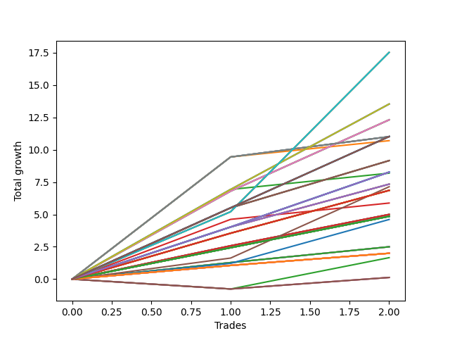

# Long Wallace 001 
- Symbol: TSLA_Unlimited
- Date Range: 03/23/2022 - 07/08/2022
- Trading Period: 7:20-12:30
- Number of Trades: 2



| Name | Win Percent | Profit | Avg Profit / Trade | Avg Time / Trade |      | Name | Win Percent | Profit | Avg Profit / Trade | Avg Time / Trade |
| ---- | ----------- | ------ | ------------------ | ---------------- | ---- | ---- | ----------- | ------ | ------------------ | ---------------- |
| Sorted By <br> Profit | | | | | | Sorted By <br> Win Percentage ||||
| Seventy-One | 100.00 | 8760.00 | 4380.00 | 134:45 |     | Seventy-One | 100.00 | 8760.00 | 4380.00 | 134:45 |
| Sixty-Three | 100.00 | 8760.00 | 4380.00 | 134:45 |     | Sixty-Three | 100.00 | 8760.00 | 4380.00 | 134:45 |
| Forty-Seven | 100.00 | 8760.00 | 4380.00 | 134:45 |     | Forty-Seven | 100.00 | 8760.00 | 4380.00 | 134:45 |
| Seven | 100.00 | 8760.00 | 4380.00 | 134:45 |     | Seven | 100.00 | 8760.00 | 4380.00 | 134:45 |
| Seventy | 100.00 | 6765.00 | 3382.50 | 76:25 |     | Seventy | 100.00 | 6765.00 | 3382.50 | 76:25 |
| Sixty-Two | 100.00 | 6765.00 | 3382.50 | 76:25 |     | Sixty-Two | 100.00 | 6765.00 | 3382.50 | 76:25 |
| Forty-Six | 100.00 | 6765.00 | 3382.50 | 76:25 |     | Forty-Six | 100.00 | 6765.00 | 3382.50 | 76:25 |
| Six | 100.00 | 6765.00 | 3382.50 | 76:25 |     | Six | 100.00 | 6765.00 | 3382.50 | 76:25 |
| Sixty-Eight | 100.00 | 6155.00 | 3077.50 | 25:40 |     | Sixty-Eight | 100.00 | 6155.00 | 3077.50 | 25:40 |
| Sixty | 100.00 | 6155.00 | 3077.50 | 25:40 |     | Sixty | 100.00 | 6155.00 | 3077.50 | 25:40 |
| Fifty-Two | 100.00 | 6155.00 | 3077.50 | 25:40 |     | Fifty-Two | 100.00 | 6155.00 | 3077.50 | 25:40 |
| Forty-Four | 100.00 | 6155.00 | 3077.50 | 25:40 |     | Forty-Four | 100.00 | 6155.00 | 3077.50 | 25:40 |
| Four | 100.00 | 6155.00 | 3077.50 | 25:40 |     | Four | 100.00 | 6155.00 | 3077.50 | 25:40 |
| One Hundred Thirty | 100.00 | 5510.00 | 2755.00 | 19:02 |     | One Hundred Thirty | 100.00 | 5510.00 | 2755.00 | 19:02 |
| One Hundred Twenty-Five | 100.00 | 5510.00 | 2755.00 | 19:02 |     | One Hundred Twenty-Five | 100.00 | 5510.00 | 2755.00 | 19:02 |
| One Hundred Twenty | 100.00 | 5510.00 | 2755.00 | 19:02 |     | One Hundred Twenty | 100.00 | 5510.00 | 2755.00 | 19:02 |
| One Hundred Fifteen | 100.00 | 5510.00 | 2755.00 | 19:02 |     | One Hundred Fifteen | 100.00 | 5510.00 | 2755.00 | 19:02 |
| One Hundred Five | 100.00 | 5510.00 | 2755.00 | 19:02 |     | One Hundred Five | 100.00 | 5510.00 | 2755.00 | 19:02 |
| Ninety-Five | 100.00 | 5510.00 | 2755.00 | 19:02 |     | Ninety-Five | 100.00 | 5510.00 | 2755.00 | 19:02 |
| Eighty-Five | 100.00 | 5510.00 | 2755.00 | 19:02 |     | Eighty-Five | 100.00 | 5510.00 | 2755.00 | 19:02 |
| Sixty-Nine | 100.00 | 5505.00 | 2752.50 | 62:52 |     | Sixty-Nine | 100.00 | 5505.00 | 2752.50 | 62:52 |
| Sixty-One | 100.00 | 5505.00 | 2752.50 | 62:52 |     | Sixty-One | 100.00 | 5505.00 | 2752.50 | 62:52 |
| Forty-Five | 100.00 | 5505.00 | 2752.50 | 62:52 |     | Forty-Five | 100.00 | 5505.00 | 2752.50 | 62:52 |
| Five | 100.00 | 5505.00 | 2752.50 | 62:52 |     | Five | 100.00 | 5505.00 | 2752.50 | 62:52 |
| Fifty-Three | 100.00 | 5350.00 | 2675.00 | 37:10 |     | Fifty-Three | 100.00 | 5350.00 | 2675.00 | 37:10 |
| Sixty-Seven | 100.00 | 4580.00 | 2290.00 | 13:40 |     | Sixty-Seven | 100.00 | 4580.00 | 2290.00 | 13:40 |
| Fifty-Nine | 100.00 | 4580.00 | 2290.00 | 13:40 |     | Fifty-Nine | 100.00 | 4580.00 | 2290.00 | 13:40 |
| Fifty-One | 100.00 | 4580.00 | 2290.00 | 13:40 |     | Fifty-One | 100.00 | 4580.00 | 2290.00 | 13:40 |
| Forty-Three | 100.00 | 4580.00 | 2290.00 | 13:40 |     | Forty-Three | 100.00 | 4580.00 | 2290.00 | 13:40 |
| Three | 100.00 | 4580.00 | 2290.00 | 13:40 |     | Three | 100.00 | 4580.00 | 2290.00 | 13:40 |
| One Hundred Twenty-Nine | 100.00 | 4135.00 | 2067.50 | 10:37 |     | One Hundred Twenty-Nine | 100.00 | 4135.00 | 2067.50 | 10:37 |
| One Hundred Twenty-Four | 100.00 | 4135.00 | 2067.50 | 10:37 |     | One Hundred Twenty-Four | 100.00 | 4135.00 | 2067.50 | 10:37 |
| One Hundred Ninteen | 100.00 | 4135.00 | 2067.50 | 10:37 |     | One Hundred Ninteen | 100.00 | 4135.00 | 2067.50 | 10:37 |
| One Hundred Fourteen | 100.00 | 4135.00 | 2067.50 | 10:37 |     | One Hundred Fourteen | 100.00 | 4135.00 | 2067.50 | 10:37 |
| One Hundred Nine | 100.00 | 4135.00 | 2067.50 | 10:37 |     | One Hundred Nine | 100.00 | 4135.00 | 2067.50 | 10:37 |
| One Hundred Four | 100.00 | 4135.00 | 2067.50 | 10:37 |     | One Hundred Four | 100.00 | 4135.00 | 2067.50 | 10:37 |
| Ninety-Four | 100.00 | 4135.00 | 2067.50 | 10:37 |     | Ninety-Four | 100.00 | 4135.00 | 2067.50 | 10:37 |
| Eighty-Four | 100.00 | 4135.00 | 2067.50 | 10:37 |     | Eighty-Four | 100.00 | 4135.00 | 2067.50 | 10:37 |
| Fifty-Four | 100.00 | 4095.00 | 2047.50 | 29:40 |     | Fifty-Four | 100.00 | 4095.00 | 2047.50 | 29:40 |
| Sixty-Six | 100.00 | 3670.00 | 1835.00 | 10:20 |     | Sixty-Six | 100.00 | 3670.00 | 1835.00 | 10:20 |
| Fifty-Eight | 100.00 | 3670.00 | 1835.00 | 10:20 |     | Fifty-Eight | 100.00 | 3670.00 | 1835.00 | 10:20 |
| Fifty | 100.00 | 3670.00 | 1835.00 | 10:20 |     | Fifty | 100.00 | 3670.00 | 1835.00 | 10:20 |
| Forty-Two | 100.00 | 3670.00 | 1835.00 | 10:20 |     | Forty-Two | 100.00 | 3670.00 | 1835.00 | 10:20 |
| Two | 100.00 | 3670.00 | 1835.00 | 10:20 |     | Two | 100.00 | 3670.00 | 1835.00 | 10:20 |
| One Hundred Ten | 100.00 | 3570.00 | 1785.00 | 17:42 |     | One Hundred Ten | 100.00 | 3570.00 | 1785.00 | 17:42 |
| One Hundred Twenty-Eight | 100.00 | 3430.00 | 1715.00 | 09:42 |     | One Hundred Twenty-Eight | 100.00 | 3430.00 | 1715.00 | 09:42 |
| One Hundred Twenty-Three | 100.00 | 3430.00 | 1715.00 | 09:42 |     | One Hundred Twenty-Three | 100.00 | 3430.00 | 1715.00 | 09:42 |
| One Hundred Eighteen | 100.00 | 3430.00 | 1715.00 | 09:42 |     | One Hundred Eighteen | 100.00 | 3430.00 | 1715.00 | 09:42 |
| One Hundred Thirteen | 100.00 | 3430.00 | 1715.00 | 09:42 |     | One Hundred Thirteen | 100.00 | 3430.00 | 1715.00 | 09:42 |
| One Hundred Eight | 100.00 | 3430.00 | 1715.00 | 09:42 |     | One Hundred Eight | 100.00 | 3430.00 | 1715.00 | 09:42 |
| One Hundred Three | 100.00 | 3430.00 | 1715.00 | 09:42 |     | One Hundred Three | 100.00 | 3430.00 | 1715.00 | 09:42 |
| Ninety-Three | 100.00 | 3430.00 | 1715.00 | 09:42 |     | Ninety-Three | 100.00 | 3430.00 | 1715.00 | 09:42 |
| Eighty-Three | 100.00 | 3430.00 | 1715.00 | 09:42 |     | Eighty-Three | 100.00 | 3430.00 | 1715.00 | 09:42 |
| Fifty-Five | 100.00 | 2940.00 | 1470.00 | 44:02 |     | Fifty-Five | 100.00 | 2940.00 | 1470.00 | 44:02 |
| Sixty-Five | 100.00 | 2500.00 | 1250.00 | 07:57 |     | Sixty-Five | 100.00 | 2500.00 | 1250.00 | 07:57 |
| Fifty-Seven | 100.00 | 2500.00 | 1250.00 | 07:57 |     | Fifty-Seven | 100.00 | 2500.00 | 1250.00 | 07:57 |
| Forty-Nine | 100.00 | 2500.00 | 1250.00 | 07:57 |     | Forty-Nine | 100.00 | 2500.00 | 1250.00 | 07:57 |
| Forty-One | 100.00 | 2500.00 | 1250.00 | 07:57 |     | Forty-One | 100.00 | 2500.00 | 1250.00 | 07:57 |
| One | 100.00 | 2500.00 | 1250.00 | 07:57 |     | One | 100.00 | 2500.00 | 1250.00 | 07:57 |
| One Hundred Twenty-Seven | 100.00 | 2425.00 | 1212.50 | 07:40 |     | One Hundred Twenty-Seven | 100.00 | 2425.00 | 1212.50 | 07:40 |
| One Hundred Twenty-Two | 100.00 | 2425.00 | 1212.50 | 07:40 |     | One Hundred Twenty-Two | 100.00 | 2425.00 | 1212.50 | 07:40 |
| One Hundred Seventeen | 100.00 | 2425.00 | 1212.50 | 07:40 |     | One Hundred Seventeen | 100.00 | 2425.00 | 1212.50 | 07:40 |
| One Hundred Twelve | 100.00 | 2425.00 | 1212.50 | 07:40 |     | One Hundred Twelve | 100.00 | 2425.00 | 1212.50 | 07:40 |
| One Hundred Seven | 100.00 | 2425.00 | 1212.50 | 07:40 |     | One Hundred Seven | 100.00 | 2425.00 | 1212.50 | 07:40 |
| One Hundred Two | 100.00 | 2425.00 | 1212.50 | 07:40 |     | One Hundred Two | 100.00 | 2425.00 | 1212.50 | 07:40 |
| Ninety-Two | 100.00 | 2425.00 | 1212.50 | 07:40 |     | Ninety-Two | 100.00 | 2425.00 | 1212.50 | 07:40 |
| Eighty-Two | 100.00 | 2425.00 | 1212.50 | 07:40 |     | Eighty-Two | 100.00 | 2425.00 | 1212.50 | 07:40 |
| Seventy-Three | 100.00 | 2305.00 | 1152.50 | 13:35 |     | Seventy-Three | 100.00 | 2305.00 | 1152.50 | 13:35 |
| Sixty-Four | 100.00 | 1250.00 | 625.00 | 04:32 |     | Sixty-Four | 100.00 | 1250.00 | 625.00 | 04:32 |
| Fifty-Six | 100.00 | 1250.00 | 625.00 | 04:32 |     | Fifty-Six | 100.00 | 1250.00 | 625.00 | 04:32 |
| Forty-Eight | 100.00 | 1250.00 | 625.00 | 04:32 |     | Forty-Eight | 100.00 | 1250.00 | 625.00 | 04:32 |
| Forty | 100.00 | 1250.00 | 625.00 | 04:32 |     | Forty | 100.00 | 1250.00 | 625.00 | 04:32 |
| Zero | 100.00 | 1250.00 | 625.00 | 04:32 |     | Zero | 100.00 | 1250.00 | 625.00 | 04:32 |
| One Hundred Twenty-Six | 100.00 | 1000.00 | 500.00 | 01:15 |     | One Hundred Twenty-Six | 100.00 | 1000.00 | 500.00 | 01:15 |
| One Hundred Twenty-One | 100.00 | 1000.00 | 500.00 | 01:15 |     | One Hundred Twenty-One | 100.00 | 1000.00 | 500.00 | 01:15 |
| One Hundred Sixteen | 100.00 | 1000.00 | 500.00 | 01:15 |     | One Hundred Sixteen | 100.00 | 1000.00 | 500.00 | 01:15 |
| One Hundred Eleven | 100.00 | 1000.00 | 500.00 | 01:15 |     | One Hundred Eleven | 100.00 | 1000.00 | 500.00 | 01:15 |
| One Hundred Six | 100.00 | 1000.00 | 500.00 | 01:15 |     | One Hundred Six | 100.00 | 1000.00 | 500.00 | 01:15 |
| One Hundred One | 100.00 | 1000.00 | 500.00 | 01:15 |     | One Hundred One | 100.00 | 1000.00 | 500.00 | 01:15 |
| Ninety-Six | 100.00 | 1000.00 | 500.00 | 01:15 |     | Ninety-Six | 100.00 | 1000.00 | 500.00 | 01:15 |
| Ninety-One | 100.00 | 1000.00 | 500.00 | 01:15 |     | Ninety-One | 100.00 | 1000.00 | 500.00 | 01:15 |
| Eighty-One | 100.00 | 1000.00 | 500.00 | 01:15 |     | Eighty-One | 100.00 | 1000.00 | 500.00 | 01:15 |
| Ninety-Seven | 50.00 | 830.00 | 415.00 | 05:25 |     | Ninety-Seven | 50.00 | 830.00 | 415.00 | 05:25 |
| One Hundred | 50.00 | 65.00 | 32.50 | 06:12 |     | One Hundred | 50.00 | 65.00 | 32.50 | 06:12 |
| Ninety-Nine | 50.00 | 65.00 | 32.50 | 06:12 |     | Ninety-Nine | 50.00 | 65.00 | 32.50 | 06:12 |
| Ninety-Eight | 50.00 | 65.00 | 32.50 | 06:12 |     | Ninety-Eight | 50.00 | 65.00 | 32.50 | 06:12 |

## NO STOPLOSS

### Test Zero
* Sell when price hits the middle line of the 20p bollinger
* No Stoploss
* Results:
```
Total Trades: 2
Percent Up: 100.00
Percent Down: 0.00
Total Points Moved Up: 2.50
Potential Profit: 1250.00
Total Points Ups: 2.50 Count Ups: 2
Total Points Downs: 0.00 Count Downs: 0
```

<details><summary>Trades</summary>

<code>In: 2022-05-31 11:58:00		Out: 2022-05-31 12:04:50		Total Position Time: 06:50		Total Move Up: 1.28		Total to Date: 1.28</code> <br />
<code>In: 2022-06-29 08:26:00		Out: 2022-06-29 08:28:15		Total Position Time: 02:15		Total Move Up: 1.22		Total to Date: 2.50</code> <br />


</details>

### Test One
* Sell when the price hits the upper line of the 20p 1std bollinger
* No Stoploss
* Results:
```
Total Trades: 2
Percent Up: 100.00
Percent Down: 0.00
Total Points Moved Up: 5.00
Potential Profit: 2500.00
Total Points Ups: 5.00 Count Ups: 2
Total Points Downs: 0.00 Count Downs: 0
```

<details><summary>Trades</summary>

<code>In: 2022-05-31 11:58:00		Out: 2022-05-31 12:07:40		Total Position Time: 09:40		Total Move Up: 2.58		Total to Date: 2.58</code> <br />
<code>In: 2022-06-29 08:26:00		Out: 2022-06-29 08:32:15		Total Position Time: 06:15		Total Move Up: 2.42		Total to Date: 5.00</code> <br />


</details>

### Test Two
* Sell when the price hits the upper line of the 20p 2std bollinger
* No Stoploss
* Results:
```
Total Trades: 2
Percent Up: 100.00
Percent Down: 0.00
Total Points Moved Up: 7.34
Potential Profit: 3670.00
Total Points Ups: 7.34 Count Ups: 2
Total Points Downs: 0.00 Count Downs: 0
```

<details><summary>Trades</summary>

<code>In: 2022-05-31 11:58:00		Out: 2022-05-31 12:09:05		Total Position Time: 11:05		Total Move Up: 4.03		Total to Date: 4.03</code> <br />
<code>In: 2022-06-29 08:26:00		Out: 2022-06-29 08:35:35		Total Position Time: 09:35		Total Move Up: 3.31		Total to Date: 7.34</code> <br />


</details>

### Test Three
* Sell when price hits the middle line of the 50p bollinger
* No Stoploss
* Results:
```
Total Trades: 2
Percent Up: 100.00
Percent Down: 0.00
Total Points Moved Up: 9.16
Potential Profit: 4580.00
Total Points Ups: 9.16 Count Ups: 2
Total Points Downs: 0.00 Count Downs: 0
```

<details><summary>Trades</summary>

<code>In: 2022-05-31 11:58:00		Out: 2022-05-31 12:15:15		Total Position Time: 17:15		Total Move Up: 5.51		Total to Date: 5.51</code> <br />
<code>In: 2022-06-29 08:26:00		Out: 2022-06-29 08:36:05		Total Position Time: 10:05		Total Move Up: 3.65		Total to Date: 9.16</code> <br />


</details>

### Test Four
* Sell when the price hits the upper line of the 50p 1std bollinger
* No Stoploss
* Results:
```
Total Trades: 2
Percent Up: 100.00
Percent Down: 0.00
Total Points Moved Up: 12.31
Potential Profit: 6155.00
Total Points Ups: 12.31 Count Ups: 2
Total Points Downs: 0.00 Count Downs: 0
```

<details><summary>Trades</summary>

<code>In: 2022-05-31 11:58:00		Out: 2022-05-31 12:28:30		Total Position Time: 30:30		Total Move Up: 6.80		Total to Date: 6.80</code> <br />
<code>In: 2022-06-29 08:26:00		Out: 2022-06-29 08:46:50		Total Position Time: 20:50		Total Move Up: 5.51		Total to Date: 12.31</code> <br />


</details>

### Test Five
* Sell when the price hits the upper line of the 50p 2std bollinger
* No Stoploss
* Results:
```
Total Trades: 2
Percent Up: 100.00
Percent Down: 0.00
Total Points Moved Up: 11.01
Potential Profit: 5505.00
Total Points Ups: 11.01 Count Ups: 2
Total Points Downs: 0.00 Count Downs: 0
```

<details><summary>Trades</summary>

<code>In: 2022-05-31 11:58:00		Out: 2022-05-31 12:31:05		Total Position Time: 33:05		Total Move Up: 9.44		Total to Date: 9.44</code> <br />
<code>In: 2022-06-29 08:26:00		Out: 2022-06-29 09:58:40		Total Position Time: 92:40		Total Move Up: 1.57		Total to Date: 11.01</code> <br />


</details>

### Test Six
* Sell when the price hits the middle line of the 1std VWAP
* No Stoploss
* Results:
```
Total Trades: 2
Percent Up: 100.00
Percent Down: 0.00
Total Points Moved Up: 13.53
Potential Profit: 6765.00
Total Points Ups: 13.53 Count Ups: 2
Total Points Downs: 0.00 Count Downs: 0
```

<details><summary>Trades</summary>

<code>In: 2022-05-31 11:58:00		Out: 2022-05-31 12:16:05		Total Position Time: 18:05		Total Move Up: 6.93		Total to Date: 6.93</code> <br />
<code>In: 2022-06-29 08:26:00		Out: 2022-06-29 10:40:45		Total Position Time: 134:45		Total Move Up: 6.60		Total to Date: 13.53</code> <br />


</details>

### Test Seven
* Sell when the price hits the upper line of the 1std VWAP
* No Stoploss
* Results:
```
Total Trades: 2
Percent Up: 100.00
Percent Down: 0.00
Total Points Moved Up: 17.52
Potential Profit: 8760.00
Total Points Ups: 17.52 Count Ups: 2
Total Points Downs: 0.00 Count Downs: 0
```

<details><summary>Trades</summary>

<code>In: 2022-05-31 11:58:00		Out: 2022-05-31 12:47:00		Total Position Time: 49:00		Total Move Up: 5.21		Total to Date: 5.21</code> <br />
<code>In: 2022-06-29 08:26:00		Out: 2022-06-29 12:06:30		Total Position Time: 220:30		Total Move Up: 12.31		Total to Date: 17.52</code> <br />


</details>

## STOPLOSS OF 5

### Test Forty
* Sell when price hits the middle line of the 20p bollinger
* Stoploss is 5 points
* Results:
```
Total Trades: 2
Percent Up: 100.00
Percent Down: 0.00
Total Points Moved Up: 2.50
Potential Profit: 1250.00
Total Points Ups: 2.50 Count Ups: 2
Total Points Downs: 0.00 Count Downs: 0
```

<details><summary>Trades</summary>

<code>In: 2022-05-31 11:58:00		Out: 2022-05-31 12:04:50		Total Position Time: 06:50		Total Move Up: 1.28		Total to Date: 1.28</code> <br />
<code>In: 2022-06-29 08:26:00		Out: 2022-06-29 08:28:15		Total Position Time: 02:15		Total Move Up: 1.22		Total to Date: 2.50</code> <br />


</details>

### Test Forty-One
* Sell when the price hits the upper line of the 20p 1std bollinger
* Stoploss is 5 points
* Results:
```
Total Trades: 2
Percent Up: 100.00
Percent Down: 0.00
Total Points Moved Up: 5.00
Potential Profit: 2500.00
Total Points Ups: 5.00 Count Ups: 2
Total Points Downs: 0.00 Count Downs: 0
```

<details><summary>Trades</summary>

<code>In: 2022-05-31 11:58:00		Out: 2022-05-31 12:07:40		Total Position Time: 09:40		Total Move Up: 2.58		Total to Date: 2.58</code> <br />
<code>In: 2022-06-29 08:26:00		Out: 2022-06-29 08:32:15		Total Position Time: 06:15		Total Move Up: 2.42		Total to Date: 5.00</code> <br />


</details>

### Test Forty-Two
* Sell when the price hits the upper line of the 20p 2std bollinger
* Stoploss is 5 points
* Results:
```
Total Trades: 2
Percent Up: 100.00
Percent Down: 0.00
Total Points Moved Up: 7.34
Potential Profit: 3670.00
Total Points Ups: 7.34 Count Ups: 2
Total Points Downs: 0.00 Count Downs: 0
```

<details><summary>Trades</summary>

<code>In: 2022-05-31 11:58:00		Out: 2022-05-31 12:09:05		Total Position Time: 11:05		Total Move Up: 4.03		Total to Date: 4.03</code> <br />
<code>In: 2022-06-29 08:26:00		Out: 2022-06-29 08:35:35		Total Position Time: 09:35		Total Move Up: 3.31		Total to Date: 7.34</code> <br />


</details>

### Test Forty-Three
* Sell when price hits the middle line of the 50p bollinger
* Stoploss is 5 points
* Results:
```
Total Trades: 2
Percent Up: 100.00
Percent Down: 0.00
Total Points Moved Up: 9.16
Potential Profit: 4580.00
Total Points Ups: 9.16 Count Ups: 2
Total Points Downs: 0.00 Count Downs: 0
```

<details><summary>Trades</summary>

<code>In: 2022-05-31 11:58:00		Out: 2022-05-31 12:15:15		Total Position Time: 17:15		Total Move Up: 5.51		Total to Date: 5.51</code> <br />
<code>In: 2022-06-29 08:26:00		Out: 2022-06-29 08:36:05		Total Position Time: 10:05		Total Move Up: 3.65		Total to Date: 9.16</code> <br />


</details>

### Test Forty-Four
* Sell when the price hits the upper line of the 50p 1std bollinger
* Stoploss is 5 points
* Results:
```
Total Trades: 2
Percent Up: 100.00
Percent Down: 0.00
Total Points Moved Up: 12.31
Potential Profit: 6155.00
Total Points Ups: 12.31 Count Ups: 2
Total Points Downs: 0.00 Count Downs: 0
```

<details><summary>Trades</summary>

<code>In: 2022-05-31 11:58:00		Out: 2022-05-31 12:28:30		Total Position Time: 30:30		Total Move Up: 6.80		Total to Date: 6.80</code> <br />
<code>In: 2022-06-29 08:26:00		Out: 2022-06-29 08:46:50		Total Position Time: 20:50		Total Move Up: 5.51		Total to Date: 12.31</code> <br />


</details>

### Test Forty-Five
* Sell when the price hits the upper line of the 50p 2std bollinger
* Stoploss is 5 points
* Results:
```
Total Trades: 2
Percent Up: 100.00
Percent Down: 0.00
Total Points Moved Up: 11.01
Potential Profit: 5505.00
Total Points Ups: 11.01 Count Ups: 2
Total Points Downs: 0.00 Count Downs: 0
```

<details><summary>Trades</summary>

<code>In: 2022-05-31 11:58:00		Out: 2022-05-31 12:31:05		Total Position Time: 33:05		Total Move Up: 9.44		Total to Date: 9.44</code> <br />
<code>In: 2022-06-29 08:26:00		Out: 2022-06-29 09:58:40		Total Position Time: 92:40		Total Move Up: 1.57		Total to Date: 11.01</code> <br />


</details>

### Test Forty-Six
* Sell when the price hits the middle line of the 1std VWAP
* Stoploss is 5 points
* Results:
```
Total Trades: 2
Percent Up: 100.00
Percent Down: 0.00
Total Points Moved Up: 13.53
Potential Profit: 6765.00
Total Points Ups: 13.53 Count Ups: 2
Total Points Downs: 0.00 Count Downs: 0
```

<details><summary>Trades</summary>

<code>In: 2022-05-31 11:58:00		Out: 2022-05-31 12:16:05		Total Position Time: 18:05		Total Move Up: 6.93		Total to Date: 6.93</code> <br />
<code>In: 2022-06-29 08:26:00		Out: 2022-06-29 10:40:45		Total Position Time: 134:45		Total Move Up: 6.60		Total to Date: 13.53</code> <br />


</details>

### Test Forty-Seven
* Sell when the price hits the upper line of the 1std VWAP
* Stoploss is 5 points
* Results:
```
Total Trades: 2
Percent Up: 100.00
Percent Down: 0.00
Total Points Moved Up: 17.52
Potential Profit: 8760.00
Total Points Ups: 17.52 Count Ups: 2
Total Points Downs: 0.00 Count Downs: 0
```

<details><summary>Trades</summary>

<code>In: 2022-05-31 11:58:00		Out: 2022-05-31 12:47:00		Total Position Time: 49:00		Total Move Up: 5.21		Total to Date: 5.21</code> <br />
<code>In: 2022-06-29 08:26:00		Out: 2022-06-29 12:06:30		Total Position Time: 220:30		Total Move Up: 12.31		Total to Date: 17.52</code> <br />


</details>

## TRAIL STOP OF 5

### Test Forty-Eight
* Sell when price hits the middle line of the 20p bollinger
* Trailing Stop is 5 points
* Results:
```
Total Trades: 2
Percent Up: 100.00
Percent Down: 0.00
Total Points Moved Up: 2.50
Potential Profit: 1250.00
Total Points Ups: 2.50 Count Ups: 2
Total Points Downs: 0.00 Count Downs: 0
```

<details><summary>Trades</summary>

<code>In: 2022-05-31 11:58:00		Out: 2022-05-31 12:04:50		Total Position Time: 06:50		Total Move Up: 1.28		Total to Date: 1.28</code> <br />
<code>In: 2022-06-29 08:26:00		Out: 2022-06-29 08:28:15		Total Position Time: 02:15		Total Move Up: 1.22		Total to Date: 2.50</code> <br />


</details>

### Test Forty-Nine
* Sell when the price hits the upper line of the 20p 1std bollinger
* Trailing Stop is 5 points
* Results:
```
Total Trades: 2
Percent Up: 100.00
Percent Down: 0.00
Total Points Moved Up: 5.00
Potential Profit: 2500.00
Total Points Ups: 5.00 Count Ups: 2
Total Points Downs: 0.00 Count Downs: 0
```

<details><summary>Trades</summary>

<code>In: 2022-05-31 11:58:00		Out: 2022-05-31 12:07:40		Total Position Time: 09:40		Total Move Up: 2.58		Total to Date: 2.58</code> <br />
<code>In: 2022-06-29 08:26:00		Out: 2022-06-29 08:32:15		Total Position Time: 06:15		Total Move Up: 2.42		Total to Date: 5.00</code> <br />


</details>

### Test Fifty
* Sell when the price hits the upper line of the 20p 2std bollinger
* Trailing Stop is 5 points
* Results:
```
Total Trades: 2
Percent Up: 100.00
Percent Down: 0.00
Total Points Moved Up: 7.34
Potential Profit: 3670.00
Total Points Ups: 7.34 Count Ups: 2
Total Points Downs: 0.00 Count Downs: 0
```

<details><summary>Trades</summary>

<code>In: 2022-05-31 11:58:00		Out: 2022-05-31 12:09:05		Total Position Time: 11:05		Total Move Up: 4.03		Total to Date: 4.03</code> <br />
<code>In: 2022-06-29 08:26:00		Out: 2022-06-29 08:35:35		Total Position Time: 09:35		Total Move Up: 3.31		Total to Date: 7.34</code> <br />


</details>

### Test Fifty-One
* Sell when price hits the middle line of the 50p bollinger
* Trailing Stop is 5 points
* Results:
```
Total Trades: 2
Percent Up: 100.00
Percent Down: 0.00
Total Points Moved Up: 9.16
Potential Profit: 4580.00
Total Points Ups: 9.16 Count Ups: 2
Total Points Downs: 0.00 Count Downs: 0
```

<details><summary>Trades</summary>

<code>In: 2022-05-31 11:58:00		Out: 2022-05-31 12:15:15		Total Position Time: 17:15		Total Move Up: 5.51		Total to Date: 5.51</code> <br />
<code>In: 2022-06-29 08:26:00		Out: 2022-06-29 08:36:05		Total Position Time: 10:05		Total Move Up: 3.65		Total to Date: 9.16</code> <br />


</details>

### Test Fifty-Two
* Sell when the price hits the upper line of the 50p 1std bollinger
* Trailing Stop is 5 points
* Results:
```
Total Trades: 2
Percent Up: 100.00
Percent Down: 0.00
Total Points Moved Up: 12.31
Potential Profit: 6155.00
Total Points Ups: 12.31 Count Ups: 2
Total Points Downs: 0.00 Count Downs: 0
```

<details><summary>Trades</summary>

<code>In: 2022-05-31 11:58:00		Out: 2022-05-31 12:28:30		Total Position Time: 30:30		Total Move Up: 6.80		Total to Date: 6.80</code> <br />
<code>In: 2022-06-29 08:26:00		Out: 2022-06-29 08:46:50		Total Position Time: 20:50		Total Move Up: 5.51		Total to Date: 12.31</code> <br />


</details>

### Test Fifty-Three
* Sell when the price hits the upper line of the 50p 2std bollinger
* Trailing Stop is 5 points
* Results:
```
Total Trades: 2
Percent Up: 100.00
Percent Down: 0.00
Total Points Moved Up: 10.70
Potential Profit: 5350.00
Total Points Ups: 10.70 Count Ups: 2
Total Points Downs: 0.00 Count Downs: 0
```

<details><summary>Trades</summary>

<code>In: 2022-05-31 11:58:00		Out: 2022-05-31 12:31:05		Total Position Time: 33:05		Total Move Up: 9.44		Total to Date: 9.44</code> <br />
<code>In: 2022-06-29 08:26:00		Out: 2022-06-29 09:07:15		Total Position Time: 41:15		Total Move Up: 1.26		Total to Date: 10.70</code> <br />


</details>

### Test Fifty-Four
* Sell when the price hits the middle line of the 1std VWAP
* Trailing Stop is 5 points
* Results:
```
Total Trades: 2
Percent Up: 100.00
Percent Down: 0.00
Total Points Moved Up: 8.19
Potential Profit: 4095.00
Total Points Ups: 8.19 Count Ups: 2
Total Points Downs: 0.00 Count Downs: 0
```

<details><summary>Trades</summary>

<code>In: 2022-05-31 11:58:00		Out: 2022-05-31 12:16:05		Total Position Time: 18:05		Total Move Up: 6.93		Total to Date: 6.93</code> <br />
<code>In: 2022-06-29 08:26:00		Out: 2022-06-29 09:07:15		Total Position Time: 41:15		Total Move Up: 1.26		Total to Date: 8.19</code> <br />


</details>

### Test Fifty-Five
* Sell when the price hits the upper line of the 1std VWAP
* Trailing Stop is 5 points
* Results:
```
Total Trades: 2
Percent Up: 100.00
Percent Down: 0.00
Total Points Moved Up: 5.88
Potential Profit: 2940.00
Total Points Ups: 5.88 Count Ups: 2
Total Points Downs: 0.00 Count Downs: 0
```

<details><summary>Trades</summary>

<code>In: 2022-05-31 11:58:00		Out: 2022-05-31 12:44:50		Total Position Time: 46:50		Total Move Up: 4.62		Total to Date: 4.62</code> <br />
<code>In: 2022-06-29 08:26:00		Out: 2022-06-29 09:07:15		Total Position Time: 41:15		Total Move Up: 1.26		Total to Date: 5.88</code> <br />


</details>

## STOPLOSS OF 10

### Test Fifty-Six
* Sell when price hits the middle line of the 20p bollinger
* Stoploss is 10 points
* Results:
```
Total Trades: 2
Percent Up: 100.00
Percent Down: 0.00
Total Points Moved Up: 2.50
Potential Profit: 1250.00
Total Points Ups: 2.50 Count Ups: 2
Total Points Downs: 0.00 Count Downs: 0
```

<details><summary>Trades</summary>

<code>In: 2022-05-31 11:58:00		Out: 2022-05-31 12:04:50		Total Position Time: 06:50		Total Move Up: 1.28		Total to Date: 1.28</code> <br />
<code>In: 2022-06-29 08:26:00		Out: 2022-06-29 08:28:15		Total Position Time: 02:15		Total Move Up: 1.22		Total to Date: 2.50</code> <br />


</details>

### Test Fifty-Seven
* Sell when the price hits the upper line of the 20p 1std bollinger
* Stoploss is 10 points
* Results:
```
Total Trades: 2
Percent Up: 100.00
Percent Down: 0.00
Total Points Moved Up: 5.00
Potential Profit: 2500.00
Total Points Ups: 5.00 Count Ups: 2
Total Points Downs: 0.00 Count Downs: 0
```

<details><summary>Trades</summary>

<code>In: 2022-05-31 11:58:00		Out: 2022-05-31 12:07:40		Total Position Time: 09:40		Total Move Up: 2.58		Total to Date: 2.58</code> <br />
<code>In: 2022-06-29 08:26:00		Out: 2022-06-29 08:32:15		Total Position Time: 06:15		Total Move Up: 2.42		Total to Date: 5.00</code> <br />


</details>

### Test Fifty-Eight
* Sell when the price hits the upper line of the 20p 2std bollinger
* Stoploss is 10 points
* Results:
```
Total Trades: 2
Percent Up: 100.00
Percent Down: 0.00
Total Points Moved Up: 7.34
Potential Profit: 3670.00
Total Points Ups: 7.34 Count Ups: 2
Total Points Downs: 0.00 Count Downs: 0
```

<details><summary>Trades</summary>

<code>In: 2022-05-31 11:58:00		Out: 2022-05-31 12:09:05		Total Position Time: 11:05		Total Move Up: 4.03		Total to Date: 4.03</code> <br />
<code>In: 2022-06-29 08:26:00		Out: 2022-06-29 08:35:35		Total Position Time: 09:35		Total Move Up: 3.31		Total to Date: 7.34</code> <br />


</details>

### Test Fifty-Nine
* Sell when price hits the middle line of the 50p bollinger
* Stoploss is 10 points
* Results:
```
Total Trades: 2
Percent Up: 100.00
Percent Down: 0.00
Total Points Moved Up: 9.16
Potential Profit: 4580.00
Total Points Ups: 9.16 Count Ups: 2
Total Points Downs: 0.00 Count Downs: 0
```

<details><summary>Trades</summary>

<code>In: 2022-05-31 11:58:00		Out: 2022-05-31 12:15:15		Total Position Time: 17:15		Total Move Up: 5.51		Total to Date: 5.51</code> <br />
<code>In: 2022-06-29 08:26:00		Out: 2022-06-29 08:36:05		Total Position Time: 10:05		Total Move Up: 3.65		Total to Date: 9.16</code> <br />


</details>

### Test Sixty
* Sell when the price hits the upper line of the 50p 1std bollinger
* Stoploss is 10 points
* Results:
```
Total Trades: 2
Percent Up: 100.00
Percent Down: 0.00
Total Points Moved Up: 12.31
Potential Profit: 6155.00
Total Points Ups: 12.31 Count Ups: 2
Total Points Downs: 0.00 Count Downs: 0
```

<details><summary>Trades</summary>

<code>In: 2022-05-31 11:58:00		Out: 2022-05-31 12:28:30		Total Position Time: 30:30		Total Move Up: 6.80		Total to Date: 6.80</code> <br />
<code>In: 2022-06-29 08:26:00		Out: 2022-06-29 08:46:50		Total Position Time: 20:50		Total Move Up: 5.51		Total to Date: 12.31</code> <br />


</details>

### Test Sixty-One
* Sell when the price hits the upper line of the 50p 2std bollinger
* Stoploss is 10 points
* Results:
```
Total Trades: 2
Percent Up: 100.00
Percent Down: 0.00
Total Points Moved Up: 11.01
Potential Profit: 5505.00
Total Points Ups: 11.01 Count Ups: 2
Total Points Downs: 0.00 Count Downs: 0
```

<details><summary>Trades</summary>

<code>In: 2022-05-31 11:58:00		Out: 2022-05-31 12:31:05		Total Position Time: 33:05		Total Move Up: 9.44		Total to Date: 9.44</code> <br />
<code>In: 2022-06-29 08:26:00		Out: 2022-06-29 09:58:40		Total Position Time: 92:40		Total Move Up: 1.57		Total to Date: 11.01</code> <br />


</details>

### Test Sixty-Two
* Sell when the price hits the middle line of the 1std VWAP
* Stoploss is 10 points
* Results:
```
Total Trades: 2
Percent Up: 100.00
Percent Down: 0.00
Total Points Moved Up: 13.53
Potential Profit: 6765.00
Total Points Ups: 13.53 Count Ups: 2
Total Points Downs: 0.00 Count Downs: 0
```

<details><summary>Trades</summary>

<code>In: 2022-05-31 11:58:00		Out: 2022-05-31 12:16:05		Total Position Time: 18:05		Total Move Up: 6.93		Total to Date: 6.93</code> <br />
<code>In: 2022-06-29 08:26:00		Out: 2022-06-29 10:40:45		Total Position Time: 134:45		Total Move Up: 6.60		Total to Date: 13.53</code> <br />


</details>

### Test Sixty-Three
* Sell when the price hits the upper line of the 1std VWAP
* Stoploss is 10 points
* Results:
```
Total Trades: 2
Percent Up: 100.00
Percent Down: 0.00
Total Points Moved Up: 17.52
Potential Profit: 8760.00
Total Points Ups: 17.52 Count Ups: 2
Total Points Downs: 0.00 Count Downs: 0
```

<details><summary>Trades</summary>

<code>In: 2022-05-31 11:58:00		Out: 2022-05-31 12:47:00		Total Position Time: 49:00		Total Move Up: 5.21		Total to Date: 5.21</code> <br />
<code>In: 2022-06-29 08:26:00		Out: 2022-06-29 12:06:30		Total Position Time: 220:30		Total Move Up: 12.31		Total to Date: 17.52</code> <br />


</details>

## TRAIL STOP OF 10

### Test Sixty-Four
* Sell when price hits the middle line of the 20p bollinger
* Trailing Stop is 10 points
* Results:
```
Total Trades: 2
Percent Up: 100.00
Percent Down: 0.00
Total Points Moved Up: 2.50
Potential Profit: 1250.00
Total Points Ups: 2.50 Count Ups: 2
Total Points Downs: 0.00 Count Downs: 0
```

<details><summary>Trades</summary>

<code>In: 2022-05-31 11:58:00		Out: 2022-05-31 12:04:50		Total Position Time: 06:50		Total Move Up: 1.28		Total to Date: 1.28</code> <br />
<code>In: 2022-06-29 08:26:00		Out: 2022-06-29 08:28:15		Total Position Time: 02:15		Total Move Up: 1.22		Total to Date: 2.50</code> <br />


</details>

### Test Sixty-Five
* Sell when the price hits the upper line of the 20p 1std bollinger
* Trailing Stop is 10 points
* Results:
```
Total Trades: 2
Percent Up: 100.00
Percent Down: 0.00
Total Points Moved Up: 5.00
Potential Profit: 2500.00
Total Points Ups: 5.00 Count Ups: 2
Total Points Downs: 0.00 Count Downs: 0
```

<details><summary>Trades</summary>

<code>In: 2022-05-31 11:58:00		Out: 2022-05-31 12:07:40		Total Position Time: 09:40		Total Move Up: 2.58		Total to Date: 2.58</code> <br />
<code>In: 2022-06-29 08:26:00		Out: 2022-06-29 08:32:15		Total Position Time: 06:15		Total Move Up: 2.42		Total to Date: 5.00</code> <br />


</details>

### Test Sixty-Six
* Sell when the price hits the upper line of the 20p 2std bollinger
* Trailing Stop is 10 points
* Results:
```
Total Trades: 2
Percent Up: 100.00
Percent Down: 0.00
Total Points Moved Up: 7.34
Potential Profit: 3670.00
Total Points Ups: 7.34 Count Ups: 2
Total Points Downs: 0.00 Count Downs: 0
```

<details><summary>Trades</summary>

<code>In: 2022-05-31 11:58:00		Out: 2022-05-31 12:09:05		Total Position Time: 11:05		Total Move Up: 4.03		Total to Date: 4.03</code> <br />
<code>In: 2022-06-29 08:26:00		Out: 2022-06-29 08:35:35		Total Position Time: 09:35		Total Move Up: 3.31		Total to Date: 7.34</code> <br />


</details>

### Test Sixty-Seven
* Sell when price hits the middle line of the 50p bollinger
* Trailing Stop is 10 points
* Results:
```
Total Trades: 2
Percent Up: 100.00
Percent Down: 0.00
Total Points Moved Up: 9.16
Potential Profit: 4580.00
Total Points Ups: 9.16 Count Ups: 2
Total Points Downs: 0.00 Count Downs: 0
```

<details><summary>Trades</summary>

<code>In: 2022-05-31 11:58:00		Out: 2022-05-31 12:15:15		Total Position Time: 17:15		Total Move Up: 5.51		Total to Date: 5.51</code> <br />
<code>In: 2022-06-29 08:26:00		Out: 2022-06-29 08:36:05		Total Position Time: 10:05		Total Move Up: 3.65		Total to Date: 9.16</code> <br />


</details>

### Test Sixty-Eight
* Sell when the price hits the upper line of the 50p 1std bollinger
* Trailing Stop is 10 points
* Results:
```
Total Trades: 2
Percent Up: 100.00
Percent Down: 0.00
Total Points Moved Up: 12.31
Potential Profit: 6155.00
Total Points Ups: 12.31 Count Ups: 2
Total Points Downs: 0.00 Count Downs: 0
```

<details><summary>Trades</summary>

<code>In: 2022-05-31 11:58:00		Out: 2022-05-31 12:28:30		Total Position Time: 30:30		Total Move Up: 6.80		Total to Date: 6.80</code> <br />
<code>In: 2022-06-29 08:26:00		Out: 2022-06-29 08:46:50		Total Position Time: 20:50		Total Move Up: 5.51		Total to Date: 12.31</code> <br />


</details>

### Test Sixty-Nine
* Sell when the price hits the upper line of the 50p 2std bollinger
* Trailing Stop is 10 points
* Results:
```
Total Trades: 2
Percent Up: 100.00
Percent Down: 0.00
Total Points Moved Up: 11.01
Potential Profit: 5505.00
Total Points Ups: 11.01 Count Ups: 2
Total Points Downs: 0.00 Count Downs: 0
```

<details><summary>Trades</summary>

<code>In: 2022-05-31 11:58:00		Out: 2022-05-31 12:31:05		Total Position Time: 33:05		Total Move Up: 9.44		Total to Date: 9.44</code> <br />
<code>In: 2022-06-29 08:26:00		Out: 2022-06-29 09:58:40		Total Position Time: 92:40		Total Move Up: 1.57		Total to Date: 11.01</code> <br />


</details>

### Test Seventy
* Sell when the price hits the middle line of the 1std VWAP
* Trailing Stop is 10 points
* Results:
```
Total Trades: 2
Percent Up: 100.00
Percent Down: 0.00
Total Points Moved Up: 13.53
Potential Profit: 6765.00
Total Points Ups: 13.53 Count Ups: 2
Total Points Downs: 0.00 Count Downs: 0
```

<details><summary>Trades</summary>

<code>In: 2022-05-31 11:58:00		Out: 2022-05-31 12:16:05		Total Position Time: 18:05		Total Move Up: 6.93		Total to Date: 6.93</code> <br />
<code>In: 2022-06-29 08:26:00		Out: 2022-06-29 10:40:45		Total Position Time: 134:45		Total Move Up: 6.60		Total to Date: 13.53</code> <br />


</details>

### Test Seventy-One
* Sell when the price hits the upper line of the 1std VWAP
* Trailing Stop is 10 points
* Results:
```
Total Trades: 2
Percent Up: 100.00
Percent Down: 0.00
Total Points Moved Up: 17.52
Potential Profit: 8760.00
Total Points Ups: 17.52 Count Ups: 2
Total Points Downs: 0.00 Count Downs: 0
```

<details><summary>Trades</summary>

<code>In: 2022-05-31 11:58:00		Out: 2022-05-31 12:47:00		Total Position Time: 49:00		Total Move Up: 5.21		Total to Date: 5.21</code> <br />
<code>In: 2022-06-29 08:26:00		Out: 2022-06-29 12:06:30		Total Position Time: 220:30		Total Move Up: 12.31		Total to Date: 17.52</code> <br />


</details>

## SPECIAL EXIT CONDITIONS 

### Test Seventy-Three
* Sell when the linear regression slope changes to negative
* No Stoploss
* Results:
```
Total Trades: 2
Percent Up: 100.00
Percent Down: 0.00
Total Points Moved Up: 4.61
Potential Profit: 2305.00
Total Points Ups: 4.61 Count Ups: 2
Total Points Downs: 0.00 Count Downs: 0
```

<details><summary>Trades</summary>

<code>In: 2022-05-31 11:58:00		Out: 2022-05-31 12:05:05		Total Position Time: 07:05		Total Move Up: 1.22		Total to Date: 1.22</code> <br />
<code>In: 2022-06-29 08:26:00		Out: 2022-06-29 08:46:05		Total Position Time: 20:05		Total Move Up: 3.39		Total to Date: 4.61</code> <br />


</details>

## TAKE PROFIT

### Test Eighty-One
* Take Profit of 1 Point
* No Stoploss
* Results:
```
Total Trades: 2
Percent Up: 100.00
Percent Down: 0.00
Total Points Moved Up: 2.00
Potential Profit: 1000.00
Total Points Ups: 2.00 Count Ups: 2
Total Points Downs: 0.00 Count Downs: 0
```

<details><summary>Trades</summary>

<code>In: 2022-05-31 11:58:00		Out: 2022-05-31 11:59:15		Total Position Time: 01:15		Total Move Up: 1.06		Total to Date: 1.06</code> <br />
<code>In: 2022-06-29 08:26:00		Out: 2022-06-29 08:27:15		Total Position Time: 01:15		Total Move Up: 0.94		Total to Date: 2.00</code> <br />


</details>

### Test Eighty-Two
* Take Profit of 2 Point
* No Stoploss
* Results:
```
Total Trades: 2
Percent Up: 100.00
Percent Down: 0.00
Total Points Moved Up: 4.85
Potential Profit: 2425.00
Total Points Ups: 4.85 Count Ups: 2
Total Points Downs: 0.00 Count Downs: 0
```

<details><summary>Trades</summary>

<code>In: 2022-05-31 11:58:00		Out: 2022-05-31 12:07:05		Total Position Time: 09:05		Total Move Up: 2.43		Total to Date: 2.43</code> <br />
<code>In: 2022-06-29 08:26:00		Out: 2022-06-29 08:32:15		Total Position Time: 06:15		Total Move Up: 2.42		Total to Date: 4.85</code> <br />


</details>

### Test Eighty-Three
* Take Profit of 3 Point
* No Stoploss
* Results:
```
Total Trades: 2
Percent Up: 100.00
Percent Down: 0.00
Total Points Moved Up: 6.86
Potential Profit: 3430.00
Total Points Ups: 6.86 Count Ups: 2
Total Points Downs: 0.00 Count Downs: 0
```

<details><summary>Trades</summary>

<code>In: 2022-05-31 11:58:00		Out: 2022-05-31 12:07:50		Total Position Time: 09:50		Total Move Up: 3.55		Total to Date: 3.55</code> <br />
<code>In: 2022-06-29 08:26:00		Out: 2022-06-29 08:35:35		Total Position Time: 09:35		Total Move Up: 3.31		Total to Date: 6.86</code> <br />


</details>

### Test Eighty-Four
* Take Profit of 4 Point
* No Stoploss
* Results:
```
Total Trades: 2
Percent Up: 100.00
Percent Down: 0.00
Total Points Moved Up: 8.27
Potential Profit: 4135.00
Total Points Ups: 8.27 Count Ups: 2
Total Points Downs: 0.00 Count Downs: 0
```

<details><summary>Trades</summary>

<code>In: 2022-05-31 11:58:00		Out: 2022-05-31 12:09:00		Total Position Time: 11:00		Total Move Up: 4.03		Total to Date: 4.03</code> <br />
<code>In: 2022-06-29 08:26:00		Out: 2022-06-29 08:36:15		Total Position Time: 10:15		Total Move Up: 4.24		Total to Date: 8.27</code> <br />


</details>

### Test Eighty-Five
* Take Profit of 5 Point
* No Stoploss
* Results:
```
Total Trades: 2
Percent Up: 100.00
Percent Down: 0.00
Total Points Moved Up: 11.02
Potential Profit: 5510.00
Total Points Ups: 11.02 Count Ups: 2
Total Points Downs: 0.00 Count Downs: 0
```

<details><summary>Trades</summary>

<code>In: 2022-05-31 11:58:00		Out: 2022-05-31 12:15:15		Total Position Time: 17:15		Total Move Up: 5.51		Total to Date: 5.51</code> <br />
<code>In: 2022-06-29 08:26:00		Out: 2022-06-29 08:46:50		Total Position Time: 20:50		Total Move Up: 5.51		Total to Date: 11.02</code> <br />


</details>

## TAKE PROFIT Stoploss of Two

### Test Ninety-One
* Take Profit of 1 Point
* Stoploss is 2 points
* Results:
```
Total Trades: 2
Percent Up: 100.00
Percent Down: 0.00
Total Points Moved Up: 2.00
Potential Profit: 1000.00
Total Points Ups: 2.00 Count Ups: 2
Total Points Downs: 0.00 Count Downs: 0
```

<details><summary>Trades</summary>

<code>In: 2022-05-31 11:58:00		Out: 2022-05-31 11:59:15		Total Position Time: 01:15		Total Move Up: 1.06		Total to Date: 1.06</code> <br />
<code>In: 2022-06-29 08:26:00		Out: 2022-06-29 08:27:15		Total Position Time: 01:15		Total Move Up: 0.94		Total to Date: 2.00</code> <br />


</details>

### Test Ninety-Two
* Take Profit of 2 Point
* Stoploss is 2 points
* Results:
```
Total Trades: 2
Percent Up: 100.00
Percent Down: 0.00
Total Points Moved Up: 4.85
Potential Profit: 2425.00
Total Points Ups: 4.85 Count Ups: 2
Total Points Downs: 0.00 Count Downs: 0
```

<details><summary>Trades</summary>

<code>In: 2022-05-31 11:58:00		Out: 2022-05-31 12:07:05		Total Position Time: 09:05		Total Move Up: 2.43		Total to Date: 2.43</code> <br />
<code>In: 2022-06-29 08:26:00		Out: 2022-06-29 08:32:15		Total Position Time: 06:15		Total Move Up: 2.42		Total to Date: 4.85</code> <br />


</details>

### Test Ninety-Three
* Take Profit of 3 Point
* Stoploss is 2 points
* Results:
```
Total Trades: 2
Percent Up: 100.00
Percent Down: 0.00
Total Points Moved Up: 6.86
Potential Profit: 3430.00
Total Points Ups: 6.86 Count Ups: 2
Total Points Downs: 0.00 Count Downs: 0
```

<details><summary>Trades</summary>

<code>In: 2022-05-31 11:58:00		Out: 2022-05-31 12:07:50		Total Position Time: 09:50		Total Move Up: 3.55		Total to Date: 3.55</code> <br />
<code>In: 2022-06-29 08:26:00		Out: 2022-06-29 08:35:35		Total Position Time: 09:35		Total Move Up: 3.31		Total to Date: 6.86</code> <br />


</details>

### Test Ninety-Four
* Take Profit of 4 Point
* Stoploss is 2 points
* Results:
```
Total Trades: 2
Percent Up: 100.00
Percent Down: 0.00
Total Points Moved Up: 8.27
Potential Profit: 4135.00
Total Points Ups: 8.27 Count Ups: 2
Total Points Downs: 0.00 Count Downs: 0
```

<details><summary>Trades</summary>

<code>In: 2022-05-31 11:58:00		Out: 2022-05-31 12:09:00		Total Position Time: 11:00		Total Move Up: 4.03		Total to Date: 4.03</code> <br />
<code>In: 2022-06-29 08:26:00		Out: 2022-06-29 08:36:15		Total Position Time: 10:15		Total Move Up: 4.24		Total to Date: 8.27</code> <br />


</details>

### Test Ninety-Five
* Take Profit of 5 Point
* Stoploss is 2 points
* Results:
```
Total Trades: 2
Percent Up: 100.00
Percent Down: 0.00
Total Points Moved Up: 11.02
Potential Profit: 5510.00
Total Points Ups: 11.02 Count Ups: 2
Total Points Downs: 0.00 Count Downs: 0
```

<details><summary>Trades</summary>

<code>In: 2022-05-31 11:58:00		Out: 2022-05-31 12:15:15		Total Position Time: 17:15		Total Move Up: 5.51		Total to Date: 5.51</code> <br />
<code>In: 2022-06-29 08:26:00		Out: 2022-06-29 08:46:50		Total Position Time: 20:50		Total Move Up: 5.51		Total to Date: 11.02</code> <br />


</details>

## TAKE PROFIT Trailstop of Two

### Test Ninety-Six
* Take Profit of 1 Point
* Trailing stop is 2 points
* Results:
```
Total Trades: 2
Percent Up: 100.00
Percent Down: 0.00
Total Points Moved Up: 2.00
Potential Profit: 1000.00
Total Points Ups: 2.00 Count Ups: 2
Total Points Downs: 0.00 Count Downs: 0
```

<details><summary>Trades</summary>

<code>In: 2022-05-31 11:58:00		Out: 2022-05-31 11:59:15		Total Position Time: 01:15		Total Move Up: 1.06		Total to Date: 1.06</code> <br />
<code>In: 2022-06-29 08:26:00		Out: 2022-06-29 08:27:15		Total Position Time: 01:15		Total Move Up: 0.94		Total to Date: 2.00</code> <br />


</details>

### Test Ninety-Seven
* Take Profit of 2 Point
* Trailing stop is 2 points
* Results:
```
Total Trades: 2
Percent Up: 50.00
Percent Down: 50.00
Total Points Moved Up: 1.66
Potential Profit: 830.00
Total Points Ups: 2.42 Count Ups: 1
Total Points Downs: -0.76 Count Downs: 1
```

<details><summary>Trades</summary>

<code>In: 2022-05-31 11:58:00		Out: 2022-05-31 12:02:35		Total Position Time: 04:35		Total Move Up: -0.76		Total to Date: -0.76</code> <br />
<code>In: 2022-06-29 08:26:00		Out: 2022-06-29 08:32:15		Total Position Time: 06:15		Total Move Up: 2.42		Total to Date: 1.66</code> <br />


</details>

### Test Ninety-Eight
* Take Profit of 3 Point
* Trailing stop is 2 points
* Results:
```
Total Trades: 2
Percent Up: 50.00
Percent Down: 50.00
Total Points Moved Up: 0.13
Potential Profit: 65.00
Total Points Ups: 0.89 Count Ups: 1
Total Points Downs: -0.76 Count Downs: 1
```

<details><summary>Trades</summary>

<code>In: 2022-05-31 11:58:00		Out: 2022-05-31 12:02:35		Total Position Time: 04:35		Total Move Up: -0.76		Total to Date: -0.76</code> <br />
<code>In: 2022-06-29 08:26:00		Out: 2022-06-29 08:33:50		Total Position Time: 07:50		Total Move Up: 0.89		Total to Date: 0.13</code> <br />


</details>

### Test Ninety-Nine
* Take Profit of 4 Point
* Trailing stop is 2 points
* Results:
```
Total Trades: 2
Percent Up: 50.00
Percent Down: 50.00
Total Points Moved Up: 0.13
Potential Profit: 65.00
Total Points Ups: 0.89 Count Ups: 1
Total Points Downs: -0.76 Count Downs: 1
```

<details><summary>Trades</summary>

<code>In: 2022-05-31 11:58:00		Out: 2022-05-31 12:02:35		Total Position Time: 04:35		Total Move Up: -0.76		Total to Date: -0.76</code> <br />
<code>In: 2022-06-29 08:26:00		Out: 2022-06-29 08:33:50		Total Position Time: 07:50		Total Move Up: 0.89		Total to Date: 0.13</code> <br />


</details>

### Test One Hundred
* Take Profit of 5 Point
* Trailing stop is 2 points
* Results:
```
Total Trades: 2
Percent Up: 50.00
Percent Down: 50.00
Total Points Moved Up: 0.13
Potential Profit: 65.00
Total Points Ups: 0.89 Count Ups: 1
Total Points Downs: -0.76 Count Downs: 1
```

<details><summary>Trades</summary>

<code>In: 2022-05-31 11:58:00		Out: 2022-05-31 12:02:35		Total Position Time: 04:35		Total Move Up: -0.76		Total to Date: -0.76</code> <br />
<code>In: 2022-06-29 08:26:00		Out: 2022-06-29 08:33:50		Total Position Time: 07:50		Total Move Up: 0.89		Total to Date: 0.13</code> <br />


</details>

## TAKE PROFIT Stoploss of Three

### Test One Hundred One
* Take Profit of 1 Point
* Stoploss is 3 points
* Results:
```
Total Trades: 2
Percent Up: 100.00
Percent Down: 0.00
Total Points Moved Up: 2.00
Potential Profit: 1000.00
Total Points Ups: 2.00 Count Ups: 2
Total Points Downs: 0.00 Count Downs: 0
```

<details><summary>Trades</summary>

<code>In: 2022-05-31 11:58:00		Out: 2022-05-31 11:59:15		Total Position Time: 01:15		Total Move Up: 1.06		Total to Date: 1.06</code> <br />
<code>In: 2022-06-29 08:26:00		Out: 2022-06-29 08:27:15		Total Position Time: 01:15		Total Move Up: 0.94		Total to Date: 2.00</code> <br />


</details>

### Test One Hundred Two
* Take Profit of 2 Point
* Stoploss is 3 points
* Results:
```
Total Trades: 2
Percent Up: 100.00
Percent Down: 0.00
Total Points Moved Up: 4.85
Potential Profit: 2425.00
Total Points Ups: 4.85 Count Ups: 2
Total Points Downs: 0.00 Count Downs: 0
```

<details><summary>Trades</summary>

<code>In: 2022-05-31 11:58:00		Out: 2022-05-31 12:07:05		Total Position Time: 09:05		Total Move Up: 2.43		Total to Date: 2.43</code> <br />
<code>In: 2022-06-29 08:26:00		Out: 2022-06-29 08:32:15		Total Position Time: 06:15		Total Move Up: 2.42		Total to Date: 4.85</code> <br />


</details>

### Test One Hundred Three
* Take Profit of 3 Point
* Stoploss is 3 points
* Results:
```
Total Trades: 2
Percent Up: 100.00
Percent Down: 0.00
Total Points Moved Up: 6.86
Potential Profit: 3430.00
Total Points Ups: 6.86 Count Ups: 2
Total Points Downs: 0.00 Count Downs: 0
```

<details><summary>Trades</summary>

<code>In: 2022-05-31 11:58:00		Out: 2022-05-31 12:07:50		Total Position Time: 09:50		Total Move Up: 3.55		Total to Date: 3.55</code> <br />
<code>In: 2022-06-29 08:26:00		Out: 2022-06-29 08:35:35		Total Position Time: 09:35		Total Move Up: 3.31		Total to Date: 6.86</code> <br />


</details>

### Test One Hundred Four
* Take Profit of 4 Point
* Stoploss is 3 points
* Results:
```
Total Trades: 2
Percent Up: 100.00
Percent Down: 0.00
Total Points Moved Up: 8.27
Potential Profit: 4135.00
Total Points Ups: 8.27 Count Ups: 2
Total Points Downs: 0.00 Count Downs: 0
```

<details><summary>Trades</summary>

<code>In: 2022-05-31 11:58:00		Out: 2022-05-31 12:09:00		Total Position Time: 11:00		Total Move Up: 4.03		Total to Date: 4.03</code> <br />
<code>In: 2022-06-29 08:26:00		Out: 2022-06-29 08:36:15		Total Position Time: 10:15		Total Move Up: 4.24		Total to Date: 8.27</code> <br />


</details>

### Test One Hundred Five
* Take Profit of 5 Point
* Stoploss is 3 points
* Results:
```
Total Trades: 2
Percent Up: 100.00
Percent Down: 0.00
Total Points Moved Up: 11.02
Potential Profit: 5510.00
Total Points Ups: 11.02 Count Ups: 2
Total Points Downs: 0.00 Count Downs: 0
```

<details><summary>Trades</summary>

<code>In: 2022-05-31 11:58:00		Out: 2022-05-31 12:15:15		Total Position Time: 17:15		Total Move Up: 5.51		Total to Date: 5.51</code> <br />
<code>In: 2022-06-29 08:26:00		Out: 2022-06-29 08:46:50		Total Position Time: 20:50		Total Move Up: 5.51		Total to Date: 11.02</code> <br />


</details>

## TAKE PROFIT Trailstop of Three

### Test One Hundred Six
* Take Profit of 1 Point
* Trailing stop is 3 points
* Results:
```
Total Trades: 2
Percent Up: 100.00
Percent Down: 0.00
Total Points Moved Up: 2.00
Potential Profit: 1000.00
Total Points Ups: 2.00 Count Ups: 2
Total Points Downs: 0.00 Count Downs: 0
```

<details><summary>Trades</summary>

<code>In: 2022-05-31 11:58:00		Out: 2022-05-31 11:59:15		Total Position Time: 01:15		Total Move Up: 1.06		Total to Date: 1.06</code> <br />
<code>In: 2022-06-29 08:26:00		Out: 2022-06-29 08:27:15		Total Position Time: 01:15		Total Move Up: 0.94		Total to Date: 2.00</code> <br />


</details>

### Test One Hundred Seven
* Take Profit of 2 Point
* Trailing stop is 3 points
* Results:
```
Total Trades: 2
Percent Up: 100.00
Percent Down: 0.00
Total Points Moved Up: 4.85
Potential Profit: 2425.00
Total Points Ups: 4.85 Count Ups: 2
Total Points Downs: 0.00 Count Downs: 0
```

<details><summary>Trades</summary>

<code>In: 2022-05-31 11:58:00		Out: 2022-05-31 12:07:05		Total Position Time: 09:05		Total Move Up: 2.43		Total to Date: 2.43</code> <br />
<code>In: 2022-06-29 08:26:00		Out: 2022-06-29 08:32:15		Total Position Time: 06:15		Total Move Up: 2.42		Total to Date: 4.85</code> <br />


</details>

### Test One Hundred Eight
* Take Profit of 3 Point
* Trailing stop is 3 points
* Results:
```
Total Trades: 2
Percent Up: 100.00
Percent Down: 0.00
Total Points Moved Up: 6.86
Potential Profit: 3430.00
Total Points Ups: 6.86 Count Ups: 2
Total Points Downs: 0.00 Count Downs: 0
```

<details><summary>Trades</summary>

<code>In: 2022-05-31 11:58:00		Out: 2022-05-31 12:07:50		Total Position Time: 09:50		Total Move Up: 3.55		Total to Date: 3.55</code> <br />
<code>In: 2022-06-29 08:26:00		Out: 2022-06-29 08:35:35		Total Position Time: 09:35		Total Move Up: 3.31		Total to Date: 6.86</code> <br />


</details>

### Test One Hundred Nine
* Take Profit of 4 Point
* Trailing stop is 3 points
* Results:
```
Total Trades: 2
Percent Up: 100.00
Percent Down: 0.00
Total Points Moved Up: 8.27
Potential Profit: 4135.00
Total Points Ups: 8.27 Count Ups: 2
Total Points Downs: 0.00 Count Downs: 0
```

<details><summary>Trades</summary>

<code>In: 2022-05-31 11:58:00		Out: 2022-05-31 12:09:00		Total Position Time: 11:00		Total Move Up: 4.03		Total to Date: 4.03</code> <br />
<code>In: 2022-06-29 08:26:00		Out: 2022-06-29 08:36:15		Total Position Time: 10:15		Total Move Up: 4.24		Total to Date: 8.27</code> <br />


</details>

### Test One Hundred Ten
* Take Profit of 5 Point
* Trailing stop is 3 points
* Results:
```
Total Trades: 2
Percent Up: 100.00
Percent Down: 0.00
Total Points Moved Up: 7.14
Potential Profit: 3570.00
Total Points Ups: 7.14 Count Ups: 2
Total Points Downs: 0.00 Count Downs: 0
```

<details><summary>Trades</summary>

<code>In: 2022-05-31 11:58:00		Out: 2022-05-31 12:12:35		Total Position Time: 14:35		Total Move Up: 1.63		Total to Date: 1.63</code> <br />
<code>In: 2022-06-29 08:26:00		Out: 2022-06-29 08:46:50		Total Position Time: 20:50		Total Move Up: 5.51		Total to Date: 7.14</code> <br />


</details>

## TAKE PROFIT Stoploss of Five

### Test One Hundred Eleven
* Take Profit of 1 Point
* Stoploss is 5 points
* Results:
```
Total Trades: 2
Percent Up: 100.00
Percent Down: 0.00
Total Points Moved Up: 2.00
Potential Profit: 1000.00
Total Points Ups: 2.00 Count Ups: 2
Total Points Downs: 0.00 Count Downs: 0
```

<details><summary>Trades</summary>

<code>In: 2022-05-31 11:58:00		Out: 2022-05-31 11:59:15		Total Position Time: 01:15		Total Move Up: 1.06		Total to Date: 1.06</code> <br />
<code>In: 2022-06-29 08:26:00		Out: 2022-06-29 08:27:15		Total Position Time: 01:15		Total Move Up: 0.94		Total to Date: 2.00</code> <br />


</details>

### Test One Hundred Twelve
* Take Profit of 2 Point
* Stoploss is 5 points
* Results:
```
Total Trades: 2
Percent Up: 100.00
Percent Down: 0.00
Total Points Moved Up: 4.85
Potential Profit: 2425.00
Total Points Ups: 4.85 Count Ups: 2
Total Points Downs: 0.00 Count Downs: 0
```

<details><summary>Trades</summary>

<code>In: 2022-05-31 11:58:00		Out: 2022-05-31 12:07:05		Total Position Time: 09:05		Total Move Up: 2.43		Total to Date: 2.43</code> <br />
<code>In: 2022-06-29 08:26:00		Out: 2022-06-29 08:32:15		Total Position Time: 06:15		Total Move Up: 2.42		Total to Date: 4.85</code> <br />


</details>

### Test One Hundred Thirteen
* Take Profit of 3 Point
* Stoploss is 5 points
* Results:
```
Total Trades: 2
Percent Up: 100.00
Percent Down: 0.00
Total Points Moved Up: 6.86
Potential Profit: 3430.00
Total Points Ups: 6.86 Count Ups: 2
Total Points Downs: 0.00 Count Downs: 0
```

<details><summary>Trades</summary>

<code>In: 2022-05-31 11:58:00		Out: 2022-05-31 12:07:50		Total Position Time: 09:50		Total Move Up: 3.55		Total to Date: 3.55</code> <br />
<code>In: 2022-06-29 08:26:00		Out: 2022-06-29 08:35:35		Total Position Time: 09:35		Total Move Up: 3.31		Total to Date: 6.86</code> <br />


</details>

### Test One Hundred Fourteen
* Take Profit of 4 Point
* Stoploss is 5 points
* Results:
```
Total Trades: 2
Percent Up: 100.00
Percent Down: 0.00
Total Points Moved Up: 8.27
Potential Profit: 4135.00
Total Points Ups: 8.27 Count Ups: 2
Total Points Downs: 0.00 Count Downs: 0
```

<details><summary>Trades</summary>

<code>In: 2022-05-31 11:58:00		Out: 2022-05-31 12:09:00		Total Position Time: 11:00		Total Move Up: 4.03		Total to Date: 4.03</code> <br />
<code>In: 2022-06-29 08:26:00		Out: 2022-06-29 08:36:15		Total Position Time: 10:15		Total Move Up: 4.24		Total to Date: 8.27</code> <br />


</details>

### Test One Hundred Fifteen
* Take Profit of 5 Point
* Stoploss is 5 points
* Results:
```
Total Trades: 2
Percent Up: 100.00
Percent Down: 0.00
Total Points Moved Up: 11.02
Potential Profit: 5510.00
Total Points Ups: 11.02 Count Ups: 2
Total Points Downs: 0.00 Count Downs: 0
```

<details><summary>Trades</summary>

<code>In: 2022-05-31 11:58:00		Out: 2022-05-31 12:15:15		Total Position Time: 17:15		Total Move Up: 5.51		Total to Date: 5.51</code> <br />
<code>In: 2022-06-29 08:26:00		Out: 2022-06-29 08:46:50		Total Position Time: 20:50		Total Move Up: 5.51		Total to Date: 11.02</code> <br />


</details>

## TAKE PROFIT Trailstop of Five

### Test One Hundred Sixteen
* Take Profit of 1 Point
* Trailing stop is 5 points
* Results:
```
Total Trades: 2
Percent Up: 100.00
Percent Down: 0.00
Total Points Moved Up: 2.00
Potential Profit: 1000.00
Total Points Ups: 2.00 Count Ups: 2
Total Points Downs: 0.00 Count Downs: 0
```

<details><summary>Trades</summary>

<code>In: 2022-05-31 11:58:00		Out: 2022-05-31 11:59:15		Total Position Time: 01:15		Total Move Up: 1.06		Total to Date: 1.06</code> <br />
<code>In: 2022-06-29 08:26:00		Out: 2022-06-29 08:27:15		Total Position Time: 01:15		Total Move Up: 0.94		Total to Date: 2.00</code> <br />


</details>

### Test One Hundred Seventeen
* Take Profit of 2 Point
* Trailing stop is 5 points
* Results:
```
Total Trades: 2
Percent Up: 100.00
Percent Down: 0.00
Total Points Moved Up: 4.85
Potential Profit: 2425.00
Total Points Ups: 4.85 Count Ups: 2
Total Points Downs: 0.00 Count Downs: 0
```

<details><summary>Trades</summary>

<code>In: 2022-05-31 11:58:00		Out: 2022-05-31 12:07:05		Total Position Time: 09:05		Total Move Up: 2.43		Total to Date: 2.43</code> <br />
<code>In: 2022-06-29 08:26:00		Out: 2022-06-29 08:32:15		Total Position Time: 06:15		Total Move Up: 2.42		Total to Date: 4.85</code> <br />


</details>

### Test One Hundred Eighteen
* Take Profit of 3 Point
* Trailing stop is 5 points
* Results:
```
Total Trades: 2
Percent Up: 100.00
Percent Down: 0.00
Total Points Moved Up: 6.86
Potential Profit: 3430.00
Total Points Ups: 6.86 Count Ups: 2
Total Points Downs: 0.00 Count Downs: 0
```

<details><summary>Trades</summary>

<code>In: 2022-05-31 11:58:00		Out: 2022-05-31 12:07:50		Total Position Time: 09:50		Total Move Up: 3.55		Total to Date: 3.55</code> <br />
<code>In: 2022-06-29 08:26:00		Out: 2022-06-29 08:35:35		Total Position Time: 09:35		Total Move Up: 3.31		Total to Date: 6.86</code> <br />


</details>

### Test One Hundred Ninteen
* Take Profit of 4 Point
* Trailing stop is 5 points
* Results:
```
Total Trades: 2
Percent Up: 100.00
Percent Down: 0.00
Total Points Moved Up: 8.27
Potential Profit: 4135.00
Total Points Ups: 8.27 Count Ups: 2
Total Points Downs: 0.00 Count Downs: 0
```

<details><summary>Trades</summary>

<code>In: 2022-05-31 11:58:00		Out: 2022-05-31 12:09:00		Total Position Time: 11:00		Total Move Up: 4.03		Total to Date: 4.03</code> <br />
<code>In: 2022-06-29 08:26:00		Out: 2022-06-29 08:36:15		Total Position Time: 10:15		Total Move Up: 4.24		Total to Date: 8.27</code> <br />


</details>

### Test One Hundred Twenty
* Take Profit of 5 Point
* Trailing stop is 5 points
* Results:
```
Total Trades: 2
Percent Up: 100.00
Percent Down: 0.00
Total Points Moved Up: 11.02
Potential Profit: 5510.00
Total Points Ups: 11.02 Count Ups: 2
Total Points Downs: 0.00 Count Downs: 0
```

<details><summary>Trades</summary>

<code>In: 2022-05-31 11:58:00		Out: 2022-05-31 12:15:15		Total Position Time: 17:15		Total Move Up: 5.51		Total to Date: 5.51</code> <br />
<code>In: 2022-06-29 08:26:00		Out: 2022-06-29 08:46:50		Total Position Time: 20:50		Total Move Up: 5.51		Total to Date: 11.02</code> <br />


</details>

## TAKE PROFIT Stoploss of Ten

### Test One Hundred Twenty-One
* Take Profit of 1 Point
* Stoploss is 10 points
* Results:
```
Total Trades: 2
Percent Up: 100.00
Percent Down: 0.00
Total Points Moved Up: 2.00
Potential Profit: 1000.00
Total Points Ups: 2.00 Count Ups: 2
Total Points Downs: 0.00 Count Downs: 0
```

<details><summary>Trades</summary>

<code>In: 2022-05-31 11:58:00		Out: 2022-05-31 11:59:15		Total Position Time: 01:15		Total Move Up: 1.06		Total to Date: 1.06</code> <br />
<code>In: 2022-06-29 08:26:00		Out: 2022-06-29 08:27:15		Total Position Time: 01:15		Total Move Up: 0.94		Total to Date: 2.00</code> <br />


</details>

### Test One Hundred Twenty-Two
* Take Profit of 2 Point
* Stoploss is 10 points
* Results:
```
Total Trades: 2
Percent Up: 100.00
Percent Down: 0.00
Total Points Moved Up: 4.85
Potential Profit: 2425.00
Total Points Ups: 4.85 Count Ups: 2
Total Points Downs: 0.00 Count Downs: 0
```

<details><summary>Trades</summary>

<code>In: 2022-05-31 11:58:00		Out: 2022-05-31 12:07:05		Total Position Time: 09:05		Total Move Up: 2.43		Total to Date: 2.43</code> <br />
<code>In: 2022-06-29 08:26:00		Out: 2022-06-29 08:32:15		Total Position Time: 06:15		Total Move Up: 2.42		Total to Date: 4.85</code> <br />


</details>

### Test One Hundred Twenty-Three
* Take Profit of 3 Point
* Stoploss is 10 points
* Results:
```
Total Trades: 2
Percent Up: 100.00
Percent Down: 0.00
Total Points Moved Up: 6.86
Potential Profit: 3430.00
Total Points Ups: 6.86 Count Ups: 2
Total Points Downs: 0.00 Count Downs: 0
```

<details><summary>Trades</summary>

<code>In: 2022-05-31 11:58:00		Out: 2022-05-31 12:07:50		Total Position Time: 09:50		Total Move Up: 3.55		Total to Date: 3.55</code> <br />
<code>In: 2022-06-29 08:26:00		Out: 2022-06-29 08:35:35		Total Position Time: 09:35		Total Move Up: 3.31		Total to Date: 6.86</code> <br />


</details>

### Test One Hundred Twenty-Four
* Take Profit of 4 Point
* Stoploss is 10 points
* Results:
```
Total Trades: 2
Percent Up: 100.00
Percent Down: 0.00
Total Points Moved Up: 8.27
Potential Profit: 4135.00
Total Points Ups: 8.27 Count Ups: 2
Total Points Downs: 0.00 Count Downs: 0
```

<details><summary>Trades</summary>

<code>In: 2022-05-31 11:58:00		Out: 2022-05-31 12:09:00		Total Position Time: 11:00		Total Move Up: 4.03		Total to Date: 4.03</code> <br />
<code>In: 2022-06-29 08:26:00		Out: 2022-06-29 08:36:15		Total Position Time: 10:15		Total Move Up: 4.24		Total to Date: 8.27</code> <br />


</details>

### Test One Hundred Twenty-Five
* Take Profit of 5 Point
* Stoploss is 10 points
* Results:
```
Total Trades: 2
Percent Up: 100.00
Percent Down: 0.00
Total Points Moved Up: 11.02
Potential Profit: 5510.00
Total Points Ups: 11.02 Count Ups: 2
Total Points Downs: 0.00 Count Downs: 0
```

<details><summary>Trades</summary>

<code>In: 2022-05-31 11:58:00		Out: 2022-05-31 12:15:15		Total Position Time: 17:15		Total Move Up: 5.51		Total to Date: 5.51</code> <br />
<code>In: 2022-06-29 08:26:00		Out: 2022-06-29 08:46:50		Total Position Time: 20:50		Total Move Up: 5.51		Total to Date: 11.02</code> <br />


</details>

## TAKE PROFIT Trailstop of Ten

### Test One Hundred Twenty-Six
* Take Profit of 1 Point
* Trailing stop is 10 points
* Results:
```
Total Trades: 2
Percent Up: 100.00
Percent Down: 0.00
Total Points Moved Up: 2.00
Potential Profit: 1000.00
Total Points Ups: 2.00 Count Ups: 2
Total Points Downs: 0.00 Count Downs: 0
```

<details><summary>Trades</summary>

<code>In: 2022-05-31 11:58:00		Out: 2022-05-31 11:59:15		Total Position Time: 01:15		Total Move Up: 1.06		Total to Date: 1.06</code> <br />
<code>In: 2022-06-29 08:26:00		Out: 2022-06-29 08:27:15		Total Position Time: 01:15		Total Move Up: 0.94		Total to Date: 2.00</code> <br />


</details>

### Test One Hundred Twenty-Seven
* Take Profit of 2 Point
* Trailing stop is 10 points
* Results:
```
Total Trades: 2
Percent Up: 100.00
Percent Down: 0.00
Total Points Moved Up: 4.85
Potential Profit: 2425.00
Total Points Ups: 4.85 Count Ups: 2
Total Points Downs: 0.00 Count Downs: 0
```

<details><summary>Trades</summary>

<code>In: 2022-05-31 11:58:00		Out: 2022-05-31 12:07:05		Total Position Time: 09:05		Total Move Up: 2.43		Total to Date: 2.43</code> <br />
<code>In: 2022-06-29 08:26:00		Out: 2022-06-29 08:32:15		Total Position Time: 06:15		Total Move Up: 2.42		Total to Date: 4.85</code> <br />


</details>

### Test One Hundred Twenty-Eight
* Take Profit of 3 Point
* Trailing stop is 10 points
* Results:
```
Total Trades: 2
Percent Up: 100.00
Percent Down: 0.00
Total Points Moved Up: 6.86
Potential Profit: 3430.00
Total Points Ups: 6.86 Count Ups: 2
Total Points Downs: 0.00 Count Downs: 0
```

<details><summary>Trades</summary>

<code>In: 2022-05-31 11:58:00		Out: 2022-05-31 12:07:50		Total Position Time: 09:50		Total Move Up: 3.55		Total to Date: 3.55</code> <br />
<code>In: 2022-06-29 08:26:00		Out: 2022-06-29 08:35:35		Total Position Time: 09:35		Total Move Up: 3.31		Total to Date: 6.86</code> <br />


</details>

### Test One Hundred Twenty-Nine
* Take Profit of 4 Point
* Trailing stop is 10 points
* Results:
```
Total Trades: 2
Percent Up: 100.00
Percent Down: 0.00
Total Points Moved Up: 8.27
Potential Profit: 4135.00
Total Points Ups: 8.27 Count Ups: 2
Total Points Downs: 0.00 Count Downs: 0
```

<details><summary>Trades</summary>

<code>In: 2022-05-31 11:58:00		Out: 2022-05-31 12:09:00		Total Position Time: 11:00		Total Move Up: 4.03		Total to Date: 4.03</code> <br />
<code>In: 2022-06-29 08:26:00		Out: 2022-06-29 08:36:15		Total Position Time: 10:15		Total Move Up: 4.24		Total to Date: 8.27</code> <br />


</details>

### Test One Hundred Thirty
* Take Profit of 5 Point
* Trailing stop is 10 points
* Results:
```
Total Trades: 2
Percent Up: 100.00
Percent Down: 0.00
Total Points Moved Up: 11.02
Potential Profit: 5510.00
Total Points Ups: 11.02 Count Ups: 2
Total Points Downs: 0.00 Count Downs: 0
```

<details><summary>Trades</summary>

<code>In: 2022-05-31 11:58:00		Out: 2022-05-31 12:15:15		Total Position Time: 17:15		Total Move Up: 5.51		Total to Date: 5.51</code> <br />
<code>In: 2022-06-29 08:26:00		Out: 2022-06-29 08:46:50		Total Position Time: 20:50		Total Move Up: 5.51		Total to Date: 11.02</code> <br />


</details>