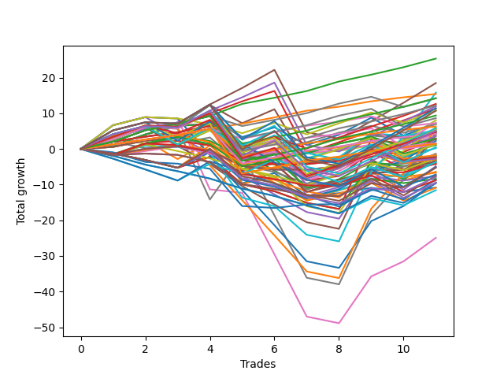

# Long Wallace 004 
- Symbol: TSLA_Unlimited
- Date Range: 03/23/2022 - 07/08/2022
- Trading Period: 7:20-12:30
- Number of Trades: 11



| Name | Win Percent | Profit | Avg Profit / Trade | Avg Time / Trade |      | Name | Win Percent | Profit | Avg Profit / Trade | Avg Time / Trade |
| ---- | ----------- | ------ | ------------------ | ---------------- | ---- | ---- | ----------- | ------ | ------------------ | ---------------- |
| Sorted By <br> Profit | | | | | | Sorted By <br> Win Percentage ||||
| Eighty-Two | 100.00 | 12675.00 | 1152.27 | 22:19 |     | Eighty-Two | 100.00 | 12675.00 | 1152.27 | 22:19 |
| Eighty-Five | 72.73 | 9240.00 | 840.00 | 83:41 |     | Eighty-One | 100.00 | 7710.00 | 700.91 | 20:30 |
| Seventy-One | 36.36 | 7895.00 | 717.73 | 111:41 |     | One Hundred Seventeen | 90.91 | 7125.00 | 647.73 | 07:10 |
| Eighty-One | 100.00 | 7710.00 | 700.91 | 20:30 |     | One Hundred Twenty-Two | 90.91 | 6105.00 | 555.00 | 07:18 |
| One Hundred Seventeen | 90.91 | 7125.00 | 647.73 | 07:10 |     | One Hundred Twenty-Seven | 90.91 | 4690.00 | 426.36 | 08:38 |
| One Hundred Two | 81.82 | 7100.00 | 645.45 | 05:31 |     | One Hundred Sixteen | 90.91 | 3155.00 | 286.82 | 05:27 |
| One Hundred Eighteen | 72.73 | 6315.00 | 574.09 | 13:37 |     | One Hundred Twenty-One | 90.91 | 2135.00 | 194.09 | 05:35 |
| One Hundred Twenty-Two | 90.91 | 6105.00 | 555.00 | 07:18 |     | One Hundred Twenty-Six | 90.91 | 720.00 | 65.45 | 06:55 |
| Eighty-Four | 72.73 | 5995.00 | 545.00 | 79:12 |     | One Hundred Two | 81.82 | 7100.00 | 645.45 | 05:31 |
| One Hundred Twenty-Five | 63.64 | 5730.00 | 520.91 | 50:48 |     | Eighty-Three | 81.82 | 5655.00 | 514.09 | 48:20 |
| Eighty-Three | 81.82 | 5655.00 | 514.09 | 48:20 |     | One Hundred Twelve | 81.82 | 4320.00 | 392.73 | 05:55 |
| One Hundred Thirty | 63.64 | 5370.00 | 488.18 | 51:28 |     | One Hundred One | 81.82 | 3620.00 | 329.09 | 03:56 |
| One Hundred Three | 63.64 | 5355.00 | 486.82 | 11:13 |     | Two | 81.82 | 2355.00 | 214.09 | 20:04 |
| One Hundred Twenty-Seven | 90.91 | 4690.00 | 426.36 | 08:38 |     | Fifty-Eight | 81.82 | 2160.00 | 196.36 | 14:49 |
| One Hundred Twelve | 81.82 | 4320.00 | 392.73 | 05:55 |     | Sixty-Six | 81.82 | 1800.00 | 163.64 | 15:28 |
| Sixty | 72.73 | 4020.00 | 365.45 | 27:55 |     | Three | 81.82 | 1400.00 | 127.27 | 26:19 |
| Sixty-Eight | 72.73 | 3660.00 | 332.73 | 28:34 |     | One Hundred Eleven | 81.82 | 840.00 | 76.36 | 04:20 |
| One Hundred One | 81.82 | 3620.00 | 329.09 | 03:56 |     | Fifty-Nine | 81.82 | -670.00 | -60.91 | 20:42 |
| Forty-Two | 72.73 | 3530.00 | 320.91 | 12:47 |     | Sixty-Seven | 81.82 | -1030.00 | -93.64 | 21:22 |
| Ninety-Two | 63.64 | 3475.00 | 315.91 | 04:18 |     | Fifty-Seven | 81.82 | -1705.00 | -155.00 | 12:45 |
| One Hundred Sixteen | 90.91 | 3155.00 | 286.82 | 05:27 |     | Sixty-Five | 81.82 | -2065.00 | -187.73 | 13:25 |
| Seventy | 45.45 | 3020.00 | 274.55 | 85:07 |     | One | 81.82 | -3200.00 | -290.91 | 17:50 |
| One Hundred Twenty-Four | 63.64 | 2915.00 | 265.00 | 46:20 |     | Eighty-Five | 72.73 | 9240.00 | 840.00 | 83:41 |
| One Hundred Twenty-Three | 72.73 | 2760.00 | 250.91 | 15:31 |     | One Hundred Eighteen | 72.73 | 6315.00 | 574.09 | 13:37 |
| Sixty-Three | 45.45 | 2750.00 | 250.00 | 118:52 |     | Eighty-Four | 72.73 | 5995.00 | 545.00 | 79:12 |
| Sixty-One | 63.64 | 2605.00 | 236.82 | 55:33 |     | Sixty | 72.73 | 4020.00 | 365.45 | 27:55 |
| One Hundred Twenty-Nine | 63.64 | 2555.00 | 232.27 | 46:59 |     | Sixty-Eight | 72.73 | 3660.00 | 332.73 | 28:34 |
| Five | 63.64 | 2455.00 | 223.18 | 72:41 |     | Forty-Two | 72.73 | 3530.00 | 320.91 | 12:47 |
| One Hundred Twenty-Eight | 72.73 | 2400.00 | 218.18 | 16:10 |     | One Hundred Twenty-Three | 72.73 | 2760.00 | 250.91 | 15:31 |
| Two | 81.82 | 2355.00 | 214.09 | 20:04 |     | One Hundred Twenty-Eight | 72.73 | 2400.00 | 218.18 | 16:10 |
| Sixty-Nine | 63.64 | 2245.00 | 204.09 | 56:12 |     | Four | 72.73 | 1435.00 | 130.45 | 43:01 |
| Forty-Seven | 36.36 | 2175.00 | 197.73 | 88:35 |     | Forty-Eight | 72.73 | 640.00 | 58.18 | 06:18 |
| Fifty-Eight | 81.82 | 2160.00 | 196.36 | 14:49 |     | Forty-One | 72.73 | 110.00 | 10.00 | 11:01 |
| One Hundred Twenty-One | 90.91 | 2135.00 | 194.09 | 05:35 |     | One Hundred Six | 72.73 | -890.00 | -80.91 | 04:06 |
| Fifty | 63.64 | 2130.00 | 193.64 | 12:10 |     | Forty | 72.73 | -1405.00 | -127.73 | 05:58 |
| Seven | 54.55 | 1870.00 | 170.00 | 176:08 |     | Fifty-Six | 72.73 | -3820.00 | -347.27 | 07:20 |
| Sixty-Six | 81.82 | 1800.00 | 163.64 | 15:28 |     | Sixty-Four | 72.73 | -4180.00 | -380.00 | 08:00 |
| Ninety-Seven | 54.55 | 1460.00 | 132.73 | 03:57 |     | Zero | 72.73 | -5410.00 | -491.82 | 10:50 |
| Four | 72.73 | 1435.00 | 130.45 | 43:01 |     | One Hundred Twenty-Five | 63.64 | 5730.00 | 520.91 | 50:48 |
| Three | 81.82 | 1400.00 | 127.27 | 26:19 |     | One Hundred Thirty | 63.64 | 5370.00 | 488.18 | 51:28 |
| Fifty-Five | 27.27 | 1385.00 | 125.91 | 35:50 |     | One Hundred Three | 63.64 | 5355.00 | 486.82 | 11:13 |
| Fifty-Two | 45.45 | 1145.00 | 104.09 | 19:20 |     | Ninety-Two | 63.64 | 3475.00 | 315.91 | 04:18 |
| One Hundred Eleven | 81.82 | 840.00 | 76.36 | 04:20 |     | One Hundred Twenty-Four | 63.64 | 2915.00 | 265.00 | 46:20 |
| One Hundred Twenty-Six | 90.91 | 720.00 | 65.45 | 06:55 |     | Sixty-One | 63.64 | 2605.00 | 236.82 | 55:33 |
| One Hundred Thirteen | 63.64 | 675.00 | 61.36 | 12:02 |     | One Hundred Twenty-Nine | 63.64 | 2555.00 | 232.27 | 46:59 |
| Forty-Eight | 72.73 | 640.00 | 58.18 | 06:18 |     | Five | 63.64 | 2455.00 | 223.18 | 72:41 |
| Ninety-One | 63.64 | 550.00 | 50.00 | 03:10 |     | Sixty-Nine | 63.64 | 2245.00 | 204.09 | 56:12 |
| One Hundred Seven | 63.64 | 545.00 | 49.55 | 05:29 |     | Fifty | 63.64 | 2130.00 | 193.64 | 12:10 |
| One Hundred Fourteen | 54.55 | 235.00 | 21.36 | 32:30 |     | One Hundred Thirteen | 63.64 | 675.00 | 61.36 | 12:02 |
| Forty-One | 72.73 | 110.00 | 10.00 | 11:01 |     | Ninety-One | 63.64 | 550.00 | 50.00 | 03:10 |
| Fifty-Nine | 81.82 | -670.00 | -60.91 | 20:42 |     | One Hundred Seven | 63.64 | 545.00 | 49.55 | 05:29 |
| Forty-Nine | 63.64 | -880.00 | -80.00 | 10:30 |     | Forty-Nine | 63.64 | -880.00 | -80.00 | 10:30 |
| One Hundred Six | 72.73 | -890.00 | -80.91 | 04:06 |     | Seven | 54.55 | 1870.00 | 170.00 | 176:08 |
| Sixty-Seven | 81.82 | -1030.00 | -93.64 | 21:22 |     | Ninety-Seven | 54.55 | 1460.00 | 132.73 | 03:57 |
| One Hundred | 54.55 | -1040.00 | -94.55 | 06:09 |     | One Hundred Fourteen | 54.55 | 235.00 | 21.36 | 32:30 |
| Ninety-Eight | 54.55 | -1190.00 | -108.18 | 05:22 |     | One Hundred | 54.55 | -1040.00 | -94.55 | 06:09 |
| Ninety-Three | 36.36 | -1315.00 | -119.55 | 07:34 |     | Ninety-Eight | 54.55 | -1190.00 | -108.18 | 05:22 |
| Ninety-Nine | 54.55 | -1375.00 | -125.00 | 05:49 |     | Ninety-Nine | 54.55 | -1375.00 | -125.00 | 05:49 |
| Forty | 72.73 | -1405.00 | -127.73 | 05:58 |     | Ninety-Six | 54.55 | -1480.00 | -134.55 | 02:50 |
| Ninety-Six | 54.55 | -1480.00 | -134.55 | 02:50 |     | Forty-Four | 54.55 | -1535.00 | -139.55 | 23:36 |
| Forty-Four | 54.55 | -1535.00 | -139.55 | 23:36 |     | Forty-Five | 54.55 | -2105.00 | -191.36 | 44:33 |
| Fifty-Seven | 81.82 | -1705.00 | -155.00 | 12:45 |     | Forty-Three | 54.55 | -5430.00 | -493.64 | 17:57 |
| Fifty-Four | 27.27 | -1785.00 | -162.27 | 32:15 |     | Seventy | 45.45 | 3020.00 | 274.55 | 85:07 |
| Fifty-One | 45.45 | -1790.00 | -162.73 | 14:05 |     | Sixty-Three | 45.45 | 2750.00 | 250.00 | 118:52 |
| One Hundred Four | 36.36 | -1840.00 | -167.27 | 17:00 |     | Fifty-Two | 45.45 | 1145.00 | 104.09 | 19:20 |
| Sixty-Five | 81.82 | -2065.00 | -187.73 | 13:25 |     | Fifty-One | 45.45 | -1790.00 | -162.73 | 14:05 |
| Forty-Five | 54.55 | -2105.00 | -191.36 | 44:33 |     | One Hundred Fifteen | 45.45 | -2565.00 | -233.18 | 35:51 |
| Forty-Six | 36.36 | -2425.00 | -220.45 | 67:20 |     | Seventy-Three | 45.45 | -3590.00 | -326.36 | 13:37 |
| One Hundred Fifteen | 45.45 | -2565.00 | -233.18 | 35:51 |     | Sixty-Two | 45.45 | -4705.00 | -427.73 | 89:50 |
| One Hundred Twenty | 27.27 | -2625.00 | -238.64 | 20:33 |     | Six | 45.45 | -12460.00 | -1132.73 | 146:10 |
| One | 81.82 | -3200.00 | -290.91 | 17:50 |     | Seventy-One | 36.36 | 7895.00 | 717.73 | 111:41 |
| Fifty-Three | 27.27 | -3325.00 | -302.27 | 26:10 |     | Forty-Seven | 36.36 | 2175.00 | 197.73 | 88:35 |
| Seventy-Three | 45.45 | -3590.00 | -326.36 | 13:37 |     | Ninety-Three | 36.36 | -1315.00 | -119.55 | 07:34 |
| One Hundred Ten | 27.27 | -3755.00 | -341.36 | 09:21 |     | One Hundred Four | 36.36 | -1840.00 | -167.27 | 17:00 |
| Fifty-Six | 72.73 | -3820.00 | -347.27 | 07:20 |     | Forty-Six | 36.36 | -2425.00 | -220.45 | 67:20 |
| One Hundred Ninteen | 27.27 | -3935.00 | -357.73 | 19:14 |     | Fifty-Five | 27.27 | 1385.00 | 125.91 | 35:50 |
| Sixty-Four | 72.73 | -4180.00 | -380.00 | 08:00 |     | Fifty-Four | 27.27 | -1785.00 | -162.27 | 32:15 |
| One Hundred Five | 27.27 | -4310.00 | -391.82 | 19:11 |     | One Hundred Twenty | 27.27 | -2625.00 | -238.64 | 20:33 |
| One Hundred Eight | 27.27 | -4385.00 | -398.64 | 07:26 |     | Fifty-Three | 27.27 | -3325.00 | -302.27 | 26:10 |
| Sixty-Two | 45.45 | -4705.00 | -427.73 | 89:50 |     | One Hundred Ten | 27.27 | -3755.00 | -341.36 | 09:21 |
| One Hundred Nine | 27.27 | -4725.00 | -429.55 | 08:03 |     | One Hundred Ninteen | 27.27 | -3935.00 | -357.73 | 19:14 |
| Ninety-Five | 18.18 | -4810.00 | -437.27 | 11:46 |     | One Hundred Five | 27.27 | -4310.00 | -391.82 | 19:11 |
| Zero | 72.73 | -5410.00 | -491.82 | 10:50 |     | One Hundred Eight | 27.27 | -4385.00 | -398.64 | 07:26 |
| Forty-Three | 54.55 | -5430.00 | -493.64 | 17:57 |     | One Hundred Nine | 27.27 | -4725.00 | -429.55 | 08:03 |
| Ninety-Four | 18.18 | -5780.00 | -525.45 | 10:28 |     | Ninety-Five | 18.18 | -4810.00 | -437.27 | 11:46 |
| Six | 45.45 | -12460.00 | -1132.73 | 146:10 |     | Ninety-Four | 18.18 | -5780.00 | -525.45 | 10:28 |

## NO STOPLOSS

### Test Zero
* Sell when price hits the middle line of the 20p bollinger
* No Stoploss
* Results:
```
Total Trades: 11
Percent Up: 72.73
Percent Down: 27.27
Total Points Moved Up: -10.82
Potential Profit: -5410.00
Total Points Ups: 13.39 Count Ups: 8
Total Points Downs: -24.21 Count Downs: 3
```

<details><summary>Trades</summary>

<code>In: 2022-03-25 08:30:00		Out: 2022-03-25 08:41:30		Total Position Time: 11:30		Total Move Up: 0.89		Total to Date: 0.89</code> <br />
<code>In: 2022-03-30 12:11:00		Out: 2022-03-30 12:13:15		Total Position Time: 02:15		Total Move Up: 3.18		Total to Date: 4.07</code> <br />
<code>In: 2022-04-27 12:11:00		Out: 2022-04-27 12:14:00		Total Position Time: 03:00		Total Move Up: 2.45		Total to Date: 6.52</code> <br />
<code>In: 2022-04-29 09:47:00		Out: 2022-04-29 10:00:40		Total Position Time: 13:40		Total Move Up: 0.44		Total to Date: 6.96</code> <br />
<code>In: 2022-05-10 07:45:00		Out: 2022-05-10 08:19:05		Total Position Time: 34:05		Total Move Up: -16.60		Total to Date: -9.64</code> <br />
<code>In: 2022-05-16 08:02:00		Out: 2022-05-16 08:09:55		Total Position Time: 07:55		Total Move Up: 2.90		Total to Date: -6.74</code> <br />
<code>In: 2022-05-18 09:11:00		Out: 2022-05-18 09:39:50		Total Position Time: 28:50		Total Move Up: -6.45		Total to Date: -13.19</code> <br />
<code>In: 2022-06-08 09:48:00		Out: 2022-06-08 09:50:25		Total Position Time: 02:25		Total Move Up: 0.79		Total to Date: -12.40</code> <br />
<code>In: 2022-06-23 10:44:00		Out: 2022-06-23 10:46:10		Total Position Time: 02:10		Total Move Up: 1.52		Total to Date: -10.88</code> <br />
<code>In: 2022-06-29 08:17:00		Out: 2022-06-29 08:28:15		Total Position Time: 11:15		Total Move Up: -1.16		Total to Date: -12.04</code> <br />
<code>In: 2022-06-29 08:26:00		Out: 2022-06-29 08:28:15		Total Position Time: 02:15		Total Move Up: 1.22		Total to Date: -10.82</code> <br />


</details>

### Test One
* Sell when the price hits the upper line of the 20p 1std bollinger
* No Stoploss
* Results:
```
Total Trades: 11
Percent Up: 81.82
Percent Down: 18.18
Total Points Moved Up: -6.40
Potential Profit: -3200.00
Total Points Ups: 16.46 Count Ups: 9
Total Points Downs: -22.86 Count Downs: 2
```

<details><summary>Trades</summary>

<code>In: 2022-03-25 08:30:00		Out: 2022-03-25 08:41:55		Total Position Time: 11:55		Total Move Up: 2.06		Total to Date: 2.06</code> <br />
<code>In: 2022-03-30 12:11:00		Out: 2022-03-30 12:32:45		Total Position Time: 21:45		Total Move Up: 1.40		Total to Date: 3.46</code> <br />
<code>In: 2022-04-27 12:11:00		Out: 2022-04-27 12:31:10		Total Position Time: 20:10		Total Move Up: 1.22		Total to Date: 4.68</code> <br />
<code>In: 2022-04-29 09:47:00		Out: 2022-04-29 10:01:00		Total Position Time: 14:00		Total Move Up: 1.78		Total to Date: 6.46</code> <br />
<code>In: 2022-05-10 07:45:00		Out: 2022-05-10 08:29:40		Total Position Time: 44:40		Total Move Up: -16.25		Total to Date: -9.79</code> <br />
<code>In: 2022-05-16 08:02:00		Out: 2022-05-16 08:16:30		Total Position Time: 14:30		Total Move Up: 2.07		Total to Date: -7.72</code> <br />
<code>In: 2022-05-18 09:11:00		Out: 2022-05-18 09:46:35		Total Position Time: 35:35		Total Move Up: -6.61		Total to Date: -14.33</code> <br />
<code>In: 2022-06-08 09:48:00		Out: 2022-06-08 09:56:40		Total Position Time: 08:40		Total Move Up: 2.68		Total to Date: -11.65</code> <br />
<code>In: 2022-06-23 10:44:00		Out: 2022-06-23 10:47:30		Total Position Time: 03:30		Total Move Up: 2.79		Total to Date: -8.86</code> <br />
<code>In: 2022-06-29 08:17:00		Out: 2022-06-29 08:32:15		Total Position Time: 15:15		Total Move Up: 0.04		Total to Date: -8.82</code> <br />
<code>In: 2022-06-29 08:26:00		Out: 2022-06-29 08:32:15		Total Position Time: 06:15		Total Move Up: 2.42		Total to Date: -6.40</code> <br />


</details>

### Test Two
* Sell when the price hits the upper line of the 20p 2std bollinger
* No Stoploss
* Results:
```
Total Trades: 11
Percent Up: 81.82
Percent Down: 18.18
Total Points Moved Up: 4.71
Potential Profit: 2355.00
Total Points Ups: 24.19 Count Ups: 9
Total Points Downs: -19.48 Count Downs: 2
```

<details><summary>Trades</summary>

<code>In: 2022-03-25 08:30:00		Out: 2022-03-25 08:44:45		Total Position Time: 14:45		Total Move Up: 3.25		Total to Date: 3.25</code> <br />
<code>In: 2022-03-30 12:11:00		Out: 2022-03-30 12:36:15		Total Position Time: 25:15		Total Move Up: 2.47		Total to Date: 5.72</code> <br />
<code>In: 2022-04-27 12:11:00		Out: 2022-04-27 12:31:20		Total Position Time: 20:20		Total Move Up: 1.69		Total to Date: 7.41</code> <br />
<code>In: 2022-04-29 09:47:00		Out: 2022-04-29 10:01:05		Total Position Time: 14:05		Total Move Up: 2.13		Total to Date: 9.54</code> <br />
<code>In: 2022-05-10 07:45:00		Out: 2022-05-10 08:30:35		Total Position Time: 45:35		Total Move Up: -13.76		Total to Date: -4.22</code> <br />
<code>In: 2022-05-16 08:02:00		Out: 2022-05-16 08:17:25		Total Position Time: 15:25		Total Move Up: 2.71		Total to Date: -1.51</code> <br />
<code>In: 2022-05-18 09:11:00		Out: 2022-05-18 09:47:30		Total Position Time: 36:30		Total Move Up: -5.72		Total to Date: -7.23</code> <br />
<code>In: 2022-06-08 09:48:00		Out: 2022-06-08 09:56:55		Total Position Time: 08:55		Total Move Up: 2.91		Total to Date: -4.32</code> <br />
<code>In: 2022-06-23 10:44:00		Out: 2022-06-23 10:55:45		Total Position Time: 11:45		Total Move Up: 4.79		Total to Date: 0.47</code> <br />
<code>In: 2022-06-29 08:17:00		Out: 2022-06-29 08:35:35		Total Position Time: 18:35		Total Move Up: 0.93		Total to Date: 1.40</code> <br />
<code>In: 2022-06-29 08:26:00		Out: 2022-06-29 08:35:35		Total Position Time: 09:35		Total Move Up: 3.31		Total to Date: 4.71</code> <br />


</details>

### Test Three
* Sell when price hits the middle line of the 50p bollinger
* No Stoploss
* Results:
```
Total Trades: 11
Percent Up: 81.82
Percent Down: 18.18
Total Points Moved Up: 2.80
Potential Profit: 1400.00
Total Points Ups: 18.53 Count Ups: 9
Total Points Downs: -15.73 Count Downs: 2
```

<details><summary>Trades</summary>

<code>In: 2022-03-25 08:30:00		Out: 2022-03-25 09:05:25		Total Position Time: 35:25		Total Move Up: 0.58		Total to Date: 0.58</code> <br />
<code>In: 2022-03-30 12:11:00		Out: 2022-03-30 12:33:35		Total Position Time: 22:35		Total Move Up: 1.77		Total to Date: 2.35</code> <br />
<code>In: 2022-04-27 12:11:00		Out: 2022-04-27 12:46:20		Total Position Time: 35:20		Total Move Up: 0.69		Total to Date: 3.04</code> <br />
<code>In: 2022-04-29 09:47:00		Out: 2022-04-29 10:03:40		Total Position Time: 16:40		Total Move Up: 4.69		Total to Date: 7.73</code> <br />
<code>In: 2022-05-10 07:45:00		Out: 2022-05-10 08:31:30		Total Position Time: 46:30		Total Move Up: -12.46		Total to Date: -4.73</code> <br />
<code>In: 2022-05-16 08:02:00		Out: 2022-05-16 08:39:35		Total Position Time: 37:35		Total Move Up: 0.88		Total to Date: -3.85</code> <br />
<code>In: 2022-05-18 09:11:00		Out: 2022-05-18 09:50:30		Total Position Time: 39:30		Total Move Up: -3.27		Total to Date: -7.12</code> <br />
<code>In: 2022-06-08 09:48:00		Out: 2022-06-08 10:08:35		Total Position Time: 20:35		Total Move Up: 1.94		Total to Date: -5.18</code> <br />
<code>In: 2022-06-23 10:44:00		Out: 2022-06-23 10:50:10		Total Position Time: 06:10		Total Move Up: 3.06		Total to Date: -2.12</code> <br />
<code>In: 2022-06-29 08:17:00		Out: 2022-06-29 08:36:05		Total Position Time: 19:05		Total Move Up: 1.27		Total to Date: -0.85</code> <br />
<code>In: 2022-06-29 08:26:00		Out: 2022-06-29 08:36:05		Total Position Time: 10:05		Total Move Up: 3.65		Total to Date: 2.80</code> <br />


</details>

### Test Four
* Sell when the price hits the upper line of the 50p 1std bollinger
* No Stoploss
* Results:
```
Total Trades: 11
Percent Up: 72.73
Percent Down: 27.27
Total Points Moved Up: 2.87
Potential Profit: 1435.00
Total Points Ups: 28.28 Count Ups: 8
Total Points Downs: -25.41 Count Downs: 3
```

<details><summary>Trades</summary>

<code>In: 2022-03-25 08:30:00		Out: 2022-03-25 09:08:40		Total Position Time: 38:40		Total Move Up: 2.69		Total to Date: 2.69</code> <br />
<code>In: 2022-03-30 12:11:00		Out: 2022-03-30 12:45:20		Total Position Time: 34:20		Total Move Up: 3.44		Total to Date: 6.13</code> <br />
<code>In: 2022-04-27 12:11:00		Out: 2022-04-27 12:47:00		Total Position Time: 36:00		Total Move Up: -0.37		Total to Date: 5.76</code> <br />
<code>In: 2022-04-29 09:47:00		Out: 2022-04-29 10:24:50		Total Position Time: 37:50		Total Move Up: 4.33		Total to Date: 10.09</code> <br />
<code>In: 2022-05-10 07:45:00		Out: 2022-05-10 08:38:55		Total Position Time: 53:55		Total Move Up: -8.73		Total to Date: 1.36</code> <br />
<code>In: 2022-05-16 08:02:00		Out: 2022-05-16 08:45:20		Total Position Time: 43:20		Total Move Up: 1.67		Total to Date: 3.03</code> <br />
<code>In: 2022-05-18 09:11:00		Out: 2022-05-18 11:27:35		Total Position Time: 136:35		Total Move Up: -16.31		Total to Date: -13.28</code> <br />
<code>In: 2022-06-08 09:48:00		Out: 2022-06-08 10:18:05		Total Position Time: 30:05		Total Move Up: 2.60		Total to Date: -10.68</code> <br />
<code>In: 2022-06-23 10:44:00		Out: 2022-06-23 10:55:50		Total Position Time: 11:50		Total Move Up: 4.91		Total to Date: -5.77</code> <br />
<code>In: 2022-06-29 08:17:00		Out: 2022-06-29 08:46:50		Total Position Time: 29:50		Total Move Up: 3.13		Total to Date: -2.64</code> <br />
<code>In: 2022-06-29 08:26:00		Out: 2022-06-29 08:46:50		Total Position Time: 20:50		Total Move Up: 5.51		Total to Date: 2.87</code> <br />


</details>

### Test Five
* Sell when the price hits the upper line of the 50p 2std bollinger
* No Stoploss
* Results:
```
Total Trades: 11
Percent Up: 63.64
Percent Down: 36.36
Total Points Moved Up: 4.91
Potential Profit: 2455.00
Total Points Ups: 26.26 Count Ups: 7
Total Points Downs: -21.35 Count Downs: 4
```

<details><summary>Trades</summary>

<code>In: 2022-03-25 08:30:00		Out: 2022-03-25 09:09:50		Total Position Time: 39:50		Total Move Up: 4.14		Total to Date: 4.14</code> <br />
<code>In: 2022-03-30 12:11:00		Out: 2022-03-30 12:47:00		Total Position Time: 36:00		Total Move Up: 2.27		Total to Date: 6.41</code> <br />
<code>In: 2022-04-27 12:11:00		Out: 2022-04-27 12:47:00		Total Position Time: 36:00		Total Move Up: -0.37		Total to Date: 6.04</code> <br />
<code>In: 2022-04-29 09:47:00		Out: 2022-04-29 10:31:30		Total Position Time: 44:30		Total Move Up: 6.29		Total to Date: 12.33</code> <br />
<code>In: 2022-05-10 07:45:00		Out: 2022-05-10 08:39:50		Total Position Time: 54:50		Total Move Up: -5.11		Total to Date: 7.22</code> <br />
<code>In: 2022-05-16 08:02:00		Out: 2022-05-16 08:47:05		Total Position Time: 45:05		Total Move Up: 3.92		Total to Date: 11.14</code> <br />
<code>In: 2022-05-18 09:11:00		Out: 2022-05-18 11:49:05		Total Position Time: 158:05		Total Move Up: -15.06		Total to Date: -3.92</code> <br />
<code>In: 2022-06-08 09:48:00		Out: 2022-06-08 12:33:20		Total Position Time: 165:20		Total Move Up: 1.23		Total to Date: -2.69</code> <br />
<code>In: 2022-06-23 10:44:00		Out: 2022-06-23 11:09:40		Total Position Time: 25:40		Total Move Up: 6.84		Total to Date: 4.15</code> <br />
<code>In: 2022-06-29 08:17:00		Out: 2022-06-29 09:58:40		Total Position Time: 101:40		Total Move Up: -0.81		Total to Date: 3.34</code> <br />
<code>In: 2022-06-29 08:26:00		Out: 2022-06-29 09:58:40		Total Position Time: 92:40		Total Move Up: 1.57		Total to Date: 4.91</code> <br />


</details>

### Test Six
* Sell when the price hits the middle line of the 1std VWAP
* No Stoploss
* Results:
```
Total Trades: 11
Percent Up: 45.45
Percent Down: 54.55
Total Points Moved Up: -24.92
Potential Profit: -12460.00
Total Points Ups: 32.88 Count Ups: 5
Total Points Downs: -57.80 Count Downs: 6
```

<details><summary>Trades</summary>

<code>In: 2022-03-25 08:30:00		Out: 2022-03-25 10:58:35		Total Position Time: 148:35		Total Move Up: 6.66		Total to Date: 6.66</code> <br />
<code>In: 2022-03-30 12:11:00		Out: 2022-03-30 12:47:00		Total Position Time: 36:00		Total Move Up: 2.27		Total to Date: 8.93</code> <br />
<code>In: 2022-04-27 12:11:00		Out: 2022-04-27 12:47:00		Total Position Time: 36:00		Total Move Up: -0.37		Total to Date: 8.56</code> <br />
<code>In: 2022-04-29 09:47:00		Out: 2022-04-29 12:47:00		Total Position Time: 180:00		Total Move Up: -19.90		Total to Date: -11.34</code> <br />
<code>In: 2022-05-10 07:45:00		Out: 2022-05-10 10:30:25		Total Position Time: 165:25		Total Move Up: -0.97		Total to Date: -12.31</code> <br />
<code>In: 2022-05-16 08:02:00		Out: 2022-05-16 12:47:00		Total Position Time: 285:00		Total Move Up: -17.24		Total to Date: -29.55</code> <br />
<code>In: 2022-05-18 09:11:00		Out: 2022-05-18 12:47:00		Total Position Time: 216:00		Total Move Up: -17.47		Total to Date: -47.02</code> <br />
<code>In: 2022-06-08 09:48:00		Out: 2022-06-08 12:47:00		Total Position Time: 179:00		Total Move Up: -1.85		Total to Date: -48.87</code> <br />
<code>In: 2022-06-23 10:44:00		Out: 2022-06-23 12:07:25		Total Position Time: 83:25		Total Move Up: 13.13		Total to Date: -35.74</code> <br />
<code>In: 2022-06-29 08:17:00		Out: 2022-06-29 10:40:45		Total Position Time: 143:45		Total Move Up: 4.22		Total to Date: -31.52</code> <br />
<code>In: 2022-06-29 08:26:00		Out: 2022-06-29 10:40:45		Total Position Time: 134:45		Total Move Up: 6.60		Total to Date: -24.92</code> <br />


</details>

### Test Seven
* Sell when the price hits the upper line of the 1std VWAP
* No Stoploss
* Results:
```
Total Trades: 11
Percent Up: 54.55
Percent Down: 45.45
Total Points Moved Up: 3.74
Potential Profit: 1870.00
Total Points Ups: 60.57 Count Ups: 6
Total Points Downs: -56.83 Count Downs: 5
```

<details><summary>Trades</summary>

<code>In: 2022-03-25 08:30:00		Out: 2022-03-25 12:47:00		Total Position Time: 257:00		Total Move Up: 3.81		Total to Date: 3.81</code> <br />
<code>In: 2022-03-30 12:11:00		Out: 2022-03-30 12:47:00		Total Position Time: 36:00		Total Move Up: 2.27		Total to Date: 6.08</code> <br />
<code>In: 2022-04-27 12:11:00		Out: 2022-04-27 12:47:00		Total Position Time: 36:00		Total Move Up: -0.37		Total to Date: 5.71</code> <br />
<code>In: 2022-04-29 09:47:00		Out: 2022-04-29 12:47:00		Total Position Time: 180:00		Total Move Up: -19.90		Total to Date: -14.19</code> <br />
<code>In: 2022-05-10 07:45:00		Out: 2022-05-10 10:40:30		Total Position Time: 175:30		Total Move Up: 12.78		Total to Date: -1.41</code> <br />
<code>In: 2022-05-16 08:02:00		Out: 2022-05-16 12:47:00		Total Position Time: 285:00		Total Move Up: -17.24		Total to Date: -18.65</code> <br />
<code>In: 2022-05-18 09:11:00		Out: 2022-05-18 12:47:00		Total Position Time: 216:00		Total Move Up: -17.47		Total to Date: -36.12</code> <br />
<code>In: 2022-06-08 09:48:00		Out: 2022-06-08 12:47:00		Total Position Time: 179:00		Total Move Up: -1.85		Total to Date: -37.97</code> <br />
<code>In: 2022-06-23 10:44:00		Out: 2022-06-23 12:47:00		Total Position Time: 123:00		Total Move Up: 19.47		Total to Date: -18.50</code> <br />
<code>In: 2022-06-29 08:17:00		Out: 2022-06-29 12:06:30		Total Position Time: 229:30		Total Move Up: 9.93		Total to Date: -8.57</code> <br />
<code>In: 2022-06-29 08:26:00		Out: 2022-06-29 12:06:30		Total Position Time: 220:30		Total Move Up: 12.31		Total to Date: 3.74</code> <br />


</details>

## STOPLOSS OF 5

### Test Forty
* Sell when price hits the middle line of the 20p bollinger
* Stoploss is 5 points
* Results:
```
Total Trades: 11
Percent Up: 72.73
Percent Down: 27.27
Total Points Moved Up: -2.81
Potential Profit: -1405.00
Total Points Ups: 13.39 Count Ups: 8
Total Points Downs: -16.20 Count Downs: 3
```

<details><summary>Trades</summary>

<code>In: 2022-03-25 08:30:00		Out: 2022-03-25 08:41:30		Total Position Time: 11:30		Total Move Up: 0.89		Total to Date: 0.89</code> <br />
<code>In: 2022-03-30 12:11:00		Out: 2022-03-30 12:13:15		Total Position Time: 02:15		Total Move Up: 3.18		Total to Date: 4.07</code> <br />
<code>In: 2022-04-27 12:11:00		Out: 2022-04-27 12:14:00		Total Position Time: 03:00		Total Move Up: 2.45		Total to Date: 6.52</code> <br />
<code>In: 2022-04-29 09:47:00		Out: 2022-04-29 10:00:40		Total Position Time: 13:40		Total Move Up: 0.44		Total to Date: 6.96</code> <br />
<code>In: 2022-05-10 07:45:00		Out: 2022-05-10 07:47:25		Total Position Time: 02:25		Total Move Up: -6.20		Total to Date: 0.76</code> <br />
<code>In: 2022-05-16 08:02:00		Out: 2022-05-16 08:09:55		Total Position Time: 07:55		Total Move Up: 2.90		Total to Date: 3.66</code> <br />
<code>In: 2022-05-18 09:11:00		Out: 2022-05-18 09:22:15		Total Position Time: 11:15		Total Move Up: -4.97		Total to Date: -1.31</code> <br />
<code>In: 2022-06-08 09:48:00		Out: 2022-06-08 09:50:25		Total Position Time: 02:25		Total Move Up: 0.79		Total to Date: -0.52</code> <br />
<code>In: 2022-06-23 10:44:00		Out: 2022-06-23 10:46:10		Total Position Time: 02:10		Total Move Up: 1.52		Total to Date: 1.00</code> <br />
<code>In: 2022-06-29 08:17:00		Out: 2022-06-29 08:23:55		Total Position Time: 06:55		Total Move Up: -5.03		Total to Date: -4.03</code> <br />
<code>In: 2022-06-29 08:26:00		Out: 2022-06-29 08:28:15		Total Position Time: 02:15		Total Move Up: 1.22		Total to Date: -2.81</code> <br />


</details>

### Test Forty-One
* Sell when the price hits the upper line of the 20p 1std bollinger
* Stoploss is 5 points
* Results:
```
Total Trades: 11
Percent Up: 72.73
Percent Down: 27.27
Total Points Moved Up: 0.22
Potential Profit: 110.00
Total Points Ups: 16.42 Count Ups: 8
Total Points Downs: -16.20 Count Downs: 3
```

<details><summary>Trades</summary>

<code>In: 2022-03-25 08:30:00		Out: 2022-03-25 08:41:55		Total Position Time: 11:55		Total Move Up: 2.06		Total to Date: 2.06</code> <br />
<code>In: 2022-03-30 12:11:00		Out: 2022-03-30 12:32:45		Total Position Time: 21:45		Total Move Up: 1.40		Total to Date: 3.46</code> <br />
<code>In: 2022-04-27 12:11:00		Out: 2022-04-27 12:31:10		Total Position Time: 20:10		Total Move Up: 1.22		Total to Date: 4.68</code> <br />
<code>In: 2022-04-29 09:47:00		Out: 2022-04-29 10:01:00		Total Position Time: 14:00		Total Move Up: 1.78		Total to Date: 6.46</code> <br />
<code>In: 2022-05-10 07:45:00		Out: 2022-05-10 07:47:25		Total Position Time: 02:25		Total Move Up: -6.20		Total to Date: 0.26</code> <br />
<code>In: 2022-05-16 08:02:00		Out: 2022-05-16 08:16:30		Total Position Time: 14:30		Total Move Up: 2.07		Total to Date: 2.33</code> <br />
<code>In: 2022-05-18 09:11:00		Out: 2022-05-18 09:22:15		Total Position Time: 11:15		Total Move Up: -4.97		Total to Date: -2.64</code> <br />
<code>In: 2022-06-08 09:48:00		Out: 2022-06-08 09:56:40		Total Position Time: 08:40		Total Move Up: 2.68		Total to Date: 0.04</code> <br />
<code>In: 2022-06-23 10:44:00		Out: 2022-06-23 10:47:30		Total Position Time: 03:30		Total Move Up: 2.79		Total to Date: 2.83</code> <br />
<code>In: 2022-06-29 08:17:00		Out: 2022-06-29 08:23:55		Total Position Time: 06:55		Total Move Up: -5.03		Total to Date: -2.20</code> <br />
<code>In: 2022-06-29 08:26:00		Out: 2022-06-29 08:32:15		Total Position Time: 06:15		Total Move Up: 2.42		Total to Date: 0.22</code> <br />


</details>

### Test Forty-Two
* Sell when the price hits the upper line of the 20p 2std bollinger
* Stoploss is 5 points
* Results:
```
Total Trades: 11
Percent Up: 72.73
Percent Down: 27.27
Total Points Moved Up: 7.06
Potential Profit: 3530.00
Total Points Ups: 23.26 Count Ups: 8
Total Points Downs: -16.20 Count Downs: 3
```

<details><summary>Trades</summary>

<code>In: 2022-03-25 08:30:00		Out: 2022-03-25 08:44:45		Total Position Time: 14:45		Total Move Up: 3.25		Total to Date: 3.25</code> <br />
<code>In: 2022-03-30 12:11:00		Out: 2022-03-30 12:36:15		Total Position Time: 25:15		Total Move Up: 2.47		Total to Date: 5.72</code> <br />
<code>In: 2022-04-27 12:11:00		Out: 2022-04-27 12:31:20		Total Position Time: 20:20		Total Move Up: 1.69		Total to Date: 7.41</code> <br />
<code>In: 2022-04-29 09:47:00		Out: 2022-04-29 10:01:05		Total Position Time: 14:05		Total Move Up: 2.13		Total to Date: 9.54</code> <br />
<code>In: 2022-05-10 07:45:00		Out: 2022-05-10 07:47:25		Total Position Time: 02:25		Total Move Up: -6.20		Total to Date: 3.34</code> <br />
<code>In: 2022-05-16 08:02:00		Out: 2022-05-16 08:17:25		Total Position Time: 15:25		Total Move Up: 2.71		Total to Date: 6.05</code> <br />
<code>In: 2022-05-18 09:11:00		Out: 2022-05-18 09:22:15		Total Position Time: 11:15		Total Move Up: -4.97		Total to Date: 1.08</code> <br />
<code>In: 2022-06-08 09:48:00		Out: 2022-06-08 09:56:55		Total Position Time: 08:55		Total Move Up: 2.91		Total to Date: 3.99</code> <br />
<code>In: 2022-06-23 10:44:00		Out: 2022-06-23 10:55:45		Total Position Time: 11:45		Total Move Up: 4.79		Total to Date: 8.78</code> <br />
<code>In: 2022-06-29 08:17:00		Out: 2022-06-29 08:23:55		Total Position Time: 06:55		Total Move Up: -5.03		Total to Date: 3.75</code> <br />
<code>In: 2022-06-29 08:26:00		Out: 2022-06-29 08:35:35		Total Position Time: 09:35		Total Move Up: 3.31		Total to Date: 7.06</code> <br />


</details>

### Test Forty-Three
* Sell when price hits the middle line of the 50p bollinger
* Stoploss is 5 points
* Results:
```
Total Trades: 11
Percent Up: 54.55
Percent Down: 45.45
Total Points Moved Up: -10.86
Potential Profit: -5430.00
Total Points Ups: 15.69 Count Ups: 6
Total Points Downs: -26.55 Count Downs: 5
```

<details><summary>Trades</summary>

<code>In: 2022-03-25 08:30:00		Out: 2022-03-25 09:05:25		Total Position Time: 35:25		Total Move Up: 0.58		Total to Date: 0.58</code> <br />
<code>In: 2022-03-30 12:11:00		Out: 2022-03-30 12:33:35		Total Position Time: 22:35		Total Move Up: 1.77		Total to Date: 2.35</code> <br />
<code>In: 2022-04-27 12:11:00		Out: 2022-04-27 12:42:20		Total Position Time: 31:20		Total Move Up: -5.18		Total to Date: -2.83</code> <br />
<code>In: 2022-04-29 09:47:00		Out: 2022-04-29 10:03:40		Total Position Time: 16:40		Total Move Up: 4.69		Total to Date: 1.86</code> <br />
<code>In: 2022-05-10 07:45:00		Out: 2022-05-10 07:47:25		Total Position Time: 02:25		Total Move Up: -6.20		Total to Date: -4.34</code> <br />
<code>In: 2022-05-16 08:02:00		Out: 2022-05-16 08:36:10		Total Position Time: 34:10		Total Move Up: -5.17		Total to Date: -9.51</code> <br />
<code>In: 2022-05-18 09:11:00		Out: 2022-05-18 09:22:15		Total Position Time: 11:15		Total Move Up: -4.97		Total to Date: -14.48</code> <br />
<code>In: 2022-06-08 09:48:00		Out: 2022-06-08 10:08:35		Total Position Time: 20:35		Total Move Up: 1.94		Total to Date: -12.54</code> <br />
<code>In: 2022-06-23 10:44:00		Out: 2022-06-23 10:50:10		Total Position Time: 06:10		Total Move Up: 3.06		Total to Date: -9.48</code> <br />
<code>In: 2022-06-29 08:17:00		Out: 2022-06-29 08:23:55		Total Position Time: 06:55		Total Move Up: -5.03		Total to Date: -14.51</code> <br />
<code>In: 2022-06-29 08:26:00		Out: 2022-06-29 08:36:05		Total Position Time: 10:05		Total Move Up: 3.65		Total to Date: -10.86</code> <br />


</details>

### Test Forty-Four
* Sell when the price hits the upper line of the 50p 1std bollinger
* Stoploss is 5 points
* Results:
```
Total Trades: 11
Percent Up: 54.55
Percent Down: 45.45
Total Points Moved Up: -3.07
Potential Profit: -1535.00
Total Points Ups: 23.48 Count Ups: 6
Total Points Downs: -26.55 Count Downs: 5
```

<details><summary>Trades</summary>

<code>In: 2022-03-25 08:30:00		Out: 2022-03-25 09:08:40		Total Position Time: 38:40		Total Move Up: 2.69		Total to Date: 2.69</code> <br />
<code>In: 2022-03-30 12:11:00		Out: 2022-03-30 12:45:20		Total Position Time: 34:20		Total Move Up: 3.44		Total to Date: 6.13</code> <br />
<code>In: 2022-04-27 12:11:00		Out: 2022-04-27 12:42:20		Total Position Time: 31:20		Total Move Up: -5.18		Total to Date: 0.95</code> <br />
<code>In: 2022-04-29 09:47:00		Out: 2022-04-29 10:24:50		Total Position Time: 37:50		Total Move Up: 4.33		Total to Date: 5.28</code> <br />
<code>In: 2022-05-10 07:45:00		Out: 2022-05-10 07:47:25		Total Position Time: 02:25		Total Move Up: -6.20		Total to Date: -0.92</code> <br />
<code>In: 2022-05-16 08:02:00		Out: 2022-05-16 08:36:10		Total Position Time: 34:10		Total Move Up: -5.17		Total to Date: -6.09</code> <br />
<code>In: 2022-05-18 09:11:00		Out: 2022-05-18 09:22:15		Total Position Time: 11:15		Total Move Up: -4.97		Total to Date: -11.06</code> <br />
<code>In: 2022-06-08 09:48:00		Out: 2022-06-08 10:18:05		Total Position Time: 30:05		Total Move Up: 2.60		Total to Date: -8.46</code> <br />
<code>In: 2022-06-23 10:44:00		Out: 2022-06-23 10:55:50		Total Position Time: 11:50		Total Move Up: 4.91		Total to Date: -3.55</code> <br />
<code>In: 2022-06-29 08:17:00		Out: 2022-06-29 08:23:55		Total Position Time: 06:55		Total Move Up: -5.03		Total to Date: -8.58</code> <br />
<code>In: 2022-06-29 08:26:00		Out: 2022-06-29 08:46:50		Total Position Time: 20:50		Total Move Up: 5.51		Total to Date: -3.07</code> <br />


</details>

### Test Forty-Five
* Sell when the price hits the upper line of the 50p 2std bollinger
* Stoploss is 5 points
* Results:
```
Total Trades: 11
Percent Up: 54.55
Percent Down: 45.45
Total Points Moved Up: -4.21
Potential Profit: -2105.00
Total Points Ups: 22.34 Count Ups: 6
Total Points Downs: -26.55 Count Downs: 5
```

<details><summary>Trades</summary>

<code>In: 2022-03-25 08:30:00		Out: 2022-03-25 09:09:50		Total Position Time: 39:50		Total Move Up: 4.14		Total to Date: 4.14</code> <br />
<code>In: 2022-03-30 12:11:00		Out: 2022-03-30 12:47:00		Total Position Time: 36:00		Total Move Up: 2.27		Total to Date: 6.41</code> <br />
<code>In: 2022-04-27 12:11:00		Out: 2022-04-27 12:42:20		Total Position Time: 31:20		Total Move Up: -5.18		Total to Date: 1.23</code> <br />
<code>In: 2022-04-29 09:47:00		Out: 2022-04-29 10:31:30		Total Position Time: 44:30		Total Move Up: 6.29		Total to Date: 7.52</code> <br />
<code>In: 2022-05-10 07:45:00		Out: 2022-05-10 07:47:25		Total Position Time: 02:25		Total Move Up: -6.20		Total to Date: 1.32</code> <br />
<code>In: 2022-05-16 08:02:00		Out: 2022-05-16 08:36:10		Total Position Time: 34:10		Total Move Up: -5.17		Total to Date: -3.85</code> <br />
<code>In: 2022-05-18 09:11:00		Out: 2022-05-18 09:22:15		Total Position Time: 11:15		Total Move Up: -4.97		Total to Date: -8.82</code> <br />
<code>In: 2022-06-08 09:48:00		Out: 2022-06-08 12:33:20		Total Position Time: 165:20		Total Move Up: 1.23		Total to Date: -7.59</code> <br />
<code>In: 2022-06-23 10:44:00		Out: 2022-06-23 11:09:40		Total Position Time: 25:40		Total Move Up: 6.84		Total to Date: -0.75</code> <br />
<code>In: 2022-06-29 08:17:00		Out: 2022-06-29 08:23:55		Total Position Time: 06:55		Total Move Up: -5.03		Total to Date: -5.78</code> <br />
<code>In: 2022-06-29 08:26:00		Out: 2022-06-29 09:58:40		Total Position Time: 92:40		Total Move Up: 1.57		Total to Date: -4.21</code> <br />


</details>

### Test Forty-Six
* Sell when the price hits the middle line of the 1std VWAP
* Stoploss is 5 points
* Results:
```
Total Trades: 11
Percent Up: 36.36
Percent Down: 63.64
Total Points Moved Up: -4.85
Potential Profit: -2425.00
Total Points Ups: 28.66 Count Ups: 4
Total Points Downs: -33.51 Count Downs: 7
```

<details><summary>Trades</summary>

<code>In: 2022-03-25 08:30:00		Out: 2022-03-25 10:58:35		Total Position Time: 148:35		Total Move Up: 6.66		Total to Date: 6.66</code> <br />
<code>In: 2022-03-30 12:11:00		Out: 2022-03-30 12:47:00		Total Position Time: 36:00		Total Move Up: 2.27		Total to Date: 8.93</code> <br />
<code>In: 2022-04-27 12:11:00		Out: 2022-04-27 12:42:20		Total Position Time: 31:20		Total Move Up: -5.18		Total to Date: 3.75</code> <br />
<code>In: 2022-04-29 09:47:00		Out: 2022-04-29 10:59:55		Total Position Time: 72:55		Total Move Up: -5.11		Total to Date: -1.36</code> <br />
<code>In: 2022-05-10 07:45:00		Out: 2022-05-10 07:47:25		Total Position Time: 02:25		Total Move Up: -6.20		Total to Date: -7.56</code> <br />
<code>In: 2022-05-16 08:02:00		Out: 2022-05-16 08:36:10		Total Position Time: 34:10		Total Move Up: -5.17		Total to Date: -12.73</code> <br />
<code>In: 2022-05-18 09:11:00		Out: 2022-05-18 09:22:15		Total Position Time: 11:15		Total Move Up: -4.97		Total to Date: -17.70</code> <br />
<code>In: 2022-06-08 09:48:00		Out: 2022-06-08 12:47:00		Total Position Time: 179:00		Total Move Up: -1.85		Total to Date: -19.55</code> <br />
<code>In: 2022-06-23 10:44:00		Out: 2022-06-23 12:07:25		Total Position Time: 83:25		Total Move Up: 13.13		Total to Date: -6.42</code> <br />
<code>In: 2022-06-29 08:17:00		Out: 2022-06-29 08:23:55		Total Position Time: 06:55		Total Move Up: -5.03		Total to Date: -11.45</code> <br />
<code>In: 2022-06-29 08:26:00		Out: 2022-06-29 10:40:45		Total Position Time: 134:45		Total Move Up: 6.60		Total to Date: -4.85</code> <br />


</details>

### Test Forty-Seven
* Sell when the price hits the upper line of the 1std VWAP
* Stoploss is 5 points
* Results:
```
Total Trades: 11
Percent Up: 36.36
Percent Down: 63.64
Total Points Moved Up: 4.35
Potential Profit: 2175.00
Total Points Ups: 37.86 Count Ups: 4
Total Points Downs: -33.51 Count Downs: 7
```

<details><summary>Trades</summary>

<code>In: 2022-03-25 08:30:00		Out: 2022-03-25 12:47:00		Total Position Time: 257:00		Total Move Up: 3.81		Total to Date: 3.81</code> <br />
<code>In: 2022-03-30 12:11:00		Out: 2022-03-30 12:47:00		Total Position Time: 36:00		Total Move Up: 2.27		Total to Date: 6.08</code> <br />
<code>In: 2022-04-27 12:11:00		Out: 2022-04-27 12:42:20		Total Position Time: 31:20		Total Move Up: -5.18		Total to Date: 0.90</code> <br />
<code>In: 2022-04-29 09:47:00		Out: 2022-04-29 10:59:55		Total Position Time: 72:55		Total Move Up: -5.11		Total to Date: -4.21</code> <br />
<code>In: 2022-05-10 07:45:00		Out: 2022-05-10 07:47:25		Total Position Time: 02:25		Total Move Up: -6.20		Total to Date: -10.41</code> <br />
<code>In: 2022-05-16 08:02:00		Out: 2022-05-16 08:36:10		Total Position Time: 34:10		Total Move Up: -5.17		Total to Date: -15.58</code> <br />
<code>In: 2022-05-18 09:11:00		Out: 2022-05-18 09:22:15		Total Position Time: 11:15		Total Move Up: -4.97		Total to Date: -20.55</code> <br />
<code>In: 2022-06-08 09:48:00		Out: 2022-06-08 12:47:00		Total Position Time: 179:00		Total Move Up: -1.85		Total to Date: -22.40</code> <br />
<code>In: 2022-06-23 10:44:00		Out: 2022-06-23 12:47:00		Total Position Time: 123:00		Total Move Up: 19.47		Total to Date: -2.93</code> <br />
<code>In: 2022-06-29 08:17:00		Out: 2022-06-29 08:23:55		Total Position Time: 06:55		Total Move Up: -5.03		Total to Date: -7.96</code> <br />
<code>In: 2022-06-29 08:26:00		Out: 2022-06-29 12:06:30		Total Position Time: 220:30		Total Move Up: 12.31		Total to Date: 4.35</code> <br />


</details>

## TRAIL STOP OF 5

### Test Forty-Eight
* Sell when price hits the middle line of the 20p bollinger
* Trailing Stop is 5 points
* Results:
```
Total Trades: 11
Percent Up: 72.73
Percent Down: 27.27
Total Points Moved Up: 1.28
Potential Profit: 640.00
Total Points Ups: 13.39 Count Ups: 8
Total Points Downs: -12.11 Count Downs: 3
```

<details><summary>Trades</summary>

<code>In: 2022-03-25 08:30:00		Out: 2022-03-25 08:41:30		Total Position Time: 11:30		Total Move Up: 0.89		Total to Date: 0.89</code> <br />
<code>In: 2022-03-30 12:11:00		Out: 2022-03-30 12:13:15		Total Position Time: 02:15		Total Move Up: 3.18		Total to Date: 4.07</code> <br />
<code>In: 2022-04-27 12:11:00		Out: 2022-04-27 12:14:00		Total Position Time: 03:00		Total Move Up: 2.45		Total to Date: 6.52</code> <br />
<code>In: 2022-04-29 09:47:00		Out: 2022-04-29 10:00:40		Total Position Time: 13:40		Total Move Up: 0.44		Total to Date: 6.96</code> <br />
<code>In: 2022-05-10 07:45:00		Out: 2022-05-10 07:47:40		Total Position Time: 02:40		Total Move Up: -7.71		Total to Date: -0.75</code> <br />
<code>In: 2022-05-16 08:02:00		Out: 2022-05-16 08:09:55		Total Position Time: 07:55		Total Move Up: 2.90		Total to Date: 2.15</code> <br />
<code>In: 2022-05-18 09:11:00		Out: 2022-05-18 09:21:15		Total Position Time: 10:15		Total Move Up: -3.24		Total to Date: -1.09</code> <br />
<code>In: 2022-06-08 09:48:00		Out: 2022-06-08 09:50:25		Total Position Time: 02:25		Total Move Up: 0.79		Total to Date: -0.30</code> <br />
<code>In: 2022-06-23 10:44:00		Out: 2022-06-23 10:46:10		Total Position Time: 02:10		Total Move Up: 1.52		Total to Date: 1.22</code> <br />
<code>In: 2022-06-29 08:17:00		Out: 2022-06-29 08:28:15		Total Position Time: 11:15		Total Move Up: -1.16		Total to Date: 0.06</code> <br />
<code>In: 2022-06-29 08:26:00		Out: 2022-06-29 08:28:15		Total Position Time: 02:15		Total Move Up: 1.22		Total to Date: 1.28</code> <br />


</details>

### Test Forty-Nine
* Sell when the price hits the upper line of the 20p 1std bollinger
* Trailing Stop is 5 points
* Results:
```
Total Trades: 11
Percent Up: 63.64
Percent Down: 36.36
Total Points Moved Up: -1.76
Potential Profit: -880.00
Total Points Ups: 12.99 Count Ups: 7
Total Points Downs: -14.75 Count Downs: 4
```

<details><summary>Trades</summary>

<code>In: 2022-03-25 08:30:00		Out: 2022-03-25 08:41:55		Total Position Time: 11:55		Total Move Up: 2.06		Total to Date: 2.06</code> <br />
<code>In: 2022-03-30 12:11:00		Out: 2022-03-30 12:20:00		Total Position Time: 09:00		Total Move Up: -1.84		Total to Date: 0.22</code> <br />
<code>In: 2022-04-27 12:11:00		Out: 2022-04-27 12:31:10		Total Position Time: 20:10		Total Move Up: 1.22		Total to Date: 1.44</code> <br />
<code>In: 2022-04-29 09:47:00		Out: 2022-04-29 10:01:00		Total Position Time: 14:00		Total Move Up: 1.78		Total to Date: 3.22</code> <br />
<code>In: 2022-05-10 07:45:00		Out: 2022-05-10 07:47:40		Total Position Time: 02:40		Total Move Up: -7.71		Total to Date: -4.49</code> <br />
<code>In: 2022-05-16 08:02:00		Out: 2022-05-16 08:15:55		Total Position Time: 13:55		Total Move Up: -1.96		Total to Date: -6.45</code> <br />
<code>In: 2022-05-18 09:11:00		Out: 2022-05-18 09:21:15		Total Position Time: 10:15		Total Move Up: -3.24		Total to Date: -9.69</code> <br />
<code>In: 2022-06-08 09:48:00		Out: 2022-06-08 09:56:40		Total Position Time: 08:40		Total Move Up: 2.68		Total to Date: -7.01</code> <br />
<code>In: 2022-06-23 10:44:00		Out: 2022-06-23 10:47:30		Total Position Time: 03:30		Total Move Up: 2.79		Total to Date: -4.22</code> <br />
<code>In: 2022-06-29 08:17:00		Out: 2022-06-29 08:32:15		Total Position Time: 15:15		Total Move Up: 0.04		Total to Date: -4.18</code> <br />
<code>In: 2022-06-29 08:26:00		Out: 2022-06-29 08:32:15		Total Position Time: 06:15		Total Move Up: 2.42		Total to Date: -1.76</code> <br />


</details>

### Test Fifty
* Sell when the price hits the upper line of the 20p 2std bollinger
* Trailing Stop is 5 points
* Results:
```
Total Trades: 11
Percent Up: 63.64
Percent Down: 36.36
Total Points Moved Up: 4.26
Potential Profit: 2130.00
Total Points Ups: 19.01 Count Ups: 7
Total Points Downs: -14.75 Count Downs: 4
```

<details><summary>Trades</summary>

<code>In: 2022-03-25 08:30:00		Out: 2022-03-25 08:44:45		Total Position Time: 14:45		Total Move Up: 3.25		Total to Date: 3.25</code> <br />
<code>In: 2022-03-30 12:11:00		Out: 2022-03-30 12:20:00		Total Position Time: 09:00		Total Move Up: -1.84		Total to Date: 1.41</code> <br />
<code>In: 2022-04-27 12:11:00		Out: 2022-04-27 12:31:20		Total Position Time: 20:20		Total Move Up: 1.69		Total to Date: 3.10</code> <br />
<code>In: 2022-04-29 09:47:00		Out: 2022-04-29 10:01:05		Total Position Time: 14:05		Total Move Up: 2.13		Total to Date: 5.23</code> <br />
<code>In: 2022-05-10 07:45:00		Out: 2022-05-10 07:47:40		Total Position Time: 02:40		Total Move Up: -7.71		Total to Date: -2.48</code> <br />
<code>In: 2022-05-16 08:02:00		Out: 2022-05-16 08:15:55		Total Position Time: 13:55		Total Move Up: -1.96		Total to Date: -4.44</code> <br />
<code>In: 2022-05-18 09:11:00		Out: 2022-05-18 09:21:15		Total Position Time: 10:15		Total Move Up: -3.24		Total to Date: -7.68</code> <br />
<code>In: 2022-06-08 09:48:00		Out: 2022-06-08 09:56:55		Total Position Time: 08:55		Total Move Up: 2.91		Total to Date: -4.77</code> <br />
<code>In: 2022-06-23 10:44:00		Out: 2022-06-23 10:55:45		Total Position Time: 11:45		Total Move Up: 4.79		Total to Date: 0.02</code> <br />
<code>In: 2022-06-29 08:17:00		Out: 2022-06-29 08:35:35		Total Position Time: 18:35		Total Move Up: 0.93		Total to Date: 0.95</code> <br />
<code>In: 2022-06-29 08:26:00		Out: 2022-06-29 08:35:35		Total Position Time: 09:35		Total Move Up: 3.31		Total to Date: 4.26</code> <br />


</details>

### Test Fifty-One
* Sell when price hits the middle line of the 50p bollinger
* Trailing Stop is 5 points
* Results:
```
Total Trades: 11
Percent Up: 45.45
Percent Down: 54.55
Total Points Moved Up: -3.58
Potential Profit: -1790.00
Total Points Ups: 14.61 Count Ups: 5
Total Points Downs: -18.19 Count Downs: 6
```

<details><summary>Trades</summary>

<code>In: 2022-03-25 08:30:00		Out: 2022-03-25 08:49:55		Total Position Time: 19:55		Total Move Up: -1.26		Total to Date: -1.26</code> <br />
<code>In: 2022-03-30 12:11:00		Out: 2022-03-30 12:20:00		Total Position Time: 09:00		Total Move Up: -1.84		Total to Date: -3.10</code> <br />
<code>In: 2022-04-27 12:11:00		Out: 2022-04-27 12:37:35		Total Position Time: 26:35		Total Move Up: -2.18		Total to Date: -5.28</code> <br />
<code>In: 2022-04-29 09:47:00		Out: 2022-04-29 10:03:40		Total Position Time: 16:40		Total Move Up: 4.69		Total to Date: -0.59</code> <br />
<code>In: 2022-05-10 07:45:00		Out: 2022-05-10 07:47:40		Total Position Time: 02:40		Total Move Up: -7.71		Total to Date: -8.30</code> <br />
<code>In: 2022-05-16 08:02:00		Out: 2022-05-16 08:15:55		Total Position Time: 13:55		Total Move Up: -1.96		Total to Date: -10.26</code> <br />
<code>In: 2022-05-18 09:11:00		Out: 2022-05-18 09:21:15		Total Position Time: 10:15		Total Move Up: -3.24		Total to Date: -13.50</code> <br />
<code>In: 2022-06-08 09:48:00		Out: 2022-06-08 10:08:35		Total Position Time: 20:35		Total Move Up: 1.94		Total to Date: -11.56</code> <br />
<code>In: 2022-06-23 10:44:00		Out: 2022-06-23 10:50:10		Total Position Time: 06:10		Total Move Up: 3.06		Total to Date: -8.50</code> <br />
<code>In: 2022-06-29 08:17:00		Out: 2022-06-29 08:36:05		Total Position Time: 19:05		Total Move Up: 1.27		Total to Date: -7.23</code> <br />
<code>In: 2022-06-29 08:26:00		Out: 2022-06-29 08:36:05		Total Position Time: 10:05		Total Move Up: 3.65		Total to Date: -3.58</code> <br />


</details>

### Test Fifty-Two
* Sell when the price hits the upper line of the 50p 1std bollinger
* Trailing Stop is 5 points
* Results:
```
Total Trades: 11
Percent Up: 45.45
Percent Down: 54.55
Total Points Moved Up: 2.29
Potential Profit: 1145.00
Total Points Ups: 20.48 Count Ups: 5
Total Points Downs: -18.19 Count Downs: 6
```

<details><summary>Trades</summary>

<code>In: 2022-03-25 08:30:00		Out: 2022-03-25 08:49:55		Total Position Time: 19:55		Total Move Up: -1.26		Total to Date: -1.26</code> <br />
<code>In: 2022-03-30 12:11:00		Out: 2022-03-30 12:20:00		Total Position Time: 09:00		Total Move Up: -1.84		Total to Date: -3.10</code> <br />
<code>In: 2022-04-27 12:11:00		Out: 2022-04-27 12:37:35		Total Position Time: 26:35		Total Move Up: -2.18		Total to Date: -5.28</code> <br />
<code>In: 2022-04-29 09:47:00		Out: 2022-04-29 10:24:50		Total Position Time: 37:50		Total Move Up: 4.33		Total to Date: -0.95</code> <br />
<code>In: 2022-05-10 07:45:00		Out: 2022-05-10 07:47:40		Total Position Time: 02:40		Total Move Up: -7.71		Total to Date: -8.66</code> <br />
<code>In: 2022-05-16 08:02:00		Out: 2022-05-16 08:15:55		Total Position Time: 13:55		Total Move Up: -1.96		Total to Date: -10.62</code> <br />
<code>In: 2022-05-18 09:11:00		Out: 2022-05-18 09:21:15		Total Position Time: 10:15		Total Move Up: -3.24		Total to Date: -13.86</code> <br />
<code>In: 2022-06-08 09:48:00		Out: 2022-06-08 10:18:05		Total Position Time: 30:05		Total Move Up: 2.60		Total to Date: -11.26</code> <br />
<code>In: 2022-06-23 10:44:00		Out: 2022-06-23 10:55:50		Total Position Time: 11:50		Total Move Up: 4.91		Total to Date: -6.35</code> <br />
<code>In: 2022-06-29 08:17:00		Out: 2022-06-29 08:46:50		Total Position Time: 29:50		Total Move Up: 3.13		Total to Date: -3.22</code> <br />
<code>In: 2022-06-29 08:26:00		Out: 2022-06-29 08:46:50		Total Position Time: 20:50		Total Move Up: 5.51		Total to Date: 2.29</code> <br />


</details>

### Test Fifty-Three
* Sell when the price hits the upper line of the 50p 2std bollinger
* Trailing Stop is 5 points
* Results:
```
Total Trades: 11
Percent Up: 27.27
Percent Down: 72.73
Total Points Moved Up: -6.65
Potential Profit: -3325.00
Total Points Ups: 14.39 Count Ups: 3
Total Points Downs: -21.04 Count Downs: 8
```

<details><summary>Trades</summary>

<code>In: 2022-03-25 08:30:00		Out: 2022-03-25 08:49:55		Total Position Time: 19:55		Total Move Up: -1.26		Total to Date: -1.26</code> <br />
<code>In: 2022-03-30 12:11:00		Out: 2022-03-30 12:20:00		Total Position Time: 09:00		Total Move Up: -1.84		Total to Date: -3.10</code> <br />
<code>In: 2022-04-27 12:11:00		Out: 2022-04-27 12:37:35		Total Position Time: 26:35		Total Move Up: -2.18		Total to Date: -5.28</code> <br />
<code>In: 2022-04-29 09:47:00		Out: 2022-04-29 10:31:30		Total Position Time: 44:30		Total Move Up: 6.29		Total to Date: 1.01</code> <br />
<code>In: 2022-05-10 07:45:00		Out: 2022-05-10 07:47:40		Total Position Time: 02:40		Total Move Up: -7.71		Total to Date: -6.70</code> <br />
<code>In: 2022-05-16 08:02:00		Out: 2022-05-16 08:15:55		Total Position Time: 13:55		Total Move Up: -1.96		Total to Date: -8.66</code> <br />
<code>In: 2022-05-18 09:11:00		Out: 2022-05-18 09:21:15		Total Position Time: 10:15		Total Move Up: -3.24		Total to Date: -11.90</code> <br />
<code>In: 2022-06-08 09:48:00		Out: 2022-06-08 10:32:00		Total Position Time: 44:00		Total Move Up: -1.73		Total to Date: -13.63</code> <br />
<code>In: 2022-06-23 10:44:00		Out: 2022-06-23 11:09:40		Total Position Time: 25:40		Total Move Up: 6.84		Total to Date: -6.79</code> <br />
<code>In: 2022-06-29 08:17:00		Out: 2022-06-29 09:07:15		Total Position Time: 50:15		Total Move Up: -1.12		Total to Date: -7.91</code> <br />
<code>In: 2022-06-29 08:26:00		Out: 2022-06-29 09:07:15		Total Position Time: 41:15		Total Move Up: 1.26		Total to Date: -6.65</code> <br />


</details>

### Test Fifty-Four
* Sell when the price hits the middle line of the 1std VWAP
* Trailing Stop is 5 points
* Results:
```
Total Trades: 11
Percent Up: 27.27
Percent Down: 72.73
Total Points Moved Up: -3.57
Potential Profit: -1785.00
Total Points Ups: 17.47 Count Ups: 3
Total Points Downs: -21.04 Count Downs: 8
```

<details><summary>Trades</summary>

<code>In: 2022-03-25 08:30:00		Out: 2022-03-25 08:49:55		Total Position Time: 19:55		Total Move Up: -1.26		Total to Date: -1.26</code> <br />
<code>In: 2022-03-30 12:11:00		Out: 2022-03-30 12:20:00		Total Position Time: 09:00		Total Move Up: -1.84		Total to Date: -3.10</code> <br />
<code>In: 2022-04-27 12:11:00		Out: 2022-04-27 12:37:35		Total Position Time: 26:35		Total Move Up: -2.18		Total to Date: -5.28</code> <br />
<code>In: 2022-04-29 09:47:00		Out: 2022-04-29 10:40:30		Total Position Time: 53:30		Total Move Up: 3.08		Total to Date: -2.20</code> <br />
<code>In: 2022-05-10 07:45:00		Out: 2022-05-10 07:47:40		Total Position Time: 02:40		Total Move Up: -7.71		Total to Date: -9.91</code> <br />
<code>In: 2022-05-16 08:02:00		Out: 2022-05-16 08:15:55		Total Position Time: 13:55		Total Move Up: -1.96		Total to Date: -11.87</code> <br />
<code>In: 2022-05-18 09:11:00		Out: 2022-05-18 09:21:15		Total Position Time: 10:15		Total Move Up: -3.24		Total to Date: -15.11</code> <br />
<code>In: 2022-06-08 09:48:00		Out: 2022-06-08 10:32:00		Total Position Time: 44:00		Total Move Up: -1.73		Total to Date: -16.84</code> <br />
<code>In: 2022-06-23 10:44:00		Out: 2022-06-23 12:07:25		Total Position Time: 83:25		Total Move Up: 13.13		Total to Date: -3.71</code> <br />
<code>In: 2022-06-29 08:17:00		Out: 2022-06-29 09:07:15		Total Position Time: 50:15		Total Move Up: -1.12		Total to Date: -4.83</code> <br />
<code>In: 2022-06-29 08:26:00		Out: 2022-06-29 09:07:15		Total Position Time: 41:15		Total Move Up: 1.26		Total to Date: -3.57</code> <br />


</details>

### Test Fifty-Five
* Sell when the price hits the upper line of the 1std VWAP
* Trailing Stop is 5 points
* Results:
```
Total Trades: 11
Percent Up: 27.27
Percent Down: 72.73
Total Points Moved Up: 2.77
Potential Profit: 1385.00
Total Points Ups: 23.81 Count Ups: 3
Total Points Downs: -21.04 Count Downs: 8
```

<details><summary>Trades</summary>

<code>In: 2022-03-25 08:30:00		Out: 2022-03-25 08:49:55		Total Position Time: 19:55		Total Move Up: -1.26		Total to Date: -1.26</code> <br />
<code>In: 2022-03-30 12:11:00		Out: 2022-03-30 12:20:00		Total Position Time: 09:00		Total Move Up: -1.84		Total to Date: -3.10</code> <br />
<code>In: 2022-04-27 12:11:00		Out: 2022-04-27 12:37:35		Total Position Time: 26:35		Total Move Up: -2.18		Total to Date: -5.28</code> <br />
<code>In: 2022-04-29 09:47:00		Out: 2022-04-29 10:40:30		Total Position Time: 53:30		Total Move Up: 3.08		Total to Date: -2.20</code> <br />
<code>In: 2022-05-10 07:45:00		Out: 2022-05-10 07:47:40		Total Position Time: 02:40		Total Move Up: -7.71		Total to Date: -9.91</code> <br />
<code>In: 2022-05-16 08:02:00		Out: 2022-05-16 08:15:55		Total Position Time: 13:55		Total Move Up: -1.96		Total to Date: -11.87</code> <br />
<code>In: 2022-05-18 09:11:00		Out: 2022-05-18 09:21:15		Total Position Time: 10:15		Total Move Up: -3.24		Total to Date: -15.11</code> <br />
<code>In: 2022-06-08 09:48:00		Out: 2022-06-08 10:32:00		Total Position Time: 44:00		Total Move Up: -1.73		Total to Date: -16.84</code> <br />
<code>In: 2022-06-23 10:44:00		Out: 2022-06-23 12:47:00		Total Position Time: 123:00		Total Move Up: 19.47		Total to Date: 2.63</code> <br />
<code>In: 2022-06-29 08:17:00		Out: 2022-06-29 09:07:15		Total Position Time: 50:15		Total Move Up: -1.12		Total to Date: 1.51</code> <br />
<code>In: 2022-06-29 08:26:00		Out: 2022-06-29 09:07:15		Total Position Time: 41:15		Total Move Up: 1.26		Total to Date: 2.77</code> <br />


</details>

## STOPLOSS OF 10

### Test Fifty-Six
* Sell when price hits the middle line of the 20p bollinger
* Stoploss is 10 points
* Results:
```
Total Trades: 11
Percent Up: 72.73
Percent Down: 27.27
Total Points Moved Up: -7.64
Potential Profit: -3820.00
Total Points Ups: 13.39 Count Ups: 8
Total Points Downs: -21.03 Count Downs: 3
```

<details><summary>Trades</summary>

<code>In: 2022-03-25 08:30:00		Out: 2022-03-25 08:41:30		Total Position Time: 11:30		Total Move Up: 0.89		Total to Date: 0.89</code> <br />
<code>In: 2022-03-30 12:11:00		Out: 2022-03-30 12:13:15		Total Position Time: 02:15		Total Move Up: 3.18		Total to Date: 4.07</code> <br />
<code>In: 2022-04-27 12:11:00		Out: 2022-04-27 12:14:00		Total Position Time: 03:00		Total Move Up: 2.45		Total to Date: 6.52</code> <br />
<code>In: 2022-04-29 09:47:00		Out: 2022-04-29 10:00:40		Total Position Time: 13:40		Total Move Up: 0.44		Total to Date: 6.96</code> <br />
<code>In: 2022-05-10 07:45:00		Out: 2022-05-10 07:49:15		Total Position Time: 04:15		Total Move Up: -9.75		Total to Date: -2.79</code> <br />
<code>In: 2022-05-16 08:02:00		Out: 2022-05-16 08:09:55		Total Position Time: 07:55		Total Move Up: 2.90		Total to Date: 0.11</code> <br />
<code>In: 2022-05-18 09:11:00		Out: 2022-05-18 09:31:05		Total Position Time: 20:05		Total Move Up: -10.12		Total to Date: -10.01</code> <br />
<code>In: 2022-06-08 09:48:00		Out: 2022-06-08 09:50:25		Total Position Time: 02:25		Total Move Up: 0.79		Total to Date: -9.22</code> <br />
<code>In: 2022-06-23 10:44:00		Out: 2022-06-23 10:46:10		Total Position Time: 02:10		Total Move Up: 1.52		Total to Date: -7.70</code> <br />
<code>In: 2022-06-29 08:17:00		Out: 2022-06-29 08:28:15		Total Position Time: 11:15		Total Move Up: -1.16		Total to Date: -8.86</code> <br />
<code>In: 2022-06-29 08:26:00		Out: 2022-06-29 08:28:15		Total Position Time: 02:15		Total Move Up: 1.22		Total to Date: -7.64</code> <br />


</details>

### Test Fifty-Seven
* Sell when the price hits the upper line of the 20p 1std bollinger
* Stoploss is 10 points
* Results:
```
Total Trades: 11
Percent Up: 81.82
Percent Down: 18.18
Total Points Moved Up: -3.41
Potential Profit: -1705.00
Total Points Ups: 16.46 Count Ups: 9
Total Points Downs: -19.87 Count Downs: 2
```

<details><summary>Trades</summary>

<code>In: 2022-03-25 08:30:00		Out: 2022-03-25 08:41:55		Total Position Time: 11:55		Total Move Up: 2.06		Total to Date: 2.06</code> <br />
<code>In: 2022-03-30 12:11:00		Out: 2022-03-30 12:32:45		Total Position Time: 21:45		Total Move Up: 1.40		Total to Date: 3.46</code> <br />
<code>In: 2022-04-27 12:11:00		Out: 2022-04-27 12:31:10		Total Position Time: 20:10		Total Move Up: 1.22		Total to Date: 4.68</code> <br />
<code>In: 2022-04-29 09:47:00		Out: 2022-04-29 10:01:00		Total Position Time: 14:00		Total Move Up: 1.78		Total to Date: 6.46</code> <br />
<code>In: 2022-05-10 07:45:00		Out: 2022-05-10 07:49:15		Total Position Time: 04:15		Total Move Up: -9.75		Total to Date: -3.29</code> <br />
<code>In: 2022-05-16 08:02:00		Out: 2022-05-16 08:16:30		Total Position Time: 14:30		Total Move Up: 2.07		Total to Date: -1.22</code> <br />
<code>In: 2022-05-18 09:11:00		Out: 2022-05-18 09:31:05		Total Position Time: 20:05		Total Move Up: -10.12		Total to Date: -11.34</code> <br />
<code>In: 2022-06-08 09:48:00		Out: 2022-06-08 09:56:40		Total Position Time: 08:40		Total Move Up: 2.68		Total to Date: -8.66</code> <br />
<code>In: 2022-06-23 10:44:00		Out: 2022-06-23 10:47:30		Total Position Time: 03:30		Total Move Up: 2.79		Total to Date: -5.87</code> <br />
<code>In: 2022-06-29 08:17:00		Out: 2022-06-29 08:32:15		Total Position Time: 15:15		Total Move Up: 0.04		Total to Date: -5.83</code> <br />
<code>In: 2022-06-29 08:26:00		Out: 2022-06-29 08:32:15		Total Position Time: 06:15		Total Move Up: 2.42		Total to Date: -3.41</code> <br />


</details>

### Test Fifty-Eight
* Sell when the price hits the upper line of the 20p 2std bollinger
* Stoploss is 10 points
* Results:
```
Total Trades: 11
Percent Up: 81.82
Percent Down: 18.18
Total Points Moved Up: 4.32
Potential Profit: 2160.00
Total Points Ups: 24.19 Count Ups: 9
Total Points Downs: -19.87 Count Downs: 2
```

<details><summary>Trades</summary>

<code>In: 2022-03-25 08:30:00		Out: 2022-03-25 08:44:45		Total Position Time: 14:45		Total Move Up: 3.25		Total to Date: 3.25</code> <br />
<code>In: 2022-03-30 12:11:00		Out: 2022-03-30 12:36:15		Total Position Time: 25:15		Total Move Up: 2.47		Total to Date: 5.72</code> <br />
<code>In: 2022-04-27 12:11:00		Out: 2022-04-27 12:31:20		Total Position Time: 20:20		Total Move Up: 1.69		Total to Date: 7.41</code> <br />
<code>In: 2022-04-29 09:47:00		Out: 2022-04-29 10:01:05		Total Position Time: 14:05		Total Move Up: 2.13		Total to Date: 9.54</code> <br />
<code>In: 2022-05-10 07:45:00		Out: 2022-05-10 07:49:15		Total Position Time: 04:15		Total Move Up: -9.75		Total to Date: -0.21</code> <br />
<code>In: 2022-05-16 08:02:00		Out: 2022-05-16 08:17:25		Total Position Time: 15:25		Total Move Up: 2.71		Total to Date: 2.50</code> <br />
<code>In: 2022-05-18 09:11:00		Out: 2022-05-18 09:31:05		Total Position Time: 20:05		Total Move Up: -10.12		Total to Date: -7.62</code> <br />
<code>In: 2022-06-08 09:48:00		Out: 2022-06-08 09:56:55		Total Position Time: 08:55		Total Move Up: 2.91		Total to Date: -4.71</code> <br />
<code>In: 2022-06-23 10:44:00		Out: 2022-06-23 10:55:45		Total Position Time: 11:45		Total Move Up: 4.79		Total to Date: 0.08</code> <br />
<code>In: 2022-06-29 08:17:00		Out: 2022-06-29 08:35:35		Total Position Time: 18:35		Total Move Up: 0.93		Total to Date: 1.01</code> <br />
<code>In: 2022-06-29 08:26:00		Out: 2022-06-29 08:35:35		Total Position Time: 09:35		Total Move Up: 3.31		Total to Date: 4.32</code> <br />


</details>

### Test Fifty-Nine
* Sell when price hits the middle line of the 50p bollinger
* Stoploss is 10 points
* Results:
```
Total Trades: 11
Percent Up: 81.82
Percent Down: 18.18
Total Points Moved Up: -1.34
Potential Profit: -670.00
Total Points Ups: 18.53 Count Ups: 9
Total Points Downs: -19.87 Count Downs: 2
```

<details><summary>Trades</summary>

<code>In: 2022-03-25 08:30:00		Out: 2022-03-25 09:05:25		Total Position Time: 35:25		Total Move Up: 0.58		Total to Date: 0.58</code> <br />
<code>In: 2022-03-30 12:11:00		Out: 2022-03-30 12:33:35		Total Position Time: 22:35		Total Move Up: 1.77		Total to Date: 2.35</code> <br />
<code>In: 2022-04-27 12:11:00		Out: 2022-04-27 12:46:20		Total Position Time: 35:20		Total Move Up: 0.69		Total to Date: 3.04</code> <br />
<code>In: 2022-04-29 09:47:00		Out: 2022-04-29 10:03:40		Total Position Time: 16:40		Total Move Up: 4.69		Total to Date: 7.73</code> <br />
<code>In: 2022-05-10 07:45:00		Out: 2022-05-10 07:49:15		Total Position Time: 04:15		Total Move Up: -9.75		Total to Date: -2.02</code> <br />
<code>In: 2022-05-16 08:02:00		Out: 2022-05-16 08:39:35		Total Position Time: 37:35		Total Move Up: 0.88		Total to Date: -1.14</code> <br />
<code>In: 2022-05-18 09:11:00		Out: 2022-05-18 09:31:05		Total Position Time: 20:05		Total Move Up: -10.12		Total to Date: -11.26</code> <br />
<code>In: 2022-06-08 09:48:00		Out: 2022-06-08 10:08:35		Total Position Time: 20:35		Total Move Up: 1.94		Total to Date: -9.32</code> <br />
<code>In: 2022-06-23 10:44:00		Out: 2022-06-23 10:50:10		Total Position Time: 06:10		Total Move Up: 3.06		Total to Date: -6.26</code> <br />
<code>In: 2022-06-29 08:17:00		Out: 2022-06-29 08:36:05		Total Position Time: 19:05		Total Move Up: 1.27		Total to Date: -4.99</code> <br />
<code>In: 2022-06-29 08:26:00		Out: 2022-06-29 08:36:05		Total Position Time: 10:05		Total Move Up: 3.65		Total to Date: -1.34</code> <br />


</details>

### Test Sixty
* Sell when the price hits the upper line of the 50p 1std bollinger
* Stoploss is 10 points
* Results:
```
Total Trades: 11
Percent Up: 72.73
Percent Down: 27.27
Total Points Moved Up: 8.04
Potential Profit: 4020.00
Total Points Ups: 28.28 Count Ups: 8
Total Points Downs: -20.24 Count Downs: 3
```

<details><summary>Trades</summary>

<code>In: 2022-03-25 08:30:00		Out: 2022-03-25 09:08:40		Total Position Time: 38:40		Total Move Up: 2.69		Total to Date: 2.69</code> <br />
<code>In: 2022-03-30 12:11:00		Out: 2022-03-30 12:45:20		Total Position Time: 34:20		Total Move Up: 3.44		Total to Date: 6.13</code> <br />
<code>In: 2022-04-27 12:11:00		Out: 2022-04-27 12:47:00		Total Position Time: 36:00		Total Move Up: -0.37		Total to Date: 5.76</code> <br />
<code>In: 2022-04-29 09:47:00		Out: 2022-04-29 10:24:50		Total Position Time: 37:50		Total Move Up: 4.33		Total to Date: 10.09</code> <br />
<code>In: 2022-05-10 07:45:00		Out: 2022-05-10 07:49:15		Total Position Time: 04:15		Total Move Up: -9.75		Total to Date: 0.34</code> <br />
<code>In: 2022-05-16 08:02:00		Out: 2022-05-16 08:45:20		Total Position Time: 43:20		Total Move Up: 1.67		Total to Date: 2.01</code> <br />
<code>In: 2022-05-18 09:11:00		Out: 2022-05-18 09:31:05		Total Position Time: 20:05		Total Move Up: -10.12		Total to Date: -8.11</code> <br />
<code>In: 2022-06-08 09:48:00		Out: 2022-06-08 10:18:05		Total Position Time: 30:05		Total Move Up: 2.60		Total to Date: -5.51</code> <br />
<code>In: 2022-06-23 10:44:00		Out: 2022-06-23 10:55:50		Total Position Time: 11:50		Total Move Up: 4.91		Total to Date: -0.60</code> <br />
<code>In: 2022-06-29 08:17:00		Out: 2022-06-29 08:46:50		Total Position Time: 29:50		Total Move Up: 3.13		Total to Date: 2.53</code> <br />
<code>In: 2022-06-29 08:26:00		Out: 2022-06-29 08:46:50		Total Position Time: 20:50		Total Move Up: 5.51		Total to Date: 8.04</code> <br />


</details>

### Test Sixty-One
* Sell when the price hits the upper line of the 50p 2std bollinger
* Stoploss is 10 points
* Results:
```
Total Trades: 11
Percent Up: 63.64
Percent Down: 36.36
Total Points Moved Up: 5.21
Potential Profit: 2605.00
Total Points Ups: 26.26 Count Ups: 7
Total Points Downs: -21.05 Count Downs: 4
```

<details><summary>Trades</summary>

<code>In: 2022-03-25 08:30:00		Out: 2022-03-25 09:09:50		Total Position Time: 39:50		Total Move Up: 4.14		Total to Date: 4.14</code> <br />
<code>In: 2022-03-30 12:11:00		Out: 2022-03-30 12:47:00		Total Position Time: 36:00		Total Move Up: 2.27		Total to Date: 6.41</code> <br />
<code>In: 2022-04-27 12:11:00		Out: 2022-04-27 12:47:00		Total Position Time: 36:00		Total Move Up: -0.37		Total to Date: 6.04</code> <br />
<code>In: 2022-04-29 09:47:00		Out: 2022-04-29 10:31:30		Total Position Time: 44:30		Total Move Up: 6.29		Total to Date: 12.33</code> <br />
<code>In: 2022-05-10 07:45:00		Out: 2022-05-10 07:49:15		Total Position Time: 04:15		Total Move Up: -9.75		Total to Date: 2.58</code> <br />
<code>In: 2022-05-16 08:02:00		Out: 2022-05-16 08:47:05		Total Position Time: 45:05		Total Move Up: 3.92		Total to Date: 6.50</code> <br />
<code>In: 2022-05-18 09:11:00		Out: 2022-05-18 09:31:05		Total Position Time: 20:05		Total Move Up: -10.12		Total to Date: -3.62</code> <br />
<code>In: 2022-06-08 09:48:00		Out: 2022-06-08 12:33:20		Total Position Time: 165:20		Total Move Up: 1.23		Total to Date: -2.39</code> <br />
<code>In: 2022-06-23 10:44:00		Out: 2022-06-23 11:09:40		Total Position Time: 25:40		Total Move Up: 6.84		Total to Date: 4.45</code> <br />
<code>In: 2022-06-29 08:17:00		Out: 2022-06-29 09:58:40		Total Position Time: 101:40		Total Move Up: -0.81		Total to Date: 3.64</code> <br />
<code>In: 2022-06-29 08:26:00		Out: 2022-06-29 09:58:40		Total Position Time: 92:40		Total Move Up: 1.57		Total to Date: 5.21</code> <br />


</details>

### Test Sixty-Two
* Sell when the price hits the middle line of the 1std VWAP
* Stoploss is 10 points
* Results:
```
Total Trades: 11
Percent Up: 45.45
Percent Down: 54.55
Total Points Moved Up: -9.41
Potential Profit: -4705.00
Total Points Ups: 32.88 Count Ups: 5
Total Points Downs: -42.29 Count Downs: 6
```

<details><summary>Trades</summary>

<code>In: 2022-03-25 08:30:00		Out: 2022-03-25 10:58:35		Total Position Time: 148:35		Total Move Up: 6.66		Total to Date: 6.66</code> <br />
<code>In: 2022-03-30 12:11:00		Out: 2022-03-30 12:47:00		Total Position Time: 36:00		Total Move Up: 2.27		Total to Date: 8.93</code> <br />
<code>In: 2022-04-27 12:11:00		Out: 2022-04-27 12:47:00		Total Position Time: 36:00		Total Move Up: -0.37		Total to Date: 8.56</code> <br />
<code>In: 2022-04-29 09:47:00		Out: 2022-04-29 11:10:25		Total Position Time: 83:25		Total Move Up: -10.32		Total to Date: -1.76</code> <br />
<code>In: 2022-05-10 07:45:00		Out: 2022-05-10 07:49:15		Total Position Time: 04:15		Total Move Up: -9.75		Total to Date: -11.51</code> <br />
<code>In: 2022-05-16 08:02:00		Out: 2022-05-16 10:00:55		Total Position Time: 118:55		Total Move Up: -9.88		Total to Date: -21.39</code> <br />
<code>In: 2022-05-18 09:11:00		Out: 2022-05-18 09:31:05		Total Position Time: 20:05		Total Move Up: -10.12		Total to Date: -31.51</code> <br />
<code>In: 2022-06-08 09:48:00		Out: 2022-06-08 12:47:00		Total Position Time: 179:00		Total Move Up: -1.85		Total to Date: -33.36</code> <br />
<code>In: 2022-06-23 10:44:00		Out: 2022-06-23 12:07:25		Total Position Time: 83:25		Total Move Up: 13.13		Total to Date: -20.23</code> <br />
<code>In: 2022-06-29 08:17:00		Out: 2022-06-29 10:40:45		Total Position Time: 143:45		Total Move Up: 4.22		Total to Date: -16.01</code> <br />
<code>In: 2022-06-29 08:26:00		Out: 2022-06-29 10:40:45		Total Position Time: 134:45		Total Move Up: 6.60		Total to Date: -9.41</code> <br />


</details>

### Test Sixty-Three
* Sell when the price hits the upper line of the 1std VWAP
* Stoploss is 10 points
* Results:
```
Total Trades: 11
Percent Up: 45.45
Percent Down: 54.55
Total Points Moved Up: 5.50
Potential Profit: 2750.00
Total Points Ups: 47.79 Count Ups: 5
Total Points Downs: -42.29 Count Downs: 6
```

<details><summary>Trades</summary>

<code>In: 2022-03-25 08:30:00		Out: 2022-03-25 12:47:00		Total Position Time: 257:00		Total Move Up: 3.81		Total to Date: 3.81</code> <br />
<code>In: 2022-03-30 12:11:00		Out: 2022-03-30 12:47:00		Total Position Time: 36:00		Total Move Up: 2.27		Total to Date: 6.08</code> <br />
<code>In: 2022-04-27 12:11:00		Out: 2022-04-27 12:47:00		Total Position Time: 36:00		Total Move Up: -0.37		Total to Date: 5.71</code> <br />
<code>In: 2022-04-29 09:47:00		Out: 2022-04-29 11:10:25		Total Position Time: 83:25		Total Move Up: -10.32		Total to Date: -4.61</code> <br />
<code>In: 2022-05-10 07:45:00		Out: 2022-05-10 07:49:15		Total Position Time: 04:15		Total Move Up: -9.75		Total to Date: -14.36</code> <br />
<code>In: 2022-05-16 08:02:00		Out: 2022-05-16 10:00:55		Total Position Time: 118:55		Total Move Up: -9.88		Total to Date: -24.24</code> <br />
<code>In: 2022-05-18 09:11:00		Out: 2022-05-18 09:31:05		Total Position Time: 20:05		Total Move Up: -10.12		Total to Date: -34.36</code> <br />
<code>In: 2022-06-08 09:48:00		Out: 2022-06-08 12:47:00		Total Position Time: 179:00		Total Move Up: -1.85		Total to Date: -36.21</code> <br />
<code>In: 2022-06-23 10:44:00		Out: 2022-06-23 12:47:00		Total Position Time: 123:00		Total Move Up: 19.47		Total to Date: -16.74</code> <br />
<code>In: 2022-06-29 08:17:00		Out: 2022-06-29 12:06:30		Total Position Time: 229:30		Total Move Up: 9.93		Total to Date: -6.81</code> <br />
<code>In: 2022-06-29 08:26:00		Out: 2022-06-29 12:06:30		Total Position Time: 220:30		Total Move Up: 12.31		Total to Date: 5.50</code> <br />


</details>

## TRAIL STOP OF 10

### Test Sixty-Four
* Sell when price hits the middle line of the 20p bollinger
* Trailing Stop is 10 points
* Results:
```
Total Trades: 11
Percent Up: 72.73
Percent Down: 27.27
Total Points Moved Up: -8.36
Potential Profit: -4180.00
Total Points Ups: 13.39 Count Ups: 8
Total Points Downs: -21.75 Count Downs: 3
```

<details><summary>Trades</summary>

<code>In: 2022-03-25 08:30:00		Out: 2022-03-25 08:41:30		Total Position Time: 11:30		Total Move Up: 0.89		Total to Date: 0.89</code> <br />
<code>In: 2022-03-30 12:11:00		Out: 2022-03-30 12:13:15		Total Position Time: 02:15		Total Move Up: 3.18		Total to Date: 4.07</code> <br />
<code>In: 2022-04-27 12:11:00		Out: 2022-04-27 12:14:00		Total Position Time: 03:00		Total Move Up: 2.45		Total to Date: 6.52</code> <br />
<code>In: 2022-04-29 09:47:00		Out: 2022-04-29 10:00:40		Total Position Time: 13:40		Total Move Up: 0.44		Total to Date: 6.96</code> <br />
<code>In: 2022-05-10 07:45:00		Out: 2022-05-10 08:03:50		Total Position Time: 18:50		Total Move Up: -12.58		Total to Date: -5.62</code> <br />
<code>In: 2022-05-16 08:02:00		Out: 2022-05-16 08:09:55		Total Position Time: 07:55		Total Move Up: 2.90		Total to Date: -2.72</code> <br />
<code>In: 2022-05-18 09:11:00		Out: 2022-05-18 09:23:45		Total Position Time: 12:45		Total Move Up: -8.01		Total to Date: -10.73</code> <br />
<code>In: 2022-06-08 09:48:00		Out: 2022-06-08 09:50:25		Total Position Time: 02:25		Total Move Up: 0.79		Total to Date: -9.94</code> <br />
<code>In: 2022-06-23 10:44:00		Out: 2022-06-23 10:46:10		Total Position Time: 02:10		Total Move Up: 1.52		Total to Date: -8.42</code> <br />
<code>In: 2022-06-29 08:17:00		Out: 2022-06-29 08:28:15		Total Position Time: 11:15		Total Move Up: -1.16		Total to Date: -9.58</code> <br />
<code>In: 2022-06-29 08:26:00		Out: 2022-06-29 08:28:15		Total Position Time: 02:15		Total Move Up: 1.22		Total to Date: -8.36</code> <br />


</details>

### Test Sixty-Five
* Sell when the price hits the upper line of the 20p 1std bollinger
* Trailing Stop is 10 points
* Results:
```
Total Trades: 11
Percent Up: 81.82
Percent Down: 18.18
Total Points Moved Up: -4.13
Potential Profit: -2065.00
Total Points Ups: 16.46 Count Ups: 9
Total Points Downs: -20.59 Count Downs: 2
```

<details><summary>Trades</summary>

<code>In: 2022-03-25 08:30:00		Out: 2022-03-25 08:41:55		Total Position Time: 11:55		Total Move Up: 2.06		Total to Date: 2.06</code> <br />
<code>In: 2022-03-30 12:11:00		Out: 2022-03-30 12:32:45		Total Position Time: 21:45		Total Move Up: 1.40		Total to Date: 3.46</code> <br />
<code>In: 2022-04-27 12:11:00		Out: 2022-04-27 12:31:10		Total Position Time: 20:10		Total Move Up: 1.22		Total to Date: 4.68</code> <br />
<code>In: 2022-04-29 09:47:00		Out: 2022-04-29 10:01:00		Total Position Time: 14:00		Total Move Up: 1.78		Total to Date: 6.46</code> <br />
<code>In: 2022-05-10 07:45:00		Out: 2022-05-10 08:03:50		Total Position Time: 18:50		Total Move Up: -12.58		Total to Date: -6.12</code> <br />
<code>In: 2022-05-16 08:02:00		Out: 2022-05-16 08:16:30		Total Position Time: 14:30		Total Move Up: 2.07		Total to Date: -4.05</code> <br />
<code>In: 2022-05-18 09:11:00		Out: 2022-05-18 09:23:45		Total Position Time: 12:45		Total Move Up: -8.01		Total to Date: -12.06</code> <br />
<code>In: 2022-06-08 09:48:00		Out: 2022-06-08 09:56:40		Total Position Time: 08:40		Total Move Up: 2.68		Total to Date: -9.38</code> <br />
<code>In: 2022-06-23 10:44:00		Out: 2022-06-23 10:47:30		Total Position Time: 03:30		Total Move Up: 2.79		Total to Date: -6.59</code> <br />
<code>In: 2022-06-29 08:17:00		Out: 2022-06-29 08:32:15		Total Position Time: 15:15		Total Move Up: 0.04		Total to Date: -6.55</code> <br />
<code>In: 2022-06-29 08:26:00		Out: 2022-06-29 08:32:15		Total Position Time: 06:15		Total Move Up: 2.42		Total to Date: -4.13</code> <br />


</details>

### Test Sixty-Six
* Sell when the price hits the upper line of the 20p 2std bollinger
* Trailing Stop is 10 points
* Results:
```
Total Trades: 11
Percent Up: 81.82
Percent Down: 18.18
Total Points Moved Up: 3.60
Potential Profit: 1800.00
Total Points Ups: 24.19 Count Ups: 9
Total Points Downs: -20.59 Count Downs: 2
```

<details><summary>Trades</summary>

<code>In: 2022-03-25 08:30:00		Out: 2022-03-25 08:44:45		Total Position Time: 14:45		Total Move Up: 3.25		Total to Date: 3.25</code> <br />
<code>In: 2022-03-30 12:11:00		Out: 2022-03-30 12:36:15		Total Position Time: 25:15		Total Move Up: 2.47		Total to Date: 5.72</code> <br />
<code>In: 2022-04-27 12:11:00		Out: 2022-04-27 12:31:20		Total Position Time: 20:20		Total Move Up: 1.69		Total to Date: 7.41</code> <br />
<code>In: 2022-04-29 09:47:00		Out: 2022-04-29 10:01:05		Total Position Time: 14:05		Total Move Up: 2.13		Total to Date: 9.54</code> <br />
<code>In: 2022-05-10 07:45:00		Out: 2022-05-10 08:03:50		Total Position Time: 18:50		Total Move Up: -12.58		Total to Date: -3.04</code> <br />
<code>In: 2022-05-16 08:02:00		Out: 2022-05-16 08:17:25		Total Position Time: 15:25		Total Move Up: 2.71		Total to Date: -0.33</code> <br />
<code>In: 2022-05-18 09:11:00		Out: 2022-05-18 09:23:45		Total Position Time: 12:45		Total Move Up: -8.01		Total to Date: -8.34</code> <br />
<code>In: 2022-06-08 09:48:00		Out: 2022-06-08 09:56:55		Total Position Time: 08:55		Total Move Up: 2.91		Total to Date: -5.43</code> <br />
<code>In: 2022-06-23 10:44:00		Out: 2022-06-23 10:55:45		Total Position Time: 11:45		Total Move Up: 4.79		Total to Date: -0.64</code> <br />
<code>In: 2022-06-29 08:17:00		Out: 2022-06-29 08:35:35		Total Position Time: 18:35		Total Move Up: 0.93		Total to Date: 0.29</code> <br />
<code>In: 2022-06-29 08:26:00		Out: 2022-06-29 08:35:35		Total Position Time: 09:35		Total Move Up: 3.31		Total to Date: 3.60</code> <br />


</details>

### Test Sixty-Seven
* Sell when price hits the middle line of the 50p bollinger
* Trailing Stop is 10 points
* Results:
```
Total Trades: 11
Percent Up: 81.82
Percent Down: 18.18
Total Points Moved Up: -2.06
Potential Profit: -1030.00
Total Points Ups: 18.53 Count Ups: 9
Total Points Downs: -20.59 Count Downs: 2
```

<details><summary>Trades</summary>

<code>In: 2022-03-25 08:30:00		Out: 2022-03-25 09:05:25		Total Position Time: 35:25		Total Move Up: 0.58		Total to Date: 0.58</code> <br />
<code>In: 2022-03-30 12:11:00		Out: 2022-03-30 12:33:35		Total Position Time: 22:35		Total Move Up: 1.77		Total to Date: 2.35</code> <br />
<code>In: 2022-04-27 12:11:00		Out: 2022-04-27 12:46:20		Total Position Time: 35:20		Total Move Up: 0.69		Total to Date: 3.04</code> <br />
<code>In: 2022-04-29 09:47:00		Out: 2022-04-29 10:03:40		Total Position Time: 16:40		Total Move Up: 4.69		Total to Date: 7.73</code> <br />
<code>In: 2022-05-10 07:45:00		Out: 2022-05-10 08:03:50		Total Position Time: 18:50		Total Move Up: -12.58		Total to Date: -4.85</code> <br />
<code>In: 2022-05-16 08:02:00		Out: 2022-05-16 08:39:35		Total Position Time: 37:35		Total Move Up: 0.88		Total to Date: -3.97</code> <br />
<code>In: 2022-05-18 09:11:00		Out: 2022-05-18 09:23:45		Total Position Time: 12:45		Total Move Up: -8.01		Total to Date: -11.98</code> <br />
<code>In: 2022-06-08 09:48:00		Out: 2022-06-08 10:08:35		Total Position Time: 20:35		Total Move Up: 1.94		Total to Date: -10.04</code> <br />
<code>In: 2022-06-23 10:44:00		Out: 2022-06-23 10:50:10		Total Position Time: 06:10		Total Move Up: 3.06		Total to Date: -6.98</code> <br />
<code>In: 2022-06-29 08:17:00		Out: 2022-06-29 08:36:05		Total Position Time: 19:05		Total Move Up: 1.27		Total to Date: -5.71</code> <br />
<code>In: 2022-06-29 08:26:00		Out: 2022-06-29 08:36:05		Total Position Time: 10:05		Total Move Up: 3.65		Total to Date: -2.06</code> <br />


</details>

### Test Sixty-Eight
* Sell when the price hits the upper line of the 50p 1std bollinger
* Trailing Stop is 10 points
* Results:
```
Total Trades: 11
Percent Up: 72.73
Percent Down: 27.27
Total Points Moved Up: 7.32
Potential Profit: 3660.00
Total Points Ups: 28.28 Count Ups: 8
Total Points Downs: -20.96 Count Downs: 3
```

<details><summary>Trades</summary>

<code>In: 2022-03-25 08:30:00		Out: 2022-03-25 09:08:40		Total Position Time: 38:40		Total Move Up: 2.69		Total to Date: 2.69</code> <br />
<code>In: 2022-03-30 12:11:00		Out: 2022-03-30 12:45:20		Total Position Time: 34:20		Total Move Up: 3.44		Total to Date: 6.13</code> <br />
<code>In: 2022-04-27 12:11:00		Out: 2022-04-27 12:47:00		Total Position Time: 36:00		Total Move Up: -0.37		Total to Date: 5.76</code> <br />
<code>In: 2022-04-29 09:47:00		Out: 2022-04-29 10:24:50		Total Position Time: 37:50		Total Move Up: 4.33		Total to Date: 10.09</code> <br />
<code>In: 2022-05-10 07:45:00		Out: 2022-05-10 08:03:50		Total Position Time: 18:50		Total Move Up: -12.58		Total to Date: -2.49</code> <br />
<code>In: 2022-05-16 08:02:00		Out: 2022-05-16 08:45:20		Total Position Time: 43:20		Total Move Up: 1.67		Total to Date: -0.82</code> <br />
<code>In: 2022-05-18 09:11:00		Out: 2022-05-18 09:23:45		Total Position Time: 12:45		Total Move Up: -8.01		Total to Date: -8.83</code> <br />
<code>In: 2022-06-08 09:48:00		Out: 2022-06-08 10:18:05		Total Position Time: 30:05		Total Move Up: 2.60		Total to Date: -6.23</code> <br />
<code>In: 2022-06-23 10:44:00		Out: 2022-06-23 10:55:50		Total Position Time: 11:50		Total Move Up: 4.91		Total to Date: -1.32</code> <br />
<code>In: 2022-06-29 08:17:00		Out: 2022-06-29 08:46:50		Total Position Time: 29:50		Total Move Up: 3.13		Total to Date: 1.81</code> <br />
<code>In: 2022-06-29 08:26:00		Out: 2022-06-29 08:46:50		Total Position Time: 20:50		Total Move Up: 5.51		Total to Date: 7.32</code> <br />


</details>

### Test Sixty-Nine
* Sell when the price hits the upper line of the 50p 2std bollinger
* Trailing Stop is 10 points
* Results:
```
Total Trades: 11
Percent Up: 63.64
Percent Down: 36.36
Total Points Moved Up: 4.49
Potential Profit: 2245.00
Total Points Ups: 26.26 Count Ups: 7
Total Points Downs: -21.77 Count Downs: 4
```

<details><summary>Trades</summary>

<code>In: 2022-03-25 08:30:00		Out: 2022-03-25 09:09:50		Total Position Time: 39:50		Total Move Up: 4.14		Total to Date: 4.14</code> <br />
<code>In: 2022-03-30 12:11:00		Out: 2022-03-30 12:47:00		Total Position Time: 36:00		Total Move Up: 2.27		Total to Date: 6.41</code> <br />
<code>In: 2022-04-27 12:11:00		Out: 2022-04-27 12:47:00		Total Position Time: 36:00		Total Move Up: -0.37		Total to Date: 6.04</code> <br />
<code>In: 2022-04-29 09:47:00		Out: 2022-04-29 10:31:30		Total Position Time: 44:30		Total Move Up: 6.29		Total to Date: 12.33</code> <br />
<code>In: 2022-05-10 07:45:00		Out: 2022-05-10 08:03:50		Total Position Time: 18:50		Total Move Up: -12.58		Total to Date: -0.25</code> <br />
<code>In: 2022-05-16 08:02:00		Out: 2022-05-16 08:47:05		Total Position Time: 45:05		Total Move Up: 3.92		Total to Date: 3.67</code> <br />
<code>In: 2022-05-18 09:11:00		Out: 2022-05-18 09:23:45		Total Position Time: 12:45		Total Move Up: -8.01		Total to Date: -4.34</code> <br />
<code>In: 2022-06-08 09:48:00		Out: 2022-06-08 12:33:20		Total Position Time: 165:20		Total Move Up: 1.23		Total to Date: -3.11</code> <br />
<code>In: 2022-06-23 10:44:00		Out: 2022-06-23 11:09:40		Total Position Time: 25:40		Total Move Up: 6.84		Total to Date: 3.73</code> <br />
<code>In: 2022-06-29 08:17:00		Out: 2022-06-29 09:58:40		Total Position Time: 101:40		Total Move Up: -0.81		Total to Date: 2.92</code> <br />
<code>In: 2022-06-29 08:26:00		Out: 2022-06-29 09:58:40		Total Position Time: 92:40		Total Move Up: 1.57		Total to Date: 4.49</code> <br />


</details>

### Test Seventy
* Sell when the price hits the middle line of the 1std VWAP
* Trailing Stop is 10 points
* Results:
```
Total Trades: 11
Percent Up: 45.45
Percent Down: 54.55
Total Points Moved Up: 6.04
Potential Profit: 3020.00
Total Points Ups: 32.88 Count Ups: 5
Total Points Downs: -26.84 Count Downs: 6
```

<details><summary>Trades</summary>

<code>In: 2022-03-25 08:30:00		Out: 2022-03-25 10:58:35		Total Position Time: 148:35		Total Move Up: 6.66		Total to Date: 6.66</code> <br />
<code>In: 2022-03-30 12:11:00		Out: 2022-03-30 12:47:00		Total Position Time: 36:00		Total Move Up: 2.27		Total to Date: 8.93</code> <br />
<code>In: 2022-04-27 12:11:00		Out: 2022-04-27 12:47:00		Total Position Time: 36:00		Total Move Up: -0.37		Total to Date: 8.56</code> <br />
<code>In: 2022-04-29 09:47:00		Out: 2022-04-29 10:51:10		Total Position Time: 64:10		Total Move Up: -1.62		Total to Date: 6.94</code> <br />
<code>In: 2022-05-10 07:45:00		Out: 2022-05-10 08:03:50		Total Position Time: 18:50		Total Move Up: -12.58		Total to Date: -5.64</code> <br />
<code>In: 2022-05-16 08:02:00		Out: 2022-05-16 09:21:10		Total Position Time: 79:10		Total Move Up: -2.41		Total to Date: -8.05</code> <br />
<code>In: 2022-05-18 09:11:00		Out: 2022-05-18 09:23:45		Total Position Time: 12:45		Total Move Up: -8.01		Total to Date: -16.06</code> <br />
<code>In: 2022-06-08 09:48:00		Out: 2022-06-08 12:47:00		Total Position Time: 179:00		Total Move Up: -1.85		Total to Date: -17.91</code> <br />
<code>In: 2022-06-23 10:44:00		Out: 2022-06-23 12:07:25		Total Position Time: 83:25		Total Move Up: 13.13		Total to Date: -4.78</code> <br />
<code>In: 2022-06-29 08:17:00		Out: 2022-06-29 10:40:45		Total Position Time: 143:45		Total Move Up: 4.22		Total to Date: -0.56</code> <br />
<code>In: 2022-06-29 08:26:00		Out: 2022-06-29 10:40:45		Total Position Time: 134:45		Total Move Up: 6.60		Total to Date: 6.04</code> <br />


</details>

### Test Seventy-One
* Sell when the price hits the upper line of the 1std VWAP
* Trailing Stop is 10 points
* Results:
```
Total Trades: 11
Percent Up: 36.36
Percent Down: 63.64
Total Points Moved Up: 15.79
Potential Profit: 7895.00
Total Points Ups: 43.98 Count Ups: 4
Total Points Downs: -28.19 Count Downs: 7
```

<details><summary>Trades</summary>

<code>In: 2022-03-25 08:30:00		Out: 2022-03-25 12:19:40		Total Position Time: 229:40		Total Move Up: -1.35		Total to Date: -1.35</code> <br />
<code>In: 2022-03-30 12:11:00		Out: 2022-03-30 12:47:00		Total Position Time: 36:00		Total Move Up: 2.27		Total to Date: 0.92</code> <br />
<code>In: 2022-04-27 12:11:00		Out: 2022-04-27 12:47:00		Total Position Time: 36:00		Total Move Up: -0.37		Total to Date: 0.55</code> <br />
<code>In: 2022-04-29 09:47:00		Out: 2022-04-29 10:51:10		Total Position Time: 64:10		Total Move Up: -1.62		Total to Date: -1.07</code> <br />
<code>In: 2022-05-10 07:45:00		Out: 2022-05-10 08:03:50		Total Position Time: 18:50		Total Move Up: -12.58		Total to Date: -13.65</code> <br />
<code>In: 2022-05-16 08:02:00		Out: 2022-05-16 09:21:10		Total Position Time: 79:10		Total Move Up: -2.41		Total to Date: -16.06</code> <br />
<code>In: 2022-05-18 09:11:00		Out: 2022-05-18 09:23:45		Total Position Time: 12:45		Total Move Up: -8.01		Total to Date: -24.07</code> <br />
<code>In: 2022-06-08 09:48:00		Out: 2022-06-08 12:47:00		Total Position Time: 179:00		Total Move Up: -1.85		Total to Date: -25.92</code> <br />
<code>In: 2022-06-23 10:44:00		Out: 2022-06-23 12:47:00		Total Position Time: 123:00		Total Move Up: 19.47		Total to Date: -6.45</code> <br />
<code>In: 2022-06-29 08:17:00		Out: 2022-06-29 12:06:30		Total Position Time: 229:30		Total Move Up: 9.93		Total to Date: 3.48</code> <br />
<code>In: 2022-06-29 08:26:00		Out: 2022-06-29 12:06:30		Total Position Time: 220:30		Total Move Up: 12.31		Total to Date: 15.79</code> <br />


</details>

## SPECIAL EXIT CONDITIONS 

### Test Seventy-Three
* Sell when the linear regression slope changes to negative
* No Stoploss
* Results:
```
Total Trades: 11
Percent Up: 45.45
Percent Down: 54.55
Total Points Moved Up: -7.18
Potential Profit: -3590.00
Total Points Ups: 9.37 Count Ups: 5
Total Points Downs: -16.55 Count Downs: 6
```

<details><summary>Trades</summary>

<code>In: 2022-03-25 08:30:00		Out: 2022-03-25 08:34:05		Total Position Time: 04:05		Total Move Up: -0.94		Total to Date: -0.94</code> <br />
<code>In: 2022-03-30 12:11:00		Out: 2022-03-30 12:21:05		Total Position Time: 10:05		Total Move Up: -2.71		Total to Date: -3.65</code> <br />
<code>In: 2022-04-27 12:11:00		Out: 2022-04-27 12:18:05		Total Position Time: 07:05		Total Move Up: -0.48		Total to Date: -4.13</code> <br />
<code>In: 2022-04-29 09:47:00		Out: 2022-04-29 10:00:05		Total Position Time: 13:05		Total Move Up: -1.43		Total to Date: -5.56</code> <br />
<code>In: 2022-05-10 07:45:00		Out: 2022-05-10 08:03:05		Total Position Time: 18:05		Total Move Up: -10.45		Total to Date: -16.01</code> <br />
<code>In: 2022-05-16 08:02:00		Out: 2022-05-16 08:16:05		Total Position Time: 14:05		Total Move Up: -0.54		Total to Date: -16.55</code> <br />
<code>In: 2022-05-18 09:11:00		Out: 2022-05-18 09:15:05		Total Position Time: 04:05		Total Move Up: 0.98		Total to Date: -15.57</code> <br />
<code>In: 2022-06-08 09:48:00		Out: 2022-06-08 10:03:05		Total Position Time: 15:05		Total Move Up: 0.07		Total to Date: -15.50</code> <br />
<code>In: 2022-06-23 10:44:00		Out: 2022-06-23 10:59:05		Total Position Time: 15:05		Total Move Up: 3.92		Total to Date: -11.58</code> <br />
<code>In: 2022-06-29 08:17:00		Out: 2022-06-29 08:46:05		Total Position Time: 29:05		Total Move Up: 1.01		Total to Date: -10.57</code> <br />
<code>In: 2022-06-29 08:26:00		Out: 2022-06-29 08:46:05		Total Position Time: 20:05		Total Move Up: 3.39		Total to Date: -7.18</code> <br />


</details>

## TAKE PROFIT

### Test Eighty-One
* Take Profit of 1 Point
* No Stoploss
* Results:
```
Total Trades: 11
Percent Up: 100.00
Percent Down: 0.00
Total Points Moved Up: 15.42
Potential Profit: 7710.00
Total Points Ups: 15.42 Count Ups: 11
Total Points Downs: 0.00 Count Downs: 0
```

<details><summary>Trades</summary>

<code>In: 2022-03-25 08:30:00		Out: 2022-03-25 08:36:55		Total Position Time: 06:55		Total Move Up: 1.30		Total to Date: 1.30</code> <br />
<code>In: 2022-03-30 12:11:00		Out: 2022-03-30 12:12:20		Total Position Time: 01:20		Total Move Up: 1.33		Total to Date: 2.63</code> <br />
<code>In: 2022-04-27 12:11:00		Out: 2022-04-27 12:13:35		Total Position Time: 02:35		Total Move Up: 1.28		Total to Date: 3.91</code> <br />
<code>In: 2022-04-29 09:47:00		Out: 2022-04-29 10:01:00		Total Position Time: 14:00		Total Move Up: 1.78		Total to Date: 5.69</code> <br />
<code>In: 2022-05-10 07:45:00		Out: 2022-05-10 10:33:10		Total Position Time: 168:10		Total Move Up: 1.40		Total to Date: 7.09</code> <br />
<code>In: 2022-05-16 08:02:00		Out: 2022-05-16 08:05:20		Total Position Time: 03:20		Total Move Up: 1.76		Total to Date: 8.85</code> <br />
<code>In: 2022-05-18 09:11:00		Out: 2022-05-18 09:14:45		Total Position Time: 03:45		Total Move Up: 1.88		Total to Date: 10.73</code> <br />
<code>In: 2022-06-08 09:48:00		Out: 2022-06-08 09:51:00		Total Position Time: 03:00		Total Move Up: 1.12		Total to Date: 11.85</code> <br />
<code>In: 2022-06-23 10:44:00		Out: 2022-06-23 10:46:10		Total Position Time: 02:10		Total Move Up: 1.52		Total to Date: 13.37</code> <br />
<code>In: 2022-06-29 08:17:00		Out: 2022-06-29 08:36:00		Total Position Time: 19:00		Total Move Up: 1.11		Total to Date: 14.48</code> <br />
<code>In: 2022-06-29 08:26:00		Out: 2022-06-29 08:27:15		Total Position Time: 01:15		Total Move Up: 0.94		Total to Date: 15.42</code> <br />


</details>

### Test Eighty-Two
* Take Profit of 2 Point
* No Stoploss
* Results:
```
Total Trades: 11
Percent Up: 100.00
Percent Down: 0.00
Total Points Moved Up: 25.35
Potential Profit: 12675.00
Total Points Ups: 25.35 Count Ups: 11
Total Points Downs: 0.00 Count Downs: 0
```

<details><summary>Trades</summary>

<code>In: 2022-03-25 08:30:00		Out: 2022-03-25 08:41:55		Total Position Time: 11:55		Total Move Up: 2.06		Total to Date: 2.06</code> <br />
<code>In: 2022-03-30 12:11:00		Out: 2022-03-30 12:13:15		Total Position Time: 02:15		Total Move Up: 3.18		Total to Date: 5.24</code> <br />
<code>In: 2022-04-27 12:11:00		Out: 2022-04-27 12:13:55		Total Position Time: 02:55		Total Move Up: 1.88		Total to Date: 7.12</code> <br />
<code>In: 2022-04-29 09:47:00		Out: 2022-04-29 10:01:05		Total Position Time: 14:05		Total Move Up: 2.13		Total to Date: 9.25</code> <br />
<code>In: 2022-05-10 07:45:00		Out: 2022-05-10 10:34:25		Total Position Time: 169:25		Total Move Up: 3.39		Total to Date: 12.64</code> <br />
<code>In: 2022-05-16 08:02:00		Out: 2022-05-16 08:05:30		Total Position Time: 03:30		Total Move Up: 1.73		Total to Date: 14.37</code> <br />
<code>In: 2022-05-18 09:11:00		Out: 2022-05-18 09:14:45		Total Position Time: 03:45		Total Move Up: 1.88		Total to Date: 16.25</code> <br />
<code>In: 2022-06-08 09:48:00		Out: 2022-06-08 09:56:40		Total Position Time: 08:40		Total Move Up: 2.68		Total to Date: 18.93</code> <br />
<code>In: 2022-06-23 10:44:00		Out: 2022-06-23 10:46:30		Total Position Time: 02:30		Total Move Up: 1.91		Total to Date: 20.84</code> <br />
<code>In: 2022-06-29 08:17:00		Out: 2022-06-29 08:37:20		Total Position Time: 20:20		Total Move Up: 2.09		Total to Date: 22.93</code> <br />
<code>In: 2022-06-29 08:26:00		Out: 2022-06-29 08:32:15		Total Position Time: 06:15		Total Move Up: 2.42		Total to Date: 25.35</code> <br />


</details>

### Test Eighty-Three
* Take Profit of 3 Point
* No Stoploss
* Results:
```
Total Trades: 11
Percent Up: 81.82
Percent Down: 18.18
Total Points Moved Up: 11.31
Potential Profit: 5655.00
Total Points Ups: 29.15 Count Ups: 9
Total Points Downs: -17.84 Count Downs: 2
```

<details><summary>Trades</summary>

<code>In: 2022-03-25 08:30:00		Out: 2022-03-25 08:44:50		Total Position Time: 14:50		Total Move Up: 3.40		Total to Date: 3.40</code> <br />
<code>In: 2022-03-30 12:11:00		Out: 2022-03-30 12:13:15		Total Position Time: 02:15		Total Move Up: 3.18		Total to Date: 6.58</code> <br />
<code>In: 2022-04-27 12:11:00		Out: 2022-04-27 12:47:00		Total Position Time: 36:00		Total Move Up: -0.37		Total to Date: 6.21</code> <br />
<code>In: 2022-04-29 09:47:00		Out: 2022-04-29 10:03:35		Total Position Time: 16:35		Total Move Up: 3.77		Total to Date: 9.98</code> <br />
<code>In: 2022-05-10 07:45:00		Out: 2022-05-10 10:34:25		Total Position Time: 169:25		Total Move Up: 3.39		Total to Date: 13.37</code> <br />
<code>In: 2022-05-16 08:02:00		Out: 2022-05-16 08:09:55		Total Position Time: 07:55		Total Move Up: 2.90		Total to Date: 16.27</code> <br />
<code>In: 2022-05-18 09:11:00		Out: 2022-05-18 12:47:00		Total Position Time: 216:00		Total Move Up: -17.47		Total to Date: -1.20</code> <br />
<code>In: 2022-06-08 09:48:00		Out: 2022-06-08 10:11:10		Total Position Time: 23:10		Total Move Up: 3.11		Total to Date: 1.91</code> <br />
<code>In: 2022-06-23 10:44:00		Out: 2022-06-23 10:50:10		Total Position Time: 06:10		Total Move Up: 3.06		Total to Date: 4.97</code> <br />
<code>In: 2022-06-29 08:17:00		Out: 2022-06-29 08:46:55		Total Position Time: 29:55		Total Move Up: 3.03		Total to Date: 8.00</code> <br />
<code>In: 2022-06-29 08:26:00		Out: 2022-06-29 08:35:35		Total Position Time: 09:35		Total Move Up: 3.31		Total to Date: 11.31</code> <br />


</details>

### Test Eighty-Four
* Take Profit of 4 Point
* No Stoploss
* Results:
```
Total Trades: 11
Percent Up: 72.73
Percent Down: 27.27
Total Points Moved Up: 11.99
Potential Profit: 5995.00
Total Points Ups: 31.68 Count Ups: 8
Total Points Downs: -19.69 Count Downs: 3
```

<details><summary>Trades</summary>

<code>In: 2022-03-25 08:30:00		Out: 2022-03-25 09:09:50		Total Position Time: 39:50		Total Move Up: 4.14		Total to Date: 4.14</code> <br />
<code>In: 2022-03-30 12:11:00		Out: 2022-03-30 12:47:00		Total Position Time: 36:00		Total Move Up: 2.27		Total to Date: 6.41</code> <br />
<code>In: 2022-04-27 12:11:00		Out: 2022-04-27 12:47:00		Total Position Time: 36:00		Total Move Up: -0.37		Total to Date: 6.04</code> <br />
<code>In: 2022-04-29 09:47:00		Out: 2022-04-29 10:03:40		Total Position Time: 16:40		Total Move Up: 4.69		Total to Date: 10.73</code> <br />
<code>In: 2022-05-10 07:45:00		Out: 2022-05-10 10:34:55		Total Position Time: 169:55		Total Move Up: 3.76		Total to Date: 14.49</code> <br />
<code>In: 2022-05-16 08:02:00		Out: 2022-05-16 08:17:40		Total Position Time: 15:40		Total Move Up: 4.12		Total to Date: 18.61</code> <br />
<code>In: 2022-05-18 09:11:00		Out: 2022-05-18 12:47:00		Total Position Time: 216:00		Total Move Up: -17.47		Total to Date: 1.14</code> <br />
<code>In: 2022-06-08 09:48:00		Out: 2022-06-08 12:47:00		Total Position Time: 179:00		Total Move Up: -1.85		Total to Date: -0.71</code> <br />
<code>In: 2022-06-23 10:44:00		Out: 2022-06-23 10:52:10		Total Position Time: 08:10		Total Move Up: 4.24		Total to Date: 3.53</code> <br />
<code>In: 2022-06-29 08:17:00		Out: 2022-06-29 10:40:45		Total Position Time: 143:45		Total Move Up: 4.22		Total to Date: 7.75</code> <br />
<code>In: 2022-06-29 08:26:00		Out: 2022-06-29 08:36:15		Total Position Time: 10:15		Total Move Up: 4.24		Total to Date: 11.99</code> <br />


</details>

### Test Eighty-Five
* Take Profit of 5 Point
* No Stoploss
* Results:
```
Total Trades: 11
Percent Up: 72.73
Percent Down: 27.27
Total Points Moved Up: 18.48
Potential Profit: 9240.00
Total Points Ups: 38.17 Count Ups: 8
Total Points Downs: -19.69 Count Downs: 3
```

<details><summary>Trades</summary>

<code>In: 2022-03-25 08:30:00		Out: 2022-03-25 09:13:50		Total Position Time: 43:50		Total Move Up: 5.21		Total to Date: 5.21</code> <br />
<code>In: 2022-03-30 12:11:00		Out: 2022-03-30 12:47:00		Total Position Time: 36:00		Total Move Up: 2.27		Total to Date: 7.48</code> <br />
<code>In: 2022-04-27 12:11:00		Out: 2022-04-27 12:47:00		Total Position Time: 36:00		Total Move Up: -0.37		Total to Date: 7.11</code> <br />
<code>In: 2022-04-29 09:47:00		Out: 2022-04-29 10:03:50		Total Position Time: 16:50		Total Move Up: 5.37		Total to Date: 12.48</code> <br />
<code>In: 2022-05-10 07:45:00		Out: 2022-05-10 10:35:05		Total Position Time: 170:05		Total Move Up: 4.62		Total to Date: 17.10</code> <br />
<code>In: 2022-05-16 08:02:00		Out: 2022-05-16 08:48:20		Total Position Time: 46:20		Total Move Up: 5.09		Total to Date: 22.19</code> <br />
<code>In: 2022-05-18 09:11:00		Out: 2022-05-18 12:47:00		Total Position Time: 216:00		Total Move Up: -17.47		Total to Date: 4.72</code> <br />
<code>In: 2022-06-08 09:48:00		Out: 2022-06-08 12:47:00		Total Position Time: 179:00		Total Move Up: -1.85		Total to Date: 2.87</code> <br />
<code>In: 2022-06-23 10:44:00		Out: 2022-06-23 10:55:50		Total Position Time: 11:50		Total Move Up: 4.91		Total to Date: 7.78</code> <br />
<code>In: 2022-06-29 08:17:00		Out: 2022-06-29 10:40:55		Total Position Time: 143:55		Total Move Up: 5.19		Total to Date: 12.97</code> <br />
<code>In: 2022-06-29 08:26:00		Out: 2022-06-29 08:46:50		Total Position Time: 20:50		Total Move Up: 5.51		Total to Date: 18.48</code> <br />


</details>

## TAKE PROFIT Stoploss of Two

### Test Ninety-One
* Take Profit of 1 Point
* Stoploss is 2 points
* Results:
```
Total Trades: 11
Percent Up: 63.64
Percent Down: 36.36
Total Points Moved Up: 1.10
Potential Profit: 550.00
Total Points Ups: 9.83 Count Ups: 7
Total Points Downs: -8.73 Count Downs: 4
```

<details><summary>Trades</summary>

<code>In: 2022-03-25 08:30:00		Out: 2022-03-25 08:33:10		Total Position Time: 03:10		Total Move Up: -1.91		Total to Date: -1.91</code> <br />
<code>In: 2022-03-30 12:11:00		Out: 2022-03-30 12:12:20		Total Position Time: 01:20		Total Move Up: 1.33		Total to Date: -0.58</code> <br />
<code>In: 2022-04-27 12:11:00		Out: 2022-04-27 12:13:35		Total Position Time: 02:35		Total Move Up: 1.28		Total to Date: 0.70</code> <br />
<code>In: 2022-04-29 09:47:00		Out: 2022-04-29 09:58:30		Total Position Time: 11:30		Total Move Up: -2.06		Total to Date: -1.36</code> <br />
<code>In: 2022-05-10 07:45:00		Out: 2022-05-10 07:46:10		Total Position Time: 01:10		Total Move Up: -2.81		Total to Date: -4.17</code> <br />
<code>In: 2022-05-16 08:02:00		Out: 2022-05-16 08:05:20		Total Position Time: 03:20		Total Move Up: 1.76		Total to Date: -2.41</code> <br />
<code>In: 2022-05-18 09:11:00		Out: 2022-05-18 09:14:45		Total Position Time: 03:45		Total Move Up: 1.88		Total to Date: -0.53</code> <br />
<code>In: 2022-06-08 09:48:00		Out: 2022-06-08 09:51:00		Total Position Time: 03:00		Total Move Up: 1.12		Total to Date: 0.59</code> <br />
<code>In: 2022-06-23 10:44:00		Out: 2022-06-23 10:46:10		Total Position Time: 02:10		Total Move Up: 1.52		Total to Date: 2.11</code> <br />
<code>In: 2022-06-29 08:17:00		Out: 2022-06-29 08:18:40		Total Position Time: 01:40		Total Move Up: -1.95		Total to Date: 0.16</code> <br />
<code>In: 2022-06-29 08:26:00		Out: 2022-06-29 08:27:15		Total Position Time: 01:15		Total Move Up: 0.94		Total to Date: 1.10</code> <br />


</details>

### Test Ninety-Two
* Take Profit of 2 Point
* Stoploss is 2 points
* Results:
```
Total Trades: 11
Percent Up: 63.64
Percent Down: 36.36
Total Points Moved Up: 6.95
Potential Profit: 3475.00
Total Points Ups: 15.68 Count Ups: 7
Total Points Downs: -8.73 Count Downs: 4
```

<details><summary>Trades</summary>

<code>In: 2022-03-25 08:30:00		Out: 2022-03-25 08:33:10		Total Position Time: 03:10		Total Move Up: -1.91		Total to Date: -1.91</code> <br />
<code>In: 2022-03-30 12:11:00		Out: 2022-03-30 12:13:15		Total Position Time: 02:15		Total Move Up: 3.18		Total to Date: 1.27</code> <br />
<code>In: 2022-04-27 12:11:00		Out: 2022-04-27 12:13:55		Total Position Time: 02:55		Total Move Up: 1.88		Total to Date: 3.15</code> <br />
<code>In: 2022-04-29 09:47:00		Out: 2022-04-29 09:58:30		Total Position Time: 11:30		Total Move Up: -2.06		Total to Date: 1.09</code> <br />
<code>In: 2022-05-10 07:45:00		Out: 2022-05-10 07:46:10		Total Position Time: 01:10		Total Move Up: -2.81		Total to Date: -1.72</code> <br />
<code>In: 2022-05-16 08:02:00		Out: 2022-05-16 08:05:30		Total Position Time: 03:30		Total Move Up: 1.73		Total to Date: 0.01</code> <br />
<code>In: 2022-05-18 09:11:00		Out: 2022-05-18 09:14:45		Total Position Time: 03:45		Total Move Up: 1.88		Total to Date: 1.89</code> <br />
<code>In: 2022-06-08 09:48:00		Out: 2022-06-08 09:56:40		Total Position Time: 08:40		Total Move Up: 2.68		Total to Date: 4.57</code> <br />
<code>In: 2022-06-23 10:44:00		Out: 2022-06-23 10:46:30		Total Position Time: 02:30		Total Move Up: 1.91		Total to Date: 6.48</code> <br />
<code>In: 2022-06-29 08:17:00		Out: 2022-06-29 08:18:40		Total Position Time: 01:40		Total Move Up: -1.95		Total to Date: 4.53</code> <br />
<code>In: 2022-06-29 08:26:00		Out: 2022-06-29 08:32:15		Total Position Time: 06:15		Total Move Up: 2.42		Total to Date: 6.95</code> <br />


</details>

### Test Ninety-Three
* Take Profit of 3 Point
* Stoploss is 2 points
* Results:
```
Total Trades: 11
Percent Up: 36.36
Percent Down: 63.64
Total Points Moved Up: -2.63
Potential Profit: -1315.00
Total Points Ups: 12.66 Count Ups: 4
Total Points Downs: -15.29 Count Downs: 7
```

<details><summary>Trades</summary>

<code>In: 2022-03-25 08:30:00		Out: 2022-03-25 08:33:10		Total Position Time: 03:10		Total Move Up: -1.91		Total to Date: -1.91</code> <br />
<code>In: 2022-03-30 12:11:00		Out: 2022-03-30 12:13:15		Total Position Time: 02:15		Total Move Up: 3.18		Total to Date: 1.27</code> <br />
<code>In: 2022-04-27 12:11:00		Out: 2022-04-27 12:21:20		Total Position Time: 10:20		Total Move Up: -1.85		Total to Date: -0.58</code> <br />
<code>In: 2022-04-29 09:47:00		Out: 2022-04-29 09:58:30		Total Position Time: 11:30		Total Move Up: -2.06		Total to Date: -2.64</code> <br />
<code>In: 2022-05-10 07:45:00		Out: 2022-05-10 07:46:10		Total Position Time: 01:10		Total Move Up: -2.81		Total to Date: -5.45</code> <br />
<code>In: 2022-05-16 08:02:00		Out: 2022-05-16 08:06:15		Total Position Time: 04:15		Total Move Up: -2.07		Total to Date: -7.52</code> <br />
<code>In: 2022-05-18 09:11:00		Out: 2022-05-18 09:21:00		Total Position Time: 10:00		Total Move Up: -2.64		Total to Date: -10.16</code> <br />
<code>In: 2022-06-08 09:48:00		Out: 2022-06-08 10:11:10		Total Position Time: 23:10		Total Move Up: 3.11		Total to Date: -7.05</code> <br />
<code>In: 2022-06-23 10:44:00		Out: 2022-06-23 10:50:10		Total Position Time: 06:10		Total Move Up: 3.06		Total to Date: -3.99</code> <br />
<code>In: 2022-06-29 08:17:00		Out: 2022-06-29 08:18:40		Total Position Time: 01:40		Total Move Up: -1.95		Total to Date: -5.94</code> <br />
<code>In: 2022-06-29 08:26:00		Out: 2022-06-29 08:35:35		Total Position Time: 09:35		Total Move Up: 3.31		Total to Date: -2.63</code> <br />


</details>

### Test Ninety-Four
* Take Profit of 4 Point
* Stoploss is 2 points
* Results:
```
Total Trades: 11
Percent Up: 18.18
Percent Down: 81.82
Total Points Moved Up: -11.56
Potential Profit: -5780.00
Total Points Ups: 8.48 Count Ups: 2
Total Points Downs: -20.04 Count Downs: 9
```

<details><summary>Trades</summary>

<code>In: 2022-03-25 08:30:00		Out: 2022-03-25 08:33:10		Total Position Time: 03:10		Total Move Up: -1.91		Total to Date: -1.91</code> <br />
<code>In: 2022-03-30 12:11:00		Out: 2022-03-30 12:20:05		Total Position Time: 09:05		Total Move Up: -2.48		Total to Date: -4.39</code> <br />
<code>In: 2022-04-27 12:11:00		Out: 2022-04-27 12:21:20		Total Position Time: 10:20		Total Move Up: -1.85		Total to Date: -6.24</code> <br />
<code>In: 2022-04-29 09:47:00		Out: 2022-04-29 09:58:30		Total Position Time: 11:30		Total Move Up: -2.06		Total to Date: -8.30</code> <br />
<code>In: 2022-05-10 07:45:00		Out: 2022-05-10 07:46:10		Total Position Time: 01:10		Total Move Up: -2.81		Total to Date: -11.11</code> <br />
<code>In: 2022-05-16 08:02:00		Out: 2022-05-16 08:06:15		Total Position Time: 04:15		Total Move Up: -2.07		Total to Date: -13.18</code> <br />
<code>In: 2022-05-18 09:11:00		Out: 2022-05-18 09:21:00		Total Position Time: 10:00		Total Move Up: -2.64		Total to Date: -15.82</code> <br />
<code>In: 2022-06-08 09:48:00		Out: 2022-06-08 10:33:40		Total Position Time: 45:40		Total Move Up: -2.27		Total to Date: -18.09</code> <br />
<code>In: 2022-06-23 10:44:00		Out: 2022-06-23 10:52:10		Total Position Time: 08:10		Total Move Up: 4.24		Total to Date: -13.85</code> <br />
<code>In: 2022-06-29 08:17:00		Out: 2022-06-29 08:18:40		Total Position Time: 01:40		Total Move Up: -1.95		Total to Date: -15.80</code> <br />
<code>In: 2022-06-29 08:26:00		Out: 2022-06-29 08:36:15		Total Position Time: 10:15		Total Move Up: 4.24		Total to Date: -11.56</code> <br />


</details>

### Test Ninety-Five
* Take Profit of 5 Point
* Stoploss is 2 points
* Results:
```
Total Trades: 11
Percent Up: 18.18
Percent Down: 81.82
Total Points Moved Up: -9.62
Potential Profit: -4810.00
Total Points Ups: 10.42 Count Ups: 2
Total Points Downs: -20.04 Count Downs: 9
```

<details><summary>Trades</summary>

<code>In: 2022-03-25 08:30:00		Out: 2022-03-25 08:33:10		Total Position Time: 03:10		Total Move Up: -1.91		Total to Date: -1.91</code> <br />
<code>In: 2022-03-30 12:11:00		Out: 2022-03-30 12:20:05		Total Position Time: 09:05		Total Move Up: -2.48		Total to Date: -4.39</code> <br />
<code>In: 2022-04-27 12:11:00		Out: 2022-04-27 12:21:20		Total Position Time: 10:20		Total Move Up: -1.85		Total to Date: -6.24</code> <br />
<code>In: 2022-04-29 09:47:00		Out: 2022-04-29 09:58:30		Total Position Time: 11:30		Total Move Up: -2.06		Total to Date: -8.30</code> <br />
<code>In: 2022-05-10 07:45:00		Out: 2022-05-10 07:46:10		Total Position Time: 01:10		Total Move Up: -2.81		Total to Date: -11.11</code> <br />
<code>In: 2022-05-16 08:02:00		Out: 2022-05-16 08:06:15		Total Position Time: 04:15		Total Move Up: -2.07		Total to Date: -13.18</code> <br />
<code>In: 2022-05-18 09:11:00		Out: 2022-05-18 09:21:00		Total Position Time: 10:00		Total Move Up: -2.64		Total to Date: -15.82</code> <br />
<code>In: 2022-06-08 09:48:00		Out: 2022-06-08 10:33:40		Total Position Time: 45:40		Total Move Up: -2.27		Total to Date: -18.09</code> <br />
<code>In: 2022-06-23 10:44:00		Out: 2022-06-23 10:55:50		Total Position Time: 11:50		Total Move Up: 4.91		Total to Date: -13.18</code> <br />
<code>In: 2022-06-29 08:17:00		Out: 2022-06-29 08:18:40		Total Position Time: 01:40		Total Move Up: -1.95		Total to Date: -15.13</code> <br />
<code>In: 2022-06-29 08:26:00		Out: 2022-06-29 08:46:50		Total Position Time: 20:50		Total Move Up: 5.51		Total to Date: -9.62</code> <br />


</details>

## TAKE PROFIT Trailstop of Two

### Test Ninety-Six
* Take Profit of 1 Point
* Trailing stop is 2 points
* Results:
```
Total Trades: 11
Percent Up: 54.55
Percent Down: 45.45
Total Points Moved Up: -2.96
Potential Profit: -1480.00
Total Points Ups: 8.07 Count Ups: 6
Total Points Downs: -11.03 Count Downs: 5
```

<details><summary>Trades</summary>

<code>In: 2022-03-25 08:30:00		Out: 2022-03-25 08:33:05		Total Position Time: 03:05		Total Move Up: -1.57		Total to Date: -1.57</code> <br />
<code>In: 2022-03-30 12:11:00		Out: 2022-03-30 12:12:20		Total Position Time: 01:20		Total Move Up: 1.33		Total to Date: -0.24</code> <br />
<code>In: 2022-04-27 12:11:00		Out: 2022-04-27 12:13:35		Total Position Time: 02:35		Total Move Up: 1.28		Total to Date: 1.04</code> <br />
<code>In: 2022-04-29 09:47:00		Out: 2022-04-29 09:51:40		Total Position Time: 04:40		Total Move Up: -1.24		Total to Date: -0.20</code> <br />
<code>In: 2022-05-10 07:45:00		Out: 2022-05-10 07:46:30		Total Position Time: 01:30		Total Move Up: -4.25		Total to Date: -4.45</code> <br />
<code>In: 2022-05-16 08:02:00		Out: 2022-05-16 08:03:40		Total Position Time: 01:40		Total Move Up: -1.04		Total to Date: -5.49</code> <br />
<code>In: 2022-05-18 09:11:00		Out: 2022-05-18 09:14:45		Total Position Time: 03:45		Total Move Up: 1.88		Total to Date: -3.61</code> <br />
<code>In: 2022-06-08 09:48:00		Out: 2022-06-08 09:51:00		Total Position Time: 03:00		Total Move Up: 1.12		Total to Date: -2.49</code> <br />
<code>In: 2022-06-23 10:44:00		Out: 2022-06-23 10:46:10		Total Position Time: 02:10		Total Move Up: 1.52		Total to Date: -0.97</code> <br />
<code>In: 2022-06-29 08:17:00		Out: 2022-06-29 08:23:20		Total Position Time: 06:20		Total Move Up: -2.93		Total to Date: -3.90</code> <br />
<code>In: 2022-06-29 08:26:00		Out: 2022-06-29 08:27:15		Total Position Time: 01:15		Total Move Up: 0.94		Total to Date: -2.96</code> <br />


</details>

### Test Ninety-Seven
* Take Profit of 2 Point
* Trailing stop is 2 points
* Results:
```
Total Trades: 11
Percent Up: 54.55
Percent Down: 45.45
Total Points Moved Up: 2.92
Potential Profit: 1460.00
Total Points Ups: 13.95 Count Ups: 6
Total Points Downs: -11.03 Count Downs: 5
```

<details><summary>Trades</summary>

<code>In: 2022-03-25 08:30:00		Out: 2022-03-25 08:33:05		Total Position Time: 03:05		Total Move Up: -1.57		Total to Date: -1.57</code> <br />
<code>In: 2022-03-30 12:11:00		Out: 2022-03-30 12:13:15		Total Position Time: 02:15		Total Move Up: 3.18		Total to Date: 1.61</code> <br />
<code>In: 2022-04-27 12:11:00		Out: 2022-04-27 12:13:55		Total Position Time: 02:55		Total Move Up: 1.88		Total to Date: 3.49</code> <br />
<code>In: 2022-04-29 09:47:00		Out: 2022-04-29 09:51:40		Total Position Time: 04:40		Total Move Up: -1.24		Total to Date: 2.25</code> <br />
<code>In: 2022-05-10 07:45:00		Out: 2022-05-10 07:46:30		Total Position Time: 01:30		Total Move Up: -4.25		Total to Date: -2.00</code> <br />
<code>In: 2022-05-16 08:02:00		Out: 2022-05-16 08:03:40		Total Position Time: 01:40		Total Move Up: -1.04		Total to Date: -3.04</code> <br />
<code>In: 2022-05-18 09:11:00		Out: 2022-05-18 09:14:45		Total Position Time: 03:45		Total Move Up: 1.88		Total to Date: -1.16</code> <br />
<code>In: 2022-06-08 09:48:00		Out: 2022-06-08 09:56:40		Total Position Time: 08:40		Total Move Up: 2.68		Total to Date: 1.52</code> <br />
<code>In: 2022-06-23 10:44:00		Out: 2022-06-23 10:46:30		Total Position Time: 02:30		Total Move Up: 1.91		Total to Date: 3.43</code> <br />
<code>In: 2022-06-29 08:17:00		Out: 2022-06-29 08:23:20		Total Position Time: 06:20		Total Move Up: -2.93		Total to Date: 0.50</code> <br />
<code>In: 2022-06-29 08:26:00		Out: 2022-06-29 08:32:15		Total Position Time: 06:15		Total Move Up: 2.42		Total to Date: 2.92</code> <br />


</details>

### Test Ninety-Eight
* Take Profit of 3 Point
* Trailing stop is 2 points
* Results:
```
Total Trades: 11
Percent Up: 54.55
Percent Down: 45.45
Total Points Moved Up: -2.38
Potential Profit: -1190.00
Total Points Ups: 8.65 Count Ups: 6
Total Points Downs: -11.03 Count Downs: 5
```

<details><summary>Trades</summary>

<code>In: 2022-03-25 08:30:00		Out: 2022-03-25 08:33:05		Total Position Time: 03:05		Total Move Up: -1.57		Total to Date: -1.57</code> <br />
<code>In: 2022-03-30 12:11:00		Out: 2022-03-30 12:13:15		Total Position Time: 02:15		Total Move Up: 3.18		Total to Date: 1.61</code> <br />
<code>In: 2022-04-27 12:11:00		Out: 2022-04-27 12:15:40		Total Position Time: 04:40		Total Move Up: 0.66		Total to Date: 2.27</code> <br />
<code>In: 2022-04-29 09:47:00		Out: 2022-04-29 09:51:40		Total Position Time: 04:40		Total Move Up: -1.24		Total to Date: 1.03</code> <br />
<code>In: 2022-05-10 07:45:00		Out: 2022-05-10 07:46:30		Total Position Time: 01:30		Total Move Up: -4.25		Total to Date: -3.22</code> <br />
<code>In: 2022-05-16 08:02:00		Out: 2022-05-16 08:03:40		Total Position Time: 01:40		Total Move Up: -1.04		Total to Date: -4.26</code> <br />
<code>In: 2022-05-18 09:11:00		Out: 2022-05-18 09:18:20		Total Position Time: 07:20		Total Move Up: 0.04		Total to Date: -4.22</code> <br />
<code>In: 2022-06-08 09:48:00		Out: 2022-06-08 10:01:35		Total Position Time: 13:35		Total Move Up: 0.82		Total to Date: -3.40</code> <br />
<code>In: 2022-06-23 10:44:00		Out: 2022-06-23 10:50:10		Total Position Time: 06:10		Total Move Up: 3.06		Total to Date: -0.34</code> <br />
<code>In: 2022-06-29 08:17:00		Out: 2022-06-29 08:23:20		Total Position Time: 06:20		Total Move Up: -2.93		Total to Date: -3.27</code> <br />
<code>In: 2022-06-29 08:26:00		Out: 2022-06-29 08:33:50		Total Position Time: 07:50		Total Move Up: 0.89		Total to Date: -2.38</code> <br />


</details>

### Test Ninety-Nine
* Take Profit of 4 Point
* Trailing stop is 2 points
* Results:
```
Total Trades: 11
Percent Up: 54.55
Percent Down: 45.45
Total Points Moved Up: -2.75
Potential Profit: -1375.00
Total Points Ups: 8.28 Count Ups: 6
Total Points Downs: -11.03 Count Downs: 5
```

<details><summary>Trades</summary>

<code>In: 2022-03-25 08:30:00		Out: 2022-03-25 08:33:05		Total Position Time: 03:05		Total Move Up: -1.57		Total to Date: -1.57</code> <br />
<code>In: 2022-03-30 12:11:00		Out: 2022-03-30 12:16:15		Total Position Time: 05:15		Total Move Up: 1.63		Total to Date: 0.06</code> <br />
<code>In: 2022-04-27 12:11:00		Out: 2022-04-27 12:15:40		Total Position Time: 04:40		Total Move Up: 0.66		Total to Date: 0.72</code> <br />
<code>In: 2022-04-29 09:47:00		Out: 2022-04-29 09:51:40		Total Position Time: 04:40		Total Move Up: -1.24		Total to Date: -0.52</code> <br />
<code>In: 2022-05-10 07:45:00		Out: 2022-05-10 07:46:30		Total Position Time: 01:30		Total Move Up: -4.25		Total to Date: -4.77</code> <br />
<code>In: 2022-05-16 08:02:00		Out: 2022-05-16 08:03:40		Total Position Time: 01:40		Total Move Up: -1.04		Total to Date: -5.81</code> <br />
<code>In: 2022-05-18 09:11:00		Out: 2022-05-18 09:18:20		Total Position Time: 07:20		Total Move Up: 0.04		Total to Date: -5.77</code> <br />
<code>In: 2022-06-08 09:48:00		Out: 2022-06-08 10:01:35		Total Position Time: 13:35		Total Move Up: 0.82		Total to Date: -4.95</code> <br />
<code>In: 2022-06-23 10:44:00		Out: 2022-06-23 10:52:10		Total Position Time: 08:10		Total Move Up: 4.24		Total to Date: -0.71</code> <br />
<code>In: 2022-06-29 08:17:00		Out: 2022-06-29 08:23:20		Total Position Time: 06:20		Total Move Up: -2.93		Total to Date: -3.64</code> <br />
<code>In: 2022-06-29 08:26:00		Out: 2022-06-29 08:33:50		Total Position Time: 07:50		Total Move Up: 0.89		Total to Date: -2.75</code> <br />


</details>

### Test One Hundred
* Take Profit of 5 Point
* Trailing stop is 2 points
* Results:
```
Total Trades: 11
Percent Up: 54.55
Percent Down: 45.45
Total Points Moved Up: -2.08
Potential Profit: -1040.00
Total Points Ups: 8.95 Count Ups: 6
Total Points Downs: -11.03 Count Downs: 5
```

<details><summary>Trades</summary>

<code>In: 2022-03-25 08:30:00		Out: 2022-03-25 08:33:05		Total Position Time: 03:05		Total Move Up: -1.57		Total to Date: -1.57</code> <br />
<code>In: 2022-03-30 12:11:00		Out: 2022-03-30 12:16:15		Total Position Time: 05:15		Total Move Up: 1.63		Total to Date: 0.06</code> <br />
<code>In: 2022-04-27 12:11:00		Out: 2022-04-27 12:15:40		Total Position Time: 04:40		Total Move Up: 0.66		Total to Date: 0.72</code> <br />
<code>In: 2022-04-29 09:47:00		Out: 2022-04-29 09:51:40		Total Position Time: 04:40		Total Move Up: -1.24		Total to Date: -0.52</code> <br />
<code>In: 2022-05-10 07:45:00		Out: 2022-05-10 07:46:30		Total Position Time: 01:30		Total Move Up: -4.25		Total to Date: -4.77</code> <br />
<code>In: 2022-05-16 08:02:00		Out: 2022-05-16 08:03:40		Total Position Time: 01:40		Total Move Up: -1.04		Total to Date: -5.81</code> <br />
<code>In: 2022-05-18 09:11:00		Out: 2022-05-18 09:18:20		Total Position Time: 07:20		Total Move Up: 0.04		Total to Date: -5.77</code> <br />
<code>In: 2022-06-08 09:48:00		Out: 2022-06-08 10:01:35		Total Position Time: 13:35		Total Move Up: 0.82		Total to Date: -4.95</code> <br />
<code>In: 2022-06-23 10:44:00		Out: 2022-06-23 10:55:50		Total Position Time: 11:50		Total Move Up: 4.91		Total to Date: -0.04</code> <br />
<code>In: 2022-06-29 08:17:00		Out: 2022-06-29 08:23:20		Total Position Time: 06:20		Total Move Up: -2.93		Total to Date: -2.97</code> <br />
<code>In: 2022-06-29 08:26:00		Out: 2022-06-29 08:33:50		Total Position Time: 07:50		Total Move Up: 0.89		Total to Date: -2.08</code> <br />


</details>

## TAKE PROFIT Stoploss of Three

### Test One Hundred One
* Take Profit of 1 Point
* Stoploss is 3 points
* Results:
```
Total Trades: 11
Percent Up: 81.82
Percent Down: 18.18
Total Points Moved Up: 7.24
Potential Profit: 3620.00
Total Points Ups: 12.91 Count Ups: 9
Total Points Downs: -5.67 Count Downs: 2
```

<details><summary>Trades</summary>

<code>In: 2022-03-25 08:30:00		Out: 2022-03-25 08:36:55		Total Position Time: 06:55		Total Move Up: 1.30		Total to Date: 1.30</code> <br />
<code>In: 2022-03-30 12:11:00		Out: 2022-03-30 12:12:20		Total Position Time: 01:20		Total Move Up: 1.33		Total to Date: 2.63</code> <br />
<code>In: 2022-04-27 12:11:00		Out: 2022-04-27 12:13:35		Total Position Time: 02:35		Total Move Up: 1.28		Total to Date: 3.91</code> <br />
<code>In: 2022-04-29 09:47:00		Out: 2022-04-29 10:01:00		Total Position Time: 14:00		Total Move Up: 1.78		Total to Date: 5.69</code> <br />
<code>In: 2022-05-10 07:45:00		Out: 2022-05-10 07:46:10		Total Position Time: 01:10		Total Move Up: -2.81		Total to Date: 2.88</code> <br />
<code>In: 2022-05-16 08:02:00		Out: 2022-05-16 08:05:20		Total Position Time: 03:20		Total Move Up: 1.76		Total to Date: 4.64</code> <br />
<code>In: 2022-05-18 09:11:00		Out: 2022-05-18 09:14:45		Total Position Time: 03:45		Total Move Up: 1.88		Total to Date: 6.52</code> <br />
<code>In: 2022-06-08 09:48:00		Out: 2022-06-08 09:51:00		Total Position Time: 03:00		Total Move Up: 1.12		Total to Date: 7.64</code> <br />
<code>In: 2022-06-23 10:44:00		Out: 2022-06-23 10:46:10		Total Position Time: 02:10		Total Move Up: 1.52		Total to Date: 9.16</code> <br />
<code>In: 2022-06-29 08:17:00		Out: 2022-06-29 08:20:50		Total Position Time: 03:50		Total Move Up: -2.86		Total to Date: 6.30</code> <br />
<code>In: 2022-06-29 08:26:00		Out: 2022-06-29 08:27:15		Total Position Time: 01:15		Total Move Up: 0.94		Total to Date: 7.24</code> <br />


</details>

### Test One Hundred Two
* Take Profit of 2 Point
* Stoploss is 3 points
* Results:
```
Total Trades: 11
Percent Up: 81.82
Percent Down: 18.18
Total Points Moved Up: 14.20
Potential Profit: 7100.00
Total Points Ups: 19.87 Count Ups: 9
Total Points Downs: -5.67 Count Downs: 2
```

<details><summary>Trades</summary>

<code>In: 2022-03-25 08:30:00		Out: 2022-03-25 08:41:55		Total Position Time: 11:55		Total Move Up: 2.06		Total to Date: 2.06</code> <br />
<code>In: 2022-03-30 12:11:00		Out: 2022-03-30 12:13:15		Total Position Time: 02:15		Total Move Up: 3.18		Total to Date: 5.24</code> <br />
<code>In: 2022-04-27 12:11:00		Out: 2022-04-27 12:13:55		Total Position Time: 02:55		Total Move Up: 1.88		Total to Date: 7.12</code> <br />
<code>In: 2022-04-29 09:47:00		Out: 2022-04-29 10:01:05		Total Position Time: 14:05		Total Move Up: 2.13		Total to Date: 9.25</code> <br />
<code>In: 2022-05-10 07:45:00		Out: 2022-05-10 07:46:10		Total Position Time: 01:10		Total Move Up: -2.81		Total to Date: 6.44</code> <br />
<code>In: 2022-05-16 08:02:00		Out: 2022-05-16 08:05:30		Total Position Time: 03:30		Total Move Up: 1.73		Total to Date: 8.17</code> <br />
<code>In: 2022-05-18 09:11:00		Out: 2022-05-18 09:14:45		Total Position Time: 03:45		Total Move Up: 1.88		Total to Date: 10.05</code> <br />
<code>In: 2022-06-08 09:48:00		Out: 2022-06-08 09:56:40		Total Position Time: 08:40		Total Move Up: 2.68		Total to Date: 12.73</code> <br />
<code>In: 2022-06-23 10:44:00		Out: 2022-06-23 10:46:30		Total Position Time: 02:30		Total Move Up: 1.91		Total to Date: 14.64</code> <br />
<code>In: 2022-06-29 08:17:00		Out: 2022-06-29 08:20:50		Total Position Time: 03:50		Total Move Up: -2.86		Total to Date: 11.78</code> <br />
<code>In: 2022-06-29 08:26:00		Out: 2022-06-29 08:32:15		Total Position Time: 06:15		Total Move Up: 2.42		Total to Date: 14.20</code> <br />


</details>

### Test One Hundred Three
* Take Profit of 3 Point
* Stoploss is 3 points
* Results:
```
Total Trades: 11
Percent Up: 63.64
Percent Down: 36.36
Total Points Moved Up: 10.71
Potential Profit: 5355.00
Total Points Ups: 22.73 Count Ups: 7
Total Points Downs: -12.02 Count Downs: 4
```

<details><summary>Trades</summary>

<code>In: 2022-03-25 08:30:00		Out: 2022-03-25 08:44:50		Total Position Time: 14:50		Total Move Up: 3.40		Total to Date: 3.40</code> <br />
<code>In: 2022-03-30 12:11:00		Out: 2022-03-30 12:13:15		Total Position Time: 02:15		Total Move Up: 3.18		Total to Date: 6.58</code> <br />
<code>In: 2022-04-27 12:11:00		Out: 2022-04-27 12:38:45		Total Position Time: 27:45		Total Move Up: -3.11		Total to Date: 3.47</code> <br />
<code>In: 2022-04-29 09:47:00		Out: 2022-04-29 10:03:35		Total Position Time: 16:35		Total Move Up: 3.77		Total to Date: 7.24</code> <br />
<code>In: 2022-05-10 07:45:00		Out: 2022-05-10 07:46:10		Total Position Time: 01:10		Total Move Up: -2.81		Total to Date: 4.43</code> <br />
<code>In: 2022-05-16 08:02:00		Out: 2022-05-16 08:09:55		Total Position Time: 07:55		Total Move Up: 2.90		Total to Date: 7.33</code> <br />
<code>In: 2022-05-18 09:11:00		Out: 2022-05-18 09:21:15		Total Position Time: 10:15		Total Move Up: -3.24		Total to Date: 4.09</code> <br />
<code>In: 2022-06-08 09:48:00		Out: 2022-06-08 10:11:10		Total Position Time: 23:10		Total Move Up: 3.11		Total to Date: 7.20</code> <br />
<code>In: 2022-06-23 10:44:00		Out: 2022-06-23 10:50:10		Total Position Time: 06:10		Total Move Up: 3.06		Total to Date: 10.26</code> <br />
<code>In: 2022-06-29 08:17:00		Out: 2022-06-29 08:20:50		Total Position Time: 03:50		Total Move Up: -2.86		Total to Date: 7.40</code> <br />
<code>In: 2022-06-29 08:26:00		Out: 2022-06-29 08:35:35		Total Position Time: 09:35		Total Move Up: 3.31		Total to Date: 10.71</code> <br />


</details>

### Test One Hundred Four
* Take Profit of 4 Point
* Stoploss is 3 points
* Results:
```
Total Trades: 11
Percent Up: 36.36
Percent Down: 63.64
Total Points Moved Up: -3.68
Potential Profit: -1840.00
Total Points Ups: 17.29 Count Ups: 4
Total Points Downs: -20.97 Count Downs: 7
```

<details><summary>Trades</summary>

<code>In: 2022-03-25 08:30:00		Out: 2022-03-25 09:01:45		Total Position Time: 31:45		Total Move Up: -2.72		Total to Date: -2.72</code> <br />
<code>In: 2022-03-30 12:11:00		Out: 2022-03-30 12:23:10		Total Position Time: 12:10		Total Move Up: -3.03		Total to Date: -5.75</code> <br />
<code>In: 2022-04-27 12:11:00		Out: 2022-04-27 12:38:45		Total Position Time: 27:45		Total Move Up: -3.11		Total to Date: -8.86</code> <br />
<code>In: 2022-04-29 09:47:00		Out: 2022-04-29 10:03:40		Total Position Time: 16:40		Total Move Up: 4.69		Total to Date: -4.17</code> <br />
<code>In: 2022-05-10 07:45:00		Out: 2022-05-10 07:46:10		Total Position Time: 01:10		Total Move Up: -2.81		Total to Date: -6.98</code> <br />
<code>In: 2022-05-16 08:02:00		Out: 2022-05-16 08:17:40		Total Position Time: 15:40		Total Move Up: 4.12		Total to Date: -2.86</code> <br />
<code>In: 2022-05-18 09:11:00		Out: 2022-05-18 09:21:15		Total Position Time: 10:15		Total Move Up: -3.24		Total to Date: -6.10</code> <br />
<code>In: 2022-06-08 09:48:00		Out: 2022-06-08 10:37:20		Total Position Time: 49:20		Total Move Up: -3.20		Total to Date: -9.30</code> <br />
<code>In: 2022-06-23 10:44:00		Out: 2022-06-23 10:52:10		Total Position Time: 08:10		Total Move Up: 4.24		Total to Date: -5.06</code> <br />
<code>In: 2022-06-29 08:17:00		Out: 2022-06-29 08:20:50		Total Position Time: 03:50		Total Move Up: -2.86		Total to Date: -7.92</code> <br />
<code>In: 2022-06-29 08:26:00		Out: 2022-06-29 08:36:15		Total Position Time: 10:15		Total Move Up: 4.24		Total to Date: -3.68</code> <br />


</details>

### Test One Hundred Five
* Take Profit of 5 Point
* Stoploss is 3 points
* Results:
```
Total Trades: 11
Percent Up: 27.27
Percent Down: 72.73
Total Points Moved Up: -8.62
Potential Profit: -4310.00
Total Points Ups: 15.79 Count Ups: 3
Total Points Downs: -24.41 Count Downs: 8
```

<details><summary>Trades</summary>

<code>In: 2022-03-25 08:30:00		Out: 2022-03-25 09:01:45		Total Position Time: 31:45		Total Move Up: -2.72		Total to Date: -2.72</code> <br />
<code>In: 2022-03-30 12:11:00		Out: 2022-03-30 12:23:10		Total Position Time: 12:10		Total Move Up: -3.03		Total to Date: -5.75</code> <br />
<code>In: 2022-04-27 12:11:00		Out: 2022-04-27 12:38:45		Total Position Time: 27:45		Total Move Up: -3.11		Total to Date: -8.86</code> <br />
<code>In: 2022-04-29 09:47:00		Out: 2022-04-29 10:03:50		Total Position Time: 16:50		Total Move Up: 5.37		Total to Date: -3.49</code> <br />
<code>In: 2022-05-10 07:45:00		Out: 2022-05-10 07:46:10		Total Position Time: 01:10		Total Move Up: -2.81		Total to Date: -6.30</code> <br />
<code>In: 2022-05-16 08:02:00		Out: 2022-05-16 08:27:25		Total Position Time: 25:25		Total Move Up: -3.44		Total to Date: -9.74</code> <br />
<code>In: 2022-05-18 09:11:00		Out: 2022-05-18 09:21:15		Total Position Time: 10:15		Total Move Up: -3.24		Total to Date: -12.98</code> <br />
<code>In: 2022-06-08 09:48:00		Out: 2022-06-08 10:37:20		Total Position Time: 49:20		Total Move Up: -3.20		Total to Date: -16.18</code> <br />
<code>In: 2022-06-23 10:44:00		Out: 2022-06-23 10:55:50		Total Position Time: 11:50		Total Move Up: 4.91		Total to Date: -11.27</code> <br />
<code>In: 2022-06-29 08:17:00		Out: 2022-06-29 08:20:50		Total Position Time: 03:50		Total Move Up: -2.86		Total to Date: -14.13</code> <br />
<code>In: 2022-06-29 08:26:00		Out: 2022-06-29 08:46:50		Total Position Time: 20:50		Total Move Up: 5.51		Total to Date: -8.62</code> <br />


</details>

## TAKE PROFIT Trailstop of Three

### Test One Hundred Six
* Take Profit of 1 Point
* Trailing stop is 3 points
* Results:
```
Total Trades: 11
Percent Up: 72.73
Percent Down: 27.27
Total Points Moved Up: -1.78
Potential Profit: -890.00
Total Points Ups: 11.13 Count Ups: 8
Total Points Downs: -12.91 Count Downs: 3
```

<details><summary>Trades</summary>

<code>In: 2022-03-25 08:30:00		Out: 2022-03-25 08:36:55		Total Position Time: 06:55		Total Move Up: 1.30		Total to Date: 1.30</code> <br />
<code>In: 2022-03-30 12:11:00		Out: 2022-03-30 12:12:20		Total Position Time: 01:20		Total Move Up: 1.33		Total to Date: 2.63</code> <br />
<code>In: 2022-04-27 12:11:00		Out: 2022-04-27 12:13:35		Total Position Time: 02:35		Total Move Up: 1.28		Total to Date: 3.91</code> <br />
<code>In: 2022-04-29 09:47:00		Out: 2022-04-29 09:58:40		Total Position Time: 11:40		Total Move Up: -2.00		Total to Date: 1.91</code> <br />
<code>In: 2022-05-10 07:45:00		Out: 2022-05-10 07:47:25		Total Position Time: 02:25		Total Move Up: -6.20		Total to Date: -4.29</code> <br />
<code>In: 2022-05-16 08:02:00		Out: 2022-05-16 08:05:20		Total Position Time: 03:20		Total Move Up: 1.76		Total to Date: -2.53</code> <br />
<code>In: 2022-05-18 09:11:00		Out: 2022-05-18 09:14:45		Total Position Time: 03:45		Total Move Up: 1.88		Total to Date: -0.65</code> <br />
<code>In: 2022-06-08 09:48:00		Out: 2022-06-08 09:51:00		Total Position Time: 03:00		Total Move Up: 1.12		Total to Date: 0.47</code> <br />
<code>In: 2022-06-23 10:44:00		Out: 2022-06-23 10:46:10		Total Position Time: 02:10		Total Move Up: 1.52		Total to Date: 1.99</code> <br />
<code>In: 2022-06-29 08:17:00		Out: 2022-06-29 08:23:50		Total Position Time: 06:50		Total Move Up: -4.71		Total to Date: -2.72</code> <br />
<code>In: 2022-06-29 08:26:00		Out: 2022-06-29 08:27:15		Total Position Time: 01:15		Total Move Up: 0.94		Total to Date: -1.78</code> <br />


</details>

### Test One Hundred Seven
* Take Profit of 2 Point
* Trailing stop is 3 points
* Results:
```
Total Trades: 11
Percent Up: 63.64
Percent Down: 36.36
Total Points Moved Up: 1.09
Potential Profit: 545.00
Total Points Ups: 15.68 Count Ups: 7
Total Points Downs: -14.59 Count Downs: 4
```

<details><summary>Trades</summary>

<code>In: 2022-03-25 08:30:00		Out: 2022-03-25 08:39:40		Total Position Time: 09:40		Total Move Up: -1.68		Total to Date: -1.68</code> <br />
<code>In: 2022-03-30 12:11:00		Out: 2022-03-30 12:13:15		Total Position Time: 02:15		Total Move Up: 3.18		Total to Date: 1.50</code> <br />
<code>In: 2022-04-27 12:11:00		Out: 2022-04-27 12:13:55		Total Position Time: 02:55		Total Move Up: 1.88		Total to Date: 3.38</code> <br />
<code>In: 2022-04-29 09:47:00		Out: 2022-04-29 09:58:40		Total Position Time: 11:40		Total Move Up: -2.00		Total to Date: 1.38</code> <br />
<code>In: 2022-05-10 07:45:00		Out: 2022-05-10 07:47:25		Total Position Time: 02:25		Total Move Up: -6.20		Total to Date: -4.82</code> <br />
<code>In: 2022-05-16 08:02:00		Out: 2022-05-16 08:05:30		Total Position Time: 03:30		Total Move Up: 1.73		Total to Date: -3.09</code> <br />
<code>In: 2022-05-18 09:11:00		Out: 2022-05-18 09:14:45		Total Position Time: 03:45		Total Move Up: 1.88		Total to Date: -1.21</code> <br />
<code>In: 2022-06-08 09:48:00		Out: 2022-06-08 09:56:40		Total Position Time: 08:40		Total Move Up: 2.68		Total to Date: 1.47</code> <br />
<code>In: 2022-06-23 10:44:00		Out: 2022-06-23 10:46:30		Total Position Time: 02:30		Total Move Up: 1.91		Total to Date: 3.38</code> <br />
<code>In: 2022-06-29 08:17:00		Out: 2022-06-29 08:23:50		Total Position Time: 06:50		Total Move Up: -4.71		Total to Date: -1.33</code> <br />
<code>In: 2022-06-29 08:26:00		Out: 2022-06-29 08:32:15		Total Position Time: 06:15		Total Move Up: 2.42		Total to Date: 1.09</code> <br />


</details>

### Test One Hundred Eight
* Take Profit of 3 Point
* Trailing stop is 3 points
* Results:
```
Total Trades: 11
Percent Up: 27.27
Percent Down: 72.73
Total Points Moved Up: -8.77
Potential Profit: -4385.00
Total Points Ups: 9.55 Count Ups: 3
Total Points Downs: -18.32 Count Downs: 8
```

<details><summary>Trades</summary>

<code>In: 2022-03-25 08:30:00		Out: 2022-03-25 08:39:40		Total Position Time: 09:40		Total Move Up: -1.68		Total to Date: -1.68</code> <br />
<code>In: 2022-03-30 12:11:00		Out: 2022-03-30 12:13:15		Total Position Time: 02:15		Total Move Up: 3.18		Total to Date: 1.50</code> <br />
<code>In: 2022-04-27 12:11:00		Out: 2022-04-27 12:15:55		Total Position Time: 04:55		Total Move Up: -0.37		Total to Date: 1.13</code> <br />
<code>In: 2022-04-29 09:47:00		Out: 2022-04-29 09:58:40		Total Position Time: 11:40		Total Move Up: -2.00		Total to Date: -0.87</code> <br />
<code>In: 2022-05-10 07:45:00		Out: 2022-05-10 07:47:25		Total Position Time: 02:25		Total Move Up: -6.20		Total to Date: -7.07</code> <br />
<code>In: 2022-05-16 08:02:00		Out: 2022-05-16 08:06:10		Total Position Time: 04:10		Total Move Up: -1.39		Total to Date: -8.46</code> <br />
<code>In: 2022-05-18 09:11:00		Out: 2022-05-18 09:20:50		Total Position Time: 09:50		Total Move Up: -1.76		Total to Date: -10.22</code> <br />
<code>In: 2022-06-08 09:48:00		Out: 2022-06-08 10:02:20		Total Position Time: 14:20		Total Move Up: -0.21		Total to Date: -10.43</code> <br />
<code>In: 2022-06-23 10:44:00		Out: 2022-06-23 10:50:10		Total Position Time: 06:10		Total Move Up: 3.06		Total to Date: -7.37</code> <br />
<code>In: 2022-06-29 08:17:00		Out: 2022-06-29 08:23:50		Total Position Time: 06:50		Total Move Up: -4.71		Total to Date: -12.08</code> <br />
<code>In: 2022-06-29 08:26:00		Out: 2022-06-29 08:35:35		Total Position Time: 09:35		Total Move Up: 3.31		Total to Date: -8.77</code> <br />


</details>

### Test One Hundred Nine
* Take Profit of 4 Point
* Trailing stop is 3 points
* Results:
```
Total Trades: 11
Percent Up: 27.27
Percent Down: 72.73
Total Points Moved Up: -9.45
Potential Profit: -4725.00
Total Points Ups: 8.87 Count Ups: 3
Total Points Downs: -18.32 Count Downs: 8
```

<details><summary>Trades</summary>

<code>In: 2022-03-25 08:30:00		Out: 2022-03-25 08:39:40		Total Position Time: 09:40		Total Move Up: -1.68		Total to Date: -1.68</code> <br />
<code>In: 2022-03-30 12:11:00		Out: 2022-03-30 12:17:25		Total Position Time: 06:25		Total Move Up: 0.39		Total to Date: -1.29</code> <br />
<code>In: 2022-04-27 12:11:00		Out: 2022-04-27 12:15:55		Total Position Time: 04:55		Total Move Up: -0.37		Total to Date: -1.66</code> <br />
<code>In: 2022-04-29 09:47:00		Out: 2022-04-29 09:58:40		Total Position Time: 11:40		Total Move Up: -2.00		Total to Date: -3.66</code> <br />
<code>In: 2022-05-10 07:45:00		Out: 2022-05-10 07:47:25		Total Position Time: 02:25		Total Move Up: -6.20		Total to Date: -9.86</code> <br />
<code>In: 2022-05-16 08:02:00		Out: 2022-05-16 08:06:10		Total Position Time: 04:10		Total Move Up: -1.39		Total to Date: -11.25</code> <br />
<code>In: 2022-05-18 09:11:00		Out: 2022-05-18 09:20:50		Total Position Time: 09:50		Total Move Up: -1.76		Total to Date: -13.01</code> <br />
<code>In: 2022-06-08 09:48:00		Out: 2022-06-08 10:02:20		Total Position Time: 14:20		Total Move Up: -0.21		Total to Date: -13.22</code> <br />
<code>In: 2022-06-23 10:44:00		Out: 2022-06-23 10:52:10		Total Position Time: 08:10		Total Move Up: 4.24		Total to Date: -8.98</code> <br />
<code>In: 2022-06-29 08:17:00		Out: 2022-06-29 08:23:50		Total Position Time: 06:50		Total Move Up: -4.71		Total to Date: -13.69</code> <br />
<code>In: 2022-06-29 08:26:00		Out: 2022-06-29 08:36:15		Total Position Time: 10:15		Total Move Up: 4.24		Total to Date: -9.45</code> <br />


</details>

### Test One Hundred Ten
* Take Profit of 5 Point
* Trailing stop is 3 points
* Results:
```
Total Trades: 11
Percent Up: 27.27
Percent Down: 72.73
Total Points Moved Up: -7.51
Potential Profit: -3755.00
Total Points Ups: 10.81 Count Ups: 3
Total Points Downs: -18.32 Count Downs: 8
```

<details><summary>Trades</summary>

<code>In: 2022-03-25 08:30:00		Out: 2022-03-25 08:39:40		Total Position Time: 09:40		Total Move Up: -1.68		Total to Date: -1.68</code> <br />
<code>In: 2022-03-30 12:11:00		Out: 2022-03-30 12:17:25		Total Position Time: 06:25		Total Move Up: 0.39		Total to Date: -1.29</code> <br />
<code>In: 2022-04-27 12:11:00		Out: 2022-04-27 12:15:55		Total Position Time: 04:55		Total Move Up: -0.37		Total to Date: -1.66</code> <br />
<code>In: 2022-04-29 09:47:00		Out: 2022-04-29 09:58:40		Total Position Time: 11:40		Total Move Up: -2.00		Total to Date: -3.66</code> <br />
<code>In: 2022-05-10 07:45:00		Out: 2022-05-10 07:47:25		Total Position Time: 02:25		Total Move Up: -6.20		Total to Date: -9.86</code> <br />
<code>In: 2022-05-16 08:02:00		Out: 2022-05-16 08:06:10		Total Position Time: 04:10		Total Move Up: -1.39		Total to Date: -11.25</code> <br />
<code>In: 2022-05-18 09:11:00		Out: 2022-05-18 09:20:50		Total Position Time: 09:50		Total Move Up: -1.76		Total to Date: -13.01</code> <br />
<code>In: 2022-06-08 09:48:00		Out: 2022-06-08 10:02:20		Total Position Time: 14:20		Total Move Up: -0.21		Total to Date: -13.22</code> <br />
<code>In: 2022-06-23 10:44:00		Out: 2022-06-23 10:55:50		Total Position Time: 11:50		Total Move Up: 4.91		Total to Date: -8.31</code> <br />
<code>In: 2022-06-29 08:17:00		Out: 2022-06-29 08:23:50		Total Position Time: 06:50		Total Move Up: -4.71		Total to Date: -13.02</code> <br />
<code>In: 2022-06-29 08:26:00		Out: 2022-06-29 08:46:50		Total Position Time: 20:50		Total Move Up: 5.51		Total to Date: -7.51</code> <br />


</details>

## TAKE PROFIT Stoploss of Five

### Test One Hundred Eleven
* Take Profit of 1 Point
* Stoploss is 5 points
* Results:
```
Total Trades: 11
Percent Up: 81.82
Percent Down: 18.18
Total Points Moved Up: 1.68
Potential Profit: 840.00
Total Points Ups: 12.91 Count Ups: 9
Total Points Downs: -11.23 Count Downs: 2
```

<details><summary>Trades</summary>

<code>In: 2022-03-25 08:30:00		Out: 2022-03-25 08:36:55		Total Position Time: 06:55		Total Move Up: 1.30		Total to Date: 1.30</code> <br />
<code>In: 2022-03-30 12:11:00		Out: 2022-03-30 12:12:20		Total Position Time: 01:20		Total Move Up: 1.33		Total to Date: 2.63</code> <br />
<code>In: 2022-04-27 12:11:00		Out: 2022-04-27 12:13:35		Total Position Time: 02:35		Total Move Up: 1.28		Total to Date: 3.91</code> <br />
<code>In: 2022-04-29 09:47:00		Out: 2022-04-29 10:01:00		Total Position Time: 14:00		Total Move Up: 1.78		Total to Date: 5.69</code> <br />
<code>In: 2022-05-10 07:45:00		Out: 2022-05-10 07:47:25		Total Position Time: 02:25		Total Move Up: -6.20		Total to Date: -0.51</code> <br />
<code>In: 2022-05-16 08:02:00		Out: 2022-05-16 08:05:20		Total Position Time: 03:20		Total Move Up: 1.76		Total to Date: 1.25</code> <br />
<code>In: 2022-05-18 09:11:00		Out: 2022-05-18 09:14:45		Total Position Time: 03:45		Total Move Up: 1.88		Total to Date: 3.13</code> <br />
<code>In: 2022-06-08 09:48:00		Out: 2022-06-08 09:51:00		Total Position Time: 03:00		Total Move Up: 1.12		Total to Date: 4.25</code> <br />
<code>In: 2022-06-23 10:44:00		Out: 2022-06-23 10:46:10		Total Position Time: 02:10		Total Move Up: 1.52		Total to Date: 5.77</code> <br />
<code>In: 2022-06-29 08:17:00		Out: 2022-06-29 08:23:55		Total Position Time: 06:55		Total Move Up: -5.03		Total to Date: 0.74</code> <br />
<code>In: 2022-06-29 08:26:00		Out: 2022-06-29 08:27:15		Total Position Time: 01:15		Total Move Up: 0.94		Total to Date: 1.68</code> <br />


</details>

### Test One Hundred Twelve
* Take Profit of 2 Point
* Stoploss is 5 points
* Results:
```
Total Trades: 11
Percent Up: 81.82
Percent Down: 18.18
Total Points Moved Up: 8.64
Potential Profit: 4320.00
Total Points Ups: 19.87 Count Ups: 9
Total Points Downs: -11.23 Count Downs: 2
```

<details><summary>Trades</summary>

<code>In: 2022-03-25 08:30:00		Out: 2022-03-25 08:41:55		Total Position Time: 11:55		Total Move Up: 2.06		Total to Date: 2.06</code> <br />
<code>In: 2022-03-30 12:11:00		Out: 2022-03-30 12:13:15		Total Position Time: 02:15		Total Move Up: 3.18		Total to Date: 5.24</code> <br />
<code>In: 2022-04-27 12:11:00		Out: 2022-04-27 12:13:55		Total Position Time: 02:55		Total Move Up: 1.88		Total to Date: 7.12</code> <br />
<code>In: 2022-04-29 09:47:00		Out: 2022-04-29 10:01:05		Total Position Time: 14:05		Total Move Up: 2.13		Total to Date: 9.25</code> <br />
<code>In: 2022-05-10 07:45:00		Out: 2022-05-10 07:47:25		Total Position Time: 02:25		Total Move Up: -6.20		Total to Date: 3.05</code> <br />
<code>In: 2022-05-16 08:02:00		Out: 2022-05-16 08:05:30		Total Position Time: 03:30		Total Move Up: 1.73		Total to Date: 4.78</code> <br />
<code>In: 2022-05-18 09:11:00		Out: 2022-05-18 09:14:45		Total Position Time: 03:45		Total Move Up: 1.88		Total to Date: 6.66</code> <br />
<code>In: 2022-06-08 09:48:00		Out: 2022-06-08 09:56:40		Total Position Time: 08:40		Total Move Up: 2.68		Total to Date: 9.34</code> <br />
<code>In: 2022-06-23 10:44:00		Out: 2022-06-23 10:46:30		Total Position Time: 02:30		Total Move Up: 1.91		Total to Date: 11.25</code> <br />
<code>In: 2022-06-29 08:17:00		Out: 2022-06-29 08:23:55		Total Position Time: 06:55		Total Move Up: -5.03		Total to Date: 6.22</code> <br />
<code>In: 2022-06-29 08:26:00		Out: 2022-06-29 08:32:15		Total Position Time: 06:15		Total Move Up: 2.42		Total to Date: 8.64</code> <br />


</details>

### Test One Hundred Thirteen
* Take Profit of 3 Point
* Stoploss is 5 points
* Results:
```
Total Trades: 11
Percent Up: 63.64
Percent Down: 36.36
Total Points Moved Up: 1.35
Potential Profit: 675.00
Total Points Ups: 22.73 Count Ups: 7
Total Points Downs: -21.38 Count Downs: 4
```

<details><summary>Trades</summary>

<code>In: 2022-03-25 08:30:00		Out: 2022-03-25 08:44:50		Total Position Time: 14:50		Total Move Up: 3.40		Total to Date: 3.40</code> <br />
<code>In: 2022-03-30 12:11:00		Out: 2022-03-30 12:13:15		Total Position Time: 02:15		Total Move Up: 3.18		Total to Date: 6.58</code> <br />
<code>In: 2022-04-27 12:11:00		Out: 2022-04-27 12:42:20		Total Position Time: 31:20		Total Move Up: -5.18		Total to Date: 1.40</code> <br />
<code>In: 2022-04-29 09:47:00		Out: 2022-04-29 10:03:35		Total Position Time: 16:35		Total Move Up: 3.77		Total to Date: 5.17</code> <br />
<code>In: 2022-05-10 07:45:00		Out: 2022-05-10 07:47:25		Total Position Time: 02:25		Total Move Up: -6.20		Total to Date: -1.03</code> <br />
<code>In: 2022-05-16 08:02:00		Out: 2022-05-16 08:09:55		Total Position Time: 07:55		Total Move Up: 2.90		Total to Date: 1.87</code> <br />
<code>In: 2022-05-18 09:11:00		Out: 2022-05-18 09:22:15		Total Position Time: 11:15		Total Move Up: -4.97		Total to Date: -3.10</code> <br />
<code>In: 2022-06-08 09:48:00		Out: 2022-06-08 10:11:10		Total Position Time: 23:10		Total Move Up: 3.11		Total to Date: 0.01</code> <br />
<code>In: 2022-06-23 10:44:00		Out: 2022-06-23 10:50:10		Total Position Time: 06:10		Total Move Up: 3.06		Total to Date: 3.07</code> <br />
<code>In: 2022-06-29 08:17:00		Out: 2022-06-29 08:23:55		Total Position Time: 06:55		Total Move Up: -5.03		Total to Date: -1.96</code> <br />
<code>In: 2022-06-29 08:26:00		Out: 2022-06-29 08:35:35		Total Position Time: 09:35		Total Move Up: 3.31		Total to Date: 1.35</code> <br />


</details>

### Test One Hundred Fourteen
* Take Profit of 4 Point
* Stoploss is 5 points
* Results:
```
Total Trades: 11
Percent Up: 54.55
Percent Down: 45.45
Total Points Moved Up: 0.47
Potential Profit: 235.00
Total Points Ups: 23.70 Count Ups: 6
Total Points Downs: -23.23 Count Downs: 5
```

<details><summary>Trades</summary>

<code>In: 2022-03-25 08:30:00		Out: 2022-03-25 09:09:50		Total Position Time: 39:50		Total Move Up: 4.14		Total to Date: 4.14</code> <br />
<code>In: 2022-03-30 12:11:00		Out: 2022-03-30 12:47:00		Total Position Time: 36:00		Total Move Up: 2.27		Total to Date: 6.41</code> <br />
<code>In: 2022-04-27 12:11:00		Out: 2022-04-27 12:42:20		Total Position Time: 31:20		Total Move Up: -5.18		Total to Date: 1.23</code> <br />
<code>In: 2022-04-29 09:47:00		Out: 2022-04-29 10:03:40		Total Position Time: 16:40		Total Move Up: 4.69		Total to Date: 5.92</code> <br />
<code>In: 2022-05-10 07:45:00		Out: 2022-05-10 07:47:25		Total Position Time: 02:25		Total Move Up: -6.20		Total to Date: -0.28</code> <br />
<code>In: 2022-05-16 08:02:00		Out: 2022-05-16 08:17:40		Total Position Time: 15:40		Total Move Up: 4.12		Total to Date: 3.84</code> <br />
<code>In: 2022-05-18 09:11:00		Out: 2022-05-18 09:22:15		Total Position Time: 11:15		Total Move Up: -4.97		Total to Date: -1.13</code> <br />
<code>In: 2022-06-08 09:48:00		Out: 2022-06-08 12:47:00		Total Position Time: 179:00		Total Move Up: -1.85		Total to Date: -2.98</code> <br />
<code>In: 2022-06-23 10:44:00		Out: 2022-06-23 10:52:10		Total Position Time: 08:10		Total Move Up: 4.24		Total to Date: 1.26</code> <br />
<code>In: 2022-06-29 08:17:00		Out: 2022-06-29 08:23:55		Total Position Time: 06:55		Total Move Up: -5.03		Total to Date: -3.77</code> <br />
<code>In: 2022-06-29 08:26:00		Out: 2022-06-29 08:36:15		Total Position Time: 10:15		Total Move Up: 4.24		Total to Date: 0.47</code> <br />


</details>

### Test One Hundred Fifteen
* Take Profit of 5 Point
* Stoploss is 5 points
* Results:
```
Total Trades: 11
Percent Up: 45.45
Percent Down: 54.55
Total Points Moved Up: -5.13
Potential Profit: -2565.00
Total Points Ups: 23.27 Count Ups: 5
Total Points Downs: -28.40 Count Downs: 6
```

<details><summary>Trades</summary>

<code>In: 2022-03-25 08:30:00		Out: 2022-03-25 09:13:50		Total Position Time: 43:50		Total Move Up: 5.21		Total to Date: 5.21</code> <br />
<code>In: 2022-03-30 12:11:00		Out: 2022-03-30 12:47:00		Total Position Time: 36:00		Total Move Up: 2.27		Total to Date: 7.48</code> <br />
<code>In: 2022-04-27 12:11:00		Out: 2022-04-27 12:42:20		Total Position Time: 31:20		Total Move Up: -5.18		Total to Date: 2.30</code> <br />
<code>In: 2022-04-29 09:47:00		Out: 2022-04-29 10:03:50		Total Position Time: 16:50		Total Move Up: 5.37		Total to Date: 7.67</code> <br />
<code>In: 2022-05-10 07:45:00		Out: 2022-05-10 07:47:25		Total Position Time: 02:25		Total Move Up: -6.20		Total to Date: 1.47</code> <br />
<code>In: 2022-05-16 08:02:00		Out: 2022-05-16 08:36:10		Total Position Time: 34:10		Total Move Up: -5.17		Total to Date: -3.70</code> <br />
<code>In: 2022-05-18 09:11:00		Out: 2022-05-18 09:22:15		Total Position Time: 11:15		Total Move Up: -4.97		Total to Date: -8.67</code> <br />
<code>In: 2022-06-08 09:48:00		Out: 2022-06-08 12:47:00		Total Position Time: 179:00		Total Move Up: -1.85		Total to Date: -10.52</code> <br />
<code>In: 2022-06-23 10:44:00		Out: 2022-06-23 10:55:50		Total Position Time: 11:50		Total Move Up: 4.91		Total to Date: -5.61</code> <br />
<code>In: 2022-06-29 08:17:00		Out: 2022-06-29 08:23:55		Total Position Time: 06:55		Total Move Up: -5.03		Total to Date: -10.64</code> <br />
<code>In: 2022-06-29 08:26:00		Out: 2022-06-29 08:46:50		Total Position Time: 20:50		Total Move Up: 5.51		Total to Date: -5.13</code> <br />


</details>

## TAKE PROFIT Trailstop of Five

### Test One Hundred Sixteen
* Take Profit of 1 Point
* Trailing stop is 5 points
* Results:
```
Total Trades: 11
Percent Up: 90.91
Percent Down: 9.09
Total Points Moved Up: 6.31
Potential Profit: 3155.00
Total Points Ups: 14.02 Count Ups: 10
Total Points Downs: -7.71 Count Downs: 1
```

<details><summary>Trades</summary>

<code>In: 2022-03-25 08:30:00		Out: 2022-03-25 08:36:55		Total Position Time: 06:55		Total Move Up: 1.30		Total to Date: 1.30</code> <br />
<code>In: 2022-03-30 12:11:00		Out: 2022-03-30 12:12:20		Total Position Time: 01:20		Total Move Up: 1.33		Total to Date: 2.63</code> <br />
<code>In: 2022-04-27 12:11:00		Out: 2022-04-27 12:13:35		Total Position Time: 02:35		Total Move Up: 1.28		Total to Date: 3.91</code> <br />
<code>In: 2022-04-29 09:47:00		Out: 2022-04-29 10:01:00		Total Position Time: 14:00		Total Move Up: 1.78		Total to Date: 5.69</code> <br />
<code>In: 2022-05-10 07:45:00		Out: 2022-05-10 07:47:40		Total Position Time: 02:40		Total Move Up: -7.71		Total to Date: -2.02</code> <br />
<code>In: 2022-05-16 08:02:00		Out: 2022-05-16 08:05:20		Total Position Time: 03:20		Total Move Up: 1.76		Total to Date: -0.26</code> <br />
<code>In: 2022-05-18 09:11:00		Out: 2022-05-18 09:14:45		Total Position Time: 03:45		Total Move Up: 1.88		Total to Date: 1.62</code> <br />
<code>In: 2022-06-08 09:48:00		Out: 2022-06-08 09:51:00		Total Position Time: 03:00		Total Move Up: 1.12		Total to Date: 2.74</code> <br />
<code>In: 2022-06-23 10:44:00		Out: 2022-06-23 10:46:10		Total Position Time: 02:10		Total Move Up: 1.52		Total to Date: 4.26</code> <br />
<code>In: 2022-06-29 08:17:00		Out: 2022-06-29 08:36:00		Total Position Time: 19:00		Total Move Up: 1.11		Total to Date: 5.37</code> <br />
<code>In: 2022-06-29 08:26:00		Out: 2022-06-29 08:27:15		Total Position Time: 01:15		Total Move Up: 0.94		Total to Date: 6.31</code> <br />


</details>

### Test One Hundred Seventeen
* Take Profit of 2 Point
* Trailing stop is 5 points
* Results:
```
Total Trades: 11
Percent Up: 90.91
Percent Down: 9.09
Total Points Moved Up: 14.25
Potential Profit: 7125.00
Total Points Ups: 21.96 Count Ups: 10
Total Points Downs: -7.71 Count Downs: 1
```

<details><summary>Trades</summary>

<code>In: 2022-03-25 08:30:00		Out: 2022-03-25 08:41:55		Total Position Time: 11:55		Total Move Up: 2.06		Total to Date: 2.06</code> <br />
<code>In: 2022-03-30 12:11:00		Out: 2022-03-30 12:13:15		Total Position Time: 02:15		Total Move Up: 3.18		Total to Date: 5.24</code> <br />
<code>In: 2022-04-27 12:11:00		Out: 2022-04-27 12:13:55		Total Position Time: 02:55		Total Move Up: 1.88		Total to Date: 7.12</code> <br />
<code>In: 2022-04-29 09:47:00		Out: 2022-04-29 10:01:05		Total Position Time: 14:05		Total Move Up: 2.13		Total to Date: 9.25</code> <br />
<code>In: 2022-05-10 07:45:00		Out: 2022-05-10 07:47:40		Total Position Time: 02:40		Total Move Up: -7.71		Total to Date: 1.54</code> <br />
<code>In: 2022-05-16 08:02:00		Out: 2022-05-16 08:05:30		Total Position Time: 03:30		Total Move Up: 1.73		Total to Date: 3.27</code> <br />
<code>In: 2022-05-18 09:11:00		Out: 2022-05-18 09:14:45		Total Position Time: 03:45		Total Move Up: 1.88		Total to Date: 5.15</code> <br />
<code>In: 2022-06-08 09:48:00		Out: 2022-06-08 09:56:40		Total Position Time: 08:40		Total Move Up: 2.68		Total to Date: 7.83</code> <br />
<code>In: 2022-06-23 10:44:00		Out: 2022-06-23 10:46:30		Total Position Time: 02:30		Total Move Up: 1.91		Total to Date: 9.74</code> <br />
<code>In: 2022-06-29 08:17:00		Out: 2022-06-29 08:37:20		Total Position Time: 20:20		Total Move Up: 2.09		Total to Date: 11.83</code> <br />
<code>In: 2022-06-29 08:26:00		Out: 2022-06-29 08:32:15		Total Position Time: 06:15		Total Move Up: 2.42		Total to Date: 14.25</code> <br />


</details>

### Test One Hundred Eighteen
* Take Profit of 3 Point
* Trailing stop is 5 points
* Results:
```
Total Trades: 11
Percent Up: 72.73
Percent Down: 27.27
Total Points Moved Up: 12.63
Potential Profit: 6315.00
Total Points Ups: 25.76 Count Ups: 8
Total Points Downs: -13.13 Count Downs: 3
```

<details><summary>Trades</summary>

<code>In: 2022-03-25 08:30:00		Out: 2022-03-25 08:44:50		Total Position Time: 14:50		Total Move Up: 3.40		Total to Date: 3.40</code> <br />
<code>In: 2022-03-30 12:11:00		Out: 2022-03-30 12:13:15		Total Position Time: 02:15		Total Move Up: 3.18		Total to Date: 6.58</code> <br />
<code>In: 2022-04-27 12:11:00		Out: 2022-04-27 12:37:35		Total Position Time: 26:35		Total Move Up: -2.18		Total to Date: 4.40</code> <br />
<code>In: 2022-04-29 09:47:00		Out: 2022-04-29 10:03:35		Total Position Time: 16:35		Total Move Up: 3.77		Total to Date: 8.17</code> <br />
<code>In: 2022-05-10 07:45:00		Out: 2022-05-10 07:47:40		Total Position Time: 02:40		Total Move Up: -7.71		Total to Date: 0.46</code> <br />
<code>In: 2022-05-16 08:02:00		Out: 2022-05-16 08:09:55		Total Position Time: 07:55		Total Move Up: 2.90		Total to Date: 3.36</code> <br />
<code>In: 2022-05-18 09:11:00		Out: 2022-05-18 09:21:15		Total Position Time: 10:15		Total Move Up: -3.24		Total to Date: 0.12</code> <br />
<code>In: 2022-06-08 09:48:00		Out: 2022-06-08 10:11:10		Total Position Time: 23:10		Total Move Up: 3.11		Total to Date: 3.23</code> <br />
<code>In: 2022-06-23 10:44:00		Out: 2022-06-23 10:50:10		Total Position Time: 06:10		Total Move Up: 3.06		Total to Date: 6.29</code> <br />
<code>In: 2022-06-29 08:17:00		Out: 2022-06-29 08:46:55		Total Position Time: 29:55		Total Move Up: 3.03		Total to Date: 9.32</code> <br />
<code>In: 2022-06-29 08:26:00		Out: 2022-06-29 08:35:35		Total Position Time: 09:35		Total Move Up: 3.31		Total to Date: 12.63</code> <br />


</details>

### Test One Hundred Ninteen
* Take Profit of 4 Point
* Trailing stop is 5 points
* Results:
```
Total Trades: 11
Percent Up: 27.27
Percent Down: 72.73
Total Points Moved Up: -7.87
Potential Profit: -3935.00
Total Points Ups: 13.17 Count Ups: 3
Total Points Downs: -21.04 Count Downs: 8
```

<details><summary>Trades</summary>

<code>In: 2022-03-25 08:30:00		Out: 2022-03-25 08:49:55		Total Position Time: 19:55		Total Move Up: -1.26		Total to Date: -1.26</code> <br />
<code>In: 2022-03-30 12:11:00		Out: 2022-03-30 12:20:00		Total Position Time: 09:00		Total Move Up: -1.84		Total to Date: -3.10</code> <br />
<code>In: 2022-04-27 12:11:00		Out: 2022-04-27 12:37:35		Total Position Time: 26:35		Total Move Up: -2.18		Total to Date: -5.28</code> <br />
<code>In: 2022-04-29 09:47:00		Out: 2022-04-29 10:03:40		Total Position Time: 16:40		Total Move Up: 4.69		Total to Date: -0.59</code> <br />
<code>In: 2022-05-10 07:45:00		Out: 2022-05-10 07:47:40		Total Position Time: 02:40		Total Move Up: -7.71		Total to Date: -8.30</code> <br />
<code>In: 2022-05-16 08:02:00		Out: 2022-05-16 08:15:55		Total Position Time: 13:55		Total Move Up: -1.96		Total to Date: -10.26</code> <br />
<code>In: 2022-05-18 09:11:00		Out: 2022-05-18 09:21:15		Total Position Time: 10:15		Total Move Up: -3.24		Total to Date: -13.50</code> <br />
<code>In: 2022-06-08 09:48:00		Out: 2022-06-08 10:32:00		Total Position Time: 44:00		Total Move Up: -1.73		Total to Date: -15.23</code> <br />
<code>In: 2022-06-23 10:44:00		Out: 2022-06-23 10:52:10		Total Position Time: 08:10		Total Move Up: 4.24		Total to Date: -10.99</code> <br />
<code>In: 2022-06-29 08:17:00		Out: 2022-06-29 09:07:15		Total Position Time: 50:15		Total Move Up: -1.12		Total to Date: -12.11</code> <br />
<code>In: 2022-06-29 08:26:00		Out: 2022-06-29 08:36:15		Total Position Time: 10:15		Total Move Up: 4.24		Total to Date: -7.87</code> <br />


</details>

### Test One Hundred Twenty
* Take Profit of 5 Point
* Trailing stop is 5 points
* Results:
```
Total Trades: 11
Percent Up: 27.27
Percent Down: 72.73
Total Points Moved Up: -5.25
Potential Profit: -2625.00
Total Points Ups: 15.79 Count Ups: 3
Total Points Downs: -21.04 Count Downs: 8
```

<details><summary>Trades</summary>

<code>In: 2022-03-25 08:30:00		Out: 2022-03-25 08:49:55		Total Position Time: 19:55		Total Move Up: -1.26		Total to Date: -1.26</code> <br />
<code>In: 2022-03-30 12:11:00		Out: 2022-03-30 12:20:00		Total Position Time: 09:00		Total Move Up: -1.84		Total to Date: -3.10</code> <br />
<code>In: 2022-04-27 12:11:00		Out: 2022-04-27 12:37:35		Total Position Time: 26:35		Total Move Up: -2.18		Total to Date: -5.28</code> <br />
<code>In: 2022-04-29 09:47:00		Out: 2022-04-29 10:03:50		Total Position Time: 16:50		Total Move Up: 5.37		Total to Date: 0.09</code> <br />
<code>In: 2022-05-10 07:45:00		Out: 2022-05-10 07:47:40		Total Position Time: 02:40		Total Move Up: -7.71		Total to Date: -7.62</code> <br />
<code>In: 2022-05-16 08:02:00		Out: 2022-05-16 08:15:55		Total Position Time: 13:55		Total Move Up: -1.96		Total to Date: -9.58</code> <br />
<code>In: 2022-05-18 09:11:00		Out: 2022-05-18 09:21:15		Total Position Time: 10:15		Total Move Up: -3.24		Total to Date: -12.82</code> <br />
<code>In: 2022-06-08 09:48:00		Out: 2022-06-08 10:32:00		Total Position Time: 44:00		Total Move Up: -1.73		Total to Date: -14.55</code> <br />
<code>In: 2022-06-23 10:44:00		Out: 2022-06-23 10:55:50		Total Position Time: 11:50		Total Move Up: 4.91		Total to Date: -9.64</code> <br />
<code>In: 2022-06-29 08:17:00		Out: 2022-06-29 09:07:15		Total Position Time: 50:15		Total Move Up: -1.12		Total to Date: -10.76</code> <br />
<code>In: 2022-06-29 08:26:00		Out: 2022-06-29 08:46:50		Total Position Time: 20:50		Total Move Up: 5.51		Total to Date: -5.25</code> <br />


</details>

## TAKE PROFIT Stoploss of Ten

### Test One Hundred Twenty-One
* Take Profit of 1 Point
* Stoploss is 10 points
* Results:
```
Total Trades: 11
Percent Up: 90.91
Percent Down: 9.09
Total Points Moved Up: 4.27
Potential Profit: 2135.00
Total Points Ups: 14.02 Count Ups: 10
Total Points Downs: -9.75 Count Downs: 1
```

<details><summary>Trades</summary>

<code>In: 2022-03-25 08:30:00		Out: 2022-03-25 08:36:55		Total Position Time: 06:55		Total Move Up: 1.30		Total to Date: 1.30</code> <br />
<code>In: 2022-03-30 12:11:00		Out: 2022-03-30 12:12:20		Total Position Time: 01:20		Total Move Up: 1.33		Total to Date: 2.63</code> <br />
<code>In: 2022-04-27 12:11:00		Out: 2022-04-27 12:13:35		Total Position Time: 02:35		Total Move Up: 1.28		Total to Date: 3.91</code> <br />
<code>In: 2022-04-29 09:47:00		Out: 2022-04-29 10:01:00		Total Position Time: 14:00		Total Move Up: 1.78		Total to Date: 5.69</code> <br />
<code>In: 2022-05-10 07:45:00		Out: 2022-05-10 07:49:15		Total Position Time: 04:15		Total Move Up: -9.75		Total to Date: -4.06</code> <br />
<code>In: 2022-05-16 08:02:00		Out: 2022-05-16 08:05:20		Total Position Time: 03:20		Total Move Up: 1.76		Total to Date: -2.30</code> <br />
<code>In: 2022-05-18 09:11:00		Out: 2022-05-18 09:14:45		Total Position Time: 03:45		Total Move Up: 1.88		Total to Date: -0.42</code> <br />
<code>In: 2022-06-08 09:48:00		Out: 2022-06-08 09:51:00		Total Position Time: 03:00		Total Move Up: 1.12		Total to Date: 0.70</code> <br />
<code>In: 2022-06-23 10:44:00		Out: 2022-06-23 10:46:10		Total Position Time: 02:10		Total Move Up: 1.52		Total to Date: 2.22</code> <br />
<code>In: 2022-06-29 08:17:00		Out: 2022-06-29 08:36:00		Total Position Time: 19:00		Total Move Up: 1.11		Total to Date: 3.33</code> <br />
<code>In: 2022-06-29 08:26:00		Out: 2022-06-29 08:27:15		Total Position Time: 01:15		Total Move Up: 0.94		Total to Date: 4.27</code> <br />


</details>

### Test One Hundred Twenty-Two
* Take Profit of 2 Point
* Stoploss is 10 points
* Results:
```
Total Trades: 11
Percent Up: 90.91
Percent Down: 9.09
Total Points Moved Up: 12.21
Potential Profit: 6105.00
Total Points Ups: 21.96 Count Ups: 10
Total Points Downs: -9.75 Count Downs: 1
```

<details><summary>Trades</summary>

<code>In: 2022-03-25 08:30:00		Out: 2022-03-25 08:41:55		Total Position Time: 11:55		Total Move Up: 2.06		Total to Date: 2.06</code> <br />
<code>In: 2022-03-30 12:11:00		Out: 2022-03-30 12:13:15		Total Position Time: 02:15		Total Move Up: 3.18		Total to Date: 5.24</code> <br />
<code>In: 2022-04-27 12:11:00		Out: 2022-04-27 12:13:55		Total Position Time: 02:55		Total Move Up: 1.88		Total to Date: 7.12</code> <br />
<code>In: 2022-04-29 09:47:00		Out: 2022-04-29 10:01:05		Total Position Time: 14:05		Total Move Up: 2.13		Total to Date: 9.25</code> <br />
<code>In: 2022-05-10 07:45:00		Out: 2022-05-10 07:49:15		Total Position Time: 04:15		Total Move Up: -9.75		Total to Date: -0.50</code> <br />
<code>In: 2022-05-16 08:02:00		Out: 2022-05-16 08:05:30		Total Position Time: 03:30		Total Move Up: 1.73		Total to Date: 1.23</code> <br />
<code>In: 2022-05-18 09:11:00		Out: 2022-05-18 09:14:45		Total Position Time: 03:45		Total Move Up: 1.88		Total to Date: 3.11</code> <br />
<code>In: 2022-06-08 09:48:00		Out: 2022-06-08 09:56:40		Total Position Time: 08:40		Total Move Up: 2.68		Total to Date: 5.79</code> <br />
<code>In: 2022-06-23 10:44:00		Out: 2022-06-23 10:46:30		Total Position Time: 02:30		Total Move Up: 1.91		Total to Date: 7.70</code> <br />
<code>In: 2022-06-29 08:17:00		Out: 2022-06-29 08:37:20		Total Position Time: 20:20		Total Move Up: 2.09		Total to Date: 9.79</code> <br />
<code>In: 2022-06-29 08:26:00		Out: 2022-06-29 08:32:15		Total Position Time: 06:15		Total Move Up: 2.42		Total to Date: 12.21</code> <br />


</details>

### Test One Hundred Twenty-Three
* Take Profit of 3 Point
* Stoploss is 10 points
* Results:
```
Total Trades: 11
Percent Up: 72.73
Percent Down: 27.27
Total Points Moved Up: 5.52
Potential Profit: 2760.00
Total Points Ups: 25.76 Count Ups: 8
Total Points Downs: -20.24 Count Downs: 3
```

<details><summary>Trades</summary>

<code>In: 2022-03-25 08:30:00		Out: 2022-03-25 08:44:50		Total Position Time: 14:50		Total Move Up: 3.40		Total to Date: 3.40</code> <br />
<code>In: 2022-03-30 12:11:00		Out: 2022-03-30 12:13:15		Total Position Time: 02:15		Total Move Up: 3.18		Total to Date: 6.58</code> <br />
<code>In: 2022-04-27 12:11:00		Out: 2022-04-27 12:47:00		Total Position Time: 36:00		Total Move Up: -0.37		Total to Date: 6.21</code> <br />
<code>In: 2022-04-29 09:47:00		Out: 2022-04-29 10:03:35		Total Position Time: 16:35		Total Move Up: 3.77		Total to Date: 9.98</code> <br />
<code>In: 2022-05-10 07:45:00		Out: 2022-05-10 07:49:15		Total Position Time: 04:15		Total Move Up: -9.75		Total to Date: 0.23</code> <br />
<code>In: 2022-05-16 08:02:00		Out: 2022-05-16 08:09:55		Total Position Time: 07:55		Total Move Up: 2.90		Total to Date: 3.13</code> <br />
<code>In: 2022-05-18 09:11:00		Out: 2022-05-18 09:31:05		Total Position Time: 20:05		Total Move Up: -10.12		Total to Date: -6.99</code> <br />
<code>In: 2022-06-08 09:48:00		Out: 2022-06-08 10:11:10		Total Position Time: 23:10		Total Move Up: 3.11		Total to Date: -3.88</code> <br />
<code>In: 2022-06-23 10:44:00		Out: 2022-06-23 10:50:10		Total Position Time: 06:10		Total Move Up: 3.06		Total to Date: -0.82</code> <br />
<code>In: 2022-06-29 08:17:00		Out: 2022-06-29 08:46:55		Total Position Time: 29:55		Total Move Up: 3.03		Total to Date: 2.21</code> <br />
<code>In: 2022-06-29 08:26:00		Out: 2022-06-29 08:35:35		Total Position Time: 09:35		Total Move Up: 3.31		Total to Date: 5.52</code> <br />


</details>

### Test One Hundred Twenty-Four
* Take Profit of 4 Point
* Stoploss is 10 points
* Results:
```
Total Trades: 11
Percent Up: 63.64
Percent Down: 36.36
Total Points Moved Up: 5.83
Potential Profit: 2915.00
Total Points Ups: 27.92 Count Ups: 7
Total Points Downs: -22.09 Count Downs: 4
```

<details><summary>Trades</summary>

<code>In: 2022-03-25 08:30:00		Out: 2022-03-25 09:09:50		Total Position Time: 39:50		Total Move Up: 4.14		Total to Date: 4.14</code> <br />
<code>In: 2022-03-30 12:11:00		Out: 2022-03-30 12:47:00		Total Position Time: 36:00		Total Move Up: 2.27		Total to Date: 6.41</code> <br />
<code>In: 2022-04-27 12:11:00		Out: 2022-04-27 12:47:00		Total Position Time: 36:00		Total Move Up: -0.37		Total to Date: 6.04</code> <br />
<code>In: 2022-04-29 09:47:00		Out: 2022-04-29 10:03:40		Total Position Time: 16:40		Total Move Up: 4.69		Total to Date: 10.73</code> <br />
<code>In: 2022-05-10 07:45:00		Out: 2022-05-10 07:49:15		Total Position Time: 04:15		Total Move Up: -9.75		Total to Date: 0.98</code> <br />
<code>In: 2022-05-16 08:02:00		Out: 2022-05-16 08:17:40		Total Position Time: 15:40		Total Move Up: 4.12		Total to Date: 5.10</code> <br />
<code>In: 2022-05-18 09:11:00		Out: 2022-05-18 09:31:05		Total Position Time: 20:05		Total Move Up: -10.12		Total to Date: -5.02</code> <br />
<code>In: 2022-06-08 09:48:00		Out: 2022-06-08 12:47:00		Total Position Time: 179:00		Total Move Up: -1.85		Total to Date: -6.87</code> <br />
<code>In: 2022-06-23 10:44:00		Out: 2022-06-23 10:52:10		Total Position Time: 08:10		Total Move Up: 4.24		Total to Date: -2.63</code> <br />
<code>In: 2022-06-29 08:17:00		Out: 2022-06-29 10:40:45		Total Position Time: 143:45		Total Move Up: 4.22		Total to Date: 1.59</code> <br />
<code>In: 2022-06-29 08:26:00		Out: 2022-06-29 08:36:15		Total Position Time: 10:15		Total Move Up: 4.24		Total to Date: 5.83</code> <br />


</details>

### Test One Hundred Twenty-Five
* Take Profit of 5 Point
* Stoploss is 10 points
* Results:
```
Total Trades: 11
Percent Up: 63.64
Percent Down: 36.36
Total Points Moved Up: 11.46
Potential Profit: 5730.00
Total Points Ups: 33.55 Count Ups: 7
Total Points Downs: -22.09 Count Downs: 4
```

<details><summary>Trades</summary>

<code>In: 2022-03-25 08:30:00		Out: 2022-03-25 09:13:50		Total Position Time: 43:50		Total Move Up: 5.21		Total to Date: 5.21</code> <br />
<code>In: 2022-03-30 12:11:00		Out: 2022-03-30 12:47:00		Total Position Time: 36:00		Total Move Up: 2.27		Total to Date: 7.48</code> <br />
<code>In: 2022-04-27 12:11:00		Out: 2022-04-27 12:47:00		Total Position Time: 36:00		Total Move Up: -0.37		Total to Date: 7.11</code> <br />
<code>In: 2022-04-29 09:47:00		Out: 2022-04-29 10:03:50		Total Position Time: 16:50		Total Move Up: 5.37		Total to Date: 12.48</code> <br />
<code>In: 2022-05-10 07:45:00		Out: 2022-05-10 07:49:15		Total Position Time: 04:15		Total Move Up: -9.75		Total to Date: 2.73</code> <br />
<code>In: 2022-05-16 08:02:00		Out: 2022-05-16 08:48:20		Total Position Time: 46:20		Total Move Up: 5.09		Total to Date: 7.82</code> <br />
<code>In: 2022-05-18 09:11:00		Out: 2022-05-18 09:31:05		Total Position Time: 20:05		Total Move Up: -10.12		Total to Date: -2.30</code> <br />
<code>In: 2022-06-08 09:48:00		Out: 2022-06-08 12:47:00		Total Position Time: 179:00		Total Move Up: -1.85		Total to Date: -4.15</code> <br />
<code>In: 2022-06-23 10:44:00		Out: 2022-06-23 10:55:50		Total Position Time: 11:50		Total Move Up: 4.91		Total to Date: 0.76</code> <br />
<code>In: 2022-06-29 08:17:00		Out: 2022-06-29 10:40:55		Total Position Time: 143:55		Total Move Up: 5.19		Total to Date: 5.95</code> <br />
<code>In: 2022-06-29 08:26:00		Out: 2022-06-29 08:46:50		Total Position Time: 20:50		Total Move Up: 5.51		Total to Date: 11.46</code> <br />


</details>

## TAKE PROFIT Trailstop of Ten

### Test One Hundred Twenty-Six
* Take Profit of 1 Point
* Trailing stop is 10 points
* Results:
```
Total Trades: 11
Percent Up: 90.91
Percent Down: 9.09
Total Points Moved Up: 1.44
Potential Profit: 720.00
Total Points Ups: 14.02 Count Ups: 10
Total Points Downs: -12.58 Count Downs: 1
```

<details><summary>Trades</summary>

<code>In: 2022-03-25 08:30:00		Out: 2022-03-25 08:36:55		Total Position Time: 06:55		Total Move Up: 1.30		Total to Date: 1.30</code> <br />
<code>In: 2022-03-30 12:11:00		Out: 2022-03-30 12:12:20		Total Position Time: 01:20		Total Move Up: 1.33		Total to Date: 2.63</code> <br />
<code>In: 2022-04-27 12:11:00		Out: 2022-04-27 12:13:35		Total Position Time: 02:35		Total Move Up: 1.28		Total to Date: 3.91</code> <br />
<code>In: 2022-04-29 09:47:00		Out: 2022-04-29 10:01:00		Total Position Time: 14:00		Total Move Up: 1.78		Total to Date: 5.69</code> <br />
<code>In: 2022-05-10 07:45:00		Out: 2022-05-10 08:03:50		Total Position Time: 18:50		Total Move Up: -12.58		Total to Date: -6.89</code> <br />
<code>In: 2022-05-16 08:02:00		Out: 2022-05-16 08:05:20		Total Position Time: 03:20		Total Move Up: 1.76		Total to Date: -5.13</code> <br />
<code>In: 2022-05-18 09:11:00		Out: 2022-05-18 09:14:45		Total Position Time: 03:45		Total Move Up: 1.88		Total to Date: -3.25</code> <br />
<code>In: 2022-06-08 09:48:00		Out: 2022-06-08 09:51:00		Total Position Time: 03:00		Total Move Up: 1.12		Total to Date: -2.13</code> <br />
<code>In: 2022-06-23 10:44:00		Out: 2022-06-23 10:46:10		Total Position Time: 02:10		Total Move Up: 1.52		Total to Date: -0.61</code> <br />
<code>In: 2022-06-29 08:17:00		Out: 2022-06-29 08:36:00		Total Position Time: 19:00		Total Move Up: 1.11		Total to Date: 0.50</code> <br />
<code>In: 2022-06-29 08:26:00		Out: 2022-06-29 08:27:15		Total Position Time: 01:15		Total Move Up: 0.94		Total to Date: 1.44</code> <br />


</details>

### Test One Hundred Twenty-Seven
* Take Profit of 2 Point
* Trailing stop is 10 points
* Results:
```
Total Trades: 11
Percent Up: 90.91
Percent Down: 9.09
Total Points Moved Up: 9.38
Potential Profit: 4690.00
Total Points Ups: 21.96 Count Ups: 10
Total Points Downs: -12.58 Count Downs: 1
```

<details><summary>Trades</summary>

<code>In: 2022-03-25 08:30:00		Out: 2022-03-25 08:41:55		Total Position Time: 11:55		Total Move Up: 2.06		Total to Date: 2.06</code> <br />
<code>In: 2022-03-30 12:11:00		Out: 2022-03-30 12:13:15		Total Position Time: 02:15		Total Move Up: 3.18		Total to Date: 5.24</code> <br />
<code>In: 2022-04-27 12:11:00		Out: 2022-04-27 12:13:55		Total Position Time: 02:55		Total Move Up: 1.88		Total to Date: 7.12</code> <br />
<code>In: 2022-04-29 09:47:00		Out: 2022-04-29 10:01:05		Total Position Time: 14:05		Total Move Up: 2.13		Total to Date: 9.25</code> <br />
<code>In: 2022-05-10 07:45:00		Out: 2022-05-10 08:03:50		Total Position Time: 18:50		Total Move Up: -12.58		Total to Date: -3.33</code> <br />
<code>In: 2022-05-16 08:02:00		Out: 2022-05-16 08:05:30		Total Position Time: 03:30		Total Move Up: 1.73		Total to Date: -1.60</code> <br />
<code>In: 2022-05-18 09:11:00		Out: 2022-05-18 09:14:45		Total Position Time: 03:45		Total Move Up: 1.88		Total to Date: 0.28</code> <br />
<code>In: 2022-06-08 09:48:00		Out: 2022-06-08 09:56:40		Total Position Time: 08:40		Total Move Up: 2.68		Total to Date: 2.96</code> <br />
<code>In: 2022-06-23 10:44:00		Out: 2022-06-23 10:46:30		Total Position Time: 02:30		Total Move Up: 1.91		Total to Date: 4.87</code> <br />
<code>In: 2022-06-29 08:17:00		Out: 2022-06-29 08:37:20		Total Position Time: 20:20		Total Move Up: 2.09		Total to Date: 6.96</code> <br />
<code>In: 2022-06-29 08:26:00		Out: 2022-06-29 08:32:15		Total Position Time: 06:15		Total Move Up: 2.42		Total to Date: 9.38</code> <br />


</details>

### Test One Hundred Twenty-Eight
* Take Profit of 3 Point
* Trailing stop is 10 points
* Results:
```
Total Trades: 11
Percent Up: 72.73
Percent Down: 27.27
Total Points Moved Up: 4.80
Potential Profit: 2400.00
Total Points Ups: 25.76 Count Ups: 8
Total Points Downs: -20.96 Count Downs: 3
```

<details><summary>Trades</summary>

<code>In: 2022-03-25 08:30:00		Out: 2022-03-25 08:44:50		Total Position Time: 14:50		Total Move Up: 3.40		Total to Date: 3.40</code> <br />
<code>In: 2022-03-30 12:11:00		Out: 2022-03-30 12:13:15		Total Position Time: 02:15		Total Move Up: 3.18		Total to Date: 6.58</code> <br />
<code>In: 2022-04-27 12:11:00		Out: 2022-04-27 12:47:00		Total Position Time: 36:00		Total Move Up: -0.37		Total to Date: 6.21</code> <br />
<code>In: 2022-04-29 09:47:00		Out: 2022-04-29 10:03:35		Total Position Time: 16:35		Total Move Up: 3.77		Total to Date: 9.98</code> <br />
<code>In: 2022-05-10 07:45:00		Out: 2022-05-10 08:03:50		Total Position Time: 18:50		Total Move Up: -12.58		Total to Date: -2.60</code> <br />
<code>In: 2022-05-16 08:02:00		Out: 2022-05-16 08:09:55		Total Position Time: 07:55		Total Move Up: 2.90		Total to Date: 0.30</code> <br />
<code>In: 2022-05-18 09:11:00		Out: 2022-05-18 09:23:45		Total Position Time: 12:45		Total Move Up: -8.01		Total to Date: -7.71</code> <br />
<code>In: 2022-06-08 09:48:00		Out: 2022-06-08 10:11:10		Total Position Time: 23:10		Total Move Up: 3.11		Total to Date: -4.60</code> <br />
<code>In: 2022-06-23 10:44:00		Out: 2022-06-23 10:50:10		Total Position Time: 06:10		Total Move Up: 3.06		Total to Date: -1.54</code> <br />
<code>In: 2022-06-29 08:17:00		Out: 2022-06-29 08:46:55		Total Position Time: 29:55		Total Move Up: 3.03		Total to Date: 1.49</code> <br />
<code>In: 2022-06-29 08:26:00		Out: 2022-06-29 08:35:35		Total Position Time: 09:35		Total Move Up: 3.31		Total to Date: 4.80</code> <br />


</details>

### Test One Hundred Twenty-Nine
* Take Profit of 4 Point
* Trailing stop is 10 points
* Results:
```
Total Trades: 11
Percent Up: 63.64
Percent Down: 36.36
Total Points Moved Up: 5.11
Potential Profit: 2555.00
Total Points Ups: 27.92 Count Ups: 7
Total Points Downs: -22.81 Count Downs: 4
```

<details><summary>Trades</summary>

<code>In: 2022-03-25 08:30:00		Out: 2022-03-25 09:09:50		Total Position Time: 39:50		Total Move Up: 4.14		Total to Date: 4.14</code> <br />
<code>In: 2022-03-30 12:11:00		Out: 2022-03-30 12:47:00		Total Position Time: 36:00		Total Move Up: 2.27		Total to Date: 6.41</code> <br />
<code>In: 2022-04-27 12:11:00		Out: 2022-04-27 12:47:00		Total Position Time: 36:00		Total Move Up: -0.37		Total to Date: 6.04</code> <br />
<code>In: 2022-04-29 09:47:00		Out: 2022-04-29 10:03:40		Total Position Time: 16:40		Total Move Up: 4.69		Total to Date: 10.73</code> <br />
<code>In: 2022-05-10 07:45:00		Out: 2022-05-10 08:03:50		Total Position Time: 18:50		Total Move Up: -12.58		Total to Date: -1.85</code> <br />
<code>In: 2022-05-16 08:02:00		Out: 2022-05-16 08:17:40		Total Position Time: 15:40		Total Move Up: 4.12		Total to Date: 2.27</code> <br />
<code>In: 2022-05-18 09:11:00		Out: 2022-05-18 09:23:45		Total Position Time: 12:45		Total Move Up: -8.01		Total to Date: -5.74</code> <br />
<code>In: 2022-06-08 09:48:00		Out: 2022-06-08 12:47:00		Total Position Time: 179:00		Total Move Up: -1.85		Total to Date: -7.59</code> <br />
<code>In: 2022-06-23 10:44:00		Out: 2022-06-23 10:52:10		Total Position Time: 08:10		Total Move Up: 4.24		Total to Date: -3.35</code> <br />
<code>In: 2022-06-29 08:17:00		Out: 2022-06-29 10:40:45		Total Position Time: 143:45		Total Move Up: 4.22		Total to Date: 0.87</code> <br />
<code>In: 2022-06-29 08:26:00		Out: 2022-06-29 08:36:15		Total Position Time: 10:15		Total Move Up: 4.24		Total to Date: 5.11</code> <br />


</details>

### Test One Hundred Thirty
* Take Profit of 5 Point
* Trailing stop is 10 points
* Results:
```
Total Trades: 11
Percent Up: 63.64
Percent Down: 36.36
Total Points Moved Up: 10.74
Potential Profit: 5370.00
Total Points Ups: 33.55 Count Ups: 7
Total Points Downs: -22.81 Count Downs: 4
```

<details><summary>Trades</summary>

<code>In: 2022-03-25 08:30:00		Out: 2022-03-25 09:13:50		Total Position Time: 43:50		Total Move Up: 5.21		Total to Date: 5.21</code> <br />
<code>In: 2022-03-30 12:11:00		Out: 2022-03-30 12:47:00		Total Position Time: 36:00		Total Move Up: 2.27		Total to Date: 7.48</code> <br />
<code>In: 2022-04-27 12:11:00		Out: 2022-04-27 12:47:00		Total Position Time: 36:00		Total Move Up: -0.37		Total to Date: 7.11</code> <br />
<code>In: 2022-04-29 09:47:00		Out: 2022-04-29 10:03:50		Total Position Time: 16:50		Total Move Up: 5.37		Total to Date: 12.48</code> <br />
<code>In: 2022-05-10 07:45:00		Out: 2022-05-10 08:03:50		Total Position Time: 18:50		Total Move Up: -12.58		Total to Date: -0.10</code> <br />
<code>In: 2022-05-16 08:02:00		Out: 2022-05-16 08:48:20		Total Position Time: 46:20		Total Move Up: 5.09		Total to Date: 4.99</code> <br />
<code>In: 2022-05-18 09:11:00		Out: 2022-05-18 09:23:45		Total Position Time: 12:45		Total Move Up: -8.01		Total to Date: -3.02</code> <br />
<code>In: 2022-06-08 09:48:00		Out: 2022-06-08 12:47:00		Total Position Time: 179:00		Total Move Up: -1.85		Total to Date: -4.87</code> <br />
<code>In: 2022-06-23 10:44:00		Out: 2022-06-23 10:55:50		Total Position Time: 11:50		Total Move Up: 4.91		Total to Date: 0.04</code> <br />
<code>In: 2022-06-29 08:17:00		Out: 2022-06-29 10:40:55		Total Position Time: 143:55		Total Move Up: 5.19		Total to Date: 5.23</code> <br />
<code>In: 2022-06-29 08:26:00		Out: 2022-06-29 08:46:50		Total Position Time: 20:50		Total Move Up: 5.51		Total to Date: 10.74</code> <br />


</details>