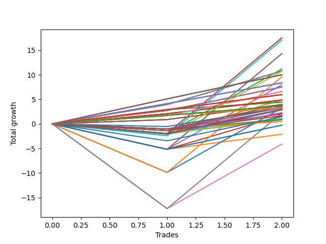

# Long Wallace 008 
- Symbol: TSLA_Unlimited
- Date Range: 03/23/2022 - 07/08/2022
- Trading Period: 7:20-12:30
- Number of Trades: 2



| Name | Win Percent | Profit | Avg Profit / Trade | Avg Time / Trade |      | Name | Win Percent | Profit | Avg Profit / Trade | Avg Time / Trade |
| ---- | ----------- | ------ | ------------------ | ---------------- | ---- | ---- | ----------- | ------ | ------------------ | ---------------- |
| Sorted By <br> Profit | | | | | | Sorted By <br> Win Percentage ||||
| Fifty-Five | 50.00 | 8755.00 | 4377.50 | 68:27 |     | Sixty-Nine | 100.00 | 5380.00 | 2690.00 | 35:22 |
| Seventy-One | 50.00 | 8530.00 | 4265.00 | 101:05 |     | Sixty-One | 100.00 | 5380.00 | 2690.00 | 35:22 |
| Forty-Seven | 50.00 | 7150.00 | 3575.00 | 78:35 |     | Five | 100.00 | 5380.00 | 2690.00 | 35:22 |
| Fifty-Four | 50.00 | 5585.00 | 2792.50 | 48:40 |     | One Hundred Thirty | 100.00 | 5000.00 | 2500.00 | 29:05 |
| Sixty-Nine | 100.00 | 5380.00 | 2690.00 | 35:22 |     | One Hundred Twenty-Five | 100.00 | 5000.00 | 2500.00 | 29:05 |
| Sixty-One | 100.00 | 5380.00 | 2690.00 | 35:22 |     | Eighty-Five | 100.00 | 5000.00 | 2500.00 | 29:05 |
| Five | 100.00 | 5380.00 | 2690.00 | 35:22 |     | One Hundred Twenty-Nine | 100.00 | 4180.00 | 2090.00 | 11:55 |
| Seventy | 50.00 | 5360.00 | 2680.00 | 81:17 |     | One Hundred Twenty-Four | 100.00 | 4180.00 | 2090.00 | 11:55 |
| One Hundred Thirty | 100.00 | 5000.00 | 2500.00 | 29:05 |     | One Hundred Fourteen | 100.00 | 4180.00 | 2090.00 | 11:55 |
| One Hundred Twenty-Five | 100.00 | 5000.00 | 2500.00 | 29:05 |     | One Hundred Four | 100.00 | 4180.00 | 2090.00 | 11:55 |
| Eighty-Five | 100.00 | 5000.00 | 2500.00 | 29:05 |     | Eighty-Four | 100.00 | 4180.00 | 2090.00 | 11:55 |
| Sixty-Three | 50.00 | 4795.00 | 2397.50 | 120:57 |     | Sixty-Six | 100.00 | 3750.00 | 1875.00 | 13:35 |
| One Hundred Twenty-Nine | 100.00 | 4180.00 | 2090.00 | 11:55 |     | Fifty-Eight | 100.00 | 3750.00 | 1875.00 | 13:35 |
| One Hundred Twenty-Four | 100.00 | 4180.00 | 2090.00 | 11:55 |     | Forty-Two | 100.00 | 3750.00 | 1875.00 | 13:35 |
| One Hundred Fourteen | 100.00 | 4180.00 | 2090.00 | 11:55 |     | Two | 100.00 | 3750.00 | 1875.00 | 13:35 |
| One Hundred Four | 100.00 | 4180.00 | 2090.00 | 11:55 |     | Sixty-Eight | 100.00 | 3290.00 | 1645.00 | 27:35 |
| Eighty-Four | 100.00 | 4180.00 | 2090.00 | 11:55 |     | Sixty | 100.00 | 3290.00 | 1645.00 | 27:35 |
| Forty-Six | 50.00 | 3980.00 | 1990.00 | 58:47 |     | Four | 100.00 | 3290.00 | 1645.00 | 27:35 |
| Sixty-Six | 100.00 | 3750.00 | 1875.00 | 13:35 |     | One Hundred Twenty-Eight | 100.00 | 2980.00 | 1490.00 | 07:02 |
| Fifty-Eight | 100.00 | 3750.00 | 1875.00 | 13:35 |     | One Hundred Twenty-Three | 100.00 | 2980.00 | 1490.00 | 07:02 |
| Forty-Two | 100.00 | 3750.00 | 1875.00 | 13:35 |     | One Hundred Eighteen | 100.00 | 2980.00 | 1490.00 | 07:02 |
| Two | 100.00 | 3750.00 | 1875.00 | 13:35 |     | One Hundred Thirteen | 100.00 | 2980.00 | 1490.00 | 07:02 |
| Sixty-Eight | 100.00 | 3290.00 | 1645.00 | 27:35 |     | One Hundred Three | 100.00 | 2980.00 | 1490.00 | 07:02 |
| Sixty | 100.00 | 3290.00 | 1645.00 | 27:35 |     | Eighty-Three | 100.00 | 2980.00 | 1490.00 | 07:02 |
| Four | 100.00 | 3290.00 | 1645.00 | 27:35 |     | Sixty-Five | 100.00 | 2430.00 | 1215.00 | 09:00 |
| One Hundred Twenty-Eight | 100.00 | 2980.00 | 1490.00 | 07:02 |     | Fifty-Seven | 100.00 | 2430.00 | 1215.00 | 09:00 |
| One Hundred Twenty-Three | 100.00 | 2980.00 | 1490.00 | 07:02 |     | Forty-One | 100.00 | 2430.00 | 1215.00 | 09:00 |
| One Hundred Eighteen | 100.00 | 2980.00 | 1490.00 | 07:02 |     | One | 100.00 | 2430.00 | 1215.00 | 09:00 |
| One Hundred Thirteen | 100.00 | 2980.00 | 1490.00 | 07:02 |     | Sixty-Four | 100.00 | 2210.00 | 1105.00 | 05:02 |
| One Hundred Three | 100.00 | 2980.00 | 1490.00 | 07:02 |     | Fifty-Six | 100.00 | 2210.00 | 1105.00 | 05:02 |
| Eighty-Three | 100.00 | 2980.00 | 1490.00 | 07:02 |     | Forty-Eight | 100.00 | 2210.00 | 1105.00 | 05:02 |
| Fifty-Three | 50.00 | 2440.00 | 1220.00 | 19:47 |     | Forty | 100.00 | 2210.00 | 1105.00 | 05:02 |
| Sixty-Five | 100.00 | 2430.00 | 1215.00 | 09:00 |     | Zero | 100.00 | 2210.00 | 1105.00 | 05:02 |
| Fifty-Seven | 100.00 | 2430.00 | 1215.00 | 09:00 |     | Sixty-Seven | 100.00 | 1970.00 | 985.00 | 21:52 |
| Forty-One | 100.00 | 2430.00 | 1215.00 | 09:00 |     | Fifty-Nine | 100.00 | 1970.00 | 985.00 | 21:52 |
| One | 100.00 | 2430.00 | 1215.00 | 09:00 |     | Three | 100.00 | 1970.00 | 985.00 | 21:52 |
| Sixty-Four | 100.00 | 2210.00 | 1105.00 | 05:02 |     | One Hundred Twenty-Seven | 100.00 | 1820.00 | 910.00 | 03:00 |
| Fifty-Six | 100.00 | 2210.00 | 1105.00 | 05:02 |     | One Hundred Twenty-Two | 100.00 | 1820.00 | 910.00 | 03:00 |
| Forty-Eight | 100.00 | 2210.00 | 1105.00 | 05:02 |     | One Hundred Seventeen | 100.00 | 1820.00 | 910.00 | 03:00 |
| Forty | 100.00 | 2210.00 | 1105.00 | 05:02 |     | One Hundred Twelve | 100.00 | 1820.00 | 910.00 | 03:00 |
| Zero | 100.00 | 2210.00 | 1105.00 | 05:02 |     | One Hundred Seven | 100.00 | 1820.00 | 910.00 | 03:00 |
| Sixty-Seven | 100.00 | 1970.00 | 985.00 | 21:52 |     | One Hundred Two | 100.00 | 1820.00 | 910.00 | 03:00 |
| Fifty-Nine | 100.00 | 1970.00 | 985.00 | 21:52 |     | Ninety-Two | 100.00 | 1820.00 | 910.00 | 03:00 |
| Three | 100.00 | 1970.00 | 985.00 | 21:52 |     | Eighty-Two | 100.00 | 1820.00 | 910.00 | 03:00 |
| One Hundred | 50.00 | 1935.00 | 967.50 | 06:45 |     | One Hundred Twenty-Six | 100.00 | 1640.00 | 820.00 | 02:45 |
| One Hundred Twenty-Seven | 100.00 | 1820.00 | 910.00 | 03:00 |     | One Hundred Twenty-One | 100.00 | 1640.00 | 820.00 | 02:45 |
| One Hundred Twenty-Two | 100.00 | 1820.00 | 910.00 | 03:00 |     | One Hundred Sixteen | 100.00 | 1640.00 | 820.00 | 02:45 |
| One Hundred Seventeen | 100.00 | 1820.00 | 910.00 | 03:00 |     | One Hundred Eleven | 100.00 | 1640.00 | 820.00 | 02:45 |
| One Hundred Twelve | 100.00 | 1820.00 | 910.00 | 03:00 |     | One Hundred Six | 100.00 | 1640.00 | 820.00 | 02:45 |
| One Hundred Seven | 100.00 | 1820.00 | 910.00 | 03:00 |     | One Hundred One | 100.00 | 1640.00 | 820.00 | 02:45 |
| One Hundred Two | 100.00 | 1820.00 | 910.00 | 03:00 |     | Ninety-One | 100.00 | 1640.00 | 820.00 | 02:45 |
| Ninety-Two | 100.00 | 1820.00 | 910.00 | 03:00 |     | Eighty-One | 100.00 | 1640.00 | 820.00 | 02:45 |
| Eighty-Two | 100.00 | 1820.00 | 910.00 | 03:00 |     | Fifty-Five | 50.00 | 8755.00 | 4377.50 | 68:27 |
| One Hundred Ten | 50.00 | 1760.00 | 880.00 | 08:00 |     | Seventy-One | 50.00 | 8530.00 | 4265.00 | 101:05 |
| Seventy-Three | 50.00 | 1690.00 | 845.00 | 14:35 |     | Forty-Seven | 50.00 | 7150.00 | 3575.00 | 78:35 |
| One Hundred Twenty-Six | 100.00 | 1640.00 | 820.00 | 02:45 |     | Fifty-Four | 50.00 | 5585.00 | 2792.50 | 48:40 |
| One Hundred Twenty-One | 100.00 | 1640.00 | 820.00 | 02:45 |     | Seventy | 50.00 | 5360.00 | 2680.00 | 81:17 |
| One Hundred Sixteen | 100.00 | 1640.00 | 820.00 | 02:45 |     | Sixty-Three | 50.00 | 4795.00 | 2397.50 | 120:57 |
| One Hundred Eleven | 100.00 | 1640.00 | 820.00 | 02:45 |     | Forty-Six | 50.00 | 3980.00 | 1990.00 | 58:47 |
| One Hundred Six | 100.00 | 1640.00 | 820.00 | 02:45 |     | Fifty-Three | 50.00 | 2440.00 | 1220.00 | 19:47 |
| One Hundred One | 100.00 | 1640.00 | 820.00 | 02:45 |     | One Hundred | 50.00 | 1935.00 | 967.50 | 06:45 |
| Ninety-One | 100.00 | 1640.00 | 820.00 | 02:45 |     | One Hundred Ten | 50.00 | 1760.00 | 880.00 | 08:00 |
| Eighty-One | 100.00 | 1640.00 | 820.00 | 02:45 |     | Seventy-Three | 50.00 | 1690.00 | 845.00 | 14:35 |
| Sixty-Two | 50.00 | 1625.00 | 812.50 | 101:10 |     | Sixty-Two | 50.00 | 1625.00 | 812.50 | 101:10 |
| Ninety-Nine | 50.00 | 1600.00 | 800.00 | 04:55 |     | Ninety-Nine | 50.00 | 1600.00 | 800.00 | 04:55 |
| One Hundred Twenty | 50.00 | 1475.00 | 737.50 | 12:52 |     | One Hundred Twenty | 50.00 | 1475.00 | 737.50 | 12:52 |
| Fifty-Two | 50.00 | 1475.00 | 737.50 | 12:52 |     | Fifty-Two | 50.00 | 1475.00 | 737.50 | 12:52 |
| One Hundred Nine | 50.00 | 1425.00 | 712.50 | 06:10 |     | One Hundred Nine | 50.00 | 1425.00 | 712.50 | 06:10 |
| Ninety-Five | 50.00 | 1420.00 | 710.00 | 08:02 |     | Ninety-Five | 50.00 | 1420.00 | 710.00 | 08:02 |
| Fifty | 50.00 | 1415.00 | 707.50 | 12:50 |     | Fifty | 50.00 | 1415.00 | 707.50 | 12:50 |
| One Hundred Ninteen | 50.00 | 1140.00 | 570.00 | 11:02 |     | One Hundred Ninteen | 50.00 | 1140.00 | 570.00 | 11:02 |
| Seven | 50.00 | 1115.00 | 557.50 | 204:00 |     | Seven | 50.00 | 1115.00 | 557.50 | 204:00 |
| Ninety-Four | 50.00 | 1085.00 | 542.50 | 06:12 |     | Ninety-Four | 50.00 | 1085.00 | 542.50 | 06:12 |
| Ninety-Eight | 50.00 | 1010.00 | 505.00 | 03:55 |     | Ninety-Eight | 50.00 | 1010.00 | 505.00 | 03:55 |
| One Hundred Eight | 50.00 | 835.00 | 417.50 | 05:10 |     | One Hundred Eight | 50.00 | 835.00 | 417.50 | 05:10 |
| Forty-Five | 50.00 | 835.00 | 417.50 | 29:55 |     | Forty-Five | 50.00 | 835.00 | 417.50 | 29:55 |
| One Hundred Five | 50.00 | 735.00 | 367.50 | 18:37 |     | One Hundred Five | 50.00 | 735.00 | 367.50 | 18:37 |
| Fifty-One | 50.00 | 550.00 | 275.00 | 10:02 |     | Fifty-One | 50.00 | 550.00 | 275.00 | 10:02 |
| Ninety-Three | 50.00 | 495.00 | 247.50 | 05:12 |     | Ninety-Three | 50.00 | 495.00 | 247.50 | 05:12 |
| Ninety-Seven | 50.00 | 435.00 | 217.50 | 02:05 |     | Ninety-Seven | 50.00 | 435.00 | 217.50 | 02:05 |
| Forty-Nine | 50.00 | 415.00 | 207.50 | 08:42 |     | Forty-Nine | 50.00 | 415.00 | 207.50 | 08:42 |
| Ninety-Six | 50.00 | 240.00 | 120.00 | 01:55 |     | Ninety-Six | 50.00 | 240.00 | 120.00 | 01:55 |
| One Hundred Fifteen | 50.00 | -130.00 | -65.00 | 23:00 |     | One Hundred Fifteen | 50.00 | -130.00 | -65.00 | 23:00 |
| Forty-Four | 50.00 | -130.00 | -65.00 | 23:00 |     | Forty-Four | 50.00 | -130.00 | -65.00 | 23:00 |
| Forty-Three | 50.00 | -1055.00 | -527.50 | 20:10 |     | Forty-Three | 50.00 | -1055.00 | -527.50 | 20:10 |
| Six | 50.00 | -2055.00 | -1027.50 | 184:12 |     | Six | 50.00 | -2055.00 | -1027.50 | 184:12 |

## NO STOPLOSS

### Test Zero
* Sell when price hits the middle line of the 20p bollinger
* No Stoploss
* Results:
```
Total Trades: 2
Percent Up: 100.00
Percent Down: 0.00
Total Points Moved Up: 4.42
Potential Profit: 2210.00
Total Points Ups: 4.42 Count Ups: 2
Total Points Downs: 0.00 Count Downs: 0
```

<details><summary>Trades</summary>

<code>In: 2022-05-16 08:02:00		Out: 2022-05-16 08:09:55		Total Position Time: 07:55		Total Move Up: 2.90		Total to Date: 2.90</code> <br />
<code>In: 2022-06-23 10:44:00		Out: 2022-06-23 10:46:10		Total Position Time: 02:10		Total Move Up: 1.52		Total to Date: 4.42</code> <br />


</details>

### Test One
* Sell when the price hits the upper line of the 20p 1std bollinger
* No Stoploss
* Results:
```
Total Trades: 2
Percent Up: 100.00
Percent Down: 0.00
Total Points Moved Up: 4.86
Potential Profit: 2430.00
Total Points Ups: 4.86 Count Ups: 2
Total Points Downs: 0.00 Count Downs: 0
```

<details><summary>Trades</summary>

<code>In: 2022-05-16 08:02:00		Out: 2022-05-16 08:16:30		Total Position Time: 14:30		Total Move Up: 2.07		Total to Date: 2.07</code> <br />
<code>In: 2022-06-23 10:44:00		Out: 2022-06-23 10:47:30		Total Position Time: 03:30		Total Move Up: 2.79		Total to Date: 4.86</code> <br />


</details>

### Test Two
* Sell when the price hits the upper line of the 20p 2std bollinger
* No Stoploss
* Results:
```
Total Trades: 2
Percent Up: 100.00
Percent Down: 0.00
Total Points Moved Up: 7.50
Potential Profit: 3750.00
Total Points Ups: 7.50 Count Ups: 2
Total Points Downs: 0.00 Count Downs: 0
```

<details><summary>Trades</summary>

<code>In: 2022-05-16 08:02:00		Out: 2022-05-16 08:17:25		Total Position Time: 15:25		Total Move Up: 2.71		Total to Date: 2.71</code> <br />
<code>In: 2022-06-23 10:44:00		Out: 2022-06-23 10:55:45		Total Position Time: 11:45		Total Move Up: 4.79		Total to Date: 7.50</code> <br />


</details>

### Test Three
* Sell when price hits the middle line of the 50p bollinger
* No Stoploss
* Results:
```
Total Trades: 2
Percent Up: 100.00
Percent Down: 0.00
Total Points Moved Up: 3.94
Potential Profit: 1970.00
Total Points Ups: 3.94 Count Ups: 2
Total Points Downs: 0.00 Count Downs: 0
```

<details><summary>Trades</summary>

<code>In: 2022-05-16 08:02:00		Out: 2022-05-16 08:39:35		Total Position Time: 37:35		Total Move Up: 0.88		Total to Date: 0.88</code> <br />
<code>In: 2022-06-23 10:44:00		Out: 2022-06-23 10:50:10		Total Position Time: 06:10		Total Move Up: 3.06		Total to Date: 3.94</code> <br />


</details>

### Test Four
* Sell when the price hits the upper line of the 50p 1std bollinger
* No Stoploss
* Results:
```
Total Trades: 2
Percent Up: 100.00
Percent Down: 0.00
Total Points Moved Up: 6.58
Potential Profit: 3290.00
Total Points Ups: 6.58 Count Ups: 2
Total Points Downs: 0.00 Count Downs: 0
```

<details><summary>Trades</summary>

<code>In: 2022-05-16 08:02:00		Out: 2022-05-16 08:45:20		Total Position Time: 43:20		Total Move Up: 1.67		Total to Date: 1.67</code> <br />
<code>In: 2022-06-23 10:44:00		Out: 2022-06-23 10:55:50		Total Position Time: 11:50		Total Move Up: 4.91		Total to Date: 6.58</code> <br />


</details>

### Test Five
* Sell when the price hits the upper line of the 50p 2std bollinger
* No Stoploss
* Results:
```
Total Trades: 2
Percent Up: 100.00
Percent Down: 0.00
Total Points Moved Up: 10.76
Potential Profit: 5380.00
Total Points Ups: 10.76 Count Ups: 2
Total Points Downs: 0.00 Count Downs: 0
```

<details><summary>Trades</summary>

<code>In: 2022-05-16 08:02:00		Out: 2022-05-16 08:47:05		Total Position Time: 45:05		Total Move Up: 3.92		Total to Date: 3.92</code> <br />
<code>In: 2022-06-23 10:44:00		Out: 2022-06-23 11:09:40		Total Position Time: 25:40		Total Move Up: 6.84		Total to Date: 10.76</code> <br />


</details>

### Test Six
* Sell when the price hits the middle line of the 1std VWAP
* No Stoploss
* Results:
```
Total Trades: 2
Percent Up: 50.00
Percent Down: 50.00
Total Points Moved Up: -4.11
Potential Profit: -2055.00
Total Points Ups: 13.13 Count Ups: 1
Total Points Downs: -17.24 Count Downs: 1
```

<details><summary>Trades</summary>

<code>In: 2022-05-16 08:02:00		Out: 2022-05-16 12:47:00		Total Position Time: 285:00		Total Move Up: -17.24		Total to Date: -17.24</code> <br />
<code>In: 2022-06-23 10:44:00		Out: 2022-06-23 12:07:25		Total Position Time: 83:25		Total Move Up: 13.13		Total to Date: -4.11</code> <br />


</details>

### Test Seven
* Sell when the price hits the upper line of the 1std VWAP
* No Stoploss
* Results:
```
Total Trades: 2
Percent Up: 50.00
Percent Down: 50.00
Total Points Moved Up: 2.23
Potential Profit: 1115.00
Total Points Ups: 19.47 Count Ups: 1
Total Points Downs: -17.24 Count Downs: 1
```

<details><summary>Trades</summary>

<code>In: 2022-05-16 08:02:00		Out: 2022-05-16 12:47:00		Total Position Time: 285:00		Total Move Up: -17.24		Total to Date: -17.24</code> <br />
<code>In: 2022-06-23 10:44:00		Out: 2022-06-23 12:47:00		Total Position Time: 123:00		Total Move Up: 19.47		Total to Date: 2.23</code> <br />


</details>

## STOPLOSS OF 5

### Test Forty
* Sell when price hits the middle line of the 20p bollinger
* Stoploss is 5 points
* Results:
```
Total Trades: 2
Percent Up: 100.00
Percent Down: 0.00
Total Points Moved Up: 4.42
Potential Profit: 2210.00
Total Points Ups: 4.42 Count Ups: 2
Total Points Downs: 0.00 Count Downs: 0
```

<details><summary>Trades</summary>

<code>In: 2022-05-16 08:02:00		Out: 2022-05-16 08:09:55		Total Position Time: 07:55		Total Move Up: 2.90		Total to Date: 2.90</code> <br />
<code>In: 2022-06-23 10:44:00		Out: 2022-06-23 10:46:10		Total Position Time: 02:10		Total Move Up: 1.52		Total to Date: 4.42</code> <br />


</details>

### Test Forty-One
* Sell when the price hits the upper line of the 20p 1std bollinger
* Stoploss is 5 points
* Results:
```
Total Trades: 2
Percent Up: 100.00
Percent Down: 0.00
Total Points Moved Up: 4.86
Potential Profit: 2430.00
Total Points Ups: 4.86 Count Ups: 2
Total Points Downs: 0.00 Count Downs: 0
```

<details><summary>Trades</summary>

<code>In: 2022-05-16 08:02:00		Out: 2022-05-16 08:16:30		Total Position Time: 14:30		Total Move Up: 2.07		Total to Date: 2.07</code> <br />
<code>In: 2022-06-23 10:44:00		Out: 2022-06-23 10:47:30		Total Position Time: 03:30		Total Move Up: 2.79		Total to Date: 4.86</code> <br />


</details>

### Test Forty-Two
* Sell when the price hits the upper line of the 20p 2std bollinger
* Stoploss is 5 points
* Results:
```
Total Trades: 2
Percent Up: 100.00
Percent Down: 0.00
Total Points Moved Up: 7.50
Potential Profit: 3750.00
Total Points Ups: 7.50 Count Ups: 2
Total Points Downs: 0.00 Count Downs: 0
```

<details><summary>Trades</summary>

<code>In: 2022-05-16 08:02:00		Out: 2022-05-16 08:17:25		Total Position Time: 15:25		Total Move Up: 2.71		Total to Date: 2.71</code> <br />
<code>In: 2022-06-23 10:44:00		Out: 2022-06-23 10:55:45		Total Position Time: 11:45		Total Move Up: 4.79		Total to Date: 7.50</code> <br />


</details>

### Test Forty-Three
* Sell when price hits the middle line of the 50p bollinger
* Stoploss is 5 points
* Results:
```
Total Trades: 2
Percent Up: 50.00
Percent Down: 50.00
Total Points Moved Up: -2.11
Potential Profit: -1055.00
Total Points Ups: 3.06 Count Ups: 1
Total Points Downs: -5.17 Count Downs: 1
```

<details><summary>Trades</summary>

<code>In: 2022-05-16 08:02:00		Out: 2022-05-16 08:36:10		Total Position Time: 34:10		Total Move Up: -5.17		Total to Date: -5.17</code> <br />
<code>In: 2022-06-23 10:44:00		Out: 2022-06-23 10:50:10		Total Position Time: 06:10		Total Move Up: 3.06		Total to Date: -2.11</code> <br />


</details>

### Test Forty-Four
* Sell when the price hits the upper line of the 50p 1std bollinger
* Stoploss is 5 points
* Results:
```
Total Trades: 2
Percent Up: 50.00
Percent Down: 50.00
Total Points Moved Up: -0.26
Potential Profit: -130.00
Total Points Ups: 4.91 Count Ups: 1
Total Points Downs: -5.17 Count Downs: 1
```

<details><summary>Trades</summary>

<code>In: 2022-05-16 08:02:00		Out: 2022-05-16 08:36:10		Total Position Time: 34:10		Total Move Up: -5.17		Total to Date: -5.17</code> <br />
<code>In: 2022-06-23 10:44:00		Out: 2022-06-23 10:55:50		Total Position Time: 11:50		Total Move Up: 4.91		Total to Date: -0.26</code> <br />


</details>

### Test Forty-Five
* Sell when the price hits the upper line of the 50p 2std bollinger
* Stoploss is 5 points
* Results:
```
Total Trades: 2
Percent Up: 50.00
Percent Down: 50.00
Total Points Moved Up: 1.67
Potential Profit: 835.00
Total Points Ups: 6.84 Count Ups: 1
Total Points Downs: -5.17 Count Downs: 1
```

<details><summary>Trades</summary>

<code>In: 2022-05-16 08:02:00		Out: 2022-05-16 08:36:10		Total Position Time: 34:10		Total Move Up: -5.17		Total to Date: -5.17</code> <br />
<code>In: 2022-06-23 10:44:00		Out: 2022-06-23 11:09:40		Total Position Time: 25:40		Total Move Up: 6.84		Total to Date: 1.67</code> <br />


</details>

### Test Forty-Six
* Sell when the price hits the middle line of the 1std VWAP
* Stoploss is 5 points
* Results:
```
Total Trades: 2
Percent Up: 50.00
Percent Down: 50.00
Total Points Moved Up: 7.96
Potential Profit: 3980.00
Total Points Ups: 13.13 Count Ups: 1
Total Points Downs: -5.17 Count Downs: 1
```

<details><summary>Trades</summary>

<code>In: 2022-05-16 08:02:00		Out: 2022-05-16 08:36:10		Total Position Time: 34:10		Total Move Up: -5.17		Total to Date: -5.17</code> <br />
<code>In: 2022-06-23 10:44:00		Out: 2022-06-23 12:07:25		Total Position Time: 83:25		Total Move Up: 13.13		Total to Date: 7.96</code> <br />


</details>

### Test Forty-Seven
* Sell when the price hits the upper line of the 1std VWAP
* Stoploss is 5 points
* Results:
```
Total Trades: 2
Percent Up: 50.00
Percent Down: 50.00
Total Points Moved Up: 14.30
Potential Profit: 7150.00
Total Points Ups: 19.47 Count Ups: 1
Total Points Downs: -5.17 Count Downs: 1
```

<details><summary>Trades</summary>

<code>In: 2022-05-16 08:02:00		Out: 2022-05-16 08:36:10		Total Position Time: 34:10		Total Move Up: -5.17		Total to Date: -5.17</code> <br />
<code>In: 2022-06-23 10:44:00		Out: 2022-06-23 12:47:00		Total Position Time: 123:00		Total Move Up: 19.47		Total to Date: 14.30</code> <br />


</details>

## TRAIL STOP OF 5

### Test Forty-Eight
* Sell when price hits the middle line of the 20p bollinger
* Trailing Stop is 5 points
* Results:
```
Total Trades: 2
Percent Up: 100.00
Percent Down: 0.00
Total Points Moved Up: 4.42
Potential Profit: 2210.00
Total Points Ups: 4.42 Count Ups: 2
Total Points Downs: 0.00 Count Downs: 0
```

<details><summary>Trades</summary>

<code>In: 2022-05-16 08:02:00		Out: 2022-05-16 08:09:55		Total Position Time: 07:55		Total Move Up: 2.90		Total to Date: 2.90</code> <br />
<code>In: 2022-06-23 10:44:00		Out: 2022-06-23 10:46:10		Total Position Time: 02:10		Total Move Up: 1.52		Total to Date: 4.42</code> <br />


</details>

### Test Forty-Nine
* Sell when the price hits the upper line of the 20p 1std bollinger
* Trailing Stop is 5 points
* Results:
```
Total Trades: 2
Percent Up: 50.00
Percent Down: 50.00
Total Points Moved Up: 0.83
Potential Profit: 415.00
Total Points Ups: 2.79 Count Ups: 1
Total Points Downs: -1.96 Count Downs: 1
```

<details><summary>Trades</summary>

<code>In: 2022-05-16 08:02:00		Out: 2022-05-16 08:15:55		Total Position Time: 13:55		Total Move Up: -1.96		Total to Date: -1.96</code> <br />
<code>In: 2022-06-23 10:44:00		Out: 2022-06-23 10:47:30		Total Position Time: 03:30		Total Move Up: 2.79		Total to Date: 0.83</code> <br />


</details>

### Test Fifty
* Sell when the price hits the upper line of the 20p 2std bollinger
* Trailing Stop is 5 points
* Results:
```
Total Trades: 2
Percent Up: 50.00
Percent Down: 50.00
Total Points Moved Up: 2.83
Potential Profit: 1415.00
Total Points Ups: 4.79 Count Ups: 1
Total Points Downs: -1.96 Count Downs: 1
```

<details><summary>Trades</summary>

<code>In: 2022-05-16 08:02:00		Out: 2022-05-16 08:15:55		Total Position Time: 13:55		Total Move Up: -1.96		Total to Date: -1.96</code> <br />
<code>In: 2022-06-23 10:44:00		Out: 2022-06-23 10:55:45		Total Position Time: 11:45		Total Move Up: 4.79		Total to Date: 2.83</code> <br />


</details>

### Test Fifty-One
* Sell when price hits the middle line of the 50p bollinger
* Trailing Stop is 5 points
* Results:
```
Total Trades: 2
Percent Up: 50.00
Percent Down: 50.00
Total Points Moved Up: 1.10
Potential Profit: 550.00
Total Points Ups: 3.06 Count Ups: 1
Total Points Downs: -1.96 Count Downs: 1
```

<details><summary>Trades</summary>

<code>In: 2022-05-16 08:02:00		Out: 2022-05-16 08:15:55		Total Position Time: 13:55		Total Move Up: -1.96		Total to Date: -1.96</code> <br />
<code>In: 2022-06-23 10:44:00		Out: 2022-06-23 10:50:10		Total Position Time: 06:10		Total Move Up: 3.06		Total to Date: 1.10</code> <br />


</details>

### Test Fifty-Two
* Sell when the price hits the upper line of the 50p 1std bollinger
* Trailing Stop is 5 points
* Results:
```
Total Trades: 2
Percent Up: 50.00
Percent Down: 50.00
Total Points Moved Up: 2.95
Potential Profit: 1475.00
Total Points Ups: 4.91 Count Ups: 1
Total Points Downs: -1.96 Count Downs: 1
```

<details><summary>Trades</summary>

<code>In: 2022-05-16 08:02:00		Out: 2022-05-16 08:15:55		Total Position Time: 13:55		Total Move Up: -1.96		Total to Date: -1.96</code> <br />
<code>In: 2022-06-23 10:44:00		Out: 2022-06-23 10:55:50		Total Position Time: 11:50		Total Move Up: 4.91		Total to Date: 2.95</code> <br />


</details>

### Test Fifty-Three
* Sell when the price hits the upper line of the 50p 2std bollinger
* Trailing Stop is 5 points
* Results:
```
Total Trades: 2
Percent Up: 50.00
Percent Down: 50.00
Total Points Moved Up: 4.88
Potential Profit: 2440.00
Total Points Ups: 6.84 Count Ups: 1
Total Points Downs: -1.96 Count Downs: 1
```

<details><summary>Trades</summary>

<code>In: 2022-05-16 08:02:00		Out: 2022-05-16 08:15:55		Total Position Time: 13:55		Total Move Up: -1.96		Total to Date: -1.96</code> <br />
<code>In: 2022-06-23 10:44:00		Out: 2022-06-23 11:09:40		Total Position Time: 25:40		Total Move Up: 6.84		Total to Date: 4.88</code> <br />


</details>

### Test Fifty-Four
* Sell when the price hits the middle line of the 1std VWAP
* Trailing Stop is 5 points
* Results:
```
Total Trades: 2
Percent Up: 50.00
Percent Down: 50.00
Total Points Moved Up: 11.17
Potential Profit: 5585.00
Total Points Ups: 13.13 Count Ups: 1
Total Points Downs: -1.96 Count Downs: 1
```

<details><summary>Trades</summary>

<code>In: 2022-05-16 08:02:00		Out: 2022-05-16 08:15:55		Total Position Time: 13:55		Total Move Up: -1.96		Total to Date: -1.96</code> <br />
<code>In: 2022-06-23 10:44:00		Out: 2022-06-23 12:07:25		Total Position Time: 83:25		Total Move Up: 13.13		Total to Date: 11.17</code> <br />


</details>

### Test Fifty-Five
* Sell when the price hits the upper line of the 1std VWAP
* Trailing Stop is 5 points
* Results:
```
Total Trades: 2
Percent Up: 50.00
Percent Down: 50.00
Total Points Moved Up: 17.51
Potential Profit: 8755.00
Total Points Ups: 19.47 Count Ups: 1
Total Points Downs: -1.96 Count Downs: 1
```

<details><summary>Trades</summary>

<code>In: 2022-05-16 08:02:00		Out: 2022-05-16 08:15:55		Total Position Time: 13:55		Total Move Up: -1.96		Total to Date: -1.96</code> <br />
<code>In: 2022-06-23 10:44:00		Out: 2022-06-23 12:47:00		Total Position Time: 123:00		Total Move Up: 19.47		Total to Date: 17.51</code> <br />


</details>

## STOPLOSS OF 10

### Test Fifty-Six
* Sell when price hits the middle line of the 20p bollinger
* Stoploss is 10 points
* Results:
```
Total Trades: 2
Percent Up: 100.00
Percent Down: 0.00
Total Points Moved Up: 4.42
Potential Profit: 2210.00
Total Points Ups: 4.42 Count Ups: 2
Total Points Downs: 0.00 Count Downs: 0
```

<details><summary>Trades</summary>

<code>In: 2022-05-16 08:02:00		Out: 2022-05-16 08:09:55		Total Position Time: 07:55		Total Move Up: 2.90		Total to Date: 2.90</code> <br />
<code>In: 2022-06-23 10:44:00		Out: 2022-06-23 10:46:10		Total Position Time: 02:10		Total Move Up: 1.52		Total to Date: 4.42</code> <br />


</details>

### Test Fifty-Seven
* Sell when the price hits the upper line of the 20p 1std bollinger
* Stoploss is 10 points
* Results:
```
Total Trades: 2
Percent Up: 100.00
Percent Down: 0.00
Total Points Moved Up: 4.86
Potential Profit: 2430.00
Total Points Ups: 4.86 Count Ups: 2
Total Points Downs: 0.00 Count Downs: 0
```

<details><summary>Trades</summary>

<code>In: 2022-05-16 08:02:00		Out: 2022-05-16 08:16:30		Total Position Time: 14:30		Total Move Up: 2.07		Total to Date: 2.07</code> <br />
<code>In: 2022-06-23 10:44:00		Out: 2022-06-23 10:47:30		Total Position Time: 03:30		Total Move Up: 2.79		Total to Date: 4.86</code> <br />


</details>

### Test Fifty-Eight
* Sell when the price hits the upper line of the 20p 2std bollinger
* Stoploss is 10 points
* Results:
```
Total Trades: 2
Percent Up: 100.00
Percent Down: 0.00
Total Points Moved Up: 7.50
Potential Profit: 3750.00
Total Points Ups: 7.50 Count Ups: 2
Total Points Downs: 0.00 Count Downs: 0
```

<details><summary>Trades</summary>

<code>In: 2022-05-16 08:02:00		Out: 2022-05-16 08:17:25		Total Position Time: 15:25		Total Move Up: 2.71		Total to Date: 2.71</code> <br />
<code>In: 2022-06-23 10:44:00		Out: 2022-06-23 10:55:45		Total Position Time: 11:45		Total Move Up: 4.79		Total to Date: 7.50</code> <br />


</details>

### Test Fifty-Nine
* Sell when price hits the middle line of the 50p bollinger
* Stoploss is 10 points
* Results:
```
Total Trades: 2
Percent Up: 100.00
Percent Down: 0.00
Total Points Moved Up: 3.94
Potential Profit: 1970.00
Total Points Ups: 3.94 Count Ups: 2
Total Points Downs: 0.00 Count Downs: 0
```

<details><summary>Trades</summary>

<code>In: 2022-05-16 08:02:00		Out: 2022-05-16 08:39:35		Total Position Time: 37:35		Total Move Up: 0.88		Total to Date: 0.88</code> <br />
<code>In: 2022-06-23 10:44:00		Out: 2022-06-23 10:50:10		Total Position Time: 06:10		Total Move Up: 3.06		Total to Date: 3.94</code> <br />


</details>

### Test Sixty
* Sell when the price hits the upper line of the 50p 1std bollinger
* Stoploss is 10 points
* Results:
```
Total Trades: 2
Percent Up: 100.00
Percent Down: 0.00
Total Points Moved Up: 6.58
Potential Profit: 3290.00
Total Points Ups: 6.58 Count Ups: 2
Total Points Downs: 0.00 Count Downs: 0
```

<details><summary>Trades</summary>

<code>In: 2022-05-16 08:02:00		Out: 2022-05-16 08:45:20		Total Position Time: 43:20		Total Move Up: 1.67		Total to Date: 1.67</code> <br />
<code>In: 2022-06-23 10:44:00		Out: 2022-06-23 10:55:50		Total Position Time: 11:50		Total Move Up: 4.91		Total to Date: 6.58</code> <br />


</details>

### Test Sixty-One
* Sell when the price hits the upper line of the 50p 2std bollinger
* Stoploss is 10 points
* Results:
```
Total Trades: 2
Percent Up: 100.00
Percent Down: 0.00
Total Points Moved Up: 10.76
Potential Profit: 5380.00
Total Points Ups: 10.76 Count Ups: 2
Total Points Downs: 0.00 Count Downs: 0
```

<details><summary>Trades</summary>

<code>In: 2022-05-16 08:02:00		Out: 2022-05-16 08:47:05		Total Position Time: 45:05		Total Move Up: 3.92		Total to Date: 3.92</code> <br />
<code>In: 2022-06-23 10:44:00		Out: 2022-06-23 11:09:40		Total Position Time: 25:40		Total Move Up: 6.84		Total to Date: 10.76</code> <br />


</details>

### Test Sixty-Two
* Sell when the price hits the middle line of the 1std VWAP
* Stoploss is 10 points
* Results:
```
Total Trades: 2
Percent Up: 50.00
Percent Down: 50.00
Total Points Moved Up: 3.25
Potential Profit: 1625.00
Total Points Ups: 13.13 Count Ups: 1
Total Points Downs: -9.88 Count Downs: 1
```

<details><summary>Trades</summary>

<code>In: 2022-05-16 08:02:00		Out: 2022-05-16 10:00:55		Total Position Time: 118:55		Total Move Up: -9.88		Total to Date: -9.88</code> <br />
<code>In: 2022-06-23 10:44:00		Out: 2022-06-23 12:07:25		Total Position Time: 83:25		Total Move Up: 13.13		Total to Date: 3.25</code> <br />


</details>

### Test Sixty-Three
* Sell when the price hits the upper line of the 1std VWAP
* Stoploss is 10 points
* Results:
```
Total Trades: 2
Percent Up: 50.00
Percent Down: 50.00
Total Points Moved Up: 9.59
Potential Profit: 4795.00
Total Points Ups: 19.47 Count Ups: 1
Total Points Downs: -9.88 Count Downs: 1
```

<details><summary>Trades</summary>

<code>In: 2022-05-16 08:02:00		Out: 2022-05-16 10:00:55		Total Position Time: 118:55		Total Move Up: -9.88		Total to Date: -9.88</code> <br />
<code>In: 2022-06-23 10:44:00		Out: 2022-06-23 12:47:00		Total Position Time: 123:00		Total Move Up: 19.47		Total to Date: 9.59</code> <br />


</details>

## TRAIL STOP OF 10

### Test Sixty-Four
* Sell when price hits the middle line of the 20p bollinger
* Trailing Stop is 10 points
* Results:
```
Total Trades: 2
Percent Up: 100.00
Percent Down: 0.00
Total Points Moved Up: 4.42
Potential Profit: 2210.00
Total Points Ups: 4.42 Count Ups: 2
Total Points Downs: 0.00 Count Downs: 0
```

<details><summary>Trades</summary>

<code>In: 2022-05-16 08:02:00		Out: 2022-05-16 08:09:55		Total Position Time: 07:55		Total Move Up: 2.90		Total to Date: 2.90</code> <br />
<code>In: 2022-06-23 10:44:00		Out: 2022-06-23 10:46:10		Total Position Time: 02:10		Total Move Up: 1.52		Total to Date: 4.42</code> <br />


</details>

### Test Sixty-Five
* Sell when the price hits the upper line of the 20p 1std bollinger
* Trailing Stop is 10 points
* Results:
```
Total Trades: 2
Percent Up: 100.00
Percent Down: 0.00
Total Points Moved Up: 4.86
Potential Profit: 2430.00
Total Points Ups: 4.86 Count Ups: 2
Total Points Downs: 0.00 Count Downs: 0
```

<details><summary>Trades</summary>

<code>In: 2022-05-16 08:02:00		Out: 2022-05-16 08:16:30		Total Position Time: 14:30		Total Move Up: 2.07		Total to Date: 2.07</code> <br />
<code>In: 2022-06-23 10:44:00		Out: 2022-06-23 10:47:30		Total Position Time: 03:30		Total Move Up: 2.79		Total to Date: 4.86</code> <br />


</details>

### Test Sixty-Six
* Sell when the price hits the upper line of the 20p 2std bollinger
* Trailing Stop is 10 points
* Results:
```
Total Trades: 2
Percent Up: 100.00
Percent Down: 0.00
Total Points Moved Up: 7.50
Potential Profit: 3750.00
Total Points Ups: 7.50 Count Ups: 2
Total Points Downs: 0.00 Count Downs: 0
```

<details><summary>Trades</summary>

<code>In: 2022-05-16 08:02:00		Out: 2022-05-16 08:17:25		Total Position Time: 15:25		Total Move Up: 2.71		Total to Date: 2.71</code> <br />
<code>In: 2022-06-23 10:44:00		Out: 2022-06-23 10:55:45		Total Position Time: 11:45		Total Move Up: 4.79		Total to Date: 7.50</code> <br />


</details>

### Test Sixty-Seven
* Sell when price hits the middle line of the 50p bollinger
* Trailing Stop is 10 points
* Results:
```
Total Trades: 2
Percent Up: 100.00
Percent Down: 0.00
Total Points Moved Up: 3.94
Potential Profit: 1970.00
Total Points Ups: 3.94 Count Ups: 2
Total Points Downs: 0.00 Count Downs: 0
```

<details><summary>Trades</summary>

<code>In: 2022-05-16 08:02:00		Out: 2022-05-16 08:39:35		Total Position Time: 37:35		Total Move Up: 0.88		Total to Date: 0.88</code> <br />
<code>In: 2022-06-23 10:44:00		Out: 2022-06-23 10:50:10		Total Position Time: 06:10		Total Move Up: 3.06		Total to Date: 3.94</code> <br />


</details>

### Test Sixty-Eight
* Sell when the price hits the upper line of the 50p 1std bollinger
* Trailing Stop is 10 points
* Results:
```
Total Trades: 2
Percent Up: 100.00
Percent Down: 0.00
Total Points Moved Up: 6.58
Potential Profit: 3290.00
Total Points Ups: 6.58 Count Ups: 2
Total Points Downs: 0.00 Count Downs: 0
```

<details><summary>Trades</summary>

<code>In: 2022-05-16 08:02:00		Out: 2022-05-16 08:45:20		Total Position Time: 43:20		Total Move Up: 1.67		Total to Date: 1.67</code> <br />
<code>In: 2022-06-23 10:44:00		Out: 2022-06-23 10:55:50		Total Position Time: 11:50		Total Move Up: 4.91		Total to Date: 6.58</code> <br />


</details>

### Test Sixty-Nine
* Sell when the price hits the upper line of the 50p 2std bollinger
* Trailing Stop is 10 points
* Results:
```
Total Trades: 2
Percent Up: 100.00
Percent Down: 0.00
Total Points Moved Up: 10.76
Potential Profit: 5380.00
Total Points Ups: 10.76 Count Ups: 2
Total Points Downs: 0.00 Count Downs: 0
```

<details><summary>Trades</summary>

<code>In: 2022-05-16 08:02:00		Out: 2022-05-16 08:47:05		Total Position Time: 45:05		Total Move Up: 3.92		Total to Date: 3.92</code> <br />
<code>In: 2022-06-23 10:44:00		Out: 2022-06-23 11:09:40		Total Position Time: 25:40		Total Move Up: 6.84		Total to Date: 10.76</code> <br />


</details>

### Test Seventy
* Sell when the price hits the middle line of the 1std VWAP
* Trailing Stop is 10 points
* Results:
```
Total Trades: 2
Percent Up: 50.00
Percent Down: 50.00
Total Points Moved Up: 10.72
Potential Profit: 5360.00
Total Points Ups: 13.13 Count Ups: 1
Total Points Downs: -2.41 Count Downs: 1
```

<details><summary>Trades</summary>

<code>In: 2022-05-16 08:02:00		Out: 2022-05-16 09:21:10		Total Position Time: 79:10		Total Move Up: -2.41		Total to Date: -2.41</code> <br />
<code>In: 2022-06-23 10:44:00		Out: 2022-06-23 12:07:25		Total Position Time: 83:25		Total Move Up: 13.13		Total to Date: 10.72</code> <br />


</details>

### Test Seventy-One
* Sell when the price hits the upper line of the 1std VWAP
* Trailing Stop is 10 points
* Results:
```
Total Trades: 2
Percent Up: 50.00
Percent Down: 50.00
Total Points Moved Up: 17.06
Potential Profit: 8530.00
Total Points Ups: 19.47 Count Ups: 1
Total Points Downs: -2.41 Count Downs: 1
```

<details><summary>Trades</summary>

<code>In: 2022-05-16 08:02:00		Out: 2022-05-16 09:21:10		Total Position Time: 79:10		Total Move Up: -2.41		Total to Date: -2.41</code> <br />
<code>In: 2022-06-23 10:44:00		Out: 2022-06-23 12:47:00		Total Position Time: 123:00		Total Move Up: 19.47		Total to Date: 17.06</code> <br />


</details>

## SPECIAL EXIT CONDITIONS 

### Test Seventy-Three
* Sell when the linear regression slope changes to negative
* No Stoploss
* Results:
```
Total Trades: 2
Percent Up: 50.00
Percent Down: 50.00
Total Points Moved Up: 3.38
Potential Profit: 1690.00
Total Points Ups: 3.92 Count Ups: 1
Total Points Downs: -0.54 Count Downs: 1
```

<details><summary>Trades</summary>

<code>In: 2022-05-16 08:02:00		Out: 2022-05-16 08:16:05		Total Position Time: 14:05		Total Move Up: -0.54		Total to Date: -0.54</code> <br />
<code>In: 2022-06-23 10:44:00		Out: 2022-06-23 10:59:05		Total Position Time: 15:05		Total Move Up: 3.92		Total to Date: 3.38</code> <br />


</details>

## TAKE PROFIT

### Test Eighty-One
* Take Profit of 1 Point
* No Stoploss
* Results:
```
Total Trades: 2
Percent Up: 100.00
Percent Down: 0.00
Total Points Moved Up: 3.28
Potential Profit: 1640.00
Total Points Ups: 3.28 Count Ups: 2
Total Points Downs: 0.00 Count Downs: 0
```

<details><summary>Trades</summary>

<code>In: 2022-05-16 08:02:00		Out: 2022-05-16 08:05:20		Total Position Time: 03:20		Total Move Up: 1.76		Total to Date: 1.76</code> <br />
<code>In: 2022-06-23 10:44:00		Out: 2022-06-23 10:46:10		Total Position Time: 02:10		Total Move Up: 1.52		Total to Date: 3.28</code> <br />


</details>

### Test Eighty-Two
* Take Profit of 2 Point
* No Stoploss
* Results:
```
Total Trades: 2
Percent Up: 100.00
Percent Down: 0.00
Total Points Moved Up: 3.64
Potential Profit: 1820.00
Total Points Ups: 3.64 Count Ups: 2
Total Points Downs: 0.00 Count Downs: 0
```

<details><summary>Trades</summary>

<code>In: 2022-05-16 08:02:00		Out: 2022-05-16 08:05:30		Total Position Time: 03:30		Total Move Up: 1.73		Total to Date: 1.73</code> <br />
<code>In: 2022-06-23 10:44:00		Out: 2022-06-23 10:46:30		Total Position Time: 02:30		Total Move Up: 1.91		Total to Date: 3.64</code> <br />


</details>

### Test Eighty-Three
* Take Profit of 3 Point
* No Stoploss
* Results:
```
Total Trades: 2
Percent Up: 100.00
Percent Down: 0.00
Total Points Moved Up: 5.96
Potential Profit: 2980.00
Total Points Ups: 5.96 Count Ups: 2
Total Points Downs: 0.00 Count Downs: 0
```

<details><summary>Trades</summary>

<code>In: 2022-05-16 08:02:00		Out: 2022-05-16 08:09:55		Total Position Time: 07:55		Total Move Up: 2.90		Total to Date: 2.90</code> <br />
<code>In: 2022-06-23 10:44:00		Out: 2022-06-23 10:50:10		Total Position Time: 06:10		Total Move Up: 3.06		Total to Date: 5.96</code> <br />


</details>

### Test Eighty-Four
* Take Profit of 4 Point
* No Stoploss
* Results:
```
Total Trades: 2
Percent Up: 100.00
Percent Down: 0.00
Total Points Moved Up: 8.36
Potential Profit: 4180.00
Total Points Ups: 8.36 Count Ups: 2
Total Points Downs: 0.00 Count Downs: 0
```

<details><summary>Trades</summary>

<code>In: 2022-05-16 08:02:00		Out: 2022-05-16 08:17:40		Total Position Time: 15:40		Total Move Up: 4.12		Total to Date: 4.12</code> <br />
<code>In: 2022-06-23 10:44:00		Out: 2022-06-23 10:52:10		Total Position Time: 08:10		Total Move Up: 4.24		Total to Date: 8.36</code> <br />


</details>

### Test Eighty-Five
* Take Profit of 5 Point
* No Stoploss
* Results:
```
Total Trades: 2
Percent Up: 100.00
Percent Down: 0.00
Total Points Moved Up: 10.00
Potential Profit: 5000.00
Total Points Ups: 10.00 Count Ups: 2
Total Points Downs: 0.00 Count Downs: 0
```

<details><summary>Trades</summary>

<code>In: 2022-05-16 08:02:00		Out: 2022-05-16 08:48:20		Total Position Time: 46:20		Total Move Up: 5.09		Total to Date: 5.09</code> <br />
<code>In: 2022-06-23 10:44:00		Out: 2022-06-23 10:55:50		Total Position Time: 11:50		Total Move Up: 4.91		Total to Date: 10.00</code> <br />


</details>

## TAKE PROFIT Stoploss of Two

### Test Ninety-One
* Take Profit of 1 Point
* Stoploss is 2 points
* Results:
```
Total Trades: 2
Percent Up: 100.00
Percent Down: 0.00
Total Points Moved Up: 3.28
Potential Profit: 1640.00
Total Points Ups: 3.28 Count Ups: 2
Total Points Downs: 0.00 Count Downs: 0
```

<details><summary>Trades</summary>

<code>In: 2022-05-16 08:02:00		Out: 2022-05-16 08:05:20		Total Position Time: 03:20		Total Move Up: 1.76		Total to Date: 1.76</code> <br />
<code>In: 2022-06-23 10:44:00		Out: 2022-06-23 10:46:10		Total Position Time: 02:10		Total Move Up: 1.52		Total to Date: 3.28</code> <br />


</details>

### Test Ninety-Two
* Take Profit of 2 Point
* Stoploss is 2 points
* Results:
```
Total Trades: 2
Percent Up: 100.00
Percent Down: 0.00
Total Points Moved Up: 3.64
Potential Profit: 1820.00
Total Points Ups: 3.64 Count Ups: 2
Total Points Downs: 0.00 Count Downs: 0
```

<details><summary>Trades</summary>

<code>In: 2022-05-16 08:02:00		Out: 2022-05-16 08:05:30		Total Position Time: 03:30		Total Move Up: 1.73		Total to Date: 1.73</code> <br />
<code>In: 2022-06-23 10:44:00		Out: 2022-06-23 10:46:30		Total Position Time: 02:30		Total Move Up: 1.91		Total to Date: 3.64</code> <br />


</details>

### Test Ninety-Three
* Take Profit of 3 Point
* Stoploss is 2 points
* Results:
```
Total Trades: 2
Percent Up: 50.00
Percent Down: 50.00
Total Points Moved Up: 0.99
Potential Profit: 495.00
Total Points Ups: 3.06 Count Ups: 1
Total Points Downs: -2.07 Count Downs: 1
```

<details><summary>Trades</summary>

<code>In: 2022-05-16 08:02:00		Out: 2022-05-16 08:06:15		Total Position Time: 04:15		Total Move Up: -2.07		Total to Date: -2.07</code> <br />
<code>In: 2022-06-23 10:44:00		Out: 2022-06-23 10:50:10		Total Position Time: 06:10		Total Move Up: 3.06		Total to Date: 0.99</code> <br />


</details>

### Test Ninety-Four
* Take Profit of 4 Point
* Stoploss is 2 points
* Results:
```
Total Trades: 2
Percent Up: 50.00
Percent Down: 50.00
Total Points Moved Up: 2.17
Potential Profit: 1085.00
Total Points Ups: 4.24 Count Ups: 1
Total Points Downs: -2.07 Count Downs: 1
```

<details><summary>Trades</summary>

<code>In: 2022-05-16 08:02:00		Out: 2022-05-16 08:06:15		Total Position Time: 04:15		Total Move Up: -2.07		Total to Date: -2.07</code> <br />
<code>In: 2022-06-23 10:44:00		Out: 2022-06-23 10:52:10		Total Position Time: 08:10		Total Move Up: 4.24		Total to Date: 2.17</code> <br />


</details>

### Test Ninety-Five
* Take Profit of 5 Point
* Stoploss is 2 points
* Results:
```
Total Trades: 2
Percent Up: 50.00
Percent Down: 50.00
Total Points Moved Up: 2.84
Potential Profit: 1420.00
Total Points Ups: 4.91 Count Ups: 1
Total Points Downs: -2.07 Count Downs: 1
```

<details><summary>Trades</summary>

<code>In: 2022-05-16 08:02:00		Out: 2022-05-16 08:06:15		Total Position Time: 04:15		Total Move Up: -2.07		Total to Date: -2.07</code> <br />
<code>In: 2022-06-23 10:44:00		Out: 2022-06-23 10:55:50		Total Position Time: 11:50		Total Move Up: 4.91		Total to Date: 2.84</code> <br />


</details>

## TAKE PROFIT Trailstop of Two

### Test Ninety-Six
* Take Profit of 1 Point
* Trailing stop is 2 points
* Results:
```
Total Trades: 2
Percent Up: 50.00
Percent Down: 50.00
Total Points Moved Up: 0.48
Potential Profit: 240.00
Total Points Ups: 1.52 Count Ups: 1
Total Points Downs: -1.04 Count Downs: 1
```

<details><summary>Trades</summary>

<code>In: 2022-05-16 08:02:00		Out: 2022-05-16 08:03:40		Total Position Time: 01:40		Total Move Up: -1.04		Total to Date: -1.04</code> <br />
<code>In: 2022-06-23 10:44:00		Out: 2022-06-23 10:46:10		Total Position Time: 02:10		Total Move Up: 1.52		Total to Date: 0.48</code> <br />


</details>

### Test Ninety-Seven
* Take Profit of 2 Point
* Trailing stop is 2 points
* Results:
```
Total Trades: 2
Percent Up: 50.00
Percent Down: 50.00
Total Points Moved Up: 0.87
Potential Profit: 435.00
Total Points Ups: 1.91 Count Ups: 1
Total Points Downs: -1.04 Count Downs: 1
```

<details><summary>Trades</summary>

<code>In: 2022-05-16 08:02:00		Out: 2022-05-16 08:03:40		Total Position Time: 01:40		Total Move Up: -1.04		Total to Date: -1.04</code> <br />
<code>In: 2022-06-23 10:44:00		Out: 2022-06-23 10:46:30		Total Position Time: 02:30		Total Move Up: 1.91		Total to Date: 0.87</code> <br />


</details>

### Test Ninety-Eight
* Take Profit of 3 Point
* Trailing stop is 2 points
* Results:
```
Total Trades: 2
Percent Up: 50.00
Percent Down: 50.00
Total Points Moved Up: 2.02
Potential Profit: 1010.00
Total Points Ups: 3.06 Count Ups: 1
Total Points Downs: -1.04 Count Downs: 1
```

<details><summary>Trades</summary>

<code>In: 2022-05-16 08:02:00		Out: 2022-05-16 08:03:40		Total Position Time: 01:40		Total Move Up: -1.04		Total to Date: -1.04</code> <br />
<code>In: 2022-06-23 10:44:00		Out: 2022-06-23 10:50:10		Total Position Time: 06:10		Total Move Up: 3.06		Total to Date: 2.02</code> <br />


</details>

### Test Ninety-Nine
* Take Profit of 4 Point
* Trailing stop is 2 points
* Results:
```
Total Trades: 2
Percent Up: 50.00
Percent Down: 50.00
Total Points Moved Up: 3.20
Potential Profit: 1600.00
Total Points Ups: 4.24 Count Ups: 1
Total Points Downs: -1.04 Count Downs: 1
```

<details><summary>Trades</summary>

<code>In: 2022-05-16 08:02:00		Out: 2022-05-16 08:03:40		Total Position Time: 01:40		Total Move Up: -1.04		Total to Date: -1.04</code> <br />
<code>In: 2022-06-23 10:44:00		Out: 2022-06-23 10:52:10		Total Position Time: 08:10		Total Move Up: 4.24		Total to Date: 3.20</code> <br />


</details>

### Test One Hundred
* Take Profit of 5 Point
* Trailing stop is 2 points
* Results:
```
Total Trades: 2
Percent Up: 50.00
Percent Down: 50.00
Total Points Moved Up: 3.87
Potential Profit: 1935.00
Total Points Ups: 4.91 Count Ups: 1
Total Points Downs: -1.04 Count Downs: 1
```

<details><summary>Trades</summary>

<code>In: 2022-05-16 08:02:00		Out: 2022-05-16 08:03:40		Total Position Time: 01:40		Total Move Up: -1.04		Total to Date: -1.04</code> <br />
<code>In: 2022-06-23 10:44:00		Out: 2022-06-23 10:55:50		Total Position Time: 11:50		Total Move Up: 4.91		Total to Date: 3.87</code> <br />


</details>

## TAKE PROFIT Stoploss of Three

### Test One Hundred One
* Take Profit of 1 Point
* Stoploss is 3 points
* Results:
```
Total Trades: 2
Percent Up: 100.00
Percent Down: 0.00
Total Points Moved Up: 3.28
Potential Profit: 1640.00
Total Points Ups: 3.28 Count Ups: 2
Total Points Downs: 0.00 Count Downs: 0
```

<details><summary>Trades</summary>

<code>In: 2022-05-16 08:02:00		Out: 2022-05-16 08:05:20		Total Position Time: 03:20		Total Move Up: 1.76		Total to Date: 1.76</code> <br />
<code>In: 2022-06-23 10:44:00		Out: 2022-06-23 10:46:10		Total Position Time: 02:10		Total Move Up: 1.52		Total to Date: 3.28</code> <br />


</details>

### Test One Hundred Two
* Take Profit of 2 Point
* Stoploss is 3 points
* Results:
```
Total Trades: 2
Percent Up: 100.00
Percent Down: 0.00
Total Points Moved Up: 3.64
Potential Profit: 1820.00
Total Points Ups: 3.64 Count Ups: 2
Total Points Downs: 0.00 Count Downs: 0
```

<details><summary>Trades</summary>

<code>In: 2022-05-16 08:02:00		Out: 2022-05-16 08:05:30		Total Position Time: 03:30		Total Move Up: 1.73		Total to Date: 1.73</code> <br />
<code>In: 2022-06-23 10:44:00		Out: 2022-06-23 10:46:30		Total Position Time: 02:30		Total Move Up: 1.91		Total to Date: 3.64</code> <br />


</details>

### Test One Hundred Three
* Take Profit of 3 Point
* Stoploss is 3 points
* Results:
```
Total Trades: 2
Percent Up: 100.00
Percent Down: 0.00
Total Points Moved Up: 5.96
Potential Profit: 2980.00
Total Points Ups: 5.96 Count Ups: 2
Total Points Downs: 0.00 Count Downs: 0
```

<details><summary>Trades</summary>

<code>In: 2022-05-16 08:02:00		Out: 2022-05-16 08:09:55		Total Position Time: 07:55		Total Move Up: 2.90		Total to Date: 2.90</code> <br />
<code>In: 2022-06-23 10:44:00		Out: 2022-06-23 10:50:10		Total Position Time: 06:10		Total Move Up: 3.06		Total to Date: 5.96</code> <br />


</details>

### Test One Hundred Four
* Take Profit of 4 Point
* Stoploss is 3 points
* Results:
```
Total Trades: 2
Percent Up: 100.00
Percent Down: 0.00
Total Points Moved Up: 8.36
Potential Profit: 4180.00
Total Points Ups: 8.36 Count Ups: 2
Total Points Downs: 0.00 Count Downs: 0
```

<details><summary>Trades</summary>

<code>In: 2022-05-16 08:02:00		Out: 2022-05-16 08:17:40		Total Position Time: 15:40		Total Move Up: 4.12		Total to Date: 4.12</code> <br />
<code>In: 2022-06-23 10:44:00		Out: 2022-06-23 10:52:10		Total Position Time: 08:10		Total Move Up: 4.24		Total to Date: 8.36</code> <br />


</details>

### Test One Hundred Five
* Take Profit of 5 Point
* Stoploss is 3 points
* Results:
```
Total Trades: 2
Percent Up: 50.00
Percent Down: 50.00
Total Points Moved Up: 1.47
Potential Profit: 735.00
Total Points Ups: 4.91 Count Ups: 1
Total Points Downs: -3.44 Count Downs: 1
```

<details><summary>Trades</summary>

<code>In: 2022-05-16 08:02:00		Out: 2022-05-16 08:27:25		Total Position Time: 25:25		Total Move Up: -3.44		Total to Date: -3.44</code> <br />
<code>In: 2022-06-23 10:44:00		Out: 2022-06-23 10:55:50		Total Position Time: 11:50		Total Move Up: 4.91		Total to Date: 1.47</code> <br />


</details>

## TAKE PROFIT Trailstop of Three

### Test One Hundred Six
* Take Profit of 1 Point
* Trailing stop is 3 points
* Results:
```
Total Trades: 2
Percent Up: 100.00
Percent Down: 0.00
Total Points Moved Up: 3.28
Potential Profit: 1640.00
Total Points Ups: 3.28 Count Ups: 2
Total Points Downs: 0.00 Count Downs: 0
```

<details><summary>Trades</summary>

<code>In: 2022-05-16 08:02:00		Out: 2022-05-16 08:05:20		Total Position Time: 03:20		Total Move Up: 1.76		Total to Date: 1.76</code> <br />
<code>In: 2022-06-23 10:44:00		Out: 2022-06-23 10:46:10		Total Position Time: 02:10		Total Move Up: 1.52		Total to Date: 3.28</code> <br />


</details>

### Test One Hundred Seven
* Take Profit of 2 Point
* Trailing stop is 3 points
* Results:
```
Total Trades: 2
Percent Up: 100.00
Percent Down: 0.00
Total Points Moved Up: 3.64
Potential Profit: 1820.00
Total Points Ups: 3.64 Count Ups: 2
Total Points Downs: 0.00 Count Downs: 0
```

<details><summary>Trades</summary>

<code>In: 2022-05-16 08:02:00		Out: 2022-05-16 08:05:30		Total Position Time: 03:30		Total Move Up: 1.73		Total to Date: 1.73</code> <br />
<code>In: 2022-06-23 10:44:00		Out: 2022-06-23 10:46:30		Total Position Time: 02:30		Total Move Up: 1.91		Total to Date: 3.64</code> <br />


</details>

### Test One Hundred Eight
* Take Profit of 3 Point
* Trailing stop is 3 points
* Results:
```
Total Trades: 2
Percent Up: 50.00
Percent Down: 50.00
Total Points Moved Up: 1.67
Potential Profit: 835.00
Total Points Ups: 3.06 Count Ups: 1
Total Points Downs: -1.39 Count Downs: 1
```

<details><summary>Trades</summary>

<code>In: 2022-05-16 08:02:00		Out: 2022-05-16 08:06:10		Total Position Time: 04:10		Total Move Up: -1.39		Total to Date: -1.39</code> <br />
<code>In: 2022-06-23 10:44:00		Out: 2022-06-23 10:50:10		Total Position Time: 06:10		Total Move Up: 3.06		Total to Date: 1.67</code> <br />


</details>

### Test One Hundred Nine
* Take Profit of 4 Point
* Trailing stop is 3 points
* Results:
```
Total Trades: 2
Percent Up: 50.00
Percent Down: 50.00
Total Points Moved Up: 2.85
Potential Profit: 1425.00
Total Points Ups: 4.24 Count Ups: 1
Total Points Downs: -1.39 Count Downs: 1
```

<details><summary>Trades</summary>

<code>In: 2022-05-16 08:02:00		Out: 2022-05-16 08:06:10		Total Position Time: 04:10		Total Move Up: -1.39		Total to Date: -1.39</code> <br />
<code>In: 2022-06-23 10:44:00		Out: 2022-06-23 10:52:10		Total Position Time: 08:10		Total Move Up: 4.24		Total to Date: 2.85</code> <br />


</details>

### Test One Hundred Ten
* Take Profit of 5 Point
* Trailing stop is 3 points
* Results:
```
Total Trades: 2
Percent Up: 50.00
Percent Down: 50.00
Total Points Moved Up: 3.52
Potential Profit: 1760.00
Total Points Ups: 4.91 Count Ups: 1
Total Points Downs: -1.39 Count Downs: 1
```

<details><summary>Trades</summary>

<code>In: 2022-05-16 08:02:00		Out: 2022-05-16 08:06:10		Total Position Time: 04:10		Total Move Up: -1.39		Total to Date: -1.39</code> <br />
<code>In: 2022-06-23 10:44:00		Out: 2022-06-23 10:55:50		Total Position Time: 11:50		Total Move Up: 4.91		Total to Date: 3.52</code> <br />


</details>

## TAKE PROFIT Stoploss of Five

### Test One Hundred Eleven
* Take Profit of 1 Point
* Stoploss is 5 points
* Results:
```
Total Trades: 2
Percent Up: 100.00
Percent Down: 0.00
Total Points Moved Up: 3.28
Potential Profit: 1640.00
Total Points Ups: 3.28 Count Ups: 2
Total Points Downs: 0.00 Count Downs: 0
```

<details><summary>Trades</summary>

<code>In: 2022-05-16 08:02:00		Out: 2022-05-16 08:05:20		Total Position Time: 03:20		Total Move Up: 1.76		Total to Date: 1.76</code> <br />
<code>In: 2022-06-23 10:44:00		Out: 2022-06-23 10:46:10		Total Position Time: 02:10		Total Move Up: 1.52		Total to Date: 3.28</code> <br />


</details>

### Test One Hundred Twelve
* Take Profit of 2 Point
* Stoploss is 5 points
* Results:
```
Total Trades: 2
Percent Up: 100.00
Percent Down: 0.00
Total Points Moved Up: 3.64
Potential Profit: 1820.00
Total Points Ups: 3.64 Count Ups: 2
Total Points Downs: 0.00 Count Downs: 0
```

<details><summary>Trades</summary>

<code>In: 2022-05-16 08:02:00		Out: 2022-05-16 08:05:30		Total Position Time: 03:30		Total Move Up: 1.73		Total to Date: 1.73</code> <br />
<code>In: 2022-06-23 10:44:00		Out: 2022-06-23 10:46:30		Total Position Time: 02:30		Total Move Up: 1.91		Total to Date: 3.64</code> <br />


</details>

### Test One Hundred Thirteen
* Take Profit of 3 Point
* Stoploss is 5 points
* Results:
```
Total Trades: 2
Percent Up: 100.00
Percent Down: 0.00
Total Points Moved Up: 5.96
Potential Profit: 2980.00
Total Points Ups: 5.96 Count Ups: 2
Total Points Downs: 0.00 Count Downs: 0
```

<details><summary>Trades</summary>

<code>In: 2022-05-16 08:02:00		Out: 2022-05-16 08:09:55		Total Position Time: 07:55		Total Move Up: 2.90		Total to Date: 2.90</code> <br />
<code>In: 2022-06-23 10:44:00		Out: 2022-06-23 10:50:10		Total Position Time: 06:10		Total Move Up: 3.06		Total to Date: 5.96</code> <br />


</details>

### Test One Hundred Fourteen
* Take Profit of 4 Point
* Stoploss is 5 points
* Results:
```
Total Trades: 2
Percent Up: 100.00
Percent Down: 0.00
Total Points Moved Up: 8.36
Potential Profit: 4180.00
Total Points Ups: 8.36 Count Ups: 2
Total Points Downs: 0.00 Count Downs: 0
```

<details><summary>Trades</summary>

<code>In: 2022-05-16 08:02:00		Out: 2022-05-16 08:17:40		Total Position Time: 15:40		Total Move Up: 4.12		Total to Date: 4.12</code> <br />
<code>In: 2022-06-23 10:44:00		Out: 2022-06-23 10:52:10		Total Position Time: 08:10		Total Move Up: 4.24		Total to Date: 8.36</code> <br />


</details>

### Test One Hundred Fifteen
* Take Profit of 5 Point
* Stoploss is 5 points
* Results:
```
Total Trades: 2
Percent Up: 50.00
Percent Down: 50.00
Total Points Moved Up: -0.26
Potential Profit: -130.00
Total Points Ups: 4.91 Count Ups: 1
Total Points Downs: -5.17 Count Downs: 1
```

<details><summary>Trades</summary>

<code>In: 2022-05-16 08:02:00		Out: 2022-05-16 08:36:10		Total Position Time: 34:10		Total Move Up: -5.17		Total to Date: -5.17</code> <br />
<code>In: 2022-06-23 10:44:00		Out: 2022-06-23 10:55:50		Total Position Time: 11:50		Total Move Up: 4.91		Total to Date: -0.26</code> <br />


</details>

## TAKE PROFIT Trailstop of Five

### Test One Hundred Sixteen
* Take Profit of 1 Point
* Trailing stop is 5 points
* Results:
```
Total Trades: 2
Percent Up: 100.00
Percent Down: 0.00
Total Points Moved Up: 3.28
Potential Profit: 1640.00
Total Points Ups: 3.28 Count Ups: 2
Total Points Downs: 0.00 Count Downs: 0
```

<details><summary>Trades</summary>

<code>In: 2022-05-16 08:02:00		Out: 2022-05-16 08:05:20		Total Position Time: 03:20		Total Move Up: 1.76		Total to Date: 1.76</code> <br />
<code>In: 2022-06-23 10:44:00		Out: 2022-06-23 10:46:10		Total Position Time: 02:10		Total Move Up: 1.52		Total to Date: 3.28</code> <br />


</details>

### Test One Hundred Seventeen
* Take Profit of 2 Point
* Trailing stop is 5 points
* Results:
```
Total Trades: 2
Percent Up: 100.00
Percent Down: 0.00
Total Points Moved Up: 3.64
Potential Profit: 1820.00
Total Points Ups: 3.64 Count Ups: 2
Total Points Downs: 0.00 Count Downs: 0
```

<details><summary>Trades</summary>

<code>In: 2022-05-16 08:02:00		Out: 2022-05-16 08:05:30		Total Position Time: 03:30		Total Move Up: 1.73		Total to Date: 1.73</code> <br />
<code>In: 2022-06-23 10:44:00		Out: 2022-06-23 10:46:30		Total Position Time: 02:30		Total Move Up: 1.91		Total to Date: 3.64</code> <br />


</details>

### Test One Hundred Eighteen
* Take Profit of 3 Point
* Trailing stop is 5 points
* Results:
```
Total Trades: 2
Percent Up: 100.00
Percent Down: 0.00
Total Points Moved Up: 5.96
Potential Profit: 2980.00
Total Points Ups: 5.96 Count Ups: 2
Total Points Downs: 0.00 Count Downs: 0
```

<details><summary>Trades</summary>

<code>In: 2022-05-16 08:02:00		Out: 2022-05-16 08:09:55		Total Position Time: 07:55		Total Move Up: 2.90		Total to Date: 2.90</code> <br />
<code>In: 2022-06-23 10:44:00		Out: 2022-06-23 10:50:10		Total Position Time: 06:10		Total Move Up: 3.06		Total to Date: 5.96</code> <br />


</details>

### Test One Hundred Ninteen
* Take Profit of 4 Point
* Trailing stop is 5 points
* Results:
```
Total Trades: 2
Percent Up: 50.00
Percent Down: 50.00
Total Points Moved Up: 2.28
Potential Profit: 1140.00
Total Points Ups: 4.24 Count Ups: 1
Total Points Downs: -1.96 Count Downs: 1
```

<details><summary>Trades</summary>

<code>In: 2022-05-16 08:02:00		Out: 2022-05-16 08:15:55		Total Position Time: 13:55		Total Move Up: -1.96		Total to Date: -1.96</code> <br />
<code>In: 2022-06-23 10:44:00		Out: 2022-06-23 10:52:10		Total Position Time: 08:10		Total Move Up: 4.24		Total to Date: 2.28</code> <br />


</details>

### Test One Hundred Twenty
* Take Profit of 5 Point
* Trailing stop is 5 points
* Results:
```
Total Trades: 2
Percent Up: 50.00
Percent Down: 50.00
Total Points Moved Up: 2.95
Potential Profit: 1475.00
Total Points Ups: 4.91 Count Ups: 1
Total Points Downs: -1.96 Count Downs: 1
```

<details><summary>Trades</summary>

<code>In: 2022-05-16 08:02:00		Out: 2022-05-16 08:15:55		Total Position Time: 13:55		Total Move Up: -1.96		Total to Date: -1.96</code> <br />
<code>In: 2022-06-23 10:44:00		Out: 2022-06-23 10:55:50		Total Position Time: 11:50		Total Move Up: 4.91		Total to Date: 2.95</code> <br />


</details>

## TAKE PROFIT Stoploss of Ten

### Test One Hundred Twenty-One
* Take Profit of 1 Point
* Stoploss is 10 points
* Results:
```
Total Trades: 2
Percent Up: 100.00
Percent Down: 0.00
Total Points Moved Up: 3.28
Potential Profit: 1640.00
Total Points Ups: 3.28 Count Ups: 2
Total Points Downs: 0.00 Count Downs: 0
```

<details><summary>Trades</summary>

<code>In: 2022-05-16 08:02:00		Out: 2022-05-16 08:05:20		Total Position Time: 03:20		Total Move Up: 1.76		Total to Date: 1.76</code> <br />
<code>In: 2022-06-23 10:44:00		Out: 2022-06-23 10:46:10		Total Position Time: 02:10		Total Move Up: 1.52		Total to Date: 3.28</code> <br />


</details>

### Test One Hundred Twenty-Two
* Take Profit of 2 Point
* Stoploss is 10 points
* Results:
```
Total Trades: 2
Percent Up: 100.00
Percent Down: 0.00
Total Points Moved Up: 3.64
Potential Profit: 1820.00
Total Points Ups: 3.64 Count Ups: 2
Total Points Downs: 0.00 Count Downs: 0
```

<details><summary>Trades</summary>

<code>In: 2022-05-16 08:02:00		Out: 2022-05-16 08:05:30		Total Position Time: 03:30		Total Move Up: 1.73		Total to Date: 1.73</code> <br />
<code>In: 2022-06-23 10:44:00		Out: 2022-06-23 10:46:30		Total Position Time: 02:30		Total Move Up: 1.91		Total to Date: 3.64</code> <br />


</details>

### Test One Hundred Twenty-Three
* Take Profit of 3 Point
* Stoploss is 10 points
* Results:
```
Total Trades: 2
Percent Up: 100.00
Percent Down: 0.00
Total Points Moved Up: 5.96
Potential Profit: 2980.00
Total Points Ups: 5.96 Count Ups: 2
Total Points Downs: 0.00 Count Downs: 0
```

<details><summary>Trades</summary>

<code>In: 2022-05-16 08:02:00		Out: 2022-05-16 08:09:55		Total Position Time: 07:55		Total Move Up: 2.90		Total to Date: 2.90</code> <br />
<code>In: 2022-06-23 10:44:00		Out: 2022-06-23 10:50:10		Total Position Time: 06:10		Total Move Up: 3.06		Total to Date: 5.96</code> <br />


</details>

### Test One Hundred Twenty-Four
* Take Profit of 4 Point
* Stoploss is 10 points
* Results:
```
Total Trades: 2
Percent Up: 100.00
Percent Down: 0.00
Total Points Moved Up: 8.36
Potential Profit: 4180.00
Total Points Ups: 8.36 Count Ups: 2
Total Points Downs: 0.00 Count Downs: 0
```

<details><summary>Trades</summary>

<code>In: 2022-05-16 08:02:00		Out: 2022-05-16 08:17:40		Total Position Time: 15:40		Total Move Up: 4.12		Total to Date: 4.12</code> <br />
<code>In: 2022-06-23 10:44:00		Out: 2022-06-23 10:52:10		Total Position Time: 08:10		Total Move Up: 4.24		Total to Date: 8.36</code> <br />


</details>

### Test One Hundred Twenty-Five
* Take Profit of 5 Point
* Stoploss is 10 points
* Results:
```
Total Trades: 2
Percent Up: 100.00
Percent Down: 0.00
Total Points Moved Up: 10.00
Potential Profit: 5000.00
Total Points Ups: 10.00 Count Ups: 2
Total Points Downs: 0.00 Count Downs: 0
```

<details><summary>Trades</summary>

<code>In: 2022-05-16 08:02:00		Out: 2022-05-16 08:48:20		Total Position Time: 46:20		Total Move Up: 5.09		Total to Date: 5.09</code> <br />
<code>In: 2022-06-23 10:44:00		Out: 2022-06-23 10:55:50		Total Position Time: 11:50		Total Move Up: 4.91		Total to Date: 10.00</code> <br />


</details>

## TAKE PROFIT Trailstop of Ten

### Test One Hundred Twenty-Six
* Take Profit of 1 Point
* Trailing stop is 10 points
* Results:
```
Total Trades: 2
Percent Up: 100.00
Percent Down: 0.00
Total Points Moved Up: 3.28
Potential Profit: 1640.00
Total Points Ups: 3.28 Count Ups: 2
Total Points Downs: 0.00 Count Downs: 0
```

<details><summary>Trades</summary>

<code>In: 2022-05-16 08:02:00		Out: 2022-05-16 08:05:20		Total Position Time: 03:20		Total Move Up: 1.76		Total to Date: 1.76</code> <br />
<code>In: 2022-06-23 10:44:00		Out: 2022-06-23 10:46:10		Total Position Time: 02:10		Total Move Up: 1.52		Total to Date: 3.28</code> <br />


</details>

### Test One Hundred Twenty-Seven
* Take Profit of 2 Point
* Trailing stop is 10 points
* Results:
```
Total Trades: 2
Percent Up: 100.00
Percent Down: 0.00
Total Points Moved Up: 3.64
Potential Profit: 1820.00
Total Points Ups: 3.64 Count Ups: 2
Total Points Downs: 0.00 Count Downs: 0
```

<details><summary>Trades</summary>

<code>In: 2022-05-16 08:02:00		Out: 2022-05-16 08:05:30		Total Position Time: 03:30		Total Move Up: 1.73		Total to Date: 1.73</code> <br />
<code>In: 2022-06-23 10:44:00		Out: 2022-06-23 10:46:30		Total Position Time: 02:30		Total Move Up: 1.91		Total to Date: 3.64</code> <br />


</details>

### Test One Hundred Twenty-Eight
* Take Profit of 3 Point
* Trailing stop is 10 points
* Results:
```
Total Trades: 2
Percent Up: 100.00
Percent Down: 0.00
Total Points Moved Up: 5.96
Potential Profit: 2980.00
Total Points Ups: 5.96 Count Ups: 2
Total Points Downs: 0.00 Count Downs: 0
```

<details><summary>Trades</summary>

<code>In: 2022-05-16 08:02:00		Out: 2022-05-16 08:09:55		Total Position Time: 07:55		Total Move Up: 2.90		Total to Date: 2.90</code> <br />
<code>In: 2022-06-23 10:44:00		Out: 2022-06-23 10:50:10		Total Position Time: 06:10		Total Move Up: 3.06		Total to Date: 5.96</code> <br />


</details>

### Test One Hundred Twenty-Nine
* Take Profit of 4 Point
* Trailing stop is 10 points
* Results:
```
Total Trades: 2
Percent Up: 100.00
Percent Down: 0.00
Total Points Moved Up: 8.36
Potential Profit: 4180.00
Total Points Ups: 8.36 Count Ups: 2
Total Points Downs: 0.00 Count Downs: 0
```

<details><summary>Trades</summary>

<code>In: 2022-05-16 08:02:00		Out: 2022-05-16 08:17:40		Total Position Time: 15:40		Total Move Up: 4.12		Total to Date: 4.12</code> <br />
<code>In: 2022-06-23 10:44:00		Out: 2022-06-23 10:52:10		Total Position Time: 08:10		Total Move Up: 4.24		Total to Date: 8.36</code> <br />


</details>

### Test One Hundred Thirty
* Take Profit of 5 Point
* Trailing stop is 10 points
* Results:
```
Total Trades: 2
Percent Up: 100.00
Percent Down: 0.00
Total Points Moved Up: 10.00
Potential Profit: 5000.00
Total Points Ups: 10.00 Count Ups: 2
Total Points Downs: 0.00 Count Downs: 0
```

<details><summary>Trades</summary>

<code>In: 2022-05-16 08:02:00		Out: 2022-05-16 08:48:20		Total Position Time: 46:20		Total Move Up: 5.09		Total to Date: 5.09</code> <br />
<code>In: 2022-06-23 10:44:00		Out: 2022-06-23 10:55:50		Total Position Time: 11:50		Total Move Up: 4.91		Total to Date: 10.00</code> <br />


</details>