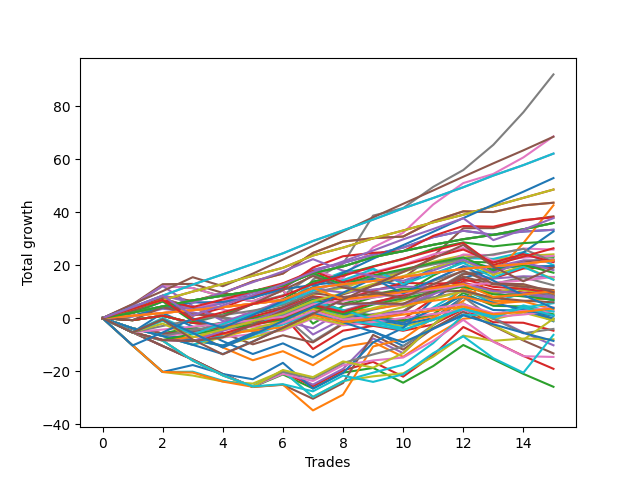

# Long Wallace Doodle 019 
- Symbol: TSLA_Unlimited
- Date Range: 03/23/2022 - 07/08/2022
- Trading Period: 7:20-12:30
- Number of Trades: 15



| Name | Win Percent | Profit | Avg Profit / Trade | Avg Time / Trade |      | Name | Win Percent | Profit | Avg Profit / Trade | Avg Time / Trade |
| ---- | ----------- | ------ | ------------------ | ---------------- | ---- | ---- | ----------- | ------ | ------------------ | ---------------- |
| Sorted By <br> Profit | | | | | | Sorted By <br> Win Percentage ||||
| Seven | 80.00 | 46015.00 | 3067.67 | 136:16 |     | One Hundred Twenty-Four | 100.00 | 31065.00 | 2071.00 | 43:25 |
| Six | 86.67 | 34315.00 | 2287.67 | 100:09 |     | Eighty-Four | 100.00 | 31065.00 | 2071.00 | 43:25 |
| Eighty-Five | 93.33 | 34250.00 | 2283.33 | 60:13 |     | One Hundred Twenty-Three | 100.00 | 24275.00 | 1618.33 | 32:03 |
| One Hundred Twenty-Four | 100.00 | 31065.00 | 2071.00 | 43:25 |     | Eighty-Three | 100.00 | 24275.00 | 1618.33 | 32:03 |
| Eighty-Four | 100.00 | 31065.00 | 2071.00 | 43:25 |     | One Hundred Twenty-Seven | 100.00 | 17965.00 | 1197.67 | 14:25 |
| One Hundred Twenty-Five | 86.67 | 26440.00 | 1762.67 | 57:20 |     | One Hundred Twenty-Two | 100.00 | 17965.00 | 1197.67 | 14:25 |
| One Hundred Twenty-Three | 100.00 | 24275.00 | 1618.33 | 32:03 |     | Eighty-Two | 100.00 | 17965.00 | 1197.67 | 14:25 |
| Eighty-Three | 100.00 | 24275.00 | 1618.33 | 32:03 |     | One Hundred Twenty-Six | 100.00 | 10890.00 | 726.00 | 04:58 |
| Fifty-Seven | 86.67 | 21790.00 | 1452.67 | 16:27 |     | One Hundred Twenty-One | 100.00 | 10890.00 | 726.00 | 04:58 |
| One | 86.67 | 21790.00 | 1452.67 | 16:27 |     | Eighty-One | 100.00 | 10890.00 | 726.00 | 04:58 |
| Sixty-Three | 60.00 | 21305.00 | 1420.33 | 107:03 |     | Eighty-Five | 93.33 | 34250.00 | 2283.33 | 60:13 |
| Five | 80.00 | 19220.00 | 1281.33 | 68:47 |     | One Hundred Eleven | 93.33 | 7770.00 | 518.00 | 04:34 |
| Sixty-Five | 86.67 | 19020.00 | 1268.00 | 15:29 |     | Six | 86.67 | 34315.00 | 2287.67 | 100:09 |
| One Hundred Twenty-Nine | 86.67 | 18875.00 | 1258.33 | 25:45 |     | One Hundred Twenty-Five | 86.67 | 26440.00 | 1762.67 | 57:20 |
| One Hundred Twenty-Seven | 100.00 | 17965.00 | 1197.67 | 14:25 |     | Fifty-Seven | 86.67 | 21790.00 | 1452.67 | 16:27 |
| One Hundred Twenty-Two | 100.00 | 17965.00 | 1197.67 | 14:25 |     | One | 86.67 | 21790.00 | 1452.67 | 16:27 |
| Eighty-Two | 100.00 | 17965.00 | 1197.67 | 14:25 |     | Sixty-Five | 86.67 | 19020.00 | 1268.00 | 15:29 |
| Fifty-Six | 86.67 | 16680.00 | 1112.00 | 10:45 |     | One Hundred Twenty-Nine | 86.67 | 18875.00 | 1258.33 | 25:45 |
| Zero | 86.67 | 16680.00 | 1112.00 | 10:45 |     | Fifty-Six | 86.67 | 16680.00 | 1112.00 | 10:45 |
| Sixty-Two | 66.67 | 16365.00 | 1091.00 | 75:34 |     | Zero | 86.67 | 16680.00 | 1112.00 | 10:45 |
| Sixty-Four | 86.67 | 14495.00 | 966.33 | 09:49 |     | Sixty-Four | 86.67 | 14495.00 | 966.33 | 09:49 |
| One Hundred Twenty-Eight | 86.67 | 13185.00 | 879.00 | 18:19 |     | One Hundred Twenty-Eight | 86.67 | 13185.00 | 879.00 | 18:19 |
| Fifty-Eight | 60.00 | 12940.00 | 862.67 | 31:53 |     | One Hundred Twelve | 86.67 | 10640.00 | 709.33 | 08:11 |
| Forty | 80.00 | 12045.00 | 803.00 | 09:23 |     | Seventy-Three | 86.67 | 9830.00 | 655.33 | 12:45 |
| Forty-Eight | 80.00 | 11755.00 | 783.67 | 08:11 |     | One Hundred Sixteen | 86.67 | 5105.00 | 340.33 | 02:53 |
| Two | 60.00 | 11570.00 | 771.33 | 35:42 |     | Seven | 80.00 | 46015.00 | 3067.67 | 136:16 |
| Fifty-Nine | 73.33 | 11120.00 | 741.33 | 34:11 |     | Five | 80.00 | 19220.00 | 1281.33 | 68:47 |
| Sixty-Seven | 73.33 | 10910.00 | 727.33 | 27:42 |     | Forty | 80.00 | 12045.00 | 803.00 | 09:23 |
| One Hundred Twenty-Six | 100.00 | 10890.00 | 726.00 | 04:58 |     | Forty-Eight | 80.00 | 11755.00 | 783.67 | 08:11 |
| One Hundred Twenty-One | 100.00 | 10890.00 | 726.00 | 04:58 |     | One Hundred Seventeen | 80.00 | 8575.00 | 571.67 | 06:07 |
| Eighty-One | 100.00 | 10890.00 | 726.00 | 04:58 |     | Fifty-Nine | 73.33 | 11120.00 | 741.33 | 34:11 |
| Sixty-Six | 60.00 | 10695.00 | 713.00 | 26:26 |     | Sixty-Seven | 73.33 | 10910.00 | 727.33 | 27:42 |
| One Hundred Twelve | 86.67 | 10640.00 | 709.33 | 08:11 |     | One Hundred Eighteen | 73.33 | 10580.00 | 705.33 | 08:15 |
| One Hundred Eighteen | 73.33 | 10580.00 | 705.33 | 08:15 |     | Three | 73.33 | 9655.00 | 643.67 | 38:00 |
| Forty-One | 66.67 | 10015.00 | 667.67 | 13:33 |     | One Hundred Thirteen | 73.33 | 7340.00 | 489.33 | 11:44 |
| Seventy-Three | 86.67 | 9830.00 | 655.33 | 12:45 |     | Ninety-Six | 73.33 | 3825.00 | 255.00 | 02:03 |
| Three | 73.33 | 9655.00 | 643.67 | 38:00 |     | One Hundred One | 73.33 | 2020.00 | 134.67 | 02:01 |
| One Hundred Thirty | 66.67 | 9530.00 | 635.33 | 32:54 |     | One Hundred Six | 73.33 | 1830.00 | 122.00 | 02:13 |
| One Hundred Ninteen | 60.00 | 9065.00 | 604.33 | 10:34 |     | Sixty-Two | 66.67 | 16365.00 | 1091.00 | 75:34 |
| One Hundred Seventeen | 80.00 | 8575.00 | 571.67 | 06:07 |     | Forty-One | 66.67 | 10015.00 | 667.67 | 13:33 |
| One Hundred Eleven | 93.33 | 7770.00 | 518.00 | 04:34 |     | One Hundred Thirty | 66.67 | 9530.00 | 635.33 | 32:54 |
| Four | 60.00 | 7760.00 | 517.33 | 59:43 |     | One Hundred Fourteen | 66.67 | 7240.00 | 482.67 | 17:10 |
| One Hundred Thirteen | 73.33 | 7340.00 | 489.33 | 11:44 |     | One Hundred Two | 66.67 | 4215.00 | 281.00 | 05:03 |
| One Hundred Fourteen | 66.67 | 7240.00 | 482.67 | 17:10 |     | Sixty-One | 66.67 | 2820.00 | 188.00 | 55:19 |
| Forty-Nine | 53.33 | 6210.00 | 414.00 | 11:01 |     | Ninety-One | 66.67 | 1325.00 | 88.33 | 01:39 |
| One Hundred Ten | 46.67 | 5305.00 | 353.67 | 07:41 |     | Sixty-Three | 60.00 | 21305.00 | 1420.33 | 107:03 |
| One Hundred Sixteen | 86.67 | 5105.00 | 340.33 | 02:53 |     | Fifty-Eight | 60.00 | 12940.00 | 862.67 | 31:53 |
| One Hundred Twenty | 40.00 | 4920.00 | 328.00 | 13:51 |     | Two | 60.00 | 11570.00 | 771.33 | 35:42 |
| One Hundred Eight | 53.33 | 4850.00 | 323.33 | 05:12 |     | Sixty-Six | 60.00 | 10695.00 | 713.00 | 26:26 |
| One Hundred Three | 60.00 | 4695.00 | 313.00 | 07:13 |     | One Hundred Ninteen | 60.00 | 9065.00 | 604.33 | 10:34 |
| Ninety-Eight | 53.33 | 4515.00 | 301.00 | 03:54 |     | Four | 60.00 | 7760.00 | 517.33 | 59:43 |
| Ninety-Seven | 53.33 | 4295.00 | 286.33 | 03:09 |     | One Hundred Three | 60.00 | 4695.00 | 313.00 | 07:13 |
| One Hundred Two | 66.67 | 4215.00 | 281.00 | 05:03 |     | Ninety-Two | 60.00 | 3540.00 | 236.00 | 04:38 |
| Ninety-Three | 53.33 | 4145.00 | 276.33 | 06:24 |     | One Hundred Seven | 60.00 | 3445.00 | 229.67 | 04:00 |
| One Hundred Nine | 46.67 | 4045.00 | 269.67 | 06:06 |     | Forty-Nine | 53.33 | 6210.00 | 414.00 | 11:01 |
| Ninety-Six | 73.33 | 3825.00 | 255.00 | 02:03 |     | One Hundred Eight | 53.33 | 4850.00 | 323.33 | 05:12 |
| Ninety-Nine | 53.33 | 3815.00 | 254.33 | 04:33 |     | Ninety-Eight | 53.33 | 4515.00 | 301.00 | 03:54 |
| Ninety-Two | 60.00 | 3540.00 | 236.00 | 04:38 |     | Ninety-Seven | 53.33 | 4295.00 | 286.33 | 03:09 |
| One Hundred Seven | 60.00 | 3445.00 | 229.67 | 04:00 |     | Ninety-Three | 53.33 | 4145.00 | 276.33 | 06:24 |
| Fifty-One | 46.67 | 3290.00 | 219.33 | 13:52 |     | Ninety-Nine | 53.33 | 3815.00 | 254.33 | 04:33 |
| One Hundred | 53.33 | 2985.00 | 199.00 | 05:27 |     | One Hundred | 53.33 | 2985.00 | 199.00 | 05:27 |
| Sixty-One | 66.67 | 2820.00 | 188.00 | 55:19 |     | One Hundred Fifteen | 53.33 | 1895.00 | 126.33 | 21:41 |
| One Hundred One | 73.33 | 2020.00 | 134.67 | 02:01 |     | Forty-Three | 53.33 | -190.00 | -12.67 | 24:22 |
| One Hundred Fifteen | 53.33 | 1895.00 | 126.33 | 21:41 |     | One Hundred Ten | 46.67 | 5305.00 | 353.67 | 07:41 |
| One Hundred Six | 73.33 | 1830.00 | 122.00 | 02:13 |     | One Hundred Nine | 46.67 | 4045.00 | 269.67 | 06:06 |
| Fifty-Three | 40.00 | 1670.00 | 111.33 | 17:14 |     | Fifty-One | 46.67 | 3290.00 | 219.33 | 13:52 |
| Ninety-One | 66.67 | 1325.00 | 88.33 | 01:39 |     | One Hundred Four | 46.67 | 500.00 | 33.33 | 11:46 |
| Ninety-Four | 40.00 | 1230.00 | 82.00 | 08:23 |     | Fifty | 46.67 | -450.00 | -30.00 | 13:09 |
| Fifty-Four | 40.00 | 715.00 | 47.67 | 16:25 |     | Forty-Two | 46.67 | -600.00 | -40.00 | 20:20 |
| One Hundred Four | 46.67 | 500.00 | 33.33 | 11:46 |     | Sixty-Nine | 46.67 | -2035.00 | -135.67 | 40:31 |
| Ninety-Five | 33.33 | 405.00 | 27.00 | 10:53 |     | Sixty | 46.67 | -4000.00 | -266.67 | 52:54 |
| Fifty-Two | 40.00 | -75.00 | -5.00 | 17:03 |     | One Hundred Twenty | 40.00 | 4920.00 | 328.00 | 13:51 |
| Seventy | 40.00 | -115.00 | -7.67 | 46:08 |     | Fifty-Three | 40.00 | 1670.00 | 111.33 | 17:14 |
| Forty-Three | 53.33 | -190.00 | -12.67 | 24:22 |     | Ninety-Four | 40.00 | 1230.00 | 82.00 | 08:23 |
| Fifty | 46.67 | -450.00 | -30.00 | 13:09 |     | Fifty-Four | 40.00 | 715.00 | 47.67 | 16:25 |
| Forty-Two | 46.67 | -600.00 | -40.00 | 20:20 |     | Fifty-Two | 40.00 | -75.00 | -5.00 | 17:03 |
| Sixty-Nine | 46.67 | -2035.00 | -135.67 | 40:31 |     | Seventy | 40.00 | -115.00 | -7.67 | 46:08 |
| Fifty-Five | 40.00 | -2370.00 | -158.00 | 19:55 |     | Fifty-Five | 40.00 | -2370.00 | -158.00 | 19:55 |
| Seventy-One | 40.00 | -3165.00 | -211.00 | 65:03 |     | Seventy-One | 40.00 | -3165.00 | -211.00 | 65:03 |
| Sixty | 46.67 | -4000.00 | -266.67 | 52:54 |     | Sixty-Eight | 40.00 | -7330.00 | -488.67 | 39:03 |
| One Hundred Five | 33.33 | -4300.00 | -286.67 | 15:58 |     | Ninety-Five | 33.33 | 405.00 | 27.00 | 10:53 |
| Forty-Six | 33.33 | -5125.00 | -341.67 | 33:07 |     | One Hundred Five | 33.33 | -4300.00 | -286.67 | 15:58 |
| Forty-Seven | 33.33 | -6660.00 | -444.00 | 49:31 |     | Forty-Six | 33.33 | -5125.00 | -341.67 | 33:07 |
| Sixty-Eight | 40.00 | -7330.00 | -488.67 | 39:03 |     | Forty-Seven | 33.33 | -6660.00 | -444.00 | 49:31 |
| Forty-Five | 33.33 | -9570.00 | -638.00 | 31:47 |     | Forty-Five | 33.33 | -9570.00 | -638.00 | 31:47 |
| Forty-Four | 33.33 | -12965.00 | -864.33 | 31:20 |     | Forty-Four | 33.33 | -12965.00 | -864.33 | 31:20 |

## NO STOPLOSS

### Test Zero
* Sell when price hits the middle line of the 20p bollinger
* No Stoploss
* Results:
```
Total Trades: 15
Percent Up: 86.67
Percent Down: 13.33
Total Points Moved Up: 33.36
Potential Profit: 16680.00
Total Points Ups: 38.05 Count Ups: 13
Total Points Downs: -4.69 Count Downs: 2
```

<details><summary>Trades</summary>

<code>In: 2022-03-23 10:21:00		Out: 2022-03-23 10:31:40		Total Position Time: 10:40		Total Move Up: 1.95		Total to Date: 1.95</code> <br />
<code>In: 2022-03-23 10:23:00		Out: 2022-03-23 10:31:40		Total Position Time: 08:40		Total Move Up: 4.37		Total to Date: 6.32</code> <br />
<code>In: 2022-03-25 08:11:00		Out: 2022-03-25 08:41:30		Total Position Time: 30:30		Total Move Up: -3.15		Total to Date: 3.17</code> <br />
<code>In: 2022-03-30 11:26:00		Out: 2022-03-30 11:32:50		Total Position Time: 06:50		Total Move Up: 2.54		Total to Date: 5.71</code> <br />
<code>In: 2022-03-30 11:29:00		Out: 2022-03-30 11:32:50		Total Position Time: 03:50		Total Move Up: 3.97		Total to Date: 9.68</code> <br />
<code>In: 2022-03-31 10:18:00		Out: 2022-03-31 10:26:20		Total Position Time: 08:20		Total Move Up: 1.70		Total to Date: 11.38</code> <br />
<code>In: 2022-04-07 07:50:00		Out: 2022-04-07 08:00:05		Total Position Time: 10:05		Total Move Up: 6.81		Total to Date: 18.19</code> <br />
<code>In: 2022-04-25 12:05:00		Out: 2022-04-25 12:16:15		Total Position Time: 11:15		Total Move Up: 2.64		Total to Date: 20.83</code> <br />
<code>In: 2022-05-02 10:05:00		Out: 2022-05-02 10:14:55		Total Position Time: 09:55		Total Move Up: 3.11		Total to Date: 23.94</code> <br />
<code>In: 2022-05-13 11:07:00		Out: 2022-05-13 11:12:25		Total Position Time: 05:25		Total Move Up: 2.71		Total to Date: 26.65</code> <br />
<code>In: 2022-05-13 11:25:00		Out: 2022-05-13 11:30:55		Total Position Time: 05:55		Total Move Up: 3.92		Total to Date: 30.57</code> <br />
<code>In: 2022-05-31 11:57:00		Out: 2022-05-31 12:04:50		Total Position Time: 07:50		Total Move Up: 2.42		Total to Date: 32.99</code> <br />
<code>In: 2022-06-06 08:14:00		Out: 2022-06-06 08:30:05		Total Position Time: 16:05		Total Move Up: -1.54		Total to Date: 31.45</code> <br />
<code>In: 2022-06-06 08:17:00		Out: 2022-06-06 08:30:05		Total Position Time: 13:05		Total Move Up: 1.24		Total to Date: 32.69</code> <br />
<code>In: 2022-06-23 09:41:00		Out: 2022-06-23 09:54:00		Total Position Time: 13:00		Total Move Up: 0.67		Total to Date: 33.36</code> <br />


</details>

### Test One
* Sell when the price hits the upper line of the 20p 1std bollinger
* No Stoploss
* Results:
```
Total Trades: 15
Percent Up: 86.67
Percent Down: 13.33
Total Points Moved Up: 43.58
Potential Profit: 21790.00
Total Points Ups: 45.82 Count Ups: 13
Total Points Downs: -2.24 Count Downs: 2
```

<details><summary>Trades</summary>

<code>In: 2022-03-23 10:21:00		Out: 2022-03-23 10:36:15		Total Position Time: 15:15		Total Move Up: 2.99		Total to Date: 2.99</code> <br />
<code>In: 2022-03-23 10:23:00		Out: 2022-03-23 10:36:15		Total Position Time: 13:15		Total Move Up: 5.41		Total to Date: 8.40</code> <br />
<code>In: 2022-03-25 08:11:00		Out: 2022-03-25 08:41:55		Total Position Time: 30:55		Total Move Up: -1.98		Total to Date: 6.42</code> <br />
<code>In: 2022-03-30 11:26:00		Out: 2022-03-30 11:36:15		Total Position Time: 10:15		Total Move Up: 3.01		Total to Date: 9.43</code> <br />
<code>In: 2022-03-30 11:29:00		Out: 2022-03-30 11:36:15		Total Position Time: 07:15		Total Move Up: 4.44		Total to Date: 13.87</code> <br />
<code>In: 2022-03-31 10:18:00		Out: 2022-03-31 10:27:25		Total Position Time: 09:25		Total Move Up: 2.96		Total to Date: 16.83</code> <br />
<code>In: 2022-04-07 07:50:00		Out: 2022-04-07 08:01:05		Total Position Time: 11:05		Total Move Up: 7.81		Total to Date: 24.64</code> <br />
<code>In: 2022-04-25 12:05:00		Out: 2022-04-25 12:19:50		Total Position Time: 14:50		Total Move Up: 4.27		Total to Date: 28.91</code> <br />
<code>In: 2022-05-02 10:05:00		Out: 2022-05-02 10:25:35		Total Position Time: 20:35		Total Move Up: 1.28		Total to Date: 30.19</code> <br />
<code>In: 2022-05-13 11:07:00		Out: 2022-05-13 11:31:45		Total Position Time: 24:45		Total Move Up: 0.62		Total to Date: 30.81</code> <br />
<code>In: 2022-05-13 11:25:00		Out: 2022-05-13 11:31:45		Total Position Time: 06:45		Total Move Up: 5.79		Total to Date: 36.60</code> <br />
<code>In: 2022-05-31 11:57:00		Out: 2022-05-31 12:07:40		Total Position Time: 10:40		Total Move Up: 3.72		Total to Date: 40.32</code> <br />
<code>In: 2022-06-06 08:14:00		Out: 2022-06-06 08:36:05		Total Position Time: 22:05		Total Move Up: -0.26		Total to Date: 40.06</code> <br />
<code>In: 2022-06-06 08:17:00		Out: 2022-06-06 08:36:05		Total Position Time: 19:05		Total Move Up: 2.52		Total to Date: 42.58</code> <br />
<code>In: 2022-06-23 09:41:00		Out: 2022-06-23 10:11:35		Total Position Time: 30:35		Total Move Up: 1.00		Total to Date: 43.58</code> <br />


</details>

### Test Two
* Sell when the price hits the upper line of the 20p 2std bollinger
* No Stoploss
* Results:
```
Total Trades: 15
Percent Up: 60.00
Percent Down: 40.00
Total Points Moved Up: 23.14
Potential Profit: 11570.00
Total Points Ups: 42.05 Count Ups: 9
Total Points Downs: -18.91 Count Downs: 6
```

<details><summary>Trades</summary>

<code>In: 2022-03-23 10:21:00		Out: 2022-03-23 10:38:40		Total Position Time: 17:40		Total Move Up: 4.86		Total to Date: 4.86</code> <br />
<code>In: 2022-03-23 10:23:00		Out: 2022-03-23 10:38:40		Total Position Time: 15:40		Total Move Up: 7.28		Total to Date: 12.14</code> <br />
<code>In: 2022-03-25 08:11:00		Out: 2022-03-25 08:44:45		Total Position Time: 33:45		Total Move Up: -0.79		Total to Date: 11.35</code> <br />
<code>In: 2022-03-30 11:26:00		Out: 2022-03-30 12:36:15		Total Position Time: 70:15		Total Move Up: -3.20		Total to Date: 8.15</code> <br />
<code>In: 2022-03-30 11:29:00		Out: 2022-03-30 12:36:15		Total Position Time: 67:15		Total Move Up: -1.77		Total to Date: 6.38</code> <br />
<code>In: 2022-03-31 10:18:00		Out: 2022-03-31 10:29:25		Total Position Time: 11:25		Total Move Up: 4.03		Total to Date: 10.41</code> <br />
<code>In: 2022-04-07 07:50:00		Out: 2022-04-07 09:09:30		Total Position Time: 79:30		Total Move Up: -12.49		Total to Date: -2.08</code> <br />
<code>In: 2022-04-25 12:05:00		Out: 2022-04-25 12:20:10		Total Position Time: 15:10		Total Move Up: 6.66		Total to Date: 4.58</code> <br />
<code>In: 2022-05-02 10:05:00		Out: 2022-05-02 10:31:10		Total Position Time: 26:10		Total Move Up: 3.22		Total to Date: 7.80</code> <br />
<code>In: 2022-05-13 11:07:00		Out: 2022-05-13 11:51:25		Total Position Time: 44:25		Total Move Up: 1.57		Total to Date: 9.37</code> <br />
<code>In: 2022-05-13 11:25:00		Out: 2022-05-13 11:51:25		Total Position Time: 26:25		Total Move Up: 6.74		Total to Date: 16.11</code> <br />
<code>In: 2022-05-31 11:57:00		Out: 2022-05-31 12:09:05		Total Position Time: 12:05		Total Move Up: 5.17		Total to Date: 21.28</code> <br />
<code>In: 2022-06-06 08:14:00		Out: 2022-06-06 08:36:05		Total Position Time: 22:05		Total Move Up: -0.26		Total to Date: 21.02</code> <br />
<code>In: 2022-06-06 08:17:00		Out: 2022-06-06 08:36:05		Total Position Time: 19:05		Total Move Up: 2.52		Total to Date: 23.54</code> <br />
<code>In: 2022-06-23 09:41:00		Out: 2022-06-23 10:55:45		Total Position Time: 74:45		Total Move Up: -0.40		Total to Date: 23.14</code> <br />


</details>

### Test Three
* Sell when price hits the middle line of the 50p bollinger
* No Stoploss
* Results:
```
Total Trades: 15
Percent Up: 73.33
Percent Down: 26.67
Total Points Moved Up: 19.31
Potential Profit: 9655.00
Total Points Ups: 41.82 Count Ups: 11
Total Points Downs: -22.51 Count Downs: 4
```

<details><summary>Trades</summary>

<code>In: 2022-03-23 10:21:00		Out: 2022-03-23 10:55:10		Total Position Time: 34:10		Total Move Up: 2.50		Total to Date: 2.50</code> <br />
<code>In: 2022-03-23 10:23:00		Out: 2022-03-23 10:55:10		Total Position Time: 32:10		Total Move Up: 4.92		Total to Date: 7.42</code> <br />
<code>In: 2022-03-25 08:11:00		Out: 2022-03-25 09:05:25		Total Position Time: 54:25		Total Move Up: -3.46		Total to Date: 3.96</code> <br />
<code>In: 2022-03-30 11:26:00		Out: 2022-03-30 12:33:35		Total Position Time: 67:35		Total Move Up: -3.90		Total to Date: 0.06</code> <br />
<code>In: 2022-03-30 11:29:00		Out: 2022-03-30 12:33:35		Total Position Time: 64:35		Total Move Up: -2.47		Total to Date: -2.41</code> <br />
<code>In: 2022-03-31 10:18:00		Out: 2022-03-31 10:28:35		Total Position Time: 10:35		Total Move Up: 3.42		Total to Date: 1.01</code> <br />
<code>In: 2022-04-07 07:50:00		Out: 2022-04-07 09:09:25		Total Position Time: 79:25		Total Move Up: -12.68		Total to Date: -11.67</code> <br />
<code>In: 2022-04-25 12:05:00		Out: 2022-04-25 12:35:35		Total Position Time: 30:35		Total Move Up: 6.93		Total to Date: -4.74</code> <br />
<code>In: 2022-05-02 10:05:00		Out: 2022-05-02 10:55:45		Total Position Time: 50:45		Total Move Up: 1.80		Total to Date: -2.94</code> <br />
<code>In: 2022-05-13 11:07:00		Out: 2022-05-13 11:32:00		Total Position Time: 25:00		Total Move Up: 2.57		Total to Date: -0.37</code> <br />
<code>In: 2022-05-13 11:25:00		Out: 2022-05-13 11:32:00		Total Position Time: 07:00		Total Move Up: 7.74		Total to Date: 7.37</code> <br />
<code>In: 2022-05-31 11:57:00		Out: 2022-05-31 12:15:15		Total Position Time: 18:15		Total Move Up: 6.65		Total to Date: 14.02</code> <br />
<code>In: 2022-06-06 08:14:00		Out: 2022-06-06 08:45:05		Total Position Time: 31:05		Total Move Up: 0.97		Total to Date: 14.99</code> <br />
<code>In: 2022-06-06 08:17:00		Out: 2022-06-06 08:45:05		Total Position Time: 28:05		Total Move Up: 3.75		Total to Date: 18.74</code> <br />
<code>In: 2022-06-23 09:41:00		Out: 2022-06-23 10:17:20		Total Position Time: 36:20		Total Move Up: 0.57		Total to Date: 19.31</code> <br />


</details>

### Test Four
* Sell when the price hits the upper line of the 50p 1std bollinger
* No Stoploss
* Results:
```
Total Trades: 15
Percent Up: 60.00
Percent Down: 40.00
Total Points Moved Up: 15.52
Potential Profit: 7760.00
Total Points Ups: 32.22 Count Ups: 9
Total Points Downs: -16.70 Count Downs: 6
```

<details><summary>Trades</summary>

<code>In: 2022-03-23 10:21:00		Out: 2022-03-23 11:29:15		Total Position Time: 68:15		Total Move Up: 0.56		Total to Date: 0.56</code> <br />
<code>In: 2022-03-23 10:23:00		Out: 2022-03-23 11:29:15		Total Position Time: 66:15		Total Move Up: 2.98		Total to Date: 3.54</code> <br />
<code>In: 2022-03-25 08:11:00		Out: 2022-03-25 09:08:40		Total Position Time: 57:40		Total Move Up: -1.35		Total to Date: 2.19</code> <br />
<code>In: 2022-03-30 11:26:00		Out: 2022-03-30 12:45:20		Total Position Time: 79:20		Total Move Up: -2.23		Total to Date: -0.04</code> <br />
<code>In: 2022-03-30 11:29:00		Out: 2022-03-30 12:45:20		Total Position Time: 76:20		Total Move Up: -0.80		Total to Date: -0.84</code> <br />
<code>In: 2022-03-31 10:18:00		Out: 2022-03-31 10:42:45		Total Position Time: 24:45		Total Move Up: 4.75		Total to Date: 3.91</code> <br />
<code>In: 2022-04-07 07:50:00		Out: 2022-04-07 09:10:55		Total Position Time: 80:55		Total Move Up: -10.10		Total to Date: -6.19</code> <br />
<code>In: 2022-04-25 12:05:00		Out: 2022-04-25 12:47:00		Total Position Time: 42:00		Total Move Up: 5.94		Total to Date: -0.25</code> <br />
<code>In: 2022-05-02 10:05:00		Out: 2022-05-02 10:55:45		Total Position Time: 50:45		Total Move Up: 1.80		Total to Date: 1.55</code> <br />
<code>In: 2022-05-13 11:07:00		Out: 2022-05-13 11:51:20		Total Position Time: 44:20		Total Move Up: 1.12		Total to Date: 2.67</code> <br />
<code>In: 2022-05-13 11:25:00		Out: 2022-05-13 11:51:20		Total Position Time: 26:20		Total Move Up: 6.29		Total to Date: 8.96</code> <br />
<code>In: 2022-05-31 11:57:00		Out: 2022-05-31 12:28:30		Total Position Time: 31:30		Total Move Up: 7.94		Total to Date: 16.90</code> <br />
<code>In: 2022-06-06 08:14:00		Out: 2022-06-06 09:41:50		Total Position Time: 87:50		Total Move Up: -1.94		Total to Date: 14.96</code> <br />
<code>In: 2022-06-06 08:17:00		Out: 2022-06-06 09:41:50		Total Position Time: 84:50		Total Move Up: 0.84		Total to Date: 15.80</code> <br />
<code>In: 2022-06-23 09:41:00		Out: 2022-06-23 10:55:50		Total Position Time: 74:50		Total Move Up: -0.28		Total to Date: 15.52</code> <br />


</details>

### Test Five
* Sell when the price hits the upper line of the 50p 2std bollinger
* No Stoploss
* Results:
```
Total Trades: 15
Percent Up: 80.00
Percent Down: 20.00
Total Points Moved Up: 38.44
Potential Profit: 19220.00
Total Points Ups: 53.91 Count Ups: 12
Total Points Downs: -15.47 Count Downs: 3
```

<details><summary>Trades</summary>

<code>In: 2022-03-23 10:21:00		Out: 2022-03-23 11:48:30		Total Position Time: 87:30		Total Move Up: 5.20		Total to Date: 5.20</code> <br />
<code>In: 2022-03-23 10:23:00		Out: 2022-03-23 11:48:30		Total Position Time: 85:30		Total Move Up: 7.62		Total to Date: 12.82</code> <br />
<code>In: 2022-03-25 08:11:00		Out: 2022-03-25 09:09:50		Total Position Time: 58:50		Total Move Up: 0.10		Total to Date: 12.92</code> <br />
<code>In: 2022-03-30 11:26:00		Out: 2022-03-30 12:47:00		Total Position Time: 81:00		Total Move Up: -3.40		Total to Date: 9.52</code> <br />
<code>In: 2022-03-30 11:29:00		Out: 2022-03-30 12:47:00		Total Position Time: 78:00		Total Move Up: -1.97		Total to Date: 7.55</code> <br />
<code>In: 2022-03-31 10:18:00		Out: 2022-03-31 10:42:55		Total Position Time: 24:55		Total Move Up: 5.60		Total to Date: 13.15</code> <br />
<code>In: 2022-04-07 07:50:00		Out: 2022-04-07 10:12:10		Total Position Time: 142:10		Total Move Up: -10.10		Total to Date: 3.05</code> <br />
<code>In: 2022-04-25 12:05:00		Out: 2022-04-25 12:47:00		Total Position Time: 42:00		Total Move Up: 5.94		Total to Date: 8.99</code> <br />
<code>In: 2022-05-02 10:05:00		Out: 2022-05-02 10:58:30		Total Position Time: 53:30		Total Move Up: 3.23		Total to Date: 12.22</code> <br />
<code>In: 2022-05-13 11:07:00		Out: 2022-05-13 11:52:35		Total Position Time: 45:35		Total Move Up: 2.99		Total to Date: 15.21</code> <br />
<code>In: 2022-05-13 11:25:00		Out: 2022-05-13 11:52:35		Total Position Time: 27:35		Total Move Up: 8.16		Total to Date: 23.37</code> <br />
<code>In: 2022-05-31 11:57:00		Out: 2022-05-31 12:31:05		Total Position Time: 34:05		Total Move Up: 10.58		Total to Date: 33.95</code> <br />
<code>In: 2022-06-06 08:14:00		Out: 2022-06-06 09:46:45		Total Position Time: 92:45		Total Move Up: 0.03		Total to Date: 33.98</code> <br />
<code>In: 2022-06-06 08:17:00		Out: 2022-06-06 09:46:45		Total Position Time: 89:45		Total Move Up: 2.81		Total to Date: 36.79</code> <br />
<code>In: 2022-06-23 09:41:00		Out: 2022-06-23 11:09:40		Total Position Time: 88:40		Total Move Up: 1.65		Total to Date: 38.44</code> <br />


</details>

### Test Six
* Sell when the price hits the middle line of the 1std VWAP
* No Stoploss
* Results:
```
Total Trades: 15
Percent Up: 86.67
Percent Down: 13.33
Total Points Moved Up: 68.63
Potential Profit: 34315.00
Total Points Ups: 74.00 Count Ups: 13
Total Points Downs: -5.37 Count Downs: 2
```

<details><summary>Trades</summary>

<code>In: 2022-03-23 10:21:00		Out: 2022-03-23 12:47:00		Total Position Time: 146:00		Total Move Up: 0.79		Total to Date: 0.79</code> <br />
<code>In: 2022-03-23 10:23:00		Out: 2022-03-23 12:47:00		Total Position Time: 144:00		Total Move Up: 3.21		Total to Date: 4.00</code> <br />
<code>In: 2022-03-25 08:11:00		Out: 2022-03-25 10:58:35		Total Position Time: 167:35		Total Move Up: 2.62		Total to Date: 6.62</code> <br />
<code>In: 2022-03-30 11:26:00		Out: 2022-03-30 12:47:00		Total Position Time: 81:00		Total Move Up: -3.40		Total to Date: 3.22</code> <br />
<code>In: 2022-03-30 11:29:00		Out: 2022-03-30 12:47:00		Total Position Time: 78:00		Total Move Up: -1.97		Total to Date: 1.25</code> <br />
<code>In: 2022-03-31 10:18:00		Out: 2022-03-31 10:45:40		Total Position Time: 27:40		Total Move Up: 6.20		Total to Date: 7.45</code> <br />
<code>In: 2022-04-07 07:50:00		Out: 2022-04-07 11:02:00		Total Position Time: 192:00		Total Move Up: 1.82		Total to Date: 9.27</code> <br />
<code>In: 2022-04-25 12:05:00		Out: 2022-04-25 12:47:00		Total Position Time: 42:00		Total Move Up: 5.94		Total to Date: 15.21</code> <br />
<code>In: 2022-05-02 10:05:00		Out: 2022-05-02 11:22:10		Total Position Time: 77:10		Total Move Up: 11.50		Total to Date: 26.71</code> <br />
<code>In: 2022-05-13 11:07:00		Out: 2022-05-13 12:01:05		Total Position Time: 54:05		Total Move Up: 5.52		Total to Date: 32.23</code> <br />
<code>In: 2022-05-13 11:25:00		Out: 2022-05-13 12:01:05		Total Position Time: 36:05		Total Move Up: 10.69		Total to Date: 42.92</code> <br />
<code>In: 2022-05-31 11:57:00		Out: 2022-05-31 12:16:05		Total Position Time: 19:05		Total Move Up: 8.07		Total to Date: 50.99</code> <br />
<code>In: 2022-06-06 08:14:00		Out: 2022-06-06 10:41:10		Total Position Time: 147:10		Total Move Up: 3.46		Total to Date: 54.45</code> <br />
<code>In: 2022-06-06 08:17:00		Out: 2022-06-06 10:41:10		Total Position Time: 144:10		Total Move Up: 6.24		Total to Date: 60.69</code> <br />
<code>In: 2022-06-23 09:41:00		Out: 2022-06-23 12:07:25		Total Position Time: 146:25		Total Move Up: 7.94		Total to Date: 68.63</code> <br />


</details>

### Test Seven
* Sell when the price hits the upper line of the 1std VWAP
* No Stoploss
* Results:
```
Total Trades: 15
Percent Up: 80.00
Percent Down: 20.00
Total Points Moved Up: 92.03
Potential Profit: 46015.00
Total Points Ups: 97.63 Count Ups: 12
Total Points Downs: -5.60 Count Downs: 3
```

<details><summary>Trades</summary>

<code>In: 2022-03-23 10:21:00		Out: 2022-03-23 12:47:00		Total Position Time: 146:00		Total Move Up: 0.79		Total to Date: 0.79</code> <br />
<code>In: 2022-03-23 10:23:00		Out: 2022-03-23 12:47:00		Total Position Time: 144:00		Total Move Up: 3.21		Total to Date: 4.00</code> <br />
<code>In: 2022-03-25 08:11:00		Out: 2022-03-25 12:47:00		Total Position Time: 276:00		Total Move Up: -0.23		Total to Date: 3.77</code> <br />
<code>In: 2022-03-30 11:26:00		Out: 2022-03-30 12:47:00		Total Position Time: 81:00		Total Move Up: -3.40		Total to Date: 0.37</code> <br />
<code>In: 2022-03-30 11:29:00		Out: 2022-03-30 12:47:00		Total Position Time: 78:00		Total Move Up: -1.97		Total to Date: -1.60</code> <br />
<code>In: 2022-03-31 10:18:00		Out: 2022-03-31 12:47:00		Total Position Time: 149:00		Total Move Up: 0.84		Total to Date: -0.76</code> <br />
<code>In: 2022-04-07 07:50:00		Out: 2022-04-07 12:11:25		Total Position Time: 261:25		Total Move Up: 15.34		Total to Date: 14.58</code> <br />
<code>In: 2022-04-25 12:05:00		Out: 2022-04-25 12:47:00		Total Position Time: 42:00		Total Move Up: 5.94		Total to Date: 20.52</code> <br />
<code>In: 2022-05-02 10:05:00		Out: 2022-05-02 12:10:05		Total Position Time: 125:05		Total Move Up: 18.19		Total to Date: 38.71</code> <br />
<code>In: 2022-05-13 11:07:00		Out: 2022-05-13 12:47:00		Total Position Time: 100:00		Total Move Up: 2.84		Total to Date: 41.55</code> <br />
<code>In: 2022-05-13 11:25:00		Out: 2022-05-13 12:47:00		Total Position Time: 82:00		Total Move Up: 8.01		Total to Date: 49.56</code> <br />
<code>In: 2022-05-31 11:57:00		Out: 2022-05-31 12:47:00		Total Position Time: 50:00		Total Move Up: 6.35		Total to Date: 55.91</code> <br />
<code>In: 2022-06-06 08:14:00		Out: 2022-06-06 10:57:15		Total Position Time: 163:15		Total Move Up: 9.53		Total to Date: 65.44</code> <br />
<code>In: 2022-06-06 08:17:00		Out: 2022-06-06 10:57:15		Total Position Time: 160:15		Total Move Up: 12.31		Total to Date: 77.75</code> <br />
<code>In: 2022-06-23 09:41:00		Out: 2022-06-23 12:47:00		Total Position Time: 186:00		Total Move Up: 14.28		Total to Date: 92.03</code> <br />


</details>

## STOPLOSS OF 5

### Test Forty
* Sell when price hits the middle line of the 20p bollinger
* Stoploss is 5 points
* Results:
```
Total Trades: 15
Percent Up: 80.00
Percent Down: 20.00
Total Points Moved Up: 24.09
Potential Profit: 12045.00
Total Points Ups: 36.10 Count Ups: 12
Total Points Downs: -12.01 Count Downs: 3
```

<details><summary>Trades</summary>

<code>In: 2022-03-23 10:21:00		Out: 2022-03-23 10:25:30		Total Position Time: 04:30		Total Move Up: -5.34		Total to Date: -5.34</code> <br />
<code>In: 2022-03-23 10:23:00		Out: 2022-03-23 10:31:40		Total Position Time: 08:40		Total Move Up: 4.37		Total to Date: -0.97</code> <br />
<code>In: 2022-03-25 08:11:00		Out: 2022-03-25 08:27:00		Total Position Time: 16:00		Total Move Up: -5.13		Total to Date: -6.10</code> <br />
<code>In: 2022-03-30 11:26:00		Out: 2022-03-30 11:32:50		Total Position Time: 06:50		Total Move Up: 2.54		Total to Date: -3.56</code> <br />
<code>In: 2022-03-30 11:29:00		Out: 2022-03-30 11:32:50		Total Position Time: 03:50		Total Move Up: 3.97		Total to Date: 0.41</code> <br />
<code>In: 2022-03-31 10:18:00		Out: 2022-03-31 10:26:20		Total Position Time: 08:20		Total Move Up: 1.70		Total to Date: 2.11</code> <br />
<code>In: 2022-04-07 07:50:00		Out: 2022-04-07 08:00:05		Total Position Time: 10:05		Total Move Up: 6.81		Total to Date: 8.92</code> <br />
<code>In: 2022-04-25 12:05:00		Out: 2022-04-25 12:16:15		Total Position Time: 11:15		Total Move Up: 2.64		Total to Date: 11.56</code> <br />
<code>In: 2022-05-02 10:05:00		Out: 2022-05-02 10:14:55		Total Position Time: 09:55		Total Move Up: 3.11		Total to Date: 14.67</code> <br />
<code>In: 2022-05-13 11:07:00		Out: 2022-05-13 11:12:25		Total Position Time: 05:25		Total Move Up: 2.71		Total to Date: 17.38</code> <br />
<code>In: 2022-05-13 11:25:00		Out: 2022-05-13 11:30:55		Total Position Time: 05:55		Total Move Up: 3.92		Total to Date: 21.30</code> <br />
<code>In: 2022-05-31 11:57:00		Out: 2022-05-31 12:04:50		Total Position Time: 07:50		Total Move Up: 2.42		Total to Date: 23.72</code> <br />
<code>In: 2022-06-06 08:14:00		Out: 2022-06-06 08:30:05		Total Position Time: 16:05		Total Move Up: -1.54		Total to Date: 22.18</code> <br />
<code>In: 2022-06-06 08:17:00		Out: 2022-06-06 08:30:05		Total Position Time: 13:05		Total Move Up: 1.24		Total to Date: 23.42</code> <br />
<code>In: 2022-06-23 09:41:00		Out: 2022-06-23 09:54:00		Total Position Time: 13:00		Total Move Up: 0.67		Total to Date: 24.09</code> <br />


</details>

### Test Forty-One
* Sell when the price hits the upper line of the 20p 1std bollinger
* Stoploss is 5 points
* Results:
```
Total Trades: 15
Percent Up: 66.67
Percent Down: 33.33
Total Points Moved Up: 20.03
Potential Profit: 10015.00
Total Points Ups: 41.21 Count Ups: 10
Total Points Downs: -21.18 Count Downs: 5
```

<details><summary>Trades</summary>

<code>In: 2022-03-23 10:21:00		Out: 2022-03-23 10:25:30		Total Position Time: 04:30		Total Move Up: -5.34		Total to Date: -5.34</code> <br />
<code>In: 2022-03-23 10:23:00		Out: 2022-03-23 10:36:15		Total Position Time: 13:15		Total Move Up: 5.41		Total to Date: 0.07</code> <br />
<code>In: 2022-03-25 08:11:00		Out: 2022-03-25 08:27:00		Total Position Time: 16:00		Total Move Up: -5.13		Total to Date: -5.06</code> <br />
<code>In: 2022-03-30 11:26:00		Out: 2022-03-30 11:36:15		Total Position Time: 10:15		Total Move Up: 3.01		Total to Date: -2.05</code> <br />
<code>In: 2022-03-30 11:29:00		Out: 2022-03-30 11:36:15		Total Position Time: 07:15		Total Move Up: 4.44		Total to Date: 2.39</code> <br />
<code>In: 2022-03-31 10:18:00		Out: 2022-03-31 10:27:25		Total Position Time: 09:25		Total Move Up: 2.96		Total to Date: 5.35</code> <br />
<code>In: 2022-04-07 07:50:00		Out: 2022-04-07 08:01:05		Total Position Time: 11:05		Total Move Up: 7.81		Total to Date: 13.16</code> <br />
<code>In: 2022-04-25 12:05:00		Out: 2022-04-25 12:19:50		Total Position Time: 14:50		Total Move Up: 4.27		Total to Date: 17.43</code> <br />
<code>In: 2022-05-02 10:05:00		Out: 2022-05-02 10:25:35		Total Position Time: 20:35		Total Move Up: 1.28		Total to Date: 18.71</code> <br />
<code>In: 2022-05-13 11:07:00		Out: 2022-05-13 11:23:45		Total Position Time: 16:45		Total Move Up: -5.58		Total to Date: 13.13</code> <br />
<code>In: 2022-05-13 11:25:00		Out: 2022-05-13 11:31:45		Total Position Time: 06:45		Total Move Up: 5.79		Total to Date: 18.92</code> <br />
<code>In: 2022-05-31 11:57:00		Out: 2022-05-31 12:07:40		Total Position Time: 10:40		Total Move Up: 3.72		Total to Date: 22.64</code> <br />
<code>In: 2022-06-06 08:14:00		Out: 2022-06-06 08:36:05		Total Position Time: 22:05		Total Move Up: -0.26		Total to Date: 22.38</code> <br />
<code>In: 2022-06-06 08:17:00		Out: 2022-06-06 08:36:05		Total Position Time: 19:05		Total Move Up: 2.52		Total to Date: 24.90</code> <br />
<code>In: 2022-06-23 09:41:00		Out: 2022-06-23 10:01:50		Total Position Time: 20:50		Total Move Up: -4.87		Total to Date: 20.03</code> <br />


</details>

### Test Forty-Two
* Sell when the price hits the upper line of the 20p 2std bollinger
* Stoploss is 5 points
* Results:
```
Total Trades: 15
Percent Up: 46.67
Percent Down: 53.33
Total Points Moved Up: -1.20
Potential Profit: -600.00
Total Points Ups: 35.62 Count Ups: 7
Total Points Downs: -36.82 Count Downs: 8
```

<details><summary>Trades</summary>

<code>In: 2022-03-23 10:21:00		Out: 2022-03-23 10:25:30		Total Position Time: 04:30		Total Move Up: -5.34		Total to Date: -5.34</code> <br />
<code>In: 2022-03-23 10:23:00		Out: 2022-03-23 10:38:40		Total Position Time: 15:40		Total Move Up: 7.28		Total to Date: 1.94</code> <br />
<code>In: 2022-03-25 08:11:00		Out: 2022-03-25 08:27:00		Total Position Time: 16:00		Total Move Up: -5.13		Total to Date: -3.19</code> <br />
<code>In: 2022-03-30 11:26:00		Out: 2022-03-30 12:04:15		Total Position Time: 38:15		Total Move Up: -5.51		Total to Date: -8.70</code> <br />
<code>In: 2022-03-30 11:29:00		Out: 2022-03-30 12:08:30		Total Position Time: 39:30		Total Move Up: -4.85		Total to Date: -13.55</code> <br />
<code>In: 2022-03-31 10:18:00		Out: 2022-03-31 10:29:25		Total Position Time: 11:25		Total Move Up: 4.03		Total to Date: -9.52</code> <br />
<code>In: 2022-04-07 07:50:00		Out: 2022-04-07 08:11:10		Total Position Time: 21:10		Total Move Up: -5.28		Total to Date: -14.80</code> <br />
<code>In: 2022-04-25 12:05:00		Out: 2022-04-25 12:20:10		Total Position Time: 15:10		Total Move Up: 6.66		Total to Date: -8.14</code> <br />
<code>In: 2022-05-02 10:05:00		Out: 2022-05-02 10:31:10		Total Position Time: 26:10		Total Move Up: 3.22		Total to Date: -4.92</code> <br />
<code>In: 2022-05-13 11:07:00		Out: 2022-05-13 11:23:45		Total Position Time: 16:45		Total Move Up: -5.58		Total to Date: -10.50</code> <br />
<code>In: 2022-05-13 11:25:00		Out: 2022-05-13 11:51:25		Total Position Time: 26:25		Total Move Up: 6.74		Total to Date: -3.76</code> <br />
<code>In: 2022-05-31 11:57:00		Out: 2022-05-31 12:09:05		Total Position Time: 12:05		Total Move Up: 5.17		Total to Date: 1.41</code> <br />
<code>In: 2022-06-06 08:14:00		Out: 2022-06-06 08:36:05		Total Position Time: 22:05		Total Move Up: -0.26		Total to Date: 1.15</code> <br />
<code>In: 2022-06-06 08:17:00		Out: 2022-06-06 08:36:05		Total Position Time: 19:05		Total Move Up: 2.52		Total to Date: 3.67</code> <br />
<code>In: 2022-06-23 09:41:00		Out: 2022-06-23 10:01:50		Total Position Time: 20:50		Total Move Up: -4.87		Total to Date: -1.20</code> <br />


</details>

### Test Forty-Three
* Sell when price hits the middle line of the 50p bollinger
* Stoploss is 5 points
* Results:
```
Total Trades: 15
Percent Up: 53.33
Percent Down: 46.67
Total Points Moved Up: -0.38
Potential Profit: -190.00
Total Points Ups: 36.18 Count Ups: 8
Total Points Downs: -36.56 Count Downs: 7
```

<details><summary>Trades</summary>

<code>In: 2022-03-23 10:21:00		Out: 2022-03-23 10:25:30		Total Position Time: 04:30		Total Move Up: -5.34		Total to Date: -5.34</code> <br />
<code>In: 2022-03-23 10:23:00		Out: 2022-03-23 10:55:10		Total Position Time: 32:10		Total Move Up: 4.92		Total to Date: -0.42</code> <br />
<code>In: 2022-03-25 08:11:00		Out: 2022-03-25 08:27:00		Total Position Time: 16:00		Total Move Up: -5.13		Total to Date: -5.55</code> <br />
<code>In: 2022-03-30 11:26:00		Out: 2022-03-30 12:04:15		Total Position Time: 38:15		Total Move Up: -5.51		Total to Date: -11.06</code> <br />
<code>In: 2022-03-30 11:29:00		Out: 2022-03-30 12:08:30		Total Position Time: 39:30		Total Move Up: -4.85		Total to Date: -15.91</code> <br />
<code>In: 2022-03-31 10:18:00		Out: 2022-03-31 10:28:35		Total Position Time: 10:35		Total Move Up: 3.42		Total to Date: -12.49</code> <br />
<code>In: 2022-04-07 07:50:00		Out: 2022-04-07 08:11:10		Total Position Time: 21:10		Total Move Up: -5.28		Total to Date: -17.77</code> <br />
<code>In: 2022-04-25 12:05:00		Out: 2022-04-25 12:35:35		Total Position Time: 30:35		Total Move Up: 6.93		Total to Date: -10.84</code> <br />
<code>In: 2022-05-02 10:05:00		Out: 2022-05-02 10:55:45		Total Position Time: 50:45		Total Move Up: 1.80		Total to Date: -9.04</code> <br />
<code>In: 2022-05-13 11:07:00		Out: 2022-05-13 11:23:45		Total Position Time: 16:45		Total Move Up: -5.58		Total to Date: -14.62</code> <br />
<code>In: 2022-05-13 11:25:00		Out: 2022-05-13 11:32:00		Total Position Time: 07:00		Total Move Up: 7.74		Total to Date: -6.88</code> <br />
<code>In: 2022-05-31 11:57:00		Out: 2022-05-31 12:15:15		Total Position Time: 18:15		Total Move Up: 6.65		Total to Date: -0.23</code> <br />
<code>In: 2022-06-06 08:14:00		Out: 2022-06-06 08:45:05		Total Position Time: 31:05		Total Move Up: 0.97		Total to Date: 0.74</code> <br />
<code>In: 2022-06-06 08:17:00		Out: 2022-06-06 08:45:05		Total Position Time: 28:05		Total Move Up: 3.75		Total to Date: 4.49</code> <br />
<code>In: 2022-06-23 09:41:00		Out: 2022-06-23 10:01:50		Total Position Time: 20:50		Total Move Up: -4.87		Total to Date: -0.38</code> <br />


</details>

### Test Forty-Four
* Sell when the price hits the upper line of the 50p 1std bollinger
* Stoploss is 5 points
* Results:
```
Total Trades: 15
Percent Up: 33.33
Percent Down: 66.67
Total Points Moved Up: -25.93
Potential Profit: -12965.00
Total Points Ups: 26.72 Count Ups: 5
Total Points Downs: -52.65 Count Downs: 10
```

<details><summary>Trades</summary>

<code>In: 2022-03-23 10:21:00		Out: 2022-03-23 10:25:30		Total Position Time: 04:30		Total Move Up: -5.34		Total to Date: -5.34</code> <br />
<code>In: 2022-03-23 10:23:00		Out: 2022-03-23 11:05:10		Total Position Time: 42:10		Total Move Up: -5.18		Total to Date: -10.52</code> <br />
<code>In: 2022-03-25 08:11:00		Out: 2022-03-25 08:27:00		Total Position Time: 16:00		Total Move Up: -5.13		Total to Date: -15.65</code> <br />
<code>In: 2022-03-30 11:26:00		Out: 2022-03-30 12:04:15		Total Position Time: 38:15		Total Move Up: -5.51		Total to Date: -21.16</code> <br />
<code>In: 2022-03-30 11:29:00		Out: 2022-03-30 12:08:30		Total Position Time: 39:30		Total Move Up: -4.85		Total to Date: -26.01</code> <br />
<code>In: 2022-03-31 10:18:00		Out: 2022-03-31 10:42:45		Total Position Time: 24:45		Total Move Up: 4.75		Total to Date: -21.26</code> <br />
<code>In: 2022-04-07 07:50:00		Out: 2022-04-07 08:11:10		Total Position Time: 21:10		Total Move Up: -5.28		Total to Date: -26.54</code> <br />
<code>In: 2022-04-25 12:05:00		Out: 2022-04-25 12:47:00		Total Position Time: 42:00		Total Move Up: 5.94		Total to Date: -20.60</code> <br />
<code>In: 2022-05-02 10:05:00		Out: 2022-05-02 10:55:45		Total Position Time: 50:45		Total Move Up: 1.80		Total to Date: -18.80</code> <br />
<code>In: 2022-05-13 11:07:00		Out: 2022-05-13 11:23:45		Total Position Time: 16:45		Total Move Up: -5.58		Total to Date: -24.38</code> <br />
<code>In: 2022-05-13 11:25:00		Out: 2022-05-13 11:51:20		Total Position Time: 26:20		Total Move Up: 6.29		Total to Date: -18.09</code> <br />
<code>In: 2022-05-31 11:57:00		Out: 2022-05-31 12:28:30		Total Position Time: 31:30		Total Move Up: 7.94		Total to Date: -10.15</code> <br />
<code>In: 2022-06-06 08:14:00		Out: 2022-06-06 09:02:15		Total Position Time: 48:15		Total Move Up: -5.43		Total to Date: -15.58</code> <br />
<code>In: 2022-06-06 08:17:00		Out: 2022-06-06 09:04:20		Total Position Time: 47:20		Total Move Up: -5.48		Total to Date: -21.06</code> <br />
<code>In: 2022-06-23 09:41:00		Out: 2022-06-23 10:01:50		Total Position Time: 20:50		Total Move Up: -4.87		Total to Date: -25.93</code> <br />


</details>

### Test Forty-Five
* Sell when the price hits the upper line of the 50p 2std bollinger
* Stoploss is 5 points
* Results:
```
Total Trades: 15
Percent Up: 33.33
Percent Down: 66.67
Total Points Moved Up: -19.14
Potential Profit: -9570.00
Total Points Ups: 33.51 Count Ups: 5
Total Points Downs: -52.65 Count Downs: 10
```

<details><summary>Trades</summary>

<code>In: 2022-03-23 10:21:00		Out: 2022-03-23 10:25:30		Total Position Time: 04:30		Total Move Up: -5.34		Total to Date: -5.34</code> <br />
<code>In: 2022-03-23 10:23:00		Out: 2022-03-23 11:05:10		Total Position Time: 42:10		Total Move Up: -5.18		Total to Date: -10.52</code> <br />
<code>In: 2022-03-25 08:11:00		Out: 2022-03-25 08:27:00		Total Position Time: 16:00		Total Move Up: -5.13		Total to Date: -15.65</code> <br />
<code>In: 2022-03-30 11:26:00		Out: 2022-03-30 12:04:15		Total Position Time: 38:15		Total Move Up: -5.51		Total to Date: -21.16</code> <br />
<code>In: 2022-03-30 11:29:00		Out: 2022-03-30 12:08:30		Total Position Time: 39:30		Total Move Up: -4.85		Total to Date: -26.01</code> <br />
<code>In: 2022-03-31 10:18:00		Out: 2022-03-31 10:42:55		Total Position Time: 24:55		Total Move Up: 5.60		Total to Date: -20.41</code> <br />
<code>In: 2022-04-07 07:50:00		Out: 2022-04-07 08:11:10		Total Position Time: 21:10		Total Move Up: -5.28		Total to Date: -25.69</code> <br />
<code>In: 2022-04-25 12:05:00		Out: 2022-04-25 12:47:00		Total Position Time: 42:00		Total Move Up: 5.94		Total to Date: -19.75</code> <br />
<code>In: 2022-05-02 10:05:00		Out: 2022-05-02 10:58:30		Total Position Time: 53:30		Total Move Up: 3.23		Total to Date: -16.52</code> <br />
<code>In: 2022-05-13 11:07:00		Out: 2022-05-13 11:23:45		Total Position Time: 16:45		Total Move Up: -5.58		Total to Date: -22.10</code> <br />
<code>In: 2022-05-13 11:25:00		Out: 2022-05-13 11:52:35		Total Position Time: 27:35		Total Move Up: 8.16		Total to Date: -13.94</code> <br />
<code>In: 2022-05-31 11:57:00		Out: 2022-05-31 12:31:05		Total Position Time: 34:05		Total Move Up: 10.58		Total to Date: -3.36</code> <br />
<code>In: 2022-06-06 08:14:00		Out: 2022-06-06 09:02:15		Total Position Time: 48:15		Total Move Up: -5.43		Total to Date: -8.79</code> <br />
<code>In: 2022-06-06 08:17:00		Out: 2022-06-06 09:04:20		Total Position Time: 47:20		Total Move Up: -5.48		Total to Date: -14.27</code> <br />
<code>In: 2022-06-23 09:41:00		Out: 2022-06-23 10:01:50		Total Position Time: 20:50		Total Move Up: -4.87		Total to Date: -19.14</code> <br />


</details>

### Test Forty-Six
* Sell when the price hits the middle line of the 1std VWAP
* Stoploss is 5 points
* Results:
```
Total Trades: 15
Percent Up: 33.33
Percent Down: 66.67
Total Points Moved Up: -10.25
Potential Profit: -5125.00
Total Points Ups: 42.40 Count Ups: 5
Total Points Downs: -52.65 Count Downs: 10
```

<details><summary>Trades</summary>

<code>In: 2022-03-23 10:21:00		Out: 2022-03-23 10:25:30		Total Position Time: 04:30		Total Move Up: -5.34		Total to Date: -5.34</code> <br />
<code>In: 2022-03-23 10:23:00		Out: 2022-03-23 11:05:10		Total Position Time: 42:10		Total Move Up: -5.18		Total to Date: -10.52</code> <br />
<code>In: 2022-03-25 08:11:00		Out: 2022-03-25 08:27:00		Total Position Time: 16:00		Total Move Up: -5.13		Total to Date: -15.65</code> <br />
<code>In: 2022-03-30 11:26:00		Out: 2022-03-30 12:04:15		Total Position Time: 38:15		Total Move Up: -5.51		Total to Date: -21.16</code> <br />
<code>In: 2022-03-30 11:29:00		Out: 2022-03-30 12:08:30		Total Position Time: 39:30		Total Move Up: -4.85		Total to Date: -26.01</code> <br />
<code>In: 2022-03-31 10:18:00		Out: 2022-03-31 10:45:40		Total Position Time: 27:40		Total Move Up: 6.20		Total to Date: -19.81</code> <br />
<code>In: 2022-04-07 07:50:00		Out: 2022-04-07 08:11:10		Total Position Time: 21:10		Total Move Up: -5.28		Total to Date: -25.09</code> <br />
<code>In: 2022-04-25 12:05:00		Out: 2022-04-25 12:47:00		Total Position Time: 42:00		Total Move Up: 5.94		Total to Date: -19.15</code> <br />
<code>In: 2022-05-02 10:05:00		Out: 2022-05-02 11:22:10		Total Position Time: 77:10		Total Move Up: 11.50		Total to Date: -7.65</code> <br />
<code>In: 2022-05-13 11:07:00		Out: 2022-05-13 11:23:45		Total Position Time: 16:45		Total Move Up: -5.58		Total to Date: -13.23</code> <br />
<code>In: 2022-05-13 11:25:00		Out: 2022-05-13 12:01:05		Total Position Time: 36:05		Total Move Up: 10.69		Total to Date: -2.54</code> <br />
<code>In: 2022-05-31 11:57:00		Out: 2022-05-31 12:16:05		Total Position Time: 19:05		Total Move Up: 8.07		Total to Date: 5.53</code> <br />
<code>In: 2022-06-06 08:14:00		Out: 2022-06-06 09:02:15		Total Position Time: 48:15		Total Move Up: -5.43		Total to Date: 0.10</code> <br />
<code>In: 2022-06-06 08:17:00		Out: 2022-06-06 09:04:20		Total Position Time: 47:20		Total Move Up: -5.48		Total to Date: -5.38</code> <br />
<code>In: 2022-06-23 09:41:00		Out: 2022-06-23 10:01:50		Total Position Time: 20:50		Total Move Up: -4.87		Total to Date: -10.25</code> <br />


</details>

### Test Forty-Seven
* Sell when the price hits the upper line of the 1std VWAP
* Stoploss is 5 points
* Results:
```
Total Trades: 15
Percent Up: 33.33
Percent Down: 66.67
Total Points Moved Up: -13.32
Potential Profit: -6660.00
Total Points Ups: 39.33 Count Ups: 5
Total Points Downs: -52.65 Count Downs: 10
```

<details><summary>Trades</summary>

<code>In: 2022-03-23 10:21:00		Out: 2022-03-23 10:25:30		Total Position Time: 04:30		Total Move Up: -5.34		Total to Date: -5.34</code> <br />
<code>In: 2022-03-23 10:23:00		Out: 2022-03-23 11:05:10		Total Position Time: 42:10		Total Move Up: -5.18		Total to Date: -10.52</code> <br />
<code>In: 2022-03-25 08:11:00		Out: 2022-03-25 08:27:00		Total Position Time: 16:00		Total Move Up: -5.13		Total to Date: -15.65</code> <br />
<code>In: 2022-03-30 11:26:00		Out: 2022-03-30 12:04:15		Total Position Time: 38:15		Total Move Up: -5.51		Total to Date: -21.16</code> <br />
<code>In: 2022-03-30 11:29:00		Out: 2022-03-30 12:08:30		Total Position Time: 39:30		Total Move Up: -4.85		Total to Date: -26.01</code> <br />
<code>In: 2022-03-31 10:18:00		Out: 2022-03-31 12:47:00		Total Position Time: 149:00		Total Move Up: 0.84		Total to Date: -25.17</code> <br />
<code>In: 2022-04-07 07:50:00		Out: 2022-04-07 08:11:10		Total Position Time: 21:10		Total Move Up: -5.28		Total to Date: -30.45</code> <br />
<code>In: 2022-04-25 12:05:00		Out: 2022-04-25 12:47:00		Total Position Time: 42:00		Total Move Up: 5.94		Total to Date: -24.51</code> <br />
<code>In: 2022-05-02 10:05:00		Out: 2022-05-02 12:10:05		Total Position Time: 125:05		Total Move Up: 18.19		Total to Date: -6.32</code> <br />
<code>In: 2022-05-13 11:07:00		Out: 2022-05-13 11:23:45		Total Position Time: 16:45		Total Move Up: -5.58		Total to Date: -11.90</code> <br />
<code>In: 2022-05-13 11:25:00		Out: 2022-05-13 12:47:00		Total Position Time: 82:00		Total Move Up: 8.01		Total to Date: -3.89</code> <br />
<code>In: 2022-05-31 11:57:00		Out: 2022-05-31 12:47:00		Total Position Time: 50:00		Total Move Up: 6.35		Total to Date: 2.46</code> <br />
<code>In: 2022-06-06 08:14:00		Out: 2022-06-06 09:02:15		Total Position Time: 48:15		Total Move Up: -5.43		Total to Date: -2.97</code> <br />
<code>In: 2022-06-06 08:17:00		Out: 2022-06-06 09:04:20		Total Position Time: 47:20		Total Move Up: -5.48		Total to Date: -8.45</code> <br />
<code>In: 2022-06-23 09:41:00		Out: 2022-06-23 10:01:50		Total Position Time: 20:50		Total Move Up: -4.87		Total to Date: -13.32</code> <br />


</details>

## TRAIL STOP OF 5

### Test Forty-Eight
* Sell when price hits the middle line of the 20p bollinger
* Trailing Stop is 5 points
* Results:
```
Total Trades: 15
Percent Up: 80.00
Percent Down: 20.00
Total Points Moved Up: 23.51
Potential Profit: 11755.00
Total Points Ups: 35.41 Count Ups: 12
Total Points Downs: -11.90 Count Downs: 3
```

<details><summary>Trades</summary>

<code>In: 2022-03-23 10:21:00		Out: 2022-03-23 10:31:40		Total Position Time: 10:40		Total Move Up: 1.95		Total to Date: 1.95</code> <br />
<code>In: 2022-03-23 10:23:00		Out: 2022-03-23 10:31:40		Total Position Time: 08:40		Total Move Up: 4.37		Total to Date: 6.32</code> <br />
<code>In: 2022-03-25 08:11:00		Out: 2022-03-25 08:24:20		Total Position Time: 13:20		Total Move Up: -2.69		Total to Date: 3.63</code> <br />
<code>In: 2022-03-30 11:26:00		Out: 2022-03-30 11:32:50		Total Position Time: 06:50		Total Move Up: 2.54		Total to Date: 6.17</code> <br />
<code>In: 2022-03-30 11:29:00		Out: 2022-03-30 11:32:50		Total Position Time: 03:50		Total Move Up: 3.97		Total to Date: 10.14</code> <br />
<code>In: 2022-03-31 10:18:00		Out: 2022-03-31 10:26:20		Total Position Time: 08:20		Total Move Up: 1.70		Total to Date: 11.84</code> <br />
<code>In: 2022-04-07 07:50:00		Out: 2022-04-07 08:00:05		Total Position Time: 10:05		Total Move Up: 6.81		Total to Date: 18.65</code> <br />
<code>In: 2022-04-25 12:05:00		Out: 2022-04-25 12:07:20		Total Position Time: 02:20		Total Move Up: -4.33		Total to Date: 14.32</code> <br />
<code>In: 2022-05-02 10:05:00		Out: 2022-05-02 10:14:55		Total Position Time: 09:55		Total Move Up: 3.11		Total to Date: 17.43</code> <br />
<code>In: 2022-05-13 11:07:00		Out: 2022-05-13 11:12:25		Total Position Time: 05:25		Total Move Up: 2.71		Total to Date: 20.14</code> <br />
<code>In: 2022-05-13 11:25:00		Out: 2022-05-13 11:30:55		Total Position Time: 05:55		Total Move Up: 3.92		Total to Date: 24.06</code> <br />
<code>In: 2022-05-31 11:57:00		Out: 2022-05-31 12:04:50		Total Position Time: 07:50		Total Move Up: 2.42		Total to Date: 26.48</code> <br />
<code>In: 2022-06-06 08:14:00		Out: 2022-06-06 08:17:40		Total Position Time: 03:40		Total Move Up: -4.88		Total to Date: 21.60</code> <br />
<code>In: 2022-06-06 08:17:00		Out: 2022-06-06 08:30:05		Total Position Time: 13:05		Total Move Up: 1.24		Total to Date: 22.84</code> <br />
<code>In: 2022-06-23 09:41:00		Out: 2022-06-23 09:54:00		Total Position Time: 13:00		Total Move Up: 0.67		Total to Date: 23.51</code> <br />


</details>

### Test Forty-Nine
* Sell when the price hits the upper line of the 20p 1std bollinger
* Trailing Stop is 5 points
* Results:
```
Total Trades: 15
Percent Up: 53.33
Percent Down: 46.67
Total Points Moved Up: 12.42
Potential Profit: 6210.00
Total Points Ups: 31.91 Count Ups: 8
Total Points Downs: -19.49 Count Downs: 7
```

<details><summary>Trades</summary>

<code>In: 2022-03-23 10:21:00		Out: 2022-03-23 10:35:30		Total Position Time: 14:30		Total Move Up: -0.76		Total to Date: -0.76</code> <br />
<code>In: 2022-03-23 10:23:00		Out: 2022-03-23 10:35:30		Total Position Time: 12:30		Total Move Up: 1.66		Total to Date: 0.90</code> <br />
<code>In: 2022-03-25 08:11:00		Out: 2022-03-25 08:24:20		Total Position Time: 13:20		Total Move Up: -2.69		Total to Date: -1.79</code> <br />
<code>In: 2022-03-30 11:26:00		Out: 2022-03-30 11:36:15		Total Position Time: 10:15		Total Move Up: 3.01		Total to Date: 1.22</code> <br />
<code>In: 2022-03-30 11:29:00		Out: 2022-03-30 11:36:15		Total Position Time: 07:15		Total Move Up: 4.44		Total to Date: 5.66</code> <br />
<code>In: 2022-03-31 10:18:00		Out: 2022-03-31 10:27:25		Total Position Time: 09:25		Total Move Up: 2.96		Total to Date: 8.62</code> <br />
<code>In: 2022-04-07 07:50:00		Out: 2022-04-07 08:01:05		Total Position Time: 11:05		Total Move Up: 7.81		Total to Date: 16.43</code> <br />
<code>In: 2022-04-25 12:05:00		Out: 2022-04-25 12:07:20		Total Position Time: 02:20		Total Move Up: -4.33		Total to Date: 12.10</code> <br />
<code>In: 2022-05-02 10:05:00		Out: 2022-05-02 10:21:45		Total Position Time: 16:45		Total Move Up: -1.98		Total to Date: 10.12</code> <br />
<code>In: 2022-05-13 11:07:00		Out: 2022-05-13 11:15:15		Total Position Time: 08:15		Total Move Up: -1.86		Total to Date: 8.26</code> <br />
<code>In: 2022-05-13 11:25:00		Out: 2022-05-13 11:31:45		Total Position Time: 06:45		Total Move Up: 5.79		Total to Date: 14.05</code> <br />
<code>In: 2022-05-31 11:57:00		Out: 2022-05-31 12:07:40		Total Position Time: 10:40		Total Move Up: 3.72		Total to Date: 17.77</code> <br />
<code>In: 2022-06-06 08:14:00		Out: 2022-06-06 08:17:40		Total Position Time: 03:40		Total Move Up: -4.88		Total to Date: 12.89</code> <br />
<code>In: 2022-06-06 08:17:00		Out: 2022-06-06 08:36:05		Total Position Time: 19:05		Total Move Up: 2.52		Total to Date: 15.41</code> <br />
<code>In: 2022-06-23 09:41:00		Out: 2022-06-23 10:00:35		Total Position Time: 19:35		Total Move Up: -2.99		Total to Date: 12.42</code> <br />


</details>

### Test Fifty
* Sell when the price hits the upper line of the 20p 2std bollinger
* Trailing Stop is 5 points
* Results:
```
Total Trades: 15
Percent Up: 46.67
Percent Down: 53.33
Total Points Moved Up: -0.90
Potential Profit: -450.00
Total Points Ups: 19.45 Count Ups: 7
Total Points Downs: -20.35 Count Downs: 8
```

<details><summary>Trades</summary>

<code>In: 2022-03-23 10:21:00		Out: 2022-03-23 10:35:30		Total Position Time: 14:30		Total Move Up: -0.76		Total to Date: -0.76</code> <br />
<code>In: 2022-03-23 10:23:00		Out: 2022-03-23 10:35:30		Total Position Time: 12:30		Total Move Up: 1.66		Total to Date: 0.90</code> <br />
<code>In: 2022-03-25 08:11:00		Out: 2022-03-25 08:24:20		Total Position Time: 13:20		Total Move Up: -2.69		Total to Date: -1.79</code> <br />
<code>In: 2022-03-30 11:26:00		Out: 2022-03-30 11:47:10		Total Position Time: 21:10		Total Move Up: -0.86		Total to Date: -2.65</code> <br />
<code>In: 2022-03-30 11:29:00		Out: 2022-03-30 11:47:10		Total Position Time: 18:10		Total Move Up: 0.57		Total to Date: -2.08</code> <br />
<code>In: 2022-03-31 10:18:00		Out: 2022-03-31 10:29:25		Total Position Time: 11:25		Total Move Up: 4.03		Total to Date: 1.95</code> <br />
<code>In: 2022-04-07 07:50:00		Out: 2022-04-07 08:03:55		Total Position Time: 13:55		Total Move Up: 3.14		Total to Date: 5.09</code> <br />
<code>In: 2022-04-25 12:05:00		Out: 2022-04-25 12:07:20		Total Position Time: 02:20		Total Move Up: -4.33		Total to Date: 0.76</code> <br />
<code>In: 2022-05-02 10:05:00		Out: 2022-05-02 10:21:45		Total Position Time: 16:45		Total Move Up: -1.98		Total to Date: -1.22</code> <br />
<code>In: 2022-05-13 11:07:00		Out: 2022-05-13 11:15:15		Total Position Time: 08:15		Total Move Up: -1.86		Total to Date: -3.08</code> <br />
<code>In: 2022-05-13 11:25:00		Out: 2022-05-13 11:35:35		Total Position Time: 10:35		Total Move Up: 2.36		Total to Date: -0.72</code> <br />
<code>In: 2022-05-31 11:57:00		Out: 2022-05-31 12:09:05		Total Position Time: 12:05		Total Move Up: 5.17		Total to Date: 4.45</code> <br />
<code>In: 2022-06-06 08:14:00		Out: 2022-06-06 08:17:40		Total Position Time: 03:40		Total Move Up: -4.88		Total to Date: -0.43</code> <br />
<code>In: 2022-06-06 08:17:00		Out: 2022-06-06 08:36:05		Total Position Time: 19:05		Total Move Up: 2.52		Total to Date: 2.09</code> <br />
<code>In: 2022-06-23 09:41:00		Out: 2022-06-23 10:00:35		Total Position Time: 19:35		Total Move Up: -2.99		Total to Date: -0.90</code> <br />


</details>

### Test Fifty-One
* Sell when price hits the middle line of the 50p bollinger
* Trailing Stop is 5 points
* Results:
```
Total Trades: 15
Percent Up: 46.67
Percent Down: 53.33
Total Points Moved Up: 6.58
Potential Profit: 3290.00
Total Points Ups: 26.93 Count Ups: 7
Total Points Downs: -20.35 Count Downs: 8
```

<details><summary>Trades</summary>

<code>In: 2022-03-23 10:21:00		Out: 2022-03-23 10:35:30		Total Position Time: 14:30		Total Move Up: -0.76		Total to Date: -0.76</code> <br />
<code>In: 2022-03-23 10:23:00		Out: 2022-03-23 10:35:30		Total Position Time: 12:30		Total Move Up: 1.66		Total to Date: 0.90</code> <br />
<code>In: 2022-03-25 08:11:00		Out: 2022-03-25 08:24:20		Total Position Time: 13:20		Total Move Up: -2.69		Total to Date: -1.79</code> <br />
<code>In: 2022-03-30 11:26:00		Out: 2022-03-30 11:47:10		Total Position Time: 21:10		Total Move Up: -0.86		Total to Date: -2.65</code> <br />
<code>In: 2022-03-30 11:29:00		Out: 2022-03-30 11:47:10		Total Position Time: 18:10		Total Move Up: 0.57		Total to Date: -2.08</code> <br />
<code>In: 2022-03-31 10:18:00		Out: 2022-03-31 10:28:35		Total Position Time: 10:35		Total Move Up: 3.42		Total to Date: 1.34</code> <br />
<code>In: 2022-04-07 07:50:00		Out: 2022-04-07 08:03:55		Total Position Time: 13:55		Total Move Up: 3.14		Total to Date: 4.48</code> <br />
<code>In: 2022-04-25 12:05:00		Out: 2022-04-25 12:07:20		Total Position Time: 02:20		Total Move Up: -4.33		Total to Date: 0.15</code> <br />
<code>In: 2022-05-02 10:05:00		Out: 2022-05-02 10:21:45		Total Position Time: 16:45		Total Move Up: -1.98		Total to Date: -1.83</code> <br />
<code>In: 2022-05-13 11:07:00		Out: 2022-05-13 11:15:15		Total Position Time: 08:15		Total Move Up: -1.86		Total to Date: -3.69</code> <br />
<code>In: 2022-05-13 11:25:00		Out: 2022-05-13 11:32:00		Total Position Time: 07:00		Total Move Up: 7.74		Total to Date: 4.05</code> <br />
<code>In: 2022-05-31 11:57:00		Out: 2022-05-31 12:15:15		Total Position Time: 18:15		Total Move Up: 6.65		Total to Date: 10.70</code> <br />
<code>In: 2022-06-06 08:14:00		Out: 2022-06-06 08:17:40		Total Position Time: 03:40		Total Move Up: -4.88		Total to Date: 5.82</code> <br />
<code>In: 2022-06-06 08:17:00		Out: 2022-06-06 08:45:05		Total Position Time: 28:05		Total Move Up: 3.75		Total to Date: 9.57</code> <br />
<code>In: 2022-06-23 09:41:00		Out: 2022-06-23 10:00:35		Total Position Time: 19:35		Total Move Up: -2.99		Total to Date: 6.58</code> <br />


</details>

### Test Fifty-Two
* Sell when the price hits the upper line of the 50p 1std bollinger
* Trailing Stop is 5 points
* Results:
```
Total Trades: 15
Percent Up: 40.00
Percent Down: 60.00
Total Points Moved Up: -0.15
Potential Profit: -75.00
Total Points Ups: 20.42 Count Ups: 6
Total Points Downs: -20.57 Count Downs: 9
```

<details><summary>Trades</summary>

<code>In: 2022-03-23 10:21:00		Out: 2022-03-23 10:35:30		Total Position Time: 14:30		Total Move Up: -0.76		Total to Date: -0.76</code> <br />
<code>In: 2022-03-23 10:23:00		Out: 2022-03-23 10:35:30		Total Position Time: 12:30		Total Move Up: 1.66		Total to Date: 0.90</code> <br />
<code>In: 2022-03-25 08:11:00		Out: 2022-03-25 08:24:20		Total Position Time: 13:20		Total Move Up: -2.69		Total to Date: -1.79</code> <br />
<code>In: 2022-03-30 11:26:00		Out: 2022-03-30 11:47:10		Total Position Time: 21:10		Total Move Up: -0.86		Total to Date: -2.65</code> <br />
<code>In: 2022-03-30 11:29:00		Out: 2022-03-30 11:47:10		Total Position Time: 18:10		Total Move Up: 0.57		Total to Date: -2.08</code> <br />
<code>In: 2022-03-31 10:18:00		Out: 2022-03-31 10:42:45		Total Position Time: 24:45		Total Move Up: 4.75		Total to Date: 2.67</code> <br />
<code>In: 2022-04-07 07:50:00		Out: 2022-04-07 08:03:55		Total Position Time: 13:55		Total Move Up: 3.14		Total to Date: 5.81</code> <br />
<code>In: 2022-04-25 12:05:00		Out: 2022-04-25 12:07:20		Total Position Time: 02:20		Total Move Up: -4.33		Total to Date: 1.48</code> <br />
<code>In: 2022-05-02 10:05:00		Out: 2022-05-02 10:21:45		Total Position Time: 16:45		Total Move Up: -1.98		Total to Date: -0.50</code> <br />
<code>In: 2022-05-13 11:07:00		Out: 2022-05-13 11:15:15		Total Position Time: 08:15		Total Move Up: -1.86		Total to Date: -2.36</code> <br />
<code>In: 2022-05-13 11:25:00		Out: 2022-05-13 11:35:35		Total Position Time: 10:35		Total Move Up: 2.36		Total to Date: -0.00</code> <br />
<code>In: 2022-05-31 11:57:00		Out: 2022-05-31 12:28:30		Total Position Time: 31:30		Total Move Up: 7.94		Total to Date: 7.94</code> <br />
<code>In: 2022-06-06 08:14:00		Out: 2022-06-06 08:17:40		Total Position Time: 03:40		Total Move Up: -4.88		Total to Date: 3.06</code> <br />
<code>In: 2022-06-06 08:17:00		Out: 2022-06-06 09:01:45		Total Position Time: 44:45		Total Move Up: -0.22		Total to Date: 2.84</code> <br />
<code>In: 2022-06-23 09:41:00		Out: 2022-06-23 10:00:35		Total Position Time: 19:35		Total Move Up: -2.99		Total to Date: -0.15</code> <br />


</details>

### Test Fifty-Three
* Sell when the price hits the upper line of the 50p 2std bollinger
* Trailing Stop is 5 points
* Results:
```
Total Trades: 15
Percent Up: 40.00
Percent Down: 60.00
Total Points Moved Up: 3.34
Potential Profit: 1670.00
Total Points Ups: 23.91 Count Ups: 6
Total Points Downs: -20.57 Count Downs: 9
```

<details><summary>Trades</summary>

<code>In: 2022-03-23 10:21:00		Out: 2022-03-23 10:35:30		Total Position Time: 14:30		Total Move Up: -0.76		Total to Date: -0.76</code> <br />
<code>In: 2022-03-23 10:23:00		Out: 2022-03-23 10:35:30		Total Position Time: 12:30		Total Move Up: 1.66		Total to Date: 0.90</code> <br />
<code>In: 2022-03-25 08:11:00		Out: 2022-03-25 08:24:20		Total Position Time: 13:20		Total Move Up: -2.69		Total to Date: -1.79</code> <br />
<code>In: 2022-03-30 11:26:00		Out: 2022-03-30 11:47:10		Total Position Time: 21:10		Total Move Up: -0.86		Total to Date: -2.65</code> <br />
<code>In: 2022-03-30 11:29:00		Out: 2022-03-30 11:47:10		Total Position Time: 18:10		Total Move Up: 0.57		Total to Date: -2.08</code> <br />
<code>In: 2022-03-31 10:18:00		Out: 2022-03-31 10:42:55		Total Position Time: 24:55		Total Move Up: 5.60		Total to Date: 3.52</code> <br />
<code>In: 2022-04-07 07:50:00		Out: 2022-04-07 08:03:55		Total Position Time: 13:55		Total Move Up: 3.14		Total to Date: 6.66</code> <br />
<code>In: 2022-04-25 12:05:00		Out: 2022-04-25 12:07:20		Total Position Time: 02:20		Total Move Up: -4.33		Total to Date: 2.33</code> <br />
<code>In: 2022-05-02 10:05:00		Out: 2022-05-02 10:21:45		Total Position Time: 16:45		Total Move Up: -1.98		Total to Date: 0.35</code> <br />
<code>In: 2022-05-13 11:07:00		Out: 2022-05-13 11:15:15		Total Position Time: 08:15		Total Move Up: -1.86		Total to Date: -1.51</code> <br />
<code>In: 2022-05-13 11:25:00		Out: 2022-05-13 11:35:35		Total Position Time: 10:35		Total Move Up: 2.36		Total to Date: 0.85</code> <br />
<code>In: 2022-05-31 11:57:00		Out: 2022-05-31 12:31:05		Total Position Time: 34:05		Total Move Up: 10.58		Total to Date: 11.43</code> <br />
<code>In: 2022-06-06 08:14:00		Out: 2022-06-06 08:17:40		Total Position Time: 03:40		Total Move Up: -4.88		Total to Date: 6.55</code> <br />
<code>In: 2022-06-06 08:17:00		Out: 2022-06-06 09:01:45		Total Position Time: 44:45		Total Move Up: -0.22		Total to Date: 6.33</code> <br />
<code>In: 2022-06-23 09:41:00		Out: 2022-06-23 10:00:35		Total Position Time: 19:35		Total Move Up: -2.99		Total to Date: 3.34</code> <br />


</details>

### Test Fifty-Four
* Sell when the price hits the middle line of the 1std VWAP
* Trailing Stop is 5 points
* Results:
```
Total Trades: 15
Percent Up: 40.00
Percent Down: 60.00
Total Points Moved Up: 1.43
Potential Profit: 715.00
Total Points Ups: 22.00 Count Ups: 6
Total Points Downs: -20.57 Count Downs: 9
```

<details><summary>Trades</summary>

<code>In: 2022-03-23 10:21:00		Out: 2022-03-23 10:35:30		Total Position Time: 14:30		Total Move Up: -0.76		Total to Date: -0.76</code> <br />
<code>In: 2022-03-23 10:23:00		Out: 2022-03-23 10:35:30		Total Position Time: 12:30		Total Move Up: 1.66		Total to Date: 0.90</code> <br />
<code>In: 2022-03-25 08:11:00		Out: 2022-03-25 08:24:20		Total Position Time: 13:20		Total Move Up: -2.69		Total to Date: -1.79</code> <br />
<code>In: 2022-03-30 11:26:00		Out: 2022-03-30 11:47:10		Total Position Time: 21:10		Total Move Up: -0.86		Total to Date: -2.65</code> <br />
<code>In: 2022-03-30 11:29:00		Out: 2022-03-30 11:47:10		Total Position Time: 18:10		Total Move Up: 0.57		Total to Date: -2.08</code> <br />
<code>In: 2022-03-31 10:18:00		Out: 2022-03-31 10:45:40		Total Position Time: 27:40		Total Move Up: 6.20		Total to Date: 4.12</code> <br />
<code>In: 2022-04-07 07:50:00		Out: 2022-04-07 08:03:55		Total Position Time: 13:55		Total Move Up: 3.14		Total to Date: 7.26</code> <br />
<code>In: 2022-04-25 12:05:00		Out: 2022-04-25 12:07:20		Total Position Time: 02:20		Total Move Up: -4.33		Total to Date: 2.93</code> <br />
<code>In: 2022-05-02 10:05:00		Out: 2022-05-02 10:21:45		Total Position Time: 16:45		Total Move Up: -1.98		Total to Date: 0.95</code> <br />
<code>In: 2022-05-13 11:07:00		Out: 2022-05-13 11:15:15		Total Position Time: 08:15		Total Move Up: -1.86		Total to Date: -0.91</code> <br />
<code>In: 2022-05-13 11:25:00		Out: 2022-05-13 11:35:35		Total Position Time: 10:35		Total Move Up: 2.36		Total to Date: 1.45</code> <br />
<code>In: 2022-05-31 11:57:00		Out: 2022-05-31 12:16:05		Total Position Time: 19:05		Total Move Up: 8.07		Total to Date: 9.52</code> <br />
<code>In: 2022-06-06 08:14:00		Out: 2022-06-06 08:17:40		Total Position Time: 03:40		Total Move Up: -4.88		Total to Date: 4.64</code> <br />
<code>In: 2022-06-06 08:17:00		Out: 2022-06-06 09:01:45		Total Position Time: 44:45		Total Move Up: -0.22		Total to Date: 4.42</code> <br />
<code>In: 2022-06-23 09:41:00		Out: 2022-06-23 10:00:35		Total Position Time: 19:35		Total Move Up: -2.99		Total to Date: 1.43</code> <br />


</details>

### Test Fifty-Five
* Sell when the price hits the upper line of the 1std VWAP
* Trailing Stop is 5 points
* Results:
```
Total Trades: 15
Percent Up: 40.00
Percent Down: 60.00
Total Points Moved Up: -4.74
Potential Profit: -2370.00
Total Points Ups: 15.83 Count Ups: 6
Total Points Downs: -20.57 Count Downs: 9
```

<details><summary>Trades</summary>

<code>In: 2022-03-23 10:21:00		Out: 2022-03-23 10:35:30		Total Position Time: 14:30		Total Move Up: -0.76		Total to Date: -0.76</code> <br />
<code>In: 2022-03-23 10:23:00		Out: 2022-03-23 10:35:30		Total Position Time: 12:30		Total Move Up: 1.66		Total to Date: 0.90</code> <br />
<code>In: 2022-03-25 08:11:00		Out: 2022-03-25 08:24:20		Total Position Time: 13:20		Total Move Up: -2.69		Total to Date: -1.79</code> <br />
<code>In: 2022-03-30 11:26:00		Out: 2022-03-30 11:47:10		Total Position Time: 21:10		Total Move Up: -0.86		Total to Date: -2.65</code> <br />
<code>In: 2022-03-30 11:29:00		Out: 2022-03-30 11:47:10		Total Position Time: 18:10		Total Move Up: 0.57		Total to Date: -2.08</code> <br />
<code>In: 2022-03-31 10:18:00		Out: 2022-03-31 11:09:30		Total Position Time: 51:30		Total Move Up: 2.34		Total to Date: 0.26</code> <br />
<code>In: 2022-04-07 07:50:00		Out: 2022-04-07 08:03:55		Total Position Time: 13:55		Total Move Up: 3.14		Total to Date: 3.40</code> <br />
<code>In: 2022-04-25 12:05:00		Out: 2022-04-25 12:07:20		Total Position Time: 02:20		Total Move Up: -4.33		Total to Date: -0.93</code> <br />
<code>In: 2022-05-02 10:05:00		Out: 2022-05-02 10:21:45		Total Position Time: 16:45		Total Move Up: -1.98		Total to Date: -2.91</code> <br />
<code>In: 2022-05-13 11:07:00		Out: 2022-05-13 11:15:15		Total Position Time: 08:15		Total Move Up: -1.86		Total to Date: -4.77</code> <br />
<code>In: 2022-05-13 11:25:00		Out: 2022-05-13 11:35:35		Total Position Time: 10:35		Total Move Up: 2.36		Total to Date: -2.41</code> <br />
<code>In: 2022-05-31 11:57:00		Out: 2022-05-31 12:44:50		Total Position Time: 47:50		Total Move Up: 5.76		Total to Date: 3.35</code> <br />
<code>In: 2022-06-06 08:14:00		Out: 2022-06-06 08:17:40		Total Position Time: 03:40		Total Move Up: -4.88		Total to Date: -1.53</code> <br />
<code>In: 2022-06-06 08:17:00		Out: 2022-06-06 09:01:45		Total Position Time: 44:45		Total Move Up: -0.22		Total to Date: -1.75</code> <br />
<code>In: 2022-06-23 09:41:00		Out: 2022-06-23 10:00:35		Total Position Time: 19:35		Total Move Up: -2.99		Total to Date: -4.74</code> <br />


</details>

## STOPLOSS OF 10

### Test Fifty-Six
* Sell when price hits the middle line of the 20p bollinger
* Stoploss is 10 points
* Results:
```
Total Trades: 15
Percent Up: 86.67
Percent Down: 13.33
Total Points Moved Up: 33.36
Potential Profit: 16680.00
Total Points Ups: 38.05 Count Ups: 13
Total Points Downs: -4.69 Count Downs: 2
```

<details><summary>Trades</summary>

<code>In: 2022-03-23 10:21:00		Out: 2022-03-23 10:31:40		Total Position Time: 10:40		Total Move Up: 1.95		Total to Date: 1.95</code> <br />
<code>In: 2022-03-23 10:23:00		Out: 2022-03-23 10:31:40		Total Position Time: 08:40		Total Move Up: 4.37		Total to Date: 6.32</code> <br />
<code>In: 2022-03-25 08:11:00		Out: 2022-03-25 08:41:30		Total Position Time: 30:30		Total Move Up: -3.15		Total to Date: 3.17</code> <br />
<code>In: 2022-03-30 11:26:00		Out: 2022-03-30 11:32:50		Total Position Time: 06:50		Total Move Up: 2.54		Total to Date: 5.71</code> <br />
<code>In: 2022-03-30 11:29:00		Out: 2022-03-30 11:32:50		Total Position Time: 03:50		Total Move Up: 3.97		Total to Date: 9.68</code> <br />
<code>In: 2022-03-31 10:18:00		Out: 2022-03-31 10:26:20		Total Position Time: 08:20		Total Move Up: 1.70		Total to Date: 11.38</code> <br />
<code>In: 2022-04-07 07:50:00		Out: 2022-04-07 08:00:05		Total Position Time: 10:05		Total Move Up: 6.81		Total to Date: 18.19</code> <br />
<code>In: 2022-04-25 12:05:00		Out: 2022-04-25 12:16:15		Total Position Time: 11:15		Total Move Up: 2.64		Total to Date: 20.83</code> <br />
<code>In: 2022-05-02 10:05:00		Out: 2022-05-02 10:14:55		Total Position Time: 09:55		Total Move Up: 3.11		Total to Date: 23.94</code> <br />
<code>In: 2022-05-13 11:07:00		Out: 2022-05-13 11:12:25		Total Position Time: 05:25		Total Move Up: 2.71		Total to Date: 26.65</code> <br />
<code>In: 2022-05-13 11:25:00		Out: 2022-05-13 11:30:55		Total Position Time: 05:55		Total Move Up: 3.92		Total to Date: 30.57</code> <br />
<code>In: 2022-05-31 11:57:00		Out: 2022-05-31 12:04:50		Total Position Time: 07:50		Total Move Up: 2.42		Total to Date: 32.99</code> <br />
<code>In: 2022-06-06 08:14:00		Out: 2022-06-06 08:30:05		Total Position Time: 16:05		Total Move Up: -1.54		Total to Date: 31.45</code> <br />
<code>In: 2022-06-06 08:17:00		Out: 2022-06-06 08:30:05		Total Position Time: 13:05		Total Move Up: 1.24		Total to Date: 32.69</code> <br />
<code>In: 2022-06-23 09:41:00		Out: 2022-06-23 09:54:00		Total Position Time: 13:00		Total Move Up: 0.67		Total to Date: 33.36</code> <br />


</details>

### Test Fifty-Seven
* Sell when the price hits the upper line of the 20p 1std bollinger
* Stoploss is 10 points
* Results:
```
Total Trades: 15
Percent Up: 86.67
Percent Down: 13.33
Total Points Moved Up: 43.58
Potential Profit: 21790.00
Total Points Ups: 45.82 Count Ups: 13
Total Points Downs: -2.24 Count Downs: 2
```

<details><summary>Trades</summary>

<code>In: 2022-03-23 10:21:00		Out: 2022-03-23 10:36:15		Total Position Time: 15:15		Total Move Up: 2.99		Total to Date: 2.99</code> <br />
<code>In: 2022-03-23 10:23:00		Out: 2022-03-23 10:36:15		Total Position Time: 13:15		Total Move Up: 5.41		Total to Date: 8.40</code> <br />
<code>In: 2022-03-25 08:11:00		Out: 2022-03-25 08:41:55		Total Position Time: 30:55		Total Move Up: -1.98		Total to Date: 6.42</code> <br />
<code>In: 2022-03-30 11:26:00		Out: 2022-03-30 11:36:15		Total Position Time: 10:15		Total Move Up: 3.01		Total to Date: 9.43</code> <br />
<code>In: 2022-03-30 11:29:00		Out: 2022-03-30 11:36:15		Total Position Time: 07:15		Total Move Up: 4.44		Total to Date: 13.87</code> <br />
<code>In: 2022-03-31 10:18:00		Out: 2022-03-31 10:27:25		Total Position Time: 09:25		Total Move Up: 2.96		Total to Date: 16.83</code> <br />
<code>In: 2022-04-07 07:50:00		Out: 2022-04-07 08:01:05		Total Position Time: 11:05		Total Move Up: 7.81		Total to Date: 24.64</code> <br />
<code>In: 2022-04-25 12:05:00		Out: 2022-04-25 12:19:50		Total Position Time: 14:50		Total Move Up: 4.27		Total to Date: 28.91</code> <br />
<code>In: 2022-05-02 10:05:00		Out: 2022-05-02 10:25:35		Total Position Time: 20:35		Total Move Up: 1.28		Total to Date: 30.19</code> <br />
<code>In: 2022-05-13 11:07:00		Out: 2022-05-13 11:31:45		Total Position Time: 24:45		Total Move Up: 0.62		Total to Date: 30.81</code> <br />
<code>In: 2022-05-13 11:25:00		Out: 2022-05-13 11:31:45		Total Position Time: 06:45		Total Move Up: 5.79		Total to Date: 36.60</code> <br />
<code>In: 2022-05-31 11:57:00		Out: 2022-05-31 12:07:40		Total Position Time: 10:40		Total Move Up: 3.72		Total to Date: 40.32</code> <br />
<code>In: 2022-06-06 08:14:00		Out: 2022-06-06 08:36:05		Total Position Time: 22:05		Total Move Up: -0.26		Total to Date: 40.06</code> <br />
<code>In: 2022-06-06 08:17:00		Out: 2022-06-06 08:36:05		Total Position Time: 19:05		Total Move Up: 2.52		Total to Date: 42.58</code> <br />
<code>In: 2022-06-23 09:41:00		Out: 2022-06-23 10:11:35		Total Position Time: 30:35		Total Move Up: 1.00		Total to Date: 43.58</code> <br />


</details>

### Test Fifty-Eight
* Sell when the price hits the upper line of the 20p 2std bollinger
* Stoploss is 10 points
* Results:
```
Total Trades: 15
Percent Up: 60.00
Percent Down: 40.00
Total Points Moved Up: 25.88
Potential Profit: 12940.00
Total Points Ups: 42.05 Count Ups: 9
Total Points Downs: -16.17 Count Downs: 6
```

<details><summary>Trades</summary>

<code>In: 2022-03-23 10:21:00		Out: 2022-03-23 10:38:40		Total Position Time: 17:40		Total Move Up: 4.86		Total to Date: 4.86</code> <br />
<code>In: 2022-03-23 10:23:00		Out: 2022-03-23 10:38:40		Total Position Time: 15:40		Total Move Up: 7.28		Total to Date: 12.14</code> <br />
<code>In: 2022-03-25 08:11:00		Out: 2022-03-25 08:44:45		Total Position Time: 33:45		Total Move Up: -0.79		Total to Date: 11.35</code> <br />
<code>In: 2022-03-30 11:26:00		Out: 2022-03-30 12:36:15		Total Position Time: 70:15		Total Move Up: -3.20		Total to Date: 8.15</code> <br />
<code>In: 2022-03-30 11:29:00		Out: 2022-03-30 12:36:15		Total Position Time: 67:15		Total Move Up: -1.77		Total to Date: 6.38</code> <br />
<code>In: 2022-03-31 10:18:00		Out: 2022-03-31 10:29:25		Total Position Time: 11:25		Total Move Up: 4.03		Total to Date: 10.41</code> <br />
<code>In: 2022-04-07 07:50:00		Out: 2022-04-07 08:12:15		Total Position Time: 22:15		Total Move Up: -9.75		Total to Date: 0.66</code> <br />
<code>In: 2022-04-25 12:05:00		Out: 2022-04-25 12:20:10		Total Position Time: 15:10		Total Move Up: 6.66		Total to Date: 7.32</code> <br />
<code>In: 2022-05-02 10:05:00		Out: 2022-05-02 10:31:10		Total Position Time: 26:10		Total Move Up: 3.22		Total to Date: 10.54</code> <br />
<code>In: 2022-05-13 11:07:00		Out: 2022-05-13 11:51:25		Total Position Time: 44:25		Total Move Up: 1.57		Total to Date: 12.11</code> <br />
<code>In: 2022-05-13 11:25:00		Out: 2022-05-13 11:51:25		Total Position Time: 26:25		Total Move Up: 6.74		Total to Date: 18.85</code> <br />
<code>In: 2022-05-31 11:57:00		Out: 2022-05-31 12:09:05		Total Position Time: 12:05		Total Move Up: 5.17		Total to Date: 24.02</code> <br />
<code>In: 2022-06-06 08:14:00		Out: 2022-06-06 08:36:05		Total Position Time: 22:05		Total Move Up: -0.26		Total to Date: 23.76</code> <br />
<code>In: 2022-06-06 08:17:00		Out: 2022-06-06 08:36:05		Total Position Time: 19:05		Total Move Up: 2.52		Total to Date: 26.28</code> <br />
<code>In: 2022-06-23 09:41:00		Out: 2022-06-23 10:55:45		Total Position Time: 74:45		Total Move Up: -0.40		Total to Date: 25.88</code> <br />


</details>

### Test Fifty-Nine
* Sell when price hits the middle line of the 50p bollinger
* Stoploss is 10 points
* Results:
```
Total Trades: 15
Percent Up: 73.33
Percent Down: 26.67
Total Points Moved Up: 22.24
Potential Profit: 11120.00
Total Points Ups: 41.82 Count Ups: 11
Total Points Downs: -19.58 Count Downs: 4
```

<details><summary>Trades</summary>

<code>In: 2022-03-23 10:21:00		Out: 2022-03-23 10:55:10		Total Position Time: 34:10		Total Move Up: 2.50		Total to Date: 2.50</code> <br />
<code>In: 2022-03-23 10:23:00		Out: 2022-03-23 10:55:10		Total Position Time: 32:10		Total Move Up: 4.92		Total to Date: 7.42</code> <br />
<code>In: 2022-03-25 08:11:00		Out: 2022-03-25 09:05:25		Total Position Time: 54:25		Total Move Up: -3.46		Total to Date: 3.96</code> <br />
<code>In: 2022-03-30 11:26:00		Out: 2022-03-30 12:33:35		Total Position Time: 67:35		Total Move Up: -3.90		Total to Date: 0.06</code> <br />
<code>In: 2022-03-30 11:29:00		Out: 2022-03-30 12:33:35		Total Position Time: 64:35		Total Move Up: -2.47		Total to Date: -2.41</code> <br />
<code>In: 2022-03-31 10:18:00		Out: 2022-03-31 10:28:35		Total Position Time: 10:35		Total Move Up: 3.42		Total to Date: 1.01</code> <br />
<code>In: 2022-04-07 07:50:00		Out: 2022-04-07 08:12:15		Total Position Time: 22:15		Total Move Up: -9.75		Total to Date: -8.74</code> <br />
<code>In: 2022-04-25 12:05:00		Out: 2022-04-25 12:35:35		Total Position Time: 30:35		Total Move Up: 6.93		Total to Date: -1.81</code> <br />
<code>In: 2022-05-02 10:05:00		Out: 2022-05-02 10:55:45		Total Position Time: 50:45		Total Move Up: 1.80		Total to Date: -0.01</code> <br />
<code>In: 2022-05-13 11:07:00		Out: 2022-05-13 11:32:00		Total Position Time: 25:00		Total Move Up: 2.57		Total to Date: 2.56</code> <br />
<code>In: 2022-05-13 11:25:00		Out: 2022-05-13 11:32:00		Total Position Time: 07:00		Total Move Up: 7.74		Total to Date: 10.30</code> <br />
<code>In: 2022-05-31 11:57:00		Out: 2022-05-31 12:15:15		Total Position Time: 18:15		Total Move Up: 6.65		Total to Date: 16.95</code> <br />
<code>In: 2022-06-06 08:14:00		Out: 2022-06-06 08:45:05		Total Position Time: 31:05		Total Move Up: 0.97		Total to Date: 17.92</code> <br />
<code>In: 2022-06-06 08:17:00		Out: 2022-06-06 08:45:05		Total Position Time: 28:05		Total Move Up: 3.75		Total to Date: 21.67</code> <br />
<code>In: 2022-06-23 09:41:00		Out: 2022-06-23 10:17:20		Total Position Time: 36:20		Total Move Up: 0.57		Total to Date: 22.24</code> <br />


</details>

### Test Sixty
* Sell when the price hits the upper line of the 50p 1std bollinger
* Stoploss is 10 points
* Results:
```
Total Trades: 15
Percent Up: 46.67
Percent Down: 53.33
Total Points Moved Up: -8.00
Potential Profit: -4000.00
Total Points Ups: 28.68 Count Ups: 7
Total Points Downs: -36.68 Count Downs: 8
```

<details><summary>Trades</summary>

<code>In: 2022-03-23 10:21:00		Out: 2022-03-23 11:05:30		Total Position Time: 44:30		Total Move Up: -10.32		Total to Date: -10.32</code> <br />
<code>In: 2022-03-23 10:23:00		Out: 2022-03-23 11:09:25		Total Position Time: 46:25		Total Move Up: -10.01		Total to Date: -20.33</code> <br />
<code>In: 2022-03-25 08:11:00		Out: 2022-03-25 09:08:40		Total Position Time: 57:40		Total Move Up: -1.35		Total to Date: -21.68</code> <br />
<code>In: 2022-03-30 11:26:00		Out: 2022-03-30 12:45:20		Total Position Time: 79:20		Total Move Up: -2.23		Total to Date: -23.91</code> <br />
<code>In: 2022-03-30 11:29:00		Out: 2022-03-30 12:45:20		Total Position Time: 76:20		Total Move Up: -0.80		Total to Date: -24.71</code> <br />
<code>In: 2022-03-31 10:18:00		Out: 2022-03-31 10:42:45		Total Position Time: 24:45		Total Move Up: 4.75		Total to Date: -19.96</code> <br />
<code>In: 2022-04-07 07:50:00		Out: 2022-04-07 08:12:15		Total Position Time: 22:15		Total Move Up: -9.75		Total to Date: -29.71</code> <br />
<code>In: 2022-04-25 12:05:00		Out: 2022-04-25 12:47:00		Total Position Time: 42:00		Total Move Up: 5.94		Total to Date: -23.77</code> <br />
<code>In: 2022-05-02 10:05:00		Out: 2022-05-02 10:55:45		Total Position Time: 50:45		Total Move Up: 1.80		Total to Date: -21.97</code> <br />
<code>In: 2022-05-13 11:07:00		Out: 2022-05-13 11:51:20		Total Position Time: 44:20		Total Move Up: 1.12		Total to Date: -20.85</code> <br />
<code>In: 2022-05-13 11:25:00		Out: 2022-05-13 11:51:20		Total Position Time: 26:20		Total Move Up: 6.29		Total to Date: -14.56</code> <br />
<code>In: 2022-05-31 11:57:00		Out: 2022-05-31 12:28:30		Total Position Time: 31:30		Total Move Up: 7.94		Total to Date: -6.62</code> <br />
<code>In: 2022-06-06 08:14:00		Out: 2022-06-06 09:41:50		Total Position Time: 87:50		Total Move Up: -1.94		Total to Date: -8.56</code> <br />
<code>In: 2022-06-06 08:17:00		Out: 2022-06-06 09:41:50		Total Position Time: 84:50		Total Move Up: 0.84		Total to Date: -7.72</code> <br />
<code>In: 2022-06-23 09:41:00		Out: 2022-06-23 10:55:50		Total Position Time: 74:50		Total Move Up: -0.28		Total to Date: -8.00</code> <br />


</details>

### Test Sixty-One
* Sell when the price hits the upper line of the 50p 2std bollinger
* Stoploss is 10 points
* Results:
```
Total Trades: 15
Percent Up: 66.67
Percent Down: 33.33
Total Points Moved Up: 5.64
Potential Profit: 2820.00
Total Points Ups: 41.09 Count Ups: 10
Total Points Downs: -35.45 Count Downs: 5
```

<details><summary>Trades</summary>

<code>In: 2022-03-23 10:21:00		Out: 2022-03-23 11:05:30		Total Position Time: 44:30		Total Move Up: -10.32		Total to Date: -10.32</code> <br />
<code>In: 2022-03-23 10:23:00		Out: 2022-03-23 11:09:25		Total Position Time: 46:25		Total Move Up: -10.01		Total to Date: -20.33</code> <br />
<code>In: 2022-03-25 08:11:00		Out: 2022-03-25 09:09:50		Total Position Time: 58:50		Total Move Up: 0.10		Total to Date: -20.23</code> <br />
<code>In: 2022-03-30 11:26:00		Out: 2022-03-30 12:47:00		Total Position Time: 81:00		Total Move Up: -3.40		Total to Date: -23.63</code> <br />
<code>In: 2022-03-30 11:29:00		Out: 2022-03-30 12:47:00		Total Position Time: 78:00		Total Move Up: -1.97		Total to Date: -25.60</code> <br />
<code>In: 2022-03-31 10:18:00		Out: 2022-03-31 10:42:55		Total Position Time: 24:55		Total Move Up: 5.60		Total to Date: -20.00</code> <br />
<code>In: 2022-04-07 07:50:00		Out: 2022-04-07 08:12:15		Total Position Time: 22:15		Total Move Up: -9.75		Total to Date: -29.75</code> <br />
<code>In: 2022-04-25 12:05:00		Out: 2022-04-25 12:47:00		Total Position Time: 42:00		Total Move Up: 5.94		Total to Date: -23.81</code> <br />
<code>In: 2022-05-02 10:05:00		Out: 2022-05-02 10:58:30		Total Position Time: 53:30		Total Move Up: 3.23		Total to Date: -20.58</code> <br />
<code>In: 2022-05-13 11:07:00		Out: 2022-05-13 11:52:35		Total Position Time: 45:35		Total Move Up: 2.99		Total to Date: -17.59</code> <br />
<code>In: 2022-05-13 11:25:00		Out: 2022-05-13 11:52:35		Total Position Time: 27:35		Total Move Up: 8.16		Total to Date: -9.43</code> <br />
<code>In: 2022-05-31 11:57:00		Out: 2022-05-31 12:31:05		Total Position Time: 34:05		Total Move Up: 10.58		Total to Date: 1.15</code> <br />
<code>In: 2022-06-06 08:14:00		Out: 2022-06-06 09:46:45		Total Position Time: 92:45		Total Move Up: 0.03		Total to Date: 1.18</code> <br />
<code>In: 2022-06-06 08:17:00		Out: 2022-06-06 09:46:45		Total Position Time: 89:45		Total Move Up: 2.81		Total to Date: 3.99</code> <br />
<code>In: 2022-06-23 09:41:00		Out: 2022-06-23 11:09:40		Total Position Time: 88:40		Total Move Up: 1.65		Total to Date: 5.64</code> <br />


</details>

### Test Sixty-Two
* Sell when the price hits the middle line of the 1std VWAP
* Stoploss is 10 points
* Results:
```
Total Trades: 15
Percent Up: 66.67
Percent Down: 33.33
Total Points Moved Up: 32.73
Potential Profit: 16365.00
Total Points Ups: 68.18 Count Ups: 10
Total Points Downs: -35.45 Count Downs: 5
```

<details><summary>Trades</summary>

<code>In: 2022-03-23 10:21:00		Out: 2022-03-23 11:05:30		Total Position Time: 44:30		Total Move Up: -10.32		Total to Date: -10.32</code> <br />
<code>In: 2022-03-23 10:23:00		Out: 2022-03-23 11:09:25		Total Position Time: 46:25		Total Move Up: -10.01		Total to Date: -20.33</code> <br />
<code>In: 2022-03-25 08:11:00		Out: 2022-03-25 10:58:35		Total Position Time: 167:35		Total Move Up: 2.62		Total to Date: -17.71</code> <br />
<code>In: 2022-03-30 11:26:00		Out: 2022-03-30 12:47:00		Total Position Time: 81:00		Total Move Up: -3.40		Total to Date: -21.11</code> <br />
<code>In: 2022-03-30 11:29:00		Out: 2022-03-30 12:47:00		Total Position Time: 78:00		Total Move Up: -1.97		Total to Date: -23.08</code> <br />
<code>In: 2022-03-31 10:18:00		Out: 2022-03-31 10:45:40		Total Position Time: 27:40		Total Move Up: 6.20		Total to Date: -16.88</code> <br />
<code>In: 2022-04-07 07:50:00		Out: 2022-04-07 08:12:15		Total Position Time: 22:15		Total Move Up: -9.75		Total to Date: -26.63</code> <br />
<code>In: 2022-04-25 12:05:00		Out: 2022-04-25 12:47:00		Total Position Time: 42:00		Total Move Up: 5.94		Total to Date: -20.69</code> <br />
<code>In: 2022-05-02 10:05:00		Out: 2022-05-02 11:22:10		Total Position Time: 77:10		Total Move Up: 11.50		Total to Date: -9.19</code> <br />
<code>In: 2022-05-13 11:07:00		Out: 2022-05-13 12:01:05		Total Position Time: 54:05		Total Move Up: 5.52		Total to Date: -3.67</code> <br />
<code>In: 2022-05-13 11:25:00		Out: 2022-05-13 12:01:05		Total Position Time: 36:05		Total Move Up: 10.69		Total to Date: 7.02</code> <br />
<code>In: 2022-05-31 11:57:00		Out: 2022-05-31 12:16:05		Total Position Time: 19:05		Total Move Up: 8.07		Total to Date: 15.09</code> <br />
<code>In: 2022-06-06 08:14:00		Out: 2022-06-06 10:41:10		Total Position Time: 147:10		Total Move Up: 3.46		Total to Date: 18.55</code> <br />
<code>In: 2022-06-06 08:17:00		Out: 2022-06-06 10:41:10		Total Position Time: 144:10		Total Move Up: 6.24		Total to Date: 24.79</code> <br />
<code>In: 2022-06-23 09:41:00		Out: 2022-06-23 12:07:25		Total Position Time: 146:25		Total Move Up: 7.94		Total to Date: 32.73</code> <br />


</details>

### Test Sixty-Three
* Sell when the price hits the upper line of the 1std VWAP
* Stoploss is 10 points
* Results:
```
Total Trades: 15
Percent Up: 60.00
Percent Down: 40.00
Total Points Moved Up: 42.61
Potential Profit: 21305.00
Total Points Ups: 78.29 Count Ups: 9
Total Points Downs: -35.68 Count Downs: 6
```

<details><summary>Trades</summary>

<code>In: 2022-03-23 10:21:00		Out: 2022-03-23 11:05:30		Total Position Time: 44:30		Total Move Up: -10.32		Total to Date: -10.32</code> <br />
<code>In: 2022-03-23 10:23:00		Out: 2022-03-23 11:09:25		Total Position Time: 46:25		Total Move Up: -10.01		Total to Date: -20.33</code> <br />
<code>In: 2022-03-25 08:11:00		Out: 2022-03-25 12:47:00		Total Position Time: 276:00		Total Move Up: -0.23		Total to Date: -20.56</code> <br />
<code>In: 2022-03-30 11:26:00		Out: 2022-03-30 12:47:00		Total Position Time: 81:00		Total Move Up: -3.40		Total to Date: -23.96</code> <br />
<code>In: 2022-03-30 11:29:00		Out: 2022-03-30 12:47:00		Total Position Time: 78:00		Total Move Up: -1.97		Total to Date: -25.93</code> <br />
<code>In: 2022-03-31 10:18:00		Out: 2022-03-31 12:47:00		Total Position Time: 149:00		Total Move Up: 0.84		Total to Date: -25.09</code> <br />
<code>In: 2022-04-07 07:50:00		Out: 2022-04-07 08:12:15		Total Position Time: 22:15		Total Move Up: -9.75		Total to Date: -34.84</code> <br />
<code>In: 2022-04-25 12:05:00		Out: 2022-04-25 12:47:00		Total Position Time: 42:00		Total Move Up: 5.94		Total to Date: -28.90</code> <br />
<code>In: 2022-05-02 10:05:00		Out: 2022-05-02 12:10:05		Total Position Time: 125:05		Total Move Up: 18.19		Total to Date: -10.71</code> <br />
<code>In: 2022-05-13 11:07:00		Out: 2022-05-13 12:47:00		Total Position Time: 100:00		Total Move Up: 2.84		Total to Date: -7.87</code> <br />
<code>In: 2022-05-13 11:25:00		Out: 2022-05-13 12:47:00		Total Position Time: 82:00		Total Move Up: 8.01		Total to Date: 0.14</code> <br />
<code>In: 2022-05-31 11:57:00		Out: 2022-05-31 12:47:00		Total Position Time: 50:00		Total Move Up: 6.35		Total to Date: 6.49</code> <br />
<code>In: 2022-06-06 08:14:00		Out: 2022-06-06 10:57:15		Total Position Time: 163:15		Total Move Up: 9.53		Total to Date: 16.02</code> <br />
<code>In: 2022-06-06 08:17:00		Out: 2022-06-06 10:57:15		Total Position Time: 160:15		Total Move Up: 12.31		Total to Date: 28.33</code> <br />
<code>In: 2022-06-23 09:41:00		Out: 2022-06-23 12:47:00		Total Position Time: 186:00		Total Move Up: 14.28		Total to Date: 42.61</code> <br />


</details>

## TRAIL STOP OF 10

### Test Sixty-Four
* Sell when price hits the middle line of the 20p bollinger
* Trailing Stop is 10 points
* Results:
```
Total Trades: 15
Percent Up: 86.67
Percent Down: 13.33
Total Points Moved Up: 28.99
Potential Profit: 14495.00
Total Points Ups: 38.05 Count Ups: 13
Total Points Downs: -9.06 Count Downs: 2
```

<details><summary>Trades</summary>

<code>In: 2022-03-23 10:21:00		Out: 2022-03-23 10:31:40		Total Position Time: 10:40		Total Move Up: 1.95		Total to Date: 1.95</code> <br />
<code>In: 2022-03-23 10:23:00		Out: 2022-03-23 10:31:40		Total Position Time: 08:40		Total Move Up: 4.37		Total to Date: 6.32</code> <br />
<code>In: 2022-03-25 08:11:00		Out: 2022-03-25 08:27:30		Total Position Time: 16:30		Total Move Up: -7.52		Total to Date: -1.20</code> <br />
<code>In: 2022-03-30 11:26:00		Out: 2022-03-30 11:32:50		Total Position Time: 06:50		Total Move Up: 2.54		Total to Date: 1.34</code> <br />
<code>In: 2022-03-30 11:29:00		Out: 2022-03-30 11:32:50		Total Position Time: 03:50		Total Move Up: 3.97		Total to Date: 5.31</code> <br />
<code>In: 2022-03-31 10:18:00		Out: 2022-03-31 10:26:20		Total Position Time: 08:20		Total Move Up: 1.70		Total to Date: 7.01</code> <br />
<code>In: 2022-04-07 07:50:00		Out: 2022-04-07 08:00:05		Total Position Time: 10:05		Total Move Up: 6.81		Total to Date: 13.82</code> <br />
<code>In: 2022-04-25 12:05:00		Out: 2022-04-25 12:16:15		Total Position Time: 11:15		Total Move Up: 2.64		Total to Date: 16.46</code> <br />
<code>In: 2022-05-02 10:05:00		Out: 2022-05-02 10:14:55		Total Position Time: 09:55		Total Move Up: 3.11		Total to Date: 19.57</code> <br />
<code>In: 2022-05-13 11:07:00		Out: 2022-05-13 11:12:25		Total Position Time: 05:25		Total Move Up: 2.71		Total to Date: 22.28</code> <br />
<code>In: 2022-05-13 11:25:00		Out: 2022-05-13 11:30:55		Total Position Time: 05:55		Total Move Up: 3.92		Total to Date: 26.20</code> <br />
<code>In: 2022-05-31 11:57:00		Out: 2022-05-31 12:04:50		Total Position Time: 07:50		Total Move Up: 2.42		Total to Date: 28.62</code> <br />
<code>In: 2022-06-06 08:14:00		Out: 2022-06-06 08:30:05		Total Position Time: 16:05		Total Move Up: -1.54		Total to Date: 27.08</code> <br />
<code>In: 2022-06-06 08:17:00		Out: 2022-06-06 08:30:05		Total Position Time: 13:05		Total Move Up: 1.24		Total to Date: 28.32</code> <br />
<code>In: 2022-06-23 09:41:00		Out: 2022-06-23 09:54:00		Total Position Time: 13:00		Total Move Up: 0.67		Total to Date: 28.99</code> <br />


</details>

### Test Sixty-Five
* Sell when the price hits the upper line of the 20p 1std bollinger
* Trailing Stop is 10 points
* Results:
```
Total Trades: 15
Percent Up: 86.67
Percent Down: 13.33
Total Points Moved Up: 38.04
Potential Profit: 19020.00
Total Points Ups: 45.82 Count Ups: 13
Total Points Downs: -7.78 Count Downs: 2
```

<details><summary>Trades</summary>

<code>In: 2022-03-23 10:21:00		Out: 2022-03-23 10:36:15		Total Position Time: 15:15		Total Move Up: 2.99		Total to Date: 2.99</code> <br />
<code>In: 2022-03-23 10:23:00		Out: 2022-03-23 10:36:15		Total Position Time: 13:15		Total Move Up: 5.41		Total to Date: 8.40</code> <br />
<code>In: 2022-03-25 08:11:00		Out: 2022-03-25 08:27:30		Total Position Time: 16:30		Total Move Up: -7.52		Total to Date: 0.88</code> <br />
<code>In: 2022-03-30 11:26:00		Out: 2022-03-30 11:36:15		Total Position Time: 10:15		Total Move Up: 3.01		Total to Date: 3.89</code> <br />
<code>In: 2022-03-30 11:29:00		Out: 2022-03-30 11:36:15		Total Position Time: 07:15		Total Move Up: 4.44		Total to Date: 8.33</code> <br />
<code>In: 2022-03-31 10:18:00		Out: 2022-03-31 10:27:25		Total Position Time: 09:25		Total Move Up: 2.96		Total to Date: 11.29</code> <br />
<code>In: 2022-04-07 07:50:00		Out: 2022-04-07 08:01:05		Total Position Time: 11:05		Total Move Up: 7.81		Total to Date: 19.10</code> <br />
<code>In: 2022-04-25 12:05:00		Out: 2022-04-25 12:19:50		Total Position Time: 14:50		Total Move Up: 4.27		Total to Date: 23.37</code> <br />
<code>In: 2022-05-02 10:05:00		Out: 2022-05-02 10:25:35		Total Position Time: 20:35		Total Move Up: 1.28		Total to Date: 24.65</code> <br />
<code>In: 2022-05-13 11:07:00		Out: 2022-05-13 11:31:45		Total Position Time: 24:45		Total Move Up: 0.62		Total to Date: 25.27</code> <br />
<code>In: 2022-05-13 11:25:00		Out: 2022-05-13 11:31:45		Total Position Time: 06:45		Total Move Up: 5.79		Total to Date: 31.06</code> <br />
<code>In: 2022-05-31 11:57:00		Out: 2022-05-31 12:07:40		Total Position Time: 10:40		Total Move Up: 3.72		Total to Date: 34.78</code> <br />
<code>In: 2022-06-06 08:14:00		Out: 2022-06-06 08:36:05		Total Position Time: 22:05		Total Move Up: -0.26		Total to Date: 34.52</code> <br />
<code>In: 2022-06-06 08:17:00		Out: 2022-06-06 08:36:05		Total Position Time: 19:05		Total Move Up: 2.52		Total to Date: 37.04</code> <br />
<code>In: 2022-06-23 09:41:00		Out: 2022-06-23 10:11:35		Total Position Time: 30:35		Total Move Up: 1.00		Total to Date: 38.04</code> <br />


</details>

### Test Sixty-Six
* Sell when the price hits the upper line of the 20p 2std bollinger
* Trailing Stop is 10 points
* Results:
```
Total Trades: 15
Percent Up: 60.00
Percent Down: 40.00
Total Points Moved Up: 21.39
Potential Profit: 10695.00
Total Points Ups: 42.05 Count Ups: 9
Total Points Downs: -20.66 Count Downs: 6
```

<details><summary>Trades</summary>

<code>In: 2022-03-23 10:21:00		Out: 2022-03-23 10:38:40		Total Position Time: 17:40		Total Move Up: 4.86		Total to Date: 4.86</code> <br />
<code>In: 2022-03-23 10:23:00		Out: 2022-03-23 10:38:40		Total Position Time: 15:40		Total Move Up: 7.28		Total to Date: 12.14</code> <br />
<code>In: 2022-03-25 08:11:00		Out: 2022-03-25 08:27:30		Total Position Time: 16:30		Total Move Up: -7.52		Total to Date: 4.62</code> <br />
<code>In: 2022-03-30 11:26:00		Out: 2022-03-30 12:05:15		Total Position Time: 39:15		Total Move Up: -5.61		Total to Date: -0.99</code> <br />
<code>In: 2022-03-30 11:29:00		Out: 2022-03-30 12:05:15		Total Position Time: 36:15		Total Move Up: -4.18		Total to Date: -5.17</code> <br />
<code>In: 2022-03-31 10:18:00		Out: 2022-03-31 10:29:25		Total Position Time: 11:25		Total Move Up: 4.03		Total to Date: -1.14</code> <br />
<code>In: 2022-04-07 07:50:00		Out: 2022-04-07 08:09:35		Total Position Time: 19:35		Total Move Up: -2.69		Total to Date: -3.83</code> <br />
<code>In: 2022-04-25 12:05:00		Out: 2022-04-25 12:20:10		Total Position Time: 15:10		Total Move Up: 6.66		Total to Date: 2.83</code> <br />
<code>In: 2022-05-02 10:05:00		Out: 2022-05-02 10:31:10		Total Position Time: 26:10		Total Move Up: 3.22		Total to Date: 6.05</code> <br />
<code>In: 2022-05-13 11:07:00		Out: 2022-05-13 11:51:25		Total Position Time: 44:25		Total Move Up: 1.57		Total to Date: 7.62</code> <br />
<code>In: 2022-05-13 11:25:00		Out: 2022-05-13 11:51:25		Total Position Time: 26:25		Total Move Up: 6.74		Total to Date: 14.36</code> <br />
<code>In: 2022-05-31 11:57:00		Out: 2022-05-31 12:09:05		Total Position Time: 12:05		Total Move Up: 5.17		Total to Date: 19.53</code> <br />
<code>In: 2022-06-06 08:14:00		Out: 2022-06-06 08:36:05		Total Position Time: 22:05		Total Move Up: -0.26		Total to Date: 19.27</code> <br />
<code>In: 2022-06-06 08:17:00		Out: 2022-06-06 08:36:05		Total Position Time: 19:05		Total Move Up: 2.52		Total to Date: 21.79</code> <br />
<code>In: 2022-06-23 09:41:00		Out: 2022-06-23 10:55:45		Total Position Time: 74:45		Total Move Up: -0.40		Total to Date: 21.39</code> <br />


</details>

### Test Sixty-Seven
* Sell when price hits the middle line of the 50p bollinger
* Trailing Stop is 10 points
* Results:
```
Total Trades: 15
Percent Up: 73.33
Percent Down: 26.67
Total Points Moved Up: 21.82
Potential Profit: 10910.00
Total Points Ups: 41.82 Count Ups: 11
Total Points Downs: -20.00 Count Downs: 4
```

<details><summary>Trades</summary>

<code>In: 2022-03-23 10:21:00		Out: 2022-03-23 10:55:10		Total Position Time: 34:10		Total Move Up: 2.50		Total to Date: 2.50</code> <br />
<code>In: 2022-03-23 10:23:00		Out: 2022-03-23 10:55:10		Total Position Time: 32:10		Total Move Up: 4.92		Total to Date: 7.42</code> <br />
<code>In: 2022-03-25 08:11:00		Out: 2022-03-25 08:27:30		Total Position Time: 16:30		Total Move Up: -7.52		Total to Date: -0.10</code> <br />
<code>In: 2022-03-30 11:26:00		Out: 2022-03-30 12:05:15		Total Position Time: 39:15		Total Move Up: -5.61		Total to Date: -5.71</code> <br />
<code>In: 2022-03-30 11:29:00		Out: 2022-03-30 12:05:15		Total Position Time: 36:15		Total Move Up: -4.18		Total to Date: -9.89</code> <br />
<code>In: 2022-03-31 10:18:00		Out: 2022-03-31 10:28:35		Total Position Time: 10:35		Total Move Up: 3.42		Total to Date: -6.47</code> <br />
<code>In: 2022-04-07 07:50:00		Out: 2022-04-07 08:09:35		Total Position Time: 19:35		Total Move Up: -2.69		Total to Date: -9.16</code> <br />
<code>In: 2022-04-25 12:05:00		Out: 2022-04-25 12:35:35		Total Position Time: 30:35		Total Move Up: 6.93		Total to Date: -2.23</code> <br />
<code>In: 2022-05-02 10:05:00		Out: 2022-05-02 10:55:45		Total Position Time: 50:45		Total Move Up: 1.80		Total to Date: -0.43</code> <br />
<code>In: 2022-05-13 11:07:00		Out: 2022-05-13 11:32:00		Total Position Time: 25:00		Total Move Up: 2.57		Total to Date: 2.14</code> <br />
<code>In: 2022-05-13 11:25:00		Out: 2022-05-13 11:32:00		Total Position Time: 07:00		Total Move Up: 7.74		Total to Date: 9.88</code> <br />
<code>In: 2022-05-31 11:57:00		Out: 2022-05-31 12:15:15		Total Position Time: 18:15		Total Move Up: 6.65		Total to Date: 16.53</code> <br />
<code>In: 2022-06-06 08:14:00		Out: 2022-06-06 08:45:05		Total Position Time: 31:05		Total Move Up: 0.97		Total to Date: 17.50</code> <br />
<code>In: 2022-06-06 08:17:00		Out: 2022-06-06 08:45:05		Total Position Time: 28:05		Total Move Up: 3.75		Total to Date: 21.25</code> <br />
<code>In: 2022-06-23 09:41:00		Out: 2022-06-23 10:17:20		Total Position Time: 36:20		Total Move Up: 0.57		Total to Date: 21.82</code> <br />


</details>

### Test Sixty-Eight
* Sell when the price hits the upper line of the 50p 1std bollinger
* Trailing Stop is 10 points
* Results:
```
Total Trades: 15
Percent Up: 40.00
Percent Down: 60.00
Total Points Moved Up: -14.66
Potential Profit: -7330.00
Total Points Ups: 27.84 Count Ups: 6
Total Points Downs: -42.50 Count Downs: 9
```

<details><summary>Trades</summary>

<code>In: 2022-03-23 10:21:00		Out: 2022-03-23 11:03:05		Total Position Time: 42:05		Total Move Up: -5.45		Total to Date: -5.45</code> <br />
<code>In: 2022-03-23 10:23:00		Out: 2022-03-23 11:03:05		Total Position Time: 40:05		Total Move Up: -3.03		Total to Date: -8.48</code> <br />
<code>In: 2022-03-25 08:11:00		Out: 2022-03-25 08:27:30		Total Position Time: 16:30		Total Move Up: -7.52		Total to Date: -16.00</code> <br />
<code>In: 2022-03-30 11:26:00		Out: 2022-03-30 12:05:15		Total Position Time: 39:15		Total Move Up: -5.61		Total to Date: -21.61</code> <br />
<code>In: 2022-03-30 11:29:00		Out: 2022-03-30 12:05:15		Total Position Time: 36:15		Total Move Up: -4.18		Total to Date: -25.79</code> <br />
<code>In: 2022-03-31 10:18:00		Out: 2022-03-31 10:42:45		Total Position Time: 24:45		Total Move Up: 4.75		Total to Date: -21.04</code> <br />
<code>In: 2022-04-07 07:50:00		Out: 2022-04-07 08:09:35		Total Position Time: 19:35		Total Move Up: -2.69		Total to Date: -23.73</code> <br />
<code>In: 2022-04-25 12:05:00		Out: 2022-04-25 12:47:00		Total Position Time: 42:00		Total Move Up: 5.94		Total to Date: -17.79</code> <br />
<code>In: 2022-05-02 10:05:00		Out: 2022-05-02 10:55:45		Total Position Time: 50:45		Total Move Up: 1.80		Total to Date: -15.99</code> <br />
<code>In: 2022-05-13 11:07:00		Out: 2022-05-13 11:51:20		Total Position Time: 44:20		Total Move Up: 1.12		Total to Date: -14.87</code> <br />
<code>In: 2022-05-13 11:25:00		Out: 2022-05-13 11:51:20		Total Position Time: 26:20		Total Move Up: 6.29		Total to Date: -8.58</code> <br />
<code>In: 2022-05-31 11:57:00		Out: 2022-05-31 12:28:30		Total Position Time: 31:30		Total Move Up: 7.94		Total to Date: -0.64</code> <br />
<code>In: 2022-06-06 08:14:00		Out: 2022-06-06 09:04:20		Total Position Time: 50:20		Total Move Up: -8.26		Total to Date: -8.90</code> <br />
<code>In: 2022-06-06 08:17:00		Out: 2022-06-06 09:04:20		Total Position Time: 47:20		Total Move Up: -5.48		Total to Date: -14.38</code> <br />
<code>In: 2022-06-23 09:41:00		Out: 2022-06-23 10:55:50		Total Position Time: 74:50		Total Move Up: -0.28		Total to Date: -14.66</code> <br />


</details>

### Test Sixty-Nine
* Sell when the price hits the upper line of the 50p 2std bollinger
* Trailing Stop is 10 points
* Results:
```
Total Trades: 15
Percent Up: 46.67
Percent Down: 53.33
Total Points Moved Up: -4.07
Potential Profit: -2035.00
Total Points Ups: 38.15 Count Ups: 7
Total Points Downs: -42.22 Count Downs: 8
```

<details><summary>Trades</summary>

<code>In: 2022-03-23 10:21:00		Out: 2022-03-23 11:03:05		Total Position Time: 42:05		Total Move Up: -5.45		Total to Date: -5.45</code> <br />
<code>In: 2022-03-23 10:23:00		Out: 2022-03-23 11:03:05		Total Position Time: 40:05		Total Move Up: -3.03		Total to Date: -8.48</code> <br />
<code>In: 2022-03-25 08:11:00		Out: 2022-03-25 08:27:30		Total Position Time: 16:30		Total Move Up: -7.52		Total to Date: -16.00</code> <br />
<code>In: 2022-03-30 11:26:00		Out: 2022-03-30 12:05:15		Total Position Time: 39:15		Total Move Up: -5.61		Total to Date: -21.61</code> <br />
<code>In: 2022-03-30 11:29:00		Out: 2022-03-30 12:05:15		Total Position Time: 36:15		Total Move Up: -4.18		Total to Date: -25.79</code> <br />
<code>In: 2022-03-31 10:18:00		Out: 2022-03-31 10:42:55		Total Position Time: 24:55		Total Move Up: 5.60		Total to Date: -20.19</code> <br />
<code>In: 2022-04-07 07:50:00		Out: 2022-04-07 08:09:35		Total Position Time: 19:35		Total Move Up: -2.69		Total to Date: -22.88</code> <br />
<code>In: 2022-04-25 12:05:00		Out: 2022-04-25 12:47:00		Total Position Time: 42:00		Total Move Up: 5.94		Total to Date: -16.94</code> <br />
<code>In: 2022-05-02 10:05:00		Out: 2022-05-02 10:58:30		Total Position Time: 53:30		Total Move Up: 3.23		Total to Date: -13.71</code> <br />
<code>In: 2022-05-13 11:07:00		Out: 2022-05-13 11:52:35		Total Position Time: 45:35		Total Move Up: 2.99		Total to Date: -10.72</code> <br />
<code>In: 2022-05-13 11:25:00		Out: 2022-05-13 11:52:35		Total Position Time: 27:35		Total Move Up: 8.16		Total to Date: -2.56</code> <br />
<code>In: 2022-05-31 11:57:00		Out: 2022-05-31 12:31:05		Total Position Time: 34:05		Total Move Up: 10.58		Total to Date: 8.02</code> <br />
<code>In: 2022-06-06 08:14:00		Out: 2022-06-06 09:04:20		Total Position Time: 50:20		Total Move Up: -8.26		Total to Date: -0.24</code> <br />
<code>In: 2022-06-06 08:17:00		Out: 2022-06-06 09:04:20		Total Position Time: 47:20		Total Move Up: -5.48		Total to Date: -5.72</code> <br />
<code>In: 2022-06-23 09:41:00		Out: 2022-06-23 11:09:40		Total Position Time: 88:40		Total Move Up: 1.65		Total to Date: -4.07</code> <br />


</details>

### Test Seventy
* Sell when the price hits the middle line of the 1std VWAP
* Trailing Stop is 10 points
* Results:
```
Total Trades: 15
Percent Up: 40.00
Percent Down: 60.00
Total Points Moved Up: -0.23
Potential Profit: -115.00
Total Points Ups: 44.36 Count Ups: 6
Total Points Downs: -44.59 Count Downs: 9
```

<details><summary>Trades</summary>

<code>In: 2022-03-23 10:21:00		Out: 2022-03-23 11:03:05		Total Position Time: 42:05		Total Move Up: -5.45		Total to Date: -5.45</code> <br />
<code>In: 2022-03-23 10:23:00		Out: 2022-03-23 11:03:05		Total Position Time: 40:05		Total Move Up: -3.03		Total to Date: -8.48</code> <br />
<code>In: 2022-03-25 08:11:00		Out: 2022-03-25 08:27:30		Total Position Time: 16:30		Total Move Up: -7.52		Total to Date: -16.00</code> <br />
<code>In: 2022-03-30 11:26:00		Out: 2022-03-30 12:05:15		Total Position Time: 39:15		Total Move Up: -5.61		Total to Date: -21.61</code> <br />
<code>In: 2022-03-30 11:29:00		Out: 2022-03-30 12:05:15		Total Position Time: 36:15		Total Move Up: -4.18		Total to Date: -25.79</code> <br />
<code>In: 2022-03-31 10:18:00		Out: 2022-03-31 10:45:40		Total Position Time: 27:40		Total Move Up: 6.20		Total to Date: -19.59</code> <br />
<code>In: 2022-04-07 07:50:00		Out: 2022-04-07 08:09:35		Total Position Time: 19:35		Total Move Up: -2.69		Total to Date: -22.28</code> <br />
<code>In: 2022-04-25 12:05:00		Out: 2022-04-25 12:47:00		Total Position Time: 42:00		Total Move Up: 5.94		Total to Date: -16.34</code> <br />
<code>In: 2022-05-02 10:05:00		Out: 2022-05-02 11:20:20		Total Position Time: 75:20		Total Move Up: -2.37		Total to Date: -18.71</code> <br />
<code>In: 2022-05-13 11:07:00		Out: 2022-05-13 12:01:05		Total Position Time: 54:05		Total Move Up: 5.52		Total to Date: -13.19</code> <br />
<code>In: 2022-05-13 11:25:00		Out: 2022-05-13 12:01:05		Total Position Time: 36:05		Total Move Up: 10.69		Total to Date: -2.50</code> <br />
<code>In: 2022-05-31 11:57:00		Out: 2022-05-31 12:16:05		Total Position Time: 19:05		Total Move Up: 8.07		Total to Date: 5.57</code> <br />
<code>In: 2022-06-06 08:14:00		Out: 2022-06-06 09:04:20		Total Position Time: 50:20		Total Move Up: -8.26		Total to Date: -2.69</code> <br />
<code>In: 2022-06-06 08:17:00		Out: 2022-06-06 09:04:20		Total Position Time: 47:20		Total Move Up: -5.48		Total to Date: -8.17</code> <br />
<code>In: 2022-06-23 09:41:00		Out: 2022-06-23 12:07:25		Total Position Time: 146:25		Total Move Up: 7.94		Total to Date: -0.23</code> <br />


</details>

### Test Seventy-One
* Sell when the price hits the upper line of the 1std VWAP
* Trailing Stop is 10 points
* Results:
```
Total Trades: 15
Percent Up: 40.00
Percent Down: 60.00
Total Points Moved Up: -6.33
Potential Profit: -3165.00
Total Points Ups: 38.26 Count Ups: 6
Total Points Downs: -44.59 Count Downs: 9
```

<details><summary>Trades</summary>

<code>In: 2022-03-23 10:21:00		Out: 2022-03-23 11:03:05		Total Position Time: 42:05		Total Move Up: -5.45		Total to Date: -5.45</code> <br />
<code>In: 2022-03-23 10:23:00		Out: 2022-03-23 11:03:05		Total Position Time: 40:05		Total Move Up: -3.03		Total to Date: -8.48</code> <br />
<code>In: 2022-03-25 08:11:00		Out: 2022-03-25 08:27:30		Total Position Time: 16:30		Total Move Up: -7.52		Total to Date: -16.00</code> <br />
<code>In: 2022-03-30 11:26:00		Out: 2022-03-30 12:05:15		Total Position Time: 39:15		Total Move Up: -5.61		Total to Date: -21.61</code> <br />
<code>In: 2022-03-30 11:29:00		Out: 2022-03-30 12:05:15		Total Position Time: 36:15		Total Move Up: -4.18		Total to Date: -25.79</code> <br />
<code>In: 2022-03-31 10:18:00		Out: 2022-03-31 12:47:00		Total Position Time: 149:00		Total Move Up: 0.84		Total to Date: -24.95</code> <br />
<code>In: 2022-04-07 07:50:00		Out: 2022-04-07 08:09:35		Total Position Time: 19:35		Total Move Up: -2.69		Total to Date: -27.64</code> <br />
<code>In: 2022-04-25 12:05:00		Out: 2022-04-25 12:47:00		Total Position Time: 42:00		Total Move Up: 5.94		Total to Date: -21.70</code> <br />
<code>In: 2022-05-02 10:05:00		Out: 2022-05-02 11:20:20		Total Position Time: 75:20		Total Move Up: -2.37		Total to Date: -24.07</code> <br />
<code>In: 2022-05-13 11:07:00		Out: 2022-05-13 12:47:00		Total Position Time: 100:00		Total Move Up: 2.84		Total to Date: -21.23</code> <br />
<code>In: 2022-05-13 11:25:00		Out: 2022-05-13 12:47:00		Total Position Time: 82:00		Total Move Up: 8.01		Total to Date: -13.22</code> <br />
<code>In: 2022-05-31 11:57:00		Out: 2022-05-31 12:47:00		Total Position Time: 50:00		Total Move Up: 6.35		Total to Date: -6.87</code> <br />
<code>In: 2022-06-06 08:14:00		Out: 2022-06-06 09:04:20		Total Position Time: 50:20		Total Move Up: -8.26		Total to Date: -15.13</code> <br />
<code>In: 2022-06-06 08:17:00		Out: 2022-06-06 09:04:20		Total Position Time: 47:20		Total Move Up: -5.48		Total to Date: -20.61</code> <br />
<code>In: 2022-06-23 09:41:00		Out: 2022-06-23 12:47:00		Total Position Time: 186:00		Total Move Up: 14.28		Total to Date: -6.33</code> <br />


</details>

## SPECIAL EXIT CONDITIONS 

### Test Seventy-Three
* Sell when the linear regression slope changes to negative
* No Stoploss
* Results:
```
Total Trades: 15
Percent Up: 86.67
Percent Down: 13.33
Total Points Moved Up: 19.66
Potential Profit: 9830.00
Total Points Ups: 24.67 Count Ups: 13
Total Points Downs: -5.01 Count Downs: 2
```

<details><summary>Trades</summary>

<code>In: 2022-03-23 10:21:00		Out: 2022-03-23 10:42:05		Total Position Time: 21:05		Total Move Up: 0.77		Total to Date: 0.77</code> <br />
<code>In: 2022-03-23 10:23:00		Out: 2022-03-23 10:42:05		Total Position Time: 19:05		Total Move Up: 3.19		Total to Date: 3.96</code> <br />
<code>In: 2022-03-25 08:11:00		Out: 2022-03-25 08:17:05		Total Position Time: 06:05		Total Move Up: 1.94		Total to Date: 5.90</code> <br />
<code>In: 2022-03-30 11:26:00		Out: 2022-03-30 11:43:05		Total Position Time: 17:05		Total Move Up: 0.22		Total to Date: 6.12</code> <br />
<code>In: 2022-03-30 11:29:00		Out: 2022-03-30 11:43:05		Total Position Time: 14:05		Total Move Up: 1.65		Total to Date: 7.77</code> <br />
<code>In: 2022-03-31 10:18:00		Out: 2022-03-31 10:38:05		Total Position Time: 20:05		Total Move Up: 3.13		Total to Date: 10.90</code> <br />
<code>In: 2022-04-07 07:50:00		Out: 2022-04-07 08:05:05		Total Position Time: 15:05		Total Move Up: 1.63		Total to Date: 12.53</code> <br />
<code>In: 2022-04-25 12:05:00		Out: 2022-04-25 12:15:05		Total Position Time: 10:05		Total Move Up: 1.37		Total to Date: 13.90</code> <br />
<code>In: 2022-05-02 10:05:00		Out: 2022-05-02 10:19:05		Total Position Time: 14:05		Total Move Up: 0.86		Total to Date: 14.76</code> <br />
<code>In: 2022-05-13 11:07:00		Out: 2022-05-13 11:16:05		Total Position Time: 09:05		Total Move Up: -2.72		Total to Date: 12.04</code> <br />
<code>In: 2022-05-13 11:25:00		Out: 2022-05-13 11:32:05		Total Position Time: 07:05		Total Move Up: 6.96		Total to Date: 19.00</code> <br />
<code>In: 2022-05-31 11:57:00		Out: 2022-05-31 12:05:05		Total Position Time: 08:05		Total Move Up: 2.36		Total to Date: 21.36</code> <br />
<code>In: 2022-06-06 08:14:00		Out: 2022-06-06 08:27:05		Total Position Time: 13:05		Total Move Up: -2.29		Total to Date: 19.07</code> <br />
<code>In: 2022-06-06 08:17:00		Out: 2022-06-06 08:27:05		Total Position Time: 10:05		Total Move Up: 0.49		Total to Date: 19.56</code> <br />
<code>In: 2022-06-23 09:41:00		Out: 2022-06-23 09:48:05		Total Position Time: 07:05		Total Move Up: 0.10		Total to Date: 19.66</code> <br />


</details>

## TAKE PROFIT

### Test Eighty-One
* Take Profit of 1 Point
* No Stoploss
* Results:
```
Total Trades: 15
Percent Up: 100.00
Percent Down: 0.00
Total Points Moved Up: 21.78
Potential Profit: 10890.00
Total Points Ups: 21.78 Count Ups: 15
Total Points Downs: 0.00 Count Downs: 0
```

<details><summary>Trades</summary>

<code>In: 2022-03-23 10:21:00		Out: 2022-03-23 10:31:35		Total Position Time: 10:35		Total Move Up: 0.90		Total to Date: 0.90</code> <br />
<code>In: 2022-03-23 10:23:00		Out: 2022-03-23 10:28:20		Total Position Time: 05:20		Total Move Up: 1.03		Total to Date: 1.93</code> <br />
<code>In: 2022-03-25 08:11:00		Out: 2022-03-25 08:12:20		Total Position Time: 01:20		Total Move Up: 1.08		Total to Date: 3.01</code> <br />
<code>In: 2022-03-30 11:26:00		Out: 2022-03-30 11:30:45		Total Position Time: 04:45		Total Move Up: 1.15		Total to Date: 4.16</code> <br />
<code>In: 2022-03-30 11:29:00		Out: 2022-03-30 11:30:20		Total Position Time: 01:20		Total Move Up: 1.28		Total to Date: 5.44</code> <br />
<code>In: 2022-03-31 10:18:00		Out: 2022-03-31 10:19:10		Total Position Time: 01:10		Total Move Up: 1.31		Total to Date: 6.75</code> <br />
<code>In: 2022-04-07 07:50:00		Out: 2022-04-07 07:51:10		Total Position Time: 01:10		Total Move Up: 4.65		Total to Date: 11.40</code> <br />
<code>In: 2022-04-25 12:05:00		Out: 2022-04-25 12:11:05		Total Position Time: 06:05		Total Move Up: 1.39		Total to Date: 12.79</code> <br />
<code>In: 2022-05-02 10:05:00		Out: 2022-05-02 10:07:45		Total Position Time: 02:45		Total Move Up: 1.24		Total to Date: 14.03</code> <br />
<code>In: 2022-05-13 11:07:00		Out: 2022-05-13 11:10:15		Total Position Time: 03:15		Total Move Up: 1.54		Total to Date: 15.57</code> <br />
<code>In: 2022-05-13 11:25:00		Out: 2022-05-13 11:26:10		Total Position Time: 01:10		Total Move Up: 1.50		Total to Date: 17.07</code> <br />
<code>In: 2022-05-31 11:57:00		Out: 2022-05-31 11:58:10		Total Position Time: 01:10		Total Move Up: 1.53		Total to Date: 18.60</code> <br />
<code>In: 2022-06-06 08:14:00		Out: 2022-06-06 08:45:05		Total Position Time: 31:05		Total Move Up: 0.97		Total to Date: 19.57</code> <br />
<code>In: 2022-06-06 08:17:00		Out: 2022-06-06 08:19:15		Total Position Time: 02:15		Total Move Up: 0.92		Total to Date: 20.49</code> <br />
<code>In: 2022-06-23 09:41:00		Out: 2022-06-23 09:42:10		Total Position Time: 01:10		Total Move Up: 1.29		Total to Date: 21.78</code> <br />


</details>

### Test Eighty-Two
* Take Profit of 2 Point
* No Stoploss
* Results:
```
Total Trades: 15
Percent Up: 100.00
Percent Down: 0.00
Total Points Moved Up: 35.93
Potential Profit: 17965.00
Total Points Ups: 35.93 Count Ups: 15
Total Points Downs: 0.00 Count Downs: 0
```

<details><summary>Trades</summary>

<code>In: 2022-03-23 10:21:00		Out: 2022-03-23 10:32:00		Total Position Time: 11:00		Total Move Up: 2.06		Total to Date: 2.06</code> <br />
<code>In: 2022-03-23 10:23:00		Out: 2022-03-23 10:30:45		Total Position Time: 07:45		Total Move Up: 2.38		Total to Date: 4.44</code> <br />
<code>In: 2022-03-25 08:11:00		Out: 2022-03-25 08:16:25		Total Position Time: 05:25		Total Move Up: 2.26		Total to Date: 6.70</code> <br />
<code>In: 2022-03-30 11:26:00		Out: 2022-03-30 11:31:30		Total Position Time: 05:30		Total Move Up: 1.79		Total to Date: 8.49</code> <br />
<code>In: 2022-03-30 11:29:00		Out: 2022-03-30 11:30:30		Total Position Time: 01:30		Total Move Up: 1.75		Total to Date: 10.24</code> <br />
<code>In: 2022-03-31 10:18:00		Out: 2022-03-31 10:26:55		Total Position Time: 08:55		Total Move Up: 2.10		Total to Date: 12.34</code> <br />
<code>In: 2022-04-07 07:50:00		Out: 2022-04-07 07:51:10		Total Position Time: 01:10		Total Move Up: 4.65		Total to Date: 16.99</code> <br />
<code>In: 2022-04-25 12:05:00		Out: 2022-04-25 12:15:10		Total Position Time: 10:10		Total Move Up: 2.53		Total to Date: 19.52</code> <br />
<code>In: 2022-05-02 10:05:00		Out: 2022-05-02 10:08:15		Total Position Time: 03:15		Total Move Up: 3.50		Total to Date: 23.02</code> <br />
<code>In: 2022-05-13 11:07:00		Out: 2022-05-13 11:10:30		Total Position Time: 03:30		Total Move Up: 2.28		Total to Date: 25.30</code> <br />
<code>In: 2022-05-13 11:25:00		Out: 2022-05-13 11:28:50		Total Position Time: 03:50		Total Move Up: 2.39		Total to Date: 27.69</code> <br />
<code>In: 2022-05-31 11:57:00		Out: 2022-05-31 11:58:20		Total Position Time: 01:20		Total Move Up: 2.11		Total to Date: 29.80</code> <br />
<code>In: 2022-06-06 08:14:00		Out: 2022-06-06 08:46:05		Total Position Time: 32:05		Total Move Up: 1.67		Total to Date: 31.47</code> <br />
<code>In: 2022-06-06 08:17:00		Out: 2022-06-06 08:30:10		Total Position Time: 13:10		Total Move Up: 2.08		Total to Date: 33.55</code> <br />
<code>In: 2022-06-23 09:41:00		Out: 2022-06-23 11:28:50		Total Position Time: 107:50		Total Move Up: 2.38		Total to Date: 35.93</code> <br />


</details>

### Test Eighty-Three
* Take Profit of 3 Point
* No Stoploss
* Results:
```
Total Trades: 15
Percent Up: 100.00
Percent Down: 0.00
Total Points Moved Up: 48.55
Potential Profit: 24275.00
Total Points Ups: 48.55 Count Ups: 15
Total Points Downs: 0.00 Count Downs: 0
```

<details><summary>Trades</summary>

<code>In: 2022-03-23 10:21:00		Out: 2022-03-23 10:32:35		Total Position Time: 11:35		Total Move Up: 3.56		Total to Date: 3.56</code> <br />
<code>In: 2022-03-23 10:23:00		Out: 2022-03-23 10:30:55		Total Position Time: 07:55		Total Move Up: 3.30		Total to Date: 6.86</code> <br />
<code>In: 2022-03-25 08:11:00		Out: 2022-03-25 10:58:40		Total Position Time: 167:40		Total Move Up: 3.16		Total to Date: 10.02</code> <br />
<code>In: 2022-03-30 11:26:00		Out: 2022-03-30 11:33:30		Total Position Time: 07:30		Total Move Up: 2.86		Total to Date: 12.88</code> <br />
<code>In: 2022-03-30 11:29:00		Out: 2022-03-30 11:30:55		Total Position Time: 01:55		Total Move Up: 3.12		Total to Date: 16.00</code> <br />
<code>In: 2022-03-31 10:18:00		Out: 2022-03-31 10:27:55		Total Position Time: 09:55		Total Move Up: 3.00		Total to Date: 19.00</code> <br />
<code>In: 2022-04-07 07:50:00		Out: 2022-04-07 07:51:10		Total Position Time: 01:10		Total Move Up: 4.65		Total to Date: 23.65</code> <br />
<code>In: 2022-04-25 12:05:00		Out: 2022-04-25 12:18:15		Total Position Time: 13:15		Total Move Up: 2.96		Total to Date: 26.61</code> <br />
<code>In: 2022-05-02 10:05:00		Out: 2022-05-02 10:08:15		Total Position Time: 03:15		Total Move Up: 3.50		Total to Date: 30.11</code> <br />
<code>In: 2022-05-13 11:07:00		Out: 2022-05-13 11:10:50		Total Position Time: 03:50		Total Move Up: 2.98		Total to Date: 33.09</code> <br />
<code>In: 2022-05-13 11:25:00		Out: 2022-05-13 11:30:30		Total Position Time: 05:30		Total Move Up: 3.08		Total to Date: 36.17</code> <br />
<code>In: 2022-05-31 11:57:00		Out: 2022-05-31 12:07:00		Total Position Time: 10:00		Total Move Up: 2.87		Total to Date: 39.04</code> <br />
<code>In: 2022-06-06 08:14:00		Out: 2022-06-06 09:59:15		Total Position Time: 105:15		Total Move Up: 3.24		Total to Date: 42.28</code> <br />
<code>In: 2022-06-06 08:17:00		Out: 2022-06-06 08:39:15		Total Position Time: 22:15		Total Move Up: 3.13		Total to Date: 45.41</code> <br />
<code>In: 2022-06-23 09:41:00		Out: 2022-06-23 11:30:50		Total Position Time: 109:50		Total Move Up: 3.14		Total to Date: 48.55</code> <br />


</details>

### Test Eighty-Four
* Take Profit of 4 Point
* No Stoploss
* Results:
```
Total Trades: 15
Percent Up: 100.00
Percent Down: 0.00
Total Points Moved Up: 62.13
Potential Profit: 31065.00
Total Points Ups: 62.13 Count Ups: 15
Total Points Downs: 0.00 Count Downs: 0
```

<details><summary>Trades</summary>

<code>In: 2022-03-23 10:21:00		Out: 2022-03-23 10:33:05		Total Position Time: 12:05		Total Move Up: 4.12		Total to Date: 4.12</code> <br />
<code>In: 2022-03-23 10:23:00		Out: 2022-03-23 10:31:40		Total Position Time: 08:40		Total Move Up: 4.37		Total to Date: 8.49</code> <br />
<code>In: 2022-03-25 08:11:00		Out: 2022-03-25 11:06:05		Total Position Time: 175:05		Total Move Up: 4.18		Total to Date: 12.67</code> <br />
<code>In: 2022-03-30 11:26:00		Out: 2022-03-30 11:38:20		Total Position Time: 12:20		Total Move Up: 3.86		Total to Date: 16.53</code> <br />
<code>In: 2022-03-30 11:29:00		Out: 2022-03-30 11:32:55		Total Position Time: 03:55		Total Move Up: 3.91		Total to Date: 20.44</code> <br />
<code>In: 2022-03-31 10:18:00		Out: 2022-03-31 10:29:25		Total Position Time: 11:25		Total Move Up: 4.03		Total to Date: 24.47</code> <br />
<code>In: 2022-04-07 07:50:00		Out: 2022-04-07 07:51:10		Total Position Time: 01:10		Total Move Up: 4.65		Total to Date: 29.12</code> <br />
<code>In: 2022-04-25 12:05:00		Out: 2022-04-25 12:18:55		Total Position Time: 13:55		Total Move Up: 3.99		Total to Date: 33.11</code> <br />
<code>In: 2022-05-02 10:05:00		Out: 2022-05-02 10:59:40		Total Position Time: 54:40		Total Move Up: 4.10		Total to Date: 37.21</code> <br />
<code>In: 2022-05-13 11:07:00		Out: 2022-05-13 11:52:50		Total Position Time: 45:50		Total Move Up: 4.23		Total to Date: 41.44</code> <br />
<code>In: 2022-05-13 11:25:00		Out: 2022-05-13 11:30:55		Total Position Time: 05:55		Total Move Up: 3.92		Total to Date: 45.36</code> <br />
<code>In: 2022-05-31 11:57:00		Out: 2022-05-31 12:07:45		Total Position Time: 10:45		Total Move Up: 4.06		Total to Date: 49.42</code> <br />
<code>In: 2022-06-06 08:14:00		Out: 2022-06-06 10:50:55		Total Position Time: 156:55		Total Move Up: 4.42		Total to Date: 53.84</code> <br />
<code>In: 2022-06-06 08:17:00		Out: 2022-06-06 08:45:30		Total Position Time: 28:30		Total Move Up: 3.94		Total to Date: 57.78</code> <br />
<code>In: 2022-06-23 09:41:00		Out: 2022-06-23 11:31:15		Total Position Time: 110:15		Total Move Up: 4.35		Total to Date: 62.13</code> <br />


</details>

### Test Eighty-Five
* Take Profit of 5 Point
* No Stoploss
* Results:
```
Total Trades: 15
Percent Up: 93.33
Percent Down: 6.67
Total Points Moved Up: 68.50
Potential Profit: 34250.00
Total Points Ups: 71.90 Count Ups: 14
Total Points Downs: -3.40 Count Downs: 1
```

<details><summary>Trades</summary>

<code>In: 2022-03-23 10:21:00		Out: 2022-03-23 11:48:35		Total Position Time: 87:35		Total Move Up: 5.30		Total to Date: 5.30</code> <br />
<code>In: 2022-03-23 10:23:00		Out: 2022-03-23 10:32:30		Total Position Time: 09:30		Total Move Up: 4.90		Total to Date: 10.20</code> <br />
<code>In: 2022-03-25 08:11:00		Out: 2022-03-25 11:07:30		Total Position Time: 176:30		Total Move Up: 5.25		Total to Date: 15.45</code> <br />
<code>In: 2022-03-30 11:26:00		Out: 2022-03-30 12:47:00		Total Position Time: 81:00		Total Move Up: -3.40		Total to Date: 12.05</code> <br />
<code>In: 2022-03-30 11:29:00		Out: 2022-03-30 11:37:55		Total Position Time: 08:55		Total Move Up: 4.76		Total to Date: 16.81</code> <br />
<code>In: 2022-03-31 10:18:00		Out: 2022-03-31 10:42:50		Total Position Time: 24:50		Total Move Up: 5.26		Total to Date: 22.07</code> <br />
<code>In: 2022-04-07 07:50:00		Out: 2022-04-07 07:51:40		Total Position Time: 01:40		Total Move Up: 5.27		Total to Date: 27.34</code> <br />
<code>In: 2022-04-25 12:05:00		Out: 2022-04-25 12:20:00		Total Position Time: 15:00		Total Move Up: 5.40		Total to Date: 32.74</code> <br />
<code>In: 2022-05-02 10:05:00		Out: 2022-05-02 10:59:55		Total Position Time: 54:55		Total Move Up: 5.32		Total to Date: 38.06</code> <br />
<code>In: 2022-05-13 11:07:00		Out: 2022-05-13 12:00:45		Total Position Time: 53:45		Total Move Up: 5.11		Total to Date: 43.17</code> <br />
<code>In: 2022-05-13 11:25:00		Out: 2022-05-13 11:31:30		Total Position Time: 06:30		Total Move Up: 5.05		Total to Date: 48.22</code> <br />
<code>In: 2022-05-31 11:57:00		Out: 2022-05-31 12:09:00		Total Position Time: 12:00		Total Move Up: 5.17		Total to Date: 53.39</code> <br />
<code>In: 2022-06-06 08:14:00		Out: 2022-06-06 10:51:55		Total Position Time: 157:55		Total Move Up: 5.06		Total to Date: 58.45</code> <br />
<code>In: 2022-06-06 08:17:00		Out: 2022-06-06 09:59:05		Total Position Time: 102:05		Total Move Up: 4.91		Total to Date: 63.36</code> <br />
<code>In: 2022-06-23 09:41:00		Out: 2022-06-23 11:32:05		Total Position Time: 111:05		Total Move Up: 5.14		Total to Date: 68.50</code> <br />


</details>

## TAKE PROFIT Stoploss of Two

### Test Ninety-One
* Take Profit of 1 Point
* Stoploss is 2 points
* Results:
```
Total Trades: 15
Percent Up: 66.67
Percent Down: 33.33
Total Points Moved Up: 2.65
Potential Profit: 1325.00
Total Points Ups: 16.34 Count Ups: 10
Total Points Downs: -13.69 Count Downs: 5
```

<details><summary>Trades</summary>

<code>In: 2022-03-23 10:21:00		Out: 2022-03-23 10:22:10		Total Position Time: 01:10		Total Move Up: -3.83		Total to Date: -3.83</code> <br />
<code>In: 2022-03-23 10:23:00		Out: 2022-03-23 10:24:10		Total Position Time: 01:10		Total Move Up: -2.44		Total to Date: -6.27</code> <br />
<code>In: 2022-03-25 08:11:00		Out: 2022-03-25 08:12:20		Total Position Time: 01:20		Total Move Up: 1.08		Total to Date: -5.19</code> <br />
<code>In: 2022-03-30 11:26:00		Out: 2022-03-30 11:27:10		Total Position Time: 01:10		Total Move Up: -2.11		Total to Date: -7.30</code> <br />
<code>In: 2022-03-30 11:29:00		Out: 2022-03-30 11:30:20		Total Position Time: 01:20		Total Move Up: 1.28		Total to Date: -6.02</code> <br />
<code>In: 2022-03-31 10:18:00		Out: 2022-03-31 10:19:10		Total Position Time: 01:10		Total Move Up: 1.31		Total to Date: -4.71</code> <br />
<code>In: 2022-04-07 07:50:00		Out: 2022-04-07 07:51:10		Total Position Time: 01:10		Total Move Up: 4.65		Total to Date: -0.06</code> <br />
<code>In: 2022-04-25 12:05:00		Out: 2022-04-25 12:07:00		Total Position Time: 02:00		Total Move Up: -2.66		Total to Date: -2.72</code> <br />
<code>In: 2022-05-02 10:05:00		Out: 2022-05-02 10:07:45		Total Position Time: 02:45		Total Move Up: 1.24		Total to Date: -1.48</code> <br />
<code>In: 2022-05-13 11:07:00		Out: 2022-05-13 11:10:15		Total Position Time: 03:15		Total Move Up: 1.54		Total to Date: 0.06</code> <br />
<code>In: 2022-05-13 11:25:00		Out: 2022-05-13 11:26:10		Total Position Time: 01:10		Total Move Up: 1.50		Total to Date: 1.56</code> <br />
<code>In: 2022-05-31 11:57:00		Out: 2022-05-31 11:58:10		Total Position Time: 01:10		Total Move Up: 1.53		Total to Date: 3.09</code> <br />
<code>In: 2022-06-06 08:14:00		Out: 2022-06-06 08:16:40		Total Position Time: 02:40		Total Move Up: -2.65		Total to Date: 0.44</code> <br />
<code>In: 2022-06-06 08:17:00		Out: 2022-06-06 08:19:15		Total Position Time: 02:15		Total Move Up: 0.92		Total to Date: 1.36</code> <br />
<code>In: 2022-06-23 09:41:00		Out: 2022-06-23 09:42:10		Total Position Time: 01:10		Total Move Up: 1.29		Total to Date: 2.65</code> <br />


</details>

### Test Ninety-Two
* Take Profit of 2 Point
* Stoploss is 2 points
* Results:
```
Total Trades: 15
Percent Up: 60.00
Percent Down: 40.00
Total Points Moved Up: 7.08
Potential Profit: 3540.00
Total Points Ups: 23.12 Count Ups: 9
Total Points Downs: -16.04 Count Downs: 6
```

<details><summary>Trades</summary>

<code>In: 2022-03-23 10:21:00		Out: 2022-03-23 10:22:10		Total Position Time: 01:10		Total Move Up: -3.83		Total to Date: -3.83</code> <br />
<code>In: 2022-03-23 10:23:00		Out: 2022-03-23 10:24:10		Total Position Time: 01:10		Total Move Up: -2.44		Total to Date: -6.27</code> <br />
<code>In: 2022-03-25 08:11:00		Out: 2022-03-25 08:16:25		Total Position Time: 05:25		Total Move Up: 2.26		Total to Date: -4.01</code> <br />
<code>In: 2022-03-30 11:26:00		Out: 2022-03-30 11:27:10		Total Position Time: 01:10		Total Move Up: -2.11		Total to Date: -6.12</code> <br />
<code>In: 2022-03-30 11:29:00		Out: 2022-03-30 11:30:30		Total Position Time: 01:30		Total Move Up: 1.75		Total to Date: -4.37</code> <br />
<code>In: 2022-03-31 10:18:00		Out: 2022-03-31 10:26:55		Total Position Time: 08:55		Total Move Up: 2.10		Total to Date: -2.27</code> <br />
<code>In: 2022-04-07 07:50:00		Out: 2022-04-07 07:51:10		Total Position Time: 01:10		Total Move Up: 4.65		Total to Date: 2.38</code> <br />
<code>In: 2022-04-25 12:05:00		Out: 2022-04-25 12:07:00		Total Position Time: 02:00		Total Move Up: -2.66		Total to Date: -0.28</code> <br />
<code>In: 2022-05-02 10:05:00		Out: 2022-05-02 10:08:15		Total Position Time: 03:15		Total Move Up: 3.50		Total to Date: 3.22</code> <br />
<code>In: 2022-05-13 11:07:00		Out: 2022-05-13 11:10:30		Total Position Time: 03:30		Total Move Up: 2.28		Total to Date: 5.50</code> <br />
<code>In: 2022-05-13 11:25:00		Out: 2022-05-13 11:28:50		Total Position Time: 03:50		Total Move Up: 2.39		Total to Date: 7.89</code> <br />
<code>In: 2022-05-31 11:57:00		Out: 2022-05-31 11:58:20		Total Position Time: 01:20		Total Move Up: 2.11		Total to Date: 10.00</code> <br />
<code>In: 2022-06-06 08:14:00		Out: 2022-06-06 08:16:40		Total Position Time: 02:40		Total Move Up: -2.65		Total to Date: 7.35</code> <br />
<code>In: 2022-06-06 08:17:00		Out: 2022-06-06 08:30:10		Total Position Time: 13:10		Total Move Up: 2.08		Total to Date: 9.43</code> <br />
<code>In: 2022-06-23 09:41:00		Out: 2022-06-23 10:00:15		Total Position Time: 19:15		Total Move Up: -2.35		Total to Date: 7.08</code> <br />


</details>

### Test Ninety-Three
* Take Profit of 3 Point
* Stoploss is 2 points
* Results:
```
Total Trades: 15
Percent Up: 53.33
Percent Down: 46.67
Total Points Moved Up: 8.29
Potential Profit: 4145.00
Total Points Ups: 26.33 Count Ups: 8
Total Points Downs: -18.04 Count Downs: 7
```

<details><summary>Trades</summary>

<code>In: 2022-03-23 10:21:00		Out: 2022-03-23 10:22:10		Total Position Time: 01:10		Total Move Up: -3.83		Total to Date: -3.83</code> <br />
<code>In: 2022-03-23 10:23:00		Out: 2022-03-23 10:24:10		Total Position Time: 01:10		Total Move Up: -2.44		Total to Date: -6.27</code> <br />
<code>In: 2022-03-25 08:11:00		Out: 2022-03-25 08:21:50		Total Position Time: 10:50		Total Move Up: -2.00		Total to Date: -8.27</code> <br />
<code>In: 2022-03-30 11:26:00		Out: 2022-03-30 11:27:10		Total Position Time: 01:10		Total Move Up: -2.11		Total to Date: -10.38</code> <br />
<code>In: 2022-03-30 11:29:00		Out: 2022-03-30 11:30:55		Total Position Time: 01:55		Total Move Up: 3.12		Total to Date: -7.26</code> <br />
<code>In: 2022-03-31 10:18:00		Out: 2022-03-31 10:27:55		Total Position Time: 09:55		Total Move Up: 3.00		Total to Date: -4.26</code> <br />
<code>In: 2022-04-07 07:50:00		Out: 2022-04-07 07:51:10		Total Position Time: 01:10		Total Move Up: 4.65		Total to Date: 0.39</code> <br />
<code>In: 2022-04-25 12:05:00		Out: 2022-04-25 12:07:00		Total Position Time: 02:00		Total Move Up: -2.66		Total to Date: -2.27</code> <br />
<code>In: 2022-05-02 10:05:00		Out: 2022-05-02 10:08:15		Total Position Time: 03:15		Total Move Up: 3.50		Total to Date: 1.23</code> <br />
<code>In: 2022-05-13 11:07:00		Out: 2022-05-13 11:10:50		Total Position Time: 03:50		Total Move Up: 2.98		Total to Date: 4.21</code> <br />
<code>In: 2022-05-13 11:25:00		Out: 2022-05-13 11:30:30		Total Position Time: 05:30		Total Move Up: 3.08		Total to Date: 7.29</code> <br />
<code>In: 2022-05-31 11:57:00		Out: 2022-05-31 12:07:00		Total Position Time: 10:00		Total Move Up: 2.87		Total to Date: 10.16</code> <br />
<code>In: 2022-06-06 08:14:00		Out: 2022-06-06 08:16:40		Total Position Time: 02:40		Total Move Up: -2.65		Total to Date: 7.51</code> <br />
<code>In: 2022-06-06 08:17:00		Out: 2022-06-06 08:39:15		Total Position Time: 22:15		Total Move Up: 3.13		Total to Date: 10.64</code> <br />
<code>In: 2022-06-23 09:41:00		Out: 2022-06-23 10:00:15		Total Position Time: 19:15		Total Move Up: -2.35		Total to Date: 8.29</code> <br />


</details>

### Test Ninety-Four
* Take Profit of 4 Point
* Stoploss is 2 points
* Results:
```
Total Trades: 15
Percent Up: 40.00
Percent Down: 60.00
Total Points Moved Up: 2.46
Potential Profit: 1230.00
Total Points Ups: 24.51 Count Ups: 6
Total Points Downs: -22.05 Count Downs: 9
```

<details><summary>Trades</summary>

<code>In: 2022-03-23 10:21:00		Out: 2022-03-23 10:22:10		Total Position Time: 01:10		Total Move Up: -3.83		Total to Date: -3.83</code> <br />
<code>In: 2022-03-23 10:23:00		Out: 2022-03-23 10:24:10		Total Position Time: 01:10		Total Move Up: -2.44		Total to Date: -6.27</code> <br />
<code>In: 2022-03-25 08:11:00		Out: 2022-03-25 08:21:50		Total Position Time: 10:50		Total Move Up: -2.00		Total to Date: -8.27</code> <br />
<code>In: 2022-03-30 11:26:00		Out: 2022-03-30 11:27:10		Total Position Time: 01:10		Total Move Up: -2.11		Total to Date: -10.38</code> <br />
<code>In: 2022-03-30 11:29:00		Out: 2022-03-30 11:32:55		Total Position Time: 03:55		Total Move Up: 3.91		Total to Date: -6.47</code> <br />
<code>In: 2022-03-31 10:18:00		Out: 2022-03-31 10:29:25		Total Position Time: 11:25		Total Move Up: 4.03		Total to Date: -2.44</code> <br />
<code>In: 2022-04-07 07:50:00		Out: 2022-04-07 07:51:10		Total Position Time: 01:10		Total Move Up: 4.65		Total to Date: 2.21</code> <br />
<code>In: 2022-04-25 12:05:00		Out: 2022-04-25 12:07:00		Total Position Time: 02:00		Total Move Up: -2.66		Total to Date: -0.45</code> <br />
<code>In: 2022-05-02 10:05:00		Out: 2022-05-02 10:22:20		Total Position Time: 17:20		Total Move Up: -2.05		Total to Date: -2.50</code> <br />
<code>In: 2022-05-13 11:07:00		Out: 2022-05-13 11:15:30		Total Position Time: 08:30		Total Move Up: -1.96		Total to Date: -4.46</code> <br />
<code>In: 2022-05-13 11:25:00		Out: 2022-05-13 11:30:55		Total Position Time: 05:55		Total Move Up: 3.92		Total to Date: -0.54</code> <br />
<code>In: 2022-05-31 11:57:00		Out: 2022-05-31 12:07:45		Total Position Time: 10:45		Total Move Up: 4.06		Total to Date: 3.52</code> <br />
<code>In: 2022-06-06 08:14:00		Out: 2022-06-06 08:16:40		Total Position Time: 02:40		Total Move Up: -2.65		Total to Date: 0.87</code> <br />
<code>In: 2022-06-06 08:17:00		Out: 2022-06-06 08:45:30		Total Position Time: 28:30		Total Move Up: 3.94		Total to Date: 4.81</code> <br />
<code>In: 2022-06-23 09:41:00		Out: 2022-06-23 10:00:15		Total Position Time: 19:15		Total Move Up: -2.35		Total to Date: 2.46</code> <br />


</details>

### Test Ninety-Five
* Take Profit of 5 Point
* Stoploss is 2 points
* Results:
```
Total Trades: 15
Percent Up: 33.33
Percent Down: 66.67
Total Points Moved Up: 0.81
Potential Profit: 405.00
Total Points Ups: 25.51 Count Ups: 5
Total Points Downs: -24.70 Count Downs: 10
```

<details><summary>Trades</summary>

<code>In: 2022-03-23 10:21:00		Out: 2022-03-23 10:22:10		Total Position Time: 01:10		Total Move Up: -3.83		Total to Date: -3.83</code> <br />
<code>In: 2022-03-23 10:23:00		Out: 2022-03-23 10:24:10		Total Position Time: 01:10		Total Move Up: -2.44		Total to Date: -6.27</code> <br />
<code>In: 2022-03-25 08:11:00		Out: 2022-03-25 08:21:50		Total Position Time: 10:50		Total Move Up: -2.00		Total to Date: -8.27</code> <br />
<code>In: 2022-03-30 11:26:00		Out: 2022-03-30 11:27:10		Total Position Time: 01:10		Total Move Up: -2.11		Total to Date: -10.38</code> <br />
<code>In: 2022-03-30 11:29:00		Out: 2022-03-30 11:37:55		Total Position Time: 08:55		Total Move Up: 4.76		Total to Date: -5.62</code> <br />
<code>In: 2022-03-31 10:18:00		Out: 2022-03-31 10:42:50		Total Position Time: 24:50		Total Move Up: 5.26		Total to Date: -0.36</code> <br />
<code>In: 2022-04-07 07:50:00		Out: 2022-04-07 07:51:40		Total Position Time: 01:40		Total Move Up: 5.27		Total to Date: 4.91</code> <br />
<code>In: 2022-04-25 12:05:00		Out: 2022-04-25 12:07:00		Total Position Time: 02:00		Total Move Up: -2.66		Total to Date: 2.25</code> <br />
<code>In: 2022-05-02 10:05:00		Out: 2022-05-02 10:22:20		Total Position Time: 17:20		Total Move Up: -2.05		Total to Date: 0.20</code> <br />
<code>In: 2022-05-13 11:07:00		Out: 2022-05-13 11:15:30		Total Position Time: 08:30		Total Move Up: -1.96		Total to Date: -1.76</code> <br />
<code>In: 2022-05-13 11:25:00		Out: 2022-05-13 11:31:30		Total Position Time: 06:30		Total Move Up: 5.05		Total to Date: 3.29</code> <br />
<code>In: 2022-05-31 11:57:00		Out: 2022-05-31 12:09:00		Total Position Time: 12:00		Total Move Up: 5.17		Total to Date: 8.46</code> <br />
<code>In: 2022-06-06 08:14:00		Out: 2022-06-06 08:16:40		Total Position Time: 02:40		Total Move Up: -2.65		Total to Date: 5.81</code> <br />
<code>In: 2022-06-06 08:17:00		Out: 2022-06-06 09:02:15		Total Position Time: 45:15		Total Move Up: -2.65		Total to Date: 3.16</code> <br />
<code>In: 2022-06-23 09:41:00		Out: 2022-06-23 10:00:15		Total Position Time: 19:15		Total Move Up: -2.35		Total to Date: 0.81</code> <br />


</details>

## TAKE PROFIT Trailstop of Two

### Test Ninety-Six
* Take Profit of 1 Point
* Trailing stop is 2 points
* Results:
```
Total Trades: 15
Percent Up: 73.33
Percent Down: 26.67
Total Points Moved Up: 7.65
Potential Profit: 3825.00
Total Points Ups: 17.49 Count Ups: 11
Total Points Downs: -9.84 Count Downs: 4
```

<details><summary>Trades</summary>

<code>In: 2022-03-23 10:21:00		Out: 2022-03-23 10:23:35		Total Position Time: 02:35		Total Move Up: -4.09		Total to Date: -4.09</code> <br />
<code>In: 2022-03-23 10:23:00		Out: 2022-03-23 10:25:20		Total Position Time: 02:20		Total Move Up: -1.67		Total to Date: -5.76</code> <br />
<code>In: 2022-03-25 08:11:00		Out: 2022-03-25 08:12:20		Total Position Time: 01:20		Total Move Up: 1.08		Total to Date: -4.68</code> <br />
<code>In: 2022-03-30 11:26:00		Out: 2022-03-30 11:30:45		Total Position Time: 04:45		Total Move Up: 1.15		Total to Date: -3.53</code> <br />
<code>In: 2022-03-30 11:29:00		Out: 2022-03-30 11:30:20		Total Position Time: 01:20		Total Move Up: 1.28		Total to Date: -2.25</code> <br />
<code>In: 2022-03-31 10:18:00		Out: 2022-03-31 10:19:10		Total Position Time: 01:10		Total Move Up: 1.31		Total to Date: -0.94</code> <br />
<code>In: 2022-04-07 07:50:00		Out: 2022-04-07 07:51:10		Total Position Time: 01:10		Total Move Up: 4.65		Total to Date: 3.71</code> <br />
<code>In: 2022-04-25 12:05:00		Out: 2022-04-25 12:06:50		Total Position Time: 01:50		Total Move Up: -1.43		Total to Date: 2.28</code> <br />
<code>In: 2022-05-02 10:05:00		Out: 2022-05-02 10:07:45		Total Position Time: 02:45		Total Move Up: 1.24		Total to Date: 3.52</code> <br />
<code>In: 2022-05-13 11:07:00		Out: 2022-05-13 11:10:15		Total Position Time: 03:15		Total Move Up: 1.54		Total to Date: 5.06</code> <br />
<code>In: 2022-05-13 11:25:00		Out: 2022-05-13 11:26:10		Total Position Time: 01:10		Total Move Up: 1.50		Total to Date: 6.56</code> <br />
<code>In: 2022-05-31 11:57:00		Out: 2022-05-31 11:58:10		Total Position Time: 01:10		Total Move Up: 1.53		Total to Date: 8.09</code> <br />
<code>In: 2022-06-06 08:14:00		Out: 2022-06-06 08:16:40		Total Position Time: 02:40		Total Move Up: -2.65		Total to Date: 5.44</code> <br />
<code>In: 2022-06-06 08:17:00		Out: 2022-06-06 08:19:15		Total Position Time: 02:15		Total Move Up: 0.92		Total to Date: 6.36</code> <br />
<code>In: 2022-06-23 09:41:00		Out: 2022-06-23 09:42:10		Total Position Time: 01:10		Total Move Up: 1.29		Total to Date: 7.65</code> <br />


</details>

### Test Ninety-Seven
* Take Profit of 2 Point
* Trailing stop is 2 points
* Results:
```
Total Trades: 15
Percent Up: 53.33
Percent Down: 46.67
Total Points Moved Up: 8.59
Potential Profit: 4295.00
Total Points Ups: 20.44 Count Ups: 8
Total Points Downs: -11.85 Count Downs: 7
```

<details><summary>Trades</summary>

<code>In: 2022-03-23 10:21:00		Out: 2022-03-23 10:23:35		Total Position Time: 02:35		Total Move Up: -4.09		Total to Date: -4.09</code> <br />
<code>In: 2022-03-23 10:23:00		Out: 2022-03-23 10:25:20		Total Position Time: 02:20		Total Move Up: -1.67		Total to Date: -5.76</code> <br />
<code>In: 2022-03-25 08:11:00		Out: 2022-03-25 08:16:25		Total Position Time: 05:25		Total Move Up: 2.26		Total to Date: -3.50</code> <br />
<code>In: 2022-03-30 11:26:00		Out: 2022-03-30 11:31:30		Total Position Time: 05:30		Total Move Up: 1.79		Total to Date: -1.71</code> <br />
<code>In: 2022-03-30 11:29:00		Out: 2022-03-30 11:30:30		Total Position Time: 01:30		Total Move Up: 1.75		Total to Date: 0.04</code> <br />
<code>In: 2022-03-31 10:18:00		Out: 2022-03-31 10:26:55		Total Position Time: 08:55		Total Move Up: 2.10		Total to Date: 2.14</code> <br />
<code>In: 2022-04-07 07:50:00		Out: 2022-04-07 07:51:10		Total Position Time: 01:10		Total Move Up: 4.65		Total to Date: 6.79</code> <br />
<code>In: 2022-04-25 12:05:00		Out: 2022-04-25 12:06:50		Total Position Time: 01:50		Total Move Up: -1.43		Total to Date: 5.36</code> <br />
<code>In: 2022-05-02 10:05:00		Out: 2022-05-02 10:08:15		Total Position Time: 03:15		Total Move Up: 3.50		Total to Date: 8.86</code> <br />
<code>In: 2022-05-13 11:07:00		Out: 2022-05-13 11:10:30		Total Position Time: 03:30		Total Move Up: 2.28		Total to Date: 11.14</code> <br />
<code>In: 2022-05-13 11:25:00		Out: 2022-05-13 11:26:55		Total Position Time: 01:55		Total Move Up: -0.31		Total to Date: 10.83</code> <br />
<code>In: 2022-05-31 11:57:00		Out: 2022-05-31 11:58:20		Total Position Time: 01:20		Total Move Up: 2.11		Total to Date: 12.94</code> <br />
<code>In: 2022-06-06 08:14:00		Out: 2022-06-06 08:16:40		Total Position Time: 02:40		Total Move Up: -2.65		Total to Date: 10.29</code> <br />
<code>In: 2022-06-06 08:17:00		Out: 2022-06-06 08:19:55		Total Position Time: 02:55		Total Move Up: -1.07		Total to Date: 9.22</code> <br />
<code>In: 2022-06-23 09:41:00		Out: 2022-06-23 09:43:35		Total Position Time: 02:35		Total Move Up: -0.63		Total to Date: 8.59</code> <br />


</details>

### Test Ninety-Eight
* Take Profit of 3 Point
* Trailing stop is 2 points
* Results:
```
Total Trades: 15
Percent Up: 53.33
Percent Down: 46.67
Total Points Moved Up: 9.03
Potential Profit: 4515.00
Total Points Ups: 20.88 Count Ups: 8
Total Points Downs: -11.85 Count Downs: 7
```

<details><summary>Trades</summary>

<code>In: 2022-03-23 10:21:00		Out: 2022-03-23 10:23:35		Total Position Time: 02:35		Total Move Up: -4.09		Total to Date: -4.09</code> <br />
<code>In: 2022-03-23 10:23:00		Out: 2022-03-23 10:25:20		Total Position Time: 02:20		Total Move Up: -1.67		Total to Date: -5.76</code> <br />
<code>In: 2022-03-25 08:11:00		Out: 2022-03-25 08:19:35		Total Position Time: 08:35		Total Move Up: 0.39		Total to Date: -5.37</code> <br />
<code>In: 2022-03-30 11:26:00		Out: 2022-03-30 11:33:30		Total Position Time: 07:30		Total Move Up: 2.86		Total to Date: -2.51</code> <br />
<code>In: 2022-03-30 11:29:00		Out: 2022-03-30 11:30:55		Total Position Time: 01:55		Total Move Up: 3.12		Total to Date: 0.61</code> <br />
<code>In: 2022-03-31 10:18:00		Out: 2022-03-31 10:27:55		Total Position Time: 09:55		Total Move Up: 3.00		Total to Date: 3.61</code> <br />
<code>In: 2022-04-07 07:50:00		Out: 2022-04-07 07:51:10		Total Position Time: 01:10		Total Move Up: 4.65		Total to Date: 8.26</code> <br />
<code>In: 2022-04-25 12:05:00		Out: 2022-04-25 12:06:50		Total Position Time: 01:50		Total Move Up: -1.43		Total to Date: 6.83</code> <br />
<code>In: 2022-05-02 10:05:00		Out: 2022-05-02 10:08:15		Total Position Time: 03:15		Total Move Up: 3.50		Total to Date: 10.33</code> <br />
<code>In: 2022-05-13 11:07:00		Out: 2022-05-13 11:10:50		Total Position Time: 03:50		Total Move Up: 2.98		Total to Date: 13.31</code> <br />
<code>In: 2022-05-13 11:25:00		Out: 2022-05-13 11:26:55		Total Position Time: 01:55		Total Move Up: -0.31		Total to Date: 13.00</code> <br />
<code>In: 2022-05-31 11:57:00		Out: 2022-05-31 12:02:35		Total Position Time: 05:35		Total Move Up: 0.38		Total to Date: 13.38</code> <br />
<code>In: 2022-06-06 08:14:00		Out: 2022-06-06 08:16:40		Total Position Time: 02:40		Total Move Up: -2.65		Total to Date: 10.73</code> <br />
<code>In: 2022-06-06 08:17:00		Out: 2022-06-06 08:19:55		Total Position Time: 02:55		Total Move Up: -1.07		Total to Date: 9.66</code> <br />
<code>In: 2022-06-23 09:41:00		Out: 2022-06-23 09:43:35		Total Position Time: 02:35		Total Move Up: -0.63		Total to Date: 9.03</code> <br />


</details>

### Test Ninety-Nine
* Take Profit of 4 Point
* Trailing stop is 2 points
* Results:
```
Total Trades: 15
Percent Up: 53.33
Percent Down: 46.67
Total Points Moved Up: 7.63
Potential Profit: 3815.00
Total Points Ups: 19.48 Count Ups: 8
Total Points Downs: -11.85 Count Downs: 7
```

<details><summary>Trades</summary>

<code>In: 2022-03-23 10:21:00		Out: 2022-03-23 10:23:35		Total Position Time: 02:35		Total Move Up: -4.09		Total to Date: -4.09</code> <br />
<code>In: 2022-03-23 10:23:00		Out: 2022-03-23 10:25:20		Total Position Time: 02:20		Total Move Up: -1.67		Total to Date: -5.76</code> <br />
<code>In: 2022-03-25 08:11:00		Out: 2022-03-25 08:19:35		Total Position Time: 08:35		Total Move Up: 0.39		Total to Date: -5.37</code> <br />
<code>In: 2022-03-30 11:26:00		Out: 2022-03-30 11:38:20		Total Position Time: 12:20		Total Move Up: 3.86		Total to Date: -1.51</code> <br />
<code>In: 2022-03-30 11:29:00		Out: 2022-03-30 11:32:55		Total Position Time: 03:55		Total Move Up: 3.91		Total to Date: 2.40</code> <br />
<code>In: 2022-03-31 10:18:00		Out: 2022-03-31 10:29:25		Total Position Time: 11:25		Total Move Up: 4.03		Total to Date: 6.43</code> <br />
<code>In: 2022-04-07 07:50:00		Out: 2022-04-07 07:51:10		Total Position Time: 01:10		Total Move Up: 4.65		Total to Date: 11.08</code> <br />
<code>In: 2022-04-25 12:05:00		Out: 2022-04-25 12:06:50		Total Position Time: 01:50		Total Move Up: -1.43		Total to Date: 9.65</code> <br />
<code>In: 2022-05-02 10:05:00		Out: 2022-05-02 10:09:15		Total Position Time: 04:15		Total Move Up: 1.15		Total to Date: 10.80</code> <br />
<code>In: 2022-05-13 11:07:00		Out: 2022-05-13 11:11:20		Total Position Time: 04:20		Total Move Up: 1.11		Total to Date: 11.91</code> <br />
<code>In: 2022-05-13 11:25:00		Out: 2022-05-13 11:26:55		Total Position Time: 01:55		Total Move Up: -0.31		Total to Date: 11.60</code> <br />
<code>In: 2022-05-31 11:57:00		Out: 2022-05-31 12:02:35		Total Position Time: 05:35		Total Move Up: 0.38		Total to Date: 11.98</code> <br />
<code>In: 2022-06-06 08:14:00		Out: 2022-06-06 08:16:40		Total Position Time: 02:40		Total Move Up: -2.65		Total to Date: 9.33</code> <br />
<code>In: 2022-06-06 08:17:00		Out: 2022-06-06 08:19:55		Total Position Time: 02:55		Total Move Up: -1.07		Total to Date: 8.26</code> <br />
<code>In: 2022-06-23 09:41:00		Out: 2022-06-23 09:43:35		Total Position Time: 02:35		Total Move Up: -0.63		Total to Date: 7.63</code> <br />


</details>

### Test One Hundred
* Take Profit of 5 Point
* Trailing stop is 2 points
* Results:
```
Total Trades: 15
Percent Up: 53.33
Percent Down: 46.67
Total Points Moved Up: 5.97
Potential Profit: 2985.00
Total Points Ups: 17.82 Count Ups: 8
Total Points Downs: -11.85 Count Downs: 7
```

<details><summary>Trades</summary>

<code>In: 2022-03-23 10:21:00		Out: 2022-03-23 10:23:35		Total Position Time: 02:35		Total Move Up: -4.09		Total to Date: -4.09</code> <br />
<code>In: 2022-03-23 10:23:00		Out: 2022-03-23 10:25:20		Total Position Time: 02:20		Total Move Up: -1.67		Total to Date: -5.76</code> <br />
<code>In: 2022-03-25 08:11:00		Out: 2022-03-25 08:19:35		Total Position Time: 08:35		Total Move Up: 0.39		Total to Date: -5.37</code> <br />
<code>In: 2022-03-30 11:26:00		Out: 2022-03-30 11:41:20		Total Position Time: 15:20		Total Move Up: 2.14		Total to Date: -3.23</code> <br />
<code>In: 2022-03-30 11:29:00		Out: 2022-03-30 11:37:55		Total Position Time: 08:55		Total Move Up: 4.76		Total to Date: 1.53</code> <br />
<code>In: 2022-03-31 10:18:00		Out: 2022-03-31 10:34:20		Total Position Time: 16:20		Total Move Up: 2.62		Total to Date: 4.15</code> <br />
<code>In: 2022-04-07 07:50:00		Out: 2022-04-07 07:51:40		Total Position Time: 01:40		Total Move Up: 5.27		Total to Date: 9.42</code> <br />
<code>In: 2022-04-25 12:05:00		Out: 2022-04-25 12:06:50		Total Position Time: 01:50		Total Move Up: -1.43		Total to Date: 7.99</code> <br />
<code>In: 2022-05-02 10:05:00		Out: 2022-05-02 10:09:15		Total Position Time: 04:15		Total Move Up: 1.15		Total to Date: 9.14</code> <br />
<code>In: 2022-05-13 11:07:00		Out: 2022-05-13 11:11:20		Total Position Time: 04:20		Total Move Up: 1.11		Total to Date: 10.25</code> <br />
<code>In: 2022-05-13 11:25:00		Out: 2022-05-13 11:26:55		Total Position Time: 01:55		Total Move Up: -0.31		Total to Date: 9.94</code> <br />
<code>In: 2022-05-31 11:57:00		Out: 2022-05-31 12:02:35		Total Position Time: 05:35		Total Move Up: 0.38		Total to Date: 10.32</code> <br />
<code>In: 2022-06-06 08:14:00		Out: 2022-06-06 08:16:40		Total Position Time: 02:40		Total Move Up: -2.65		Total to Date: 7.67</code> <br />
<code>In: 2022-06-06 08:17:00		Out: 2022-06-06 08:19:55		Total Position Time: 02:55		Total Move Up: -1.07		Total to Date: 6.60</code> <br />
<code>In: 2022-06-23 09:41:00		Out: 2022-06-23 09:43:35		Total Position Time: 02:35		Total Move Up: -0.63		Total to Date: 5.97</code> <br />


</details>

## TAKE PROFIT Stoploss of Three

### Test One Hundred One
* Take Profit of 1 Point
* Stoploss is 3 points
* Results:
```
Total Trades: 15
Percent Up: 73.33
Percent Down: 26.67
Total Points Moved Up: 4.04
Potential Profit: 2020.00
Total Points Ups: 17.49 Count Ups: 11
Total Points Downs: -13.45 Count Downs: 4
```

<details><summary>Trades</summary>

<code>In: 2022-03-23 10:21:00		Out: 2022-03-23 10:22:10		Total Position Time: 01:10		Total Move Up: -3.83		Total to Date: -3.83</code> <br />
<code>In: 2022-03-23 10:23:00		Out: 2022-03-23 10:25:30		Total Position Time: 02:30		Total Move Up: -2.92		Total to Date: -6.75</code> <br />
<code>In: 2022-03-25 08:11:00		Out: 2022-03-25 08:12:20		Total Position Time: 01:20		Total Move Up: 1.08		Total to Date: -5.67</code> <br />
<code>In: 2022-03-30 11:26:00		Out: 2022-03-30 11:30:45		Total Position Time: 04:45		Total Move Up: 1.15		Total to Date: -4.52</code> <br />
<code>In: 2022-03-30 11:29:00		Out: 2022-03-30 11:30:20		Total Position Time: 01:20		Total Move Up: 1.28		Total to Date: -3.24</code> <br />
<code>In: 2022-03-31 10:18:00		Out: 2022-03-31 10:19:10		Total Position Time: 01:10		Total Move Up: 1.31		Total to Date: -1.93</code> <br />
<code>In: 2022-04-07 07:50:00		Out: 2022-04-07 07:51:10		Total Position Time: 01:10		Total Move Up: 4.65		Total to Date: 2.72</code> <br />
<code>In: 2022-04-25 12:05:00		Out: 2022-04-25 12:07:05		Total Position Time: 02:05		Total Move Up: -3.29		Total to Date: -0.57</code> <br />
<code>In: 2022-05-02 10:05:00		Out: 2022-05-02 10:07:45		Total Position Time: 02:45		Total Move Up: 1.24		Total to Date: 0.67</code> <br />
<code>In: 2022-05-13 11:07:00		Out: 2022-05-13 11:10:15		Total Position Time: 03:15		Total Move Up: 1.54		Total to Date: 2.21</code> <br />
<code>In: 2022-05-13 11:25:00		Out: 2022-05-13 11:26:10		Total Position Time: 01:10		Total Move Up: 1.50		Total to Date: 3.71</code> <br />
<code>In: 2022-05-31 11:57:00		Out: 2022-05-31 11:58:10		Total Position Time: 01:10		Total Move Up: 1.53		Total to Date: 5.24</code> <br />
<code>In: 2022-06-06 08:14:00		Out: 2022-06-06 08:17:05		Total Position Time: 03:05		Total Move Up: -3.41		Total to Date: 1.83</code> <br />
<code>In: 2022-06-06 08:17:00		Out: 2022-06-06 08:19:15		Total Position Time: 02:15		Total Move Up: 0.92		Total to Date: 2.75</code> <br />
<code>In: 2022-06-23 09:41:00		Out: 2022-06-23 09:42:10		Total Position Time: 01:10		Total Move Up: 1.29		Total to Date: 4.04</code> <br />


</details>

### Test One Hundred Two
* Take Profit of 2 Point
* Stoploss is 3 points
* Results:
```
Total Trades: 15
Percent Up: 66.67
Percent Down: 33.33
Total Points Moved Up: 8.43
Potential Profit: 4215.00
Total Points Ups: 24.91 Count Ups: 10
Total Points Downs: -16.48 Count Downs: 5
```

<details><summary>Trades</summary>

<code>In: 2022-03-23 10:21:00		Out: 2022-03-23 10:22:10		Total Position Time: 01:10		Total Move Up: -3.83		Total to Date: -3.83</code> <br />
<code>In: 2022-03-23 10:23:00		Out: 2022-03-23 10:25:30		Total Position Time: 02:30		Total Move Up: -2.92		Total to Date: -6.75</code> <br />
<code>In: 2022-03-25 08:11:00		Out: 2022-03-25 08:16:25		Total Position Time: 05:25		Total Move Up: 2.26		Total to Date: -4.49</code> <br />
<code>In: 2022-03-30 11:26:00		Out: 2022-03-30 11:31:30		Total Position Time: 05:30		Total Move Up: 1.79		Total to Date: -2.70</code> <br />
<code>In: 2022-03-30 11:29:00		Out: 2022-03-30 11:30:30		Total Position Time: 01:30		Total Move Up: 1.75		Total to Date: -0.95</code> <br />
<code>In: 2022-03-31 10:18:00		Out: 2022-03-31 10:26:55		Total Position Time: 08:55		Total Move Up: 2.10		Total to Date: 1.15</code> <br />
<code>In: 2022-04-07 07:50:00		Out: 2022-04-07 07:51:10		Total Position Time: 01:10		Total Move Up: 4.65		Total to Date: 5.80</code> <br />
<code>In: 2022-04-25 12:05:00		Out: 2022-04-25 12:07:05		Total Position Time: 02:05		Total Move Up: -3.29		Total to Date: 2.51</code> <br />
<code>In: 2022-05-02 10:05:00		Out: 2022-05-02 10:08:15		Total Position Time: 03:15		Total Move Up: 3.50		Total to Date: 6.01</code> <br />
<code>In: 2022-05-13 11:07:00		Out: 2022-05-13 11:10:30		Total Position Time: 03:30		Total Move Up: 2.28		Total to Date: 8.29</code> <br />
<code>In: 2022-05-13 11:25:00		Out: 2022-05-13 11:28:50		Total Position Time: 03:50		Total Move Up: 2.39		Total to Date: 10.68</code> <br />
<code>In: 2022-05-31 11:57:00		Out: 2022-05-31 11:58:20		Total Position Time: 01:20		Total Move Up: 2.11		Total to Date: 12.79</code> <br />
<code>In: 2022-06-06 08:14:00		Out: 2022-06-06 08:17:05		Total Position Time: 03:05		Total Move Up: -3.41		Total to Date: 9.38</code> <br />
<code>In: 2022-06-06 08:17:00		Out: 2022-06-06 08:30:10		Total Position Time: 13:10		Total Move Up: 2.08		Total to Date: 11.46</code> <br />
<code>In: 2022-06-23 09:41:00		Out: 2022-06-23 10:00:25		Total Position Time: 19:25		Total Move Up: -3.03		Total to Date: 8.43</code> <br />


</details>

### Test One Hundred Three
* Take Profit of 3 Point
* Stoploss is 3 points
* Results:
```
Total Trades: 15
Percent Up: 60.00
Percent Down: 40.00
Total Points Moved Up: 9.39
Potential Profit: 4695.00
Total Points Ups: 29.19 Count Ups: 9
Total Points Downs: -19.80 Count Downs: 6
```

<details><summary>Trades</summary>

<code>In: 2022-03-23 10:21:00		Out: 2022-03-23 10:22:10		Total Position Time: 01:10		Total Move Up: -3.83		Total to Date: -3.83</code> <br />
<code>In: 2022-03-23 10:23:00		Out: 2022-03-23 10:25:30		Total Position Time: 02:30		Total Move Up: -2.92		Total to Date: -6.75</code> <br />
<code>In: 2022-03-25 08:11:00		Out: 2022-03-25 08:25:45		Total Position Time: 14:45		Total Move Up: -3.32		Total to Date: -10.07</code> <br />
<code>In: 2022-03-30 11:26:00		Out: 2022-03-30 11:33:30		Total Position Time: 07:30		Total Move Up: 2.86		Total to Date: -7.21</code> <br />
<code>In: 2022-03-30 11:29:00		Out: 2022-03-30 11:30:55		Total Position Time: 01:55		Total Move Up: 3.12		Total to Date: -4.09</code> <br />
<code>In: 2022-03-31 10:18:00		Out: 2022-03-31 10:27:55		Total Position Time: 09:55		Total Move Up: 3.00		Total to Date: -1.09</code> <br />
<code>In: 2022-04-07 07:50:00		Out: 2022-04-07 07:51:10		Total Position Time: 01:10		Total Move Up: 4.65		Total to Date: 3.56</code> <br />
<code>In: 2022-04-25 12:05:00		Out: 2022-04-25 12:07:05		Total Position Time: 02:05		Total Move Up: -3.29		Total to Date: 0.27</code> <br />
<code>In: 2022-05-02 10:05:00		Out: 2022-05-02 10:08:15		Total Position Time: 03:15		Total Move Up: 3.50		Total to Date: 3.77</code> <br />
<code>In: 2022-05-13 11:07:00		Out: 2022-05-13 11:10:50		Total Position Time: 03:50		Total Move Up: 2.98		Total to Date: 6.75</code> <br />
<code>In: 2022-05-13 11:25:00		Out: 2022-05-13 11:30:30		Total Position Time: 05:30		Total Move Up: 3.08		Total to Date: 9.83</code> <br />
<code>In: 2022-05-31 11:57:00		Out: 2022-05-31 12:07:00		Total Position Time: 10:00		Total Move Up: 2.87		Total to Date: 12.70</code> <br />
<code>In: 2022-06-06 08:14:00		Out: 2022-06-06 08:17:05		Total Position Time: 03:05		Total Move Up: -3.41		Total to Date: 9.29</code> <br />
<code>In: 2022-06-06 08:17:00		Out: 2022-06-06 08:39:15		Total Position Time: 22:15		Total Move Up: 3.13		Total to Date: 12.42</code> <br />
<code>In: 2022-06-23 09:41:00		Out: 2022-06-23 10:00:25		Total Position Time: 19:25		Total Move Up: -3.03		Total to Date: 9.39</code> <br />


</details>

### Test One Hundred Four
* Take Profit of 4 Point
* Stoploss is 3 points
* Results:
```
Total Trades: 15
Percent Up: 46.67
Percent Down: 53.33
Total Points Moved Up: 1.00
Potential Profit: 500.00
Total Points Ups: 28.37 Count Ups: 7
Total Points Downs: -27.37 Count Downs: 8
```

<details><summary>Trades</summary>

<code>In: 2022-03-23 10:21:00		Out: 2022-03-23 10:22:10		Total Position Time: 01:10		Total Move Up: -3.83		Total to Date: -3.83</code> <br />
<code>In: 2022-03-23 10:23:00		Out: 2022-03-23 10:25:30		Total Position Time: 02:30		Total Move Up: -2.92		Total to Date: -6.75</code> <br />
<code>In: 2022-03-25 08:11:00		Out: 2022-03-25 08:25:45		Total Position Time: 14:45		Total Move Up: -3.32		Total to Date: -10.07</code> <br />
<code>In: 2022-03-30 11:26:00		Out: 2022-03-30 11:38:20		Total Position Time: 12:20		Total Move Up: 3.86		Total to Date: -6.21</code> <br />
<code>In: 2022-03-30 11:29:00		Out: 2022-03-30 11:32:55		Total Position Time: 03:55		Total Move Up: 3.91		Total to Date: -2.30</code> <br />
<code>In: 2022-03-31 10:18:00		Out: 2022-03-31 10:29:25		Total Position Time: 11:25		Total Move Up: 4.03		Total to Date: 1.73</code> <br />
<code>In: 2022-04-07 07:50:00		Out: 2022-04-07 07:51:10		Total Position Time: 01:10		Total Move Up: 4.65		Total to Date: 6.38</code> <br />
<code>In: 2022-04-25 12:05:00		Out: 2022-04-25 12:07:05		Total Position Time: 02:05		Total Move Up: -3.29		Total to Date: 3.09</code> <br />
<code>In: 2022-05-02 10:05:00		Out: 2022-05-02 10:48:10		Total Position Time: 43:10		Total Move Up: -3.64		Total to Date: -0.55</code> <br />
<code>In: 2022-05-13 11:07:00		Out: 2022-05-13 11:23:20		Total Position Time: 16:20		Total Move Up: -3.93		Total to Date: -4.48</code> <br />
<code>In: 2022-05-13 11:25:00		Out: 2022-05-13 11:30:55		Total Position Time: 05:55		Total Move Up: 3.92		Total to Date: -0.56</code> <br />
<code>In: 2022-05-31 11:57:00		Out: 2022-05-31 12:07:45		Total Position Time: 10:45		Total Move Up: 4.06		Total to Date: 3.50</code> <br />
<code>In: 2022-06-06 08:14:00		Out: 2022-06-06 08:17:05		Total Position Time: 03:05		Total Move Up: -3.41		Total to Date: 0.09</code> <br />
<code>In: 2022-06-06 08:17:00		Out: 2022-06-06 08:45:30		Total Position Time: 28:30		Total Move Up: 3.94		Total to Date: 4.03</code> <br />
<code>In: 2022-06-23 09:41:00		Out: 2022-06-23 10:00:25		Total Position Time: 19:25		Total Move Up: -3.03		Total to Date: 1.00</code> <br />


</details>

### Test One Hundred Five
* Take Profit of 5 Point
* Stoploss is 3 points
* Results:
```
Total Trades: 15
Percent Up: 33.33
Percent Down: 66.67
Total Points Moved Up: -8.60
Potential Profit: -4300.00
Total Points Ups: 25.51 Count Ups: 5
Total Points Downs: -34.11 Count Downs: 10
```

<details><summary>Trades</summary>

<code>In: 2022-03-23 10:21:00		Out: 2022-03-23 10:22:10		Total Position Time: 01:10		Total Move Up: -3.83		Total to Date: -3.83</code> <br />
<code>In: 2022-03-23 10:23:00		Out: 2022-03-23 10:25:30		Total Position Time: 02:30		Total Move Up: -2.92		Total to Date: -6.75</code> <br />
<code>In: 2022-03-25 08:11:00		Out: 2022-03-25 08:25:45		Total Position Time: 14:45		Total Move Up: -3.32		Total to Date: -10.07</code> <br />
<code>In: 2022-03-30 11:26:00		Out: 2022-03-30 12:03:30		Total Position Time: 37:30		Total Move Up: -3.50		Total to Date: -13.57</code> <br />
<code>In: 2022-03-30 11:29:00		Out: 2022-03-30 11:37:55		Total Position Time: 08:55		Total Move Up: 4.76		Total to Date: -8.81</code> <br />
<code>In: 2022-03-31 10:18:00		Out: 2022-03-31 10:42:50		Total Position Time: 24:50		Total Move Up: 5.26		Total to Date: -3.55</code> <br />
<code>In: 2022-04-07 07:50:00		Out: 2022-04-07 07:51:40		Total Position Time: 01:40		Total Move Up: 5.27		Total to Date: 1.72</code> <br />
<code>In: 2022-04-25 12:05:00		Out: 2022-04-25 12:07:05		Total Position Time: 02:05		Total Move Up: -3.29		Total to Date: -1.57</code> <br />
<code>In: 2022-05-02 10:05:00		Out: 2022-05-02 10:48:10		Total Position Time: 43:10		Total Move Up: -3.64		Total to Date: -5.21</code> <br />
<code>In: 2022-05-13 11:07:00		Out: 2022-05-13 11:23:20		Total Position Time: 16:20		Total Move Up: -3.93		Total to Date: -9.14</code> <br />
<code>In: 2022-05-13 11:25:00		Out: 2022-05-13 11:31:30		Total Position Time: 06:30		Total Move Up: 5.05		Total to Date: -4.09</code> <br />
<code>In: 2022-05-31 11:57:00		Out: 2022-05-31 12:09:00		Total Position Time: 12:00		Total Move Up: 5.17		Total to Date: 1.08</code> <br />
<code>In: 2022-06-06 08:14:00		Out: 2022-06-06 08:17:05		Total Position Time: 03:05		Total Move Up: -3.41		Total to Date: -2.33</code> <br />
<code>In: 2022-06-06 08:17:00		Out: 2022-06-06 09:02:35		Total Position Time: 45:35		Total Move Up: -3.24		Total to Date: -5.57</code> <br />
<code>In: 2022-06-23 09:41:00		Out: 2022-06-23 10:00:25		Total Position Time: 19:25		Total Move Up: -3.03		Total to Date: -8.60</code> <br />


</details>

## TAKE PROFIT Trailstop of Three

### Test One Hundred Six
* Take Profit of 1 Point
* Trailing stop is 3 points
* Results:
```
Total Trades: 15
Percent Up: 73.33
Percent Down: 26.67
Total Points Moved Up: 3.66
Potential Profit: 1830.00
Total Points Ups: 17.49 Count Ups: 11
Total Points Downs: -13.83 Count Downs: 4
```

<details><summary>Trades</summary>

<code>In: 2022-03-23 10:21:00		Out: 2022-03-23 10:25:30		Total Position Time: 04:30		Total Move Up: -5.34		Total to Date: -5.34</code> <br />
<code>In: 2022-03-23 10:23:00		Out: 2022-03-23 10:25:30		Total Position Time: 02:30		Total Move Up: -2.92		Total to Date: -8.26</code> <br />
<code>In: 2022-03-25 08:11:00		Out: 2022-03-25 08:12:20		Total Position Time: 01:20		Total Move Up: 1.08		Total to Date: -7.18</code> <br />
<code>In: 2022-03-30 11:26:00		Out: 2022-03-30 11:30:45		Total Position Time: 04:45		Total Move Up: 1.15		Total to Date: -6.03</code> <br />
<code>In: 2022-03-30 11:29:00		Out: 2022-03-30 11:30:20		Total Position Time: 01:20		Total Move Up: 1.28		Total to Date: -4.75</code> <br />
<code>In: 2022-03-31 10:18:00		Out: 2022-03-31 10:19:10		Total Position Time: 01:10		Total Move Up: 1.31		Total to Date: -3.44</code> <br />
<code>In: 2022-04-07 07:50:00		Out: 2022-04-07 07:51:10		Total Position Time: 01:10		Total Move Up: 4.65		Total to Date: 1.21</code> <br />
<code>In: 2022-04-25 12:05:00		Out: 2022-04-25 12:07:00		Total Position Time: 02:00		Total Move Up: -2.66		Total to Date: -1.45</code> <br />
<code>In: 2022-05-02 10:05:00		Out: 2022-05-02 10:07:45		Total Position Time: 02:45		Total Move Up: 1.24		Total to Date: -0.21</code> <br />
<code>In: 2022-05-13 11:07:00		Out: 2022-05-13 11:10:15		Total Position Time: 03:15		Total Move Up: 1.54		Total to Date: 1.33</code> <br />
<code>In: 2022-05-13 11:25:00		Out: 2022-05-13 11:26:10		Total Position Time: 01:10		Total Move Up: 1.50		Total to Date: 2.83</code> <br />
<code>In: 2022-05-31 11:57:00		Out: 2022-05-31 11:58:10		Total Position Time: 01:10		Total Move Up: 1.53		Total to Date: 4.36</code> <br />
<code>In: 2022-06-06 08:14:00		Out: 2022-06-06 08:16:55		Total Position Time: 02:55		Total Move Up: -2.91		Total to Date: 1.45</code> <br />
<code>In: 2022-06-06 08:17:00		Out: 2022-06-06 08:19:15		Total Position Time: 02:15		Total Move Up: 0.92		Total to Date: 2.37</code> <br />
<code>In: 2022-06-23 09:41:00		Out: 2022-06-23 09:42:10		Total Position Time: 01:10		Total Move Up: 1.29		Total to Date: 3.66</code> <br />


</details>

### Test One Hundred Seven
* Take Profit of 2 Point
* Trailing stop is 3 points
* Results:
```
Total Trades: 15
Percent Up: 60.00
Percent Down: 40.00
Total Points Moved Up: 6.89
Potential Profit: 3445.00
Total Points Ups: 22.83 Count Ups: 9
Total Points Downs: -15.94 Count Downs: 6
```

<details><summary>Trades</summary>

<code>In: 2022-03-23 10:21:00		Out: 2022-03-23 10:25:30		Total Position Time: 04:30		Total Move Up: -5.34		Total to Date: -5.34</code> <br />
<code>In: 2022-03-23 10:23:00		Out: 2022-03-23 10:25:30		Total Position Time: 02:30		Total Move Up: -2.92		Total to Date: -8.26</code> <br />
<code>In: 2022-03-25 08:11:00		Out: 2022-03-25 08:16:25		Total Position Time: 05:25		Total Move Up: 2.26		Total to Date: -6.00</code> <br />
<code>In: 2022-03-30 11:26:00		Out: 2022-03-30 11:31:30		Total Position Time: 05:30		Total Move Up: 1.79		Total to Date: -4.21</code> <br />
<code>In: 2022-03-30 11:29:00		Out: 2022-03-30 11:30:30		Total Position Time: 01:30		Total Move Up: 1.75		Total to Date: -2.46</code> <br />
<code>In: 2022-03-31 10:18:00		Out: 2022-03-31 10:26:55		Total Position Time: 08:55		Total Move Up: 2.10		Total to Date: -0.36</code> <br />
<code>In: 2022-04-07 07:50:00		Out: 2022-04-07 07:51:10		Total Position Time: 01:10		Total Move Up: 4.65		Total to Date: 4.29</code> <br />
<code>In: 2022-04-25 12:05:00		Out: 2022-04-25 12:07:00		Total Position Time: 02:00		Total Move Up: -2.66		Total to Date: 1.63</code> <br />
<code>In: 2022-05-02 10:05:00		Out: 2022-05-02 10:08:15		Total Position Time: 03:15		Total Move Up: 3.50		Total to Date: 5.13</code> <br />
<code>In: 2022-05-13 11:07:00		Out: 2022-05-13 11:10:30		Total Position Time: 03:30		Total Move Up: 2.28		Total to Date: 7.41</code> <br />
<code>In: 2022-05-13 11:25:00		Out: 2022-05-13 11:28:50		Total Position Time: 03:50		Total Move Up: 2.39		Total to Date: 9.80</code> <br />
<code>In: 2022-05-31 11:57:00		Out: 2022-05-31 11:58:20		Total Position Time: 01:20		Total Move Up: 2.11		Total to Date: 11.91</code> <br />
<code>In: 2022-06-06 08:14:00		Out: 2022-06-06 08:16:55		Total Position Time: 02:55		Total Move Up: -2.91		Total to Date: 9.00</code> <br />
<code>In: 2022-06-06 08:17:00		Out: 2022-06-06 08:25:10		Total Position Time: 08:10		Total Move Up: -0.76		Total to Date: 8.24</code> <br />
<code>In: 2022-06-23 09:41:00		Out: 2022-06-23 09:46:30		Total Position Time: 05:30		Total Move Up: -1.35		Total to Date: 6.89</code> <br />


</details>

### Test One Hundred Eight
* Take Profit of 3 Point
* Trailing stop is 3 points
* Results:
```
Total Trades: 15
Percent Up: 53.33
Percent Down: 46.67
Total Points Moved Up: 9.70
Potential Profit: 4850.00
Total Points Ups: 26.06 Count Ups: 8
Total Points Downs: -16.36 Count Downs: 7
```

<details><summary>Trades</summary>

<code>In: 2022-03-23 10:21:00		Out: 2022-03-23 10:25:30		Total Position Time: 04:30		Total Move Up: -5.34		Total to Date: -5.34</code> <br />
<code>In: 2022-03-23 10:23:00		Out: 2022-03-23 10:25:30		Total Position Time: 02:30		Total Move Up: -2.92		Total to Date: -8.26</code> <br />
<code>In: 2022-03-25 08:11:00		Out: 2022-03-25 08:20:20		Total Position Time: 09:20		Total Move Up: -0.42		Total to Date: -8.68</code> <br />
<code>In: 2022-03-30 11:26:00		Out: 2022-03-30 11:33:30		Total Position Time: 07:30		Total Move Up: 2.86		Total to Date: -5.82</code> <br />
<code>In: 2022-03-30 11:29:00		Out: 2022-03-30 11:30:55		Total Position Time: 01:55		Total Move Up: 3.12		Total to Date: -2.70</code> <br />
<code>In: 2022-03-31 10:18:00		Out: 2022-03-31 10:27:55		Total Position Time: 09:55		Total Move Up: 3.00		Total to Date: 0.30</code> <br />
<code>In: 2022-04-07 07:50:00		Out: 2022-04-07 07:51:10		Total Position Time: 01:10		Total Move Up: 4.65		Total to Date: 4.95</code> <br />
<code>In: 2022-04-25 12:05:00		Out: 2022-04-25 12:07:00		Total Position Time: 02:00		Total Move Up: -2.66		Total to Date: 2.29</code> <br />
<code>In: 2022-05-02 10:05:00		Out: 2022-05-02 10:08:15		Total Position Time: 03:15		Total Move Up: 3.50		Total to Date: 5.79</code> <br />
<code>In: 2022-05-13 11:07:00		Out: 2022-05-13 11:10:50		Total Position Time: 03:50		Total Move Up: 2.98		Total to Date: 8.77</code> <br />
<code>In: 2022-05-13 11:25:00		Out: 2022-05-13 11:30:30		Total Position Time: 05:30		Total Move Up: 3.08		Total to Date: 11.85</code> <br />
<code>In: 2022-05-31 11:57:00		Out: 2022-05-31 12:07:00		Total Position Time: 10:00		Total Move Up: 2.87		Total to Date: 14.72</code> <br />
<code>In: 2022-06-06 08:14:00		Out: 2022-06-06 08:16:55		Total Position Time: 02:55		Total Move Up: -2.91		Total to Date: 11.81</code> <br />
<code>In: 2022-06-06 08:17:00		Out: 2022-06-06 08:25:10		Total Position Time: 08:10		Total Move Up: -0.76		Total to Date: 11.05</code> <br />
<code>In: 2022-06-23 09:41:00		Out: 2022-06-23 09:46:30		Total Position Time: 05:30		Total Move Up: -1.35		Total to Date: 9.70</code> <br />


</details>

### Test One Hundred Nine
* Take Profit of 4 Point
* Trailing stop is 3 points
* Results:
```
Total Trades: 15
Percent Up: 46.67
Percent Down: 53.33
Total Points Moved Up: 8.09
Potential Profit: 4045.00
Total Points Ups: 24.77 Count Ups: 7
Total Points Downs: -16.68 Count Downs: 8
```

<details><summary>Trades</summary>

<code>In: 2022-03-23 10:21:00		Out: 2022-03-23 10:25:30		Total Position Time: 04:30		Total Move Up: -5.34		Total to Date: -5.34</code> <br />
<code>In: 2022-03-23 10:23:00		Out: 2022-03-23 10:25:30		Total Position Time: 02:30		Total Move Up: -2.92		Total to Date: -8.26</code> <br />
<code>In: 2022-03-25 08:11:00		Out: 2022-03-25 08:20:20		Total Position Time: 09:20		Total Move Up: -0.42		Total to Date: -8.68</code> <br />
<code>In: 2022-03-30 11:26:00		Out: 2022-03-30 11:38:20		Total Position Time: 12:20		Total Move Up: 3.86		Total to Date: -4.82</code> <br />
<code>In: 2022-03-30 11:29:00		Out: 2022-03-30 11:32:55		Total Position Time: 03:55		Total Move Up: 3.91		Total to Date: -0.91</code> <br />
<code>In: 2022-03-31 10:18:00		Out: 2022-03-31 10:29:25		Total Position Time: 11:25		Total Move Up: 4.03		Total to Date: 3.12</code> <br />
<code>In: 2022-04-07 07:50:00		Out: 2022-04-07 07:51:10		Total Position Time: 01:10		Total Move Up: 4.65		Total to Date: 7.77</code> <br />
<code>In: 2022-04-25 12:05:00		Out: 2022-04-25 12:07:00		Total Position Time: 02:00		Total Move Up: -2.66		Total to Date: 5.11</code> <br />
<code>In: 2022-05-02 10:05:00		Out: 2022-05-02 10:09:30		Total Position Time: 04:30		Total Move Up: 0.34		Total to Date: 5.45</code> <br />
<code>In: 2022-05-13 11:07:00		Out: 2022-05-13 11:13:35		Total Position Time: 06:35		Total Move Up: -0.32		Total to Date: 5.13</code> <br />
<code>In: 2022-05-13 11:25:00		Out: 2022-05-13 11:30:55		Total Position Time: 05:55		Total Move Up: 3.92		Total to Date: 9.05</code> <br />
<code>In: 2022-05-31 11:57:00		Out: 2022-05-31 12:07:45		Total Position Time: 10:45		Total Move Up: 4.06		Total to Date: 13.11</code> <br />
<code>In: 2022-06-06 08:14:00		Out: 2022-06-06 08:16:55		Total Position Time: 02:55		Total Move Up: -2.91		Total to Date: 10.20</code> <br />
<code>In: 2022-06-06 08:17:00		Out: 2022-06-06 08:25:10		Total Position Time: 08:10		Total Move Up: -0.76		Total to Date: 9.44</code> <br />
<code>In: 2022-06-23 09:41:00		Out: 2022-06-23 09:46:30		Total Position Time: 05:30		Total Move Up: -1.35		Total to Date: 8.09</code> <br />


</details>

### Test One Hundred Ten
* Take Profit of 5 Point
* Trailing stop is 3 points
* Results:
```
Total Trades: 15
Percent Up: 46.67
Percent Down: 53.33
Total Points Moved Up: 10.61
Potential Profit: 5305.00
Total Points Ups: 27.29 Count Ups: 7
Total Points Downs: -16.68 Count Downs: 8
```

<details><summary>Trades</summary>

<code>In: 2022-03-23 10:21:00		Out: 2022-03-23 10:25:30		Total Position Time: 04:30		Total Move Up: -5.34		Total to Date: -5.34</code> <br />
<code>In: 2022-03-23 10:23:00		Out: 2022-03-23 10:25:30		Total Position Time: 02:30		Total Move Up: -2.92		Total to Date: -8.26</code> <br />
<code>In: 2022-03-25 08:11:00		Out: 2022-03-25 08:20:20		Total Position Time: 09:20		Total Move Up: -0.42		Total to Date: -8.68</code> <br />
<code>In: 2022-03-30 11:26:00		Out: 2022-03-30 11:41:25		Total Position Time: 15:25		Total Move Up: 1.44		Total to Date: -7.24</code> <br />
<code>In: 2022-03-30 11:29:00		Out: 2022-03-30 11:37:55		Total Position Time: 08:55		Total Move Up: 4.76		Total to Date: -2.48</code> <br />
<code>In: 2022-03-31 10:18:00		Out: 2022-03-31 10:42:50		Total Position Time: 24:50		Total Move Up: 5.26		Total to Date: 2.78</code> <br />
<code>In: 2022-04-07 07:50:00		Out: 2022-04-07 07:51:40		Total Position Time: 01:40		Total Move Up: 5.27		Total to Date: 8.05</code> <br />
<code>In: 2022-04-25 12:05:00		Out: 2022-04-25 12:07:00		Total Position Time: 02:00		Total Move Up: -2.66		Total to Date: 5.39</code> <br />
<code>In: 2022-05-02 10:05:00		Out: 2022-05-02 10:09:30		Total Position Time: 04:30		Total Move Up: 0.34		Total to Date: 5.73</code> <br />
<code>In: 2022-05-13 11:07:00		Out: 2022-05-13 11:13:35		Total Position Time: 06:35		Total Move Up: -0.32		Total to Date: 5.41</code> <br />
<code>In: 2022-05-13 11:25:00		Out: 2022-05-13 11:31:30		Total Position Time: 06:30		Total Move Up: 5.05		Total to Date: 10.46</code> <br />
<code>In: 2022-05-31 11:57:00		Out: 2022-05-31 12:09:00		Total Position Time: 12:00		Total Move Up: 5.17		Total to Date: 15.63</code> <br />
<code>In: 2022-06-06 08:14:00		Out: 2022-06-06 08:16:55		Total Position Time: 02:55		Total Move Up: -2.91		Total to Date: 12.72</code> <br />
<code>In: 2022-06-06 08:17:00		Out: 2022-06-06 08:25:10		Total Position Time: 08:10		Total Move Up: -0.76		Total to Date: 11.96</code> <br />
<code>In: 2022-06-23 09:41:00		Out: 2022-06-23 09:46:30		Total Position Time: 05:30		Total Move Up: -1.35		Total to Date: 10.61</code> <br />


</details>

## TAKE PROFIT Stoploss of Five

### Test One Hundred Eleven
* Take Profit of 1 Point
* Stoploss is 5 points
* Results:
```
Total Trades: 15
Percent Up: 93.33
Percent Down: 6.67
Total Points Moved Up: 15.54
Potential Profit: 7770.00
Total Points Ups: 20.88 Count Ups: 14
Total Points Downs: -5.34 Count Downs: 1
```

<details><summary>Trades</summary>

<code>In: 2022-03-23 10:21:00		Out: 2022-03-23 10:25:30		Total Position Time: 04:30		Total Move Up: -5.34		Total to Date: -5.34</code> <br />
<code>In: 2022-03-23 10:23:00		Out: 2022-03-23 10:28:20		Total Position Time: 05:20		Total Move Up: 1.03		Total to Date: -4.31</code> <br />
<code>In: 2022-03-25 08:11:00		Out: 2022-03-25 08:12:20		Total Position Time: 01:20		Total Move Up: 1.08		Total to Date: -3.23</code> <br />
<code>In: 2022-03-30 11:26:00		Out: 2022-03-30 11:30:45		Total Position Time: 04:45		Total Move Up: 1.15		Total to Date: -2.08</code> <br />
<code>In: 2022-03-30 11:29:00		Out: 2022-03-30 11:30:20		Total Position Time: 01:20		Total Move Up: 1.28		Total to Date: -0.80</code> <br />
<code>In: 2022-03-31 10:18:00		Out: 2022-03-31 10:19:10		Total Position Time: 01:10		Total Move Up: 1.31		Total to Date: 0.51</code> <br />
<code>In: 2022-04-07 07:50:00		Out: 2022-04-07 07:51:10		Total Position Time: 01:10		Total Move Up: 4.65		Total to Date: 5.16</code> <br />
<code>In: 2022-04-25 12:05:00		Out: 2022-04-25 12:11:05		Total Position Time: 06:05		Total Move Up: 1.39		Total to Date: 6.55</code> <br />
<code>In: 2022-05-02 10:05:00		Out: 2022-05-02 10:07:45		Total Position Time: 02:45		Total Move Up: 1.24		Total to Date: 7.79</code> <br />
<code>In: 2022-05-13 11:07:00		Out: 2022-05-13 11:10:15		Total Position Time: 03:15		Total Move Up: 1.54		Total to Date: 9.33</code> <br />
<code>In: 2022-05-13 11:25:00		Out: 2022-05-13 11:26:10		Total Position Time: 01:10		Total Move Up: 1.50		Total to Date: 10.83</code> <br />
<code>In: 2022-05-31 11:57:00		Out: 2022-05-31 11:58:10		Total Position Time: 01:10		Total Move Up: 1.53		Total to Date: 12.36</code> <br />
<code>In: 2022-06-06 08:14:00		Out: 2022-06-06 08:45:05		Total Position Time: 31:05		Total Move Up: 0.97		Total to Date: 13.33</code> <br />
<code>In: 2022-06-06 08:17:00		Out: 2022-06-06 08:19:15		Total Position Time: 02:15		Total Move Up: 0.92		Total to Date: 14.25</code> <br />
<code>In: 2022-06-23 09:41:00		Out: 2022-06-23 09:42:10		Total Position Time: 01:10		Total Move Up: 1.29		Total to Date: 15.54</code> <br />


</details>

### Test One Hundred Twelve
* Take Profit of 2 Point
* Stoploss is 5 points
* Results:
```
Total Trades: 15
Percent Up: 86.67
Percent Down: 13.33
Total Points Moved Up: 21.28
Potential Profit: 10640.00
Total Points Ups: 31.49 Count Ups: 13
Total Points Downs: -10.21 Count Downs: 2
```

<details><summary>Trades</summary>

<code>In: 2022-03-23 10:21:00		Out: 2022-03-23 10:25:30		Total Position Time: 04:30		Total Move Up: -5.34		Total to Date: -5.34</code> <br />
<code>In: 2022-03-23 10:23:00		Out: 2022-03-23 10:30:45		Total Position Time: 07:45		Total Move Up: 2.38		Total to Date: -2.96</code> <br />
<code>In: 2022-03-25 08:11:00		Out: 2022-03-25 08:16:25		Total Position Time: 05:25		Total Move Up: 2.26		Total to Date: -0.70</code> <br />
<code>In: 2022-03-30 11:26:00		Out: 2022-03-30 11:31:30		Total Position Time: 05:30		Total Move Up: 1.79		Total to Date: 1.09</code> <br />
<code>In: 2022-03-30 11:29:00		Out: 2022-03-30 11:30:30		Total Position Time: 01:30		Total Move Up: 1.75		Total to Date: 2.84</code> <br />
<code>In: 2022-03-31 10:18:00		Out: 2022-03-31 10:26:55		Total Position Time: 08:55		Total Move Up: 2.10		Total to Date: 4.94</code> <br />
<code>In: 2022-04-07 07:50:00		Out: 2022-04-07 07:51:10		Total Position Time: 01:10		Total Move Up: 4.65		Total to Date: 9.59</code> <br />
<code>In: 2022-04-25 12:05:00		Out: 2022-04-25 12:15:10		Total Position Time: 10:10		Total Move Up: 2.53		Total to Date: 12.12</code> <br />
<code>In: 2022-05-02 10:05:00		Out: 2022-05-02 10:08:15		Total Position Time: 03:15		Total Move Up: 3.50		Total to Date: 15.62</code> <br />
<code>In: 2022-05-13 11:07:00		Out: 2022-05-13 11:10:30		Total Position Time: 03:30		Total Move Up: 2.28		Total to Date: 17.90</code> <br />
<code>In: 2022-05-13 11:25:00		Out: 2022-05-13 11:28:50		Total Position Time: 03:50		Total Move Up: 2.39		Total to Date: 20.29</code> <br />
<code>In: 2022-05-31 11:57:00		Out: 2022-05-31 11:58:20		Total Position Time: 01:20		Total Move Up: 2.11		Total to Date: 22.40</code> <br />
<code>In: 2022-06-06 08:14:00		Out: 2022-06-06 08:46:05		Total Position Time: 32:05		Total Move Up: 1.67		Total to Date: 24.07</code> <br />
<code>In: 2022-06-06 08:17:00		Out: 2022-06-06 08:30:10		Total Position Time: 13:10		Total Move Up: 2.08		Total to Date: 26.15</code> <br />
<code>In: 2022-06-23 09:41:00		Out: 2022-06-23 10:01:50		Total Position Time: 20:50		Total Move Up: -4.87		Total to Date: 21.28</code> <br />


</details>

### Test One Hundred Thirteen
* Take Profit of 3 Point
* Stoploss is 5 points
* Results:
```
Total Trades: 15
Percent Up: 73.33
Percent Down: 26.67
Total Points Moved Up: 14.68
Potential Profit: 7340.00
Total Points Ups: 35.45 Count Ups: 11
Total Points Downs: -20.77 Count Downs: 4
```

<details><summary>Trades</summary>

<code>In: 2022-03-23 10:21:00		Out: 2022-03-23 10:25:30		Total Position Time: 04:30		Total Move Up: -5.34		Total to Date: -5.34</code> <br />
<code>In: 2022-03-23 10:23:00		Out: 2022-03-23 10:30:55		Total Position Time: 07:55		Total Move Up: 3.30		Total to Date: -2.04</code> <br />
<code>In: 2022-03-25 08:11:00		Out: 2022-03-25 08:27:00		Total Position Time: 16:00		Total Move Up: -5.13		Total to Date: -7.17</code> <br />
<code>In: 2022-03-30 11:26:00		Out: 2022-03-30 11:33:30		Total Position Time: 07:30		Total Move Up: 2.86		Total to Date: -4.31</code> <br />
<code>In: 2022-03-30 11:29:00		Out: 2022-03-30 11:30:55		Total Position Time: 01:55		Total Move Up: 3.12		Total to Date: -1.19</code> <br />
<code>In: 2022-03-31 10:18:00		Out: 2022-03-31 10:27:55		Total Position Time: 09:55		Total Move Up: 3.00		Total to Date: 1.81</code> <br />
<code>In: 2022-04-07 07:50:00		Out: 2022-04-07 07:51:10		Total Position Time: 01:10		Total Move Up: 4.65		Total to Date: 6.46</code> <br />
<code>In: 2022-04-25 12:05:00		Out: 2022-04-25 12:18:15		Total Position Time: 13:15		Total Move Up: 2.96		Total to Date: 9.42</code> <br />
<code>In: 2022-05-02 10:05:00		Out: 2022-05-02 10:08:15		Total Position Time: 03:15		Total Move Up: 3.50		Total to Date: 12.92</code> <br />
<code>In: 2022-05-13 11:07:00		Out: 2022-05-13 11:10:50		Total Position Time: 03:50		Total Move Up: 2.98		Total to Date: 15.90</code> <br />
<code>In: 2022-05-13 11:25:00		Out: 2022-05-13 11:30:30		Total Position Time: 05:30		Total Move Up: 3.08		Total to Date: 18.98</code> <br />
<code>In: 2022-05-31 11:57:00		Out: 2022-05-31 12:07:00		Total Position Time: 10:00		Total Move Up: 2.87		Total to Date: 21.85</code> <br />
<code>In: 2022-06-06 08:14:00		Out: 2022-06-06 09:02:15		Total Position Time: 48:15		Total Move Up: -5.43		Total to Date: 16.42</code> <br />
<code>In: 2022-06-06 08:17:00		Out: 2022-06-06 08:39:15		Total Position Time: 22:15		Total Move Up: 3.13		Total to Date: 19.55</code> <br />
<code>In: 2022-06-23 09:41:00		Out: 2022-06-23 10:01:50		Total Position Time: 20:50		Total Move Up: -4.87		Total to Date: 14.68</code> <br />


</details>

### Test One Hundred Fourteen
* Take Profit of 4 Point
* Stoploss is 5 points
* Results:
```
Total Trades: 15
Percent Up: 66.67
Percent Down: 33.33
Total Points Moved Up: 14.48
Potential Profit: 7240.00
Total Points Ups: 40.83 Count Ups: 10
Total Points Downs: -26.35 Count Downs: 5
```

<details><summary>Trades</summary>

<code>In: 2022-03-23 10:21:00		Out: 2022-03-23 10:25:30		Total Position Time: 04:30		Total Move Up: -5.34		Total to Date: -5.34</code> <br />
<code>In: 2022-03-23 10:23:00		Out: 2022-03-23 10:31:40		Total Position Time: 08:40		Total Move Up: 4.37		Total to Date: -0.97</code> <br />
<code>In: 2022-03-25 08:11:00		Out: 2022-03-25 08:27:00		Total Position Time: 16:00		Total Move Up: -5.13		Total to Date: -6.10</code> <br />
<code>In: 2022-03-30 11:26:00		Out: 2022-03-30 11:38:20		Total Position Time: 12:20		Total Move Up: 3.86		Total to Date: -2.24</code> <br />
<code>In: 2022-03-30 11:29:00		Out: 2022-03-30 11:32:55		Total Position Time: 03:55		Total Move Up: 3.91		Total to Date: 1.67</code> <br />
<code>In: 2022-03-31 10:18:00		Out: 2022-03-31 10:29:25		Total Position Time: 11:25		Total Move Up: 4.03		Total to Date: 5.70</code> <br />
<code>In: 2022-04-07 07:50:00		Out: 2022-04-07 07:51:10		Total Position Time: 01:10		Total Move Up: 4.65		Total to Date: 10.35</code> <br />
<code>In: 2022-04-25 12:05:00		Out: 2022-04-25 12:18:55		Total Position Time: 13:55		Total Move Up: 3.99		Total to Date: 14.34</code> <br />
<code>In: 2022-05-02 10:05:00		Out: 2022-05-02 10:59:40		Total Position Time: 54:40		Total Move Up: 4.10		Total to Date: 18.44</code> <br />
<code>In: 2022-05-13 11:07:00		Out: 2022-05-13 11:23:45		Total Position Time: 16:45		Total Move Up: -5.58		Total to Date: 12.86</code> <br />
<code>In: 2022-05-13 11:25:00		Out: 2022-05-13 11:30:55		Total Position Time: 05:55		Total Move Up: 3.92		Total to Date: 16.78</code> <br />
<code>In: 2022-05-31 11:57:00		Out: 2022-05-31 12:07:45		Total Position Time: 10:45		Total Move Up: 4.06		Total to Date: 20.84</code> <br />
<code>In: 2022-06-06 08:14:00		Out: 2022-06-06 09:02:15		Total Position Time: 48:15		Total Move Up: -5.43		Total to Date: 15.41</code> <br />
<code>In: 2022-06-06 08:17:00		Out: 2022-06-06 08:45:30		Total Position Time: 28:30		Total Move Up: 3.94		Total to Date: 19.35</code> <br />
<code>In: 2022-06-23 09:41:00		Out: 2022-06-23 10:01:50		Total Position Time: 20:50		Total Move Up: -4.87		Total to Date: 14.48</code> <br />


</details>

### Test One Hundred Fifteen
* Take Profit of 5 Point
* Stoploss is 5 points
* Results:
```
Total Trades: 15
Percent Up: 53.33
Percent Down: 46.67
Total Points Moved Up: 3.79
Potential Profit: 1895.00
Total Points Ups: 41.13 Count Ups: 8
Total Points Downs: -37.34 Count Downs: 7
```

<details><summary>Trades</summary>

<code>In: 2022-03-23 10:21:00		Out: 2022-03-23 10:25:30		Total Position Time: 04:30		Total Move Up: -5.34		Total to Date: -5.34</code> <br />
<code>In: 2022-03-23 10:23:00		Out: 2022-03-23 10:32:30		Total Position Time: 09:30		Total Move Up: 4.90		Total to Date: -0.44</code> <br />
<code>In: 2022-03-25 08:11:00		Out: 2022-03-25 08:27:00		Total Position Time: 16:00		Total Move Up: -5.13		Total to Date: -5.57</code> <br />
<code>In: 2022-03-30 11:26:00		Out: 2022-03-30 12:04:15		Total Position Time: 38:15		Total Move Up: -5.51		Total to Date: -11.08</code> <br />
<code>In: 2022-03-30 11:29:00		Out: 2022-03-30 11:37:55		Total Position Time: 08:55		Total Move Up: 4.76		Total to Date: -6.32</code> <br />
<code>In: 2022-03-31 10:18:00		Out: 2022-03-31 10:42:50		Total Position Time: 24:50		Total Move Up: 5.26		Total to Date: -1.06</code> <br />
<code>In: 2022-04-07 07:50:00		Out: 2022-04-07 07:51:40		Total Position Time: 01:40		Total Move Up: 5.27		Total to Date: 4.21</code> <br />
<code>In: 2022-04-25 12:05:00		Out: 2022-04-25 12:20:00		Total Position Time: 15:00		Total Move Up: 5.40		Total to Date: 9.61</code> <br />
<code>In: 2022-05-02 10:05:00		Out: 2022-05-02 10:59:55		Total Position Time: 54:55		Total Move Up: 5.32		Total to Date: 14.93</code> <br />
<code>In: 2022-05-13 11:07:00		Out: 2022-05-13 11:23:45		Total Position Time: 16:45		Total Move Up: -5.58		Total to Date: 9.35</code> <br />
<code>In: 2022-05-13 11:25:00		Out: 2022-05-13 11:31:30		Total Position Time: 06:30		Total Move Up: 5.05		Total to Date: 14.40</code> <br />
<code>In: 2022-05-31 11:57:00		Out: 2022-05-31 12:09:00		Total Position Time: 12:00		Total Move Up: 5.17		Total to Date: 19.57</code> <br />
<code>In: 2022-06-06 08:14:00		Out: 2022-06-06 09:02:15		Total Position Time: 48:15		Total Move Up: -5.43		Total to Date: 14.14</code> <br />
<code>In: 2022-06-06 08:17:00		Out: 2022-06-06 09:04:20		Total Position Time: 47:20		Total Move Up: -5.48		Total to Date: 8.66</code> <br />
<code>In: 2022-06-23 09:41:00		Out: 2022-06-23 10:01:50		Total Position Time: 20:50		Total Move Up: -4.87		Total to Date: 3.79</code> <br />


</details>

## TAKE PROFIT Trailstop of Five

### Test One Hundred Sixteen
* Take Profit of 1 Point
* Trailing stop is 5 points
* Results:
```
Total Trades: 15
Percent Up: 86.67
Percent Down: 13.33
Total Points Moved Up: 10.21
Potential Profit: 5105.00
Total Points Ups: 19.42 Count Ups: 13
Total Points Downs: -9.21 Count Downs: 2
```

<details><summary>Trades</summary>

<code>In: 2022-03-23 10:21:00		Out: 2022-03-23 10:31:35		Total Position Time: 10:35		Total Move Up: 0.90		Total to Date: 0.90</code> <br />
<code>In: 2022-03-23 10:23:00		Out: 2022-03-23 10:28:20		Total Position Time: 05:20		Total Move Up: 1.03		Total to Date: 1.93</code> <br />
<code>In: 2022-03-25 08:11:00		Out: 2022-03-25 08:12:20		Total Position Time: 01:20		Total Move Up: 1.08		Total to Date: 3.01</code> <br />
<code>In: 2022-03-30 11:26:00		Out: 2022-03-30 11:30:45		Total Position Time: 04:45		Total Move Up: 1.15		Total to Date: 4.16</code> <br />
<code>In: 2022-03-30 11:29:00		Out: 2022-03-30 11:30:20		Total Position Time: 01:20		Total Move Up: 1.28		Total to Date: 5.44</code> <br />
<code>In: 2022-03-31 10:18:00		Out: 2022-03-31 10:19:10		Total Position Time: 01:10		Total Move Up: 1.31		Total to Date: 6.75</code> <br />
<code>In: 2022-04-07 07:50:00		Out: 2022-04-07 07:51:10		Total Position Time: 01:10		Total Move Up: 4.65		Total to Date: 11.40</code> <br />
<code>In: 2022-04-25 12:05:00		Out: 2022-04-25 12:07:20		Total Position Time: 02:20		Total Move Up: -4.33		Total to Date: 7.07</code> <br />
<code>In: 2022-05-02 10:05:00		Out: 2022-05-02 10:07:45		Total Position Time: 02:45		Total Move Up: 1.24		Total to Date: 8.31</code> <br />
<code>In: 2022-05-13 11:07:00		Out: 2022-05-13 11:10:15		Total Position Time: 03:15		Total Move Up: 1.54		Total to Date: 9.85</code> <br />
<code>In: 2022-05-13 11:25:00		Out: 2022-05-13 11:26:10		Total Position Time: 01:10		Total Move Up: 1.50		Total to Date: 11.35</code> <br />
<code>In: 2022-05-31 11:57:00		Out: 2022-05-31 11:58:10		Total Position Time: 01:10		Total Move Up: 1.53		Total to Date: 12.88</code> <br />
<code>In: 2022-06-06 08:14:00		Out: 2022-06-06 08:17:40		Total Position Time: 03:40		Total Move Up: -4.88		Total to Date: 8.00</code> <br />
<code>In: 2022-06-06 08:17:00		Out: 2022-06-06 08:19:15		Total Position Time: 02:15		Total Move Up: 0.92		Total to Date: 8.92</code> <br />
<code>In: 2022-06-23 09:41:00		Out: 2022-06-23 09:42:10		Total Position Time: 01:10		Total Move Up: 1.29		Total to Date: 10.21</code> <br />


</details>

### Test One Hundred Seventeen
* Take Profit of 2 Point
* Trailing stop is 5 points
* Results:
```
Total Trades: 15
Percent Up: 80.00
Percent Down: 20.00
Total Points Moved Up: 17.15
Potential Profit: 8575.00
Total Points Ups: 29.35 Count Ups: 12
Total Points Downs: -12.20 Count Downs: 3
```

<details><summary>Trades</summary>

<code>In: 2022-03-23 10:21:00		Out: 2022-03-23 10:32:00		Total Position Time: 11:00		Total Move Up: 2.06		Total to Date: 2.06</code> <br />
<code>In: 2022-03-23 10:23:00		Out: 2022-03-23 10:30:45		Total Position Time: 07:45		Total Move Up: 2.38		Total to Date: 4.44</code> <br />
<code>In: 2022-03-25 08:11:00		Out: 2022-03-25 08:16:25		Total Position Time: 05:25		Total Move Up: 2.26		Total to Date: 6.70</code> <br />
<code>In: 2022-03-30 11:26:00		Out: 2022-03-30 11:31:30		Total Position Time: 05:30		Total Move Up: 1.79		Total to Date: 8.49</code> <br />
<code>In: 2022-03-30 11:29:00		Out: 2022-03-30 11:30:30		Total Position Time: 01:30		Total Move Up: 1.75		Total to Date: 10.24</code> <br />
<code>In: 2022-03-31 10:18:00		Out: 2022-03-31 10:26:55		Total Position Time: 08:55		Total Move Up: 2.10		Total to Date: 12.34</code> <br />
<code>In: 2022-04-07 07:50:00		Out: 2022-04-07 07:51:10		Total Position Time: 01:10		Total Move Up: 4.65		Total to Date: 16.99</code> <br />
<code>In: 2022-04-25 12:05:00		Out: 2022-04-25 12:07:20		Total Position Time: 02:20		Total Move Up: -4.33		Total to Date: 12.66</code> <br />
<code>In: 2022-05-02 10:05:00		Out: 2022-05-02 10:08:15		Total Position Time: 03:15		Total Move Up: 3.50		Total to Date: 16.16</code> <br />
<code>In: 2022-05-13 11:07:00		Out: 2022-05-13 11:10:30		Total Position Time: 03:30		Total Move Up: 2.28		Total to Date: 18.44</code> <br />
<code>In: 2022-05-13 11:25:00		Out: 2022-05-13 11:28:50		Total Position Time: 03:50		Total Move Up: 2.39		Total to Date: 20.83</code> <br />
<code>In: 2022-05-31 11:57:00		Out: 2022-05-31 11:58:20		Total Position Time: 01:20		Total Move Up: 2.11		Total to Date: 22.94</code> <br />
<code>In: 2022-06-06 08:14:00		Out: 2022-06-06 08:17:40		Total Position Time: 03:40		Total Move Up: -4.88		Total to Date: 18.06</code> <br />
<code>In: 2022-06-06 08:17:00		Out: 2022-06-06 08:30:10		Total Position Time: 13:10		Total Move Up: 2.08		Total to Date: 20.14</code> <br />
<code>In: 2022-06-23 09:41:00		Out: 2022-06-23 10:00:35		Total Position Time: 19:35		Total Move Up: -2.99		Total to Date: 17.15</code> <br />


</details>

### Test One Hundred Eighteen
* Take Profit of 3 Point
* Trailing stop is 5 points
* Results:
```
Total Trades: 15
Percent Up: 73.33
Percent Down: 26.67
Total Points Moved Up: 21.16
Potential Profit: 10580.00
Total Points Ups: 36.05 Count Ups: 11
Total Points Downs: -14.89 Count Downs: 4
```

<details><summary>Trades</summary>

<code>In: 2022-03-23 10:21:00		Out: 2022-03-23 10:32:35		Total Position Time: 11:35		Total Move Up: 3.56		Total to Date: 3.56</code> <br />
<code>In: 2022-03-23 10:23:00		Out: 2022-03-23 10:30:55		Total Position Time: 07:55		Total Move Up: 3.30		Total to Date: 6.86</code> <br />
<code>In: 2022-03-25 08:11:00		Out: 2022-03-25 08:24:20		Total Position Time: 13:20		Total Move Up: -2.69		Total to Date: 4.17</code> <br />
<code>In: 2022-03-30 11:26:00		Out: 2022-03-30 11:33:30		Total Position Time: 07:30		Total Move Up: 2.86		Total to Date: 7.03</code> <br />
<code>In: 2022-03-30 11:29:00		Out: 2022-03-30 11:30:55		Total Position Time: 01:55		Total Move Up: 3.12		Total to Date: 10.15</code> <br />
<code>In: 2022-03-31 10:18:00		Out: 2022-03-31 10:27:55		Total Position Time: 09:55		Total Move Up: 3.00		Total to Date: 13.15</code> <br />
<code>In: 2022-04-07 07:50:00		Out: 2022-04-07 07:51:10		Total Position Time: 01:10		Total Move Up: 4.65		Total to Date: 17.80</code> <br />
<code>In: 2022-04-25 12:05:00		Out: 2022-04-25 12:07:20		Total Position Time: 02:20		Total Move Up: -4.33		Total to Date: 13.47</code> <br />
<code>In: 2022-05-02 10:05:00		Out: 2022-05-02 10:08:15		Total Position Time: 03:15		Total Move Up: 3.50		Total to Date: 16.97</code> <br />
<code>In: 2022-05-13 11:07:00		Out: 2022-05-13 11:10:50		Total Position Time: 03:50		Total Move Up: 2.98		Total to Date: 19.95</code> <br />
<code>In: 2022-05-13 11:25:00		Out: 2022-05-13 11:30:30		Total Position Time: 05:30		Total Move Up: 3.08		Total to Date: 23.03</code> <br />
<code>In: 2022-05-31 11:57:00		Out: 2022-05-31 12:07:00		Total Position Time: 10:00		Total Move Up: 2.87		Total to Date: 25.90</code> <br />
<code>In: 2022-06-06 08:14:00		Out: 2022-06-06 08:17:40		Total Position Time: 03:40		Total Move Up: -4.88		Total to Date: 21.02</code> <br />
<code>In: 2022-06-06 08:17:00		Out: 2022-06-06 08:39:15		Total Position Time: 22:15		Total Move Up: 3.13		Total to Date: 24.15</code> <br />
<code>In: 2022-06-23 09:41:00		Out: 2022-06-23 10:00:35		Total Position Time: 19:35		Total Move Up: -2.99		Total to Date: 21.16</code> <br />


</details>

### Test One Hundred Ninteen
* Take Profit of 4 Point
* Trailing stop is 5 points
* Results:
```
Total Trades: 15
Percent Up: 60.00
Percent Down: 40.00
Total Points Moved Up: 18.13
Potential Profit: 9065.00
Total Points Ups: 36.86 Count Ups: 9
Total Points Downs: -18.73 Count Downs: 6
```

<details><summary>Trades</summary>

<code>In: 2022-03-23 10:21:00		Out: 2022-03-23 10:33:05		Total Position Time: 12:05		Total Move Up: 4.12		Total to Date: 4.12</code> <br />
<code>In: 2022-03-23 10:23:00		Out: 2022-03-23 10:31:40		Total Position Time: 08:40		Total Move Up: 4.37		Total to Date: 8.49</code> <br />
<code>In: 2022-03-25 08:11:00		Out: 2022-03-25 08:24:20		Total Position Time: 13:20		Total Move Up: -2.69		Total to Date: 5.80</code> <br />
<code>In: 2022-03-30 11:26:00		Out: 2022-03-30 11:38:20		Total Position Time: 12:20		Total Move Up: 3.86		Total to Date: 9.66</code> <br />
<code>In: 2022-03-30 11:29:00		Out: 2022-03-30 11:32:55		Total Position Time: 03:55		Total Move Up: 3.91		Total to Date: 13.57</code> <br />
<code>In: 2022-03-31 10:18:00		Out: 2022-03-31 10:29:25		Total Position Time: 11:25		Total Move Up: 4.03		Total to Date: 17.60</code> <br />
<code>In: 2022-04-07 07:50:00		Out: 2022-04-07 07:51:10		Total Position Time: 01:10		Total Move Up: 4.65		Total to Date: 22.25</code> <br />
<code>In: 2022-04-25 12:05:00		Out: 2022-04-25 12:07:20		Total Position Time: 02:20		Total Move Up: -4.33		Total to Date: 17.92</code> <br />
<code>In: 2022-05-02 10:05:00		Out: 2022-05-02 10:21:45		Total Position Time: 16:45		Total Move Up: -1.98		Total to Date: 15.94</code> <br />
<code>In: 2022-05-13 11:07:00		Out: 2022-05-13 11:15:15		Total Position Time: 08:15		Total Move Up: -1.86		Total to Date: 14.08</code> <br />
<code>In: 2022-05-13 11:25:00		Out: 2022-05-13 11:30:55		Total Position Time: 05:55		Total Move Up: 3.92		Total to Date: 18.00</code> <br />
<code>In: 2022-05-31 11:57:00		Out: 2022-05-31 12:07:45		Total Position Time: 10:45		Total Move Up: 4.06		Total to Date: 22.06</code> <br />
<code>In: 2022-06-06 08:14:00		Out: 2022-06-06 08:17:40		Total Position Time: 03:40		Total Move Up: -4.88		Total to Date: 17.18</code> <br />
<code>In: 2022-06-06 08:17:00		Out: 2022-06-06 08:45:30		Total Position Time: 28:30		Total Move Up: 3.94		Total to Date: 21.12</code> <br />
<code>In: 2022-06-23 09:41:00		Out: 2022-06-23 10:00:35		Total Position Time: 19:35		Total Move Up: -2.99		Total to Date: 18.13</code> <br />


</details>

### Test One Hundred Twenty
* Take Profit of 5 Point
* Trailing stop is 5 points
* Results:
```
Total Trades: 15
Percent Up: 40.00
Percent Down: 60.00
Total Points Moved Up: 9.84
Potential Profit: 4920.00
Total Points Ups: 30.41 Count Ups: 6
Total Points Downs: -20.57 Count Downs: 9
```

<details><summary>Trades</summary>

<code>In: 2022-03-23 10:21:00		Out: 2022-03-23 10:35:30		Total Position Time: 14:30		Total Move Up: -0.76		Total to Date: -0.76</code> <br />
<code>In: 2022-03-23 10:23:00		Out: 2022-03-23 10:32:30		Total Position Time: 09:30		Total Move Up: 4.90		Total to Date: 4.14</code> <br />
<code>In: 2022-03-25 08:11:00		Out: 2022-03-25 08:24:20		Total Position Time: 13:20		Total Move Up: -2.69		Total to Date: 1.45</code> <br />
<code>In: 2022-03-30 11:26:00		Out: 2022-03-30 11:47:10		Total Position Time: 21:10		Total Move Up: -0.86		Total to Date: 0.59</code> <br />
<code>In: 2022-03-30 11:29:00		Out: 2022-03-30 11:37:55		Total Position Time: 08:55		Total Move Up: 4.76		Total to Date: 5.35</code> <br />
<code>In: 2022-03-31 10:18:00		Out: 2022-03-31 10:42:50		Total Position Time: 24:50		Total Move Up: 5.26		Total to Date: 10.61</code> <br />
<code>In: 2022-04-07 07:50:00		Out: 2022-04-07 07:51:40		Total Position Time: 01:40		Total Move Up: 5.27		Total to Date: 15.88</code> <br />
<code>In: 2022-04-25 12:05:00		Out: 2022-04-25 12:07:20		Total Position Time: 02:20		Total Move Up: -4.33		Total to Date: 11.55</code> <br />
<code>In: 2022-05-02 10:05:00		Out: 2022-05-02 10:21:45		Total Position Time: 16:45		Total Move Up: -1.98		Total to Date: 9.57</code> <br />
<code>In: 2022-05-13 11:07:00		Out: 2022-05-13 11:15:15		Total Position Time: 08:15		Total Move Up: -1.86		Total to Date: 7.71</code> <br />
<code>In: 2022-05-13 11:25:00		Out: 2022-05-13 11:31:30		Total Position Time: 06:30		Total Move Up: 5.05		Total to Date: 12.76</code> <br />
<code>In: 2022-05-31 11:57:00		Out: 2022-05-31 12:09:00		Total Position Time: 12:00		Total Move Up: 5.17		Total to Date: 17.93</code> <br />
<code>In: 2022-06-06 08:14:00		Out: 2022-06-06 08:17:40		Total Position Time: 03:40		Total Move Up: -4.88		Total to Date: 13.05</code> <br />
<code>In: 2022-06-06 08:17:00		Out: 2022-06-06 09:01:45		Total Position Time: 44:45		Total Move Up: -0.22		Total to Date: 12.83</code> <br />
<code>In: 2022-06-23 09:41:00		Out: 2022-06-23 10:00:35		Total Position Time: 19:35		Total Move Up: -2.99		Total to Date: 9.84</code> <br />


</details>

## TAKE PROFIT Stoploss of Ten

### Test One Hundred Twenty-One
* Take Profit of 1 Point
* Stoploss is 10 points
* Results:
```
Total Trades: 15
Percent Up: 100.00
Percent Down: 0.00
Total Points Moved Up: 21.78
Potential Profit: 10890.00
Total Points Ups: 21.78 Count Ups: 15
Total Points Downs: 0.00 Count Downs: 0
```

<details><summary>Trades</summary>

<code>In: 2022-03-23 10:21:00		Out: 2022-03-23 10:31:35		Total Position Time: 10:35		Total Move Up: 0.90		Total to Date: 0.90</code> <br />
<code>In: 2022-03-23 10:23:00		Out: 2022-03-23 10:28:20		Total Position Time: 05:20		Total Move Up: 1.03		Total to Date: 1.93</code> <br />
<code>In: 2022-03-25 08:11:00		Out: 2022-03-25 08:12:20		Total Position Time: 01:20		Total Move Up: 1.08		Total to Date: 3.01</code> <br />
<code>In: 2022-03-30 11:26:00		Out: 2022-03-30 11:30:45		Total Position Time: 04:45		Total Move Up: 1.15		Total to Date: 4.16</code> <br />
<code>In: 2022-03-30 11:29:00		Out: 2022-03-30 11:30:20		Total Position Time: 01:20		Total Move Up: 1.28		Total to Date: 5.44</code> <br />
<code>In: 2022-03-31 10:18:00		Out: 2022-03-31 10:19:10		Total Position Time: 01:10		Total Move Up: 1.31		Total to Date: 6.75</code> <br />
<code>In: 2022-04-07 07:50:00		Out: 2022-04-07 07:51:10		Total Position Time: 01:10		Total Move Up: 4.65		Total to Date: 11.40</code> <br />
<code>In: 2022-04-25 12:05:00		Out: 2022-04-25 12:11:05		Total Position Time: 06:05		Total Move Up: 1.39		Total to Date: 12.79</code> <br />
<code>In: 2022-05-02 10:05:00		Out: 2022-05-02 10:07:45		Total Position Time: 02:45		Total Move Up: 1.24		Total to Date: 14.03</code> <br />
<code>In: 2022-05-13 11:07:00		Out: 2022-05-13 11:10:15		Total Position Time: 03:15		Total Move Up: 1.54		Total to Date: 15.57</code> <br />
<code>In: 2022-05-13 11:25:00		Out: 2022-05-13 11:26:10		Total Position Time: 01:10		Total Move Up: 1.50		Total to Date: 17.07</code> <br />
<code>In: 2022-05-31 11:57:00		Out: 2022-05-31 11:58:10		Total Position Time: 01:10		Total Move Up: 1.53		Total to Date: 18.60</code> <br />
<code>In: 2022-06-06 08:14:00		Out: 2022-06-06 08:45:05		Total Position Time: 31:05		Total Move Up: 0.97		Total to Date: 19.57</code> <br />
<code>In: 2022-06-06 08:17:00		Out: 2022-06-06 08:19:15		Total Position Time: 02:15		Total Move Up: 0.92		Total to Date: 20.49</code> <br />
<code>In: 2022-06-23 09:41:00		Out: 2022-06-23 09:42:10		Total Position Time: 01:10		Total Move Up: 1.29		Total to Date: 21.78</code> <br />


</details>

### Test One Hundred Twenty-Two
* Take Profit of 2 Point
* Stoploss is 10 points
* Results:
```
Total Trades: 15
Percent Up: 100.00
Percent Down: 0.00
Total Points Moved Up: 35.93
Potential Profit: 17965.00
Total Points Ups: 35.93 Count Ups: 15
Total Points Downs: 0.00 Count Downs: 0
```

<details><summary>Trades</summary>

<code>In: 2022-03-23 10:21:00		Out: 2022-03-23 10:32:00		Total Position Time: 11:00		Total Move Up: 2.06		Total to Date: 2.06</code> <br />
<code>In: 2022-03-23 10:23:00		Out: 2022-03-23 10:30:45		Total Position Time: 07:45		Total Move Up: 2.38		Total to Date: 4.44</code> <br />
<code>In: 2022-03-25 08:11:00		Out: 2022-03-25 08:16:25		Total Position Time: 05:25		Total Move Up: 2.26		Total to Date: 6.70</code> <br />
<code>In: 2022-03-30 11:26:00		Out: 2022-03-30 11:31:30		Total Position Time: 05:30		Total Move Up: 1.79		Total to Date: 8.49</code> <br />
<code>In: 2022-03-30 11:29:00		Out: 2022-03-30 11:30:30		Total Position Time: 01:30		Total Move Up: 1.75		Total to Date: 10.24</code> <br />
<code>In: 2022-03-31 10:18:00		Out: 2022-03-31 10:26:55		Total Position Time: 08:55		Total Move Up: 2.10		Total to Date: 12.34</code> <br />
<code>In: 2022-04-07 07:50:00		Out: 2022-04-07 07:51:10		Total Position Time: 01:10		Total Move Up: 4.65		Total to Date: 16.99</code> <br />
<code>In: 2022-04-25 12:05:00		Out: 2022-04-25 12:15:10		Total Position Time: 10:10		Total Move Up: 2.53		Total to Date: 19.52</code> <br />
<code>In: 2022-05-02 10:05:00		Out: 2022-05-02 10:08:15		Total Position Time: 03:15		Total Move Up: 3.50		Total to Date: 23.02</code> <br />
<code>In: 2022-05-13 11:07:00		Out: 2022-05-13 11:10:30		Total Position Time: 03:30		Total Move Up: 2.28		Total to Date: 25.30</code> <br />
<code>In: 2022-05-13 11:25:00		Out: 2022-05-13 11:28:50		Total Position Time: 03:50		Total Move Up: 2.39		Total to Date: 27.69</code> <br />
<code>In: 2022-05-31 11:57:00		Out: 2022-05-31 11:58:20		Total Position Time: 01:20		Total Move Up: 2.11		Total to Date: 29.80</code> <br />
<code>In: 2022-06-06 08:14:00		Out: 2022-06-06 08:46:05		Total Position Time: 32:05		Total Move Up: 1.67		Total to Date: 31.47</code> <br />
<code>In: 2022-06-06 08:17:00		Out: 2022-06-06 08:30:10		Total Position Time: 13:10		Total Move Up: 2.08		Total to Date: 33.55</code> <br />
<code>In: 2022-06-23 09:41:00		Out: 2022-06-23 11:28:50		Total Position Time: 107:50		Total Move Up: 2.38		Total to Date: 35.93</code> <br />


</details>

### Test One Hundred Twenty-Three
* Take Profit of 3 Point
* Stoploss is 10 points
* Results:
```
Total Trades: 15
Percent Up: 100.00
Percent Down: 0.00
Total Points Moved Up: 48.55
Potential Profit: 24275.00
Total Points Ups: 48.55 Count Ups: 15
Total Points Downs: 0.00 Count Downs: 0
```

<details><summary>Trades</summary>

<code>In: 2022-03-23 10:21:00		Out: 2022-03-23 10:32:35		Total Position Time: 11:35		Total Move Up: 3.56		Total to Date: 3.56</code> <br />
<code>In: 2022-03-23 10:23:00		Out: 2022-03-23 10:30:55		Total Position Time: 07:55		Total Move Up: 3.30		Total to Date: 6.86</code> <br />
<code>In: 2022-03-25 08:11:00		Out: 2022-03-25 10:58:40		Total Position Time: 167:40		Total Move Up: 3.16		Total to Date: 10.02</code> <br />
<code>In: 2022-03-30 11:26:00		Out: 2022-03-30 11:33:30		Total Position Time: 07:30		Total Move Up: 2.86		Total to Date: 12.88</code> <br />
<code>In: 2022-03-30 11:29:00		Out: 2022-03-30 11:30:55		Total Position Time: 01:55		Total Move Up: 3.12		Total to Date: 16.00</code> <br />
<code>In: 2022-03-31 10:18:00		Out: 2022-03-31 10:27:55		Total Position Time: 09:55		Total Move Up: 3.00		Total to Date: 19.00</code> <br />
<code>In: 2022-04-07 07:50:00		Out: 2022-04-07 07:51:10		Total Position Time: 01:10		Total Move Up: 4.65		Total to Date: 23.65</code> <br />
<code>In: 2022-04-25 12:05:00		Out: 2022-04-25 12:18:15		Total Position Time: 13:15		Total Move Up: 2.96		Total to Date: 26.61</code> <br />
<code>In: 2022-05-02 10:05:00		Out: 2022-05-02 10:08:15		Total Position Time: 03:15		Total Move Up: 3.50		Total to Date: 30.11</code> <br />
<code>In: 2022-05-13 11:07:00		Out: 2022-05-13 11:10:50		Total Position Time: 03:50		Total Move Up: 2.98		Total to Date: 33.09</code> <br />
<code>In: 2022-05-13 11:25:00		Out: 2022-05-13 11:30:30		Total Position Time: 05:30		Total Move Up: 3.08		Total to Date: 36.17</code> <br />
<code>In: 2022-05-31 11:57:00		Out: 2022-05-31 12:07:00		Total Position Time: 10:00		Total Move Up: 2.87		Total to Date: 39.04</code> <br />
<code>In: 2022-06-06 08:14:00		Out: 2022-06-06 09:59:15		Total Position Time: 105:15		Total Move Up: 3.24		Total to Date: 42.28</code> <br />
<code>In: 2022-06-06 08:17:00		Out: 2022-06-06 08:39:15		Total Position Time: 22:15		Total Move Up: 3.13		Total to Date: 45.41</code> <br />
<code>In: 2022-06-23 09:41:00		Out: 2022-06-23 11:30:50		Total Position Time: 109:50		Total Move Up: 3.14		Total to Date: 48.55</code> <br />


</details>

### Test One Hundred Twenty-Four
* Take Profit of 4 Point
* Stoploss is 10 points
* Results:
```
Total Trades: 15
Percent Up: 100.00
Percent Down: 0.00
Total Points Moved Up: 62.13
Potential Profit: 31065.00
Total Points Ups: 62.13 Count Ups: 15
Total Points Downs: 0.00 Count Downs: 0
```

<details><summary>Trades</summary>

<code>In: 2022-03-23 10:21:00		Out: 2022-03-23 10:33:05		Total Position Time: 12:05		Total Move Up: 4.12		Total to Date: 4.12</code> <br />
<code>In: 2022-03-23 10:23:00		Out: 2022-03-23 10:31:40		Total Position Time: 08:40		Total Move Up: 4.37		Total to Date: 8.49</code> <br />
<code>In: 2022-03-25 08:11:00		Out: 2022-03-25 11:06:05		Total Position Time: 175:05		Total Move Up: 4.18		Total to Date: 12.67</code> <br />
<code>In: 2022-03-30 11:26:00		Out: 2022-03-30 11:38:20		Total Position Time: 12:20		Total Move Up: 3.86		Total to Date: 16.53</code> <br />
<code>In: 2022-03-30 11:29:00		Out: 2022-03-30 11:32:55		Total Position Time: 03:55		Total Move Up: 3.91		Total to Date: 20.44</code> <br />
<code>In: 2022-03-31 10:18:00		Out: 2022-03-31 10:29:25		Total Position Time: 11:25		Total Move Up: 4.03		Total to Date: 24.47</code> <br />
<code>In: 2022-04-07 07:50:00		Out: 2022-04-07 07:51:10		Total Position Time: 01:10		Total Move Up: 4.65		Total to Date: 29.12</code> <br />
<code>In: 2022-04-25 12:05:00		Out: 2022-04-25 12:18:55		Total Position Time: 13:55		Total Move Up: 3.99		Total to Date: 33.11</code> <br />
<code>In: 2022-05-02 10:05:00		Out: 2022-05-02 10:59:40		Total Position Time: 54:40		Total Move Up: 4.10		Total to Date: 37.21</code> <br />
<code>In: 2022-05-13 11:07:00		Out: 2022-05-13 11:52:50		Total Position Time: 45:50		Total Move Up: 4.23		Total to Date: 41.44</code> <br />
<code>In: 2022-05-13 11:25:00		Out: 2022-05-13 11:30:55		Total Position Time: 05:55		Total Move Up: 3.92		Total to Date: 45.36</code> <br />
<code>In: 2022-05-31 11:57:00		Out: 2022-05-31 12:07:45		Total Position Time: 10:45		Total Move Up: 4.06		Total to Date: 49.42</code> <br />
<code>In: 2022-06-06 08:14:00		Out: 2022-06-06 10:50:55		Total Position Time: 156:55		Total Move Up: 4.42		Total to Date: 53.84</code> <br />
<code>In: 2022-06-06 08:17:00		Out: 2022-06-06 08:45:30		Total Position Time: 28:30		Total Move Up: 3.94		Total to Date: 57.78</code> <br />
<code>In: 2022-06-23 09:41:00		Out: 2022-06-23 11:31:15		Total Position Time: 110:15		Total Move Up: 4.35		Total to Date: 62.13</code> <br />


</details>

### Test One Hundred Twenty-Five
* Take Profit of 5 Point
* Stoploss is 10 points
* Results:
```
Total Trades: 15
Percent Up: 86.67
Percent Down: 13.33
Total Points Moved Up: 52.88
Potential Profit: 26440.00
Total Points Ups: 66.60 Count Ups: 13
Total Points Downs: -13.72 Count Downs: 2
```

<details><summary>Trades</summary>

<code>In: 2022-03-23 10:21:00		Out: 2022-03-23 11:05:30		Total Position Time: 44:30		Total Move Up: -10.32		Total to Date: -10.32</code> <br />
<code>In: 2022-03-23 10:23:00		Out: 2022-03-23 10:32:30		Total Position Time: 09:30		Total Move Up: 4.90		Total to Date: -5.42</code> <br />
<code>In: 2022-03-25 08:11:00		Out: 2022-03-25 11:07:30		Total Position Time: 176:30		Total Move Up: 5.25		Total to Date: -0.17</code> <br />
<code>In: 2022-03-30 11:26:00		Out: 2022-03-30 12:47:00		Total Position Time: 81:00		Total Move Up: -3.40		Total to Date: -3.57</code> <br />
<code>In: 2022-03-30 11:29:00		Out: 2022-03-30 11:37:55		Total Position Time: 08:55		Total Move Up: 4.76		Total to Date: 1.19</code> <br />
<code>In: 2022-03-31 10:18:00		Out: 2022-03-31 10:42:50		Total Position Time: 24:50		Total Move Up: 5.26		Total to Date: 6.45</code> <br />
<code>In: 2022-04-07 07:50:00		Out: 2022-04-07 07:51:40		Total Position Time: 01:40		Total Move Up: 5.27		Total to Date: 11.72</code> <br />
<code>In: 2022-04-25 12:05:00		Out: 2022-04-25 12:20:00		Total Position Time: 15:00		Total Move Up: 5.40		Total to Date: 17.12</code> <br />
<code>In: 2022-05-02 10:05:00		Out: 2022-05-02 10:59:55		Total Position Time: 54:55		Total Move Up: 5.32		Total to Date: 22.44</code> <br />
<code>In: 2022-05-13 11:07:00		Out: 2022-05-13 12:00:45		Total Position Time: 53:45		Total Move Up: 5.11		Total to Date: 27.55</code> <br />
<code>In: 2022-05-13 11:25:00		Out: 2022-05-13 11:31:30		Total Position Time: 06:30		Total Move Up: 5.05		Total to Date: 32.60</code> <br />
<code>In: 2022-05-31 11:57:00		Out: 2022-05-31 12:09:00		Total Position Time: 12:00		Total Move Up: 5.17		Total to Date: 37.77</code> <br />
<code>In: 2022-06-06 08:14:00		Out: 2022-06-06 10:51:55		Total Position Time: 157:55		Total Move Up: 5.06		Total to Date: 42.83</code> <br />
<code>In: 2022-06-06 08:17:00		Out: 2022-06-06 09:59:05		Total Position Time: 102:05		Total Move Up: 4.91		Total to Date: 47.74</code> <br />
<code>In: 2022-06-23 09:41:00		Out: 2022-06-23 11:32:05		Total Position Time: 111:05		Total Move Up: 5.14		Total to Date: 52.88</code> <br />


</details>

## TAKE PROFIT Trailstop of Ten

### Test One Hundred Twenty-Six
* Take Profit of 1 Point
* Trailing stop is 10 points
* Results:
```
Total Trades: 15
Percent Up: 100.00
Percent Down: 0.00
Total Points Moved Up: 21.78
Potential Profit: 10890.00
Total Points Ups: 21.78 Count Ups: 15
Total Points Downs: 0.00 Count Downs: 0
```

<details><summary>Trades</summary>

<code>In: 2022-03-23 10:21:00		Out: 2022-03-23 10:31:35		Total Position Time: 10:35		Total Move Up: 0.90		Total to Date: 0.90</code> <br />
<code>In: 2022-03-23 10:23:00		Out: 2022-03-23 10:28:20		Total Position Time: 05:20		Total Move Up: 1.03		Total to Date: 1.93</code> <br />
<code>In: 2022-03-25 08:11:00		Out: 2022-03-25 08:12:20		Total Position Time: 01:20		Total Move Up: 1.08		Total to Date: 3.01</code> <br />
<code>In: 2022-03-30 11:26:00		Out: 2022-03-30 11:30:45		Total Position Time: 04:45		Total Move Up: 1.15		Total to Date: 4.16</code> <br />
<code>In: 2022-03-30 11:29:00		Out: 2022-03-30 11:30:20		Total Position Time: 01:20		Total Move Up: 1.28		Total to Date: 5.44</code> <br />
<code>In: 2022-03-31 10:18:00		Out: 2022-03-31 10:19:10		Total Position Time: 01:10		Total Move Up: 1.31		Total to Date: 6.75</code> <br />
<code>In: 2022-04-07 07:50:00		Out: 2022-04-07 07:51:10		Total Position Time: 01:10		Total Move Up: 4.65		Total to Date: 11.40</code> <br />
<code>In: 2022-04-25 12:05:00		Out: 2022-04-25 12:11:05		Total Position Time: 06:05		Total Move Up: 1.39		Total to Date: 12.79</code> <br />
<code>In: 2022-05-02 10:05:00		Out: 2022-05-02 10:07:45		Total Position Time: 02:45		Total Move Up: 1.24		Total to Date: 14.03</code> <br />
<code>In: 2022-05-13 11:07:00		Out: 2022-05-13 11:10:15		Total Position Time: 03:15		Total Move Up: 1.54		Total to Date: 15.57</code> <br />
<code>In: 2022-05-13 11:25:00		Out: 2022-05-13 11:26:10		Total Position Time: 01:10		Total Move Up: 1.50		Total to Date: 17.07</code> <br />
<code>In: 2022-05-31 11:57:00		Out: 2022-05-31 11:58:10		Total Position Time: 01:10		Total Move Up: 1.53		Total to Date: 18.60</code> <br />
<code>In: 2022-06-06 08:14:00		Out: 2022-06-06 08:45:05		Total Position Time: 31:05		Total Move Up: 0.97		Total to Date: 19.57</code> <br />
<code>In: 2022-06-06 08:17:00		Out: 2022-06-06 08:19:15		Total Position Time: 02:15		Total Move Up: 0.92		Total to Date: 20.49</code> <br />
<code>In: 2022-06-23 09:41:00		Out: 2022-06-23 09:42:10		Total Position Time: 01:10		Total Move Up: 1.29		Total to Date: 21.78</code> <br />


</details>

### Test One Hundred Twenty-Seven
* Take Profit of 2 Point
* Trailing stop is 10 points
* Results:
```
Total Trades: 15
Percent Up: 100.00
Percent Down: 0.00
Total Points Moved Up: 35.93
Potential Profit: 17965.00
Total Points Ups: 35.93 Count Ups: 15
Total Points Downs: 0.00 Count Downs: 0
```

<details><summary>Trades</summary>

<code>In: 2022-03-23 10:21:00		Out: 2022-03-23 10:32:00		Total Position Time: 11:00		Total Move Up: 2.06		Total to Date: 2.06</code> <br />
<code>In: 2022-03-23 10:23:00		Out: 2022-03-23 10:30:45		Total Position Time: 07:45		Total Move Up: 2.38		Total to Date: 4.44</code> <br />
<code>In: 2022-03-25 08:11:00		Out: 2022-03-25 08:16:25		Total Position Time: 05:25		Total Move Up: 2.26		Total to Date: 6.70</code> <br />
<code>In: 2022-03-30 11:26:00		Out: 2022-03-30 11:31:30		Total Position Time: 05:30		Total Move Up: 1.79		Total to Date: 8.49</code> <br />
<code>In: 2022-03-30 11:29:00		Out: 2022-03-30 11:30:30		Total Position Time: 01:30		Total Move Up: 1.75		Total to Date: 10.24</code> <br />
<code>In: 2022-03-31 10:18:00		Out: 2022-03-31 10:26:55		Total Position Time: 08:55		Total Move Up: 2.10		Total to Date: 12.34</code> <br />
<code>In: 2022-04-07 07:50:00		Out: 2022-04-07 07:51:10		Total Position Time: 01:10		Total Move Up: 4.65		Total to Date: 16.99</code> <br />
<code>In: 2022-04-25 12:05:00		Out: 2022-04-25 12:15:10		Total Position Time: 10:10		Total Move Up: 2.53		Total to Date: 19.52</code> <br />
<code>In: 2022-05-02 10:05:00		Out: 2022-05-02 10:08:15		Total Position Time: 03:15		Total Move Up: 3.50		Total to Date: 23.02</code> <br />
<code>In: 2022-05-13 11:07:00		Out: 2022-05-13 11:10:30		Total Position Time: 03:30		Total Move Up: 2.28		Total to Date: 25.30</code> <br />
<code>In: 2022-05-13 11:25:00		Out: 2022-05-13 11:28:50		Total Position Time: 03:50		Total Move Up: 2.39		Total to Date: 27.69</code> <br />
<code>In: 2022-05-31 11:57:00		Out: 2022-05-31 11:58:20		Total Position Time: 01:20		Total Move Up: 2.11		Total to Date: 29.80</code> <br />
<code>In: 2022-06-06 08:14:00		Out: 2022-06-06 08:46:05		Total Position Time: 32:05		Total Move Up: 1.67		Total to Date: 31.47</code> <br />
<code>In: 2022-06-06 08:17:00		Out: 2022-06-06 08:30:10		Total Position Time: 13:10		Total Move Up: 2.08		Total to Date: 33.55</code> <br />
<code>In: 2022-06-23 09:41:00		Out: 2022-06-23 11:28:50		Total Position Time: 107:50		Total Move Up: 2.38		Total to Date: 35.93</code> <br />


</details>

### Test One Hundred Twenty-Eight
* Take Profit of 3 Point
* Trailing stop is 10 points
* Results:
```
Total Trades: 15
Percent Up: 86.67
Percent Down: 13.33
Total Points Moved Up: 26.37
Potential Profit: 13185.00
Total Points Ups: 42.15 Count Ups: 13
Total Points Downs: -15.78 Count Downs: 2
```

<details><summary>Trades</summary>

<code>In: 2022-03-23 10:21:00		Out: 2022-03-23 10:32:35		Total Position Time: 11:35		Total Move Up: 3.56		Total to Date: 3.56</code> <br />
<code>In: 2022-03-23 10:23:00		Out: 2022-03-23 10:30:55		Total Position Time: 07:55		Total Move Up: 3.30		Total to Date: 6.86</code> <br />
<code>In: 2022-03-25 08:11:00		Out: 2022-03-25 08:27:30		Total Position Time: 16:30		Total Move Up: -7.52		Total to Date: -0.66</code> <br />
<code>In: 2022-03-30 11:26:00		Out: 2022-03-30 11:33:30		Total Position Time: 07:30		Total Move Up: 2.86		Total to Date: 2.20</code> <br />
<code>In: 2022-03-30 11:29:00		Out: 2022-03-30 11:30:55		Total Position Time: 01:55		Total Move Up: 3.12		Total to Date: 5.32</code> <br />
<code>In: 2022-03-31 10:18:00		Out: 2022-03-31 10:27:55		Total Position Time: 09:55		Total Move Up: 3.00		Total to Date: 8.32</code> <br />
<code>In: 2022-04-07 07:50:00		Out: 2022-04-07 07:51:10		Total Position Time: 01:10		Total Move Up: 4.65		Total to Date: 12.97</code> <br />
<code>In: 2022-04-25 12:05:00		Out: 2022-04-25 12:18:15		Total Position Time: 13:15		Total Move Up: 2.96		Total to Date: 15.93</code> <br />
<code>In: 2022-05-02 10:05:00		Out: 2022-05-02 10:08:15		Total Position Time: 03:15		Total Move Up: 3.50		Total to Date: 19.43</code> <br />
<code>In: 2022-05-13 11:07:00		Out: 2022-05-13 11:10:50		Total Position Time: 03:50		Total Move Up: 2.98		Total to Date: 22.41</code> <br />
<code>In: 2022-05-13 11:25:00		Out: 2022-05-13 11:30:30		Total Position Time: 05:30		Total Move Up: 3.08		Total to Date: 25.49</code> <br />
<code>In: 2022-05-31 11:57:00		Out: 2022-05-31 12:07:00		Total Position Time: 10:00		Total Move Up: 2.87		Total to Date: 28.36</code> <br />
<code>In: 2022-06-06 08:14:00		Out: 2022-06-06 09:04:20		Total Position Time: 50:20		Total Move Up: -8.26		Total to Date: 20.10</code> <br />
<code>In: 2022-06-06 08:17:00		Out: 2022-06-06 08:39:15		Total Position Time: 22:15		Total Move Up: 3.13		Total to Date: 23.23</code> <br />
<code>In: 2022-06-23 09:41:00		Out: 2022-06-23 11:30:50		Total Position Time: 109:50		Total Move Up: 3.14		Total to Date: 26.37</code> <br />


</details>

### Test One Hundred Twenty-Nine
* Take Profit of 4 Point
* Trailing stop is 10 points
* Results:
```
Total Trades: 15
Percent Up: 86.67
Percent Down: 13.33
Total Points Moved Up: 37.75
Potential Profit: 18875.00
Total Points Ups: 53.53 Count Ups: 13
Total Points Downs: -15.78 Count Downs: 2
```

<details><summary>Trades</summary>

<code>In: 2022-03-23 10:21:00		Out: 2022-03-23 10:33:05		Total Position Time: 12:05		Total Move Up: 4.12		Total to Date: 4.12</code> <br />
<code>In: 2022-03-23 10:23:00		Out: 2022-03-23 10:31:40		Total Position Time: 08:40		Total Move Up: 4.37		Total to Date: 8.49</code> <br />
<code>In: 2022-03-25 08:11:00		Out: 2022-03-25 08:27:30		Total Position Time: 16:30		Total Move Up: -7.52		Total to Date: 0.97</code> <br />
<code>In: 2022-03-30 11:26:00		Out: 2022-03-30 11:38:20		Total Position Time: 12:20		Total Move Up: 3.86		Total to Date: 4.83</code> <br />
<code>In: 2022-03-30 11:29:00		Out: 2022-03-30 11:32:55		Total Position Time: 03:55		Total Move Up: 3.91		Total to Date: 8.74</code> <br />
<code>In: 2022-03-31 10:18:00		Out: 2022-03-31 10:29:25		Total Position Time: 11:25		Total Move Up: 4.03		Total to Date: 12.77</code> <br />
<code>In: 2022-04-07 07:50:00		Out: 2022-04-07 07:51:10		Total Position Time: 01:10		Total Move Up: 4.65		Total to Date: 17.42</code> <br />
<code>In: 2022-04-25 12:05:00		Out: 2022-04-25 12:18:55		Total Position Time: 13:55		Total Move Up: 3.99		Total to Date: 21.41</code> <br />
<code>In: 2022-05-02 10:05:00		Out: 2022-05-02 10:59:40		Total Position Time: 54:40		Total Move Up: 4.10		Total to Date: 25.51</code> <br />
<code>In: 2022-05-13 11:07:00		Out: 2022-05-13 11:52:50		Total Position Time: 45:50		Total Move Up: 4.23		Total to Date: 29.74</code> <br />
<code>In: 2022-05-13 11:25:00		Out: 2022-05-13 11:30:55		Total Position Time: 05:55		Total Move Up: 3.92		Total to Date: 33.66</code> <br />
<code>In: 2022-05-31 11:57:00		Out: 2022-05-31 12:07:45		Total Position Time: 10:45		Total Move Up: 4.06		Total to Date: 37.72</code> <br />
<code>In: 2022-06-06 08:14:00		Out: 2022-06-06 09:04:20		Total Position Time: 50:20		Total Move Up: -8.26		Total to Date: 29.46</code> <br />
<code>In: 2022-06-06 08:17:00		Out: 2022-06-06 08:45:30		Total Position Time: 28:30		Total Move Up: 3.94		Total to Date: 33.40</code> <br />
<code>In: 2022-06-23 09:41:00		Out: 2022-06-23 11:31:15		Total Position Time: 110:15		Total Move Up: 4.35		Total to Date: 37.75</code> <br />


</details>

### Test One Hundred Thirty
* Take Profit of 5 Point
* Trailing stop is 10 points
* Results:
```
Total Trades: 15
Percent Up: 66.67
Percent Down: 33.33
Total Points Moved Up: 19.06
Potential Profit: 9530.00
Total Points Ups: 51.38 Count Ups: 10
Total Points Downs: -32.32 Count Downs: 5
```

<details><summary>Trades</summary>

<code>In: 2022-03-23 10:21:00		Out: 2022-03-23 11:03:05		Total Position Time: 42:05		Total Move Up: -5.45		Total to Date: -5.45</code> <br />
<code>In: 2022-03-23 10:23:00		Out: 2022-03-23 10:32:30		Total Position Time: 09:30		Total Move Up: 4.90		Total to Date: -0.55</code> <br />
<code>In: 2022-03-25 08:11:00		Out: 2022-03-25 08:27:30		Total Position Time: 16:30		Total Move Up: -7.52		Total to Date: -8.07</code> <br />
<code>In: 2022-03-30 11:26:00		Out: 2022-03-30 12:05:15		Total Position Time: 39:15		Total Move Up: -5.61		Total to Date: -13.68</code> <br />
<code>In: 2022-03-30 11:29:00		Out: 2022-03-30 11:37:55		Total Position Time: 08:55		Total Move Up: 4.76		Total to Date: -8.92</code> <br />
<code>In: 2022-03-31 10:18:00		Out: 2022-03-31 10:42:50		Total Position Time: 24:50		Total Move Up: 5.26		Total to Date: -3.66</code> <br />
<code>In: 2022-04-07 07:50:00		Out: 2022-04-07 07:51:40		Total Position Time: 01:40		Total Move Up: 5.27		Total to Date: 1.61</code> <br />
<code>In: 2022-04-25 12:05:00		Out: 2022-04-25 12:20:00		Total Position Time: 15:00		Total Move Up: 5.40		Total to Date: 7.01</code> <br />
<code>In: 2022-05-02 10:05:00		Out: 2022-05-02 10:59:55		Total Position Time: 54:55		Total Move Up: 5.32		Total to Date: 12.33</code> <br />
<code>In: 2022-05-13 11:07:00		Out: 2022-05-13 12:00:45		Total Position Time: 53:45		Total Move Up: 5.11		Total to Date: 17.44</code> <br />
<code>In: 2022-05-13 11:25:00		Out: 2022-05-13 11:31:30		Total Position Time: 06:30		Total Move Up: 5.05		Total to Date: 22.49</code> <br />
<code>In: 2022-05-31 11:57:00		Out: 2022-05-31 12:09:00		Total Position Time: 12:00		Total Move Up: 5.17		Total to Date: 27.66</code> <br />
<code>In: 2022-06-06 08:14:00		Out: 2022-06-06 09:04:20		Total Position Time: 50:20		Total Move Up: -8.26		Total to Date: 19.40</code> <br />
<code>In: 2022-06-06 08:17:00		Out: 2022-06-06 09:04:20		Total Position Time: 47:20		Total Move Up: -5.48		Total to Date: 13.92</code> <br />
<code>In: 2022-06-23 09:41:00		Out: 2022-06-23 11:32:05		Total Position Time: 111:05		Total Move Up: 5.14		Total to Date: 19.06</code> <br />


</details>