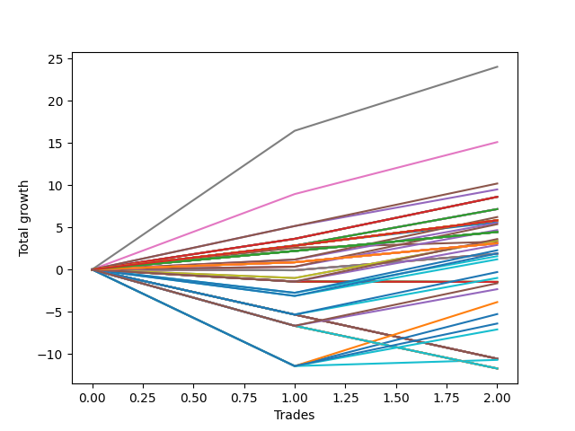

# Short Bulldog 001 
- Symbol: TSLA_Unlimited
- Date Range: 03/23/2022 - 07/08/2022
- Trading Period: 7:20-12:30
- Number of Trades: 2



| Name | Win Percent | Profit | Avg Profit / Trade | Avg Time / Trade |      | Name | Win Percent | Profit | Avg Profit / Trade | Avg Time / Trade |
| ---- | ----------- | ------ | ------------------ | ---------------- | ---- | ---- | ----------- | ------ | ------------------ | ---------------- |
| Sorted By <br> Profit | | | | | | Sorted By <br> Win Percentage ||||
| Seven | 100.00 | 12010.00 | 6005.00 | 185:02 |     | Seven | 100.00 | 12010.00 | 6005.00 | 185:02 |
| Six | 100.00 | 7550.00 | 3775.00 | 150:27 |     | Six | 100.00 | 7550.00 | 3775.00 | 150:27 |
| Eighty-Five | 100.00 | 5095.00 | 2547.50 | 45:42 |     | Eighty-Five | 100.00 | 5095.00 | 2547.50 | 45:42 |
| Eighty-Four | 100.00 | 4745.00 | 2372.50 | 45:35 |     | Eighty-Four | 100.00 | 4745.00 | 2372.50 | 45:35 |
| Sixty-Five | 100.00 | 4305.00 | 2152.50 | 10:35 |     | Sixty-Five | 100.00 | 4305.00 | 2152.50 | 10:35 |
| Fifty-Seven | 100.00 | 4305.00 | 2152.50 | 10:35 |     | Fifty-Seven | 100.00 | 4305.00 | 2152.50 | 10:35 |
| Forty-Nine | 100.00 | 4305.00 | 2152.50 | 10:35 |     | Forty-Nine | 100.00 | 4305.00 | 2152.50 | 10:35 |
| Forty-One | 100.00 | 4305.00 | 2152.50 | 10:35 |     | Forty-One | 100.00 | 4305.00 | 2152.50 | 10:35 |
| One | 100.00 | 4305.00 | 2152.50 | 10:35 |     | One | 100.00 | 4305.00 | 2152.50 | 10:35 |
| Sixty-Four | 100.00 | 3580.00 | 1790.00 | 05:22 |     | Sixty-Four | 100.00 | 3580.00 | 1790.00 | 05:22 |
| Fifty-Six | 100.00 | 3580.00 | 1790.00 | 05:22 |     | Fifty-Six | 100.00 | 3580.00 | 1790.00 | 05:22 |
| Forty-Eight | 100.00 | 3580.00 | 1790.00 | 05:22 |     | Forty-Eight | 100.00 | 3580.00 | 1790.00 | 05:22 |
| Forty | 100.00 | 3580.00 | 1790.00 | 05:22 |     | Forty | 100.00 | 3580.00 | 1790.00 | 05:22 |
| Zero | 100.00 | 3580.00 | 1790.00 | 05:22 |     | Zero | 100.00 | 3580.00 | 1790.00 | 05:22 |
| One Hundred | 100.00 | 3110.00 | 1555.00 | 06:25 |     | One Hundred | 100.00 | 3110.00 | 1555.00 | 06:25 |
| One Hundred Twenty-Eight | 100.00 | 2915.00 | 1457.50 | 03:27 |     | One Hundred Twenty-Eight | 100.00 | 2915.00 | 1457.50 | 03:27 |
| One Hundred Twenty-Three | 100.00 | 2915.00 | 1457.50 | 03:27 |     | One Hundred Twenty-Three | 100.00 | 2915.00 | 1457.50 | 03:27 |
| One Hundred Eighteen | 100.00 | 2915.00 | 1457.50 | 03:27 |     | One Hundred Eighteen | 100.00 | 2915.00 | 1457.50 | 03:27 |
| One Hundred Thirteen | 100.00 | 2915.00 | 1457.50 | 03:27 |     | One Hundred Thirteen | 100.00 | 2915.00 | 1457.50 | 03:27 |
| One Hundred Eight | 100.00 | 2915.00 | 1457.50 | 03:27 |     | One Hundred Eight | 100.00 | 2915.00 | 1457.50 | 03:27 |
| One Hundred Three | 100.00 | 2915.00 | 1457.50 | 03:27 |     | One Hundred Three | 100.00 | 2915.00 | 1457.50 | 03:27 |
| Ninety-Eight | 100.00 | 2915.00 | 1457.50 | 03:27 |     | Ninety-Eight | 100.00 | 2915.00 | 1457.50 | 03:27 |
| Ninety-Three | 100.00 | 2915.00 | 1457.50 | 03:27 |     | Ninety-Three | 100.00 | 2915.00 | 1457.50 | 03:27 |
| Eighty-Three | 100.00 | 2915.00 | 1457.50 | 03:27 |     | Eighty-Three | 100.00 | 2915.00 | 1457.50 | 03:27 |
| Seventy-Three | 100.00 | 2805.00 | 1402.50 | 09:05 |     | Seventy-Three | 100.00 | 2805.00 | 1402.50 | 09:05 |
| Ninety-Nine | 100.00 | 2760.00 | 1380.00 | 06:17 |     | Ninety-Nine | 100.00 | 2760.00 | 1380.00 | 06:17 |
| One Hundred Ten | 100.00 | 2685.00 | 1342.50 | 08:27 |     | One Hundred Ten | 100.00 | 2685.00 | 1342.50 | 08:27 |
| One Hundred Nine | 100.00 | 2335.00 | 1167.50 | 08:20 |     | One Hundred Nine | 100.00 | 2335.00 | 1167.50 | 08:20 |
| One Hundred Twenty-Seven | 100.00 | 2225.00 | 1112.50 | 02:30 |     | One Hundred Twenty-Seven | 100.00 | 2225.00 | 1112.50 | 02:30 |
| One Hundred Twenty-Two | 100.00 | 2225.00 | 1112.50 | 02:30 |     | One Hundred Twenty-Two | 100.00 | 2225.00 | 1112.50 | 02:30 |
| One Hundred Seventeen | 100.00 | 2225.00 | 1112.50 | 02:30 |     | One Hundred Seventeen | 100.00 | 2225.00 | 1112.50 | 02:30 |
| One Hundred Twelve | 100.00 | 2225.00 | 1112.50 | 02:30 |     | One Hundred Twelve | 100.00 | 2225.00 | 1112.50 | 02:30 |
| One Hundred Seven | 100.00 | 2225.00 | 1112.50 | 02:30 |     | One Hundred Seven | 100.00 | 2225.00 | 1112.50 | 02:30 |
| One Hundred Two | 100.00 | 2225.00 | 1112.50 | 02:30 |     | One Hundred Two | 100.00 | 2225.00 | 1112.50 | 02:30 |
| Ninety-Seven | 100.00 | 2225.00 | 1112.50 | 02:30 |     | Ninety-Seven | 100.00 | 2225.00 | 1112.50 | 02:30 |
| Ninety-Two | 100.00 | 2225.00 | 1112.50 | 02:30 |     | Ninety-Two | 100.00 | 2225.00 | 1112.50 | 02:30 |
| Eighty-Two | 100.00 | 2225.00 | 1112.50 | 02:30 |     | Eighty-Two | 100.00 | 2225.00 | 1112.50 | 02:30 |
| One Hundred Twenty | 50.00 | 1805.00 | 902.50 | 09:30 |     | Five | 100.00 | 1650.00 | 825.00 | 92:27 |
| Sixty | 50.00 | 1720.00 | 860.00 | 52:25 |     | One Hundred Twenty-Six | 100.00 | 1555.00 | 777.50 | 01:20 |
| Four | 50.00 | 1720.00 | 860.00 | 52:25 |     | One Hundred Twenty-One | 100.00 | 1555.00 | 777.50 | 01:20 |
| Five | 100.00 | 1650.00 | 825.00 | 92:27 |     | One Hundred Sixteen | 100.00 | 1555.00 | 777.50 | 01:20 |
| One Hundred Twenty-Six | 100.00 | 1555.00 | 777.50 | 01:20 |     | One Hundred Eleven | 100.00 | 1555.00 | 777.50 | 01:20 |
| One Hundred Twenty-One | 100.00 | 1555.00 | 777.50 | 01:20 |     | One Hundred Six | 100.00 | 1555.00 | 777.50 | 01:20 |
| One Hundred Sixteen | 100.00 | 1555.00 | 777.50 | 01:20 |     | One Hundred One | 100.00 | 1555.00 | 777.50 | 01:20 |
| One Hundred Eleven | 100.00 | 1555.00 | 777.50 | 01:20 |     | Ninety-Six | 100.00 | 1555.00 | 777.50 | 01:20 |
| One Hundred Six | 100.00 | 1555.00 | 777.50 | 01:20 |     | Ninety-One | 100.00 | 1555.00 | 777.50 | 01:20 |
| One Hundred One | 100.00 | 1555.00 | 777.50 | 01:20 |     | Eighty-One | 100.00 | 1555.00 | 777.50 | 01:20 |
| Ninety-Six | 100.00 | 1555.00 | 777.50 | 01:20 |     | One Hundred Twenty | 50.00 | 1805.00 | 902.50 | 09:30 |
| Ninety-One | 100.00 | 1555.00 | 777.50 | 01:20 |     | Sixty | 50.00 | 1720.00 | 860.00 | 52:25 |
| Eighty-One | 100.00 | 1555.00 | 777.50 | 01:20 |     | Four | 50.00 | 1720.00 | 860.00 | 52:25 |
| One Hundred Ninteen | 50.00 | 1455.00 | 727.50 | 09:22 |     | One Hundred Ninteen | 50.00 | 1455.00 | 727.50 | 09:22 |
| Ninety-Five | 50.00 | 1140.00 | 570.00 | 10:32 |     | Ninety-Five | 50.00 | 1140.00 | 570.00 | 10:32 |
| One Hundred Five | 50.00 | 955.00 | 477.50 | 11:32 |     | One Hundred Five | 50.00 | 955.00 | 477.50 | 11:32 |
| Fifty-Nine | 50.00 | 935.00 | 467.50 | 36:17 |     | Fifty-Nine | 50.00 | 935.00 | 467.50 | 36:17 |
| Fifty-Eight | 50.00 | 935.00 | 467.50 | 36:17 |     | Fifty-Eight | 50.00 | 935.00 | 467.50 | 36:17 |
| Three | 50.00 | 935.00 | 467.50 | 36:17 |     | Three | 50.00 | 935.00 | 467.50 | 36:17 |
| Two | 50.00 | 935.00 | 467.50 | 36:17 |     | Two | 50.00 | 935.00 | 467.50 | 36:17 |
| Ninety-Four | 50.00 | 790.00 | 395.00 | 10:25 |     | Ninety-Four | 50.00 | 790.00 | 395.00 | 10:25 |
| One Hundred Four | 50.00 | 605.00 | 302.50 | 11:25 |     | One Hundred Four | 50.00 | 605.00 | 302.50 | 11:25 |
| One Hundred Fifteen | 50.00 | -150.00 | -75.00 | 13:32 |     | One Hundred Fifteen | 50.00 | -150.00 | -75.00 | 13:32 |
| One Hundred Fourteen | 50.00 | -500.00 | -250.00 | 13:25 |     | One Hundred Fourteen | 50.00 | -500.00 | -250.00 | 13:25 |
| Fifty-Five | 0.00 | -735.00 | -367.50 | 14:55 |     | One Hundred Thirty | 50.00 | -815.00 | -407.50 | 13:42 |
| Fifty-Four | 0.00 | -735.00 | -367.50 | 14:55 |     | One Hundred Twenty-Nine | 50.00 | -1165.00 | -582.50 | 13:35 |
| Fifty-Three | 0.00 | -735.00 | -367.50 | 14:55 |     | Sixty-Three | 50.00 | -1930.00 | -965.00 | 168:02 |
| Fifty-Two | 0.00 | -735.00 | -367.50 | 14:55 |     | Sixty-Two | 50.00 | -2640.00 | -1320.00 | 147:10 |
| Fifty-One | 0.00 | -735.00 | -367.50 | 14:55 |     | One Hundred Twenty-Five | 50.00 | -3200.00 | -1600.00 | 42:32 |
| Fifty | 0.00 | -735.00 | -367.50 | 14:55 |     | One Hundred Twenty-Four | 50.00 | -3550.00 | -1775.00 | 42:25 |
| One Hundred Thirty | 50.00 | -815.00 | -407.50 | 13:42 |     | Sixty-One | 50.00 | -5355.00 | -2677.50 | 89:20 |
| One Hundred Twenty-Nine | 50.00 | -1165.00 | -582.50 | 13:35 |     | Fifty-Five | 0.00 | -735.00 | -367.50 | 14:55 |
| Sixty-Three | 50.00 | -1930.00 | -965.00 | 168:02 |     | Fifty-Four | 0.00 | -735.00 | -367.50 | 14:55 |
| Sixty-Two | 50.00 | -2640.00 | -1320.00 | 147:10 |     | Fifty-Three | 0.00 | -735.00 | -367.50 | 14:55 |
| One Hundred Twenty-Five | 50.00 | -3200.00 | -1600.00 | 42:32 |     | Fifty-Two | 0.00 | -735.00 | -367.50 | 14:55 |
| One Hundred Twenty-Four | 50.00 | -3550.00 | -1775.00 | 42:25 |     | Fifty-One | 0.00 | -735.00 | -367.50 | 14:55 |
| Forty-Seven | 0.00 | -5285.00 | -2642.50 | 25:15 |     | Fifty | 0.00 | -735.00 | -367.50 | 14:55 |
| Forty-Six | 0.00 | -5285.00 | -2642.50 | 25:15 |     | Forty-Seven | 0.00 | -5285.00 | -2642.50 | 25:15 |
| Forty-Five | 0.00 | -5285.00 | -2642.50 | 25:15 |     | Forty-Six | 0.00 | -5285.00 | -2642.50 | 25:15 |
| Forty-Four | 0.00 | -5285.00 | -2642.50 | 25:15 |     | Forty-Five | 0.00 | -5285.00 | -2642.50 | 25:15 |
| Forty-Three | 0.00 | -5285.00 | -2642.50 | 25:15 |     | Forty-Four | 0.00 | -5285.00 | -2642.50 | 25:15 |
| Forty-Two | 0.00 | -5285.00 | -2642.50 | 25:15 |     | Forty-Three | 0.00 | -5285.00 | -2642.50 | 25:15 |
| Sixty-One | 50.00 | -5355.00 | -2677.50 | 89:20 |     | Forty-Two | 0.00 | -5285.00 | -2642.50 | 25:15 |
| Seventy-One | 0.00 | -5865.00 | -2932.50 | 25:22 |     | Seventy-One | 0.00 | -5865.00 | -2932.50 | 25:22 |
| Seventy | 0.00 | -5865.00 | -2932.50 | 25:22 |     | Seventy | 0.00 | -5865.00 | -2932.50 | 25:22 |
| Sixty-Nine | 0.00 | -5865.00 | -2932.50 | 25:22 |     | Sixty-Nine | 0.00 | -5865.00 | -2932.50 | 25:22 |
| Sixty-Eight | 0.00 | -5865.00 | -2932.50 | 25:22 |     | Sixty-Eight | 0.00 | -5865.00 | -2932.50 | 25:22 |
| Sixty-Seven | 0.00 | -5865.00 | -2932.50 | 25:22 |     | Sixty-Seven | 0.00 | -5865.00 | -2932.50 | 25:22 |
| Sixty-Six | 0.00 | -5865.00 | -2932.50 | 25:22 |     | Sixty-Six | 0.00 | -5865.00 | -2932.50 | 25:22 |

## NO STOPLOSS

### Test Zero
* Sell when price hits the middle line of the 20p bollinger
* No Stoploss
* Results:
```
Total Trades: 2
Percent Up: 0.00
Percent Down: 100.00
Total Points Moved Down: 7.16
Potential Profit: 3580.00
Total Points Ups: 0.00 Count Ups: 0
Total Points Downs: 7.16 Count Downs: 2
```

<details><summary>Trades</summary>

<code>In: 2022-05-04 09:42:00		Out: 2022-05-04 09:47:00		Total Position Time: 05:00		Total Move Down: 2.82		Total to Date: 2.82</code> <br />
<code>In: 2022-06-30 08:30:00		Out: 2022-06-30 08:35:45		Total Position Time: 05:45		Total Move Down: 4.34		Total to Date: 7.16</code> <br />


</details>

### Test One
* Sell when the price hits the upper line of the 20p 1std bollinger
* No Stoploss
* Results:
```
Total Trades: 2
Percent Up: 0.00
Percent Down: 100.00
Total Points Moved Down: 8.61
Potential Profit: 4305.00
Total Points Ups: 0.00 Count Ups: 0
Total Points Downs: 8.61 Count Downs: 2
```

<details><summary>Trades</summary>

<code>In: 2022-05-04 09:42:00		Out: 2022-05-04 09:51:10		Total Position Time: 09:10		Total Move Down: 3.64		Total to Date: 3.64</code> <br />
<code>In: 2022-06-30 08:30:00		Out: 2022-06-30 08:42:00		Total Position Time: 12:00		Total Move Down: 4.97		Total to Date: 8.61</code> <br />


</details>

### Test Two
* Sell when the price hits the upper line of the 20p 2std bollinger
* No Stoploss
* Results:
```
Total Trades: 2
Percent Up: 50.00
Percent Down: 50.00
Total Points Moved Down: 1.87
Potential Profit: 935.00
Total Points Ups: 0.09 Count Ups: 1
Total Points Downs: 1.96 Count Downs: 1
```

<details><summary>Trades</summary>

<code>In: 2022-05-04 09:42:00		Out: 2022-05-04 10:18:30		Total Position Time: 36:30		Total Move Down: -0.09		Total to Date: -0.09</code> <br />
<code>In: 2022-06-30 08:30:00		Out: 2022-06-30 09:06:05		Total Position Time: 36:05		Total Move Down: 1.96		Total to Date: 1.87</code> <br />


</details>

### Test Three
* Sell when price hits the middle line of the 50p bollinger
* No Stoploss
* Results:
```
Total Trades: 2
Percent Up: 50.00
Percent Down: 50.00
Total Points Moved Down: 1.87
Potential Profit: 935.00
Total Points Ups: 0.09 Count Ups: 1
Total Points Downs: 1.96 Count Downs: 1
```

<details><summary>Trades</summary>

<code>In: 2022-05-04 09:42:00		Out: 2022-05-04 10:18:30		Total Position Time: 36:30		Total Move Down: -0.09		Total to Date: -0.09</code> <br />
<code>In: 2022-06-30 08:30:00		Out: 2022-06-30 09:06:05		Total Position Time: 36:05		Total Move Down: 1.96		Total to Date: 1.87</code> <br />


</details>

### Test Four
* Sell when the price hits the upper line of the 50p 1std bollinger
* No Stoploss
* Results:
```
Total Trades: 2
Percent Up: 50.00
Percent Down: 50.00
Total Points Moved Down: 3.44
Potential Profit: 1720.00
Total Points Ups: 1.01 Count Ups: 1
Total Points Downs: 4.45 Count Downs: 1
```

<details><summary>Trades</summary>

<code>In: 2022-05-04 09:42:00		Out: 2022-05-04 10:45:50		Total Position Time: 63:50		Total Move Down: -1.01		Total to Date: -1.01</code> <br />
<code>In: 2022-06-30 08:30:00		Out: 2022-06-30 09:11:00		Total Position Time: 41:00		Total Move Down: 4.45		Total to Date: 3.44</code> <br />


</details>

### Test Five
* Sell when the price hits the upper line of the 50p 2std bollinger
* No Stoploss
* Results:
```
Total Trades: 2
Percent Up: 0.00
Percent Down: 100.00
Total Points Moved Down: 3.30
Potential Profit: 1650.00
Total Points Ups: 0.00 Count Ups: 0
Total Points Downs: 3.30 Count Downs: 2
```

<details><summary>Trades</summary>

<code>In: 2022-05-04 09:42:00		Out: 2022-05-04 11:07:20		Total Position Time: 85:20		Total Move Down: 2.57		Total to Date: 2.57</code> <br />
<code>In: 2022-06-30 08:30:00		Out: 2022-06-30 10:09:35		Total Position Time: 99:35		Total Move Down: 0.73		Total to Date: 3.30</code> <br />


</details>

### Test Six
* Sell when the price hits the middle line of the 1std VWAP
* No Stoploss
* Results:
```
Total Trades: 2
Percent Up: 0.00
Percent Down: 100.00
Total Points Moved Down: 15.10
Potential Profit: 7550.00
Total Points Ups: 0.00 Count Ups: 0
Total Points Downs: 15.10 Count Downs: 2
```

<details><summary>Trades</summary>

<code>In: 2022-05-04 09:42:00		Out: 2022-05-04 11:07:40		Total Position Time: 85:40		Total Move Down: 8.94		Total to Date: 8.94</code> <br />
<code>In: 2022-06-30 08:30:00		Out: 2022-06-30 12:05:15		Total Position Time: 215:15		Total Move Down: 6.16		Total to Date: 15.10</code> <br />


</details>

### Test Seven
* Sell when the price hits the upper line of the 1std VWAP
* No Stoploss
* Results:
```
Total Trades: 2
Percent Up: 0.00
Percent Down: 100.00
Total Points Moved Down: 24.02
Potential Profit: 12010.00
Total Points Ups: 0.00 Count Ups: 0
Total Points Downs: 24.02 Count Downs: 2
```

<details><summary>Trades</summary>

<code>In: 2022-05-04 09:42:00		Out: 2022-05-04 11:35:05		Total Position Time: 113:05		Total Move Down: 16.44		Total to Date: 16.44</code> <br />
<code>In: 2022-06-30 08:30:00		Out: 2022-06-30 12:47:00		Total Position Time: 257:00		Total Move Down: 7.58		Total to Date: 24.02</code> <br />


</details>

## STOPLOSS OF 5

### Test Forty
* Sell when price hits the middle line of the 20p bollinger
* Stoploss is -5 points
* Results:
```
Total Trades: 2
Percent Up: 0.00
Percent Down: 100.00
Total Points Moved Down: 7.16
Potential Profit: 3580.00
Total Points Ups: 0.00 Count Ups: 0
Total Points Downs: 7.16 Count Downs: 2
```

<details><summary>Trades</summary>

<code>In: 2022-05-04 09:42:00		Out: 2022-05-04 09:47:00		Total Position Time: 05:00		Total Move Down: 2.82		Total to Date: 2.82</code> <br />
<code>In: 2022-06-30 08:30:00		Out: 2022-06-30 08:35:45		Total Position Time: 05:45		Total Move Down: 4.34		Total to Date: 7.16</code> <br />


</details>

### Test Forty-One
* Sell when the price hits the upper line of the 20p 1std bollinger
* Stoploss is -5 points
* Results:
```
Total Trades: 2
Percent Up: 0.00
Percent Down: 100.00
Total Points Moved Down: 8.61
Potential Profit: 4305.00
Total Points Ups: 0.00 Count Ups: 0
Total Points Downs: 8.61 Count Downs: 2
```

<details><summary>Trades</summary>

<code>In: 2022-05-04 09:42:00		Out: 2022-05-04 09:51:10		Total Position Time: 09:10		Total Move Down: 3.64		Total to Date: 3.64</code> <br />
<code>In: 2022-06-30 08:30:00		Out: 2022-06-30 08:42:00		Total Position Time: 12:00		Total Move Down: 4.97		Total to Date: 8.61</code> <br />


</details>

### Test Forty-Two
* Sell when the price hits the upper line of the 20p 2std bollinger
* Stoploss is -5 points
* Results:
```
Total Trades: 2
Percent Up: 100.00
Percent Down: 0.00
Total Points Moved Down: -10.57
Potential Profit: -5285.00
Total Points Ups: 10.57 Count Ups: 2
Total Points Downs: 0.00 Count Downs: 0
```

<details><summary>Trades</summary>

<code>In: 2022-05-04 09:42:00		Out: 2022-05-04 10:03:05		Total Position Time: 21:05		Total Move Down: -5.34		Total to Date: -5.34</code> <br />
<code>In: 2022-06-30 08:30:00		Out: 2022-06-30 08:59:25		Total Position Time: 29:25		Total Move Down: -5.23		Total to Date: -10.57</code> <br />


</details>

### Test Forty-Three
* Sell when price hits the middle line of the 50p bollinger
* Stoploss is -5 points
* Results:
```
Total Trades: 2
Percent Up: 100.00
Percent Down: 0.00
Total Points Moved Down: -10.57
Potential Profit: -5285.00
Total Points Ups: 10.57 Count Ups: 2
Total Points Downs: 0.00 Count Downs: 0
```

<details><summary>Trades</summary>

<code>In: 2022-05-04 09:42:00		Out: 2022-05-04 10:03:05		Total Position Time: 21:05		Total Move Down: -5.34		Total to Date: -5.34</code> <br />
<code>In: 2022-06-30 08:30:00		Out: 2022-06-30 08:59:25		Total Position Time: 29:25		Total Move Down: -5.23		Total to Date: -10.57</code> <br />


</details>

### Test Forty-Four
* Sell when the price hits the upper line of the 50p 1std bollinger
* Stoploss is -5 points
* Results:
```
Total Trades: 2
Percent Up: 100.00
Percent Down: 0.00
Total Points Moved Down: -10.57
Potential Profit: -5285.00
Total Points Ups: 10.57 Count Ups: 2
Total Points Downs: 0.00 Count Downs: 0
```

<details><summary>Trades</summary>

<code>In: 2022-05-04 09:42:00		Out: 2022-05-04 10:03:05		Total Position Time: 21:05		Total Move Down: -5.34		Total to Date: -5.34</code> <br />
<code>In: 2022-06-30 08:30:00		Out: 2022-06-30 08:59:25		Total Position Time: 29:25		Total Move Down: -5.23		Total to Date: -10.57</code> <br />


</details>

### Test Forty-Five
* Sell when the price hits the upper line of the 50p 2std bollinger
* Stoploss is -5 points
* Results:
```
Total Trades: 2
Percent Up: 100.00
Percent Down: 0.00
Total Points Moved Down: -10.57
Potential Profit: -5285.00
Total Points Ups: 10.57 Count Ups: 2
Total Points Downs: 0.00 Count Downs: 0
```

<details><summary>Trades</summary>

<code>In: 2022-05-04 09:42:00		Out: 2022-05-04 10:03:05		Total Position Time: 21:05		Total Move Down: -5.34		Total to Date: -5.34</code> <br />
<code>In: 2022-06-30 08:30:00		Out: 2022-06-30 08:59:25		Total Position Time: 29:25		Total Move Down: -5.23		Total to Date: -10.57</code> <br />


</details>

### Test Forty-Six
* Sell when the price hits the middle line of the 1std VWAP
* Stoploss is -5 points
* Results:
```
Total Trades: 2
Percent Up: 100.00
Percent Down: 0.00
Total Points Moved Down: -10.57
Potential Profit: -5285.00
Total Points Ups: 10.57 Count Ups: 2
Total Points Downs: 0.00 Count Downs: 0
```

<details><summary>Trades</summary>

<code>In: 2022-05-04 09:42:00		Out: 2022-05-04 10:03:05		Total Position Time: 21:05		Total Move Down: -5.34		Total to Date: -5.34</code> <br />
<code>In: 2022-06-30 08:30:00		Out: 2022-06-30 08:59:25		Total Position Time: 29:25		Total Move Down: -5.23		Total to Date: -10.57</code> <br />


</details>

### Test Forty-Seven
* Sell when the price hits the upper line of the 1std VWAP
* Stoploss is -5 points
* Results:
```
Total Trades: 2
Percent Up: 100.00
Percent Down: 0.00
Total Points Moved Down: -10.57
Potential Profit: -5285.00
Total Points Ups: 10.57 Count Ups: 2
Total Points Downs: 0.00 Count Downs: 0
```

<details><summary>Trades</summary>

<code>In: 2022-05-04 09:42:00		Out: 2022-05-04 10:03:05		Total Position Time: 21:05		Total Move Down: -5.34		Total to Date: -5.34</code> <br />
<code>In: 2022-06-30 08:30:00		Out: 2022-06-30 08:59:25		Total Position Time: 29:25		Total Move Down: -5.23		Total to Date: -10.57</code> <br />


</details>

## TRAIL STOP OF 5

### Test Forty-Eight
* Sell when price hits the middle line of the 20p bollinger
* Trailing Stop is -5 points
* Results:
```
Total Trades: 2
Percent Up: 0.00
Percent Down: 100.00
Total Points Moved Down: 7.16
Potential Profit: 3580.00
Total Points Ups: 0.00 Count Ups: 0
Total Points Downs: 7.16 Count Downs: 2
```

<details><summary>Trades</summary>

<code>In: 2022-05-04 09:42:00		Out: 2022-05-04 09:47:00		Total Position Time: 05:00		Total Move Down: 2.82		Total to Date: 2.82</code> <br />
<code>In: 2022-06-30 08:30:00		Out: 2022-06-30 08:35:45		Total Position Time: 05:45		Total Move Down: 4.34		Total to Date: 7.16</code> <br />


</details>

### Test Forty-Nine
* Sell when the price hits the upper line of the 20p 1std bollinger
* Trailing Stop is -5 points
* Results:
```
Total Trades: 2
Percent Up: 0.00
Percent Down: 100.00
Total Points Moved Down: 8.61
Potential Profit: 4305.00
Total Points Ups: 0.00 Count Ups: 0
Total Points Downs: 8.61 Count Downs: 2
```

<details><summary>Trades</summary>

<code>In: 2022-05-04 09:42:00		Out: 2022-05-04 09:51:10		Total Position Time: 09:10		Total Move Down: 3.64		Total to Date: 3.64</code> <br />
<code>In: 2022-06-30 08:30:00		Out: 2022-06-30 08:42:00		Total Position Time: 12:00		Total Move Down: 4.97		Total to Date: 8.61</code> <br />


</details>

### Test Fifty
* Sell when the price hits the upper line of the 20p 2std bollinger
* Trailing Stop is -5 points
* Results:
```
Total Trades: 2
Percent Up: 100.00
Percent Down: 0.00
Total Points Moved Down: -1.47
Potential Profit: -735.00
Total Points Ups: 1.47 Count Ups: 2
Total Points Downs: 0.00 Count Downs: 0
```

<details><summary>Trades</summary>

<code>In: 2022-05-04 09:42:00		Out: 2022-05-04 09:55:00		Total Position Time: 13:00		Total Move Down: -1.43		Total to Date: -1.43</code> <br />
<code>In: 2022-06-30 08:30:00		Out: 2022-06-30 08:46:50		Total Position Time: 16:50		Total Move Down: -0.04		Total to Date: -1.47</code> <br />


</details>

### Test Fifty-One
* Sell when price hits the middle line of the 50p bollinger
* Trailing Stop is -5 points
* Results:
```
Total Trades: 2
Percent Up: 100.00
Percent Down: 0.00
Total Points Moved Down: -1.47
Potential Profit: -735.00
Total Points Ups: 1.47 Count Ups: 2
Total Points Downs: 0.00 Count Downs: 0
```

<details><summary>Trades</summary>

<code>In: 2022-05-04 09:42:00		Out: 2022-05-04 09:55:00		Total Position Time: 13:00		Total Move Down: -1.43		Total to Date: -1.43</code> <br />
<code>In: 2022-06-30 08:30:00		Out: 2022-06-30 08:46:50		Total Position Time: 16:50		Total Move Down: -0.04		Total to Date: -1.47</code> <br />


</details>

### Test Fifty-Two
* Sell when the price hits the upper line of the 50p 1std bollinger
* Trailing Stop is -5 points
* Results:
```
Total Trades: 2
Percent Up: 100.00
Percent Down: 0.00
Total Points Moved Down: -1.47
Potential Profit: -735.00
Total Points Ups: 1.47 Count Ups: 2
Total Points Downs: 0.00 Count Downs: 0
```

<details><summary>Trades</summary>

<code>In: 2022-05-04 09:42:00		Out: 2022-05-04 09:55:00		Total Position Time: 13:00		Total Move Down: -1.43		Total to Date: -1.43</code> <br />
<code>In: 2022-06-30 08:30:00		Out: 2022-06-30 08:46:50		Total Position Time: 16:50		Total Move Down: -0.04		Total to Date: -1.47</code> <br />


</details>

### Test Fifty-Three
* Sell when the price hits the upper line of the 50p 2std bollinger
* Trailing Stop is -5 points
* Results:
```
Total Trades: 2
Percent Up: 100.00
Percent Down: 0.00
Total Points Moved Down: -1.47
Potential Profit: -735.00
Total Points Ups: 1.47 Count Ups: 2
Total Points Downs: 0.00 Count Downs: 0
```

<details><summary>Trades</summary>

<code>In: 2022-05-04 09:42:00		Out: 2022-05-04 09:55:00		Total Position Time: 13:00		Total Move Down: -1.43		Total to Date: -1.43</code> <br />
<code>In: 2022-06-30 08:30:00		Out: 2022-06-30 08:46:50		Total Position Time: 16:50		Total Move Down: -0.04		Total to Date: -1.47</code> <br />


</details>

### Test Fifty-Four
* Sell when the price hits the middle line of the 1std VWAP
* Trailing Stop is -5 points
* Results:
```
Total Trades: 2
Percent Up: 100.00
Percent Down: 0.00
Total Points Moved Down: -1.47
Potential Profit: -735.00
Total Points Ups: 1.47 Count Ups: 2
Total Points Downs: 0.00 Count Downs: 0
```

<details><summary>Trades</summary>

<code>In: 2022-05-04 09:42:00		Out: 2022-05-04 09:55:00		Total Position Time: 13:00		Total Move Down: -1.43		Total to Date: -1.43</code> <br />
<code>In: 2022-06-30 08:30:00		Out: 2022-06-30 08:46:50		Total Position Time: 16:50		Total Move Down: -0.04		Total to Date: -1.47</code> <br />


</details>

### Test Fifty-Five
* Sell when the price hits the upper line of the 1std VWAP
* Trailing Stop is -5 points
* Results:
```
Total Trades: 2
Percent Up: 100.00
Percent Down: 0.00
Total Points Moved Down: -1.47
Potential Profit: -735.00
Total Points Ups: 1.47 Count Ups: 2
Total Points Downs: 0.00 Count Downs: 0
```

<details><summary>Trades</summary>

<code>In: 2022-05-04 09:42:00		Out: 2022-05-04 09:55:00		Total Position Time: 13:00		Total Move Down: -1.43		Total to Date: -1.43</code> <br />
<code>In: 2022-06-30 08:30:00		Out: 2022-06-30 08:46:50		Total Position Time: 16:50		Total Move Down: -0.04		Total to Date: -1.47</code> <br />


</details>

## STOPLOSS OF 10

### Test Fifty-Six
* Sell when price hits the middle line of the 20p bollinger
* Stoploss is -10 points
* Results:
```
Total Trades: 2
Percent Up: 0.00
Percent Down: 100.00
Total Points Moved Down: 7.16
Potential Profit: 3580.00
Total Points Ups: 0.00 Count Ups: 0
Total Points Downs: 7.16 Count Downs: 2
```

<details><summary>Trades</summary>

<code>In: 2022-05-04 09:42:00		Out: 2022-05-04 09:47:00		Total Position Time: 05:00		Total Move Down: 2.82		Total to Date: 2.82</code> <br />
<code>In: 2022-06-30 08:30:00		Out: 2022-06-30 08:35:45		Total Position Time: 05:45		Total Move Down: 4.34		Total to Date: 7.16</code> <br />


</details>

### Test Fifty-Seven
* Sell when the price hits the upper line of the 20p 1std bollinger
* Stoploss is -10 points
* Results:
```
Total Trades: 2
Percent Up: 0.00
Percent Down: 100.00
Total Points Moved Down: 8.61
Potential Profit: 4305.00
Total Points Ups: 0.00 Count Ups: 0
Total Points Downs: 8.61 Count Downs: 2
```

<details><summary>Trades</summary>

<code>In: 2022-05-04 09:42:00		Out: 2022-05-04 09:51:10		Total Position Time: 09:10		Total Move Down: 3.64		Total to Date: 3.64</code> <br />
<code>In: 2022-06-30 08:30:00		Out: 2022-06-30 08:42:00		Total Position Time: 12:00		Total Move Down: 4.97		Total to Date: 8.61</code> <br />


</details>

### Test Fifty-Eight
* Sell when the price hits the upper line of the 20p 2std bollinger
* Stoploss is -10 points
* Results:
```
Total Trades: 2
Percent Up: 50.00
Percent Down: 50.00
Total Points Moved Down: 1.87
Potential Profit: 935.00
Total Points Ups: 0.09 Count Ups: 1
Total Points Downs: 1.96 Count Downs: 1
```

<details><summary>Trades</summary>

<code>In: 2022-05-04 09:42:00		Out: 2022-05-04 10:18:30		Total Position Time: 36:30		Total Move Down: -0.09		Total to Date: -0.09</code> <br />
<code>In: 2022-06-30 08:30:00		Out: 2022-06-30 09:06:05		Total Position Time: 36:05		Total Move Down: 1.96		Total to Date: 1.87</code> <br />


</details>

### Test Fifty-Nine
* Sell when price hits the middle line of the 50p bollinger
* Stoploss is -10 points
* Results:
```
Total Trades: 2
Percent Up: 50.00
Percent Down: 50.00
Total Points Moved Down: 1.87
Potential Profit: 935.00
Total Points Ups: 0.09 Count Ups: 1
Total Points Downs: 1.96 Count Downs: 1
```

<details><summary>Trades</summary>

<code>In: 2022-05-04 09:42:00		Out: 2022-05-04 10:18:30		Total Position Time: 36:30		Total Move Down: -0.09		Total to Date: -0.09</code> <br />
<code>In: 2022-06-30 08:30:00		Out: 2022-06-30 09:06:05		Total Position Time: 36:05		Total Move Down: 1.96		Total to Date: 1.87</code> <br />


</details>

### Test Sixty
* Sell when the price hits the upper line of the 50p 1std bollinger
* Stoploss is -10 points
* Results:
```
Total Trades: 2
Percent Up: 50.00
Percent Down: 50.00
Total Points Moved Down: 3.44
Potential Profit: 1720.00
Total Points Ups: 1.01 Count Ups: 1
Total Points Downs: 4.45 Count Downs: 1
```

<details><summary>Trades</summary>

<code>In: 2022-05-04 09:42:00		Out: 2022-05-04 10:45:50		Total Position Time: 63:50		Total Move Down: -1.01		Total to Date: -1.01</code> <br />
<code>In: 2022-06-30 08:30:00		Out: 2022-06-30 09:11:00		Total Position Time: 41:00		Total Move Down: 4.45		Total to Date: 3.44</code> <br />


</details>

### Test Sixty-One
* Sell when the price hits the upper line of the 50p 2std bollinger
* Stoploss is -10 points
* Results:
```
Total Trades: 2
Percent Up: 50.00
Percent Down: 50.00
Total Points Moved Down: -10.71
Potential Profit: -5355.00
Total Points Ups: 11.44 Count Ups: 1
Total Points Downs: 0.73 Count Downs: 1
```

<details><summary>Trades</summary>

<code>In: 2022-05-04 09:42:00		Out: 2022-05-04 11:01:05		Total Position Time: 79:05		Total Move Down: -11.44		Total to Date: -11.44</code> <br />
<code>In: 2022-06-30 08:30:00		Out: 2022-06-30 10:09:35		Total Position Time: 99:35		Total Move Down: 0.73		Total to Date: -10.71</code> <br />


</details>

### Test Sixty-Two
* Sell when the price hits the middle line of the 1std VWAP
* Stoploss is -10 points
* Results:
```
Total Trades: 2
Percent Up: 50.00
Percent Down: 50.00
Total Points Moved Down: -5.28
Potential Profit: -2640.00
Total Points Ups: 11.44 Count Ups: 1
Total Points Downs: 6.16 Count Downs: 1
```

<details><summary>Trades</summary>

<code>In: 2022-05-04 09:42:00		Out: 2022-05-04 11:01:05		Total Position Time: 79:05		Total Move Down: -11.44		Total to Date: -11.44</code> <br />
<code>In: 2022-06-30 08:30:00		Out: 2022-06-30 12:05:15		Total Position Time: 215:15		Total Move Down: 6.16		Total to Date: -5.28</code> <br />


</details>

### Test Sixty-Three
* Sell when the price hits the upper line of the 1std VWAP
* Stoploss is -10 points
* Results:
```
Total Trades: 2
Percent Up: 50.00
Percent Down: 50.00
Total Points Moved Down: -3.86
Potential Profit: -1930.00
Total Points Ups: 11.44 Count Ups: 1
Total Points Downs: 7.58 Count Downs: 1
```

<details><summary>Trades</summary>

<code>In: 2022-05-04 09:42:00		Out: 2022-05-04 11:01:05		Total Position Time: 79:05		Total Move Down: -11.44		Total to Date: -11.44</code> <br />
<code>In: 2022-06-30 08:30:00		Out: 2022-06-30 12:47:00		Total Position Time: 257:00		Total Move Down: 7.58		Total to Date: -3.86</code> <br />


</details>

## TRAIL STOP OF 10

### Test Sixty-Four
* Sell when price hits the middle line of the 20p bollinger
* Trailing Stop is -10 points
* Results:
```
Total Trades: 2
Percent Up: 0.00
Percent Down: 100.00
Total Points Moved Down: 7.16
Potential Profit: 3580.00
Total Points Ups: 0.00 Count Ups: 0
Total Points Downs: 7.16 Count Downs: 2
```

<details><summary>Trades</summary>

<code>In: 2022-05-04 09:42:00		Out: 2022-05-04 09:47:00		Total Position Time: 05:00		Total Move Down: 2.82		Total to Date: 2.82</code> <br />
<code>In: 2022-06-30 08:30:00		Out: 2022-06-30 08:35:45		Total Position Time: 05:45		Total Move Down: 4.34		Total to Date: 7.16</code> <br />


</details>

### Test Sixty-Five
* Sell when the price hits the upper line of the 20p 1std bollinger
* Trailing Stop is -10 points
* Results:
```
Total Trades: 2
Percent Up: 0.00
Percent Down: 100.00
Total Points Moved Down: 8.61
Potential Profit: 4305.00
Total Points Ups: 0.00 Count Ups: 0
Total Points Downs: 8.61 Count Downs: 2
```

<details><summary>Trades</summary>

<code>In: 2022-05-04 09:42:00		Out: 2022-05-04 09:51:10		Total Position Time: 09:10		Total Move Down: 3.64		Total to Date: 3.64</code> <br />
<code>In: 2022-06-30 08:30:00		Out: 2022-06-30 08:42:00		Total Position Time: 12:00		Total Move Down: 4.97		Total to Date: 8.61</code> <br />


</details>

### Test Sixty-Six
* Sell when the price hits the upper line of the 20p 2std bollinger
* Trailing Stop is -10 points
* Results:
```
Total Trades: 2
Percent Up: 100.00
Percent Down: 0.00
Total Points Moved Down: -11.73
Potential Profit: -5865.00
Total Points Ups: 11.73 Count Ups: 2
Total Points Downs: 0.00 Count Downs: 0
```

<details><summary>Trades</summary>

<code>In: 2022-05-04 09:42:00		Out: 2022-05-04 10:03:25		Total Position Time: 21:25		Total Move Down: -6.67		Total to Date: -6.67</code> <br />
<code>In: 2022-06-30 08:30:00		Out: 2022-06-30 08:59:20		Total Position Time: 29:20		Total Move Down: -5.06		Total to Date: -11.73</code> <br />


</details>

### Test Sixty-Seven
* Sell when price hits the middle line of the 50p bollinger
* Trailing Stop is -10 points
* Results:
```
Total Trades: 2
Percent Up: 100.00
Percent Down: 0.00
Total Points Moved Down: -11.73
Potential Profit: -5865.00
Total Points Ups: 11.73 Count Ups: 2
Total Points Downs: 0.00 Count Downs: 0
```

<details><summary>Trades</summary>

<code>In: 2022-05-04 09:42:00		Out: 2022-05-04 10:03:25		Total Position Time: 21:25		Total Move Down: -6.67		Total to Date: -6.67</code> <br />
<code>In: 2022-06-30 08:30:00		Out: 2022-06-30 08:59:20		Total Position Time: 29:20		Total Move Down: -5.06		Total to Date: -11.73</code> <br />


</details>

### Test Sixty-Eight
* Sell when the price hits the upper line of the 50p 1std bollinger
* Trailing Stop is -10 points
* Results:
```
Total Trades: 2
Percent Up: 100.00
Percent Down: 0.00
Total Points Moved Down: -11.73
Potential Profit: -5865.00
Total Points Ups: 11.73 Count Ups: 2
Total Points Downs: 0.00 Count Downs: 0
```

<details><summary>Trades</summary>

<code>In: 2022-05-04 09:42:00		Out: 2022-05-04 10:03:25		Total Position Time: 21:25		Total Move Down: -6.67		Total to Date: -6.67</code> <br />
<code>In: 2022-06-30 08:30:00		Out: 2022-06-30 08:59:20		Total Position Time: 29:20		Total Move Down: -5.06		Total to Date: -11.73</code> <br />


</details>

### Test Sixty-Nine
* Sell when the price hits the upper line of the 50p 2std bollinger
* Trailing Stop is -10 points
* Results:
```
Total Trades: 2
Percent Up: 100.00
Percent Down: 0.00
Total Points Moved Down: -11.73
Potential Profit: -5865.00
Total Points Ups: 11.73 Count Ups: 2
Total Points Downs: 0.00 Count Downs: 0
```

<details><summary>Trades</summary>

<code>In: 2022-05-04 09:42:00		Out: 2022-05-04 10:03:25		Total Position Time: 21:25		Total Move Down: -6.67		Total to Date: -6.67</code> <br />
<code>In: 2022-06-30 08:30:00		Out: 2022-06-30 08:59:20		Total Position Time: 29:20		Total Move Down: -5.06		Total to Date: -11.73</code> <br />


</details>

### Test Seventy
* Sell when the price hits the middle line of the 1std VWAP
* Trailing Stop is -10 points
* Results:
```
Total Trades: 2
Percent Up: 100.00
Percent Down: 0.00
Total Points Moved Down: -11.73
Potential Profit: -5865.00
Total Points Ups: 11.73 Count Ups: 2
Total Points Downs: 0.00 Count Downs: 0
```

<details><summary>Trades</summary>

<code>In: 2022-05-04 09:42:00		Out: 2022-05-04 10:03:25		Total Position Time: 21:25		Total Move Down: -6.67		Total to Date: -6.67</code> <br />
<code>In: 2022-06-30 08:30:00		Out: 2022-06-30 08:59:20		Total Position Time: 29:20		Total Move Down: -5.06		Total to Date: -11.73</code> <br />


</details>

### Test Seventy-One
* Sell when the price hits the upper line of the 1std VWAP
* Trailing Stop is -10 points
* Results:
```
Total Trades: 2
Percent Up: 100.00
Percent Down: 0.00
Total Points Moved Down: -11.73
Potential Profit: -5865.00
Total Points Ups: 11.73 Count Ups: 2
Total Points Downs: 0.00 Count Downs: 0
```

<details><summary>Trades</summary>

<code>In: 2022-05-04 09:42:00		Out: 2022-05-04 10:03:25		Total Position Time: 21:25		Total Move Down: -6.67		Total to Date: -6.67</code> <br />
<code>In: 2022-06-30 08:30:00		Out: 2022-06-30 08:59:20		Total Position Time: 29:20		Total Move Down: -5.06		Total to Date: -11.73</code> <br />


</details>

## SPECIAL EXIT CONDITIONS 

### Test Seventy-Three
* Sell when the linear regression slope changes to negative
* No Stoploss
* Results:
```
Total Trades: 2
Percent Up: 0.00
Percent Down: 100.00
Total Points Moved Down: 5.61
Potential Profit: 2805.00
Total Points Ups: 0.00 Count Ups: 0
Total Points Downs: 5.61 Count Downs: 2
```

<details><summary>Trades</summary>

<code>In: 2022-05-04 09:42:00		Out: 2022-05-04 09:47:05		Total Position Time: 05:05		Total Move Down: 2.86		Total to Date: 2.86</code> <br />
<code>In: 2022-06-30 08:30:00		Out: 2022-06-30 08:43:05		Total Position Time: 13:05		Total Move Down: 2.75		Total to Date: 5.61</code> <br />


</details>

## TAKE PROFIT

### Test Eighty-One
* Take Profit of 1 Point
* No Stoploss
* Results:
```
Total Trades: 2
Percent Up: 0.00
Percent Down: 100.00
Total Points Moved Down: 3.11
Potential Profit: 1555.00
Total Points Ups: 0.00 Count Ups: 0
Total Points Downs: 3.11 Count Downs: 2
```

<details><summary>Trades</summary>

<code>In: 2022-05-04 09:42:00		Out: 2022-05-04 09:43:30		Total Position Time: 01:30		Total Move Down: 0.86		Total to Date: 0.86</code> <br />
<code>In: 2022-06-30 08:30:00		Out: 2022-06-30 08:31:10		Total Position Time: 01:10		Total Move Down: 2.25		Total to Date: 3.11</code> <br />


</details>

### Test Eighty-Two
* Take Profit of 2 Point
* No Stoploss
* Results:
```
Total Trades: 2
Percent Up: 0.00
Percent Down: 100.00
Total Points Moved Down: 4.45
Potential Profit: 2225.00
Total Points Ups: 0.00 Count Ups: 0
Total Points Downs: 4.45 Count Downs: 2
```

<details><summary>Trades</summary>

<code>In: 2022-05-04 09:42:00		Out: 2022-05-04 09:45:50		Total Position Time: 03:50		Total Move Down: 2.20		Total to Date: 2.20</code> <br />
<code>In: 2022-06-30 08:30:00		Out: 2022-06-30 08:31:10		Total Position Time: 01:10		Total Move Down: 2.25		Total to Date: 4.45</code> <br />


</details>

### Test Eighty-Three
* Take Profit of 3 Point
* No Stoploss
* Results:
```
Total Trades: 2
Percent Up: 0.00
Percent Down: 100.00
Total Points Moved Down: 5.83
Potential Profit: 2915.00
Total Points Ups: 0.00 Count Ups: 0
Total Points Downs: 5.83 Count Downs: 2
```

<details><summary>Trades</summary>

<code>In: 2022-05-04 09:42:00		Out: 2022-05-04 09:47:00		Total Position Time: 05:00		Total Move Down: 2.82		Total to Date: 2.82</code> <br />
<code>In: 2022-06-30 08:30:00		Out: 2022-06-30 08:31:55		Total Position Time: 01:55		Total Move Down: 3.01		Total to Date: 5.83</code> <br />


</details>

### Test Eighty-Four
* Take Profit of 4 Point
* No Stoploss
* Results:
```
Total Trades: 2
Percent Up: 0.00
Percent Down: 100.00
Total Points Moved Down: 9.49
Potential Profit: 4745.00
Total Points Ups: 0.00 Count Ups: 0
Total Points Downs: 9.49 Count Downs: 2
```

<details><summary>Trades</summary>

<code>In: 2022-05-04 09:42:00		Out: 2022-05-04 11:07:25		Total Position Time: 85:25		Total Move Down: 5.15		Total to Date: 5.15</code> <br />
<code>In: 2022-06-30 08:30:00		Out: 2022-06-30 08:35:45		Total Position Time: 05:45		Total Move Down: 4.34		Total to Date: 9.49</code> <br />


</details>

### Test Eighty-Five
* Take Profit of 5 Point
* No Stoploss
* Results:
```
Total Trades: 2
Percent Up: 0.00
Percent Down: 100.00
Total Points Moved Down: 10.19
Potential Profit: 5095.00
Total Points Ups: 0.00 Count Ups: 0
Total Points Downs: 10.19 Count Downs: 2
```

<details><summary>Trades</summary>

<code>In: 2022-05-04 09:42:00		Out: 2022-05-04 11:07:25		Total Position Time: 85:25		Total Move Down: 5.15		Total to Date: 5.15</code> <br />
<code>In: 2022-06-30 08:30:00		Out: 2022-06-30 08:36:00		Total Position Time: 06:00		Total Move Down: 5.04		Total to Date: 10.19</code> <br />


</details>

## TAKE PROFIT Stoploss of Two

### Test Ninety-One
* Take Profit of 1 Point
* Stoploss is -2 points
* Results:
```
Total Trades: 2
Percent Up: 0.00
Percent Down: 100.00
Total Points Moved Down: 3.11
Potential Profit: 1555.00
Total Points Ups: 0.00 Count Ups: 0
Total Points Downs: 3.11 Count Downs: 2
```

<details><summary>Trades</summary>

<code>In: 2022-05-04 09:42:00		Out: 2022-05-04 09:43:30		Total Position Time: 01:30		Total Move Down: 0.86		Total to Date: 0.86</code> <br />
<code>In: 2022-06-30 08:30:00		Out: 2022-06-30 08:31:10		Total Position Time: 01:10		Total Move Down: 2.25		Total to Date: 3.11</code> <br />


</details>

### Test Ninety-Two
* Take Profit of 2 Point
* Stoploss is -2 points
* Results:
```
Total Trades: 2
Percent Up: 0.00
Percent Down: 100.00
Total Points Moved Down: 4.45
Potential Profit: 2225.00
Total Points Ups: 0.00 Count Ups: 0
Total Points Downs: 4.45 Count Downs: 2
```

<details><summary>Trades</summary>

<code>In: 2022-05-04 09:42:00		Out: 2022-05-04 09:45:50		Total Position Time: 03:50		Total Move Down: 2.20		Total to Date: 2.20</code> <br />
<code>In: 2022-06-30 08:30:00		Out: 2022-06-30 08:31:10		Total Position Time: 01:10		Total Move Down: 2.25		Total to Date: 4.45</code> <br />


</details>

### Test Ninety-Three
* Take Profit of 3 Point
* Stoploss is -2 points
* Results:
```
Total Trades: 2
Percent Up: 0.00
Percent Down: 100.00
Total Points Moved Down: 5.83
Potential Profit: 2915.00
Total Points Ups: 0.00 Count Ups: 0
Total Points Downs: 5.83 Count Downs: 2
```

<details><summary>Trades</summary>

<code>In: 2022-05-04 09:42:00		Out: 2022-05-04 09:47:00		Total Position Time: 05:00		Total Move Down: 2.82		Total to Date: 2.82</code> <br />
<code>In: 2022-06-30 08:30:00		Out: 2022-06-30 08:31:55		Total Position Time: 01:55		Total Move Down: 3.01		Total to Date: 5.83</code> <br />


</details>

### Test Ninety-Four
* Take Profit of 4 Point
* Stoploss is -2 points
* Results:
```
Total Trades: 2
Percent Up: 50.00
Percent Down: 50.00
Total Points Moved Down: 1.58
Potential Profit: 790.00
Total Points Ups: 2.76 Count Ups: 1
Total Points Downs: 4.34 Count Downs: 1
```

<details><summary>Trades</summary>

<code>In: 2022-05-04 09:42:00		Out: 2022-05-04 09:57:05		Total Position Time: 15:05		Total Move Down: -2.76		Total to Date: -2.76</code> <br />
<code>In: 2022-06-30 08:30:00		Out: 2022-06-30 08:35:45		Total Position Time: 05:45		Total Move Down: 4.34		Total to Date: 1.58</code> <br />


</details>

### Test Ninety-Five
* Take Profit of 5 Point
* Stoploss is -2 points
* Results:
```
Total Trades: 2
Percent Up: 50.00
Percent Down: 50.00
Total Points Moved Down: 2.28
Potential Profit: 1140.00
Total Points Ups: 2.76 Count Ups: 1
Total Points Downs: 5.04 Count Downs: 1
```

<details><summary>Trades</summary>

<code>In: 2022-05-04 09:42:00		Out: 2022-05-04 09:57:05		Total Position Time: 15:05		Total Move Down: -2.76		Total to Date: -2.76</code> <br />
<code>In: 2022-06-30 08:30:00		Out: 2022-06-30 08:36:00		Total Position Time: 06:00		Total Move Down: 5.04		Total to Date: 2.28</code> <br />


</details>

## TAKE PROFIT Trailstop of Two

### Test Ninety-Six
* Take Profit of 1 Point
* Trailing stop is -2 points
* Results:
```
Total Trades: 2
Percent Up: 0.00
Percent Down: 100.00
Total Points Moved Down: 3.11
Potential Profit: 1555.00
Total Points Ups: 0.00 Count Ups: 0
Total Points Downs: 3.11 Count Downs: 2
```

<details><summary>Trades</summary>

<code>In: 2022-05-04 09:42:00		Out: 2022-05-04 09:43:30		Total Position Time: 01:30		Total Move Down: 0.86		Total to Date: 0.86</code> <br />
<code>In: 2022-06-30 08:30:00		Out: 2022-06-30 08:31:10		Total Position Time: 01:10		Total Move Down: 2.25		Total to Date: 3.11</code> <br />


</details>

### Test Ninety-Seven
* Take Profit of 2 Point
* Trailing stop is -2 points
* Results:
```
Total Trades: 2
Percent Up: 0.00
Percent Down: 100.00
Total Points Moved Down: 4.45
Potential Profit: 2225.00
Total Points Ups: 0.00 Count Ups: 0
Total Points Downs: 4.45 Count Downs: 2
```

<details><summary>Trades</summary>

<code>In: 2022-05-04 09:42:00		Out: 2022-05-04 09:45:50		Total Position Time: 03:50		Total Move Down: 2.20		Total to Date: 2.20</code> <br />
<code>In: 2022-06-30 08:30:00		Out: 2022-06-30 08:31:10		Total Position Time: 01:10		Total Move Down: 2.25		Total to Date: 4.45</code> <br />


</details>

### Test Ninety-Eight
* Take Profit of 3 Point
* Trailing stop is -2 points
* Results:
```
Total Trades: 2
Percent Up: 0.00
Percent Down: 100.00
Total Points Moved Down: 5.83
Potential Profit: 2915.00
Total Points Ups: 0.00 Count Ups: 0
Total Points Downs: 5.83 Count Downs: 2
```

<details><summary>Trades</summary>

<code>In: 2022-05-04 09:42:00		Out: 2022-05-04 09:47:00		Total Position Time: 05:00		Total Move Down: 2.82		Total to Date: 2.82</code> <br />
<code>In: 2022-06-30 08:30:00		Out: 2022-06-30 08:31:55		Total Position Time: 01:55		Total Move Down: 3.01		Total to Date: 5.83</code> <br />


</details>

### Test Ninety-Nine
* Take Profit of 4 Point
* Trailing stop is -2 points
* Results:
```
Total Trades: 2
Percent Up: 0.00
Percent Down: 100.00
Total Points Moved Down: 5.52
Potential Profit: 2760.00
Total Points Ups: 0.00 Count Ups: 0
Total Points Downs: 5.52 Count Downs: 2
```

<details><summary>Trades</summary>

<code>In: 2022-05-04 09:42:00		Out: 2022-05-04 09:48:50		Total Position Time: 06:50		Total Move Down: 1.18		Total to Date: 1.18</code> <br />
<code>In: 2022-06-30 08:30:00		Out: 2022-06-30 08:35:45		Total Position Time: 05:45		Total Move Down: 4.34		Total to Date: 5.52</code> <br />


</details>

### Test One Hundred
* Take Profit of 5 Point
* Trailing stop is -2 points
* Results:
```
Total Trades: 2
Percent Up: 0.00
Percent Down: 100.00
Total Points Moved Down: 6.22
Potential Profit: 3110.00
Total Points Ups: 0.00 Count Ups: 0
Total Points Downs: 6.22 Count Downs: 2
```

<details><summary>Trades</summary>

<code>In: 2022-05-04 09:42:00		Out: 2022-05-04 09:48:50		Total Position Time: 06:50		Total Move Down: 1.18		Total to Date: 1.18</code> <br />
<code>In: 2022-06-30 08:30:00		Out: 2022-06-30 08:36:00		Total Position Time: 06:00		Total Move Down: 5.04		Total to Date: 6.22</code> <br />


</details>

## TAKE PROFIT Stoploss of Three

### Test One Hundred One
* Take Profit of 1 Point
* Stoploss is -3 points
* Results:
```
Total Trades: 2
Percent Up: 0.00
Percent Down: 100.00
Total Points Moved Down: 3.11
Potential Profit: 1555.00
Total Points Ups: 0.00 Count Ups: 0
Total Points Downs: 3.11 Count Downs: 2
```

<details><summary>Trades</summary>

<code>In: 2022-05-04 09:42:00		Out: 2022-05-04 09:43:30		Total Position Time: 01:30		Total Move Down: 0.86		Total to Date: 0.86</code> <br />
<code>In: 2022-06-30 08:30:00		Out: 2022-06-30 08:31:10		Total Position Time: 01:10		Total Move Down: 2.25		Total to Date: 3.11</code> <br />


</details>

### Test One Hundred Two
* Take Profit of 2 Point
* Stoploss is -3 points
* Results:
```
Total Trades: 2
Percent Up: 0.00
Percent Down: 100.00
Total Points Moved Down: 4.45
Potential Profit: 2225.00
Total Points Ups: 0.00 Count Ups: 0
Total Points Downs: 4.45 Count Downs: 2
```

<details><summary>Trades</summary>

<code>In: 2022-05-04 09:42:00		Out: 2022-05-04 09:45:50		Total Position Time: 03:50		Total Move Down: 2.20		Total to Date: 2.20</code> <br />
<code>In: 2022-06-30 08:30:00		Out: 2022-06-30 08:31:10		Total Position Time: 01:10		Total Move Down: 2.25		Total to Date: 4.45</code> <br />


</details>

### Test One Hundred Three
* Take Profit of 3 Point
* Stoploss is -3 points
* Results:
```
Total Trades: 2
Percent Up: 0.00
Percent Down: 100.00
Total Points Moved Down: 5.83
Potential Profit: 2915.00
Total Points Ups: 0.00 Count Ups: 0
Total Points Downs: 5.83 Count Downs: 2
```

<details><summary>Trades</summary>

<code>In: 2022-05-04 09:42:00		Out: 2022-05-04 09:47:00		Total Position Time: 05:00		Total Move Down: 2.82		Total to Date: 2.82</code> <br />
<code>In: 2022-06-30 08:30:00		Out: 2022-06-30 08:31:55		Total Position Time: 01:55		Total Move Down: 3.01		Total to Date: 5.83</code> <br />


</details>

### Test One Hundred Four
* Take Profit of 4 Point
* Stoploss is -3 points
* Results:
```
Total Trades: 2
Percent Up: 50.00
Percent Down: 50.00
Total Points Moved Down: 1.21
Potential Profit: 605.00
Total Points Ups: 3.13 Count Ups: 1
Total Points Downs: 4.34 Count Downs: 1
```

<details><summary>Trades</summary>

<code>In: 2022-05-04 09:42:00		Out: 2022-05-04 09:59:05		Total Position Time: 17:05		Total Move Down: -3.13		Total to Date: -3.13</code> <br />
<code>In: 2022-06-30 08:30:00		Out: 2022-06-30 08:35:45		Total Position Time: 05:45		Total Move Down: 4.34		Total to Date: 1.21</code> <br />


</details>

### Test One Hundred Five
* Take Profit of 5 Point
* Stoploss is -3 points
* Results:
```
Total Trades: 2
Percent Up: 50.00
Percent Down: 50.00
Total Points Moved Down: 1.91
Potential Profit: 955.00
Total Points Ups: 3.13 Count Ups: 1
Total Points Downs: 5.04 Count Downs: 1
```

<details><summary>Trades</summary>

<code>In: 2022-05-04 09:42:00		Out: 2022-05-04 09:59:05		Total Position Time: 17:05		Total Move Down: -3.13		Total to Date: -3.13</code> <br />
<code>In: 2022-06-30 08:30:00		Out: 2022-06-30 08:36:00		Total Position Time: 06:00		Total Move Down: 5.04		Total to Date: 1.91</code> <br />


</details>

## TAKE PROFIT Trailstop of Three

### Test One Hundred Six
* Take Profit of 1 Point
* Trailing stop is -3 points
* Results:
```
Total Trades: 2
Percent Up: 0.00
Percent Down: 100.00
Total Points Moved Down: 3.11
Potential Profit: 1555.00
Total Points Ups: 0.00 Count Ups: 0
Total Points Downs: 3.11 Count Downs: 2
```

<details><summary>Trades</summary>

<code>In: 2022-05-04 09:42:00		Out: 2022-05-04 09:43:30		Total Position Time: 01:30		Total Move Down: 0.86		Total to Date: 0.86</code> <br />
<code>In: 2022-06-30 08:30:00		Out: 2022-06-30 08:31:10		Total Position Time: 01:10		Total Move Down: 2.25		Total to Date: 3.11</code> <br />


</details>

### Test One Hundred Seven
* Take Profit of 2 Point
* Trailing stop is -3 points
* Results:
```
Total Trades: 2
Percent Up: 0.00
Percent Down: 100.00
Total Points Moved Down: 4.45
Potential Profit: 2225.00
Total Points Ups: 0.00 Count Ups: 0
Total Points Downs: 4.45 Count Downs: 2
```

<details><summary>Trades</summary>

<code>In: 2022-05-04 09:42:00		Out: 2022-05-04 09:45:50		Total Position Time: 03:50		Total Move Down: 2.20		Total to Date: 2.20</code> <br />
<code>In: 2022-06-30 08:30:00		Out: 2022-06-30 08:31:10		Total Position Time: 01:10		Total Move Down: 2.25		Total to Date: 4.45</code> <br />


</details>

### Test One Hundred Eight
* Take Profit of 3 Point
* Trailing stop is -3 points
* Results:
```
Total Trades: 2
Percent Up: 0.00
Percent Down: 100.00
Total Points Moved Down: 5.83
Potential Profit: 2915.00
Total Points Ups: 0.00 Count Ups: 0
Total Points Downs: 5.83 Count Downs: 2
```

<details><summary>Trades</summary>

<code>In: 2022-05-04 09:42:00		Out: 2022-05-04 09:47:00		Total Position Time: 05:00		Total Move Down: 2.82		Total to Date: 2.82</code> <br />
<code>In: 2022-06-30 08:30:00		Out: 2022-06-30 08:31:55		Total Position Time: 01:55		Total Move Down: 3.01		Total to Date: 5.83</code> <br />


</details>

### Test One Hundred Nine
* Take Profit of 4 Point
* Trailing stop is -3 points
* Results:
```
Total Trades: 2
Percent Up: 0.00
Percent Down: 100.00
Total Points Moved Down: 4.67
Potential Profit: 2335.00
Total Points Ups: 0.00 Count Ups: 0
Total Points Downs: 4.67 Count Downs: 2
```

<details><summary>Trades</summary>

<code>In: 2022-05-04 09:42:00		Out: 2022-05-04 09:52:55		Total Position Time: 10:55		Total Move Down: 0.33		Total to Date: 0.33</code> <br />
<code>In: 2022-06-30 08:30:00		Out: 2022-06-30 08:35:45		Total Position Time: 05:45		Total Move Down: 4.34		Total to Date: 4.67</code> <br />


</details>

### Test One Hundred Ten
* Take Profit of 5 Point
* Trailing stop is -3 points
* Results:
```
Total Trades: 2
Percent Up: 0.00
Percent Down: 100.00
Total Points Moved Down: 5.37
Potential Profit: 2685.00
Total Points Ups: 0.00 Count Ups: 0
Total Points Downs: 5.37 Count Downs: 2
```

<details><summary>Trades</summary>

<code>In: 2022-05-04 09:42:00		Out: 2022-05-04 09:52:55		Total Position Time: 10:55		Total Move Down: 0.33		Total to Date: 0.33</code> <br />
<code>In: 2022-06-30 08:30:00		Out: 2022-06-30 08:36:00		Total Position Time: 06:00		Total Move Down: 5.04		Total to Date: 5.37</code> <br />


</details>

## TAKE PROFIT Stoploss of Five

### Test One Hundred Eleven
* Take Profit of 1 Point
* Stoploss is -5 points
* Results:
```
Total Trades: 2
Percent Up: 0.00
Percent Down: 100.00
Total Points Moved Down: 3.11
Potential Profit: 1555.00
Total Points Ups: 0.00 Count Ups: 0
Total Points Downs: 3.11 Count Downs: 2
```

<details><summary>Trades</summary>

<code>In: 2022-05-04 09:42:00		Out: 2022-05-04 09:43:30		Total Position Time: 01:30		Total Move Down: 0.86		Total to Date: 0.86</code> <br />
<code>In: 2022-06-30 08:30:00		Out: 2022-06-30 08:31:10		Total Position Time: 01:10		Total Move Down: 2.25		Total to Date: 3.11</code> <br />


</details>

### Test One Hundred Twelve
* Take Profit of 2 Point
* Stoploss is -5 points
* Results:
```
Total Trades: 2
Percent Up: 0.00
Percent Down: 100.00
Total Points Moved Down: 4.45
Potential Profit: 2225.00
Total Points Ups: 0.00 Count Ups: 0
Total Points Downs: 4.45 Count Downs: 2
```

<details><summary>Trades</summary>

<code>In: 2022-05-04 09:42:00		Out: 2022-05-04 09:45:50		Total Position Time: 03:50		Total Move Down: 2.20		Total to Date: 2.20</code> <br />
<code>In: 2022-06-30 08:30:00		Out: 2022-06-30 08:31:10		Total Position Time: 01:10		Total Move Down: 2.25		Total to Date: 4.45</code> <br />


</details>

### Test One Hundred Thirteen
* Take Profit of 3 Point
* Stoploss is -5 points
* Results:
```
Total Trades: 2
Percent Up: 0.00
Percent Down: 100.00
Total Points Moved Down: 5.83
Potential Profit: 2915.00
Total Points Ups: 0.00 Count Ups: 0
Total Points Downs: 5.83 Count Downs: 2
```

<details><summary>Trades</summary>

<code>In: 2022-05-04 09:42:00		Out: 2022-05-04 09:47:00		Total Position Time: 05:00		Total Move Down: 2.82		Total to Date: 2.82</code> <br />
<code>In: 2022-06-30 08:30:00		Out: 2022-06-30 08:31:55		Total Position Time: 01:55		Total Move Down: 3.01		Total to Date: 5.83</code> <br />


</details>

### Test One Hundred Fourteen
* Take Profit of 4 Point
* Stoploss is -5 points
* Results:
```
Total Trades: 2
Percent Up: 50.00
Percent Down: 50.00
Total Points Moved Down: -1.00
Potential Profit: -500.00
Total Points Ups: 5.34 Count Ups: 1
Total Points Downs: 4.34 Count Downs: 1
```

<details><summary>Trades</summary>

<code>In: 2022-05-04 09:42:00		Out: 2022-05-04 10:03:05		Total Position Time: 21:05		Total Move Down: -5.34		Total to Date: -5.34</code> <br />
<code>In: 2022-06-30 08:30:00		Out: 2022-06-30 08:35:45		Total Position Time: 05:45		Total Move Down: 4.34		Total to Date: -1.00</code> <br />


</details>

### Test One Hundred Fifteen
* Take Profit of 5 Point
* Stoploss is -5 points
* Results:
```
Total Trades: 2
Percent Up: 50.00
Percent Down: 50.00
Total Points Moved Down: -0.30
Potential Profit: -150.00
Total Points Ups: 5.34 Count Ups: 1
Total Points Downs: 5.04 Count Downs: 1
```

<details><summary>Trades</summary>

<code>In: 2022-05-04 09:42:00		Out: 2022-05-04 10:03:05		Total Position Time: 21:05		Total Move Down: -5.34		Total to Date: -5.34</code> <br />
<code>In: 2022-06-30 08:30:00		Out: 2022-06-30 08:36:00		Total Position Time: 06:00		Total Move Down: 5.04		Total to Date: -0.30</code> <br />


</details>

## TAKE PROFIT Trailstop of Five

### Test One Hundred Sixteen
* Take Profit of 1 Point
* Trailing stop is -5 points
* Results:
```
Total Trades: 2
Percent Up: 0.00
Percent Down: 100.00
Total Points Moved Down: 3.11
Potential Profit: 1555.00
Total Points Ups: 0.00 Count Ups: 0
Total Points Downs: 3.11 Count Downs: 2
```

<details><summary>Trades</summary>

<code>In: 2022-05-04 09:42:00		Out: 2022-05-04 09:43:30		Total Position Time: 01:30		Total Move Down: 0.86		Total to Date: 0.86</code> <br />
<code>In: 2022-06-30 08:30:00		Out: 2022-06-30 08:31:10		Total Position Time: 01:10		Total Move Down: 2.25		Total to Date: 3.11</code> <br />


</details>

### Test One Hundred Seventeen
* Take Profit of 2 Point
* Trailing stop is -5 points
* Results:
```
Total Trades: 2
Percent Up: 0.00
Percent Down: 100.00
Total Points Moved Down: 4.45
Potential Profit: 2225.00
Total Points Ups: 0.00 Count Ups: 0
Total Points Downs: 4.45 Count Downs: 2
```

<details><summary>Trades</summary>

<code>In: 2022-05-04 09:42:00		Out: 2022-05-04 09:45:50		Total Position Time: 03:50		Total Move Down: 2.20		Total to Date: 2.20</code> <br />
<code>In: 2022-06-30 08:30:00		Out: 2022-06-30 08:31:10		Total Position Time: 01:10		Total Move Down: 2.25		Total to Date: 4.45</code> <br />


</details>

### Test One Hundred Eighteen
* Take Profit of 3 Point
* Trailing stop is -5 points
* Results:
```
Total Trades: 2
Percent Up: 0.00
Percent Down: 100.00
Total Points Moved Down: 5.83
Potential Profit: 2915.00
Total Points Ups: 0.00 Count Ups: 0
Total Points Downs: 5.83 Count Downs: 2
```

<details><summary>Trades</summary>

<code>In: 2022-05-04 09:42:00		Out: 2022-05-04 09:47:00		Total Position Time: 05:00		Total Move Down: 2.82		Total to Date: 2.82</code> <br />
<code>In: 2022-06-30 08:30:00		Out: 2022-06-30 08:31:55		Total Position Time: 01:55		Total Move Down: 3.01		Total to Date: 5.83</code> <br />


</details>

### Test One Hundred Ninteen
* Take Profit of 4 Point
* Trailing stop is -5 points
* Results:
```
Total Trades: 2
Percent Up: 50.00
Percent Down: 50.00
Total Points Moved Down: 2.91
Potential Profit: 1455.00
Total Points Ups: 1.43 Count Ups: 1
Total Points Downs: 4.34 Count Downs: 1
```

<details><summary>Trades</summary>

<code>In: 2022-05-04 09:42:00		Out: 2022-05-04 09:55:00		Total Position Time: 13:00		Total Move Down: -1.43		Total to Date: -1.43</code> <br />
<code>In: 2022-06-30 08:30:00		Out: 2022-06-30 08:35:45		Total Position Time: 05:45		Total Move Down: 4.34		Total to Date: 2.91</code> <br />


</details>

### Test One Hundred Twenty
* Take Profit of 5 Point
* Trailing stop is -5 points
* Results:
```
Total Trades: 2
Percent Up: 50.00
Percent Down: 50.00
Total Points Moved Down: 3.61
Potential Profit: 1805.00
Total Points Ups: 1.43 Count Ups: 1
Total Points Downs: 5.04 Count Downs: 1
```

<details><summary>Trades</summary>

<code>In: 2022-05-04 09:42:00		Out: 2022-05-04 09:55:00		Total Position Time: 13:00		Total Move Down: -1.43		Total to Date: -1.43</code> <br />
<code>In: 2022-06-30 08:30:00		Out: 2022-06-30 08:36:00		Total Position Time: 06:00		Total Move Down: 5.04		Total to Date: 3.61</code> <br />


</details>

## TAKE PROFIT Stoploss of Ten

### Test One Hundred Twenty-One
* Take Profit of 1 Point
* Stoploss is -10 points
* Results:
```
Total Trades: 2
Percent Up: 0.00
Percent Down: 100.00
Total Points Moved Down: 3.11
Potential Profit: 1555.00
Total Points Ups: 0.00 Count Ups: 0
Total Points Downs: 3.11 Count Downs: 2
```

<details><summary>Trades</summary>

<code>In: 2022-05-04 09:42:00		Out: 2022-05-04 09:43:30		Total Position Time: 01:30		Total Move Down: 0.86		Total to Date: 0.86</code> <br />
<code>In: 2022-06-30 08:30:00		Out: 2022-06-30 08:31:10		Total Position Time: 01:10		Total Move Down: 2.25		Total to Date: 3.11</code> <br />


</details>

### Test One Hundred Twenty-Two
* Take Profit of 2 Point
* Stoploss is -10 points
* Results:
```
Total Trades: 2
Percent Up: 0.00
Percent Down: 100.00
Total Points Moved Down: 4.45
Potential Profit: 2225.00
Total Points Ups: 0.00 Count Ups: 0
Total Points Downs: 4.45 Count Downs: 2
```

<details><summary>Trades</summary>

<code>In: 2022-05-04 09:42:00		Out: 2022-05-04 09:45:50		Total Position Time: 03:50		Total Move Down: 2.20		Total to Date: 2.20</code> <br />
<code>In: 2022-06-30 08:30:00		Out: 2022-06-30 08:31:10		Total Position Time: 01:10		Total Move Down: 2.25		Total to Date: 4.45</code> <br />


</details>

### Test One Hundred Twenty-Three
* Take Profit of 3 Point
* Stoploss is -10 points
* Results:
```
Total Trades: 2
Percent Up: 0.00
Percent Down: 100.00
Total Points Moved Down: 5.83
Potential Profit: 2915.00
Total Points Ups: 0.00 Count Ups: 0
Total Points Downs: 5.83 Count Downs: 2
```

<details><summary>Trades</summary>

<code>In: 2022-05-04 09:42:00		Out: 2022-05-04 09:47:00		Total Position Time: 05:00		Total Move Down: 2.82		Total to Date: 2.82</code> <br />
<code>In: 2022-06-30 08:30:00		Out: 2022-06-30 08:31:55		Total Position Time: 01:55		Total Move Down: 3.01		Total to Date: 5.83</code> <br />


</details>

### Test One Hundred Twenty-Four
* Take Profit of 4 Point
* Stoploss is -10 points
* Results:
```
Total Trades: 2
Percent Up: 50.00
Percent Down: 50.00
Total Points Moved Down: -7.10
Potential Profit: -3550.00
Total Points Ups: 11.44 Count Ups: 1
Total Points Downs: 4.34 Count Downs: 1
```

<details><summary>Trades</summary>

<code>In: 2022-05-04 09:42:00		Out: 2022-05-04 11:01:05		Total Position Time: 79:05		Total Move Down: -11.44		Total to Date: -11.44</code> <br />
<code>In: 2022-06-30 08:30:00		Out: 2022-06-30 08:35:45		Total Position Time: 05:45		Total Move Down: 4.34		Total to Date: -7.10</code> <br />


</details>

### Test One Hundred Twenty-Five
* Take Profit of 5 Point
* Stoploss is -10 points
* Results:
```
Total Trades: 2
Percent Up: 50.00
Percent Down: 50.00
Total Points Moved Down: -6.40
Potential Profit: -3200.00
Total Points Ups: 11.44 Count Ups: 1
Total Points Downs: 5.04 Count Downs: 1
```

<details><summary>Trades</summary>

<code>In: 2022-05-04 09:42:00		Out: 2022-05-04 11:01:05		Total Position Time: 79:05		Total Move Down: -11.44		Total to Date: -11.44</code> <br />
<code>In: 2022-06-30 08:30:00		Out: 2022-06-30 08:36:00		Total Position Time: 06:00		Total Move Down: 5.04		Total to Date: -6.40</code> <br />


</details>

## TAKE PROFIT Trailstop of Ten

### Test One Hundred Twenty-Six
* Take Profit of 1 Point
* Trailing stop is -10 points
* Results:
```
Total Trades: 2
Percent Up: 0.00
Percent Down: 100.00
Total Points Moved Down: 3.11
Potential Profit: 1555.00
Total Points Ups: 0.00 Count Ups: 0
Total Points Downs: 3.11 Count Downs: 2
```

<details><summary>Trades</summary>

<code>In: 2022-05-04 09:42:00		Out: 2022-05-04 09:43:30		Total Position Time: 01:30		Total Move Down: 0.86		Total to Date: 0.86</code> <br />
<code>In: 2022-06-30 08:30:00		Out: 2022-06-30 08:31:10		Total Position Time: 01:10		Total Move Down: 2.25		Total to Date: 3.11</code> <br />


</details>

### Test One Hundred Twenty-Seven
* Take Profit of 2 Point
* Trailing stop is -10 points
* Results:
```
Total Trades: 2
Percent Up: 0.00
Percent Down: 100.00
Total Points Moved Down: 4.45
Potential Profit: 2225.00
Total Points Ups: 0.00 Count Ups: 0
Total Points Downs: 4.45 Count Downs: 2
```

<details><summary>Trades</summary>

<code>In: 2022-05-04 09:42:00		Out: 2022-05-04 09:45:50		Total Position Time: 03:50		Total Move Down: 2.20		Total to Date: 2.20</code> <br />
<code>In: 2022-06-30 08:30:00		Out: 2022-06-30 08:31:10		Total Position Time: 01:10		Total Move Down: 2.25		Total to Date: 4.45</code> <br />


</details>

### Test One Hundred Twenty-Eight
* Take Profit of 3 Point
* Trailing stop is -10 points
* Results:
```
Total Trades: 2
Percent Up: 0.00
Percent Down: 100.00
Total Points Moved Down: 5.83
Potential Profit: 2915.00
Total Points Ups: 0.00 Count Ups: 0
Total Points Downs: 5.83 Count Downs: 2
```

<details><summary>Trades</summary>

<code>In: 2022-05-04 09:42:00		Out: 2022-05-04 09:47:00		Total Position Time: 05:00		Total Move Down: 2.82		Total to Date: 2.82</code> <br />
<code>In: 2022-06-30 08:30:00		Out: 2022-06-30 08:31:55		Total Position Time: 01:55		Total Move Down: 3.01		Total to Date: 5.83</code> <br />


</details>

### Test One Hundred Twenty-Nine
* Take Profit of 4 Point
* Trailing stop is -10 points
* Results:
```
Total Trades: 2
Percent Up: 50.00
Percent Down: 50.00
Total Points Moved Down: -2.33
Potential Profit: -1165.00
Total Points Ups: 6.67 Count Ups: 1
Total Points Downs: 4.34 Count Downs: 1
```

<details><summary>Trades</summary>

<code>In: 2022-05-04 09:42:00		Out: 2022-05-04 10:03:25		Total Position Time: 21:25		Total Move Down: -6.67		Total to Date: -6.67</code> <br />
<code>In: 2022-06-30 08:30:00		Out: 2022-06-30 08:35:45		Total Position Time: 05:45		Total Move Down: 4.34		Total to Date: -2.33</code> <br />


</details>

### Test One Hundred Thirty
* Take Profit of 5 Point
* Trailing stop is -10 points
* Results:
```
Total Trades: 2
Percent Up: 50.00
Percent Down: 50.00
Total Points Moved Down: -1.63
Potential Profit: -815.00
Total Points Ups: 6.67 Count Ups: 1
Total Points Downs: 5.04 Count Downs: 1
```

<details><summary>Trades</summary>

<code>In: 2022-05-04 09:42:00		Out: 2022-05-04 10:03:25		Total Position Time: 21:25		Total Move Down: -6.67		Total to Date: -6.67</code> <br />
<code>In: 2022-06-30 08:30:00		Out: 2022-06-30 08:36:00		Total Position Time: 06:00		Total Move Down: 5.04		Total to Date: -1.63</code> <br />


</details>