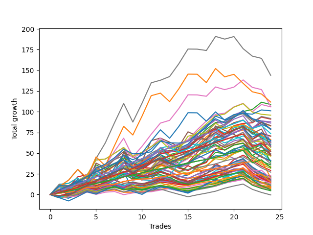

# Short Bulldog 003 
- Symbol: TSLA_Unlimited
- Date Range: 03/23/2022 - 07/08/2022
- Trading Period: 7:20-12:30
- Number of Trades: 24



| Name | Win Percent | Profit | Avg Profit / Trade | Avg Time / Trade |      | Name | Win Percent | Profit | Avg Profit / Trade | Avg Time / Trade |
| ---- | ----------- | ------ | ------------------ | ---------------- | ---- | ---- | ----------- | ------ | ------------------ | ---------------- |
| Sorted By <br> Profit | | | | | | Sorted By <br> Win Percentage ||||
| Seven | 62.50 | 71980.00 | 2999.17 | 165:39 |     | Eighty-Two | 95.83 | 19655.00 | 818.96 | 13:54 |
| Sixty-Three | 54.17 | 55850.00 | 2327.08 | 123:17 |     | Eighty-One | 95.83 | 10215.00 | 425.63 | 12:31 |
| Two | 87.50 | 54345.00 | 2264.38 | 23:08 |     | One Hundred Twenty-Four | 91.67 | 36820.00 | 1534.17 | 13:17 |
| Six | 66.67 | 53140.00 | 2214.17 | 111:34 |     | Eighty-Four | 91.67 | 32025.00 | 1334.37 | 21:38 |
| Fifty-Eight | 83.33 | 52960.00 | 2206.67 | 19:36 |     | One Hundred Twenty-Three | 91.67 | 28455.00 | 1185.62 | 08:48 |
| Seventy-Three | 70.83 | 50550.00 | 2106.25 | 16:02 |     | One Hundred Twenty-Eight | 91.67 | 26175.00 | 1090.62 | 08:34 |
| Sixty | 79.17 | 47935.00 | 1997.29 | 38:29 |     | Eighty-Three | 91.67 | 23660.00 | 985.83 | 17:09 |
| Fifty-Nine | 83.33 | 45930.00 | 1913.75 | 21:49 |     | One Hundred Twenty-Two | 91.67 | 18585.00 | 774.37 | 07:36 |
| Three | 87.50 | 45525.00 | 1896.88 | 25:59 |     | One Hundred Twenty-Seven | 91.67 | 16305.00 | 679.37 | 07:22 |
| Four | 79.17 | 43925.00 | 1830.21 | 44:23 |     | One Hundred Twenty-One | 91.67 | 9835.00 | 409.79 | 06:13 |
| Sixty-Six | 70.83 | 43135.00 | 1797.29 | 17:07 |     | One Hundred Twenty-Six | 91.67 | 7555.00 | 314.79 | 05:59 |
| Fifty-Seven | 83.33 | 41640.00 | 1735.00 | 14:46 |     | Two | 87.50 | 54345.00 | 2264.38 | 23:08 |
| One | 87.50 | 41395.00 | 1724.79 | 16:45 |     | Three | 87.50 | 45525.00 | 1896.88 | 25:59 |
| Forty-Two | 66.67 | 39850.00 | 1660.42 | 14:32 |     | One | 87.50 | 41395.00 | 1724.79 | 16:45 |
| Sixty-Two | 58.33 | 39480.00 | 1645.00 | 80:49 |     | Eighty-Five | 87.50 | 29325.00 | 1221.88 | 34:06 |
| Five | 70.83 | 39255.00 | 1635.63 | 68:31 |     | One Hundred Twenty-Nine | 87.50 | 29020.00 | 1209.17 | 12:08 |
| One Hundred Twenty-Four | 91.67 | 36820.00 | 1534.17 | 13:17 |     | Fifty-Eight | 83.33 | 52960.00 | 2206.67 | 19:36 |
| Sixty-Seven | 70.83 | 35380.00 | 1474.17 | 18:49 |     | Fifty-Nine | 83.33 | 45930.00 | 1913.75 | 21:49 |
| Sixty-Five | 79.17 | 35180.00 | 1465.83 | 13:21 |     | Fifty-Seven | 83.33 | 41640.00 | 1735.00 | 14:46 |
| Forty-Three | 66.67 | 33240.00 | 1385.00 | 15:54 |     | One Hundred Twenty-Five | 83.33 | 32510.00 | 1354.58 | 21:22 |
| Forty-One | 75.00 | 32550.00 | 1356.25 | 11:37 |     | Fifty-Six | 83.33 | 31090.00 | 1295.42 | 09:27 |
| One Hundred Twenty-Five | 83.33 | 32510.00 | 1354.58 | 21:22 |     | Zero | 83.33 | 30070.00 | 1252.92 | 11:13 |
| Eighty-Four | 91.67 | 32025.00 | 1334.37 | 21:38 |     | One Hundred Thirteen | 83.33 | 23200.00 | 966.67 | 05:02 |
| Forty-Four | 58.33 | 31580.00 | 1315.83 | 25:49 |     | One Hundred Twelve | 83.33 | 13545.00 | 564.37 | 03:50 |
| Sixty-Eight | 58.33 | 31115.00 | 1296.46 | 28:06 |     | One Hundred Eleven | 83.33 | 6595.00 | 274.79 | 02:32 |
| Fifty-Six | 83.33 | 31090.00 | 1295.42 | 09:27 |     | One Hundred Sixteen | 83.33 | 4960.00 | 206.67 | 02:40 |
| Sixty-One | 66.67 | 30210.00 | 1258.75 | 54:48 |     | Sixty | 79.17 | 47935.00 | 1997.29 | 38:29 |
| Zero | 83.33 | 30070.00 | 1252.92 | 11:13 |     | Four | 79.17 | 43925.00 | 1830.21 | 44:23 |
| Eighty-Five | 87.50 | 29325.00 | 1221.88 | 34:06 |     | Sixty-Five | 79.17 | 35180.00 | 1465.83 | 13:21 |
| One Hundred Twenty-Nine | 87.50 | 29020.00 | 1209.17 | 12:08 |     | Sixty-Four | 79.17 | 26180.00 | 1090.83 | 08:31 |
| One Hundred Twenty-Three | 91.67 | 28455.00 | 1185.62 | 08:48 |     | One Hundred Fourteen | 79.17 | 26155.00 | 1089.79 | 07:30 |
| Seventy | 50.00 | 27055.00 | 1127.29 | 37:43 |     | Forty-One | 75.00 | 32550.00 | 1356.25 | 11:37 |
| Sixty-Four | 79.17 | 26180.00 | 1090.83 | 08:31 |     | One Hundred Thirty | 75.00 | 23995.00 | 999.79 | 15:17 |
| One Hundred Twenty-Eight | 91.67 | 26175.00 | 1090.62 | 08:34 |     | Forty | 75.00 | 23825.00 | 992.71 | 07:48 |
| One Hundred Fourteen | 79.17 | 26155.00 | 1089.79 | 07:30 |     | One Hundred Six | 75.00 | 4350.00 | 181.25 | 01:48 |
| Sixty-Nine | 54.17 | 24680.00 | 1028.33 | 35:03 |     | Seventy-Three | 70.83 | 50550.00 | 2106.25 | 16:02 |
| One Hundred Thirty | 75.00 | 23995.00 | 999.79 | 15:17 |     | Sixty-Six | 70.83 | 43135.00 | 1797.29 | 17:07 |
| Forty | 75.00 | 23825.00 | 992.71 | 07:48 |     | Five | 70.83 | 39255.00 | 1635.63 | 68:31 |
| Eighty-Three | 91.67 | 23660.00 | 985.83 | 17:09 |     | Sixty-Seven | 70.83 | 35380.00 | 1474.17 | 18:49 |
| Forty-Seven | 33.33 | 23660.00 | 985.83 | 70:53 |     | Ninety-One | 70.83 | 5695.00 | 237.29 | 01:28 |
| One Hundred Thirteen | 83.33 | 23200.00 | 966.67 | 05:02 |     | Ninety-Six | 70.83 | 3670.00 | 152.92 | 01:34 |
| Seventy-One | 50.00 | 20580.00 | 857.50 | 51:26 |     | One Hundred Seventeen | 70.83 | 2965.00 | 123.54 | 03:18 |
| One Hundred Fifteen | 66.67 | 20420.00 | 850.83 | 10:35 |     | One Hundred One | 70.83 | 2565.00 | 106.88 | 01:40 |
| Fifty-Five | 50.00 | 20250.00 | 843.75 | 17:32 |     | Six | 66.67 | 53140.00 | 2214.17 | 111:34 |
| Eighty-Two | 95.83 | 19655.00 | 818.96 | 13:54 |     | Forty-Two | 66.67 | 39850.00 | 1660.42 | 14:32 |
| One Hundred Twenty-Two | 91.67 | 18585.00 | 774.37 | 07:36 |     | Forty-Three | 66.67 | 33240.00 | 1385.00 | 15:54 |
| Fifty-Four | 50.00 | 17895.00 | 745.63 | 14:02 |     | Sixty-One | 66.67 | 30210.00 | 1258.75 | 54:48 |
| Fifty-Three | 50.00 | 16800.00 | 700.00 | 13:40 |     | One Hundred Fifteen | 66.67 | 20420.00 | 850.83 | 10:35 |
| One Hundred Twenty-Seven | 91.67 | 16305.00 | 679.37 | 07:22 |     | One Hundred Eighteen | 66.67 | 7430.00 | 309.58 | 03:56 |
| Fifty | 50.00 | 15845.00 | 660.21 | 09:46 |     | Seven | 62.50 | 71980.00 | 2999.17 | 165:39 |
| Forty-Five | 41.67 | 14540.00 | 605.83 | 35:11 |     | Sixty-Two | 58.33 | 39480.00 | 1645.00 | 80:49 |
| One Hundred Twelve | 83.33 | 13545.00 | 564.37 | 03:50 |     | Forty-Four | 58.33 | 31580.00 | 1315.83 | 25:49 |
| Forty-Eight | 54.17 | 11455.00 | 477.29 | 05:27 |     | Sixty-Eight | 58.33 | 31115.00 | 1296.46 | 28:06 |
| Fifty-Two | 50.00 | 10860.00 | 452.50 | 11:26 |     | Ninety-Three | 58.33 | 10265.00 | 427.71 | 02:19 |
| Forty-Nine | 50.00 | 10285.00 | 428.54 | 07:53 |     | Ninety-Eight | 58.33 | 9700.00 | 404.17 | 02:16 |
| Ninety-Three | 58.33 | 10265.00 | 427.71 | 02:19 |     | One Hundred Eight | 58.33 | 8580.00 | 357.50 | 02:39 |
| Eighty-One | 95.83 | 10215.00 | 425.63 | 12:31 |     | One Hundred Ninteen | 58.33 | 8530.00 | 355.42 | 05:50 |
| One Hundred Twenty-One | 91.67 | 9835.00 | 409.79 | 06:13 |     | Ninety-Nine | 58.33 | 8305.00 | 346.04 | 03:17 |
| Ninety-Eight | 58.33 | 9700.00 | 404.17 | 02:16 |     | One Hundred | 58.33 | 6800.00 | 283.33 | 03:34 |
| Ninety-Four | 50.00 | 9550.00 | 397.92 | 04:18 |     | One Hundred Three | 58.33 | 6045.00 | 251.88 | 02:34 |
| Forty-Six | 33.33 | 9130.00 | 380.42 | 45:16 |     | Ninety-Seven | 58.33 | 4770.00 | 198.75 | 01:55 |
| Fifty-One | 50.00 | 9000.00 | 375.00 | 09:06 |     | Ninety-Two | 58.33 | 4025.00 | 167.71 | 01:57 |
| One Hundred Twenty | 50.00 | 8825.00 | 367.71 | 06:47 |     | One Hundred Seven | 58.33 | 2340.00 | 97.50 | 02:17 |
| One Hundred Eight | 58.33 | 8580.00 | 357.50 | 02:39 |     | One Hundred Two | 58.33 | -195.00 | -8.12 | 02:12 |
| One Hundred Ninteen | 58.33 | 8530.00 | 355.42 | 05:50 |     | Sixty-Three | 54.17 | 55850.00 | 2327.08 | 123:17 |
| Ninety-Nine | 58.33 | 8305.00 | 346.04 | 03:17 |     | Sixty-Nine | 54.17 | 24680.00 | 1028.33 | 35:03 |
| One Hundred Nine | 54.17 | 8090.00 | 337.08 | 04:07 |     | Forty-Eight | 54.17 | 11455.00 | 477.29 | 05:27 |
| One Hundred Four | 54.17 | 7850.00 | 327.08 | 04:52 |     | One Hundred Nine | 54.17 | 8090.00 | 337.08 | 04:07 |
| Ninety-Five | 41.67 | 7850.00 | 327.08 | 05:18 |     | One Hundred Four | 54.17 | 7850.00 | 327.08 | 04:52 |
| One Hundred Ten | 54.17 | 7605.00 | 316.88 | 04:38 |     | One Hundred Ten | 54.17 | 7605.00 | 316.88 | 04:38 |
| One Hundred Twenty-Six | 91.67 | 7555.00 | 314.79 | 05:59 |     | Seventy | 50.00 | 27055.00 | 1127.29 | 37:43 |
| One Hundred Eighteen | 66.67 | 7430.00 | 309.58 | 03:56 |     | Seventy-One | 50.00 | 20580.00 | 857.50 | 51:26 |
| One Hundred | 58.33 | 6800.00 | 283.33 | 03:34 |     | Fifty-Five | 50.00 | 20250.00 | 843.75 | 17:32 |
| One Hundred Eleven | 83.33 | 6595.00 | 274.79 | 02:32 |     | Fifty-Four | 50.00 | 17895.00 | 745.63 | 14:02 |
| One Hundred Three | 58.33 | 6045.00 | 251.88 | 02:34 |     | Fifty-Three | 50.00 | 16800.00 | 700.00 | 13:40 |
| Ninety-One | 70.83 | 5695.00 | 237.29 | 01:28 |     | Fifty | 50.00 | 15845.00 | 660.21 | 09:46 |
| One Hundred Five | 45.83 | 5650.00 | 235.42 | 06:52 |     | Fifty-Two | 50.00 | 10860.00 | 452.50 | 11:26 |
| One Hundred Sixteen | 83.33 | 4960.00 | 206.67 | 02:40 |     | Forty-Nine | 50.00 | 10285.00 | 428.54 | 07:53 |
| Ninety-Seven | 58.33 | 4770.00 | 198.75 | 01:55 |     | Ninety-Four | 50.00 | 9550.00 | 397.92 | 04:18 |
| One Hundred Six | 75.00 | 4350.00 | 181.25 | 01:48 |     | Fifty-One | 50.00 | 9000.00 | 375.00 | 09:06 |
| Ninety-Two | 58.33 | 4025.00 | 167.71 | 01:57 |     | One Hundred Twenty | 50.00 | 8825.00 | 367.71 | 06:47 |
| Ninety-Six | 70.83 | 3670.00 | 152.92 | 01:34 |     | One Hundred Five | 45.83 | 5650.00 | 235.42 | 06:52 |
| One Hundred Seventeen | 70.83 | 2965.00 | 123.54 | 03:18 |     | Forty-Five | 41.67 | 14540.00 | 605.83 | 35:11 |
| One Hundred One | 70.83 | 2565.00 | 106.88 | 01:40 |     | Ninety-Five | 41.67 | 7850.00 | 327.08 | 05:18 |
| One Hundred Seven | 58.33 | 2340.00 | 97.50 | 02:17 |     | Forty-Seven | 33.33 | 23660.00 | 985.83 | 70:53 |
| One Hundred Two | 58.33 | -195.00 | -8.12 | 02:12 |     | Forty-Six | 33.33 | 9130.00 | 380.42 | 45:16 |

## NO STOPLOSS

### Test Zero
* Sell when price hits the middle line of the 20p bollinger
* No Stoploss
* Results:
```
Total Trades: 24
Percent Up: 16.67
Percent Down: 83.33
Total Points Moved Down: 60.14
Potential Profit: 30070.00
Total Points Ups: 23.70 Count Ups: 4
Total Points Downs: 83.84 Count Downs: 20
```

<details><summary>Trades</summary>

<code>In: 2022-03-25 07:49:00		Out: 2022-03-25 07:54:10		Total Position Time: 05:10		Total Move Down: 2.20		Total to Date: 2.20</code> <br />
<code>In: 2022-03-31 07:23:00		Out: 2022-03-31 07:26:50		Total Position Time: 03:50		Total Move Down: 3.15		Total to Date: 5.35</code> <br />
<code>In: 2022-03-31 07:58:00		Out: 2022-03-31 08:07:45		Total Position Time: 09:45		Total Move Down: 3.12		Total to Date: 8.47</code> <br />
<code>In: 2022-04-28 09:49:00		Out: 2022-04-28 10:06:10		Total Position Time: 17:10		Total Move Down: 1.39		Total to Date: 9.86</code> <br />
<code>In: 2022-05-02 07:32:00		Out: 2022-05-02 07:44:25		Total Position Time: 12:25		Total Move Down: 4.24		Total to Date: 14.10</code> <br />
<code>In: 2022-05-04 09:41:00		Out: 2022-05-04 09:47:00		Total Position Time: 06:00		Total Move Down: 5.01		Total to Date: 19.11</code> <br />
<code>In: 2022-05-04 10:05:00		Out: 2022-05-04 10:11:15		Total Position Time: 06:15		Total Move Down: 5.07		Total to Date: 24.18</code> <br />
<code>In: 2022-05-04 11:03:00		Out: 2022-05-04 11:06:40		Total Position Time: 03:40		Total Move Down: 3.69		Total to Date: 27.87</code> <br />
<code>In: 2022-05-04 11:49:00		Out: 2022-05-04 12:47:00		Total Position Time: 58:00		Total Move Down: -22.51		Total to Date: 5.36</code> <br />
<code>In: 2022-05-06 07:48:00		Out: 2022-05-06 08:03:10		Total Position Time: 15:10		Total Move Down: 1.86		Total to Date: 7.22</code> <br />
<code>In: 2022-05-06 07:51:00		Out: 2022-05-06 08:03:10		Total Position Time: 12:10		Total Move Down: 3.78		Total to Date: 11.00</code> <br />
<code>In: 2022-05-17 11:10:00		Out: 2022-05-17 11:12:15		Total Position Time: 02:15		Total Move Down: 5.88		Total to Date: 16.88</code> <br />
<code>In: 2022-05-19 07:57:00		Out: 2022-05-19 08:06:00		Total Position Time: 09:00		Total Move Down: 4.32		Total to Date: 21.20</code> <br />
<code>In: 2022-05-19 08:37:00		Out: 2022-05-19 08:50:45		Total Position Time: 13:45		Total Move Down: 0.03		Total to Date: 21.23</code> <br />
<code>In: 2022-05-19 08:39:00		Out: 2022-05-19 08:50:45		Total Position Time: 11:45		Total Move Down: 2.42		Total to Date: 23.65</code> <br />
<code>In: 2022-05-23 07:33:00		Out: 2022-05-23 07:42:10		Total Position Time: 09:10		Total Move Down: 10.00		Total to Date: 33.65</code> <br />
<code>In: 2022-05-23 07:34:00		Out: 2022-05-23 07:42:10		Total Position Time: 08:10		Total Move Down: 8.48		Total to Date: 42.13</code> <br />
<code>In: 2022-05-24 09:17:00		Out: 2022-05-24 09:24:15		Total Position Time: 07:15		Total Move Down: 4.68		Total to Date: 46.81</code> <br />
<code>In: 2022-05-25 08:04:00		Out: 2022-05-25 08:20:55		Total Position Time: 16:55		Total Move Down: -0.14		Total to Date: 46.67</code> <br />
<code>In: 2022-05-25 08:15:00		Out: 2022-05-25 08:20:55		Total Position Time: 05:55		Total Move Down: 6.15		Total to Date: 52.82</code> <br />
<code>In: 2022-06-15 09:34:00		Out: 2022-06-15 09:35:10		Total Position Time: 01:10		Total Move Down: 2.28		Total to Date: 55.10</code> <br />
<code>In: 2022-06-15 11:40:00		Out: 2022-06-15 11:52:35		Total Position Time: 12:35		Total Move Down: -0.18		Total to Date: 54.92</code> <br />
<code>In: 2022-06-15 11:43:00		Out: 2022-06-15 11:52:35		Total Position Time: 09:35		Total Move Down: 6.09		Total to Date: 61.01</code> <br />
<code>In: 2022-07-05 09:03:00		Out: 2022-07-05 09:15:15		Total Position Time: 12:15		Total Move Down: -0.87		Total to Date: 60.14</code> <br />


</details>

### Test One
* Sell when the price hits the upper line of the 20p 1std bollinger
* No Stoploss
* Results:
```
Total Trades: 24
Percent Up: 12.50
Percent Down: 87.50
Total Points Moved Down: 82.79
Potential Profit: 41395.00
Total Points Ups: 27.13 Count Ups: 3
Total Points Downs: 109.92 Count Downs: 21
```

<details><summary>Trades</summary>

<code>In: 2022-03-25 07:49:00		Out: 2022-03-25 07:56:05		Total Position Time: 07:05		Total Move Down: 4.69		Total to Date: 4.69</code> <br />
<code>In: 2022-03-31 07:23:00		Out: 2022-03-31 07:41:20		Total Position Time: 18:20		Total Move Down: 2.15		Total to Date: 6.84</code> <br />
<code>In: 2022-03-31 07:58:00		Out: 2022-03-31 08:08:25		Total Position Time: 10:25		Total Move Down: 4.94		Total to Date: 11.78</code> <br />
<code>In: 2022-04-28 09:49:00		Out: 2022-04-28 10:08:55		Total Position Time: 19:55		Total Move Down: 4.75		Total to Date: 16.53</code> <br />
<code>In: 2022-05-02 07:32:00		Out: 2022-05-02 07:46:15		Total Position Time: 14:15		Total Move Down: 6.20		Total to Date: 22.73</code> <br />
<code>In: 2022-05-04 09:41:00		Out: 2022-05-04 09:51:10		Total Position Time: 10:10		Total Move Down: 5.83		Total to Date: 28.56</code> <br />
<code>In: 2022-05-04 10:05:00		Out: 2022-05-04 10:16:30		Total Position Time: 11:30		Total Move Down: 6.31		Total to Date: 34.87</code> <br />
<code>In: 2022-05-04 11:03:00		Out: 2022-05-04 11:07:15		Total Position Time: 04:15		Total Move Down: 7.06		Total to Date: 41.93</code> <br />
<code>In: 2022-05-04 11:49:00		Out: 2022-05-04 12:47:00		Total Position Time: 58:00		Total Move Down: -22.51		Total to Date: 19.42</code> <br />
<code>In: 2022-05-06 07:48:00		Out: 2022-05-06 08:05:10		Total Position Time: 17:10		Total Move Down: 4.44		Total to Date: 23.86</code> <br />
<code>In: 2022-05-06 07:51:00		Out: 2022-05-06 08:05:10		Total Position Time: 14:10		Total Move Down: 6.36		Total to Date: 30.22</code> <br />
<code>In: 2022-05-17 11:10:00		Out: 2022-05-17 11:13:15		Total Position Time: 03:15		Total Move Down: 8.77		Total to Date: 38.99</code> <br />
<code>In: 2022-05-19 07:57:00		Out: 2022-05-19 08:16:15		Total Position Time: 19:15		Total Move Down: 2.21		Total to Date: 41.20</code> <br />
<code>In: 2022-05-19 08:37:00		Out: 2022-05-19 08:53:35		Total Position Time: 16:35		Total Move Down: 1.44		Total to Date: 42.64</code> <br />
<code>In: 2022-05-19 08:39:00		Out: 2022-05-19 08:53:35		Total Position Time: 14:35		Total Move Down: 3.83		Total to Date: 46.47</code> <br />
<code>In: 2022-05-23 07:33:00		Out: 2022-05-23 07:50:05		Total Position Time: 17:05		Total Move Down: 9.07		Total to Date: 55.54</code> <br />
<code>In: 2022-05-23 07:34:00		Out: 2022-05-23 07:50:05		Total Position Time: 16:05		Total Move Down: 7.55		Total to Date: 63.09</code> <br />
<code>In: 2022-05-24 09:17:00		Out: 2022-05-24 09:29:10		Total Position Time: 12:10		Total Move Down: 6.15		Total to Date: 69.24</code> <br />
<code>In: 2022-05-25 08:04:00		Out: 2022-05-25 08:29:55		Total Position Time: 25:55		Total Move Down: -0.40		Total to Date: 68.84</code> <br />
<code>In: 2022-05-25 08:15:00		Out: 2022-05-25 08:29:55		Total Position Time: 14:55		Total Move Down: 5.89		Total to Date: 74.73</code> <br />
<code>In: 2022-06-15 09:34:00		Out: 2022-06-15 09:39:45		Total Position Time: 05:45		Total Move Down: 3.27		Total to Date: 78.00</code> <br />
<code>In: 2022-06-15 11:40:00		Out: 2022-06-15 11:57:45		Total Position Time: 17:45		Total Move Down: 1.37		Total to Date: 79.37</code> <br />
<code>In: 2022-06-15 11:43:00		Out: 2022-06-15 11:57:45		Total Position Time: 14:45		Total Move Down: 7.64		Total to Date: 87.01</code> <br />
<code>In: 2022-07-05 09:03:00		Out: 2022-07-05 09:41:50		Total Position Time: 38:50		Total Move Down: -4.22		Total to Date: 82.79</code> <br />


</details>

### Test Two
* Sell when the price hits the upper line of the 20p 2std bollinger
* No Stoploss
* Results:
```
Total Trades: 24
Percent Up: 12.50
Percent Down: 87.50
Total Points Moved Down: 108.69
Potential Profit: 54345.00
Total Points Ups: 33.40 Count Ups: 3
Total Points Downs: 142.09 Count Downs: 21
```

<details><summary>Trades</summary>

<code>In: 2022-03-25 07:49:00		Out: 2022-03-25 08:01:25		Total Position Time: 12:25		Total Move Down: 6.49		Total to Date: 6.49</code> <br />
<code>In: 2022-03-31 07:23:00		Out: 2022-03-31 07:41:35		Total Position Time: 18:35		Total Move Down: 3.45		Total to Date: 9.94</code> <br />
<code>In: 2022-03-31 07:58:00		Out: 2022-03-31 08:25:40		Total Position Time: 27:40		Total Move Down: 6.24		Total to Date: 16.18</code> <br />
<code>In: 2022-04-28 09:49:00		Out: 2022-04-28 10:09:15		Total Position Time: 20:15		Total Move Down: 7.87		Total to Date: 24.05</code> <br />
<code>In: 2022-05-02 07:32:00		Out: 2022-05-02 07:47:15		Total Position Time: 15:15		Total Move Down: 8.92		Total to Date: 32.97</code> <br />
<code>In: 2022-05-04 09:41:00		Out: 2022-05-04 10:18:30		Total Position Time: 37:30		Total Move Down: 2.10		Total to Date: 35.07</code> <br />
<code>In: 2022-05-04 10:05:00		Out: 2022-05-04 10:18:30		Total Position Time: 13:30		Total Move Down: 7.75		Total to Date: 42.82</code> <br />
<code>In: 2022-05-04 11:03:00		Out: 2022-05-04 11:07:25		Total Position Time: 04:25		Total Move Down: 12.12		Total to Date: 54.94</code> <br />
<code>In: 2022-05-04 11:49:00		Out: 2022-05-04 12:47:00		Total Position Time: 58:00		Total Move Down: -22.51		Total to Date: 32.43</code> <br />
<code>In: 2022-05-06 07:48:00		Out: 2022-05-06 08:06:05		Total Position Time: 18:05		Total Move Down: 5.64		Total to Date: 38.07</code> <br />
<code>In: 2022-05-06 07:51:00		Out: 2022-05-06 08:06:05		Total Position Time: 15:05		Total Move Down: 7.56		Total to Date: 45.63</code> <br />
<code>In: 2022-05-17 11:10:00		Out: 2022-05-17 11:13:30		Total Position Time: 03:30		Total Move Down: 10.66		Total to Date: 56.29</code> <br />
<code>In: 2022-05-19 07:57:00		Out: 2022-05-19 08:54:35		Total Position Time: 57:35		Total Move Down: -8.08		Total to Date: 48.21</code> <br />
<code>In: 2022-05-19 08:37:00		Out: 2022-05-19 08:54:35		Total Position Time: 17:35		Total Move Down: 2.83		Total to Date: 51.04</code> <br />
<code>In: 2022-05-19 08:39:00		Out: 2022-05-19 08:54:35		Total Position Time: 15:35		Total Move Down: 5.22		Total to Date: 56.26</code> <br />
<code>In: 2022-05-23 07:33:00		Out: 2022-05-23 07:51:20		Total Position Time: 18:20		Total Move Down: 12.07		Total to Date: 68.33</code> <br />
<code>In: 2022-05-23 07:34:00		Out: 2022-05-23 07:51:20		Total Position Time: 17:20		Total Move Down: 10.55		Total to Date: 78.88</code> <br />
<code>In: 2022-05-24 09:17:00		Out: 2022-05-24 09:31:20		Total Position Time: 14:20		Total Move Down: 8.07		Total to Date: 86.95</code> <br />
<code>In: 2022-05-25 08:04:00		Out: 2022-05-25 08:30:40		Total Position Time: 26:40		Total Move Down: 1.38		Total to Date: 88.33</code> <br />
<code>In: 2022-05-25 08:15:00		Out: 2022-05-25 08:30:40		Total Position Time: 15:40		Total Move Down: 7.67		Total to Date: 96.00</code> <br />
<code>In: 2022-06-15 09:34:00		Out: 2022-06-15 09:53:25		Total Position Time: 19:25		Total Move Down: 4.27		Total to Date: 100.27</code> <br />
<code>In: 2022-06-15 11:40:00		Out: 2022-06-15 12:15:30		Total Position Time: 35:30		Total Move Down: 2.48		Total to Date: 102.75</code> <br />
<code>In: 2022-06-15 11:43:00		Out: 2022-06-15 12:15:30		Total Position Time: 32:30		Total Move Down: 8.75		Total to Date: 111.50</code> <br />
<code>In: 2022-07-05 09:03:00		Out: 2022-07-05 09:43:40		Total Position Time: 40:40		Total Move Down: -2.81		Total to Date: 108.69</code> <br />


</details>

### Test Three
* Sell when price hits the middle line of the 50p bollinger
* No Stoploss
* Results:
```
Total Trades: 24
Percent Up: 12.50
Percent Down: 87.50
Total Points Moved Down: 91.05
Potential Profit: 45525.00
Total Points Ups: 34.80 Count Ups: 3
Total Points Downs: 125.85 Count Downs: 21
```

<details><summary>Trades</summary>

<code>In: 2022-03-25 07:49:00		Out: 2022-03-25 08:01:05		Total Position Time: 12:05		Total Move Down: 5.55		Total to Date: 5.55</code> <br />
<code>In: 2022-03-31 07:23:00		Out: 2022-03-31 07:41:35		Total Position Time: 18:35		Total Move Down: 3.45		Total to Date: 9.00</code> <br />
<code>In: 2022-03-31 07:58:00		Out: 2022-03-31 08:08:25		Total Position Time: 10:25		Total Move Down: 4.94		Total to Date: 13.94</code> <br />
<code>In: 2022-04-28 09:49:00		Out: 2022-04-28 10:18:05		Total Position Time: 29:05		Total Move Down: 6.93		Total to Date: 20.87</code> <br />
<code>In: 2022-05-02 07:32:00		Out: 2022-05-02 07:48:30		Total Position Time: 16:30		Total Move Down: 11.58		Total to Date: 32.45</code> <br />
<code>In: 2022-05-04 09:41:00		Out: 2022-05-04 10:18:30		Total Position Time: 37:30		Total Move Down: 2.10		Total to Date: 34.55</code> <br />
<code>In: 2022-05-04 10:05:00		Out: 2022-05-04 10:18:30		Total Position Time: 13:30		Total Move Down: 7.75		Total to Date: 42.30</code> <br />
<code>In: 2022-05-04 11:03:00		Out: 2022-05-04 11:06:50		Total Position Time: 03:50		Total Move Down: 4.82		Total to Date: 47.12</code> <br />
<code>In: 2022-05-04 11:49:00		Out: 2022-05-04 12:47:00		Total Position Time: 58:00		Total Move Down: -22.51		Total to Date: 24.61</code> <br />
<code>In: 2022-05-06 07:48:00		Out: 2022-05-06 08:10:35		Total Position Time: 22:35		Total Move Down: 5.68		Total to Date: 30.29</code> <br />
<code>In: 2022-05-06 07:51:00		Out: 2022-05-06 08:10:35		Total Position Time: 19:35		Total Move Down: 7.60		Total to Date: 37.89</code> <br />
<code>In: 2022-05-17 11:10:00		Out: 2022-05-17 11:12:15		Total Position Time: 02:15		Total Move Down: 5.88		Total to Date: 43.77</code> <br />
<code>In: 2022-05-19 07:57:00		Out: 2022-05-19 09:12:15		Total Position Time: 75:15		Total Move Down: -9.83		Total to Date: 33.94</code> <br />
<code>In: 2022-05-19 08:37:00		Out: 2022-05-19 09:12:15		Total Position Time: 35:15		Total Move Down: 1.08		Total to Date: 35.02</code> <br />
<code>In: 2022-05-19 08:39:00		Out: 2022-05-19 09:12:15		Total Position Time: 33:15		Total Move Down: 3.47		Total to Date: 38.49</code> <br />
<code>In: 2022-05-23 07:33:00		Out: 2022-05-23 07:57:30		Total Position Time: 24:30		Total Move Down: 12.28		Total to Date: 50.77</code> <br />
<code>In: 2022-05-23 07:34:00		Out: 2022-05-23 07:57:30		Total Position Time: 23:30		Total Move Down: 10.76		Total to Date: 61.53</code> <br />
<code>In: 2022-05-24 09:17:00		Out: 2022-05-24 09:31:10		Total Position Time: 14:10		Total Move Down: 7.86		Total to Date: 69.39</code> <br />
<code>In: 2022-05-25 08:04:00		Out: 2022-05-25 08:34:25		Total Position Time: 30:25		Total Move Down: 3.77		Total to Date: 73.16</code> <br />
<code>In: 2022-05-25 08:15:00		Out: 2022-05-25 08:34:25		Total Position Time: 19:25		Total Move Down: 10.06		Total to Date: 83.22</code> <br />
<code>In: 2022-06-15 09:34:00		Out: 2022-06-15 09:53:05		Total Position Time: 19:05		Total Move Down: 2.72		Total to Date: 85.94</code> <br />
<code>In: 2022-06-15 11:40:00		Out: 2022-06-15 12:12:55		Total Position Time: 32:55		Total Move Down: 0.65		Total to Date: 86.59</code> <br />
<code>In: 2022-06-15 11:43:00		Out: 2022-06-15 12:12:55		Total Position Time: 29:55		Total Move Down: 6.92		Total to Date: 93.51</code> <br />
<code>In: 2022-07-05 09:03:00		Out: 2022-07-05 09:45:05		Total Position Time: 42:05		Total Move Down: -2.46		Total to Date: 91.05</code> <br />


</details>

### Test Four
* Sell when the price hits the upper line of the 50p 1std bollinger
* No Stoploss
* Results:
```
Total Trades: 24
Percent Up: 20.83
Percent Down: 79.17
Total Points Moved Down: 87.85
Potential Profit: 43925.00
Total Points Ups: 42.64 Count Ups: 5
Total Points Downs: 130.49 Count Downs: 19
```

<details><summary>Trades</summary>

<code>In: 2022-03-25 07:49:00		Out: 2022-03-25 08:07:50		Total Position Time: 18:50		Total Move Down: 9.08		Total to Date: 9.08</code> <br />
<code>In: 2022-03-31 07:23:00		Out: 2022-03-31 08:27:55		Total Position Time: 64:55		Total Move Down: 0.94		Total to Date: 10.02</code> <br />
<code>In: 2022-03-31 07:58:00		Out: 2022-03-31 08:27:55		Total Position Time: 29:55		Total Move Down: 6.49		Total to Date: 16.51</code> <br />
<code>In: 2022-04-28 09:49:00		Out: 2022-04-28 10:30:55		Total Position Time: 41:55		Total Move Down: 6.78		Total to Date: 23.29</code> <br />
<code>In: 2022-05-02 07:32:00		Out: 2022-05-02 08:04:00		Total Position Time: 32:00		Total Move Down: 18.46		Total to Date: 41.75</code> <br />
<code>In: 2022-05-04 09:41:00		Out: 2022-05-04 10:45:50		Total Position Time: 64:50		Total Move Down: 1.18		Total to Date: 42.93</code> <br />
<code>In: 2022-05-04 10:05:00		Out: 2022-05-04 10:45:50		Total Position Time: 40:50		Total Move Down: 6.83		Total to Date: 49.76</code> <br />
<code>In: 2022-05-04 11:03:00		Out: 2022-05-04 11:07:15		Total Position Time: 04:15		Total Move Down: 7.06		Total to Date: 56.82</code> <br />
<code>In: 2022-05-04 11:49:00		Out: 2022-05-04 12:47:00		Total Position Time: 58:00		Total Move Down: -22.51		Total to Date: 34.31</code> <br />
<code>In: 2022-05-06 07:48:00		Out: 2022-05-06 08:35:05		Total Position Time: 47:05		Total Move Down: 4.87		Total to Date: 39.18</code> <br />
<code>In: 2022-05-06 07:51:00		Out: 2022-05-06 08:35:05		Total Position Time: 44:05		Total Move Down: 6.79		Total to Date: 45.97</code> <br />
<code>In: 2022-05-17 11:10:00		Out: 2022-05-17 11:12:55		Total Position Time: 02:55		Total Move Down: 7.36		Total to Date: 53.33</code> <br />
<code>In: 2022-05-19 07:57:00		Out: 2022-05-19 09:19:50		Total Position Time: 82:50		Total Move Down: -7.41		Total to Date: 45.92</code> <br />
<code>In: 2022-05-19 08:37:00		Out: 2022-05-19 09:19:50		Total Position Time: 42:50		Total Move Down: 3.50		Total to Date: 49.42</code> <br />
<code>In: 2022-05-19 08:39:00		Out: 2022-05-19 09:19:50		Total Position Time: 40:50		Total Move Down: 5.89		Total to Date: 55.31</code> <br />
<code>In: 2022-05-23 07:33:00		Out: 2022-05-23 08:21:15		Total Position Time: 48:15		Total Move Down: 11.17		Total to Date: 66.48</code> <br />
<code>In: 2022-05-23 07:34:00		Out: 2022-05-23 08:21:15		Total Position Time: 47:15		Total Move Down: 9.65		Total to Date: 76.13</code> <br />
<code>In: 2022-05-24 09:17:00		Out: 2022-05-24 09:34:00		Total Position Time: 17:00		Total Move Down: 9.78		Total to Date: 85.91</code> <br />
<code>In: 2022-05-25 08:04:00		Out: 2022-05-25 09:18:40		Total Position Time: 74:40		Total Move Down: 2.05		Total to Date: 87.96</code> <br />
<code>In: 2022-05-25 08:15:00		Out: 2022-05-25 09:18:40		Total Position Time: 63:40		Total Move Down: 8.34		Total to Date: 96.30</code> <br />
<code>In: 2022-06-15 09:34:00		Out: 2022-06-15 09:53:25		Total Position Time: 19:25		Total Move Down: 4.27		Total to Date: 100.57</code> <br />
<code>In: 2022-06-15 11:40:00		Out: 2022-06-15 12:47:00		Total Position Time: 67:00		Total Move Down: -8.98		Total to Date: 91.59</code> <br />
<code>In: 2022-06-15 11:43:00		Out: 2022-06-15 12:47:00		Total Position Time: 64:00		Total Move Down: -2.71		Total to Date: 88.88</code> <br />
<code>In: 2022-07-05 09:03:00		Out: 2022-07-05 09:51:05		Total Position Time: 48:05		Total Move Down: -1.03		Total to Date: 87.85</code> <br />


</details>

### Test Five
* Sell when the price hits the upper line of the 50p 2std bollinger
* No Stoploss
* Results:
```
Total Trades: 24
Percent Up: 29.17
Percent Down: 70.83
Total Points Moved Down: 78.51
Potential Profit: 39255.00
Total Points Ups: 60.91 Count Ups: 7
Total Points Downs: 139.42 Count Downs: 17
```

<details><summary>Trades</summary>

<code>In: 2022-03-25 07:49:00		Out: 2022-03-25 08:09:20		Total Position Time: 20:20		Total Move Down: 12.40		Total to Date: 12.40</code> <br />
<code>In: 2022-03-31 07:23:00		Out: 2022-03-31 09:11:45		Total Position Time: 108:45		Total Move Down: 1.10		Total to Date: 13.50</code> <br />
<code>In: 2022-03-31 07:58:00		Out: 2022-03-31 09:11:45		Total Position Time: 73:45		Total Move Down: 6.65		Total to Date: 20.15</code> <br />
<code>In: 2022-04-28 09:49:00		Out: 2022-04-28 12:29:40		Total Position Time: 160:40		Total Move Down: -12.89		Total to Date: 7.26</code> <br />
<code>In: 2022-05-02 07:32:00		Out: 2022-05-02 08:42:20		Total Position Time: 70:20		Total Move Down: 19.95		Total to Date: 27.21</code> <br />
<code>In: 2022-05-04 09:41:00		Out: 2022-05-04 11:07:20		Total Position Time: 86:20		Total Move Down: 4.76		Total to Date: 31.97</code> <br />
<code>In: 2022-05-04 10:05:00		Out: 2022-05-04 11:07:20		Total Position Time: 62:20		Total Move Down: 10.41		Total to Date: 42.38</code> <br />
<code>In: 2022-05-04 11:03:00		Out: 2022-05-04 11:07:20		Total Position Time: 04:20		Total Move Down: 9.54		Total to Date: 51.92</code> <br />
<code>In: 2022-05-04 11:49:00		Out: 2022-05-04 12:47:00		Total Position Time: 58:00		Total Move Down: -22.51		Total to Date: 29.41</code> <br />
<code>In: 2022-05-06 07:48:00		Out: 2022-05-06 08:38:00		Total Position Time: 50:00		Total Move Down: 7.69		Total to Date: 37.10</code> <br />
<code>In: 2022-05-06 07:51:00		Out: 2022-05-06 08:38:00		Total Position Time: 47:00		Total Move Down: 9.61		Total to Date: 46.71</code> <br />
<code>In: 2022-05-17 11:10:00		Out: 2022-05-17 11:13:25		Total Position Time: 03:25		Total Move Down: 9.60		Total to Date: 56.31</code> <br />
<code>In: 2022-05-19 07:57:00		Out: 2022-05-19 09:20:40		Total Position Time: 83:40		Total Move Down: -4.92		Total to Date: 51.39</code> <br />
<code>In: 2022-05-19 08:37:00		Out: 2022-05-19 09:20:40		Total Position Time: 43:40		Total Move Down: 5.99		Total to Date: 57.38</code> <br />
<code>In: 2022-05-19 08:39:00		Out: 2022-05-19 09:20:40		Total Position Time: 41:40		Total Move Down: 8.38		Total to Date: 65.76</code> <br />
<code>In: 2022-05-23 07:33:00		Out: 2022-05-23 09:51:40		Total Position Time: 138:40		Total Move Down: 1.32		Total to Date: 67.08</code> <br />
<code>In: 2022-05-23 07:34:00		Out: 2022-05-23 09:51:40		Total Position Time: 137:40		Total Move Down: -0.20		Total to Date: 66.88</code> <br />
<code>In: 2022-05-24 09:17:00		Out: 2022-05-24 09:39:55		Total Position Time: 22:55		Total Move Down: 12.28		Total to Date: 79.16</code> <br />
<code>In: 2022-05-25 08:04:00		Out: 2022-05-25 09:22:05		Total Position Time: 78:05		Total Move Down: 4.00		Total to Date: 83.16</code> <br />
<code>In: 2022-05-25 08:15:00		Out: 2022-05-25 09:22:05		Total Position Time: 67:05		Total Move Down: 10.29		Total to Date: 93.45</code> <br />
<code>In: 2022-06-15 09:34:00		Out: 2022-06-15 09:55:20		Total Position Time: 21:20		Total Move Down: 5.45		Total to Date: 98.90</code> <br />
<code>In: 2022-06-15 11:40:00		Out: 2022-06-15 12:47:00		Total Position Time: 67:00		Total Move Down: -8.98		Total to Date: 89.92</code> <br />
<code>In: 2022-06-15 11:43:00		Out: 2022-06-15 12:47:00		Total Position Time: 64:00		Total Move Down: -2.71		Total to Date: 87.21</code> <br />
<code>In: 2022-07-05 09:03:00		Out: 2022-07-05 11:16:35		Total Position Time: 133:35		Total Move Down: -8.70		Total to Date: 78.51</code> <br />


</details>

### Test Six
* Sell when the price hits the middle line of the 1std VWAP
* No Stoploss
* Results:
```
Total Trades: 24
Percent Up: 33.33
Percent Down: 66.67
Total Points Moved Down: 106.28
Potential Profit: 53140.00
Total Points Ups: 71.54 Count Ups: 8
Total Points Downs: 177.82 Count Downs: 16
```

<details><summary>Trades</summary>

<code>In: 2022-03-25 07:49:00		Out: 2022-03-25 08:01:30		Total Position Time: 12:30		Total Move Down: 6.65		Total to Date: 6.65</code> <br />
<code>In: 2022-03-31 07:23:00		Out: 2022-03-31 09:13:05		Total Position Time: 110:05		Total Move Down: 2.96		Total to Date: 9.61</code> <br />
<code>In: 2022-03-31 07:58:00		Out: 2022-03-31 09:13:05		Total Position Time: 75:05		Total Move Down: 8.51		Total to Date: 18.12</code> <br />
<code>In: 2022-04-28 09:49:00		Out: 2022-04-28 12:47:00		Total Position Time: 178:00		Total Move Down: -11.90		Total to Date: 6.22</code> <br />
<code>In: 2022-05-02 07:32:00		Out: 2022-05-02 07:57:10		Total Position Time: 25:10		Total Move Down: 18.03		Total to Date: 24.25</code> <br />
<code>In: 2022-05-04 09:41:00		Out: 2022-05-04 11:07:40		Total Position Time: 86:40		Total Move Down: 11.13		Total to Date: 35.38</code> <br />
<code>In: 2022-05-04 10:05:00		Out: 2022-05-04 11:07:40		Total Position Time: 62:40		Total Move Down: 16.78		Total to Date: 52.16</code> <br />
<code>In: 2022-05-04 11:03:00		Out: 2022-05-04 11:07:40		Total Position Time: 04:40		Total Move Down: 15.91		Total to Date: 68.07</code> <br />
<code>In: 2022-05-04 11:49:00		Out: 2022-05-04 12:47:00		Total Position Time: 58:00		Total Move Down: -22.51		Total to Date: 45.56</code> <br />
<code>In: 2022-05-06 07:48:00		Out: 2022-05-06 09:19:55		Total Position Time: 91:55		Total Move Down: 12.67		Total to Date: 58.23</code> <br />
<code>In: 2022-05-06 07:51:00		Out: 2022-05-06 09:19:55		Total Position Time: 88:55		Total Move Down: 14.59		Total to Date: 72.82</code> <br />
<code>In: 2022-05-17 11:10:00		Out: 2022-05-17 11:15:15		Total Position Time: 05:15		Total Move Down: 13.48		Total to Date: 86.30</code> <br />
<code>In: 2022-05-19 07:57:00		Out: 2022-05-19 09:41:25		Total Position Time: 104:25		Total Move Down: 3.30		Total to Date: 89.60</code> <br />
<code>In: 2022-05-19 08:37:00		Out: 2022-05-19 09:41:25		Total Position Time: 64:25		Total Move Down: 14.21		Total to Date: 103.81</code> <br />
<code>In: 2022-05-19 08:39:00		Out: 2022-05-19 09:41:25		Total Position Time: 62:25		Total Move Down: 16.60		Total to Date: 120.41</code> <br />
<code>In: 2022-05-23 07:33:00		Out: 2022-05-23 12:47:00		Total Position Time: 314:00		Total Move Down: -0.11		Total to Date: 120.30</code> <br />
<code>In: 2022-05-23 07:34:00		Out: 2022-05-23 12:47:00		Total Position Time: 313:00		Total Move Down: -1.63		Total to Date: 118.67</code> <br />
<code>In: 2022-05-24 09:17:00		Out: 2022-05-24 09:37:00		Total Position Time: 20:00		Total Move Down: 11.24		Total to Date: 129.91</code> <br />
<code>In: 2022-05-25 08:04:00		Out: 2022-05-25 12:47:00		Total Position Time: 283:00		Total Move Down: -3.23		Total to Date: 126.68</code> <br />
<code>In: 2022-05-25 08:15:00		Out: 2022-05-25 12:47:00		Total Position Time: 272:00		Total Move Down: 3.06		Total to Date: 129.74</code> <br />
<code>In: 2022-06-15 09:34:00		Out: 2022-06-15 11:04:30		Total Position Time: 90:30		Total Move Down: 8.70		Total to Date: 138.44</code> <br />
<code>In: 2022-06-15 11:40:00		Out: 2022-06-15 12:47:00		Total Position Time: 67:00		Total Move Down: -8.98		Total to Date: 129.46</code> <br />
<code>In: 2022-06-15 11:43:00		Out: 2022-06-15 12:47:00		Total Position Time: 64:00		Total Move Down: -2.71		Total to Date: 126.75</code> <br />
<code>In: 2022-07-05 09:03:00		Out: 2022-07-05 12:47:00		Total Position Time: 224:00		Total Move Down: -20.47		Total to Date: 106.28</code> <br />


</details>

### Test Seven
* Sell when the price hits the upper line of the 1std VWAP
* No Stoploss
* Results:
```
Total Trades: 24
Percent Up: 37.50
Percent Down: 62.50
Total Points Moved Down: 143.96
Potential Profit: 71980.00
Total Points Ups: 86.15 Count Ups: 9
Total Points Downs: 230.11 Count Downs: 15
```

<details><summary>Trades</summary>

<code>In: 2022-03-25 07:49:00		Out: 2022-03-25 08:08:15		Total Position Time: 19:15		Total Move Down: 9.91		Total to Date: 9.91</code> <br />
<code>In: 2022-03-31 07:23:00		Out: 2022-03-31 10:00:20		Total Position Time: 157:20		Total Move Down: 7.46		Total to Date: 17.37</code> <br />
<code>In: 2022-03-31 07:58:00		Out: 2022-03-31 10:00:20		Total Position Time: 122:20		Total Move Down: 13.01		Total to Date: 30.38</code> <br />
<code>In: 2022-04-28 09:49:00		Out: 2022-04-28 12:47:00		Total Position Time: 178:00		Total Move Down: -11.90		Total to Date: 18.48</code> <br />
<code>In: 2022-05-02 07:32:00		Out: 2022-05-02 09:58:10		Total Position Time: 146:10		Total Move Down: 25.22		Total to Date: 43.70</code> <br />
<code>In: 2022-05-04 09:41:00		Out: 2022-05-04 11:35:05		Total Position Time: 114:05		Total Move Down: 18.63		Total to Date: 62.33</code> <br />
<code>In: 2022-05-04 10:05:00		Out: 2022-05-04 11:35:05		Total Position Time: 90:05		Total Move Down: 24.28		Total to Date: 86.61</code> <br />
<code>In: 2022-05-04 11:03:00		Out: 2022-05-04 11:35:05		Total Position Time: 32:05		Total Move Down: 23.41		Total to Date: 110.02</code> <br />
<code>In: 2022-05-04 11:49:00		Out: 2022-05-04 12:47:00		Total Position Time: 58:00		Total Move Down: -22.51		Total to Date: 87.51</code> <br />
<code>In: 2022-05-06 07:48:00		Out: 2022-05-06 11:07:30		Total Position Time: 199:30		Total Move Down: 22.76		Total to Date: 110.27</code> <br />
<code>In: 2022-05-06 07:51:00		Out: 2022-05-06 11:07:30		Total Position Time: 196:30		Total Move Down: 24.68		Total to Date: 134.95</code> <br />
<code>In: 2022-05-17 11:10:00		Out: 2022-05-17 12:47:00		Total Position Time: 97:00		Total Move Down: 3.08		Total to Date: 138.03</code> <br />
<code>In: 2022-05-19 07:57:00		Out: 2022-05-19 12:47:00		Total Position Time: 290:00		Total Move Down: 4.47		Total to Date: 142.50</code> <br />
<code>In: 2022-05-19 08:37:00		Out: 2022-05-19 12:47:00		Total Position Time: 250:00		Total Move Down: 15.38		Total to Date: 157.88</code> <br />
<code>In: 2022-05-19 08:39:00		Out: 2022-05-19 12:47:00		Total Position Time: 248:00		Total Move Down: 17.77		Total to Date: 175.65</code> <br />
<code>In: 2022-05-23 07:33:00		Out: 2022-05-23 12:47:00		Total Position Time: 314:00		Total Move Down: -0.11		Total to Date: 175.54</code> <br />
<code>In: 2022-05-23 07:34:00		Out: 2022-05-23 12:47:00		Total Position Time: 313:00		Total Move Down: -1.63		Total to Date: 173.91</code> <br />
<code>In: 2022-05-24 09:17:00		Out: 2022-05-24 10:04:20		Total Position Time: 47:20		Total Move Down: 16.99		Total to Date: 190.90</code> <br />
<code>In: 2022-05-25 08:04:00		Out: 2022-05-25 12:47:00		Total Position Time: 283:00		Total Move Down: -3.23		Total to Date: 187.67</code> <br />
<code>In: 2022-05-25 08:15:00		Out: 2022-05-25 12:47:00		Total Position Time: 272:00		Total Move Down: 3.06		Total to Date: 190.73</code> <br />
<code>In: 2022-06-15 09:34:00		Out: 2022-06-15 12:47:00		Total Position Time: 193:00		Total Move Down: -14.61		Total to Date: 176.12</code> <br />
<code>In: 2022-06-15 11:40:00		Out: 2022-06-15 12:47:00		Total Position Time: 67:00		Total Move Down: -8.98		Total to Date: 167.14</code> <br />
<code>In: 2022-06-15 11:43:00		Out: 2022-06-15 12:47:00		Total Position Time: 64:00		Total Move Down: -2.71		Total to Date: 164.43</code> <br />
<code>In: 2022-07-05 09:03:00		Out: 2022-07-05 12:47:00		Total Position Time: 224:00		Total Move Down: -20.47		Total to Date: 143.96</code> <br />


</details>

## STOPLOSS OF 5

### Test Forty
* Sell when price hits the middle line of the 20p bollinger
* Stoploss is -5 points
* Results:
```
Total Trades: 24
Percent Up: 25.00
Percent Down: 75.00
Total Points Moved Down: 47.65
Potential Profit: 23825.00
Total Points Ups: 30.07 Count Ups: 6
Total Points Downs: 77.72 Count Downs: 18
```

<details><summary>Trades</summary>

<code>In: 2022-03-25 07:49:00		Out: 2022-03-25 07:54:10		Total Position Time: 05:10		Total Move Down: 2.20		Total to Date: 2.20</code> <br />
<code>In: 2022-03-31 07:23:00		Out: 2022-03-31 07:26:50		Total Position Time: 03:50		Total Move Down: 3.15		Total to Date: 5.35</code> <br />
<code>In: 2022-03-31 07:58:00		Out: 2022-03-31 08:07:45		Total Position Time: 09:45		Total Move Down: 3.12		Total to Date: 8.47</code> <br />
<code>In: 2022-04-28 09:49:00		Out: 2022-04-28 10:06:10		Total Position Time: 17:10		Total Move Down: 1.39		Total to Date: 9.86</code> <br />
<code>In: 2022-05-02 07:32:00		Out: 2022-05-02 07:44:25		Total Position Time: 12:25		Total Move Down: 4.24		Total to Date: 14.10</code> <br />
<code>In: 2022-05-04 09:41:00		Out: 2022-05-04 09:47:00		Total Position Time: 06:00		Total Move Down: 5.01		Total to Date: 19.11</code> <br />
<code>In: 2022-05-04 10:05:00		Out: 2022-05-04 10:11:15		Total Position Time: 06:15		Total Move Down: 5.07		Total to Date: 24.18</code> <br />
<code>In: 2022-05-04 11:03:00		Out: 2022-05-04 11:06:40		Total Position Time: 03:40		Total Move Down: 3.69		Total to Date: 27.87</code> <br />
<code>In: 2022-05-04 11:49:00		Out: 2022-05-04 12:01:55		Total Position Time: 12:55		Total Move Down: -5.21		Total to Date: 22.66</code> <br />
<code>In: 2022-05-06 07:48:00		Out: 2022-05-06 08:03:10		Total Position Time: 15:10		Total Move Down: 1.86		Total to Date: 24.52</code> <br />
<code>In: 2022-05-06 07:51:00		Out: 2022-05-06 08:03:10		Total Position Time: 12:10		Total Move Down: 3.78		Total to Date: 28.30</code> <br />
<code>In: 2022-05-17 11:10:00		Out: 2022-05-17 11:12:15		Total Position Time: 02:15		Total Move Down: 5.88		Total to Date: 34.18</code> <br />
<code>In: 2022-05-19 07:57:00		Out: 2022-05-19 08:06:00		Total Position Time: 09:00		Total Move Down: 4.32		Total to Date: 38.50</code> <br />
<code>In: 2022-05-19 08:37:00		Out: 2022-05-19 08:41:25		Total Position Time: 04:25		Total Move Down: -5.34		Total to Date: 33.16</code> <br />
<code>In: 2022-05-19 08:39:00		Out: 2022-05-19 08:50:45		Total Position Time: 11:45		Total Move Down: 2.42		Total to Date: 35.58</code> <br />
<code>In: 2022-05-23 07:33:00		Out: 2022-05-23 07:42:10		Total Position Time: 09:10		Total Move Down: 10.00		Total to Date: 45.58</code> <br />
<code>In: 2022-05-23 07:34:00		Out: 2022-05-23 07:42:10		Total Position Time: 08:10		Total Move Down: 8.48		Total to Date: 54.06</code> <br />
<code>In: 2022-05-24 09:17:00		Out: 2022-05-24 09:24:15		Total Position Time: 07:15		Total Move Down: 4.68		Total to Date: 58.74</code> <br />
<code>In: 2022-05-25 08:04:00		Out: 2022-05-25 08:12:25		Total Position Time: 08:25		Total Move Down: -5.28		Total to Date: 53.46</code> <br />
<code>In: 2022-05-25 08:15:00		Out: 2022-05-25 08:20:55		Total Position Time: 05:55		Total Move Down: 6.15		Total to Date: 59.61</code> <br />
<code>In: 2022-06-15 09:34:00		Out: 2022-06-15 09:35:10		Total Position Time: 01:10		Total Move Down: 2.28		Total to Date: 61.89</code> <br />
<code>In: 2022-06-15 11:40:00		Out: 2022-06-15 11:41:10		Total Position Time: 01:10		Total Move Down: -6.33		Total to Date: 55.56</code> <br />
<code>In: 2022-06-15 11:43:00		Out: 2022-06-15 11:45:05		Total Position Time: 02:05		Total Move Down: -7.04		Total to Date: 48.52</code> <br />
<code>In: 2022-07-05 09:03:00		Out: 2022-07-05 09:15:15		Total Position Time: 12:15		Total Move Down: -0.87		Total to Date: 47.65</code> <br />


</details>

### Test Forty-One
* Sell when the price hits the upper line of the 20p 1std bollinger
* Stoploss is -5 points
* Results:
```
Total Trades: 24
Percent Up: 25.00
Percent Down: 75.00
Total Points Moved Down: 65.10
Potential Profit: 32550.00
Total Points Ups: 34.37 Count Ups: 6
Total Points Downs: 99.47 Count Downs: 18
```

<details><summary>Trades</summary>

<code>In: 2022-03-25 07:49:00		Out: 2022-03-25 07:56:05		Total Position Time: 07:05		Total Move Down: 4.69		Total to Date: 4.69</code> <br />
<code>In: 2022-03-31 07:23:00		Out: 2022-03-31 07:41:20		Total Position Time: 18:20		Total Move Down: 2.15		Total to Date: 6.84</code> <br />
<code>In: 2022-03-31 07:58:00		Out: 2022-03-31 08:08:25		Total Position Time: 10:25		Total Move Down: 4.94		Total to Date: 11.78</code> <br />
<code>In: 2022-04-28 09:49:00		Out: 2022-04-28 10:08:55		Total Position Time: 19:55		Total Move Down: 4.75		Total to Date: 16.53</code> <br />
<code>In: 2022-05-02 07:32:00		Out: 2022-05-02 07:46:15		Total Position Time: 14:15		Total Move Down: 6.20		Total to Date: 22.73</code> <br />
<code>In: 2022-05-04 09:41:00		Out: 2022-05-04 09:51:10		Total Position Time: 10:10		Total Move Down: 5.83		Total to Date: 28.56</code> <br />
<code>In: 2022-05-04 10:05:00		Out: 2022-05-04 10:16:30		Total Position Time: 11:30		Total Move Down: 6.31		Total to Date: 34.87</code> <br />
<code>In: 2022-05-04 11:03:00		Out: 2022-05-04 11:07:15		Total Position Time: 04:15		Total Move Down: 7.06		Total to Date: 41.93</code> <br />
<code>In: 2022-05-04 11:49:00		Out: 2022-05-04 12:01:55		Total Position Time: 12:55		Total Move Down: -5.21		Total to Date: 36.72</code> <br />
<code>In: 2022-05-06 07:48:00		Out: 2022-05-06 08:05:10		Total Position Time: 17:10		Total Move Down: 4.44		Total to Date: 41.16</code> <br />
<code>In: 2022-05-06 07:51:00		Out: 2022-05-06 08:05:10		Total Position Time: 14:10		Total Move Down: 6.36		Total to Date: 47.52</code> <br />
<code>In: 2022-05-17 11:10:00		Out: 2022-05-17 11:13:15		Total Position Time: 03:15		Total Move Down: 8.77		Total to Date: 56.29</code> <br />
<code>In: 2022-05-19 07:57:00		Out: 2022-05-19 08:16:15		Total Position Time: 19:15		Total Move Down: 2.21		Total to Date: 58.50</code> <br />
<code>In: 2022-05-19 08:37:00		Out: 2022-05-19 08:41:25		Total Position Time: 04:25		Total Move Down: -5.34		Total to Date: 53.16</code> <br />
<code>In: 2022-05-19 08:39:00		Out: 2022-05-19 08:53:35		Total Position Time: 14:35		Total Move Down: 3.83		Total to Date: 56.99</code> <br />
<code>In: 2022-05-23 07:33:00		Out: 2022-05-23 07:50:05		Total Position Time: 17:05		Total Move Down: 9.07		Total to Date: 66.06</code> <br />
<code>In: 2022-05-23 07:34:00		Out: 2022-05-23 07:50:05		Total Position Time: 16:05		Total Move Down: 7.55		Total to Date: 73.61</code> <br />
<code>In: 2022-05-24 09:17:00		Out: 2022-05-24 09:29:10		Total Position Time: 12:10		Total Move Down: 6.15		Total to Date: 79.76</code> <br />
<code>In: 2022-05-25 08:04:00		Out: 2022-05-25 08:12:25		Total Position Time: 08:25		Total Move Down: -5.28		Total to Date: 74.48</code> <br />
<code>In: 2022-05-25 08:15:00		Out: 2022-05-25 08:29:55		Total Position Time: 14:55		Total Move Down: 5.89		Total to Date: 80.37</code> <br />
<code>In: 2022-06-15 09:34:00		Out: 2022-06-15 09:39:45		Total Position Time: 05:45		Total Move Down: 3.27		Total to Date: 83.64</code> <br />
<code>In: 2022-06-15 11:40:00		Out: 2022-06-15 11:41:10		Total Position Time: 01:10		Total Move Down: -6.33		Total to Date: 77.31</code> <br />
<code>In: 2022-06-15 11:43:00		Out: 2022-06-15 11:45:05		Total Position Time: 02:05		Total Move Down: -7.04		Total to Date: 70.27</code> <br />
<code>In: 2022-07-05 09:03:00		Out: 2022-07-05 09:22:30		Total Position Time: 19:30		Total Move Down: -5.17		Total to Date: 65.10</code> <br />


</details>

### Test Forty-Two
* Sell when the price hits the upper line of the 20p 2std bollinger
* Stoploss is -5 points
* Results:
```
Total Trades: 24
Percent Up: 33.33
Percent Down: 66.67
Total Points Moved Down: 79.70
Potential Profit: 39850.00
Total Points Ups: 44.85 Count Ups: 8
Total Points Downs: 124.55 Count Downs: 16
```

<details><summary>Trades</summary>

<code>In: 2022-03-25 07:49:00		Out: 2022-03-25 08:01:25		Total Position Time: 12:25		Total Move Down: 6.49		Total to Date: 6.49</code> <br />
<code>In: 2022-03-31 07:23:00		Out: 2022-03-31 07:41:35		Total Position Time: 18:35		Total Move Down: 3.45		Total to Date: 9.94</code> <br />
<code>In: 2022-03-31 07:58:00		Out: 2022-03-31 08:25:40		Total Position Time: 27:40		Total Move Down: 6.24		Total to Date: 16.18</code> <br />
<code>In: 2022-04-28 09:49:00		Out: 2022-04-28 10:09:15		Total Position Time: 20:15		Total Move Down: 7.87		Total to Date: 24.05</code> <br />
<code>In: 2022-05-02 07:32:00		Out: 2022-05-02 07:47:15		Total Position Time: 15:15		Total Move Down: 8.92		Total to Date: 32.97</code> <br />
<code>In: 2022-05-04 09:41:00		Out: 2022-05-04 10:03:40		Total Position Time: 22:40		Total Move Down: -5.59		Total to Date: 27.38</code> <br />
<code>In: 2022-05-04 10:05:00		Out: 2022-05-04 10:18:30		Total Position Time: 13:30		Total Move Down: 7.75		Total to Date: 35.13</code> <br />
<code>In: 2022-05-04 11:03:00		Out: 2022-05-04 11:07:25		Total Position Time: 04:25		Total Move Down: 12.12		Total to Date: 47.25</code> <br />
<code>In: 2022-05-04 11:49:00		Out: 2022-05-04 12:01:55		Total Position Time: 12:55		Total Move Down: -5.21		Total to Date: 42.04</code> <br />
<code>In: 2022-05-06 07:48:00		Out: 2022-05-06 08:06:05		Total Position Time: 18:05		Total Move Down: 5.64		Total to Date: 47.68</code> <br />
<code>In: 2022-05-06 07:51:00		Out: 2022-05-06 08:06:05		Total Position Time: 15:05		Total Move Down: 7.56		Total to Date: 55.24</code> <br />
<code>In: 2022-05-17 11:10:00		Out: 2022-05-17 11:13:30		Total Position Time: 03:30		Total Move Down: 10.66		Total to Date: 65.90</code> <br />
<code>In: 2022-05-19 07:57:00		Out: 2022-05-19 08:25:25		Total Position Time: 28:25		Total Move Down: -4.89		Total to Date: 61.01</code> <br />
<code>In: 2022-05-19 08:37:00		Out: 2022-05-19 08:41:25		Total Position Time: 04:25		Total Move Down: -5.34		Total to Date: 55.67</code> <br />
<code>In: 2022-05-19 08:39:00		Out: 2022-05-19 08:54:35		Total Position Time: 15:35		Total Move Down: 5.22		Total to Date: 60.89</code> <br />
<code>In: 2022-05-23 07:33:00		Out: 2022-05-23 07:51:20		Total Position Time: 18:20		Total Move Down: 12.07		Total to Date: 72.96</code> <br />
<code>In: 2022-05-23 07:34:00		Out: 2022-05-23 07:51:20		Total Position Time: 17:20		Total Move Down: 10.55		Total to Date: 83.51</code> <br />
<code>In: 2022-05-24 09:17:00		Out: 2022-05-24 09:31:20		Total Position Time: 14:20		Total Move Down: 8.07		Total to Date: 91.58</code> <br />
<code>In: 2022-05-25 08:04:00		Out: 2022-05-25 08:12:25		Total Position Time: 08:25		Total Move Down: -5.28		Total to Date: 86.30</code> <br />
<code>In: 2022-05-25 08:15:00		Out: 2022-05-25 08:30:40		Total Position Time: 15:40		Total Move Down: 7.67		Total to Date: 93.97</code> <br />
<code>In: 2022-06-15 09:34:00		Out: 2022-06-15 09:53:25		Total Position Time: 19:25		Total Move Down: 4.27		Total to Date: 98.24</code> <br />
<code>In: 2022-06-15 11:40:00		Out: 2022-06-15 11:41:10		Total Position Time: 01:10		Total Move Down: -6.33		Total to Date: 91.91</code> <br />
<code>In: 2022-06-15 11:43:00		Out: 2022-06-15 11:45:05		Total Position Time: 02:05		Total Move Down: -7.04		Total to Date: 84.87</code> <br />
<code>In: 2022-07-05 09:03:00		Out: 2022-07-05 09:22:30		Total Position Time: 19:30		Total Move Down: -5.17		Total to Date: 79.70</code> <br />


</details>

### Test Forty-Three
* Sell when price hits the middle line of the 50p bollinger
* Stoploss is -5 points
* Results:
```
Total Trades: 24
Percent Up: 33.33
Percent Down: 66.67
Total Points Moved Down: 66.48
Potential Profit: 33240.00
Total Points Ups: 44.85 Count Ups: 8
Total Points Downs: 111.33 Count Downs: 16
```

<details><summary>Trades</summary>

<code>In: 2022-03-25 07:49:00		Out: 2022-03-25 08:01:05		Total Position Time: 12:05		Total Move Down: 5.55		Total to Date: 5.55</code> <br />
<code>In: 2022-03-31 07:23:00		Out: 2022-03-31 07:41:35		Total Position Time: 18:35		Total Move Down: 3.45		Total to Date: 9.00</code> <br />
<code>In: 2022-03-31 07:58:00		Out: 2022-03-31 08:08:25		Total Position Time: 10:25		Total Move Down: 4.94		Total to Date: 13.94</code> <br />
<code>In: 2022-04-28 09:49:00		Out: 2022-04-28 10:18:05		Total Position Time: 29:05		Total Move Down: 6.93		Total to Date: 20.87</code> <br />
<code>In: 2022-05-02 07:32:00		Out: 2022-05-02 07:48:30		Total Position Time: 16:30		Total Move Down: 11.58		Total to Date: 32.45</code> <br />
<code>In: 2022-05-04 09:41:00		Out: 2022-05-04 10:03:40		Total Position Time: 22:40		Total Move Down: -5.59		Total to Date: 26.86</code> <br />
<code>In: 2022-05-04 10:05:00		Out: 2022-05-04 10:18:30		Total Position Time: 13:30		Total Move Down: 7.75		Total to Date: 34.61</code> <br />
<code>In: 2022-05-04 11:03:00		Out: 2022-05-04 11:06:50		Total Position Time: 03:50		Total Move Down: 4.82		Total to Date: 39.43</code> <br />
<code>In: 2022-05-04 11:49:00		Out: 2022-05-04 12:01:55		Total Position Time: 12:55		Total Move Down: -5.21		Total to Date: 34.22</code> <br />
<code>In: 2022-05-06 07:48:00		Out: 2022-05-06 08:10:35		Total Position Time: 22:35		Total Move Down: 5.68		Total to Date: 39.90</code> <br />
<code>In: 2022-05-06 07:51:00		Out: 2022-05-06 08:10:35		Total Position Time: 19:35		Total Move Down: 7.60		Total to Date: 47.50</code> <br />
<code>In: 2022-05-17 11:10:00		Out: 2022-05-17 11:12:15		Total Position Time: 02:15		Total Move Down: 5.88		Total to Date: 53.38</code> <br />
<code>In: 2022-05-19 07:57:00		Out: 2022-05-19 08:25:25		Total Position Time: 28:25		Total Move Down: -4.89		Total to Date: 48.49</code> <br />
<code>In: 2022-05-19 08:37:00		Out: 2022-05-19 08:41:25		Total Position Time: 04:25		Total Move Down: -5.34		Total to Date: 43.15</code> <br />
<code>In: 2022-05-19 08:39:00		Out: 2022-05-19 09:12:15		Total Position Time: 33:15		Total Move Down: 3.47		Total to Date: 46.62</code> <br />
<code>In: 2022-05-23 07:33:00		Out: 2022-05-23 07:57:30		Total Position Time: 24:30		Total Move Down: 12.28		Total to Date: 58.90</code> <br />
<code>In: 2022-05-23 07:34:00		Out: 2022-05-23 07:57:30		Total Position Time: 23:30		Total Move Down: 10.76		Total to Date: 69.66</code> <br />
<code>In: 2022-05-24 09:17:00		Out: 2022-05-24 09:31:10		Total Position Time: 14:10		Total Move Down: 7.86		Total to Date: 77.52</code> <br />
<code>In: 2022-05-25 08:04:00		Out: 2022-05-25 08:12:25		Total Position Time: 08:25		Total Move Down: -5.28		Total to Date: 72.24</code> <br />
<code>In: 2022-05-25 08:15:00		Out: 2022-05-25 08:34:25		Total Position Time: 19:25		Total Move Down: 10.06		Total to Date: 82.30</code> <br />
<code>In: 2022-06-15 09:34:00		Out: 2022-06-15 09:53:05		Total Position Time: 19:05		Total Move Down: 2.72		Total to Date: 85.02</code> <br />
<code>In: 2022-06-15 11:40:00		Out: 2022-06-15 11:41:10		Total Position Time: 01:10		Total Move Down: -6.33		Total to Date: 78.69</code> <br />
<code>In: 2022-06-15 11:43:00		Out: 2022-06-15 11:45:05		Total Position Time: 02:05		Total Move Down: -7.04		Total to Date: 71.65</code> <br />
<code>In: 2022-07-05 09:03:00		Out: 2022-07-05 09:22:30		Total Position Time: 19:30		Total Move Down: -5.17		Total to Date: 66.48</code> <br />


</details>

### Test Forty-Four
* Sell when the price hits the upper line of the 50p 1std bollinger
* Stoploss is -5 points
* Results:
```
Total Trades: 24
Percent Up: 41.67
Percent Down: 58.33
Total Points Moved Down: 63.16
Potential Profit: 31580.00
Total Points Ups: 54.79 Count Ups: 10
Total Points Downs: 117.95 Count Downs: 14
```

<details><summary>Trades</summary>

<code>In: 2022-03-25 07:49:00		Out: 2022-03-25 08:07:50		Total Position Time: 18:50		Total Move Down: 9.08		Total to Date: 9.08</code> <br />
<code>In: 2022-03-31 07:23:00		Out: 2022-03-31 07:56:00		Total Position Time: 33:00		Total Move Down: -4.95		Total to Date: 4.13</code> <br />
<code>In: 2022-03-31 07:58:00		Out: 2022-03-31 08:27:55		Total Position Time: 29:55		Total Move Down: 6.49		Total to Date: 10.62</code> <br />
<code>In: 2022-04-28 09:49:00		Out: 2022-04-28 10:30:55		Total Position Time: 41:55		Total Move Down: 6.78		Total to Date: 17.40</code> <br />
<code>In: 2022-05-02 07:32:00		Out: 2022-05-02 08:04:00		Total Position Time: 32:00		Total Move Down: 18.46		Total to Date: 35.86</code> <br />
<code>In: 2022-05-04 09:41:00		Out: 2022-05-04 10:03:40		Total Position Time: 22:40		Total Move Down: -5.59		Total to Date: 30.27</code> <br />
<code>In: 2022-05-04 10:05:00		Out: 2022-05-04 10:45:50		Total Position Time: 40:50		Total Move Down: 6.83		Total to Date: 37.10</code> <br />
<code>In: 2022-05-04 11:03:00		Out: 2022-05-04 11:07:15		Total Position Time: 04:15		Total Move Down: 7.06		Total to Date: 44.16</code> <br />
<code>In: 2022-05-04 11:49:00		Out: 2022-05-04 12:01:55		Total Position Time: 12:55		Total Move Down: -5.21		Total to Date: 38.95</code> <br />
<code>In: 2022-05-06 07:48:00		Out: 2022-05-06 08:23:55		Total Position Time: 35:55		Total Move Down: -4.99		Total to Date: 33.96</code> <br />
<code>In: 2022-05-06 07:51:00		Out: 2022-05-06 08:35:05		Total Position Time: 44:05		Total Move Down: 6.79		Total to Date: 40.75</code> <br />
<code>In: 2022-05-17 11:10:00		Out: 2022-05-17 11:12:55		Total Position Time: 02:55		Total Move Down: 7.36		Total to Date: 48.11</code> <br />
<code>In: 2022-05-19 07:57:00		Out: 2022-05-19 08:25:25		Total Position Time: 28:25		Total Move Down: -4.89		Total to Date: 43.22</code> <br />
<code>In: 2022-05-19 08:37:00		Out: 2022-05-19 08:41:25		Total Position Time: 04:25		Total Move Down: -5.34		Total to Date: 37.88</code> <br />
<code>In: 2022-05-19 08:39:00		Out: 2022-05-19 09:19:50		Total Position Time: 40:50		Total Move Down: 5.89		Total to Date: 43.77</code> <br />
<code>In: 2022-05-23 07:33:00		Out: 2022-05-23 08:21:15		Total Position Time: 48:15		Total Move Down: 11.17		Total to Date: 54.94</code> <br />
<code>In: 2022-05-23 07:34:00		Out: 2022-05-23 08:21:15		Total Position Time: 47:15		Total Move Down: 9.65		Total to Date: 64.59</code> <br />
<code>In: 2022-05-24 09:17:00		Out: 2022-05-24 09:34:00		Total Position Time: 17:00		Total Move Down: 9.78		Total to Date: 74.37</code> <br />
<code>In: 2022-05-25 08:04:00		Out: 2022-05-25 08:12:25		Total Position Time: 08:25		Total Move Down: -5.28		Total to Date: 69.09</code> <br />
<code>In: 2022-05-25 08:15:00		Out: 2022-05-25 09:18:40		Total Position Time: 63:40		Total Move Down: 8.34		Total to Date: 77.43</code> <br />
<code>In: 2022-06-15 09:34:00		Out: 2022-06-15 09:53:25		Total Position Time: 19:25		Total Move Down: 4.27		Total to Date: 81.70</code> <br />
<code>In: 2022-06-15 11:40:00		Out: 2022-06-15 11:41:10		Total Position Time: 01:10		Total Move Down: -6.33		Total to Date: 75.37</code> <br />
<code>In: 2022-06-15 11:43:00		Out: 2022-06-15 11:45:05		Total Position Time: 02:05		Total Move Down: -7.04		Total to Date: 68.33</code> <br />
<code>In: 2022-07-05 09:03:00		Out: 2022-07-05 09:22:30		Total Position Time: 19:30		Total Move Down: -5.17		Total to Date: 63.16</code> <br />


</details>

### Test Forty-Five
* Sell when the price hits the upper line of the 50p 2std bollinger
* Stoploss is -5 points
* Results:
```
Total Trades: 24
Percent Up: 58.33
Percent Down: 41.67
Total Points Moved Down: 29.08
Potential Profit: 14540.00
Total Points Ups: 75.07 Count Ups: 14
Total Points Downs: 104.15 Count Downs: 10
```

<details><summary>Trades</summary>

<code>In: 2022-03-25 07:49:00		Out: 2022-03-25 08:09:20		Total Position Time: 20:20		Total Move Down: 12.40		Total to Date: 12.40</code> <br />
<code>In: 2022-03-31 07:23:00		Out: 2022-03-31 07:56:00		Total Position Time: 33:00		Total Move Down: -4.95		Total to Date: 7.45</code> <br />
<code>In: 2022-03-31 07:58:00		Out: 2022-03-31 09:11:45		Total Position Time: 73:45		Total Move Down: 6.65		Total to Date: 14.10</code> <br />
<code>In: 2022-04-28 09:49:00		Out: 2022-04-28 10:57:25		Total Position Time: 68:25		Total Move Down: -5.22		Total to Date: 8.88</code> <br />
<code>In: 2022-05-02 07:32:00		Out: 2022-05-02 08:42:20		Total Position Time: 70:20		Total Move Down: 19.95		Total to Date: 28.83</code> <br />
<code>In: 2022-05-04 09:41:00		Out: 2022-05-04 10:03:40		Total Position Time: 22:40		Total Move Down: -5.59		Total to Date: 23.24</code> <br />
<code>In: 2022-05-04 10:05:00		Out: 2022-05-04 11:01:15		Total Position Time: 56:15		Total Move Down: -5.12		Total to Date: 18.12</code> <br />
<code>In: 2022-05-04 11:03:00		Out: 2022-05-04 11:07:20		Total Position Time: 04:20		Total Move Down: 9.54		Total to Date: 27.66</code> <br />
<code>In: 2022-05-04 11:49:00		Out: 2022-05-04 12:01:55		Total Position Time: 12:55		Total Move Down: -5.21		Total to Date: 22.45</code> <br />
<code>In: 2022-05-06 07:48:00		Out: 2022-05-06 08:23:55		Total Position Time: 35:55		Total Move Down: -4.99		Total to Date: 17.46</code> <br />
<code>In: 2022-05-06 07:51:00		Out: 2022-05-06 08:38:00		Total Position Time: 47:00		Total Move Down: 9.61		Total to Date: 27.07</code> <br />
<code>In: 2022-05-17 11:10:00		Out: 2022-05-17 11:13:25		Total Position Time: 03:25		Total Move Down: 9.60		Total to Date: 36.67</code> <br />
<code>In: 2022-05-19 07:57:00		Out: 2022-05-19 08:25:25		Total Position Time: 28:25		Total Move Down: -4.89		Total to Date: 31.78</code> <br />
<code>In: 2022-05-19 08:37:00		Out: 2022-05-19 08:41:25		Total Position Time: 04:25		Total Move Down: -5.34		Total to Date: 26.44</code> <br />
<code>In: 2022-05-19 08:39:00		Out: 2022-05-19 09:20:40		Total Position Time: 41:40		Total Move Down: 8.38		Total to Date: 34.82</code> <br />
<code>In: 2022-05-23 07:33:00		Out: 2022-05-23 09:03:20		Total Position Time: 90:20		Total Move Down: -4.95		Total to Date: 29.87</code> <br />
<code>In: 2022-05-23 07:34:00		Out: 2022-05-23 09:02:50		Total Position Time: 88:50		Total Move Down: -4.99		Total to Date: 24.88</code> <br />
<code>In: 2022-05-24 09:17:00		Out: 2022-05-24 09:39:55		Total Position Time: 22:55		Total Move Down: 12.28		Total to Date: 37.16</code> <br />
<code>In: 2022-05-25 08:04:00		Out: 2022-05-25 08:12:25		Total Position Time: 08:25		Total Move Down: -5.28		Total to Date: 31.88</code> <br />
<code>In: 2022-05-25 08:15:00		Out: 2022-05-25 09:22:05		Total Position Time: 67:05		Total Move Down: 10.29		Total to Date: 42.17</code> <br />
<code>In: 2022-06-15 09:34:00		Out: 2022-06-15 09:55:20		Total Position Time: 21:20		Total Move Down: 5.45		Total to Date: 47.62</code> <br />
<code>In: 2022-06-15 11:40:00		Out: 2022-06-15 11:41:10		Total Position Time: 01:10		Total Move Down: -6.33		Total to Date: 41.29</code> <br />
<code>In: 2022-06-15 11:43:00		Out: 2022-06-15 11:45:05		Total Position Time: 02:05		Total Move Down: -7.04		Total to Date: 34.25</code> <br />
<code>In: 2022-07-05 09:03:00		Out: 2022-07-05 09:22:30		Total Position Time: 19:30		Total Move Down: -5.17		Total to Date: 29.08</code> <br />


</details>

### Test Forty-Six
* Sell when the price hits the middle line of the 1std VWAP
* Stoploss is -5 points
* Results:
```
Total Trades: 24
Percent Up: 66.67
Percent Down: 33.33
Total Points Moved Down: 18.26
Potential Profit: 9130.00
Total Points Ups: 86.75 Count Ups: 16
Total Points Downs: 105.01 Count Downs: 8
```

<details><summary>Trades</summary>

<code>In: 2022-03-25 07:49:00		Out: 2022-03-25 08:01:30		Total Position Time: 12:30		Total Move Down: 6.65		Total to Date: 6.65</code> <br />
<code>In: 2022-03-31 07:23:00		Out: 2022-03-31 07:56:00		Total Position Time: 33:00		Total Move Down: -4.95		Total to Date: 1.70</code> <br />
<code>In: 2022-03-31 07:58:00		Out: 2022-03-31 09:13:05		Total Position Time: 75:05		Total Move Down: 8.51		Total to Date: 10.21</code> <br />
<code>In: 2022-04-28 09:49:00		Out: 2022-04-28 10:57:25		Total Position Time: 68:25		Total Move Down: -5.22		Total to Date: 4.99</code> <br />
<code>In: 2022-05-02 07:32:00		Out: 2022-05-02 07:57:10		Total Position Time: 25:10		Total Move Down: 18.03		Total to Date: 23.02</code> <br />
<code>In: 2022-05-04 09:41:00		Out: 2022-05-04 10:03:40		Total Position Time: 22:40		Total Move Down: -5.59		Total to Date: 17.43</code> <br />
<code>In: 2022-05-04 10:05:00		Out: 2022-05-04 11:01:15		Total Position Time: 56:15		Total Move Down: -5.12		Total to Date: 12.31</code> <br />
<code>In: 2022-05-04 11:03:00		Out: 2022-05-04 11:07:40		Total Position Time: 04:40		Total Move Down: 15.91		Total to Date: 28.22</code> <br />
<code>In: 2022-05-04 11:49:00		Out: 2022-05-04 12:01:55		Total Position Time: 12:55		Total Move Down: -5.21		Total to Date: 23.01</code> <br />
<code>In: 2022-05-06 07:48:00		Out: 2022-05-06 08:23:55		Total Position Time: 35:55		Total Move Down: -4.99		Total to Date: 18.02</code> <br />
<code>In: 2022-05-06 07:51:00		Out: 2022-05-06 09:19:55		Total Position Time: 88:55		Total Move Down: 14.59		Total to Date: 32.61</code> <br />
<code>In: 2022-05-17 11:10:00		Out: 2022-05-17 11:15:15		Total Position Time: 05:15		Total Move Down: 13.48		Total to Date: 46.09</code> <br />
<code>In: 2022-05-19 07:57:00		Out: 2022-05-19 08:25:25		Total Position Time: 28:25		Total Move Down: -4.89		Total to Date: 41.20</code> <br />
<code>In: 2022-05-19 08:37:00		Out: 2022-05-19 08:41:25		Total Position Time: 04:25		Total Move Down: -5.34		Total to Date: 35.86</code> <br />
<code>In: 2022-05-19 08:39:00		Out: 2022-05-19 09:41:25		Total Position Time: 62:25		Total Move Down: 16.60		Total to Date: 52.46</code> <br />
<code>In: 2022-05-23 07:33:00		Out: 2022-05-23 09:03:20		Total Position Time: 90:20		Total Move Down: -4.95		Total to Date: 47.51</code> <br />
<code>In: 2022-05-23 07:34:00		Out: 2022-05-23 09:02:50		Total Position Time: 88:50		Total Move Down: -4.99		Total to Date: 42.52</code> <br />
<code>In: 2022-05-24 09:17:00		Out: 2022-05-24 09:37:00		Total Position Time: 20:00		Total Move Down: 11.24		Total to Date: 53.76</code> <br />
<code>In: 2022-05-25 08:04:00		Out: 2022-05-25 08:12:25		Total Position Time: 08:25		Total Move Down: -5.28		Total to Date: 48.48</code> <br />
<code>In: 2022-05-25 08:15:00		Out: 2022-05-25 12:08:50		Total Position Time: 233:50		Total Move Down: -4.82		Total to Date: 43.66</code> <br />
<code>In: 2022-06-15 09:34:00		Out: 2022-06-15 11:00:35		Total Position Time: 86:35		Total Move Down: -6.86		Total to Date: 36.80</code> <br />
<code>In: 2022-06-15 11:40:00		Out: 2022-06-15 11:41:10		Total Position Time: 01:10		Total Move Down: -6.33		Total to Date: 30.47</code> <br />
<code>In: 2022-06-15 11:43:00		Out: 2022-06-15 11:45:05		Total Position Time: 02:05		Total Move Down: -7.04		Total to Date: 23.43</code> <br />
<code>In: 2022-07-05 09:03:00		Out: 2022-07-05 09:22:30		Total Position Time: 19:30		Total Move Down: -5.17		Total to Date: 18.26</code> <br />


</details>

### Test Forty-Seven
* Sell when the price hits the upper line of the 1std VWAP
* Stoploss is -5 points
* Results:
```
Total Trades: 24
Percent Up: 66.67
Percent Down: 33.33
Total Points Moved Down: 47.32
Potential Profit: 23660.00
Total Points Ups: 86.75 Count Ups: 16
Total Points Downs: 134.07 Count Downs: 8
```

<details><summary>Trades</summary>

<code>In: 2022-03-25 07:49:00		Out: 2022-03-25 08:08:15		Total Position Time: 19:15		Total Move Down: 9.91		Total to Date: 9.91</code> <br />
<code>In: 2022-03-31 07:23:00		Out: 2022-03-31 07:56:00		Total Position Time: 33:00		Total Move Down: -4.95		Total to Date: 4.96</code> <br />
<code>In: 2022-03-31 07:58:00		Out: 2022-03-31 10:00:20		Total Position Time: 122:20		Total Move Down: 13.01		Total to Date: 17.97</code> <br />
<code>In: 2022-04-28 09:49:00		Out: 2022-04-28 10:57:25		Total Position Time: 68:25		Total Move Down: -5.22		Total to Date: 12.75</code> <br />
<code>In: 2022-05-02 07:32:00		Out: 2022-05-02 09:58:10		Total Position Time: 146:10		Total Move Down: 25.22		Total to Date: 37.97</code> <br />
<code>In: 2022-05-04 09:41:00		Out: 2022-05-04 10:03:40		Total Position Time: 22:40		Total Move Down: -5.59		Total to Date: 32.38</code> <br />
<code>In: 2022-05-04 10:05:00		Out: 2022-05-04 11:01:15		Total Position Time: 56:15		Total Move Down: -5.12		Total to Date: 27.26</code> <br />
<code>In: 2022-05-04 11:03:00		Out: 2022-05-04 11:35:05		Total Position Time: 32:05		Total Move Down: 23.41		Total to Date: 50.67</code> <br />
<code>In: 2022-05-04 11:49:00		Out: 2022-05-04 12:01:55		Total Position Time: 12:55		Total Move Down: -5.21		Total to Date: 45.46</code> <br />
<code>In: 2022-05-06 07:48:00		Out: 2022-05-06 08:23:55		Total Position Time: 35:55		Total Move Down: -4.99		Total to Date: 40.47</code> <br />
<code>In: 2022-05-06 07:51:00		Out: 2022-05-06 11:07:30		Total Position Time: 196:30		Total Move Down: 24.68		Total to Date: 65.15</code> <br />
<code>In: 2022-05-17 11:10:00		Out: 2022-05-17 12:47:00		Total Position Time: 97:00		Total Move Down: 3.08		Total to Date: 68.23</code> <br />
<code>In: 2022-05-19 07:57:00		Out: 2022-05-19 08:25:25		Total Position Time: 28:25		Total Move Down: -4.89		Total to Date: 63.34</code> <br />
<code>In: 2022-05-19 08:37:00		Out: 2022-05-19 08:41:25		Total Position Time: 04:25		Total Move Down: -5.34		Total to Date: 58.00</code> <br />
<code>In: 2022-05-19 08:39:00		Out: 2022-05-19 12:47:00		Total Position Time: 248:00		Total Move Down: 17.77		Total to Date: 75.77</code> <br />
<code>In: 2022-05-23 07:33:00		Out: 2022-05-23 09:03:20		Total Position Time: 90:20		Total Move Down: -4.95		Total to Date: 70.82</code> <br />
<code>In: 2022-05-23 07:34:00		Out: 2022-05-23 09:02:50		Total Position Time: 88:50		Total Move Down: -4.99		Total to Date: 65.83</code> <br />
<code>In: 2022-05-24 09:17:00		Out: 2022-05-24 10:04:20		Total Position Time: 47:20		Total Move Down: 16.99		Total to Date: 82.82</code> <br />
<code>In: 2022-05-25 08:04:00		Out: 2022-05-25 08:12:25		Total Position Time: 08:25		Total Move Down: -5.28		Total to Date: 77.54</code> <br />
<code>In: 2022-05-25 08:15:00		Out: 2022-05-25 12:08:50		Total Position Time: 233:50		Total Move Down: -4.82		Total to Date: 72.72</code> <br />
<code>In: 2022-06-15 09:34:00		Out: 2022-06-15 11:00:35		Total Position Time: 86:35		Total Move Down: -6.86		Total to Date: 65.86</code> <br />
<code>In: 2022-06-15 11:40:00		Out: 2022-06-15 11:41:10		Total Position Time: 01:10		Total Move Down: -6.33		Total to Date: 59.53</code> <br />
<code>In: 2022-06-15 11:43:00		Out: 2022-06-15 11:45:05		Total Position Time: 02:05		Total Move Down: -7.04		Total to Date: 52.49</code> <br />
<code>In: 2022-07-05 09:03:00		Out: 2022-07-05 09:22:30		Total Position Time: 19:30		Total Move Down: -5.17		Total to Date: 47.32</code> <br />


</details>

## TRAIL STOP OF 5

### Test Forty-Eight
* Sell when price hits the middle line of the 20p bollinger
* Trailing Stop is -5 points
* Results:
```
Total Trades: 24
Percent Up: 45.83
Percent Down: 54.17
Total Points Moved Down: 22.91
Potential Profit: 11455.00
Total Points Ups: 39.44 Count Ups: 11
Total Points Downs: 62.35 Count Downs: 13
```

<details><summary>Trades</summary>

<code>In: 2022-03-25 07:49:00		Out: 2022-03-25 07:54:10		Total Position Time: 05:10		Total Move Down: 2.20		Total to Date: 2.20</code> <br />
<code>In: 2022-03-31 07:23:00		Out: 2022-03-31 07:26:50		Total Position Time: 03:50		Total Move Down: 3.15		Total to Date: 5.35</code> <br />
<code>In: 2022-03-31 07:58:00		Out: 2022-03-31 08:07:45		Total Position Time: 09:45		Total Move Down: 3.12		Total to Date: 8.47</code> <br />
<code>In: 2022-04-28 09:49:00		Out: 2022-04-28 09:53:10		Total Position Time: 04:10		Total Move Down: 2.64		Total to Date: 11.11</code> <br />
<code>In: 2022-05-02 07:32:00		Out: 2022-05-02 07:42:45		Total Position Time: 10:45		Total Move Down: -2.20		Total to Date: 8.91</code> <br />
<code>In: 2022-05-04 09:41:00		Out: 2022-05-04 09:47:00		Total Position Time: 06:00		Total Move Down: 5.01		Total to Date: 13.92</code> <br />
<code>In: 2022-05-04 10:05:00		Out: 2022-05-04 10:11:15		Total Position Time: 06:15		Total Move Down: 5.07		Total to Date: 18.99</code> <br />
<code>In: 2022-05-04 11:03:00		Out: 2022-05-04 11:06:40		Total Position Time: 03:40		Total Move Down: 3.69		Total to Date: 22.68</code> <br />
<code>In: 2022-05-04 11:49:00		Out: 2022-05-04 11:53:10		Total Position Time: 04:10		Total Move Down: -0.31		Total to Date: 22.37</code> <br />
<code>In: 2022-05-06 07:48:00		Out: 2022-05-06 07:50:15		Total Position Time: 02:15		Total Move Down: -4.50		Total to Date: 17.87</code> <br />
<code>In: 2022-05-06 07:51:00		Out: 2022-05-06 07:57:45		Total Position Time: 06:45		Total Move Down: -0.90		Total to Date: 16.97</code> <br />
<code>In: 2022-05-17 11:10:00		Out: 2022-05-17 11:12:15		Total Position Time: 02:15		Total Move Down: 5.88		Total to Date: 22.85</code> <br />
<code>In: 2022-05-19 07:57:00		Out: 2022-05-19 08:01:40		Total Position Time: 04:40		Total Move Down: -3.40		Total to Date: 19.45</code> <br />
<code>In: 2022-05-19 08:37:00		Out: 2022-05-19 08:41:25		Total Position Time: 04:25		Total Move Down: -5.34		Total to Date: 14.11</code> <br />
<code>In: 2022-05-19 08:39:00		Out: 2022-05-19 08:41:25		Total Position Time: 02:25		Total Move Down: -2.95		Total to Date: 11.16</code> <br />
<code>In: 2022-05-23 07:33:00		Out: 2022-05-23 07:42:10		Total Position Time: 09:10		Total Move Down: 10.00		Total to Date: 21.16</code> <br />
<code>In: 2022-05-23 07:34:00		Out: 2022-05-23 07:42:10		Total Position Time: 08:10		Total Move Down: 8.48		Total to Date: 29.64</code> <br />
<code>In: 2022-05-24 09:17:00		Out: 2022-05-24 09:24:15		Total Position Time: 07:15		Total Move Down: 4.68		Total to Date: 34.32</code> <br />
<code>In: 2022-05-25 08:04:00		Out: 2022-05-25 08:08:10		Total Position Time: 04:10		Total Move Down: -1.77		Total to Date: 32.55</code> <br />
<code>In: 2022-05-25 08:15:00		Out: 2022-05-25 08:20:55		Total Position Time: 05:55		Total Move Down: 6.15		Total to Date: 38.70</code> <br />
<code>In: 2022-06-15 09:34:00		Out: 2022-06-15 09:35:10		Total Position Time: 01:10		Total Move Down: 2.28		Total to Date: 40.98</code> <br />
<code>In: 2022-06-15 11:40:00		Out: 2022-06-15 11:44:30		Total Position Time: 04:30		Total Move Down: -10.16		Total to Date: 30.82</code> <br />
<code>In: 2022-06-15 11:43:00		Out: 2022-06-15 11:45:05		Total Position Time: 02:05		Total Move Down: -7.04		Total to Date: 23.78</code> <br />
<code>In: 2022-07-05 09:03:00		Out: 2022-07-05 09:15:15		Total Position Time: 12:15		Total Move Down: -0.87		Total to Date: 22.91</code> <br />


</details>

### Test Forty-Nine
* Sell when the price hits the upper line of the 20p 1std bollinger
* Trailing Stop is -5 points
* Results:
```
Total Trades: 24
Percent Up: 50.00
Percent Down: 50.00
Total Points Moved Down: 20.57
Potential Profit: 10285.00
Total Points Ups: 44.70 Count Ups: 12
Total Points Downs: 65.27 Count Downs: 12
```

<details><summary>Trades</summary>

<code>In: 2022-03-25 07:49:00		Out: 2022-03-25 07:56:05		Total Position Time: 07:05		Total Move Down: 4.69		Total to Date: 4.69</code> <br />
<code>In: 2022-03-31 07:23:00		Out: 2022-03-31 07:34:20		Total Position Time: 11:20		Total Move Down: -1.52		Total to Date: 3.17</code> <br />
<code>In: 2022-03-31 07:58:00		Out: 2022-03-31 08:08:25		Total Position Time: 10:25		Total Move Down: 4.94		Total to Date: 8.11</code> <br />
<code>In: 2022-04-28 09:49:00		Out: 2022-04-28 09:53:10		Total Position Time: 04:10		Total Move Down: 2.64		Total to Date: 10.75</code> <br />
<code>In: 2022-05-02 07:32:00		Out: 2022-05-02 07:42:45		Total Position Time: 10:45		Total Move Down: -2.20		Total to Date: 8.55</code> <br />
<code>In: 2022-05-04 09:41:00		Out: 2022-05-04 09:51:10		Total Position Time: 10:10		Total Move Down: 5.83		Total to Date: 14.38</code> <br />
<code>In: 2022-05-04 10:05:00		Out: 2022-05-04 10:16:30		Total Position Time: 11:30		Total Move Down: 6.31		Total to Date: 20.69</code> <br />
<code>In: 2022-05-04 11:03:00		Out: 2022-05-04 11:07:15		Total Position Time: 04:15		Total Move Down: 7.06		Total to Date: 27.75</code> <br />
<code>In: 2022-05-04 11:49:00		Out: 2022-05-04 11:53:10		Total Position Time: 04:10		Total Move Down: -0.31		Total to Date: 27.44</code> <br />
<code>In: 2022-05-06 07:48:00		Out: 2022-05-06 07:50:15		Total Position Time: 02:15		Total Move Down: -4.50		Total to Date: 22.94</code> <br />
<code>In: 2022-05-06 07:51:00		Out: 2022-05-06 07:57:45		Total Position Time: 06:45		Total Move Down: -0.90		Total to Date: 22.04</code> <br />
<code>In: 2022-05-17 11:10:00		Out: 2022-05-17 11:13:15		Total Position Time: 03:15		Total Move Down: 8.77		Total to Date: 30.81</code> <br />
<code>In: 2022-05-19 07:57:00		Out: 2022-05-19 08:01:40		Total Position Time: 04:40		Total Move Down: -3.40		Total to Date: 27.41</code> <br />
<code>In: 2022-05-19 08:37:00		Out: 2022-05-19 08:41:25		Total Position Time: 04:25		Total Move Down: -5.34		Total to Date: 22.07</code> <br />
<code>In: 2022-05-19 08:39:00		Out: 2022-05-19 08:41:25		Total Position Time: 02:25		Total Move Down: -2.95		Total to Date: 19.12</code> <br />
<code>In: 2022-05-23 07:33:00		Out: 2022-05-23 07:47:55		Total Position Time: 14:55		Total Move Down: 5.62		Total to Date: 24.74</code> <br />
<code>In: 2022-05-23 07:34:00		Out: 2022-05-23 07:47:55		Total Position Time: 13:55		Total Move Down: 4.10		Total to Date: 28.84</code> <br />
<code>In: 2022-05-24 09:17:00		Out: 2022-05-24 09:29:10		Total Position Time: 12:10		Total Move Down: 6.15		Total to Date: 34.99</code> <br />
<code>In: 2022-05-25 08:04:00		Out: 2022-05-25 08:08:10		Total Position Time: 04:10		Total Move Down: -1.77		Total to Date: 33.22</code> <br />
<code>In: 2022-05-25 08:15:00		Out: 2022-05-25 08:29:55		Total Position Time: 14:55		Total Move Down: 5.89		Total to Date: 39.11</code> <br />
<code>In: 2022-06-15 09:34:00		Out: 2022-06-15 09:39:45		Total Position Time: 05:45		Total Move Down: 3.27		Total to Date: 42.38</code> <br />
<code>In: 2022-06-15 11:40:00		Out: 2022-06-15 11:44:30		Total Position Time: 04:30		Total Move Down: -10.16		Total to Date: 32.22</code> <br />
<code>In: 2022-06-15 11:43:00		Out: 2022-06-15 11:45:05		Total Position Time: 02:05		Total Move Down: -7.04		Total to Date: 25.18</code> <br />
<code>In: 2022-07-05 09:03:00		Out: 2022-07-05 09:22:20		Total Position Time: 19:20		Total Move Down: -4.61		Total to Date: 20.57</code> <br />


</details>

### Test Fifty
* Sell when the price hits the upper line of the 20p 2std bollinger
* Trailing Stop is -5 points
* Results:
```
Total Trades: 24
Percent Up: 50.00
Percent Down: 50.00
Total Points Moved Down: 31.69
Potential Profit: 15845.00
Total Points Ups: 44.70 Count Ups: 12
Total Points Downs: 76.39 Count Downs: 12
```

<details><summary>Trades</summary>

<code>In: 2022-03-25 07:49:00		Out: 2022-03-25 08:01:25		Total Position Time: 12:25		Total Move Down: 6.49		Total to Date: 6.49</code> <br />
<code>In: 2022-03-31 07:23:00		Out: 2022-03-31 07:34:20		Total Position Time: 11:20		Total Move Down: -1.52		Total to Date: 4.97</code> <br />
<code>In: 2022-03-31 07:58:00		Out: 2022-03-31 08:25:40		Total Position Time: 27:40		Total Move Down: 6.24		Total to Date: 11.21</code> <br />
<code>In: 2022-04-28 09:49:00		Out: 2022-04-28 09:53:10		Total Position Time: 04:10		Total Move Down: 2.64		Total to Date: 13.85</code> <br />
<code>In: 2022-05-02 07:32:00		Out: 2022-05-02 07:42:45		Total Position Time: 10:45		Total Move Down: -2.20		Total to Date: 11.65</code> <br />
<code>In: 2022-05-04 09:41:00		Out: 2022-05-04 09:55:00		Total Position Time: 14:00		Total Move Down: 0.76		Total to Date: 12.41</code> <br />
<code>In: 2022-05-04 10:05:00		Out: 2022-05-04 10:18:30		Total Position Time: 13:30		Total Move Down: 7.75		Total to Date: 20.16</code> <br />
<code>In: 2022-05-04 11:03:00		Out: 2022-05-04 11:07:25		Total Position Time: 04:25		Total Move Down: 12.12		Total to Date: 32.28</code> <br />
<code>In: 2022-05-04 11:49:00		Out: 2022-05-04 11:53:10		Total Position Time: 04:10		Total Move Down: -0.31		Total to Date: 31.97</code> <br />
<code>In: 2022-05-06 07:48:00		Out: 2022-05-06 07:50:15		Total Position Time: 02:15		Total Move Down: -4.50		Total to Date: 27.47</code> <br />
<code>In: 2022-05-06 07:51:00		Out: 2022-05-06 07:57:45		Total Position Time: 06:45		Total Move Down: -0.90		Total to Date: 26.57</code> <br />
<code>In: 2022-05-17 11:10:00		Out: 2022-05-17 11:13:30		Total Position Time: 03:30		Total Move Down: 10.66		Total to Date: 37.23</code> <br />
<code>In: 2022-05-19 07:57:00		Out: 2022-05-19 08:01:40		Total Position Time: 04:40		Total Move Down: -3.40		Total to Date: 33.83</code> <br />
<code>In: 2022-05-19 08:37:00		Out: 2022-05-19 08:41:25		Total Position Time: 04:25		Total Move Down: -5.34		Total to Date: 28.49</code> <br />
<code>In: 2022-05-19 08:39:00		Out: 2022-05-19 08:41:25		Total Position Time: 02:25		Total Move Down: -2.95		Total to Date: 25.54</code> <br />
<code>In: 2022-05-23 07:33:00		Out: 2022-05-23 07:47:55		Total Position Time: 14:55		Total Move Down: 5.62		Total to Date: 31.16</code> <br />
<code>In: 2022-05-23 07:34:00		Out: 2022-05-23 07:47:55		Total Position Time: 13:55		Total Move Down: 4.10		Total to Date: 35.26</code> <br />
<code>In: 2022-05-24 09:17:00		Out: 2022-05-24 09:31:20		Total Position Time: 14:20		Total Move Down: 8.07		Total to Date: 43.33</code> <br />
<code>In: 2022-05-25 08:04:00		Out: 2022-05-25 08:08:10		Total Position Time: 04:10		Total Move Down: -1.77		Total to Date: 41.56</code> <br />
<code>In: 2022-05-25 08:15:00		Out: 2022-05-25 08:30:40		Total Position Time: 15:40		Total Move Down: 7.67		Total to Date: 49.23</code> <br />
<code>In: 2022-06-15 09:34:00		Out: 2022-06-15 09:53:25		Total Position Time: 19:25		Total Move Down: 4.27		Total to Date: 53.50</code> <br />
<code>In: 2022-06-15 11:40:00		Out: 2022-06-15 11:44:30		Total Position Time: 04:30		Total Move Down: -10.16		Total to Date: 43.34</code> <br />
<code>In: 2022-06-15 11:43:00		Out: 2022-06-15 11:45:05		Total Position Time: 02:05		Total Move Down: -7.04		Total to Date: 36.30</code> <br />
<code>In: 2022-07-05 09:03:00		Out: 2022-07-05 09:22:20		Total Position Time: 19:20		Total Move Down: -4.61		Total to Date: 31.69</code> <br />


</details>

### Test Fifty-One
* Sell when price hits the middle line of the 50p bollinger
* Trailing Stop is -5 points
* Results:
```
Total Trades: 24
Percent Up: 50.00
Percent Down: 50.00
Total Points Moved Down: 18.00
Potential Profit: 9000.00
Total Points Ups: 44.70 Count Ups: 12
Total Points Downs: 62.70 Count Downs: 12
```

<details><summary>Trades</summary>

<code>In: 2022-03-25 07:49:00		Out: 2022-03-25 08:01:05		Total Position Time: 12:05		Total Move Down: 5.55		Total to Date: 5.55</code> <br />
<code>In: 2022-03-31 07:23:00		Out: 2022-03-31 07:34:20		Total Position Time: 11:20		Total Move Down: -1.52		Total to Date: 4.03</code> <br />
<code>In: 2022-03-31 07:58:00		Out: 2022-03-31 08:08:25		Total Position Time: 10:25		Total Move Down: 4.94		Total to Date: 8.97</code> <br />
<code>In: 2022-04-28 09:49:00		Out: 2022-04-28 09:53:10		Total Position Time: 04:10		Total Move Down: 2.64		Total to Date: 11.61</code> <br />
<code>In: 2022-05-02 07:32:00		Out: 2022-05-02 07:42:45		Total Position Time: 10:45		Total Move Down: -2.20		Total to Date: 9.41</code> <br />
<code>In: 2022-05-04 09:41:00		Out: 2022-05-04 09:55:00		Total Position Time: 14:00		Total Move Down: 0.76		Total to Date: 10.17</code> <br />
<code>In: 2022-05-04 10:05:00		Out: 2022-05-04 10:18:30		Total Position Time: 13:30		Total Move Down: 7.75		Total to Date: 17.92</code> <br />
<code>In: 2022-05-04 11:03:00		Out: 2022-05-04 11:06:50		Total Position Time: 03:50		Total Move Down: 4.82		Total to Date: 22.74</code> <br />
<code>In: 2022-05-04 11:49:00		Out: 2022-05-04 11:53:10		Total Position Time: 04:10		Total Move Down: -0.31		Total to Date: 22.43</code> <br />
<code>In: 2022-05-06 07:48:00		Out: 2022-05-06 07:50:15		Total Position Time: 02:15		Total Move Down: -4.50		Total to Date: 17.93</code> <br />
<code>In: 2022-05-06 07:51:00		Out: 2022-05-06 07:57:45		Total Position Time: 06:45		Total Move Down: -0.90		Total to Date: 17.03</code> <br />
<code>In: 2022-05-17 11:10:00		Out: 2022-05-17 11:12:15		Total Position Time: 02:15		Total Move Down: 5.88		Total to Date: 22.91</code> <br />
<code>In: 2022-05-19 07:57:00		Out: 2022-05-19 08:01:40		Total Position Time: 04:40		Total Move Down: -3.40		Total to Date: 19.51</code> <br />
<code>In: 2022-05-19 08:37:00		Out: 2022-05-19 08:41:25		Total Position Time: 04:25		Total Move Down: -5.34		Total to Date: 14.17</code> <br />
<code>In: 2022-05-19 08:39:00		Out: 2022-05-19 08:41:25		Total Position Time: 02:25		Total Move Down: -2.95		Total to Date: 11.22</code> <br />
<code>In: 2022-05-23 07:33:00		Out: 2022-05-23 07:47:55		Total Position Time: 14:55		Total Move Down: 5.62		Total to Date: 16.84</code> <br />
<code>In: 2022-05-23 07:34:00		Out: 2022-05-23 07:47:55		Total Position Time: 13:55		Total Move Down: 4.10		Total to Date: 20.94</code> <br />
<code>In: 2022-05-24 09:17:00		Out: 2022-05-24 09:31:10		Total Position Time: 14:10		Total Move Down: 7.86		Total to Date: 28.80</code> <br />
<code>In: 2022-05-25 08:04:00		Out: 2022-05-25 08:08:10		Total Position Time: 04:10		Total Move Down: -1.77		Total to Date: 27.03</code> <br />
<code>In: 2022-05-25 08:15:00		Out: 2022-05-25 08:34:25		Total Position Time: 19:25		Total Move Down: 10.06		Total to Date: 37.09</code> <br />
<code>In: 2022-06-15 09:34:00		Out: 2022-06-15 09:53:05		Total Position Time: 19:05		Total Move Down: 2.72		Total to Date: 39.81</code> <br />
<code>In: 2022-06-15 11:40:00		Out: 2022-06-15 11:44:30		Total Position Time: 04:30		Total Move Down: -10.16		Total to Date: 29.65</code> <br />
<code>In: 2022-06-15 11:43:00		Out: 2022-06-15 11:45:05		Total Position Time: 02:05		Total Move Down: -7.04		Total to Date: 22.61</code> <br />
<code>In: 2022-07-05 09:03:00		Out: 2022-07-05 09:22:20		Total Position Time: 19:20		Total Move Down: -4.61		Total to Date: 18.00</code> <br />


</details>

### Test Fifty-Two
* Sell when the price hits the upper line of the 50p 1std bollinger
* Trailing Stop is -5 points
* Results:
```
Total Trades: 24
Percent Up: 50.00
Percent Down: 50.00
Total Points Moved Down: 21.72
Potential Profit: 10860.00
Total Points Ups: 44.70 Count Ups: 12
Total Points Downs: 66.42 Count Downs: 12
```

<details><summary>Trades</summary>

<code>In: 2022-03-25 07:49:00		Out: 2022-03-25 08:07:50		Total Position Time: 18:50		Total Move Down: 9.08		Total to Date: 9.08</code> <br />
<code>In: 2022-03-31 07:23:00		Out: 2022-03-31 07:34:20		Total Position Time: 11:20		Total Move Down: -1.52		Total to Date: 7.56</code> <br />
<code>In: 2022-03-31 07:58:00		Out: 2022-03-31 08:27:55		Total Position Time: 29:55		Total Move Down: 6.49		Total to Date: 14.05</code> <br />
<code>In: 2022-04-28 09:49:00		Out: 2022-04-28 09:53:10		Total Position Time: 04:10		Total Move Down: 2.64		Total to Date: 16.69</code> <br />
<code>In: 2022-05-02 07:32:00		Out: 2022-05-02 07:42:45		Total Position Time: 10:45		Total Move Down: -2.20		Total to Date: 14.49</code> <br />
<code>In: 2022-05-04 09:41:00		Out: 2022-05-04 09:55:00		Total Position Time: 14:00		Total Move Down: 0.76		Total to Date: 15.25</code> <br />
<code>In: 2022-05-04 10:05:00		Out: 2022-05-04 10:34:10		Total Position Time: 29:10		Total Move Down: 3.18		Total to Date: 18.43</code> <br />
<code>In: 2022-05-04 11:03:00		Out: 2022-05-04 11:07:15		Total Position Time: 04:15		Total Move Down: 7.06		Total to Date: 25.49</code> <br />
<code>In: 2022-05-04 11:49:00		Out: 2022-05-04 11:53:10		Total Position Time: 04:10		Total Move Down: -0.31		Total to Date: 25.18</code> <br />
<code>In: 2022-05-06 07:48:00		Out: 2022-05-06 07:50:15		Total Position Time: 02:15		Total Move Down: -4.50		Total to Date: 20.68</code> <br />
<code>In: 2022-05-06 07:51:00		Out: 2022-05-06 07:57:45		Total Position Time: 06:45		Total Move Down: -0.90		Total to Date: 19.78</code> <br />
<code>In: 2022-05-17 11:10:00		Out: 2022-05-17 11:12:55		Total Position Time: 02:55		Total Move Down: 7.36		Total to Date: 27.14</code> <br />
<code>In: 2022-05-19 07:57:00		Out: 2022-05-19 08:01:40		Total Position Time: 04:40		Total Move Down: -3.40		Total to Date: 23.74</code> <br />
<code>In: 2022-05-19 08:37:00		Out: 2022-05-19 08:41:25		Total Position Time: 04:25		Total Move Down: -5.34		Total to Date: 18.40</code> <br />
<code>In: 2022-05-19 08:39:00		Out: 2022-05-19 08:41:25		Total Position Time: 02:25		Total Move Down: -2.95		Total to Date: 15.45</code> <br />
<code>In: 2022-05-23 07:33:00		Out: 2022-05-23 07:47:55		Total Position Time: 14:55		Total Move Down: 5.62		Total to Date: 21.07</code> <br />
<code>In: 2022-05-23 07:34:00		Out: 2022-05-23 07:47:55		Total Position Time: 13:55		Total Move Down: 4.10		Total to Date: 25.17</code> <br />
<code>In: 2022-05-24 09:17:00		Out: 2022-05-24 09:34:00		Total Position Time: 17:00		Total Move Down: 9.78		Total to Date: 34.95</code> <br />
<code>In: 2022-05-25 08:04:00		Out: 2022-05-25 08:08:10		Total Position Time: 04:10		Total Move Down: -1.77		Total to Date: 33.18</code> <br />
<code>In: 2022-05-25 08:15:00		Out: 2022-05-25 08:44:05		Total Position Time: 29:05		Total Move Down: 6.08		Total to Date: 39.26</code> <br />
<code>In: 2022-06-15 09:34:00		Out: 2022-06-15 09:53:25		Total Position Time: 19:25		Total Move Down: 4.27		Total to Date: 43.53</code> <br />
<code>In: 2022-06-15 11:40:00		Out: 2022-06-15 11:44:30		Total Position Time: 04:30		Total Move Down: -10.16		Total to Date: 33.37</code> <br />
<code>In: 2022-06-15 11:43:00		Out: 2022-06-15 11:45:05		Total Position Time: 02:05		Total Move Down: -7.04		Total to Date: 26.33</code> <br />
<code>In: 2022-07-05 09:03:00		Out: 2022-07-05 09:22:20		Total Position Time: 19:20		Total Move Down: -4.61		Total to Date: 21.72</code> <br />


</details>

### Test Fifty-Three
* Sell when the price hits the upper line of the 50p 2std bollinger
* Trailing Stop is -5 points
* Results:
```
Total Trades: 24
Percent Up: 50.00
Percent Down: 50.00
Total Points Moved Down: 33.60
Potential Profit: 16800.00
Total Points Ups: 44.70 Count Ups: 12
Total Points Downs: 78.30 Count Downs: 12
```

<details><summary>Trades</summary>

<code>In: 2022-03-25 07:49:00		Out: 2022-03-25 08:09:20		Total Position Time: 20:20		Total Move Down: 12.40		Total to Date: 12.40</code> <br />
<code>In: 2022-03-31 07:23:00		Out: 2022-03-31 07:34:20		Total Position Time: 11:20		Total Move Down: -1.52		Total to Date: 10.88</code> <br />
<code>In: 2022-03-31 07:58:00		Out: 2022-03-31 09:11:45		Total Position Time: 73:45		Total Move Down: 6.65		Total to Date: 17.53</code> <br />
<code>In: 2022-04-28 09:49:00		Out: 2022-04-28 09:53:10		Total Position Time: 04:10		Total Move Down: 2.64		Total to Date: 20.17</code> <br />
<code>In: 2022-05-02 07:32:00		Out: 2022-05-02 07:42:45		Total Position Time: 10:45		Total Move Down: -2.20		Total to Date: 17.97</code> <br />
<code>In: 2022-05-04 09:41:00		Out: 2022-05-04 09:55:00		Total Position Time: 14:00		Total Move Down: 0.76		Total to Date: 18.73</code> <br />
<code>In: 2022-05-04 10:05:00		Out: 2022-05-04 10:34:10		Total Position Time: 29:10		Total Move Down: 3.18		Total to Date: 21.91</code> <br />
<code>In: 2022-05-04 11:03:00		Out: 2022-05-04 11:07:20		Total Position Time: 04:20		Total Move Down: 9.54		Total to Date: 31.45</code> <br />
<code>In: 2022-05-04 11:49:00		Out: 2022-05-04 11:53:10		Total Position Time: 04:10		Total Move Down: -0.31		Total to Date: 31.14</code> <br />
<code>In: 2022-05-06 07:48:00		Out: 2022-05-06 07:50:15		Total Position Time: 02:15		Total Move Down: -4.50		Total to Date: 26.64</code> <br />
<code>In: 2022-05-06 07:51:00		Out: 2022-05-06 07:57:45		Total Position Time: 06:45		Total Move Down: -0.90		Total to Date: 25.74</code> <br />
<code>In: 2022-05-17 11:10:00		Out: 2022-05-17 11:13:25		Total Position Time: 03:25		Total Move Down: 9.60		Total to Date: 35.34</code> <br />
<code>In: 2022-05-19 07:57:00		Out: 2022-05-19 08:01:40		Total Position Time: 04:40		Total Move Down: -3.40		Total to Date: 31.94</code> <br />
<code>In: 2022-05-19 08:37:00		Out: 2022-05-19 08:41:25		Total Position Time: 04:25		Total Move Down: -5.34		Total to Date: 26.60</code> <br />
<code>In: 2022-05-19 08:39:00		Out: 2022-05-19 08:41:25		Total Position Time: 02:25		Total Move Down: -2.95		Total to Date: 23.65</code> <br />
<code>In: 2022-05-23 07:33:00		Out: 2022-05-23 07:47:55		Total Position Time: 14:55		Total Move Down: 5.62		Total to Date: 29.27</code> <br />
<code>In: 2022-05-23 07:34:00		Out: 2022-05-23 07:47:55		Total Position Time: 13:55		Total Move Down: 4.10		Total to Date: 33.37</code> <br />
<code>In: 2022-05-24 09:17:00		Out: 2022-05-24 09:39:55		Total Position Time: 22:55		Total Move Down: 12.28		Total to Date: 45.65</code> <br />
<code>In: 2022-05-25 08:04:00		Out: 2022-05-25 08:08:10		Total Position Time: 04:10		Total Move Down: -1.77		Total to Date: 43.88</code> <br />
<code>In: 2022-05-25 08:15:00		Out: 2022-05-25 08:44:05		Total Position Time: 29:05		Total Move Down: 6.08		Total to Date: 49.96</code> <br />
<code>In: 2022-06-15 09:34:00		Out: 2022-06-15 09:55:20		Total Position Time: 21:20		Total Move Down: 5.45		Total to Date: 55.41</code> <br />
<code>In: 2022-06-15 11:40:00		Out: 2022-06-15 11:44:30		Total Position Time: 04:30		Total Move Down: -10.16		Total to Date: 45.25</code> <br />
<code>In: 2022-06-15 11:43:00		Out: 2022-06-15 11:45:05		Total Position Time: 02:05		Total Move Down: -7.04		Total to Date: 38.21</code> <br />
<code>In: 2022-07-05 09:03:00		Out: 2022-07-05 09:22:20		Total Position Time: 19:20		Total Move Down: -4.61		Total to Date: 33.60</code> <br />


</details>

### Test Fifty-Four
* Sell when the price hits the middle line of the 1std VWAP
* Trailing Stop is -5 points
* Results:
```
Total Trades: 24
Percent Up: 50.00
Percent Down: 50.00
Total Points Moved Down: 35.79
Potential Profit: 17895.00
Total Points Ups: 44.70 Count Ups: 12
Total Points Downs: 80.49 Count Downs: 12
```

<details><summary>Trades</summary>

<code>In: 2022-03-25 07:49:00		Out: 2022-03-25 08:01:30		Total Position Time: 12:30		Total Move Down: 6.65		Total to Date: 6.65</code> <br />
<code>In: 2022-03-31 07:23:00		Out: 2022-03-31 07:34:20		Total Position Time: 11:20		Total Move Down: -1.52		Total to Date: 5.13</code> <br />
<code>In: 2022-03-31 07:58:00		Out: 2022-03-31 09:13:05		Total Position Time: 75:05		Total Move Down: 8.51		Total to Date: 13.64</code> <br />
<code>In: 2022-04-28 09:49:00		Out: 2022-04-28 09:53:10		Total Position Time: 04:10		Total Move Down: 2.64		Total to Date: 16.28</code> <br />
<code>In: 2022-05-02 07:32:00		Out: 2022-05-02 07:42:45		Total Position Time: 10:45		Total Move Down: -2.20		Total to Date: 14.08</code> <br />
<code>In: 2022-05-04 09:41:00		Out: 2022-05-04 09:55:00		Total Position Time: 14:00		Total Move Down: 0.76		Total to Date: 14.84</code> <br />
<code>In: 2022-05-04 10:05:00		Out: 2022-05-04 10:34:10		Total Position Time: 29:10		Total Move Down: 3.18		Total to Date: 18.02</code> <br />
<code>In: 2022-05-04 11:03:00		Out: 2022-05-04 11:07:40		Total Position Time: 04:40		Total Move Down: 15.91		Total to Date: 33.93</code> <br />
<code>In: 2022-05-04 11:49:00		Out: 2022-05-04 11:53:10		Total Position Time: 04:10		Total Move Down: -0.31		Total to Date: 33.62</code> <br />
<code>In: 2022-05-06 07:48:00		Out: 2022-05-06 07:50:15		Total Position Time: 02:15		Total Move Down: -4.50		Total to Date: 29.12</code> <br />
<code>In: 2022-05-06 07:51:00		Out: 2022-05-06 07:57:45		Total Position Time: 06:45		Total Move Down: -0.90		Total to Date: 28.22</code> <br />
<code>In: 2022-05-17 11:10:00		Out: 2022-05-17 11:15:15		Total Position Time: 05:15		Total Move Down: 13.48		Total to Date: 41.70</code> <br />
<code>In: 2022-05-19 07:57:00		Out: 2022-05-19 08:01:40		Total Position Time: 04:40		Total Move Down: -3.40		Total to Date: 38.30</code> <br />
<code>In: 2022-05-19 08:37:00		Out: 2022-05-19 08:41:25		Total Position Time: 04:25		Total Move Down: -5.34		Total to Date: 32.96</code> <br />
<code>In: 2022-05-19 08:39:00		Out: 2022-05-19 08:41:25		Total Position Time: 02:25		Total Move Down: -2.95		Total to Date: 30.01</code> <br />
<code>In: 2022-05-23 07:33:00		Out: 2022-05-23 07:47:55		Total Position Time: 14:55		Total Move Down: 5.62		Total to Date: 35.63</code> <br />
<code>In: 2022-05-23 07:34:00		Out: 2022-05-23 07:47:55		Total Position Time: 13:55		Total Move Down: 4.10		Total to Date: 39.73</code> <br />
<code>In: 2022-05-24 09:17:00		Out: 2022-05-24 09:37:00		Total Position Time: 20:00		Total Move Down: 11.24		Total to Date: 50.97</code> <br />
<code>In: 2022-05-25 08:04:00		Out: 2022-05-25 08:08:10		Total Position Time: 04:10		Total Move Down: -1.77		Total to Date: 49.20</code> <br />
<code>In: 2022-05-25 08:15:00		Out: 2022-05-25 08:44:05		Total Position Time: 29:05		Total Move Down: 6.08		Total to Date: 55.28</code> <br />
<code>In: 2022-06-15 09:34:00		Out: 2022-06-15 10:11:30		Total Position Time: 37:30		Total Move Down: 2.32		Total to Date: 57.60</code> <br />
<code>In: 2022-06-15 11:40:00		Out: 2022-06-15 11:44:30		Total Position Time: 04:30		Total Move Down: -10.16		Total to Date: 47.44</code> <br />
<code>In: 2022-06-15 11:43:00		Out: 2022-06-15 11:45:05		Total Position Time: 02:05		Total Move Down: -7.04		Total to Date: 40.40</code> <br />
<code>In: 2022-07-05 09:03:00		Out: 2022-07-05 09:22:20		Total Position Time: 19:20		Total Move Down: -4.61		Total to Date: 35.79</code> <br />


</details>

### Test Fifty-Five
* Sell when the price hits the upper line of the 1std VWAP
* Trailing Stop is -5 points
* Results:
```
Total Trades: 24
Percent Up: 50.00
Percent Down: 50.00
Total Points Moved Down: 40.50
Potential Profit: 20250.00
Total Points Ups: 44.70 Count Ups: 12
Total Points Downs: 85.20 Count Downs: 12
```

<details><summary>Trades</summary>

<code>In: 2022-03-25 07:49:00		Out: 2022-03-25 08:08:15		Total Position Time: 19:15		Total Move Down: 9.91		Total to Date: 9.91</code> <br />
<code>In: 2022-03-31 07:23:00		Out: 2022-03-31 07:34:20		Total Position Time: 11:20		Total Move Down: -1.52		Total to Date: 8.39</code> <br />
<code>In: 2022-03-31 07:58:00		Out: 2022-03-31 10:00:20		Total Position Time: 122:20		Total Move Down: 13.01		Total to Date: 21.40</code> <br />
<code>In: 2022-04-28 09:49:00		Out: 2022-04-28 09:53:10		Total Position Time: 04:10		Total Move Down: 2.64		Total to Date: 24.04</code> <br />
<code>In: 2022-05-02 07:32:00		Out: 2022-05-02 07:42:45		Total Position Time: 10:45		Total Move Down: -2.20		Total to Date: 21.84</code> <br />
<code>In: 2022-05-04 09:41:00		Out: 2022-05-04 09:55:00		Total Position Time: 14:00		Total Move Down: 0.76		Total to Date: 22.60</code> <br />
<code>In: 2022-05-04 10:05:00		Out: 2022-05-04 10:34:10		Total Position Time: 29:10		Total Move Down: 3.18		Total to Date: 25.78</code> <br />
<code>In: 2022-05-04 11:03:00		Out: 2022-05-04 11:08:30		Total Position Time: 05:30		Total Move Down: 11.78		Total to Date: 37.56</code> <br />
<code>In: 2022-05-04 11:49:00		Out: 2022-05-04 11:53:10		Total Position Time: 04:10		Total Move Down: -0.31		Total to Date: 37.25</code> <br />
<code>In: 2022-05-06 07:48:00		Out: 2022-05-06 07:50:15		Total Position Time: 02:15		Total Move Down: -4.50		Total to Date: 32.75</code> <br />
<code>In: 2022-05-06 07:51:00		Out: 2022-05-06 07:57:45		Total Position Time: 06:45		Total Move Down: -0.90		Total to Date: 31.85</code> <br />
<code>In: 2022-05-17 11:10:00		Out: 2022-05-17 11:17:00		Total Position Time: 07:00		Total Move Down: 8.81		Total to Date: 40.66</code> <br />
<code>In: 2022-05-19 07:57:00		Out: 2022-05-19 08:01:40		Total Position Time: 04:40		Total Move Down: -3.40		Total to Date: 37.26</code> <br />
<code>In: 2022-05-19 08:37:00		Out: 2022-05-19 08:41:25		Total Position Time: 04:25		Total Move Down: -5.34		Total to Date: 31.92</code> <br />
<code>In: 2022-05-19 08:39:00		Out: 2022-05-19 08:41:25		Total Position Time: 02:25		Total Move Down: -2.95		Total to Date: 28.97</code> <br />
<code>In: 2022-05-23 07:33:00		Out: 2022-05-23 07:47:55		Total Position Time: 14:55		Total Move Down: 5.62		Total to Date: 34.59</code> <br />
<code>In: 2022-05-23 07:34:00		Out: 2022-05-23 07:47:55		Total Position Time: 13:55		Total Move Down: 4.10		Total to Date: 38.69</code> <br />
<code>In: 2022-05-24 09:17:00		Out: 2022-05-24 10:04:20		Total Position Time: 47:20		Total Move Down: 16.99		Total to Date: 55.68</code> <br />
<code>In: 2022-05-25 08:04:00		Out: 2022-05-25 08:08:10		Total Position Time: 04:10		Total Move Down: -1.77		Total to Date: 53.91</code> <br />
<code>In: 2022-05-25 08:15:00		Out: 2022-05-25 08:44:05		Total Position Time: 29:05		Total Move Down: 6.08		Total to Date: 59.99</code> <br />
<code>In: 2022-06-15 09:34:00		Out: 2022-06-15 10:11:30		Total Position Time: 37:30		Total Move Down: 2.32		Total to Date: 62.31</code> <br />
<code>In: 2022-06-15 11:40:00		Out: 2022-06-15 11:44:30		Total Position Time: 04:30		Total Move Down: -10.16		Total to Date: 52.15</code> <br />
<code>In: 2022-06-15 11:43:00		Out: 2022-06-15 11:45:05		Total Position Time: 02:05		Total Move Down: -7.04		Total to Date: 45.11</code> <br />
<code>In: 2022-07-05 09:03:00		Out: 2022-07-05 09:22:20		Total Position Time: 19:20		Total Move Down: -4.61		Total to Date: 40.50</code> <br />


</details>

## STOPLOSS OF 10

### Test Fifty-Six
* Sell when price hits the middle line of the 20p bollinger
* Stoploss is -10 points
* Results:
```
Total Trades: 24
Percent Up: 16.67
Percent Down: 83.33
Total Points Moved Down: 62.18
Potential Profit: 31090.00
Total Points Ups: 21.66 Count Ups: 4
Total Points Downs: 83.84 Count Downs: 20
```

<details><summary>Trades</summary>

<code>In: 2022-03-25 07:49:00		Out: 2022-03-25 07:54:10		Total Position Time: 05:10		Total Move Down: 2.20		Total to Date: 2.20</code> <br />
<code>In: 2022-03-31 07:23:00		Out: 2022-03-31 07:26:50		Total Position Time: 03:50		Total Move Down: 3.15		Total to Date: 5.35</code> <br />
<code>In: 2022-03-31 07:58:00		Out: 2022-03-31 08:07:45		Total Position Time: 09:45		Total Move Down: 3.12		Total to Date: 8.47</code> <br />
<code>In: 2022-04-28 09:49:00		Out: 2022-04-28 10:06:10		Total Position Time: 17:10		Total Move Down: 1.39		Total to Date: 9.86</code> <br />
<code>In: 2022-05-02 07:32:00		Out: 2022-05-02 07:44:25		Total Position Time: 12:25		Total Move Down: 4.24		Total to Date: 14.10</code> <br />
<code>In: 2022-05-04 09:41:00		Out: 2022-05-04 09:47:00		Total Position Time: 06:00		Total Move Down: 5.01		Total to Date: 19.11</code> <br />
<code>In: 2022-05-04 10:05:00		Out: 2022-05-04 10:11:15		Total Position Time: 06:15		Total Move Down: 5.07		Total to Date: 24.18</code> <br />
<code>In: 2022-05-04 11:03:00		Out: 2022-05-04 11:06:40		Total Position Time: 03:40		Total Move Down: 3.69		Total to Date: 27.87</code> <br />
<code>In: 2022-05-04 11:49:00		Out: 2022-05-04 12:12:50		Total Position Time: 23:50		Total Move Down: -10.49		Total to Date: 17.38</code> <br />
<code>In: 2022-05-06 07:48:00		Out: 2022-05-06 08:03:10		Total Position Time: 15:10		Total Move Down: 1.86		Total to Date: 19.24</code> <br />
<code>In: 2022-05-06 07:51:00		Out: 2022-05-06 08:03:10		Total Position Time: 12:10		Total Move Down: 3.78		Total to Date: 23.02</code> <br />
<code>In: 2022-05-17 11:10:00		Out: 2022-05-17 11:12:15		Total Position Time: 02:15		Total Move Down: 5.88		Total to Date: 28.90</code> <br />
<code>In: 2022-05-19 07:57:00		Out: 2022-05-19 08:06:00		Total Position Time: 09:00		Total Move Down: 4.32		Total to Date: 33.22</code> <br />
<code>In: 2022-05-19 08:37:00		Out: 2022-05-19 08:50:45		Total Position Time: 13:45		Total Move Down: 0.03		Total to Date: 33.25</code> <br />
<code>In: 2022-05-19 08:39:00		Out: 2022-05-19 08:50:45		Total Position Time: 11:45		Total Move Down: 2.42		Total to Date: 35.67</code> <br />
<code>In: 2022-05-23 07:33:00		Out: 2022-05-23 07:42:10		Total Position Time: 09:10		Total Move Down: 10.00		Total to Date: 45.67</code> <br />
<code>In: 2022-05-23 07:34:00		Out: 2022-05-23 07:42:10		Total Position Time: 08:10		Total Move Down: 8.48		Total to Date: 54.15</code> <br />
<code>In: 2022-05-24 09:17:00		Out: 2022-05-24 09:24:15		Total Position Time: 07:15		Total Move Down: 4.68		Total to Date: 58.83</code> <br />
<code>In: 2022-05-25 08:04:00		Out: 2022-05-25 08:20:55		Total Position Time: 16:55		Total Move Down: -0.14		Total to Date: 58.69</code> <br />
<code>In: 2022-05-25 08:15:00		Out: 2022-05-25 08:20:55		Total Position Time: 05:55		Total Move Down: 6.15		Total to Date: 64.84</code> <br />
<code>In: 2022-06-15 09:34:00		Out: 2022-06-15 09:35:10		Total Position Time: 01:10		Total Move Down: 2.28		Total to Date: 67.12</code> <br />
<code>In: 2022-06-15 11:40:00		Out: 2022-06-15 11:44:30		Total Position Time: 04:30		Total Move Down: -10.16		Total to Date: 56.96</code> <br />
<code>In: 2022-06-15 11:43:00		Out: 2022-06-15 11:52:35		Total Position Time: 09:35		Total Move Down: 6.09		Total to Date: 63.05</code> <br />
<code>In: 2022-07-05 09:03:00		Out: 2022-07-05 09:15:15		Total Position Time: 12:15		Total Move Down: -0.87		Total to Date: 62.18</code> <br />


</details>

### Test Fifty-Seven
* Sell when the price hits the upper line of the 20p 1std bollinger
* Stoploss is -10 points
* Results:
```
Total Trades: 24
Percent Up: 16.67
Percent Down: 83.33
Total Points Moved Down: 83.28
Potential Profit: 41640.00
Total Points Ups: 25.27 Count Ups: 4
Total Points Downs: 108.55 Count Downs: 20
```

<details><summary>Trades</summary>

<code>In: 2022-03-25 07:49:00		Out: 2022-03-25 07:56:05		Total Position Time: 07:05		Total Move Down: 4.69		Total to Date: 4.69</code> <br />
<code>In: 2022-03-31 07:23:00		Out: 2022-03-31 07:41:20		Total Position Time: 18:20		Total Move Down: 2.15		Total to Date: 6.84</code> <br />
<code>In: 2022-03-31 07:58:00		Out: 2022-03-31 08:08:25		Total Position Time: 10:25		Total Move Down: 4.94		Total to Date: 11.78</code> <br />
<code>In: 2022-04-28 09:49:00		Out: 2022-04-28 10:08:55		Total Position Time: 19:55		Total Move Down: 4.75		Total to Date: 16.53</code> <br />
<code>In: 2022-05-02 07:32:00		Out: 2022-05-02 07:46:15		Total Position Time: 14:15		Total Move Down: 6.20		Total to Date: 22.73</code> <br />
<code>In: 2022-05-04 09:41:00		Out: 2022-05-04 09:51:10		Total Position Time: 10:10		Total Move Down: 5.83		Total to Date: 28.56</code> <br />
<code>In: 2022-05-04 10:05:00		Out: 2022-05-04 10:16:30		Total Position Time: 11:30		Total Move Down: 6.31		Total to Date: 34.87</code> <br />
<code>In: 2022-05-04 11:03:00		Out: 2022-05-04 11:07:15		Total Position Time: 04:15		Total Move Down: 7.06		Total to Date: 41.93</code> <br />
<code>In: 2022-05-04 11:49:00		Out: 2022-05-04 12:12:50		Total Position Time: 23:50		Total Move Down: -10.49		Total to Date: 31.44</code> <br />
<code>In: 2022-05-06 07:48:00		Out: 2022-05-06 08:05:10		Total Position Time: 17:10		Total Move Down: 4.44		Total to Date: 35.88</code> <br />
<code>In: 2022-05-06 07:51:00		Out: 2022-05-06 08:05:10		Total Position Time: 14:10		Total Move Down: 6.36		Total to Date: 42.24</code> <br />
<code>In: 2022-05-17 11:10:00		Out: 2022-05-17 11:13:15		Total Position Time: 03:15		Total Move Down: 8.77		Total to Date: 51.01</code> <br />
<code>In: 2022-05-19 07:57:00		Out: 2022-05-19 08:16:15		Total Position Time: 19:15		Total Move Down: 2.21		Total to Date: 53.22</code> <br />
<code>In: 2022-05-19 08:37:00		Out: 2022-05-19 08:53:35		Total Position Time: 16:35		Total Move Down: 1.44		Total to Date: 54.66</code> <br />
<code>In: 2022-05-19 08:39:00		Out: 2022-05-19 08:53:35		Total Position Time: 14:35		Total Move Down: 3.83		Total to Date: 58.49</code> <br />
<code>In: 2022-05-23 07:33:00		Out: 2022-05-23 07:50:05		Total Position Time: 17:05		Total Move Down: 9.07		Total to Date: 67.56</code> <br />
<code>In: 2022-05-23 07:34:00		Out: 2022-05-23 07:50:05		Total Position Time: 16:05		Total Move Down: 7.55		Total to Date: 75.11</code> <br />
<code>In: 2022-05-24 09:17:00		Out: 2022-05-24 09:29:10		Total Position Time: 12:10		Total Move Down: 6.15		Total to Date: 81.26</code> <br />
<code>In: 2022-05-25 08:04:00		Out: 2022-05-25 08:29:55		Total Position Time: 25:55		Total Move Down: -0.40		Total to Date: 80.86</code> <br />
<code>In: 2022-05-25 08:15:00		Out: 2022-05-25 08:29:55		Total Position Time: 14:55		Total Move Down: 5.89		Total to Date: 86.75</code> <br />
<code>In: 2022-06-15 09:34:00		Out: 2022-06-15 09:39:45		Total Position Time: 05:45		Total Move Down: 3.27		Total to Date: 90.02</code> <br />
<code>In: 2022-06-15 11:40:00		Out: 2022-06-15 11:44:30		Total Position Time: 04:30		Total Move Down: -10.16		Total to Date: 79.86</code> <br />
<code>In: 2022-06-15 11:43:00		Out: 2022-06-15 11:57:45		Total Position Time: 14:45		Total Move Down: 7.64		Total to Date: 87.50</code> <br />
<code>In: 2022-07-05 09:03:00		Out: 2022-07-05 09:41:50		Total Position Time: 38:50		Total Move Down: -4.22		Total to Date: 83.28</code> <br />


</details>

### Test Fifty-Eight
* Sell when the price hits the upper line of the 20p 2std bollinger
* Stoploss is -10 points
* Results:
```
Total Trades: 24
Percent Up: 16.67
Percent Down: 83.33
Total Points Moved Down: 105.92
Potential Profit: 52960.00
Total Points Ups: 33.69 Count Ups: 4
Total Points Downs: 139.61 Count Downs: 20
```

<details><summary>Trades</summary>

<code>In: 2022-03-25 07:49:00		Out: 2022-03-25 08:01:25		Total Position Time: 12:25		Total Move Down: 6.49		Total to Date: 6.49</code> <br />
<code>In: 2022-03-31 07:23:00		Out: 2022-03-31 07:41:35		Total Position Time: 18:35		Total Move Down: 3.45		Total to Date: 9.94</code> <br />
<code>In: 2022-03-31 07:58:00		Out: 2022-03-31 08:25:40		Total Position Time: 27:40		Total Move Down: 6.24		Total to Date: 16.18</code> <br />
<code>In: 2022-04-28 09:49:00		Out: 2022-04-28 10:09:15		Total Position Time: 20:15		Total Move Down: 7.87		Total to Date: 24.05</code> <br />
<code>In: 2022-05-02 07:32:00		Out: 2022-05-02 07:47:15		Total Position Time: 15:15		Total Move Down: 8.92		Total to Date: 32.97</code> <br />
<code>In: 2022-05-04 09:41:00		Out: 2022-05-04 10:18:30		Total Position Time: 37:30		Total Move Down: 2.10		Total to Date: 35.07</code> <br />
<code>In: 2022-05-04 10:05:00		Out: 2022-05-04 10:18:30		Total Position Time: 13:30		Total Move Down: 7.75		Total to Date: 42.82</code> <br />
<code>In: 2022-05-04 11:03:00		Out: 2022-05-04 11:07:25		Total Position Time: 04:25		Total Move Down: 12.12		Total to Date: 54.94</code> <br />
<code>In: 2022-05-04 11:49:00		Out: 2022-05-04 12:12:50		Total Position Time: 23:50		Total Move Down: -10.49		Total to Date: 44.45</code> <br />
<code>In: 2022-05-06 07:48:00		Out: 2022-05-06 08:06:05		Total Position Time: 18:05		Total Move Down: 5.64		Total to Date: 50.09</code> <br />
<code>In: 2022-05-06 07:51:00		Out: 2022-05-06 08:06:05		Total Position Time: 15:05		Total Move Down: 7.56		Total to Date: 57.65</code> <br />
<code>In: 2022-05-17 11:10:00		Out: 2022-05-17 11:13:30		Total Position Time: 03:30		Total Move Down: 10.66		Total to Date: 68.31</code> <br />
<code>In: 2022-05-19 07:57:00		Out: 2022-05-19 08:35:00		Total Position Time: 38:00		Total Move Down: -10.23		Total to Date: 58.08</code> <br />
<code>In: 2022-05-19 08:37:00		Out: 2022-05-19 08:54:35		Total Position Time: 17:35		Total Move Down: 2.83		Total to Date: 60.91</code> <br />
<code>In: 2022-05-19 08:39:00		Out: 2022-05-19 08:54:35		Total Position Time: 15:35		Total Move Down: 5.22		Total to Date: 66.13</code> <br />
<code>In: 2022-05-23 07:33:00		Out: 2022-05-23 07:51:20		Total Position Time: 18:20		Total Move Down: 12.07		Total to Date: 78.20</code> <br />
<code>In: 2022-05-23 07:34:00		Out: 2022-05-23 07:51:20		Total Position Time: 17:20		Total Move Down: 10.55		Total to Date: 88.75</code> <br />
<code>In: 2022-05-24 09:17:00		Out: 2022-05-24 09:31:20		Total Position Time: 14:20		Total Move Down: 8.07		Total to Date: 96.82</code> <br />
<code>In: 2022-05-25 08:04:00		Out: 2022-05-25 08:30:40		Total Position Time: 26:40		Total Move Down: 1.38		Total to Date: 98.20</code> <br />
<code>In: 2022-05-25 08:15:00		Out: 2022-05-25 08:30:40		Total Position Time: 15:40		Total Move Down: 7.67		Total to Date: 105.87</code> <br />
<code>In: 2022-06-15 09:34:00		Out: 2022-06-15 09:53:25		Total Position Time: 19:25		Total Move Down: 4.27		Total to Date: 110.14</code> <br />
<code>In: 2022-06-15 11:40:00		Out: 2022-06-15 11:44:30		Total Position Time: 04:30		Total Move Down: -10.16		Total to Date: 99.98</code> <br />
<code>In: 2022-06-15 11:43:00		Out: 2022-06-15 12:15:30		Total Position Time: 32:30		Total Move Down: 8.75		Total to Date: 108.73</code> <br />
<code>In: 2022-07-05 09:03:00		Out: 2022-07-05 09:43:40		Total Position Time: 40:40		Total Move Down: -2.81		Total to Date: 105.92</code> <br />


</details>

### Test Fifty-Nine
* Sell when price hits the middle line of the 50p bollinger
* Stoploss is -10 points
* Results:
```
Total Trades: 24
Percent Up: 16.67
Percent Down: 83.33
Total Points Moved Down: 91.86
Potential Profit: 45930.00
Total Points Ups: 33.34 Count Ups: 4
Total Points Downs: 125.20 Count Downs: 20
```

<details><summary>Trades</summary>

<code>In: 2022-03-25 07:49:00		Out: 2022-03-25 08:01:05		Total Position Time: 12:05		Total Move Down: 5.55		Total to Date: 5.55</code> <br />
<code>In: 2022-03-31 07:23:00		Out: 2022-03-31 07:41:35		Total Position Time: 18:35		Total Move Down: 3.45		Total to Date: 9.00</code> <br />
<code>In: 2022-03-31 07:58:00		Out: 2022-03-31 08:08:25		Total Position Time: 10:25		Total Move Down: 4.94		Total to Date: 13.94</code> <br />
<code>In: 2022-04-28 09:49:00		Out: 2022-04-28 10:18:05		Total Position Time: 29:05		Total Move Down: 6.93		Total to Date: 20.87</code> <br />
<code>In: 2022-05-02 07:32:00		Out: 2022-05-02 07:48:30		Total Position Time: 16:30		Total Move Down: 11.58		Total to Date: 32.45</code> <br />
<code>In: 2022-05-04 09:41:00		Out: 2022-05-04 10:18:30		Total Position Time: 37:30		Total Move Down: 2.10		Total to Date: 34.55</code> <br />
<code>In: 2022-05-04 10:05:00		Out: 2022-05-04 10:18:30		Total Position Time: 13:30		Total Move Down: 7.75		Total to Date: 42.30</code> <br />
<code>In: 2022-05-04 11:03:00		Out: 2022-05-04 11:06:50		Total Position Time: 03:50		Total Move Down: 4.82		Total to Date: 47.12</code> <br />
<code>In: 2022-05-04 11:49:00		Out: 2022-05-04 12:12:50		Total Position Time: 23:50		Total Move Down: -10.49		Total to Date: 36.63</code> <br />
<code>In: 2022-05-06 07:48:00		Out: 2022-05-06 08:10:35		Total Position Time: 22:35		Total Move Down: 5.68		Total to Date: 42.31</code> <br />
<code>In: 2022-05-06 07:51:00		Out: 2022-05-06 08:10:35		Total Position Time: 19:35		Total Move Down: 7.60		Total to Date: 49.91</code> <br />
<code>In: 2022-05-17 11:10:00		Out: 2022-05-17 11:12:15		Total Position Time: 02:15		Total Move Down: 5.88		Total to Date: 55.79</code> <br />
<code>In: 2022-05-19 07:57:00		Out: 2022-05-19 08:35:00		Total Position Time: 38:00		Total Move Down: -10.23		Total to Date: 45.56</code> <br />
<code>In: 2022-05-19 08:37:00		Out: 2022-05-19 09:12:15		Total Position Time: 35:15		Total Move Down: 1.08		Total to Date: 46.64</code> <br />
<code>In: 2022-05-19 08:39:00		Out: 2022-05-19 09:12:15		Total Position Time: 33:15		Total Move Down: 3.47		Total to Date: 50.11</code> <br />
<code>In: 2022-05-23 07:33:00		Out: 2022-05-23 07:57:30		Total Position Time: 24:30		Total Move Down: 12.28		Total to Date: 62.39</code> <br />
<code>In: 2022-05-23 07:34:00		Out: 2022-05-23 07:57:30		Total Position Time: 23:30		Total Move Down: 10.76		Total to Date: 73.15</code> <br />
<code>In: 2022-05-24 09:17:00		Out: 2022-05-24 09:31:10		Total Position Time: 14:10		Total Move Down: 7.86		Total to Date: 81.01</code> <br />
<code>In: 2022-05-25 08:04:00		Out: 2022-05-25 08:34:25		Total Position Time: 30:25		Total Move Down: 3.77		Total to Date: 84.78</code> <br />
<code>In: 2022-05-25 08:15:00		Out: 2022-05-25 08:34:25		Total Position Time: 19:25		Total Move Down: 10.06		Total to Date: 94.84</code> <br />
<code>In: 2022-06-15 09:34:00		Out: 2022-06-15 09:53:05		Total Position Time: 19:05		Total Move Down: 2.72		Total to Date: 97.56</code> <br />
<code>In: 2022-06-15 11:40:00		Out: 2022-06-15 11:44:30		Total Position Time: 04:30		Total Move Down: -10.16		Total to Date: 87.40</code> <br />
<code>In: 2022-06-15 11:43:00		Out: 2022-06-15 12:12:55		Total Position Time: 29:55		Total Move Down: 6.92		Total to Date: 94.32</code> <br />
<code>In: 2022-07-05 09:03:00		Out: 2022-07-05 09:45:05		Total Position Time: 42:05		Total Move Down: -2.46		Total to Date: 91.86</code> <br />


</details>

### Test Sixty
* Sell when the price hits the upper line of the 50p 1std bollinger
* Stoploss is -10 points
* Results:
```
Total Trades: 24
Percent Up: 20.83
Percent Down: 79.17
Total Points Moved Down: 95.87
Potential Profit: 47935.00
Total Points Ups: 34.62 Count Ups: 5
Total Points Downs: 130.49 Count Downs: 19
```

<details><summary>Trades</summary>

<code>In: 2022-03-25 07:49:00		Out: 2022-03-25 08:07:50		Total Position Time: 18:50		Total Move Down: 9.08		Total to Date: 9.08</code> <br />
<code>In: 2022-03-31 07:23:00		Out: 2022-03-31 08:27:55		Total Position Time: 64:55		Total Move Down: 0.94		Total to Date: 10.02</code> <br />
<code>In: 2022-03-31 07:58:00		Out: 2022-03-31 08:27:55		Total Position Time: 29:55		Total Move Down: 6.49		Total to Date: 16.51</code> <br />
<code>In: 2022-04-28 09:49:00		Out: 2022-04-28 10:30:55		Total Position Time: 41:55		Total Move Down: 6.78		Total to Date: 23.29</code> <br />
<code>In: 2022-05-02 07:32:00		Out: 2022-05-02 08:04:00		Total Position Time: 32:00		Total Move Down: 18.46		Total to Date: 41.75</code> <br />
<code>In: 2022-05-04 09:41:00		Out: 2022-05-04 10:45:50		Total Position Time: 64:50		Total Move Down: 1.18		Total to Date: 42.93</code> <br />
<code>In: 2022-05-04 10:05:00		Out: 2022-05-04 10:45:50		Total Position Time: 40:50		Total Move Down: 6.83		Total to Date: 49.76</code> <br />
<code>In: 2022-05-04 11:03:00		Out: 2022-05-04 11:07:15		Total Position Time: 04:15		Total Move Down: 7.06		Total to Date: 56.82</code> <br />
<code>In: 2022-05-04 11:49:00		Out: 2022-05-04 12:12:50		Total Position Time: 23:50		Total Move Down: -10.49		Total to Date: 46.33</code> <br />
<code>In: 2022-05-06 07:48:00		Out: 2022-05-06 08:35:05		Total Position Time: 47:05		Total Move Down: 4.87		Total to Date: 51.20</code> <br />
<code>In: 2022-05-06 07:51:00		Out: 2022-05-06 08:35:05		Total Position Time: 44:05		Total Move Down: 6.79		Total to Date: 57.99</code> <br />
<code>In: 2022-05-17 11:10:00		Out: 2022-05-17 11:12:55		Total Position Time: 02:55		Total Move Down: 7.36		Total to Date: 65.35</code> <br />
<code>In: 2022-05-19 07:57:00		Out: 2022-05-19 08:35:00		Total Position Time: 38:00		Total Move Down: -10.23		Total to Date: 55.12</code> <br />
<code>In: 2022-05-19 08:37:00		Out: 2022-05-19 09:19:50		Total Position Time: 42:50		Total Move Down: 3.50		Total to Date: 58.62</code> <br />
<code>In: 2022-05-19 08:39:00		Out: 2022-05-19 09:19:50		Total Position Time: 40:50		Total Move Down: 5.89		Total to Date: 64.51</code> <br />
<code>In: 2022-05-23 07:33:00		Out: 2022-05-23 08:21:15		Total Position Time: 48:15		Total Move Down: 11.17		Total to Date: 75.68</code> <br />
<code>In: 2022-05-23 07:34:00		Out: 2022-05-23 08:21:15		Total Position Time: 47:15		Total Move Down: 9.65		Total to Date: 85.33</code> <br />
<code>In: 2022-05-24 09:17:00		Out: 2022-05-24 09:34:00		Total Position Time: 17:00		Total Move Down: 9.78		Total to Date: 95.11</code> <br />
<code>In: 2022-05-25 08:04:00		Out: 2022-05-25 09:18:40		Total Position Time: 74:40		Total Move Down: 2.05		Total to Date: 97.16</code> <br />
<code>In: 2022-05-25 08:15:00		Out: 2022-05-25 09:18:40		Total Position Time: 63:40		Total Move Down: 8.34		Total to Date: 105.50</code> <br />
<code>In: 2022-06-15 09:34:00		Out: 2022-06-15 09:53:25		Total Position Time: 19:25		Total Move Down: 4.27		Total to Date: 109.77</code> <br />
<code>In: 2022-06-15 11:40:00		Out: 2022-06-15 11:44:30		Total Position Time: 04:30		Total Move Down: -10.16		Total to Date: 99.61</code> <br />
<code>In: 2022-06-15 11:43:00		Out: 2022-06-15 12:47:00		Total Position Time: 64:00		Total Move Down: -2.71		Total to Date: 96.90</code> <br />
<code>In: 2022-07-05 09:03:00		Out: 2022-07-05 09:51:05		Total Position Time: 48:05		Total Move Down: -1.03		Total to Date: 95.87</code> <br />


</details>

### Test Sixty-One
* Sell when the price hits the upper line of the 50p 2std bollinger
* Stoploss is -10 points
* Results:
```
Total Trades: 24
Percent Up: 33.33
Percent Down: 66.67
Total Points Moved Down: 60.42
Potential Profit: 30210.00
Total Points Ups: 74.24 Count Ups: 8
Total Points Downs: 134.66 Count Downs: 16
```

<details><summary>Trades</summary>

<code>In: 2022-03-25 07:49:00		Out: 2022-03-25 08:09:20		Total Position Time: 20:20		Total Move Down: 12.40		Total to Date: 12.40</code> <br />
<code>In: 2022-03-31 07:23:00		Out: 2022-03-31 09:11:45		Total Position Time: 108:45		Total Move Down: 1.10		Total to Date: 13.50</code> <br />
<code>In: 2022-03-31 07:58:00		Out: 2022-03-31 09:11:45		Total Position Time: 73:45		Total Move Down: 6.65		Total to Date: 20.15</code> <br />
<code>In: 2022-04-28 09:49:00		Out: 2022-04-28 11:00:45		Total Position Time: 71:45		Total Move Down: -10.10		Total to Date: 10.05</code> <br />
<code>In: 2022-05-02 07:32:00		Out: 2022-05-02 08:42:20		Total Position Time: 70:20		Total Move Down: 19.95		Total to Date: 30.00</code> <br />
<code>In: 2022-05-04 09:41:00		Out: 2022-05-04 11:01:15		Total Position Time: 80:15		Total Move Down: -10.77		Total to Date: 19.23</code> <br />
<code>In: 2022-05-04 10:05:00		Out: 2022-05-04 11:07:20		Total Position Time: 62:20		Total Move Down: 10.41		Total to Date: 29.64</code> <br />
<code>In: 2022-05-04 11:03:00		Out: 2022-05-04 11:07:20		Total Position Time: 04:20		Total Move Down: 9.54		Total to Date: 39.18</code> <br />
<code>In: 2022-05-04 11:49:00		Out: 2022-05-04 12:12:50		Total Position Time: 23:50		Total Move Down: -10.49		Total to Date: 28.69</code> <br />
<code>In: 2022-05-06 07:48:00		Out: 2022-05-06 08:38:00		Total Position Time: 50:00		Total Move Down: 7.69		Total to Date: 36.38</code> <br />
<code>In: 2022-05-06 07:51:00		Out: 2022-05-06 08:38:00		Total Position Time: 47:00		Total Move Down: 9.61		Total to Date: 45.99</code> <br />
<code>In: 2022-05-17 11:10:00		Out: 2022-05-17 11:13:25		Total Position Time: 03:25		Total Move Down: 9.60		Total to Date: 55.59</code> <br />
<code>In: 2022-05-19 07:57:00		Out: 2022-05-19 08:35:00		Total Position Time: 38:00		Total Move Down: -10.23		Total to Date: 45.36</code> <br />
<code>In: 2022-05-19 08:37:00		Out: 2022-05-19 09:20:40		Total Position Time: 43:40		Total Move Down: 5.99		Total to Date: 51.35</code> <br />
<code>In: 2022-05-19 08:39:00		Out: 2022-05-19 09:20:40		Total Position Time: 41:40		Total Move Down: 8.38		Total to Date: 59.73</code> <br />
<code>In: 2022-05-23 07:33:00		Out: 2022-05-23 09:51:40		Total Position Time: 138:40		Total Move Down: 1.32		Total to Date: 61.05</code> <br />
<code>In: 2022-05-23 07:34:00		Out: 2022-05-23 09:07:15		Total Position Time: 93:15		Total Move Down: -10.08		Total to Date: 50.97</code> <br />
<code>In: 2022-05-24 09:17:00		Out: 2022-05-24 09:39:55		Total Position Time: 22:55		Total Move Down: 12.28		Total to Date: 63.25</code> <br />
<code>In: 2022-05-25 08:04:00		Out: 2022-05-25 09:22:05		Total Position Time: 78:05		Total Move Down: 4.00		Total to Date: 67.25</code> <br />
<code>In: 2022-05-25 08:15:00		Out: 2022-05-25 09:22:05		Total Position Time: 67:05		Total Move Down: 10.29		Total to Date: 77.54</code> <br />
<code>In: 2022-06-15 09:34:00		Out: 2022-06-15 09:55:20		Total Position Time: 21:20		Total Move Down: 5.45		Total to Date: 82.99</code> <br />
<code>In: 2022-06-15 11:40:00		Out: 2022-06-15 11:44:30		Total Position Time: 04:30		Total Move Down: -10.16		Total to Date: 72.83</code> <br />
<code>In: 2022-06-15 11:43:00		Out: 2022-06-15 12:47:00		Total Position Time: 64:00		Total Move Down: -2.71		Total to Date: 70.12</code> <br />
<code>In: 2022-07-05 09:03:00		Out: 2022-07-05 10:29:05		Total Position Time: 86:05		Total Move Down: -9.70		Total to Date: 60.42</code> <br />


</details>

### Test Sixty-Two
* Sell when the price hits the middle line of the 1std VWAP
* Stoploss is -10 points
* Results:
```
Total Trades: 24
Percent Up: 41.67
Percent Down: 58.33
Total Points Moved Down: 78.96
Potential Profit: 39480.00
Total Points Ups: 84.43 Count Ups: 10
Total Points Downs: 163.39 Count Downs: 14
```

<details><summary>Trades</summary>

<code>In: 2022-03-25 07:49:00		Out: 2022-03-25 08:01:30		Total Position Time: 12:30		Total Move Down: 6.65		Total to Date: 6.65</code> <br />
<code>In: 2022-03-31 07:23:00		Out: 2022-03-31 09:13:05		Total Position Time: 110:05		Total Move Down: 2.96		Total to Date: 9.61</code> <br />
<code>In: 2022-03-31 07:58:00		Out: 2022-03-31 09:13:05		Total Position Time: 75:05		Total Move Down: 8.51		Total to Date: 18.12</code> <br />
<code>In: 2022-04-28 09:49:00		Out: 2022-04-28 11:00:45		Total Position Time: 71:45		Total Move Down: -10.10		Total to Date: 8.02</code> <br />
<code>In: 2022-05-02 07:32:00		Out: 2022-05-02 07:57:10		Total Position Time: 25:10		Total Move Down: 18.03		Total to Date: 26.05</code> <br />
<code>In: 2022-05-04 09:41:00		Out: 2022-05-04 11:01:15		Total Position Time: 80:15		Total Move Down: -10.77		Total to Date: 15.28</code> <br />
<code>In: 2022-05-04 10:05:00		Out: 2022-05-04 11:07:40		Total Position Time: 62:40		Total Move Down: 16.78		Total to Date: 32.06</code> <br />
<code>In: 2022-05-04 11:03:00		Out: 2022-05-04 11:07:40		Total Position Time: 04:40		Total Move Down: 15.91		Total to Date: 47.97</code> <br />
<code>In: 2022-05-04 11:49:00		Out: 2022-05-04 12:12:50		Total Position Time: 23:50		Total Move Down: -10.49		Total to Date: 37.48</code> <br />
<code>In: 2022-05-06 07:48:00		Out: 2022-05-06 09:19:55		Total Position Time: 91:55		Total Move Down: 12.67		Total to Date: 50.15</code> <br />
<code>In: 2022-05-06 07:51:00		Out: 2022-05-06 09:19:55		Total Position Time: 88:55		Total Move Down: 14.59		Total to Date: 64.74</code> <br />
<code>In: 2022-05-17 11:10:00		Out: 2022-05-17 11:15:15		Total Position Time: 05:15		Total Move Down: 13.48		Total to Date: 78.22</code> <br />
<code>In: 2022-05-19 07:57:00		Out: 2022-05-19 08:35:00		Total Position Time: 38:00		Total Move Down: -10.23		Total to Date: 67.99</code> <br />
<code>In: 2022-05-19 08:37:00		Out: 2022-05-19 09:41:25		Total Position Time: 64:25		Total Move Down: 14.21		Total to Date: 82.20</code> <br />
<code>In: 2022-05-19 08:39:00		Out: 2022-05-19 09:41:25		Total Position Time: 62:25		Total Move Down: 16.60		Total to Date: 98.80</code> <br />
<code>In: 2022-05-23 07:33:00		Out: 2022-05-23 12:47:00		Total Position Time: 314:00		Total Move Down: -0.11		Total to Date: 98.69</code> <br />
<code>In: 2022-05-23 07:34:00		Out: 2022-05-23 09:07:15		Total Position Time: 93:15		Total Move Down: -10.08		Total to Date: 88.61</code> <br />
<code>In: 2022-05-24 09:17:00		Out: 2022-05-24 09:37:00		Total Position Time: 20:00		Total Move Down: 11.24		Total to Date: 99.85</code> <br />
<code>In: 2022-05-25 08:04:00		Out: 2022-05-25 11:02:35		Total Position Time: 178:35		Total Move Down: -10.08		Total to Date: 89.77</code> <br />
<code>In: 2022-05-25 08:15:00		Out: 2022-05-25 12:47:00		Total Position Time: 272:00		Total Move Down: 3.06		Total to Date: 92.83</code> <br />
<code>In: 2022-06-15 09:34:00		Out: 2022-06-15 11:04:30		Total Position Time: 90:30		Total Move Down: 8.70		Total to Date: 101.53</code> <br />
<code>In: 2022-06-15 11:40:00		Out: 2022-06-15 11:44:30		Total Position Time: 04:30		Total Move Down: -10.16		Total to Date: 91.37</code> <br />
<code>In: 2022-06-15 11:43:00		Out: 2022-06-15 12:47:00		Total Position Time: 64:00		Total Move Down: -2.71		Total to Date: 88.66</code> <br />
<code>In: 2022-07-05 09:03:00		Out: 2022-07-05 10:29:05		Total Position Time: 86:05		Total Move Down: -9.70		Total to Date: 78.96</code> <br />


</details>

### Test Sixty-Three
* Sell when the price hits the upper line of the 1std VWAP
* Stoploss is -10 points
* Results:
```
Total Trades: 24
Percent Up: 45.83
Percent Down: 54.17
Total Points Moved Down: 111.70
Potential Profit: 55850.00
Total Points Ups: 95.31 Count Ups: 11
Total Points Downs: 207.01 Count Downs: 13
```

<details><summary>Trades</summary>

<code>In: 2022-03-25 07:49:00		Out: 2022-03-25 08:08:15		Total Position Time: 19:15		Total Move Down: 9.91		Total to Date: 9.91</code> <br />
<code>In: 2022-03-31 07:23:00		Out: 2022-03-31 10:00:20		Total Position Time: 157:20		Total Move Down: 7.46		Total to Date: 17.37</code> <br />
<code>In: 2022-03-31 07:58:00		Out: 2022-03-31 10:00:20		Total Position Time: 122:20		Total Move Down: 13.01		Total to Date: 30.38</code> <br />
<code>In: 2022-04-28 09:49:00		Out: 2022-04-28 11:00:45		Total Position Time: 71:45		Total Move Down: -10.10		Total to Date: 20.28</code> <br />
<code>In: 2022-05-02 07:32:00		Out: 2022-05-02 09:58:10		Total Position Time: 146:10		Total Move Down: 25.22		Total to Date: 45.50</code> <br />
<code>In: 2022-05-04 09:41:00		Out: 2022-05-04 11:01:15		Total Position Time: 80:15		Total Move Down: -10.77		Total to Date: 34.73</code> <br />
<code>In: 2022-05-04 10:05:00		Out: 2022-05-04 11:35:05		Total Position Time: 90:05		Total Move Down: 24.28		Total to Date: 59.01</code> <br />
<code>In: 2022-05-04 11:03:00		Out: 2022-05-04 11:35:05		Total Position Time: 32:05		Total Move Down: 23.41		Total to Date: 82.42</code> <br />
<code>In: 2022-05-04 11:49:00		Out: 2022-05-04 12:12:50		Total Position Time: 23:50		Total Move Down: -10.49		Total to Date: 71.93</code> <br />
<code>In: 2022-05-06 07:48:00		Out: 2022-05-06 11:07:30		Total Position Time: 199:30		Total Move Down: 22.76		Total to Date: 94.69</code> <br />
<code>In: 2022-05-06 07:51:00		Out: 2022-05-06 11:07:30		Total Position Time: 196:30		Total Move Down: 24.68		Total to Date: 119.37</code> <br />
<code>In: 2022-05-17 11:10:00		Out: 2022-05-17 12:47:00		Total Position Time: 97:00		Total Move Down: 3.08		Total to Date: 122.45</code> <br />
<code>In: 2022-05-19 07:57:00		Out: 2022-05-19 08:35:00		Total Position Time: 38:00		Total Move Down: -10.23		Total to Date: 112.22</code> <br />
<code>In: 2022-05-19 08:37:00		Out: 2022-05-19 12:47:00		Total Position Time: 250:00		Total Move Down: 15.38		Total to Date: 127.60</code> <br />
<code>In: 2022-05-19 08:39:00		Out: 2022-05-19 12:47:00		Total Position Time: 248:00		Total Move Down: 17.77		Total to Date: 145.37</code> <br />
<code>In: 2022-05-23 07:33:00		Out: 2022-05-23 12:47:00		Total Position Time: 314:00		Total Move Down: -0.11		Total to Date: 145.26</code> <br />
<code>In: 2022-05-23 07:34:00		Out: 2022-05-23 09:07:15		Total Position Time: 93:15		Total Move Down: -10.08		Total to Date: 135.18</code> <br />
<code>In: 2022-05-24 09:17:00		Out: 2022-05-24 10:04:20		Total Position Time: 47:20		Total Move Down: 16.99		Total to Date: 152.17</code> <br />
<code>In: 2022-05-25 08:04:00		Out: 2022-05-25 11:02:35		Total Position Time: 178:35		Total Move Down: -10.08		Total to Date: 142.09</code> <br />
<code>In: 2022-05-25 08:15:00		Out: 2022-05-25 12:47:00		Total Position Time: 272:00		Total Move Down: 3.06		Total to Date: 145.15</code> <br />
<code>In: 2022-06-15 09:34:00		Out: 2022-06-15 11:41:00		Total Position Time: 127:00		Total Move Down: -10.88		Total to Date: 134.27</code> <br />
<code>In: 2022-06-15 11:40:00		Out: 2022-06-15 11:44:30		Total Position Time: 04:30		Total Move Down: -10.16		Total to Date: 124.11</code> <br />
<code>In: 2022-06-15 11:43:00		Out: 2022-06-15 12:47:00		Total Position Time: 64:00		Total Move Down: -2.71		Total to Date: 121.40</code> <br />
<code>In: 2022-07-05 09:03:00		Out: 2022-07-05 10:29:05		Total Position Time: 86:05		Total Move Down: -9.70		Total to Date: 111.70</code> <br />


</details>

## TRAIL STOP OF 10

### Test Sixty-Four
* Sell when price hits the middle line of the 20p bollinger
* Trailing Stop is -10 points
* Results:
```
Total Trades: 24
Percent Up: 20.83
Percent Down: 79.17
Total Points Moved Down: 52.36
Potential Profit: 26180.00
Total Points Ups: 30.09 Count Ups: 5
Total Points Downs: 82.45 Count Downs: 19
```

<details><summary>Trades</summary>

<code>In: 2022-03-25 07:49:00		Out: 2022-03-25 07:54:10		Total Position Time: 05:10		Total Move Down: 2.20		Total to Date: 2.20</code> <br />
<code>In: 2022-03-31 07:23:00		Out: 2022-03-31 07:26:50		Total Position Time: 03:50		Total Move Down: 3.15		Total to Date: 5.35</code> <br />
<code>In: 2022-03-31 07:58:00		Out: 2022-03-31 08:07:45		Total Position Time: 09:45		Total Move Down: 3.12		Total to Date: 8.47</code> <br />
<code>In: 2022-04-28 09:49:00		Out: 2022-04-28 10:00:55		Total Position Time: 11:55		Total Move Down: -2.33		Total to Date: 6.14</code> <br />
<code>In: 2022-05-02 07:32:00		Out: 2022-05-02 07:44:25		Total Position Time: 12:25		Total Move Down: 4.24		Total to Date: 10.38</code> <br />
<code>In: 2022-05-04 09:41:00		Out: 2022-05-04 09:47:00		Total Position Time: 06:00		Total Move Down: 5.01		Total to Date: 15.39</code> <br />
<code>In: 2022-05-04 10:05:00		Out: 2022-05-04 10:11:15		Total Position Time: 06:15		Total Move Down: 5.07		Total to Date: 20.46</code> <br />
<code>In: 2022-05-04 11:03:00		Out: 2022-05-04 11:06:40		Total Position Time: 03:40		Total Move Down: 3.69		Total to Date: 24.15</code> <br />
<code>In: 2022-05-04 11:49:00		Out: 2022-05-04 12:01:55		Total Position Time: 12:55		Total Move Down: -5.21		Total to Date: 18.94</code> <br />
<code>In: 2022-05-06 07:48:00		Out: 2022-05-06 08:03:10		Total Position Time: 15:10		Total Move Down: 1.86		Total to Date: 20.80</code> <br />
<code>In: 2022-05-06 07:51:00		Out: 2022-05-06 08:03:10		Total Position Time: 12:10		Total Move Down: 3.78		Total to Date: 24.58</code> <br />
<code>In: 2022-05-17 11:10:00		Out: 2022-05-17 11:12:15		Total Position Time: 02:15		Total Move Down: 5.88		Total to Date: 30.46</code> <br />
<code>In: 2022-05-19 07:57:00		Out: 2022-05-19 08:06:00		Total Position Time: 09:00		Total Move Down: 4.32		Total to Date: 34.78</code> <br />
<code>In: 2022-05-19 08:37:00		Out: 2022-05-19 08:50:45		Total Position Time: 13:45		Total Move Down: 0.03		Total to Date: 34.81</code> <br />
<code>In: 2022-05-19 08:39:00		Out: 2022-05-19 08:50:45		Total Position Time: 11:45		Total Move Down: 2.42		Total to Date: 37.23</code> <br />
<code>In: 2022-05-23 07:33:00		Out: 2022-05-23 07:42:10		Total Position Time: 09:10		Total Move Down: 10.00		Total to Date: 47.23</code> <br />
<code>In: 2022-05-23 07:34:00		Out: 2022-05-23 07:42:10		Total Position Time: 08:10		Total Move Down: 8.48		Total to Date: 55.71</code> <br />
<code>In: 2022-05-24 09:17:00		Out: 2022-05-24 09:24:15		Total Position Time: 07:15		Total Move Down: 4.68		Total to Date: 60.39</code> <br />
<code>In: 2022-05-25 08:04:00		Out: 2022-05-25 08:13:40		Total Position Time: 09:40		Total Move Down: -6.71		Total to Date: 53.68</code> <br />
<code>In: 2022-05-25 08:15:00		Out: 2022-05-25 08:20:55		Total Position Time: 05:55		Total Move Down: 6.15		Total to Date: 59.83</code> <br />
<code>In: 2022-06-15 09:34:00		Out: 2022-06-15 09:35:10		Total Position Time: 01:10		Total Move Down: 2.28		Total to Date: 62.11</code> <br />
<code>In: 2022-06-15 11:40:00		Out: 2022-06-15 11:45:30		Total Position Time: 05:30		Total Move Down: -14.97		Total to Date: 47.14</code> <br />
<code>In: 2022-06-15 11:43:00		Out: 2022-06-15 11:52:35		Total Position Time: 09:35		Total Move Down: 6.09		Total to Date: 53.23</code> <br />
<code>In: 2022-07-05 09:03:00		Out: 2022-07-05 09:15:15		Total Position Time: 12:15		Total Move Down: -0.87		Total to Date: 52.36</code> <br />


</details>

### Test Sixty-Five
* Sell when the price hits the upper line of the 20p 1std bollinger
* Trailing Stop is -10 points
* Results:
```
Total Trades: 24
Percent Up: 20.83
Percent Down: 79.17
Total Points Moved Down: 70.36
Potential Profit: 35180.00
Total Points Ups: 33.44 Count Ups: 5
Total Points Downs: 103.80 Count Downs: 19
```

<details><summary>Trades</summary>

<code>In: 2022-03-25 07:49:00		Out: 2022-03-25 07:56:05		Total Position Time: 07:05		Total Move Down: 4.69		Total to Date: 4.69</code> <br />
<code>In: 2022-03-31 07:23:00		Out: 2022-03-31 07:41:20		Total Position Time: 18:20		Total Move Down: 2.15		Total to Date: 6.84</code> <br />
<code>In: 2022-03-31 07:58:00		Out: 2022-03-31 08:08:25		Total Position Time: 10:25		Total Move Down: 4.94		Total to Date: 11.78</code> <br />
<code>In: 2022-04-28 09:49:00		Out: 2022-04-28 10:00:55		Total Position Time: 11:55		Total Move Down: -2.33		Total to Date: 9.45</code> <br />
<code>In: 2022-05-02 07:32:00		Out: 2022-05-02 07:46:15		Total Position Time: 14:15		Total Move Down: 6.20		Total to Date: 15.65</code> <br />
<code>In: 2022-05-04 09:41:00		Out: 2022-05-04 09:51:10		Total Position Time: 10:10		Total Move Down: 5.83		Total to Date: 21.48</code> <br />
<code>In: 2022-05-04 10:05:00		Out: 2022-05-04 10:16:30		Total Position Time: 11:30		Total Move Down: 6.31		Total to Date: 27.79</code> <br />
<code>In: 2022-05-04 11:03:00		Out: 2022-05-04 11:07:15		Total Position Time: 04:15		Total Move Down: 7.06		Total to Date: 34.85</code> <br />
<code>In: 2022-05-04 11:49:00		Out: 2022-05-04 12:01:55		Total Position Time: 12:55		Total Move Down: -5.21		Total to Date: 29.64</code> <br />
<code>In: 2022-05-06 07:48:00		Out: 2022-05-06 08:05:10		Total Position Time: 17:10		Total Move Down: 4.44		Total to Date: 34.08</code> <br />
<code>In: 2022-05-06 07:51:00		Out: 2022-05-06 08:05:10		Total Position Time: 14:10		Total Move Down: 6.36		Total to Date: 40.44</code> <br />
<code>In: 2022-05-17 11:10:00		Out: 2022-05-17 11:13:15		Total Position Time: 03:15		Total Move Down: 8.77		Total to Date: 49.21</code> <br />
<code>In: 2022-05-19 07:57:00		Out: 2022-05-19 08:16:15		Total Position Time: 19:15		Total Move Down: 2.21		Total to Date: 51.42</code> <br />
<code>In: 2022-05-19 08:37:00		Out: 2022-05-19 08:53:35		Total Position Time: 16:35		Total Move Down: 1.44		Total to Date: 52.86</code> <br />
<code>In: 2022-05-19 08:39:00		Out: 2022-05-19 08:53:35		Total Position Time: 14:35		Total Move Down: 3.83		Total to Date: 56.69</code> <br />
<code>In: 2022-05-23 07:33:00		Out: 2022-05-23 07:50:05		Total Position Time: 17:05		Total Move Down: 9.07		Total to Date: 65.76</code> <br />
<code>In: 2022-05-23 07:34:00		Out: 2022-05-23 07:50:05		Total Position Time: 16:05		Total Move Down: 7.55		Total to Date: 73.31</code> <br />
<code>In: 2022-05-24 09:17:00		Out: 2022-05-24 09:29:10		Total Position Time: 12:10		Total Move Down: 6.15		Total to Date: 79.46</code> <br />
<code>In: 2022-05-25 08:04:00		Out: 2022-05-25 08:13:40		Total Position Time: 09:40		Total Move Down: -6.71		Total to Date: 72.75</code> <br />
<code>In: 2022-05-25 08:15:00		Out: 2022-05-25 08:29:55		Total Position Time: 14:55		Total Move Down: 5.89		Total to Date: 78.64</code> <br />
<code>In: 2022-06-15 09:34:00		Out: 2022-06-15 09:39:45		Total Position Time: 05:45		Total Move Down: 3.27		Total to Date: 81.91</code> <br />
<code>In: 2022-06-15 11:40:00		Out: 2022-06-15 11:45:30		Total Position Time: 05:30		Total Move Down: -14.97		Total to Date: 66.94</code> <br />
<code>In: 2022-06-15 11:43:00		Out: 2022-06-15 11:57:45		Total Position Time: 14:45		Total Move Down: 7.64		Total to Date: 74.58</code> <br />
<code>In: 2022-07-05 09:03:00		Out: 2022-07-05 09:41:50		Total Position Time: 38:50		Total Move Down: -4.22		Total to Date: 70.36</code> <br />


</details>

### Test Sixty-Six
* Sell when the price hits the upper line of the 20p 2std bollinger
* Trailing Stop is -10 points
* Results:
```
Total Trades: 24
Percent Up: 29.17
Percent Down: 70.83
Total Points Moved Down: 86.27
Potential Profit: 43135.00
Total Points Ups: 41.99 Count Ups: 7
Total Points Downs: 128.26 Count Downs: 17
```

<details><summary>Trades</summary>

<code>In: 2022-03-25 07:49:00		Out: 2022-03-25 08:01:25		Total Position Time: 12:25		Total Move Down: 6.49		Total to Date: 6.49</code> <br />
<code>In: 2022-03-31 07:23:00		Out: 2022-03-31 07:41:35		Total Position Time: 18:35		Total Move Down: 3.45		Total to Date: 9.94</code> <br />
<code>In: 2022-03-31 07:58:00		Out: 2022-03-31 08:25:40		Total Position Time: 27:40		Total Move Down: 6.24		Total to Date: 16.18</code> <br />
<code>In: 2022-04-28 09:49:00		Out: 2022-04-28 10:00:55		Total Position Time: 11:55		Total Move Down: -2.33		Total to Date: 13.85</code> <br />
<code>In: 2022-05-02 07:32:00		Out: 2022-05-02 07:47:15		Total Position Time: 15:15		Total Move Down: 8.92		Total to Date: 22.77</code> <br />
<code>In: 2022-05-04 09:41:00		Out: 2022-05-04 10:03:25		Total Position Time: 22:25		Total Move Down: -4.48		Total to Date: 18.29</code> <br />
<code>In: 2022-05-04 10:05:00		Out: 2022-05-04 10:18:30		Total Position Time: 13:30		Total Move Down: 7.75		Total to Date: 26.04</code> <br />
<code>In: 2022-05-04 11:03:00		Out: 2022-05-04 11:07:25		Total Position Time: 04:25		Total Move Down: 12.12		Total to Date: 38.16</code> <br />
<code>In: 2022-05-04 11:49:00		Out: 2022-05-04 12:01:55		Total Position Time: 12:55		Total Move Down: -5.21		Total to Date: 32.95</code> <br />
<code>In: 2022-05-06 07:48:00		Out: 2022-05-06 08:06:05		Total Position Time: 18:05		Total Move Down: 5.64		Total to Date: 38.59</code> <br />
<code>In: 2022-05-06 07:51:00		Out: 2022-05-06 08:06:05		Total Position Time: 15:05		Total Move Down: 7.56		Total to Date: 46.15</code> <br />
<code>In: 2022-05-17 11:10:00		Out: 2022-05-17 11:13:30		Total Position Time: 03:30		Total Move Down: 10.66		Total to Date: 56.81</code> <br />
<code>In: 2022-05-19 07:57:00		Out: 2022-05-19 08:25:50		Total Position Time: 28:50		Total Move Down: -5.48		Total to Date: 51.33</code> <br />
<code>In: 2022-05-19 08:37:00		Out: 2022-05-19 08:54:35		Total Position Time: 17:35		Total Move Down: 2.83		Total to Date: 54.16</code> <br />
<code>In: 2022-05-19 08:39:00		Out: 2022-05-19 08:54:35		Total Position Time: 15:35		Total Move Down: 5.22		Total to Date: 59.38</code> <br />
<code>In: 2022-05-23 07:33:00		Out: 2022-05-23 07:51:20		Total Position Time: 18:20		Total Move Down: 12.07		Total to Date: 71.45</code> <br />
<code>In: 2022-05-23 07:34:00		Out: 2022-05-23 07:51:20		Total Position Time: 17:20		Total Move Down: 10.55		Total to Date: 82.00</code> <br />
<code>In: 2022-05-24 09:17:00		Out: 2022-05-24 09:31:20		Total Position Time: 14:20		Total Move Down: 8.07		Total to Date: 90.07</code> <br />
<code>In: 2022-05-25 08:04:00		Out: 2022-05-25 08:13:40		Total Position Time: 09:40		Total Move Down: -6.71		Total to Date: 83.36</code> <br />
<code>In: 2022-05-25 08:15:00		Out: 2022-05-25 08:30:40		Total Position Time: 15:40		Total Move Down: 7.67		Total to Date: 91.03</code> <br />
<code>In: 2022-06-15 09:34:00		Out: 2022-06-15 09:53:25		Total Position Time: 19:25		Total Move Down: 4.27		Total to Date: 95.30</code> <br />
<code>In: 2022-06-15 11:40:00		Out: 2022-06-15 11:45:30		Total Position Time: 05:30		Total Move Down: -14.97		Total to Date: 80.33</code> <br />
<code>In: 2022-06-15 11:43:00		Out: 2022-06-15 12:15:30		Total Position Time: 32:30		Total Move Down: 8.75		Total to Date: 89.08</code> <br />
<code>In: 2022-07-05 09:03:00		Out: 2022-07-05 09:43:40		Total Position Time: 40:40		Total Move Down: -2.81		Total to Date: 86.27</code> <br />


</details>

### Test Sixty-Seven
* Sell when price hits the middle line of the 50p bollinger
* Trailing Stop is -10 points
* Results:
```
Total Trades: 24
Percent Up: 29.17
Percent Down: 70.83
Total Points Moved Down: 70.76
Potential Profit: 35380.00
Total Points Ups: 41.64 Count Ups: 7
Total Points Downs: 112.40 Count Downs: 17
```

<details><summary>Trades</summary>

<code>In: 2022-03-25 07:49:00		Out: 2022-03-25 08:01:05		Total Position Time: 12:05		Total Move Down: 5.55		Total to Date: 5.55</code> <br />
<code>In: 2022-03-31 07:23:00		Out: 2022-03-31 07:41:35		Total Position Time: 18:35		Total Move Down: 3.45		Total to Date: 9.00</code> <br />
<code>In: 2022-03-31 07:58:00		Out: 2022-03-31 08:08:25		Total Position Time: 10:25		Total Move Down: 4.94		Total to Date: 13.94</code> <br />
<code>In: 2022-04-28 09:49:00		Out: 2022-04-28 10:00:55		Total Position Time: 11:55		Total Move Down: -2.33		Total to Date: 11.61</code> <br />
<code>In: 2022-05-02 07:32:00		Out: 2022-05-02 07:48:30		Total Position Time: 16:30		Total Move Down: 11.58		Total to Date: 23.19</code> <br />
<code>In: 2022-05-04 09:41:00		Out: 2022-05-04 10:03:25		Total Position Time: 22:25		Total Move Down: -4.48		Total to Date: 18.71</code> <br />
<code>In: 2022-05-04 10:05:00		Out: 2022-05-04 10:18:30		Total Position Time: 13:30		Total Move Down: 7.75		Total to Date: 26.46</code> <br />
<code>In: 2022-05-04 11:03:00		Out: 2022-05-04 11:06:50		Total Position Time: 03:50		Total Move Down: 4.82		Total to Date: 31.28</code> <br />
<code>In: 2022-05-04 11:49:00		Out: 2022-05-04 12:01:55		Total Position Time: 12:55		Total Move Down: -5.21		Total to Date: 26.07</code> <br />
<code>In: 2022-05-06 07:48:00		Out: 2022-05-06 08:10:35		Total Position Time: 22:35		Total Move Down: 5.68		Total to Date: 31.75</code> <br />
<code>In: 2022-05-06 07:51:00		Out: 2022-05-06 08:10:35		Total Position Time: 19:35		Total Move Down: 7.60		Total to Date: 39.35</code> <br />
<code>In: 2022-05-17 11:10:00		Out: 2022-05-17 11:12:15		Total Position Time: 02:15		Total Move Down: 5.88		Total to Date: 45.23</code> <br />
<code>In: 2022-05-19 07:57:00		Out: 2022-05-19 08:25:50		Total Position Time: 28:50		Total Move Down: -5.48		Total to Date: 39.75</code> <br />
<code>In: 2022-05-19 08:37:00		Out: 2022-05-19 09:12:15		Total Position Time: 35:15		Total Move Down: 1.08		Total to Date: 40.83</code> <br />
<code>In: 2022-05-19 08:39:00		Out: 2022-05-19 09:12:15		Total Position Time: 33:15		Total Move Down: 3.47		Total to Date: 44.30</code> <br />
<code>In: 2022-05-23 07:33:00		Out: 2022-05-23 07:57:30		Total Position Time: 24:30		Total Move Down: 12.28		Total to Date: 56.58</code> <br />
<code>In: 2022-05-23 07:34:00		Out: 2022-05-23 07:57:30		Total Position Time: 23:30		Total Move Down: 10.76		Total to Date: 67.34</code> <br />
<code>In: 2022-05-24 09:17:00		Out: 2022-05-24 09:31:10		Total Position Time: 14:10		Total Move Down: 7.86		Total to Date: 75.20</code> <br />
<code>In: 2022-05-25 08:04:00		Out: 2022-05-25 08:13:40		Total Position Time: 09:40		Total Move Down: -6.71		Total to Date: 68.49</code> <br />
<code>In: 2022-05-25 08:15:00		Out: 2022-05-25 08:34:25		Total Position Time: 19:25		Total Move Down: 10.06		Total to Date: 78.55</code> <br />
<code>In: 2022-06-15 09:34:00		Out: 2022-06-15 09:53:05		Total Position Time: 19:05		Total Move Down: 2.72		Total to Date: 81.27</code> <br />
<code>In: 2022-06-15 11:40:00		Out: 2022-06-15 11:45:30		Total Position Time: 05:30		Total Move Down: -14.97		Total to Date: 66.30</code> <br />
<code>In: 2022-06-15 11:43:00		Out: 2022-06-15 12:12:55		Total Position Time: 29:55		Total Move Down: 6.92		Total to Date: 73.22</code> <br />
<code>In: 2022-07-05 09:03:00		Out: 2022-07-05 09:45:05		Total Position Time: 42:05		Total Move Down: -2.46		Total to Date: 70.76</code> <br />


</details>

### Test Sixty-Eight
* Sell when the price hits the upper line of the 50p 1std bollinger
* Trailing Stop is -10 points
* Results:
```
Total Trades: 24
Percent Up: 41.67
Percent Down: 58.33
Total Points Moved Down: 62.23
Potential Profit: 31115.00
Total Points Ups: 47.55 Count Ups: 10
Total Points Downs: 109.78 Count Downs: 14
```

<details><summary>Trades</summary>

<code>In: 2022-03-25 07:49:00		Out: 2022-03-25 08:07:50		Total Position Time: 18:50		Total Move Down: 9.08		Total to Date: 9.08</code> <br />
<code>In: 2022-03-31 07:23:00		Out: 2022-03-31 07:56:30		Total Position Time: 33:30		Total Move Down: -5.88		Total to Date: 3.20</code> <br />
<code>In: 2022-03-31 07:58:00		Out: 2022-03-31 08:27:55		Total Position Time: 29:55		Total Move Down: 6.49		Total to Date: 9.69</code> <br />
<code>In: 2022-04-28 09:49:00		Out: 2022-04-28 10:00:55		Total Position Time: 11:55		Total Move Down: -2.33		Total to Date: 7.36</code> <br />
<code>In: 2022-05-02 07:32:00		Out: 2022-05-02 08:04:00		Total Position Time: 32:00		Total Move Down: 18.46		Total to Date: 25.82</code> <br />
<code>In: 2022-05-04 09:41:00		Out: 2022-05-04 10:03:25		Total Position Time: 22:25		Total Move Down: -4.48		Total to Date: 21.34</code> <br />
<code>In: 2022-05-04 10:05:00		Out: 2022-05-04 10:45:50		Total Position Time: 40:50		Total Move Down: 6.83		Total to Date: 28.17</code> <br />
<code>In: 2022-05-04 11:03:00		Out: 2022-05-04 11:07:15		Total Position Time: 04:15		Total Move Down: 7.06		Total to Date: 35.23</code> <br />
<code>In: 2022-05-04 11:49:00		Out: 2022-05-04 12:01:55		Total Position Time: 12:55		Total Move Down: -5.21		Total to Date: 30.02</code> <br />
<code>In: 2022-05-06 07:48:00		Out: 2022-05-06 08:15:45		Total Position Time: 27:45		Total Move Down: -0.02		Total to Date: 30.00</code> <br />
<code>In: 2022-05-06 07:51:00		Out: 2022-05-06 08:15:45		Total Position Time: 24:45		Total Move Down: 1.90		Total to Date: 31.90</code> <br />
<code>In: 2022-05-17 11:10:00		Out: 2022-05-17 11:12:55		Total Position Time: 02:55		Total Move Down: 7.36		Total to Date: 39.26</code> <br />
<code>In: 2022-05-19 07:57:00		Out: 2022-05-19 08:25:50		Total Position Time: 28:50		Total Move Down: -5.48		Total to Date: 33.78</code> <br />
<code>In: 2022-05-19 08:37:00		Out: 2022-05-19 09:19:50		Total Position Time: 42:50		Total Move Down: 3.50		Total to Date: 37.28</code> <br />
<code>In: 2022-05-19 08:39:00		Out: 2022-05-19 09:19:50		Total Position Time: 40:50		Total Move Down: 5.89		Total to Date: 43.17</code> <br />
<code>In: 2022-05-23 07:33:00		Out: 2022-05-23 08:21:15		Total Position Time: 48:15		Total Move Down: 11.17		Total to Date: 54.34</code> <br />
<code>In: 2022-05-23 07:34:00		Out: 2022-05-23 08:21:15		Total Position Time: 47:15		Total Move Down: 9.65		Total to Date: 63.99</code> <br />
<code>In: 2022-05-24 09:17:00		Out: 2022-05-24 09:34:00		Total Position Time: 17:00		Total Move Down: 9.78		Total to Date: 73.77</code> <br />
<code>In: 2022-05-25 08:04:00		Out: 2022-05-25 08:13:40		Total Position Time: 09:40		Total Move Down: -6.71		Total to Date: 67.06</code> <br />
<code>In: 2022-05-25 08:15:00		Out: 2022-05-25 09:18:40		Total Position Time: 63:40		Total Move Down: 8.34		Total to Date: 75.40</code> <br />
<code>In: 2022-06-15 09:34:00		Out: 2022-06-15 09:53:25		Total Position Time: 19:25		Total Move Down: 4.27		Total to Date: 79.67</code> <br />
<code>In: 2022-06-15 11:40:00		Out: 2022-06-15 11:45:30		Total Position Time: 05:30		Total Move Down: -14.97		Total to Date: 64.70</code> <br />
<code>In: 2022-06-15 11:43:00		Out: 2022-06-15 12:24:20		Total Position Time: 41:20		Total Move Down: -1.44		Total to Date: 63.26</code> <br />
<code>In: 2022-07-05 09:03:00		Out: 2022-07-05 09:51:05		Total Position Time: 48:05		Total Move Down: -1.03		Total to Date: 62.23</code> <br />


</details>

### Test Sixty-Nine
* Sell when the price hits the upper line of the 50p 2std bollinger
* Trailing Stop is -10 points
* Results:
```
Total Trades: 24
Percent Up: 45.83
Percent Down: 54.17
Total Points Moved Down: 49.36
Potential Profit: 24680.00
Total Points Ups: 57.43 Count Ups: 11
Total Points Downs: 106.79 Count Downs: 13
```

<details><summary>Trades</summary>

<code>In: 2022-03-25 07:49:00		Out: 2022-03-25 08:09:20		Total Position Time: 20:20		Total Move Down: 12.40		Total to Date: 12.40</code> <br />
<code>In: 2022-03-31 07:23:00		Out: 2022-03-31 07:56:30		Total Position Time: 33:30		Total Move Down: -5.88		Total to Date: 6.52</code> <br />
<code>In: 2022-03-31 07:58:00		Out: 2022-03-31 09:11:45		Total Position Time: 73:45		Total Move Down: 6.65		Total to Date: 13.17</code> <br />
<code>In: 2022-04-28 09:49:00		Out: 2022-04-28 10:00:55		Total Position Time: 11:55		Total Move Down: -2.33		Total to Date: 10.84</code> <br />
<code>In: 2022-05-02 07:32:00		Out: 2022-05-02 08:42:20		Total Position Time: 70:20		Total Move Down: 19.95		Total to Date: 30.79</code> <br />
<code>In: 2022-05-04 09:41:00		Out: 2022-05-04 10:03:25		Total Position Time: 22:25		Total Move Down: -4.48		Total to Date: 26.31</code> <br />
<code>In: 2022-05-04 10:05:00		Out: 2022-05-04 10:58:20		Total Position Time: 53:20		Total Move Down: -1.46		Total to Date: 24.85</code> <br />
<code>In: 2022-05-04 11:03:00		Out: 2022-05-04 11:07:20		Total Position Time: 04:20		Total Move Down: 9.54		Total to Date: 34.39</code> <br />
<code>In: 2022-05-04 11:49:00		Out: 2022-05-04 12:01:55		Total Position Time: 12:55		Total Move Down: -5.21		Total to Date: 29.18</code> <br />
<code>In: 2022-05-06 07:48:00		Out: 2022-05-06 08:15:45		Total Position Time: 27:45		Total Move Down: -0.02		Total to Date: 29.16</code> <br />
<code>In: 2022-05-06 07:51:00		Out: 2022-05-06 08:15:45		Total Position Time: 24:45		Total Move Down: 1.90		Total to Date: 31.06</code> <br />
<code>In: 2022-05-17 11:10:00		Out: 2022-05-17 11:13:25		Total Position Time: 03:25		Total Move Down: 9.60		Total to Date: 40.66</code> <br />
<code>In: 2022-05-19 07:57:00		Out: 2022-05-19 08:25:50		Total Position Time: 28:50		Total Move Down: -5.48		Total to Date: 35.18</code> <br />
<code>In: 2022-05-19 08:37:00		Out: 2022-05-19 09:20:40		Total Position Time: 43:40		Total Move Down: 5.99		Total to Date: 41.17</code> <br />
<code>In: 2022-05-19 08:39:00		Out: 2022-05-19 09:20:40		Total Position Time: 41:40		Total Move Down: 8.38		Total to Date: 49.55</code> <br />
<code>In: 2022-05-23 07:33:00		Out: 2022-05-23 08:34:05		Total Position Time: 61:05		Total Move Down: 2.94		Total to Date: 52.49</code> <br />
<code>In: 2022-05-23 07:34:00		Out: 2022-05-23 08:34:05		Total Position Time: 60:05		Total Move Down: 1.42		Total to Date: 53.91</code> <br />
<code>In: 2022-05-24 09:17:00		Out: 2022-05-24 09:39:55		Total Position Time: 22:55		Total Move Down: 12.28		Total to Date: 66.19</code> <br />
<code>In: 2022-05-25 08:04:00		Out: 2022-05-25 08:13:40		Total Position Time: 09:40		Total Move Down: -6.71		Total to Date: 59.48</code> <br />
<code>In: 2022-05-25 08:15:00		Out: 2022-05-25 09:22:05		Total Position Time: 67:05		Total Move Down: 10.29		Total to Date: 69.77</code> <br />
<code>In: 2022-06-15 09:34:00		Out: 2022-06-15 09:55:20		Total Position Time: 21:20		Total Move Down: 5.45		Total to Date: 75.22</code> <br />
<code>In: 2022-06-15 11:40:00		Out: 2022-06-15 11:45:30		Total Position Time: 05:30		Total Move Down: -14.97		Total to Date: 60.25</code> <br />
<code>In: 2022-06-15 11:43:00		Out: 2022-06-15 12:24:20		Total Position Time: 41:20		Total Move Down: -1.44		Total to Date: 58.81</code> <br />
<code>In: 2022-07-05 09:03:00		Out: 2022-07-05 10:22:30		Total Position Time: 79:30		Total Move Down: -9.45		Total to Date: 49.36</code> <br />


</details>

### Test Seventy
* Sell when the price hits the middle line of the 1std VWAP
* Trailing Stop is -10 points
* Results:
```
Total Trades: 24
Percent Up: 50.00
Percent Down: 50.00
Total Points Moved Down: 54.11
Potential Profit: 27055.00
Total Points Ups: 60.24 Count Ups: 12
Total Points Downs: 114.35 Count Downs: 12
```

<details><summary>Trades</summary>

<code>In: 2022-03-25 07:49:00		Out: 2022-03-25 08:01:30		Total Position Time: 12:30		Total Move Down: 6.65		Total to Date: 6.65</code> <br />
<code>In: 2022-03-31 07:23:00		Out: 2022-03-31 07:56:30		Total Position Time: 33:30		Total Move Down: -5.88		Total to Date: 0.77</code> <br />
<code>In: 2022-03-31 07:58:00		Out: 2022-03-31 09:13:05		Total Position Time: 75:05		Total Move Down: 8.51		Total to Date: 9.28</code> <br />
<code>In: 2022-04-28 09:49:00		Out: 2022-04-28 10:00:55		Total Position Time: 11:55		Total Move Down: -2.33		Total to Date: 6.95</code> <br />
<code>In: 2022-05-02 07:32:00		Out: 2022-05-02 07:57:10		Total Position Time: 25:10		Total Move Down: 18.03		Total to Date: 24.98</code> <br />
<code>In: 2022-05-04 09:41:00		Out: 2022-05-04 10:03:25		Total Position Time: 22:25		Total Move Down: -4.48		Total to Date: 20.50</code> <br />
<code>In: 2022-05-04 10:05:00		Out: 2022-05-04 10:58:20		Total Position Time: 53:20		Total Move Down: -1.46		Total to Date: 19.04</code> <br />
<code>In: 2022-05-04 11:03:00		Out: 2022-05-04 11:07:40		Total Position Time: 04:40		Total Move Down: 15.91		Total to Date: 34.95</code> <br />
<code>In: 2022-05-04 11:49:00		Out: 2022-05-04 12:01:55		Total Position Time: 12:55		Total Move Down: -5.21		Total to Date: 29.74</code> <br />
<code>In: 2022-05-06 07:48:00		Out: 2022-05-06 08:15:45		Total Position Time: 27:45		Total Move Down: -0.02		Total to Date: 29.72</code> <br />
<code>In: 2022-05-06 07:51:00		Out: 2022-05-06 08:15:45		Total Position Time: 24:45		Total Move Down: 1.90		Total to Date: 31.62</code> <br />
<code>In: 2022-05-17 11:10:00		Out: 2022-05-17 11:15:15		Total Position Time: 05:15		Total Move Down: 13.48		Total to Date: 45.10</code> <br />
<code>In: 2022-05-19 07:57:00		Out: 2022-05-19 08:25:50		Total Position Time: 28:50		Total Move Down: -5.48		Total to Date: 39.62</code> <br />
<code>In: 2022-05-19 08:37:00		Out: 2022-05-19 09:41:25		Total Position Time: 64:25		Total Move Down: 14.21		Total to Date: 53.83</code> <br />
<code>In: 2022-05-19 08:39:00		Out: 2022-05-19 09:41:25		Total Position Time: 62:25		Total Move Down: 16.60		Total to Date: 70.43</code> <br />
<code>In: 2022-05-23 07:33:00		Out: 2022-05-23 08:34:05		Total Position Time: 61:05		Total Move Down: 2.94		Total to Date: 73.37</code> <br />
<code>In: 2022-05-23 07:34:00		Out: 2022-05-23 08:34:05		Total Position Time: 60:05		Total Move Down: 1.42		Total to Date: 74.79</code> <br />
<code>In: 2022-05-24 09:17:00		Out: 2022-05-24 09:37:00		Total Position Time: 20:00		Total Move Down: 11.24		Total to Date: 86.03</code> <br />
<code>In: 2022-05-25 08:04:00		Out: 2022-05-25 08:13:40		Total Position Time: 09:40		Total Move Down: -6.71		Total to Date: 79.32</code> <br />
<code>In: 2022-05-25 08:15:00		Out: 2022-05-25 09:59:10		Total Position Time: 104:10		Total Move Down: 3.46		Total to Date: 82.78</code> <br />
<code>In: 2022-06-15 09:34:00		Out: 2022-06-15 10:33:10		Total Position Time: 59:10		Total Move Down: -2.81		Total to Date: 79.97</code> <br />
<code>In: 2022-06-15 11:40:00		Out: 2022-06-15 11:45:30		Total Position Time: 05:30		Total Move Down: -14.97		Total to Date: 65.00</code> <br />
<code>In: 2022-06-15 11:43:00		Out: 2022-06-15 12:24:20		Total Position Time: 41:20		Total Move Down: -1.44		Total to Date: 63.56</code> <br />
<code>In: 2022-07-05 09:03:00		Out: 2022-07-05 10:22:30		Total Position Time: 79:30		Total Move Down: -9.45		Total to Date: 54.11</code> <br />


</details>

### Test Seventy-One
* Sell when the price hits the upper line of the 1std VWAP
* Trailing Stop is -10 points
* Results:
```
Total Trades: 24
Percent Up: 50.00
Percent Down: 50.00
Total Points Moved Down: 41.16
Potential Profit: 20580.00
Total Points Ups: 60.24 Count Ups: 12
Total Points Downs: 101.40 Count Downs: 12
```

<details><summary>Trades</summary>

<code>In: 2022-03-25 07:49:00		Out: 2022-03-25 08:08:15		Total Position Time: 19:15		Total Move Down: 9.91		Total to Date: 9.91</code> <br />
<code>In: 2022-03-31 07:23:00		Out: 2022-03-31 07:56:30		Total Position Time: 33:30		Total Move Down: -5.88		Total to Date: 4.03</code> <br />
<code>In: 2022-03-31 07:58:00		Out: 2022-03-31 10:00:20		Total Position Time: 122:20		Total Move Down: 13.01		Total to Date: 17.04</code> <br />
<code>In: 2022-04-28 09:49:00		Out: 2022-04-28 10:00:55		Total Position Time: 11:55		Total Move Down: -2.33		Total to Date: 14.71</code> <br />
<code>In: 2022-05-02 07:32:00		Out: 2022-05-02 09:00:50		Total Position Time: 88:50		Total Move Down: 10.71		Total to Date: 25.42</code> <br />
<code>In: 2022-05-04 09:41:00		Out: 2022-05-04 10:03:25		Total Position Time: 22:25		Total Move Down: -4.48		Total to Date: 20.94</code> <br />
<code>In: 2022-05-04 10:05:00		Out: 2022-05-04 10:58:20		Total Position Time: 53:20		Total Move Down: -1.46		Total to Date: 19.48</code> <br />
<code>In: 2022-05-04 11:03:00		Out: 2022-05-04 11:11:45		Total Position Time: 08:45		Total Move Down: 6.62		Total to Date: 26.10</code> <br />
<code>In: 2022-05-04 11:49:00		Out: 2022-05-04 12:01:55		Total Position Time: 12:55		Total Move Down: -5.21		Total to Date: 20.89</code> <br />
<code>In: 2022-05-06 07:48:00		Out: 2022-05-06 08:15:45		Total Position Time: 27:45		Total Move Down: -0.02		Total to Date: 20.87</code> <br />
<code>In: 2022-05-06 07:51:00		Out: 2022-05-06 08:15:45		Total Position Time: 24:45		Total Move Down: 1.90		Total to Date: 22.77</code> <br />
<code>In: 2022-05-17 11:10:00		Out: 2022-05-17 11:47:10		Total Position Time: 37:10		Total Move Down: 6.53		Total to Date: 29.30</code> <br />
<code>In: 2022-05-19 07:57:00		Out: 2022-05-19 08:25:50		Total Position Time: 28:50		Total Move Down: -5.48		Total to Date: 23.82</code> <br />
<code>In: 2022-05-19 08:37:00		Out: 2022-05-19 10:55:30		Total Position Time: 138:30		Total Move Down: 12.76		Total to Date: 36.58</code> <br />
<code>In: 2022-05-19 08:39:00		Out: 2022-05-19 10:55:30		Total Position Time: 136:30		Total Move Down: 15.15		Total to Date: 51.73</code> <br />
<code>In: 2022-05-23 07:33:00		Out: 2022-05-23 08:34:05		Total Position Time: 61:05		Total Move Down: 2.94		Total to Date: 54.67</code> <br />
<code>In: 2022-05-23 07:34:00		Out: 2022-05-23 08:34:05		Total Position Time: 60:05		Total Move Down: 1.42		Total to Date: 56.09</code> <br />
<code>In: 2022-05-24 09:17:00		Out: 2022-05-24 10:04:20		Total Position Time: 47:20		Total Move Down: 16.99		Total to Date: 73.08</code> <br />
<code>In: 2022-05-25 08:04:00		Out: 2022-05-25 08:13:40		Total Position Time: 09:40		Total Move Down: -6.71		Total to Date: 66.37</code> <br />
<code>In: 2022-05-25 08:15:00		Out: 2022-05-25 09:59:10		Total Position Time: 104:10		Total Move Down: 3.46		Total to Date: 69.83</code> <br />
<code>In: 2022-06-15 09:34:00		Out: 2022-06-15 10:33:10		Total Position Time: 59:10		Total Move Down: -2.81		Total to Date: 67.02</code> <br />
<code>In: 2022-06-15 11:40:00		Out: 2022-06-15 11:45:30		Total Position Time: 05:30		Total Move Down: -14.97		Total to Date: 52.05</code> <br />
<code>In: 2022-06-15 11:43:00		Out: 2022-06-15 12:24:20		Total Position Time: 41:20		Total Move Down: -1.44		Total to Date: 50.61</code> <br />
<code>In: 2022-07-05 09:03:00		Out: 2022-07-05 10:22:30		Total Position Time: 79:30		Total Move Down: -9.45		Total to Date: 41.16</code> <br />


</details>

## SPECIAL EXIT CONDITIONS 

### Test Seventy-Three
* Sell when the linear regression slope changes to negative
* No Stoploss
* Results:
```
Total Trades: 24
Percent Up: 29.17
Percent Down: 70.83
Total Points Moved Down: 101.10
Potential Profit: 50550.00
Total Points Ups: 14.45 Count Ups: 7
Total Points Downs: 115.55 Count Downs: 17
```

<details><summary>Trades</summary>

<code>In: 2022-03-25 07:49:00		Out: 2022-03-25 08:16:05		Total Position Time: 27:05		Total Move Down: 10.78		Total to Date: 10.78</code> <br />
<code>In: 2022-03-31 07:23:00		Out: 2022-03-31 07:34:05		Total Position Time: 11:05		Total Move Down: -0.20		Total to Date: 10.58</code> <br />
<code>In: 2022-03-31 07:58:00		Out: 2022-03-31 08:17:05		Total Position Time: 19:05		Total Move Down: 4.50		Total to Date: 15.08</code> <br />
<code>In: 2022-04-28 09:49:00		Out: 2022-04-28 09:56:05		Total Position Time: 07:05		Total Move Down: 2.09		Total to Date: 17.17</code> <br />
<code>In: 2022-05-02 07:32:00		Out: 2022-05-02 08:02:05		Total Position Time: 30:05		Total Move Down: 14.61		Total to Date: 31.78</code> <br />
<code>In: 2022-05-04 09:41:00		Out: 2022-05-04 09:47:05		Total Position Time: 06:05		Total Move Down: 5.05		Total to Date: 36.83</code> <br />
<code>In: 2022-05-04 10:05:00		Out: 2022-05-04 10:24:05		Total Position Time: 19:05		Total Move Down: 7.63		Total to Date: 44.46</code> <br />
<code>In: 2022-05-04 11:03:00		Out: 2022-05-04 11:16:05		Total Position Time: 13:05		Total Move Down: 10.25		Total to Date: 54.71</code> <br />
<code>In: 2022-05-04 11:49:00		Out: 2022-05-04 12:03:05		Total Position Time: 14:05		Total Move Down: -5.51		Total to Date: 49.20</code> <br />
<code>In: 2022-05-06 07:48:00		Out: 2022-05-06 07:57:05		Total Position Time: 09:05		Total Move Down: 0.28		Total to Date: 49.48</code> <br />
<code>In: 2022-05-06 07:51:00		Out: 2022-05-06 07:57:05		Total Position Time: 06:05		Total Move Down: 2.20		Total to Date: 51.68</code> <br />
<code>In: 2022-05-17 11:10:00		Out: 2022-05-17 11:26:05		Total Position Time: 16:05		Total Move Down: 12.67		Total to Date: 64.35</code> <br />
<code>In: 2022-05-19 07:57:00		Out: 2022-05-19 08:12:05		Total Position Time: 15:05		Total Move Down: -1.83		Total to Date: 62.52</code> <br />
<code>In: 2022-05-19 08:37:00		Out: 2022-05-19 09:01:05		Total Position Time: 24:05		Total Move Down: -0.39		Total to Date: 62.13</code> <br />
<code>In: 2022-05-19 08:39:00		Out: 2022-05-19 09:01:05		Total Position Time: 22:05		Total Move Down: 2.00		Total to Date: 64.13</code> <br />
<code>In: 2022-05-23 07:33:00		Out: 2022-05-23 07:50:05		Total Position Time: 17:05		Total Move Down: 9.07		Total to Date: 73.20</code> <br />
<code>In: 2022-05-23 07:34:00		Out: 2022-05-23 07:50:05		Total Position Time: 16:05		Total Move Down: 7.55		Total to Date: 80.75</code> <br />
<code>In: 2022-05-24 09:17:00		Out: 2022-05-24 09:45:05		Total Position Time: 28:05		Total Move Down: 13.90		Total to Date: 94.65</code> <br />
<code>In: 2022-05-25 08:04:00		Out: 2022-05-25 08:13:05		Total Position Time: 09:05		Total Move Down: -4.31		Total to Date: 90.34</code> <br />
<code>In: 2022-05-25 08:15:00		Out: 2022-05-25 08:30:05		Total Position Time: 15:05		Total Move Down: 6.18		Total to Date: 96.52</code> <br />
<code>In: 2022-06-15 09:34:00		Out: 2022-06-15 09:47:05		Total Position Time: 13:05		Total Move Down: 1.63		Total to Date: 98.15</code> <br />
<code>In: 2022-06-15 11:40:00		Out: 2022-06-15 12:03:05		Total Position Time: 23:05		Total Move Down: -1.11		Total to Date: 97.04</code> <br />
<code>In: 2022-06-15 11:43:00		Out: 2022-06-15 12:03:05		Total Position Time: 20:05		Total Move Down: 5.16		Total to Date: 102.20</code> <br />
<code>In: 2022-07-05 09:03:00		Out: 2022-07-05 09:07:05		Total Position Time: 04:05		Total Move Down: -1.10		Total to Date: 101.10</code> <br />


</details>

## TAKE PROFIT

### Test Eighty-One
* Take Profit of 1 Point
* No Stoploss
* Results:
```
Total Trades: 24
Percent Up: 4.17
Percent Down: 95.83
Total Points Moved Down: 20.43
Potential Profit: 10215.00
Total Points Ups: 20.47 Count Ups: 1
Total Points Downs: 40.90 Count Downs: 23
```

<details><summary>Trades</summary>

<code>In: 2022-03-25 07:49:00		Out: 2022-03-25 07:53:00		Total Position Time: 04:00		Total Move Down: 1.70		Total to Date: 1.70</code> <br />
<code>In: 2022-03-31 07:23:00		Out: 2022-03-31 07:24:35		Total Position Time: 01:35		Total Move Down: 1.15		Total to Date: 2.85</code> <br />
<code>In: 2022-03-31 07:58:00		Out: 2022-03-31 08:00:45		Total Position Time: 02:45		Total Move Down: 1.28		Total to Date: 4.13</code> <br />
<code>In: 2022-04-28 09:49:00		Out: 2022-04-28 09:50:10		Total Position Time: 01:10		Total Move Down: 4.48		Total to Date: 8.61</code> <br />
<code>In: 2022-05-02 07:32:00		Out: 2022-05-02 07:36:15		Total Position Time: 04:15		Total Move Down: 0.51		Total to Date: 9.12</code> <br />
<code>In: 2022-05-04 09:41:00		Out: 2022-05-04 09:42:10		Total Position Time: 01:10		Total Move Down: 2.63		Total to Date: 11.75</code> <br />
<code>In: 2022-05-04 10:05:00		Out: 2022-05-04 10:06:10		Total Position Time: 01:10		Total Move Down: 0.82		Total to Date: 12.57</code> <br />
<code>In: 2022-05-04 11:03:00		Out: 2022-05-04 11:06:30		Total Position Time: 03:30		Total Move Down: 3.17		Total to Date: 15.74</code> <br />
<code>In: 2022-05-04 11:49:00		Out: 2022-05-04 11:50:15		Total Position Time: 01:15		Total Move Down: 2.03		Total to Date: 17.77</code> <br />
<code>In: 2022-05-06 07:48:00		Out: 2022-05-06 07:49:20		Total Position Time: 01:20		Total Move Down: 1.08		Total to Date: 18.85</code> <br />
<code>In: 2022-05-06 07:51:00		Out: 2022-05-06 07:52:10		Total Position Time: 01:10		Total Move Down: 0.38		Total to Date: 19.23</code> <br />
<code>In: 2022-05-17 11:10:00		Out: 2022-05-17 11:11:10		Total Position Time: 01:10		Total Move Down: 1.97		Total to Date: 21.20</code> <br />
<code>In: 2022-05-19 07:57:00		Out: 2022-05-19 07:58:10		Total Position Time: 01:10		Total Move Down: 1.90		Total to Date: 23.10</code> <br />
<code>In: 2022-05-19 08:37:00		Out: 2022-05-19 08:53:25		Total Position Time: 16:25		Total Move Down: 1.51		Total to Date: 24.61</code> <br />
<code>In: 2022-05-19 08:39:00		Out: 2022-05-19 08:40:10		Total Position Time: 01:10		Total Move Down: 1.35		Total to Date: 25.96</code> <br />
<code>In: 2022-05-23 07:33:00		Out: 2022-05-23 07:34:10		Total Position Time: 01:10		Total Move Down: 2.32		Total to Date: 28.28</code> <br />
<code>In: 2022-05-23 07:34:00		Out: 2022-05-23 07:35:10		Total Position Time: 01:10		Total Move Down: 1.76		Total to Date: 30.04</code> <br />
<code>In: 2022-05-24 09:17:00		Out: 2022-05-24 09:18:10		Total Position Time: 01:10		Total Move Down: 1.02		Total to Date: 31.06</code> <br />
<code>In: 2022-05-25 08:04:00		Out: 2022-05-25 08:05:10		Total Position Time: 01:10		Total Move Down: 3.62		Total to Date: 34.68</code> <br />
<code>In: 2022-05-25 08:15:00		Out: 2022-05-25 08:16:20		Total Position Time: 01:20		Total Move Down: 1.62		Total to Date: 36.30</code> <br />
<code>In: 2022-06-15 09:34:00		Out: 2022-06-15 09:35:10		Total Position Time: 01:10		Total Move Down: 2.28		Total to Date: 38.58</code> <br />
<code>In: 2022-06-15 11:40:00		Out: 2022-06-15 11:57:45		Total Position Time: 17:45		Total Move Down: 1.37		Total to Date: 39.95</code> <br />
<code>In: 2022-06-15 11:43:00		Out: 2022-06-15 11:51:25		Total Position Time: 08:25		Total Move Down: 0.95		Total to Date: 40.90</code> <br />
<code>In: 2022-07-05 09:03:00		Out: 2022-07-05 12:47:00		Total Position Time: 224:00		Total Move Down: -20.47		Total to Date: 20.43</code> <br />


</details>

### Test Eighty-Two
* Take Profit of 2 Point
* No Stoploss
* Results:
```
Total Trades: 24
Percent Up: 4.17
Percent Down: 95.83
Total Points Moved Down: 39.31
Potential Profit: 19655.00
Total Points Ups: 20.47 Count Ups: 1
Total Points Downs: 59.78 Count Downs: 23
```

<details><summary>Trades</summary>

<code>In: 2022-03-25 07:49:00		Out: 2022-03-25 07:54:10		Total Position Time: 05:10		Total Move Down: 2.20		Total to Date: 2.20</code> <br />
<code>In: 2022-03-31 07:23:00		Out: 2022-03-31 07:24:50		Total Position Time: 01:50		Total Move Down: 2.15		Total to Date: 4.35</code> <br />
<code>In: 2022-03-31 07:58:00		Out: 2022-03-31 08:02:25		Total Position Time: 04:25		Total Move Down: 2.12		Total to Date: 6.47</code> <br />
<code>In: 2022-04-28 09:49:00		Out: 2022-04-28 09:50:10		Total Position Time: 01:10		Total Move Down: 4.48		Total to Date: 10.95</code> <br />
<code>In: 2022-05-02 07:32:00		Out: 2022-05-02 07:36:55		Total Position Time: 04:55		Total Move Down: 2.55		Total to Date: 13.50</code> <br />
<code>In: 2022-05-04 09:41:00		Out: 2022-05-04 09:42:10		Total Position Time: 01:10		Total Move Down: 2.63		Total to Date: 16.13</code> <br />
<code>In: 2022-05-04 10:05:00		Out: 2022-05-04 10:07:35		Total Position Time: 02:35		Total Move Down: 2.25		Total to Date: 18.38</code> <br />
<code>In: 2022-05-04 11:03:00		Out: 2022-05-04 11:06:30		Total Position Time: 03:30		Total Move Down: 3.17		Total to Date: 21.55</code> <br />
<code>In: 2022-05-04 11:49:00		Out: 2022-05-04 11:50:25		Total Position Time: 01:25		Total Move Down: 2.15		Total to Date: 23.70</code> <br />
<code>In: 2022-05-06 07:48:00		Out: 2022-05-06 07:52:55		Total Position Time: 04:55		Total Move Down: 2.50		Total to Date: 26.20</code> <br />
<code>In: 2022-05-06 07:51:00		Out: 2022-05-06 07:52:35		Total Position Time: 01:35		Total Move Down: 2.95		Total to Date: 29.15</code> <br />
<code>In: 2022-05-17 11:10:00		Out: 2022-05-17 11:11:10		Total Position Time: 01:10		Total Move Down: 1.97		Total to Date: 31.12</code> <br />
<code>In: 2022-05-19 07:57:00		Out: 2022-05-19 08:05:55		Total Position Time: 08:55		Total Move Down: 2.12		Total to Date: 33.24</code> <br />
<code>In: 2022-05-19 08:37:00		Out: 2022-05-19 08:54:30		Total Position Time: 17:30		Total Move Down: 2.40		Total to Date: 35.64</code> <br />
<code>In: 2022-05-19 08:39:00		Out: 2022-05-19 08:50:45		Total Position Time: 11:45		Total Move Down: 2.42		Total to Date: 38.06</code> <br />
<code>In: 2022-05-23 07:33:00		Out: 2022-05-23 07:34:10		Total Position Time: 01:10		Total Move Down: 2.32		Total to Date: 40.38</code> <br />
<code>In: 2022-05-23 07:34:00		Out: 2022-05-23 07:36:35		Total Position Time: 02:35		Total Move Down: 2.05		Total to Date: 42.43</code> <br />
<code>In: 2022-05-24 09:17:00		Out: 2022-05-24 09:20:05		Total Position Time: 03:05		Total Move Down: 2.34		Total to Date: 44.77</code> <br />
<code>In: 2022-05-25 08:04:00		Out: 2022-05-25 08:05:10		Total Position Time: 01:10		Total Move Down: 3.62		Total to Date: 48.39</code> <br />
<code>In: 2022-05-25 08:15:00		Out: 2022-05-25 08:16:30		Total Position Time: 01:30		Total Move Down: 2.70		Total to Date: 51.09</code> <br />
<code>In: 2022-06-15 09:34:00		Out: 2022-06-15 09:35:10		Total Position Time: 01:10		Total Move Down: 2.28		Total to Date: 53.37</code> <br />
<code>In: 2022-06-15 11:40:00		Out: 2022-06-15 11:57:55		Total Position Time: 17:55		Total Move Down: 2.75		Total to Date: 56.12</code> <br />
<code>In: 2022-06-15 11:43:00		Out: 2022-06-15 11:52:15		Total Position Time: 09:15		Total Move Down: 3.66		Total to Date: 59.78</code> <br />
<code>In: 2022-07-05 09:03:00		Out: 2022-07-05 12:47:00		Total Position Time: 224:00		Total Move Down: -20.47		Total to Date: 39.31</code> <br />


</details>

### Test Eighty-Three
* Take Profit of 3 Point
* No Stoploss
* Results:
```
Total Trades: 24
Percent Up: 8.33
Percent Down: 91.67
Total Points Moved Down: 47.32
Potential Profit: 23660.00
Total Points Ups: 29.45 Count Ups: 2
Total Points Downs: 76.77 Count Downs: 22
```

<details><summary>Trades</summary>

<code>In: 2022-03-25 07:49:00		Out: 2022-03-25 07:54:40		Total Position Time: 05:40		Total Move Down: 2.88		Total to Date: 2.88</code> <br />
<code>In: 2022-03-31 07:23:00		Out: 2022-03-31 07:25:15		Total Position Time: 02:15		Total Move Down: 2.60		Total to Date: 5.48</code> <br />
<code>In: 2022-03-31 07:58:00		Out: 2022-03-31 08:02:55		Total Position Time: 04:55		Total Move Down: 3.12		Total to Date: 8.60</code> <br />
<code>In: 2022-04-28 09:49:00		Out: 2022-04-28 09:50:10		Total Position Time: 01:10		Total Move Down: 4.48		Total to Date: 13.08</code> <br />
<code>In: 2022-05-02 07:32:00		Out: 2022-05-02 07:44:15		Total Position Time: 12:15		Total Move Down: 3.62		Total to Date: 16.70</code> <br />
<code>In: 2022-05-04 09:41:00		Out: 2022-05-04 09:42:35		Total Position Time: 01:35		Total Move Down: 3.47		Total to Date: 20.17</code> <br />
<code>In: 2022-05-04 10:05:00		Out: 2022-05-04 10:08:30		Total Position Time: 03:30		Total Move Down: 3.08		Total to Date: 23.25</code> <br />
<code>In: 2022-05-04 11:03:00		Out: 2022-05-04 11:06:40		Total Position Time: 03:40		Total Move Down: 3.69		Total to Date: 26.94</code> <br />
<code>In: 2022-05-04 11:49:00		Out: 2022-05-04 11:50:55		Total Position Time: 01:55		Total Move Down: 4.77		Total to Date: 31.71</code> <br />
<code>In: 2022-05-06 07:48:00		Out: 2022-05-06 08:03:20		Total Position Time: 15:20		Total Move Down: 4.11		Total to Date: 35.82</code> <br />
<code>In: 2022-05-06 07:51:00		Out: 2022-05-06 07:52:40		Total Position Time: 01:40		Total Move Down: 3.03		Total to Date: 38.85</code> <br />
<code>In: 2022-05-17 11:10:00		Out: 2022-05-17 11:11:35		Total Position Time: 01:35		Total Move Down: 3.50		Total to Date: 42.35</code> <br />
<code>In: 2022-05-19 07:57:00		Out: 2022-05-19 08:06:00		Total Position Time: 09:00		Total Move Down: 4.32		Total to Date: 46.67</code> <br />
<code>In: 2022-05-19 08:37:00		Out: 2022-05-19 08:54:35		Total Position Time: 17:35		Total Move Down: 2.83		Total to Date: 49.50</code> <br />
<code>In: 2022-05-19 08:39:00		Out: 2022-05-19 08:52:10		Total Position Time: 13:10		Total Move Down: 3.17		Total to Date: 52.67</code> <br />
<code>In: 2022-05-23 07:33:00		Out: 2022-05-23 07:34:25		Total Position Time: 01:25		Total Move Down: 3.53		Total to Date: 56.20</code> <br />
<code>In: 2022-05-23 07:34:00		Out: 2022-05-23 07:38:05		Total Position Time: 04:05		Total Move Down: 3.25		Total to Date: 59.45</code> <br />
<code>In: 2022-05-24 09:17:00		Out: 2022-05-24 09:20:10		Total Position Time: 03:10		Total Move Down: 3.20		Total to Date: 62.65</code> <br />
<code>In: 2022-05-25 08:04:00		Out: 2022-05-25 08:05:10		Total Position Time: 01:10		Total Move Down: 3.62		Total to Date: 66.27</code> <br />
<code>In: 2022-05-25 08:15:00		Out: 2022-05-25 08:16:35		Total Position Time: 01:35		Total Move Down: 3.75		Total to Date: 70.02</code> <br />
<code>In: 2022-06-15 09:34:00		Out: 2022-06-15 09:38:45		Total Position Time: 04:45		Total Move Down: 3.09		Total to Date: 73.11</code> <br />
<code>In: 2022-06-15 11:40:00		Out: 2022-06-15 12:47:00		Total Position Time: 67:00		Total Move Down: -8.98		Total to Date: 64.13</code> <br />
<code>In: 2022-06-15 11:43:00		Out: 2022-06-15 11:52:15		Total Position Time: 09:15		Total Move Down: 3.66		Total to Date: 67.79</code> <br />
<code>In: 2022-07-05 09:03:00		Out: 2022-07-05 12:47:00		Total Position Time: 224:00		Total Move Down: -20.47		Total to Date: 47.32</code> <br />


</details>

### Test Eighty-Four
* Take Profit of 4 Point
* No Stoploss
* Results:
```
Total Trades: 24
Percent Up: 8.33
Percent Down: 91.67
Total Points Moved Down: 64.05
Potential Profit: 32025.00
Total Points Ups: 29.45 Count Ups: 2
Total Points Downs: 93.50 Count Downs: 22
```

<details><summary>Trades</summary>

<code>In: 2022-03-25 07:49:00		Out: 2022-03-25 07:55:50		Total Position Time: 06:50		Total Move Down: 4.34		Total to Date: 4.34</code> <br />
<code>In: 2022-03-31 07:23:00		Out: 2022-03-31 07:41:50		Total Position Time: 18:50		Total Move Down: 4.18		Total to Date: 8.52</code> <br />
<code>In: 2022-03-31 07:58:00		Out: 2022-03-31 08:08:00		Total Position Time: 10:00		Total Move Down: 4.08		Total to Date: 12.60</code> <br />
<code>In: 2022-04-28 09:49:00		Out: 2022-04-28 09:50:10		Total Position Time: 01:10		Total Move Down: 4.48		Total to Date: 17.08</code> <br />
<code>In: 2022-05-02 07:32:00		Out: 2022-05-02 07:44:25		Total Position Time: 12:25		Total Move Down: 4.24		Total to Date: 21.32</code> <br />
<code>In: 2022-05-04 09:41:00		Out: 2022-05-04 09:45:30		Total Position Time: 04:30		Total Move Down: 4.01		Total to Date: 25.33</code> <br />
<code>In: 2022-05-04 10:05:00		Out: 2022-05-04 10:10:15		Total Position Time: 05:15		Total Move Down: 4.31		Total to Date: 29.64</code> <br />
<code>In: 2022-05-04 11:03:00		Out: 2022-05-04 11:06:50		Total Position Time: 03:50		Total Move Down: 4.82		Total to Date: 34.46</code> <br />
<code>In: 2022-05-04 11:49:00		Out: 2022-05-04 11:50:55		Total Position Time: 01:55		Total Move Down: 4.77		Total to Date: 39.23</code> <br />
<code>In: 2022-05-06 07:48:00		Out: 2022-05-06 08:03:20		Total Position Time: 15:20		Total Move Down: 4.11		Total to Date: 43.34</code> <br />
<code>In: 2022-05-06 07:51:00		Out: 2022-05-06 07:52:55		Total Position Time: 01:55		Total Move Down: 4.42		Total to Date: 47.76</code> <br />
<code>In: 2022-05-17 11:10:00		Out: 2022-05-17 11:11:50		Total Position Time: 01:50		Total Move Down: 4.52		Total to Date: 52.28</code> <br />
<code>In: 2022-05-19 07:57:00		Out: 2022-05-19 08:06:00		Total Position Time: 09:00		Total Move Down: 4.32		Total to Date: 56.60</code> <br />
<code>In: 2022-05-19 08:37:00		Out: 2022-05-19 09:20:05		Total Position Time: 43:05		Total Move Down: 4.04		Total to Date: 60.64</code> <br />
<code>In: 2022-05-19 08:39:00		Out: 2022-05-19 08:53:40		Total Position Time: 14:40		Total Move Down: 4.07		Total to Date: 64.71</code> <br />
<code>In: 2022-05-23 07:33:00		Out: 2022-05-23 07:37:55		Total Position Time: 04:55		Total Move Down: 4.30		Total to Date: 69.01</code> <br />
<code>In: 2022-05-23 07:34:00		Out: 2022-05-23 07:38:15		Total Position Time: 04:15		Total Move Down: 4.06		Total to Date: 73.07</code> <br />
<code>In: 2022-05-24 09:17:00		Out: 2022-05-24 09:23:45		Total Position Time: 06:45		Total Move Down: 4.05		Total to Date: 77.12</code> <br />
<code>In: 2022-05-25 08:04:00		Out: 2022-05-25 08:35:40		Total Position Time: 31:40		Total Move Down: 4.33		Total to Date: 81.45</code> <br />
<code>In: 2022-05-25 08:15:00		Out: 2022-05-25 08:16:40		Total Position Time: 01:40		Total Move Down: 4.12		Total to Date: 85.57</code> <br />
<code>In: 2022-06-15 09:34:00		Out: 2022-06-15 09:53:25		Total Position Time: 19:25		Total Move Down: 4.27		Total to Date: 89.84</code> <br />
<code>In: 2022-06-15 11:40:00		Out: 2022-06-15 12:47:00		Total Position Time: 67:00		Total Move Down: -8.98		Total to Date: 80.86</code> <br />
<code>In: 2022-06-15 11:43:00		Out: 2022-06-15 11:52:15		Total Position Time: 09:15		Total Move Down: 3.66		Total to Date: 84.52</code> <br />
<code>In: 2022-07-05 09:03:00		Out: 2022-07-05 12:47:00		Total Position Time: 224:00		Total Move Down: -20.47		Total to Date: 64.05</code> <br />


</details>

### Test Eighty-Five
* Take Profit of 5 Point
* No Stoploss
* Results:
```
Total Trades: 24
Percent Up: 12.50
Percent Down: 87.50
Total Points Moved Down: 58.65
Potential Profit: 29325.00
Total Points Ups: 51.96 Count Ups: 3
Total Points Downs: 110.61 Count Downs: 21
```

<details><summary>Trades</summary>

<code>In: 2022-03-25 07:49:00		Out: 2022-03-25 07:56:25		Total Position Time: 07:25		Total Move Down: 5.59		Total to Date: 5.59</code> <br />
<code>In: 2022-03-31 07:23:00		Out: 2022-03-31 09:34:45		Total Position Time: 131:45		Total Move Down: 5.09		Total to Date: 10.68</code> <br />
<code>In: 2022-03-31 07:58:00		Out: 2022-03-31 08:08:30		Total Position Time: 10:30		Total Move Down: 5.20		Total to Date: 15.88</code> <br />
<code>In: 2022-04-28 09:49:00		Out: 2022-04-28 09:50:30		Total Position Time: 01:30		Total Move Down: 5.86		Total to Date: 21.74</code> <br />
<code>In: 2022-05-02 07:32:00		Out: 2022-05-02 07:44:55		Total Position Time: 12:55		Total Move Down: 5.83		Total to Date: 27.57</code> <br />
<code>In: 2022-05-04 09:41:00		Out: 2022-05-04 09:47:00		Total Position Time: 06:00		Total Move Down: 5.01		Total to Date: 32.58</code> <br />
<code>In: 2022-05-04 10:05:00		Out: 2022-05-04 10:11:15		Total Position Time: 06:15		Total Move Down: 5.07		Total to Date: 37.65</code> <br />
<code>In: 2022-05-04 11:03:00		Out: 2022-05-04 11:06:55		Total Position Time: 03:55		Total Move Down: 4.66		Total to Date: 42.31</code> <br />
<code>In: 2022-05-04 11:49:00		Out: 2022-05-04 12:47:00		Total Position Time: 58:00		Total Move Down: -22.51		Total to Date: 19.80</code> <br />
<code>In: 2022-05-06 07:48:00		Out: 2022-05-06 08:05:15		Total Position Time: 17:15		Total Move Down: 6.05		Total to Date: 25.85</code> <br />
<code>In: 2022-05-06 07:51:00		Out: 2022-05-06 08:03:20		Total Position Time: 12:20		Total Move Down: 6.03		Total to Date: 31.88</code> <br />
<code>In: 2022-05-17 11:10:00		Out: 2022-05-17 11:11:55		Total Position Time: 01:55		Total Move Down: 4.81		Total to Date: 36.69</code> <br />
<code>In: 2022-05-19 07:57:00		Out: 2022-05-19 09:46:15		Total Position Time: 109:15		Total Move Down: 5.01		Total to Date: 41.70</code> <br />
<code>In: 2022-05-19 08:37:00		Out: 2022-05-19 09:20:20		Total Position Time: 43:20		Total Move Down: 5.25		Total to Date: 46.95</code> <br />
<code>In: 2022-05-19 08:39:00		Out: 2022-05-19 08:54:30		Total Position Time: 15:30		Total Move Down: 4.79		Total to Date: 51.74</code> <br />
<code>In: 2022-05-23 07:33:00		Out: 2022-05-23 07:38:10		Total Position Time: 05:10		Total Move Down: 5.20		Total to Date: 56.94</code> <br />
<code>In: 2022-05-23 07:34:00		Out: 2022-05-23 07:41:45		Total Position Time: 07:45		Total Move Down: 5.27		Total to Date: 62.21</code> <br />
<code>In: 2022-05-24 09:17:00		Out: 2022-05-24 09:25:35		Total Position Time: 08:35		Total Move Down: 5.31		Total to Date: 67.52</code> <br />
<code>In: 2022-05-25 08:04:00		Out: 2022-05-25 08:35:50		Total Position Time: 31:50		Total Move Down: 4.82		Total to Date: 72.34</code> <br />
<code>In: 2022-05-25 08:15:00		Out: 2022-05-25 08:20:45		Total Position Time: 05:45		Total Move Down: 4.92		Total to Date: 77.26</code> <br />
<code>In: 2022-06-15 09:34:00		Out: 2022-06-15 09:55:20		Total Position Time: 21:20		Total Move Down: 5.45		Total to Date: 82.71</code> <br />
<code>In: 2022-06-15 11:40:00		Out: 2022-06-15 12:47:00		Total Position Time: 67:00		Total Move Down: -8.98		Total to Date: 73.73</code> <br />
<code>In: 2022-06-15 11:43:00		Out: 2022-06-15 11:52:30		Total Position Time: 09:30		Total Move Down: 5.39		Total to Date: 79.12</code> <br />
<code>In: 2022-07-05 09:03:00		Out: 2022-07-05 12:47:00		Total Position Time: 224:00		Total Move Down: -20.47		Total to Date: 58.65</code> <br />


</details>

## TAKE PROFIT Stoploss of Two

### Test Ninety-One
* Take Profit of 1 Point
* Stoploss is -2 points
* Results:
```
Total Trades: 24
Percent Up: 29.17
Percent Down: 70.83
Total Points Moved Down: 11.39
Potential Profit: 5695.00
Total Points Ups: 20.30 Count Ups: 7
Total Points Downs: 31.69 Count Downs: 17
```

<details><summary>Trades</summary>

<code>In: 2022-03-25 07:49:00		Out: 2022-03-25 07:50:10		Total Position Time: 01:10		Total Move Down: -2.30		Total to Date: -2.30</code> <br />
<code>In: 2022-03-31 07:23:00		Out: 2022-03-31 07:24:35		Total Position Time: 01:35		Total Move Down: 1.15		Total to Date: -1.15</code> <br />
<code>In: 2022-03-31 07:58:00		Out: 2022-03-31 08:00:45		Total Position Time: 02:45		Total Move Down: 1.28		Total to Date: 0.13</code> <br />
<code>In: 2022-04-28 09:49:00		Out: 2022-04-28 09:50:10		Total Position Time: 01:10		Total Move Down: 4.48		Total to Date: 4.61</code> <br />
<code>In: 2022-05-02 07:32:00		Out: 2022-05-02 07:34:15		Total Position Time: 02:15		Total Move Down: -2.37		Total to Date: 2.24</code> <br />
<code>In: 2022-05-04 09:41:00		Out: 2022-05-04 09:42:10		Total Position Time: 01:10		Total Move Down: 2.63		Total to Date: 4.87</code> <br />
<code>In: 2022-05-04 10:05:00		Out: 2022-05-04 10:06:10		Total Position Time: 01:10		Total Move Down: 0.82		Total to Date: 5.69</code> <br />
<code>In: 2022-05-04 11:03:00		Out: 2022-05-04 11:04:25		Total Position Time: 01:25		Total Move Down: -2.70		Total to Date: 2.99</code> <br />
<code>In: 2022-05-04 11:49:00		Out: 2022-05-04 11:50:15		Total Position Time: 01:15		Total Move Down: 2.03		Total to Date: 5.02</code> <br />
<code>In: 2022-05-06 07:48:00		Out: 2022-05-06 07:49:20		Total Position Time: 01:20		Total Move Down: 1.08		Total to Date: 6.10</code> <br />
<code>In: 2022-05-06 07:51:00		Out: 2022-05-06 07:52:10		Total Position Time: 01:10		Total Move Down: 0.38		Total to Date: 6.48</code> <br />
<code>In: 2022-05-17 11:10:00		Out: 2022-05-17 11:11:10		Total Position Time: 01:10		Total Move Down: 1.97		Total to Date: 8.45</code> <br />
<code>In: 2022-05-19 07:57:00		Out: 2022-05-19 07:58:10		Total Position Time: 01:10		Total Move Down: 1.90		Total to Date: 10.35</code> <br />
<code>In: 2022-05-19 08:37:00		Out: 2022-05-19 08:38:10		Total Position Time: 01:10		Total Move Down: -2.25		Total to Date: 8.10</code> <br />
<code>In: 2022-05-19 08:39:00		Out: 2022-05-19 08:40:10		Total Position Time: 01:10		Total Move Down: 1.35		Total to Date: 9.45</code> <br />
<code>In: 2022-05-23 07:33:00		Out: 2022-05-23 07:34:10		Total Position Time: 01:10		Total Move Down: 2.32		Total to Date: 11.77</code> <br />
<code>In: 2022-05-23 07:34:00		Out: 2022-05-23 07:35:10		Total Position Time: 01:10		Total Move Down: 1.76		Total to Date: 13.53</code> <br />
<code>In: 2022-05-24 09:17:00		Out: 2022-05-24 09:18:10		Total Position Time: 01:10		Total Move Down: 1.02		Total to Date: 14.55</code> <br />
<code>In: 2022-05-25 08:04:00		Out: 2022-05-25 08:05:10		Total Position Time: 01:10		Total Move Down: 3.62		Total to Date: 18.17</code> <br />
<code>In: 2022-05-25 08:15:00		Out: 2022-05-25 08:16:20		Total Position Time: 01:20		Total Move Down: 1.62		Total to Date: 19.79</code> <br />
<code>In: 2022-06-15 09:34:00		Out: 2022-06-15 09:35:10		Total Position Time: 01:10		Total Move Down: 2.28		Total to Date: 22.07</code> <br />
<code>In: 2022-06-15 11:40:00		Out: 2022-06-15 11:41:10		Total Position Time: 01:10		Total Move Down: -6.33		Total to Date: 15.74</code> <br />
<code>In: 2022-06-15 11:43:00		Out: 2022-06-15 11:44:15		Total Position Time: 01:15		Total Move Down: -2.24		Total to Date: 13.50</code> <br />
<code>In: 2022-07-05 09:03:00		Out: 2022-07-05 09:07:35		Total Position Time: 04:35		Total Move Down: -2.11		Total to Date: 11.39</code> <br />


</details>

### Test Ninety-Two
* Take Profit of 2 Point
* Stoploss is -2 points
* Results:
```
Total Trades: 24
Percent Up: 41.67
Percent Down: 58.33
Total Points Moved Down: 8.05
Potential Profit: 4025.00
Total Points Ups: 27.96 Count Ups: 10
Total Points Downs: 36.01 Count Downs: 14
```

<details><summary>Trades</summary>

<code>In: 2022-03-25 07:49:00		Out: 2022-03-25 07:50:10		Total Position Time: 01:10		Total Move Down: -2.30		Total to Date: -2.30</code> <br />
<code>In: 2022-03-31 07:23:00		Out: 2022-03-31 07:24:50		Total Position Time: 01:50		Total Move Down: 2.15		Total to Date: -0.15</code> <br />
<code>In: 2022-03-31 07:58:00		Out: 2022-03-31 08:02:25		Total Position Time: 04:25		Total Move Down: 2.12		Total to Date: 1.97</code> <br />
<code>In: 2022-04-28 09:49:00		Out: 2022-04-28 09:50:10		Total Position Time: 01:10		Total Move Down: 4.48		Total to Date: 6.45</code> <br />
<code>In: 2022-05-02 07:32:00		Out: 2022-05-02 07:34:15		Total Position Time: 02:15		Total Move Down: -2.37		Total to Date: 4.08</code> <br />
<code>In: 2022-05-04 09:41:00		Out: 2022-05-04 09:42:10		Total Position Time: 01:10		Total Move Down: 2.63		Total to Date: 6.71</code> <br />
<code>In: 2022-05-04 10:05:00		Out: 2022-05-04 10:07:35		Total Position Time: 02:35		Total Move Down: 2.25		Total to Date: 8.96</code> <br />
<code>In: 2022-05-04 11:03:00		Out: 2022-05-04 11:04:25		Total Position Time: 01:25		Total Move Down: -2.70		Total to Date: 6.26</code> <br />
<code>In: 2022-05-04 11:49:00		Out: 2022-05-04 11:50:25		Total Position Time: 01:25		Total Move Down: 2.15		Total to Date: 8.41</code> <br />
<code>In: 2022-05-06 07:48:00		Out: 2022-05-06 07:50:05		Total Position Time: 02:05		Total Move Down: -3.11		Total to Date: 5.30</code> <br />
<code>In: 2022-05-06 07:51:00		Out: 2022-05-06 07:52:35		Total Position Time: 01:35		Total Move Down: 2.95		Total to Date: 8.25</code> <br />
<code>In: 2022-05-17 11:10:00		Out: 2022-05-17 11:11:10		Total Position Time: 01:10		Total Move Down: 1.97		Total to Date: 10.22</code> <br />
<code>In: 2022-05-19 07:57:00		Out: 2022-05-19 08:00:50		Total Position Time: 03:50		Total Move Down: -2.49		Total to Date: 7.73</code> <br />
<code>In: 2022-05-19 08:37:00		Out: 2022-05-19 08:38:10		Total Position Time: 01:10		Total Move Down: -2.25		Total to Date: 5.48</code> <br />
<code>In: 2022-05-19 08:39:00		Out: 2022-05-19 08:41:10		Total Position Time: 02:10		Total Move Down: -2.06		Total to Date: 3.42</code> <br />
<code>In: 2022-05-23 07:33:00		Out: 2022-05-23 07:34:10		Total Position Time: 01:10		Total Move Down: 2.32		Total to Date: 5.74</code> <br />
<code>In: 2022-05-23 07:34:00		Out: 2022-05-23 07:36:35		Total Position Time: 02:35		Total Move Down: 2.05		Total to Date: 7.79</code> <br />
<code>In: 2022-05-24 09:17:00		Out: 2022-05-24 09:20:05		Total Position Time: 03:05		Total Move Down: 2.34		Total to Date: 10.13</code> <br />
<code>In: 2022-05-25 08:04:00		Out: 2022-05-25 08:05:10		Total Position Time: 01:10		Total Move Down: 3.62		Total to Date: 13.75</code> <br />
<code>In: 2022-05-25 08:15:00		Out: 2022-05-25 08:16:30		Total Position Time: 01:30		Total Move Down: 2.70		Total to Date: 16.45</code> <br />
<code>In: 2022-06-15 09:34:00		Out: 2022-06-15 09:35:10		Total Position Time: 01:10		Total Move Down: 2.28		Total to Date: 18.73</code> <br />
<code>In: 2022-06-15 11:40:00		Out: 2022-06-15 11:41:10		Total Position Time: 01:10		Total Move Down: -6.33		Total to Date: 12.40</code> <br />
<code>In: 2022-06-15 11:43:00		Out: 2022-06-15 11:44:15		Total Position Time: 01:15		Total Move Down: -2.24		Total to Date: 10.16</code> <br />
<code>In: 2022-07-05 09:03:00		Out: 2022-07-05 09:07:35		Total Position Time: 04:35		Total Move Down: -2.11		Total to Date: 8.05</code> <br />


</details>

### Test Ninety-Three
* Take Profit of 3 Point
* Stoploss is -2 points
* Results:
```
Total Trades: 24
Percent Up: 41.67
Percent Down: 58.33
Total Points Moved Down: 20.53
Potential Profit: 10265.00
Total Points Ups: 27.96 Count Ups: 10
Total Points Downs: 48.49 Count Downs: 14
```

<details><summary>Trades</summary>

<code>In: 2022-03-25 07:49:00		Out: 2022-03-25 07:50:10		Total Position Time: 01:10		Total Move Down: -2.30		Total to Date: -2.30</code> <br />
<code>In: 2022-03-31 07:23:00		Out: 2022-03-31 07:25:15		Total Position Time: 02:15		Total Move Down: 2.60		Total to Date: 0.30</code> <br />
<code>In: 2022-03-31 07:58:00		Out: 2022-03-31 08:02:55		Total Position Time: 04:55		Total Move Down: 3.12		Total to Date: 3.42</code> <br />
<code>In: 2022-04-28 09:49:00		Out: 2022-04-28 09:50:10		Total Position Time: 01:10		Total Move Down: 4.48		Total to Date: 7.90</code> <br />
<code>In: 2022-05-02 07:32:00		Out: 2022-05-02 07:34:15		Total Position Time: 02:15		Total Move Down: -2.37		Total to Date: 5.53</code> <br />
<code>In: 2022-05-04 09:41:00		Out: 2022-05-04 09:42:35		Total Position Time: 01:35		Total Move Down: 3.47		Total to Date: 9.00</code> <br />
<code>In: 2022-05-04 10:05:00		Out: 2022-05-04 10:08:30		Total Position Time: 03:30		Total Move Down: 3.08		Total to Date: 12.08</code> <br />
<code>In: 2022-05-04 11:03:00		Out: 2022-05-04 11:04:25		Total Position Time: 01:25		Total Move Down: -2.70		Total to Date: 9.38</code> <br />
<code>In: 2022-05-04 11:49:00		Out: 2022-05-04 11:50:55		Total Position Time: 01:55		Total Move Down: 4.77		Total to Date: 14.15</code> <br />
<code>In: 2022-05-06 07:48:00		Out: 2022-05-06 07:50:05		Total Position Time: 02:05		Total Move Down: -3.11		Total to Date: 11.04</code> <br />
<code>In: 2022-05-06 07:51:00		Out: 2022-05-06 07:52:40		Total Position Time: 01:40		Total Move Down: 3.03		Total to Date: 14.07</code> <br />
<code>In: 2022-05-17 11:10:00		Out: 2022-05-17 11:11:35		Total Position Time: 01:35		Total Move Down: 3.50		Total to Date: 17.57</code> <br />
<code>In: 2022-05-19 07:57:00		Out: 2022-05-19 08:00:50		Total Position Time: 03:50		Total Move Down: -2.49		Total to Date: 15.08</code> <br />
<code>In: 2022-05-19 08:37:00		Out: 2022-05-19 08:38:10		Total Position Time: 01:10		Total Move Down: -2.25		Total to Date: 12.83</code> <br />
<code>In: 2022-05-19 08:39:00		Out: 2022-05-19 08:41:10		Total Position Time: 02:10		Total Move Down: -2.06		Total to Date: 10.77</code> <br />
<code>In: 2022-05-23 07:33:00		Out: 2022-05-23 07:34:25		Total Position Time: 01:25		Total Move Down: 3.53		Total to Date: 14.30</code> <br />
<code>In: 2022-05-23 07:34:00		Out: 2022-05-23 07:38:05		Total Position Time: 04:05		Total Move Down: 3.25		Total to Date: 17.55</code> <br />
<code>In: 2022-05-24 09:17:00		Out: 2022-05-24 09:20:10		Total Position Time: 03:10		Total Move Down: 3.20		Total to Date: 20.75</code> <br />
<code>In: 2022-05-25 08:04:00		Out: 2022-05-25 08:05:10		Total Position Time: 01:10		Total Move Down: 3.62		Total to Date: 24.37</code> <br />
<code>In: 2022-05-25 08:15:00		Out: 2022-05-25 08:16:35		Total Position Time: 01:35		Total Move Down: 3.75		Total to Date: 28.12</code> <br />
<code>In: 2022-06-15 09:34:00		Out: 2022-06-15 09:38:45		Total Position Time: 04:45		Total Move Down: 3.09		Total to Date: 31.21</code> <br />
<code>In: 2022-06-15 11:40:00		Out: 2022-06-15 11:41:10		Total Position Time: 01:10		Total Move Down: -6.33		Total to Date: 24.88</code> <br />
<code>In: 2022-06-15 11:43:00		Out: 2022-06-15 11:44:15		Total Position Time: 01:15		Total Move Down: -2.24		Total to Date: 22.64</code> <br />
<code>In: 2022-07-05 09:03:00		Out: 2022-07-05 09:07:35		Total Position Time: 04:35		Total Move Down: -2.11		Total to Date: 20.53</code> <br />


</details>

### Test Ninety-Four
* Take Profit of 4 Point
* Stoploss is -2 points
* Results:
```
Total Trades: 24
Percent Up: 50.00
Percent Down: 50.00
Total Points Moved Down: 19.10
Potential Profit: 9550.00
Total Points Ups: 32.29 Count Ups: 12
Total Points Downs: 51.39 Count Downs: 12
```

<details><summary>Trades</summary>

<code>In: 2022-03-25 07:49:00		Out: 2022-03-25 07:50:10		Total Position Time: 01:10		Total Move Down: -2.30		Total to Date: -2.30</code> <br />
<code>In: 2022-03-31 07:23:00		Out: 2022-03-31 07:34:25		Total Position Time: 11:25		Total Move Down: -2.02		Total to Date: -4.32</code> <br />
<code>In: 2022-03-31 07:58:00		Out: 2022-03-31 08:08:00		Total Position Time: 10:00		Total Move Down: 4.08		Total to Date: -0.24</code> <br />
<code>In: 2022-04-28 09:49:00		Out: 2022-04-28 09:50:10		Total Position Time: 01:10		Total Move Down: 4.48		Total to Date: 4.24</code> <br />
<code>In: 2022-05-02 07:32:00		Out: 2022-05-02 07:34:15		Total Position Time: 02:15		Total Move Down: -2.37		Total to Date: 1.87</code> <br />
<code>In: 2022-05-04 09:41:00		Out: 2022-05-04 09:45:30		Total Position Time: 04:30		Total Move Down: 4.01		Total to Date: 5.88</code> <br />
<code>In: 2022-05-04 10:05:00		Out: 2022-05-04 10:10:15		Total Position Time: 05:15		Total Move Down: 4.31		Total to Date: 10.19</code> <br />
<code>In: 2022-05-04 11:03:00		Out: 2022-05-04 11:04:25		Total Position Time: 01:25		Total Move Down: -2.70		Total to Date: 7.49</code> <br />
<code>In: 2022-05-04 11:49:00		Out: 2022-05-04 11:50:55		Total Position Time: 01:55		Total Move Down: 4.77		Total to Date: 12.26</code> <br />
<code>In: 2022-05-06 07:48:00		Out: 2022-05-06 07:50:05		Total Position Time: 02:05		Total Move Down: -3.11		Total to Date: 9.15</code> <br />
<code>In: 2022-05-06 07:51:00		Out: 2022-05-06 07:52:55		Total Position Time: 01:55		Total Move Down: 4.42		Total to Date: 13.57</code> <br />
<code>In: 2022-05-17 11:10:00		Out: 2022-05-17 11:11:50		Total Position Time: 01:50		Total Move Down: 4.52		Total to Date: 18.09</code> <br />
<code>In: 2022-05-19 07:57:00		Out: 2022-05-19 08:00:50		Total Position Time: 03:50		Total Move Down: -2.49		Total to Date: 15.60</code> <br />
<code>In: 2022-05-19 08:37:00		Out: 2022-05-19 08:38:10		Total Position Time: 01:10		Total Move Down: -2.25		Total to Date: 13.35</code> <br />
<code>In: 2022-05-19 08:39:00		Out: 2022-05-19 08:41:10		Total Position Time: 02:10		Total Move Down: -2.06		Total to Date: 11.29</code> <br />
<code>In: 2022-05-23 07:33:00		Out: 2022-05-23 07:37:55		Total Position Time: 04:55		Total Move Down: 4.30		Total to Date: 15.59</code> <br />
<code>In: 2022-05-23 07:34:00		Out: 2022-05-23 07:38:15		Total Position Time: 04:15		Total Move Down: 4.06		Total to Date: 19.65</code> <br />
<code>In: 2022-05-24 09:17:00		Out: 2022-05-24 09:23:45		Total Position Time: 06:45		Total Move Down: 4.05		Total to Date: 23.70</code> <br />
<code>In: 2022-05-25 08:04:00		Out: 2022-05-25 08:11:30		Total Position Time: 07:30		Total Move Down: -2.31		Total to Date: 21.39</code> <br />
<code>In: 2022-05-25 08:15:00		Out: 2022-05-25 08:16:40		Total Position Time: 01:40		Total Move Down: 4.12		Total to Date: 25.51</code> <br />
<code>In: 2022-06-15 09:34:00		Out: 2022-06-15 09:53:25		Total Position Time: 19:25		Total Move Down: 4.27		Total to Date: 29.78</code> <br />
<code>In: 2022-06-15 11:40:00		Out: 2022-06-15 11:41:10		Total Position Time: 01:10		Total Move Down: -6.33		Total to Date: 23.45</code> <br />
<code>In: 2022-06-15 11:43:00		Out: 2022-06-15 11:44:15		Total Position Time: 01:15		Total Move Down: -2.24		Total to Date: 21.21</code> <br />
<code>In: 2022-07-05 09:03:00		Out: 2022-07-05 09:07:35		Total Position Time: 04:35		Total Move Down: -2.11		Total to Date: 19.10</code> <br />


</details>

### Test Ninety-Five
* Take Profit of 5 Point
* Stoploss is -2 points
* Results:
```
Total Trades: 24
Percent Up: 58.33
Percent Down: 41.67
Total Points Moved Down: 15.70
Potential Profit: 7850.00
Total Points Ups: 36.40 Count Ups: 14
Total Points Downs: 52.10 Count Downs: 10
```

<details><summary>Trades</summary>

<code>In: 2022-03-25 07:49:00		Out: 2022-03-25 07:50:10		Total Position Time: 01:10		Total Move Down: -2.30		Total to Date: -2.30</code> <br />
<code>In: 2022-03-31 07:23:00		Out: 2022-03-31 07:34:25		Total Position Time: 11:25		Total Move Down: -2.02		Total to Date: -4.32</code> <br />
<code>In: 2022-03-31 07:58:00		Out: 2022-03-31 08:08:30		Total Position Time: 10:30		Total Move Down: 5.20		Total to Date: 0.88</code> <br />
<code>In: 2022-04-28 09:49:00		Out: 2022-04-28 09:50:30		Total Position Time: 01:30		Total Move Down: 5.86		Total to Date: 6.74</code> <br />
<code>In: 2022-05-02 07:32:00		Out: 2022-05-02 07:34:15		Total Position Time: 02:15		Total Move Down: -2.37		Total to Date: 4.37</code> <br />
<code>In: 2022-05-04 09:41:00		Out: 2022-05-04 09:47:00		Total Position Time: 06:00		Total Move Down: 5.01		Total to Date: 9.38</code> <br />
<code>In: 2022-05-04 10:05:00		Out: 2022-05-04 10:11:15		Total Position Time: 06:15		Total Move Down: 5.07		Total to Date: 14.45</code> <br />
<code>In: 2022-05-04 11:03:00		Out: 2022-05-04 11:04:25		Total Position Time: 01:25		Total Move Down: -2.70		Total to Date: 11.75</code> <br />
<code>In: 2022-05-04 11:49:00		Out: 2022-05-04 11:53:40		Total Position Time: 04:40		Total Move Down: -2.44		Total to Date: 9.31</code> <br />
<code>In: 2022-05-06 07:48:00		Out: 2022-05-06 07:50:05		Total Position Time: 02:05		Total Move Down: -3.11		Total to Date: 6.20</code> <br />
<code>In: 2022-05-06 07:51:00		Out: 2022-05-06 07:58:50		Total Position Time: 07:50		Total Move Down: -1.67		Total to Date: 4.53</code> <br />
<code>In: 2022-05-17 11:10:00		Out: 2022-05-17 11:11:55		Total Position Time: 01:55		Total Move Down: 4.81		Total to Date: 9.34</code> <br />
<code>In: 2022-05-19 07:57:00		Out: 2022-05-19 08:00:50		Total Position Time: 03:50		Total Move Down: -2.49		Total to Date: 6.85</code> <br />
<code>In: 2022-05-19 08:37:00		Out: 2022-05-19 08:38:10		Total Position Time: 01:10		Total Move Down: -2.25		Total to Date: 4.60</code> <br />
<code>In: 2022-05-19 08:39:00		Out: 2022-05-19 08:41:10		Total Position Time: 02:10		Total Move Down: -2.06		Total to Date: 2.54</code> <br />
<code>In: 2022-05-23 07:33:00		Out: 2022-05-23 07:38:10		Total Position Time: 05:10		Total Move Down: 5.20		Total to Date: 7.74</code> <br />
<code>In: 2022-05-23 07:34:00		Out: 2022-05-23 07:41:45		Total Position Time: 07:45		Total Move Down: 5.27		Total to Date: 13.01</code> <br />
<code>In: 2022-05-24 09:17:00		Out: 2022-05-24 09:25:35		Total Position Time: 08:35		Total Move Down: 5.31		Total to Date: 18.32</code> <br />
<code>In: 2022-05-25 08:04:00		Out: 2022-05-25 08:11:30		Total Position Time: 07:30		Total Move Down: -2.31		Total to Date: 16.01</code> <br />
<code>In: 2022-05-25 08:15:00		Out: 2022-05-25 08:20:45		Total Position Time: 05:45		Total Move Down: 4.92		Total to Date: 20.93</code> <br />
<code>In: 2022-06-15 09:34:00		Out: 2022-06-15 09:55:20		Total Position Time: 21:20		Total Move Down: 5.45		Total to Date: 26.38</code> <br />
<code>In: 2022-06-15 11:40:00		Out: 2022-06-15 11:41:10		Total Position Time: 01:10		Total Move Down: -6.33		Total to Date: 20.05</code> <br />
<code>In: 2022-06-15 11:43:00		Out: 2022-06-15 11:44:15		Total Position Time: 01:15		Total Move Down: -2.24		Total to Date: 17.81</code> <br />
<code>In: 2022-07-05 09:03:00		Out: 2022-07-05 09:07:35		Total Position Time: 04:35		Total Move Down: -2.11		Total to Date: 15.70</code> <br />


</details>

## TAKE PROFIT Trailstop of Two

### Test Ninety-Six
* Take Profit of 1 Point
* Trailing stop is -2 points
* Results:
```
Total Trades: 24
Percent Up: 29.17
Percent Down: 70.83
Total Points Moved Down: 7.34
Potential Profit: 3670.00
Total Points Ups: 22.41 Count Ups: 7
Total Points Downs: 29.75 Count Downs: 17
```

<details><summary>Trades</summary>

<code>In: 2022-03-25 07:49:00		Out: 2022-03-25 07:50:35		Total Position Time: 01:35		Total Move Down: -3.84		Total to Date: -3.84</code> <br />
<code>In: 2022-03-31 07:23:00		Out: 2022-03-31 07:24:35		Total Position Time: 01:35		Total Move Down: 1.15		Total to Date: -2.69</code> <br />
<code>In: 2022-03-31 07:58:00		Out: 2022-03-31 08:00:45		Total Position Time: 02:45		Total Move Down: 1.28		Total to Date: -1.41</code> <br />
<code>In: 2022-04-28 09:49:00		Out: 2022-04-28 09:50:10		Total Position Time: 01:10		Total Move Down: 4.48		Total to Date: 3.07</code> <br />
<code>In: 2022-05-02 07:32:00		Out: 2022-05-02 07:34:05		Total Position Time: 02:05		Total Move Down: -1.05		Total to Date: 2.02</code> <br />
<code>In: 2022-05-04 09:41:00		Out: 2022-05-04 09:42:10		Total Position Time: 01:10		Total Move Down: 2.63		Total to Date: 4.65</code> <br />
<code>In: 2022-05-04 10:05:00		Out: 2022-05-04 10:06:10		Total Position Time: 01:10		Total Move Down: 0.82		Total to Date: 5.47</code> <br />
<code>In: 2022-05-04 11:03:00		Out: 2022-05-04 11:04:25		Total Position Time: 01:25		Total Move Down: -2.70		Total to Date: 2.77</code> <br />
<code>In: 2022-05-04 11:49:00		Out: 2022-05-04 11:50:10		Total Position Time: 01:10		Total Move Down: 0.09		Total to Date: 2.86</code> <br />
<code>In: 2022-05-06 07:48:00		Out: 2022-05-06 07:49:20		Total Position Time: 01:20		Total Move Down: 1.08		Total to Date: 3.94</code> <br />
<code>In: 2022-05-06 07:51:00		Out: 2022-05-06 07:52:10		Total Position Time: 01:10		Total Move Down: 0.38		Total to Date: 4.32</code> <br />
<code>In: 2022-05-17 11:10:00		Out: 2022-05-17 11:11:10		Total Position Time: 01:10		Total Move Down: 1.97		Total to Date: 6.29</code> <br />
<code>In: 2022-05-19 07:57:00		Out: 2022-05-19 07:58:10		Total Position Time: 01:10		Total Move Down: 1.90		Total to Date: 8.19</code> <br />
<code>In: 2022-05-19 08:37:00		Out: 2022-05-19 08:40:30		Total Position Time: 03:30		Total Move Down: -2.03		Total to Date: 6.16</code> <br />
<code>In: 2022-05-19 08:39:00		Out: 2022-05-19 08:40:10		Total Position Time: 01:10		Total Move Down: 1.35		Total to Date: 7.51</code> <br />
<code>In: 2022-05-23 07:33:00		Out: 2022-05-23 07:34:10		Total Position Time: 01:10		Total Move Down: 2.32		Total to Date: 9.83</code> <br />
<code>In: 2022-05-23 07:34:00		Out: 2022-05-23 07:35:10		Total Position Time: 01:10		Total Move Down: 1.76		Total to Date: 11.59</code> <br />
<code>In: 2022-05-24 09:17:00		Out: 2022-05-24 09:18:10		Total Position Time: 01:10		Total Move Down: 1.02		Total to Date: 12.61</code> <br />
<code>In: 2022-05-25 08:04:00		Out: 2022-05-25 08:05:10		Total Position Time: 01:10		Total Move Down: 3.62		Total to Date: 16.23</code> <br />
<code>In: 2022-05-25 08:15:00		Out: 2022-05-25 08:16:20		Total Position Time: 01:20		Total Move Down: 1.62		Total to Date: 17.85</code> <br />
<code>In: 2022-06-15 09:34:00		Out: 2022-06-15 09:35:10		Total Position Time: 01:10		Total Move Down: 2.28		Total to Date: 20.13</code> <br />
<code>In: 2022-06-15 11:40:00		Out: 2022-06-15 11:41:15		Total Position Time: 01:15		Total Move Down: -7.57		Total to Date: 12.56</code> <br />
<code>In: 2022-06-15 11:43:00		Out: 2022-06-15 11:44:20		Total Position Time: 01:20		Total Move Down: -3.75		Total to Date: 8.81</code> <br />
<code>In: 2022-07-05 09:03:00		Out: 2022-07-05 09:07:20		Total Position Time: 04:20		Total Move Down: -1.47		Total to Date: 7.34</code> <br />


</details>

### Test Ninety-Seven
* Take Profit of 2 Point
* Trailing stop is -2 points
* Results:
```
Total Trades: 24
Percent Up: 41.67
Percent Down: 58.33
Total Points Moved Down: 9.54
Potential Profit: 4770.00
Total Points Ups: 24.41 Count Ups: 10
Total Points Downs: 33.95 Count Downs: 14
```

<details><summary>Trades</summary>

<code>In: 2022-03-25 07:49:00		Out: 2022-03-25 07:50:35		Total Position Time: 01:35		Total Move Down: -3.84		Total to Date: -3.84</code> <br />
<code>In: 2022-03-31 07:23:00		Out: 2022-03-31 07:24:50		Total Position Time: 01:50		Total Move Down: 2.15		Total to Date: -1.69</code> <br />
<code>In: 2022-03-31 07:58:00		Out: 2022-03-31 08:02:25		Total Position Time: 04:25		Total Move Down: 2.12		Total to Date: 0.43</code> <br />
<code>In: 2022-04-28 09:49:00		Out: 2022-04-28 09:50:10		Total Position Time: 01:10		Total Move Down: 4.48		Total to Date: 4.91</code> <br />
<code>In: 2022-05-02 07:32:00		Out: 2022-05-02 07:34:05		Total Position Time: 02:05		Total Move Down: -1.05		Total to Date: 3.86</code> <br />
<code>In: 2022-05-04 09:41:00		Out: 2022-05-04 09:42:10		Total Position Time: 01:10		Total Move Down: 2.63		Total to Date: 6.49</code> <br />
<code>In: 2022-05-04 10:05:00		Out: 2022-05-04 10:07:35		Total Position Time: 02:35		Total Move Down: 2.25		Total to Date: 8.74</code> <br />
<code>In: 2022-05-04 11:03:00		Out: 2022-05-04 11:04:25		Total Position Time: 01:25		Total Move Down: -2.70		Total to Date: 6.04</code> <br />
<code>In: 2022-05-04 11:49:00		Out: 2022-05-04 11:50:10		Total Position Time: 01:10		Total Move Down: 0.09		Total to Date: 6.13</code> <br />
<code>In: 2022-05-06 07:48:00		Out: 2022-05-06 07:49:35		Total Position Time: 01:35		Total Move Down: -0.88		Total to Date: 5.25</code> <br />
<code>In: 2022-05-06 07:51:00		Out: 2022-05-06 07:52:35		Total Position Time: 01:35		Total Move Down: 2.95		Total to Date: 8.20</code> <br />
<code>In: 2022-05-17 11:10:00		Out: 2022-05-17 11:11:10		Total Position Time: 01:10		Total Move Down: 1.97		Total to Date: 10.17</code> <br />
<code>In: 2022-05-19 07:57:00		Out: 2022-05-19 07:58:35		Total Position Time: 01:35		Total Move Down: -0.89		Total to Date: 9.28</code> <br />
<code>In: 2022-05-19 08:37:00		Out: 2022-05-19 08:40:30		Total Position Time: 03:30		Total Move Down: -2.03		Total to Date: 7.25</code> <br />
<code>In: 2022-05-19 08:39:00		Out: 2022-05-19 08:40:55		Total Position Time: 01:55		Total Move Down: -0.23		Total to Date: 7.02</code> <br />
<code>In: 2022-05-23 07:33:00		Out: 2022-05-23 07:34:10		Total Position Time: 01:10		Total Move Down: 2.32		Total to Date: 9.34</code> <br />
<code>In: 2022-05-23 07:34:00		Out: 2022-05-23 07:36:35		Total Position Time: 02:35		Total Move Down: 2.05		Total to Date: 11.39</code> <br />
<code>In: 2022-05-24 09:17:00		Out: 2022-05-24 09:20:05		Total Position Time: 03:05		Total Move Down: 2.34		Total to Date: 13.73</code> <br />
<code>In: 2022-05-25 08:04:00		Out: 2022-05-25 08:05:10		Total Position Time: 01:10		Total Move Down: 3.62		Total to Date: 17.35</code> <br />
<code>In: 2022-05-25 08:15:00		Out: 2022-05-25 08:16:30		Total Position Time: 01:30		Total Move Down: 2.70		Total to Date: 20.05</code> <br />
<code>In: 2022-06-15 09:34:00		Out: 2022-06-15 09:35:10		Total Position Time: 01:10		Total Move Down: 2.28		Total to Date: 22.33</code> <br />
<code>In: 2022-06-15 11:40:00		Out: 2022-06-15 11:41:15		Total Position Time: 01:15		Total Move Down: -7.57		Total to Date: 14.76</code> <br />
<code>In: 2022-06-15 11:43:00		Out: 2022-06-15 11:44:20		Total Position Time: 01:20		Total Move Down: -3.75		Total to Date: 11.01</code> <br />
<code>In: 2022-07-05 09:03:00		Out: 2022-07-05 09:07:20		Total Position Time: 04:20		Total Move Down: -1.47		Total to Date: 9.54</code> <br />


</details>

### Test Ninety-Eight
* Take Profit of 3 Point
* Trailing stop is -2 points
* Results:
```
Total Trades: 24
Percent Up: 41.67
Percent Down: 58.33
Total Points Moved Down: 19.40
Potential Profit: 9700.00
Total Points Ups: 24.41 Count Ups: 10
Total Points Downs: 43.81 Count Downs: 14
```

<details><summary>Trades</summary>

<code>In: 2022-03-25 07:49:00		Out: 2022-03-25 07:50:35		Total Position Time: 01:35		Total Move Down: -3.84		Total to Date: -3.84</code> <br />
<code>In: 2022-03-31 07:23:00		Out: 2022-03-31 07:25:15		Total Position Time: 02:15		Total Move Down: 2.60		Total to Date: -1.24</code> <br />
<code>In: 2022-03-31 07:58:00		Out: 2022-03-31 08:02:55		Total Position Time: 04:55		Total Move Down: 3.12		Total to Date: 1.88</code> <br />
<code>In: 2022-04-28 09:49:00		Out: 2022-04-28 09:50:10		Total Position Time: 01:10		Total Move Down: 4.48		Total to Date: 6.36</code> <br />
<code>In: 2022-05-02 07:32:00		Out: 2022-05-02 07:34:05		Total Position Time: 02:05		Total Move Down: -1.05		Total to Date: 5.31</code> <br />
<code>In: 2022-05-04 09:41:00		Out: 2022-05-04 09:42:35		Total Position Time: 01:35		Total Move Down: 3.47		Total to Date: 8.78</code> <br />
<code>In: 2022-05-04 10:05:00		Out: 2022-05-04 10:08:30		Total Position Time: 03:30		Total Move Down: 3.08		Total to Date: 11.86</code> <br />
<code>In: 2022-05-04 11:03:00		Out: 2022-05-04 11:04:25		Total Position Time: 01:25		Total Move Down: -2.70		Total to Date: 9.16</code> <br />
<code>In: 2022-05-04 11:49:00		Out: 2022-05-04 11:50:10		Total Position Time: 01:10		Total Move Down: 0.09		Total to Date: 9.25</code> <br />
<code>In: 2022-05-06 07:48:00		Out: 2022-05-06 07:49:35		Total Position Time: 01:35		Total Move Down: -0.88		Total to Date: 8.37</code> <br />
<code>In: 2022-05-06 07:51:00		Out: 2022-05-06 07:52:40		Total Position Time: 01:40		Total Move Down: 3.03		Total to Date: 11.40</code> <br />
<code>In: 2022-05-17 11:10:00		Out: 2022-05-17 11:11:35		Total Position Time: 01:35		Total Move Down: 3.50		Total to Date: 14.90</code> <br />
<code>In: 2022-05-19 07:57:00		Out: 2022-05-19 07:58:35		Total Position Time: 01:35		Total Move Down: -0.89		Total to Date: 14.01</code> <br />
<code>In: 2022-05-19 08:37:00		Out: 2022-05-19 08:40:30		Total Position Time: 03:30		Total Move Down: -2.03		Total to Date: 11.98</code> <br />
<code>In: 2022-05-19 08:39:00		Out: 2022-05-19 08:40:55		Total Position Time: 01:55		Total Move Down: -0.23		Total to Date: 11.75</code> <br />
<code>In: 2022-05-23 07:33:00		Out: 2022-05-23 07:34:25		Total Position Time: 01:25		Total Move Down: 3.53		Total to Date: 15.28</code> <br />
<code>In: 2022-05-23 07:34:00		Out: 2022-05-23 07:38:05		Total Position Time: 04:05		Total Move Down: 3.25		Total to Date: 18.53</code> <br />
<code>In: 2022-05-24 09:17:00		Out: 2022-05-24 09:20:10		Total Position Time: 03:10		Total Move Down: 3.20		Total to Date: 21.73</code> <br />
<code>In: 2022-05-25 08:04:00		Out: 2022-05-25 08:05:10		Total Position Time: 01:10		Total Move Down: 3.62		Total to Date: 25.35</code> <br />
<code>In: 2022-05-25 08:15:00		Out: 2022-05-25 08:16:35		Total Position Time: 01:35		Total Move Down: 3.75		Total to Date: 29.10</code> <br />
<code>In: 2022-06-15 09:34:00		Out: 2022-06-15 09:38:45		Total Position Time: 04:45		Total Move Down: 3.09		Total to Date: 32.19</code> <br />
<code>In: 2022-06-15 11:40:00		Out: 2022-06-15 11:41:15		Total Position Time: 01:15		Total Move Down: -7.57		Total to Date: 24.62</code> <br />
<code>In: 2022-06-15 11:43:00		Out: 2022-06-15 11:44:20		Total Position Time: 01:20		Total Move Down: -3.75		Total to Date: 20.87</code> <br />
<code>In: 2022-07-05 09:03:00		Out: 2022-07-05 09:07:20		Total Position Time: 04:20		Total Move Down: -1.47		Total to Date: 19.40</code> <br />


</details>

### Test Ninety-Nine
* Take Profit of 4 Point
* Trailing stop is -2 points
* Results:
```
Total Trades: 24
Percent Up: 41.67
Percent Down: 58.33
Total Points Moved Down: 16.61
Potential Profit: 8305.00
Total Points Ups: 24.41 Count Ups: 10
Total Points Downs: 41.02 Count Downs: 14
```

<details><summary>Trades</summary>

<code>In: 2022-03-25 07:49:00		Out: 2022-03-25 07:50:35		Total Position Time: 01:35		Total Move Down: -3.84		Total to Date: -3.84</code> <br />
<code>In: 2022-03-31 07:23:00		Out: 2022-03-31 07:29:25		Total Position Time: 06:25		Total Move Down: 1.61		Total to Date: -2.23</code> <br />
<code>In: 2022-03-31 07:58:00		Out: 2022-03-31 08:04:40		Total Position Time: 06:40		Total Move Down: 1.37		Total to Date: -0.86</code> <br />
<code>In: 2022-04-28 09:49:00		Out: 2022-04-28 09:50:10		Total Position Time: 01:10		Total Move Down: 4.48		Total to Date: 3.62</code> <br />
<code>In: 2022-05-02 07:32:00		Out: 2022-05-02 07:34:05		Total Position Time: 02:05		Total Move Down: -1.05		Total to Date: 2.57</code> <br />
<code>In: 2022-05-04 09:41:00		Out: 2022-05-04 09:45:30		Total Position Time: 04:30		Total Move Down: 4.01		Total to Date: 6.58</code> <br />
<code>In: 2022-05-04 10:05:00		Out: 2022-05-04 10:10:15		Total Position Time: 05:15		Total Move Down: 4.31		Total to Date: 10.89</code> <br />
<code>In: 2022-05-04 11:03:00		Out: 2022-05-04 11:04:25		Total Position Time: 01:25		Total Move Down: -2.70		Total to Date: 8.19</code> <br />
<code>In: 2022-05-04 11:49:00		Out: 2022-05-04 11:50:10		Total Position Time: 01:10		Total Move Down: 0.09		Total to Date: 8.28</code> <br />
<code>In: 2022-05-06 07:48:00		Out: 2022-05-06 07:49:35		Total Position Time: 01:35		Total Move Down: -0.88		Total to Date: 7.40</code> <br />
<code>In: 2022-05-06 07:51:00		Out: 2022-05-06 07:52:55		Total Position Time: 01:55		Total Move Down: 4.42		Total to Date: 11.82</code> <br />
<code>In: 2022-05-17 11:10:00		Out: 2022-05-17 11:11:50		Total Position Time: 01:50		Total Move Down: 4.52		Total to Date: 16.34</code> <br />
<code>In: 2022-05-19 07:57:00		Out: 2022-05-19 07:58:35		Total Position Time: 01:35		Total Move Down: -0.89		Total to Date: 15.45</code> <br />
<code>In: 2022-05-19 08:37:00		Out: 2022-05-19 08:40:30		Total Position Time: 03:30		Total Move Down: -2.03		Total to Date: 13.42</code> <br />
<code>In: 2022-05-19 08:39:00		Out: 2022-05-19 08:40:55		Total Position Time: 01:55		Total Move Down: -0.23		Total to Date: 13.19</code> <br />
<code>In: 2022-05-23 07:33:00		Out: 2022-05-23 07:35:30		Total Position Time: 02:30		Total Move Down: 1.58		Total to Date: 14.77</code> <br />
<code>In: 2022-05-23 07:34:00		Out: 2022-05-23 07:38:15		Total Position Time: 04:15		Total Move Down: 4.06		Total to Date: 18.83</code> <br />
<code>In: 2022-05-24 09:17:00		Out: 2022-05-24 09:23:45		Total Position Time: 06:45		Total Move Down: 4.05		Total to Date: 22.88</code> <br />
<code>In: 2022-05-25 08:04:00		Out: 2022-05-25 08:06:30		Total Position Time: 02:30		Total Move Down: 1.16		Total to Date: 24.04</code> <br />
<code>In: 2022-05-25 08:15:00		Out: 2022-05-25 08:16:40		Total Position Time: 01:40		Total Move Down: 4.12		Total to Date: 28.16</code> <br />
<code>In: 2022-06-15 09:34:00		Out: 2022-06-15 09:46:00		Total Position Time: 12:00		Total Move Down: 1.24		Total to Date: 29.40</code> <br />
<code>In: 2022-06-15 11:40:00		Out: 2022-06-15 11:41:15		Total Position Time: 01:15		Total Move Down: -7.57		Total to Date: 21.83</code> <br />
<code>In: 2022-06-15 11:43:00		Out: 2022-06-15 11:44:20		Total Position Time: 01:20		Total Move Down: -3.75		Total to Date: 18.08</code> <br />
<code>In: 2022-07-05 09:03:00		Out: 2022-07-05 09:07:20		Total Position Time: 04:20		Total Move Down: -1.47		Total to Date: 16.61</code> <br />


</details>

### Test One Hundred
* Take Profit of 5 Point
* Trailing stop is -2 points
* Results:
```
Total Trades: 24
Percent Up: 41.67
Percent Down: 58.33
Total Points Moved Down: 13.60
Potential Profit: 6800.00
Total Points Ups: 24.41 Count Ups: 10
Total Points Downs: 38.01 Count Downs: 14
```

<details><summary>Trades</summary>

<code>In: 2022-03-25 07:49:00		Out: 2022-03-25 07:50:35		Total Position Time: 01:35		Total Move Down: -3.84		Total to Date: -3.84</code> <br />
<code>In: 2022-03-31 07:23:00		Out: 2022-03-31 07:29:25		Total Position Time: 06:25		Total Move Down: 1.61		Total to Date: -2.23</code> <br />
<code>In: 2022-03-31 07:58:00		Out: 2022-03-31 08:04:40		Total Position Time: 06:40		Total Move Down: 1.37		Total to Date: -0.86</code> <br />
<code>In: 2022-04-28 09:49:00		Out: 2022-04-28 09:50:30		Total Position Time: 01:30		Total Move Down: 5.86		Total to Date: 5.00</code> <br />
<code>In: 2022-05-02 07:32:00		Out: 2022-05-02 07:34:05		Total Position Time: 02:05		Total Move Down: -1.05		Total to Date: 3.95</code> <br />
<code>In: 2022-05-04 09:41:00		Out: 2022-05-04 09:47:00		Total Position Time: 06:00		Total Move Down: 5.01		Total to Date: 8.96</code> <br />
<code>In: 2022-05-04 10:05:00		Out: 2022-05-04 10:11:15		Total Position Time: 06:15		Total Move Down: 5.07		Total to Date: 14.03</code> <br />
<code>In: 2022-05-04 11:03:00		Out: 2022-05-04 11:04:25		Total Position Time: 01:25		Total Move Down: -2.70		Total to Date: 11.33</code> <br />
<code>In: 2022-05-04 11:49:00		Out: 2022-05-04 11:50:10		Total Position Time: 01:10		Total Move Down: 0.09		Total to Date: 11.42</code> <br />
<code>In: 2022-05-06 07:48:00		Out: 2022-05-06 07:49:35		Total Position Time: 01:35		Total Move Down: -0.88		Total to Date: 10.54</code> <br />
<code>In: 2022-05-06 07:51:00		Out: 2022-05-06 07:53:45		Total Position Time: 02:45		Total Move Down: 2.02		Total to Date: 12.56</code> <br />
<code>In: 2022-05-17 11:10:00		Out: 2022-05-17 11:11:55		Total Position Time: 01:55		Total Move Down: 4.81		Total to Date: 17.37</code> <br />
<code>In: 2022-05-19 07:57:00		Out: 2022-05-19 07:58:35		Total Position Time: 01:35		Total Move Down: -0.89		Total to Date: 16.48</code> <br />
<code>In: 2022-05-19 08:37:00		Out: 2022-05-19 08:40:30		Total Position Time: 03:30		Total Move Down: -2.03		Total to Date: 14.45</code> <br />
<code>In: 2022-05-19 08:39:00		Out: 2022-05-19 08:40:55		Total Position Time: 01:55		Total Move Down: -0.23		Total to Date: 14.22</code> <br />
<code>In: 2022-05-23 07:33:00		Out: 2022-05-23 07:35:30		Total Position Time: 02:30		Total Move Down: 1.58		Total to Date: 15.80</code> <br />
<code>In: 2022-05-23 07:34:00		Out: 2022-05-23 07:39:00		Total Position Time: 05:00		Total Move Down: 1.55		Total to Date: 17.35</code> <br />
<code>In: 2022-05-24 09:17:00		Out: 2022-05-24 09:25:35		Total Position Time: 08:35		Total Move Down: 5.31		Total to Date: 22.66</code> <br />
<code>In: 2022-05-25 08:04:00		Out: 2022-05-25 08:06:30		Total Position Time: 02:30		Total Move Down: 1.16		Total to Date: 23.82</code> <br />
<code>In: 2022-05-25 08:15:00		Out: 2022-05-25 08:17:05		Total Position Time: 02:05		Total Move Down: 1.33		Total to Date: 25.15</code> <br />
<code>In: 2022-06-15 09:34:00		Out: 2022-06-15 09:46:00		Total Position Time: 12:00		Total Move Down: 1.24		Total to Date: 26.39</code> <br />
<code>In: 2022-06-15 11:40:00		Out: 2022-06-15 11:41:15		Total Position Time: 01:15		Total Move Down: -7.57		Total to Date: 18.82</code> <br />
<code>In: 2022-06-15 11:43:00		Out: 2022-06-15 11:44:20		Total Position Time: 01:20		Total Move Down: -3.75		Total to Date: 15.07</code> <br />
<code>In: 2022-07-05 09:03:00		Out: 2022-07-05 09:07:20		Total Position Time: 04:20		Total Move Down: -1.47		Total to Date: 13.60</code> <br />


</details>

## TAKE PROFIT Stoploss of Three

### Test One Hundred One
* Take Profit of 1 Point
* Stoploss is -3 points
* Results:
```
Total Trades: 24
Percent Up: 29.17
Percent Down: 70.83
Total Points Moved Down: 5.13
Potential Profit: 2565.00
Total Points Ups: 26.56 Count Ups: 7
Total Points Downs: 31.69 Count Downs: 17
```

<details><summary>Trades</summary>

<code>In: 2022-03-25 07:49:00		Out: 2022-03-25 07:50:35		Total Position Time: 01:35		Total Move Down: -3.84		Total to Date: -3.84</code> <br />
<code>In: 2022-03-31 07:23:00		Out: 2022-03-31 07:24:35		Total Position Time: 01:35		Total Move Down: 1.15		Total to Date: -2.69</code> <br />
<code>In: 2022-03-31 07:58:00		Out: 2022-03-31 08:00:45		Total Position Time: 02:45		Total Move Down: 1.28		Total to Date: -1.41</code> <br />
<code>In: 2022-04-28 09:49:00		Out: 2022-04-28 09:50:10		Total Position Time: 01:10		Total Move Down: 4.48		Total to Date: 3.07</code> <br />
<code>In: 2022-05-02 07:32:00		Out: 2022-05-02 07:34:20		Total Position Time: 02:20		Total Move Down: -2.80		Total to Date: 0.27</code> <br />
<code>In: 2022-05-04 09:41:00		Out: 2022-05-04 09:42:10		Total Position Time: 01:10		Total Move Down: 2.63		Total to Date: 2.90</code> <br />
<code>In: 2022-05-04 10:05:00		Out: 2022-05-04 10:06:10		Total Position Time: 01:10		Total Move Down: 0.82		Total to Date: 3.72</code> <br />
<code>In: 2022-05-04 11:03:00		Out: 2022-05-04 11:05:25		Total Position Time: 02:25		Total Move Down: -3.77		Total to Date: -0.05</code> <br />
<code>In: 2022-05-04 11:49:00		Out: 2022-05-04 11:50:15		Total Position Time: 01:15		Total Move Down: 2.03		Total to Date: 1.98</code> <br />
<code>In: 2022-05-06 07:48:00		Out: 2022-05-06 07:49:20		Total Position Time: 01:20		Total Move Down: 1.08		Total to Date: 3.06</code> <br />
<code>In: 2022-05-06 07:51:00		Out: 2022-05-06 07:52:10		Total Position Time: 01:10		Total Move Down: 0.38		Total to Date: 3.44</code> <br />
<code>In: 2022-05-17 11:10:00		Out: 2022-05-17 11:11:10		Total Position Time: 01:10		Total Move Down: 1.97		Total to Date: 5.41</code> <br />
<code>In: 2022-05-19 07:57:00		Out: 2022-05-19 07:58:10		Total Position Time: 01:10		Total Move Down: 1.90		Total to Date: 7.31</code> <br />
<code>In: 2022-05-19 08:37:00		Out: 2022-05-19 08:41:00		Total Position Time: 04:00		Total Move Down: -3.08		Total to Date: 4.23</code> <br />
<code>In: 2022-05-19 08:39:00		Out: 2022-05-19 08:40:10		Total Position Time: 01:10		Total Move Down: 1.35		Total to Date: 5.58</code> <br />
<code>In: 2022-05-23 07:33:00		Out: 2022-05-23 07:34:10		Total Position Time: 01:10		Total Move Down: 2.32		Total to Date: 7.90</code> <br />
<code>In: 2022-05-23 07:34:00		Out: 2022-05-23 07:35:10		Total Position Time: 01:10		Total Move Down: 1.76		Total to Date: 9.66</code> <br />
<code>In: 2022-05-24 09:17:00		Out: 2022-05-24 09:18:10		Total Position Time: 01:10		Total Move Down: 1.02		Total to Date: 10.68</code> <br />
<code>In: 2022-05-25 08:04:00		Out: 2022-05-25 08:05:10		Total Position Time: 01:10		Total Move Down: 3.62		Total to Date: 14.30</code> <br />
<code>In: 2022-05-25 08:15:00		Out: 2022-05-25 08:16:20		Total Position Time: 01:20		Total Move Down: 1.62		Total to Date: 15.92</code> <br />
<code>In: 2022-06-15 09:34:00		Out: 2022-06-15 09:35:10		Total Position Time: 01:10		Total Move Down: 2.28		Total to Date: 18.20</code> <br />
<code>In: 2022-06-15 11:40:00		Out: 2022-06-15 11:41:10		Total Position Time: 01:10		Total Move Down: -6.33		Total to Date: 11.87</code> <br />
<code>In: 2022-06-15 11:43:00		Out: 2022-06-15 11:44:20		Total Position Time: 01:20		Total Move Down: -3.75		Total to Date: 8.12</code> <br />
<code>In: 2022-07-05 09:03:00		Out: 2022-07-05 09:08:10		Total Position Time: 05:10		Total Move Down: -2.99		Total to Date: 5.13</code> <br />


</details>

### Test One Hundred Two
* Take Profit of 2 Point
* Stoploss is -3 points
* Results:
```
Total Trades: 24
Percent Up: 41.67
Percent Down: 58.33
Total Points Moved Down: -0.39
Potential Profit: -195.00
Total Points Ups: 36.40 Count Ups: 10
Total Points Downs: 36.01 Count Downs: 14
```

<details><summary>Trades</summary>

<code>In: 2022-03-25 07:49:00		Out: 2022-03-25 07:50:35		Total Position Time: 01:35		Total Move Down: -3.84		Total to Date: -3.84</code> <br />
<code>In: 2022-03-31 07:23:00		Out: 2022-03-31 07:24:50		Total Position Time: 01:50		Total Move Down: 2.15		Total to Date: -1.69</code> <br />
<code>In: 2022-03-31 07:58:00		Out: 2022-03-31 08:02:25		Total Position Time: 04:25		Total Move Down: 2.12		Total to Date: 0.43</code> <br />
<code>In: 2022-04-28 09:49:00		Out: 2022-04-28 09:50:10		Total Position Time: 01:10		Total Move Down: 4.48		Total to Date: 4.91</code> <br />
<code>In: 2022-05-02 07:32:00		Out: 2022-05-02 07:34:20		Total Position Time: 02:20		Total Move Down: -2.80		Total to Date: 2.11</code> <br />
<code>In: 2022-05-04 09:41:00		Out: 2022-05-04 09:42:10		Total Position Time: 01:10		Total Move Down: 2.63		Total to Date: 4.74</code> <br />
<code>In: 2022-05-04 10:05:00		Out: 2022-05-04 10:07:35		Total Position Time: 02:35		Total Move Down: 2.25		Total to Date: 6.99</code> <br />
<code>In: 2022-05-04 11:03:00		Out: 2022-05-04 11:05:25		Total Position Time: 02:25		Total Move Down: -3.77		Total to Date: 3.22</code> <br />
<code>In: 2022-05-04 11:49:00		Out: 2022-05-04 11:50:25		Total Position Time: 01:25		Total Move Down: 2.15		Total to Date: 5.37</code> <br />
<code>In: 2022-05-06 07:48:00		Out: 2022-05-06 07:50:10		Total Position Time: 02:10		Total Move Down: -3.52		Total to Date: 1.85</code> <br />
<code>In: 2022-05-06 07:51:00		Out: 2022-05-06 07:52:35		Total Position Time: 01:35		Total Move Down: 2.95		Total to Date: 4.80</code> <br />
<code>In: 2022-05-17 11:10:00		Out: 2022-05-17 11:11:10		Total Position Time: 01:10		Total Move Down: 1.97		Total to Date: 6.77</code> <br />
<code>In: 2022-05-19 07:57:00		Out: 2022-05-19 08:01:35		Total Position Time: 04:35		Total Move Down: -3.37		Total to Date: 3.40</code> <br />
<code>In: 2022-05-19 08:37:00		Out: 2022-05-19 08:41:00		Total Position Time: 04:00		Total Move Down: -3.08		Total to Date: 0.32</code> <br />
<code>In: 2022-05-19 08:39:00		Out: 2022-05-19 08:41:25		Total Position Time: 02:25		Total Move Down: -2.95		Total to Date: -2.63</code> <br />
<code>In: 2022-05-23 07:33:00		Out: 2022-05-23 07:34:10		Total Position Time: 01:10		Total Move Down: 2.32		Total to Date: -0.31</code> <br />
<code>In: 2022-05-23 07:34:00		Out: 2022-05-23 07:36:35		Total Position Time: 02:35		Total Move Down: 2.05		Total to Date: 1.74</code> <br />
<code>In: 2022-05-24 09:17:00		Out: 2022-05-24 09:20:05		Total Position Time: 03:05		Total Move Down: 2.34		Total to Date: 4.08</code> <br />
<code>In: 2022-05-25 08:04:00		Out: 2022-05-25 08:05:10		Total Position Time: 01:10		Total Move Down: 3.62		Total to Date: 7.70</code> <br />
<code>In: 2022-05-25 08:15:00		Out: 2022-05-25 08:16:30		Total Position Time: 01:30		Total Move Down: 2.70		Total to Date: 10.40</code> <br />
<code>In: 2022-06-15 09:34:00		Out: 2022-06-15 09:35:10		Total Position Time: 01:10		Total Move Down: 2.28		Total to Date: 12.68</code> <br />
<code>In: 2022-06-15 11:40:00		Out: 2022-06-15 11:41:10		Total Position Time: 01:10		Total Move Down: -6.33		Total to Date: 6.35</code> <br />
<code>In: 2022-06-15 11:43:00		Out: 2022-06-15 11:44:20		Total Position Time: 01:20		Total Move Down: -3.75		Total to Date: 2.60</code> <br />
<code>In: 2022-07-05 09:03:00		Out: 2022-07-05 09:08:10		Total Position Time: 05:10		Total Move Down: -2.99		Total to Date: -0.39</code> <br />


</details>

### Test One Hundred Three
* Take Profit of 3 Point
* Stoploss is -3 points
* Results:
```
Total Trades: 24
Percent Up: 41.67
Percent Down: 58.33
Total Points Moved Down: 12.09
Potential Profit: 6045.00
Total Points Ups: 36.40 Count Ups: 10
Total Points Downs: 48.49 Count Downs: 14
```

<details><summary>Trades</summary>

<code>In: 2022-03-25 07:49:00		Out: 2022-03-25 07:50:35		Total Position Time: 01:35		Total Move Down: -3.84		Total to Date: -3.84</code> <br />
<code>In: 2022-03-31 07:23:00		Out: 2022-03-31 07:25:15		Total Position Time: 02:15		Total Move Down: 2.60		Total to Date: -1.24</code> <br />
<code>In: 2022-03-31 07:58:00		Out: 2022-03-31 08:02:55		Total Position Time: 04:55		Total Move Down: 3.12		Total to Date: 1.88</code> <br />
<code>In: 2022-04-28 09:49:00		Out: 2022-04-28 09:50:10		Total Position Time: 01:10		Total Move Down: 4.48		Total to Date: 6.36</code> <br />
<code>In: 2022-05-02 07:32:00		Out: 2022-05-02 07:34:20		Total Position Time: 02:20		Total Move Down: -2.80		Total to Date: 3.56</code> <br />
<code>In: 2022-05-04 09:41:00		Out: 2022-05-04 09:42:35		Total Position Time: 01:35		Total Move Down: 3.47		Total to Date: 7.03</code> <br />
<code>In: 2022-05-04 10:05:00		Out: 2022-05-04 10:08:30		Total Position Time: 03:30		Total Move Down: 3.08		Total to Date: 10.11</code> <br />
<code>In: 2022-05-04 11:03:00		Out: 2022-05-04 11:05:25		Total Position Time: 02:25		Total Move Down: -3.77		Total to Date: 6.34</code> <br />
<code>In: 2022-05-04 11:49:00		Out: 2022-05-04 11:50:55		Total Position Time: 01:55		Total Move Down: 4.77		Total to Date: 11.11</code> <br />
<code>In: 2022-05-06 07:48:00		Out: 2022-05-06 07:50:10		Total Position Time: 02:10		Total Move Down: -3.52		Total to Date: 7.59</code> <br />
<code>In: 2022-05-06 07:51:00		Out: 2022-05-06 07:52:40		Total Position Time: 01:40		Total Move Down: 3.03		Total to Date: 10.62</code> <br />
<code>In: 2022-05-17 11:10:00		Out: 2022-05-17 11:11:35		Total Position Time: 01:35		Total Move Down: 3.50		Total to Date: 14.12</code> <br />
<code>In: 2022-05-19 07:57:00		Out: 2022-05-19 08:01:35		Total Position Time: 04:35		Total Move Down: -3.37		Total to Date: 10.75</code> <br />
<code>In: 2022-05-19 08:37:00		Out: 2022-05-19 08:41:00		Total Position Time: 04:00		Total Move Down: -3.08		Total to Date: 7.67</code> <br />
<code>In: 2022-05-19 08:39:00		Out: 2022-05-19 08:41:25		Total Position Time: 02:25		Total Move Down: -2.95		Total to Date: 4.72</code> <br />
<code>In: 2022-05-23 07:33:00		Out: 2022-05-23 07:34:25		Total Position Time: 01:25		Total Move Down: 3.53		Total to Date: 8.25</code> <br />
<code>In: 2022-05-23 07:34:00		Out: 2022-05-23 07:38:05		Total Position Time: 04:05		Total Move Down: 3.25		Total to Date: 11.50</code> <br />
<code>In: 2022-05-24 09:17:00		Out: 2022-05-24 09:20:10		Total Position Time: 03:10		Total Move Down: 3.20		Total to Date: 14.70</code> <br />
<code>In: 2022-05-25 08:04:00		Out: 2022-05-25 08:05:10		Total Position Time: 01:10		Total Move Down: 3.62		Total to Date: 18.32</code> <br />
<code>In: 2022-05-25 08:15:00		Out: 2022-05-25 08:16:35		Total Position Time: 01:35		Total Move Down: 3.75		Total to Date: 22.07</code> <br />
<code>In: 2022-06-15 09:34:00		Out: 2022-06-15 09:38:45		Total Position Time: 04:45		Total Move Down: 3.09		Total to Date: 25.16</code> <br />
<code>In: 2022-06-15 11:40:00		Out: 2022-06-15 11:41:10		Total Position Time: 01:10		Total Move Down: -6.33		Total to Date: 18.83</code> <br />
<code>In: 2022-06-15 11:43:00		Out: 2022-06-15 11:44:20		Total Position Time: 01:20		Total Move Down: -3.75		Total to Date: 15.08</code> <br />
<code>In: 2022-07-05 09:03:00		Out: 2022-07-05 09:08:10		Total Position Time: 05:10		Total Move Down: -2.99		Total to Date: 12.09</code> <br />


</details>

### Test One Hundred Four
* Take Profit of 4 Point
* Stoploss is -3 points
* Results:
```
Total Trades: 24
Percent Up: 45.83
Percent Down: 54.17
Total Points Moved Down: 15.70
Potential Profit: 7850.00
Total Points Ups: 39.87 Count Ups: 11
Total Points Downs: 55.57 Count Downs: 13
```

<details><summary>Trades</summary>

<code>In: 2022-03-25 07:49:00		Out: 2022-03-25 07:50:35		Total Position Time: 01:35		Total Move Down: -3.84		Total to Date: -3.84</code> <br />
<code>In: 2022-03-31 07:23:00		Out: 2022-03-31 07:41:50		Total Position Time: 18:50		Total Move Down: 4.18		Total to Date: 0.34</code> <br />
<code>In: 2022-03-31 07:58:00		Out: 2022-03-31 08:08:00		Total Position Time: 10:00		Total Move Down: 4.08		Total to Date: 4.42</code> <br />
<code>In: 2022-04-28 09:49:00		Out: 2022-04-28 09:50:10		Total Position Time: 01:10		Total Move Down: 4.48		Total to Date: 8.90</code> <br />
<code>In: 2022-05-02 07:32:00		Out: 2022-05-02 07:34:20		Total Position Time: 02:20		Total Move Down: -2.80		Total to Date: 6.10</code> <br />
<code>In: 2022-05-04 09:41:00		Out: 2022-05-04 09:45:30		Total Position Time: 04:30		Total Move Down: 4.01		Total to Date: 10.11</code> <br />
<code>In: 2022-05-04 10:05:00		Out: 2022-05-04 10:10:15		Total Position Time: 05:15		Total Move Down: 4.31		Total to Date: 14.42</code> <br />
<code>In: 2022-05-04 11:03:00		Out: 2022-05-04 11:05:25		Total Position Time: 02:25		Total Move Down: -3.77		Total to Date: 10.65</code> <br />
<code>In: 2022-05-04 11:49:00		Out: 2022-05-04 11:50:55		Total Position Time: 01:55		Total Move Down: 4.77		Total to Date: 15.42</code> <br />
<code>In: 2022-05-06 07:48:00		Out: 2022-05-06 07:50:10		Total Position Time: 02:10		Total Move Down: -3.52		Total to Date: 11.90</code> <br />
<code>In: 2022-05-06 07:51:00		Out: 2022-05-06 07:52:55		Total Position Time: 01:55		Total Move Down: 4.42		Total to Date: 16.32</code> <br />
<code>In: 2022-05-17 11:10:00		Out: 2022-05-17 11:11:50		Total Position Time: 01:50		Total Move Down: 4.52		Total to Date: 20.84</code> <br />
<code>In: 2022-05-19 07:57:00		Out: 2022-05-19 08:01:35		Total Position Time: 04:35		Total Move Down: -3.37		Total to Date: 17.47</code> <br />
<code>In: 2022-05-19 08:37:00		Out: 2022-05-19 08:41:00		Total Position Time: 04:00		Total Move Down: -3.08		Total to Date: 14.39</code> <br />
<code>In: 2022-05-19 08:39:00		Out: 2022-05-19 08:41:25		Total Position Time: 02:25		Total Move Down: -2.95		Total to Date: 11.44</code> <br />
<code>In: 2022-05-23 07:33:00		Out: 2022-05-23 07:37:55		Total Position Time: 04:55		Total Move Down: 4.30		Total to Date: 15.74</code> <br />
<code>In: 2022-05-23 07:34:00		Out: 2022-05-23 07:38:15		Total Position Time: 04:15		Total Move Down: 4.06		Total to Date: 19.80</code> <br />
<code>In: 2022-05-24 09:17:00		Out: 2022-05-24 09:23:45		Total Position Time: 06:45		Total Move Down: 4.05		Total to Date: 23.85</code> <br />
<code>In: 2022-05-25 08:04:00		Out: 2022-05-25 08:11:35		Total Position Time: 07:35		Total Move Down: -3.47		Total to Date: 20.38</code> <br />
<code>In: 2022-05-25 08:15:00		Out: 2022-05-25 08:16:40		Total Position Time: 01:40		Total Move Down: 4.12		Total to Date: 24.50</code> <br />
<code>In: 2022-06-15 09:34:00		Out: 2022-06-15 09:53:25		Total Position Time: 19:25		Total Move Down: 4.27		Total to Date: 28.77</code> <br />
<code>In: 2022-06-15 11:40:00		Out: 2022-06-15 11:41:10		Total Position Time: 01:10		Total Move Down: -6.33		Total to Date: 22.44</code> <br />
<code>In: 2022-06-15 11:43:00		Out: 2022-06-15 11:44:20		Total Position Time: 01:20		Total Move Down: -3.75		Total to Date: 18.69</code> <br />
<code>In: 2022-07-05 09:03:00		Out: 2022-07-05 09:08:10		Total Position Time: 05:10		Total Move Down: -2.99		Total to Date: 15.70</code> <br />


</details>

### Test One Hundred Five
* Take Profit of 5 Point
* Stoploss is -3 points
* Results:
```
Total Trades: 24
Percent Up: 54.17
Percent Down: 45.83
Total Points Moved Down: 11.30
Potential Profit: 5650.00
Total Points Ups: 46.83 Count Ups: 13
Total Points Downs: 58.13 Count Downs: 11
```

<details><summary>Trades</summary>

<code>In: 2022-03-25 07:49:00		Out: 2022-03-25 07:50:35		Total Position Time: 01:35		Total Move Down: -3.84		Total to Date: -3.84</code> <br />
<code>In: 2022-03-31 07:23:00		Out: 2022-03-31 07:55:30		Total Position Time: 32:30		Total Move Down: -3.81		Total to Date: -7.65</code> <br />
<code>In: 2022-03-31 07:58:00		Out: 2022-03-31 08:08:30		Total Position Time: 10:30		Total Move Down: 5.20		Total to Date: -2.45</code> <br />
<code>In: 2022-04-28 09:49:00		Out: 2022-04-28 09:50:30		Total Position Time: 01:30		Total Move Down: 5.86		Total to Date: 3.41</code> <br />
<code>In: 2022-05-02 07:32:00		Out: 2022-05-02 07:34:20		Total Position Time: 02:20		Total Move Down: -2.80		Total to Date: 0.61</code> <br />
<code>In: 2022-05-04 09:41:00		Out: 2022-05-04 09:47:00		Total Position Time: 06:00		Total Move Down: 5.01		Total to Date: 5.62</code> <br />
<code>In: 2022-05-04 10:05:00		Out: 2022-05-04 10:11:15		Total Position Time: 06:15		Total Move Down: 5.07		Total to Date: 10.69</code> <br />
<code>In: 2022-05-04 11:03:00		Out: 2022-05-04 11:05:25		Total Position Time: 02:25		Total Move Down: -3.77		Total to Date: 6.92</code> <br />
<code>In: 2022-05-04 11:49:00		Out: 2022-05-04 11:59:40		Total Position Time: 10:40		Total Move Down: -3.15		Total to Date: 3.77</code> <br />
<code>In: 2022-05-06 07:48:00		Out: 2022-05-06 07:50:10		Total Position Time: 02:10		Total Move Down: -3.52		Total to Date: 0.25</code> <br />
<code>In: 2022-05-06 07:51:00		Out: 2022-05-06 08:03:20		Total Position Time: 12:20		Total Move Down: 6.03		Total to Date: 6.28</code> <br />
<code>In: 2022-05-17 11:10:00		Out: 2022-05-17 11:11:55		Total Position Time: 01:55		Total Move Down: 4.81		Total to Date: 11.09</code> <br />
<code>In: 2022-05-19 07:57:00		Out: 2022-05-19 08:01:35		Total Position Time: 04:35		Total Move Down: -3.37		Total to Date: 7.72</code> <br />
<code>In: 2022-05-19 08:37:00		Out: 2022-05-19 08:41:00		Total Position Time: 04:00		Total Move Down: -3.08		Total to Date: 4.64</code> <br />
<code>In: 2022-05-19 08:39:00		Out: 2022-05-19 08:41:25		Total Position Time: 02:25		Total Move Down: -2.95		Total to Date: 1.69</code> <br />
<code>In: 2022-05-23 07:33:00		Out: 2022-05-23 07:38:10		Total Position Time: 05:10		Total Move Down: 5.20		Total to Date: 6.89</code> <br />
<code>In: 2022-05-23 07:34:00		Out: 2022-05-23 07:41:45		Total Position Time: 07:45		Total Move Down: 5.27		Total to Date: 12.16</code> <br />
<code>In: 2022-05-24 09:17:00		Out: 2022-05-24 09:25:35		Total Position Time: 08:35		Total Move Down: 5.31		Total to Date: 17.47</code> <br />
<code>In: 2022-05-25 08:04:00		Out: 2022-05-25 08:11:35		Total Position Time: 07:35		Total Move Down: -3.47		Total to Date: 14.00</code> <br />
<code>In: 2022-05-25 08:15:00		Out: 2022-05-25 08:20:45		Total Position Time: 05:45		Total Move Down: 4.92		Total to Date: 18.92</code> <br />
<code>In: 2022-06-15 09:34:00		Out: 2022-06-15 09:55:20		Total Position Time: 21:20		Total Move Down: 5.45		Total to Date: 24.37</code> <br />
<code>In: 2022-06-15 11:40:00		Out: 2022-06-15 11:41:10		Total Position Time: 01:10		Total Move Down: -6.33		Total to Date: 18.04</code> <br />
<code>In: 2022-06-15 11:43:00		Out: 2022-06-15 11:44:20		Total Position Time: 01:20		Total Move Down: -3.75		Total to Date: 14.29</code> <br />
<code>In: 2022-07-05 09:03:00		Out: 2022-07-05 09:08:10		Total Position Time: 05:10		Total Move Down: -2.99		Total to Date: 11.30</code> <br />


</details>

## TAKE PROFIT Trailstop of Three

### Test One Hundred Six
* Take Profit of 1 Point
* Trailing stop is -3 points
* Results:
```
Total Trades: 24
Percent Up: 25.00
Percent Down: 75.00
Total Points Moved Down: 8.70
Potential Profit: 4350.00
Total Points Ups: 24.69 Count Ups: 6
Total Points Downs: 33.39 Count Downs: 18
```

<details><summary>Trades</summary>

<code>In: 2022-03-25 07:49:00		Out: 2022-03-25 07:53:00		Total Position Time: 04:00		Total Move Down: 1.70		Total to Date: 1.70</code> <br />
<code>In: 2022-03-31 07:23:00		Out: 2022-03-31 07:24:35		Total Position Time: 01:35		Total Move Down: 1.15		Total to Date: 2.85</code> <br />
<code>In: 2022-03-31 07:58:00		Out: 2022-03-31 08:00:45		Total Position Time: 02:45		Total Move Down: 1.28		Total to Date: 4.13</code> <br />
<code>In: 2022-04-28 09:49:00		Out: 2022-04-28 09:50:10		Total Position Time: 01:10		Total Move Down: 4.48		Total to Date: 8.61</code> <br />
<code>In: 2022-05-02 07:32:00		Out: 2022-05-02 07:34:20		Total Position Time: 02:20		Total Move Down: -2.80		Total to Date: 5.81</code> <br />
<code>In: 2022-05-04 09:41:00		Out: 2022-05-04 09:42:10		Total Position Time: 01:10		Total Move Down: 2.63		Total to Date: 8.44</code> <br />
<code>In: 2022-05-04 10:05:00		Out: 2022-05-04 10:06:10		Total Position Time: 01:10		Total Move Down: 0.82		Total to Date: 9.26</code> <br />
<code>In: 2022-05-04 11:03:00		Out: 2022-05-04 11:05:25		Total Position Time: 02:25		Total Move Down: -3.77		Total to Date: 5.49</code> <br />
<code>In: 2022-05-04 11:49:00		Out: 2022-05-04 11:50:15		Total Position Time: 01:15		Total Move Down: 2.03		Total to Date: 7.52</code> <br />
<code>In: 2022-05-06 07:48:00		Out: 2022-05-06 07:49:20		Total Position Time: 01:20		Total Move Down: 1.08		Total to Date: 8.60</code> <br />
<code>In: 2022-05-06 07:51:00		Out: 2022-05-06 07:52:10		Total Position Time: 01:10		Total Move Down: 0.38		Total to Date: 8.98</code> <br />
<code>In: 2022-05-17 11:10:00		Out: 2022-05-17 11:11:10		Total Position Time: 01:10		Total Move Down: 1.97		Total to Date: 10.95</code> <br />
<code>In: 2022-05-19 07:57:00		Out: 2022-05-19 07:58:10		Total Position Time: 01:10		Total Move Down: 1.90		Total to Date: 12.85</code> <br />
<code>In: 2022-05-19 08:37:00		Out: 2022-05-19 08:41:00		Total Position Time: 04:00		Total Move Down: -3.08		Total to Date: 9.77</code> <br />
<code>In: 2022-05-19 08:39:00		Out: 2022-05-19 08:40:10		Total Position Time: 01:10		Total Move Down: 1.35		Total to Date: 11.12</code> <br />
<code>In: 2022-05-23 07:33:00		Out: 2022-05-23 07:34:10		Total Position Time: 01:10		Total Move Down: 2.32		Total to Date: 13.44</code> <br />
<code>In: 2022-05-23 07:34:00		Out: 2022-05-23 07:35:10		Total Position Time: 01:10		Total Move Down: 1.76		Total to Date: 15.20</code> <br />
<code>In: 2022-05-24 09:17:00		Out: 2022-05-24 09:18:10		Total Position Time: 01:10		Total Move Down: 1.02		Total to Date: 16.22</code> <br />
<code>In: 2022-05-25 08:04:00		Out: 2022-05-25 08:05:10		Total Position Time: 01:10		Total Move Down: 3.62		Total to Date: 19.84</code> <br />
<code>In: 2022-05-25 08:15:00		Out: 2022-05-25 08:16:20		Total Position Time: 01:20		Total Move Down: 1.62		Total to Date: 21.46</code> <br />
<code>In: 2022-06-15 09:34:00		Out: 2022-06-15 09:35:10		Total Position Time: 01:10		Total Move Down: 2.28		Total to Date: 23.74</code> <br />
<code>In: 2022-06-15 11:40:00		Out: 2022-06-15 11:42:15		Total Position Time: 02:15		Total Move Down: -8.45		Total to Date: 15.29</code> <br />
<code>In: 2022-06-15 11:43:00		Out: 2022-06-15 11:44:25		Total Position Time: 01:25		Total Move Down: -3.91		Total to Date: 11.38</code> <br />
<code>In: 2022-07-05 09:03:00		Out: 2022-07-05 09:07:45		Total Position Time: 04:45		Total Move Down: -2.68		Total to Date: 8.70</code> <br />


</details>

### Test One Hundred Seven
* Take Profit of 2 Point
* Trailing stop is -3 points
* Results:
```
Total Trades: 24
Percent Up: 41.67
Percent Down: 58.33
Total Points Moved Down: 4.68
Potential Profit: 2340.00
Total Points Ups: 31.33 Count Ups: 10
Total Points Downs: 36.01 Count Downs: 14
```

<details><summary>Trades</summary>

<code>In: 2022-03-25 07:49:00		Out: 2022-03-25 07:53:30		Total Position Time: 04:30		Total Move Down: -1.29		Total to Date: -1.29</code> <br />
<code>In: 2022-03-31 07:23:00		Out: 2022-03-31 07:24:50		Total Position Time: 01:50		Total Move Down: 2.15		Total to Date: 0.86</code> <br />
<code>In: 2022-03-31 07:58:00		Out: 2022-03-31 08:02:25		Total Position Time: 04:25		Total Move Down: 2.12		Total to Date: 2.98</code> <br />
<code>In: 2022-04-28 09:49:00		Out: 2022-04-28 09:50:10		Total Position Time: 01:10		Total Move Down: 4.48		Total to Date: 7.46</code> <br />
<code>In: 2022-05-02 07:32:00		Out: 2022-05-02 07:34:20		Total Position Time: 02:20		Total Move Down: -2.80		Total to Date: 4.66</code> <br />
<code>In: 2022-05-04 09:41:00		Out: 2022-05-04 09:42:10		Total Position Time: 01:10		Total Move Down: 2.63		Total to Date: 7.29</code> <br />
<code>In: 2022-05-04 10:05:00		Out: 2022-05-04 10:07:35		Total Position Time: 02:35		Total Move Down: 2.25		Total to Date: 9.54</code> <br />
<code>In: 2022-05-04 11:03:00		Out: 2022-05-04 11:05:25		Total Position Time: 02:25		Total Move Down: -3.77		Total to Date: 5.77</code> <br />
<code>In: 2022-05-04 11:49:00		Out: 2022-05-04 11:50:25		Total Position Time: 01:25		Total Move Down: 2.15		Total to Date: 7.92</code> <br />
<code>In: 2022-05-06 07:48:00		Out: 2022-05-06 07:49:45		Total Position Time: 01:45		Total Move Down: -1.75		Total to Date: 6.17</code> <br />
<code>In: 2022-05-06 07:51:00		Out: 2022-05-06 07:52:35		Total Position Time: 01:35		Total Move Down: 2.95		Total to Date: 9.12</code> <br />
<code>In: 2022-05-17 11:10:00		Out: 2022-05-17 11:11:10		Total Position Time: 01:10		Total Move Down: 1.97		Total to Date: 11.09</code> <br />
<code>In: 2022-05-19 07:57:00		Out: 2022-05-19 08:00:35		Total Position Time: 03:35		Total Move Down: -2.03		Total to Date: 9.06</code> <br />
<code>In: 2022-05-19 08:37:00		Out: 2022-05-19 08:41:00		Total Position Time: 04:00		Total Move Down: -3.08		Total to Date: 5.98</code> <br />
<code>In: 2022-05-19 08:39:00		Out: 2022-05-19 08:41:05		Total Position Time: 02:05		Total Move Down: -1.57		Total to Date: 4.41</code> <br />
<code>In: 2022-05-23 07:33:00		Out: 2022-05-23 07:34:10		Total Position Time: 01:10		Total Move Down: 2.32		Total to Date: 6.73</code> <br />
<code>In: 2022-05-23 07:34:00		Out: 2022-05-23 07:36:35		Total Position Time: 02:35		Total Move Down: 2.05		Total to Date: 8.78</code> <br />
<code>In: 2022-05-24 09:17:00		Out: 2022-05-24 09:20:05		Total Position Time: 03:05		Total Move Down: 2.34		Total to Date: 11.12</code> <br />
<code>In: 2022-05-25 08:04:00		Out: 2022-05-25 08:05:10		Total Position Time: 01:10		Total Move Down: 3.62		Total to Date: 14.74</code> <br />
<code>In: 2022-05-25 08:15:00		Out: 2022-05-25 08:16:30		Total Position Time: 01:30		Total Move Down: 2.70		Total to Date: 17.44</code> <br />
<code>In: 2022-06-15 09:34:00		Out: 2022-06-15 09:35:10		Total Position Time: 01:10		Total Move Down: 2.28		Total to Date: 19.72</code> <br />
<code>In: 2022-06-15 11:40:00		Out: 2022-06-15 11:42:15		Total Position Time: 02:15		Total Move Down: -8.45		Total to Date: 11.27</code> <br />
<code>In: 2022-06-15 11:43:00		Out: 2022-06-15 11:44:25		Total Position Time: 01:25		Total Move Down: -3.91		Total to Date: 7.36</code> <br />
<code>In: 2022-07-05 09:03:00		Out: 2022-07-05 09:07:45		Total Position Time: 04:45		Total Move Down: -2.68		Total to Date: 4.68</code> <br />


</details>

### Test One Hundred Eight
* Take Profit of 3 Point
* Trailing stop is -3 points
* Results:
```
Total Trades: 24
Percent Up: 41.67
Percent Down: 58.33
Total Points Moved Down: 17.16
Potential Profit: 8580.00
Total Points Ups: 31.33 Count Ups: 10
Total Points Downs: 48.49 Count Downs: 14
```

<details><summary>Trades</summary>

<code>In: 2022-03-25 07:49:00		Out: 2022-03-25 07:53:30		Total Position Time: 04:30		Total Move Down: -1.29		Total to Date: -1.29</code> <br />
<code>In: 2022-03-31 07:23:00		Out: 2022-03-31 07:25:15		Total Position Time: 02:15		Total Move Down: 2.60		Total to Date: 1.31</code> <br />
<code>In: 2022-03-31 07:58:00		Out: 2022-03-31 08:02:55		Total Position Time: 04:55		Total Move Down: 3.12		Total to Date: 4.43</code> <br />
<code>In: 2022-04-28 09:49:00		Out: 2022-04-28 09:50:10		Total Position Time: 01:10		Total Move Down: 4.48		Total to Date: 8.91</code> <br />
<code>In: 2022-05-02 07:32:00		Out: 2022-05-02 07:34:20		Total Position Time: 02:20		Total Move Down: -2.80		Total to Date: 6.11</code> <br />
<code>In: 2022-05-04 09:41:00		Out: 2022-05-04 09:42:35		Total Position Time: 01:35		Total Move Down: 3.47		Total to Date: 9.58</code> <br />
<code>In: 2022-05-04 10:05:00		Out: 2022-05-04 10:08:30		Total Position Time: 03:30		Total Move Down: 3.08		Total to Date: 12.66</code> <br />
<code>In: 2022-05-04 11:03:00		Out: 2022-05-04 11:05:25		Total Position Time: 02:25		Total Move Down: -3.77		Total to Date: 8.89</code> <br />
<code>In: 2022-05-04 11:49:00		Out: 2022-05-04 11:50:55		Total Position Time: 01:55		Total Move Down: 4.77		Total to Date: 13.66</code> <br />
<code>In: 2022-05-06 07:48:00		Out: 2022-05-06 07:49:45		Total Position Time: 01:45		Total Move Down: -1.75		Total to Date: 11.91</code> <br />
<code>In: 2022-05-06 07:51:00		Out: 2022-05-06 07:52:40		Total Position Time: 01:40		Total Move Down: 3.03		Total to Date: 14.94</code> <br />
<code>In: 2022-05-17 11:10:00		Out: 2022-05-17 11:11:35		Total Position Time: 01:35		Total Move Down: 3.50		Total to Date: 18.44</code> <br />
<code>In: 2022-05-19 07:57:00		Out: 2022-05-19 08:00:35		Total Position Time: 03:35		Total Move Down: -2.03		Total to Date: 16.41</code> <br />
<code>In: 2022-05-19 08:37:00		Out: 2022-05-19 08:41:00		Total Position Time: 04:00		Total Move Down: -3.08		Total to Date: 13.33</code> <br />
<code>In: 2022-05-19 08:39:00		Out: 2022-05-19 08:41:05		Total Position Time: 02:05		Total Move Down: -1.57		Total to Date: 11.76</code> <br />
<code>In: 2022-05-23 07:33:00		Out: 2022-05-23 07:34:25		Total Position Time: 01:25		Total Move Down: 3.53		Total to Date: 15.29</code> <br />
<code>In: 2022-05-23 07:34:00		Out: 2022-05-23 07:38:05		Total Position Time: 04:05		Total Move Down: 3.25		Total to Date: 18.54</code> <br />
<code>In: 2022-05-24 09:17:00		Out: 2022-05-24 09:20:10		Total Position Time: 03:10		Total Move Down: 3.20		Total to Date: 21.74</code> <br />
<code>In: 2022-05-25 08:04:00		Out: 2022-05-25 08:05:10		Total Position Time: 01:10		Total Move Down: 3.62		Total to Date: 25.36</code> <br />
<code>In: 2022-05-25 08:15:00		Out: 2022-05-25 08:16:35		Total Position Time: 01:35		Total Move Down: 3.75		Total to Date: 29.11</code> <br />
<code>In: 2022-06-15 09:34:00		Out: 2022-06-15 09:38:45		Total Position Time: 04:45		Total Move Down: 3.09		Total to Date: 32.20</code> <br />
<code>In: 2022-06-15 11:40:00		Out: 2022-06-15 11:42:15		Total Position Time: 02:15		Total Move Down: -8.45		Total to Date: 23.75</code> <br />
<code>In: 2022-06-15 11:43:00		Out: 2022-06-15 11:44:25		Total Position Time: 01:25		Total Move Down: -3.91		Total to Date: 19.84</code> <br />
<code>In: 2022-07-05 09:03:00		Out: 2022-07-05 09:07:45		Total Position Time: 04:45		Total Move Down: -2.68		Total to Date: 17.16</code> <br />


</details>

### Test One Hundred Nine
* Take Profit of 4 Point
* Trailing stop is -3 points
* Results:
```
Total Trades: 24
Percent Up: 45.83
Percent Down: 54.17
Total Points Moved Down: 16.18
Potential Profit: 8090.00
Total Points Ups: 31.46 Count Ups: 11
Total Points Downs: 47.64 Count Downs: 13
```

<details><summary>Trades</summary>

<code>In: 2022-03-25 07:49:00		Out: 2022-03-25 07:53:30		Total Position Time: 04:30		Total Move Down: -1.29		Total to Date: -1.29</code> <br />
<code>In: 2022-03-31 07:23:00		Out: 2022-03-31 07:29:40		Total Position Time: 06:40		Total Move Down: 0.29		Total to Date: -1.00</code> <br />
<code>In: 2022-03-31 07:58:00		Out: 2022-03-31 08:08:00		Total Position Time: 10:00		Total Move Down: 4.08		Total to Date: 3.08</code> <br />
<code>In: 2022-04-28 09:49:00		Out: 2022-04-28 09:50:10		Total Position Time: 01:10		Total Move Down: 4.48		Total to Date: 7.56</code> <br />
<code>In: 2022-05-02 07:32:00		Out: 2022-05-02 07:34:20		Total Position Time: 02:20		Total Move Down: -2.80		Total to Date: 4.76</code> <br />
<code>In: 2022-05-04 09:41:00		Out: 2022-05-04 09:45:30		Total Position Time: 04:30		Total Move Down: 4.01		Total to Date: 8.77</code> <br />
<code>In: 2022-05-04 10:05:00		Out: 2022-05-04 10:10:15		Total Position Time: 05:15		Total Move Down: 4.31		Total to Date: 13.08</code> <br />
<code>In: 2022-05-04 11:03:00		Out: 2022-05-04 11:05:25		Total Position Time: 02:25		Total Move Down: -3.77		Total to Date: 9.31</code> <br />
<code>In: 2022-05-04 11:49:00		Out: 2022-05-04 11:50:55		Total Position Time: 01:55		Total Move Down: 4.77		Total to Date: 14.08</code> <br />
<code>In: 2022-05-06 07:48:00		Out: 2022-05-06 07:49:45		Total Position Time: 01:45		Total Move Down: -1.75		Total to Date: 12.33</code> <br />
<code>In: 2022-05-06 07:51:00		Out: 2022-05-06 07:52:55		Total Position Time: 01:55		Total Move Down: 4.42		Total to Date: 16.75</code> <br />
<code>In: 2022-05-17 11:10:00		Out: 2022-05-17 11:11:50		Total Position Time: 01:50		Total Move Down: 4.52		Total to Date: 21.27</code> <br />
<code>In: 2022-05-19 07:57:00		Out: 2022-05-19 08:00:35		Total Position Time: 03:35		Total Move Down: -2.03		Total to Date: 19.24</code> <br />
<code>In: 2022-05-19 08:37:00		Out: 2022-05-19 08:41:00		Total Position Time: 04:00		Total Move Down: -3.08		Total to Date: 16.16</code> <br />
<code>In: 2022-05-19 08:39:00		Out: 2022-05-19 08:41:05		Total Position Time: 02:05		Total Move Down: -1.57		Total to Date: 14.59</code> <br />
<code>In: 2022-05-23 07:33:00		Out: 2022-05-23 07:37:55		Total Position Time: 04:55		Total Move Down: 4.30		Total to Date: 18.89</code> <br />
<code>In: 2022-05-23 07:34:00		Out: 2022-05-23 07:38:15		Total Position Time: 04:15		Total Move Down: 4.06		Total to Date: 22.95</code> <br />
<code>In: 2022-05-24 09:17:00		Out: 2022-05-24 09:23:45		Total Position Time: 06:45		Total Move Down: 4.05		Total to Date: 27.00</code> <br />
<code>In: 2022-05-25 08:04:00		Out: 2022-05-25 08:07:50		Total Position Time: 03:50		Total Move Down: -0.13		Total to Date: 26.87</code> <br />
<code>In: 2022-05-25 08:15:00		Out: 2022-05-25 08:16:40		Total Position Time: 01:40		Total Move Down: 4.12		Total to Date: 30.99</code> <br />
<code>In: 2022-06-15 09:34:00		Out: 2022-06-15 09:49:05		Total Position Time: 15:05		Total Move Down: 0.23		Total to Date: 31.22</code> <br />
<code>In: 2022-06-15 11:40:00		Out: 2022-06-15 11:42:15		Total Position Time: 02:15		Total Move Down: -8.45		Total to Date: 22.77</code> <br />
<code>In: 2022-06-15 11:43:00		Out: 2022-06-15 11:44:25		Total Position Time: 01:25		Total Move Down: -3.91		Total to Date: 18.86</code> <br />
<code>In: 2022-07-05 09:03:00		Out: 2022-07-05 09:07:45		Total Position Time: 04:45		Total Move Down: -2.68		Total to Date: 16.18</code> <br />


</details>

### Test One Hundred Ten
* Take Profit of 5 Point
* Trailing stop is -3 points
* Results:
```
Total Trades: 24
Percent Up: 45.83
Percent Down: 54.17
Total Points Moved Down: 15.21
Potential Profit: 7605.00
Total Points Ups: 31.46 Count Ups: 11
Total Points Downs: 46.67 Count Downs: 13
```

<details><summary>Trades</summary>

<code>In: 2022-03-25 07:49:00		Out: 2022-03-25 07:53:30		Total Position Time: 04:30		Total Move Down: -1.29		Total to Date: -1.29</code> <br />
<code>In: 2022-03-31 07:23:00		Out: 2022-03-31 07:29:40		Total Position Time: 06:40		Total Move Down: 0.29		Total to Date: -1.00</code> <br />
<code>In: 2022-03-31 07:58:00		Out: 2022-03-31 08:08:30		Total Position Time: 10:30		Total Move Down: 5.20		Total to Date: 4.20</code> <br />
<code>In: 2022-04-28 09:49:00		Out: 2022-04-28 09:50:30		Total Position Time: 01:30		Total Move Down: 5.86		Total to Date: 10.06</code> <br />
<code>In: 2022-05-02 07:32:00		Out: 2022-05-02 07:34:20		Total Position Time: 02:20		Total Move Down: -2.80		Total to Date: 7.26</code> <br />
<code>In: 2022-05-04 09:41:00		Out: 2022-05-04 09:47:00		Total Position Time: 06:00		Total Move Down: 5.01		Total to Date: 12.27</code> <br />
<code>In: 2022-05-04 10:05:00		Out: 2022-05-04 10:11:15		Total Position Time: 06:15		Total Move Down: 5.07		Total to Date: 17.34</code> <br />
<code>In: 2022-05-04 11:03:00		Out: 2022-05-04 11:05:25		Total Position Time: 02:25		Total Move Down: -3.77		Total to Date: 13.57</code> <br />
<code>In: 2022-05-04 11:49:00		Out: 2022-05-04 11:51:35		Total Position Time: 02:35		Total Move Down: 1.38		Total to Date: 14.95</code> <br />
<code>In: 2022-05-06 07:48:00		Out: 2022-05-06 07:49:45		Total Position Time: 01:45		Total Move Down: -1.75		Total to Date: 13.20</code> <br />
<code>In: 2022-05-06 07:51:00		Out: 2022-05-06 07:53:45		Total Position Time: 02:45		Total Move Down: 2.02		Total to Date: 15.22</code> <br />
<code>In: 2022-05-17 11:10:00		Out: 2022-05-17 11:11:55		Total Position Time: 01:55		Total Move Down: 4.81		Total to Date: 20.03</code> <br />
<code>In: 2022-05-19 07:57:00		Out: 2022-05-19 08:00:35		Total Position Time: 03:35		Total Move Down: -2.03		Total to Date: 18.00</code> <br />
<code>In: 2022-05-19 08:37:00		Out: 2022-05-19 08:41:00		Total Position Time: 04:00		Total Move Down: -3.08		Total to Date: 14.92</code> <br />
<code>In: 2022-05-19 08:39:00		Out: 2022-05-19 08:41:05		Total Position Time: 02:05		Total Move Down: -1.57		Total to Date: 13.35</code> <br />
<code>In: 2022-05-23 07:33:00		Out: 2022-05-23 07:38:10		Total Position Time: 05:10		Total Move Down: 5.20		Total to Date: 18.55</code> <br />
<code>In: 2022-05-23 07:34:00		Out: 2022-05-23 07:39:45		Total Position Time: 05:45		Total Move Down: 1.37		Total to Date: 19.92</code> <br />
<code>In: 2022-05-24 09:17:00		Out: 2022-05-24 09:25:35		Total Position Time: 08:35		Total Move Down: 5.31		Total to Date: 25.23</code> <br />
<code>In: 2022-05-25 08:04:00		Out: 2022-05-25 08:07:50		Total Position Time: 03:50		Total Move Down: -0.13		Total to Date: 25.10</code> <br />
<code>In: 2022-05-25 08:15:00		Out: 2022-05-25 08:20:45		Total Position Time: 05:45		Total Move Down: 4.92		Total to Date: 30.02</code> <br />
<code>In: 2022-06-15 09:34:00		Out: 2022-06-15 09:49:05		Total Position Time: 15:05		Total Move Down: 0.23		Total to Date: 30.25</code> <br />
<code>In: 2022-06-15 11:40:00		Out: 2022-06-15 11:42:15		Total Position Time: 02:15		Total Move Down: -8.45		Total to Date: 21.80</code> <br />
<code>In: 2022-06-15 11:43:00		Out: 2022-06-15 11:44:25		Total Position Time: 01:25		Total Move Down: -3.91		Total to Date: 17.89</code> <br />
<code>In: 2022-07-05 09:03:00		Out: 2022-07-05 09:07:45		Total Position Time: 04:45		Total Move Down: -2.68		Total to Date: 15.21</code> <br />


</details>

## TAKE PROFIT Stoploss of Five

### Test One Hundred Eleven
* Take Profit of 1 Point
* Stoploss is -5 points
* Results:
```
Total Trades: 24
Percent Up: 16.67
Percent Down: 83.33
Total Points Moved Down: 13.19
Potential Profit: 6595.00
Total Points Ups: 23.88 Count Ups: 4
Total Points Downs: 37.07 Count Downs: 20
```

<details><summary>Trades</summary>

<code>In: 2022-03-25 07:49:00		Out: 2022-03-25 07:53:00		Total Position Time: 04:00		Total Move Down: 1.70		Total to Date: 1.70</code> <br />
<code>In: 2022-03-31 07:23:00		Out: 2022-03-31 07:24:35		Total Position Time: 01:35		Total Move Down: 1.15		Total to Date: 2.85</code> <br />
<code>In: 2022-03-31 07:58:00		Out: 2022-03-31 08:00:45		Total Position Time: 02:45		Total Move Down: 1.28		Total to Date: 4.13</code> <br />
<code>In: 2022-04-28 09:49:00		Out: 2022-04-28 09:50:10		Total Position Time: 01:10		Total Move Down: 4.48		Total to Date: 8.61</code> <br />
<code>In: 2022-05-02 07:32:00		Out: 2022-05-02 07:36:15		Total Position Time: 04:15		Total Move Down: 0.51		Total to Date: 9.12</code> <br />
<code>In: 2022-05-04 09:41:00		Out: 2022-05-04 09:42:10		Total Position Time: 01:10		Total Move Down: 2.63		Total to Date: 11.75</code> <br />
<code>In: 2022-05-04 10:05:00		Out: 2022-05-04 10:06:10		Total Position Time: 01:10		Total Move Down: 0.82		Total to Date: 12.57</code> <br />
<code>In: 2022-05-04 11:03:00		Out: 2022-05-04 11:06:30		Total Position Time: 03:30		Total Move Down: 3.17		Total to Date: 15.74</code> <br />
<code>In: 2022-05-04 11:49:00		Out: 2022-05-04 11:50:15		Total Position Time: 01:15		Total Move Down: 2.03		Total to Date: 17.77</code> <br />
<code>In: 2022-05-06 07:48:00		Out: 2022-05-06 07:49:20		Total Position Time: 01:20		Total Move Down: 1.08		Total to Date: 18.85</code> <br />
<code>In: 2022-05-06 07:51:00		Out: 2022-05-06 07:52:10		Total Position Time: 01:10		Total Move Down: 0.38		Total to Date: 19.23</code> <br />
<code>In: 2022-05-17 11:10:00		Out: 2022-05-17 11:11:10		Total Position Time: 01:10		Total Move Down: 1.97		Total to Date: 21.20</code> <br />
<code>In: 2022-05-19 07:57:00		Out: 2022-05-19 07:58:10		Total Position Time: 01:10		Total Move Down: 1.90		Total to Date: 23.10</code> <br />
<code>In: 2022-05-19 08:37:00		Out: 2022-05-19 08:41:25		Total Position Time: 04:25		Total Move Down: -5.34		Total to Date: 17.76</code> <br />
<code>In: 2022-05-19 08:39:00		Out: 2022-05-19 08:40:10		Total Position Time: 01:10		Total Move Down: 1.35		Total to Date: 19.11</code> <br />
<code>In: 2022-05-23 07:33:00		Out: 2022-05-23 07:34:10		Total Position Time: 01:10		Total Move Down: 2.32		Total to Date: 21.43</code> <br />
<code>In: 2022-05-23 07:34:00		Out: 2022-05-23 07:35:10		Total Position Time: 01:10		Total Move Down: 1.76		Total to Date: 23.19</code> <br />
<code>In: 2022-05-24 09:17:00		Out: 2022-05-24 09:18:10		Total Position Time: 01:10		Total Move Down: 1.02		Total to Date: 24.21</code> <br />
<code>In: 2022-05-25 08:04:00		Out: 2022-05-25 08:05:10		Total Position Time: 01:10		Total Move Down: 3.62		Total to Date: 27.83</code> <br />
<code>In: 2022-05-25 08:15:00		Out: 2022-05-25 08:16:20		Total Position Time: 01:20		Total Move Down: 1.62		Total to Date: 29.45</code> <br />
<code>In: 2022-06-15 09:34:00		Out: 2022-06-15 09:35:10		Total Position Time: 01:10		Total Move Down: 2.28		Total to Date: 31.73</code> <br />
<code>In: 2022-06-15 11:40:00		Out: 2022-06-15 11:41:10		Total Position Time: 01:10		Total Move Down: -6.33		Total to Date: 25.40</code> <br />
<code>In: 2022-06-15 11:43:00		Out: 2022-06-15 11:45:05		Total Position Time: 02:05		Total Move Down: -7.04		Total to Date: 18.36</code> <br />
<code>In: 2022-07-05 09:03:00		Out: 2022-07-05 09:22:30		Total Position Time: 19:30		Total Move Down: -5.17		Total to Date: 13.19</code> <br />


</details>

### Test One Hundred Twelve
* Take Profit of 2 Point
* Stoploss is -5 points
* Results:
```
Total Trades: 24
Percent Up: 16.67
Percent Down: 83.33
Total Points Moved Down: 27.09
Potential Profit: 13545.00
Total Points Ups: 23.88 Count Ups: 4
Total Points Downs: 50.97 Count Downs: 20
```

<details><summary>Trades</summary>

<code>In: 2022-03-25 07:49:00		Out: 2022-03-25 07:54:10		Total Position Time: 05:10		Total Move Down: 2.20		Total to Date: 2.20</code> <br />
<code>In: 2022-03-31 07:23:00		Out: 2022-03-31 07:24:50		Total Position Time: 01:50		Total Move Down: 2.15		Total to Date: 4.35</code> <br />
<code>In: 2022-03-31 07:58:00		Out: 2022-03-31 08:02:25		Total Position Time: 04:25		Total Move Down: 2.12		Total to Date: 6.47</code> <br />
<code>In: 2022-04-28 09:49:00		Out: 2022-04-28 09:50:10		Total Position Time: 01:10		Total Move Down: 4.48		Total to Date: 10.95</code> <br />
<code>In: 2022-05-02 07:32:00		Out: 2022-05-02 07:36:55		Total Position Time: 04:55		Total Move Down: 2.55		Total to Date: 13.50</code> <br />
<code>In: 2022-05-04 09:41:00		Out: 2022-05-04 09:42:10		Total Position Time: 01:10		Total Move Down: 2.63		Total to Date: 16.13</code> <br />
<code>In: 2022-05-04 10:05:00		Out: 2022-05-04 10:07:35		Total Position Time: 02:35		Total Move Down: 2.25		Total to Date: 18.38</code> <br />
<code>In: 2022-05-04 11:03:00		Out: 2022-05-04 11:06:30		Total Position Time: 03:30		Total Move Down: 3.17		Total to Date: 21.55</code> <br />
<code>In: 2022-05-04 11:49:00		Out: 2022-05-04 11:50:25		Total Position Time: 01:25		Total Move Down: 2.15		Total to Date: 23.70</code> <br />
<code>In: 2022-05-06 07:48:00		Out: 2022-05-06 07:52:55		Total Position Time: 04:55		Total Move Down: 2.50		Total to Date: 26.20</code> <br />
<code>In: 2022-05-06 07:51:00		Out: 2022-05-06 07:52:35		Total Position Time: 01:35		Total Move Down: 2.95		Total to Date: 29.15</code> <br />
<code>In: 2022-05-17 11:10:00		Out: 2022-05-17 11:11:10		Total Position Time: 01:10		Total Move Down: 1.97		Total to Date: 31.12</code> <br />
<code>In: 2022-05-19 07:57:00		Out: 2022-05-19 08:05:55		Total Position Time: 08:55		Total Move Down: 2.12		Total to Date: 33.24</code> <br />
<code>In: 2022-05-19 08:37:00		Out: 2022-05-19 08:41:25		Total Position Time: 04:25		Total Move Down: -5.34		Total to Date: 27.90</code> <br />
<code>In: 2022-05-19 08:39:00		Out: 2022-05-19 08:50:45		Total Position Time: 11:45		Total Move Down: 2.42		Total to Date: 30.32</code> <br />
<code>In: 2022-05-23 07:33:00		Out: 2022-05-23 07:34:10		Total Position Time: 01:10		Total Move Down: 2.32		Total to Date: 32.64</code> <br />
<code>In: 2022-05-23 07:34:00		Out: 2022-05-23 07:36:35		Total Position Time: 02:35		Total Move Down: 2.05		Total to Date: 34.69</code> <br />
<code>In: 2022-05-24 09:17:00		Out: 2022-05-24 09:20:05		Total Position Time: 03:05		Total Move Down: 2.34		Total to Date: 37.03</code> <br />
<code>In: 2022-05-25 08:04:00		Out: 2022-05-25 08:05:10		Total Position Time: 01:10		Total Move Down: 3.62		Total to Date: 40.65</code> <br />
<code>In: 2022-05-25 08:15:00		Out: 2022-05-25 08:16:30		Total Position Time: 01:30		Total Move Down: 2.70		Total to Date: 43.35</code> <br />
<code>In: 2022-06-15 09:34:00		Out: 2022-06-15 09:35:10		Total Position Time: 01:10		Total Move Down: 2.28		Total to Date: 45.63</code> <br />
<code>In: 2022-06-15 11:40:00		Out: 2022-06-15 11:41:10		Total Position Time: 01:10		Total Move Down: -6.33		Total to Date: 39.30</code> <br />
<code>In: 2022-06-15 11:43:00		Out: 2022-06-15 11:45:05		Total Position Time: 02:05		Total Move Down: -7.04		Total to Date: 32.26</code> <br />
<code>In: 2022-07-05 09:03:00		Out: 2022-07-05 09:22:30		Total Position Time: 19:30		Total Move Down: -5.17		Total to Date: 27.09</code> <br />


</details>

### Test One Hundred Thirteen
* Take Profit of 3 Point
* Stoploss is -5 points
* Results:
```
Total Trades: 24
Percent Up: 16.67
Percent Down: 83.33
Total Points Moved Down: 46.40
Potential Profit: 23200.00
Total Points Ups: 23.88 Count Ups: 4
Total Points Downs: 70.28 Count Downs: 20
```

<details><summary>Trades</summary>

<code>In: 2022-03-25 07:49:00		Out: 2022-03-25 07:54:40		Total Position Time: 05:40		Total Move Down: 2.88		Total to Date: 2.88</code> <br />
<code>In: 2022-03-31 07:23:00		Out: 2022-03-31 07:25:15		Total Position Time: 02:15		Total Move Down: 2.60		Total to Date: 5.48</code> <br />
<code>In: 2022-03-31 07:58:00		Out: 2022-03-31 08:02:55		Total Position Time: 04:55		Total Move Down: 3.12		Total to Date: 8.60</code> <br />
<code>In: 2022-04-28 09:49:00		Out: 2022-04-28 09:50:10		Total Position Time: 01:10		Total Move Down: 4.48		Total to Date: 13.08</code> <br />
<code>In: 2022-05-02 07:32:00		Out: 2022-05-02 07:44:15		Total Position Time: 12:15		Total Move Down: 3.62		Total to Date: 16.70</code> <br />
<code>In: 2022-05-04 09:41:00		Out: 2022-05-04 09:42:35		Total Position Time: 01:35		Total Move Down: 3.47		Total to Date: 20.17</code> <br />
<code>In: 2022-05-04 10:05:00		Out: 2022-05-04 10:08:30		Total Position Time: 03:30		Total Move Down: 3.08		Total to Date: 23.25</code> <br />
<code>In: 2022-05-04 11:03:00		Out: 2022-05-04 11:06:40		Total Position Time: 03:40		Total Move Down: 3.69		Total to Date: 26.94</code> <br />
<code>In: 2022-05-04 11:49:00		Out: 2022-05-04 11:50:55		Total Position Time: 01:55		Total Move Down: 4.77		Total to Date: 31.71</code> <br />
<code>In: 2022-05-06 07:48:00		Out: 2022-05-06 08:03:20		Total Position Time: 15:20		Total Move Down: 4.11		Total to Date: 35.82</code> <br />
<code>In: 2022-05-06 07:51:00		Out: 2022-05-06 07:52:40		Total Position Time: 01:40		Total Move Down: 3.03		Total to Date: 38.85</code> <br />
<code>In: 2022-05-17 11:10:00		Out: 2022-05-17 11:11:35		Total Position Time: 01:35		Total Move Down: 3.50		Total to Date: 42.35</code> <br />
<code>In: 2022-05-19 07:57:00		Out: 2022-05-19 08:06:00		Total Position Time: 09:00		Total Move Down: 4.32		Total to Date: 46.67</code> <br />
<code>In: 2022-05-19 08:37:00		Out: 2022-05-19 08:41:25		Total Position Time: 04:25		Total Move Down: -5.34		Total to Date: 41.33</code> <br />
<code>In: 2022-05-19 08:39:00		Out: 2022-05-19 08:52:10		Total Position Time: 13:10		Total Move Down: 3.17		Total to Date: 44.50</code> <br />
<code>In: 2022-05-23 07:33:00		Out: 2022-05-23 07:34:25		Total Position Time: 01:25		Total Move Down: 3.53		Total to Date: 48.03</code> <br />
<code>In: 2022-05-23 07:34:00		Out: 2022-05-23 07:38:05		Total Position Time: 04:05		Total Move Down: 3.25		Total to Date: 51.28</code> <br />
<code>In: 2022-05-24 09:17:00		Out: 2022-05-24 09:20:10		Total Position Time: 03:10		Total Move Down: 3.20		Total to Date: 54.48</code> <br />
<code>In: 2022-05-25 08:04:00		Out: 2022-05-25 08:05:10		Total Position Time: 01:10		Total Move Down: 3.62		Total to Date: 58.10</code> <br />
<code>In: 2022-05-25 08:15:00		Out: 2022-05-25 08:16:35		Total Position Time: 01:35		Total Move Down: 3.75		Total to Date: 61.85</code> <br />
<code>In: 2022-06-15 09:34:00		Out: 2022-06-15 09:38:45		Total Position Time: 04:45		Total Move Down: 3.09		Total to Date: 64.94</code> <br />
<code>In: 2022-06-15 11:40:00		Out: 2022-06-15 11:41:10		Total Position Time: 01:10		Total Move Down: -6.33		Total to Date: 58.61</code> <br />
<code>In: 2022-06-15 11:43:00		Out: 2022-06-15 11:45:05		Total Position Time: 02:05		Total Move Down: -7.04		Total to Date: 51.57</code> <br />
<code>In: 2022-07-05 09:03:00		Out: 2022-07-05 09:22:30		Total Position Time: 19:30		Total Move Down: -5.17		Total to Date: 46.40</code> <br />


</details>

### Test One Hundred Fourteen
* Take Profit of 4 Point
* Stoploss is -5 points
* Results:
```
Total Trades: 24
Percent Up: 20.83
Percent Down: 79.17
Total Points Moved Down: 52.31
Potential Profit: 26155.00
Total Points Ups: 29.16 Count Ups: 5
Total Points Downs: 81.47 Count Downs: 19
```

<details><summary>Trades</summary>

<code>In: 2022-03-25 07:49:00		Out: 2022-03-25 07:55:50		Total Position Time: 06:50		Total Move Down: 4.34		Total to Date: 4.34</code> <br />
<code>In: 2022-03-31 07:23:00		Out: 2022-03-31 07:41:50		Total Position Time: 18:50		Total Move Down: 4.18		Total to Date: 8.52</code> <br />
<code>In: 2022-03-31 07:58:00		Out: 2022-03-31 08:08:00		Total Position Time: 10:00		Total Move Down: 4.08		Total to Date: 12.60</code> <br />
<code>In: 2022-04-28 09:49:00		Out: 2022-04-28 09:50:10		Total Position Time: 01:10		Total Move Down: 4.48		Total to Date: 17.08</code> <br />
<code>In: 2022-05-02 07:32:00		Out: 2022-05-02 07:44:25		Total Position Time: 12:25		Total Move Down: 4.24		Total to Date: 21.32</code> <br />
<code>In: 2022-05-04 09:41:00		Out: 2022-05-04 09:45:30		Total Position Time: 04:30		Total Move Down: 4.01		Total to Date: 25.33</code> <br />
<code>In: 2022-05-04 10:05:00		Out: 2022-05-04 10:10:15		Total Position Time: 05:15		Total Move Down: 4.31		Total to Date: 29.64</code> <br />
<code>In: 2022-05-04 11:03:00		Out: 2022-05-04 11:06:50		Total Position Time: 03:50		Total Move Down: 4.82		Total to Date: 34.46</code> <br />
<code>In: 2022-05-04 11:49:00		Out: 2022-05-04 11:50:55		Total Position Time: 01:55		Total Move Down: 4.77		Total to Date: 39.23</code> <br />
<code>In: 2022-05-06 07:48:00		Out: 2022-05-06 08:03:20		Total Position Time: 15:20		Total Move Down: 4.11		Total to Date: 43.34</code> <br />
<code>In: 2022-05-06 07:51:00		Out: 2022-05-06 07:52:55		Total Position Time: 01:55		Total Move Down: 4.42		Total to Date: 47.76</code> <br />
<code>In: 2022-05-17 11:10:00		Out: 2022-05-17 11:11:50		Total Position Time: 01:50		Total Move Down: 4.52		Total to Date: 52.28</code> <br />
<code>In: 2022-05-19 07:57:00		Out: 2022-05-19 08:06:00		Total Position Time: 09:00		Total Move Down: 4.32		Total to Date: 56.60</code> <br />
<code>In: 2022-05-19 08:37:00		Out: 2022-05-19 08:41:25		Total Position Time: 04:25		Total Move Down: -5.34		Total to Date: 51.26</code> <br />
<code>In: 2022-05-19 08:39:00		Out: 2022-05-19 08:53:40		Total Position Time: 14:40		Total Move Down: 4.07		Total to Date: 55.33</code> <br />
<code>In: 2022-05-23 07:33:00		Out: 2022-05-23 07:37:55		Total Position Time: 04:55		Total Move Down: 4.30		Total to Date: 59.63</code> <br />
<code>In: 2022-05-23 07:34:00		Out: 2022-05-23 07:38:15		Total Position Time: 04:15		Total Move Down: 4.06		Total to Date: 63.69</code> <br />
<code>In: 2022-05-24 09:17:00		Out: 2022-05-24 09:23:45		Total Position Time: 06:45		Total Move Down: 4.05		Total to Date: 67.74</code> <br />
<code>In: 2022-05-25 08:04:00		Out: 2022-05-25 08:12:25		Total Position Time: 08:25		Total Move Down: -5.28		Total to Date: 62.46</code> <br />
<code>In: 2022-05-25 08:15:00		Out: 2022-05-25 08:16:40		Total Position Time: 01:40		Total Move Down: 4.12		Total to Date: 66.58</code> <br />
<code>In: 2022-06-15 09:34:00		Out: 2022-06-15 09:53:25		Total Position Time: 19:25		Total Move Down: 4.27		Total to Date: 70.85</code> <br />
<code>In: 2022-06-15 11:40:00		Out: 2022-06-15 11:41:10		Total Position Time: 01:10		Total Move Down: -6.33		Total to Date: 64.52</code> <br />
<code>In: 2022-06-15 11:43:00		Out: 2022-06-15 11:45:05		Total Position Time: 02:05		Total Move Down: -7.04		Total to Date: 57.48</code> <br />
<code>In: 2022-07-05 09:03:00		Out: 2022-07-05 09:22:30		Total Position Time: 19:30		Total Move Down: -5.17		Total to Date: 52.31</code> <br />


</details>

### Test One Hundred Fifteen
* Take Profit of 5 Point
* Stoploss is -5 points
* Results:
```
Total Trades: 24
Percent Up: 33.33
Percent Down: 66.67
Total Points Moved Down: 40.84
Potential Profit: 20420.00
Total Points Ups: 44.21 Count Ups: 8
Total Points Downs: 85.05 Count Downs: 16
```

<details><summary>Trades</summary>

<code>In: 2022-03-25 07:49:00		Out: 2022-03-25 07:56:25		Total Position Time: 07:25		Total Move Down: 5.59		Total to Date: 5.59</code> <br />
<code>In: 2022-03-31 07:23:00		Out: 2022-03-31 07:56:00		Total Position Time: 33:00		Total Move Down: -4.95		Total to Date: 0.64</code> <br />
<code>In: 2022-03-31 07:58:00		Out: 2022-03-31 08:08:30		Total Position Time: 10:30		Total Move Down: 5.20		Total to Date: 5.84</code> <br />
<code>In: 2022-04-28 09:49:00		Out: 2022-04-28 09:50:30		Total Position Time: 01:30		Total Move Down: 5.86		Total to Date: 11.70</code> <br />
<code>In: 2022-05-02 07:32:00		Out: 2022-05-02 07:44:55		Total Position Time: 12:55		Total Move Down: 5.83		Total to Date: 17.53</code> <br />
<code>In: 2022-05-04 09:41:00		Out: 2022-05-04 09:47:00		Total Position Time: 06:00		Total Move Down: 5.01		Total to Date: 22.54</code> <br />
<code>In: 2022-05-04 10:05:00		Out: 2022-05-04 10:11:15		Total Position Time: 06:15		Total Move Down: 5.07		Total to Date: 27.61</code> <br />
<code>In: 2022-05-04 11:03:00		Out: 2022-05-04 11:06:55		Total Position Time: 03:55		Total Move Down: 4.66		Total to Date: 32.27</code> <br />
<code>In: 2022-05-04 11:49:00		Out: 2022-05-04 12:01:55		Total Position Time: 12:55		Total Move Down: -5.21		Total to Date: 27.06</code> <br />
<code>In: 2022-05-06 07:48:00		Out: 2022-05-06 08:05:15		Total Position Time: 17:15		Total Move Down: 6.05		Total to Date: 33.11</code> <br />
<code>In: 2022-05-06 07:51:00		Out: 2022-05-06 08:03:20		Total Position Time: 12:20		Total Move Down: 6.03		Total to Date: 39.14</code> <br />
<code>In: 2022-05-17 11:10:00		Out: 2022-05-17 11:11:55		Total Position Time: 01:55		Total Move Down: 4.81		Total to Date: 43.95</code> <br />
<code>In: 2022-05-19 07:57:00		Out: 2022-05-19 08:25:25		Total Position Time: 28:25		Total Move Down: -4.89		Total to Date: 39.06</code> <br />
<code>In: 2022-05-19 08:37:00		Out: 2022-05-19 08:41:25		Total Position Time: 04:25		Total Move Down: -5.34		Total to Date: 33.72</code> <br />
<code>In: 2022-05-19 08:39:00		Out: 2022-05-19 08:54:30		Total Position Time: 15:30		Total Move Down: 4.79		Total to Date: 38.51</code> <br />
<code>In: 2022-05-23 07:33:00		Out: 2022-05-23 07:38:10		Total Position Time: 05:10		Total Move Down: 5.20		Total to Date: 43.71</code> <br />
<code>In: 2022-05-23 07:34:00		Out: 2022-05-23 07:41:45		Total Position Time: 07:45		Total Move Down: 5.27		Total to Date: 48.98</code> <br />
<code>In: 2022-05-24 09:17:00		Out: 2022-05-24 09:25:35		Total Position Time: 08:35		Total Move Down: 5.31		Total to Date: 54.29</code> <br />
<code>In: 2022-05-25 08:04:00		Out: 2022-05-25 08:12:25		Total Position Time: 08:25		Total Move Down: -5.28		Total to Date: 49.01</code> <br />
<code>In: 2022-05-25 08:15:00		Out: 2022-05-25 08:20:45		Total Position Time: 05:45		Total Move Down: 4.92		Total to Date: 53.93</code> <br />
<code>In: 2022-06-15 09:34:00		Out: 2022-06-15 09:55:20		Total Position Time: 21:20		Total Move Down: 5.45		Total to Date: 59.38</code> <br />
<code>In: 2022-06-15 11:40:00		Out: 2022-06-15 11:41:10		Total Position Time: 01:10		Total Move Down: -6.33		Total to Date: 53.05</code> <br />
<code>In: 2022-06-15 11:43:00		Out: 2022-06-15 11:45:05		Total Position Time: 02:05		Total Move Down: -7.04		Total to Date: 46.01</code> <br />
<code>In: 2022-07-05 09:03:00		Out: 2022-07-05 09:22:30		Total Position Time: 19:30		Total Move Down: -5.17		Total to Date: 40.84</code> <br />


</details>

## TAKE PROFIT Trailstop of Five

### Test One Hundred Sixteen
* Take Profit of 1 Point
* Trailing stop is -5 points
* Results:
```
Total Trades: 24
Percent Up: 16.67
Percent Down: 83.33
Total Points Moved Down: 9.92
Potential Profit: 4960.00
Total Points Ups: 27.15 Count Ups: 4
Total Points Downs: 37.07 Count Downs: 20
```

<details><summary>Trades</summary>

<code>In: 2022-03-25 07:49:00		Out: 2022-03-25 07:53:00		Total Position Time: 04:00		Total Move Down: 1.70		Total to Date: 1.70</code> <br />
<code>In: 2022-03-31 07:23:00		Out: 2022-03-31 07:24:35		Total Position Time: 01:35		Total Move Down: 1.15		Total to Date: 2.85</code> <br />
<code>In: 2022-03-31 07:58:00		Out: 2022-03-31 08:00:45		Total Position Time: 02:45		Total Move Down: 1.28		Total to Date: 4.13</code> <br />
<code>In: 2022-04-28 09:49:00		Out: 2022-04-28 09:50:10		Total Position Time: 01:10		Total Move Down: 4.48		Total to Date: 8.61</code> <br />
<code>In: 2022-05-02 07:32:00		Out: 2022-05-02 07:36:15		Total Position Time: 04:15		Total Move Down: 0.51		Total to Date: 9.12</code> <br />
<code>In: 2022-05-04 09:41:00		Out: 2022-05-04 09:42:10		Total Position Time: 01:10		Total Move Down: 2.63		Total to Date: 11.75</code> <br />
<code>In: 2022-05-04 10:05:00		Out: 2022-05-04 10:06:10		Total Position Time: 01:10		Total Move Down: 0.82		Total to Date: 12.57</code> <br />
<code>In: 2022-05-04 11:03:00		Out: 2022-05-04 11:06:30		Total Position Time: 03:30		Total Move Down: 3.17		Total to Date: 15.74</code> <br />
<code>In: 2022-05-04 11:49:00		Out: 2022-05-04 11:50:15		Total Position Time: 01:15		Total Move Down: 2.03		Total to Date: 17.77</code> <br />
<code>In: 2022-05-06 07:48:00		Out: 2022-05-06 07:49:20		Total Position Time: 01:20		Total Move Down: 1.08		Total to Date: 18.85</code> <br />
<code>In: 2022-05-06 07:51:00		Out: 2022-05-06 07:52:10		Total Position Time: 01:10		Total Move Down: 0.38		Total to Date: 19.23</code> <br />
<code>In: 2022-05-17 11:10:00		Out: 2022-05-17 11:11:10		Total Position Time: 01:10		Total Move Down: 1.97		Total to Date: 21.20</code> <br />
<code>In: 2022-05-19 07:57:00		Out: 2022-05-19 07:58:10		Total Position Time: 01:10		Total Move Down: 1.90		Total to Date: 23.10</code> <br />
<code>In: 2022-05-19 08:37:00		Out: 2022-05-19 08:41:25		Total Position Time: 04:25		Total Move Down: -5.34		Total to Date: 17.76</code> <br />
<code>In: 2022-05-19 08:39:00		Out: 2022-05-19 08:40:10		Total Position Time: 01:10		Total Move Down: 1.35		Total to Date: 19.11</code> <br />
<code>In: 2022-05-23 07:33:00		Out: 2022-05-23 07:34:10		Total Position Time: 01:10		Total Move Down: 2.32		Total to Date: 21.43</code> <br />
<code>In: 2022-05-23 07:34:00		Out: 2022-05-23 07:35:10		Total Position Time: 01:10		Total Move Down: 1.76		Total to Date: 23.19</code> <br />
<code>In: 2022-05-24 09:17:00		Out: 2022-05-24 09:18:10		Total Position Time: 01:10		Total Move Down: 1.02		Total to Date: 24.21</code> <br />
<code>In: 2022-05-25 08:04:00		Out: 2022-05-25 08:05:10		Total Position Time: 01:10		Total Move Down: 3.62		Total to Date: 27.83</code> <br />
<code>In: 2022-05-25 08:15:00		Out: 2022-05-25 08:16:20		Total Position Time: 01:20		Total Move Down: 1.62		Total to Date: 29.45</code> <br />
<code>In: 2022-06-15 09:34:00		Out: 2022-06-15 09:35:10		Total Position Time: 01:10		Total Move Down: 2.28		Total to Date: 31.73</code> <br />
<code>In: 2022-06-15 11:40:00		Out: 2022-06-15 11:44:30		Total Position Time: 04:30		Total Move Down: -10.16		Total to Date: 21.57</code> <br />
<code>In: 2022-06-15 11:43:00		Out: 2022-06-15 11:45:05		Total Position Time: 02:05		Total Move Down: -7.04		Total to Date: 14.53</code> <br />
<code>In: 2022-07-05 09:03:00		Out: 2022-07-05 09:22:20		Total Position Time: 19:20		Total Move Down: -4.61		Total to Date: 9.92</code> <br />


</details>

### Test One Hundred Seventeen
* Take Profit of 2 Point
* Trailing stop is -5 points
* Results:
```
Total Trades: 24
Percent Up: 29.17
Percent Down: 70.83
Total Points Moved Down: 5.93
Potential Profit: 2965.00
Total Points Ups: 38.00 Count Ups: 7
Total Points Downs: 43.93 Count Downs: 17
```

<details><summary>Trades</summary>

<code>In: 2022-03-25 07:49:00		Out: 2022-03-25 07:54:10		Total Position Time: 05:10		Total Move Down: 2.20		Total to Date: 2.20</code> <br />
<code>In: 2022-03-31 07:23:00		Out: 2022-03-31 07:24:50		Total Position Time: 01:50		Total Move Down: 2.15		Total to Date: 4.35</code> <br />
<code>In: 2022-03-31 07:58:00		Out: 2022-03-31 08:02:25		Total Position Time: 04:25		Total Move Down: 2.12		Total to Date: 6.47</code> <br />
<code>In: 2022-04-28 09:49:00		Out: 2022-04-28 09:50:10		Total Position Time: 01:10		Total Move Down: 4.48		Total to Date: 10.95</code> <br />
<code>In: 2022-05-02 07:32:00		Out: 2022-05-02 07:36:55		Total Position Time: 04:55		Total Move Down: 2.55		Total to Date: 13.50</code> <br />
<code>In: 2022-05-04 09:41:00		Out: 2022-05-04 09:42:10		Total Position Time: 01:10		Total Move Down: 2.63		Total to Date: 16.13</code> <br />
<code>In: 2022-05-04 10:05:00		Out: 2022-05-04 10:07:35		Total Position Time: 02:35		Total Move Down: 2.25		Total to Date: 18.38</code> <br />
<code>In: 2022-05-04 11:03:00		Out: 2022-05-04 11:06:30		Total Position Time: 03:30		Total Move Down: 3.17		Total to Date: 21.55</code> <br />
<code>In: 2022-05-04 11:49:00		Out: 2022-05-04 11:50:25		Total Position Time: 01:25		Total Move Down: 2.15		Total to Date: 23.70</code> <br />
<code>In: 2022-05-06 07:48:00		Out: 2022-05-06 07:50:15		Total Position Time: 02:15		Total Move Down: -4.50		Total to Date: 19.20</code> <br />
<code>In: 2022-05-06 07:51:00		Out: 2022-05-06 07:52:35		Total Position Time: 01:35		Total Move Down: 2.95		Total to Date: 22.15</code> <br />
<code>In: 2022-05-17 11:10:00		Out: 2022-05-17 11:11:10		Total Position Time: 01:10		Total Move Down: 1.97		Total to Date: 24.12</code> <br />
<code>In: 2022-05-19 07:57:00		Out: 2022-05-19 08:01:40		Total Position Time: 04:40		Total Move Down: -3.40		Total to Date: 20.72</code> <br />
<code>In: 2022-05-19 08:37:00		Out: 2022-05-19 08:41:25		Total Position Time: 04:25		Total Move Down: -5.34		Total to Date: 15.38</code> <br />
<code>In: 2022-05-19 08:39:00		Out: 2022-05-19 08:41:25		Total Position Time: 02:25		Total Move Down: -2.95		Total to Date: 12.43</code> <br />
<code>In: 2022-05-23 07:33:00		Out: 2022-05-23 07:34:10		Total Position Time: 01:10		Total Move Down: 2.32		Total to Date: 14.75</code> <br />
<code>In: 2022-05-23 07:34:00		Out: 2022-05-23 07:36:35		Total Position Time: 02:35		Total Move Down: 2.05		Total to Date: 16.80</code> <br />
<code>In: 2022-05-24 09:17:00		Out: 2022-05-24 09:20:05		Total Position Time: 03:05		Total Move Down: 2.34		Total to Date: 19.14</code> <br />
<code>In: 2022-05-25 08:04:00		Out: 2022-05-25 08:05:10		Total Position Time: 01:10		Total Move Down: 3.62		Total to Date: 22.76</code> <br />
<code>In: 2022-05-25 08:15:00		Out: 2022-05-25 08:16:30		Total Position Time: 01:30		Total Move Down: 2.70		Total to Date: 25.46</code> <br />
<code>In: 2022-06-15 09:34:00		Out: 2022-06-15 09:35:10		Total Position Time: 01:10		Total Move Down: 2.28		Total to Date: 27.74</code> <br />
<code>In: 2022-06-15 11:40:00		Out: 2022-06-15 11:44:30		Total Position Time: 04:30		Total Move Down: -10.16		Total to Date: 17.58</code> <br />
<code>In: 2022-06-15 11:43:00		Out: 2022-06-15 11:45:05		Total Position Time: 02:05		Total Move Down: -7.04		Total to Date: 10.54</code> <br />
<code>In: 2022-07-05 09:03:00		Out: 2022-07-05 09:22:20		Total Position Time: 19:20		Total Move Down: -4.61		Total to Date: 5.93</code> <br />


</details>

### Test One Hundred Eighteen
* Take Profit of 3 Point
* Trailing stop is -5 points
* Results:
```
Total Trades: 24
Percent Up: 33.33
Percent Down: 66.67
Total Points Moved Down: 14.86
Potential Profit: 7430.00
Total Points Ups: 40.20 Count Ups: 8
Total Points Downs: 55.06 Count Downs: 16
```

<details><summary>Trades</summary>

<code>In: 2022-03-25 07:49:00		Out: 2022-03-25 07:54:40		Total Position Time: 05:40		Total Move Down: 2.88		Total to Date: 2.88</code> <br />
<code>In: 2022-03-31 07:23:00		Out: 2022-03-31 07:25:15		Total Position Time: 02:15		Total Move Down: 2.60		Total to Date: 5.48</code> <br />
<code>In: 2022-03-31 07:58:00		Out: 2022-03-31 08:02:55		Total Position Time: 04:55		Total Move Down: 3.12		Total to Date: 8.60</code> <br />
<code>In: 2022-04-28 09:49:00		Out: 2022-04-28 09:50:10		Total Position Time: 01:10		Total Move Down: 4.48		Total to Date: 13.08</code> <br />
<code>In: 2022-05-02 07:32:00		Out: 2022-05-02 07:42:45		Total Position Time: 10:45		Total Move Down: -2.20		Total to Date: 10.88</code> <br />
<code>In: 2022-05-04 09:41:00		Out: 2022-05-04 09:42:35		Total Position Time: 01:35		Total Move Down: 3.47		Total to Date: 14.35</code> <br />
<code>In: 2022-05-04 10:05:00		Out: 2022-05-04 10:08:30		Total Position Time: 03:30		Total Move Down: 3.08		Total to Date: 17.43</code> <br />
<code>In: 2022-05-04 11:03:00		Out: 2022-05-04 11:06:40		Total Position Time: 03:40		Total Move Down: 3.69		Total to Date: 21.12</code> <br />
<code>In: 2022-05-04 11:49:00		Out: 2022-05-04 11:50:55		Total Position Time: 01:55		Total Move Down: 4.77		Total to Date: 25.89</code> <br />
<code>In: 2022-05-06 07:48:00		Out: 2022-05-06 07:50:15		Total Position Time: 02:15		Total Move Down: -4.50		Total to Date: 21.39</code> <br />
<code>In: 2022-05-06 07:51:00		Out: 2022-05-06 07:52:40		Total Position Time: 01:40		Total Move Down: 3.03		Total to Date: 24.42</code> <br />
<code>In: 2022-05-17 11:10:00		Out: 2022-05-17 11:11:35		Total Position Time: 01:35		Total Move Down: 3.50		Total to Date: 27.92</code> <br />
<code>In: 2022-05-19 07:57:00		Out: 2022-05-19 08:01:40		Total Position Time: 04:40		Total Move Down: -3.40		Total to Date: 24.52</code> <br />
<code>In: 2022-05-19 08:37:00		Out: 2022-05-19 08:41:25		Total Position Time: 04:25		Total Move Down: -5.34		Total to Date: 19.18</code> <br />
<code>In: 2022-05-19 08:39:00		Out: 2022-05-19 08:41:25		Total Position Time: 02:25		Total Move Down: -2.95		Total to Date: 16.23</code> <br />
<code>In: 2022-05-23 07:33:00		Out: 2022-05-23 07:34:25		Total Position Time: 01:25		Total Move Down: 3.53		Total to Date: 19.76</code> <br />
<code>In: 2022-05-23 07:34:00		Out: 2022-05-23 07:38:05		Total Position Time: 04:05		Total Move Down: 3.25		Total to Date: 23.01</code> <br />
<code>In: 2022-05-24 09:17:00		Out: 2022-05-24 09:20:10		Total Position Time: 03:10		Total Move Down: 3.20		Total to Date: 26.21</code> <br />
<code>In: 2022-05-25 08:04:00		Out: 2022-05-25 08:05:10		Total Position Time: 01:10		Total Move Down: 3.62		Total to Date: 29.83</code> <br />
<code>In: 2022-05-25 08:15:00		Out: 2022-05-25 08:16:35		Total Position Time: 01:35		Total Move Down: 3.75		Total to Date: 33.58</code> <br />
<code>In: 2022-06-15 09:34:00		Out: 2022-06-15 09:38:45		Total Position Time: 04:45		Total Move Down: 3.09		Total to Date: 36.67</code> <br />
<code>In: 2022-06-15 11:40:00		Out: 2022-06-15 11:44:30		Total Position Time: 04:30		Total Move Down: -10.16		Total to Date: 26.51</code> <br />
<code>In: 2022-06-15 11:43:00		Out: 2022-06-15 11:45:05		Total Position Time: 02:05		Total Move Down: -7.04		Total to Date: 19.47</code> <br />
<code>In: 2022-07-05 09:03:00		Out: 2022-07-05 09:22:20		Total Position Time: 19:20		Total Move Down: -4.61		Total to Date: 14.86</code> <br />


</details>

### Test One Hundred Ninteen
* Take Profit of 4 Point
* Trailing stop is -5 points
* Results:
```
Total Trades: 24
Percent Up: 41.67
Percent Down: 58.33
Total Points Moved Down: 17.06
Potential Profit: 8530.00
Total Points Ups: 43.49 Count Ups: 10
Total Points Downs: 60.55 Count Downs: 14
```

<details><summary>Trades</summary>

<code>In: 2022-03-25 07:49:00		Out: 2022-03-25 07:55:50		Total Position Time: 06:50		Total Move Down: 4.34		Total to Date: 4.34</code> <br />
<code>In: 2022-03-31 07:23:00		Out: 2022-03-31 07:34:20		Total Position Time: 11:20		Total Move Down: -1.52		Total to Date: 2.82</code> <br />
<code>In: 2022-03-31 07:58:00		Out: 2022-03-31 08:08:00		Total Position Time: 10:00		Total Move Down: 4.08		Total to Date: 6.90</code> <br />
<code>In: 2022-04-28 09:49:00		Out: 2022-04-28 09:50:10		Total Position Time: 01:10		Total Move Down: 4.48		Total to Date: 11.38</code> <br />
<code>In: 2022-05-02 07:32:00		Out: 2022-05-02 07:42:45		Total Position Time: 10:45		Total Move Down: -2.20		Total to Date: 9.18</code> <br />
<code>In: 2022-05-04 09:41:00		Out: 2022-05-04 09:45:30		Total Position Time: 04:30		Total Move Down: 4.01		Total to Date: 13.19</code> <br />
<code>In: 2022-05-04 10:05:00		Out: 2022-05-04 10:10:15		Total Position Time: 05:15		Total Move Down: 4.31		Total to Date: 17.50</code> <br />
<code>In: 2022-05-04 11:03:00		Out: 2022-05-04 11:06:50		Total Position Time: 03:50		Total Move Down: 4.82		Total to Date: 22.32</code> <br />
<code>In: 2022-05-04 11:49:00		Out: 2022-05-04 11:50:55		Total Position Time: 01:55		Total Move Down: 4.77		Total to Date: 27.09</code> <br />
<code>In: 2022-05-06 07:48:00		Out: 2022-05-06 07:50:15		Total Position Time: 02:15		Total Move Down: -4.50		Total to Date: 22.59</code> <br />
<code>In: 2022-05-06 07:51:00		Out: 2022-05-06 07:52:55		Total Position Time: 01:55		Total Move Down: 4.42		Total to Date: 27.01</code> <br />
<code>In: 2022-05-17 11:10:00		Out: 2022-05-17 11:11:50		Total Position Time: 01:50		Total Move Down: 4.52		Total to Date: 31.53</code> <br />
<code>In: 2022-05-19 07:57:00		Out: 2022-05-19 08:01:40		Total Position Time: 04:40		Total Move Down: -3.40		Total to Date: 28.13</code> <br />
<code>In: 2022-05-19 08:37:00		Out: 2022-05-19 08:41:25		Total Position Time: 04:25		Total Move Down: -5.34		Total to Date: 22.79</code> <br />
<code>In: 2022-05-19 08:39:00		Out: 2022-05-19 08:41:25		Total Position Time: 02:25		Total Move Down: -2.95		Total to Date: 19.84</code> <br />
<code>In: 2022-05-23 07:33:00		Out: 2022-05-23 07:37:55		Total Position Time: 04:55		Total Move Down: 4.30		Total to Date: 24.14</code> <br />
<code>In: 2022-05-23 07:34:00		Out: 2022-05-23 07:38:15		Total Position Time: 04:15		Total Move Down: 4.06		Total to Date: 28.20</code> <br />
<code>In: 2022-05-24 09:17:00		Out: 2022-05-24 09:23:45		Total Position Time: 06:45		Total Move Down: 4.05		Total to Date: 32.25</code> <br />
<code>In: 2022-05-25 08:04:00		Out: 2022-05-25 08:08:10		Total Position Time: 04:10		Total Move Down: -1.77		Total to Date: 30.48</code> <br />
<code>In: 2022-05-25 08:15:00		Out: 2022-05-25 08:16:40		Total Position Time: 01:40		Total Move Down: 4.12		Total to Date: 34.60</code> <br />
<code>In: 2022-06-15 09:34:00		Out: 2022-06-15 09:53:25		Total Position Time: 19:25		Total Move Down: 4.27		Total to Date: 38.87</code> <br />
<code>In: 2022-06-15 11:40:00		Out: 2022-06-15 11:44:30		Total Position Time: 04:30		Total Move Down: -10.16		Total to Date: 28.71</code> <br />
<code>In: 2022-06-15 11:43:00		Out: 2022-06-15 11:45:05		Total Position Time: 02:05		Total Move Down: -7.04		Total to Date: 21.67</code> <br />
<code>In: 2022-07-05 09:03:00		Out: 2022-07-05 09:22:20		Total Position Time: 19:20		Total Move Down: -4.61		Total to Date: 17.06</code> <br />


</details>

### Test One Hundred Twenty
* Take Profit of 5 Point
* Trailing stop is -5 points
* Results:
```
Total Trades: 24
Percent Up: 50.00
Percent Down: 50.00
Total Points Moved Down: 17.65
Potential Profit: 8825.00
Total Points Ups: 44.70 Count Ups: 12
Total Points Downs: 62.35 Count Downs: 12
```

<details><summary>Trades</summary>

<code>In: 2022-03-25 07:49:00		Out: 2022-03-25 07:56:25		Total Position Time: 07:25		Total Move Down: 5.59		Total to Date: 5.59</code> <br />
<code>In: 2022-03-31 07:23:00		Out: 2022-03-31 07:34:20		Total Position Time: 11:20		Total Move Down: -1.52		Total to Date: 4.07</code> <br />
<code>In: 2022-03-31 07:58:00		Out: 2022-03-31 08:08:30		Total Position Time: 10:30		Total Move Down: 5.20		Total to Date: 9.27</code> <br />
<code>In: 2022-04-28 09:49:00		Out: 2022-04-28 09:50:30		Total Position Time: 01:30		Total Move Down: 5.86		Total to Date: 15.13</code> <br />
<code>In: 2022-05-02 07:32:00		Out: 2022-05-02 07:42:45		Total Position Time: 10:45		Total Move Down: -2.20		Total to Date: 12.93</code> <br />
<code>In: 2022-05-04 09:41:00		Out: 2022-05-04 09:47:00		Total Position Time: 06:00		Total Move Down: 5.01		Total to Date: 17.94</code> <br />
<code>In: 2022-05-04 10:05:00		Out: 2022-05-04 10:11:15		Total Position Time: 06:15		Total Move Down: 5.07		Total to Date: 23.01</code> <br />
<code>In: 2022-05-04 11:03:00		Out: 2022-05-04 11:06:55		Total Position Time: 03:55		Total Move Down: 4.66		Total to Date: 27.67</code> <br />
<code>In: 2022-05-04 11:49:00		Out: 2022-05-04 11:53:10		Total Position Time: 04:10		Total Move Down: -0.31		Total to Date: 27.36</code> <br />
<code>In: 2022-05-06 07:48:00		Out: 2022-05-06 07:50:15		Total Position Time: 02:15		Total Move Down: -4.50		Total to Date: 22.86</code> <br />
<code>In: 2022-05-06 07:51:00		Out: 2022-05-06 07:57:45		Total Position Time: 06:45		Total Move Down: -0.90		Total to Date: 21.96</code> <br />
<code>In: 2022-05-17 11:10:00		Out: 2022-05-17 11:11:55		Total Position Time: 01:55		Total Move Down: 4.81		Total to Date: 26.77</code> <br />
<code>In: 2022-05-19 07:57:00		Out: 2022-05-19 08:01:40		Total Position Time: 04:40		Total Move Down: -3.40		Total to Date: 23.37</code> <br />
<code>In: 2022-05-19 08:37:00		Out: 2022-05-19 08:41:25		Total Position Time: 04:25		Total Move Down: -5.34		Total to Date: 18.03</code> <br />
<code>In: 2022-05-19 08:39:00		Out: 2022-05-19 08:41:25		Total Position Time: 02:25		Total Move Down: -2.95		Total to Date: 15.08</code> <br />
<code>In: 2022-05-23 07:33:00		Out: 2022-05-23 07:38:10		Total Position Time: 05:10		Total Move Down: 5.20		Total to Date: 20.28</code> <br />
<code>In: 2022-05-23 07:34:00		Out: 2022-05-23 07:41:45		Total Position Time: 07:45		Total Move Down: 5.27		Total to Date: 25.55</code> <br />
<code>In: 2022-05-24 09:17:00		Out: 2022-05-24 09:25:35		Total Position Time: 08:35		Total Move Down: 5.31		Total to Date: 30.86</code> <br />
<code>In: 2022-05-25 08:04:00		Out: 2022-05-25 08:08:10		Total Position Time: 04:10		Total Move Down: -1.77		Total to Date: 29.09</code> <br />
<code>In: 2022-05-25 08:15:00		Out: 2022-05-25 08:20:45		Total Position Time: 05:45		Total Move Down: 4.92		Total to Date: 34.01</code> <br />
<code>In: 2022-06-15 09:34:00		Out: 2022-06-15 09:55:20		Total Position Time: 21:20		Total Move Down: 5.45		Total to Date: 39.46</code> <br />
<code>In: 2022-06-15 11:40:00		Out: 2022-06-15 11:44:30		Total Position Time: 04:30		Total Move Down: -10.16		Total to Date: 29.30</code> <br />
<code>In: 2022-06-15 11:43:00		Out: 2022-06-15 11:45:05		Total Position Time: 02:05		Total Move Down: -7.04		Total to Date: 22.26</code> <br />
<code>In: 2022-07-05 09:03:00		Out: 2022-07-05 09:22:20		Total Position Time: 19:20		Total Move Down: -4.61		Total to Date: 17.65</code> <br />


</details>

## TAKE PROFIT Stoploss of Ten

### Test One Hundred Twenty-One
* Take Profit of 1 Point
* Stoploss is -10 points
* Results:
```
Total Trades: 24
Percent Up: 8.33
Percent Down: 91.67
Total Points Moved Down: 19.67
Potential Profit: 9835.00
Total Points Ups: 19.86 Count Ups: 2
Total Points Downs: 39.53 Count Downs: 22
```

<details><summary>Trades</summary>

<code>In: 2022-03-25 07:49:00		Out: 2022-03-25 07:53:00		Total Position Time: 04:00		Total Move Down: 1.70		Total to Date: 1.70</code> <br />
<code>In: 2022-03-31 07:23:00		Out: 2022-03-31 07:24:35		Total Position Time: 01:35		Total Move Down: 1.15		Total to Date: 2.85</code> <br />
<code>In: 2022-03-31 07:58:00		Out: 2022-03-31 08:00:45		Total Position Time: 02:45		Total Move Down: 1.28		Total to Date: 4.13</code> <br />
<code>In: 2022-04-28 09:49:00		Out: 2022-04-28 09:50:10		Total Position Time: 01:10		Total Move Down: 4.48		Total to Date: 8.61</code> <br />
<code>In: 2022-05-02 07:32:00		Out: 2022-05-02 07:36:15		Total Position Time: 04:15		Total Move Down: 0.51		Total to Date: 9.12</code> <br />
<code>In: 2022-05-04 09:41:00		Out: 2022-05-04 09:42:10		Total Position Time: 01:10		Total Move Down: 2.63		Total to Date: 11.75</code> <br />
<code>In: 2022-05-04 10:05:00		Out: 2022-05-04 10:06:10		Total Position Time: 01:10		Total Move Down: 0.82		Total to Date: 12.57</code> <br />
<code>In: 2022-05-04 11:03:00		Out: 2022-05-04 11:06:30		Total Position Time: 03:30		Total Move Down: 3.17		Total to Date: 15.74</code> <br />
<code>In: 2022-05-04 11:49:00		Out: 2022-05-04 11:50:15		Total Position Time: 01:15		Total Move Down: 2.03		Total to Date: 17.77</code> <br />
<code>In: 2022-05-06 07:48:00		Out: 2022-05-06 07:49:20		Total Position Time: 01:20		Total Move Down: 1.08		Total to Date: 18.85</code> <br />
<code>In: 2022-05-06 07:51:00		Out: 2022-05-06 07:52:10		Total Position Time: 01:10		Total Move Down: 0.38		Total to Date: 19.23</code> <br />
<code>In: 2022-05-17 11:10:00		Out: 2022-05-17 11:11:10		Total Position Time: 01:10		Total Move Down: 1.97		Total to Date: 21.20</code> <br />
<code>In: 2022-05-19 07:57:00		Out: 2022-05-19 07:58:10		Total Position Time: 01:10		Total Move Down: 1.90		Total to Date: 23.10</code> <br />
<code>In: 2022-05-19 08:37:00		Out: 2022-05-19 08:53:25		Total Position Time: 16:25		Total Move Down: 1.51		Total to Date: 24.61</code> <br />
<code>In: 2022-05-19 08:39:00		Out: 2022-05-19 08:40:10		Total Position Time: 01:10		Total Move Down: 1.35		Total to Date: 25.96</code> <br />
<code>In: 2022-05-23 07:33:00		Out: 2022-05-23 07:34:10		Total Position Time: 01:10		Total Move Down: 2.32		Total to Date: 28.28</code> <br />
<code>In: 2022-05-23 07:34:00		Out: 2022-05-23 07:35:10		Total Position Time: 01:10		Total Move Down: 1.76		Total to Date: 30.04</code> <br />
<code>In: 2022-05-24 09:17:00		Out: 2022-05-24 09:18:10		Total Position Time: 01:10		Total Move Down: 1.02		Total to Date: 31.06</code> <br />
<code>In: 2022-05-25 08:04:00		Out: 2022-05-25 08:05:10		Total Position Time: 01:10		Total Move Down: 3.62		Total to Date: 34.68</code> <br />
<code>In: 2022-05-25 08:15:00		Out: 2022-05-25 08:16:20		Total Position Time: 01:20		Total Move Down: 1.62		Total to Date: 36.30</code> <br />
<code>In: 2022-06-15 09:34:00		Out: 2022-06-15 09:35:10		Total Position Time: 01:10		Total Move Down: 2.28		Total to Date: 38.58</code> <br />
<code>In: 2022-06-15 11:40:00		Out: 2022-06-15 11:44:30		Total Position Time: 04:30		Total Move Down: -10.16		Total to Date: 28.42</code> <br />
<code>In: 2022-06-15 11:43:00		Out: 2022-06-15 11:51:25		Total Position Time: 08:25		Total Move Down: 0.95		Total to Date: 29.37</code> <br />
<code>In: 2022-07-05 09:03:00		Out: 2022-07-05 10:29:05		Total Position Time: 86:05		Total Move Down: -9.70		Total to Date: 19.67</code> <br />


</details>

### Test One Hundred Twenty-Two
* Take Profit of 2 Point
* Stoploss is -10 points
* Results:
```
Total Trades: 24
Percent Up: 8.33
Percent Down: 91.67
Total Points Moved Down: 37.17
Potential Profit: 18585.00
Total Points Ups: 19.86 Count Ups: 2
Total Points Downs: 57.03 Count Downs: 22
```

<details><summary>Trades</summary>

<code>In: 2022-03-25 07:49:00		Out: 2022-03-25 07:54:10		Total Position Time: 05:10		Total Move Down: 2.20		Total to Date: 2.20</code> <br />
<code>In: 2022-03-31 07:23:00		Out: 2022-03-31 07:24:50		Total Position Time: 01:50		Total Move Down: 2.15		Total to Date: 4.35</code> <br />
<code>In: 2022-03-31 07:58:00		Out: 2022-03-31 08:02:25		Total Position Time: 04:25		Total Move Down: 2.12		Total to Date: 6.47</code> <br />
<code>In: 2022-04-28 09:49:00		Out: 2022-04-28 09:50:10		Total Position Time: 01:10		Total Move Down: 4.48		Total to Date: 10.95</code> <br />
<code>In: 2022-05-02 07:32:00		Out: 2022-05-02 07:36:55		Total Position Time: 04:55		Total Move Down: 2.55		Total to Date: 13.50</code> <br />
<code>In: 2022-05-04 09:41:00		Out: 2022-05-04 09:42:10		Total Position Time: 01:10		Total Move Down: 2.63		Total to Date: 16.13</code> <br />
<code>In: 2022-05-04 10:05:00		Out: 2022-05-04 10:07:35		Total Position Time: 02:35		Total Move Down: 2.25		Total to Date: 18.38</code> <br />
<code>In: 2022-05-04 11:03:00		Out: 2022-05-04 11:06:30		Total Position Time: 03:30		Total Move Down: 3.17		Total to Date: 21.55</code> <br />
<code>In: 2022-05-04 11:49:00		Out: 2022-05-04 11:50:25		Total Position Time: 01:25		Total Move Down: 2.15		Total to Date: 23.70</code> <br />
<code>In: 2022-05-06 07:48:00		Out: 2022-05-06 07:52:55		Total Position Time: 04:55		Total Move Down: 2.50		Total to Date: 26.20</code> <br />
<code>In: 2022-05-06 07:51:00		Out: 2022-05-06 07:52:35		Total Position Time: 01:35		Total Move Down: 2.95		Total to Date: 29.15</code> <br />
<code>In: 2022-05-17 11:10:00		Out: 2022-05-17 11:11:10		Total Position Time: 01:10		Total Move Down: 1.97		Total to Date: 31.12</code> <br />
<code>In: 2022-05-19 07:57:00		Out: 2022-05-19 08:05:55		Total Position Time: 08:55		Total Move Down: 2.12		Total to Date: 33.24</code> <br />
<code>In: 2022-05-19 08:37:00		Out: 2022-05-19 08:54:30		Total Position Time: 17:30		Total Move Down: 2.40		Total to Date: 35.64</code> <br />
<code>In: 2022-05-19 08:39:00		Out: 2022-05-19 08:50:45		Total Position Time: 11:45		Total Move Down: 2.42		Total to Date: 38.06</code> <br />
<code>In: 2022-05-23 07:33:00		Out: 2022-05-23 07:34:10		Total Position Time: 01:10		Total Move Down: 2.32		Total to Date: 40.38</code> <br />
<code>In: 2022-05-23 07:34:00		Out: 2022-05-23 07:36:35		Total Position Time: 02:35		Total Move Down: 2.05		Total to Date: 42.43</code> <br />
<code>In: 2022-05-24 09:17:00		Out: 2022-05-24 09:20:05		Total Position Time: 03:05		Total Move Down: 2.34		Total to Date: 44.77</code> <br />
<code>In: 2022-05-25 08:04:00		Out: 2022-05-25 08:05:10		Total Position Time: 01:10		Total Move Down: 3.62		Total to Date: 48.39</code> <br />
<code>In: 2022-05-25 08:15:00		Out: 2022-05-25 08:16:30		Total Position Time: 01:30		Total Move Down: 2.70		Total to Date: 51.09</code> <br />
<code>In: 2022-06-15 09:34:00		Out: 2022-06-15 09:35:10		Total Position Time: 01:10		Total Move Down: 2.28		Total to Date: 53.37</code> <br />
<code>In: 2022-06-15 11:40:00		Out: 2022-06-15 11:44:30		Total Position Time: 04:30		Total Move Down: -10.16		Total to Date: 43.21</code> <br />
<code>In: 2022-06-15 11:43:00		Out: 2022-06-15 11:52:15		Total Position Time: 09:15		Total Move Down: 3.66		Total to Date: 46.87</code> <br />
<code>In: 2022-07-05 09:03:00		Out: 2022-07-05 10:29:05		Total Position Time: 86:05		Total Move Down: -9.70		Total to Date: 37.17</code> <br />


</details>

### Test One Hundred Twenty-Three
* Take Profit of 3 Point
* Stoploss is -10 points
* Results:
```
Total Trades: 24
Percent Up: 8.33
Percent Down: 91.67
Total Points Moved Down: 56.91
Potential Profit: 28455.00
Total Points Ups: 19.86 Count Ups: 2
Total Points Downs: 76.77 Count Downs: 22
```

<details><summary>Trades</summary>

<code>In: 2022-03-25 07:49:00		Out: 2022-03-25 07:54:40		Total Position Time: 05:40		Total Move Down: 2.88		Total to Date: 2.88</code> <br />
<code>In: 2022-03-31 07:23:00		Out: 2022-03-31 07:25:15		Total Position Time: 02:15		Total Move Down: 2.60		Total to Date: 5.48</code> <br />
<code>In: 2022-03-31 07:58:00		Out: 2022-03-31 08:02:55		Total Position Time: 04:55		Total Move Down: 3.12		Total to Date: 8.60</code> <br />
<code>In: 2022-04-28 09:49:00		Out: 2022-04-28 09:50:10		Total Position Time: 01:10		Total Move Down: 4.48		Total to Date: 13.08</code> <br />
<code>In: 2022-05-02 07:32:00		Out: 2022-05-02 07:44:15		Total Position Time: 12:15		Total Move Down: 3.62		Total to Date: 16.70</code> <br />
<code>In: 2022-05-04 09:41:00		Out: 2022-05-04 09:42:35		Total Position Time: 01:35		Total Move Down: 3.47		Total to Date: 20.17</code> <br />
<code>In: 2022-05-04 10:05:00		Out: 2022-05-04 10:08:30		Total Position Time: 03:30		Total Move Down: 3.08		Total to Date: 23.25</code> <br />
<code>In: 2022-05-04 11:03:00		Out: 2022-05-04 11:06:40		Total Position Time: 03:40		Total Move Down: 3.69		Total to Date: 26.94</code> <br />
<code>In: 2022-05-04 11:49:00		Out: 2022-05-04 11:50:55		Total Position Time: 01:55		Total Move Down: 4.77		Total to Date: 31.71</code> <br />
<code>In: 2022-05-06 07:48:00		Out: 2022-05-06 08:03:20		Total Position Time: 15:20		Total Move Down: 4.11		Total to Date: 35.82</code> <br />
<code>In: 2022-05-06 07:51:00		Out: 2022-05-06 07:52:40		Total Position Time: 01:40		Total Move Down: 3.03		Total to Date: 38.85</code> <br />
<code>In: 2022-05-17 11:10:00		Out: 2022-05-17 11:11:35		Total Position Time: 01:35		Total Move Down: 3.50		Total to Date: 42.35</code> <br />
<code>In: 2022-05-19 07:57:00		Out: 2022-05-19 08:06:00		Total Position Time: 09:00		Total Move Down: 4.32		Total to Date: 46.67</code> <br />
<code>In: 2022-05-19 08:37:00		Out: 2022-05-19 08:54:35		Total Position Time: 17:35		Total Move Down: 2.83		Total to Date: 49.50</code> <br />
<code>In: 2022-05-19 08:39:00		Out: 2022-05-19 08:52:10		Total Position Time: 13:10		Total Move Down: 3.17		Total to Date: 52.67</code> <br />
<code>In: 2022-05-23 07:33:00		Out: 2022-05-23 07:34:25		Total Position Time: 01:25		Total Move Down: 3.53		Total to Date: 56.20</code> <br />
<code>In: 2022-05-23 07:34:00		Out: 2022-05-23 07:38:05		Total Position Time: 04:05		Total Move Down: 3.25		Total to Date: 59.45</code> <br />
<code>In: 2022-05-24 09:17:00		Out: 2022-05-24 09:20:10		Total Position Time: 03:10		Total Move Down: 3.20		Total to Date: 62.65</code> <br />
<code>In: 2022-05-25 08:04:00		Out: 2022-05-25 08:05:10		Total Position Time: 01:10		Total Move Down: 3.62		Total to Date: 66.27</code> <br />
<code>In: 2022-05-25 08:15:00		Out: 2022-05-25 08:16:35		Total Position Time: 01:35		Total Move Down: 3.75		Total to Date: 70.02</code> <br />
<code>In: 2022-06-15 09:34:00		Out: 2022-06-15 09:38:45		Total Position Time: 04:45		Total Move Down: 3.09		Total to Date: 73.11</code> <br />
<code>In: 2022-06-15 11:40:00		Out: 2022-06-15 11:44:30		Total Position Time: 04:30		Total Move Down: -10.16		Total to Date: 62.95</code> <br />
<code>In: 2022-06-15 11:43:00		Out: 2022-06-15 11:52:15		Total Position Time: 09:15		Total Move Down: 3.66		Total to Date: 66.61</code> <br />
<code>In: 2022-07-05 09:03:00		Out: 2022-07-05 10:29:05		Total Position Time: 86:05		Total Move Down: -9.70		Total to Date: 56.91</code> <br />


</details>

### Test One Hundred Twenty-Four
* Take Profit of 4 Point
* Stoploss is -10 points
* Results:
```
Total Trades: 24
Percent Up: 8.33
Percent Down: 91.67
Total Points Moved Down: 73.64
Potential Profit: 36820.00
Total Points Ups: 19.86 Count Ups: 2
Total Points Downs: 93.50 Count Downs: 22
```

<details><summary>Trades</summary>

<code>In: 2022-03-25 07:49:00		Out: 2022-03-25 07:55:50		Total Position Time: 06:50		Total Move Down: 4.34		Total to Date: 4.34</code> <br />
<code>In: 2022-03-31 07:23:00		Out: 2022-03-31 07:41:50		Total Position Time: 18:50		Total Move Down: 4.18		Total to Date: 8.52</code> <br />
<code>In: 2022-03-31 07:58:00		Out: 2022-03-31 08:08:00		Total Position Time: 10:00		Total Move Down: 4.08		Total to Date: 12.60</code> <br />
<code>In: 2022-04-28 09:49:00		Out: 2022-04-28 09:50:10		Total Position Time: 01:10		Total Move Down: 4.48		Total to Date: 17.08</code> <br />
<code>In: 2022-05-02 07:32:00		Out: 2022-05-02 07:44:25		Total Position Time: 12:25		Total Move Down: 4.24		Total to Date: 21.32</code> <br />
<code>In: 2022-05-04 09:41:00		Out: 2022-05-04 09:45:30		Total Position Time: 04:30		Total Move Down: 4.01		Total to Date: 25.33</code> <br />
<code>In: 2022-05-04 10:05:00		Out: 2022-05-04 10:10:15		Total Position Time: 05:15		Total Move Down: 4.31		Total to Date: 29.64</code> <br />
<code>In: 2022-05-04 11:03:00		Out: 2022-05-04 11:06:50		Total Position Time: 03:50		Total Move Down: 4.82		Total to Date: 34.46</code> <br />
<code>In: 2022-05-04 11:49:00		Out: 2022-05-04 11:50:55		Total Position Time: 01:55		Total Move Down: 4.77		Total to Date: 39.23</code> <br />
<code>In: 2022-05-06 07:48:00		Out: 2022-05-06 08:03:20		Total Position Time: 15:20		Total Move Down: 4.11		Total to Date: 43.34</code> <br />
<code>In: 2022-05-06 07:51:00		Out: 2022-05-06 07:52:55		Total Position Time: 01:55		Total Move Down: 4.42		Total to Date: 47.76</code> <br />
<code>In: 2022-05-17 11:10:00		Out: 2022-05-17 11:11:50		Total Position Time: 01:50		Total Move Down: 4.52		Total to Date: 52.28</code> <br />
<code>In: 2022-05-19 07:57:00		Out: 2022-05-19 08:06:00		Total Position Time: 09:00		Total Move Down: 4.32		Total to Date: 56.60</code> <br />
<code>In: 2022-05-19 08:37:00		Out: 2022-05-19 09:20:05		Total Position Time: 43:05		Total Move Down: 4.04		Total to Date: 60.64</code> <br />
<code>In: 2022-05-19 08:39:00		Out: 2022-05-19 08:53:40		Total Position Time: 14:40		Total Move Down: 4.07		Total to Date: 64.71</code> <br />
<code>In: 2022-05-23 07:33:00		Out: 2022-05-23 07:37:55		Total Position Time: 04:55		Total Move Down: 4.30		Total to Date: 69.01</code> <br />
<code>In: 2022-05-23 07:34:00		Out: 2022-05-23 07:38:15		Total Position Time: 04:15		Total Move Down: 4.06		Total to Date: 73.07</code> <br />
<code>In: 2022-05-24 09:17:00		Out: 2022-05-24 09:23:45		Total Position Time: 06:45		Total Move Down: 4.05		Total to Date: 77.12</code> <br />
<code>In: 2022-05-25 08:04:00		Out: 2022-05-25 08:35:40		Total Position Time: 31:40		Total Move Down: 4.33		Total to Date: 81.45</code> <br />
<code>In: 2022-05-25 08:15:00		Out: 2022-05-25 08:16:40		Total Position Time: 01:40		Total Move Down: 4.12		Total to Date: 85.57</code> <br />
<code>In: 2022-06-15 09:34:00		Out: 2022-06-15 09:53:25		Total Position Time: 19:25		Total Move Down: 4.27		Total to Date: 89.84</code> <br />
<code>In: 2022-06-15 11:40:00		Out: 2022-06-15 11:44:30		Total Position Time: 04:30		Total Move Down: -10.16		Total to Date: 79.68</code> <br />
<code>In: 2022-06-15 11:43:00		Out: 2022-06-15 11:52:15		Total Position Time: 09:15		Total Move Down: 3.66		Total to Date: 83.34</code> <br />
<code>In: 2022-07-05 09:03:00		Out: 2022-07-05 10:29:05		Total Position Time: 86:05		Total Move Down: -9.70		Total to Date: 73.64</code> <br />


</details>

### Test One Hundred Twenty-Five
* Take Profit of 5 Point
* Stoploss is -10 points
* Results:
```
Total Trades: 24
Percent Up: 16.67
Percent Down: 83.33
Total Points Moved Down: 65.02
Potential Profit: 32510.00
Total Points Ups: 40.58 Count Ups: 4
Total Points Downs: 105.60 Count Downs: 20
```

<details><summary>Trades</summary>

<code>In: 2022-03-25 07:49:00		Out: 2022-03-25 07:56:25		Total Position Time: 07:25		Total Move Down: 5.59		Total to Date: 5.59</code> <br />
<code>In: 2022-03-31 07:23:00		Out: 2022-03-31 09:34:45		Total Position Time: 131:45		Total Move Down: 5.09		Total to Date: 10.68</code> <br />
<code>In: 2022-03-31 07:58:00		Out: 2022-03-31 08:08:30		Total Position Time: 10:30		Total Move Down: 5.20		Total to Date: 15.88</code> <br />
<code>In: 2022-04-28 09:49:00		Out: 2022-04-28 09:50:30		Total Position Time: 01:30		Total Move Down: 5.86		Total to Date: 21.74</code> <br />
<code>In: 2022-05-02 07:32:00		Out: 2022-05-02 07:44:55		Total Position Time: 12:55		Total Move Down: 5.83		Total to Date: 27.57</code> <br />
<code>In: 2022-05-04 09:41:00		Out: 2022-05-04 09:47:00		Total Position Time: 06:00		Total Move Down: 5.01		Total to Date: 32.58</code> <br />
<code>In: 2022-05-04 10:05:00		Out: 2022-05-04 10:11:15		Total Position Time: 06:15		Total Move Down: 5.07		Total to Date: 37.65</code> <br />
<code>In: 2022-05-04 11:03:00		Out: 2022-05-04 11:06:55		Total Position Time: 03:55		Total Move Down: 4.66		Total to Date: 42.31</code> <br />
<code>In: 2022-05-04 11:49:00		Out: 2022-05-04 12:12:50		Total Position Time: 23:50		Total Move Down: -10.49		Total to Date: 31.82</code> <br />
<code>In: 2022-05-06 07:48:00		Out: 2022-05-06 08:05:15		Total Position Time: 17:15		Total Move Down: 6.05		Total to Date: 37.87</code> <br />
<code>In: 2022-05-06 07:51:00		Out: 2022-05-06 08:03:20		Total Position Time: 12:20		Total Move Down: 6.03		Total to Date: 43.90</code> <br />
<code>In: 2022-05-17 11:10:00		Out: 2022-05-17 11:11:55		Total Position Time: 01:55		Total Move Down: 4.81		Total to Date: 48.71</code> <br />
<code>In: 2022-05-19 07:57:00		Out: 2022-05-19 08:35:00		Total Position Time: 38:00		Total Move Down: -10.23		Total to Date: 38.48</code> <br />
<code>In: 2022-05-19 08:37:00		Out: 2022-05-19 09:20:20		Total Position Time: 43:20		Total Move Down: 5.25		Total to Date: 43.73</code> <br />
<code>In: 2022-05-19 08:39:00		Out: 2022-05-19 08:54:30		Total Position Time: 15:30		Total Move Down: 4.79		Total to Date: 48.52</code> <br />
<code>In: 2022-05-23 07:33:00		Out: 2022-05-23 07:38:10		Total Position Time: 05:10		Total Move Down: 5.20		Total to Date: 53.72</code> <br />
<code>In: 2022-05-23 07:34:00		Out: 2022-05-23 07:41:45		Total Position Time: 07:45		Total Move Down: 5.27		Total to Date: 58.99</code> <br />
<code>In: 2022-05-24 09:17:00		Out: 2022-05-24 09:25:35		Total Position Time: 08:35		Total Move Down: 5.31		Total to Date: 64.30</code> <br />
<code>In: 2022-05-25 08:04:00		Out: 2022-05-25 08:35:50		Total Position Time: 31:50		Total Move Down: 4.82		Total to Date: 69.12</code> <br />
<code>In: 2022-05-25 08:15:00		Out: 2022-05-25 08:20:45		Total Position Time: 05:45		Total Move Down: 4.92		Total to Date: 74.04</code> <br />
<code>In: 2022-06-15 09:34:00		Out: 2022-06-15 09:55:20		Total Position Time: 21:20		Total Move Down: 5.45		Total to Date: 79.49</code> <br />
<code>In: 2022-06-15 11:40:00		Out: 2022-06-15 11:44:30		Total Position Time: 04:30		Total Move Down: -10.16		Total to Date: 69.33</code> <br />
<code>In: 2022-06-15 11:43:00		Out: 2022-06-15 11:52:30		Total Position Time: 09:30		Total Move Down: 5.39		Total to Date: 74.72</code> <br />
<code>In: 2022-07-05 09:03:00		Out: 2022-07-05 10:29:05		Total Position Time: 86:05		Total Move Down: -9.70		Total to Date: 65.02</code> <br />


</details>

## TAKE PROFIT Trailstop of Ten

### Test One Hundred Twenty-Six
* Take Profit of 1 Point
* Trailing stop is -10 points
* Results:
```
Total Trades: 24
Percent Up: 8.33
Percent Down: 91.67
Total Points Moved Down: 15.11
Potential Profit: 7555.00
Total Points Ups: 24.42 Count Ups: 2
Total Points Downs: 39.53 Count Downs: 22
```

<details><summary>Trades</summary>

<code>In: 2022-03-25 07:49:00		Out: 2022-03-25 07:53:00		Total Position Time: 04:00		Total Move Down: 1.70		Total to Date: 1.70</code> <br />
<code>In: 2022-03-31 07:23:00		Out: 2022-03-31 07:24:35		Total Position Time: 01:35		Total Move Down: 1.15		Total to Date: 2.85</code> <br />
<code>In: 2022-03-31 07:58:00		Out: 2022-03-31 08:00:45		Total Position Time: 02:45		Total Move Down: 1.28		Total to Date: 4.13</code> <br />
<code>In: 2022-04-28 09:49:00		Out: 2022-04-28 09:50:10		Total Position Time: 01:10		Total Move Down: 4.48		Total to Date: 8.61</code> <br />
<code>In: 2022-05-02 07:32:00		Out: 2022-05-02 07:36:15		Total Position Time: 04:15		Total Move Down: 0.51		Total to Date: 9.12</code> <br />
<code>In: 2022-05-04 09:41:00		Out: 2022-05-04 09:42:10		Total Position Time: 01:10		Total Move Down: 2.63		Total to Date: 11.75</code> <br />
<code>In: 2022-05-04 10:05:00		Out: 2022-05-04 10:06:10		Total Position Time: 01:10		Total Move Down: 0.82		Total to Date: 12.57</code> <br />
<code>In: 2022-05-04 11:03:00		Out: 2022-05-04 11:06:30		Total Position Time: 03:30		Total Move Down: 3.17		Total to Date: 15.74</code> <br />
<code>In: 2022-05-04 11:49:00		Out: 2022-05-04 11:50:15		Total Position Time: 01:15		Total Move Down: 2.03		Total to Date: 17.77</code> <br />
<code>In: 2022-05-06 07:48:00		Out: 2022-05-06 07:49:20		Total Position Time: 01:20		Total Move Down: 1.08		Total to Date: 18.85</code> <br />
<code>In: 2022-05-06 07:51:00		Out: 2022-05-06 07:52:10		Total Position Time: 01:10		Total Move Down: 0.38		Total to Date: 19.23</code> <br />
<code>In: 2022-05-17 11:10:00		Out: 2022-05-17 11:11:10		Total Position Time: 01:10		Total Move Down: 1.97		Total to Date: 21.20</code> <br />
<code>In: 2022-05-19 07:57:00		Out: 2022-05-19 07:58:10		Total Position Time: 01:10		Total Move Down: 1.90		Total to Date: 23.10</code> <br />
<code>In: 2022-05-19 08:37:00		Out: 2022-05-19 08:53:25		Total Position Time: 16:25		Total Move Down: 1.51		Total to Date: 24.61</code> <br />
<code>In: 2022-05-19 08:39:00		Out: 2022-05-19 08:40:10		Total Position Time: 01:10		Total Move Down: 1.35		Total to Date: 25.96</code> <br />
<code>In: 2022-05-23 07:33:00		Out: 2022-05-23 07:34:10		Total Position Time: 01:10		Total Move Down: 2.32		Total to Date: 28.28</code> <br />
<code>In: 2022-05-23 07:34:00		Out: 2022-05-23 07:35:10		Total Position Time: 01:10		Total Move Down: 1.76		Total to Date: 30.04</code> <br />
<code>In: 2022-05-24 09:17:00		Out: 2022-05-24 09:18:10		Total Position Time: 01:10		Total Move Down: 1.02		Total to Date: 31.06</code> <br />
<code>In: 2022-05-25 08:04:00		Out: 2022-05-25 08:05:10		Total Position Time: 01:10		Total Move Down: 3.62		Total to Date: 34.68</code> <br />
<code>In: 2022-05-25 08:15:00		Out: 2022-05-25 08:16:20		Total Position Time: 01:20		Total Move Down: 1.62		Total to Date: 36.30</code> <br />
<code>In: 2022-06-15 09:34:00		Out: 2022-06-15 09:35:10		Total Position Time: 01:10		Total Move Down: 2.28		Total to Date: 38.58</code> <br />
<code>In: 2022-06-15 11:40:00		Out: 2022-06-15 11:45:30		Total Position Time: 05:30		Total Move Down: -14.97		Total to Date: 23.61</code> <br />
<code>In: 2022-06-15 11:43:00		Out: 2022-06-15 11:51:25		Total Position Time: 08:25		Total Move Down: 0.95		Total to Date: 24.56</code> <br />
<code>In: 2022-07-05 09:03:00		Out: 2022-07-05 10:22:30		Total Position Time: 79:30		Total Move Down: -9.45		Total to Date: 15.11</code> <br />


</details>

### Test One Hundred Twenty-Seven
* Take Profit of 2 Point
* Trailing stop is -10 points
* Results:
```
Total Trades: 24
Percent Up: 8.33
Percent Down: 91.67
Total Points Moved Down: 32.61
Potential Profit: 16305.00
Total Points Ups: 24.42 Count Ups: 2
Total Points Downs: 57.03 Count Downs: 22
```

<details><summary>Trades</summary>

<code>In: 2022-03-25 07:49:00		Out: 2022-03-25 07:54:10		Total Position Time: 05:10		Total Move Down: 2.20		Total to Date: 2.20</code> <br />
<code>In: 2022-03-31 07:23:00		Out: 2022-03-31 07:24:50		Total Position Time: 01:50		Total Move Down: 2.15		Total to Date: 4.35</code> <br />
<code>In: 2022-03-31 07:58:00		Out: 2022-03-31 08:02:25		Total Position Time: 04:25		Total Move Down: 2.12		Total to Date: 6.47</code> <br />
<code>In: 2022-04-28 09:49:00		Out: 2022-04-28 09:50:10		Total Position Time: 01:10		Total Move Down: 4.48		Total to Date: 10.95</code> <br />
<code>In: 2022-05-02 07:32:00		Out: 2022-05-02 07:36:55		Total Position Time: 04:55		Total Move Down: 2.55		Total to Date: 13.50</code> <br />
<code>In: 2022-05-04 09:41:00		Out: 2022-05-04 09:42:10		Total Position Time: 01:10		Total Move Down: 2.63		Total to Date: 16.13</code> <br />
<code>In: 2022-05-04 10:05:00		Out: 2022-05-04 10:07:35		Total Position Time: 02:35		Total Move Down: 2.25		Total to Date: 18.38</code> <br />
<code>In: 2022-05-04 11:03:00		Out: 2022-05-04 11:06:30		Total Position Time: 03:30		Total Move Down: 3.17		Total to Date: 21.55</code> <br />
<code>In: 2022-05-04 11:49:00		Out: 2022-05-04 11:50:25		Total Position Time: 01:25		Total Move Down: 2.15		Total to Date: 23.70</code> <br />
<code>In: 2022-05-06 07:48:00		Out: 2022-05-06 07:52:55		Total Position Time: 04:55		Total Move Down: 2.50		Total to Date: 26.20</code> <br />
<code>In: 2022-05-06 07:51:00		Out: 2022-05-06 07:52:35		Total Position Time: 01:35		Total Move Down: 2.95		Total to Date: 29.15</code> <br />
<code>In: 2022-05-17 11:10:00		Out: 2022-05-17 11:11:10		Total Position Time: 01:10		Total Move Down: 1.97		Total to Date: 31.12</code> <br />
<code>In: 2022-05-19 07:57:00		Out: 2022-05-19 08:05:55		Total Position Time: 08:55		Total Move Down: 2.12		Total to Date: 33.24</code> <br />
<code>In: 2022-05-19 08:37:00		Out: 2022-05-19 08:54:30		Total Position Time: 17:30		Total Move Down: 2.40		Total to Date: 35.64</code> <br />
<code>In: 2022-05-19 08:39:00		Out: 2022-05-19 08:50:45		Total Position Time: 11:45		Total Move Down: 2.42		Total to Date: 38.06</code> <br />
<code>In: 2022-05-23 07:33:00		Out: 2022-05-23 07:34:10		Total Position Time: 01:10		Total Move Down: 2.32		Total to Date: 40.38</code> <br />
<code>In: 2022-05-23 07:34:00		Out: 2022-05-23 07:36:35		Total Position Time: 02:35		Total Move Down: 2.05		Total to Date: 42.43</code> <br />
<code>In: 2022-05-24 09:17:00		Out: 2022-05-24 09:20:05		Total Position Time: 03:05		Total Move Down: 2.34		Total to Date: 44.77</code> <br />
<code>In: 2022-05-25 08:04:00		Out: 2022-05-25 08:05:10		Total Position Time: 01:10		Total Move Down: 3.62		Total to Date: 48.39</code> <br />
<code>In: 2022-05-25 08:15:00		Out: 2022-05-25 08:16:30		Total Position Time: 01:30		Total Move Down: 2.70		Total to Date: 51.09</code> <br />
<code>In: 2022-06-15 09:34:00		Out: 2022-06-15 09:35:10		Total Position Time: 01:10		Total Move Down: 2.28		Total to Date: 53.37</code> <br />
<code>In: 2022-06-15 11:40:00		Out: 2022-06-15 11:45:30		Total Position Time: 05:30		Total Move Down: -14.97		Total to Date: 38.40</code> <br />
<code>In: 2022-06-15 11:43:00		Out: 2022-06-15 11:52:15		Total Position Time: 09:15		Total Move Down: 3.66		Total to Date: 42.06</code> <br />
<code>In: 2022-07-05 09:03:00		Out: 2022-07-05 10:22:30		Total Position Time: 79:30		Total Move Down: -9.45		Total to Date: 32.61</code> <br />


</details>

### Test One Hundred Twenty-Eight
* Take Profit of 3 Point
* Trailing stop is -10 points
* Results:
```
Total Trades: 24
Percent Up: 8.33
Percent Down: 91.67
Total Points Moved Down: 52.35
Potential Profit: 26175.00
Total Points Ups: 24.42 Count Ups: 2
Total Points Downs: 76.77 Count Downs: 22
```

<details><summary>Trades</summary>

<code>In: 2022-03-25 07:49:00		Out: 2022-03-25 07:54:40		Total Position Time: 05:40		Total Move Down: 2.88		Total to Date: 2.88</code> <br />
<code>In: 2022-03-31 07:23:00		Out: 2022-03-31 07:25:15		Total Position Time: 02:15		Total Move Down: 2.60		Total to Date: 5.48</code> <br />
<code>In: 2022-03-31 07:58:00		Out: 2022-03-31 08:02:55		Total Position Time: 04:55		Total Move Down: 3.12		Total to Date: 8.60</code> <br />
<code>In: 2022-04-28 09:49:00		Out: 2022-04-28 09:50:10		Total Position Time: 01:10		Total Move Down: 4.48		Total to Date: 13.08</code> <br />
<code>In: 2022-05-02 07:32:00		Out: 2022-05-02 07:44:15		Total Position Time: 12:15		Total Move Down: 3.62		Total to Date: 16.70</code> <br />
<code>In: 2022-05-04 09:41:00		Out: 2022-05-04 09:42:35		Total Position Time: 01:35		Total Move Down: 3.47		Total to Date: 20.17</code> <br />
<code>In: 2022-05-04 10:05:00		Out: 2022-05-04 10:08:30		Total Position Time: 03:30		Total Move Down: 3.08		Total to Date: 23.25</code> <br />
<code>In: 2022-05-04 11:03:00		Out: 2022-05-04 11:06:40		Total Position Time: 03:40		Total Move Down: 3.69		Total to Date: 26.94</code> <br />
<code>In: 2022-05-04 11:49:00		Out: 2022-05-04 11:50:55		Total Position Time: 01:55		Total Move Down: 4.77		Total to Date: 31.71</code> <br />
<code>In: 2022-05-06 07:48:00		Out: 2022-05-06 08:03:20		Total Position Time: 15:20		Total Move Down: 4.11		Total to Date: 35.82</code> <br />
<code>In: 2022-05-06 07:51:00		Out: 2022-05-06 07:52:40		Total Position Time: 01:40		Total Move Down: 3.03		Total to Date: 38.85</code> <br />
<code>In: 2022-05-17 11:10:00		Out: 2022-05-17 11:11:35		Total Position Time: 01:35		Total Move Down: 3.50		Total to Date: 42.35</code> <br />
<code>In: 2022-05-19 07:57:00		Out: 2022-05-19 08:06:00		Total Position Time: 09:00		Total Move Down: 4.32		Total to Date: 46.67</code> <br />
<code>In: 2022-05-19 08:37:00		Out: 2022-05-19 08:54:35		Total Position Time: 17:35		Total Move Down: 2.83		Total to Date: 49.50</code> <br />
<code>In: 2022-05-19 08:39:00		Out: 2022-05-19 08:52:10		Total Position Time: 13:10		Total Move Down: 3.17		Total to Date: 52.67</code> <br />
<code>In: 2022-05-23 07:33:00		Out: 2022-05-23 07:34:25		Total Position Time: 01:25		Total Move Down: 3.53		Total to Date: 56.20</code> <br />
<code>In: 2022-05-23 07:34:00		Out: 2022-05-23 07:38:05		Total Position Time: 04:05		Total Move Down: 3.25		Total to Date: 59.45</code> <br />
<code>In: 2022-05-24 09:17:00		Out: 2022-05-24 09:20:10		Total Position Time: 03:10		Total Move Down: 3.20		Total to Date: 62.65</code> <br />
<code>In: 2022-05-25 08:04:00		Out: 2022-05-25 08:05:10		Total Position Time: 01:10		Total Move Down: 3.62		Total to Date: 66.27</code> <br />
<code>In: 2022-05-25 08:15:00		Out: 2022-05-25 08:16:35		Total Position Time: 01:35		Total Move Down: 3.75		Total to Date: 70.02</code> <br />
<code>In: 2022-06-15 09:34:00		Out: 2022-06-15 09:38:45		Total Position Time: 04:45		Total Move Down: 3.09		Total to Date: 73.11</code> <br />
<code>In: 2022-06-15 11:40:00		Out: 2022-06-15 11:45:30		Total Position Time: 05:30		Total Move Down: -14.97		Total to Date: 58.14</code> <br />
<code>In: 2022-06-15 11:43:00		Out: 2022-06-15 11:52:15		Total Position Time: 09:15		Total Move Down: 3.66		Total to Date: 61.80</code> <br />
<code>In: 2022-07-05 09:03:00		Out: 2022-07-05 10:22:30		Total Position Time: 79:30		Total Move Down: -9.45		Total to Date: 52.35</code> <br />


</details>

### Test One Hundred Twenty-Nine
* Take Profit of 4 Point
* Trailing stop is -10 points
* Results:
```
Total Trades: 24
Percent Up: 12.50
Percent Down: 87.50
Total Points Moved Down: 58.04
Potential Profit: 29020.00
Total Points Ups: 31.13 Count Ups: 3
Total Points Downs: 89.17 Count Downs: 21
```

<details><summary>Trades</summary>

<code>In: 2022-03-25 07:49:00		Out: 2022-03-25 07:55:50		Total Position Time: 06:50		Total Move Down: 4.34		Total to Date: 4.34</code> <br />
<code>In: 2022-03-31 07:23:00		Out: 2022-03-31 07:41:50		Total Position Time: 18:50		Total Move Down: 4.18		Total to Date: 8.52</code> <br />
<code>In: 2022-03-31 07:58:00		Out: 2022-03-31 08:08:00		Total Position Time: 10:00		Total Move Down: 4.08		Total to Date: 12.60</code> <br />
<code>In: 2022-04-28 09:49:00		Out: 2022-04-28 09:50:10		Total Position Time: 01:10		Total Move Down: 4.48		Total to Date: 17.08</code> <br />
<code>In: 2022-05-02 07:32:00		Out: 2022-05-02 07:44:25		Total Position Time: 12:25		Total Move Down: 4.24		Total to Date: 21.32</code> <br />
<code>In: 2022-05-04 09:41:00		Out: 2022-05-04 09:45:30		Total Position Time: 04:30		Total Move Down: 4.01		Total to Date: 25.33</code> <br />
<code>In: 2022-05-04 10:05:00		Out: 2022-05-04 10:10:15		Total Position Time: 05:15		Total Move Down: 4.31		Total to Date: 29.64</code> <br />
<code>In: 2022-05-04 11:03:00		Out: 2022-05-04 11:06:50		Total Position Time: 03:50		Total Move Down: 4.82		Total to Date: 34.46</code> <br />
<code>In: 2022-05-04 11:49:00		Out: 2022-05-04 11:50:55		Total Position Time: 01:55		Total Move Down: 4.77		Total to Date: 39.23</code> <br />
<code>In: 2022-05-06 07:48:00		Out: 2022-05-06 08:03:20		Total Position Time: 15:20		Total Move Down: 4.11		Total to Date: 43.34</code> <br />
<code>In: 2022-05-06 07:51:00		Out: 2022-05-06 07:52:55		Total Position Time: 01:55		Total Move Down: 4.42		Total to Date: 47.76</code> <br />
<code>In: 2022-05-17 11:10:00		Out: 2022-05-17 11:11:50		Total Position Time: 01:50		Total Move Down: 4.52		Total to Date: 52.28</code> <br />
<code>In: 2022-05-19 07:57:00		Out: 2022-05-19 08:06:00		Total Position Time: 09:00		Total Move Down: 4.32		Total to Date: 56.60</code> <br />
<code>In: 2022-05-19 08:37:00		Out: 2022-05-19 09:20:05		Total Position Time: 43:05		Total Move Down: 4.04		Total to Date: 60.64</code> <br />
<code>In: 2022-05-19 08:39:00		Out: 2022-05-19 08:53:40		Total Position Time: 14:40		Total Move Down: 4.07		Total to Date: 64.71</code> <br />
<code>In: 2022-05-23 07:33:00		Out: 2022-05-23 07:37:55		Total Position Time: 04:55		Total Move Down: 4.30		Total to Date: 69.01</code> <br />
<code>In: 2022-05-23 07:34:00		Out: 2022-05-23 07:38:15		Total Position Time: 04:15		Total Move Down: 4.06		Total to Date: 73.07</code> <br />
<code>In: 2022-05-24 09:17:00		Out: 2022-05-24 09:23:45		Total Position Time: 06:45		Total Move Down: 4.05		Total to Date: 77.12</code> <br />
<code>In: 2022-05-25 08:04:00		Out: 2022-05-25 08:13:40		Total Position Time: 09:40		Total Move Down: -6.71		Total to Date: 70.41</code> <br />
<code>In: 2022-05-25 08:15:00		Out: 2022-05-25 08:16:40		Total Position Time: 01:40		Total Move Down: 4.12		Total to Date: 74.53</code> <br />
<code>In: 2022-06-15 09:34:00		Out: 2022-06-15 09:53:25		Total Position Time: 19:25		Total Move Down: 4.27		Total to Date: 78.80</code> <br />
<code>In: 2022-06-15 11:40:00		Out: 2022-06-15 11:45:30		Total Position Time: 05:30		Total Move Down: -14.97		Total to Date: 63.83</code> <br />
<code>In: 2022-06-15 11:43:00		Out: 2022-06-15 11:52:15		Total Position Time: 09:15		Total Move Down: 3.66		Total to Date: 67.49</code> <br />
<code>In: 2022-07-05 09:03:00		Out: 2022-07-05 10:22:30		Total Position Time: 79:30		Total Move Down: -9.45		Total to Date: 58.04</code> <br />


</details>

### Test One Hundred Thirty
* Take Profit of 5 Point
* Trailing stop is -10 points
* Results:
```
Total Trades: 24
Percent Up: 25.00
Percent Down: 75.00
Total Points Moved Down: 47.99
Potential Profit: 23995.00
Total Points Ups: 47.70 Count Ups: 6
Total Points Downs: 95.69 Count Downs: 18
```

<details><summary>Trades</summary>

<code>In: 2022-03-25 07:49:00		Out: 2022-03-25 07:56:25		Total Position Time: 07:25		Total Move Down: 5.59		Total to Date: 5.59</code> <br />
<code>In: 2022-03-31 07:23:00		Out: 2022-03-31 07:56:30		Total Position Time: 33:30		Total Move Down: -5.88		Total to Date: -0.29</code> <br />
<code>In: 2022-03-31 07:58:00		Out: 2022-03-31 08:08:30		Total Position Time: 10:30		Total Move Down: 5.20		Total to Date: 4.91</code> <br />
<code>In: 2022-04-28 09:49:00		Out: 2022-04-28 09:50:30		Total Position Time: 01:30		Total Move Down: 5.86		Total to Date: 10.77</code> <br />
<code>In: 2022-05-02 07:32:00		Out: 2022-05-02 07:44:55		Total Position Time: 12:55		Total Move Down: 5.83		Total to Date: 16.60</code> <br />
<code>In: 2022-05-04 09:41:00		Out: 2022-05-04 09:47:00		Total Position Time: 06:00		Total Move Down: 5.01		Total to Date: 21.61</code> <br />
<code>In: 2022-05-04 10:05:00		Out: 2022-05-04 10:11:15		Total Position Time: 06:15		Total Move Down: 5.07		Total to Date: 26.68</code> <br />
<code>In: 2022-05-04 11:03:00		Out: 2022-05-04 11:06:55		Total Position Time: 03:55		Total Move Down: 4.66		Total to Date: 31.34</code> <br />
<code>In: 2022-05-04 11:49:00		Out: 2022-05-04 12:01:55		Total Position Time: 12:55		Total Move Down: -5.21		Total to Date: 26.13</code> <br />
<code>In: 2022-05-06 07:48:00		Out: 2022-05-06 08:05:15		Total Position Time: 17:15		Total Move Down: 6.05		Total to Date: 32.18</code> <br />
<code>In: 2022-05-06 07:51:00		Out: 2022-05-06 08:03:20		Total Position Time: 12:20		Total Move Down: 6.03		Total to Date: 38.21</code> <br />
<code>In: 2022-05-17 11:10:00		Out: 2022-05-17 11:11:55		Total Position Time: 01:55		Total Move Down: 4.81		Total to Date: 43.02</code> <br />
<code>In: 2022-05-19 07:57:00		Out: 2022-05-19 08:25:50		Total Position Time: 28:50		Total Move Down: -5.48		Total to Date: 37.54</code> <br />
<code>In: 2022-05-19 08:37:00		Out: 2022-05-19 09:20:20		Total Position Time: 43:20		Total Move Down: 5.25		Total to Date: 42.79</code> <br />
<code>In: 2022-05-19 08:39:00		Out: 2022-05-19 08:54:30		Total Position Time: 15:30		Total Move Down: 4.79		Total to Date: 47.58</code> <br />
<code>In: 2022-05-23 07:33:00		Out: 2022-05-23 07:38:10		Total Position Time: 05:10		Total Move Down: 5.20		Total to Date: 52.78</code> <br />
<code>In: 2022-05-23 07:34:00		Out: 2022-05-23 07:41:45		Total Position Time: 07:45		Total Move Down: 5.27		Total to Date: 58.05</code> <br />
<code>In: 2022-05-24 09:17:00		Out: 2022-05-24 09:25:35		Total Position Time: 08:35		Total Move Down: 5.31		Total to Date: 63.36</code> <br />
<code>In: 2022-05-25 08:04:00		Out: 2022-05-25 08:13:40		Total Position Time: 09:40		Total Move Down: -6.71		Total to Date: 56.65</code> <br />
<code>In: 2022-05-25 08:15:00		Out: 2022-05-25 08:20:45		Total Position Time: 05:45		Total Move Down: 4.92		Total to Date: 61.57</code> <br />
<code>In: 2022-06-15 09:34:00		Out: 2022-06-15 09:55:20		Total Position Time: 21:20		Total Move Down: 5.45		Total to Date: 67.02</code> <br />
<code>In: 2022-06-15 11:40:00		Out: 2022-06-15 11:45:30		Total Position Time: 05:30		Total Move Down: -14.97		Total to Date: 52.05</code> <br />
<code>In: 2022-06-15 11:43:00		Out: 2022-06-15 11:52:30		Total Position Time: 09:30		Total Move Down: 5.39		Total to Date: 57.44</code> <br />
<code>In: 2022-07-05 09:03:00		Out: 2022-07-05 10:22:30		Total Position Time: 79:30		Total Move Down: -9.45		Total to Date: 47.99</code> <br />


</details>