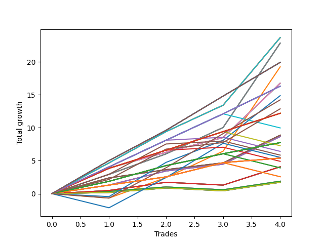

# Short Bulldog 004 
- Symbol: TSLA_Unlimited
- Date Range: 03/23/2022 - 07/08/2022
- Trading Period: 7:20-12:30
- Number of Trades: 4



| Name | Win Percent | Profit | Avg Profit / Trade | Avg Time / Trade |      | Name | Win Percent | Profit | Avg Profit / Trade | Avg Time / Trade |
| ---- | ----------- | ------ | ------------------ | ---------------- | ---- | ---- | ----------- | ------ | ------------------ | ---------------- |
| Sorted By <br> Profit | | | | | | Sorted By <br> Win Percentage ||||
| Seventy-One | 100.00 | 11840.00 | 2960.00 | 14:12 |     | Seventy-One | 100.00 | 11840.00 | 2960.00 | 14:12 |
| Sixty-Three | 100.00 | 11840.00 | 2960.00 | 14:12 |     | Sixty-Three | 100.00 | 11840.00 | 2960.00 | 14:12 |
| Fifty-Five | 100.00 | 11840.00 | 2960.00 | 14:12 |     | Fifty-Five | 100.00 | 11840.00 | 2960.00 | 14:12 |
| Forty-Seven | 100.00 | 11840.00 | 2960.00 | 14:12 |     | Forty-Seven | 100.00 | 11840.00 | 2960.00 | 14:12 |
| Seven | 100.00 | 11840.00 | 2960.00 | 14:12 |     | Seven | 100.00 | 11840.00 | 2960.00 | 14:12 |
| Sixty-Nine | 100.00 | 11425.00 | 2856.25 | 31:45 |     | Sixty-Nine | 100.00 | 11425.00 | 2856.25 | 31:45 |
| Sixty-One | 100.00 | 11425.00 | 2856.25 | 31:45 |     | Sixty-One | 100.00 | 11425.00 | 2856.25 | 31:45 |
| Forty-Five | 100.00 | 11425.00 | 2856.25 | 31:45 |     | Forty-Five | 100.00 | 11425.00 | 2856.25 | 31:45 |
| Five | 100.00 | 11425.00 | 2856.25 | 31:45 |     | Five | 100.00 | 11425.00 | 2856.25 | 31:45 |
| One Hundred Thirty | 100.00 | 9965.00 | 2491.25 | 38:37 |     | One Hundred Thirty | 100.00 | 9965.00 | 2491.25 | 38:37 |
| One Hundred Twenty-Five | 100.00 | 9965.00 | 2491.25 | 38:37 |     | One Hundred Twenty-Five | 100.00 | 9965.00 | 2491.25 | 38:37 |
| One Hundred Fifteen | 100.00 | 9965.00 | 2491.25 | 38:37 |     | One Hundred Fifteen | 100.00 | 9965.00 | 2491.25 | 38:37 |
| One Hundred Five | 100.00 | 9965.00 | 2491.25 | 38:37 |     | One Hundred Five | 100.00 | 9965.00 | 2491.25 | 38:37 |
| Eighty-Five | 100.00 | 9965.00 | 2491.25 | 38:37 |     | Eighty-Five | 100.00 | 9965.00 | 2491.25 | 38:37 |
| Fifty-Three | 75.00 | 9625.00 | 2406.25 | 22:23 |     | Sixty-Eight | 100.00 | 8380.00 | 2095.00 | 10:03 |
| Sixty-Eight | 100.00 | 8380.00 | 2095.00 | 10:03 |     | Sixty | 100.00 | 8380.00 | 2095.00 | 10:03 |
| Sixty | 100.00 | 8380.00 | 2095.00 | 10:03 |     | Fifty-Two | 100.00 | 8380.00 | 2095.00 | 10:03 |
| Fifty-Two | 100.00 | 8380.00 | 2095.00 | 10:03 |     | Forty-Four | 100.00 | 8380.00 | 2095.00 | 10:03 |
| Forty-Four | 100.00 | 8380.00 | 2095.00 | 10:03 |     | Four | 100.00 | 8380.00 | 2095.00 | 10:03 |
| Four | 100.00 | 8380.00 | 2095.00 | 10:03 |     | One Hundred Twenty-Nine | 100.00 | 8155.00 | 2038.75 | 12:36 |
| One Hundred Twenty-Nine | 100.00 | 8155.00 | 2038.75 | 12:36 |     | One Hundred Twenty-Four | 100.00 | 8155.00 | 2038.75 | 12:36 |
| One Hundred Twenty-Four | 100.00 | 8155.00 | 2038.75 | 12:36 |     | One Hundred Ninteen | 100.00 | 8155.00 | 2038.75 | 12:36 |
| One Hundred Ninteen | 100.00 | 8155.00 | 2038.75 | 12:36 |     | One Hundred Fourteen | 100.00 | 8155.00 | 2038.75 | 12:36 |
| One Hundred Fourteen | 100.00 | 8155.00 | 2038.75 | 12:36 |     | One Hundred Nine | 100.00 | 8155.00 | 2038.75 | 12:36 |
| One Hundred Nine | 100.00 | 8155.00 | 2038.75 | 12:36 |     | One Hundred Four | 100.00 | 8155.00 | 2038.75 | 12:36 |
| One Hundred Four | 100.00 | 8155.00 | 2038.75 | 12:36 |     | Eighty-Four | 100.00 | 8155.00 | 2038.75 | 12:36 |
| Eighty-Four | 100.00 | 8155.00 | 2038.75 | 12:36 |     | One Hundred Ten | 100.00 | 6440.00 | 1610.00 | 19:31 |
| Seventy-Three | 75.00 | 7440.00 | 1860.00 | 14:20 |     | One Hundred Twenty-Eight | 100.00 | 6100.00 | 1525.00 | 09:51 |
| One Hundred Twenty | 75.00 | 7120.00 | 1780.00 | 26:43 |     | One Hundred Twenty-Three | 100.00 | 6100.00 | 1525.00 | 09:51 |
| One Hundred Ten | 100.00 | 6440.00 | 1610.00 | 19:31 |     | One Hundred Eighteen | 100.00 | 6100.00 | 1525.00 | 09:51 |
| One Hundred Twenty-Eight | 100.00 | 6100.00 | 1525.00 | 09:51 |     | One Hundred Thirteen | 100.00 | 6100.00 | 1525.00 | 09:51 |
| One Hundred Twenty-Three | 100.00 | 6100.00 | 1525.00 | 09:51 |     | One Hundred Eight | 100.00 | 6100.00 | 1525.00 | 09:51 |
| One Hundred Eighteen | 100.00 | 6100.00 | 1525.00 | 09:51 |     | One Hundred Three | 100.00 | 6100.00 | 1525.00 | 09:51 |
| One Hundred Thirteen | 100.00 | 6100.00 | 1525.00 | 09:51 |     | Eighty-Three | 100.00 | 6100.00 | 1525.00 | 09:51 |
| One Hundred Eight | 100.00 | 6100.00 | 1525.00 | 09:51 |     | Sixty-Seven | 100.00 | 4440.00 | 1110.00 | 07:26 |
| One Hundred Three | 100.00 | 6100.00 | 1525.00 | 09:51 |     | Fifty-Nine | 100.00 | 4440.00 | 1110.00 | 07:26 |
| Eighty-Three | 100.00 | 6100.00 | 1525.00 | 09:51 |     | Fifty-One | 100.00 | 4440.00 | 1110.00 | 07:26 |
| Ninety-Four | 75.00 | 4990.00 | 1247.50 | 10:13 |     | Forty-Three | 100.00 | 4440.00 | 1110.00 | 07:26 |
| Sixty-Seven | 100.00 | 4440.00 | 1110.00 | 07:26 |     | Three | 100.00 | 4440.00 | 1110.00 | 07:26 |
| Fifty-Nine | 100.00 | 4440.00 | 1110.00 | 07:26 |     | Sixty-Six | 100.00 | 4335.00 | 1083.75 | 06:07 |
| Fifty-One | 100.00 | 4440.00 | 1110.00 | 07:26 |     | Fifty-Eight | 100.00 | 4335.00 | 1083.75 | 06:07 |
| Forty-Three | 100.00 | 4440.00 | 1110.00 | 07:26 |     | Fifty | 100.00 | 4335.00 | 1083.75 | 06:07 |
| Three | 100.00 | 4440.00 | 1110.00 | 07:26 |     | Forty-Two | 100.00 | 4335.00 | 1083.75 | 06:07 |
| Sixty-Six | 100.00 | 4335.00 | 1083.75 | 06:07 |     | Two | 100.00 | 4335.00 | 1083.75 | 06:07 |
| Fifty-Eight | 100.00 | 4335.00 | 1083.75 | 06:07 |     | One Hundred Twenty-Seven | 100.00 | 3875.00 | 968.75 | 05:55 |
| Fifty | 100.00 | 4335.00 | 1083.75 | 06:07 |     | One Hundred Twenty-Two | 100.00 | 3875.00 | 968.75 | 05:55 |
| Forty-Two | 100.00 | 4335.00 | 1083.75 | 06:07 |     | One Hundred Seventeen | 100.00 | 3875.00 | 968.75 | 05:55 |
| Two | 100.00 | 4335.00 | 1083.75 | 06:07 |     | One Hundred Twelve | 100.00 | 3875.00 | 968.75 | 05:55 |
| One Hundred Twenty-Seven | 100.00 | 3875.00 | 968.75 | 05:55 |     | One Hundred Seven | 100.00 | 3875.00 | 968.75 | 05:55 |
| One Hundred Twenty-Two | 100.00 | 3875.00 | 968.75 | 05:55 |     | One Hundred Two | 100.00 | 3875.00 | 968.75 | 05:55 |
| One Hundred Seventeen | 100.00 | 3875.00 | 968.75 | 05:55 |     | Eighty-Two | 100.00 | 3875.00 | 968.75 | 05:55 |
| One Hundred Twelve | 100.00 | 3875.00 | 968.75 | 05:55 |     | One Hundred Twenty-Six | 100.00 | 2700.00 | 675.00 | 04:17 |
| One Hundred Seven | 100.00 | 3875.00 | 968.75 | 05:55 |     | One Hundred Twenty-One | 100.00 | 2700.00 | 675.00 | 04:17 |
| One Hundred Two | 100.00 | 3875.00 | 968.75 | 05:55 |     | One Hundred Sixteen | 100.00 | 2700.00 | 675.00 | 04:17 |
| Eighty-Two | 100.00 | 3875.00 | 968.75 | 05:55 |     | One Hundred Eleven | 100.00 | 2700.00 | 675.00 | 04:17 |
| Ninety-Three | 75.00 | 3640.00 | 910.00 | 08:05 |     | One Hundred Six | 100.00 | 2700.00 | 675.00 | 04:17 |
| Ninety-Nine | 75.00 | 3210.00 | 802.50 | 08:03 |     | One Hundred One | 100.00 | 2700.00 | 675.00 | 04:17 |
| One Hundred | 75.00 | 2925.00 | 731.25 | 09:51 |     | Eighty-One | 100.00 | 2700.00 | 675.00 | 04:17 |
| Ninety-Five | 50.00 | 2755.00 | 688.75 | 30:41 |     | Fifty-Three | 75.00 | 9625.00 | 2406.25 | 22:23 |
| One Hundred Twenty-Six | 100.00 | 2700.00 | 675.00 | 04:17 |     | Seventy-Three | 75.00 | 7440.00 | 1860.00 | 14:20 |
| One Hundred Twenty-One | 100.00 | 2700.00 | 675.00 | 04:17 |     | One Hundred Twenty | 75.00 | 7120.00 | 1780.00 | 26:43 |
| One Hundred Sixteen | 100.00 | 2700.00 | 675.00 | 04:17 |     | Ninety-Four | 75.00 | 4990.00 | 1247.50 | 10:13 |
| One Hundred Eleven | 100.00 | 2700.00 | 675.00 | 04:17 |     | Ninety-Three | 75.00 | 3640.00 | 910.00 | 08:05 |
| One Hundred Six | 100.00 | 2700.00 | 675.00 | 04:17 |     | Ninety-Nine | 75.00 | 3210.00 | 802.50 | 08:03 |
| One Hundred One | 100.00 | 2700.00 | 675.00 | 04:17 |     | One Hundred | 75.00 | 2925.00 | 731.25 | 09:51 |
| Eighty-One | 100.00 | 2700.00 | 675.00 | 04:17 |     | Ninety-Eight | 75.00 | 2455.00 | 613.75 | 05:56 |
| Ninety-Eight | 75.00 | 2455.00 | 613.75 | 05:56 |     | Sixty-Five | 75.00 | 2040.00 | 510.00 | 05:15 |
| Sixty-Five | 75.00 | 2040.00 | 510.00 | 05:15 |     | Fifty-Seven | 75.00 | 2040.00 | 510.00 | 05:15 |
| Fifty-Seven | 75.00 | 2040.00 | 510.00 | 05:15 |     | Forty-Nine | 75.00 | 2040.00 | 510.00 | 05:15 |
| Forty-Nine | 75.00 | 2040.00 | 510.00 | 05:15 |     | Forty-One | 75.00 | 2040.00 | 510.00 | 05:15 |
| Forty-One | 75.00 | 2040.00 | 510.00 | 05:15 |     | One | 75.00 | 2040.00 | 510.00 | 05:15 |
| One | 75.00 | 2040.00 | 510.00 | 05:15 |     | Ninety-Seven | 75.00 | 1960.00 | 490.00 | 04:26 |
| Ninety-Seven | 75.00 | 1960.00 | 490.00 | 04:26 |     | Ninety-Two | 75.00 | 1960.00 | 490.00 | 04:26 |
| Ninety-Two | 75.00 | 1960.00 | 490.00 | 04:26 |     | Ninety-Six | 75.00 | 1285.00 | 321.25 | 03:45 |
| Ninety-Six | 75.00 | 1285.00 | 321.25 | 03:45 |     | Ninety-One | 75.00 | 1285.00 | 321.25 | 03:45 |
| Ninety-One | 75.00 | 1285.00 | 321.25 | 03:45 |     | Sixty-Four | 75.00 | 945.00 | 236.25 | 03:57 |
| Sixty-Four | 75.00 | 945.00 | 236.25 | 03:57 |     | Fifty-Six | 75.00 | 945.00 | 236.25 | 03:57 |
| Fifty-Six | 75.00 | 945.00 | 236.25 | 03:57 |     | Forty-Eight | 75.00 | 945.00 | 236.25 | 03:57 |
| Forty-Eight | 75.00 | 945.00 | 236.25 | 03:57 |     | Forty | 75.00 | 945.00 | 236.25 | 03:57 |
| Forty | 75.00 | 945.00 | 236.25 | 03:57 |     | Zero | 75.00 | 945.00 | 236.25 | 03:57 |
| Zero | 75.00 | 945.00 | 236.25 | 03:57 |     | Seventy | 75.00 | 865.00 | 216.25 | 02:46 |
| Seventy | 75.00 | 865.00 | 216.25 | 02:46 |     | Sixty-Two | 75.00 | 865.00 | 216.25 | 02:46 |
| Sixty-Two | 75.00 | 865.00 | 216.25 | 02:46 |     | Fifty-Four | 75.00 | 865.00 | 216.25 | 02:46 |
| Fifty-Four | 75.00 | 865.00 | 216.25 | 02:46 |     | Forty-Six | 75.00 | 865.00 | 216.25 | 02:46 |
| Forty-Six | 75.00 | 865.00 | 216.25 | 02:46 |     | Six | 75.00 | 865.00 | 216.25 | 02:46 |
| Six | 75.00 | 865.00 | 216.25 | 02:46 |     | Ninety-Five | 50.00 | 2755.00 | 688.75 | 30:41 |

## NO STOPLOSS

### Test Zero
* Sell when price hits the middle line of the 20p bollinger
* No Stoploss
* Results:
```
Total Trades: 4
Percent Up: 25.00
Percent Down: 75.00
Total Points Moved Down: 1.89
Potential Profit: 945.00
Total Points Ups: 0.43 Count Ups: 1
Total Points Downs: 2.32 Count Downs: 3
```

<details><summary>Trades</summary>

<code>In: 2022-03-31 10:54:00		Out: 2022-03-31 11:00:20		Total Position Time: 06:20		Total Move Down: 0.34		Total to Date: 0.34</code> <br />
<code>In: 2022-03-31 12:09:00		Out: 2022-03-31 12:10:10		Total Position Time: 01:10		Total Move Down: 0.68		Total to Date: 1.02</code> <br />
<code>In: 2022-04-11 10:37:00		Out: 2022-04-11 10:38:10		Total Position Time: 01:10		Total Move Down: -0.43		Total to Date: 0.59</code> <br />
<code>In: 2022-04-29 08:49:00		Out: 2022-04-29 08:56:10		Total Position Time: 07:10		Total Move Down: 1.30		Total to Date: 1.89</code> <br />


</details>

### Test One
* Sell when the price hits the upper line of the 20p 1std bollinger
* No Stoploss
* Results:
```
Total Trades: 4
Percent Up: 25.00
Percent Down: 75.00
Total Points Moved Down: 4.08
Potential Profit: 2040.00
Total Points Ups: 0.43 Count Ups: 1
Total Points Downs: 4.51 Count Downs: 3
```

<details><summary>Trades</summary>

<code>In: 2022-03-31 10:54:00		Out: 2022-03-31 11:03:05		Total Position Time: 09:05		Total Move Down: 0.48		Total to Date: 0.48</code> <br />
<code>In: 2022-03-31 12:09:00		Out: 2022-03-31 12:10:40		Total Position Time: 01:40		Total Move Down: 1.25		Total to Date: 1.73</code> <br />
<code>In: 2022-04-11 10:37:00		Out: 2022-04-11 10:38:10		Total Position Time: 01:10		Total Move Down: -0.43		Total to Date: 1.30</code> <br />
<code>In: 2022-04-29 08:49:00		Out: 2022-04-29 08:58:05		Total Position Time: 09:05		Total Move Down: 2.78		Total to Date: 4.08</code> <br />


</details>

### Test Two
* Sell when the price hits the upper line of the 20p 2std bollinger
* No Stoploss
* Results:
```
Total Trades: 4
Percent Up: 0.00
Percent Down: 100.00
Total Points Moved Down: 8.67
Potential Profit: 4335.00
Total Points Ups: 0.00 Count Ups: 0
Total Points Downs: 8.67 Count Downs: 4
```

<details><summary>Trades</summary>

<code>In: 2022-03-31 10:54:00		Out: 2022-03-31 11:03:30		Total Position Time: 09:30		Total Move Down: 1.30		Total to Date: 1.30</code> <br />
<code>In: 2022-03-31 12:09:00		Out: 2022-03-31 12:11:05		Total Position Time: 02:05		Total Move Down: 2.14		Total to Date: 3.44</code> <br />
<code>In: 2022-04-11 10:37:00		Out: 2022-04-11 10:38:25		Total Position Time: 01:25		Total Move Down: 1.04		Total to Date: 4.48</code> <br />
<code>In: 2022-04-29 08:49:00		Out: 2022-04-29 09:00:30		Total Position Time: 11:30		Total Move Down: 4.19		Total to Date: 8.67</code> <br />


</details>

### Test Three
* Sell when price hits the middle line of the 50p bollinger
* No Stoploss
* Results:
```
Total Trades: 4
Percent Up: 0.00
Percent Down: 100.00
Total Points Moved Down: 8.88
Potential Profit: 4440.00
Total Points Ups: 0.00 Count Ups: 0
Total Points Downs: 8.88 Count Downs: 4
```

<details><summary>Trades</summary>

<code>In: 2022-03-31 10:54:00		Out: 2022-03-31 11:09:05		Total Position Time: 15:05		Total Move Down: 2.39		Total to Date: 2.39</code> <br />
<code>In: 2022-03-31 12:09:00		Out: 2022-03-31 12:10:40		Total Position Time: 01:40		Total Move Down: 1.25		Total to Date: 3.64</code> <br />
<code>In: 2022-04-11 10:37:00		Out: 2022-04-11 10:38:25		Total Position Time: 01:25		Total Move Down: 1.04		Total to Date: 4.68</code> <br />
<code>In: 2022-04-29 08:49:00		Out: 2022-04-29 09:00:35		Total Position Time: 11:35		Total Move Down: 4.20		Total to Date: 8.88</code> <br />


</details>

### Test Four
* Sell when the price hits the upper line of the 50p 1std bollinger
* No Stoploss
* Results:
```
Total Trades: 4
Percent Up: 0.00
Percent Down: 100.00
Total Points Moved Down: 16.76
Potential Profit: 8380.00
Total Points Ups: 0.00 Count Ups: 0
Total Points Downs: 16.76 Count Downs: 4
```

<details><summary>Trades</summary>

<code>In: 2022-03-31 10:54:00		Out: 2022-03-31 11:09:45		Total Position Time: 15:45		Total Move Down: 3.89		Total to Date: 3.89</code> <br />
<code>In: 2022-03-31 12:09:00		Out: 2022-03-31 12:11:10		Total Position Time: 02:10		Total Move Down: 2.39		Total to Date: 6.28</code> <br />
<code>In: 2022-04-11 10:37:00		Out: 2022-04-11 10:45:35		Total Position Time: 08:35		Total Move Down: 2.24		Total to Date: 8.52</code> <br />
<code>In: 2022-04-29 08:49:00		Out: 2022-04-29 09:02:45		Total Position Time: 13:45		Total Move Down: 8.24		Total to Date: 16.76</code> <br />


</details>

### Test Five
* Sell when the price hits the upper line of the 50p 2std bollinger
* No Stoploss
* Results:
```
Total Trades: 4
Percent Up: 0.00
Percent Down: 100.00
Total Points Moved Down: 22.85
Potential Profit: 11425.00
Total Points Ups: 0.00 Count Ups: 0
Total Points Downs: 22.85 Count Downs: 4
```

<details><summary>Trades</summary>

<code>In: 2022-03-31 10:54:00		Out: 2022-03-31 12:13:55		Total Position Time: 79:55		Total Move Down: 2.93		Total to Date: 2.93</code> <br />
<code>In: 2022-03-31 12:09:00		Out: 2022-03-31 12:13:55		Total Position Time: 04:55		Total Move Down: 3.11		Total to Date: 6.04</code> <br />
<code>In: 2022-04-11 10:37:00		Out: 2022-04-11 10:49:20		Total Position Time: 12:20		Total Move Down: 4.01		Total to Date: 10.05</code> <br />
<code>In: 2022-04-29 08:49:00		Out: 2022-04-29 09:18:50		Total Position Time: 29:50		Total Move Down: 12.80		Total to Date: 22.85</code> <br />


</details>

### Test Six
* Sell when the price hits the middle line of the 1std VWAP
* No Stoploss
* Results:
```
Total Trades: 4
Percent Up: 25.00
Percent Down: 75.00
Total Points Moved Down: 1.73
Potential Profit: 865.00
Total Points Ups: 0.43 Count Ups: 1
Total Points Downs: 2.16 Count Downs: 3
```

<details><summary>Trades</summary>

<code>In: 2022-03-31 10:54:00		Out: 2022-03-31 10:58:40		Total Position Time: 04:40		Total Move Down: 0.18		Total to Date: 0.18</code> <br />
<code>In: 2022-03-31 12:09:00		Out: 2022-03-31 12:10:10		Total Position Time: 01:10		Total Move Down: 0.68		Total to Date: 0.86</code> <br />
<code>In: 2022-04-11 10:37:00		Out: 2022-04-11 10:38:10		Total Position Time: 01:10		Total Move Down: -0.43		Total to Date: 0.43</code> <br />
<code>In: 2022-04-29 08:49:00		Out: 2022-04-29 08:53:05		Total Position Time: 04:05		Total Move Down: 1.30		Total to Date: 1.73</code> <br />


</details>

### Test Seven
* Sell when the price hits the upper line of the 1std VWAP
* No Stoploss
* Results:
```
Total Trades: 4
Percent Up: 0.00
Percent Down: 100.00
Total Points Moved Down: 23.68
Potential Profit: 11840.00
Total Points Ups: 0.00 Count Ups: 0
Total Points Downs: 23.68 Count Downs: 4
```

<details><summary>Trades</summary>

<code>In: 2022-03-31 10:54:00		Out: 2022-03-31 11:10:15		Total Position Time: 16:15		Total Move Down: 4.67		Total to Date: 4.67</code> <br />
<code>In: 2022-03-31 12:09:00		Out: 2022-03-31 12:23:10		Total Position Time: 14:10		Total Move Down: 4.75		Total to Date: 9.42</code> <br />
<code>In: 2022-04-11 10:37:00		Out: 2022-04-11 10:49:20		Total Position Time: 12:20		Total Move Down: 4.01		Total to Date: 13.43</code> <br />
<code>In: 2022-04-29 08:49:00		Out: 2022-04-29 09:03:05		Total Position Time: 14:05		Total Move Down: 10.25		Total to Date: 23.68</code> <br />


</details>

## STOPLOSS OF 5

### Test Forty
* Sell when price hits the middle line of the 20p bollinger
* Stoploss is -5 points
* Results:
```
Total Trades: 4
Percent Up: 25.00
Percent Down: 75.00
Total Points Moved Down: 1.89
Potential Profit: 945.00
Total Points Ups: 0.43 Count Ups: 1
Total Points Downs: 2.32 Count Downs: 3
```

<details><summary>Trades</summary>

<code>In: 2022-03-31 10:54:00		Out: 2022-03-31 11:00:20		Total Position Time: 06:20		Total Move Down: 0.34		Total to Date: 0.34</code> <br />
<code>In: 2022-03-31 12:09:00		Out: 2022-03-31 12:10:10		Total Position Time: 01:10		Total Move Down: 0.68		Total to Date: 1.02</code> <br />
<code>In: 2022-04-11 10:37:00		Out: 2022-04-11 10:38:10		Total Position Time: 01:10		Total Move Down: -0.43		Total to Date: 0.59</code> <br />
<code>In: 2022-04-29 08:49:00		Out: 2022-04-29 08:56:10		Total Position Time: 07:10		Total Move Down: 1.30		Total to Date: 1.89</code> <br />


</details>

### Test Forty-One
* Sell when the price hits the upper line of the 20p 1std bollinger
* Stoploss is -5 points
* Results:
```
Total Trades: 4
Percent Up: 25.00
Percent Down: 75.00
Total Points Moved Down: 4.08
Potential Profit: 2040.00
Total Points Ups: 0.43 Count Ups: 1
Total Points Downs: 4.51 Count Downs: 3
```

<details><summary>Trades</summary>

<code>In: 2022-03-31 10:54:00		Out: 2022-03-31 11:03:05		Total Position Time: 09:05		Total Move Down: 0.48		Total to Date: 0.48</code> <br />
<code>In: 2022-03-31 12:09:00		Out: 2022-03-31 12:10:40		Total Position Time: 01:40		Total Move Down: 1.25		Total to Date: 1.73</code> <br />
<code>In: 2022-04-11 10:37:00		Out: 2022-04-11 10:38:10		Total Position Time: 01:10		Total Move Down: -0.43		Total to Date: 1.30</code> <br />
<code>In: 2022-04-29 08:49:00		Out: 2022-04-29 08:58:05		Total Position Time: 09:05		Total Move Down: 2.78		Total to Date: 4.08</code> <br />


</details>

### Test Forty-Two
* Sell when the price hits the upper line of the 20p 2std bollinger
* Stoploss is -5 points
* Results:
```
Total Trades: 4
Percent Up: 0.00
Percent Down: 100.00
Total Points Moved Down: 8.67
Potential Profit: 4335.00
Total Points Ups: 0.00 Count Ups: 0
Total Points Downs: 8.67 Count Downs: 4
```

<details><summary>Trades</summary>

<code>In: 2022-03-31 10:54:00		Out: 2022-03-31 11:03:30		Total Position Time: 09:30		Total Move Down: 1.30		Total to Date: 1.30</code> <br />
<code>In: 2022-03-31 12:09:00		Out: 2022-03-31 12:11:05		Total Position Time: 02:05		Total Move Down: 2.14		Total to Date: 3.44</code> <br />
<code>In: 2022-04-11 10:37:00		Out: 2022-04-11 10:38:25		Total Position Time: 01:25		Total Move Down: 1.04		Total to Date: 4.48</code> <br />
<code>In: 2022-04-29 08:49:00		Out: 2022-04-29 09:00:30		Total Position Time: 11:30		Total Move Down: 4.19		Total to Date: 8.67</code> <br />


</details>

### Test Forty-Three
* Sell when price hits the middle line of the 50p bollinger
* Stoploss is -5 points
* Results:
```
Total Trades: 4
Percent Up: 0.00
Percent Down: 100.00
Total Points Moved Down: 8.88
Potential Profit: 4440.00
Total Points Ups: 0.00 Count Ups: 0
Total Points Downs: 8.88 Count Downs: 4
```

<details><summary>Trades</summary>

<code>In: 2022-03-31 10:54:00		Out: 2022-03-31 11:09:05		Total Position Time: 15:05		Total Move Down: 2.39		Total to Date: 2.39</code> <br />
<code>In: 2022-03-31 12:09:00		Out: 2022-03-31 12:10:40		Total Position Time: 01:40		Total Move Down: 1.25		Total to Date: 3.64</code> <br />
<code>In: 2022-04-11 10:37:00		Out: 2022-04-11 10:38:25		Total Position Time: 01:25		Total Move Down: 1.04		Total to Date: 4.68</code> <br />
<code>In: 2022-04-29 08:49:00		Out: 2022-04-29 09:00:35		Total Position Time: 11:35		Total Move Down: 4.20		Total to Date: 8.88</code> <br />


</details>

### Test Forty-Four
* Sell when the price hits the upper line of the 50p 1std bollinger
* Stoploss is -5 points
* Results:
```
Total Trades: 4
Percent Up: 0.00
Percent Down: 100.00
Total Points Moved Down: 16.76
Potential Profit: 8380.00
Total Points Ups: 0.00 Count Ups: 0
Total Points Downs: 16.76 Count Downs: 4
```

<details><summary>Trades</summary>

<code>In: 2022-03-31 10:54:00		Out: 2022-03-31 11:09:45		Total Position Time: 15:45		Total Move Down: 3.89		Total to Date: 3.89</code> <br />
<code>In: 2022-03-31 12:09:00		Out: 2022-03-31 12:11:10		Total Position Time: 02:10		Total Move Down: 2.39		Total to Date: 6.28</code> <br />
<code>In: 2022-04-11 10:37:00		Out: 2022-04-11 10:45:35		Total Position Time: 08:35		Total Move Down: 2.24		Total to Date: 8.52</code> <br />
<code>In: 2022-04-29 08:49:00		Out: 2022-04-29 09:02:45		Total Position Time: 13:45		Total Move Down: 8.24		Total to Date: 16.76</code> <br />


</details>

### Test Forty-Five
* Sell when the price hits the upper line of the 50p 2std bollinger
* Stoploss is -5 points
* Results:
```
Total Trades: 4
Percent Up: 0.00
Percent Down: 100.00
Total Points Moved Down: 22.85
Potential Profit: 11425.00
Total Points Ups: 0.00 Count Ups: 0
Total Points Downs: 22.85 Count Downs: 4
```

<details><summary>Trades</summary>

<code>In: 2022-03-31 10:54:00		Out: 2022-03-31 12:13:55		Total Position Time: 79:55		Total Move Down: 2.93		Total to Date: 2.93</code> <br />
<code>In: 2022-03-31 12:09:00		Out: 2022-03-31 12:13:55		Total Position Time: 04:55		Total Move Down: 3.11		Total to Date: 6.04</code> <br />
<code>In: 2022-04-11 10:37:00		Out: 2022-04-11 10:49:20		Total Position Time: 12:20		Total Move Down: 4.01		Total to Date: 10.05</code> <br />
<code>In: 2022-04-29 08:49:00		Out: 2022-04-29 09:18:50		Total Position Time: 29:50		Total Move Down: 12.80		Total to Date: 22.85</code> <br />


</details>

### Test Forty-Six
* Sell when the price hits the middle line of the 1std VWAP
* Stoploss is -5 points
* Results:
```
Total Trades: 4
Percent Up: 25.00
Percent Down: 75.00
Total Points Moved Down: 1.73
Potential Profit: 865.00
Total Points Ups: 0.43 Count Ups: 1
Total Points Downs: 2.16 Count Downs: 3
```

<details><summary>Trades</summary>

<code>In: 2022-03-31 10:54:00		Out: 2022-03-31 10:58:40		Total Position Time: 04:40		Total Move Down: 0.18		Total to Date: 0.18</code> <br />
<code>In: 2022-03-31 12:09:00		Out: 2022-03-31 12:10:10		Total Position Time: 01:10		Total Move Down: 0.68		Total to Date: 0.86</code> <br />
<code>In: 2022-04-11 10:37:00		Out: 2022-04-11 10:38:10		Total Position Time: 01:10		Total Move Down: -0.43		Total to Date: 0.43</code> <br />
<code>In: 2022-04-29 08:49:00		Out: 2022-04-29 08:53:05		Total Position Time: 04:05		Total Move Down: 1.30		Total to Date: 1.73</code> <br />


</details>

### Test Forty-Seven
* Sell when the price hits the upper line of the 1std VWAP
* Stoploss is -5 points
* Results:
```
Total Trades: 4
Percent Up: 0.00
Percent Down: 100.00
Total Points Moved Down: 23.68
Potential Profit: 11840.00
Total Points Ups: 0.00 Count Ups: 0
Total Points Downs: 23.68 Count Downs: 4
```

<details><summary>Trades</summary>

<code>In: 2022-03-31 10:54:00		Out: 2022-03-31 11:10:15		Total Position Time: 16:15		Total Move Down: 4.67		Total to Date: 4.67</code> <br />
<code>In: 2022-03-31 12:09:00		Out: 2022-03-31 12:23:10		Total Position Time: 14:10		Total Move Down: 4.75		Total to Date: 9.42</code> <br />
<code>In: 2022-04-11 10:37:00		Out: 2022-04-11 10:49:20		Total Position Time: 12:20		Total Move Down: 4.01		Total to Date: 13.43</code> <br />
<code>In: 2022-04-29 08:49:00		Out: 2022-04-29 09:03:05		Total Position Time: 14:05		Total Move Down: 10.25		Total to Date: 23.68</code> <br />


</details>

## TRAIL STOP OF 5

### Test Forty-Eight
* Sell when price hits the middle line of the 20p bollinger
* Trailing Stop is -5 points
* Results:
```
Total Trades: 4
Percent Up: 25.00
Percent Down: 75.00
Total Points Moved Down: 1.89
Potential Profit: 945.00
Total Points Ups: 0.43 Count Ups: 1
Total Points Downs: 2.32 Count Downs: 3
```

<details><summary>Trades</summary>

<code>In: 2022-03-31 10:54:00		Out: 2022-03-31 11:00:20		Total Position Time: 06:20		Total Move Down: 0.34		Total to Date: 0.34</code> <br />
<code>In: 2022-03-31 12:09:00		Out: 2022-03-31 12:10:10		Total Position Time: 01:10		Total Move Down: 0.68		Total to Date: 1.02</code> <br />
<code>In: 2022-04-11 10:37:00		Out: 2022-04-11 10:38:10		Total Position Time: 01:10		Total Move Down: -0.43		Total to Date: 0.59</code> <br />
<code>In: 2022-04-29 08:49:00		Out: 2022-04-29 08:56:10		Total Position Time: 07:10		Total Move Down: 1.30		Total to Date: 1.89</code> <br />


</details>

### Test Forty-Nine
* Sell when the price hits the upper line of the 20p 1std bollinger
* Trailing Stop is -5 points
* Results:
```
Total Trades: 4
Percent Up: 25.00
Percent Down: 75.00
Total Points Moved Down: 4.08
Potential Profit: 2040.00
Total Points Ups: 0.43 Count Ups: 1
Total Points Downs: 4.51 Count Downs: 3
```

<details><summary>Trades</summary>

<code>In: 2022-03-31 10:54:00		Out: 2022-03-31 11:03:05		Total Position Time: 09:05		Total Move Down: 0.48		Total to Date: 0.48</code> <br />
<code>In: 2022-03-31 12:09:00		Out: 2022-03-31 12:10:40		Total Position Time: 01:40		Total Move Down: 1.25		Total to Date: 1.73</code> <br />
<code>In: 2022-04-11 10:37:00		Out: 2022-04-11 10:38:10		Total Position Time: 01:10		Total Move Down: -0.43		Total to Date: 1.30</code> <br />
<code>In: 2022-04-29 08:49:00		Out: 2022-04-29 08:58:05		Total Position Time: 09:05		Total Move Down: 2.78		Total to Date: 4.08</code> <br />


</details>

### Test Fifty
* Sell when the price hits the upper line of the 20p 2std bollinger
* Trailing Stop is -5 points
* Results:
```
Total Trades: 4
Percent Up: 0.00
Percent Down: 100.00
Total Points Moved Down: 8.67
Potential Profit: 4335.00
Total Points Ups: 0.00 Count Ups: 0
Total Points Downs: 8.67 Count Downs: 4
```

<details><summary>Trades</summary>

<code>In: 2022-03-31 10:54:00		Out: 2022-03-31 11:03:30		Total Position Time: 09:30		Total Move Down: 1.30		Total to Date: 1.30</code> <br />
<code>In: 2022-03-31 12:09:00		Out: 2022-03-31 12:11:05		Total Position Time: 02:05		Total Move Down: 2.14		Total to Date: 3.44</code> <br />
<code>In: 2022-04-11 10:37:00		Out: 2022-04-11 10:38:25		Total Position Time: 01:25		Total Move Down: 1.04		Total to Date: 4.48</code> <br />
<code>In: 2022-04-29 08:49:00		Out: 2022-04-29 09:00:30		Total Position Time: 11:30		Total Move Down: 4.19		Total to Date: 8.67</code> <br />


</details>

### Test Fifty-One
* Sell when price hits the middle line of the 50p bollinger
* Trailing Stop is -5 points
* Results:
```
Total Trades: 4
Percent Up: 0.00
Percent Down: 100.00
Total Points Moved Down: 8.88
Potential Profit: 4440.00
Total Points Ups: 0.00 Count Ups: 0
Total Points Downs: 8.88 Count Downs: 4
```

<details><summary>Trades</summary>

<code>In: 2022-03-31 10:54:00		Out: 2022-03-31 11:09:05		Total Position Time: 15:05		Total Move Down: 2.39		Total to Date: 2.39</code> <br />
<code>In: 2022-03-31 12:09:00		Out: 2022-03-31 12:10:40		Total Position Time: 01:40		Total Move Down: 1.25		Total to Date: 3.64</code> <br />
<code>In: 2022-04-11 10:37:00		Out: 2022-04-11 10:38:25		Total Position Time: 01:25		Total Move Down: 1.04		Total to Date: 4.68</code> <br />
<code>In: 2022-04-29 08:49:00		Out: 2022-04-29 09:00:35		Total Position Time: 11:35		Total Move Down: 4.20		Total to Date: 8.88</code> <br />


</details>

### Test Fifty-Two
* Sell when the price hits the upper line of the 50p 1std bollinger
* Trailing Stop is -5 points
* Results:
```
Total Trades: 4
Percent Up: 0.00
Percent Down: 100.00
Total Points Moved Down: 16.76
Potential Profit: 8380.00
Total Points Ups: 0.00 Count Ups: 0
Total Points Downs: 16.76 Count Downs: 4
```

<details><summary>Trades</summary>

<code>In: 2022-03-31 10:54:00		Out: 2022-03-31 11:09:45		Total Position Time: 15:45		Total Move Down: 3.89		Total to Date: 3.89</code> <br />
<code>In: 2022-03-31 12:09:00		Out: 2022-03-31 12:11:10		Total Position Time: 02:10		Total Move Down: 2.39		Total to Date: 6.28</code> <br />
<code>In: 2022-04-11 10:37:00		Out: 2022-04-11 10:45:35		Total Position Time: 08:35		Total Move Down: 2.24		Total to Date: 8.52</code> <br />
<code>In: 2022-04-29 08:49:00		Out: 2022-04-29 09:02:45		Total Position Time: 13:45		Total Move Down: 8.24		Total to Date: 16.76</code> <br />


</details>

### Test Fifty-Three
* Sell when the price hits the upper line of the 50p 2std bollinger
* Trailing Stop is -5 points
* Results:
```
Total Trades: 4
Percent Up: 25.00
Percent Down: 75.00
Total Points Moved Down: 19.25
Potential Profit: 9625.00
Total Points Ups: 0.67 Count Ups: 1
Total Points Downs: 19.92 Count Downs: 3
```

<details><summary>Trades</summary>

<code>In: 2022-03-31 10:54:00		Out: 2022-03-31 11:36:30		Total Position Time: 42:30		Total Move Down: -0.67		Total to Date: -0.67</code> <br />
<code>In: 2022-03-31 12:09:00		Out: 2022-03-31 12:13:55		Total Position Time: 04:55		Total Move Down: 3.11		Total to Date: 2.44</code> <br />
<code>In: 2022-04-11 10:37:00		Out: 2022-04-11 10:49:20		Total Position Time: 12:20		Total Move Down: 4.01		Total to Date: 6.45</code> <br />
<code>In: 2022-04-29 08:49:00		Out: 2022-04-29 09:18:50		Total Position Time: 29:50		Total Move Down: 12.80		Total to Date: 19.25</code> <br />


</details>

### Test Fifty-Four
* Sell when the price hits the middle line of the 1std VWAP
* Trailing Stop is -5 points
* Results:
```
Total Trades: 4
Percent Up: 25.00
Percent Down: 75.00
Total Points Moved Down: 1.73
Potential Profit: 865.00
Total Points Ups: 0.43 Count Ups: 1
Total Points Downs: 2.16 Count Downs: 3
```

<details><summary>Trades</summary>

<code>In: 2022-03-31 10:54:00		Out: 2022-03-31 10:58:40		Total Position Time: 04:40		Total Move Down: 0.18		Total to Date: 0.18</code> <br />
<code>In: 2022-03-31 12:09:00		Out: 2022-03-31 12:10:10		Total Position Time: 01:10		Total Move Down: 0.68		Total to Date: 0.86</code> <br />
<code>In: 2022-04-11 10:37:00		Out: 2022-04-11 10:38:10		Total Position Time: 01:10		Total Move Down: -0.43		Total to Date: 0.43</code> <br />
<code>In: 2022-04-29 08:49:00		Out: 2022-04-29 08:53:05		Total Position Time: 04:05		Total Move Down: 1.30		Total to Date: 1.73</code> <br />


</details>

### Test Fifty-Five
* Sell when the price hits the upper line of the 1std VWAP
* Trailing Stop is -5 points
* Results:
```
Total Trades: 4
Percent Up: 0.00
Percent Down: 100.00
Total Points Moved Down: 23.68
Potential Profit: 11840.00
Total Points Ups: 0.00 Count Ups: 0
Total Points Downs: 23.68 Count Downs: 4
```

<details><summary>Trades</summary>

<code>In: 2022-03-31 10:54:00		Out: 2022-03-31 11:10:15		Total Position Time: 16:15		Total Move Down: 4.67		Total to Date: 4.67</code> <br />
<code>In: 2022-03-31 12:09:00		Out: 2022-03-31 12:23:10		Total Position Time: 14:10		Total Move Down: 4.75		Total to Date: 9.42</code> <br />
<code>In: 2022-04-11 10:37:00		Out: 2022-04-11 10:49:20		Total Position Time: 12:20		Total Move Down: 4.01		Total to Date: 13.43</code> <br />
<code>In: 2022-04-29 08:49:00		Out: 2022-04-29 09:03:05		Total Position Time: 14:05		Total Move Down: 10.25		Total to Date: 23.68</code> <br />


</details>

## STOPLOSS OF 10

### Test Fifty-Six
* Sell when price hits the middle line of the 20p bollinger
* Stoploss is -10 points
* Results:
```
Total Trades: 4
Percent Up: 25.00
Percent Down: 75.00
Total Points Moved Down: 1.89
Potential Profit: 945.00
Total Points Ups: 0.43 Count Ups: 1
Total Points Downs: 2.32 Count Downs: 3
```

<details><summary>Trades</summary>

<code>In: 2022-03-31 10:54:00		Out: 2022-03-31 11:00:20		Total Position Time: 06:20		Total Move Down: 0.34		Total to Date: 0.34</code> <br />
<code>In: 2022-03-31 12:09:00		Out: 2022-03-31 12:10:10		Total Position Time: 01:10		Total Move Down: 0.68		Total to Date: 1.02</code> <br />
<code>In: 2022-04-11 10:37:00		Out: 2022-04-11 10:38:10		Total Position Time: 01:10		Total Move Down: -0.43		Total to Date: 0.59</code> <br />
<code>In: 2022-04-29 08:49:00		Out: 2022-04-29 08:56:10		Total Position Time: 07:10		Total Move Down: 1.30		Total to Date: 1.89</code> <br />


</details>

### Test Fifty-Seven
* Sell when the price hits the upper line of the 20p 1std bollinger
* Stoploss is -10 points
* Results:
```
Total Trades: 4
Percent Up: 25.00
Percent Down: 75.00
Total Points Moved Down: 4.08
Potential Profit: 2040.00
Total Points Ups: 0.43 Count Ups: 1
Total Points Downs: 4.51 Count Downs: 3
```

<details><summary>Trades</summary>

<code>In: 2022-03-31 10:54:00		Out: 2022-03-31 11:03:05		Total Position Time: 09:05		Total Move Down: 0.48		Total to Date: 0.48</code> <br />
<code>In: 2022-03-31 12:09:00		Out: 2022-03-31 12:10:40		Total Position Time: 01:40		Total Move Down: 1.25		Total to Date: 1.73</code> <br />
<code>In: 2022-04-11 10:37:00		Out: 2022-04-11 10:38:10		Total Position Time: 01:10		Total Move Down: -0.43		Total to Date: 1.30</code> <br />
<code>In: 2022-04-29 08:49:00		Out: 2022-04-29 08:58:05		Total Position Time: 09:05		Total Move Down: 2.78		Total to Date: 4.08</code> <br />


</details>

### Test Fifty-Eight
* Sell when the price hits the upper line of the 20p 2std bollinger
* Stoploss is -10 points
* Results:
```
Total Trades: 4
Percent Up: 0.00
Percent Down: 100.00
Total Points Moved Down: 8.67
Potential Profit: 4335.00
Total Points Ups: 0.00 Count Ups: 0
Total Points Downs: 8.67 Count Downs: 4
```

<details><summary>Trades</summary>

<code>In: 2022-03-31 10:54:00		Out: 2022-03-31 11:03:30		Total Position Time: 09:30		Total Move Down: 1.30		Total to Date: 1.30</code> <br />
<code>In: 2022-03-31 12:09:00		Out: 2022-03-31 12:11:05		Total Position Time: 02:05		Total Move Down: 2.14		Total to Date: 3.44</code> <br />
<code>In: 2022-04-11 10:37:00		Out: 2022-04-11 10:38:25		Total Position Time: 01:25		Total Move Down: 1.04		Total to Date: 4.48</code> <br />
<code>In: 2022-04-29 08:49:00		Out: 2022-04-29 09:00:30		Total Position Time: 11:30		Total Move Down: 4.19		Total to Date: 8.67</code> <br />


</details>

### Test Fifty-Nine
* Sell when price hits the middle line of the 50p bollinger
* Stoploss is -10 points
* Results:
```
Total Trades: 4
Percent Up: 0.00
Percent Down: 100.00
Total Points Moved Down: 8.88
Potential Profit: 4440.00
Total Points Ups: 0.00 Count Ups: 0
Total Points Downs: 8.88 Count Downs: 4
```

<details><summary>Trades</summary>

<code>In: 2022-03-31 10:54:00		Out: 2022-03-31 11:09:05		Total Position Time: 15:05		Total Move Down: 2.39		Total to Date: 2.39</code> <br />
<code>In: 2022-03-31 12:09:00		Out: 2022-03-31 12:10:40		Total Position Time: 01:40		Total Move Down: 1.25		Total to Date: 3.64</code> <br />
<code>In: 2022-04-11 10:37:00		Out: 2022-04-11 10:38:25		Total Position Time: 01:25		Total Move Down: 1.04		Total to Date: 4.68</code> <br />
<code>In: 2022-04-29 08:49:00		Out: 2022-04-29 09:00:35		Total Position Time: 11:35		Total Move Down: 4.20		Total to Date: 8.88</code> <br />


</details>

### Test Sixty
* Sell when the price hits the upper line of the 50p 1std bollinger
* Stoploss is -10 points
* Results:
```
Total Trades: 4
Percent Up: 0.00
Percent Down: 100.00
Total Points Moved Down: 16.76
Potential Profit: 8380.00
Total Points Ups: 0.00 Count Ups: 0
Total Points Downs: 16.76 Count Downs: 4
```

<details><summary>Trades</summary>

<code>In: 2022-03-31 10:54:00		Out: 2022-03-31 11:09:45		Total Position Time: 15:45		Total Move Down: 3.89		Total to Date: 3.89</code> <br />
<code>In: 2022-03-31 12:09:00		Out: 2022-03-31 12:11:10		Total Position Time: 02:10		Total Move Down: 2.39		Total to Date: 6.28</code> <br />
<code>In: 2022-04-11 10:37:00		Out: 2022-04-11 10:45:35		Total Position Time: 08:35		Total Move Down: 2.24		Total to Date: 8.52</code> <br />
<code>In: 2022-04-29 08:49:00		Out: 2022-04-29 09:02:45		Total Position Time: 13:45		Total Move Down: 8.24		Total to Date: 16.76</code> <br />


</details>

### Test Sixty-One
* Sell when the price hits the upper line of the 50p 2std bollinger
* Stoploss is -10 points
* Results:
```
Total Trades: 4
Percent Up: 0.00
Percent Down: 100.00
Total Points Moved Down: 22.85
Potential Profit: 11425.00
Total Points Ups: 0.00 Count Ups: 0
Total Points Downs: 22.85 Count Downs: 4
```

<details><summary>Trades</summary>

<code>In: 2022-03-31 10:54:00		Out: 2022-03-31 12:13:55		Total Position Time: 79:55		Total Move Down: 2.93		Total to Date: 2.93</code> <br />
<code>In: 2022-03-31 12:09:00		Out: 2022-03-31 12:13:55		Total Position Time: 04:55		Total Move Down: 3.11		Total to Date: 6.04</code> <br />
<code>In: 2022-04-11 10:37:00		Out: 2022-04-11 10:49:20		Total Position Time: 12:20		Total Move Down: 4.01		Total to Date: 10.05</code> <br />
<code>In: 2022-04-29 08:49:00		Out: 2022-04-29 09:18:50		Total Position Time: 29:50		Total Move Down: 12.80		Total to Date: 22.85</code> <br />


</details>

### Test Sixty-Two
* Sell when the price hits the middle line of the 1std VWAP
* Stoploss is -10 points
* Results:
```
Total Trades: 4
Percent Up: 25.00
Percent Down: 75.00
Total Points Moved Down: 1.73
Potential Profit: 865.00
Total Points Ups: 0.43 Count Ups: 1
Total Points Downs: 2.16 Count Downs: 3
```

<details><summary>Trades</summary>

<code>In: 2022-03-31 10:54:00		Out: 2022-03-31 10:58:40		Total Position Time: 04:40		Total Move Down: 0.18		Total to Date: 0.18</code> <br />
<code>In: 2022-03-31 12:09:00		Out: 2022-03-31 12:10:10		Total Position Time: 01:10		Total Move Down: 0.68		Total to Date: 0.86</code> <br />
<code>In: 2022-04-11 10:37:00		Out: 2022-04-11 10:38:10		Total Position Time: 01:10		Total Move Down: -0.43		Total to Date: 0.43</code> <br />
<code>In: 2022-04-29 08:49:00		Out: 2022-04-29 08:53:05		Total Position Time: 04:05		Total Move Down: 1.30		Total to Date: 1.73</code> <br />


</details>

### Test Sixty-Three
* Sell when the price hits the upper line of the 1std VWAP
* Stoploss is -10 points
* Results:
```
Total Trades: 4
Percent Up: 0.00
Percent Down: 100.00
Total Points Moved Down: 23.68
Potential Profit: 11840.00
Total Points Ups: 0.00 Count Ups: 0
Total Points Downs: 23.68 Count Downs: 4
```

<details><summary>Trades</summary>

<code>In: 2022-03-31 10:54:00		Out: 2022-03-31 11:10:15		Total Position Time: 16:15		Total Move Down: 4.67		Total to Date: 4.67</code> <br />
<code>In: 2022-03-31 12:09:00		Out: 2022-03-31 12:23:10		Total Position Time: 14:10		Total Move Down: 4.75		Total to Date: 9.42</code> <br />
<code>In: 2022-04-11 10:37:00		Out: 2022-04-11 10:49:20		Total Position Time: 12:20		Total Move Down: 4.01		Total to Date: 13.43</code> <br />
<code>In: 2022-04-29 08:49:00		Out: 2022-04-29 09:03:05		Total Position Time: 14:05		Total Move Down: 10.25		Total to Date: 23.68</code> <br />


</details>

## TRAIL STOP OF 10

### Test Sixty-Four
* Sell when price hits the middle line of the 20p bollinger
* Trailing Stop is -10 points
* Results:
```
Total Trades: 4
Percent Up: 25.00
Percent Down: 75.00
Total Points Moved Down: 1.89
Potential Profit: 945.00
Total Points Ups: 0.43 Count Ups: 1
Total Points Downs: 2.32 Count Downs: 3
```

<details><summary>Trades</summary>

<code>In: 2022-03-31 10:54:00		Out: 2022-03-31 11:00:20		Total Position Time: 06:20		Total Move Down: 0.34		Total to Date: 0.34</code> <br />
<code>In: 2022-03-31 12:09:00		Out: 2022-03-31 12:10:10		Total Position Time: 01:10		Total Move Down: 0.68		Total to Date: 1.02</code> <br />
<code>In: 2022-04-11 10:37:00		Out: 2022-04-11 10:38:10		Total Position Time: 01:10		Total Move Down: -0.43		Total to Date: 0.59</code> <br />
<code>In: 2022-04-29 08:49:00		Out: 2022-04-29 08:56:10		Total Position Time: 07:10		Total Move Down: 1.30		Total to Date: 1.89</code> <br />


</details>

### Test Sixty-Five
* Sell when the price hits the upper line of the 20p 1std bollinger
* Trailing Stop is -10 points
* Results:
```
Total Trades: 4
Percent Up: 25.00
Percent Down: 75.00
Total Points Moved Down: 4.08
Potential Profit: 2040.00
Total Points Ups: 0.43 Count Ups: 1
Total Points Downs: 4.51 Count Downs: 3
```

<details><summary>Trades</summary>

<code>In: 2022-03-31 10:54:00		Out: 2022-03-31 11:03:05		Total Position Time: 09:05		Total Move Down: 0.48		Total to Date: 0.48</code> <br />
<code>In: 2022-03-31 12:09:00		Out: 2022-03-31 12:10:40		Total Position Time: 01:40		Total Move Down: 1.25		Total to Date: 1.73</code> <br />
<code>In: 2022-04-11 10:37:00		Out: 2022-04-11 10:38:10		Total Position Time: 01:10		Total Move Down: -0.43		Total to Date: 1.30</code> <br />
<code>In: 2022-04-29 08:49:00		Out: 2022-04-29 08:58:05		Total Position Time: 09:05		Total Move Down: 2.78		Total to Date: 4.08</code> <br />


</details>

### Test Sixty-Six
* Sell when the price hits the upper line of the 20p 2std bollinger
* Trailing Stop is -10 points
* Results:
```
Total Trades: 4
Percent Up: 0.00
Percent Down: 100.00
Total Points Moved Down: 8.67
Potential Profit: 4335.00
Total Points Ups: 0.00 Count Ups: 0
Total Points Downs: 8.67 Count Downs: 4
```

<details><summary>Trades</summary>

<code>In: 2022-03-31 10:54:00		Out: 2022-03-31 11:03:30		Total Position Time: 09:30		Total Move Down: 1.30		Total to Date: 1.30</code> <br />
<code>In: 2022-03-31 12:09:00		Out: 2022-03-31 12:11:05		Total Position Time: 02:05		Total Move Down: 2.14		Total to Date: 3.44</code> <br />
<code>In: 2022-04-11 10:37:00		Out: 2022-04-11 10:38:25		Total Position Time: 01:25		Total Move Down: 1.04		Total to Date: 4.48</code> <br />
<code>In: 2022-04-29 08:49:00		Out: 2022-04-29 09:00:30		Total Position Time: 11:30		Total Move Down: 4.19		Total to Date: 8.67</code> <br />


</details>

### Test Sixty-Seven
* Sell when price hits the middle line of the 50p bollinger
* Trailing Stop is -10 points
* Results:
```
Total Trades: 4
Percent Up: 0.00
Percent Down: 100.00
Total Points Moved Down: 8.88
Potential Profit: 4440.00
Total Points Ups: 0.00 Count Ups: 0
Total Points Downs: 8.88 Count Downs: 4
```

<details><summary>Trades</summary>

<code>In: 2022-03-31 10:54:00		Out: 2022-03-31 11:09:05		Total Position Time: 15:05		Total Move Down: 2.39		Total to Date: 2.39</code> <br />
<code>In: 2022-03-31 12:09:00		Out: 2022-03-31 12:10:40		Total Position Time: 01:40		Total Move Down: 1.25		Total to Date: 3.64</code> <br />
<code>In: 2022-04-11 10:37:00		Out: 2022-04-11 10:38:25		Total Position Time: 01:25		Total Move Down: 1.04		Total to Date: 4.68</code> <br />
<code>In: 2022-04-29 08:49:00		Out: 2022-04-29 09:00:35		Total Position Time: 11:35		Total Move Down: 4.20		Total to Date: 8.88</code> <br />


</details>

### Test Sixty-Eight
* Sell when the price hits the upper line of the 50p 1std bollinger
* Trailing Stop is -10 points
* Results:
```
Total Trades: 4
Percent Up: 0.00
Percent Down: 100.00
Total Points Moved Down: 16.76
Potential Profit: 8380.00
Total Points Ups: 0.00 Count Ups: 0
Total Points Downs: 16.76 Count Downs: 4
```

<details><summary>Trades</summary>

<code>In: 2022-03-31 10:54:00		Out: 2022-03-31 11:09:45		Total Position Time: 15:45		Total Move Down: 3.89		Total to Date: 3.89</code> <br />
<code>In: 2022-03-31 12:09:00		Out: 2022-03-31 12:11:10		Total Position Time: 02:10		Total Move Down: 2.39		Total to Date: 6.28</code> <br />
<code>In: 2022-04-11 10:37:00		Out: 2022-04-11 10:45:35		Total Position Time: 08:35		Total Move Down: 2.24		Total to Date: 8.52</code> <br />
<code>In: 2022-04-29 08:49:00		Out: 2022-04-29 09:02:45		Total Position Time: 13:45		Total Move Down: 8.24		Total to Date: 16.76</code> <br />


</details>

### Test Sixty-Nine
* Sell when the price hits the upper line of the 50p 2std bollinger
* Trailing Stop is -10 points
* Results:
```
Total Trades: 4
Percent Up: 0.00
Percent Down: 100.00
Total Points Moved Down: 22.85
Potential Profit: 11425.00
Total Points Ups: 0.00 Count Ups: 0
Total Points Downs: 22.85 Count Downs: 4
```

<details><summary>Trades</summary>

<code>In: 2022-03-31 10:54:00		Out: 2022-03-31 12:13:55		Total Position Time: 79:55		Total Move Down: 2.93		Total to Date: 2.93</code> <br />
<code>In: 2022-03-31 12:09:00		Out: 2022-03-31 12:13:55		Total Position Time: 04:55		Total Move Down: 3.11		Total to Date: 6.04</code> <br />
<code>In: 2022-04-11 10:37:00		Out: 2022-04-11 10:49:20		Total Position Time: 12:20		Total Move Down: 4.01		Total to Date: 10.05</code> <br />
<code>In: 2022-04-29 08:49:00		Out: 2022-04-29 09:18:50		Total Position Time: 29:50		Total Move Down: 12.80		Total to Date: 22.85</code> <br />


</details>

### Test Seventy
* Sell when the price hits the middle line of the 1std VWAP
* Trailing Stop is -10 points
* Results:
```
Total Trades: 4
Percent Up: 25.00
Percent Down: 75.00
Total Points Moved Down: 1.73
Potential Profit: 865.00
Total Points Ups: 0.43 Count Ups: 1
Total Points Downs: 2.16 Count Downs: 3
```

<details><summary>Trades</summary>

<code>In: 2022-03-31 10:54:00		Out: 2022-03-31 10:58:40		Total Position Time: 04:40		Total Move Down: 0.18		Total to Date: 0.18</code> <br />
<code>In: 2022-03-31 12:09:00		Out: 2022-03-31 12:10:10		Total Position Time: 01:10		Total Move Down: 0.68		Total to Date: 0.86</code> <br />
<code>In: 2022-04-11 10:37:00		Out: 2022-04-11 10:38:10		Total Position Time: 01:10		Total Move Down: -0.43		Total to Date: 0.43</code> <br />
<code>In: 2022-04-29 08:49:00		Out: 2022-04-29 08:53:05		Total Position Time: 04:05		Total Move Down: 1.30		Total to Date: 1.73</code> <br />


</details>

### Test Seventy-One
* Sell when the price hits the upper line of the 1std VWAP
* Trailing Stop is -10 points
* Results:
```
Total Trades: 4
Percent Up: 0.00
Percent Down: 100.00
Total Points Moved Down: 23.68
Potential Profit: 11840.00
Total Points Ups: 0.00 Count Ups: 0
Total Points Downs: 23.68 Count Downs: 4
```

<details><summary>Trades</summary>

<code>In: 2022-03-31 10:54:00		Out: 2022-03-31 11:10:15		Total Position Time: 16:15		Total Move Down: 4.67		Total to Date: 4.67</code> <br />
<code>In: 2022-03-31 12:09:00		Out: 2022-03-31 12:23:10		Total Position Time: 14:10		Total Move Down: 4.75		Total to Date: 9.42</code> <br />
<code>In: 2022-04-11 10:37:00		Out: 2022-04-11 10:49:20		Total Position Time: 12:20		Total Move Down: 4.01		Total to Date: 13.43</code> <br />
<code>In: 2022-04-29 08:49:00		Out: 2022-04-29 09:03:05		Total Position Time: 14:05		Total Move Down: 10.25		Total to Date: 23.68</code> <br />


</details>

## SPECIAL EXIT CONDITIONS 

### Test Seventy-Three
* Sell when the linear regression slope changes to negative
* No Stoploss
* Results:
```
Total Trades: 4
Percent Up: 25.00
Percent Down: 75.00
Total Points Moved Down: 14.88
Potential Profit: 7440.00
Total Points Ups: 0.45 Count Ups: 1
Total Points Downs: 15.33 Count Downs: 3
```

<details><summary>Trades</summary>

<code>In: 2022-03-31 10:54:00		Out: 2022-03-31 10:57:05		Total Position Time: 03:05		Total Move Down: -0.45		Total to Date: -0.45</code> <br />
<code>In: 2022-03-31 12:09:00		Out: 2022-03-31 12:24:05		Total Position Time: 15:05		Total Move Down: 5.20		Total to Date: 4.75</code> <br />
<code>In: 2022-04-11 10:37:00		Out: 2022-04-11 10:51:05		Total Position Time: 14:05		Total Move Down: 3.35		Total to Date: 8.10</code> <br />
<code>In: 2022-04-29 08:49:00		Out: 2022-04-29 09:14:05		Total Position Time: 25:05		Total Move Down: 6.78		Total to Date: 14.88</code> <br />


</details>

## TAKE PROFIT

### Test Eighty-One
* Take Profit of 1 Point
* No Stoploss
* Results:
```
Total Trades: 4
Percent Up: 0.00
Percent Down: 100.00
Total Points Moved Down: 5.40
Potential Profit: 2700.00
Total Points Ups: 0.00 Count Ups: 0
Total Points Downs: 5.40 Count Downs: 4
```

<details><summary>Trades</summary>

<code>In: 2022-03-31 10:54:00		Out: 2022-03-31 11:03:30		Total Position Time: 09:30		Total Move Down: 1.30		Total to Date: 1.30</code> <br />
<code>In: 2022-03-31 12:09:00		Out: 2022-03-31 12:10:40		Total Position Time: 01:40		Total Move Down: 1.25		Total to Date: 2.55</code> <br />
<code>In: 2022-04-11 10:37:00		Out: 2022-04-11 10:38:50		Total Position Time: 01:50		Total Move Down: 2.16		Total to Date: 4.71</code> <br />
<code>In: 2022-04-29 08:49:00		Out: 2022-04-29 08:53:10		Total Position Time: 04:10		Total Move Down: 0.69		Total to Date: 5.40</code> <br />


</details>

### Test Eighty-Two
* Take Profit of 2 Point
* No Stoploss
* Results:
```
Total Trades: 4
Percent Up: 0.00
Percent Down: 100.00
Total Points Moved Down: 7.75
Potential Profit: 3875.00
Total Points Ups: 0.00 Count Ups: 0
Total Points Downs: 7.75 Count Downs: 4
```

<details><summary>Trades</summary>

<code>In: 2022-03-31 10:54:00		Out: 2022-03-31 11:05:30		Total Position Time: 11:30		Total Move Down: 1.87		Total to Date: 1.87</code> <br />
<code>In: 2022-03-31 12:09:00		Out: 2022-03-31 12:11:10		Total Position Time: 02:10		Total Move Down: 2.39		Total to Date: 4.26</code> <br />
<code>In: 2022-04-11 10:37:00		Out: 2022-04-11 10:39:05		Total Position Time: 02:05		Total Move Down: 1.80		Total to Date: 6.06</code> <br />
<code>In: 2022-04-29 08:49:00		Out: 2022-04-29 08:56:55		Total Position Time: 07:55		Total Move Down: 1.69		Total to Date: 7.75</code> <br />


</details>

### Test Eighty-Three
* Take Profit of 3 Point
* No Stoploss
* Results:
```
Total Trades: 4
Percent Up: 0.00
Percent Down: 100.00
Total Points Moved Down: 12.20
Potential Profit: 6100.00
Total Points Ups: 0.00 Count Ups: 0
Total Points Downs: 12.20 Count Downs: 4
```

<details><summary>Trades</summary>

<code>In: 2022-03-31 10:54:00		Out: 2022-03-31 11:09:30		Total Position Time: 15:30		Total Move Down: 3.84		Total to Date: 3.84</code> <br />
<code>In: 2022-03-31 12:09:00		Out: 2022-03-31 12:11:35		Total Position Time: 02:35		Total Move Down: 2.76		Total to Date: 6.60</code> <br />
<code>In: 2022-04-11 10:37:00		Out: 2022-04-11 10:49:15		Total Position Time: 12:15		Total Move Down: 2.82		Total to Date: 9.42</code> <br />
<code>In: 2022-04-29 08:49:00		Out: 2022-04-29 08:58:05		Total Position Time: 09:05		Total Move Down: 2.78		Total to Date: 12.20</code> <br />


</details>

### Test Eighty-Four
* Take Profit of 4 Point
* No Stoploss
* Results:
```
Total Trades: 4
Percent Up: 0.00
Percent Down: 100.00
Total Points Moved Down: 16.31
Potential Profit: 8155.00
Total Points Ups: 0.00 Count Ups: 0
Total Points Downs: 16.31 Count Downs: 4
```

<details><summary>Trades</summary>

<code>In: 2022-03-31 10:54:00		Out: 2022-03-31 11:10:05		Total Position Time: 16:05		Total Move Down: 4.06		Total to Date: 4.06</code> <br />
<code>In: 2022-03-31 12:09:00		Out: 2022-03-31 12:19:30		Total Position Time: 10:30		Total Move Down: 4.05		Total to Date: 8.11</code> <br />
<code>In: 2022-04-11 10:37:00		Out: 2022-04-11 10:49:20		Total Position Time: 12:20		Total Move Down: 4.01		Total to Date: 12.12</code> <br />
<code>In: 2022-04-29 08:49:00		Out: 2022-04-29 09:00:30		Total Position Time: 11:30		Total Move Down: 4.19		Total to Date: 16.31</code> <br />


</details>

### Test Eighty-Five
* Take Profit of 5 Point
* No Stoploss
* Results:
```
Total Trades: 4
Percent Up: 0.00
Percent Down: 100.00
Total Points Moved Down: 19.93
Potential Profit: 9965.00
Total Points Ups: 0.00 Count Ups: 0
Total Points Downs: 19.93 Count Downs: 4
```

<details><summary>Trades</summary>

<code>In: 2022-03-31 10:54:00		Out: 2022-03-31 12:24:05		Total Position Time: 90:05		Total Move Down: 5.02		Total to Date: 5.02</code> <br />
<code>In: 2022-03-31 12:09:00		Out: 2022-03-31 12:23:55		Total Position Time: 14:55		Total Move Down: 4.60		Total to Date: 9.62</code> <br />
<code>In: 2022-04-11 10:37:00		Out: 2022-04-11 11:14:35		Total Position Time: 37:35		Total Move Down: 5.19		Total to Date: 14.81</code> <br />
<code>In: 2022-04-29 08:49:00		Out: 2022-04-29 09:00:55		Total Position Time: 11:55		Total Move Down: 5.12		Total to Date: 19.93</code> <br />


</details>

## TAKE PROFIT Stoploss of Two

### Test Ninety-One
* Take Profit of 1 Point
* Stoploss is -2 points
* Results:
```
Total Trades: 4
Percent Up: 25.00
Percent Down: 75.00
Total Points Moved Down: 2.57
Potential Profit: 1285.00
Total Points Ups: 2.14 Count Ups: 1
Total Points Downs: 4.71 Count Downs: 3
```

<details><summary>Trades</summary>

<code>In: 2022-03-31 10:54:00		Out: 2022-03-31 11:03:30		Total Position Time: 09:30		Total Move Down: 1.30		Total to Date: 1.30</code> <br />
<code>In: 2022-03-31 12:09:00		Out: 2022-03-31 12:10:40		Total Position Time: 01:40		Total Move Down: 1.25		Total to Date: 2.55</code> <br />
<code>In: 2022-04-11 10:37:00		Out: 2022-04-11 10:38:50		Total Position Time: 01:50		Total Move Down: 2.16		Total to Date: 4.71</code> <br />
<code>In: 2022-04-29 08:49:00		Out: 2022-04-29 08:51:00		Total Position Time: 02:00		Total Move Down: -2.14		Total to Date: 2.57</code> <br />


</details>

### Test Ninety-Two
* Take Profit of 2 Point
* Stoploss is -2 points
* Results:
```
Total Trades: 4
Percent Up: 25.00
Percent Down: 75.00
Total Points Moved Down: 3.92
Potential Profit: 1960.00
Total Points Ups: 2.14 Count Ups: 1
Total Points Downs: 6.06 Count Downs: 3
```

<details><summary>Trades</summary>

<code>In: 2022-03-31 10:54:00		Out: 2022-03-31 11:05:30		Total Position Time: 11:30		Total Move Down: 1.87		Total to Date: 1.87</code> <br />
<code>In: 2022-03-31 12:09:00		Out: 2022-03-31 12:11:10		Total Position Time: 02:10		Total Move Down: 2.39		Total to Date: 4.26</code> <br />
<code>In: 2022-04-11 10:37:00		Out: 2022-04-11 10:39:05		Total Position Time: 02:05		Total Move Down: 1.80		Total to Date: 6.06</code> <br />
<code>In: 2022-04-29 08:49:00		Out: 2022-04-29 08:51:00		Total Position Time: 02:00		Total Move Down: -2.14		Total to Date: 3.92</code> <br />


</details>

### Test Ninety-Three
* Take Profit of 3 Point
* Stoploss is -2 points
* Results:
```
Total Trades: 4
Percent Up: 25.00
Percent Down: 75.00
Total Points Moved Down: 7.28
Potential Profit: 3640.00
Total Points Ups: 2.14 Count Ups: 1
Total Points Downs: 9.42 Count Downs: 3
```

<details><summary>Trades</summary>

<code>In: 2022-03-31 10:54:00		Out: 2022-03-31 11:09:30		Total Position Time: 15:30		Total Move Down: 3.84		Total to Date: 3.84</code> <br />
<code>In: 2022-03-31 12:09:00		Out: 2022-03-31 12:11:35		Total Position Time: 02:35		Total Move Down: 2.76		Total to Date: 6.60</code> <br />
<code>In: 2022-04-11 10:37:00		Out: 2022-04-11 10:49:15		Total Position Time: 12:15		Total Move Down: 2.82		Total to Date: 9.42</code> <br />
<code>In: 2022-04-29 08:49:00		Out: 2022-04-29 08:51:00		Total Position Time: 02:00		Total Move Down: -2.14		Total to Date: 7.28</code> <br />


</details>

### Test Ninety-Four
* Take Profit of 4 Point
* Stoploss is -2 points
* Results:
```
Total Trades: 4
Percent Up: 25.00
Percent Down: 75.00
Total Points Moved Down: 9.98
Potential Profit: 4990.00
Total Points Ups: 2.14 Count Ups: 1
Total Points Downs: 12.12 Count Downs: 3
```

<details><summary>Trades</summary>

<code>In: 2022-03-31 10:54:00		Out: 2022-03-31 11:10:05		Total Position Time: 16:05		Total Move Down: 4.06		Total to Date: 4.06</code> <br />
<code>In: 2022-03-31 12:09:00		Out: 2022-03-31 12:19:30		Total Position Time: 10:30		Total Move Down: 4.05		Total to Date: 8.11</code> <br />
<code>In: 2022-04-11 10:37:00		Out: 2022-04-11 10:49:20		Total Position Time: 12:20		Total Move Down: 4.01		Total to Date: 12.12</code> <br />
<code>In: 2022-04-29 08:49:00		Out: 2022-04-29 08:51:00		Total Position Time: 02:00		Total Move Down: -2.14		Total to Date: 9.98</code> <br />


</details>

### Test Ninety-Five
* Take Profit of 5 Point
* Stoploss is -2 points
* Results:
```
Total Trades: 4
Percent Up: 50.00
Percent Down: 50.00
Total Points Moved Down: 5.51
Potential Profit: 2755.00
Total Points Ups: 4.28 Count Ups: 2
Total Points Downs: 9.79 Count Downs: 2
```

<details><summary>Trades</summary>

<code>In: 2022-03-31 10:54:00		Out: 2022-03-31 12:02:15		Total Position Time: 68:15		Total Move Down: -2.14		Total to Date: -2.14</code> <br />
<code>In: 2022-03-31 12:09:00		Out: 2022-03-31 12:23:55		Total Position Time: 14:55		Total Move Down: 4.60		Total to Date: 2.46</code> <br />
<code>In: 2022-04-11 10:37:00		Out: 2022-04-11 11:14:35		Total Position Time: 37:35		Total Move Down: 5.19		Total to Date: 7.65</code> <br />
<code>In: 2022-04-29 08:49:00		Out: 2022-04-29 08:51:00		Total Position Time: 02:00		Total Move Down: -2.14		Total to Date: 5.51</code> <br />


</details>

## TAKE PROFIT Trailstop of Two

### Test Ninety-Six
* Take Profit of 1 Point
* Trailing stop is -2 points
* Results:
```
Total Trades: 4
Percent Up: 25.00
Percent Down: 75.00
Total Points Moved Down: 2.57
Potential Profit: 1285.00
Total Points Ups: 2.14 Count Ups: 1
Total Points Downs: 4.71 Count Downs: 3
```

<details><summary>Trades</summary>

<code>In: 2022-03-31 10:54:00		Out: 2022-03-31 11:03:30		Total Position Time: 09:30		Total Move Down: 1.30		Total to Date: 1.30</code> <br />
<code>In: 2022-03-31 12:09:00		Out: 2022-03-31 12:10:40		Total Position Time: 01:40		Total Move Down: 1.25		Total to Date: 2.55</code> <br />
<code>In: 2022-04-11 10:37:00		Out: 2022-04-11 10:38:50		Total Position Time: 01:50		Total Move Down: 2.16		Total to Date: 4.71</code> <br />
<code>In: 2022-04-29 08:49:00		Out: 2022-04-29 08:51:00		Total Position Time: 02:00		Total Move Down: -2.14		Total to Date: 2.57</code> <br />


</details>

### Test Ninety-Seven
* Take Profit of 2 Point
* Trailing stop is -2 points
* Results:
```
Total Trades: 4
Percent Up: 25.00
Percent Down: 75.00
Total Points Moved Down: 3.92
Potential Profit: 1960.00
Total Points Ups: 2.14 Count Ups: 1
Total Points Downs: 6.06 Count Downs: 3
```

<details><summary>Trades</summary>

<code>In: 2022-03-31 10:54:00		Out: 2022-03-31 11:05:30		Total Position Time: 11:30		Total Move Down: 1.87		Total to Date: 1.87</code> <br />
<code>In: 2022-03-31 12:09:00		Out: 2022-03-31 12:11:10		Total Position Time: 02:10		Total Move Down: 2.39		Total to Date: 4.26</code> <br />
<code>In: 2022-04-11 10:37:00		Out: 2022-04-11 10:39:05		Total Position Time: 02:05		Total Move Down: 1.80		Total to Date: 6.06</code> <br />
<code>In: 2022-04-29 08:49:00		Out: 2022-04-29 08:51:00		Total Position Time: 02:00		Total Move Down: -2.14		Total to Date: 3.92</code> <br />


</details>

### Test Ninety-Eight
* Take Profit of 3 Point
* Trailing stop is -2 points
* Results:
```
Total Trades: 4
Percent Up: 25.00
Percent Down: 75.00
Total Points Moved Down: 4.91
Potential Profit: 2455.00
Total Points Ups: 2.14 Count Ups: 1
Total Points Downs: 7.05 Count Downs: 3
```

<details><summary>Trades</summary>

<code>In: 2022-03-31 10:54:00		Out: 2022-03-31 11:09:30		Total Position Time: 15:30		Total Move Down: 3.84		Total to Date: 3.84</code> <br />
<code>In: 2022-03-31 12:09:00		Out: 2022-03-31 12:11:35		Total Position Time: 02:35		Total Move Down: 2.76		Total to Date: 6.60</code> <br />
<code>In: 2022-04-11 10:37:00		Out: 2022-04-11 10:40:40		Total Position Time: 03:40		Total Move Down: 0.45		Total to Date: 7.05</code> <br />
<code>In: 2022-04-29 08:49:00		Out: 2022-04-29 08:51:00		Total Position Time: 02:00		Total Move Down: -2.14		Total to Date: 4.91</code> <br />


</details>

### Test Ninety-Nine
* Take Profit of 4 Point
* Trailing stop is -2 points
* Results:
```
Total Trades: 4
Percent Up: 25.00
Percent Down: 75.00
Total Points Moved Down: 6.42
Potential Profit: 3210.00
Total Points Ups: 2.14 Count Ups: 1
Total Points Downs: 8.56 Count Downs: 3
```

<details><summary>Trades</summary>

<code>In: 2022-03-31 10:54:00		Out: 2022-03-31 11:10:05		Total Position Time: 16:05		Total Move Down: 4.06		Total to Date: 4.06</code> <br />
<code>In: 2022-03-31 12:09:00		Out: 2022-03-31 12:19:30		Total Position Time: 10:30		Total Move Down: 4.05		Total to Date: 8.11</code> <br />
<code>In: 2022-04-11 10:37:00		Out: 2022-04-11 10:40:40		Total Position Time: 03:40		Total Move Down: 0.45		Total to Date: 8.56</code> <br />
<code>In: 2022-04-29 08:49:00		Out: 2022-04-29 08:51:00		Total Position Time: 02:00		Total Move Down: -2.14		Total to Date: 6.42</code> <br />


</details>

### Test One Hundred
* Take Profit of 5 Point
* Trailing stop is -2 points
* Results:
```
Total Trades: 4
Percent Up: 25.00
Percent Down: 75.00
Total Points Moved Down: 5.85
Potential Profit: 2925.00
Total Points Ups: 2.14 Count Ups: 1
Total Points Downs: 7.99 Count Downs: 3
```

<details><summary>Trades</summary>

<code>In: 2022-03-31 10:54:00		Out: 2022-03-31 11:12:50		Total Position Time: 18:50		Total Move Down: 2.94		Total to Date: 2.94</code> <br />
<code>In: 2022-03-31 12:09:00		Out: 2022-03-31 12:23:55		Total Position Time: 14:55		Total Move Down: 4.60		Total to Date: 7.54</code> <br />
<code>In: 2022-04-11 10:37:00		Out: 2022-04-11 10:40:40		Total Position Time: 03:40		Total Move Down: 0.45		Total to Date: 7.99</code> <br />
<code>In: 2022-04-29 08:49:00		Out: 2022-04-29 08:51:00		Total Position Time: 02:00		Total Move Down: -2.14		Total to Date: 5.85</code> <br />


</details>

## TAKE PROFIT Stoploss of Three

### Test One Hundred One
* Take Profit of 1 Point
* Stoploss is -3 points
* Results:
```
Total Trades: 4
Percent Up: 0.00
Percent Down: 100.00
Total Points Moved Down: 5.40
Potential Profit: 2700.00
Total Points Ups: 0.00 Count Ups: 0
Total Points Downs: 5.40 Count Downs: 4
```

<details><summary>Trades</summary>

<code>In: 2022-03-31 10:54:00		Out: 2022-03-31 11:03:30		Total Position Time: 09:30		Total Move Down: 1.30		Total to Date: 1.30</code> <br />
<code>In: 2022-03-31 12:09:00		Out: 2022-03-31 12:10:40		Total Position Time: 01:40		Total Move Down: 1.25		Total to Date: 2.55</code> <br />
<code>In: 2022-04-11 10:37:00		Out: 2022-04-11 10:38:50		Total Position Time: 01:50		Total Move Down: 2.16		Total to Date: 4.71</code> <br />
<code>In: 2022-04-29 08:49:00		Out: 2022-04-29 08:53:10		Total Position Time: 04:10		Total Move Down: 0.69		Total to Date: 5.40</code> <br />


</details>

### Test One Hundred Two
* Take Profit of 2 Point
* Stoploss is -3 points
* Results:
```
Total Trades: 4
Percent Up: 0.00
Percent Down: 100.00
Total Points Moved Down: 7.75
Potential Profit: 3875.00
Total Points Ups: 0.00 Count Ups: 0
Total Points Downs: 7.75 Count Downs: 4
```

<details><summary>Trades</summary>

<code>In: 2022-03-31 10:54:00		Out: 2022-03-31 11:05:30		Total Position Time: 11:30		Total Move Down: 1.87		Total to Date: 1.87</code> <br />
<code>In: 2022-03-31 12:09:00		Out: 2022-03-31 12:11:10		Total Position Time: 02:10		Total Move Down: 2.39		Total to Date: 4.26</code> <br />
<code>In: 2022-04-11 10:37:00		Out: 2022-04-11 10:39:05		Total Position Time: 02:05		Total Move Down: 1.80		Total to Date: 6.06</code> <br />
<code>In: 2022-04-29 08:49:00		Out: 2022-04-29 08:56:55		Total Position Time: 07:55		Total Move Down: 1.69		Total to Date: 7.75</code> <br />


</details>

### Test One Hundred Three
* Take Profit of 3 Point
* Stoploss is -3 points
* Results:
```
Total Trades: 4
Percent Up: 0.00
Percent Down: 100.00
Total Points Moved Down: 12.20
Potential Profit: 6100.00
Total Points Ups: 0.00 Count Ups: 0
Total Points Downs: 12.20 Count Downs: 4
```

<details><summary>Trades</summary>

<code>In: 2022-03-31 10:54:00		Out: 2022-03-31 11:09:30		Total Position Time: 15:30		Total Move Down: 3.84		Total to Date: 3.84</code> <br />
<code>In: 2022-03-31 12:09:00		Out: 2022-03-31 12:11:35		Total Position Time: 02:35		Total Move Down: 2.76		Total to Date: 6.60</code> <br />
<code>In: 2022-04-11 10:37:00		Out: 2022-04-11 10:49:15		Total Position Time: 12:15		Total Move Down: 2.82		Total to Date: 9.42</code> <br />
<code>In: 2022-04-29 08:49:00		Out: 2022-04-29 08:58:05		Total Position Time: 09:05		Total Move Down: 2.78		Total to Date: 12.20</code> <br />


</details>

### Test One Hundred Four
* Take Profit of 4 Point
* Stoploss is -3 points
* Results:
```
Total Trades: 4
Percent Up: 0.00
Percent Down: 100.00
Total Points Moved Down: 16.31
Potential Profit: 8155.00
Total Points Ups: 0.00 Count Ups: 0
Total Points Downs: 16.31 Count Downs: 4
```

<details><summary>Trades</summary>

<code>In: 2022-03-31 10:54:00		Out: 2022-03-31 11:10:05		Total Position Time: 16:05		Total Move Down: 4.06		Total to Date: 4.06</code> <br />
<code>In: 2022-03-31 12:09:00		Out: 2022-03-31 12:19:30		Total Position Time: 10:30		Total Move Down: 4.05		Total to Date: 8.11</code> <br />
<code>In: 2022-04-11 10:37:00		Out: 2022-04-11 10:49:20		Total Position Time: 12:20		Total Move Down: 4.01		Total to Date: 12.12</code> <br />
<code>In: 2022-04-29 08:49:00		Out: 2022-04-29 09:00:30		Total Position Time: 11:30		Total Move Down: 4.19		Total to Date: 16.31</code> <br />


</details>

### Test One Hundred Five
* Take Profit of 5 Point
* Stoploss is -3 points
* Results:
```
Total Trades: 4
Percent Up: 0.00
Percent Down: 100.00
Total Points Moved Down: 19.93
Potential Profit: 9965.00
Total Points Ups: 0.00 Count Ups: 0
Total Points Downs: 19.93 Count Downs: 4
```

<details><summary>Trades</summary>

<code>In: 2022-03-31 10:54:00		Out: 2022-03-31 12:24:05		Total Position Time: 90:05		Total Move Down: 5.02		Total to Date: 5.02</code> <br />
<code>In: 2022-03-31 12:09:00		Out: 2022-03-31 12:23:55		Total Position Time: 14:55		Total Move Down: 4.60		Total to Date: 9.62</code> <br />
<code>In: 2022-04-11 10:37:00		Out: 2022-04-11 11:14:35		Total Position Time: 37:35		Total Move Down: 5.19		Total to Date: 14.81</code> <br />
<code>In: 2022-04-29 08:49:00		Out: 2022-04-29 09:00:55		Total Position Time: 11:55		Total Move Down: 5.12		Total to Date: 19.93</code> <br />


</details>

## TAKE PROFIT Trailstop of Three

### Test One Hundred Six
* Take Profit of 1 Point
* Trailing stop is -3 points
* Results:
```
Total Trades: 4
Percent Up: 0.00
Percent Down: 100.00
Total Points Moved Down: 5.40
Potential Profit: 2700.00
Total Points Ups: 0.00 Count Ups: 0
Total Points Downs: 5.40 Count Downs: 4
```

<details><summary>Trades</summary>

<code>In: 2022-03-31 10:54:00		Out: 2022-03-31 11:03:30		Total Position Time: 09:30		Total Move Down: 1.30		Total to Date: 1.30</code> <br />
<code>In: 2022-03-31 12:09:00		Out: 2022-03-31 12:10:40		Total Position Time: 01:40		Total Move Down: 1.25		Total to Date: 2.55</code> <br />
<code>In: 2022-04-11 10:37:00		Out: 2022-04-11 10:38:50		Total Position Time: 01:50		Total Move Down: 2.16		Total to Date: 4.71</code> <br />
<code>In: 2022-04-29 08:49:00		Out: 2022-04-29 08:53:10		Total Position Time: 04:10		Total Move Down: 0.69		Total to Date: 5.40</code> <br />


</details>

### Test One Hundred Seven
* Take Profit of 2 Point
* Trailing stop is -3 points
* Results:
```
Total Trades: 4
Percent Up: 0.00
Percent Down: 100.00
Total Points Moved Down: 7.75
Potential Profit: 3875.00
Total Points Ups: 0.00 Count Ups: 0
Total Points Downs: 7.75 Count Downs: 4
```

<details><summary>Trades</summary>

<code>In: 2022-03-31 10:54:00		Out: 2022-03-31 11:05:30		Total Position Time: 11:30		Total Move Down: 1.87		Total to Date: 1.87</code> <br />
<code>In: 2022-03-31 12:09:00		Out: 2022-03-31 12:11:10		Total Position Time: 02:10		Total Move Down: 2.39		Total to Date: 4.26</code> <br />
<code>In: 2022-04-11 10:37:00		Out: 2022-04-11 10:39:05		Total Position Time: 02:05		Total Move Down: 1.80		Total to Date: 6.06</code> <br />
<code>In: 2022-04-29 08:49:00		Out: 2022-04-29 08:56:55		Total Position Time: 07:55		Total Move Down: 1.69		Total to Date: 7.75</code> <br />


</details>

### Test One Hundred Eight
* Take Profit of 3 Point
* Trailing stop is -3 points
* Results:
```
Total Trades: 4
Percent Up: 0.00
Percent Down: 100.00
Total Points Moved Down: 12.20
Potential Profit: 6100.00
Total Points Ups: 0.00 Count Ups: 0
Total Points Downs: 12.20 Count Downs: 4
```

<details><summary>Trades</summary>

<code>In: 2022-03-31 10:54:00		Out: 2022-03-31 11:09:30		Total Position Time: 15:30		Total Move Down: 3.84		Total to Date: 3.84</code> <br />
<code>In: 2022-03-31 12:09:00		Out: 2022-03-31 12:11:35		Total Position Time: 02:35		Total Move Down: 2.76		Total to Date: 6.60</code> <br />
<code>In: 2022-04-11 10:37:00		Out: 2022-04-11 10:49:15		Total Position Time: 12:15		Total Move Down: 2.82		Total to Date: 9.42</code> <br />
<code>In: 2022-04-29 08:49:00		Out: 2022-04-29 08:58:05		Total Position Time: 09:05		Total Move Down: 2.78		Total to Date: 12.20</code> <br />


</details>

### Test One Hundred Nine
* Take Profit of 4 Point
* Trailing stop is -3 points
* Results:
```
Total Trades: 4
Percent Up: 0.00
Percent Down: 100.00
Total Points Moved Down: 16.31
Potential Profit: 8155.00
Total Points Ups: 0.00 Count Ups: 0
Total Points Downs: 16.31 Count Downs: 4
```

<details><summary>Trades</summary>

<code>In: 2022-03-31 10:54:00		Out: 2022-03-31 11:10:05		Total Position Time: 16:05		Total Move Down: 4.06		Total to Date: 4.06</code> <br />
<code>In: 2022-03-31 12:09:00		Out: 2022-03-31 12:19:30		Total Position Time: 10:30		Total Move Down: 4.05		Total to Date: 8.11</code> <br />
<code>In: 2022-04-11 10:37:00		Out: 2022-04-11 10:49:20		Total Position Time: 12:20		Total Move Down: 4.01		Total to Date: 12.12</code> <br />
<code>In: 2022-04-29 08:49:00		Out: 2022-04-29 09:00:30		Total Position Time: 11:30		Total Move Down: 4.19		Total to Date: 16.31</code> <br />


</details>

### Test One Hundred Ten
* Take Profit of 5 Point
* Trailing stop is -3 points
* Results:
```
Total Trades: 4
Percent Up: 0.00
Percent Down: 100.00
Total Points Moved Down: 12.88
Potential Profit: 6440.00
Total Points Ups: 0.00 Count Ups: 0
Total Points Downs: 12.88 Count Downs: 4
```

<details><summary>Trades</summary>

<code>In: 2022-03-31 10:54:00		Out: 2022-03-31 11:22:15		Total Position Time: 28:15		Total Move Down: 2.16		Total to Date: 2.16</code> <br />
<code>In: 2022-03-31 12:09:00		Out: 2022-03-31 12:23:55		Total Position Time: 14:55		Total Move Down: 4.60		Total to Date: 6.76</code> <br />
<code>In: 2022-04-11 10:37:00		Out: 2022-04-11 11:00:00		Total Position Time: 23:00		Total Move Down: 1.00		Total to Date: 7.76</code> <br />
<code>In: 2022-04-29 08:49:00		Out: 2022-04-29 09:00:55		Total Position Time: 11:55		Total Move Down: 5.12		Total to Date: 12.88</code> <br />


</details>

## TAKE PROFIT Stoploss of Five

### Test One Hundred Eleven
* Take Profit of 1 Point
* Stoploss is -5 points
* Results:
```
Total Trades: 4
Percent Up: 0.00
Percent Down: 100.00
Total Points Moved Down: 5.40
Potential Profit: 2700.00
Total Points Ups: 0.00 Count Ups: 0
Total Points Downs: 5.40 Count Downs: 4
```

<details><summary>Trades</summary>

<code>In: 2022-03-31 10:54:00		Out: 2022-03-31 11:03:30		Total Position Time: 09:30		Total Move Down: 1.30		Total to Date: 1.30</code> <br />
<code>In: 2022-03-31 12:09:00		Out: 2022-03-31 12:10:40		Total Position Time: 01:40		Total Move Down: 1.25		Total to Date: 2.55</code> <br />
<code>In: 2022-04-11 10:37:00		Out: 2022-04-11 10:38:50		Total Position Time: 01:50		Total Move Down: 2.16		Total to Date: 4.71</code> <br />
<code>In: 2022-04-29 08:49:00		Out: 2022-04-29 08:53:10		Total Position Time: 04:10		Total Move Down: 0.69		Total to Date: 5.40</code> <br />


</details>

### Test One Hundred Twelve
* Take Profit of 2 Point
* Stoploss is -5 points
* Results:
```
Total Trades: 4
Percent Up: 0.00
Percent Down: 100.00
Total Points Moved Down: 7.75
Potential Profit: 3875.00
Total Points Ups: 0.00 Count Ups: 0
Total Points Downs: 7.75 Count Downs: 4
```

<details><summary>Trades</summary>

<code>In: 2022-03-31 10:54:00		Out: 2022-03-31 11:05:30		Total Position Time: 11:30		Total Move Down: 1.87		Total to Date: 1.87</code> <br />
<code>In: 2022-03-31 12:09:00		Out: 2022-03-31 12:11:10		Total Position Time: 02:10		Total Move Down: 2.39		Total to Date: 4.26</code> <br />
<code>In: 2022-04-11 10:37:00		Out: 2022-04-11 10:39:05		Total Position Time: 02:05		Total Move Down: 1.80		Total to Date: 6.06</code> <br />
<code>In: 2022-04-29 08:49:00		Out: 2022-04-29 08:56:55		Total Position Time: 07:55		Total Move Down: 1.69		Total to Date: 7.75</code> <br />


</details>

### Test One Hundred Thirteen
* Take Profit of 3 Point
* Stoploss is -5 points
* Results:
```
Total Trades: 4
Percent Up: 0.00
Percent Down: 100.00
Total Points Moved Down: 12.20
Potential Profit: 6100.00
Total Points Ups: 0.00 Count Ups: 0
Total Points Downs: 12.20 Count Downs: 4
```

<details><summary>Trades</summary>

<code>In: 2022-03-31 10:54:00		Out: 2022-03-31 11:09:30		Total Position Time: 15:30		Total Move Down: 3.84		Total to Date: 3.84</code> <br />
<code>In: 2022-03-31 12:09:00		Out: 2022-03-31 12:11:35		Total Position Time: 02:35		Total Move Down: 2.76		Total to Date: 6.60</code> <br />
<code>In: 2022-04-11 10:37:00		Out: 2022-04-11 10:49:15		Total Position Time: 12:15		Total Move Down: 2.82		Total to Date: 9.42</code> <br />
<code>In: 2022-04-29 08:49:00		Out: 2022-04-29 08:58:05		Total Position Time: 09:05		Total Move Down: 2.78		Total to Date: 12.20</code> <br />


</details>

### Test One Hundred Fourteen
* Take Profit of 4 Point
* Stoploss is -5 points
* Results:
```
Total Trades: 4
Percent Up: 0.00
Percent Down: 100.00
Total Points Moved Down: 16.31
Potential Profit: 8155.00
Total Points Ups: 0.00 Count Ups: 0
Total Points Downs: 16.31 Count Downs: 4
```

<details><summary>Trades</summary>

<code>In: 2022-03-31 10:54:00		Out: 2022-03-31 11:10:05		Total Position Time: 16:05		Total Move Down: 4.06		Total to Date: 4.06</code> <br />
<code>In: 2022-03-31 12:09:00		Out: 2022-03-31 12:19:30		Total Position Time: 10:30		Total Move Down: 4.05		Total to Date: 8.11</code> <br />
<code>In: 2022-04-11 10:37:00		Out: 2022-04-11 10:49:20		Total Position Time: 12:20		Total Move Down: 4.01		Total to Date: 12.12</code> <br />
<code>In: 2022-04-29 08:49:00		Out: 2022-04-29 09:00:30		Total Position Time: 11:30		Total Move Down: 4.19		Total to Date: 16.31</code> <br />


</details>

### Test One Hundred Fifteen
* Take Profit of 5 Point
* Stoploss is -5 points
* Results:
```
Total Trades: 4
Percent Up: 0.00
Percent Down: 100.00
Total Points Moved Down: 19.93
Potential Profit: 9965.00
Total Points Ups: 0.00 Count Ups: 0
Total Points Downs: 19.93 Count Downs: 4
```

<details><summary>Trades</summary>

<code>In: 2022-03-31 10:54:00		Out: 2022-03-31 12:24:05		Total Position Time: 90:05		Total Move Down: 5.02		Total to Date: 5.02</code> <br />
<code>In: 2022-03-31 12:09:00		Out: 2022-03-31 12:23:55		Total Position Time: 14:55		Total Move Down: 4.60		Total to Date: 9.62</code> <br />
<code>In: 2022-04-11 10:37:00		Out: 2022-04-11 11:14:35		Total Position Time: 37:35		Total Move Down: 5.19		Total to Date: 14.81</code> <br />
<code>In: 2022-04-29 08:49:00		Out: 2022-04-29 09:00:55		Total Position Time: 11:55		Total Move Down: 5.12		Total to Date: 19.93</code> <br />


</details>

## TAKE PROFIT Trailstop of Five

### Test One Hundred Sixteen
* Take Profit of 1 Point
* Trailing stop is -5 points
* Results:
```
Total Trades: 4
Percent Up: 0.00
Percent Down: 100.00
Total Points Moved Down: 5.40
Potential Profit: 2700.00
Total Points Ups: 0.00 Count Ups: 0
Total Points Downs: 5.40 Count Downs: 4
```

<details><summary>Trades</summary>

<code>In: 2022-03-31 10:54:00		Out: 2022-03-31 11:03:30		Total Position Time: 09:30		Total Move Down: 1.30		Total to Date: 1.30</code> <br />
<code>In: 2022-03-31 12:09:00		Out: 2022-03-31 12:10:40		Total Position Time: 01:40		Total Move Down: 1.25		Total to Date: 2.55</code> <br />
<code>In: 2022-04-11 10:37:00		Out: 2022-04-11 10:38:50		Total Position Time: 01:50		Total Move Down: 2.16		Total to Date: 4.71</code> <br />
<code>In: 2022-04-29 08:49:00		Out: 2022-04-29 08:53:10		Total Position Time: 04:10		Total Move Down: 0.69		Total to Date: 5.40</code> <br />


</details>

### Test One Hundred Seventeen
* Take Profit of 2 Point
* Trailing stop is -5 points
* Results:
```
Total Trades: 4
Percent Up: 0.00
Percent Down: 100.00
Total Points Moved Down: 7.75
Potential Profit: 3875.00
Total Points Ups: 0.00 Count Ups: 0
Total Points Downs: 7.75 Count Downs: 4
```

<details><summary>Trades</summary>

<code>In: 2022-03-31 10:54:00		Out: 2022-03-31 11:05:30		Total Position Time: 11:30		Total Move Down: 1.87		Total to Date: 1.87</code> <br />
<code>In: 2022-03-31 12:09:00		Out: 2022-03-31 12:11:10		Total Position Time: 02:10		Total Move Down: 2.39		Total to Date: 4.26</code> <br />
<code>In: 2022-04-11 10:37:00		Out: 2022-04-11 10:39:05		Total Position Time: 02:05		Total Move Down: 1.80		Total to Date: 6.06</code> <br />
<code>In: 2022-04-29 08:49:00		Out: 2022-04-29 08:56:55		Total Position Time: 07:55		Total Move Down: 1.69		Total to Date: 7.75</code> <br />


</details>

### Test One Hundred Eighteen
* Take Profit of 3 Point
* Trailing stop is -5 points
* Results:
```
Total Trades: 4
Percent Up: 0.00
Percent Down: 100.00
Total Points Moved Down: 12.20
Potential Profit: 6100.00
Total Points Ups: 0.00 Count Ups: 0
Total Points Downs: 12.20 Count Downs: 4
```

<details><summary>Trades</summary>

<code>In: 2022-03-31 10:54:00		Out: 2022-03-31 11:09:30		Total Position Time: 15:30		Total Move Down: 3.84		Total to Date: 3.84</code> <br />
<code>In: 2022-03-31 12:09:00		Out: 2022-03-31 12:11:35		Total Position Time: 02:35		Total Move Down: 2.76		Total to Date: 6.60</code> <br />
<code>In: 2022-04-11 10:37:00		Out: 2022-04-11 10:49:15		Total Position Time: 12:15		Total Move Down: 2.82		Total to Date: 9.42</code> <br />
<code>In: 2022-04-29 08:49:00		Out: 2022-04-29 08:58:05		Total Position Time: 09:05		Total Move Down: 2.78		Total to Date: 12.20</code> <br />


</details>

### Test One Hundred Ninteen
* Take Profit of 4 Point
* Trailing stop is -5 points
* Results:
```
Total Trades: 4
Percent Up: 0.00
Percent Down: 100.00
Total Points Moved Down: 16.31
Potential Profit: 8155.00
Total Points Ups: 0.00 Count Ups: 0
Total Points Downs: 16.31 Count Downs: 4
```

<details><summary>Trades</summary>

<code>In: 2022-03-31 10:54:00		Out: 2022-03-31 11:10:05		Total Position Time: 16:05		Total Move Down: 4.06		Total to Date: 4.06</code> <br />
<code>In: 2022-03-31 12:09:00		Out: 2022-03-31 12:19:30		Total Position Time: 10:30		Total Move Down: 4.05		Total to Date: 8.11</code> <br />
<code>In: 2022-04-11 10:37:00		Out: 2022-04-11 10:49:20		Total Position Time: 12:20		Total Move Down: 4.01		Total to Date: 12.12</code> <br />
<code>In: 2022-04-29 08:49:00		Out: 2022-04-29 09:00:30		Total Position Time: 11:30		Total Move Down: 4.19		Total to Date: 16.31</code> <br />


</details>

### Test One Hundred Twenty
* Take Profit of 5 Point
* Trailing stop is -5 points
* Results:
```
Total Trades: 4
Percent Up: 25.00
Percent Down: 75.00
Total Points Moved Down: 14.24
Potential Profit: 7120.00
Total Points Ups: 0.67 Count Ups: 1
Total Points Downs: 14.91 Count Downs: 3
```

<details><summary>Trades</summary>

<code>In: 2022-03-31 10:54:00		Out: 2022-03-31 11:36:30		Total Position Time: 42:30		Total Move Down: -0.67		Total to Date: -0.67</code> <br />
<code>In: 2022-03-31 12:09:00		Out: 2022-03-31 12:23:55		Total Position Time: 14:55		Total Move Down: 4.60		Total to Date: 3.93</code> <br />
<code>In: 2022-04-11 10:37:00		Out: 2022-04-11 11:14:35		Total Position Time: 37:35		Total Move Down: 5.19		Total to Date: 9.12</code> <br />
<code>In: 2022-04-29 08:49:00		Out: 2022-04-29 09:00:55		Total Position Time: 11:55		Total Move Down: 5.12		Total to Date: 14.24</code> <br />


</details>

## TAKE PROFIT Stoploss of Ten

### Test One Hundred Twenty-One
* Take Profit of 1 Point
* Stoploss is -10 points
* Results:
```
Total Trades: 4
Percent Up: 0.00
Percent Down: 100.00
Total Points Moved Down: 5.40
Potential Profit: 2700.00
Total Points Ups: 0.00 Count Ups: 0
Total Points Downs: 5.40 Count Downs: 4
```

<details><summary>Trades</summary>

<code>In: 2022-03-31 10:54:00		Out: 2022-03-31 11:03:30		Total Position Time: 09:30		Total Move Down: 1.30		Total to Date: 1.30</code> <br />
<code>In: 2022-03-31 12:09:00		Out: 2022-03-31 12:10:40		Total Position Time: 01:40		Total Move Down: 1.25		Total to Date: 2.55</code> <br />
<code>In: 2022-04-11 10:37:00		Out: 2022-04-11 10:38:50		Total Position Time: 01:50		Total Move Down: 2.16		Total to Date: 4.71</code> <br />
<code>In: 2022-04-29 08:49:00		Out: 2022-04-29 08:53:10		Total Position Time: 04:10		Total Move Down: 0.69		Total to Date: 5.40</code> <br />


</details>

### Test One Hundred Twenty-Two
* Take Profit of 2 Point
* Stoploss is -10 points
* Results:
```
Total Trades: 4
Percent Up: 0.00
Percent Down: 100.00
Total Points Moved Down: 7.75
Potential Profit: 3875.00
Total Points Ups: 0.00 Count Ups: 0
Total Points Downs: 7.75 Count Downs: 4
```

<details><summary>Trades</summary>

<code>In: 2022-03-31 10:54:00		Out: 2022-03-31 11:05:30		Total Position Time: 11:30		Total Move Down: 1.87		Total to Date: 1.87</code> <br />
<code>In: 2022-03-31 12:09:00		Out: 2022-03-31 12:11:10		Total Position Time: 02:10		Total Move Down: 2.39		Total to Date: 4.26</code> <br />
<code>In: 2022-04-11 10:37:00		Out: 2022-04-11 10:39:05		Total Position Time: 02:05		Total Move Down: 1.80		Total to Date: 6.06</code> <br />
<code>In: 2022-04-29 08:49:00		Out: 2022-04-29 08:56:55		Total Position Time: 07:55		Total Move Down: 1.69		Total to Date: 7.75</code> <br />


</details>

### Test One Hundred Twenty-Three
* Take Profit of 3 Point
* Stoploss is -10 points
* Results:
```
Total Trades: 4
Percent Up: 0.00
Percent Down: 100.00
Total Points Moved Down: 12.20
Potential Profit: 6100.00
Total Points Ups: 0.00 Count Ups: 0
Total Points Downs: 12.20 Count Downs: 4
```

<details><summary>Trades</summary>

<code>In: 2022-03-31 10:54:00		Out: 2022-03-31 11:09:30		Total Position Time: 15:30		Total Move Down: 3.84		Total to Date: 3.84</code> <br />
<code>In: 2022-03-31 12:09:00		Out: 2022-03-31 12:11:35		Total Position Time: 02:35		Total Move Down: 2.76		Total to Date: 6.60</code> <br />
<code>In: 2022-04-11 10:37:00		Out: 2022-04-11 10:49:15		Total Position Time: 12:15		Total Move Down: 2.82		Total to Date: 9.42</code> <br />
<code>In: 2022-04-29 08:49:00		Out: 2022-04-29 08:58:05		Total Position Time: 09:05		Total Move Down: 2.78		Total to Date: 12.20</code> <br />


</details>

### Test One Hundred Twenty-Four
* Take Profit of 4 Point
* Stoploss is -10 points
* Results:
```
Total Trades: 4
Percent Up: 0.00
Percent Down: 100.00
Total Points Moved Down: 16.31
Potential Profit: 8155.00
Total Points Ups: 0.00 Count Ups: 0
Total Points Downs: 16.31 Count Downs: 4
```

<details><summary>Trades</summary>

<code>In: 2022-03-31 10:54:00		Out: 2022-03-31 11:10:05		Total Position Time: 16:05		Total Move Down: 4.06		Total to Date: 4.06</code> <br />
<code>In: 2022-03-31 12:09:00		Out: 2022-03-31 12:19:30		Total Position Time: 10:30		Total Move Down: 4.05		Total to Date: 8.11</code> <br />
<code>In: 2022-04-11 10:37:00		Out: 2022-04-11 10:49:20		Total Position Time: 12:20		Total Move Down: 4.01		Total to Date: 12.12</code> <br />
<code>In: 2022-04-29 08:49:00		Out: 2022-04-29 09:00:30		Total Position Time: 11:30		Total Move Down: 4.19		Total to Date: 16.31</code> <br />


</details>

### Test One Hundred Twenty-Five
* Take Profit of 5 Point
* Stoploss is -10 points
* Results:
```
Total Trades: 4
Percent Up: 0.00
Percent Down: 100.00
Total Points Moved Down: 19.93
Potential Profit: 9965.00
Total Points Ups: 0.00 Count Ups: 0
Total Points Downs: 19.93 Count Downs: 4
```

<details><summary>Trades</summary>

<code>In: 2022-03-31 10:54:00		Out: 2022-03-31 12:24:05		Total Position Time: 90:05		Total Move Down: 5.02		Total to Date: 5.02</code> <br />
<code>In: 2022-03-31 12:09:00		Out: 2022-03-31 12:23:55		Total Position Time: 14:55		Total Move Down: 4.60		Total to Date: 9.62</code> <br />
<code>In: 2022-04-11 10:37:00		Out: 2022-04-11 11:14:35		Total Position Time: 37:35		Total Move Down: 5.19		Total to Date: 14.81</code> <br />
<code>In: 2022-04-29 08:49:00		Out: 2022-04-29 09:00:55		Total Position Time: 11:55		Total Move Down: 5.12		Total to Date: 19.93</code> <br />


</details>

## TAKE PROFIT Trailstop of Ten

### Test One Hundred Twenty-Six
* Take Profit of 1 Point
* Trailing stop is -10 points
* Results:
```
Total Trades: 4
Percent Up: 0.00
Percent Down: 100.00
Total Points Moved Down: 5.40
Potential Profit: 2700.00
Total Points Ups: 0.00 Count Ups: 0
Total Points Downs: 5.40 Count Downs: 4
```

<details><summary>Trades</summary>

<code>In: 2022-03-31 10:54:00		Out: 2022-03-31 11:03:30		Total Position Time: 09:30		Total Move Down: 1.30		Total to Date: 1.30</code> <br />
<code>In: 2022-03-31 12:09:00		Out: 2022-03-31 12:10:40		Total Position Time: 01:40		Total Move Down: 1.25		Total to Date: 2.55</code> <br />
<code>In: 2022-04-11 10:37:00		Out: 2022-04-11 10:38:50		Total Position Time: 01:50		Total Move Down: 2.16		Total to Date: 4.71</code> <br />
<code>In: 2022-04-29 08:49:00		Out: 2022-04-29 08:53:10		Total Position Time: 04:10		Total Move Down: 0.69		Total to Date: 5.40</code> <br />


</details>

### Test One Hundred Twenty-Seven
* Take Profit of 2 Point
* Trailing stop is -10 points
* Results:
```
Total Trades: 4
Percent Up: 0.00
Percent Down: 100.00
Total Points Moved Down: 7.75
Potential Profit: 3875.00
Total Points Ups: 0.00 Count Ups: 0
Total Points Downs: 7.75 Count Downs: 4
```

<details><summary>Trades</summary>

<code>In: 2022-03-31 10:54:00		Out: 2022-03-31 11:05:30		Total Position Time: 11:30		Total Move Down: 1.87		Total to Date: 1.87</code> <br />
<code>In: 2022-03-31 12:09:00		Out: 2022-03-31 12:11:10		Total Position Time: 02:10		Total Move Down: 2.39		Total to Date: 4.26</code> <br />
<code>In: 2022-04-11 10:37:00		Out: 2022-04-11 10:39:05		Total Position Time: 02:05		Total Move Down: 1.80		Total to Date: 6.06</code> <br />
<code>In: 2022-04-29 08:49:00		Out: 2022-04-29 08:56:55		Total Position Time: 07:55		Total Move Down: 1.69		Total to Date: 7.75</code> <br />


</details>

### Test One Hundred Twenty-Eight
* Take Profit of 3 Point
* Trailing stop is -10 points
* Results:
```
Total Trades: 4
Percent Up: 0.00
Percent Down: 100.00
Total Points Moved Down: 12.20
Potential Profit: 6100.00
Total Points Ups: 0.00 Count Ups: 0
Total Points Downs: 12.20 Count Downs: 4
```

<details><summary>Trades</summary>

<code>In: 2022-03-31 10:54:00		Out: 2022-03-31 11:09:30		Total Position Time: 15:30		Total Move Down: 3.84		Total to Date: 3.84</code> <br />
<code>In: 2022-03-31 12:09:00		Out: 2022-03-31 12:11:35		Total Position Time: 02:35		Total Move Down: 2.76		Total to Date: 6.60</code> <br />
<code>In: 2022-04-11 10:37:00		Out: 2022-04-11 10:49:15		Total Position Time: 12:15		Total Move Down: 2.82		Total to Date: 9.42</code> <br />
<code>In: 2022-04-29 08:49:00		Out: 2022-04-29 08:58:05		Total Position Time: 09:05		Total Move Down: 2.78		Total to Date: 12.20</code> <br />


</details>

### Test One Hundred Twenty-Nine
* Take Profit of 4 Point
* Trailing stop is -10 points
* Results:
```
Total Trades: 4
Percent Up: 0.00
Percent Down: 100.00
Total Points Moved Down: 16.31
Potential Profit: 8155.00
Total Points Ups: 0.00 Count Ups: 0
Total Points Downs: 16.31 Count Downs: 4
```

<details><summary>Trades</summary>

<code>In: 2022-03-31 10:54:00		Out: 2022-03-31 11:10:05		Total Position Time: 16:05		Total Move Down: 4.06		Total to Date: 4.06</code> <br />
<code>In: 2022-03-31 12:09:00		Out: 2022-03-31 12:19:30		Total Position Time: 10:30		Total Move Down: 4.05		Total to Date: 8.11</code> <br />
<code>In: 2022-04-11 10:37:00		Out: 2022-04-11 10:49:20		Total Position Time: 12:20		Total Move Down: 4.01		Total to Date: 12.12</code> <br />
<code>In: 2022-04-29 08:49:00		Out: 2022-04-29 09:00:30		Total Position Time: 11:30		Total Move Down: 4.19		Total to Date: 16.31</code> <br />


</details>

### Test One Hundred Thirty
* Take Profit of 5 Point
* Trailing stop is -10 points
* Results:
```
Total Trades: 4
Percent Up: 0.00
Percent Down: 100.00
Total Points Moved Down: 19.93
Potential Profit: 9965.00
Total Points Ups: 0.00 Count Ups: 0
Total Points Downs: 19.93 Count Downs: 4
```

<details><summary>Trades</summary>

<code>In: 2022-03-31 10:54:00		Out: 2022-03-31 12:24:05		Total Position Time: 90:05		Total Move Down: 5.02		Total to Date: 5.02</code> <br />
<code>In: 2022-03-31 12:09:00		Out: 2022-03-31 12:23:55		Total Position Time: 14:55		Total Move Down: 4.60		Total to Date: 9.62</code> <br />
<code>In: 2022-04-11 10:37:00		Out: 2022-04-11 11:14:35		Total Position Time: 37:35		Total Move Down: 5.19		Total to Date: 14.81</code> <br />
<code>In: 2022-04-29 08:49:00		Out: 2022-04-29 09:00:55		Total Position Time: 11:55		Total Move Down: 5.12		Total to Date: 19.93</code> <br />


</details>