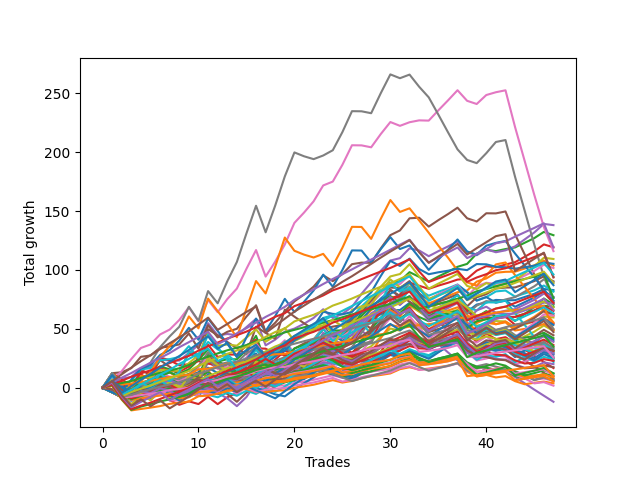

# Short Bulldog 005 
- Symbol: TSLA_Unlimited
- Date Range: 03/23/2022 - 07/08/2022
- Trading Period: 7:20-12:30
- Number of Trades: 47



| Name | Win Percent | Profit | Avg Profit / Trade | Avg Time / Trade |      | Name | Win Percent | Profit | Avg Profit / Trade | Avg Time / Trade |
| ---- | ----------- | ------ | ------------------ | ---------------- | ---- | ---- | ----------- | ------ | ------------------ | ---------------- |
| Sorted By <br> Profit | | | | | | Sorted By <br> Win Percentage ||||
| Four | 72.34 | 69025.00 | 1468.62 | 42:22 |     | Eighty-One | 97.87 | 24510.00 | 521.49 | 12:42 |
| Two | 72.34 | 64750.00 | 1377.66 | 25:01 |     | Eighty-Two | 95.74 | 38090.00 | 810.43 | 24:43 |
| Three | 72.34 | 59615.00 | 1268.40 | 27:16 |     | Eighty-Three | 91.49 | 46830.00 | 996.38 | 28:54 |
| Eighty-Four | 89.36 | 59580.00 | 1267.66 | 36:10 |     | One Hundred Twenty-One | 91.49 | 12805.00 | 272.45 | 07:20 |
| Six | 70.21 | 57980.00 | 1233.62 | 113:57 |     | Eighty-Four | 89.36 | 59580.00 | 1267.66 | 36:10 |
| Sixty | 70.21 | 54665.00 | 1163.09 | 36:16 |     | One Hundred Twenty-Three | 89.36 | 44425.00 | 945.21 | 12:17 |
| Seventy-Three | 59.57 | 52605.00 | 1119.26 | 15:03 |     | One Hundred Twenty-Two | 89.36 | 24980.00 | 531.49 | 10:01 |
| One | 78.72 | 51870.00 | 1103.62 | 18:00 |     | One Hundred Twenty-Six | 89.36 | 4850.00 | 103.19 | 07:15 |
| Fifty-Eight | 70.21 | 50820.00 | 1081.28 | 21:32 |     | One Hundred Twenty-Eight | 87.23 | 36055.00 | 767.13 | 11:56 |
| One Hundred Twenty-Four | 85.11 | 48120.00 | 1023.83 | 19:20 |     | One Hundred Twenty-Seven | 87.23 | 17535.00 | 373.09 | 09:42 |
| Eighty-Five | 85.11 | 47115.00 | 1002.45 | 51:35 |     | One Hundred Twenty-Four | 85.11 | 48120.00 | 1023.83 | 19:20 |
| Eighty-Three | 91.49 | 46830.00 | 996.38 | 28:54 |     | Eighty-Five | 85.11 | 47115.00 | 1002.45 | 51:35 |
| Fifty-Seven | 76.60 | 45185.00 | 961.38 | 15:51 |     | One Hundred Eleven | 80.85 | 5215.00 | 110.96 | 02:59 |
| Fifty-Nine | 70.21 | 44795.00 | 953.09 | 23:19 |     | One Hundred Sixteen | 80.85 | 2695.00 | 57.34 | 03:01 |
| One Hundred Twenty-Three | 89.36 | 44425.00 | 945.21 | 12:17 |     | One | 78.72 | 51870.00 | 1103.62 | 18:00 |
| One Hundred Twenty-Five | 78.72 | 43545.00 | 926.49 | 27:41 |     | One Hundred Twenty-Five | 78.72 | 43545.00 | 926.49 | 27:41 |
| Zero | 76.60 | 41470.00 | 882.34 | 11:51 |     | One Hundred Thirteen | 78.72 | 34060.00 | 724.68 | 06:51 |
| Forty-One | 70.21 | 40805.00 | 868.19 | 11:20 |     | One Hundred Twenty-Nine | 78.72 | 33065.00 | 703.51 | 15:53 |
| Sixty-Six | 65.96 | 38570.00 | 820.64 | 18:34 |     | One Hundred Twelve | 78.72 | 16880.00 | 359.15 | 04:43 |
| Forty-Two | 59.57 | 38385.00 | 816.70 | 15:04 |     | Fifty-Seven | 76.60 | 45185.00 | 961.38 | 15:51 |
| Eighty-Two | 95.74 | 38090.00 | 810.43 | 24:43 |     | Zero | 76.60 | 41470.00 | 882.34 | 11:51 |
| Sixty-Two | 57.45 | 36895.00 | 785.00 | 70:19 |     | Fifty-Six | 76.60 | 35745.00 | 760.53 | 10:28 |
| Seven | 53.19 | 36875.00 | 784.57 | 180:37 |     | Sixty-Four | 74.47 | 34390.00 | 731.70 | 09:49 |
| One Hundred Twenty-Eight | 87.23 | 36055.00 | 767.13 | 11:56 |     | Sixty-Five | 74.47 | 32635.00 | 694.36 | 14:21 |
| Five | 70.21 | 35995.00 | 765.85 | 73:26 |     | One Hundred Six | 74.47 | 4370.00 | 92.98 | 02:20 |
| Fifty-Six | 76.60 | 35745.00 | 760.53 | 10:28 |     | Four | 72.34 | 69025.00 | 1468.62 | 42:22 |
| Forty-Four | 55.32 | 35320.00 | 751.49 | 23:33 |     | Two | 72.34 | 64750.00 | 1377.66 | 25:01 |
| Sixty-Four | 74.47 | 34390.00 | 731.70 | 09:49 |     | Three | 72.34 | 59615.00 | 1268.40 | 27:16 |
| One Hundred Thirteen | 78.72 | 34060.00 | 724.68 | 06:51 |     | One Hundred Seventeen | 72.34 | 6140.00 | 130.64 | 04:24 |
| One Hundred Twenty-Nine | 78.72 | 33065.00 | 703.51 | 15:53 |     | Six | 70.21 | 57980.00 | 1233.62 | 113:57 |
| Sixty-Five | 74.47 | 32635.00 | 694.36 | 14:21 |     | Sixty | 70.21 | 54665.00 | 1163.09 | 36:16 |
| One Hundred Fourteen | 70.21 | 31590.00 | 672.13 | 09:59 |     | Fifty-Eight | 70.21 | 50820.00 | 1081.28 | 21:32 |
| Sixty-Seven | 65.96 | 31315.00 | 666.28 | 19:57 |     | Fifty-Nine | 70.21 | 44795.00 | 953.09 | 23:19 |
| Sixty-Eight | 57.45 | 30640.00 | 651.91 | 27:34 |     | Forty-One | 70.21 | 40805.00 | 868.19 | 11:20 |
| Forty-Three | 59.57 | 30510.00 | 649.15 | 16:08 |     | Five | 70.21 | 35995.00 | 765.85 | 73:26 |
| Forty | 70.21 | 29840.00 | 634.89 | 07:46 |     | One Hundred Fourteen | 70.21 | 31590.00 | 672.13 | 09:59 |
| Sixty-Three | 44.68 | 27755.00 | 590.53 | 111:34 |     | Forty | 70.21 | 29840.00 | 634.89 | 07:46 |
| Fifty-Five | 51.06 | 27185.00 | 578.40 | 21:55 |     | One Hundred Eighteen | 70.21 | 18130.00 | 385.74 | 06:15 |
| One Hundred Fifteen | 61.70 | 26660.00 | 567.23 | 12:53 |     | One Hundred One | 70.21 | 915.00 | 19.47 | 02:06 |
| One Hundred Twenty-Two | 89.36 | 24980.00 | 531.49 | 10:01 |     | One Hundred Thirty | 68.09 | 23655.00 | 503.30 | 19:39 |
| Fifty-Three | 51.06 | 24780.00 | 527.23 | 16:54 |     | Sixty-Six | 65.96 | 38570.00 | 820.64 | 18:34 |
| Eighty-One | 97.87 | 24510.00 | 521.49 | 12:42 |     | Sixty-Seven | 65.96 | 31315.00 | 666.28 | 19:57 |
| Fifty | 51.06 | 24150.00 | 513.83 | 11:30 |     | Ninety-One | 65.96 | 2910.00 | 61.91 | 01:50 |
| One Hundred Thirty | 68.09 | 23655.00 | 503.30 | 19:39 |     | Ninety-Six | 65.96 | 1915.00 | 40.74 | 01:53 |
| One Hundred Twenty | 53.19 | 22300.00 | 474.47 | 10:17 |     | One Hundred Fifteen | 61.70 | 26660.00 | 567.23 | 12:53 |
| Fifty-Four | 51.06 | 21060.00 | 448.09 | 18:48 |     | One Hundred Three | 61.70 | 15560.00 | 331.06 | 04:30 |
| Fifty-Two | 51.06 | 20240.00 | 430.64 | 14:24 |     | One Hundred Seven | 61.70 | 6060.00 | 128.94 | 03:28 |
| One Hundred Ninteen | 59.57 | 19500.00 | 414.89 | 08:44 |     | One Hundred Two | 61.70 | 3035.00 | 64.57 | 03:23 |
| One Hundred Eighteen | 70.21 | 18130.00 | 385.74 | 06:15 |     | Seventy-Three | 59.57 | 52605.00 | 1119.26 | 15:03 |
| One Hundred Twenty-Seven | 87.23 | 17535.00 | 373.09 | 09:42 |     | Forty-Two | 59.57 | 38385.00 | 816.70 | 15:04 |
| One Hundred Twelve | 78.72 | 16880.00 | 359.15 | 04:43 |     | Forty-Three | 59.57 | 30510.00 | 649.15 | 16:08 |
| Forty-Nine | 55.32 | 16795.00 | 357.34 | 08:53 |     | One Hundred Ninteen | 59.57 | 19500.00 | 414.89 | 08:44 |
| Fifty-One | 51.06 | 16040.00 | 341.28 | 11:32 |     | Sixty-One | 59.57 | 11620.00 | 247.23 | 49:49 |
| One Hundred Ten | 53.19 | 15895.00 | 338.19 | 07:21 |     | Sixty-Two | 57.45 | 36895.00 | 785.00 | 70:19 |
| One Hundred Eight | 57.45 | 15610.00 | 332.13 | 04:25 |     | Sixty-Eight | 57.45 | 30640.00 | 651.91 | 27:34 |
| One Hundred Three | 61.70 | 15560.00 | 331.06 | 04:30 |     | One Hundred Eight | 57.45 | 15610.00 | 332.13 | 04:25 |
| Ninety-Three | 55.32 | 15560.00 | 331.06 | 03:43 |     | Forty-Eight | 57.45 | 14175.00 | 301.60 | 06:22 |
| One Hundred Four | 53.19 | 14915.00 | 317.34 | 07:07 |     | Forty-Four | 55.32 | 35320.00 | 751.49 | 23:33 |
| One Hundred Nine | 53.19 | 14645.00 | 311.60 | 06:13 |     | Forty-Nine | 55.32 | 16795.00 | 357.34 | 08:53 |
| Forty-Eight | 57.45 | 14175.00 | 301.60 | 06:22 |     | Ninety-Three | 55.32 | 15560.00 | 331.06 | 03:43 |
| Ninety-Five | 40.43 | 14150.00 | 301.06 | 07:14 |     | Ninety-Two | 55.32 | 3365.00 | 71.60 | 02:51 |
| Sixty-Nine | 48.94 | 13105.00 | 278.83 | 34:35 |     | Seven | 53.19 | 36875.00 | 784.57 | 180:37 |
| One Hundred Twenty-One | 91.49 | 12805.00 | 272.45 | 07:20 |     | One Hundred Twenty | 53.19 | 22300.00 | 474.47 | 10:17 |
| One Hundred Five | 46.81 | 12800.00 | 272.34 | 08:59 |     | One Hundred Ten | 53.19 | 15895.00 | 338.19 | 07:21 |
| Seventy | 42.55 | 12345.00 | 262.66 | 40:04 |     | One Hundred Four | 53.19 | 14915.00 | 317.34 | 07:07 |
| Ninety-Four | 44.68 | 12095.00 | 257.34 | 06:05 |     | One Hundred Nine | 53.19 | 14645.00 | 311.60 | 06:13 |
| Sixty-One | 59.57 | 11620.00 | 247.23 | 49:49 |     | Ninety-Seven | 53.19 | 5150.00 | 109.57 | 02:25 |
| Ninety-Eight | 51.06 | 11440.00 | 243.40 | 03:09 |     | Fifty-Five | 51.06 | 27185.00 | 578.40 | 21:55 |
| Seventy-One | 42.55 | 10955.00 | 233.09 | 49:34 |     | Fifty-Three | 51.06 | 24780.00 | 527.23 | 16:54 |
| Ninety-Nine | 51.06 | 10050.00 | 213.83 | 04:09 |     | Fifty | 51.06 | 24150.00 | 513.83 | 11:30 |
| One Hundred | 51.06 | 8770.00 | 186.60 | 04:35 |     | Fifty-Four | 51.06 | 21060.00 | 448.09 | 18:48 |
| Forty-Five | 40.43 | 8395.00 | 178.62 | 31:23 |     | Fifty-Two | 51.06 | 20240.00 | 430.64 | 14:24 |
| One Hundred Seventeen | 72.34 | 6140.00 | 130.64 | 04:24 |     | Fifty-One | 51.06 | 16040.00 | 341.28 | 11:32 |
| One Hundred Seven | 61.70 | 6060.00 | 128.94 | 03:28 |     | Ninety-Eight | 51.06 | 11440.00 | 243.40 | 03:09 |
| One Hundred Eleven | 80.85 | 5215.00 | 110.96 | 02:59 |     | Ninety-Nine | 51.06 | 10050.00 | 213.83 | 04:09 |
| Ninety-Seven | 53.19 | 5150.00 | 109.57 | 02:25 |     | One Hundred | 51.06 | 8770.00 | 186.60 | 04:35 |
| One Hundred Twenty-Six | 89.36 | 4850.00 | 103.19 | 07:15 |     | Sixty-Nine | 48.94 | 13105.00 | 278.83 | 34:35 |
| One Hundred Six | 74.47 | 4370.00 | 92.98 | 02:20 |     | One Hundred Five | 46.81 | 12800.00 | 272.34 | 08:59 |
| Forty-Seven | 27.66 | 3805.00 | 80.96 | 59:32 |     | Sixty-Three | 44.68 | 27755.00 | 590.53 | 111:34 |
| Ninety-Two | 55.32 | 3365.00 | 71.60 | 02:51 |     | Ninety-Four | 44.68 | 12095.00 | 257.34 | 06:05 |
| One Hundred Two | 61.70 | 3035.00 | 64.57 | 03:23 |     | Seventy | 42.55 | 12345.00 | 262.66 | 40:04 |
| Ninety-One | 65.96 | 2910.00 | 61.91 | 01:50 |     | Seventy-One | 42.55 | 10955.00 | 233.09 | 49:34 |
| One Hundred Sixteen | 80.85 | 2695.00 | 57.34 | 03:01 |     | Ninety-Five | 40.43 | 14150.00 | 301.06 | 07:14 |
| Ninety-Six | 65.96 | 1915.00 | 40.74 | 01:53 |     | Forty-Five | 40.43 | 8395.00 | 178.62 | 31:23 |
| One Hundred One | 70.21 | 915.00 | 19.47 | 02:06 |     | Forty-Six | 31.91 | -5930.00 | -126.17 | 41:29 |
| Forty-Six | 31.91 | -5930.00 | -126.17 | 41:29 |     | Forty-Seven | 27.66 | 3805.00 | 80.96 | 59:32 |

## NO STOPLOSS

### Test Zero
* Sell when price hits the middle line of the 20p bollinger
* No Stoploss
* Results:
```
Total Trades: 47
Percent Up: 23.40
Percent Down: 76.60
Total Points Moved Down: 82.94
Potential Profit: 41470.00
Total Points Ups: 49.77 Count Ups: 11
Total Points Downs: 132.71 Count Downs: 36
```

<details><summary>Trades</summary>

<code>In: 2022-03-25 07:49:00		Out: 2022-03-25 07:54:10		Total Position Time: 05:10		Total Move Down: 2.20		Total to Date: 2.20</code> <br />
<code>In: 2022-03-28 07:48:00		Out: 2022-03-28 08:04:10		Total Position Time: 16:10		Total Move Down: -3.30		Total to Date: -1.10</code> <br />
<code>In: 2022-03-28 07:50:00		Out: 2022-03-28 08:04:10		Total Position Time: 14:10		Total Move Down: -0.60		Total to Date: -1.70</code> <br />
<code>In: 2022-03-30 10:16:00		Out: 2022-03-30 10:22:55		Total Position Time: 06:55		Total Move Down: 5.41		Total to Date: 3.71</code> <br />
<code>In: 2022-03-31 07:23:00		Out: 2022-03-31 07:26:50		Total Position Time: 03:50		Total Move Down: 3.15		Total to Date: 6.86</code> <br />
<code>In: 2022-03-31 07:58:00		Out: 2022-03-31 08:07:45		Total Position Time: 09:45		Total Move Down: 3.12		Total to Date: 9.98</code> <br />
<code>In: 2022-04-01 07:32:00		Out: 2022-04-01 07:41:40		Total Position Time: 09:40		Total Move Down: 3.10		Total to Date: 13.08</code> <br />
<code>In: 2022-04-18 11:17:00		Out: 2022-04-18 11:41:15		Total Position Time: 24:15		Total Move Down: -3.45		Total to Date: 9.63</code> <br />
<code>In: 2022-04-25 11:31:00		Out: 2022-04-25 11:39:30		Total Position Time: 08:30		Total Move Down: 1.79		Total to Date: 11.42</code> <br />
<code>In: 2022-04-28 09:49:00		Out: 2022-04-28 10:06:10		Total Position Time: 17:10		Total Move Down: 1.39		Total to Date: 12.81</code> <br />
<code>In: 2022-05-02 07:32:00		Out: 2022-05-02 07:44:25		Total Position Time: 12:25		Total Move Down: 4.24		Total to Date: 17.05</code> <br />
<code>In: 2022-05-02 12:15:00		Out: 2022-05-02 12:37:35		Total Position Time: 22:35		Total Move Down: -4.50		Total to Date: 12.55</code> <br />
<code>In: 2022-05-04 09:41:00		Out: 2022-05-04 09:47:00		Total Position Time: 06:00		Total Move Down: 5.01		Total to Date: 17.56</code> <br />
<code>In: 2022-05-04 09:42:00		Out: 2022-05-04 09:47:00		Total Position Time: 05:00		Total Move Down: 2.82		Total to Date: 20.38</code> <br />
<code>In: 2022-05-04 10:05:00		Out: 2022-05-04 10:11:15		Total Position Time: 06:15		Total Move Down: 5.07		Total to Date: 25.45</code> <br />
<code>In: 2022-05-04 11:03:00		Out: 2022-05-04 11:06:40		Total Position Time: 03:40		Total Move Down: 3.69		Total to Date: 29.14</code> <br />
<code>In: 2022-05-04 11:49:00		Out: 2022-05-04 12:47:00		Total Position Time: 58:00		Total Move Down: -22.51		Total to Date: 6.63</code> <br />
<code>In: 2022-05-06 07:48:00		Out: 2022-05-06 08:03:10		Total Position Time: 15:10		Total Move Down: 1.86		Total to Date: 8.49</code> <br />
<code>In: 2022-05-06 07:51:00		Out: 2022-05-06 08:03:10		Total Position Time: 12:10		Total Move Down: 3.78		Total to Date: 12.27</code> <br />
<code>In: 2022-05-12 07:27:00		Out: 2022-05-12 07:34:05		Total Position Time: 07:05		Total Move Down: 9.38		Total to Date: 21.65</code> <br />
<code>In: 2022-05-17 08:54:00		Out: 2022-05-17 09:02:20		Total Position Time: 08:20		Total Move Down: 2.93		Total to Date: 24.58</code> <br />
<code>In: 2022-05-17 09:37:00		Out: 2022-05-17 09:38:35		Total Position Time: 01:35		Total Move Down: 2.06		Total to Date: 26.64</code> <br />
<code>In: 2022-05-17 11:10:00		Out: 2022-05-17 11:12:15		Total Position Time: 02:15		Total Move Down: 5.88		Total to Date: 32.52</code> <br />
<code>In: 2022-05-19 07:57:00		Out: 2022-05-19 08:06:00		Total Position Time: 09:00		Total Move Down: 4.32		Total to Date: 36.84</code> <br />
<code>In: 2022-05-19 08:37:00		Out: 2022-05-19 08:50:45		Total Position Time: 13:45		Total Move Down: 0.03		Total to Date: 36.87</code> <br />
<code>In: 2022-05-19 08:39:00		Out: 2022-05-19 08:50:45		Total Position Time: 11:45		Total Move Down: 2.42		Total to Date: 39.29</code> <br />
<code>In: 2022-05-23 07:33:00		Out: 2022-05-23 07:42:10		Total Position Time: 09:10		Total Move Down: 10.00		Total to Date: 49.29</code> <br />
<code>In: 2022-05-23 07:34:00		Out: 2022-05-23 07:42:10		Total Position Time: 08:10		Total Move Down: 8.48		Total to Date: 57.77</code> <br />
<code>In: 2022-05-24 09:17:00		Out: 2022-05-24 09:24:15		Total Position Time: 07:15		Total Move Down: 4.68		Total to Date: 62.45</code> <br />
<code>In: 2022-05-24 09:18:00		Out: 2022-05-24 09:24:15		Total Position Time: 06:15		Total Move Down: 3.64		Total to Date: 66.09</code> <br />
<code>In: 2022-05-25 08:04:00		Out: 2022-05-25 08:20:55		Total Position Time: 16:55		Total Move Down: -0.14		Total to Date: 65.95</code> <br />
<code>In: 2022-05-25 08:15:00		Out: 2022-05-25 08:20:55		Total Position Time: 05:55		Total Move Down: 6.15		Total to Date: 72.10</code> <br />
<code>In: 2022-06-07 07:31:00		Out: 2022-06-07 07:58:40		Total Position Time: 27:40		Total Move Down: -6.85		Total to Date: 65.25</code> <br />
<code>In: 2022-06-14 08:26:00		Out: 2022-06-14 09:02:25		Total Position Time: 36:25		Total Move Down: -7.03		Total to Date: 58.22</code> <br />
<code>In: 2022-06-15 09:31:00		Out: 2022-06-15 09:35:10		Total Position Time: 04:10		Total Move Down: 2.28		Total to Date: 60.50</code> <br />
<code>In: 2022-06-15 09:32:00		Out: 2022-06-15 09:35:10		Total Position Time: 03:10		Total Move Down: 1.97		Total to Date: 62.47</code> <br />
<code>In: 2022-06-15 09:34:00		Out: 2022-06-15 09:35:10		Total Position Time: 01:10		Total Move Down: 2.28		Total to Date: 64.75</code> <br />
<code>In: 2022-06-15 11:40:00		Out: 2022-06-15 11:52:35		Total Position Time: 12:35		Total Move Down: -0.18		Total to Date: 64.57</code> <br />
<code>In: 2022-06-15 11:43:00		Out: 2022-06-15 11:52:35		Total Position Time: 09:35		Total Move Down: 6.09		Total to Date: 70.66</code> <br />
<code>In: 2022-06-17 10:14:00		Out: 2022-06-17 10:24:05		Total Position Time: 10:05		Total Move Down: 1.65		Total to Date: 72.31</code> <br />
<code>In: 2022-06-23 07:29:00		Out: 2022-06-23 07:34:05		Total Position Time: 05:05		Total Move Down: 2.27		Total to Date: 74.58</code> <br />
<code>In: 2022-06-29 12:10:00		Out: 2022-06-29 12:32:25		Total Position Time: 22:25		Total Move Down: -0.34		Total to Date: 74.24</code> <br />
<code>In: 2022-07-05 07:38:00		Out: 2022-07-05 07:52:35		Total Position Time: 14:35		Total Move Down: 0.14		Total to Date: 74.38</code> <br />
<code>In: 2022-07-05 07:40:00		Out: 2022-07-05 07:52:35		Total Position Time: 12:35		Total Move Down: 2.69		Total to Date: 77.07</code> <br />
<code>In: 2022-07-05 07:41:00		Out: 2022-07-05 07:52:35		Total Position Time: 11:35		Total Move Down: 2.69		Total to Date: 79.76</code> <br />
<code>In: 2022-07-05 07:43:00		Out: 2022-07-05 07:52:35		Total Position Time: 09:35		Total Move Down: 4.05		Total to Date: 83.81</code> <br />
<code>In: 2022-07-05 09:03:00		Out: 2022-07-05 09:15:15		Total Position Time: 12:15		Total Move Down: -0.87		Total to Date: 82.94</code> <br />


</details>

### Test One
* Sell when the price hits the upper line of the 20p 1std bollinger
* No Stoploss
* Results:
```
Total Trades: 47
Percent Up: 21.28
Percent Down: 78.72
Total Points Moved Down: 103.74
Potential Profit: 51870.00
Total Points Ups: 64.93 Count Ups: 10
Total Points Downs: 168.67 Count Downs: 37
```

<details><summary>Trades</summary>

<code>In: 2022-03-25 07:49:00		Out: 2022-03-25 07:56:05		Total Position Time: 07:05		Total Move Down: 4.69		Total to Date: 4.69</code> <br />
<code>In: 2022-03-28 07:48:00		Out: 2022-03-28 08:24:05		Total Position Time: 36:05		Total Move Down: -6.03		Total to Date: -1.34</code> <br />
<code>In: 2022-03-28 07:50:00		Out: 2022-03-28 08:24:05		Total Position Time: 34:05		Total Move Down: -3.33		Total to Date: -4.67</code> <br />
<code>In: 2022-03-30 10:16:00		Out: 2022-03-30 10:39:00		Total Position Time: 23:00		Total Move Down: 5.52		Total to Date: 0.85</code> <br />
<code>In: 2022-03-31 07:23:00		Out: 2022-03-31 07:41:20		Total Position Time: 18:20		Total Move Down: 2.15		Total to Date: 3.00</code> <br />
<code>In: 2022-03-31 07:58:00		Out: 2022-03-31 08:08:25		Total Position Time: 10:25		Total Move Down: 4.94		Total to Date: 7.94</code> <br />
<code>In: 2022-04-01 07:32:00		Out: 2022-04-01 08:02:45		Total Position Time: 30:45		Total Move Down: -3.11		Total to Date: 4.83</code> <br />
<code>In: 2022-04-18 11:17:00		Out: 2022-04-18 11:45:20		Total Position Time: 28:20		Total Move Down: -3.94		Total to Date: 0.89</code> <br />
<code>In: 2022-04-25 11:31:00		Out: 2022-04-25 11:40:05		Total Position Time: 09:05		Total Move Down: 2.96		Total to Date: 3.85</code> <br />
<code>In: 2022-04-28 09:49:00		Out: 2022-04-28 10:08:55		Total Position Time: 19:55		Total Move Down: 4.75		Total to Date: 8.60</code> <br />
<code>In: 2022-05-02 07:32:00		Out: 2022-05-02 07:46:15		Total Position Time: 14:15		Total Move Down: 6.20		Total to Date: 14.80</code> <br />
<code>In: 2022-05-02 12:15:00		Out: 2022-05-02 12:47:00		Total Position Time: 32:00		Total Move Down: -10.36		Total to Date: 4.44</code> <br />
<code>In: 2022-05-04 09:41:00		Out: 2022-05-04 09:51:10		Total Position Time: 10:10		Total Move Down: 5.83		Total to Date: 10.27</code> <br />
<code>In: 2022-05-04 09:42:00		Out: 2022-05-04 09:51:10		Total Position Time: 09:10		Total Move Down: 3.64		Total to Date: 13.91</code> <br />
<code>In: 2022-05-04 10:05:00		Out: 2022-05-04 10:16:30		Total Position Time: 11:30		Total Move Down: 6.31		Total to Date: 20.22</code> <br />
<code>In: 2022-05-04 11:03:00		Out: 2022-05-04 11:07:15		Total Position Time: 04:15		Total Move Down: 7.06		Total to Date: 27.28</code> <br />
<code>In: 2022-05-04 11:49:00		Out: 2022-05-04 12:47:00		Total Position Time: 58:00		Total Move Down: -22.51		Total to Date: 4.77</code> <br />
<code>In: 2022-05-06 07:48:00		Out: 2022-05-06 08:05:10		Total Position Time: 17:10		Total Move Down: 4.44		Total to Date: 9.21</code> <br />
<code>In: 2022-05-06 07:51:00		Out: 2022-05-06 08:05:10		Total Position Time: 14:10		Total Move Down: 6.36		Total to Date: 15.57</code> <br />
<code>In: 2022-05-12 07:27:00		Out: 2022-05-12 07:44:25		Total Position Time: 17:25		Total Move Down: 9.76		Total to Date: 25.33</code> <br />
<code>In: 2022-05-17 08:54:00		Out: 2022-05-17 09:06:00		Total Position Time: 12:00		Total Move Down: 4.49		Total to Date: 29.82</code> <br />
<code>In: 2022-05-17 09:37:00		Out: 2022-05-17 09:39:15		Total Position Time: 02:15		Total Move Down: 3.24		Total to Date: 33.06</code> <br />
<code>In: 2022-05-17 11:10:00		Out: 2022-05-17 11:13:15		Total Position Time: 03:15		Total Move Down: 8.77		Total to Date: 41.83</code> <br />
<code>In: 2022-05-19 07:57:00		Out: 2022-05-19 08:16:15		Total Position Time: 19:15		Total Move Down: 2.21		Total to Date: 44.04</code> <br />
<code>In: 2022-05-19 08:37:00		Out: 2022-05-19 08:53:35		Total Position Time: 16:35		Total Move Down: 1.44		Total to Date: 45.48</code> <br />
<code>In: 2022-05-19 08:39:00		Out: 2022-05-19 08:53:35		Total Position Time: 14:35		Total Move Down: 3.83		Total to Date: 49.31</code> <br />
<code>In: 2022-05-23 07:33:00		Out: 2022-05-23 07:50:05		Total Position Time: 17:05		Total Move Down: 9.07		Total to Date: 58.38</code> <br />
<code>In: 2022-05-23 07:34:00		Out: 2022-05-23 07:50:05		Total Position Time: 16:05		Total Move Down: 7.55		Total to Date: 65.93</code> <br />
<code>In: 2022-05-24 09:17:00		Out: 2022-05-24 09:29:10		Total Position Time: 12:10		Total Move Down: 6.15		Total to Date: 72.08</code> <br />
<code>In: 2022-05-24 09:18:00		Out: 2022-05-24 09:29:10		Total Position Time: 11:10		Total Move Down: 5.11		Total to Date: 77.19</code> <br />
<code>In: 2022-05-25 08:04:00		Out: 2022-05-25 08:29:55		Total Position Time: 25:55		Total Move Down: -0.40		Total to Date: 76.79</code> <br />
<code>In: 2022-05-25 08:15:00		Out: 2022-05-25 08:29:55		Total Position Time: 14:55		Total Move Down: 5.89		Total to Date: 82.68</code> <br />
<code>In: 2022-06-07 07:31:00		Out: 2022-06-07 08:04:40		Total Position Time: 33:40		Total Move Down: -5.29		Total to Date: 77.39</code> <br />
<code>In: 2022-06-14 08:26:00		Out: 2022-06-14 09:04:05		Total Position Time: 38:05		Total Move Down: -5.74		Total to Date: 71.65</code> <br />
<code>In: 2022-06-15 09:31:00		Out: 2022-06-15 09:39:45		Total Position Time: 08:45		Total Move Down: 3.27		Total to Date: 74.92</code> <br />
<code>In: 2022-06-15 09:32:00		Out: 2022-06-15 09:39:45		Total Position Time: 07:45		Total Move Down: 2.96		Total to Date: 77.88</code> <br />
<code>In: 2022-06-15 09:34:00		Out: 2022-06-15 09:39:45		Total Position Time: 05:45		Total Move Down: 3.27		Total to Date: 81.15</code> <br />
<code>In: 2022-06-15 11:40:00		Out: 2022-06-15 11:57:45		Total Position Time: 17:45		Total Move Down: 1.37		Total to Date: 82.52</code> <br />
<code>In: 2022-06-15 11:43:00		Out: 2022-06-15 11:57:45		Total Position Time: 14:45		Total Move Down: 7.64		Total to Date: 90.16</code> <br />
<code>In: 2022-06-17 10:14:00		Out: 2022-06-17 10:28:05		Total Position Time: 14:05		Total Move Down: 2.67		Total to Date: 92.83</code> <br />
<code>In: 2022-06-23 07:29:00		Out: 2022-06-23 07:35:35		Total Position Time: 06:35		Total Move Down: 4.83		Total to Date: 97.66</code> <br />
<code>In: 2022-06-29 12:10:00		Out: 2022-06-29 12:33:25		Total Position Time: 23:25		Total Move Down: 0.77		Total to Date: 98.43</code> <br />
<code>In: 2022-07-05 07:38:00		Out: 2022-07-05 07:57:05		Total Position Time: 19:05		Total Move Down: 0.13		Total to Date: 98.56</code> <br />
<code>In: 2022-07-05 07:40:00		Out: 2022-07-05 07:57:05		Total Position Time: 17:05		Total Move Down: 2.68		Total to Date: 101.24</code> <br />
<code>In: 2022-07-05 07:41:00		Out: 2022-07-05 07:57:05		Total Position Time: 16:05		Total Move Down: 2.68		Total to Date: 103.92</code> <br />
<code>In: 2022-07-05 07:43:00		Out: 2022-07-05 07:57:05		Total Position Time: 14:05		Total Move Down: 4.04		Total to Date: 107.96</code> <br />
<code>In: 2022-07-05 09:03:00		Out: 2022-07-05 09:41:50		Total Position Time: 38:50		Total Move Down: -4.22		Total to Date: 103.74</code> <br />


</details>

### Test Two
* Sell when the price hits the upper line of the 20p 2std bollinger
* No Stoploss
* Results:
```
Total Trades: 47
Percent Up: 27.66
Percent Down: 72.34
Total Points Moved Down: 129.50
Potential Profit: 64750.00
Total Points Ups: 69.26 Count Ups: 13
Total Points Downs: 198.76 Count Downs: 34
```

<details><summary>Trades</summary>

<code>In: 2022-03-25 07:49:00		Out: 2022-03-25 08:01:25		Total Position Time: 12:25		Total Move Down: 6.49		Total to Date: 6.49</code> <br />
<code>In: 2022-03-28 07:48:00		Out: 2022-03-28 08:24:45		Total Position Time: 36:45		Total Move Down: -3.72		Total to Date: 2.77</code> <br />
<code>In: 2022-03-28 07:50:00		Out: 2022-03-28 08:24:45		Total Position Time: 34:45		Total Move Down: -1.02		Total to Date: 1.75</code> <br />
<code>In: 2022-03-30 10:16:00		Out: 2022-03-30 10:39:05		Total Position Time: 23:05		Total Move Down: 6.78		Total to Date: 8.53</code> <br />
<code>In: 2022-03-31 07:23:00		Out: 2022-03-31 07:41:35		Total Position Time: 18:35		Total Move Down: 3.45		Total to Date: 11.98</code> <br />
<code>In: 2022-03-31 07:58:00		Out: 2022-03-31 08:25:40		Total Position Time: 27:40		Total Move Down: 6.24		Total to Date: 18.22</code> <br />
<code>In: 2022-04-01 07:32:00		Out: 2022-04-01 08:07:00		Total Position Time: 35:00		Total Move Down: -2.53		Total to Date: 15.69</code> <br />
<code>In: 2022-04-18 11:17:00		Out: 2022-04-18 11:45:30		Total Position Time: 28:30		Total Move Down: -3.82		Total to Date: 11.87</code> <br />
<code>In: 2022-04-25 11:31:00		Out: 2022-04-25 11:41:50		Total Position Time: 10:50		Total Move Down: 3.91		Total to Date: 15.78</code> <br />
<code>In: 2022-04-28 09:49:00		Out: 2022-04-28 10:09:15		Total Position Time: 20:15		Total Move Down: 7.87		Total to Date: 23.65</code> <br />
<code>In: 2022-05-02 07:32:00		Out: 2022-05-02 07:47:15		Total Position Time: 15:15		Total Move Down: 8.92		Total to Date: 32.57</code> <br />
<code>In: 2022-05-02 12:15:00		Out: 2022-05-02 12:47:00		Total Position Time: 32:00		Total Move Down: -10.36		Total to Date: 22.21</code> <br />
<code>In: 2022-05-04 09:41:00		Out: 2022-05-04 10:18:30		Total Position Time: 37:30		Total Move Down: 2.10		Total to Date: 24.31</code> <br />
<code>In: 2022-05-04 09:42:00		Out: 2022-05-04 10:18:30		Total Position Time: 36:30		Total Move Down: -0.09		Total to Date: 24.22</code> <br />
<code>In: 2022-05-04 10:05:00		Out: 2022-05-04 10:18:30		Total Position Time: 13:30		Total Move Down: 7.75		Total to Date: 31.97</code> <br />
<code>In: 2022-05-04 11:03:00		Out: 2022-05-04 11:07:25		Total Position Time: 04:25		Total Move Down: 12.12		Total to Date: 44.09</code> <br />
<code>In: 2022-05-04 11:49:00		Out: 2022-05-04 12:47:00		Total Position Time: 58:00		Total Move Down: -22.51		Total to Date: 21.58</code> <br />
<code>In: 2022-05-06 07:48:00		Out: 2022-05-06 08:06:05		Total Position Time: 18:05		Total Move Down: 5.64		Total to Date: 27.22</code> <br />
<code>In: 2022-05-06 07:51:00		Out: 2022-05-06 08:06:05		Total Position Time: 15:05		Total Move Down: 7.56		Total to Date: 34.78</code> <br />
<code>In: 2022-05-12 07:27:00		Out: 2022-05-12 08:17:40		Total Position Time: 50:40		Total Move Down: -5.36		Total to Date: 29.42</code> <br />
<code>In: 2022-05-17 08:54:00		Out: 2022-05-17 09:07:10		Total Position Time: 13:10		Total Move Down: 5.75		Total to Date: 35.17</code> <br />
<code>In: 2022-05-17 09:37:00		Out: 2022-05-17 09:47:15		Total Position Time: 10:15		Total Move Down: 5.59		Total to Date: 40.76</code> <br />
<code>In: 2022-05-17 11:10:00		Out: 2022-05-17 11:13:30		Total Position Time: 03:30		Total Move Down: 10.66		Total to Date: 51.42</code> <br />
<code>In: 2022-05-19 07:57:00		Out: 2022-05-19 08:54:35		Total Position Time: 57:35		Total Move Down: -8.08		Total to Date: 43.34</code> <br />
<code>In: 2022-05-19 08:37:00		Out: 2022-05-19 08:54:35		Total Position Time: 17:35		Total Move Down: 2.83		Total to Date: 46.17</code> <br />
<code>In: 2022-05-19 08:39:00		Out: 2022-05-19 08:54:35		Total Position Time: 15:35		Total Move Down: 5.22		Total to Date: 51.39</code> <br />
<code>In: 2022-05-23 07:33:00		Out: 2022-05-23 07:51:20		Total Position Time: 18:20		Total Move Down: 12.07		Total to Date: 63.46</code> <br />
<code>In: 2022-05-23 07:34:00		Out: 2022-05-23 07:51:20		Total Position Time: 17:20		Total Move Down: 10.55		Total to Date: 74.01</code> <br />
<code>In: 2022-05-24 09:17:00		Out: 2022-05-24 09:31:20		Total Position Time: 14:20		Total Move Down: 8.07		Total to Date: 82.08</code> <br />
<code>In: 2022-05-24 09:18:00		Out: 2022-05-24 09:31:20		Total Position Time: 13:20		Total Move Down: 7.03		Total to Date: 89.11</code> <br />
<code>In: 2022-05-25 08:04:00		Out: 2022-05-25 08:30:40		Total Position Time: 26:40		Total Move Down: 1.38		Total to Date: 90.49</code> <br />
<code>In: 2022-05-25 08:15:00		Out: 2022-05-25 08:30:40		Total Position Time: 15:40		Total Move Down: 7.67		Total to Date: 98.16</code> <br />
<code>In: 2022-06-07 07:31:00		Out: 2022-06-07 08:04:50		Total Position Time: 33:50		Total Move Down: -4.00		Total to Date: 94.16</code> <br />
<code>In: 2022-06-14 08:26:00		Out: 2022-06-14 09:07:00		Total Position Time: 41:00		Total Move Down: -3.98		Total to Date: 90.18</code> <br />
<code>In: 2022-06-15 09:31:00		Out: 2022-06-15 09:53:25		Total Position Time: 22:25		Total Move Down: 4.27		Total to Date: 94.45</code> <br />
<code>In: 2022-06-15 09:32:00		Out: 2022-06-15 09:53:25		Total Position Time: 21:25		Total Move Down: 3.96		Total to Date: 98.41</code> <br />
<code>In: 2022-06-15 09:34:00		Out: 2022-06-15 09:53:25		Total Position Time: 19:25		Total Move Down: 4.27		Total to Date: 102.68</code> <br />
<code>In: 2022-06-15 11:40:00		Out: 2022-06-15 12:15:30		Total Position Time: 35:30		Total Move Down: 2.48		Total to Date: 105.16</code> <br />
<code>In: 2022-06-15 11:43:00		Out: 2022-06-15 12:15:30		Total Position Time: 32:30		Total Move Down: 8.75		Total to Date: 113.91</code> <br />
<code>In: 2022-06-17 10:14:00		Out: 2022-06-17 10:29:05		Total Position Time: 15:05		Total Move Down: 3.10		Total to Date: 117.01</code> <br />
<code>In: 2022-06-23 07:29:00		Out: 2022-06-23 08:05:10		Total Position Time: 36:10		Total Move Down: -0.98		Total to Date: 116.03</code> <br />
<code>In: 2022-06-29 12:10:00		Out: 2022-06-29 12:34:15		Total Position Time: 24:15		Total Move Down: 1.71		Total to Date: 117.74</code> <br />
<code>In: 2022-07-05 07:38:00		Out: 2022-07-05 08:05:55		Total Position Time: 27:55		Total Move Down: 1.39		Total to Date: 119.13</code> <br />
<code>In: 2022-07-05 07:40:00		Out: 2022-07-05 08:05:55		Total Position Time: 25:55		Total Move Down: 3.94		Total to Date: 123.07</code> <br />
<code>In: 2022-07-05 07:41:00		Out: 2022-07-05 08:05:55		Total Position Time: 24:55		Total Move Down: 3.94		Total to Date: 127.01</code> <br />
<code>In: 2022-07-05 07:43:00		Out: 2022-07-05 08:05:55		Total Position Time: 22:55		Total Move Down: 5.30		Total to Date: 132.31</code> <br />
<code>In: 2022-07-05 09:03:00		Out: 2022-07-05 09:43:40		Total Position Time: 40:40		Total Move Down: -2.81		Total to Date: 129.50</code> <br />


</details>

### Test Three
* Sell when price hits the middle line of the 50p bollinger
* No Stoploss
* Results:
```
Total Trades: 47
Percent Up: 27.66
Percent Down: 72.34
Total Points Moved Down: 119.23
Potential Profit: 59615.00
Total Points Ups: 61.39 Count Ups: 13
Total Points Downs: 180.62 Count Downs: 34
```

<details><summary>Trades</summary>

<code>In: 2022-03-25 07:49:00		Out: 2022-03-25 08:01:05		Total Position Time: 12:05		Total Move Down: 5.55		Total to Date: 5.55</code> <br />
<code>In: 2022-03-28 07:48:00		Out: 2022-03-28 08:25:10		Total Position Time: 37:10		Total Move Down: -3.53		Total to Date: 2.02</code> <br />
<code>In: 2022-03-28 07:50:00		Out: 2022-03-28 08:25:10		Total Position Time: 35:10		Total Move Down: -0.83		Total to Date: 1.19</code> <br />
<code>In: 2022-03-30 10:16:00		Out: 2022-03-30 10:39:05		Total Position Time: 23:05		Total Move Down: 6.78		Total to Date: 7.97</code> <br />
<code>In: 2022-03-31 07:23:00		Out: 2022-03-31 07:41:35		Total Position Time: 18:35		Total Move Down: 3.45		Total to Date: 11.42</code> <br />
<code>In: 2022-03-31 07:58:00		Out: 2022-03-31 08:08:25		Total Position Time: 10:25		Total Move Down: 4.94		Total to Date: 16.36</code> <br />
<code>In: 2022-04-01 07:32:00		Out: 2022-04-01 08:13:40		Total Position Time: 41:40		Total Move Down: -1.71		Total to Date: 14.65</code> <br />
<code>In: 2022-04-18 11:17:00		Out: 2022-04-18 11:47:00		Total Position Time: 30:00		Total Move Down: -0.92		Total to Date: 13.73</code> <br />
<code>In: 2022-04-25 11:31:00		Out: 2022-04-25 11:43:50		Total Position Time: 12:50		Total Move Down: 4.28		Total to Date: 18.01</code> <br />
<code>In: 2022-04-28 09:49:00		Out: 2022-04-28 10:18:05		Total Position Time: 29:05		Total Move Down: 6.93		Total to Date: 24.94</code> <br />
<code>In: 2022-05-02 07:32:00		Out: 2022-05-02 07:48:30		Total Position Time: 16:30		Total Move Down: 11.58		Total to Date: 36.52</code> <br />
<code>In: 2022-05-02 12:15:00		Out: 2022-05-02 12:47:00		Total Position Time: 32:00		Total Move Down: -10.36		Total to Date: 26.16</code> <br />
<code>In: 2022-05-04 09:41:00		Out: 2022-05-04 10:18:30		Total Position Time: 37:30		Total Move Down: 2.10		Total to Date: 28.26</code> <br />
<code>In: 2022-05-04 09:42:00		Out: 2022-05-04 10:18:30		Total Position Time: 36:30		Total Move Down: -0.09		Total to Date: 28.17</code> <br />
<code>In: 2022-05-04 10:05:00		Out: 2022-05-04 10:18:30		Total Position Time: 13:30		Total Move Down: 7.75		Total to Date: 35.92</code> <br />
<code>In: 2022-05-04 11:03:00		Out: 2022-05-04 11:06:50		Total Position Time: 03:50		Total Move Down: 4.82		Total to Date: 40.74</code> <br />
<code>In: 2022-05-04 11:49:00		Out: 2022-05-04 12:47:00		Total Position Time: 58:00		Total Move Down: -22.51		Total to Date: 18.23</code> <br />
<code>In: 2022-05-06 07:48:00		Out: 2022-05-06 08:10:35		Total Position Time: 22:35		Total Move Down: 5.68		Total to Date: 23.91</code> <br />
<code>In: 2022-05-06 07:51:00		Out: 2022-05-06 08:10:35		Total Position Time: 19:35		Total Move Down: 7.60		Total to Date: 31.51</code> <br />
<code>In: 2022-05-12 07:27:00		Out: 2022-05-12 08:21:35		Total Position Time: 54:35		Total Move Down: -2.94		Total to Date: 28.57</code> <br />
<code>In: 2022-05-17 08:54:00		Out: 2022-05-17 09:10:25		Total Position Time: 16:25		Total Move Down: 6.05		Total to Date: 34.62</code> <br />
<code>In: 2022-05-17 09:37:00		Out: 2022-05-17 09:38:50		Total Position Time: 01:50		Total Move Down: 2.45		Total to Date: 37.07</code> <br />
<code>In: 2022-05-17 11:10:00		Out: 2022-05-17 11:12:15		Total Position Time: 02:15		Total Move Down: 5.88		Total to Date: 42.95</code> <br />
<code>In: 2022-05-19 07:57:00		Out: 2022-05-19 09:12:15		Total Position Time: 75:15		Total Move Down: -9.83		Total to Date: 33.12</code> <br />
<code>In: 2022-05-19 08:37:00		Out: 2022-05-19 09:12:15		Total Position Time: 35:15		Total Move Down: 1.08		Total to Date: 34.20</code> <br />
<code>In: 2022-05-19 08:39:00		Out: 2022-05-19 09:12:15		Total Position Time: 33:15		Total Move Down: 3.47		Total to Date: 37.67</code> <br />
<code>In: 2022-05-23 07:33:00		Out: 2022-05-23 07:57:30		Total Position Time: 24:30		Total Move Down: 12.28		Total to Date: 49.95</code> <br />
<code>In: 2022-05-23 07:34:00		Out: 2022-05-23 07:57:30		Total Position Time: 23:30		Total Move Down: 10.76		Total to Date: 60.71</code> <br />
<code>In: 2022-05-24 09:17:00		Out: 2022-05-24 09:31:10		Total Position Time: 14:10		Total Move Down: 7.86		Total to Date: 68.57</code> <br />
<code>In: 2022-05-24 09:18:00		Out: 2022-05-24 09:31:10		Total Position Time: 13:10		Total Move Down: 6.82		Total to Date: 75.39</code> <br />
<code>In: 2022-05-25 08:04:00		Out: 2022-05-25 08:34:25		Total Position Time: 30:25		Total Move Down: 3.77		Total to Date: 79.16</code> <br />
<code>In: 2022-05-25 08:15:00		Out: 2022-05-25 08:34:25		Total Position Time: 19:25		Total Move Down: 10.06		Total to Date: 89.22</code> <br />
<code>In: 2022-06-07 07:31:00		Out: 2022-06-07 08:06:25		Total Position Time: 35:25		Total Move Down: -2.58		Total to Date: 86.64</code> <br />
<code>In: 2022-06-14 08:26:00		Out: 2022-06-14 09:07:15		Total Position Time: 41:15		Total Move Down: -2.65		Total to Date: 83.99</code> <br />
<code>In: 2022-06-15 09:31:00		Out: 2022-06-15 09:53:05		Total Position Time: 22:05		Total Move Down: 2.72		Total to Date: 86.71</code> <br />
<code>In: 2022-06-15 09:32:00		Out: 2022-06-15 09:53:05		Total Position Time: 21:05		Total Move Down: 2.41		Total to Date: 89.12</code> <br />
<code>In: 2022-06-15 09:34:00		Out: 2022-06-15 09:53:05		Total Position Time: 19:05		Total Move Down: 2.72		Total to Date: 91.84</code> <br />
<code>In: 2022-06-15 11:40:00		Out: 2022-06-15 12:12:55		Total Position Time: 32:55		Total Move Down: 0.65		Total to Date: 92.49</code> <br />
<code>In: 2022-06-15 11:43:00		Out: 2022-06-15 12:12:55		Total Position Time: 29:55		Total Move Down: 6.92		Total to Date: 99.41</code> <br />
<code>In: 2022-06-17 10:14:00		Out: 2022-06-17 10:32:25		Total Position Time: 18:25		Total Move Down: 3.82		Total to Date: 103.23</code> <br />
<code>In: 2022-06-23 07:29:00		Out: 2022-06-23 08:05:10		Total Position Time: 36:10		Total Move Down: -0.98		Total to Date: 102.25</code> <br />
<code>In: 2022-06-29 12:10:00		Out: 2022-06-29 12:36:35		Total Position Time: 26:35		Total Move Down: 2.35		Total to Date: 104.60</code> <br />
<code>In: 2022-07-05 07:38:00		Out: 2022-07-05 08:11:10		Total Position Time: 33:10		Total Move Down: 2.02		Total to Date: 106.62</code> <br />
<code>In: 2022-07-05 07:40:00		Out: 2022-07-05 08:11:10		Total Position Time: 31:10		Total Move Down: 4.57		Total to Date: 111.19</code> <br />
<code>In: 2022-07-05 07:41:00		Out: 2022-07-05 08:11:10		Total Position Time: 30:10		Total Move Down: 4.57		Total to Date: 115.76</code> <br />
<code>In: 2022-07-05 07:43:00		Out: 2022-07-05 08:11:10		Total Position Time: 28:10		Total Move Down: 5.93		Total to Date: 121.69</code> <br />
<code>In: 2022-07-05 09:03:00		Out: 2022-07-05 09:45:05		Total Position Time: 42:05		Total Move Down: -2.46		Total to Date: 119.23</code> <br />


</details>

### Test Four
* Sell when the price hits the upper line of the 50p 1std bollinger
* No Stoploss
* Results:
```
Total Trades: 47
Percent Up: 27.66
Percent Down: 72.34
Total Points Moved Down: 138.05
Potential Profit: 69025.00
Total Points Ups: 65.46 Count Ups: 13
Total Points Downs: 203.51 Count Downs: 34
```

<details><summary>Trades</summary>

<code>In: 2022-03-25 07:49:00		Out: 2022-03-25 08:07:50		Total Position Time: 18:50		Total Move Down: 9.08		Total to Date: 9.08</code> <br />
<code>In: 2022-03-28 07:48:00		Out: 2022-03-28 08:33:25		Total Position Time: 45:25		Total Move Down: -1.27		Total to Date: 7.81</code> <br />
<code>In: 2022-03-28 07:50:00		Out: 2022-03-28 08:33:25		Total Position Time: 43:25		Total Move Down: 1.43		Total to Date: 9.24</code> <br />
<code>In: 2022-03-30 10:16:00		Out: 2022-03-30 10:41:10		Total Position Time: 25:10		Total Move Down: 7.38		Total to Date: 16.62</code> <br />
<code>In: 2022-03-31 07:23:00		Out: 2022-03-31 08:27:55		Total Position Time: 64:55		Total Move Down: 0.94		Total to Date: 17.56</code> <br />
<code>In: 2022-03-31 07:58:00		Out: 2022-03-31 08:27:55		Total Position Time: 29:55		Total Move Down: 6.49		Total to Date: 24.05</code> <br />
<code>In: 2022-04-01 07:32:00		Out: 2022-04-01 08:20:05		Total Position Time: 48:05		Total Move Down: -0.88		Total to Date: 23.17</code> <br />
<code>In: 2022-04-18 11:17:00		Out: 2022-04-18 12:02:25		Total Position Time: 45:25		Total Move Down: -0.06		Total to Date: 23.11</code> <br />
<code>In: 2022-04-25 11:31:00		Out: 2022-04-25 11:55:35		Total Position Time: 24:35		Total Move Down: 6.50		Total to Date: 29.61</code> <br />
<code>In: 2022-04-28 09:49:00		Out: 2022-04-28 10:30:55		Total Position Time: 41:55		Total Move Down: 6.78		Total to Date: 36.39</code> <br />
<code>In: 2022-05-02 07:32:00		Out: 2022-05-02 08:04:00		Total Position Time: 32:00		Total Move Down: 18.46		Total to Date: 54.85</code> <br />
<code>In: 2022-05-02 12:15:00		Out: 2022-05-02 12:47:00		Total Position Time: 32:00		Total Move Down: -10.36		Total to Date: 44.49</code> <br />
<code>In: 2022-05-04 09:41:00		Out: 2022-05-04 10:45:50		Total Position Time: 64:50		Total Move Down: 1.18		Total to Date: 45.67</code> <br />
<code>In: 2022-05-04 09:42:00		Out: 2022-05-04 10:45:50		Total Position Time: 63:50		Total Move Down: -1.01		Total to Date: 44.66</code> <br />
<code>In: 2022-05-04 10:05:00		Out: 2022-05-04 10:45:50		Total Position Time: 40:50		Total Move Down: 6.83		Total to Date: 51.49</code> <br />
<code>In: 2022-05-04 11:03:00		Out: 2022-05-04 11:07:15		Total Position Time: 04:15		Total Move Down: 7.06		Total to Date: 58.55</code> <br />
<code>In: 2022-05-04 11:49:00		Out: 2022-05-04 12:47:00		Total Position Time: 58:00		Total Move Down: -22.51		Total to Date: 36.04</code> <br />
<code>In: 2022-05-06 07:48:00		Out: 2022-05-06 08:35:05		Total Position Time: 47:05		Total Move Down: 4.87		Total to Date: 40.91</code> <br />
<code>In: 2022-05-06 07:51:00		Out: 2022-05-06 08:35:05		Total Position Time: 44:05		Total Move Down: 6.79		Total to Date: 47.70</code> <br />
<code>In: 2022-05-12 07:27:00		Out: 2022-05-12 08:31:35		Total Position Time: 64:35		Total Move Down: 2.55		Total to Date: 50.25</code> <br />
<code>In: 2022-05-17 08:54:00		Out: 2022-05-17 09:40:10		Total Position Time: 46:10		Total Move Down: 4.11		Total to Date: 54.36</code> <br />
<code>In: 2022-05-17 09:37:00		Out: 2022-05-17 09:40:10		Total Position Time: 03:10		Total Move Down: 4.95		Total to Date: 59.31</code> <br />
<code>In: 2022-05-17 11:10:00		Out: 2022-05-17 11:12:55		Total Position Time: 02:55		Total Move Down: 7.36		Total to Date: 66.67</code> <br />
<code>In: 2022-05-19 07:57:00		Out: 2022-05-19 09:19:50		Total Position Time: 82:50		Total Move Down: -7.41		Total to Date: 59.26</code> <br />
<code>In: 2022-05-19 08:37:00		Out: 2022-05-19 09:19:50		Total Position Time: 42:50		Total Move Down: 3.50		Total to Date: 62.76</code> <br />
<code>In: 2022-05-19 08:39:00		Out: 2022-05-19 09:19:50		Total Position Time: 40:50		Total Move Down: 5.89		Total to Date: 68.65</code> <br />
<code>In: 2022-05-23 07:33:00		Out: 2022-05-23 08:21:15		Total Position Time: 48:15		Total Move Down: 11.17		Total to Date: 79.82</code> <br />
<code>In: 2022-05-23 07:34:00		Out: 2022-05-23 08:21:15		Total Position Time: 47:15		Total Move Down: 9.65		Total to Date: 89.47</code> <br />
<code>In: 2022-05-24 09:17:00		Out: 2022-05-24 09:34:00		Total Position Time: 17:00		Total Move Down: 9.78		Total to Date: 99.25</code> <br />
<code>In: 2022-05-24 09:18:00		Out: 2022-05-24 09:34:00		Total Position Time: 16:00		Total Move Down: 8.74		Total to Date: 107.99</code> <br />
<code>In: 2022-05-25 08:04:00		Out: 2022-05-25 09:18:40		Total Position Time: 74:40		Total Move Down: 2.05		Total to Date: 110.04</code> <br />
<code>In: 2022-05-25 08:15:00		Out: 2022-05-25 09:18:40		Total Position Time: 63:40		Total Move Down: 8.34		Total to Date: 118.38</code> <br />
<code>In: 2022-06-07 07:31:00		Out: 2022-06-07 08:18:55		Total Position Time: 47:55		Total Move Down: -1.86		Total to Date: 116.52</code> <br />
<code>In: 2022-06-14 08:26:00		Out: 2022-06-14 09:36:10		Total Position Time: 70:10		Total Move Down: -4.83		Total to Date: 111.69</code> <br />
<code>In: 2022-06-15 09:31:00		Out: 2022-06-15 09:53:25		Total Position Time: 22:25		Total Move Down: 4.27		Total to Date: 115.96</code> <br />
<code>In: 2022-06-15 09:32:00		Out: 2022-06-15 09:53:25		Total Position Time: 21:25		Total Move Down: 3.96		Total to Date: 119.92</code> <br />
<code>In: 2022-06-15 09:34:00		Out: 2022-06-15 09:53:25		Total Position Time: 19:25		Total Move Down: 4.27		Total to Date: 124.19</code> <br />
<code>In: 2022-06-15 11:40:00		Out: 2022-06-15 12:47:00		Total Position Time: 67:00		Total Move Down: -8.98		Total to Date: 115.21</code> <br />
<code>In: 2022-06-15 11:43:00		Out: 2022-06-15 12:47:00		Total Position Time: 64:00		Total Move Down: -2.71		Total to Date: 112.50</code> <br />
<code>In: 2022-06-17 10:14:00		Out: 2022-06-17 10:45:40		Total Position Time: 31:40		Total Move Down: 5.08		Total to Date: 117.58</code> <br />
<code>In: 2022-06-23 07:29:00		Out: 2022-06-23 08:32:05		Total Position Time: 63:05		Total Move Down: -2.55		Total to Date: 115.03</code> <br />
<code>In: 2022-06-29 12:10:00		Out: 2022-06-29 12:47:00		Total Position Time: 37:00		Total Move Down: 1.64		Total to Date: 116.67</code> <br />
<code>In: 2022-07-05 07:38:00		Out: 2022-07-05 08:24:10		Total Position Time: 46:10		Total Move Down: 3.35		Total to Date: 120.02</code> <br />
<code>In: 2022-07-05 07:40:00		Out: 2022-07-05 08:24:10		Total Position Time: 44:10		Total Move Down: 5.90		Total to Date: 125.92</code> <br />
<code>In: 2022-07-05 07:41:00		Out: 2022-07-05 08:24:10		Total Position Time: 43:10		Total Move Down: 5.90		Total to Date: 131.82</code> <br />
<code>In: 2022-07-05 07:43:00		Out: 2022-07-05 08:24:10		Total Position Time: 41:10		Total Move Down: 7.26		Total to Date: 139.08</code> <br />
<code>In: 2022-07-05 09:03:00		Out: 2022-07-05 09:51:05		Total Position Time: 48:05		Total Move Down: -1.03		Total to Date: 138.05</code> <br />


</details>

### Test Five
* Sell when the price hits the upper line of the 50p 2std bollinger
* No Stoploss
* Results:
```
Total Trades: 47
Percent Up: 29.79
Percent Down: 70.21
Total Points Moved Down: 71.99
Potential Profit: 35995.00
Total Points Ups: 147.87 Count Ups: 14
Total Points Downs: 219.86 Count Downs: 33
```

<details><summary>Trades</summary>

<code>In: 2022-03-25 07:49:00		Out: 2022-03-25 08:09:20		Total Position Time: 20:20		Total Move Down: 12.40		Total to Date: 12.40</code> <br />
<code>In: 2022-03-28 07:48:00		Out: 2022-03-28 08:35:05		Total Position Time: 47:05		Total Move Down: 0.80		Total to Date: 13.20</code> <br />
<code>In: 2022-03-28 07:50:00		Out: 2022-03-28 08:35:05		Total Position Time: 45:05		Total Move Down: 3.50		Total to Date: 16.70</code> <br />
<code>In: 2022-03-30 10:16:00		Out: 2022-03-30 10:57:30		Total Position Time: 41:30		Total Move Down: 9.62		Total to Date: 26.32</code> <br />
<code>In: 2022-03-31 07:23:00		Out: 2022-03-31 09:11:45		Total Position Time: 108:45		Total Move Down: 1.10		Total to Date: 27.42</code> <br />
<code>In: 2022-03-31 07:58:00		Out: 2022-03-31 09:11:45		Total Position Time: 73:45		Total Move Down: 6.65		Total to Date: 34.07</code> <br />
<code>In: 2022-04-01 07:32:00		Out: 2022-04-01 08:33:30		Total Position Time: 61:30		Total Move Down: 1.01		Total to Date: 35.08</code> <br />
<code>In: 2022-04-18 11:17:00		Out: 2022-04-18 12:19:30		Total Position Time: 62:30		Total Move Down: 1.77		Total to Date: 36.85</code> <br />
<code>In: 2022-04-25 11:31:00		Out: 2022-04-25 11:57:50		Total Position Time: 26:50		Total Move Down: 9.21		Total to Date: 46.06</code> <br />
<code>In: 2022-04-28 09:49:00		Out: 2022-04-28 12:29:40		Total Position Time: 160:40		Total Move Down: -12.89		Total to Date: 33.17</code> <br />
<code>In: 2022-05-02 07:32:00		Out: 2022-05-02 08:42:20		Total Position Time: 70:20		Total Move Down: 19.95		Total to Date: 53.12</code> <br />
<code>In: 2022-05-02 12:15:00		Out: 2022-05-02 12:47:00		Total Position Time: 32:00		Total Move Down: -10.36		Total to Date: 42.76</code> <br />
<code>In: 2022-05-04 09:41:00		Out: 2022-05-04 11:07:20		Total Position Time: 86:20		Total Move Down: 4.76		Total to Date: 47.52</code> <br />
<code>In: 2022-05-04 09:42:00		Out: 2022-05-04 11:07:20		Total Position Time: 85:20		Total Move Down: 2.57		Total to Date: 50.09</code> <br />
<code>In: 2022-05-04 10:05:00		Out: 2022-05-04 11:07:20		Total Position Time: 62:20		Total Move Down: 10.41		Total to Date: 60.50</code> <br />
<code>In: 2022-05-04 11:03:00		Out: 2022-05-04 11:07:20		Total Position Time: 04:20		Total Move Down: 9.54		Total to Date: 70.04</code> <br />
<code>In: 2022-05-04 11:49:00		Out: 2022-05-04 12:47:00		Total Position Time: 58:00		Total Move Down: -22.51		Total to Date: 47.53</code> <br />
<code>In: 2022-05-06 07:48:00		Out: 2022-05-06 08:38:00		Total Position Time: 50:00		Total Move Down: 7.69		Total to Date: 55.22</code> <br />
<code>In: 2022-05-06 07:51:00		Out: 2022-05-06 08:38:00		Total Position Time: 47:00		Total Move Down: 9.61		Total to Date: 64.83</code> <br />
<code>In: 2022-05-12 07:27:00		Out: 2022-05-12 08:34:45		Total Position Time: 67:45		Total Move Down: 8.55		Total to Date: 73.38</code> <br />
<code>In: 2022-05-17 08:54:00		Out: 2022-05-17 09:47:55		Total Position Time: 53:55		Total Move Down: 5.82		Total to Date: 79.20</code> <br />
<code>In: 2022-05-17 09:37:00		Out: 2022-05-17 09:47:55		Total Position Time: 10:55		Total Move Down: 6.66		Total to Date: 85.86</code> <br />
<code>In: 2022-05-17 11:10:00		Out: 2022-05-17 11:13:25		Total Position Time: 03:25		Total Move Down: 9.60		Total to Date: 95.46</code> <br />
<code>In: 2022-05-19 07:57:00		Out: 2022-05-19 09:20:40		Total Position Time: 83:40		Total Move Down: -4.92		Total to Date: 90.54</code> <br />
<code>In: 2022-05-19 08:37:00		Out: 2022-05-19 09:20:40		Total Position Time: 43:40		Total Move Down: 5.99		Total to Date: 96.53</code> <br />
<code>In: 2022-05-19 08:39:00		Out: 2022-05-19 09:20:40		Total Position Time: 41:40		Total Move Down: 8.38		Total to Date: 104.91</code> <br />
<code>In: 2022-05-23 07:33:00		Out: 2022-05-23 09:51:40		Total Position Time: 138:40		Total Move Down: 1.32		Total to Date: 106.23</code> <br />
<code>In: 2022-05-23 07:34:00		Out: 2022-05-23 09:51:40		Total Position Time: 137:40		Total Move Down: -0.20		Total to Date: 106.03</code> <br />
<code>In: 2022-05-24 09:17:00		Out: 2022-05-24 09:39:55		Total Position Time: 22:55		Total Move Down: 12.28		Total to Date: 118.31</code> <br />
<code>In: 2022-05-24 09:18:00		Out: 2022-05-24 09:39:55		Total Position Time: 21:55		Total Move Down: 11.24		Total to Date: 129.55</code> <br />
<code>In: 2022-05-25 08:04:00		Out: 2022-05-25 09:22:05		Total Position Time: 78:05		Total Move Down: 4.00		Total to Date: 133.55</code> <br />
<code>In: 2022-05-25 08:15:00		Out: 2022-05-25 09:22:05		Total Position Time: 67:05		Total Move Down: 10.29		Total to Date: 143.84</code> <br />
<code>In: 2022-06-07 07:31:00		Out: 2022-06-07 08:30:10		Total Position Time: 59:10		Total Move Down: 0.49		Total to Date: 144.33</code> <br />
<code>In: 2022-06-14 08:26:00		Out: 2022-06-14 10:48:10		Total Position Time: 142:10		Total Move Down: -7.53		Total to Date: 136.80</code> <br />
<code>In: 2022-06-15 09:31:00		Out: 2022-06-15 09:55:20		Total Position Time: 24:20		Total Move Down: 5.45		Total to Date: 142.25</code> <br />
<code>In: 2022-06-15 09:32:00		Out: 2022-06-15 09:55:20		Total Position Time: 23:20		Total Move Down: 5.14		Total to Date: 147.39</code> <br />
<code>In: 2022-06-15 09:34:00		Out: 2022-06-15 09:55:20		Total Position Time: 21:20		Total Move Down: 5.45		Total to Date: 152.84</code> <br />
<code>In: 2022-06-15 11:40:00		Out: 2022-06-15 12:47:00		Total Position Time: 67:00		Total Move Down: -8.98		Total to Date: 143.86</code> <br />
<code>In: 2022-06-15 11:43:00		Out: 2022-06-15 12:47:00		Total Position Time: 64:00		Total Move Down: -2.71		Total to Date: 141.15</code> <br />
<code>In: 2022-06-17 10:14:00		Out: 2022-06-17 10:47:30		Total Position Time: 33:30		Total Move Down: 6.97		Total to Date: 148.12</code> <br />
<code>In: 2022-06-23 07:29:00		Out: 2022-06-23 08:35:55		Total Position Time: 66:55		Total Move Down: -0.12		Total to Date: 148.00</code> <br />
<code>In: 2022-06-29 12:10:00		Out: 2022-06-29 12:47:00		Total Position Time: 37:00		Total Move Down: 1.64		Total to Date: 149.64</code> <br />
<code>In: 2022-07-05 07:38:00		Out: 2022-07-05 11:16:35		Total Position Time: 218:35		Total Move Down: -19.49		Total to Date: 130.15</code> <br />
<code>In: 2022-07-05 07:40:00		Out: 2022-07-05 11:16:35		Total Position Time: 216:35		Total Move Down: -16.94		Total to Date: 113.21</code> <br />
<code>In: 2022-07-05 07:41:00		Out: 2022-07-05 11:16:35		Total Position Time: 215:35		Total Move Down: -16.94		Total to Date: 96.27</code> <br />
<code>In: 2022-07-05 07:43:00		Out: 2022-07-05 11:16:35		Total Position Time: 213:35		Total Move Down: -15.58		Total to Date: 80.69</code> <br />
<code>In: 2022-07-05 09:03:00		Out: 2022-07-05 11:16:35		Total Position Time: 133:35		Total Move Down: -8.70		Total to Date: 71.99</code> <br />


</details>

### Test Six
* Sell when the price hits the middle line of the 1std VWAP
* No Stoploss
* Results:
```
Total Trades: 47
Percent Up: 29.79
Percent Down: 70.21
Total Points Moved Down: 115.96
Potential Profit: 57980.00
Total Points Ups: 198.15 Count Ups: 14
Total Points Downs: 314.11 Count Downs: 33
```

<details><summary>Trades</summary>

<code>In: 2022-03-25 07:49:00		Out: 2022-03-25 08:01:30		Total Position Time: 12:30		Total Move Down: 6.65		Total to Date: 6.65</code> <br />
<code>In: 2022-03-28 07:48:00		Out: 2022-03-28 09:16:30		Total Position Time: 88:30		Total Move Down: 7.54		Total to Date: 14.19</code> <br />
<code>In: 2022-03-28 07:50:00		Out: 2022-03-28 09:16:30		Total Position Time: 86:30		Total Move Down: 10.24		Total to Date: 24.43</code> <br />
<code>In: 2022-03-30 10:16:00		Out: 2022-03-30 10:56:40		Total Position Time: 40:40		Total Move Down: 9.39		Total to Date: 33.82</code> <br />
<code>In: 2022-03-31 07:23:00		Out: 2022-03-31 09:13:05		Total Position Time: 110:05		Total Move Down: 2.96		Total to Date: 36.78</code> <br />
<code>In: 2022-03-31 07:58:00		Out: 2022-03-31 09:13:05		Total Position Time: 75:05		Total Move Down: 8.51		Total to Date: 45.29</code> <br />
<code>In: 2022-04-01 07:32:00		Out: 2022-04-01 08:37:10		Total Position Time: 65:10		Total Move Down: 4.14		Total to Date: 49.43</code> <br />
<code>In: 2022-04-18 11:17:00		Out: 2022-04-18 12:47:00		Total Position Time: 90:00		Total Move Down: 8.13		Total to Date: 57.56</code> <br />
<code>In: 2022-04-25 11:31:00		Out: 2022-04-25 11:58:25		Total Position Time: 27:25		Total Move Down: 10.82		Total to Date: 68.38</code> <br />
<code>In: 2022-04-28 09:49:00		Out: 2022-04-28 12:47:00		Total Position Time: 178:00		Total Move Down: -11.90		Total to Date: 56.48</code> <br />
<code>In: 2022-05-02 07:32:00		Out: 2022-05-02 07:57:10		Total Position Time: 25:10		Total Move Down: 18.03		Total to Date: 74.51</code> <br />
<code>In: 2022-05-02 12:15:00		Out: 2022-05-02 12:47:00		Total Position Time: 32:00		Total Move Down: -10.36		Total to Date: 64.15</code> <br />
<code>In: 2022-05-04 09:41:00		Out: 2022-05-04 11:07:40		Total Position Time: 86:40		Total Move Down: 11.13		Total to Date: 75.28</code> <br />
<code>In: 2022-05-04 09:42:00		Out: 2022-05-04 11:07:40		Total Position Time: 85:40		Total Move Down: 8.94		Total to Date: 84.22</code> <br />
<code>In: 2022-05-04 10:05:00		Out: 2022-05-04 11:07:40		Total Position Time: 62:40		Total Move Down: 16.78		Total to Date: 101.00</code> <br />
<code>In: 2022-05-04 11:03:00		Out: 2022-05-04 11:07:40		Total Position Time: 04:40		Total Move Down: 15.91		Total to Date: 116.91</code> <br />
<code>In: 2022-05-04 11:49:00		Out: 2022-05-04 12:47:00		Total Position Time: 58:00		Total Move Down: -22.51		Total to Date: 94.40</code> <br />
<code>In: 2022-05-06 07:48:00		Out: 2022-05-06 09:19:55		Total Position Time: 91:55		Total Move Down: 12.67		Total to Date: 107.07</code> <br />
<code>In: 2022-05-06 07:51:00		Out: 2022-05-06 09:19:55		Total Position Time: 88:55		Total Move Down: 14.59		Total to Date: 121.66</code> <br />
<code>In: 2022-05-12 07:27:00		Out: 2022-05-12 08:59:00		Total Position Time: 92:00		Total Move Down: 18.30		Total to Date: 139.96</code> <br />
<code>In: 2022-05-17 08:54:00		Out: 2022-05-17 09:59:30		Total Position Time: 65:30		Total Move Down: 8.72		Total to Date: 148.68</code> <br />
<code>In: 2022-05-17 09:37:00		Out: 2022-05-17 09:59:30		Total Position Time: 22:30		Total Move Down: 9.56		Total to Date: 158.24</code> <br />
<code>In: 2022-05-17 11:10:00		Out: 2022-05-17 11:15:15		Total Position Time: 05:15		Total Move Down: 13.48		Total to Date: 171.72</code> <br />
<code>In: 2022-05-19 07:57:00		Out: 2022-05-19 09:41:25		Total Position Time: 104:25		Total Move Down: 3.30		Total to Date: 175.02</code> <br />
<code>In: 2022-05-19 08:37:00		Out: 2022-05-19 09:41:25		Total Position Time: 64:25		Total Move Down: 14.21		Total to Date: 189.23</code> <br />
<code>In: 2022-05-19 08:39:00		Out: 2022-05-19 09:41:25		Total Position Time: 62:25		Total Move Down: 16.60		Total to Date: 205.83</code> <br />
<code>In: 2022-05-23 07:33:00		Out: 2022-05-23 12:47:00		Total Position Time: 314:00		Total Move Down: -0.11		Total to Date: 205.72</code> <br />
<code>In: 2022-05-23 07:34:00		Out: 2022-05-23 12:47:00		Total Position Time: 313:00		Total Move Down: -1.63		Total to Date: 204.09</code> <br />
<code>In: 2022-05-24 09:17:00		Out: 2022-05-24 09:37:00		Total Position Time: 20:00		Total Move Down: 11.24		Total to Date: 215.33</code> <br />
<code>In: 2022-05-24 09:18:00		Out: 2022-05-24 09:37:00		Total Position Time: 19:00		Total Move Down: 10.20		Total to Date: 225.53</code> <br />
<code>In: 2022-05-25 08:04:00		Out: 2022-05-25 12:47:00		Total Position Time: 283:00		Total Move Down: -3.23		Total to Date: 222.30</code> <br />
<code>In: 2022-05-25 08:15:00		Out: 2022-05-25 12:47:00		Total Position Time: 272:00		Total Move Down: 3.06		Total to Date: 225.36</code> <br />
<code>In: 2022-06-07 07:31:00		Out: 2022-06-07 08:50:05		Total Position Time: 79:05		Total Move Down: 1.59		Total to Date: 226.95</code> <br />
<code>In: 2022-06-14 08:26:00		Out: 2022-06-14 12:12:50		Total Position Time: 226:50		Total Move Down: -0.22		Total to Date: 226.73</code> <br />
<code>In: 2022-06-15 09:31:00		Out: 2022-06-15 11:04:30		Total Position Time: 93:30		Total Move Down: 8.70		Total to Date: 235.43</code> <br />
<code>In: 2022-06-15 09:32:00		Out: 2022-06-15 11:04:30		Total Position Time: 92:30		Total Move Down: 8.39		Total to Date: 243.82</code> <br />
<code>In: 2022-06-15 09:34:00		Out: 2022-06-15 11:04:30		Total Position Time: 90:30		Total Move Down: 8.70		Total to Date: 252.52</code> <br />
<code>In: 2022-06-15 11:40:00		Out: 2022-06-15 12:47:00		Total Position Time: 67:00		Total Move Down: -8.98		Total to Date: 243.54</code> <br />
<code>In: 2022-06-15 11:43:00		Out: 2022-06-15 12:47:00		Total Position Time: 64:00		Total Move Down: -2.71		Total to Date: 240.83</code> <br />
<code>In: 2022-06-17 10:14:00		Out: 2022-06-17 12:10:00		Total Position Time: 116:00		Total Move Down: 7.62		Total to Date: 248.45</code> <br />
<code>In: 2022-06-23 07:29:00		Out: 2022-06-23 09:01:15		Total Position Time: 92:15		Total Move Down: 2.37		Total to Date: 250.82</code> <br />
<code>In: 2022-06-29 12:10:00		Out: 2022-06-29 12:47:00		Total Position Time: 37:00		Total Move Down: 1.64		Total to Date: 252.46</code> <br />
<code>In: 2022-07-05 07:38:00		Out: 2022-07-05 12:47:00		Total Position Time: 309:00		Total Move Down: -31.26		Total to Date: 221.20</code> <br />
<code>In: 2022-07-05 07:40:00		Out: 2022-07-05 12:47:00		Total Position Time: 307:00		Total Move Down: -28.71		Total to Date: 192.49</code> <br />
<code>In: 2022-07-05 07:41:00		Out: 2022-07-05 12:47:00		Total Position Time: 306:00		Total Move Down: -28.71		Total to Date: 163.78</code> <br />
<code>In: 2022-07-05 07:43:00		Out: 2022-07-05 12:47:00		Total Position Time: 304:00		Total Move Down: -27.35		Total to Date: 136.43</code> <br />
<code>In: 2022-07-05 09:03:00		Out: 2022-07-05 12:47:00		Total Position Time: 224:00		Total Move Down: -20.47		Total to Date: 115.96</code> <br />


</details>

### Test Seven
* Sell when the price hits the upper line of the 1std VWAP
* No Stoploss
* Results:
```
Total Trades: 47
Percent Up: 46.81
Percent Down: 53.19
Total Points Moved Down: 73.75
Potential Profit: 36875.00
Total Points Ups: 279.15 Count Ups: 22
Total Points Downs: 352.90 Count Downs: 25
```

<details><summary>Trades</summary>

<code>In: 2022-03-25 07:49:00		Out: 2022-03-25 08:08:15		Total Position Time: 19:15		Total Move Down: 9.91		Total to Date: 9.91</code> <br />
<code>In: 2022-03-28 07:48:00		Out: 2022-03-28 12:47:00		Total Position Time: 299:00		Total Move Down: -7.39		Total to Date: 2.52</code> <br />
<code>In: 2022-03-28 07:50:00		Out: 2022-03-28 12:47:00		Total Position Time: 297:00		Total Move Down: -4.69		Total to Date: -2.17</code> <br />
<code>In: 2022-03-30 10:16:00		Out: 2022-03-30 11:24:10		Total Position Time: 68:10		Total Move Down: 16.16		Total to Date: 13.99</code> <br />
<code>In: 2022-03-31 07:23:00		Out: 2022-03-31 10:00:20		Total Position Time: 157:20		Total Move Down: 7.46		Total to Date: 21.45</code> <br />
<code>In: 2022-03-31 07:58:00		Out: 2022-03-31 10:00:20		Total Position Time: 122:20		Total Move Down: 13.01		Total to Date: 34.46</code> <br />
<code>In: 2022-04-01 07:32:00		Out: 2022-04-01 12:17:50		Total Position Time: 285:50		Total Move Down: 9.21		Total to Date: 43.67</code> <br />
<code>In: 2022-04-18 11:17:00		Out: 2022-04-18 12:47:00		Total Position Time: 90:00		Total Move Down: 8.13		Total to Date: 51.80</code> <br />
<code>In: 2022-04-25 11:31:00		Out: 2022-04-25 12:02:30		Total Position Time: 31:30		Total Move Down: 16.96		Total to Date: 68.76</code> <br />
<code>In: 2022-04-28 09:49:00		Out: 2022-04-28 12:47:00		Total Position Time: 178:00		Total Move Down: -11.90		Total to Date: 56.86</code> <br />
<code>In: 2022-05-02 07:32:00		Out: 2022-05-02 09:58:10		Total Position Time: 146:10		Total Move Down: 25.22		Total to Date: 82.08</code> <br />
<code>In: 2022-05-02 12:15:00		Out: 2022-05-02 12:47:00		Total Position Time: 32:00		Total Move Down: -10.36		Total to Date: 71.72</code> <br />
<code>In: 2022-05-04 09:41:00		Out: 2022-05-04 11:35:05		Total Position Time: 114:05		Total Move Down: 18.63		Total to Date: 90.35</code> <br />
<code>In: 2022-05-04 09:42:00		Out: 2022-05-04 11:35:05		Total Position Time: 113:05		Total Move Down: 16.44		Total to Date: 106.79</code> <br />
<code>In: 2022-05-04 10:05:00		Out: 2022-05-04 11:35:05		Total Position Time: 90:05		Total Move Down: 24.28		Total to Date: 131.07</code> <br />
<code>In: 2022-05-04 11:03:00		Out: 2022-05-04 11:35:05		Total Position Time: 32:05		Total Move Down: 23.41		Total to Date: 154.48</code> <br />
<code>In: 2022-05-04 11:49:00		Out: 2022-05-04 12:47:00		Total Position Time: 58:00		Total Move Down: -22.51		Total to Date: 131.97</code> <br />
<code>In: 2022-05-06 07:48:00		Out: 2022-05-06 11:07:30		Total Position Time: 199:30		Total Move Down: 22.76		Total to Date: 154.73</code> <br />
<code>In: 2022-05-06 07:51:00		Out: 2022-05-06 11:07:30		Total Position Time: 196:30		Total Move Down: 24.68		Total to Date: 179.41</code> <br />
<code>In: 2022-05-12 07:27:00		Out: 2022-05-12 12:47:00		Total Position Time: 320:00		Total Move Down: 20.34		Total to Date: 199.75</code> <br />
<code>In: 2022-05-17 08:54:00		Out: 2022-05-17 12:47:00		Total Position Time: 233:00		Total Move Down: -3.27		Total to Date: 196.48</code> <br />
<code>In: 2022-05-17 09:37:00		Out: 2022-05-17 12:47:00		Total Position Time: 190:00		Total Move Down: -2.43		Total to Date: 194.05</code> <br />
<code>In: 2022-05-17 11:10:00		Out: 2022-05-17 12:47:00		Total Position Time: 97:00		Total Move Down: 3.08		Total to Date: 197.13</code> <br />
<code>In: 2022-05-19 07:57:00		Out: 2022-05-19 12:47:00		Total Position Time: 290:00		Total Move Down: 4.47		Total to Date: 201.60</code> <br />
<code>In: 2022-05-19 08:37:00		Out: 2022-05-19 12:47:00		Total Position Time: 250:00		Total Move Down: 15.38		Total to Date: 216.98</code> <br />
<code>In: 2022-05-19 08:39:00		Out: 2022-05-19 12:47:00		Total Position Time: 248:00		Total Move Down: 17.77		Total to Date: 234.75</code> <br />
<code>In: 2022-05-23 07:33:00		Out: 2022-05-23 12:47:00		Total Position Time: 314:00		Total Move Down: -0.11		Total to Date: 234.64</code> <br />
<code>In: 2022-05-23 07:34:00		Out: 2022-05-23 12:47:00		Total Position Time: 313:00		Total Move Down: -1.63		Total to Date: 233.01</code> <br />
<code>In: 2022-05-24 09:17:00		Out: 2022-05-24 10:04:20		Total Position Time: 47:20		Total Move Down: 16.99		Total to Date: 250.00</code> <br />
<code>In: 2022-05-24 09:18:00		Out: 2022-05-24 10:04:20		Total Position Time: 46:20		Total Move Down: 15.95		Total to Date: 265.95</code> <br />
<code>In: 2022-05-25 08:04:00		Out: 2022-05-25 12:47:00		Total Position Time: 283:00		Total Move Down: -3.23		Total to Date: 262.72</code> <br />
<code>In: 2022-05-25 08:15:00		Out: 2022-05-25 12:47:00		Total Position Time: 272:00		Total Move Down: 3.06		Total to Date: 265.78</code> <br />
<code>In: 2022-06-07 07:31:00		Out: 2022-06-07 12:47:00		Total Position Time: 316:00		Total Move Down: -10.29		Total to Date: 255.49</code> <br />
<code>In: 2022-06-14 08:26:00		Out: 2022-06-14 12:47:00		Total Position Time: 261:00		Total Move Down: -9.01		Total to Date: 246.48</code> <br />
<code>In: 2022-06-15 09:31:00		Out: 2022-06-15 12:47:00		Total Position Time: 196:00		Total Move Down: -14.61		Total to Date: 231.87</code> <br />
<code>In: 2022-06-15 09:32:00		Out: 2022-06-15 12:47:00		Total Position Time: 195:00		Total Move Down: -14.92		Total to Date: 216.95</code> <br />
<code>In: 2022-06-15 09:34:00		Out: 2022-06-15 12:47:00		Total Position Time: 193:00		Total Move Down: -14.61		Total to Date: 202.34</code> <br />
<code>In: 2022-06-15 11:40:00		Out: 2022-06-15 12:47:00		Total Position Time: 67:00		Total Move Down: -8.98		Total to Date: 193.36</code> <br />
<code>In: 2022-06-15 11:43:00		Out: 2022-06-15 12:47:00		Total Position Time: 64:00		Total Move Down: -2.71		Total to Date: 190.65</code> <br />
<code>In: 2022-06-17 10:14:00		Out: 2022-06-17 12:47:00		Total Position Time: 153:00		Total Move Down: 8.45		Total to Date: 199.10</code> <br />
<code>In: 2022-06-23 07:29:00		Out: 2022-06-23 09:33:05		Total Position Time: 124:05		Total Move Down: 9.51		Total to Date: 208.61</code> <br />
<code>In: 2022-06-29 12:10:00		Out: 2022-06-29 12:47:00		Total Position Time: 37:00		Total Move Down: 1.64		Total to Date: 210.25</code> <br />
<code>In: 2022-07-05 07:38:00		Out: 2022-07-05 12:47:00		Total Position Time: 309:00		Total Move Down: -31.26		Total to Date: 178.99</code> <br />
<code>In: 2022-07-05 07:40:00		Out: 2022-07-05 12:47:00		Total Position Time: 307:00		Total Move Down: -28.71		Total to Date: 150.28</code> <br />
<code>In: 2022-07-05 07:41:00		Out: 2022-07-05 12:47:00		Total Position Time: 306:00		Total Move Down: -28.71		Total to Date: 121.57</code> <br />
<code>In: 2022-07-05 07:43:00		Out: 2022-07-05 12:47:00		Total Position Time: 304:00		Total Move Down: -27.35		Total to Date: 94.22</code> <br />
<code>In: 2022-07-05 09:03:00		Out: 2022-07-05 12:47:00		Total Position Time: 224:00		Total Move Down: -20.47		Total to Date: 73.75</code> <br />


</details>

## STOPLOSS OF 5

### Test Forty
* Sell when price hits the middle line of the 20p bollinger
* Stoploss is -5 points
* Results:
```
Total Trades: 47
Percent Up: 29.79
Percent Down: 70.21
Total Points Moved Down: 59.68
Potential Profit: 29840.00
Total Points Ups: 66.77 Count Ups: 14
Total Points Downs: 126.45 Count Downs: 33
```

<details><summary>Trades</summary>

<code>In: 2022-03-25 07:49:00		Out: 2022-03-25 07:54:10		Total Position Time: 05:10		Total Move Down: 2.20		Total to Date: 2.20</code> <br />
<code>In: 2022-03-28 07:48:00		Out: 2022-03-28 07:52:50		Total Position Time: 04:50		Total Move Down: -5.37		Total to Date: -3.17</code> <br />
<code>In: 2022-03-28 07:50:00		Out: 2022-03-28 07:54:00		Total Position Time: 04:00		Total Move Down: -5.24		Total to Date: -8.41</code> <br />
<code>In: 2022-03-30 10:16:00		Out: 2022-03-30 10:22:55		Total Position Time: 06:55		Total Move Down: 5.41		Total to Date: -3.00</code> <br />
<code>In: 2022-03-31 07:23:00		Out: 2022-03-31 07:26:50		Total Position Time: 03:50		Total Move Down: 3.15		Total to Date: 0.15</code> <br />
<code>In: 2022-03-31 07:58:00		Out: 2022-03-31 08:07:45		Total Position Time: 09:45		Total Move Down: 3.12		Total to Date: 3.27</code> <br />
<code>In: 2022-04-01 07:32:00		Out: 2022-04-01 07:41:40		Total Position Time: 09:40		Total Move Down: 3.10		Total to Date: 6.37</code> <br />
<code>In: 2022-04-18 11:17:00		Out: 2022-04-18 11:25:20		Total Position Time: 08:20		Total Move Down: -4.98		Total to Date: 1.39</code> <br />
<code>In: 2022-04-25 11:31:00		Out: 2022-04-25 11:39:30		Total Position Time: 08:30		Total Move Down: 1.79		Total to Date: 3.18</code> <br />
<code>In: 2022-04-28 09:49:00		Out: 2022-04-28 10:06:10		Total Position Time: 17:10		Total Move Down: 1.39		Total to Date: 4.57</code> <br />
<code>In: 2022-05-02 07:32:00		Out: 2022-05-02 07:44:25		Total Position Time: 12:25		Total Move Down: 4.24		Total to Date: 8.81</code> <br />
<code>In: 2022-05-02 12:15:00		Out: 2022-05-02 12:22:45		Total Position Time: 07:45		Total Move Down: -5.24		Total to Date: 3.57</code> <br />
<code>In: 2022-05-04 09:41:00		Out: 2022-05-04 09:47:00		Total Position Time: 06:00		Total Move Down: 5.01		Total to Date: 8.58</code> <br />
<code>In: 2022-05-04 09:42:00		Out: 2022-05-04 09:47:00		Total Position Time: 05:00		Total Move Down: 2.82		Total to Date: 11.40</code> <br />
<code>In: 2022-05-04 10:05:00		Out: 2022-05-04 10:11:15		Total Position Time: 06:15		Total Move Down: 5.07		Total to Date: 16.47</code> <br />
<code>In: 2022-05-04 11:03:00		Out: 2022-05-04 11:06:40		Total Position Time: 03:40		Total Move Down: 3.69		Total to Date: 20.16</code> <br />
<code>In: 2022-05-04 11:49:00		Out: 2022-05-04 12:01:55		Total Position Time: 12:55		Total Move Down: -5.21		Total to Date: 14.95</code> <br />
<code>In: 2022-05-06 07:48:00		Out: 2022-05-06 08:03:10		Total Position Time: 15:10		Total Move Down: 1.86		Total to Date: 16.81</code> <br />
<code>In: 2022-05-06 07:51:00		Out: 2022-05-06 08:03:10		Total Position Time: 12:10		Total Move Down: 3.78		Total to Date: 20.59</code> <br />
<code>In: 2022-05-12 07:27:00		Out: 2022-05-12 07:34:05		Total Position Time: 07:05		Total Move Down: 9.38		Total to Date: 29.97</code> <br />
<code>In: 2022-05-17 08:54:00		Out: 2022-05-17 09:02:20		Total Position Time: 08:20		Total Move Down: 2.93		Total to Date: 32.90</code> <br />
<code>In: 2022-05-17 09:37:00		Out: 2022-05-17 09:38:35		Total Position Time: 01:35		Total Move Down: 2.06		Total to Date: 34.96</code> <br />
<code>In: 2022-05-17 11:10:00		Out: 2022-05-17 11:12:15		Total Position Time: 02:15		Total Move Down: 5.88		Total to Date: 40.84</code> <br />
<code>In: 2022-05-19 07:57:00		Out: 2022-05-19 08:06:00		Total Position Time: 09:00		Total Move Down: 4.32		Total to Date: 45.16</code> <br />
<code>In: 2022-05-19 08:37:00		Out: 2022-05-19 08:41:25		Total Position Time: 04:25		Total Move Down: -5.34		Total to Date: 39.82</code> <br />
<code>In: 2022-05-19 08:39:00		Out: 2022-05-19 08:50:45		Total Position Time: 11:45		Total Move Down: 2.42		Total to Date: 42.24</code> <br />
<code>In: 2022-05-23 07:33:00		Out: 2022-05-23 07:42:10		Total Position Time: 09:10		Total Move Down: 10.00		Total to Date: 52.24</code> <br />
<code>In: 2022-05-23 07:34:00		Out: 2022-05-23 07:42:10		Total Position Time: 08:10		Total Move Down: 8.48		Total to Date: 60.72</code> <br />
<code>In: 2022-05-24 09:17:00		Out: 2022-05-24 09:24:15		Total Position Time: 07:15		Total Move Down: 4.68		Total to Date: 65.40</code> <br />
<code>In: 2022-05-24 09:18:00		Out: 2022-05-24 09:24:15		Total Position Time: 06:15		Total Move Down: 3.64		Total to Date: 69.04</code> <br />
<code>In: 2022-05-25 08:04:00		Out: 2022-05-25 08:12:25		Total Position Time: 08:25		Total Move Down: -5.28		Total to Date: 63.76</code> <br />
<code>In: 2022-05-25 08:15:00		Out: 2022-05-25 08:20:55		Total Position Time: 05:55		Total Move Down: 6.15		Total to Date: 69.91</code> <br />
<code>In: 2022-06-07 07:31:00		Out: 2022-06-07 07:39:50		Total Position Time: 08:50		Total Move Down: -5.32		Total to Date: 64.59</code> <br />
<code>In: 2022-06-14 08:26:00		Out: 2022-06-14 08:34:40		Total Position Time: 08:40		Total Move Down: -5.03		Total to Date: 59.56</code> <br />
<code>In: 2022-06-15 09:31:00		Out: 2022-06-15 09:35:10		Total Position Time: 04:10		Total Move Down: 2.28		Total to Date: 61.84</code> <br />
<code>In: 2022-06-15 09:32:00		Out: 2022-06-15 09:35:10		Total Position Time: 03:10		Total Move Down: 1.97		Total to Date: 63.81</code> <br />
<code>In: 2022-06-15 09:34:00		Out: 2022-06-15 09:35:10		Total Position Time: 01:10		Total Move Down: 2.28		Total to Date: 66.09</code> <br />
<code>In: 2022-06-15 11:40:00		Out: 2022-06-15 11:41:10		Total Position Time: 01:10		Total Move Down: -6.33		Total to Date: 59.76</code> <br />
<code>In: 2022-06-15 11:43:00		Out: 2022-06-15 11:45:05		Total Position Time: 02:05		Total Move Down: -7.04		Total to Date: 52.72</code> <br />
<code>In: 2022-06-17 10:14:00		Out: 2022-06-17 10:24:05		Total Position Time: 10:05		Total Move Down: 1.65		Total to Date: 54.37</code> <br />
<code>In: 2022-06-23 07:29:00		Out: 2022-06-23 07:34:05		Total Position Time: 05:05		Total Move Down: 2.27		Total to Date: 56.64</code> <br />
<code>In: 2022-06-29 12:10:00		Out: 2022-06-29 12:32:25		Total Position Time: 22:25		Total Move Down: -0.34		Total to Date: 56.30</code> <br />
<code>In: 2022-07-05 07:38:00		Out: 2022-07-05 07:41:25		Total Position Time: 03:25		Total Move Down: -5.18		Total to Date: 51.12</code> <br />
<code>In: 2022-07-05 07:40:00		Out: 2022-07-05 07:52:35		Total Position Time: 12:35		Total Move Down: 2.69		Total to Date: 53.81</code> <br />
<code>In: 2022-07-05 07:41:00		Out: 2022-07-05 07:52:35		Total Position Time: 11:35		Total Move Down: 2.69		Total to Date: 56.50</code> <br />
<code>In: 2022-07-05 07:43:00		Out: 2022-07-05 07:52:35		Total Position Time: 09:35		Total Move Down: 4.05		Total to Date: 60.55</code> <br />
<code>In: 2022-07-05 09:03:00		Out: 2022-07-05 09:15:15		Total Position Time: 12:15		Total Move Down: -0.87		Total to Date: 59.68</code> <br />


</details>

### Test Forty-One
* Sell when the price hits the upper line of the 20p 1std bollinger
* Stoploss is -5 points
* Results:
```
Total Trades: 47
Percent Up: 29.79
Percent Down: 70.21
Total Points Moved Down: 81.61
Potential Profit: 40805.00
Total Points Ups: 76.48 Count Ups: 14
Total Points Downs: 158.09 Count Downs: 33
```

<details><summary>Trades</summary>

<code>In: 2022-03-25 07:49:00		Out: 2022-03-25 07:56:05		Total Position Time: 07:05		Total Move Down: 4.69		Total to Date: 4.69</code> <br />
<code>In: 2022-03-28 07:48:00		Out: 2022-03-28 07:52:50		Total Position Time: 04:50		Total Move Down: -5.37		Total to Date: -0.68</code> <br />
<code>In: 2022-03-28 07:50:00		Out: 2022-03-28 07:54:00		Total Position Time: 04:00		Total Move Down: -5.24		Total to Date: -5.92</code> <br />
<code>In: 2022-03-30 10:16:00		Out: 2022-03-30 10:39:00		Total Position Time: 23:00		Total Move Down: 5.52		Total to Date: -0.40</code> <br />
<code>In: 2022-03-31 07:23:00		Out: 2022-03-31 07:41:20		Total Position Time: 18:20		Total Move Down: 2.15		Total to Date: 1.75</code> <br />
<code>In: 2022-03-31 07:58:00		Out: 2022-03-31 08:08:25		Total Position Time: 10:25		Total Move Down: 4.94		Total to Date: 6.69</code> <br />
<code>In: 2022-04-01 07:32:00		Out: 2022-04-01 07:48:05		Total Position Time: 16:05		Total Move Down: -5.75		Total to Date: 0.94</code> <br />
<code>In: 2022-04-18 11:17:00		Out: 2022-04-18 11:25:20		Total Position Time: 08:20		Total Move Down: -4.98		Total to Date: -4.04</code> <br />
<code>In: 2022-04-25 11:31:00		Out: 2022-04-25 11:40:05		Total Position Time: 09:05		Total Move Down: 2.96		Total to Date: -1.08</code> <br />
<code>In: 2022-04-28 09:49:00		Out: 2022-04-28 10:08:55		Total Position Time: 19:55		Total Move Down: 4.75		Total to Date: 3.67</code> <br />
<code>In: 2022-05-02 07:32:00		Out: 2022-05-02 07:46:15		Total Position Time: 14:15		Total Move Down: 6.20		Total to Date: 9.87</code> <br />
<code>In: 2022-05-02 12:15:00		Out: 2022-05-02 12:22:45		Total Position Time: 07:45		Total Move Down: -5.24		Total to Date: 4.63</code> <br />
<code>In: 2022-05-04 09:41:00		Out: 2022-05-04 09:51:10		Total Position Time: 10:10		Total Move Down: 5.83		Total to Date: 10.46</code> <br />
<code>In: 2022-05-04 09:42:00		Out: 2022-05-04 09:51:10		Total Position Time: 09:10		Total Move Down: 3.64		Total to Date: 14.10</code> <br />
<code>In: 2022-05-04 10:05:00		Out: 2022-05-04 10:16:30		Total Position Time: 11:30		Total Move Down: 6.31		Total to Date: 20.41</code> <br />
<code>In: 2022-05-04 11:03:00		Out: 2022-05-04 11:07:15		Total Position Time: 04:15		Total Move Down: 7.06		Total to Date: 27.47</code> <br />
<code>In: 2022-05-04 11:49:00		Out: 2022-05-04 12:01:55		Total Position Time: 12:55		Total Move Down: -5.21		Total to Date: 22.26</code> <br />
<code>In: 2022-05-06 07:48:00		Out: 2022-05-06 08:05:10		Total Position Time: 17:10		Total Move Down: 4.44		Total to Date: 26.70</code> <br />
<code>In: 2022-05-06 07:51:00		Out: 2022-05-06 08:05:10		Total Position Time: 14:10		Total Move Down: 6.36		Total to Date: 33.06</code> <br />
<code>In: 2022-05-12 07:27:00		Out: 2022-05-12 07:44:25		Total Position Time: 17:25		Total Move Down: 9.76		Total to Date: 42.82</code> <br />
<code>In: 2022-05-17 08:54:00		Out: 2022-05-17 09:06:00		Total Position Time: 12:00		Total Move Down: 4.49		Total to Date: 47.31</code> <br />
<code>In: 2022-05-17 09:37:00		Out: 2022-05-17 09:39:15		Total Position Time: 02:15		Total Move Down: 3.24		Total to Date: 50.55</code> <br />
<code>In: 2022-05-17 11:10:00		Out: 2022-05-17 11:13:15		Total Position Time: 03:15		Total Move Down: 8.77		Total to Date: 59.32</code> <br />
<code>In: 2022-05-19 07:57:00		Out: 2022-05-19 08:16:15		Total Position Time: 19:15		Total Move Down: 2.21		Total to Date: 61.53</code> <br />
<code>In: 2022-05-19 08:37:00		Out: 2022-05-19 08:41:25		Total Position Time: 04:25		Total Move Down: -5.34		Total to Date: 56.19</code> <br />
<code>In: 2022-05-19 08:39:00		Out: 2022-05-19 08:53:35		Total Position Time: 14:35		Total Move Down: 3.83		Total to Date: 60.02</code> <br />
<code>In: 2022-05-23 07:33:00		Out: 2022-05-23 07:50:05		Total Position Time: 17:05		Total Move Down: 9.07		Total to Date: 69.09</code> <br />
<code>In: 2022-05-23 07:34:00		Out: 2022-05-23 07:50:05		Total Position Time: 16:05		Total Move Down: 7.55		Total to Date: 76.64</code> <br />
<code>In: 2022-05-24 09:17:00		Out: 2022-05-24 09:29:10		Total Position Time: 12:10		Total Move Down: 6.15		Total to Date: 82.79</code> <br />
<code>In: 2022-05-24 09:18:00		Out: 2022-05-24 09:29:10		Total Position Time: 11:10		Total Move Down: 5.11		Total to Date: 87.90</code> <br />
<code>In: 2022-05-25 08:04:00		Out: 2022-05-25 08:12:25		Total Position Time: 08:25		Total Move Down: -5.28		Total to Date: 82.62</code> <br />
<code>In: 2022-05-25 08:15:00		Out: 2022-05-25 08:29:55		Total Position Time: 14:55		Total Move Down: 5.89		Total to Date: 88.51</code> <br />
<code>In: 2022-06-07 07:31:00		Out: 2022-06-07 07:39:50		Total Position Time: 08:50		Total Move Down: -5.32		Total to Date: 83.19</code> <br />
<code>In: 2022-06-14 08:26:00		Out: 2022-06-14 08:34:40		Total Position Time: 08:40		Total Move Down: -5.03		Total to Date: 78.16</code> <br />
<code>In: 2022-06-15 09:31:00		Out: 2022-06-15 09:39:45		Total Position Time: 08:45		Total Move Down: 3.27		Total to Date: 81.43</code> <br />
<code>In: 2022-06-15 09:32:00		Out: 2022-06-15 09:39:45		Total Position Time: 07:45		Total Move Down: 2.96		Total to Date: 84.39</code> <br />
<code>In: 2022-06-15 09:34:00		Out: 2022-06-15 09:39:45		Total Position Time: 05:45		Total Move Down: 3.27		Total to Date: 87.66</code> <br />
<code>In: 2022-06-15 11:40:00		Out: 2022-06-15 11:41:10		Total Position Time: 01:10		Total Move Down: -6.33		Total to Date: 81.33</code> <br />
<code>In: 2022-06-15 11:43:00		Out: 2022-06-15 11:45:05		Total Position Time: 02:05		Total Move Down: -7.04		Total to Date: 74.29</code> <br />
<code>In: 2022-06-17 10:14:00		Out: 2022-06-17 10:28:05		Total Position Time: 14:05		Total Move Down: 2.67		Total to Date: 76.96</code> <br />
<code>In: 2022-06-23 07:29:00		Out: 2022-06-23 07:35:35		Total Position Time: 06:35		Total Move Down: 4.83		Total to Date: 81.79</code> <br />
<code>In: 2022-06-29 12:10:00		Out: 2022-06-29 12:33:25		Total Position Time: 23:25		Total Move Down: 0.77		Total to Date: 82.56</code> <br />
<code>In: 2022-07-05 07:38:00		Out: 2022-07-05 07:41:25		Total Position Time: 03:25		Total Move Down: -5.18		Total to Date: 77.38</code> <br />
<code>In: 2022-07-05 07:40:00		Out: 2022-07-05 07:57:05		Total Position Time: 17:05		Total Move Down: 2.68		Total to Date: 80.06</code> <br />
<code>In: 2022-07-05 07:41:00		Out: 2022-07-05 07:57:05		Total Position Time: 16:05		Total Move Down: 2.68		Total to Date: 82.74</code> <br />
<code>In: 2022-07-05 07:43:00		Out: 2022-07-05 07:57:05		Total Position Time: 14:05		Total Move Down: 4.04		Total to Date: 86.78</code> <br />
<code>In: 2022-07-05 09:03:00		Out: 2022-07-05 09:22:30		Total Position Time: 19:30		Total Move Down: -5.17		Total to Date: 81.61</code> <br />


</details>

### Test Forty-Two
* Sell when the price hits the upper line of the 20p 2std bollinger
* Stoploss is -5 points
* Results:
```
Total Trades: 47
Percent Up: 40.43
Percent Down: 59.57
Total Points Moved Down: 76.77
Potential Profit: 38385.00
Total Points Ups: 103.06 Count Ups: 19
Total Points Downs: 179.83 Count Downs: 28
```

<details><summary>Trades</summary>

<code>In: 2022-03-25 07:49:00		Out: 2022-03-25 08:01:25		Total Position Time: 12:25		Total Move Down: 6.49		Total to Date: 6.49</code> <br />
<code>In: 2022-03-28 07:48:00		Out: 2022-03-28 07:52:50		Total Position Time: 04:50		Total Move Down: -5.37		Total to Date: 1.12</code> <br />
<code>In: 2022-03-28 07:50:00		Out: 2022-03-28 07:54:00		Total Position Time: 04:00		Total Move Down: -5.24		Total to Date: -4.12</code> <br />
<code>In: 2022-03-30 10:16:00		Out: 2022-03-30 10:39:05		Total Position Time: 23:05		Total Move Down: 6.78		Total to Date: 2.66</code> <br />
<code>In: 2022-03-31 07:23:00		Out: 2022-03-31 07:41:35		Total Position Time: 18:35		Total Move Down: 3.45		Total to Date: 6.11</code> <br />
<code>In: 2022-03-31 07:58:00		Out: 2022-03-31 08:25:40		Total Position Time: 27:40		Total Move Down: 6.24		Total to Date: 12.35</code> <br />
<code>In: 2022-04-01 07:32:00		Out: 2022-04-01 07:48:05		Total Position Time: 16:05		Total Move Down: -5.75		Total to Date: 6.60</code> <br />
<code>In: 2022-04-18 11:17:00		Out: 2022-04-18 11:25:20		Total Position Time: 08:20		Total Move Down: -4.98		Total to Date: 1.62</code> <br />
<code>In: 2022-04-25 11:31:00		Out: 2022-04-25 11:41:50		Total Position Time: 10:50		Total Move Down: 3.91		Total to Date: 5.53</code> <br />
<code>In: 2022-04-28 09:49:00		Out: 2022-04-28 10:09:15		Total Position Time: 20:15		Total Move Down: 7.87		Total to Date: 13.40</code> <br />
<code>In: 2022-05-02 07:32:00		Out: 2022-05-02 07:47:15		Total Position Time: 15:15		Total Move Down: 8.92		Total to Date: 22.32</code> <br />
<code>In: 2022-05-02 12:15:00		Out: 2022-05-02 12:22:45		Total Position Time: 07:45		Total Move Down: -5.24		Total to Date: 17.08</code> <br />
<code>In: 2022-05-04 09:41:00		Out: 2022-05-04 10:03:40		Total Position Time: 22:40		Total Move Down: -5.59		Total to Date: 11.49</code> <br />
<code>In: 2022-05-04 09:42:00		Out: 2022-05-04 10:03:05		Total Position Time: 21:05		Total Move Down: -5.34		Total to Date: 6.15</code> <br />
<code>In: 2022-05-04 10:05:00		Out: 2022-05-04 10:18:30		Total Position Time: 13:30		Total Move Down: 7.75		Total to Date: 13.90</code> <br />
<code>In: 2022-05-04 11:03:00		Out: 2022-05-04 11:07:25		Total Position Time: 04:25		Total Move Down: 12.12		Total to Date: 26.02</code> <br />
<code>In: 2022-05-04 11:49:00		Out: 2022-05-04 12:01:55		Total Position Time: 12:55		Total Move Down: -5.21		Total to Date: 20.81</code> <br />
<code>In: 2022-05-06 07:48:00		Out: 2022-05-06 08:06:05		Total Position Time: 18:05		Total Move Down: 5.64		Total to Date: 26.45</code> <br />
<code>In: 2022-05-06 07:51:00		Out: 2022-05-06 08:06:05		Total Position Time: 15:05		Total Move Down: 7.56		Total to Date: 34.01</code> <br />
<code>In: 2022-05-12 07:27:00		Out: 2022-05-12 07:51:50		Total Position Time: 24:50		Total Move Down: -5.96		Total to Date: 28.05</code> <br />
<code>In: 2022-05-17 08:54:00		Out: 2022-05-17 09:07:10		Total Position Time: 13:10		Total Move Down: 5.75		Total to Date: 33.80</code> <br />
<code>In: 2022-05-17 09:37:00		Out: 2022-05-17 09:47:15		Total Position Time: 10:15		Total Move Down: 5.59		Total to Date: 39.39</code> <br />
<code>In: 2022-05-17 11:10:00		Out: 2022-05-17 11:13:30		Total Position Time: 03:30		Total Move Down: 10.66		Total to Date: 50.05</code> <br />
<code>In: 2022-05-19 07:57:00		Out: 2022-05-19 08:25:25		Total Position Time: 28:25		Total Move Down: -4.89		Total to Date: 45.16</code> <br />
<code>In: 2022-05-19 08:37:00		Out: 2022-05-19 08:41:25		Total Position Time: 04:25		Total Move Down: -5.34		Total to Date: 39.82</code> <br />
<code>In: 2022-05-19 08:39:00		Out: 2022-05-19 08:54:35		Total Position Time: 15:35		Total Move Down: 5.22		Total to Date: 45.04</code> <br />
<code>In: 2022-05-23 07:33:00		Out: 2022-05-23 07:51:20		Total Position Time: 18:20		Total Move Down: 12.07		Total to Date: 57.11</code> <br />
<code>In: 2022-05-23 07:34:00		Out: 2022-05-23 07:51:20		Total Position Time: 17:20		Total Move Down: 10.55		Total to Date: 67.66</code> <br />
<code>In: 2022-05-24 09:17:00		Out: 2022-05-24 09:31:20		Total Position Time: 14:20		Total Move Down: 8.07		Total to Date: 75.73</code> <br />
<code>In: 2022-05-24 09:18:00		Out: 2022-05-24 09:31:20		Total Position Time: 13:20		Total Move Down: 7.03		Total to Date: 82.76</code> <br />
<code>In: 2022-05-25 08:04:00		Out: 2022-05-25 08:12:25		Total Position Time: 08:25		Total Move Down: -5.28		Total to Date: 77.48</code> <br />
<code>In: 2022-05-25 08:15:00		Out: 2022-05-25 08:30:40		Total Position Time: 15:40		Total Move Down: 7.67		Total to Date: 85.15</code> <br />
<code>In: 2022-06-07 07:31:00		Out: 2022-06-07 07:39:50		Total Position Time: 08:50		Total Move Down: -5.32		Total to Date: 79.83</code> <br />
<code>In: 2022-06-14 08:26:00		Out: 2022-06-14 08:34:40		Total Position Time: 08:40		Total Move Down: -5.03		Total to Date: 74.80</code> <br />
<code>In: 2022-06-15 09:31:00		Out: 2022-06-15 09:53:25		Total Position Time: 22:25		Total Move Down: 4.27		Total to Date: 79.07</code> <br />
<code>In: 2022-06-15 09:32:00		Out: 2022-06-15 09:53:25		Total Position Time: 21:25		Total Move Down: 3.96		Total to Date: 83.03</code> <br />
<code>In: 2022-06-15 09:34:00		Out: 2022-06-15 09:53:25		Total Position Time: 19:25		Total Move Down: 4.27		Total to Date: 87.30</code> <br />
<code>In: 2022-06-15 11:40:00		Out: 2022-06-15 11:41:10		Total Position Time: 01:10		Total Move Down: -6.33		Total to Date: 80.97</code> <br />
<code>In: 2022-06-15 11:43:00		Out: 2022-06-15 11:45:05		Total Position Time: 02:05		Total Move Down: -7.04		Total to Date: 73.93</code> <br />
<code>In: 2022-06-17 10:14:00		Out: 2022-06-17 10:29:05		Total Position Time: 15:05		Total Move Down: 3.10		Total to Date: 77.03</code> <br />
<code>In: 2022-06-23 07:29:00		Out: 2022-06-23 07:52:55		Total Position Time: 23:55		Total Move Down: -4.80		Total to Date: 72.23</code> <br />
<code>In: 2022-06-29 12:10:00		Out: 2022-06-29 12:34:15		Total Position Time: 24:15		Total Move Down: 1.71		Total to Date: 73.94</code> <br />
<code>In: 2022-07-05 07:38:00		Out: 2022-07-05 07:41:25		Total Position Time: 03:25		Total Move Down: -5.18		Total to Date: 68.76</code> <br />
<code>In: 2022-07-05 07:40:00		Out: 2022-07-05 08:05:55		Total Position Time: 25:55		Total Move Down: 3.94		Total to Date: 72.70</code> <br />
<code>In: 2022-07-05 07:41:00		Out: 2022-07-05 08:05:55		Total Position Time: 24:55		Total Move Down: 3.94		Total to Date: 76.64</code> <br />
<code>In: 2022-07-05 07:43:00		Out: 2022-07-05 08:05:55		Total Position Time: 22:55		Total Move Down: 5.30		Total to Date: 81.94</code> <br />
<code>In: 2022-07-05 09:03:00		Out: 2022-07-05 09:22:30		Total Position Time: 19:30		Total Move Down: -5.17		Total to Date: 76.77</code> <br />


</details>

### Test Forty-Three
* Sell when price hits the middle line of the 50p bollinger
* Stoploss is -5 points
* Results:
```
Total Trades: 47
Percent Up: 40.43
Percent Down: 59.57
Total Points Moved Down: 61.02
Potential Profit: 30510.00
Total Points Ups: 103.06 Count Ups: 19
Total Points Downs: 164.08 Count Downs: 28
```

<details><summary>Trades</summary>

<code>In: 2022-03-25 07:49:00		Out: 2022-03-25 08:01:05		Total Position Time: 12:05		Total Move Down: 5.55		Total to Date: 5.55</code> <br />
<code>In: 2022-03-28 07:48:00		Out: 2022-03-28 07:52:50		Total Position Time: 04:50		Total Move Down: -5.37		Total to Date: 0.18</code> <br />
<code>In: 2022-03-28 07:50:00		Out: 2022-03-28 07:54:00		Total Position Time: 04:00		Total Move Down: -5.24		Total to Date: -5.06</code> <br />
<code>In: 2022-03-30 10:16:00		Out: 2022-03-30 10:39:05		Total Position Time: 23:05		Total Move Down: 6.78		Total to Date: 1.72</code> <br />
<code>In: 2022-03-31 07:23:00		Out: 2022-03-31 07:41:35		Total Position Time: 18:35		Total Move Down: 3.45		Total to Date: 5.17</code> <br />
<code>In: 2022-03-31 07:58:00		Out: 2022-03-31 08:08:25		Total Position Time: 10:25		Total Move Down: 4.94		Total to Date: 10.11</code> <br />
<code>In: 2022-04-01 07:32:00		Out: 2022-04-01 07:48:05		Total Position Time: 16:05		Total Move Down: -5.75		Total to Date: 4.36</code> <br />
<code>In: 2022-04-18 11:17:00		Out: 2022-04-18 11:25:20		Total Position Time: 08:20		Total Move Down: -4.98		Total to Date: -0.62</code> <br />
<code>In: 2022-04-25 11:31:00		Out: 2022-04-25 11:43:50		Total Position Time: 12:50		Total Move Down: 4.28		Total to Date: 3.66</code> <br />
<code>In: 2022-04-28 09:49:00		Out: 2022-04-28 10:18:05		Total Position Time: 29:05		Total Move Down: 6.93		Total to Date: 10.59</code> <br />
<code>In: 2022-05-02 07:32:00		Out: 2022-05-02 07:48:30		Total Position Time: 16:30		Total Move Down: 11.58		Total to Date: 22.17</code> <br />
<code>In: 2022-05-02 12:15:00		Out: 2022-05-02 12:22:45		Total Position Time: 07:45		Total Move Down: -5.24		Total to Date: 16.93</code> <br />
<code>In: 2022-05-04 09:41:00		Out: 2022-05-04 10:03:40		Total Position Time: 22:40		Total Move Down: -5.59		Total to Date: 11.34</code> <br />
<code>In: 2022-05-04 09:42:00		Out: 2022-05-04 10:03:05		Total Position Time: 21:05		Total Move Down: -5.34		Total to Date: 6.00</code> <br />
<code>In: 2022-05-04 10:05:00		Out: 2022-05-04 10:18:30		Total Position Time: 13:30		Total Move Down: 7.75		Total to Date: 13.75</code> <br />
<code>In: 2022-05-04 11:03:00		Out: 2022-05-04 11:06:50		Total Position Time: 03:50		Total Move Down: 4.82		Total to Date: 18.57</code> <br />
<code>In: 2022-05-04 11:49:00		Out: 2022-05-04 12:01:55		Total Position Time: 12:55		Total Move Down: -5.21		Total to Date: 13.36</code> <br />
<code>In: 2022-05-06 07:48:00		Out: 2022-05-06 08:10:35		Total Position Time: 22:35		Total Move Down: 5.68		Total to Date: 19.04</code> <br />
<code>In: 2022-05-06 07:51:00		Out: 2022-05-06 08:10:35		Total Position Time: 19:35		Total Move Down: 7.60		Total to Date: 26.64</code> <br />
<code>In: 2022-05-12 07:27:00		Out: 2022-05-12 07:51:50		Total Position Time: 24:50		Total Move Down: -5.96		Total to Date: 20.68</code> <br />
<code>In: 2022-05-17 08:54:00		Out: 2022-05-17 09:10:25		Total Position Time: 16:25		Total Move Down: 6.05		Total to Date: 26.73</code> <br />
<code>In: 2022-05-17 09:37:00		Out: 2022-05-17 09:38:50		Total Position Time: 01:50		Total Move Down: 2.45		Total to Date: 29.18</code> <br />
<code>In: 2022-05-17 11:10:00		Out: 2022-05-17 11:12:15		Total Position Time: 02:15		Total Move Down: 5.88		Total to Date: 35.06</code> <br />
<code>In: 2022-05-19 07:57:00		Out: 2022-05-19 08:25:25		Total Position Time: 28:25		Total Move Down: -4.89		Total to Date: 30.17</code> <br />
<code>In: 2022-05-19 08:37:00		Out: 2022-05-19 08:41:25		Total Position Time: 04:25		Total Move Down: -5.34		Total to Date: 24.83</code> <br />
<code>In: 2022-05-19 08:39:00		Out: 2022-05-19 09:12:15		Total Position Time: 33:15		Total Move Down: 3.47		Total to Date: 28.30</code> <br />
<code>In: 2022-05-23 07:33:00		Out: 2022-05-23 07:57:30		Total Position Time: 24:30		Total Move Down: 12.28		Total to Date: 40.58</code> <br />
<code>In: 2022-05-23 07:34:00		Out: 2022-05-23 07:57:30		Total Position Time: 23:30		Total Move Down: 10.76		Total to Date: 51.34</code> <br />
<code>In: 2022-05-24 09:17:00		Out: 2022-05-24 09:31:10		Total Position Time: 14:10		Total Move Down: 7.86		Total to Date: 59.20</code> <br />
<code>In: 2022-05-24 09:18:00		Out: 2022-05-24 09:31:10		Total Position Time: 13:10		Total Move Down: 6.82		Total to Date: 66.02</code> <br />
<code>In: 2022-05-25 08:04:00		Out: 2022-05-25 08:12:25		Total Position Time: 08:25		Total Move Down: -5.28		Total to Date: 60.74</code> <br />
<code>In: 2022-05-25 08:15:00		Out: 2022-05-25 08:34:25		Total Position Time: 19:25		Total Move Down: 10.06		Total to Date: 70.80</code> <br />
<code>In: 2022-06-07 07:31:00		Out: 2022-06-07 07:39:50		Total Position Time: 08:50		Total Move Down: -5.32		Total to Date: 65.48</code> <br />
<code>In: 2022-06-14 08:26:00		Out: 2022-06-14 08:34:40		Total Position Time: 08:40		Total Move Down: -5.03		Total to Date: 60.45</code> <br />
<code>In: 2022-06-15 09:31:00		Out: 2022-06-15 09:53:05		Total Position Time: 22:05		Total Move Down: 2.72		Total to Date: 63.17</code> <br />
<code>In: 2022-06-15 09:32:00		Out: 2022-06-15 09:53:05		Total Position Time: 21:05		Total Move Down: 2.41		Total to Date: 65.58</code> <br />
<code>In: 2022-06-15 09:34:00		Out: 2022-06-15 09:53:05		Total Position Time: 19:05		Total Move Down: 2.72		Total to Date: 68.30</code> <br />
<code>In: 2022-06-15 11:40:00		Out: 2022-06-15 11:41:10		Total Position Time: 01:10		Total Move Down: -6.33		Total to Date: 61.97</code> <br />
<code>In: 2022-06-15 11:43:00		Out: 2022-06-15 11:45:05		Total Position Time: 02:05		Total Move Down: -7.04		Total to Date: 54.93</code> <br />
<code>In: 2022-06-17 10:14:00		Out: 2022-06-17 10:32:25		Total Position Time: 18:25		Total Move Down: 3.82		Total to Date: 58.75</code> <br />
<code>In: 2022-06-23 07:29:00		Out: 2022-06-23 07:52:55		Total Position Time: 23:55		Total Move Down: -4.80		Total to Date: 53.95</code> <br />
<code>In: 2022-06-29 12:10:00		Out: 2022-06-29 12:36:35		Total Position Time: 26:35		Total Move Down: 2.35		Total to Date: 56.30</code> <br />
<code>In: 2022-07-05 07:38:00		Out: 2022-07-05 07:41:25		Total Position Time: 03:25		Total Move Down: -5.18		Total to Date: 51.12</code> <br />
<code>In: 2022-07-05 07:40:00		Out: 2022-07-05 08:11:10		Total Position Time: 31:10		Total Move Down: 4.57		Total to Date: 55.69</code> <br />
<code>In: 2022-07-05 07:41:00		Out: 2022-07-05 08:11:10		Total Position Time: 30:10		Total Move Down: 4.57		Total to Date: 60.26</code> <br />
<code>In: 2022-07-05 07:43:00		Out: 2022-07-05 08:11:10		Total Position Time: 28:10		Total Move Down: 5.93		Total to Date: 66.19</code> <br />
<code>In: 2022-07-05 09:03:00		Out: 2022-07-05 09:22:30		Total Position Time: 19:30		Total Move Down: -5.17		Total to Date: 61.02</code> <br />


</details>

### Test Forty-Four
* Sell when the price hits the upper line of the 50p 1std bollinger
* Stoploss is -5 points
* Results:
```
Total Trades: 47
Percent Up: 44.68
Percent Down: 55.32
Total Points Moved Down: 70.64
Potential Profit: 35320.00
Total Points Ups: 113.00 Count Ups: 21
Total Points Downs: 183.64 Count Downs: 26
```

<details><summary>Trades</summary>

<code>In: 2022-03-25 07:49:00		Out: 2022-03-25 08:07:50		Total Position Time: 18:50		Total Move Down: 9.08		Total to Date: 9.08</code> <br />
<code>In: 2022-03-28 07:48:00		Out: 2022-03-28 07:52:50		Total Position Time: 04:50		Total Move Down: -5.37		Total to Date: 3.71</code> <br />
<code>In: 2022-03-28 07:50:00		Out: 2022-03-28 07:54:00		Total Position Time: 04:00		Total Move Down: -5.24		Total to Date: -1.53</code> <br />
<code>In: 2022-03-30 10:16:00		Out: 2022-03-30 10:41:10		Total Position Time: 25:10		Total Move Down: 7.38		Total to Date: 5.85</code> <br />
<code>In: 2022-03-31 07:23:00		Out: 2022-03-31 07:56:00		Total Position Time: 33:00		Total Move Down: -4.95		Total to Date: 0.90</code> <br />
<code>In: 2022-03-31 07:58:00		Out: 2022-03-31 08:27:55		Total Position Time: 29:55		Total Move Down: 6.49		Total to Date: 7.39</code> <br />
<code>In: 2022-04-01 07:32:00		Out: 2022-04-01 07:48:05		Total Position Time: 16:05		Total Move Down: -5.75		Total to Date: 1.64</code> <br />
<code>In: 2022-04-18 11:17:00		Out: 2022-04-18 11:25:20		Total Position Time: 08:20		Total Move Down: -4.98		Total to Date: -3.34</code> <br />
<code>In: 2022-04-25 11:31:00		Out: 2022-04-25 11:55:35		Total Position Time: 24:35		Total Move Down: 6.50		Total to Date: 3.16</code> <br />
<code>In: 2022-04-28 09:49:00		Out: 2022-04-28 10:30:55		Total Position Time: 41:55		Total Move Down: 6.78		Total to Date: 9.94</code> <br />
<code>In: 2022-05-02 07:32:00		Out: 2022-05-02 08:04:00		Total Position Time: 32:00		Total Move Down: 18.46		Total to Date: 28.40</code> <br />
<code>In: 2022-05-02 12:15:00		Out: 2022-05-02 12:22:45		Total Position Time: 07:45		Total Move Down: -5.24		Total to Date: 23.16</code> <br />
<code>In: 2022-05-04 09:41:00		Out: 2022-05-04 10:03:40		Total Position Time: 22:40		Total Move Down: -5.59		Total to Date: 17.57</code> <br />
<code>In: 2022-05-04 09:42:00		Out: 2022-05-04 10:03:05		Total Position Time: 21:05		Total Move Down: -5.34		Total to Date: 12.23</code> <br />
<code>In: 2022-05-04 10:05:00		Out: 2022-05-04 10:45:50		Total Position Time: 40:50		Total Move Down: 6.83		Total to Date: 19.06</code> <br />
<code>In: 2022-05-04 11:03:00		Out: 2022-05-04 11:07:15		Total Position Time: 04:15		Total Move Down: 7.06		Total to Date: 26.12</code> <br />
<code>In: 2022-05-04 11:49:00		Out: 2022-05-04 12:01:55		Total Position Time: 12:55		Total Move Down: -5.21		Total to Date: 20.91</code> <br />
<code>In: 2022-05-06 07:48:00		Out: 2022-05-06 08:23:55		Total Position Time: 35:55		Total Move Down: -4.99		Total to Date: 15.92</code> <br />
<code>In: 2022-05-06 07:51:00		Out: 2022-05-06 08:35:05		Total Position Time: 44:05		Total Move Down: 6.79		Total to Date: 22.71</code> <br />
<code>In: 2022-05-12 07:27:00		Out: 2022-05-12 07:51:50		Total Position Time: 24:50		Total Move Down: -5.96		Total to Date: 16.75</code> <br />
<code>In: 2022-05-17 08:54:00		Out: 2022-05-17 09:40:10		Total Position Time: 46:10		Total Move Down: 4.11		Total to Date: 20.86</code> <br />
<code>In: 2022-05-17 09:37:00		Out: 2022-05-17 09:40:10		Total Position Time: 03:10		Total Move Down: 4.95		Total to Date: 25.81</code> <br />
<code>In: 2022-05-17 11:10:00		Out: 2022-05-17 11:12:55		Total Position Time: 02:55		Total Move Down: 7.36		Total to Date: 33.17</code> <br />
<code>In: 2022-05-19 07:57:00		Out: 2022-05-19 08:25:25		Total Position Time: 28:25		Total Move Down: -4.89		Total to Date: 28.28</code> <br />
<code>In: 2022-05-19 08:37:00		Out: 2022-05-19 08:41:25		Total Position Time: 04:25		Total Move Down: -5.34		Total to Date: 22.94</code> <br />
<code>In: 2022-05-19 08:39:00		Out: 2022-05-19 09:19:50		Total Position Time: 40:50		Total Move Down: 5.89		Total to Date: 28.83</code> <br />
<code>In: 2022-05-23 07:33:00		Out: 2022-05-23 08:21:15		Total Position Time: 48:15		Total Move Down: 11.17		Total to Date: 40.00</code> <br />
<code>In: 2022-05-23 07:34:00		Out: 2022-05-23 08:21:15		Total Position Time: 47:15		Total Move Down: 9.65		Total to Date: 49.65</code> <br />
<code>In: 2022-05-24 09:17:00		Out: 2022-05-24 09:34:00		Total Position Time: 17:00		Total Move Down: 9.78		Total to Date: 59.43</code> <br />
<code>In: 2022-05-24 09:18:00		Out: 2022-05-24 09:34:00		Total Position Time: 16:00		Total Move Down: 8.74		Total to Date: 68.17</code> <br />
<code>In: 2022-05-25 08:04:00		Out: 2022-05-25 08:12:25		Total Position Time: 08:25		Total Move Down: -5.28		Total to Date: 62.89</code> <br />
<code>In: 2022-05-25 08:15:00		Out: 2022-05-25 09:18:40		Total Position Time: 63:40		Total Move Down: 8.34		Total to Date: 71.23</code> <br />
<code>In: 2022-06-07 07:31:00		Out: 2022-06-07 07:39:50		Total Position Time: 08:50		Total Move Down: -5.32		Total to Date: 65.91</code> <br />
<code>In: 2022-06-14 08:26:00		Out: 2022-06-14 08:34:40		Total Position Time: 08:40		Total Move Down: -5.03		Total to Date: 60.88</code> <br />
<code>In: 2022-06-15 09:31:00		Out: 2022-06-15 09:53:25		Total Position Time: 22:25		Total Move Down: 4.27		Total to Date: 65.15</code> <br />
<code>In: 2022-06-15 09:32:00		Out: 2022-06-15 09:53:25		Total Position Time: 21:25		Total Move Down: 3.96		Total to Date: 69.11</code> <br />
<code>In: 2022-06-15 09:34:00		Out: 2022-06-15 09:53:25		Total Position Time: 19:25		Total Move Down: 4.27		Total to Date: 73.38</code> <br />
<code>In: 2022-06-15 11:40:00		Out: 2022-06-15 11:41:10		Total Position Time: 01:10		Total Move Down: -6.33		Total to Date: 67.05</code> <br />
<code>In: 2022-06-15 11:43:00		Out: 2022-06-15 11:45:05		Total Position Time: 02:05		Total Move Down: -7.04		Total to Date: 60.01</code> <br />
<code>In: 2022-06-17 10:14:00		Out: 2022-06-17 10:45:40		Total Position Time: 31:40		Total Move Down: 5.08		Total to Date: 65.09</code> <br />
<code>In: 2022-06-23 07:29:00		Out: 2022-06-23 07:52:55		Total Position Time: 23:55		Total Move Down: -4.80		Total to Date: 60.29</code> <br />
<code>In: 2022-06-29 12:10:00		Out: 2022-06-29 12:47:00		Total Position Time: 37:00		Total Move Down: 1.64		Total to Date: 61.93</code> <br />
<code>In: 2022-07-05 07:38:00		Out: 2022-07-05 07:41:25		Total Position Time: 03:25		Total Move Down: -5.18		Total to Date: 56.75</code> <br />
<code>In: 2022-07-05 07:40:00		Out: 2022-07-05 08:24:10		Total Position Time: 44:10		Total Move Down: 5.90		Total to Date: 62.65</code> <br />
<code>In: 2022-07-05 07:41:00		Out: 2022-07-05 08:24:10		Total Position Time: 43:10		Total Move Down: 5.90		Total to Date: 68.55</code> <br />
<code>In: 2022-07-05 07:43:00		Out: 2022-07-05 08:24:10		Total Position Time: 41:10		Total Move Down: 7.26		Total to Date: 75.81</code> <br />
<code>In: 2022-07-05 09:03:00		Out: 2022-07-05 09:22:30		Total Position Time: 19:30		Total Move Down: -5.17		Total to Date: 70.64</code> <br />


</details>

### Test Forty-Five
* Sell when the price hits the upper line of the 50p 2std bollinger
* Stoploss is -5 points
* Results:
```
Total Trades: 47
Percent Up: 59.57
Percent Down: 40.43
Total Points Moved Down: 16.79
Potential Profit: 8395.00
Total Points Ups: 149.11 Count Ups: 28
Total Points Downs: 165.90 Count Downs: 19
```

<details><summary>Trades</summary>

<code>In: 2022-03-25 07:49:00		Out: 2022-03-25 08:09:20		Total Position Time: 20:20		Total Move Down: 12.40		Total to Date: 12.40</code> <br />
<code>In: 2022-03-28 07:48:00		Out: 2022-03-28 07:52:50		Total Position Time: 04:50		Total Move Down: -5.37		Total to Date: 7.03</code> <br />
<code>In: 2022-03-28 07:50:00		Out: 2022-03-28 07:54:00		Total Position Time: 04:00		Total Move Down: -5.24		Total to Date: 1.79</code> <br />
<code>In: 2022-03-30 10:16:00		Out: 2022-03-30 10:57:30		Total Position Time: 41:30		Total Move Down: 9.62		Total to Date: 11.41</code> <br />
<code>In: 2022-03-31 07:23:00		Out: 2022-03-31 07:56:00		Total Position Time: 33:00		Total Move Down: -4.95		Total to Date: 6.46</code> <br />
<code>In: 2022-03-31 07:58:00		Out: 2022-03-31 09:11:45		Total Position Time: 73:45		Total Move Down: 6.65		Total to Date: 13.11</code> <br />
<code>In: 2022-04-01 07:32:00		Out: 2022-04-01 07:48:05		Total Position Time: 16:05		Total Move Down: -5.75		Total to Date: 7.36</code> <br />
<code>In: 2022-04-18 11:17:00		Out: 2022-04-18 11:25:20		Total Position Time: 08:20		Total Move Down: -4.98		Total to Date: 2.38</code> <br />
<code>In: 2022-04-25 11:31:00		Out: 2022-04-25 11:57:50		Total Position Time: 26:50		Total Move Down: 9.21		Total to Date: 11.59</code> <br />
<code>In: 2022-04-28 09:49:00		Out: 2022-04-28 10:57:25		Total Position Time: 68:25		Total Move Down: -5.22		Total to Date: 6.37</code> <br />
<code>In: 2022-05-02 07:32:00		Out: 2022-05-02 08:42:20		Total Position Time: 70:20		Total Move Down: 19.95		Total to Date: 26.32</code> <br />
<code>In: 2022-05-02 12:15:00		Out: 2022-05-02 12:22:45		Total Position Time: 07:45		Total Move Down: -5.24		Total to Date: 21.08</code> <br />
<code>In: 2022-05-04 09:41:00		Out: 2022-05-04 10:03:40		Total Position Time: 22:40		Total Move Down: -5.59		Total to Date: 15.49</code> <br />
<code>In: 2022-05-04 09:42:00		Out: 2022-05-04 10:03:05		Total Position Time: 21:05		Total Move Down: -5.34		Total to Date: 10.15</code> <br />
<code>In: 2022-05-04 10:05:00		Out: 2022-05-04 11:01:15		Total Position Time: 56:15		Total Move Down: -5.12		Total to Date: 5.03</code> <br />
<code>In: 2022-05-04 11:03:00		Out: 2022-05-04 11:07:20		Total Position Time: 04:20		Total Move Down: 9.54		Total to Date: 14.57</code> <br />
<code>In: 2022-05-04 11:49:00		Out: 2022-05-04 12:01:55		Total Position Time: 12:55		Total Move Down: -5.21		Total to Date: 9.36</code> <br />
<code>In: 2022-05-06 07:48:00		Out: 2022-05-06 08:23:55		Total Position Time: 35:55		Total Move Down: -4.99		Total to Date: 4.37</code> <br />
<code>In: 2022-05-06 07:51:00		Out: 2022-05-06 08:38:00		Total Position Time: 47:00		Total Move Down: 9.61		Total to Date: 13.98</code> <br />
<code>In: 2022-05-12 07:27:00		Out: 2022-05-12 07:51:50		Total Position Time: 24:50		Total Move Down: -5.96		Total to Date: 8.02</code> <br />
<code>In: 2022-05-17 08:54:00		Out: 2022-05-17 09:47:55		Total Position Time: 53:55		Total Move Down: 5.82		Total to Date: 13.84</code> <br />
<code>In: 2022-05-17 09:37:00		Out: 2022-05-17 09:47:55		Total Position Time: 10:55		Total Move Down: 6.66		Total to Date: 20.50</code> <br />
<code>In: 2022-05-17 11:10:00		Out: 2022-05-17 11:13:25		Total Position Time: 03:25		Total Move Down: 9.60		Total to Date: 30.10</code> <br />
<code>In: 2022-05-19 07:57:00		Out: 2022-05-19 08:25:25		Total Position Time: 28:25		Total Move Down: -4.89		Total to Date: 25.21</code> <br />
<code>In: 2022-05-19 08:37:00		Out: 2022-05-19 08:41:25		Total Position Time: 04:25		Total Move Down: -5.34		Total to Date: 19.87</code> <br />
<code>In: 2022-05-19 08:39:00		Out: 2022-05-19 09:20:40		Total Position Time: 41:40		Total Move Down: 8.38		Total to Date: 28.25</code> <br />
<code>In: 2022-05-23 07:33:00		Out: 2022-05-23 09:03:20		Total Position Time: 90:20		Total Move Down: -4.95		Total to Date: 23.30</code> <br />
<code>In: 2022-05-23 07:34:00		Out: 2022-05-23 09:02:50		Total Position Time: 88:50		Total Move Down: -4.99		Total to Date: 18.31</code> <br />
<code>In: 2022-05-24 09:17:00		Out: 2022-05-24 09:39:55		Total Position Time: 22:55		Total Move Down: 12.28		Total to Date: 30.59</code> <br />
<code>In: 2022-05-24 09:18:00		Out: 2022-05-24 09:39:55		Total Position Time: 21:55		Total Move Down: 11.24		Total to Date: 41.83</code> <br />
<code>In: 2022-05-25 08:04:00		Out: 2022-05-25 08:12:25		Total Position Time: 08:25		Total Move Down: -5.28		Total to Date: 36.55</code> <br />
<code>In: 2022-05-25 08:15:00		Out: 2022-05-25 09:22:05		Total Position Time: 67:05		Total Move Down: 10.29		Total to Date: 46.84</code> <br />
<code>In: 2022-06-07 07:31:00		Out: 2022-06-07 07:39:50		Total Position Time: 08:50		Total Move Down: -5.32		Total to Date: 41.52</code> <br />
<code>In: 2022-06-14 08:26:00		Out: 2022-06-14 08:34:40		Total Position Time: 08:40		Total Move Down: -5.03		Total to Date: 36.49</code> <br />
<code>In: 2022-06-15 09:31:00		Out: 2022-06-15 09:55:20		Total Position Time: 24:20		Total Move Down: 5.45		Total to Date: 41.94</code> <br />
<code>In: 2022-06-15 09:32:00		Out: 2022-06-15 09:55:20		Total Position Time: 23:20		Total Move Down: 5.14		Total to Date: 47.08</code> <br />
<code>In: 2022-06-15 09:34:00		Out: 2022-06-15 09:55:20		Total Position Time: 21:20		Total Move Down: 5.45		Total to Date: 52.53</code> <br />
<code>In: 2022-06-15 11:40:00		Out: 2022-06-15 11:41:10		Total Position Time: 01:10		Total Move Down: -6.33		Total to Date: 46.20</code> <br />
<code>In: 2022-06-15 11:43:00		Out: 2022-06-15 11:45:05		Total Position Time: 02:05		Total Move Down: -7.04		Total to Date: 39.16</code> <br />
<code>In: 2022-06-17 10:14:00		Out: 2022-06-17 10:47:30		Total Position Time: 33:30		Total Move Down: 6.97		Total to Date: 46.13</code> <br />
<code>In: 2022-06-23 07:29:00		Out: 2022-06-23 07:52:55		Total Position Time: 23:55		Total Move Down: -4.80		Total to Date: 41.33</code> <br />
<code>In: 2022-06-29 12:10:00		Out: 2022-06-29 12:47:00		Total Position Time: 37:00		Total Move Down: 1.64		Total to Date: 42.97</code> <br />
<code>In: 2022-07-05 07:38:00		Out: 2022-07-05 07:41:25		Total Position Time: 03:25		Total Move Down: -5.18		Total to Date: 37.79</code> <br />
<code>In: 2022-07-05 07:40:00		Out: 2022-07-05 08:54:35		Total Position Time: 74:35		Total Move Down: -5.33		Total to Date: 32.46</code> <br />
<code>In: 2022-07-05 07:41:00		Out: 2022-07-05 08:54:35		Total Position Time: 73:35		Total Move Down: -5.33		Total to Date: 27.13</code> <br />
<code>In: 2022-07-05 07:43:00		Out: 2022-07-05 09:00:30		Total Position Time: 77:30		Total Move Down: -5.17		Total to Date: 21.96</code> <br />
<code>In: 2022-07-05 09:03:00		Out: 2022-07-05 09:22:30		Total Position Time: 19:30		Total Move Down: -5.17		Total to Date: 16.79</code> <br />


</details>

### Test Forty-Six
* Sell when the price hits the middle line of the 1std VWAP
* Stoploss is -5 points
* Results:
```
Total Trades: 47
Percent Up: 68.09
Percent Down: 31.91
Total Points Moved Down: -11.86
Potential Profit: -5930.00
Total Points Ups: 174.82 Count Ups: 32
Total Points Downs: 162.96 Count Downs: 15
```

<details><summary>Trades</summary>

<code>In: 2022-03-25 07:49:00		Out: 2022-03-25 08:01:30		Total Position Time: 12:30		Total Move Down: 6.65		Total to Date: 6.65</code> <br />
<code>In: 2022-03-28 07:48:00		Out: 2022-03-28 07:52:50		Total Position Time: 04:50		Total Move Down: -5.37		Total to Date: 1.28</code> <br />
<code>In: 2022-03-28 07:50:00		Out: 2022-03-28 07:54:00		Total Position Time: 04:00		Total Move Down: -5.24		Total to Date: -3.96</code> <br />
<code>In: 2022-03-30 10:16:00		Out: 2022-03-30 10:56:40		Total Position Time: 40:40		Total Move Down: 9.39		Total to Date: 5.43</code> <br />
<code>In: 2022-03-31 07:23:00		Out: 2022-03-31 07:56:00		Total Position Time: 33:00		Total Move Down: -4.95		Total to Date: 0.48</code> <br />
<code>In: 2022-03-31 07:58:00		Out: 2022-03-31 09:13:05		Total Position Time: 75:05		Total Move Down: 8.51		Total to Date: 8.99</code> <br />
<code>In: 2022-04-01 07:32:00		Out: 2022-04-01 07:48:05		Total Position Time: 16:05		Total Move Down: -5.75		Total to Date: 3.24</code> <br />
<code>In: 2022-04-18 11:17:00		Out: 2022-04-18 11:25:20		Total Position Time: 08:20		Total Move Down: -4.98		Total to Date: -1.74</code> <br />
<code>In: 2022-04-25 11:31:00		Out: 2022-04-25 11:58:25		Total Position Time: 27:25		Total Move Down: 10.82		Total to Date: 9.08</code> <br />
<code>In: 2022-04-28 09:49:00		Out: 2022-04-28 10:57:25		Total Position Time: 68:25		Total Move Down: -5.22		Total to Date: 3.86</code> <br />
<code>In: 2022-05-02 07:32:00		Out: 2022-05-02 07:57:10		Total Position Time: 25:10		Total Move Down: 18.03		Total to Date: 21.89</code> <br />
<code>In: 2022-05-02 12:15:00		Out: 2022-05-02 12:22:45		Total Position Time: 07:45		Total Move Down: -5.24		Total to Date: 16.65</code> <br />
<code>In: 2022-05-04 09:41:00		Out: 2022-05-04 10:03:40		Total Position Time: 22:40		Total Move Down: -5.59		Total to Date: 11.06</code> <br />
<code>In: 2022-05-04 09:42:00		Out: 2022-05-04 10:03:05		Total Position Time: 21:05		Total Move Down: -5.34		Total to Date: 5.72</code> <br />
<code>In: 2022-05-04 10:05:00		Out: 2022-05-04 11:01:15		Total Position Time: 56:15		Total Move Down: -5.12		Total to Date: 0.60</code> <br />
<code>In: 2022-05-04 11:03:00		Out: 2022-05-04 11:07:40		Total Position Time: 04:40		Total Move Down: 15.91		Total to Date: 16.51</code> <br />
<code>In: 2022-05-04 11:49:00		Out: 2022-05-04 12:01:55		Total Position Time: 12:55		Total Move Down: -5.21		Total to Date: 11.30</code> <br />
<code>In: 2022-05-06 07:48:00		Out: 2022-05-06 08:23:55		Total Position Time: 35:55		Total Move Down: -4.99		Total to Date: 6.31</code> <br />
<code>In: 2022-05-06 07:51:00		Out: 2022-05-06 09:19:55		Total Position Time: 88:55		Total Move Down: 14.59		Total to Date: 20.90</code> <br />
<code>In: 2022-05-12 07:27:00		Out: 2022-05-12 07:51:50		Total Position Time: 24:50		Total Move Down: -5.96		Total to Date: 14.94</code> <br />
<code>In: 2022-05-17 08:54:00		Out: 2022-05-17 09:59:30		Total Position Time: 65:30		Total Move Down: 8.72		Total to Date: 23.66</code> <br />
<code>In: 2022-05-17 09:37:00		Out: 2022-05-17 09:59:30		Total Position Time: 22:30		Total Move Down: 9.56		Total to Date: 33.22</code> <br />
<code>In: 2022-05-17 11:10:00		Out: 2022-05-17 11:15:15		Total Position Time: 05:15		Total Move Down: 13.48		Total to Date: 46.70</code> <br />
<code>In: 2022-05-19 07:57:00		Out: 2022-05-19 08:25:25		Total Position Time: 28:25		Total Move Down: -4.89		Total to Date: 41.81</code> <br />
<code>In: 2022-05-19 08:37:00		Out: 2022-05-19 08:41:25		Total Position Time: 04:25		Total Move Down: -5.34		Total to Date: 36.47</code> <br />
<code>In: 2022-05-19 08:39:00		Out: 2022-05-19 09:41:25		Total Position Time: 62:25		Total Move Down: 16.60		Total to Date: 53.07</code> <br />
<code>In: 2022-05-23 07:33:00		Out: 2022-05-23 09:03:20		Total Position Time: 90:20		Total Move Down: -4.95		Total to Date: 48.12</code> <br />
<code>In: 2022-05-23 07:34:00		Out: 2022-05-23 09:02:50		Total Position Time: 88:50		Total Move Down: -4.99		Total to Date: 43.13</code> <br />
<code>In: 2022-05-24 09:17:00		Out: 2022-05-24 09:37:00		Total Position Time: 20:00		Total Move Down: 11.24		Total to Date: 54.37</code> <br />
<code>In: 2022-05-24 09:18:00		Out: 2022-05-24 09:37:00		Total Position Time: 19:00		Total Move Down: 10.20		Total to Date: 64.57</code> <br />
<code>In: 2022-05-25 08:04:00		Out: 2022-05-25 08:12:25		Total Position Time: 08:25		Total Move Down: -5.28		Total to Date: 59.29</code> <br />
<code>In: 2022-05-25 08:15:00		Out: 2022-05-25 12:08:50		Total Position Time: 233:50		Total Move Down: -4.82		Total to Date: 54.47</code> <br />
<code>In: 2022-06-07 07:31:00		Out: 2022-06-07 07:39:50		Total Position Time: 08:50		Total Move Down: -5.32		Total to Date: 49.15</code> <br />
<code>In: 2022-06-14 08:26:00		Out: 2022-06-14 08:34:40		Total Position Time: 08:40		Total Move Down: -5.03		Total to Date: 44.12</code> <br />
<code>In: 2022-06-15 09:31:00		Out: 2022-06-15 11:00:35		Total Position Time: 89:35		Total Move Down: -6.86		Total to Date: 37.26</code> <br />
<code>In: 2022-06-15 09:32:00		Out: 2022-06-15 11:00:35		Total Position Time: 88:35		Total Move Down: -7.17		Total to Date: 30.09</code> <br />
<code>In: 2022-06-15 09:34:00		Out: 2022-06-15 11:00:35		Total Position Time: 86:35		Total Move Down: -6.86		Total to Date: 23.23</code> <br />
<code>In: 2022-06-15 11:40:00		Out: 2022-06-15 11:41:10		Total Position Time: 01:10		Total Move Down: -6.33		Total to Date: 16.90</code> <br />
<code>In: 2022-06-15 11:43:00		Out: 2022-06-15 11:45:05		Total Position Time: 02:05		Total Move Down: -7.04		Total to Date: 9.86</code> <br />
<code>In: 2022-06-17 10:14:00		Out: 2022-06-17 12:10:00		Total Position Time: 116:00		Total Move Down: 7.62		Total to Date: 17.48</code> <br />
<code>In: 2022-06-23 07:29:00		Out: 2022-06-23 07:52:55		Total Position Time: 23:55		Total Move Down: -4.80		Total to Date: 12.68</code> <br />
<code>In: 2022-06-29 12:10:00		Out: 2022-06-29 12:47:00		Total Position Time: 37:00		Total Move Down: 1.64		Total to Date: 14.32</code> <br />
<code>In: 2022-07-05 07:38:00		Out: 2022-07-05 07:41:25		Total Position Time: 03:25		Total Move Down: -5.18		Total to Date: 9.14</code> <br />
<code>In: 2022-07-05 07:40:00		Out: 2022-07-05 08:54:35		Total Position Time: 74:35		Total Move Down: -5.33		Total to Date: 3.81</code> <br />
<code>In: 2022-07-05 07:41:00		Out: 2022-07-05 08:54:35		Total Position Time: 73:35		Total Move Down: -5.33		Total to Date: -1.52</code> <br />
<code>In: 2022-07-05 07:43:00		Out: 2022-07-05 09:00:30		Total Position Time: 77:30		Total Move Down: -5.17		Total to Date: -6.69</code> <br />
<code>In: 2022-07-05 09:03:00		Out: 2022-07-05 09:22:30		Total Position Time: 19:30		Total Move Down: -5.17		Total to Date: -11.86</code> <br />


</details>

### Test Forty-Seven
* Sell when the price hits the upper line of the 1std VWAP
* Stoploss is -5 points
* Results:
```
Total Trades: 47
Percent Up: 72.34
Percent Down: 27.66
Total Points Moved Down: 7.61
Potential Profit: 3805.00
Total Points Ups: 185.62 Count Ups: 34
Total Points Downs: 193.23 Count Downs: 13
```

<details><summary>Trades</summary>

<code>In: 2022-03-25 07:49:00		Out: 2022-03-25 08:08:15		Total Position Time: 19:15		Total Move Down: 9.91		Total to Date: 9.91</code> <br />
<code>In: 2022-03-28 07:48:00		Out: 2022-03-28 07:52:50		Total Position Time: 04:50		Total Move Down: -5.37		Total to Date: 4.54</code> <br />
<code>In: 2022-03-28 07:50:00		Out: 2022-03-28 07:54:00		Total Position Time: 04:00		Total Move Down: -5.24		Total to Date: -0.70</code> <br />
<code>In: 2022-03-30 10:16:00		Out: 2022-03-30 11:24:10		Total Position Time: 68:10		Total Move Down: 16.16		Total to Date: 15.46</code> <br />
<code>In: 2022-03-31 07:23:00		Out: 2022-03-31 07:56:00		Total Position Time: 33:00		Total Move Down: -4.95		Total to Date: 10.51</code> <br />
<code>In: 2022-03-31 07:58:00		Out: 2022-03-31 10:00:20		Total Position Time: 122:20		Total Move Down: 13.01		Total to Date: 23.52</code> <br />
<code>In: 2022-04-01 07:32:00		Out: 2022-04-01 07:48:05		Total Position Time: 16:05		Total Move Down: -5.75		Total to Date: 17.77</code> <br />
<code>In: 2022-04-18 11:17:00		Out: 2022-04-18 11:25:20		Total Position Time: 08:20		Total Move Down: -4.98		Total to Date: 12.79</code> <br />
<code>In: 2022-04-25 11:31:00		Out: 2022-04-25 12:02:30		Total Position Time: 31:30		Total Move Down: 16.96		Total to Date: 29.75</code> <br />
<code>In: 2022-04-28 09:49:00		Out: 2022-04-28 10:57:25		Total Position Time: 68:25		Total Move Down: -5.22		Total to Date: 24.53</code> <br />
<code>In: 2022-05-02 07:32:00		Out: 2022-05-02 09:58:10		Total Position Time: 146:10		Total Move Down: 25.22		Total to Date: 49.75</code> <br />
<code>In: 2022-05-02 12:15:00		Out: 2022-05-02 12:22:45		Total Position Time: 07:45		Total Move Down: -5.24		Total to Date: 44.51</code> <br />
<code>In: 2022-05-04 09:41:00		Out: 2022-05-04 10:03:40		Total Position Time: 22:40		Total Move Down: -5.59		Total to Date: 38.92</code> <br />
<code>In: 2022-05-04 09:42:00		Out: 2022-05-04 10:03:05		Total Position Time: 21:05		Total Move Down: -5.34		Total to Date: 33.58</code> <br />
<code>In: 2022-05-04 10:05:00		Out: 2022-05-04 11:01:15		Total Position Time: 56:15		Total Move Down: -5.12		Total to Date: 28.46</code> <br />
<code>In: 2022-05-04 11:03:00		Out: 2022-05-04 11:35:05		Total Position Time: 32:05		Total Move Down: 23.41		Total to Date: 51.87</code> <br />
<code>In: 2022-05-04 11:49:00		Out: 2022-05-04 12:01:55		Total Position Time: 12:55		Total Move Down: -5.21		Total to Date: 46.66</code> <br />
<code>In: 2022-05-06 07:48:00		Out: 2022-05-06 08:23:55		Total Position Time: 35:55		Total Move Down: -4.99		Total to Date: 41.67</code> <br />
<code>In: 2022-05-06 07:51:00		Out: 2022-05-06 11:07:30		Total Position Time: 196:30		Total Move Down: 24.68		Total to Date: 66.35</code> <br />
<code>In: 2022-05-12 07:27:00		Out: 2022-05-12 07:51:50		Total Position Time: 24:50		Total Move Down: -5.96		Total to Date: 60.39</code> <br />
<code>In: 2022-05-17 08:54:00		Out: 2022-05-17 11:08:20		Total Position Time: 134:20		Total Move Down: -5.60		Total to Date: 54.79</code> <br />
<code>In: 2022-05-17 09:37:00		Out: 2022-05-17 11:08:30		Total Position Time: 91:30		Total Move Down: -5.20		Total to Date: 49.59</code> <br />
<code>In: 2022-05-17 11:10:00		Out: 2022-05-17 12:47:00		Total Position Time: 97:00		Total Move Down: 3.08		Total to Date: 52.67</code> <br />
<code>In: 2022-05-19 07:57:00		Out: 2022-05-19 08:25:25		Total Position Time: 28:25		Total Move Down: -4.89		Total to Date: 47.78</code> <br />
<code>In: 2022-05-19 08:37:00		Out: 2022-05-19 08:41:25		Total Position Time: 04:25		Total Move Down: -5.34		Total to Date: 42.44</code> <br />
<code>In: 2022-05-19 08:39:00		Out: 2022-05-19 12:47:00		Total Position Time: 248:00		Total Move Down: 17.77		Total to Date: 60.21</code> <br />
<code>In: 2022-05-23 07:33:00		Out: 2022-05-23 09:03:20		Total Position Time: 90:20		Total Move Down: -4.95		Total to Date: 55.26</code> <br />
<code>In: 2022-05-23 07:34:00		Out: 2022-05-23 09:02:50		Total Position Time: 88:50		Total Move Down: -4.99		Total to Date: 50.27</code> <br />
<code>In: 2022-05-24 09:17:00		Out: 2022-05-24 10:04:20		Total Position Time: 47:20		Total Move Down: 16.99		Total to Date: 67.26</code> <br />
<code>In: 2022-05-24 09:18:00		Out: 2022-05-24 10:04:20		Total Position Time: 46:20		Total Move Down: 15.95		Total to Date: 83.21</code> <br />
<code>In: 2022-05-25 08:04:00		Out: 2022-05-25 08:12:25		Total Position Time: 08:25		Total Move Down: -5.28		Total to Date: 77.93</code> <br />
<code>In: 2022-05-25 08:15:00		Out: 2022-05-25 12:08:50		Total Position Time: 233:50		Total Move Down: -4.82		Total to Date: 73.11</code> <br />
<code>In: 2022-06-07 07:31:00		Out: 2022-06-07 07:39:50		Total Position Time: 08:50		Total Move Down: -5.32		Total to Date: 67.79</code> <br />
<code>In: 2022-06-14 08:26:00		Out: 2022-06-14 08:34:40		Total Position Time: 08:40		Total Move Down: -5.03		Total to Date: 62.76</code> <br />
<code>In: 2022-06-15 09:31:00		Out: 2022-06-15 11:00:35		Total Position Time: 89:35		Total Move Down: -6.86		Total to Date: 55.90</code> <br />
<code>In: 2022-06-15 09:32:00		Out: 2022-06-15 11:00:35		Total Position Time: 88:35		Total Move Down: -7.17		Total to Date: 48.73</code> <br />
<code>In: 2022-06-15 09:34:00		Out: 2022-06-15 11:00:35		Total Position Time: 86:35		Total Move Down: -6.86		Total to Date: 41.87</code> <br />
<code>In: 2022-06-15 11:40:00		Out: 2022-06-15 11:41:10		Total Position Time: 01:10		Total Move Down: -6.33		Total to Date: 35.54</code> <br />
<code>In: 2022-06-15 11:43:00		Out: 2022-06-15 11:45:05		Total Position Time: 02:05		Total Move Down: -7.04		Total to Date: 28.50</code> <br />
<code>In: 2022-06-17 10:14:00		Out: 2022-06-17 12:47:00		Total Position Time: 153:00		Total Move Down: 8.45		Total to Date: 36.95</code> <br />
<code>In: 2022-06-23 07:29:00		Out: 2022-06-23 07:52:55		Total Position Time: 23:55		Total Move Down: -4.80		Total to Date: 32.15</code> <br />
<code>In: 2022-06-29 12:10:00		Out: 2022-06-29 12:47:00		Total Position Time: 37:00		Total Move Down: 1.64		Total to Date: 33.79</code> <br />
<code>In: 2022-07-05 07:38:00		Out: 2022-07-05 07:41:25		Total Position Time: 03:25		Total Move Down: -5.18		Total to Date: 28.61</code> <br />
<code>In: 2022-07-05 07:40:00		Out: 2022-07-05 08:54:35		Total Position Time: 74:35		Total Move Down: -5.33		Total to Date: 23.28</code> <br />
<code>In: 2022-07-05 07:41:00		Out: 2022-07-05 08:54:35		Total Position Time: 73:35		Total Move Down: -5.33		Total to Date: 17.95</code> <br />
<code>In: 2022-07-05 07:43:00		Out: 2022-07-05 09:00:30		Total Position Time: 77:30		Total Move Down: -5.17		Total to Date: 12.78</code> <br />
<code>In: 2022-07-05 09:03:00		Out: 2022-07-05 09:22:30		Total Position Time: 19:30		Total Move Down: -5.17		Total to Date: 7.61</code> <br />


</details>

## TRAIL STOP OF 5

### Test Forty-Eight
* Sell when price hits the middle line of the 20p bollinger
* Trailing Stop is -5 points
* Results:
```
Total Trades: 47
Percent Up: 42.55
Percent Down: 57.45
Total Points Moved Down: 28.35
Potential Profit: 14175.00
Total Points Ups: 73.35 Count Ups: 20
Total Points Downs: 101.70 Count Downs: 27
```

<details><summary>Trades</summary>

<code>In: 2022-03-25 07:49:00		Out: 2022-03-25 07:54:10		Total Position Time: 05:10		Total Move Down: 2.20		Total to Date: 2.20</code> <br />
<code>In: 2022-03-28 07:48:00		Out: 2022-03-28 07:53:50		Total Position Time: 05:50		Total Move Down: -7.27		Total to Date: -5.07</code> <br />
<code>In: 2022-03-28 07:50:00		Out: 2022-03-28 07:53:50		Total Position Time: 03:50		Total Move Down: -4.57		Total to Date: -9.64</code> <br />
<code>In: 2022-03-30 10:16:00		Out: 2022-03-30 10:22:55		Total Position Time: 06:55		Total Move Down: 5.41		Total to Date: -4.23</code> <br />
<code>In: 2022-03-31 07:23:00		Out: 2022-03-31 07:26:50		Total Position Time: 03:50		Total Move Down: 3.15		Total to Date: -1.08</code> <br />
<code>In: 2022-03-31 07:58:00		Out: 2022-03-31 08:07:45		Total Position Time: 09:45		Total Move Down: 3.12		Total to Date: 2.04</code> <br />
<code>In: 2022-04-01 07:32:00		Out: 2022-04-01 07:41:40		Total Position Time: 09:40		Total Move Down: 3.10		Total to Date: 5.14</code> <br />
<code>In: 2022-04-18 11:17:00		Out: 2022-04-18 11:25:05		Total Position Time: 08:05		Total Move Down: -4.42		Total to Date: 0.72</code> <br />
<code>In: 2022-04-25 11:31:00		Out: 2022-04-25 11:39:30		Total Position Time: 08:30		Total Move Down: 1.79		Total to Date: 2.51</code> <br />
<code>In: 2022-04-28 09:49:00		Out: 2022-04-28 09:53:10		Total Position Time: 04:10		Total Move Down: 2.64		Total to Date: 5.15</code> <br />
<code>In: 2022-05-02 07:32:00		Out: 2022-05-02 07:42:45		Total Position Time: 10:45		Total Move Down: -2.20		Total to Date: 2.95</code> <br />
<code>In: 2022-05-02 12:15:00		Out: 2022-05-02 12:19:20		Total Position Time: 04:20		Total Move Down: -1.24		Total to Date: 1.71</code> <br />
<code>In: 2022-05-04 09:41:00		Out: 2022-05-04 09:47:00		Total Position Time: 06:00		Total Move Down: 5.01		Total to Date: 6.72</code> <br />
<code>In: 2022-05-04 09:42:00		Out: 2022-05-04 09:47:00		Total Position Time: 05:00		Total Move Down: 2.82		Total to Date: 9.54</code> <br />
<code>In: 2022-05-04 10:05:00		Out: 2022-05-04 10:11:15		Total Position Time: 06:15		Total Move Down: 5.07		Total to Date: 14.61</code> <br />
<code>In: 2022-05-04 11:03:00		Out: 2022-05-04 11:06:40		Total Position Time: 03:40		Total Move Down: 3.69		Total to Date: 18.30</code> <br />
<code>In: 2022-05-04 11:49:00		Out: 2022-05-04 11:53:10		Total Position Time: 04:10		Total Move Down: -0.31		Total to Date: 17.99</code> <br />
<code>In: 2022-05-06 07:48:00		Out: 2022-05-06 07:50:15		Total Position Time: 02:15		Total Move Down: -4.50		Total to Date: 13.49</code> <br />
<code>In: 2022-05-06 07:51:00		Out: 2022-05-06 07:57:45		Total Position Time: 06:45		Total Move Down: -0.90		Total to Date: 12.59</code> <br />
<code>In: 2022-05-12 07:27:00		Out: 2022-05-12 07:29:55		Total Position Time: 02:55		Total Move Down: -0.89		Total to Date: 11.70</code> <br />
<code>In: 2022-05-17 08:54:00		Out: 2022-05-17 09:02:20		Total Position Time: 08:20		Total Move Down: 2.93		Total to Date: 14.63</code> <br />
<code>In: 2022-05-17 09:37:00		Out: 2022-05-17 09:38:35		Total Position Time: 01:35		Total Move Down: 2.06		Total to Date: 16.69</code> <br />
<code>In: 2022-05-17 11:10:00		Out: 2022-05-17 11:12:15		Total Position Time: 02:15		Total Move Down: 5.88		Total to Date: 22.57</code> <br />
<code>In: 2022-05-19 07:57:00		Out: 2022-05-19 08:01:40		Total Position Time: 04:40		Total Move Down: -3.40		Total to Date: 19.17</code> <br />
<code>In: 2022-05-19 08:37:00		Out: 2022-05-19 08:41:25		Total Position Time: 04:25		Total Move Down: -5.34		Total to Date: 13.83</code> <br />
<code>In: 2022-05-19 08:39:00		Out: 2022-05-19 08:41:25		Total Position Time: 02:25		Total Move Down: -2.95		Total to Date: 10.88</code> <br />
<code>In: 2022-05-23 07:33:00		Out: 2022-05-23 07:42:10		Total Position Time: 09:10		Total Move Down: 10.00		Total to Date: 20.88</code> <br />
<code>In: 2022-05-23 07:34:00		Out: 2022-05-23 07:42:10		Total Position Time: 08:10		Total Move Down: 8.48		Total to Date: 29.36</code> <br />
<code>In: 2022-05-24 09:17:00		Out: 2022-05-24 09:24:15		Total Position Time: 07:15		Total Move Down: 4.68		Total to Date: 34.04</code> <br />
<code>In: 2022-05-24 09:18:00		Out: 2022-05-24 09:24:15		Total Position Time: 06:15		Total Move Down: 3.64		Total to Date: 37.68</code> <br />
<code>In: 2022-05-25 08:04:00		Out: 2022-05-25 08:08:10		Total Position Time: 04:10		Total Move Down: -1.77		Total to Date: 35.91</code> <br />
<code>In: 2022-05-25 08:15:00		Out: 2022-05-25 08:20:55		Total Position Time: 05:55		Total Move Down: 6.15		Total to Date: 42.06</code> <br />
<code>In: 2022-06-07 07:31:00		Out: 2022-06-07 07:37:40		Total Position Time: 06:40		Total Move Down: -4.61		Total to Date: 37.45</code> <br />
<code>In: 2022-06-14 08:26:00		Out: 2022-06-14 08:33:55		Total Position Time: 07:55		Total Move Down: -3.58		Total to Date: 33.87</code> <br />
<code>In: 2022-06-15 09:31:00		Out: 2022-06-15 09:35:10		Total Position Time: 04:10		Total Move Down: 2.28		Total to Date: 36.15</code> <br />
<code>In: 2022-06-15 09:32:00		Out: 2022-06-15 09:35:10		Total Position Time: 03:10		Total Move Down: 1.97		Total to Date: 38.12</code> <br />
<code>In: 2022-06-15 09:34:00		Out: 2022-06-15 09:35:10		Total Position Time: 01:10		Total Move Down: 2.28		Total to Date: 40.40</code> <br />
<code>In: 2022-06-15 11:40:00		Out: 2022-06-15 11:44:30		Total Position Time: 04:30		Total Move Down: -10.16		Total to Date: 30.24</code> <br />
<code>In: 2022-06-15 11:43:00		Out: 2022-06-15 11:45:05		Total Position Time: 02:05		Total Move Down: -7.04		Total to Date: 23.20</code> <br />
<code>In: 2022-06-17 10:14:00		Out: 2022-06-17 10:24:05		Total Position Time: 10:05		Total Move Down: 1.65		Total to Date: 24.85</code> <br />
<code>In: 2022-06-23 07:29:00		Out: 2022-06-23 07:34:05		Total Position Time: 05:05		Total Move Down: 2.27		Total to Date: 27.12</code> <br />
<code>In: 2022-06-29 12:10:00		Out: 2022-06-29 12:32:25		Total Position Time: 22:25		Total Move Down: -0.34		Total to Date: 26.78</code> <br />
<code>In: 2022-07-05 07:38:00		Out: 2022-07-05 07:41:55		Total Position Time: 03:55		Total Move Down: -6.99		Total to Date: 19.79</code> <br />
<code>In: 2022-07-05 07:40:00		Out: 2022-07-05 07:52:35		Total Position Time: 12:35		Total Move Down: 2.69		Total to Date: 22.48</code> <br />
<code>In: 2022-07-05 07:41:00		Out: 2022-07-05 07:52:35		Total Position Time: 11:35		Total Move Down: 2.69		Total to Date: 25.17</code> <br />
<code>In: 2022-07-05 07:43:00		Out: 2022-07-05 07:52:35		Total Position Time: 09:35		Total Move Down: 4.05		Total to Date: 29.22</code> <br />
<code>In: 2022-07-05 09:03:00		Out: 2022-07-05 09:15:15		Total Position Time: 12:15		Total Move Down: -0.87		Total to Date: 28.35</code> <br />


</details>

### Test Forty-Nine
* Sell when the price hits the upper line of the 20p 1std bollinger
* Trailing Stop is -5 points
* Results:
```
Total Trades: 47
Percent Up: 44.68
Percent Down: 55.32
Total Points Moved Down: 33.59
Potential Profit: 16795.00
Total Points Ups: 80.54 Count Ups: 21
Total Points Downs: 114.13 Count Downs: 26
```

<details><summary>Trades</summary>

<code>In: 2022-03-25 07:49:00		Out: 2022-03-25 07:56:05		Total Position Time: 07:05		Total Move Down: 4.69		Total to Date: 4.69</code> <br />
<code>In: 2022-03-28 07:48:00		Out: 2022-03-28 07:53:50		Total Position Time: 05:50		Total Move Down: -7.27		Total to Date: -2.58</code> <br />
<code>In: 2022-03-28 07:50:00		Out: 2022-03-28 07:53:50		Total Position Time: 03:50		Total Move Down: -4.57		Total to Date: -7.15</code> <br />
<code>In: 2022-03-30 10:16:00		Out: 2022-03-30 10:39:00		Total Position Time: 23:00		Total Move Down: 5.52		Total to Date: -1.63</code> <br />
<code>In: 2022-03-31 07:23:00		Out: 2022-03-31 07:34:20		Total Position Time: 11:20		Total Move Down: -1.52		Total to Date: -3.15</code> <br />
<code>In: 2022-03-31 07:58:00		Out: 2022-03-31 08:08:25		Total Position Time: 10:25		Total Move Down: 4.94		Total to Date: 1.79</code> <br />
<code>In: 2022-04-01 07:32:00		Out: 2022-04-01 07:42:35		Total Position Time: 10:35		Total Move Down: -2.27		Total to Date: -0.48</code> <br />
<code>In: 2022-04-18 11:17:00		Out: 2022-04-18 11:25:05		Total Position Time: 08:05		Total Move Down: -4.42		Total to Date: -4.90</code> <br />
<code>In: 2022-04-25 11:31:00		Out: 2022-04-25 11:40:05		Total Position Time: 09:05		Total Move Down: 2.96		Total to Date: -1.94</code> <br />
<code>In: 2022-04-28 09:49:00		Out: 2022-04-28 09:53:10		Total Position Time: 04:10		Total Move Down: 2.64		Total to Date: 0.70</code> <br />
<code>In: 2022-05-02 07:32:00		Out: 2022-05-02 07:42:45		Total Position Time: 10:45		Total Move Down: -2.20		Total to Date: -1.50</code> <br />
<code>In: 2022-05-02 12:15:00		Out: 2022-05-02 12:19:20		Total Position Time: 04:20		Total Move Down: -1.24		Total to Date: -2.74</code> <br />
<code>In: 2022-05-04 09:41:00		Out: 2022-05-04 09:51:10		Total Position Time: 10:10		Total Move Down: 5.83		Total to Date: 3.09</code> <br />
<code>In: 2022-05-04 09:42:00		Out: 2022-05-04 09:51:10		Total Position Time: 09:10		Total Move Down: 3.64		Total to Date: 6.73</code> <br />
<code>In: 2022-05-04 10:05:00		Out: 2022-05-04 10:16:30		Total Position Time: 11:30		Total Move Down: 6.31		Total to Date: 13.04</code> <br />
<code>In: 2022-05-04 11:03:00		Out: 2022-05-04 11:07:15		Total Position Time: 04:15		Total Move Down: 7.06		Total to Date: 20.10</code> <br />
<code>In: 2022-05-04 11:49:00		Out: 2022-05-04 11:53:10		Total Position Time: 04:10		Total Move Down: -0.31		Total to Date: 19.79</code> <br />
<code>In: 2022-05-06 07:48:00		Out: 2022-05-06 07:50:15		Total Position Time: 02:15		Total Move Down: -4.50		Total to Date: 15.29</code> <br />
<code>In: 2022-05-06 07:51:00		Out: 2022-05-06 07:57:45		Total Position Time: 06:45		Total Move Down: -0.90		Total to Date: 14.39</code> <br />
<code>In: 2022-05-12 07:27:00		Out: 2022-05-12 07:29:55		Total Position Time: 02:55		Total Move Down: -0.89		Total to Date: 13.50</code> <br />
<code>In: 2022-05-17 08:54:00		Out: 2022-05-17 09:06:00		Total Position Time: 12:00		Total Move Down: 4.49		Total to Date: 17.99</code> <br />
<code>In: 2022-05-17 09:37:00		Out: 2022-05-17 09:39:15		Total Position Time: 02:15		Total Move Down: 3.24		Total to Date: 21.23</code> <br />
<code>In: 2022-05-17 11:10:00		Out: 2022-05-17 11:13:15		Total Position Time: 03:15		Total Move Down: 8.77		Total to Date: 30.00</code> <br />
<code>In: 2022-05-19 07:57:00		Out: 2022-05-19 08:01:40		Total Position Time: 04:40		Total Move Down: -3.40		Total to Date: 26.60</code> <br />
<code>In: 2022-05-19 08:37:00		Out: 2022-05-19 08:41:25		Total Position Time: 04:25		Total Move Down: -5.34		Total to Date: 21.26</code> <br />
<code>In: 2022-05-19 08:39:00		Out: 2022-05-19 08:41:25		Total Position Time: 02:25		Total Move Down: -2.95		Total to Date: 18.31</code> <br />
<code>In: 2022-05-23 07:33:00		Out: 2022-05-23 07:47:55		Total Position Time: 14:55		Total Move Down: 5.62		Total to Date: 23.93</code> <br />
<code>In: 2022-05-23 07:34:00		Out: 2022-05-23 07:47:55		Total Position Time: 13:55		Total Move Down: 4.10		Total to Date: 28.03</code> <br />
<code>In: 2022-05-24 09:17:00		Out: 2022-05-24 09:29:10		Total Position Time: 12:10		Total Move Down: 6.15		Total to Date: 34.18</code> <br />
<code>In: 2022-05-24 09:18:00		Out: 2022-05-24 09:29:10		Total Position Time: 11:10		Total Move Down: 5.11		Total to Date: 39.29</code> <br />
<code>In: 2022-05-25 08:04:00		Out: 2022-05-25 08:08:10		Total Position Time: 04:10		Total Move Down: -1.77		Total to Date: 37.52</code> <br />
<code>In: 2022-05-25 08:15:00		Out: 2022-05-25 08:29:55		Total Position Time: 14:55		Total Move Down: 5.89		Total to Date: 43.41</code> <br />
<code>In: 2022-06-07 07:31:00		Out: 2022-06-07 07:37:40		Total Position Time: 06:40		Total Move Down: -4.61		Total to Date: 38.80</code> <br />
<code>In: 2022-06-14 08:26:00		Out: 2022-06-14 08:33:55		Total Position Time: 07:55		Total Move Down: -3.58		Total to Date: 35.22</code> <br />
<code>In: 2022-06-15 09:31:00		Out: 2022-06-15 09:39:45		Total Position Time: 08:45		Total Move Down: 3.27		Total to Date: 38.49</code> <br />
<code>In: 2022-06-15 09:32:00		Out: 2022-06-15 09:39:45		Total Position Time: 07:45		Total Move Down: 2.96		Total to Date: 41.45</code> <br />
<code>In: 2022-06-15 09:34:00		Out: 2022-06-15 09:39:45		Total Position Time: 05:45		Total Move Down: 3.27		Total to Date: 44.72</code> <br />
<code>In: 2022-06-15 11:40:00		Out: 2022-06-15 11:44:30		Total Position Time: 04:30		Total Move Down: -10.16		Total to Date: 34.56</code> <br />
<code>In: 2022-06-15 11:43:00		Out: 2022-06-15 11:45:05		Total Position Time: 02:05		Total Move Down: -7.04		Total to Date: 27.52</code> <br />
<code>In: 2022-06-17 10:14:00		Out: 2022-06-17 10:28:05		Total Position Time: 14:05		Total Move Down: 2.67		Total to Date: 30.19</code> <br />
<code>In: 2022-06-23 07:29:00		Out: 2022-06-23 07:35:35		Total Position Time: 06:35		Total Move Down: 4.83		Total to Date: 35.02</code> <br />
<code>In: 2022-06-29 12:10:00		Out: 2022-06-29 12:33:25		Total Position Time: 23:25		Total Move Down: 0.77		Total to Date: 35.79</code> <br />
<code>In: 2022-07-05 07:38:00		Out: 2022-07-05 07:41:55		Total Position Time: 03:55		Total Move Down: -6.99		Total to Date: 28.80</code> <br />
<code>In: 2022-07-05 07:40:00		Out: 2022-07-05 07:57:05		Total Position Time: 17:05		Total Move Down: 2.68		Total to Date: 31.48</code> <br />
<code>In: 2022-07-05 07:41:00		Out: 2022-07-05 07:57:05		Total Position Time: 16:05		Total Move Down: 2.68		Total to Date: 34.16</code> <br />
<code>In: 2022-07-05 07:43:00		Out: 2022-07-05 07:57:05		Total Position Time: 14:05		Total Move Down: 4.04		Total to Date: 38.20</code> <br />
<code>In: 2022-07-05 09:03:00		Out: 2022-07-05 09:22:20		Total Position Time: 19:20		Total Move Down: -4.61		Total to Date: 33.59</code> <br />


</details>

### Test Fifty
* Sell when the price hits the upper line of the 20p 2std bollinger
* Trailing Stop is -5 points
* Results:
```
Total Trades: 47
Percent Up: 48.94
Percent Down: 51.06
Total Points Moved Down: 48.30
Potential Profit: 24150.00
Total Points Ups: 83.37 Count Ups: 23
Total Points Downs: 131.67 Count Downs: 24
```

<details><summary>Trades</summary>

<code>In: 2022-03-25 07:49:00		Out: 2022-03-25 08:01:25		Total Position Time: 12:25		Total Move Down: 6.49		Total to Date: 6.49</code> <br />
<code>In: 2022-03-28 07:48:00		Out: 2022-03-28 07:53:50		Total Position Time: 05:50		Total Move Down: -7.27		Total to Date: -0.78</code> <br />
<code>In: 2022-03-28 07:50:00		Out: 2022-03-28 07:53:50		Total Position Time: 03:50		Total Move Down: -4.57		Total to Date: -5.35</code> <br />
<code>In: 2022-03-30 10:16:00		Out: 2022-03-30 10:39:05		Total Position Time: 23:05		Total Move Down: 6.78		Total to Date: 1.43</code> <br />
<code>In: 2022-03-31 07:23:00		Out: 2022-03-31 07:34:20		Total Position Time: 11:20		Total Move Down: -1.52		Total to Date: -0.09</code> <br />
<code>In: 2022-03-31 07:58:00		Out: 2022-03-31 08:25:40		Total Position Time: 27:40		Total Move Down: 6.24		Total to Date: 6.15</code> <br />
<code>In: 2022-04-01 07:32:00		Out: 2022-04-01 07:42:35		Total Position Time: 10:35		Total Move Down: -2.27		Total to Date: 3.88</code> <br />
<code>In: 2022-04-18 11:17:00		Out: 2022-04-18 11:25:05		Total Position Time: 08:05		Total Move Down: -4.42		Total to Date: -0.54</code> <br />
<code>In: 2022-04-25 11:31:00		Out: 2022-04-25 11:41:50		Total Position Time: 10:50		Total Move Down: 3.91		Total to Date: 3.37</code> <br />
<code>In: 2022-04-28 09:49:00		Out: 2022-04-28 09:53:10		Total Position Time: 04:10		Total Move Down: 2.64		Total to Date: 6.01</code> <br />
<code>In: 2022-05-02 07:32:00		Out: 2022-05-02 07:42:45		Total Position Time: 10:45		Total Move Down: -2.20		Total to Date: 3.81</code> <br />
<code>In: 2022-05-02 12:15:00		Out: 2022-05-02 12:19:20		Total Position Time: 04:20		Total Move Down: -1.24		Total to Date: 2.57</code> <br />
<code>In: 2022-05-04 09:41:00		Out: 2022-05-04 09:55:00		Total Position Time: 14:00		Total Move Down: 0.76		Total to Date: 3.33</code> <br />
<code>In: 2022-05-04 09:42:00		Out: 2022-05-04 09:55:00		Total Position Time: 13:00		Total Move Down: -1.43		Total to Date: 1.90</code> <br />
<code>In: 2022-05-04 10:05:00		Out: 2022-05-04 10:18:30		Total Position Time: 13:30		Total Move Down: 7.75		Total to Date: 9.65</code> <br />
<code>In: 2022-05-04 11:03:00		Out: 2022-05-04 11:07:25		Total Position Time: 04:25		Total Move Down: 12.12		Total to Date: 21.77</code> <br />
<code>In: 2022-05-04 11:49:00		Out: 2022-05-04 11:53:10		Total Position Time: 04:10		Total Move Down: -0.31		Total to Date: 21.46</code> <br />
<code>In: 2022-05-06 07:48:00		Out: 2022-05-06 07:50:15		Total Position Time: 02:15		Total Move Down: -4.50		Total to Date: 16.96</code> <br />
<code>In: 2022-05-06 07:51:00		Out: 2022-05-06 07:57:45		Total Position Time: 06:45		Total Move Down: -0.90		Total to Date: 16.06</code> <br />
<code>In: 2022-05-12 07:27:00		Out: 2022-05-12 07:29:55		Total Position Time: 02:55		Total Move Down: -0.89		Total to Date: 15.17</code> <br />
<code>In: 2022-05-17 08:54:00		Out: 2022-05-17 09:07:10		Total Position Time: 13:10		Total Move Down: 5.75		Total to Date: 20.92</code> <br />
<code>In: 2022-05-17 09:37:00		Out: 2022-05-17 09:47:15		Total Position Time: 10:15		Total Move Down: 5.59		Total to Date: 26.51</code> <br />
<code>In: 2022-05-17 11:10:00		Out: 2022-05-17 11:13:30		Total Position Time: 03:30		Total Move Down: 10.66		Total to Date: 37.17</code> <br />
<code>In: 2022-05-19 07:57:00		Out: 2022-05-19 08:01:40		Total Position Time: 04:40		Total Move Down: -3.40		Total to Date: 33.77</code> <br />
<code>In: 2022-05-19 08:37:00		Out: 2022-05-19 08:41:25		Total Position Time: 04:25		Total Move Down: -5.34		Total to Date: 28.43</code> <br />
<code>In: 2022-05-19 08:39:00		Out: 2022-05-19 08:41:25		Total Position Time: 02:25		Total Move Down: -2.95		Total to Date: 25.48</code> <br />
<code>In: 2022-05-23 07:33:00		Out: 2022-05-23 07:47:55		Total Position Time: 14:55		Total Move Down: 5.62		Total to Date: 31.10</code> <br />
<code>In: 2022-05-23 07:34:00		Out: 2022-05-23 07:47:55		Total Position Time: 13:55		Total Move Down: 4.10		Total to Date: 35.20</code> <br />
<code>In: 2022-05-24 09:17:00		Out: 2022-05-24 09:31:20		Total Position Time: 14:20		Total Move Down: 8.07		Total to Date: 43.27</code> <br />
<code>In: 2022-05-24 09:18:00		Out: 2022-05-24 09:31:20		Total Position Time: 13:20		Total Move Down: 7.03		Total to Date: 50.30</code> <br />
<code>In: 2022-05-25 08:04:00		Out: 2022-05-25 08:08:10		Total Position Time: 04:10		Total Move Down: -1.77		Total to Date: 48.53</code> <br />
<code>In: 2022-05-25 08:15:00		Out: 2022-05-25 08:30:40		Total Position Time: 15:40		Total Move Down: 7.67		Total to Date: 56.20</code> <br />
<code>In: 2022-06-07 07:31:00		Out: 2022-06-07 07:37:40		Total Position Time: 06:40		Total Move Down: -4.61		Total to Date: 51.59</code> <br />
<code>In: 2022-06-14 08:26:00		Out: 2022-06-14 08:33:55		Total Position Time: 07:55		Total Move Down: -3.58		Total to Date: 48.01</code> <br />
<code>In: 2022-06-15 09:31:00		Out: 2022-06-15 09:53:25		Total Position Time: 22:25		Total Move Down: 4.27		Total to Date: 52.28</code> <br />
<code>In: 2022-06-15 09:32:00		Out: 2022-06-15 09:53:25		Total Position Time: 21:25		Total Move Down: 3.96		Total to Date: 56.24</code> <br />
<code>In: 2022-06-15 09:34:00		Out: 2022-06-15 09:53:25		Total Position Time: 19:25		Total Move Down: 4.27		Total to Date: 60.51</code> <br />
<code>In: 2022-06-15 11:40:00		Out: 2022-06-15 11:44:30		Total Position Time: 04:30		Total Move Down: -10.16		Total to Date: 50.35</code> <br />
<code>In: 2022-06-15 11:43:00		Out: 2022-06-15 11:45:05		Total Position Time: 02:05		Total Move Down: -7.04		Total to Date: 43.31</code> <br />
<code>In: 2022-06-17 10:14:00		Out: 2022-06-17 10:29:05		Total Position Time: 15:05		Total Move Down: 3.10		Total to Date: 46.41</code> <br />
<code>In: 2022-06-23 07:29:00		Out: 2022-06-23 07:40:35		Total Position Time: 11:35		Total Move Down: -1.40		Total to Date: 45.01</code> <br />
<code>In: 2022-06-29 12:10:00		Out: 2022-06-29 12:34:15		Total Position Time: 24:15		Total Move Down: 1.71		Total to Date: 46.72</code> <br />
<code>In: 2022-07-05 07:38:00		Out: 2022-07-05 07:41:55		Total Position Time: 03:55		Total Move Down: -6.99		Total to Date: 39.73</code> <br />
<code>In: 2022-07-05 07:40:00		Out: 2022-07-05 08:05:55		Total Position Time: 25:55		Total Move Down: 3.94		Total to Date: 43.67</code> <br />
<code>In: 2022-07-05 07:41:00		Out: 2022-07-05 08:05:55		Total Position Time: 24:55		Total Move Down: 3.94		Total to Date: 47.61</code> <br />
<code>In: 2022-07-05 07:43:00		Out: 2022-07-05 08:05:55		Total Position Time: 22:55		Total Move Down: 5.30		Total to Date: 52.91</code> <br />
<code>In: 2022-07-05 09:03:00		Out: 2022-07-05 09:22:20		Total Position Time: 19:20		Total Move Down: -4.61		Total to Date: 48.30</code> <br />


</details>

### Test Fifty-One
* Sell when price hits the middle line of the 50p bollinger
* Trailing Stop is -5 points
* Results:
```
Total Trades: 47
Percent Up: 48.94
Percent Down: 51.06
Total Points Moved Down: 32.08
Potential Profit: 16040.00
Total Points Ups: 83.37 Count Ups: 23
Total Points Downs: 115.45 Count Downs: 24
```

<details><summary>Trades</summary>

<code>In: 2022-03-25 07:49:00		Out: 2022-03-25 08:01:05		Total Position Time: 12:05		Total Move Down: 5.55		Total to Date: 5.55</code> <br />
<code>In: 2022-03-28 07:48:00		Out: 2022-03-28 07:53:50		Total Position Time: 05:50		Total Move Down: -7.27		Total to Date: -1.72</code> <br />
<code>In: 2022-03-28 07:50:00		Out: 2022-03-28 07:53:50		Total Position Time: 03:50		Total Move Down: -4.57		Total to Date: -6.29</code> <br />
<code>In: 2022-03-30 10:16:00		Out: 2022-03-30 10:39:05		Total Position Time: 23:05		Total Move Down: 6.78		Total to Date: 0.49</code> <br />
<code>In: 2022-03-31 07:23:00		Out: 2022-03-31 07:34:20		Total Position Time: 11:20		Total Move Down: -1.52		Total to Date: -1.03</code> <br />
<code>In: 2022-03-31 07:58:00		Out: 2022-03-31 08:08:25		Total Position Time: 10:25		Total Move Down: 4.94		Total to Date: 3.91</code> <br />
<code>In: 2022-04-01 07:32:00		Out: 2022-04-01 07:42:35		Total Position Time: 10:35		Total Move Down: -2.27		Total to Date: 1.64</code> <br />
<code>In: 2022-04-18 11:17:00		Out: 2022-04-18 11:25:05		Total Position Time: 08:05		Total Move Down: -4.42		Total to Date: -2.78</code> <br />
<code>In: 2022-04-25 11:31:00		Out: 2022-04-25 11:43:50		Total Position Time: 12:50		Total Move Down: 4.28		Total to Date: 1.50</code> <br />
<code>In: 2022-04-28 09:49:00		Out: 2022-04-28 09:53:10		Total Position Time: 04:10		Total Move Down: 2.64		Total to Date: 4.14</code> <br />
<code>In: 2022-05-02 07:32:00		Out: 2022-05-02 07:42:45		Total Position Time: 10:45		Total Move Down: -2.20		Total to Date: 1.94</code> <br />
<code>In: 2022-05-02 12:15:00		Out: 2022-05-02 12:19:20		Total Position Time: 04:20		Total Move Down: -1.24		Total to Date: 0.70</code> <br />
<code>In: 2022-05-04 09:41:00		Out: 2022-05-04 09:55:00		Total Position Time: 14:00		Total Move Down: 0.76		Total to Date: 1.46</code> <br />
<code>In: 2022-05-04 09:42:00		Out: 2022-05-04 09:55:00		Total Position Time: 13:00		Total Move Down: -1.43		Total to Date: 0.03</code> <br />
<code>In: 2022-05-04 10:05:00		Out: 2022-05-04 10:18:30		Total Position Time: 13:30		Total Move Down: 7.75		Total to Date: 7.78</code> <br />
<code>In: 2022-05-04 11:03:00		Out: 2022-05-04 11:06:50		Total Position Time: 03:50		Total Move Down: 4.82		Total to Date: 12.60</code> <br />
<code>In: 2022-05-04 11:49:00		Out: 2022-05-04 11:53:10		Total Position Time: 04:10		Total Move Down: -0.31		Total to Date: 12.29</code> <br />
<code>In: 2022-05-06 07:48:00		Out: 2022-05-06 07:50:15		Total Position Time: 02:15		Total Move Down: -4.50		Total to Date: 7.79</code> <br />
<code>In: 2022-05-06 07:51:00		Out: 2022-05-06 07:57:45		Total Position Time: 06:45		Total Move Down: -0.90		Total to Date: 6.89</code> <br />
<code>In: 2022-05-12 07:27:00		Out: 2022-05-12 07:29:55		Total Position Time: 02:55		Total Move Down: -0.89		Total to Date: 6.00</code> <br />
<code>In: 2022-05-17 08:54:00		Out: 2022-05-17 09:10:25		Total Position Time: 16:25		Total Move Down: 6.05		Total to Date: 12.05</code> <br />
<code>In: 2022-05-17 09:37:00		Out: 2022-05-17 09:38:50		Total Position Time: 01:50		Total Move Down: 2.45		Total to Date: 14.50</code> <br />
<code>In: 2022-05-17 11:10:00		Out: 2022-05-17 11:12:15		Total Position Time: 02:15		Total Move Down: 5.88		Total to Date: 20.38</code> <br />
<code>In: 2022-05-19 07:57:00		Out: 2022-05-19 08:01:40		Total Position Time: 04:40		Total Move Down: -3.40		Total to Date: 16.98</code> <br />
<code>In: 2022-05-19 08:37:00		Out: 2022-05-19 08:41:25		Total Position Time: 04:25		Total Move Down: -5.34		Total to Date: 11.64</code> <br />
<code>In: 2022-05-19 08:39:00		Out: 2022-05-19 08:41:25		Total Position Time: 02:25		Total Move Down: -2.95		Total to Date: 8.69</code> <br />
<code>In: 2022-05-23 07:33:00		Out: 2022-05-23 07:47:55		Total Position Time: 14:55		Total Move Down: 5.62		Total to Date: 14.31</code> <br />
<code>In: 2022-05-23 07:34:00		Out: 2022-05-23 07:47:55		Total Position Time: 13:55		Total Move Down: 4.10		Total to Date: 18.41</code> <br />
<code>In: 2022-05-24 09:17:00		Out: 2022-05-24 09:31:10		Total Position Time: 14:10		Total Move Down: 7.86		Total to Date: 26.27</code> <br />
<code>In: 2022-05-24 09:18:00		Out: 2022-05-24 09:31:10		Total Position Time: 13:10		Total Move Down: 6.82		Total to Date: 33.09</code> <br />
<code>In: 2022-05-25 08:04:00		Out: 2022-05-25 08:08:10		Total Position Time: 04:10		Total Move Down: -1.77		Total to Date: 31.32</code> <br />
<code>In: 2022-05-25 08:15:00		Out: 2022-05-25 08:34:25		Total Position Time: 19:25		Total Move Down: 10.06		Total to Date: 41.38</code> <br />
<code>In: 2022-06-07 07:31:00		Out: 2022-06-07 07:37:40		Total Position Time: 06:40		Total Move Down: -4.61		Total to Date: 36.77</code> <br />
<code>In: 2022-06-14 08:26:00		Out: 2022-06-14 08:33:55		Total Position Time: 07:55		Total Move Down: -3.58		Total to Date: 33.19</code> <br />
<code>In: 2022-06-15 09:31:00		Out: 2022-06-15 09:53:05		Total Position Time: 22:05		Total Move Down: 2.72		Total to Date: 35.91</code> <br />
<code>In: 2022-06-15 09:32:00		Out: 2022-06-15 09:53:05		Total Position Time: 21:05		Total Move Down: 2.41		Total to Date: 38.32</code> <br />
<code>In: 2022-06-15 09:34:00		Out: 2022-06-15 09:53:05		Total Position Time: 19:05		Total Move Down: 2.72		Total to Date: 41.04</code> <br />
<code>In: 2022-06-15 11:40:00		Out: 2022-06-15 11:44:30		Total Position Time: 04:30		Total Move Down: -10.16		Total to Date: 30.88</code> <br />
<code>In: 2022-06-15 11:43:00		Out: 2022-06-15 11:45:05		Total Position Time: 02:05		Total Move Down: -7.04		Total to Date: 23.84</code> <br />
<code>In: 2022-06-17 10:14:00		Out: 2022-06-17 10:32:25		Total Position Time: 18:25		Total Move Down: 3.82		Total to Date: 27.66</code> <br />
<code>In: 2022-06-23 07:29:00		Out: 2022-06-23 07:40:35		Total Position Time: 11:35		Total Move Down: -1.40		Total to Date: 26.26</code> <br />
<code>In: 2022-06-29 12:10:00		Out: 2022-06-29 12:36:35		Total Position Time: 26:35		Total Move Down: 2.35		Total to Date: 28.61</code> <br />
<code>In: 2022-07-05 07:38:00		Out: 2022-07-05 07:41:55		Total Position Time: 03:55		Total Move Down: -6.99		Total to Date: 21.62</code> <br />
<code>In: 2022-07-05 07:40:00		Out: 2022-07-05 08:11:10		Total Position Time: 31:10		Total Move Down: 4.57		Total to Date: 26.19</code> <br />
<code>In: 2022-07-05 07:41:00		Out: 2022-07-05 08:11:10		Total Position Time: 30:10		Total Move Down: 4.57		Total to Date: 30.76</code> <br />
<code>In: 2022-07-05 07:43:00		Out: 2022-07-05 08:11:10		Total Position Time: 28:10		Total Move Down: 5.93		Total to Date: 36.69</code> <br />
<code>In: 2022-07-05 09:03:00		Out: 2022-07-05 09:22:20		Total Position Time: 19:20		Total Move Down: -4.61		Total to Date: 32.08</code> <br />


</details>

### Test Fifty-Two
* Sell when the price hits the upper line of the 50p 1std bollinger
* Trailing Stop is -5 points
* Results:
```
Total Trades: 47
Percent Up: 48.94
Percent Down: 51.06
Total Points Moved Down: 40.48
Potential Profit: 20240.00
Total Points Ups: 83.37 Count Ups: 23
Total Points Downs: 123.85 Count Downs: 24
```

<details><summary>Trades</summary>

<code>In: 2022-03-25 07:49:00		Out: 2022-03-25 08:07:50		Total Position Time: 18:50		Total Move Down: 9.08		Total to Date: 9.08</code> <br />
<code>In: 2022-03-28 07:48:00		Out: 2022-03-28 07:53:50		Total Position Time: 05:50		Total Move Down: -7.27		Total to Date: 1.81</code> <br />
<code>In: 2022-03-28 07:50:00		Out: 2022-03-28 07:53:50		Total Position Time: 03:50		Total Move Down: -4.57		Total to Date: -2.76</code> <br />
<code>In: 2022-03-30 10:16:00		Out: 2022-03-30 10:41:10		Total Position Time: 25:10		Total Move Down: 7.38		Total to Date: 4.62</code> <br />
<code>In: 2022-03-31 07:23:00		Out: 2022-03-31 07:34:20		Total Position Time: 11:20		Total Move Down: -1.52		Total to Date: 3.10</code> <br />
<code>In: 2022-03-31 07:58:00		Out: 2022-03-31 08:27:55		Total Position Time: 29:55		Total Move Down: 6.49		Total to Date: 9.59</code> <br />
<code>In: 2022-04-01 07:32:00		Out: 2022-04-01 07:42:35		Total Position Time: 10:35		Total Move Down: -2.27		Total to Date: 7.32</code> <br />
<code>In: 2022-04-18 11:17:00		Out: 2022-04-18 11:25:05		Total Position Time: 08:05		Total Move Down: -4.42		Total to Date: 2.90</code> <br />
<code>In: 2022-04-25 11:31:00		Out: 2022-04-25 11:47:35		Total Position Time: 16:35		Total Move Down: 1.01		Total to Date: 3.91</code> <br />
<code>In: 2022-04-28 09:49:00		Out: 2022-04-28 09:53:10		Total Position Time: 04:10		Total Move Down: 2.64		Total to Date: 6.55</code> <br />
<code>In: 2022-05-02 07:32:00		Out: 2022-05-02 07:42:45		Total Position Time: 10:45		Total Move Down: -2.20		Total to Date: 4.35</code> <br />
<code>In: 2022-05-02 12:15:00		Out: 2022-05-02 12:19:20		Total Position Time: 04:20		Total Move Down: -1.24		Total to Date: 3.11</code> <br />
<code>In: 2022-05-04 09:41:00		Out: 2022-05-04 09:55:00		Total Position Time: 14:00		Total Move Down: 0.76		Total to Date: 3.87</code> <br />
<code>In: 2022-05-04 09:42:00		Out: 2022-05-04 09:55:00		Total Position Time: 13:00		Total Move Down: -1.43		Total to Date: 2.44</code> <br />
<code>In: 2022-05-04 10:05:00		Out: 2022-05-04 10:34:10		Total Position Time: 29:10		Total Move Down: 3.18		Total to Date: 5.62</code> <br />
<code>In: 2022-05-04 11:03:00		Out: 2022-05-04 11:07:15		Total Position Time: 04:15		Total Move Down: 7.06		Total to Date: 12.68</code> <br />
<code>In: 2022-05-04 11:49:00		Out: 2022-05-04 11:53:10		Total Position Time: 04:10		Total Move Down: -0.31		Total to Date: 12.37</code> <br />
<code>In: 2022-05-06 07:48:00		Out: 2022-05-06 07:50:15		Total Position Time: 02:15		Total Move Down: -4.50		Total to Date: 7.87</code> <br />
<code>In: 2022-05-06 07:51:00		Out: 2022-05-06 07:57:45		Total Position Time: 06:45		Total Move Down: -0.90		Total to Date: 6.97</code> <br />
<code>In: 2022-05-12 07:27:00		Out: 2022-05-12 07:29:55		Total Position Time: 02:55		Total Move Down: -0.89		Total to Date: 6.08</code> <br />
<code>In: 2022-05-17 08:54:00		Out: 2022-05-17 09:16:15		Total Position Time: 22:15		Total Move Down: 1.34		Total to Date: 7.42</code> <br />
<code>In: 2022-05-17 09:37:00		Out: 2022-05-17 09:40:10		Total Position Time: 03:10		Total Move Down: 4.95		Total to Date: 12.37</code> <br />
<code>In: 2022-05-17 11:10:00		Out: 2022-05-17 11:12:55		Total Position Time: 02:55		Total Move Down: 7.36		Total to Date: 19.73</code> <br />
<code>In: 2022-05-19 07:57:00		Out: 2022-05-19 08:01:40		Total Position Time: 04:40		Total Move Down: -3.40		Total to Date: 16.33</code> <br />
<code>In: 2022-05-19 08:37:00		Out: 2022-05-19 08:41:25		Total Position Time: 04:25		Total Move Down: -5.34		Total to Date: 10.99</code> <br />
<code>In: 2022-05-19 08:39:00		Out: 2022-05-19 08:41:25		Total Position Time: 02:25		Total Move Down: -2.95		Total to Date: 8.04</code> <br />
<code>In: 2022-05-23 07:33:00		Out: 2022-05-23 07:47:55		Total Position Time: 14:55		Total Move Down: 5.62		Total to Date: 13.66</code> <br />
<code>In: 2022-05-23 07:34:00		Out: 2022-05-23 07:47:55		Total Position Time: 13:55		Total Move Down: 4.10		Total to Date: 17.76</code> <br />
<code>In: 2022-05-24 09:17:00		Out: 2022-05-24 09:34:00		Total Position Time: 17:00		Total Move Down: 9.78		Total to Date: 27.54</code> <br />
<code>In: 2022-05-24 09:18:00		Out: 2022-05-24 09:34:00		Total Position Time: 16:00		Total Move Down: 8.74		Total to Date: 36.28</code> <br />
<code>In: 2022-05-25 08:04:00		Out: 2022-05-25 08:08:10		Total Position Time: 04:10		Total Move Down: -1.77		Total to Date: 34.51</code> <br />
<code>In: 2022-05-25 08:15:00		Out: 2022-05-25 08:44:05		Total Position Time: 29:05		Total Move Down: 6.08		Total to Date: 40.59</code> <br />
<code>In: 2022-06-07 07:31:00		Out: 2022-06-07 07:37:40		Total Position Time: 06:40		Total Move Down: -4.61		Total to Date: 35.98</code> <br />
<code>In: 2022-06-14 08:26:00		Out: 2022-06-14 08:33:55		Total Position Time: 07:55		Total Move Down: -3.58		Total to Date: 32.40</code> <br />
<code>In: 2022-06-15 09:31:00		Out: 2022-06-15 09:53:25		Total Position Time: 22:25		Total Move Down: 4.27		Total to Date: 36.67</code> <br />
<code>In: 2022-06-15 09:32:00		Out: 2022-06-15 09:53:25		Total Position Time: 21:25		Total Move Down: 3.96		Total to Date: 40.63</code> <br />
<code>In: 2022-06-15 09:34:00		Out: 2022-06-15 09:53:25		Total Position Time: 19:25		Total Move Down: 4.27		Total to Date: 44.90</code> <br />
<code>In: 2022-06-15 11:40:00		Out: 2022-06-15 11:44:30		Total Position Time: 04:30		Total Move Down: -10.16		Total to Date: 34.74</code> <br />
<code>In: 2022-06-15 11:43:00		Out: 2022-06-15 11:45:05		Total Position Time: 02:05		Total Move Down: -7.04		Total to Date: 27.70</code> <br />
<code>In: 2022-06-17 10:14:00		Out: 2022-06-17 10:45:40		Total Position Time: 31:40		Total Move Down: 5.08		Total to Date: 32.78</code> <br />
<code>In: 2022-06-23 07:29:00		Out: 2022-06-23 07:40:35		Total Position Time: 11:35		Total Move Down: -1.40		Total to Date: 31.38</code> <br />
<code>In: 2022-06-29 12:10:00		Out: 2022-06-29 12:47:00		Total Position Time: 37:00		Total Move Down: 1.64		Total to Date: 33.02</code> <br />
<code>In: 2022-07-05 07:38:00		Out: 2022-07-05 07:41:55		Total Position Time: 03:55		Total Move Down: -6.99		Total to Date: 26.03</code> <br />
<code>In: 2022-07-05 07:40:00		Out: 2022-07-05 08:24:10		Total Position Time: 44:10		Total Move Down: 5.90		Total to Date: 31.93</code> <br />
<code>In: 2022-07-05 07:41:00		Out: 2022-07-05 08:24:10		Total Position Time: 43:10		Total Move Down: 5.90		Total to Date: 37.83</code> <br />
<code>In: 2022-07-05 07:43:00		Out: 2022-07-05 08:24:10		Total Position Time: 41:10		Total Move Down: 7.26		Total to Date: 45.09</code> <br />
<code>In: 2022-07-05 09:03:00		Out: 2022-07-05 09:22:20		Total Position Time: 19:20		Total Move Down: -4.61		Total to Date: 40.48</code> <br />


</details>

### Test Fifty-Three
* Sell when the price hits the upper line of the 50p 2std bollinger
* Trailing Stop is -5 points
* Results:
```
Total Trades: 47
Percent Up: 48.94
Percent Down: 51.06
Total Points Moved Down: 49.56
Potential Profit: 24780.00
Total Points Ups: 83.37 Count Ups: 23
Total Points Downs: 132.93 Count Downs: 24
```

<details><summary>Trades</summary>

<code>In: 2022-03-25 07:49:00		Out: 2022-03-25 08:09:20		Total Position Time: 20:20		Total Move Down: 12.40		Total to Date: 12.40</code> <br />
<code>In: 2022-03-28 07:48:00		Out: 2022-03-28 07:53:50		Total Position Time: 05:50		Total Move Down: -7.27		Total to Date: 5.13</code> <br />
<code>In: 2022-03-28 07:50:00		Out: 2022-03-28 07:53:50		Total Position Time: 03:50		Total Move Down: -4.57		Total to Date: 0.56</code> <br />
<code>In: 2022-03-30 10:16:00		Out: 2022-03-30 10:57:30		Total Position Time: 41:30		Total Move Down: 9.62		Total to Date: 10.18</code> <br />
<code>In: 2022-03-31 07:23:00		Out: 2022-03-31 07:34:20		Total Position Time: 11:20		Total Move Down: -1.52		Total to Date: 8.66</code> <br />
<code>In: 2022-03-31 07:58:00		Out: 2022-03-31 09:11:45		Total Position Time: 73:45		Total Move Down: 6.65		Total to Date: 15.31</code> <br />
<code>In: 2022-04-01 07:32:00		Out: 2022-04-01 07:42:35		Total Position Time: 10:35		Total Move Down: -2.27		Total to Date: 13.04</code> <br />
<code>In: 2022-04-18 11:17:00		Out: 2022-04-18 11:25:05		Total Position Time: 08:05		Total Move Down: -4.42		Total to Date: 8.62</code> <br />
<code>In: 2022-04-25 11:31:00		Out: 2022-04-25 11:47:35		Total Position Time: 16:35		Total Move Down: 1.01		Total to Date: 9.63</code> <br />
<code>In: 2022-04-28 09:49:00		Out: 2022-04-28 09:53:10		Total Position Time: 04:10		Total Move Down: 2.64		Total to Date: 12.27</code> <br />
<code>In: 2022-05-02 07:32:00		Out: 2022-05-02 07:42:45		Total Position Time: 10:45		Total Move Down: -2.20		Total to Date: 10.07</code> <br />
<code>In: 2022-05-02 12:15:00		Out: 2022-05-02 12:19:20		Total Position Time: 04:20		Total Move Down: -1.24		Total to Date: 8.83</code> <br />
<code>In: 2022-05-04 09:41:00		Out: 2022-05-04 09:55:00		Total Position Time: 14:00		Total Move Down: 0.76		Total to Date: 9.59</code> <br />
<code>In: 2022-05-04 09:42:00		Out: 2022-05-04 09:55:00		Total Position Time: 13:00		Total Move Down: -1.43		Total to Date: 8.16</code> <br />
<code>In: 2022-05-04 10:05:00		Out: 2022-05-04 10:34:10		Total Position Time: 29:10		Total Move Down: 3.18		Total to Date: 11.34</code> <br />
<code>In: 2022-05-04 11:03:00		Out: 2022-05-04 11:07:20		Total Position Time: 04:20		Total Move Down: 9.54		Total to Date: 20.88</code> <br />
<code>In: 2022-05-04 11:49:00		Out: 2022-05-04 11:53:10		Total Position Time: 04:10		Total Move Down: -0.31		Total to Date: 20.57</code> <br />
<code>In: 2022-05-06 07:48:00		Out: 2022-05-06 07:50:15		Total Position Time: 02:15		Total Move Down: -4.50		Total to Date: 16.07</code> <br />
<code>In: 2022-05-06 07:51:00		Out: 2022-05-06 07:57:45		Total Position Time: 06:45		Total Move Down: -0.90		Total to Date: 15.17</code> <br />
<code>In: 2022-05-12 07:27:00		Out: 2022-05-12 07:29:55		Total Position Time: 02:55		Total Move Down: -0.89		Total to Date: 14.28</code> <br />
<code>In: 2022-05-17 08:54:00		Out: 2022-05-17 09:16:15		Total Position Time: 22:15		Total Move Down: 1.34		Total to Date: 15.62</code> <br />
<code>In: 2022-05-17 09:37:00		Out: 2022-05-17 09:47:55		Total Position Time: 10:55		Total Move Down: 6.66		Total to Date: 22.28</code> <br />
<code>In: 2022-05-17 11:10:00		Out: 2022-05-17 11:13:25		Total Position Time: 03:25		Total Move Down: 9.60		Total to Date: 31.88</code> <br />
<code>In: 2022-05-19 07:57:00		Out: 2022-05-19 08:01:40		Total Position Time: 04:40		Total Move Down: -3.40		Total to Date: 28.48</code> <br />
<code>In: 2022-05-19 08:37:00		Out: 2022-05-19 08:41:25		Total Position Time: 04:25		Total Move Down: -5.34		Total to Date: 23.14</code> <br />
<code>In: 2022-05-19 08:39:00		Out: 2022-05-19 08:41:25		Total Position Time: 02:25		Total Move Down: -2.95		Total to Date: 20.19</code> <br />
<code>In: 2022-05-23 07:33:00		Out: 2022-05-23 07:47:55		Total Position Time: 14:55		Total Move Down: 5.62		Total to Date: 25.81</code> <br />
<code>In: 2022-05-23 07:34:00		Out: 2022-05-23 07:47:55		Total Position Time: 13:55		Total Move Down: 4.10		Total to Date: 29.91</code> <br />
<code>In: 2022-05-24 09:17:00		Out: 2022-05-24 09:39:55		Total Position Time: 22:55		Total Move Down: 12.28		Total to Date: 42.19</code> <br />
<code>In: 2022-05-24 09:18:00		Out: 2022-05-24 09:39:55		Total Position Time: 21:55		Total Move Down: 11.24		Total to Date: 53.43</code> <br />
<code>In: 2022-05-25 08:04:00		Out: 2022-05-25 08:08:10		Total Position Time: 04:10		Total Move Down: -1.77		Total to Date: 51.66</code> <br />
<code>In: 2022-05-25 08:15:00		Out: 2022-05-25 08:44:05		Total Position Time: 29:05		Total Move Down: 6.08		Total to Date: 57.74</code> <br />
<code>In: 2022-06-07 07:31:00		Out: 2022-06-07 07:37:40		Total Position Time: 06:40		Total Move Down: -4.61		Total to Date: 53.13</code> <br />
<code>In: 2022-06-14 08:26:00		Out: 2022-06-14 08:33:55		Total Position Time: 07:55		Total Move Down: -3.58		Total to Date: 49.55</code> <br />
<code>In: 2022-06-15 09:31:00		Out: 2022-06-15 09:55:20		Total Position Time: 24:20		Total Move Down: 5.45		Total to Date: 55.00</code> <br />
<code>In: 2022-06-15 09:32:00		Out: 2022-06-15 09:55:20		Total Position Time: 23:20		Total Move Down: 5.14		Total to Date: 60.14</code> <br />
<code>In: 2022-06-15 09:34:00		Out: 2022-06-15 09:55:20		Total Position Time: 21:20		Total Move Down: 5.45		Total to Date: 65.59</code> <br />
<code>In: 2022-06-15 11:40:00		Out: 2022-06-15 11:44:30		Total Position Time: 04:30		Total Move Down: -10.16		Total to Date: 55.43</code> <br />
<code>In: 2022-06-15 11:43:00		Out: 2022-06-15 11:45:05		Total Position Time: 02:05		Total Move Down: -7.04		Total to Date: 48.39</code> <br />
<code>In: 2022-06-17 10:14:00		Out: 2022-06-17 10:47:30		Total Position Time: 33:30		Total Move Down: 6.97		Total to Date: 55.36</code> <br />
<code>In: 2022-06-23 07:29:00		Out: 2022-06-23 07:40:35		Total Position Time: 11:35		Total Move Down: -1.40		Total to Date: 53.96</code> <br />
<code>In: 2022-06-29 12:10:00		Out: 2022-06-29 12:47:00		Total Position Time: 37:00		Total Move Down: 1.64		Total to Date: 55.60</code> <br />
<code>In: 2022-07-05 07:38:00		Out: 2022-07-05 07:41:55		Total Position Time: 03:55		Total Move Down: -6.99		Total to Date: 48.61</code> <br />
<code>In: 2022-07-05 07:40:00		Out: 2022-07-05 08:33:35		Total Position Time: 53:35		Total Move Down: 1.40		Total to Date: 50.01</code> <br />
<code>In: 2022-07-05 07:41:00		Out: 2022-07-05 08:33:35		Total Position Time: 52:35		Total Move Down: 1.40		Total to Date: 51.41</code> <br />
<code>In: 2022-07-05 07:43:00		Out: 2022-07-05 08:33:35		Total Position Time: 50:35		Total Move Down: 2.76		Total to Date: 54.17</code> <br />
<code>In: 2022-07-05 09:03:00		Out: 2022-07-05 09:22:20		Total Position Time: 19:20		Total Move Down: -4.61		Total to Date: 49.56</code> <br />


</details>

### Test Fifty-Four
* Sell when the price hits the middle line of the 1std VWAP
* Trailing Stop is -5 points
* Results:
```
Total Trades: 47
Percent Up: 48.94
Percent Down: 51.06
Total Points Moved Down: 42.12
Potential Profit: 21060.00
Total Points Ups: 83.37 Count Ups: 23
Total Points Downs: 125.49 Count Downs: 24
```

<details><summary>Trades</summary>

<code>In: 2022-03-25 07:49:00		Out: 2022-03-25 08:01:30		Total Position Time: 12:30		Total Move Down: 6.65		Total to Date: 6.65</code> <br />
<code>In: 2022-03-28 07:48:00		Out: 2022-03-28 07:53:50		Total Position Time: 05:50		Total Move Down: -7.27		Total to Date: -0.62</code> <br />
<code>In: 2022-03-28 07:50:00		Out: 2022-03-28 07:53:50		Total Position Time: 03:50		Total Move Down: -4.57		Total to Date: -5.19</code> <br />
<code>In: 2022-03-30 10:16:00		Out: 2022-03-30 10:56:40		Total Position Time: 40:40		Total Move Down: 9.39		Total to Date: 4.20</code> <br />
<code>In: 2022-03-31 07:23:00		Out: 2022-03-31 07:34:20		Total Position Time: 11:20		Total Move Down: -1.52		Total to Date: 2.68</code> <br />
<code>In: 2022-03-31 07:58:00		Out: 2022-03-31 09:13:05		Total Position Time: 75:05		Total Move Down: 8.51		Total to Date: 11.19</code> <br />
<code>In: 2022-04-01 07:32:00		Out: 2022-04-01 07:42:35		Total Position Time: 10:35		Total Move Down: -2.27		Total to Date: 8.92</code> <br />
<code>In: 2022-04-18 11:17:00		Out: 2022-04-18 11:25:05		Total Position Time: 08:05		Total Move Down: -4.42		Total to Date: 4.50</code> <br />
<code>In: 2022-04-25 11:31:00		Out: 2022-04-25 11:47:35		Total Position Time: 16:35		Total Move Down: 1.01		Total to Date: 5.51</code> <br />
<code>In: 2022-04-28 09:49:00		Out: 2022-04-28 09:53:10		Total Position Time: 04:10		Total Move Down: 2.64		Total to Date: 8.15</code> <br />
<code>In: 2022-05-02 07:32:00		Out: 2022-05-02 07:42:45		Total Position Time: 10:45		Total Move Down: -2.20		Total to Date: 5.95</code> <br />
<code>In: 2022-05-02 12:15:00		Out: 2022-05-02 12:19:20		Total Position Time: 04:20		Total Move Down: -1.24		Total to Date: 4.71</code> <br />
<code>In: 2022-05-04 09:41:00		Out: 2022-05-04 09:55:00		Total Position Time: 14:00		Total Move Down: 0.76		Total to Date: 5.47</code> <br />
<code>In: 2022-05-04 09:42:00		Out: 2022-05-04 09:55:00		Total Position Time: 13:00		Total Move Down: -1.43		Total to Date: 4.04</code> <br />
<code>In: 2022-05-04 10:05:00		Out: 2022-05-04 10:34:10		Total Position Time: 29:10		Total Move Down: 3.18		Total to Date: 7.22</code> <br />
<code>In: 2022-05-04 11:03:00		Out: 2022-05-04 11:07:40		Total Position Time: 04:40		Total Move Down: 15.91		Total to Date: 23.13</code> <br />
<code>In: 2022-05-04 11:49:00		Out: 2022-05-04 11:53:10		Total Position Time: 04:10		Total Move Down: -0.31		Total to Date: 22.82</code> <br />
<code>In: 2022-05-06 07:48:00		Out: 2022-05-06 07:50:15		Total Position Time: 02:15		Total Move Down: -4.50		Total to Date: 18.32</code> <br />
<code>In: 2022-05-06 07:51:00		Out: 2022-05-06 07:57:45		Total Position Time: 06:45		Total Move Down: -0.90		Total to Date: 17.42</code> <br />
<code>In: 2022-05-12 07:27:00		Out: 2022-05-12 07:29:55		Total Position Time: 02:55		Total Move Down: -0.89		Total to Date: 16.53</code> <br />
<code>In: 2022-05-17 08:54:00		Out: 2022-05-17 09:16:15		Total Position Time: 22:15		Total Move Down: 1.34		Total to Date: 17.87</code> <br />
<code>In: 2022-05-17 09:37:00		Out: 2022-05-17 09:59:30		Total Position Time: 22:30		Total Move Down: 9.56		Total to Date: 27.43</code> <br />
<code>In: 2022-05-17 11:10:00		Out: 2022-05-17 11:15:15		Total Position Time: 05:15		Total Move Down: 13.48		Total to Date: 40.91</code> <br />
<code>In: 2022-05-19 07:57:00		Out: 2022-05-19 08:01:40		Total Position Time: 04:40		Total Move Down: -3.40		Total to Date: 37.51</code> <br />
<code>In: 2022-05-19 08:37:00		Out: 2022-05-19 08:41:25		Total Position Time: 04:25		Total Move Down: -5.34		Total to Date: 32.17</code> <br />
<code>In: 2022-05-19 08:39:00		Out: 2022-05-19 08:41:25		Total Position Time: 02:25		Total Move Down: -2.95		Total to Date: 29.22</code> <br />
<code>In: 2022-05-23 07:33:00		Out: 2022-05-23 07:47:55		Total Position Time: 14:55		Total Move Down: 5.62		Total to Date: 34.84</code> <br />
<code>In: 2022-05-23 07:34:00		Out: 2022-05-23 07:47:55		Total Position Time: 13:55		Total Move Down: 4.10		Total to Date: 38.94</code> <br />
<code>In: 2022-05-24 09:17:00		Out: 2022-05-24 09:37:00		Total Position Time: 20:00		Total Move Down: 11.24		Total to Date: 50.18</code> <br />
<code>In: 2022-05-24 09:18:00		Out: 2022-05-24 09:37:00		Total Position Time: 19:00		Total Move Down: 10.20		Total to Date: 60.38</code> <br />
<code>In: 2022-05-25 08:04:00		Out: 2022-05-25 08:08:10		Total Position Time: 04:10		Total Move Down: -1.77		Total to Date: 58.61</code> <br />
<code>In: 2022-05-25 08:15:00		Out: 2022-05-25 08:44:05		Total Position Time: 29:05		Total Move Down: 6.08		Total to Date: 64.69</code> <br />
<code>In: 2022-06-07 07:31:00		Out: 2022-06-07 07:37:40		Total Position Time: 06:40		Total Move Down: -4.61		Total to Date: 60.08</code> <br />
<code>In: 2022-06-14 08:26:00		Out: 2022-06-14 08:33:55		Total Position Time: 07:55		Total Move Down: -3.58		Total to Date: 56.50</code> <br />
<code>In: 2022-06-15 09:31:00		Out: 2022-06-15 10:11:30		Total Position Time: 40:30		Total Move Down: 2.32		Total to Date: 58.82</code> <br />
<code>In: 2022-06-15 09:32:00		Out: 2022-06-15 10:11:30		Total Position Time: 39:30		Total Move Down: 2.01		Total to Date: 60.83</code> <br />
<code>In: 2022-06-15 09:34:00		Out: 2022-06-15 10:11:30		Total Position Time: 37:30		Total Move Down: 2.32		Total to Date: 63.15</code> <br />
<code>In: 2022-06-15 11:40:00		Out: 2022-06-15 11:44:30		Total Position Time: 04:30		Total Move Down: -10.16		Total to Date: 52.99</code> <br />
<code>In: 2022-06-15 11:43:00		Out: 2022-06-15 11:45:05		Total Position Time: 02:05		Total Move Down: -7.04		Total to Date: 45.95</code> <br />
<code>In: 2022-06-17 10:14:00		Out: 2022-06-17 11:27:40		Total Position Time: 73:40		Total Move Down: 1.97		Total to Date: 47.92</code> <br />
<code>In: 2022-06-23 07:29:00		Out: 2022-06-23 07:40:35		Total Position Time: 11:35		Total Move Down: -1.40		Total to Date: 46.52</code> <br />
<code>In: 2022-06-29 12:10:00		Out: 2022-06-29 12:47:00		Total Position Time: 37:00		Total Move Down: 1.64		Total to Date: 48.16</code> <br />
<code>In: 2022-07-05 07:38:00		Out: 2022-07-05 07:41:55		Total Position Time: 03:55		Total Move Down: -6.99		Total to Date: 41.17</code> <br />
<code>In: 2022-07-05 07:40:00		Out: 2022-07-05 08:33:35		Total Position Time: 53:35		Total Move Down: 1.40		Total to Date: 42.57</code> <br />
<code>In: 2022-07-05 07:41:00		Out: 2022-07-05 08:33:35		Total Position Time: 52:35		Total Move Down: 1.40		Total to Date: 43.97</code> <br />
<code>In: 2022-07-05 07:43:00		Out: 2022-07-05 08:33:35		Total Position Time: 50:35		Total Move Down: 2.76		Total to Date: 46.73</code> <br />
<code>In: 2022-07-05 09:03:00		Out: 2022-07-05 09:22:20		Total Position Time: 19:20		Total Move Down: -4.61		Total to Date: 42.12</code> <br />


</details>

### Test Fifty-Five
* Sell when the price hits the upper line of the 1std VWAP
* Trailing Stop is -5 points
* Results:
```
Total Trades: 47
Percent Up: 48.94
Percent Down: 51.06
Total Points Moved Down: 54.37
Potential Profit: 27185.00
Total Points Ups: 83.37 Count Ups: 23
Total Points Downs: 137.74 Count Downs: 24
```

<details><summary>Trades</summary>

<code>In: 2022-03-25 07:49:00		Out: 2022-03-25 08:08:15		Total Position Time: 19:15		Total Move Down: 9.91		Total to Date: 9.91</code> <br />
<code>In: 2022-03-28 07:48:00		Out: 2022-03-28 07:53:50		Total Position Time: 05:50		Total Move Down: -7.27		Total to Date: 2.64</code> <br />
<code>In: 2022-03-28 07:50:00		Out: 2022-03-28 07:53:50		Total Position Time: 03:50		Total Move Down: -4.57		Total to Date: -1.93</code> <br />
<code>In: 2022-03-30 10:16:00		Out: 2022-03-30 11:24:10		Total Position Time: 68:10		Total Move Down: 16.16		Total to Date: 14.23</code> <br />
<code>In: 2022-03-31 07:23:00		Out: 2022-03-31 07:34:20		Total Position Time: 11:20		Total Move Down: -1.52		Total to Date: 12.71</code> <br />
<code>In: 2022-03-31 07:58:00		Out: 2022-03-31 10:00:20		Total Position Time: 122:20		Total Move Down: 13.01		Total to Date: 25.72</code> <br />
<code>In: 2022-04-01 07:32:00		Out: 2022-04-01 07:42:35		Total Position Time: 10:35		Total Move Down: -2.27		Total to Date: 23.45</code> <br />
<code>In: 2022-04-18 11:17:00		Out: 2022-04-18 11:25:05		Total Position Time: 08:05		Total Move Down: -4.42		Total to Date: 19.03</code> <br />
<code>In: 2022-04-25 11:31:00		Out: 2022-04-25 11:47:35		Total Position Time: 16:35		Total Move Down: 1.01		Total to Date: 20.04</code> <br />
<code>In: 2022-04-28 09:49:00		Out: 2022-04-28 09:53:10		Total Position Time: 04:10		Total Move Down: 2.64		Total to Date: 22.68</code> <br />
<code>In: 2022-05-02 07:32:00		Out: 2022-05-02 07:42:45		Total Position Time: 10:45		Total Move Down: -2.20		Total to Date: 20.48</code> <br />
<code>In: 2022-05-02 12:15:00		Out: 2022-05-02 12:19:20		Total Position Time: 04:20		Total Move Down: -1.24		Total to Date: 19.24</code> <br />
<code>In: 2022-05-04 09:41:00		Out: 2022-05-04 09:55:00		Total Position Time: 14:00		Total Move Down: 0.76		Total to Date: 20.00</code> <br />
<code>In: 2022-05-04 09:42:00		Out: 2022-05-04 09:55:00		Total Position Time: 13:00		Total Move Down: -1.43		Total to Date: 18.57</code> <br />
<code>In: 2022-05-04 10:05:00		Out: 2022-05-04 10:34:10		Total Position Time: 29:10		Total Move Down: 3.18		Total to Date: 21.75</code> <br />
<code>In: 2022-05-04 11:03:00		Out: 2022-05-04 11:08:30		Total Position Time: 05:30		Total Move Down: 11.78		Total to Date: 33.53</code> <br />
<code>In: 2022-05-04 11:49:00		Out: 2022-05-04 11:53:10		Total Position Time: 04:10		Total Move Down: -0.31		Total to Date: 33.22</code> <br />
<code>In: 2022-05-06 07:48:00		Out: 2022-05-06 07:50:15		Total Position Time: 02:15		Total Move Down: -4.50		Total to Date: 28.72</code> <br />
<code>In: 2022-05-06 07:51:00		Out: 2022-05-06 07:57:45		Total Position Time: 06:45		Total Move Down: -0.90		Total to Date: 27.82</code> <br />
<code>In: 2022-05-12 07:27:00		Out: 2022-05-12 07:29:55		Total Position Time: 02:55		Total Move Down: -0.89		Total to Date: 26.93</code> <br />
<code>In: 2022-05-17 08:54:00		Out: 2022-05-17 09:16:15		Total Position Time: 22:15		Total Move Down: 1.34		Total to Date: 28.27</code> <br />
<code>In: 2022-05-17 09:37:00		Out: 2022-05-17 10:06:45		Total Position Time: 29:45		Total Move Down: 4.58		Total to Date: 32.85</code> <br />
<code>In: 2022-05-17 11:10:00		Out: 2022-05-17 11:17:00		Total Position Time: 07:00		Total Move Down: 8.81		Total to Date: 41.66</code> <br />
<code>In: 2022-05-19 07:57:00		Out: 2022-05-19 08:01:40		Total Position Time: 04:40		Total Move Down: -3.40		Total to Date: 38.26</code> <br />
<code>In: 2022-05-19 08:37:00		Out: 2022-05-19 08:41:25		Total Position Time: 04:25		Total Move Down: -5.34		Total to Date: 32.92</code> <br />
<code>In: 2022-05-19 08:39:00		Out: 2022-05-19 08:41:25		Total Position Time: 02:25		Total Move Down: -2.95		Total to Date: 29.97</code> <br />
<code>In: 2022-05-23 07:33:00		Out: 2022-05-23 07:47:55		Total Position Time: 14:55		Total Move Down: 5.62		Total to Date: 35.59</code> <br />
<code>In: 2022-05-23 07:34:00		Out: 2022-05-23 07:47:55		Total Position Time: 13:55		Total Move Down: 4.10		Total to Date: 39.69</code> <br />
<code>In: 2022-05-24 09:17:00		Out: 2022-05-24 10:04:20		Total Position Time: 47:20		Total Move Down: 16.99		Total to Date: 56.68</code> <br />
<code>In: 2022-05-24 09:18:00		Out: 2022-05-24 10:04:20		Total Position Time: 46:20		Total Move Down: 15.95		Total to Date: 72.63</code> <br />
<code>In: 2022-05-25 08:04:00		Out: 2022-05-25 08:08:10		Total Position Time: 04:10		Total Move Down: -1.77		Total to Date: 70.86</code> <br />
<code>In: 2022-05-25 08:15:00		Out: 2022-05-25 08:44:05		Total Position Time: 29:05		Total Move Down: 6.08		Total to Date: 76.94</code> <br />
<code>In: 2022-06-07 07:31:00		Out: 2022-06-07 07:37:40		Total Position Time: 06:40		Total Move Down: -4.61		Total to Date: 72.33</code> <br />
<code>In: 2022-06-14 08:26:00		Out: 2022-06-14 08:33:55		Total Position Time: 07:55		Total Move Down: -3.58		Total to Date: 68.75</code> <br />
<code>In: 2022-06-15 09:31:00		Out: 2022-06-15 10:11:30		Total Position Time: 40:30		Total Move Down: 2.32		Total to Date: 71.07</code> <br />
<code>In: 2022-06-15 09:32:00		Out: 2022-06-15 10:11:30		Total Position Time: 39:30		Total Move Down: 2.01		Total to Date: 73.08</code> <br />
<code>In: 2022-06-15 09:34:00		Out: 2022-06-15 10:11:30		Total Position Time: 37:30		Total Move Down: 2.32		Total to Date: 75.40</code> <br />
<code>In: 2022-06-15 11:40:00		Out: 2022-06-15 11:44:30		Total Position Time: 04:30		Total Move Down: -10.16		Total to Date: 65.24</code> <br />
<code>In: 2022-06-15 11:43:00		Out: 2022-06-15 11:45:05		Total Position Time: 02:05		Total Move Down: -7.04		Total to Date: 58.20</code> <br />
<code>In: 2022-06-17 10:14:00		Out: 2022-06-17 11:27:40		Total Position Time: 73:40		Total Move Down: 1.97		Total to Date: 60.17</code> <br />
<code>In: 2022-06-23 07:29:00		Out: 2022-06-23 07:40:35		Total Position Time: 11:35		Total Move Down: -1.40		Total to Date: 58.77</code> <br />
<code>In: 2022-06-29 12:10:00		Out: 2022-06-29 12:47:00		Total Position Time: 37:00		Total Move Down: 1.64		Total to Date: 60.41</code> <br />
<code>In: 2022-07-05 07:38:00		Out: 2022-07-05 07:41:55		Total Position Time: 03:55		Total Move Down: -6.99		Total to Date: 53.42</code> <br />
<code>In: 2022-07-05 07:40:00		Out: 2022-07-05 08:33:35		Total Position Time: 53:35		Total Move Down: 1.40		Total to Date: 54.82</code> <br />
<code>In: 2022-07-05 07:41:00		Out: 2022-07-05 08:33:35		Total Position Time: 52:35		Total Move Down: 1.40		Total to Date: 56.22</code> <br />
<code>In: 2022-07-05 07:43:00		Out: 2022-07-05 08:33:35		Total Position Time: 50:35		Total Move Down: 2.76		Total to Date: 58.98</code> <br />
<code>In: 2022-07-05 09:03:00		Out: 2022-07-05 09:22:20		Total Position Time: 19:20		Total Move Down: -4.61		Total to Date: 54.37</code> <br />


</details>

## STOPLOSS OF 10

### Test Fifty-Six
* Sell when price hits the middle line of the 20p bollinger
* Stoploss is -10 points
* Results:
```
Total Trades: 47
Percent Up: 23.40
Percent Down: 76.60
Total Points Moved Down: 71.49
Potential Profit: 35745.00
Total Points Ups: 61.22 Count Ups: 11
Total Points Downs: 132.71 Count Downs: 36
```

<details><summary>Trades</summary>

<code>In: 2022-03-25 07:49:00		Out: 2022-03-25 07:54:10		Total Position Time: 05:10		Total Move Down: 2.20		Total to Date: 2.20</code> <br />
<code>In: 2022-03-28 07:48:00		Out: 2022-03-28 07:55:00		Total Position Time: 07:00		Total Move Down: -9.92		Total to Date: -7.72</code> <br />
<code>In: 2022-03-28 07:50:00		Out: 2022-03-28 08:04:10		Total Position Time: 14:10		Total Move Down: -0.60		Total to Date: -8.32</code> <br />
<code>In: 2022-03-30 10:16:00		Out: 2022-03-30 10:22:55		Total Position Time: 06:55		Total Move Down: 5.41		Total to Date: -2.91</code> <br />
<code>In: 2022-03-31 07:23:00		Out: 2022-03-31 07:26:50		Total Position Time: 03:50		Total Move Down: 3.15		Total to Date: 0.24</code> <br />
<code>In: 2022-03-31 07:58:00		Out: 2022-03-31 08:07:45		Total Position Time: 09:45		Total Move Down: 3.12		Total to Date: 3.36</code> <br />
<code>In: 2022-04-01 07:32:00		Out: 2022-04-01 07:41:40		Total Position Time: 09:40		Total Move Down: 3.10		Total to Date: 6.46</code> <br />
<code>In: 2022-04-18 11:17:00		Out: 2022-04-18 11:41:15		Total Position Time: 24:15		Total Move Down: -3.45		Total to Date: 3.01</code> <br />
<code>In: 2022-04-25 11:31:00		Out: 2022-04-25 11:39:30		Total Position Time: 08:30		Total Move Down: 1.79		Total to Date: 4.80</code> <br />
<code>In: 2022-04-28 09:49:00		Out: 2022-04-28 10:06:10		Total Position Time: 17:10		Total Move Down: 1.39		Total to Date: 6.19</code> <br />
<code>In: 2022-05-02 07:32:00		Out: 2022-05-02 07:44:25		Total Position Time: 12:25		Total Move Down: 4.24		Total to Date: 10.43</code> <br />
<code>In: 2022-05-02 12:15:00		Out: 2022-05-02 12:37:35		Total Position Time: 22:35		Total Move Down: -4.50		Total to Date: 5.93</code> <br />
<code>In: 2022-05-04 09:41:00		Out: 2022-05-04 09:47:00		Total Position Time: 06:00		Total Move Down: 5.01		Total to Date: 10.94</code> <br />
<code>In: 2022-05-04 09:42:00		Out: 2022-05-04 09:47:00		Total Position Time: 05:00		Total Move Down: 2.82		Total to Date: 13.76</code> <br />
<code>In: 2022-05-04 10:05:00		Out: 2022-05-04 10:11:15		Total Position Time: 06:15		Total Move Down: 5.07		Total to Date: 18.83</code> <br />
<code>In: 2022-05-04 11:03:00		Out: 2022-05-04 11:06:40		Total Position Time: 03:40		Total Move Down: 3.69		Total to Date: 22.52</code> <br />
<code>In: 2022-05-04 11:49:00		Out: 2022-05-04 12:12:50		Total Position Time: 23:50		Total Move Down: -10.49		Total to Date: 12.03</code> <br />
<code>In: 2022-05-06 07:48:00		Out: 2022-05-06 08:03:10		Total Position Time: 15:10		Total Move Down: 1.86		Total to Date: 13.89</code> <br />
<code>In: 2022-05-06 07:51:00		Out: 2022-05-06 08:03:10		Total Position Time: 12:10		Total Move Down: 3.78		Total to Date: 17.67</code> <br />
<code>In: 2022-05-12 07:27:00		Out: 2022-05-12 07:34:05		Total Position Time: 07:05		Total Move Down: 9.38		Total to Date: 27.05</code> <br />
<code>In: 2022-05-17 08:54:00		Out: 2022-05-17 09:02:20		Total Position Time: 08:20		Total Move Down: 2.93		Total to Date: 29.98</code> <br />
<code>In: 2022-05-17 09:37:00		Out: 2022-05-17 09:38:35		Total Position Time: 01:35		Total Move Down: 2.06		Total to Date: 32.04</code> <br />
<code>In: 2022-05-17 11:10:00		Out: 2022-05-17 11:12:15		Total Position Time: 02:15		Total Move Down: 5.88		Total to Date: 37.92</code> <br />
<code>In: 2022-05-19 07:57:00		Out: 2022-05-19 08:06:00		Total Position Time: 09:00		Total Move Down: 4.32		Total to Date: 42.24</code> <br />
<code>In: 2022-05-19 08:37:00		Out: 2022-05-19 08:50:45		Total Position Time: 13:45		Total Move Down: 0.03		Total to Date: 42.27</code> <br />
<code>In: 2022-05-19 08:39:00		Out: 2022-05-19 08:50:45		Total Position Time: 11:45		Total Move Down: 2.42		Total to Date: 44.69</code> <br />
<code>In: 2022-05-23 07:33:00		Out: 2022-05-23 07:42:10		Total Position Time: 09:10		Total Move Down: 10.00		Total to Date: 54.69</code> <br />
<code>In: 2022-05-23 07:34:00		Out: 2022-05-23 07:42:10		Total Position Time: 08:10		Total Move Down: 8.48		Total to Date: 63.17</code> <br />
<code>In: 2022-05-24 09:17:00		Out: 2022-05-24 09:24:15		Total Position Time: 07:15		Total Move Down: 4.68		Total to Date: 67.85</code> <br />
<code>In: 2022-05-24 09:18:00		Out: 2022-05-24 09:24:15		Total Position Time: 06:15		Total Move Down: 3.64		Total to Date: 71.49</code> <br />
<code>In: 2022-05-25 08:04:00		Out: 2022-05-25 08:20:55		Total Position Time: 16:55		Total Move Down: -0.14		Total to Date: 71.35</code> <br />
<code>In: 2022-05-25 08:15:00		Out: 2022-05-25 08:20:55		Total Position Time: 05:55		Total Move Down: 6.15		Total to Date: 77.50</code> <br />
<code>In: 2022-06-07 07:31:00		Out: 2022-06-07 07:49:25		Total Position Time: 18:25		Total Move Down: -10.25		Total to Date: 67.25</code> <br />
<code>In: 2022-06-14 08:26:00		Out: 2022-06-14 08:58:25		Total Position Time: 32:25		Total Move Down: -10.50		Total to Date: 56.75</code> <br />
<code>In: 2022-06-15 09:31:00		Out: 2022-06-15 09:35:10		Total Position Time: 04:10		Total Move Down: 2.28		Total to Date: 59.03</code> <br />
<code>In: 2022-06-15 09:32:00		Out: 2022-06-15 09:35:10		Total Position Time: 03:10		Total Move Down: 1.97		Total to Date: 61.00</code> <br />
<code>In: 2022-06-15 09:34:00		Out: 2022-06-15 09:35:10		Total Position Time: 01:10		Total Move Down: 2.28		Total to Date: 63.28</code> <br />
<code>In: 2022-06-15 11:40:00		Out: 2022-06-15 11:44:30		Total Position Time: 04:30		Total Move Down: -10.16		Total to Date: 53.12</code> <br />
<code>In: 2022-06-15 11:43:00		Out: 2022-06-15 11:52:35		Total Position Time: 09:35		Total Move Down: 6.09		Total to Date: 59.21</code> <br />
<code>In: 2022-06-17 10:14:00		Out: 2022-06-17 10:24:05		Total Position Time: 10:05		Total Move Down: 1.65		Total to Date: 60.86</code> <br />
<code>In: 2022-06-23 07:29:00		Out: 2022-06-23 07:34:05		Total Position Time: 05:05		Total Move Down: 2.27		Total to Date: 63.13</code> <br />
<code>In: 2022-06-29 12:10:00		Out: 2022-06-29 12:32:25		Total Position Time: 22:25		Total Move Down: -0.34		Total to Date: 62.79</code> <br />
<code>In: 2022-07-05 07:38:00		Out: 2022-07-05 07:52:35		Total Position Time: 14:35		Total Move Down: 0.14		Total to Date: 62.93</code> <br />
<code>In: 2022-07-05 07:40:00		Out: 2022-07-05 07:52:35		Total Position Time: 12:35		Total Move Down: 2.69		Total to Date: 65.62</code> <br />
<code>In: 2022-07-05 07:41:00		Out: 2022-07-05 07:52:35		Total Position Time: 11:35		Total Move Down: 2.69		Total to Date: 68.31</code> <br />
<code>In: 2022-07-05 07:43:00		Out: 2022-07-05 07:52:35		Total Position Time: 09:35		Total Move Down: 4.05		Total to Date: 72.36</code> <br />
<code>In: 2022-07-05 09:03:00		Out: 2022-07-05 09:15:15		Total Position Time: 12:15		Total Move Down: -0.87		Total to Date: 71.49</code> <br />


</details>

### Test Fifty-Seven
* Sell when the price hits the upper line of the 20p 1std bollinger
* Stoploss is -10 points
* Results:
```
Total Trades: 47
Percent Up: 23.40
Percent Down: 76.60
Total Points Moved Down: 90.37
Potential Profit: 45185.00
Total Points Ups: 76.93 Count Ups: 11
Total Points Downs: 167.30 Count Downs: 36
```

<details><summary>Trades</summary>

<code>In: 2022-03-25 07:49:00		Out: 2022-03-25 07:56:05		Total Position Time: 07:05		Total Move Down: 4.69		Total to Date: 4.69</code> <br />
<code>In: 2022-03-28 07:48:00		Out: 2022-03-28 07:55:00		Total Position Time: 07:00		Total Move Down: -9.92		Total to Date: -5.23</code> <br />
<code>In: 2022-03-28 07:50:00		Out: 2022-03-28 08:24:05		Total Position Time: 34:05		Total Move Down: -3.33		Total to Date: -8.56</code> <br />
<code>In: 2022-03-30 10:16:00		Out: 2022-03-30 10:39:00		Total Position Time: 23:00		Total Move Down: 5.52		Total to Date: -3.04</code> <br />
<code>In: 2022-03-31 07:23:00		Out: 2022-03-31 07:41:20		Total Position Time: 18:20		Total Move Down: 2.15		Total to Date: -0.89</code> <br />
<code>In: 2022-03-31 07:58:00		Out: 2022-03-31 08:08:25		Total Position Time: 10:25		Total Move Down: 4.94		Total to Date: 4.05</code> <br />
<code>In: 2022-04-01 07:32:00		Out: 2022-04-01 08:02:45		Total Position Time: 30:45		Total Move Down: -3.11		Total to Date: 0.94</code> <br />
<code>In: 2022-04-18 11:17:00		Out: 2022-04-18 11:45:20		Total Position Time: 28:20		Total Move Down: -3.94		Total to Date: -3.00</code> <br />
<code>In: 2022-04-25 11:31:00		Out: 2022-04-25 11:40:05		Total Position Time: 09:05		Total Move Down: 2.96		Total to Date: -0.04</code> <br />
<code>In: 2022-04-28 09:49:00		Out: 2022-04-28 10:08:55		Total Position Time: 19:55		Total Move Down: 4.75		Total to Date: 4.71</code> <br />
<code>In: 2022-05-02 07:32:00		Out: 2022-05-02 07:46:15		Total Position Time: 14:15		Total Move Down: 6.20		Total to Date: 10.91</code> <br />
<code>In: 2022-05-02 12:15:00		Out: 2022-05-02 12:43:20		Total Position Time: 28:20		Total Move Down: -10.61		Total to Date: 0.30</code> <br />
<code>In: 2022-05-04 09:41:00		Out: 2022-05-04 09:51:10		Total Position Time: 10:10		Total Move Down: 5.83		Total to Date: 6.13</code> <br />
<code>In: 2022-05-04 09:42:00		Out: 2022-05-04 09:51:10		Total Position Time: 09:10		Total Move Down: 3.64		Total to Date: 9.77</code> <br />
<code>In: 2022-05-04 10:05:00		Out: 2022-05-04 10:16:30		Total Position Time: 11:30		Total Move Down: 6.31		Total to Date: 16.08</code> <br />
<code>In: 2022-05-04 11:03:00		Out: 2022-05-04 11:07:15		Total Position Time: 04:15		Total Move Down: 7.06		Total to Date: 23.14</code> <br />
<code>In: 2022-05-04 11:49:00		Out: 2022-05-04 12:12:50		Total Position Time: 23:50		Total Move Down: -10.49		Total to Date: 12.65</code> <br />
<code>In: 2022-05-06 07:48:00		Out: 2022-05-06 08:05:10		Total Position Time: 17:10		Total Move Down: 4.44		Total to Date: 17.09</code> <br />
<code>In: 2022-05-06 07:51:00		Out: 2022-05-06 08:05:10		Total Position Time: 14:10		Total Move Down: 6.36		Total to Date: 23.45</code> <br />
<code>In: 2022-05-12 07:27:00		Out: 2022-05-12 07:44:25		Total Position Time: 17:25		Total Move Down: 9.76		Total to Date: 33.21</code> <br />
<code>In: 2022-05-17 08:54:00		Out: 2022-05-17 09:06:00		Total Position Time: 12:00		Total Move Down: 4.49		Total to Date: 37.70</code> <br />
<code>In: 2022-05-17 09:37:00		Out: 2022-05-17 09:39:15		Total Position Time: 02:15		Total Move Down: 3.24		Total to Date: 40.94</code> <br />
<code>In: 2022-05-17 11:10:00		Out: 2022-05-17 11:13:15		Total Position Time: 03:15		Total Move Down: 8.77		Total to Date: 49.71</code> <br />
<code>In: 2022-05-19 07:57:00		Out: 2022-05-19 08:16:15		Total Position Time: 19:15		Total Move Down: 2.21		Total to Date: 51.92</code> <br />
<code>In: 2022-05-19 08:37:00		Out: 2022-05-19 08:53:35		Total Position Time: 16:35		Total Move Down: 1.44		Total to Date: 53.36</code> <br />
<code>In: 2022-05-19 08:39:00		Out: 2022-05-19 08:53:35		Total Position Time: 14:35		Total Move Down: 3.83		Total to Date: 57.19</code> <br />
<code>In: 2022-05-23 07:33:00		Out: 2022-05-23 07:50:05		Total Position Time: 17:05		Total Move Down: 9.07		Total to Date: 66.26</code> <br />
<code>In: 2022-05-23 07:34:00		Out: 2022-05-23 07:50:05		Total Position Time: 16:05		Total Move Down: 7.55		Total to Date: 73.81</code> <br />
<code>In: 2022-05-24 09:17:00		Out: 2022-05-24 09:29:10		Total Position Time: 12:10		Total Move Down: 6.15		Total to Date: 79.96</code> <br />
<code>In: 2022-05-24 09:18:00		Out: 2022-05-24 09:29:10		Total Position Time: 11:10		Total Move Down: 5.11		Total to Date: 85.07</code> <br />
<code>In: 2022-05-25 08:04:00		Out: 2022-05-25 08:29:55		Total Position Time: 25:55		Total Move Down: -0.40		Total to Date: 84.67</code> <br />
<code>In: 2022-05-25 08:15:00		Out: 2022-05-25 08:29:55		Total Position Time: 14:55		Total Move Down: 5.89		Total to Date: 90.56</code> <br />
<code>In: 2022-06-07 07:31:00		Out: 2022-06-07 07:49:25		Total Position Time: 18:25		Total Move Down: -10.25		Total to Date: 80.31</code> <br />
<code>In: 2022-06-14 08:26:00		Out: 2022-06-14 08:58:25		Total Position Time: 32:25		Total Move Down: -10.50		Total to Date: 69.81</code> <br />
<code>In: 2022-06-15 09:31:00		Out: 2022-06-15 09:39:45		Total Position Time: 08:45		Total Move Down: 3.27		Total to Date: 73.08</code> <br />
<code>In: 2022-06-15 09:32:00		Out: 2022-06-15 09:39:45		Total Position Time: 07:45		Total Move Down: 2.96		Total to Date: 76.04</code> <br />
<code>In: 2022-06-15 09:34:00		Out: 2022-06-15 09:39:45		Total Position Time: 05:45		Total Move Down: 3.27		Total to Date: 79.31</code> <br />
<code>In: 2022-06-15 11:40:00		Out: 2022-06-15 11:44:30		Total Position Time: 04:30		Total Move Down: -10.16		Total to Date: 69.15</code> <br />
<code>In: 2022-06-15 11:43:00		Out: 2022-06-15 11:57:45		Total Position Time: 14:45		Total Move Down: 7.64		Total to Date: 76.79</code> <br />
<code>In: 2022-06-17 10:14:00		Out: 2022-06-17 10:28:05		Total Position Time: 14:05		Total Move Down: 2.67		Total to Date: 79.46</code> <br />
<code>In: 2022-06-23 07:29:00		Out: 2022-06-23 07:35:35		Total Position Time: 06:35		Total Move Down: 4.83		Total to Date: 84.29</code> <br />
<code>In: 2022-06-29 12:10:00		Out: 2022-06-29 12:33:25		Total Position Time: 23:25		Total Move Down: 0.77		Total to Date: 85.06</code> <br />
<code>In: 2022-07-05 07:38:00		Out: 2022-07-05 07:57:05		Total Position Time: 19:05		Total Move Down: 0.13		Total to Date: 85.19</code> <br />
<code>In: 2022-07-05 07:40:00		Out: 2022-07-05 07:57:05		Total Position Time: 17:05		Total Move Down: 2.68		Total to Date: 87.87</code> <br />
<code>In: 2022-07-05 07:41:00		Out: 2022-07-05 07:57:05		Total Position Time: 16:05		Total Move Down: 2.68		Total to Date: 90.55</code> <br />
<code>In: 2022-07-05 07:43:00		Out: 2022-07-05 07:57:05		Total Position Time: 14:05		Total Move Down: 4.04		Total to Date: 94.59</code> <br />
<code>In: 2022-07-05 09:03:00		Out: 2022-07-05 09:41:50		Total Position Time: 38:50		Total Move Down: -4.22		Total to Date: 90.37</code> <br />


</details>

### Test Fifty-Eight
* Sell when the price hits the upper line of the 20p 2std bollinger
* Stoploss is -10 points
* Results:
```
Total Trades: 47
Percent Up: 29.79
Percent Down: 70.21
Total Points Moved Down: 101.64
Potential Profit: 50820.00
Total Points Ups: 94.64 Count Ups: 14
Total Points Downs: 196.28 Count Downs: 33
```

<details><summary>Trades</summary>

<code>In: 2022-03-25 07:49:00		Out: 2022-03-25 08:01:25		Total Position Time: 12:25		Total Move Down: 6.49		Total to Date: 6.49</code> <br />
<code>In: 2022-03-28 07:48:00		Out: 2022-03-28 07:55:00		Total Position Time: 07:00		Total Move Down: -9.92		Total to Date: -3.43</code> <br />
<code>In: 2022-03-28 07:50:00		Out: 2022-03-28 08:24:45		Total Position Time: 34:45		Total Move Down: -1.02		Total to Date: -4.45</code> <br />
<code>In: 2022-03-30 10:16:00		Out: 2022-03-30 10:39:05		Total Position Time: 23:05		Total Move Down: 6.78		Total to Date: 2.33</code> <br />
<code>In: 2022-03-31 07:23:00		Out: 2022-03-31 07:41:35		Total Position Time: 18:35		Total Move Down: 3.45		Total to Date: 5.78</code> <br />
<code>In: 2022-03-31 07:58:00		Out: 2022-03-31 08:25:40		Total Position Time: 27:40		Total Move Down: 6.24		Total to Date: 12.02</code> <br />
<code>In: 2022-04-01 07:32:00		Out: 2022-04-01 08:07:00		Total Position Time: 35:00		Total Move Down: -2.53		Total to Date: 9.49</code> <br />
<code>In: 2022-04-18 11:17:00		Out: 2022-04-18 11:45:30		Total Position Time: 28:30		Total Move Down: -3.82		Total to Date: 5.67</code> <br />
<code>In: 2022-04-25 11:31:00		Out: 2022-04-25 11:41:50		Total Position Time: 10:50		Total Move Down: 3.91		Total to Date: 9.58</code> <br />
<code>In: 2022-04-28 09:49:00		Out: 2022-04-28 10:09:15		Total Position Time: 20:15		Total Move Down: 7.87		Total to Date: 17.45</code> <br />
<code>In: 2022-05-02 07:32:00		Out: 2022-05-02 07:47:15		Total Position Time: 15:15		Total Move Down: 8.92		Total to Date: 26.37</code> <br />
<code>In: 2022-05-02 12:15:00		Out: 2022-05-02 12:43:20		Total Position Time: 28:20		Total Move Down: -10.61		Total to Date: 15.76</code> <br />
<code>In: 2022-05-04 09:41:00		Out: 2022-05-04 10:18:30		Total Position Time: 37:30		Total Move Down: 2.10		Total to Date: 17.86</code> <br />
<code>In: 2022-05-04 09:42:00		Out: 2022-05-04 10:18:30		Total Position Time: 36:30		Total Move Down: -0.09		Total to Date: 17.77</code> <br />
<code>In: 2022-05-04 10:05:00		Out: 2022-05-04 10:18:30		Total Position Time: 13:30		Total Move Down: 7.75		Total to Date: 25.52</code> <br />
<code>In: 2022-05-04 11:03:00		Out: 2022-05-04 11:07:25		Total Position Time: 04:25		Total Move Down: 12.12		Total to Date: 37.64</code> <br />
<code>In: 2022-05-04 11:49:00		Out: 2022-05-04 12:12:50		Total Position Time: 23:50		Total Move Down: -10.49		Total to Date: 27.15</code> <br />
<code>In: 2022-05-06 07:48:00		Out: 2022-05-06 08:06:05		Total Position Time: 18:05		Total Move Down: 5.64		Total to Date: 32.79</code> <br />
<code>In: 2022-05-06 07:51:00		Out: 2022-05-06 08:06:05		Total Position Time: 15:05		Total Move Down: 7.56		Total to Date: 40.35</code> <br />
<code>In: 2022-05-12 07:27:00		Out: 2022-05-12 07:55:50		Total Position Time: 28:50		Total Move Down: -11.23		Total to Date: 29.12</code> <br />
<code>In: 2022-05-17 08:54:00		Out: 2022-05-17 09:07:10		Total Position Time: 13:10		Total Move Down: 5.75		Total to Date: 34.87</code> <br />
<code>In: 2022-05-17 09:37:00		Out: 2022-05-17 09:47:15		Total Position Time: 10:15		Total Move Down: 5.59		Total to Date: 40.46</code> <br />
<code>In: 2022-05-17 11:10:00		Out: 2022-05-17 11:13:30		Total Position Time: 03:30		Total Move Down: 10.66		Total to Date: 51.12</code> <br />
<code>In: 2022-05-19 07:57:00		Out: 2022-05-19 08:35:00		Total Position Time: 38:00		Total Move Down: -10.23		Total to Date: 40.89</code> <br />
<code>In: 2022-05-19 08:37:00		Out: 2022-05-19 08:54:35		Total Position Time: 17:35		Total Move Down: 2.83		Total to Date: 43.72</code> <br />
<code>In: 2022-05-19 08:39:00		Out: 2022-05-19 08:54:35		Total Position Time: 15:35		Total Move Down: 5.22		Total to Date: 48.94</code> <br />
<code>In: 2022-05-23 07:33:00		Out: 2022-05-23 07:51:20		Total Position Time: 18:20		Total Move Down: 12.07		Total to Date: 61.01</code> <br />
<code>In: 2022-05-23 07:34:00		Out: 2022-05-23 07:51:20		Total Position Time: 17:20		Total Move Down: 10.55		Total to Date: 71.56</code> <br />
<code>In: 2022-05-24 09:17:00		Out: 2022-05-24 09:31:20		Total Position Time: 14:20		Total Move Down: 8.07		Total to Date: 79.63</code> <br />
<code>In: 2022-05-24 09:18:00		Out: 2022-05-24 09:31:20		Total Position Time: 13:20		Total Move Down: 7.03		Total to Date: 86.66</code> <br />
<code>In: 2022-05-25 08:04:00		Out: 2022-05-25 08:30:40		Total Position Time: 26:40		Total Move Down: 1.38		Total to Date: 88.04</code> <br />
<code>In: 2022-05-25 08:15:00		Out: 2022-05-25 08:30:40		Total Position Time: 15:40		Total Move Down: 7.67		Total to Date: 95.71</code> <br />
<code>In: 2022-06-07 07:31:00		Out: 2022-06-07 07:49:25		Total Position Time: 18:25		Total Move Down: -10.25		Total to Date: 85.46</code> <br />
<code>In: 2022-06-14 08:26:00		Out: 2022-06-14 08:58:25		Total Position Time: 32:25		Total Move Down: -10.50		Total to Date: 74.96</code> <br />
<code>In: 2022-06-15 09:31:00		Out: 2022-06-15 09:53:25		Total Position Time: 22:25		Total Move Down: 4.27		Total to Date: 79.23</code> <br />
<code>In: 2022-06-15 09:32:00		Out: 2022-06-15 09:53:25		Total Position Time: 21:25		Total Move Down: 3.96		Total to Date: 83.19</code> <br />
<code>In: 2022-06-15 09:34:00		Out: 2022-06-15 09:53:25		Total Position Time: 19:25		Total Move Down: 4.27		Total to Date: 87.46</code> <br />
<code>In: 2022-06-15 11:40:00		Out: 2022-06-15 11:44:30		Total Position Time: 04:30		Total Move Down: -10.16		Total to Date: 77.30</code> <br />
<code>In: 2022-06-15 11:43:00		Out: 2022-06-15 12:15:30		Total Position Time: 32:30		Total Move Down: 8.75		Total to Date: 86.05</code> <br />
<code>In: 2022-06-17 10:14:00		Out: 2022-06-17 10:29:05		Total Position Time: 15:05		Total Move Down: 3.10		Total to Date: 89.15</code> <br />
<code>In: 2022-06-23 07:29:00		Out: 2022-06-23 08:05:10		Total Position Time: 36:10		Total Move Down: -0.98		Total to Date: 88.17</code> <br />
<code>In: 2022-06-29 12:10:00		Out: 2022-06-29 12:34:15		Total Position Time: 24:15		Total Move Down: 1.71		Total to Date: 89.88</code> <br />
<code>In: 2022-07-05 07:38:00		Out: 2022-07-05 08:05:55		Total Position Time: 27:55		Total Move Down: 1.39		Total to Date: 91.27</code> <br />
<code>In: 2022-07-05 07:40:00		Out: 2022-07-05 08:05:55		Total Position Time: 25:55		Total Move Down: 3.94		Total to Date: 95.21</code> <br />
<code>In: 2022-07-05 07:41:00		Out: 2022-07-05 08:05:55		Total Position Time: 24:55		Total Move Down: 3.94		Total to Date: 99.15</code> <br />
<code>In: 2022-07-05 07:43:00		Out: 2022-07-05 08:05:55		Total Position Time: 22:55		Total Move Down: 5.30		Total to Date: 104.45</code> <br />
<code>In: 2022-07-05 09:03:00		Out: 2022-07-05 09:43:40		Total Position Time: 40:40		Total Move Down: -2.81		Total to Date: 101.64</code> <br />


</details>

### Test Fifty-Nine
* Sell when price hits the middle line of the 50p bollinger
* Stoploss is -10 points
* Results:
```
Total Trades: 47
Percent Up: 29.79
Percent Down: 70.21
Total Points Moved Down: 89.59
Potential Profit: 44795.00
Total Points Ups: 90.38 Count Ups: 14
Total Points Downs: 179.97 Count Downs: 33
```

<details><summary>Trades</summary>

<code>In: 2022-03-25 07:49:00		Out: 2022-03-25 08:01:05		Total Position Time: 12:05		Total Move Down: 5.55		Total to Date: 5.55</code> <br />
<code>In: 2022-03-28 07:48:00		Out: 2022-03-28 07:55:00		Total Position Time: 07:00		Total Move Down: -9.92		Total to Date: -4.37</code> <br />
<code>In: 2022-03-28 07:50:00		Out: 2022-03-28 08:25:10		Total Position Time: 35:10		Total Move Down: -0.83		Total to Date: -5.20</code> <br />
<code>In: 2022-03-30 10:16:00		Out: 2022-03-30 10:39:05		Total Position Time: 23:05		Total Move Down: 6.78		Total to Date: 1.58</code> <br />
<code>In: 2022-03-31 07:23:00		Out: 2022-03-31 07:41:35		Total Position Time: 18:35		Total Move Down: 3.45		Total to Date: 5.03</code> <br />
<code>In: 2022-03-31 07:58:00		Out: 2022-03-31 08:08:25		Total Position Time: 10:25		Total Move Down: 4.94		Total to Date: 9.97</code> <br />
<code>In: 2022-04-01 07:32:00		Out: 2022-04-01 08:13:40		Total Position Time: 41:40		Total Move Down: -1.71		Total to Date: 8.26</code> <br />
<code>In: 2022-04-18 11:17:00		Out: 2022-04-18 11:47:00		Total Position Time: 30:00		Total Move Down: -0.92		Total to Date: 7.34</code> <br />
<code>In: 2022-04-25 11:31:00		Out: 2022-04-25 11:43:50		Total Position Time: 12:50		Total Move Down: 4.28		Total to Date: 11.62</code> <br />
<code>In: 2022-04-28 09:49:00		Out: 2022-04-28 10:18:05		Total Position Time: 29:05		Total Move Down: 6.93		Total to Date: 18.55</code> <br />
<code>In: 2022-05-02 07:32:00		Out: 2022-05-02 07:48:30		Total Position Time: 16:30		Total Move Down: 11.58		Total to Date: 30.13</code> <br />
<code>In: 2022-05-02 12:15:00		Out: 2022-05-02 12:43:20		Total Position Time: 28:20		Total Move Down: -10.61		Total to Date: 19.52</code> <br />
<code>In: 2022-05-04 09:41:00		Out: 2022-05-04 10:18:30		Total Position Time: 37:30		Total Move Down: 2.10		Total to Date: 21.62</code> <br />
<code>In: 2022-05-04 09:42:00		Out: 2022-05-04 10:18:30		Total Position Time: 36:30		Total Move Down: -0.09		Total to Date: 21.53</code> <br />
<code>In: 2022-05-04 10:05:00		Out: 2022-05-04 10:18:30		Total Position Time: 13:30		Total Move Down: 7.75		Total to Date: 29.28</code> <br />
<code>In: 2022-05-04 11:03:00		Out: 2022-05-04 11:06:50		Total Position Time: 03:50		Total Move Down: 4.82		Total to Date: 34.10</code> <br />
<code>In: 2022-05-04 11:49:00		Out: 2022-05-04 12:12:50		Total Position Time: 23:50		Total Move Down: -10.49		Total to Date: 23.61</code> <br />
<code>In: 2022-05-06 07:48:00		Out: 2022-05-06 08:10:35		Total Position Time: 22:35		Total Move Down: 5.68		Total to Date: 29.29</code> <br />
<code>In: 2022-05-06 07:51:00		Out: 2022-05-06 08:10:35		Total Position Time: 19:35		Total Move Down: 7.60		Total to Date: 36.89</code> <br />
<code>In: 2022-05-12 07:27:00		Out: 2022-05-12 07:55:50		Total Position Time: 28:50		Total Move Down: -11.23		Total to Date: 25.66</code> <br />
<code>In: 2022-05-17 08:54:00		Out: 2022-05-17 09:10:25		Total Position Time: 16:25		Total Move Down: 6.05		Total to Date: 31.71</code> <br />
<code>In: 2022-05-17 09:37:00		Out: 2022-05-17 09:38:50		Total Position Time: 01:50		Total Move Down: 2.45		Total to Date: 34.16</code> <br />
<code>In: 2022-05-17 11:10:00		Out: 2022-05-17 11:12:15		Total Position Time: 02:15		Total Move Down: 5.88		Total to Date: 40.04</code> <br />
<code>In: 2022-05-19 07:57:00		Out: 2022-05-19 08:35:00		Total Position Time: 38:00		Total Move Down: -10.23		Total to Date: 29.81</code> <br />
<code>In: 2022-05-19 08:37:00		Out: 2022-05-19 09:12:15		Total Position Time: 35:15		Total Move Down: 1.08		Total to Date: 30.89</code> <br />
<code>In: 2022-05-19 08:39:00		Out: 2022-05-19 09:12:15		Total Position Time: 33:15		Total Move Down: 3.47		Total to Date: 34.36</code> <br />
<code>In: 2022-05-23 07:33:00		Out: 2022-05-23 07:57:30		Total Position Time: 24:30		Total Move Down: 12.28		Total to Date: 46.64</code> <br />
<code>In: 2022-05-23 07:34:00		Out: 2022-05-23 07:57:30		Total Position Time: 23:30		Total Move Down: 10.76		Total to Date: 57.40</code> <br />
<code>In: 2022-05-24 09:17:00		Out: 2022-05-24 09:31:10		Total Position Time: 14:10		Total Move Down: 7.86		Total to Date: 65.26</code> <br />
<code>In: 2022-05-24 09:18:00		Out: 2022-05-24 09:31:10		Total Position Time: 13:10		Total Move Down: 6.82		Total to Date: 72.08</code> <br />
<code>In: 2022-05-25 08:04:00		Out: 2022-05-25 08:34:25		Total Position Time: 30:25		Total Move Down: 3.77		Total to Date: 75.85</code> <br />
<code>In: 2022-05-25 08:15:00		Out: 2022-05-25 08:34:25		Total Position Time: 19:25		Total Move Down: 10.06		Total to Date: 85.91</code> <br />
<code>In: 2022-06-07 07:31:00		Out: 2022-06-07 07:49:25		Total Position Time: 18:25		Total Move Down: -10.25		Total to Date: 75.66</code> <br />
<code>In: 2022-06-14 08:26:00		Out: 2022-06-14 08:58:25		Total Position Time: 32:25		Total Move Down: -10.50		Total to Date: 65.16</code> <br />
<code>In: 2022-06-15 09:31:00		Out: 2022-06-15 09:53:05		Total Position Time: 22:05		Total Move Down: 2.72		Total to Date: 67.88</code> <br />
<code>In: 2022-06-15 09:32:00		Out: 2022-06-15 09:53:05		Total Position Time: 21:05		Total Move Down: 2.41		Total to Date: 70.29</code> <br />
<code>In: 2022-06-15 09:34:00		Out: 2022-06-15 09:53:05		Total Position Time: 19:05		Total Move Down: 2.72		Total to Date: 73.01</code> <br />
<code>In: 2022-06-15 11:40:00		Out: 2022-06-15 11:44:30		Total Position Time: 04:30		Total Move Down: -10.16		Total to Date: 62.85</code> <br />
<code>In: 2022-06-15 11:43:00		Out: 2022-06-15 12:12:55		Total Position Time: 29:55		Total Move Down: 6.92		Total to Date: 69.77</code> <br />
<code>In: 2022-06-17 10:14:00		Out: 2022-06-17 10:32:25		Total Position Time: 18:25		Total Move Down: 3.82		Total to Date: 73.59</code> <br />
<code>In: 2022-06-23 07:29:00		Out: 2022-06-23 08:05:10		Total Position Time: 36:10		Total Move Down: -0.98		Total to Date: 72.61</code> <br />
<code>In: 2022-06-29 12:10:00		Out: 2022-06-29 12:36:35		Total Position Time: 26:35		Total Move Down: 2.35		Total to Date: 74.96</code> <br />
<code>In: 2022-07-05 07:38:00		Out: 2022-07-05 08:11:10		Total Position Time: 33:10		Total Move Down: 2.02		Total to Date: 76.98</code> <br />
<code>In: 2022-07-05 07:40:00		Out: 2022-07-05 08:11:10		Total Position Time: 31:10		Total Move Down: 4.57		Total to Date: 81.55</code> <br />
<code>In: 2022-07-05 07:41:00		Out: 2022-07-05 08:11:10		Total Position Time: 30:10		Total Move Down: 4.57		Total to Date: 86.12</code> <br />
<code>In: 2022-07-05 07:43:00		Out: 2022-07-05 08:11:10		Total Position Time: 28:10		Total Move Down: 5.93		Total to Date: 92.05</code> <br />
<code>In: 2022-07-05 09:03:00		Out: 2022-07-05 09:45:05		Total Position Time: 42:05		Total Move Down: -2.46		Total to Date: 89.59</code> <br />


</details>

### Test Sixty
* Sell when the price hits the upper line of the 50p 1std bollinger
* Stoploss is -10 points
* Results:
```
Total Trades: 47
Percent Up: 29.79
Percent Down: 70.21
Total Points Moved Down: 109.33
Potential Profit: 54665.00
Total Points Ups: 91.63 Count Ups: 14
Total Points Downs: 200.96 Count Downs: 33
```

<details><summary>Trades</summary>

<code>In: 2022-03-25 07:49:00		Out: 2022-03-25 08:07:50		Total Position Time: 18:50		Total Move Down: 9.08		Total to Date: 9.08</code> <br />
<code>In: 2022-03-28 07:48:00		Out: 2022-03-28 07:55:00		Total Position Time: 07:00		Total Move Down: -9.92		Total to Date: -0.84</code> <br />
<code>In: 2022-03-28 07:50:00		Out: 2022-03-28 08:33:25		Total Position Time: 43:25		Total Move Down: 1.43		Total to Date: 0.59</code> <br />
<code>In: 2022-03-30 10:16:00		Out: 2022-03-30 10:41:10		Total Position Time: 25:10		Total Move Down: 7.38		Total to Date: 7.97</code> <br />
<code>In: 2022-03-31 07:23:00		Out: 2022-03-31 08:27:55		Total Position Time: 64:55		Total Move Down: 0.94		Total to Date: 8.91</code> <br />
<code>In: 2022-03-31 07:58:00		Out: 2022-03-31 08:27:55		Total Position Time: 29:55		Total Move Down: 6.49		Total to Date: 15.40</code> <br />
<code>In: 2022-04-01 07:32:00		Out: 2022-04-01 08:20:05		Total Position Time: 48:05		Total Move Down: -0.88		Total to Date: 14.52</code> <br />
<code>In: 2022-04-18 11:17:00		Out: 2022-04-18 12:02:25		Total Position Time: 45:25		Total Move Down: -0.06		Total to Date: 14.46</code> <br />
<code>In: 2022-04-25 11:31:00		Out: 2022-04-25 11:55:35		Total Position Time: 24:35		Total Move Down: 6.50		Total to Date: 20.96</code> <br />
<code>In: 2022-04-28 09:49:00		Out: 2022-04-28 10:30:55		Total Position Time: 41:55		Total Move Down: 6.78		Total to Date: 27.74</code> <br />
<code>In: 2022-05-02 07:32:00		Out: 2022-05-02 08:04:00		Total Position Time: 32:00		Total Move Down: 18.46		Total to Date: 46.20</code> <br />
<code>In: 2022-05-02 12:15:00		Out: 2022-05-02 12:43:20		Total Position Time: 28:20		Total Move Down: -10.61		Total to Date: 35.59</code> <br />
<code>In: 2022-05-04 09:41:00		Out: 2022-05-04 10:45:50		Total Position Time: 64:50		Total Move Down: 1.18		Total to Date: 36.77</code> <br />
<code>In: 2022-05-04 09:42:00		Out: 2022-05-04 10:45:50		Total Position Time: 63:50		Total Move Down: -1.01		Total to Date: 35.76</code> <br />
<code>In: 2022-05-04 10:05:00		Out: 2022-05-04 10:45:50		Total Position Time: 40:50		Total Move Down: 6.83		Total to Date: 42.59</code> <br />
<code>In: 2022-05-04 11:03:00		Out: 2022-05-04 11:07:15		Total Position Time: 04:15		Total Move Down: 7.06		Total to Date: 49.65</code> <br />
<code>In: 2022-05-04 11:49:00		Out: 2022-05-04 12:12:50		Total Position Time: 23:50		Total Move Down: -10.49		Total to Date: 39.16</code> <br />
<code>In: 2022-05-06 07:48:00		Out: 2022-05-06 08:35:05		Total Position Time: 47:05		Total Move Down: 4.87		Total to Date: 44.03</code> <br />
<code>In: 2022-05-06 07:51:00		Out: 2022-05-06 08:35:05		Total Position Time: 44:05		Total Move Down: 6.79		Total to Date: 50.82</code> <br />
<code>In: 2022-05-12 07:27:00		Out: 2022-05-12 07:55:50		Total Position Time: 28:50		Total Move Down: -11.23		Total to Date: 39.59</code> <br />
<code>In: 2022-05-17 08:54:00		Out: 2022-05-17 09:40:10		Total Position Time: 46:10		Total Move Down: 4.11		Total to Date: 43.70</code> <br />
<code>In: 2022-05-17 09:37:00		Out: 2022-05-17 09:40:10		Total Position Time: 03:10		Total Move Down: 4.95		Total to Date: 48.65</code> <br />
<code>In: 2022-05-17 11:10:00		Out: 2022-05-17 11:12:55		Total Position Time: 02:55		Total Move Down: 7.36		Total to Date: 56.01</code> <br />
<code>In: 2022-05-19 07:57:00		Out: 2022-05-19 08:35:00		Total Position Time: 38:00		Total Move Down: -10.23		Total to Date: 45.78</code> <br />
<code>In: 2022-05-19 08:37:00		Out: 2022-05-19 09:19:50		Total Position Time: 42:50		Total Move Down: 3.50		Total to Date: 49.28</code> <br />
<code>In: 2022-05-19 08:39:00		Out: 2022-05-19 09:19:50		Total Position Time: 40:50		Total Move Down: 5.89		Total to Date: 55.17</code> <br />
<code>In: 2022-05-23 07:33:00		Out: 2022-05-23 08:21:15		Total Position Time: 48:15		Total Move Down: 11.17		Total to Date: 66.34</code> <br />
<code>In: 2022-05-23 07:34:00		Out: 2022-05-23 08:21:15		Total Position Time: 47:15		Total Move Down: 9.65		Total to Date: 75.99</code> <br />
<code>In: 2022-05-24 09:17:00		Out: 2022-05-24 09:34:00		Total Position Time: 17:00		Total Move Down: 9.78		Total to Date: 85.77</code> <br />
<code>In: 2022-05-24 09:18:00		Out: 2022-05-24 09:34:00		Total Position Time: 16:00		Total Move Down: 8.74		Total to Date: 94.51</code> <br />
<code>In: 2022-05-25 08:04:00		Out: 2022-05-25 09:18:40		Total Position Time: 74:40		Total Move Down: 2.05		Total to Date: 96.56</code> <br />
<code>In: 2022-05-25 08:15:00		Out: 2022-05-25 09:18:40		Total Position Time: 63:40		Total Move Down: 8.34		Total to Date: 104.90</code> <br />
<code>In: 2022-06-07 07:31:00		Out: 2022-06-07 07:49:25		Total Position Time: 18:25		Total Move Down: -10.25		Total to Date: 94.65</code> <br />
<code>In: 2022-06-14 08:26:00		Out: 2022-06-14 08:58:25		Total Position Time: 32:25		Total Move Down: -10.50		Total to Date: 84.15</code> <br />
<code>In: 2022-06-15 09:31:00		Out: 2022-06-15 09:53:25		Total Position Time: 22:25		Total Move Down: 4.27		Total to Date: 88.42</code> <br />
<code>In: 2022-06-15 09:32:00		Out: 2022-06-15 09:53:25		Total Position Time: 21:25		Total Move Down: 3.96		Total to Date: 92.38</code> <br />
<code>In: 2022-06-15 09:34:00		Out: 2022-06-15 09:53:25		Total Position Time: 19:25		Total Move Down: 4.27		Total to Date: 96.65</code> <br />
<code>In: 2022-06-15 11:40:00		Out: 2022-06-15 11:44:30		Total Position Time: 04:30		Total Move Down: -10.16		Total to Date: 86.49</code> <br />
<code>In: 2022-06-15 11:43:00		Out: 2022-06-15 12:47:00		Total Position Time: 64:00		Total Move Down: -2.71		Total to Date: 83.78</code> <br />
<code>In: 2022-06-17 10:14:00		Out: 2022-06-17 10:45:40		Total Position Time: 31:40		Total Move Down: 5.08		Total to Date: 88.86</code> <br />
<code>In: 2022-06-23 07:29:00		Out: 2022-06-23 08:32:05		Total Position Time: 63:05		Total Move Down: -2.55		Total to Date: 86.31</code> <br />
<code>In: 2022-06-29 12:10:00		Out: 2022-06-29 12:47:00		Total Position Time: 37:00		Total Move Down: 1.64		Total to Date: 87.95</code> <br />
<code>In: 2022-07-05 07:38:00		Out: 2022-07-05 08:24:10		Total Position Time: 46:10		Total Move Down: 3.35		Total to Date: 91.30</code> <br />
<code>In: 2022-07-05 07:40:00		Out: 2022-07-05 08:24:10		Total Position Time: 44:10		Total Move Down: 5.90		Total to Date: 97.20</code> <br />
<code>In: 2022-07-05 07:41:00		Out: 2022-07-05 08:24:10		Total Position Time: 43:10		Total Move Down: 5.90		Total to Date: 103.10</code> <br />
<code>In: 2022-07-05 07:43:00		Out: 2022-07-05 08:24:10		Total Position Time: 41:10		Total Move Down: 7.26		Total to Date: 110.36</code> <br />
<code>In: 2022-07-05 09:03:00		Out: 2022-07-05 09:51:05		Total Position Time: 48:05		Total Move Down: -1.03		Total to Date: 109.33</code> <br />


</details>

### Test Sixty-One
* Sell when the price hits the upper line of the 50p 2std bollinger
* Stoploss is -10 points
* Results:
```
Total Trades: 47
Percent Up: 40.43
Percent Down: 59.57
Total Points Moved Down: 23.24
Potential Profit: 11620.00
Total Points Ups: 179.45 Count Ups: 19
Total Points Downs: 202.69 Count Downs: 28
```

<details><summary>Trades</summary>

<code>In: 2022-03-25 07:49:00		Out: 2022-03-25 08:09:20		Total Position Time: 20:20		Total Move Down: 12.40		Total to Date: 12.40</code> <br />
<code>In: 2022-03-28 07:48:00		Out: 2022-03-28 07:55:00		Total Position Time: 07:00		Total Move Down: -9.92		Total to Date: 2.48</code> <br />
<code>In: 2022-03-28 07:50:00		Out: 2022-03-28 08:35:05		Total Position Time: 45:05		Total Move Down: 3.50		Total to Date: 5.98</code> <br />
<code>In: 2022-03-30 10:16:00		Out: 2022-03-30 10:57:30		Total Position Time: 41:30		Total Move Down: 9.62		Total to Date: 15.60</code> <br />
<code>In: 2022-03-31 07:23:00		Out: 2022-03-31 09:11:45		Total Position Time: 108:45		Total Move Down: 1.10		Total to Date: 16.70</code> <br />
<code>In: 2022-03-31 07:58:00		Out: 2022-03-31 09:11:45		Total Position Time: 73:45		Total Move Down: 6.65		Total to Date: 23.35</code> <br />
<code>In: 2022-04-01 07:32:00		Out: 2022-04-01 08:33:30		Total Position Time: 61:30		Total Move Down: 1.01		Total to Date: 24.36</code> <br />
<code>In: 2022-04-18 11:17:00		Out: 2022-04-18 12:19:30		Total Position Time: 62:30		Total Move Down: 1.77		Total to Date: 26.13</code> <br />
<code>In: 2022-04-25 11:31:00		Out: 2022-04-25 11:57:50		Total Position Time: 26:50		Total Move Down: 9.21		Total to Date: 35.34</code> <br />
<code>In: 2022-04-28 09:49:00		Out: 2022-04-28 11:00:45		Total Position Time: 71:45		Total Move Down: -10.10		Total to Date: 25.24</code> <br />
<code>In: 2022-05-02 07:32:00		Out: 2022-05-02 08:42:20		Total Position Time: 70:20		Total Move Down: 19.95		Total to Date: 45.19</code> <br />
<code>In: 2022-05-02 12:15:00		Out: 2022-05-02 12:43:20		Total Position Time: 28:20		Total Move Down: -10.61		Total to Date: 34.58</code> <br />
<code>In: 2022-05-04 09:41:00		Out: 2022-05-04 11:01:15		Total Position Time: 80:15		Total Move Down: -10.77		Total to Date: 23.81</code> <br />
<code>In: 2022-05-04 09:42:00		Out: 2022-05-04 11:01:05		Total Position Time: 79:05		Total Move Down: -11.44		Total to Date: 12.37</code> <br />
<code>In: 2022-05-04 10:05:00		Out: 2022-05-04 11:07:20		Total Position Time: 62:20		Total Move Down: 10.41		Total to Date: 22.78</code> <br />
<code>In: 2022-05-04 11:03:00		Out: 2022-05-04 11:07:20		Total Position Time: 04:20		Total Move Down: 9.54		Total to Date: 32.32</code> <br />
<code>In: 2022-05-04 11:49:00		Out: 2022-05-04 12:12:50		Total Position Time: 23:50		Total Move Down: -10.49		Total to Date: 21.83</code> <br />
<code>In: 2022-05-06 07:48:00		Out: 2022-05-06 08:38:00		Total Position Time: 50:00		Total Move Down: 7.69		Total to Date: 29.52</code> <br />
<code>In: 2022-05-06 07:51:00		Out: 2022-05-06 08:38:00		Total Position Time: 47:00		Total Move Down: 9.61		Total to Date: 39.13</code> <br />
<code>In: 2022-05-12 07:27:00		Out: 2022-05-12 07:55:50		Total Position Time: 28:50		Total Move Down: -11.23		Total to Date: 27.90</code> <br />
<code>In: 2022-05-17 08:54:00		Out: 2022-05-17 09:47:55		Total Position Time: 53:55		Total Move Down: 5.82		Total to Date: 33.72</code> <br />
<code>In: 2022-05-17 09:37:00		Out: 2022-05-17 09:47:55		Total Position Time: 10:55		Total Move Down: 6.66		Total to Date: 40.38</code> <br />
<code>In: 2022-05-17 11:10:00		Out: 2022-05-17 11:13:25		Total Position Time: 03:25		Total Move Down: 9.60		Total to Date: 49.98</code> <br />
<code>In: 2022-05-19 07:57:00		Out: 2022-05-19 08:35:00		Total Position Time: 38:00		Total Move Down: -10.23		Total to Date: 39.75</code> <br />
<code>In: 2022-05-19 08:37:00		Out: 2022-05-19 09:20:40		Total Position Time: 43:40		Total Move Down: 5.99		Total to Date: 45.74</code> <br />
<code>In: 2022-05-19 08:39:00		Out: 2022-05-19 09:20:40		Total Position Time: 41:40		Total Move Down: 8.38		Total to Date: 54.12</code> <br />
<code>In: 2022-05-23 07:33:00		Out: 2022-05-23 09:51:40		Total Position Time: 138:40		Total Move Down: 1.32		Total to Date: 55.44</code> <br />
<code>In: 2022-05-23 07:34:00		Out: 2022-05-23 09:07:15		Total Position Time: 93:15		Total Move Down: -10.08		Total to Date: 45.36</code> <br />
<code>In: 2022-05-24 09:17:00		Out: 2022-05-24 09:39:55		Total Position Time: 22:55		Total Move Down: 12.28		Total to Date: 57.64</code> <br />
<code>In: 2022-05-24 09:18:00		Out: 2022-05-24 09:39:55		Total Position Time: 21:55		Total Move Down: 11.24		Total to Date: 68.88</code> <br />
<code>In: 2022-05-25 08:04:00		Out: 2022-05-25 09:22:05		Total Position Time: 78:05		Total Move Down: 4.00		Total to Date: 72.88</code> <br />
<code>In: 2022-05-25 08:15:00		Out: 2022-05-25 09:22:05		Total Position Time: 67:05		Total Move Down: 10.29		Total to Date: 83.17</code> <br />
<code>In: 2022-06-07 07:31:00		Out: 2022-06-07 07:49:25		Total Position Time: 18:25		Total Move Down: -10.25		Total to Date: 72.92</code> <br />
<code>In: 2022-06-14 08:26:00		Out: 2022-06-14 08:58:25		Total Position Time: 32:25		Total Move Down: -10.50		Total to Date: 62.42</code> <br />
<code>In: 2022-06-15 09:31:00		Out: 2022-06-15 09:55:20		Total Position Time: 24:20		Total Move Down: 5.45		Total to Date: 67.87</code> <br />
<code>In: 2022-06-15 09:32:00		Out: 2022-06-15 09:55:20		Total Position Time: 23:20		Total Move Down: 5.14		Total to Date: 73.01</code> <br />
<code>In: 2022-06-15 09:34:00		Out: 2022-06-15 09:55:20		Total Position Time: 21:20		Total Move Down: 5.45		Total to Date: 78.46</code> <br />
<code>In: 2022-06-15 11:40:00		Out: 2022-06-15 11:44:30		Total Position Time: 04:30		Total Move Down: -10.16		Total to Date: 68.30</code> <br />
<code>In: 2022-06-15 11:43:00		Out: 2022-06-15 12:47:00		Total Position Time: 64:00		Total Move Down: -2.71		Total to Date: 65.59</code> <br />
<code>In: 2022-06-17 10:14:00		Out: 2022-06-17 10:47:30		Total Position Time: 33:30		Total Move Down: 6.97		Total to Date: 72.56</code> <br />
<code>In: 2022-06-23 07:29:00		Out: 2022-06-23 08:35:55		Total Position Time: 66:55		Total Move Down: -0.12		Total to Date: 72.44</code> <br />
<code>In: 2022-06-29 12:10:00		Out: 2022-06-29 12:47:00		Total Position Time: 37:00		Total Move Down: 1.64		Total to Date: 74.08</code> <br />
<code>In: 2022-07-05 07:38:00		Out: 2022-07-05 09:00:45		Total Position Time: 82:45		Total Move Down: -10.69		Total to Date: 63.39</code> <br />
<code>In: 2022-07-05 07:40:00		Out: 2022-07-05 09:01:20		Total Position Time: 81:20		Total Move Down: -10.06		Total to Date: 53.33</code> <br />
<code>In: 2022-07-05 07:41:00		Out: 2022-07-05 09:01:20		Total Position Time: 80:20		Total Move Down: -10.06		Total to Date: 43.27</code> <br />
<code>In: 2022-07-05 07:43:00		Out: 2022-07-05 09:01:55		Total Position Time: 78:55		Total Move Down: -10.33		Total to Date: 32.94</code> <br />
<code>In: 2022-07-05 09:03:00		Out: 2022-07-05 10:29:05		Total Position Time: 86:05		Total Move Down: -9.70		Total to Date: 23.24</code> <br />


</details>

### Test Sixty-Two
* Sell when the price hits the middle line of the 1std VWAP
* Stoploss is -10 points
* Results:
```
Total Trades: 47
Percent Up: 42.55
Percent Down: 57.45
Total Points Moved Down: 73.79
Potential Profit: 36895.00
Total Points Ups: 189.52 Count Ups: 20
Total Points Downs: 263.31 Count Downs: 27
```

<details><summary>Trades</summary>

<code>In: 2022-03-25 07:49:00		Out: 2022-03-25 08:01:30		Total Position Time: 12:30		Total Move Down: 6.65		Total to Date: 6.65</code> <br />
<code>In: 2022-03-28 07:48:00		Out: 2022-03-28 07:55:00		Total Position Time: 07:00		Total Move Down: -9.92		Total to Date: -3.27</code> <br />
<code>In: 2022-03-28 07:50:00		Out: 2022-03-28 09:16:30		Total Position Time: 86:30		Total Move Down: 10.24		Total to Date: 6.97</code> <br />
<code>In: 2022-03-30 10:16:00		Out: 2022-03-30 10:56:40		Total Position Time: 40:40		Total Move Down: 9.39		Total to Date: 16.36</code> <br />
<code>In: 2022-03-31 07:23:00		Out: 2022-03-31 09:13:05		Total Position Time: 110:05		Total Move Down: 2.96		Total to Date: 19.32</code> <br />
<code>In: 2022-03-31 07:58:00		Out: 2022-03-31 09:13:05		Total Position Time: 75:05		Total Move Down: 8.51		Total to Date: 27.83</code> <br />
<code>In: 2022-04-01 07:32:00		Out: 2022-04-01 08:37:10		Total Position Time: 65:10		Total Move Down: 4.14		Total to Date: 31.97</code> <br />
<code>In: 2022-04-18 11:17:00		Out: 2022-04-18 12:47:00		Total Position Time: 90:00		Total Move Down: 8.13		Total to Date: 40.10</code> <br />
<code>In: 2022-04-25 11:31:00		Out: 2022-04-25 11:58:25		Total Position Time: 27:25		Total Move Down: 10.82		Total to Date: 50.92</code> <br />
<code>In: 2022-04-28 09:49:00		Out: 2022-04-28 11:00:45		Total Position Time: 71:45		Total Move Down: -10.10		Total to Date: 40.82</code> <br />
<code>In: 2022-05-02 07:32:00		Out: 2022-05-02 07:57:10		Total Position Time: 25:10		Total Move Down: 18.03		Total to Date: 58.85</code> <br />
<code>In: 2022-05-02 12:15:00		Out: 2022-05-02 12:43:20		Total Position Time: 28:20		Total Move Down: -10.61		Total to Date: 48.24</code> <br />
<code>In: 2022-05-04 09:41:00		Out: 2022-05-04 11:01:15		Total Position Time: 80:15		Total Move Down: -10.77		Total to Date: 37.47</code> <br />
<code>In: 2022-05-04 09:42:00		Out: 2022-05-04 11:01:05		Total Position Time: 79:05		Total Move Down: -11.44		Total to Date: 26.03</code> <br />
<code>In: 2022-05-04 10:05:00		Out: 2022-05-04 11:07:40		Total Position Time: 62:40		Total Move Down: 16.78		Total to Date: 42.81</code> <br />
<code>In: 2022-05-04 11:03:00		Out: 2022-05-04 11:07:40		Total Position Time: 04:40		Total Move Down: 15.91		Total to Date: 58.72</code> <br />
<code>In: 2022-05-04 11:49:00		Out: 2022-05-04 12:12:50		Total Position Time: 23:50		Total Move Down: -10.49		Total to Date: 48.23</code> <br />
<code>In: 2022-05-06 07:48:00		Out: 2022-05-06 09:19:55		Total Position Time: 91:55		Total Move Down: 12.67		Total to Date: 60.90</code> <br />
<code>In: 2022-05-06 07:51:00		Out: 2022-05-06 09:19:55		Total Position Time: 88:55		Total Move Down: 14.59		Total to Date: 75.49</code> <br />
<code>In: 2022-05-12 07:27:00		Out: 2022-05-12 07:55:50		Total Position Time: 28:50		Total Move Down: -11.23		Total to Date: 64.26</code> <br />
<code>In: 2022-05-17 08:54:00		Out: 2022-05-17 09:59:30		Total Position Time: 65:30		Total Move Down: 8.72		Total to Date: 72.98</code> <br />
<code>In: 2022-05-17 09:37:00		Out: 2022-05-17 09:59:30		Total Position Time: 22:30		Total Move Down: 9.56		Total to Date: 82.54</code> <br />
<code>In: 2022-05-17 11:10:00		Out: 2022-05-17 11:15:15		Total Position Time: 05:15		Total Move Down: 13.48		Total to Date: 96.02</code> <br />
<code>In: 2022-05-19 07:57:00		Out: 2022-05-19 08:35:00		Total Position Time: 38:00		Total Move Down: -10.23		Total to Date: 85.79</code> <br />
<code>In: 2022-05-19 08:37:00		Out: 2022-05-19 09:41:25		Total Position Time: 64:25		Total Move Down: 14.21		Total to Date: 100.00</code> <br />
<code>In: 2022-05-19 08:39:00		Out: 2022-05-19 09:41:25		Total Position Time: 62:25		Total Move Down: 16.60		Total to Date: 116.60</code> <br />
<code>In: 2022-05-23 07:33:00		Out: 2022-05-23 12:47:00		Total Position Time: 314:00		Total Move Down: -0.11		Total to Date: 116.49</code> <br />
<code>In: 2022-05-23 07:34:00		Out: 2022-05-23 09:07:15		Total Position Time: 93:15		Total Move Down: -10.08		Total to Date: 106.41</code> <br />
<code>In: 2022-05-24 09:17:00		Out: 2022-05-24 09:37:00		Total Position Time: 20:00		Total Move Down: 11.24		Total to Date: 117.65</code> <br />
<code>In: 2022-05-24 09:18:00		Out: 2022-05-24 09:37:00		Total Position Time: 19:00		Total Move Down: 10.20		Total to Date: 127.85</code> <br />
<code>In: 2022-05-25 08:04:00		Out: 2022-05-25 11:02:35		Total Position Time: 178:35		Total Move Down: -10.08		Total to Date: 117.77</code> <br />
<code>In: 2022-05-25 08:15:00		Out: 2022-05-25 12:47:00		Total Position Time: 272:00		Total Move Down: 3.06		Total to Date: 120.83</code> <br />
<code>In: 2022-06-07 07:31:00		Out: 2022-06-07 07:49:25		Total Position Time: 18:25		Total Move Down: -10.25		Total to Date: 110.58</code> <br />
<code>In: 2022-06-14 08:26:00		Out: 2022-06-14 08:58:25		Total Position Time: 32:25		Total Move Down: -10.50		Total to Date: 100.08</code> <br />
<code>In: 2022-06-15 09:31:00		Out: 2022-06-15 11:04:30		Total Position Time: 93:30		Total Move Down: 8.70		Total to Date: 108.78</code> <br />
<code>In: 2022-06-15 09:32:00		Out: 2022-06-15 11:04:30		Total Position Time: 92:30		Total Move Down: 8.39		Total to Date: 117.17</code> <br />
<code>In: 2022-06-15 09:34:00		Out: 2022-06-15 11:04:30		Total Position Time: 90:30		Total Move Down: 8.70		Total to Date: 125.87</code> <br />
<code>In: 2022-06-15 11:40:00		Out: 2022-06-15 11:44:30		Total Position Time: 04:30		Total Move Down: -10.16		Total to Date: 115.71</code> <br />
<code>In: 2022-06-15 11:43:00		Out: 2022-06-15 12:47:00		Total Position Time: 64:00		Total Move Down: -2.71		Total to Date: 113.00</code> <br />
<code>In: 2022-06-17 10:14:00		Out: 2022-06-17 12:10:00		Total Position Time: 116:00		Total Move Down: 7.62		Total to Date: 120.62</code> <br />
<code>In: 2022-06-23 07:29:00		Out: 2022-06-23 09:01:15		Total Position Time: 92:15		Total Move Down: 2.37		Total to Date: 122.99</code> <br />
<code>In: 2022-06-29 12:10:00		Out: 2022-06-29 12:47:00		Total Position Time: 37:00		Total Move Down: 1.64		Total to Date: 124.63</code> <br />
<code>In: 2022-07-05 07:38:00		Out: 2022-07-05 09:00:45		Total Position Time: 82:45		Total Move Down: -10.69		Total to Date: 113.94</code> <br />
<code>In: 2022-07-05 07:40:00		Out: 2022-07-05 09:01:20		Total Position Time: 81:20		Total Move Down: -10.06		Total to Date: 103.88</code> <br />
<code>In: 2022-07-05 07:41:00		Out: 2022-07-05 09:01:20		Total Position Time: 80:20		Total Move Down: -10.06		Total to Date: 93.82</code> <br />
<code>In: 2022-07-05 07:43:00		Out: 2022-07-05 09:01:55		Total Position Time: 78:55		Total Move Down: -10.33		Total to Date: 83.49</code> <br />
<code>In: 2022-07-05 09:03:00		Out: 2022-07-05 10:29:05		Total Position Time: 86:05		Total Move Down: -9.70		Total to Date: 73.79</code> <br />


</details>

### Test Sixty-Three
* Sell when the price hits the upper line of the 1std VWAP
* Stoploss is -10 points
* Results:
```
Total Trades: 47
Percent Up: 55.32
Percent Down: 44.68
Total Points Moved Down: 55.51
Potential Profit: 27755.00
Total Points Ups: 237.51 Count Ups: 26
Total Points Downs: 293.02 Count Downs: 21
```

<details><summary>Trades</summary>

<code>In: 2022-03-25 07:49:00		Out: 2022-03-25 08:08:15		Total Position Time: 19:15		Total Move Down: 9.91		Total to Date: 9.91</code> <br />
<code>In: 2022-03-28 07:48:00		Out: 2022-03-28 07:55:00		Total Position Time: 07:00		Total Move Down: -9.92		Total to Date: -0.01</code> <br />
<code>In: 2022-03-28 07:50:00		Out: 2022-03-28 12:00:00		Total Position Time: 250:00		Total Move Down: -10.34		Total to Date: -10.35</code> <br />
<code>In: 2022-03-30 10:16:00		Out: 2022-03-30 11:24:10		Total Position Time: 68:10		Total Move Down: 16.16		Total to Date: 5.81</code> <br />
<code>In: 2022-03-31 07:23:00		Out: 2022-03-31 10:00:20		Total Position Time: 157:20		Total Move Down: 7.46		Total to Date: 13.27</code> <br />
<code>In: 2022-03-31 07:58:00		Out: 2022-03-31 10:00:20		Total Position Time: 122:20		Total Move Down: 13.01		Total to Date: 26.28</code> <br />
<code>In: 2022-04-01 07:32:00		Out: 2022-04-01 12:17:50		Total Position Time: 285:50		Total Move Down: 9.21		Total to Date: 35.49</code> <br />
<code>In: 2022-04-18 11:17:00		Out: 2022-04-18 12:47:00		Total Position Time: 90:00		Total Move Down: 8.13		Total to Date: 43.62</code> <br />
<code>In: 2022-04-25 11:31:00		Out: 2022-04-25 12:02:30		Total Position Time: 31:30		Total Move Down: 16.96		Total to Date: 60.58</code> <br />
<code>In: 2022-04-28 09:49:00		Out: 2022-04-28 11:00:45		Total Position Time: 71:45		Total Move Down: -10.10		Total to Date: 50.48</code> <br />
<code>In: 2022-05-02 07:32:00		Out: 2022-05-02 09:58:10		Total Position Time: 146:10		Total Move Down: 25.22		Total to Date: 75.70</code> <br />
<code>In: 2022-05-02 12:15:00		Out: 2022-05-02 12:43:20		Total Position Time: 28:20		Total Move Down: -10.61		Total to Date: 65.09</code> <br />
<code>In: 2022-05-04 09:41:00		Out: 2022-05-04 11:01:15		Total Position Time: 80:15		Total Move Down: -10.77		Total to Date: 54.32</code> <br />
<code>In: 2022-05-04 09:42:00		Out: 2022-05-04 11:01:05		Total Position Time: 79:05		Total Move Down: -11.44		Total to Date: 42.88</code> <br />
<code>In: 2022-05-04 10:05:00		Out: 2022-05-04 11:35:05		Total Position Time: 90:05		Total Move Down: 24.28		Total to Date: 67.16</code> <br />
<code>In: 2022-05-04 11:03:00		Out: 2022-05-04 11:35:05		Total Position Time: 32:05		Total Move Down: 23.41		Total to Date: 90.57</code> <br />
<code>In: 2022-05-04 11:49:00		Out: 2022-05-04 12:12:50		Total Position Time: 23:50		Total Move Down: -10.49		Total to Date: 80.08</code> <br />
<code>In: 2022-05-06 07:48:00		Out: 2022-05-06 11:07:30		Total Position Time: 199:30		Total Move Down: 22.76		Total to Date: 102.84</code> <br />
<code>In: 2022-05-06 07:51:00		Out: 2022-05-06 11:07:30		Total Position Time: 196:30		Total Move Down: 24.68		Total to Date: 127.52</code> <br />
<code>In: 2022-05-12 07:27:00		Out: 2022-05-12 07:55:50		Total Position Time: 28:50		Total Move Down: -11.23		Total to Date: 116.29</code> <br />
<code>In: 2022-05-17 08:54:00		Out: 2022-05-17 12:47:00		Total Position Time: 233:00		Total Move Down: -3.27		Total to Date: 113.02</code> <br />
<code>In: 2022-05-17 09:37:00		Out: 2022-05-17 12:47:00		Total Position Time: 190:00		Total Move Down: -2.43		Total to Date: 110.59</code> <br />
<code>In: 2022-05-17 11:10:00		Out: 2022-05-17 12:47:00		Total Position Time: 97:00		Total Move Down: 3.08		Total to Date: 113.67</code> <br />
<code>In: 2022-05-19 07:57:00		Out: 2022-05-19 08:35:00		Total Position Time: 38:00		Total Move Down: -10.23		Total to Date: 103.44</code> <br />
<code>In: 2022-05-19 08:37:00		Out: 2022-05-19 12:47:00		Total Position Time: 250:00		Total Move Down: 15.38		Total to Date: 118.82</code> <br />
<code>In: 2022-05-19 08:39:00		Out: 2022-05-19 12:47:00		Total Position Time: 248:00		Total Move Down: 17.77		Total to Date: 136.59</code> <br />
<code>In: 2022-05-23 07:33:00		Out: 2022-05-23 12:47:00		Total Position Time: 314:00		Total Move Down: -0.11		Total to Date: 136.48</code> <br />
<code>In: 2022-05-23 07:34:00		Out: 2022-05-23 09:07:15		Total Position Time: 93:15		Total Move Down: -10.08		Total to Date: 126.40</code> <br />
<code>In: 2022-05-24 09:17:00		Out: 2022-05-24 10:04:20		Total Position Time: 47:20		Total Move Down: 16.99		Total to Date: 143.39</code> <br />
<code>In: 2022-05-24 09:18:00		Out: 2022-05-24 10:04:20		Total Position Time: 46:20		Total Move Down: 15.95		Total to Date: 159.34</code> <br />
<code>In: 2022-05-25 08:04:00		Out: 2022-05-25 11:02:35		Total Position Time: 178:35		Total Move Down: -10.08		Total to Date: 149.26</code> <br />
<code>In: 2022-05-25 08:15:00		Out: 2022-05-25 12:47:00		Total Position Time: 272:00		Total Move Down: 3.06		Total to Date: 152.32</code> <br />
<code>In: 2022-06-07 07:31:00		Out: 2022-06-07 07:49:25		Total Position Time: 18:25		Total Move Down: -10.25		Total to Date: 142.07</code> <br />
<code>In: 2022-06-14 08:26:00		Out: 2022-06-14 08:58:25		Total Position Time: 32:25		Total Move Down: -10.50		Total to Date: 131.57</code> <br />
<code>In: 2022-06-15 09:31:00		Out: 2022-06-15 11:41:00		Total Position Time: 130:00		Total Move Down: -10.88		Total to Date: 120.69</code> <br />
<code>In: 2022-06-15 09:32:00		Out: 2022-06-15 11:40:55		Total Position Time: 128:55		Total Move Down: -10.19		Total to Date: 110.50</code> <br />
<code>In: 2022-06-15 09:34:00		Out: 2022-06-15 11:41:00		Total Position Time: 127:00		Total Move Down: -10.88		Total to Date: 99.62</code> <br />
<code>In: 2022-06-15 11:40:00		Out: 2022-06-15 11:44:30		Total Position Time: 04:30		Total Move Down: -10.16		Total to Date: 89.46</code> <br />
<code>In: 2022-06-15 11:43:00		Out: 2022-06-15 12:47:00		Total Position Time: 64:00		Total Move Down: -2.71		Total to Date: 86.75</code> <br />
<code>In: 2022-06-17 10:14:00		Out: 2022-06-17 12:47:00		Total Position Time: 153:00		Total Move Down: 8.45		Total to Date: 95.20</code> <br />
<code>In: 2022-06-23 07:29:00		Out: 2022-06-23 09:33:05		Total Position Time: 124:05		Total Move Down: 9.51		Total to Date: 104.71</code> <br />
<code>In: 2022-06-29 12:10:00		Out: 2022-06-29 12:47:00		Total Position Time: 37:00		Total Move Down: 1.64		Total to Date: 106.35</code> <br />
<code>In: 2022-07-05 07:38:00		Out: 2022-07-05 09:00:45		Total Position Time: 82:45		Total Move Down: -10.69		Total to Date: 95.66</code> <br />
<code>In: 2022-07-05 07:40:00		Out: 2022-07-05 09:01:20		Total Position Time: 81:20		Total Move Down: -10.06		Total to Date: 85.60</code> <br />
<code>In: 2022-07-05 07:41:00		Out: 2022-07-05 09:01:20		Total Position Time: 80:20		Total Move Down: -10.06		Total to Date: 75.54</code> <br />
<code>In: 2022-07-05 07:43:00		Out: 2022-07-05 09:01:55		Total Position Time: 78:55		Total Move Down: -10.33		Total to Date: 65.21</code> <br />
<code>In: 2022-07-05 09:03:00		Out: 2022-07-05 10:29:05		Total Position Time: 86:05		Total Move Down: -9.70		Total to Date: 55.51</code> <br />


</details>

## TRAIL STOP OF 10

### Test Sixty-Four
* Sell when price hits the middle line of the 20p bollinger
* Trailing Stop is -10 points
* Results:
```
Total Trades: 47
Percent Up: 25.53
Percent Down: 74.47
Total Points Moved Down: 68.78
Potential Profit: 34390.00
Total Points Ups: 62.54 Count Ups: 12
Total Points Downs: 131.32 Count Downs: 35
```

<details><summary>Trades</summary>

<code>In: 2022-03-25 07:49:00		Out: 2022-03-25 07:54:10		Total Position Time: 05:10		Total Move Down: 2.20		Total to Date: 2.20</code> <br />
<code>In: 2022-03-28 07:48:00		Out: 2022-03-28 08:04:10		Total Position Time: 16:10		Total Move Down: -3.30		Total to Date: -1.10</code> <br />
<code>In: 2022-03-28 07:50:00		Out: 2022-03-28 08:04:10		Total Position Time: 14:10		Total Move Down: -0.60		Total to Date: -1.70</code> <br />
<code>In: 2022-03-30 10:16:00		Out: 2022-03-30 10:22:55		Total Position Time: 06:55		Total Move Down: 5.41		Total to Date: 3.71</code> <br />
<code>In: 2022-03-31 07:23:00		Out: 2022-03-31 07:26:50		Total Position Time: 03:50		Total Move Down: 3.15		Total to Date: 6.86</code> <br />
<code>In: 2022-03-31 07:58:00		Out: 2022-03-31 08:07:45		Total Position Time: 09:45		Total Move Down: 3.12		Total to Date: 9.98</code> <br />
<code>In: 2022-04-01 07:32:00		Out: 2022-04-01 07:41:40		Total Position Time: 09:40		Total Move Down: 3.10		Total to Date: 13.08</code> <br />
<code>In: 2022-04-18 11:17:00		Out: 2022-04-18 11:41:15		Total Position Time: 24:15		Total Move Down: -3.45		Total to Date: 9.63</code> <br />
<code>In: 2022-04-25 11:31:00		Out: 2022-04-25 11:39:30		Total Position Time: 08:30		Total Move Down: 1.79		Total to Date: 11.42</code> <br />
<code>In: 2022-04-28 09:49:00		Out: 2022-04-28 10:00:55		Total Position Time: 11:55		Total Move Down: -2.33		Total to Date: 9.09</code> <br />
<code>In: 2022-05-02 07:32:00		Out: 2022-05-02 07:44:25		Total Position Time: 12:25		Total Move Down: 4.24		Total to Date: 13.33</code> <br />
<code>In: 2022-05-02 12:15:00		Out: 2022-05-02 12:24:35		Total Position Time: 09:35		Total Move Down: -6.27		Total to Date: 7.06</code> <br />
<code>In: 2022-05-04 09:41:00		Out: 2022-05-04 09:47:00		Total Position Time: 06:00		Total Move Down: 5.01		Total to Date: 12.07</code> <br />
<code>In: 2022-05-04 09:42:00		Out: 2022-05-04 09:47:00		Total Position Time: 05:00		Total Move Down: 2.82		Total to Date: 14.89</code> <br />
<code>In: 2022-05-04 10:05:00		Out: 2022-05-04 10:11:15		Total Position Time: 06:15		Total Move Down: 5.07		Total to Date: 19.96</code> <br />
<code>In: 2022-05-04 11:03:00		Out: 2022-05-04 11:06:40		Total Position Time: 03:40		Total Move Down: 3.69		Total to Date: 23.65</code> <br />
<code>In: 2022-05-04 11:49:00		Out: 2022-05-04 12:01:55		Total Position Time: 12:55		Total Move Down: -5.21		Total to Date: 18.44</code> <br />
<code>In: 2022-05-06 07:48:00		Out: 2022-05-06 08:03:10		Total Position Time: 15:10		Total Move Down: 1.86		Total to Date: 20.30</code> <br />
<code>In: 2022-05-06 07:51:00		Out: 2022-05-06 08:03:10		Total Position Time: 12:10		Total Move Down: 3.78		Total to Date: 24.08</code> <br />
<code>In: 2022-05-12 07:27:00		Out: 2022-05-12 07:34:05		Total Position Time: 07:05		Total Move Down: 9.38		Total to Date: 33.46</code> <br />
<code>In: 2022-05-17 08:54:00		Out: 2022-05-17 09:02:20		Total Position Time: 08:20		Total Move Down: 2.93		Total to Date: 36.39</code> <br />
<code>In: 2022-05-17 09:37:00		Out: 2022-05-17 09:38:35		Total Position Time: 01:35		Total Move Down: 2.06		Total to Date: 38.45</code> <br />
<code>In: 2022-05-17 11:10:00		Out: 2022-05-17 11:12:15		Total Position Time: 02:15		Total Move Down: 5.88		Total to Date: 44.33</code> <br />
<code>In: 2022-05-19 07:57:00		Out: 2022-05-19 08:06:00		Total Position Time: 09:00		Total Move Down: 4.32		Total to Date: 48.65</code> <br />
<code>In: 2022-05-19 08:37:00		Out: 2022-05-19 08:50:45		Total Position Time: 13:45		Total Move Down: 0.03		Total to Date: 48.68</code> <br />
<code>In: 2022-05-19 08:39:00		Out: 2022-05-19 08:50:45		Total Position Time: 11:45		Total Move Down: 2.42		Total to Date: 51.10</code> <br />
<code>In: 2022-05-23 07:33:00		Out: 2022-05-23 07:42:10		Total Position Time: 09:10		Total Move Down: 10.00		Total to Date: 61.10</code> <br />
<code>In: 2022-05-23 07:34:00		Out: 2022-05-23 07:42:10		Total Position Time: 08:10		Total Move Down: 8.48		Total to Date: 69.58</code> <br />
<code>In: 2022-05-24 09:17:00		Out: 2022-05-24 09:24:15		Total Position Time: 07:15		Total Move Down: 4.68		Total to Date: 74.26</code> <br />
<code>In: 2022-05-24 09:18:00		Out: 2022-05-24 09:24:15		Total Position Time: 06:15		Total Move Down: 3.64		Total to Date: 77.90</code> <br />
<code>In: 2022-05-25 08:04:00		Out: 2022-05-25 08:13:40		Total Position Time: 09:40		Total Move Down: -6.71		Total to Date: 71.19</code> <br />
<code>In: 2022-05-25 08:15:00		Out: 2022-05-25 08:20:55		Total Position Time: 05:55		Total Move Down: 6.15		Total to Date: 77.34</code> <br />
<code>In: 2022-06-07 07:31:00		Out: 2022-06-07 07:49:20		Total Position Time: 18:20		Total Move Down: -9.88		Total to Date: 67.46</code> <br />
<code>In: 2022-06-14 08:26:00		Out: 2022-06-14 08:54:20		Total Position Time: 28:20		Total Move Down: -8.61		Total to Date: 58.85</code> <br />
<code>In: 2022-06-15 09:31:00		Out: 2022-06-15 09:35:10		Total Position Time: 04:10		Total Move Down: 2.28		Total to Date: 61.13</code> <br />
<code>In: 2022-06-15 09:32:00		Out: 2022-06-15 09:35:10		Total Position Time: 03:10		Total Move Down: 1.97		Total to Date: 63.10</code> <br />
<code>In: 2022-06-15 09:34:00		Out: 2022-06-15 09:35:10		Total Position Time: 01:10		Total Move Down: 2.28		Total to Date: 65.38</code> <br />
<code>In: 2022-06-15 11:40:00		Out: 2022-06-15 11:45:30		Total Position Time: 05:30		Total Move Down: -14.97		Total to Date: 50.41</code> <br />
<code>In: 2022-06-15 11:43:00		Out: 2022-06-15 11:52:35		Total Position Time: 09:35		Total Move Down: 6.09		Total to Date: 56.50</code> <br />
<code>In: 2022-06-17 10:14:00		Out: 2022-06-17 10:24:05		Total Position Time: 10:05		Total Move Down: 1.65		Total to Date: 58.15</code> <br />
<code>In: 2022-06-23 07:29:00		Out: 2022-06-23 07:34:05		Total Position Time: 05:05		Total Move Down: 2.27		Total to Date: 60.42</code> <br />
<code>In: 2022-06-29 12:10:00		Out: 2022-06-29 12:32:25		Total Position Time: 22:25		Total Move Down: -0.34		Total to Date: 60.08</code> <br />
<code>In: 2022-07-05 07:38:00		Out: 2022-07-05 07:52:35		Total Position Time: 14:35		Total Move Down: 0.14		Total to Date: 60.22</code> <br />
<code>In: 2022-07-05 07:40:00		Out: 2022-07-05 07:52:35		Total Position Time: 12:35		Total Move Down: 2.69		Total to Date: 62.91</code> <br />
<code>In: 2022-07-05 07:41:00		Out: 2022-07-05 07:52:35		Total Position Time: 11:35		Total Move Down: 2.69		Total to Date: 65.60</code> <br />
<code>In: 2022-07-05 07:43:00		Out: 2022-07-05 07:52:35		Total Position Time: 09:35		Total Move Down: 4.05		Total to Date: 69.65</code> <br />
<code>In: 2022-07-05 09:03:00		Out: 2022-07-05 09:15:15		Total Position Time: 12:15		Total Move Down: -0.87		Total to Date: 68.78</code> <br />


</details>

### Test Sixty-Five
* Sell when the price hits the upper line of the 20p 1std bollinger
* Trailing Stop is -10 points
* Results:
```
Total Trades: 47
Percent Up: 25.53
Percent Down: 74.47
Total Points Moved Down: 65.27
Potential Profit: 32635.00
Total Points Ups: 89.91 Count Ups: 12
Total Points Downs: 155.18 Count Downs: 35
```

<details><summary>Trades</summary>

<code>In: 2022-03-25 07:49:00		Out: 2022-03-25 07:56:05		Total Position Time: 07:05		Total Move Down: 4.69		Total to Date: 4.69</code> <br />
<code>In: 2022-03-28 07:48:00		Out: 2022-03-28 08:11:35		Total Position Time: 23:35		Total Move Down: -11.78		Total to Date: -7.09</code> <br />
<code>In: 2022-03-28 07:50:00		Out: 2022-03-28 08:11:35		Total Position Time: 21:35		Total Move Down: -9.08		Total to Date: -16.17</code> <br />
<code>In: 2022-03-30 10:16:00		Out: 2022-03-30 10:39:00		Total Position Time: 23:00		Total Move Down: 5.52		Total to Date: -10.65</code> <br />
<code>In: 2022-03-31 07:23:00		Out: 2022-03-31 07:41:20		Total Position Time: 18:20		Total Move Down: 2.15		Total to Date: -8.50</code> <br />
<code>In: 2022-03-31 07:58:00		Out: 2022-03-31 08:08:25		Total Position Time: 10:25		Total Move Down: 4.94		Total to Date: -3.56</code> <br />
<code>In: 2022-04-01 07:32:00		Out: 2022-04-01 07:50:45		Total Position Time: 18:45		Total Move Down: -6.91		Total to Date: -10.47</code> <br />
<code>In: 2022-04-18 11:17:00		Out: 2022-04-18 11:45:20		Total Position Time: 28:20		Total Move Down: -3.94		Total to Date: -14.41</code> <br />
<code>In: 2022-04-25 11:31:00		Out: 2022-04-25 11:40:05		Total Position Time: 09:05		Total Move Down: 2.96		Total to Date: -11.45</code> <br />
<code>In: 2022-04-28 09:49:00		Out: 2022-04-28 10:00:55		Total Position Time: 11:55		Total Move Down: -2.33		Total to Date: -13.78</code> <br />
<code>In: 2022-05-02 07:32:00		Out: 2022-05-02 07:46:15		Total Position Time: 14:15		Total Move Down: 6.20		Total to Date: -7.58</code> <br />
<code>In: 2022-05-02 12:15:00		Out: 2022-05-02 12:24:35		Total Position Time: 09:35		Total Move Down: -6.27		Total to Date: -13.85</code> <br />
<code>In: 2022-05-04 09:41:00		Out: 2022-05-04 09:51:10		Total Position Time: 10:10		Total Move Down: 5.83		Total to Date: -8.02</code> <br />
<code>In: 2022-05-04 09:42:00		Out: 2022-05-04 09:51:10		Total Position Time: 09:10		Total Move Down: 3.64		Total to Date: -4.38</code> <br />
<code>In: 2022-05-04 10:05:00		Out: 2022-05-04 10:16:30		Total Position Time: 11:30		Total Move Down: 6.31		Total to Date: 1.93</code> <br />
<code>In: 2022-05-04 11:03:00		Out: 2022-05-04 11:07:15		Total Position Time: 04:15		Total Move Down: 7.06		Total to Date: 8.99</code> <br />
<code>In: 2022-05-04 11:49:00		Out: 2022-05-04 12:01:55		Total Position Time: 12:55		Total Move Down: -5.21		Total to Date: 3.78</code> <br />
<code>In: 2022-05-06 07:48:00		Out: 2022-05-06 08:05:10		Total Position Time: 17:10		Total Move Down: 4.44		Total to Date: 8.22</code> <br />
<code>In: 2022-05-06 07:51:00		Out: 2022-05-06 08:05:10		Total Position Time: 14:10		Total Move Down: 6.36		Total to Date: 14.58</code> <br />
<code>In: 2022-05-12 07:27:00		Out: 2022-05-12 07:39:25		Total Position Time: 12:25		Total Move Down: 2.39		Total to Date: 16.97</code> <br />
<code>In: 2022-05-17 08:54:00		Out: 2022-05-17 09:06:00		Total Position Time: 12:00		Total Move Down: 4.49		Total to Date: 21.46</code> <br />
<code>In: 2022-05-17 09:37:00		Out: 2022-05-17 09:39:15		Total Position Time: 02:15		Total Move Down: 3.24		Total to Date: 24.70</code> <br />
<code>In: 2022-05-17 11:10:00		Out: 2022-05-17 11:13:15		Total Position Time: 03:15		Total Move Down: 8.77		Total to Date: 33.47</code> <br />
<code>In: 2022-05-19 07:57:00		Out: 2022-05-19 08:16:15		Total Position Time: 19:15		Total Move Down: 2.21		Total to Date: 35.68</code> <br />
<code>In: 2022-05-19 08:37:00		Out: 2022-05-19 08:53:35		Total Position Time: 16:35		Total Move Down: 1.44		Total to Date: 37.12</code> <br />
<code>In: 2022-05-19 08:39:00		Out: 2022-05-19 08:53:35		Total Position Time: 14:35		Total Move Down: 3.83		Total to Date: 40.95</code> <br />
<code>In: 2022-05-23 07:33:00		Out: 2022-05-23 07:50:05		Total Position Time: 17:05		Total Move Down: 9.07		Total to Date: 50.02</code> <br />
<code>In: 2022-05-23 07:34:00		Out: 2022-05-23 07:50:05		Total Position Time: 16:05		Total Move Down: 7.55		Total to Date: 57.57</code> <br />
<code>In: 2022-05-24 09:17:00		Out: 2022-05-24 09:29:10		Total Position Time: 12:10		Total Move Down: 6.15		Total to Date: 63.72</code> <br />
<code>In: 2022-05-24 09:18:00		Out: 2022-05-24 09:29:10		Total Position Time: 11:10		Total Move Down: 5.11		Total to Date: 68.83</code> <br />
<code>In: 2022-05-25 08:04:00		Out: 2022-05-25 08:13:40		Total Position Time: 09:40		Total Move Down: -6.71		Total to Date: 62.12</code> <br />
<code>In: 2022-05-25 08:15:00		Out: 2022-05-25 08:29:55		Total Position Time: 14:55		Total Move Down: 5.89		Total to Date: 68.01</code> <br />
<code>In: 2022-06-07 07:31:00		Out: 2022-06-07 07:49:20		Total Position Time: 18:20		Total Move Down: -9.88		Total to Date: 58.13</code> <br />
<code>In: 2022-06-14 08:26:00		Out: 2022-06-14 08:54:20		Total Position Time: 28:20		Total Move Down: -8.61		Total to Date: 49.52</code> <br />
<code>In: 2022-06-15 09:31:00		Out: 2022-06-15 09:39:45		Total Position Time: 08:45		Total Move Down: 3.27		Total to Date: 52.79</code> <br />
<code>In: 2022-06-15 09:32:00		Out: 2022-06-15 09:39:45		Total Position Time: 07:45		Total Move Down: 2.96		Total to Date: 55.75</code> <br />
<code>In: 2022-06-15 09:34:00		Out: 2022-06-15 09:39:45		Total Position Time: 05:45		Total Move Down: 3.27		Total to Date: 59.02</code> <br />
<code>In: 2022-06-15 11:40:00		Out: 2022-06-15 11:45:30		Total Position Time: 05:30		Total Move Down: -14.97		Total to Date: 44.05</code> <br />
<code>In: 2022-06-15 11:43:00		Out: 2022-06-15 11:57:45		Total Position Time: 14:45		Total Move Down: 7.64		Total to Date: 51.69</code> <br />
<code>In: 2022-06-17 10:14:00		Out: 2022-06-17 10:28:05		Total Position Time: 14:05		Total Move Down: 2.67		Total to Date: 54.36</code> <br />
<code>In: 2022-06-23 07:29:00		Out: 2022-06-23 07:35:35		Total Position Time: 06:35		Total Move Down: 4.83		Total to Date: 59.19</code> <br />
<code>In: 2022-06-29 12:10:00		Out: 2022-06-29 12:33:25		Total Position Time: 23:25		Total Move Down: 0.77		Total to Date: 59.96</code> <br />
<code>In: 2022-07-05 07:38:00		Out: 2022-07-05 07:57:05		Total Position Time: 19:05		Total Move Down: 0.13		Total to Date: 60.09</code> <br />
<code>In: 2022-07-05 07:40:00		Out: 2022-07-05 07:57:05		Total Position Time: 17:05		Total Move Down: 2.68		Total to Date: 62.77</code> <br />
<code>In: 2022-07-05 07:41:00		Out: 2022-07-05 07:57:05		Total Position Time: 16:05		Total Move Down: 2.68		Total to Date: 65.45</code> <br />
<code>In: 2022-07-05 07:43:00		Out: 2022-07-05 07:57:05		Total Position Time: 14:05		Total Move Down: 4.04		Total to Date: 69.49</code> <br />
<code>In: 2022-07-05 09:03:00		Out: 2022-07-05 09:41:50		Total Position Time: 38:50		Total Move Down: -4.22		Total to Date: 65.27</code> <br />


</details>

### Test Sixty-Six
* Sell when the price hits the upper line of the 20p 2std bollinger
* Trailing Stop is -10 points
* Results:
```
Total Trades: 47
Percent Up: 34.04
Percent Down: 65.96
Total Points Moved Down: 77.14
Potential Profit: 38570.00
Total Points Ups: 110.18 Count Ups: 16
Total Points Downs: 187.32 Count Downs: 31
```

<details><summary>Trades</summary>

<code>In: 2022-03-25 07:49:00		Out: 2022-03-25 08:01:25		Total Position Time: 12:25		Total Move Down: 6.49		Total to Date: 6.49</code> <br />
<code>In: 2022-03-28 07:48:00		Out: 2022-03-28 08:11:35		Total Position Time: 23:35		Total Move Down: -11.78		Total to Date: -5.29</code> <br />
<code>In: 2022-03-28 07:50:00		Out: 2022-03-28 08:11:35		Total Position Time: 21:35		Total Move Down: -9.08		Total to Date: -14.37</code> <br />
<code>In: 2022-03-30 10:16:00		Out: 2022-03-30 10:39:05		Total Position Time: 23:05		Total Move Down: 6.78		Total to Date: -7.59</code> <br />
<code>In: 2022-03-31 07:23:00		Out: 2022-03-31 07:41:35		Total Position Time: 18:35		Total Move Down: 3.45		Total to Date: -4.14</code> <br />
<code>In: 2022-03-31 07:58:00		Out: 2022-03-31 08:25:40		Total Position Time: 27:40		Total Move Down: 6.24		Total to Date: 2.10</code> <br />
<code>In: 2022-04-01 07:32:00		Out: 2022-04-01 07:50:45		Total Position Time: 18:45		Total Move Down: -6.91		Total to Date: -4.81</code> <br />
<code>In: 2022-04-18 11:17:00		Out: 2022-04-18 11:45:30		Total Position Time: 28:30		Total Move Down: -3.82		Total to Date: -8.63</code> <br />
<code>In: 2022-04-25 11:31:00		Out: 2022-04-25 11:41:50		Total Position Time: 10:50		Total Move Down: 3.91		Total to Date: -4.72</code> <br />
<code>In: 2022-04-28 09:49:00		Out: 2022-04-28 10:00:55		Total Position Time: 11:55		Total Move Down: -2.33		Total to Date: -7.05</code> <br />
<code>In: 2022-05-02 07:32:00		Out: 2022-05-02 07:47:15		Total Position Time: 15:15		Total Move Down: 8.92		Total to Date: 1.87</code> <br />
<code>In: 2022-05-02 12:15:00		Out: 2022-05-02 12:24:35		Total Position Time: 09:35		Total Move Down: -6.27		Total to Date: -4.40</code> <br />
<code>In: 2022-05-04 09:41:00		Out: 2022-05-04 10:03:25		Total Position Time: 22:25		Total Move Down: -4.48		Total to Date: -8.88</code> <br />
<code>In: 2022-05-04 09:42:00		Out: 2022-05-04 10:03:25		Total Position Time: 21:25		Total Move Down: -6.67		Total to Date: -15.55</code> <br />
<code>In: 2022-05-04 10:05:00		Out: 2022-05-04 10:18:30		Total Position Time: 13:30		Total Move Down: 7.75		Total to Date: -7.80</code> <br />
<code>In: 2022-05-04 11:03:00		Out: 2022-05-04 11:07:25		Total Position Time: 04:25		Total Move Down: 12.12		Total to Date: 4.32</code> <br />
<code>In: 2022-05-04 11:49:00		Out: 2022-05-04 12:01:55		Total Position Time: 12:55		Total Move Down: -5.21		Total to Date: -0.89</code> <br />
<code>In: 2022-05-06 07:48:00		Out: 2022-05-06 08:06:05		Total Position Time: 18:05		Total Move Down: 5.64		Total to Date: 4.75</code> <br />
<code>In: 2022-05-06 07:51:00		Out: 2022-05-06 08:06:05		Total Position Time: 15:05		Total Move Down: 7.56		Total to Date: 12.31</code> <br />
<code>In: 2022-05-12 07:27:00		Out: 2022-05-12 07:39:25		Total Position Time: 12:25		Total Move Down: 2.39		Total to Date: 14.70</code> <br />
<code>In: 2022-05-17 08:54:00		Out: 2022-05-17 09:07:10		Total Position Time: 13:10		Total Move Down: 5.75		Total to Date: 20.45</code> <br />
<code>In: 2022-05-17 09:37:00		Out: 2022-05-17 09:47:15		Total Position Time: 10:15		Total Move Down: 5.59		Total to Date: 26.04</code> <br />
<code>In: 2022-05-17 11:10:00		Out: 2022-05-17 11:13:30		Total Position Time: 03:30		Total Move Down: 10.66		Total to Date: 36.70</code> <br />
<code>In: 2022-05-19 07:57:00		Out: 2022-05-19 08:25:50		Total Position Time: 28:50		Total Move Down: -5.48		Total to Date: 31.22</code> <br />
<code>In: 2022-05-19 08:37:00		Out: 2022-05-19 08:54:35		Total Position Time: 17:35		Total Move Down: 2.83		Total to Date: 34.05</code> <br />
<code>In: 2022-05-19 08:39:00		Out: 2022-05-19 08:54:35		Total Position Time: 15:35		Total Move Down: 5.22		Total to Date: 39.27</code> <br />
<code>In: 2022-05-23 07:33:00		Out: 2022-05-23 07:51:20		Total Position Time: 18:20		Total Move Down: 12.07		Total to Date: 51.34</code> <br />
<code>In: 2022-05-23 07:34:00		Out: 2022-05-23 07:51:20		Total Position Time: 17:20		Total Move Down: 10.55		Total to Date: 61.89</code> <br />
<code>In: 2022-05-24 09:17:00		Out: 2022-05-24 09:31:20		Total Position Time: 14:20		Total Move Down: 8.07		Total to Date: 69.96</code> <br />
<code>In: 2022-05-24 09:18:00		Out: 2022-05-24 09:31:20		Total Position Time: 13:20		Total Move Down: 7.03		Total to Date: 76.99</code> <br />
<code>In: 2022-05-25 08:04:00		Out: 2022-05-25 08:13:40		Total Position Time: 09:40		Total Move Down: -6.71		Total to Date: 70.28</code> <br />
<code>In: 2022-05-25 08:15:00		Out: 2022-05-25 08:30:40		Total Position Time: 15:40		Total Move Down: 7.67		Total to Date: 77.95</code> <br />
<code>In: 2022-06-07 07:31:00		Out: 2022-06-07 07:49:20		Total Position Time: 18:20		Total Move Down: -9.88		Total to Date: 68.07</code> <br />
<code>In: 2022-06-14 08:26:00		Out: 2022-06-14 08:54:20		Total Position Time: 28:20		Total Move Down: -8.61		Total to Date: 59.46</code> <br />
<code>In: 2022-06-15 09:31:00		Out: 2022-06-15 09:53:25		Total Position Time: 22:25		Total Move Down: 4.27		Total to Date: 63.73</code> <br />
<code>In: 2022-06-15 09:32:00		Out: 2022-06-15 09:53:25		Total Position Time: 21:25		Total Move Down: 3.96		Total to Date: 67.69</code> <br />
<code>In: 2022-06-15 09:34:00		Out: 2022-06-15 09:53:25		Total Position Time: 19:25		Total Move Down: 4.27		Total to Date: 71.96</code> <br />
<code>In: 2022-06-15 11:40:00		Out: 2022-06-15 11:45:30		Total Position Time: 05:30		Total Move Down: -14.97		Total to Date: 56.99</code> <br />
<code>In: 2022-06-15 11:43:00		Out: 2022-06-15 12:15:30		Total Position Time: 32:30		Total Move Down: 8.75		Total to Date: 65.74</code> <br />
<code>In: 2022-06-17 10:14:00		Out: 2022-06-17 10:29:05		Total Position Time: 15:05		Total Move Down: 3.10		Total to Date: 68.84</code> <br />
<code>In: 2022-06-23 07:29:00		Out: 2022-06-23 07:53:00		Total Position Time: 24:00		Total Move Down: -5.17		Total to Date: 63.67</code> <br />
<code>In: 2022-06-29 12:10:00		Out: 2022-06-29 12:34:15		Total Position Time: 24:15		Total Move Down: 1.71		Total to Date: 65.38</code> <br />
<code>In: 2022-07-05 07:38:00		Out: 2022-07-05 08:05:55		Total Position Time: 27:55		Total Move Down: 1.39		Total to Date: 66.77</code> <br />
<code>In: 2022-07-05 07:40:00		Out: 2022-07-05 08:05:55		Total Position Time: 25:55		Total Move Down: 3.94		Total to Date: 70.71</code> <br />
<code>In: 2022-07-05 07:41:00		Out: 2022-07-05 08:05:55		Total Position Time: 24:55		Total Move Down: 3.94		Total to Date: 74.65</code> <br />
<code>In: 2022-07-05 07:43:00		Out: 2022-07-05 08:05:55		Total Position Time: 22:55		Total Move Down: 5.30		Total to Date: 79.95</code> <br />
<code>In: 2022-07-05 09:03:00		Out: 2022-07-05 09:43:40		Total Position Time: 40:40		Total Move Down: -2.81		Total to Date: 77.14</code> <br />


</details>

### Test Sixty-Seven
* Sell when price hits the middle line of the 50p bollinger
* Trailing Stop is -10 points
* Results:
```
Total Trades: 47
Percent Up: 34.04
Percent Down: 65.96
Total Points Moved Down: 62.63
Potential Profit: 31315.00
Total Points Ups: 106.93 Count Ups: 16
Total Points Downs: 169.56 Count Downs: 31
```

<details><summary>Trades</summary>

<code>In: 2022-03-25 07:49:00		Out: 2022-03-25 08:01:05		Total Position Time: 12:05		Total Move Down: 5.55		Total to Date: 5.55</code> <br />
<code>In: 2022-03-28 07:48:00		Out: 2022-03-28 08:11:35		Total Position Time: 23:35		Total Move Down: -11.78		Total to Date: -6.23</code> <br />
<code>In: 2022-03-28 07:50:00		Out: 2022-03-28 08:11:35		Total Position Time: 21:35		Total Move Down: -9.08		Total to Date: -15.31</code> <br />
<code>In: 2022-03-30 10:16:00		Out: 2022-03-30 10:39:05		Total Position Time: 23:05		Total Move Down: 6.78		Total to Date: -8.53</code> <br />
<code>In: 2022-03-31 07:23:00		Out: 2022-03-31 07:41:35		Total Position Time: 18:35		Total Move Down: 3.45		Total to Date: -5.08</code> <br />
<code>In: 2022-03-31 07:58:00		Out: 2022-03-31 08:08:25		Total Position Time: 10:25		Total Move Down: 4.94		Total to Date: -0.14</code> <br />
<code>In: 2022-04-01 07:32:00		Out: 2022-04-01 07:50:45		Total Position Time: 18:45		Total Move Down: -6.91		Total to Date: -7.05</code> <br />
<code>In: 2022-04-18 11:17:00		Out: 2022-04-18 11:47:00		Total Position Time: 30:00		Total Move Down: -0.92		Total to Date: -7.97</code> <br />
<code>In: 2022-04-25 11:31:00		Out: 2022-04-25 11:43:50		Total Position Time: 12:50		Total Move Down: 4.28		Total to Date: -3.69</code> <br />
<code>In: 2022-04-28 09:49:00		Out: 2022-04-28 10:00:55		Total Position Time: 11:55		Total Move Down: -2.33		Total to Date: -6.02</code> <br />
<code>In: 2022-05-02 07:32:00		Out: 2022-05-02 07:48:30		Total Position Time: 16:30		Total Move Down: 11.58		Total to Date: 5.56</code> <br />
<code>In: 2022-05-02 12:15:00		Out: 2022-05-02 12:24:35		Total Position Time: 09:35		Total Move Down: -6.27		Total to Date: -0.71</code> <br />
<code>In: 2022-05-04 09:41:00		Out: 2022-05-04 10:03:25		Total Position Time: 22:25		Total Move Down: -4.48		Total to Date: -5.19</code> <br />
<code>In: 2022-05-04 09:42:00		Out: 2022-05-04 10:03:25		Total Position Time: 21:25		Total Move Down: -6.67		Total to Date: -11.86</code> <br />
<code>In: 2022-05-04 10:05:00		Out: 2022-05-04 10:18:30		Total Position Time: 13:30		Total Move Down: 7.75		Total to Date: -4.11</code> <br />
<code>In: 2022-05-04 11:03:00		Out: 2022-05-04 11:06:50		Total Position Time: 03:50		Total Move Down: 4.82		Total to Date: 0.71</code> <br />
<code>In: 2022-05-04 11:49:00		Out: 2022-05-04 12:01:55		Total Position Time: 12:55		Total Move Down: -5.21		Total to Date: -4.50</code> <br />
<code>In: 2022-05-06 07:48:00		Out: 2022-05-06 08:10:35		Total Position Time: 22:35		Total Move Down: 5.68		Total to Date: 1.18</code> <br />
<code>In: 2022-05-06 07:51:00		Out: 2022-05-06 08:10:35		Total Position Time: 19:35		Total Move Down: 7.60		Total to Date: 8.78</code> <br />
<code>In: 2022-05-12 07:27:00		Out: 2022-05-12 07:39:25		Total Position Time: 12:25		Total Move Down: 2.39		Total to Date: 11.17</code> <br />
<code>In: 2022-05-17 08:54:00		Out: 2022-05-17 09:10:25		Total Position Time: 16:25		Total Move Down: 6.05		Total to Date: 17.22</code> <br />
<code>In: 2022-05-17 09:37:00		Out: 2022-05-17 09:38:50		Total Position Time: 01:50		Total Move Down: 2.45		Total to Date: 19.67</code> <br />
<code>In: 2022-05-17 11:10:00		Out: 2022-05-17 11:12:15		Total Position Time: 02:15		Total Move Down: 5.88		Total to Date: 25.55</code> <br />
<code>In: 2022-05-19 07:57:00		Out: 2022-05-19 08:25:50		Total Position Time: 28:50		Total Move Down: -5.48		Total to Date: 20.07</code> <br />
<code>In: 2022-05-19 08:37:00		Out: 2022-05-19 09:12:15		Total Position Time: 35:15		Total Move Down: 1.08		Total to Date: 21.15</code> <br />
<code>In: 2022-05-19 08:39:00		Out: 2022-05-19 09:12:15		Total Position Time: 33:15		Total Move Down: 3.47		Total to Date: 24.62</code> <br />
<code>In: 2022-05-23 07:33:00		Out: 2022-05-23 07:57:30		Total Position Time: 24:30		Total Move Down: 12.28		Total to Date: 36.90</code> <br />
<code>In: 2022-05-23 07:34:00		Out: 2022-05-23 07:57:30		Total Position Time: 23:30		Total Move Down: 10.76		Total to Date: 47.66</code> <br />
<code>In: 2022-05-24 09:17:00		Out: 2022-05-24 09:31:10		Total Position Time: 14:10		Total Move Down: 7.86		Total to Date: 55.52</code> <br />
<code>In: 2022-05-24 09:18:00		Out: 2022-05-24 09:31:10		Total Position Time: 13:10		Total Move Down: 6.82		Total to Date: 62.34</code> <br />
<code>In: 2022-05-25 08:04:00		Out: 2022-05-25 08:13:40		Total Position Time: 09:40		Total Move Down: -6.71		Total to Date: 55.63</code> <br />
<code>In: 2022-05-25 08:15:00		Out: 2022-05-25 08:34:25		Total Position Time: 19:25		Total Move Down: 10.06		Total to Date: 65.69</code> <br />
<code>In: 2022-06-07 07:31:00		Out: 2022-06-07 07:49:20		Total Position Time: 18:20		Total Move Down: -9.88		Total to Date: 55.81</code> <br />
<code>In: 2022-06-14 08:26:00		Out: 2022-06-14 08:54:20		Total Position Time: 28:20		Total Move Down: -8.61		Total to Date: 47.20</code> <br />
<code>In: 2022-06-15 09:31:00		Out: 2022-06-15 09:53:05		Total Position Time: 22:05		Total Move Down: 2.72		Total to Date: 49.92</code> <br />
<code>In: 2022-06-15 09:32:00		Out: 2022-06-15 09:53:05		Total Position Time: 21:05		Total Move Down: 2.41		Total to Date: 52.33</code> <br />
<code>In: 2022-06-15 09:34:00		Out: 2022-06-15 09:53:05		Total Position Time: 19:05		Total Move Down: 2.72		Total to Date: 55.05</code> <br />
<code>In: 2022-06-15 11:40:00		Out: 2022-06-15 11:45:30		Total Position Time: 05:30		Total Move Down: -14.97		Total to Date: 40.08</code> <br />
<code>In: 2022-06-15 11:43:00		Out: 2022-06-15 12:12:55		Total Position Time: 29:55		Total Move Down: 6.92		Total to Date: 47.00</code> <br />
<code>In: 2022-06-17 10:14:00		Out: 2022-06-17 10:32:25		Total Position Time: 18:25		Total Move Down: 3.82		Total to Date: 50.82</code> <br />
<code>In: 2022-06-23 07:29:00		Out: 2022-06-23 07:53:00		Total Position Time: 24:00		Total Move Down: -5.17		Total to Date: 45.65</code> <br />
<code>In: 2022-06-29 12:10:00		Out: 2022-06-29 12:36:35		Total Position Time: 26:35		Total Move Down: 2.35		Total to Date: 48.00</code> <br />
<code>In: 2022-07-05 07:38:00		Out: 2022-07-05 08:11:10		Total Position Time: 33:10		Total Move Down: 2.02		Total to Date: 50.02</code> <br />
<code>In: 2022-07-05 07:40:00		Out: 2022-07-05 08:11:10		Total Position Time: 31:10		Total Move Down: 4.57		Total to Date: 54.59</code> <br />
<code>In: 2022-07-05 07:41:00		Out: 2022-07-05 08:11:10		Total Position Time: 30:10		Total Move Down: 4.57		Total to Date: 59.16</code> <br />
<code>In: 2022-07-05 07:43:00		Out: 2022-07-05 08:11:10		Total Position Time: 28:10		Total Move Down: 5.93		Total to Date: 65.09</code> <br />
<code>In: 2022-07-05 09:03:00		Out: 2022-07-05 09:45:05		Total Position Time: 42:05		Total Move Down: -2.46		Total to Date: 62.63</code> <br />


</details>

### Test Sixty-Eight
* Sell when the price hits the upper line of the 50p 1std bollinger
* Trailing Stop is -10 points
* Results:
```
Total Trades: 47
Percent Up: 42.55
Percent Down: 57.45
Total Points Moved Down: 61.28
Potential Profit: 30640.00
Total Points Ups: 115.82 Count Ups: 20
Total Points Downs: 177.10 Count Downs: 27
```

<details><summary>Trades</summary>

<code>In: 2022-03-25 07:49:00		Out: 2022-03-25 08:07:50		Total Position Time: 18:50		Total Move Down: 9.08		Total to Date: 9.08</code> <br />
<code>In: 2022-03-28 07:48:00		Out: 2022-03-28 08:11:35		Total Position Time: 23:35		Total Move Down: -11.78		Total to Date: -2.70</code> <br />
<code>In: 2022-03-28 07:50:00		Out: 2022-03-28 08:11:35		Total Position Time: 21:35		Total Move Down: -9.08		Total to Date: -11.78</code> <br />
<code>In: 2022-03-30 10:16:00		Out: 2022-03-30 10:41:10		Total Position Time: 25:10		Total Move Down: 7.38		Total to Date: -4.40</code> <br />
<code>In: 2022-03-31 07:23:00		Out: 2022-03-31 07:56:30		Total Position Time: 33:30		Total Move Down: -5.88		Total to Date: -10.28</code> <br />
<code>In: 2022-03-31 07:58:00		Out: 2022-03-31 08:27:55		Total Position Time: 29:55		Total Move Down: 6.49		Total to Date: -3.79</code> <br />
<code>In: 2022-04-01 07:32:00		Out: 2022-04-01 07:50:45		Total Position Time: 18:45		Total Move Down: -6.91		Total to Date: -10.70</code> <br />
<code>In: 2022-04-18 11:17:00		Out: 2022-04-18 12:02:25		Total Position Time: 45:25		Total Move Down: -0.06		Total to Date: -10.76</code> <br />
<code>In: 2022-04-25 11:31:00		Out: 2022-04-25 11:55:35		Total Position Time: 24:35		Total Move Down: 6.50		Total to Date: -4.26</code> <br />
<code>In: 2022-04-28 09:49:00		Out: 2022-04-28 10:00:55		Total Position Time: 11:55		Total Move Down: -2.33		Total to Date: -6.59</code> <br />
<code>In: 2022-05-02 07:32:00		Out: 2022-05-02 08:04:00		Total Position Time: 32:00		Total Move Down: 18.46		Total to Date: 11.87</code> <br />
<code>In: 2022-05-02 12:15:00		Out: 2022-05-02 12:24:35		Total Position Time: 09:35		Total Move Down: -6.27		Total to Date: 5.60</code> <br />
<code>In: 2022-05-04 09:41:00		Out: 2022-05-04 10:03:25		Total Position Time: 22:25		Total Move Down: -4.48		Total to Date: 1.12</code> <br />
<code>In: 2022-05-04 09:42:00		Out: 2022-05-04 10:03:25		Total Position Time: 21:25		Total Move Down: -6.67		Total to Date: -5.55</code> <br />
<code>In: 2022-05-04 10:05:00		Out: 2022-05-04 10:45:50		Total Position Time: 40:50		Total Move Down: 6.83		Total to Date: 1.28</code> <br />
<code>In: 2022-05-04 11:03:00		Out: 2022-05-04 11:07:15		Total Position Time: 04:15		Total Move Down: 7.06		Total to Date: 8.34</code> <br />
<code>In: 2022-05-04 11:49:00		Out: 2022-05-04 12:01:55		Total Position Time: 12:55		Total Move Down: -5.21		Total to Date: 3.13</code> <br />
<code>In: 2022-05-06 07:48:00		Out: 2022-05-06 08:15:45		Total Position Time: 27:45		Total Move Down: -0.02		Total to Date: 3.11</code> <br />
<code>In: 2022-05-06 07:51:00		Out: 2022-05-06 08:15:45		Total Position Time: 24:45		Total Move Down: 1.90		Total to Date: 5.01</code> <br />
<code>In: 2022-05-12 07:27:00		Out: 2022-05-12 07:39:25		Total Position Time: 12:25		Total Move Down: 2.39		Total to Date: 7.40</code> <br />
<code>In: 2022-05-17 08:54:00		Out: 2022-05-17 09:35:50		Total Position Time: 41:50		Total Move Down: -3.84		Total to Date: 3.56</code> <br />
<code>In: 2022-05-17 09:37:00		Out: 2022-05-17 09:40:10		Total Position Time: 03:10		Total Move Down: 4.95		Total to Date: 8.51</code> <br />
<code>In: 2022-05-17 11:10:00		Out: 2022-05-17 11:12:55		Total Position Time: 02:55		Total Move Down: 7.36		Total to Date: 15.87</code> <br />
<code>In: 2022-05-19 07:57:00		Out: 2022-05-19 08:25:50		Total Position Time: 28:50		Total Move Down: -5.48		Total to Date: 10.39</code> <br />
<code>In: 2022-05-19 08:37:00		Out: 2022-05-19 09:19:50		Total Position Time: 42:50		Total Move Down: 3.50		Total to Date: 13.89</code> <br />
<code>In: 2022-05-19 08:39:00		Out: 2022-05-19 09:19:50		Total Position Time: 40:50		Total Move Down: 5.89		Total to Date: 19.78</code> <br />
<code>In: 2022-05-23 07:33:00		Out: 2022-05-23 08:21:15		Total Position Time: 48:15		Total Move Down: 11.17		Total to Date: 30.95</code> <br />
<code>In: 2022-05-23 07:34:00		Out: 2022-05-23 08:21:15		Total Position Time: 47:15		Total Move Down: 9.65		Total to Date: 40.60</code> <br />
<code>In: 2022-05-24 09:17:00		Out: 2022-05-24 09:34:00		Total Position Time: 17:00		Total Move Down: 9.78		Total to Date: 50.38</code> <br />
<code>In: 2022-05-24 09:18:00		Out: 2022-05-24 09:34:00		Total Position Time: 16:00		Total Move Down: 8.74		Total to Date: 59.12</code> <br />
<code>In: 2022-05-25 08:04:00		Out: 2022-05-25 08:13:40		Total Position Time: 09:40		Total Move Down: -6.71		Total to Date: 52.41</code> <br />
<code>In: 2022-05-25 08:15:00		Out: 2022-05-25 09:18:40		Total Position Time: 63:40		Total Move Down: 8.34		Total to Date: 60.75</code> <br />
<code>In: 2022-06-07 07:31:00		Out: 2022-06-07 07:49:20		Total Position Time: 18:20		Total Move Down: -9.88		Total to Date: 50.87</code> <br />
<code>In: 2022-06-14 08:26:00		Out: 2022-06-14 08:54:20		Total Position Time: 28:20		Total Move Down: -8.61		Total to Date: 42.26</code> <br />
<code>In: 2022-06-15 09:31:00		Out: 2022-06-15 09:53:25		Total Position Time: 22:25		Total Move Down: 4.27		Total to Date: 46.53</code> <br />
<code>In: 2022-06-15 09:32:00		Out: 2022-06-15 09:53:25		Total Position Time: 21:25		Total Move Down: 3.96		Total to Date: 50.49</code> <br />
<code>In: 2022-06-15 09:34:00		Out: 2022-06-15 09:53:25		Total Position Time: 19:25		Total Move Down: 4.27		Total to Date: 54.76</code> <br />
<code>In: 2022-06-15 11:40:00		Out: 2022-06-15 11:45:30		Total Position Time: 05:30		Total Move Down: -14.97		Total to Date: 39.79</code> <br />
<code>In: 2022-06-15 11:43:00		Out: 2022-06-15 12:24:20		Total Position Time: 41:20		Total Move Down: -1.44		Total to Date: 38.35</code> <br />
<code>In: 2022-06-17 10:14:00		Out: 2022-06-17 10:45:40		Total Position Time: 31:40		Total Move Down: 5.08		Total to Date: 43.43</code> <br />
<code>In: 2022-06-23 07:29:00		Out: 2022-06-23 07:53:00		Total Position Time: 24:00		Total Move Down: -5.17		Total to Date: 38.26</code> <br />
<code>In: 2022-06-29 12:10:00		Out: 2022-06-29 12:47:00		Total Position Time: 37:00		Total Move Down: 1.64		Total to Date: 39.90</code> <br />
<code>In: 2022-07-05 07:38:00		Out: 2022-07-05 08:24:10		Total Position Time: 46:10		Total Move Down: 3.35		Total to Date: 43.25</code> <br />
<code>In: 2022-07-05 07:40:00		Out: 2022-07-05 08:24:10		Total Position Time: 44:10		Total Move Down: 5.90		Total to Date: 49.15</code> <br />
<code>In: 2022-07-05 07:41:00		Out: 2022-07-05 08:24:10		Total Position Time: 43:10		Total Move Down: 5.90		Total to Date: 55.05</code> <br />
<code>In: 2022-07-05 07:43:00		Out: 2022-07-05 08:24:10		Total Position Time: 41:10		Total Move Down: 7.26		Total to Date: 62.31</code> <br />
<code>In: 2022-07-05 09:03:00		Out: 2022-07-05 09:51:05		Total Position Time: 48:05		Total Move Down: -1.03		Total to Date: 61.28</code> <br />


</details>

### Test Sixty-Nine
* Sell when the price hits the upper line of the 50p 2std bollinger
* Trailing Stop is -10 points
* Results:
```
Total Trades: 47
Percent Up: 51.06
Percent Down: 48.94
Total Points Moved Down: 26.21
Potential Profit: 13105.00
Total Points Ups: 140.67 Count Ups: 24
Total Points Downs: 166.88 Count Downs: 23
```

<details><summary>Trades</summary>

<code>In: 2022-03-25 07:49:00		Out: 2022-03-25 08:09:20		Total Position Time: 20:20		Total Move Down: 12.40		Total to Date: 12.40</code> <br />
<code>In: 2022-03-28 07:48:00		Out: 2022-03-28 08:11:35		Total Position Time: 23:35		Total Move Down: -11.78		Total to Date: 0.62</code> <br />
<code>In: 2022-03-28 07:50:00		Out: 2022-03-28 08:11:35		Total Position Time: 21:35		Total Move Down: -9.08		Total to Date: -8.46</code> <br />
<code>In: 2022-03-30 10:16:00		Out: 2022-03-30 10:57:30		Total Position Time: 41:30		Total Move Down: 9.62		Total to Date: 1.16</code> <br />
<code>In: 2022-03-31 07:23:00		Out: 2022-03-31 07:56:30		Total Position Time: 33:30		Total Move Down: -5.88		Total to Date: -4.72</code> <br />
<code>In: 2022-03-31 07:58:00		Out: 2022-03-31 09:11:45		Total Position Time: 73:45		Total Move Down: 6.65		Total to Date: 1.93</code> <br />
<code>In: 2022-04-01 07:32:00		Out: 2022-04-01 07:50:45		Total Position Time: 18:45		Total Move Down: -6.91		Total to Date: -4.98</code> <br />
<code>In: 2022-04-18 11:17:00		Out: 2022-04-18 12:19:30		Total Position Time: 62:30		Total Move Down: 1.77		Total to Date: -3.21</code> <br />
<code>In: 2022-04-25 11:31:00		Out: 2022-04-25 11:57:50		Total Position Time: 26:50		Total Move Down: 9.21		Total to Date: 6.00</code> <br />
<code>In: 2022-04-28 09:49:00		Out: 2022-04-28 10:00:55		Total Position Time: 11:55		Total Move Down: -2.33		Total to Date: 3.67</code> <br />
<code>In: 2022-05-02 07:32:00		Out: 2022-05-02 08:42:20		Total Position Time: 70:20		Total Move Down: 19.95		Total to Date: 23.62</code> <br />
<code>In: 2022-05-02 12:15:00		Out: 2022-05-02 12:24:35		Total Position Time: 09:35		Total Move Down: -6.27		Total to Date: 17.35</code> <br />
<code>In: 2022-05-04 09:41:00		Out: 2022-05-04 10:03:25		Total Position Time: 22:25		Total Move Down: -4.48		Total to Date: 12.87</code> <br />
<code>In: 2022-05-04 09:42:00		Out: 2022-05-04 10:03:25		Total Position Time: 21:25		Total Move Down: -6.67		Total to Date: 6.20</code> <br />
<code>In: 2022-05-04 10:05:00		Out: 2022-05-04 10:58:20		Total Position Time: 53:20		Total Move Down: -1.46		Total to Date: 4.74</code> <br />
<code>In: 2022-05-04 11:03:00		Out: 2022-05-04 11:07:20		Total Position Time: 04:20		Total Move Down: 9.54		Total to Date: 14.28</code> <br />
<code>In: 2022-05-04 11:49:00		Out: 2022-05-04 12:01:55		Total Position Time: 12:55		Total Move Down: -5.21		Total to Date: 9.07</code> <br />
<code>In: 2022-05-06 07:48:00		Out: 2022-05-06 08:15:45		Total Position Time: 27:45		Total Move Down: -0.02		Total to Date: 9.05</code> <br />
<code>In: 2022-05-06 07:51:00		Out: 2022-05-06 08:15:45		Total Position Time: 24:45		Total Move Down: 1.90		Total to Date: 10.95</code> <br />
<code>In: 2022-05-12 07:27:00		Out: 2022-05-12 07:39:25		Total Position Time: 12:25		Total Move Down: 2.39		Total to Date: 13.34</code> <br />
<code>In: 2022-05-17 08:54:00		Out: 2022-05-17 09:35:50		Total Position Time: 41:50		Total Move Down: -3.84		Total to Date: 9.50</code> <br />
<code>In: 2022-05-17 09:37:00		Out: 2022-05-17 09:47:55		Total Position Time: 10:55		Total Move Down: 6.66		Total to Date: 16.16</code> <br />
<code>In: 2022-05-17 11:10:00		Out: 2022-05-17 11:13:25		Total Position Time: 03:25		Total Move Down: 9.60		Total to Date: 25.76</code> <br />
<code>In: 2022-05-19 07:57:00		Out: 2022-05-19 08:25:50		Total Position Time: 28:50		Total Move Down: -5.48		Total to Date: 20.28</code> <br />
<code>In: 2022-05-19 08:37:00		Out: 2022-05-19 09:20:40		Total Position Time: 43:40		Total Move Down: 5.99		Total to Date: 26.27</code> <br />
<code>In: 2022-05-19 08:39:00		Out: 2022-05-19 09:20:40		Total Position Time: 41:40		Total Move Down: 8.38		Total to Date: 34.65</code> <br />
<code>In: 2022-05-23 07:33:00		Out: 2022-05-23 08:34:05		Total Position Time: 61:05		Total Move Down: 2.94		Total to Date: 37.59</code> <br />
<code>In: 2022-05-23 07:34:00		Out: 2022-05-23 08:34:05		Total Position Time: 60:05		Total Move Down: 1.42		Total to Date: 39.01</code> <br />
<code>In: 2022-05-24 09:17:00		Out: 2022-05-24 09:39:55		Total Position Time: 22:55		Total Move Down: 12.28		Total to Date: 51.29</code> <br />
<code>In: 2022-05-24 09:18:00		Out: 2022-05-24 09:39:55		Total Position Time: 21:55		Total Move Down: 11.24		Total to Date: 62.53</code> <br />
<code>In: 2022-05-25 08:04:00		Out: 2022-05-25 08:13:40		Total Position Time: 09:40		Total Move Down: -6.71		Total to Date: 55.82</code> <br />
<code>In: 2022-05-25 08:15:00		Out: 2022-05-25 09:22:05		Total Position Time: 67:05		Total Move Down: 10.29		Total to Date: 66.11</code> <br />
<code>In: 2022-06-07 07:31:00		Out: 2022-06-07 07:49:20		Total Position Time: 18:20		Total Move Down: -9.88		Total to Date: 56.23</code> <br />
<code>In: 2022-06-14 08:26:00		Out: 2022-06-14 08:54:20		Total Position Time: 28:20		Total Move Down: -8.61		Total to Date: 47.62</code> <br />
<code>In: 2022-06-15 09:31:00		Out: 2022-06-15 09:55:20		Total Position Time: 24:20		Total Move Down: 5.45		Total to Date: 53.07</code> <br />
<code>In: 2022-06-15 09:32:00		Out: 2022-06-15 09:55:20		Total Position Time: 23:20		Total Move Down: 5.14		Total to Date: 58.21</code> <br />
<code>In: 2022-06-15 09:34:00		Out: 2022-06-15 09:55:20		Total Position Time: 21:20		Total Move Down: 5.45		Total to Date: 63.66</code> <br />
<code>In: 2022-06-15 11:40:00		Out: 2022-06-15 11:45:30		Total Position Time: 05:30		Total Move Down: -14.97		Total to Date: 48.69</code> <br />
<code>In: 2022-06-15 11:43:00		Out: 2022-06-15 12:24:20		Total Position Time: 41:20		Total Move Down: -1.44		Total to Date: 47.25</code> <br />
<code>In: 2022-06-17 10:14:00		Out: 2022-06-17 10:47:30		Total Position Time: 33:30		Total Move Down: 6.97		Total to Date: 54.22</code> <br />
<code>In: 2022-06-23 07:29:00		Out: 2022-06-23 07:53:00		Total Position Time: 24:00		Total Move Down: -5.17		Total to Date: 49.05</code> <br />
<code>In: 2022-06-29 12:10:00		Out: 2022-06-29 12:47:00		Total Position Time: 37:00		Total Move Down: 1.64		Total to Date: 50.69</code> <br />
<code>In: 2022-07-05 07:38:00		Out: 2022-07-05 08:51:05		Total Position Time: 73:05		Total Move Down: -6.01		Total to Date: 44.68</code> <br />
<code>In: 2022-07-05 07:40:00		Out: 2022-07-05 08:51:05		Total Position Time: 71:05		Total Move Down: -3.46		Total to Date: 41.22</code> <br />
<code>In: 2022-07-05 07:41:00		Out: 2022-07-05 08:51:05		Total Position Time: 70:05		Total Move Down: -3.46		Total to Date: 37.76</code> <br />
<code>In: 2022-07-05 07:43:00		Out: 2022-07-05 08:51:05		Total Position Time: 68:05		Total Move Down: -2.10		Total to Date: 35.66</code> <br />
<code>In: 2022-07-05 09:03:00		Out: 2022-07-05 10:22:30		Total Position Time: 79:30		Total Move Down: -9.45		Total to Date: 26.21</code> <br />


</details>

### Test Seventy
* Sell when the price hits the middle line of the 1std VWAP
* Trailing Stop is -10 points
* Results:
```
Total Trades: 47
Percent Up: 57.45
Percent Down: 42.55
Total Points Moved Down: 24.69
Potential Profit: 12345.00
Total Points Ups: 149.41 Count Ups: 27
Total Points Downs: 174.10 Count Downs: 20
```

<details><summary>Trades</summary>

<code>In: 2022-03-25 07:49:00		Out: 2022-03-25 08:01:30		Total Position Time: 12:30		Total Move Down: 6.65		Total to Date: 6.65</code> <br />
<code>In: 2022-03-28 07:48:00		Out: 2022-03-28 08:11:35		Total Position Time: 23:35		Total Move Down: -11.78		Total to Date: -5.13</code> <br />
<code>In: 2022-03-28 07:50:00		Out: 2022-03-28 08:11:35		Total Position Time: 21:35		Total Move Down: -9.08		Total to Date: -14.21</code> <br />
<code>In: 2022-03-30 10:16:00		Out: 2022-03-30 10:56:40		Total Position Time: 40:40		Total Move Down: 9.39		Total to Date: -4.82</code> <br />
<code>In: 2022-03-31 07:23:00		Out: 2022-03-31 07:56:30		Total Position Time: 33:30		Total Move Down: -5.88		Total to Date: -10.70</code> <br />
<code>In: 2022-03-31 07:58:00		Out: 2022-03-31 09:13:05		Total Position Time: 75:05		Total Move Down: 8.51		Total to Date: -2.19</code> <br />
<code>In: 2022-04-01 07:32:00		Out: 2022-04-01 07:50:45		Total Position Time: 18:45		Total Move Down: -6.91		Total to Date: -9.10</code> <br />
<code>In: 2022-04-18 11:17:00		Out: 2022-04-18 12:47:00		Total Position Time: 90:00		Total Move Down: 8.13		Total to Date: -0.97</code> <br />
<code>In: 2022-04-25 11:31:00		Out: 2022-04-25 11:58:25		Total Position Time: 27:25		Total Move Down: 10.82		Total to Date: 9.85</code> <br />
<code>In: 2022-04-28 09:49:00		Out: 2022-04-28 10:00:55		Total Position Time: 11:55		Total Move Down: -2.33		Total to Date: 7.52</code> <br />
<code>In: 2022-05-02 07:32:00		Out: 2022-05-02 07:57:10		Total Position Time: 25:10		Total Move Down: 18.03		Total to Date: 25.55</code> <br />
<code>In: 2022-05-02 12:15:00		Out: 2022-05-02 12:24:35		Total Position Time: 09:35		Total Move Down: -6.27		Total to Date: 19.28</code> <br />
<code>In: 2022-05-04 09:41:00		Out: 2022-05-04 10:03:25		Total Position Time: 22:25		Total Move Down: -4.48		Total to Date: 14.80</code> <br />
<code>In: 2022-05-04 09:42:00		Out: 2022-05-04 10:03:25		Total Position Time: 21:25		Total Move Down: -6.67		Total to Date: 8.13</code> <br />
<code>In: 2022-05-04 10:05:00		Out: 2022-05-04 10:58:20		Total Position Time: 53:20		Total Move Down: -1.46		Total to Date: 6.67</code> <br />
<code>In: 2022-05-04 11:03:00		Out: 2022-05-04 11:07:40		Total Position Time: 04:40		Total Move Down: 15.91		Total to Date: 22.58</code> <br />
<code>In: 2022-05-04 11:49:00		Out: 2022-05-04 12:01:55		Total Position Time: 12:55		Total Move Down: -5.21		Total to Date: 17.37</code> <br />
<code>In: 2022-05-06 07:48:00		Out: 2022-05-06 08:15:45		Total Position Time: 27:45		Total Move Down: -0.02		Total to Date: 17.35</code> <br />
<code>In: 2022-05-06 07:51:00		Out: 2022-05-06 08:15:45		Total Position Time: 24:45		Total Move Down: 1.90		Total to Date: 19.25</code> <br />
<code>In: 2022-05-12 07:27:00		Out: 2022-05-12 07:39:25		Total Position Time: 12:25		Total Move Down: 2.39		Total to Date: 21.64</code> <br />
<code>In: 2022-05-17 08:54:00		Out: 2022-05-17 09:35:50		Total Position Time: 41:50		Total Move Down: -3.84		Total to Date: 17.80</code> <br />
<code>In: 2022-05-17 09:37:00		Out: 2022-05-17 09:59:30		Total Position Time: 22:30		Total Move Down: 9.56		Total to Date: 27.36</code> <br />
<code>In: 2022-05-17 11:10:00		Out: 2022-05-17 11:15:15		Total Position Time: 05:15		Total Move Down: 13.48		Total to Date: 40.84</code> <br />
<code>In: 2022-05-19 07:57:00		Out: 2022-05-19 08:25:50		Total Position Time: 28:50		Total Move Down: -5.48		Total to Date: 35.36</code> <br />
<code>In: 2022-05-19 08:37:00		Out: 2022-05-19 09:41:25		Total Position Time: 64:25		Total Move Down: 14.21		Total to Date: 49.57</code> <br />
<code>In: 2022-05-19 08:39:00		Out: 2022-05-19 09:41:25		Total Position Time: 62:25		Total Move Down: 16.60		Total to Date: 66.17</code> <br />
<code>In: 2022-05-23 07:33:00		Out: 2022-05-23 08:34:05		Total Position Time: 61:05		Total Move Down: 2.94		Total to Date: 69.11</code> <br />
<code>In: 2022-05-23 07:34:00		Out: 2022-05-23 08:34:05		Total Position Time: 60:05		Total Move Down: 1.42		Total to Date: 70.53</code> <br />
<code>In: 2022-05-24 09:17:00		Out: 2022-05-24 09:37:00		Total Position Time: 20:00		Total Move Down: 11.24		Total to Date: 81.77</code> <br />
<code>In: 2022-05-24 09:18:00		Out: 2022-05-24 09:37:00		Total Position Time: 19:00		Total Move Down: 10.20		Total to Date: 91.97</code> <br />
<code>In: 2022-05-25 08:04:00		Out: 2022-05-25 08:13:40		Total Position Time: 09:40		Total Move Down: -6.71		Total to Date: 85.26</code> <br />
<code>In: 2022-05-25 08:15:00		Out: 2022-05-25 09:59:10		Total Position Time: 104:10		Total Move Down: 3.46		Total to Date: 88.72</code> <br />
<code>In: 2022-06-07 07:31:00		Out: 2022-06-07 07:49:20		Total Position Time: 18:20		Total Move Down: -9.88		Total to Date: 78.84</code> <br />
<code>In: 2022-06-14 08:26:00		Out: 2022-06-14 08:54:20		Total Position Time: 28:20		Total Move Down: -8.61		Total to Date: 70.23</code> <br />
<code>In: 2022-06-15 09:31:00		Out: 2022-06-15 10:33:10		Total Position Time: 62:10		Total Move Down: -2.81		Total to Date: 67.42</code> <br />
<code>In: 2022-06-15 09:32:00		Out: 2022-06-15 10:33:10		Total Position Time: 61:10		Total Move Down: -3.12		Total to Date: 64.30</code> <br />
<code>In: 2022-06-15 09:34:00		Out: 2022-06-15 10:33:10		Total Position Time: 59:10		Total Move Down: -2.81		Total to Date: 61.49</code> <br />
<code>In: 2022-06-15 11:40:00		Out: 2022-06-15 11:45:30		Total Position Time: 05:30		Total Move Down: -14.97		Total to Date: 46.52</code> <br />
<code>In: 2022-06-15 11:43:00		Out: 2022-06-15 12:24:20		Total Position Time: 41:20		Total Move Down: -1.44		Total to Date: 45.08</code> <br />
<code>In: 2022-06-17 10:14:00		Out: 2022-06-17 12:10:00		Total Position Time: 116:00		Total Move Down: 7.62		Total to Date: 52.70</code> <br />
<code>In: 2022-06-23 07:29:00		Out: 2022-06-23 07:53:00		Total Position Time: 24:00		Total Move Down: -5.17		Total to Date: 47.53</code> <br />
<code>In: 2022-06-29 12:10:00		Out: 2022-06-29 12:47:00		Total Position Time: 37:00		Total Move Down: 1.64		Total to Date: 49.17</code> <br />
<code>In: 2022-07-05 07:38:00		Out: 2022-07-05 08:51:05		Total Position Time: 73:05		Total Move Down: -6.01		Total to Date: 43.16</code> <br />
<code>In: 2022-07-05 07:40:00		Out: 2022-07-05 08:51:05		Total Position Time: 71:05		Total Move Down: -3.46		Total to Date: 39.70</code> <br />
<code>In: 2022-07-05 07:41:00		Out: 2022-07-05 08:51:05		Total Position Time: 70:05		Total Move Down: -3.46		Total to Date: 36.24</code> <br />
<code>In: 2022-07-05 07:43:00		Out: 2022-07-05 08:51:05		Total Position Time: 68:05		Total Move Down: -2.10		Total to Date: 34.14</code> <br />
<code>In: 2022-07-05 09:03:00		Out: 2022-07-05 10:22:30		Total Position Time: 79:30		Total Move Down: -9.45		Total to Date: 24.69</code> <br />


</details>

### Test Seventy-One
* Sell when the price hits the upper line of the 1std VWAP
* Trailing Stop is -10 points
* Results:
```
Total Trades: 47
Percent Up: 57.45
Percent Down: 42.55
Total Points Moved Down: 21.91
Potential Profit: 10955.00
Total Points Ups: 149.41 Count Ups: 27
Total Points Downs: 171.32 Count Downs: 20
```

<details><summary>Trades</summary>

<code>In: 2022-03-25 07:49:00		Out: 2022-03-25 08:08:15		Total Position Time: 19:15		Total Move Down: 9.91		Total to Date: 9.91</code> <br />
<code>In: 2022-03-28 07:48:00		Out: 2022-03-28 08:11:35		Total Position Time: 23:35		Total Move Down: -11.78		Total to Date: -1.87</code> <br />
<code>In: 2022-03-28 07:50:00		Out: 2022-03-28 08:11:35		Total Position Time: 21:35		Total Move Down: -9.08		Total to Date: -10.95</code> <br />
<code>In: 2022-03-30 10:16:00		Out: 2022-03-30 11:24:10		Total Position Time: 68:10		Total Move Down: 16.16		Total to Date: 5.21</code> <br />
<code>In: 2022-03-31 07:23:00		Out: 2022-03-31 07:56:30		Total Position Time: 33:30		Total Move Down: -5.88		Total to Date: -0.67</code> <br />
<code>In: 2022-03-31 07:58:00		Out: 2022-03-31 10:00:20		Total Position Time: 122:20		Total Move Down: 13.01		Total to Date: 12.34</code> <br />
<code>In: 2022-04-01 07:32:00		Out: 2022-04-01 07:50:45		Total Position Time: 18:45		Total Move Down: -6.91		Total to Date: 5.43</code> <br />
<code>In: 2022-04-18 11:17:00		Out: 2022-04-18 12:47:00		Total Position Time: 90:00		Total Move Down: 8.13		Total to Date: 13.56</code> <br />
<code>In: 2022-04-25 11:31:00		Out: 2022-04-25 12:02:30		Total Position Time: 31:30		Total Move Down: 16.96		Total to Date: 30.52</code> <br />
<code>In: 2022-04-28 09:49:00		Out: 2022-04-28 10:00:55		Total Position Time: 11:55		Total Move Down: -2.33		Total to Date: 28.19</code> <br />
<code>In: 2022-05-02 07:32:00		Out: 2022-05-02 09:00:50		Total Position Time: 88:50		Total Move Down: 10.71		Total to Date: 38.90</code> <br />
<code>In: 2022-05-02 12:15:00		Out: 2022-05-02 12:24:35		Total Position Time: 09:35		Total Move Down: -6.27		Total to Date: 32.63</code> <br />
<code>In: 2022-05-04 09:41:00		Out: 2022-05-04 10:03:25		Total Position Time: 22:25		Total Move Down: -4.48		Total to Date: 28.15</code> <br />
<code>In: 2022-05-04 09:42:00		Out: 2022-05-04 10:03:25		Total Position Time: 21:25		Total Move Down: -6.67		Total to Date: 21.48</code> <br />
<code>In: 2022-05-04 10:05:00		Out: 2022-05-04 10:58:20		Total Position Time: 53:20		Total Move Down: -1.46		Total to Date: 20.02</code> <br />
<code>In: 2022-05-04 11:03:00		Out: 2022-05-04 11:11:45		Total Position Time: 08:45		Total Move Down: 6.62		Total to Date: 26.64</code> <br />
<code>In: 2022-05-04 11:49:00		Out: 2022-05-04 12:01:55		Total Position Time: 12:55		Total Move Down: -5.21		Total to Date: 21.43</code> <br />
<code>In: 2022-05-06 07:48:00		Out: 2022-05-06 08:15:45		Total Position Time: 27:45		Total Move Down: -0.02		Total to Date: 21.41</code> <br />
<code>In: 2022-05-06 07:51:00		Out: 2022-05-06 08:15:45		Total Position Time: 24:45		Total Move Down: 1.90		Total to Date: 23.31</code> <br />
<code>In: 2022-05-12 07:27:00		Out: 2022-05-12 07:39:25		Total Position Time: 12:25		Total Move Down: 2.39		Total to Date: 25.70</code> <br />
<code>In: 2022-05-17 08:54:00		Out: 2022-05-17 09:35:50		Total Position Time: 41:50		Total Move Down: -3.84		Total to Date: 21.86</code> <br />
<code>In: 2022-05-17 09:37:00		Out: 2022-05-17 10:20:40		Total Position Time: 43:40		Total Move Down: 0.24		Total to Date: 22.10</code> <br />
<code>In: 2022-05-17 11:10:00		Out: 2022-05-17 11:47:10		Total Position Time: 37:10		Total Move Down: 6.53		Total to Date: 28.63</code> <br />
<code>In: 2022-05-19 07:57:00		Out: 2022-05-19 08:25:50		Total Position Time: 28:50		Total Move Down: -5.48		Total to Date: 23.15</code> <br />
<code>In: 2022-05-19 08:37:00		Out: 2022-05-19 10:55:30		Total Position Time: 138:30		Total Move Down: 12.76		Total to Date: 35.91</code> <br />
<code>In: 2022-05-19 08:39:00		Out: 2022-05-19 10:55:30		Total Position Time: 136:30		Total Move Down: 15.15		Total to Date: 51.06</code> <br />
<code>In: 2022-05-23 07:33:00		Out: 2022-05-23 08:34:05		Total Position Time: 61:05		Total Move Down: 2.94		Total to Date: 54.00</code> <br />
<code>In: 2022-05-23 07:34:00		Out: 2022-05-23 08:34:05		Total Position Time: 60:05		Total Move Down: 1.42		Total to Date: 55.42</code> <br />
<code>In: 2022-05-24 09:17:00		Out: 2022-05-24 10:04:20		Total Position Time: 47:20		Total Move Down: 16.99		Total to Date: 72.41</code> <br />
<code>In: 2022-05-24 09:18:00		Out: 2022-05-24 10:04:20		Total Position Time: 46:20		Total Move Down: 15.95		Total to Date: 88.36</code> <br />
<code>In: 2022-05-25 08:04:00		Out: 2022-05-25 08:13:40		Total Position Time: 09:40		Total Move Down: -6.71		Total to Date: 81.65</code> <br />
<code>In: 2022-05-25 08:15:00		Out: 2022-05-25 09:59:10		Total Position Time: 104:10		Total Move Down: 3.46		Total to Date: 85.11</code> <br />
<code>In: 2022-06-07 07:31:00		Out: 2022-06-07 07:49:20		Total Position Time: 18:20		Total Move Down: -9.88		Total to Date: 75.23</code> <br />
<code>In: 2022-06-14 08:26:00		Out: 2022-06-14 08:54:20		Total Position Time: 28:20		Total Move Down: -8.61		Total to Date: 66.62</code> <br />
<code>In: 2022-06-15 09:31:00		Out: 2022-06-15 10:33:10		Total Position Time: 62:10		Total Move Down: -2.81		Total to Date: 63.81</code> <br />
<code>In: 2022-06-15 09:32:00		Out: 2022-06-15 10:33:10		Total Position Time: 61:10		Total Move Down: -3.12		Total to Date: 60.69</code> <br />
<code>In: 2022-06-15 09:34:00		Out: 2022-06-15 10:33:10		Total Position Time: 59:10		Total Move Down: -2.81		Total to Date: 57.88</code> <br />
<code>In: 2022-06-15 11:40:00		Out: 2022-06-15 11:45:30		Total Position Time: 05:30		Total Move Down: -14.97		Total to Date: 42.91</code> <br />
<code>In: 2022-06-15 11:43:00		Out: 2022-06-15 12:24:20		Total Position Time: 41:20		Total Move Down: -1.44		Total to Date: 41.47</code> <br />
<code>In: 2022-06-17 10:14:00		Out: 2022-06-17 12:47:00		Total Position Time: 153:00		Total Move Down: 8.45		Total to Date: 49.92</code> <br />
<code>In: 2022-06-23 07:29:00		Out: 2022-06-23 07:53:00		Total Position Time: 24:00		Total Move Down: -5.17		Total to Date: 44.75</code> <br />
<code>In: 2022-06-29 12:10:00		Out: 2022-06-29 12:47:00		Total Position Time: 37:00		Total Move Down: 1.64		Total to Date: 46.39</code> <br />
<code>In: 2022-07-05 07:38:00		Out: 2022-07-05 08:51:05		Total Position Time: 73:05		Total Move Down: -6.01		Total to Date: 40.38</code> <br />
<code>In: 2022-07-05 07:40:00		Out: 2022-07-05 08:51:05		Total Position Time: 71:05		Total Move Down: -3.46		Total to Date: 36.92</code> <br />
<code>In: 2022-07-05 07:41:00		Out: 2022-07-05 08:51:05		Total Position Time: 70:05		Total Move Down: -3.46		Total to Date: 33.46</code> <br />
<code>In: 2022-07-05 07:43:00		Out: 2022-07-05 08:51:05		Total Position Time: 68:05		Total Move Down: -2.10		Total to Date: 31.36</code> <br />
<code>In: 2022-07-05 09:03:00		Out: 2022-07-05 10:22:30		Total Position Time: 79:30		Total Move Down: -9.45		Total to Date: 21.91</code> <br />


</details>

## SPECIAL EXIT CONDITIONS 

### Test Seventy-Three
* Sell when the linear regression slope changes to negative
* No Stoploss
* Results:
```
Total Trades: 47
Percent Up: 40.43
Percent Down: 59.57
Total Points Moved Down: 105.21
Potential Profit: 52605.00
Total Points Ups: 60.01 Count Ups: 19
Total Points Downs: 165.22 Count Downs: 28
```

<details><summary>Trades</summary>

<code>In: 2022-03-25 07:49:00		Out: 2022-03-25 08:16:05		Total Position Time: 27:05		Total Move Down: 10.78		Total to Date: 10.78</code> <br />
<code>In: 2022-03-28 07:48:00		Out: 2022-03-28 08:01:05		Total Position Time: 13:05		Total Move Down: -9.47		Total to Date: 1.31</code> <br />
<code>In: 2022-03-28 07:50:00		Out: 2022-03-28 08:01:05		Total Position Time: 11:05		Total Move Down: -6.77		Total to Date: -5.46</code> <br />
<code>In: 2022-03-30 10:16:00		Out: 2022-03-30 10:31:05		Total Position Time: 15:05		Total Move Down: 5.23		Total to Date: -0.23</code> <br />
<code>In: 2022-03-31 07:23:00		Out: 2022-03-31 07:34:05		Total Position Time: 11:05		Total Move Down: -0.20		Total to Date: -0.43</code> <br />
<code>In: 2022-03-31 07:58:00		Out: 2022-03-31 08:17:05		Total Position Time: 19:05		Total Move Down: 4.50		Total to Date: 4.07</code> <br />
<code>In: 2022-04-01 07:32:00		Out: 2022-04-01 07:45:05		Total Position Time: 13:05		Total Move Down: -3.85		Total to Date: 0.22</code> <br />
<code>In: 2022-04-18 11:17:00		Out: 2022-04-18 11:26:05		Total Position Time: 09:05		Total Move Down: -4.45		Total to Date: -4.23</code> <br />
<code>In: 2022-04-25 11:31:00		Out: 2022-04-25 11:35:05		Total Position Time: 04:05		Total Move Down: -0.82		Total to Date: -5.05</code> <br />
<code>In: 2022-04-28 09:49:00		Out: 2022-04-28 09:56:05		Total Position Time: 07:05		Total Move Down: 2.09		Total to Date: -2.96</code> <br />
<code>In: 2022-05-02 07:32:00		Out: 2022-05-02 08:02:05		Total Position Time: 30:05		Total Move Down: 14.61		Total to Date: 11.65</code> <br />
<code>In: 2022-05-02 12:15:00		Out: 2022-05-02 12:21:05		Total Position Time: 06:05		Total Move Down: -3.05		Total to Date: 8.60</code> <br />
<code>In: 2022-05-04 09:41:00		Out: 2022-05-04 09:47:05		Total Position Time: 06:05		Total Move Down: 5.05		Total to Date: 13.65</code> <br />
<code>In: 2022-05-04 09:42:00		Out: 2022-05-04 09:47:05		Total Position Time: 05:05		Total Move Down: 2.86		Total to Date: 16.51</code> <br />
<code>In: 2022-05-04 10:05:00		Out: 2022-05-04 10:24:05		Total Position Time: 19:05		Total Move Down: 7.63		Total to Date: 24.14</code> <br />
<code>In: 2022-05-04 11:03:00		Out: 2022-05-04 11:16:05		Total Position Time: 13:05		Total Move Down: 10.25		Total to Date: 34.39</code> <br />
<code>In: 2022-05-04 11:49:00		Out: 2022-05-04 12:03:05		Total Position Time: 14:05		Total Move Down: -5.51		Total to Date: 28.88</code> <br />
<code>In: 2022-05-06 07:48:00		Out: 2022-05-06 07:57:05		Total Position Time: 09:05		Total Move Down: 0.28		Total to Date: 29.16</code> <br />
<code>In: 2022-05-06 07:51:00		Out: 2022-05-06 07:57:05		Total Position Time: 06:05		Total Move Down: 2.20		Total to Date: 31.36</code> <br />
<code>In: 2022-05-12 07:27:00		Out: 2022-05-12 07:42:05		Total Position Time: 15:05		Total Move Down: 8.91		Total to Date: 40.27</code> <br />
<code>In: 2022-05-17 08:54:00		Out: 2022-05-17 09:15:05		Total Position Time: 21:05		Total Move Down: 4.47		Total to Date: 44.74</code> <br />
<code>In: 2022-05-17 09:37:00		Out: 2022-05-17 09:57:05		Total Position Time: 20:05		Total Move Down: 7.16		Total to Date: 51.90</code> <br />
<code>In: 2022-05-17 11:10:00		Out: 2022-05-17 11:26:05		Total Position Time: 16:05		Total Move Down: 12.67		Total to Date: 64.57</code> <br />
<code>In: 2022-05-19 07:57:00		Out: 2022-05-19 08:12:05		Total Position Time: 15:05		Total Move Down: -1.83		Total to Date: 62.74</code> <br />
<code>In: 2022-05-19 08:37:00		Out: 2022-05-19 09:01:05		Total Position Time: 24:05		Total Move Down: -0.39		Total to Date: 62.35</code> <br />
<code>In: 2022-05-19 08:39:00		Out: 2022-05-19 09:01:05		Total Position Time: 22:05		Total Move Down: 2.00		Total to Date: 64.35</code> <br />
<code>In: 2022-05-23 07:33:00		Out: 2022-05-23 07:50:05		Total Position Time: 17:05		Total Move Down: 9.07		Total to Date: 73.42</code> <br />
<code>In: 2022-05-23 07:34:00		Out: 2022-05-23 07:50:05		Total Position Time: 16:05		Total Move Down: 7.55		Total to Date: 80.97</code> <br />
<code>In: 2022-05-24 09:17:00		Out: 2022-05-24 09:45:05		Total Position Time: 28:05		Total Move Down: 13.90		Total to Date: 94.87</code> <br />
<code>In: 2022-05-24 09:18:00		Out: 2022-05-24 09:45:05		Total Position Time: 27:05		Total Move Down: 12.86		Total to Date: 107.73</code> <br />
<code>In: 2022-05-25 08:04:00		Out: 2022-05-25 08:13:05		Total Position Time: 09:05		Total Move Down: -4.31		Total to Date: 103.42</code> <br />
<code>In: 2022-05-25 08:15:00		Out: 2022-05-25 08:30:05		Total Position Time: 15:05		Total Move Down: 6.18		Total to Date: 109.60</code> <br />
<code>In: 2022-06-07 07:31:00		Out: 2022-06-07 07:49:05		Total Position Time: 18:05		Total Move Down: -8.75		Total to Date: 100.85</code> <br />
<code>In: 2022-06-14 08:26:00		Out: 2022-06-14 08:36:05		Total Position Time: 10:05		Total Move Down: -4.46		Total to Date: 96.39</code> <br />
<code>In: 2022-06-15 09:31:00		Out: 2022-06-15 09:47:05		Total Position Time: 16:05		Total Move Down: 1.63		Total to Date: 98.02</code> <br />
<code>In: 2022-06-15 09:32:00		Out: 2022-06-15 09:47:05		Total Position Time: 15:05		Total Move Down: 1.32		Total to Date: 99.34</code> <br />
<code>In: 2022-06-15 09:34:00		Out: 2022-06-15 09:47:05		Total Position Time: 13:05		Total Move Down: 1.63		Total to Date: 100.97</code> <br />
<code>In: 2022-06-15 11:40:00		Out: 2022-06-15 12:03:05		Total Position Time: 23:05		Total Move Down: -1.11		Total to Date: 99.86</code> <br />
<code>In: 2022-06-15 11:43:00		Out: 2022-06-15 12:03:05		Total Position Time: 20:05		Total Move Down: 5.16		Total to Date: 105.02</code> <br />
<code>In: 2022-06-17 10:14:00		Out: 2022-06-17 10:19:05		Total Position Time: 05:05		Total Move Down: -0.23		Total to Date: 104.79</code> <br />
<code>In: 2022-06-23 07:29:00		Out: 2022-06-23 07:43:05		Total Position Time: 14:05		Total Move Down: -2.04		Total to Date: 102.75</code> <br />
<code>In: 2022-06-29 12:10:00		Out: 2022-06-29 12:24:05		Total Position Time: 14:05		Total Move Down: -0.41		Total to Date: 102.34</code> <br />
<code>In: 2022-07-05 07:38:00		Out: 2022-07-05 07:58:05		Total Position Time: 20:05		Total Move Down: -1.26		Total to Date: 101.08</code> <br />
<code>In: 2022-07-05 07:40:00		Out: 2022-07-05 07:58:05		Total Position Time: 18:05		Total Move Down: 1.29		Total to Date: 102.37</code> <br />
<code>In: 2022-07-05 07:41:00		Out: 2022-07-05 07:58:05		Total Position Time: 17:05		Total Move Down: 1.29		Total to Date: 103.66</code> <br />
<code>In: 2022-07-05 07:43:00		Out: 2022-07-05 07:58:05		Total Position Time: 15:05		Total Move Down: 2.65		Total to Date: 106.31</code> <br />
<code>In: 2022-07-05 09:03:00		Out: 2022-07-05 09:07:05		Total Position Time: 04:05		Total Move Down: -1.10		Total to Date: 105.21</code> <br />


</details>

## TAKE PROFIT

### Test Eighty-One
* Take Profit of 1 Point
* No Stoploss
* Results:
```
Total Trades: 47
Percent Up: 2.13
Percent Down: 97.87
Total Points Moved Down: 49.02
Potential Profit: 24510.00
Total Points Ups: 20.47 Count Ups: 1
Total Points Downs: 69.49 Count Downs: 46
```

<details><summary>Trades</summary>

<code>In: 2022-03-25 07:49:00		Out: 2022-03-25 07:53:00		Total Position Time: 04:00		Total Move Down: 1.70		Total to Date: 1.70</code> <br />
<code>In: 2022-03-28 07:48:00		Out: 2022-03-28 08:36:00		Total Position Time: 48:00		Total Move Down: 1.19		Total to Date: 2.89</code> <br />
<code>In: 2022-03-28 07:50:00		Out: 2022-03-28 08:25:55		Total Position Time: 35:55		Total Move Down: 0.78		Total to Date: 3.67</code> <br />
<code>In: 2022-03-30 10:16:00		Out: 2022-03-30 10:17:10		Total Position Time: 01:10		Total Move Down: 1.22		Total to Date: 4.89</code> <br />
<code>In: 2022-03-31 07:23:00		Out: 2022-03-31 07:24:35		Total Position Time: 01:35		Total Move Down: 1.15		Total to Date: 6.04</code> <br />
<code>In: 2022-03-31 07:58:00		Out: 2022-03-31 08:00:45		Total Position Time: 02:45		Total Move Down: 1.28		Total to Date: 7.32</code> <br />
<code>In: 2022-04-01 07:32:00		Out: 2022-04-01 07:33:15		Total Position Time: 01:15		Total Move Down: 1.90		Total to Date: 9.22</code> <br />
<code>In: 2022-04-18 11:17:00		Out: 2022-04-18 12:18:20		Total Position Time: 61:20		Total Move Down: 0.93		Total to Date: 10.15</code> <br />
<code>In: 2022-04-25 11:31:00		Out: 2022-04-25 11:36:20		Total Position Time: 05:20		Total Move Down: 1.07		Total to Date: 11.22</code> <br />
<code>In: 2022-04-28 09:49:00		Out: 2022-04-28 09:50:10		Total Position Time: 01:10		Total Move Down: 4.48		Total to Date: 15.70</code> <br />
<code>In: 2022-05-02 07:32:00		Out: 2022-05-02 07:36:15		Total Position Time: 04:15		Total Move Down: 0.51		Total to Date: 16.21</code> <br />
<code>In: 2022-05-02 12:15:00		Out: 2022-05-02 12:16:55		Total Position Time: 01:55		Total Move Down: 1.65		Total to Date: 17.86</code> <br />
<code>In: 2022-05-04 09:41:00		Out: 2022-05-04 09:42:10		Total Position Time: 01:10		Total Move Down: 2.63		Total to Date: 20.49</code> <br />
<code>In: 2022-05-04 09:42:00		Out: 2022-05-04 09:43:30		Total Position Time: 01:30		Total Move Down: 0.86		Total to Date: 21.35</code> <br />
<code>In: 2022-05-04 10:05:00		Out: 2022-05-04 10:06:10		Total Position Time: 01:10		Total Move Down: 0.82		Total to Date: 22.17</code> <br />
<code>In: 2022-05-04 11:03:00		Out: 2022-05-04 11:06:30		Total Position Time: 03:30		Total Move Down: 3.17		Total to Date: 25.34</code> <br />
<code>In: 2022-05-04 11:49:00		Out: 2022-05-04 11:50:15		Total Position Time: 01:15		Total Move Down: 2.03		Total to Date: 27.37</code> <br />
<code>In: 2022-05-06 07:48:00		Out: 2022-05-06 07:49:20		Total Position Time: 01:20		Total Move Down: 1.08		Total to Date: 28.45</code> <br />
<code>In: 2022-05-06 07:51:00		Out: 2022-05-06 07:52:10		Total Position Time: 01:10		Total Move Down: 0.38		Total to Date: 28.83</code> <br />
<code>In: 2022-05-12 07:27:00		Out: 2022-05-12 07:28:10		Total Position Time: 01:10		Total Move Down: 2.15		Total to Date: 30.98</code> <br />
<code>In: 2022-05-17 08:54:00		Out: 2022-05-17 08:55:10		Total Position Time: 01:10		Total Move Down: 1.23		Total to Date: 32.21</code> <br />
<code>In: 2022-05-17 09:37:00		Out: 2022-05-17 09:38:25		Total Position Time: 01:25		Total Move Down: 1.36		Total to Date: 33.57</code> <br />
<code>In: 2022-05-17 11:10:00		Out: 2022-05-17 11:11:10		Total Position Time: 01:10		Total Move Down: 1.97		Total to Date: 35.54</code> <br />
<code>In: 2022-05-19 07:57:00		Out: 2022-05-19 07:58:10		Total Position Time: 01:10		Total Move Down: 1.90		Total to Date: 37.44</code> <br />
<code>In: 2022-05-19 08:37:00		Out: 2022-05-19 08:53:25		Total Position Time: 16:25		Total Move Down: 1.51		Total to Date: 38.95</code> <br />
<code>In: 2022-05-19 08:39:00		Out: 2022-05-19 08:40:10		Total Position Time: 01:10		Total Move Down: 1.35		Total to Date: 40.30</code> <br />
<code>In: 2022-05-23 07:33:00		Out: 2022-05-23 07:34:10		Total Position Time: 01:10		Total Move Down: 2.32		Total to Date: 42.62</code> <br />
<code>In: 2022-05-23 07:34:00		Out: 2022-05-23 07:35:10		Total Position Time: 01:10		Total Move Down: 1.76		Total to Date: 44.38</code> <br />
<code>In: 2022-05-24 09:17:00		Out: 2022-05-24 09:18:10		Total Position Time: 01:10		Total Move Down: 1.02		Total to Date: 45.40</code> <br />
<code>In: 2022-05-24 09:18:00		Out: 2022-05-24 09:20:05		Total Position Time: 02:05		Total Move Down: 1.30		Total to Date: 46.70</code> <br />
<code>In: 2022-05-25 08:04:00		Out: 2022-05-25 08:05:10		Total Position Time: 01:10		Total Move Down: 3.62		Total to Date: 50.32</code> <br />
<code>In: 2022-05-25 08:15:00		Out: 2022-05-25 08:16:20		Total Position Time: 01:20		Total Move Down: 1.62		Total to Date: 51.94</code> <br />
<code>In: 2022-06-07 07:31:00		Out: 2022-06-07 08:49:55		Total Position Time: 78:55		Total Move Down: 1.29		Total to Date: 53.23</code> <br />
<code>In: 2022-06-14 08:26:00		Out: 2022-06-14 08:28:35		Total Position Time: 02:35		Total Move Down: 0.81		Total to Date: 54.04</code> <br />
<code>In: 2022-06-15 09:31:00		Out: 2022-06-15 09:34:25		Total Position Time: 03:25		Total Move Down: 1.15		Total to Date: 55.19</code> <br />
<code>In: 2022-06-15 09:32:00		Out: 2022-06-15 09:34:40		Total Position Time: 02:40		Total Move Down: 1.35		Total to Date: 56.54</code> <br />
<code>In: 2022-06-15 09:34:00		Out: 2022-06-15 09:35:10		Total Position Time: 01:10		Total Move Down: 2.28		Total to Date: 58.82</code> <br />
<code>In: 2022-06-15 11:40:00		Out: 2022-06-15 11:57:45		Total Position Time: 17:45		Total Move Down: 1.37		Total to Date: 60.19</code> <br />
<code>In: 2022-06-15 11:43:00		Out: 2022-06-15 11:51:25		Total Position Time: 08:25		Total Move Down: 0.95		Total to Date: 61.14</code> <br />
<code>In: 2022-06-17 10:14:00		Out: 2022-06-17 10:15:50		Total Position Time: 01:50		Total Move Down: 1.20		Total to Date: 62.34</code> <br />
<code>In: 2022-06-23 07:29:00		Out: 2022-06-23 07:33:40		Total Position Time: 04:40		Total Move Down: 1.46		Total to Date: 63.80</code> <br />
<code>In: 2022-06-29 12:10:00		Out: 2022-06-29 12:15:20		Total Position Time: 05:20		Total Move Down: 1.10		Total to Date: 64.90</code> <br />
<code>In: 2022-07-05 07:38:00		Out: 2022-07-05 08:01:00		Total Position Time: 23:00		Total Move Down: 1.07		Total to Date: 65.97</code> <br />
<code>In: 2022-07-05 07:40:00		Out: 2022-07-05 07:45:50		Total Position Time: 05:50		Total Move Down: 1.24		Total to Date: 67.21</code> <br />
<code>In: 2022-07-05 07:41:00		Out: 2022-07-05 07:45:50		Total Position Time: 04:50		Total Move Down: 1.24		Total to Date: 68.45</code> <br />
<code>In: 2022-07-05 07:43:00		Out: 2022-07-05 07:44:30		Total Position Time: 01:30		Total Move Down: 1.04		Total to Date: 69.49</code> <br />
<code>In: 2022-07-05 09:03:00		Out: 2022-07-05 12:47:00		Total Position Time: 224:00		Total Move Down: -20.47		Total to Date: 49.02</code> <br />


</details>

### Test Eighty-Two
* Take Profit of 2 Point
* No Stoploss
* Results:
```
Total Trades: 47
Percent Up: 4.26
Percent Down: 95.74
Total Points Moved Down: 76.18
Potential Profit: 38090.00
Total Points Ups: 30.76 Count Ups: 2
Total Points Downs: 106.94 Count Downs: 45
```

<details><summary>Trades</summary>

<code>In: 2022-03-25 07:49:00		Out: 2022-03-25 07:54:10		Total Position Time: 05:10		Total Move Down: 2.20		Total to Date: 2.20</code> <br />
<code>In: 2022-03-28 07:48:00		Out: 2022-03-28 08:36:35		Total Position Time: 48:35		Total Move Down: 1.86		Total to Date: 4.06</code> <br />
<code>In: 2022-03-28 07:50:00		Out: 2022-03-28 08:33:40		Total Position Time: 43:40		Total Move Down: 1.65		Total to Date: 5.71</code> <br />
<code>In: 2022-03-30 10:16:00		Out: 2022-03-30 10:17:35		Total Position Time: 01:35		Total Move Down: 2.73		Total to Date: 8.44</code> <br />
<code>In: 2022-03-31 07:23:00		Out: 2022-03-31 07:24:50		Total Position Time: 01:50		Total Move Down: 2.15		Total to Date: 10.59</code> <br />
<code>In: 2022-03-31 07:58:00		Out: 2022-03-31 08:02:25		Total Position Time: 04:25		Total Move Down: 2.12		Total to Date: 12.71</code> <br />
<code>In: 2022-04-01 07:32:00		Out: 2022-04-01 07:33:15		Total Position Time: 01:15		Total Move Down: 1.90		Total to Date: 14.61</code> <br />
<code>In: 2022-04-18 11:17:00		Out: 2022-04-18 12:19:35		Total Position Time: 62:35		Total Move Down: 2.00		Total to Date: 16.61</code> <br />
<code>In: 2022-04-25 11:31:00		Out: 2022-04-25 11:39:40		Total Position Time: 08:40		Total Move Down: 2.69		Total to Date: 19.30</code> <br />
<code>In: 2022-04-28 09:49:00		Out: 2022-04-28 09:50:10		Total Position Time: 01:10		Total Move Down: 4.48		Total to Date: 23.78</code> <br />
<code>In: 2022-05-02 07:32:00		Out: 2022-05-02 07:36:55		Total Position Time: 04:55		Total Move Down: 2.55		Total to Date: 26.33</code> <br />
<code>In: 2022-05-02 12:15:00		Out: 2022-05-02 12:17:00		Total Position Time: 02:00		Total Move Down: 2.87		Total to Date: 29.20</code> <br />
<code>In: 2022-05-04 09:41:00		Out: 2022-05-04 09:42:10		Total Position Time: 01:10		Total Move Down: 2.63		Total to Date: 31.83</code> <br />
<code>In: 2022-05-04 09:42:00		Out: 2022-05-04 09:45:50		Total Position Time: 03:50		Total Move Down: 2.20		Total to Date: 34.03</code> <br />
<code>In: 2022-05-04 10:05:00		Out: 2022-05-04 10:07:35		Total Position Time: 02:35		Total Move Down: 2.25		Total to Date: 36.28</code> <br />
<code>In: 2022-05-04 11:03:00		Out: 2022-05-04 11:06:30		Total Position Time: 03:30		Total Move Down: 3.17		Total to Date: 39.45</code> <br />
<code>In: 2022-05-04 11:49:00		Out: 2022-05-04 11:50:25		Total Position Time: 01:25		Total Move Down: 2.15		Total to Date: 41.60</code> <br />
<code>In: 2022-05-06 07:48:00		Out: 2022-05-06 07:52:55		Total Position Time: 04:55		Total Move Down: 2.50		Total to Date: 44.10</code> <br />
<code>In: 2022-05-06 07:51:00		Out: 2022-05-06 07:52:35		Total Position Time: 01:35		Total Move Down: 2.95		Total to Date: 47.05</code> <br />
<code>In: 2022-05-12 07:27:00		Out: 2022-05-12 07:28:10		Total Position Time: 01:10		Total Move Down: 2.15		Total to Date: 49.20</code> <br />
<code>In: 2022-05-17 08:54:00		Out: 2022-05-17 08:55:20		Total Position Time: 01:20		Total Move Down: 2.11		Total to Date: 51.31</code> <br />
<code>In: 2022-05-17 09:37:00		Out: 2022-05-17 09:38:35		Total Position Time: 01:35		Total Move Down: 2.06		Total to Date: 53.37</code> <br />
<code>In: 2022-05-17 11:10:00		Out: 2022-05-17 11:11:10		Total Position Time: 01:10		Total Move Down: 1.97		Total to Date: 55.34</code> <br />
<code>In: 2022-05-19 07:57:00		Out: 2022-05-19 08:05:55		Total Position Time: 08:55		Total Move Down: 2.12		Total to Date: 57.46</code> <br />
<code>In: 2022-05-19 08:37:00		Out: 2022-05-19 08:54:30		Total Position Time: 17:30		Total Move Down: 2.40		Total to Date: 59.86</code> <br />
<code>In: 2022-05-19 08:39:00		Out: 2022-05-19 08:50:45		Total Position Time: 11:45		Total Move Down: 2.42		Total to Date: 62.28</code> <br />
<code>In: 2022-05-23 07:33:00		Out: 2022-05-23 07:34:10		Total Position Time: 01:10		Total Move Down: 2.32		Total to Date: 64.60</code> <br />
<code>In: 2022-05-23 07:34:00		Out: 2022-05-23 07:36:35		Total Position Time: 02:35		Total Move Down: 2.05		Total to Date: 66.65</code> <br />
<code>In: 2022-05-24 09:17:00		Out: 2022-05-24 09:20:05		Total Position Time: 03:05		Total Move Down: 2.34		Total to Date: 68.99</code> <br />
<code>In: 2022-05-24 09:18:00		Out: 2022-05-24 09:20:10		Total Position Time: 02:10		Total Move Down: 2.16		Total to Date: 71.15</code> <br />
<code>In: 2022-05-25 08:04:00		Out: 2022-05-25 08:05:10		Total Position Time: 01:10		Total Move Down: 3.62		Total to Date: 74.77</code> <br />
<code>In: 2022-05-25 08:15:00		Out: 2022-05-25 08:16:30		Total Position Time: 01:30		Total Move Down: 2.70		Total to Date: 77.47</code> <br />
<code>In: 2022-06-07 07:31:00		Out: 2022-06-07 12:47:00		Total Position Time: 316:00		Total Move Down: -10.29		Total to Date: 67.18</code> <br />
<code>In: 2022-06-14 08:26:00		Out: 2022-06-14 12:18:15		Total Position Time: 232:15		Total Move Down: 1.84		Total to Date: 69.02</code> <br />
<code>In: 2022-06-15 09:31:00		Out: 2022-06-15 09:35:10		Total Position Time: 04:10		Total Move Down: 2.28		Total to Date: 71.30</code> <br />
<code>In: 2022-06-15 09:32:00		Out: 2022-06-15 09:35:20		Total Position Time: 03:20		Total Move Down: 1.93		Total to Date: 73.23</code> <br />
<code>In: 2022-06-15 09:34:00		Out: 2022-06-15 09:35:10		Total Position Time: 01:10		Total Move Down: 2.28		Total to Date: 75.51</code> <br />
<code>In: 2022-06-15 11:40:00		Out: 2022-06-15 11:57:55		Total Position Time: 17:55		Total Move Down: 2.75		Total to Date: 78.26</code> <br />
<code>In: 2022-06-15 11:43:00		Out: 2022-06-15 11:52:15		Total Position Time: 09:15		Total Move Down: 3.66		Total to Date: 81.92</code> <br />
<code>In: 2022-06-17 10:14:00		Out: 2022-06-17 10:27:15		Total Position Time: 13:15		Total Move Down: 1.87		Total to Date: 83.79</code> <br />
<code>In: 2022-06-23 07:29:00		Out: 2022-06-23 07:34:05		Total Position Time: 05:05		Total Move Down: 2.27		Total to Date: 86.06</code> <br />
<code>In: 2022-06-29 12:10:00		Out: 2022-06-29 12:36:35		Total Position Time: 26:35		Total Move Down: 2.35		Total to Date: 88.41</code> <br />
<code>In: 2022-07-05 07:38:00		Out: 2022-07-05 08:11:10		Total Position Time: 33:10		Total Move Down: 2.02		Total to Date: 90.43</code> <br />
<code>In: 2022-07-05 07:40:00		Out: 2022-07-05 07:47:10		Total Position Time: 07:10		Total Move Down: 1.94		Total to Date: 92.37</code> <br />
<code>In: 2022-07-05 07:41:00		Out: 2022-07-05 07:47:10		Total Position Time: 06:10		Total Move Down: 1.94		Total to Date: 94.31</code> <br />
<code>In: 2022-07-05 07:43:00		Out: 2022-07-05 07:45:25		Total Position Time: 02:25		Total Move Down: 2.34		Total to Date: 96.65</code> <br />
<code>In: 2022-07-05 09:03:00		Out: 2022-07-05 12:47:00		Total Position Time: 224:00		Total Move Down: -20.47		Total to Date: 76.18</code> <br />


</details>

### Test Eighty-Three
* Take Profit of 3 Point
* No Stoploss
* Results:
```
Total Trades: 47
Percent Up: 8.51
Percent Down: 91.49
Total Points Moved Down: 93.66
Potential Profit: 46830.00
Total Points Ups: 48.75 Count Ups: 4
Total Points Downs: 142.41 Count Downs: 43
```

<details><summary>Trades</summary>

<code>In: 2022-03-25 07:49:00		Out: 2022-03-25 07:54:40		Total Position Time: 05:40		Total Move Down: 2.88		Total to Date: 2.88</code> <br />
<code>In: 2022-03-28 07:48:00		Out: 2022-03-28 08:49:40		Total Position Time: 61:40		Total Move Down: 3.03		Total to Date: 5.91</code> <br />
<code>In: 2022-03-28 07:50:00		Out: 2022-03-28 08:35:05		Total Position Time: 45:05		Total Move Down: 3.50		Total to Date: 9.41</code> <br />
<code>In: 2022-03-30 10:16:00		Out: 2022-03-30 10:17:40		Total Position Time: 01:40		Total Move Down: 2.81		Total to Date: 12.22</code> <br />
<code>In: 2022-03-31 07:23:00		Out: 2022-03-31 07:25:15		Total Position Time: 02:15		Total Move Down: 2.60		Total to Date: 14.82</code> <br />
<code>In: 2022-03-31 07:58:00		Out: 2022-03-31 08:02:55		Total Position Time: 04:55		Total Move Down: 3.12		Total to Date: 17.94</code> <br />
<code>In: 2022-04-01 07:32:00		Out: 2022-04-01 07:41:40		Total Position Time: 09:40		Total Move Down: 3.10		Total to Date: 21.04</code> <br />
<code>In: 2022-04-18 11:17:00		Out: 2022-04-18 12:23:35		Total Position Time: 66:35		Total Move Down: 3.09		Total to Date: 24.13</code> <br />
<code>In: 2022-04-25 11:31:00		Out: 2022-04-25 11:40:05		Total Position Time: 09:05		Total Move Down: 2.96		Total to Date: 27.09</code> <br />
<code>In: 2022-04-28 09:49:00		Out: 2022-04-28 09:50:10		Total Position Time: 01:10		Total Move Down: 4.48		Total to Date: 31.57</code> <br />
<code>In: 2022-05-02 07:32:00		Out: 2022-05-02 07:44:15		Total Position Time: 12:15		Total Move Down: 3.62		Total to Date: 35.19</code> <br />
<code>In: 2022-05-02 12:15:00		Out: 2022-05-02 12:17:30		Total Position Time: 02:30		Total Move Down: 3.16		Total to Date: 38.35</code> <br />
<code>In: 2022-05-04 09:41:00		Out: 2022-05-04 09:42:35		Total Position Time: 01:35		Total Move Down: 3.47		Total to Date: 41.82</code> <br />
<code>In: 2022-05-04 09:42:00		Out: 2022-05-04 09:47:00		Total Position Time: 05:00		Total Move Down: 2.82		Total to Date: 44.64</code> <br />
<code>In: 2022-05-04 10:05:00		Out: 2022-05-04 10:08:30		Total Position Time: 03:30		Total Move Down: 3.08		Total to Date: 47.72</code> <br />
<code>In: 2022-05-04 11:03:00		Out: 2022-05-04 11:06:40		Total Position Time: 03:40		Total Move Down: 3.69		Total to Date: 51.41</code> <br />
<code>In: 2022-05-04 11:49:00		Out: 2022-05-04 11:50:55		Total Position Time: 01:55		Total Move Down: 4.77		Total to Date: 56.18</code> <br />
<code>In: 2022-05-06 07:48:00		Out: 2022-05-06 08:03:20		Total Position Time: 15:20		Total Move Down: 4.11		Total to Date: 60.29</code> <br />
<code>In: 2022-05-06 07:51:00		Out: 2022-05-06 07:52:40		Total Position Time: 01:40		Total Move Down: 3.03		Total to Date: 63.32</code> <br />
<code>In: 2022-05-12 07:27:00		Out: 2022-05-12 07:28:20		Total Position Time: 01:20		Total Move Down: 6.00		Total to Date: 69.32</code> <br />
<code>In: 2022-05-17 08:54:00		Out: 2022-05-17 09:02:20		Total Position Time: 08:20		Total Move Down: 2.93		Total to Date: 72.25</code> <br />
<code>In: 2022-05-17 09:37:00		Out: 2022-05-17 09:38:55		Total Position Time: 01:55		Total Move Down: 2.65		Total to Date: 74.90</code> <br />
<code>In: 2022-05-17 11:10:00		Out: 2022-05-17 11:11:35		Total Position Time: 01:35		Total Move Down: 3.50		Total to Date: 78.40</code> <br />
<code>In: 2022-05-19 07:57:00		Out: 2022-05-19 08:06:00		Total Position Time: 09:00		Total Move Down: 4.32		Total to Date: 82.72</code> <br />
<code>In: 2022-05-19 08:37:00		Out: 2022-05-19 08:54:35		Total Position Time: 17:35		Total Move Down: 2.83		Total to Date: 85.55</code> <br />
<code>In: 2022-05-19 08:39:00		Out: 2022-05-19 08:52:10		Total Position Time: 13:10		Total Move Down: 3.17		Total to Date: 88.72</code> <br />
<code>In: 2022-05-23 07:33:00		Out: 2022-05-23 07:34:25		Total Position Time: 01:25		Total Move Down: 3.53		Total to Date: 92.25</code> <br />
<code>In: 2022-05-23 07:34:00		Out: 2022-05-23 07:38:05		Total Position Time: 04:05		Total Move Down: 3.25		Total to Date: 95.50</code> <br />
<code>In: 2022-05-24 09:17:00		Out: 2022-05-24 09:20:10		Total Position Time: 03:10		Total Move Down: 3.20		Total to Date: 98.70</code> <br />
<code>In: 2022-05-24 09:18:00		Out: 2022-05-24 09:23:45		Total Position Time: 05:45		Total Move Down: 3.01		Total to Date: 101.71</code> <br />
<code>In: 2022-05-25 08:04:00		Out: 2022-05-25 08:05:10		Total Position Time: 01:10		Total Move Down: 3.62		Total to Date: 105.33</code> <br />
<code>In: 2022-05-25 08:15:00		Out: 2022-05-25 08:16:35		Total Position Time: 01:35		Total Move Down: 3.75		Total to Date: 109.08</code> <br />
<code>In: 2022-06-07 07:31:00		Out: 2022-06-07 12:47:00		Total Position Time: 316:00		Total Move Down: -10.29		Total to Date: 98.79</code> <br />
<code>In: 2022-06-14 08:26:00		Out: 2022-06-14 12:47:00		Total Position Time: 261:00		Total Move Down: -9.01		Total to Date: 89.78</code> <br />
<code>In: 2022-06-15 09:31:00		Out: 2022-06-15 09:38:45		Total Position Time: 07:45		Total Move Down: 3.09		Total to Date: 92.87</code> <br />
<code>In: 2022-06-15 09:32:00		Out: 2022-06-15 09:39:45		Total Position Time: 07:45		Total Move Down: 2.96		Total to Date: 95.83</code> <br />
<code>In: 2022-06-15 09:34:00		Out: 2022-06-15 09:38:45		Total Position Time: 04:45		Total Move Down: 3.09		Total to Date: 98.92</code> <br />
<code>In: 2022-06-15 11:40:00		Out: 2022-06-15 12:47:00		Total Position Time: 67:00		Total Move Down: -8.98		Total to Date: 89.94</code> <br />
<code>In: 2022-06-15 11:43:00		Out: 2022-06-15 11:52:15		Total Position Time: 09:15		Total Move Down: 3.66		Total to Date: 93.60</code> <br />
<code>In: 2022-06-17 10:14:00		Out: 2022-06-17 10:28:35		Total Position Time: 14:35		Total Move Down: 2.83		Total to Date: 96.43</code> <br />
<code>In: 2022-06-23 07:29:00		Out: 2022-06-23 07:35:05		Total Position Time: 06:05		Total Move Down: 3.37		Total to Date: 99.80</code> <br />
<code>In: 2022-06-29 12:10:00		Out: 2022-06-29 12:47:00		Total Position Time: 37:00		Total Move Down: 1.64		Total to Date: 101.44</code> <br />
<code>In: 2022-07-05 07:38:00		Out: 2022-07-05 08:11:45		Total Position Time: 33:45		Total Move Down: 3.18		Total to Date: 104.62</code> <br />
<code>In: 2022-07-05 07:40:00		Out: 2022-07-05 08:00:50		Total Position Time: 20:50		Total Move Down: 3.18		Total to Date: 107.80</code> <br />
<code>In: 2022-07-05 07:41:00		Out: 2022-07-05 08:00:50		Total Position Time: 19:50		Total Move Down: 3.18		Total to Date: 110.98</code> <br />
<code>In: 2022-07-05 07:43:00		Out: 2022-07-05 07:47:00		Total Position Time: 04:00		Total Move Down: 3.15		Total to Date: 114.13</code> <br />
<code>In: 2022-07-05 09:03:00		Out: 2022-07-05 12:47:00		Total Position Time: 224:00		Total Move Down: -20.47		Total to Date: 93.66</code> <br />


</details>

### Test Eighty-Four
* Take Profit of 4 Point
* No Stoploss
* Results:
```
Total Trades: 47
Percent Up: 10.64
Percent Down: 89.36
Total Points Moved Down: 119.16
Potential Profit: 59580.00
Total Points Ups: 59.11 Count Ups: 5
Total Points Downs: 178.27 Count Downs: 42
```

<details><summary>Trades</summary>

<code>In: 2022-03-25 07:49:00		Out: 2022-03-25 07:55:50		Total Position Time: 06:50		Total Move Down: 4.34		Total to Date: 4.34</code> <br />
<code>In: 2022-03-28 07:48:00		Out: 2022-03-28 08:49:45		Total Position Time: 61:45		Total Move Down: 4.30		Total to Date: 8.64</code> <br />
<code>In: 2022-03-28 07:50:00		Out: 2022-03-28 08:36:00		Total Position Time: 46:00		Total Move Down: 3.89		Total to Date: 12.53</code> <br />
<code>In: 2022-03-30 10:16:00		Out: 2022-03-30 10:18:15		Total Position Time: 02:15		Total Move Down: 4.57		Total to Date: 17.10</code> <br />
<code>In: 2022-03-31 07:23:00		Out: 2022-03-31 07:41:50		Total Position Time: 18:50		Total Move Down: 4.18		Total to Date: 21.28</code> <br />
<code>In: 2022-03-31 07:58:00		Out: 2022-03-31 08:08:00		Total Position Time: 10:00		Total Move Down: 4.08		Total to Date: 25.36</code> <br />
<code>In: 2022-04-01 07:32:00		Out: 2022-04-01 08:37:10		Total Position Time: 65:10		Total Move Down: 4.14		Total to Date: 29.50</code> <br />
<code>In: 2022-04-18 11:17:00		Out: 2022-04-18 12:30:05		Total Position Time: 73:05		Total Move Down: 4.97		Total to Date: 34.47</code> <br />
<code>In: 2022-04-25 11:31:00		Out: 2022-04-25 11:40:10		Total Position Time: 09:10		Total Move Down: 4.28		Total to Date: 38.75</code> <br />
<code>In: 2022-04-28 09:49:00		Out: 2022-04-28 09:50:10		Total Position Time: 01:10		Total Move Down: 4.48		Total to Date: 43.23</code> <br />
<code>In: 2022-05-02 07:32:00		Out: 2022-05-02 07:44:25		Total Position Time: 12:25		Total Move Down: 4.24		Total to Date: 47.47</code> <br />
<code>In: 2022-05-02 12:15:00		Out: 2022-05-02 12:47:00		Total Position Time: 32:00		Total Move Down: -10.36		Total to Date: 37.11</code> <br />
<code>In: 2022-05-04 09:41:00		Out: 2022-05-04 09:45:30		Total Position Time: 04:30		Total Move Down: 4.01		Total to Date: 41.12</code> <br />
<code>In: 2022-05-04 09:42:00		Out: 2022-05-04 11:07:25		Total Position Time: 85:25		Total Move Down: 5.15		Total to Date: 46.27</code> <br />
<code>In: 2022-05-04 10:05:00		Out: 2022-05-04 10:10:15		Total Position Time: 05:15		Total Move Down: 4.31		Total to Date: 50.58</code> <br />
<code>In: 2022-05-04 11:03:00		Out: 2022-05-04 11:06:50		Total Position Time: 03:50		Total Move Down: 4.82		Total to Date: 55.40</code> <br />
<code>In: 2022-05-04 11:49:00		Out: 2022-05-04 11:50:55		Total Position Time: 01:55		Total Move Down: 4.77		Total to Date: 60.17</code> <br />
<code>In: 2022-05-06 07:48:00		Out: 2022-05-06 08:03:20		Total Position Time: 15:20		Total Move Down: 4.11		Total to Date: 64.28</code> <br />
<code>In: 2022-05-06 07:51:00		Out: 2022-05-06 07:52:55		Total Position Time: 01:55		Total Move Down: 4.42		Total to Date: 68.70</code> <br />
<code>In: 2022-05-12 07:27:00		Out: 2022-05-12 07:28:20		Total Position Time: 01:20		Total Move Down: 6.00		Total to Date: 74.70</code> <br />
<code>In: 2022-05-17 08:54:00		Out: 2022-05-17 09:06:00		Total Position Time: 12:00		Total Move Down: 4.49		Total to Date: 79.19</code> <br />
<code>In: 2022-05-17 09:37:00		Out: 2022-05-17 09:39:45		Total Position Time: 02:45		Total Move Down: 4.36		Total to Date: 83.55</code> <br />
<code>In: 2022-05-17 11:10:00		Out: 2022-05-17 11:11:50		Total Position Time: 01:50		Total Move Down: 4.52		Total to Date: 88.07</code> <br />
<code>In: 2022-05-19 07:57:00		Out: 2022-05-19 08:06:00		Total Position Time: 09:00		Total Move Down: 4.32		Total to Date: 92.39</code> <br />
<code>In: 2022-05-19 08:37:00		Out: 2022-05-19 09:20:05		Total Position Time: 43:05		Total Move Down: 4.04		Total to Date: 96.43</code> <br />
<code>In: 2022-05-19 08:39:00		Out: 2022-05-19 08:53:40		Total Position Time: 14:40		Total Move Down: 4.07		Total to Date: 100.50</code> <br />
<code>In: 2022-05-23 07:33:00		Out: 2022-05-23 07:37:55		Total Position Time: 04:55		Total Move Down: 4.30		Total to Date: 104.80</code> <br />
<code>In: 2022-05-23 07:34:00		Out: 2022-05-23 07:38:15		Total Position Time: 04:15		Total Move Down: 4.06		Total to Date: 108.86</code> <br />
<code>In: 2022-05-24 09:17:00		Out: 2022-05-24 09:23:45		Total Position Time: 06:45		Total Move Down: 4.05		Total to Date: 112.91</code> <br />
<code>In: 2022-05-24 09:18:00		Out: 2022-05-24 09:25:35		Total Position Time: 07:35		Total Move Down: 4.27		Total to Date: 117.18</code> <br />
<code>In: 2022-05-25 08:04:00		Out: 2022-05-25 08:35:40		Total Position Time: 31:40		Total Move Down: 4.33		Total to Date: 121.51</code> <br />
<code>In: 2022-05-25 08:15:00		Out: 2022-05-25 08:16:40		Total Position Time: 01:40		Total Move Down: 4.12		Total to Date: 125.63</code> <br />
<code>In: 2022-06-07 07:31:00		Out: 2022-06-07 12:47:00		Total Position Time: 316:00		Total Move Down: -10.29		Total to Date: 115.34</code> <br />
<code>In: 2022-06-14 08:26:00		Out: 2022-06-14 12:47:00		Total Position Time: 261:00		Total Move Down: -9.01		Total to Date: 106.33</code> <br />
<code>In: 2022-06-15 09:31:00		Out: 2022-06-15 09:53:25		Total Position Time: 22:25		Total Move Down: 4.27		Total to Date: 110.60</code> <br />
<code>In: 2022-06-15 09:32:00		Out: 2022-06-15 09:53:45		Total Position Time: 21:45		Total Move Down: 4.20		Total to Date: 114.80</code> <br />
<code>In: 2022-06-15 09:34:00		Out: 2022-06-15 09:53:25		Total Position Time: 19:25		Total Move Down: 4.27		Total to Date: 119.07</code> <br />
<code>In: 2022-06-15 11:40:00		Out: 2022-06-15 12:47:00		Total Position Time: 67:00		Total Move Down: -8.98		Total to Date: 110.09</code> <br />
<code>In: 2022-06-15 11:43:00		Out: 2022-06-15 11:52:15		Total Position Time: 09:15		Total Move Down: 3.66		Total to Date: 113.75</code> <br />
<code>In: 2022-06-17 10:14:00		Out: 2022-06-17 10:38:55		Total Position Time: 24:55		Total Move Down: 4.04		Total to Date: 117.79</code> <br />
<code>In: 2022-06-23 07:29:00		Out: 2022-06-23 07:35:35		Total Position Time: 06:35		Total Move Down: 4.83		Total to Date: 122.62</code> <br />
<code>In: 2022-06-29 12:10:00		Out: 2022-06-29 12:47:00		Total Position Time: 37:00		Total Move Down: 1.64		Total to Date: 124.26</code> <br />
<code>In: 2022-07-05 07:38:00		Out: 2022-07-05 08:12:00		Total Position Time: 34:00		Total Move Down: 4.00		Total to Date: 128.26</code> <br />
<code>In: 2022-07-05 07:40:00		Out: 2022-07-05 08:06:00		Total Position Time: 26:00		Total Move Down: 3.71		Total to Date: 131.97</code> <br />
<code>In: 2022-07-05 07:41:00		Out: 2022-07-05 08:06:00		Total Position Time: 25:00		Total Move Down: 3.71		Total to Date: 135.68</code> <br />
<code>In: 2022-07-05 07:43:00		Out: 2022-07-05 07:50:40		Total Position Time: 07:40		Total Move Down: 3.95		Total to Date: 139.63</code> <br />
<code>In: 2022-07-05 09:03:00		Out: 2022-07-05 12:47:00		Total Position Time: 224:00		Total Move Down: -20.47		Total to Date: 119.16</code> <br />


</details>

### Test Eighty-Five
* Take Profit of 5 Point
* No Stoploss
* Results:
```
Total Trades: 47
Percent Up: 14.89
Percent Down: 85.11
Total Points Moved Down: 94.23
Potential Profit: 47115.00
Total Points Ups: 112.88 Count Ups: 7
Total Points Downs: 207.11 Count Downs: 40
```

<details><summary>Trades</summary>

<code>In: 2022-03-25 07:49:00		Out: 2022-03-25 07:56:25		Total Position Time: 07:25		Total Move Down: 5.59		Total to Date: 5.59</code> <br />
<code>In: 2022-03-28 07:48:00		Out: 2022-03-28 08:50:15		Total Position Time: 62:15		Total Move Down: 5.87		Total to Date: 11.46</code> <br />
<code>In: 2022-03-28 07:50:00		Out: 2022-03-28 08:49:15		Total Position Time: 59:15		Total Move Down: 5.67		Total to Date: 17.13</code> <br />
<code>In: 2022-03-30 10:16:00		Out: 2022-03-30 10:21:45		Total Position Time: 05:45		Total Move Down: 5.45		Total to Date: 22.58</code> <br />
<code>In: 2022-03-31 07:23:00		Out: 2022-03-31 09:34:45		Total Position Time: 131:45		Total Move Down: 5.09		Total to Date: 27.67</code> <br />
<code>In: 2022-03-31 07:58:00		Out: 2022-03-31 08:08:30		Total Position Time: 10:30		Total Move Down: 5.20		Total to Date: 32.87</code> <br />
<code>In: 2022-04-01 07:32:00		Out: 2022-04-01 08:40:50		Total Position Time: 68:50		Total Move Down: 4.95		Total to Date: 37.82</code> <br />
<code>In: 2022-04-18 11:17:00		Out: 2022-04-18 12:30:05		Total Position Time: 73:05		Total Move Down: 4.97		Total to Date: 42.79</code> <br />
<code>In: 2022-04-25 11:31:00		Out: 2022-04-25 11:44:35		Total Position Time: 13:35		Total Move Down: 5.05		Total to Date: 47.84</code> <br />
<code>In: 2022-04-28 09:49:00		Out: 2022-04-28 09:50:30		Total Position Time: 01:30		Total Move Down: 5.86		Total to Date: 53.70</code> <br />
<code>In: 2022-05-02 07:32:00		Out: 2022-05-02 07:44:55		Total Position Time: 12:55		Total Move Down: 5.83		Total to Date: 59.53</code> <br />
<code>In: 2022-05-02 12:15:00		Out: 2022-05-02 12:47:00		Total Position Time: 32:00		Total Move Down: -10.36		Total to Date: 49.17</code> <br />
<code>In: 2022-05-04 09:41:00		Out: 2022-05-04 09:47:00		Total Position Time: 06:00		Total Move Down: 5.01		Total to Date: 54.18</code> <br />
<code>In: 2022-05-04 09:42:00		Out: 2022-05-04 11:07:25		Total Position Time: 85:25		Total Move Down: 5.15		Total to Date: 59.33</code> <br />
<code>In: 2022-05-04 10:05:00		Out: 2022-05-04 10:11:15		Total Position Time: 06:15		Total Move Down: 5.07		Total to Date: 64.40</code> <br />
<code>In: 2022-05-04 11:03:00		Out: 2022-05-04 11:06:55		Total Position Time: 03:55		Total Move Down: 4.66		Total to Date: 69.06</code> <br />
<code>In: 2022-05-04 11:49:00		Out: 2022-05-04 12:47:00		Total Position Time: 58:00		Total Move Down: -22.51		Total to Date: 46.55</code> <br />
<code>In: 2022-05-06 07:48:00		Out: 2022-05-06 08:05:15		Total Position Time: 17:15		Total Move Down: 6.05		Total to Date: 52.60</code> <br />
<code>In: 2022-05-06 07:51:00		Out: 2022-05-06 08:03:20		Total Position Time: 12:20		Total Move Down: 6.03		Total to Date: 58.63</code> <br />
<code>In: 2022-05-12 07:27:00		Out: 2022-05-12 07:28:20		Total Position Time: 01:20		Total Move Down: 6.00		Total to Date: 64.63</code> <br />
<code>In: 2022-05-17 08:54:00		Out: 2022-05-17 09:07:00		Total Position Time: 13:00		Total Move Down: 5.11		Total to Date: 69.74</code> <br />
<code>In: 2022-05-17 09:37:00		Out: 2022-05-17 09:41:20		Total Position Time: 04:20		Total Move Down: 5.12		Total to Date: 74.86</code> <br />
<code>In: 2022-05-17 11:10:00		Out: 2022-05-17 11:11:55		Total Position Time: 01:55		Total Move Down: 4.81		Total to Date: 79.67</code> <br />
<code>In: 2022-05-19 07:57:00		Out: 2022-05-19 09:46:15		Total Position Time: 109:15		Total Move Down: 5.01		Total to Date: 84.68</code> <br />
<code>In: 2022-05-19 08:37:00		Out: 2022-05-19 09:20:20		Total Position Time: 43:20		Total Move Down: 5.25		Total to Date: 89.93</code> <br />
<code>In: 2022-05-19 08:39:00		Out: 2022-05-19 08:54:30		Total Position Time: 15:30		Total Move Down: 4.79		Total to Date: 94.72</code> <br />
<code>In: 2022-05-23 07:33:00		Out: 2022-05-23 07:38:10		Total Position Time: 05:10		Total Move Down: 5.20		Total to Date: 99.92</code> <br />
<code>In: 2022-05-23 07:34:00		Out: 2022-05-23 07:41:45		Total Position Time: 07:45		Total Move Down: 5.27		Total to Date: 105.19</code> <br />
<code>In: 2022-05-24 09:17:00		Out: 2022-05-24 09:25:35		Total Position Time: 08:35		Total Move Down: 5.31		Total to Date: 110.50</code> <br />
<code>In: 2022-05-24 09:18:00		Out: 2022-05-24 09:29:10		Total Position Time: 11:10		Total Move Down: 5.11		Total to Date: 115.61</code> <br />
<code>In: 2022-05-25 08:04:00		Out: 2022-05-25 08:35:50		Total Position Time: 31:50		Total Move Down: 4.82		Total to Date: 120.43</code> <br />
<code>In: 2022-05-25 08:15:00		Out: 2022-05-25 08:20:45		Total Position Time: 05:45		Total Move Down: 4.92		Total to Date: 125.35</code> <br />
<code>In: 2022-06-07 07:31:00		Out: 2022-06-07 12:47:00		Total Position Time: 316:00		Total Move Down: -10.29		Total to Date: 115.06</code> <br />
<code>In: 2022-06-14 08:26:00		Out: 2022-06-14 12:47:00		Total Position Time: 261:00		Total Move Down: -9.01		Total to Date: 106.05</code> <br />
<code>In: 2022-06-15 09:31:00		Out: 2022-06-15 09:55:20		Total Position Time: 24:20		Total Move Down: 5.45		Total to Date: 111.50</code> <br />
<code>In: 2022-06-15 09:32:00		Out: 2022-06-15 09:55:20		Total Position Time: 23:20		Total Move Down: 5.14		Total to Date: 116.64</code> <br />
<code>In: 2022-06-15 09:34:00		Out: 2022-06-15 09:55:20		Total Position Time: 21:20		Total Move Down: 5.45		Total to Date: 122.09</code> <br />
<code>In: 2022-06-15 11:40:00		Out: 2022-06-15 12:47:00		Total Position Time: 67:00		Total Move Down: -8.98		Total to Date: 113.11</code> <br />
<code>In: 2022-06-15 11:43:00		Out: 2022-06-15 11:52:30		Total Position Time: 09:30		Total Move Down: 5.39		Total to Date: 118.50</code> <br />
<code>In: 2022-06-17 10:14:00		Out: 2022-06-17 10:45:25		Total Position Time: 31:25		Total Move Down: 5.05		Total to Date: 123.55</code> <br />
<code>In: 2022-06-23 07:29:00		Out: 2022-06-23 09:02:45		Total Position Time: 93:45		Total Move Down: 5.16		Total to Date: 128.71</code> <br />
<code>In: 2022-06-29 12:10:00		Out: 2022-06-29 12:47:00		Total Position Time: 37:00		Total Move Down: 1.64		Total to Date: 130.35</code> <br />
<code>In: 2022-07-05 07:38:00		Out: 2022-07-05 12:47:00		Total Position Time: 309:00		Total Move Down: -31.26		Total to Date: 99.09</code> <br />
<code>In: 2022-07-05 07:40:00		Out: 2022-07-05 08:11:30		Total Position Time: 31:30		Total Move Down: 5.19		Total to Date: 104.28</code> <br />
<code>In: 2022-07-05 07:41:00		Out: 2022-07-05 08:11:30		Total Position Time: 30:30		Total Move Down: 5.19		Total to Date: 109.47</code> <br />
<code>In: 2022-07-05 07:43:00		Out: 2022-07-05 08:01:05		Total Position Time: 18:05		Total Move Down: 5.23		Total to Date: 114.70</code> <br />
<code>In: 2022-07-05 09:03:00		Out: 2022-07-05 12:47:00		Total Position Time: 224:00		Total Move Down: -20.47		Total to Date: 94.23</code> <br />


</details>

## TAKE PROFIT Stoploss of Two

### Test Ninety-One
* Take Profit of 1 Point
* Stoploss is -2 points
* Results:
```
Total Trades: 47
Percent Up: 34.04
Percent Down: 65.96
Total Points Moved Down: 5.82
Potential Profit: 2910.00
Total Points Ups: 44.19 Count Ups: 16
Total Points Downs: 50.01 Count Downs: 31
```

<details><summary>Trades</summary>

<code>In: 2022-03-25 07:49:00		Out: 2022-03-25 07:50:10		Total Position Time: 01:10		Total Move Down: -2.30		Total to Date: -2.30</code> <br />
<code>In: 2022-03-28 07:48:00		Out: 2022-03-28 07:49:10		Total Position Time: 01:10		Total Move Down: -2.60		Total to Date: -4.90</code> <br />
<code>In: 2022-03-28 07:50:00		Out: 2022-03-28 07:52:50		Total Position Time: 02:50		Total Move Down: -2.67		Total to Date: -7.57</code> <br />
<code>In: 2022-03-30 10:16:00		Out: 2022-03-30 10:17:10		Total Position Time: 01:10		Total Move Down: 1.22		Total to Date: -6.35</code> <br />
<code>In: 2022-03-31 07:23:00		Out: 2022-03-31 07:24:35		Total Position Time: 01:35		Total Move Down: 1.15		Total to Date: -5.20</code> <br />
<code>In: 2022-03-31 07:58:00		Out: 2022-03-31 08:00:45		Total Position Time: 02:45		Total Move Down: 1.28		Total to Date: -3.92</code> <br />
<code>In: 2022-04-01 07:32:00		Out: 2022-04-01 07:33:15		Total Position Time: 01:15		Total Move Down: 1.90		Total to Date: -2.02</code> <br />
<code>In: 2022-04-18 11:17:00		Out: 2022-04-18 11:24:20		Total Position Time: 07:20		Total Move Down: -2.56		Total to Date: -4.58</code> <br />
<code>In: 2022-04-25 11:31:00		Out: 2022-04-25 11:34:00		Total Position Time: 03:00		Total Move Down: -2.25		Total to Date: -6.83</code> <br />
<code>In: 2022-04-28 09:49:00		Out: 2022-04-28 09:50:10		Total Position Time: 01:10		Total Move Down: 4.48		Total to Date: -2.35</code> <br />
<code>In: 2022-05-02 07:32:00		Out: 2022-05-02 07:34:15		Total Position Time: 02:15		Total Move Down: -2.37		Total to Date: -4.72</code> <br />
<code>In: 2022-05-02 12:15:00		Out: 2022-05-02 12:16:55		Total Position Time: 01:55		Total Move Down: 1.65		Total to Date: -3.07</code> <br />
<code>In: 2022-05-04 09:41:00		Out: 2022-05-04 09:42:10		Total Position Time: 01:10		Total Move Down: 2.63		Total to Date: -0.44</code> <br />
<code>In: 2022-05-04 09:42:00		Out: 2022-05-04 09:43:30		Total Position Time: 01:30		Total Move Down: 0.86		Total to Date: 0.42</code> <br />
<code>In: 2022-05-04 10:05:00		Out: 2022-05-04 10:06:10		Total Position Time: 01:10		Total Move Down: 0.82		Total to Date: 1.24</code> <br />
<code>In: 2022-05-04 11:03:00		Out: 2022-05-04 11:04:25		Total Position Time: 01:25		Total Move Down: -2.70		Total to Date: -1.46</code> <br />
<code>In: 2022-05-04 11:49:00		Out: 2022-05-04 11:50:15		Total Position Time: 01:15		Total Move Down: 2.03		Total to Date: 0.57</code> <br />
<code>In: 2022-05-06 07:48:00		Out: 2022-05-06 07:49:20		Total Position Time: 01:20		Total Move Down: 1.08		Total to Date: 1.65</code> <br />
<code>In: 2022-05-06 07:51:00		Out: 2022-05-06 07:52:10		Total Position Time: 01:10		Total Move Down: 0.38		Total to Date: 2.03</code> <br />
<code>In: 2022-05-12 07:27:00		Out: 2022-05-12 07:28:10		Total Position Time: 01:10		Total Move Down: 2.15		Total to Date: 4.18</code> <br />
<code>In: 2022-05-17 08:54:00		Out: 2022-05-17 08:55:10		Total Position Time: 01:10		Total Move Down: 1.23		Total to Date: 5.41</code> <br />
<code>In: 2022-05-17 09:37:00		Out: 2022-05-17 09:38:25		Total Position Time: 01:25		Total Move Down: 1.36		Total to Date: 6.77</code> <br />
<code>In: 2022-05-17 11:10:00		Out: 2022-05-17 11:11:10		Total Position Time: 01:10		Total Move Down: 1.97		Total to Date: 8.74</code> <br />
<code>In: 2022-05-19 07:57:00		Out: 2022-05-19 07:58:10		Total Position Time: 01:10		Total Move Down: 1.90		Total to Date: 10.64</code> <br />
<code>In: 2022-05-19 08:37:00		Out: 2022-05-19 08:38:10		Total Position Time: 01:10		Total Move Down: -2.25		Total to Date: 8.39</code> <br />
<code>In: 2022-05-19 08:39:00		Out: 2022-05-19 08:40:10		Total Position Time: 01:10		Total Move Down: 1.35		Total to Date: 9.74</code> <br />
<code>In: 2022-05-23 07:33:00		Out: 2022-05-23 07:34:10		Total Position Time: 01:10		Total Move Down: 2.32		Total to Date: 12.06</code> <br />
<code>In: 2022-05-23 07:34:00		Out: 2022-05-23 07:35:10		Total Position Time: 01:10		Total Move Down: 1.76		Total to Date: 13.82</code> <br />
<code>In: 2022-05-24 09:17:00		Out: 2022-05-24 09:18:10		Total Position Time: 01:10		Total Move Down: 1.02		Total to Date: 14.84</code> <br />
<code>In: 2022-05-24 09:18:00		Out: 2022-05-24 09:20:05		Total Position Time: 02:05		Total Move Down: 1.30		Total to Date: 16.14</code> <br />
<code>In: 2022-05-25 08:04:00		Out: 2022-05-25 08:05:10		Total Position Time: 01:10		Total Move Down: 3.62		Total to Date: 19.76</code> <br />
<code>In: 2022-05-25 08:15:00		Out: 2022-05-25 08:16:20		Total Position Time: 01:20		Total Move Down: 1.62		Total to Date: 21.38</code> <br />
<code>In: 2022-06-07 07:31:00		Out: 2022-06-07 07:32:40		Total Position Time: 01:40		Total Move Down: -2.21		Total to Date: 19.17</code> <br />
<code>In: 2022-06-14 08:26:00		Out: 2022-06-14 08:28:35		Total Position Time: 02:35		Total Move Down: 0.81		Total to Date: 19.98</code> <br />
<code>In: 2022-06-15 09:31:00		Out: 2022-06-15 09:34:25		Total Position Time: 03:25		Total Move Down: 1.15		Total to Date: 21.13</code> <br />
<code>In: 2022-06-15 09:32:00		Out: 2022-06-15 09:34:40		Total Position Time: 02:40		Total Move Down: 1.35		Total to Date: 22.48</code> <br />
<code>In: 2022-06-15 09:34:00		Out: 2022-06-15 09:35:10		Total Position Time: 01:10		Total Move Down: 2.28		Total to Date: 24.76</code> <br />
<code>In: 2022-06-15 11:40:00		Out: 2022-06-15 11:41:10		Total Position Time: 01:10		Total Move Down: -6.33		Total to Date: 18.43</code> <br />
<code>In: 2022-06-15 11:43:00		Out: 2022-06-15 11:44:15		Total Position Time: 01:15		Total Move Down: -2.24		Total to Date: 16.19</code> <br />
<code>In: 2022-06-17 10:14:00		Out: 2022-06-17 10:15:50		Total Position Time: 01:50		Total Move Down: 1.20		Total to Date: 17.39</code> <br />
<code>In: 2022-06-23 07:29:00		Out: 2022-06-23 07:31:20		Total Position Time: 02:20		Total Move Down: -2.14		Total to Date: 15.25</code> <br />
<code>In: 2022-06-29 12:10:00		Out: 2022-06-29 12:15:20		Total Position Time: 05:20		Total Move Down: 1.10		Total to Date: 16.35</code> <br />
<code>In: 2022-07-05 07:38:00		Out: 2022-07-05 07:39:10		Total Position Time: 01:10		Total Move Down: -2.64		Total to Date: 13.71</code> <br />
<code>In: 2022-07-05 07:40:00		Out: 2022-07-05 07:41:25		Total Position Time: 01:25		Total Move Down: -2.63		Total to Date: 11.08</code> <br />
<code>In: 2022-07-05 07:41:00		Out: 2022-07-05 07:42:10		Total Position Time: 01:10		Total Move Down: -4.19		Total to Date: 6.89</code> <br />
<code>In: 2022-07-05 07:43:00		Out: 2022-07-05 07:44:30		Total Position Time: 01:30		Total Move Down: 1.04		Total to Date: 7.93</code> <br />
<code>In: 2022-07-05 09:03:00		Out: 2022-07-05 09:07:35		Total Position Time: 04:35		Total Move Down: -2.11		Total to Date: 5.82</code> <br />


</details>

### Test Ninety-Two
* Take Profit of 2 Point
* Stoploss is -2 points
* Results:
```
Total Trades: 47
Percent Up: 44.68
Percent Down: 55.32
Total Points Moved Down: 6.73
Potential Profit: 3365.00
Total Points Ups: 55.88 Count Ups: 21
Total Points Downs: 62.61 Count Downs: 26
```

<details><summary>Trades</summary>

<code>In: 2022-03-25 07:49:00		Out: 2022-03-25 07:50:10		Total Position Time: 01:10		Total Move Down: -2.30		Total to Date: -2.30</code> <br />
<code>In: 2022-03-28 07:48:00		Out: 2022-03-28 07:49:10		Total Position Time: 01:10		Total Move Down: -2.60		Total to Date: -4.90</code> <br />
<code>In: 2022-03-28 07:50:00		Out: 2022-03-28 07:52:50		Total Position Time: 02:50		Total Move Down: -2.67		Total to Date: -7.57</code> <br />
<code>In: 2022-03-30 10:16:00		Out: 2022-03-30 10:17:35		Total Position Time: 01:35		Total Move Down: 2.73		Total to Date: -4.84</code> <br />
<code>In: 2022-03-31 07:23:00		Out: 2022-03-31 07:24:50		Total Position Time: 01:50		Total Move Down: 2.15		Total to Date: -2.69</code> <br />
<code>In: 2022-03-31 07:58:00		Out: 2022-03-31 08:02:25		Total Position Time: 04:25		Total Move Down: 2.12		Total to Date: -0.57</code> <br />
<code>In: 2022-04-01 07:32:00		Out: 2022-04-01 07:33:15		Total Position Time: 01:15		Total Move Down: 1.90		Total to Date: 1.33</code> <br />
<code>In: 2022-04-18 11:17:00		Out: 2022-04-18 11:24:20		Total Position Time: 07:20		Total Move Down: -2.56		Total to Date: -1.23</code> <br />
<code>In: 2022-04-25 11:31:00		Out: 2022-04-25 11:34:00		Total Position Time: 03:00		Total Move Down: -2.25		Total to Date: -3.48</code> <br />
<code>In: 2022-04-28 09:49:00		Out: 2022-04-28 09:50:10		Total Position Time: 01:10		Total Move Down: 4.48		Total to Date: 1.00</code> <br />
<code>In: 2022-05-02 07:32:00		Out: 2022-05-02 07:34:15		Total Position Time: 02:15		Total Move Down: -2.37		Total to Date: -1.37</code> <br />
<code>In: 2022-05-02 12:15:00		Out: 2022-05-02 12:17:00		Total Position Time: 02:00		Total Move Down: 2.87		Total to Date: 1.50</code> <br />
<code>In: 2022-05-04 09:41:00		Out: 2022-05-04 09:42:10		Total Position Time: 01:10		Total Move Down: 2.63		Total to Date: 4.13</code> <br />
<code>In: 2022-05-04 09:42:00		Out: 2022-05-04 09:45:50		Total Position Time: 03:50		Total Move Down: 2.20		Total to Date: 6.33</code> <br />
<code>In: 2022-05-04 10:05:00		Out: 2022-05-04 10:07:35		Total Position Time: 02:35		Total Move Down: 2.25		Total to Date: 8.58</code> <br />
<code>In: 2022-05-04 11:03:00		Out: 2022-05-04 11:04:25		Total Position Time: 01:25		Total Move Down: -2.70		Total to Date: 5.88</code> <br />
<code>In: 2022-05-04 11:49:00		Out: 2022-05-04 11:50:25		Total Position Time: 01:25		Total Move Down: 2.15		Total to Date: 8.03</code> <br />
<code>In: 2022-05-06 07:48:00		Out: 2022-05-06 07:50:05		Total Position Time: 02:05		Total Move Down: -3.11		Total to Date: 4.92</code> <br />
<code>In: 2022-05-06 07:51:00		Out: 2022-05-06 07:52:35		Total Position Time: 01:35		Total Move Down: 2.95		Total to Date: 7.87</code> <br />
<code>In: 2022-05-12 07:27:00		Out: 2022-05-12 07:28:10		Total Position Time: 01:10		Total Move Down: 2.15		Total to Date: 10.02</code> <br />
<code>In: 2022-05-17 08:54:00		Out: 2022-05-17 08:55:20		Total Position Time: 01:20		Total Move Down: 2.11		Total to Date: 12.13</code> <br />
<code>In: 2022-05-17 09:37:00		Out: 2022-05-17 09:38:35		Total Position Time: 01:35		Total Move Down: 2.06		Total to Date: 14.19</code> <br />
<code>In: 2022-05-17 11:10:00		Out: 2022-05-17 11:11:10		Total Position Time: 01:10		Total Move Down: 1.97		Total to Date: 16.16</code> <br />
<code>In: 2022-05-19 07:57:00		Out: 2022-05-19 08:00:50		Total Position Time: 03:50		Total Move Down: -2.49		Total to Date: 13.67</code> <br />
<code>In: 2022-05-19 08:37:00		Out: 2022-05-19 08:38:10		Total Position Time: 01:10		Total Move Down: -2.25		Total to Date: 11.42</code> <br />
<code>In: 2022-05-19 08:39:00		Out: 2022-05-19 08:41:10		Total Position Time: 02:10		Total Move Down: -2.06		Total to Date: 9.36</code> <br />
<code>In: 2022-05-23 07:33:00		Out: 2022-05-23 07:34:10		Total Position Time: 01:10		Total Move Down: 2.32		Total to Date: 11.68</code> <br />
<code>In: 2022-05-23 07:34:00		Out: 2022-05-23 07:36:35		Total Position Time: 02:35		Total Move Down: 2.05		Total to Date: 13.73</code> <br />
<code>In: 2022-05-24 09:17:00		Out: 2022-05-24 09:20:05		Total Position Time: 03:05		Total Move Down: 2.34		Total to Date: 16.07</code> <br />
<code>In: 2022-05-24 09:18:00		Out: 2022-05-24 09:20:10		Total Position Time: 02:10		Total Move Down: 2.16		Total to Date: 18.23</code> <br />
<code>In: 2022-05-25 08:04:00		Out: 2022-05-25 08:05:10		Total Position Time: 01:10		Total Move Down: 3.62		Total to Date: 21.85</code> <br />
<code>In: 2022-05-25 08:15:00		Out: 2022-05-25 08:16:30		Total Position Time: 01:30		Total Move Down: 2.70		Total to Date: 24.55</code> <br />
<code>In: 2022-06-07 07:31:00		Out: 2022-06-07 07:32:40		Total Position Time: 01:40		Total Move Down: -2.21		Total to Date: 22.34</code> <br />
<code>In: 2022-06-14 08:26:00		Out: 2022-06-14 08:33:35		Total Position Time: 07:35		Total Move Down: -2.02		Total to Date: 20.32</code> <br />
<code>In: 2022-06-15 09:31:00		Out: 2022-06-15 09:35:10		Total Position Time: 04:10		Total Move Down: 2.28		Total to Date: 22.60</code> <br />
<code>In: 2022-06-15 09:32:00		Out: 2022-06-15 09:35:20		Total Position Time: 03:20		Total Move Down: 1.93		Total to Date: 24.53</code> <br />
<code>In: 2022-06-15 09:34:00		Out: 2022-06-15 09:35:10		Total Position Time: 01:10		Total Move Down: 2.28		Total to Date: 26.81</code> <br />
<code>In: 2022-06-15 11:40:00		Out: 2022-06-15 11:41:10		Total Position Time: 01:10		Total Move Down: -6.33		Total to Date: 20.48</code> <br />
<code>In: 2022-06-15 11:43:00		Out: 2022-06-15 11:44:15		Total Position Time: 01:15		Total Move Down: -2.24		Total to Date: 18.24</code> <br />
<code>In: 2022-06-17 10:14:00		Out: 2022-06-17 10:27:15		Total Position Time: 13:15		Total Move Down: 1.87		Total to Date: 20.11</code> <br />
<code>In: 2022-06-23 07:29:00		Out: 2022-06-23 07:31:20		Total Position Time: 02:20		Total Move Down: -2.14		Total to Date: 17.97</code> <br />
<code>In: 2022-06-29 12:10:00		Out: 2022-06-29 12:29:35		Total Position Time: 19:35		Total Move Down: -2.01		Total to Date: 15.96</code> <br />
<code>In: 2022-07-05 07:38:00		Out: 2022-07-05 07:39:10		Total Position Time: 01:10		Total Move Down: -2.64		Total to Date: 13.32</code> <br />
<code>In: 2022-07-05 07:40:00		Out: 2022-07-05 07:41:25		Total Position Time: 01:25		Total Move Down: -2.63		Total to Date: 10.69</code> <br />
<code>In: 2022-07-05 07:41:00		Out: 2022-07-05 07:42:10		Total Position Time: 01:10		Total Move Down: -4.19		Total to Date: 6.50</code> <br />
<code>In: 2022-07-05 07:43:00		Out: 2022-07-05 07:45:25		Total Position Time: 02:25		Total Move Down: 2.34		Total to Date: 8.84</code> <br />
<code>In: 2022-07-05 09:03:00		Out: 2022-07-05 09:07:35		Total Position Time: 04:35		Total Move Down: -2.11		Total to Date: 6.73</code> <br />


</details>

### Test Ninety-Three
* Take Profit of 3 Point
* Stoploss is -2 points
* Results:
```
Total Trades: 47
Percent Up: 44.68
Percent Down: 55.32
Total Points Moved Down: 31.12
Potential Profit: 15560.00
Total Points Ups: 55.88 Count Ups: 21
Total Points Downs: 87.00 Count Downs: 26
```

<details><summary>Trades</summary>

<code>In: 2022-03-25 07:49:00		Out: 2022-03-25 07:50:10		Total Position Time: 01:10		Total Move Down: -2.30		Total to Date: -2.30</code> <br />
<code>In: 2022-03-28 07:48:00		Out: 2022-03-28 07:49:10		Total Position Time: 01:10		Total Move Down: -2.60		Total to Date: -4.90</code> <br />
<code>In: 2022-03-28 07:50:00		Out: 2022-03-28 07:52:50		Total Position Time: 02:50		Total Move Down: -2.67		Total to Date: -7.57</code> <br />
<code>In: 2022-03-30 10:16:00		Out: 2022-03-30 10:17:40		Total Position Time: 01:40		Total Move Down: 2.81		Total to Date: -4.76</code> <br />
<code>In: 2022-03-31 07:23:00		Out: 2022-03-31 07:25:15		Total Position Time: 02:15		Total Move Down: 2.60		Total to Date: -2.16</code> <br />
<code>In: 2022-03-31 07:58:00		Out: 2022-03-31 08:02:55		Total Position Time: 04:55		Total Move Down: 3.12		Total to Date: 0.96</code> <br />
<code>In: 2022-04-01 07:32:00		Out: 2022-04-01 07:41:40		Total Position Time: 09:40		Total Move Down: 3.10		Total to Date: 4.06</code> <br />
<code>In: 2022-04-18 11:17:00		Out: 2022-04-18 11:24:20		Total Position Time: 07:20		Total Move Down: -2.56		Total to Date: 1.50</code> <br />
<code>In: 2022-04-25 11:31:00		Out: 2022-04-25 11:34:00		Total Position Time: 03:00		Total Move Down: -2.25		Total to Date: -0.75</code> <br />
<code>In: 2022-04-28 09:49:00		Out: 2022-04-28 09:50:10		Total Position Time: 01:10		Total Move Down: 4.48		Total to Date: 3.73</code> <br />
<code>In: 2022-05-02 07:32:00		Out: 2022-05-02 07:34:15		Total Position Time: 02:15		Total Move Down: -2.37		Total to Date: 1.36</code> <br />
<code>In: 2022-05-02 12:15:00		Out: 2022-05-02 12:17:30		Total Position Time: 02:30		Total Move Down: 3.16		Total to Date: 4.52</code> <br />
<code>In: 2022-05-04 09:41:00		Out: 2022-05-04 09:42:35		Total Position Time: 01:35		Total Move Down: 3.47		Total to Date: 7.99</code> <br />
<code>In: 2022-05-04 09:42:00		Out: 2022-05-04 09:47:00		Total Position Time: 05:00		Total Move Down: 2.82		Total to Date: 10.81</code> <br />
<code>In: 2022-05-04 10:05:00		Out: 2022-05-04 10:08:30		Total Position Time: 03:30		Total Move Down: 3.08		Total to Date: 13.89</code> <br />
<code>In: 2022-05-04 11:03:00		Out: 2022-05-04 11:04:25		Total Position Time: 01:25		Total Move Down: -2.70		Total to Date: 11.19</code> <br />
<code>In: 2022-05-04 11:49:00		Out: 2022-05-04 11:50:55		Total Position Time: 01:55		Total Move Down: 4.77		Total to Date: 15.96</code> <br />
<code>In: 2022-05-06 07:48:00		Out: 2022-05-06 07:50:05		Total Position Time: 02:05		Total Move Down: -3.11		Total to Date: 12.85</code> <br />
<code>In: 2022-05-06 07:51:00		Out: 2022-05-06 07:52:40		Total Position Time: 01:40		Total Move Down: 3.03		Total to Date: 15.88</code> <br />
<code>In: 2022-05-12 07:27:00		Out: 2022-05-12 07:28:20		Total Position Time: 01:20		Total Move Down: 6.00		Total to Date: 21.88</code> <br />
<code>In: 2022-05-17 08:54:00		Out: 2022-05-17 09:02:20		Total Position Time: 08:20		Total Move Down: 2.93		Total to Date: 24.81</code> <br />
<code>In: 2022-05-17 09:37:00		Out: 2022-05-17 09:38:55		Total Position Time: 01:55		Total Move Down: 2.65		Total to Date: 27.46</code> <br />
<code>In: 2022-05-17 11:10:00		Out: 2022-05-17 11:11:35		Total Position Time: 01:35		Total Move Down: 3.50		Total to Date: 30.96</code> <br />
<code>In: 2022-05-19 07:57:00		Out: 2022-05-19 08:00:50		Total Position Time: 03:50		Total Move Down: -2.49		Total to Date: 28.47</code> <br />
<code>In: 2022-05-19 08:37:00		Out: 2022-05-19 08:38:10		Total Position Time: 01:10		Total Move Down: -2.25		Total to Date: 26.22</code> <br />
<code>In: 2022-05-19 08:39:00		Out: 2022-05-19 08:41:10		Total Position Time: 02:10		Total Move Down: -2.06		Total to Date: 24.16</code> <br />
<code>In: 2022-05-23 07:33:00		Out: 2022-05-23 07:34:25		Total Position Time: 01:25		Total Move Down: 3.53		Total to Date: 27.69</code> <br />
<code>In: 2022-05-23 07:34:00		Out: 2022-05-23 07:38:05		Total Position Time: 04:05		Total Move Down: 3.25		Total to Date: 30.94</code> <br />
<code>In: 2022-05-24 09:17:00		Out: 2022-05-24 09:20:10		Total Position Time: 03:10		Total Move Down: 3.20		Total to Date: 34.14</code> <br />
<code>In: 2022-05-24 09:18:00		Out: 2022-05-24 09:23:45		Total Position Time: 05:45		Total Move Down: 3.01		Total to Date: 37.15</code> <br />
<code>In: 2022-05-25 08:04:00		Out: 2022-05-25 08:05:10		Total Position Time: 01:10		Total Move Down: 3.62		Total to Date: 40.77</code> <br />
<code>In: 2022-05-25 08:15:00		Out: 2022-05-25 08:16:35		Total Position Time: 01:35		Total Move Down: 3.75		Total to Date: 44.52</code> <br />
<code>In: 2022-06-07 07:31:00		Out: 2022-06-07 07:32:40		Total Position Time: 01:40		Total Move Down: -2.21		Total to Date: 42.31</code> <br />
<code>In: 2022-06-14 08:26:00		Out: 2022-06-14 08:33:35		Total Position Time: 07:35		Total Move Down: -2.02		Total to Date: 40.29</code> <br />
<code>In: 2022-06-15 09:31:00		Out: 2022-06-15 09:38:45		Total Position Time: 07:45		Total Move Down: 3.09		Total to Date: 43.38</code> <br />
<code>In: 2022-06-15 09:32:00		Out: 2022-06-15 09:39:45		Total Position Time: 07:45		Total Move Down: 2.96		Total to Date: 46.34</code> <br />
<code>In: 2022-06-15 09:34:00		Out: 2022-06-15 09:38:45		Total Position Time: 04:45		Total Move Down: 3.09		Total to Date: 49.43</code> <br />
<code>In: 2022-06-15 11:40:00		Out: 2022-06-15 11:41:10		Total Position Time: 01:10		Total Move Down: -6.33		Total to Date: 43.10</code> <br />
<code>In: 2022-06-15 11:43:00		Out: 2022-06-15 11:44:15		Total Position Time: 01:15		Total Move Down: -2.24		Total to Date: 40.86</code> <br />
<code>In: 2022-06-17 10:14:00		Out: 2022-06-17 10:28:35		Total Position Time: 14:35		Total Move Down: 2.83		Total to Date: 43.69</code> <br />
<code>In: 2022-06-23 07:29:00		Out: 2022-06-23 07:31:20		Total Position Time: 02:20		Total Move Down: -2.14		Total to Date: 41.55</code> <br />
<code>In: 2022-06-29 12:10:00		Out: 2022-06-29 12:29:35		Total Position Time: 19:35		Total Move Down: -2.01		Total to Date: 39.54</code> <br />
<code>In: 2022-07-05 07:38:00		Out: 2022-07-05 07:39:10		Total Position Time: 01:10		Total Move Down: -2.64		Total to Date: 36.90</code> <br />
<code>In: 2022-07-05 07:40:00		Out: 2022-07-05 07:41:25		Total Position Time: 01:25		Total Move Down: -2.63		Total to Date: 34.27</code> <br />
<code>In: 2022-07-05 07:41:00		Out: 2022-07-05 07:42:10		Total Position Time: 01:10		Total Move Down: -4.19		Total to Date: 30.08</code> <br />
<code>In: 2022-07-05 07:43:00		Out: 2022-07-05 07:47:00		Total Position Time: 04:00		Total Move Down: 3.15		Total to Date: 33.23</code> <br />
<code>In: 2022-07-05 09:03:00		Out: 2022-07-05 09:07:35		Total Position Time: 04:35		Total Move Down: -2.11		Total to Date: 31.12</code> <br />


</details>

### Test Ninety-Four
* Take Profit of 4 Point
* Stoploss is -2 points
* Results:
```
Total Trades: 47
Percent Up: 55.32
Percent Down: 44.68
Total Points Moved Down: 24.19
Potential Profit: 12095.00
Total Points Ups: 67.35 Count Ups: 26
Total Points Downs: 91.54 Count Downs: 21
```

<details><summary>Trades</summary>

<code>In: 2022-03-25 07:49:00		Out: 2022-03-25 07:50:10		Total Position Time: 01:10		Total Move Down: -2.30		Total to Date: -2.30</code> <br />
<code>In: 2022-03-28 07:48:00		Out: 2022-03-28 07:49:10		Total Position Time: 01:10		Total Move Down: -2.60		Total to Date: -4.90</code> <br />
<code>In: 2022-03-28 07:50:00		Out: 2022-03-28 07:52:50		Total Position Time: 02:50		Total Move Down: -2.67		Total to Date: -7.57</code> <br />
<code>In: 2022-03-30 10:16:00		Out: 2022-03-30 10:18:15		Total Position Time: 02:15		Total Move Down: 4.57		Total to Date: -3.00</code> <br />
<code>In: 2022-03-31 07:23:00		Out: 2022-03-31 07:34:25		Total Position Time: 11:25		Total Move Down: -2.02		Total to Date: -5.02</code> <br />
<code>In: 2022-03-31 07:58:00		Out: 2022-03-31 08:08:00		Total Position Time: 10:00		Total Move Down: 4.08		Total to Date: -0.94</code> <br />
<code>In: 2022-04-01 07:32:00		Out: 2022-04-01 07:42:35		Total Position Time: 10:35		Total Move Down: -2.27		Total to Date: -3.21</code> <br />
<code>In: 2022-04-18 11:17:00		Out: 2022-04-18 11:24:20		Total Position Time: 07:20		Total Move Down: -2.56		Total to Date: -5.77</code> <br />
<code>In: 2022-04-25 11:31:00		Out: 2022-04-25 11:34:00		Total Position Time: 03:00		Total Move Down: -2.25		Total to Date: -8.02</code> <br />
<code>In: 2022-04-28 09:49:00		Out: 2022-04-28 09:50:10		Total Position Time: 01:10		Total Move Down: 4.48		Total to Date: -3.54</code> <br />
<code>In: 2022-05-02 07:32:00		Out: 2022-05-02 07:34:15		Total Position Time: 02:15		Total Move Down: -2.37		Total to Date: -5.91</code> <br />
<code>In: 2022-05-02 12:15:00		Out: 2022-05-02 12:20:25		Total Position Time: 05:25		Total Move Down: -2.11		Total to Date: -8.02</code> <br />
<code>In: 2022-05-04 09:41:00		Out: 2022-05-04 09:45:30		Total Position Time: 04:30		Total Move Down: 4.01		Total to Date: -4.01</code> <br />
<code>In: 2022-05-04 09:42:00		Out: 2022-05-04 09:57:05		Total Position Time: 15:05		Total Move Down: -2.76		Total to Date: -6.77</code> <br />
<code>In: 2022-05-04 10:05:00		Out: 2022-05-04 10:10:15		Total Position Time: 05:15		Total Move Down: 4.31		Total to Date: -2.46</code> <br />
<code>In: 2022-05-04 11:03:00		Out: 2022-05-04 11:04:25		Total Position Time: 01:25		Total Move Down: -2.70		Total to Date: -5.16</code> <br />
<code>In: 2022-05-04 11:49:00		Out: 2022-05-04 11:50:55		Total Position Time: 01:55		Total Move Down: 4.77		Total to Date: -0.39</code> <br />
<code>In: 2022-05-06 07:48:00		Out: 2022-05-06 07:50:05		Total Position Time: 02:05		Total Move Down: -3.11		Total to Date: -3.50</code> <br />
<code>In: 2022-05-06 07:51:00		Out: 2022-05-06 07:52:55		Total Position Time: 01:55		Total Move Down: 4.42		Total to Date: 0.92</code> <br />
<code>In: 2022-05-12 07:27:00		Out: 2022-05-12 07:28:20		Total Position Time: 01:20		Total Move Down: 6.00		Total to Date: 6.92</code> <br />
<code>In: 2022-05-17 08:54:00		Out: 2022-05-17 09:06:00		Total Position Time: 12:00		Total Move Down: 4.49		Total to Date: 11.41</code> <br />
<code>In: 2022-05-17 09:37:00		Out: 2022-05-17 09:39:45		Total Position Time: 02:45		Total Move Down: 4.36		Total to Date: 15.77</code> <br />
<code>In: 2022-05-17 11:10:00		Out: 2022-05-17 11:11:50		Total Position Time: 01:50		Total Move Down: 4.52		Total to Date: 20.29</code> <br />
<code>In: 2022-05-19 07:57:00		Out: 2022-05-19 08:00:50		Total Position Time: 03:50		Total Move Down: -2.49		Total to Date: 17.80</code> <br />
<code>In: 2022-05-19 08:37:00		Out: 2022-05-19 08:38:10		Total Position Time: 01:10		Total Move Down: -2.25		Total to Date: 15.55</code> <br />
<code>In: 2022-05-19 08:39:00		Out: 2022-05-19 08:41:10		Total Position Time: 02:10		Total Move Down: -2.06		Total to Date: 13.49</code> <br />
<code>In: 2022-05-23 07:33:00		Out: 2022-05-23 07:37:55		Total Position Time: 04:55		Total Move Down: 4.30		Total to Date: 17.79</code> <br />
<code>In: 2022-05-23 07:34:00		Out: 2022-05-23 07:38:15		Total Position Time: 04:15		Total Move Down: 4.06		Total to Date: 21.85</code> <br />
<code>In: 2022-05-24 09:17:00		Out: 2022-05-24 09:23:45		Total Position Time: 06:45		Total Move Down: 4.05		Total to Date: 25.90</code> <br />
<code>In: 2022-05-24 09:18:00		Out: 2022-05-24 09:25:35		Total Position Time: 07:35		Total Move Down: 4.27		Total to Date: 30.17</code> <br />
<code>In: 2022-05-25 08:04:00		Out: 2022-05-25 08:11:30		Total Position Time: 07:30		Total Move Down: -2.31		Total to Date: 27.86</code> <br />
<code>In: 2022-05-25 08:15:00		Out: 2022-05-25 08:16:40		Total Position Time: 01:40		Total Move Down: 4.12		Total to Date: 31.98</code> <br />
<code>In: 2022-06-07 07:31:00		Out: 2022-06-07 07:32:40		Total Position Time: 01:40		Total Move Down: -2.21		Total to Date: 29.77</code> <br />
<code>In: 2022-06-14 08:26:00		Out: 2022-06-14 08:33:35		Total Position Time: 07:35		Total Move Down: -2.02		Total to Date: 27.75</code> <br />
<code>In: 2022-06-15 09:31:00		Out: 2022-06-15 09:53:25		Total Position Time: 22:25		Total Move Down: 4.27		Total to Date: 32.02</code> <br />
<code>In: 2022-06-15 09:32:00		Out: 2022-06-15 09:53:45		Total Position Time: 21:45		Total Move Down: 4.20		Total to Date: 36.22</code> <br />
<code>In: 2022-06-15 09:34:00		Out: 2022-06-15 09:53:25		Total Position Time: 19:25		Total Move Down: 4.27		Total to Date: 40.49</code> <br />
<code>In: 2022-06-15 11:40:00		Out: 2022-06-15 11:41:10		Total Position Time: 01:10		Total Move Down: -6.33		Total to Date: 34.16</code> <br />
<code>In: 2022-06-15 11:43:00		Out: 2022-06-15 11:44:15		Total Position Time: 01:15		Total Move Down: -2.24		Total to Date: 31.92</code> <br />
<code>In: 2022-06-17 10:14:00		Out: 2022-06-17 10:38:55		Total Position Time: 24:55		Total Move Down: 4.04		Total to Date: 35.96</code> <br />
<code>In: 2022-06-23 07:29:00		Out: 2022-06-23 07:31:20		Total Position Time: 02:20		Total Move Down: -2.14		Total to Date: 33.82</code> <br />
<code>In: 2022-06-29 12:10:00		Out: 2022-06-29 12:29:35		Total Position Time: 19:35		Total Move Down: -2.01		Total to Date: 31.81</code> <br />
<code>In: 2022-07-05 07:38:00		Out: 2022-07-05 07:39:10		Total Position Time: 01:10		Total Move Down: -2.64		Total to Date: 29.17</code> <br />
<code>In: 2022-07-05 07:40:00		Out: 2022-07-05 07:41:25		Total Position Time: 01:25		Total Move Down: -2.63		Total to Date: 26.54</code> <br />
<code>In: 2022-07-05 07:41:00		Out: 2022-07-05 07:42:10		Total Position Time: 01:10		Total Move Down: -4.19		Total to Date: 22.35</code> <br />
<code>In: 2022-07-05 07:43:00		Out: 2022-07-05 07:50:40		Total Position Time: 07:40		Total Move Down: 3.95		Total to Date: 26.30</code> <br />
<code>In: 2022-07-05 09:03:00		Out: 2022-07-05 09:07:35		Total Position Time: 04:35		Total Move Down: -2.11		Total to Date: 24.19</code> <br />


</details>

### Test Ninety-Five
* Take Profit of 5 Point
* Stoploss is -2 points
* Results:
```
Total Trades: 47
Percent Up: 59.57
Percent Down: 40.43
Total Points Moved Down: 28.30
Potential Profit: 14150.00
Total Points Ups: 71.46 Count Ups: 28
Total Points Downs: 99.76 Count Downs: 19
```

<details><summary>Trades</summary>

<code>In: 2022-03-25 07:49:00		Out: 2022-03-25 07:50:10		Total Position Time: 01:10		Total Move Down: -2.30		Total to Date: -2.30</code> <br />
<code>In: 2022-03-28 07:48:00		Out: 2022-03-28 07:49:10		Total Position Time: 01:10		Total Move Down: -2.60		Total to Date: -4.90</code> <br />
<code>In: 2022-03-28 07:50:00		Out: 2022-03-28 07:52:50		Total Position Time: 02:50		Total Move Down: -2.67		Total to Date: -7.57</code> <br />
<code>In: 2022-03-30 10:16:00		Out: 2022-03-30 10:21:45		Total Position Time: 05:45		Total Move Down: 5.45		Total to Date: -2.12</code> <br />
<code>In: 2022-03-31 07:23:00		Out: 2022-03-31 07:34:25		Total Position Time: 11:25		Total Move Down: -2.02		Total to Date: -4.14</code> <br />
<code>In: 2022-03-31 07:58:00		Out: 2022-03-31 08:08:30		Total Position Time: 10:30		Total Move Down: 5.20		Total to Date: 1.06</code> <br />
<code>In: 2022-04-01 07:32:00		Out: 2022-04-01 07:42:35		Total Position Time: 10:35		Total Move Down: -2.27		Total to Date: -1.21</code> <br />
<code>In: 2022-04-18 11:17:00		Out: 2022-04-18 11:24:20		Total Position Time: 07:20		Total Move Down: -2.56		Total to Date: -3.77</code> <br />
<code>In: 2022-04-25 11:31:00		Out: 2022-04-25 11:34:00		Total Position Time: 03:00		Total Move Down: -2.25		Total to Date: -6.02</code> <br />
<code>In: 2022-04-28 09:49:00		Out: 2022-04-28 09:50:30		Total Position Time: 01:30		Total Move Down: 5.86		Total to Date: -0.16</code> <br />
<code>In: 2022-05-02 07:32:00		Out: 2022-05-02 07:34:15		Total Position Time: 02:15		Total Move Down: -2.37		Total to Date: -2.53</code> <br />
<code>In: 2022-05-02 12:15:00		Out: 2022-05-02 12:20:25		Total Position Time: 05:25		Total Move Down: -2.11		Total to Date: -4.64</code> <br />
<code>In: 2022-05-04 09:41:00		Out: 2022-05-04 09:47:00		Total Position Time: 06:00		Total Move Down: 5.01		Total to Date: 0.37</code> <br />
<code>In: 2022-05-04 09:42:00		Out: 2022-05-04 09:57:05		Total Position Time: 15:05		Total Move Down: -2.76		Total to Date: -2.39</code> <br />
<code>In: 2022-05-04 10:05:00		Out: 2022-05-04 10:11:15		Total Position Time: 06:15		Total Move Down: 5.07		Total to Date: 2.68</code> <br />
<code>In: 2022-05-04 11:03:00		Out: 2022-05-04 11:04:25		Total Position Time: 01:25		Total Move Down: -2.70		Total to Date: -0.02</code> <br />
<code>In: 2022-05-04 11:49:00		Out: 2022-05-04 11:53:40		Total Position Time: 04:40		Total Move Down: -2.44		Total to Date: -2.46</code> <br />
<code>In: 2022-05-06 07:48:00		Out: 2022-05-06 07:50:05		Total Position Time: 02:05		Total Move Down: -3.11		Total to Date: -5.57</code> <br />
<code>In: 2022-05-06 07:51:00		Out: 2022-05-06 07:58:50		Total Position Time: 07:50		Total Move Down: -1.67		Total to Date: -7.24</code> <br />
<code>In: 2022-05-12 07:27:00		Out: 2022-05-12 07:28:20		Total Position Time: 01:20		Total Move Down: 6.00		Total to Date: -1.24</code> <br />
<code>In: 2022-05-17 08:54:00		Out: 2022-05-17 09:07:00		Total Position Time: 13:00		Total Move Down: 5.11		Total to Date: 3.87</code> <br />
<code>In: 2022-05-17 09:37:00		Out: 2022-05-17 09:41:20		Total Position Time: 04:20		Total Move Down: 5.12		Total to Date: 8.99</code> <br />
<code>In: 2022-05-17 11:10:00		Out: 2022-05-17 11:11:55		Total Position Time: 01:55		Total Move Down: 4.81		Total to Date: 13.80</code> <br />
<code>In: 2022-05-19 07:57:00		Out: 2022-05-19 08:00:50		Total Position Time: 03:50		Total Move Down: -2.49		Total to Date: 11.31</code> <br />
<code>In: 2022-05-19 08:37:00		Out: 2022-05-19 08:38:10		Total Position Time: 01:10		Total Move Down: -2.25		Total to Date: 9.06</code> <br />
<code>In: 2022-05-19 08:39:00		Out: 2022-05-19 08:41:10		Total Position Time: 02:10		Total Move Down: -2.06		Total to Date: 7.00</code> <br />
<code>In: 2022-05-23 07:33:00		Out: 2022-05-23 07:38:10		Total Position Time: 05:10		Total Move Down: 5.20		Total to Date: 12.20</code> <br />
<code>In: 2022-05-23 07:34:00		Out: 2022-05-23 07:41:45		Total Position Time: 07:45		Total Move Down: 5.27		Total to Date: 17.47</code> <br />
<code>In: 2022-05-24 09:17:00		Out: 2022-05-24 09:25:35		Total Position Time: 08:35		Total Move Down: 5.31		Total to Date: 22.78</code> <br />
<code>In: 2022-05-24 09:18:00		Out: 2022-05-24 09:29:10		Total Position Time: 11:10		Total Move Down: 5.11		Total to Date: 27.89</code> <br />
<code>In: 2022-05-25 08:04:00		Out: 2022-05-25 08:11:30		Total Position Time: 07:30		Total Move Down: -2.31		Total to Date: 25.58</code> <br />
<code>In: 2022-05-25 08:15:00		Out: 2022-05-25 08:20:45		Total Position Time: 05:45		Total Move Down: 4.92		Total to Date: 30.50</code> <br />
<code>In: 2022-06-07 07:31:00		Out: 2022-06-07 07:32:40		Total Position Time: 01:40		Total Move Down: -2.21		Total to Date: 28.29</code> <br />
<code>In: 2022-06-14 08:26:00		Out: 2022-06-14 08:33:35		Total Position Time: 07:35		Total Move Down: -2.02		Total to Date: 26.27</code> <br />
<code>In: 2022-06-15 09:31:00		Out: 2022-06-15 09:55:20		Total Position Time: 24:20		Total Move Down: 5.45		Total to Date: 31.72</code> <br />
<code>In: 2022-06-15 09:32:00		Out: 2022-06-15 09:55:20		Total Position Time: 23:20		Total Move Down: 5.14		Total to Date: 36.86</code> <br />
<code>In: 2022-06-15 09:34:00		Out: 2022-06-15 09:55:20		Total Position Time: 21:20		Total Move Down: 5.45		Total to Date: 42.31</code> <br />
<code>In: 2022-06-15 11:40:00		Out: 2022-06-15 11:41:10		Total Position Time: 01:10		Total Move Down: -6.33		Total to Date: 35.98</code> <br />
<code>In: 2022-06-15 11:43:00		Out: 2022-06-15 11:44:15		Total Position Time: 01:15		Total Move Down: -2.24		Total to Date: 33.74</code> <br />
<code>In: 2022-06-17 10:14:00		Out: 2022-06-17 10:45:25		Total Position Time: 31:25		Total Move Down: 5.05		Total to Date: 38.79</code> <br />
<code>In: 2022-06-23 07:29:00		Out: 2022-06-23 07:31:20		Total Position Time: 02:20		Total Move Down: -2.14		Total to Date: 36.65</code> <br />
<code>In: 2022-06-29 12:10:00		Out: 2022-06-29 12:29:35		Total Position Time: 19:35		Total Move Down: -2.01		Total to Date: 34.64</code> <br />
<code>In: 2022-07-05 07:38:00		Out: 2022-07-05 07:39:10		Total Position Time: 01:10		Total Move Down: -2.64		Total to Date: 32.00</code> <br />
<code>In: 2022-07-05 07:40:00		Out: 2022-07-05 07:41:25		Total Position Time: 01:25		Total Move Down: -2.63		Total to Date: 29.37</code> <br />
<code>In: 2022-07-05 07:41:00		Out: 2022-07-05 07:42:10		Total Position Time: 01:10		Total Move Down: -4.19		Total to Date: 25.18</code> <br />
<code>In: 2022-07-05 07:43:00		Out: 2022-07-05 08:01:05		Total Position Time: 18:05		Total Move Down: 5.23		Total to Date: 30.41</code> <br />
<code>In: 2022-07-05 09:03:00		Out: 2022-07-05 09:07:35		Total Position Time: 04:35		Total Move Down: -2.11		Total to Date: 28.30</code> <br />


</details>

## TAKE PROFIT Trailstop of Two

### Test Ninety-Six
* Take Profit of 1 Point
* Trailing stop is -2 points
* Results:
```
Total Trades: 47
Percent Up: 34.04
Percent Down: 65.96
Total Points Moved Down: 3.83
Potential Profit: 1915.00
Total Points Ups: 43.83 Count Ups: 16
Total Points Downs: 47.66 Count Downs: 31
```

<details><summary>Trades</summary>

<code>In: 2022-03-25 07:49:00		Out: 2022-03-25 07:50:35		Total Position Time: 01:35		Total Move Down: -3.84		Total to Date: -3.84</code> <br />
<code>In: 2022-03-28 07:48:00		Out: 2022-03-28 07:51:45		Total Position Time: 03:45		Total Move Down: -4.21		Total to Date: -8.05</code> <br />
<code>In: 2022-03-28 07:50:00		Out: 2022-03-28 07:51:55		Total Position Time: 01:55		Total Move Down: -1.31		Total to Date: -9.36</code> <br />
<code>In: 2022-03-30 10:16:00		Out: 2022-03-30 10:17:10		Total Position Time: 01:10		Total Move Down: 1.22		Total to Date: -8.14</code> <br />
<code>In: 2022-03-31 07:23:00		Out: 2022-03-31 07:24:35		Total Position Time: 01:35		Total Move Down: 1.15		Total to Date: -6.99</code> <br />
<code>In: 2022-03-31 07:58:00		Out: 2022-03-31 08:00:45		Total Position Time: 02:45		Total Move Down: 1.28		Total to Date: -5.71</code> <br />
<code>In: 2022-04-01 07:32:00		Out: 2022-04-01 07:33:15		Total Position Time: 01:15		Total Move Down: 1.90		Total to Date: -3.81</code> <br />
<code>In: 2022-04-18 11:17:00		Out: 2022-04-18 11:19:20		Total Position Time: 02:20		Total Move Down: -1.60		Total to Date: -5.41</code> <br />
<code>In: 2022-04-25 11:31:00		Out: 2022-04-25 11:32:40		Total Position Time: 01:40		Total Move Down: -1.45		Total to Date: -6.86</code> <br />
<code>In: 2022-04-28 09:49:00		Out: 2022-04-28 09:50:10		Total Position Time: 01:10		Total Move Down: 4.48		Total to Date: -2.38</code> <br />
<code>In: 2022-05-02 07:32:00		Out: 2022-05-02 07:34:05		Total Position Time: 02:05		Total Move Down: -1.05		Total to Date: -3.43</code> <br />
<code>In: 2022-05-02 12:15:00		Out: 2022-05-02 12:16:20		Total Position Time: 01:20		Total Move Down: -1.85		Total to Date: -5.28</code> <br />
<code>In: 2022-05-04 09:41:00		Out: 2022-05-04 09:42:10		Total Position Time: 01:10		Total Move Down: 2.63		Total to Date: -2.65</code> <br />
<code>In: 2022-05-04 09:42:00		Out: 2022-05-04 09:43:30		Total Position Time: 01:30		Total Move Down: 0.86		Total to Date: -1.79</code> <br />
<code>In: 2022-05-04 10:05:00		Out: 2022-05-04 10:06:10		Total Position Time: 01:10		Total Move Down: 0.82		Total to Date: -0.97</code> <br />
<code>In: 2022-05-04 11:03:00		Out: 2022-05-04 11:04:25		Total Position Time: 01:25		Total Move Down: -2.70		Total to Date: -3.67</code> <br />
<code>In: 2022-05-04 11:49:00		Out: 2022-05-04 11:50:10		Total Position Time: 01:10		Total Move Down: 0.09		Total to Date: -3.58</code> <br />
<code>In: 2022-05-06 07:48:00		Out: 2022-05-06 07:49:20		Total Position Time: 01:20		Total Move Down: 1.08		Total to Date: -2.50</code> <br />
<code>In: 2022-05-06 07:51:00		Out: 2022-05-06 07:52:10		Total Position Time: 01:10		Total Move Down: 0.38		Total to Date: -2.12</code> <br />
<code>In: 2022-05-12 07:27:00		Out: 2022-05-12 07:28:10		Total Position Time: 01:10		Total Move Down: 2.15		Total to Date: 0.03</code> <br />
<code>In: 2022-05-17 08:54:00		Out: 2022-05-17 08:55:10		Total Position Time: 01:10		Total Move Down: 1.23		Total to Date: 1.26</code> <br />
<code>In: 2022-05-17 09:37:00		Out: 2022-05-17 09:38:25		Total Position Time: 01:25		Total Move Down: 1.36		Total to Date: 2.62</code> <br />
<code>In: 2022-05-17 11:10:00		Out: 2022-05-17 11:11:10		Total Position Time: 01:10		Total Move Down: 1.97		Total to Date: 4.59</code> <br />
<code>In: 2022-05-19 07:57:00		Out: 2022-05-19 07:58:10		Total Position Time: 01:10		Total Move Down: 1.90		Total to Date: 6.49</code> <br />
<code>In: 2022-05-19 08:37:00		Out: 2022-05-19 08:40:30		Total Position Time: 03:30		Total Move Down: -2.03		Total to Date: 4.46</code> <br />
<code>In: 2022-05-19 08:39:00		Out: 2022-05-19 08:40:10		Total Position Time: 01:10		Total Move Down: 1.35		Total to Date: 5.81</code> <br />
<code>In: 2022-05-23 07:33:00		Out: 2022-05-23 07:34:10		Total Position Time: 01:10		Total Move Down: 2.32		Total to Date: 8.13</code> <br />
<code>In: 2022-05-23 07:34:00		Out: 2022-05-23 07:35:10		Total Position Time: 01:10		Total Move Down: 1.76		Total to Date: 9.89</code> <br />
<code>In: 2022-05-24 09:17:00		Out: 2022-05-24 09:18:10		Total Position Time: 01:10		Total Move Down: 1.02		Total to Date: 10.91</code> <br />
<code>In: 2022-05-24 09:18:00		Out: 2022-05-24 09:20:05		Total Position Time: 02:05		Total Move Down: 1.30		Total to Date: 12.21</code> <br />
<code>In: 2022-05-25 08:04:00		Out: 2022-05-25 08:05:10		Total Position Time: 01:10		Total Move Down: 3.62		Total to Date: 15.83</code> <br />
<code>In: 2022-05-25 08:15:00		Out: 2022-05-25 08:16:20		Total Position Time: 01:20		Total Move Down: 1.62		Total to Date: 17.45</code> <br />
<code>In: 2022-06-07 07:31:00		Out: 2022-06-07 07:32:35		Total Position Time: 01:35		Total Move Down: -1.95		Total to Date: 15.50</code> <br />
<code>In: 2022-06-14 08:26:00		Out: 2022-06-14 08:28:35		Total Position Time: 02:35		Total Move Down: 0.81		Total to Date: 16.31</code> <br />
<code>In: 2022-06-15 09:31:00		Out: 2022-06-15 09:34:25		Total Position Time: 03:25		Total Move Down: 1.15		Total to Date: 17.46</code> <br />
<code>In: 2022-06-15 09:32:00		Out: 2022-06-15 09:34:40		Total Position Time: 02:40		Total Move Down: 1.35		Total to Date: 18.81</code> <br />
<code>In: 2022-06-15 09:34:00		Out: 2022-06-15 09:35:10		Total Position Time: 01:10		Total Move Down: 2.28		Total to Date: 21.09</code> <br />
<code>In: 2022-06-15 11:40:00		Out: 2022-06-15 11:41:15		Total Position Time: 01:15		Total Move Down: -7.57		Total to Date: 13.52</code> <br />
<code>In: 2022-06-15 11:43:00		Out: 2022-06-15 11:44:20		Total Position Time: 01:20		Total Move Down: -3.75		Total to Date: 9.77</code> <br />
<code>In: 2022-06-17 10:14:00		Out: 2022-06-17 10:15:50		Total Position Time: 01:50		Total Move Down: 1.20		Total to Date: 10.97</code> <br />
<code>In: 2022-06-23 07:29:00		Out: 2022-06-23 07:31:20		Total Position Time: 02:20		Total Move Down: -2.14		Total to Date: 8.83</code> <br />
<code>In: 2022-06-29 12:10:00		Out: 2022-06-29 12:15:20		Total Position Time: 05:20		Total Move Down: 1.10		Total to Date: 9.93</code> <br />
<code>In: 2022-07-05 07:38:00		Out: 2022-07-05 07:41:15		Total Position Time: 03:15		Total Move Down: -4.28		Total to Date: 5.65</code> <br />
<code>In: 2022-07-05 07:40:00		Out: 2022-07-05 07:41:25		Total Position Time: 01:25		Total Move Down: -2.63		Total to Date: 3.02</code> <br />
<code>In: 2022-07-05 07:41:00		Out: 2022-07-05 07:45:50		Total Position Time: 04:50		Total Move Down: 1.24		Total to Date: 4.26</code> <br />
<code>In: 2022-07-05 07:43:00		Out: 2022-07-05 07:44:30		Total Position Time: 01:30		Total Move Down: 1.04		Total to Date: 5.30</code> <br />
<code>In: 2022-07-05 09:03:00		Out: 2022-07-05 09:07:20		Total Position Time: 04:20		Total Move Down: -1.47		Total to Date: 3.83</code> <br />


</details>

### Test Ninety-Seven
* Take Profit of 2 Point
* Trailing stop is -2 points
* Results:
```
Total Trades: 47
Percent Up: 46.81
Percent Down: 53.19
Total Points Moved Down: 10.30
Potential Profit: 5150.00
Total Points Ups: 47.45 Count Ups: 22
Total Points Downs: 57.75 Count Downs: 25
```

<details><summary>Trades</summary>

<code>In: 2022-03-25 07:49:00		Out: 2022-03-25 07:50:35		Total Position Time: 01:35		Total Move Down: -3.84		Total to Date: -3.84</code> <br />
<code>In: 2022-03-28 07:48:00		Out: 2022-03-28 07:51:45		Total Position Time: 03:45		Total Move Down: -4.21		Total to Date: -8.05</code> <br />
<code>In: 2022-03-28 07:50:00		Out: 2022-03-28 07:51:55		Total Position Time: 01:55		Total Move Down: -1.31		Total to Date: -9.36</code> <br />
<code>In: 2022-03-30 10:16:00		Out: 2022-03-30 10:17:35		Total Position Time: 01:35		Total Move Down: 2.73		Total to Date: -6.63</code> <br />
<code>In: 2022-03-31 07:23:00		Out: 2022-03-31 07:24:50		Total Position Time: 01:50		Total Move Down: 2.15		Total to Date: -4.48</code> <br />
<code>In: 2022-03-31 07:58:00		Out: 2022-03-31 08:02:25		Total Position Time: 04:25		Total Move Down: 2.12		Total to Date: -2.36</code> <br />
<code>In: 2022-04-01 07:32:00		Out: 2022-04-01 07:33:15		Total Position Time: 01:15		Total Move Down: 1.90		Total to Date: -0.46</code> <br />
<code>In: 2022-04-18 11:17:00		Out: 2022-04-18 11:19:20		Total Position Time: 02:20		Total Move Down: -1.60		Total to Date: -2.06</code> <br />
<code>In: 2022-04-25 11:31:00		Out: 2022-04-25 11:32:40		Total Position Time: 01:40		Total Move Down: -1.45		Total to Date: -3.51</code> <br />
<code>In: 2022-04-28 09:49:00		Out: 2022-04-28 09:50:10		Total Position Time: 01:10		Total Move Down: 4.48		Total to Date: 0.97</code> <br />
<code>In: 2022-05-02 07:32:00		Out: 2022-05-02 07:34:05		Total Position Time: 02:05		Total Move Down: -1.05		Total to Date: -0.08</code> <br />
<code>In: 2022-05-02 12:15:00		Out: 2022-05-02 12:16:20		Total Position Time: 01:20		Total Move Down: -1.85		Total to Date: -1.93</code> <br />
<code>In: 2022-05-04 09:41:00		Out: 2022-05-04 09:42:10		Total Position Time: 01:10		Total Move Down: 2.63		Total to Date: 0.70</code> <br />
<code>In: 2022-05-04 09:42:00		Out: 2022-05-04 09:45:50		Total Position Time: 03:50		Total Move Down: 2.20		Total to Date: 2.90</code> <br />
<code>In: 2022-05-04 10:05:00		Out: 2022-05-04 10:07:35		Total Position Time: 02:35		Total Move Down: 2.25		Total to Date: 5.15</code> <br />
<code>In: 2022-05-04 11:03:00		Out: 2022-05-04 11:04:25		Total Position Time: 01:25		Total Move Down: -2.70		Total to Date: 2.45</code> <br />
<code>In: 2022-05-04 11:49:00		Out: 2022-05-04 11:50:10		Total Position Time: 01:10		Total Move Down: 0.09		Total to Date: 2.54</code> <br />
<code>In: 2022-05-06 07:48:00		Out: 2022-05-06 07:49:35		Total Position Time: 01:35		Total Move Down: -0.88		Total to Date: 1.66</code> <br />
<code>In: 2022-05-06 07:51:00		Out: 2022-05-06 07:52:35		Total Position Time: 01:35		Total Move Down: 2.95		Total to Date: 4.61</code> <br />
<code>In: 2022-05-12 07:27:00		Out: 2022-05-12 07:28:10		Total Position Time: 01:10		Total Move Down: 2.15		Total to Date: 6.76</code> <br />
<code>In: 2022-05-17 08:54:00		Out: 2022-05-17 08:55:20		Total Position Time: 01:20		Total Move Down: 2.11		Total to Date: 8.87</code> <br />
<code>In: 2022-05-17 09:37:00		Out: 2022-05-17 09:38:35		Total Position Time: 01:35		Total Move Down: 2.06		Total to Date: 10.93</code> <br />
<code>In: 2022-05-17 11:10:00		Out: 2022-05-17 11:11:10		Total Position Time: 01:10		Total Move Down: 1.97		Total to Date: 12.90</code> <br />
<code>In: 2022-05-19 07:57:00		Out: 2022-05-19 07:58:35		Total Position Time: 01:35		Total Move Down: -0.89		Total to Date: 12.01</code> <br />
<code>In: 2022-05-19 08:37:00		Out: 2022-05-19 08:40:30		Total Position Time: 03:30		Total Move Down: -2.03		Total to Date: 9.98</code> <br />
<code>In: 2022-05-19 08:39:00		Out: 2022-05-19 08:40:55		Total Position Time: 01:55		Total Move Down: -0.23		Total to Date: 9.75</code> <br />
<code>In: 2022-05-23 07:33:00		Out: 2022-05-23 07:34:10		Total Position Time: 01:10		Total Move Down: 2.32		Total to Date: 12.07</code> <br />
<code>In: 2022-05-23 07:34:00		Out: 2022-05-23 07:36:35		Total Position Time: 02:35		Total Move Down: 2.05		Total to Date: 14.12</code> <br />
<code>In: 2022-05-24 09:17:00		Out: 2022-05-24 09:20:05		Total Position Time: 03:05		Total Move Down: 2.34		Total to Date: 16.46</code> <br />
<code>In: 2022-05-24 09:18:00		Out: 2022-05-24 09:20:10		Total Position Time: 02:10		Total Move Down: 2.16		Total to Date: 18.62</code> <br />
<code>In: 2022-05-25 08:04:00		Out: 2022-05-25 08:05:10		Total Position Time: 01:10		Total Move Down: 3.62		Total to Date: 22.24</code> <br />
<code>In: 2022-05-25 08:15:00		Out: 2022-05-25 08:16:30		Total Position Time: 01:30		Total Move Down: 2.70		Total to Date: 24.94</code> <br />
<code>In: 2022-06-07 07:31:00		Out: 2022-06-07 07:32:35		Total Position Time: 01:35		Total Move Down: -1.95		Total to Date: 22.99</code> <br />
<code>In: 2022-06-14 08:26:00		Out: 2022-06-14 08:33:10		Total Position Time: 07:10		Total Move Down: -0.39		Total to Date: 22.60</code> <br />
<code>In: 2022-06-15 09:31:00		Out: 2022-06-15 09:35:10		Total Position Time: 04:10		Total Move Down: 2.28		Total to Date: 24.88</code> <br />
<code>In: 2022-06-15 09:32:00		Out: 2022-06-15 09:35:20		Total Position Time: 03:20		Total Move Down: 1.93		Total to Date: 26.81</code> <br />
<code>In: 2022-06-15 09:34:00		Out: 2022-06-15 09:35:10		Total Position Time: 01:10		Total Move Down: 2.28		Total to Date: 29.09</code> <br />
<code>In: 2022-06-15 11:40:00		Out: 2022-06-15 11:41:15		Total Position Time: 01:15		Total Move Down: -7.57		Total to Date: 21.52</code> <br />
<code>In: 2022-06-15 11:43:00		Out: 2022-06-15 11:44:20		Total Position Time: 01:20		Total Move Down: -3.75		Total to Date: 17.77</code> <br />
<code>In: 2022-06-17 10:14:00		Out: 2022-06-17 10:18:30		Total Position Time: 04:30		Total Move Down: -0.66		Total to Date: 17.11</code> <br />
<code>In: 2022-06-23 07:29:00		Out: 2022-06-23 07:31:20		Total Position Time: 02:20		Total Move Down: -2.14		Total to Date: 14.97</code> <br />
<code>In: 2022-06-29 12:10:00		Out: 2022-06-29 12:17:25		Total Position Time: 07:25		Total Move Down: -0.57		Total to Date: 14.40</code> <br />
<code>In: 2022-07-05 07:38:00		Out: 2022-07-05 07:41:15		Total Position Time: 03:15		Total Move Down: -4.28		Total to Date: 10.12</code> <br />
<code>In: 2022-07-05 07:40:00		Out: 2022-07-05 07:41:25		Total Position Time: 01:25		Total Move Down: -2.63		Total to Date: 7.49</code> <br />
<code>In: 2022-07-05 07:41:00		Out: 2022-07-05 07:47:10		Total Position Time: 06:10		Total Move Down: 1.94		Total to Date: 9.43</code> <br />
<code>In: 2022-07-05 07:43:00		Out: 2022-07-05 07:45:25		Total Position Time: 02:25		Total Move Down: 2.34		Total to Date: 11.77</code> <br />
<code>In: 2022-07-05 09:03:00		Out: 2022-07-05 09:07:20		Total Position Time: 04:20		Total Move Down: -1.47		Total to Date: 10.30</code> <br />


</details>

### Test Ninety-Eight
* Take Profit of 3 Point
* Trailing stop is -2 points
* Results:
```
Total Trades: 47
Percent Up: 48.94
Percent Down: 51.06
Total Points Moved Down: 22.88
Potential Profit: 11440.00
Total Points Ups: 47.99 Count Ups: 23
Total Points Downs: 70.87 Count Downs: 24
```

<details><summary>Trades</summary>

<code>In: 2022-03-25 07:49:00		Out: 2022-03-25 07:50:35		Total Position Time: 01:35		Total Move Down: -3.84		Total to Date: -3.84</code> <br />
<code>In: 2022-03-28 07:48:00		Out: 2022-03-28 07:51:45		Total Position Time: 03:45		Total Move Down: -4.21		Total to Date: -8.05</code> <br />
<code>In: 2022-03-28 07:50:00		Out: 2022-03-28 07:51:55		Total Position Time: 01:55		Total Move Down: -1.31		Total to Date: -9.36</code> <br />
<code>In: 2022-03-30 10:16:00		Out: 2022-03-30 10:17:40		Total Position Time: 01:40		Total Move Down: 2.81		Total to Date: -6.55</code> <br />
<code>In: 2022-03-31 07:23:00		Out: 2022-03-31 07:25:15		Total Position Time: 02:15		Total Move Down: 2.60		Total to Date: -3.95</code> <br />
<code>In: 2022-03-31 07:58:00		Out: 2022-03-31 08:02:55		Total Position Time: 04:55		Total Move Down: 3.12		Total to Date: -0.83</code> <br />
<code>In: 2022-04-01 07:32:00		Out: 2022-04-01 07:34:30		Total Position Time: 02:30		Total Move Down: -0.54		Total to Date: -1.37</code> <br />
<code>In: 2022-04-18 11:17:00		Out: 2022-04-18 11:19:20		Total Position Time: 02:20		Total Move Down: -1.60		Total to Date: -2.97</code> <br />
<code>In: 2022-04-25 11:31:00		Out: 2022-04-25 11:32:40		Total Position Time: 01:40		Total Move Down: -1.45		Total to Date: -4.42</code> <br />
<code>In: 2022-04-28 09:49:00		Out: 2022-04-28 09:50:10		Total Position Time: 01:10		Total Move Down: 4.48		Total to Date: 0.06</code> <br />
<code>In: 2022-05-02 07:32:00		Out: 2022-05-02 07:34:05		Total Position Time: 02:05		Total Move Down: -1.05		Total to Date: -0.99</code> <br />
<code>In: 2022-05-02 12:15:00		Out: 2022-05-02 12:16:20		Total Position Time: 01:20		Total Move Down: -1.85		Total to Date: -2.84</code> <br />
<code>In: 2022-05-04 09:41:00		Out: 2022-05-04 09:42:35		Total Position Time: 01:35		Total Move Down: 3.47		Total to Date: 0.63</code> <br />
<code>In: 2022-05-04 09:42:00		Out: 2022-05-04 09:47:00		Total Position Time: 05:00		Total Move Down: 2.82		Total to Date: 3.45</code> <br />
<code>In: 2022-05-04 10:05:00		Out: 2022-05-04 10:08:30		Total Position Time: 03:30		Total Move Down: 3.08		Total to Date: 6.53</code> <br />
<code>In: 2022-05-04 11:03:00		Out: 2022-05-04 11:04:25		Total Position Time: 01:25		Total Move Down: -2.70		Total to Date: 3.83</code> <br />
<code>In: 2022-05-04 11:49:00		Out: 2022-05-04 11:50:10		Total Position Time: 01:10		Total Move Down: 0.09		Total to Date: 3.92</code> <br />
<code>In: 2022-05-06 07:48:00		Out: 2022-05-06 07:49:35		Total Position Time: 01:35		Total Move Down: -0.88		Total to Date: 3.04</code> <br />
<code>In: 2022-05-06 07:51:00		Out: 2022-05-06 07:52:40		Total Position Time: 01:40		Total Move Down: 3.03		Total to Date: 6.07</code> <br />
<code>In: 2022-05-12 07:27:00		Out: 2022-05-12 07:28:20		Total Position Time: 01:20		Total Move Down: 6.00		Total to Date: 12.07</code> <br />
<code>In: 2022-05-17 08:54:00		Out: 2022-05-17 08:57:20		Total Position Time: 03:20		Total Move Down: 0.01		Total to Date: 12.08</code> <br />
<code>In: 2022-05-17 09:37:00		Out: 2022-05-17 09:38:55		Total Position Time: 01:55		Total Move Down: 2.65		Total to Date: 14.73</code> <br />
<code>In: 2022-05-17 11:10:00		Out: 2022-05-17 11:11:35		Total Position Time: 01:35		Total Move Down: 3.50		Total to Date: 18.23</code> <br />
<code>In: 2022-05-19 07:57:00		Out: 2022-05-19 07:58:35		Total Position Time: 01:35		Total Move Down: -0.89		Total to Date: 17.34</code> <br />
<code>In: 2022-05-19 08:37:00		Out: 2022-05-19 08:40:30		Total Position Time: 03:30		Total Move Down: -2.03		Total to Date: 15.31</code> <br />
<code>In: 2022-05-19 08:39:00		Out: 2022-05-19 08:40:55		Total Position Time: 01:55		Total Move Down: -0.23		Total to Date: 15.08</code> <br />
<code>In: 2022-05-23 07:33:00		Out: 2022-05-23 07:34:25		Total Position Time: 01:25		Total Move Down: 3.53		Total to Date: 18.61</code> <br />
<code>In: 2022-05-23 07:34:00		Out: 2022-05-23 07:38:05		Total Position Time: 04:05		Total Move Down: 3.25		Total to Date: 21.86</code> <br />
<code>In: 2022-05-24 09:17:00		Out: 2022-05-24 09:20:10		Total Position Time: 03:10		Total Move Down: 3.20		Total to Date: 25.06</code> <br />
<code>In: 2022-05-24 09:18:00		Out: 2022-05-24 09:23:45		Total Position Time: 05:45		Total Move Down: 3.01		Total to Date: 28.07</code> <br />
<code>In: 2022-05-25 08:04:00		Out: 2022-05-25 08:05:10		Total Position Time: 01:10		Total Move Down: 3.62		Total to Date: 31.69</code> <br />
<code>In: 2022-05-25 08:15:00		Out: 2022-05-25 08:16:35		Total Position Time: 01:35		Total Move Down: 3.75		Total to Date: 35.44</code> <br />
<code>In: 2022-06-07 07:31:00		Out: 2022-06-07 07:32:35		Total Position Time: 01:35		Total Move Down: -1.95		Total to Date: 33.49</code> <br />
<code>In: 2022-06-14 08:26:00		Out: 2022-06-14 08:33:10		Total Position Time: 07:10		Total Move Down: -0.39		Total to Date: 33.10</code> <br />
<code>In: 2022-06-15 09:31:00		Out: 2022-06-15 09:38:45		Total Position Time: 07:45		Total Move Down: 3.09		Total to Date: 36.19</code> <br />
<code>In: 2022-06-15 09:32:00		Out: 2022-06-15 09:39:45		Total Position Time: 07:45		Total Move Down: 2.96		Total to Date: 39.15</code> <br />
<code>In: 2022-06-15 09:34:00		Out: 2022-06-15 09:38:45		Total Position Time: 04:45		Total Move Down: 3.09		Total to Date: 42.24</code> <br />
<code>In: 2022-06-15 11:40:00		Out: 2022-06-15 11:41:15		Total Position Time: 01:15		Total Move Down: -7.57		Total to Date: 34.67</code> <br />
<code>In: 2022-06-15 11:43:00		Out: 2022-06-15 11:44:20		Total Position Time: 01:20		Total Move Down: -3.75		Total to Date: 30.92</code> <br />
<code>In: 2022-06-17 10:14:00		Out: 2022-06-17 10:18:30		Total Position Time: 04:30		Total Move Down: -0.66		Total to Date: 30.26</code> <br />
<code>In: 2022-06-23 07:29:00		Out: 2022-06-23 07:31:20		Total Position Time: 02:20		Total Move Down: -2.14		Total to Date: 28.12</code> <br />
<code>In: 2022-06-29 12:10:00		Out: 2022-06-29 12:17:25		Total Position Time: 07:25		Total Move Down: -0.57		Total to Date: 27.55</code> <br />
<code>In: 2022-07-05 07:38:00		Out: 2022-07-05 07:41:15		Total Position Time: 03:15		Total Move Down: -4.28		Total to Date: 23.27</code> <br />
<code>In: 2022-07-05 07:40:00		Out: 2022-07-05 07:41:25		Total Position Time: 01:25		Total Move Down: -2.63		Total to Date: 20.64</code> <br />
<code>In: 2022-07-05 07:41:00		Out: 2022-07-05 07:55:30		Total Position Time: 14:30		Total Move Down: 0.56		Total to Date: 21.20</code> <br />
<code>In: 2022-07-05 07:43:00		Out: 2022-07-05 07:47:00		Total Position Time: 04:00		Total Move Down: 3.15		Total to Date: 24.35</code> <br />
<code>In: 2022-07-05 09:03:00		Out: 2022-07-05 09:07:20		Total Position Time: 04:20		Total Move Down: -1.47		Total to Date: 22.88</code> <br />


</details>

### Test Ninety-Nine
* Take Profit of 4 Point
* Trailing stop is -2 points
* Results:
```
Total Trades: 47
Percent Up: 48.94
Percent Down: 51.06
Total Points Moved Down: 20.10
Potential Profit: 10050.00
Total Points Ups: 47.99 Count Ups: 23
Total Points Downs: 68.09 Count Downs: 24
```

<details><summary>Trades</summary>

<code>In: 2022-03-25 07:49:00		Out: 2022-03-25 07:50:35		Total Position Time: 01:35		Total Move Down: -3.84		Total to Date: -3.84</code> <br />
<code>In: 2022-03-28 07:48:00		Out: 2022-03-28 07:51:45		Total Position Time: 03:45		Total Move Down: -4.21		Total to Date: -8.05</code> <br />
<code>In: 2022-03-28 07:50:00		Out: 2022-03-28 07:51:55		Total Position Time: 01:55		Total Move Down: -1.31		Total to Date: -9.36</code> <br />
<code>In: 2022-03-30 10:16:00		Out: 2022-03-30 10:18:15		Total Position Time: 02:15		Total Move Down: 4.57		Total to Date: -4.79</code> <br />
<code>In: 2022-03-31 07:23:00		Out: 2022-03-31 07:29:25		Total Position Time: 06:25		Total Move Down: 1.61		Total to Date: -3.18</code> <br />
<code>In: 2022-03-31 07:58:00		Out: 2022-03-31 08:04:40		Total Position Time: 06:40		Total Move Down: 1.37		Total to Date: -1.81</code> <br />
<code>In: 2022-04-01 07:32:00		Out: 2022-04-01 07:34:30		Total Position Time: 02:30		Total Move Down: -0.54		Total to Date: -2.35</code> <br />
<code>In: 2022-04-18 11:17:00		Out: 2022-04-18 11:19:20		Total Position Time: 02:20		Total Move Down: -1.60		Total to Date: -3.95</code> <br />
<code>In: 2022-04-25 11:31:00		Out: 2022-04-25 11:32:40		Total Position Time: 01:40		Total Move Down: -1.45		Total to Date: -5.40</code> <br />
<code>In: 2022-04-28 09:49:00		Out: 2022-04-28 09:50:10		Total Position Time: 01:10		Total Move Down: 4.48		Total to Date: -0.92</code> <br />
<code>In: 2022-05-02 07:32:00		Out: 2022-05-02 07:34:05		Total Position Time: 02:05		Total Move Down: -1.05		Total to Date: -1.97</code> <br />
<code>In: 2022-05-02 12:15:00		Out: 2022-05-02 12:16:20		Total Position Time: 01:20		Total Move Down: -1.85		Total to Date: -3.82</code> <br />
<code>In: 2022-05-04 09:41:00		Out: 2022-05-04 09:45:30		Total Position Time: 04:30		Total Move Down: 4.01		Total to Date: 0.19</code> <br />
<code>In: 2022-05-04 09:42:00		Out: 2022-05-04 09:48:50		Total Position Time: 06:50		Total Move Down: 1.18		Total to Date: 1.37</code> <br />
<code>In: 2022-05-04 10:05:00		Out: 2022-05-04 10:10:15		Total Position Time: 05:15		Total Move Down: 4.31		Total to Date: 5.68</code> <br />
<code>In: 2022-05-04 11:03:00		Out: 2022-05-04 11:04:25		Total Position Time: 01:25		Total Move Down: -2.70		Total to Date: 2.98</code> <br />
<code>In: 2022-05-04 11:49:00		Out: 2022-05-04 11:50:10		Total Position Time: 01:10		Total Move Down: 0.09		Total to Date: 3.07</code> <br />
<code>In: 2022-05-06 07:48:00		Out: 2022-05-06 07:49:35		Total Position Time: 01:35		Total Move Down: -0.88		Total to Date: 2.19</code> <br />
<code>In: 2022-05-06 07:51:00		Out: 2022-05-06 07:52:55		Total Position Time: 01:55		Total Move Down: 4.42		Total to Date: 6.61</code> <br />
<code>In: 2022-05-12 07:27:00		Out: 2022-05-12 07:28:20		Total Position Time: 01:20		Total Move Down: 6.00		Total to Date: 12.61</code> <br />
<code>In: 2022-05-17 08:54:00		Out: 2022-05-17 08:57:20		Total Position Time: 03:20		Total Move Down: 0.01		Total to Date: 12.62</code> <br />
<code>In: 2022-05-17 09:37:00		Out: 2022-05-17 09:39:45		Total Position Time: 02:45		Total Move Down: 4.36		Total to Date: 16.98</code> <br />
<code>In: 2022-05-17 11:10:00		Out: 2022-05-17 11:11:50		Total Position Time: 01:50		Total Move Down: 4.52		Total to Date: 21.50</code> <br />
<code>In: 2022-05-19 07:57:00		Out: 2022-05-19 07:58:35		Total Position Time: 01:35		Total Move Down: -0.89		Total to Date: 20.61</code> <br />
<code>In: 2022-05-19 08:37:00		Out: 2022-05-19 08:40:30		Total Position Time: 03:30		Total Move Down: -2.03		Total to Date: 18.58</code> <br />
<code>In: 2022-05-19 08:39:00		Out: 2022-05-19 08:40:55		Total Position Time: 01:55		Total Move Down: -0.23		Total to Date: 18.35</code> <br />
<code>In: 2022-05-23 07:33:00		Out: 2022-05-23 07:35:30		Total Position Time: 02:30		Total Move Down: 1.58		Total to Date: 19.93</code> <br />
<code>In: 2022-05-23 07:34:00		Out: 2022-05-23 07:38:15		Total Position Time: 04:15		Total Move Down: 4.06		Total to Date: 23.99</code> <br />
<code>In: 2022-05-24 09:17:00		Out: 2022-05-24 09:23:45		Total Position Time: 06:45		Total Move Down: 4.05		Total to Date: 28.04</code> <br />
<code>In: 2022-05-24 09:18:00		Out: 2022-05-24 09:25:35		Total Position Time: 07:35		Total Move Down: 4.27		Total to Date: 32.31</code> <br />
<code>In: 2022-05-25 08:04:00		Out: 2022-05-25 08:06:30		Total Position Time: 02:30		Total Move Down: 1.16		Total to Date: 33.47</code> <br />
<code>In: 2022-05-25 08:15:00		Out: 2022-05-25 08:16:40		Total Position Time: 01:40		Total Move Down: 4.12		Total to Date: 37.59</code> <br />
<code>In: 2022-06-07 07:31:00		Out: 2022-06-07 07:32:35		Total Position Time: 01:35		Total Move Down: -1.95		Total to Date: 35.64</code> <br />
<code>In: 2022-06-14 08:26:00		Out: 2022-06-14 08:33:10		Total Position Time: 07:10		Total Move Down: -0.39		Total to Date: 35.25</code> <br />
<code>In: 2022-06-15 09:31:00		Out: 2022-06-15 09:46:00		Total Position Time: 15:00		Total Move Down: 1.24		Total to Date: 36.49</code> <br />
<code>In: 2022-06-15 09:32:00		Out: 2022-06-15 09:46:00		Total Position Time: 14:00		Total Move Down: 0.93		Total to Date: 37.42</code> <br />
<code>In: 2022-06-15 09:34:00		Out: 2022-06-15 09:46:00		Total Position Time: 12:00		Total Move Down: 1.24		Total to Date: 38.66</code> <br />
<code>In: 2022-06-15 11:40:00		Out: 2022-06-15 11:41:15		Total Position Time: 01:15		Total Move Down: -7.57		Total to Date: 31.09</code> <br />
<code>In: 2022-06-15 11:43:00		Out: 2022-06-15 11:44:20		Total Position Time: 01:20		Total Move Down: -3.75		Total to Date: 27.34</code> <br />
<code>In: 2022-06-17 10:14:00		Out: 2022-06-17 10:18:30		Total Position Time: 04:30		Total Move Down: -0.66		Total to Date: 26.68</code> <br />
<code>In: 2022-06-23 07:29:00		Out: 2022-06-23 07:31:20		Total Position Time: 02:20		Total Move Down: -2.14		Total to Date: 24.54</code> <br />
<code>In: 2022-06-29 12:10:00		Out: 2022-06-29 12:17:25		Total Position Time: 07:25		Total Move Down: -0.57		Total to Date: 23.97</code> <br />
<code>In: 2022-07-05 07:38:00		Out: 2022-07-05 07:41:15		Total Position Time: 03:15		Total Move Down: -4.28		Total to Date: 19.69</code> <br />
<code>In: 2022-07-05 07:40:00		Out: 2022-07-05 07:41:25		Total Position Time: 01:25		Total Move Down: -2.63		Total to Date: 17.06</code> <br />
<code>In: 2022-07-05 07:41:00		Out: 2022-07-05 07:55:30		Total Position Time: 14:30		Total Move Down: 0.56		Total to Date: 17.62</code> <br />
<code>In: 2022-07-05 07:43:00		Out: 2022-07-05 07:50:40		Total Position Time: 07:40		Total Move Down: 3.95		Total to Date: 21.57</code> <br />
<code>In: 2022-07-05 09:03:00		Out: 2022-07-05 09:07:20		Total Position Time: 04:20		Total Move Down: -1.47		Total to Date: 20.10</code> <br />


</details>

### Test One Hundred
* Take Profit of 5 Point
* Trailing stop is -2 points
* Results:
```
Total Trades: 47
Percent Up: 48.94
Percent Down: 51.06
Total Points Moved Down: 17.54
Potential Profit: 8770.00
Total Points Ups: 47.99 Count Ups: 23
Total Points Downs: 65.53 Count Downs: 24
```

<details><summary>Trades</summary>

<code>In: 2022-03-25 07:49:00		Out: 2022-03-25 07:50:35		Total Position Time: 01:35		Total Move Down: -3.84		Total to Date: -3.84</code> <br />
<code>In: 2022-03-28 07:48:00		Out: 2022-03-28 07:51:45		Total Position Time: 03:45		Total Move Down: -4.21		Total to Date: -8.05</code> <br />
<code>In: 2022-03-28 07:50:00		Out: 2022-03-28 07:51:55		Total Position Time: 01:55		Total Move Down: -1.31		Total to Date: -9.36</code> <br />
<code>In: 2022-03-30 10:16:00		Out: 2022-03-30 10:21:45		Total Position Time: 05:45		Total Move Down: 5.45		Total to Date: -3.91</code> <br />
<code>In: 2022-03-31 07:23:00		Out: 2022-03-31 07:29:25		Total Position Time: 06:25		Total Move Down: 1.61		Total to Date: -2.30</code> <br />
<code>In: 2022-03-31 07:58:00		Out: 2022-03-31 08:04:40		Total Position Time: 06:40		Total Move Down: 1.37		Total to Date: -0.93</code> <br />
<code>In: 2022-04-01 07:32:00		Out: 2022-04-01 07:34:30		Total Position Time: 02:30		Total Move Down: -0.54		Total to Date: -1.47</code> <br />
<code>In: 2022-04-18 11:17:00		Out: 2022-04-18 11:19:20		Total Position Time: 02:20		Total Move Down: -1.60		Total to Date: -3.07</code> <br />
<code>In: 2022-04-25 11:31:00		Out: 2022-04-25 11:32:40		Total Position Time: 01:40		Total Move Down: -1.45		Total to Date: -4.52</code> <br />
<code>In: 2022-04-28 09:49:00		Out: 2022-04-28 09:50:30		Total Position Time: 01:30		Total Move Down: 5.86		Total to Date: 1.34</code> <br />
<code>In: 2022-05-02 07:32:00		Out: 2022-05-02 07:34:05		Total Position Time: 02:05		Total Move Down: -1.05		Total to Date: 0.29</code> <br />
<code>In: 2022-05-02 12:15:00		Out: 2022-05-02 12:16:20		Total Position Time: 01:20		Total Move Down: -1.85		Total to Date: -1.56</code> <br />
<code>In: 2022-05-04 09:41:00		Out: 2022-05-04 09:47:00		Total Position Time: 06:00		Total Move Down: 5.01		Total to Date: 3.45</code> <br />
<code>In: 2022-05-04 09:42:00		Out: 2022-05-04 09:48:50		Total Position Time: 06:50		Total Move Down: 1.18		Total to Date: 4.63</code> <br />
<code>In: 2022-05-04 10:05:00		Out: 2022-05-04 10:11:15		Total Position Time: 06:15		Total Move Down: 5.07		Total to Date: 9.70</code> <br />
<code>In: 2022-05-04 11:03:00		Out: 2022-05-04 11:04:25		Total Position Time: 01:25		Total Move Down: -2.70		Total to Date: 7.00</code> <br />
<code>In: 2022-05-04 11:49:00		Out: 2022-05-04 11:50:10		Total Position Time: 01:10		Total Move Down: 0.09		Total to Date: 7.09</code> <br />
<code>In: 2022-05-06 07:48:00		Out: 2022-05-06 07:49:35		Total Position Time: 01:35		Total Move Down: -0.88		Total to Date: 6.21</code> <br />
<code>In: 2022-05-06 07:51:00		Out: 2022-05-06 07:53:45		Total Position Time: 02:45		Total Move Down: 2.02		Total to Date: 8.23</code> <br />
<code>In: 2022-05-12 07:27:00		Out: 2022-05-12 07:28:20		Total Position Time: 01:20		Total Move Down: 6.00		Total to Date: 14.23</code> <br />
<code>In: 2022-05-17 08:54:00		Out: 2022-05-17 08:57:20		Total Position Time: 03:20		Total Move Down: 0.01		Total to Date: 14.24</code> <br />
<code>In: 2022-05-17 09:37:00		Out: 2022-05-17 09:41:20		Total Position Time: 04:20		Total Move Down: 5.12		Total to Date: 19.36</code> <br />
<code>In: 2022-05-17 11:10:00		Out: 2022-05-17 11:11:55		Total Position Time: 01:55		Total Move Down: 4.81		Total to Date: 24.17</code> <br />
<code>In: 2022-05-19 07:57:00		Out: 2022-05-19 07:58:35		Total Position Time: 01:35		Total Move Down: -0.89		Total to Date: 23.28</code> <br />
<code>In: 2022-05-19 08:37:00		Out: 2022-05-19 08:40:30		Total Position Time: 03:30		Total Move Down: -2.03		Total to Date: 21.25</code> <br />
<code>In: 2022-05-19 08:39:00		Out: 2022-05-19 08:40:55		Total Position Time: 01:55		Total Move Down: -0.23		Total to Date: 21.02</code> <br />
<code>In: 2022-05-23 07:33:00		Out: 2022-05-23 07:35:30		Total Position Time: 02:30		Total Move Down: 1.58		Total to Date: 22.60</code> <br />
<code>In: 2022-05-23 07:34:00		Out: 2022-05-23 07:39:00		Total Position Time: 05:00		Total Move Down: 1.55		Total to Date: 24.15</code> <br />
<code>In: 2022-05-24 09:17:00		Out: 2022-05-24 09:25:35		Total Position Time: 08:35		Total Move Down: 5.31		Total to Date: 29.46</code> <br />
<code>In: 2022-05-24 09:18:00		Out: 2022-05-24 09:29:10		Total Position Time: 11:10		Total Move Down: 5.11		Total to Date: 34.57</code> <br />
<code>In: 2022-05-25 08:04:00		Out: 2022-05-25 08:06:30		Total Position Time: 02:30		Total Move Down: 1.16		Total to Date: 35.73</code> <br />
<code>In: 2022-05-25 08:15:00		Out: 2022-05-25 08:17:05		Total Position Time: 02:05		Total Move Down: 1.33		Total to Date: 37.06</code> <br />
<code>In: 2022-06-07 07:31:00		Out: 2022-06-07 07:32:35		Total Position Time: 01:35		Total Move Down: -1.95		Total to Date: 35.11</code> <br />
<code>In: 2022-06-14 08:26:00		Out: 2022-06-14 08:33:10		Total Position Time: 07:10		Total Move Down: -0.39		Total to Date: 34.72</code> <br />
<code>In: 2022-06-15 09:31:00		Out: 2022-06-15 09:46:00		Total Position Time: 15:00		Total Move Down: 1.24		Total to Date: 35.96</code> <br />
<code>In: 2022-06-15 09:32:00		Out: 2022-06-15 09:46:00		Total Position Time: 14:00		Total Move Down: 0.93		Total to Date: 36.89</code> <br />
<code>In: 2022-06-15 09:34:00		Out: 2022-06-15 09:46:00		Total Position Time: 12:00		Total Move Down: 1.24		Total to Date: 38.13</code> <br />
<code>In: 2022-06-15 11:40:00		Out: 2022-06-15 11:41:15		Total Position Time: 01:15		Total Move Down: -7.57		Total to Date: 30.56</code> <br />
<code>In: 2022-06-15 11:43:00		Out: 2022-06-15 11:44:20		Total Position Time: 01:20		Total Move Down: -3.75		Total to Date: 26.81</code> <br />
<code>In: 2022-06-17 10:14:00		Out: 2022-06-17 10:18:30		Total Position Time: 04:30		Total Move Down: -0.66		Total to Date: 26.15</code> <br />
<code>In: 2022-06-23 07:29:00		Out: 2022-06-23 07:31:20		Total Position Time: 02:20		Total Move Down: -2.14		Total to Date: 24.01</code> <br />
<code>In: 2022-06-29 12:10:00		Out: 2022-06-29 12:17:25		Total Position Time: 07:25		Total Move Down: -0.57		Total to Date: 23.44</code> <br />
<code>In: 2022-07-05 07:38:00		Out: 2022-07-05 07:41:15		Total Position Time: 03:15		Total Move Down: -4.28		Total to Date: 19.16</code> <br />
<code>In: 2022-07-05 07:40:00		Out: 2022-07-05 07:41:25		Total Position Time: 01:25		Total Move Down: -2.63		Total to Date: 16.53</code> <br />
<code>In: 2022-07-05 07:41:00		Out: 2022-07-05 07:55:30		Total Position Time: 14:30		Total Move Down: 0.56		Total to Date: 17.09</code> <br />
<code>In: 2022-07-05 07:43:00		Out: 2022-07-05 07:55:30		Total Position Time: 12:30		Total Move Down: 1.92		Total to Date: 19.01</code> <br />
<code>In: 2022-07-05 09:03:00		Out: 2022-07-05 09:07:20		Total Position Time: 04:20		Total Move Down: -1.47		Total to Date: 17.54</code> <br />


</details>

## TAKE PROFIT Stoploss of Three

### Test One Hundred One
* Take Profit of 1 Point
* Stoploss is -3 points
* Results:
```
Total Trades: 47
Percent Up: 29.79
Percent Down: 70.21
Total Points Moved Down: 1.83
Potential Profit: 915.00
Total Points Ups: 50.71 Count Ups: 14
Total Points Downs: 52.54 Count Downs: 33
```

<details><summary>Trades</summary>

<code>In: 2022-03-25 07:49:00		Out: 2022-03-25 07:50:35		Total Position Time: 01:35		Total Move Down: -3.84		Total to Date: -3.84</code> <br />
<code>In: 2022-03-28 07:48:00		Out: 2022-03-28 07:49:15		Total Position Time: 01:15		Total Move Down: -3.20		Total to Date: -7.04</code> <br />
<code>In: 2022-03-28 07:50:00		Out: 2022-03-28 07:53:30		Total Position Time: 03:30		Total Move Down: -2.85		Total to Date: -9.89</code> <br />
<code>In: 2022-03-30 10:16:00		Out: 2022-03-30 10:17:10		Total Position Time: 01:10		Total Move Down: 1.22		Total to Date: -8.67</code> <br />
<code>In: 2022-03-31 07:23:00		Out: 2022-03-31 07:24:35		Total Position Time: 01:35		Total Move Down: 1.15		Total to Date: -7.52</code> <br />
<code>In: 2022-03-31 07:58:00		Out: 2022-03-31 08:00:45		Total Position Time: 02:45		Total Move Down: 1.28		Total to Date: -6.24</code> <br />
<code>In: 2022-04-01 07:32:00		Out: 2022-04-01 07:33:15		Total Position Time: 01:15		Total Move Down: 1.90		Total to Date: -4.34</code> <br />
<code>In: 2022-04-18 11:17:00		Out: 2022-04-18 11:24:30		Total Position Time: 07:30		Total Move Down: -4.30		Total to Date: -8.64</code> <br />
<code>In: 2022-04-25 11:31:00		Out: 2022-04-25 11:36:20		Total Position Time: 05:20		Total Move Down: 1.07		Total to Date: -7.57</code> <br />
<code>In: 2022-04-28 09:49:00		Out: 2022-04-28 09:50:10		Total Position Time: 01:10		Total Move Down: 4.48		Total to Date: -3.09</code> <br />
<code>In: 2022-05-02 07:32:00		Out: 2022-05-02 07:34:20		Total Position Time: 02:20		Total Move Down: -2.80		Total to Date: -5.89</code> <br />
<code>In: 2022-05-02 12:15:00		Out: 2022-05-02 12:16:55		Total Position Time: 01:55		Total Move Down: 1.65		Total to Date: -4.24</code> <br />
<code>In: 2022-05-04 09:41:00		Out: 2022-05-04 09:42:10		Total Position Time: 01:10		Total Move Down: 2.63		Total to Date: -1.61</code> <br />
<code>In: 2022-05-04 09:42:00		Out: 2022-05-04 09:43:30		Total Position Time: 01:30		Total Move Down: 0.86		Total to Date: -0.75</code> <br />
<code>In: 2022-05-04 10:05:00		Out: 2022-05-04 10:06:10		Total Position Time: 01:10		Total Move Down: 0.82		Total to Date: 0.07</code> <br />
<code>In: 2022-05-04 11:03:00		Out: 2022-05-04 11:05:25		Total Position Time: 02:25		Total Move Down: -3.77		Total to Date: -3.70</code> <br />
<code>In: 2022-05-04 11:49:00		Out: 2022-05-04 11:50:15		Total Position Time: 01:15		Total Move Down: 2.03		Total to Date: -1.67</code> <br />
<code>In: 2022-05-06 07:48:00		Out: 2022-05-06 07:49:20		Total Position Time: 01:20		Total Move Down: 1.08		Total to Date: -0.59</code> <br />
<code>In: 2022-05-06 07:51:00		Out: 2022-05-06 07:52:10		Total Position Time: 01:10		Total Move Down: 0.38		Total to Date: -0.21</code> <br />
<code>In: 2022-05-12 07:27:00		Out: 2022-05-12 07:28:10		Total Position Time: 01:10		Total Move Down: 2.15		Total to Date: 1.94</code> <br />
<code>In: 2022-05-17 08:54:00		Out: 2022-05-17 08:55:10		Total Position Time: 01:10		Total Move Down: 1.23		Total to Date: 3.17</code> <br />
<code>In: 2022-05-17 09:37:00		Out: 2022-05-17 09:38:25		Total Position Time: 01:25		Total Move Down: 1.36		Total to Date: 4.53</code> <br />
<code>In: 2022-05-17 11:10:00		Out: 2022-05-17 11:11:10		Total Position Time: 01:10		Total Move Down: 1.97		Total to Date: 6.50</code> <br />
<code>In: 2022-05-19 07:57:00		Out: 2022-05-19 07:58:10		Total Position Time: 01:10		Total Move Down: 1.90		Total to Date: 8.40</code> <br />
<code>In: 2022-05-19 08:37:00		Out: 2022-05-19 08:41:00		Total Position Time: 04:00		Total Move Down: -3.08		Total to Date: 5.32</code> <br />
<code>In: 2022-05-19 08:39:00		Out: 2022-05-19 08:40:10		Total Position Time: 01:10		Total Move Down: 1.35		Total to Date: 6.67</code> <br />
<code>In: 2022-05-23 07:33:00		Out: 2022-05-23 07:34:10		Total Position Time: 01:10		Total Move Down: 2.32		Total to Date: 8.99</code> <br />
<code>In: 2022-05-23 07:34:00		Out: 2022-05-23 07:35:10		Total Position Time: 01:10		Total Move Down: 1.76		Total to Date: 10.75</code> <br />
<code>In: 2022-05-24 09:17:00		Out: 2022-05-24 09:18:10		Total Position Time: 01:10		Total Move Down: 1.02		Total to Date: 11.77</code> <br />
<code>In: 2022-05-24 09:18:00		Out: 2022-05-24 09:20:05		Total Position Time: 02:05		Total Move Down: 1.30		Total to Date: 13.07</code> <br />
<code>In: 2022-05-25 08:04:00		Out: 2022-05-25 08:05:10		Total Position Time: 01:10		Total Move Down: 3.62		Total to Date: 16.69</code> <br />
<code>In: 2022-05-25 08:15:00		Out: 2022-05-25 08:16:20		Total Position Time: 01:20		Total Move Down: 1.62		Total to Date: 18.31</code> <br />
<code>In: 2022-06-07 07:31:00		Out: 2022-06-07 07:34:10		Total Position Time: 03:10		Total Move Down: -3.19		Total to Date: 15.12</code> <br />
<code>In: 2022-06-14 08:26:00		Out: 2022-06-14 08:28:35		Total Position Time: 02:35		Total Move Down: 0.81		Total to Date: 15.93</code> <br />
<code>In: 2022-06-15 09:31:00		Out: 2022-06-15 09:34:25		Total Position Time: 03:25		Total Move Down: 1.15		Total to Date: 17.08</code> <br />
<code>In: 2022-06-15 09:32:00		Out: 2022-06-15 09:34:40		Total Position Time: 02:40		Total Move Down: 1.35		Total to Date: 18.43</code> <br />
<code>In: 2022-06-15 09:34:00		Out: 2022-06-15 09:35:10		Total Position Time: 01:10		Total Move Down: 2.28		Total to Date: 20.71</code> <br />
<code>In: 2022-06-15 11:40:00		Out: 2022-06-15 11:41:10		Total Position Time: 01:10		Total Move Down: -6.33		Total to Date: 14.38</code> <br />
<code>In: 2022-06-15 11:43:00		Out: 2022-06-15 11:44:20		Total Position Time: 01:20		Total Move Down: -3.75		Total to Date: 10.63</code> <br />
<code>In: 2022-06-17 10:14:00		Out: 2022-06-17 10:15:50		Total Position Time: 01:50		Total Move Down: 1.20		Total to Date: 11.83</code> <br />
<code>In: 2022-06-23 07:29:00		Out: 2022-06-23 07:33:40		Total Position Time: 04:40		Total Move Down: 1.46		Total to Date: 13.29</code> <br />
<code>In: 2022-06-29 12:10:00		Out: 2022-06-29 12:15:20		Total Position Time: 05:20		Total Move Down: 1.10		Total to Date: 14.39</code> <br />
<code>In: 2022-07-05 07:38:00		Out: 2022-07-05 07:39:55		Total Position Time: 01:55		Total Move Down: -3.34		Total to Date: 11.05</code> <br />
<code>In: 2022-07-05 07:40:00		Out: 2022-07-05 07:41:35		Total Position Time: 01:35		Total Move Down: -3.08		Total to Date: 7.97</code> <br />
<code>In: 2022-07-05 07:41:00		Out: 2022-07-05 07:42:10		Total Position Time: 01:10		Total Move Down: -4.19		Total to Date: 3.78</code> <br />
<code>In: 2022-07-05 07:43:00		Out: 2022-07-05 07:44:30		Total Position Time: 01:30		Total Move Down: 1.04		Total to Date: 4.82</code> <br />
<code>In: 2022-07-05 09:03:00		Out: 2022-07-05 09:08:10		Total Position Time: 05:10		Total Move Down: -2.99		Total to Date: 1.83</code> <br />


</details>

### Test One Hundred Two
* Take Profit of 2 Point
* Stoploss is -3 points
* Results:
```
Total Trades: 47
Percent Up: 38.30
Percent Down: 61.70
Total Points Moved Down: 6.07
Potential Profit: 3035.00
Total Points Ups: 63.85 Count Ups: 18
Total Points Downs: 69.92 Count Downs: 29
```

<details><summary>Trades</summary>

<code>In: 2022-03-25 07:49:00		Out: 2022-03-25 07:50:35		Total Position Time: 01:35		Total Move Down: -3.84		Total to Date: -3.84</code> <br />
<code>In: 2022-03-28 07:48:00		Out: 2022-03-28 07:49:15		Total Position Time: 01:15		Total Move Down: -3.20		Total to Date: -7.04</code> <br />
<code>In: 2022-03-28 07:50:00		Out: 2022-03-28 07:53:30		Total Position Time: 03:30		Total Move Down: -2.85		Total to Date: -9.89</code> <br />
<code>In: 2022-03-30 10:16:00		Out: 2022-03-30 10:17:35		Total Position Time: 01:35		Total Move Down: 2.73		Total to Date: -7.16</code> <br />
<code>In: 2022-03-31 07:23:00		Out: 2022-03-31 07:24:50		Total Position Time: 01:50		Total Move Down: 2.15		Total to Date: -5.01</code> <br />
<code>In: 2022-03-31 07:58:00		Out: 2022-03-31 08:02:25		Total Position Time: 04:25		Total Move Down: 2.12		Total to Date: -2.89</code> <br />
<code>In: 2022-04-01 07:32:00		Out: 2022-04-01 07:33:15		Total Position Time: 01:15		Total Move Down: 1.90		Total to Date: -0.99</code> <br />
<code>In: 2022-04-18 11:17:00		Out: 2022-04-18 11:24:30		Total Position Time: 07:30		Total Move Down: -4.30		Total to Date: -5.29</code> <br />
<code>In: 2022-04-25 11:31:00		Out: 2022-04-25 11:39:40		Total Position Time: 08:40		Total Move Down: 2.69		Total to Date: -2.60</code> <br />
<code>In: 2022-04-28 09:49:00		Out: 2022-04-28 09:50:10		Total Position Time: 01:10		Total Move Down: 4.48		Total to Date: 1.88</code> <br />
<code>In: 2022-05-02 07:32:00		Out: 2022-05-02 07:34:20		Total Position Time: 02:20		Total Move Down: -2.80		Total to Date: -0.92</code> <br />
<code>In: 2022-05-02 12:15:00		Out: 2022-05-02 12:17:00		Total Position Time: 02:00		Total Move Down: 2.87		Total to Date: 1.95</code> <br />
<code>In: 2022-05-04 09:41:00		Out: 2022-05-04 09:42:10		Total Position Time: 01:10		Total Move Down: 2.63		Total to Date: 4.58</code> <br />
<code>In: 2022-05-04 09:42:00		Out: 2022-05-04 09:45:50		Total Position Time: 03:50		Total Move Down: 2.20		Total to Date: 6.78</code> <br />
<code>In: 2022-05-04 10:05:00		Out: 2022-05-04 10:07:35		Total Position Time: 02:35		Total Move Down: 2.25		Total to Date: 9.03</code> <br />
<code>In: 2022-05-04 11:03:00		Out: 2022-05-04 11:05:25		Total Position Time: 02:25		Total Move Down: -3.77		Total to Date: 5.26</code> <br />
<code>In: 2022-05-04 11:49:00		Out: 2022-05-04 11:50:25		Total Position Time: 01:25		Total Move Down: 2.15		Total to Date: 7.41</code> <br />
<code>In: 2022-05-06 07:48:00		Out: 2022-05-06 07:50:10		Total Position Time: 02:10		Total Move Down: -3.52		Total to Date: 3.89</code> <br />
<code>In: 2022-05-06 07:51:00		Out: 2022-05-06 07:52:35		Total Position Time: 01:35		Total Move Down: 2.95		Total to Date: 6.84</code> <br />
<code>In: 2022-05-12 07:27:00		Out: 2022-05-12 07:28:10		Total Position Time: 01:10		Total Move Down: 2.15		Total to Date: 8.99</code> <br />
<code>In: 2022-05-17 08:54:00		Out: 2022-05-17 08:55:20		Total Position Time: 01:20		Total Move Down: 2.11		Total to Date: 11.10</code> <br />
<code>In: 2022-05-17 09:37:00		Out: 2022-05-17 09:38:35		Total Position Time: 01:35		Total Move Down: 2.06		Total to Date: 13.16</code> <br />
<code>In: 2022-05-17 11:10:00		Out: 2022-05-17 11:11:10		Total Position Time: 01:10		Total Move Down: 1.97		Total to Date: 15.13</code> <br />
<code>In: 2022-05-19 07:57:00		Out: 2022-05-19 08:01:35		Total Position Time: 04:35		Total Move Down: -3.37		Total to Date: 11.76</code> <br />
<code>In: 2022-05-19 08:37:00		Out: 2022-05-19 08:41:00		Total Position Time: 04:00		Total Move Down: -3.08		Total to Date: 8.68</code> <br />
<code>In: 2022-05-19 08:39:00		Out: 2022-05-19 08:41:25		Total Position Time: 02:25		Total Move Down: -2.95		Total to Date: 5.73</code> <br />
<code>In: 2022-05-23 07:33:00		Out: 2022-05-23 07:34:10		Total Position Time: 01:10		Total Move Down: 2.32		Total to Date: 8.05</code> <br />
<code>In: 2022-05-23 07:34:00		Out: 2022-05-23 07:36:35		Total Position Time: 02:35		Total Move Down: 2.05		Total to Date: 10.10</code> <br />
<code>In: 2022-05-24 09:17:00		Out: 2022-05-24 09:20:05		Total Position Time: 03:05		Total Move Down: 2.34		Total to Date: 12.44</code> <br />
<code>In: 2022-05-24 09:18:00		Out: 2022-05-24 09:20:10		Total Position Time: 02:10		Total Move Down: 2.16		Total to Date: 14.60</code> <br />
<code>In: 2022-05-25 08:04:00		Out: 2022-05-25 08:05:10		Total Position Time: 01:10		Total Move Down: 3.62		Total to Date: 18.22</code> <br />
<code>In: 2022-05-25 08:15:00		Out: 2022-05-25 08:16:30		Total Position Time: 01:30		Total Move Down: 2.70		Total to Date: 20.92</code> <br />
<code>In: 2022-06-07 07:31:00		Out: 2022-06-07 07:34:10		Total Position Time: 03:10		Total Move Down: -3.19		Total to Date: 17.73</code> <br />
<code>In: 2022-06-14 08:26:00		Out: 2022-06-14 08:33:50		Total Position Time: 07:50		Total Move Down: -3.30		Total to Date: 14.43</code> <br />
<code>In: 2022-06-15 09:31:00		Out: 2022-06-15 09:35:10		Total Position Time: 04:10		Total Move Down: 2.28		Total to Date: 16.71</code> <br />
<code>In: 2022-06-15 09:32:00		Out: 2022-06-15 09:35:20		Total Position Time: 03:20		Total Move Down: 1.93		Total to Date: 18.64</code> <br />
<code>In: 2022-06-15 09:34:00		Out: 2022-06-15 09:35:10		Total Position Time: 01:10		Total Move Down: 2.28		Total to Date: 20.92</code> <br />
<code>In: 2022-06-15 11:40:00		Out: 2022-06-15 11:41:10		Total Position Time: 01:10		Total Move Down: -6.33		Total to Date: 14.59</code> <br />
<code>In: 2022-06-15 11:43:00		Out: 2022-06-15 11:44:20		Total Position Time: 01:20		Total Move Down: -3.75		Total to Date: 10.84</code> <br />
<code>In: 2022-06-17 10:14:00		Out: 2022-06-17 10:27:15		Total Position Time: 13:15		Total Move Down: 1.87		Total to Date: 12.71</code> <br />
<code>In: 2022-06-23 07:29:00		Out: 2022-06-23 07:34:05		Total Position Time: 05:05		Total Move Down: 2.27		Total to Date: 14.98</code> <br />
<code>In: 2022-06-29 12:10:00		Out: 2022-06-29 12:36:35		Total Position Time: 26:35		Total Move Down: 2.35		Total to Date: 17.33</code> <br />
<code>In: 2022-07-05 07:38:00		Out: 2022-07-05 07:39:55		Total Position Time: 01:55		Total Move Down: -3.34		Total to Date: 13.99</code> <br />
<code>In: 2022-07-05 07:40:00		Out: 2022-07-05 07:41:35		Total Position Time: 01:35		Total Move Down: -3.08		Total to Date: 10.91</code> <br />
<code>In: 2022-07-05 07:41:00		Out: 2022-07-05 07:42:10		Total Position Time: 01:10		Total Move Down: -4.19		Total to Date: 6.72</code> <br />
<code>In: 2022-07-05 07:43:00		Out: 2022-07-05 07:45:25		Total Position Time: 02:25		Total Move Down: 2.34		Total to Date: 9.06</code> <br />
<code>In: 2022-07-05 09:03:00		Out: 2022-07-05 09:08:10		Total Position Time: 05:10		Total Move Down: -2.99		Total to Date: 6.07</code> <br />


</details>

### Test One Hundred Three
* Take Profit of 3 Point
* Stoploss is -3 points
* Results:
```
Total Trades: 47
Percent Up: 38.30
Percent Down: 61.70
Total Points Moved Down: 31.12
Potential Profit: 15560.00
Total Points Ups: 63.85 Count Ups: 18
Total Points Downs: 94.97 Count Downs: 29
```

<details><summary>Trades</summary>

<code>In: 2022-03-25 07:49:00		Out: 2022-03-25 07:50:35		Total Position Time: 01:35		Total Move Down: -3.84		Total to Date: -3.84</code> <br />
<code>In: 2022-03-28 07:48:00		Out: 2022-03-28 07:49:15		Total Position Time: 01:15		Total Move Down: -3.20		Total to Date: -7.04</code> <br />
<code>In: 2022-03-28 07:50:00		Out: 2022-03-28 07:53:30		Total Position Time: 03:30		Total Move Down: -2.85		Total to Date: -9.89</code> <br />
<code>In: 2022-03-30 10:16:00		Out: 2022-03-30 10:17:40		Total Position Time: 01:40		Total Move Down: 2.81		Total to Date: -7.08</code> <br />
<code>In: 2022-03-31 07:23:00		Out: 2022-03-31 07:25:15		Total Position Time: 02:15		Total Move Down: 2.60		Total to Date: -4.48</code> <br />
<code>In: 2022-03-31 07:58:00		Out: 2022-03-31 08:02:55		Total Position Time: 04:55		Total Move Down: 3.12		Total to Date: -1.36</code> <br />
<code>In: 2022-04-01 07:32:00		Out: 2022-04-01 07:41:40		Total Position Time: 09:40		Total Move Down: 3.10		Total to Date: 1.74</code> <br />
<code>In: 2022-04-18 11:17:00		Out: 2022-04-18 11:24:30		Total Position Time: 07:30		Total Move Down: -4.30		Total to Date: -2.56</code> <br />
<code>In: 2022-04-25 11:31:00		Out: 2022-04-25 11:40:05		Total Position Time: 09:05		Total Move Down: 2.96		Total to Date: 0.40</code> <br />
<code>In: 2022-04-28 09:49:00		Out: 2022-04-28 09:50:10		Total Position Time: 01:10		Total Move Down: 4.48		Total to Date: 4.88</code> <br />
<code>In: 2022-05-02 07:32:00		Out: 2022-05-02 07:34:20		Total Position Time: 02:20		Total Move Down: -2.80		Total to Date: 2.08</code> <br />
<code>In: 2022-05-02 12:15:00		Out: 2022-05-02 12:17:30		Total Position Time: 02:30		Total Move Down: 3.16		Total to Date: 5.24</code> <br />
<code>In: 2022-05-04 09:41:00		Out: 2022-05-04 09:42:35		Total Position Time: 01:35		Total Move Down: 3.47		Total to Date: 8.71</code> <br />
<code>In: 2022-05-04 09:42:00		Out: 2022-05-04 09:47:00		Total Position Time: 05:00		Total Move Down: 2.82		Total to Date: 11.53</code> <br />
<code>In: 2022-05-04 10:05:00		Out: 2022-05-04 10:08:30		Total Position Time: 03:30		Total Move Down: 3.08		Total to Date: 14.61</code> <br />
<code>In: 2022-05-04 11:03:00		Out: 2022-05-04 11:05:25		Total Position Time: 02:25		Total Move Down: -3.77		Total to Date: 10.84</code> <br />
<code>In: 2022-05-04 11:49:00		Out: 2022-05-04 11:50:55		Total Position Time: 01:55		Total Move Down: 4.77		Total to Date: 15.61</code> <br />
<code>In: 2022-05-06 07:48:00		Out: 2022-05-06 07:50:10		Total Position Time: 02:10		Total Move Down: -3.52		Total to Date: 12.09</code> <br />
<code>In: 2022-05-06 07:51:00		Out: 2022-05-06 07:52:40		Total Position Time: 01:40		Total Move Down: 3.03		Total to Date: 15.12</code> <br />
<code>In: 2022-05-12 07:27:00		Out: 2022-05-12 07:28:20		Total Position Time: 01:20		Total Move Down: 6.00		Total to Date: 21.12</code> <br />
<code>In: 2022-05-17 08:54:00		Out: 2022-05-17 09:02:20		Total Position Time: 08:20		Total Move Down: 2.93		Total to Date: 24.05</code> <br />
<code>In: 2022-05-17 09:37:00		Out: 2022-05-17 09:38:55		Total Position Time: 01:55		Total Move Down: 2.65		Total to Date: 26.70</code> <br />
<code>In: 2022-05-17 11:10:00		Out: 2022-05-17 11:11:35		Total Position Time: 01:35		Total Move Down: 3.50		Total to Date: 30.20</code> <br />
<code>In: 2022-05-19 07:57:00		Out: 2022-05-19 08:01:35		Total Position Time: 04:35		Total Move Down: -3.37		Total to Date: 26.83</code> <br />
<code>In: 2022-05-19 08:37:00		Out: 2022-05-19 08:41:00		Total Position Time: 04:00		Total Move Down: -3.08		Total to Date: 23.75</code> <br />
<code>In: 2022-05-19 08:39:00		Out: 2022-05-19 08:41:25		Total Position Time: 02:25		Total Move Down: -2.95		Total to Date: 20.80</code> <br />
<code>In: 2022-05-23 07:33:00		Out: 2022-05-23 07:34:25		Total Position Time: 01:25		Total Move Down: 3.53		Total to Date: 24.33</code> <br />
<code>In: 2022-05-23 07:34:00		Out: 2022-05-23 07:38:05		Total Position Time: 04:05		Total Move Down: 3.25		Total to Date: 27.58</code> <br />
<code>In: 2022-05-24 09:17:00		Out: 2022-05-24 09:20:10		Total Position Time: 03:10		Total Move Down: 3.20		Total to Date: 30.78</code> <br />
<code>In: 2022-05-24 09:18:00		Out: 2022-05-24 09:23:45		Total Position Time: 05:45		Total Move Down: 3.01		Total to Date: 33.79</code> <br />
<code>In: 2022-05-25 08:04:00		Out: 2022-05-25 08:05:10		Total Position Time: 01:10		Total Move Down: 3.62		Total to Date: 37.41</code> <br />
<code>In: 2022-05-25 08:15:00		Out: 2022-05-25 08:16:35		Total Position Time: 01:35		Total Move Down: 3.75		Total to Date: 41.16</code> <br />
<code>In: 2022-06-07 07:31:00		Out: 2022-06-07 07:34:10		Total Position Time: 03:10		Total Move Down: -3.19		Total to Date: 37.97</code> <br />
<code>In: 2022-06-14 08:26:00		Out: 2022-06-14 08:33:50		Total Position Time: 07:50		Total Move Down: -3.30		Total to Date: 34.67</code> <br />
<code>In: 2022-06-15 09:31:00		Out: 2022-06-15 09:38:45		Total Position Time: 07:45		Total Move Down: 3.09		Total to Date: 37.76</code> <br />
<code>In: 2022-06-15 09:32:00		Out: 2022-06-15 09:39:45		Total Position Time: 07:45		Total Move Down: 2.96		Total to Date: 40.72</code> <br />
<code>In: 2022-06-15 09:34:00		Out: 2022-06-15 09:38:45		Total Position Time: 04:45		Total Move Down: 3.09		Total to Date: 43.81</code> <br />
<code>In: 2022-06-15 11:40:00		Out: 2022-06-15 11:41:10		Total Position Time: 01:10		Total Move Down: -6.33		Total to Date: 37.48</code> <br />
<code>In: 2022-06-15 11:43:00		Out: 2022-06-15 11:44:20		Total Position Time: 01:20		Total Move Down: -3.75		Total to Date: 33.73</code> <br />
<code>In: 2022-06-17 10:14:00		Out: 2022-06-17 10:28:35		Total Position Time: 14:35		Total Move Down: 2.83		Total to Date: 36.56</code> <br />
<code>In: 2022-06-23 07:29:00		Out: 2022-06-23 07:35:05		Total Position Time: 06:05		Total Move Down: 3.37		Total to Date: 39.93</code> <br />
<code>In: 2022-06-29 12:10:00		Out: 2022-06-29 12:47:00		Total Position Time: 37:00		Total Move Down: 1.64		Total to Date: 41.57</code> <br />
<code>In: 2022-07-05 07:38:00		Out: 2022-07-05 07:39:55		Total Position Time: 01:55		Total Move Down: -3.34		Total to Date: 38.23</code> <br />
<code>In: 2022-07-05 07:40:00		Out: 2022-07-05 07:41:35		Total Position Time: 01:35		Total Move Down: -3.08		Total to Date: 35.15</code> <br />
<code>In: 2022-07-05 07:41:00		Out: 2022-07-05 07:42:10		Total Position Time: 01:10		Total Move Down: -4.19		Total to Date: 30.96</code> <br />
<code>In: 2022-07-05 07:43:00		Out: 2022-07-05 07:47:00		Total Position Time: 04:00		Total Move Down: 3.15		Total to Date: 34.11</code> <br />
<code>In: 2022-07-05 09:03:00		Out: 2022-07-05 09:08:10		Total Position Time: 05:10		Total Move Down: -2.99		Total to Date: 31.12</code> <br />


</details>

### Test One Hundred Four
* Take Profit of 4 Point
* Stoploss is -3 points
* Results:
```
Total Trades: 47
Percent Up: 46.81
Percent Down: 53.19
Total Points Moved Down: 29.83
Potential Profit: 14915.00
Total Points Ups: 76.64 Count Ups: 22
Total Points Downs: 106.47 Count Downs: 25
```

<details><summary>Trades</summary>

<code>In: 2022-03-25 07:49:00		Out: 2022-03-25 07:50:35		Total Position Time: 01:35		Total Move Down: -3.84		Total to Date: -3.84</code> <br />
<code>In: 2022-03-28 07:48:00		Out: 2022-03-28 07:49:15		Total Position Time: 01:15		Total Move Down: -3.20		Total to Date: -7.04</code> <br />
<code>In: 2022-03-28 07:50:00		Out: 2022-03-28 07:53:30		Total Position Time: 03:30		Total Move Down: -2.85		Total to Date: -9.89</code> <br />
<code>In: 2022-03-30 10:16:00		Out: 2022-03-30 10:18:15		Total Position Time: 02:15		Total Move Down: 4.57		Total to Date: -5.32</code> <br />
<code>In: 2022-03-31 07:23:00		Out: 2022-03-31 07:41:50		Total Position Time: 18:50		Total Move Down: 4.18		Total to Date: -1.14</code> <br />
<code>In: 2022-03-31 07:58:00		Out: 2022-03-31 08:08:00		Total Position Time: 10:00		Total Move Down: 4.08		Total to Date: 2.94</code> <br />
<code>In: 2022-04-01 07:32:00		Out: 2022-04-01 07:43:15		Total Position Time: 11:15		Total Move Down: -3.29		Total to Date: -0.35</code> <br />
<code>In: 2022-04-18 11:17:00		Out: 2022-04-18 11:24:30		Total Position Time: 07:30		Total Move Down: -4.30		Total to Date: -4.65</code> <br />
<code>In: 2022-04-25 11:31:00		Out: 2022-04-25 11:40:10		Total Position Time: 09:10		Total Move Down: 4.28		Total to Date: -0.37</code> <br />
<code>In: 2022-04-28 09:49:00		Out: 2022-04-28 09:50:10		Total Position Time: 01:10		Total Move Down: 4.48		Total to Date: 4.11</code> <br />
<code>In: 2022-05-02 07:32:00		Out: 2022-05-02 07:34:20		Total Position Time: 02:20		Total Move Down: -2.80		Total to Date: 1.31</code> <br />
<code>In: 2022-05-02 12:15:00		Out: 2022-05-02 12:20:50		Total Position Time: 05:50		Total Move Down: -2.90		Total to Date: -1.59</code> <br />
<code>In: 2022-05-04 09:41:00		Out: 2022-05-04 09:45:30		Total Position Time: 04:30		Total Move Down: 4.01		Total to Date: 2.42</code> <br />
<code>In: 2022-05-04 09:42:00		Out: 2022-05-04 09:59:05		Total Position Time: 17:05		Total Move Down: -3.13		Total to Date: -0.71</code> <br />
<code>In: 2022-05-04 10:05:00		Out: 2022-05-04 10:10:15		Total Position Time: 05:15		Total Move Down: 4.31		Total to Date: 3.60</code> <br />
<code>In: 2022-05-04 11:03:00		Out: 2022-05-04 11:05:25		Total Position Time: 02:25		Total Move Down: -3.77		Total to Date: -0.17</code> <br />
<code>In: 2022-05-04 11:49:00		Out: 2022-05-04 11:50:55		Total Position Time: 01:55		Total Move Down: 4.77		Total to Date: 4.60</code> <br />
<code>In: 2022-05-06 07:48:00		Out: 2022-05-06 07:50:10		Total Position Time: 02:10		Total Move Down: -3.52		Total to Date: 1.08</code> <br />
<code>In: 2022-05-06 07:51:00		Out: 2022-05-06 07:52:55		Total Position Time: 01:55		Total Move Down: 4.42		Total to Date: 5.50</code> <br />
<code>In: 2022-05-12 07:27:00		Out: 2022-05-12 07:28:20		Total Position Time: 01:20		Total Move Down: 6.00		Total to Date: 11.50</code> <br />
<code>In: 2022-05-17 08:54:00		Out: 2022-05-17 09:06:00		Total Position Time: 12:00		Total Move Down: 4.49		Total to Date: 15.99</code> <br />
<code>In: 2022-05-17 09:37:00		Out: 2022-05-17 09:39:45		Total Position Time: 02:45		Total Move Down: 4.36		Total to Date: 20.35</code> <br />
<code>In: 2022-05-17 11:10:00		Out: 2022-05-17 11:11:50		Total Position Time: 01:50		Total Move Down: 4.52		Total to Date: 24.87</code> <br />
<code>In: 2022-05-19 07:57:00		Out: 2022-05-19 08:01:35		Total Position Time: 04:35		Total Move Down: -3.37		Total to Date: 21.50</code> <br />
<code>In: 2022-05-19 08:37:00		Out: 2022-05-19 08:41:00		Total Position Time: 04:00		Total Move Down: -3.08		Total to Date: 18.42</code> <br />
<code>In: 2022-05-19 08:39:00		Out: 2022-05-19 08:41:25		Total Position Time: 02:25		Total Move Down: -2.95		Total to Date: 15.47</code> <br />
<code>In: 2022-05-23 07:33:00		Out: 2022-05-23 07:37:55		Total Position Time: 04:55		Total Move Down: 4.30		Total to Date: 19.77</code> <br />
<code>In: 2022-05-23 07:34:00		Out: 2022-05-23 07:38:15		Total Position Time: 04:15		Total Move Down: 4.06		Total to Date: 23.83</code> <br />
<code>In: 2022-05-24 09:17:00		Out: 2022-05-24 09:23:45		Total Position Time: 06:45		Total Move Down: 4.05		Total to Date: 27.88</code> <br />
<code>In: 2022-05-24 09:18:00		Out: 2022-05-24 09:25:35		Total Position Time: 07:35		Total Move Down: 4.27		Total to Date: 32.15</code> <br />
<code>In: 2022-05-25 08:04:00		Out: 2022-05-25 08:11:35		Total Position Time: 07:35		Total Move Down: -3.47		Total to Date: 28.68</code> <br />
<code>In: 2022-05-25 08:15:00		Out: 2022-05-25 08:16:40		Total Position Time: 01:40		Total Move Down: 4.12		Total to Date: 32.80</code> <br />
<code>In: 2022-06-07 07:31:00		Out: 2022-06-07 07:34:10		Total Position Time: 03:10		Total Move Down: -3.19		Total to Date: 29.61</code> <br />
<code>In: 2022-06-14 08:26:00		Out: 2022-06-14 08:33:50		Total Position Time: 07:50		Total Move Down: -3.30		Total to Date: 26.31</code> <br />
<code>In: 2022-06-15 09:31:00		Out: 2022-06-15 09:53:25		Total Position Time: 22:25		Total Move Down: 4.27		Total to Date: 30.58</code> <br />
<code>In: 2022-06-15 09:32:00		Out: 2022-06-15 09:53:45		Total Position Time: 21:45		Total Move Down: 4.20		Total to Date: 34.78</code> <br />
<code>In: 2022-06-15 09:34:00		Out: 2022-06-15 09:53:25		Total Position Time: 19:25		Total Move Down: 4.27		Total to Date: 39.05</code> <br />
<code>In: 2022-06-15 11:40:00		Out: 2022-06-15 11:41:10		Total Position Time: 01:10		Total Move Down: -6.33		Total to Date: 32.72</code> <br />
<code>In: 2022-06-15 11:43:00		Out: 2022-06-15 11:44:20		Total Position Time: 01:20		Total Move Down: -3.75		Total to Date: 28.97</code> <br />
<code>In: 2022-06-17 10:14:00		Out: 2022-06-17 10:38:55		Total Position Time: 24:55		Total Move Down: 4.04		Total to Date: 33.01</code> <br />
<code>In: 2022-06-23 07:29:00		Out: 2022-06-23 07:35:35		Total Position Time: 06:35		Total Move Down: 4.83		Total to Date: 37.84</code> <br />
<code>In: 2022-06-29 12:10:00		Out: 2022-06-29 12:47:00		Total Position Time: 37:00		Total Move Down: 1.64		Total to Date: 39.48</code> <br />
<code>In: 2022-07-05 07:38:00		Out: 2022-07-05 07:39:55		Total Position Time: 01:55		Total Move Down: -3.34		Total to Date: 36.14</code> <br />
<code>In: 2022-07-05 07:40:00		Out: 2022-07-05 07:41:35		Total Position Time: 01:35		Total Move Down: -3.08		Total to Date: 33.06</code> <br />
<code>In: 2022-07-05 07:41:00		Out: 2022-07-05 07:42:10		Total Position Time: 01:10		Total Move Down: -4.19		Total to Date: 28.87</code> <br />
<code>In: 2022-07-05 07:43:00		Out: 2022-07-05 07:50:40		Total Position Time: 07:40		Total Move Down: 3.95		Total to Date: 32.82</code> <br />
<code>In: 2022-07-05 09:03:00		Out: 2022-07-05 09:08:10		Total Position Time: 05:10		Total Move Down: -2.99		Total to Date: 29.83</code> <br />


</details>

### Test One Hundred Five
* Take Profit of 5 Point
* Stoploss is -3 points
* Results:
```
Total Trades: 47
Percent Up: 53.19
Percent Down: 46.81
Total Points Moved Down: 25.60
Potential Profit: 12800.00
Total Points Ups: 86.88 Count Ups: 25
Total Points Downs: 112.48 Count Downs: 22
```

<details><summary>Trades</summary>

<code>In: 2022-03-25 07:49:00		Out: 2022-03-25 07:50:35		Total Position Time: 01:35		Total Move Down: -3.84		Total to Date: -3.84</code> <br />
<code>In: 2022-03-28 07:48:00		Out: 2022-03-28 07:49:15		Total Position Time: 01:15		Total Move Down: -3.20		Total to Date: -7.04</code> <br />
<code>In: 2022-03-28 07:50:00		Out: 2022-03-28 07:53:30		Total Position Time: 03:30		Total Move Down: -2.85		Total to Date: -9.89</code> <br />
<code>In: 2022-03-30 10:16:00		Out: 2022-03-30 10:21:45		Total Position Time: 05:45		Total Move Down: 5.45		Total to Date: -4.44</code> <br />
<code>In: 2022-03-31 07:23:00		Out: 2022-03-31 07:55:30		Total Position Time: 32:30		Total Move Down: -3.81		Total to Date: -8.25</code> <br />
<code>In: 2022-03-31 07:58:00		Out: 2022-03-31 08:08:30		Total Position Time: 10:30		Total Move Down: 5.20		Total to Date: -3.05</code> <br />
<code>In: 2022-04-01 07:32:00		Out: 2022-04-01 07:43:15		Total Position Time: 11:15		Total Move Down: -3.29		Total to Date: -6.34</code> <br />
<code>In: 2022-04-18 11:17:00		Out: 2022-04-18 11:24:30		Total Position Time: 07:30		Total Move Down: -4.30		Total to Date: -10.64</code> <br />
<code>In: 2022-04-25 11:31:00		Out: 2022-04-25 11:44:35		Total Position Time: 13:35		Total Move Down: 5.05		Total to Date: -5.59</code> <br />
<code>In: 2022-04-28 09:49:00		Out: 2022-04-28 09:50:30		Total Position Time: 01:30		Total Move Down: 5.86		Total to Date: 0.27</code> <br />
<code>In: 2022-05-02 07:32:00		Out: 2022-05-02 07:34:20		Total Position Time: 02:20		Total Move Down: -2.80		Total to Date: -2.53</code> <br />
<code>In: 2022-05-02 12:15:00		Out: 2022-05-02 12:20:50		Total Position Time: 05:50		Total Move Down: -2.90		Total to Date: -5.43</code> <br />
<code>In: 2022-05-04 09:41:00		Out: 2022-05-04 09:47:00		Total Position Time: 06:00		Total Move Down: 5.01		Total to Date: -0.42</code> <br />
<code>In: 2022-05-04 09:42:00		Out: 2022-05-04 09:59:05		Total Position Time: 17:05		Total Move Down: -3.13		Total to Date: -3.55</code> <br />
<code>In: 2022-05-04 10:05:00		Out: 2022-05-04 10:11:15		Total Position Time: 06:15		Total Move Down: 5.07		Total to Date: 1.52</code> <br />
<code>In: 2022-05-04 11:03:00		Out: 2022-05-04 11:05:25		Total Position Time: 02:25		Total Move Down: -3.77		Total to Date: -2.25</code> <br />
<code>In: 2022-05-04 11:49:00		Out: 2022-05-04 11:59:40		Total Position Time: 10:40		Total Move Down: -3.15		Total to Date: -5.40</code> <br />
<code>In: 2022-05-06 07:48:00		Out: 2022-05-06 07:50:10		Total Position Time: 02:10		Total Move Down: -3.52		Total to Date: -8.92</code> <br />
<code>In: 2022-05-06 07:51:00		Out: 2022-05-06 08:03:20		Total Position Time: 12:20		Total Move Down: 6.03		Total to Date: -2.89</code> <br />
<code>In: 2022-05-12 07:27:00		Out: 2022-05-12 07:28:20		Total Position Time: 01:20		Total Move Down: 6.00		Total to Date: 3.11</code> <br />
<code>In: 2022-05-17 08:54:00		Out: 2022-05-17 09:07:00		Total Position Time: 13:00		Total Move Down: 5.11		Total to Date: 8.22</code> <br />
<code>In: 2022-05-17 09:37:00		Out: 2022-05-17 09:41:20		Total Position Time: 04:20		Total Move Down: 5.12		Total to Date: 13.34</code> <br />
<code>In: 2022-05-17 11:10:00		Out: 2022-05-17 11:11:55		Total Position Time: 01:55		Total Move Down: 4.81		Total to Date: 18.15</code> <br />
<code>In: 2022-05-19 07:57:00		Out: 2022-05-19 08:01:35		Total Position Time: 04:35		Total Move Down: -3.37		Total to Date: 14.78</code> <br />
<code>In: 2022-05-19 08:37:00		Out: 2022-05-19 08:41:00		Total Position Time: 04:00		Total Move Down: -3.08		Total to Date: 11.70</code> <br />
<code>In: 2022-05-19 08:39:00		Out: 2022-05-19 08:41:25		Total Position Time: 02:25		Total Move Down: -2.95		Total to Date: 8.75</code> <br />
<code>In: 2022-05-23 07:33:00		Out: 2022-05-23 07:38:10		Total Position Time: 05:10		Total Move Down: 5.20		Total to Date: 13.95</code> <br />
<code>In: 2022-05-23 07:34:00		Out: 2022-05-23 07:41:45		Total Position Time: 07:45		Total Move Down: 5.27		Total to Date: 19.22</code> <br />
<code>In: 2022-05-24 09:17:00		Out: 2022-05-24 09:25:35		Total Position Time: 08:35		Total Move Down: 5.31		Total to Date: 24.53</code> <br />
<code>In: 2022-05-24 09:18:00		Out: 2022-05-24 09:29:10		Total Position Time: 11:10		Total Move Down: 5.11		Total to Date: 29.64</code> <br />
<code>In: 2022-05-25 08:04:00		Out: 2022-05-25 08:11:35		Total Position Time: 07:35		Total Move Down: -3.47		Total to Date: 26.17</code> <br />
<code>In: 2022-05-25 08:15:00		Out: 2022-05-25 08:20:45		Total Position Time: 05:45		Total Move Down: 4.92		Total to Date: 31.09</code> <br />
<code>In: 2022-06-07 07:31:00		Out: 2022-06-07 07:34:10		Total Position Time: 03:10		Total Move Down: -3.19		Total to Date: 27.90</code> <br />
<code>In: 2022-06-14 08:26:00		Out: 2022-06-14 08:33:50		Total Position Time: 07:50		Total Move Down: -3.30		Total to Date: 24.60</code> <br />
<code>In: 2022-06-15 09:31:00		Out: 2022-06-15 09:55:20		Total Position Time: 24:20		Total Move Down: 5.45		Total to Date: 30.05</code> <br />
<code>In: 2022-06-15 09:32:00		Out: 2022-06-15 09:55:20		Total Position Time: 23:20		Total Move Down: 5.14		Total to Date: 35.19</code> <br />
<code>In: 2022-06-15 09:34:00		Out: 2022-06-15 09:55:20		Total Position Time: 21:20		Total Move Down: 5.45		Total to Date: 40.64</code> <br />
<code>In: 2022-06-15 11:40:00		Out: 2022-06-15 11:41:10		Total Position Time: 01:10		Total Move Down: -6.33		Total to Date: 34.31</code> <br />
<code>In: 2022-06-15 11:43:00		Out: 2022-06-15 11:44:20		Total Position Time: 01:20		Total Move Down: -3.75		Total to Date: 30.56</code> <br />
<code>In: 2022-06-17 10:14:00		Out: 2022-06-17 10:45:25		Total Position Time: 31:25		Total Move Down: 5.05		Total to Date: 35.61</code> <br />
<code>In: 2022-06-23 07:29:00		Out: 2022-06-23 07:41:10		Total Position Time: 12:10		Total Move Down: -3.28		Total to Date: 32.33</code> <br />
<code>In: 2022-06-29 12:10:00		Out: 2022-06-29 12:47:00		Total Position Time: 37:00		Total Move Down: 1.64		Total to Date: 33.97</code> <br />
<code>In: 2022-07-05 07:38:00		Out: 2022-07-05 07:39:55		Total Position Time: 01:55		Total Move Down: -3.34		Total to Date: 30.63</code> <br />
<code>In: 2022-07-05 07:40:00		Out: 2022-07-05 07:41:35		Total Position Time: 01:35		Total Move Down: -3.08		Total to Date: 27.55</code> <br />
<code>In: 2022-07-05 07:41:00		Out: 2022-07-05 07:42:10		Total Position Time: 01:10		Total Move Down: -4.19		Total to Date: 23.36</code> <br />
<code>In: 2022-07-05 07:43:00		Out: 2022-07-05 08:01:05		Total Position Time: 18:05		Total Move Down: 5.23		Total to Date: 28.59</code> <br />
<code>In: 2022-07-05 09:03:00		Out: 2022-07-05 09:08:10		Total Position Time: 05:10		Total Move Down: -2.99		Total to Date: 25.60</code> <br />


</details>

## TAKE PROFIT Trailstop of Three

### Test One Hundred Six
* Take Profit of 1 Point
* Trailing stop is -3 points
* Results:
```
Total Trades: 47
Percent Up: 25.53
Percent Down: 74.47
Total Points Moved Down: 8.74
Potential Profit: 4370.00
Total Points Ups: 46.74 Count Ups: 12
Total Points Downs: 55.48 Count Downs: 35
```

<details><summary>Trades</summary>

<code>In: 2022-03-25 07:49:00		Out: 2022-03-25 07:53:00		Total Position Time: 04:00		Total Move Down: 1.70		Total to Date: 1.70</code> <br />
<code>In: 2022-03-28 07:48:00		Out: 2022-03-28 07:52:50		Total Position Time: 04:50		Total Move Down: -5.37		Total to Date: -3.67</code> <br />
<code>In: 2022-03-28 07:50:00		Out: 2022-03-28 07:52:50		Total Position Time: 02:50		Total Move Down: -2.67		Total to Date: -6.34</code> <br />
<code>In: 2022-03-30 10:16:00		Out: 2022-03-30 10:17:10		Total Position Time: 01:10		Total Move Down: 1.22		Total to Date: -5.12</code> <br />
<code>In: 2022-03-31 07:23:00		Out: 2022-03-31 07:24:35		Total Position Time: 01:35		Total Move Down: 1.15		Total to Date: -3.97</code> <br />
<code>In: 2022-03-31 07:58:00		Out: 2022-03-31 08:00:45		Total Position Time: 02:45		Total Move Down: 1.28		Total to Date: -2.69</code> <br />
<code>In: 2022-04-01 07:32:00		Out: 2022-04-01 07:33:15		Total Position Time: 01:15		Total Move Down: 1.90		Total to Date: -0.79</code> <br />
<code>In: 2022-04-18 11:17:00		Out: 2022-04-18 11:24:20		Total Position Time: 07:20		Total Move Down: -2.56		Total to Date: -3.35</code> <br />
<code>In: 2022-04-25 11:31:00		Out: 2022-04-25 11:36:20		Total Position Time: 05:20		Total Move Down: 1.07		Total to Date: -2.28</code> <br />
<code>In: 2022-04-28 09:49:00		Out: 2022-04-28 09:50:10		Total Position Time: 01:10		Total Move Down: 4.48		Total to Date: 2.20</code> <br />
<code>In: 2022-05-02 07:32:00		Out: 2022-05-02 07:34:20		Total Position Time: 02:20		Total Move Down: -2.80		Total to Date: -0.60</code> <br />
<code>In: 2022-05-02 12:15:00		Out: 2022-05-02 12:16:55		Total Position Time: 01:55		Total Move Down: 1.65		Total to Date: 1.05</code> <br />
<code>In: 2022-05-04 09:41:00		Out: 2022-05-04 09:42:10		Total Position Time: 01:10		Total Move Down: 2.63		Total to Date: 3.68</code> <br />
<code>In: 2022-05-04 09:42:00		Out: 2022-05-04 09:43:30		Total Position Time: 01:30		Total Move Down: 0.86		Total to Date: 4.54</code> <br />
<code>In: 2022-05-04 10:05:00		Out: 2022-05-04 10:06:10		Total Position Time: 01:10		Total Move Down: 0.82		Total to Date: 5.36</code> <br />
<code>In: 2022-05-04 11:03:00		Out: 2022-05-04 11:05:25		Total Position Time: 02:25		Total Move Down: -3.77		Total to Date: 1.59</code> <br />
<code>In: 2022-05-04 11:49:00		Out: 2022-05-04 11:50:15		Total Position Time: 01:15		Total Move Down: 2.03		Total to Date: 3.62</code> <br />
<code>In: 2022-05-06 07:48:00		Out: 2022-05-06 07:49:20		Total Position Time: 01:20		Total Move Down: 1.08		Total to Date: 4.70</code> <br />
<code>In: 2022-05-06 07:51:00		Out: 2022-05-06 07:52:10		Total Position Time: 01:10		Total Move Down: 0.38		Total to Date: 5.08</code> <br />
<code>In: 2022-05-12 07:27:00		Out: 2022-05-12 07:28:10		Total Position Time: 01:10		Total Move Down: 2.15		Total to Date: 7.23</code> <br />
<code>In: 2022-05-17 08:54:00		Out: 2022-05-17 08:55:10		Total Position Time: 01:10		Total Move Down: 1.23		Total to Date: 8.46</code> <br />
<code>In: 2022-05-17 09:37:00		Out: 2022-05-17 09:38:25		Total Position Time: 01:25		Total Move Down: 1.36		Total to Date: 9.82</code> <br />
<code>In: 2022-05-17 11:10:00		Out: 2022-05-17 11:11:10		Total Position Time: 01:10		Total Move Down: 1.97		Total to Date: 11.79</code> <br />
<code>In: 2022-05-19 07:57:00		Out: 2022-05-19 07:58:10		Total Position Time: 01:10		Total Move Down: 1.90		Total to Date: 13.69</code> <br />
<code>In: 2022-05-19 08:37:00		Out: 2022-05-19 08:41:00		Total Position Time: 04:00		Total Move Down: -3.08		Total to Date: 10.61</code> <br />
<code>In: 2022-05-19 08:39:00		Out: 2022-05-19 08:40:10		Total Position Time: 01:10		Total Move Down: 1.35		Total to Date: 11.96</code> <br />
<code>In: 2022-05-23 07:33:00		Out: 2022-05-23 07:34:10		Total Position Time: 01:10		Total Move Down: 2.32		Total to Date: 14.28</code> <br />
<code>In: 2022-05-23 07:34:00		Out: 2022-05-23 07:35:10		Total Position Time: 01:10		Total Move Down: 1.76		Total to Date: 16.04</code> <br />
<code>In: 2022-05-24 09:17:00		Out: 2022-05-24 09:18:10		Total Position Time: 01:10		Total Move Down: 1.02		Total to Date: 17.06</code> <br />
<code>In: 2022-05-24 09:18:00		Out: 2022-05-24 09:20:05		Total Position Time: 02:05		Total Move Down: 1.30		Total to Date: 18.36</code> <br />
<code>In: 2022-05-25 08:04:00		Out: 2022-05-25 08:05:10		Total Position Time: 01:10		Total Move Down: 3.62		Total to Date: 21.98</code> <br />
<code>In: 2022-05-25 08:15:00		Out: 2022-05-25 08:16:20		Total Position Time: 01:20		Total Move Down: 1.62		Total to Date: 23.60</code> <br />
<code>In: 2022-06-07 07:31:00		Out: 2022-06-07 07:34:10		Total Position Time: 03:10		Total Move Down: -3.19		Total to Date: 20.41</code> <br />
<code>In: 2022-06-14 08:26:00		Out: 2022-06-14 08:28:35		Total Position Time: 02:35		Total Move Down: 0.81		Total to Date: 21.22</code> <br />
<code>In: 2022-06-15 09:31:00		Out: 2022-06-15 09:34:25		Total Position Time: 03:25		Total Move Down: 1.15		Total to Date: 22.37</code> <br />
<code>In: 2022-06-15 09:32:00		Out: 2022-06-15 09:34:40		Total Position Time: 02:40		Total Move Down: 1.35		Total to Date: 23.72</code> <br />
<code>In: 2022-06-15 09:34:00		Out: 2022-06-15 09:35:10		Total Position Time: 01:10		Total Move Down: 2.28		Total to Date: 26.00</code> <br />
<code>In: 2022-06-15 11:40:00		Out: 2022-06-15 11:42:15		Total Position Time: 02:15		Total Move Down: -8.45		Total to Date: 17.55</code> <br />
<code>In: 2022-06-15 11:43:00		Out: 2022-06-15 11:44:25		Total Position Time: 01:25		Total Move Down: -3.91		Total to Date: 13.64</code> <br />
<code>In: 2022-06-17 10:14:00		Out: 2022-06-17 10:15:50		Total Position Time: 01:50		Total Move Down: 1.20		Total to Date: 14.84</code> <br />
<code>In: 2022-06-23 07:29:00		Out: 2022-06-23 07:33:40		Total Position Time: 04:40		Total Move Down: 1.46		Total to Date: 16.30</code> <br />
<code>In: 2022-06-29 12:10:00		Out: 2022-06-29 12:15:20		Total Position Time: 05:20		Total Move Down: 1.10		Total to Date: 17.40</code> <br />
<code>In: 2022-07-05 07:38:00		Out: 2022-07-05 07:41:25		Total Position Time: 03:25		Total Move Down: -5.18		Total to Date: 12.22</code> <br />
<code>In: 2022-07-05 07:40:00		Out: 2022-07-05 07:41:35		Total Position Time: 01:35		Total Move Down: -3.08		Total to Date: 9.14</code> <br />
<code>In: 2022-07-05 07:41:00		Out: 2022-07-05 07:45:50		Total Position Time: 04:50		Total Move Down: 1.24		Total to Date: 10.38</code> <br />
<code>In: 2022-07-05 07:43:00		Out: 2022-07-05 07:44:30		Total Position Time: 01:30		Total Move Down: 1.04		Total to Date: 11.42</code> <br />
<code>In: 2022-07-05 09:03:00		Out: 2022-07-05 09:07:45		Total Position Time: 04:45		Total Move Down: -2.68		Total to Date: 8.74</code> <br />


</details>

### Test One Hundred Seven
* Take Profit of 2 Point
* Trailing stop is -3 points
* Results:
```
Total Trades: 47
Percent Up: 38.30
Percent Down: 61.70
Total Points Moved Down: 12.12
Potential Profit: 6060.00
Total Points Ups: 57.39 Count Ups: 18
Total Points Downs: 69.51 Count Downs: 29
```

<details><summary>Trades</summary>

<code>In: 2022-03-25 07:49:00		Out: 2022-03-25 07:53:30		Total Position Time: 04:30		Total Move Down: -1.29		Total to Date: -1.29</code> <br />
<code>In: 2022-03-28 07:48:00		Out: 2022-03-28 07:52:50		Total Position Time: 04:50		Total Move Down: -5.37		Total to Date: -6.66</code> <br />
<code>In: 2022-03-28 07:50:00		Out: 2022-03-28 07:52:50		Total Position Time: 02:50		Total Move Down: -2.67		Total to Date: -9.33</code> <br />
<code>In: 2022-03-30 10:16:00		Out: 2022-03-30 10:17:35		Total Position Time: 01:35		Total Move Down: 2.73		Total to Date: -6.60</code> <br />
<code>In: 2022-03-31 07:23:00		Out: 2022-03-31 07:24:50		Total Position Time: 01:50		Total Move Down: 2.15		Total to Date: -4.45</code> <br />
<code>In: 2022-03-31 07:58:00		Out: 2022-03-31 08:02:25		Total Position Time: 04:25		Total Move Down: 2.12		Total to Date: -2.33</code> <br />
<code>In: 2022-04-01 07:32:00		Out: 2022-04-01 07:33:15		Total Position Time: 01:15		Total Move Down: 1.90		Total to Date: -0.43</code> <br />
<code>In: 2022-04-18 11:17:00		Out: 2022-04-18 11:24:20		Total Position Time: 07:20		Total Move Down: -2.56		Total to Date: -2.99</code> <br />
<code>In: 2022-04-25 11:31:00		Out: 2022-04-25 11:39:40		Total Position Time: 08:40		Total Move Down: 2.69		Total to Date: -0.30</code> <br />
<code>In: 2022-04-28 09:49:00		Out: 2022-04-28 09:50:10		Total Position Time: 01:10		Total Move Down: 4.48		Total to Date: 4.18</code> <br />
<code>In: 2022-05-02 07:32:00		Out: 2022-05-02 07:34:20		Total Position Time: 02:20		Total Move Down: -2.80		Total to Date: 1.38</code> <br />
<code>In: 2022-05-02 12:15:00		Out: 2022-05-02 12:17:00		Total Position Time: 02:00		Total Move Down: 2.87		Total to Date: 4.25</code> <br />
<code>In: 2022-05-04 09:41:00		Out: 2022-05-04 09:42:10		Total Position Time: 01:10		Total Move Down: 2.63		Total to Date: 6.88</code> <br />
<code>In: 2022-05-04 09:42:00		Out: 2022-05-04 09:45:50		Total Position Time: 03:50		Total Move Down: 2.20		Total to Date: 9.08</code> <br />
<code>In: 2022-05-04 10:05:00		Out: 2022-05-04 10:07:35		Total Position Time: 02:35		Total Move Down: 2.25		Total to Date: 11.33</code> <br />
<code>In: 2022-05-04 11:03:00		Out: 2022-05-04 11:05:25		Total Position Time: 02:25		Total Move Down: -3.77		Total to Date: 7.56</code> <br />
<code>In: 2022-05-04 11:49:00		Out: 2022-05-04 11:50:25		Total Position Time: 01:25		Total Move Down: 2.15		Total to Date: 9.71</code> <br />
<code>In: 2022-05-06 07:48:00		Out: 2022-05-06 07:49:45		Total Position Time: 01:45		Total Move Down: -1.75		Total to Date: 7.96</code> <br />
<code>In: 2022-05-06 07:51:00		Out: 2022-05-06 07:52:35		Total Position Time: 01:35		Total Move Down: 2.95		Total to Date: 10.91</code> <br />
<code>In: 2022-05-12 07:27:00		Out: 2022-05-12 07:28:10		Total Position Time: 01:10		Total Move Down: 2.15		Total to Date: 13.06</code> <br />
<code>In: 2022-05-17 08:54:00		Out: 2022-05-17 08:55:20		Total Position Time: 01:20		Total Move Down: 2.11		Total to Date: 15.17</code> <br />
<code>In: 2022-05-17 09:37:00		Out: 2022-05-17 09:38:35		Total Position Time: 01:35		Total Move Down: 2.06		Total to Date: 17.23</code> <br />
<code>In: 2022-05-17 11:10:00		Out: 2022-05-17 11:11:10		Total Position Time: 01:10		Total Move Down: 1.97		Total to Date: 19.20</code> <br />
<code>In: 2022-05-19 07:57:00		Out: 2022-05-19 08:00:35		Total Position Time: 03:35		Total Move Down: -2.03		Total to Date: 17.17</code> <br />
<code>In: 2022-05-19 08:37:00		Out: 2022-05-19 08:41:00		Total Position Time: 04:00		Total Move Down: -3.08		Total to Date: 14.09</code> <br />
<code>In: 2022-05-19 08:39:00		Out: 2022-05-19 08:41:05		Total Position Time: 02:05		Total Move Down: -1.57		Total to Date: 12.52</code> <br />
<code>In: 2022-05-23 07:33:00		Out: 2022-05-23 07:34:10		Total Position Time: 01:10		Total Move Down: 2.32		Total to Date: 14.84</code> <br />
<code>In: 2022-05-23 07:34:00		Out: 2022-05-23 07:36:35		Total Position Time: 02:35		Total Move Down: 2.05		Total to Date: 16.89</code> <br />
<code>In: 2022-05-24 09:17:00		Out: 2022-05-24 09:20:05		Total Position Time: 03:05		Total Move Down: 2.34		Total to Date: 19.23</code> <br />
<code>In: 2022-05-24 09:18:00		Out: 2022-05-24 09:20:10		Total Position Time: 02:10		Total Move Down: 2.16		Total to Date: 21.39</code> <br />
<code>In: 2022-05-25 08:04:00		Out: 2022-05-25 08:05:10		Total Position Time: 01:10		Total Move Down: 3.62		Total to Date: 25.01</code> <br />
<code>In: 2022-05-25 08:15:00		Out: 2022-05-25 08:16:30		Total Position Time: 01:30		Total Move Down: 2.70		Total to Date: 27.71</code> <br />
<code>In: 2022-06-07 07:31:00		Out: 2022-06-07 07:34:10		Total Position Time: 03:10		Total Move Down: -3.19		Total to Date: 24.52</code> <br />
<code>In: 2022-06-14 08:26:00		Out: 2022-06-14 08:33:35		Total Position Time: 07:35		Total Move Down: -2.02		Total to Date: 22.50</code> <br />
<code>In: 2022-06-15 09:31:00		Out: 2022-06-15 09:35:10		Total Position Time: 04:10		Total Move Down: 2.28		Total to Date: 24.78</code> <br />
<code>In: 2022-06-15 09:32:00		Out: 2022-06-15 09:35:20		Total Position Time: 03:20		Total Move Down: 1.93		Total to Date: 26.71</code> <br />
<code>In: 2022-06-15 09:34:00		Out: 2022-06-15 09:35:10		Total Position Time: 01:10		Total Move Down: 2.28		Total to Date: 28.99</code> <br />
<code>In: 2022-06-15 11:40:00		Out: 2022-06-15 11:42:15		Total Position Time: 02:15		Total Move Down: -8.45		Total to Date: 20.54</code> <br />
<code>In: 2022-06-15 11:43:00		Out: 2022-06-15 11:44:25		Total Position Time: 01:25		Total Move Down: -3.91		Total to Date: 16.63</code> <br />
<code>In: 2022-06-17 10:14:00		Out: 2022-06-17 10:27:15		Total Position Time: 13:15		Total Move Down: 1.87		Total to Date: 18.50</code> <br />
<code>In: 2022-06-23 07:29:00		Out: 2022-06-23 07:34:05		Total Position Time: 05:05		Total Move Down: 2.27		Total to Date: 20.77</code> <br />
<code>In: 2022-06-29 12:10:00		Out: 2022-06-29 12:29:30		Total Position Time: 19:30		Total Move Down: -1.99		Total to Date: 18.78</code> <br />
<code>In: 2022-07-05 07:38:00		Out: 2022-07-05 07:41:25		Total Position Time: 03:25		Total Move Down: -5.18		Total to Date: 13.60</code> <br />
<code>In: 2022-07-05 07:40:00		Out: 2022-07-05 07:41:35		Total Position Time: 01:35		Total Move Down: -3.08		Total to Date: 10.52</code> <br />
<code>In: 2022-07-05 07:41:00		Out: 2022-07-05 07:47:10		Total Position Time: 06:10		Total Move Down: 1.94		Total to Date: 12.46</code> <br />
<code>In: 2022-07-05 07:43:00		Out: 2022-07-05 07:45:25		Total Position Time: 02:25		Total Move Down: 2.34		Total to Date: 14.80</code> <br />
<code>In: 2022-07-05 09:03:00		Out: 2022-07-05 09:07:45		Total Position Time: 04:45		Total Move Down: -2.68		Total to Date: 12.12</code> <br />


</details>

### Test One Hundred Eight
* Take Profit of 3 Point
* Trailing stop is -3 points
* Results:
```
Total Trades: 47
Percent Up: 42.55
Percent Down: 57.45
Total Points Moved Down: 31.22
Potential Profit: 15610.00
Total Points Ups: 59.26 Count Ups: 20
Total Points Downs: 90.48 Count Downs: 27
```

<details><summary>Trades</summary>

<code>In: 2022-03-25 07:49:00		Out: 2022-03-25 07:53:30		Total Position Time: 04:30		Total Move Down: -1.29		Total to Date: -1.29</code> <br />
<code>In: 2022-03-28 07:48:00		Out: 2022-03-28 07:52:50		Total Position Time: 04:50		Total Move Down: -5.37		Total to Date: -6.66</code> <br />
<code>In: 2022-03-28 07:50:00		Out: 2022-03-28 07:52:50		Total Position Time: 02:50		Total Move Down: -2.67		Total to Date: -9.33</code> <br />
<code>In: 2022-03-30 10:16:00		Out: 2022-03-30 10:17:40		Total Position Time: 01:40		Total Move Down: 2.81		Total to Date: -6.52</code> <br />
<code>In: 2022-03-31 07:23:00		Out: 2022-03-31 07:25:15		Total Position Time: 02:15		Total Move Down: 2.60		Total to Date: -3.92</code> <br />
<code>In: 2022-03-31 07:58:00		Out: 2022-03-31 08:02:55		Total Position Time: 04:55		Total Move Down: 3.12		Total to Date: -0.80</code> <br />
<code>In: 2022-04-01 07:32:00		Out: 2022-04-01 07:34:35		Total Position Time: 02:35		Total Move Down: -1.05		Total to Date: -1.85</code> <br />
<code>In: 2022-04-18 11:17:00		Out: 2022-04-18 11:24:20		Total Position Time: 07:20		Total Move Down: -2.56		Total to Date: -4.41</code> <br />
<code>In: 2022-04-25 11:31:00		Out: 2022-04-25 11:40:05		Total Position Time: 09:05		Total Move Down: 2.96		Total to Date: -1.45</code> <br />
<code>In: 2022-04-28 09:49:00		Out: 2022-04-28 09:50:10		Total Position Time: 01:10		Total Move Down: 4.48		Total to Date: 3.03</code> <br />
<code>In: 2022-05-02 07:32:00		Out: 2022-05-02 07:34:20		Total Position Time: 02:20		Total Move Down: -2.80		Total to Date: 0.23</code> <br />
<code>In: 2022-05-02 12:15:00		Out: 2022-05-02 12:17:30		Total Position Time: 02:30		Total Move Down: 3.16		Total to Date: 3.39</code> <br />
<code>In: 2022-05-04 09:41:00		Out: 2022-05-04 09:42:35		Total Position Time: 01:35		Total Move Down: 3.47		Total to Date: 6.86</code> <br />
<code>In: 2022-05-04 09:42:00		Out: 2022-05-04 09:47:00		Total Position Time: 05:00		Total Move Down: 2.82		Total to Date: 9.68</code> <br />
<code>In: 2022-05-04 10:05:00		Out: 2022-05-04 10:08:30		Total Position Time: 03:30		Total Move Down: 3.08		Total to Date: 12.76</code> <br />
<code>In: 2022-05-04 11:03:00		Out: 2022-05-04 11:05:25		Total Position Time: 02:25		Total Move Down: -3.77		Total to Date: 8.99</code> <br />
<code>In: 2022-05-04 11:49:00		Out: 2022-05-04 11:50:55		Total Position Time: 01:55		Total Move Down: 4.77		Total to Date: 13.76</code> <br />
<code>In: 2022-05-06 07:48:00		Out: 2022-05-06 07:49:45		Total Position Time: 01:45		Total Move Down: -1.75		Total to Date: 12.01</code> <br />
<code>In: 2022-05-06 07:51:00		Out: 2022-05-06 07:52:40		Total Position Time: 01:40		Total Move Down: 3.03		Total to Date: 15.04</code> <br />
<code>In: 2022-05-12 07:27:00		Out: 2022-05-12 07:28:20		Total Position Time: 01:20		Total Move Down: 6.00		Total to Date: 21.04</code> <br />
<code>In: 2022-05-17 08:54:00		Out: 2022-05-17 08:57:55		Total Position Time: 03:55		Total Move Down: -0.82		Total to Date: 20.22</code> <br />
<code>In: 2022-05-17 09:37:00		Out: 2022-05-17 09:38:55		Total Position Time: 01:55		Total Move Down: 2.65		Total to Date: 22.87</code> <br />
<code>In: 2022-05-17 11:10:00		Out: 2022-05-17 11:11:35		Total Position Time: 01:35		Total Move Down: 3.50		Total to Date: 26.37</code> <br />
<code>In: 2022-05-19 07:57:00		Out: 2022-05-19 08:00:35		Total Position Time: 03:35		Total Move Down: -2.03		Total to Date: 24.34</code> <br />
<code>In: 2022-05-19 08:37:00		Out: 2022-05-19 08:41:00		Total Position Time: 04:00		Total Move Down: -3.08		Total to Date: 21.26</code> <br />
<code>In: 2022-05-19 08:39:00		Out: 2022-05-19 08:41:05		Total Position Time: 02:05		Total Move Down: -1.57		Total to Date: 19.69</code> <br />
<code>In: 2022-05-23 07:33:00		Out: 2022-05-23 07:34:25		Total Position Time: 01:25		Total Move Down: 3.53		Total to Date: 23.22</code> <br />
<code>In: 2022-05-23 07:34:00		Out: 2022-05-23 07:38:05		Total Position Time: 04:05		Total Move Down: 3.25		Total to Date: 26.47</code> <br />
<code>In: 2022-05-24 09:17:00		Out: 2022-05-24 09:20:10		Total Position Time: 03:10		Total Move Down: 3.20		Total to Date: 29.67</code> <br />
<code>In: 2022-05-24 09:18:00		Out: 2022-05-24 09:23:45		Total Position Time: 05:45		Total Move Down: 3.01		Total to Date: 32.68</code> <br />
<code>In: 2022-05-25 08:04:00		Out: 2022-05-25 08:05:10		Total Position Time: 01:10		Total Move Down: 3.62		Total to Date: 36.30</code> <br />
<code>In: 2022-05-25 08:15:00		Out: 2022-05-25 08:16:35		Total Position Time: 01:35		Total Move Down: 3.75		Total to Date: 40.05</code> <br />
<code>In: 2022-06-07 07:31:00		Out: 2022-06-07 07:34:10		Total Position Time: 03:10		Total Move Down: -3.19		Total to Date: 36.86</code> <br />
<code>In: 2022-06-14 08:26:00		Out: 2022-06-14 08:33:35		Total Position Time: 07:35		Total Move Down: -2.02		Total to Date: 34.84</code> <br />
<code>In: 2022-06-15 09:31:00		Out: 2022-06-15 09:38:45		Total Position Time: 07:45		Total Move Down: 3.09		Total to Date: 37.93</code> <br />
<code>In: 2022-06-15 09:32:00		Out: 2022-06-15 09:39:45		Total Position Time: 07:45		Total Move Down: 2.96		Total to Date: 40.89</code> <br />
<code>In: 2022-06-15 09:34:00		Out: 2022-06-15 09:38:45		Total Position Time: 04:45		Total Move Down: 3.09		Total to Date: 43.98</code> <br />
<code>In: 2022-06-15 11:40:00		Out: 2022-06-15 11:42:15		Total Position Time: 02:15		Total Move Down: -8.45		Total to Date: 35.53</code> <br />
<code>In: 2022-06-15 11:43:00		Out: 2022-06-15 11:44:25		Total Position Time: 01:25		Total Move Down: -3.91		Total to Date: 31.62</code> <br />
<code>In: 2022-06-17 10:14:00		Out: 2022-06-17 10:28:35		Total Position Time: 14:35		Total Move Down: 2.83		Total to Date: 34.45</code> <br />
<code>In: 2022-06-23 07:29:00		Out: 2022-06-23 07:35:05		Total Position Time: 06:05		Total Move Down: 3.37		Total to Date: 37.82</code> <br />
<code>In: 2022-06-29 12:10:00		Out: 2022-06-29 12:29:30		Total Position Time: 19:30		Total Move Down: -1.99		Total to Date: 35.83</code> <br />
<code>In: 2022-07-05 07:38:00		Out: 2022-07-05 07:41:25		Total Position Time: 03:25		Total Move Down: -5.18		Total to Date: 30.65</code> <br />
<code>In: 2022-07-05 07:40:00		Out: 2022-07-05 07:41:35		Total Position Time: 01:35		Total Move Down: -3.08		Total to Date: 27.57</code> <br />
<code>In: 2022-07-05 07:41:00		Out: 2022-07-05 08:00:50		Total Position Time: 19:50		Total Move Down: 3.18		Total to Date: 30.75</code> <br />
<code>In: 2022-07-05 07:43:00		Out: 2022-07-05 07:47:00		Total Position Time: 04:00		Total Move Down: 3.15		Total to Date: 33.90</code> <br />
<code>In: 2022-07-05 09:03:00		Out: 2022-07-05 09:07:45		Total Position Time: 04:45		Total Move Down: -2.68		Total to Date: 31.22</code> <br />


</details>

### Test One Hundred Nine
* Take Profit of 4 Point
* Trailing stop is -3 points
* Results:
```
Total Trades: 47
Percent Up: 46.81
Percent Down: 53.19
Total Points Moved Down: 29.29
Potential Profit: 14645.00
Total Points Ups: 59.47 Count Ups: 22
Total Points Downs: 88.76 Count Downs: 25
```

<details><summary>Trades</summary>

<code>In: 2022-03-25 07:49:00		Out: 2022-03-25 07:53:30		Total Position Time: 04:30		Total Move Down: -1.29		Total to Date: -1.29</code> <br />
<code>In: 2022-03-28 07:48:00		Out: 2022-03-28 07:52:50		Total Position Time: 04:50		Total Move Down: -5.37		Total to Date: -6.66</code> <br />
<code>In: 2022-03-28 07:50:00		Out: 2022-03-28 07:52:50		Total Position Time: 02:50		Total Move Down: -2.67		Total to Date: -9.33</code> <br />
<code>In: 2022-03-30 10:16:00		Out: 2022-03-30 10:18:15		Total Position Time: 02:15		Total Move Down: 4.57		Total to Date: -4.76</code> <br />
<code>In: 2022-03-31 07:23:00		Out: 2022-03-31 07:29:40		Total Position Time: 06:40		Total Move Down: 0.29		Total to Date: -4.47</code> <br />
<code>In: 2022-03-31 07:58:00		Out: 2022-03-31 08:08:00		Total Position Time: 10:00		Total Move Down: 4.08		Total to Date: -0.39</code> <br />
<code>In: 2022-04-01 07:32:00		Out: 2022-04-01 07:34:35		Total Position Time: 02:35		Total Move Down: -1.05		Total to Date: -1.44</code> <br />
<code>In: 2022-04-18 11:17:00		Out: 2022-04-18 11:24:20		Total Position Time: 07:20		Total Move Down: -2.56		Total to Date: -4.00</code> <br />
<code>In: 2022-04-25 11:31:00		Out: 2022-04-25 11:40:10		Total Position Time: 09:10		Total Move Down: 4.28		Total to Date: 0.28</code> <br />
<code>In: 2022-04-28 09:49:00		Out: 2022-04-28 09:50:10		Total Position Time: 01:10		Total Move Down: 4.48		Total to Date: 4.76</code> <br />
<code>In: 2022-05-02 07:32:00		Out: 2022-05-02 07:34:20		Total Position Time: 02:20		Total Move Down: -2.80		Total to Date: 1.96</code> <br />
<code>In: 2022-05-02 12:15:00		Out: 2022-05-02 12:18:55		Total Position Time: 03:55		Total Move Down: 0.55		Total to Date: 2.51</code> <br />
<code>In: 2022-05-04 09:41:00		Out: 2022-05-04 09:45:30		Total Position Time: 04:30		Total Move Down: 4.01		Total to Date: 6.52</code> <br />
<code>In: 2022-05-04 09:42:00		Out: 2022-05-04 09:52:55		Total Position Time: 10:55		Total Move Down: 0.33		Total to Date: 6.85</code> <br />
<code>In: 2022-05-04 10:05:00		Out: 2022-05-04 10:10:15		Total Position Time: 05:15		Total Move Down: 4.31		Total to Date: 11.16</code> <br />
<code>In: 2022-05-04 11:03:00		Out: 2022-05-04 11:05:25		Total Position Time: 02:25		Total Move Down: -3.77		Total to Date: 7.39</code> <br />
<code>In: 2022-05-04 11:49:00		Out: 2022-05-04 11:50:55		Total Position Time: 01:55		Total Move Down: 4.77		Total to Date: 12.16</code> <br />
<code>In: 2022-05-06 07:48:00		Out: 2022-05-06 07:49:45		Total Position Time: 01:45		Total Move Down: -1.75		Total to Date: 10.41</code> <br />
<code>In: 2022-05-06 07:51:00		Out: 2022-05-06 07:52:55		Total Position Time: 01:55		Total Move Down: 4.42		Total to Date: 14.83</code> <br />
<code>In: 2022-05-12 07:27:00		Out: 2022-05-12 07:28:20		Total Position Time: 01:20		Total Move Down: 6.00		Total to Date: 20.83</code> <br />
<code>In: 2022-05-17 08:54:00		Out: 2022-05-17 08:57:55		Total Position Time: 03:55		Total Move Down: -0.82		Total to Date: 20.01</code> <br />
<code>In: 2022-05-17 09:37:00		Out: 2022-05-17 09:39:45		Total Position Time: 02:45		Total Move Down: 4.36		Total to Date: 24.37</code> <br />
<code>In: 2022-05-17 11:10:00		Out: 2022-05-17 11:11:50		Total Position Time: 01:50		Total Move Down: 4.52		Total to Date: 28.89</code> <br />
<code>In: 2022-05-19 07:57:00		Out: 2022-05-19 08:00:35		Total Position Time: 03:35		Total Move Down: -2.03		Total to Date: 26.86</code> <br />
<code>In: 2022-05-19 08:37:00		Out: 2022-05-19 08:41:00		Total Position Time: 04:00		Total Move Down: -3.08		Total to Date: 23.78</code> <br />
<code>In: 2022-05-19 08:39:00		Out: 2022-05-19 08:41:05		Total Position Time: 02:05		Total Move Down: -1.57		Total to Date: 22.21</code> <br />
<code>In: 2022-05-23 07:33:00		Out: 2022-05-23 07:37:55		Total Position Time: 04:55		Total Move Down: 4.30		Total to Date: 26.51</code> <br />
<code>In: 2022-05-23 07:34:00		Out: 2022-05-23 07:38:15		Total Position Time: 04:15		Total Move Down: 4.06		Total to Date: 30.57</code> <br />
<code>In: 2022-05-24 09:17:00		Out: 2022-05-24 09:23:45		Total Position Time: 06:45		Total Move Down: 4.05		Total to Date: 34.62</code> <br />
<code>In: 2022-05-24 09:18:00		Out: 2022-05-24 09:25:35		Total Position Time: 07:35		Total Move Down: 4.27		Total to Date: 38.89</code> <br />
<code>In: 2022-05-25 08:04:00		Out: 2022-05-25 08:07:50		Total Position Time: 03:50		Total Move Down: -0.13		Total to Date: 38.76</code> <br />
<code>In: 2022-05-25 08:15:00		Out: 2022-05-25 08:16:40		Total Position Time: 01:40		Total Move Down: 4.12		Total to Date: 42.88</code> <br />
<code>In: 2022-06-07 07:31:00		Out: 2022-06-07 07:34:10		Total Position Time: 03:10		Total Move Down: -3.19		Total to Date: 39.69</code> <br />
<code>In: 2022-06-14 08:26:00		Out: 2022-06-14 08:33:35		Total Position Time: 07:35		Total Move Down: -2.02		Total to Date: 37.67</code> <br />
<code>In: 2022-06-15 09:31:00		Out: 2022-06-15 09:49:05		Total Position Time: 18:05		Total Move Down: 0.23		Total to Date: 37.90</code> <br />
<code>In: 2022-06-15 09:32:00		Out: 2022-06-15 09:49:05		Total Position Time: 17:05		Total Move Down: -0.08		Total to Date: 37.82</code> <br />
<code>In: 2022-06-15 09:34:00		Out: 2022-06-15 09:49:05		Total Position Time: 15:05		Total Move Down: 0.23		Total to Date: 38.05</code> <br />
<code>In: 2022-06-15 11:40:00		Out: 2022-06-15 11:42:15		Total Position Time: 02:15		Total Move Down: -8.45		Total to Date: 29.60</code> <br />
<code>In: 2022-06-15 11:43:00		Out: 2022-06-15 11:44:25		Total Position Time: 01:25		Total Move Down: -3.91		Total to Date: 25.69</code> <br />
<code>In: 2022-06-17 10:14:00		Out: 2022-06-17 10:38:55		Total Position Time: 24:55		Total Move Down: 4.04		Total to Date: 29.73</code> <br />
<code>In: 2022-06-23 07:29:00		Out: 2022-06-23 07:35:35		Total Position Time: 06:35		Total Move Down: 4.83		Total to Date: 34.56</code> <br />
<code>In: 2022-06-29 12:10:00		Out: 2022-06-29 12:29:30		Total Position Time: 19:30		Total Move Down: -1.99		Total to Date: 32.57</code> <br />
<code>In: 2022-07-05 07:38:00		Out: 2022-07-05 07:41:25		Total Position Time: 03:25		Total Move Down: -5.18		Total to Date: 27.39</code> <br />
<code>In: 2022-07-05 07:40:00		Out: 2022-07-05 07:41:35		Total Position Time: 01:35		Total Move Down: -3.08		Total to Date: 24.31</code> <br />
<code>In: 2022-07-05 07:41:00		Out: 2022-07-05 08:06:00		Total Position Time: 25:00		Total Move Down: 3.71		Total to Date: 28.02</code> <br />
<code>In: 2022-07-05 07:43:00		Out: 2022-07-05 07:50:40		Total Position Time: 07:40		Total Move Down: 3.95		Total to Date: 31.97</code> <br />
<code>In: 2022-07-05 09:03:00		Out: 2022-07-05 09:07:45		Total Position Time: 04:45		Total Move Down: -2.68		Total to Date: 29.29</code> <br />


</details>

### Test One Hundred Ten
* Take Profit of 5 Point
* Trailing stop is -3 points
* Results:
```
Total Trades: 47
Percent Up: 46.81
Percent Down: 53.19
Total Points Moved Down: 31.79
Potential Profit: 15895.00
Total Points Ups: 59.47 Count Ups: 22
Total Points Downs: 91.26 Count Downs: 25
```

<details><summary>Trades</summary>

<code>In: 2022-03-25 07:49:00		Out: 2022-03-25 07:53:30		Total Position Time: 04:30		Total Move Down: -1.29		Total to Date: -1.29</code> <br />
<code>In: 2022-03-28 07:48:00		Out: 2022-03-28 07:52:50		Total Position Time: 04:50		Total Move Down: -5.37		Total to Date: -6.66</code> <br />
<code>In: 2022-03-28 07:50:00		Out: 2022-03-28 07:52:50		Total Position Time: 02:50		Total Move Down: -2.67		Total to Date: -9.33</code> <br />
<code>In: 2022-03-30 10:16:00		Out: 2022-03-30 10:21:45		Total Position Time: 05:45		Total Move Down: 5.45		Total to Date: -3.88</code> <br />
<code>In: 2022-03-31 07:23:00		Out: 2022-03-31 07:29:40		Total Position Time: 06:40		Total Move Down: 0.29		Total to Date: -3.59</code> <br />
<code>In: 2022-03-31 07:58:00		Out: 2022-03-31 08:08:30		Total Position Time: 10:30		Total Move Down: 5.20		Total to Date: 1.61</code> <br />
<code>In: 2022-04-01 07:32:00		Out: 2022-04-01 07:34:35		Total Position Time: 02:35		Total Move Down: -1.05		Total to Date: 0.56</code> <br />
<code>In: 2022-04-18 11:17:00		Out: 2022-04-18 11:24:20		Total Position Time: 07:20		Total Move Down: -2.56		Total to Date: -2.00</code> <br />
<code>In: 2022-04-25 11:31:00		Out: 2022-04-25 11:44:35		Total Position Time: 13:35		Total Move Down: 5.05		Total to Date: 3.05</code> <br />
<code>In: 2022-04-28 09:49:00		Out: 2022-04-28 09:50:30		Total Position Time: 01:30		Total Move Down: 5.86		Total to Date: 8.91</code> <br />
<code>In: 2022-05-02 07:32:00		Out: 2022-05-02 07:34:20		Total Position Time: 02:20		Total Move Down: -2.80		Total to Date: 6.11</code> <br />
<code>In: 2022-05-02 12:15:00		Out: 2022-05-02 12:18:55		Total Position Time: 03:55		Total Move Down: 0.55		Total to Date: 6.66</code> <br />
<code>In: 2022-05-04 09:41:00		Out: 2022-05-04 09:47:00		Total Position Time: 06:00		Total Move Down: 5.01		Total to Date: 11.67</code> <br />
<code>In: 2022-05-04 09:42:00		Out: 2022-05-04 09:52:55		Total Position Time: 10:55		Total Move Down: 0.33		Total to Date: 12.00</code> <br />
<code>In: 2022-05-04 10:05:00		Out: 2022-05-04 10:11:15		Total Position Time: 06:15		Total Move Down: 5.07		Total to Date: 17.07</code> <br />
<code>In: 2022-05-04 11:03:00		Out: 2022-05-04 11:05:25		Total Position Time: 02:25		Total Move Down: -3.77		Total to Date: 13.30</code> <br />
<code>In: 2022-05-04 11:49:00		Out: 2022-05-04 11:51:35		Total Position Time: 02:35		Total Move Down: 1.38		Total to Date: 14.68</code> <br />
<code>In: 2022-05-06 07:48:00		Out: 2022-05-06 07:49:45		Total Position Time: 01:45		Total Move Down: -1.75		Total to Date: 12.93</code> <br />
<code>In: 2022-05-06 07:51:00		Out: 2022-05-06 07:53:45		Total Position Time: 02:45		Total Move Down: 2.02		Total to Date: 14.95</code> <br />
<code>In: 2022-05-12 07:27:00		Out: 2022-05-12 07:28:20		Total Position Time: 01:20		Total Move Down: 6.00		Total to Date: 20.95</code> <br />
<code>In: 2022-05-17 08:54:00		Out: 2022-05-17 08:57:55		Total Position Time: 03:55		Total Move Down: -0.82		Total to Date: 20.13</code> <br />
<code>In: 2022-05-17 09:37:00		Out: 2022-05-17 09:41:20		Total Position Time: 04:20		Total Move Down: 5.12		Total to Date: 25.25</code> <br />
<code>In: 2022-05-17 11:10:00		Out: 2022-05-17 11:11:55		Total Position Time: 01:55		Total Move Down: 4.81		Total to Date: 30.06</code> <br />
<code>In: 2022-05-19 07:57:00		Out: 2022-05-19 08:00:35		Total Position Time: 03:35		Total Move Down: -2.03		Total to Date: 28.03</code> <br />
<code>In: 2022-05-19 08:37:00		Out: 2022-05-19 08:41:00		Total Position Time: 04:00		Total Move Down: -3.08		Total to Date: 24.95</code> <br />
<code>In: 2022-05-19 08:39:00		Out: 2022-05-19 08:41:05		Total Position Time: 02:05		Total Move Down: -1.57		Total to Date: 23.38</code> <br />
<code>In: 2022-05-23 07:33:00		Out: 2022-05-23 07:38:10		Total Position Time: 05:10		Total Move Down: 5.20		Total to Date: 28.58</code> <br />
<code>In: 2022-05-23 07:34:00		Out: 2022-05-23 07:39:45		Total Position Time: 05:45		Total Move Down: 1.37		Total to Date: 29.95</code> <br />
<code>In: 2022-05-24 09:17:00		Out: 2022-05-24 09:25:35		Total Position Time: 08:35		Total Move Down: 5.31		Total to Date: 35.26</code> <br />
<code>In: 2022-05-24 09:18:00		Out: 2022-05-24 09:29:10		Total Position Time: 11:10		Total Move Down: 5.11		Total to Date: 40.37</code> <br />
<code>In: 2022-05-25 08:04:00		Out: 2022-05-25 08:07:50		Total Position Time: 03:50		Total Move Down: -0.13		Total to Date: 40.24</code> <br />
<code>In: 2022-05-25 08:15:00		Out: 2022-05-25 08:20:45		Total Position Time: 05:45		Total Move Down: 4.92		Total to Date: 45.16</code> <br />
<code>In: 2022-06-07 07:31:00		Out: 2022-06-07 07:34:10		Total Position Time: 03:10		Total Move Down: -3.19		Total to Date: 41.97</code> <br />
<code>In: 2022-06-14 08:26:00		Out: 2022-06-14 08:33:35		Total Position Time: 07:35		Total Move Down: -2.02		Total to Date: 39.95</code> <br />
<code>In: 2022-06-15 09:31:00		Out: 2022-06-15 09:49:05		Total Position Time: 18:05		Total Move Down: 0.23		Total to Date: 40.18</code> <br />
<code>In: 2022-06-15 09:32:00		Out: 2022-06-15 09:49:05		Total Position Time: 17:05		Total Move Down: -0.08		Total to Date: 40.10</code> <br />
<code>In: 2022-06-15 09:34:00		Out: 2022-06-15 09:49:05		Total Position Time: 15:05		Total Move Down: 0.23		Total to Date: 40.33</code> <br />
<code>In: 2022-06-15 11:40:00		Out: 2022-06-15 11:42:15		Total Position Time: 02:15		Total Move Down: -8.45		Total to Date: 31.88</code> <br />
<code>In: 2022-06-15 11:43:00		Out: 2022-06-15 11:44:25		Total Position Time: 01:25		Total Move Down: -3.91		Total to Date: 27.97</code> <br />
<code>In: 2022-06-17 10:14:00		Out: 2022-06-17 10:45:25		Total Position Time: 31:25		Total Move Down: 5.05		Total to Date: 33.02</code> <br />
<code>In: 2022-06-23 07:29:00		Out: 2022-06-23 07:40:10		Total Position Time: 11:10		Total Move Down: 1.28		Total to Date: 34.30</code> <br />
<code>In: 2022-06-29 12:10:00		Out: 2022-06-29 12:29:30		Total Position Time: 19:30		Total Move Down: -1.99		Total to Date: 32.31</code> <br />
<code>In: 2022-07-05 07:38:00		Out: 2022-07-05 07:41:25		Total Position Time: 03:25		Total Move Down: -5.18		Total to Date: 27.13</code> <br />
<code>In: 2022-07-05 07:40:00		Out: 2022-07-05 07:41:35		Total Position Time: 01:35		Total Move Down: -3.08		Total to Date: 24.05</code> <br />
<code>In: 2022-07-05 07:41:00		Out: 2022-07-05 08:11:30		Total Position Time: 30:30		Total Move Down: 5.19		Total to Date: 29.24</code> <br />
<code>In: 2022-07-05 07:43:00		Out: 2022-07-05 08:01:05		Total Position Time: 18:05		Total Move Down: 5.23		Total to Date: 34.47</code> <br />
<code>In: 2022-07-05 09:03:00		Out: 2022-07-05 09:07:45		Total Position Time: 04:45		Total Move Down: -2.68		Total to Date: 31.79</code> <br />


</details>

## TAKE PROFIT Stoploss of Five

### Test One Hundred Eleven
* Take Profit of 1 Point
* Stoploss is -5 points
* Results:
```
Total Trades: 47
Percent Up: 19.15
Percent Down: 80.85
Total Points Moved Down: 10.43
Potential Profit: 5215.00
Total Points Ups: 49.97 Count Ups: 9
Total Points Downs: 60.40 Count Downs: 38
```

<details><summary>Trades</summary>

<code>In: 2022-03-25 07:49:00		Out: 2022-03-25 07:53:00		Total Position Time: 04:00		Total Move Down: 1.70		Total to Date: 1.70</code> <br />
<code>In: 2022-03-28 07:48:00		Out: 2022-03-28 07:52:50		Total Position Time: 04:50		Total Move Down: -5.37		Total to Date: -3.67</code> <br />
<code>In: 2022-03-28 07:50:00		Out: 2022-03-28 07:54:00		Total Position Time: 04:00		Total Move Down: -5.24		Total to Date: -8.91</code> <br />
<code>In: 2022-03-30 10:16:00		Out: 2022-03-30 10:17:10		Total Position Time: 01:10		Total Move Down: 1.22		Total to Date: -7.69</code> <br />
<code>In: 2022-03-31 07:23:00		Out: 2022-03-31 07:24:35		Total Position Time: 01:35		Total Move Down: 1.15		Total to Date: -6.54</code> <br />
<code>In: 2022-03-31 07:58:00		Out: 2022-03-31 08:00:45		Total Position Time: 02:45		Total Move Down: 1.28		Total to Date: -5.26</code> <br />
<code>In: 2022-04-01 07:32:00		Out: 2022-04-01 07:33:15		Total Position Time: 01:15		Total Move Down: 1.90		Total to Date: -3.36</code> <br />
<code>In: 2022-04-18 11:17:00		Out: 2022-04-18 11:25:20		Total Position Time: 08:20		Total Move Down: -4.98		Total to Date: -8.34</code> <br />
<code>In: 2022-04-25 11:31:00		Out: 2022-04-25 11:36:20		Total Position Time: 05:20		Total Move Down: 1.07		Total to Date: -7.27</code> <br />
<code>In: 2022-04-28 09:49:00		Out: 2022-04-28 09:50:10		Total Position Time: 01:10		Total Move Down: 4.48		Total to Date: -2.79</code> <br />
<code>In: 2022-05-02 07:32:00		Out: 2022-05-02 07:36:15		Total Position Time: 04:15		Total Move Down: 0.51		Total to Date: -2.28</code> <br />
<code>In: 2022-05-02 12:15:00		Out: 2022-05-02 12:16:55		Total Position Time: 01:55		Total Move Down: 1.65		Total to Date: -0.63</code> <br />
<code>In: 2022-05-04 09:41:00		Out: 2022-05-04 09:42:10		Total Position Time: 01:10		Total Move Down: 2.63		Total to Date: 2.00</code> <br />
<code>In: 2022-05-04 09:42:00		Out: 2022-05-04 09:43:30		Total Position Time: 01:30		Total Move Down: 0.86		Total to Date: 2.86</code> <br />
<code>In: 2022-05-04 10:05:00		Out: 2022-05-04 10:06:10		Total Position Time: 01:10		Total Move Down: 0.82		Total to Date: 3.68</code> <br />
<code>In: 2022-05-04 11:03:00		Out: 2022-05-04 11:06:30		Total Position Time: 03:30		Total Move Down: 3.17		Total to Date: 6.85</code> <br />
<code>In: 2022-05-04 11:49:00		Out: 2022-05-04 11:50:15		Total Position Time: 01:15		Total Move Down: 2.03		Total to Date: 8.88</code> <br />
<code>In: 2022-05-06 07:48:00		Out: 2022-05-06 07:49:20		Total Position Time: 01:20		Total Move Down: 1.08		Total to Date: 9.96</code> <br />
<code>In: 2022-05-06 07:51:00		Out: 2022-05-06 07:52:10		Total Position Time: 01:10		Total Move Down: 0.38		Total to Date: 10.34</code> <br />
<code>In: 2022-05-12 07:27:00		Out: 2022-05-12 07:28:10		Total Position Time: 01:10		Total Move Down: 2.15		Total to Date: 12.49</code> <br />
<code>In: 2022-05-17 08:54:00		Out: 2022-05-17 08:55:10		Total Position Time: 01:10		Total Move Down: 1.23		Total to Date: 13.72</code> <br />
<code>In: 2022-05-17 09:37:00		Out: 2022-05-17 09:38:25		Total Position Time: 01:25		Total Move Down: 1.36		Total to Date: 15.08</code> <br />
<code>In: 2022-05-17 11:10:00		Out: 2022-05-17 11:11:10		Total Position Time: 01:10		Total Move Down: 1.97		Total to Date: 17.05</code> <br />
<code>In: 2022-05-19 07:57:00		Out: 2022-05-19 07:58:10		Total Position Time: 01:10		Total Move Down: 1.90		Total to Date: 18.95</code> <br />
<code>In: 2022-05-19 08:37:00		Out: 2022-05-19 08:41:25		Total Position Time: 04:25		Total Move Down: -5.34		Total to Date: 13.61</code> <br />
<code>In: 2022-05-19 08:39:00		Out: 2022-05-19 08:40:10		Total Position Time: 01:10		Total Move Down: 1.35		Total to Date: 14.96</code> <br />
<code>In: 2022-05-23 07:33:00		Out: 2022-05-23 07:34:10		Total Position Time: 01:10		Total Move Down: 2.32		Total to Date: 17.28</code> <br />
<code>In: 2022-05-23 07:34:00		Out: 2022-05-23 07:35:10		Total Position Time: 01:10		Total Move Down: 1.76		Total to Date: 19.04</code> <br />
<code>In: 2022-05-24 09:17:00		Out: 2022-05-24 09:18:10		Total Position Time: 01:10		Total Move Down: 1.02		Total to Date: 20.06</code> <br />
<code>In: 2022-05-24 09:18:00		Out: 2022-05-24 09:20:05		Total Position Time: 02:05		Total Move Down: 1.30		Total to Date: 21.36</code> <br />
<code>In: 2022-05-25 08:04:00		Out: 2022-05-25 08:05:10		Total Position Time: 01:10		Total Move Down: 3.62		Total to Date: 24.98</code> <br />
<code>In: 2022-05-25 08:15:00		Out: 2022-05-25 08:16:20		Total Position Time: 01:20		Total Move Down: 1.62		Total to Date: 26.60</code> <br />
<code>In: 2022-06-07 07:31:00		Out: 2022-06-07 07:39:50		Total Position Time: 08:50		Total Move Down: -5.32		Total to Date: 21.28</code> <br />
<code>In: 2022-06-14 08:26:00		Out: 2022-06-14 08:28:35		Total Position Time: 02:35		Total Move Down: 0.81		Total to Date: 22.09</code> <br />
<code>In: 2022-06-15 09:31:00		Out: 2022-06-15 09:34:25		Total Position Time: 03:25		Total Move Down: 1.15		Total to Date: 23.24</code> <br />
<code>In: 2022-06-15 09:32:00		Out: 2022-06-15 09:34:40		Total Position Time: 02:40		Total Move Down: 1.35		Total to Date: 24.59</code> <br />
<code>In: 2022-06-15 09:34:00		Out: 2022-06-15 09:35:10		Total Position Time: 01:10		Total Move Down: 2.28		Total to Date: 26.87</code> <br />
<code>In: 2022-06-15 11:40:00		Out: 2022-06-15 11:41:10		Total Position Time: 01:10		Total Move Down: -6.33		Total to Date: 20.54</code> <br />
<code>In: 2022-06-15 11:43:00		Out: 2022-06-15 11:45:05		Total Position Time: 02:05		Total Move Down: -7.04		Total to Date: 13.50</code> <br />
<code>In: 2022-06-17 10:14:00		Out: 2022-06-17 10:15:50		Total Position Time: 01:50		Total Move Down: 1.20		Total to Date: 14.70</code> <br />
<code>In: 2022-06-23 07:29:00		Out: 2022-06-23 07:33:40		Total Position Time: 04:40		Total Move Down: 1.46		Total to Date: 16.16</code> <br />
<code>In: 2022-06-29 12:10:00		Out: 2022-06-29 12:15:20		Total Position Time: 05:20		Total Move Down: 1.10		Total to Date: 17.26</code> <br />
<code>In: 2022-07-05 07:38:00		Out: 2022-07-05 07:41:25		Total Position Time: 03:25		Total Move Down: -5.18		Total to Date: 12.08</code> <br />
<code>In: 2022-07-05 07:40:00		Out: 2022-07-05 07:45:50		Total Position Time: 05:50		Total Move Down: 1.24		Total to Date: 13.32</code> <br />
<code>In: 2022-07-05 07:41:00		Out: 2022-07-05 07:45:50		Total Position Time: 04:50		Total Move Down: 1.24		Total to Date: 14.56</code> <br />
<code>In: 2022-07-05 07:43:00		Out: 2022-07-05 07:44:30		Total Position Time: 01:30		Total Move Down: 1.04		Total to Date: 15.60</code> <br />
<code>In: 2022-07-05 09:03:00		Out: 2022-07-05 09:22:30		Total Position Time: 19:30		Total Move Down: -5.17		Total to Date: 10.43</code> <br />


</details>

### Test One Hundred Twelve
* Take Profit of 2 Point
* Stoploss is -5 points
* Results:
```
Total Trades: 47
Percent Up: 21.28
Percent Down: 78.72
Total Points Moved Down: 33.76
Potential Profit: 16880.00
Total Points Ups: 55.00 Count Ups: 10
Total Points Downs: 88.76 Count Downs: 37
```

<details><summary>Trades</summary>

<code>In: 2022-03-25 07:49:00		Out: 2022-03-25 07:54:10		Total Position Time: 05:10		Total Move Down: 2.20		Total to Date: 2.20</code> <br />
<code>In: 2022-03-28 07:48:00		Out: 2022-03-28 07:52:50		Total Position Time: 04:50		Total Move Down: -5.37		Total to Date: -3.17</code> <br />
<code>In: 2022-03-28 07:50:00		Out: 2022-03-28 07:54:00		Total Position Time: 04:00		Total Move Down: -5.24		Total to Date: -8.41</code> <br />
<code>In: 2022-03-30 10:16:00		Out: 2022-03-30 10:17:35		Total Position Time: 01:35		Total Move Down: 2.73		Total to Date: -5.68</code> <br />
<code>In: 2022-03-31 07:23:00		Out: 2022-03-31 07:24:50		Total Position Time: 01:50		Total Move Down: 2.15		Total to Date: -3.53</code> <br />
<code>In: 2022-03-31 07:58:00		Out: 2022-03-31 08:02:25		Total Position Time: 04:25		Total Move Down: 2.12		Total to Date: -1.41</code> <br />
<code>In: 2022-04-01 07:32:00		Out: 2022-04-01 07:33:15		Total Position Time: 01:15		Total Move Down: 1.90		Total to Date: 0.49</code> <br />
<code>In: 2022-04-18 11:17:00		Out: 2022-04-18 11:25:20		Total Position Time: 08:20		Total Move Down: -4.98		Total to Date: -4.49</code> <br />
<code>In: 2022-04-25 11:31:00		Out: 2022-04-25 11:39:40		Total Position Time: 08:40		Total Move Down: 2.69		Total to Date: -1.80</code> <br />
<code>In: 2022-04-28 09:49:00		Out: 2022-04-28 09:50:10		Total Position Time: 01:10		Total Move Down: 4.48		Total to Date: 2.68</code> <br />
<code>In: 2022-05-02 07:32:00		Out: 2022-05-02 07:36:55		Total Position Time: 04:55		Total Move Down: 2.55		Total to Date: 5.23</code> <br />
<code>In: 2022-05-02 12:15:00		Out: 2022-05-02 12:17:00		Total Position Time: 02:00		Total Move Down: 2.87		Total to Date: 8.10</code> <br />
<code>In: 2022-05-04 09:41:00		Out: 2022-05-04 09:42:10		Total Position Time: 01:10		Total Move Down: 2.63		Total to Date: 10.73</code> <br />
<code>In: 2022-05-04 09:42:00		Out: 2022-05-04 09:45:50		Total Position Time: 03:50		Total Move Down: 2.20		Total to Date: 12.93</code> <br />
<code>In: 2022-05-04 10:05:00		Out: 2022-05-04 10:07:35		Total Position Time: 02:35		Total Move Down: 2.25		Total to Date: 15.18</code> <br />
<code>In: 2022-05-04 11:03:00		Out: 2022-05-04 11:06:30		Total Position Time: 03:30		Total Move Down: 3.17		Total to Date: 18.35</code> <br />
<code>In: 2022-05-04 11:49:00		Out: 2022-05-04 11:50:25		Total Position Time: 01:25		Total Move Down: 2.15		Total to Date: 20.50</code> <br />
<code>In: 2022-05-06 07:48:00		Out: 2022-05-06 07:52:55		Total Position Time: 04:55		Total Move Down: 2.50		Total to Date: 23.00</code> <br />
<code>In: 2022-05-06 07:51:00		Out: 2022-05-06 07:52:35		Total Position Time: 01:35		Total Move Down: 2.95		Total to Date: 25.95</code> <br />
<code>In: 2022-05-12 07:27:00		Out: 2022-05-12 07:28:10		Total Position Time: 01:10		Total Move Down: 2.15		Total to Date: 28.10</code> <br />
<code>In: 2022-05-17 08:54:00		Out: 2022-05-17 08:55:20		Total Position Time: 01:20		Total Move Down: 2.11		Total to Date: 30.21</code> <br />
<code>In: 2022-05-17 09:37:00		Out: 2022-05-17 09:38:35		Total Position Time: 01:35		Total Move Down: 2.06		Total to Date: 32.27</code> <br />
<code>In: 2022-05-17 11:10:00		Out: 2022-05-17 11:11:10		Total Position Time: 01:10		Total Move Down: 1.97		Total to Date: 34.24</code> <br />
<code>In: 2022-05-19 07:57:00		Out: 2022-05-19 08:05:55		Total Position Time: 08:55		Total Move Down: 2.12		Total to Date: 36.36</code> <br />
<code>In: 2022-05-19 08:37:00		Out: 2022-05-19 08:41:25		Total Position Time: 04:25		Total Move Down: -5.34		Total to Date: 31.02</code> <br />
<code>In: 2022-05-19 08:39:00		Out: 2022-05-19 08:50:45		Total Position Time: 11:45		Total Move Down: 2.42		Total to Date: 33.44</code> <br />
<code>In: 2022-05-23 07:33:00		Out: 2022-05-23 07:34:10		Total Position Time: 01:10		Total Move Down: 2.32		Total to Date: 35.76</code> <br />
<code>In: 2022-05-23 07:34:00		Out: 2022-05-23 07:36:35		Total Position Time: 02:35		Total Move Down: 2.05		Total to Date: 37.81</code> <br />
<code>In: 2022-05-24 09:17:00		Out: 2022-05-24 09:20:05		Total Position Time: 03:05		Total Move Down: 2.34		Total to Date: 40.15</code> <br />
<code>In: 2022-05-24 09:18:00		Out: 2022-05-24 09:20:10		Total Position Time: 02:10		Total Move Down: 2.16		Total to Date: 42.31</code> <br />
<code>In: 2022-05-25 08:04:00		Out: 2022-05-25 08:05:10		Total Position Time: 01:10		Total Move Down: 3.62		Total to Date: 45.93</code> <br />
<code>In: 2022-05-25 08:15:00		Out: 2022-05-25 08:16:30		Total Position Time: 01:30		Total Move Down: 2.70		Total to Date: 48.63</code> <br />
<code>In: 2022-06-07 07:31:00		Out: 2022-06-07 07:39:50		Total Position Time: 08:50		Total Move Down: -5.32		Total to Date: 43.31</code> <br />
<code>In: 2022-06-14 08:26:00		Out: 2022-06-14 08:34:40		Total Position Time: 08:40		Total Move Down: -5.03		Total to Date: 38.28</code> <br />
<code>In: 2022-06-15 09:31:00		Out: 2022-06-15 09:35:10		Total Position Time: 04:10		Total Move Down: 2.28		Total to Date: 40.56</code> <br />
<code>In: 2022-06-15 09:32:00		Out: 2022-06-15 09:35:20		Total Position Time: 03:20		Total Move Down: 1.93		Total to Date: 42.49</code> <br />
<code>In: 2022-06-15 09:34:00		Out: 2022-06-15 09:35:10		Total Position Time: 01:10		Total Move Down: 2.28		Total to Date: 44.77</code> <br />
<code>In: 2022-06-15 11:40:00		Out: 2022-06-15 11:41:10		Total Position Time: 01:10		Total Move Down: -6.33		Total to Date: 38.44</code> <br />
<code>In: 2022-06-15 11:43:00		Out: 2022-06-15 11:45:05		Total Position Time: 02:05		Total Move Down: -7.04		Total to Date: 31.40</code> <br />
<code>In: 2022-06-17 10:14:00		Out: 2022-06-17 10:27:15		Total Position Time: 13:15		Total Move Down: 1.87		Total to Date: 33.27</code> <br />
<code>In: 2022-06-23 07:29:00		Out: 2022-06-23 07:34:05		Total Position Time: 05:05		Total Move Down: 2.27		Total to Date: 35.54</code> <br />
<code>In: 2022-06-29 12:10:00		Out: 2022-06-29 12:36:35		Total Position Time: 26:35		Total Move Down: 2.35		Total to Date: 37.89</code> <br />
<code>In: 2022-07-05 07:38:00		Out: 2022-07-05 07:41:25		Total Position Time: 03:25		Total Move Down: -5.18		Total to Date: 32.71</code> <br />
<code>In: 2022-07-05 07:40:00		Out: 2022-07-05 07:47:10		Total Position Time: 07:10		Total Move Down: 1.94		Total to Date: 34.65</code> <br />
<code>In: 2022-07-05 07:41:00		Out: 2022-07-05 07:47:10		Total Position Time: 06:10		Total Move Down: 1.94		Total to Date: 36.59</code> <br />
<code>In: 2022-07-05 07:43:00		Out: 2022-07-05 07:45:25		Total Position Time: 02:25		Total Move Down: 2.34		Total to Date: 38.93</code> <br />
<code>In: 2022-07-05 09:03:00		Out: 2022-07-05 09:22:30		Total Position Time: 19:30		Total Move Down: -5.17		Total to Date: 33.76</code> <br />


</details>

### Test One Hundred Thirteen
* Take Profit of 3 Point
* Stoploss is -5 points
* Results:
```
Total Trades: 47
Percent Up: 21.28
Percent Down: 78.72
Total Points Moved Down: 68.12
Potential Profit: 34060.00
Total Points Ups: 55.00 Count Ups: 10
Total Points Downs: 123.12 Count Downs: 37
```

<details><summary>Trades</summary>

<code>In: 2022-03-25 07:49:00		Out: 2022-03-25 07:54:40		Total Position Time: 05:40		Total Move Down: 2.88		Total to Date: 2.88</code> <br />
<code>In: 2022-03-28 07:48:00		Out: 2022-03-28 07:52:50		Total Position Time: 04:50		Total Move Down: -5.37		Total to Date: -2.49</code> <br />
<code>In: 2022-03-28 07:50:00		Out: 2022-03-28 07:54:00		Total Position Time: 04:00		Total Move Down: -5.24		Total to Date: -7.73</code> <br />
<code>In: 2022-03-30 10:16:00		Out: 2022-03-30 10:17:40		Total Position Time: 01:40		Total Move Down: 2.81		Total to Date: -4.92</code> <br />
<code>In: 2022-03-31 07:23:00		Out: 2022-03-31 07:25:15		Total Position Time: 02:15		Total Move Down: 2.60		Total to Date: -2.32</code> <br />
<code>In: 2022-03-31 07:58:00		Out: 2022-03-31 08:02:55		Total Position Time: 04:55		Total Move Down: 3.12		Total to Date: 0.80</code> <br />
<code>In: 2022-04-01 07:32:00		Out: 2022-04-01 07:41:40		Total Position Time: 09:40		Total Move Down: 3.10		Total to Date: 3.90</code> <br />
<code>In: 2022-04-18 11:17:00		Out: 2022-04-18 11:25:20		Total Position Time: 08:20		Total Move Down: -4.98		Total to Date: -1.08</code> <br />
<code>In: 2022-04-25 11:31:00		Out: 2022-04-25 11:40:05		Total Position Time: 09:05		Total Move Down: 2.96		Total to Date: 1.88</code> <br />
<code>In: 2022-04-28 09:49:00		Out: 2022-04-28 09:50:10		Total Position Time: 01:10		Total Move Down: 4.48		Total to Date: 6.36</code> <br />
<code>In: 2022-05-02 07:32:00		Out: 2022-05-02 07:44:15		Total Position Time: 12:15		Total Move Down: 3.62		Total to Date: 9.98</code> <br />
<code>In: 2022-05-02 12:15:00		Out: 2022-05-02 12:17:30		Total Position Time: 02:30		Total Move Down: 3.16		Total to Date: 13.14</code> <br />
<code>In: 2022-05-04 09:41:00		Out: 2022-05-04 09:42:35		Total Position Time: 01:35		Total Move Down: 3.47		Total to Date: 16.61</code> <br />
<code>In: 2022-05-04 09:42:00		Out: 2022-05-04 09:47:00		Total Position Time: 05:00		Total Move Down: 2.82		Total to Date: 19.43</code> <br />
<code>In: 2022-05-04 10:05:00		Out: 2022-05-04 10:08:30		Total Position Time: 03:30		Total Move Down: 3.08		Total to Date: 22.51</code> <br />
<code>In: 2022-05-04 11:03:00		Out: 2022-05-04 11:06:40		Total Position Time: 03:40		Total Move Down: 3.69		Total to Date: 26.20</code> <br />
<code>In: 2022-05-04 11:49:00		Out: 2022-05-04 11:50:55		Total Position Time: 01:55		Total Move Down: 4.77		Total to Date: 30.97</code> <br />
<code>In: 2022-05-06 07:48:00		Out: 2022-05-06 08:03:20		Total Position Time: 15:20		Total Move Down: 4.11		Total to Date: 35.08</code> <br />
<code>In: 2022-05-06 07:51:00		Out: 2022-05-06 07:52:40		Total Position Time: 01:40		Total Move Down: 3.03		Total to Date: 38.11</code> <br />
<code>In: 2022-05-12 07:27:00		Out: 2022-05-12 07:28:20		Total Position Time: 01:20		Total Move Down: 6.00		Total to Date: 44.11</code> <br />
<code>In: 2022-05-17 08:54:00		Out: 2022-05-17 09:02:20		Total Position Time: 08:20		Total Move Down: 2.93		Total to Date: 47.04</code> <br />
<code>In: 2022-05-17 09:37:00		Out: 2022-05-17 09:38:55		Total Position Time: 01:55		Total Move Down: 2.65		Total to Date: 49.69</code> <br />
<code>In: 2022-05-17 11:10:00		Out: 2022-05-17 11:11:35		Total Position Time: 01:35		Total Move Down: 3.50		Total to Date: 53.19</code> <br />
<code>In: 2022-05-19 07:57:00		Out: 2022-05-19 08:06:00		Total Position Time: 09:00		Total Move Down: 4.32		Total to Date: 57.51</code> <br />
<code>In: 2022-05-19 08:37:00		Out: 2022-05-19 08:41:25		Total Position Time: 04:25		Total Move Down: -5.34		Total to Date: 52.17</code> <br />
<code>In: 2022-05-19 08:39:00		Out: 2022-05-19 08:52:10		Total Position Time: 13:10		Total Move Down: 3.17		Total to Date: 55.34</code> <br />
<code>In: 2022-05-23 07:33:00		Out: 2022-05-23 07:34:25		Total Position Time: 01:25		Total Move Down: 3.53		Total to Date: 58.87</code> <br />
<code>In: 2022-05-23 07:34:00		Out: 2022-05-23 07:38:05		Total Position Time: 04:05		Total Move Down: 3.25		Total to Date: 62.12</code> <br />
<code>In: 2022-05-24 09:17:00		Out: 2022-05-24 09:20:10		Total Position Time: 03:10		Total Move Down: 3.20		Total to Date: 65.32</code> <br />
<code>In: 2022-05-24 09:18:00		Out: 2022-05-24 09:23:45		Total Position Time: 05:45		Total Move Down: 3.01		Total to Date: 68.33</code> <br />
<code>In: 2022-05-25 08:04:00		Out: 2022-05-25 08:05:10		Total Position Time: 01:10		Total Move Down: 3.62		Total to Date: 71.95</code> <br />
<code>In: 2022-05-25 08:15:00		Out: 2022-05-25 08:16:35		Total Position Time: 01:35		Total Move Down: 3.75		Total to Date: 75.70</code> <br />
<code>In: 2022-06-07 07:31:00		Out: 2022-06-07 07:39:50		Total Position Time: 08:50		Total Move Down: -5.32		Total to Date: 70.38</code> <br />
<code>In: 2022-06-14 08:26:00		Out: 2022-06-14 08:34:40		Total Position Time: 08:40		Total Move Down: -5.03		Total to Date: 65.35</code> <br />
<code>In: 2022-06-15 09:31:00		Out: 2022-06-15 09:38:45		Total Position Time: 07:45		Total Move Down: 3.09		Total to Date: 68.44</code> <br />
<code>In: 2022-06-15 09:32:00		Out: 2022-06-15 09:39:45		Total Position Time: 07:45		Total Move Down: 2.96		Total to Date: 71.40</code> <br />
<code>In: 2022-06-15 09:34:00		Out: 2022-06-15 09:38:45		Total Position Time: 04:45		Total Move Down: 3.09		Total to Date: 74.49</code> <br />
<code>In: 2022-06-15 11:40:00		Out: 2022-06-15 11:41:10		Total Position Time: 01:10		Total Move Down: -6.33		Total to Date: 68.16</code> <br />
<code>In: 2022-06-15 11:43:00		Out: 2022-06-15 11:45:05		Total Position Time: 02:05		Total Move Down: -7.04		Total to Date: 61.12</code> <br />
<code>In: 2022-06-17 10:14:00		Out: 2022-06-17 10:28:35		Total Position Time: 14:35		Total Move Down: 2.83		Total to Date: 63.95</code> <br />
<code>In: 2022-06-23 07:29:00		Out: 2022-06-23 07:35:05		Total Position Time: 06:05		Total Move Down: 3.37		Total to Date: 67.32</code> <br />
<code>In: 2022-06-29 12:10:00		Out: 2022-06-29 12:47:00		Total Position Time: 37:00		Total Move Down: 1.64		Total to Date: 68.96</code> <br />
<code>In: 2022-07-05 07:38:00		Out: 2022-07-05 07:41:25		Total Position Time: 03:25		Total Move Down: -5.18		Total to Date: 63.78</code> <br />
<code>In: 2022-07-05 07:40:00		Out: 2022-07-05 08:00:50		Total Position Time: 20:50		Total Move Down: 3.18		Total to Date: 66.96</code> <br />
<code>In: 2022-07-05 07:41:00		Out: 2022-07-05 08:00:50		Total Position Time: 19:50		Total Move Down: 3.18		Total to Date: 70.14</code> <br />
<code>In: 2022-07-05 07:43:00		Out: 2022-07-05 07:47:00		Total Position Time: 04:00		Total Move Down: 3.15		Total to Date: 73.29</code> <br />
<code>In: 2022-07-05 09:03:00		Out: 2022-07-05 09:22:30		Total Position Time: 19:30		Total Move Down: -5.17		Total to Date: 68.12</code> <br />


</details>

### Test One Hundred Fourteen
* Take Profit of 4 Point
* Stoploss is -5 points
* Results:
```
Total Trades: 47
Percent Up: 29.79
Percent Down: 70.21
Total Points Moved Down: 63.18
Potential Profit: 31590.00
Total Points Ups: 76.61 Count Ups: 14
Total Points Downs: 139.79 Count Downs: 33
```

<details><summary>Trades</summary>

<code>In: 2022-03-25 07:49:00		Out: 2022-03-25 07:55:50		Total Position Time: 06:50		Total Move Down: 4.34		Total to Date: 4.34</code> <br />
<code>In: 2022-03-28 07:48:00		Out: 2022-03-28 07:52:50		Total Position Time: 04:50		Total Move Down: -5.37		Total to Date: -1.03</code> <br />
<code>In: 2022-03-28 07:50:00		Out: 2022-03-28 07:54:00		Total Position Time: 04:00		Total Move Down: -5.24		Total to Date: -6.27</code> <br />
<code>In: 2022-03-30 10:16:00		Out: 2022-03-30 10:18:15		Total Position Time: 02:15		Total Move Down: 4.57		Total to Date: -1.70</code> <br />
<code>In: 2022-03-31 07:23:00		Out: 2022-03-31 07:41:50		Total Position Time: 18:50		Total Move Down: 4.18		Total to Date: 2.48</code> <br />
<code>In: 2022-03-31 07:58:00		Out: 2022-03-31 08:08:00		Total Position Time: 10:00		Total Move Down: 4.08		Total to Date: 6.56</code> <br />
<code>In: 2022-04-01 07:32:00		Out: 2022-04-01 07:48:05		Total Position Time: 16:05		Total Move Down: -5.75		Total to Date: 0.81</code> <br />
<code>In: 2022-04-18 11:17:00		Out: 2022-04-18 11:25:20		Total Position Time: 08:20		Total Move Down: -4.98		Total to Date: -4.17</code> <br />
<code>In: 2022-04-25 11:31:00		Out: 2022-04-25 11:40:10		Total Position Time: 09:10		Total Move Down: 4.28		Total to Date: 0.11</code> <br />
<code>In: 2022-04-28 09:49:00		Out: 2022-04-28 09:50:10		Total Position Time: 01:10		Total Move Down: 4.48		Total to Date: 4.59</code> <br />
<code>In: 2022-05-02 07:32:00		Out: 2022-05-02 07:44:25		Total Position Time: 12:25		Total Move Down: 4.24		Total to Date: 8.83</code> <br />
<code>In: 2022-05-02 12:15:00		Out: 2022-05-02 12:22:45		Total Position Time: 07:45		Total Move Down: -5.24		Total to Date: 3.59</code> <br />
<code>In: 2022-05-04 09:41:00		Out: 2022-05-04 09:45:30		Total Position Time: 04:30		Total Move Down: 4.01		Total to Date: 7.60</code> <br />
<code>In: 2022-05-04 09:42:00		Out: 2022-05-04 10:03:05		Total Position Time: 21:05		Total Move Down: -5.34		Total to Date: 2.26</code> <br />
<code>In: 2022-05-04 10:05:00		Out: 2022-05-04 10:10:15		Total Position Time: 05:15		Total Move Down: 4.31		Total to Date: 6.57</code> <br />
<code>In: 2022-05-04 11:03:00		Out: 2022-05-04 11:06:50		Total Position Time: 03:50		Total Move Down: 4.82		Total to Date: 11.39</code> <br />
<code>In: 2022-05-04 11:49:00		Out: 2022-05-04 11:50:55		Total Position Time: 01:55		Total Move Down: 4.77		Total to Date: 16.16</code> <br />
<code>In: 2022-05-06 07:48:00		Out: 2022-05-06 08:03:20		Total Position Time: 15:20		Total Move Down: 4.11		Total to Date: 20.27</code> <br />
<code>In: 2022-05-06 07:51:00		Out: 2022-05-06 07:52:55		Total Position Time: 01:55		Total Move Down: 4.42		Total to Date: 24.69</code> <br />
<code>In: 2022-05-12 07:27:00		Out: 2022-05-12 07:28:20		Total Position Time: 01:20		Total Move Down: 6.00		Total to Date: 30.69</code> <br />
<code>In: 2022-05-17 08:54:00		Out: 2022-05-17 09:06:00		Total Position Time: 12:00		Total Move Down: 4.49		Total to Date: 35.18</code> <br />
<code>In: 2022-05-17 09:37:00		Out: 2022-05-17 09:39:45		Total Position Time: 02:45		Total Move Down: 4.36		Total to Date: 39.54</code> <br />
<code>In: 2022-05-17 11:10:00		Out: 2022-05-17 11:11:50		Total Position Time: 01:50		Total Move Down: 4.52		Total to Date: 44.06</code> <br />
<code>In: 2022-05-19 07:57:00		Out: 2022-05-19 08:06:00		Total Position Time: 09:00		Total Move Down: 4.32		Total to Date: 48.38</code> <br />
<code>In: 2022-05-19 08:37:00		Out: 2022-05-19 08:41:25		Total Position Time: 04:25		Total Move Down: -5.34		Total to Date: 43.04</code> <br />
<code>In: 2022-05-19 08:39:00		Out: 2022-05-19 08:53:40		Total Position Time: 14:40		Total Move Down: 4.07		Total to Date: 47.11</code> <br />
<code>In: 2022-05-23 07:33:00		Out: 2022-05-23 07:37:55		Total Position Time: 04:55		Total Move Down: 4.30		Total to Date: 51.41</code> <br />
<code>In: 2022-05-23 07:34:00		Out: 2022-05-23 07:38:15		Total Position Time: 04:15		Total Move Down: 4.06		Total to Date: 55.47</code> <br />
<code>In: 2022-05-24 09:17:00		Out: 2022-05-24 09:23:45		Total Position Time: 06:45		Total Move Down: 4.05		Total to Date: 59.52</code> <br />
<code>In: 2022-05-24 09:18:00		Out: 2022-05-24 09:25:35		Total Position Time: 07:35		Total Move Down: 4.27		Total to Date: 63.79</code> <br />
<code>In: 2022-05-25 08:04:00		Out: 2022-05-25 08:12:25		Total Position Time: 08:25		Total Move Down: -5.28		Total to Date: 58.51</code> <br />
<code>In: 2022-05-25 08:15:00		Out: 2022-05-25 08:16:40		Total Position Time: 01:40		Total Move Down: 4.12		Total to Date: 62.63</code> <br />
<code>In: 2022-06-07 07:31:00		Out: 2022-06-07 07:39:50		Total Position Time: 08:50		Total Move Down: -5.32		Total to Date: 57.31</code> <br />
<code>In: 2022-06-14 08:26:00		Out: 2022-06-14 08:34:40		Total Position Time: 08:40		Total Move Down: -5.03		Total to Date: 52.28</code> <br />
<code>In: 2022-06-15 09:31:00		Out: 2022-06-15 09:53:25		Total Position Time: 22:25		Total Move Down: 4.27		Total to Date: 56.55</code> <br />
<code>In: 2022-06-15 09:32:00		Out: 2022-06-15 09:53:45		Total Position Time: 21:45		Total Move Down: 4.20		Total to Date: 60.75</code> <br />
<code>In: 2022-06-15 09:34:00		Out: 2022-06-15 09:53:25		Total Position Time: 19:25		Total Move Down: 4.27		Total to Date: 65.02</code> <br />
<code>In: 2022-06-15 11:40:00		Out: 2022-06-15 11:41:10		Total Position Time: 01:10		Total Move Down: -6.33		Total to Date: 58.69</code> <br />
<code>In: 2022-06-15 11:43:00		Out: 2022-06-15 11:45:05		Total Position Time: 02:05		Total Move Down: -7.04		Total to Date: 51.65</code> <br />
<code>In: 2022-06-17 10:14:00		Out: 2022-06-17 10:38:55		Total Position Time: 24:55		Total Move Down: 4.04		Total to Date: 55.69</code> <br />
<code>In: 2022-06-23 07:29:00		Out: 2022-06-23 07:35:35		Total Position Time: 06:35		Total Move Down: 4.83		Total to Date: 60.52</code> <br />
<code>In: 2022-06-29 12:10:00		Out: 2022-06-29 12:47:00		Total Position Time: 37:00		Total Move Down: 1.64		Total to Date: 62.16</code> <br />
<code>In: 2022-07-05 07:38:00		Out: 2022-07-05 07:41:25		Total Position Time: 03:25		Total Move Down: -5.18		Total to Date: 56.98</code> <br />
<code>In: 2022-07-05 07:40:00		Out: 2022-07-05 08:06:00		Total Position Time: 26:00		Total Move Down: 3.71		Total to Date: 60.69</code> <br />
<code>In: 2022-07-05 07:41:00		Out: 2022-07-05 08:06:00		Total Position Time: 25:00		Total Move Down: 3.71		Total to Date: 64.40</code> <br />
<code>In: 2022-07-05 07:43:00		Out: 2022-07-05 07:50:40		Total Position Time: 07:40		Total Move Down: 3.95		Total to Date: 68.35</code> <br />
<code>In: 2022-07-05 09:03:00		Out: 2022-07-05 09:22:30		Total Position Time: 19:30		Total Move Down: -5.17		Total to Date: 63.18</code> <br />


</details>

### Test One Hundred Fifteen
* Take Profit of 5 Point
* Stoploss is -5 points
* Results:
```
Total Trades: 47
Percent Up: 38.30
Percent Down: 61.70
Total Points Moved Down: 53.32
Potential Profit: 26660.00
Total Points Ups: 96.46 Count Ups: 18
Total Points Downs: 149.78 Count Downs: 29
```

<details><summary>Trades</summary>

<code>In: 2022-03-25 07:49:00		Out: 2022-03-25 07:56:25		Total Position Time: 07:25		Total Move Down: 5.59		Total to Date: 5.59</code> <br />
<code>In: 2022-03-28 07:48:00		Out: 2022-03-28 07:52:50		Total Position Time: 04:50		Total Move Down: -5.37		Total to Date: 0.22</code> <br />
<code>In: 2022-03-28 07:50:00		Out: 2022-03-28 07:54:00		Total Position Time: 04:00		Total Move Down: -5.24		Total to Date: -5.02</code> <br />
<code>In: 2022-03-30 10:16:00		Out: 2022-03-30 10:21:45		Total Position Time: 05:45		Total Move Down: 5.45		Total to Date: 0.43</code> <br />
<code>In: 2022-03-31 07:23:00		Out: 2022-03-31 07:56:00		Total Position Time: 33:00		Total Move Down: -4.95		Total to Date: -4.52</code> <br />
<code>In: 2022-03-31 07:58:00		Out: 2022-03-31 08:08:30		Total Position Time: 10:30		Total Move Down: 5.20		Total to Date: 0.68</code> <br />
<code>In: 2022-04-01 07:32:00		Out: 2022-04-01 07:48:05		Total Position Time: 16:05		Total Move Down: -5.75		Total to Date: -5.07</code> <br />
<code>In: 2022-04-18 11:17:00		Out: 2022-04-18 11:25:20		Total Position Time: 08:20		Total Move Down: -4.98		Total to Date: -10.05</code> <br />
<code>In: 2022-04-25 11:31:00		Out: 2022-04-25 11:44:35		Total Position Time: 13:35		Total Move Down: 5.05		Total to Date: -5.00</code> <br />
<code>In: 2022-04-28 09:49:00		Out: 2022-04-28 09:50:30		Total Position Time: 01:30		Total Move Down: 5.86		Total to Date: 0.86</code> <br />
<code>In: 2022-05-02 07:32:00		Out: 2022-05-02 07:44:55		Total Position Time: 12:55		Total Move Down: 5.83		Total to Date: 6.69</code> <br />
<code>In: 2022-05-02 12:15:00		Out: 2022-05-02 12:22:45		Total Position Time: 07:45		Total Move Down: -5.24		Total to Date: 1.45</code> <br />
<code>In: 2022-05-04 09:41:00		Out: 2022-05-04 09:47:00		Total Position Time: 06:00		Total Move Down: 5.01		Total to Date: 6.46</code> <br />
<code>In: 2022-05-04 09:42:00		Out: 2022-05-04 10:03:05		Total Position Time: 21:05		Total Move Down: -5.34		Total to Date: 1.12</code> <br />
<code>In: 2022-05-04 10:05:00		Out: 2022-05-04 10:11:15		Total Position Time: 06:15		Total Move Down: 5.07		Total to Date: 6.19</code> <br />
<code>In: 2022-05-04 11:03:00		Out: 2022-05-04 11:06:55		Total Position Time: 03:55		Total Move Down: 4.66		Total to Date: 10.85</code> <br />
<code>In: 2022-05-04 11:49:00		Out: 2022-05-04 12:01:55		Total Position Time: 12:55		Total Move Down: -5.21		Total to Date: 5.64</code> <br />
<code>In: 2022-05-06 07:48:00		Out: 2022-05-06 08:05:15		Total Position Time: 17:15		Total Move Down: 6.05		Total to Date: 11.69</code> <br />
<code>In: 2022-05-06 07:51:00		Out: 2022-05-06 08:03:20		Total Position Time: 12:20		Total Move Down: 6.03		Total to Date: 17.72</code> <br />
<code>In: 2022-05-12 07:27:00		Out: 2022-05-12 07:28:20		Total Position Time: 01:20		Total Move Down: 6.00		Total to Date: 23.72</code> <br />
<code>In: 2022-05-17 08:54:00		Out: 2022-05-17 09:07:00		Total Position Time: 13:00		Total Move Down: 5.11		Total to Date: 28.83</code> <br />
<code>In: 2022-05-17 09:37:00		Out: 2022-05-17 09:41:20		Total Position Time: 04:20		Total Move Down: 5.12		Total to Date: 33.95</code> <br />
<code>In: 2022-05-17 11:10:00		Out: 2022-05-17 11:11:55		Total Position Time: 01:55		Total Move Down: 4.81		Total to Date: 38.76</code> <br />
<code>In: 2022-05-19 07:57:00		Out: 2022-05-19 08:25:25		Total Position Time: 28:25		Total Move Down: -4.89		Total to Date: 33.87</code> <br />
<code>In: 2022-05-19 08:37:00		Out: 2022-05-19 08:41:25		Total Position Time: 04:25		Total Move Down: -5.34		Total to Date: 28.53</code> <br />
<code>In: 2022-05-19 08:39:00		Out: 2022-05-19 08:54:30		Total Position Time: 15:30		Total Move Down: 4.79		Total to Date: 33.32</code> <br />
<code>In: 2022-05-23 07:33:00		Out: 2022-05-23 07:38:10		Total Position Time: 05:10		Total Move Down: 5.20		Total to Date: 38.52</code> <br />
<code>In: 2022-05-23 07:34:00		Out: 2022-05-23 07:41:45		Total Position Time: 07:45		Total Move Down: 5.27		Total to Date: 43.79</code> <br />
<code>In: 2022-05-24 09:17:00		Out: 2022-05-24 09:25:35		Total Position Time: 08:35		Total Move Down: 5.31		Total to Date: 49.10</code> <br />
<code>In: 2022-05-24 09:18:00		Out: 2022-05-24 09:29:10		Total Position Time: 11:10		Total Move Down: 5.11		Total to Date: 54.21</code> <br />
<code>In: 2022-05-25 08:04:00		Out: 2022-05-25 08:12:25		Total Position Time: 08:25		Total Move Down: -5.28		Total to Date: 48.93</code> <br />
<code>In: 2022-05-25 08:15:00		Out: 2022-05-25 08:20:45		Total Position Time: 05:45		Total Move Down: 4.92		Total to Date: 53.85</code> <br />
<code>In: 2022-06-07 07:31:00		Out: 2022-06-07 07:39:50		Total Position Time: 08:50		Total Move Down: -5.32		Total to Date: 48.53</code> <br />
<code>In: 2022-06-14 08:26:00		Out: 2022-06-14 08:34:40		Total Position Time: 08:40		Total Move Down: -5.03		Total to Date: 43.50</code> <br />
<code>In: 2022-06-15 09:31:00		Out: 2022-06-15 09:55:20		Total Position Time: 24:20		Total Move Down: 5.45		Total to Date: 48.95</code> <br />
<code>In: 2022-06-15 09:32:00		Out: 2022-06-15 09:55:20		Total Position Time: 23:20		Total Move Down: 5.14		Total to Date: 54.09</code> <br />
<code>In: 2022-06-15 09:34:00		Out: 2022-06-15 09:55:20		Total Position Time: 21:20		Total Move Down: 5.45		Total to Date: 59.54</code> <br />
<code>In: 2022-06-15 11:40:00		Out: 2022-06-15 11:41:10		Total Position Time: 01:10		Total Move Down: -6.33		Total to Date: 53.21</code> <br />
<code>In: 2022-06-15 11:43:00		Out: 2022-06-15 11:45:05		Total Position Time: 02:05		Total Move Down: -7.04		Total to Date: 46.17</code> <br />
<code>In: 2022-06-17 10:14:00		Out: 2022-06-17 10:45:25		Total Position Time: 31:25		Total Move Down: 5.05		Total to Date: 51.22</code> <br />
<code>In: 2022-06-23 07:29:00		Out: 2022-06-23 07:52:55		Total Position Time: 23:55		Total Move Down: -4.80		Total to Date: 46.42</code> <br />
<code>In: 2022-06-29 12:10:00		Out: 2022-06-29 12:47:00		Total Position Time: 37:00		Total Move Down: 1.64		Total to Date: 48.06</code> <br />
<code>In: 2022-07-05 07:38:00		Out: 2022-07-05 07:41:25		Total Position Time: 03:25		Total Move Down: -5.18		Total to Date: 42.88</code> <br />
<code>In: 2022-07-05 07:40:00		Out: 2022-07-05 08:11:30		Total Position Time: 31:30		Total Move Down: 5.19		Total to Date: 48.07</code> <br />
<code>In: 2022-07-05 07:41:00		Out: 2022-07-05 08:11:30		Total Position Time: 30:30		Total Move Down: 5.19		Total to Date: 53.26</code> <br />
<code>In: 2022-07-05 07:43:00		Out: 2022-07-05 08:01:05		Total Position Time: 18:05		Total Move Down: 5.23		Total to Date: 58.49</code> <br />
<code>In: 2022-07-05 09:03:00		Out: 2022-07-05 09:22:30		Total Position Time: 19:30		Total Move Down: -5.17		Total to Date: 53.32</code> <br />


</details>

## TAKE PROFIT Trailstop of Five

### Test One Hundred Sixteen
* Take Profit of 1 Point
* Trailing stop is -5 points
* Results:
```
Total Trades: 47
Percent Up: 19.15
Percent Down: 80.85
Total Points Moved Down: 5.39
Potential Profit: 2695.00
Total Points Ups: 55.01 Count Ups: 9
Total Points Downs: 60.40 Count Downs: 38
```

<details><summary>Trades</summary>

<code>In: 2022-03-25 07:49:00		Out: 2022-03-25 07:53:00		Total Position Time: 04:00		Total Move Down: 1.70		Total to Date: 1.70</code> <br />
<code>In: 2022-03-28 07:48:00		Out: 2022-03-28 07:53:50		Total Position Time: 05:50		Total Move Down: -7.27		Total to Date: -5.57</code> <br />
<code>In: 2022-03-28 07:50:00		Out: 2022-03-28 07:53:50		Total Position Time: 03:50		Total Move Down: -4.57		Total to Date: -10.14</code> <br />
<code>In: 2022-03-30 10:16:00		Out: 2022-03-30 10:17:10		Total Position Time: 01:10		Total Move Down: 1.22		Total to Date: -8.92</code> <br />
<code>In: 2022-03-31 07:23:00		Out: 2022-03-31 07:24:35		Total Position Time: 01:35		Total Move Down: 1.15		Total to Date: -7.77</code> <br />
<code>In: 2022-03-31 07:58:00		Out: 2022-03-31 08:00:45		Total Position Time: 02:45		Total Move Down: 1.28		Total to Date: -6.49</code> <br />
<code>In: 2022-04-01 07:32:00		Out: 2022-04-01 07:33:15		Total Position Time: 01:15		Total Move Down: 1.90		Total to Date: -4.59</code> <br />
<code>In: 2022-04-18 11:17:00		Out: 2022-04-18 11:25:05		Total Position Time: 08:05		Total Move Down: -4.42		Total to Date: -9.01</code> <br />
<code>In: 2022-04-25 11:31:00		Out: 2022-04-25 11:36:20		Total Position Time: 05:20		Total Move Down: 1.07		Total to Date: -7.94</code> <br />
<code>In: 2022-04-28 09:49:00		Out: 2022-04-28 09:50:10		Total Position Time: 01:10		Total Move Down: 4.48		Total to Date: -3.46</code> <br />
<code>In: 2022-05-02 07:32:00		Out: 2022-05-02 07:36:15		Total Position Time: 04:15		Total Move Down: 0.51		Total to Date: -2.95</code> <br />
<code>In: 2022-05-02 12:15:00		Out: 2022-05-02 12:16:55		Total Position Time: 01:55		Total Move Down: 1.65		Total to Date: -1.30</code> <br />
<code>In: 2022-05-04 09:41:00		Out: 2022-05-04 09:42:10		Total Position Time: 01:10		Total Move Down: 2.63		Total to Date: 1.33</code> <br />
<code>In: 2022-05-04 09:42:00		Out: 2022-05-04 09:43:30		Total Position Time: 01:30		Total Move Down: 0.86		Total to Date: 2.19</code> <br />
<code>In: 2022-05-04 10:05:00		Out: 2022-05-04 10:06:10		Total Position Time: 01:10		Total Move Down: 0.82		Total to Date: 3.01</code> <br />
<code>In: 2022-05-04 11:03:00		Out: 2022-05-04 11:06:30		Total Position Time: 03:30		Total Move Down: 3.17		Total to Date: 6.18</code> <br />
<code>In: 2022-05-04 11:49:00		Out: 2022-05-04 11:50:15		Total Position Time: 01:15		Total Move Down: 2.03		Total to Date: 8.21</code> <br />
<code>In: 2022-05-06 07:48:00		Out: 2022-05-06 07:49:20		Total Position Time: 01:20		Total Move Down: 1.08		Total to Date: 9.29</code> <br />
<code>In: 2022-05-06 07:51:00		Out: 2022-05-06 07:52:10		Total Position Time: 01:10		Total Move Down: 0.38		Total to Date: 9.67</code> <br />
<code>In: 2022-05-12 07:27:00		Out: 2022-05-12 07:28:10		Total Position Time: 01:10		Total Move Down: 2.15		Total to Date: 11.82</code> <br />
<code>In: 2022-05-17 08:54:00		Out: 2022-05-17 08:55:10		Total Position Time: 01:10		Total Move Down: 1.23		Total to Date: 13.05</code> <br />
<code>In: 2022-05-17 09:37:00		Out: 2022-05-17 09:38:25		Total Position Time: 01:25		Total Move Down: 1.36		Total to Date: 14.41</code> <br />
<code>In: 2022-05-17 11:10:00		Out: 2022-05-17 11:11:10		Total Position Time: 01:10		Total Move Down: 1.97		Total to Date: 16.38</code> <br />
<code>In: 2022-05-19 07:57:00		Out: 2022-05-19 07:58:10		Total Position Time: 01:10		Total Move Down: 1.90		Total to Date: 18.28</code> <br />
<code>In: 2022-05-19 08:37:00		Out: 2022-05-19 08:41:25		Total Position Time: 04:25		Total Move Down: -5.34		Total to Date: 12.94</code> <br />
<code>In: 2022-05-19 08:39:00		Out: 2022-05-19 08:40:10		Total Position Time: 01:10		Total Move Down: 1.35		Total to Date: 14.29</code> <br />
<code>In: 2022-05-23 07:33:00		Out: 2022-05-23 07:34:10		Total Position Time: 01:10		Total Move Down: 2.32		Total to Date: 16.61</code> <br />
<code>In: 2022-05-23 07:34:00		Out: 2022-05-23 07:35:10		Total Position Time: 01:10		Total Move Down: 1.76		Total to Date: 18.37</code> <br />
<code>In: 2022-05-24 09:17:00		Out: 2022-05-24 09:18:10		Total Position Time: 01:10		Total Move Down: 1.02		Total to Date: 19.39</code> <br />
<code>In: 2022-05-24 09:18:00		Out: 2022-05-24 09:20:05		Total Position Time: 02:05		Total Move Down: 1.30		Total to Date: 20.69</code> <br />
<code>In: 2022-05-25 08:04:00		Out: 2022-05-25 08:05:10		Total Position Time: 01:10		Total Move Down: 3.62		Total to Date: 24.31</code> <br />
<code>In: 2022-05-25 08:15:00		Out: 2022-05-25 08:16:20		Total Position Time: 01:20		Total Move Down: 1.62		Total to Date: 25.93</code> <br />
<code>In: 2022-06-07 07:31:00		Out: 2022-06-07 07:37:40		Total Position Time: 06:40		Total Move Down: -4.61		Total to Date: 21.32</code> <br />
<code>In: 2022-06-14 08:26:00		Out: 2022-06-14 08:28:35		Total Position Time: 02:35		Total Move Down: 0.81		Total to Date: 22.13</code> <br />
<code>In: 2022-06-15 09:31:00		Out: 2022-06-15 09:34:25		Total Position Time: 03:25		Total Move Down: 1.15		Total to Date: 23.28</code> <br />
<code>In: 2022-06-15 09:32:00		Out: 2022-06-15 09:34:40		Total Position Time: 02:40		Total Move Down: 1.35		Total to Date: 24.63</code> <br />
<code>In: 2022-06-15 09:34:00		Out: 2022-06-15 09:35:10		Total Position Time: 01:10		Total Move Down: 2.28		Total to Date: 26.91</code> <br />
<code>In: 2022-06-15 11:40:00		Out: 2022-06-15 11:44:30		Total Position Time: 04:30		Total Move Down: -10.16		Total to Date: 16.75</code> <br />
<code>In: 2022-06-15 11:43:00		Out: 2022-06-15 11:45:05		Total Position Time: 02:05		Total Move Down: -7.04		Total to Date: 9.71</code> <br />
<code>In: 2022-06-17 10:14:00		Out: 2022-06-17 10:15:50		Total Position Time: 01:50		Total Move Down: 1.20		Total to Date: 10.91</code> <br />
<code>In: 2022-06-23 07:29:00		Out: 2022-06-23 07:33:40		Total Position Time: 04:40		Total Move Down: 1.46		Total to Date: 12.37</code> <br />
<code>In: 2022-06-29 12:10:00		Out: 2022-06-29 12:15:20		Total Position Time: 05:20		Total Move Down: 1.10		Total to Date: 13.47</code> <br />
<code>In: 2022-07-05 07:38:00		Out: 2022-07-05 07:41:55		Total Position Time: 03:55		Total Move Down: -6.99		Total to Date: 6.48</code> <br />
<code>In: 2022-07-05 07:40:00		Out: 2022-07-05 07:45:50		Total Position Time: 05:50		Total Move Down: 1.24		Total to Date: 7.72</code> <br />
<code>In: 2022-07-05 07:41:00		Out: 2022-07-05 07:45:50		Total Position Time: 04:50		Total Move Down: 1.24		Total to Date: 8.96</code> <br />
<code>In: 2022-07-05 07:43:00		Out: 2022-07-05 07:44:30		Total Position Time: 01:30		Total Move Down: 1.04		Total to Date: 10.00</code> <br />
<code>In: 2022-07-05 09:03:00		Out: 2022-07-05 09:22:20		Total Position Time: 19:20		Total Move Down: -4.61		Total to Date: 5.39</code> <br />


</details>

### Test One Hundred Seventeen
* Take Profit of 2 Point
* Trailing stop is -5 points
* Results:
```
Total Trades: 47
Percent Up: 27.66
Percent Down: 72.34
Total Points Moved Down: 12.28
Potential Profit: 6140.00
Total Points Ups: 69.44 Count Ups: 13
Total Points Downs: 81.72 Count Downs: 34
```

<details><summary>Trades</summary>

<code>In: 2022-03-25 07:49:00		Out: 2022-03-25 07:54:10		Total Position Time: 05:10		Total Move Down: 2.20		Total to Date: 2.20</code> <br />
<code>In: 2022-03-28 07:48:00		Out: 2022-03-28 07:53:50		Total Position Time: 05:50		Total Move Down: -7.27		Total to Date: -5.07</code> <br />
<code>In: 2022-03-28 07:50:00		Out: 2022-03-28 07:53:50		Total Position Time: 03:50		Total Move Down: -4.57		Total to Date: -9.64</code> <br />
<code>In: 2022-03-30 10:16:00		Out: 2022-03-30 10:17:35		Total Position Time: 01:35		Total Move Down: 2.73		Total to Date: -6.91</code> <br />
<code>In: 2022-03-31 07:23:00		Out: 2022-03-31 07:24:50		Total Position Time: 01:50		Total Move Down: 2.15		Total to Date: -4.76</code> <br />
<code>In: 2022-03-31 07:58:00		Out: 2022-03-31 08:02:25		Total Position Time: 04:25		Total Move Down: 2.12		Total to Date: -2.64</code> <br />
<code>In: 2022-04-01 07:32:00		Out: 2022-04-01 07:33:15		Total Position Time: 01:15		Total Move Down: 1.90		Total to Date: -0.74</code> <br />
<code>In: 2022-04-18 11:17:00		Out: 2022-04-18 11:25:05		Total Position Time: 08:05		Total Move Down: -4.42		Total to Date: -5.16</code> <br />
<code>In: 2022-04-25 11:31:00		Out: 2022-04-25 11:39:40		Total Position Time: 08:40		Total Move Down: 2.69		Total to Date: -2.47</code> <br />
<code>In: 2022-04-28 09:49:00		Out: 2022-04-28 09:50:10		Total Position Time: 01:10		Total Move Down: 4.48		Total to Date: 2.01</code> <br />
<code>In: 2022-05-02 07:32:00		Out: 2022-05-02 07:36:55		Total Position Time: 04:55		Total Move Down: 2.55		Total to Date: 4.56</code> <br />
<code>In: 2022-05-02 12:15:00		Out: 2022-05-02 12:17:00		Total Position Time: 02:00		Total Move Down: 2.87		Total to Date: 7.43</code> <br />
<code>In: 2022-05-04 09:41:00		Out: 2022-05-04 09:42:10		Total Position Time: 01:10		Total Move Down: 2.63		Total to Date: 10.06</code> <br />
<code>In: 2022-05-04 09:42:00		Out: 2022-05-04 09:45:50		Total Position Time: 03:50		Total Move Down: 2.20		Total to Date: 12.26</code> <br />
<code>In: 2022-05-04 10:05:00		Out: 2022-05-04 10:07:35		Total Position Time: 02:35		Total Move Down: 2.25		Total to Date: 14.51</code> <br />
<code>In: 2022-05-04 11:03:00		Out: 2022-05-04 11:06:30		Total Position Time: 03:30		Total Move Down: 3.17		Total to Date: 17.68</code> <br />
<code>In: 2022-05-04 11:49:00		Out: 2022-05-04 11:50:25		Total Position Time: 01:25		Total Move Down: 2.15		Total to Date: 19.83</code> <br />
<code>In: 2022-05-06 07:48:00		Out: 2022-05-06 07:50:15		Total Position Time: 02:15		Total Move Down: -4.50		Total to Date: 15.33</code> <br />
<code>In: 2022-05-06 07:51:00		Out: 2022-05-06 07:52:35		Total Position Time: 01:35		Total Move Down: 2.95		Total to Date: 18.28</code> <br />
<code>In: 2022-05-12 07:27:00		Out: 2022-05-12 07:28:10		Total Position Time: 01:10		Total Move Down: 2.15		Total to Date: 20.43</code> <br />
<code>In: 2022-05-17 08:54:00		Out: 2022-05-17 08:55:20		Total Position Time: 01:20		Total Move Down: 2.11		Total to Date: 22.54</code> <br />
<code>In: 2022-05-17 09:37:00		Out: 2022-05-17 09:38:35		Total Position Time: 01:35		Total Move Down: 2.06		Total to Date: 24.60</code> <br />
<code>In: 2022-05-17 11:10:00		Out: 2022-05-17 11:11:10		Total Position Time: 01:10		Total Move Down: 1.97		Total to Date: 26.57</code> <br />
<code>In: 2022-05-19 07:57:00		Out: 2022-05-19 08:01:40		Total Position Time: 04:40		Total Move Down: -3.40		Total to Date: 23.17</code> <br />
<code>In: 2022-05-19 08:37:00		Out: 2022-05-19 08:41:25		Total Position Time: 04:25		Total Move Down: -5.34		Total to Date: 17.83</code> <br />
<code>In: 2022-05-19 08:39:00		Out: 2022-05-19 08:41:25		Total Position Time: 02:25		Total Move Down: -2.95		Total to Date: 14.88</code> <br />
<code>In: 2022-05-23 07:33:00		Out: 2022-05-23 07:34:10		Total Position Time: 01:10		Total Move Down: 2.32		Total to Date: 17.20</code> <br />
<code>In: 2022-05-23 07:34:00		Out: 2022-05-23 07:36:35		Total Position Time: 02:35		Total Move Down: 2.05		Total to Date: 19.25</code> <br />
<code>In: 2022-05-24 09:17:00		Out: 2022-05-24 09:20:05		Total Position Time: 03:05		Total Move Down: 2.34		Total to Date: 21.59</code> <br />
<code>In: 2022-05-24 09:18:00		Out: 2022-05-24 09:20:10		Total Position Time: 02:10		Total Move Down: 2.16		Total to Date: 23.75</code> <br />
<code>In: 2022-05-25 08:04:00		Out: 2022-05-25 08:05:10		Total Position Time: 01:10		Total Move Down: 3.62		Total to Date: 27.37</code> <br />
<code>In: 2022-05-25 08:15:00		Out: 2022-05-25 08:16:30		Total Position Time: 01:30		Total Move Down: 2.70		Total to Date: 30.07</code> <br />
<code>In: 2022-06-07 07:31:00		Out: 2022-06-07 07:37:40		Total Position Time: 06:40		Total Move Down: -4.61		Total to Date: 25.46</code> <br />
<code>In: 2022-06-14 08:26:00		Out: 2022-06-14 08:33:55		Total Position Time: 07:55		Total Move Down: -3.58		Total to Date: 21.88</code> <br />
<code>In: 2022-06-15 09:31:00		Out: 2022-06-15 09:35:10		Total Position Time: 04:10		Total Move Down: 2.28		Total to Date: 24.16</code> <br />
<code>In: 2022-06-15 09:32:00		Out: 2022-06-15 09:35:20		Total Position Time: 03:20		Total Move Down: 1.93		Total to Date: 26.09</code> <br />
<code>In: 2022-06-15 09:34:00		Out: 2022-06-15 09:35:10		Total Position Time: 01:10		Total Move Down: 2.28		Total to Date: 28.37</code> <br />
<code>In: 2022-06-15 11:40:00		Out: 2022-06-15 11:44:30		Total Position Time: 04:30		Total Move Down: -10.16		Total to Date: 18.21</code> <br />
<code>In: 2022-06-15 11:43:00		Out: 2022-06-15 11:45:05		Total Position Time: 02:05		Total Move Down: -7.04		Total to Date: 11.17</code> <br />
<code>In: 2022-06-17 10:14:00		Out: 2022-06-17 10:27:15		Total Position Time: 13:15		Total Move Down: 1.87		Total to Date: 13.04</code> <br />
<code>In: 2022-06-23 07:29:00		Out: 2022-06-23 07:34:05		Total Position Time: 05:05		Total Move Down: 2.27		Total to Date: 15.31</code> <br />
<code>In: 2022-06-29 12:10:00		Out: 2022-06-29 12:36:35		Total Position Time: 26:35		Total Move Down: 2.35		Total to Date: 17.66</code> <br />
<code>In: 2022-07-05 07:38:00		Out: 2022-07-05 07:41:55		Total Position Time: 03:55		Total Move Down: -6.99		Total to Date: 10.67</code> <br />
<code>In: 2022-07-05 07:40:00		Out: 2022-07-05 07:47:10		Total Position Time: 07:10		Total Move Down: 1.94		Total to Date: 12.61</code> <br />
<code>In: 2022-07-05 07:41:00		Out: 2022-07-05 07:47:10		Total Position Time: 06:10		Total Move Down: 1.94		Total to Date: 14.55</code> <br />
<code>In: 2022-07-05 07:43:00		Out: 2022-07-05 07:45:25		Total Position Time: 02:25		Total Move Down: 2.34		Total to Date: 16.89</code> <br />
<code>In: 2022-07-05 09:03:00		Out: 2022-07-05 09:22:20		Total Position Time: 19:20		Total Move Down: -4.61		Total to Date: 12.28</code> <br />


</details>

### Test One Hundred Eighteen
* Take Profit of 3 Point
* Trailing stop is -5 points
* Results:
```
Total Trades: 47
Percent Up: 29.79
Percent Down: 70.21
Total Points Moved Down: 36.26
Potential Profit: 18130.00
Total Points Ups: 71.64 Count Ups: 14
Total Points Downs: 107.90 Count Downs: 33
```

<details><summary>Trades</summary>

<code>In: 2022-03-25 07:49:00		Out: 2022-03-25 07:54:40		Total Position Time: 05:40		Total Move Down: 2.88		Total to Date: 2.88</code> <br />
<code>In: 2022-03-28 07:48:00		Out: 2022-03-28 07:53:50		Total Position Time: 05:50		Total Move Down: -7.27		Total to Date: -4.39</code> <br />
<code>In: 2022-03-28 07:50:00		Out: 2022-03-28 07:53:50		Total Position Time: 03:50		Total Move Down: -4.57		Total to Date: -8.96</code> <br />
<code>In: 2022-03-30 10:16:00		Out: 2022-03-30 10:17:40		Total Position Time: 01:40		Total Move Down: 2.81		Total to Date: -6.15</code> <br />
<code>In: 2022-03-31 07:23:00		Out: 2022-03-31 07:25:15		Total Position Time: 02:15		Total Move Down: 2.60		Total to Date: -3.55</code> <br />
<code>In: 2022-03-31 07:58:00		Out: 2022-03-31 08:02:55		Total Position Time: 04:55		Total Move Down: 3.12		Total to Date: -0.43</code> <br />
<code>In: 2022-04-01 07:32:00		Out: 2022-04-01 07:41:40		Total Position Time: 09:40		Total Move Down: 3.10		Total to Date: 2.67</code> <br />
<code>In: 2022-04-18 11:17:00		Out: 2022-04-18 11:25:05		Total Position Time: 08:05		Total Move Down: -4.42		Total to Date: -1.75</code> <br />
<code>In: 2022-04-25 11:31:00		Out: 2022-04-25 11:40:05		Total Position Time: 09:05		Total Move Down: 2.96		Total to Date: 1.21</code> <br />
<code>In: 2022-04-28 09:49:00		Out: 2022-04-28 09:50:10		Total Position Time: 01:10		Total Move Down: 4.48		Total to Date: 5.69</code> <br />
<code>In: 2022-05-02 07:32:00		Out: 2022-05-02 07:42:45		Total Position Time: 10:45		Total Move Down: -2.20		Total to Date: 3.49</code> <br />
<code>In: 2022-05-02 12:15:00		Out: 2022-05-02 12:17:30		Total Position Time: 02:30		Total Move Down: 3.16		Total to Date: 6.65</code> <br />
<code>In: 2022-05-04 09:41:00		Out: 2022-05-04 09:42:35		Total Position Time: 01:35		Total Move Down: 3.47		Total to Date: 10.12</code> <br />
<code>In: 2022-05-04 09:42:00		Out: 2022-05-04 09:47:00		Total Position Time: 05:00		Total Move Down: 2.82		Total to Date: 12.94</code> <br />
<code>In: 2022-05-04 10:05:00		Out: 2022-05-04 10:08:30		Total Position Time: 03:30		Total Move Down: 3.08		Total to Date: 16.02</code> <br />
<code>In: 2022-05-04 11:03:00		Out: 2022-05-04 11:06:40		Total Position Time: 03:40		Total Move Down: 3.69		Total to Date: 19.71</code> <br />
<code>In: 2022-05-04 11:49:00		Out: 2022-05-04 11:50:55		Total Position Time: 01:55		Total Move Down: 4.77		Total to Date: 24.48</code> <br />
<code>In: 2022-05-06 07:48:00		Out: 2022-05-06 07:50:15		Total Position Time: 02:15		Total Move Down: -4.50		Total to Date: 19.98</code> <br />
<code>In: 2022-05-06 07:51:00		Out: 2022-05-06 07:52:40		Total Position Time: 01:40		Total Move Down: 3.03		Total to Date: 23.01</code> <br />
<code>In: 2022-05-12 07:27:00		Out: 2022-05-12 07:28:20		Total Position Time: 01:20		Total Move Down: 6.00		Total to Date: 29.01</code> <br />
<code>In: 2022-05-17 08:54:00		Out: 2022-05-17 09:02:20		Total Position Time: 08:20		Total Move Down: 2.93		Total to Date: 31.94</code> <br />
<code>In: 2022-05-17 09:37:00		Out: 2022-05-17 09:38:55		Total Position Time: 01:55		Total Move Down: 2.65		Total to Date: 34.59</code> <br />
<code>In: 2022-05-17 11:10:00		Out: 2022-05-17 11:11:35		Total Position Time: 01:35		Total Move Down: 3.50		Total to Date: 38.09</code> <br />
<code>In: 2022-05-19 07:57:00		Out: 2022-05-19 08:01:40		Total Position Time: 04:40		Total Move Down: -3.40		Total to Date: 34.69</code> <br />
<code>In: 2022-05-19 08:37:00		Out: 2022-05-19 08:41:25		Total Position Time: 04:25		Total Move Down: -5.34		Total to Date: 29.35</code> <br />
<code>In: 2022-05-19 08:39:00		Out: 2022-05-19 08:41:25		Total Position Time: 02:25		Total Move Down: -2.95		Total to Date: 26.40</code> <br />
<code>In: 2022-05-23 07:33:00		Out: 2022-05-23 07:34:25		Total Position Time: 01:25		Total Move Down: 3.53		Total to Date: 29.93</code> <br />
<code>In: 2022-05-23 07:34:00		Out: 2022-05-23 07:38:05		Total Position Time: 04:05		Total Move Down: 3.25		Total to Date: 33.18</code> <br />
<code>In: 2022-05-24 09:17:00		Out: 2022-05-24 09:20:10		Total Position Time: 03:10		Total Move Down: 3.20		Total to Date: 36.38</code> <br />
<code>In: 2022-05-24 09:18:00		Out: 2022-05-24 09:23:45		Total Position Time: 05:45		Total Move Down: 3.01		Total to Date: 39.39</code> <br />
<code>In: 2022-05-25 08:04:00		Out: 2022-05-25 08:05:10		Total Position Time: 01:10		Total Move Down: 3.62		Total to Date: 43.01</code> <br />
<code>In: 2022-05-25 08:15:00		Out: 2022-05-25 08:16:35		Total Position Time: 01:35		Total Move Down: 3.75		Total to Date: 46.76</code> <br />
<code>In: 2022-06-07 07:31:00		Out: 2022-06-07 07:37:40		Total Position Time: 06:40		Total Move Down: -4.61		Total to Date: 42.15</code> <br />
<code>In: 2022-06-14 08:26:00		Out: 2022-06-14 08:33:55		Total Position Time: 07:55		Total Move Down: -3.58		Total to Date: 38.57</code> <br />
<code>In: 2022-06-15 09:31:00		Out: 2022-06-15 09:38:45		Total Position Time: 07:45		Total Move Down: 3.09		Total to Date: 41.66</code> <br />
<code>In: 2022-06-15 09:32:00		Out: 2022-06-15 09:39:45		Total Position Time: 07:45		Total Move Down: 2.96		Total to Date: 44.62</code> <br />
<code>In: 2022-06-15 09:34:00		Out: 2022-06-15 09:38:45		Total Position Time: 04:45		Total Move Down: 3.09		Total to Date: 47.71</code> <br />
<code>In: 2022-06-15 11:40:00		Out: 2022-06-15 11:44:30		Total Position Time: 04:30		Total Move Down: -10.16		Total to Date: 37.55</code> <br />
<code>In: 2022-06-15 11:43:00		Out: 2022-06-15 11:45:05		Total Position Time: 02:05		Total Move Down: -7.04		Total to Date: 30.51</code> <br />
<code>In: 2022-06-17 10:14:00		Out: 2022-06-17 10:28:35		Total Position Time: 14:35		Total Move Down: 2.83		Total to Date: 33.34</code> <br />
<code>In: 2022-06-23 07:29:00		Out: 2022-06-23 07:35:05		Total Position Time: 06:05		Total Move Down: 3.37		Total to Date: 36.71</code> <br />
<code>In: 2022-06-29 12:10:00		Out: 2022-06-29 12:47:00		Total Position Time: 37:00		Total Move Down: 1.64		Total to Date: 38.35</code> <br />
<code>In: 2022-07-05 07:38:00		Out: 2022-07-05 07:41:55		Total Position Time: 03:55		Total Move Down: -6.99		Total to Date: 31.36</code> <br />
<code>In: 2022-07-05 07:40:00		Out: 2022-07-05 08:00:50		Total Position Time: 20:50		Total Move Down: 3.18		Total to Date: 34.54</code> <br />
<code>In: 2022-07-05 07:41:00		Out: 2022-07-05 08:00:50		Total Position Time: 19:50		Total Move Down: 3.18		Total to Date: 37.72</code> <br />
<code>In: 2022-07-05 07:43:00		Out: 2022-07-05 07:47:00		Total Position Time: 04:00		Total Move Down: 3.15		Total to Date: 40.87</code> <br />
<code>In: 2022-07-05 09:03:00		Out: 2022-07-05 09:22:20		Total Position Time: 19:20		Total Move Down: -4.61		Total to Date: 36.26</code> <br />


</details>

### Test One Hundred Ninteen
* Take Profit of 4 Point
* Trailing stop is -5 points
* Results:
```
Total Trades: 47
Percent Up: 40.43
Percent Down: 59.57
Total Points Moved Down: 39.00
Potential Profit: 19500.00
Total Points Ups: 79.87 Count Ups: 19
Total Points Downs: 118.87 Count Downs: 28
```

<details><summary>Trades</summary>

<code>In: 2022-03-25 07:49:00		Out: 2022-03-25 07:55:50		Total Position Time: 06:50		Total Move Down: 4.34		Total to Date: 4.34</code> <br />
<code>In: 2022-03-28 07:48:00		Out: 2022-03-28 07:53:50		Total Position Time: 05:50		Total Move Down: -7.27		Total to Date: -2.93</code> <br />
<code>In: 2022-03-28 07:50:00		Out: 2022-03-28 07:53:50		Total Position Time: 03:50		Total Move Down: -4.57		Total to Date: -7.50</code> <br />
<code>In: 2022-03-30 10:16:00		Out: 2022-03-30 10:18:15		Total Position Time: 02:15		Total Move Down: 4.57		Total to Date: -2.93</code> <br />
<code>In: 2022-03-31 07:23:00		Out: 2022-03-31 07:34:20		Total Position Time: 11:20		Total Move Down: -1.52		Total to Date: -4.45</code> <br />
<code>In: 2022-03-31 07:58:00		Out: 2022-03-31 08:08:00		Total Position Time: 10:00		Total Move Down: 4.08		Total to Date: -0.37</code> <br />
<code>In: 2022-04-01 07:32:00		Out: 2022-04-01 07:42:35		Total Position Time: 10:35		Total Move Down: -2.27		Total to Date: -2.64</code> <br />
<code>In: 2022-04-18 11:17:00		Out: 2022-04-18 11:25:05		Total Position Time: 08:05		Total Move Down: -4.42		Total to Date: -7.06</code> <br />
<code>In: 2022-04-25 11:31:00		Out: 2022-04-25 11:40:10		Total Position Time: 09:10		Total Move Down: 4.28		Total to Date: -2.78</code> <br />
<code>In: 2022-04-28 09:49:00		Out: 2022-04-28 09:50:10		Total Position Time: 01:10		Total Move Down: 4.48		Total to Date: 1.70</code> <br />
<code>In: 2022-05-02 07:32:00		Out: 2022-05-02 07:42:45		Total Position Time: 10:45		Total Move Down: -2.20		Total to Date: -0.50</code> <br />
<code>In: 2022-05-02 12:15:00		Out: 2022-05-02 12:19:20		Total Position Time: 04:20		Total Move Down: -1.24		Total to Date: -1.74</code> <br />
<code>In: 2022-05-04 09:41:00		Out: 2022-05-04 09:45:30		Total Position Time: 04:30		Total Move Down: 4.01		Total to Date: 2.27</code> <br />
<code>In: 2022-05-04 09:42:00		Out: 2022-05-04 09:55:00		Total Position Time: 13:00		Total Move Down: -1.43		Total to Date: 0.84</code> <br />
<code>In: 2022-05-04 10:05:00		Out: 2022-05-04 10:10:15		Total Position Time: 05:15		Total Move Down: 4.31		Total to Date: 5.15</code> <br />
<code>In: 2022-05-04 11:03:00		Out: 2022-05-04 11:06:50		Total Position Time: 03:50		Total Move Down: 4.82		Total to Date: 9.97</code> <br />
<code>In: 2022-05-04 11:49:00		Out: 2022-05-04 11:50:55		Total Position Time: 01:55		Total Move Down: 4.77		Total to Date: 14.74</code> <br />
<code>In: 2022-05-06 07:48:00		Out: 2022-05-06 07:50:15		Total Position Time: 02:15		Total Move Down: -4.50		Total to Date: 10.24</code> <br />
<code>In: 2022-05-06 07:51:00		Out: 2022-05-06 07:52:55		Total Position Time: 01:55		Total Move Down: 4.42		Total to Date: 14.66</code> <br />
<code>In: 2022-05-12 07:27:00		Out: 2022-05-12 07:28:20		Total Position Time: 01:20		Total Move Down: 6.00		Total to Date: 20.66</code> <br />
<code>In: 2022-05-17 08:54:00		Out: 2022-05-17 09:06:00		Total Position Time: 12:00		Total Move Down: 4.49		Total to Date: 25.15</code> <br />
<code>In: 2022-05-17 09:37:00		Out: 2022-05-17 09:39:45		Total Position Time: 02:45		Total Move Down: 4.36		Total to Date: 29.51</code> <br />
<code>In: 2022-05-17 11:10:00		Out: 2022-05-17 11:11:50		Total Position Time: 01:50		Total Move Down: 4.52		Total to Date: 34.03</code> <br />
<code>In: 2022-05-19 07:57:00		Out: 2022-05-19 08:01:40		Total Position Time: 04:40		Total Move Down: -3.40		Total to Date: 30.63</code> <br />
<code>In: 2022-05-19 08:37:00		Out: 2022-05-19 08:41:25		Total Position Time: 04:25		Total Move Down: -5.34		Total to Date: 25.29</code> <br />
<code>In: 2022-05-19 08:39:00		Out: 2022-05-19 08:41:25		Total Position Time: 02:25		Total Move Down: -2.95		Total to Date: 22.34</code> <br />
<code>In: 2022-05-23 07:33:00		Out: 2022-05-23 07:37:55		Total Position Time: 04:55		Total Move Down: 4.30		Total to Date: 26.64</code> <br />
<code>In: 2022-05-23 07:34:00		Out: 2022-05-23 07:38:15		Total Position Time: 04:15		Total Move Down: 4.06		Total to Date: 30.70</code> <br />
<code>In: 2022-05-24 09:17:00		Out: 2022-05-24 09:23:45		Total Position Time: 06:45		Total Move Down: 4.05		Total to Date: 34.75</code> <br />
<code>In: 2022-05-24 09:18:00		Out: 2022-05-24 09:25:35		Total Position Time: 07:35		Total Move Down: 4.27		Total to Date: 39.02</code> <br />
<code>In: 2022-05-25 08:04:00		Out: 2022-05-25 08:08:10		Total Position Time: 04:10		Total Move Down: -1.77		Total to Date: 37.25</code> <br />
<code>In: 2022-05-25 08:15:00		Out: 2022-05-25 08:16:40		Total Position Time: 01:40		Total Move Down: 4.12		Total to Date: 41.37</code> <br />
<code>In: 2022-06-07 07:31:00		Out: 2022-06-07 07:37:40		Total Position Time: 06:40		Total Move Down: -4.61		Total to Date: 36.76</code> <br />
<code>In: 2022-06-14 08:26:00		Out: 2022-06-14 08:33:55		Total Position Time: 07:55		Total Move Down: -3.58		Total to Date: 33.18</code> <br />
<code>In: 2022-06-15 09:31:00		Out: 2022-06-15 09:53:25		Total Position Time: 22:25		Total Move Down: 4.27		Total to Date: 37.45</code> <br />
<code>In: 2022-06-15 09:32:00		Out: 2022-06-15 09:53:45		Total Position Time: 21:45		Total Move Down: 4.20		Total to Date: 41.65</code> <br />
<code>In: 2022-06-15 09:34:00		Out: 2022-06-15 09:53:25		Total Position Time: 19:25		Total Move Down: 4.27		Total to Date: 45.92</code> <br />
<code>In: 2022-06-15 11:40:00		Out: 2022-06-15 11:44:30		Total Position Time: 04:30		Total Move Down: -10.16		Total to Date: 35.76</code> <br />
<code>In: 2022-06-15 11:43:00		Out: 2022-06-15 11:45:05		Total Position Time: 02:05		Total Move Down: -7.04		Total to Date: 28.72</code> <br />
<code>In: 2022-06-17 10:14:00		Out: 2022-06-17 10:38:55		Total Position Time: 24:55		Total Move Down: 4.04		Total to Date: 32.76</code> <br />
<code>In: 2022-06-23 07:29:00		Out: 2022-06-23 07:35:35		Total Position Time: 06:35		Total Move Down: 4.83		Total to Date: 37.59</code> <br />
<code>In: 2022-06-29 12:10:00		Out: 2022-06-29 12:47:00		Total Position Time: 37:00		Total Move Down: 1.64		Total to Date: 39.23</code> <br />
<code>In: 2022-07-05 07:38:00		Out: 2022-07-05 07:41:55		Total Position Time: 03:55		Total Move Down: -6.99		Total to Date: 32.24</code> <br />
<code>In: 2022-07-05 07:40:00		Out: 2022-07-05 08:06:00		Total Position Time: 26:00		Total Move Down: 3.71		Total to Date: 35.95</code> <br />
<code>In: 2022-07-05 07:41:00		Out: 2022-07-05 08:06:00		Total Position Time: 25:00		Total Move Down: 3.71		Total to Date: 39.66</code> <br />
<code>In: 2022-07-05 07:43:00		Out: 2022-07-05 07:50:40		Total Position Time: 07:40		Total Move Down: 3.95		Total to Date: 43.61</code> <br />
<code>In: 2022-07-05 09:03:00		Out: 2022-07-05 09:22:20		Total Position Time: 19:20		Total Move Down: -4.61		Total to Date: 39.00</code> <br />


</details>

### Test One Hundred Twenty
* Take Profit of 5 Point
* Trailing stop is -5 points
* Results:
```
Total Trades: 47
Percent Up: 46.81
Percent Down: 53.19
Total Points Moved Down: 44.60
Potential Profit: 22300.00
Total Points Ups: 82.48 Count Ups: 22
Total Points Downs: 127.08 Count Downs: 25
```

<details><summary>Trades</summary>

<code>In: 2022-03-25 07:49:00		Out: 2022-03-25 07:56:25		Total Position Time: 07:25		Total Move Down: 5.59		Total to Date: 5.59</code> <br />
<code>In: 2022-03-28 07:48:00		Out: 2022-03-28 07:53:50		Total Position Time: 05:50		Total Move Down: -7.27		Total to Date: -1.68</code> <br />
<code>In: 2022-03-28 07:50:00		Out: 2022-03-28 07:53:50		Total Position Time: 03:50		Total Move Down: -4.57		Total to Date: -6.25</code> <br />
<code>In: 2022-03-30 10:16:00		Out: 2022-03-30 10:21:45		Total Position Time: 05:45		Total Move Down: 5.45		Total to Date: -0.80</code> <br />
<code>In: 2022-03-31 07:23:00		Out: 2022-03-31 07:34:20		Total Position Time: 11:20		Total Move Down: -1.52		Total to Date: -2.32</code> <br />
<code>In: 2022-03-31 07:58:00		Out: 2022-03-31 08:08:30		Total Position Time: 10:30		Total Move Down: 5.20		Total to Date: 2.88</code> <br />
<code>In: 2022-04-01 07:32:00		Out: 2022-04-01 07:42:35		Total Position Time: 10:35		Total Move Down: -2.27		Total to Date: 0.61</code> <br />
<code>In: 2022-04-18 11:17:00		Out: 2022-04-18 11:25:05		Total Position Time: 08:05		Total Move Down: -4.42		Total to Date: -3.81</code> <br />
<code>In: 2022-04-25 11:31:00		Out: 2022-04-25 11:44:35		Total Position Time: 13:35		Total Move Down: 5.05		Total to Date: 1.24</code> <br />
<code>In: 2022-04-28 09:49:00		Out: 2022-04-28 09:50:30		Total Position Time: 01:30		Total Move Down: 5.86		Total to Date: 7.10</code> <br />
<code>In: 2022-05-02 07:32:00		Out: 2022-05-02 07:42:45		Total Position Time: 10:45		Total Move Down: -2.20		Total to Date: 4.90</code> <br />
<code>In: 2022-05-02 12:15:00		Out: 2022-05-02 12:19:20		Total Position Time: 04:20		Total Move Down: -1.24		Total to Date: 3.66</code> <br />
<code>In: 2022-05-04 09:41:00		Out: 2022-05-04 09:47:00		Total Position Time: 06:00		Total Move Down: 5.01		Total to Date: 8.67</code> <br />
<code>In: 2022-05-04 09:42:00		Out: 2022-05-04 09:55:00		Total Position Time: 13:00		Total Move Down: -1.43		Total to Date: 7.24</code> <br />
<code>In: 2022-05-04 10:05:00		Out: 2022-05-04 10:11:15		Total Position Time: 06:15		Total Move Down: 5.07		Total to Date: 12.31</code> <br />
<code>In: 2022-05-04 11:03:00		Out: 2022-05-04 11:06:55		Total Position Time: 03:55		Total Move Down: 4.66		Total to Date: 16.97</code> <br />
<code>In: 2022-05-04 11:49:00		Out: 2022-05-04 11:53:10		Total Position Time: 04:10		Total Move Down: -0.31		Total to Date: 16.66</code> <br />
<code>In: 2022-05-06 07:48:00		Out: 2022-05-06 07:50:15		Total Position Time: 02:15		Total Move Down: -4.50		Total to Date: 12.16</code> <br />
<code>In: 2022-05-06 07:51:00		Out: 2022-05-06 07:57:45		Total Position Time: 06:45		Total Move Down: -0.90		Total to Date: 11.26</code> <br />
<code>In: 2022-05-12 07:27:00		Out: 2022-05-12 07:28:20		Total Position Time: 01:20		Total Move Down: 6.00		Total to Date: 17.26</code> <br />
<code>In: 2022-05-17 08:54:00		Out: 2022-05-17 09:07:00		Total Position Time: 13:00		Total Move Down: 5.11		Total to Date: 22.37</code> <br />
<code>In: 2022-05-17 09:37:00		Out: 2022-05-17 09:41:20		Total Position Time: 04:20		Total Move Down: 5.12		Total to Date: 27.49</code> <br />
<code>In: 2022-05-17 11:10:00		Out: 2022-05-17 11:11:55		Total Position Time: 01:55		Total Move Down: 4.81		Total to Date: 32.30</code> <br />
<code>In: 2022-05-19 07:57:00		Out: 2022-05-19 08:01:40		Total Position Time: 04:40		Total Move Down: -3.40		Total to Date: 28.90</code> <br />
<code>In: 2022-05-19 08:37:00		Out: 2022-05-19 08:41:25		Total Position Time: 04:25		Total Move Down: -5.34		Total to Date: 23.56</code> <br />
<code>In: 2022-05-19 08:39:00		Out: 2022-05-19 08:41:25		Total Position Time: 02:25		Total Move Down: -2.95		Total to Date: 20.61</code> <br />
<code>In: 2022-05-23 07:33:00		Out: 2022-05-23 07:38:10		Total Position Time: 05:10		Total Move Down: 5.20		Total to Date: 25.81</code> <br />
<code>In: 2022-05-23 07:34:00		Out: 2022-05-23 07:41:45		Total Position Time: 07:45		Total Move Down: 5.27		Total to Date: 31.08</code> <br />
<code>In: 2022-05-24 09:17:00		Out: 2022-05-24 09:25:35		Total Position Time: 08:35		Total Move Down: 5.31		Total to Date: 36.39</code> <br />
<code>In: 2022-05-24 09:18:00		Out: 2022-05-24 09:29:10		Total Position Time: 11:10		Total Move Down: 5.11		Total to Date: 41.50</code> <br />
<code>In: 2022-05-25 08:04:00		Out: 2022-05-25 08:08:10		Total Position Time: 04:10		Total Move Down: -1.77		Total to Date: 39.73</code> <br />
<code>In: 2022-05-25 08:15:00		Out: 2022-05-25 08:20:45		Total Position Time: 05:45		Total Move Down: 4.92		Total to Date: 44.65</code> <br />
<code>In: 2022-06-07 07:31:00		Out: 2022-06-07 07:37:40		Total Position Time: 06:40		Total Move Down: -4.61		Total to Date: 40.04</code> <br />
<code>In: 2022-06-14 08:26:00		Out: 2022-06-14 08:33:55		Total Position Time: 07:55		Total Move Down: -3.58		Total to Date: 36.46</code> <br />
<code>In: 2022-06-15 09:31:00		Out: 2022-06-15 09:55:20		Total Position Time: 24:20		Total Move Down: 5.45		Total to Date: 41.91</code> <br />
<code>In: 2022-06-15 09:32:00		Out: 2022-06-15 09:55:20		Total Position Time: 23:20		Total Move Down: 5.14		Total to Date: 47.05</code> <br />
<code>In: 2022-06-15 09:34:00		Out: 2022-06-15 09:55:20		Total Position Time: 21:20		Total Move Down: 5.45		Total to Date: 52.50</code> <br />
<code>In: 2022-06-15 11:40:00		Out: 2022-06-15 11:44:30		Total Position Time: 04:30		Total Move Down: -10.16		Total to Date: 42.34</code> <br />
<code>In: 2022-06-15 11:43:00		Out: 2022-06-15 11:45:05		Total Position Time: 02:05		Total Move Down: -7.04		Total to Date: 35.30</code> <br />
<code>In: 2022-06-17 10:14:00		Out: 2022-06-17 10:45:25		Total Position Time: 31:25		Total Move Down: 5.05		Total to Date: 40.35</code> <br />
<code>In: 2022-06-23 07:29:00		Out: 2022-06-23 07:40:35		Total Position Time: 11:35		Total Move Down: -1.40		Total to Date: 38.95</code> <br />
<code>In: 2022-06-29 12:10:00		Out: 2022-06-29 12:47:00		Total Position Time: 37:00		Total Move Down: 1.64		Total to Date: 40.59</code> <br />
<code>In: 2022-07-05 07:38:00		Out: 2022-07-05 07:41:55		Total Position Time: 03:55		Total Move Down: -6.99		Total to Date: 33.60</code> <br />
<code>In: 2022-07-05 07:40:00		Out: 2022-07-05 08:11:30		Total Position Time: 31:30		Total Move Down: 5.19		Total to Date: 38.79</code> <br />
<code>In: 2022-07-05 07:41:00		Out: 2022-07-05 08:11:30		Total Position Time: 30:30		Total Move Down: 5.19		Total to Date: 43.98</code> <br />
<code>In: 2022-07-05 07:43:00		Out: 2022-07-05 08:01:05		Total Position Time: 18:05		Total Move Down: 5.23		Total to Date: 49.21</code> <br />
<code>In: 2022-07-05 09:03:00		Out: 2022-07-05 09:22:20		Total Position Time: 19:20		Total Move Down: -4.61		Total to Date: 44.60</code> <br />


</details>

## TAKE PROFIT Stoploss of Ten

### Test One Hundred Twenty-One
* Take Profit of 1 Point
* Stoploss is -10 points
* Results:
```
Total Trades: 47
Percent Up: 8.51
Percent Down: 91.49
Total Points Moved Down: 25.61
Potential Profit: 12805.00
Total Points Ups: 40.03 Count Ups: 4
Total Points Downs: 65.64 Count Downs: 43
```

<details><summary>Trades</summary>

<code>In: 2022-03-25 07:49:00		Out: 2022-03-25 07:53:00		Total Position Time: 04:00		Total Move Down: 1.70		Total to Date: 1.70</code> <br />
<code>In: 2022-03-28 07:48:00		Out: 2022-03-28 07:55:00		Total Position Time: 07:00		Total Move Down: -9.92		Total to Date: -8.22</code> <br />
<code>In: 2022-03-28 07:50:00		Out: 2022-03-28 08:25:55		Total Position Time: 35:55		Total Move Down: 0.78		Total to Date: -7.44</code> <br />
<code>In: 2022-03-30 10:16:00		Out: 2022-03-30 10:17:10		Total Position Time: 01:10		Total Move Down: 1.22		Total to Date: -6.22</code> <br />
<code>In: 2022-03-31 07:23:00		Out: 2022-03-31 07:24:35		Total Position Time: 01:35		Total Move Down: 1.15		Total to Date: -5.07</code> <br />
<code>In: 2022-03-31 07:58:00		Out: 2022-03-31 08:00:45		Total Position Time: 02:45		Total Move Down: 1.28		Total to Date: -3.79</code> <br />
<code>In: 2022-04-01 07:32:00		Out: 2022-04-01 07:33:15		Total Position Time: 01:15		Total Move Down: 1.90		Total to Date: -1.89</code> <br />
<code>In: 2022-04-18 11:17:00		Out: 2022-04-18 12:18:20		Total Position Time: 61:20		Total Move Down: 0.93		Total to Date: -0.96</code> <br />
<code>In: 2022-04-25 11:31:00		Out: 2022-04-25 11:36:20		Total Position Time: 05:20		Total Move Down: 1.07		Total to Date: 0.11</code> <br />
<code>In: 2022-04-28 09:49:00		Out: 2022-04-28 09:50:10		Total Position Time: 01:10		Total Move Down: 4.48		Total to Date: 4.59</code> <br />
<code>In: 2022-05-02 07:32:00		Out: 2022-05-02 07:36:15		Total Position Time: 04:15		Total Move Down: 0.51		Total to Date: 5.10</code> <br />
<code>In: 2022-05-02 12:15:00		Out: 2022-05-02 12:16:55		Total Position Time: 01:55		Total Move Down: 1.65		Total to Date: 6.75</code> <br />
<code>In: 2022-05-04 09:41:00		Out: 2022-05-04 09:42:10		Total Position Time: 01:10		Total Move Down: 2.63		Total to Date: 9.38</code> <br />
<code>In: 2022-05-04 09:42:00		Out: 2022-05-04 09:43:30		Total Position Time: 01:30		Total Move Down: 0.86		Total to Date: 10.24</code> <br />
<code>In: 2022-05-04 10:05:00		Out: 2022-05-04 10:06:10		Total Position Time: 01:10		Total Move Down: 0.82		Total to Date: 11.06</code> <br />
<code>In: 2022-05-04 11:03:00		Out: 2022-05-04 11:06:30		Total Position Time: 03:30		Total Move Down: 3.17		Total to Date: 14.23</code> <br />
<code>In: 2022-05-04 11:49:00		Out: 2022-05-04 11:50:15		Total Position Time: 01:15		Total Move Down: 2.03		Total to Date: 16.26</code> <br />
<code>In: 2022-05-06 07:48:00		Out: 2022-05-06 07:49:20		Total Position Time: 01:20		Total Move Down: 1.08		Total to Date: 17.34</code> <br />
<code>In: 2022-05-06 07:51:00		Out: 2022-05-06 07:52:10		Total Position Time: 01:10		Total Move Down: 0.38		Total to Date: 17.72</code> <br />
<code>In: 2022-05-12 07:27:00		Out: 2022-05-12 07:28:10		Total Position Time: 01:10		Total Move Down: 2.15		Total to Date: 19.87</code> <br />
<code>In: 2022-05-17 08:54:00		Out: 2022-05-17 08:55:10		Total Position Time: 01:10		Total Move Down: 1.23		Total to Date: 21.10</code> <br />
<code>In: 2022-05-17 09:37:00		Out: 2022-05-17 09:38:25		Total Position Time: 01:25		Total Move Down: 1.36		Total to Date: 22.46</code> <br />
<code>In: 2022-05-17 11:10:00		Out: 2022-05-17 11:11:10		Total Position Time: 01:10		Total Move Down: 1.97		Total to Date: 24.43</code> <br />
<code>In: 2022-05-19 07:57:00		Out: 2022-05-19 07:58:10		Total Position Time: 01:10		Total Move Down: 1.90		Total to Date: 26.33</code> <br />
<code>In: 2022-05-19 08:37:00		Out: 2022-05-19 08:53:25		Total Position Time: 16:25		Total Move Down: 1.51		Total to Date: 27.84</code> <br />
<code>In: 2022-05-19 08:39:00		Out: 2022-05-19 08:40:10		Total Position Time: 01:10		Total Move Down: 1.35		Total to Date: 29.19</code> <br />
<code>In: 2022-05-23 07:33:00		Out: 2022-05-23 07:34:10		Total Position Time: 01:10		Total Move Down: 2.32		Total to Date: 31.51</code> <br />
<code>In: 2022-05-23 07:34:00		Out: 2022-05-23 07:35:10		Total Position Time: 01:10		Total Move Down: 1.76		Total to Date: 33.27</code> <br />
<code>In: 2022-05-24 09:17:00		Out: 2022-05-24 09:18:10		Total Position Time: 01:10		Total Move Down: 1.02		Total to Date: 34.29</code> <br />
<code>In: 2022-05-24 09:18:00		Out: 2022-05-24 09:20:05		Total Position Time: 02:05		Total Move Down: 1.30		Total to Date: 35.59</code> <br />
<code>In: 2022-05-25 08:04:00		Out: 2022-05-25 08:05:10		Total Position Time: 01:10		Total Move Down: 3.62		Total to Date: 39.21</code> <br />
<code>In: 2022-05-25 08:15:00		Out: 2022-05-25 08:16:20		Total Position Time: 01:20		Total Move Down: 1.62		Total to Date: 40.83</code> <br />
<code>In: 2022-06-07 07:31:00		Out: 2022-06-07 07:49:25		Total Position Time: 18:25		Total Move Down: -10.25		Total to Date: 30.58</code> <br />
<code>In: 2022-06-14 08:26:00		Out: 2022-06-14 08:28:35		Total Position Time: 02:35		Total Move Down: 0.81		Total to Date: 31.39</code> <br />
<code>In: 2022-06-15 09:31:00		Out: 2022-06-15 09:34:25		Total Position Time: 03:25		Total Move Down: 1.15		Total to Date: 32.54</code> <br />
<code>In: 2022-06-15 09:32:00		Out: 2022-06-15 09:34:40		Total Position Time: 02:40		Total Move Down: 1.35		Total to Date: 33.89</code> <br />
<code>In: 2022-06-15 09:34:00		Out: 2022-06-15 09:35:10		Total Position Time: 01:10		Total Move Down: 2.28		Total to Date: 36.17</code> <br />
<code>In: 2022-06-15 11:40:00		Out: 2022-06-15 11:44:30		Total Position Time: 04:30		Total Move Down: -10.16		Total to Date: 26.01</code> <br />
<code>In: 2022-06-15 11:43:00		Out: 2022-06-15 11:51:25		Total Position Time: 08:25		Total Move Down: 0.95		Total to Date: 26.96</code> <br />
<code>In: 2022-06-17 10:14:00		Out: 2022-06-17 10:15:50		Total Position Time: 01:50		Total Move Down: 1.20		Total to Date: 28.16</code> <br />
<code>In: 2022-06-23 07:29:00		Out: 2022-06-23 07:33:40		Total Position Time: 04:40		Total Move Down: 1.46		Total to Date: 29.62</code> <br />
<code>In: 2022-06-29 12:10:00		Out: 2022-06-29 12:15:20		Total Position Time: 05:20		Total Move Down: 1.10		Total to Date: 30.72</code> <br />
<code>In: 2022-07-05 07:38:00		Out: 2022-07-05 08:01:00		Total Position Time: 23:00		Total Move Down: 1.07		Total to Date: 31.79</code> <br />
<code>In: 2022-07-05 07:40:00		Out: 2022-07-05 07:45:50		Total Position Time: 05:50		Total Move Down: 1.24		Total to Date: 33.03</code> <br />
<code>In: 2022-07-05 07:41:00		Out: 2022-07-05 07:45:50		Total Position Time: 04:50		Total Move Down: 1.24		Total to Date: 34.27</code> <br />
<code>In: 2022-07-05 07:43:00		Out: 2022-07-05 07:44:30		Total Position Time: 01:30		Total Move Down: 1.04		Total to Date: 35.31</code> <br />
<code>In: 2022-07-05 09:03:00		Out: 2022-07-05 10:29:05		Total Position Time: 86:05		Total Move Down: -9.70		Total to Date: 25.61</code> <br />


</details>

### Test One Hundred Twenty-Two
* Take Profit of 2 Point
* Stoploss is -10 points
* Results:
```
Total Trades: 47
Percent Up: 10.64
Percent Down: 89.36
Total Points Moved Down: 49.96
Potential Profit: 24980.00
Total Points Ups: 50.53 Count Ups: 5
Total Points Downs: 100.49 Count Downs: 42
```

<details><summary>Trades</summary>

<code>In: 2022-03-25 07:49:00		Out: 2022-03-25 07:54:10		Total Position Time: 05:10		Total Move Down: 2.20		Total to Date: 2.20</code> <br />
<code>In: 2022-03-28 07:48:00		Out: 2022-03-28 07:55:00		Total Position Time: 07:00		Total Move Down: -9.92		Total to Date: -7.72</code> <br />
<code>In: 2022-03-28 07:50:00		Out: 2022-03-28 08:33:40		Total Position Time: 43:40		Total Move Down: 1.65		Total to Date: -6.07</code> <br />
<code>In: 2022-03-30 10:16:00		Out: 2022-03-30 10:17:35		Total Position Time: 01:35		Total Move Down: 2.73		Total to Date: -3.34</code> <br />
<code>In: 2022-03-31 07:23:00		Out: 2022-03-31 07:24:50		Total Position Time: 01:50		Total Move Down: 2.15		Total to Date: -1.19</code> <br />
<code>In: 2022-03-31 07:58:00		Out: 2022-03-31 08:02:25		Total Position Time: 04:25		Total Move Down: 2.12		Total to Date: 0.93</code> <br />
<code>In: 2022-04-01 07:32:00		Out: 2022-04-01 07:33:15		Total Position Time: 01:15		Total Move Down: 1.90		Total to Date: 2.83</code> <br />
<code>In: 2022-04-18 11:17:00		Out: 2022-04-18 12:19:35		Total Position Time: 62:35		Total Move Down: 2.00		Total to Date: 4.83</code> <br />
<code>In: 2022-04-25 11:31:00		Out: 2022-04-25 11:39:40		Total Position Time: 08:40		Total Move Down: 2.69		Total to Date: 7.52</code> <br />
<code>In: 2022-04-28 09:49:00		Out: 2022-04-28 09:50:10		Total Position Time: 01:10		Total Move Down: 4.48		Total to Date: 12.00</code> <br />
<code>In: 2022-05-02 07:32:00		Out: 2022-05-02 07:36:55		Total Position Time: 04:55		Total Move Down: 2.55		Total to Date: 14.55</code> <br />
<code>In: 2022-05-02 12:15:00		Out: 2022-05-02 12:17:00		Total Position Time: 02:00		Total Move Down: 2.87		Total to Date: 17.42</code> <br />
<code>In: 2022-05-04 09:41:00		Out: 2022-05-04 09:42:10		Total Position Time: 01:10		Total Move Down: 2.63		Total to Date: 20.05</code> <br />
<code>In: 2022-05-04 09:42:00		Out: 2022-05-04 09:45:50		Total Position Time: 03:50		Total Move Down: 2.20		Total to Date: 22.25</code> <br />
<code>In: 2022-05-04 10:05:00		Out: 2022-05-04 10:07:35		Total Position Time: 02:35		Total Move Down: 2.25		Total to Date: 24.50</code> <br />
<code>In: 2022-05-04 11:03:00		Out: 2022-05-04 11:06:30		Total Position Time: 03:30		Total Move Down: 3.17		Total to Date: 27.67</code> <br />
<code>In: 2022-05-04 11:49:00		Out: 2022-05-04 11:50:25		Total Position Time: 01:25		Total Move Down: 2.15		Total to Date: 29.82</code> <br />
<code>In: 2022-05-06 07:48:00		Out: 2022-05-06 07:52:55		Total Position Time: 04:55		Total Move Down: 2.50		Total to Date: 32.32</code> <br />
<code>In: 2022-05-06 07:51:00		Out: 2022-05-06 07:52:35		Total Position Time: 01:35		Total Move Down: 2.95		Total to Date: 35.27</code> <br />
<code>In: 2022-05-12 07:27:00		Out: 2022-05-12 07:28:10		Total Position Time: 01:10		Total Move Down: 2.15		Total to Date: 37.42</code> <br />
<code>In: 2022-05-17 08:54:00		Out: 2022-05-17 08:55:20		Total Position Time: 01:20		Total Move Down: 2.11		Total to Date: 39.53</code> <br />
<code>In: 2022-05-17 09:37:00		Out: 2022-05-17 09:38:35		Total Position Time: 01:35		Total Move Down: 2.06		Total to Date: 41.59</code> <br />
<code>In: 2022-05-17 11:10:00		Out: 2022-05-17 11:11:10		Total Position Time: 01:10		Total Move Down: 1.97		Total to Date: 43.56</code> <br />
<code>In: 2022-05-19 07:57:00		Out: 2022-05-19 08:05:55		Total Position Time: 08:55		Total Move Down: 2.12		Total to Date: 45.68</code> <br />
<code>In: 2022-05-19 08:37:00		Out: 2022-05-19 08:54:30		Total Position Time: 17:30		Total Move Down: 2.40		Total to Date: 48.08</code> <br />
<code>In: 2022-05-19 08:39:00		Out: 2022-05-19 08:50:45		Total Position Time: 11:45		Total Move Down: 2.42		Total to Date: 50.50</code> <br />
<code>In: 2022-05-23 07:33:00		Out: 2022-05-23 07:34:10		Total Position Time: 01:10		Total Move Down: 2.32		Total to Date: 52.82</code> <br />
<code>In: 2022-05-23 07:34:00		Out: 2022-05-23 07:36:35		Total Position Time: 02:35		Total Move Down: 2.05		Total to Date: 54.87</code> <br />
<code>In: 2022-05-24 09:17:00		Out: 2022-05-24 09:20:05		Total Position Time: 03:05		Total Move Down: 2.34		Total to Date: 57.21</code> <br />
<code>In: 2022-05-24 09:18:00		Out: 2022-05-24 09:20:10		Total Position Time: 02:10		Total Move Down: 2.16		Total to Date: 59.37</code> <br />
<code>In: 2022-05-25 08:04:00		Out: 2022-05-25 08:05:10		Total Position Time: 01:10		Total Move Down: 3.62		Total to Date: 62.99</code> <br />
<code>In: 2022-05-25 08:15:00		Out: 2022-05-25 08:16:30		Total Position Time: 01:30		Total Move Down: 2.70		Total to Date: 65.69</code> <br />
<code>In: 2022-06-07 07:31:00		Out: 2022-06-07 07:49:25		Total Position Time: 18:25		Total Move Down: -10.25		Total to Date: 55.44</code> <br />
<code>In: 2022-06-14 08:26:00		Out: 2022-06-14 08:58:25		Total Position Time: 32:25		Total Move Down: -10.50		Total to Date: 44.94</code> <br />
<code>In: 2022-06-15 09:31:00		Out: 2022-06-15 09:35:10		Total Position Time: 04:10		Total Move Down: 2.28		Total to Date: 47.22</code> <br />
<code>In: 2022-06-15 09:32:00		Out: 2022-06-15 09:35:20		Total Position Time: 03:20		Total Move Down: 1.93		Total to Date: 49.15</code> <br />
<code>In: 2022-06-15 09:34:00		Out: 2022-06-15 09:35:10		Total Position Time: 01:10		Total Move Down: 2.28		Total to Date: 51.43</code> <br />
<code>In: 2022-06-15 11:40:00		Out: 2022-06-15 11:44:30		Total Position Time: 04:30		Total Move Down: -10.16		Total to Date: 41.27</code> <br />
<code>In: 2022-06-15 11:43:00		Out: 2022-06-15 11:52:15		Total Position Time: 09:15		Total Move Down: 3.66		Total to Date: 44.93</code> <br />
<code>In: 2022-06-17 10:14:00		Out: 2022-06-17 10:27:15		Total Position Time: 13:15		Total Move Down: 1.87		Total to Date: 46.80</code> <br />
<code>In: 2022-06-23 07:29:00		Out: 2022-06-23 07:34:05		Total Position Time: 05:05		Total Move Down: 2.27		Total to Date: 49.07</code> <br />
<code>In: 2022-06-29 12:10:00		Out: 2022-06-29 12:36:35		Total Position Time: 26:35		Total Move Down: 2.35		Total to Date: 51.42</code> <br />
<code>In: 2022-07-05 07:38:00		Out: 2022-07-05 08:11:10		Total Position Time: 33:10		Total Move Down: 2.02		Total to Date: 53.44</code> <br />
<code>In: 2022-07-05 07:40:00		Out: 2022-07-05 07:47:10		Total Position Time: 07:10		Total Move Down: 1.94		Total to Date: 55.38</code> <br />
<code>In: 2022-07-05 07:41:00		Out: 2022-07-05 07:47:10		Total Position Time: 06:10		Total Move Down: 1.94		Total to Date: 57.32</code> <br />
<code>In: 2022-07-05 07:43:00		Out: 2022-07-05 07:45:25		Total Position Time: 02:25		Total Move Down: 2.34		Total to Date: 59.66</code> <br />
<code>In: 2022-07-05 09:03:00		Out: 2022-07-05 10:29:05		Total Position Time: 86:05		Total Move Down: -9.70		Total to Date: 49.96</code> <br />


</details>

### Test One Hundred Twenty-Three
* Take Profit of 3 Point
* Stoploss is -10 points
* Results:
```
Total Trades: 47
Percent Up: 10.64
Percent Down: 89.36
Total Points Moved Down: 88.85
Potential Profit: 44425.00
Total Points Ups: 50.53 Count Ups: 5
Total Points Downs: 139.38 Count Downs: 42
```

<details><summary>Trades</summary>

<code>In: 2022-03-25 07:49:00		Out: 2022-03-25 07:54:40		Total Position Time: 05:40		Total Move Down: 2.88		Total to Date: 2.88</code> <br />
<code>In: 2022-03-28 07:48:00		Out: 2022-03-28 07:55:00		Total Position Time: 07:00		Total Move Down: -9.92		Total to Date: -7.04</code> <br />
<code>In: 2022-03-28 07:50:00		Out: 2022-03-28 08:35:05		Total Position Time: 45:05		Total Move Down: 3.50		Total to Date: -3.54</code> <br />
<code>In: 2022-03-30 10:16:00		Out: 2022-03-30 10:17:40		Total Position Time: 01:40		Total Move Down: 2.81		Total to Date: -0.73</code> <br />
<code>In: 2022-03-31 07:23:00		Out: 2022-03-31 07:25:15		Total Position Time: 02:15		Total Move Down: 2.60		Total to Date: 1.87</code> <br />
<code>In: 2022-03-31 07:58:00		Out: 2022-03-31 08:02:55		Total Position Time: 04:55		Total Move Down: 3.12		Total to Date: 4.99</code> <br />
<code>In: 2022-04-01 07:32:00		Out: 2022-04-01 07:41:40		Total Position Time: 09:40		Total Move Down: 3.10		Total to Date: 8.09</code> <br />
<code>In: 2022-04-18 11:17:00		Out: 2022-04-18 12:23:35		Total Position Time: 66:35		Total Move Down: 3.09		Total to Date: 11.18</code> <br />
<code>In: 2022-04-25 11:31:00		Out: 2022-04-25 11:40:05		Total Position Time: 09:05		Total Move Down: 2.96		Total to Date: 14.14</code> <br />
<code>In: 2022-04-28 09:49:00		Out: 2022-04-28 09:50:10		Total Position Time: 01:10		Total Move Down: 4.48		Total to Date: 18.62</code> <br />
<code>In: 2022-05-02 07:32:00		Out: 2022-05-02 07:44:15		Total Position Time: 12:15		Total Move Down: 3.62		Total to Date: 22.24</code> <br />
<code>In: 2022-05-02 12:15:00		Out: 2022-05-02 12:17:30		Total Position Time: 02:30		Total Move Down: 3.16		Total to Date: 25.40</code> <br />
<code>In: 2022-05-04 09:41:00		Out: 2022-05-04 09:42:35		Total Position Time: 01:35		Total Move Down: 3.47		Total to Date: 28.87</code> <br />
<code>In: 2022-05-04 09:42:00		Out: 2022-05-04 09:47:00		Total Position Time: 05:00		Total Move Down: 2.82		Total to Date: 31.69</code> <br />
<code>In: 2022-05-04 10:05:00		Out: 2022-05-04 10:08:30		Total Position Time: 03:30		Total Move Down: 3.08		Total to Date: 34.77</code> <br />
<code>In: 2022-05-04 11:03:00		Out: 2022-05-04 11:06:40		Total Position Time: 03:40		Total Move Down: 3.69		Total to Date: 38.46</code> <br />
<code>In: 2022-05-04 11:49:00		Out: 2022-05-04 11:50:55		Total Position Time: 01:55		Total Move Down: 4.77		Total to Date: 43.23</code> <br />
<code>In: 2022-05-06 07:48:00		Out: 2022-05-06 08:03:20		Total Position Time: 15:20		Total Move Down: 4.11		Total to Date: 47.34</code> <br />
<code>In: 2022-05-06 07:51:00		Out: 2022-05-06 07:52:40		Total Position Time: 01:40		Total Move Down: 3.03		Total to Date: 50.37</code> <br />
<code>In: 2022-05-12 07:27:00		Out: 2022-05-12 07:28:20		Total Position Time: 01:20		Total Move Down: 6.00		Total to Date: 56.37</code> <br />
<code>In: 2022-05-17 08:54:00		Out: 2022-05-17 09:02:20		Total Position Time: 08:20		Total Move Down: 2.93		Total to Date: 59.30</code> <br />
<code>In: 2022-05-17 09:37:00		Out: 2022-05-17 09:38:55		Total Position Time: 01:55		Total Move Down: 2.65		Total to Date: 61.95</code> <br />
<code>In: 2022-05-17 11:10:00		Out: 2022-05-17 11:11:35		Total Position Time: 01:35		Total Move Down: 3.50		Total to Date: 65.45</code> <br />
<code>In: 2022-05-19 07:57:00		Out: 2022-05-19 08:06:00		Total Position Time: 09:00		Total Move Down: 4.32		Total to Date: 69.77</code> <br />
<code>In: 2022-05-19 08:37:00		Out: 2022-05-19 08:54:35		Total Position Time: 17:35		Total Move Down: 2.83		Total to Date: 72.60</code> <br />
<code>In: 2022-05-19 08:39:00		Out: 2022-05-19 08:52:10		Total Position Time: 13:10		Total Move Down: 3.17		Total to Date: 75.77</code> <br />
<code>In: 2022-05-23 07:33:00		Out: 2022-05-23 07:34:25		Total Position Time: 01:25		Total Move Down: 3.53		Total to Date: 79.30</code> <br />
<code>In: 2022-05-23 07:34:00		Out: 2022-05-23 07:38:05		Total Position Time: 04:05		Total Move Down: 3.25		Total to Date: 82.55</code> <br />
<code>In: 2022-05-24 09:17:00		Out: 2022-05-24 09:20:10		Total Position Time: 03:10		Total Move Down: 3.20		Total to Date: 85.75</code> <br />
<code>In: 2022-05-24 09:18:00		Out: 2022-05-24 09:23:45		Total Position Time: 05:45		Total Move Down: 3.01		Total to Date: 88.76</code> <br />
<code>In: 2022-05-25 08:04:00		Out: 2022-05-25 08:05:10		Total Position Time: 01:10		Total Move Down: 3.62		Total to Date: 92.38</code> <br />
<code>In: 2022-05-25 08:15:00		Out: 2022-05-25 08:16:35		Total Position Time: 01:35		Total Move Down: 3.75		Total to Date: 96.13</code> <br />
<code>In: 2022-06-07 07:31:00		Out: 2022-06-07 07:49:25		Total Position Time: 18:25		Total Move Down: -10.25		Total to Date: 85.88</code> <br />
<code>In: 2022-06-14 08:26:00		Out: 2022-06-14 08:58:25		Total Position Time: 32:25		Total Move Down: -10.50		Total to Date: 75.38</code> <br />
<code>In: 2022-06-15 09:31:00		Out: 2022-06-15 09:38:45		Total Position Time: 07:45		Total Move Down: 3.09		Total to Date: 78.47</code> <br />
<code>In: 2022-06-15 09:32:00		Out: 2022-06-15 09:39:45		Total Position Time: 07:45		Total Move Down: 2.96		Total to Date: 81.43</code> <br />
<code>In: 2022-06-15 09:34:00		Out: 2022-06-15 09:38:45		Total Position Time: 04:45		Total Move Down: 3.09		Total to Date: 84.52</code> <br />
<code>In: 2022-06-15 11:40:00		Out: 2022-06-15 11:44:30		Total Position Time: 04:30		Total Move Down: -10.16		Total to Date: 74.36</code> <br />
<code>In: 2022-06-15 11:43:00		Out: 2022-06-15 11:52:15		Total Position Time: 09:15		Total Move Down: 3.66		Total to Date: 78.02</code> <br />
<code>In: 2022-06-17 10:14:00		Out: 2022-06-17 10:28:35		Total Position Time: 14:35		Total Move Down: 2.83		Total to Date: 80.85</code> <br />
<code>In: 2022-06-23 07:29:00		Out: 2022-06-23 07:35:05		Total Position Time: 06:05		Total Move Down: 3.37		Total to Date: 84.22</code> <br />
<code>In: 2022-06-29 12:10:00		Out: 2022-06-29 12:47:00		Total Position Time: 37:00		Total Move Down: 1.64		Total to Date: 85.86</code> <br />
<code>In: 2022-07-05 07:38:00		Out: 2022-07-05 08:11:45		Total Position Time: 33:45		Total Move Down: 3.18		Total to Date: 89.04</code> <br />
<code>In: 2022-07-05 07:40:00		Out: 2022-07-05 08:00:50		Total Position Time: 20:50		Total Move Down: 3.18		Total to Date: 92.22</code> <br />
<code>In: 2022-07-05 07:41:00		Out: 2022-07-05 08:00:50		Total Position Time: 19:50		Total Move Down: 3.18		Total to Date: 95.40</code> <br />
<code>In: 2022-07-05 07:43:00		Out: 2022-07-05 07:47:00		Total Position Time: 04:00		Total Move Down: 3.15		Total to Date: 98.55</code> <br />
<code>In: 2022-07-05 09:03:00		Out: 2022-07-05 10:29:05		Total Position Time: 86:05		Total Move Down: -9.70		Total to Date: 88.85</code> <br />


</details>

### Test One Hundred Twenty-Four
* Take Profit of 4 Point
* Stoploss is -10 points
* Results:
```
Total Trades: 47
Percent Up: 14.89
Percent Down: 85.11
Total Points Moved Down: 96.24
Potential Profit: 48120.00
Total Points Ups: 72.58 Count Ups: 7
Total Points Downs: 168.82 Count Downs: 40
```

<details><summary>Trades</summary>

<code>In: 2022-03-25 07:49:00		Out: 2022-03-25 07:55:50		Total Position Time: 06:50		Total Move Down: 4.34		Total to Date: 4.34</code> <br />
<code>In: 2022-03-28 07:48:00		Out: 2022-03-28 07:55:00		Total Position Time: 07:00		Total Move Down: -9.92		Total to Date: -5.58</code> <br />
<code>In: 2022-03-28 07:50:00		Out: 2022-03-28 08:36:00		Total Position Time: 46:00		Total Move Down: 3.89		Total to Date: -1.69</code> <br />
<code>In: 2022-03-30 10:16:00		Out: 2022-03-30 10:18:15		Total Position Time: 02:15		Total Move Down: 4.57		Total to Date: 2.88</code> <br />
<code>In: 2022-03-31 07:23:00		Out: 2022-03-31 07:41:50		Total Position Time: 18:50		Total Move Down: 4.18		Total to Date: 7.06</code> <br />
<code>In: 2022-03-31 07:58:00		Out: 2022-03-31 08:08:00		Total Position Time: 10:00		Total Move Down: 4.08		Total to Date: 11.14</code> <br />
<code>In: 2022-04-01 07:32:00		Out: 2022-04-01 08:37:10		Total Position Time: 65:10		Total Move Down: 4.14		Total to Date: 15.28</code> <br />
<code>In: 2022-04-18 11:17:00		Out: 2022-04-18 12:30:05		Total Position Time: 73:05		Total Move Down: 4.97		Total to Date: 20.25</code> <br />
<code>In: 2022-04-25 11:31:00		Out: 2022-04-25 11:40:10		Total Position Time: 09:10		Total Move Down: 4.28		Total to Date: 24.53</code> <br />
<code>In: 2022-04-28 09:49:00		Out: 2022-04-28 09:50:10		Total Position Time: 01:10		Total Move Down: 4.48		Total to Date: 29.01</code> <br />
<code>In: 2022-05-02 07:32:00		Out: 2022-05-02 07:44:25		Total Position Time: 12:25		Total Move Down: 4.24		Total to Date: 33.25</code> <br />
<code>In: 2022-05-02 12:15:00		Out: 2022-05-02 12:43:20		Total Position Time: 28:20		Total Move Down: -10.61		Total to Date: 22.64</code> <br />
<code>In: 2022-05-04 09:41:00		Out: 2022-05-04 09:45:30		Total Position Time: 04:30		Total Move Down: 4.01		Total to Date: 26.65</code> <br />
<code>In: 2022-05-04 09:42:00		Out: 2022-05-04 11:01:05		Total Position Time: 79:05		Total Move Down: -11.44		Total to Date: 15.21</code> <br />
<code>In: 2022-05-04 10:05:00		Out: 2022-05-04 10:10:15		Total Position Time: 05:15		Total Move Down: 4.31		Total to Date: 19.52</code> <br />
<code>In: 2022-05-04 11:03:00		Out: 2022-05-04 11:06:50		Total Position Time: 03:50		Total Move Down: 4.82		Total to Date: 24.34</code> <br />
<code>In: 2022-05-04 11:49:00		Out: 2022-05-04 11:50:55		Total Position Time: 01:55		Total Move Down: 4.77		Total to Date: 29.11</code> <br />
<code>In: 2022-05-06 07:48:00		Out: 2022-05-06 08:03:20		Total Position Time: 15:20		Total Move Down: 4.11		Total to Date: 33.22</code> <br />
<code>In: 2022-05-06 07:51:00		Out: 2022-05-06 07:52:55		Total Position Time: 01:55		Total Move Down: 4.42		Total to Date: 37.64</code> <br />
<code>In: 2022-05-12 07:27:00		Out: 2022-05-12 07:28:20		Total Position Time: 01:20		Total Move Down: 6.00		Total to Date: 43.64</code> <br />
<code>In: 2022-05-17 08:54:00		Out: 2022-05-17 09:06:00		Total Position Time: 12:00		Total Move Down: 4.49		Total to Date: 48.13</code> <br />
<code>In: 2022-05-17 09:37:00		Out: 2022-05-17 09:39:45		Total Position Time: 02:45		Total Move Down: 4.36		Total to Date: 52.49</code> <br />
<code>In: 2022-05-17 11:10:00		Out: 2022-05-17 11:11:50		Total Position Time: 01:50		Total Move Down: 4.52		Total to Date: 57.01</code> <br />
<code>In: 2022-05-19 07:57:00		Out: 2022-05-19 08:06:00		Total Position Time: 09:00		Total Move Down: 4.32		Total to Date: 61.33</code> <br />
<code>In: 2022-05-19 08:37:00		Out: 2022-05-19 09:20:05		Total Position Time: 43:05		Total Move Down: 4.04		Total to Date: 65.37</code> <br />
<code>In: 2022-05-19 08:39:00		Out: 2022-05-19 08:53:40		Total Position Time: 14:40		Total Move Down: 4.07		Total to Date: 69.44</code> <br />
<code>In: 2022-05-23 07:33:00		Out: 2022-05-23 07:37:55		Total Position Time: 04:55		Total Move Down: 4.30		Total to Date: 73.74</code> <br />
<code>In: 2022-05-23 07:34:00		Out: 2022-05-23 07:38:15		Total Position Time: 04:15		Total Move Down: 4.06		Total to Date: 77.80</code> <br />
<code>In: 2022-05-24 09:17:00		Out: 2022-05-24 09:23:45		Total Position Time: 06:45		Total Move Down: 4.05		Total to Date: 81.85</code> <br />
<code>In: 2022-05-24 09:18:00		Out: 2022-05-24 09:25:35		Total Position Time: 07:35		Total Move Down: 4.27		Total to Date: 86.12</code> <br />
<code>In: 2022-05-25 08:04:00		Out: 2022-05-25 08:35:40		Total Position Time: 31:40		Total Move Down: 4.33		Total to Date: 90.45</code> <br />
<code>In: 2022-05-25 08:15:00		Out: 2022-05-25 08:16:40		Total Position Time: 01:40		Total Move Down: 4.12		Total to Date: 94.57</code> <br />
<code>In: 2022-06-07 07:31:00		Out: 2022-06-07 07:49:25		Total Position Time: 18:25		Total Move Down: -10.25		Total to Date: 84.32</code> <br />
<code>In: 2022-06-14 08:26:00		Out: 2022-06-14 08:58:25		Total Position Time: 32:25		Total Move Down: -10.50		Total to Date: 73.82</code> <br />
<code>In: 2022-06-15 09:31:00		Out: 2022-06-15 09:53:25		Total Position Time: 22:25		Total Move Down: 4.27		Total to Date: 78.09</code> <br />
<code>In: 2022-06-15 09:32:00		Out: 2022-06-15 09:53:45		Total Position Time: 21:45		Total Move Down: 4.20		Total to Date: 82.29</code> <br />
<code>In: 2022-06-15 09:34:00		Out: 2022-06-15 09:53:25		Total Position Time: 19:25		Total Move Down: 4.27		Total to Date: 86.56</code> <br />
<code>In: 2022-06-15 11:40:00		Out: 2022-06-15 11:44:30		Total Position Time: 04:30		Total Move Down: -10.16		Total to Date: 76.40</code> <br />
<code>In: 2022-06-15 11:43:00		Out: 2022-06-15 11:52:15		Total Position Time: 09:15		Total Move Down: 3.66		Total to Date: 80.06</code> <br />
<code>In: 2022-06-17 10:14:00		Out: 2022-06-17 10:38:55		Total Position Time: 24:55		Total Move Down: 4.04		Total to Date: 84.10</code> <br />
<code>In: 2022-06-23 07:29:00		Out: 2022-06-23 07:35:35		Total Position Time: 06:35		Total Move Down: 4.83		Total to Date: 88.93</code> <br />
<code>In: 2022-06-29 12:10:00		Out: 2022-06-29 12:47:00		Total Position Time: 37:00		Total Move Down: 1.64		Total to Date: 90.57</code> <br />
<code>In: 2022-07-05 07:38:00		Out: 2022-07-05 08:12:00		Total Position Time: 34:00		Total Move Down: 4.00		Total to Date: 94.57</code> <br />
<code>In: 2022-07-05 07:40:00		Out: 2022-07-05 08:06:00		Total Position Time: 26:00		Total Move Down: 3.71		Total to Date: 98.28</code> <br />
<code>In: 2022-07-05 07:41:00		Out: 2022-07-05 08:06:00		Total Position Time: 25:00		Total Move Down: 3.71		Total to Date: 101.99</code> <br />
<code>In: 2022-07-05 07:43:00		Out: 2022-07-05 07:50:40		Total Position Time: 07:40		Total Move Down: 3.95		Total to Date: 105.94</code> <br />
<code>In: 2022-07-05 09:03:00		Out: 2022-07-05 10:29:05		Total Position Time: 86:05		Total Move Down: -9.70		Total to Date: 96.24</code> <br />


</details>

### Test One Hundred Twenty-Five
* Take Profit of 5 Point
* Stoploss is -10 points
* Results:
```
Total Trades: 47
Percent Up: 21.28
Percent Down: 78.72
Total Points Moved Down: 87.09
Potential Profit: 43545.00
Total Points Ups: 103.99 Count Ups: 10
Total Points Downs: 191.08 Count Downs: 37
```

<details><summary>Trades</summary>

<code>In: 2022-03-25 07:49:00		Out: 2022-03-25 07:56:25		Total Position Time: 07:25		Total Move Down: 5.59		Total to Date: 5.59</code> <br />
<code>In: 2022-03-28 07:48:00		Out: 2022-03-28 07:55:00		Total Position Time: 07:00		Total Move Down: -9.92		Total to Date: -4.33</code> <br />
<code>In: 2022-03-28 07:50:00		Out: 2022-03-28 08:49:15		Total Position Time: 59:15		Total Move Down: 5.67		Total to Date: 1.34</code> <br />
<code>In: 2022-03-30 10:16:00		Out: 2022-03-30 10:21:45		Total Position Time: 05:45		Total Move Down: 5.45		Total to Date: 6.79</code> <br />
<code>In: 2022-03-31 07:23:00		Out: 2022-03-31 09:34:45		Total Position Time: 131:45		Total Move Down: 5.09		Total to Date: 11.88</code> <br />
<code>In: 2022-03-31 07:58:00		Out: 2022-03-31 08:08:30		Total Position Time: 10:30		Total Move Down: 5.20		Total to Date: 17.08</code> <br />
<code>In: 2022-04-01 07:32:00		Out: 2022-04-01 08:40:50		Total Position Time: 68:50		Total Move Down: 4.95		Total to Date: 22.03</code> <br />
<code>In: 2022-04-18 11:17:00		Out: 2022-04-18 12:30:05		Total Position Time: 73:05		Total Move Down: 4.97		Total to Date: 27.00</code> <br />
<code>In: 2022-04-25 11:31:00		Out: 2022-04-25 11:44:35		Total Position Time: 13:35		Total Move Down: 5.05		Total to Date: 32.05</code> <br />
<code>In: 2022-04-28 09:49:00		Out: 2022-04-28 09:50:30		Total Position Time: 01:30		Total Move Down: 5.86		Total to Date: 37.91</code> <br />
<code>In: 2022-05-02 07:32:00		Out: 2022-05-02 07:44:55		Total Position Time: 12:55		Total Move Down: 5.83		Total to Date: 43.74</code> <br />
<code>In: 2022-05-02 12:15:00		Out: 2022-05-02 12:43:20		Total Position Time: 28:20		Total Move Down: -10.61		Total to Date: 33.13</code> <br />
<code>In: 2022-05-04 09:41:00		Out: 2022-05-04 09:47:00		Total Position Time: 06:00		Total Move Down: 5.01		Total to Date: 38.14</code> <br />
<code>In: 2022-05-04 09:42:00		Out: 2022-05-04 11:01:05		Total Position Time: 79:05		Total Move Down: -11.44		Total to Date: 26.70</code> <br />
<code>In: 2022-05-04 10:05:00		Out: 2022-05-04 10:11:15		Total Position Time: 06:15		Total Move Down: 5.07		Total to Date: 31.77</code> <br />
<code>In: 2022-05-04 11:03:00		Out: 2022-05-04 11:06:55		Total Position Time: 03:55		Total Move Down: 4.66		Total to Date: 36.43</code> <br />
<code>In: 2022-05-04 11:49:00		Out: 2022-05-04 12:12:50		Total Position Time: 23:50		Total Move Down: -10.49		Total to Date: 25.94</code> <br />
<code>In: 2022-05-06 07:48:00		Out: 2022-05-06 08:05:15		Total Position Time: 17:15		Total Move Down: 6.05		Total to Date: 31.99</code> <br />
<code>In: 2022-05-06 07:51:00		Out: 2022-05-06 08:03:20		Total Position Time: 12:20		Total Move Down: 6.03		Total to Date: 38.02</code> <br />
<code>In: 2022-05-12 07:27:00		Out: 2022-05-12 07:28:20		Total Position Time: 01:20		Total Move Down: 6.00		Total to Date: 44.02</code> <br />
<code>In: 2022-05-17 08:54:00		Out: 2022-05-17 09:07:00		Total Position Time: 13:00		Total Move Down: 5.11		Total to Date: 49.13</code> <br />
<code>In: 2022-05-17 09:37:00		Out: 2022-05-17 09:41:20		Total Position Time: 04:20		Total Move Down: 5.12		Total to Date: 54.25</code> <br />
<code>In: 2022-05-17 11:10:00		Out: 2022-05-17 11:11:55		Total Position Time: 01:55		Total Move Down: 4.81		Total to Date: 59.06</code> <br />
<code>In: 2022-05-19 07:57:00		Out: 2022-05-19 08:35:00		Total Position Time: 38:00		Total Move Down: -10.23		Total to Date: 48.83</code> <br />
<code>In: 2022-05-19 08:37:00		Out: 2022-05-19 09:20:20		Total Position Time: 43:20		Total Move Down: 5.25		Total to Date: 54.08</code> <br />
<code>In: 2022-05-19 08:39:00		Out: 2022-05-19 08:54:30		Total Position Time: 15:30		Total Move Down: 4.79		Total to Date: 58.87</code> <br />
<code>In: 2022-05-23 07:33:00		Out: 2022-05-23 07:38:10		Total Position Time: 05:10		Total Move Down: 5.20		Total to Date: 64.07</code> <br />
<code>In: 2022-05-23 07:34:00		Out: 2022-05-23 07:41:45		Total Position Time: 07:45		Total Move Down: 5.27		Total to Date: 69.34</code> <br />
<code>In: 2022-05-24 09:17:00		Out: 2022-05-24 09:25:35		Total Position Time: 08:35		Total Move Down: 5.31		Total to Date: 74.65</code> <br />
<code>In: 2022-05-24 09:18:00		Out: 2022-05-24 09:29:10		Total Position Time: 11:10		Total Move Down: 5.11		Total to Date: 79.76</code> <br />
<code>In: 2022-05-25 08:04:00		Out: 2022-05-25 08:35:50		Total Position Time: 31:50		Total Move Down: 4.82		Total to Date: 84.58</code> <br />
<code>In: 2022-05-25 08:15:00		Out: 2022-05-25 08:20:45		Total Position Time: 05:45		Total Move Down: 4.92		Total to Date: 89.50</code> <br />
<code>In: 2022-06-07 07:31:00		Out: 2022-06-07 07:49:25		Total Position Time: 18:25		Total Move Down: -10.25		Total to Date: 79.25</code> <br />
<code>In: 2022-06-14 08:26:00		Out: 2022-06-14 08:58:25		Total Position Time: 32:25		Total Move Down: -10.50		Total to Date: 68.75</code> <br />
<code>In: 2022-06-15 09:31:00		Out: 2022-06-15 09:55:20		Total Position Time: 24:20		Total Move Down: 5.45		Total to Date: 74.20</code> <br />
<code>In: 2022-06-15 09:32:00		Out: 2022-06-15 09:55:20		Total Position Time: 23:20		Total Move Down: 5.14		Total to Date: 79.34</code> <br />
<code>In: 2022-06-15 09:34:00		Out: 2022-06-15 09:55:20		Total Position Time: 21:20		Total Move Down: 5.45		Total to Date: 84.79</code> <br />
<code>In: 2022-06-15 11:40:00		Out: 2022-06-15 11:44:30		Total Position Time: 04:30		Total Move Down: -10.16		Total to Date: 74.63</code> <br />
<code>In: 2022-06-15 11:43:00		Out: 2022-06-15 11:52:30		Total Position Time: 09:30		Total Move Down: 5.39		Total to Date: 80.02</code> <br />
<code>In: 2022-06-17 10:14:00		Out: 2022-06-17 10:45:25		Total Position Time: 31:25		Total Move Down: 5.05		Total to Date: 85.07</code> <br />
<code>In: 2022-06-23 07:29:00		Out: 2022-06-23 09:02:45		Total Position Time: 93:45		Total Move Down: 5.16		Total to Date: 90.23</code> <br />
<code>In: 2022-06-29 12:10:00		Out: 2022-06-29 12:47:00		Total Position Time: 37:00		Total Move Down: 1.64		Total to Date: 91.87</code> <br />
<code>In: 2022-07-05 07:38:00		Out: 2022-07-05 09:00:45		Total Position Time: 82:45		Total Move Down: -10.69		Total to Date: 81.18</code> <br />
<code>In: 2022-07-05 07:40:00		Out: 2022-07-05 08:11:30		Total Position Time: 31:30		Total Move Down: 5.19		Total to Date: 86.37</code> <br />
<code>In: 2022-07-05 07:41:00		Out: 2022-07-05 08:11:30		Total Position Time: 30:30		Total Move Down: 5.19		Total to Date: 91.56</code> <br />
<code>In: 2022-07-05 07:43:00		Out: 2022-07-05 08:01:05		Total Position Time: 18:05		Total Move Down: 5.23		Total to Date: 96.79</code> <br />
<code>In: 2022-07-05 09:03:00		Out: 2022-07-05 10:29:05		Total Position Time: 86:05		Total Move Down: -9.70		Total to Date: 87.09</code> <br />


</details>

## TAKE PROFIT Trailstop of Ten

### Test One Hundred Twenty-Six
* Take Profit of 1 Point
* Trailing stop is -10 points
* Results:
```
Total Trades: 47
Percent Up: 10.64
Percent Down: 89.36
Total Points Moved Down: 9.70
Potential Profit: 4850.00
Total Points Ups: 55.16 Count Ups: 5
Total Points Downs: 64.86 Count Downs: 42
```

<details><summary>Trades</summary>

<code>In: 2022-03-25 07:49:00		Out: 2022-03-25 07:53:00		Total Position Time: 04:00		Total Move Down: 1.70		Total to Date: 1.70</code> <br />
<code>In: 2022-03-28 07:48:00		Out: 2022-03-28 08:11:35		Total Position Time: 23:35		Total Move Down: -11.78		Total to Date: -10.08</code> <br />
<code>In: 2022-03-28 07:50:00		Out: 2022-03-28 08:11:35		Total Position Time: 21:35		Total Move Down: -9.08		Total to Date: -19.16</code> <br />
<code>In: 2022-03-30 10:16:00		Out: 2022-03-30 10:17:10		Total Position Time: 01:10		Total Move Down: 1.22		Total to Date: -17.94</code> <br />
<code>In: 2022-03-31 07:23:00		Out: 2022-03-31 07:24:35		Total Position Time: 01:35		Total Move Down: 1.15		Total to Date: -16.79</code> <br />
<code>In: 2022-03-31 07:58:00		Out: 2022-03-31 08:00:45		Total Position Time: 02:45		Total Move Down: 1.28		Total to Date: -15.51</code> <br />
<code>In: 2022-04-01 07:32:00		Out: 2022-04-01 07:33:15		Total Position Time: 01:15		Total Move Down: 1.90		Total to Date: -13.61</code> <br />
<code>In: 2022-04-18 11:17:00		Out: 2022-04-18 12:18:20		Total Position Time: 61:20		Total Move Down: 0.93		Total to Date: -12.68</code> <br />
<code>In: 2022-04-25 11:31:00		Out: 2022-04-25 11:36:20		Total Position Time: 05:20		Total Move Down: 1.07		Total to Date: -11.61</code> <br />
<code>In: 2022-04-28 09:49:00		Out: 2022-04-28 09:50:10		Total Position Time: 01:10		Total Move Down: 4.48		Total to Date: -7.13</code> <br />
<code>In: 2022-05-02 07:32:00		Out: 2022-05-02 07:36:15		Total Position Time: 04:15		Total Move Down: 0.51		Total to Date: -6.62</code> <br />
<code>In: 2022-05-02 12:15:00		Out: 2022-05-02 12:16:55		Total Position Time: 01:55		Total Move Down: 1.65		Total to Date: -4.97</code> <br />
<code>In: 2022-05-04 09:41:00		Out: 2022-05-04 09:42:10		Total Position Time: 01:10		Total Move Down: 2.63		Total to Date: -2.34</code> <br />
<code>In: 2022-05-04 09:42:00		Out: 2022-05-04 09:43:30		Total Position Time: 01:30		Total Move Down: 0.86		Total to Date: -1.48</code> <br />
<code>In: 2022-05-04 10:05:00		Out: 2022-05-04 10:06:10		Total Position Time: 01:10		Total Move Down: 0.82		Total to Date: -0.66</code> <br />
<code>In: 2022-05-04 11:03:00		Out: 2022-05-04 11:06:30		Total Position Time: 03:30		Total Move Down: 3.17		Total to Date: 2.51</code> <br />
<code>In: 2022-05-04 11:49:00		Out: 2022-05-04 11:50:15		Total Position Time: 01:15		Total Move Down: 2.03		Total to Date: 4.54</code> <br />
<code>In: 2022-05-06 07:48:00		Out: 2022-05-06 07:49:20		Total Position Time: 01:20		Total Move Down: 1.08		Total to Date: 5.62</code> <br />
<code>In: 2022-05-06 07:51:00		Out: 2022-05-06 07:52:10		Total Position Time: 01:10		Total Move Down: 0.38		Total to Date: 6.00</code> <br />
<code>In: 2022-05-12 07:27:00		Out: 2022-05-12 07:28:10		Total Position Time: 01:10		Total Move Down: 2.15		Total to Date: 8.15</code> <br />
<code>In: 2022-05-17 08:54:00		Out: 2022-05-17 08:55:10		Total Position Time: 01:10		Total Move Down: 1.23		Total to Date: 9.38</code> <br />
<code>In: 2022-05-17 09:37:00		Out: 2022-05-17 09:38:25		Total Position Time: 01:25		Total Move Down: 1.36		Total to Date: 10.74</code> <br />
<code>In: 2022-05-17 11:10:00		Out: 2022-05-17 11:11:10		Total Position Time: 01:10		Total Move Down: 1.97		Total to Date: 12.71</code> <br />
<code>In: 2022-05-19 07:57:00		Out: 2022-05-19 07:58:10		Total Position Time: 01:10		Total Move Down: 1.90		Total to Date: 14.61</code> <br />
<code>In: 2022-05-19 08:37:00		Out: 2022-05-19 08:53:25		Total Position Time: 16:25		Total Move Down: 1.51		Total to Date: 16.12</code> <br />
<code>In: 2022-05-19 08:39:00		Out: 2022-05-19 08:40:10		Total Position Time: 01:10		Total Move Down: 1.35		Total to Date: 17.47</code> <br />
<code>In: 2022-05-23 07:33:00		Out: 2022-05-23 07:34:10		Total Position Time: 01:10		Total Move Down: 2.32		Total to Date: 19.79</code> <br />
<code>In: 2022-05-23 07:34:00		Out: 2022-05-23 07:35:10		Total Position Time: 01:10		Total Move Down: 1.76		Total to Date: 21.55</code> <br />
<code>In: 2022-05-24 09:17:00		Out: 2022-05-24 09:18:10		Total Position Time: 01:10		Total Move Down: 1.02		Total to Date: 22.57</code> <br />
<code>In: 2022-05-24 09:18:00		Out: 2022-05-24 09:20:05		Total Position Time: 02:05		Total Move Down: 1.30		Total to Date: 23.87</code> <br />
<code>In: 2022-05-25 08:04:00		Out: 2022-05-25 08:05:10		Total Position Time: 01:10		Total Move Down: 3.62		Total to Date: 27.49</code> <br />
<code>In: 2022-05-25 08:15:00		Out: 2022-05-25 08:16:20		Total Position Time: 01:20		Total Move Down: 1.62		Total to Date: 29.11</code> <br />
<code>In: 2022-06-07 07:31:00		Out: 2022-06-07 07:49:20		Total Position Time: 18:20		Total Move Down: -9.88		Total to Date: 19.23</code> <br />
<code>In: 2022-06-14 08:26:00		Out: 2022-06-14 08:28:35		Total Position Time: 02:35		Total Move Down: 0.81		Total to Date: 20.04</code> <br />
<code>In: 2022-06-15 09:31:00		Out: 2022-06-15 09:34:25		Total Position Time: 03:25		Total Move Down: 1.15		Total to Date: 21.19</code> <br />
<code>In: 2022-06-15 09:32:00		Out: 2022-06-15 09:34:40		Total Position Time: 02:40		Total Move Down: 1.35		Total to Date: 22.54</code> <br />
<code>In: 2022-06-15 09:34:00		Out: 2022-06-15 09:35:10		Total Position Time: 01:10		Total Move Down: 2.28		Total to Date: 24.82</code> <br />
<code>In: 2022-06-15 11:40:00		Out: 2022-06-15 11:45:30		Total Position Time: 05:30		Total Move Down: -14.97		Total to Date: 9.85</code> <br />
<code>In: 2022-06-15 11:43:00		Out: 2022-06-15 11:51:25		Total Position Time: 08:25		Total Move Down: 0.95		Total to Date: 10.80</code> <br />
<code>In: 2022-06-17 10:14:00		Out: 2022-06-17 10:15:50		Total Position Time: 01:50		Total Move Down: 1.20		Total to Date: 12.00</code> <br />
<code>In: 2022-06-23 07:29:00		Out: 2022-06-23 07:33:40		Total Position Time: 04:40		Total Move Down: 1.46		Total to Date: 13.46</code> <br />
<code>In: 2022-06-29 12:10:00		Out: 2022-06-29 12:15:20		Total Position Time: 05:20		Total Move Down: 1.10		Total to Date: 14.56</code> <br />
<code>In: 2022-07-05 07:38:00		Out: 2022-07-05 08:01:00		Total Position Time: 23:00		Total Move Down: 1.07		Total to Date: 15.63</code> <br />
<code>In: 2022-07-05 07:40:00		Out: 2022-07-05 07:45:50		Total Position Time: 05:50		Total Move Down: 1.24		Total to Date: 16.87</code> <br />
<code>In: 2022-07-05 07:41:00		Out: 2022-07-05 07:45:50		Total Position Time: 04:50		Total Move Down: 1.24		Total to Date: 18.11</code> <br />
<code>In: 2022-07-05 07:43:00		Out: 2022-07-05 07:44:30		Total Position Time: 01:30		Total Move Down: 1.04		Total to Date: 19.15</code> <br />
<code>In: 2022-07-05 09:03:00		Out: 2022-07-05 10:22:30		Total Position Time: 79:30		Total Move Down: -9.45		Total to Date: 9.70</code> <br />


</details>

### Test One Hundred Twenty-Seven
* Take Profit of 2 Point
* Trailing stop is -10 points
* Results:
```
Total Trades: 47
Percent Up: 12.77
Percent Down: 87.23
Total Points Moved Down: 35.07
Potential Profit: 17535.00
Total Points Ups: 63.77 Count Ups: 6
Total Points Downs: 98.84 Count Downs: 41
```

<details><summary>Trades</summary>

<code>In: 2022-03-25 07:49:00		Out: 2022-03-25 07:54:10		Total Position Time: 05:10		Total Move Down: 2.20		Total to Date: 2.20</code> <br />
<code>In: 2022-03-28 07:48:00		Out: 2022-03-28 08:11:35		Total Position Time: 23:35		Total Move Down: -11.78		Total to Date: -9.58</code> <br />
<code>In: 2022-03-28 07:50:00		Out: 2022-03-28 08:11:35		Total Position Time: 21:35		Total Move Down: -9.08		Total to Date: -18.66</code> <br />
<code>In: 2022-03-30 10:16:00		Out: 2022-03-30 10:17:35		Total Position Time: 01:35		Total Move Down: 2.73		Total to Date: -15.93</code> <br />
<code>In: 2022-03-31 07:23:00		Out: 2022-03-31 07:24:50		Total Position Time: 01:50		Total Move Down: 2.15		Total to Date: -13.78</code> <br />
<code>In: 2022-03-31 07:58:00		Out: 2022-03-31 08:02:25		Total Position Time: 04:25		Total Move Down: 2.12		Total to Date: -11.66</code> <br />
<code>In: 2022-04-01 07:32:00		Out: 2022-04-01 07:33:15		Total Position Time: 01:15		Total Move Down: 1.90		Total to Date: -9.76</code> <br />
<code>In: 2022-04-18 11:17:00		Out: 2022-04-18 12:19:35		Total Position Time: 62:35		Total Move Down: 2.00		Total to Date: -7.76</code> <br />
<code>In: 2022-04-25 11:31:00		Out: 2022-04-25 11:39:40		Total Position Time: 08:40		Total Move Down: 2.69		Total to Date: -5.07</code> <br />
<code>In: 2022-04-28 09:49:00		Out: 2022-04-28 09:50:10		Total Position Time: 01:10		Total Move Down: 4.48		Total to Date: -0.59</code> <br />
<code>In: 2022-05-02 07:32:00		Out: 2022-05-02 07:36:55		Total Position Time: 04:55		Total Move Down: 2.55		Total to Date: 1.96</code> <br />
<code>In: 2022-05-02 12:15:00		Out: 2022-05-02 12:17:00		Total Position Time: 02:00		Total Move Down: 2.87		Total to Date: 4.83</code> <br />
<code>In: 2022-05-04 09:41:00		Out: 2022-05-04 09:42:10		Total Position Time: 01:10		Total Move Down: 2.63		Total to Date: 7.46</code> <br />
<code>In: 2022-05-04 09:42:00		Out: 2022-05-04 09:45:50		Total Position Time: 03:50		Total Move Down: 2.20		Total to Date: 9.66</code> <br />
<code>In: 2022-05-04 10:05:00		Out: 2022-05-04 10:07:35		Total Position Time: 02:35		Total Move Down: 2.25		Total to Date: 11.91</code> <br />
<code>In: 2022-05-04 11:03:00		Out: 2022-05-04 11:06:30		Total Position Time: 03:30		Total Move Down: 3.17		Total to Date: 15.08</code> <br />
<code>In: 2022-05-04 11:49:00		Out: 2022-05-04 11:50:25		Total Position Time: 01:25		Total Move Down: 2.15		Total to Date: 17.23</code> <br />
<code>In: 2022-05-06 07:48:00		Out: 2022-05-06 07:52:55		Total Position Time: 04:55		Total Move Down: 2.50		Total to Date: 19.73</code> <br />
<code>In: 2022-05-06 07:51:00		Out: 2022-05-06 07:52:35		Total Position Time: 01:35		Total Move Down: 2.95		Total to Date: 22.68</code> <br />
<code>In: 2022-05-12 07:27:00		Out: 2022-05-12 07:28:10		Total Position Time: 01:10		Total Move Down: 2.15		Total to Date: 24.83</code> <br />
<code>In: 2022-05-17 08:54:00		Out: 2022-05-17 08:55:20		Total Position Time: 01:20		Total Move Down: 2.11		Total to Date: 26.94</code> <br />
<code>In: 2022-05-17 09:37:00		Out: 2022-05-17 09:38:35		Total Position Time: 01:35		Total Move Down: 2.06		Total to Date: 29.00</code> <br />
<code>In: 2022-05-17 11:10:00		Out: 2022-05-17 11:11:10		Total Position Time: 01:10		Total Move Down: 1.97		Total to Date: 30.97</code> <br />
<code>In: 2022-05-19 07:57:00		Out: 2022-05-19 08:05:55		Total Position Time: 08:55		Total Move Down: 2.12		Total to Date: 33.09</code> <br />
<code>In: 2022-05-19 08:37:00		Out: 2022-05-19 08:54:30		Total Position Time: 17:30		Total Move Down: 2.40		Total to Date: 35.49</code> <br />
<code>In: 2022-05-19 08:39:00		Out: 2022-05-19 08:50:45		Total Position Time: 11:45		Total Move Down: 2.42		Total to Date: 37.91</code> <br />
<code>In: 2022-05-23 07:33:00		Out: 2022-05-23 07:34:10		Total Position Time: 01:10		Total Move Down: 2.32		Total to Date: 40.23</code> <br />
<code>In: 2022-05-23 07:34:00		Out: 2022-05-23 07:36:35		Total Position Time: 02:35		Total Move Down: 2.05		Total to Date: 42.28</code> <br />
<code>In: 2022-05-24 09:17:00		Out: 2022-05-24 09:20:05		Total Position Time: 03:05		Total Move Down: 2.34		Total to Date: 44.62</code> <br />
<code>In: 2022-05-24 09:18:00		Out: 2022-05-24 09:20:10		Total Position Time: 02:10		Total Move Down: 2.16		Total to Date: 46.78</code> <br />
<code>In: 2022-05-25 08:04:00		Out: 2022-05-25 08:05:10		Total Position Time: 01:10		Total Move Down: 3.62		Total to Date: 50.40</code> <br />
<code>In: 2022-05-25 08:15:00		Out: 2022-05-25 08:16:30		Total Position Time: 01:30		Total Move Down: 2.70		Total to Date: 53.10</code> <br />
<code>In: 2022-06-07 07:31:00		Out: 2022-06-07 07:49:20		Total Position Time: 18:20		Total Move Down: -9.88		Total to Date: 43.22</code> <br />
<code>In: 2022-06-14 08:26:00		Out: 2022-06-14 08:54:20		Total Position Time: 28:20		Total Move Down: -8.61		Total to Date: 34.61</code> <br />
<code>In: 2022-06-15 09:31:00		Out: 2022-06-15 09:35:10		Total Position Time: 04:10		Total Move Down: 2.28		Total to Date: 36.89</code> <br />
<code>In: 2022-06-15 09:32:00		Out: 2022-06-15 09:35:20		Total Position Time: 03:20		Total Move Down: 1.93		Total to Date: 38.82</code> <br />
<code>In: 2022-06-15 09:34:00		Out: 2022-06-15 09:35:10		Total Position Time: 01:10		Total Move Down: 2.28		Total to Date: 41.10</code> <br />
<code>In: 2022-06-15 11:40:00		Out: 2022-06-15 11:45:30		Total Position Time: 05:30		Total Move Down: -14.97		Total to Date: 26.13</code> <br />
<code>In: 2022-06-15 11:43:00		Out: 2022-06-15 11:52:15		Total Position Time: 09:15		Total Move Down: 3.66		Total to Date: 29.79</code> <br />
<code>In: 2022-06-17 10:14:00		Out: 2022-06-17 10:27:15		Total Position Time: 13:15		Total Move Down: 1.87		Total to Date: 31.66</code> <br />
<code>In: 2022-06-23 07:29:00		Out: 2022-06-23 07:34:05		Total Position Time: 05:05		Total Move Down: 2.27		Total to Date: 33.93</code> <br />
<code>In: 2022-06-29 12:10:00		Out: 2022-06-29 12:36:35		Total Position Time: 26:35		Total Move Down: 2.35		Total to Date: 36.28</code> <br />
<code>In: 2022-07-05 07:38:00		Out: 2022-07-05 08:11:10		Total Position Time: 33:10		Total Move Down: 2.02		Total to Date: 38.30</code> <br />
<code>In: 2022-07-05 07:40:00		Out: 2022-07-05 07:47:10		Total Position Time: 07:10		Total Move Down: 1.94		Total to Date: 40.24</code> <br />
<code>In: 2022-07-05 07:41:00		Out: 2022-07-05 07:47:10		Total Position Time: 06:10		Total Move Down: 1.94		Total to Date: 42.18</code> <br />
<code>In: 2022-07-05 07:43:00		Out: 2022-07-05 07:45:25		Total Position Time: 02:25		Total Move Down: 2.34		Total to Date: 44.52</code> <br />
<code>In: 2022-07-05 09:03:00		Out: 2022-07-05 10:22:30		Total Position Time: 79:30		Total Move Down: -9.45		Total to Date: 35.07</code> <br />


</details>

### Test One Hundred Twenty-Eight
* Take Profit of 3 Point
* Trailing stop is -10 points
* Results:
```
Total Trades: 47
Percent Up: 12.77
Percent Down: 87.23
Total Points Moved Down: 72.11
Potential Profit: 36055.00
Total Points Ups: 63.77 Count Ups: 6
Total Points Downs: 135.88 Count Downs: 41
```

<details><summary>Trades</summary>

<code>In: 2022-03-25 07:49:00		Out: 2022-03-25 07:54:40		Total Position Time: 05:40		Total Move Down: 2.88		Total to Date: 2.88</code> <br />
<code>In: 2022-03-28 07:48:00		Out: 2022-03-28 08:11:35		Total Position Time: 23:35		Total Move Down: -11.78		Total to Date: -8.90</code> <br />
<code>In: 2022-03-28 07:50:00		Out: 2022-03-28 08:11:35		Total Position Time: 21:35		Total Move Down: -9.08		Total to Date: -17.98</code> <br />
<code>In: 2022-03-30 10:16:00		Out: 2022-03-30 10:17:40		Total Position Time: 01:40		Total Move Down: 2.81		Total to Date: -15.17</code> <br />
<code>In: 2022-03-31 07:23:00		Out: 2022-03-31 07:25:15		Total Position Time: 02:15		Total Move Down: 2.60		Total to Date: -12.57</code> <br />
<code>In: 2022-03-31 07:58:00		Out: 2022-03-31 08:02:55		Total Position Time: 04:55		Total Move Down: 3.12		Total to Date: -9.45</code> <br />
<code>In: 2022-04-01 07:32:00		Out: 2022-04-01 07:41:40		Total Position Time: 09:40		Total Move Down: 3.10		Total to Date: -6.35</code> <br />
<code>In: 2022-04-18 11:17:00		Out: 2022-04-18 12:23:35		Total Position Time: 66:35		Total Move Down: 3.09		Total to Date: -3.26</code> <br />
<code>In: 2022-04-25 11:31:00		Out: 2022-04-25 11:40:05		Total Position Time: 09:05		Total Move Down: 2.96		Total to Date: -0.30</code> <br />
<code>In: 2022-04-28 09:49:00		Out: 2022-04-28 09:50:10		Total Position Time: 01:10		Total Move Down: 4.48		Total to Date: 4.18</code> <br />
<code>In: 2022-05-02 07:32:00		Out: 2022-05-02 07:44:15		Total Position Time: 12:15		Total Move Down: 3.62		Total to Date: 7.80</code> <br />
<code>In: 2022-05-02 12:15:00		Out: 2022-05-02 12:17:30		Total Position Time: 02:30		Total Move Down: 3.16		Total to Date: 10.96</code> <br />
<code>In: 2022-05-04 09:41:00		Out: 2022-05-04 09:42:35		Total Position Time: 01:35		Total Move Down: 3.47		Total to Date: 14.43</code> <br />
<code>In: 2022-05-04 09:42:00		Out: 2022-05-04 09:47:00		Total Position Time: 05:00		Total Move Down: 2.82		Total to Date: 17.25</code> <br />
<code>In: 2022-05-04 10:05:00		Out: 2022-05-04 10:08:30		Total Position Time: 03:30		Total Move Down: 3.08		Total to Date: 20.33</code> <br />
<code>In: 2022-05-04 11:03:00		Out: 2022-05-04 11:06:40		Total Position Time: 03:40		Total Move Down: 3.69		Total to Date: 24.02</code> <br />
<code>In: 2022-05-04 11:49:00		Out: 2022-05-04 11:50:55		Total Position Time: 01:55		Total Move Down: 4.77		Total to Date: 28.79</code> <br />
<code>In: 2022-05-06 07:48:00		Out: 2022-05-06 08:03:20		Total Position Time: 15:20		Total Move Down: 4.11		Total to Date: 32.90</code> <br />
<code>In: 2022-05-06 07:51:00		Out: 2022-05-06 07:52:40		Total Position Time: 01:40		Total Move Down: 3.03		Total to Date: 35.93</code> <br />
<code>In: 2022-05-12 07:27:00		Out: 2022-05-12 07:28:20		Total Position Time: 01:20		Total Move Down: 6.00		Total to Date: 41.93</code> <br />
<code>In: 2022-05-17 08:54:00		Out: 2022-05-17 09:02:20		Total Position Time: 08:20		Total Move Down: 2.93		Total to Date: 44.86</code> <br />
<code>In: 2022-05-17 09:37:00		Out: 2022-05-17 09:38:55		Total Position Time: 01:55		Total Move Down: 2.65		Total to Date: 47.51</code> <br />
<code>In: 2022-05-17 11:10:00		Out: 2022-05-17 11:11:35		Total Position Time: 01:35		Total Move Down: 3.50		Total to Date: 51.01</code> <br />
<code>In: 2022-05-19 07:57:00		Out: 2022-05-19 08:06:00		Total Position Time: 09:00		Total Move Down: 4.32		Total to Date: 55.33</code> <br />
<code>In: 2022-05-19 08:37:00		Out: 2022-05-19 08:54:35		Total Position Time: 17:35		Total Move Down: 2.83		Total to Date: 58.16</code> <br />
<code>In: 2022-05-19 08:39:00		Out: 2022-05-19 08:52:10		Total Position Time: 13:10		Total Move Down: 3.17		Total to Date: 61.33</code> <br />
<code>In: 2022-05-23 07:33:00		Out: 2022-05-23 07:34:25		Total Position Time: 01:25		Total Move Down: 3.53		Total to Date: 64.86</code> <br />
<code>In: 2022-05-23 07:34:00		Out: 2022-05-23 07:38:05		Total Position Time: 04:05		Total Move Down: 3.25		Total to Date: 68.11</code> <br />
<code>In: 2022-05-24 09:17:00		Out: 2022-05-24 09:20:10		Total Position Time: 03:10		Total Move Down: 3.20		Total to Date: 71.31</code> <br />
<code>In: 2022-05-24 09:18:00		Out: 2022-05-24 09:23:45		Total Position Time: 05:45		Total Move Down: 3.01		Total to Date: 74.32</code> <br />
<code>In: 2022-05-25 08:04:00		Out: 2022-05-25 08:05:10		Total Position Time: 01:10		Total Move Down: 3.62		Total to Date: 77.94</code> <br />
<code>In: 2022-05-25 08:15:00		Out: 2022-05-25 08:16:35		Total Position Time: 01:35		Total Move Down: 3.75		Total to Date: 81.69</code> <br />
<code>In: 2022-06-07 07:31:00		Out: 2022-06-07 07:49:20		Total Position Time: 18:20		Total Move Down: -9.88		Total to Date: 71.81</code> <br />
<code>In: 2022-06-14 08:26:00		Out: 2022-06-14 08:54:20		Total Position Time: 28:20		Total Move Down: -8.61		Total to Date: 63.20</code> <br />
<code>In: 2022-06-15 09:31:00		Out: 2022-06-15 09:38:45		Total Position Time: 07:45		Total Move Down: 3.09		Total to Date: 66.29</code> <br />
<code>In: 2022-06-15 09:32:00		Out: 2022-06-15 09:39:45		Total Position Time: 07:45		Total Move Down: 2.96		Total to Date: 69.25</code> <br />
<code>In: 2022-06-15 09:34:00		Out: 2022-06-15 09:38:45		Total Position Time: 04:45		Total Move Down: 3.09		Total to Date: 72.34</code> <br />
<code>In: 2022-06-15 11:40:00		Out: 2022-06-15 11:45:30		Total Position Time: 05:30		Total Move Down: -14.97		Total to Date: 57.37</code> <br />
<code>In: 2022-06-15 11:43:00		Out: 2022-06-15 11:52:15		Total Position Time: 09:15		Total Move Down: 3.66		Total to Date: 61.03</code> <br />
<code>In: 2022-06-17 10:14:00		Out: 2022-06-17 10:28:35		Total Position Time: 14:35		Total Move Down: 2.83		Total to Date: 63.86</code> <br />
<code>In: 2022-06-23 07:29:00		Out: 2022-06-23 07:35:05		Total Position Time: 06:05		Total Move Down: 3.37		Total to Date: 67.23</code> <br />
<code>In: 2022-06-29 12:10:00		Out: 2022-06-29 12:47:00		Total Position Time: 37:00		Total Move Down: 1.64		Total to Date: 68.87</code> <br />
<code>In: 2022-07-05 07:38:00		Out: 2022-07-05 08:11:45		Total Position Time: 33:45		Total Move Down: 3.18		Total to Date: 72.05</code> <br />
<code>In: 2022-07-05 07:40:00		Out: 2022-07-05 08:00:50		Total Position Time: 20:50		Total Move Down: 3.18		Total to Date: 75.23</code> <br />
<code>In: 2022-07-05 07:41:00		Out: 2022-07-05 08:00:50		Total Position Time: 19:50		Total Move Down: 3.18		Total to Date: 78.41</code> <br />
<code>In: 2022-07-05 07:43:00		Out: 2022-07-05 07:47:00		Total Position Time: 04:00		Total Move Down: 3.15		Total to Date: 81.56</code> <br />
<code>In: 2022-07-05 09:03:00		Out: 2022-07-05 10:22:30		Total Position Time: 79:30		Total Move Down: -9.45		Total to Date: 72.11</code> <br />


</details>

### Test One Hundred Twenty-Nine
* Take Profit of 4 Point
* Trailing stop is -10 points
* Results:
```
Total Trades: 47
Percent Up: 21.28
Percent Down: 78.72
Total Points Moved Down: 66.13
Potential Profit: 33065.00
Total Points Ups: 90.33 Count Ups: 10
Total Points Downs: 156.46 Count Downs: 37
```

<details><summary>Trades</summary>

<code>In: 2022-03-25 07:49:00		Out: 2022-03-25 07:55:50		Total Position Time: 06:50		Total Move Down: 4.34		Total to Date: 4.34</code> <br />
<code>In: 2022-03-28 07:48:00		Out: 2022-03-28 08:11:35		Total Position Time: 23:35		Total Move Down: -11.78		Total to Date: -7.44</code> <br />
<code>In: 2022-03-28 07:50:00		Out: 2022-03-28 08:11:35		Total Position Time: 21:35		Total Move Down: -9.08		Total to Date: -16.52</code> <br />
<code>In: 2022-03-30 10:16:00		Out: 2022-03-30 10:18:15		Total Position Time: 02:15		Total Move Down: 4.57		Total to Date: -11.95</code> <br />
<code>In: 2022-03-31 07:23:00		Out: 2022-03-31 07:41:50		Total Position Time: 18:50		Total Move Down: 4.18		Total to Date: -7.77</code> <br />
<code>In: 2022-03-31 07:58:00		Out: 2022-03-31 08:08:00		Total Position Time: 10:00		Total Move Down: 4.08		Total to Date: -3.69</code> <br />
<code>In: 2022-04-01 07:32:00		Out: 2022-04-01 07:50:45		Total Position Time: 18:45		Total Move Down: -6.91		Total to Date: -10.60</code> <br />
<code>In: 2022-04-18 11:17:00		Out: 2022-04-18 12:30:05		Total Position Time: 73:05		Total Move Down: 4.97		Total to Date: -5.63</code> <br />
<code>In: 2022-04-25 11:31:00		Out: 2022-04-25 11:40:10		Total Position Time: 09:10		Total Move Down: 4.28		Total to Date: -1.35</code> <br />
<code>In: 2022-04-28 09:49:00		Out: 2022-04-28 09:50:10		Total Position Time: 01:10		Total Move Down: 4.48		Total to Date: 3.13</code> <br />
<code>In: 2022-05-02 07:32:00		Out: 2022-05-02 07:44:25		Total Position Time: 12:25		Total Move Down: 4.24		Total to Date: 7.37</code> <br />
<code>In: 2022-05-02 12:15:00		Out: 2022-05-02 12:24:35		Total Position Time: 09:35		Total Move Down: -6.27		Total to Date: 1.10</code> <br />
<code>In: 2022-05-04 09:41:00		Out: 2022-05-04 09:45:30		Total Position Time: 04:30		Total Move Down: 4.01		Total to Date: 5.11</code> <br />
<code>In: 2022-05-04 09:42:00		Out: 2022-05-04 10:03:25		Total Position Time: 21:25		Total Move Down: -6.67		Total to Date: -1.56</code> <br />
<code>In: 2022-05-04 10:05:00		Out: 2022-05-04 10:10:15		Total Position Time: 05:15		Total Move Down: 4.31		Total to Date: 2.75</code> <br />
<code>In: 2022-05-04 11:03:00		Out: 2022-05-04 11:06:50		Total Position Time: 03:50		Total Move Down: 4.82		Total to Date: 7.57</code> <br />
<code>In: 2022-05-04 11:49:00		Out: 2022-05-04 11:50:55		Total Position Time: 01:55		Total Move Down: 4.77		Total to Date: 12.34</code> <br />
<code>In: 2022-05-06 07:48:00		Out: 2022-05-06 08:03:20		Total Position Time: 15:20		Total Move Down: 4.11		Total to Date: 16.45</code> <br />
<code>In: 2022-05-06 07:51:00		Out: 2022-05-06 07:52:55		Total Position Time: 01:55		Total Move Down: 4.42		Total to Date: 20.87</code> <br />
<code>In: 2022-05-12 07:27:00		Out: 2022-05-12 07:28:20		Total Position Time: 01:20		Total Move Down: 6.00		Total to Date: 26.87</code> <br />
<code>In: 2022-05-17 08:54:00		Out: 2022-05-17 09:06:00		Total Position Time: 12:00		Total Move Down: 4.49		Total to Date: 31.36</code> <br />
<code>In: 2022-05-17 09:37:00		Out: 2022-05-17 09:39:45		Total Position Time: 02:45		Total Move Down: 4.36		Total to Date: 35.72</code> <br />
<code>In: 2022-05-17 11:10:00		Out: 2022-05-17 11:11:50		Total Position Time: 01:50		Total Move Down: 4.52		Total to Date: 40.24</code> <br />
<code>In: 2022-05-19 07:57:00		Out: 2022-05-19 08:06:00		Total Position Time: 09:00		Total Move Down: 4.32		Total to Date: 44.56</code> <br />
<code>In: 2022-05-19 08:37:00		Out: 2022-05-19 09:20:05		Total Position Time: 43:05		Total Move Down: 4.04		Total to Date: 48.60</code> <br />
<code>In: 2022-05-19 08:39:00		Out: 2022-05-19 08:53:40		Total Position Time: 14:40		Total Move Down: 4.07		Total to Date: 52.67</code> <br />
<code>In: 2022-05-23 07:33:00		Out: 2022-05-23 07:37:55		Total Position Time: 04:55		Total Move Down: 4.30		Total to Date: 56.97</code> <br />
<code>In: 2022-05-23 07:34:00		Out: 2022-05-23 07:38:15		Total Position Time: 04:15		Total Move Down: 4.06		Total to Date: 61.03</code> <br />
<code>In: 2022-05-24 09:17:00		Out: 2022-05-24 09:23:45		Total Position Time: 06:45		Total Move Down: 4.05		Total to Date: 65.08</code> <br />
<code>In: 2022-05-24 09:18:00		Out: 2022-05-24 09:25:35		Total Position Time: 07:35		Total Move Down: 4.27		Total to Date: 69.35</code> <br />
<code>In: 2022-05-25 08:04:00		Out: 2022-05-25 08:13:40		Total Position Time: 09:40		Total Move Down: -6.71		Total to Date: 62.64</code> <br />
<code>In: 2022-05-25 08:15:00		Out: 2022-05-25 08:16:40		Total Position Time: 01:40		Total Move Down: 4.12		Total to Date: 66.76</code> <br />
<code>In: 2022-06-07 07:31:00		Out: 2022-06-07 07:49:20		Total Position Time: 18:20		Total Move Down: -9.88		Total to Date: 56.88</code> <br />
<code>In: 2022-06-14 08:26:00		Out: 2022-06-14 08:54:20		Total Position Time: 28:20		Total Move Down: -8.61		Total to Date: 48.27</code> <br />
<code>In: 2022-06-15 09:31:00		Out: 2022-06-15 09:53:25		Total Position Time: 22:25		Total Move Down: 4.27		Total to Date: 52.54</code> <br />
<code>In: 2022-06-15 09:32:00		Out: 2022-06-15 09:53:45		Total Position Time: 21:45		Total Move Down: 4.20		Total to Date: 56.74</code> <br />
<code>In: 2022-06-15 09:34:00		Out: 2022-06-15 09:53:25		Total Position Time: 19:25		Total Move Down: 4.27		Total to Date: 61.01</code> <br />
<code>In: 2022-06-15 11:40:00		Out: 2022-06-15 11:45:30		Total Position Time: 05:30		Total Move Down: -14.97		Total to Date: 46.04</code> <br />
<code>In: 2022-06-15 11:43:00		Out: 2022-06-15 11:52:15		Total Position Time: 09:15		Total Move Down: 3.66		Total to Date: 49.70</code> <br />
<code>In: 2022-06-17 10:14:00		Out: 2022-06-17 10:38:55		Total Position Time: 24:55		Total Move Down: 4.04		Total to Date: 53.74</code> <br />
<code>In: 2022-06-23 07:29:00		Out: 2022-06-23 07:35:35		Total Position Time: 06:35		Total Move Down: 4.83		Total to Date: 58.57</code> <br />
<code>In: 2022-06-29 12:10:00		Out: 2022-06-29 12:47:00		Total Position Time: 37:00		Total Move Down: 1.64		Total to Date: 60.21</code> <br />
<code>In: 2022-07-05 07:38:00		Out: 2022-07-05 08:12:00		Total Position Time: 34:00		Total Move Down: 4.00		Total to Date: 64.21</code> <br />
<code>In: 2022-07-05 07:40:00		Out: 2022-07-05 08:06:00		Total Position Time: 26:00		Total Move Down: 3.71		Total to Date: 67.92</code> <br />
<code>In: 2022-07-05 07:41:00		Out: 2022-07-05 08:06:00		Total Position Time: 25:00		Total Move Down: 3.71		Total to Date: 71.63</code> <br />
<code>In: 2022-07-05 07:43:00		Out: 2022-07-05 07:50:40		Total Position Time: 07:40		Total Move Down: 3.95		Total to Date: 75.58</code> <br />
<code>In: 2022-07-05 09:03:00		Out: 2022-07-05 10:22:30		Total Position Time: 79:30		Total Move Down: -9.45		Total to Date: 66.13</code> <br />


</details>

### Test One Hundred Thirty
* Take Profit of 5 Point
* Trailing stop is -10 points
* Results:
```
Total Trades: 47
Percent Up: 31.91
Percent Down: 68.09
Total Points Moved Down: 47.31
Potential Profit: 23655.00
Total Points Ups: 118.08 Count Ups: 15
Total Points Downs: 165.39 Count Downs: 32
```

<details><summary>Trades</summary>

<code>In: 2022-03-25 07:49:00		Out: 2022-03-25 07:56:25		Total Position Time: 07:25		Total Move Down: 5.59		Total to Date: 5.59</code> <br />
<code>In: 2022-03-28 07:48:00		Out: 2022-03-28 08:11:35		Total Position Time: 23:35		Total Move Down: -11.78		Total to Date: -6.19</code> <br />
<code>In: 2022-03-28 07:50:00		Out: 2022-03-28 08:11:35		Total Position Time: 21:35		Total Move Down: -9.08		Total to Date: -15.27</code> <br />
<code>In: 2022-03-30 10:16:00		Out: 2022-03-30 10:21:45		Total Position Time: 05:45		Total Move Down: 5.45		Total to Date: -9.82</code> <br />
<code>In: 2022-03-31 07:23:00		Out: 2022-03-31 07:56:30		Total Position Time: 33:30		Total Move Down: -5.88		Total to Date: -15.70</code> <br />
<code>In: 2022-03-31 07:58:00		Out: 2022-03-31 08:08:30		Total Position Time: 10:30		Total Move Down: 5.20		Total to Date: -10.50</code> <br />
<code>In: 2022-04-01 07:32:00		Out: 2022-04-01 07:50:45		Total Position Time: 18:45		Total Move Down: -6.91		Total to Date: -17.41</code> <br />
<code>In: 2022-04-18 11:17:00		Out: 2022-04-18 12:30:05		Total Position Time: 73:05		Total Move Down: 4.97		Total to Date: -12.44</code> <br />
<code>In: 2022-04-25 11:31:00		Out: 2022-04-25 11:44:35		Total Position Time: 13:35		Total Move Down: 5.05		Total to Date: -7.39</code> <br />
<code>In: 2022-04-28 09:49:00		Out: 2022-04-28 09:50:30		Total Position Time: 01:30		Total Move Down: 5.86		Total to Date: -1.53</code> <br />
<code>In: 2022-05-02 07:32:00		Out: 2022-05-02 07:44:55		Total Position Time: 12:55		Total Move Down: 5.83		Total to Date: 4.30</code> <br />
<code>In: 2022-05-02 12:15:00		Out: 2022-05-02 12:24:35		Total Position Time: 09:35		Total Move Down: -6.27		Total to Date: -1.97</code> <br />
<code>In: 2022-05-04 09:41:00		Out: 2022-05-04 09:47:00		Total Position Time: 06:00		Total Move Down: 5.01		Total to Date: 3.04</code> <br />
<code>In: 2022-05-04 09:42:00		Out: 2022-05-04 10:03:25		Total Position Time: 21:25		Total Move Down: -6.67		Total to Date: -3.63</code> <br />
<code>In: 2022-05-04 10:05:00		Out: 2022-05-04 10:11:15		Total Position Time: 06:15		Total Move Down: 5.07		Total to Date: 1.44</code> <br />
<code>In: 2022-05-04 11:03:00		Out: 2022-05-04 11:06:55		Total Position Time: 03:55		Total Move Down: 4.66		Total to Date: 6.10</code> <br />
<code>In: 2022-05-04 11:49:00		Out: 2022-05-04 12:01:55		Total Position Time: 12:55		Total Move Down: -5.21		Total to Date: 0.89</code> <br />
<code>In: 2022-05-06 07:48:00		Out: 2022-05-06 08:05:15		Total Position Time: 17:15		Total Move Down: 6.05		Total to Date: 6.94</code> <br />
<code>In: 2022-05-06 07:51:00		Out: 2022-05-06 08:03:20		Total Position Time: 12:20		Total Move Down: 6.03		Total to Date: 12.97</code> <br />
<code>In: 2022-05-12 07:27:00		Out: 2022-05-12 07:28:20		Total Position Time: 01:20		Total Move Down: 6.00		Total to Date: 18.97</code> <br />
<code>In: 2022-05-17 08:54:00		Out: 2022-05-17 09:07:00		Total Position Time: 13:00		Total Move Down: 5.11		Total to Date: 24.08</code> <br />
<code>In: 2022-05-17 09:37:00		Out: 2022-05-17 09:41:20		Total Position Time: 04:20		Total Move Down: 5.12		Total to Date: 29.20</code> <br />
<code>In: 2022-05-17 11:10:00		Out: 2022-05-17 11:11:55		Total Position Time: 01:55		Total Move Down: 4.81		Total to Date: 34.01</code> <br />
<code>In: 2022-05-19 07:57:00		Out: 2022-05-19 08:25:50		Total Position Time: 28:50		Total Move Down: -5.48		Total to Date: 28.53</code> <br />
<code>In: 2022-05-19 08:37:00		Out: 2022-05-19 09:20:20		Total Position Time: 43:20		Total Move Down: 5.25		Total to Date: 33.78</code> <br />
<code>In: 2022-05-19 08:39:00		Out: 2022-05-19 08:54:30		Total Position Time: 15:30		Total Move Down: 4.79		Total to Date: 38.57</code> <br />
<code>In: 2022-05-23 07:33:00		Out: 2022-05-23 07:38:10		Total Position Time: 05:10		Total Move Down: 5.20		Total to Date: 43.77</code> <br />
<code>In: 2022-05-23 07:34:00		Out: 2022-05-23 07:41:45		Total Position Time: 07:45		Total Move Down: 5.27		Total to Date: 49.04</code> <br />
<code>In: 2022-05-24 09:17:00		Out: 2022-05-24 09:25:35		Total Position Time: 08:35		Total Move Down: 5.31		Total to Date: 54.35</code> <br />
<code>In: 2022-05-24 09:18:00		Out: 2022-05-24 09:29:10		Total Position Time: 11:10		Total Move Down: 5.11		Total to Date: 59.46</code> <br />
<code>In: 2022-05-25 08:04:00		Out: 2022-05-25 08:13:40		Total Position Time: 09:40		Total Move Down: -6.71		Total to Date: 52.75</code> <br />
<code>In: 2022-05-25 08:15:00		Out: 2022-05-25 08:20:45		Total Position Time: 05:45		Total Move Down: 4.92		Total to Date: 57.67</code> <br />
<code>In: 2022-06-07 07:31:00		Out: 2022-06-07 07:49:20		Total Position Time: 18:20		Total Move Down: -9.88		Total to Date: 47.79</code> <br />
<code>In: 2022-06-14 08:26:00		Out: 2022-06-14 08:54:20		Total Position Time: 28:20		Total Move Down: -8.61		Total to Date: 39.18</code> <br />
<code>In: 2022-06-15 09:31:00		Out: 2022-06-15 09:55:20		Total Position Time: 24:20		Total Move Down: 5.45		Total to Date: 44.63</code> <br />
<code>In: 2022-06-15 09:32:00		Out: 2022-06-15 09:55:20		Total Position Time: 23:20		Total Move Down: 5.14		Total to Date: 49.77</code> <br />
<code>In: 2022-06-15 09:34:00		Out: 2022-06-15 09:55:20		Total Position Time: 21:20		Total Move Down: 5.45		Total to Date: 55.22</code> <br />
<code>In: 2022-06-15 11:40:00		Out: 2022-06-15 11:45:30		Total Position Time: 05:30		Total Move Down: -14.97		Total to Date: 40.25</code> <br />
<code>In: 2022-06-15 11:43:00		Out: 2022-06-15 11:52:30		Total Position Time: 09:30		Total Move Down: 5.39		Total to Date: 45.64</code> <br />
<code>In: 2022-06-17 10:14:00		Out: 2022-06-17 10:45:25		Total Position Time: 31:25		Total Move Down: 5.05		Total to Date: 50.69</code> <br />
<code>In: 2022-06-23 07:29:00		Out: 2022-06-23 07:53:00		Total Position Time: 24:00		Total Move Down: -5.17		Total to Date: 45.52</code> <br />
<code>In: 2022-06-29 12:10:00		Out: 2022-06-29 12:47:00		Total Position Time: 37:00		Total Move Down: 1.64		Total to Date: 47.16</code> <br />
<code>In: 2022-07-05 07:38:00		Out: 2022-07-05 08:51:05		Total Position Time: 73:05		Total Move Down: -6.01		Total to Date: 41.15</code> <br />
<code>In: 2022-07-05 07:40:00		Out: 2022-07-05 08:11:30		Total Position Time: 31:30		Total Move Down: 5.19		Total to Date: 46.34</code> <br />
<code>In: 2022-07-05 07:41:00		Out: 2022-07-05 08:11:30		Total Position Time: 30:30		Total Move Down: 5.19		Total to Date: 51.53</code> <br />
<code>In: 2022-07-05 07:43:00		Out: 2022-07-05 08:01:05		Total Position Time: 18:05		Total Move Down: 5.23		Total to Date: 56.76</code> <br />
<code>In: 2022-07-05 09:03:00		Out: 2022-07-05 10:22:30		Total Position Time: 79:30		Total Move Down: -9.45		Total to Date: 47.31</code> <br />


</details>