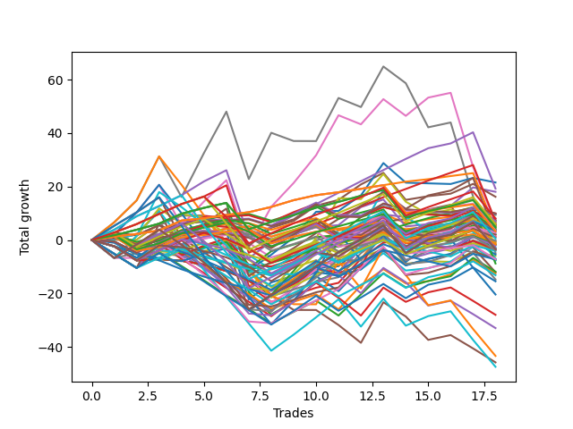

# Short Bulldog 006 
- Symbol: TSLA_Unlimited
- Date Range: 03/23/2022 - 07/08/2022
- Trading Period: 7:20-12:30
- Number of Trades: 18



| Name | Win Percent | Profit | Avg Profit / Trade | Avg Time / Trade |      | Name | Win Percent | Profit | Avg Profit / Trade | Avg Time / Trade |
| ---- | ----------- | ------ | ------------------ | ---------------- | ---- | ---- | ----------- | ------ | ------------------ | ---------------- |
| Sorted By <br> Profit | | | | | | Sorted By <br> Win Percentage ||||
| Seventy-Three | 50.00 | 10755.00 | 597.50 | 11:41 |     | Eighty-One | 94.44 | 1970.00 | 109.44 | 19:47 |
| Eighty-Four | 88.89 | 9605.00 | 533.61 | 47:51 |     | Eighty-Four | 88.89 | 9605.00 | 533.61 | 47:51 |
| Four | 66.67 | 9015.00 | 500.83 | 41:08 |     | Eighty-Three | 88.89 | 3490.00 | 193.89 | 34:57 |
| Fifty-Seven | 77.78 | 8080.00 | 448.89 | 14:03 |     | One Hundred Twenty-One | 88.89 | 1770.00 | 98.33 | 10:33 |
| Ninety-Eight | 55.56 | 4965.00 | 275.83 | 04:17 |     | One Hundred Twenty-Six | 88.89 | 1625.00 | 90.28 | 10:33 |
| One Hundred | 55.56 | 4955.00 | 275.28 | 05:36 |     | Eighty-Two | 88.89 | -4400.00 | -244.44 | 25:33 |
| Ninety-Nine | 55.56 | 4805.00 | 266.94 | 05:08 |     | One Hundred Twenty-Two | 83.33 | 2565.00 | 142.50 | 14:08 |
| Ninety-Seven | 61.11 | 4700.00 | 261.11 | 03:29 |     | One Hundred Twenty-Seven | 83.33 | 2420.00 | 134.44 | 14:08 |
| One Hundred Twenty-Eight | 77.78 | 4045.00 | 224.72 | 17:07 |     | Fifty-Seven | 77.78 | 8080.00 | 448.89 | 14:03 |
| Fifty-Six | 66.67 | 3990.00 | 221.67 | 08:53 |     | One Hundred Twenty-Eight | 77.78 | 4045.00 | 224.72 | 17:07 |
| One | 77.78 | 3740.00 | 207.78 | 17:05 |     | One | 77.78 | 3740.00 | 207.78 | 17:05 |
| Two | 61.11 | 3665.00 | 203.61 | 24:15 |     | One Hundred Twenty-Three | 77.78 | 2970.00 | 165.00 | 17:08 |
| One Hundred Ninteen | 55.56 | 3530.00 | 196.11 | 10:50 |     | Eighty-Five | 77.78 | 1045.00 | 58.06 | 71:19 |
| Eighty-Three | 88.89 | 3490.00 | 193.89 | 34:57 |     | One Hundred Sixteen | 77.78 | -820.00 | -45.56 | 04:04 |
| Sixty | 66.67 | 3215.00 | 178.61 | 30:56 |     | Ninety-Six | 72.22 | 2585.00 | 143.61 | 02:25 |
| One Hundred Two | 66.67 | 3190.00 | 177.22 | 04:59 |     | One Hundred Seventeen | 72.22 | 2235.00 | 124.17 | 06:45 |
| Six | 66.67 | 3125.00 | 173.61 | 115:01 |     | One Hundred One | 72.22 | 670.00 | 37.22 | 02:27 |
| One Hundred Twenty-Three | 77.78 | 2970.00 | 165.00 | 17:08 |     | One Hundred Twenty-Four | 72.22 | 240.00 | 13.33 | 29:40 |
| One Hundred Eighteen | 61.11 | 2860.00 | 158.89 | 08:37 |     | One Hundred Six | 72.22 | -590.00 | -32.78 | 02:30 |
| Three | 66.67 | 2800.00 | 155.56 | 26:39 |     | One Hundred Eleven | 72.22 | -3595.00 | -199.72 | 03:33 |
| Forty-Eight | 61.11 | 2785.00 | 154.72 | 06:05 |     | Five | 72.22 | -6035.00 | -335.28 | 74:17 |
| One Hundred Three | 55.56 | 2645.00 | 146.94 | 06:59 |     | Four | 66.67 | 9015.00 | 500.83 | 41:08 |
| Ninety-Six | 72.22 | 2585.00 | 143.61 | 02:25 |     | Fifty-Six | 66.67 | 3990.00 | 221.67 | 08:53 |
| One Hundred Twenty-Two | 83.33 | 2565.00 | 142.50 | 14:08 |     | Sixty | 66.67 | 3215.00 | 178.61 | 30:56 |
| One Hundred Twenty-Seven | 83.33 | 2420.00 | 134.44 | 14:08 |     | One Hundred Two | 66.67 | 3190.00 | 177.22 | 04:59 |
| Fifty | 50.00 | 2275.00 | 126.39 | 11:10 |     | Six | 66.67 | 3125.00 | 173.61 | 115:01 |
| One Hundred Seventeen | 72.22 | 2235.00 | 124.17 | 06:45 |     | Three | 66.67 | 2800.00 | 155.56 | 26:39 |
| Sixty-Four | 66.67 | 1985.00 | 110.28 | 08:36 |     | Sixty-Four | 66.67 | 1985.00 | 110.28 | 08:36 |
| Eighty-One | 94.44 | 1970.00 | 109.44 | 19:47 |     | Ninety-One | 66.67 | 1355.00 | 75.28 | 02:03 |
| One Hundred Four | 50.00 | 1925.00 | 106.94 | 09:22 |     | Sixty-Five | 66.67 | 710.00 | 39.44 | 13:20 |
| One Hundred Twenty | 44.44 | 1900.00 | 105.56 | 12:25 |     | Zero | 66.67 | -220.00 | -12.22 | 11:25 |
| One Hundred Twenty-One | 88.89 | 1770.00 | 98.33 | 10:33 |     | One Hundred Twenty-Nine | 66.67 | -1585.00 | -88.06 | 20:59 |
| One Hundred Five | 44.44 | 1755.00 | 97.50 | 10:34 |     | One Hundred Twenty-Five | 66.67 | -1670.00 | -92.78 | 36:04 |
| Fifty-Eight | 61.11 | 1695.00 | 94.17 | 19:01 |     | One Hundred Twelve | 66.67 | -1910.00 | -106.11 | 06:06 |
| One Hundred Twenty-Six | 88.89 | 1625.00 | 90.28 | 10:33 |     | Ninety-Seven | 61.11 | 4700.00 | 261.11 | 03:29 |
| Forty-Nine | 61.11 | 1495.00 | 83.06 | 08:43 |     | Two | 61.11 | 3665.00 | 203.61 | 24:15 |
| Ninety-One | 66.67 | 1355.00 | 75.28 | 02:03 |     | One Hundred Eighteen | 61.11 | 2860.00 | 158.89 | 08:37 |
| Eighty-Five | 77.78 | 1045.00 | 58.06 | 71:19 |     | Forty-Eight | 61.11 | 2785.00 | 154.72 | 06:05 |
| Fifty-Four | 44.44 | 1040.00 | 57.78 | 16:18 |     | Fifty-Eight | 61.11 | 1695.00 | 94.17 | 19:01 |
| Sixty-Five | 66.67 | 710.00 | 39.44 | 13:20 |     | Forty-Nine | 61.11 | 1495.00 | 83.06 | 08:43 |
| One Hundred One | 72.22 | 670.00 | 37.22 | 02:27 |     | One Hundred Thirteen | 61.11 | -780.00 | -43.33 | 08:45 |
| One Hundred Ten | 38.89 | 470.00 | 26.11 | 07:57 |     | Forty-One | 61.11 | -1415.00 | -78.61 | 09:00 |
| One Hundred Twenty-Four | 72.22 | 240.00 | 13.33 | 29:40 |     | Fifty-Nine | 61.11 | -1575.00 | -87.50 | 20:59 |
| Ninety-Two | 50.00 | -130.00 | -7.22 | 04:01 |     | One Hundred Thirty | 61.11 | -1715.00 | -95.28 | 24:05 |
| Zero | 66.67 | -220.00 | -12.22 | 11:25 |     | Ninety-Eight | 55.56 | 4965.00 | 275.83 | 04:17 |
| Fifty-Three | 44.44 | -265.00 | -14.72 | 14:49 |     | One Hundred | 55.56 | 4955.00 | 275.28 | 05:36 |
| Seventy | 38.89 | -560.00 | -31.11 | 35:44 |     | Ninety-Nine | 55.56 | 4805.00 | 266.94 | 05:08 |
| One Hundred Six | 72.22 | -590.00 | -32.78 | 02:30 |     | One Hundred Ninteen | 55.56 | 3530.00 | 196.11 | 10:50 |
| One Hundred Thirteen | 61.11 | -780.00 | -43.33 | 08:45 |     | One Hundred Three | 55.56 | 2645.00 | 146.94 | 06:59 |
| One Hundred Sixteen | 77.78 | -820.00 | -45.56 | 04:04 |     | Sixty-Six | 55.56 | -835.00 | -46.39 | 16:55 |
| Sixty-Six | 55.56 | -835.00 | -46.39 | 16:55 |     | One Hundred Seven | 55.56 | -885.00 | -49.17 | 04:25 |
| One Hundred Seven | 55.56 | -885.00 | -49.17 | 04:25 |     | Sixty-Eight | 55.56 | -1720.00 | -95.56 | 24:22 |
| Fifty-Five | 44.44 | -910.00 | -50.56 | 18:19 |     | Forty | 55.56 | -2980.00 | -165.56 | 06:01 |
| One Hundred Nine | 38.89 | -1070.00 | -59.44 | 06:53 |     | Sixty-Seven | 55.56 | -3635.00 | -201.94 | 18:23 |
| Forty-One | 61.11 | -1415.00 | -78.61 | 09:00 |     | Seventy-Three | 50.00 | 10755.00 | 597.50 | 11:41 |
| Fifty-Nine | 61.11 | -1575.00 | -87.50 | 20:59 |     | Fifty | 50.00 | 2275.00 | 126.39 | 11:10 |
| One Hundred Twenty-Nine | 66.67 | -1585.00 | -88.06 | 20:59 |     | One Hundred Four | 50.00 | 1925.00 | 106.94 | 09:22 |
| Ninety-Three | 38.89 | -1625.00 | -90.28 | 05:33 |     | Ninety-Two | 50.00 | -130.00 | -7.22 | 04:01 |
| One Hundred Twenty-Five | 66.67 | -1670.00 | -92.78 | 36:04 |     | Seven | 50.00 | -2425.00 | -134.72 | 165:31 |
| One Hundred Thirty | 61.11 | -1715.00 | -95.28 | 24:05 |     | Forty-Two | 50.00 | -2725.00 | -151.39 | 12:21 |
| Sixty-Eight | 55.56 | -1720.00 | -95.56 | 24:22 |     | Forty-Three | 50.00 | -6275.00 | -348.61 | 12:41 |
| One Hundred Eight | 38.89 | -1795.00 | -99.72 | 05:30 |     | One Hundred Fourteen | 50.00 | -6585.00 | -365.83 | 12:09 |
| Fifty-Two | 44.44 | -1830.00 | -101.67 | 13:24 |     | Sixty-Two | 50.00 | -10195.00 | -566.39 | 51:18 |
| One Hundred Twelve | 66.67 | -1910.00 | -106.11 | 06:06 |     | Sixty-One | 50.00 | -23715.00 | -1317.50 | 44:05 |
| Ninety-Four | 33.33 | -2035.00 | -113.06 | 06:58 |     | One Hundred Twenty | 44.44 | 1900.00 | 105.56 | 12:25 |
| Seven | 50.00 | -2425.00 | -134.72 | 165:31 |     | One Hundred Five | 44.44 | 1755.00 | 97.50 | 10:34 |
| Forty-Two | 50.00 | -2725.00 | -151.39 | 12:21 |     | Fifty-Four | 44.44 | 1040.00 | 57.78 | 16:18 |
| Forty | 55.56 | -2980.00 | -165.56 | 06:01 |     | Fifty-Three | 44.44 | -265.00 | -14.72 | 14:49 |
| Seventy-One | 33.33 | -3475.00 | -193.06 | 44:33 |     | Fifty-Five | 44.44 | -910.00 | -50.56 | 18:19 |
| One Hundred Eleven | 72.22 | -3595.00 | -199.72 | 03:33 |     | Fifty-Two | 44.44 | -1830.00 | -101.67 | 13:24 |
| Ninety-Five | 27.78 | -3625.00 | -201.39 | 08:05 |     | Fifty-One | 44.44 | -3865.00 | -214.72 | 11:38 |
| Sixty-Seven | 55.56 | -3635.00 | -201.94 | 18:23 |     | Forty-Four | 44.44 | -5940.00 | -330.00 | 17:01 |
| Fifty-One | 44.44 | -3865.00 | -214.72 | 11:38 |     | Sixty-Nine | 44.44 | -7395.00 | -410.83 | 30:20 |
| Eighty-Two | 88.89 | -4400.00 | -244.44 | 25:33 |     | One Hundred Fifteen | 44.44 | -7730.00 | -429.44 | 13:45 |
| Forty-Four | 44.44 | -5940.00 | -330.00 | 17:01 |     | One Hundred Ten | 38.89 | 470.00 | 26.11 | 07:57 |
| Five | 72.22 | -6035.00 | -335.28 | 74:17 |     | Seventy | 38.89 | -560.00 | -31.11 | 35:44 |
| Forty-Three | 50.00 | -6275.00 | -348.61 | 12:41 |     | One Hundred Nine | 38.89 | -1070.00 | -59.44 | 06:53 |
| One Hundred Fourteen | 50.00 | -6585.00 | -365.83 | 12:09 |     | Ninety-Three | 38.89 | -1625.00 | -90.28 | 05:33 |
| Sixty-Nine | 44.44 | -7395.00 | -410.83 | 30:20 |     | One Hundred Eight | 38.89 | -1795.00 | -99.72 | 05:30 |
| One Hundred Fifteen | 44.44 | -7730.00 | -429.44 | 13:45 |     | Ninety-Four | 33.33 | -2035.00 | -113.06 | 06:58 |
| Sixty-Two | 50.00 | -10195.00 | -566.39 | 51:18 |     | Seventy-One | 33.33 | -3475.00 | -193.06 | 44:33 |
| Forty-Five | 33.33 | -13995.00 | -777.50 | 22:03 |     | Forty-Five | 33.33 | -13995.00 | -777.50 | 22:03 |
| Forty-Six | 27.78 | -16475.00 | -915.28 | 26:18 |     | Sixty-Three | 33.33 | -21680.00 | -1204.44 | 82:18 |
| Sixty-Three | 33.33 | -21680.00 | -1204.44 | 82:18 |     | Ninety-Five | 27.78 | -3625.00 | -201.39 | 08:05 |
| Forty-Seven | 16.67 | -22890.00 | -1271.67 | 36:58 |     | Forty-Six | 27.78 | -16475.00 | -915.28 | 26:18 |
| Sixty-One | 50.00 | -23715.00 | -1317.50 | 44:05 |     | Forty-Seven | 16.67 | -22890.00 | -1271.67 | 36:58 |

## NO STOPLOSS

### Test Zero
* Sell when price hits the middle line of the 20p bollinger
* No Stoploss
* Results:
```
Total Trades: 18
Percent Up: 33.33
Percent Down: 66.67
Total Points Moved Down: -0.44
Potential Profit: -220.00
Total Points Ups: 35.31 Count Ups: 6
Total Points Downs: 34.87 Count Downs: 12
```

<details><summary>Trades</summary>

<code>In: 2022-03-31 07:24:00		Out: 2022-03-31 07:26:50		Total Position Time: 02:50		Total Move Down: 2.30		Total to Date: 2.30</code> <br />
<code>In: 2022-04-18 11:18:00		Out: 2022-04-18 11:41:15		Total Position Time: 23:15		Total Move Down: -3.37		Total to Date: -1.07</code> <br />
<code>In: 2022-04-25 11:32:00		Out: 2022-04-25 11:39:30		Total Position Time: 07:30		Total Move Down: 1.29		Total to Date: 0.22</code> <br />
<code>In: 2022-04-28 09:50:00		Out: 2022-04-28 10:06:10		Total Position Time: 16:10		Total Move Down: -1.90		Total to Date: -1.68</code> <br />
<code>In: 2022-05-04 09:42:00		Out: 2022-05-04 09:47:00		Total Position Time: 05:00		Total Move Down: 2.82		Total to Date: 1.14</code> <br />
<code>In: 2022-05-04 09:43:00		Out: 2022-05-04 09:47:00		Total Position Time: 04:00		Total Move Down: 1.86		Total to Date: 3.00</code> <br />
<code>In: 2022-05-04 11:50:00		Out: 2022-05-04 12:47:00		Total Position Time: 57:00		Total Move Down: -25.23		Total to Date: -22.23</code> <br />
<code>In: 2022-05-12 07:28:00		Out: 2022-05-12 07:34:05		Total Position Time: 06:05		Total Move Down: 6.36		Total to Date: -15.87</code> <br />
<code>In: 2022-05-17 09:38:00		Out: 2022-05-17 09:39:10		Total Position Time: 01:10		Total Move Down: 2.53		Total to Date: -13.34</code> <br />
<code>In: 2022-05-17 11:11:00		Out: 2022-05-17 11:12:15		Total Position Time: 01:15		Total Move Down: 2.77		Total to Date: -10.57</code> <br />
<code>In: 2022-05-19 08:40:00		Out: 2022-05-19 08:50:45		Total Position Time: 10:45		Total Move Down: 0.77		Total to Date: -9.80</code> <br />
<code>In: 2022-05-23 07:35:00		Out: 2022-05-23 07:42:10		Total Position Time: 07:10		Total Move Down: 6.72		Total to Date: -3.08</code> <br />
<code>In: 2022-05-24 09:19:00		Out: 2022-05-24 09:24:15		Total Position Time: 05:15		Total Move Down: 2.86		Total to Date: -0.22</code> <br />
<code>In: 2022-05-25 08:05:00		Out: 2022-05-25 08:20:55		Total Position Time: 15:55		Total Move Down: -3.16		Total to Date: -3.38</code> <br />
<code>In: 2022-06-15 09:35:00		Out: 2022-06-15 09:36:10		Total Position Time: 01:10		Total Move Down: 0.92		Total to Date: -2.46</code> <br />
<code>In: 2022-06-29 12:11:00		Out: 2022-06-29 12:32:25		Total Position Time: 21:25		Total Move Down: -0.18		Total to Date: -2.64</code> <br />
<code>In: 2022-07-05 07:44:00		Out: 2022-07-05 07:52:35		Total Position Time: 08:35		Total Move Down: 3.67		Total to Date: 1.03</code> <br />
<code>In: 2022-07-05 09:04:00		Out: 2022-07-05 09:15:15		Total Position Time: 11:15		Total Move Down: -1.47		Total to Date: -0.44</code> <br />


</details>

### Test One
* Sell when the price hits the upper line of the 20p 1std bollinger
* No Stoploss
* Results:
```
Total Trades: 18
Percent Up: 22.22
Percent Down: 77.78
Total Points Moved Down: 7.48
Potential Profit: 3740.00
Total Points Ups: 37.33 Count Ups: 4
Total Points Downs: 44.81 Count Downs: 14
```

<details><summary>Trades</summary>

<code>In: 2022-03-31 07:24:00		Out: 2022-03-31 07:41:20		Total Position Time: 17:20		Total Move Down: 1.30		Total to Date: 1.30</code> <br />
<code>In: 2022-04-18 11:18:00		Out: 2022-04-18 11:45:20		Total Position Time: 27:20		Total Move Down: -3.86		Total to Date: -2.56</code> <br />
<code>In: 2022-04-25 11:32:00		Out: 2022-04-25 11:40:05		Total Position Time: 08:05		Total Move Down: 2.46		Total to Date: -0.10</code> <br />
<code>In: 2022-04-28 09:50:00		Out: 2022-04-28 10:08:55		Total Position Time: 18:55		Total Move Down: 1.46		Total to Date: 1.36</code> <br />
<code>In: 2022-05-04 09:42:00		Out: 2022-05-04 09:51:10		Total Position Time: 09:10		Total Move Down: 3.64		Total to Date: 5.00</code> <br />
<code>In: 2022-05-04 09:43:00		Out: 2022-05-04 09:51:10		Total Position Time: 08:10		Total Move Down: 2.68		Total to Date: 7.68</code> <br />
<code>In: 2022-05-04 11:50:00		Out: 2022-05-04 12:47:00		Total Position Time: 57:00		Total Move Down: -25.23		Total to Date: -17.55</code> <br />
<code>In: 2022-05-12 07:28:00		Out: 2022-05-12 07:44:25		Total Position Time: 16:25		Total Move Down: 6.74		Total to Date: -10.81</code> <br />
<code>In: 2022-05-17 09:38:00		Out: 2022-05-17 09:39:15		Total Position Time: 01:15		Total Move Down: 2.59		Total to Date: -8.22</code> <br />
<code>In: 2022-05-17 11:11:00		Out: 2022-05-17 11:13:15		Total Position Time: 02:15		Total Move Down: 5.66		Total to Date: -2.56</code> <br />
<code>In: 2022-05-19 08:40:00		Out: 2022-05-19 08:53:35		Total Position Time: 13:35		Total Move Down: 2.18		Total to Date: -0.38</code> <br />
<code>In: 2022-05-23 07:35:00		Out: 2022-05-23 07:50:05		Total Position Time: 15:05		Total Move Down: 5.79		Total to Date: 5.41</code> <br />
<code>In: 2022-05-24 09:19:00		Out: 2022-05-24 09:29:10		Total Position Time: 10:10		Total Move Down: 4.33		Total to Date: 9.74</code> <br />
<code>In: 2022-05-25 08:05:00		Out: 2022-05-25 08:29:55		Total Position Time: 24:55		Total Move Down: -3.42		Total to Date: 6.32</code> <br />
<code>In: 2022-06-15 09:35:00		Out: 2022-06-15 09:39:45		Total Position Time: 04:45		Total Move Down: 1.39		Total to Date: 7.71</code> <br />
<code>In: 2022-06-29 12:11:00		Out: 2022-06-29 12:33:25		Total Position Time: 22:25		Total Move Down: 0.93		Total to Date: 8.64</code> <br />
<code>In: 2022-07-05 07:44:00		Out: 2022-07-05 07:57:05		Total Position Time: 13:05		Total Move Down: 3.66		Total to Date: 12.30</code> <br />
<code>In: 2022-07-05 09:04:00		Out: 2022-07-05 09:41:50		Total Position Time: 37:50		Total Move Down: -4.82		Total to Date: 7.48</code> <br />


</details>

### Test Two
* Sell when the price hits the upper line of the 20p 2std bollinger
* No Stoploss
* Results:
```
Total Trades: 18
Percent Up: 38.89
Percent Down: 61.11
Total Points Moved Down: 7.33
Potential Profit: 3665.00
Total Points Ups: 43.54 Count Ups: 7
Total Points Downs: 50.87 Count Downs: 11
```

<details><summary>Trades</summary>

<code>In: 2022-03-31 07:24:00		Out: 2022-03-31 07:41:35		Total Position Time: 17:35		Total Move Down: 2.60		Total to Date: 2.60</code> <br />
<code>In: 2022-04-18 11:18:00		Out: 2022-04-18 11:45:30		Total Position Time: 27:30		Total Move Down: -3.74		Total to Date: -1.14</code> <br />
<code>In: 2022-04-25 11:32:00		Out: 2022-04-25 11:41:50		Total Position Time: 09:50		Total Move Down: 3.41		Total to Date: 2.27</code> <br />
<code>In: 2022-04-28 09:50:00		Out: 2022-04-28 10:09:15		Total Position Time: 19:15		Total Move Down: 4.58		Total to Date: 6.85</code> <br />
<code>In: 2022-05-04 09:42:00		Out: 2022-05-04 10:18:30		Total Position Time: 36:30		Total Move Down: -0.09		Total to Date: 6.76</code> <br />
<code>In: 2022-05-04 09:43:00		Out: 2022-05-04 10:18:30		Total Position Time: 35:30		Total Move Down: -1.05		Total to Date: 5.71</code> <br />
<code>In: 2022-05-04 11:50:00		Out: 2022-05-04 12:47:00		Total Position Time: 57:00		Total Move Down: -25.23		Total to Date: -19.52</code> <br />
<code>In: 2022-05-12 07:28:00		Out: 2022-05-12 08:17:40		Total Position Time: 49:40		Total Move Down: -8.38		Total to Date: -27.90</code> <br />
<code>In: 2022-05-17 09:38:00		Out: 2022-05-17 09:47:15		Total Position Time: 09:15		Total Move Down: 4.94		Total to Date: -22.96</code> <br />
<code>In: 2022-05-17 11:11:00		Out: 2022-05-17 11:13:30		Total Position Time: 02:30		Total Move Down: 7.55		Total to Date: -15.41</code> <br />
<code>In: 2022-05-19 08:40:00		Out: 2022-05-19 08:54:35		Total Position Time: 14:35		Total Move Down: 3.57		Total to Date: -11.84</code> <br />
<code>In: 2022-05-23 07:35:00		Out: 2022-05-23 07:51:20		Total Position Time: 16:20		Total Move Down: 8.79		Total to Date: -3.05</code> <br />
<code>In: 2022-05-24 09:19:00		Out: 2022-05-24 09:31:20		Total Position Time: 12:20		Total Move Down: 6.25		Total to Date: 3.20</code> <br />
<code>In: 2022-05-25 08:05:00		Out: 2022-05-25 08:30:40		Total Position Time: 25:40		Total Move Down: -1.64		Total to Date: 1.56</code> <br />
<code>In: 2022-06-15 09:35:00		Out: 2022-06-15 09:53:25		Total Position Time: 18:25		Total Move Down: 2.39		Total to Date: 3.95</code> <br />
<code>In: 2022-06-29 12:11:00		Out: 2022-06-29 12:34:15		Total Position Time: 23:15		Total Move Down: 1.87		Total to Date: 5.82</code> <br />
<code>In: 2022-07-05 07:44:00		Out: 2022-07-05 08:05:55		Total Position Time: 21:55		Total Move Down: 4.92		Total to Date: 10.74</code> <br />
<code>In: 2022-07-05 09:04:00		Out: 2022-07-05 09:43:40		Total Position Time: 39:40		Total Move Down: -3.41		Total to Date: 7.33</code> <br />


</details>

### Test Three
* Sell when price hits the middle line of the 50p bollinger
* No Stoploss
* Results:
```
Total Trades: 18
Percent Up: 33.33
Percent Down: 66.67
Total Points Moved Down: 5.60
Potential Profit: 2800.00
Total Points Ups: 36.23 Count Ups: 6
Total Points Downs: 41.83 Count Downs: 12
```

<details><summary>Trades</summary>

<code>In: 2022-03-31 07:24:00		Out: 2022-03-31 07:41:35		Total Position Time: 17:35		Total Move Down: 2.60		Total to Date: 2.60</code> <br />
<code>In: 2022-04-18 11:18:00		Out: 2022-04-18 11:47:00		Total Position Time: 29:00		Total Move Down: -0.84		Total to Date: 1.76</code> <br />
<code>In: 2022-04-25 11:32:00		Out: 2022-04-25 11:43:50		Total Position Time: 11:50		Total Move Down: 3.78		Total to Date: 5.54</code> <br />
<code>In: 2022-04-28 09:50:00		Out: 2022-04-28 10:18:05		Total Position Time: 28:05		Total Move Down: 3.64		Total to Date: 9.18</code> <br />
<code>In: 2022-05-04 09:42:00		Out: 2022-05-04 10:18:30		Total Position Time: 36:30		Total Move Down: -0.09		Total to Date: 9.09</code> <br />
<code>In: 2022-05-04 09:43:00		Out: 2022-05-04 10:18:30		Total Position Time: 35:30		Total Move Down: -1.05		Total to Date: 8.04</code> <br />
<code>In: 2022-05-04 11:50:00		Out: 2022-05-04 12:47:00		Total Position Time: 57:00		Total Move Down: -25.23		Total to Date: -17.19</code> <br />
<code>In: 2022-05-12 07:28:00		Out: 2022-05-12 08:21:35		Total Position Time: 53:35		Total Move Down: -5.96		Total to Date: -23.15</code> <br />
<code>In: 2022-05-17 09:38:00		Out: 2022-05-17 09:39:10		Total Position Time: 01:10		Total Move Down: 2.53		Total to Date: -20.62</code> <br />
<code>In: 2022-05-17 11:11:00		Out: 2022-05-17 11:12:15		Total Position Time: 01:15		Total Move Down: 2.77		Total to Date: -17.85</code> <br />
<code>In: 2022-05-19 08:40:00		Out: 2022-05-19 09:12:15		Total Position Time: 32:15		Total Move Down: 1.82		Total to Date: -16.03</code> <br />
<code>In: 2022-05-23 07:35:00		Out: 2022-05-23 07:57:30		Total Position Time: 22:30		Total Move Down: 9.00		Total to Date: -7.03</code> <br />
<code>In: 2022-05-24 09:19:00		Out: 2022-05-24 09:31:10		Total Position Time: 12:10		Total Move Down: 6.04		Total to Date: -0.99</code> <br />
<code>In: 2022-05-25 08:05:00		Out: 2022-05-25 08:34:25		Total Position Time: 29:25		Total Move Down: 0.75		Total to Date: -0.24</code> <br />
<code>In: 2022-06-15 09:35:00		Out: 2022-06-15 09:53:05		Total Position Time: 18:05		Total Move Down: 0.84		Total to Date: 0.60</code> <br />
<code>In: 2022-06-29 12:11:00		Out: 2022-06-29 12:36:35		Total Position Time: 25:35		Total Move Down: 2.51		Total to Date: 3.11</code> <br />
<code>In: 2022-07-05 07:44:00		Out: 2022-07-05 08:11:10		Total Position Time: 27:10		Total Move Down: 5.55		Total to Date: 8.66</code> <br />
<code>In: 2022-07-05 09:04:00		Out: 2022-07-05 09:45:05		Total Position Time: 41:05		Total Move Down: -3.06		Total to Date: 5.60</code> <br />


</details>

### Test Four
* Sell when the price hits the upper line of the 50p 1std bollinger
* No Stoploss
* Results:
```
Total Trades: 18
Percent Up: 33.33
Percent Down: 66.67
Total Points Moved Down: 18.03
Potential Profit: 9015.00
Total Points Ups: 31.28 Count Ups: 6
Total Points Downs: 49.31 Count Downs: 12
```

<details><summary>Trades</summary>

<code>In: 2022-03-31 07:24:00		Out: 2022-03-31 08:27:55		Total Position Time: 63:55		Total Move Down: 0.09		Total to Date: 0.09</code> <br />
<code>In: 2022-04-18 11:18:00		Out: 2022-04-18 12:02:25		Total Position Time: 44:25		Total Move Down: 0.02		Total to Date: 0.11</code> <br />
<code>In: 2022-04-25 11:32:00		Out: 2022-04-25 11:55:35		Total Position Time: 23:35		Total Move Down: 6.00		Total to Date: 6.11</code> <br />
<code>In: 2022-04-28 09:50:00		Out: 2022-04-28 10:30:55		Total Position Time: 40:55		Total Move Down: 3.49		Total to Date: 9.60</code> <br />
<code>In: 2022-05-04 09:42:00		Out: 2022-05-04 10:45:50		Total Position Time: 63:50		Total Move Down: -1.01		Total to Date: 8.59</code> <br />
<code>In: 2022-05-04 09:43:00		Out: 2022-05-04 10:45:50		Total Position Time: 62:50		Total Move Down: -1.97		Total to Date: 6.62</code> <br />
<code>In: 2022-05-04 11:50:00		Out: 2022-05-04 12:47:00		Total Position Time: 57:00		Total Move Down: -25.23		Total to Date: -18.61</code> <br />
<code>In: 2022-05-12 07:28:00		Out: 2022-05-12 08:31:35		Total Position Time: 63:35		Total Move Down: -0.47		Total to Date: -19.08</code> <br />
<code>In: 2022-05-17 09:38:00		Out: 2022-05-17 09:40:10		Total Position Time: 02:10		Total Move Down: 4.30		Total to Date: -14.78</code> <br />
<code>In: 2022-05-17 11:11:00		Out: 2022-05-17 11:12:55		Total Position Time: 01:55		Total Move Down: 4.25		Total to Date: -10.53</code> <br />
<code>In: 2022-05-19 08:40:00		Out: 2022-05-19 09:19:50		Total Position Time: 39:50		Total Move Down: 4.24		Total to Date: -6.29</code> <br />
<code>In: 2022-05-23 07:35:00		Out: 2022-05-23 08:21:15		Total Position Time: 46:15		Total Move Down: 7.89		Total to Date: 1.60</code> <br />
<code>In: 2022-05-24 09:19:00		Out: 2022-05-24 09:34:00		Total Position Time: 15:00		Total Move Down: 7.96		Total to Date: 9.56</code> <br />
<code>In: 2022-05-25 08:05:00		Out: 2022-05-25 09:18:40		Total Position Time: 73:40		Total Move Down: -0.97		Total to Date: 8.59</code> <br />
<code>In: 2022-06-15 09:35:00		Out: 2022-06-15 09:53:25		Total Position Time: 18:25		Total Move Down: 2.39		Total to Date: 10.98</code> <br />
<code>In: 2022-06-29 12:11:00		Out: 2022-06-29 12:47:00		Total Position Time: 36:00		Total Move Down: 1.80		Total to Date: 12.78</code> <br />
<code>In: 2022-07-05 07:44:00		Out: 2022-07-05 08:24:10		Total Position Time: 40:10		Total Move Down: 6.88		Total to Date: 19.66</code> <br />
<code>In: 2022-07-05 09:04:00		Out: 2022-07-05 09:51:05		Total Position Time: 47:05		Total Move Down: -1.63		Total to Date: 18.03</code> <br />


</details>

### Test Five
* Sell when the price hits the upper line of the 50p 2std bollinger
* No Stoploss
* Results:
```
Total Trades: 18
Percent Up: 27.78
Percent Down: 72.22
Total Points Moved Down: -12.07
Potential Profit: -6035.00
Total Points Ups: 68.63 Count Ups: 5
Total Points Downs: 56.56 Count Downs: 13
```

<details><summary>Trades</summary>

<code>In: 2022-03-31 07:24:00		Out: 2022-03-31 09:11:45		Total Position Time: 107:45		Total Move Down: 0.25		Total to Date: 0.25</code> <br />
<code>In: 2022-04-18 11:18:00		Out: 2022-04-18 12:19:30		Total Position Time: 61:30		Total Move Down: 1.85		Total to Date: 2.10</code> <br />
<code>In: 2022-04-25 11:32:00		Out: 2022-04-25 11:57:50		Total Position Time: 25:50		Total Move Down: 8.71		Total to Date: 10.81</code> <br />
<code>In: 2022-04-28 09:50:00		Out: 2022-04-28 12:29:40		Total Position Time: 159:40		Total Move Down: -16.18		Total to Date: -5.37</code> <br />
<code>In: 2022-05-04 09:42:00		Out: 2022-05-04 11:07:20		Total Position Time: 85:20		Total Move Down: 2.57		Total to Date: -2.80</code> <br />
<code>In: 2022-05-04 09:43:00		Out: 2022-05-04 11:07:20		Total Position Time: 84:20		Total Move Down: 1.61		Total to Date: -1.19</code> <br />
<code>In: 2022-05-04 11:50:00		Out: 2022-05-04 12:47:00		Total Position Time: 57:00		Total Move Down: -25.23		Total to Date: -26.42</code> <br />
<code>In: 2022-05-12 07:28:00		Out: 2022-05-12 08:34:45		Total Position Time: 66:45		Total Move Down: 5.53		Total to Date: -20.89</code> <br />
<code>In: 2022-05-17 09:38:00		Out: 2022-05-17 09:47:55		Total Position Time: 09:55		Total Move Down: 6.01		Total to Date: -14.88</code> <br />
<code>In: 2022-05-17 11:11:00		Out: 2022-05-17 11:13:25		Total Position Time: 02:25		Total Move Down: 6.49		Total to Date: -8.39</code> <br />
<code>In: 2022-05-19 08:40:00		Out: 2022-05-19 09:20:40		Total Position Time: 40:40		Total Move Down: 6.73		Total to Date: -1.66</code> <br />
<code>In: 2022-05-23 07:35:00		Out: 2022-05-23 09:51:40		Total Position Time: 136:40		Total Move Down: -1.96		Total to Date: -3.62</code> <br />
<code>In: 2022-05-24 09:19:00		Out: 2022-05-24 09:39:55		Total Position Time: 20:55		Total Move Down: 10.46		Total to Date: 6.84</code> <br />
<code>In: 2022-05-25 08:05:00		Out: 2022-05-25 09:22:05		Total Position Time: 77:05		Total Move Down: 0.98		Total to Date: 7.82</code> <br />
<code>In: 2022-06-15 09:35:00		Out: 2022-06-15 09:55:20		Total Position Time: 20:20		Total Move Down: 3.57		Total to Date: 11.39</code> <br />
<code>In: 2022-06-29 12:11:00		Out: 2022-06-29 12:47:00		Total Position Time: 36:00		Total Move Down: 1.80		Total to Date: 13.19</code> <br />
<code>In: 2022-07-05 07:44:00		Out: 2022-07-05 11:16:35		Total Position Time: 212:35		Total Move Down: -15.96		Total to Date: -2.77</code> <br />
<code>In: 2022-07-05 09:04:00		Out: 2022-07-05 11:16:35		Total Position Time: 132:35		Total Move Down: -9.30		Total to Date: -12.07</code> <br />


</details>

### Test Six
* Sell when the price hits the middle line of the 1std VWAP
* No Stoploss
* Results:
```
Total Trades: 18
Percent Up: 33.33
Percent Down: 66.67
Total Points Moved Down: 6.25
Potential Profit: 3125.00
Total Points Ups: 98.86 Count Ups: 6
Total Points Downs: 105.11 Count Downs: 12
```

<details><summary>Trades</summary>

<code>In: 2022-03-31 07:24:00		Out: 2022-03-31 09:13:05		Total Position Time: 109:05		Total Move Down: 2.11		Total to Date: 2.11</code> <br />
<code>In: 2022-04-18 11:18:00		Out: 2022-04-18 12:47:00		Total Position Time: 89:00		Total Move Down: 8.21		Total to Date: 10.32</code> <br />
<code>In: 2022-04-25 11:32:00		Out: 2022-04-25 11:58:25		Total Position Time: 26:25		Total Move Down: 10.32		Total to Date: 20.64</code> <br />
<code>In: 2022-04-28 09:50:00		Out: 2022-04-28 12:47:00		Total Position Time: 177:00		Total Move Down: -15.19		Total to Date: 5.45</code> <br />
<code>In: 2022-05-04 09:42:00		Out: 2022-05-04 11:07:40		Total Position Time: 85:40		Total Move Down: 8.94		Total to Date: 14.39</code> <br />
<code>In: 2022-05-04 09:43:00		Out: 2022-05-04 11:07:40		Total Position Time: 84:40		Total Move Down: 7.98		Total to Date: 22.37</code> <br />
<code>In: 2022-05-04 11:50:00		Out: 2022-05-04 12:47:00		Total Position Time: 57:00		Total Move Down: -25.23		Total to Date: -2.86</code> <br />
<code>In: 2022-05-12 07:28:00		Out: 2022-05-12 08:59:00		Total Position Time: 91:00		Total Move Down: 15.28		Total to Date: 12.42</code> <br />
<code>In: 2022-05-17 09:38:00		Out: 2022-05-17 09:59:30		Total Position Time: 21:30		Total Move Down: 8.91		Total to Date: 21.33</code> <br />
<code>In: 2022-05-17 11:11:00		Out: 2022-05-17 11:15:15		Total Position Time: 04:15		Total Move Down: 10.37		Total to Date: 31.70</code> <br />
<code>In: 2022-05-19 08:40:00		Out: 2022-05-19 09:41:25		Total Position Time: 61:25		Total Move Down: 14.95		Total to Date: 46.65</code> <br />
<code>In: 2022-05-23 07:35:00		Out: 2022-05-23 12:47:00		Total Position Time: 312:00		Total Move Down: -3.39		Total to Date: 43.26</code> <br />
<code>In: 2022-05-24 09:19:00		Out: 2022-05-24 09:37:00		Total Position Time: 18:00		Total Move Down: 9.42		Total to Date: 52.68</code> <br />
<code>In: 2022-05-25 08:05:00		Out: 2022-05-25 12:47:00		Total Position Time: 282:00		Total Move Down: -6.25		Total to Date: 46.43</code> <br />
<code>In: 2022-06-15 09:35:00		Out: 2022-06-15 11:04:30		Total Position Time: 89:30		Total Move Down: 6.82		Total to Date: 53.25</code> <br />
<code>In: 2022-06-29 12:11:00		Out: 2022-06-29 12:47:00		Total Position Time: 36:00		Total Move Down: 1.80		Total to Date: 55.05</code> <br />
<code>In: 2022-07-05 07:44:00		Out: 2022-07-05 12:47:00		Total Position Time: 303:00		Total Move Down: -27.73		Total to Date: 27.32</code> <br />
<code>In: 2022-07-05 09:04:00		Out: 2022-07-05 12:47:00		Total Position Time: 223:00		Total Move Down: -21.07		Total to Date: 6.25</code> <br />


</details>

### Test Seven
* Sell when the price hits the upper line of the 1std VWAP
* No Stoploss
* Results:
```
Total Trades: 18
Percent Up: 50.00
Percent Down: 50.00
Total Points Moved Down: -4.85
Potential Profit: -2425.00
Total Points Ups: 118.46 Count Ups: 9
Total Points Downs: 113.61 Count Downs: 9
```

<details><summary>Trades</summary>

<code>In: 2022-03-31 07:24:00		Out: 2022-03-31 10:00:20		Total Position Time: 156:20		Total Move Down: 6.61		Total to Date: 6.61</code> <br />
<code>In: 2022-04-18 11:18:00		Out: 2022-04-18 12:47:00		Total Position Time: 89:00		Total Move Down: 8.21		Total to Date: 14.82</code> <br />
<code>In: 2022-04-25 11:32:00		Out: 2022-04-25 12:02:30		Total Position Time: 30:30		Total Move Down: 16.46		Total to Date: 31.28</code> <br />
<code>In: 2022-04-28 09:50:00		Out: 2022-04-28 12:47:00		Total Position Time: 177:00		Total Move Down: -15.19		Total to Date: 16.09</code> <br />
<code>In: 2022-05-04 09:42:00		Out: 2022-05-04 11:35:05		Total Position Time: 113:05		Total Move Down: 16.44		Total to Date: 32.53</code> <br />
<code>In: 2022-05-04 09:43:00		Out: 2022-05-04 11:35:05		Total Position Time: 112:05		Total Move Down: 15.48		Total to Date: 48.01</code> <br />
<code>In: 2022-05-04 11:50:00		Out: 2022-05-04 12:47:00		Total Position Time: 57:00		Total Move Down: -25.23		Total to Date: 22.78</code> <br />
<code>In: 2022-05-12 07:28:00		Out: 2022-05-12 12:47:00		Total Position Time: 319:00		Total Move Down: 17.32		Total to Date: 40.10</code> <br />
<code>In: 2022-05-17 09:38:00		Out: 2022-05-17 12:47:00		Total Position Time: 189:00		Total Move Down: -3.08		Total to Date: 37.02</code> <br />
<code>In: 2022-05-17 11:11:00		Out: 2022-05-17 12:47:00		Total Position Time: 96:00		Total Move Down: -0.03		Total to Date: 36.99</code> <br />
<code>In: 2022-05-19 08:40:00		Out: 2022-05-19 12:47:00		Total Position Time: 247:00		Total Move Down: 16.12		Total to Date: 53.11</code> <br />
<code>In: 2022-05-23 07:35:00		Out: 2022-05-23 12:47:00		Total Position Time: 312:00		Total Move Down: -3.39		Total to Date: 49.72</code> <br />
<code>In: 2022-05-24 09:19:00		Out: 2022-05-24 10:04:20		Total Position Time: 45:20		Total Move Down: 15.17		Total to Date: 64.89</code> <br />
<code>In: 2022-05-25 08:05:00		Out: 2022-05-25 12:47:00		Total Position Time: 282:00		Total Move Down: -6.25		Total to Date: 58.64</code> <br />
<code>In: 2022-06-15 09:35:00		Out: 2022-06-15 12:47:00		Total Position Time: 192:00		Total Move Down: -16.49		Total to Date: 42.15</code> <br />
<code>In: 2022-06-29 12:11:00		Out: 2022-06-29 12:47:00		Total Position Time: 36:00		Total Move Down: 1.80		Total to Date: 43.95</code> <br />
<code>In: 2022-07-05 07:44:00		Out: 2022-07-05 12:47:00		Total Position Time: 303:00		Total Move Down: -27.73		Total to Date: 16.22</code> <br />
<code>In: 2022-07-05 09:04:00		Out: 2022-07-05 12:47:00		Total Position Time: 223:00		Total Move Down: -21.07		Total to Date: -4.85</code> <br />


</details>

## STOPLOSS OF 5

### Test Forty
* Sell when price hits the middle line of the 20p bollinger
* Stoploss is -5 points
* Results:
```
Total Trades: 18
Percent Up: 44.44
Percent Down: 55.56
Total Points Moved Down: -5.96
Potential Profit: -2980.00
Total Points Ups: 33.70 Count Ups: 8
Total Points Downs: 27.74 Count Downs: 10
```

<details><summary>Trades</summary>

<code>In: 2022-03-31 07:24:00		Out: 2022-03-31 07:26:50		Total Position Time: 02:50		Total Move Down: 2.30		Total to Date: 2.30</code> <br />
<code>In: 2022-04-18 11:18:00		Out: 2022-04-18 11:25:25		Total Position Time: 07:25		Total Move Down: -5.27		Total to Date: -2.97</code> <br />
<code>In: 2022-04-25 11:32:00		Out: 2022-04-25 11:39:30		Total Position Time: 07:30		Total Move Down: 1.29		Total to Date: -1.68</code> <br />
<code>In: 2022-04-28 09:50:00		Out: 2022-04-28 10:00:50		Total Position Time: 10:50		Total Move Down: -5.30		Total to Date: -6.98</code> <br />
<code>In: 2022-05-04 09:42:00		Out: 2022-05-04 09:47:00		Total Position Time: 05:00		Total Move Down: 2.82		Total to Date: -4.16</code> <br />
<code>In: 2022-05-04 09:43:00		Out: 2022-05-04 09:47:00		Total Position Time: 04:00		Total Move Down: 1.86		Total to Date: -2.30</code> <br />
<code>In: 2022-05-04 11:50:00		Out: 2022-05-04 11:53:40		Total Position Time: 03:40		Total Move Down: -5.16		Total to Date: -7.46</code> <br />
<code>In: 2022-05-12 07:28:00		Out: 2022-05-12 07:30:00		Total Position Time: 02:00		Total Move Down: -5.39		Total to Date: -12.85</code> <br />
<code>In: 2022-05-17 09:38:00		Out: 2022-05-17 09:39:10		Total Position Time: 01:10		Total Move Down: 2.53		Total to Date: -10.32</code> <br />
<code>In: 2022-05-17 11:11:00		Out: 2022-05-17 11:12:15		Total Position Time: 01:15		Total Move Down: 2.77		Total to Date: -7.55</code> <br />
<code>In: 2022-05-19 08:40:00		Out: 2022-05-19 08:41:35		Total Position Time: 01:35		Total Move Down: -5.60		Total to Date: -13.15</code> <br />
<code>In: 2022-05-23 07:35:00		Out: 2022-05-23 07:42:10		Total Position Time: 07:10		Total Move Down: 6.72		Total to Date: -6.43</code> <br />
<code>In: 2022-05-24 09:19:00		Out: 2022-05-24 09:24:15		Total Position Time: 05:15		Total Move Down: 2.86		Total to Date: -3.57</code> <br />
<code>In: 2022-05-25 08:05:00		Out: 2022-05-25 08:11:30		Total Position Time: 06:30		Total Move Down: -5.33		Total to Date: -8.90</code> <br />
<code>In: 2022-06-15 09:35:00		Out: 2022-06-15 09:36:10		Total Position Time: 01:10		Total Move Down: 0.92		Total to Date: -7.98</code> <br />
<code>In: 2022-06-29 12:11:00		Out: 2022-06-29 12:32:25		Total Position Time: 21:25		Total Move Down: -0.18		Total to Date: -8.16</code> <br />
<code>In: 2022-07-05 07:44:00		Out: 2022-07-05 07:52:35		Total Position Time: 08:35		Total Move Down: 3.67		Total to Date: -4.49</code> <br />
<code>In: 2022-07-05 09:04:00		Out: 2022-07-05 09:15:15		Total Position Time: 11:15		Total Move Down: -1.47		Total to Date: -5.96</code> <br />


</details>

### Test Forty-One
* Sell when the price hits the upper line of the 20p 1std bollinger
* Stoploss is -5 points
* Results:
```
Total Trades: 18
Percent Up: 38.89
Percent Down: 61.11
Total Points Moved Down: -2.83
Potential Profit: -1415.00
Total Points Ups: 37.26 Count Ups: 7
Total Points Downs: 34.43 Count Downs: 11
```

<details><summary>Trades</summary>

<code>In: 2022-03-31 07:24:00		Out: 2022-03-31 07:41:20		Total Position Time: 17:20		Total Move Down: 1.30		Total to Date: 1.30</code> <br />
<code>In: 2022-04-18 11:18:00		Out: 2022-04-18 11:25:25		Total Position Time: 07:25		Total Move Down: -5.27		Total to Date: -3.97</code> <br />
<code>In: 2022-04-25 11:32:00		Out: 2022-04-25 11:40:05		Total Position Time: 08:05		Total Move Down: 2.46		Total to Date: -1.51</code> <br />
<code>In: 2022-04-28 09:50:00		Out: 2022-04-28 10:00:50		Total Position Time: 10:50		Total Move Down: -5.30		Total to Date: -6.81</code> <br />
<code>In: 2022-05-04 09:42:00		Out: 2022-05-04 09:51:10		Total Position Time: 09:10		Total Move Down: 3.64		Total to Date: -3.17</code> <br />
<code>In: 2022-05-04 09:43:00		Out: 2022-05-04 09:51:10		Total Position Time: 08:10		Total Move Down: 2.68		Total to Date: -0.49</code> <br />
<code>In: 2022-05-04 11:50:00		Out: 2022-05-04 11:53:40		Total Position Time: 03:40		Total Move Down: -5.16		Total to Date: -5.65</code> <br />
<code>In: 2022-05-12 07:28:00		Out: 2022-05-12 07:30:00		Total Position Time: 02:00		Total Move Down: -5.39		Total to Date: -11.04</code> <br />
<code>In: 2022-05-17 09:38:00		Out: 2022-05-17 09:39:15		Total Position Time: 01:15		Total Move Down: 2.59		Total to Date: -8.45</code> <br />
<code>In: 2022-05-17 11:11:00		Out: 2022-05-17 11:13:15		Total Position Time: 02:15		Total Move Down: 5.66		Total to Date: -2.79</code> <br />
<code>In: 2022-05-19 08:40:00		Out: 2022-05-19 08:41:35		Total Position Time: 01:35		Total Move Down: -5.60		Total to Date: -8.39</code> <br />
<code>In: 2022-05-23 07:35:00		Out: 2022-05-23 07:50:05		Total Position Time: 15:05		Total Move Down: 5.79		Total to Date: -2.60</code> <br />
<code>In: 2022-05-24 09:19:00		Out: 2022-05-24 09:29:10		Total Position Time: 10:10		Total Move Down: 4.33		Total to Date: 1.73</code> <br />
<code>In: 2022-05-25 08:05:00		Out: 2022-05-25 08:11:30		Total Position Time: 06:30		Total Move Down: -5.33		Total to Date: -3.60</code> <br />
<code>In: 2022-06-15 09:35:00		Out: 2022-06-15 09:39:45		Total Position Time: 04:45		Total Move Down: 1.39		Total to Date: -2.21</code> <br />
<code>In: 2022-06-29 12:11:00		Out: 2022-06-29 12:33:25		Total Position Time: 22:25		Total Move Down: 0.93		Total to Date: -1.28</code> <br />
<code>In: 2022-07-05 07:44:00		Out: 2022-07-05 07:57:05		Total Position Time: 13:05		Total Move Down: 3.66		Total to Date: 2.38</code> <br />
<code>In: 2022-07-05 09:04:00		Out: 2022-07-05 09:22:20		Total Position Time: 18:20		Total Move Down: -5.21		Total to Date: -2.83</code> <br />


</details>

### Test Forty-Two
* Sell when the price hits the upper line of the 20p 2std bollinger
* Stoploss is -5 points
* Results:
```
Total Trades: 18
Percent Up: 50.00
Percent Down: 50.00
Total Points Moved Down: -5.45
Potential Profit: -2725.00
Total Points Ups: 48.17 Count Ups: 9
Total Points Downs: 42.72 Count Downs: 9
```

<details><summary>Trades</summary>

<code>In: 2022-03-31 07:24:00		Out: 2022-03-31 07:41:35		Total Position Time: 17:35		Total Move Down: 2.60		Total to Date: 2.60</code> <br />
<code>In: 2022-04-18 11:18:00		Out: 2022-04-18 11:25:25		Total Position Time: 07:25		Total Move Down: -5.27		Total to Date: -2.67</code> <br />
<code>In: 2022-04-25 11:32:00		Out: 2022-04-25 11:41:50		Total Position Time: 09:50		Total Move Down: 3.41		Total to Date: 0.74</code> <br />
<code>In: 2022-04-28 09:50:00		Out: 2022-04-28 10:00:50		Total Position Time: 10:50		Total Move Down: -5.30		Total to Date: -4.56</code> <br />
<code>In: 2022-05-04 09:42:00		Out: 2022-05-04 10:03:05		Total Position Time: 21:05		Total Move Down: -5.34		Total to Date: -9.90</code> <br />
<code>In: 2022-05-04 09:43:00		Out: 2022-05-04 10:02:45		Total Position Time: 19:45		Total Move Down: -5.57		Total to Date: -15.47</code> <br />
<code>In: 2022-05-04 11:50:00		Out: 2022-05-04 11:53:40		Total Position Time: 03:40		Total Move Down: -5.16		Total to Date: -20.63</code> <br />
<code>In: 2022-05-12 07:28:00		Out: 2022-05-12 07:30:00		Total Position Time: 02:00		Total Move Down: -5.39		Total to Date: -26.02</code> <br />
<code>In: 2022-05-17 09:38:00		Out: 2022-05-17 09:47:15		Total Position Time: 09:15		Total Move Down: 4.94		Total to Date: -21.08</code> <br />
<code>In: 2022-05-17 11:11:00		Out: 2022-05-17 11:13:30		Total Position Time: 02:30		Total Move Down: 7.55		Total to Date: -13.53</code> <br />
<code>In: 2022-05-19 08:40:00		Out: 2022-05-19 08:41:35		Total Position Time: 01:35		Total Move Down: -5.60		Total to Date: -19.13</code> <br />
<code>In: 2022-05-23 07:35:00		Out: 2022-05-23 07:51:20		Total Position Time: 16:20		Total Move Down: 8.79		Total to Date: -10.34</code> <br />
<code>In: 2022-05-24 09:19:00		Out: 2022-05-24 09:31:20		Total Position Time: 12:20		Total Move Down: 6.25		Total to Date: -4.09</code> <br />
<code>In: 2022-05-25 08:05:00		Out: 2022-05-25 08:11:30		Total Position Time: 06:30		Total Move Down: -5.33		Total to Date: -9.42</code> <br />
<code>In: 2022-06-15 09:35:00		Out: 2022-06-15 09:53:25		Total Position Time: 18:25		Total Move Down: 2.39		Total to Date: -7.03</code> <br />
<code>In: 2022-06-29 12:11:00		Out: 2022-06-29 12:34:15		Total Position Time: 23:15		Total Move Down: 1.87		Total to Date: -5.16</code> <br />
<code>In: 2022-07-05 07:44:00		Out: 2022-07-05 08:05:55		Total Position Time: 21:55		Total Move Down: 4.92		Total to Date: -0.24</code> <br />
<code>In: 2022-07-05 09:04:00		Out: 2022-07-05 09:22:20		Total Position Time: 18:20		Total Move Down: -5.21		Total to Date: -5.45</code> <br />


</details>

### Test Forty-Three
* Sell when price hits the middle line of the 50p bollinger
* Stoploss is -5 points
* Results:
```
Total Trades: 18
Percent Up: 50.00
Percent Down: 50.00
Total Points Moved Down: -12.55
Potential Profit: -6275.00
Total Points Ups: 48.17 Count Ups: 9
Total Points Downs: 35.62 Count Downs: 9
```

<details><summary>Trades</summary>

<code>In: 2022-03-31 07:24:00		Out: 2022-03-31 07:41:35		Total Position Time: 17:35		Total Move Down: 2.60		Total to Date: 2.60</code> <br />
<code>In: 2022-04-18 11:18:00		Out: 2022-04-18 11:25:25		Total Position Time: 07:25		Total Move Down: -5.27		Total to Date: -2.67</code> <br />
<code>In: 2022-04-25 11:32:00		Out: 2022-04-25 11:43:50		Total Position Time: 11:50		Total Move Down: 3.78		Total to Date: 1.11</code> <br />
<code>In: 2022-04-28 09:50:00		Out: 2022-04-28 10:00:50		Total Position Time: 10:50		Total Move Down: -5.30		Total to Date: -4.19</code> <br />
<code>In: 2022-05-04 09:42:00		Out: 2022-05-04 10:03:05		Total Position Time: 21:05		Total Move Down: -5.34		Total to Date: -9.53</code> <br />
<code>In: 2022-05-04 09:43:00		Out: 2022-05-04 10:02:45		Total Position Time: 19:45		Total Move Down: -5.57		Total to Date: -15.10</code> <br />
<code>In: 2022-05-04 11:50:00		Out: 2022-05-04 11:53:40		Total Position Time: 03:40		Total Move Down: -5.16		Total to Date: -20.26</code> <br />
<code>In: 2022-05-12 07:28:00		Out: 2022-05-12 07:30:00		Total Position Time: 02:00		Total Move Down: -5.39		Total to Date: -25.65</code> <br />
<code>In: 2022-05-17 09:38:00		Out: 2022-05-17 09:39:10		Total Position Time: 01:10		Total Move Down: 2.53		Total to Date: -23.12</code> <br />
<code>In: 2022-05-17 11:11:00		Out: 2022-05-17 11:12:15		Total Position Time: 01:15		Total Move Down: 2.77		Total to Date: -20.35</code> <br />
<code>In: 2022-05-19 08:40:00		Out: 2022-05-19 08:41:35		Total Position Time: 01:35		Total Move Down: -5.60		Total to Date: -25.95</code> <br />
<code>In: 2022-05-23 07:35:00		Out: 2022-05-23 07:57:30		Total Position Time: 22:30		Total Move Down: 9.00		Total to Date: -16.95</code> <br />
<code>In: 2022-05-24 09:19:00		Out: 2022-05-24 09:31:10		Total Position Time: 12:10		Total Move Down: 6.04		Total to Date: -10.91</code> <br />
<code>In: 2022-05-25 08:05:00		Out: 2022-05-25 08:11:30		Total Position Time: 06:30		Total Move Down: -5.33		Total to Date: -16.24</code> <br />
<code>In: 2022-06-15 09:35:00		Out: 2022-06-15 09:53:05		Total Position Time: 18:05		Total Move Down: 0.84		Total to Date: -15.40</code> <br />
<code>In: 2022-06-29 12:11:00		Out: 2022-06-29 12:36:35		Total Position Time: 25:35		Total Move Down: 2.51		Total to Date: -12.89</code> <br />
<code>In: 2022-07-05 07:44:00		Out: 2022-07-05 08:11:10		Total Position Time: 27:10		Total Move Down: 5.55		Total to Date: -7.34</code> <br />
<code>In: 2022-07-05 09:04:00		Out: 2022-07-05 09:22:20		Total Position Time: 18:20		Total Move Down: -5.21		Total to Date: -12.55</code> <br />


</details>

### Test Forty-Four
* Sell when the price hits the upper line of the 50p 1std bollinger
* Stoploss is -5 points
* Results:
```
Total Trades: 18
Percent Up: 55.56
Percent Down: 44.44
Total Points Moved Down: -11.88
Potential Profit: -5940.00
Total Points Ups: 53.35 Count Ups: 10
Total Points Downs: 41.47 Count Downs: 8
```

<details><summary>Trades</summary>

<code>In: 2022-03-31 07:24:00		Out: 2022-03-31 07:55:50		Total Position Time: 31:50		Total Move Down: -5.18		Total to Date: -5.18</code> <br />
<code>In: 2022-04-18 11:18:00		Out: 2022-04-18 11:25:25		Total Position Time: 07:25		Total Move Down: -5.27		Total to Date: -10.45</code> <br />
<code>In: 2022-04-25 11:32:00		Out: 2022-04-25 11:55:35		Total Position Time: 23:35		Total Move Down: 6.00		Total to Date: -4.45</code> <br />
<code>In: 2022-04-28 09:50:00		Out: 2022-04-28 10:00:50		Total Position Time: 10:50		Total Move Down: -5.30		Total to Date: -9.75</code> <br />
<code>In: 2022-05-04 09:42:00		Out: 2022-05-04 10:03:05		Total Position Time: 21:05		Total Move Down: -5.34		Total to Date: -15.09</code> <br />
<code>In: 2022-05-04 09:43:00		Out: 2022-05-04 10:02:45		Total Position Time: 19:45		Total Move Down: -5.57		Total to Date: -20.66</code> <br />
<code>In: 2022-05-04 11:50:00		Out: 2022-05-04 11:53:40		Total Position Time: 03:40		Total Move Down: -5.16		Total to Date: -25.82</code> <br />
<code>In: 2022-05-12 07:28:00		Out: 2022-05-12 07:30:00		Total Position Time: 02:00		Total Move Down: -5.39		Total to Date: -31.21</code> <br />
<code>In: 2022-05-17 09:38:00		Out: 2022-05-17 09:40:10		Total Position Time: 02:10		Total Move Down: 4.30		Total to Date: -26.91</code> <br />
<code>In: 2022-05-17 11:11:00		Out: 2022-05-17 11:12:55		Total Position Time: 01:55		Total Move Down: 4.25		Total to Date: -22.66</code> <br />
<code>In: 2022-05-19 08:40:00		Out: 2022-05-19 08:41:35		Total Position Time: 01:35		Total Move Down: -5.60		Total to Date: -28.26</code> <br />
<code>In: 2022-05-23 07:35:00		Out: 2022-05-23 08:21:15		Total Position Time: 46:15		Total Move Down: 7.89		Total to Date: -20.37</code> <br />
<code>In: 2022-05-24 09:19:00		Out: 2022-05-24 09:34:00		Total Position Time: 15:00		Total Move Down: 7.96		Total to Date: -12.41</code> <br />
<code>In: 2022-05-25 08:05:00		Out: 2022-05-25 08:11:30		Total Position Time: 06:30		Total Move Down: -5.33		Total to Date: -17.74</code> <br />
<code>In: 2022-06-15 09:35:00		Out: 2022-06-15 09:53:25		Total Position Time: 18:25		Total Move Down: 2.39		Total to Date: -15.35</code> <br />
<code>In: 2022-06-29 12:11:00		Out: 2022-06-29 12:47:00		Total Position Time: 36:00		Total Move Down: 1.80		Total to Date: -13.55</code> <br />
<code>In: 2022-07-05 07:44:00		Out: 2022-07-05 08:24:10		Total Position Time: 40:10		Total Move Down: 6.88		Total to Date: -6.67</code> <br />
<code>In: 2022-07-05 09:04:00		Out: 2022-07-05 09:22:20		Total Position Time: 18:20		Total Move Down: -5.21		Total to Date: -11.88</code> <br />


</details>

### Test Forty-Five
* Sell when the price hits the upper line of the 50p 2std bollinger
* Stoploss is -5 points
* Results:
```
Total Trades: 18
Percent Up: 66.67
Percent Down: 33.33
Total Points Moved Down: -27.99
Potential Profit: -13995.00
Total Points Ups: 65.03 Count Ups: 12
Total Points Downs: 37.04 Count Downs: 6
```

<details><summary>Trades</summary>

<code>In: 2022-03-31 07:24:00		Out: 2022-03-31 07:55:50		Total Position Time: 31:50		Total Move Down: -5.18		Total to Date: -5.18</code> <br />
<code>In: 2022-04-18 11:18:00		Out: 2022-04-18 11:25:25		Total Position Time: 07:25		Total Move Down: -5.27		Total to Date: -10.45</code> <br />
<code>In: 2022-04-25 11:32:00		Out: 2022-04-25 11:57:50		Total Position Time: 25:50		Total Move Down: 8.71		Total to Date: -1.74</code> <br />
<code>In: 2022-04-28 09:50:00		Out: 2022-04-28 10:00:50		Total Position Time: 10:50		Total Move Down: -5.30		Total to Date: -7.04</code> <br />
<code>In: 2022-05-04 09:42:00		Out: 2022-05-04 10:03:05		Total Position Time: 21:05		Total Move Down: -5.34		Total to Date: -12.38</code> <br />
<code>In: 2022-05-04 09:43:00		Out: 2022-05-04 10:02:45		Total Position Time: 19:45		Total Move Down: -5.57		Total to Date: -17.95</code> <br />
<code>In: 2022-05-04 11:50:00		Out: 2022-05-04 11:53:40		Total Position Time: 03:40		Total Move Down: -5.16		Total to Date: -23.11</code> <br />
<code>In: 2022-05-12 07:28:00		Out: 2022-05-12 07:30:00		Total Position Time: 02:00		Total Move Down: -5.39		Total to Date: -28.50</code> <br />
<code>In: 2022-05-17 09:38:00		Out: 2022-05-17 09:47:55		Total Position Time: 09:55		Total Move Down: 6.01		Total to Date: -22.49</code> <br />
<code>In: 2022-05-17 11:11:00		Out: 2022-05-17 11:13:25		Total Position Time: 02:25		Total Move Down: 6.49		Total to Date: -16.00</code> <br />
<code>In: 2022-05-19 08:40:00		Out: 2022-05-19 08:41:35		Total Position Time: 01:35		Total Move Down: -5.60		Total to Date: -21.60</code> <br />
<code>In: 2022-05-23 07:35:00		Out: 2022-05-23 09:02:45		Total Position Time: 87:45		Total Move Down: -6.67		Total to Date: -28.27</code> <br />
<code>In: 2022-05-24 09:19:00		Out: 2022-05-24 09:39:55		Total Position Time: 20:55		Total Move Down: 10.46		Total to Date: -17.81</code> <br />
<code>In: 2022-05-25 08:05:00		Out: 2022-05-25 08:11:30		Total Position Time: 06:30		Total Move Down: -5.33		Total to Date: -23.14</code> <br />
<code>In: 2022-06-15 09:35:00		Out: 2022-06-15 09:55:20		Total Position Time: 20:20		Total Move Down: 3.57		Total to Date: -19.57</code> <br />
<code>In: 2022-06-29 12:11:00		Out: 2022-06-29 12:47:00		Total Position Time: 36:00		Total Move Down: 1.80		Total to Date: -17.77</code> <br />
<code>In: 2022-07-05 07:44:00		Out: 2022-07-05 08:55:00		Total Position Time: 71:00		Total Move Down: -5.01		Total to Date: -22.78</code> <br />
<code>In: 2022-07-05 09:04:00		Out: 2022-07-05 09:22:20		Total Position Time: 18:20		Total Move Down: -5.21		Total to Date: -27.99</code> <br />


</details>

### Test Forty-Six
* Sell when the price hits the middle line of the 1std VWAP
* Stoploss is -5 points
* Results:
```
Total Trades: 18
Percent Up: 72.22
Percent Down: 27.78
Total Points Moved Down: -32.95
Potential Profit: -16475.00
Total Points Ups: 73.77 Count Ups: 13
Total Points Downs: 40.82 Count Downs: 5
```

<details><summary>Trades</summary>

<code>In: 2022-03-31 07:24:00		Out: 2022-03-31 07:55:50		Total Position Time: 31:50		Total Move Down: -5.18		Total to Date: -5.18</code> <br />
<code>In: 2022-04-18 11:18:00		Out: 2022-04-18 11:25:25		Total Position Time: 07:25		Total Move Down: -5.27		Total to Date: -10.45</code> <br />
<code>In: 2022-04-25 11:32:00		Out: 2022-04-25 11:58:25		Total Position Time: 26:25		Total Move Down: 10.32		Total to Date: -0.13</code> <br />
<code>In: 2022-04-28 09:50:00		Out: 2022-04-28 10:00:50		Total Position Time: 10:50		Total Move Down: -5.30		Total to Date: -5.43</code> <br />
<code>In: 2022-05-04 09:42:00		Out: 2022-05-04 10:03:05		Total Position Time: 21:05		Total Move Down: -5.34		Total to Date: -10.77</code> <br />
<code>In: 2022-05-04 09:43:00		Out: 2022-05-04 10:02:45		Total Position Time: 19:45		Total Move Down: -5.57		Total to Date: -16.34</code> <br />
<code>In: 2022-05-04 11:50:00		Out: 2022-05-04 11:53:40		Total Position Time: 03:40		Total Move Down: -5.16		Total to Date: -21.50</code> <br />
<code>In: 2022-05-12 07:28:00		Out: 2022-05-12 07:30:00		Total Position Time: 02:00		Total Move Down: -5.39		Total to Date: -26.89</code> <br />
<code>In: 2022-05-17 09:38:00		Out: 2022-05-17 09:59:30		Total Position Time: 21:30		Total Move Down: 8.91		Total to Date: -17.98</code> <br />
<code>In: 2022-05-17 11:11:00		Out: 2022-05-17 11:15:15		Total Position Time: 04:15		Total Move Down: 10.37		Total to Date: -7.61</code> <br />
<code>In: 2022-05-19 08:40:00		Out: 2022-05-19 08:41:35		Total Position Time: 01:35		Total Move Down: -5.60		Total to Date: -13.21</code> <br />
<code>In: 2022-05-23 07:35:00		Out: 2022-05-23 09:02:45		Total Position Time: 87:45		Total Move Down: -6.67		Total to Date: -19.88</code> <br />
<code>In: 2022-05-24 09:19:00		Out: 2022-05-24 09:37:00		Total Position Time: 18:00		Total Move Down: 9.42		Total to Date: -10.46</code> <br />
<code>In: 2022-05-25 08:05:00		Out: 2022-05-25 08:11:30		Total Position Time: 06:30		Total Move Down: -5.33		Total to Date: -15.79</code> <br />
<code>In: 2022-06-15 09:35:00		Out: 2022-06-15 11:00:35		Total Position Time: 85:35		Total Move Down: -8.74		Total to Date: -24.53</code> <br />
<code>In: 2022-06-29 12:11:00		Out: 2022-06-29 12:47:00		Total Position Time: 36:00		Total Move Down: 1.80		Total to Date: -22.73</code> <br />
<code>In: 2022-07-05 07:44:00		Out: 2022-07-05 08:55:00		Total Position Time: 71:00		Total Move Down: -5.01		Total to Date: -27.74</code> <br />
<code>In: 2022-07-05 09:04:00		Out: 2022-07-05 09:22:20		Total Position Time: 18:20		Total Move Down: -5.21		Total to Date: -32.95</code> <br />


</details>

### Test Forty-Seven
* Sell when the price hits the upper line of the 1std VWAP
* Stoploss is -5 points
* Results:
```
Total Trades: 18
Percent Up: 83.33
Percent Down: 16.67
Total Points Moved Down: -45.78
Potential Profit: -22890.00
Total Points Ups: 79.21 Count Ups: 15
Total Points Downs: 33.43 Count Downs: 3
```

<details><summary>Trades</summary>

<code>In: 2022-03-31 07:24:00		Out: 2022-03-31 07:55:50		Total Position Time: 31:50		Total Move Down: -5.18		Total to Date: -5.18</code> <br />
<code>In: 2022-04-18 11:18:00		Out: 2022-04-18 11:25:25		Total Position Time: 07:25		Total Move Down: -5.27		Total to Date: -10.45</code> <br />
<code>In: 2022-04-25 11:32:00		Out: 2022-04-25 12:02:30		Total Position Time: 30:30		Total Move Down: 16.46		Total to Date: 6.01</code> <br />
<code>In: 2022-04-28 09:50:00		Out: 2022-04-28 10:00:50		Total Position Time: 10:50		Total Move Down: -5.30		Total to Date: 0.71</code> <br />
<code>In: 2022-05-04 09:42:00		Out: 2022-05-04 10:03:05		Total Position Time: 21:05		Total Move Down: -5.34		Total to Date: -4.63</code> <br />
<code>In: 2022-05-04 09:43:00		Out: 2022-05-04 10:02:45		Total Position Time: 19:45		Total Move Down: -5.57		Total to Date: -10.20</code> <br />
<code>In: 2022-05-04 11:50:00		Out: 2022-05-04 11:53:40		Total Position Time: 03:40		Total Move Down: -5.16		Total to Date: -15.36</code> <br />
<code>In: 2022-05-12 07:28:00		Out: 2022-05-12 07:30:00		Total Position Time: 02:00		Total Move Down: -5.39		Total to Date: -20.75</code> <br />
<code>In: 2022-05-17 09:38:00		Out: 2022-05-17 11:08:20		Total Position Time: 90:20		Total Move Down: -5.41		Total to Date: -26.16</code> <br />
<code>In: 2022-05-17 11:11:00		Out: 2022-05-17 12:47:00		Total Position Time: 96:00		Total Move Down: -0.03		Total to Date: -26.19</code> <br />
<code>In: 2022-05-19 08:40:00		Out: 2022-05-19 08:41:35		Total Position Time: 01:35		Total Move Down: -5.60		Total to Date: -31.79</code> <br />
<code>In: 2022-05-23 07:35:00		Out: 2022-05-23 09:02:45		Total Position Time: 87:45		Total Move Down: -6.67		Total to Date: -38.46</code> <br />
<code>In: 2022-05-24 09:19:00		Out: 2022-05-24 10:04:20		Total Position Time: 45:20		Total Move Down: 15.17		Total to Date: -23.29</code> <br />
<code>In: 2022-05-25 08:05:00		Out: 2022-05-25 08:11:30		Total Position Time: 06:30		Total Move Down: -5.33		Total to Date: -28.62</code> <br />
<code>In: 2022-06-15 09:35:00		Out: 2022-06-15 11:00:35		Total Position Time: 85:35		Total Move Down: -8.74		Total to Date: -37.36</code> <br />
<code>In: 2022-06-29 12:11:00		Out: 2022-06-29 12:47:00		Total Position Time: 36:00		Total Move Down: 1.80		Total to Date: -35.56</code> <br />
<code>In: 2022-07-05 07:44:00		Out: 2022-07-05 08:55:00		Total Position Time: 71:00		Total Move Down: -5.01		Total to Date: -40.57</code> <br />
<code>In: 2022-07-05 09:04:00		Out: 2022-07-05 09:22:20		Total Position Time: 18:20		Total Move Down: -5.21		Total to Date: -45.78</code> <br />


</details>

## TRAIL STOP OF 5

### Test Forty-Eight
* Sell when price hits the middle line of the 20p bollinger
* Trailing Stop is -5 points
* Results:
```
Total Trades: 18
Percent Up: 38.89
Percent Down: 61.11
Total Points Moved Down: 5.57
Potential Profit: 2785.00
Total Points Ups: 22.94 Count Ups: 7
Total Points Downs: 28.51 Count Downs: 11
```

<details><summary>Trades</summary>

<code>In: 2022-03-31 07:24:00		Out: 2022-03-31 07:26:50		Total Position Time: 02:50		Total Move Down: 2.30		Total to Date: 2.30</code> <br />
<code>In: 2022-04-18 11:18:00		Out: 2022-04-18 11:25:25		Total Position Time: 07:25		Total Move Down: -5.27		Total to Date: -2.97</code> <br />
<code>In: 2022-04-25 11:32:00		Out: 2022-04-25 11:39:30		Total Position Time: 07:30		Total Move Down: 1.29		Total to Date: -1.68</code> <br />
<code>In: 2022-04-28 09:50:00		Out: 2022-04-28 09:53:10		Total Position Time: 03:10		Total Move Down: -0.65		Total to Date: -2.33</code> <br />
<code>In: 2022-05-04 09:42:00		Out: 2022-05-04 09:47:00		Total Position Time: 05:00		Total Move Down: 2.82		Total to Date: 0.49</code> <br />
<code>In: 2022-05-04 09:43:00		Out: 2022-05-04 09:47:00		Total Position Time: 04:00		Total Move Down: 1.86		Total to Date: 2.35</code> <br />
<code>In: 2022-05-04 11:50:00		Out: 2022-05-04 11:53:15		Total Position Time: 03:15		Total Move Down: -3.49		Total to Date: -1.14</code> <br />
<code>In: 2022-05-12 07:28:00		Out: 2022-05-12 07:30:00		Total Position Time: 02:00		Total Move Down: -5.39		Total to Date: -6.53</code> <br />
<code>In: 2022-05-17 09:38:00		Out: 2022-05-17 09:39:10		Total Position Time: 01:10		Total Move Down: 2.53		Total to Date: -4.00</code> <br />
<code>In: 2022-05-17 11:11:00		Out: 2022-05-17 11:12:15		Total Position Time: 01:15		Total Move Down: 2.77		Total to Date: -1.23</code> <br />
<code>In: 2022-05-19 08:40:00		Out: 2022-05-19 08:50:45		Total Position Time: 10:45		Total Move Down: 0.77		Total to Date: -0.46</code> <br />
<code>In: 2022-05-23 07:35:00		Out: 2022-05-23 07:42:10		Total Position Time: 07:10		Total Move Down: 6.72		Total to Date: 6.26</code> <br />
<code>In: 2022-05-24 09:19:00		Out: 2022-05-24 09:24:15		Total Position Time: 05:15		Total Move Down: 2.86		Total to Date: 9.12</code> <br />
<code>In: 2022-05-25 08:05:00		Out: 2022-05-25 08:11:35		Total Position Time: 06:35		Total Move Down: -6.49		Total to Date: 2.63</code> <br />
<code>In: 2022-06-15 09:35:00		Out: 2022-06-15 09:36:10		Total Position Time: 01:10		Total Move Down: 0.92		Total to Date: 3.55</code> <br />
<code>In: 2022-06-29 12:11:00		Out: 2022-06-29 12:32:25		Total Position Time: 21:25		Total Move Down: -0.18		Total to Date: 3.37</code> <br />
<code>In: 2022-07-05 07:44:00		Out: 2022-07-05 07:52:35		Total Position Time: 08:35		Total Move Down: 3.67		Total to Date: 7.04</code> <br />
<code>In: 2022-07-05 09:04:00		Out: 2022-07-05 09:15:15		Total Position Time: 11:15		Total Move Down: -1.47		Total to Date: 5.57</code> <br />


</details>

### Test Forty-Nine
* Sell when the price hits the upper line of the 20p 1std bollinger
* Trailing Stop is -5 points
* Results:
```
Total Trades: 18
Percent Up: 38.89
Percent Down: 61.11
Total Points Moved Down: 2.99
Potential Profit: 1495.00
Total Points Ups: 28.87 Count Ups: 7
Total Points Downs: 31.86 Count Downs: 11
```

<details><summary>Trades</summary>

<code>In: 2022-03-31 07:24:00		Out: 2022-03-31 07:34:20		Total Position Time: 10:20		Total Move Down: -2.37		Total to Date: -2.37</code> <br />
<code>In: 2022-04-18 11:18:00		Out: 2022-04-18 11:25:25		Total Position Time: 07:25		Total Move Down: -5.27		Total to Date: -7.64</code> <br />
<code>In: 2022-04-25 11:32:00		Out: 2022-04-25 11:40:05		Total Position Time: 08:05		Total Move Down: 2.46		Total to Date: -5.18</code> <br />
<code>In: 2022-04-28 09:50:00		Out: 2022-04-28 09:53:10		Total Position Time: 03:10		Total Move Down: -0.65		Total to Date: -5.83</code> <br />
<code>In: 2022-05-04 09:42:00		Out: 2022-05-04 09:51:10		Total Position Time: 09:10		Total Move Down: 3.64		Total to Date: -2.19</code> <br />
<code>In: 2022-05-04 09:43:00		Out: 2022-05-04 09:51:10		Total Position Time: 08:10		Total Move Down: 2.68		Total to Date: 0.49</code> <br />
<code>In: 2022-05-04 11:50:00		Out: 2022-05-04 11:53:15		Total Position Time: 03:15		Total Move Down: -3.49		Total to Date: -3.00</code> <br />
<code>In: 2022-05-12 07:28:00		Out: 2022-05-12 07:30:00		Total Position Time: 02:00		Total Move Down: -5.39		Total to Date: -8.39</code> <br />
<code>In: 2022-05-17 09:38:00		Out: 2022-05-17 09:39:15		Total Position Time: 01:15		Total Move Down: 2.59		Total to Date: -5.80</code> <br />
<code>In: 2022-05-17 11:11:00		Out: 2022-05-17 11:13:15		Total Position Time: 02:15		Total Move Down: 5.66		Total to Date: -0.14</code> <br />
<code>In: 2022-05-19 08:40:00		Out: 2022-05-19 08:53:35		Total Position Time: 13:35		Total Move Down: 2.18		Total to Date: 2.04</code> <br />
<code>In: 2022-05-23 07:35:00		Out: 2022-05-23 07:47:55		Total Position Time: 12:55		Total Move Down: 2.34		Total to Date: 4.38</code> <br />
<code>In: 2022-05-24 09:19:00		Out: 2022-05-24 09:29:10		Total Position Time: 10:10		Total Move Down: 4.33		Total to Date: 8.71</code> <br />
<code>In: 2022-05-25 08:05:00		Out: 2022-05-25 08:11:35		Total Position Time: 06:35		Total Move Down: -6.49		Total to Date: 2.22</code> <br />
<code>In: 2022-06-15 09:35:00		Out: 2022-06-15 09:39:45		Total Position Time: 04:45		Total Move Down: 1.39		Total to Date: 3.61</code> <br />
<code>In: 2022-06-29 12:11:00		Out: 2022-06-29 12:33:25		Total Position Time: 22:25		Total Move Down: 0.93		Total to Date: 4.54</code> <br />
<code>In: 2022-07-05 07:44:00		Out: 2022-07-05 07:57:05		Total Position Time: 13:05		Total Move Down: 3.66		Total to Date: 8.20</code> <br />
<code>In: 2022-07-05 09:04:00		Out: 2022-07-05 09:22:20		Total Position Time: 18:20		Total Move Down: -5.21		Total to Date: 2.99</code> <br />


</details>

### Test Fifty
* Sell when the price hits the upper line of the 20p 2std bollinger
* Trailing Stop is -5 points
* Results:
```
Total Trades: 18
Percent Up: 50.00
Percent Down: 50.00
Total Points Moved Down: 4.55
Potential Profit: 2275.00
Total Points Ups: 32.69 Count Ups: 9
Total Points Downs: 37.24 Count Downs: 9
```

<details><summary>Trades</summary>

<code>In: 2022-03-31 07:24:00		Out: 2022-03-31 07:34:20		Total Position Time: 10:20		Total Move Down: -2.37		Total to Date: -2.37</code> <br />
<code>In: 2022-04-18 11:18:00		Out: 2022-04-18 11:25:25		Total Position Time: 07:25		Total Move Down: -5.27		Total to Date: -7.64</code> <br />
<code>In: 2022-04-25 11:32:00		Out: 2022-04-25 11:41:50		Total Position Time: 09:50		Total Move Down: 3.41		Total to Date: -4.23</code> <br />
<code>In: 2022-04-28 09:50:00		Out: 2022-04-28 09:53:10		Total Position Time: 03:10		Total Move Down: -0.65		Total to Date: -4.88</code> <br />
<code>In: 2022-05-04 09:42:00		Out: 2022-05-04 09:55:00		Total Position Time: 13:00		Total Move Down: -1.43		Total to Date: -6.31</code> <br />
<code>In: 2022-05-04 09:43:00		Out: 2022-05-04 09:55:00		Total Position Time: 12:00		Total Move Down: -2.39		Total to Date: -8.70</code> <br />
<code>In: 2022-05-04 11:50:00		Out: 2022-05-04 11:53:15		Total Position Time: 03:15		Total Move Down: -3.49		Total to Date: -12.19</code> <br />
<code>In: 2022-05-12 07:28:00		Out: 2022-05-12 07:30:00		Total Position Time: 02:00		Total Move Down: -5.39		Total to Date: -17.58</code> <br />
<code>In: 2022-05-17 09:38:00		Out: 2022-05-17 09:47:15		Total Position Time: 09:15		Total Move Down: 4.94		Total to Date: -12.64</code> <br />
<code>In: 2022-05-17 11:11:00		Out: 2022-05-17 11:13:30		Total Position Time: 02:30		Total Move Down: 7.55		Total to Date: -5.09</code> <br />
<code>In: 2022-05-19 08:40:00		Out: 2022-05-19 08:54:35		Total Position Time: 14:35		Total Move Down: 3.57		Total to Date: -1.52</code> <br />
<code>In: 2022-05-23 07:35:00		Out: 2022-05-23 07:47:55		Total Position Time: 12:55		Total Move Down: 2.34		Total to Date: 0.82</code> <br />
<code>In: 2022-05-24 09:19:00		Out: 2022-05-24 09:31:20		Total Position Time: 12:20		Total Move Down: 6.25		Total to Date: 7.07</code> <br />
<code>In: 2022-05-25 08:05:00		Out: 2022-05-25 08:11:35		Total Position Time: 06:35		Total Move Down: -6.49		Total to Date: 0.58</code> <br />
<code>In: 2022-06-15 09:35:00		Out: 2022-06-15 09:53:25		Total Position Time: 18:25		Total Move Down: 2.39		Total to Date: 2.97</code> <br />
<code>In: 2022-06-29 12:11:00		Out: 2022-06-29 12:34:15		Total Position Time: 23:15		Total Move Down: 1.87		Total to Date: 4.84</code> <br />
<code>In: 2022-07-05 07:44:00		Out: 2022-07-05 08:05:55		Total Position Time: 21:55		Total Move Down: 4.92		Total to Date: 9.76</code> <br />
<code>In: 2022-07-05 09:04:00		Out: 2022-07-05 09:22:20		Total Position Time: 18:20		Total Move Down: -5.21		Total to Date: 4.55</code> <br />


</details>

### Test Fifty-One
* Sell when price hits the middle line of the 50p bollinger
* Trailing Stop is -5 points
* Results:
```
Total Trades: 18
Percent Up: 55.56
Percent Down: 44.44
Total Points Moved Down: -7.73
Potential Profit: -3865.00
Total Points Ups: 34.09 Count Ups: 10
Total Points Downs: 26.36 Count Downs: 8
```

<details><summary>Trades</summary>

<code>In: 2022-03-31 07:24:00		Out: 2022-03-31 07:34:20		Total Position Time: 10:20		Total Move Down: -2.37		Total to Date: -2.37</code> <br />
<code>In: 2022-04-18 11:18:00		Out: 2022-04-18 11:25:25		Total Position Time: 07:25		Total Move Down: -5.27		Total to Date: -7.64</code> <br />
<code>In: 2022-04-25 11:32:00		Out: 2022-04-25 11:43:50		Total Position Time: 11:50		Total Move Down: 3.78		Total to Date: -3.86</code> <br />
<code>In: 2022-04-28 09:50:00		Out: 2022-04-28 09:53:10		Total Position Time: 03:10		Total Move Down: -0.65		Total to Date: -4.51</code> <br />
<code>In: 2022-05-04 09:42:00		Out: 2022-05-04 09:55:00		Total Position Time: 13:00		Total Move Down: -1.43		Total to Date: -5.94</code> <br />
<code>In: 2022-05-04 09:43:00		Out: 2022-05-04 09:55:00		Total Position Time: 12:00		Total Move Down: -2.39		Total to Date: -8.33</code> <br />
<code>In: 2022-05-04 11:50:00		Out: 2022-05-04 11:53:15		Total Position Time: 03:15		Total Move Down: -3.49		Total to Date: -11.82</code> <br />
<code>In: 2022-05-12 07:28:00		Out: 2022-05-12 07:30:00		Total Position Time: 02:00		Total Move Down: -5.39		Total to Date: -17.21</code> <br />
<code>In: 2022-05-17 09:38:00		Out: 2022-05-17 09:39:10		Total Position Time: 01:10		Total Move Down: 2.53		Total to Date: -14.68</code> <br />
<code>In: 2022-05-17 11:11:00		Out: 2022-05-17 11:12:15		Total Position Time: 01:15		Total Move Down: 2.77		Total to Date: -11.91</code> <br />
<code>In: 2022-05-19 08:40:00		Out: 2022-05-19 09:03:10		Total Position Time: 23:10		Total Move Down: -1.40		Total to Date: -13.31</code> <br />
<code>In: 2022-05-23 07:35:00		Out: 2022-05-23 07:47:55		Total Position Time: 12:55		Total Move Down: 2.34		Total to Date: -10.97</code> <br />
<code>In: 2022-05-24 09:19:00		Out: 2022-05-24 09:31:10		Total Position Time: 12:10		Total Move Down: 6.04		Total to Date: -4.93</code> <br />
<code>In: 2022-05-25 08:05:00		Out: 2022-05-25 08:11:35		Total Position Time: 06:35		Total Move Down: -6.49		Total to Date: -11.42</code> <br />
<code>In: 2022-06-15 09:35:00		Out: 2022-06-15 09:53:05		Total Position Time: 18:05		Total Move Down: 0.84		Total to Date: -10.58</code> <br />
<code>In: 2022-06-29 12:11:00		Out: 2022-06-29 12:36:35		Total Position Time: 25:35		Total Move Down: 2.51		Total to Date: -8.07</code> <br />
<code>In: 2022-07-05 07:44:00		Out: 2022-07-05 08:11:10		Total Position Time: 27:10		Total Move Down: 5.55		Total to Date: -2.52</code> <br />
<code>In: 2022-07-05 09:04:00		Out: 2022-07-05 09:22:20		Total Position Time: 18:20		Total Move Down: -5.21		Total to Date: -7.73</code> <br />


</details>

### Test Fifty-Two
* Sell when the price hits the upper line of the 50p 1std bollinger
* Trailing Stop is -5 points
* Results:
```
Total Trades: 18
Percent Up: 55.56
Percent Down: 44.44
Total Points Moved Down: -3.66
Potential Profit: -1830.00
Total Points Ups: 34.09 Count Ups: 10
Total Points Downs: 30.43 Count Downs: 8
```

<details><summary>Trades</summary>

<code>In: 2022-03-31 07:24:00		Out: 2022-03-31 07:34:20		Total Position Time: 10:20		Total Move Down: -2.37		Total to Date: -2.37</code> <br />
<code>In: 2022-04-18 11:18:00		Out: 2022-04-18 11:25:25		Total Position Time: 07:25		Total Move Down: -5.27		Total to Date: -7.64</code> <br />
<code>In: 2022-04-25 11:32:00		Out: 2022-04-25 11:47:35		Total Position Time: 15:35		Total Move Down: 0.51		Total to Date: -7.13</code> <br />
<code>In: 2022-04-28 09:50:00		Out: 2022-04-28 09:53:10		Total Position Time: 03:10		Total Move Down: -0.65		Total to Date: -7.78</code> <br />
<code>In: 2022-05-04 09:42:00		Out: 2022-05-04 09:55:00		Total Position Time: 13:00		Total Move Down: -1.43		Total to Date: -9.21</code> <br />
<code>In: 2022-05-04 09:43:00		Out: 2022-05-04 09:55:00		Total Position Time: 12:00		Total Move Down: -2.39		Total to Date: -11.60</code> <br />
<code>In: 2022-05-04 11:50:00		Out: 2022-05-04 11:53:15		Total Position Time: 03:15		Total Move Down: -3.49		Total to Date: -15.09</code> <br />
<code>In: 2022-05-12 07:28:00		Out: 2022-05-12 07:30:00		Total Position Time: 02:00		Total Move Down: -5.39		Total to Date: -20.48</code> <br />
<code>In: 2022-05-17 09:38:00		Out: 2022-05-17 09:40:10		Total Position Time: 02:10		Total Move Down: 4.30		Total to Date: -16.18</code> <br />
<code>In: 2022-05-17 11:11:00		Out: 2022-05-17 11:12:55		Total Position Time: 01:55		Total Move Down: 4.25		Total to Date: -11.93</code> <br />
<code>In: 2022-05-19 08:40:00		Out: 2022-05-19 09:03:10		Total Position Time: 23:10		Total Move Down: -1.40		Total to Date: -13.33</code> <br />
<code>In: 2022-05-23 07:35:00		Out: 2022-05-23 07:47:55		Total Position Time: 12:55		Total Move Down: 2.34		Total to Date: -10.99</code> <br />
<code>In: 2022-05-24 09:19:00		Out: 2022-05-24 09:34:00		Total Position Time: 15:00		Total Move Down: 7.96		Total to Date: -3.03</code> <br />
<code>In: 2022-05-25 08:05:00		Out: 2022-05-25 08:11:35		Total Position Time: 06:35		Total Move Down: -6.49		Total to Date: -9.52</code> <br />
<code>In: 2022-06-15 09:35:00		Out: 2022-06-15 09:53:25		Total Position Time: 18:25		Total Move Down: 2.39		Total to Date: -7.13</code> <br />
<code>In: 2022-06-29 12:11:00		Out: 2022-06-29 12:47:00		Total Position Time: 36:00		Total Move Down: 1.80		Total to Date: -5.33</code> <br />
<code>In: 2022-07-05 07:44:00		Out: 2022-07-05 08:24:10		Total Position Time: 40:10		Total Move Down: 6.88		Total to Date: 1.55</code> <br />
<code>In: 2022-07-05 09:04:00		Out: 2022-07-05 09:22:20		Total Position Time: 18:20		Total Move Down: -5.21		Total to Date: -3.66</code> <br />


</details>

### Test Fifty-Three
* Sell when the price hits the upper line of the 50p 2std bollinger
* Trailing Stop is -5 points
* Results:
```
Total Trades: 18
Percent Up: 55.56
Percent Down: 44.44
Total Points Moved Down: -0.53
Potential Profit: -265.00
Total Points Ups: 34.09 Count Ups: 10
Total Points Downs: 33.56 Count Downs: 8
```

<details><summary>Trades</summary>

<code>In: 2022-03-31 07:24:00		Out: 2022-03-31 07:34:20		Total Position Time: 10:20		Total Move Down: -2.37		Total to Date: -2.37</code> <br />
<code>In: 2022-04-18 11:18:00		Out: 2022-04-18 11:25:25		Total Position Time: 07:25		Total Move Down: -5.27		Total to Date: -7.64</code> <br />
<code>In: 2022-04-25 11:32:00		Out: 2022-04-25 11:47:35		Total Position Time: 15:35		Total Move Down: 0.51		Total to Date: -7.13</code> <br />
<code>In: 2022-04-28 09:50:00		Out: 2022-04-28 09:53:10		Total Position Time: 03:10		Total Move Down: -0.65		Total to Date: -7.78</code> <br />
<code>In: 2022-05-04 09:42:00		Out: 2022-05-04 09:55:00		Total Position Time: 13:00		Total Move Down: -1.43		Total to Date: -9.21</code> <br />
<code>In: 2022-05-04 09:43:00		Out: 2022-05-04 09:55:00		Total Position Time: 12:00		Total Move Down: -2.39		Total to Date: -11.60</code> <br />
<code>In: 2022-05-04 11:50:00		Out: 2022-05-04 11:53:15		Total Position Time: 03:15		Total Move Down: -3.49		Total to Date: -15.09</code> <br />
<code>In: 2022-05-12 07:28:00		Out: 2022-05-12 07:30:00		Total Position Time: 02:00		Total Move Down: -5.39		Total to Date: -20.48</code> <br />
<code>In: 2022-05-17 09:38:00		Out: 2022-05-17 09:47:55		Total Position Time: 09:55		Total Move Down: 6.01		Total to Date: -14.47</code> <br />
<code>In: 2022-05-17 11:11:00		Out: 2022-05-17 11:13:25		Total Position Time: 02:25		Total Move Down: 6.49		Total to Date: -7.98</code> <br />
<code>In: 2022-05-19 08:40:00		Out: 2022-05-19 09:03:10		Total Position Time: 23:10		Total Move Down: -1.40		Total to Date: -9.38</code> <br />
<code>In: 2022-05-23 07:35:00		Out: 2022-05-23 07:47:55		Total Position Time: 12:55		Total Move Down: 2.34		Total to Date: -7.04</code> <br />
<code>In: 2022-05-24 09:19:00		Out: 2022-05-24 09:39:55		Total Position Time: 20:55		Total Move Down: 10.46		Total to Date: 3.42</code> <br />
<code>In: 2022-05-25 08:05:00		Out: 2022-05-25 08:11:35		Total Position Time: 06:35		Total Move Down: -6.49		Total to Date: -3.07</code> <br />
<code>In: 2022-06-15 09:35:00		Out: 2022-06-15 09:55:20		Total Position Time: 20:20		Total Move Down: 3.57		Total to Date: 0.50</code> <br />
<code>In: 2022-06-29 12:11:00		Out: 2022-06-29 12:47:00		Total Position Time: 36:00		Total Move Down: 1.80		Total to Date: 2.30</code> <br />
<code>In: 2022-07-05 07:44:00		Out: 2022-07-05 08:33:35		Total Position Time: 49:35		Total Move Down: 2.38		Total to Date: 4.68</code> <br />
<code>In: 2022-07-05 09:04:00		Out: 2022-07-05 09:22:20		Total Position Time: 18:20		Total Move Down: -5.21		Total to Date: -0.53</code> <br />


</details>

### Test Fifty-Four
* Sell when the price hits the middle line of the 1std VWAP
* Trailing Stop is -5 points
* Results:
```
Total Trades: 18
Percent Up: 55.56
Percent Down: 44.44
Total Points Moved Down: 2.08
Potential Profit: 1040.00
Total Points Ups: 34.09 Count Ups: 10
Total Points Downs: 36.17 Count Downs: 8
```

<details><summary>Trades</summary>

<code>In: 2022-03-31 07:24:00		Out: 2022-03-31 07:34:20		Total Position Time: 10:20		Total Move Down: -2.37		Total to Date: -2.37</code> <br />
<code>In: 2022-04-18 11:18:00		Out: 2022-04-18 11:25:25		Total Position Time: 07:25		Total Move Down: -5.27		Total to Date: -7.64</code> <br />
<code>In: 2022-04-25 11:32:00		Out: 2022-04-25 11:47:35		Total Position Time: 15:35		Total Move Down: 0.51		Total to Date: -7.13</code> <br />
<code>In: 2022-04-28 09:50:00		Out: 2022-04-28 09:53:10		Total Position Time: 03:10		Total Move Down: -0.65		Total to Date: -7.78</code> <br />
<code>In: 2022-05-04 09:42:00		Out: 2022-05-04 09:55:00		Total Position Time: 13:00		Total Move Down: -1.43		Total to Date: -9.21</code> <br />
<code>In: 2022-05-04 09:43:00		Out: 2022-05-04 09:55:00		Total Position Time: 12:00		Total Move Down: -2.39		Total to Date: -11.60</code> <br />
<code>In: 2022-05-04 11:50:00		Out: 2022-05-04 11:53:15		Total Position Time: 03:15		Total Move Down: -3.49		Total to Date: -15.09</code> <br />
<code>In: 2022-05-12 07:28:00		Out: 2022-05-12 07:30:00		Total Position Time: 02:00		Total Move Down: -5.39		Total to Date: -20.48</code> <br />
<code>In: 2022-05-17 09:38:00		Out: 2022-05-17 09:59:30		Total Position Time: 21:30		Total Move Down: 8.91		Total to Date: -11.57</code> <br />
<code>In: 2022-05-17 11:11:00		Out: 2022-05-17 11:15:15		Total Position Time: 04:15		Total Move Down: 10.37		Total to Date: -1.20</code> <br />
<code>In: 2022-05-19 08:40:00		Out: 2022-05-19 09:03:10		Total Position Time: 23:10		Total Move Down: -1.40		Total to Date: -2.60</code> <br />
<code>In: 2022-05-23 07:35:00		Out: 2022-05-23 07:47:55		Total Position Time: 12:55		Total Move Down: 2.34		Total to Date: -0.26</code> <br />
<code>In: 2022-05-24 09:19:00		Out: 2022-05-24 09:37:00		Total Position Time: 18:00		Total Move Down: 9.42		Total to Date: 9.16</code> <br />
<code>In: 2022-05-25 08:05:00		Out: 2022-05-25 08:11:35		Total Position Time: 06:35		Total Move Down: -6.49		Total to Date: 2.67</code> <br />
<code>In: 2022-06-15 09:35:00		Out: 2022-06-15 10:11:30		Total Position Time: 36:30		Total Move Down: 0.44		Total to Date: 3.11</code> <br />
<code>In: 2022-06-29 12:11:00		Out: 2022-06-29 12:47:00		Total Position Time: 36:00		Total Move Down: 1.80		Total to Date: 4.91</code> <br />
<code>In: 2022-07-05 07:44:00		Out: 2022-07-05 08:33:35		Total Position Time: 49:35		Total Move Down: 2.38		Total to Date: 7.29</code> <br />
<code>In: 2022-07-05 09:04:00		Out: 2022-07-05 09:22:20		Total Position Time: 18:20		Total Move Down: -5.21		Total to Date: 2.08</code> <br />


</details>

### Test Fifty-Five
* Sell when the price hits the upper line of the 1std VWAP
* Trailing Stop is -5 points
* Results:
```
Total Trades: 18
Percent Up: 55.56
Percent Down: 44.44
Total Points Moved Down: -1.82
Potential Profit: -910.00
Total Points Ups: 34.09 Count Ups: 10
Total Points Downs: 32.27 Count Downs: 8
```

<details><summary>Trades</summary>

<code>In: 2022-03-31 07:24:00		Out: 2022-03-31 07:34:20		Total Position Time: 10:20		Total Move Down: -2.37		Total to Date: -2.37</code> <br />
<code>In: 2022-04-18 11:18:00		Out: 2022-04-18 11:25:25		Total Position Time: 07:25		Total Move Down: -5.27		Total to Date: -7.64</code> <br />
<code>In: 2022-04-25 11:32:00		Out: 2022-04-25 11:47:35		Total Position Time: 15:35		Total Move Down: 0.51		Total to Date: -7.13</code> <br />
<code>In: 2022-04-28 09:50:00		Out: 2022-04-28 09:53:10		Total Position Time: 03:10		Total Move Down: -0.65		Total to Date: -7.78</code> <br />
<code>In: 2022-05-04 09:42:00		Out: 2022-05-04 09:55:00		Total Position Time: 13:00		Total Move Down: -1.43		Total to Date: -9.21</code> <br />
<code>In: 2022-05-04 09:43:00		Out: 2022-05-04 09:55:00		Total Position Time: 12:00		Total Move Down: -2.39		Total to Date: -11.60</code> <br />
<code>In: 2022-05-04 11:50:00		Out: 2022-05-04 11:53:15		Total Position Time: 03:15		Total Move Down: -3.49		Total to Date: -15.09</code> <br />
<code>In: 2022-05-12 07:28:00		Out: 2022-05-12 07:30:00		Total Position Time: 02:00		Total Move Down: -5.39		Total to Date: -20.48</code> <br />
<code>In: 2022-05-17 09:38:00		Out: 2022-05-17 10:06:45		Total Position Time: 28:45		Total Move Down: 3.93		Total to Date: -16.55</code> <br />
<code>In: 2022-05-17 11:11:00		Out: 2022-05-17 11:17:00		Total Position Time: 06:00		Total Move Down: 5.70		Total to Date: -10.85</code> <br />
<code>In: 2022-05-19 08:40:00		Out: 2022-05-19 09:03:10		Total Position Time: 23:10		Total Move Down: -1.40		Total to Date: -12.25</code> <br />
<code>In: 2022-05-23 07:35:00		Out: 2022-05-23 07:47:55		Total Position Time: 12:55		Total Move Down: 2.34		Total to Date: -9.91</code> <br />
<code>In: 2022-05-24 09:19:00		Out: 2022-05-24 10:04:20		Total Position Time: 45:20		Total Move Down: 15.17		Total to Date: 5.26</code> <br />
<code>In: 2022-05-25 08:05:00		Out: 2022-05-25 08:11:35		Total Position Time: 06:35		Total Move Down: -6.49		Total to Date: -1.23</code> <br />
<code>In: 2022-06-15 09:35:00		Out: 2022-06-15 10:11:30		Total Position Time: 36:30		Total Move Down: 0.44		Total to Date: -0.79</code> <br />
<code>In: 2022-06-29 12:11:00		Out: 2022-06-29 12:47:00		Total Position Time: 36:00		Total Move Down: 1.80		Total to Date: 1.01</code> <br />
<code>In: 2022-07-05 07:44:00		Out: 2022-07-05 08:33:35		Total Position Time: 49:35		Total Move Down: 2.38		Total to Date: 3.39</code> <br />
<code>In: 2022-07-05 09:04:00		Out: 2022-07-05 09:22:20		Total Position Time: 18:20		Total Move Down: -5.21		Total to Date: -1.82</code> <br />


</details>

## STOPLOSS OF 10

### Test Fifty-Six
* Sell when price hits the middle line of the 20p bollinger
* Stoploss is -10 points
* Results:
```
Total Trades: 18
Percent Up: 33.33
Percent Down: 66.67
Total Points Moved Down: 7.98
Potential Profit: 3990.00
Total Points Ups: 26.89 Count Ups: 6
Total Points Downs: 34.87 Count Downs: 12
```

<details><summary>Trades</summary>

<code>In: 2022-03-31 07:24:00		Out: 2022-03-31 07:26:50		Total Position Time: 02:50		Total Move Down: 2.30		Total to Date: 2.30</code> <br />
<code>In: 2022-04-18 11:18:00		Out: 2022-04-18 11:41:15		Total Position Time: 23:15		Total Move Down: -3.37		Total to Date: -1.07</code> <br />
<code>In: 2022-04-25 11:32:00		Out: 2022-04-25 11:39:30		Total Position Time: 07:30		Total Move Down: 1.29		Total to Date: 0.22</code> <br />
<code>In: 2022-04-28 09:50:00		Out: 2022-04-28 10:06:10		Total Position Time: 16:10		Total Move Down: -1.90		Total to Date: -1.68</code> <br />
<code>In: 2022-05-04 09:42:00		Out: 2022-05-04 09:47:00		Total Position Time: 05:00		Total Move Down: 2.82		Total to Date: 1.14</code> <br />
<code>In: 2022-05-04 09:43:00		Out: 2022-05-04 09:47:00		Total Position Time: 04:00		Total Move Down: 1.86		Total to Date: 3.00</code> <br />
<code>In: 2022-05-04 11:50:00		Out: 2022-05-04 12:08:15		Total Position Time: 18:15		Total Move Down: -9.86		Total to Date: -6.86</code> <br />
<code>In: 2022-05-12 07:28:00		Out: 2022-05-12 07:34:05		Total Position Time: 06:05		Total Move Down: 6.36		Total to Date: -0.50</code> <br />
<code>In: 2022-05-17 09:38:00		Out: 2022-05-17 09:39:10		Total Position Time: 01:10		Total Move Down: 2.53		Total to Date: 2.03</code> <br />
<code>In: 2022-05-17 11:11:00		Out: 2022-05-17 11:12:15		Total Position Time: 01:15		Total Move Down: 2.77		Total to Date: 4.80</code> <br />
<code>In: 2022-05-19 08:40:00		Out: 2022-05-19 08:50:45		Total Position Time: 10:45		Total Move Down: 0.77		Total to Date: 5.57</code> <br />
<code>In: 2022-05-23 07:35:00		Out: 2022-05-23 07:42:10		Total Position Time: 07:10		Total Move Down: 6.72		Total to Date: 12.29</code> <br />
<code>In: 2022-05-24 09:19:00		Out: 2022-05-24 09:24:15		Total Position Time: 05:15		Total Move Down: 2.86		Total to Date: 15.15</code> <br />
<code>In: 2022-05-25 08:05:00		Out: 2022-05-25 08:13:55		Total Position Time: 08:55		Total Move Down: -10.11		Total to Date: 5.04</code> <br />
<code>In: 2022-06-15 09:35:00		Out: 2022-06-15 09:36:10		Total Position Time: 01:10		Total Move Down: 0.92		Total to Date: 5.96</code> <br />
<code>In: 2022-06-29 12:11:00		Out: 2022-06-29 12:32:25		Total Position Time: 21:25		Total Move Down: -0.18		Total to Date: 5.78</code> <br />
<code>In: 2022-07-05 07:44:00		Out: 2022-07-05 07:52:35		Total Position Time: 08:35		Total Move Down: 3.67		Total to Date: 9.45</code> <br />
<code>In: 2022-07-05 09:04:00		Out: 2022-07-05 09:15:15		Total Position Time: 11:15		Total Move Down: -1.47		Total to Date: 7.98</code> <br />


</details>

### Test Fifty-Seven
* Sell when the price hits the upper line of the 20p 1std bollinger
* Stoploss is -10 points
* Results:
```
Total Trades: 18
Percent Up: 22.22
Percent Down: 77.78
Total Points Moved Down: 16.16
Potential Profit: 8080.00
Total Points Ups: 28.65 Count Ups: 4
Total Points Downs: 44.81 Count Downs: 14
```

<details><summary>Trades</summary>

<code>In: 2022-03-31 07:24:00		Out: 2022-03-31 07:41:20		Total Position Time: 17:20		Total Move Down: 1.30		Total to Date: 1.30</code> <br />
<code>In: 2022-04-18 11:18:00		Out: 2022-04-18 11:45:20		Total Position Time: 27:20		Total Move Down: -3.86		Total to Date: -2.56</code> <br />
<code>In: 2022-04-25 11:32:00		Out: 2022-04-25 11:40:05		Total Position Time: 08:05		Total Move Down: 2.46		Total to Date: -0.10</code> <br />
<code>In: 2022-04-28 09:50:00		Out: 2022-04-28 10:08:55		Total Position Time: 18:55		Total Move Down: 1.46		Total to Date: 1.36</code> <br />
<code>In: 2022-05-04 09:42:00		Out: 2022-05-04 09:51:10		Total Position Time: 09:10		Total Move Down: 3.64		Total to Date: 5.00</code> <br />
<code>In: 2022-05-04 09:43:00		Out: 2022-05-04 09:51:10		Total Position Time: 08:10		Total Move Down: 2.68		Total to Date: 7.68</code> <br />
<code>In: 2022-05-04 11:50:00		Out: 2022-05-04 12:08:15		Total Position Time: 18:15		Total Move Down: -9.86		Total to Date: -2.18</code> <br />
<code>In: 2022-05-12 07:28:00		Out: 2022-05-12 07:44:25		Total Position Time: 16:25		Total Move Down: 6.74		Total to Date: 4.56</code> <br />
<code>In: 2022-05-17 09:38:00		Out: 2022-05-17 09:39:15		Total Position Time: 01:15		Total Move Down: 2.59		Total to Date: 7.15</code> <br />
<code>In: 2022-05-17 11:11:00		Out: 2022-05-17 11:13:15		Total Position Time: 02:15		Total Move Down: 5.66		Total to Date: 12.81</code> <br />
<code>In: 2022-05-19 08:40:00		Out: 2022-05-19 08:53:35		Total Position Time: 13:35		Total Move Down: 2.18		Total to Date: 14.99</code> <br />
<code>In: 2022-05-23 07:35:00		Out: 2022-05-23 07:50:05		Total Position Time: 15:05		Total Move Down: 5.79		Total to Date: 20.78</code> <br />
<code>In: 2022-05-24 09:19:00		Out: 2022-05-24 09:29:10		Total Position Time: 10:10		Total Move Down: 4.33		Total to Date: 25.11</code> <br />
<code>In: 2022-05-25 08:05:00		Out: 2022-05-25 08:13:55		Total Position Time: 08:55		Total Move Down: -10.11		Total to Date: 15.00</code> <br />
<code>In: 2022-06-15 09:35:00		Out: 2022-06-15 09:39:45		Total Position Time: 04:45		Total Move Down: 1.39		Total to Date: 16.39</code> <br />
<code>In: 2022-06-29 12:11:00		Out: 2022-06-29 12:33:25		Total Position Time: 22:25		Total Move Down: 0.93		Total to Date: 17.32</code> <br />
<code>In: 2022-07-05 07:44:00		Out: 2022-07-05 07:57:05		Total Position Time: 13:05		Total Move Down: 3.66		Total to Date: 20.98</code> <br />
<code>In: 2022-07-05 09:04:00		Out: 2022-07-05 09:41:50		Total Position Time: 37:50		Total Move Down: -4.82		Total to Date: 16.16</code> <br />


</details>

### Test Fifty-Eight
* Sell when the price hits the upper line of the 20p 2std bollinger
* Stoploss is -10 points
* Results:
```
Total Trades: 18
Percent Up: 38.89
Percent Down: 61.11
Total Points Moved Down: 3.39
Potential Profit: 1695.00
Total Points Ups: 47.48 Count Ups: 7
Total Points Downs: 50.87 Count Downs: 11
```

<details><summary>Trades</summary>

<code>In: 2022-03-31 07:24:00		Out: 2022-03-31 07:41:35		Total Position Time: 17:35		Total Move Down: 2.60		Total to Date: 2.60</code> <br />
<code>In: 2022-04-18 11:18:00		Out: 2022-04-18 11:45:30		Total Position Time: 27:30		Total Move Down: -3.74		Total to Date: -1.14</code> <br />
<code>In: 2022-04-25 11:32:00		Out: 2022-04-25 11:41:50		Total Position Time: 09:50		Total Move Down: 3.41		Total to Date: 2.27</code> <br />
<code>In: 2022-04-28 09:50:00		Out: 2022-04-28 10:09:15		Total Position Time: 19:15		Total Move Down: 4.58		Total to Date: 6.85</code> <br />
<code>In: 2022-05-04 09:42:00		Out: 2022-05-04 10:18:30		Total Position Time: 36:30		Total Move Down: -0.09		Total to Date: 6.76</code> <br />
<code>In: 2022-05-04 09:43:00		Out: 2022-05-04 10:03:50		Total Position Time: 20:50		Total Move Down: -10.07		Total to Date: -3.31</code> <br />
<code>In: 2022-05-04 11:50:00		Out: 2022-05-04 12:08:15		Total Position Time: 18:15		Total Move Down: -9.86		Total to Date: -13.17</code> <br />
<code>In: 2022-05-12 07:28:00		Out: 2022-05-12 07:53:35		Total Position Time: 25:35		Total Move Down: -10.20		Total to Date: -23.37</code> <br />
<code>In: 2022-05-17 09:38:00		Out: 2022-05-17 09:47:15		Total Position Time: 09:15		Total Move Down: 4.94		Total to Date: -18.43</code> <br />
<code>In: 2022-05-17 11:11:00		Out: 2022-05-17 11:13:30		Total Position Time: 02:30		Total Move Down: 7.55		Total to Date: -10.88</code> <br />
<code>In: 2022-05-19 08:40:00		Out: 2022-05-19 08:54:35		Total Position Time: 14:35		Total Move Down: 3.57		Total to Date: -7.31</code> <br />
<code>In: 2022-05-23 07:35:00		Out: 2022-05-23 07:51:20		Total Position Time: 16:20		Total Move Down: 8.79		Total to Date: 1.48</code> <br />
<code>In: 2022-05-24 09:19:00		Out: 2022-05-24 09:31:20		Total Position Time: 12:20		Total Move Down: 6.25		Total to Date: 7.73</code> <br />
<code>In: 2022-05-25 08:05:00		Out: 2022-05-25 08:13:55		Total Position Time: 08:55		Total Move Down: -10.11		Total to Date: -2.38</code> <br />
<code>In: 2022-06-15 09:35:00		Out: 2022-06-15 09:53:25		Total Position Time: 18:25		Total Move Down: 2.39		Total to Date: 0.01</code> <br />
<code>In: 2022-06-29 12:11:00		Out: 2022-06-29 12:34:15		Total Position Time: 23:15		Total Move Down: 1.87		Total to Date: 1.88</code> <br />
<code>In: 2022-07-05 07:44:00		Out: 2022-07-05 08:05:55		Total Position Time: 21:55		Total Move Down: 4.92		Total to Date: 6.80</code> <br />
<code>In: 2022-07-05 09:04:00		Out: 2022-07-05 09:43:40		Total Position Time: 39:40		Total Move Down: -3.41		Total to Date: 3.39</code> <br />


</details>

### Test Fifty-Nine
* Sell when price hits the middle line of the 50p bollinger
* Stoploss is -10 points
* Results:
```
Total Trades: 18
Percent Up: 38.89
Percent Down: 61.11
Total Points Moved Down: -3.15
Potential Profit: -1575.00
Total Points Ups: 44.23 Count Ups: 7
Total Points Downs: 41.08 Count Downs: 11
```

<details><summary>Trades</summary>

<code>In: 2022-03-31 07:24:00		Out: 2022-03-31 07:41:35		Total Position Time: 17:35		Total Move Down: 2.60		Total to Date: 2.60</code> <br />
<code>In: 2022-04-18 11:18:00		Out: 2022-04-18 11:47:00		Total Position Time: 29:00		Total Move Down: -0.84		Total to Date: 1.76</code> <br />
<code>In: 2022-04-25 11:32:00		Out: 2022-04-25 11:43:50		Total Position Time: 11:50		Total Move Down: 3.78		Total to Date: 5.54</code> <br />
<code>In: 2022-04-28 09:50:00		Out: 2022-04-28 10:18:05		Total Position Time: 28:05		Total Move Down: 3.64		Total to Date: 9.18</code> <br />
<code>In: 2022-05-04 09:42:00		Out: 2022-05-04 10:18:30		Total Position Time: 36:30		Total Move Down: -0.09		Total to Date: 9.09</code> <br />
<code>In: 2022-05-04 09:43:00		Out: 2022-05-04 10:03:50		Total Position Time: 20:50		Total Move Down: -10.07		Total to Date: -0.98</code> <br />
<code>In: 2022-05-04 11:50:00		Out: 2022-05-04 12:08:15		Total Position Time: 18:15		Total Move Down: -9.86		Total to Date: -10.84</code> <br />
<code>In: 2022-05-12 07:28:00		Out: 2022-05-12 07:53:35		Total Position Time: 25:35		Total Move Down: -10.20		Total to Date: -21.04</code> <br />
<code>In: 2022-05-17 09:38:00		Out: 2022-05-17 09:39:10		Total Position Time: 01:10		Total Move Down: 2.53		Total to Date: -18.51</code> <br />
<code>In: 2022-05-17 11:11:00		Out: 2022-05-17 11:12:15		Total Position Time: 01:15		Total Move Down: 2.77		Total to Date: -15.74</code> <br />
<code>In: 2022-05-19 08:40:00		Out: 2022-05-19 09:12:15		Total Position Time: 32:15		Total Move Down: 1.82		Total to Date: -13.92</code> <br />
<code>In: 2022-05-23 07:35:00		Out: 2022-05-23 07:57:30		Total Position Time: 22:30		Total Move Down: 9.00		Total to Date: -4.92</code> <br />
<code>In: 2022-05-24 09:19:00		Out: 2022-05-24 09:31:10		Total Position Time: 12:10		Total Move Down: 6.04		Total to Date: 1.12</code> <br />
<code>In: 2022-05-25 08:05:00		Out: 2022-05-25 08:13:55		Total Position Time: 08:55		Total Move Down: -10.11		Total to Date: -8.99</code> <br />
<code>In: 2022-06-15 09:35:00		Out: 2022-06-15 09:53:05		Total Position Time: 18:05		Total Move Down: 0.84		Total to Date: -8.15</code> <br />
<code>In: 2022-06-29 12:11:00		Out: 2022-06-29 12:36:35		Total Position Time: 25:35		Total Move Down: 2.51		Total to Date: -5.64</code> <br />
<code>In: 2022-07-05 07:44:00		Out: 2022-07-05 08:11:10		Total Position Time: 27:10		Total Move Down: 5.55		Total to Date: -0.09</code> <br />
<code>In: 2022-07-05 09:04:00		Out: 2022-07-05 09:45:05		Total Position Time: 41:05		Total Move Down: -3.06		Total to Date: -3.15</code> <br />


</details>

### Test Sixty
* Sell when the price hits the upper line of the 50p 1std bollinger
* Stoploss is -10 points
* Results:
```
Total Trades: 18
Percent Up: 33.33
Percent Down: 66.67
Total Points Moved Down: 6.43
Potential Profit: 3215.00
Total Points Ups: 42.88 Count Ups: 6
Total Points Downs: 49.31 Count Downs: 12
```

<details><summary>Trades</summary>

<code>In: 2022-03-31 07:24:00		Out: 2022-03-31 08:27:55		Total Position Time: 63:55		Total Move Down: 0.09		Total to Date: 0.09</code> <br />
<code>In: 2022-04-18 11:18:00		Out: 2022-04-18 12:02:25		Total Position Time: 44:25		Total Move Down: 0.02		Total to Date: 0.11</code> <br />
<code>In: 2022-04-25 11:32:00		Out: 2022-04-25 11:55:35		Total Position Time: 23:35		Total Move Down: 6.00		Total to Date: 6.11</code> <br />
<code>In: 2022-04-28 09:50:00		Out: 2022-04-28 10:30:55		Total Position Time: 40:55		Total Move Down: 3.49		Total to Date: 9.60</code> <br />
<code>In: 2022-05-04 09:42:00		Out: 2022-05-04 10:45:50		Total Position Time: 63:50		Total Move Down: -1.01		Total to Date: 8.59</code> <br />
<code>In: 2022-05-04 09:43:00		Out: 2022-05-04 10:03:50		Total Position Time: 20:50		Total Move Down: -10.07		Total to Date: -1.48</code> <br />
<code>In: 2022-05-04 11:50:00		Out: 2022-05-04 12:08:15		Total Position Time: 18:15		Total Move Down: -9.86		Total to Date: -11.34</code> <br />
<code>In: 2022-05-12 07:28:00		Out: 2022-05-12 07:53:35		Total Position Time: 25:35		Total Move Down: -10.20		Total to Date: -21.54</code> <br />
<code>In: 2022-05-17 09:38:00		Out: 2022-05-17 09:40:10		Total Position Time: 02:10		Total Move Down: 4.30		Total to Date: -17.24</code> <br />
<code>In: 2022-05-17 11:11:00		Out: 2022-05-17 11:12:55		Total Position Time: 01:55		Total Move Down: 4.25		Total to Date: -12.99</code> <br />
<code>In: 2022-05-19 08:40:00		Out: 2022-05-19 09:19:50		Total Position Time: 39:50		Total Move Down: 4.24		Total to Date: -8.75</code> <br />
<code>In: 2022-05-23 07:35:00		Out: 2022-05-23 08:21:15		Total Position Time: 46:15		Total Move Down: 7.89		Total to Date: -0.86</code> <br />
<code>In: 2022-05-24 09:19:00		Out: 2022-05-24 09:34:00		Total Position Time: 15:00		Total Move Down: 7.96		Total to Date: 7.10</code> <br />
<code>In: 2022-05-25 08:05:00		Out: 2022-05-25 08:13:55		Total Position Time: 08:55		Total Move Down: -10.11		Total to Date: -3.01</code> <br />
<code>In: 2022-06-15 09:35:00		Out: 2022-06-15 09:53:25		Total Position Time: 18:25		Total Move Down: 2.39		Total to Date: -0.62</code> <br />
<code>In: 2022-06-29 12:11:00		Out: 2022-06-29 12:47:00		Total Position Time: 36:00		Total Move Down: 1.80		Total to Date: 1.18</code> <br />
<code>In: 2022-07-05 07:44:00		Out: 2022-07-05 08:24:10		Total Position Time: 40:10		Total Move Down: 6.88		Total to Date: 8.06</code> <br />
<code>In: 2022-07-05 09:04:00		Out: 2022-07-05 09:51:05		Total Position Time: 47:05		Total Move Down: -1.63		Total to Date: 6.43</code> <br />


</details>

### Test Sixty-One
* Sell when the price hits the upper line of the 50p 2std bollinger
* Stoploss is -10 points
* Results:
```
Total Trades: 18
Percent Up: 50.00
Percent Down: 50.00
Total Points Moved Down: -47.43
Potential Profit: -23715.00
Total Points Ups: 93.30 Count Ups: 9
Total Points Downs: 45.87 Count Downs: 9
```

<details><summary>Trades</summary>

<code>In: 2022-03-31 07:24:00		Out: 2022-03-31 09:11:45		Total Position Time: 107:45		Total Move Down: 0.25		Total to Date: 0.25</code> <br />
<code>In: 2022-04-18 11:18:00		Out: 2022-04-18 12:19:30		Total Position Time: 61:30		Total Move Down: 1.85		Total to Date: 2.10</code> <br />
<code>In: 2022-04-25 11:32:00		Out: 2022-04-25 11:57:50		Total Position Time: 25:50		Total Move Down: 8.71		Total to Date: 10.81</code> <br />
<code>In: 2022-04-28 09:50:00		Out: 2022-04-28 10:59:00		Total Position Time: 69:00		Total Move Down: -10.65		Total to Date: 0.16</code> <br />
<code>In: 2022-05-04 09:42:00		Out: 2022-05-04 11:01:05		Total Position Time: 79:05		Total Move Down: -11.44		Total to Date: -11.28</code> <br />
<code>In: 2022-05-04 09:43:00		Out: 2022-05-04 10:03:50		Total Position Time: 20:50		Total Move Down: -10.07		Total to Date: -21.35</code> <br />
<code>In: 2022-05-04 11:50:00		Out: 2022-05-04 12:08:15		Total Position Time: 18:15		Total Move Down: -9.86		Total to Date: -31.21</code> <br />
<code>In: 2022-05-12 07:28:00		Out: 2022-05-12 07:53:35		Total Position Time: 25:35		Total Move Down: -10.20		Total to Date: -41.41</code> <br />
<code>In: 2022-05-17 09:38:00		Out: 2022-05-17 09:47:55		Total Position Time: 09:55		Total Move Down: 6.01		Total to Date: -35.40</code> <br />
<code>In: 2022-05-17 11:11:00		Out: 2022-05-17 11:13:25		Total Position Time: 02:25		Total Move Down: 6.49		Total to Date: -28.91</code> <br />
<code>In: 2022-05-19 08:40:00		Out: 2022-05-19 09:20:40		Total Position Time: 40:40		Total Move Down: 6.73		Total to Date: -22.18</code> <br />
<code>In: 2022-05-23 07:35:00		Out: 2022-05-23 09:05:15		Total Position Time: 90:15		Total Move Down: -10.21		Total to Date: -32.39</code> <br />
<code>In: 2022-05-24 09:19:00		Out: 2022-05-24 09:39:55		Total Position Time: 20:55		Total Move Down: 10.46		Total to Date: -21.93</code> <br />
<code>In: 2022-05-25 08:05:00		Out: 2022-05-25 08:13:55		Total Position Time: 08:55		Total Move Down: -10.11		Total to Date: -32.04</code> <br />
<code>In: 2022-06-15 09:35:00		Out: 2022-06-15 09:55:20		Total Position Time: 20:20		Total Move Down: 3.57		Total to Date: -28.47</code> <br />
<code>In: 2022-06-29 12:11:00		Out: 2022-06-29 12:47:00		Total Position Time: 36:00		Total Move Down: 1.80		Total to Date: -26.67</code> <br />
<code>In: 2022-07-05 07:44:00		Out: 2022-07-05 09:01:55		Total Position Time: 77:55		Total Move Down: -10.71		Total to Date: -37.38</code> <br />
<code>In: 2022-07-05 09:04:00		Out: 2022-07-05 10:22:30		Total Position Time: 78:30		Total Move Down: -10.05		Total to Date: -47.43</code> <br />


</details>

### Test Sixty-Two
* Sell when the price hits the middle line of the 1std VWAP
* Stoploss is -10 points
* Results:
```
Total Trades: 18
Percent Up: 50.00
Percent Down: 50.00
Total Points Moved Down: -20.39
Potential Profit: -10195.00
Total Points Ups: 93.30 Count Ups: 9
Total Points Downs: 72.91 Count Downs: 9
```

<details><summary>Trades</summary>

<code>In: 2022-03-31 07:24:00		Out: 2022-03-31 09:13:05		Total Position Time: 109:05		Total Move Down: 2.11		Total to Date: 2.11</code> <br />
<code>In: 2022-04-18 11:18:00		Out: 2022-04-18 12:47:00		Total Position Time: 89:00		Total Move Down: 8.21		Total to Date: 10.32</code> <br />
<code>In: 2022-04-25 11:32:00		Out: 2022-04-25 11:58:25		Total Position Time: 26:25		Total Move Down: 10.32		Total to Date: 20.64</code> <br />
<code>In: 2022-04-28 09:50:00		Out: 2022-04-28 10:59:00		Total Position Time: 69:00		Total Move Down: -10.65		Total to Date: 9.99</code> <br />
<code>In: 2022-05-04 09:42:00		Out: 2022-05-04 11:01:05		Total Position Time: 79:05		Total Move Down: -11.44		Total to Date: -1.45</code> <br />
<code>In: 2022-05-04 09:43:00		Out: 2022-05-04 10:03:50		Total Position Time: 20:50		Total Move Down: -10.07		Total to Date: -11.52</code> <br />
<code>In: 2022-05-04 11:50:00		Out: 2022-05-04 12:08:15		Total Position Time: 18:15		Total Move Down: -9.86		Total to Date: -21.38</code> <br />
<code>In: 2022-05-12 07:28:00		Out: 2022-05-12 07:53:35		Total Position Time: 25:35		Total Move Down: -10.20		Total to Date: -31.58</code> <br />
<code>In: 2022-05-17 09:38:00		Out: 2022-05-17 09:59:30		Total Position Time: 21:30		Total Move Down: 8.91		Total to Date: -22.67</code> <br />
<code>In: 2022-05-17 11:11:00		Out: 2022-05-17 11:15:15		Total Position Time: 04:15		Total Move Down: 10.37		Total to Date: -12.30</code> <br />
<code>In: 2022-05-19 08:40:00		Out: 2022-05-19 09:41:25		Total Position Time: 61:25		Total Move Down: 14.95		Total to Date: 2.65</code> <br />
<code>In: 2022-05-23 07:35:00		Out: 2022-05-23 09:05:15		Total Position Time: 90:15		Total Move Down: -10.21		Total to Date: -7.56</code> <br />
<code>In: 2022-05-24 09:19:00		Out: 2022-05-24 09:37:00		Total Position Time: 18:00		Total Move Down: 9.42		Total to Date: 1.86</code> <br />
<code>In: 2022-05-25 08:05:00		Out: 2022-05-25 08:13:55		Total Position Time: 08:55		Total Move Down: -10.11		Total to Date: -8.25</code> <br />
<code>In: 2022-06-15 09:35:00		Out: 2022-06-15 11:04:30		Total Position Time: 89:30		Total Move Down: 6.82		Total to Date: -1.43</code> <br />
<code>In: 2022-06-29 12:11:00		Out: 2022-06-29 12:47:00		Total Position Time: 36:00		Total Move Down: 1.80		Total to Date: 0.37</code> <br />
<code>In: 2022-07-05 07:44:00		Out: 2022-07-05 09:01:55		Total Position Time: 77:55		Total Move Down: -10.71		Total to Date: -10.34</code> <br />
<code>In: 2022-07-05 09:04:00		Out: 2022-07-05 10:22:30		Total Position Time: 78:30		Total Move Down: -10.05		Total to Date: -20.39</code> <br />


</details>

### Test Sixty-Three
* Sell when the price hits the upper line of the 1std VWAP
* Stoploss is -10 points
* Results:
```
Total Trades: 18
Percent Up: 66.67
Percent Down: 33.33
Total Points Moved Down: -43.36
Potential Profit: -21680.00
Total Points Ups: 107.73 Count Ups: 12
Total Points Downs: 64.37 Count Downs: 6
```

<details><summary>Trades</summary>

<code>In: 2022-03-31 07:24:00		Out: 2022-03-31 10:00:20		Total Position Time: 156:20		Total Move Down: 6.61		Total to Date: 6.61</code> <br />
<code>In: 2022-04-18 11:18:00		Out: 2022-04-18 12:47:00		Total Position Time: 89:00		Total Move Down: 8.21		Total to Date: 14.82</code> <br />
<code>In: 2022-04-25 11:32:00		Out: 2022-04-25 12:02:30		Total Position Time: 30:30		Total Move Down: 16.46		Total to Date: 31.28</code> <br />
<code>In: 2022-04-28 09:50:00		Out: 2022-04-28 10:59:00		Total Position Time: 69:00		Total Move Down: -10.65		Total to Date: 20.63</code> <br />
<code>In: 2022-05-04 09:42:00		Out: 2022-05-04 11:01:05		Total Position Time: 79:05		Total Move Down: -11.44		Total to Date: 9.19</code> <br />
<code>In: 2022-05-04 09:43:00		Out: 2022-05-04 10:03:50		Total Position Time: 20:50		Total Move Down: -10.07		Total to Date: -0.88</code> <br />
<code>In: 2022-05-04 11:50:00		Out: 2022-05-04 12:08:15		Total Position Time: 18:15		Total Move Down: -9.86		Total to Date: -10.74</code> <br />
<code>In: 2022-05-12 07:28:00		Out: 2022-05-12 07:53:35		Total Position Time: 25:35		Total Move Down: -10.20		Total to Date: -20.94</code> <br />
<code>In: 2022-05-17 09:38:00		Out: 2022-05-17 12:47:00		Total Position Time: 189:00		Total Move Down: -3.08		Total to Date: -24.02</code> <br />
<code>In: 2022-05-17 11:11:00		Out: 2022-05-17 12:47:00		Total Position Time: 96:00		Total Move Down: -0.03		Total to Date: -24.05</code> <br />
<code>In: 2022-05-19 08:40:00		Out: 2022-05-19 12:47:00		Total Position Time: 247:00		Total Move Down: 16.12		Total to Date: -7.93</code> <br />
<code>In: 2022-05-23 07:35:00		Out: 2022-05-23 09:05:15		Total Position Time: 90:15		Total Move Down: -10.21		Total to Date: -18.14</code> <br />
<code>In: 2022-05-24 09:19:00		Out: 2022-05-24 10:04:20		Total Position Time: 45:20		Total Move Down: 15.17		Total to Date: -2.97</code> <br />
<code>In: 2022-05-25 08:05:00		Out: 2022-05-25 08:13:55		Total Position Time: 08:55		Total Move Down: -10.11		Total to Date: -13.08</code> <br />
<code>In: 2022-06-15 09:35:00		Out: 2022-06-15 11:39:00		Total Position Time: 124:00		Total Move Down: -11.32		Total to Date: -24.40</code> <br />
<code>In: 2022-06-29 12:11:00		Out: 2022-06-29 12:47:00		Total Position Time: 36:00		Total Move Down: 1.80		Total to Date: -22.60</code> <br />
<code>In: 2022-07-05 07:44:00		Out: 2022-07-05 09:01:55		Total Position Time: 77:55		Total Move Down: -10.71		Total to Date: -33.31</code> <br />
<code>In: 2022-07-05 09:04:00		Out: 2022-07-05 10:22:30		Total Position Time: 78:30		Total Move Down: -10.05		Total to Date: -43.36</code> <br />


</details>

## TRAIL STOP OF 10

### Test Sixty-Four
* Sell when price hits the middle line of the 20p bollinger
* Trailing Stop is -10 points
* Results:
```
Total Trades: 18
Percent Up: 33.33
Percent Down: 66.67
Total Points Moved Down: 3.97
Potential Profit: 1985.00
Total Points Ups: 30.90 Count Ups: 6
Total Points Downs: 34.87 Count Downs: 12
```

<details><summary>Trades</summary>

<code>In: 2022-03-31 07:24:00		Out: 2022-03-31 07:26:50		Total Position Time: 02:50		Total Move Down: 2.30		Total to Date: 2.30</code> <br />
<code>In: 2022-04-18 11:18:00		Out: 2022-04-18 11:41:15		Total Position Time: 23:15		Total Move Down: -3.37		Total to Date: -1.07</code> <br />
<code>In: 2022-04-25 11:32:00		Out: 2022-04-25 11:39:30		Total Position Time: 07:30		Total Move Down: 1.29		Total to Date: 0.22</code> <br />
<code>In: 2022-04-28 09:50:00		Out: 2022-04-28 10:00:55		Total Position Time: 10:55		Total Move Down: -5.62		Total to Date: -5.40</code> <br />
<code>In: 2022-05-04 09:42:00		Out: 2022-05-04 09:47:00		Total Position Time: 05:00		Total Move Down: 2.82		Total to Date: -2.58</code> <br />
<code>In: 2022-05-04 09:43:00		Out: 2022-05-04 09:47:00		Total Position Time: 04:00		Total Move Down: 1.86		Total to Date: -0.72</code> <br />
<code>In: 2022-05-04 11:50:00		Out: 2022-05-04 12:08:15		Total Position Time: 18:15		Total Move Down: -9.86		Total to Date: -10.58</code> <br />
<code>In: 2022-05-12 07:28:00		Out: 2022-05-12 07:34:05		Total Position Time: 06:05		Total Move Down: 6.36		Total to Date: -4.22</code> <br />
<code>In: 2022-05-17 09:38:00		Out: 2022-05-17 09:39:10		Total Position Time: 01:10		Total Move Down: 2.53		Total to Date: -1.69</code> <br />
<code>In: 2022-05-17 11:11:00		Out: 2022-05-17 11:12:15		Total Position Time: 01:15		Total Move Down: 2.77		Total to Date: 1.08</code> <br />
<code>In: 2022-05-19 08:40:00		Out: 2022-05-19 08:50:45		Total Position Time: 10:45		Total Move Down: 0.77		Total to Date: 1.85</code> <br />
<code>In: 2022-05-23 07:35:00		Out: 2022-05-23 07:42:10		Total Position Time: 07:10		Total Move Down: 6.72		Total to Date: 8.57</code> <br />
<code>In: 2022-05-24 09:19:00		Out: 2022-05-24 09:24:15		Total Position Time: 05:15		Total Move Down: 2.86		Total to Date: 11.43</code> <br />
<code>In: 2022-05-25 08:05:00		Out: 2022-05-25 08:14:00		Total Position Time: 09:00		Total Move Down: -10.40		Total to Date: 1.03</code> <br />
<code>In: 2022-06-15 09:35:00		Out: 2022-06-15 09:36:10		Total Position Time: 01:10		Total Move Down: 0.92		Total to Date: 1.95</code> <br />
<code>In: 2022-06-29 12:11:00		Out: 2022-06-29 12:32:25		Total Position Time: 21:25		Total Move Down: -0.18		Total to Date: 1.77</code> <br />
<code>In: 2022-07-05 07:44:00		Out: 2022-07-05 07:52:35		Total Position Time: 08:35		Total Move Down: 3.67		Total to Date: 5.44</code> <br />
<code>In: 2022-07-05 09:04:00		Out: 2022-07-05 09:15:15		Total Position Time: 11:15		Total Move Down: -1.47		Total to Date: 3.97</code> <br />


</details>

### Test Sixty-Five
* Sell when the price hits the upper line of the 20p 1std bollinger
* Trailing Stop is -10 points
* Results:
```
Total Trades: 18
Percent Up: 33.33
Percent Down: 66.67
Total Points Moved Down: 1.42
Potential Profit: 710.00
Total Points Ups: 35.19 Count Ups: 6
Total Points Downs: 36.61 Count Downs: 12
```

<details><summary>Trades</summary>

<code>In: 2022-03-31 07:24:00		Out: 2022-03-31 07:41:20		Total Position Time: 17:20		Total Move Down: 1.30		Total to Date: 1.30</code> <br />
<code>In: 2022-04-18 11:18:00		Out: 2022-04-18 11:45:20		Total Position Time: 27:20		Total Move Down: -3.86		Total to Date: -2.56</code> <br />
<code>In: 2022-04-25 11:32:00		Out: 2022-04-25 11:40:05		Total Position Time: 08:05		Total Move Down: 2.46		Total to Date: -0.10</code> <br />
<code>In: 2022-04-28 09:50:00		Out: 2022-04-28 10:00:55		Total Position Time: 10:55		Total Move Down: -5.62		Total to Date: -5.72</code> <br />
<code>In: 2022-05-04 09:42:00		Out: 2022-05-04 09:51:10		Total Position Time: 09:10		Total Move Down: 3.64		Total to Date: -2.08</code> <br />
<code>In: 2022-05-04 09:43:00		Out: 2022-05-04 09:51:10		Total Position Time: 08:10		Total Move Down: 2.68		Total to Date: 0.60</code> <br />
<code>In: 2022-05-04 11:50:00		Out: 2022-05-04 12:08:15		Total Position Time: 18:15		Total Move Down: -9.86		Total to Date: -9.26</code> <br />
<code>In: 2022-05-12 07:28:00		Out: 2022-05-12 07:39:25		Total Position Time: 11:25		Total Move Down: -0.63		Total to Date: -9.89</code> <br />
<code>In: 2022-05-17 09:38:00		Out: 2022-05-17 09:39:15		Total Position Time: 01:15		Total Move Down: 2.59		Total to Date: -7.30</code> <br />
<code>In: 2022-05-17 11:11:00		Out: 2022-05-17 11:13:15		Total Position Time: 02:15		Total Move Down: 5.66		Total to Date: -1.64</code> <br />
<code>In: 2022-05-19 08:40:00		Out: 2022-05-19 08:53:35		Total Position Time: 13:35		Total Move Down: 2.18		Total to Date: 0.54</code> <br />
<code>In: 2022-05-23 07:35:00		Out: 2022-05-23 07:50:05		Total Position Time: 15:05		Total Move Down: 5.79		Total to Date: 6.33</code> <br />
<code>In: 2022-05-24 09:19:00		Out: 2022-05-24 09:29:10		Total Position Time: 10:10		Total Move Down: 4.33		Total to Date: 10.66</code> <br />
<code>In: 2022-05-25 08:05:00		Out: 2022-05-25 08:14:00		Total Position Time: 09:00		Total Move Down: -10.40		Total to Date: 0.26</code> <br />
<code>In: 2022-06-15 09:35:00		Out: 2022-06-15 09:39:45		Total Position Time: 04:45		Total Move Down: 1.39		Total to Date: 1.65</code> <br />
<code>In: 2022-06-29 12:11:00		Out: 2022-06-29 12:33:25		Total Position Time: 22:25		Total Move Down: 0.93		Total to Date: 2.58</code> <br />
<code>In: 2022-07-05 07:44:00		Out: 2022-07-05 07:57:05		Total Position Time: 13:05		Total Move Down: 3.66		Total to Date: 6.24</code> <br />
<code>In: 2022-07-05 09:04:00		Out: 2022-07-05 09:41:50		Total Position Time: 37:50		Total Move Down: -4.82		Total to Date: 1.42</code> <br />


</details>

### Test Sixty-Six
* Sell when the price hits the upper line of the 20p 2std bollinger
* Trailing Stop is -10 points
* Results:
```
Total Trades: 18
Percent Up: 44.44
Percent Down: 55.56
Total Points Moved Down: -1.67
Potential Profit: -835.00
Total Points Ups: 47.96 Count Ups: 8
Total Points Downs: 46.29 Count Downs: 10
```

<details><summary>Trades</summary>

<code>In: 2022-03-31 07:24:00		Out: 2022-03-31 07:41:35		Total Position Time: 17:35		Total Move Down: 2.60		Total to Date: 2.60</code> <br />
<code>In: 2022-04-18 11:18:00		Out: 2022-04-18 11:45:30		Total Position Time: 27:30		Total Move Down: -3.74		Total to Date: -1.14</code> <br />
<code>In: 2022-04-25 11:32:00		Out: 2022-04-25 11:41:50		Total Position Time: 09:50		Total Move Down: 3.41		Total to Date: 2.27</code> <br />
<code>In: 2022-04-28 09:50:00		Out: 2022-04-28 10:00:55		Total Position Time: 10:55		Total Move Down: -5.62		Total to Date: -3.35</code> <br />
<code>In: 2022-05-04 09:42:00		Out: 2022-05-04 10:03:25		Total Position Time: 21:25		Total Move Down: -6.67		Total to Date: -10.02</code> <br />
<code>In: 2022-05-04 09:43:00		Out: 2022-05-04 10:03:25		Total Position Time: 20:25		Total Move Down: -7.63		Total to Date: -17.65</code> <br />
<code>In: 2022-05-04 11:50:00		Out: 2022-05-04 12:08:15		Total Position Time: 18:15		Total Move Down: -9.86		Total to Date: -27.51</code> <br />
<code>In: 2022-05-12 07:28:00		Out: 2022-05-12 07:39:25		Total Position Time: 11:25		Total Move Down: -0.63		Total to Date: -28.14</code> <br />
<code>In: 2022-05-17 09:38:00		Out: 2022-05-17 09:47:15		Total Position Time: 09:15		Total Move Down: 4.94		Total to Date: -23.20</code> <br />
<code>In: 2022-05-17 11:11:00		Out: 2022-05-17 11:13:30		Total Position Time: 02:30		Total Move Down: 7.55		Total to Date: -15.65</code> <br />
<code>In: 2022-05-19 08:40:00		Out: 2022-05-19 08:54:35		Total Position Time: 14:35		Total Move Down: 3.57		Total to Date: -12.08</code> <br />
<code>In: 2022-05-23 07:35:00		Out: 2022-05-23 07:51:20		Total Position Time: 16:20		Total Move Down: 8.79		Total to Date: -3.29</code> <br />
<code>In: 2022-05-24 09:19:00		Out: 2022-05-24 09:31:20		Total Position Time: 12:20		Total Move Down: 6.25		Total to Date: 2.96</code> <br />
<code>In: 2022-05-25 08:05:00		Out: 2022-05-25 08:14:00		Total Position Time: 09:00		Total Move Down: -10.40		Total to Date: -7.44</code> <br />
<code>In: 2022-06-15 09:35:00		Out: 2022-06-15 09:53:25		Total Position Time: 18:25		Total Move Down: 2.39		Total to Date: -5.05</code> <br />
<code>In: 2022-06-29 12:11:00		Out: 2022-06-29 12:34:15		Total Position Time: 23:15		Total Move Down: 1.87		Total to Date: -3.18</code> <br />
<code>In: 2022-07-05 07:44:00		Out: 2022-07-05 08:05:55		Total Position Time: 21:55		Total Move Down: 4.92		Total to Date: 1.74</code> <br />
<code>In: 2022-07-05 09:04:00		Out: 2022-07-05 09:43:40		Total Position Time: 39:40		Total Move Down: -3.41		Total to Date: -1.67</code> <br />


</details>

### Test Sixty-Seven
* Sell when price hits the middle line of the 50p bollinger
* Trailing Stop is -10 points
* Results:
```
Total Trades: 18
Percent Up: 44.44
Percent Down: 55.56
Total Points Moved Down: -7.27
Potential Profit: -3635.00
Total Points Ups: 44.71 Count Ups: 8
Total Points Downs: 37.44 Count Downs: 10
```

<details><summary>Trades</summary>

<code>In: 2022-03-31 07:24:00		Out: 2022-03-31 07:41:35		Total Position Time: 17:35		Total Move Down: 2.60		Total to Date: 2.60</code> <br />
<code>In: 2022-04-18 11:18:00		Out: 2022-04-18 11:47:00		Total Position Time: 29:00		Total Move Down: -0.84		Total to Date: 1.76</code> <br />
<code>In: 2022-04-25 11:32:00		Out: 2022-04-25 11:43:50		Total Position Time: 11:50		Total Move Down: 3.78		Total to Date: 5.54</code> <br />
<code>In: 2022-04-28 09:50:00		Out: 2022-04-28 10:00:55		Total Position Time: 10:55		Total Move Down: -5.62		Total to Date: -0.08</code> <br />
<code>In: 2022-05-04 09:42:00		Out: 2022-05-04 10:03:25		Total Position Time: 21:25		Total Move Down: -6.67		Total to Date: -6.75</code> <br />
<code>In: 2022-05-04 09:43:00		Out: 2022-05-04 10:03:25		Total Position Time: 20:25		Total Move Down: -7.63		Total to Date: -14.38</code> <br />
<code>In: 2022-05-04 11:50:00		Out: 2022-05-04 12:08:15		Total Position Time: 18:15		Total Move Down: -9.86		Total to Date: -24.24</code> <br />
<code>In: 2022-05-12 07:28:00		Out: 2022-05-12 07:39:25		Total Position Time: 11:25		Total Move Down: -0.63		Total to Date: -24.87</code> <br />
<code>In: 2022-05-17 09:38:00		Out: 2022-05-17 09:39:10		Total Position Time: 01:10		Total Move Down: 2.53		Total to Date: -22.34</code> <br />
<code>In: 2022-05-17 11:11:00		Out: 2022-05-17 11:12:15		Total Position Time: 01:15		Total Move Down: 2.77		Total to Date: -19.57</code> <br />
<code>In: 2022-05-19 08:40:00		Out: 2022-05-19 09:12:15		Total Position Time: 32:15		Total Move Down: 1.82		Total to Date: -17.75</code> <br />
<code>In: 2022-05-23 07:35:00		Out: 2022-05-23 07:57:30		Total Position Time: 22:30		Total Move Down: 9.00		Total to Date: -8.75</code> <br />
<code>In: 2022-05-24 09:19:00		Out: 2022-05-24 09:31:10		Total Position Time: 12:10		Total Move Down: 6.04		Total to Date: -2.71</code> <br />
<code>In: 2022-05-25 08:05:00		Out: 2022-05-25 08:14:00		Total Position Time: 09:00		Total Move Down: -10.40		Total to Date: -13.11</code> <br />
<code>In: 2022-06-15 09:35:00		Out: 2022-06-15 09:53:05		Total Position Time: 18:05		Total Move Down: 0.84		Total to Date: -12.27</code> <br />
<code>In: 2022-06-29 12:11:00		Out: 2022-06-29 12:36:35		Total Position Time: 25:35		Total Move Down: 2.51		Total to Date: -9.76</code> <br />
<code>In: 2022-07-05 07:44:00		Out: 2022-07-05 08:11:10		Total Position Time: 27:10		Total Move Down: 5.55		Total to Date: -4.21</code> <br />
<code>In: 2022-07-05 09:04:00		Out: 2022-07-05 09:45:05		Total Position Time: 41:05		Total Move Down: -3.06		Total to Date: -7.27</code> <br />


</details>

### Test Sixty-Eight
* Sell when the price hits the upper line of the 50p 1std bollinger
* Trailing Stop is -10 points
* Results:
```
Total Trades: 18
Percent Up: 44.44
Percent Down: 55.56
Total Points Moved Down: -3.44
Potential Profit: -1720.00
Total Points Ups: 49.17 Count Ups: 8
Total Points Downs: 45.73 Count Downs: 10
```

<details><summary>Trades</summary>

<code>In: 2022-03-31 07:24:00		Out: 2022-03-31 07:56:30		Total Position Time: 32:30		Total Move Down: -6.73		Total to Date: -6.73</code> <br />
<code>In: 2022-04-18 11:18:00		Out: 2022-04-18 12:02:25		Total Position Time: 44:25		Total Move Down: 0.02		Total to Date: -6.71</code> <br />
<code>In: 2022-04-25 11:32:00		Out: 2022-04-25 11:55:35		Total Position Time: 23:35		Total Move Down: 6.00		Total to Date: -0.71</code> <br />
<code>In: 2022-04-28 09:50:00		Out: 2022-04-28 10:00:55		Total Position Time: 10:55		Total Move Down: -5.62		Total to Date: -6.33</code> <br />
<code>In: 2022-05-04 09:42:00		Out: 2022-05-04 10:03:25		Total Position Time: 21:25		Total Move Down: -6.67		Total to Date: -13.00</code> <br />
<code>In: 2022-05-04 09:43:00		Out: 2022-05-04 10:03:25		Total Position Time: 20:25		Total Move Down: -7.63		Total to Date: -20.63</code> <br />
<code>In: 2022-05-04 11:50:00		Out: 2022-05-04 12:08:15		Total Position Time: 18:15		Total Move Down: -9.86		Total to Date: -30.49</code> <br />
<code>In: 2022-05-12 07:28:00		Out: 2022-05-12 07:39:25		Total Position Time: 11:25		Total Move Down: -0.63		Total to Date: -31.12</code> <br />
<code>In: 2022-05-17 09:38:00		Out: 2022-05-17 09:40:10		Total Position Time: 02:10		Total Move Down: 4.30		Total to Date: -26.82</code> <br />
<code>In: 2022-05-17 11:11:00		Out: 2022-05-17 11:12:55		Total Position Time: 01:55		Total Move Down: 4.25		Total to Date: -22.57</code> <br />
<code>In: 2022-05-19 08:40:00		Out: 2022-05-19 09:19:50		Total Position Time: 39:50		Total Move Down: 4.24		Total to Date: -18.33</code> <br />
<code>In: 2022-05-23 07:35:00		Out: 2022-05-23 08:21:15		Total Position Time: 46:15		Total Move Down: 7.89		Total to Date: -10.44</code> <br />
<code>In: 2022-05-24 09:19:00		Out: 2022-05-24 09:34:00		Total Position Time: 15:00		Total Move Down: 7.96		Total to Date: -2.48</code> <br />
<code>In: 2022-05-25 08:05:00		Out: 2022-05-25 08:14:00		Total Position Time: 09:00		Total Move Down: -10.40		Total to Date: -12.88</code> <br />
<code>In: 2022-06-15 09:35:00		Out: 2022-06-15 09:53:25		Total Position Time: 18:25		Total Move Down: 2.39		Total to Date: -10.49</code> <br />
<code>In: 2022-06-29 12:11:00		Out: 2022-06-29 12:47:00		Total Position Time: 36:00		Total Move Down: 1.80		Total to Date: -8.69</code> <br />
<code>In: 2022-07-05 07:44:00		Out: 2022-07-05 08:24:10		Total Position Time: 40:10		Total Move Down: 6.88		Total to Date: -1.81</code> <br />
<code>In: 2022-07-05 09:04:00		Out: 2022-07-05 09:51:05		Total Position Time: 47:05		Total Move Down: -1.63		Total to Date: -3.44</code> <br />


</details>

### Test Sixty-Nine
* Sell when the price hits the upper line of the 50p 2std bollinger
* Trailing Stop is -10 points
* Results:
```
Total Trades: 18
Percent Up: 55.56
Percent Down: 44.44
Total Points Moved Down: -14.79
Potential Profit: -7395.00
Total Points Ups: 60.41 Count Ups: 10
Total Points Downs: 45.62 Count Downs: 8
```

<details><summary>Trades</summary>

<code>In: 2022-03-31 07:24:00		Out: 2022-03-31 07:56:30		Total Position Time: 32:30		Total Move Down: -6.73		Total to Date: -6.73</code> <br />
<code>In: 2022-04-18 11:18:00		Out: 2022-04-18 12:19:30		Total Position Time: 61:30		Total Move Down: 1.85		Total to Date: -4.88</code> <br />
<code>In: 2022-04-25 11:32:00		Out: 2022-04-25 11:57:50		Total Position Time: 25:50		Total Move Down: 8.71		Total to Date: 3.83</code> <br />
<code>In: 2022-04-28 09:50:00		Out: 2022-04-28 10:00:55		Total Position Time: 10:55		Total Move Down: -5.62		Total to Date: -1.79</code> <br />
<code>In: 2022-05-04 09:42:00		Out: 2022-05-04 10:03:25		Total Position Time: 21:25		Total Move Down: -6.67		Total to Date: -8.46</code> <br />
<code>In: 2022-05-04 09:43:00		Out: 2022-05-04 10:03:25		Total Position Time: 20:25		Total Move Down: -7.63		Total to Date: -16.09</code> <br />
<code>In: 2022-05-04 11:50:00		Out: 2022-05-04 12:08:15		Total Position Time: 18:15		Total Move Down: -9.86		Total to Date: -25.95</code> <br />
<code>In: 2022-05-12 07:28:00		Out: 2022-05-12 07:39:25		Total Position Time: 11:25		Total Move Down: -0.63		Total to Date: -26.58</code> <br />
<code>In: 2022-05-17 09:38:00		Out: 2022-05-17 09:47:55		Total Position Time: 09:55		Total Move Down: 6.01		Total to Date: -20.57</code> <br />
<code>In: 2022-05-17 11:11:00		Out: 2022-05-17 11:13:25		Total Position Time: 02:25		Total Move Down: 6.49		Total to Date: -14.08</code> <br />
<code>In: 2022-05-19 08:40:00		Out: 2022-05-19 09:20:40		Total Position Time: 40:40		Total Move Down: 6.73		Total to Date: -7.35</code> <br />
<code>In: 2022-05-23 07:35:00		Out: 2022-05-23 08:34:05		Total Position Time: 59:05		Total Move Down: -0.34		Total to Date: -7.69</code> <br />
<code>In: 2022-05-24 09:19:00		Out: 2022-05-24 09:39:55		Total Position Time: 20:55		Total Move Down: 10.46		Total to Date: 2.77</code> <br />
<code>In: 2022-05-25 08:05:00		Out: 2022-05-25 08:14:00		Total Position Time: 09:00		Total Move Down: -10.40		Total to Date: -7.63</code> <br />
<code>In: 2022-06-15 09:35:00		Out: 2022-06-15 09:55:20		Total Position Time: 20:20		Total Move Down: 3.57		Total to Date: -4.06</code> <br />
<code>In: 2022-06-29 12:11:00		Out: 2022-06-29 12:47:00		Total Position Time: 36:00		Total Move Down: 1.80		Total to Date: -2.26</code> <br />
<code>In: 2022-07-05 07:44:00		Out: 2022-07-05 08:51:05		Total Position Time: 67:05		Total Move Down: -2.48		Total to Date: -4.74</code> <br />
<code>In: 2022-07-05 09:04:00		Out: 2022-07-05 10:22:30		Total Position Time: 78:30		Total Move Down: -10.05		Total to Date: -14.79</code> <br />


</details>

### Test Seventy
* Sell when the price hits the middle line of the 1std VWAP
* Trailing Stop is -10 points
* Results:
```
Total Trades: 18
Percent Up: 61.11
Percent Down: 38.89
Total Points Moved Down: -1.12
Potential Profit: -560.00
Total Points Ups: 65.10 Count Ups: 11
Total Points Downs: 63.98 Count Downs: 7
```

<details><summary>Trades</summary>

<code>In: 2022-03-31 07:24:00		Out: 2022-03-31 07:56:30		Total Position Time: 32:30		Total Move Down: -6.73		Total to Date: -6.73</code> <br />
<code>In: 2022-04-18 11:18:00		Out: 2022-04-18 12:47:00		Total Position Time: 89:00		Total Move Down: 8.21		Total to Date: 1.48</code> <br />
<code>In: 2022-04-25 11:32:00		Out: 2022-04-25 11:58:25		Total Position Time: 26:25		Total Move Down: 10.32		Total to Date: 11.80</code> <br />
<code>In: 2022-04-28 09:50:00		Out: 2022-04-28 10:00:55		Total Position Time: 10:55		Total Move Down: -5.62		Total to Date: 6.18</code> <br />
<code>In: 2022-05-04 09:42:00		Out: 2022-05-04 10:03:25		Total Position Time: 21:25		Total Move Down: -6.67		Total to Date: -0.49</code> <br />
<code>In: 2022-05-04 09:43:00		Out: 2022-05-04 10:03:25		Total Position Time: 20:25		Total Move Down: -7.63		Total to Date: -8.12</code> <br />
<code>In: 2022-05-04 11:50:00		Out: 2022-05-04 12:08:15		Total Position Time: 18:15		Total Move Down: -9.86		Total to Date: -17.98</code> <br />
<code>In: 2022-05-12 07:28:00		Out: 2022-05-12 07:39:25		Total Position Time: 11:25		Total Move Down: -0.63		Total to Date: -18.61</code> <br />
<code>In: 2022-05-17 09:38:00		Out: 2022-05-17 09:59:30		Total Position Time: 21:30		Total Move Down: 8.91		Total to Date: -9.70</code> <br />
<code>In: 2022-05-17 11:11:00		Out: 2022-05-17 11:15:15		Total Position Time: 04:15		Total Move Down: 10.37		Total to Date: 0.67</code> <br />
<code>In: 2022-05-19 08:40:00		Out: 2022-05-19 09:41:25		Total Position Time: 61:25		Total Move Down: 14.95		Total to Date: 15.62</code> <br />
<code>In: 2022-05-23 07:35:00		Out: 2022-05-23 08:34:05		Total Position Time: 59:05		Total Move Down: -0.34		Total to Date: 15.28</code> <br />
<code>In: 2022-05-24 09:19:00		Out: 2022-05-24 09:37:00		Total Position Time: 18:00		Total Move Down: 9.42		Total to Date: 24.70</code> <br />
<code>In: 2022-05-25 08:05:00		Out: 2022-05-25 08:14:00		Total Position Time: 09:00		Total Move Down: -10.40		Total to Date: 14.30</code> <br />
<code>In: 2022-06-15 09:35:00		Out: 2022-06-15 10:33:10		Total Position Time: 58:10		Total Move Down: -4.69		Total to Date: 9.61</code> <br />
<code>In: 2022-06-29 12:11:00		Out: 2022-06-29 12:47:00		Total Position Time: 36:00		Total Move Down: 1.80		Total to Date: 11.41</code> <br />
<code>In: 2022-07-05 07:44:00		Out: 2022-07-05 08:51:05		Total Position Time: 67:05		Total Move Down: -2.48		Total to Date: 8.93</code> <br />
<code>In: 2022-07-05 09:04:00		Out: 2022-07-05 10:22:30		Total Position Time: 78:30		Total Move Down: -10.05		Total to Date: -1.12</code> <br />


</details>

### Test Seventy-One
* Sell when the price hits the upper line of the 1std VWAP
* Trailing Stop is -10 points
* Results:
```
Total Trades: 18
Percent Up: 66.67
Percent Down: 33.33
Total Points Moved Down: -6.95
Potential Profit: -3475.00
Total Points Ups: 65.51 Count Ups: 12
Total Points Downs: 58.56 Count Downs: 6
```

<details><summary>Trades</summary>

<code>In: 2022-03-31 07:24:00		Out: 2022-03-31 07:56:30		Total Position Time: 32:30		Total Move Down: -6.73		Total to Date: -6.73</code> <br />
<code>In: 2022-04-18 11:18:00		Out: 2022-04-18 12:47:00		Total Position Time: 89:00		Total Move Down: 8.21		Total to Date: 1.48</code> <br />
<code>In: 2022-04-25 11:32:00		Out: 2022-04-25 12:02:30		Total Position Time: 30:30		Total Move Down: 16.46		Total to Date: 17.94</code> <br />
<code>In: 2022-04-28 09:50:00		Out: 2022-04-28 10:00:55		Total Position Time: 10:55		Total Move Down: -5.62		Total to Date: 12.32</code> <br />
<code>In: 2022-05-04 09:42:00		Out: 2022-05-04 10:03:25		Total Position Time: 21:25		Total Move Down: -6.67		Total to Date: 5.65</code> <br />
<code>In: 2022-05-04 09:43:00		Out: 2022-05-04 10:03:25		Total Position Time: 20:25		Total Move Down: -7.63		Total to Date: -1.98</code> <br />
<code>In: 2022-05-04 11:50:00		Out: 2022-05-04 12:08:15		Total Position Time: 18:15		Total Move Down: -9.86		Total to Date: -11.84</code> <br />
<code>In: 2022-05-12 07:28:00		Out: 2022-05-12 07:39:25		Total Position Time: 11:25		Total Move Down: -0.63		Total to Date: -12.47</code> <br />
<code>In: 2022-05-17 09:38:00		Out: 2022-05-17 10:20:40		Total Position Time: 42:40		Total Move Down: -0.41		Total to Date: -12.88</code> <br />
<code>In: 2022-05-17 11:11:00		Out: 2022-05-17 11:47:10		Total Position Time: 36:10		Total Move Down: 3.42		Total to Date: -9.46</code> <br />
<code>In: 2022-05-19 08:40:00		Out: 2022-05-19 10:55:30		Total Position Time: 135:30		Total Move Down: 13.50		Total to Date: 4.04</code> <br />
<code>In: 2022-05-23 07:35:00		Out: 2022-05-23 08:34:05		Total Position Time: 59:05		Total Move Down: -0.34		Total to Date: 3.70</code> <br />
<code>In: 2022-05-24 09:19:00		Out: 2022-05-24 10:04:20		Total Position Time: 45:20		Total Move Down: 15.17		Total to Date: 18.87</code> <br />
<code>In: 2022-05-25 08:05:00		Out: 2022-05-25 08:14:00		Total Position Time: 09:00		Total Move Down: -10.40		Total to Date: 8.47</code> <br />
<code>In: 2022-06-15 09:35:00		Out: 2022-06-15 10:33:10		Total Position Time: 58:10		Total Move Down: -4.69		Total to Date: 3.78</code> <br />
<code>In: 2022-06-29 12:11:00		Out: 2022-06-29 12:47:00		Total Position Time: 36:00		Total Move Down: 1.80		Total to Date: 5.58</code> <br />
<code>In: 2022-07-05 07:44:00		Out: 2022-07-05 08:51:05		Total Position Time: 67:05		Total Move Down: -2.48		Total to Date: 3.10</code> <br />
<code>In: 2022-07-05 09:04:00		Out: 2022-07-05 10:22:30		Total Position Time: 78:30		Total Move Down: -10.05		Total to Date: -6.95</code> <br />


</details>

## SPECIAL EXIT CONDITIONS 

### Test Seventy-Three
* Sell when the linear regression slope changes to negative
* No Stoploss
* Results:
```
Total Trades: 18
Percent Up: 50.00
Percent Down: 50.00
Total Points Moved Down: 21.51
Potential Profit: 10755.00
Total Points Ups: 25.70 Count Ups: 9
Total Points Downs: 47.21 Count Downs: 9
```

<details><summary>Trades</summary>

<code>In: 2022-03-31 07:24:00		Out: 2022-03-31 07:34:05		Total Position Time: 10:05		Total Move Down: -1.05		Total to Date: -1.05</code> <br />
<code>In: 2022-04-18 11:18:00		Out: 2022-04-18 11:26:05		Total Position Time: 08:05		Total Move Down: -4.37		Total to Date: -5.42</code> <br />
<code>In: 2022-04-25 11:32:00		Out: 2022-04-25 11:35:05		Total Position Time: 03:05		Total Move Down: -1.32		Total to Date: -6.74</code> <br />
<code>In: 2022-04-28 09:50:00		Out: 2022-04-28 09:56:05		Total Position Time: 06:05		Total Move Down: -1.20		Total to Date: -7.94</code> <br />
<code>In: 2022-05-04 09:42:00		Out: 2022-05-04 09:47:05		Total Position Time: 05:05		Total Move Down: 2.86		Total to Date: -5.08</code> <br />
<code>In: 2022-05-04 09:43:00		Out: 2022-05-04 09:47:05		Total Position Time: 04:05		Total Move Down: 1.90		Total to Date: -3.18</code> <br />
<code>In: 2022-05-04 11:50:00		Out: 2022-05-04 12:03:05		Total Position Time: 13:05		Total Move Down: -8.23		Total to Date: -11.41</code> <br />
<code>In: 2022-05-12 07:28:00		Out: 2022-05-12 07:42:05		Total Position Time: 14:05		Total Move Down: 5.89		Total to Date: -5.52</code> <br />
<code>In: 2022-05-17 09:38:00		Out: 2022-05-17 09:57:05		Total Position Time: 19:05		Total Move Down: 6.51		Total to Date: 0.99</code> <br />
<code>In: 2022-05-17 11:11:00		Out: 2022-05-17 11:26:05		Total Position Time: 15:05		Total Move Down: 9.56		Total to Date: 10.55</code> <br />
<code>In: 2022-05-19 08:40:00		Out: 2022-05-19 09:01:05		Total Position Time: 21:05		Total Move Down: 0.35		Total to Date: 10.90</code> <br />
<code>In: 2022-05-23 07:35:00		Out: 2022-05-23 07:50:05		Total Position Time: 15:05		Total Move Down: 5.79		Total to Date: 16.69</code> <br />
<code>In: 2022-05-24 09:19:00		Out: 2022-05-24 09:45:05		Total Position Time: 26:05		Total Move Down: 12.08		Total to Date: 28.77</code> <br />
<code>In: 2022-05-25 08:05:00		Out: 2022-05-25 08:13:05		Total Position Time: 08:05		Total Move Down: -7.33		Total to Date: 21.44</code> <br />
<code>In: 2022-06-15 09:35:00		Out: 2022-06-15 09:47:05		Total Position Time: 12:05		Total Move Down: -0.25		Total to Date: 21.19</code> <br />
<code>In: 2022-06-29 12:11:00		Out: 2022-06-29 12:24:05		Total Position Time: 13:05		Total Move Down: -0.25		Total to Date: 20.94</code> <br />
<code>In: 2022-07-05 07:44:00		Out: 2022-07-05 07:58:05		Total Position Time: 14:05		Total Move Down: 2.27		Total to Date: 23.21</code> <br />
<code>In: 2022-07-05 09:04:00		Out: 2022-07-05 09:07:05		Total Position Time: 03:05		Total Move Down: -1.70		Total to Date: 21.51</code> <br />


</details>

## TAKE PROFIT

### Test Eighty-One
* Take Profit of 1 Point
* No Stoploss
* Results:
```
Total Trades: 18
Percent Up: 5.56
Percent Down: 94.44
Total Points Moved Down: 3.94
Potential Profit: 1970.00
Total Points Ups: 21.07 Count Ups: 1
Total Points Downs: 25.01 Count Downs: 17
```

<details><summary>Trades</summary>

<code>In: 2022-03-31 07:24:00		Out: 2022-03-31 07:25:10		Total Position Time: 01:10		Total Move Down: 1.26		Total to Date: 1.26</code> <br />
<code>In: 2022-04-18 11:18:00		Out: 2022-04-18 12:18:20		Total Position Time: 60:20		Total Move Down: 1.01		Total to Date: 2.27</code> <br />
<code>In: 2022-04-25 11:32:00		Out: 2022-04-25 11:39:30		Total Position Time: 07:30		Total Move Down: 1.29		Total to Date: 3.56</code> <br />
<code>In: 2022-04-28 09:50:00		Out: 2022-04-28 09:51:10		Total Position Time: 01:10		Total Move Down: 3.71		Total to Date: 7.27</code> <br />
<code>In: 2022-05-04 09:42:00		Out: 2022-05-04 09:43:30		Total Position Time: 01:30		Total Move Down: 0.86		Total to Date: 8.13</code> <br />
<code>In: 2022-05-04 09:43:00		Out: 2022-05-04 09:45:50		Total Position Time: 02:50		Total Move Down: 1.24		Total to Date: 9.37</code> <br />
<code>In: 2022-05-04 11:50:00		Out: 2022-05-04 11:51:25		Total Position Time: 01:25		Total Move Down: 1.02		Total to Date: 10.39</code> <br />
<code>In: 2022-05-12 07:28:00		Out: 2022-05-12 07:31:15		Total Position Time: 03:15		Total Move Down: 1.97		Total to Date: 12.36</code> <br />
<code>In: 2022-05-17 09:38:00		Out: 2022-05-17 09:39:10		Total Position Time: 01:10		Total Move Down: 2.53		Total to Date: 14.89</code> <br />
<code>In: 2022-05-17 11:11:00		Out: 2022-05-17 11:12:10		Total Position Time: 01:10		Total Move Down: 1.86		Total to Date: 16.75</code> <br />
<code>In: 2022-05-19 08:40:00		Out: 2022-05-19 08:50:50		Total Position Time: 10:50		Total Move Down: 1.11		Total to Date: 17.86</code> <br />
<code>In: 2022-05-23 07:35:00		Out: 2022-05-23 07:38:00		Total Position Time: 03:00		Total Move Down: 1.27		Total to Date: 19.13</code> <br />
<code>In: 2022-05-24 09:19:00		Out: 2022-05-24 09:20:10		Total Position Time: 01:10		Total Move Down: 1.38		Total to Date: 20.51</code> <br />
<code>In: 2022-05-25 08:05:00		Out: 2022-05-25 08:35:40		Total Position Time: 30:40		Total Move Down: 1.31		Total to Date: 21.82</code> <br />
<code>In: 2022-06-15 09:35:00		Out: 2022-06-15 09:38:40		Total Position Time: 03:40		Total Move Down: 0.92		Total to Date: 22.74</code> <br />
<code>In: 2022-06-29 12:11:00		Out: 2022-06-29 12:12:15		Total Position Time: 01:15		Total Move Down: 1.17		Total to Date: 23.91</code> <br />
<code>In: 2022-07-05 07:44:00		Out: 2022-07-05 07:45:10		Total Position Time: 01:10		Total Move Down: 1.10		Total to Date: 25.01</code> <br />
<code>In: 2022-07-05 09:04:00		Out: 2022-07-05 12:47:00		Total Position Time: 223:00		Total Move Down: -21.07		Total to Date: 3.94</code> <br />


</details>

### Test Eighty-Two
* Take Profit of 2 Point
* No Stoploss
* Results:
```
Total Trades: 18
Percent Up: 11.11
Percent Down: 88.89
Total Points Moved Down: -8.80
Potential Profit: -4400.00
Total Points Ups: 46.30 Count Ups: 2
Total Points Downs: 37.50 Count Downs: 16
```

<details><summary>Trades</summary>

<code>In: 2022-03-31 07:24:00		Out: 2022-03-31 07:25:15		Total Position Time: 01:15		Total Move Down: 1.75		Total to Date: 1.75</code> <br />
<code>In: 2022-04-18 11:18:00		Out: 2022-04-18 12:19:35		Total Position Time: 61:35		Total Move Down: 2.08		Total to Date: 3.83</code> <br />
<code>In: 2022-04-25 11:32:00		Out: 2022-04-25 11:39:45		Total Position Time: 07:45		Total Move Down: 2.28		Total to Date: 6.11</code> <br />
<code>In: 2022-04-28 09:50:00		Out: 2022-04-28 09:51:10		Total Position Time: 01:10		Total Move Down: 3.71		Total to Date: 9.82</code> <br />
<code>In: 2022-05-04 09:42:00		Out: 2022-05-04 09:45:50		Total Position Time: 03:50		Total Move Down: 2.20		Total to Date: 12.02</code> <br />
<code>In: 2022-05-04 09:43:00		Out: 2022-05-04 09:47:00		Total Position Time: 04:00		Total Move Down: 1.86		Total to Date: 13.88</code> <br />
<code>In: 2022-05-04 11:50:00		Out: 2022-05-04 12:47:00		Total Position Time: 57:00		Total Move Down: -25.23		Total to Date: -11.35</code> <br />
<code>In: 2022-05-12 07:28:00		Out: 2022-05-12 07:31:20		Total Position Time: 03:20		Total Move Down: 2.75		Total to Date: -8.60</code> <br />
<code>In: 2022-05-17 09:38:00		Out: 2022-05-17 09:39:10		Total Position Time: 01:10		Total Move Down: 2.53		Total to Date: -6.07</code> <br />
<code>In: 2022-05-17 11:11:00		Out: 2022-05-17 11:12:15		Total Position Time: 01:15		Total Move Down: 2.77		Total to Date: -3.30</code> <br />
<code>In: 2022-05-19 08:40:00		Out: 2022-05-19 08:53:35		Total Position Time: 13:35		Total Move Down: 2.18		Total to Date: -1.12</code> <br />
<code>In: 2022-05-23 07:35:00		Out: 2022-05-23 07:38:15		Total Position Time: 03:15		Total Move Down: 2.30		Total to Date: 1.18</code> <br />
<code>In: 2022-05-24 09:19:00		Out: 2022-05-24 09:22:10		Total Position Time: 03:10		Total Move Down: 2.25		Total to Date: 3.43</code> <br />
<code>In: 2022-05-25 08:05:00		Out: 2022-05-25 08:36:05		Total Position Time: 31:05		Total Move Down: 2.35		Total to Date: 5.78</code> <br />
<code>In: 2022-06-15 09:35:00		Out: 2022-06-15 09:53:25		Total Position Time: 18:25		Total Move Down: 2.39		Total to Date: 8.17</code> <br />
<code>In: 2022-06-29 12:11:00		Out: 2022-06-29 12:34:20		Total Position Time: 23:20		Total Move Down: 1.88		Total to Date: 10.05</code> <br />
<code>In: 2022-07-05 07:44:00		Out: 2022-07-05 07:45:50		Total Position Time: 01:50		Total Move Down: 2.22		Total to Date: 12.27</code> <br />
<code>In: 2022-07-05 09:04:00		Out: 2022-07-05 12:47:00		Total Position Time: 223:00		Total Move Down: -21.07		Total to Date: -8.80</code> <br />


</details>

### Test Eighty-Three
* Take Profit of 3 Point
* No Stoploss
* Results:
```
Total Trades: 18
Percent Up: 11.11
Percent Down: 88.89
Total Points Moved Down: 6.98
Potential Profit: 3490.00
Total Points Ups: 46.30 Count Ups: 2
Total Points Downs: 53.28 Count Downs: 16
```

<details><summary>Trades</summary>

<code>In: 2022-03-31 07:24:00		Out: 2022-03-31 07:41:40		Total Position Time: 17:40		Total Move Down: 2.78		Total to Date: 2.78</code> <br />
<code>In: 2022-04-18 11:18:00		Out: 2022-04-18 12:23:35		Total Position Time: 65:35		Total Move Down: 3.17		Total to Date: 5.95</code> <br />
<code>In: 2022-04-25 11:32:00		Out: 2022-04-25 11:40:10		Total Position Time: 08:10		Total Move Down: 3.78		Total to Date: 9.73</code> <br />
<code>In: 2022-04-28 09:50:00		Out: 2022-04-28 09:51:10		Total Position Time: 01:10		Total Move Down: 3.71		Total to Date: 13.44</code> <br />
<code>In: 2022-05-04 09:42:00		Out: 2022-05-04 09:47:00		Total Position Time: 05:00		Total Move Down: 2.82		Total to Date: 16.26</code> <br />
<code>In: 2022-05-04 09:43:00		Out: 2022-05-04 11:07:25		Total Position Time: 84:25		Total Move Down: 4.19		Total to Date: 20.45</code> <br />
<code>In: 2022-05-04 11:50:00		Out: 2022-05-04 12:47:00		Total Position Time: 57:00		Total Move Down: -25.23		Total to Date: -4.78</code> <br />
<code>In: 2022-05-12 07:28:00		Out: 2022-05-12 07:31:30		Total Position Time: 03:30		Total Move Down: 3.75		Total to Date: -1.03</code> <br />
<code>In: 2022-05-17 09:38:00		Out: 2022-05-17 09:39:45		Total Position Time: 01:45		Total Move Down: 3.71		Total to Date: 2.68</code> <br />
<code>In: 2022-05-17 11:11:00		Out: 2022-05-17 11:12:50		Total Position Time: 01:50		Total Move Down: 3.20		Total to Date: 5.88</code> <br />
<code>In: 2022-05-19 08:40:00		Out: 2022-05-19 08:54:30		Total Position Time: 14:30		Total Move Down: 3.14		Total to Date: 9.02</code> <br />
<code>In: 2022-05-23 07:35:00		Out: 2022-05-23 07:41:45		Total Position Time: 06:45		Total Move Down: 3.51		Total to Date: 12.53</code> <br />
<code>In: 2022-05-24 09:19:00		Out: 2022-05-24 09:25:35		Total Position Time: 06:35		Total Move Down: 3.49		Total to Date: 16.02</code> <br />
<code>In: 2022-05-25 08:05:00		Out: 2022-05-25 09:27:50		Total Position Time: 82:50		Total Move Down: 3.06		Total to Date: 19.08</code> <br />
<code>In: 2022-06-15 09:35:00		Out: 2022-06-15 09:55:15		Total Position Time: 20:15		Total Move Down: 3.14		Total to Date: 22.22</code> <br />
<code>In: 2022-06-29 12:11:00		Out: 2022-06-29 12:37:10		Total Position Time: 26:10		Total Move Down: 2.91		Total to Date: 25.13</code> <br />
<code>In: 2022-07-05 07:44:00		Out: 2022-07-05 07:47:10		Total Position Time: 03:10		Total Move Down: 2.92		Total to Date: 28.05</code> <br />
<code>In: 2022-07-05 09:04:00		Out: 2022-07-05 12:47:00		Total Position Time: 223:00		Total Move Down: -21.07		Total to Date: 6.98</code> <br />


</details>

### Test Eighty-Four
* Take Profit of 4 Point
* No Stoploss
* Results:
```
Total Trades: 18
Percent Up: 11.11
Percent Down: 88.89
Total Points Moved Down: 19.21
Potential Profit: 9605.00
Total Points Ups: 46.30 Count Ups: 2
Total Points Downs: 65.51 Count Downs: 16
```

<details><summary>Trades</summary>

<code>In: 2022-03-31 07:24:00		Out: 2022-03-31 09:34:40		Total Position Time: 130:40		Total Move Down: 3.84		Total to Date: 3.84</code> <br />
<code>In: 2022-04-18 11:18:00		Out: 2022-04-18 12:30:05		Total Position Time: 72:05		Total Move Down: 5.05		Total to Date: 8.89</code> <br />
<code>In: 2022-04-25 11:32:00		Out: 2022-04-25 11:43:50		Total Position Time: 11:50		Total Move Down: 3.78		Total to Date: 12.67</code> <br />
<code>In: 2022-04-28 09:50:00		Out: 2022-04-28 09:51:15		Total Position Time: 01:15		Total Move Down: 4.08		Total to Date: 16.75</code> <br />
<code>In: 2022-05-04 09:42:00		Out: 2022-05-04 11:07:25		Total Position Time: 85:25		Total Move Down: 5.15		Total to Date: 21.90</code> <br />
<code>In: 2022-05-04 09:43:00		Out: 2022-05-04 11:07:25		Total Position Time: 84:25		Total Move Down: 4.19		Total to Date: 26.09</code> <br />
<code>In: 2022-05-04 11:50:00		Out: 2022-05-04 12:47:00		Total Position Time: 57:00		Total Move Down: -25.23		Total to Date: 0.86</code> <br />
<code>In: 2022-05-12 07:28:00		Out: 2022-05-12 07:31:35		Total Position Time: 03:35		Total Move Down: 4.02		Total to Date: 4.88</code> <br />
<code>In: 2022-05-17 09:38:00		Out: 2022-05-17 09:40:10		Total Position Time: 02:10		Total Move Down: 4.30		Total to Date: 9.18</code> <br />
<code>In: 2022-05-17 11:11:00		Out: 2022-05-17 11:12:55		Total Position Time: 01:55		Total Move Down: 4.25		Total to Date: 13.43</code> <br />
<code>In: 2022-05-19 08:40:00		Out: 2022-05-19 08:55:25		Total Position Time: 15:25		Total Move Down: 4.22		Total to Date: 17.65</code> <br />
<code>In: 2022-05-23 07:35:00		Out: 2022-05-23 07:41:50		Total Position Time: 06:50		Total Move Down: 4.33		Total to Date: 21.98</code> <br />
<code>In: 2022-05-24 09:19:00		Out: 2022-05-24 09:26:40		Total Position Time: 07:40		Total Move Down: 4.18		Total to Date: 26.16</code> <br />
<code>In: 2022-05-25 08:05:00		Out: 2022-05-25 09:28:15		Total Position Time: 83:15		Total Move Down: 4.16		Total to Date: 30.32</code> <br />
<code>In: 2022-06-15 09:35:00		Out: 2022-06-15 09:57:10		Total Position Time: 22:10		Total Move Down: 4.00		Total to Date: 34.32</code> <br />
<code>In: 2022-06-29 12:11:00		Out: 2022-06-29 12:47:00		Total Position Time: 36:00		Total Move Down: 1.80		Total to Date: 36.12</code> <br />
<code>In: 2022-07-05 07:44:00		Out: 2022-07-05 08:00:50		Total Position Time: 16:50		Total Move Down: 4.16		Total to Date: 40.28</code> <br />
<code>In: 2022-07-05 09:04:00		Out: 2022-07-05 12:47:00		Total Position Time: 223:00		Total Move Down: -21.07		Total to Date: 19.21</code> <br />


</details>

### Test Eighty-Five
* Take Profit of 5 Point
* No Stoploss
* Results:
```
Total Trades: 18
Percent Up: 22.22
Percent Down: 77.78
Total Points Moved Down: 2.09
Potential Profit: 1045.00
Total Points Ups: 67.74 Count Ups: 4
Total Points Downs: 69.83 Count Downs: 14
```

<details><summary>Trades</summary>

<code>In: 2022-03-31 07:24:00		Out: 2022-03-31 09:36:05		Total Position Time: 132:05		Total Move Down: 5.31		Total to Date: 5.31</code> <br />
<code>In: 2022-04-18 11:18:00		Out: 2022-04-18 12:30:05		Total Position Time: 72:05		Total Move Down: 5.05		Total to Date: 10.36</code> <br />
<code>In: 2022-04-25 11:32:00		Out: 2022-04-25 11:44:40		Total Position Time: 12:40		Total Move Down: 5.59		Total to Date: 15.95</code> <br />
<code>In: 2022-04-28 09:50:00		Out: 2022-04-28 12:47:00		Total Position Time: 177:00		Total Move Down: -15.19		Total to Date: 0.76</code> <br />
<code>In: 2022-05-04 09:42:00		Out: 2022-05-04 11:07:25		Total Position Time: 85:25		Total Move Down: 5.15		Total to Date: 5.91</code> <br />
<code>In: 2022-05-04 09:43:00		Out: 2022-05-04 11:07:35		Total Position Time: 84:35		Total Move Down: 5.84		Total to Date: 11.75</code> <br />
<code>In: 2022-05-04 11:50:00		Out: 2022-05-04 12:47:00		Total Position Time: 57:00		Total Move Down: -25.23		Total to Date: -13.48</code> <br />
<code>In: 2022-05-12 07:28:00		Out: 2022-05-12 07:33:55		Total Position Time: 05:55		Total Move Down: 5.33		Total to Date: -8.15</code> <br />
<code>In: 2022-05-17 09:38:00		Out: 2022-05-17 09:47:35		Total Position Time: 09:35		Total Move Down: 5.09		Total to Date: -3.06</code> <br />
<code>In: 2022-05-17 11:11:00		Out: 2022-05-17 11:13:15		Total Position Time: 02:15		Total Move Down: 5.66		Total to Date: 2.60</code> <br />
<code>In: 2022-05-19 08:40:00		Out: 2022-05-19 09:20:10		Total Position Time: 40:10		Total Move Down: 5.26		Total to Date: 7.86</code> <br />
<code>In: 2022-05-23 07:35:00		Out: 2022-05-23 07:41:55		Total Position Time: 06:55		Total Move Down: 4.94		Total to Date: 12.80</code> <br />
<code>In: 2022-05-24 09:19:00		Out: 2022-05-24 09:31:00		Total Position Time: 12:00		Total Move Down: 5.09		Total to Date: 17.89</code> <br />
<code>In: 2022-05-25 08:05:00		Out: 2022-05-25 12:47:00		Total Position Time: 282:00		Total Move Down: -6.25		Total to Date: 11.64</code> <br />
<code>In: 2022-06-15 09:35:00		Out: 2022-06-15 09:58:05		Total Position Time: 23:05		Total Move Down: 5.03		Total to Date: 16.67</code> <br />
<code>In: 2022-06-29 12:11:00		Out: 2022-06-29 12:47:00		Total Position Time: 36:00		Total Move Down: 1.80		Total to Date: 18.47</code> <br />
<code>In: 2022-07-05 07:44:00		Out: 2022-07-05 08:06:00		Total Position Time: 22:00		Total Move Down: 4.69		Total to Date: 23.16</code> <br />
<code>In: 2022-07-05 09:04:00		Out: 2022-07-05 12:47:00		Total Position Time: 223:00		Total Move Down: -21.07		Total to Date: 2.09</code> <br />


</details>

## TAKE PROFIT Stoploss of Two

### Test Ninety-One
* Take Profit of 1 Point
* Stoploss is -2 points
* Results:
```
Total Trades: 18
Percent Up: 33.33
Percent Down: 66.67
Total Points Moved Down: 2.71
Potential Profit: 1355.00
Total Points Ups: 15.61 Count Ups: 6
Total Points Downs: 18.32 Count Downs: 12
```

<details><summary>Trades</summary>

<code>In: 2022-03-31 07:24:00		Out: 2022-03-31 07:25:10		Total Position Time: 01:10		Total Move Down: 1.26		Total to Date: 1.26</code> <br />
<code>In: 2022-04-18 11:18:00		Out: 2022-04-18 11:24:20		Total Position Time: 06:20		Total Move Down: -2.48		Total to Date: -1.22</code> <br />
<code>In: 2022-04-25 11:32:00		Out: 2022-04-25 11:34:00		Total Position Time: 02:00		Total Move Down: -2.75		Total to Date: -3.97</code> <br />
<code>In: 2022-04-28 09:50:00		Out: 2022-04-28 09:51:10		Total Position Time: 01:10		Total Move Down: 3.71		Total to Date: -0.26</code> <br />
<code>In: 2022-05-04 09:42:00		Out: 2022-05-04 09:43:30		Total Position Time: 01:30		Total Move Down: 0.86		Total to Date: 0.60</code> <br />
<code>In: 2022-05-04 09:43:00		Out: 2022-05-04 09:45:50		Total Position Time: 02:50		Total Move Down: 1.24		Total to Date: 1.84</code> <br />
<code>In: 2022-05-04 11:50:00		Out: 2022-05-04 11:51:25		Total Position Time: 01:25		Total Move Down: 1.02		Total to Date: 2.86</code> <br />
<code>In: 2022-05-12 07:28:00		Out: 2022-05-12 07:29:50		Total Position Time: 01:50		Total Move Down: -2.54		Total to Date: 0.32</code> <br />
<code>In: 2022-05-17 09:38:00		Out: 2022-05-17 09:39:10		Total Position Time: 01:10		Total Move Down: 2.53		Total to Date: 2.85</code> <br />
<code>In: 2022-05-17 11:11:00		Out: 2022-05-17 11:12:10		Total Position Time: 01:10		Total Move Down: 1.86		Total to Date: 4.71</code> <br />
<code>In: 2022-05-19 08:40:00		Out: 2022-05-19 08:41:10		Total Position Time: 01:10		Total Move Down: -3.71		Total to Date: 1.00</code> <br />
<code>In: 2022-05-23 07:35:00		Out: 2022-05-23 07:38:00		Total Position Time: 03:00		Total Move Down: 1.27		Total to Date: 2.27</code> <br />
<code>In: 2022-05-24 09:19:00		Out: 2022-05-24 09:20:10		Total Position Time: 01:10		Total Move Down: 1.38		Total to Date: 3.65</code> <br />
<code>In: 2022-05-25 08:05:00		Out: 2022-05-25 08:06:40		Total Position Time: 01:40		Total Move Down: -2.06		Total to Date: 1.59</code> <br />
<code>In: 2022-06-15 09:35:00		Out: 2022-06-15 09:38:40		Total Position Time: 03:40		Total Move Down: 0.92		Total to Date: 2.51</code> <br />
<code>In: 2022-06-29 12:11:00		Out: 2022-06-29 12:12:15		Total Position Time: 01:15		Total Move Down: 1.17		Total to Date: 3.68</code> <br />
<code>In: 2022-07-05 07:44:00		Out: 2022-07-05 07:45:10		Total Position Time: 01:10		Total Move Down: 1.10		Total to Date: 4.78</code> <br />
<code>In: 2022-07-05 09:04:00		Out: 2022-07-05 09:07:20		Total Position Time: 03:20		Total Move Down: -2.07		Total to Date: 2.71</code> <br />


</details>

### Test Ninety-Two
* Take Profit of 2 Point
* Stoploss is -2 points
* Results:
```
Total Trades: 18
Percent Up: 50.00
Percent Down: 50.00
Total Points Moved Down: -0.26
Potential Profit: -130.00
Total Points Ups: 21.85 Count Ups: 9
Total Points Downs: 21.59 Count Downs: 9
```

<details><summary>Trades</summary>

<code>In: 2022-03-31 07:24:00		Out: 2022-03-31 07:25:15		Total Position Time: 01:15		Total Move Down: 1.75		Total to Date: 1.75</code> <br />
<code>In: 2022-04-18 11:18:00		Out: 2022-04-18 11:24:20		Total Position Time: 06:20		Total Move Down: -2.48		Total to Date: -0.73</code> <br />
<code>In: 2022-04-25 11:32:00		Out: 2022-04-25 11:34:00		Total Position Time: 02:00		Total Move Down: -2.75		Total to Date: -3.48</code> <br />
<code>In: 2022-04-28 09:50:00		Out: 2022-04-28 09:51:10		Total Position Time: 01:10		Total Move Down: 3.71		Total to Date: 0.23</code> <br />
<code>In: 2022-05-04 09:42:00		Out: 2022-05-04 09:45:50		Total Position Time: 03:50		Total Move Down: 2.20		Total to Date: 2.43</code> <br />
<code>In: 2022-05-04 09:43:00		Out: 2022-05-04 09:47:00		Total Position Time: 04:00		Total Move Down: 1.86		Total to Date: 4.29</code> <br />
<code>In: 2022-05-04 11:50:00		Out: 2022-05-04 11:51:45		Total Position Time: 01:45		Total Move Down: -2.16		Total to Date: 2.13</code> <br />
<code>In: 2022-05-12 07:28:00		Out: 2022-05-12 07:29:50		Total Position Time: 01:50		Total Move Down: -2.54		Total to Date: -0.41</code> <br />
<code>In: 2022-05-17 09:38:00		Out: 2022-05-17 09:39:10		Total Position Time: 01:10		Total Move Down: 2.53		Total to Date: 2.12</code> <br />
<code>In: 2022-05-17 11:11:00		Out: 2022-05-17 11:12:15		Total Position Time: 01:15		Total Move Down: 2.77		Total to Date: 4.89</code> <br />
<code>In: 2022-05-19 08:40:00		Out: 2022-05-19 08:41:10		Total Position Time: 01:10		Total Move Down: -3.71		Total to Date: 1.18</code> <br />
<code>In: 2022-05-23 07:35:00		Out: 2022-05-23 07:38:15		Total Position Time: 03:15		Total Move Down: 2.30		Total to Date: 3.48</code> <br />
<code>In: 2022-05-24 09:19:00		Out: 2022-05-24 09:22:10		Total Position Time: 03:10		Total Move Down: 2.25		Total to Date: 5.73</code> <br />
<code>In: 2022-05-25 08:05:00		Out: 2022-05-25 08:06:40		Total Position Time: 01:40		Total Move Down: -2.06		Total to Date: 3.67</code> <br />
<code>In: 2022-06-15 09:35:00		Out: 2022-06-15 09:49:55		Total Position Time: 14:55		Total Move Down: -2.23		Total to Date: 1.44</code> <br />
<code>In: 2022-06-29 12:11:00		Out: 2022-06-29 12:29:35		Total Position Time: 18:35		Total Move Down: -1.85		Total to Date: -0.41</code> <br />
<code>In: 2022-07-05 07:44:00		Out: 2022-07-05 07:45:50		Total Position Time: 01:50		Total Move Down: 2.22		Total to Date: 1.81</code> <br />
<code>In: 2022-07-05 09:04:00		Out: 2022-07-05 09:07:20		Total Position Time: 03:20		Total Move Down: -2.07		Total to Date: -0.26</code> <br />


</details>

### Test Ninety-Three
* Take Profit of 3 Point
* Stoploss is -2 points
* Results:
```
Total Trades: 18
Percent Up: 61.11
Percent Down: 38.89
Total Points Moved Down: -3.25
Potential Profit: -1625.00
Total Points Ups: 26.61 Count Ups: 11
Total Points Downs: 23.36 Count Downs: 7
```

<details><summary>Trades</summary>

<code>In: 2022-03-31 07:24:00		Out: 2022-03-31 07:34:20		Total Position Time: 10:20		Total Move Down: -2.37		Total to Date: -2.37</code> <br />
<code>In: 2022-04-18 11:18:00		Out: 2022-04-18 11:24:20		Total Position Time: 06:20		Total Move Down: -2.48		Total to Date: -4.85</code> <br />
<code>In: 2022-04-25 11:32:00		Out: 2022-04-25 11:34:00		Total Position Time: 02:00		Total Move Down: -2.75		Total to Date: -7.60</code> <br />
<code>In: 2022-04-28 09:50:00		Out: 2022-04-28 09:51:10		Total Position Time: 01:10		Total Move Down: 3.71		Total to Date: -3.89</code> <br />
<code>In: 2022-05-04 09:42:00		Out: 2022-05-04 09:47:00		Total Position Time: 05:00		Total Move Down: 2.82		Total to Date: -1.07</code> <br />
<code>In: 2022-05-04 09:43:00		Out: 2022-05-04 09:55:00		Total Position Time: 12:00		Total Move Down: -2.39		Total to Date: -3.46</code> <br />
<code>In: 2022-05-04 11:50:00		Out: 2022-05-04 11:51:45		Total Position Time: 01:45		Total Move Down: -2.16		Total to Date: -5.62</code> <br />
<code>In: 2022-05-12 07:28:00		Out: 2022-05-12 07:29:50		Total Position Time: 01:50		Total Move Down: -2.54		Total to Date: -8.16</code> <br />
<code>In: 2022-05-17 09:38:00		Out: 2022-05-17 09:39:45		Total Position Time: 01:45		Total Move Down: 3.71		Total to Date: -4.45</code> <br />
<code>In: 2022-05-17 11:11:00		Out: 2022-05-17 11:12:50		Total Position Time: 01:50		Total Move Down: 3.20		Total to Date: -1.25</code> <br />
<code>In: 2022-05-19 08:40:00		Out: 2022-05-19 08:41:10		Total Position Time: 01:10		Total Move Down: -3.71		Total to Date: -4.96</code> <br />
<code>In: 2022-05-23 07:35:00		Out: 2022-05-23 07:41:45		Total Position Time: 06:45		Total Move Down: 3.51		Total to Date: -1.45</code> <br />
<code>In: 2022-05-24 09:19:00		Out: 2022-05-24 09:25:35		Total Position Time: 06:35		Total Move Down: 3.49		Total to Date: 2.04</code> <br />
<code>In: 2022-05-25 08:05:00		Out: 2022-05-25 08:06:40		Total Position Time: 01:40		Total Move Down: -2.06		Total to Date: -0.02</code> <br />
<code>In: 2022-06-15 09:35:00		Out: 2022-06-15 09:49:55		Total Position Time: 14:55		Total Move Down: -2.23		Total to Date: -2.25</code> <br />
<code>In: 2022-06-29 12:11:00		Out: 2022-06-29 12:29:35		Total Position Time: 18:35		Total Move Down: -1.85		Total to Date: -4.10</code> <br />
<code>In: 2022-07-05 07:44:00		Out: 2022-07-05 07:47:10		Total Position Time: 03:10		Total Move Down: 2.92		Total to Date: -1.18</code> <br />
<code>In: 2022-07-05 09:04:00		Out: 2022-07-05 09:07:20		Total Position Time: 03:20		Total Move Down: -2.07		Total to Date: -3.25</code> <br />


</details>

### Test Ninety-Four
* Take Profit of 4 Point
* Stoploss is -2 points
* Results:
```
Total Trades: 18
Percent Up: 66.67
Percent Down: 33.33
Total Points Moved Down: -4.07
Potential Profit: -2035.00
Total Points Ups: 29.37 Count Ups: 12
Total Points Downs: 25.30 Count Downs: 6
```

<details><summary>Trades</summary>

<code>In: 2022-03-31 07:24:00		Out: 2022-03-31 07:34:20		Total Position Time: 10:20		Total Move Down: -2.37		Total to Date: -2.37</code> <br />
<code>In: 2022-04-18 11:18:00		Out: 2022-04-18 11:24:20		Total Position Time: 06:20		Total Move Down: -2.48		Total to Date: -4.85</code> <br />
<code>In: 2022-04-25 11:32:00		Out: 2022-04-25 11:34:00		Total Position Time: 02:00		Total Move Down: -2.75		Total to Date: -7.60</code> <br />
<code>In: 2022-04-28 09:50:00		Out: 2022-04-28 09:51:15		Total Position Time: 01:15		Total Move Down: 4.08		Total to Date: -3.52</code> <br />
<code>In: 2022-05-04 09:42:00		Out: 2022-05-04 09:57:05		Total Position Time: 15:05		Total Move Down: -2.76		Total to Date: -6.28</code> <br />
<code>In: 2022-05-04 09:43:00		Out: 2022-05-04 09:55:00		Total Position Time: 12:00		Total Move Down: -2.39		Total to Date: -8.67</code> <br />
<code>In: 2022-05-04 11:50:00		Out: 2022-05-04 11:51:45		Total Position Time: 01:45		Total Move Down: -2.16		Total to Date: -10.83</code> <br />
<code>In: 2022-05-12 07:28:00		Out: 2022-05-12 07:29:50		Total Position Time: 01:50		Total Move Down: -2.54		Total to Date: -13.37</code> <br />
<code>In: 2022-05-17 09:38:00		Out: 2022-05-17 09:40:10		Total Position Time: 02:10		Total Move Down: 4.30		Total to Date: -9.07</code> <br />
<code>In: 2022-05-17 11:11:00		Out: 2022-05-17 11:12:55		Total Position Time: 01:55		Total Move Down: 4.25		Total to Date: -4.82</code> <br />
<code>In: 2022-05-19 08:40:00		Out: 2022-05-19 08:41:10		Total Position Time: 01:10		Total Move Down: -3.71		Total to Date: -8.53</code> <br />
<code>In: 2022-05-23 07:35:00		Out: 2022-05-23 07:41:50		Total Position Time: 06:50		Total Move Down: 4.33		Total to Date: -4.20</code> <br />
<code>In: 2022-05-24 09:19:00		Out: 2022-05-24 09:26:40		Total Position Time: 07:40		Total Move Down: 4.18		Total to Date: -0.02</code> <br />
<code>In: 2022-05-25 08:05:00		Out: 2022-05-25 08:06:40		Total Position Time: 01:40		Total Move Down: -2.06		Total to Date: -2.08</code> <br />
<code>In: 2022-06-15 09:35:00		Out: 2022-06-15 09:49:55		Total Position Time: 14:55		Total Move Down: -2.23		Total to Date: -4.31</code> <br />
<code>In: 2022-06-29 12:11:00		Out: 2022-06-29 12:29:35		Total Position Time: 18:35		Total Move Down: -1.85		Total to Date: -6.16</code> <br />
<code>In: 2022-07-05 07:44:00		Out: 2022-07-05 08:00:50		Total Position Time: 16:50		Total Move Down: 4.16		Total to Date: -2.00</code> <br />
<code>In: 2022-07-05 09:04:00		Out: 2022-07-05 09:07:20		Total Position Time: 03:20		Total Move Down: -2.07		Total to Date: -4.07</code> <br />


</details>

### Test Ninety-Five
* Take Profit of 5 Point
* Stoploss is -2 points
* Results:
```
Total Trades: 18
Percent Up: 72.22
Percent Down: 27.78
Total Points Moved Down: -7.25
Potential Profit: -3625.00
Total Points Ups: 32.72 Count Ups: 13
Total Points Downs: 25.47 Count Downs: 5
```

<details><summary>Trades</summary>

<code>In: 2022-03-31 07:24:00		Out: 2022-03-31 07:34:20		Total Position Time: 10:20		Total Move Down: -2.37		Total to Date: -2.37</code> <br />
<code>In: 2022-04-18 11:18:00		Out: 2022-04-18 11:24:20		Total Position Time: 06:20		Total Move Down: -2.48		Total to Date: -4.85</code> <br />
<code>In: 2022-04-25 11:32:00		Out: 2022-04-25 11:34:00		Total Position Time: 02:00		Total Move Down: -2.75		Total to Date: -7.60</code> <br />
<code>In: 2022-04-28 09:50:00		Out: 2022-04-28 09:53:50		Total Position Time: 03:50		Total Move Down: -3.35		Total to Date: -10.95</code> <br />
<code>In: 2022-05-04 09:42:00		Out: 2022-05-04 09:57:05		Total Position Time: 15:05		Total Move Down: -2.76		Total to Date: -13.71</code> <br />
<code>In: 2022-05-04 09:43:00		Out: 2022-05-04 09:55:00		Total Position Time: 12:00		Total Move Down: -2.39		Total to Date: -16.10</code> <br />
<code>In: 2022-05-04 11:50:00		Out: 2022-05-04 11:51:45		Total Position Time: 01:45		Total Move Down: -2.16		Total to Date: -18.26</code> <br />
<code>In: 2022-05-12 07:28:00		Out: 2022-05-12 07:29:50		Total Position Time: 01:50		Total Move Down: -2.54		Total to Date: -20.80</code> <br />
<code>In: 2022-05-17 09:38:00		Out: 2022-05-17 09:47:35		Total Position Time: 09:35		Total Move Down: 5.09		Total to Date: -15.71</code> <br />
<code>In: 2022-05-17 11:11:00		Out: 2022-05-17 11:13:15		Total Position Time: 02:15		Total Move Down: 5.66		Total to Date: -10.05</code> <br />
<code>In: 2022-05-19 08:40:00		Out: 2022-05-19 08:41:10		Total Position Time: 01:10		Total Move Down: -3.71		Total to Date: -13.76</code> <br />
<code>In: 2022-05-23 07:35:00		Out: 2022-05-23 07:41:55		Total Position Time: 06:55		Total Move Down: 4.94		Total to Date: -8.82</code> <br />
<code>In: 2022-05-24 09:19:00		Out: 2022-05-24 09:31:00		Total Position Time: 12:00		Total Move Down: 5.09		Total to Date: -3.73</code> <br />
<code>In: 2022-05-25 08:05:00		Out: 2022-05-25 08:06:40		Total Position Time: 01:40		Total Move Down: -2.06		Total to Date: -5.79</code> <br />
<code>In: 2022-06-15 09:35:00		Out: 2022-06-15 09:49:55		Total Position Time: 14:55		Total Move Down: -2.23		Total to Date: -8.02</code> <br />
<code>In: 2022-06-29 12:11:00		Out: 2022-06-29 12:29:35		Total Position Time: 18:35		Total Move Down: -1.85		Total to Date: -9.87</code> <br />
<code>In: 2022-07-05 07:44:00		Out: 2022-07-05 08:06:00		Total Position Time: 22:00		Total Move Down: 4.69		Total to Date: -5.18</code> <br />
<code>In: 2022-07-05 09:04:00		Out: 2022-07-05 09:07:20		Total Position Time: 03:20		Total Move Down: -2.07		Total to Date: -7.25</code> <br />


</details>

## TAKE PROFIT Trailstop of Two

### Test Ninety-Six
* Take Profit of 1 Point
* Trailing stop is -2 points
* Results:
```
Total Trades: 18
Percent Up: 27.78
Percent Down: 72.22
Total Points Moved Down: 5.17
Potential Profit: 2585.00
Total Points Ups: 13.86 Count Ups: 5
Total Points Downs: 19.03 Count Downs: 13
```

<details><summary>Trades</summary>

<code>In: 2022-03-31 07:24:00		Out: 2022-03-31 07:25:10		Total Position Time: 01:10		Total Move Down: 1.26		Total to Date: 1.26</code> <br />
<code>In: 2022-04-18 11:18:00		Out: 2022-04-18 11:24:20		Total Position Time: 06:20		Total Move Down: -2.48		Total to Date: -1.22</code> <br />
<code>In: 2022-04-25 11:32:00		Out: 2022-04-25 11:39:30		Total Position Time: 07:30		Total Move Down: 1.29		Total to Date: 0.07</code> <br />
<code>In: 2022-04-28 09:50:00		Out: 2022-04-28 09:51:10		Total Position Time: 01:10		Total Move Down: 3.71		Total to Date: 3.78</code> <br />
<code>In: 2022-05-04 09:42:00		Out: 2022-05-04 09:43:30		Total Position Time: 01:30		Total Move Down: 0.86		Total to Date: 4.64</code> <br />
<code>In: 2022-05-04 09:43:00		Out: 2022-05-04 09:45:50		Total Position Time: 02:50		Total Move Down: 1.24		Total to Date: 5.88</code> <br />
<code>In: 2022-05-04 11:50:00		Out: 2022-05-04 11:51:10		Total Position Time: 01:10		Total Move Down: 0.44		Total to Date: 6.32</code> <br />
<code>In: 2022-05-12 07:28:00		Out: 2022-05-12 07:29:50		Total Position Time: 01:50		Total Move Down: -2.54		Total to Date: 3.78</code> <br />
<code>In: 2022-05-17 09:38:00		Out: 2022-05-17 09:39:10		Total Position Time: 01:10		Total Move Down: 2.53		Total to Date: 6.31</code> <br />
<code>In: 2022-05-17 11:11:00		Out: 2022-05-17 11:12:10		Total Position Time: 01:10		Total Move Down: 1.86		Total to Date: 8.17</code> <br />
<code>In: 2022-05-19 08:40:00		Out: 2022-05-19 08:41:25		Total Position Time: 01:25		Total Move Down: -4.60		Total to Date: 3.57</code> <br />
<code>In: 2022-05-23 07:35:00		Out: 2022-05-23 07:38:00		Total Position Time: 03:00		Total Move Down: 1.27		Total to Date: 4.84</code> <br />
<code>In: 2022-05-24 09:19:00		Out: 2022-05-24 09:20:10		Total Position Time: 01:10		Total Move Down: 1.38		Total to Date: 6.22</code> <br />
<code>In: 2022-05-25 08:05:00		Out: 2022-05-25 08:07:45		Total Position Time: 02:45		Total Move Down: -2.17		Total to Date: 4.05</code> <br />
<code>In: 2022-06-15 09:35:00		Out: 2022-06-15 09:38:40		Total Position Time: 03:40		Total Move Down: 0.92		Total to Date: 4.97</code> <br />
<code>In: 2022-06-29 12:11:00		Out: 2022-06-29 12:12:15		Total Position Time: 01:15		Total Move Down: 1.17		Total to Date: 6.14</code> <br />
<code>In: 2022-07-05 07:44:00		Out: 2022-07-05 07:45:10		Total Position Time: 01:10		Total Move Down: 1.10		Total to Date: 7.24</code> <br />
<code>In: 2022-07-05 09:04:00		Out: 2022-07-05 09:07:20		Total Position Time: 03:20		Total Move Down: -2.07		Total to Date: 5.17</code> <br />


</details>

### Test Ninety-Seven
* Take Profit of 2 Point
* Trailing stop is -2 points
* Results:
```
Total Trades: 18
Percent Up: 38.89
Percent Down: 61.11
Total Points Moved Down: 9.40
Potential Profit: 4700.00
Total Points Ups: 14.91 Count Ups: 7
Total Points Downs: 24.31 Count Downs: 11
```

<details><summary>Trades</summary>

<code>In: 2022-03-31 07:24:00		Out: 2022-03-31 07:25:15		Total Position Time: 01:15		Total Move Down: 1.75		Total to Date: 1.75</code> <br />
<code>In: 2022-04-18 11:18:00		Out: 2022-04-18 11:24:20		Total Position Time: 06:20		Total Move Down: -2.48		Total to Date: -0.73</code> <br />
<code>In: 2022-04-25 11:32:00		Out: 2022-04-25 11:39:45		Total Position Time: 07:45		Total Move Down: 2.28		Total to Date: 1.55</code> <br />
<code>In: 2022-04-28 09:50:00		Out: 2022-04-28 09:51:10		Total Position Time: 01:10		Total Move Down: 3.71		Total to Date: 5.26</code> <br />
<code>In: 2022-05-04 09:42:00		Out: 2022-05-04 09:45:50		Total Position Time: 03:50		Total Move Down: 2.20		Total to Date: 7.46</code> <br />
<code>In: 2022-05-04 09:43:00		Out: 2022-05-04 09:47:00		Total Position Time: 04:00		Total Move Down: 1.86		Total to Date: 9.32</code> <br />
<code>In: 2022-05-04 11:50:00		Out: 2022-05-04 11:51:10		Total Position Time: 01:10		Total Move Down: 0.44		Total to Date: 9.76</code> <br />
<code>In: 2022-05-12 07:28:00		Out: 2022-05-12 07:29:50		Total Position Time: 01:50		Total Move Down: -2.54		Total to Date: 7.22</code> <br />
<code>In: 2022-05-17 09:38:00		Out: 2022-05-17 09:39:10		Total Position Time: 01:10		Total Move Down: 2.53		Total to Date: 9.75</code> <br />
<code>In: 2022-05-17 11:11:00		Out: 2022-05-17 11:12:15		Total Position Time: 01:15		Total Move Down: 2.77		Total to Date: 12.52</code> <br />
<code>In: 2022-05-19 08:40:00		Out: 2022-05-19 08:41:25		Total Position Time: 01:25		Total Move Down: -4.60		Total to Date: 7.92</code> <br />
<code>In: 2022-05-23 07:35:00		Out: 2022-05-23 07:38:15		Total Position Time: 03:15		Total Move Down: 2.30		Total to Date: 10.22</code> <br />
<code>In: 2022-05-24 09:19:00		Out: 2022-05-24 09:22:10		Total Position Time: 03:10		Total Move Down: 2.25		Total to Date: 12.47</code> <br />
<code>In: 2022-05-25 08:05:00		Out: 2022-05-25 08:07:45		Total Position Time: 02:45		Total Move Down: -2.17		Total to Date: 10.30</code> <br />
<code>In: 2022-06-15 09:35:00		Out: 2022-06-15 09:46:00		Total Position Time: 11:00		Total Move Down: -0.64		Total to Date: 9.66</code> <br />
<code>In: 2022-06-29 12:11:00		Out: 2022-06-29 12:17:25		Total Position Time: 06:25		Total Move Down: -0.41		Total to Date: 9.25</code> <br />
<code>In: 2022-07-05 07:44:00		Out: 2022-07-05 07:45:50		Total Position Time: 01:50		Total Move Down: 2.22		Total to Date: 11.47</code> <br />
<code>In: 2022-07-05 09:04:00		Out: 2022-07-05 09:07:20		Total Position Time: 03:20		Total Move Down: -2.07		Total to Date: 9.40</code> <br />


</details>

### Test Ninety-Eight
* Take Profit of 3 Point
* Trailing stop is -2 points
* Results:
```
Total Trades: 18
Percent Up: 44.44
Percent Down: 55.56
Total Points Moved Down: 9.93
Potential Profit: 4965.00
Total Points Ups: 15.12 Count Ups: 8
Total Points Downs: 25.05 Count Downs: 10
```

<details><summary>Trades</summary>

<code>In: 2022-03-31 07:24:00		Out: 2022-03-31 07:29:25		Total Position Time: 05:25		Total Move Down: 0.76		Total to Date: 0.76</code> <br />
<code>In: 2022-04-18 11:18:00		Out: 2022-04-18 11:24:20		Total Position Time: 06:20		Total Move Down: -2.48		Total to Date: -1.72</code> <br />
<code>In: 2022-04-25 11:32:00		Out: 2022-04-25 11:40:10		Total Position Time: 08:10		Total Move Down: 3.78		Total to Date: 2.06</code> <br />
<code>In: 2022-04-28 09:50:00		Out: 2022-04-28 09:51:10		Total Position Time: 01:10		Total Move Down: 3.71		Total to Date: 5.77</code> <br />
<code>In: 2022-05-04 09:42:00		Out: 2022-05-04 09:47:00		Total Position Time: 05:00		Total Move Down: 2.82		Total to Date: 8.59</code> <br />
<code>In: 2022-05-04 09:43:00		Out: 2022-05-04 09:48:50		Total Position Time: 05:50		Total Move Down: 0.22		Total to Date: 8.81</code> <br />
<code>In: 2022-05-04 11:50:00		Out: 2022-05-04 11:51:10		Total Position Time: 01:10		Total Move Down: 0.44		Total to Date: 9.25</code> <br />
<code>In: 2022-05-12 07:28:00		Out: 2022-05-12 07:29:50		Total Position Time: 01:50		Total Move Down: -2.54		Total to Date: 6.71</code> <br />
<code>In: 2022-05-17 09:38:00		Out: 2022-05-17 09:39:45		Total Position Time: 01:45		Total Move Down: 3.71		Total to Date: 10.42</code> <br />
<code>In: 2022-05-17 11:11:00		Out: 2022-05-17 11:12:50		Total Position Time: 01:50		Total Move Down: 3.20		Total to Date: 13.62</code> <br />
<code>In: 2022-05-19 08:40:00		Out: 2022-05-19 08:41:25		Total Position Time: 01:25		Total Move Down: -4.60		Total to Date: 9.02</code> <br />
<code>In: 2022-05-23 07:35:00		Out: 2022-05-23 07:39:00		Total Position Time: 04:00		Total Move Down: -0.21		Total to Date: 8.81</code> <br />
<code>In: 2022-05-24 09:19:00		Out: 2022-05-24 09:25:35		Total Position Time: 06:35		Total Move Down: 3.49		Total to Date: 12.30</code> <br />
<code>In: 2022-05-25 08:05:00		Out: 2022-05-25 08:07:45		Total Position Time: 02:45		Total Move Down: -2.17		Total to Date: 10.13</code> <br />
<code>In: 2022-06-15 09:35:00		Out: 2022-06-15 09:46:00		Total Position Time: 11:00		Total Move Down: -0.64		Total to Date: 9.49</code> <br />
<code>In: 2022-06-29 12:11:00		Out: 2022-06-29 12:17:25		Total Position Time: 06:25		Total Move Down: -0.41		Total to Date: 9.08</code> <br />
<code>In: 2022-07-05 07:44:00		Out: 2022-07-05 07:47:10		Total Position Time: 03:10		Total Move Down: 2.92		Total to Date: 12.00</code> <br />
<code>In: 2022-07-05 09:04:00		Out: 2022-07-05 09:07:20		Total Position Time: 03:20		Total Move Down: -2.07		Total to Date: 9.93</code> <br />


</details>

### Test Ninety-Nine
* Take Profit of 4 Point
* Trailing stop is -2 points
* Results:
```
Total Trades: 18
Percent Up: 44.44
Percent Down: 55.56
Total Points Moved Down: 9.61
Potential Profit: 4805.00
Total Points Ups: 15.12 Count Ups: 8
Total Points Downs: 24.73 Count Downs: 10
```

<details><summary>Trades</summary>

<code>In: 2022-03-31 07:24:00		Out: 2022-03-31 07:29:25		Total Position Time: 05:25		Total Move Down: 0.76		Total to Date: 0.76</code> <br />
<code>In: 2022-04-18 11:18:00		Out: 2022-04-18 11:24:20		Total Position Time: 06:20		Total Move Down: -2.48		Total to Date: -1.72</code> <br />
<code>In: 2022-04-25 11:32:00		Out: 2022-04-25 11:43:50		Total Position Time: 11:50		Total Move Down: 3.78		Total to Date: 2.06</code> <br />
<code>In: 2022-04-28 09:50:00		Out: 2022-04-28 09:51:15		Total Position Time: 01:15		Total Move Down: 4.08		Total to Date: 6.14</code> <br />
<code>In: 2022-05-04 09:42:00		Out: 2022-05-04 09:48:50		Total Position Time: 06:50		Total Move Down: 1.18		Total to Date: 7.32</code> <br />
<code>In: 2022-05-04 09:43:00		Out: 2022-05-04 09:48:50		Total Position Time: 05:50		Total Move Down: 0.22		Total to Date: 7.54</code> <br />
<code>In: 2022-05-04 11:50:00		Out: 2022-05-04 11:51:10		Total Position Time: 01:10		Total Move Down: 0.44		Total to Date: 7.98</code> <br />
<code>In: 2022-05-12 07:28:00		Out: 2022-05-12 07:29:50		Total Position Time: 01:50		Total Move Down: -2.54		Total to Date: 5.44</code> <br />
<code>In: 2022-05-17 09:38:00		Out: 2022-05-17 09:40:10		Total Position Time: 02:10		Total Move Down: 4.30		Total to Date: 9.74</code> <br />
<code>In: 2022-05-17 11:11:00		Out: 2022-05-17 11:12:55		Total Position Time: 01:55		Total Move Down: 4.25		Total to Date: 13.99</code> <br />
<code>In: 2022-05-19 08:40:00		Out: 2022-05-19 08:41:25		Total Position Time: 01:25		Total Move Down: -4.60		Total to Date: 9.39</code> <br />
<code>In: 2022-05-23 07:35:00		Out: 2022-05-23 07:39:00		Total Position Time: 04:00		Total Move Down: -0.21		Total to Date: 9.18</code> <br />
<code>In: 2022-05-24 09:19:00		Out: 2022-05-24 09:26:40		Total Position Time: 07:40		Total Move Down: 4.18		Total to Date: 13.36</code> <br />
<code>In: 2022-05-25 08:05:00		Out: 2022-05-25 08:07:45		Total Position Time: 02:45		Total Move Down: -2.17		Total to Date: 11.19</code> <br />
<code>In: 2022-06-15 09:35:00		Out: 2022-06-15 09:46:00		Total Position Time: 11:00		Total Move Down: -0.64		Total to Date: 10.55</code> <br />
<code>In: 2022-06-29 12:11:00		Out: 2022-06-29 12:17:25		Total Position Time: 06:25		Total Move Down: -0.41		Total to Date: 10.14</code> <br />
<code>In: 2022-07-05 07:44:00		Out: 2022-07-05 07:55:30		Total Position Time: 11:30		Total Move Down: 1.54		Total to Date: 11.68</code> <br />
<code>In: 2022-07-05 09:04:00		Out: 2022-07-05 09:07:20		Total Position Time: 03:20		Total Move Down: -2.07		Total to Date: 9.61</code> <br />


</details>

### Test One Hundred
* Take Profit of 5 Point
* Trailing stop is -2 points
* Results:
```
Total Trades: 18
Percent Up: 44.44
Percent Down: 55.56
Total Points Moved Down: 9.91
Potential Profit: 4955.00
Total Points Ups: 15.12 Count Ups: 8
Total Points Downs: 25.03 Count Downs: 10
```

<details><summary>Trades</summary>

<code>In: 2022-03-31 07:24:00		Out: 2022-03-31 07:29:25		Total Position Time: 05:25		Total Move Down: 0.76		Total to Date: 0.76</code> <br />
<code>In: 2022-04-18 11:18:00		Out: 2022-04-18 11:24:20		Total Position Time: 06:20		Total Move Down: -2.48		Total to Date: -1.72</code> <br />
<code>In: 2022-04-25 11:32:00		Out: 2022-04-25 11:44:40		Total Position Time: 12:40		Total Move Down: 5.59		Total to Date: 3.87</code> <br />
<code>In: 2022-04-28 09:50:00		Out: 2022-04-28 09:51:50		Total Position Time: 01:50		Total Move Down: 1.99		Total to Date: 5.86</code> <br />
<code>In: 2022-05-04 09:42:00		Out: 2022-05-04 09:48:50		Total Position Time: 06:50		Total Move Down: 1.18		Total to Date: 7.04</code> <br />
<code>In: 2022-05-04 09:43:00		Out: 2022-05-04 09:48:50		Total Position Time: 05:50		Total Move Down: 0.22		Total to Date: 7.26</code> <br />
<code>In: 2022-05-04 11:50:00		Out: 2022-05-04 11:51:10		Total Position Time: 01:10		Total Move Down: 0.44		Total to Date: 7.70</code> <br />
<code>In: 2022-05-12 07:28:00		Out: 2022-05-12 07:29:50		Total Position Time: 01:50		Total Move Down: -2.54		Total to Date: 5.16</code> <br />
<code>In: 2022-05-17 09:38:00		Out: 2022-05-17 09:42:20		Total Position Time: 04:20		Total Move Down: 2.56		Total to Date: 7.72</code> <br />
<code>In: 2022-05-17 11:11:00		Out: 2022-05-17 11:13:15		Total Position Time: 02:15		Total Move Down: 5.66		Total to Date: 13.38</code> <br />
<code>In: 2022-05-19 08:40:00		Out: 2022-05-19 08:41:25		Total Position Time: 01:25		Total Move Down: -4.60		Total to Date: 8.78</code> <br />
<code>In: 2022-05-23 07:35:00		Out: 2022-05-23 07:39:00		Total Position Time: 04:00		Total Move Down: -0.21		Total to Date: 8.57</code> <br />
<code>In: 2022-05-24 09:19:00		Out: 2022-05-24 09:31:00		Total Position Time: 12:00		Total Move Down: 5.09		Total to Date: 13.66</code> <br />
<code>In: 2022-05-25 08:05:00		Out: 2022-05-25 08:07:45		Total Position Time: 02:45		Total Move Down: -2.17		Total to Date: 11.49</code> <br />
<code>In: 2022-06-15 09:35:00		Out: 2022-06-15 09:46:00		Total Position Time: 11:00		Total Move Down: -0.64		Total to Date: 10.85</code> <br />
<code>In: 2022-06-29 12:11:00		Out: 2022-06-29 12:17:25		Total Position Time: 06:25		Total Move Down: -0.41		Total to Date: 10.44</code> <br />
<code>In: 2022-07-05 07:44:00		Out: 2022-07-05 07:55:30		Total Position Time: 11:30		Total Move Down: 1.54		Total to Date: 11.98</code> <br />
<code>In: 2022-07-05 09:04:00		Out: 2022-07-05 09:07:20		Total Position Time: 03:20		Total Move Down: -2.07		Total to Date: 9.91</code> <br />


</details>

## TAKE PROFIT Stoploss of Three

### Test One Hundred One
* Take Profit of 1 Point
* Stoploss is -3 points
* Results:
```
Total Trades: 18
Percent Up: 27.78
Percent Down: 72.22
Total Points Moved Down: 1.34
Potential Profit: 670.00
Total Points Ups: 18.27 Count Ups: 5
Total Points Downs: 19.61 Count Downs: 13
```

<details><summary>Trades</summary>

<code>In: 2022-03-31 07:24:00		Out: 2022-03-31 07:25:10		Total Position Time: 01:10		Total Move Down: 1.26		Total to Date: 1.26</code> <br />
<code>In: 2022-04-18 11:18:00		Out: 2022-04-18 11:24:30		Total Position Time: 06:30		Total Move Down: -4.22		Total to Date: -2.96</code> <br />
<code>In: 2022-04-25 11:32:00		Out: 2022-04-25 11:39:30		Total Position Time: 07:30		Total Move Down: 1.29		Total to Date: -1.67</code> <br />
<code>In: 2022-04-28 09:50:00		Out: 2022-04-28 09:51:10		Total Position Time: 01:10		Total Move Down: 3.71		Total to Date: 2.04</code> <br />
<code>In: 2022-05-04 09:42:00		Out: 2022-05-04 09:43:30		Total Position Time: 01:30		Total Move Down: 0.86		Total to Date: 2.90</code> <br />
<code>In: 2022-05-04 09:43:00		Out: 2022-05-04 09:45:50		Total Position Time: 02:50		Total Move Down: 1.24		Total to Date: 4.14</code> <br />
<code>In: 2022-05-04 11:50:00		Out: 2022-05-04 11:51:25		Total Position Time: 01:25		Total Move Down: 1.02		Total to Date: 5.16</code> <br />
<code>In: 2022-05-12 07:28:00		Out: 2022-05-12 07:29:55		Total Position Time: 01:55		Total Move Down: -3.91		Total to Date: 1.25</code> <br />
<code>In: 2022-05-17 09:38:00		Out: 2022-05-17 09:39:10		Total Position Time: 01:10		Total Move Down: 2.53		Total to Date: 3.78</code> <br />
<code>In: 2022-05-17 11:11:00		Out: 2022-05-17 11:12:10		Total Position Time: 01:10		Total Move Down: 1.86		Total to Date: 5.64</code> <br />
<code>In: 2022-05-19 08:40:00		Out: 2022-05-19 08:41:10		Total Position Time: 01:10		Total Move Down: -3.71		Total to Date: 1.93</code> <br />
<code>In: 2022-05-23 07:35:00		Out: 2022-05-23 07:38:00		Total Position Time: 03:00		Total Move Down: 1.27		Total to Date: 3.20</code> <br />
<code>In: 2022-05-24 09:19:00		Out: 2022-05-24 09:20:10		Total Position Time: 01:10		Total Move Down: 1.38		Total to Date: 4.58</code> <br />
<code>In: 2022-05-25 08:05:00		Out: 2022-05-25 08:07:50		Total Position Time: 02:50		Total Move Down: -3.15		Total to Date: 1.43</code> <br />
<code>In: 2022-06-15 09:35:00		Out: 2022-06-15 09:38:40		Total Position Time: 03:40		Total Move Down: 0.92		Total to Date: 2.35</code> <br />
<code>In: 2022-06-29 12:11:00		Out: 2022-06-29 12:12:15		Total Position Time: 01:15		Total Move Down: 1.17		Total to Date: 3.52</code> <br />
<code>In: 2022-07-05 07:44:00		Out: 2022-07-05 07:45:10		Total Position Time: 01:10		Total Move Down: 1.10		Total to Date: 4.62</code> <br />
<code>In: 2022-07-05 09:04:00		Out: 2022-07-05 09:07:45		Total Position Time: 03:45		Total Move Down: -3.28		Total to Date: 1.34</code> <br />


</details>

### Test One Hundred Two
* Take Profit of 2 Point
* Stoploss is -3 points
* Results:
```
Total Trades: 18
Percent Up: 33.33
Percent Down: 66.67
Total Points Moved Down: 6.38
Potential Profit: 3190.00
Total Points Ups: 21.76 Count Ups: 6
Total Points Downs: 28.14 Count Downs: 12
```

<details><summary>Trades</summary>

<code>In: 2022-03-31 07:24:00		Out: 2022-03-31 07:25:15		Total Position Time: 01:15		Total Move Down: 1.75		Total to Date: 1.75</code> <br />
<code>In: 2022-04-18 11:18:00		Out: 2022-04-18 11:24:30		Total Position Time: 06:30		Total Move Down: -4.22		Total to Date: -2.47</code> <br />
<code>In: 2022-04-25 11:32:00		Out: 2022-04-25 11:39:45		Total Position Time: 07:45		Total Move Down: 2.28		Total to Date: -0.19</code> <br />
<code>In: 2022-04-28 09:50:00		Out: 2022-04-28 09:51:10		Total Position Time: 01:10		Total Move Down: 3.71		Total to Date: 3.52</code> <br />
<code>In: 2022-05-04 09:42:00		Out: 2022-05-04 09:45:50		Total Position Time: 03:50		Total Move Down: 2.20		Total to Date: 5.72</code> <br />
<code>In: 2022-05-04 09:43:00		Out: 2022-05-04 09:47:00		Total Position Time: 04:00		Total Move Down: 1.86		Total to Date: 7.58</code> <br />
<code>In: 2022-05-04 11:50:00		Out: 2022-05-04 11:53:15		Total Position Time: 03:15		Total Move Down: -3.49		Total to Date: 4.09</code> <br />
<code>In: 2022-05-12 07:28:00		Out: 2022-05-12 07:29:55		Total Position Time: 01:55		Total Move Down: -3.91		Total to Date: 0.18</code> <br />
<code>In: 2022-05-17 09:38:00		Out: 2022-05-17 09:39:10		Total Position Time: 01:10		Total Move Down: 2.53		Total to Date: 2.71</code> <br />
<code>In: 2022-05-17 11:11:00		Out: 2022-05-17 11:12:15		Total Position Time: 01:15		Total Move Down: 2.77		Total to Date: 5.48</code> <br />
<code>In: 2022-05-19 08:40:00		Out: 2022-05-19 08:41:10		Total Position Time: 01:10		Total Move Down: -3.71		Total to Date: 1.77</code> <br />
<code>In: 2022-05-23 07:35:00		Out: 2022-05-23 07:38:15		Total Position Time: 03:15		Total Move Down: 2.30		Total to Date: 4.07</code> <br />
<code>In: 2022-05-24 09:19:00		Out: 2022-05-24 09:22:10		Total Position Time: 03:10		Total Move Down: 2.25		Total to Date: 6.32</code> <br />
<code>In: 2022-05-25 08:05:00		Out: 2022-05-25 08:07:50		Total Position Time: 02:50		Total Move Down: -3.15		Total to Date: 3.17</code> <br />
<code>In: 2022-06-15 09:35:00		Out: 2022-06-15 09:53:25		Total Position Time: 18:25		Total Move Down: 2.39		Total to Date: 5.56</code> <br />
<code>In: 2022-06-29 12:11:00		Out: 2022-06-29 12:34:20		Total Position Time: 23:20		Total Move Down: 1.88		Total to Date: 7.44</code> <br />
<code>In: 2022-07-05 07:44:00		Out: 2022-07-05 07:45:50		Total Position Time: 01:50		Total Move Down: 2.22		Total to Date: 9.66</code> <br />
<code>In: 2022-07-05 09:04:00		Out: 2022-07-05 09:07:45		Total Position Time: 03:45		Total Move Down: -3.28		Total to Date: 6.38</code> <br />


</details>

### Test One Hundred Three
* Take Profit of 3 Point
* Stoploss is -3 points
* Results:
```
Total Trades: 18
Percent Up: 44.44
Percent Down: 55.56
Total Points Moved Down: 5.29
Potential Profit: 2645.00
Total Points Ups: 27.90 Count Ups: 8
Total Points Downs: 33.19 Count Downs: 10
```

<details><summary>Trades</summary>

<code>In: 2022-03-31 07:24:00		Out: 2022-03-31 07:35:25		Total Position Time: 11:25		Total Move Down: -2.42		Total to Date: -2.42</code> <br />
<code>In: 2022-04-18 11:18:00		Out: 2022-04-18 11:24:30		Total Position Time: 06:30		Total Move Down: -4.22		Total to Date: -6.64</code> <br />
<code>In: 2022-04-25 11:32:00		Out: 2022-04-25 11:40:10		Total Position Time: 08:10		Total Move Down: 3.78		Total to Date: -2.86</code> <br />
<code>In: 2022-04-28 09:50:00		Out: 2022-04-28 09:51:10		Total Position Time: 01:10		Total Move Down: 3.71		Total to Date: 0.85</code> <br />
<code>In: 2022-05-04 09:42:00		Out: 2022-05-04 09:47:00		Total Position Time: 05:00		Total Move Down: 2.82		Total to Date: 3.67</code> <br />
<code>In: 2022-05-04 09:43:00		Out: 2022-05-04 09:57:05		Total Position Time: 14:05		Total Move Down: -3.72		Total to Date: -0.05</code> <br />
<code>In: 2022-05-04 11:50:00		Out: 2022-05-04 11:53:15		Total Position Time: 03:15		Total Move Down: -3.49		Total to Date: -3.54</code> <br />
<code>In: 2022-05-12 07:28:00		Out: 2022-05-12 07:29:55		Total Position Time: 01:55		Total Move Down: -3.91		Total to Date: -7.45</code> <br />
<code>In: 2022-05-17 09:38:00		Out: 2022-05-17 09:39:45		Total Position Time: 01:45		Total Move Down: 3.71		Total to Date: -3.74</code> <br />
<code>In: 2022-05-17 11:11:00		Out: 2022-05-17 11:12:50		Total Position Time: 01:50		Total Move Down: 3.20		Total to Date: -0.54</code> <br />
<code>In: 2022-05-19 08:40:00		Out: 2022-05-19 08:41:10		Total Position Time: 01:10		Total Move Down: -3.71		Total to Date: -4.25</code> <br />
<code>In: 2022-05-23 07:35:00		Out: 2022-05-23 07:41:45		Total Position Time: 06:45		Total Move Down: 3.51		Total to Date: -0.74</code> <br />
<code>In: 2022-05-24 09:19:00		Out: 2022-05-24 09:25:35		Total Position Time: 06:35		Total Move Down: 3.49		Total to Date: 2.75</code> <br />
<code>In: 2022-05-25 08:05:00		Out: 2022-05-25 08:07:50		Total Position Time: 02:50		Total Move Down: -3.15		Total to Date: -0.40</code> <br />
<code>In: 2022-06-15 09:35:00		Out: 2022-06-15 09:55:15		Total Position Time: 20:15		Total Move Down: 3.14		Total to Date: 2.74</code> <br />
<code>In: 2022-06-29 12:11:00		Out: 2022-06-29 12:37:10		Total Position Time: 26:10		Total Move Down: 2.91		Total to Date: 5.65</code> <br />
<code>In: 2022-07-05 07:44:00		Out: 2022-07-05 07:47:10		Total Position Time: 03:10		Total Move Down: 2.92		Total to Date: 8.57</code> <br />
<code>In: 2022-07-05 09:04:00		Out: 2022-07-05 09:07:45		Total Position Time: 03:45		Total Move Down: -3.28		Total to Date: 5.29</code> <br />


</details>

### Test One Hundred Four
* Take Profit of 4 Point
* Stoploss is -3 points
* Results:
```
Total Trades: 18
Percent Up: 50.00
Percent Down: 50.00
Total Points Moved Down: 3.85
Potential Profit: 1925.00
Total Points Ups: 31.03 Count Ups: 9
Total Points Downs: 34.88 Count Downs: 9
```

<details><summary>Trades</summary>

<code>In: 2022-03-31 07:24:00		Out: 2022-03-31 07:35:25		Total Position Time: 11:25		Total Move Down: -2.42		Total to Date: -2.42</code> <br />
<code>In: 2022-04-18 11:18:00		Out: 2022-04-18 11:24:30		Total Position Time: 06:30		Total Move Down: -4.22		Total to Date: -6.64</code> <br />
<code>In: 2022-04-25 11:32:00		Out: 2022-04-25 11:43:50		Total Position Time: 11:50		Total Move Down: 3.78		Total to Date: -2.86</code> <br />
<code>In: 2022-04-28 09:50:00		Out: 2022-04-28 09:51:15		Total Position Time: 01:15		Total Move Down: 4.08		Total to Date: 1.22</code> <br />
<code>In: 2022-05-04 09:42:00		Out: 2022-05-04 09:59:05		Total Position Time: 17:05		Total Move Down: -3.13		Total to Date: -1.91</code> <br />
<code>In: 2022-05-04 09:43:00		Out: 2022-05-04 09:57:05		Total Position Time: 14:05		Total Move Down: -3.72		Total to Date: -5.63</code> <br />
<code>In: 2022-05-04 11:50:00		Out: 2022-05-04 11:53:15		Total Position Time: 03:15		Total Move Down: -3.49		Total to Date: -9.12</code> <br />
<code>In: 2022-05-12 07:28:00		Out: 2022-05-12 07:29:55		Total Position Time: 01:55		Total Move Down: -3.91		Total to Date: -13.03</code> <br />
<code>In: 2022-05-17 09:38:00		Out: 2022-05-17 09:40:10		Total Position Time: 02:10		Total Move Down: 4.30		Total to Date: -8.73</code> <br />
<code>In: 2022-05-17 11:11:00		Out: 2022-05-17 11:12:55		Total Position Time: 01:55		Total Move Down: 4.25		Total to Date: -4.48</code> <br />
<code>In: 2022-05-19 08:40:00		Out: 2022-05-19 08:41:10		Total Position Time: 01:10		Total Move Down: -3.71		Total to Date: -8.19</code> <br />
<code>In: 2022-05-23 07:35:00		Out: 2022-05-23 07:41:50		Total Position Time: 06:50		Total Move Down: 4.33		Total to Date: -3.86</code> <br />
<code>In: 2022-05-24 09:19:00		Out: 2022-05-24 09:26:40		Total Position Time: 07:40		Total Move Down: 4.18		Total to Date: 0.32</code> <br />
<code>In: 2022-05-25 08:05:00		Out: 2022-05-25 08:07:50		Total Position Time: 02:50		Total Move Down: -3.15		Total to Date: -2.83</code> <br />
<code>In: 2022-06-15 09:35:00		Out: 2022-06-15 09:57:10		Total Position Time: 22:10		Total Move Down: 4.00		Total to Date: 1.17</code> <br />
<code>In: 2022-06-29 12:11:00		Out: 2022-06-29 12:47:00		Total Position Time: 36:00		Total Move Down: 1.80		Total to Date: 2.97</code> <br />
<code>In: 2022-07-05 07:44:00		Out: 2022-07-05 08:00:50		Total Position Time: 16:50		Total Move Down: 4.16		Total to Date: 7.13</code> <br />
<code>In: 2022-07-05 09:04:00		Out: 2022-07-05 09:07:45		Total Position Time: 03:45		Total Move Down: -3.28		Total to Date: 3.85</code> <br />


</details>

### Test One Hundred Five
* Take Profit of 5 Point
* Stoploss is -3 points
* Results:
```
Total Trades: 18
Percent Up: 55.56
Percent Down: 44.44
Total Points Moved Down: 3.51
Potential Profit: 1755.00
Total Points Ups: 34.38 Count Ups: 10
Total Points Downs: 37.89 Count Downs: 8
```

<details><summary>Trades</summary>

<code>In: 2022-03-31 07:24:00		Out: 2022-03-31 07:35:25		Total Position Time: 11:25		Total Move Down: -2.42		Total to Date: -2.42</code> <br />
<code>In: 2022-04-18 11:18:00		Out: 2022-04-18 11:24:30		Total Position Time: 06:30		Total Move Down: -4.22		Total to Date: -6.64</code> <br />
<code>In: 2022-04-25 11:32:00		Out: 2022-04-25 11:44:40		Total Position Time: 12:40		Total Move Down: 5.59		Total to Date: -1.05</code> <br />
<code>In: 2022-04-28 09:50:00		Out: 2022-04-28 09:53:50		Total Position Time: 03:50		Total Move Down: -3.35		Total to Date: -4.40</code> <br />
<code>In: 2022-05-04 09:42:00		Out: 2022-05-04 09:59:05		Total Position Time: 17:05		Total Move Down: -3.13		Total to Date: -7.53</code> <br />
<code>In: 2022-05-04 09:43:00		Out: 2022-05-04 09:57:05		Total Position Time: 14:05		Total Move Down: -3.72		Total to Date: -11.25</code> <br />
<code>In: 2022-05-04 11:50:00		Out: 2022-05-04 11:53:15		Total Position Time: 03:15		Total Move Down: -3.49		Total to Date: -14.74</code> <br />
<code>In: 2022-05-12 07:28:00		Out: 2022-05-12 07:29:55		Total Position Time: 01:55		Total Move Down: -3.91		Total to Date: -18.65</code> <br />
<code>In: 2022-05-17 09:38:00		Out: 2022-05-17 09:47:35		Total Position Time: 09:35		Total Move Down: 5.09		Total to Date: -13.56</code> <br />
<code>In: 2022-05-17 11:11:00		Out: 2022-05-17 11:13:15		Total Position Time: 02:15		Total Move Down: 5.66		Total to Date: -7.90</code> <br />
<code>In: 2022-05-19 08:40:00		Out: 2022-05-19 08:41:10		Total Position Time: 01:10		Total Move Down: -3.71		Total to Date: -11.61</code> <br />
<code>In: 2022-05-23 07:35:00		Out: 2022-05-23 07:41:55		Total Position Time: 06:55		Total Move Down: 4.94		Total to Date: -6.67</code> <br />
<code>In: 2022-05-24 09:19:00		Out: 2022-05-24 09:31:00		Total Position Time: 12:00		Total Move Down: 5.09		Total to Date: -1.58</code> <br />
<code>In: 2022-05-25 08:05:00		Out: 2022-05-25 08:07:50		Total Position Time: 02:50		Total Move Down: -3.15		Total to Date: -4.73</code> <br />
<code>In: 2022-06-15 09:35:00		Out: 2022-06-15 09:58:05		Total Position Time: 23:05		Total Move Down: 5.03		Total to Date: 0.30</code> <br />
<code>In: 2022-06-29 12:11:00		Out: 2022-06-29 12:47:00		Total Position Time: 36:00		Total Move Down: 1.80		Total to Date: 2.10</code> <br />
<code>In: 2022-07-05 07:44:00		Out: 2022-07-05 08:06:00		Total Position Time: 22:00		Total Move Down: 4.69		Total to Date: 6.79</code> <br />
<code>In: 2022-07-05 09:04:00		Out: 2022-07-05 09:07:45		Total Position Time: 03:45		Total Move Down: -3.28		Total to Date: 3.51</code> <br />


</details>

## TAKE PROFIT Trailstop of Three

### Test One Hundred Six
* Take Profit of 1 Point
* Trailing stop is -3 points
* Results:
```
Total Trades: 18
Percent Up: 27.78
Percent Down: 72.22
Total Points Moved Down: -1.18
Potential Profit: -590.00
Total Points Ups: 20.79 Count Ups: 5
Total Points Downs: 19.61 Count Downs: 13
```

<details><summary>Trades</summary>

<code>In: 2022-03-31 07:24:00		Out: 2022-03-31 07:25:10		Total Position Time: 01:10		Total Move Down: 1.26		Total to Date: 1.26</code> <br />
<code>In: 2022-04-18 11:18:00		Out: 2022-04-18 11:24:30		Total Position Time: 06:30		Total Move Down: -4.22		Total to Date: -2.96</code> <br />
<code>In: 2022-04-25 11:32:00		Out: 2022-04-25 11:39:30		Total Position Time: 07:30		Total Move Down: 1.29		Total to Date: -1.67</code> <br />
<code>In: 2022-04-28 09:50:00		Out: 2022-04-28 09:51:10		Total Position Time: 01:10		Total Move Down: 3.71		Total to Date: 2.04</code> <br />
<code>In: 2022-05-04 09:42:00		Out: 2022-05-04 09:43:30		Total Position Time: 01:30		Total Move Down: 0.86		Total to Date: 2.90</code> <br />
<code>In: 2022-05-04 09:43:00		Out: 2022-05-04 09:45:50		Total Position Time: 02:50		Total Move Down: 1.24		Total to Date: 4.14</code> <br />
<code>In: 2022-05-04 11:50:00		Out: 2022-05-04 11:51:25		Total Position Time: 01:25		Total Move Down: 1.02		Total to Date: 5.16</code> <br />
<code>In: 2022-05-12 07:28:00		Out: 2022-05-12 07:29:55		Total Position Time: 01:55		Total Move Down: -3.91		Total to Date: 1.25</code> <br />
<code>In: 2022-05-17 09:38:00		Out: 2022-05-17 09:39:10		Total Position Time: 01:10		Total Move Down: 2.53		Total to Date: 3.78</code> <br />
<code>In: 2022-05-17 11:11:00		Out: 2022-05-17 11:12:10		Total Position Time: 01:10		Total Move Down: 1.86		Total to Date: 5.64</code> <br />
<code>In: 2022-05-19 08:40:00		Out: 2022-05-19 08:41:45		Total Position Time: 01:45		Total Move Down: -5.42		Total to Date: 0.22</code> <br />
<code>In: 2022-05-23 07:35:00		Out: 2022-05-23 07:38:00		Total Position Time: 03:00		Total Move Down: 1.27		Total to Date: 1.49</code> <br />
<code>In: 2022-05-24 09:19:00		Out: 2022-05-24 09:20:10		Total Position Time: 01:10		Total Move Down: 1.38		Total to Date: 2.87</code> <br />
<code>In: 2022-05-25 08:05:00		Out: 2022-05-25 08:07:55		Total Position Time: 02:55		Total Move Down: -3.96		Total to Date: -1.09</code> <br />
<code>In: 2022-06-15 09:35:00		Out: 2022-06-15 09:38:40		Total Position Time: 03:40		Total Move Down: 0.92		Total to Date: -0.17</code> <br />
<code>In: 2022-06-29 12:11:00		Out: 2022-06-29 12:12:15		Total Position Time: 01:15		Total Move Down: 1.17		Total to Date: 1.00</code> <br />
<code>In: 2022-07-05 07:44:00		Out: 2022-07-05 07:45:10		Total Position Time: 01:10		Total Move Down: 1.10		Total to Date: 2.10</code> <br />
<code>In: 2022-07-05 09:04:00		Out: 2022-07-05 09:07:45		Total Position Time: 03:45		Total Move Down: -3.28		Total to Date: -1.18</code> <br />


</details>

### Test One Hundred Seven
* Take Profit of 2 Point
* Trailing stop is -3 points
* Results:
```
Total Trades: 18
Percent Up: 44.44
Percent Down: 55.56
Total Points Moved Down: -1.77
Potential Profit: -885.00
Total Points Ups: 25.64 Count Ups: 8
Total Points Downs: 23.87 Count Downs: 10
```

<details><summary>Trades</summary>

<code>In: 2022-03-31 07:24:00		Out: 2022-03-31 07:25:15		Total Position Time: 01:15		Total Move Down: 1.75		Total to Date: 1.75</code> <br />
<code>In: 2022-04-18 11:18:00		Out: 2022-04-18 11:24:30		Total Position Time: 06:30		Total Move Down: -4.22		Total to Date: -2.47</code> <br />
<code>In: 2022-04-25 11:32:00		Out: 2022-04-25 11:39:45		Total Position Time: 07:45		Total Move Down: 2.28		Total to Date: -0.19</code> <br />
<code>In: 2022-04-28 09:50:00		Out: 2022-04-28 09:51:10		Total Position Time: 01:10		Total Move Down: 3.71		Total to Date: 3.52</code> <br />
<code>In: 2022-05-04 09:42:00		Out: 2022-05-04 09:45:50		Total Position Time: 03:50		Total Move Down: 2.20		Total to Date: 5.72</code> <br />
<code>In: 2022-05-04 09:43:00		Out: 2022-05-04 09:47:00		Total Position Time: 04:00		Total Move Down: 1.86		Total to Date: 7.58</code> <br />
<code>In: 2022-05-04 11:50:00		Out: 2022-05-04 11:51:40		Total Position Time: 01:40		Total Move Down: -1.37		Total to Date: 6.21</code> <br />
<code>In: 2022-05-12 07:28:00		Out: 2022-05-12 07:29:55		Total Position Time: 01:55		Total Move Down: -3.91		Total to Date: 2.30</code> <br />
<code>In: 2022-05-17 09:38:00		Out: 2022-05-17 09:39:10		Total Position Time: 01:10		Total Move Down: 2.53		Total to Date: 4.83</code> <br />
<code>In: 2022-05-17 11:11:00		Out: 2022-05-17 11:12:15		Total Position Time: 01:15		Total Move Down: 2.77		Total to Date: 7.60</code> <br />
<code>In: 2022-05-19 08:40:00		Out: 2022-05-19 08:41:45		Total Position Time: 01:45		Total Move Down: -5.42		Total to Date: 2.18</code> <br />
<code>In: 2022-05-23 07:35:00		Out: 2022-05-23 07:38:15		Total Position Time: 03:15		Total Move Down: 2.30		Total to Date: 4.48</code> <br />
<code>In: 2022-05-24 09:19:00		Out: 2022-05-24 09:22:10		Total Position Time: 03:10		Total Move Down: 2.25		Total to Date: 6.73</code> <br />
<code>In: 2022-05-25 08:05:00		Out: 2022-05-25 08:07:55		Total Position Time: 02:55		Total Move Down: -3.96		Total to Date: 2.77</code> <br />
<code>In: 2022-06-15 09:35:00		Out: 2022-06-15 09:49:05		Total Position Time: 14:05		Total Move Down: -1.65		Total to Date: 1.12</code> <br />
<code>In: 2022-06-29 12:11:00		Out: 2022-06-29 12:29:30		Total Position Time: 18:30		Total Move Down: -1.83		Total to Date: -0.71</code> <br />
<code>In: 2022-07-05 07:44:00		Out: 2022-07-05 07:45:50		Total Position Time: 01:50		Total Move Down: 2.22		Total to Date: 1.51</code> <br />
<code>In: 2022-07-05 09:04:00		Out: 2022-07-05 09:07:45		Total Position Time: 03:45		Total Move Down: -3.28		Total to Date: -1.77</code> <br />


</details>

### Test One Hundred Eight
* Take Profit of 3 Point
* Trailing stop is -3 points
* Results:
```
Total Trades: 18
Percent Up: 61.11
Percent Down: 38.89
Total Points Moved Down: -3.59
Potential Profit: -1795.00
Total Points Ups: 27.22 Count Ups: 11
Total Points Downs: 23.63 Count Downs: 7
```

<details><summary>Trades</summary>

<code>In: 2022-03-31 07:24:00		Out: 2022-03-31 07:29:40		Total Position Time: 05:40		Total Move Down: -0.56		Total to Date: -0.56</code> <br />
<code>In: 2022-04-18 11:18:00		Out: 2022-04-18 11:24:30		Total Position Time: 06:30		Total Move Down: -4.22		Total to Date: -4.78</code> <br />
<code>In: 2022-04-25 11:32:00		Out: 2022-04-25 11:40:10		Total Position Time: 08:10		Total Move Down: 3.78		Total to Date: -1.00</code> <br />
<code>In: 2022-04-28 09:50:00		Out: 2022-04-28 09:51:10		Total Position Time: 01:10		Total Move Down: 3.71		Total to Date: 2.71</code> <br />
<code>In: 2022-05-04 09:42:00		Out: 2022-05-04 09:47:00		Total Position Time: 05:00		Total Move Down: 2.82		Total to Date: 5.53</code> <br />
<code>In: 2022-05-04 09:43:00		Out: 2022-05-04 09:52:55		Total Position Time: 09:55		Total Move Down: -0.63		Total to Date: 4.90</code> <br />
<code>In: 2022-05-04 11:50:00		Out: 2022-05-04 11:51:40		Total Position Time: 01:40		Total Move Down: -1.37		Total to Date: 3.53</code> <br />
<code>In: 2022-05-12 07:28:00		Out: 2022-05-12 07:29:55		Total Position Time: 01:55		Total Move Down: -3.91		Total to Date: -0.38</code> <br />
<code>In: 2022-05-17 09:38:00		Out: 2022-05-17 09:39:45		Total Position Time: 01:45		Total Move Down: 3.71		Total to Date: 3.33</code> <br />
<code>In: 2022-05-17 11:11:00		Out: 2022-05-17 11:12:50		Total Position Time: 01:50		Total Move Down: 3.20		Total to Date: 6.53</code> <br />
<code>In: 2022-05-19 08:40:00		Out: 2022-05-19 08:41:45		Total Position Time: 01:45		Total Move Down: -5.42		Total to Date: 1.11</code> <br />
<code>In: 2022-05-23 07:35:00		Out: 2022-05-23 07:39:45		Total Position Time: 04:45		Total Move Down: -0.39		Total to Date: 0.72</code> <br />
<code>In: 2022-05-24 09:19:00		Out: 2022-05-24 09:25:35		Total Position Time: 06:35		Total Move Down: 3.49		Total to Date: 4.21</code> <br />
<code>In: 2022-05-25 08:05:00		Out: 2022-05-25 08:07:55		Total Position Time: 02:55		Total Move Down: -3.96		Total to Date: 0.25</code> <br />
<code>In: 2022-06-15 09:35:00		Out: 2022-06-15 09:49:05		Total Position Time: 14:05		Total Move Down: -1.65		Total to Date: -1.40</code> <br />
<code>In: 2022-06-29 12:11:00		Out: 2022-06-29 12:29:30		Total Position Time: 18:30		Total Move Down: -1.83		Total to Date: -3.23</code> <br />
<code>In: 2022-07-05 07:44:00		Out: 2022-07-05 07:47:10		Total Position Time: 03:10		Total Move Down: 2.92		Total to Date: -0.31</code> <br />
<code>In: 2022-07-05 09:04:00		Out: 2022-07-05 09:07:45		Total Position Time: 03:45		Total Move Down: -3.28		Total to Date: -3.59</code> <br />


</details>

### Test One Hundred Nine
* Take Profit of 4 Point
* Trailing stop is -3 points
* Results:
```
Total Trades: 18
Percent Up: 61.11
Percent Down: 38.89
Total Points Moved Down: -2.14
Potential Profit: -1070.00
Total Points Ups: 27.22 Count Ups: 11
Total Points Downs: 25.08 Count Downs: 7
```

<details><summary>Trades</summary>

<code>In: 2022-03-31 07:24:00		Out: 2022-03-31 07:29:40		Total Position Time: 05:40		Total Move Down: -0.56		Total to Date: -0.56</code> <br />
<code>In: 2022-04-18 11:18:00		Out: 2022-04-18 11:24:30		Total Position Time: 06:30		Total Move Down: -4.22		Total to Date: -4.78</code> <br />
<code>In: 2022-04-25 11:32:00		Out: 2022-04-25 11:43:50		Total Position Time: 11:50		Total Move Down: 3.78		Total to Date: -1.00</code> <br />
<code>In: 2022-04-28 09:50:00		Out: 2022-04-28 09:51:15		Total Position Time: 01:15		Total Move Down: 4.08		Total to Date: 3.08</code> <br />
<code>In: 2022-05-04 09:42:00		Out: 2022-05-04 09:52:55		Total Position Time: 10:55		Total Move Down: 0.33		Total to Date: 3.41</code> <br />
<code>In: 2022-05-04 09:43:00		Out: 2022-05-04 09:52:55		Total Position Time: 09:55		Total Move Down: -0.63		Total to Date: 2.78</code> <br />
<code>In: 2022-05-04 11:50:00		Out: 2022-05-04 11:51:40		Total Position Time: 01:40		Total Move Down: -1.37		Total to Date: 1.41</code> <br />
<code>In: 2022-05-12 07:28:00		Out: 2022-05-12 07:29:55		Total Position Time: 01:55		Total Move Down: -3.91		Total to Date: -2.50</code> <br />
<code>In: 2022-05-17 09:38:00		Out: 2022-05-17 09:40:10		Total Position Time: 02:10		Total Move Down: 4.30		Total to Date: 1.80</code> <br />
<code>In: 2022-05-17 11:11:00		Out: 2022-05-17 11:12:55		Total Position Time: 01:55		Total Move Down: 4.25		Total to Date: 6.05</code> <br />
<code>In: 2022-05-19 08:40:00		Out: 2022-05-19 08:41:45		Total Position Time: 01:45		Total Move Down: -5.42		Total to Date: 0.63</code> <br />
<code>In: 2022-05-23 07:35:00		Out: 2022-05-23 07:39:45		Total Position Time: 04:45		Total Move Down: -0.39		Total to Date: 0.24</code> <br />
<code>In: 2022-05-24 09:19:00		Out: 2022-05-24 09:26:40		Total Position Time: 07:40		Total Move Down: 4.18		Total to Date: 4.42</code> <br />
<code>In: 2022-05-25 08:05:00		Out: 2022-05-25 08:07:55		Total Position Time: 02:55		Total Move Down: -3.96		Total to Date: 0.46</code> <br />
<code>In: 2022-06-15 09:35:00		Out: 2022-06-15 09:49:05		Total Position Time: 14:05		Total Move Down: -1.65		Total to Date: -1.19</code> <br />
<code>In: 2022-06-29 12:11:00		Out: 2022-06-29 12:29:30		Total Position Time: 18:30		Total Move Down: -1.83		Total to Date: -3.02</code> <br />
<code>In: 2022-07-05 07:44:00		Out: 2022-07-05 08:00:50		Total Position Time: 16:50		Total Move Down: 4.16		Total to Date: 1.14</code> <br />
<code>In: 2022-07-05 09:04:00		Out: 2022-07-05 09:07:45		Total Position Time: 03:45		Total Move Down: -3.28		Total to Date: -2.14</code> <br />


</details>

### Test One Hundred Ten
* Take Profit of 5 Point
* Trailing stop is -3 points
* Results:
```
Total Trades: 18
Percent Up: 61.11
Percent Down: 38.89
Total Points Moved Down: 0.94
Potential Profit: 470.00
Total Points Ups: 27.22 Count Ups: 11
Total Points Downs: 28.16 Count Downs: 7
```

<details><summary>Trades</summary>

<code>In: 2022-03-31 07:24:00		Out: 2022-03-31 07:29:40		Total Position Time: 05:40		Total Move Down: -0.56		Total to Date: -0.56</code> <br />
<code>In: 2022-04-18 11:18:00		Out: 2022-04-18 11:24:30		Total Position Time: 06:30		Total Move Down: -4.22		Total to Date: -4.78</code> <br />
<code>In: 2022-04-25 11:32:00		Out: 2022-04-25 11:44:40		Total Position Time: 12:40		Total Move Down: 5.59		Total to Date: 0.81</code> <br />
<code>In: 2022-04-28 09:50:00		Out: 2022-04-28 09:52:25		Total Position Time: 02:25		Total Move Down: 1.71		Total to Date: 2.52</code> <br />
<code>In: 2022-05-04 09:42:00		Out: 2022-05-04 09:52:55		Total Position Time: 10:55		Total Move Down: 0.33		Total to Date: 2.85</code> <br />
<code>In: 2022-05-04 09:43:00		Out: 2022-05-04 09:52:55		Total Position Time: 09:55		Total Move Down: -0.63		Total to Date: 2.22</code> <br />
<code>In: 2022-05-04 11:50:00		Out: 2022-05-04 11:51:40		Total Position Time: 01:40		Total Move Down: -1.37		Total to Date: 0.85</code> <br />
<code>In: 2022-05-12 07:28:00		Out: 2022-05-12 07:29:55		Total Position Time: 01:55		Total Move Down: -3.91		Total to Date: -3.06</code> <br />
<code>In: 2022-05-17 09:38:00		Out: 2022-05-17 09:47:35		Total Position Time: 09:35		Total Move Down: 5.09		Total to Date: 2.03</code> <br />
<code>In: 2022-05-17 11:11:00		Out: 2022-05-17 11:13:15		Total Position Time: 02:15		Total Move Down: 5.66		Total to Date: 7.69</code> <br />
<code>In: 2022-05-19 08:40:00		Out: 2022-05-19 08:41:45		Total Position Time: 01:45		Total Move Down: -5.42		Total to Date: 2.27</code> <br />
<code>In: 2022-05-23 07:35:00		Out: 2022-05-23 07:39:45		Total Position Time: 04:45		Total Move Down: -0.39		Total to Date: 1.88</code> <br />
<code>In: 2022-05-24 09:19:00		Out: 2022-05-24 09:31:00		Total Position Time: 12:00		Total Move Down: 5.09		Total to Date: 6.97</code> <br />
<code>In: 2022-05-25 08:05:00		Out: 2022-05-25 08:07:55		Total Position Time: 02:55		Total Move Down: -3.96		Total to Date: 3.01</code> <br />
<code>In: 2022-06-15 09:35:00		Out: 2022-06-15 09:49:05		Total Position Time: 14:05		Total Move Down: -1.65		Total to Date: 1.36</code> <br />
<code>In: 2022-06-29 12:11:00		Out: 2022-06-29 12:29:30		Total Position Time: 18:30		Total Move Down: -1.83		Total to Date: -0.47</code> <br />
<code>In: 2022-07-05 07:44:00		Out: 2022-07-05 08:06:00		Total Position Time: 22:00		Total Move Down: 4.69		Total to Date: 4.22</code> <br />
<code>In: 2022-07-05 09:04:00		Out: 2022-07-05 09:07:45		Total Position Time: 03:45		Total Move Down: -3.28		Total to Date: 0.94</code> <br />


</details>

## TAKE PROFIT Stoploss of Five

### Test One Hundred Eleven
* Take Profit of 1 Point
* Stoploss is -5 points
* Results:
```
Total Trades: 18
Percent Up: 27.78
Percent Down: 72.22
Total Points Moved Down: -7.19
Potential Profit: -3595.00
Total Points Ups: 26.80 Count Ups: 5
Total Points Downs: 19.61 Count Downs: 13
```

<details><summary>Trades</summary>

<code>In: 2022-03-31 07:24:00		Out: 2022-03-31 07:25:10		Total Position Time: 01:10		Total Move Down: 1.26		Total to Date: 1.26</code> <br />
<code>In: 2022-04-18 11:18:00		Out: 2022-04-18 11:25:25		Total Position Time: 07:25		Total Move Down: -5.27		Total to Date: -4.01</code> <br />
<code>In: 2022-04-25 11:32:00		Out: 2022-04-25 11:39:30		Total Position Time: 07:30		Total Move Down: 1.29		Total to Date: -2.72</code> <br />
<code>In: 2022-04-28 09:50:00		Out: 2022-04-28 09:51:10		Total Position Time: 01:10		Total Move Down: 3.71		Total to Date: 0.99</code> <br />
<code>In: 2022-05-04 09:42:00		Out: 2022-05-04 09:43:30		Total Position Time: 01:30		Total Move Down: 0.86		Total to Date: 1.85</code> <br />
<code>In: 2022-05-04 09:43:00		Out: 2022-05-04 09:45:50		Total Position Time: 02:50		Total Move Down: 1.24		Total to Date: 3.09</code> <br />
<code>In: 2022-05-04 11:50:00		Out: 2022-05-04 11:51:25		Total Position Time: 01:25		Total Move Down: 1.02		Total to Date: 4.11</code> <br />
<code>In: 2022-05-12 07:28:00		Out: 2022-05-12 07:30:00		Total Position Time: 02:00		Total Move Down: -5.39		Total to Date: -1.28</code> <br />
<code>In: 2022-05-17 09:38:00		Out: 2022-05-17 09:39:10		Total Position Time: 01:10		Total Move Down: 2.53		Total to Date: 1.25</code> <br />
<code>In: 2022-05-17 11:11:00		Out: 2022-05-17 11:12:10		Total Position Time: 01:10		Total Move Down: 1.86		Total to Date: 3.11</code> <br />
<code>In: 2022-05-19 08:40:00		Out: 2022-05-19 08:41:35		Total Position Time: 01:35		Total Move Down: -5.60		Total to Date: -2.49</code> <br />
<code>In: 2022-05-23 07:35:00		Out: 2022-05-23 07:38:00		Total Position Time: 03:00		Total Move Down: 1.27		Total to Date: -1.22</code> <br />
<code>In: 2022-05-24 09:19:00		Out: 2022-05-24 09:20:10		Total Position Time: 01:10		Total Move Down: 1.38		Total to Date: 0.16</code> <br />
<code>In: 2022-05-25 08:05:00		Out: 2022-05-25 08:11:30		Total Position Time: 06:30		Total Move Down: -5.33		Total to Date: -5.17</code> <br />
<code>In: 2022-06-15 09:35:00		Out: 2022-06-15 09:38:40		Total Position Time: 03:40		Total Move Down: 0.92		Total to Date: -4.25</code> <br />
<code>In: 2022-06-29 12:11:00		Out: 2022-06-29 12:12:15		Total Position Time: 01:15		Total Move Down: 1.17		Total to Date: -3.08</code> <br />
<code>In: 2022-07-05 07:44:00		Out: 2022-07-05 07:45:10		Total Position Time: 01:10		Total Move Down: 1.10		Total to Date: -1.98</code> <br />
<code>In: 2022-07-05 09:04:00		Out: 2022-07-05 09:22:20		Total Position Time: 18:20		Total Move Down: -5.21		Total to Date: -7.19</code> <br />


</details>

### Test One Hundred Twelve
* Take Profit of 2 Point
* Stoploss is -5 points
* Results:
```
Total Trades: 18
Percent Up: 33.33
Percent Down: 66.67
Total Points Moved Down: -3.82
Potential Profit: -1910.00
Total Points Ups: 31.96 Count Ups: 6
Total Points Downs: 28.14 Count Downs: 12
```

<details><summary>Trades</summary>

<code>In: 2022-03-31 07:24:00		Out: 2022-03-31 07:25:15		Total Position Time: 01:15		Total Move Down: 1.75		Total to Date: 1.75</code> <br />
<code>In: 2022-04-18 11:18:00		Out: 2022-04-18 11:25:25		Total Position Time: 07:25		Total Move Down: -5.27		Total to Date: -3.52</code> <br />
<code>In: 2022-04-25 11:32:00		Out: 2022-04-25 11:39:45		Total Position Time: 07:45		Total Move Down: 2.28		Total to Date: -1.24</code> <br />
<code>In: 2022-04-28 09:50:00		Out: 2022-04-28 09:51:10		Total Position Time: 01:10		Total Move Down: 3.71		Total to Date: 2.47</code> <br />
<code>In: 2022-05-04 09:42:00		Out: 2022-05-04 09:45:50		Total Position Time: 03:50		Total Move Down: 2.20		Total to Date: 4.67</code> <br />
<code>In: 2022-05-04 09:43:00		Out: 2022-05-04 09:47:00		Total Position Time: 04:00		Total Move Down: 1.86		Total to Date: 6.53</code> <br />
<code>In: 2022-05-04 11:50:00		Out: 2022-05-04 11:53:40		Total Position Time: 03:40		Total Move Down: -5.16		Total to Date: 1.37</code> <br />
<code>In: 2022-05-12 07:28:00		Out: 2022-05-12 07:30:00		Total Position Time: 02:00		Total Move Down: -5.39		Total to Date: -4.02</code> <br />
<code>In: 2022-05-17 09:38:00		Out: 2022-05-17 09:39:10		Total Position Time: 01:10		Total Move Down: 2.53		Total to Date: -1.49</code> <br />
<code>In: 2022-05-17 11:11:00		Out: 2022-05-17 11:12:15		Total Position Time: 01:15		Total Move Down: 2.77		Total to Date: 1.28</code> <br />
<code>In: 2022-05-19 08:40:00		Out: 2022-05-19 08:41:35		Total Position Time: 01:35		Total Move Down: -5.60		Total to Date: -4.32</code> <br />
<code>In: 2022-05-23 07:35:00		Out: 2022-05-23 07:38:15		Total Position Time: 03:15		Total Move Down: 2.30		Total to Date: -2.02</code> <br />
<code>In: 2022-05-24 09:19:00		Out: 2022-05-24 09:22:10		Total Position Time: 03:10		Total Move Down: 2.25		Total to Date: 0.23</code> <br />
<code>In: 2022-05-25 08:05:00		Out: 2022-05-25 08:11:30		Total Position Time: 06:30		Total Move Down: -5.33		Total to Date: -5.10</code> <br />
<code>In: 2022-06-15 09:35:00		Out: 2022-06-15 09:53:25		Total Position Time: 18:25		Total Move Down: 2.39		Total to Date: -2.71</code> <br />
<code>In: 2022-06-29 12:11:00		Out: 2022-06-29 12:34:20		Total Position Time: 23:20		Total Move Down: 1.88		Total to Date: -0.83</code> <br />
<code>In: 2022-07-05 07:44:00		Out: 2022-07-05 07:45:50		Total Position Time: 01:50		Total Move Down: 2.22		Total to Date: 1.39</code> <br />
<code>In: 2022-07-05 09:04:00		Out: 2022-07-05 09:22:20		Total Position Time: 18:20		Total Move Down: -5.21		Total to Date: -3.82</code> <br />


</details>

### Test One Hundred Thirteen
* Take Profit of 3 Point
* Stoploss is -5 points
* Results:
```
Total Trades: 18
Percent Up: 38.89
Percent Down: 61.11
Total Points Moved Down: -1.56
Potential Profit: -780.00
Total Points Ups: 37.53 Count Ups: 7
Total Points Downs: 35.97 Count Downs: 11
```

<details><summary>Trades</summary>

<code>In: 2022-03-31 07:24:00		Out: 2022-03-31 07:41:40		Total Position Time: 17:40		Total Move Down: 2.78		Total to Date: 2.78</code> <br />
<code>In: 2022-04-18 11:18:00		Out: 2022-04-18 11:25:25		Total Position Time: 07:25		Total Move Down: -5.27		Total to Date: -2.49</code> <br />
<code>In: 2022-04-25 11:32:00		Out: 2022-04-25 11:40:10		Total Position Time: 08:10		Total Move Down: 3.78		Total to Date: 1.29</code> <br />
<code>In: 2022-04-28 09:50:00		Out: 2022-04-28 09:51:10		Total Position Time: 01:10		Total Move Down: 3.71		Total to Date: 5.00</code> <br />
<code>In: 2022-05-04 09:42:00		Out: 2022-05-04 09:47:00		Total Position Time: 05:00		Total Move Down: 2.82		Total to Date: 7.82</code> <br />
<code>In: 2022-05-04 09:43:00		Out: 2022-05-04 10:02:45		Total Position Time: 19:45		Total Move Down: -5.57		Total to Date: 2.25</code> <br />
<code>In: 2022-05-04 11:50:00		Out: 2022-05-04 11:53:40		Total Position Time: 03:40		Total Move Down: -5.16		Total to Date: -2.91</code> <br />
<code>In: 2022-05-12 07:28:00		Out: 2022-05-12 07:30:00		Total Position Time: 02:00		Total Move Down: -5.39		Total to Date: -8.30</code> <br />
<code>In: 2022-05-17 09:38:00		Out: 2022-05-17 09:39:45		Total Position Time: 01:45		Total Move Down: 3.71		Total to Date: -4.59</code> <br />
<code>In: 2022-05-17 11:11:00		Out: 2022-05-17 11:12:50		Total Position Time: 01:50		Total Move Down: 3.20		Total to Date: -1.39</code> <br />
<code>In: 2022-05-19 08:40:00		Out: 2022-05-19 08:41:35		Total Position Time: 01:35		Total Move Down: -5.60		Total to Date: -6.99</code> <br />
<code>In: 2022-05-23 07:35:00		Out: 2022-05-23 07:41:45		Total Position Time: 06:45		Total Move Down: 3.51		Total to Date: -3.48</code> <br />
<code>In: 2022-05-24 09:19:00		Out: 2022-05-24 09:25:35		Total Position Time: 06:35		Total Move Down: 3.49		Total to Date: 0.01</code> <br />
<code>In: 2022-05-25 08:05:00		Out: 2022-05-25 08:11:30		Total Position Time: 06:30		Total Move Down: -5.33		Total to Date: -5.32</code> <br />
<code>In: 2022-06-15 09:35:00		Out: 2022-06-15 09:55:15		Total Position Time: 20:15		Total Move Down: 3.14		Total to Date: -2.18</code> <br />
<code>In: 2022-06-29 12:11:00		Out: 2022-06-29 12:37:10		Total Position Time: 26:10		Total Move Down: 2.91		Total to Date: 0.73</code> <br />
<code>In: 2022-07-05 07:44:00		Out: 2022-07-05 07:47:10		Total Position Time: 03:10		Total Move Down: 2.92		Total to Date: 3.65</code> <br />
<code>In: 2022-07-05 09:04:00		Out: 2022-07-05 09:22:20		Total Position Time: 18:20		Total Move Down: -5.21		Total to Date: -1.56</code> <br />


</details>

### Test One Hundred Fourteen
* Take Profit of 4 Point
* Stoploss is -5 points
* Results:
```
Total Trades: 18
Percent Up: 50.00
Percent Down: 50.00
Total Points Moved Down: -13.17
Potential Profit: -6585.00
Total Points Ups: 48.05 Count Ups: 9
Total Points Downs: 34.88 Count Downs: 9
```

<details><summary>Trades</summary>

<code>In: 2022-03-31 07:24:00		Out: 2022-03-31 07:55:50		Total Position Time: 31:50		Total Move Down: -5.18		Total to Date: -5.18</code> <br />
<code>In: 2022-04-18 11:18:00		Out: 2022-04-18 11:25:25		Total Position Time: 07:25		Total Move Down: -5.27		Total to Date: -10.45</code> <br />
<code>In: 2022-04-25 11:32:00		Out: 2022-04-25 11:43:50		Total Position Time: 11:50		Total Move Down: 3.78		Total to Date: -6.67</code> <br />
<code>In: 2022-04-28 09:50:00		Out: 2022-04-28 09:51:15		Total Position Time: 01:15		Total Move Down: 4.08		Total to Date: -2.59</code> <br />
<code>In: 2022-05-04 09:42:00		Out: 2022-05-04 10:03:05		Total Position Time: 21:05		Total Move Down: -5.34		Total to Date: -7.93</code> <br />
<code>In: 2022-05-04 09:43:00		Out: 2022-05-04 10:02:45		Total Position Time: 19:45		Total Move Down: -5.57		Total to Date: -13.50</code> <br />
<code>In: 2022-05-04 11:50:00		Out: 2022-05-04 11:53:40		Total Position Time: 03:40		Total Move Down: -5.16		Total to Date: -18.66</code> <br />
<code>In: 2022-05-12 07:28:00		Out: 2022-05-12 07:30:00		Total Position Time: 02:00		Total Move Down: -5.39		Total to Date: -24.05</code> <br />
<code>In: 2022-05-17 09:38:00		Out: 2022-05-17 09:40:10		Total Position Time: 02:10		Total Move Down: 4.30		Total to Date: -19.75</code> <br />
<code>In: 2022-05-17 11:11:00		Out: 2022-05-17 11:12:55		Total Position Time: 01:55		Total Move Down: 4.25		Total to Date: -15.50</code> <br />
<code>In: 2022-05-19 08:40:00		Out: 2022-05-19 08:41:35		Total Position Time: 01:35		Total Move Down: -5.60		Total to Date: -21.10</code> <br />
<code>In: 2022-05-23 07:35:00		Out: 2022-05-23 07:41:50		Total Position Time: 06:50		Total Move Down: 4.33		Total to Date: -16.77</code> <br />
<code>In: 2022-05-24 09:19:00		Out: 2022-05-24 09:26:40		Total Position Time: 07:40		Total Move Down: 4.18		Total to Date: -12.59</code> <br />
<code>In: 2022-05-25 08:05:00		Out: 2022-05-25 08:11:30		Total Position Time: 06:30		Total Move Down: -5.33		Total to Date: -17.92</code> <br />
<code>In: 2022-06-15 09:35:00		Out: 2022-06-15 09:57:10		Total Position Time: 22:10		Total Move Down: 4.00		Total to Date: -13.92</code> <br />
<code>In: 2022-06-29 12:11:00		Out: 2022-06-29 12:47:00		Total Position Time: 36:00		Total Move Down: 1.80		Total to Date: -12.12</code> <br />
<code>In: 2022-07-05 07:44:00		Out: 2022-07-05 08:00:50		Total Position Time: 16:50		Total Move Down: 4.16		Total to Date: -7.96</code> <br />
<code>In: 2022-07-05 09:04:00		Out: 2022-07-05 09:22:20		Total Position Time: 18:20		Total Move Down: -5.21		Total to Date: -13.17</code> <br />


</details>

### Test One Hundred Fifteen
* Take Profit of 5 Point
* Stoploss is -5 points
* Results:
```
Total Trades: 18
Percent Up: 55.56
Percent Down: 44.44
Total Points Moved Down: -15.46
Potential Profit: -7730.00
Total Points Ups: 53.35 Count Ups: 10
Total Points Downs: 37.89 Count Downs: 8
```

<details><summary>Trades</summary>

<code>In: 2022-03-31 07:24:00		Out: 2022-03-31 07:55:50		Total Position Time: 31:50		Total Move Down: -5.18		Total to Date: -5.18</code> <br />
<code>In: 2022-04-18 11:18:00		Out: 2022-04-18 11:25:25		Total Position Time: 07:25		Total Move Down: -5.27		Total to Date: -10.45</code> <br />
<code>In: 2022-04-25 11:32:00		Out: 2022-04-25 11:44:40		Total Position Time: 12:40		Total Move Down: 5.59		Total to Date: -4.86</code> <br />
<code>In: 2022-04-28 09:50:00		Out: 2022-04-28 10:00:50		Total Position Time: 10:50		Total Move Down: -5.30		Total to Date: -10.16</code> <br />
<code>In: 2022-05-04 09:42:00		Out: 2022-05-04 10:03:05		Total Position Time: 21:05		Total Move Down: -5.34		Total to Date: -15.50</code> <br />
<code>In: 2022-05-04 09:43:00		Out: 2022-05-04 10:02:45		Total Position Time: 19:45		Total Move Down: -5.57		Total to Date: -21.07</code> <br />
<code>In: 2022-05-04 11:50:00		Out: 2022-05-04 11:53:40		Total Position Time: 03:40		Total Move Down: -5.16		Total to Date: -26.23</code> <br />
<code>In: 2022-05-12 07:28:00		Out: 2022-05-12 07:30:00		Total Position Time: 02:00		Total Move Down: -5.39		Total to Date: -31.62</code> <br />
<code>In: 2022-05-17 09:38:00		Out: 2022-05-17 09:47:35		Total Position Time: 09:35		Total Move Down: 5.09		Total to Date: -26.53</code> <br />
<code>In: 2022-05-17 11:11:00		Out: 2022-05-17 11:13:15		Total Position Time: 02:15		Total Move Down: 5.66		Total to Date: -20.87</code> <br />
<code>In: 2022-05-19 08:40:00		Out: 2022-05-19 08:41:35		Total Position Time: 01:35		Total Move Down: -5.60		Total to Date: -26.47</code> <br />
<code>In: 2022-05-23 07:35:00		Out: 2022-05-23 07:41:55		Total Position Time: 06:55		Total Move Down: 4.94		Total to Date: -21.53</code> <br />
<code>In: 2022-05-24 09:19:00		Out: 2022-05-24 09:31:00		Total Position Time: 12:00		Total Move Down: 5.09		Total to Date: -16.44</code> <br />
<code>In: 2022-05-25 08:05:00		Out: 2022-05-25 08:11:30		Total Position Time: 06:30		Total Move Down: -5.33		Total to Date: -21.77</code> <br />
<code>In: 2022-06-15 09:35:00		Out: 2022-06-15 09:58:05		Total Position Time: 23:05		Total Move Down: 5.03		Total to Date: -16.74</code> <br />
<code>In: 2022-06-29 12:11:00		Out: 2022-06-29 12:47:00		Total Position Time: 36:00		Total Move Down: 1.80		Total to Date: -14.94</code> <br />
<code>In: 2022-07-05 07:44:00		Out: 2022-07-05 08:06:00		Total Position Time: 22:00		Total Move Down: 4.69		Total to Date: -10.25</code> <br />
<code>In: 2022-07-05 09:04:00		Out: 2022-07-05 09:22:20		Total Position Time: 18:20		Total Move Down: -5.21		Total to Date: -15.46</code> <br />


</details>

## TAKE PROFIT Trailstop of Five

### Test One Hundred Sixteen
* Take Profit of 1 Point
* Trailing stop is -5 points
* Results:
```
Total Trades: 18
Percent Up: 22.22
Percent Down: 77.78
Total Points Moved Down: -1.64
Potential Profit: -820.00
Total Points Ups: 22.36 Count Ups: 4
Total Points Downs: 20.72 Count Downs: 14
```

<details><summary>Trades</summary>

<code>In: 2022-03-31 07:24:00		Out: 2022-03-31 07:25:10		Total Position Time: 01:10		Total Move Down: 1.26		Total to Date: 1.26</code> <br />
<code>In: 2022-04-18 11:18:00		Out: 2022-04-18 11:25:25		Total Position Time: 07:25		Total Move Down: -5.27		Total to Date: -4.01</code> <br />
<code>In: 2022-04-25 11:32:00		Out: 2022-04-25 11:39:30		Total Position Time: 07:30		Total Move Down: 1.29		Total to Date: -2.72</code> <br />
<code>In: 2022-04-28 09:50:00		Out: 2022-04-28 09:51:10		Total Position Time: 01:10		Total Move Down: 3.71		Total to Date: 0.99</code> <br />
<code>In: 2022-05-04 09:42:00		Out: 2022-05-04 09:43:30		Total Position Time: 01:30		Total Move Down: 0.86		Total to Date: 1.85</code> <br />
<code>In: 2022-05-04 09:43:00		Out: 2022-05-04 09:45:50		Total Position Time: 02:50		Total Move Down: 1.24		Total to Date: 3.09</code> <br />
<code>In: 2022-05-04 11:50:00		Out: 2022-05-04 11:51:25		Total Position Time: 01:25		Total Move Down: 1.02		Total to Date: 4.11</code> <br />
<code>In: 2022-05-12 07:28:00		Out: 2022-05-12 07:30:00		Total Position Time: 02:00		Total Move Down: -5.39		Total to Date: -1.28</code> <br />
<code>In: 2022-05-17 09:38:00		Out: 2022-05-17 09:39:10		Total Position Time: 01:10		Total Move Down: 2.53		Total to Date: 1.25</code> <br />
<code>In: 2022-05-17 11:11:00		Out: 2022-05-17 11:12:10		Total Position Time: 01:10		Total Move Down: 1.86		Total to Date: 3.11</code> <br />
<code>In: 2022-05-19 08:40:00		Out: 2022-05-19 08:50:50		Total Position Time: 10:50		Total Move Down: 1.11		Total to Date: 4.22</code> <br />
<code>In: 2022-05-23 07:35:00		Out: 2022-05-23 07:38:00		Total Position Time: 03:00		Total Move Down: 1.27		Total to Date: 5.49</code> <br />
<code>In: 2022-05-24 09:19:00		Out: 2022-05-24 09:20:10		Total Position Time: 01:10		Total Move Down: 1.38		Total to Date: 6.87</code> <br />
<code>In: 2022-05-25 08:05:00		Out: 2022-05-25 08:11:35		Total Position Time: 06:35		Total Move Down: -6.49		Total to Date: 0.38</code> <br />
<code>In: 2022-06-15 09:35:00		Out: 2022-06-15 09:38:40		Total Position Time: 03:40		Total Move Down: 0.92		Total to Date: 1.30</code> <br />
<code>In: 2022-06-29 12:11:00		Out: 2022-06-29 12:12:15		Total Position Time: 01:15		Total Move Down: 1.17		Total to Date: 2.47</code> <br />
<code>In: 2022-07-05 07:44:00		Out: 2022-07-05 07:45:10		Total Position Time: 01:10		Total Move Down: 1.10		Total to Date: 3.57</code> <br />
<code>In: 2022-07-05 09:04:00		Out: 2022-07-05 09:22:20		Total Position Time: 18:20		Total Move Down: -5.21		Total to Date: -1.64</code> <br />


</details>

### Test One Hundred Seventeen
* Take Profit of 2 Point
* Trailing stop is -5 points
* Results:
```
Total Trades: 18
Percent Up: 27.78
Percent Down: 72.22
Total Points Moved Down: 4.47
Potential Profit: 2235.00
Total Points Ups: 25.85 Count Ups: 5
Total Points Downs: 30.32 Count Downs: 13
```

<details><summary>Trades</summary>

<code>In: 2022-03-31 07:24:00		Out: 2022-03-31 07:25:15		Total Position Time: 01:15		Total Move Down: 1.75		Total to Date: 1.75</code> <br />
<code>In: 2022-04-18 11:18:00		Out: 2022-04-18 11:25:25		Total Position Time: 07:25		Total Move Down: -5.27		Total to Date: -3.52</code> <br />
<code>In: 2022-04-25 11:32:00		Out: 2022-04-25 11:39:45		Total Position Time: 07:45		Total Move Down: 2.28		Total to Date: -1.24</code> <br />
<code>In: 2022-04-28 09:50:00		Out: 2022-04-28 09:51:10		Total Position Time: 01:10		Total Move Down: 3.71		Total to Date: 2.47</code> <br />
<code>In: 2022-05-04 09:42:00		Out: 2022-05-04 09:45:50		Total Position Time: 03:50		Total Move Down: 2.20		Total to Date: 4.67</code> <br />
<code>In: 2022-05-04 09:43:00		Out: 2022-05-04 09:47:00		Total Position Time: 04:00		Total Move Down: 1.86		Total to Date: 6.53</code> <br />
<code>In: 2022-05-04 11:50:00		Out: 2022-05-04 11:53:15		Total Position Time: 03:15		Total Move Down: -3.49		Total to Date: 3.04</code> <br />
<code>In: 2022-05-12 07:28:00		Out: 2022-05-12 07:30:00		Total Position Time: 02:00		Total Move Down: -5.39		Total to Date: -2.35</code> <br />
<code>In: 2022-05-17 09:38:00		Out: 2022-05-17 09:39:10		Total Position Time: 01:10		Total Move Down: 2.53		Total to Date: 0.18</code> <br />
<code>In: 2022-05-17 11:11:00		Out: 2022-05-17 11:12:15		Total Position Time: 01:15		Total Move Down: 2.77		Total to Date: 2.95</code> <br />
<code>In: 2022-05-19 08:40:00		Out: 2022-05-19 08:53:35		Total Position Time: 13:35		Total Move Down: 2.18		Total to Date: 5.13</code> <br />
<code>In: 2022-05-23 07:35:00		Out: 2022-05-23 07:38:15		Total Position Time: 03:15		Total Move Down: 2.30		Total to Date: 7.43</code> <br />
<code>In: 2022-05-24 09:19:00		Out: 2022-05-24 09:22:10		Total Position Time: 03:10		Total Move Down: 2.25		Total to Date: 9.68</code> <br />
<code>In: 2022-05-25 08:05:00		Out: 2022-05-25 08:11:35		Total Position Time: 06:35		Total Move Down: -6.49		Total to Date: 3.19</code> <br />
<code>In: 2022-06-15 09:35:00		Out: 2022-06-15 09:53:25		Total Position Time: 18:25		Total Move Down: 2.39		Total to Date: 5.58</code> <br />
<code>In: 2022-06-29 12:11:00		Out: 2022-06-29 12:34:20		Total Position Time: 23:20		Total Move Down: 1.88		Total to Date: 7.46</code> <br />
<code>In: 2022-07-05 07:44:00		Out: 2022-07-05 07:45:50		Total Position Time: 01:50		Total Move Down: 2.22		Total to Date: 9.68</code> <br />
<code>In: 2022-07-05 09:04:00		Out: 2022-07-05 09:22:20		Total Position Time: 18:20		Total Move Down: -5.21		Total to Date: 4.47</code> <br />


</details>

### Test One Hundred Eighteen
* Take Profit of 3 Point
* Trailing stop is -5 points
* Results:
```
Total Trades: 18
Percent Up: 38.89
Percent Down: 61.11
Total Points Moved Down: 5.72
Potential Profit: 2860.00
Total Points Ups: 30.61 Count Ups: 7
Total Points Downs: 36.33 Count Downs: 11
```

<details><summary>Trades</summary>

<code>In: 2022-03-31 07:24:00		Out: 2022-03-31 07:34:20		Total Position Time: 10:20		Total Move Down: -2.37		Total to Date: -2.37</code> <br />
<code>In: 2022-04-18 11:18:00		Out: 2022-04-18 11:25:25		Total Position Time: 07:25		Total Move Down: -5.27		Total to Date: -7.64</code> <br />
<code>In: 2022-04-25 11:32:00		Out: 2022-04-25 11:40:10		Total Position Time: 08:10		Total Move Down: 3.78		Total to Date: -3.86</code> <br />
<code>In: 2022-04-28 09:50:00		Out: 2022-04-28 09:51:10		Total Position Time: 01:10		Total Move Down: 3.71		Total to Date: -0.15</code> <br />
<code>In: 2022-05-04 09:42:00		Out: 2022-05-04 09:47:00		Total Position Time: 05:00		Total Move Down: 2.82		Total to Date: 2.67</code> <br />
<code>In: 2022-05-04 09:43:00		Out: 2022-05-04 09:55:00		Total Position Time: 12:00		Total Move Down: -2.39		Total to Date: 0.28</code> <br />
<code>In: 2022-05-04 11:50:00		Out: 2022-05-04 11:53:15		Total Position Time: 03:15		Total Move Down: -3.49		Total to Date: -3.21</code> <br />
<code>In: 2022-05-12 07:28:00		Out: 2022-05-12 07:30:00		Total Position Time: 02:00		Total Move Down: -5.39		Total to Date: -8.60</code> <br />
<code>In: 2022-05-17 09:38:00		Out: 2022-05-17 09:39:45		Total Position Time: 01:45		Total Move Down: 3.71		Total to Date: -4.89</code> <br />
<code>In: 2022-05-17 11:11:00		Out: 2022-05-17 11:12:50		Total Position Time: 01:50		Total Move Down: 3.20		Total to Date: -1.69</code> <br />
<code>In: 2022-05-19 08:40:00		Out: 2022-05-19 08:54:30		Total Position Time: 14:30		Total Move Down: 3.14		Total to Date: 1.45</code> <br />
<code>In: 2022-05-23 07:35:00		Out: 2022-05-23 07:41:45		Total Position Time: 06:45		Total Move Down: 3.51		Total to Date: 4.96</code> <br />
<code>In: 2022-05-24 09:19:00		Out: 2022-05-24 09:25:35		Total Position Time: 06:35		Total Move Down: 3.49		Total to Date: 8.45</code> <br />
<code>In: 2022-05-25 08:05:00		Out: 2022-05-25 08:11:35		Total Position Time: 06:35		Total Move Down: -6.49		Total to Date: 1.96</code> <br />
<code>In: 2022-06-15 09:35:00		Out: 2022-06-15 09:55:15		Total Position Time: 20:15		Total Move Down: 3.14		Total to Date: 5.10</code> <br />
<code>In: 2022-06-29 12:11:00		Out: 2022-06-29 12:37:10		Total Position Time: 26:10		Total Move Down: 2.91		Total to Date: 8.01</code> <br />
<code>In: 2022-07-05 07:44:00		Out: 2022-07-05 07:47:10		Total Position Time: 03:10		Total Move Down: 2.92		Total to Date: 10.93</code> <br />
<code>In: 2022-07-05 09:04:00		Out: 2022-07-05 09:22:20		Total Position Time: 18:20		Total Move Down: -5.21		Total to Date: 5.72</code> <br />


</details>

### Test One Hundred Ninteen
* Take Profit of 4 Point
* Trailing stop is -5 points
* Results:
```
Total Trades: 18
Percent Up: 44.44
Percent Down: 55.56
Total Points Moved Down: 7.06
Potential Profit: 3530.00
Total Points Ups: 32.04 Count Ups: 8
Total Points Downs: 39.10 Count Downs: 10
```

<details><summary>Trades</summary>

<code>In: 2022-03-31 07:24:00		Out: 2022-03-31 07:34:20		Total Position Time: 10:20		Total Move Down: -2.37		Total to Date: -2.37</code> <br />
<code>In: 2022-04-18 11:18:00		Out: 2022-04-18 11:25:25		Total Position Time: 07:25		Total Move Down: -5.27		Total to Date: -7.64</code> <br />
<code>In: 2022-04-25 11:32:00		Out: 2022-04-25 11:43:50		Total Position Time: 11:50		Total Move Down: 3.78		Total to Date: -3.86</code> <br />
<code>In: 2022-04-28 09:50:00		Out: 2022-04-28 09:51:15		Total Position Time: 01:15		Total Move Down: 4.08		Total to Date: 0.22</code> <br />
<code>In: 2022-05-04 09:42:00		Out: 2022-05-04 09:55:00		Total Position Time: 13:00		Total Move Down: -1.43		Total to Date: -1.21</code> <br />
<code>In: 2022-05-04 09:43:00		Out: 2022-05-04 09:55:00		Total Position Time: 12:00		Total Move Down: -2.39		Total to Date: -3.60</code> <br />
<code>In: 2022-05-04 11:50:00		Out: 2022-05-04 11:53:15		Total Position Time: 03:15		Total Move Down: -3.49		Total to Date: -7.09</code> <br />
<code>In: 2022-05-12 07:28:00		Out: 2022-05-12 07:30:00		Total Position Time: 02:00		Total Move Down: -5.39		Total to Date: -12.48</code> <br />
<code>In: 2022-05-17 09:38:00		Out: 2022-05-17 09:40:10		Total Position Time: 02:10		Total Move Down: 4.30		Total to Date: -8.18</code> <br />
<code>In: 2022-05-17 11:11:00		Out: 2022-05-17 11:12:55		Total Position Time: 01:55		Total Move Down: 4.25		Total to Date: -3.93</code> <br />
<code>In: 2022-05-19 08:40:00		Out: 2022-05-19 08:55:25		Total Position Time: 15:25		Total Move Down: 4.22		Total to Date: 0.29</code> <br />
<code>In: 2022-05-23 07:35:00		Out: 2022-05-23 07:41:50		Total Position Time: 06:50		Total Move Down: 4.33		Total to Date: 4.62</code> <br />
<code>In: 2022-05-24 09:19:00		Out: 2022-05-24 09:26:40		Total Position Time: 07:40		Total Move Down: 4.18		Total to Date: 8.80</code> <br />
<code>In: 2022-05-25 08:05:00		Out: 2022-05-25 08:11:35		Total Position Time: 06:35		Total Move Down: -6.49		Total to Date: 2.31</code> <br />
<code>In: 2022-06-15 09:35:00		Out: 2022-06-15 09:57:10		Total Position Time: 22:10		Total Move Down: 4.00		Total to Date: 6.31</code> <br />
<code>In: 2022-06-29 12:11:00		Out: 2022-06-29 12:47:00		Total Position Time: 36:00		Total Move Down: 1.80		Total to Date: 8.11</code> <br />
<code>In: 2022-07-05 07:44:00		Out: 2022-07-05 08:00:50		Total Position Time: 16:50		Total Move Down: 4.16		Total to Date: 12.27</code> <br />
<code>In: 2022-07-05 09:04:00		Out: 2022-07-05 09:22:20		Total Position Time: 18:20		Total Move Down: -5.21		Total to Date: 7.06</code> <br />


</details>

### Test One Hundred Twenty
* Take Profit of 5 Point
* Trailing stop is -5 points
* Results:
```
Total Trades: 18
Percent Up: 55.56
Percent Down: 44.44
Total Points Moved Down: 3.80
Potential Profit: 1900.00
Total Points Ups: 34.09 Count Ups: 10
Total Points Downs: 37.89 Count Downs: 8
```

<details><summary>Trades</summary>

<code>In: 2022-03-31 07:24:00		Out: 2022-03-31 07:34:20		Total Position Time: 10:20		Total Move Down: -2.37		Total to Date: -2.37</code> <br />
<code>In: 2022-04-18 11:18:00		Out: 2022-04-18 11:25:25		Total Position Time: 07:25		Total Move Down: -5.27		Total to Date: -7.64</code> <br />
<code>In: 2022-04-25 11:32:00		Out: 2022-04-25 11:44:40		Total Position Time: 12:40		Total Move Down: 5.59		Total to Date: -2.05</code> <br />
<code>In: 2022-04-28 09:50:00		Out: 2022-04-28 09:53:10		Total Position Time: 03:10		Total Move Down: -0.65		Total to Date: -2.70</code> <br />
<code>In: 2022-05-04 09:42:00		Out: 2022-05-04 09:55:00		Total Position Time: 13:00		Total Move Down: -1.43		Total to Date: -4.13</code> <br />
<code>In: 2022-05-04 09:43:00		Out: 2022-05-04 09:55:00		Total Position Time: 12:00		Total Move Down: -2.39		Total to Date: -6.52</code> <br />
<code>In: 2022-05-04 11:50:00		Out: 2022-05-04 11:53:15		Total Position Time: 03:15		Total Move Down: -3.49		Total to Date: -10.01</code> <br />
<code>In: 2022-05-12 07:28:00		Out: 2022-05-12 07:30:00		Total Position Time: 02:00		Total Move Down: -5.39		Total to Date: -15.40</code> <br />
<code>In: 2022-05-17 09:38:00		Out: 2022-05-17 09:47:35		Total Position Time: 09:35		Total Move Down: 5.09		Total to Date: -10.31</code> <br />
<code>In: 2022-05-17 11:11:00		Out: 2022-05-17 11:13:15		Total Position Time: 02:15		Total Move Down: 5.66		Total to Date: -4.65</code> <br />
<code>In: 2022-05-19 08:40:00		Out: 2022-05-19 09:03:10		Total Position Time: 23:10		Total Move Down: -1.40		Total to Date: -6.05</code> <br />
<code>In: 2022-05-23 07:35:00		Out: 2022-05-23 07:41:55		Total Position Time: 06:55		Total Move Down: 4.94		Total to Date: -1.11</code> <br />
<code>In: 2022-05-24 09:19:00		Out: 2022-05-24 09:31:00		Total Position Time: 12:00		Total Move Down: 5.09		Total to Date: 3.98</code> <br />
<code>In: 2022-05-25 08:05:00		Out: 2022-05-25 08:11:35		Total Position Time: 06:35		Total Move Down: -6.49		Total to Date: -2.51</code> <br />
<code>In: 2022-06-15 09:35:00		Out: 2022-06-15 09:58:05		Total Position Time: 23:05		Total Move Down: 5.03		Total to Date: 2.52</code> <br />
<code>In: 2022-06-29 12:11:00		Out: 2022-06-29 12:47:00		Total Position Time: 36:00		Total Move Down: 1.80		Total to Date: 4.32</code> <br />
<code>In: 2022-07-05 07:44:00		Out: 2022-07-05 08:06:00		Total Position Time: 22:00		Total Move Down: 4.69		Total to Date: 9.01</code> <br />
<code>In: 2022-07-05 09:04:00		Out: 2022-07-05 09:22:20		Total Position Time: 18:20		Total Move Down: -5.21		Total to Date: 3.80</code> <br />


</details>

## TAKE PROFIT Stoploss of Ten

### Test One Hundred Twenty-One
* Take Profit of 1 Point
* Stoploss is -10 points
* Results:
```
Total Trades: 18
Percent Up: 11.11
Percent Down: 88.89
Total Points Moved Down: 3.54
Potential Profit: 1770.00
Total Points Ups: 20.16 Count Ups: 2
Total Points Downs: 23.70 Count Downs: 16
```

<details><summary>Trades</summary>

<code>In: 2022-03-31 07:24:00		Out: 2022-03-31 07:25:10		Total Position Time: 01:10		Total Move Down: 1.26		Total to Date: 1.26</code> <br />
<code>In: 2022-04-18 11:18:00		Out: 2022-04-18 12:18:20		Total Position Time: 60:20		Total Move Down: 1.01		Total to Date: 2.27</code> <br />
<code>In: 2022-04-25 11:32:00		Out: 2022-04-25 11:39:30		Total Position Time: 07:30		Total Move Down: 1.29		Total to Date: 3.56</code> <br />
<code>In: 2022-04-28 09:50:00		Out: 2022-04-28 09:51:10		Total Position Time: 01:10		Total Move Down: 3.71		Total to Date: 7.27</code> <br />
<code>In: 2022-05-04 09:42:00		Out: 2022-05-04 09:43:30		Total Position Time: 01:30		Total Move Down: 0.86		Total to Date: 8.13</code> <br />
<code>In: 2022-05-04 09:43:00		Out: 2022-05-04 09:45:50		Total Position Time: 02:50		Total Move Down: 1.24		Total to Date: 9.37</code> <br />
<code>In: 2022-05-04 11:50:00		Out: 2022-05-04 11:51:25		Total Position Time: 01:25		Total Move Down: 1.02		Total to Date: 10.39</code> <br />
<code>In: 2022-05-12 07:28:00		Out: 2022-05-12 07:31:15		Total Position Time: 03:15		Total Move Down: 1.97		Total to Date: 12.36</code> <br />
<code>In: 2022-05-17 09:38:00		Out: 2022-05-17 09:39:10		Total Position Time: 01:10		Total Move Down: 2.53		Total to Date: 14.89</code> <br />
<code>In: 2022-05-17 11:11:00		Out: 2022-05-17 11:12:10		Total Position Time: 01:10		Total Move Down: 1.86		Total to Date: 16.75</code> <br />
<code>In: 2022-05-19 08:40:00		Out: 2022-05-19 08:50:50		Total Position Time: 10:50		Total Move Down: 1.11		Total to Date: 17.86</code> <br />
<code>In: 2022-05-23 07:35:00		Out: 2022-05-23 07:38:00		Total Position Time: 03:00		Total Move Down: 1.27		Total to Date: 19.13</code> <br />
<code>In: 2022-05-24 09:19:00		Out: 2022-05-24 09:20:10		Total Position Time: 01:10		Total Move Down: 1.38		Total to Date: 20.51</code> <br />
<code>In: 2022-05-25 08:05:00		Out: 2022-05-25 08:13:55		Total Position Time: 08:55		Total Move Down: -10.11		Total to Date: 10.40</code> <br />
<code>In: 2022-06-15 09:35:00		Out: 2022-06-15 09:38:40		Total Position Time: 03:40		Total Move Down: 0.92		Total to Date: 11.32</code> <br />
<code>In: 2022-06-29 12:11:00		Out: 2022-06-29 12:12:15		Total Position Time: 01:15		Total Move Down: 1.17		Total to Date: 12.49</code> <br />
<code>In: 2022-07-05 07:44:00		Out: 2022-07-05 07:45:10		Total Position Time: 01:10		Total Move Down: 1.10		Total to Date: 13.59</code> <br />
<code>In: 2022-07-05 09:04:00		Out: 2022-07-05 10:22:30		Total Position Time: 78:30		Total Move Down: -10.05		Total to Date: 3.54</code> <br />


</details>

### Test One Hundred Twenty-Two
* Take Profit of 2 Point
* Stoploss is -10 points
* Results:
```
Total Trades: 18
Percent Up: 16.67
Percent Down: 83.33
Total Points Moved Down: 5.13
Potential Profit: 2565.00
Total Points Ups: 30.02 Count Ups: 3
Total Points Downs: 35.15 Count Downs: 15
```

<details><summary>Trades</summary>

<code>In: 2022-03-31 07:24:00		Out: 2022-03-31 07:25:15		Total Position Time: 01:15		Total Move Down: 1.75		Total to Date: 1.75</code> <br />
<code>In: 2022-04-18 11:18:00		Out: 2022-04-18 12:19:35		Total Position Time: 61:35		Total Move Down: 2.08		Total to Date: 3.83</code> <br />
<code>In: 2022-04-25 11:32:00		Out: 2022-04-25 11:39:45		Total Position Time: 07:45		Total Move Down: 2.28		Total to Date: 6.11</code> <br />
<code>In: 2022-04-28 09:50:00		Out: 2022-04-28 09:51:10		Total Position Time: 01:10		Total Move Down: 3.71		Total to Date: 9.82</code> <br />
<code>In: 2022-05-04 09:42:00		Out: 2022-05-04 09:45:50		Total Position Time: 03:50		Total Move Down: 2.20		Total to Date: 12.02</code> <br />
<code>In: 2022-05-04 09:43:00		Out: 2022-05-04 09:47:00		Total Position Time: 04:00		Total Move Down: 1.86		Total to Date: 13.88</code> <br />
<code>In: 2022-05-04 11:50:00		Out: 2022-05-04 12:08:15		Total Position Time: 18:15		Total Move Down: -9.86		Total to Date: 4.02</code> <br />
<code>In: 2022-05-12 07:28:00		Out: 2022-05-12 07:31:20		Total Position Time: 03:20		Total Move Down: 2.75		Total to Date: 6.77</code> <br />
<code>In: 2022-05-17 09:38:00		Out: 2022-05-17 09:39:10		Total Position Time: 01:10		Total Move Down: 2.53		Total to Date: 9.30</code> <br />
<code>In: 2022-05-17 11:11:00		Out: 2022-05-17 11:12:15		Total Position Time: 01:15		Total Move Down: 2.77		Total to Date: 12.07</code> <br />
<code>In: 2022-05-19 08:40:00		Out: 2022-05-19 08:53:35		Total Position Time: 13:35		Total Move Down: 2.18		Total to Date: 14.25</code> <br />
<code>In: 2022-05-23 07:35:00		Out: 2022-05-23 07:38:15		Total Position Time: 03:15		Total Move Down: 2.30		Total to Date: 16.55</code> <br />
<code>In: 2022-05-24 09:19:00		Out: 2022-05-24 09:22:10		Total Position Time: 03:10		Total Move Down: 2.25		Total to Date: 18.80</code> <br />
<code>In: 2022-05-25 08:05:00		Out: 2022-05-25 08:13:55		Total Position Time: 08:55		Total Move Down: -10.11		Total to Date: 8.69</code> <br />
<code>In: 2022-06-15 09:35:00		Out: 2022-06-15 09:53:25		Total Position Time: 18:25		Total Move Down: 2.39		Total to Date: 11.08</code> <br />
<code>In: 2022-06-29 12:11:00		Out: 2022-06-29 12:34:20		Total Position Time: 23:20		Total Move Down: 1.88		Total to Date: 12.96</code> <br />
<code>In: 2022-07-05 07:44:00		Out: 2022-07-05 07:45:50		Total Position Time: 01:50		Total Move Down: 2.22		Total to Date: 15.18</code> <br />
<code>In: 2022-07-05 09:04:00		Out: 2022-07-05 10:22:30		Total Position Time: 78:30		Total Move Down: -10.05		Total to Date: 5.13</code> <br />


</details>

### Test One Hundred Twenty-Three
* Take Profit of 3 Point
* Stoploss is -10 points
* Results:
```
Total Trades: 18
Percent Up: 22.22
Percent Down: 77.78
Total Points Moved Down: 5.94
Potential Profit: 2970.00
Total Points Ups: 40.09 Count Ups: 4
Total Points Downs: 46.03 Count Downs: 14
```

<details><summary>Trades</summary>

<code>In: 2022-03-31 07:24:00		Out: 2022-03-31 07:41:40		Total Position Time: 17:40		Total Move Down: 2.78		Total to Date: 2.78</code> <br />
<code>In: 2022-04-18 11:18:00		Out: 2022-04-18 12:23:35		Total Position Time: 65:35		Total Move Down: 3.17		Total to Date: 5.95</code> <br />
<code>In: 2022-04-25 11:32:00		Out: 2022-04-25 11:40:10		Total Position Time: 08:10		Total Move Down: 3.78		Total to Date: 9.73</code> <br />
<code>In: 2022-04-28 09:50:00		Out: 2022-04-28 09:51:10		Total Position Time: 01:10		Total Move Down: 3.71		Total to Date: 13.44</code> <br />
<code>In: 2022-05-04 09:42:00		Out: 2022-05-04 09:47:00		Total Position Time: 05:00		Total Move Down: 2.82		Total to Date: 16.26</code> <br />
<code>In: 2022-05-04 09:43:00		Out: 2022-05-04 10:03:50		Total Position Time: 20:50		Total Move Down: -10.07		Total to Date: 6.19</code> <br />
<code>In: 2022-05-04 11:50:00		Out: 2022-05-04 12:08:15		Total Position Time: 18:15		Total Move Down: -9.86		Total to Date: -3.67</code> <br />
<code>In: 2022-05-12 07:28:00		Out: 2022-05-12 07:31:30		Total Position Time: 03:30		Total Move Down: 3.75		Total to Date: 0.08</code> <br />
<code>In: 2022-05-17 09:38:00		Out: 2022-05-17 09:39:45		Total Position Time: 01:45		Total Move Down: 3.71		Total to Date: 3.79</code> <br />
<code>In: 2022-05-17 11:11:00		Out: 2022-05-17 11:12:50		Total Position Time: 01:50		Total Move Down: 3.20		Total to Date: 6.99</code> <br />
<code>In: 2022-05-19 08:40:00		Out: 2022-05-19 08:54:30		Total Position Time: 14:30		Total Move Down: 3.14		Total to Date: 10.13</code> <br />
<code>In: 2022-05-23 07:35:00		Out: 2022-05-23 07:41:45		Total Position Time: 06:45		Total Move Down: 3.51		Total to Date: 13.64</code> <br />
<code>In: 2022-05-24 09:19:00		Out: 2022-05-24 09:25:35		Total Position Time: 06:35		Total Move Down: 3.49		Total to Date: 17.13</code> <br />
<code>In: 2022-05-25 08:05:00		Out: 2022-05-25 08:13:55		Total Position Time: 08:55		Total Move Down: -10.11		Total to Date: 7.02</code> <br />
<code>In: 2022-06-15 09:35:00		Out: 2022-06-15 09:55:15		Total Position Time: 20:15		Total Move Down: 3.14		Total to Date: 10.16</code> <br />
<code>In: 2022-06-29 12:11:00		Out: 2022-06-29 12:37:10		Total Position Time: 26:10		Total Move Down: 2.91		Total to Date: 13.07</code> <br />
<code>In: 2022-07-05 07:44:00		Out: 2022-07-05 07:47:10		Total Position Time: 03:10		Total Move Down: 2.92		Total to Date: 15.99</code> <br />
<code>In: 2022-07-05 09:04:00		Out: 2022-07-05 10:22:30		Total Position Time: 78:30		Total Move Down: -10.05		Total to Date: 5.94</code> <br />


</details>

### Test One Hundred Twenty-Four
* Take Profit of 4 Point
* Stoploss is -10 points
* Results:
```
Total Trades: 18
Percent Up: 27.78
Percent Down: 72.22
Total Points Moved Down: 0.48
Potential Profit: 240.00
Total Points Ups: 51.53 Count Ups: 5
Total Points Downs: 52.01 Count Downs: 13
```

<details><summary>Trades</summary>

<code>In: 2022-03-31 07:24:00		Out: 2022-03-31 09:34:40		Total Position Time: 130:40		Total Move Down: 3.84		Total to Date: 3.84</code> <br />
<code>In: 2022-04-18 11:18:00		Out: 2022-04-18 12:30:05		Total Position Time: 72:05		Total Move Down: 5.05		Total to Date: 8.89</code> <br />
<code>In: 2022-04-25 11:32:00		Out: 2022-04-25 11:43:50		Total Position Time: 11:50		Total Move Down: 3.78		Total to Date: 12.67</code> <br />
<code>In: 2022-04-28 09:50:00		Out: 2022-04-28 09:51:15		Total Position Time: 01:15		Total Move Down: 4.08		Total to Date: 16.75</code> <br />
<code>In: 2022-05-04 09:42:00		Out: 2022-05-04 11:01:05		Total Position Time: 79:05		Total Move Down: -11.44		Total to Date: 5.31</code> <br />
<code>In: 2022-05-04 09:43:00		Out: 2022-05-04 10:03:50		Total Position Time: 20:50		Total Move Down: -10.07		Total to Date: -4.76</code> <br />
<code>In: 2022-05-04 11:50:00		Out: 2022-05-04 12:08:15		Total Position Time: 18:15		Total Move Down: -9.86		Total to Date: -14.62</code> <br />
<code>In: 2022-05-12 07:28:00		Out: 2022-05-12 07:31:35		Total Position Time: 03:35		Total Move Down: 4.02		Total to Date: -10.60</code> <br />
<code>In: 2022-05-17 09:38:00		Out: 2022-05-17 09:40:10		Total Position Time: 02:10		Total Move Down: 4.30		Total to Date: -6.30</code> <br />
<code>In: 2022-05-17 11:11:00		Out: 2022-05-17 11:12:55		Total Position Time: 01:55		Total Move Down: 4.25		Total to Date: -2.05</code> <br />
<code>In: 2022-05-19 08:40:00		Out: 2022-05-19 08:55:25		Total Position Time: 15:25		Total Move Down: 4.22		Total to Date: 2.17</code> <br />
<code>In: 2022-05-23 07:35:00		Out: 2022-05-23 07:41:50		Total Position Time: 06:50		Total Move Down: 4.33		Total to Date: 6.50</code> <br />
<code>In: 2022-05-24 09:19:00		Out: 2022-05-24 09:26:40		Total Position Time: 07:40		Total Move Down: 4.18		Total to Date: 10.68</code> <br />
<code>In: 2022-05-25 08:05:00		Out: 2022-05-25 08:13:55		Total Position Time: 08:55		Total Move Down: -10.11		Total to Date: 0.57</code> <br />
<code>In: 2022-06-15 09:35:00		Out: 2022-06-15 09:57:10		Total Position Time: 22:10		Total Move Down: 4.00		Total to Date: 4.57</code> <br />
<code>In: 2022-06-29 12:11:00		Out: 2022-06-29 12:47:00		Total Position Time: 36:00		Total Move Down: 1.80		Total to Date: 6.37</code> <br />
<code>In: 2022-07-05 07:44:00		Out: 2022-07-05 08:00:50		Total Position Time: 16:50		Total Move Down: 4.16		Total to Date: 10.53</code> <br />
<code>In: 2022-07-05 09:04:00		Out: 2022-07-05 10:22:30		Total Position Time: 78:30		Total Move Down: -10.05		Total to Date: 0.48</code> <br />


</details>

### Test One Hundred Twenty-Five
* Take Profit of 5 Point
* Stoploss is -10 points
* Results:
```
Total Trades: 18
Percent Up: 33.33
Percent Down: 66.67
Total Points Moved Down: -3.34
Potential Profit: -1670.00
Total Points Ups: 62.18 Count Ups: 6
Total Points Downs: 58.84 Count Downs: 12
```

<details><summary>Trades</summary>

<code>In: 2022-03-31 07:24:00		Out: 2022-03-31 09:36:05		Total Position Time: 132:05		Total Move Down: 5.31		Total to Date: 5.31</code> <br />
<code>In: 2022-04-18 11:18:00		Out: 2022-04-18 12:30:05		Total Position Time: 72:05		Total Move Down: 5.05		Total to Date: 10.36</code> <br />
<code>In: 2022-04-25 11:32:00		Out: 2022-04-25 11:44:40		Total Position Time: 12:40		Total Move Down: 5.59		Total to Date: 15.95</code> <br />
<code>In: 2022-04-28 09:50:00		Out: 2022-04-28 10:59:00		Total Position Time: 69:00		Total Move Down: -10.65		Total to Date: 5.30</code> <br />
<code>In: 2022-05-04 09:42:00		Out: 2022-05-04 11:01:05		Total Position Time: 79:05		Total Move Down: -11.44		Total to Date: -6.14</code> <br />
<code>In: 2022-05-04 09:43:00		Out: 2022-05-04 10:03:50		Total Position Time: 20:50		Total Move Down: -10.07		Total to Date: -16.21</code> <br />
<code>In: 2022-05-04 11:50:00		Out: 2022-05-04 12:08:15		Total Position Time: 18:15		Total Move Down: -9.86		Total to Date: -26.07</code> <br />
<code>In: 2022-05-12 07:28:00		Out: 2022-05-12 07:33:55		Total Position Time: 05:55		Total Move Down: 5.33		Total to Date: -20.74</code> <br />
<code>In: 2022-05-17 09:38:00		Out: 2022-05-17 09:47:35		Total Position Time: 09:35		Total Move Down: 5.09		Total to Date: -15.65</code> <br />
<code>In: 2022-05-17 11:11:00		Out: 2022-05-17 11:13:15		Total Position Time: 02:15		Total Move Down: 5.66		Total to Date: -9.99</code> <br />
<code>In: 2022-05-19 08:40:00		Out: 2022-05-19 09:20:10		Total Position Time: 40:10		Total Move Down: 5.26		Total to Date: -4.73</code> <br />
<code>In: 2022-05-23 07:35:00		Out: 2022-05-23 07:41:55		Total Position Time: 06:55		Total Move Down: 4.94		Total to Date: 0.21</code> <br />
<code>In: 2022-05-24 09:19:00		Out: 2022-05-24 09:31:00		Total Position Time: 12:00		Total Move Down: 5.09		Total to Date: 5.30</code> <br />
<code>In: 2022-05-25 08:05:00		Out: 2022-05-25 08:13:55		Total Position Time: 08:55		Total Move Down: -10.11		Total to Date: -4.81</code> <br />
<code>In: 2022-06-15 09:35:00		Out: 2022-06-15 09:58:05		Total Position Time: 23:05		Total Move Down: 5.03		Total to Date: 0.22</code> <br />
<code>In: 2022-06-29 12:11:00		Out: 2022-06-29 12:47:00		Total Position Time: 36:00		Total Move Down: 1.80		Total to Date: 2.02</code> <br />
<code>In: 2022-07-05 07:44:00		Out: 2022-07-05 08:06:00		Total Position Time: 22:00		Total Move Down: 4.69		Total to Date: 6.71</code> <br />
<code>In: 2022-07-05 09:04:00		Out: 2022-07-05 10:22:30		Total Position Time: 78:30		Total Move Down: -10.05		Total to Date: -3.34</code> <br />


</details>

## TAKE PROFIT Trailstop of Ten

### Test One Hundred Twenty-Six
* Take Profit of 1 Point
* Trailing stop is -10 points
* Results:
```
Total Trades: 18
Percent Up: 11.11
Percent Down: 88.89
Total Points Moved Down: 3.25
Potential Profit: 1625.00
Total Points Ups: 20.45 Count Ups: 2
Total Points Downs: 23.70 Count Downs: 16
```

<details><summary>Trades</summary>

<code>In: 2022-03-31 07:24:00		Out: 2022-03-31 07:25:10		Total Position Time: 01:10		Total Move Down: 1.26		Total to Date: 1.26</code> <br />
<code>In: 2022-04-18 11:18:00		Out: 2022-04-18 12:18:20		Total Position Time: 60:20		Total Move Down: 1.01		Total to Date: 2.27</code> <br />
<code>In: 2022-04-25 11:32:00		Out: 2022-04-25 11:39:30		Total Position Time: 07:30		Total Move Down: 1.29		Total to Date: 3.56</code> <br />
<code>In: 2022-04-28 09:50:00		Out: 2022-04-28 09:51:10		Total Position Time: 01:10		Total Move Down: 3.71		Total to Date: 7.27</code> <br />
<code>In: 2022-05-04 09:42:00		Out: 2022-05-04 09:43:30		Total Position Time: 01:30		Total Move Down: 0.86		Total to Date: 8.13</code> <br />
<code>In: 2022-05-04 09:43:00		Out: 2022-05-04 09:45:50		Total Position Time: 02:50		Total Move Down: 1.24		Total to Date: 9.37</code> <br />
<code>In: 2022-05-04 11:50:00		Out: 2022-05-04 11:51:25		Total Position Time: 01:25		Total Move Down: 1.02		Total to Date: 10.39</code> <br />
<code>In: 2022-05-12 07:28:00		Out: 2022-05-12 07:31:15		Total Position Time: 03:15		Total Move Down: 1.97		Total to Date: 12.36</code> <br />
<code>In: 2022-05-17 09:38:00		Out: 2022-05-17 09:39:10		Total Position Time: 01:10		Total Move Down: 2.53		Total to Date: 14.89</code> <br />
<code>In: 2022-05-17 11:11:00		Out: 2022-05-17 11:12:10		Total Position Time: 01:10		Total Move Down: 1.86		Total to Date: 16.75</code> <br />
<code>In: 2022-05-19 08:40:00		Out: 2022-05-19 08:50:50		Total Position Time: 10:50		Total Move Down: 1.11		Total to Date: 17.86</code> <br />
<code>In: 2022-05-23 07:35:00		Out: 2022-05-23 07:38:00		Total Position Time: 03:00		Total Move Down: 1.27		Total to Date: 19.13</code> <br />
<code>In: 2022-05-24 09:19:00		Out: 2022-05-24 09:20:10		Total Position Time: 01:10		Total Move Down: 1.38		Total to Date: 20.51</code> <br />
<code>In: 2022-05-25 08:05:00		Out: 2022-05-25 08:14:00		Total Position Time: 09:00		Total Move Down: -10.40		Total to Date: 10.11</code> <br />
<code>In: 2022-06-15 09:35:00		Out: 2022-06-15 09:38:40		Total Position Time: 03:40		Total Move Down: 0.92		Total to Date: 11.03</code> <br />
<code>In: 2022-06-29 12:11:00		Out: 2022-06-29 12:12:15		Total Position Time: 01:15		Total Move Down: 1.17		Total to Date: 12.20</code> <br />
<code>In: 2022-07-05 07:44:00		Out: 2022-07-05 07:45:10		Total Position Time: 01:10		Total Move Down: 1.10		Total to Date: 13.30</code> <br />
<code>In: 2022-07-05 09:04:00		Out: 2022-07-05 10:22:30		Total Position Time: 78:30		Total Move Down: -10.05		Total to Date: 3.25</code> <br />


</details>

### Test One Hundred Twenty-Seven
* Take Profit of 2 Point
* Trailing stop is -10 points
* Results:
```
Total Trades: 18
Percent Up: 16.67
Percent Down: 83.33
Total Points Moved Down: 4.84
Potential Profit: 2420.00
Total Points Ups: 30.31 Count Ups: 3
Total Points Downs: 35.15 Count Downs: 15
```

<details><summary>Trades</summary>

<code>In: 2022-03-31 07:24:00		Out: 2022-03-31 07:25:15		Total Position Time: 01:15		Total Move Down: 1.75		Total to Date: 1.75</code> <br />
<code>In: 2022-04-18 11:18:00		Out: 2022-04-18 12:19:35		Total Position Time: 61:35		Total Move Down: 2.08		Total to Date: 3.83</code> <br />
<code>In: 2022-04-25 11:32:00		Out: 2022-04-25 11:39:45		Total Position Time: 07:45		Total Move Down: 2.28		Total to Date: 6.11</code> <br />
<code>In: 2022-04-28 09:50:00		Out: 2022-04-28 09:51:10		Total Position Time: 01:10		Total Move Down: 3.71		Total to Date: 9.82</code> <br />
<code>In: 2022-05-04 09:42:00		Out: 2022-05-04 09:45:50		Total Position Time: 03:50		Total Move Down: 2.20		Total to Date: 12.02</code> <br />
<code>In: 2022-05-04 09:43:00		Out: 2022-05-04 09:47:00		Total Position Time: 04:00		Total Move Down: 1.86		Total to Date: 13.88</code> <br />
<code>In: 2022-05-04 11:50:00		Out: 2022-05-04 12:08:15		Total Position Time: 18:15		Total Move Down: -9.86		Total to Date: 4.02</code> <br />
<code>In: 2022-05-12 07:28:00		Out: 2022-05-12 07:31:20		Total Position Time: 03:20		Total Move Down: 2.75		Total to Date: 6.77</code> <br />
<code>In: 2022-05-17 09:38:00		Out: 2022-05-17 09:39:10		Total Position Time: 01:10		Total Move Down: 2.53		Total to Date: 9.30</code> <br />
<code>In: 2022-05-17 11:11:00		Out: 2022-05-17 11:12:15		Total Position Time: 01:15		Total Move Down: 2.77		Total to Date: 12.07</code> <br />
<code>In: 2022-05-19 08:40:00		Out: 2022-05-19 08:53:35		Total Position Time: 13:35		Total Move Down: 2.18		Total to Date: 14.25</code> <br />
<code>In: 2022-05-23 07:35:00		Out: 2022-05-23 07:38:15		Total Position Time: 03:15		Total Move Down: 2.30		Total to Date: 16.55</code> <br />
<code>In: 2022-05-24 09:19:00		Out: 2022-05-24 09:22:10		Total Position Time: 03:10		Total Move Down: 2.25		Total to Date: 18.80</code> <br />
<code>In: 2022-05-25 08:05:00		Out: 2022-05-25 08:14:00		Total Position Time: 09:00		Total Move Down: -10.40		Total to Date: 8.40</code> <br />
<code>In: 2022-06-15 09:35:00		Out: 2022-06-15 09:53:25		Total Position Time: 18:25		Total Move Down: 2.39		Total to Date: 10.79</code> <br />
<code>In: 2022-06-29 12:11:00		Out: 2022-06-29 12:34:20		Total Position Time: 23:20		Total Move Down: 1.88		Total to Date: 12.67</code> <br />
<code>In: 2022-07-05 07:44:00		Out: 2022-07-05 07:45:50		Total Position Time: 01:50		Total Move Down: 2.22		Total to Date: 14.89</code> <br />
<code>In: 2022-07-05 09:04:00		Out: 2022-07-05 10:22:30		Total Position Time: 78:30		Total Move Down: -10.05		Total to Date: 4.84</code> <br />


</details>

### Test One Hundred Twenty-Eight
* Take Profit of 3 Point
* Trailing stop is -10 points
* Results:
```
Total Trades: 18
Percent Up: 22.22
Percent Down: 77.78
Total Points Moved Down: 8.09
Potential Profit: 4045.00
Total Points Ups: 37.94 Count Ups: 4
Total Points Downs: 46.03 Count Downs: 14
```

<details><summary>Trades</summary>

<code>In: 2022-03-31 07:24:00		Out: 2022-03-31 07:41:40		Total Position Time: 17:40		Total Move Down: 2.78		Total to Date: 2.78</code> <br />
<code>In: 2022-04-18 11:18:00		Out: 2022-04-18 12:23:35		Total Position Time: 65:35		Total Move Down: 3.17		Total to Date: 5.95</code> <br />
<code>In: 2022-04-25 11:32:00		Out: 2022-04-25 11:40:10		Total Position Time: 08:10		Total Move Down: 3.78		Total to Date: 9.73</code> <br />
<code>In: 2022-04-28 09:50:00		Out: 2022-04-28 09:51:10		Total Position Time: 01:10		Total Move Down: 3.71		Total to Date: 13.44</code> <br />
<code>In: 2022-05-04 09:42:00		Out: 2022-05-04 09:47:00		Total Position Time: 05:00		Total Move Down: 2.82		Total to Date: 16.26</code> <br />
<code>In: 2022-05-04 09:43:00		Out: 2022-05-04 10:03:25		Total Position Time: 20:25		Total Move Down: -7.63		Total to Date: 8.63</code> <br />
<code>In: 2022-05-04 11:50:00		Out: 2022-05-04 12:08:15		Total Position Time: 18:15		Total Move Down: -9.86		Total to Date: -1.23</code> <br />
<code>In: 2022-05-12 07:28:00		Out: 2022-05-12 07:31:30		Total Position Time: 03:30		Total Move Down: 3.75		Total to Date: 2.52</code> <br />
<code>In: 2022-05-17 09:38:00		Out: 2022-05-17 09:39:45		Total Position Time: 01:45		Total Move Down: 3.71		Total to Date: 6.23</code> <br />
<code>In: 2022-05-17 11:11:00		Out: 2022-05-17 11:12:50		Total Position Time: 01:50		Total Move Down: 3.20		Total to Date: 9.43</code> <br />
<code>In: 2022-05-19 08:40:00		Out: 2022-05-19 08:54:30		Total Position Time: 14:30		Total Move Down: 3.14		Total to Date: 12.57</code> <br />
<code>In: 2022-05-23 07:35:00		Out: 2022-05-23 07:41:45		Total Position Time: 06:45		Total Move Down: 3.51		Total to Date: 16.08</code> <br />
<code>In: 2022-05-24 09:19:00		Out: 2022-05-24 09:25:35		Total Position Time: 06:35		Total Move Down: 3.49		Total to Date: 19.57</code> <br />
<code>In: 2022-05-25 08:05:00		Out: 2022-05-25 08:14:00		Total Position Time: 09:00		Total Move Down: -10.40		Total to Date: 9.17</code> <br />
<code>In: 2022-06-15 09:35:00		Out: 2022-06-15 09:55:15		Total Position Time: 20:15		Total Move Down: 3.14		Total to Date: 12.31</code> <br />
<code>In: 2022-06-29 12:11:00		Out: 2022-06-29 12:37:10		Total Position Time: 26:10		Total Move Down: 2.91		Total to Date: 15.22</code> <br />
<code>In: 2022-07-05 07:44:00		Out: 2022-07-05 07:47:10		Total Position Time: 03:10		Total Move Down: 2.92		Total to Date: 18.14</code> <br />
<code>In: 2022-07-05 09:04:00		Out: 2022-07-05 10:22:30		Total Position Time: 78:30		Total Move Down: -10.05		Total to Date: 8.09</code> <br />


</details>

### Test One Hundred Twenty-Nine
* Take Profit of 4 Point
* Trailing stop is -10 points
* Results:
```
Total Trades: 18
Percent Up: 33.33
Percent Down: 66.67
Total Points Moved Down: -3.17
Potential Profit: -1585.00
Total Points Ups: 51.34 Count Ups: 6
Total Points Downs: 48.17 Count Downs: 12
```

<details><summary>Trades</summary>

<code>In: 2022-03-31 07:24:00		Out: 2022-03-31 07:56:30		Total Position Time: 32:30		Total Move Down: -6.73		Total to Date: -6.73</code> <br />
<code>In: 2022-04-18 11:18:00		Out: 2022-04-18 12:30:05		Total Position Time: 72:05		Total Move Down: 5.05		Total to Date: -1.68</code> <br />
<code>In: 2022-04-25 11:32:00		Out: 2022-04-25 11:43:50		Total Position Time: 11:50		Total Move Down: 3.78		Total to Date: 2.10</code> <br />
<code>In: 2022-04-28 09:50:00		Out: 2022-04-28 09:51:15		Total Position Time: 01:15		Total Move Down: 4.08		Total to Date: 6.18</code> <br />
<code>In: 2022-05-04 09:42:00		Out: 2022-05-04 10:03:25		Total Position Time: 21:25		Total Move Down: -6.67		Total to Date: -0.49</code> <br />
<code>In: 2022-05-04 09:43:00		Out: 2022-05-04 10:03:25		Total Position Time: 20:25		Total Move Down: -7.63		Total to Date: -8.12</code> <br />
<code>In: 2022-05-04 11:50:00		Out: 2022-05-04 12:08:15		Total Position Time: 18:15		Total Move Down: -9.86		Total to Date: -17.98</code> <br />
<code>In: 2022-05-12 07:28:00		Out: 2022-05-12 07:31:35		Total Position Time: 03:35		Total Move Down: 4.02		Total to Date: -13.96</code> <br />
<code>In: 2022-05-17 09:38:00		Out: 2022-05-17 09:40:10		Total Position Time: 02:10		Total Move Down: 4.30		Total to Date: -9.66</code> <br />
<code>In: 2022-05-17 11:11:00		Out: 2022-05-17 11:12:55		Total Position Time: 01:55		Total Move Down: 4.25		Total to Date: -5.41</code> <br />
<code>In: 2022-05-19 08:40:00		Out: 2022-05-19 08:55:25		Total Position Time: 15:25		Total Move Down: 4.22		Total to Date: -1.19</code> <br />
<code>In: 2022-05-23 07:35:00		Out: 2022-05-23 07:41:50		Total Position Time: 06:50		Total Move Down: 4.33		Total to Date: 3.14</code> <br />
<code>In: 2022-05-24 09:19:00		Out: 2022-05-24 09:26:40		Total Position Time: 07:40		Total Move Down: 4.18		Total to Date: 7.32</code> <br />
<code>In: 2022-05-25 08:05:00		Out: 2022-05-25 08:14:00		Total Position Time: 09:00		Total Move Down: -10.40		Total to Date: -3.08</code> <br />
<code>In: 2022-06-15 09:35:00		Out: 2022-06-15 09:57:10		Total Position Time: 22:10		Total Move Down: 4.00		Total to Date: 0.92</code> <br />
<code>In: 2022-06-29 12:11:00		Out: 2022-06-29 12:47:00		Total Position Time: 36:00		Total Move Down: 1.80		Total to Date: 2.72</code> <br />
<code>In: 2022-07-05 07:44:00		Out: 2022-07-05 08:00:50		Total Position Time: 16:50		Total Move Down: 4.16		Total to Date: 6.88</code> <br />
<code>In: 2022-07-05 09:04:00		Out: 2022-07-05 10:22:30		Total Position Time: 78:30		Total Move Down: -10.05		Total to Date: -3.17</code> <br />


</details>

### Test One Hundred Thirty
* Take Profit of 5 Point
* Trailing stop is -10 points
* Results:
```
Total Trades: 18
Percent Up: 38.89
Percent Down: 61.11
Total Points Moved Down: -3.43
Potential Profit: -1715.00
Total Points Ups: 56.96 Count Ups: 7
Total Points Downs: 53.53 Count Downs: 11
```

<details><summary>Trades</summary>

<code>In: 2022-03-31 07:24:00		Out: 2022-03-31 07:56:30		Total Position Time: 32:30		Total Move Down: -6.73		Total to Date: -6.73</code> <br />
<code>In: 2022-04-18 11:18:00		Out: 2022-04-18 12:30:05		Total Position Time: 72:05		Total Move Down: 5.05		Total to Date: -1.68</code> <br />
<code>In: 2022-04-25 11:32:00		Out: 2022-04-25 11:44:40		Total Position Time: 12:40		Total Move Down: 5.59		Total to Date: 3.91</code> <br />
<code>In: 2022-04-28 09:50:00		Out: 2022-04-28 10:00:55		Total Position Time: 10:55		Total Move Down: -5.62		Total to Date: -1.71</code> <br />
<code>In: 2022-05-04 09:42:00		Out: 2022-05-04 10:03:25		Total Position Time: 21:25		Total Move Down: -6.67		Total to Date: -8.38</code> <br />
<code>In: 2022-05-04 09:43:00		Out: 2022-05-04 10:03:25		Total Position Time: 20:25		Total Move Down: -7.63		Total to Date: -16.01</code> <br />
<code>In: 2022-05-04 11:50:00		Out: 2022-05-04 12:08:15		Total Position Time: 18:15		Total Move Down: -9.86		Total to Date: -25.87</code> <br />
<code>In: 2022-05-12 07:28:00		Out: 2022-05-12 07:33:55		Total Position Time: 05:55		Total Move Down: 5.33		Total to Date: -20.54</code> <br />
<code>In: 2022-05-17 09:38:00		Out: 2022-05-17 09:47:35		Total Position Time: 09:35		Total Move Down: 5.09		Total to Date: -15.45</code> <br />
<code>In: 2022-05-17 11:11:00		Out: 2022-05-17 11:13:15		Total Position Time: 02:15		Total Move Down: 5.66		Total to Date: -9.79</code> <br />
<code>In: 2022-05-19 08:40:00		Out: 2022-05-19 09:20:10		Total Position Time: 40:10		Total Move Down: 5.26		Total to Date: -4.53</code> <br />
<code>In: 2022-05-23 07:35:00		Out: 2022-05-23 07:41:55		Total Position Time: 06:55		Total Move Down: 4.94		Total to Date: 0.41</code> <br />
<code>In: 2022-05-24 09:19:00		Out: 2022-05-24 09:31:00		Total Position Time: 12:00		Total Move Down: 5.09		Total to Date: 5.50</code> <br />
<code>In: 2022-05-25 08:05:00		Out: 2022-05-25 08:14:00		Total Position Time: 09:00		Total Move Down: -10.40		Total to Date: -4.90</code> <br />
<code>In: 2022-06-15 09:35:00		Out: 2022-06-15 09:58:05		Total Position Time: 23:05		Total Move Down: 5.03		Total to Date: 0.13</code> <br />
<code>In: 2022-06-29 12:11:00		Out: 2022-06-29 12:47:00		Total Position Time: 36:00		Total Move Down: 1.80		Total to Date: 1.93</code> <br />
<code>In: 2022-07-05 07:44:00		Out: 2022-07-05 08:06:00		Total Position Time: 22:00		Total Move Down: 4.69		Total to Date: 6.62</code> <br />
<code>In: 2022-07-05 09:04:00		Out: 2022-07-05 10:22:30		Total Position Time: 78:30		Total Move Down: -10.05		Total to Date: -3.43</code> <br />


</details>