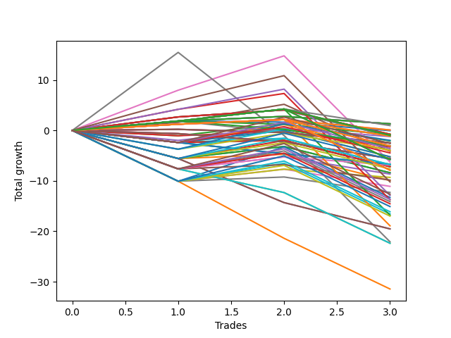

# Short Wallace 001 
- Symbol: TSLA_Unlimited
- Date Range: 03/23/2022 - 07/08/2022
- Trading Period: 7:20-12:30
- Number of Trades: 3



| Name | Win Percent | Profit | Avg Profit / Trade | Avg Time / Trade |      | Name | Win Percent | Profit | Avg Profit / Trade | Avg Time / Trade |
| ---- | ----------- | ------ | ------------------ | ---------------- | ---- | ---- | ----------- | ------ | ------------------ | ---------------- |
| Sorted By <br> Profit | | | | | | Sorted By <br> Win Percentage ||||
| Sixty-Four | 66.67 | 655.00 | 218.33 | 05:28 |     | Sixty-Four | 66.67 | 655.00 | 218.33 | 05:28 |
| Fifty-Six | 66.67 | 655.00 | 218.33 | 05:28 |     | Fifty-Six | 66.67 | 655.00 | 218.33 | 05:28 |
| Forty-Eight | 66.67 | 655.00 | 218.33 | 05:28 |     | Forty-Eight | 66.67 | 655.00 | 218.33 | 05:28 |
| Forty | 66.67 | 655.00 | 218.33 | 05:28 |     | Forty | 66.67 | 655.00 | 218.33 | 05:28 |
| Zero | 66.67 | 655.00 | 218.33 | 05:28 |     | Zero | 66.67 | 655.00 | 218.33 | 05:28 |
| One Hundred Two | 66.67 | 485.00 | 161.67 | 08:43 |     | One Hundred Two | 66.67 | 485.00 | 161.67 | 08:43 |
| Ninety-Six | 66.67 | 45.00 | 15.00 | 03:16 |     | Ninety-Six | 66.67 | 45.00 | 15.00 | 03:16 |
| Ninety-One | 66.67 | 45.00 | 15.00 | 03:16 |     | Ninety-One | 66.67 | 45.00 | 15.00 | 03:16 |
| Seventy-Three | 33.33 | -25.00 | -8.33 | 06:25 |     | Sixty-Five | 66.67 | -375.00 | -125.00 | 16:55 |
| Sixty-Five | 66.67 | -375.00 | -125.00 | 16:55 |     | Fifty-Seven | 66.67 | -375.00 | -125.00 | 16:55 |
| Fifty-Seven | 66.67 | -375.00 | -125.00 | 16:55 |     | One | 66.67 | -375.00 | -125.00 | 16:55 |
| One | 66.67 | -375.00 | -125.00 | 16:55 |     | One Hundred Seventeen | 66.67 | -480.00 | -160.00 | 13:35 |
| Ninety-Seven | 33.33 | -425.00 | -141.67 | 06:06 |     | One Hundred Twelve | 66.67 | -480.00 | -160.00 | 13:35 |
| One Hundred Seventeen | 66.67 | -480.00 | -160.00 | 13:35 |     | One Hundred Six | 66.67 | -560.00 | -186.67 | 03:25 |
| One Hundred Twelve | 66.67 | -480.00 | -160.00 | 13:35 |     | One Hundred One | 66.67 | -560.00 | -186.67 | 03:25 |
| One Hundred Six | 66.67 | -560.00 | -186.67 | 03:25 |     | Forty-Nine | 66.67 | -570.00 | -190.00 | 10:25 |
| One Hundred One | 66.67 | -560.00 | -186.67 | 03:25 |     | Forty-One | 66.67 | -570.00 | -190.00 | 10:25 |
| Forty-Nine | 66.67 | -570.00 | -190.00 | 10:25 |     | One Hundred Sixteen | 66.67 | -1525.00 | -508.33 | 08:16 |
| Forty-One | 66.67 | -570.00 | -190.00 | 10:25 |     | One Hundred Eleven | 66.67 | -1525.00 | -508.33 | 08:16 |
| Four | 33.33 | -605.00 | -201.67 | 42:46 |     | Five | 66.67 | -2060.00 | -686.67 | 79:05 |
| One Hundred Five | 33.33 | -985.00 | -328.33 | 13:38 |     | One Hundred Twenty-Seven | 66.67 | -2900.00 | -966.67 | 33:38 |
| Two | 33.33 | -1035.00 | -345.00 | 31:11 |     | One Hundred Twenty-Two | 66.67 | -2900.00 | -966.67 | 33:38 |
| Ninety-Two | 33.33 | -1220.00 | -406.67 | 07:25 |     | Six | 66.67 | -3135.00 | -1045.00 | 132:23 |
| One Hundred | 33.33 | -1245.00 | -415.00 | 06:43 |     | One Hundred Twenty-Six | 66.67 | -3945.00 | -1315.00 | 28:20 |
| Ninety-Nine | 33.33 | -1245.00 | -415.00 | 06:43 |     | One Hundred Twenty-One | 66.67 | -3945.00 | -1315.00 | 28:20 |
| Ninety-Eight | 33.33 | -1245.00 | -415.00 | 06:43 |     | Eighty-Five | 66.67 | -5100.00 | -1700.00 | 110:13 |
| One Hundred Twenty | 33.33 | -1285.00 | -428.33 | 17:48 |     | Eighty-Four | 66.67 | -6440.00 | -2146.67 | 109:51 |
| One Hundred Four | 33.33 | -1500.00 | -500.00 | 13:20 |     | Eighty-Three | 66.67 | -6870.00 | -2290.00 | 109:13 |
| One Hundred Sixteen | 66.67 | -1525.00 | -508.33 | 08:16 |     | Eighty-Two | 66.67 | -8410.00 | -2803.33 | 81:48 |
| One Hundred Eleven | 66.67 | -1525.00 | -508.33 | 08:16 |     | Eighty-One | 66.67 | -9455.00 | -3151.67 | 76:30 |
| One Hundred Seven | 33.33 | -1535.00 | -511.67 | 07:16 |     | Seventy-Three | 33.33 | -25.00 | -8.33 | 06:25 |
| Three | 33.33 | -1635.00 | -545.00 | 31:33 |     | Ninety-Seven | 33.33 | -425.00 | -141.67 | 06:06 |
| One Hundred Ninteen | 33.33 | -1800.00 | -600.00 | 17:30 |     | Four | 33.33 | -605.00 | -201.67 | 42:46 |
| One Hundred Three | 33.33 | -1930.00 | -643.33 | 12:41 |     | One Hundred Five | 33.33 | -985.00 | -328.33 | 13:38 |
| Fifty-Three | 33.33 | -2015.00 | -671.67 | 16:53 |     | Two | 33.33 | -1035.00 | -345.00 | 31:11 |
| Five | 66.67 | -2060.00 | -686.67 | 79:05 |     | Ninety-Two | 33.33 | -1220.00 | -406.67 | 07:25 |
| One Hundred Eighteen | 33.33 | -2230.00 | -743.33 | 16:51 |     | One Hundred | 33.33 | -1245.00 | -415.00 | 06:43 |
| Fifty-Two | 33.33 | -2605.00 | -868.33 | 16:15 |     | Ninety-Nine | 33.33 | -1245.00 | -415.00 | 06:43 |
| Fifty | 33.33 | -2605.00 | -868.33 | 16:15 |     | Ninety-Eight | 33.33 | -1245.00 | -415.00 | 06:43 |
| One Hundred Ten | 0.00 | -2780.00 | -926.67 | 09:15 |     | One Hundred Twenty | 33.33 | -1285.00 | -428.33 | 17:48 |
| One Hundred Nine | 0.00 | -2780.00 | -926.67 | 09:15 |     | One Hundred Four | 33.33 | -1500.00 | -500.00 | 13:20 |
| One Hundred Eight | 0.00 | -2780.00 | -926.67 | 09:15 |     | One Hundred Seven | 33.33 | -1535.00 | -511.67 | 07:16 |
| One Hundred Fifteen | 33.33 | -2875.00 | -958.33 | 20:23 |     | Three | 33.33 | -1635.00 | -545.00 | 31:33 |
| One Hundred Twenty-Seven | 66.67 | -2900.00 | -966.67 | 33:38 |     | One Hundred Ninteen | 33.33 | -1800.00 | -600.00 | 17:30 |
| One Hundred Twenty-Two | 66.67 | -2900.00 | -966.67 | 33:38 |     | One Hundred Three | 33.33 | -1930.00 | -643.33 | 12:41 |
| Six | 66.67 | -3135.00 | -1045.00 | 132:23 |     | Fifty-Three | 33.33 | -2015.00 | -671.67 | 16:53 |
| Ninety-Five | 0.00 | -3345.00 | -1115.00 | 10:05 |     | One Hundred Eighteen | 33.33 | -2230.00 | -743.33 | 16:51 |
| Ninety-Four | 0.00 | -3345.00 | -1115.00 | 10:05 |     | Fifty-Two | 33.33 | -2605.00 | -868.33 | 16:15 |
| Ninety-Three | 0.00 | -3345.00 | -1115.00 | 10:05 |     | Fifty | 33.33 | -2605.00 | -868.33 | 16:15 |
| Fifty-One | 33.33 | -3380.00 | -1126.67 | 16:08 |     | One Hundred Fifteen | 33.33 | -2875.00 | -958.33 | 20:23 |
| One Hundred Fourteen | 33.33 | -3390.00 | -1130.00 | 20:05 |     | Fifty-One | 33.33 | -3380.00 | -1126.67 | 16:08 |
| Sixty-Eight | 33.33 | -3435.00 | -1145.00 | 28:38 |     | One Hundred Fourteen | 33.33 | -3390.00 | -1130.00 | 20:05 |
| Fifty-Five | 33.33 | -3580.00 | -1193.33 | 22:16 |     | Sixty-Eight | 33.33 | -3435.00 | -1145.00 | 28:38 |
| Fifty-Four | 33.33 | -3580.00 | -1193.33 | 22:16 |     | Fifty-Five | 33.33 | -3580.00 | -1193.33 | 22:16 |
| Forty-Five | 33.33 | -3605.00 | -1201.67 | 19:28 |     | Fifty-Four | 33.33 | -3580.00 | -1193.33 | 22:16 |
| One Hundred Thirteen | 33.33 | -3820.00 | -1273.33 | 19:26 |     | Forty-Five | 33.33 | -3605.00 | -1201.67 | 19:28 |
| One Hundred Twenty-Six | 66.67 | -3945.00 | -1315.00 | 28:20 |     | One Hundred Thirteen | 33.33 | -3820.00 | -1273.33 | 19:26 |
| One Hundred Twenty-One | 66.67 | -3945.00 | -1315.00 | 28:20 |     | Forty-Four | 33.33 | -4195.00 | -1398.33 | 18:50 |
| Forty-Four | 33.33 | -4195.00 | -1398.33 | 18:50 |     | Forty-Two | 33.33 | -4195.00 | -1398.33 | 18:50 |
| Forty-Two | 33.33 | -4195.00 | -1398.33 | 18:50 |     | Sixty-Six | 33.33 | -4325.00 | -1441.67 | 26:10 |
| Sixty-Six | 33.33 | -4325.00 | -1441.67 | 26:10 |     | Sixty | 33.33 | -4655.00 | -1551.67 | 28:46 |
| Sixty | 33.33 | -4655.00 | -1551.67 | 28:46 |     | Sixty-Seven | 33.33 | -4925.00 | -1641.67 | 26:31 |
| Sixty-Seven | 33.33 | -4925.00 | -1641.67 | 26:31 |     | Forty-Three | 33.33 | -4970.00 | -1656.67 | 18:43 |
| Forty-Three | 33.33 | -4970.00 | -1656.67 | 18:43 |     | Fifty-Eight | 33.33 | -5545.00 | -1848.33 | 26:18 |
| Eighty-Five | 66.67 | -5100.00 | -1700.00 | 110:13 |     | Fifty-Nine | 33.33 | -6145.00 | -2048.33 | 26:40 |
| Fifty-Eight | 33.33 | -5545.00 | -1848.33 | 26:18 |     | One Hundred Thirty | 33.33 | -6325.00 | -2108.33 | 40:40 |
| Fifty-Nine | 33.33 | -6145.00 | -2048.33 | 26:40 |     | Sixty-Two | 33.33 | -6650.00 | -2216.67 | 62:56 |
| One Hundred Thirty | 33.33 | -6325.00 | -2108.33 | 40:40 |     | One Hundred Twenty-Nine | 33.33 | -6840.00 | -2280.00 | 40:21 |
| Eighty-Four | 66.67 | -6440.00 | -2146.67 | 109:51 |     | Sixty-Nine | 33.33 | -7055.00 | -2351.67 | 39:45 |
| Sixty-Two | 33.33 | -6650.00 | -2216.67 | 62:56 |     | One Hundred Twenty-Eight | 33.33 | -7270.00 | -2423.33 | 39:43 |
| One Hundred Twenty-Nine | 33.33 | -6840.00 | -2280.00 | 40:21 |     | One Hundred Twenty-Five | 33.33 | -7545.00 | -2515.00 | 40:48 |
| Eighty-Three | 66.67 | -6870.00 | -2290.00 | 109:13 |     | One Hundred Twenty-Four | 33.33 | -8060.00 | -2686.67 | 40:30 |
| Sixty-Nine | 33.33 | -7055.00 | -2351.67 | 39:45 |     | Sixty-One | 33.33 | -8275.00 | -2758.33 | 39:53 |
| One Hundred Twenty-Eight | 33.33 | -7270.00 | -2423.33 | 39:43 |     | One Hundred Twenty-Three | 33.33 | -8490.00 | -2830.00 | 39:51 |
| One Hundred Twenty-Five | 33.33 | -7545.00 | -2515.00 | 40:48 |     | Seven | 33.33 | -11040.00 | -3680.00 | 175:41 |
| One Hundred Twenty-Four | 33.33 | -8060.00 | -2686.67 | 40:30 |     | One Hundred Ten | 0.00 | -2780.00 | -926.67 | 09:15 |
| Sixty-One | 33.33 | -8275.00 | -2758.33 | 39:53 |     | One Hundred Nine | 0.00 | -2780.00 | -926.67 | 09:15 |
| Eighty-Two | 66.67 | -8410.00 | -2803.33 | 81:48 |     | One Hundred Eight | 0.00 | -2780.00 | -926.67 | 09:15 |
| One Hundred Twenty-Three | 33.33 | -8490.00 | -2830.00 | 39:51 |     | Ninety-Five | 0.00 | -3345.00 | -1115.00 | 10:05 |
| Eighty-One | 66.67 | -9455.00 | -3151.67 | 76:30 |     | Ninety-Four | 0.00 | -3345.00 | -1115.00 | 10:05 |
| Forty-Seven | 0.00 | -9760.00 | -3253.33 | 41:13 |     | Ninety-Three | 0.00 | -3345.00 | -1115.00 | 10:05 |
| Forty-Six | 0.00 | -9760.00 | -3253.33 | 41:13 |     | Forty-Seven | 0.00 | -9760.00 | -3253.33 | 41:13 |
| Seven | 33.33 | -11040.00 | -3680.00 | 175:41 |     | Forty-Six | 0.00 | -9760.00 | -3253.33 | 41:13 |
| Seventy-One | 0.00 | -11185.00 | -3728.33 | 52:21 |     | Seventy-One | 0.00 | -11185.00 | -3728.33 | 52:21 |
| Seventy | 0.00 | -11185.00 | -3728.33 | 52:21 |     | Seventy | 0.00 | -11185.00 | -3728.33 | 52:21 |
| Sixty-Three | 0.00 | -15720.00 | -5240.00 | 74:26 |     | Sixty-Three | 0.00 | -15720.00 | -5240.00 | 74:26 |

## NO STOPLOSS

### Test Zero
* Sell when price hits the middle line of the 20p bollinger
* No Stoploss
* Results:
```
Total Trades: 3
Percent Up: 33.33
Percent Down: 66.67
Total Points Moved Down: 1.31
Potential Profit: 655.00
Total Points Ups: 1.47 Count Ups: 1
Total Points Downs: 2.78 Count Downs: 2
```

<details><summary>Trades</summary>

<code>In: 2022-05-04 09:43:00		Out: 2022-05-04 09:47:00		Total Position Time: 04:00		Total Move Down: 1.86		Total to Date: 1.86</code> <br />
<code>In: 2022-06-15 09:35:00		Out: 2022-06-15 09:36:10		Total Position Time: 01:10		Total Move Down: 0.92		Total to Date: 2.78</code> <br />
<code>In: 2022-07-05 09:04:00		Out: 2022-07-05 09:15:15		Total Position Time: 11:15		Total Move Down: -1.47		Total to Date: 1.31</code> <br />


</details>

### Test One
* Sell when the price hits the upper line of the 20p 1std bollinger
* No Stoploss
* Results:
```
Total Trades: 3
Percent Up: 33.33
Percent Down: 66.67
Total Points Moved Down: -0.75
Potential Profit: -375.00
Total Points Ups: 4.82 Count Ups: 1
Total Points Downs: 4.07 Count Downs: 2
```

<details><summary>Trades</summary>

<code>In: 2022-05-04 09:43:00		Out: 2022-05-04 09:51:10		Total Position Time: 08:10		Total Move Down: 2.68		Total to Date: 2.68</code> <br />
<code>In: 2022-06-15 09:35:00		Out: 2022-06-15 09:39:45		Total Position Time: 04:45		Total Move Down: 1.39		Total to Date: 4.07</code> <br />
<code>In: 2022-07-05 09:04:00		Out: 2022-07-05 09:41:50		Total Position Time: 37:50		Total Move Down: -4.82		Total to Date: -0.75</code> <br />


</details>

### Test Two
* Sell when the price hits the upper line of the 20p 2std bollinger
* No Stoploss
* Results:
```
Total Trades: 3
Percent Up: 66.67
Percent Down: 33.33
Total Points Moved Down: -2.07
Potential Profit: -1035.00
Total Points Ups: 4.46 Count Ups: 2
Total Points Downs: 2.39 Count Downs: 1
```

<details><summary>Trades</summary>

<code>In: 2022-05-04 09:43:00		Out: 2022-05-04 10:18:30		Total Position Time: 35:30		Total Move Down: -1.05		Total to Date: -1.05</code> <br />
<code>In: 2022-06-15 09:35:00		Out: 2022-06-15 09:53:25		Total Position Time: 18:25		Total Move Down: 2.39		Total to Date: 1.34</code> <br />
<code>In: 2022-07-05 09:04:00		Out: 2022-07-05 09:43:40		Total Position Time: 39:40		Total Move Down: -3.41		Total to Date: -2.07</code> <br />


</details>

### Test Three
* Sell when price hits the middle line of the 50p bollinger
* No Stoploss
* Results:
```
Total Trades: 3
Percent Up: 66.67
Percent Down: 33.33
Total Points Moved Down: -3.27
Potential Profit: -1635.00
Total Points Ups: 4.11 Count Ups: 2
Total Points Downs: 0.84 Count Downs: 1
```

<details><summary>Trades</summary>

<code>In: 2022-05-04 09:43:00		Out: 2022-05-04 10:18:30		Total Position Time: 35:30		Total Move Down: -1.05		Total to Date: -1.05</code> <br />
<code>In: 2022-06-15 09:35:00		Out: 2022-06-15 09:53:05		Total Position Time: 18:05		Total Move Down: 0.84		Total to Date: -0.21</code> <br />
<code>In: 2022-07-05 09:04:00		Out: 2022-07-05 09:45:05		Total Position Time: 41:05		Total Move Down: -3.06		Total to Date: -3.27</code> <br />


</details>

### Test Four
* Sell when the price hits the upper line of the 50p 1std bollinger
* No Stoploss
* Results:
```
Total Trades: 3
Percent Up: 66.67
Percent Down: 33.33
Total Points Moved Down: -1.21
Potential Profit: -605.00
Total Points Ups: 3.60 Count Ups: 2
Total Points Downs: 2.39 Count Downs: 1
```

<details><summary>Trades</summary>

<code>In: 2022-05-04 09:43:00		Out: 2022-05-04 10:45:50		Total Position Time: 62:50		Total Move Down: -1.97		Total to Date: -1.97</code> <br />
<code>In: 2022-06-15 09:35:00		Out: 2022-06-15 09:53:25		Total Position Time: 18:25		Total Move Down: 2.39		Total to Date: 0.42</code> <br />
<code>In: 2022-07-05 09:04:00		Out: 2022-07-05 09:51:05		Total Position Time: 47:05		Total Move Down: -1.63		Total to Date: -1.21</code> <br />


</details>

### Test Five
* Sell when the price hits the upper line of the 50p 2std bollinger
* No Stoploss
* Results:
```
Total Trades: 3
Percent Up: 33.33
Percent Down: 66.67
Total Points Moved Down: -4.12
Potential Profit: -2060.00
Total Points Ups: 9.30 Count Ups: 1
Total Points Downs: 5.18 Count Downs: 2
```

<details><summary>Trades</summary>

<code>In: 2022-05-04 09:43:00		Out: 2022-05-04 11:07:20		Total Position Time: 84:20		Total Move Down: 1.61		Total to Date: 1.61</code> <br />
<code>In: 2022-06-15 09:35:00		Out: 2022-06-15 09:55:20		Total Position Time: 20:20		Total Move Down: 3.57		Total to Date: 5.18</code> <br />
<code>In: 2022-07-05 09:04:00		Out: 2022-07-05 11:16:35		Total Position Time: 132:35		Total Move Down: -9.30		Total to Date: -4.12</code> <br />


</details>

### Test Six
* Sell when the price hits the middle line of the 1std VWAP
* No Stoploss
* Results:
```
Total Trades: 3
Percent Up: 33.33
Percent Down: 66.67
Total Points Moved Down: -6.27
Potential Profit: -3135.00
Total Points Ups: 21.07 Count Ups: 1
Total Points Downs: 14.80 Count Downs: 2
```

<details><summary>Trades</summary>

<code>In: 2022-05-04 09:43:00		Out: 2022-05-04 11:07:40		Total Position Time: 84:40		Total Move Down: 7.98		Total to Date: 7.98</code> <br />
<code>In: 2022-06-15 09:35:00		Out: 2022-06-15 11:04:30		Total Position Time: 89:30		Total Move Down: 6.82		Total to Date: 14.80</code> <br />
<code>In: 2022-07-05 09:04:00		Out: 2022-07-05 12:47:00		Total Position Time: 223:00		Total Move Down: -21.07		Total to Date: -6.27</code> <br />


</details>

### Test Seven
* Sell when the price hits the upper line of the 1std VWAP
* No Stoploss
* Results:
```
Total Trades: 3
Percent Up: 66.67
Percent Down: 33.33
Total Points Moved Down: -22.08
Potential Profit: -11040.00
Total Points Ups: 37.56 Count Ups: 2
Total Points Downs: 15.48 Count Downs: 1
```

<details><summary>Trades</summary>

<code>In: 2022-05-04 09:43:00		Out: 2022-05-04 11:35:05		Total Position Time: 112:05		Total Move Down: 15.48		Total to Date: 15.48</code> <br />
<code>In: 2022-06-15 09:35:00		Out: 2022-06-15 12:47:00		Total Position Time: 192:00		Total Move Down: -16.49		Total to Date: -1.01</code> <br />
<code>In: 2022-07-05 09:04:00		Out: 2022-07-05 12:47:00		Total Position Time: 223:00		Total Move Down: -21.07		Total to Date: -22.08</code> <br />


</details>

## STOPLOSS OF 5

### Test Forty
* Sell when price hits the middle line of the 20p bollinger
* Stoploss is -5 points
* Results:
```
Total Trades: 3
Percent Up: 33.33
Percent Down: 66.67
Total Points Moved Down: 1.31
Potential Profit: 655.00
Total Points Ups: 1.47 Count Ups: 1
Total Points Downs: 2.78 Count Downs: 2
```

<details><summary>Trades</summary>

<code>In: 2022-05-04 09:43:00		Out: 2022-05-04 09:47:00		Total Position Time: 04:00		Total Move Down: 1.86		Total to Date: 1.86</code> <br />
<code>In: 2022-06-15 09:35:00		Out: 2022-06-15 09:36:10		Total Position Time: 01:10		Total Move Down: 0.92		Total to Date: 2.78</code> <br />
<code>In: 2022-07-05 09:04:00		Out: 2022-07-05 09:15:15		Total Position Time: 11:15		Total Move Down: -1.47		Total to Date: 1.31</code> <br />


</details>

### Test Forty-One
* Sell when the price hits the upper line of the 20p 1std bollinger
* Stoploss is -5 points
* Results:
```
Total Trades: 3
Percent Up: 33.33
Percent Down: 66.67
Total Points Moved Down: -1.14
Potential Profit: -570.00
Total Points Ups: 5.21 Count Ups: 1
Total Points Downs: 4.07 Count Downs: 2
```

<details><summary>Trades</summary>

<code>In: 2022-05-04 09:43:00		Out: 2022-05-04 09:51:10		Total Position Time: 08:10		Total Move Down: 2.68		Total to Date: 2.68</code> <br />
<code>In: 2022-06-15 09:35:00		Out: 2022-06-15 09:39:45		Total Position Time: 04:45		Total Move Down: 1.39		Total to Date: 4.07</code> <br />
<code>In: 2022-07-05 09:04:00		Out: 2022-07-05 09:22:20		Total Position Time: 18:20		Total Move Down: -5.21		Total to Date: -1.14</code> <br />


</details>

### Test Forty-Two
* Sell when the price hits the upper line of the 20p 2std bollinger
* Stoploss is -5 points
* Results:
```
Total Trades: 3
Percent Up: 66.67
Percent Down: 33.33
Total Points Moved Down: -8.39
Potential Profit: -4195.00
Total Points Ups: 10.78 Count Ups: 2
Total Points Downs: 2.39 Count Downs: 1
```

<details><summary>Trades</summary>

<code>In: 2022-05-04 09:43:00		Out: 2022-05-04 10:02:45		Total Position Time: 19:45		Total Move Down: -5.57		Total to Date: -5.57</code> <br />
<code>In: 2022-06-15 09:35:00		Out: 2022-06-15 09:53:25		Total Position Time: 18:25		Total Move Down: 2.39		Total to Date: -3.18</code> <br />
<code>In: 2022-07-05 09:04:00		Out: 2022-07-05 09:22:20		Total Position Time: 18:20		Total Move Down: -5.21		Total to Date: -8.39</code> <br />


</details>

### Test Forty-Three
* Sell when price hits the middle line of the 50p bollinger
* Stoploss is -5 points
* Results:
```
Total Trades: 3
Percent Up: 66.67
Percent Down: 33.33
Total Points Moved Down: -9.94
Potential Profit: -4970.00
Total Points Ups: 10.78 Count Ups: 2
Total Points Downs: 0.84 Count Downs: 1
```

<details><summary>Trades</summary>

<code>In: 2022-05-04 09:43:00		Out: 2022-05-04 10:02:45		Total Position Time: 19:45		Total Move Down: -5.57		Total to Date: -5.57</code> <br />
<code>In: 2022-06-15 09:35:00		Out: 2022-06-15 09:53:05		Total Position Time: 18:05		Total Move Down: 0.84		Total to Date: -4.73</code> <br />
<code>In: 2022-07-05 09:04:00		Out: 2022-07-05 09:22:20		Total Position Time: 18:20		Total Move Down: -5.21		Total to Date: -9.94</code> <br />


</details>

### Test Forty-Four
* Sell when the price hits the upper line of the 50p 1std bollinger
* Stoploss is -5 points
* Results:
```
Total Trades: 3
Percent Up: 66.67
Percent Down: 33.33
Total Points Moved Down: -8.39
Potential Profit: -4195.00
Total Points Ups: 10.78 Count Ups: 2
Total Points Downs: 2.39 Count Downs: 1
```

<details><summary>Trades</summary>

<code>In: 2022-05-04 09:43:00		Out: 2022-05-04 10:02:45		Total Position Time: 19:45		Total Move Down: -5.57		Total to Date: -5.57</code> <br />
<code>In: 2022-06-15 09:35:00		Out: 2022-06-15 09:53:25		Total Position Time: 18:25		Total Move Down: 2.39		Total to Date: -3.18</code> <br />
<code>In: 2022-07-05 09:04:00		Out: 2022-07-05 09:22:20		Total Position Time: 18:20		Total Move Down: -5.21		Total to Date: -8.39</code> <br />


</details>

### Test Forty-Five
* Sell when the price hits the upper line of the 50p 2std bollinger
* Stoploss is -5 points
* Results:
```
Total Trades: 3
Percent Up: 66.67
Percent Down: 33.33
Total Points Moved Down: -7.21
Potential Profit: -3605.00
Total Points Ups: 10.78 Count Ups: 2
Total Points Downs: 3.57 Count Downs: 1
```

<details><summary>Trades</summary>

<code>In: 2022-05-04 09:43:00		Out: 2022-05-04 10:02:45		Total Position Time: 19:45		Total Move Down: -5.57		Total to Date: -5.57</code> <br />
<code>In: 2022-06-15 09:35:00		Out: 2022-06-15 09:55:20		Total Position Time: 20:20		Total Move Down: 3.57		Total to Date: -2.00</code> <br />
<code>In: 2022-07-05 09:04:00		Out: 2022-07-05 09:22:20		Total Position Time: 18:20		Total Move Down: -5.21		Total to Date: -7.21</code> <br />


</details>

### Test Forty-Six
* Sell when the price hits the middle line of the 1std VWAP
* Stoploss is -5 points
* Results:
```
Total Trades: 3
Percent Up: 100.00
Percent Down: 0.00
Total Points Moved Down: -19.52
Potential Profit: -9760.00
Total Points Ups: 19.52 Count Ups: 3
Total Points Downs: 0.00 Count Downs: 0
```

<details><summary>Trades</summary>

<code>In: 2022-05-04 09:43:00		Out: 2022-05-04 10:02:45		Total Position Time: 19:45		Total Move Down: -5.57		Total to Date: -5.57</code> <br />
<code>In: 2022-06-15 09:35:00		Out: 2022-06-15 11:00:35		Total Position Time: 85:35		Total Move Down: -8.74		Total to Date: -14.31</code> <br />
<code>In: 2022-07-05 09:04:00		Out: 2022-07-05 09:22:20		Total Position Time: 18:20		Total Move Down: -5.21		Total to Date: -19.52</code> <br />


</details>

### Test Forty-Seven
* Sell when the price hits the upper line of the 1std VWAP
* Stoploss is -5 points
* Results:
```
Total Trades: 3
Percent Up: 100.00
Percent Down: 0.00
Total Points Moved Down: -19.52
Potential Profit: -9760.00
Total Points Ups: 19.52 Count Ups: 3
Total Points Downs: 0.00 Count Downs: 0
```

<details><summary>Trades</summary>

<code>In: 2022-05-04 09:43:00		Out: 2022-05-04 10:02:45		Total Position Time: 19:45		Total Move Down: -5.57		Total to Date: -5.57</code> <br />
<code>In: 2022-06-15 09:35:00		Out: 2022-06-15 11:00:35		Total Position Time: 85:35		Total Move Down: -8.74		Total to Date: -14.31</code> <br />
<code>In: 2022-07-05 09:04:00		Out: 2022-07-05 09:22:20		Total Position Time: 18:20		Total Move Down: -5.21		Total to Date: -19.52</code> <br />


</details>

## TRAIL STOP OF 5

### Test Forty-Eight
* Sell when price hits the middle line of the 20p bollinger
* Trailing Stop is -5 points
* Results:
```
Total Trades: 3
Percent Up: 33.33
Percent Down: 66.67
Total Points Moved Down: 1.31
Potential Profit: 655.00
Total Points Ups: 1.47 Count Ups: 1
Total Points Downs: 2.78 Count Downs: 2
```

<details><summary>Trades</summary>

<code>In: 2022-05-04 09:43:00		Out: 2022-05-04 09:47:00		Total Position Time: 04:00		Total Move Down: 1.86		Total to Date: 1.86</code> <br />
<code>In: 2022-06-15 09:35:00		Out: 2022-06-15 09:36:10		Total Position Time: 01:10		Total Move Down: 0.92		Total to Date: 2.78</code> <br />
<code>In: 2022-07-05 09:04:00		Out: 2022-07-05 09:15:15		Total Position Time: 11:15		Total Move Down: -1.47		Total to Date: 1.31</code> <br />


</details>

### Test Forty-Nine
* Sell when the price hits the upper line of the 20p 1std bollinger
* Trailing Stop is -5 points
* Results:
```
Total Trades: 3
Percent Up: 33.33
Percent Down: 66.67
Total Points Moved Down: -1.14
Potential Profit: -570.00
Total Points Ups: 5.21 Count Ups: 1
Total Points Downs: 4.07 Count Downs: 2
```

<details><summary>Trades</summary>

<code>In: 2022-05-04 09:43:00		Out: 2022-05-04 09:51:10		Total Position Time: 08:10		Total Move Down: 2.68		Total to Date: 2.68</code> <br />
<code>In: 2022-06-15 09:35:00		Out: 2022-06-15 09:39:45		Total Position Time: 04:45		Total Move Down: 1.39		Total to Date: 4.07</code> <br />
<code>In: 2022-07-05 09:04:00		Out: 2022-07-05 09:22:20		Total Position Time: 18:20		Total Move Down: -5.21		Total to Date: -1.14</code> <br />


</details>

### Test Fifty
* Sell when the price hits the upper line of the 20p 2std bollinger
* Trailing Stop is -5 points
* Results:
```
Total Trades: 3
Percent Up: 66.67
Percent Down: 33.33
Total Points Moved Down: -5.21
Potential Profit: -2605.00
Total Points Ups: 7.60 Count Ups: 2
Total Points Downs: 2.39 Count Downs: 1
```

<details><summary>Trades</summary>

<code>In: 2022-05-04 09:43:00		Out: 2022-05-04 09:55:00		Total Position Time: 12:00		Total Move Down: -2.39		Total to Date: -2.39</code> <br />
<code>In: 2022-06-15 09:35:00		Out: 2022-06-15 09:53:25		Total Position Time: 18:25		Total Move Down: 2.39		Total to Date: 0.00</code> <br />
<code>In: 2022-07-05 09:04:00		Out: 2022-07-05 09:22:20		Total Position Time: 18:20		Total Move Down: -5.21		Total to Date: -5.21</code> <br />


</details>

### Test Fifty-One
* Sell when price hits the middle line of the 50p bollinger
* Trailing Stop is -5 points
* Results:
```
Total Trades: 3
Percent Up: 66.67
Percent Down: 33.33
Total Points Moved Down: -6.76
Potential Profit: -3380.00
Total Points Ups: 7.60 Count Ups: 2
Total Points Downs: 0.84 Count Downs: 1
```

<details><summary>Trades</summary>

<code>In: 2022-05-04 09:43:00		Out: 2022-05-04 09:55:00		Total Position Time: 12:00		Total Move Down: -2.39		Total to Date: -2.39</code> <br />
<code>In: 2022-06-15 09:35:00		Out: 2022-06-15 09:53:05		Total Position Time: 18:05		Total Move Down: 0.84		Total to Date: -1.55</code> <br />
<code>In: 2022-07-05 09:04:00		Out: 2022-07-05 09:22:20		Total Position Time: 18:20		Total Move Down: -5.21		Total to Date: -6.76</code> <br />


</details>

### Test Fifty-Two
* Sell when the price hits the upper line of the 50p 1std bollinger
* Trailing Stop is -5 points
* Results:
```
Total Trades: 3
Percent Up: 66.67
Percent Down: 33.33
Total Points Moved Down: -5.21
Potential Profit: -2605.00
Total Points Ups: 7.60 Count Ups: 2
Total Points Downs: 2.39 Count Downs: 1
```

<details><summary>Trades</summary>

<code>In: 2022-05-04 09:43:00		Out: 2022-05-04 09:55:00		Total Position Time: 12:00		Total Move Down: -2.39		Total to Date: -2.39</code> <br />
<code>In: 2022-06-15 09:35:00		Out: 2022-06-15 09:53:25		Total Position Time: 18:25		Total Move Down: 2.39		Total to Date: 0.00</code> <br />
<code>In: 2022-07-05 09:04:00		Out: 2022-07-05 09:22:20		Total Position Time: 18:20		Total Move Down: -5.21		Total to Date: -5.21</code> <br />


</details>

### Test Fifty-Three
* Sell when the price hits the upper line of the 50p 2std bollinger
* Trailing Stop is -5 points
* Results:
```
Total Trades: 3
Percent Up: 66.67
Percent Down: 33.33
Total Points Moved Down: -4.03
Potential Profit: -2015.00
Total Points Ups: 7.60 Count Ups: 2
Total Points Downs: 3.57 Count Downs: 1
```

<details><summary>Trades</summary>

<code>In: 2022-05-04 09:43:00		Out: 2022-05-04 09:55:00		Total Position Time: 12:00		Total Move Down: -2.39		Total to Date: -2.39</code> <br />
<code>In: 2022-06-15 09:35:00		Out: 2022-06-15 09:55:20		Total Position Time: 20:20		Total Move Down: 3.57		Total to Date: 1.18</code> <br />
<code>In: 2022-07-05 09:04:00		Out: 2022-07-05 09:22:20		Total Position Time: 18:20		Total Move Down: -5.21		Total to Date: -4.03</code> <br />


</details>

### Test Fifty-Four
* Sell when the price hits the middle line of the 1std VWAP
* Trailing Stop is -5 points
* Results:
```
Total Trades: 3
Percent Up: 66.67
Percent Down: 33.33
Total Points Moved Down: -7.16
Potential Profit: -3580.00
Total Points Ups: 7.60 Count Ups: 2
Total Points Downs: 0.44 Count Downs: 1
```

<details><summary>Trades</summary>

<code>In: 2022-05-04 09:43:00		Out: 2022-05-04 09:55:00		Total Position Time: 12:00		Total Move Down: -2.39		Total to Date: -2.39</code> <br />
<code>In: 2022-06-15 09:35:00		Out: 2022-06-15 10:11:30		Total Position Time: 36:30		Total Move Down: 0.44		Total to Date: -1.95</code> <br />
<code>In: 2022-07-05 09:04:00		Out: 2022-07-05 09:22:20		Total Position Time: 18:20		Total Move Down: -5.21		Total to Date: -7.16</code> <br />


</details>

### Test Fifty-Five
* Sell when the price hits the upper line of the 1std VWAP
* Trailing Stop is -5 points
* Results:
```
Total Trades: 3
Percent Up: 66.67
Percent Down: 33.33
Total Points Moved Down: -7.16
Potential Profit: -3580.00
Total Points Ups: 7.60 Count Ups: 2
Total Points Downs: 0.44 Count Downs: 1
```

<details><summary>Trades</summary>

<code>In: 2022-05-04 09:43:00		Out: 2022-05-04 09:55:00		Total Position Time: 12:00		Total Move Down: -2.39		Total to Date: -2.39</code> <br />
<code>In: 2022-06-15 09:35:00		Out: 2022-06-15 10:11:30		Total Position Time: 36:30		Total Move Down: 0.44		Total to Date: -1.95</code> <br />
<code>In: 2022-07-05 09:04:00		Out: 2022-07-05 09:22:20		Total Position Time: 18:20		Total Move Down: -5.21		Total to Date: -7.16</code> <br />


</details>

## STOPLOSS OF 10

### Test Fifty-Six
* Sell when price hits the middle line of the 20p bollinger
* Stoploss is -10 points
* Results:
```
Total Trades: 3
Percent Up: 33.33
Percent Down: 66.67
Total Points Moved Down: 1.31
Potential Profit: 655.00
Total Points Ups: 1.47 Count Ups: 1
Total Points Downs: 2.78 Count Downs: 2
```

<details><summary>Trades</summary>

<code>In: 2022-05-04 09:43:00		Out: 2022-05-04 09:47:00		Total Position Time: 04:00		Total Move Down: 1.86		Total to Date: 1.86</code> <br />
<code>In: 2022-06-15 09:35:00		Out: 2022-06-15 09:36:10		Total Position Time: 01:10		Total Move Down: 0.92		Total to Date: 2.78</code> <br />
<code>In: 2022-07-05 09:04:00		Out: 2022-07-05 09:15:15		Total Position Time: 11:15		Total Move Down: -1.47		Total to Date: 1.31</code> <br />


</details>

### Test Fifty-Seven
* Sell when the price hits the upper line of the 20p 1std bollinger
* Stoploss is -10 points
* Results:
```
Total Trades: 3
Percent Up: 33.33
Percent Down: 66.67
Total Points Moved Down: -0.75
Potential Profit: -375.00
Total Points Ups: 4.82 Count Ups: 1
Total Points Downs: 4.07 Count Downs: 2
```

<details><summary>Trades</summary>

<code>In: 2022-05-04 09:43:00		Out: 2022-05-04 09:51:10		Total Position Time: 08:10		Total Move Down: 2.68		Total to Date: 2.68</code> <br />
<code>In: 2022-06-15 09:35:00		Out: 2022-06-15 09:39:45		Total Position Time: 04:45		Total Move Down: 1.39		Total to Date: 4.07</code> <br />
<code>In: 2022-07-05 09:04:00		Out: 2022-07-05 09:41:50		Total Position Time: 37:50		Total Move Down: -4.82		Total to Date: -0.75</code> <br />


</details>

### Test Fifty-Eight
* Sell when the price hits the upper line of the 20p 2std bollinger
* Stoploss is -10 points
* Results:
```
Total Trades: 3
Percent Up: 66.67
Percent Down: 33.33
Total Points Moved Down: -11.09
Potential Profit: -5545.00
Total Points Ups: 13.48 Count Ups: 2
Total Points Downs: 2.39 Count Downs: 1
```

<details><summary>Trades</summary>

<code>In: 2022-05-04 09:43:00		Out: 2022-05-04 10:03:50		Total Position Time: 20:50		Total Move Down: -10.07		Total to Date: -10.07</code> <br />
<code>In: 2022-06-15 09:35:00		Out: 2022-06-15 09:53:25		Total Position Time: 18:25		Total Move Down: 2.39		Total to Date: -7.68</code> <br />
<code>In: 2022-07-05 09:04:00		Out: 2022-07-05 09:43:40		Total Position Time: 39:40		Total Move Down: -3.41		Total to Date: -11.09</code> <br />


</details>

### Test Fifty-Nine
* Sell when price hits the middle line of the 50p bollinger
* Stoploss is -10 points
* Results:
```
Total Trades: 3
Percent Up: 66.67
Percent Down: 33.33
Total Points Moved Down: -12.29
Potential Profit: -6145.00
Total Points Ups: 13.13 Count Ups: 2
Total Points Downs: 0.84 Count Downs: 1
```

<details><summary>Trades</summary>

<code>In: 2022-05-04 09:43:00		Out: 2022-05-04 10:03:50		Total Position Time: 20:50		Total Move Down: -10.07		Total to Date: -10.07</code> <br />
<code>In: 2022-06-15 09:35:00		Out: 2022-06-15 09:53:05		Total Position Time: 18:05		Total Move Down: 0.84		Total to Date: -9.23</code> <br />
<code>In: 2022-07-05 09:04:00		Out: 2022-07-05 09:45:05		Total Position Time: 41:05		Total Move Down: -3.06		Total to Date: -12.29</code> <br />


</details>

### Test Sixty
* Sell when the price hits the upper line of the 50p 1std bollinger
* Stoploss is -10 points
* Results:
```
Total Trades: 3
Percent Up: 66.67
Percent Down: 33.33
Total Points Moved Down: -9.31
Potential Profit: -4655.00
Total Points Ups: 11.70 Count Ups: 2
Total Points Downs: 2.39 Count Downs: 1
```

<details><summary>Trades</summary>

<code>In: 2022-05-04 09:43:00		Out: 2022-05-04 10:03:50		Total Position Time: 20:50		Total Move Down: -10.07		Total to Date: -10.07</code> <br />
<code>In: 2022-06-15 09:35:00		Out: 2022-06-15 09:53:25		Total Position Time: 18:25		Total Move Down: 2.39		Total to Date: -7.68</code> <br />
<code>In: 2022-07-05 09:04:00		Out: 2022-07-05 09:51:05		Total Position Time: 47:05		Total Move Down: -1.63		Total to Date: -9.31</code> <br />


</details>

### Test Sixty-One
* Sell when the price hits the upper line of the 50p 2std bollinger
* Stoploss is -10 points
* Results:
```
Total Trades: 3
Percent Up: 66.67
Percent Down: 33.33
Total Points Moved Down: -16.55
Potential Profit: -8275.00
Total Points Ups: 20.12 Count Ups: 2
Total Points Downs: 3.57 Count Downs: 1
```

<details><summary>Trades</summary>

<code>In: 2022-05-04 09:43:00		Out: 2022-05-04 10:03:50		Total Position Time: 20:50		Total Move Down: -10.07		Total to Date: -10.07</code> <br />
<code>In: 2022-06-15 09:35:00		Out: 2022-06-15 09:55:20		Total Position Time: 20:20		Total Move Down: 3.57		Total to Date: -6.50</code> <br />
<code>In: 2022-07-05 09:04:00		Out: 2022-07-05 10:22:30		Total Position Time: 78:30		Total Move Down: -10.05		Total to Date: -16.55</code> <br />


</details>

### Test Sixty-Two
* Sell when the price hits the middle line of the 1std VWAP
* Stoploss is -10 points
* Results:
```
Total Trades: 3
Percent Up: 66.67
Percent Down: 33.33
Total Points Moved Down: -13.30
Potential Profit: -6650.00
Total Points Ups: 20.12 Count Ups: 2
Total Points Downs: 6.82 Count Downs: 1
```

<details><summary>Trades</summary>

<code>In: 2022-05-04 09:43:00		Out: 2022-05-04 10:03:50		Total Position Time: 20:50		Total Move Down: -10.07		Total to Date: -10.07</code> <br />
<code>In: 2022-06-15 09:35:00		Out: 2022-06-15 11:04:30		Total Position Time: 89:30		Total Move Down: 6.82		Total to Date: -3.25</code> <br />
<code>In: 2022-07-05 09:04:00		Out: 2022-07-05 10:22:30		Total Position Time: 78:30		Total Move Down: -10.05		Total to Date: -13.30</code> <br />


</details>

### Test Sixty-Three
* Sell when the price hits the upper line of the 1std VWAP
* Stoploss is -10 points
* Results:
```
Total Trades: 3
Percent Up: 100.00
Percent Down: 0.00
Total Points Moved Down: -31.44
Potential Profit: -15720.00
Total Points Ups: 31.44 Count Ups: 3
Total Points Downs: 0.00 Count Downs: 0
```

<details><summary>Trades</summary>

<code>In: 2022-05-04 09:43:00		Out: 2022-05-04 10:03:50		Total Position Time: 20:50		Total Move Down: -10.07		Total to Date: -10.07</code> <br />
<code>In: 2022-06-15 09:35:00		Out: 2022-06-15 11:39:00		Total Position Time: 124:00		Total Move Down: -11.32		Total to Date: -21.39</code> <br />
<code>In: 2022-07-05 09:04:00		Out: 2022-07-05 10:22:30		Total Position Time: 78:30		Total Move Down: -10.05		Total to Date: -31.44</code> <br />


</details>

## TRAIL STOP OF 10

### Test Sixty-Four
* Sell when price hits the middle line of the 20p bollinger
* Trailing Stop is -10 points
* Results:
```
Total Trades: 3
Percent Up: 33.33
Percent Down: 66.67
Total Points Moved Down: 1.31
Potential Profit: 655.00
Total Points Ups: 1.47 Count Ups: 1
Total Points Downs: 2.78 Count Downs: 2
```

<details><summary>Trades</summary>

<code>In: 2022-05-04 09:43:00		Out: 2022-05-04 09:47:00		Total Position Time: 04:00		Total Move Down: 1.86		Total to Date: 1.86</code> <br />
<code>In: 2022-06-15 09:35:00		Out: 2022-06-15 09:36:10		Total Position Time: 01:10		Total Move Down: 0.92		Total to Date: 2.78</code> <br />
<code>In: 2022-07-05 09:04:00		Out: 2022-07-05 09:15:15		Total Position Time: 11:15		Total Move Down: -1.47		Total to Date: 1.31</code> <br />


</details>

### Test Sixty-Five
* Sell when the price hits the upper line of the 20p 1std bollinger
* Trailing Stop is -10 points
* Results:
```
Total Trades: 3
Percent Up: 33.33
Percent Down: 66.67
Total Points Moved Down: -0.75
Potential Profit: -375.00
Total Points Ups: 4.82 Count Ups: 1
Total Points Downs: 4.07 Count Downs: 2
```

<details><summary>Trades</summary>

<code>In: 2022-05-04 09:43:00		Out: 2022-05-04 09:51:10		Total Position Time: 08:10		Total Move Down: 2.68		Total to Date: 2.68</code> <br />
<code>In: 2022-06-15 09:35:00		Out: 2022-06-15 09:39:45		Total Position Time: 04:45		Total Move Down: 1.39		Total to Date: 4.07</code> <br />
<code>In: 2022-07-05 09:04:00		Out: 2022-07-05 09:41:50		Total Position Time: 37:50		Total Move Down: -4.82		Total to Date: -0.75</code> <br />


</details>

### Test Sixty-Six
* Sell when the price hits the upper line of the 20p 2std bollinger
* Trailing Stop is -10 points
* Results:
```
Total Trades: 3
Percent Up: 66.67
Percent Down: 33.33
Total Points Moved Down: -8.65
Potential Profit: -4325.00
Total Points Ups: 11.04 Count Ups: 2
Total Points Downs: 2.39 Count Downs: 1
```

<details><summary>Trades</summary>

<code>In: 2022-05-04 09:43:00		Out: 2022-05-04 10:03:25		Total Position Time: 20:25		Total Move Down: -7.63		Total to Date: -7.63</code> <br />
<code>In: 2022-06-15 09:35:00		Out: 2022-06-15 09:53:25		Total Position Time: 18:25		Total Move Down: 2.39		Total to Date: -5.24</code> <br />
<code>In: 2022-07-05 09:04:00		Out: 2022-07-05 09:43:40		Total Position Time: 39:40		Total Move Down: -3.41		Total to Date: -8.65</code> <br />


</details>

### Test Sixty-Seven
* Sell when price hits the middle line of the 50p bollinger
* Trailing Stop is -10 points
* Results:
```
Total Trades: 3
Percent Up: 66.67
Percent Down: 33.33
Total Points Moved Down: -9.85
Potential Profit: -4925.00
Total Points Ups: 10.69 Count Ups: 2
Total Points Downs: 0.84 Count Downs: 1
```

<details><summary>Trades</summary>

<code>In: 2022-05-04 09:43:00		Out: 2022-05-04 10:03:25		Total Position Time: 20:25		Total Move Down: -7.63		Total to Date: -7.63</code> <br />
<code>In: 2022-06-15 09:35:00		Out: 2022-06-15 09:53:05		Total Position Time: 18:05		Total Move Down: 0.84		Total to Date: -6.79</code> <br />
<code>In: 2022-07-05 09:04:00		Out: 2022-07-05 09:45:05		Total Position Time: 41:05		Total Move Down: -3.06		Total to Date: -9.85</code> <br />


</details>

### Test Sixty-Eight
* Sell when the price hits the upper line of the 50p 1std bollinger
* Trailing Stop is -10 points
* Results:
```
Total Trades: 3
Percent Up: 66.67
Percent Down: 33.33
Total Points Moved Down: -6.87
Potential Profit: -3435.00
Total Points Ups: 9.26 Count Ups: 2
Total Points Downs: 2.39 Count Downs: 1
```

<details><summary>Trades</summary>

<code>In: 2022-05-04 09:43:00		Out: 2022-05-04 10:03:25		Total Position Time: 20:25		Total Move Down: -7.63		Total to Date: -7.63</code> <br />
<code>In: 2022-06-15 09:35:00		Out: 2022-06-15 09:53:25		Total Position Time: 18:25		Total Move Down: 2.39		Total to Date: -5.24</code> <br />
<code>In: 2022-07-05 09:04:00		Out: 2022-07-05 09:51:05		Total Position Time: 47:05		Total Move Down: -1.63		Total to Date: -6.87</code> <br />


</details>

### Test Sixty-Nine
* Sell when the price hits the upper line of the 50p 2std bollinger
* Trailing Stop is -10 points
* Results:
```
Total Trades: 3
Percent Up: 66.67
Percent Down: 33.33
Total Points Moved Down: -14.11
Potential Profit: -7055.00
Total Points Ups: 17.68 Count Ups: 2
Total Points Downs: 3.57 Count Downs: 1
```

<details><summary>Trades</summary>

<code>In: 2022-05-04 09:43:00		Out: 2022-05-04 10:03:25		Total Position Time: 20:25		Total Move Down: -7.63		Total to Date: -7.63</code> <br />
<code>In: 2022-06-15 09:35:00		Out: 2022-06-15 09:55:20		Total Position Time: 20:20		Total Move Down: 3.57		Total to Date: -4.06</code> <br />
<code>In: 2022-07-05 09:04:00		Out: 2022-07-05 10:22:30		Total Position Time: 78:30		Total Move Down: -10.05		Total to Date: -14.11</code> <br />


</details>

### Test Seventy
* Sell when the price hits the middle line of the 1std VWAP
* Trailing Stop is -10 points
* Results:
```
Total Trades: 3
Percent Up: 100.00
Percent Down: 0.00
Total Points Moved Down: -22.37
Potential Profit: -11185.00
Total Points Ups: 22.37 Count Ups: 3
Total Points Downs: 0.00 Count Downs: 0
```

<details><summary>Trades</summary>

<code>In: 2022-05-04 09:43:00		Out: 2022-05-04 10:03:25		Total Position Time: 20:25		Total Move Down: -7.63		Total to Date: -7.63</code> <br />
<code>In: 2022-06-15 09:35:00		Out: 2022-06-15 10:33:10		Total Position Time: 58:10		Total Move Down: -4.69		Total to Date: -12.32</code> <br />
<code>In: 2022-07-05 09:04:00		Out: 2022-07-05 10:22:30		Total Position Time: 78:30		Total Move Down: -10.05		Total to Date: -22.37</code> <br />


</details>

### Test Seventy-One
* Sell when the price hits the upper line of the 1std VWAP
* Trailing Stop is -10 points
* Results:
```
Total Trades: 3
Percent Up: 100.00
Percent Down: 0.00
Total Points Moved Down: -22.37
Potential Profit: -11185.00
Total Points Ups: 22.37 Count Ups: 3
Total Points Downs: 0.00 Count Downs: 0
```

<details><summary>Trades</summary>

<code>In: 2022-05-04 09:43:00		Out: 2022-05-04 10:03:25		Total Position Time: 20:25		Total Move Down: -7.63		Total to Date: -7.63</code> <br />
<code>In: 2022-06-15 09:35:00		Out: 2022-06-15 10:33:10		Total Position Time: 58:10		Total Move Down: -4.69		Total to Date: -12.32</code> <br />
<code>In: 2022-07-05 09:04:00		Out: 2022-07-05 10:22:30		Total Position Time: 78:30		Total Move Down: -10.05		Total to Date: -22.37</code> <br />


</details>

## SPECIAL EXIT CONDITIONS 

### Test Seventy-Three
* Sell when the linear regression slope changes to negative
* No Stoploss
* Results:
```
Total Trades: 3
Percent Up: 66.67
Percent Down: 33.33
Total Points Moved Down: -0.05
Potential Profit: -25.00
Total Points Ups: 1.95 Count Ups: 2
Total Points Downs: 1.90 Count Downs: 1
```

<details><summary>Trades</summary>

<code>In: 2022-05-04 09:43:00		Out: 2022-05-04 09:47:05		Total Position Time: 04:05		Total Move Down: 1.90		Total to Date: 1.90</code> <br />
<code>In: 2022-06-15 09:35:00		Out: 2022-06-15 09:47:05		Total Position Time: 12:05		Total Move Down: -0.25		Total to Date: 1.65</code> <br />
<code>In: 2022-07-05 09:04:00		Out: 2022-07-05 09:07:05		Total Position Time: 03:05		Total Move Down: -1.70		Total to Date: -0.05</code> <br />


</details>

## TAKE PROFIT

### Test Eighty-One
* Take Profit of 1 Point
* No Stoploss
* Results:
```
Total Trades: 3
Percent Up: 33.33
Percent Down: 66.67
Total Points Moved Down: -18.91
Potential Profit: -9455.00
Total Points Ups: 21.07 Count Ups: 1
Total Points Downs: 2.16 Count Downs: 2
```

<details><summary>Trades</summary>

<code>In: 2022-05-04 09:43:00		Out: 2022-05-04 09:45:50		Total Position Time: 02:50		Total Move Down: 1.24		Total to Date: 1.24</code> <br />
<code>In: 2022-06-15 09:35:00		Out: 2022-06-15 09:38:40		Total Position Time: 03:40		Total Move Down: 0.92		Total to Date: 2.16</code> <br />
<code>In: 2022-07-05 09:04:00		Out: 2022-07-05 12:47:00		Total Position Time: 223:00		Total Move Down: -21.07		Total to Date: -18.91</code> <br />


</details>

### Test Eighty-Two
* Take Profit of 2 Point
* No Stoploss
* Results:
```
Total Trades: 3
Percent Up: 33.33
Percent Down: 66.67
Total Points Moved Down: -16.82
Potential Profit: -8410.00
Total Points Ups: 21.07 Count Ups: 1
Total Points Downs: 4.25 Count Downs: 2
```

<details><summary>Trades</summary>

<code>In: 2022-05-04 09:43:00		Out: 2022-05-04 09:47:00		Total Position Time: 04:00		Total Move Down: 1.86		Total to Date: 1.86</code> <br />
<code>In: 2022-06-15 09:35:00		Out: 2022-06-15 09:53:25		Total Position Time: 18:25		Total Move Down: 2.39		Total to Date: 4.25</code> <br />
<code>In: 2022-07-05 09:04:00		Out: 2022-07-05 12:47:00		Total Position Time: 223:00		Total Move Down: -21.07		Total to Date: -16.82</code> <br />


</details>

### Test Eighty-Three
* Take Profit of 3 Point
* No Stoploss
* Results:
```
Total Trades: 3
Percent Up: 33.33
Percent Down: 66.67
Total Points Moved Down: -13.74
Potential Profit: -6870.00
Total Points Ups: 21.07 Count Ups: 1
Total Points Downs: 7.33 Count Downs: 2
```

<details><summary>Trades</summary>

<code>In: 2022-05-04 09:43:00		Out: 2022-05-04 11:07:25		Total Position Time: 84:25		Total Move Down: 4.19		Total to Date: 4.19</code> <br />
<code>In: 2022-06-15 09:35:00		Out: 2022-06-15 09:55:15		Total Position Time: 20:15		Total Move Down: 3.14		Total to Date: 7.33</code> <br />
<code>In: 2022-07-05 09:04:00		Out: 2022-07-05 12:47:00		Total Position Time: 223:00		Total Move Down: -21.07		Total to Date: -13.74</code> <br />


</details>

### Test Eighty-Four
* Take Profit of 4 Point
* No Stoploss
* Results:
```
Total Trades: 3
Percent Up: 33.33
Percent Down: 66.67
Total Points Moved Down: -12.88
Potential Profit: -6440.00
Total Points Ups: 21.07 Count Ups: 1
Total Points Downs: 8.19 Count Downs: 2
```

<details><summary>Trades</summary>

<code>In: 2022-05-04 09:43:00		Out: 2022-05-04 11:07:25		Total Position Time: 84:25		Total Move Down: 4.19		Total to Date: 4.19</code> <br />
<code>In: 2022-06-15 09:35:00		Out: 2022-06-15 09:57:10		Total Position Time: 22:10		Total Move Down: 4.00		Total to Date: 8.19</code> <br />
<code>In: 2022-07-05 09:04:00		Out: 2022-07-05 12:47:00		Total Position Time: 223:00		Total Move Down: -21.07		Total to Date: -12.88</code> <br />


</details>

### Test Eighty-Five
* Take Profit of 5 Point
* No Stoploss
* Results:
```
Total Trades: 3
Percent Up: 33.33
Percent Down: 66.67
Total Points Moved Down: -10.20
Potential Profit: -5100.00
Total Points Ups: 21.07 Count Ups: 1
Total Points Downs: 10.87 Count Downs: 2
```

<details><summary>Trades</summary>

<code>In: 2022-05-04 09:43:00		Out: 2022-05-04 11:07:35		Total Position Time: 84:35		Total Move Down: 5.84		Total to Date: 5.84</code> <br />
<code>In: 2022-06-15 09:35:00		Out: 2022-06-15 09:58:05		Total Position Time: 23:05		Total Move Down: 5.03		Total to Date: 10.87</code> <br />
<code>In: 2022-07-05 09:04:00		Out: 2022-07-05 12:47:00		Total Position Time: 223:00		Total Move Down: -21.07		Total to Date: -10.20</code> <br />


</details>

## TAKE PROFIT Stoploss of Two

### Test Ninety-One
* Take Profit of 1 Point
* Stoploss is -2 points
* Results:
```
Total Trades: 3
Percent Up: 33.33
Percent Down: 66.67
Total Points Moved Down: 0.09
Potential Profit: 45.00
Total Points Ups: 2.07 Count Ups: 1
Total Points Downs: 2.16 Count Downs: 2
```

<details><summary>Trades</summary>

<code>In: 2022-05-04 09:43:00		Out: 2022-05-04 09:45:50		Total Position Time: 02:50		Total Move Down: 1.24		Total to Date: 1.24</code> <br />
<code>In: 2022-06-15 09:35:00		Out: 2022-06-15 09:38:40		Total Position Time: 03:40		Total Move Down: 0.92		Total to Date: 2.16</code> <br />
<code>In: 2022-07-05 09:04:00		Out: 2022-07-05 09:07:20		Total Position Time: 03:20		Total Move Down: -2.07		Total to Date: 0.09</code> <br />


</details>

### Test Ninety-Two
* Take Profit of 2 Point
* Stoploss is -2 points
* Results:
```
Total Trades: 3
Percent Up: 66.67
Percent Down: 33.33
Total Points Moved Down: -2.44
Potential Profit: -1220.00
Total Points Ups: 4.30 Count Ups: 2
Total Points Downs: 1.86 Count Downs: 1
```

<details><summary>Trades</summary>

<code>In: 2022-05-04 09:43:00		Out: 2022-05-04 09:47:00		Total Position Time: 04:00		Total Move Down: 1.86		Total to Date: 1.86</code> <br />
<code>In: 2022-06-15 09:35:00		Out: 2022-06-15 09:49:55		Total Position Time: 14:55		Total Move Down: -2.23		Total to Date: -0.37</code> <br />
<code>In: 2022-07-05 09:04:00		Out: 2022-07-05 09:07:20		Total Position Time: 03:20		Total Move Down: -2.07		Total to Date: -2.44</code> <br />


</details>

### Test Ninety-Three
* Take Profit of 3 Point
* Stoploss is -2 points
* Results:
```
Total Trades: 3
Percent Up: 100.00
Percent Down: 0.00
Total Points Moved Down: -6.69
Potential Profit: -3345.00
Total Points Ups: 6.69 Count Ups: 3
Total Points Downs: 0.00 Count Downs: 0
```

<details><summary>Trades</summary>

<code>In: 2022-05-04 09:43:00		Out: 2022-05-04 09:55:00		Total Position Time: 12:00		Total Move Down: -2.39		Total to Date: -2.39</code> <br />
<code>In: 2022-06-15 09:35:00		Out: 2022-06-15 09:49:55		Total Position Time: 14:55		Total Move Down: -2.23		Total to Date: -4.62</code> <br />
<code>In: 2022-07-05 09:04:00		Out: 2022-07-05 09:07:20		Total Position Time: 03:20		Total Move Down: -2.07		Total to Date: -6.69</code> <br />


</details>

### Test Ninety-Four
* Take Profit of 4 Point
* Stoploss is -2 points
* Results:
```
Total Trades: 3
Percent Up: 100.00
Percent Down: 0.00
Total Points Moved Down: -6.69
Potential Profit: -3345.00
Total Points Ups: 6.69 Count Ups: 3
Total Points Downs: 0.00 Count Downs: 0
```

<details><summary>Trades</summary>

<code>In: 2022-05-04 09:43:00		Out: 2022-05-04 09:55:00		Total Position Time: 12:00		Total Move Down: -2.39		Total to Date: -2.39</code> <br />
<code>In: 2022-06-15 09:35:00		Out: 2022-06-15 09:49:55		Total Position Time: 14:55		Total Move Down: -2.23		Total to Date: -4.62</code> <br />
<code>In: 2022-07-05 09:04:00		Out: 2022-07-05 09:07:20		Total Position Time: 03:20		Total Move Down: -2.07		Total to Date: -6.69</code> <br />


</details>

### Test Ninety-Five
* Take Profit of 5 Point
* Stoploss is -2 points
* Results:
```
Total Trades: 3
Percent Up: 100.00
Percent Down: 0.00
Total Points Moved Down: -6.69
Potential Profit: -3345.00
Total Points Ups: 6.69 Count Ups: 3
Total Points Downs: 0.00 Count Downs: 0
```

<details><summary>Trades</summary>

<code>In: 2022-05-04 09:43:00		Out: 2022-05-04 09:55:00		Total Position Time: 12:00		Total Move Down: -2.39		Total to Date: -2.39</code> <br />
<code>In: 2022-06-15 09:35:00		Out: 2022-06-15 09:49:55		Total Position Time: 14:55		Total Move Down: -2.23		Total to Date: -4.62</code> <br />
<code>In: 2022-07-05 09:04:00		Out: 2022-07-05 09:07:20		Total Position Time: 03:20		Total Move Down: -2.07		Total to Date: -6.69</code> <br />


</details>

## TAKE PROFIT Trailstop of Two

### Test Ninety-Six
* Take Profit of 1 Point
* Trailing stop is -2 points
* Results:
```
Total Trades: 3
Percent Up: 33.33
Percent Down: 66.67
Total Points Moved Down: 0.09
Potential Profit: 45.00
Total Points Ups: 2.07 Count Ups: 1
Total Points Downs: 2.16 Count Downs: 2
```

<details><summary>Trades</summary>

<code>In: 2022-05-04 09:43:00		Out: 2022-05-04 09:45:50		Total Position Time: 02:50		Total Move Down: 1.24		Total to Date: 1.24</code> <br />
<code>In: 2022-06-15 09:35:00		Out: 2022-06-15 09:38:40		Total Position Time: 03:40		Total Move Down: 0.92		Total to Date: 2.16</code> <br />
<code>In: 2022-07-05 09:04:00		Out: 2022-07-05 09:07:20		Total Position Time: 03:20		Total Move Down: -2.07		Total to Date: 0.09</code> <br />


</details>

### Test Ninety-Seven
* Take Profit of 2 Point
* Trailing stop is -2 points
* Results:
```
Total Trades: 3
Percent Up: 66.67
Percent Down: 33.33
Total Points Moved Down: -0.85
Potential Profit: -425.00
Total Points Ups: 2.71 Count Ups: 2
Total Points Downs: 1.86 Count Downs: 1
```

<details><summary>Trades</summary>

<code>In: 2022-05-04 09:43:00		Out: 2022-05-04 09:47:00		Total Position Time: 04:00		Total Move Down: 1.86		Total to Date: 1.86</code> <br />
<code>In: 2022-06-15 09:35:00		Out: 2022-06-15 09:46:00		Total Position Time: 11:00		Total Move Down: -0.64		Total to Date: 1.22</code> <br />
<code>In: 2022-07-05 09:04:00		Out: 2022-07-05 09:07:20		Total Position Time: 03:20		Total Move Down: -2.07		Total to Date: -0.85</code> <br />


</details>

### Test Ninety-Eight
* Take Profit of 3 Point
* Trailing stop is -2 points
* Results:
```
Total Trades: 3
Percent Up: 66.67
Percent Down: 33.33
Total Points Moved Down: -2.49
Potential Profit: -1245.00
Total Points Ups: 2.71 Count Ups: 2
Total Points Downs: 0.22 Count Downs: 1
```

<details><summary>Trades</summary>

<code>In: 2022-05-04 09:43:00		Out: 2022-05-04 09:48:50		Total Position Time: 05:50		Total Move Down: 0.22		Total to Date: 0.22</code> <br />
<code>In: 2022-06-15 09:35:00		Out: 2022-06-15 09:46:00		Total Position Time: 11:00		Total Move Down: -0.64		Total to Date: -0.42</code> <br />
<code>In: 2022-07-05 09:04:00		Out: 2022-07-05 09:07:20		Total Position Time: 03:20		Total Move Down: -2.07		Total to Date: -2.49</code> <br />


</details>

### Test Ninety-Nine
* Take Profit of 4 Point
* Trailing stop is -2 points
* Results:
```
Total Trades: 3
Percent Up: 66.67
Percent Down: 33.33
Total Points Moved Down: -2.49
Potential Profit: -1245.00
Total Points Ups: 2.71 Count Ups: 2
Total Points Downs: 0.22 Count Downs: 1
```

<details><summary>Trades</summary>

<code>In: 2022-05-04 09:43:00		Out: 2022-05-04 09:48:50		Total Position Time: 05:50		Total Move Down: 0.22		Total to Date: 0.22</code> <br />
<code>In: 2022-06-15 09:35:00		Out: 2022-06-15 09:46:00		Total Position Time: 11:00		Total Move Down: -0.64		Total to Date: -0.42</code> <br />
<code>In: 2022-07-05 09:04:00		Out: 2022-07-05 09:07:20		Total Position Time: 03:20		Total Move Down: -2.07		Total to Date: -2.49</code> <br />


</details>

### Test One Hundred
* Take Profit of 5 Point
* Trailing stop is -2 points
* Results:
```
Total Trades: 3
Percent Up: 66.67
Percent Down: 33.33
Total Points Moved Down: -2.49
Potential Profit: -1245.00
Total Points Ups: 2.71 Count Ups: 2
Total Points Downs: 0.22 Count Downs: 1
```

<details><summary>Trades</summary>

<code>In: 2022-05-04 09:43:00		Out: 2022-05-04 09:48:50		Total Position Time: 05:50		Total Move Down: 0.22		Total to Date: 0.22</code> <br />
<code>In: 2022-06-15 09:35:00		Out: 2022-06-15 09:46:00		Total Position Time: 11:00		Total Move Down: -0.64		Total to Date: -0.42</code> <br />
<code>In: 2022-07-05 09:04:00		Out: 2022-07-05 09:07:20		Total Position Time: 03:20		Total Move Down: -2.07		Total to Date: -2.49</code> <br />


</details>

## TAKE PROFIT Stoploss of Three

### Test One Hundred One
* Take Profit of 1 Point
* Stoploss is -3 points
* Results:
```
Total Trades: 3
Percent Up: 33.33
Percent Down: 66.67
Total Points Moved Down: -1.12
Potential Profit: -560.00
Total Points Ups: 3.28 Count Ups: 1
Total Points Downs: 2.16 Count Downs: 2
```

<details><summary>Trades</summary>

<code>In: 2022-05-04 09:43:00		Out: 2022-05-04 09:45:50		Total Position Time: 02:50		Total Move Down: 1.24		Total to Date: 1.24</code> <br />
<code>In: 2022-06-15 09:35:00		Out: 2022-06-15 09:38:40		Total Position Time: 03:40		Total Move Down: 0.92		Total to Date: 2.16</code> <br />
<code>In: 2022-07-05 09:04:00		Out: 2022-07-05 09:07:45		Total Position Time: 03:45		Total Move Down: -3.28		Total to Date: -1.12</code> <br />


</details>

### Test One Hundred Two
* Take Profit of 2 Point
* Stoploss is -3 points
* Results:
```
Total Trades: 3
Percent Up: 33.33
Percent Down: 66.67
Total Points Moved Down: 0.97
Potential Profit: 485.00
Total Points Ups: 3.28 Count Ups: 1
Total Points Downs: 4.25 Count Downs: 2
```

<details><summary>Trades</summary>

<code>In: 2022-05-04 09:43:00		Out: 2022-05-04 09:47:00		Total Position Time: 04:00		Total Move Down: 1.86		Total to Date: 1.86</code> <br />
<code>In: 2022-06-15 09:35:00		Out: 2022-06-15 09:53:25		Total Position Time: 18:25		Total Move Down: 2.39		Total to Date: 4.25</code> <br />
<code>In: 2022-07-05 09:04:00		Out: 2022-07-05 09:07:45		Total Position Time: 03:45		Total Move Down: -3.28		Total to Date: 0.97</code> <br />


</details>

### Test One Hundred Three
* Take Profit of 3 Point
* Stoploss is -3 points
* Results:
```
Total Trades: 3
Percent Up: 66.67
Percent Down: 33.33
Total Points Moved Down: -3.86
Potential Profit: -1930.00
Total Points Ups: 7.00 Count Ups: 2
Total Points Downs: 3.14 Count Downs: 1
```

<details><summary>Trades</summary>

<code>In: 2022-05-04 09:43:00		Out: 2022-05-04 09:57:05		Total Position Time: 14:05		Total Move Down: -3.72		Total to Date: -3.72</code> <br />
<code>In: 2022-06-15 09:35:00		Out: 2022-06-15 09:55:15		Total Position Time: 20:15		Total Move Down: 3.14		Total to Date: -0.58</code> <br />
<code>In: 2022-07-05 09:04:00		Out: 2022-07-05 09:07:45		Total Position Time: 03:45		Total Move Down: -3.28		Total to Date: -3.86</code> <br />


</details>

### Test One Hundred Four
* Take Profit of 4 Point
* Stoploss is -3 points
* Results:
```
Total Trades: 3
Percent Up: 66.67
Percent Down: 33.33
Total Points Moved Down: -3.00
Potential Profit: -1500.00
Total Points Ups: 7.00 Count Ups: 2
Total Points Downs: 4.00 Count Downs: 1
```

<details><summary>Trades</summary>

<code>In: 2022-05-04 09:43:00		Out: 2022-05-04 09:57:05		Total Position Time: 14:05		Total Move Down: -3.72		Total to Date: -3.72</code> <br />
<code>In: 2022-06-15 09:35:00		Out: 2022-06-15 09:57:10		Total Position Time: 22:10		Total Move Down: 4.00		Total to Date: 0.28</code> <br />
<code>In: 2022-07-05 09:04:00		Out: 2022-07-05 09:07:45		Total Position Time: 03:45		Total Move Down: -3.28		Total to Date: -3.00</code> <br />


</details>

### Test One Hundred Five
* Take Profit of 5 Point
* Stoploss is -3 points
* Results:
```
Total Trades: 3
Percent Up: 66.67
Percent Down: 33.33
Total Points Moved Down: -1.97
Potential Profit: -985.00
Total Points Ups: 7.00 Count Ups: 2
Total Points Downs: 5.03 Count Downs: 1
```

<details><summary>Trades</summary>

<code>In: 2022-05-04 09:43:00		Out: 2022-05-04 09:57:05		Total Position Time: 14:05		Total Move Down: -3.72		Total to Date: -3.72</code> <br />
<code>In: 2022-06-15 09:35:00		Out: 2022-06-15 09:58:05		Total Position Time: 23:05		Total Move Down: 5.03		Total to Date: 1.31</code> <br />
<code>In: 2022-07-05 09:04:00		Out: 2022-07-05 09:07:45		Total Position Time: 03:45		Total Move Down: -3.28		Total to Date: -1.97</code> <br />


</details>

## TAKE PROFIT Trailstop of Three

### Test One Hundred Six
* Take Profit of 1 Point
* Trailing stop is -3 points
* Results:
```
Total Trades: 3
Percent Up: 33.33
Percent Down: 66.67
Total Points Moved Down: -1.12
Potential Profit: -560.00
Total Points Ups: 3.28 Count Ups: 1
Total Points Downs: 2.16 Count Downs: 2
```

<details><summary>Trades</summary>

<code>In: 2022-05-04 09:43:00		Out: 2022-05-04 09:45:50		Total Position Time: 02:50		Total Move Down: 1.24		Total to Date: 1.24</code> <br />
<code>In: 2022-06-15 09:35:00		Out: 2022-06-15 09:38:40		Total Position Time: 03:40		Total Move Down: 0.92		Total to Date: 2.16</code> <br />
<code>In: 2022-07-05 09:04:00		Out: 2022-07-05 09:07:45		Total Position Time: 03:45		Total Move Down: -3.28		Total to Date: -1.12</code> <br />


</details>

### Test One Hundred Seven
* Take Profit of 2 Point
* Trailing stop is -3 points
* Results:
```
Total Trades: 3
Percent Up: 66.67
Percent Down: 33.33
Total Points Moved Down: -3.07
Potential Profit: -1535.00
Total Points Ups: 4.93 Count Ups: 2
Total Points Downs: 1.86 Count Downs: 1
```

<details><summary>Trades</summary>

<code>In: 2022-05-04 09:43:00		Out: 2022-05-04 09:47:00		Total Position Time: 04:00		Total Move Down: 1.86		Total to Date: 1.86</code> <br />
<code>In: 2022-06-15 09:35:00		Out: 2022-06-15 09:49:05		Total Position Time: 14:05		Total Move Down: -1.65		Total to Date: 0.21</code> <br />
<code>In: 2022-07-05 09:04:00		Out: 2022-07-05 09:07:45		Total Position Time: 03:45		Total Move Down: -3.28		Total to Date: -3.07</code> <br />


</details>

### Test One Hundred Eight
* Take Profit of 3 Point
* Trailing stop is -3 points
* Results:
```
Total Trades: 3
Percent Up: 100.00
Percent Down: 0.00
Total Points Moved Down: -5.56
Potential Profit: -2780.00
Total Points Ups: 5.56 Count Ups: 3
Total Points Downs: 0.00 Count Downs: 0
```

<details><summary>Trades</summary>

<code>In: 2022-05-04 09:43:00		Out: 2022-05-04 09:52:55		Total Position Time: 09:55		Total Move Down: -0.63		Total to Date: -0.63</code> <br />
<code>In: 2022-06-15 09:35:00		Out: 2022-06-15 09:49:05		Total Position Time: 14:05		Total Move Down: -1.65		Total to Date: -2.28</code> <br />
<code>In: 2022-07-05 09:04:00		Out: 2022-07-05 09:07:45		Total Position Time: 03:45		Total Move Down: -3.28		Total to Date: -5.56</code> <br />


</details>

### Test One Hundred Nine
* Take Profit of 4 Point
* Trailing stop is -3 points
* Results:
```
Total Trades: 3
Percent Up: 100.00
Percent Down: 0.00
Total Points Moved Down: -5.56
Potential Profit: -2780.00
Total Points Ups: 5.56 Count Ups: 3
Total Points Downs: 0.00 Count Downs: 0
```

<details><summary>Trades</summary>

<code>In: 2022-05-04 09:43:00		Out: 2022-05-04 09:52:55		Total Position Time: 09:55		Total Move Down: -0.63		Total to Date: -0.63</code> <br />
<code>In: 2022-06-15 09:35:00		Out: 2022-06-15 09:49:05		Total Position Time: 14:05		Total Move Down: -1.65		Total to Date: -2.28</code> <br />
<code>In: 2022-07-05 09:04:00		Out: 2022-07-05 09:07:45		Total Position Time: 03:45		Total Move Down: -3.28		Total to Date: -5.56</code> <br />


</details>

### Test One Hundred Ten
* Take Profit of 5 Point
* Trailing stop is -3 points
* Results:
```
Total Trades: 3
Percent Up: 100.00
Percent Down: 0.00
Total Points Moved Down: -5.56
Potential Profit: -2780.00
Total Points Ups: 5.56 Count Ups: 3
Total Points Downs: 0.00 Count Downs: 0
```

<details><summary>Trades</summary>

<code>In: 2022-05-04 09:43:00		Out: 2022-05-04 09:52:55		Total Position Time: 09:55		Total Move Down: -0.63		Total to Date: -0.63</code> <br />
<code>In: 2022-06-15 09:35:00		Out: 2022-06-15 09:49:05		Total Position Time: 14:05		Total Move Down: -1.65		Total to Date: -2.28</code> <br />
<code>In: 2022-07-05 09:04:00		Out: 2022-07-05 09:07:45		Total Position Time: 03:45		Total Move Down: -3.28		Total to Date: -5.56</code> <br />


</details>

## TAKE PROFIT Stoploss of Five

### Test One Hundred Eleven
* Take Profit of 1 Point
* Stoploss is -5 points
* Results:
```
Total Trades: 3
Percent Up: 33.33
Percent Down: 66.67
Total Points Moved Down: -3.05
Potential Profit: -1525.00
Total Points Ups: 5.21 Count Ups: 1
Total Points Downs: 2.16 Count Downs: 2
```

<details><summary>Trades</summary>

<code>In: 2022-05-04 09:43:00		Out: 2022-05-04 09:45:50		Total Position Time: 02:50		Total Move Down: 1.24		Total to Date: 1.24</code> <br />
<code>In: 2022-06-15 09:35:00		Out: 2022-06-15 09:38:40		Total Position Time: 03:40		Total Move Down: 0.92		Total to Date: 2.16</code> <br />
<code>In: 2022-07-05 09:04:00		Out: 2022-07-05 09:22:20		Total Position Time: 18:20		Total Move Down: -5.21		Total to Date: -3.05</code> <br />


</details>

### Test One Hundred Twelve
* Take Profit of 2 Point
* Stoploss is -5 points
* Results:
```
Total Trades: 3
Percent Up: 33.33
Percent Down: 66.67
Total Points Moved Down: -0.96
Potential Profit: -480.00
Total Points Ups: 5.21 Count Ups: 1
Total Points Downs: 4.25 Count Downs: 2
```

<details><summary>Trades</summary>

<code>In: 2022-05-04 09:43:00		Out: 2022-05-04 09:47:00		Total Position Time: 04:00		Total Move Down: 1.86		Total to Date: 1.86</code> <br />
<code>In: 2022-06-15 09:35:00		Out: 2022-06-15 09:53:25		Total Position Time: 18:25		Total Move Down: 2.39		Total to Date: 4.25</code> <br />
<code>In: 2022-07-05 09:04:00		Out: 2022-07-05 09:22:20		Total Position Time: 18:20		Total Move Down: -5.21		Total to Date: -0.96</code> <br />


</details>

### Test One Hundred Thirteen
* Take Profit of 3 Point
* Stoploss is -5 points
* Results:
```
Total Trades: 3
Percent Up: 66.67
Percent Down: 33.33
Total Points Moved Down: -7.64
Potential Profit: -3820.00
Total Points Ups: 10.78 Count Ups: 2
Total Points Downs: 3.14 Count Downs: 1
```

<details><summary>Trades</summary>

<code>In: 2022-05-04 09:43:00		Out: 2022-05-04 10:02:45		Total Position Time: 19:45		Total Move Down: -5.57		Total to Date: -5.57</code> <br />
<code>In: 2022-06-15 09:35:00		Out: 2022-06-15 09:55:15		Total Position Time: 20:15		Total Move Down: 3.14		Total to Date: -2.43</code> <br />
<code>In: 2022-07-05 09:04:00		Out: 2022-07-05 09:22:20		Total Position Time: 18:20		Total Move Down: -5.21		Total to Date: -7.64</code> <br />


</details>

### Test One Hundred Fourteen
* Take Profit of 4 Point
* Stoploss is -5 points
* Results:
```
Total Trades: 3
Percent Up: 66.67
Percent Down: 33.33
Total Points Moved Down: -6.78
Potential Profit: -3390.00
Total Points Ups: 10.78 Count Ups: 2
Total Points Downs: 4.00 Count Downs: 1
```

<details><summary>Trades</summary>

<code>In: 2022-05-04 09:43:00		Out: 2022-05-04 10:02:45		Total Position Time: 19:45		Total Move Down: -5.57		Total to Date: -5.57</code> <br />
<code>In: 2022-06-15 09:35:00		Out: 2022-06-15 09:57:10		Total Position Time: 22:10		Total Move Down: 4.00		Total to Date: -1.57</code> <br />
<code>In: 2022-07-05 09:04:00		Out: 2022-07-05 09:22:20		Total Position Time: 18:20		Total Move Down: -5.21		Total to Date: -6.78</code> <br />


</details>

### Test One Hundred Fifteen
* Take Profit of 5 Point
* Stoploss is -5 points
* Results:
```
Total Trades: 3
Percent Up: 66.67
Percent Down: 33.33
Total Points Moved Down: -5.75
Potential Profit: -2875.00
Total Points Ups: 10.78 Count Ups: 2
Total Points Downs: 5.03 Count Downs: 1
```

<details><summary>Trades</summary>

<code>In: 2022-05-04 09:43:00		Out: 2022-05-04 10:02:45		Total Position Time: 19:45		Total Move Down: -5.57		Total to Date: -5.57</code> <br />
<code>In: 2022-06-15 09:35:00		Out: 2022-06-15 09:58:05		Total Position Time: 23:05		Total Move Down: 5.03		Total to Date: -0.54</code> <br />
<code>In: 2022-07-05 09:04:00		Out: 2022-07-05 09:22:20		Total Position Time: 18:20		Total Move Down: -5.21		Total to Date: -5.75</code> <br />


</details>

## TAKE PROFIT Trailstop of Five

### Test One Hundred Sixteen
* Take Profit of 1 Point
* Trailing stop is -5 points
* Results:
```
Total Trades: 3
Percent Up: 33.33
Percent Down: 66.67
Total Points Moved Down: -3.05
Potential Profit: -1525.00
Total Points Ups: 5.21 Count Ups: 1
Total Points Downs: 2.16 Count Downs: 2
```

<details><summary>Trades</summary>

<code>In: 2022-05-04 09:43:00		Out: 2022-05-04 09:45:50		Total Position Time: 02:50		Total Move Down: 1.24		Total to Date: 1.24</code> <br />
<code>In: 2022-06-15 09:35:00		Out: 2022-06-15 09:38:40		Total Position Time: 03:40		Total Move Down: 0.92		Total to Date: 2.16</code> <br />
<code>In: 2022-07-05 09:04:00		Out: 2022-07-05 09:22:20		Total Position Time: 18:20		Total Move Down: -5.21		Total to Date: -3.05</code> <br />


</details>

### Test One Hundred Seventeen
* Take Profit of 2 Point
* Trailing stop is -5 points
* Results:
```
Total Trades: 3
Percent Up: 33.33
Percent Down: 66.67
Total Points Moved Down: -0.96
Potential Profit: -480.00
Total Points Ups: 5.21 Count Ups: 1
Total Points Downs: 4.25 Count Downs: 2
```

<details><summary>Trades</summary>

<code>In: 2022-05-04 09:43:00		Out: 2022-05-04 09:47:00		Total Position Time: 04:00		Total Move Down: 1.86		Total to Date: 1.86</code> <br />
<code>In: 2022-06-15 09:35:00		Out: 2022-06-15 09:53:25		Total Position Time: 18:25		Total Move Down: 2.39		Total to Date: 4.25</code> <br />
<code>In: 2022-07-05 09:04:00		Out: 2022-07-05 09:22:20		Total Position Time: 18:20		Total Move Down: -5.21		Total to Date: -0.96</code> <br />


</details>

### Test One Hundred Eighteen
* Take Profit of 3 Point
* Trailing stop is -5 points
* Results:
```
Total Trades: 3
Percent Up: 66.67
Percent Down: 33.33
Total Points Moved Down: -4.46
Potential Profit: -2230.00
Total Points Ups: 7.60 Count Ups: 2
Total Points Downs: 3.14 Count Downs: 1
```

<details><summary>Trades</summary>

<code>In: 2022-05-04 09:43:00		Out: 2022-05-04 09:55:00		Total Position Time: 12:00		Total Move Down: -2.39		Total to Date: -2.39</code> <br />
<code>In: 2022-06-15 09:35:00		Out: 2022-06-15 09:55:15		Total Position Time: 20:15		Total Move Down: 3.14		Total to Date: 0.75</code> <br />
<code>In: 2022-07-05 09:04:00		Out: 2022-07-05 09:22:20		Total Position Time: 18:20		Total Move Down: -5.21		Total to Date: -4.46</code> <br />


</details>

### Test One Hundred Ninteen
* Take Profit of 4 Point
* Trailing stop is -5 points
* Results:
```
Total Trades: 3
Percent Up: 66.67
Percent Down: 33.33
Total Points Moved Down: -3.60
Potential Profit: -1800.00
Total Points Ups: 7.60 Count Ups: 2
Total Points Downs: 4.00 Count Downs: 1
```

<details><summary>Trades</summary>

<code>In: 2022-05-04 09:43:00		Out: 2022-05-04 09:55:00		Total Position Time: 12:00		Total Move Down: -2.39		Total to Date: -2.39</code> <br />
<code>In: 2022-06-15 09:35:00		Out: 2022-06-15 09:57:10		Total Position Time: 22:10		Total Move Down: 4.00		Total to Date: 1.61</code> <br />
<code>In: 2022-07-05 09:04:00		Out: 2022-07-05 09:22:20		Total Position Time: 18:20		Total Move Down: -5.21		Total to Date: -3.60</code> <br />


</details>

### Test One Hundred Twenty
* Take Profit of 5 Point
* Trailing stop is -5 points
* Results:
```
Total Trades: 3
Percent Up: 66.67
Percent Down: 33.33
Total Points Moved Down: -2.57
Potential Profit: -1285.00
Total Points Ups: 7.60 Count Ups: 2
Total Points Downs: 5.03 Count Downs: 1
```

<details><summary>Trades</summary>

<code>In: 2022-05-04 09:43:00		Out: 2022-05-04 09:55:00		Total Position Time: 12:00		Total Move Down: -2.39		Total to Date: -2.39</code> <br />
<code>In: 2022-06-15 09:35:00		Out: 2022-06-15 09:58:05		Total Position Time: 23:05		Total Move Down: 5.03		Total to Date: 2.64</code> <br />
<code>In: 2022-07-05 09:04:00		Out: 2022-07-05 09:22:20		Total Position Time: 18:20		Total Move Down: -5.21		Total to Date: -2.57</code> <br />


</details>

## TAKE PROFIT Stoploss of Ten

### Test One Hundred Twenty-One
* Take Profit of 1 Point
* Stoploss is -10 points
* Results:
```
Total Trades: 3
Percent Up: 33.33
Percent Down: 66.67
Total Points Moved Down: -7.89
Potential Profit: -3945.00
Total Points Ups: 10.05 Count Ups: 1
Total Points Downs: 2.16 Count Downs: 2
```

<details><summary>Trades</summary>

<code>In: 2022-05-04 09:43:00		Out: 2022-05-04 09:45:50		Total Position Time: 02:50		Total Move Down: 1.24		Total to Date: 1.24</code> <br />
<code>In: 2022-06-15 09:35:00		Out: 2022-06-15 09:38:40		Total Position Time: 03:40		Total Move Down: 0.92		Total to Date: 2.16</code> <br />
<code>In: 2022-07-05 09:04:00		Out: 2022-07-05 10:22:30		Total Position Time: 78:30		Total Move Down: -10.05		Total to Date: -7.89</code> <br />


</details>

### Test One Hundred Twenty-Two
* Take Profit of 2 Point
* Stoploss is -10 points
* Results:
```
Total Trades: 3
Percent Up: 33.33
Percent Down: 66.67
Total Points Moved Down: -5.80
Potential Profit: -2900.00
Total Points Ups: 10.05 Count Ups: 1
Total Points Downs: 4.25 Count Downs: 2
```

<details><summary>Trades</summary>

<code>In: 2022-05-04 09:43:00		Out: 2022-05-04 09:47:00		Total Position Time: 04:00		Total Move Down: 1.86		Total to Date: 1.86</code> <br />
<code>In: 2022-06-15 09:35:00		Out: 2022-06-15 09:53:25		Total Position Time: 18:25		Total Move Down: 2.39		Total to Date: 4.25</code> <br />
<code>In: 2022-07-05 09:04:00		Out: 2022-07-05 10:22:30		Total Position Time: 78:30		Total Move Down: -10.05		Total to Date: -5.80</code> <br />


</details>

### Test One Hundred Twenty-Three
* Take Profit of 3 Point
* Stoploss is -10 points
* Results:
```
Total Trades: 3
Percent Up: 66.67
Percent Down: 33.33
Total Points Moved Down: -16.98
Potential Profit: -8490.00
Total Points Ups: 20.12 Count Ups: 2
Total Points Downs: 3.14 Count Downs: 1
```

<details><summary>Trades</summary>

<code>In: 2022-05-04 09:43:00		Out: 2022-05-04 10:03:50		Total Position Time: 20:50		Total Move Down: -10.07		Total to Date: -10.07</code> <br />
<code>In: 2022-06-15 09:35:00		Out: 2022-06-15 09:55:15		Total Position Time: 20:15		Total Move Down: 3.14		Total to Date: -6.93</code> <br />
<code>In: 2022-07-05 09:04:00		Out: 2022-07-05 10:22:30		Total Position Time: 78:30		Total Move Down: -10.05		Total to Date: -16.98</code> <br />


</details>

### Test One Hundred Twenty-Four
* Take Profit of 4 Point
* Stoploss is -10 points
* Results:
```
Total Trades: 3
Percent Up: 66.67
Percent Down: 33.33
Total Points Moved Down: -16.12
Potential Profit: -8060.00
Total Points Ups: 20.12 Count Ups: 2
Total Points Downs: 4.00 Count Downs: 1
```

<details><summary>Trades</summary>

<code>In: 2022-05-04 09:43:00		Out: 2022-05-04 10:03:50		Total Position Time: 20:50		Total Move Down: -10.07		Total to Date: -10.07</code> <br />
<code>In: 2022-06-15 09:35:00		Out: 2022-06-15 09:57:10		Total Position Time: 22:10		Total Move Down: 4.00		Total to Date: -6.07</code> <br />
<code>In: 2022-07-05 09:04:00		Out: 2022-07-05 10:22:30		Total Position Time: 78:30		Total Move Down: -10.05		Total to Date: -16.12</code> <br />


</details>

### Test One Hundred Twenty-Five
* Take Profit of 5 Point
* Stoploss is -10 points
* Results:
```
Total Trades: 3
Percent Up: 66.67
Percent Down: 33.33
Total Points Moved Down: -15.09
Potential Profit: -7545.00
Total Points Ups: 20.12 Count Ups: 2
Total Points Downs: 5.03 Count Downs: 1
```

<details><summary>Trades</summary>

<code>In: 2022-05-04 09:43:00		Out: 2022-05-04 10:03:50		Total Position Time: 20:50		Total Move Down: -10.07		Total to Date: -10.07</code> <br />
<code>In: 2022-06-15 09:35:00		Out: 2022-06-15 09:58:05		Total Position Time: 23:05		Total Move Down: 5.03		Total to Date: -5.04</code> <br />
<code>In: 2022-07-05 09:04:00		Out: 2022-07-05 10:22:30		Total Position Time: 78:30		Total Move Down: -10.05		Total to Date: -15.09</code> <br />


</details>

## TAKE PROFIT Trailstop of Ten

### Test One Hundred Twenty-Six
* Take Profit of 1 Point
* Trailing stop is -10 points
* Results:
```
Total Trades: 3
Percent Up: 33.33
Percent Down: 66.67
Total Points Moved Down: -7.89
Potential Profit: -3945.00
Total Points Ups: 10.05 Count Ups: 1
Total Points Downs: 2.16 Count Downs: 2
```

<details><summary>Trades</summary>

<code>In: 2022-05-04 09:43:00		Out: 2022-05-04 09:45:50		Total Position Time: 02:50		Total Move Down: 1.24		Total to Date: 1.24</code> <br />
<code>In: 2022-06-15 09:35:00		Out: 2022-06-15 09:38:40		Total Position Time: 03:40		Total Move Down: 0.92		Total to Date: 2.16</code> <br />
<code>In: 2022-07-05 09:04:00		Out: 2022-07-05 10:22:30		Total Position Time: 78:30		Total Move Down: -10.05		Total to Date: -7.89</code> <br />


</details>

### Test One Hundred Twenty-Seven
* Take Profit of 2 Point
* Trailing stop is -10 points
* Results:
```
Total Trades: 3
Percent Up: 33.33
Percent Down: 66.67
Total Points Moved Down: -5.80
Potential Profit: -2900.00
Total Points Ups: 10.05 Count Ups: 1
Total Points Downs: 4.25 Count Downs: 2
```

<details><summary>Trades</summary>

<code>In: 2022-05-04 09:43:00		Out: 2022-05-04 09:47:00		Total Position Time: 04:00		Total Move Down: 1.86		Total to Date: 1.86</code> <br />
<code>In: 2022-06-15 09:35:00		Out: 2022-06-15 09:53:25		Total Position Time: 18:25		Total Move Down: 2.39		Total to Date: 4.25</code> <br />
<code>In: 2022-07-05 09:04:00		Out: 2022-07-05 10:22:30		Total Position Time: 78:30		Total Move Down: -10.05		Total to Date: -5.80</code> <br />


</details>

### Test One Hundred Twenty-Eight
* Take Profit of 3 Point
* Trailing stop is -10 points
* Results:
```
Total Trades: 3
Percent Up: 66.67
Percent Down: 33.33
Total Points Moved Down: -14.54
Potential Profit: -7270.00
Total Points Ups: 17.68 Count Ups: 2
Total Points Downs: 3.14 Count Downs: 1
```

<details><summary>Trades</summary>

<code>In: 2022-05-04 09:43:00		Out: 2022-05-04 10:03:25		Total Position Time: 20:25		Total Move Down: -7.63		Total to Date: -7.63</code> <br />
<code>In: 2022-06-15 09:35:00		Out: 2022-06-15 09:55:15		Total Position Time: 20:15		Total Move Down: 3.14		Total to Date: -4.49</code> <br />
<code>In: 2022-07-05 09:04:00		Out: 2022-07-05 10:22:30		Total Position Time: 78:30		Total Move Down: -10.05		Total to Date: -14.54</code> <br />


</details>

### Test One Hundred Twenty-Nine
* Take Profit of 4 Point
* Trailing stop is -10 points
* Results:
```
Total Trades: 3
Percent Up: 66.67
Percent Down: 33.33
Total Points Moved Down: -13.68
Potential Profit: -6840.00
Total Points Ups: 17.68 Count Ups: 2
Total Points Downs: 4.00 Count Downs: 1
```

<details><summary>Trades</summary>

<code>In: 2022-05-04 09:43:00		Out: 2022-05-04 10:03:25		Total Position Time: 20:25		Total Move Down: -7.63		Total to Date: -7.63</code> <br />
<code>In: 2022-06-15 09:35:00		Out: 2022-06-15 09:57:10		Total Position Time: 22:10		Total Move Down: 4.00		Total to Date: -3.63</code> <br />
<code>In: 2022-07-05 09:04:00		Out: 2022-07-05 10:22:30		Total Position Time: 78:30		Total Move Down: -10.05		Total to Date: -13.68</code> <br />


</details>

### Test One Hundred Thirty
* Take Profit of 5 Point
* Trailing stop is -10 points
* Results:
```
Total Trades: 3
Percent Up: 66.67
Percent Down: 33.33
Total Points Moved Down: -12.65
Potential Profit: -6325.00
Total Points Ups: 17.68 Count Ups: 2
Total Points Downs: 5.03 Count Downs: 1
```

<details><summary>Trades</summary>

<code>In: 2022-05-04 09:43:00		Out: 2022-05-04 10:03:25		Total Position Time: 20:25		Total Move Down: -7.63		Total to Date: -7.63</code> <br />
<code>In: 2022-06-15 09:35:00		Out: 2022-06-15 09:58:05		Total Position Time: 23:05		Total Move Down: 5.03		Total to Date: -2.60</code> <br />
<code>In: 2022-07-05 09:04:00		Out: 2022-07-05 10:22:30		Total Position Time: 78:30		Total Move Down: -10.05		Total to Date: -12.65</code> <br />


</details>