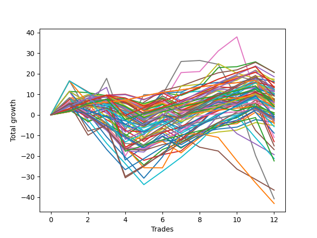

# Short Wallace 004 
- Symbol: TSLA_Unlimited
- Date Range: 03/23/2022 - 07/08/2022
- Trading Period: 7:20-12:30
- Number of Trades: 12



| Name | Win Percent | Profit | Avg Profit / Trade | Avg Time / Trade |      | Name | Win Percent | Profit | Avg Profit / Trade | Avg Time / Trade |
| ---- | ----------- | ------ | ------------------ | ---------------- | ---- | ---- | ----------- | ------ | ------------------ | ---------------- |
| Sorted By <br> Profit | | | | | | Sorted By <br> Win Percentage ||||
| Fifty-Seven | 83.33 | 10335.00 | 861.25 | 14:02 |     | One Hundred Twenty-Six | 91.67 | 3330.00 | 277.50 | 09:05 |
| Fifty-Four | 50.00 | 10280.00 | 856.67 | 23:27 |     | One Hundred Twenty-One | 91.67 | 3330.00 | 277.50 | 09:05 |
| One Hundred Ninteen | 66.67 | 9260.00 | 771.67 | 10:43 |     | Eighty-One | 91.67 | -2180.00 | -181.67 | 21:07 |
| Sixty | 66.67 | 8640.00 | 720.00 | 34:13 |     | Fifty-Seven | 83.33 | 10335.00 | 861.25 | 14:02 |
| Fifty | 58.33 | 8265.00 | 688.75 | 11:23 |     | One Hundred Twenty-Eight | 83.33 | 6680.00 | 556.67 | 14:12 |
| Seventy-Three | 66.67 | 8060.00 | 671.67 | 10:50 |     | One Hundred Twenty-Three | 83.33 | 6680.00 | 556.67 | 14:12 |
| Fifty-Three | 50.00 | 7790.00 | 649.17 | 20:00 |     | One | 83.33 | 2650.00 | 220.83 | 17:16 |
| One Hundred Eighteen | 75.00 | 7715.00 | 642.92 | 07:49 |     | One Hundred Sixteen | 83.33 | 2070.00 | 172.50 | 03:57 |
| Ninety-Eight | 66.67 | 6915.00 | 576.25 | 04:31 |     | One Hundred Twenty-Seven | 83.33 | 2010.00 | 167.50 | 12:50 |
| Fifty-Eight | 66.67 | 6860.00 | 571.67 | 19:40 |     | One Hundred Twenty-Two | 83.33 | 2010.00 | 167.50 | 12:50 |
| One Hundred Twenty-Eight | 83.33 | 6680.00 | 556.67 | 14:12 |     | Eighty-Four | 83.33 | -1545.00 | -128.75 | 38:25 |
| One Hundred Twenty-Three | 83.33 | 6680.00 | 556.67 | 14:12 |     | Eighty-Three | 83.33 | -6515.00 | -542.92 | 29:28 |
| One Hundred Twenty | 50.00 | 6555.00 | 546.25 | 12:32 |     | Eighty-Two | 83.33 | -11185.00 | -932.08 | 28:06 |
| Fifty-Two | 50.00 | 6210.00 | 517.50 | 16:57 |     | One Hundred Eighteen | 75.00 | 7715.00 | 642.92 | 07:49 |
| Forty-Nine | 66.67 | 6205.00 | 517.08 | 08:39 |     | Fifty-Six | 75.00 | 5810.00 | 484.17 | 08:01 |
| One Hundred Four | 58.33 | 6150.00 | 512.50 | 08:39 |     | One Hundred Twenty-Nine | 75.00 | 5740.00 | 478.33 | 17:49 |
| Sixty-Eight | 58.33 | 6040.00 | 503.33 | 27:00 |     | Sixty-Four | 75.00 | 3950.00 | 329.17 | 07:35 |
| One Hundred Three | 66.67 | 5995.00 | 499.58 | 05:29 |     | One Hundred Seventeen | 75.00 | 3545.00 | 295.42 | 06:27 |
| Four | 66.67 | 5820.00 | 485.00 | 40:37 |     | One Hundred Twenty-Four | 75.00 | 3355.00 | 279.58 | 22:37 |
| Fifty-Six | 75.00 | 5810.00 | 484.17 | 08:01 |     | Ninety-One | 75.00 | 2655.00 | 221.25 | 01:53 |
| One Hundred Twenty-Nine | 75.00 | 5740.00 | 478.33 | 17:49 |     | Ninety-Six | 75.00 | 1920.00 | 160.00 | 01:53 |
| Ninety-Nine | 66.67 | 5650.00 | 470.83 | 05:37 |     | One Hundred One | 75.00 | 1365.00 | 113.75 | 01:56 |
| Ninety-Three | 58.33 | 5265.00 | 438.75 | 04:52 |     | One Hundred Six | 75.00 | 510.00 | 42.50 | 01:59 |
| Fifty-One | 50.00 | 5245.00 | 437.08 | 13:24 |     | One Hundred Eleven | 75.00 | -1285.00 | -107.08 | 03:11 |
| Ninety-Four | 50.00 | 5175.00 | 431.25 | 07:42 |     | Zero | 75.00 | -1875.00 | -156.25 | 11:15 |
| Fifty-Nine | 66.67 | 5155.00 | 429.58 | 23:18 |     | Eighty-Five | 75.00 | -7535.00 | -627.92 | 56:20 |
| One Hundred Five | 50.00 | 4905.00 | 408.75 | 09:52 |     | One Hundred Ninteen | 66.67 | 9260.00 | 771.67 | 10:43 |
| One Hundred | 66.67 | 4680.00 | 390.00 | 05:49 |     | Sixty | 66.67 | 8640.00 | 720.00 | 34:13 |
| One Hundred Thirty | 66.67 | 4535.00 | 377.92 | 21:53 |     | Seventy-Three | 66.67 | 8060.00 | 671.67 | 10:50 |
| Sixty-Four | 75.00 | 3950.00 | 329.17 | 07:35 |     | Ninety-Eight | 66.67 | 6915.00 | 576.25 | 04:31 |
| Seventy | 41.67 | 3820.00 | 318.33 | 44:34 |     | Fifty-Eight | 66.67 | 6860.00 | 571.67 | 19:40 |
| One Hundred Eight | 58.33 | 3805.00 | 317.08 | 04:53 |     | Forty-Nine | 66.67 | 6205.00 | 517.08 | 08:39 |
| Forty-Eight | 66.67 | 3745.00 | 312.08 | 05:20 |     | One Hundred Three | 66.67 | 5995.00 | 499.58 | 05:29 |
| Ninety-Seven | 66.67 | 3600.00 | 300.00 | 03:23 |     | Four | 66.67 | 5820.00 | 485.00 | 40:37 |
| One Hundred Ten | 58.33 | 3600.00 | 300.00 | 08:07 |     | Ninety-Nine | 66.67 | 5650.00 | 470.83 | 05:37 |
| Fifty-Five | 50.00 | 3570.00 | 297.50 | 25:34 |     | Fifty-Nine | 66.67 | 5155.00 | 429.58 | 23:18 |
| One Hundred Seventeen | 75.00 | 3545.00 | 295.42 | 06:27 |     | One Hundred | 66.67 | 4680.00 | 390.00 | 05:49 |
| Ninety-Five | 41.67 | 3415.00 | 284.58 | 08:52 |     | One Hundred Thirty | 66.67 | 4535.00 | 377.92 | 21:53 |
| One Hundred Twenty-Four | 75.00 | 3355.00 | 279.58 | 22:37 |     | Forty-Eight | 66.67 | 3745.00 | 312.08 | 05:20 |
| One Hundred Twenty-Six | 91.67 | 3330.00 | 277.50 | 09:05 |     | Ninety-Seven | 66.67 | 3600.00 | 300.00 | 03:23 |
| One Hundred Twenty-One | 91.67 | 3330.00 | 277.50 | 09:05 |     | Sixty-Five | 66.67 | 3110.00 | 259.17 | 12:57 |
| Sixty-Six | 58.33 | 3255.00 | 271.25 | 16:32 |     | One Hundred Thirteen | 66.67 | 2510.00 | 209.17 | 06:46 |
| Sixty-Nine | 50.00 | 3200.00 | 266.67 | 34:28 |     | One Hundred Two | 66.67 | 2305.00 | 192.08 | 04:12 |
| Sixty-Five | 66.67 | 3110.00 | 259.17 | 12:57 |     | Two | 66.67 | 85.00 | 7.08 | 24:55 |
| One Hundred Nine | 58.33 | 2980.00 | 248.33 | 07:08 |     | One Hundred Twenty-Five | 66.67 | -365.00 | -30.42 | 31:32 |
| Ninety-One | 75.00 | 2655.00 | 221.25 | 01:53 |     | Three | 66.67 | -410.00 | -34.17 | 28:52 |
| One | 83.33 | 2650.00 | 220.83 | 17:16 |     | One Hundred Twelve | 66.67 | -1180.00 | -98.33 | 05:30 |
| One Hundred Thirteen | 66.67 | 2510.00 | 209.17 | 06:46 |     | Six | 66.67 | -5470.00 | -455.83 | 121:55 |
| One Hundred Two | 66.67 | 2305.00 | 192.08 | 04:12 |     | Five | 66.67 | -8430.00 | -702.50 | 76:40 |
| One Hundred Sixteen | 83.33 | 2070.00 | 172.50 | 03:57 |     | Fifty | 58.33 | 8265.00 | 688.75 | 11:23 |
| Sixty-Seven | 58.33 | 2020.00 | 168.33 | 19:26 |     | One Hundred Four | 58.33 | 6150.00 | 512.50 | 08:39 |
| One Hundred Twenty-Seven | 83.33 | 2010.00 | 167.50 | 12:50 |     | Sixty-Eight | 58.33 | 6040.00 | 503.33 | 27:00 |
| One Hundred Twenty-Two | 83.33 | 2010.00 | 167.50 | 12:50 |     | Ninety-Three | 58.33 | 5265.00 | 438.75 | 04:52 |
| Ninety-Two | 58.33 | 1950.00 | 162.50 | 03:45 |     | One Hundred Eight | 58.33 | 3805.00 | 317.08 | 04:53 |
| Ninety-Six | 75.00 | 1920.00 | 160.00 | 01:53 |     | One Hundred Ten | 58.33 | 3600.00 | 300.00 | 08:07 |
| One Hundred Fourteen | 58.33 | 1560.00 | 130.00 | 10:16 |     | Sixty-Six | 58.33 | 3255.00 | 271.25 | 16:32 |
| One Hundred One | 75.00 | 1365.00 | 113.75 | 01:56 |     | One Hundred Nine | 58.33 | 2980.00 | 248.33 | 07:08 |
| One Hundred Six | 75.00 | 510.00 | 42.50 | 01:59 |     | Sixty-Seven | 58.33 | 2020.00 | 168.33 | 19:26 |
| One Hundred Seven | 58.33 | 490.00 | 40.83 | 03:45 |     | Ninety-Two | 58.33 | 1950.00 | 162.50 | 03:45 |
| Forty-Four | 50.00 | 125.00 | 10.42 | 19:23 |     | One Hundred Fourteen | 58.33 | 1560.00 | 130.00 | 10:16 |
| Two | 66.67 | 85.00 | 7.08 | 24:55 |     | One Hundred Seven | 58.33 | 490.00 | 40.83 | 03:45 |
| One Hundred Twenty-Five | 66.67 | -365.00 | -30.42 | 31:32 |     | Forty-One | 58.33 | -845.00 | -70.42 | 08:20 |
| Three | 66.67 | -410.00 | -34.17 | 28:52 |     | Forty | 58.33 | -2600.00 | -216.67 | 05:15 |
| One Hundred Fifteen | 50.00 | -660.00 | -55.00 | 12:05 |     | Fifty-Four | 50.00 | 10280.00 | 856.67 | 23:27 |
| Forty-One | 58.33 | -845.00 | -70.42 | 08:20 |     | Fifty-Three | 50.00 | 7790.00 | 649.17 | 20:00 |
| Forty-Five | 41.67 | -1015.00 | -84.58 | 24:30 |     | One Hundred Twenty | 50.00 | 6555.00 | 546.25 | 12:32 |
| One Hundred Twelve | 66.67 | -1180.00 | -98.33 | 05:30 |     | Fifty-Two | 50.00 | 6210.00 | 517.50 | 16:57 |
| One Hundred Eleven | 75.00 | -1285.00 | -107.08 | 03:11 |     | Fifty-One | 50.00 | 5245.00 | 437.08 | 13:24 |
| Forty-Two | 50.00 | -1435.00 | -119.58 | 11:39 |     | Ninety-Four | 50.00 | 5175.00 | 431.25 | 07:42 |
| Eighty-Four | 83.33 | -1545.00 | -128.75 | 38:25 |     | One Hundred Five | 50.00 | 4905.00 | 408.75 | 09:52 |
| Zero | 75.00 | -1875.00 | -156.25 | 11:15 |     | Fifty-Five | 50.00 | 3570.00 | 297.50 | 25:34 |
| Forty-Three | 50.00 | -1970.00 | -164.17 | 12:57 |     | Sixty-Nine | 50.00 | 3200.00 | 266.67 | 34:28 |
| Eighty-One | 91.67 | -2180.00 | -181.67 | 21:07 |     | Forty-Four | 50.00 | 125.00 | 10.42 | 19:23 |
| Forty | 58.33 | -2600.00 | -216.67 | 05:15 |     | One Hundred Fifteen | 50.00 | -660.00 | -55.00 | 12:05 |
| Seventy-One | 33.33 | -2860.00 | -238.33 | 78:26 |     | Forty-Two | 50.00 | -1435.00 | -119.58 | 11:39 |
| Sixty-Two | 50.00 | -4425.00 | -368.75 | 72:53 |     | Forty-Three | 50.00 | -1970.00 | -164.17 | 12:57 |
| Six | 66.67 | -5470.00 | -455.83 | 121:55 |     | Sixty-Two | 50.00 | -4425.00 | -368.75 | 72:53 |
| Eighty-Three | 83.33 | -6515.00 | -542.92 | 29:28 |     | Sixty-One | 50.00 | -10600.00 | -883.33 | 46:12 |
| Eighty-Five | 75.00 | -7535.00 | -627.92 | 56:20 |     | Seventy | 41.67 | 3820.00 | 318.33 | 44:34 |
| Five | 66.67 | -8430.00 | -702.50 | 76:40 |     | Ninety-Five | 41.67 | 3415.00 | 284.58 | 08:52 |
| Forty-Six | 25.00 | -9660.00 | -805.00 | 39:17 |     | Forty-Five | 41.67 | -1015.00 | -84.58 | 24:30 |
| Sixty-One | 50.00 | -10600.00 | -883.33 | 46:12 |     | Seven | 41.67 | -20375.00 | -1697.92 | 212:59 |
| Eighty-Two | 83.33 | -11185.00 | -932.08 | 28:06 |     | Seventy-One | 33.33 | -2860.00 | -238.33 | 78:26 |
| Forty-Seven | 8.33 | -18265.00 | -1522.08 | 85:04 |     | Forty-Six | 25.00 | -9660.00 | -805.00 | 39:17 |
| Seven | 41.67 | -20375.00 | -1697.92 | 212:59 |     | Sixty-Three | 25.00 | -21515.00 | -1792.92 | 137:00 |
| Sixty-Three | 25.00 | -21515.00 | -1792.92 | 137:00 |     | Forty-Seven | 8.33 | -18265.00 | -1522.08 | 85:04 |

## NO STOPLOSS

### Test Zero
* Sell when price hits the middle line of the 20p bollinger
* No Stoploss
* Results:
```
Total Trades: 12
Percent Up: 25.00
Percent Down: 75.00
Total Points Moved Down: -3.75
Potential Profit: -1875.00
Total Points Ups: 28.60 Count Ups: 3
Total Points Downs: 24.85 Count Downs: 9
```

<details><summary>Trades</summary>

<code>In: 2022-04-01 07:54:00		Out: 2022-04-01 08:01:10		Total Position Time: 07:10		Total Move Down: 2.38		Total to Date: 2.38</code> <br />
<code>In: 2022-04-28 09:50:00		Out: 2022-04-28 10:06:10		Total Position Time: 16:10		Total Move Down: -1.90		Total to Date: 0.48</code> <br />
<code>In: 2022-05-04 09:42:00		Out: 2022-05-04 09:47:00		Total Position Time: 05:00		Total Move Down: 2.82		Total to Date: 3.30</code> <br />
<code>In: 2022-05-04 11:50:00		Out: 2022-05-04 12:47:00		Total Position Time: 57:00		Total Move Down: -25.23		Total to Date: -21.93</code> <br />
<code>In: 2022-05-12 07:28:00		Out: 2022-05-12 07:34:05		Total Position Time: 06:05		Total Move Down: 6.36		Total to Date: -15.57</code> <br />
<code>In: 2022-05-17 11:11:00		Out: 2022-05-17 11:12:15		Total Position Time: 01:15		Total Move Down: 2.77		Total to Date: -12.80</code> <br />
<code>In: 2022-05-19 08:40:00		Out: 2022-05-19 08:50:45		Total Position Time: 10:45		Total Move Down: 0.77		Total to Date: -12.03</code> <br />
<code>In: 2022-05-25 08:17:00		Out: 2022-05-25 08:20:55		Total Position Time: 03:55		Total Move Down: 3.59		Total to Date: -8.44</code> <br />
<code>In: 2022-06-07 07:52:00		Out: 2022-06-07 07:58:40		Total Position Time: 06:40		Total Move Down: 1.57		Total to Date: -6.87</code> <br />
<code>In: 2022-06-15 09:35:00		Out: 2022-06-15 09:36:10		Total Position Time: 01:10		Total Move Down: 0.92		Total to Date: -5.95</code> <br />
<code>In: 2022-07-05 07:44:00		Out: 2022-07-05 07:52:35		Total Position Time: 08:35		Total Move Down: 3.67		Total to Date: -2.28</code> <br />
<code>In: 2022-07-05 09:04:00		Out: 2022-07-05 09:15:15		Total Position Time: 11:15		Total Move Down: -1.47		Total to Date: -3.75</code> <br />


</details>

### Test One
* Sell when the price hits the upper line of the 20p 1std bollinger
* No Stoploss
* Results:
```
Total Trades: 12
Percent Up: 16.67
Percent Down: 83.33
Total Points Moved Down: 5.30
Potential Profit: 2650.00
Total Points Ups: 30.05 Count Ups: 2
Total Points Downs: 35.35 Count Downs: 10
```

<details><summary>Trades</summary>

<code>In: 2022-04-01 07:54:00		Out: 2022-04-01 08:02:45		Total Position Time: 08:45		Total Move Down: 4.16		Total to Date: 4.16</code> <br />
<code>In: 2022-04-28 09:50:00		Out: 2022-04-28 10:08:55		Total Position Time: 18:55		Total Move Down: 1.46		Total to Date: 5.62</code> <br />
<code>In: 2022-05-04 09:42:00		Out: 2022-05-04 09:51:10		Total Position Time: 09:10		Total Move Down: 3.64		Total to Date: 9.26</code> <br />
<code>In: 2022-05-04 11:50:00		Out: 2022-05-04 12:47:00		Total Position Time: 57:00		Total Move Down: -25.23		Total to Date: -15.97</code> <br />
<code>In: 2022-05-12 07:28:00		Out: 2022-05-12 07:44:25		Total Position Time: 16:25		Total Move Down: 6.74		Total to Date: -9.23</code> <br />
<code>In: 2022-05-17 11:11:00		Out: 2022-05-17 11:13:15		Total Position Time: 02:15		Total Move Down: 5.66		Total to Date: -3.57</code> <br />
<code>In: 2022-05-19 08:40:00		Out: 2022-05-19 08:53:35		Total Position Time: 13:35		Total Move Down: 2.18		Total to Date: -1.39</code> <br />
<code>In: 2022-05-25 08:17:00		Out: 2022-05-25 08:29:55		Total Position Time: 12:55		Total Move Down: 3.33		Total to Date: 1.94</code> <br />
<code>In: 2022-06-07 07:52:00		Out: 2022-06-07 08:04:40		Total Position Time: 12:40		Total Move Down: 3.13		Total to Date: 5.07</code> <br />
<code>In: 2022-06-15 09:35:00		Out: 2022-06-15 09:39:45		Total Position Time: 04:45		Total Move Down: 1.39		Total to Date: 6.46</code> <br />
<code>In: 2022-07-05 07:44:00		Out: 2022-07-05 07:57:05		Total Position Time: 13:05		Total Move Down: 3.66		Total to Date: 10.12</code> <br />
<code>In: 2022-07-05 09:04:00		Out: 2022-07-05 09:41:50		Total Position Time: 37:50		Total Move Down: -4.82		Total to Date: 5.30</code> <br />


</details>

### Test Two
* Sell when the price hits the upper line of the 20p 2std bollinger
* No Stoploss
* Results:
```
Total Trades: 12
Percent Up: 33.33
Percent Down: 66.67
Total Points Moved Down: 0.17
Potential Profit: 85.00
Total Points Ups: 37.11 Count Ups: 4
Total Points Downs: 37.28 Count Downs: 8
```

<details><summary>Trades</summary>

<code>In: 2022-04-01 07:54:00		Out: 2022-04-01 08:07:00		Total Position Time: 13:00		Total Move Down: 4.74		Total to Date: 4.74</code> <br />
<code>In: 2022-04-28 09:50:00		Out: 2022-04-28 10:09:15		Total Position Time: 19:15		Total Move Down: 4.58		Total to Date: 9.32</code> <br />
<code>In: 2022-05-04 09:42:00		Out: 2022-05-04 10:18:30		Total Position Time: 36:30		Total Move Down: -0.09		Total to Date: 9.23</code> <br />
<code>In: 2022-05-04 11:50:00		Out: 2022-05-04 12:47:00		Total Position Time: 57:00		Total Move Down: -25.23		Total to Date: -16.00</code> <br />
<code>In: 2022-05-12 07:28:00		Out: 2022-05-12 08:17:40		Total Position Time: 49:40		Total Move Down: -8.38		Total to Date: -24.38</code> <br />
<code>In: 2022-05-17 11:11:00		Out: 2022-05-17 11:13:30		Total Position Time: 02:30		Total Move Down: 7.55		Total to Date: -16.83</code> <br />
<code>In: 2022-05-19 08:40:00		Out: 2022-05-19 08:54:35		Total Position Time: 14:35		Total Move Down: 3.57		Total to Date: -13.26</code> <br />
<code>In: 2022-05-25 08:17:00		Out: 2022-05-25 08:30:40		Total Position Time: 13:40		Total Move Down: 5.11		Total to Date: -8.15</code> <br />
<code>In: 2022-06-07 07:52:00		Out: 2022-06-07 08:04:50		Total Position Time: 12:50		Total Move Down: 4.42		Total to Date: -3.73</code> <br />
<code>In: 2022-06-15 09:35:00		Out: 2022-06-15 09:53:25		Total Position Time: 18:25		Total Move Down: 2.39		Total to Date: -1.34</code> <br />
<code>In: 2022-07-05 07:44:00		Out: 2022-07-05 08:05:55		Total Position Time: 21:55		Total Move Down: 4.92		Total to Date: 3.58</code> <br />
<code>In: 2022-07-05 09:04:00		Out: 2022-07-05 09:43:40		Total Position Time: 39:40		Total Move Down: -3.41		Total to Date: 0.17</code> <br />


</details>

### Test Three
* Sell when price hits the middle line of the 50p bollinger
* No Stoploss
* Results:
```
Total Trades: 12
Percent Up: 33.33
Percent Down: 66.67
Total Points Moved Down: -0.82
Potential Profit: -410.00
Total Points Ups: 34.34 Count Ups: 4
Total Points Downs: 33.52 Count Downs: 8
```

<details><summary>Trades</summary>

<code>In: 2022-04-01 07:54:00		Out: 2022-04-01 08:13:40		Total Position Time: 19:40		Total Move Down: 5.56		Total to Date: 5.56</code> <br />
<code>In: 2022-04-28 09:50:00		Out: 2022-04-28 10:18:05		Total Position Time: 28:05		Total Move Down: 3.64		Total to Date: 9.20</code> <br />
<code>In: 2022-05-04 09:42:00		Out: 2022-05-04 10:18:30		Total Position Time: 36:30		Total Move Down: -0.09		Total to Date: 9.11</code> <br />
<code>In: 2022-05-04 11:50:00		Out: 2022-05-04 12:47:00		Total Position Time: 57:00		Total Move Down: -25.23		Total to Date: -16.12</code> <br />
<code>In: 2022-05-12 07:28:00		Out: 2022-05-12 08:21:35		Total Position Time: 53:35		Total Move Down: -5.96		Total to Date: -22.08</code> <br />
<code>In: 2022-05-17 11:11:00		Out: 2022-05-17 11:12:15		Total Position Time: 01:15		Total Move Down: 2.77		Total to Date: -19.31</code> <br />
<code>In: 2022-05-19 08:40:00		Out: 2022-05-19 09:12:15		Total Position Time: 32:15		Total Move Down: 1.82		Total to Date: -17.49</code> <br />
<code>In: 2022-05-25 08:17:00		Out: 2022-05-25 08:34:25		Total Position Time: 17:25		Total Move Down: 7.50		Total to Date: -9.99</code> <br />
<code>In: 2022-06-07 07:52:00		Out: 2022-06-07 08:06:25		Total Position Time: 14:25		Total Move Down: 5.84		Total to Date: -4.15</code> <br />
<code>In: 2022-06-15 09:35:00		Out: 2022-06-15 09:53:05		Total Position Time: 18:05		Total Move Down: 0.84		Total to Date: -3.31</code> <br />
<code>In: 2022-07-05 07:44:00		Out: 2022-07-05 08:11:10		Total Position Time: 27:10		Total Move Down: 5.55		Total to Date: 2.24</code> <br />
<code>In: 2022-07-05 09:04:00		Out: 2022-07-05 09:45:05		Total Position Time: 41:05		Total Move Down: -3.06		Total to Date: -0.82</code> <br />


</details>

### Test Four
* Sell when the price hits the upper line of the 50p 1std bollinger
* No Stoploss
* Results:
```
Total Trades: 12
Percent Up: 33.33
Percent Down: 66.67
Total Points Moved Down: 11.64
Potential Profit: 5820.00
Total Points Ups: 28.34 Count Ups: 4
Total Points Downs: 39.98 Count Downs: 8
```

<details><summary>Trades</summary>

<code>In: 2022-04-01 07:54:00		Out: 2022-04-01 08:20:05		Total Position Time: 26:05		Total Move Down: 6.39		Total to Date: 6.39</code> <br />
<code>In: 2022-04-28 09:50:00		Out: 2022-04-28 10:30:55		Total Position Time: 40:55		Total Move Down: 3.49		Total to Date: 9.88</code> <br />
<code>In: 2022-05-04 09:42:00		Out: 2022-05-04 10:45:50		Total Position Time: 63:50		Total Move Down: -1.01		Total to Date: 8.87</code> <br />
<code>In: 2022-05-04 11:50:00		Out: 2022-05-04 12:47:00		Total Position Time: 57:00		Total Move Down: -25.23		Total to Date: -16.36</code> <br />
<code>In: 2022-05-12 07:28:00		Out: 2022-05-12 08:31:35		Total Position Time: 63:35		Total Move Down: -0.47		Total to Date: -16.83</code> <br />
<code>In: 2022-05-17 11:11:00		Out: 2022-05-17 11:12:55		Total Position Time: 01:55		Total Move Down: 4.25		Total to Date: -12.58</code> <br />
<code>In: 2022-05-19 08:40:00		Out: 2022-05-19 09:19:50		Total Position Time: 39:50		Total Move Down: 4.24		Total to Date: -8.34</code> <br />
<code>In: 2022-05-25 08:17:00		Out: 2022-05-25 09:18:40		Total Position Time: 61:40		Total Move Down: 5.78		Total to Date: -2.56</code> <br />
<code>In: 2022-06-07 07:52:00		Out: 2022-06-07 08:18:55		Total Position Time: 26:55		Total Move Down: 6.56		Total to Date: 4.00</code> <br />
<code>In: 2022-06-15 09:35:00		Out: 2022-06-15 09:53:25		Total Position Time: 18:25		Total Move Down: 2.39		Total to Date: 6.39</code> <br />
<code>In: 2022-07-05 07:44:00		Out: 2022-07-05 08:24:10		Total Position Time: 40:10		Total Move Down: 6.88		Total to Date: 13.27</code> <br />
<code>In: 2022-07-05 09:04:00		Out: 2022-07-05 09:51:05		Total Position Time: 47:05		Total Move Down: -1.63		Total to Date: 11.64</code> <br />


</details>

### Test Five
* Sell when the price hits the upper line of the 50p 2std bollinger
* No Stoploss
* Results:
```
Total Trades: 12
Percent Up: 33.33
Percent Down: 66.67
Total Points Moved Down: -16.86
Potential Profit: -8430.00
Total Points Ups: 66.67 Count Ups: 4
Total Points Downs: 49.81 Count Downs: 8
```

<details><summary>Trades</summary>

<code>In: 2022-04-01 07:54:00		Out: 2022-04-01 08:33:30		Total Position Time: 39:30		Total Move Down: 8.28		Total to Date: 8.28</code> <br />
<code>In: 2022-04-28 09:50:00		Out: 2022-04-28 12:29:40		Total Position Time: 159:40		Total Move Down: -16.18		Total to Date: -7.90</code> <br />
<code>In: 2022-05-04 09:42:00		Out: 2022-05-04 11:07:20		Total Position Time: 85:20		Total Move Down: 2.57		Total to Date: -5.33</code> <br />
<code>In: 2022-05-04 11:50:00		Out: 2022-05-04 12:47:00		Total Position Time: 57:00		Total Move Down: -25.23		Total to Date: -30.56</code> <br />
<code>In: 2022-05-12 07:28:00		Out: 2022-05-12 08:34:45		Total Position Time: 66:45		Total Move Down: 5.53		Total to Date: -25.03</code> <br />
<code>In: 2022-05-17 11:11:00		Out: 2022-05-17 11:13:25		Total Position Time: 02:25		Total Move Down: 6.49		Total to Date: -18.54</code> <br />
<code>In: 2022-05-19 08:40:00		Out: 2022-05-19 09:20:40		Total Position Time: 40:40		Total Move Down: 6.73		Total to Date: -11.81</code> <br />
<code>In: 2022-05-25 08:17:00		Out: 2022-05-25 09:22:05		Total Position Time: 65:05		Total Move Down: 7.73		Total to Date: -4.08</code> <br />
<code>In: 2022-06-07 07:52:00		Out: 2022-06-07 08:30:10		Total Position Time: 38:10		Total Move Down: 8.91		Total to Date: 4.83</code> <br />
<code>In: 2022-06-15 09:35:00		Out: 2022-06-15 09:55:20		Total Position Time: 20:20		Total Move Down: 3.57		Total to Date: 8.40</code> <br />
<code>In: 2022-07-05 07:44:00		Out: 2022-07-05 11:16:35		Total Position Time: 212:35		Total Move Down: -15.96		Total to Date: -7.56</code> <br />
<code>In: 2022-07-05 09:04:00		Out: 2022-07-05 11:16:35		Total Position Time: 132:35		Total Move Down: -9.30		Total to Date: -16.86</code> <br />


</details>

### Test Six
* Sell when the price hits the middle line of the 1std VWAP
* No Stoploss
* Results:
```
Total Trades: 12
Percent Up: 33.33
Percent Down: 66.67
Total Points Moved Down: -10.94
Potential Profit: -5470.00
Total Points Ups: 89.22 Count Ups: 4
Total Points Downs: 78.28 Count Downs: 8
```

<details><summary>Trades</summary>

<code>In: 2022-04-01 07:54:00		Out: 2022-04-01 08:37:10		Total Position Time: 43:10		Total Move Down: 11.41		Total to Date: 11.41</code> <br />
<code>In: 2022-04-28 09:50:00		Out: 2022-04-28 12:47:00		Total Position Time: 177:00		Total Move Down: -15.19		Total to Date: -3.78</code> <br />
<code>In: 2022-05-04 09:42:00		Out: 2022-05-04 11:07:40		Total Position Time: 85:40		Total Move Down: 8.94		Total to Date: 5.16</code> <br />
<code>In: 2022-05-04 11:50:00		Out: 2022-05-04 12:47:00		Total Position Time: 57:00		Total Move Down: -25.23		Total to Date: -20.07</code> <br />
<code>In: 2022-05-12 07:28:00		Out: 2022-05-12 08:59:00		Total Position Time: 91:00		Total Move Down: 15.28		Total to Date: -4.79</code> <br />
<code>In: 2022-05-17 11:11:00		Out: 2022-05-17 11:15:15		Total Position Time: 04:15		Total Move Down: 10.37		Total to Date: 5.58</code> <br />
<code>In: 2022-05-19 08:40:00		Out: 2022-05-19 09:41:25		Total Position Time: 61:25		Total Move Down: 14.95		Total to Date: 20.53</code> <br />
<code>In: 2022-05-25 08:17:00		Out: 2022-05-25 12:47:00		Total Position Time: 270:00		Total Move Down: 0.50		Total to Date: 21.03</code> <br />
<code>In: 2022-06-07 07:52:00		Out: 2022-06-07 08:50:05		Total Position Time: 58:05		Total Move Down: 10.01		Total to Date: 31.04</code> <br />
<code>In: 2022-06-15 09:35:00		Out: 2022-06-15 11:04:30		Total Position Time: 89:30		Total Move Down: 6.82		Total to Date: 37.86</code> <br />
<code>In: 2022-07-05 07:44:00		Out: 2022-07-05 12:47:00		Total Position Time: 303:00		Total Move Down: -27.73		Total to Date: 10.13</code> <br />
<code>In: 2022-07-05 09:04:00		Out: 2022-07-05 12:47:00		Total Position Time: 223:00		Total Move Down: -21.07		Total to Date: -10.94</code> <br />


</details>

### Test Seven
* Sell when the price hits the upper line of the 1std VWAP
* No Stoploss
* Results:
```
Total Trades: 12
Percent Up: 58.33
Percent Down: 41.67
Total Points Moved Down: -40.75
Potential Profit: -20375.00
Total Points Ups: 107.61 Count Ups: 7
Total Points Downs: 66.86 Count Downs: 5
```

<details><summary>Trades</summary>

<code>In: 2022-04-01 07:54:00		Out: 2022-04-01 12:17:50		Total Position Time: 263:50		Total Move Down: 16.48		Total to Date: 16.48</code> <br />
<code>In: 2022-04-28 09:50:00		Out: 2022-04-28 12:47:00		Total Position Time: 177:00		Total Move Down: -15.19		Total to Date: 1.29</code> <br />
<code>In: 2022-05-04 09:42:00		Out: 2022-05-04 11:35:05		Total Position Time: 113:05		Total Move Down: 16.44		Total to Date: 17.73</code> <br />
<code>In: 2022-05-04 11:50:00		Out: 2022-05-04 12:47:00		Total Position Time: 57:00		Total Move Down: -25.23		Total to Date: -7.50</code> <br />
<code>In: 2022-05-12 07:28:00		Out: 2022-05-12 12:47:00		Total Position Time: 319:00		Total Move Down: 17.32		Total to Date: 9.82</code> <br />
<code>In: 2022-05-17 11:11:00		Out: 2022-05-17 12:47:00		Total Position Time: 96:00		Total Move Down: -0.03		Total to Date: 9.79</code> <br />
<code>In: 2022-05-19 08:40:00		Out: 2022-05-19 12:47:00		Total Position Time: 247:00		Total Move Down: 16.12		Total to Date: 25.91</code> <br />
<code>In: 2022-05-25 08:17:00		Out: 2022-05-25 12:47:00		Total Position Time: 270:00		Total Move Down: 0.50		Total to Date: 26.41</code> <br />
<code>In: 2022-06-07 07:52:00		Out: 2022-06-07 12:47:00		Total Position Time: 295:00		Total Move Down: -1.87		Total to Date: 24.54</code> <br />
<code>In: 2022-06-15 09:35:00		Out: 2022-06-15 12:47:00		Total Position Time: 192:00		Total Move Down: -16.49		Total to Date: 8.05</code> <br />
<code>In: 2022-07-05 07:44:00		Out: 2022-07-05 12:47:00		Total Position Time: 303:00		Total Move Down: -27.73		Total to Date: -19.68</code> <br />
<code>In: 2022-07-05 09:04:00		Out: 2022-07-05 12:47:00		Total Position Time: 223:00		Total Move Down: -21.07		Total to Date: -40.75</code> <br />


</details>

## STOPLOSS OF 5

### Test Forty
* Sell when price hits the middle line of the 20p bollinger
* Stoploss is -5 points
* Results:
```
Total Trades: 12
Percent Up: 41.67
Percent Down: 58.33
Total Points Moved Down: -5.20
Potential Profit: -2600.00
Total Points Ups: 22.92 Count Ups: 5
Total Points Downs: 17.72 Count Downs: 7
```

<details><summary>Trades</summary>

<code>In: 2022-04-01 07:54:00		Out: 2022-04-01 08:01:10		Total Position Time: 07:10		Total Move Down: 2.38		Total to Date: 2.38</code> <br />
<code>In: 2022-04-28 09:50:00		Out: 2022-04-28 10:00:50		Total Position Time: 10:50		Total Move Down: -5.30		Total to Date: -2.92</code> <br />
<code>In: 2022-05-04 09:42:00		Out: 2022-05-04 09:47:00		Total Position Time: 05:00		Total Move Down: 2.82		Total to Date: -0.10</code> <br />
<code>In: 2022-05-04 11:50:00		Out: 2022-05-04 11:53:40		Total Position Time: 03:40		Total Move Down: -5.16		Total to Date: -5.26</code> <br />
<code>In: 2022-05-12 07:28:00		Out: 2022-05-12 07:30:00		Total Position Time: 02:00		Total Move Down: -5.39		Total to Date: -10.65</code> <br />
<code>In: 2022-05-17 11:11:00		Out: 2022-05-17 11:12:15		Total Position Time: 01:15		Total Move Down: 2.77		Total to Date: -7.88</code> <br />
<code>In: 2022-05-19 08:40:00		Out: 2022-05-19 08:41:35		Total Position Time: 01:35		Total Move Down: -5.60		Total to Date: -13.48</code> <br />
<code>In: 2022-05-25 08:17:00		Out: 2022-05-25 08:20:55		Total Position Time: 03:55		Total Move Down: 3.59		Total to Date: -9.89</code> <br />
<code>In: 2022-06-07 07:52:00		Out: 2022-06-07 07:58:40		Total Position Time: 06:40		Total Move Down: 1.57		Total to Date: -8.32</code> <br />
<code>In: 2022-06-15 09:35:00		Out: 2022-06-15 09:36:10		Total Position Time: 01:10		Total Move Down: 0.92		Total to Date: -7.40</code> <br />
<code>In: 2022-07-05 07:44:00		Out: 2022-07-05 07:52:35		Total Position Time: 08:35		Total Move Down: 3.67		Total to Date: -3.73</code> <br />
<code>In: 2022-07-05 09:04:00		Out: 2022-07-05 09:15:15		Total Position Time: 11:15		Total Move Down: -1.47		Total to Date: -5.20</code> <br />


</details>

### Test Forty-One
* Sell when the price hits the upper line of the 20p 1std bollinger
* Stoploss is -5 points
* Results:
```
Total Trades: 12
Percent Up: 41.67
Percent Down: 58.33
Total Points Moved Down: -1.69
Potential Profit: -845.00
Total Points Ups: 26.66 Count Ups: 5
Total Points Downs: 24.97 Count Downs: 7
```

<details><summary>Trades</summary>

<code>In: 2022-04-01 07:54:00		Out: 2022-04-01 08:02:45		Total Position Time: 08:45		Total Move Down: 4.16		Total to Date: 4.16</code> <br />
<code>In: 2022-04-28 09:50:00		Out: 2022-04-28 10:00:50		Total Position Time: 10:50		Total Move Down: -5.30		Total to Date: -1.14</code> <br />
<code>In: 2022-05-04 09:42:00		Out: 2022-05-04 09:51:10		Total Position Time: 09:10		Total Move Down: 3.64		Total to Date: 2.50</code> <br />
<code>In: 2022-05-04 11:50:00		Out: 2022-05-04 11:53:40		Total Position Time: 03:40		Total Move Down: -5.16		Total to Date: -2.66</code> <br />
<code>In: 2022-05-12 07:28:00		Out: 2022-05-12 07:30:00		Total Position Time: 02:00		Total Move Down: -5.39		Total to Date: -8.05</code> <br />
<code>In: 2022-05-17 11:11:00		Out: 2022-05-17 11:13:15		Total Position Time: 02:15		Total Move Down: 5.66		Total to Date: -2.39</code> <br />
<code>In: 2022-05-19 08:40:00		Out: 2022-05-19 08:41:35		Total Position Time: 01:35		Total Move Down: -5.60		Total to Date: -7.99</code> <br />
<code>In: 2022-05-25 08:17:00		Out: 2022-05-25 08:29:55		Total Position Time: 12:55		Total Move Down: 3.33		Total to Date: -4.66</code> <br />
<code>In: 2022-06-07 07:52:00		Out: 2022-06-07 08:04:40		Total Position Time: 12:40		Total Move Down: 3.13		Total to Date: -1.53</code> <br />
<code>In: 2022-06-15 09:35:00		Out: 2022-06-15 09:39:45		Total Position Time: 04:45		Total Move Down: 1.39		Total to Date: -0.14</code> <br />
<code>In: 2022-07-05 07:44:00		Out: 2022-07-05 07:57:05		Total Position Time: 13:05		Total Move Down: 3.66		Total to Date: 3.52</code> <br />
<code>In: 2022-07-05 09:04:00		Out: 2022-07-05 09:22:20		Total Position Time: 18:20		Total Move Down: -5.21		Total to Date: -1.69</code> <br />


</details>

### Test Forty-Two
* Sell when the price hits the upper line of the 20p 2std bollinger
* Stoploss is -5 points
* Results:
```
Total Trades: 12
Percent Up: 50.00
Percent Down: 50.00
Total Points Moved Down: -2.87
Potential Profit: -1435.00
Total Points Ups: 32.00 Count Ups: 6
Total Points Downs: 29.13 Count Downs: 6
```

<details><summary>Trades</summary>

<code>In: 2022-04-01 07:54:00		Out: 2022-04-01 08:07:00		Total Position Time: 13:00		Total Move Down: 4.74		Total to Date: 4.74</code> <br />
<code>In: 2022-04-28 09:50:00		Out: 2022-04-28 10:00:50		Total Position Time: 10:50		Total Move Down: -5.30		Total to Date: -0.56</code> <br />
<code>In: 2022-05-04 09:42:00		Out: 2022-05-04 10:03:05		Total Position Time: 21:05		Total Move Down: -5.34		Total to Date: -5.90</code> <br />
<code>In: 2022-05-04 11:50:00		Out: 2022-05-04 11:53:40		Total Position Time: 03:40		Total Move Down: -5.16		Total to Date: -11.06</code> <br />
<code>In: 2022-05-12 07:28:00		Out: 2022-05-12 07:30:00		Total Position Time: 02:00		Total Move Down: -5.39		Total to Date: -16.45</code> <br />
<code>In: 2022-05-17 11:11:00		Out: 2022-05-17 11:13:30		Total Position Time: 02:30		Total Move Down: 7.55		Total to Date: -8.90</code> <br />
<code>In: 2022-05-19 08:40:00		Out: 2022-05-19 08:41:35		Total Position Time: 01:35		Total Move Down: -5.60		Total to Date: -14.50</code> <br />
<code>In: 2022-05-25 08:17:00		Out: 2022-05-25 08:30:40		Total Position Time: 13:40		Total Move Down: 5.11		Total to Date: -9.39</code> <br />
<code>In: 2022-06-07 07:52:00		Out: 2022-06-07 08:04:50		Total Position Time: 12:50		Total Move Down: 4.42		Total to Date: -4.97</code> <br />
<code>In: 2022-06-15 09:35:00		Out: 2022-06-15 09:53:25		Total Position Time: 18:25		Total Move Down: 2.39		Total to Date: -2.58</code> <br />
<code>In: 2022-07-05 07:44:00		Out: 2022-07-05 08:05:55		Total Position Time: 21:55		Total Move Down: 4.92		Total to Date: 2.34</code> <br />
<code>In: 2022-07-05 09:04:00		Out: 2022-07-05 09:22:20		Total Position Time: 18:20		Total Move Down: -5.21		Total to Date: -2.87</code> <br />


</details>

### Test Forty-Three
* Sell when price hits the middle line of the 50p bollinger
* Stoploss is -5 points
* Results:
```
Total Trades: 12
Percent Up: 50.00
Percent Down: 50.00
Total Points Moved Down: -3.94
Potential Profit: -1970.00
Total Points Ups: 32.00 Count Ups: 6
Total Points Downs: 28.06 Count Downs: 6
```

<details><summary>Trades</summary>

<code>In: 2022-04-01 07:54:00		Out: 2022-04-01 08:13:40		Total Position Time: 19:40		Total Move Down: 5.56		Total to Date: 5.56</code> <br />
<code>In: 2022-04-28 09:50:00		Out: 2022-04-28 10:00:50		Total Position Time: 10:50		Total Move Down: -5.30		Total to Date: 0.26</code> <br />
<code>In: 2022-05-04 09:42:00		Out: 2022-05-04 10:03:05		Total Position Time: 21:05		Total Move Down: -5.34		Total to Date: -5.08</code> <br />
<code>In: 2022-05-04 11:50:00		Out: 2022-05-04 11:53:40		Total Position Time: 03:40		Total Move Down: -5.16		Total to Date: -10.24</code> <br />
<code>In: 2022-05-12 07:28:00		Out: 2022-05-12 07:30:00		Total Position Time: 02:00		Total Move Down: -5.39		Total to Date: -15.63</code> <br />
<code>In: 2022-05-17 11:11:00		Out: 2022-05-17 11:12:15		Total Position Time: 01:15		Total Move Down: 2.77		Total to Date: -12.86</code> <br />
<code>In: 2022-05-19 08:40:00		Out: 2022-05-19 08:41:35		Total Position Time: 01:35		Total Move Down: -5.60		Total to Date: -18.46</code> <br />
<code>In: 2022-05-25 08:17:00		Out: 2022-05-25 08:34:25		Total Position Time: 17:25		Total Move Down: 7.50		Total to Date: -10.96</code> <br />
<code>In: 2022-06-07 07:52:00		Out: 2022-06-07 08:06:25		Total Position Time: 14:25		Total Move Down: 5.84		Total to Date: -5.12</code> <br />
<code>In: 2022-06-15 09:35:00		Out: 2022-06-15 09:53:05		Total Position Time: 18:05		Total Move Down: 0.84		Total to Date: -4.28</code> <br />
<code>In: 2022-07-05 07:44:00		Out: 2022-07-05 08:11:10		Total Position Time: 27:10		Total Move Down: 5.55		Total to Date: 1.27</code> <br />
<code>In: 2022-07-05 09:04:00		Out: 2022-07-05 09:22:20		Total Position Time: 18:20		Total Move Down: -5.21		Total to Date: -3.94</code> <br />


</details>

### Test Forty-Four
* Sell when the price hits the upper line of the 50p 1std bollinger
* Stoploss is -5 points
* Results:
```
Total Trades: 12
Percent Up: 50.00
Percent Down: 50.00
Total Points Moved Down: 0.25
Potential Profit: 125.00
Total Points Ups: 32.00 Count Ups: 6
Total Points Downs: 32.25 Count Downs: 6
```

<details><summary>Trades</summary>

<code>In: 2022-04-01 07:54:00		Out: 2022-04-01 08:20:05		Total Position Time: 26:05		Total Move Down: 6.39		Total to Date: 6.39</code> <br />
<code>In: 2022-04-28 09:50:00		Out: 2022-04-28 10:00:50		Total Position Time: 10:50		Total Move Down: -5.30		Total to Date: 1.09</code> <br />
<code>In: 2022-05-04 09:42:00		Out: 2022-05-04 10:03:05		Total Position Time: 21:05		Total Move Down: -5.34		Total to Date: -4.25</code> <br />
<code>In: 2022-05-04 11:50:00		Out: 2022-05-04 11:53:40		Total Position Time: 03:40		Total Move Down: -5.16		Total to Date: -9.41</code> <br />
<code>In: 2022-05-12 07:28:00		Out: 2022-05-12 07:30:00		Total Position Time: 02:00		Total Move Down: -5.39		Total to Date: -14.80</code> <br />
<code>In: 2022-05-17 11:11:00		Out: 2022-05-17 11:12:55		Total Position Time: 01:55		Total Move Down: 4.25		Total to Date: -10.55</code> <br />
<code>In: 2022-05-19 08:40:00		Out: 2022-05-19 08:41:35		Total Position Time: 01:35		Total Move Down: -5.60		Total to Date: -16.15</code> <br />
<code>In: 2022-05-25 08:17:00		Out: 2022-05-25 09:18:40		Total Position Time: 61:40		Total Move Down: 5.78		Total to Date: -10.37</code> <br />
<code>In: 2022-06-07 07:52:00		Out: 2022-06-07 08:18:55		Total Position Time: 26:55		Total Move Down: 6.56		Total to Date: -3.81</code> <br />
<code>In: 2022-06-15 09:35:00		Out: 2022-06-15 09:53:25		Total Position Time: 18:25		Total Move Down: 2.39		Total to Date: -1.42</code> <br />
<code>In: 2022-07-05 07:44:00		Out: 2022-07-05 08:24:10		Total Position Time: 40:10		Total Move Down: 6.88		Total to Date: 5.46</code> <br />
<code>In: 2022-07-05 09:04:00		Out: 2022-07-05 09:22:20		Total Position Time: 18:20		Total Move Down: -5.21		Total to Date: 0.25</code> <br />


</details>

### Test Forty-Five
* Sell when the price hits the upper line of the 50p 2std bollinger
* Stoploss is -5 points
* Results:
```
Total Trades: 12
Percent Up: 58.33
Percent Down: 41.67
Total Points Moved Down: -2.03
Potential Profit: -1015.00
Total Points Ups: 37.01 Count Ups: 7
Total Points Downs: 34.98 Count Downs: 5
```

<details><summary>Trades</summary>

<code>In: 2022-04-01 07:54:00		Out: 2022-04-01 08:33:30		Total Position Time: 39:30		Total Move Down: 8.28		Total to Date: 8.28</code> <br />
<code>In: 2022-04-28 09:50:00		Out: 2022-04-28 10:00:50		Total Position Time: 10:50		Total Move Down: -5.30		Total to Date: 2.98</code> <br />
<code>In: 2022-05-04 09:42:00		Out: 2022-05-04 10:03:05		Total Position Time: 21:05		Total Move Down: -5.34		Total to Date: -2.36</code> <br />
<code>In: 2022-05-04 11:50:00		Out: 2022-05-04 11:53:40		Total Position Time: 03:40		Total Move Down: -5.16		Total to Date: -7.52</code> <br />
<code>In: 2022-05-12 07:28:00		Out: 2022-05-12 07:30:00		Total Position Time: 02:00		Total Move Down: -5.39		Total to Date: -12.91</code> <br />
<code>In: 2022-05-17 11:11:00		Out: 2022-05-17 11:13:25		Total Position Time: 02:25		Total Move Down: 6.49		Total to Date: -6.42</code> <br />
<code>In: 2022-05-19 08:40:00		Out: 2022-05-19 08:41:35		Total Position Time: 01:35		Total Move Down: -5.60		Total to Date: -12.02</code> <br />
<code>In: 2022-05-25 08:17:00		Out: 2022-05-25 09:22:05		Total Position Time: 65:05		Total Move Down: 7.73		Total to Date: -4.29</code> <br />
<code>In: 2022-06-07 07:52:00		Out: 2022-06-07 08:30:10		Total Position Time: 38:10		Total Move Down: 8.91		Total to Date: 4.62</code> <br />
<code>In: 2022-06-15 09:35:00		Out: 2022-06-15 09:55:20		Total Position Time: 20:20		Total Move Down: 3.57		Total to Date: 8.19</code> <br />
<code>In: 2022-07-05 07:44:00		Out: 2022-07-05 08:55:00		Total Position Time: 71:00		Total Move Down: -5.01		Total to Date: 3.18</code> <br />
<code>In: 2022-07-05 09:04:00		Out: 2022-07-05 09:22:20		Total Position Time: 18:20		Total Move Down: -5.21		Total to Date: -2.03</code> <br />


</details>

### Test Forty-Six
* Sell when the price hits the middle line of the 1std VWAP
* Stoploss is -5 points
* Results:
```
Total Trades: 12
Percent Up: 75.00
Percent Down: 25.00
Total Points Moved Down: -19.32
Potential Profit: -9660.00
Total Points Ups: 51.11 Count Ups: 9
Total Points Downs: 31.79 Count Downs: 3
```

<details><summary>Trades</summary>

<code>In: 2022-04-01 07:54:00		Out: 2022-04-01 08:37:10		Total Position Time: 43:10		Total Move Down: 11.41		Total to Date: 11.41</code> <br />
<code>In: 2022-04-28 09:50:00		Out: 2022-04-28 10:00:50		Total Position Time: 10:50		Total Move Down: -5.30		Total to Date: 6.11</code> <br />
<code>In: 2022-05-04 09:42:00		Out: 2022-05-04 10:03:05		Total Position Time: 21:05		Total Move Down: -5.34		Total to Date: 0.77</code> <br />
<code>In: 2022-05-04 11:50:00		Out: 2022-05-04 11:53:40		Total Position Time: 03:40		Total Move Down: -5.16		Total to Date: -4.39</code> <br />
<code>In: 2022-05-12 07:28:00		Out: 2022-05-12 07:30:00		Total Position Time: 02:00		Total Move Down: -5.39		Total to Date: -9.78</code> <br />
<code>In: 2022-05-17 11:11:00		Out: 2022-05-17 11:15:15		Total Position Time: 04:15		Total Move Down: 10.37		Total to Date: 0.59</code> <br />
<code>In: 2022-05-19 08:40:00		Out: 2022-05-19 08:41:35		Total Position Time: 01:35		Total Move Down: -5.60		Total to Date: -5.01</code> <br />
<code>In: 2022-05-25 08:17:00		Out: 2022-05-25 10:48:55		Total Position Time: 151:55		Total Move Down: -5.36		Total to Date: -10.37</code> <br />
<code>In: 2022-06-07 07:52:00		Out: 2022-06-07 08:50:05		Total Position Time: 58:05		Total Move Down: 10.01		Total to Date: -0.36</code> <br />
<code>In: 2022-06-15 09:35:00		Out: 2022-06-15 11:00:35		Total Position Time: 85:35		Total Move Down: -8.74		Total to Date: -9.10</code> <br />
<code>In: 2022-07-05 07:44:00		Out: 2022-07-05 08:55:00		Total Position Time: 71:00		Total Move Down: -5.01		Total to Date: -14.11</code> <br />
<code>In: 2022-07-05 09:04:00		Out: 2022-07-05 09:22:20		Total Position Time: 18:20		Total Move Down: -5.21		Total to Date: -19.32</code> <br />


</details>

### Test Forty-Seven
* Sell when the price hits the upper line of the 1std VWAP
* Stoploss is -5 points
* Results:
```
Total Trades: 12
Percent Up: 91.67
Percent Down: 8.33
Total Points Moved Down: -36.53
Potential Profit: -18265.00
Total Points Ups: 53.01 Count Ups: 11
Total Points Downs: 16.48 Count Downs: 1
```

<details><summary>Trades</summary>

<code>In: 2022-04-01 07:54:00		Out: 2022-04-01 12:17:50		Total Position Time: 263:50		Total Move Down: 16.48		Total to Date: 16.48</code> <br />
<code>In: 2022-04-28 09:50:00		Out: 2022-04-28 10:00:50		Total Position Time: 10:50		Total Move Down: -5.30		Total to Date: 11.18</code> <br />
<code>In: 2022-05-04 09:42:00		Out: 2022-05-04 10:03:05		Total Position Time: 21:05		Total Move Down: -5.34		Total to Date: 5.84</code> <br />
<code>In: 2022-05-04 11:50:00		Out: 2022-05-04 11:53:40		Total Position Time: 03:40		Total Move Down: -5.16		Total to Date: 0.68</code> <br />
<code>In: 2022-05-12 07:28:00		Out: 2022-05-12 07:30:00		Total Position Time: 02:00		Total Move Down: -5.39		Total to Date: -4.71</code> <br />
<code>In: 2022-05-17 11:11:00		Out: 2022-05-17 12:47:00		Total Position Time: 96:00		Total Move Down: -0.03		Total to Date: -4.74</code> <br />
<code>In: 2022-05-19 08:40:00		Out: 2022-05-19 08:41:35		Total Position Time: 01:35		Total Move Down: -5.60		Total to Date: -10.34</code> <br />
<code>In: 2022-05-25 08:17:00		Out: 2022-05-25 10:48:55		Total Position Time: 151:55		Total Move Down: -5.36		Total to Date: -15.70</code> <br />
<code>In: 2022-06-07 07:52:00		Out: 2022-06-07 12:47:00		Total Position Time: 295:00		Total Move Down: -1.87		Total to Date: -17.57</code> <br />
<code>In: 2022-06-15 09:35:00		Out: 2022-06-15 11:00:35		Total Position Time: 85:35		Total Move Down: -8.74		Total to Date: -26.31</code> <br />
<code>In: 2022-07-05 07:44:00		Out: 2022-07-05 08:55:00		Total Position Time: 71:00		Total Move Down: -5.01		Total to Date: -31.32</code> <br />
<code>In: 2022-07-05 09:04:00		Out: 2022-07-05 09:22:20		Total Position Time: 18:20		Total Move Down: -5.21		Total to Date: -36.53</code> <br />


</details>

## TRAIL STOP OF 5

### Test Forty-Eight
* Sell when price hits the middle line of the 20p bollinger
* Trailing Stop is -5 points
* Results:
```
Total Trades: 12
Percent Up: 33.33
Percent Down: 66.67
Total Points Moved Down: 7.49
Potential Profit: 3745.00
Total Points Ups: 11.00 Count Ups: 4
Total Points Downs: 18.49 Count Downs: 8
```

<details><summary>Trades</summary>

<code>In: 2022-04-01 07:54:00		Out: 2022-04-01 08:01:10		Total Position Time: 07:10		Total Move Down: 2.38		Total to Date: 2.38</code> <br />
<code>In: 2022-04-28 09:50:00		Out: 2022-04-28 09:53:10		Total Position Time: 03:10		Total Move Down: -0.65		Total to Date: 1.73</code> <br />
<code>In: 2022-05-04 09:42:00		Out: 2022-05-04 09:47:00		Total Position Time: 05:00		Total Move Down: 2.82		Total to Date: 4.55</code> <br />
<code>In: 2022-05-04 11:50:00		Out: 2022-05-04 11:53:15		Total Position Time: 03:15		Total Move Down: -3.49		Total to Date: 1.06</code> <br />
<code>In: 2022-05-12 07:28:00		Out: 2022-05-12 07:30:00		Total Position Time: 02:00		Total Move Down: -5.39		Total to Date: -4.33</code> <br />
<code>In: 2022-05-17 11:11:00		Out: 2022-05-17 11:12:15		Total Position Time: 01:15		Total Move Down: 2.77		Total to Date: -1.56</code> <br />
<code>In: 2022-05-19 08:40:00		Out: 2022-05-19 08:50:45		Total Position Time: 10:45		Total Move Down: 0.77		Total to Date: -0.79</code> <br />
<code>In: 2022-05-25 08:17:00		Out: 2022-05-25 08:20:55		Total Position Time: 03:55		Total Move Down: 3.59		Total to Date: 2.80</code> <br />
<code>In: 2022-06-07 07:52:00		Out: 2022-06-07 07:58:40		Total Position Time: 06:40		Total Move Down: 1.57		Total to Date: 4.37</code> <br />
<code>In: 2022-06-15 09:35:00		Out: 2022-06-15 09:36:10		Total Position Time: 01:10		Total Move Down: 0.92		Total to Date: 5.29</code> <br />
<code>In: 2022-07-05 07:44:00		Out: 2022-07-05 07:52:35		Total Position Time: 08:35		Total Move Down: 3.67		Total to Date: 8.96</code> <br />
<code>In: 2022-07-05 09:04:00		Out: 2022-07-05 09:15:15		Total Position Time: 11:15		Total Move Down: -1.47		Total to Date: 7.49</code> <br />


</details>

### Test Forty-Nine
* Sell when the price hits the upper line of the 20p 1std bollinger
* Trailing Stop is -5 points
* Results:
```
Total Trades: 12
Percent Up: 33.33
Percent Down: 66.67
Total Points Moved Down: 12.41
Potential Profit: 6205.00
Total Points Ups: 14.74 Count Ups: 4
Total Points Downs: 27.15 Count Downs: 8
```

<details><summary>Trades</summary>

<code>In: 2022-04-01 07:54:00		Out: 2022-04-01 08:02:45		Total Position Time: 08:45		Total Move Down: 4.16		Total to Date: 4.16</code> <br />
<code>In: 2022-04-28 09:50:00		Out: 2022-04-28 09:53:10		Total Position Time: 03:10		Total Move Down: -0.65		Total to Date: 3.51</code> <br />
<code>In: 2022-05-04 09:42:00		Out: 2022-05-04 09:51:10		Total Position Time: 09:10		Total Move Down: 3.64		Total to Date: 7.15</code> <br />
<code>In: 2022-05-04 11:50:00		Out: 2022-05-04 11:53:15		Total Position Time: 03:15		Total Move Down: -3.49		Total to Date: 3.66</code> <br />
<code>In: 2022-05-12 07:28:00		Out: 2022-05-12 07:30:00		Total Position Time: 02:00		Total Move Down: -5.39		Total to Date: -1.73</code> <br />
<code>In: 2022-05-17 11:11:00		Out: 2022-05-17 11:13:15		Total Position Time: 02:15		Total Move Down: 5.66		Total to Date: 3.93</code> <br />
<code>In: 2022-05-19 08:40:00		Out: 2022-05-19 08:53:35		Total Position Time: 13:35		Total Move Down: 2.18		Total to Date: 6.11</code> <br />
<code>In: 2022-05-25 08:17:00		Out: 2022-05-25 08:29:55		Total Position Time: 12:55		Total Move Down: 3.33		Total to Date: 9.44</code> <br />
<code>In: 2022-06-07 07:52:00		Out: 2022-06-07 08:04:40		Total Position Time: 12:40		Total Move Down: 3.13		Total to Date: 12.57</code> <br />
<code>In: 2022-06-15 09:35:00		Out: 2022-06-15 09:39:45		Total Position Time: 04:45		Total Move Down: 1.39		Total to Date: 13.96</code> <br />
<code>In: 2022-07-05 07:44:00		Out: 2022-07-05 07:57:05		Total Position Time: 13:05		Total Move Down: 3.66		Total to Date: 17.62</code> <br />
<code>In: 2022-07-05 09:04:00		Out: 2022-07-05 09:22:20		Total Position Time: 18:20		Total Move Down: -5.21		Total to Date: 12.41</code> <br />


</details>

### Test Fifty
* Sell when the price hits the upper line of the 20p 2std bollinger
* Trailing Stop is -5 points
* Results:
```
Total Trades: 12
Percent Up: 41.67
Percent Down: 58.33
Total Points Moved Down: 16.53
Potential Profit: 8265.00
Total Points Ups: 16.17 Count Ups: 5
Total Points Downs: 32.70 Count Downs: 7
```

<details><summary>Trades</summary>

<code>In: 2022-04-01 07:54:00		Out: 2022-04-01 08:07:00		Total Position Time: 13:00		Total Move Down: 4.74		Total to Date: 4.74</code> <br />
<code>In: 2022-04-28 09:50:00		Out: 2022-04-28 09:53:10		Total Position Time: 03:10		Total Move Down: -0.65		Total to Date: 4.09</code> <br />
<code>In: 2022-05-04 09:42:00		Out: 2022-05-04 09:55:00		Total Position Time: 13:00		Total Move Down: -1.43		Total to Date: 2.66</code> <br />
<code>In: 2022-05-04 11:50:00		Out: 2022-05-04 11:53:15		Total Position Time: 03:15		Total Move Down: -3.49		Total to Date: -0.83</code> <br />
<code>In: 2022-05-12 07:28:00		Out: 2022-05-12 07:30:00		Total Position Time: 02:00		Total Move Down: -5.39		Total to Date: -6.22</code> <br />
<code>In: 2022-05-17 11:11:00		Out: 2022-05-17 11:13:30		Total Position Time: 02:30		Total Move Down: 7.55		Total to Date: 1.33</code> <br />
<code>In: 2022-05-19 08:40:00		Out: 2022-05-19 08:54:35		Total Position Time: 14:35		Total Move Down: 3.57		Total to Date: 4.90</code> <br />
<code>In: 2022-05-25 08:17:00		Out: 2022-05-25 08:30:40		Total Position Time: 13:40		Total Move Down: 5.11		Total to Date: 10.01</code> <br />
<code>In: 2022-06-07 07:52:00		Out: 2022-06-07 08:04:50		Total Position Time: 12:50		Total Move Down: 4.42		Total to Date: 14.43</code> <br />
<code>In: 2022-06-15 09:35:00		Out: 2022-06-15 09:53:25		Total Position Time: 18:25		Total Move Down: 2.39		Total to Date: 16.82</code> <br />
<code>In: 2022-07-05 07:44:00		Out: 2022-07-05 08:05:55		Total Position Time: 21:55		Total Move Down: 4.92		Total to Date: 21.74</code> <br />
<code>In: 2022-07-05 09:04:00		Out: 2022-07-05 09:22:20		Total Position Time: 18:20		Total Move Down: -5.21		Total to Date: 16.53</code> <br />


</details>

### Test Fifty-One
* Sell when price hits the middle line of the 50p bollinger
* Trailing Stop is -5 points
* Results:
```
Total Trades: 12
Percent Up: 50.00
Percent Down: 50.00
Total Points Moved Down: 10.49
Potential Profit: 5245.00
Total Points Ups: 17.57 Count Ups: 6
Total Points Downs: 28.06 Count Downs: 6
```

<details><summary>Trades</summary>

<code>In: 2022-04-01 07:54:00		Out: 2022-04-01 08:13:40		Total Position Time: 19:40		Total Move Down: 5.56		Total to Date: 5.56</code> <br />
<code>In: 2022-04-28 09:50:00		Out: 2022-04-28 09:53:10		Total Position Time: 03:10		Total Move Down: -0.65		Total to Date: 4.91</code> <br />
<code>In: 2022-05-04 09:42:00		Out: 2022-05-04 09:55:00		Total Position Time: 13:00		Total Move Down: -1.43		Total to Date: 3.48</code> <br />
<code>In: 2022-05-04 11:50:00		Out: 2022-05-04 11:53:15		Total Position Time: 03:15		Total Move Down: -3.49		Total to Date: -0.01</code> <br />
<code>In: 2022-05-12 07:28:00		Out: 2022-05-12 07:30:00		Total Position Time: 02:00		Total Move Down: -5.39		Total to Date: -5.40</code> <br />
<code>In: 2022-05-17 11:11:00		Out: 2022-05-17 11:12:15		Total Position Time: 01:15		Total Move Down: 2.77		Total to Date: -2.63</code> <br />
<code>In: 2022-05-19 08:40:00		Out: 2022-05-19 09:03:10		Total Position Time: 23:10		Total Move Down: -1.40		Total to Date: -4.03</code> <br />
<code>In: 2022-05-25 08:17:00		Out: 2022-05-25 08:34:25		Total Position Time: 17:25		Total Move Down: 7.50		Total to Date: 3.47</code> <br />
<code>In: 2022-06-07 07:52:00		Out: 2022-06-07 08:06:25		Total Position Time: 14:25		Total Move Down: 5.84		Total to Date: 9.31</code> <br />
<code>In: 2022-06-15 09:35:00		Out: 2022-06-15 09:53:05		Total Position Time: 18:05		Total Move Down: 0.84		Total to Date: 10.15</code> <br />
<code>In: 2022-07-05 07:44:00		Out: 2022-07-05 08:11:10		Total Position Time: 27:10		Total Move Down: 5.55		Total to Date: 15.70</code> <br />
<code>In: 2022-07-05 09:04:00		Out: 2022-07-05 09:22:20		Total Position Time: 18:20		Total Move Down: -5.21		Total to Date: 10.49</code> <br />


</details>

### Test Fifty-Two
* Sell when the price hits the upper line of the 50p 1std bollinger
* Trailing Stop is -5 points
* Results:
```
Total Trades: 12
Percent Up: 50.00
Percent Down: 50.00
Total Points Moved Down: 12.42
Potential Profit: 6210.00
Total Points Ups: 17.57 Count Ups: 6
Total Points Downs: 29.99 Count Downs: 6
```

<details><summary>Trades</summary>

<code>In: 2022-04-01 07:54:00		Out: 2022-04-01 08:20:05		Total Position Time: 26:05		Total Move Down: 6.39		Total to Date: 6.39</code> <br />
<code>In: 2022-04-28 09:50:00		Out: 2022-04-28 09:53:10		Total Position Time: 03:10		Total Move Down: -0.65		Total to Date: 5.74</code> <br />
<code>In: 2022-05-04 09:42:00		Out: 2022-05-04 09:55:00		Total Position Time: 13:00		Total Move Down: -1.43		Total to Date: 4.31</code> <br />
<code>In: 2022-05-04 11:50:00		Out: 2022-05-04 11:53:15		Total Position Time: 03:15		Total Move Down: -3.49		Total to Date: 0.82</code> <br />
<code>In: 2022-05-12 07:28:00		Out: 2022-05-12 07:30:00		Total Position Time: 02:00		Total Move Down: -5.39		Total to Date: -4.57</code> <br />
<code>In: 2022-05-17 11:11:00		Out: 2022-05-17 11:12:55		Total Position Time: 01:55		Total Move Down: 4.25		Total to Date: -0.32</code> <br />
<code>In: 2022-05-19 08:40:00		Out: 2022-05-19 09:03:10		Total Position Time: 23:10		Total Move Down: -1.40		Total to Date: -1.72</code> <br />
<code>In: 2022-05-25 08:17:00		Out: 2022-05-25 08:44:05		Total Position Time: 27:05		Total Move Down: 3.52		Total to Date: 1.80</code> <br />
<code>In: 2022-06-07 07:52:00		Out: 2022-06-07 08:18:55		Total Position Time: 26:55		Total Move Down: 6.56		Total to Date: 8.36</code> <br />
<code>In: 2022-06-15 09:35:00		Out: 2022-06-15 09:53:25		Total Position Time: 18:25		Total Move Down: 2.39		Total to Date: 10.75</code> <br />
<code>In: 2022-07-05 07:44:00		Out: 2022-07-05 08:24:10		Total Position Time: 40:10		Total Move Down: 6.88		Total to Date: 17.63</code> <br />
<code>In: 2022-07-05 09:04:00		Out: 2022-07-05 09:22:20		Total Position Time: 18:20		Total Move Down: -5.21		Total to Date: 12.42</code> <br />


</details>

### Test Fifty-Three
* Sell when the price hits the upper line of the 50p 2std bollinger
* Trailing Stop is -5 points
* Results:
```
Total Trades: 12
Percent Up: 50.00
Percent Down: 50.00
Total Points Moved Down: 15.58
Potential Profit: 7790.00
Total Points Ups: 17.57 Count Ups: 6
Total Points Downs: 33.15 Count Downs: 6
```

<details><summary>Trades</summary>

<code>In: 2022-04-01 07:54:00		Out: 2022-04-01 08:33:30		Total Position Time: 39:30		Total Move Down: 8.28		Total to Date: 8.28</code> <br />
<code>In: 2022-04-28 09:50:00		Out: 2022-04-28 09:53:10		Total Position Time: 03:10		Total Move Down: -0.65		Total to Date: 7.63</code> <br />
<code>In: 2022-05-04 09:42:00		Out: 2022-05-04 09:55:00		Total Position Time: 13:00		Total Move Down: -1.43		Total to Date: 6.20</code> <br />
<code>In: 2022-05-04 11:50:00		Out: 2022-05-04 11:53:15		Total Position Time: 03:15		Total Move Down: -3.49		Total to Date: 2.71</code> <br />
<code>In: 2022-05-12 07:28:00		Out: 2022-05-12 07:30:00		Total Position Time: 02:00		Total Move Down: -5.39		Total to Date: -2.68</code> <br />
<code>In: 2022-05-17 11:11:00		Out: 2022-05-17 11:13:25		Total Position Time: 02:25		Total Move Down: 6.49		Total to Date: 3.81</code> <br />
<code>In: 2022-05-19 08:40:00		Out: 2022-05-19 09:03:10		Total Position Time: 23:10		Total Move Down: -1.40		Total to Date: 2.41</code> <br />
<code>In: 2022-05-25 08:17:00		Out: 2022-05-25 08:44:05		Total Position Time: 27:05		Total Move Down: 3.52		Total to Date: 5.93</code> <br />
<code>In: 2022-06-07 07:52:00		Out: 2022-06-07 08:30:10		Total Position Time: 38:10		Total Move Down: 8.91		Total to Date: 14.84</code> <br />
<code>In: 2022-06-15 09:35:00		Out: 2022-06-15 09:55:20		Total Position Time: 20:20		Total Move Down: 3.57		Total to Date: 18.41</code> <br />
<code>In: 2022-07-05 07:44:00		Out: 2022-07-05 08:33:35		Total Position Time: 49:35		Total Move Down: 2.38		Total to Date: 20.79</code> <br />
<code>In: 2022-07-05 09:04:00		Out: 2022-07-05 09:22:20		Total Position Time: 18:20		Total Move Down: -5.21		Total to Date: 15.58</code> <br />


</details>

### Test Fifty-Four
* Sell when the price hits the middle line of the 1std VWAP
* Trailing Stop is -5 points
* Results:
```
Total Trades: 12
Percent Up: 50.00
Percent Down: 50.00
Total Points Moved Down: 20.56
Potential Profit: 10280.00
Total Points Ups: 17.57 Count Ups: 6
Total Points Downs: 38.13 Count Downs: 6
```

<details><summary>Trades</summary>

<code>In: 2022-04-01 07:54:00		Out: 2022-04-01 08:37:10		Total Position Time: 43:10		Total Move Down: 11.41		Total to Date: 11.41</code> <br />
<code>In: 2022-04-28 09:50:00		Out: 2022-04-28 09:53:10		Total Position Time: 03:10		Total Move Down: -0.65		Total to Date: 10.76</code> <br />
<code>In: 2022-05-04 09:42:00		Out: 2022-05-04 09:55:00		Total Position Time: 13:00		Total Move Down: -1.43		Total to Date: 9.33</code> <br />
<code>In: 2022-05-04 11:50:00		Out: 2022-05-04 11:53:15		Total Position Time: 03:15		Total Move Down: -3.49		Total to Date: 5.84</code> <br />
<code>In: 2022-05-12 07:28:00		Out: 2022-05-12 07:30:00		Total Position Time: 02:00		Total Move Down: -5.39		Total to Date: 0.45</code> <br />
<code>In: 2022-05-17 11:11:00		Out: 2022-05-17 11:15:15		Total Position Time: 04:15		Total Move Down: 10.37		Total to Date: 10.82</code> <br />
<code>In: 2022-05-19 08:40:00		Out: 2022-05-19 09:03:10		Total Position Time: 23:10		Total Move Down: -1.40		Total to Date: 9.42</code> <br />
<code>In: 2022-05-25 08:17:00		Out: 2022-05-25 08:44:05		Total Position Time: 27:05		Total Move Down: 3.52		Total to Date: 12.94</code> <br />
<code>In: 2022-06-07 07:52:00		Out: 2022-06-07 08:50:05		Total Position Time: 58:05		Total Move Down: 10.01		Total to Date: 22.95</code> <br />
<code>In: 2022-06-15 09:35:00		Out: 2022-06-15 10:11:30		Total Position Time: 36:30		Total Move Down: 0.44		Total to Date: 23.39</code> <br />
<code>In: 2022-07-05 07:44:00		Out: 2022-07-05 08:33:35		Total Position Time: 49:35		Total Move Down: 2.38		Total to Date: 25.77</code> <br />
<code>In: 2022-07-05 09:04:00		Out: 2022-07-05 09:22:20		Total Position Time: 18:20		Total Move Down: -5.21		Total to Date: 20.56</code> <br />


</details>

### Test Fifty-Five
* Sell when the price hits the upper line of the 1std VWAP
* Trailing Stop is -5 points
* Results:
```
Total Trades: 12
Percent Up: 50.00
Percent Down: 50.00
Total Points Moved Down: 7.14
Potential Profit: 3570.00
Total Points Ups: 17.57 Count Ups: 6
Total Points Downs: 24.71 Count Downs: 6
```

<details><summary>Trades</summary>

<code>In: 2022-04-01 07:54:00		Out: 2022-04-01 08:54:05		Total Position Time: 60:05		Total Move Down: 7.38		Total to Date: 7.38</code> <br />
<code>In: 2022-04-28 09:50:00		Out: 2022-04-28 09:53:10		Total Position Time: 03:10		Total Move Down: -0.65		Total to Date: 6.73</code> <br />
<code>In: 2022-05-04 09:42:00		Out: 2022-05-04 09:55:00		Total Position Time: 13:00		Total Move Down: -1.43		Total to Date: 5.30</code> <br />
<code>In: 2022-05-04 11:50:00		Out: 2022-05-04 11:53:15		Total Position Time: 03:15		Total Move Down: -3.49		Total to Date: 1.81</code> <br />
<code>In: 2022-05-12 07:28:00		Out: 2022-05-12 07:30:00		Total Position Time: 02:00		Total Move Down: -5.39		Total to Date: -3.58</code> <br />
<code>In: 2022-05-17 11:11:00		Out: 2022-05-17 11:17:00		Total Position Time: 06:00		Total Move Down: 5.70		Total to Date: 2.12</code> <br />
<code>In: 2022-05-19 08:40:00		Out: 2022-05-19 09:03:10		Total Position Time: 23:10		Total Move Down: -1.40		Total to Date: 0.72</code> <br />
<code>In: 2022-05-25 08:17:00		Out: 2022-05-25 08:44:05		Total Position Time: 27:05		Total Move Down: 3.52		Total to Date: 4.24</code> <br />
<code>In: 2022-06-07 07:52:00		Out: 2022-06-07 08:56:40		Total Position Time: 64:40		Total Move Down: 5.29		Total to Date: 9.53</code> <br />
<code>In: 2022-06-15 09:35:00		Out: 2022-06-15 10:11:30		Total Position Time: 36:30		Total Move Down: 0.44		Total to Date: 9.97</code> <br />
<code>In: 2022-07-05 07:44:00		Out: 2022-07-05 08:33:35		Total Position Time: 49:35		Total Move Down: 2.38		Total to Date: 12.35</code> <br />
<code>In: 2022-07-05 09:04:00		Out: 2022-07-05 09:22:20		Total Position Time: 18:20		Total Move Down: -5.21		Total to Date: 7.14</code> <br />


</details>

## STOPLOSS OF 10

### Test Fifty-Six
* Sell when price hits the middle line of the 20p bollinger
* Stoploss is -10 points
* Results:
```
Total Trades: 12
Percent Up: 25.00
Percent Down: 75.00
Total Points Moved Down: 11.62
Potential Profit: 5810.00
Total Points Ups: 13.23 Count Ups: 3
Total Points Downs: 24.85 Count Downs: 9
```

<details><summary>Trades</summary>

<code>In: 2022-04-01 07:54:00		Out: 2022-04-01 08:01:10		Total Position Time: 07:10		Total Move Down: 2.38		Total to Date: 2.38</code> <br />
<code>In: 2022-04-28 09:50:00		Out: 2022-04-28 10:06:10		Total Position Time: 16:10		Total Move Down: -1.90		Total to Date: 0.48</code> <br />
<code>In: 2022-05-04 09:42:00		Out: 2022-05-04 09:47:00		Total Position Time: 05:00		Total Move Down: 2.82		Total to Date: 3.30</code> <br />
<code>In: 2022-05-04 11:50:00		Out: 2022-05-04 12:08:15		Total Position Time: 18:15		Total Move Down: -9.86		Total to Date: -6.56</code> <br />
<code>In: 2022-05-12 07:28:00		Out: 2022-05-12 07:34:05		Total Position Time: 06:05		Total Move Down: 6.36		Total to Date: -0.20</code> <br />
<code>In: 2022-05-17 11:11:00		Out: 2022-05-17 11:12:15		Total Position Time: 01:15		Total Move Down: 2.77		Total to Date: 2.57</code> <br />
<code>In: 2022-05-19 08:40:00		Out: 2022-05-19 08:50:45		Total Position Time: 10:45		Total Move Down: 0.77		Total to Date: 3.34</code> <br />
<code>In: 2022-05-25 08:17:00		Out: 2022-05-25 08:20:55		Total Position Time: 03:55		Total Move Down: 3.59		Total to Date: 6.93</code> <br />
<code>In: 2022-06-07 07:52:00		Out: 2022-06-07 07:58:40		Total Position Time: 06:40		Total Move Down: 1.57		Total to Date: 8.50</code> <br />
<code>In: 2022-06-15 09:35:00		Out: 2022-06-15 09:36:10		Total Position Time: 01:10		Total Move Down: 0.92		Total to Date: 9.42</code> <br />
<code>In: 2022-07-05 07:44:00		Out: 2022-07-05 07:52:35		Total Position Time: 08:35		Total Move Down: 3.67		Total to Date: 13.09</code> <br />
<code>In: 2022-07-05 09:04:00		Out: 2022-07-05 09:15:15		Total Position Time: 11:15		Total Move Down: -1.47		Total to Date: 11.62</code> <br />


</details>

### Test Fifty-Seven
* Sell when the price hits the upper line of the 20p 1std bollinger
* Stoploss is -10 points
* Results:
```
Total Trades: 12
Percent Up: 16.67
Percent Down: 83.33
Total Points Moved Down: 20.67
Potential Profit: 10335.00
Total Points Ups: 14.68 Count Ups: 2
Total Points Downs: 35.35 Count Downs: 10
```

<details><summary>Trades</summary>

<code>In: 2022-04-01 07:54:00		Out: 2022-04-01 08:02:45		Total Position Time: 08:45		Total Move Down: 4.16		Total to Date: 4.16</code> <br />
<code>In: 2022-04-28 09:50:00		Out: 2022-04-28 10:08:55		Total Position Time: 18:55		Total Move Down: 1.46		Total to Date: 5.62</code> <br />
<code>In: 2022-05-04 09:42:00		Out: 2022-05-04 09:51:10		Total Position Time: 09:10		Total Move Down: 3.64		Total to Date: 9.26</code> <br />
<code>In: 2022-05-04 11:50:00		Out: 2022-05-04 12:08:15		Total Position Time: 18:15		Total Move Down: -9.86		Total to Date: -0.60</code> <br />
<code>In: 2022-05-12 07:28:00		Out: 2022-05-12 07:44:25		Total Position Time: 16:25		Total Move Down: 6.74		Total to Date: 6.14</code> <br />
<code>In: 2022-05-17 11:11:00		Out: 2022-05-17 11:13:15		Total Position Time: 02:15		Total Move Down: 5.66		Total to Date: 11.80</code> <br />
<code>In: 2022-05-19 08:40:00		Out: 2022-05-19 08:53:35		Total Position Time: 13:35		Total Move Down: 2.18		Total to Date: 13.98</code> <br />
<code>In: 2022-05-25 08:17:00		Out: 2022-05-25 08:29:55		Total Position Time: 12:55		Total Move Down: 3.33		Total to Date: 17.31</code> <br />
<code>In: 2022-06-07 07:52:00		Out: 2022-06-07 08:04:40		Total Position Time: 12:40		Total Move Down: 3.13		Total to Date: 20.44</code> <br />
<code>In: 2022-06-15 09:35:00		Out: 2022-06-15 09:39:45		Total Position Time: 04:45		Total Move Down: 1.39		Total to Date: 21.83</code> <br />
<code>In: 2022-07-05 07:44:00		Out: 2022-07-05 07:57:05		Total Position Time: 13:05		Total Move Down: 3.66		Total to Date: 25.49</code> <br />
<code>In: 2022-07-05 09:04:00		Out: 2022-07-05 09:41:50		Total Position Time: 37:50		Total Move Down: -4.82		Total to Date: 20.67</code> <br />


</details>

### Test Fifty-Eight
* Sell when the price hits the upper line of the 20p 2std bollinger
* Stoploss is -10 points
* Results:
```
Total Trades: 12
Percent Up: 33.33
Percent Down: 66.67
Total Points Moved Down: 13.72
Potential Profit: 6860.00
Total Points Ups: 23.56 Count Ups: 4
Total Points Downs: 37.28 Count Downs: 8
```

<details><summary>Trades</summary>

<code>In: 2022-04-01 07:54:00		Out: 2022-04-01 08:07:00		Total Position Time: 13:00		Total Move Down: 4.74		Total to Date: 4.74</code> <br />
<code>In: 2022-04-28 09:50:00		Out: 2022-04-28 10:09:15		Total Position Time: 19:15		Total Move Down: 4.58		Total to Date: 9.32</code> <br />
<code>In: 2022-05-04 09:42:00		Out: 2022-05-04 10:18:30		Total Position Time: 36:30		Total Move Down: -0.09		Total to Date: 9.23</code> <br />
<code>In: 2022-05-04 11:50:00		Out: 2022-05-04 12:08:15		Total Position Time: 18:15		Total Move Down: -9.86		Total to Date: -0.63</code> <br />
<code>In: 2022-05-12 07:28:00		Out: 2022-05-12 07:53:35		Total Position Time: 25:35		Total Move Down: -10.20		Total to Date: -10.83</code> <br />
<code>In: 2022-05-17 11:11:00		Out: 2022-05-17 11:13:30		Total Position Time: 02:30		Total Move Down: 7.55		Total to Date: -3.28</code> <br />
<code>In: 2022-05-19 08:40:00		Out: 2022-05-19 08:54:35		Total Position Time: 14:35		Total Move Down: 3.57		Total to Date: 0.29</code> <br />
<code>In: 2022-05-25 08:17:00		Out: 2022-05-25 08:30:40		Total Position Time: 13:40		Total Move Down: 5.11		Total to Date: 5.40</code> <br />
<code>In: 2022-06-07 07:52:00		Out: 2022-06-07 08:04:50		Total Position Time: 12:50		Total Move Down: 4.42		Total to Date: 9.82</code> <br />
<code>In: 2022-06-15 09:35:00		Out: 2022-06-15 09:53:25		Total Position Time: 18:25		Total Move Down: 2.39		Total to Date: 12.21</code> <br />
<code>In: 2022-07-05 07:44:00		Out: 2022-07-05 08:05:55		Total Position Time: 21:55		Total Move Down: 4.92		Total to Date: 17.13</code> <br />
<code>In: 2022-07-05 09:04:00		Out: 2022-07-05 09:43:40		Total Position Time: 39:40		Total Move Down: -3.41		Total to Date: 13.72</code> <br />


</details>

### Test Fifty-Nine
* Sell when price hits the middle line of the 50p bollinger
* Stoploss is -10 points
* Results:
```
Total Trades: 12
Percent Up: 33.33
Percent Down: 66.67
Total Points Moved Down: 10.31
Potential Profit: 5155.00
Total Points Ups: 23.21 Count Ups: 4
Total Points Downs: 33.52 Count Downs: 8
```

<details><summary>Trades</summary>

<code>In: 2022-04-01 07:54:00		Out: 2022-04-01 08:13:40		Total Position Time: 19:40		Total Move Down: 5.56		Total to Date: 5.56</code> <br />
<code>In: 2022-04-28 09:50:00		Out: 2022-04-28 10:18:05		Total Position Time: 28:05		Total Move Down: 3.64		Total to Date: 9.20</code> <br />
<code>In: 2022-05-04 09:42:00		Out: 2022-05-04 10:18:30		Total Position Time: 36:30		Total Move Down: -0.09		Total to Date: 9.11</code> <br />
<code>In: 2022-05-04 11:50:00		Out: 2022-05-04 12:08:15		Total Position Time: 18:15		Total Move Down: -9.86		Total to Date: -0.75</code> <br />
<code>In: 2022-05-12 07:28:00		Out: 2022-05-12 07:53:35		Total Position Time: 25:35		Total Move Down: -10.20		Total to Date: -10.95</code> <br />
<code>In: 2022-05-17 11:11:00		Out: 2022-05-17 11:12:15		Total Position Time: 01:15		Total Move Down: 2.77		Total to Date: -8.18</code> <br />
<code>In: 2022-05-19 08:40:00		Out: 2022-05-19 09:12:15		Total Position Time: 32:15		Total Move Down: 1.82		Total to Date: -6.36</code> <br />
<code>In: 2022-05-25 08:17:00		Out: 2022-05-25 08:34:25		Total Position Time: 17:25		Total Move Down: 7.50		Total to Date: 1.14</code> <br />
<code>In: 2022-06-07 07:52:00		Out: 2022-06-07 08:06:25		Total Position Time: 14:25		Total Move Down: 5.84		Total to Date: 6.98</code> <br />
<code>In: 2022-06-15 09:35:00		Out: 2022-06-15 09:53:05		Total Position Time: 18:05		Total Move Down: 0.84		Total to Date: 7.82</code> <br />
<code>In: 2022-07-05 07:44:00		Out: 2022-07-05 08:11:10		Total Position Time: 27:10		Total Move Down: 5.55		Total to Date: 13.37</code> <br />
<code>In: 2022-07-05 09:04:00		Out: 2022-07-05 09:45:05		Total Position Time: 41:05		Total Move Down: -3.06		Total to Date: 10.31</code> <br />


</details>

### Test Sixty
* Sell when the price hits the upper line of the 50p 1std bollinger
* Stoploss is -10 points
* Results:
```
Total Trades: 12
Percent Up: 33.33
Percent Down: 66.67
Total Points Moved Down: 17.28
Potential Profit: 8640.00
Total Points Ups: 22.70 Count Ups: 4
Total Points Downs: 39.98 Count Downs: 8
```

<details><summary>Trades</summary>

<code>In: 2022-04-01 07:54:00		Out: 2022-04-01 08:20:05		Total Position Time: 26:05		Total Move Down: 6.39		Total to Date: 6.39</code> <br />
<code>In: 2022-04-28 09:50:00		Out: 2022-04-28 10:30:55		Total Position Time: 40:55		Total Move Down: 3.49		Total to Date: 9.88</code> <br />
<code>In: 2022-05-04 09:42:00		Out: 2022-05-04 10:45:50		Total Position Time: 63:50		Total Move Down: -1.01		Total to Date: 8.87</code> <br />
<code>In: 2022-05-04 11:50:00		Out: 2022-05-04 12:08:15		Total Position Time: 18:15		Total Move Down: -9.86		Total to Date: -0.99</code> <br />
<code>In: 2022-05-12 07:28:00		Out: 2022-05-12 07:53:35		Total Position Time: 25:35		Total Move Down: -10.20		Total to Date: -11.19</code> <br />
<code>In: 2022-05-17 11:11:00		Out: 2022-05-17 11:12:55		Total Position Time: 01:55		Total Move Down: 4.25		Total to Date: -6.94</code> <br />
<code>In: 2022-05-19 08:40:00		Out: 2022-05-19 09:19:50		Total Position Time: 39:50		Total Move Down: 4.24		Total to Date: -2.70</code> <br />
<code>In: 2022-05-25 08:17:00		Out: 2022-05-25 09:18:40		Total Position Time: 61:40		Total Move Down: 5.78		Total to Date: 3.08</code> <br />
<code>In: 2022-06-07 07:52:00		Out: 2022-06-07 08:18:55		Total Position Time: 26:55		Total Move Down: 6.56		Total to Date: 9.64</code> <br />
<code>In: 2022-06-15 09:35:00		Out: 2022-06-15 09:53:25		Total Position Time: 18:25		Total Move Down: 2.39		Total to Date: 12.03</code> <br />
<code>In: 2022-07-05 07:44:00		Out: 2022-07-05 08:24:10		Total Position Time: 40:10		Total Move Down: 6.88		Total to Date: 18.91</code> <br />
<code>In: 2022-07-05 09:04:00		Out: 2022-07-05 09:51:05		Total Position Time: 47:05		Total Move Down: -1.63		Total to Date: 17.28</code> <br />


</details>

### Test Sixty-One
* Sell when the price hits the upper line of the 50p 2std bollinger
* Stoploss is -10 points
* Results:
```
Total Trades: 12
Percent Up: 50.00
Percent Down: 50.00
Total Points Moved Down: -21.20
Potential Profit: -10600.00
Total Points Ups: 62.91 Count Ups: 6
Total Points Downs: 41.71 Count Downs: 6
```

<details><summary>Trades</summary>

<code>In: 2022-04-01 07:54:00		Out: 2022-04-01 08:33:30		Total Position Time: 39:30		Total Move Down: 8.28		Total to Date: 8.28</code> <br />
<code>In: 2022-04-28 09:50:00		Out: 2022-04-28 10:59:00		Total Position Time: 69:00		Total Move Down: -10.65		Total to Date: -2.37</code> <br />
<code>In: 2022-05-04 09:42:00		Out: 2022-05-04 11:01:05		Total Position Time: 79:05		Total Move Down: -11.44		Total to Date: -13.81</code> <br />
<code>In: 2022-05-04 11:50:00		Out: 2022-05-04 12:08:15		Total Position Time: 18:15		Total Move Down: -9.86		Total to Date: -23.67</code> <br />
<code>In: 2022-05-12 07:28:00		Out: 2022-05-12 07:53:35		Total Position Time: 25:35		Total Move Down: -10.20		Total to Date: -33.87</code> <br />
<code>In: 2022-05-17 11:11:00		Out: 2022-05-17 11:13:25		Total Position Time: 02:25		Total Move Down: 6.49		Total to Date: -27.38</code> <br />
<code>In: 2022-05-19 08:40:00		Out: 2022-05-19 09:20:40		Total Position Time: 40:40		Total Move Down: 6.73		Total to Date: -20.65</code> <br />
<code>In: 2022-05-25 08:17:00		Out: 2022-05-25 09:22:05		Total Position Time: 65:05		Total Move Down: 7.73		Total to Date: -12.92</code> <br />
<code>In: 2022-06-07 07:52:00		Out: 2022-06-07 08:30:10		Total Position Time: 38:10		Total Move Down: 8.91		Total to Date: -4.01</code> <br />
<code>In: 2022-06-15 09:35:00		Out: 2022-06-15 09:55:20		Total Position Time: 20:20		Total Move Down: 3.57		Total to Date: -0.44</code> <br />
<code>In: 2022-07-05 07:44:00		Out: 2022-07-05 09:01:55		Total Position Time: 77:55		Total Move Down: -10.71		Total to Date: -11.15</code> <br />
<code>In: 2022-07-05 09:04:00		Out: 2022-07-05 10:22:30		Total Position Time: 78:30		Total Move Down: -10.05		Total to Date: -21.20</code> <br />


</details>

### Test Sixty-Two
* Sell when the price hits the middle line of the 1std VWAP
* Stoploss is -10 points
* Results:
```
Total Trades: 12
Percent Up: 50.00
Percent Down: 50.00
Total Points Moved Down: -8.85
Potential Profit: -4425.00
Total Points Ups: 62.91 Count Ups: 6
Total Points Downs: 54.06 Count Downs: 6
```

<details><summary>Trades</summary>

<code>In: 2022-04-01 07:54:00		Out: 2022-04-01 08:37:10		Total Position Time: 43:10		Total Move Down: 11.41		Total to Date: 11.41</code> <br />
<code>In: 2022-04-28 09:50:00		Out: 2022-04-28 10:59:00		Total Position Time: 69:00		Total Move Down: -10.65		Total to Date: 0.76</code> <br />
<code>In: 2022-05-04 09:42:00		Out: 2022-05-04 11:01:05		Total Position Time: 79:05		Total Move Down: -11.44		Total to Date: -10.68</code> <br />
<code>In: 2022-05-04 11:50:00		Out: 2022-05-04 12:08:15		Total Position Time: 18:15		Total Move Down: -9.86		Total to Date: -20.54</code> <br />
<code>In: 2022-05-12 07:28:00		Out: 2022-05-12 07:53:35		Total Position Time: 25:35		Total Move Down: -10.20		Total to Date: -30.74</code> <br />
<code>In: 2022-05-17 11:11:00		Out: 2022-05-17 11:15:15		Total Position Time: 04:15		Total Move Down: 10.37		Total to Date: -20.37</code> <br />
<code>In: 2022-05-19 08:40:00		Out: 2022-05-19 09:41:25		Total Position Time: 61:25		Total Move Down: 14.95		Total to Date: -5.42</code> <br />
<code>In: 2022-05-25 08:17:00		Out: 2022-05-25 12:47:00		Total Position Time: 270:00		Total Move Down: 0.50		Total to Date: -4.92</code> <br />
<code>In: 2022-06-07 07:52:00		Out: 2022-06-07 08:50:05		Total Position Time: 58:05		Total Move Down: 10.01		Total to Date: 5.09</code> <br />
<code>In: 2022-06-15 09:35:00		Out: 2022-06-15 11:04:30		Total Position Time: 89:30		Total Move Down: 6.82		Total to Date: 11.91</code> <br />
<code>In: 2022-07-05 07:44:00		Out: 2022-07-05 09:01:55		Total Position Time: 77:55		Total Move Down: -10.71		Total to Date: 1.20</code> <br />
<code>In: 2022-07-05 09:04:00		Out: 2022-07-05 10:22:30		Total Position Time: 78:30		Total Move Down: -10.05		Total to Date: -8.85</code> <br />


</details>

### Test Sixty-Three
* Sell when the price hits the upper line of the 1std VWAP
* Stoploss is -10 points
* Results:
```
Total Trades: 12
Percent Up: 75.00
Percent Down: 25.00
Total Points Moved Down: -43.03
Potential Profit: -21515.00
Total Points Ups: 76.13 Count Ups: 9
Total Points Downs: 33.10 Count Downs: 3
```

<details><summary>Trades</summary>

<code>In: 2022-04-01 07:54:00		Out: 2022-04-01 12:17:50		Total Position Time: 263:50		Total Move Down: 16.48		Total to Date: 16.48</code> <br />
<code>In: 2022-04-28 09:50:00		Out: 2022-04-28 10:59:00		Total Position Time: 69:00		Total Move Down: -10.65		Total to Date: 5.83</code> <br />
<code>In: 2022-05-04 09:42:00		Out: 2022-05-04 11:01:05		Total Position Time: 79:05		Total Move Down: -11.44		Total to Date: -5.61</code> <br />
<code>In: 2022-05-04 11:50:00		Out: 2022-05-04 12:08:15		Total Position Time: 18:15		Total Move Down: -9.86		Total to Date: -15.47</code> <br />
<code>In: 2022-05-12 07:28:00		Out: 2022-05-12 07:53:35		Total Position Time: 25:35		Total Move Down: -10.20		Total to Date: -25.67</code> <br />
<code>In: 2022-05-17 11:11:00		Out: 2022-05-17 12:47:00		Total Position Time: 96:00		Total Move Down: -0.03		Total to Date: -25.70</code> <br />
<code>In: 2022-05-19 08:40:00		Out: 2022-05-19 12:47:00		Total Position Time: 247:00		Total Move Down: 16.12		Total to Date: -9.58</code> <br />
<code>In: 2022-05-25 08:17:00		Out: 2022-05-25 12:47:00		Total Position Time: 270:00		Total Move Down: 0.50		Total to Date: -9.08</code> <br />
<code>In: 2022-06-07 07:52:00		Out: 2022-06-07 12:47:00		Total Position Time: 295:00		Total Move Down: -1.87		Total to Date: -10.95</code> <br />
<code>In: 2022-06-15 09:35:00		Out: 2022-06-15 11:39:00		Total Position Time: 124:00		Total Move Down: -11.32		Total to Date: -22.27</code> <br />
<code>In: 2022-07-05 07:44:00		Out: 2022-07-05 09:01:55		Total Position Time: 77:55		Total Move Down: -10.71		Total to Date: -32.98</code> <br />
<code>In: 2022-07-05 09:04:00		Out: 2022-07-05 10:22:30		Total Position Time: 78:30		Total Move Down: -10.05		Total to Date: -43.03</code> <br />


</details>

## TRAIL STOP OF 10

### Test Sixty-Four
* Sell when price hits the middle line of the 20p bollinger
* Trailing Stop is -10 points
* Results:
```
Total Trades: 12
Percent Up: 25.00
Percent Down: 75.00
Total Points Moved Down: 7.90
Potential Profit: 3950.00
Total Points Ups: 16.95 Count Ups: 3
Total Points Downs: 24.85 Count Downs: 9
```

<details><summary>Trades</summary>

<code>In: 2022-04-01 07:54:00		Out: 2022-04-01 08:01:10		Total Position Time: 07:10		Total Move Down: 2.38		Total to Date: 2.38</code> <br />
<code>In: 2022-04-28 09:50:00		Out: 2022-04-28 10:00:55		Total Position Time: 10:55		Total Move Down: -5.62		Total to Date: -3.24</code> <br />
<code>In: 2022-05-04 09:42:00		Out: 2022-05-04 09:47:00		Total Position Time: 05:00		Total Move Down: 2.82		Total to Date: -0.42</code> <br />
<code>In: 2022-05-04 11:50:00		Out: 2022-05-04 12:08:15		Total Position Time: 18:15		Total Move Down: -9.86		Total to Date: -10.28</code> <br />
<code>In: 2022-05-12 07:28:00		Out: 2022-05-12 07:34:05		Total Position Time: 06:05		Total Move Down: 6.36		Total to Date: -3.92</code> <br />
<code>In: 2022-05-17 11:11:00		Out: 2022-05-17 11:12:15		Total Position Time: 01:15		Total Move Down: 2.77		Total to Date: -1.15</code> <br />
<code>In: 2022-05-19 08:40:00		Out: 2022-05-19 08:50:45		Total Position Time: 10:45		Total Move Down: 0.77		Total to Date: -0.38</code> <br />
<code>In: 2022-05-25 08:17:00		Out: 2022-05-25 08:20:55		Total Position Time: 03:55		Total Move Down: 3.59		Total to Date: 3.21</code> <br />
<code>In: 2022-06-07 07:52:00		Out: 2022-06-07 07:58:40		Total Position Time: 06:40		Total Move Down: 1.57		Total to Date: 4.78</code> <br />
<code>In: 2022-06-15 09:35:00		Out: 2022-06-15 09:36:10		Total Position Time: 01:10		Total Move Down: 0.92		Total to Date: 5.70</code> <br />
<code>In: 2022-07-05 07:44:00		Out: 2022-07-05 07:52:35		Total Position Time: 08:35		Total Move Down: 3.67		Total to Date: 9.37</code> <br />
<code>In: 2022-07-05 09:04:00		Out: 2022-07-05 09:15:15		Total Position Time: 11:15		Total Move Down: -1.47		Total to Date: 7.90</code> <br />


</details>

### Test Sixty-Five
* Sell when the price hits the upper line of the 20p 1std bollinger
* Trailing Stop is -10 points
* Results:
```
Total Trades: 12
Percent Up: 33.33
Percent Down: 66.67
Total Points Moved Down: 6.22
Potential Profit: 3110.00
Total Points Ups: 20.93 Count Ups: 4
Total Points Downs: 27.15 Count Downs: 8
```

<details><summary>Trades</summary>

<code>In: 2022-04-01 07:54:00		Out: 2022-04-01 08:02:45		Total Position Time: 08:45		Total Move Down: 4.16		Total to Date: 4.16</code> <br />
<code>In: 2022-04-28 09:50:00		Out: 2022-04-28 10:00:55		Total Position Time: 10:55		Total Move Down: -5.62		Total to Date: -1.46</code> <br />
<code>In: 2022-05-04 09:42:00		Out: 2022-05-04 09:51:10		Total Position Time: 09:10		Total Move Down: 3.64		Total to Date: 2.18</code> <br />
<code>In: 2022-05-04 11:50:00		Out: 2022-05-04 12:08:15		Total Position Time: 18:15		Total Move Down: -9.86		Total to Date: -7.68</code> <br />
<code>In: 2022-05-12 07:28:00		Out: 2022-05-12 07:39:25		Total Position Time: 11:25		Total Move Down: -0.63		Total to Date: -8.31</code> <br />
<code>In: 2022-05-17 11:11:00		Out: 2022-05-17 11:13:15		Total Position Time: 02:15		Total Move Down: 5.66		Total to Date: -2.65</code> <br />
<code>In: 2022-05-19 08:40:00		Out: 2022-05-19 08:53:35		Total Position Time: 13:35		Total Move Down: 2.18		Total to Date: -0.47</code> <br />
<code>In: 2022-05-25 08:17:00		Out: 2022-05-25 08:29:55		Total Position Time: 12:55		Total Move Down: 3.33		Total to Date: 2.86</code> <br />
<code>In: 2022-06-07 07:52:00		Out: 2022-06-07 08:04:40		Total Position Time: 12:40		Total Move Down: 3.13		Total to Date: 5.99</code> <br />
<code>In: 2022-06-15 09:35:00		Out: 2022-06-15 09:39:45		Total Position Time: 04:45		Total Move Down: 1.39		Total to Date: 7.38</code> <br />
<code>In: 2022-07-05 07:44:00		Out: 2022-07-05 07:57:05		Total Position Time: 13:05		Total Move Down: 3.66		Total to Date: 11.04</code> <br />
<code>In: 2022-07-05 09:04:00		Out: 2022-07-05 09:41:50		Total Position Time: 37:50		Total Move Down: -4.82		Total to Date: 6.22</code> <br />


</details>

### Test Sixty-Six
* Sell when the price hits the upper line of the 20p 2std bollinger
* Trailing Stop is -10 points
* Results:
```
Total Trades: 12
Percent Up: 41.67
Percent Down: 58.33
Total Points Moved Down: 6.51
Potential Profit: 3255.00
Total Points Ups: 26.19 Count Ups: 5
Total Points Downs: 32.70 Count Downs: 7
```

<details><summary>Trades</summary>

<code>In: 2022-04-01 07:54:00		Out: 2022-04-01 08:07:00		Total Position Time: 13:00		Total Move Down: 4.74		Total to Date: 4.74</code> <br />
<code>In: 2022-04-28 09:50:00		Out: 2022-04-28 10:00:55		Total Position Time: 10:55		Total Move Down: -5.62		Total to Date: -0.88</code> <br />
<code>In: 2022-05-04 09:42:00		Out: 2022-05-04 10:03:25		Total Position Time: 21:25		Total Move Down: -6.67		Total to Date: -7.55</code> <br />
<code>In: 2022-05-04 11:50:00		Out: 2022-05-04 12:08:15		Total Position Time: 18:15		Total Move Down: -9.86		Total to Date: -17.41</code> <br />
<code>In: 2022-05-12 07:28:00		Out: 2022-05-12 07:39:25		Total Position Time: 11:25		Total Move Down: -0.63		Total to Date: -18.04</code> <br />
<code>In: 2022-05-17 11:11:00		Out: 2022-05-17 11:13:30		Total Position Time: 02:30		Total Move Down: 7.55		Total to Date: -10.49</code> <br />
<code>In: 2022-05-19 08:40:00		Out: 2022-05-19 08:54:35		Total Position Time: 14:35		Total Move Down: 3.57		Total to Date: -6.92</code> <br />
<code>In: 2022-05-25 08:17:00		Out: 2022-05-25 08:30:40		Total Position Time: 13:40		Total Move Down: 5.11		Total to Date: -1.81</code> <br />
<code>In: 2022-06-07 07:52:00		Out: 2022-06-07 08:04:50		Total Position Time: 12:50		Total Move Down: 4.42		Total to Date: 2.61</code> <br />
<code>In: 2022-06-15 09:35:00		Out: 2022-06-15 09:53:25		Total Position Time: 18:25		Total Move Down: 2.39		Total to Date: 5.00</code> <br />
<code>In: 2022-07-05 07:44:00		Out: 2022-07-05 08:05:55		Total Position Time: 21:55		Total Move Down: 4.92		Total to Date: 9.92</code> <br />
<code>In: 2022-07-05 09:04:00		Out: 2022-07-05 09:43:40		Total Position Time: 39:40		Total Move Down: -3.41		Total to Date: 6.51</code> <br />


</details>

### Test Sixty-Seven
* Sell when price hits the middle line of the 50p bollinger
* Trailing Stop is -10 points
* Results:
```
Total Trades: 12
Percent Up: 41.67
Percent Down: 58.33
Total Points Moved Down: 4.04
Potential Profit: 2020.00
Total Points Ups: 25.84 Count Ups: 5
Total Points Downs: 29.88 Count Downs: 7
```

<details><summary>Trades</summary>

<code>In: 2022-04-01 07:54:00		Out: 2022-04-01 08:13:40		Total Position Time: 19:40		Total Move Down: 5.56		Total to Date: 5.56</code> <br />
<code>In: 2022-04-28 09:50:00		Out: 2022-04-28 10:00:55		Total Position Time: 10:55		Total Move Down: -5.62		Total to Date: -0.06</code> <br />
<code>In: 2022-05-04 09:42:00		Out: 2022-05-04 10:03:25		Total Position Time: 21:25		Total Move Down: -6.67		Total to Date: -6.73</code> <br />
<code>In: 2022-05-04 11:50:00		Out: 2022-05-04 12:08:15		Total Position Time: 18:15		Total Move Down: -9.86		Total to Date: -16.59</code> <br />
<code>In: 2022-05-12 07:28:00		Out: 2022-05-12 07:39:25		Total Position Time: 11:25		Total Move Down: -0.63		Total to Date: -17.22</code> <br />
<code>In: 2022-05-17 11:11:00		Out: 2022-05-17 11:12:15		Total Position Time: 01:15		Total Move Down: 2.77		Total to Date: -14.45</code> <br />
<code>In: 2022-05-19 08:40:00		Out: 2022-05-19 09:12:15		Total Position Time: 32:15		Total Move Down: 1.82		Total to Date: -12.63</code> <br />
<code>In: 2022-05-25 08:17:00		Out: 2022-05-25 08:34:25		Total Position Time: 17:25		Total Move Down: 7.50		Total to Date: -5.13</code> <br />
<code>In: 2022-06-07 07:52:00		Out: 2022-06-07 08:06:25		Total Position Time: 14:25		Total Move Down: 5.84		Total to Date: 0.71</code> <br />
<code>In: 2022-06-15 09:35:00		Out: 2022-06-15 09:53:05		Total Position Time: 18:05		Total Move Down: 0.84		Total to Date: 1.55</code> <br />
<code>In: 2022-07-05 07:44:00		Out: 2022-07-05 08:11:10		Total Position Time: 27:10		Total Move Down: 5.55		Total to Date: 7.10</code> <br />
<code>In: 2022-07-05 09:04:00		Out: 2022-07-05 09:45:05		Total Position Time: 41:05		Total Move Down: -3.06		Total to Date: 4.04</code> <br />


</details>

### Test Sixty-Eight
* Sell when the price hits the upper line of the 50p 1std bollinger
* Trailing Stop is -10 points
* Results:
```
Total Trades: 12
Percent Up: 41.67
Percent Down: 58.33
Total Points Moved Down: 12.08
Potential Profit: 6040.00
Total Points Ups: 24.41 Count Ups: 5
Total Points Downs: 36.49 Count Downs: 7
```

<details><summary>Trades</summary>

<code>In: 2022-04-01 07:54:00		Out: 2022-04-01 08:20:05		Total Position Time: 26:05		Total Move Down: 6.39		Total to Date: 6.39</code> <br />
<code>In: 2022-04-28 09:50:00		Out: 2022-04-28 10:00:55		Total Position Time: 10:55		Total Move Down: -5.62		Total to Date: 0.77</code> <br />
<code>In: 2022-05-04 09:42:00		Out: 2022-05-04 10:03:25		Total Position Time: 21:25		Total Move Down: -6.67		Total to Date: -5.90</code> <br />
<code>In: 2022-05-04 11:50:00		Out: 2022-05-04 12:08:15		Total Position Time: 18:15		Total Move Down: -9.86		Total to Date: -15.76</code> <br />
<code>In: 2022-05-12 07:28:00		Out: 2022-05-12 07:39:25		Total Position Time: 11:25		Total Move Down: -0.63		Total to Date: -16.39</code> <br />
<code>In: 2022-05-17 11:11:00		Out: 2022-05-17 11:12:55		Total Position Time: 01:55		Total Move Down: 4.25		Total to Date: -12.14</code> <br />
<code>In: 2022-05-19 08:40:00		Out: 2022-05-19 09:19:50		Total Position Time: 39:50		Total Move Down: 4.24		Total to Date: -7.90</code> <br />
<code>In: 2022-05-25 08:17:00		Out: 2022-05-25 09:18:40		Total Position Time: 61:40		Total Move Down: 5.78		Total to Date: -2.12</code> <br />
<code>In: 2022-06-07 07:52:00		Out: 2022-06-07 08:18:55		Total Position Time: 26:55		Total Move Down: 6.56		Total to Date: 4.44</code> <br />
<code>In: 2022-06-15 09:35:00		Out: 2022-06-15 09:53:25		Total Position Time: 18:25		Total Move Down: 2.39		Total to Date: 6.83</code> <br />
<code>In: 2022-07-05 07:44:00		Out: 2022-07-05 08:24:10		Total Position Time: 40:10		Total Move Down: 6.88		Total to Date: 13.71</code> <br />
<code>In: 2022-07-05 09:04:00		Out: 2022-07-05 09:51:05		Total Position Time: 47:05		Total Move Down: -1.63		Total to Date: 12.08</code> <br />


</details>

### Test Sixty-Nine
* Sell when the price hits the upper line of the 50p 2std bollinger
* Trailing Stop is -10 points
* Results:
```
Total Trades: 12
Percent Up: 50.00
Percent Down: 50.00
Total Points Moved Down: 6.40
Potential Profit: 3200.00
Total Points Ups: 35.31 Count Ups: 6
Total Points Downs: 41.71 Count Downs: 6
```

<details><summary>Trades</summary>

<code>In: 2022-04-01 07:54:00		Out: 2022-04-01 08:33:30		Total Position Time: 39:30		Total Move Down: 8.28		Total to Date: 8.28</code> <br />
<code>In: 2022-04-28 09:50:00		Out: 2022-04-28 10:00:55		Total Position Time: 10:55		Total Move Down: -5.62		Total to Date: 2.66</code> <br />
<code>In: 2022-05-04 09:42:00		Out: 2022-05-04 10:03:25		Total Position Time: 21:25		Total Move Down: -6.67		Total to Date: -4.01</code> <br />
<code>In: 2022-05-04 11:50:00		Out: 2022-05-04 12:08:15		Total Position Time: 18:15		Total Move Down: -9.86		Total to Date: -13.87</code> <br />
<code>In: 2022-05-12 07:28:00		Out: 2022-05-12 07:39:25		Total Position Time: 11:25		Total Move Down: -0.63		Total to Date: -14.50</code> <br />
<code>In: 2022-05-17 11:11:00		Out: 2022-05-17 11:13:25		Total Position Time: 02:25		Total Move Down: 6.49		Total to Date: -8.01</code> <br />
<code>In: 2022-05-19 08:40:00		Out: 2022-05-19 09:20:40		Total Position Time: 40:40		Total Move Down: 6.73		Total to Date: -1.28</code> <br />
<code>In: 2022-05-25 08:17:00		Out: 2022-05-25 09:22:05		Total Position Time: 65:05		Total Move Down: 7.73		Total to Date: 6.45</code> <br />
<code>In: 2022-06-07 07:52:00		Out: 2022-06-07 08:30:10		Total Position Time: 38:10		Total Move Down: 8.91		Total to Date: 15.36</code> <br />
<code>In: 2022-06-15 09:35:00		Out: 2022-06-15 09:55:20		Total Position Time: 20:20		Total Move Down: 3.57		Total to Date: 18.93</code> <br />
<code>In: 2022-07-05 07:44:00		Out: 2022-07-05 08:51:05		Total Position Time: 67:05		Total Move Down: -2.48		Total to Date: 16.45</code> <br />
<code>In: 2022-07-05 09:04:00		Out: 2022-07-05 10:22:30		Total Position Time: 78:30		Total Move Down: -10.05		Total to Date: 6.40</code> <br />


</details>

### Test Seventy
* Sell when the price hits the middle line of the 1std VWAP
* Trailing Stop is -10 points
* Results:
```
Total Trades: 12
Percent Up: 58.33
Percent Down: 41.67
Total Points Moved Down: 7.64
Potential Profit: 3820.00
Total Points Ups: 40.00 Count Ups: 7
Total Points Downs: 47.64 Count Downs: 5
```

<details><summary>Trades</summary>

<code>In: 2022-04-01 07:54:00		Out: 2022-04-01 08:37:10		Total Position Time: 43:10		Total Move Down: 11.41		Total to Date: 11.41</code> <br />
<code>In: 2022-04-28 09:50:00		Out: 2022-04-28 10:00:55		Total Position Time: 10:55		Total Move Down: -5.62		Total to Date: 5.79</code> <br />
<code>In: 2022-05-04 09:42:00		Out: 2022-05-04 10:03:25		Total Position Time: 21:25		Total Move Down: -6.67		Total to Date: -0.88</code> <br />
<code>In: 2022-05-04 11:50:00		Out: 2022-05-04 12:08:15		Total Position Time: 18:15		Total Move Down: -9.86		Total to Date: -10.74</code> <br />
<code>In: 2022-05-12 07:28:00		Out: 2022-05-12 07:39:25		Total Position Time: 11:25		Total Move Down: -0.63		Total to Date: -11.37</code> <br />
<code>In: 2022-05-17 11:11:00		Out: 2022-05-17 11:15:15		Total Position Time: 04:15		Total Move Down: 10.37		Total to Date: -1.00</code> <br />
<code>In: 2022-05-19 08:40:00		Out: 2022-05-19 09:41:25		Total Position Time: 61:25		Total Move Down: 14.95		Total to Date: 13.95</code> <br />
<code>In: 2022-05-25 08:17:00		Out: 2022-05-25 09:59:10		Total Position Time: 102:10		Total Move Down: 0.90		Total to Date: 14.85</code> <br />
<code>In: 2022-06-07 07:52:00		Out: 2022-06-07 08:50:05		Total Position Time: 58:05		Total Move Down: 10.01		Total to Date: 24.86</code> <br />
<code>In: 2022-06-15 09:35:00		Out: 2022-06-15 10:33:10		Total Position Time: 58:10		Total Move Down: -4.69		Total to Date: 20.17</code> <br />
<code>In: 2022-07-05 07:44:00		Out: 2022-07-05 08:51:05		Total Position Time: 67:05		Total Move Down: -2.48		Total to Date: 17.69</code> <br />
<code>In: 2022-07-05 09:04:00		Out: 2022-07-05 10:22:30		Total Position Time: 78:30		Total Move Down: -10.05		Total to Date: 7.64</code> <br />


</details>

### Test Seventy-One
* Sell when the price hits the upper line of the 1std VWAP
* Trailing Stop is -10 points
* Results:
```
Total Trades: 12
Percent Up: 66.67
Percent Down: 33.33
Total Points Moved Down: -5.72
Potential Profit: -2860.00
Total Points Ups: 40.02 Count Ups: 8
Total Points Downs: 34.30 Count Downs: 4
```

<details><summary>Trades</summary>

<code>In: 2022-04-01 07:54:00		Out: 2022-04-01 12:17:50		Total Position Time: 263:50		Total Move Down: 16.48		Total to Date: 16.48</code> <br />
<code>In: 2022-04-28 09:50:00		Out: 2022-04-28 10:00:55		Total Position Time: 10:55		Total Move Down: -5.62		Total to Date: 10.86</code> <br />
<code>In: 2022-05-04 09:42:00		Out: 2022-05-04 10:03:25		Total Position Time: 21:25		Total Move Down: -6.67		Total to Date: 4.19</code> <br />
<code>In: 2022-05-04 11:50:00		Out: 2022-05-04 12:08:15		Total Position Time: 18:15		Total Move Down: -9.86		Total to Date: -5.67</code> <br />
<code>In: 2022-05-12 07:28:00		Out: 2022-05-12 07:39:25		Total Position Time: 11:25		Total Move Down: -0.63		Total to Date: -6.30</code> <br />
<code>In: 2022-05-17 11:11:00		Out: 2022-05-17 11:47:10		Total Position Time: 36:10		Total Move Down: 3.42		Total to Date: -2.88</code> <br />
<code>In: 2022-05-19 08:40:00		Out: 2022-05-19 10:55:30		Total Position Time: 135:30		Total Move Down: 13.50		Total to Date: 10.62</code> <br />
<code>In: 2022-05-25 08:17:00		Out: 2022-05-25 09:59:10		Total Position Time: 102:10		Total Move Down: 0.90		Total to Date: 11.52</code> <br />
<code>In: 2022-06-07 07:52:00		Out: 2022-06-07 10:09:50		Total Position Time: 137:50		Total Move Down: -0.02		Total to Date: 11.50</code> <br />
<code>In: 2022-06-15 09:35:00		Out: 2022-06-15 10:33:10		Total Position Time: 58:10		Total Move Down: -4.69		Total to Date: 6.81</code> <br />
<code>In: 2022-07-05 07:44:00		Out: 2022-07-05 08:51:05		Total Position Time: 67:05		Total Move Down: -2.48		Total to Date: 4.33</code> <br />
<code>In: 2022-07-05 09:04:00		Out: 2022-07-05 10:22:30		Total Position Time: 78:30		Total Move Down: -10.05		Total to Date: -5.72</code> <br />


</details>

## SPECIAL EXIT CONDITIONS 

### Test Seventy-Three
* Sell when the linear regression slope changes to negative
* No Stoploss
* Results:
```
Total Trades: 12
Percent Up: 33.33
Percent Down: 66.67
Total Points Moved Down: 16.12
Potential Profit: 8060.00
Total Points Ups: 11.38 Count Ups: 4
Total Points Downs: 27.50 Count Downs: 8
```

<details><summary>Trades</summary>

<code>In: 2022-04-01 07:54:00		Out: 2022-04-01 08:01:05		Total Position Time: 07:05		Total Move Down: 1.86		Total to Date: 1.86</code> <br />
<code>In: 2022-04-28 09:50:00		Out: 2022-04-28 09:56:05		Total Position Time: 06:05		Total Move Down: -1.20		Total to Date: 0.66</code> <br />
<code>In: 2022-05-04 09:42:00		Out: 2022-05-04 09:47:05		Total Position Time: 05:05		Total Move Down: 2.86		Total to Date: 3.52</code> <br />
<code>In: 2022-05-04 11:50:00		Out: 2022-05-04 12:03:05		Total Position Time: 13:05		Total Move Down: -8.23		Total to Date: -4.71</code> <br />
<code>In: 2022-05-12 07:28:00		Out: 2022-05-12 07:42:05		Total Position Time: 14:05		Total Move Down: 5.89		Total to Date: 1.18</code> <br />
<code>In: 2022-05-17 11:11:00		Out: 2022-05-17 11:26:05		Total Position Time: 15:05		Total Move Down: 9.56		Total to Date: 10.74</code> <br />
<code>In: 2022-05-19 08:40:00		Out: 2022-05-19 09:01:05		Total Position Time: 21:05		Total Move Down: 0.35		Total to Date: 11.09</code> <br />
<code>In: 2022-05-25 08:17:00		Out: 2022-05-25 08:30:05		Total Position Time: 13:05		Total Move Down: 3.62		Total to Date: 14.71</code> <br />
<code>In: 2022-06-07 07:52:00		Out: 2022-06-07 07:58:05		Total Position Time: 06:05		Total Move Down: 1.09		Total to Date: 15.80</code> <br />
<code>In: 2022-06-15 09:35:00		Out: 2022-06-15 09:47:05		Total Position Time: 12:05		Total Move Down: -0.25		Total to Date: 15.55</code> <br />
<code>In: 2022-07-05 07:44:00		Out: 2022-07-05 07:58:05		Total Position Time: 14:05		Total Move Down: 2.27		Total to Date: 17.82</code> <br />
<code>In: 2022-07-05 09:04:00		Out: 2022-07-05 09:07:05		Total Position Time: 03:05		Total Move Down: -1.70		Total to Date: 16.12</code> <br />


</details>

## TAKE PROFIT

### Test Eighty-One
* Take Profit of 1 Point
* No Stoploss
* Results:
```
Total Trades: 12
Percent Up: 8.33
Percent Down: 91.67
Total Points Moved Down: -4.36
Potential Profit: -2180.00
Total Points Ups: 21.07 Count Ups: 1
Total Points Downs: 16.71 Count Downs: 11
```

<details><summary>Trades</summary>

<code>In: 2022-04-01 07:54:00		Out: 2022-04-01 07:55:20		Total Position Time: 01:20		Total Move Down: 1.56		Total to Date: 1.56</code> <br />
<code>In: 2022-04-28 09:50:00		Out: 2022-04-28 09:51:10		Total Position Time: 01:10		Total Move Down: 3.71		Total to Date: 5.27</code> <br />
<code>In: 2022-05-04 09:42:00		Out: 2022-05-04 09:43:30		Total Position Time: 01:30		Total Move Down: 0.86		Total to Date: 6.13</code> <br />
<code>In: 2022-05-04 11:50:00		Out: 2022-05-04 11:51:25		Total Position Time: 01:25		Total Move Down: 1.02		Total to Date: 7.15</code> <br />
<code>In: 2022-05-12 07:28:00		Out: 2022-05-12 07:31:15		Total Position Time: 03:15		Total Move Down: 1.97		Total to Date: 9.12</code> <br />
<code>In: 2022-05-17 11:11:00		Out: 2022-05-17 11:12:10		Total Position Time: 01:10		Total Move Down: 1.86		Total to Date: 10.98</code> <br />
<code>In: 2022-05-19 08:40:00		Out: 2022-05-19 08:50:50		Total Position Time: 10:50		Total Move Down: 1.11		Total to Date: 12.09</code> <br />
<code>In: 2022-05-25 08:17:00		Out: 2022-05-25 08:18:50		Total Position Time: 01:50		Total Move Down: 1.44		Total to Date: 13.53</code> <br />
<code>In: 2022-06-07 07:52:00		Out: 2022-06-07 07:55:10		Total Position Time: 03:10		Total Move Down: 1.16		Total to Date: 14.69</code> <br />
<code>In: 2022-06-15 09:35:00		Out: 2022-06-15 09:38:40		Total Position Time: 03:40		Total Move Down: 0.92		Total to Date: 15.61</code> <br />
<code>In: 2022-07-05 07:44:00		Out: 2022-07-05 07:45:10		Total Position Time: 01:10		Total Move Down: 1.10		Total to Date: 16.71</code> <br />
<code>In: 2022-07-05 09:04:00		Out: 2022-07-05 12:47:00		Total Position Time: 223:00		Total Move Down: -21.07		Total to Date: -4.36</code> <br />


</details>

### Test Eighty-Two
* Take Profit of 2 Point
* No Stoploss
* Results:
```
Total Trades: 12
Percent Up: 16.67
Percent Down: 83.33
Total Points Moved Down: -22.37
Potential Profit: -11185.00
Total Points Ups: 46.30 Count Ups: 2
Total Points Downs: 23.93 Count Downs: 10
```

<details><summary>Trades</summary>

<code>In: 2022-04-01 07:54:00		Out: 2022-04-01 07:57:15		Total Position Time: 03:15		Total Move Down: 1.68		Total to Date: 1.68</code> <br />
<code>In: 2022-04-28 09:50:00		Out: 2022-04-28 09:51:10		Total Position Time: 01:10		Total Move Down: 3.71		Total to Date: 5.39</code> <br />
<code>In: 2022-05-04 09:42:00		Out: 2022-05-04 09:45:50		Total Position Time: 03:50		Total Move Down: 2.20		Total to Date: 7.59</code> <br />
<code>In: 2022-05-04 11:50:00		Out: 2022-05-04 12:47:00		Total Position Time: 57:00		Total Move Down: -25.23		Total to Date: -17.64</code> <br />
<code>In: 2022-05-12 07:28:00		Out: 2022-05-12 07:31:20		Total Position Time: 03:20		Total Move Down: 2.75		Total to Date: -14.89</code> <br />
<code>In: 2022-05-17 11:11:00		Out: 2022-05-17 11:12:15		Total Position Time: 01:15		Total Move Down: 2.77		Total to Date: -12.12</code> <br />
<code>In: 2022-05-19 08:40:00		Out: 2022-05-19 08:53:35		Total Position Time: 13:35		Total Move Down: 2.18		Total to Date: -9.94</code> <br />
<code>In: 2022-05-25 08:17:00		Out: 2022-05-25 08:19:10		Total Position Time: 02:10		Total Move Down: 2.27		Total to Date: -7.67</code> <br />
<code>In: 2022-06-07 07:52:00		Out: 2022-06-07 08:00:30		Total Position Time: 08:30		Total Move Down: 1.76		Total to Date: -5.91</code> <br />
<code>In: 2022-06-15 09:35:00		Out: 2022-06-15 09:53:25		Total Position Time: 18:25		Total Move Down: 2.39		Total to Date: -3.52</code> <br />
<code>In: 2022-07-05 07:44:00		Out: 2022-07-05 07:45:50		Total Position Time: 01:50		Total Move Down: 2.22		Total to Date: -1.30</code> <br />
<code>In: 2022-07-05 09:04:00		Out: 2022-07-05 12:47:00		Total Position Time: 223:00		Total Move Down: -21.07		Total to Date: -22.37</code> <br />


</details>

### Test Eighty-Three
* Take Profit of 3 Point
* No Stoploss
* Results:
```
Total Trades: 12
Percent Up: 16.67
Percent Down: 83.33
Total Points Moved Down: -13.03
Potential Profit: -6515.00
Total Points Ups: 46.30 Count Ups: 2
Total Points Downs: 33.27 Count Downs: 10
```

<details><summary>Trades</summary>

<code>In: 2022-04-01 07:54:00		Out: 2022-04-01 08:01:40		Total Position Time: 07:40		Total Move Down: 3.06		Total to Date: 3.06</code> <br />
<code>In: 2022-04-28 09:50:00		Out: 2022-04-28 09:51:10		Total Position Time: 01:10		Total Move Down: 3.71		Total to Date: 6.77</code> <br />
<code>In: 2022-05-04 09:42:00		Out: 2022-05-04 09:47:00		Total Position Time: 05:00		Total Move Down: 2.82		Total to Date: 9.59</code> <br />
<code>In: 2022-05-04 11:50:00		Out: 2022-05-04 12:47:00		Total Position Time: 57:00		Total Move Down: -25.23		Total to Date: -15.64</code> <br />
<code>In: 2022-05-12 07:28:00		Out: 2022-05-12 07:31:30		Total Position Time: 03:30		Total Move Down: 3.75		Total to Date: -11.89</code> <br />
<code>In: 2022-05-17 11:11:00		Out: 2022-05-17 11:12:50		Total Position Time: 01:50		Total Move Down: 3.20		Total to Date: -8.69</code> <br />
<code>In: 2022-05-19 08:40:00		Out: 2022-05-19 08:54:30		Total Position Time: 14:30		Total Move Down: 3.14		Total to Date: -5.55</code> <br />
<code>In: 2022-05-25 08:17:00		Out: 2022-05-25 08:20:55		Total Position Time: 03:55		Total Move Down: 3.59		Total to Date: -1.96</code> <br />
<code>In: 2022-06-07 07:52:00		Out: 2022-06-07 08:04:45		Total Position Time: 12:45		Total Move Down: 3.94		Total to Date: 1.98</code> <br />
<code>In: 2022-06-15 09:35:00		Out: 2022-06-15 09:55:15		Total Position Time: 20:15		Total Move Down: 3.14		Total to Date: 5.12</code> <br />
<code>In: 2022-07-05 07:44:00		Out: 2022-07-05 07:47:10		Total Position Time: 03:10		Total Move Down: 2.92		Total to Date: 8.04</code> <br />
<code>In: 2022-07-05 09:04:00		Out: 2022-07-05 12:47:00		Total Position Time: 223:00		Total Move Down: -21.07		Total to Date: -13.03</code> <br />


</details>

### Test Eighty-Four
* Take Profit of 4 Point
* No Stoploss
* Results:
```
Total Trades: 12
Percent Up: 16.67
Percent Down: 83.33
Total Points Moved Down: -3.09
Potential Profit: -1545.00
Total Points Ups: 46.30 Count Ups: 2
Total Points Downs: 43.21 Count Downs: 10
```

<details><summary>Trades</summary>

<code>In: 2022-04-01 07:54:00		Out: 2022-04-01 08:02:30		Total Position Time: 08:30		Total Move Down: 4.10		Total to Date: 4.10</code> <br />
<code>In: 2022-04-28 09:50:00		Out: 2022-04-28 09:51:15		Total Position Time: 01:15		Total Move Down: 4.08		Total to Date: 8.18</code> <br />
<code>In: 2022-05-04 09:42:00		Out: 2022-05-04 11:07:25		Total Position Time: 85:25		Total Move Down: 5.15		Total to Date: 13.33</code> <br />
<code>In: 2022-05-04 11:50:00		Out: 2022-05-04 12:47:00		Total Position Time: 57:00		Total Move Down: -25.23		Total to Date: -11.90</code> <br />
<code>In: 2022-05-12 07:28:00		Out: 2022-05-12 07:31:35		Total Position Time: 03:35		Total Move Down: 4.02		Total to Date: -7.88</code> <br />
<code>In: 2022-05-17 11:11:00		Out: 2022-05-17 11:12:55		Total Position Time: 01:55		Total Move Down: 4.25		Total to Date: -3.63</code> <br />
<code>In: 2022-05-19 08:40:00		Out: 2022-05-19 08:55:25		Total Position Time: 15:25		Total Move Down: 4.22		Total to Date: 0.59</code> <br />
<code>In: 2022-05-25 08:17:00		Out: 2022-05-25 08:30:10		Total Position Time: 13:10		Total Move Down: 4.81		Total to Date: 5.40</code> <br />
<code>In: 2022-06-07 07:52:00		Out: 2022-06-07 08:04:50		Total Position Time: 12:50		Total Move Down: 4.42		Total to Date: 9.82</code> <br />
<code>In: 2022-06-15 09:35:00		Out: 2022-06-15 09:57:10		Total Position Time: 22:10		Total Move Down: 4.00		Total to Date: 13.82</code> <br />
<code>In: 2022-07-05 07:44:00		Out: 2022-07-05 08:00:50		Total Position Time: 16:50		Total Move Down: 4.16		Total to Date: 17.98</code> <br />
<code>In: 2022-07-05 09:04:00		Out: 2022-07-05 12:47:00		Total Position Time: 223:00		Total Move Down: -21.07		Total to Date: -3.09</code> <br />


</details>

### Test Eighty-Five
* Take Profit of 5 Point
* No Stoploss
* Results:
```
Total Trades: 12
Percent Up: 25.00
Percent Down: 75.00
Total Points Moved Down: -15.07
Potential Profit: -7535.00
Total Points Ups: 61.49 Count Ups: 3
Total Points Downs: 46.42 Count Downs: 9
```

<details><summary>Trades</summary>

<code>In: 2022-04-01 07:54:00		Out: 2022-04-01 08:07:20		Total Position Time: 13:20		Total Move Down: 5.34		Total to Date: 5.34</code> <br />
<code>In: 2022-04-28 09:50:00		Out: 2022-04-28 12:47:00		Total Position Time: 177:00		Total Move Down: -15.19		Total to Date: -9.85</code> <br />
<code>In: 2022-05-04 09:42:00		Out: 2022-05-04 11:07:25		Total Position Time: 85:25		Total Move Down: 5.15		Total to Date: -4.70</code> <br />
<code>In: 2022-05-04 11:50:00		Out: 2022-05-04 12:47:00		Total Position Time: 57:00		Total Move Down: -25.23		Total to Date: -29.93</code> <br />
<code>In: 2022-05-12 07:28:00		Out: 2022-05-12 07:33:55		Total Position Time: 05:55		Total Move Down: 5.33		Total to Date: -24.60</code> <br />
<code>In: 2022-05-17 11:11:00		Out: 2022-05-17 11:13:15		Total Position Time: 02:15		Total Move Down: 5.66		Total to Date: -18.94</code> <br />
<code>In: 2022-05-19 08:40:00		Out: 2022-05-19 09:20:10		Total Position Time: 40:10		Total Move Down: 5.26		Total to Date: -13.68</code> <br />
<code>In: 2022-05-25 08:17:00		Out: 2022-05-25 08:30:40		Total Position Time: 13:40		Total Move Down: 5.11		Total to Date: -8.57</code> <br />
<code>In: 2022-06-07 07:52:00		Out: 2022-06-07 08:05:15		Total Position Time: 13:15		Total Move Down: 4.85		Total to Date: -3.72</code> <br />
<code>In: 2022-06-15 09:35:00		Out: 2022-06-15 09:58:05		Total Position Time: 23:05		Total Move Down: 5.03		Total to Date: 1.31</code> <br />
<code>In: 2022-07-05 07:44:00		Out: 2022-07-05 08:06:00		Total Position Time: 22:00		Total Move Down: 4.69		Total to Date: 6.00</code> <br />
<code>In: 2022-07-05 09:04:00		Out: 2022-07-05 12:47:00		Total Position Time: 223:00		Total Move Down: -21.07		Total to Date: -15.07</code> <br />


</details>

## TAKE PROFIT Stoploss of Two

### Test Ninety-One
* Take Profit of 1 Point
* Stoploss is -2 points
* Results:
```
Total Trades: 12
Percent Up: 25.00
Percent Down: 75.00
Total Points Moved Down: 5.31
Potential Profit: 2655.00
Total Points Ups: 8.32 Count Ups: 3
Total Points Downs: 13.63 Count Downs: 9
```

<details><summary>Trades</summary>

<code>In: 2022-04-01 07:54:00		Out: 2022-04-01 07:55:20		Total Position Time: 01:20		Total Move Down: 1.56		Total to Date: 1.56</code> <br />
<code>In: 2022-04-28 09:50:00		Out: 2022-04-28 09:51:10		Total Position Time: 01:10		Total Move Down: 3.71		Total to Date: 5.27</code> <br />
<code>In: 2022-05-04 09:42:00		Out: 2022-05-04 09:43:30		Total Position Time: 01:30		Total Move Down: 0.86		Total to Date: 6.13</code> <br />
<code>In: 2022-05-04 11:50:00		Out: 2022-05-04 11:51:25		Total Position Time: 01:25		Total Move Down: 1.02		Total to Date: 7.15</code> <br />
<code>In: 2022-05-12 07:28:00		Out: 2022-05-12 07:29:50		Total Position Time: 01:50		Total Move Down: -2.54		Total to Date: 4.61</code> <br />
<code>In: 2022-05-17 11:11:00		Out: 2022-05-17 11:12:10		Total Position Time: 01:10		Total Move Down: 1.86		Total to Date: 6.47</code> <br />
<code>In: 2022-05-19 08:40:00		Out: 2022-05-19 08:41:10		Total Position Time: 01:10		Total Move Down: -3.71		Total to Date: 2.76</code> <br />
<code>In: 2022-05-25 08:17:00		Out: 2022-05-25 08:18:50		Total Position Time: 01:50		Total Move Down: 1.44		Total to Date: 4.20</code> <br />
<code>In: 2022-06-07 07:52:00		Out: 2022-06-07 07:55:10		Total Position Time: 03:10		Total Move Down: 1.16		Total to Date: 5.36</code> <br />
<code>In: 2022-06-15 09:35:00		Out: 2022-06-15 09:38:40		Total Position Time: 03:40		Total Move Down: 0.92		Total to Date: 6.28</code> <br />
<code>In: 2022-07-05 07:44:00		Out: 2022-07-05 07:45:10		Total Position Time: 01:10		Total Move Down: 1.10		Total to Date: 7.38</code> <br />
<code>In: 2022-07-05 09:04:00		Out: 2022-07-05 09:07:20		Total Position Time: 03:20		Total Move Down: -2.07		Total to Date: 5.31</code> <br />


</details>

### Test Ninety-Two
* Take Profit of 2 Point
* Stoploss is -2 points
* Results:
```
Total Trades: 12
Percent Up: 41.67
Percent Down: 58.33
Total Points Moved Down: 3.90
Potential Profit: 1950.00
Total Points Ups: 12.71 Count Ups: 5
Total Points Downs: 16.61 Count Downs: 7
```

<details><summary>Trades</summary>

<code>In: 2022-04-01 07:54:00		Out: 2022-04-01 07:57:15		Total Position Time: 03:15		Total Move Down: 1.68		Total to Date: 1.68</code> <br />
<code>In: 2022-04-28 09:50:00		Out: 2022-04-28 09:51:10		Total Position Time: 01:10		Total Move Down: 3.71		Total to Date: 5.39</code> <br />
<code>In: 2022-05-04 09:42:00		Out: 2022-05-04 09:45:50		Total Position Time: 03:50		Total Move Down: 2.20		Total to Date: 7.59</code> <br />
<code>In: 2022-05-04 11:50:00		Out: 2022-05-04 11:51:45		Total Position Time: 01:45		Total Move Down: -2.16		Total to Date: 5.43</code> <br />
<code>In: 2022-05-12 07:28:00		Out: 2022-05-12 07:29:50		Total Position Time: 01:50		Total Move Down: -2.54		Total to Date: 2.89</code> <br />
<code>In: 2022-05-17 11:11:00		Out: 2022-05-17 11:12:15		Total Position Time: 01:15		Total Move Down: 2.77		Total to Date: 5.66</code> <br />
<code>In: 2022-05-19 08:40:00		Out: 2022-05-19 08:41:10		Total Position Time: 01:10		Total Move Down: -3.71		Total to Date: 1.95</code> <br />
<code>In: 2022-05-25 08:17:00		Out: 2022-05-25 08:19:10		Total Position Time: 02:10		Total Move Down: 2.27		Total to Date: 4.22</code> <br />
<code>In: 2022-06-07 07:52:00		Out: 2022-06-07 08:00:30		Total Position Time: 08:30		Total Move Down: 1.76		Total to Date: 5.98</code> <br />
<code>In: 2022-06-15 09:35:00		Out: 2022-06-15 09:49:55		Total Position Time: 14:55		Total Move Down: -2.23		Total to Date: 3.75</code> <br />
<code>In: 2022-07-05 07:44:00		Out: 2022-07-05 07:45:50		Total Position Time: 01:50		Total Move Down: 2.22		Total to Date: 5.97</code> <br />
<code>In: 2022-07-05 09:04:00		Out: 2022-07-05 09:07:20		Total Position Time: 03:20		Total Move Down: -2.07		Total to Date: 3.90</code> <br />


</details>

### Test Ninety-Three
* Take Profit of 3 Point
* Stoploss is -2 points
* Results:
```
Total Trades: 12
Percent Up: 41.67
Percent Down: 58.33
Total Points Moved Down: 10.53
Potential Profit: 5265.00
Total Points Ups: 12.71 Count Ups: 5
Total Points Downs: 23.24 Count Downs: 7
```

<details><summary>Trades</summary>

<code>In: 2022-04-01 07:54:00		Out: 2022-04-01 08:01:40		Total Position Time: 07:40		Total Move Down: 3.06		Total to Date: 3.06</code> <br />
<code>In: 2022-04-28 09:50:00		Out: 2022-04-28 09:51:10		Total Position Time: 01:10		Total Move Down: 3.71		Total to Date: 6.77</code> <br />
<code>In: 2022-05-04 09:42:00		Out: 2022-05-04 09:47:00		Total Position Time: 05:00		Total Move Down: 2.82		Total to Date: 9.59</code> <br />
<code>In: 2022-05-04 11:50:00		Out: 2022-05-04 11:51:45		Total Position Time: 01:45		Total Move Down: -2.16		Total to Date: 7.43</code> <br />
<code>In: 2022-05-12 07:28:00		Out: 2022-05-12 07:29:50		Total Position Time: 01:50		Total Move Down: -2.54		Total to Date: 4.89</code> <br />
<code>In: 2022-05-17 11:11:00		Out: 2022-05-17 11:12:50		Total Position Time: 01:50		Total Move Down: 3.20		Total to Date: 8.09</code> <br />
<code>In: 2022-05-19 08:40:00		Out: 2022-05-19 08:41:10		Total Position Time: 01:10		Total Move Down: -3.71		Total to Date: 4.38</code> <br />
<code>In: 2022-05-25 08:17:00		Out: 2022-05-25 08:20:55		Total Position Time: 03:55		Total Move Down: 3.59		Total to Date: 7.97</code> <br />
<code>In: 2022-06-07 07:52:00		Out: 2022-06-07 08:04:45		Total Position Time: 12:45		Total Move Down: 3.94		Total to Date: 11.91</code> <br />
<code>In: 2022-06-15 09:35:00		Out: 2022-06-15 09:49:55		Total Position Time: 14:55		Total Move Down: -2.23		Total to Date: 9.68</code> <br />
<code>In: 2022-07-05 07:44:00		Out: 2022-07-05 07:47:10		Total Position Time: 03:10		Total Move Down: 2.92		Total to Date: 12.60</code> <br />
<code>In: 2022-07-05 09:04:00		Out: 2022-07-05 09:07:20		Total Position Time: 03:20		Total Move Down: -2.07		Total to Date: 10.53</code> <br />


</details>

### Test Ninety-Four
* Take Profit of 4 Point
* Stoploss is -2 points
* Results:
```
Total Trades: 12
Percent Up: 50.00
Percent Down: 50.00
Total Points Moved Down: 10.35
Potential Profit: 5175.00
Total Points Ups: 15.47 Count Ups: 6
Total Points Downs: 25.82 Count Downs: 6
```

<details><summary>Trades</summary>

<code>In: 2022-04-01 07:54:00		Out: 2022-04-01 08:02:30		Total Position Time: 08:30		Total Move Down: 4.10		Total to Date: 4.10</code> <br />
<code>In: 2022-04-28 09:50:00		Out: 2022-04-28 09:51:15		Total Position Time: 01:15		Total Move Down: 4.08		Total to Date: 8.18</code> <br />
<code>In: 2022-05-04 09:42:00		Out: 2022-05-04 09:57:05		Total Position Time: 15:05		Total Move Down: -2.76		Total to Date: 5.42</code> <br />
<code>In: 2022-05-04 11:50:00		Out: 2022-05-04 11:51:45		Total Position Time: 01:45		Total Move Down: -2.16		Total to Date: 3.26</code> <br />
<code>In: 2022-05-12 07:28:00		Out: 2022-05-12 07:29:50		Total Position Time: 01:50		Total Move Down: -2.54		Total to Date: 0.72</code> <br />
<code>In: 2022-05-17 11:11:00		Out: 2022-05-17 11:12:55		Total Position Time: 01:55		Total Move Down: 4.25		Total to Date: 4.97</code> <br />
<code>In: 2022-05-19 08:40:00		Out: 2022-05-19 08:41:10		Total Position Time: 01:10		Total Move Down: -3.71		Total to Date: 1.26</code> <br />
<code>In: 2022-05-25 08:17:00		Out: 2022-05-25 08:30:10		Total Position Time: 13:10		Total Move Down: 4.81		Total to Date: 6.07</code> <br />
<code>In: 2022-06-07 07:52:00		Out: 2022-06-07 08:04:50		Total Position Time: 12:50		Total Move Down: 4.42		Total to Date: 10.49</code> <br />
<code>In: 2022-06-15 09:35:00		Out: 2022-06-15 09:49:55		Total Position Time: 14:55		Total Move Down: -2.23		Total to Date: 8.26</code> <br />
<code>In: 2022-07-05 07:44:00		Out: 2022-07-05 08:00:50		Total Position Time: 16:50		Total Move Down: 4.16		Total to Date: 12.42</code> <br />
<code>In: 2022-07-05 09:04:00		Out: 2022-07-05 09:07:20		Total Position Time: 03:20		Total Move Down: -2.07		Total to Date: 10.35</code> <br />


</details>

### Test Ninety-Five
* Take Profit of 5 Point
* Stoploss is -2 points
* Results:
```
Total Trades: 12
Percent Up: 58.33
Percent Down: 41.67
Total Points Moved Down: 6.83
Potential Profit: 3415.00
Total Points Ups: 18.82 Count Ups: 7
Total Points Downs: 25.65 Count Downs: 5
```

<details><summary>Trades</summary>

<code>In: 2022-04-01 07:54:00		Out: 2022-04-01 08:07:20		Total Position Time: 13:20		Total Move Down: 5.34		Total to Date: 5.34</code> <br />
<code>In: 2022-04-28 09:50:00		Out: 2022-04-28 09:53:50		Total Position Time: 03:50		Total Move Down: -3.35		Total to Date: 1.99</code> <br />
<code>In: 2022-05-04 09:42:00		Out: 2022-05-04 09:57:05		Total Position Time: 15:05		Total Move Down: -2.76		Total to Date: -0.77</code> <br />
<code>In: 2022-05-04 11:50:00		Out: 2022-05-04 11:51:45		Total Position Time: 01:45		Total Move Down: -2.16		Total to Date: -2.93</code> <br />
<code>In: 2022-05-12 07:28:00		Out: 2022-05-12 07:29:50		Total Position Time: 01:50		Total Move Down: -2.54		Total to Date: -5.47</code> <br />
<code>In: 2022-05-17 11:11:00		Out: 2022-05-17 11:13:15		Total Position Time: 02:15		Total Move Down: 5.66		Total to Date: 0.19</code> <br />
<code>In: 2022-05-19 08:40:00		Out: 2022-05-19 08:41:10		Total Position Time: 01:10		Total Move Down: -3.71		Total to Date: -3.52</code> <br />
<code>In: 2022-05-25 08:17:00		Out: 2022-05-25 08:30:40		Total Position Time: 13:40		Total Move Down: 5.11		Total to Date: 1.59</code> <br />
<code>In: 2022-06-07 07:52:00		Out: 2022-06-07 08:05:15		Total Position Time: 13:15		Total Move Down: 4.85		Total to Date: 6.44</code> <br />
<code>In: 2022-06-15 09:35:00		Out: 2022-06-15 09:49:55		Total Position Time: 14:55		Total Move Down: -2.23		Total to Date: 4.21</code> <br />
<code>In: 2022-07-05 07:44:00		Out: 2022-07-05 08:06:00		Total Position Time: 22:00		Total Move Down: 4.69		Total to Date: 8.90</code> <br />
<code>In: 2022-07-05 09:04:00		Out: 2022-07-05 09:07:20		Total Position Time: 03:20		Total Move Down: -2.07		Total to Date: 6.83</code> <br />


</details>

## TAKE PROFIT Trailstop of Two

### Test Ninety-Six
* Take Profit of 1 Point
* Trailing stop is -2 points
* Results:
```
Total Trades: 12
Percent Up: 25.00
Percent Down: 75.00
Total Points Moved Down: 3.84
Potential Profit: 1920.00
Total Points Ups: 9.21 Count Ups: 3
Total Points Downs: 13.05 Count Downs: 9
```

<details><summary>Trades</summary>

<code>In: 2022-04-01 07:54:00		Out: 2022-04-01 07:55:20		Total Position Time: 01:20		Total Move Down: 1.56		Total to Date: 1.56</code> <br />
<code>In: 2022-04-28 09:50:00		Out: 2022-04-28 09:51:10		Total Position Time: 01:10		Total Move Down: 3.71		Total to Date: 5.27</code> <br />
<code>In: 2022-05-04 09:42:00		Out: 2022-05-04 09:43:30		Total Position Time: 01:30		Total Move Down: 0.86		Total to Date: 6.13</code> <br />
<code>In: 2022-05-04 11:50:00		Out: 2022-05-04 11:51:10		Total Position Time: 01:10		Total Move Down: 0.44		Total to Date: 6.57</code> <br />
<code>In: 2022-05-12 07:28:00		Out: 2022-05-12 07:29:50		Total Position Time: 01:50		Total Move Down: -2.54		Total to Date: 4.03</code> <br />
<code>In: 2022-05-17 11:11:00		Out: 2022-05-17 11:12:10		Total Position Time: 01:10		Total Move Down: 1.86		Total to Date: 5.89</code> <br />
<code>In: 2022-05-19 08:40:00		Out: 2022-05-19 08:41:25		Total Position Time: 01:25		Total Move Down: -4.60		Total to Date: 1.29</code> <br />
<code>In: 2022-05-25 08:17:00		Out: 2022-05-25 08:18:50		Total Position Time: 01:50		Total Move Down: 1.44		Total to Date: 2.73</code> <br />
<code>In: 2022-06-07 07:52:00		Out: 2022-06-07 07:55:10		Total Position Time: 03:10		Total Move Down: 1.16		Total to Date: 3.89</code> <br />
<code>In: 2022-06-15 09:35:00		Out: 2022-06-15 09:38:40		Total Position Time: 03:40		Total Move Down: 0.92		Total to Date: 4.81</code> <br />
<code>In: 2022-07-05 07:44:00		Out: 2022-07-05 07:45:10		Total Position Time: 01:10		Total Move Down: 1.10		Total to Date: 5.91</code> <br />
<code>In: 2022-07-05 09:04:00		Out: 2022-07-05 09:07:20		Total Position Time: 03:20		Total Move Down: -2.07		Total to Date: 3.84</code> <br />


</details>

### Test Ninety-Seven
* Take Profit of 2 Point
* Trailing stop is -2 points
* Results:
```
Total Trades: 12
Percent Up: 33.33
Percent Down: 66.67
Total Points Moved Down: 7.20
Potential Profit: 3600.00
Total Points Ups: 9.85 Count Ups: 4
Total Points Downs: 17.05 Count Downs: 8
```

<details><summary>Trades</summary>

<code>In: 2022-04-01 07:54:00		Out: 2022-04-01 07:57:15		Total Position Time: 03:15		Total Move Down: 1.68		Total to Date: 1.68</code> <br />
<code>In: 2022-04-28 09:50:00		Out: 2022-04-28 09:51:10		Total Position Time: 01:10		Total Move Down: 3.71		Total to Date: 5.39</code> <br />
<code>In: 2022-05-04 09:42:00		Out: 2022-05-04 09:45:50		Total Position Time: 03:50		Total Move Down: 2.20		Total to Date: 7.59</code> <br />
<code>In: 2022-05-04 11:50:00		Out: 2022-05-04 11:51:10		Total Position Time: 01:10		Total Move Down: 0.44		Total to Date: 8.03</code> <br />
<code>In: 2022-05-12 07:28:00		Out: 2022-05-12 07:29:50		Total Position Time: 01:50		Total Move Down: -2.54		Total to Date: 5.49</code> <br />
<code>In: 2022-05-17 11:11:00		Out: 2022-05-17 11:12:15		Total Position Time: 01:15		Total Move Down: 2.77		Total to Date: 8.26</code> <br />
<code>In: 2022-05-19 08:40:00		Out: 2022-05-19 08:41:25		Total Position Time: 01:25		Total Move Down: -4.60		Total to Date: 3.66</code> <br />
<code>In: 2022-05-25 08:17:00		Out: 2022-05-25 08:19:10		Total Position Time: 02:10		Total Move Down: 2.27		Total to Date: 5.93</code> <br />
<code>In: 2022-06-07 07:52:00		Out: 2022-06-07 08:00:30		Total Position Time: 08:30		Total Move Down: 1.76		Total to Date: 7.69</code> <br />
<code>In: 2022-06-15 09:35:00		Out: 2022-06-15 09:46:00		Total Position Time: 11:00		Total Move Down: -0.64		Total to Date: 7.05</code> <br />
<code>In: 2022-07-05 07:44:00		Out: 2022-07-05 07:45:50		Total Position Time: 01:50		Total Move Down: 2.22		Total to Date: 9.27</code> <br />
<code>In: 2022-07-05 09:04:00		Out: 2022-07-05 09:07:20		Total Position Time: 03:20		Total Move Down: -2.07		Total to Date: 7.20</code> <br />


</details>

### Test Ninety-Eight
* Take Profit of 3 Point
* Trailing stop is -2 points
* Results:
```
Total Trades: 12
Percent Up: 33.33
Percent Down: 66.67
Total Points Moved Down: 13.83
Potential Profit: 6915.00
Total Points Ups: 9.85 Count Ups: 4
Total Points Downs: 23.68 Count Downs: 8
```

<details><summary>Trades</summary>

<code>In: 2022-04-01 07:54:00		Out: 2022-04-01 08:01:40		Total Position Time: 07:40		Total Move Down: 3.06		Total to Date: 3.06</code> <br />
<code>In: 2022-04-28 09:50:00		Out: 2022-04-28 09:51:10		Total Position Time: 01:10		Total Move Down: 3.71		Total to Date: 6.77</code> <br />
<code>In: 2022-05-04 09:42:00		Out: 2022-05-04 09:47:00		Total Position Time: 05:00		Total Move Down: 2.82		Total to Date: 9.59</code> <br />
<code>In: 2022-05-04 11:50:00		Out: 2022-05-04 11:51:10		Total Position Time: 01:10		Total Move Down: 0.44		Total to Date: 10.03</code> <br />
<code>In: 2022-05-12 07:28:00		Out: 2022-05-12 07:29:50		Total Position Time: 01:50		Total Move Down: -2.54		Total to Date: 7.49</code> <br />
<code>In: 2022-05-17 11:11:00		Out: 2022-05-17 11:12:50		Total Position Time: 01:50		Total Move Down: 3.20		Total to Date: 10.69</code> <br />
<code>In: 2022-05-19 08:40:00		Out: 2022-05-19 08:41:25		Total Position Time: 01:25		Total Move Down: -4.60		Total to Date: 6.09</code> <br />
<code>In: 2022-05-25 08:17:00		Out: 2022-05-25 08:20:55		Total Position Time: 03:55		Total Move Down: 3.59		Total to Date: 9.68</code> <br />
<code>In: 2022-06-07 07:52:00		Out: 2022-06-07 08:04:45		Total Position Time: 12:45		Total Move Down: 3.94		Total to Date: 13.62</code> <br />
<code>In: 2022-06-15 09:35:00		Out: 2022-06-15 09:46:00		Total Position Time: 11:00		Total Move Down: -0.64		Total to Date: 12.98</code> <br />
<code>In: 2022-07-05 07:44:00		Out: 2022-07-05 07:47:10		Total Position Time: 03:10		Total Move Down: 2.92		Total to Date: 15.90</code> <br />
<code>In: 2022-07-05 09:04:00		Out: 2022-07-05 09:07:20		Total Position Time: 03:20		Total Move Down: -2.07		Total to Date: 13.83</code> <br />


</details>

### Test Ninety-Nine
* Take Profit of 4 Point
* Trailing stop is -2 points
* Results:
```
Total Trades: 12
Percent Up: 33.33
Percent Down: 66.67
Total Points Moved Down: 11.30
Potential Profit: 5650.00
Total Points Ups: 9.85 Count Ups: 4
Total Points Downs: 21.15 Count Downs: 8
```

<details><summary>Trades</summary>

<code>In: 2022-04-01 07:54:00		Out: 2022-04-01 08:02:30		Total Position Time: 08:30		Total Move Down: 4.10		Total to Date: 4.10</code> <br />
<code>In: 2022-04-28 09:50:00		Out: 2022-04-28 09:51:15		Total Position Time: 01:15		Total Move Down: 4.08		Total to Date: 8.18</code> <br />
<code>In: 2022-05-04 09:42:00		Out: 2022-05-04 09:48:50		Total Position Time: 06:50		Total Move Down: 1.18		Total to Date: 9.36</code> <br />
<code>In: 2022-05-04 11:50:00		Out: 2022-05-04 11:51:10		Total Position Time: 01:10		Total Move Down: 0.44		Total to Date: 9.80</code> <br />
<code>In: 2022-05-12 07:28:00		Out: 2022-05-12 07:29:50		Total Position Time: 01:50		Total Move Down: -2.54		Total to Date: 7.26</code> <br />
<code>In: 2022-05-17 11:11:00		Out: 2022-05-17 11:12:55		Total Position Time: 01:55		Total Move Down: 4.25		Total to Date: 11.51</code> <br />
<code>In: 2022-05-19 08:40:00		Out: 2022-05-19 08:41:25		Total Position Time: 01:25		Total Move Down: -4.60		Total to Date: 6.91</code> <br />
<code>In: 2022-05-25 08:17:00		Out: 2022-05-25 08:23:00		Total Position Time: 06:00		Total Move Down: 1.14		Total to Date: 8.05</code> <br />
<code>In: 2022-06-07 07:52:00		Out: 2022-06-07 08:04:50		Total Position Time: 12:50		Total Move Down: 4.42		Total to Date: 12.47</code> <br />
<code>In: 2022-06-15 09:35:00		Out: 2022-06-15 09:46:00		Total Position Time: 11:00		Total Move Down: -0.64		Total to Date: 11.83</code> <br />
<code>In: 2022-07-05 07:44:00		Out: 2022-07-05 07:55:30		Total Position Time: 11:30		Total Move Down: 1.54		Total to Date: 13.37</code> <br />
<code>In: 2022-07-05 09:04:00		Out: 2022-07-05 09:07:20		Total Position Time: 03:20		Total Move Down: -2.07		Total to Date: 11.30</code> <br />


</details>

### Test One Hundred
* Take Profit of 5 Point
* Trailing stop is -2 points
* Results:
```
Total Trades: 12
Percent Up: 33.33
Percent Down: 66.67
Total Points Moved Down: 9.36
Potential Profit: 4680.00
Total Points Ups: 9.85 Count Ups: 4
Total Points Downs: 19.21 Count Downs: 8
```

<details><summary>Trades</summary>

<code>In: 2022-04-01 07:54:00		Out: 2022-04-01 08:03:30		Total Position Time: 09:30		Total Move Down: 2.41		Total to Date: 2.41</code> <br />
<code>In: 2022-04-28 09:50:00		Out: 2022-04-28 09:51:50		Total Position Time: 01:50		Total Move Down: 1.99		Total to Date: 4.40</code> <br />
<code>In: 2022-05-04 09:42:00		Out: 2022-05-04 09:48:50		Total Position Time: 06:50		Total Move Down: 1.18		Total to Date: 5.58</code> <br />
<code>In: 2022-05-04 11:50:00		Out: 2022-05-04 11:51:10		Total Position Time: 01:10		Total Move Down: 0.44		Total to Date: 6.02</code> <br />
<code>In: 2022-05-12 07:28:00		Out: 2022-05-12 07:29:50		Total Position Time: 01:50		Total Move Down: -2.54		Total to Date: 3.48</code> <br />
<code>In: 2022-05-17 11:11:00		Out: 2022-05-17 11:13:15		Total Position Time: 02:15		Total Move Down: 5.66		Total to Date: 9.14</code> <br />
<code>In: 2022-05-19 08:40:00		Out: 2022-05-19 08:41:25		Total Position Time: 01:25		Total Move Down: -4.60		Total to Date: 4.54</code> <br />
<code>In: 2022-05-25 08:17:00		Out: 2022-05-25 08:23:00		Total Position Time: 06:00		Total Move Down: 1.14		Total to Date: 5.68</code> <br />
<code>In: 2022-06-07 07:52:00		Out: 2022-06-07 08:05:15		Total Position Time: 13:15		Total Move Down: 4.85		Total to Date: 10.53</code> <br />
<code>In: 2022-06-15 09:35:00		Out: 2022-06-15 09:46:00		Total Position Time: 11:00		Total Move Down: -0.64		Total to Date: 9.89</code> <br />
<code>In: 2022-07-05 07:44:00		Out: 2022-07-05 07:55:30		Total Position Time: 11:30		Total Move Down: 1.54		Total to Date: 11.43</code> <br />
<code>In: 2022-07-05 09:04:00		Out: 2022-07-05 09:07:20		Total Position Time: 03:20		Total Move Down: -2.07		Total to Date: 9.36</code> <br />


</details>

## TAKE PROFIT Stoploss of Three

### Test One Hundred One
* Take Profit of 1 Point
* Stoploss is -3 points
* Results:
```
Total Trades: 12
Percent Up: 25.00
Percent Down: 75.00
Total Points Moved Down: 2.73
Potential Profit: 1365.00
Total Points Ups: 10.90 Count Ups: 3
Total Points Downs: 13.63 Count Downs: 9
```

<details><summary>Trades</summary>

<code>In: 2022-04-01 07:54:00		Out: 2022-04-01 07:55:20		Total Position Time: 01:20		Total Move Down: 1.56		Total to Date: 1.56</code> <br />
<code>In: 2022-04-28 09:50:00		Out: 2022-04-28 09:51:10		Total Position Time: 01:10		Total Move Down: 3.71		Total to Date: 5.27</code> <br />
<code>In: 2022-05-04 09:42:00		Out: 2022-05-04 09:43:30		Total Position Time: 01:30		Total Move Down: 0.86		Total to Date: 6.13</code> <br />
<code>In: 2022-05-04 11:50:00		Out: 2022-05-04 11:51:25		Total Position Time: 01:25		Total Move Down: 1.02		Total to Date: 7.15</code> <br />
<code>In: 2022-05-12 07:28:00		Out: 2022-05-12 07:29:55		Total Position Time: 01:55		Total Move Down: -3.91		Total to Date: 3.24</code> <br />
<code>In: 2022-05-17 11:11:00		Out: 2022-05-17 11:12:10		Total Position Time: 01:10		Total Move Down: 1.86		Total to Date: 5.10</code> <br />
<code>In: 2022-05-19 08:40:00		Out: 2022-05-19 08:41:10		Total Position Time: 01:10		Total Move Down: -3.71		Total to Date: 1.39</code> <br />
<code>In: 2022-05-25 08:17:00		Out: 2022-05-25 08:18:50		Total Position Time: 01:50		Total Move Down: 1.44		Total to Date: 2.83</code> <br />
<code>In: 2022-06-07 07:52:00		Out: 2022-06-07 07:55:10		Total Position Time: 03:10		Total Move Down: 1.16		Total to Date: 3.99</code> <br />
<code>In: 2022-06-15 09:35:00		Out: 2022-06-15 09:38:40		Total Position Time: 03:40		Total Move Down: 0.92		Total to Date: 4.91</code> <br />
<code>In: 2022-07-05 07:44:00		Out: 2022-07-05 07:45:10		Total Position Time: 01:10		Total Move Down: 1.10		Total to Date: 6.01</code> <br />
<code>In: 2022-07-05 09:04:00		Out: 2022-07-05 09:07:45		Total Position Time: 03:45		Total Move Down: -3.28		Total to Date: 2.73</code> <br />


</details>

### Test One Hundred Two
* Take Profit of 2 Point
* Stoploss is -3 points
* Results:
```
Total Trades: 12
Percent Up: 33.33
Percent Down: 66.67
Total Points Moved Down: 4.61
Potential Profit: 2305.00
Total Points Ups: 14.39 Count Ups: 4
Total Points Downs: 19.00 Count Downs: 8
```

<details><summary>Trades</summary>

<code>In: 2022-04-01 07:54:00		Out: 2022-04-01 07:57:15		Total Position Time: 03:15		Total Move Down: 1.68		Total to Date: 1.68</code> <br />
<code>In: 2022-04-28 09:50:00		Out: 2022-04-28 09:51:10		Total Position Time: 01:10		Total Move Down: 3.71		Total to Date: 5.39</code> <br />
<code>In: 2022-05-04 09:42:00		Out: 2022-05-04 09:45:50		Total Position Time: 03:50		Total Move Down: 2.20		Total to Date: 7.59</code> <br />
<code>In: 2022-05-04 11:50:00		Out: 2022-05-04 11:53:15		Total Position Time: 03:15		Total Move Down: -3.49		Total to Date: 4.10</code> <br />
<code>In: 2022-05-12 07:28:00		Out: 2022-05-12 07:29:55		Total Position Time: 01:55		Total Move Down: -3.91		Total to Date: 0.19</code> <br />
<code>In: 2022-05-17 11:11:00		Out: 2022-05-17 11:12:15		Total Position Time: 01:15		Total Move Down: 2.77		Total to Date: 2.96</code> <br />
<code>In: 2022-05-19 08:40:00		Out: 2022-05-19 08:41:10		Total Position Time: 01:10		Total Move Down: -3.71		Total to Date: -0.75</code> <br />
<code>In: 2022-05-25 08:17:00		Out: 2022-05-25 08:19:10		Total Position Time: 02:10		Total Move Down: 2.27		Total to Date: 1.52</code> <br />
<code>In: 2022-06-07 07:52:00		Out: 2022-06-07 08:00:30		Total Position Time: 08:30		Total Move Down: 1.76		Total to Date: 3.28</code> <br />
<code>In: 2022-06-15 09:35:00		Out: 2022-06-15 09:53:25		Total Position Time: 18:25		Total Move Down: 2.39		Total to Date: 5.67</code> <br />
<code>In: 2022-07-05 07:44:00		Out: 2022-07-05 07:45:50		Total Position Time: 01:50		Total Move Down: 2.22		Total to Date: 7.89</code> <br />
<code>In: 2022-07-05 09:04:00		Out: 2022-07-05 09:07:45		Total Position Time: 03:45		Total Move Down: -3.28		Total to Date: 4.61</code> <br />


</details>

### Test One Hundred Three
* Take Profit of 3 Point
* Stoploss is -3 points
* Results:
```
Total Trades: 12
Percent Up: 33.33
Percent Down: 66.67
Total Points Moved Down: 11.99
Potential Profit: 5995.00
Total Points Ups: 14.39 Count Ups: 4
Total Points Downs: 26.38 Count Downs: 8
```

<details><summary>Trades</summary>

<code>In: 2022-04-01 07:54:00		Out: 2022-04-01 08:01:40		Total Position Time: 07:40		Total Move Down: 3.06		Total to Date: 3.06</code> <br />
<code>In: 2022-04-28 09:50:00		Out: 2022-04-28 09:51:10		Total Position Time: 01:10		Total Move Down: 3.71		Total to Date: 6.77</code> <br />
<code>In: 2022-05-04 09:42:00		Out: 2022-05-04 09:47:00		Total Position Time: 05:00		Total Move Down: 2.82		Total to Date: 9.59</code> <br />
<code>In: 2022-05-04 11:50:00		Out: 2022-05-04 11:53:15		Total Position Time: 03:15		Total Move Down: -3.49		Total to Date: 6.10</code> <br />
<code>In: 2022-05-12 07:28:00		Out: 2022-05-12 07:29:55		Total Position Time: 01:55		Total Move Down: -3.91		Total to Date: 2.19</code> <br />
<code>In: 2022-05-17 11:11:00		Out: 2022-05-17 11:12:50		Total Position Time: 01:50		Total Move Down: 3.20		Total to Date: 5.39</code> <br />
<code>In: 2022-05-19 08:40:00		Out: 2022-05-19 08:41:10		Total Position Time: 01:10		Total Move Down: -3.71		Total to Date: 1.68</code> <br />
<code>In: 2022-05-25 08:17:00		Out: 2022-05-25 08:20:55		Total Position Time: 03:55		Total Move Down: 3.59		Total to Date: 5.27</code> <br />
<code>In: 2022-06-07 07:52:00		Out: 2022-06-07 08:04:45		Total Position Time: 12:45		Total Move Down: 3.94		Total to Date: 9.21</code> <br />
<code>In: 2022-06-15 09:35:00		Out: 2022-06-15 09:55:15		Total Position Time: 20:15		Total Move Down: 3.14		Total to Date: 12.35</code> <br />
<code>In: 2022-07-05 07:44:00		Out: 2022-07-05 07:47:10		Total Position Time: 03:10		Total Move Down: 2.92		Total to Date: 15.27</code> <br />
<code>In: 2022-07-05 09:04:00		Out: 2022-07-05 09:07:45		Total Position Time: 03:45		Total Move Down: -3.28		Total to Date: 11.99</code> <br />


</details>

### Test One Hundred Four
* Take Profit of 4 Point
* Stoploss is -3 points
* Results:
```
Total Trades: 12
Percent Up: 41.67
Percent Down: 58.33
Total Points Moved Down: 12.30
Potential Profit: 6150.00
Total Points Ups: 17.52 Count Ups: 5
Total Points Downs: 29.82 Count Downs: 7
```

<details><summary>Trades</summary>

<code>In: 2022-04-01 07:54:00		Out: 2022-04-01 08:02:30		Total Position Time: 08:30		Total Move Down: 4.10		Total to Date: 4.10</code> <br />
<code>In: 2022-04-28 09:50:00		Out: 2022-04-28 09:51:15		Total Position Time: 01:15		Total Move Down: 4.08		Total to Date: 8.18</code> <br />
<code>In: 2022-05-04 09:42:00		Out: 2022-05-04 09:59:05		Total Position Time: 17:05		Total Move Down: -3.13		Total to Date: 5.05</code> <br />
<code>In: 2022-05-04 11:50:00		Out: 2022-05-04 11:53:15		Total Position Time: 03:15		Total Move Down: -3.49		Total to Date: 1.56</code> <br />
<code>In: 2022-05-12 07:28:00		Out: 2022-05-12 07:29:55		Total Position Time: 01:55		Total Move Down: -3.91		Total to Date: -2.35</code> <br />
<code>In: 2022-05-17 11:11:00		Out: 2022-05-17 11:12:55		Total Position Time: 01:55		Total Move Down: 4.25		Total to Date: 1.90</code> <br />
<code>In: 2022-05-19 08:40:00		Out: 2022-05-19 08:41:10		Total Position Time: 01:10		Total Move Down: -3.71		Total to Date: -1.81</code> <br />
<code>In: 2022-05-25 08:17:00		Out: 2022-05-25 08:30:10		Total Position Time: 13:10		Total Move Down: 4.81		Total to Date: 3.00</code> <br />
<code>In: 2022-06-07 07:52:00		Out: 2022-06-07 08:04:50		Total Position Time: 12:50		Total Move Down: 4.42		Total to Date: 7.42</code> <br />
<code>In: 2022-06-15 09:35:00		Out: 2022-06-15 09:57:10		Total Position Time: 22:10		Total Move Down: 4.00		Total to Date: 11.42</code> <br />
<code>In: 2022-07-05 07:44:00		Out: 2022-07-05 08:00:50		Total Position Time: 16:50		Total Move Down: 4.16		Total to Date: 15.58</code> <br />
<code>In: 2022-07-05 09:04:00		Out: 2022-07-05 09:07:45		Total Position Time: 03:45		Total Move Down: -3.28		Total to Date: 12.30</code> <br />


</details>

### Test One Hundred Five
* Take Profit of 5 Point
* Stoploss is -3 points
* Results:
```
Total Trades: 12
Percent Up: 50.00
Percent Down: 50.00
Total Points Moved Down: 9.81
Potential Profit: 4905.00
Total Points Ups: 20.87 Count Ups: 6
Total Points Downs: 30.68 Count Downs: 6
```

<details><summary>Trades</summary>

<code>In: 2022-04-01 07:54:00		Out: 2022-04-01 08:07:20		Total Position Time: 13:20		Total Move Down: 5.34		Total to Date: 5.34</code> <br />
<code>In: 2022-04-28 09:50:00		Out: 2022-04-28 09:53:50		Total Position Time: 03:50		Total Move Down: -3.35		Total to Date: 1.99</code> <br />
<code>In: 2022-05-04 09:42:00		Out: 2022-05-04 09:59:05		Total Position Time: 17:05		Total Move Down: -3.13		Total to Date: -1.14</code> <br />
<code>In: 2022-05-04 11:50:00		Out: 2022-05-04 11:53:15		Total Position Time: 03:15		Total Move Down: -3.49		Total to Date: -4.63</code> <br />
<code>In: 2022-05-12 07:28:00		Out: 2022-05-12 07:29:55		Total Position Time: 01:55		Total Move Down: -3.91		Total to Date: -8.54</code> <br />
<code>In: 2022-05-17 11:11:00		Out: 2022-05-17 11:13:15		Total Position Time: 02:15		Total Move Down: 5.66		Total to Date: -2.88</code> <br />
<code>In: 2022-05-19 08:40:00		Out: 2022-05-19 08:41:10		Total Position Time: 01:10		Total Move Down: -3.71		Total to Date: -6.59</code> <br />
<code>In: 2022-05-25 08:17:00		Out: 2022-05-25 08:30:40		Total Position Time: 13:40		Total Move Down: 5.11		Total to Date: -1.48</code> <br />
<code>In: 2022-06-07 07:52:00		Out: 2022-06-07 08:05:15		Total Position Time: 13:15		Total Move Down: 4.85		Total to Date: 3.37</code> <br />
<code>In: 2022-06-15 09:35:00		Out: 2022-06-15 09:58:05		Total Position Time: 23:05		Total Move Down: 5.03		Total to Date: 8.40</code> <br />
<code>In: 2022-07-05 07:44:00		Out: 2022-07-05 08:06:00		Total Position Time: 22:00		Total Move Down: 4.69		Total to Date: 13.09</code> <br />
<code>In: 2022-07-05 09:04:00		Out: 2022-07-05 09:07:45		Total Position Time: 03:45		Total Move Down: -3.28		Total to Date: 9.81</code> <br />


</details>

## TAKE PROFIT Trailstop of Three

### Test One Hundred Six
* Take Profit of 1 Point
* Trailing stop is -3 points
* Results:
```
Total Trades: 12
Percent Up: 25.00
Percent Down: 75.00
Total Points Moved Down: 1.02
Potential Profit: 510.00
Total Points Ups: 12.61 Count Ups: 3
Total Points Downs: 13.63 Count Downs: 9
```

<details><summary>Trades</summary>

<code>In: 2022-04-01 07:54:00		Out: 2022-04-01 07:55:20		Total Position Time: 01:20		Total Move Down: 1.56		Total to Date: 1.56</code> <br />
<code>In: 2022-04-28 09:50:00		Out: 2022-04-28 09:51:10		Total Position Time: 01:10		Total Move Down: 3.71		Total to Date: 5.27</code> <br />
<code>In: 2022-05-04 09:42:00		Out: 2022-05-04 09:43:30		Total Position Time: 01:30		Total Move Down: 0.86		Total to Date: 6.13</code> <br />
<code>In: 2022-05-04 11:50:00		Out: 2022-05-04 11:51:25		Total Position Time: 01:25		Total Move Down: 1.02		Total to Date: 7.15</code> <br />
<code>In: 2022-05-12 07:28:00		Out: 2022-05-12 07:29:55		Total Position Time: 01:55		Total Move Down: -3.91		Total to Date: 3.24</code> <br />
<code>In: 2022-05-17 11:11:00		Out: 2022-05-17 11:12:10		Total Position Time: 01:10		Total Move Down: 1.86		Total to Date: 5.10</code> <br />
<code>In: 2022-05-19 08:40:00		Out: 2022-05-19 08:41:45		Total Position Time: 01:45		Total Move Down: -5.42		Total to Date: -0.32</code> <br />
<code>In: 2022-05-25 08:17:00		Out: 2022-05-25 08:18:50		Total Position Time: 01:50		Total Move Down: 1.44		Total to Date: 1.12</code> <br />
<code>In: 2022-06-07 07:52:00		Out: 2022-06-07 07:55:10		Total Position Time: 03:10		Total Move Down: 1.16		Total to Date: 2.28</code> <br />
<code>In: 2022-06-15 09:35:00		Out: 2022-06-15 09:38:40		Total Position Time: 03:40		Total Move Down: 0.92		Total to Date: 3.20</code> <br />
<code>In: 2022-07-05 07:44:00		Out: 2022-07-05 07:45:10		Total Position Time: 01:10		Total Move Down: 1.10		Total to Date: 4.30</code> <br />
<code>In: 2022-07-05 09:04:00		Out: 2022-07-05 09:07:45		Total Position Time: 03:45		Total Move Down: -3.28		Total to Date: 1.02</code> <br />


</details>

### Test One Hundred Seven
* Take Profit of 2 Point
* Trailing stop is -3 points
* Results:
```
Total Trades: 12
Percent Up: 41.67
Percent Down: 58.33
Total Points Moved Down: 0.98
Potential Profit: 490.00
Total Points Ups: 15.63 Count Ups: 5
Total Points Downs: 16.61 Count Downs: 7
```

<details><summary>Trades</summary>

<code>In: 2022-04-01 07:54:00		Out: 2022-04-01 07:57:15		Total Position Time: 03:15		Total Move Down: 1.68		Total to Date: 1.68</code> <br />
<code>In: 2022-04-28 09:50:00		Out: 2022-04-28 09:51:10		Total Position Time: 01:10		Total Move Down: 3.71		Total to Date: 5.39</code> <br />
<code>In: 2022-05-04 09:42:00		Out: 2022-05-04 09:45:50		Total Position Time: 03:50		Total Move Down: 2.20		Total to Date: 7.59</code> <br />
<code>In: 2022-05-04 11:50:00		Out: 2022-05-04 11:51:40		Total Position Time: 01:40		Total Move Down: -1.37		Total to Date: 6.22</code> <br />
<code>In: 2022-05-12 07:28:00		Out: 2022-05-12 07:29:55		Total Position Time: 01:55		Total Move Down: -3.91		Total to Date: 2.31</code> <br />
<code>In: 2022-05-17 11:11:00		Out: 2022-05-17 11:12:15		Total Position Time: 01:15		Total Move Down: 2.77		Total to Date: 5.08</code> <br />
<code>In: 2022-05-19 08:40:00		Out: 2022-05-19 08:41:45		Total Position Time: 01:45		Total Move Down: -5.42		Total to Date: -0.34</code> <br />
<code>In: 2022-05-25 08:17:00		Out: 2022-05-25 08:19:10		Total Position Time: 02:10		Total Move Down: 2.27		Total to Date: 1.93</code> <br />
<code>In: 2022-06-07 07:52:00		Out: 2022-06-07 08:00:30		Total Position Time: 08:30		Total Move Down: 1.76		Total to Date: 3.69</code> <br />
<code>In: 2022-06-15 09:35:00		Out: 2022-06-15 09:49:05		Total Position Time: 14:05		Total Move Down: -1.65		Total to Date: 2.04</code> <br />
<code>In: 2022-07-05 07:44:00		Out: 2022-07-05 07:45:50		Total Position Time: 01:50		Total Move Down: 2.22		Total to Date: 4.26</code> <br />
<code>In: 2022-07-05 09:04:00		Out: 2022-07-05 09:07:45		Total Position Time: 03:45		Total Move Down: -3.28		Total to Date: 0.98</code> <br />


</details>

### Test One Hundred Eight
* Take Profit of 3 Point
* Trailing stop is -3 points
* Results:
```
Total Trades: 12
Percent Up: 41.67
Percent Down: 58.33
Total Points Moved Down: 7.61
Potential Profit: 3805.00
Total Points Ups: 15.63 Count Ups: 5
Total Points Downs: 23.24 Count Downs: 7
```

<details><summary>Trades</summary>

<code>In: 2022-04-01 07:54:00		Out: 2022-04-01 08:01:40		Total Position Time: 07:40		Total Move Down: 3.06		Total to Date: 3.06</code> <br />
<code>In: 2022-04-28 09:50:00		Out: 2022-04-28 09:51:10		Total Position Time: 01:10		Total Move Down: 3.71		Total to Date: 6.77</code> <br />
<code>In: 2022-05-04 09:42:00		Out: 2022-05-04 09:47:00		Total Position Time: 05:00		Total Move Down: 2.82		Total to Date: 9.59</code> <br />
<code>In: 2022-05-04 11:50:00		Out: 2022-05-04 11:51:40		Total Position Time: 01:40		Total Move Down: -1.37		Total to Date: 8.22</code> <br />
<code>In: 2022-05-12 07:28:00		Out: 2022-05-12 07:29:55		Total Position Time: 01:55		Total Move Down: -3.91		Total to Date: 4.31</code> <br />
<code>In: 2022-05-17 11:11:00		Out: 2022-05-17 11:12:50		Total Position Time: 01:50		Total Move Down: 3.20		Total to Date: 7.51</code> <br />
<code>In: 2022-05-19 08:40:00		Out: 2022-05-19 08:41:45		Total Position Time: 01:45		Total Move Down: -5.42		Total to Date: 2.09</code> <br />
<code>In: 2022-05-25 08:17:00		Out: 2022-05-25 08:20:55		Total Position Time: 03:55		Total Move Down: 3.59		Total to Date: 5.68</code> <br />
<code>In: 2022-06-07 07:52:00		Out: 2022-06-07 08:04:45		Total Position Time: 12:45		Total Move Down: 3.94		Total to Date: 9.62</code> <br />
<code>In: 2022-06-15 09:35:00		Out: 2022-06-15 09:49:05		Total Position Time: 14:05		Total Move Down: -1.65		Total to Date: 7.97</code> <br />
<code>In: 2022-07-05 07:44:00		Out: 2022-07-05 07:47:10		Total Position Time: 03:10		Total Move Down: 2.92		Total to Date: 10.89</code> <br />
<code>In: 2022-07-05 09:04:00		Out: 2022-07-05 09:07:45		Total Position Time: 03:45		Total Move Down: -3.28		Total to Date: 7.61</code> <br />


</details>

### Test One Hundred Nine
* Take Profit of 4 Point
* Trailing stop is -3 points
* Results:
```
Total Trades: 12
Percent Up: 41.67
Percent Down: 58.33
Total Points Moved Down: 5.96
Potential Profit: 2980.00
Total Points Ups: 15.63 Count Ups: 5
Total Points Downs: 21.59 Count Downs: 7
```

<details><summary>Trades</summary>

<code>In: 2022-04-01 07:54:00		Out: 2022-04-01 08:02:30		Total Position Time: 08:30		Total Move Down: 4.10		Total to Date: 4.10</code> <br />
<code>In: 2022-04-28 09:50:00		Out: 2022-04-28 09:51:15		Total Position Time: 01:15		Total Move Down: 4.08		Total to Date: 8.18</code> <br />
<code>In: 2022-05-04 09:42:00		Out: 2022-05-04 09:52:55		Total Position Time: 10:55		Total Move Down: 0.33		Total to Date: 8.51</code> <br />
<code>In: 2022-05-04 11:50:00		Out: 2022-05-04 11:51:40		Total Position Time: 01:40		Total Move Down: -1.37		Total to Date: 7.14</code> <br />
<code>In: 2022-05-12 07:28:00		Out: 2022-05-12 07:29:55		Total Position Time: 01:55		Total Move Down: -3.91		Total to Date: 3.23</code> <br />
<code>In: 2022-05-17 11:11:00		Out: 2022-05-17 11:12:55		Total Position Time: 01:55		Total Move Down: 4.25		Total to Date: 7.48</code> <br />
<code>In: 2022-05-19 08:40:00		Out: 2022-05-19 08:41:45		Total Position Time: 01:45		Total Move Down: -5.42		Total to Date: 2.06</code> <br />
<code>In: 2022-05-25 08:17:00		Out: 2022-05-25 08:27:15		Total Position Time: 10:15		Total Move Down: 0.25		Total to Date: 2.31</code> <br />
<code>In: 2022-06-07 07:52:00		Out: 2022-06-07 08:04:50		Total Position Time: 12:50		Total Move Down: 4.42		Total to Date: 6.73</code> <br />
<code>In: 2022-06-15 09:35:00		Out: 2022-06-15 09:49:05		Total Position Time: 14:05		Total Move Down: -1.65		Total to Date: 5.08</code> <br />
<code>In: 2022-07-05 07:44:00		Out: 2022-07-05 08:00:50		Total Position Time: 16:50		Total Move Down: 4.16		Total to Date: 9.24</code> <br />
<code>In: 2022-07-05 09:04:00		Out: 2022-07-05 09:07:45		Total Position Time: 03:45		Total Move Down: -3.28		Total to Date: 5.96</code> <br />


</details>

### Test One Hundred Ten
* Take Profit of 5 Point
* Trailing stop is -3 points
* Results:
```
Total Trades: 12
Percent Up: 41.67
Percent Down: 58.33
Total Points Moved Down: 7.20
Potential Profit: 3600.00
Total Points Ups: 15.63 Count Ups: 5
Total Points Downs: 22.83 Count Downs: 7
```

<details><summary>Trades</summary>

<code>In: 2022-04-01 07:54:00		Out: 2022-04-01 08:07:20		Total Position Time: 13:20		Total Move Down: 5.34		Total to Date: 5.34</code> <br />
<code>In: 2022-04-28 09:50:00		Out: 2022-04-28 09:52:25		Total Position Time: 02:25		Total Move Down: 1.71		Total to Date: 7.05</code> <br />
<code>In: 2022-05-04 09:42:00		Out: 2022-05-04 09:52:55		Total Position Time: 10:55		Total Move Down: 0.33		Total to Date: 7.38</code> <br />
<code>In: 2022-05-04 11:50:00		Out: 2022-05-04 11:51:40		Total Position Time: 01:40		Total Move Down: -1.37		Total to Date: 6.01</code> <br />
<code>In: 2022-05-12 07:28:00		Out: 2022-05-12 07:29:55		Total Position Time: 01:55		Total Move Down: -3.91		Total to Date: 2.10</code> <br />
<code>In: 2022-05-17 11:11:00		Out: 2022-05-17 11:13:15		Total Position Time: 02:15		Total Move Down: 5.66		Total to Date: 7.76</code> <br />
<code>In: 2022-05-19 08:40:00		Out: 2022-05-19 08:41:45		Total Position Time: 01:45		Total Move Down: -5.42		Total to Date: 2.34</code> <br />
<code>In: 2022-05-25 08:17:00		Out: 2022-05-25 08:27:15		Total Position Time: 10:15		Total Move Down: 0.25		Total to Date: 2.59</code> <br />
<code>In: 2022-06-07 07:52:00		Out: 2022-06-07 08:05:15		Total Position Time: 13:15		Total Move Down: 4.85		Total to Date: 7.44</code> <br />
<code>In: 2022-06-15 09:35:00		Out: 2022-06-15 09:49:05		Total Position Time: 14:05		Total Move Down: -1.65		Total to Date: 5.79</code> <br />
<code>In: 2022-07-05 07:44:00		Out: 2022-07-05 08:06:00		Total Position Time: 22:00		Total Move Down: 4.69		Total to Date: 10.48</code> <br />
<code>In: 2022-07-05 09:04:00		Out: 2022-07-05 09:07:45		Total Position Time: 03:45		Total Move Down: -3.28		Total to Date: 7.20</code> <br />


</details>

## TAKE PROFIT Stoploss of Five

### Test One Hundred Eleven
* Take Profit of 1 Point
* Stoploss is -5 points
* Results:
```
Total Trades: 12
Percent Up: 25.00
Percent Down: 75.00
Total Points Moved Down: -2.57
Potential Profit: -1285.00
Total Points Ups: 16.20 Count Ups: 3
Total Points Downs: 13.63 Count Downs: 9
```

<details><summary>Trades</summary>

<code>In: 2022-04-01 07:54:00		Out: 2022-04-01 07:55:20		Total Position Time: 01:20		Total Move Down: 1.56		Total to Date: 1.56</code> <br />
<code>In: 2022-04-28 09:50:00		Out: 2022-04-28 09:51:10		Total Position Time: 01:10		Total Move Down: 3.71		Total to Date: 5.27</code> <br />
<code>In: 2022-05-04 09:42:00		Out: 2022-05-04 09:43:30		Total Position Time: 01:30		Total Move Down: 0.86		Total to Date: 6.13</code> <br />
<code>In: 2022-05-04 11:50:00		Out: 2022-05-04 11:51:25		Total Position Time: 01:25		Total Move Down: 1.02		Total to Date: 7.15</code> <br />
<code>In: 2022-05-12 07:28:00		Out: 2022-05-12 07:30:00		Total Position Time: 02:00		Total Move Down: -5.39		Total to Date: 1.76</code> <br />
<code>In: 2022-05-17 11:11:00		Out: 2022-05-17 11:12:10		Total Position Time: 01:10		Total Move Down: 1.86		Total to Date: 3.62</code> <br />
<code>In: 2022-05-19 08:40:00		Out: 2022-05-19 08:41:35		Total Position Time: 01:35		Total Move Down: -5.60		Total to Date: -1.98</code> <br />
<code>In: 2022-05-25 08:17:00		Out: 2022-05-25 08:18:50		Total Position Time: 01:50		Total Move Down: 1.44		Total to Date: -0.54</code> <br />
<code>In: 2022-06-07 07:52:00		Out: 2022-06-07 07:55:10		Total Position Time: 03:10		Total Move Down: 1.16		Total to Date: 0.62</code> <br />
<code>In: 2022-06-15 09:35:00		Out: 2022-06-15 09:38:40		Total Position Time: 03:40		Total Move Down: 0.92		Total to Date: 1.54</code> <br />
<code>In: 2022-07-05 07:44:00		Out: 2022-07-05 07:45:10		Total Position Time: 01:10		Total Move Down: 1.10		Total to Date: 2.64</code> <br />
<code>In: 2022-07-05 09:04:00		Out: 2022-07-05 09:22:20		Total Position Time: 18:20		Total Move Down: -5.21		Total to Date: -2.57</code> <br />


</details>

### Test One Hundred Twelve
* Take Profit of 2 Point
* Stoploss is -5 points
* Results:
```
Total Trades: 12
Percent Up: 33.33
Percent Down: 66.67
Total Points Moved Down: -2.36
Potential Profit: -1180.00
Total Points Ups: 21.36 Count Ups: 4
Total Points Downs: 19.00 Count Downs: 8
```

<details><summary>Trades</summary>

<code>In: 2022-04-01 07:54:00		Out: 2022-04-01 07:57:15		Total Position Time: 03:15		Total Move Down: 1.68		Total to Date: 1.68</code> <br />
<code>In: 2022-04-28 09:50:00		Out: 2022-04-28 09:51:10		Total Position Time: 01:10		Total Move Down: 3.71		Total to Date: 5.39</code> <br />
<code>In: 2022-05-04 09:42:00		Out: 2022-05-04 09:45:50		Total Position Time: 03:50		Total Move Down: 2.20		Total to Date: 7.59</code> <br />
<code>In: 2022-05-04 11:50:00		Out: 2022-05-04 11:53:40		Total Position Time: 03:40		Total Move Down: -5.16		Total to Date: 2.43</code> <br />
<code>In: 2022-05-12 07:28:00		Out: 2022-05-12 07:30:00		Total Position Time: 02:00		Total Move Down: -5.39		Total to Date: -2.96</code> <br />
<code>In: 2022-05-17 11:11:00		Out: 2022-05-17 11:12:15		Total Position Time: 01:15		Total Move Down: 2.77		Total to Date: -0.19</code> <br />
<code>In: 2022-05-19 08:40:00		Out: 2022-05-19 08:41:35		Total Position Time: 01:35		Total Move Down: -5.60		Total to Date: -5.79</code> <br />
<code>In: 2022-05-25 08:17:00		Out: 2022-05-25 08:19:10		Total Position Time: 02:10		Total Move Down: 2.27		Total to Date: -3.52</code> <br />
<code>In: 2022-06-07 07:52:00		Out: 2022-06-07 08:00:30		Total Position Time: 08:30		Total Move Down: 1.76		Total to Date: -1.76</code> <br />
<code>In: 2022-06-15 09:35:00		Out: 2022-06-15 09:53:25		Total Position Time: 18:25		Total Move Down: 2.39		Total to Date: 0.63</code> <br />
<code>In: 2022-07-05 07:44:00		Out: 2022-07-05 07:45:50		Total Position Time: 01:50		Total Move Down: 2.22		Total to Date: 2.85</code> <br />
<code>In: 2022-07-05 09:04:00		Out: 2022-07-05 09:22:20		Total Position Time: 18:20		Total Move Down: -5.21		Total to Date: -2.36</code> <br />


</details>

### Test One Hundred Thirteen
* Take Profit of 3 Point
* Stoploss is -5 points
* Results:
```
Total Trades: 12
Percent Up: 33.33
Percent Down: 66.67
Total Points Moved Down: 5.02
Potential Profit: 2510.00
Total Points Ups: 21.36 Count Ups: 4
Total Points Downs: 26.38 Count Downs: 8
```

<details><summary>Trades</summary>

<code>In: 2022-04-01 07:54:00		Out: 2022-04-01 08:01:40		Total Position Time: 07:40		Total Move Down: 3.06		Total to Date: 3.06</code> <br />
<code>In: 2022-04-28 09:50:00		Out: 2022-04-28 09:51:10		Total Position Time: 01:10		Total Move Down: 3.71		Total to Date: 6.77</code> <br />
<code>In: 2022-05-04 09:42:00		Out: 2022-05-04 09:47:00		Total Position Time: 05:00		Total Move Down: 2.82		Total to Date: 9.59</code> <br />
<code>In: 2022-05-04 11:50:00		Out: 2022-05-04 11:53:40		Total Position Time: 03:40		Total Move Down: -5.16		Total to Date: 4.43</code> <br />
<code>In: 2022-05-12 07:28:00		Out: 2022-05-12 07:30:00		Total Position Time: 02:00		Total Move Down: -5.39		Total to Date: -0.96</code> <br />
<code>In: 2022-05-17 11:11:00		Out: 2022-05-17 11:12:50		Total Position Time: 01:50		Total Move Down: 3.20		Total to Date: 2.24</code> <br />
<code>In: 2022-05-19 08:40:00		Out: 2022-05-19 08:41:35		Total Position Time: 01:35		Total Move Down: -5.60		Total to Date: -3.36</code> <br />
<code>In: 2022-05-25 08:17:00		Out: 2022-05-25 08:20:55		Total Position Time: 03:55		Total Move Down: 3.59		Total to Date: 0.23</code> <br />
<code>In: 2022-06-07 07:52:00		Out: 2022-06-07 08:04:45		Total Position Time: 12:45		Total Move Down: 3.94		Total to Date: 4.17</code> <br />
<code>In: 2022-06-15 09:35:00		Out: 2022-06-15 09:55:15		Total Position Time: 20:15		Total Move Down: 3.14		Total to Date: 7.31</code> <br />
<code>In: 2022-07-05 07:44:00		Out: 2022-07-05 07:47:10		Total Position Time: 03:10		Total Move Down: 2.92		Total to Date: 10.23</code> <br />
<code>In: 2022-07-05 09:04:00		Out: 2022-07-05 09:22:20		Total Position Time: 18:20		Total Move Down: -5.21		Total to Date: 5.02</code> <br />


</details>

### Test One Hundred Fourteen
* Take Profit of 4 Point
* Stoploss is -5 points
* Results:
```
Total Trades: 12
Percent Up: 41.67
Percent Down: 58.33
Total Points Moved Down: 3.12
Potential Profit: 1560.00
Total Points Ups: 26.70 Count Ups: 5
Total Points Downs: 29.82 Count Downs: 7
```

<details><summary>Trades</summary>

<code>In: 2022-04-01 07:54:00		Out: 2022-04-01 08:02:30		Total Position Time: 08:30		Total Move Down: 4.10		Total to Date: 4.10</code> <br />
<code>In: 2022-04-28 09:50:00		Out: 2022-04-28 09:51:15		Total Position Time: 01:15		Total Move Down: 4.08		Total to Date: 8.18</code> <br />
<code>In: 2022-05-04 09:42:00		Out: 2022-05-04 10:03:05		Total Position Time: 21:05		Total Move Down: -5.34		Total to Date: 2.84</code> <br />
<code>In: 2022-05-04 11:50:00		Out: 2022-05-04 11:53:40		Total Position Time: 03:40		Total Move Down: -5.16		Total to Date: -2.32</code> <br />
<code>In: 2022-05-12 07:28:00		Out: 2022-05-12 07:30:00		Total Position Time: 02:00		Total Move Down: -5.39		Total to Date: -7.71</code> <br />
<code>In: 2022-05-17 11:11:00		Out: 2022-05-17 11:12:55		Total Position Time: 01:55		Total Move Down: 4.25		Total to Date: -3.46</code> <br />
<code>In: 2022-05-19 08:40:00		Out: 2022-05-19 08:41:35		Total Position Time: 01:35		Total Move Down: -5.60		Total to Date: -9.06</code> <br />
<code>In: 2022-05-25 08:17:00		Out: 2022-05-25 08:30:10		Total Position Time: 13:10		Total Move Down: 4.81		Total to Date: -4.25</code> <br />
<code>In: 2022-06-07 07:52:00		Out: 2022-06-07 08:04:50		Total Position Time: 12:50		Total Move Down: 4.42		Total to Date: 0.17</code> <br />
<code>In: 2022-06-15 09:35:00		Out: 2022-06-15 09:57:10		Total Position Time: 22:10		Total Move Down: 4.00		Total to Date: 4.17</code> <br />
<code>In: 2022-07-05 07:44:00		Out: 2022-07-05 08:00:50		Total Position Time: 16:50		Total Move Down: 4.16		Total to Date: 8.33</code> <br />
<code>In: 2022-07-05 09:04:00		Out: 2022-07-05 09:22:20		Total Position Time: 18:20		Total Move Down: -5.21		Total to Date: 3.12</code> <br />


</details>

### Test One Hundred Fifteen
* Take Profit of 5 Point
* Stoploss is -5 points
* Results:
```
Total Trades: 12
Percent Up: 50.00
Percent Down: 50.00
Total Points Moved Down: -1.32
Potential Profit: -660.00
Total Points Ups: 32.00 Count Ups: 6
Total Points Downs: 30.68 Count Downs: 6
```

<details><summary>Trades</summary>

<code>In: 2022-04-01 07:54:00		Out: 2022-04-01 08:07:20		Total Position Time: 13:20		Total Move Down: 5.34		Total to Date: 5.34</code> <br />
<code>In: 2022-04-28 09:50:00		Out: 2022-04-28 10:00:50		Total Position Time: 10:50		Total Move Down: -5.30		Total to Date: 0.04</code> <br />
<code>In: 2022-05-04 09:42:00		Out: 2022-05-04 10:03:05		Total Position Time: 21:05		Total Move Down: -5.34		Total to Date: -5.30</code> <br />
<code>In: 2022-05-04 11:50:00		Out: 2022-05-04 11:53:40		Total Position Time: 03:40		Total Move Down: -5.16		Total to Date: -10.46</code> <br />
<code>In: 2022-05-12 07:28:00		Out: 2022-05-12 07:30:00		Total Position Time: 02:00		Total Move Down: -5.39		Total to Date: -15.85</code> <br />
<code>In: 2022-05-17 11:11:00		Out: 2022-05-17 11:13:15		Total Position Time: 02:15		Total Move Down: 5.66		Total to Date: -10.19</code> <br />
<code>In: 2022-05-19 08:40:00		Out: 2022-05-19 08:41:35		Total Position Time: 01:35		Total Move Down: -5.60		Total to Date: -15.79</code> <br />
<code>In: 2022-05-25 08:17:00		Out: 2022-05-25 08:30:40		Total Position Time: 13:40		Total Move Down: 5.11		Total to Date: -10.68</code> <br />
<code>In: 2022-06-07 07:52:00		Out: 2022-06-07 08:05:15		Total Position Time: 13:15		Total Move Down: 4.85		Total to Date: -5.83</code> <br />
<code>In: 2022-06-15 09:35:00		Out: 2022-06-15 09:58:05		Total Position Time: 23:05		Total Move Down: 5.03		Total to Date: -0.80</code> <br />
<code>In: 2022-07-05 07:44:00		Out: 2022-07-05 08:06:00		Total Position Time: 22:00		Total Move Down: 4.69		Total to Date: 3.89</code> <br />
<code>In: 2022-07-05 09:04:00		Out: 2022-07-05 09:22:20		Total Position Time: 18:20		Total Move Down: -5.21		Total to Date: -1.32</code> <br />


</details>

## TAKE PROFIT Trailstop of Five

### Test One Hundred Sixteen
* Take Profit of 1 Point
* Trailing stop is -5 points
* Results:
```
Total Trades: 12
Percent Up: 16.67
Percent Down: 83.33
Total Points Moved Down: 4.14
Potential Profit: 2070.00
Total Points Ups: 10.60 Count Ups: 2
Total Points Downs: 14.74 Count Downs: 10
```

<details><summary>Trades</summary>

<code>In: 2022-04-01 07:54:00		Out: 2022-04-01 07:55:20		Total Position Time: 01:20		Total Move Down: 1.56		Total to Date: 1.56</code> <br />
<code>In: 2022-04-28 09:50:00		Out: 2022-04-28 09:51:10		Total Position Time: 01:10		Total Move Down: 3.71		Total to Date: 5.27</code> <br />
<code>In: 2022-05-04 09:42:00		Out: 2022-05-04 09:43:30		Total Position Time: 01:30		Total Move Down: 0.86		Total to Date: 6.13</code> <br />
<code>In: 2022-05-04 11:50:00		Out: 2022-05-04 11:51:25		Total Position Time: 01:25		Total Move Down: 1.02		Total to Date: 7.15</code> <br />
<code>In: 2022-05-12 07:28:00		Out: 2022-05-12 07:30:00		Total Position Time: 02:00		Total Move Down: -5.39		Total to Date: 1.76</code> <br />
<code>In: 2022-05-17 11:11:00		Out: 2022-05-17 11:12:10		Total Position Time: 01:10		Total Move Down: 1.86		Total to Date: 3.62</code> <br />
<code>In: 2022-05-19 08:40:00		Out: 2022-05-19 08:50:50		Total Position Time: 10:50		Total Move Down: 1.11		Total to Date: 4.73</code> <br />
<code>In: 2022-05-25 08:17:00		Out: 2022-05-25 08:18:50		Total Position Time: 01:50		Total Move Down: 1.44		Total to Date: 6.17</code> <br />
<code>In: 2022-06-07 07:52:00		Out: 2022-06-07 07:55:10		Total Position Time: 03:10		Total Move Down: 1.16		Total to Date: 7.33</code> <br />
<code>In: 2022-06-15 09:35:00		Out: 2022-06-15 09:38:40		Total Position Time: 03:40		Total Move Down: 0.92		Total to Date: 8.25</code> <br />
<code>In: 2022-07-05 07:44:00		Out: 2022-07-05 07:45:10		Total Position Time: 01:10		Total Move Down: 1.10		Total to Date: 9.35</code> <br />
<code>In: 2022-07-05 09:04:00		Out: 2022-07-05 09:22:20		Total Position Time: 18:20		Total Move Down: -5.21		Total to Date: 4.14</code> <br />


</details>

### Test One Hundred Seventeen
* Take Profit of 2 Point
* Trailing stop is -5 points
* Results:
```
Total Trades: 12
Percent Up: 25.00
Percent Down: 75.00
Total Points Moved Down: 7.09
Potential Profit: 3545.00
Total Points Ups: 14.09 Count Ups: 3
Total Points Downs: 21.18 Count Downs: 9
```

<details><summary>Trades</summary>

<code>In: 2022-04-01 07:54:00		Out: 2022-04-01 07:57:15		Total Position Time: 03:15		Total Move Down: 1.68		Total to Date: 1.68</code> <br />
<code>In: 2022-04-28 09:50:00		Out: 2022-04-28 09:51:10		Total Position Time: 01:10		Total Move Down: 3.71		Total to Date: 5.39</code> <br />
<code>In: 2022-05-04 09:42:00		Out: 2022-05-04 09:45:50		Total Position Time: 03:50		Total Move Down: 2.20		Total to Date: 7.59</code> <br />
<code>In: 2022-05-04 11:50:00		Out: 2022-05-04 11:53:15		Total Position Time: 03:15		Total Move Down: -3.49		Total to Date: 4.10</code> <br />
<code>In: 2022-05-12 07:28:00		Out: 2022-05-12 07:30:00		Total Position Time: 02:00		Total Move Down: -5.39		Total to Date: -1.29</code> <br />
<code>In: 2022-05-17 11:11:00		Out: 2022-05-17 11:12:15		Total Position Time: 01:15		Total Move Down: 2.77		Total to Date: 1.48</code> <br />
<code>In: 2022-05-19 08:40:00		Out: 2022-05-19 08:53:35		Total Position Time: 13:35		Total Move Down: 2.18		Total to Date: 3.66</code> <br />
<code>In: 2022-05-25 08:17:00		Out: 2022-05-25 08:19:10		Total Position Time: 02:10		Total Move Down: 2.27		Total to Date: 5.93</code> <br />
<code>In: 2022-06-07 07:52:00		Out: 2022-06-07 08:00:30		Total Position Time: 08:30		Total Move Down: 1.76		Total to Date: 7.69</code> <br />
<code>In: 2022-06-15 09:35:00		Out: 2022-06-15 09:53:25		Total Position Time: 18:25		Total Move Down: 2.39		Total to Date: 10.08</code> <br />
<code>In: 2022-07-05 07:44:00		Out: 2022-07-05 07:45:50		Total Position Time: 01:50		Total Move Down: 2.22		Total to Date: 12.30</code> <br />
<code>In: 2022-07-05 09:04:00		Out: 2022-07-05 09:22:20		Total Position Time: 18:20		Total Move Down: -5.21		Total to Date: 7.09</code> <br />


</details>

### Test One Hundred Eighteen
* Take Profit of 3 Point
* Trailing stop is -5 points
* Results:
```
Total Trades: 12
Percent Up: 25.00
Percent Down: 75.00
Total Points Moved Down: 15.43
Potential Profit: 7715.00
Total Points Ups: 14.09 Count Ups: 3
Total Points Downs: 29.52 Count Downs: 9
```

<details><summary>Trades</summary>

<code>In: 2022-04-01 07:54:00		Out: 2022-04-01 08:01:40		Total Position Time: 07:40		Total Move Down: 3.06		Total to Date: 3.06</code> <br />
<code>In: 2022-04-28 09:50:00		Out: 2022-04-28 09:51:10		Total Position Time: 01:10		Total Move Down: 3.71		Total to Date: 6.77</code> <br />
<code>In: 2022-05-04 09:42:00		Out: 2022-05-04 09:47:00		Total Position Time: 05:00		Total Move Down: 2.82		Total to Date: 9.59</code> <br />
<code>In: 2022-05-04 11:50:00		Out: 2022-05-04 11:53:15		Total Position Time: 03:15		Total Move Down: -3.49		Total to Date: 6.10</code> <br />
<code>In: 2022-05-12 07:28:00		Out: 2022-05-12 07:30:00		Total Position Time: 02:00		Total Move Down: -5.39		Total to Date: 0.71</code> <br />
<code>In: 2022-05-17 11:11:00		Out: 2022-05-17 11:12:50		Total Position Time: 01:50		Total Move Down: 3.20		Total to Date: 3.91</code> <br />
<code>In: 2022-05-19 08:40:00		Out: 2022-05-19 08:54:30		Total Position Time: 14:30		Total Move Down: 3.14		Total to Date: 7.05</code> <br />
<code>In: 2022-05-25 08:17:00		Out: 2022-05-25 08:20:55		Total Position Time: 03:55		Total Move Down: 3.59		Total to Date: 10.64</code> <br />
<code>In: 2022-06-07 07:52:00		Out: 2022-06-07 08:04:45		Total Position Time: 12:45		Total Move Down: 3.94		Total to Date: 14.58</code> <br />
<code>In: 2022-06-15 09:35:00		Out: 2022-06-15 09:55:15		Total Position Time: 20:15		Total Move Down: 3.14		Total to Date: 17.72</code> <br />
<code>In: 2022-07-05 07:44:00		Out: 2022-07-05 07:47:10		Total Position Time: 03:10		Total Move Down: 2.92		Total to Date: 20.64</code> <br />
<code>In: 2022-07-05 09:04:00		Out: 2022-07-05 09:22:20		Total Position Time: 18:20		Total Move Down: -5.21		Total to Date: 15.43</code> <br />


</details>

### Test One Hundred Ninteen
* Take Profit of 4 Point
* Trailing stop is -5 points
* Results:
```
Total Trades: 12
Percent Up: 33.33
Percent Down: 66.67
Total Points Moved Down: 18.52
Potential Profit: 9260.00
Total Points Ups: 15.52 Count Ups: 4
Total Points Downs: 34.04 Count Downs: 8
```

<details><summary>Trades</summary>

<code>In: 2022-04-01 07:54:00		Out: 2022-04-01 08:02:30		Total Position Time: 08:30		Total Move Down: 4.10		Total to Date: 4.10</code> <br />
<code>In: 2022-04-28 09:50:00		Out: 2022-04-28 09:51:15		Total Position Time: 01:15		Total Move Down: 4.08		Total to Date: 8.18</code> <br />
<code>In: 2022-05-04 09:42:00		Out: 2022-05-04 09:55:00		Total Position Time: 13:00		Total Move Down: -1.43		Total to Date: 6.75</code> <br />
<code>In: 2022-05-04 11:50:00		Out: 2022-05-04 11:53:15		Total Position Time: 03:15		Total Move Down: -3.49		Total to Date: 3.26</code> <br />
<code>In: 2022-05-12 07:28:00		Out: 2022-05-12 07:30:00		Total Position Time: 02:00		Total Move Down: -5.39		Total to Date: -2.13</code> <br />
<code>In: 2022-05-17 11:11:00		Out: 2022-05-17 11:12:55		Total Position Time: 01:55		Total Move Down: 4.25		Total to Date: 2.12</code> <br />
<code>In: 2022-05-19 08:40:00		Out: 2022-05-19 08:55:25		Total Position Time: 15:25		Total Move Down: 4.22		Total to Date: 6.34</code> <br />
<code>In: 2022-05-25 08:17:00		Out: 2022-05-25 08:30:10		Total Position Time: 13:10		Total Move Down: 4.81		Total to Date: 11.15</code> <br />
<code>In: 2022-06-07 07:52:00		Out: 2022-06-07 08:04:50		Total Position Time: 12:50		Total Move Down: 4.42		Total to Date: 15.57</code> <br />
<code>In: 2022-06-15 09:35:00		Out: 2022-06-15 09:57:10		Total Position Time: 22:10		Total Move Down: 4.00		Total to Date: 19.57</code> <br />
<code>In: 2022-07-05 07:44:00		Out: 2022-07-05 08:00:50		Total Position Time: 16:50		Total Move Down: 4.16		Total to Date: 23.73</code> <br />
<code>In: 2022-07-05 09:04:00		Out: 2022-07-05 09:22:20		Total Position Time: 18:20		Total Move Down: -5.21		Total to Date: 18.52</code> <br />


</details>

### Test One Hundred Twenty
* Take Profit of 5 Point
* Trailing stop is -5 points
* Results:
```
Total Trades: 12
Percent Up: 50.00
Percent Down: 50.00
Total Points Moved Down: 13.11
Potential Profit: 6555.00
Total Points Ups: 17.57 Count Ups: 6
Total Points Downs: 30.68 Count Downs: 6
```

<details><summary>Trades</summary>

<code>In: 2022-04-01 07:54:00		Out: 2022-04-01 08:07:20		Total Position Time: 13:20		Total Move Down: 5.34		Total to Date: 5.34</code> <br />
<code>In: 2022-04-28 09:50:00		Out: 2022-04-28 09:53:10		Total Position Time: 03:10		Total Move Down: -0.65		Total to Date: 4.69</code> <br />
<code>In: 2022-05-04 09:42:00		Out: 2022-05-04 09:55:00		Total Position Time: 13:00		Total Move Down: -1.43		Total to Date: 3.26</code> <br />
<code>In: 2022-05-04 11:50:00		Out: 2022-05-04 11:53:15		Total Position Time: 03:15		Total Move Down: -3.49		Total to Date: -0.23</code> <br />
<code>In: 2022-05-12 07:28:00		Out: 2022-05-12 07:30:00		Total Position Time: 02:00		Total Move Down: -5.39		Total to Date: -5.62</code> <br />
<code>In: 2022-05-17 11:11:00		Out: 2022-05-17 11:13:15		Total Position Time: 02:15		Total Move Down: 5.66		Total to Date: 0.04</code> <br />
<code>In: 2022-05-19 08:40:00		Out: 2022-05-19 09:03:10		Total Position Time: 23:10		Total Move Down: -1.40		Total to Date: -1.36</code> <br />
<code>In: 2022-05-25 08:17:00		Out: 2022-05-25 08:30:40		Total Position Time: 13:40		Total Move Down: 5.11		Total to Date: 3.75</code> <br />
<code>In: 2022-06-07 07:52:00		Out: 2022-06-07 08:05:15		Total Position Time: 13:15		Total Move Down: 4.85		Total to Date: 8.60</code> <br />
<code>In: 2022-06-15 09:35:00		Out: 2022-06-15 09:58:05		Total Position Time: 23:05		Total Move Down: 5.03		Total to Date: 13.63</code> <br />
<code>In: 2022-07-05 07:44:00		Out: 2022-07-05 08:06:00		Total Position Time: 22:00		Total Move Down: 4.69		Total to Date: 18.32</code> <br />
<code>In: 2022-07-05 09:04:00		Out: 2022-07-05 09:22:20		Total Position Time: 18:20		Total Move Down: -5.21		Total to Date: 13.11</code> <br />


</details>

## TAKE PROFIT Stoploss of Ten

### Test One Hundred Twenty-One
* Take Profit of 1 Point
* Stoploss is -10 points
* Results:
```
Total Trades: 12
Percent Up: 8.33
Percent Down: 91.67
Total Points Moved Down: 6.66
Potential Profit: 3330.00
Total Points Ups: 10.05 Count Ups: 1
Total Points Downs: 16.71 Count Downs: 11
```

<details><summary>Trades</summary>

<code>In: 2022-04-01 07:54:00		Out: 2022-04-01 07:55:20		Total Position Time: 01:20		Total Move Down: 1.56		Total to Date: 1.56</code> <br />
<code>In: 2022-04-28 09:50:00		Out: 2022-04-28 09:51:10		Total Position Time: 01:10		Total Move Down: 3.71		Total to Date: 5.27</code> <br />
<code>In: 2022-05-04 09:42:00		Out: 2022-05-04 09:43:30		Total Position Time: 01:30		Total Move Down: 0.86		Total to Date: 6.13</code> <br />
<code>In: 2022-05-04 11:50:00		Out: 2022-05-04 11:51:25		Total Position Time: 01:25		Total Move Down: 1.02		Total to Date: 7.15</code> <br />
<code>In: 2022-05-12 07:28:00		Out: 2022-05-12 07:31:15		Total Position Time: 03:15		Total Move Down: 1.97		Total to Date: 9.12</code> <br />
<code>In: 2022-05-17 11:11:00		Out: 2022-05-17 11:12:10		Total Position Time: 01:10		Total Move Down: 1.86		Total to Date: 10.98</code> <br />
<code>In: 2022-05-19 08:40:00		Out: 2022-05-19 08:50:50		Total Position Time: 10:50		Total Move Down: 1.11		Total to Date: 12.09</code> <br />
<code>In: 2022-05-25 08:17:00		Out: 2022-05-25 08:18:50		Total Position Time: 01:50		Total Move Down: 1.44		Total to Date: 13.53</code> <br />
<code>In: 2022-06-07 07:52:00		Out: 2022-06-07 07:55:10		Total Position Time: 03:10		Total Move Down: 1.16		Total to Date: 14.69</code> <br />
<code>In: 2022-06-15 09:35:00		Out: 2022-06-15 09:38:40		Total Position Time: 03:40		Total Move Down: 0.92		Total to Date: 15.61</code> <br />
<code>In: 2022-07-05 07:44:00		Out: 2022-07-05 07:45:10		Total Position Time: 01:10		Total Move Down: 1.10		Total to Date: 16.71</code> <br />
<code>In: 2022-07-05 09:04:00		Out: 2022-07-05 10:22:30		Total Position Time: 78:30		Total Move Down: -10.05		Total to Date: 6.66</code> <br />


</details>

### Test One Hundred Twenty-Two
* Take Profit of 2 Point
* Stoploss is -10 points
* Results:
```
Total Trades: 12
Percent Up: 16.67
Percent Down: 83.33
Total Points Moved Down: 4.02
Potential Profit: 2010.00
Total Points Ups: 19.91 Count Ups: 2
Total Points Downs: 23.93 Count Downs: 10
```

<details><summary>Trades</summary>

<code>In: 2022-04-01 07:54:00		Out: 2022-04-01 07:57:15		Total Position Time: 03:15		Total Move Down: 1.68		Total to Date: 1.68</code> <br />
<code>In: 2022-04-28 09:50:00		Out: 2022-04-28 09:51:10		Total Position Time: 01:10		Total Move Down: 3.71		Total to Date: 5.39</code> <br />
<code>In: 2022-05-04 09:42:00		Out: 2022-05-04 09:45:50		Total Position Time: 03:50		Total Move Down: 2.20		Total to Date: 7.59</code> <br />
<code>In: 2022-05-04 11:50:00		Out: 2022-05-04 12:08:15		Total Position Time: 18:15		Total Move Down: -9.86		Total to Date: -2.27</code> <br />
<code>In: 2022-05-12 07:28:00		Out: 2022-05-12 07:31:20		Total Position Time: 03:20		Total Move Down: 2.75		Total to Date: 0.48</code> <br />
<code>In: 2022-05-17 11:11:00		Out: 2022-05-17 11:12:15		Total Position Time: 01:15		Total Move Down: 2.77		Total to Date: 3.25</code> <br />
<code>In: 2022-05-19 08:40:00		Out: 2022-05-19 08:53:35		Total Position Time: 13:35		Total Move Down: 2.18		Total to Date: 5.43</code> <br />
<code>In: 2022-05-25 08:17:00		Out: 2022-05-25 08:19:10		Total Position Time: 02:10		Total Move Down: 2.27		Total to Date: 7.70</code> <br />
<code>In: 2022-06-07 07:52:00		Out: 2022-06-07 08:00:30		Total Position Time: 08:30		Total Move Down: 1.76		Total to Date: 9.46</code> <br />
<code>In: 2022-06-15 09:35:00		Out: 2022-06-15 09:53:25		Total Position Time: 18:25		Total Move Down: 2.39		Total to Date: 11.85</code> <br />
<code>In: 2022-07-05 07:44:00		Out: 2022-07-05 07:45:50		Total Position Time: 01:50		Total Move Down: 2.22		Total to Date: 14.07</code> <br />
<code>In: 2022-07-05 09:04:00		Out: 2022-07-05 10:22:30		Total Position Time: 78:30		Total Move Down: -10.05		Total to Date: 4.02</code> <br />


</details>

### Test One Hundred Twenty-Three
* Take Profit of 3 Point
* Stoploss is -10 points
* Results:
```
Total Trades: 12
Percent Up: 16.67
Percent Down: 83.33
Total Points Moved Down: 13.36
Potential Profit: 6680.00
Total Points Ups: 19.91 Count Ups: 2
Total Points Downs: 33.27 Count Downs: 10
```

<details><summary>Trades</summary>

<code>In: 2022-04-01 07:54:00		Out: 2022-04-01 08:01:40		Total Position Time: 07:40		Total Move Down: 3.06		Total to Date: 3.06</code> <br />
<code>In: 2022-04-28 09:50:00		Out: 2022-04-28 09:51:10		Total Position Time: 01:10		Total Move Down: 3.71		Total to Date: 6.77</code> <br />
<code>In: 2022-05-04 09:42:00		Out: 2022-05-04 09:47:00		Total Position Time: 05:00		Total Move Down: 2.82		Total to Date: 9.59</code> <br />
<code>In: 2022-05-04 11:50:00		Out: 2022-05-04 12:08:15		Total Position Time: 18:15		Total Move Down: -9.86		Total to Date: -0.27</code> <br />
<code>In: 2022-05-12 07:28:00		Out: 2022-05-12 07:31:30		Total Position Time: 03:30		Total Move Down: 3.75		Total to Date: 3.48</code> <br />
<code>In: 2022-05-17 11:11:00		Out: 2022-05-17 11:12:50		Total Position Time: 01:50		Total Move Down: 3.20		Total to Date: 6.68</code> <br />
<code>In: 2022-05-19 08:40:00		Out: 2022-05-19 08:54:30		Total Position Time: 14:30		Total Move Down: 3.14		Total to Date: 9.82</code> <br />
<code>In: 2022-05-25 08:17:00		Out: 2022-05-25 08:20:55		Total Position Time: 03:55		Total Move Down: 3.59		Total to Date: 13.41</code> <br />
<code>In: 2022-06-07 07:52:00		Out: 2022-06-07 08:04:45		Total Position Time: 12:45		Total Move Down: 3.94		Total to Date: 17.35</code> <br />
<code>In: 2022-06-15 09:35:00		Out: 2022-06-15 09:55:15		Total Position Time: 20:15		Total Move Down: 3.14		Total to Date: 20.49</code> <br />
<code>In: 2022-07-05 07:44:00		Out: 2022-07-05 07:47:10		Total Position Time: 03:10		Total Move Down: 2.92		Total to Date: 23.41</code> <br />
<code>In: 2022-07-05 09:04:00		Out: 2022-07-05 10:22:30		Total Position Time: 78:30		Total Move Down: -10.05		Total to Date: 13.36</code> <br />


</details>

### Test One Hundred Twenty-Four
* Take Profit of 4 Point
* Stoploss is -10 points
* Results:
```
Total Trades: 12
Percent Up: 25.00
Percent Down: 75.00
Total Points Moved Down: 6.71
Potential Profit: 3355.00
Total Points Ups: 31.35 Count Ups: 3
Total Points Downs: 38.06 Count Downs: 9
```

<details><summary>Trades</summary>

<code>In: 2022-04-01 07:54:00		Out: 2022-04-01 08:02:30		Total Position Time: 08:30		Total Move Down: 4.10		Total to Date: 4.10</code> <br />
<code>In: 2022-04-28 09:50:00		Out: 2022-04-28 09:51:15		Total Position Time: 01:15		Total Move Down: 4.08		Total to Date: 8.18</code> <br />
<code>In: 2022-05-04 09:42:00		Out: 2022-05-04 11:01:05		Total Position Time: 79:05		Total Move Down: -11.44		Total to Date: -3.26</code> <br />
<code>In: 2022-05-04 11:50:00		Out: 2022-05-04 12:08:15		Total Position Time: 18:15		Total Move Down: -9.86		Total to Date: -13.12</code> <br />
<code>In: 2022-05-12 07:28:00		Out: 2022-05-12 07:31:35		Total Position Time: 03:35		Total Move Down: 4.02		Total to Date: -9.10</code> <br />
<code>In: 2022-05-17 11:11:00		Out: 2022-05-17 11:12:55		Total Position Time: 01:55		Total Move Down: 4.25		Total to Date: -4.85</code> <br />
<code>In: 2022-05-19 08:40:00		Out: 2022-05-19 08:55:25		Total Position Time: 15:25		Total Move Down: 4.22		Total to Date: -0.63</code> <br />
<code>In: 2022-05-25 08:17:00		Out: 2022-05-25 08:30:10		Total Position Time: 13:10		Total Move Down: 4.81		Total to Date: 4.18</code> <br />
<code>In: 2022-06-07 07:52:00		Out: 2022-06-07 08:04:50		Total Position Time: 12:50		Total Move Down: 4.42		Total to Date: 8.60</code> <br />
<code>In: 2022-06-15 09:35:00		Out: 2022-06-15 09:57:10		Total Position Time: 22:10		Total Move Down: 4.00		Total to Date: 12.60</code> <br />
<code>In: 2022-07-05 07:44:00		Out: 2022-07-05 08:00:50		Total Position Time: 16:50		Total Move Down: 4.16		Total to Date: 16.76</code> <br />
<code>In: 2022-07-05 09:04:00		Out: 2022-07-05 10:22:30		Total Position Time: 78:30		Total Move Down: -10.05		Total to Date: 6.71</code> <br />


</details>

### Test One Hundred Twenty-Five
* Take Profit of 5 Point
* Stoploss is -10 points
* Results:
```
Total Trades: 12
Percent Up: 33.33
Percent Down: 66.67
Total Points Moved Down: -0.73
Potential Profit: -365.00
Total Points Ups: 42.00 Count Ups: 4
Total Points Downs: 41.27 Count Downs: 8
```

<details><summary>Trades</summary>

<code>In: 2022-04-01 07:54:00		Out: 2022-04-01 08:07:20		Total Position Time: 13:20		Total Move Down: 5.34		Total to Date: 5.34</code> <br />
<code>In: 2022-04-28 09:50:00		Out: 2022-04-28 10:59:00		Total Position Time: 69:00		Total Move Down: -10.65		Total to Date: -5.31</code> <br />
<code>In: 2022-05-04 09:42:00		Out: 2022-05-04 11:01:05		Total Position Time: 79:05		Total Move Down: -11.44		Total to Date: -16.75</code> <br />
<code>In: 2022-05-04 11:50:00		Out: 2022-05-04 12:08:15		Total Position Time: 18:15		Total Move Down: -9.86		Total to Date: -26.61</code> <br />
<code>In: 2022-05-12 07:28:00		Out: 2022-05-12 07:33:55		Total Position Time: 05:55		Total Move Down: 5.33		Total to Date: -21.28</code> <br />
<code>In: 2022-05-17 11:11:00		Out: 2022-05-17 11:13:15		Total Position Time: 02:15		Total Move Down: 5.66		Total to Date: -15.62</code> <br />
<code>In: 2022-05-19 08:40:00		Out: 2022-05-19 09:20:10		Total Position Time: 40:10		Total Move Down: 5.26		Total to Date: -10.36</code> <br />
<code>In: 2022-05-25 08:17:00		Out: 2022-05-25 08:30:40		Total Position Time: 13:40		Total Move Down: 5.11		Total to Date: -5.25</code> <br />
<code>In: 2022-06-07 07:52:00		Out: 2022-06-07 08:05:15		Total Position Time: 13:15		Total Move Down: 4.85		Total to Date: -0.40</code> <br />
<code>In: 2022-06-15 09:35:00		Out: 2022-06-15 09:58:05		Total Position Time: 23:05		Total Move Down: 5.03		Total to Date: 4.63</code> <br />
<code>In: 2022-07-05 07:44:00		Out: 2022-07-05 08:06:00		Total Position Time: 22:00		Total Move Down: 4.69		Total to Date: 9.32</code> <br />
<code>In: 2022-07-05 09:04:00		Out: 2022-07-05 10:22:30		Total Position Time: 78:30		Total Move Down: -10.05		Total to Date: -0.73</code> <br />


</details>

## TAKE PROFIT Trailstop of Ten

### Test One Hundred Twenty-Six
* Take Profit of 1 Point
* Trailing stop is -10 points
* Results:
```
Total Trades: 12
Percent Up: 8.33
Percent Down: 91.67
Total Points Moved Down: 6.66
Potential Profit: 3330.00
Total Points Ups: 10.05 Count Ups: 1
Total Points Downs: 16.71 Count Downs: 11
```

<details><summary>Trades</summary>

<code>In: 2022-04-01 07:54:00		Out: 2022-04-01 07:55:20		Total Position Time: 01:20		Total Move Down: 1.56		Total to Date: 1.56</code> <br />
<code>In: 2022-04-28 09:50:00		Out: 2022-04-28 09:51:10		Total Position Time: 01:10		Total Move Down: 3.71		Total to Date: 5.27</code> <br />
<code>In: 2022-05-04 09:42:00		Out: 2022-05-04 09:43:30		Total Position Time: 01:30		Total Move Down: 0.86		Total to Date: 6.13</code> <br />
<code>In: 2022-05-04 11:50:00		Out: 2022-05-04 11:51:25		Total Position Time: 01:25		Total Move Down: 1.02		Total to Date: 7.15</code> <br />
<code>In: 2022-05-12 07:28:00		Out: 2022-05-12 07:31:15		Total Position Time: 03:15		Total Move Down: 1.97		Total to Date: 9.12</code> <br />
<code>In: 2022-05-17 11:11:00		Out: 2022-05-17 11:12:10		Total Position Time: 01:10		Total Move Down: 1.86		Total to Date: 10.98</code> <br />
<code>In: 2022-05-19 08:40:00		Out: 2022-05-19 08:50:50		Total Position Time: 10:50		Total Move Down: 1.11		Total to Date: 12.09</code> <br />
<code>In: 2022-05-25 08:17:00		Out: 2022-05-25 08:18:50		Total Position Time: 01:50		Total Move Down: 1.44		Total to Date: 13.53</code> <br />
<code>In: 2022-06-07 07:52:00		Out: 2022-06-07 07:55:10		Total Position Time: 03:10		Total Move Down: 1.16		Total to Date: 14.69</code> <br />
<code>In: 2022-06-15 09:35:00		Out: 2022-06-15 09:38:40		Total Position Time: 03:40		Total Move Down: 0.92		Total to Date: 15.61</code> <br />
<code>In: 2022-07-05 07:44:00		Out: 2022-07-05 07:45:10		Total Position Time: 01:10		Total Move Down: 1.10		Total to Date: 16.71</code> <br />
<code>In: 2022-07-05 09:04:00		Out: 2022-07-05 10:22:30		Total Position Time: 78:30		Total Move Down: -10.05		Total to Date: 6.66</code> <br />


</details>

### Test One Hundred Twenty-Seven
* Take Profit of 2 Point
* Trailing stop is -10 points
* Results:
```
Total Trades: 12
Percent Up: 16.67
Percent Down: 83.33
Total Points Moved Down: 4.02
Potential Profit: 2010.00
Total Points Ups: 19.91 Count Ups: 2
Total Points Downs: 23.93 Count Downs: 10
```

<details><summary>Trades</summary>

<code>In: 2022-04-01 07:54:00		Out: 2022-04-01 07:57:15		Total Position Time: 03:15		Total Move Down: 1.68		Total to Date: 1.68</code> <br />
<code>In: 2022-04-28 09:50:00		Out: 2022-04-28 09:51:10		Total Position Time: 01:10		Total Move Down: 3.71		Total to Date: 5.39</code> <br />
<code>In: 2022-05-04 09:42:00		Out: 2022-05-04 09:45:50		Total Position Time: 03:50		Total Move Down: 2.20		Total to Date: 7.59</code> <br />
<code>In: 2022-05-04 11:50:00		Out: 2022-05-04 12:08:15		Total Position Time: 18:15		Total Move Down: -9.86		Total to Date: -2.27</code> <br />
<code>In: 2022-05-12 07:28:00		Out: 2022-05-12 07:31:20		Total Position Time: 03:20		Total Move Down: 2.75		Total to Date: 0.48</code> <br />
<code>In: 2022-05-17 11:11:00		Out: 2022-05-17 11:12:15		Total Position Time: 01:15		Total Move Down: 2.77		Total to Date: 3.25</code> <br />
<code>In: 2022-05-19 08:40:00		Out: 2022-05-19 08:53:35		Total Position Time: 13:35		Total Move Down: 2.18		Total to Date: 5.43</code> <br />
<code>In: 2022-05-25 08:17:00		Out: 2022-05-25 08:19:10		Total Position Time: 02:10		Total Move Down: 2.27		Total to Date: 7.70</code> <br />
<code>In: 2022-06-07 07:52:00		Out: 2022-06-07 08:00:30		Total Position Time: 08:30		Total Move Down: 1.76		Total to Date: 9.46</code> <br />
<code>In: 2022-06-15 09:35:00		Out: 2022-06-15 09:53:25		Total Position Time: 18:25		Total Move Down: 2.39		Total to Date: 11.85</code> <br />
<code>In: 2022-07-05 07:44:00		Out: 2022-07-05 07:45:50		Total Position Time: 01:50		Total Move Down: 2.22		Total to Date: 14.07</code> <br />
<code>In: 2022-07-05 09:04:00		Out: 2022-07-05 10:22:30		Total Position Time: 78:30		Total Move Down: -10.05		Total to Date: 4.02</code> <br />


</details>

### Test One Hundred Twenty-Eight
* Take Profit of 3 Point
* Trailing stop is -10 points
* Results:
```
Total Trades: 12
Percent Up: 16.67
Percent Down: 83.33
Total Points Moved Down: 13.36
Potential Profit: 6680.00
Total Points Ups: 19.91 Count Ups: 2
Total Points Downs: 33.27 Count Downs: 10
```

<details><summary>Trades</summary>

<code>In: 2022-04-01 07:54:00		Out: 2022-04-01 08:01:40		Total Position Time: 07:40		Total Move Down: 3.06		Total to Date: 3.06</code> <br />
<code>In: 2022-04-28 09:50:00		Out: 2022-04-28 09:51:10		Total Position Time: 01:10		Total Move Down: 3.71		Total to Date: 6.77</code> <br />
<code>In: 2022-05-04 09:42:00		Out: 2022-05-04 09:47:00		Total Position Time: 05:00		Total Move Down: 2.82		Total to Date: 9.59</code> <br />
<code>In: 2022-05-04 11:50:00		Out: 2022-05-04 12:08:15		Total Position Time: 18:15		Total Move Down: -9.86		Total to Date: -0.27</code> <br />
<code>In: 2022-05-12 07:28:00		Out: 2022-05-12 07:31:30		Total Position Time: 03:30		Total Move Down: 3.75		Total to Date: 3.48</code> <br />
<code>In: 2022-05-17 11:11:00		Out: 2022-05-17 11:12:50		Total Position Time: 01:50		Total Move Down: 3.20		Total to Date: 6.68</code> <br />
<code>In: 2022-05-19 08:40:00		Out: 2022-05-19 08:54:30		Total Position Time: 14:30		Total Move Down: 3.14		Total to Date: 9.82</code> <br />
<code>In: 2022-05-25 08:17:00		Out: 2022-05-25 08:20:55		Total Position Time: 03:55		Total Move Down: 3.59		Total to Date: 13.41</code> <br />
<code>In: 2022-06-07 07:52:00		Out: 2022-06-07 08:04:45		Total Position Time: 12:45		Total Move Down: 3.94		Total to Date: 17.35</code> <br />
<code>In: 2022-06-15 09:35:00		Out: 2022-06-15 09:55:15		Total Position Time: 20:15		Total Move Down: 3.14		Total to Date: 20.49</code> <br />
<code>In: 2022-07-05 07:44:00		Out: 2022-07-05 07:47:10		Total Position Time: 03:10		Total Move Down: 2.92		Total to Date: 23.41</code> <br />
<code>In: 2022-07-05 09:04:00		Out: 2022-07-05 10:22:30		Total Position Time: 78:30		Total Move Down: -10.05		Total to Date: 13.36</code> <br />


</details>

### Test One Hundred Twenty-Nine
* Take Profit of 4 Point
* Trailing stop is -10 points
* Results:
```
Total Trades: 12
Percent Up: 25.00
Percent Down: 75.00
Total Points Moved Down: 11.48
Potential Profit: 5740.00
Total Points Ups: 26.58 Count Ups: 3
Total Points Downs: 38.06 Count Downs: 9
```

<details><summary>Trades</summary>

<code>In: 2022-04-01 07:54:00		Out: 2022-04-01 08:02:30		Total Position Time: 08:30		Total Move Down: 4.10		Total to Date: 4.10</code> <br />
<code>In: 2022-04-28 09:50:00		Out: 2022-04-28 09:51:15		Total Position Time: 01:15		Total Move Down: 4.08		Total to Date: 8.18</code> <br />
<code>In: 2022-05-04 09:42:00		Out: 2022-05-04 10:03:25		Total Position Time: 21:25		Total Move Down: -6.67		Total to Date: 1.51</code> <br />
<code>In: 2022-05-04 11:50:00		Out: 2022-05-04 12:08:15		Total Position Time: 18:15		Total Move Down: -9.86		Total to Date: -8.35</code> <br />
<code>In: 2022-05-12 07:28:00		Out: 2022-05-12 07:31:35		Total Position Time: 03:35		Total Move Down: 4.02		Total to Date: -4.33</code> <br />
<code>In: 2022-05-17 11:11:00		Out: 2022-05-17 11:12:55		Total Position Time: 01:55		Total Move Down: 4.25		Total to Date: -0.08</code> <br />
<code>In: 2022-05-19 08:40:00		Out: 2022-05-19 08:55:25		Total Position Time: 15:25		Total Move Down: 4.22		Total to Date: 4.14</code> <br />
<code>In: 2022-05-25 08:17:00		Out: 2022-05-25 08:30:10		Total Position Time: 13:10		Total Move Down: 4.81		Total to Date: 8.95</code> <br />
<code>In: 2022-06-07 07:52:00		Out: 2022-06-07 08:04:50		Total Position Time: 12:50		Total Move Down: 4.42		Total to Date: 13.37</code> <br />
<code>In: 2022-06-15 09:35:00		Out: 2022-06-15 09:57:10		Total Position Time: 22:10		Total Move Down: 4.00		Total to Date: 17.37</code> <br />
<code>In: 2022-07-05 07:44:00		Out: 2022-07-05 08:00:50		Total Position Time: 16:50		Total Move Down: 4.16		Total to Date: 21.53</code> <br />
<code>In: 2022-07-05 09:04:00		Out: 2022-07-05 10:22:30		Total Position Time: 78:30		Total Move Down: -10.05		Total to Date: 11.48</code> <br />


</details>

### Test One Hundred Thirty
* Take Profit of 5 Point
* Trailing stop is -10 points
* Results:
```
Total Trades: 12
Percent Up: 33.33
Percent Down: 66.67
Total Points Moved Down: 9.07
Potential Profit: 4535.00
Total Points Ups: 32.20 Count Ups: 4
Total Points Downs: 41.27 Count Downs: 8
```

<details><summary>Trades</summary>

<code>In: 2022-04-01 07:54:00		Out: 2022-04-01 08:07:20		Total Position Time: 13:20		Total Move Down: 5.34		Total to Date: 5.34</code> <br />
<code>In: 2022-04-28 09:50:00		Out: 2022-04-28 10:00:55		Total Position Time: 10:55		Total Move Down: -5.62		Total to Date: -0.28</code> <br />
<code>In: 2022-05-04 09:42:00		Out: 2022-05-04 10:03:25		Total Position Time: 21:25		Total Move Down: -6.67		Total to Date: -6.95</code> <br />
<code>In: 2022-05-04 11:50:00		Out: 2022-05-04 12:08:15		Total Position Time: 18:15		Total Move Down: -9.86		Total to Date: -16.81</code> <br />
<code>In: 2022-05-12 07:28:00		Out: 2022-05-12 07:33:55		Total Position Time: 05:55		Total Move Down: 5.33		Total to Date: -11.48</code> <br />
<code>In: 2022-05-17 11:11:00		Out: 2022-05-17 11:13:15		Total Position Time: 02:15		Total Move Down: 5.66		Total to Date: -5.82</code> <br />
<code>In: 2022-05-19 08:40:00		Out: 2022-05-19 09:20:10		Total Position Time: 40:10		Total Move Down: 5.26		Total to Date: -0.56</code> <br />
<code>In: 2022-05-25 08:17:00		Out: 2022-05-25 08:30:40		Total Position Time: 13:40		Total Move Down: 5.11		Total to Date: 4.55</code> <br />
<code>In: 2022-06-07 07:52:00		Out: 2022-06-07 08:05:15		Total Position Time: 13:15		Total Move Down: 4.85		Total to Date: 9.40</code> <br />
<code>In: 2022-06-15 09:35:00		Out: 2022-06-15 09:58:05		Total Position Time: 23:05		Total Move Down: 5.03		Total to Date: 14.43</code> <br />
<code>In: 2022-07-05 07:44:00		Out: 2022-07-05 08:06:00		Total Position Time: 22:00		Total Move Down: 4.69		Total to Date: 19.12</code> <br />
<code>In: 2022-07-05 09:04:00		Out: 2022-07-05 10:22:30		Total Position Time: 78:30		Total Move Down: -10.05		Total to Date: 9.07</code> <br />


</details>