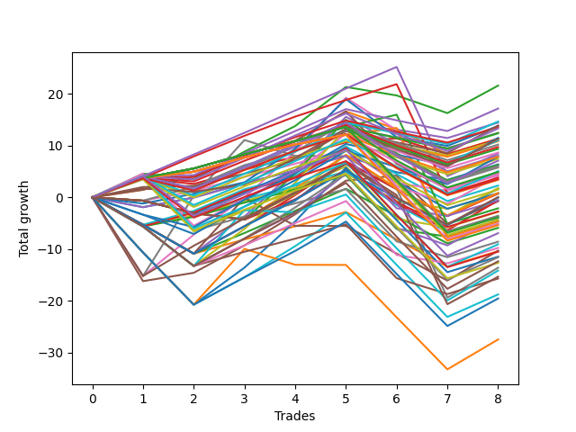

# Short Wallace 1226_003 
- Symbol: TSLA_Unlimited
- Date Range: 03/23/2022 - 07/08/2022
- Trading Period: 7:20-12:30
- Number of Trades: 8



| Name | Win Percent | Profit | Avg Profit / Trade | Avg Time / Trade |      | Name | Win Percent | Profit | Avg Profit / Trade | Avg Time / Trade |
| ---- | ----------- | ------ | ------------------ | ---------------- | ---- | ---- | ----------- | ------ | ------------------ | ---------------- |
| Sorted By <br> Profit | | | | | | Sorted By <br> Win Percentage ||||
| Two | 62.50 | 10785.00 | 1348.13 | 18:06 |     | Eighty-Four | 87.50 | 4220.00 | 527.50 | 49:56 |
| Ninety-Nine | 75.00 | 8570.00 | 1071.25 | 02:35 |     | Eighty-Three | 87.50 | 1885.00 | 235.62 | 49:41 |
| Ninety-Four | 62.50 | 7320.00 | 915.00 | 03:13 |     | Eighty-Two | 87.50 | -1060.00 | -132.50 | 33:00 |
| Four | 62.50 | 7220.00 | 902.50 | 28:53 |     | Eighty-One | 87.50 | -2345.00 | -293.13 | 32:47 |
| One Hundred | 75.00 | 6930.00 | 866.25 | 03:05 |     | Ninety-Nine | 75.00 | 8570.00 | 1071.25 | 02:35 |
| Seventy-Three | 62.50 | 6895.00 | 861.88 | 09:20 |     | One Hundred | 75.00 | 6930.00 | 866.25 | 03:05 |
| Ninety-Eight | 75.00 | 6785.00 | 848.13 | 02:23 |     | Ninety-Eight | 75.00 | 6785.00 | 848.13 | 02:23 |
| One Hundred Nine | 62.50 | 6645.00 | 830.62 | 03:10 |     | Ninety-Two | 75.00 | 6235.00 | 779.37 | 01:51 |
| Ninety-Two | 75.00 | 6235.00 | 779.37 | 01:51 |     | Ninety-Seven | 75.00 | 6180.00 | 772.50 | 02:00 |
| Ninety-Seven | 75.00 | 6180.00 | 772.50 | 02:00 |     | One | 75.00 | 5665.00 | 708.13 | 11:59 |
| Ninety-Five | 50.00 | 5740.00 | 717.50 | 05:42 |     | Three | 75.00 | 5655.00 | 706.88 | 17:21 |
| One | 75.00 | 5665.00 | 708.13 | 11:59 |     | Ninety-One | 75.00 | 5470.00 | 683.75 | 01:42 |
| Three | 75.00 | 5655.00 | 706.88 | 17:21 |     | Ninety-Six | 75.00 | 5415.00 | 676.88 | 01:50 |
| One Hundred Ten | 62.50 | 5650.00 | 706.25 | 04:28 |     | One Hundred Two | 75.00 | 5085.00 | 635.62 | 02:03 |
| Ninety-Three | 62.50 | 5535.00 | 691.87 | 03:01 |     | One Hundred Seven | 75.00 | 4680.00 | 585.00 | 02:04 |
| One Hundred Four | 62.50 | 5505.00 | 688.12 | 03:41 |     | One Hundred One | 75.00 | 4320.00 | 540.00 | 01:54 |
| Ninety-One | 75.00 | 5470.00 | 683.75 | 01:42 |     | One Hundred Six | 75.00 | 3915.00 | 489.37 | 01:55 |
| Ninety-Six | 75.00 | 5415.00 | 676.88 | 01:50 |     | One Hundred Twelve | 75.00 | 3030.00 | 378.75 | 04:20 |
| One Hundred Two | 75.00 | 5085.00 | 635.62 | 02:03 |     | One Hundred Seventeen | 75.00 | 2450.00 | 306.25 | 04:21 |
| One Hundred Eight | 62.50 | 4860.00 | 607.50 | 02:58 |     | Fifty-Seven | 75.00 | 2320.00 | 290.00 | 09:59 |
| One Hundred Seven | 75.00 | 4680.00 | 585.00 | 02:04 |     | One Hundred Eleven | 75.00 | 2265.00 | 283.12 | 04:11 |
| One Hundred One | 75.00 | 4320.00 | 540.00 | 01:54 |     | One Hundred Sixteen | 75.00 | 1685.00 | 210.63 | 04:11 |
| Eighty-Four | 87.50 | 4220.00 | 527.50 | 49:56 |     | Five | 75.00 | -380.00 | -47.50 | 62:48 |
| Forty-Six | 50.00 | 4005.00 | 500.63 | 15:00 |     | One Hundred Twenty-Two | 75.00 | -1780.00 | -222.50 | 12:10 |
| One Hundred Five | 50.00 | 3925.00 | 490.63 | 06:10 |     | One Hundred Twenty-Seven | 75.00 | -1925.00 | -240.63 | 12:10 |
| One Hundred Six | 75.00 | 3915.00 | 489.37 | 01:55 |     | One Hundred Twenty-One | 75.00 | -2545.00 | -318.13 | 12:00 |
| One Hundred Three | 62.50 | 3720.00 | 465.00 | 03:29 |     | One Hundred Twenty-Six | 75.00 | -2690.00 | -336.25 | 12:01 |
| One Hundred Ninteen | 62.50 | 3535.00 | 441.87 | 05:43 |     | Two | 62.50 | 10785.00 | 1348.13 | 18:06 |
| Zero | 62.50 | 3180.00 | 397.50 | 06:30 |     | Ninety-Four | 62.50 | 7320.00 | 915.00 | 03:13 |
| Fifty-Four | 37.50 | 3135.00 | 391.87 | 08:54 |     | Four | 62.50 | 7220.00 | 902.50 | 28:53 |
| One Hundred Twelve | 75.00 | 3030.00 | 378.75 | 04:20 |     | Seventy-Three | 62.50 | 6895.00 | 861.88 | 09:20 |
| Forty-Nine | 62.50 | 2880.00 | 360.00 | 05:17 |     | One Hundred Nine | 62.50 | 6645.00 | 830.62 | 03:10 |
| One Hundred Fourteen | 62.50 | 2525.00 | 315.62 | 06:40 |     | One Hundred Ten | 62.50 | 5650.00 | 706.25 | 04:28 |
| One Hundred Seventeen | 75.00 | 2450.00 | 306.25 | 04:21 |     | Ninety-Three | 62.50 | 5535.00 | 691.87 | 03:01 |
| Fifty-Seven | 75.00 | 2320.00 | 290.00 | 09:59 |     | One Hundred Four | 62.50 | 5505.00 | 688.12 | 03:41 |
| One Hundred Eleven | 75.00 | 2265.00 | 283.12 | 04:11 |     | One Hundred Eight | 62.50 | 4860.00 | 607.50 | 02:58 |
| Forty-Eight | 62.50 | 2140.00 | 267.50 | 03:43 |     | One Hundred Three | 62.50 | 3720.00 | 465.00 | 03:29 |
| Fifty-Eight | 62.50 | 2040.00 | 255.00 | 14:10 |     | One Hundred Ninteen | 62.50 | 3535.00 | 441.87 | 05:43 |
| Eighty-Three | 87.50 | 1885.00 | 235.62 | 49:41 |     | Zero | 62.50 | 3180.00 | 397.50 | 06:30 |
| One Hundred Eighteen | 62.50 | 1750.00 | 218.75 | 05:31 |     | Forty-Nine | 62.50 | 2880.00 | 360.00 | 05:17 |
| One Hundred Sixteen | 75.00 | 1685.00 | 210.63 | 04:11 |     | One Hundred Fourteen | 62.50 | 2525.00 | 315.62 | 06:40 |
| Forty-One | 62.50 | 1135.00 | 141.88 | 06:14 |     | Forty-Eight | 62.50 | 2140.00 | 267.50 | 03:43 |
| Fifty | 37.50 | 900.00 | 112.50 | 07:17 |     | Fifty-Eight | 62.50 | 2040.00 | 255.00 | 14:10 |
| Forty-Two | 50.00 | 840.00 | 105.00 | 10:01 |     | One Hundred Eighteen | 62.50 | 1750.00 | 218.75 | 05:31 |
| One Hundred Thirteen | 62.50 | 740.00 | 92.50 | 06:28 |     | Forty-One | 62.50 | 1135.00 | 141.88 | 06:14 |
| Fifty-Three | 37.50 | 420.00 | 52.50 | 07:20 |     | One Hundred Thirteen | 62.50 | 740.00 | 92.50 | 06:28 |
| Forty | 62.50 | 395.00 | 49.37 | 04:40 |     | Forty | 62.50 | 395.00 | 49.37 | 04:40 |
| Fifty-Two | 50.00 | 390.00 | 48.75 | 05:50 |     | Fifty-Six | 62.50 | -295.00 | -36.88 | 05:38 |
| Forty-Five | 50.00 | 360.00 | 45.00 | 13:01 |     | Sixty-Five | 62.50 | -1365.00 | -170.62 | 09:00 |
| One Hundred Twenty | 37.50 | 30.00 | 3.75 | 07:18 |     | Sixty | 62.50 | -1400.00 | -175.00 | 15:32 |
| One Hundred Fifteen | 50.00 | -30.00 | -3.75 | 10:01 |     | Sixty-Four | 62.50 | -2300.00 | -287.50 | 04:59 |
| Fifty-Six | 62.50 | -295.00 | -36.88 | 05:38 |     | Six | 62.50 | -2555.00 | -319.37 | 103:55 |
| Fifty-Five | 37.50 | -300.00 | -37.50 | 10:11 |     | One Hundred Twenty-Nine | 62.50 | -3460.00 | -432.50 | 14:35 |
| Five | 75.00 | -380.00 | -47.50 | 62:48 |     | Fifty-Nine | 62.50 | -4285.00 | -535.62 | 12:57 |
| Eighty-Two | 87.50 | -1060.00 | -132.50 | 33:00 |     | One Hundred Twenty-Four | 62.50 | -4535.00 | -566.88 | 14:38 |
| Sixty-Five | 62.50 | -1365.00 | -170.62 | 09:00 |     | One Hundred Twenty-Eight | 62.50 | -5245.00 | -655.63 | 14:23 |
| Sixty | 62.50 | -1400.00 | -175.00 | 15:32 |     | One Hundred Twenty-Three | 62.50 | -6320.00 | -790.00 | 14:26 |
| One Hundred Twenty-Two | 75.00 | -1780.00 | -222.50 | 12:10 |     | Eighty-Five | 62.50 | -7660.00 | -957.50 | 98:55 |
| Fifty-One | 50.00 | -1855.00 | -231.88 | 05:36 |     | Ninety-Five | 50.00 | 5740.00 | 717.50 | 05:42 |
| One Hundred Twenty-Seven | 75.00 | -1925.00 | -240.63 | 12:10 |     | Forty-Six | 50.00 | 4005.00 | 500.63 | 15:00 |
| Sixty-Six | 50.00 | -1985.00 | -248.12 | 13:05 |     | One Hundred Five | 50.00 | 3925.00 | 490.63 | 06:10 |
| Seventy | 50.00 | -2140.00 | -267.50 | 22:56 |     | Forty-Two | 50.00 | 840.00 | 105.00 | 10:01 |
| Sixty-Four | 62.50 | -2300.00 | -287.50 | 04:59 |     | Fifty-Two | 50.00 | 390.00 | 48.75 | 05:50 |
| Eighty-One | 87.50 | -2345.00 | -293.13 | 32:47 |     | Forty-Five | 50.00 | 360.00 | 45.00 | 13:01 |
| One Hundred Twenty-One | 75.00 | -2545.00 | -318.13 | 12:00 |     | One Hundred Fifteen | 50.00 | -30.00 | -3.75 | 10:01 |
| Six | 62.50 | -2555.00 | -319.37 | 103:55 |     | Fifty-One | 50.00 | -1855.00 | -231.88 | 05:36 |
| One Hundred Twenty-Six | 75.00 | -2690.00 | -336.25 | 12:01 |     | Sixty-Six | 50.00 | -1985.00 | -248.12 | 13:05 |
| Forty-Four | 50.00 | -2945.00 | -368.12 | 07:45 |     | Seventy | 50.00 | -2140.00 | -267.50 | 22:56 |
| One Hundred Twenty-Nine | 62.50 | -3460.00 | -432.50 | 14:35 |     | Forty-Four | 50.00 | -2945.00 | -368.12 | 07:45 |
| Fifty-Nine | 62.50 | -4285.00 | -535.62 | 12:57 |     | Sixty-Eight | 50.00 | -4880.00 | -610.00 | 11:45 |
| One Hundred Twenty-Four | 62.50 | -4535.00 | -566.88 | 14:38 |     | Forty-Three | 50.00 | -5190.00 | -648.75 | 07:31 |
| Sixty-Eight | 50.00 | -4880.00 | -610.00 | 11:45 |     | Sixty-Two | 50.00 | -5730.00 | -716.25 | 30:14 |
| Forty-Seven | 25.00 | -5150.00 | -643.75 | 38:09 |     | Sixty-Nine | 50.00 | -5785.00 | -723.12 | 20:56 |
| Forty-Three | 50.00 | -5190.00 | -648.75 | 07:31 |     | One Hundred Thirty | 50.00 | -6175.00 | -771.87 | 17:57 |
| One Hundred Twenty-Eight | 62.50 | -5245.00 | -655.63 | 14:23 |     | Sixty-Seven | 50.00 | -7840.00 | -980.00 | 10:46 |
| Sixty-Two | 50.00 | -5730.00 | -716.25 | 30:14 |     | Sixty-One | 50.00 | -9375.00 | -1171.88 | 28:15 |
| Sixty-Nine | 50.00 | -5785.00 | -723.12 | 20:56 |     | One Hundred Twenty-Five | 50.00 | -9765.00 | -1220.62 | 25:15 |
| One Hundred Thirty | 50.00 | -6175.00 | -771.87 | 17:57 |     | Fifty-Four | 37.50 | 3135.00 | 391.87 | 08:54 |
| One Hundred Twenty-Three | 62.50 | -6320.00 | -790.00 | 14:26 |     | Fifty | 37.50 | 900.00 | 112.50 | 07:17 |
| Seven | 37.50 | -6795.00 | -849.37 | 142:49 |     | Fifty-Three | 37.50 | 420.00 | 52.50 | 07:20 |
| Seventy-One | 37.50 | -7070.00 | -883.75 | 32:38 |     | One Hundred Twenty | 37.50 | 30.00 | 3.75 | 07:18 |
| Eighty-Five | 62.50 | -7660.00 | -957.50 | 98:55 |     | Fifty-Five | 37.50 | -300.00 | -37.50 | 10:11 |
| Sixty-Seven | 50.00 | -7840.00 | -980.00 | 10:46 |     | Seven | 37.50 | -6795.00 | -849.37 | 142:49 |
| Sixty-One | 50.00 | -9375.00 | -1171.88 | 28:15 |     | Seventy-One | 37.50 | -7070.00 | -883.75 | 32:38 |
| One Hundred Twenty-Five | 50.00 | -9765.00 | -1220.62 | 25:15 |     | Forty-Seven | 25.00 | -5150.00 | -643.75 | 38:09 |
| Sixty-Three | 25.00 | -13720.00 | -1715.00 | 65:43 |     | Sixty-Three | 25.00 | -13720.00 | -1715.00 | 65:43 |

## NO STOPLOSS

### Test Zero
* Sell when price hits the middle line of the 20p bollinger
* No Stoploss
* Results:
```
Total Trades: 8
Percent Up: 37.50
Percent Down: 62.50
Total Points Moved Down: 6.36
Potential Profit: 3180.00
Total Points Ups: 6.53 Count Ups: 3
Total Points Downs: 12.89 Count Downs: 5
```

<details><summary>Trades</summary>

<code>In: 2022-04-28 09:50:00		Out: 2022-04-28 10:06:10		Total Position Time: 16:10		Total Move Down: -1.90		Total to Date: -1.90</code> <br />
<code>In: 2022-05-04 09:43:00		Out: 2022-05-04 09:47:00		Total Position Time: 04:00		Total Move Down: 1.86		Total to Date: -0.04</code> <br />
<code>In: 2022-05-10 11:46:00		Out: 2022-05-10 11:47:10		Total Position Time: 01:10		Total Move Down: 2.74		Total to Date: 2.70</code> <br />
<code>In: 2022-05-17 09:38:00		Out: 2022-05-17 09:39:10		Total Position Time: 01:10		Total Move Down: 2.53		Total to Date: 5.23</code> <br />
<code>In: 2022-05-17 11:11:00		Out: 2022-05-17 11:12:15		Total Position Time: 01:15		Total Move Down: 2.77		Total to Date: 8.00</code> <br />
<code>In: 2022-05-25 08:05:00		Out: 2022-05-25 08:20:55		Total Position Time: 15:55		Total Move Down: -3.16		Total to Date: 4.84</code> <br />
<code>In: 2022-07-05 09:04:00		Out: 2022-07-05 09:15:15		Total Position Time: 11:15		Total Move Down: -1.47		Total to Date: 3.37</code> <br />
<code>In: 2022-07-06 11:10:00		Out: 2022-07-06 11:11:10		Total Position Time: 01:10		Total Move Down: 2.99		Total to Date: 6.36</code> <br />


</details>

### Test One
* Sell when the price hits the upper line of the 20p 1std bollinger
* No Stoploss
* Results:
```
Total Trades: 8
Percent Up: 25.00
Percent Down: 75.00
Total Points Moved Down: 11.33
Potential Profit: 5665.00
Total Points Ups: 8.24 Count Ups: 2
Total Points Downs: 19.57 Count Downs: 6
```

<details><summary>Trades</summary>

<code>In: 2022-04-28 09:50:00		Out: 2022-04-28 10:08:55		Total Position Time: 18:55		Total Move Down: 1.46		Total to Date: 1.46</code> <br />
<code>In: 2022-05-04 09:43:00		Out: 2022-05-04 09:51:10		Total Position Time: 08:10		Total Move Down: 2.68		Total to Date: 4.14</code> <br />
<code>In: 2022-05-10 11:46:00		Out: 2022-05-10 11:47:25		Total Position Time: 01:25		Total Move Down: 4.19		Total to Date: 8.33</code> <br />
<code>In: 2022-05-17 09:38:00		Out: 2022-05-17 09:39:15		Total Position Time: 01:15		Total Move Down: 2.59		Total to Date: 10.92</code> <br />
<code>In: 2022-05-17 11:11:00		Out: 2022-05-17 11:13:15		Total Position Time: 02:15		Total Move Down: 5.66		Total to Date: 16.58</code> <br />
<code>In: 2022-05-25 08:05:00		Out: 2022-05-25 08:29:55		Total Position Time: 24:55		Total Move Down: -3.42		Total to Date: 13.16</code> <br />
<code>In: 2022-07-05 09:04:00		Out: 2022-07-05 09:41:50		Total Position Time: 37:50		Total Move Down: -4.82		Total to Date: 8.34</code> <br />
<code>In: 2022-07-06 11:10:00		Out: 2022-07-06 11:11:10		Total Position Time: 01:10		Total Move Down: 2.99		Total to Date: 11.33</code> <br />


</details>

### Test Two
* Sell when the price hits the upper line of the 20p 2std bollinger
* No Stoploss
* Results:
```
Total Trades: 8
Percent Up: 37.50
Percent Down: 62.50
Total Points Moved Down: 21.57
Potential Profit: 10785.00
Total Points Ups: 6.10 Count Ups: 3
Total Points Downs: 27.67 Count Downs: 5
```

<details><summary>Trades</summary>

<code>In: 2022-04-28 09:50:00		Out: 2022-04-28 10:09:15		Total Position Time: 19:15		Total Move Down: 4.58		Total to Date: 4.58</code> <br />
<code>In: 2022-05-04 09:43:00		Out: 2022-05-04 10:18:30		Total Position Time: 35:30		Total Move Down: -1.05		Total to Date: 3.53</code> <br />
<code>In: 2022-05-10 11:46:00		Out: 2022-05-10 11:56:45		Total Position Time: 10:45		Total Move Down: 5.29		Total to Date: 8.82</code> <br />
<code>In: 2022-05-17 09:38:00		Out: 2022-05-17 09:47:15		Total Position Time: 09:15		Total Move Down: 4.94		Total to Date: 13.76</code> <br />
<code>In: 2022-05-17 11:11:00		Out: 2022-05-17 11:13:30		Total Position Time: 02:30		Total Move Down: 7.55		Total to Date: 21.31</code> <br />
<code>In: 2022-05-25 08:05:00		Out: 2022-05-25 08:30:40		Total Position Time: 25:40		Total Move Down: -1.64		Total to Date: 19.67</code> <br />
<code>In: 2022-07-05 09:04:00		Out: 2022-07-05 09:43:40		Total Position Time: 39:40		Total Move Down: -3.41		Total to Date: 16.26</code> <br />
<code>In: 2022-07-06 11:10:00		Out: 2022-07-06 11:12:15		Total Position Time: 02:15		Total Move Down: 5.31		Total to Date: 21.57</code> <br />


</details>

### Test Three
* Sell when price hits the middle line of the 50p bollinger
* No Stoploss
* Results:
```
Total Trades: 8
Percent Up: 25.00
Percent Down: 75.00
Total Points Moved Down: 11.31
Potential Profit: 5655.00
Total Points Ups: 4.11 Count Ups: 2
Total Points Downs: 15.42 Count Downs: 6
```

<details><summary>Trades</summary>

<code>In: 2022-04-28 09:50:00		Out: 2022-04-28 10:18:05		Total Position Time: 28:05		Total Move Down: 3.64		Total to Date: 3.64</code> <br />
<code>In: 2022-05-04 09:43:00		Out: 2022-05-04 10:18:30		Total Position Time: 35:30		Total Move Down: -1.05		Total to Date: 2.59</code> <br />
<code>In: 2022-05-10 11:46:00		Out: 2022-05-10 11:47:10		Total Position Time: 01:10		Total Move Down: 2.74		Total to Date: 5.33</code> <br />
<code>In: 2022-05-17 09:38:00		Out: 2022-05-17 09:39:10		Total Position Time: 01:10		Total Move Down: 2.53		Total to Date: 7.86</code> <br />
<code>In: 2022-05-17 11:11:00		Out: 2022-05-17 11:12:15		Total Position Time: 01:15		Total Move Down: 2.77		Total to Date: 10.63</code> <br />
<code>In: 2022-05-25 08:05:00		Out: 2022-05-25 08:34:25		Total Position Time: 29:25		Total Move Down: 0.75		Total to Date: 11.38</code> <br />
<code>In: 2022-07-05 09:04:00		Out: 2022-07-05 09:45:05		Total Position Time: 41:05		Total Move Down: -3.06		Total to Date: 8.32</code> <br />
<code>In: 2022-07-06 11:10:00		Out: 2022-07-06 11:11:10		Total Position Time: 01:10		Total Move Down: 2.99		Total to Date: 11.31</code> <br />


</details>

### Test Four
* Sell when the price hits the upper line of the 50p 1std bollinger
* No Stoploss
* Results:
```
Total Trades: 8
Percent Up: 37.50
Percent Down: 62.50
Total Points Moved Down: 14.44
Potential Profit: 7220.00
Total Points Ups: 4.57 Count Ups: 3
Total Points Downs: 19.01 Count Downs: 5
```

<details><summary>Trades</summary>

<code>In: 2022-04-28 09:50:00		Out: 2022-04-28 10:30:55		Total Position Time: 40:55		Total Move Down: 3.49		Total to Date: 3.49</code> <br />
<code>In: 2022-05-04 09:43:00		Out: 2022-05-04 10:45:50		Total Position Time: 62:50		Total Move Down: -1.97		Total to Date: 1.52</code> <br />
<code>In: 2022-05-10 11:46:00		Out: 2022-05-10 11:47:20		Total Position Time: 01:20		Total Move Down: 3.98		Total to Date: 5.50</code> <br />
<code>In: 2022-05-17 09:38:00		Out: 2022-05-17 09:40:10		Total Position Time: 02:10		Total Move Down: 4.30		Total to Date: 9.80</code> <br />
<code>In: 2022-05-17 11:11:00		Out: 2022-05-17 11:12:55		Total Position Time: 01:55		Total Move Down: 4.25		Total to Date: 14.05</code> <br />
<code>In: 2022-05-25 08:05:00		Out: 2022-05-25 09:18:40		Total Position Time: 73:40		Total Move Down: -0.97		Total to Date: 13.08</code> <br />
<code>In: 2022-07-05 09:04:00		Out: 2022-07-05 09:51:05		Total Position Time: 47:05		Total Move Down: -1.63		Total to Date: 11.45</code> <br />
<code>In: 2022-07-06 11:10:00		Out: 2022-07-06 11:11:10		Total Position Time: 01:10		Total Move Down: 2.99		Total to Date: 14.44</code> <br />


</details>

### Test Five
* Sell when the price hits the upper line of the 50p 2std bollinger
* No Stoploss
* Results:
```
Total Trades: 8
Percent Up: 25.00
Percent Down: 75.00
Total Points Moved Down: -0.76
Potential Profit: -380.00
Total Points Ups: 25.48 Count Ups: 2
Total Points Downs: 24.72 Count Downs: 6
```

<details><summary>Trades</summary>

<code>In: 2022-04-28 09:50:00		Out: 2022-04-28 12:29:40		Total Position Time: 159:40		Total Move Down: -16.18		Total to Date: -16.18</code> <br />
<code>In: 2022-05-04 09:43:00		Out: 2022-05-04 11:07:20		Total Position Time: 84:20		Total Move Down: 1.61		Total to Date: -14.57</code> <br />
<code>In: 2022-05-10 11:46:00		Out: 2022-05-10 12:20:20		Total Position Time: 34:20		Total Move Down: 5.29		Total to Date: -9.28</code> <br />
<code>In: 2022-05-17 09:38:00		Out: 2022-05-17 09:47:55		Total Position Time: 09:55		Total Move Down: 6.01		Total to Date: -3.27</code> <br />
<code>In: 2022-05-17 11:11:00		Out: 2022-05-17 11:13:25		Total Position Time: 02:25		Total Move Down: 6.49		Total to Date: 3.22</code> <br />
<code>In: 2022-05-25 08:05:00		Out: 2022-05-25 09:22:05		Total Position Time: 77:05		Total Move Down: 0.98		Total to Date: 4.20</code> <br />
<code>In: 2022-07-05 09:04:00		Out: 2022-07-05 11:16:35		Total Position Time: 132:35		Total Move Down: -9.30		Total to Date: -5.10</code> <br />
<code>In: 2022-07-06 11:10:00		Out: 2022-07-06 11:12:05		Total Position Time: 02:05		Total Move Down: 4.34		Total to Date: -0.76</code> <br />


</details>

### Test Six
* Sell when the price hits the middle line of the 1std VWAP
* No Stoploss
* Results:
```
Total Trades: 8
Percent Up: 37.50
Percent Down: 62.50
Total Points Moved Down: -5.11
Potential Profit: -2555.00
Total Points Ups: 42.51 Count Ups: 3
Total Points Downs: 37.40 Count Downs: 5
```

<details><summary>Trades</summary>

<code>In: 2022-04-28 09:50:00		Out: 2022-04-28 12:47:00		Total Position Time: 177:00		Total Move Down: -15.19		Total to Date: -15.19</code> <br />
<code>In: 2022-05-04 09:43:00		Out: 2022-05-04 11:07:40		Total Position Time: 84:40		Total Move Down: 7.98		Total to Date: -7.21</code> <br />
<code>In: 2022-05-10 11:46:00		Out: 2022-05-10 12:23:45		Total Position Time: 37:45		Total Move Down: 7.15		Total to Date: -0.06</code> <br />
<code>In: 2022-05-17 09:38:00		Out: 2022-05-17 09:59:30		Total Position Time: 21:30		Total Move Down: 8.91		Total to Date: 8.85</code> <br />
<code>In: 2022-05-17 11:11:00		Out: 2022-05-17 11:15:15		Total Position Time: 04:15		Total Move Down: 10.37		Total to Date: 19.22</code> <br />
<code>In: 2022-05-25 08:05:00		Out: 2022-05-25 12:47:00		Total Position Time: 282:00		Total Move Down: -6.25		Total to Date: 12.97</code> <br />
<code>In: 2022-07-05 09:04:00		Out: 2022-07-05 12:47:00		Total Position Time: 223:00		Total Move Down: -21.07		Total to Date: -8.10</code> <br />
<code>In: 2022-07-06 11:10:00		Out: 2022-07-06 11:11:10		Total Position Time: 01:10		Total Move Down: 2.99		Total to Date: -5.11</code> <br />


</details>

### Test Seven
* Sell when the price hits the upper line of the 1std VWAP
* No Stoploss
* Results:
```
Total Trades: 8
Percent Up: 62.50
Percent Down: 37.50
Total Points Moved Down: -13.59
Potential Profit: -6795.00
Total Points Ups: 45.62 Count Ups: 5
Total Points Downs: 32.03 Count Downs: 3
```

<details><summary>Trades</summary>

<code>In: 2022-04-28 09:50:00		Out: 2022-04-28 12:47:00		Total Position Time: 177:00		Total Move Down: -15.19		Total to Date: -15.19</code> <br />
<code>In: 2022-05-04 09:43:00		Out: 2022-05-04 11:35:05		Total Position Time: 112:05		Total Move Down: 15.48		Total to Date: 0.29</code> <br />
<code>In: 2022-05-10 11:46:00		Out: 2022-05-10 12:47:00		Total Position Time: 61:00		Total Move Down: 10.78		Total to Date: 11.07</code> <br />
<code>In: 2022-05-17 09:38:00		Out: 2022-05-17 12:47:00		Total Position Time: 189:00		Total Move Down: -3.08		Total to Date: 7.99</code> <br />
<code>In: 2022-05-17 11:11:00		Out: 2022-05-17 12:47:00		Total Position Time: 96:00		Total Move Down: -0.03		Total to Date: 7.96</code> <br />
<code>In: 2022-05-25 08:05:00		Out: 2022-05-25 12:47:00		Total Position Time: 282:00		Total Move Down: -6.25		Total to Date: 1.71</code> <br />
<code>In: 2022-07-05 09:04:00		Out: 2022-07-05 12:47:00		Total Position Time: 223:00		Total Move Down: -21.07		Total to Date: -19.36</code> <br />
<code>In: 2022-07-06 11:10:00		Out: 2022-07-06 11:12:30		Total Position Time: 02:30		Total Move Down: 5.77		Total to Date: -13.59</code> <br />


</details>

## STOPLOSS OF 5

### Test Forty
* Sell when price hits the middle line of the 20p bollinger
* Stoploss is -5 points
* Results:
```
Total Trades: 8
Percent Up: 37.50
Percent Down: 62.50
Total Points Moved Down: 0.79
Potential Profit: 395.00
Total Points Ups: 12.10 Count Ups: 3
Total Points Downs: 12.89 Count Downs: 5
```

<details><summary>Trades</summary>

<code>In: 2022-04-28 09:50:00		Out: 2022-04-28 10:00:50		Total Position Time: 10:50		Total Move Down: -5.30		Total to Date: -5.30</code> <br />
<code>In: 2022-05-04 09:43:00		Out: 2022-05-04 09:47:00		Total Position Time: 04:00		Total Move Down: 1.86		Total to Date: -3.44</code> <br />
<code>In: 2022-05-10 11:46:00		Out: 2022-05-10 11:47:10		Total Position Time: 01:10		Total Move Down: 2.74		Total to Date: -0.70</code> <br />
<code>In: 2022-05-17 09:38:00		Out: 2022-05-17 09:39:10		Total Position Time: 01:10		Total Move Down: 2.53		Total to Date: 1.83</code> <br />
<code>In: 2022-05-17 11:11:00		Out: 2022-05-17 11:12:15		Total Position Time: 01:15		Total Move Down: 2.77		Total to Date: 4.60</code> <br />
<code>In: 2022-05-25 08:05:00		Out: 2022-05-25 08:11:30		Total Position Time: 06:30		Total Move Down: -5.33		Total to Date: -0.73</code> <br />
<code>In: 2022-07-05 09:04:00		Out: 2022-07-05 09:15:15		Total Position Time: 11:15		Total Move Down: -1.47		Total to Date: -2.20</code> <br />
<code>In: 2022-07-06 11:10:00		Out: 2022-07-06 11:11:10		Total Position Time: 01:10		Total Move Down: 2.99		Total to Date: 0.79</code> <br />


</details>

### Test Forty-One
* Sell when the price hits the upper line of the 20p 1std bollinger
* Stoploss is -5 points
* Results:
```
Total Trades: 8
Percent Up: 37.50
Percent Down: 62.50
Total Points Moved Down: 2.27
Potential Profit: 1135.00
Total Points Ups: 15.84 Count Ups: 3
Total Points Downs: 18.11 Count Downs: 5
```

<details><summary>Trades</summary>

<code>In: 2022-04-28 09:50:00		Out: 2022-04-28 10:00:50		Total Position Time: 10:50		Total Move Down: -5.30		Total to Date: -5.30</code> <br />
<code>In: 2022-05-04 09:43:00		Out: 2022-05-04 09:51:10		Total Position Time: 08:10		Total Move Down: 2.68		Total to Date: -2.62</code> <br />
<code>In: 2022-05-10 11:46:00		Out: 2022-05-10 11:47:25		Total Position Time: 01:25		Total Move Down: 4.19		Total to Date: 1.57</code> <br />
<code>In: 2022-05-17 09:38:00		Out: 2022-05-17 09:39:15		Total Position Time: 01:15		Total Move Down: 2.59		Total to Date: 4.16</code> <br />
<code>In: 2022-05-17 11:11:00		Out: 2022-05-17 11:13:15		Total Position Time: 02:15		Total Move Down: 5.66		Total to Date: 9.82</code> <br />
<code>In: 2022-05-25 08:05:00		Out: 2022-05-25 08:11:30		Total Position Time: 06:30		Total Move Down: -5.33		Total to Date: 4.49</code> <br />
<code>In: 2022-07-05 09:04:00		Out: 2022-07-05 09:22:20		Total Position Time: 18:20		Total Move Down: -5.21		Total to Date: -0.72</code> <br />
<code>In: 2022-07-06 11:10:00		Out: 2022-07-06 11:11:10		Total Position Time: 01:10		Total Move Down: 2.99		Total to Date: 2.27</code> <br />


</details>

### Test Forty-Two
* Sell when the price hits the upper line of the 20p 2std bollinger
* Stoploss is -5 points
* Results:
```
Total Trades: 8
Percent Up: 50.00
Percent Down: 50.00
Total Points Moved Down: 1.68
Potential Profit: 840.00
Total Points Ups: 21.41 Count Ups: 4
Total Points Downs: 23.09 Count Downs: 4
```

<details><summary>Trades</summary>

<code>In: 2022-04-28 09:50:00		Out: 2022-04-28 10:00:50		Total Position Time: 10:50		Total Move Down: -5.30		Total to Date: -5.30</code> <br />
<code>In: 2022-05-04 09:43:00		Out: 2022-05-04 10:02:45		Total Position Time: 19:45		Total Move Down: -5.57		Total to Date: -10.87</code> <br />
<code>In: 2022-05-10 11:46:00		Out: 2022-05-10 11:56:45		Total Position Time: 10:45		Total Move Down: 5.29		Total to Date: -5.58</code> <br />
<code>In: 2022-05-17 09:38:00		Out: 2022-05-17 09:47:15		Total Position Time: 09:15		Total Move Down: 4.94		Total to Date: -0.64</code> <br />
<code>In: 2022-05-17 11:11:00		Out: 2022-05-17 11:13:30		Total Position Time: 02:30		Total Move Down: 7.55		Total to Date: 6.91</code> <br />
<code>In: 2022-05-25 08:05:00		Out: 2022-05-25 08:11:30		Total Position Time: 06:30		Total Move Down: -5.33		Total to Date: 1.58</code> <br />
<code>In: 2022-07-05 09:04:00		Out: 2022-07-05 09:22:20		Total Position Time: 18:20		Total Move Down: -5.21		Total to Date: -3.63</code> <br />
<code>In: 2022-07-06 11:10:00		Out: 2022-07-06 11:12:15		Total Position Time: 02:15		Total Move Down: 5.31		Total to Date: 1.68</code> <br />


</details>

### Test Forty-Three
* Sell when price hits the middle line of the 50p bollinger
* Stoploss is -5 points
* Results:
```
Total Trades: 8
Percent Up: 50.00
Percent Down: 50.00
Total Points Moved Down: -10.38
Potential Profit: -5190.00
Total Points Ups: 21.41 Count Ups: 4
Total Points Downs: 11.03 Count Downs: 4
```

<details><summary>Trades</summary>

<code>In: 2022-04-28 09:50:00		Out: 2022-04-28 10:00:50		Total Position Time: 10:50		Total Move Down: -5.30		Total to Date: -5.30</code> <br />
<code>In: 2022-05-04 09:43:00		Out: 2022-05-04 10:02:45		Total Position Time: 19:45		Total Move Down: -5.57		Total to Date: -10.87</code> <br />
<code>In: 2022-05-10 11:46:00		Out: 2022-05-10 11:47:10		Total Position Time: 01:10		Total Move Down: 2.74		Total to Date: -8.13</code> <br />
<code>In: 2022-05-17 09:38:00		Out: 2022-05-17 09:39:10		Total Position Time: 01:10		Total Move Down: 2.53		Total to Date: -5.60</code> <br />
<code>In: 2022-05-17 11:11:00		Out: 2022-05-17 11:12:15		Total Position Time: 01:15		Total Move Down: 2.77		Total to Date: -2.83</code> <br />
<code>In: 2022-05-25 08:05:00		Out: 2022-05-25 08:11:30		Total Position Time: 06:30		Total Move Down: -5.33		Total to Date: -8.16</code> <br />
<code>In: 2022-07-05 09:04:00		Out: 2022-07-05 09:22:20		Total Position Time: 18:20		Total Move Down: -5.21		Total to Date: -13.37</code> <br />
<code>In: 2022-07-06 11:10:00		Out: 2022-07-06 11:11:10		Total Position Time: 01:10		Total Move Down: 2.99		Total to Date: -10.38</code> <br />


</details>

### Test Forty-Four
* Sell when the price hits the upper line of the 50p 1std bollinger
* Stoploss is -5 points
* Results:
```
Total Trades: 8
Percent Up: 50.00
Percent Down: 50.00
Total Points Moved Down: -5.89
Potential Profit: -2945.00
Total Points Ups: 21.41 Count Ups: 4
Total Points Downs: 15.52 Count Downs: 4
```

<details><summary>Trades</summary>

<code>In: 2022-04-28 09:50:00		Out: 2022-04-28 10:00:50		Total Position Time: 10:50		Total Move Down: -5.30		Total to Date: -5.30</code> <br />
<code>In: 2022-05-04 09:43:00		Out: 2022-05-04 10:02:45		Total Position Time: 19:45		Total Move Down: -5.57		Total to Date: -10.87</code> <br />
<code>In: 2022-05-10 11:46:00		Out: 2022-05-10 11:47:20		Total Position Time: 01:20		Total Move Down: 3.98		Total to Date: -6.89</code> <br />
<code>In: 2022-05-17 09:38:00		Out: 2022-05-17 09:40:10		Total Position Time: 02:10		Total Move Down: 4.30		Total to Date: -2.59</code> <br />
<code>In: 2022-05-17 11:11:00		Out: 2022-05-17 11:12:55		Total Position Time: 01:55		Total Move Down: 4.25		Total to Date: 1.66</code> <br />
<code>In: 2022-05-25 08:05:00		Out: 2022-05-25 08:11:30		Total Position Time: 06:30		Total Move Down: -5.33		Total to Date: -3.67</code> <br />
<code>In: 2022-07-05 09:04:00		Out: 2022-07-05 09:22:20		Total Position Time: 18:20		Total Move Down: -5.21		Total to Date: -8.88</code> <br />
<code>In: 2022-07-06 11:10:00		Out: 2022-07-06 11:11:10		Total Position Time: 01:10		Total Move Down: 2.99		Total to Date: -5.89</code> <br />


</details>

### Test Forty-Five
* Sell when the price hits the upper line of the 50p 2std bollinger
* Stoploss is -5 points
* Results:
```
Total Trades: 8
Percent Up: 50.00
Percent Down: 50.00
Total Points Moved Down: 0.72
Potential Profit: 360.00
Total Points Ups: 21.41 Count Ups: 4
Total Points Downs: 22.13 Count Downs: 4
```

<details><summary>Trades</summary>

<code>In: 2022-04-28 09:50:00		Out: 2022-04-28 10:00:50		Total Position Time: 10:50		Total Move Down: -5.30		Total to Date: -5.30</code> <br />
<code>In: 2022-05-04 09:43:00		Out: 2022-05-04 10:02:45		Total Position Time: 19:45		Total Move Down: -5.57		Total to Date: -10.87</code> <br />
<code>In: 2022-05-10 11:46:00		Out: 2022-05-10 12:20:20		Total Position Time: 34:20		Total Move Down: 5.29		Total to Date: -5.58</code> <br />
<code>In: 2022-05-17 09:38:00		Out: 2022-05-17 09:47:55		Total Position Time: 09:55		Total Move Down: 6.01		Total to Date: 0.43</code> <br />
<code>In: 2022-05-17 11:11:00		Out: 2022-05-17 11:13:25		Total Position Time: 02:25		Total Move Down: 6.49		Total to Date: 6.92</code> <br />
<code>In: 2022-05-25 08:05:00		Out: 2022-05-25 08:11:30		Total Position Time: 06:30		Total Move Down: -5.33		Total to Date: 1.59</code> <br />
<code>In: 2022-07-05 09:04:00		Out: 2022-07-05 09:22:20		Total Position Time: 18:20		Total Move Down: -5.21		Total to Date: -3.62</code> <br />
<code>In: 2022-07-06 11:10:00		Out: 2022-07-06 11:12:05		Total Position Time: 02:05		Total Move Down: 4.34		Total to Date: 0.72</code> <br />


</details>

### Test Forty-Six
* Sell when the price hits the middle line of the 1std VWAP
* Stoploss is -5 points
* Results:
```
Total Trades: 8
Percent Up: 50.00
Percent Down: 50.00
Total Points Moved Down: 8.01
Potential Profit: 4005.00
Total Points Ups: 21.41 Count Ups: 4
Total Points Downs: 29.42 Count Downs: 4
```

<details><summary>Trades</summary>

<code>In: 2022-04-28 09:50:00		Out: 2022-04-28 10:00:50		Total Position Time: 10:50		Total Move Down: -5.30		Total to Date: -5.30</code> <br />
<code>In: 2022-05-04 09:43:00		Out: 2022-05-04 10:02:45		Total Position Time: 19:45		Total Move Down: -5.57		Total to Date: -10.87</code> <br />
<code>In: 2022-05-10 11:46:00		Out: 2022-05-10 12:23:45		Total Position Time: 37:45		Total Move Down: 7.15		Total to Date: -3.72</code> <br />
<code>In: 2022-05-17 09:38:00		Out: 2022-05-17 09:59:30		Total Position Time: 21:30		Total Move Down: 8.91		Total to Date: 5.19</code> <br />
<code>In: 2022-05-17 11:11:00		Out: 2022-05-17 11:15:15		Total Position Time: 04:15		Total Move Down: 10.37		Total to Date: 15.56</code> <br />
<code>In: 2022-05-25 08:05:00		Out: 2022-05-25 08:11:30		Total Position Time: 06:30		Total Move Down: -5.33		Total to Date: 10.23</code> <br />
<code>In: 2022-07-05 09:04:00		Out: 2022-07-05 09:22:20		Total Position Time: 18:20		Total Move Down: -5.21		Total to Date: 5.02</code> <br />
<code>In: 2022-07-06 11:10:00		Out: 2022-07-06 11:11:10		Total Position Time: 01:10		Total Move Down: 2.99		Total to Date: 8.01</code> <br />


</details>

### Test Forty-Seven
* Sell when the price hits the upper line of the 1std VWAP
* Stoploss is -5 points
* Results:
```
Total Trades: 8
Percent Up: 75.00
Percent Down: 25.00
Total Points Moved Down: -10.30
Potential Profit: -5150.00
Total Points Ups: 26.85 Count Ups: 6
Total Points Downs: 16.55 Count Downs: 2
```

<details><summary>Trades</summary>

<code>In: 2022-04-28 09:50:00		Out: 2022-04-28 10:00:50		Total Position Time: 10:50		Total Move Down: -5.30		Total to Date: -5.30</code> <br />
<code>In: 2022-05-04 09:43:00		Out: 2022-05-04 10:02:45		Total Position Time: 19:45		Total Move Down: -5.57		Total to Date: -10.87</code> <br />
<code>In: 2022-05-10 11:46:00		Out: 2022-05-10 12:47:00		Total Position Time: 61:00		Total Move Down: 10.78		Total to Date: -0.09</code> <br />
<code>In: 2022-05-17 09:38:00		Out: 2022-05-17 11:08:20		Total Position Time: 90:20		Total Move Down: -5.41		Total to Date: -5.50</code> <br />
<code>In: 2022-05-17 11:11:00		Out: 2022-05-17 12:47:00		Total Position Time: 96:00		Total Move Down: -0.03		Total to Date: -5.53</code> <br />
<code>In: 2022-05-25 08:05:00		Out: 2022-05-25 08:11:30		Total Position Time: 06:30		Total Move Down: -5.33		Total to Date: -10.86</code> <br />
<code>In: 2022-07-05 09:04:00		Out: 2022-07-05 09:22:20		Total Position Time: 18:20		Total Move Down: -5.21		Total to Date: -16.07</code> <br />
<code>In: 2022-07-06 11:10:00		Out: 2022-07-06 11:12:30		Total Position Time: 02:30		Total Move Down: 5.77		Total to Date: -10.30</code> <br />


</details>

## TRAIL STOP OF 5

### Test Forty-Eight
* Sell when price hits the middle line of the 20p bollinger
* Trailing Stop is -5 points
* Results:
```
Total Trades: 8
Percent Up: 37.50
Percent Down: 62.50
Total Points Moved Down: 4.28
Potential Profit: 2140.00
Total Points Ups: 8.61 Count Ups: 3
Total Points Downs: 12.89 Count Downs: 5
```

<details><summary>Trades</summary>

<code>In: 2022-04-28 09:50:00		Out: 2022-04-28 09:53:10		Total Position Time: 03:10		Total Move Down: -0.65		Total to Date: -0.65</code> <br />
<code>In: 2022-05-04 09:43:00		Out: 2022-05-04 09:47:00		Total Position Time: 04:00		Total Move Down: 1.86		Total to Date: 1.21</code> <br />
<code>In: 2022-05-10 11:46:00		Out: 2022-05-10 11:47:10		Total Position Time: 01:10		Total Move Down: 2.74		Total to Date: 3.95</code> <br />
<code>In: 2022-05-17 09:38:00		Out: 2022-05-17 09:39:10		Total Position Time: 01:10		Total Move Down: 2.53		Total to Date: 6.48</code> <br />
<code>In: 2022-05-17 11:11:00		Out: 2022-05-17 11:12:15		Total Position Time: 01:15		Total Move Down: 2.77		Total to Date: 9.25</code> <br />
<code>In: 2022-05-25 08:05:00		Out: 2022-05-25 08:11:35		Total Position Time: 06:35		Total Move Down: -6.49		Total to Date: 2.76</code> <br />
<code>In: 2022-07-05 09:04:00		Out: 2022-07-05 09:15:15		Total Position Time: 11:15		Total Move Down: -1.47		Total to Date: 1.29</code> <br />
<code>In: 2022-07-06 11:10:00		Out: 2022-07-06 11:11:10		Total Position Time: 01:10		Total Move Down: 2.99		Total to Date: 4.28</code> <br />


</details>

### Test Forty-Nine
* Sell when the price hits the upper line of the 20p 1std bollinger
* Trailing Stop is -5 points
* Results:
```
Total Trades: 8
Percent Up: 37.50
Percent Down: 62.50
Total Points Moved Down: 5.76
Potential Profit: 2880.00
Total Points Ups: 12.35 Count Ups: 3
Total Points Downs: 18.11 Count Downs: 5
```

<details><summary>Trades</summary>

<code>In: 2022-04-28 09:50:00		Out: 2022-04-28 09:53:10		Total Position Time: 03:10		Total Move Down: -0.65		Total to Date: -0.65</code> <br />
<code>In: 2022-05-04 09:43:00		Out: 2022-05-04 09:51:10		Total Position Time: 08:10		Total Move Down: 2.68		Total to Date: 2.03</code> <br />
<code>In: 2022-05-10 11:46:00		Out: 2022-05-10 11:47:25		Total Position Time: 01:25		Total Move Down: 4.19		Total to Date: 6.22</code> <br />
<code>In: 2022-05-17 09:38:00		Out: 2022-05-17 09:39:15		Total Position Time: 01:15		Total Move Down: 2.59		Total to Date: 8.81</code> <br />
<code>In: 2022-05-17 11:11:00		Out: 2022-05-17 11:13:15		Total Position Time: 02:15		Total Move Down: 5.66		Total to Date: 14.47</code> <br />
<code>In: 2022-05-25 08:05:00		Out: 2022-05-25 08:11:35		Total Position Time: 06:35		Total Move Down: -6.49		Total to Date: 7.98</code> <br />
<code>In: 2022-07-05 09:04:00		Out: 2022-07-05 09:22:20		Total Position Time: 18:20		Total Move Down: -5.21		Total to Date: 2.77</code> <br />
<code>In: 2022-07-06 11:10:00		Out: 2022-07-06 11:11:10		Total Position Time: 01:10		Total Move Down: 2.99		Total to Date: 5.76</code> <br />


</details>

### Test Fifty
* Sell when the price hits the upper line of the 20p 2std bollinger
* Trailing Stop is -5 points
* Results:
```
Total Trades: 8
Percent Up: 62.50
Percent Down: 37.50
Total Points Moved Down: 1.80
Potential Profit: 900.00
Total Points Ups: 16.00 Count Ups: 5
Total Points Downs: 17.80 Count Downs: 3
```

<details><summary>Trades</summary>

<code>In: 2022-04-28 09:50:00		Out: 2022-04-28 09:53:10		Total Position Time: 03:10		Total Move Down: -0.65		Total to Date: -0.65</code> <br />
<code>In: 2022-05-04 09:43:00		Out: 2022-05-04 09:55:00		Total Position Time: 12:00		Total Move Down: -2.39		Total to Date: -3.04</code> <br />
<code>In: 2022-05-10 11:46:00		Out: 2022-05-10 11:50:15		Total Position Time: 04:15		Total Move Down: -1.26		Total to Date: -4.30</code> <br />
<code>In: 2022-05-17 09:38:00		Out: 2022-05-17 09:47:15		Total Position Time: 09:15		Total Move Down: 4.94		Total to Date: 0.64</code> <br />
<code>In: 2022-05-17 11:11:00		Out: 2022-05-17 11:13:30		Total Position Time: 02:30		Total Move Down: 7.55		Total to Date: 8.19</code> <br />
<code>In: 2022-05-25 08:05:00		Out: 2022-05-25 08:11:35		Total Position Time: 06:35		Total Move Down: -6.49		Total to Date: 1.70</code> <br />
<code>In: 2022-07-05 09:04:00		Out: 2022-07-05 09:22:20		Total Position Time: 18:20		Total Move Down: -5.21		Total to Date: -3.51</code> <br />
<code>In: 2022-07-06 11:10:00		Out: 2022-07-06 11:12:15		Total Position Time: 02:15		Total Move Down: 5.31		Total to Date: 1.80</code> <br />


</details>

### Test Fifty-One
* Sell when price hits the middle line of the 50p bollinger
* Trailing Stop is -5 points
* Results:
```
Total Trades: 8
Percent Up: 50.00
Percent Down: 50.00
Total Points Moved Down: -3.71
Potential Profit: -1855.00
Total Points Ups: 14.74 Count Ups: 4
Total Points Downs: 11.03 Count Downs: 4
```

<details><summary>Trades</summary>

<code>In: 2022-04-28 09:50:00		Out: 2022-04-28 09:53:10		Total Position Time: 03:10		Total Move Down: -0.65		Total to Date: -0.65</code> <br />
<code>In: 2022-05-04 09:43:00		Out: 2022-05-04 09:55:00		Total Position Time: 12:00		Total Move Down: -2.39		Total to Date: -3.04</code> <br />
<code>In: 2022-05-10 11:46:00		Out: 2022-05-10 11:47:10		Total Position Time: 01:10		Total Move Down: 2.74		Total to Date: -0.30</code> <br />
<code>In: 2022-05-17 09:38:00		Out: 2022-05-17 09:39:10		Total Position Time: 01:10		Total Move Down: 2.53		Total to Date: 2.23</code> <br />
<code>In: 2022-05-17 11:11:00		Out: 2022-05-17 11:12:15		Total Position Time: 01:15		Total Move Down: 2.77		Total to Date: 5.00</code> <br />
<code>In: 2022-05-25 08:05:00		Out: 2022-05-25 08:11:35		Total Position Time: 06:35		Total Move Down: -6.49		Total to Date: -1.49</code> <br />
<code>In: 2022-07-05 09:04:00		Out: 2022-07-05 09:22:20		Total Position Time: 18:20		Total Move Down: -5.21		Total to Date: -6.70</code> <br />
<code>In: 2022-07-06 11:10:00		Out: 2022-07-06 11:11:10		Total Position Time: 01:10		Total Move Down: 2.99		Total to Date: -3.71</code> <br />


</details>

### Test Fifty-Two
* Sell when the price hits the upper line of the 50p 1std bollinger
* Trailing Stop is -5 points
* Results:
```
Total Trades: 8
Percent Up: 50.00
Percent Down: 50.00
Total Points Moved Down: 0.78
Potential Profit: 390.00
Total Points Ups: 14.74 Count Ups: 4
Total Points Downs: 15.52 Count Downs: 4
```

<details><summary>Trades</summary>

<code>In: 2022-04-28 09:50:00		Out: 2022-04-28 09:53:10		Total Position Time: 03:10		Total Move Down: -0.65		Total to Date: -0.65</code> <br />
<code>In: 2022-05-04 09:43:00		Out: 2022-05-04 09:55:00		Total Position Time: 12:00		Total Move Down: -2.39		Total to Date: -3.04</code> <br />
<code>In: 2022-05-10 11:46:00		Out: 2022-05-10 11:47:20		Total Position Time: 01:20		Total Move Down: 3.98		Total to Date: 0.94</code> <br />
<code>In: 2022-05-17 09:38:00		Out: 2022-05-17 09:40:10		Total Position Time: 02:10		Total Move Down: 4.30		Total to Date: 5.24</code> <br />
<code>In: 2022-05-17 11:11:00		Out: 2022-05-17 11:12:55		Total Position Time: 01:55		Total Move Down: 4.25		Total to Date: 9.49</code> <br />
<code>In: 2022-05-25 08:05:00		Out: 2022-05-25 08:11:35		Total Position Time: 06:35		Total Move Down: -6.49		Total to Date: 3.00</code> <br />
<code>In: 2022-07-05 09:04:00		Out: 2022-07-05 09:22:20		Total Position Time: 18:20		Total Move Down: -5.21		Total to Date: -2.21</code> <br />
<code>In: 2022-07-06 11:10:00		Out: 2022-07-06 11:11:10		Total Position Time: 01:10		Total Move Down: 2.99		Total to Date: 0.78</code> <br />


</details>

### Test Fifty-Three
* Sell when the price hits the upper line of the 50p 2std bollinger
* Trailing Stop is -5 points
* Results:
```
Total Trades: 8
Percent Up: 62.50
Percent Down: 37.50
Total Points Moved Down: 0.84
Potential Profit: 420.00
Total Points Ups: 16.00 Count Ups: 5
Total Points Downs: 16.84 Count Downs: 3
```

<details><summary>Trades</summary>

<code>In: 2022-04-28 09:50:00		Out: 2022-04-28 09:53:10		Total Position Time: 03:10		Total Move Down: -0.65		Total to Date: -0.65</code> <br />
<code>In: 2022-05-04 09:43:00		Out: 2022-05-04 09:55:00		Total Position Time: 12:00		Total Move Down: -2.39		Total to Date: -3.04</code> <br />
<code>In: 2022-05-10 11:46:00		Out: 2022-05-10 11:50:15		Total Position Time: 04:15		Total Move Down: -1.26		Total to Date: -4.30</code> <br />
<code>In: 2022-05-17 09:38:00		Out: 2022-05-17 09:47:55		Total Position Time: 09:55		Total Move Down: 6.01		Total to Date: 1.71</code> <br />
<code>In: 2022-05-17 11:11:00		Out: 2022-05-17 11:13:25		Total Position Time: 02:25		Total Move Down: 6.49		Total to Date: 8.20</code> <br />
<code>In: 2022-05-25 08:05:00		Out: 2022-05-25 08:11:35		Total Position Time: 06:35		Total Move Down: -6.49		Total to Date: 1.71</code> <br />
<code>In: 2022-07-05 09:04:00		Out: 2022-07-05 09:22:20		Total Position Time: 18:20		Total Move Down: -5.21		Total to Date: -3.50</code> <br />
<code>In: 2022-07-06 11:10:00		Out: 2022-07-06 11:12:05		Total Position Time: 02:05		Total Move Down: 4.34		Total to Date: 0.84</code> <br />


</details>

### Test Fifty-Four
* Sell when the price hits the middle line of the 1std VWAP
* Trailing Stop is -5 points
* Results:
```
Total Trades: 8
Percent Up: 62.50
Percent Down: 37.50
Total Points Moved Down: 6.27
Potential Profit: 3135.00
Total Points Ups: 16.00 Count Ups: 5
Total Points Downs: 22.27 Count Downs: 3
```

<details><summary>Trades</summary>

<code>In: 2022-04-28 09:50:00		Out: 2022-04-28 09:53:10		Total Position Time: 03:10		Total Move Down: -0.65		Total to Date: -0.65</code> <br />
<code>In: 2022-05-04 09:43:00		Out: 2022-05-04 09:55:00		Total Position Time: 12:00		Total Move Down: -2.39		Total to Date: -3.04</code> <br />
<code>In: 2022-05-10 11:46:00		Out: 2022-05-10 11:50:15		Total Position Time: 04:15		Total Move Down: -1.26		Total to Date: -4.30</code> <br />
<code>In: 2022-05-17 09:38:00		Out: 2022-05-17 09:59:30		Total Position Time: 21:30		Total Move Down: 8.91		Total to Date: 4.61</code> <br />
<code>In: 2022-05-17 11:11:00		Out: 2022-05-17 11:15:15		Total Position Time: 04:15		Total Move Down: 10.37		Total to Date: 14.98</code> <br />
<code>In: 2022-05-25 08:05:00		Out: 2022-05-25 08:11:35		Total Position Time: 06:35		Total Move Down: -6.49		Total to Date: 8.49</code> <br />
<code>In: 2022-07-05 09:04:00		Out: 2022-07-05 09:22:20		Total Position Time: 18:20		Total Move Down: -5.21		Total to Date: 3.28</code> <br />
<code>In: 2022-07-06 11:10:00		Out: 2022-07-06 11:11:10		Total Position Time: 01:10		Total Move Down: 2.99		Total to Date: 6.27</code> <br />


</details>

### Test Fifty-Five
* Sell when the price hits the upper line of the 1std VWAP
* Trailing Stop is -5 points
* Results:
```
Total Trades: 8
Percent Up: 62.50
Percent Down: 37.50
Total Points Moved Down: -0.60
Potential Profit: -300.00
Total Points Ups: 16.00 Count Ups: 5
Total Points Downs: 15.40 Count Downs: 3
```

<details><summary>Trades</summary>

<code>In: 2022-04-28 09:50:00		Out: 2022-04-28 09:53:10		Total Position Time: 03:10		Total Move Down: -0.65		Total to Date: -0.65</code> <br />
<code>In: 2022-05-04 09:43:00		Out: 2022-05-04 09:55:00		Total Position Time: 12:00		Total Move Down: -2.39		Total to Date: -3.04</code> <br />
<code>In: 2022-05-10 11:46:00		Out: 2022-05-10 11:50:15		Total Position Time: 04:15		Total Move Down: -1.26		Total to Date: -4.30</code> <br />
<code>In: 2022-05-17 09:38:00		Out: 2022-05-17 10:06:45		Total Position Time: 28:45		Total Move Down: 3.93		Total to Date: -0.37</code> <br />
<code>In: 2022-05-17 11:11:00		Out: 2022-05-17 11:17:00		Total Position Time: 06:00		Total Move Down: 5.70		Total to Date: 5.33</code> <br />
<code>In: 2022-05-25 08:05:00		Out: 2022-05-25 08:11:35		Total Position Time: 06:35		Total Move Down: -6.49		Total to Date: -1.16</code> <br />
<code>In: 2022-07-05 09:04:00		Out: 2022-07-05 09:22:20		Total Position Time: 18:20		Total Move Down: -5.21		Total to Date: -6.37</code> <br />
<code>In: 2022-07-06 11:10:00		Out: 2022-07-06 11:12:30		Total Position Time: 02:30		Total Move Down: 5.77		Total to Date: -0.60</code> <br />


</details>

## STOPLOSS OF 10

### Test Fifty-Six
* Sell when price hits the middle line of the 20p bollinger
* Stoploss is -10 points
* Results:
```
Total Trades: 8
Percent Up: 37.50
Percent Down: 62.50
Total Points Moved Down: -0.59
Potential Profit: -295.00
Total Points Ups: 13.48 Count Ups: 3
Total Points Downs: 12.89 Count Downs: 5
```

<details><summary>Trades</summary>

<code>In: 2022-04-28 09:50:00		Out: 2022-04-28 10:06:10		Total Position Time: 16:10		Total Move Down: -1.90		Total to Date: -1.90</code> <br />
<code>In: 2022-05-04 09:43:00		Out: 2022-05-04 09:47:00		Total Position Time: 04:00		Total Move Down: 1.86		Total to Date: -0.04</code> <br />
<code>In: 2022-05-10 11:46:00		Out: 2022-05-10 11:47:10		Total Position Time: 01:10		Total Move Down: 2.74		Total to Date: 2.70</code> <br />
<code>In: 2022-05-17 09:38:00		Out: 2022-05-17 09:39:10		Total Position Time: 01:10		Total Move Down: 2.53		Total to Date: 5.23</code> <br />
<code>In: 2022-05-17 11:11:00		Out: 2022-05-17 11:12:15		Total Position Time: 01:15		Total Move Down: 2.77		Total to Date: 8.00</code> <br />
<code>In: 2022-05-25 08:05:00		Out: 2022-05-25 08:13:55		Total Position Time: 08:55		Total Move Down: -10.11		Total to Date: -2.11</code> <br />
<code>In: 2022-07-05 09:04:00		Out: 2022-07-05 09:15:15		Total Position Time: 11:15		Total Move Down: -1.47		Total to Date: -3.58</code> <br />
<code>In: 2022-07-06 11:10:00		Out: 2022-07-06 11:11:10		Total Position Time: 01:10		Total Move Down: 2.99		Total to Date: -0.59</code> <br />


</details>

### Test Fifty-Seven
* Sell when the price hits the upper line of the 20p 1std bollinger
* Stoploss is -10 points
* Results:
```
Total Trades: 8
Percent Up: 25.00
Percent Down: 75.00
Total Points Moved Down: 4.64
Potential Profit: 2320.00
Total Points Ups: 14.93 Count Ups: 2
Total Points Downs: 19.57 Count Downs: 6
```

<details><summary>Trades</summary>

<code>In: 2022-04-28 09:50:00		Out: 2022-04-28 10:08:55		Total Position Time: 18:55		Total Move Down: 1.46		Total to Date: 1.46</code> <br />
<code>In: 2022-05-04 09:43:00		Out: 2022-05-04 09:51:10		Total Position Time: 08:10		Total Move Down: 2.68		Total to Date: 4.14</code> <br />
<code>In: 2022-05-10 11:46:00		Out: 2022-05-10 11:47:25		Total Position Time: 01:25		Total Move Down: 4.19		Total to Date: 8.33</code> <br />
<code>In: 2022-05-17 09:38:00		Out: 2022-05-17 09:39:15		Total Position Time: 01:15		Total Move Down: 2.59		Total to Date: 10.92</code> <br />
<code>In: 2022-05-17 11:11:00		Out: 2022-05-17 11:13:15		Total Position Time: 02:15		Total Move Down: 5.66		Total to Date: 16.58</code> <br />
<code>In: 2022-05-25 08:05:00		Out: 2022-05-25 08:13:55		Total Position Time: 08:55		Total Move Down: -10.11		Total to Date: 6.47</code> <br />
<code>In: 2022-07-05 09:04:00		Out: 2022-07-05 09:41:50		Total Position Time: 37:50		Total Move Down: -4.82		Total to Date: 1.65</code> <br />
<code>In: 2022-07-06 11:10:00		Out: 2022-07-06 11:11:10		Total Position Time: 01:10		Total Move Down: 2.99		Total to Date: 4.64</code> <br />


</details>

### Test Fifty-Eight
* Sell when the price hits the upper line of the 20p 2std bollinger
* Stoploss is -10 points
* Results:
```
Total Trades: 8
Percent Up: 37.50
Percent Down: 62.50
Total Points Moved Down: 4.08
Potential Profit: 2040.00
Total Points Ups: 23.59 Count Ups: 3
Total Points Downs: 27.67 Count Downs: 5
```

<details><summary>Trades</summary>

<code>In: 2022-04-28 09:50:00		Out: 2022-04-28 10:09:15		Total Position Time: 19:15		Total Move Down: 4.58		Total to Date: 4.58</code> <br />
<code>In: 2022-05-04 09:43:00		Out: 2022-05-04 10:03:50		Total Position Time: 20:50		Total Move Down: -10.07		Total to Date: -5.49</code> <br />
<code>In: 2022-05-10 11:46:00		Out: 2022-05-10 11:56:45		Total Position Time: 10:45		Total Move Down: 5.29		Total to Date: -0.20</code> <br />
<code>In: 2022-05-17 09:38:00		Out: 2022-05-17 09:47:15		Total Position Time: 09:15		Total Move Down: 4.94		Total to Date: 4.74</code> <br />
<code>In: 2022-05-17 11:11:00		Out: 2022-05-17 11:13:30		Total Position Time: 02:30		Total Move Down: 7.55		Total to Date: 12.29</code> <br />
<code>In: 2022-05-25 08:05:00		Out: 2022-05-25 08:13:55		Total Position Time: 08:55		Total Move Down: -10.11		Total to Date: 2.18</code> <br />
<code>In: 2022-07-05 09:04:00		Out: 2022-07-05 09:43:40		Total Position Time: 39:40		Total Move Down: -3.41		Total to Date: -1.23</code> <br />
<code>In: 2022-07-06 11:10:00		Out: 2022-07-06 11:12:15		Total Position Time: 02:15		Total Move Down: 5.31		Total to Date: 4.08</code> <br />


</details>

### Test Fifty-Nine
* Sell when price hits the middle line of the 50p bollinger
* Stoploss is -10 points
* Results:
```
Total Trades: 8
Percent Up: 37.50
Percent Down: 62.50
Total Points Moved Down: -8.57
Potential Profit: -4285.00
Total Points Ups: 23.24 Count Ups: 3
Total Points Downs: 14.67 Count Downs: 5
```

<details><summary>Trades</summary>

<code>In: 2022-04-28 09:50:00		Out: 2022-04-28 10:18:05		Total Position Time: 28:05		Total Move Down: 3.64		Total to Date: 3.64</code> <br />
<code>In: 2022-05-04 09:43:00		Out: 2022-05-04 10:03:50		Total Position Time: 20:50		Total Move Down: -10.07		Total to Date: -6.43</code> <br />
<code>In: 2022-05-10 11:46:00		Out: 2022-05-10 11:47:10		Total Position Time: 01:10		Total Move Down: 2.74		Total to Date: -3.69</code> <br />
<code>In: 2022-05-17 09:38:00		Out: 2022-05-17 09:39:10		Total Position Time: 01:10		Total Move Down: 2.53		Total to Date: -1.16</code> <br />
<code>In: 2022-05-17 11:11:00		Out: 2022-05-17 11:12:15		Total Position Time: 01:15		Total Move Down: 2.77		Total to Date: 1.61</code> <br />
<code>In: 2022-05-25 08:05:00		Out: 2022-05-25 08:13:55		Total Position Time: 08:55		Total Move Down: -10.11		Total to Date: -8.50</code> <br />
<code>In: 2022-07-05 09:04:00		Out: 2022-07-05 09:45:05		Total Position Time: 41:05		Total Move Down: -3.06		Total to Date: -11.56</code> <br />
<code>In: 2022-07-06 11:10:00		Out: 2022-07-06 11:11:10		Total Position Time: 01:10		Total Move Down: 2.99		Total to Date: -8.57</code> <br />


</details>

### Test Sixty
* Sell when the price hits the upper line of the 50p 1std bollinger
* Stoploss is -10 points
* Results:
```
Total Trades: 8
Percent Up: 37.50
Percent Down: 62.50
Total Points Moved Down: -2.80
Potential Profit: -1400.00
Total Points Ups: 21.81 Count Ups: 3
Total Points Downs: 19.01 Count Downs: 5
```

<details><summary>Trades</summary>

<code>In: 2022-04-28 09:50:00		Out: 2022-04-28 10:30:55		Total Position Time: 40:55		Total Move Down: 3.49		Total to Date: 3.49</code> <br />
<code>In: 2022-05-04 09:43:00		Out: 2022-05-04 10:03:50		Total Position Time: 20:50		Total Move Down: -10.07		Total to Date: -6.58</code> <br />
<code>In: 2022-05-10 11:46:00		Out: 2022-05-10 11:47:20		Total Position Time: 01:20		Total Move Down: 3.98		Total to Date: -2.60</code> <br />
<code>In: 2022-05-17 09:38:00		Out: 2022-05-17 09:40:10		Total Position Time: 02:10		Total Move Down: 4.30		Total to Date: 1.70</code> <br />
<code>In: 2022-05-17 11:11:00		Out: 2022-05-17 11:12:55		Total Position Time: 01:55		Total Move Down: 4.25		Total to Date: 5.95</code> <br />
<code>In: 2022-05-25 08:05:00		Out: 2022-05-25 08:13:55		Total Position Time: 08:55		Total Move Down: -10.11		Total to Date: -4.16</code> <br />
<code>In: 2022-07-05 09:04:00		Out: 2022-07-05 09:51:05		Total Position Time: 47:05		Total Move Down: -1.63		Total to Date: -5.79</code> <br />
<code>In: 2022-07-06 11:10:00		Out: 2022-07-06 11:11:10		Total Position Time: 01:10		Total Move Down: 2.99		Total to Date: -2.80</code> <br />


</details>

### Test Sixty-One
* Sell when the price hits the upper line of the 50p 2std bollinger
* Stoploss is -10 points
* Results:
```
Total Trades: 8
Percent Up: 50.00
Percent Down: 50.00
Total Points Moved Down: -18.75
Potential Profit: -9375.00
Total Points Ups: 40.88 Count Ups: 4
Total Points Downs: 22.13 Count Downs: 4
```

<details><summary>Trades</summary>

<code>In: 2022-04-28 09:50:00		Out: 2022-04-28 10:59:00		Total Position Time: 69:00		Total Move Down: -10.65		Total to Date: -10.65</code> <br />
<code>In: 2022-05-04 09:43:00		Out: 2022-05-04 10:03:50		Total Position Time: 20:50		Total Move Down: -10.07		Total to Date: -20.72</code> <br />
<code>In: 2022-05-10 11:46:00		Out: 2022-05-10 12:20:20		Total Position Time: 34:20		Total Move Down: 5.29		Total to Date: -15.43</code> <br />
<code>In: 2022-05-17 09:38:00		Out: 2022-05-17 09:47:55		Total Position Time: 09:55		Total Move Down: 6.01		Total to Date: -9.42</code> <br />
<code>In: 2022-05-17 11:11:00		Out: 2022-05-17 11:13:25		Total Position Time: 02:25		Total Move Down: 6.49		Total to Date: -2.93</code> <br />
<code>In: 2022-05-25 08:05:00		Out: 2022-05-25 08:13:55		Total Position Time: 08:55		Total Move Down: -10.11		Total to Date: -13.04</code> <br />
<code>In: 2022-07-05 09:04:00		Out: 2022-07-05 10:22:30		Total Position Time: 78:30		Total Move Down: -10.05		Total to Date: -23.09</code> <br />
<code>In: 2022-07-06 11:10:00		Out: 2022-07-06 11:12:05		Total Position Time: 02:05		Total Move Down: 4.34		Total to Date: -18.75</code> <br />


</details>

### Test Sixty-Two
* Sell when the price hits the middle line of the 1std VWAP
* Stoploss is -10 points
* Results:
```
Total Trades: 8
Percent Up: 50.00
Percent Down: 50.00
Total Points Moved Down: -11.46
Potential Profit: -5730.00
Total Points Ups: 40.88 Count Ups: 4
Total Points Downs: 29.42 Count Downs: 4
```

<details><summary>Trades</summary>

<code>In: 2022-04-28 09:50:00		Out: 2022-04-28 10:59:00		Total Position Time: 69:00		Total Move Down: -10.65		Total to Date: -10.65</code> <br />
<code>In: 2022-05-04 09:43:00		Out: 2022-05-04 10:03:50		Total Position Time: 20:50		Total Move Down: -10.07		Total to Date: -20.72</code> <br />
<code>In: 2022-05-10 11:46:00		Out: 2022-05-10 12:23:45		Total Position Time: 37:45		Total Move Down: 7.15		Total to Date: -13.57</code> <br />
<code>In: 2022-05-17 09:38:00		Out: 2022-05-17 09:59:30		Total Position Time: 21:30		Total Move Down: 8.91		Total to Date: -4.66</code> <br />
<code>In: 2022-05-17 11:11:00		Out: 2022-05-17 11:15:15		Total Position Time: 04:15		Total Move Down: 10.37		Total to Date: 5.71</code> <br />
<code>In: 2022-05-25 08:05:00		Out: 2022-05-25 08:13:55		Total Position Time: 08:55		Total Move Down: -10.11		Total to Date: -4.40</code> <br />
<code>In: 2022-07-05 09:04:00		Out: 2022-07-05 10:22:30		Total Position Time: 78:30		Total Move Down: -10.05		Total to Date: -14.45</code> <br />
<code>In: 2022-07-06 11:10:00		Out: 2022-07-06 11:11:10		Total Position Time: 01:10		Total Move Down: 2.99		Total to Date: -11.46</code> <br />


</details>

### Test Sixty-Three
* Sell when the price hits the upper line of the 1std VWAP
* Stoploss is -10 points
* Results:
```
Total Trades: 8
Percent Up: 75.00
Percent Down: 25.00
Total Points Moved Down: -27.44
Potential Profit: -13720.00
Total Points Ups: 43.99 Count Ups: 6
Total Points Downs: 16.55 Count Downs: 2
```

<details><summary>Trades</summary>

<code>In: 2022-04-28 09:50:00		Out: 2022-04-28 10:59:00		Total Position Time: 69:00		Total Move Down: -10.65		Total to Date: -10.65</code> <br />
<code>In: 2022-05-04 09:43:00		Out: 2022-05-04 10:03:50		Total Position Time: 20:50		Total Move Down: -10.07		Total to Date: -20.72</code> <br />
<code>In: 2022-05-10 11:46:00		Out: 2022-05-10 12:47:00		Total Position Time: 61:00		Total Move Down: 10.78		Total to Date: -9.94</code> <br />
<code>In: 2022-05-17 09:38:00		Out: 2022-05-17 12:47:00		Total Position Time: 189:00		Total Move Down: -3.08		Total to Date: -13.02</code> <br />
<code>In: 2022-05-17 11:11:00		Out: 2022-05-17 12:47:00		Total Position Time: 96:00		Total Move Down: -0.03		Total to Date: -13.05</code> <br />
<code>In: 2022-05-25 08:05:00		Out: 2022-05-25 08:13:55		Total Position Time: 08:55		Total Move Down: -10.11		Total to Date: -23.16</code> <br />
<code>In: 2022-07-05 09:04:00		Out: 2022-07-05 10:22:30		Total Position Time: 78:30		Total Move Down: -10.05		Total to Date: -33.21</code> <br />
<code>In: 2022-07-06 11:10:00		Out: 2022-07-06 11:12:30		Total Position Time: 02:30		Total Move Down: 5.77		Total to Date: -27.44</code> <br />


</details>

## TRAIL STOP OF 10

### Test Sixty-Four
* Sell when price hits the middle line of the 20p bollinger
* Trailing Stop is -10 points
* Results:
```
Total Trades: 8
Percent Up: 37.50
Percent Down: 62.50
Total Points Moved Down: -4.60
Potential Profit: -2300.00
Total Points Ups: 17.49 Count Ups: 3
Total Points Downs: 12.89 Count Downs: 5
```

<details><summary>Trades</summary>

<code>In: 2022-04-28 09:50:00		Out: 2022-04-28 10:00:55		Total Position Time: 10:55		Total Move Down: -5.62		Total to Date: -5.62</code> <br />
<code>In: 2022-05-04 09:43:00		Out: 2022-05-04 09:47:00		Total Position Time: 04:00		Total Move Down: 1.86		Total to Date: -3.76</code> <br />
<code>In: 2022-05-10 11:46:00		Out: 2022-05-10 11:47:10		Total Position Time: 01:10		Total Move Down: 2.74		Total to Date: -1.02</code> <br />
<code>In: 2022-05-17 09:38:00		Out: 2022-05-17 09:39:10		Total Position Time: 01:10		Total Move Down: 2.53		Total to Date: 1.51</code> <br />
<code>In: 2022-05-17 11:11:00		Out: 2022-05-17 11:12:15		Total Position Time: 01:15		Total Move Down: 2.77		Total to Date: 4.28</code> <br />
<code>In: 2022-05-25 08:05:00		Out: 2022-05-25 08:14:00		Total Position Time: 09:00		Total Move Down: -10.40		Total to Date: -6.12</code> <br />
<code>In: 2022-07-05 09:04:00		Out: 2022-07-05 09:15:15		Total Position Time: 11:15		Total Move Down: -1.47		Total to Date: -7.59</code> <br />
<code>In: 2022-07-06 11:10:00		Out: 2022-07-06 11:11:10		Total Position Time: 01:10		Total Move Down: 2.99		Total to Date: -4.60</code> <br />


</details>

### Test Sixty-Five
* Sell when the price hits the upper line of the 20p 1std bollinger
* Trailing Stop is -10 points
* Results:
```
Total Trades: 8
Percent Up: 37.50
Percent Down: 62.50
Total Points Moved Down: -2.73
Potential Profit: -1365.00
Total Points Ups: 20.84 Count Ups: 3
Total Points Downs: 18.11 Count Downs: 5
```

<details><summary>Trades</summary>

<code>In: 2022-04-28 09:50:00		Out: 2022-04-28 10:00:55		Total Position Time: 10:55		Total Move Down: -5.62		Total to Date: -5.62</code> <br />
<code>In: 2022-05-04 09:43:00		Out: 2022-05-04 09:51:10		Total Position Time: 08:10		Total Move Down: 2.68		Total to Date: -2.94</code> <br />
<code>In: 2022-05-10 11:46:00		Out: 2022-05-10 11:47:25		Total Position Time: 01:25		Total Move Down: 4.19		Total to Date: 1.25</code> <br />
<code>In: 2022-05-17 09:38:00		Out: 2022-05-17 09:39:15		Total Position Time: 01:15		Total Move Down: 2.59		Total to Date: 3.84</code> <br />
<code>In: 2022-05-17 11:11:00		Out: 2022-05-17 11:13:15		Total Position Time: 02:15		Total Move Down: 5.66		Total to Date: 9.50</code> <br />
<code>In: 2022-05-25 08:05:00		Out: 2022-05-25 08:14:00		Total Position Time: 09:00		Total Move Down: -10.40		Total to Date: -0.90</code> <br />
<code>In: 2022-07-05 09:04:00		Out: 2022-07-05 09:41:50		Total Position Time: 37:50		Total Move Down: -4.82		Total to Date: -5.72</code> <br />
<code>In: 2022-07-06 11:10:00		Out: 2022-07-06 11:11:10		Total Position Time: 01:10		Total Move Down: 2.99		Total to Date: -2.73</code> <br />


</details>

### Test Sixty-Six
* Sell when the price hits the upper line of the 20p 2std bollinger
* Trailing Stop is -10 points
* Results:
```
Total Trades: 8
Percent Up: 50.00
Percent Down: 50.00
Total Points Moved Down: -3.97
Potential Profit: -1985.00
Total Points Ups: 27.06 Count Ups: 4
Total Points Downs: 23.09 Count Downs: 4
```

<details><summary>Trades</summary>

<code>In: 2022-04-28 09:50:00		Out: 2022-04-28 10:00:55		Total Position Time: 10:55		Total Move Down: -5.62		Total to Date: -5.62</code> <br />
<code>In: 2022-05-04 09:43:00		Out: 2022-05-04 10:03:25		Total Position Time: 20:25		Total Move Down: -7.63		Total to Date: -13.25</code> <br />
<code>In: 2022-05-10 11:46:00		Out: 2022-05-10 11:56:45		Total Position Time: 10:45		Total Move Down: 5.29		Total to Date: -7.96</code> <br />
<code>In: 2022-05-17 09:38:00		Out: 2022-05-17 09:47:15		Total Position Time: 09:15		Total Move Down: 4.94		Total to Date: -3.02</code> <br />
<code>In: 2022-05-17 11:11:00		Out: 2022-05-17 11:13:30		Total Position Time: 02:30		Total Move Down: 7.55		Total to Date: 4.53</code> <br />
<code>In: 2022-05-25 08:05:00		Out: 2022-05-25 08:14:00		Total Position Time: 09:00		Total Move Down: -10.40		Total to Date: -5.87</code> <br />
<code>In: 2022-07-05 09:04:00		Out: 2022-07-05 09:43:40		Total Position Time: 39:40		Total Move Down: -3.41		Total to Date: -9.28</code> <br />
<code>In: 2022-07-06 11:10:00		Out: 2022-07-06 11:12:15		Total Position Time: 02:15		Total Move Down: 5.31		Total to Date: -3.97</code> <br />


</details>

### Test Sixty-Seven
* Sell when price hits the middle line of the 50p bollinger
* Trailing Stop is -10 points
* Results:
```
Total Trades: 8
Percent Up: 50.00
Percent Down: 50.00
Total Points Moved Down: -15.68
Potential Profit: -7840.00
Total Points Ups: 26.71 Count Ups: 4
Total Points Downs: 11.03 Count Downs: 4
```

<details><summary>Trades</summary>

<code>In: 2022-04-28 09:50:00		Out: 2022-04-28 10:00:55		Total Position Time: 10:55		Total Move Down: -5.62		Total to Date: -5.62</code> <br />
<code>In: 2022-05-04 09:43:00		Out: 2022-05-04 10:03:25		Total Position Time: 20:25		Total Move Down: -7.63		Total to Date: -13.25</code> <br />
<code>In: 2022-05-10 11:46:00		Out: 2022-05-10 11:47:10		Total Position Time: 01:10		Total Move Down: 2.74		Total to Date: -10.51</code> <br />
<code>In: 2022-05-17 09:38:00		Out: 2022-05-17 09:39:10		Total Position Time: 01:10		Total Move Down: 2.53		Total to Date: -7.98</code> <br />
<code>In: 2022-05-17 11:11:00		Out: 2022-05-17 11:12:15		Total Position Time: 01:15		Total Move Down: 2.77		Total to Date: -5.21</code> <br />
<code>In: 2022-05-25 08:05:00		Out: 2022-05-25 08:14:00		Total Position Time: 09:00		Total Move Down: -10.40		Total to Date: -15.61</code> <br />
<code>In: 2022-07-05 09:04:00		Out: 2022-07-05 09:45:05		Total Position Time: 41:05		Total Move Down: -3.06		Total to Date: -18.67</code> <br />
<code>In: 2022-07-06 11:10:00		Out: 2022-07-06 11:11:10		Total Position Time: 01:10		Total Move Down: 2.99		Total to Date: -15.68</code> <br />


</details>

### Test Sixty-Eight
* Sell when the price hits the upper line of the 50p 1std bollinger
* Trailing Stop is -10 points
* Results:
```
Total Trades: 8
Percent Up: 50.00
Percent Down: 50.00
Total Points Moved Down: -9.76
Potential Profit: -4880.00
Total Points Ups: 25.28 Count Ups: 4
Total Points Downs: 15.52 Count Downs: 4
```

<details><summary>Trades</summary>

<code>In: 2022-04-28 09:50:00		Out: 2022-04-28 10:00:55		Total Position Time: 10:55		Total Move Down: -5.62		Total to Date: -5.62</code> <br />
<code>In: 2022-05-04 09:43:00		Out: 2022-05-04 10:03:25		Total Position Time: 20:25		Total Move Down: -7.63		Total to Date: -13.25</code> <br />
<code>In: 2022-05-10 11:46:00		Out: 2022-05-10 11:47:20		Total Position Time: 01:20		Total Move Down: 3.98		Total to Date: -9.27</code> <br />
<code>In: 2022-05-17 09:38:00		Out: 2022-05-17 09:40:10		Total Position Time: 02:10		Total Move Down: 4.30		Total to Date: -4.97</code> <br />
<code>In: 2022-05-17 11:11:00		Out: 2022-05-17 11:12:55		Total Position Time: 01:55		Total Move Down: 4.25		Total to Date: -0.72</code> <br />
<code>In: 2022-05-25 08:05:00		Out: 2022-05-25 08:14:00		Total Position Time: 09:00		Total Move Down: -10.40		Total to Date: -11.12</code> <br />
<code>In: 2022-07-05 09:04:00		Out: 2022-07-05 09:51:05		Total Position Time: 47:05		Total Move Down: -1.63		Total to Date: -12.75</code> <br />
<code>In: 2022-07-06 11:10:00		Out: 2022-07-06 11:11:10		Total Position Time: 01:10		Total Move Down: 2.99		Total to Date: -9.76</code> <br />


</details>

### Test Sixty-Nine
* Sell when the price hits the upper line of the 50p 2std bollinger
* Trailing Stop is -10 points
* Results:
```
Total Trades: 8
Percent Up: 50.00
Percent Down: 50.00
Total Points Moved Down: -11.57
Potential Profit: -5785.00
Total Points Ups: 33.70 Count Ups: 4
Total Points Downs: 22.13 Count Downs: 4
```

<details><summary>Trades</summary>

<code>In: 2022-04-28 09:50:00		Out: 2022-04-28 10:00:55		Total Position Time: 10:55		Total Move Down: -5.62		Total to Date: -5.62</code> <br />
<code>In: 2022-05-04 09:43:00		Out: 2022-05-04 10:03:25		Total Position Time: 20:25		Total Move Down: -7.63		Total to Date: -13.25</code> <br />
<code>In: 2022-05-10 11:46:00		Out: 2022-05-10 12:20:20		Total Position Time: 34:20		Total Move Down: 5.29		Total to Date: -7.96</code> <br />
<code>In: 2022-05-17 09:38:00		Out: 2022-05-17 09:47:55		Total Position Time: 09:55		Total Move Down: 6.01		Total to Date: -1.95</code> <br />
<code>In: 2022-05-17 11:11:00		Out: 2022-05-17 11:13:25		Total Position Time: 02:25		Total Move Down: 6.49		Total to Date: 4.54</code> <br />
<code>In: 2022-05-25 08:05:00		Out: 2022-05-25 08:14:00		Total Position Time: 09:00		Total Move Down: -10.40		Total to Date: -5.86</code> <br />
<code>In: 2022-07-05 09:04:00		Out: 2022-07-05 10:22:30		Total Position Time: 78:30		Total Move Down: -10.05		Total to Date: -15.91</code> <br />
<code>In: 2022-07-06 11:10:00		Out: 2022-07-06 11:12:05		Total Position Time: 02:05		Total Move Down: 4.34		Total to Date: -11.57</code> <br />


</details>

### Test Seventy
* Sell when the price hits the middle line of the 1std VWAP
* Trailing Stop is -10 points
* Results:
```
Total Trades: 8
Percent Up: 50.00
Percent Down: 50.00
Total Points Moved Down: -4.28
Potential Profit: -2140.00
Total Points Ups: 33.70 Count Ups: 4
Total Points Downs: 29.42 Count Downs: 4
```

<details><summary>Trades</summary>

<code>In: 2022-04-28 09:50:00		Out: 2022-04-28 10:00:55		Total Position Time: 10:55		Total Move Down: -5.62		Total to Date: -5.62</code> <br />
<code>In: 2022-05-04 09:43:00		Out: 2022-05-04 10:03:25		Total Position Time: 20:25		Total Move Down: -7.63		Total to Date: -13.25</code> <br />
<code>In: 2022-05-10 11:46:00		Out: 2022-05-10 12:23:45		Total Position Time: 37:45		Total Move Down: 7.15		Total to Date: -6.10</code> <br />
<code>In: 2022-05-17 09:38:00		Out: 2022-05-17 09:59:30		Total Position Time: 21:30		Total Move Down: 8.91		Total to Date: 2.81</code> <br />
<code>In: 2022-05-17 11:11:00		Out: 2022-05-17 11:15:15		Total Position Time: 04:15		Total Move Down: 10.37		Total to Date: 13.18</code> <br />
<code>In: 2022-05-25 08:05:00		Out: 2022-05-25 08:14:00		Total Position Time: 09:00		Total Move Down: -10.40		Total to Date: 2.78</code> <br />
<code>In: 2022-07-05 09:04:00		Out: 2022-07-05 10:22:30		Total Position Time: 78:30		Total Move Down: -10.05		Total to Date: -7.27</code> <br />
<code>In: 2022-07-06 11:10:00		Out: 2022-07-06 11:11:10		Total Position Time: 01:10		Total Move Down: 2.99		Total to Date: -4.28</code> <br />


</details>

### Test Seventy-One
* Sell when the price hits the upper line of the 1std VWAP
* Trailing Stop is -10 points
* Results:
```
Total Trades: 8
Percent Up: 62.50
Percent Down: 37.50
Total Points Moved Down: -14.14
Potential Profit: -7070.00
Total Points Ups: 34.11 Count Ups: 5
Total Points Downs: 19.97 Count Downs: 3
```

<details><summary>Trades</summary>

<code>In: 2022-04-28 09:50:00		Out: 2022-04-28 10:00:55		Total Position Time: 10:55		Total Move Down: -5.62		Total to Date: -5.62</code> <br />
<code>In: 2022-05-04 09:43:00		Out: 2022-05-04 10:03:25		Total Position Time: 20:25		Total Move Down: -7.63		Total to Date: -13.25</code> <br />
<code>In: 2022-05-10 11:46:00		Out: 2022-05-10 12:47:00		Total Position Time: 61:00		Total Move Down: 10.78		Total to Date: -2.47</code> <br />
<code>In: 2022-05-17 09:38:00		Out: 2022-05-17 10:20:40		Total Position Time: 42:40		Total Move Down: -0.41		Total to Date: -2.88</code> <br />
<code>In: 2022-05-17 11:11:00		Out: 2022-05-17 11:47:10		Total Position Time: 36:10		Total Move Down: 3.42		Total to Date: 0.54</code> <br />
<code>In: 2022-05-25 08:05:00		Out: 2022-05-25 08:14:00		Total Position Time: 09:00		Total Move Down: -10.40		Total to Date: -9.86</code> <br />
<code>In: 2022-07-05 09:04:00		Out: 2022-07-05 10:22:30		Total Position Time: 78:30		Total Move Down: -10.05		Total to Date: -19.91</code> <br />
<code>In: 2022-07-06 11:10:00		Out: 2022-07-06 11:12:30		Total Position Time: 02:30		Total Move Down: 5.77		Total to Date: -14.14</code> <br />


</details>

## SPECIAL EXIT CONDITIONS 

### Test Seventy-Three
* Sell when the linear regression slope changes to negative
* No Stoploss
* Results:
```
Total Trades: 8
Percent Up: 37.50
Percent Down: 62.50
Total Points Moved Down: 13.79
Potential Profit: 6895.00
Total Points Ups: 10.23 Count Ups: 3
Total Points Downs: 24.02 Count Downs: 5
```

<details><summary>Trades</summary>

<code>In: 2022-04-28 09:50:00		Out: 2022-04-28 09:56:05		Total Position Time: 06:05		Total Move Down: -1.20		Total to Date: -1.20</code> <br />
<code>In: 2022-05-04 09:43:00		Out: 2022-05-04 09:47:05		Total Position Time: 04:05		Total Move Down: 1.90		Total to Date: 0.70</code> <br />
<code>In: 2022-05-10 11:46:00		Out: 2022-05-10 11:52:05		Total Position Time: 06:05		Total Move Down: 2.19		Total to Date: 2.89</code> <br />
<code>In: 2022-05-17 09:38:00		Out: 2022-05-17 09:57:05		Total Position Time: 19:05		Total Move Down: 6.51		Total to Date: 9.40</code> <br />
<code>In: 2022-05-17 11:11:00		Out: 2022-05-17 11:26:05		Total Position Time: 15:05		Total Move Down: 9.56		Total to Date: 18.96</code> <br />
<code>In: 2022-05-25 08:05:00		Out: 2022-05-25 08:13:05		Total Position Time: 08:05		Total Move Down: -7.33		Total to Date: 11.63</code> <br />
<code>In: 2022-07-05 09:04:00		Out: 2022-07-05 09:07:05		Total Position Time: 03:05		Total Move Down: -1.70		Total to Date: 9.93</code> <br />
<code>In: 2022-07-06 11:10:00		Out: 2022-07-06 11:23:05		Total Position Time: 13:05		Total Move Down: 3.86		Total to Date: 13.79</code> <br />


</details>

## TAKE PROFIT

### Test Eighty-One
* Take Profit of 1 Point
* No Stoploss
* Results:
```
Total Trades: 8
Percent Up: 12.50
Percent Down: 87.50
Total Points Moved Down: -4.69
Potential Profit: -2345.00
Total Points Ups: 21.07 Count Ups: 1
Total Points Downs: 16.38 Count Downs: 7
```

<details><summary>Trades</summary>

<code>In: 2022-04-28 09:50:00		Out: 2022-04-28 09:51:10		Total Position Time: 01:10		Total Move Down: 3.71		Total to Date: 3.71</code> <br />
<code>In: 2022-05-04 09:43:00		Out: 2022-05-04 09:45:50		Total Position Time: 02:50		Total Move Down: 1.24		Total to Date: 4.95</code> <br />
<code>In: 2022-05-10 11:46:00		Out: 2022-05-10 11:47:10		Total Position Time: 01:10		Total Move Down: 2.74		Total to Date: 7.69</code> <br />
<code>In: 2022-05-17 09:38:00		Out: 2022-05-17 09:39:10		Total Position Time: 01:10		Total Move Down: 2.53		Total to Date: 10.22</code> <br />
<code>In: 2022-05-17 11:11:00		Out: 2022-05-17 11:12:10		Total Position Time: 01:10		Total Move Down: 1.86		Total to Date: 12.08</code> <br />
<code>In: 2022-05-25 08:05:00		Out: 2022-05-25 08:35:40		Total Position Time: 30:40		Total Move Down: 1.31		Total to Date: 13.39</code> <br />
<code>In: 2022-07-05 09:04:00		Out: 2022-07-05 12:47:00		Total Position Time: 223:00		Total Move Down: -21.07		Total to Date: -7.68</code> <br />
<code>In: 2022-07-06 11:10:00		Out: 2022-07-06 11:11:10		Total Position Time: 01:10		Total Move Down: 2.99		Total to Date: -4.69</code> <br />


</details>

### Test Eighty-Two
* Take Profit of 2 Point
* No Stoploss
* Results:
```
Total Trades: 8
Percent Up: 12.50
Percent Down: 87.50
Total Points Moved Down: -2.12
Potential Profit: -1060.00
Total Points Ups: 21.07 Count Ups: 1
Total Points Downs: 18.95 Count Downs: 7
```

<details><summary>Trades</summary>

<code>In: 2022-04-28 09:50:00		Out: 2022-04-28 09:51:10		Total Position Time: 01:10		Total Move Down: 3.71		Total to Date: 3.71</code> <br />
<code>In: 2022-05-04 09:43:00		Out: 2022-05-04 09:47:00		Total Position Time: 04:00		Total Move Down: 1.86		Total to Date: 5.57</code> <br />
<code>In: 2022-05-10 11:46:00		Out: 2022-05-10 11:47:10		Total Position Time: 01:10		Total Move Down: 2.74		Total to Date: 8.31</code> <br />
<code>In: 2022-05-17 09:38:00		Out: 2022-05-17 09:39:10		Total Position Time: 01:10		Total Move Down: 2.53		Total to Date: 10.84</code> <br />
<code>In: 2022-05-17 11:11:00		Out: 2022-05-17 11:12:15		Total Position Time: 01:15		Total Move Down: 2.77		Total to Date: 13.61</code> <br />
<code>In: 2022-05-25 08:05:00		Out: 2022-05-25 08:36:05		Total Position Time: 31:05		Total Move Down: 2.35		Total to Date: 15.96</code> <br />
<code>In: 2022-07-05 09:04:00		Out: 2022-07-05 12:47:00		Total Position Time: 223:00		Total Move Down: -21.07		Total to Date: -5.11</code> <br />
<code>In: 2022-07-06 11:10:00		Out: 2022-07-06 11:11:10		Total Position Time: 01:10		Total Move Down: 2.99		Total to Date: -2.12</code> <br />


</details>

### Test Eighty-Three
* Take Profit of 3 Point
* No Stoploss
* Results:
```
Total Trades: 8
Percent Up: 12.50
Percent Down: 87.50
Total Points Moved Down: 3.77
Potential Profit: 1885.00
Total Points Ups: 21.07 Count Ups: 1
Total Points Downs: 24.84 Count Downs: 7
```

<details><summary>Trades</summary>

<code>In: 2022-04-28 09:50:00		Out: 2022-04-28 09:51:10		Total Position Time: 01:10		Total Move Down: 3.71		Total to Date: 3.71</code> <br />
<code>In: 2022-05-04 09:43:00		Out: 2022-05-04 11:07:25		Total Position Time: 84:25		Total Move Down: 4.19		Total to Date: 7.90</code> <br />
<code>In: 2022-05-10 11:46:00		Out: 2022-05-10 11:47:20		Total Position Time: 01:20		Total Move Down: 3.98		Total to Date: 11.88</code> <br />
<code>In: 2022-05-17 09:38:00		Out: 2022-05-17 09:39:45		Total Position Time: 01:45		Total Move Down: 3.71		Total to Date: 15.59</code> <br />
<code>In: 2022-05-17 11:11:00		Out: 2022-05-17 11:12:50		Total Position Time: 01:50		Total Move Down: 3.20		Total to Date: 18.79</code> <br />
<code>In: 2022-05-25 08:05:00		Out: 2022-05-25 09:27:50		Total Position Time: 82:50		Total Move Down: 3.06		Total to Date: 21.85</code> <br />
<code>In: 2022-07-05 09:04:00		Out: 2022-07-05 12:47:00		Total Position Time: 223:00		Total Move Down: -21.07		Total to Date: 0.78</code> <br />
<code>In: 2022-07-06 11:10:00		Out: 2022-07-06 11:11:10		Total Position Time: 01:10		Total Move Down: 2.99		Total to Date: 3.77</code> <br />


</details>

### Test Eighty-Four
* Take Profit of 4 Point
* No Stoploss
* Results:
```
Total Trades: 8
Percent Up: 12.50
Percent Down: 87.50
Total Points Moved Down: 8.44
Potential Profit: 4220.00
Total Points Ups: 21.07 Count Ups: 1
Total Points Downs: 29.51 Count Downs: 7
```

<details><summary>Trades</summary>

<code>In: 2022-04-28 09:50:00		Out: 2022-04-28 09:51:15		Total Position Time: 01:15		Total Move Down: 4.08		Total to Date: 4.08</code> <br />
<code>In: 2022-05-04 09:43:00		Out: 2022-05-04 11:07:25		Total Position Time: 84:25		Total Move Down: 4.19		Total to Date: 8.27</code> <br />
<code>In: 2022-05-10 11:46:00		Out: 2022-05-10 11:47:25		Total Position Time: 01:25		Total Move Down: 4.19		Total to Date: 12.46</code> <br />
<code>In: 2022-05-17 09:38:00		Out: 2022-05-17 09:40:10		Total Position Time: 02:10		Total Move Down: 4.30		Total to Date: 16.76</code> <br />
<code>In: 2022-05-17 11:11:00		Out: 2022-05-17 11:12:55		Total Position Time: 01:55		Total Move Down: 4.25		Total to Date: 21.01</code> <br />
<code>In: 2022-05-25 08:05:00		Out: 2022-05-25 09:28:15		Total Position Time: 83:15		Total Move Down: 4.16		Total to Date: 25.17</code> <br />
<code>In: 2022-07-05 09:04:00		Out: 2022-07-05 12:47:00		Total Position Time: 223:00		Total Move Down: -21.07		Total to Date: 4.10</code> <br />
<code>In: 2022-07-06 11:10:00		Out: 2022-07-06 11:12:05		Total Position Time: 02:05		Total Move Down: 4.34		Total to Date: 8.44</code> <br />


</details>

### Test Eighty-Five
* Take Profit of 5 Point
* No Stoploss
* Results:
```
Total Trades: 8
Percent Up: 37.50
Percent Down: 62.50
Total Points Moved Down: -15.32
Potential Profit: -7660.00
Total Points Ups: 42.51 Count Ups: 3
Total Points Downs: 27.19 Count Downs: 5
```

<details><summary>Trades</summary>

<code>In: 2022-04-28 09:50:00		Out: 2022-04-28 12:47:00		Total Position Time: 177:00		Total Move Down: -15.19		Total to Date: -15.19</code> <br />
<code>In: 2022-05-04 09:43:00		Out: 2022-05-04 11:07:35		Total Position Time: 84:35		Total Move Down: 5.84		Total to Date: -9.35</code> <br />
<code>In: 2022-05-10 11:46:00		Out: 2022-05-10 11:56:45		Total Position Time: 10:45		Total Move Down: 5.29		Total to Date: -4.06</code> <br />
<code>In: 2022-05-17 09:38:00		Out: 2022-05-17 09:47:35		Total Position Time: 09:35		Total Move Down: 5.09		Total to Date: 1.03</code> <br />
<code>In: 2022-05-17 11:11:00		Out: 2022-05-17 11:13:15		Total Position Time: 02:15		Total Move Down: 5.66		Total to Date: 6.69</code> <br />
<code>In: 2022-05-25 08:05:00		Out: 2022-05-25 12:47:00		Total Position Time: 282:00		Total Move Down: -6.25		Total to Date: 0.44</code> <br />
<code>In: 2022-07-05 09:04:00		Out: 2022-07-05 12:47:00		Total Position Time: 223:00		Total Move Down: -21.07		Total to Date: -20.63</code> <br />
<code>In: 2022-07-06 11:10:00		Out: 2022-07-06 11:12:15		Total Position Time: 02:15		Total Move Down: 5.31		Total to Date: -15.32</code> <br />


</details>

## TAKE PROFIT Stoploss of Two

### Test Ninety-One
* Take Profit of 1 Point
* Stoploss is -2 points
* Results:
```
Total Trades: 8
Percent Up: 25.00
Percent Down: 75.00
Total Points Moved Down: 10.94
Potential Profit: 5470.00
Total Points Ups: 4.13 Count Ups: 2
Total Points Downs: 15.07 Count Downs: 6
```

<details><summary>Trades</summary>

<code>In: 2022-04-28 09:50:00		Out: 2022-04-28 09:51:10		Total Position Time: 01:10		Total Move Down: 3.71		Total to Date: 3.71</code> <br />
<code>In: 2022-05-04 09:43:00		Out: 2022-05-04 09:45:50		Total Position Time: 02:50		Total Move Down: 1.24		Total to Date: 4.95</code> <br />
<code>In: 2022-05-10 11:46:00		Out: 2022-05-10 11:47:10		Total Position Time: 01:10		Total Move Down: 2.74		Total to Date: 7.69</code> <br />
<code>In: 2022-05-17 09:38:00		Out: 2022-05-17 09:39:10		Total Position Time: 01:10		Total Move Down: 2.53		Total to Date: 10.22</code> <br />
<code>In: 2022-05-17 11:11:00		Out: 2022-05-17 11:12:10		Total Position Time: 01:10		Total Move Down: 1.86		Total to Date: 12.08</code> <br />
<code>In: 2022-05-25 08:05:00		Out: 2022-05-25 08:06:40		Total Position Time: 01:40		Total Move Down: -2.06		Total to Date: 10.02</code> <br />
<code>In: 2022-07-05 09:04:00		Out: 2022-07-05 09:07:20		Total Position Time: 03:20		Total Move Down: -2.07		Total to Date: 7.95</code> <br />
<code>In: 2022-07-06 11:10:00		Out: 2022-07-06 11:11:10		Total Position Time: 01:10		Total Move Down: 2.99		Total to Date: 10.94</code> <br />


</details>

### Test Ninety-Two
* Take Profit of 2 Point
* Stoploss is -2 points
* Results:
```
Total Trades: 8
Percent Up: 25.00
Percent Down: 75.00
Total Points Moved Down: 12.47
Potential Profit: 6235.00
Total Points Ups: 4.13 Count Ups: 2
Total Points Downs: 16.60 Count Downs: 6
```

<details><summary>Trades</summary>

<code>In: 2022-04-28 09:50:00		Out: 2022-04-28 09:51:10		Total Position Time: 01:10		Total Move Down: 3.71		Total to Date: 3.71</code> <br />
<code>In: 2022-05-04 09:43:00		Out: 2022-05-04 09:47:00		Total Position Time: 04:00		Total Move Down: 1.86		Total to Date: 5.57</code> <br />
<code>In: 2022-05-10 11:46:00		Out: 2022-05-10 11:47:10		Total Position Time: 01:10		Total Move Down: 2.74		Total to Date: 8.31</code> <br />
<code>In: 2022-05-17 09:38:00		Out: 2022-05-17 09:39:10		Total Position Time: 01:10		Total Move Down: 2.53		Total to Date: 10.84</code> <br />
<code>In: 2022-05-17 11:11:00		Out: 2022-05-17 11:12:15		Total Position Time: 01:15		Total Move Down: 2.77		Total to Date: 13.61</code> <br />
<code>In: 2022-05-25 08:05:00		Out: 2022-05-25 08:06:40		Total Position Time: 01:40		Total Move Down: -2.06		Total to Date: 11.55</code> <br />
<code>In: 2022-07-05 09:04:00		Out: 2022-07-05 09:07:20		Total Position Time: 03:20		Total Move Down: -2.07		Total to Date: 9.48</code> <br />
<code>In: 2022-07-06 11:10:00		Out: 2022-07-06 11:11:10		Total Position Time: 01:10		Total Move Down: 2.99		Total to Date: 12.47</code> <br />


</details>

### Test Ninety-Three
* Take Profit of 3 Point
* Stoploss is -2 points
* Results:
```
Total Trades: 8
Percent Up: 37.50
Percent Down: 62.50
Total Points Moved Down: 11.07
Potential Profit: 5535.00
Total Points Ups: 6.52 Count Ups: 3
Total Points Downs: 17.59 Count Downs: 5
```

<details><summary>Trades</summary>

<code>In: 2022-04-28 09:50:00		Out: 2022-04-28 09:51:10		Total Position Time: 01:10		Total Move Down: 3.71		Total to Date: 3.71</code> <br />
<code>In: 2022-05-04 09:43:00		Out: 2022-05-04 09:55:00		Total Position Time: 12:00		Total Move Down: -2.39		Total to Date: 1.32</code> <br />
<code>In: 2022-05-10 11:46:00		Out: 2022-05-10 11:47:20		Total Position Time: 01:20		Total Move Down: 3.98		Total to Date: 5.30</code> <br />
<code>In: 2022-05-17 09:38:00		Out: 2022-05-17 09:39:45		Total Position Time: 01:45		Total Move Down: 3.71		Total to Date: 9.01</code> <br />
<code>In: 2022-05-17 11:11:00		Out: 2022-05-17 11:12:50		Total Position Time: 01:50		Total Move Down: 3.20		Total to Date: 12.21</code> <br />
<code>In: 2022-05-25 08:05:00		Out: 2022-05-25 08:06:40		Total Position Time: 01:40		Total Move Down: -2.06		Total to Date: 10.15</code> <br />
<code>In: 2022-07-05 09:04:00		Out: 2022-07-05 09:07:20		Total Position Time: 03:20		Total Move Down: -2.07		Total to Date: 8.08</code> <br />
<code>In: 2022-07-06 11:10:00		Out: 2022-07-06 11:11:10		Total Position Time: 01:10		Total Move Down: 2.99		Total to Date: 11.07</code> <br />


</details>

### Test Ninety-Four
* Take Profit of 4 Point
* Stoploss is -2 points
* Results:
```
Total Trades: 8
Percent Up: 37.50
Percent Down: 62.50
Total Points Moved Down: 14.64
Potential Profit: 7320.00
Total Points Ups: 6.52 Count Ups: 3
Total Points Downs: 21.16 Count Downs: 5
```

<details><summary>Trades</summary>

<code>In: 2022-04-28 09:50:00		Out: 2022-04-28 09:51:15		Total Position Time: 01:15		Total Move Down: 4.08		Total to Date: 4.08</code> <br />
<code>In: 2022-05-04 09:43:00		Out: 2022-05-04 09:55:00		Total Position Time: 12:00		Total Move Down: -2.39		Total to Date: 1.69</code> <br />
<code>In: 2022-05-10 11:46:00		Out: 2022-05-10 11:47:25		Total Position Time: 01:25		Total Move Down: 4.19		Total to Date: 5.88</code> <br />
<code>In: 2022-05-17 09:38:00		Out: 2022-05-17 09:40:10		Total Position Time: 02:10		Total Move Down: 4.30		Total to Date: 10.18</code> <br />
<code>In: 2022-05-17 11:11:00		Out: 2022-05-17 11:12:55		Total Position Time: 01:55		Total Move Down: 4.25		Total to Date: 14.43</code> <br />
<code>In: 2022-05-25 08:05:00		Out: 2022-05-25 08:06:40		Total Position Time: 01:40		Total Move Down: -2.06		Total to Date: 12.37</code> <br />
<code>In: 2022-07-05 09:04:00		Out: 2022-07-05 09:07:20		Total Position Time: 03:20		Total Move Down: -2.07		Total to Date: 10.30</code> <br />
<code>In: 2022-07-06 11:10:00		Out: 2022-07-06 11:12:05		Total Position Time: 02:05		Total Move Down: 4.34		Total to Date: 14.64</code> <br />


</details>

### Test Ninety-Five
* Take Profit of 5 Point
* Stoploss is -2 points
* Results:
```
Total Trades: 8
Percent Up: 50.00
Percent Down: 50.00
Total Points Moved Down: 11.48
Potential Profit: 5740.00
Total Points Ups: 9.87 Count Ups: 4
Total Points Downs: 21.35 Count Downs: 4
```

<details><summary>Trades</summary>

<code>In: 2022-04-28 09:50:00		Out: 2022-04-28 09:53:50		Total Position Time: 03:50		Total Move Down: -3.35		Total to Date: -3.35</code> <br />
<code>In: 2022-05-04 09:43:00		Out: 2022-05-04 09:55:00		Total Position Time: 12:00		Total Move Down: -2.39		Total to Date: -5.74</code> <br />
<code>In: 2022-05-10 11:46:00		Out: 2022-05-10 11:56:45		Total Position Time: 10:45		Total Move Down: 5.29		Total to Date: -0.45</code> <br />
<code>In: 2022-05-17 09:38:00		Out: 2022-05-17 09:47:35		Total Position Time: 09:35		Total Move Down: 5.09		Total to Date: 4.64</code> <br />
<code>In: 2022-05-17 11:11:00		Out: 2022-05-17 11:13:15		Total Position Time: 02:15		Total Move Down: 5.66		Total to Date: 10.30</code> <br />
<code>In: 2022-05-25 08:05:00		Out: 2022-05-25 08:06:40		Total Position Time: 01:40		Total Move Down: -2.06		Total to Date: 8.24</code> <br />
<code>In: 2022-07-05 09:04:00		Out: 2022-07-05 09:07:20		Total Position Time: 03:20		Total Move Down: -2.07		Total to Date: 6.17</code> <br />
<code>In: 2022-07-06 11:10:00		Out: 2022-07-06 11:12:15		Total Position Time: 02:15		Total Move Down: 5.31		Total to Date: 11.48</code> <br />


</details>

## TAKE PROFIT Trailstop of Two

### Test Ninety-Six
* Take Profit of 1 Point
* Trailing stop is -2 points
* Results:
```
Total Trades: 8
Percent Up: 25.00
Percent Down: 75.00
Total Points Moved Down: 10.83
Potential Profit: 5415.00
Total Points Ups: 4.24 Count Ups: 2
Total Points Downs: 15.07 Count Downs: 6
```

<details><summary>Trades</summary>

<code>In: 2022-04-28 09:50:00		Out: 2022-04-28 09:51:10		Total Position Time: 01:10		Total Move Down: 3.71		Total to Date: 3.71</code> <br />
<code>In: 2022-05-04 09:43:00		Out: 2022-05-04 09:45:50		Total Position Time: 02:50		Total Move Down: 1.24		Total to Date: 4.95</code> <br />
<code>In: 2022-05-10 11:46:00		Out: 2022-05-10 11:47:10		Total Position Time: 01:10		Total Move Down: 2.74		Total to Date: 7.69</code> <br />
<code>In: 2022-05-17 09:38:00		Out: 2022-05-17 09:39:10		Total Position Time: 01:10		Total Move Down: 2.53		Total to Date: 10.22</code> <br />
<code>In: 2022-05-17 11:11:00		Out: 2022-05-17 11:12:10		Total Position Time: 01:10		Total Move Down: 1.86		Total to Date: 12.08</code> <br />
<code>In: 2022-05-25 08:05:00		Out: 2022-05-25 08:07:45		Total Position Time: 02:45		Total Move Down: -2.17		Total to Date: 9.91</code> <br />
<code>In: 2022-07-05 09:04:00		Out: 2022-07-05 09:07:20		Total Position Time: 03:20		Total Move Down: -2.07		Total to Date: 7.84</code> <br />
<code>In: 2022-07-06 11:10:00		Out: 2022-07-06 11:11:10		Total Position Time: 01:10		Total Move Down: 2.99		Total to Date: 10.83</code> <br />


</details>

### Test Ninety-Seven
* Take Profit of 2 Point
* Trailing stop is -2 points
* Results:
```
Total Trades: 8
Percent Up: 25.00
Percent Down: 75.00
Total Points Moved Down: 12.36
Potential Profit: 6180.00
Total Points Ups: 4.24 Count Ups: 2
Total Points Downs: 16.60 Count Downs: 6
```

<details><summary>Trades</summary>

<code>In: 2022-04-28 09:50:00		Out: 2022-04-28 09:51:10		Total Position Time: 01:10		Total Move Down: 3.71		Total to Date: 3.71</code> <br />
<code>In: 2022-05-04 09:43:00		Out: 2022-05-04 09:47:00		Total Position Time: 04:00		Total Move Down: 1.86		Total to Date: 5.57</code> <br />
<code>In: 2022-05-10 11:46:00		Out: 2022-05-10 11:47:10		Total Position Time: 01:10		Total Move Down: 2.74		Total to Date: 8.31</code> <br />
<code>In: 2022-05-17 09:38:00		Out: 2022-05-17 09:39:10		Total Position Time: 01:10		Total Move Down: 2.53		Total to Date: 10.84</code> <br />
<code>In: 2022-05-17 11:11:00		Out: 2022-05-17 11:12:15		Total Position Time: 01:15		Total Move Down: 2.77		Total to Date: 13.61</code> <br />
<code>In: 2022-05-25 08:05:00		Out: 2022-05-25 08:07:45		Total Position Time: 02:45		Total Move Down: -2.17		Total to Date: 11.44</code> <br />
<code>In: 2022-07-05 09:04:00		Out: 2022-07-05 09:07:20		Total Position Time: 03:20		Total Move Down: -2.07		Total to Date: 9.37</code> <br />
<code>In: 2022-07-06 11:10:00		Out: 2022-07-06 11:11:10		Total Position Time: 01:10		Total Move Down: 2.99		Total to Date: 12.36</code> <br />


</details>

### Test Ninety-Eight
* Take Profit of 3 Point
* Trailing stop is -2 points
* Results:
```
Total Trades: 8
Percent Up: 25.00
Percent Down: 75.00
Total Points Moved Down: 13.57
Potential Profit: 6785.00
Total Points Ups: 4.24 Count Ups: 2
Total Points Downs: 17.81 Count Downs: 6
```

<details><summary>Trades</summary>

<code>In: 2022-04-28 09:50:00		Out: 2022-04-28 09:51:10		Total Position Time: 01:10		Total Move Down: 3.71		Total to Date: 3.71</code> <br />
<code>In: 2022-05-04 09:43:00		Out: 2022-05-04 09:48:50		Total Position Time: 05:50		Total Move Down: 0.22		Total to Date: 3.93</code> <br />
<code>In: 2022-05-10 11:46:00		Out: 2022-05-10 11:47:20		Total Position Time: 01:20		Total Move Down: 3.98		Total to Date: 7.91</code> <br />
<code>In: 2022-05-17 09:38:00		Out: 2022-05-17 09:39:45		Total Position Time: 01:45		Total Move Down: 3.71		Total to Date: 11.62</code> <br />
<code>In: 2022-05-17 11:11:00		Out: 2022-05-17 11:12:50		Total Position Time: 01:50		Total Move Down: 3.20		Total to Date: 14.82</code> <br />
<code>In: 2022-05-25 08:05:00		Out: 2022-05-25 08:07:45		Total Position Time: 02:45		Total Move Down: -2.17		Total to Date: 12.65</code> <br />
<code>In: 2022-07-05 09:04:00		Out: 2022-07-05 09:07:20		Total Position Time: 03:20		Total Move Down: -2.07		Total to Date: 10.58</code> <br />
<code>In: 2022-07-06 11:10:00		Out: 2022-07-06 11:11:10		Total Position Time: 01:10		Total Move Down: 2.99		Total to Date: 13.57</code> <br />


</details>

### Test Ninety-Nine
* Take Profit of 4 Point
* Trailing stop is -2 points
* Results:
```
Total Trades: 8
Percent Up: 25.00
Percent Down: 75.00
Total Points Moved Down: 17.14
Potential Profit: 8570.00
Total Points Ups: 4.24 Count Ups: 2
Total Points Downs: 21.38 Count Downs: 6
```

<details><summary>Trades</summary>

<code>In: 2022-04-28 09:50:00		Out: 2022-04-28 09:51:15		Total Position Time: 01:15		Total Move Down: 4.08		Total to Date: 4.08</code> <br />
<code>In: 2022-05-04 09:43:00		Out: 2022-05-04 09:48:50		Total Position Time: 05:50		Total Move Down: 0.22		Total to Date: 4.30</code> <br />
<code>In: 2022-05-10 11:46:00		Out: 2022-05-10 11:47:25		Total Position Time: 01:25		Total Move Down: 4.19		Total to Date: 8.49</code> <br />
<code>In: 2022-05-17 09:38:00		Out: 2022-05-17 09:40:10		Total Position Time: 02:10		Total Move Down: 4.30		Total to Date: 12.79</code> <br />
<code>In: 2022-05-17 11:11:00		Out: 2022-05-17 11:12:55		Total Position Time: 01:55		Total Move Down: 4.25		Total to Date: 17.04</code> <br />
<code>In: 2022-05-25 08:05:00		Out: 2022-05-25 08:07:45		Total Position Time: 02:45		Total Move Down: -2.17		Total to Date: 14.87</code> <br />
<code>In: 2022-07-05 09:04:00		Out: 2022-07-05 09:07:20		Total Position Time: 03:20		Total Move Down: -2.07		Total to Date: 12.80</code> <br />
<code>In: 2022-07-06 11:10:00		Out: 2022-07-06 11:12:05		Total Position Time: 02:05		Total Move Down: 4.34		Total to Date: 17.14</code> <br />


</details>

### Test One Hundred
* Take Profit of 5 Point
* Trailing stop is -2 points
* Results:
```
Total Trades: 8
Percent Up: 25.00
Percent Down: 75.00
Total Points Moved Down: 13.86
Potential Profit: 6930.00
Total Points Ups: 4.24 Count Ups: 2
Total Points Downs: 18.10 Count Downs: 6
```

<details><summary>Trades</summary>

<code>In: 2022-04-28 09:50:00		Out: 2022-04-28 09:51:50		Total Position Time: 01:50		Total Move Down: 1.99		Total to Date: 1.99</code> <br />
<code>In: 2022-05-04 09:43:00		Out: 2022-05-04 09:48:50		Total Position Time: 05:50		Total Move Down: 0.22		Total to Date: 2.21</code> <br />
<code>In: 2022-05-10 11:46:00		Out: 2022-05-10 11:48:10		Total Position Time: 02:10		Total Move Down: 2.36		Total to Date: 4.57</code> <br />
<code>In: 2022-05-17 09:38:00		Out: 2022-05-17 09:42:20		Total Position Time: 04:20		Total Move Down: 2.56		Total to Date: 7.13</code> <br />
<code>In: 2022-05-17 11:11:00		Out: 2022-05-17 11:13:15		Total Position Time: 02:15		Total Move Down: 5.66		Total to Date: 12.79</code> <br />
<code>In: 2022-05-25 08:05:00		Out: 2022-05-25 08:07:45		Total Position Time: 02:45		Total Move Down: -2.17		Total to Date: 10.62</code> <br />
<code>In: 2022-07-05 09:04:00		Out: 2022-07-05 09:07:20		Total Position Time: 03:20		Total Move Down: -2.07		Total to Date: 8.55</code> <br />
<code>In: 2022-07-06 11:10:00		Out: 2022-07-06 11:12:15		Total Position Time: 02:15		Total Move Down: 5.31		Total to Date: 13.86</code> <br />


</details>

## TAKE PROFIT Stoploss of Three

### Test One Hundred One
* Take Profit of 1 Point
* Stoploss is -3 points
* Results:
```
Total Trades: 8
Percent Up: 25.00
Percent Down: 75.00
Total Points Moved Down: 8.64
Potential Profit: 4320.00
Total Points Ups: 6.43 Count Ups: 2
Total Points Downs: 15.07 Count Downs: 6
```

<details><summary>Trades</summary>

<code>In: 2022-04-28 09:50:00		Out: 2022-04-28 09:51:10		Total Position Time: 01:10		Total Move Down: 3.71		Total to Date: 3.71</code> <br />
<code>In: 2022-05-04 09:43:00		Out: 2022-05-04 09:45:50		Total Position Time: 02:50		Total Move Down: 1.24		Total to Date: 4.95</code> <br />
<code>In: 2022-05-10 11:46:00		Out: 2022-05-10 11:47:10		Total Position Time: 01:10		Total Move Down: 2.74		Total to Date: 7.69</code> <br />
<code>In: 2022-05-17 09:38:00		Out: 2022-05-17 09:39:10		Total Position Time: 01:10		Total Move Down: 2.53		Total to Date: 10.22</code> <br />
<code>In: 2022-05-17 11:11:00		Out: 2022-05-17 11:12:10		Total Position Time: 01:10		Total Move Down: 1.86		Total to Date: 12.08</code> <br />
<code>In: 2022-05-25 08:05:00		Out: 2022-05-25 08:07:50		Total Position Time: 02:50		Total Move Down: -3.15		Total to Date: 8.93</code> <br />
<code>In: 2022-07-05 09:04:00		Out: 2022-07-05 09:07:45		Total Position Time: 03:45		Total Move Down: -3.28		Total to Date: 5.65</code> <br />
<code>In: 2022-07-06 11:10:00		Out: 2022-07-06 11:11:10		Total Position Time: 01:10		Total Move Down: 2.99		Total to Date: 8.64</code> <br />


</details>

### Test One Hundred Two
* Take Profit of 2 Point
* Stoploss is -3 points
* Results:
```
Total Trades: 8
Percent Up: 25.00
Percent Down: 75.00
Total Points Moved Down: 10.17
Potential Profit: 5085.00
Total Points Ups: 6.43 Count Ups: 2
Total Points Downs: 16.60 Count Downs: 6
```

<details><summary>Trades</summary>

<code>In: 2022-04-28 09:50:00		Out: 2022-04-28 09:51:10		Total Position Time: 01:10		Total Move Down: 3.71		Total to Date: 3.71</code> <br />
<code>In: 2022-05-04 09:43:00		Out: 2022-05-04 09:47:00		Total Position Time: 04:00		Total Move Down: 1.86		Total to Date: 5.57</code> <br />
<code>In: 2022-05-10 11:46:00		Out: 2022-05-10 11:47:10		Total Position Time: 01:10		Total Move Down: 2.74		Total to Date: 8.31</code> <br />
<code>In: 2022-05-17 09:38:00		Out: 2022-05-17 09:39:10		Total Position Time: 01:10		Total Move Down: 2.53		Total to Date: 10.84</code> <br />
<code>In: 2022-05-17 11:11:00		Out: 2022-05-17 11:12:15		Total Position Time: 01:15		Total Move Down: 2.77		Total to Date: 13.61</code> <br />
<code>In: 2022-05-25 08:05:00		Out: 2022-05-25 08:07:50		Total Position Time: 02:50		Total Move Down: -3.15		Total to Date: 10.46</code> <br />
<code>In: 2022-07-05 09:04:00		Out: 2022-07-05 09:07:45		Total Position Time: 03:45		Total Move Down: -3.28		Total to Date: 7.18</code> <br />
<code>In: 2022-07-06 11:10:00		Out: 2022-07-06 11:11:10		Total Position Time: 01:10		Total Move Down: 2.99		Total to Date: 10.17</code> <br />


</details>

### Test One Hundred Three
* Take Profit of 3 Point
* Stoploss is -3 points
* Results:
```
Total Trades: 8
Percent Up: 37.50
Percent Down: 62.50
Total Points Moved Down: 7.44
Potential Profit: 3720.00
Total Points Ups: 10.15 Count Ups: 3
Total Points Downs: 17.59 Count Downs: 5
```

<details><summary>Trades</summary>

<code>In: 2022-04-28 09:50:00		Out: 2022-04-28 09:51:10		Total Position Time: 01:10		Total Move Down: 3.71		Total to Date: 3.71</code> <br />
<code>In: 2022-05-04 09:43:00		Out: 2022-05-04 09:57:05		Total Position Time: 14:05		Total Move Down: -3.72		Total to Date: -0.01</code> <br />
<code>In: 2022-05-10 11:46:00		Out: 2022-05-10 11:47:20		Total Position Time: 01:20		Total Move Down: 3.98		Total to Date: 3.97</code> <br />
<code>In: 2022-05-17 09:38:00		Out: 2022-05-17 09:39:45		Total Position Time: 01:45		Total Move Down: 3.71		Total to Date: 7.68</code> <br />
<code>In: 2022-05-17 11:11:00		Out: 2022-05-17 11:12:50		Total Position Time: 01:50		Total Move Down: 3.20		Total to Date: 10.88</code> <br />
<code>In: 2022-05-25 08:05:00		Out: 2022-05-25 08:07:50		Total Position Time: 02:50		Total Move Down: -3.15		Total to Date: 7.73</code> <br />
<code>In: 2022-07-05 09:04:00		Out: 2022-07-05 09:07:45		Total Position Time: 03:45		Total Move Down: -3.28		Total to Date: 4.45</code> <br />
<code>In: 2022-07-06 11:10:00		Out: 2022-07-06 11:11:10		Total Position Time: 01:10		Total Move Down: 2.99		Total to Date: 7.44</code> <br />


</details>

### Test One Hundred Four
* Take Profit of 4 Point
* Stoploss is -3 points
* Results:
```
Total Trades: 8
Percent Up: 37.50
Percent Down: 62.50
Total Points Moved Down: 11.01
Potential Profit: 5505.00
Total Points Ups: 10.15 Count Ups: 3
Total Points Downs: 21.16 Count Downs: 5
```

<details><summary>Trades</summary>

<code>In: 2022-04-28 09:50:00		Out: 2022-04-28 09:51:15		Total Position Time: 01:15		Total Move Down: 4.08		Total to Date: 4.08</code> <br />
<code>In: 2022-05-04 09:43:00		Out: 2022-05-04 09:57:05		Total Position Time: 14:05		Total Move Down: -3.72		Total to Date: 0.36</code> <br />
<code>In: 2022-05-10 11:46:00		Out: 2022-05-10 11:47:25		Total Position Time: 01:25		Total Move Down: 4.19		Total to Date: 4.55</code> <br />
<code>In: 2022-05-17 09:38:00		Out: 2022-05-17 09:40:10		Total Position Time: 02:10		Total Move Down: 4.30		Total to Date: 8.85</code> <br />
<code>In: 2022-05-17 11:11:00		Out: 2022-05-17 11:12:55		Total Position Time: 01:55		Total Move Down: 4.25		Total to Date: 13.10</code> <br />
<code>In: 2022-05-25 08:05:00		Out: 2022-05-25 08:07:50		Total Position Time: 02:50		Total Move Down: -3.15		Total to Date: 9.95</code> <br />
<code>In: 2022-07-05 09:04:00		Out: 2022-07-05 09:07:45		Total Position Time: 03:45		Total Move Down: -3.28		Total to Date: 6.67</code> <br />
<code>In: 2022-07-06 11:10:00		Out: 2022-07-06 11:12:05		Total Position Time: 02:05		Total Move Down: 4.34		Total to Date: 11.01</code> <br />


</details>

### Test One Hundred Five
* Take Profit of 5 Point
* Stoploss is -3 points
* Results:
```
Total Trades: 8
Percent Up: 50.00
Percent Down: 50.00
Total Points Moved Down: 7.85
Potential Profit: 3925.00
Total Points Ups: 13.50 Count Ups: 4
Total Points Downs: 21.35 Count Downs: 4
```

<details><summary>Trades</summary>

<code>In: 2022-04-28 09:50:00		Out: 2022-04-28 09:53:50		Total Position Time: 03:50		Total Move Down: -3.35		Total to Date: -3.35</code> <br />
<code>In: 2022-05-04 09:43:00		Out: 2022-05-04 09:57:05		Total Position Time: 14:05		Total Move Down: -3.72		Total to Date: -7.07</code> <br />
<code>In: 2022-05-10 11:46:00		Out: 2022-05-10 11:56:45		Total Position Time: 10:45		Total Move Down: 5.29		Total to Date: -1.78</code> <br />
<code>In: 2022-05-17 09:38:00		Out: 2022-05-17 09:47:35		Total Position Time: 09:35		Total Move Down: 5.09		Total to Date: 3.31</code> <br />
<code>In: 2022-05-17 11:11:00		Out: 2022-05-17 11:13:15		Total Position Time: 02:15		Total Move Down: 5.66		Total to Date: 8.97</code> <br />
<code>In: 2022-05-25 08:05:00		Out: 2022-05-25 08:07:50		Total Position Time: 02:50		Total Move Down: -3.15		Total to Date: 5.82</code> <br />
<code>In: 2022-07-05 09:04:00		Out: 2022-07-05 09:07:45		Total Position Time: 03:45		Total Move Down: -3.28		Total to Date: 2.54</code> <br />
<code>In: 2022-07-06 11:10:00		Out: 2022-07-06 11:12:15		Total Position Time: 02:15		Total Move Down: 5.31		Total to Date: 7.85</code> <br />


</details>

## TAKE PROFIT Trailstop of Three

### Test One Hundred Six
* Take Profit of 1 Point
* Trailing stop is -3 points
* Results:
```
Total Trades: 8
Percent Up: 25.00
Percent Down: 75.00
Total Points Moved Down: 7.83
Potential Profit: 3915.00
Total Points Ups: 7.24 Count Ups: 2
Total Points Downs: 15.07 Count Downs: 6
```

<details><summary>Trades</summary>

<code>In: 2022-04-28 09:50:00		Out: 2022-04-28 09:51:10		Total Position Time: 01:10		Total Move Down: 3.71		Total to Date: 3.71</code> <br />
<code>In: 2022-05-04 09:43:00		Out: 2022-05-04 09:45:50		Total Position Time: 02:50		Total Move Down: 1.24		Total to Date: 4.95</code> <br />
<code>In: 2022-05-10 11:46:00		Out: 2022-05-10 11:47:10		Total Position Time: 01:10		Total Move Down: 2.74		Total to Date: 7.69</code> <br />
<code>In: 2022-05-17 09:38:00		Out: 2022-05-17 09:39:10		Total Position Time: 01:10		Total Move Down: 2.53		Total to Date: 10.22</code> <br />
<code>In: 2022-05-17 11:11:00		Out: 2022-05-17 11:12:10		Total Position Time: 01:10		Total Move Down: 1.86		Total to Date: 12.08</code> <br />
<code>In: 2022-05-25 08:05:00		Out: 2022-05-25 08:07:55		Total Position Time: 02:55		Total Move Down: -3.96		Total to Date: 8.12</code> <br />
<code>In: 2022-07-05 09:04:00		Out: 2022-07-05 09:07:45		Total Position Time: 03:45		Total Move Down: -3.28		Total to Date: 4.84</code> <br />
<code>In: 2022-07-06 11:10:00		Out: 2022-07-06 11:11:10		Total Position Time: 01:10		Total Move Down: 2.99		Total to Date: 7.83</code> <br />


</details>

### Test One Hundred Seven
* Take Profit of 2 Point
* Trailing stop is -3 points
* Results:
```
Total Trades: 8
Percent Up: 25.00
Percent Down: 75.00
Total Points Moved Down: 9.36
Potential Profit: 4680.00
Total Points Ups: 7.24 Count Ups: 2
Total Points Downs: 16.60 Count Downs: 6
```

<details><summary>Trades</summary>

<code>In: 2022-04-28 09:50:00		Out: 2022-04-28 09:51:10		Total Position Time: 01:10		Total Move Down: 3.71		Total to Date: 3.71</code> <br />
<code>In: 2022-05-04 09:43:00		Out: 2022-05-04 09:47:00		Total Position Time: 04:00		Total Move Down: 1.86		Total to Date: 5.57</code> <br />
<code>In: 2022-05-10 11:46:00		Out: 2022-05-10 11:47:10		Total Position Time: 01:10		Total Move Down: 2.74		Total to Date: 8.31</code> <br />
<code>In: 2022-05-17 09:38:00		Out: 2022-05-17 09:39:10		Total Position Time: 01:10		Total Move Down: 2.53		Total to Date: 10.84</code> <br />
<code>In: 2022-05-17 11:11:00		Out: 2022-05-17 11:12:15		Total Position Time: 01:15		Total Move Down: 2.77		Total to Date: 13.61</code> <br />
<code>In: 2022-05-25 08:05:00		Out: 2022-05-25 08:07:55		Total Position Time: 02:55		Total Move Down: -3.96		Total to Date: 9.65</code> <br />
<code>In: 2022-07-05 09:04:00		Out: 2022-07-05 09:07:45		Total Position Time: 03:45		Total Move Down: -3.28		Total to Date: 6.37</code> <br />
<code>In: 2022-07-06 11:10:00		Out: 2022-07-06 11:11:10		Total Position Time: 01:10		Total Move Down: 2.99		Total to Date: 9.36</code> <br />


</details>

### Test One Hundred Eight
* Take Profit of 3 Point
* Trailing stop is -3 points
* Results:
```
Total Trades: 8
Percent Up: 37.50
Percent Down: 62.50
Total Points Moved Down: 9.72
Potential Profit: 4860.00
Total Points Ups: 7.87 Count Ups: 3
Total Points Downs: 17.59 Count Downs: 5
```

<details><summary>Trades</summary>

<code>In: 2022-04-28 09:50:00		Out: 2022-04-28 09:51:10		Total Position Time: 01:10		Total Move Down: 3.71		Total to Date: 3.71</code> <br />
<code>In: 2022-05-04 09:43:00		Out: 2022-05-04 09:52:55		Total Position Time: 09:55		Total Move Down: -0.63		Total to Date: 3.08</code> <br />
<code>In: 2022-05-10 11:46:00		Out: 2022-05-10 11:47:20		Total Position Time: 01:20		Total Move Down: 3.98		Total to Date: 7.06</code> <br />
<code>In: 2022-05-17 09:38:00		Out: 2022-05-17 09:39:45		Total Position Time: 01:45		Total Move Down: 3.71		Total to Date: 10.77</code> <br />
<code>In: 2022-05-17 11:11:00		Out: 2022-05-17 11:12:50		Total Position Time: 01:50		Total Move Down: 3.20		Total to Date: 13.97</code> <br />
<code>In: 2022-05-25 08:05:00		Out: 2022-05-25 08:07:55		Total Position Time: 02:55		Total Move Down: -3.96		Total to Date: 10.01</code> <br />
<code>In: 2022-07-05 09:04:00		Out: 2022-07-05 09:07:45		Total Position Time: 03:45		Total Move Down: -3.28		Total to Date: 6.73</code> <br />
<code>In: 2022-07-06 11:10:00		Out: 2022-07-06 11:11:10		Total Position Time: 01:10		Total Move Down: 2.99		Total to Date: 9.72</code> <br />


</details>

### Test One Hundred Nine
* Take Profit of 4 Point
* Trailing stop is -3 points
* Results:
```
Total Trades: 8
Percent Up: 37.50
Percent Down: 62.50
Total Points Moved Down: 13.29
Potential Profit: 6645.00
Total Points Ups: 7.87 Count Ups: 3
Total Points Downs: 21.16 Count Downs: 5
```

<details><summary>Trades</summary>

<code>In: 2022-04-28 09:50:00		Out: 2022-04-28 09:51:15		Total Position Time: 01:15		Total Move Down: 4.08		Total to Date: 4.08</code> <br />
<code>In: 2022-05-04 09:43:00		Out: 2022-05-04 09:52:55		Total Position Time: 09:55		Total Move Down: -0.63		Total to Date: 3.45</code> <br />
<code>In: 2022-05-10 11:46:00		Out: 2022-05-10 11:47:25		Total Position Time: 01:25		Total Move Down: 4.19		Total to Date: 7.64</code> <br />
<code>In: 2022-05-17 09:38:00		Out: 2022-05-17 09:40:10		Total Position Time: 02:10		Total Move Down: 4.30		Total to Date: 11.94</code> <br />
<code>In: 2022-05-17 11:11:00		Out: 2022-05-17 11:12:55		Total Position Time: 01:55		Total Move Down: 4.25		Total to Date: 16.19</code> <br />
<code>In: 2022-05-25 08:05:00		Out: 2022-05-25 08:07:55		Total Position Time: 02:55		Total Move Down: -3.96		Total to Date: 12.23</code> <br />
<code>In: 2022-07-05 09:04:00		Out: 2022-07-05 09:07:45		Total Position Time: 03:45		Total Move Down: -3.28		Total to Date: 8.95</code> <br />
<code>In: 2022-07-06 11:10:00		Out: 2022-07-06 11:12:05		Total Position Time: 02:05		Total Move Down: 4.34		Total to Date: 13.29</code> <br />


</details>

### Test One Hundred Ten
* Take Profit of 5 Point
* Trailing stop is -3 points
* Results:
```
Total Trades: 8
Percent Up: 37.50
Percent Down: 62.50
Total Points Moved Down: 11.30
Potential Profit: 5650.00
Total Points Ups: 7.87 Count Ups: 3
Total Points Downs: 19.17 Count Downs: 5
```

<details><summary>Trades</summary>

<code>In: 2022-04-28 09:50:00		Out: 2022-04-28 09:52:25		Total Position Time: 02:25		Total Move Down: 1.71		Total to Date: 1.71</code> <br />
<code>In: 2022-05-04 09:43:00		Out: 2022-05-04 09:52:55		Total Position Time: 09:55		Total Move Down: -0.63		Total to Date: 1.08</code> <br />
<code>In: 2022-05-10 11:46:00		Out: 2022-05-10 11:48:45		Total Position Time: 02:45		Total Move Down: 1.40		Total to Date: 2.48</code> <br />
<code>In: 2022-05-17 09:38:00		Out: 2022-05-17 09:47:35		Total Position Time: 09:35		Total Move Down: 5.09		Total to Date: 7.57</code> <br />
<code>In: 2022-05-17 11:11:00		Out: 2022-05-17 11:13:15		Total Position Time: 02:15		Total Move Down: 5.66		Total to Date: 13.23</code> <br />
<code>In: 2022-05-25 08:05:00		Out: 2022-05-25 08:07:55		Total Position Time: 02:55		Total Move Down: -3.96		Total to Date: 9.27</code> <br />
<code>In: 2022-07-05 09:04:00		Out: 2022-07-05 09:07:45		Total Position Time: 03:45		Total Move Down: -3.28		Total to Date: 5.99</code> <br />
<code>In: 2022-07-06 11:10:00		Out: 2022-07-06 11:12:15		Total Position Time: 02:15		Total Move Down: 5.31		Total to Date: 11.30</code> <br />


</details>

## TAKE PROFIT Stoploss of Five

### Test One Hundred Eleven
* Take Profit of 1 Point
* Stoploss is -5 points
* Results:
```
Total Trades: 8
Percent Up: 25.00
Percent Down: 75.00
Total Points Moved Down: 4.53
Potential Profit: 2265.00
Total Points Ups: 10.54 Count Ups: 2
Total Points Downs: 15.07 Count Downs: 6
```

<details><summary>Trades</summary>

<code>In: 2022-04-28 09:50:00		Out: 2022-04-28 09:51:10		Total Position Time: 01:10		Total Move Down: 3.71		Total to Date: 3.71</code> <br />
<code>In: 2022-05-04 09:43:00		Out: 2022-05-04 09:45:50		Total Position Time: 02:50		Total Move Down: 1.24		Total to Date: 4.95</code> <br />
<code>In: 2022-05-10 11:46:00		Out: 2022-05-10 11:47:10		Total Position Time: 01:10		Total Move Down: 2.74		Total to Date: 7.69</code> <br />
<code>In: 2022-05-17 09:38:00		Out: 2022-05-17 09:39:10		Total Position Time: 01:10		Total Move Down: 2.53		Total to Date: 10.22</code> <br />
<code>In: 2022-05-17 11:11:00		Out: 2022-05-17 11:12:10		Total Position Time: 01:10		Total Move Down: 1.86		Total to Date: 12.08</code> <br />
<code>In: 2022-05-25 08:05:00		Out: 2022-05-25 08:11:30		Total Position Time: 06:30		Total Move Down: -5.33		Total to Date: 6.75</code> <br />
<code>In: 2022-07-05 09:04:00		Out: 2022-07-05 09:22:20		Total Position Time: 18:20		Total Move Down: -5.21		Total to Date: 1.54</code> <br />
<code>In: 2022-07-06 11:10:00		Out: 2022-07-06 11:11:10		Total Position Time: 01:10		Total Move Down: 2.99		Total to Date: 4.53</code> <br />


</details>

### Test One Hundred Twelve
* Take Profit of 2 Point
* Stoploss is -5 points
* Results:
```
Total Trades: 8
Percent Up: 25.00
Percent Down: 75.00
Total Points Moved Down: 6.06
Potential Profit: 3030.00
Total Points Ups: 10.54 Count Ups: 2
Total Points Downs: 16.60 Count Downs: 6
```

<details><summary>Trades</summary>

<code>In: 2022-04-28 09:50:00		Out: 2022-04-28 09:51:10		Total Position Time: 01:10		Total Move Down: 3.71		Total to Date: 3.71</code> <br />
<code>In: 2022-05-04 09:43:00		Out: 2022-05-04 09:47:00		Total Position Time: 04:00		Total Move Down: 1.86		Total to Date: 5.57</code> <br />
<code>In: 2022-05-10 11:46:00		Out: 2022-05-10 11:47:10		Total Position Time: 01:10		Total Move Down: 2.74		Total to Date: 8.31</code> <br />
<code>In: 2022-05-17 09:38:00		Out: 2022-05-17 09:39:10		Total Position Time: 01:10		Total Move Down: 2.53		Total to Date: 10.84</code> <br />
<code>In: 2022-05-17 11:11:00		Out: 2022-05-17 11:12:15		Total Position Time: 01:15		Total Move Down: 2.77		Total to Date: 13.61</code> <br />
<code>In: 2022-05-25 08:05:00		Out: 2022-05-25 08:11:30		Total Position Time: 06:30		Total Move Down: -5.33		Total to Date: 8.28</code> <br />
<code>In: 2022-07-05 09:04:00		Out: 2022-07-05 09:22:20		Total Position Time: 18:20		Total Move Down: -5.21		Total to Date: 3.07</code> <br />
<code>In: 2022-07-06 11:10:00		Out: 2022-07-06 11:11:10		Total Position Time: 01:10		Total Move Down: 2.99		Total to Date: 6.06</code> <br />


</details>

### Test One Hundred Thirteen
* Take Profit of 3 Point
* Stoploss is -5 points
* Results:
```
Total Trades: 8
Percent Up: 37.50
Percent Down: 62.50
Total Points Moved Down: 1.48
Potential Profit: 740.00
Total Points Ups: 16.11 Count Ups: 3
Total Points Downs: 17.59 Count Downs: 5
```

<details><summary>Trades</summary>

<code>In: 2022-04-28 09:50:00		Out: 2022-04-28 09:51:10		Total Position Time: 01:10		Total Move Down: 3.71		Total to Date: 3.71</code> <br />
<code>In: 2022-05-04 09:43:00		Out: 2022-05-04 10:02:45		Total Position Time: 19:45		Total Move Down: -5.57		Total to Date: -1.86</code> <br />
<code>In: 2022-05-10 11:46:00		Out: 2022-05-10 11:47:20		Total Position Time: 01:20		Total Move Down: 3.98		Total to Date: 2.12</code> <br />
<code>In: 2022-05-17 09:38:00		Out: 2022-05-17 09:39:45		Total Position Time: 01:45		Total Move Down: 3.71		Total to Date: 5.83</code> <br />
<code>In: 2022-05-17 11:11:00		Out: 2022-05-17 11:12:50		Total Position Time: 01:50		Total Move Down: 3.20		Total to Date: 9.03</code> <br />
<code>In: 2022-05-25 08:05:00		Out: 2022-05-25 08:11:30		Total Position Time: 06:30		Total Move Down: -5.33		Total to Date: 3.70</code> <br />
<code>In: 2022-07-05 09:04:00		Out: 2022-07-05 09:22:20		Total Position Time: 18:20		Total Move Down: -5.21		Total to Date: -1.51</code> <br />
<code>In: 2022-07-06 11:10:00		Out: 2022-07-06 11:11:10		Total Position Time: 01:10		Total Move Down: 2.99		Total to Date: 1.48</code> <br />


</details>

### Test One Hundred Fourteen
* Take Profit of 4 Point
* Stoploss is -5 points
* Results:
```
Total Trades: 8
Percent Up: 37.50
Percent Down: 62.50
Total Points Moved Down: 5.05
Potential Profit: 2525.00
Total Points Ups: 16.11 Count Ups: 3
Total Points Downs: 21.16 Count Downs: 5
```

<details><summary>Trades</summary>

<code>In: 2022-04-28 09:50:00		Out: 2022-04-28 09:51:15		Total Position Time: 01:15		Total Move Down: 4.08		Total to Date: 4.08</code> <br />
<code>In: 2022-05-04 09:43:00		Out: 2022-05-04 10:02:45		Total Position Time: 19:45		Total Move Down: -5.57		Total to Date: -1.49</code> <br />
<code>In: 2022-05-10 11:46:00		Out: 2022-05-10 11:47:25		Total Position Time: 01:25		Total Move Down: 4.19		Total to Date: 2.70</code> <br />
<code>In: 2022-05-17 09:38:00		Out: 2022-05-17 09:40:10		Total Position Time: 02:10		Total Move Down: 4.30		Total to Date: 7.00</code> <br />
<code>In: 2022-05-17 11:11:00		Out: 2022-05-17 11:12:55		Total Position Time: 01:55		Total Move Down: 4.25		Total to Date: 11.25</code> <br />
<code>In: 2022-05-25 08:05:00		Out: 2022-05-25 08:11:30		Total Position Time: 06:30		Total Move Down: -5.33		Total to Date: 5.92</code> <br />
<code>In: 2022-07-05 09:04:00		Out: 2022-07-05 09:22:20		Total Position Time: 18:20		Total Move Down: -5.21		Total to Date: 0.71</code> <br />
<code>In: 2022-07-06 11:10:00		Out: 2022-07-06 11:12:05		Total Position Time: 02:05		Total Move Down: 4.34		Total to Date: 5.05</code> <br />


</details>

### Test One Hundred Fifteen
* Take Profit of 5 Point
* Stoploss is -5 points
* Results:
```
Total Trades: 8
Percent Up: 50.00
Percent Down: 50.00
Total Points Moved Down: -0.06
Potential Profit: -30.00
Total Points Ups: 21.41 Count Ups: 4
Total Points Downs: 21.35 Count Downs: 4
```

<details><summary>Trades</summary>

<code>In: 2022-04-28 09:50:00		Out: 2022-04-28 10:00:50		Total Position Time: 10:50		Total Move Down: -5.30		Total to Date: -5.30</code> <br />
<code>In: 2022-05-04 09:43:00		Out: 2022-05-04 10:02:45		Total Position Time: 19:45		Total Move Down: -5.57		Total to Date: -10.87</code> <br />
<code>In: 2022-05-10 11:46:00		Out: 2022-05-10 11:56:45		Total Position Time: 10:45		Total Move Down: 5.29		Total to Date: -5.58</code> <br />
<code>In: 2022-05-17 09:38:00		Out: 2022-05-17 09:47:35		Total Position Time: 09:35		Total Move Down: 5.09		Total to Date: -0.49</code> <br />
<code>In: 2022-05-17 11:11:00		Out: 2022-05-17 11:13:15		Total Position Time: 02:15		Total Move Down: 5.66		Total to Date: 5.17</code> <br />
<code>In: 2022-05-25 08:05:00		Out: 2022-05-25 08:11:30		Total Position Time: 06:30		Total Move Down: -5.33		Total to Date: -0.16</code> <br />
<code>In: 2022-07-05 09:04:00		Out: 2022-07-05 09:22:20		Total Position Time: 18:20		Total Move Down: -5.21		Total to Date: -5.37</code> <br />
<code>In: 2022-07-06 11:10:00		Out: 2022-07-06 11:12:15		Total Position Time: 02:15		Total Move Down: 5.31		Total to Date: -0.06</code> <br />


</details>

## TAKE PROFIT Trailstop of Five

### Test One Hundred Sixteen
* Take Profit of 1 Point
* Trailing stop is -5 points
* Results:
```
Total Trades: 8
Percent Up: 25.00
Percent Down: 75.00
Total Points Moved Down: 3.37
Potential Profit: 1685.00
Total Points Ups: 11.70 Count Ups: 2
Total Points Downs: 15.07 Count Downs: 6
```

<details><summary>Trades</summary>

<code>In: 2022-04-28 09:50:00		Out: 2022-04-28 09:51:10		Total Position Time: 01:10		Total Move Down: 3.71		Total to Date: 3.71</code> <br />
<code>In: 2022-05-04 09:43:00		Out: 2022-05-04 09:45:50		Total Position Time: 02:50		Total Move Down: 1.24		Total to Date: 4.95</code> <br />
<code>In: 2022-05-10 11:46:00		Out: 2022-05-10 11:47:10		Total Position Time: 01:10		Total Move Down: 2.74		Total to Date: 7.69</code> <br />
<code>In: 2022-05-17 09:38:00		Out: 2022-05-17 09:39:10		Total Position Time: 01:10		Total Move Down: 2.53		Total to Date: 10.22</code> <br />
<code>In: 2022-05-17 11:11:00		Out: 2022-05-17 11:12:10		Total Position Time: 01:10		Total Move Down: 1.86		Total to Date: 12.08</code> <br />
<code>In: 2022-05-25 08:05:00		Out: 2022-05-25 08:11:35		Total Position Time: 06:35		Total Move Down: -6.49		Total to Date: 5.59</code> <br />
<code>In: 2022-07-05 09:04:00		Out: 2022-07-05 09:22:20		Total Position Time: 18:20		Total Move Down: -5.21		Total to Date: 0.38</code> <br />
<code>In: 2022-07-06 11:10:00		Out: 2022-07-06 11:11:10		Total Position Time: 01:10		Total Move Down: 2.99		Total to Date: 3.37</code> <br />


</details>

### Test One Hundred Seventeen
* Take Profit of 2 Point
* Trailing stop is -5 points
* Results:
```
Total Trades: 8
Percent Up: 25.00
Percent Down: 75.00
Total Points Moved Down: 4.90
Potential Profit: 2450.00
Total Points Ups: 11.70 Count Ups: 2
Total Points Downs: 16.60 Count Downs: 6
```

<details><summary>Trades</summary>

<code>In: 2022-04-28 09:50:00		Out: 2022-04-28 09:51:10		Total Position Time: 01:10		Total Move Down: 3.71		Total to Date: 3.71</code> <br />
<code>In: 2022-05-04 09:43:00		Out: 2022-05-04 09:47:00		Total Position Time: 04:00		Total Move Down: 1.86		Total to Date: 5.57</code> <br />
<code>In: 2022-05-10 11:46:00		Out: 2022-05-10 11:47:10		Total Position Time: 01:10		Total Move Down: 2.74		Total to Date: 8.31</code> <br />
<code>In: 2022-05-17 09:38:00		Out: 2022-05-17 09:39:10		Total Position Time: 01:10		Total Move Down: 2.53		Total to Date: 10.84</code> <br />
<code>In: 2022-05-17 11:11:00		Out: 2022-05-17 11:12:15		Total Position Time: 01:15		Total Move Down: 2.77		Total to Date: 13.61</code> <br />
<code>In: 2022-05-25 08:05:00		Out: 2022-05-25 08:11:35		Total Position Time: 06:35		Total Move Down: -6.49		Total to Date: 7.12</code> <br />
<code>In: 2022-07-05 09:04:00		Out: 2022-07-05 09:22:20		Total Position Time: 18:20		Total Move Down: -5.21		Total to Date: 1.91</code> <br />
<code>In: 2022-07-06 11:10:00		Out: 2022-07-06 11:11:10		Total Position Time: 01:10		Total Move Down: 2.99		Total to Date: 4.90</code> <br />


</details>

### Test One Hundred Eighteen
* Take Profit of 3 Point
* Trailing stop is -5 points
* Results:
```
Total Trades: 8
Percent Up: 37.50
Percent Down: 62.50
Total Points Moved Down: 3.50
Potential Profit: 1750.00
Total Points Ups: 14.09 Count Ups: 3
Total Points Downs: 17.59 Count Downs: 5
```

<details><summary>Trades</summary>

<code>In: 2022-04-28 09:50:00		Out: 2022-04-28 09:51:10		Total Position Time: 01:10		Total Move Down: 3.71		Total to Date: 3.71</code> <br />
<code>In: 2022-05-04 09:43:00		Out: 2022-05-04 09:55:00		Total Position Time: 12:00		Total Move Down: -2.39		Total to Date: 1.32</code> <br />
<code>In: 2022-05-10 11:46:00		Out: 2022-05-10 11:47:20		Total Position Time: 01:20		Total Move Down: 3.98		Total to Date: 5.30</code> <br />
<code>In: 2022-05-17 09:38:00		Out: 2022-05-17 09:39:45		Total Position Time: 01:45		Total Move Down: 3.71		Total to Date: 9.01</code> <br />
<code>In: 2022-05-17 11:11:00		Out: 2022-05-17 11:12:50		Total Position Time: 01:50		Total Move Down: 3.20		Total to Date: 12.21</code> <br />
<code>In: 2022-05-25 08:05:00		Out: 2022-05-25 08:11:35		Total Position Time: 06:35		Total Move Down: -6.49		Total to Date: 5.72</code> <br />
<code>In: 2022-07-05 09:04:00		Out: 2022-07-05 09:22:20		Total Position Time: 18:20		Total Move Down: -5.21		Total to Date: 0.51</code> <br />
<code>In: 2022-07-06 11:10:00		Out: 2022-07-06 11:11:10		Total Position Time: 01:10		Total Move Down: 2.99		Total to Date: 3.50</code> <br />


</details>

### Test One Hundred Ninteen
* Take Profit of 4 Point
* Trailing stop is -5 points
* Results:
```
Total Trades: 8
Percent Up: 37.50
Percent Down: 62.50
Total Points Moved Down: 7.07
Potential Profit: 3535.00
Total Points Ups: 14.09 Count Ups: 3
Total Points Downs: 21.16 Count Downs: 5
```

<details><summary>Trades</summary>

<code>In: 2022-04-28 09:50:00		Out: 2022-04-28 09:51:15		Total Position Time: 01:15		Total Move Down: 4.08		Total to Date: 4.08</code> <br />
<code>In: 2022-05-04 09:43:00		Out: 2022-05-04 09:55:00		Total Position Time: 12:00		Total Move Down: -2.39		Total to Date: 1.69</code> <br />
<code>In: 2022-05-10 11:46:00		Out: 2022-05-10 11:47:25		Total Position Time: 01:25		Total Move Down: 4.19		Total to Date: 5.88</code> <br />
<code>In: 2022-05-17 09:38:00		Out: 2022-05-17 09:40:10		Total Position Time: 02:10		Total Move Down: 4.30		Total to Date: 10.18</code> <br />
<code>In: 2022-05-17 11:11:00		Out: 2022-05-17 11:12:55		Total Position Time: 01:55		Total Move Down: 4.25		Total to Date: 14.43</code> <br />
<code>In: 2022-05-25 08:05:00		Out: 2022-05-25 08:11:35		Total Position Time: 06:35		Total Move Down: -6.49		Total to Date: 7.94</code> <br />
<code>In: 2022-07-05 09:04:00		Out: 2022-07-05 09:22:20		Total Position Time: 18:20		Total Move Down: -5.21		Total to Date: 2.73</code> <br />
<code>In: 2022-07-06 11:10:00		Out: 2022-07-06 11:12:05		Total Position Time: 02:05		Total Move Down: 4.34		Total to Date: 7.07</code> <br />


</details>

### Test One Hundred Twenty
* Take Profit of 5 Point
* Trailing stop is -5 points
* Results:
```
Total Trades: 8
Percent Up: 62.50
Percent Down: 37.50
Total Points Moved Down: 0.06
Potential Profit: 30.00
Total Points Ups: 16.00 Count Ups: 5
Total Points Downs: 16.06 Count Downs: 3
```

<details><summary>Trades</summary>

<code>In: 2022-04-28 09:50:00		Out: 2022-04-28 09:53:10		Total Position Time: 03:10		Total Move Down: -0.65		Total to Date: -0.65</code> <br />
<code>In: 2022-05-04 09:43:00		Out: 2022-05-04 09:55:00		Total Position Time: 12:00		Total Move Down: -2.39		Total to Date: -3.04</code> <br />
<code>In: 2022-05-10 11:46:00		Out: 2022-05-10 11:50:15		Total Position Time: 04:15		Total Move Down: -1.26		Total to Date: -4.30</code> <br />
<code>In: 2022-05-17 09:38:00		Out: 2022-05-17 09:47:35		Total Position Time: 09:35		Total Move Down: 5.09		Total to Date: 0.79</code> <br />
<code>In: 2022-05-17 11:11:00		Out: 2022-05-17 11:13:15		Total Position Time: 02:15		Total Move Down: 5.66		Total to Date: 6.45</code> <br />
<code>In: 2022-05-25 08:05:00		Out: 2022-05-25 08:11:35		Total Position Time: 06:35		Total Move Down: -6.49		Total to Date: -0.04</code> <br />
<code>In: 2022-07-05 09:04:00		Out: 2022-07-05 09:22:20		Total Position Time: 18:20		Total Move Down: -5.21		Total to Date: -5.25</code> <br />
<code>In: 2022-07-06 11:10:00		Out: 2022-07-06 11:12:15		Total Position Time: 02:15		Total Move Down: 5.31		Total to Date: 0.06</code> <br />


</details>

## TAKE PROFIT Stoploss of Ten

### Test One Hundred Twenty-One
* Take Profit of 1 Point
* Stoploss is -10 points
* Results:
```
Total Trades: 8
Percent Up: 25.00
Percent Down: 75.00
Total Points Moved Down: -5.09
Potential Profit: -2545.00
Total Points Ups: 20.16 Count Ups: 2
Total Points Downs: 15.07 Count Downs: 6
```

<details><summary>Trades</summary>

<code>In: 2022-04-28 09:50:00		Out: 2022-04-28 09:51:10		Total Position Time: 01:10		Total Move Down: 3.71		Total to Date: 3.71</code> <br />
<code>In: 2022-05-04 09:43:00		Out: 2022-05-04 09:45:50		Total Position Time: 02:50		Total Move Down: 1.24		Total to Date: 4.95</code> <br />
<code>In: 2022-05-10 11:46:00		Out: 2022-05-10 11:47:10		Total Position Time: 01:10		Total Move Down: 2.74		Total to Date: 7.69</code> <br />
<code>In: 2022-05-17 09:38:00		Out: 2022-05-17 09:39:10		Total Position Time: 01:10		Total Move Down: 2.53		Total to Date: 10.22</code> <br />
<code>In: 2022-05-17 11:11:00		Out: 2022-05-17 11:12:10		Total Position Time: 01:10		Total Move Down: 1.86		Total to Date: 12.08</code> <br />
<code>In: 2022-05-25 08:05:00		Out: 2022-05-25 08:13:55		Total Position Time: 08:55		Total Move Down: -10.11		Total to Date: 1.97</code> <br />
<code>In: 2022-07-05 09:04:00		Out: 2022-07-05 10:22:30		Total Position Time: 78:30		Total Move Down: -10.05		Total to Date: -8.08</code> <br />
<code>In: 2022-07-06 11:10:00		Out: 2022-07-06 11:11:10		Total Position Time: 01:10		Total Move Down: 2.99		Total to Date: -5.09</code> <br />


</details>

### Test One Hundred Twenty-Two
* Take Profit of 2 Point
* Stoploss is -10 points
* Results:
```
Total Trades: 8
Percent Up: 25.00
Percent Down: 75.00
Total Points Moved Down: -3.56
Potential Profit: -1780.00
Total Points Ups: 20.16 Count Ups: 2
Total Points Downs: 16.60 Count Downs: 6
```

<details><summary>Trades</summary>

<code>In: 2022-04-28 09:50:00		Out: 2022-04-28 09:51:10		Total Position Time: 01:10		Total Move Down: 3.71		Total to Date: 3.71</code> <br />
<code>In: 2022-05-04 09:43:00		Out: 2022-05-04 09:47:00		Total Position Time: 04:00		Total Move Down: 1.86		Total to Date: 5.57</code> <br />
<code>In: 2022-05-10 11:46:00		Out: 2022-05-10 11:47:10		Total Position Time: 01:10		Total Move Down: 2.74		Total to Date: 8.31</code> <br />
<code>In: 2022-05-17 09:38:00		Out: 2022-05-17 09:39:10		Total Position Time: 01:10		Total Move Down: 2.53		Total to Date: 10.84</code> <br />
<code>In: 2022-05-17 11:11:00		Out: 2022-05-17 11:12:15		Total Position Time: 01:15		Total Move Down: 2.77		Total to Date: 13.61</code> <br />
<code>In: 2022-05-25 08:05:00		Out: 2022-05-25 08:13:55		Total Position Time: 08:55		Total Move Down: -10.11		Total to Date: 3.50</code> <br />
<code>In: 2022-07-05 09:04:00		Out: 2022-07-05 10:22:30		Total Position Time: 78:30		Total Move Down: -10.05		Total to Date: -6.55</code> <br />
<code>In: 2022-07-06 11:10:00		Out: 2022-07-06 11:11:10		Total Position Time: 01:10		Total Move Down: 2.99		Total to Date: -3.56</code> <br />


</details>

### Test One Hundred Twenty-Three
* Take Profit of 3 Point
* Stoploss is -10 points
* Results:
```
Total Trades: 8
Percent Up: 37.50
Percent Down: 62.50
Total Points Moved Down: -12.64
Potential Profit: -6320.00
Total Points Ups: 30.23 Count Ups: 3
Total Points Downs: 17.59 Count Downs: 5
```

<details><summary>Trades</summary>

<code>In: 2022-04-28 09:50:00		Out: 2022-04-28 09:51:10		Total Position Time: 01:10		Total Move Down: 3.71		Total to Date: 3.71</code> <br />
<code>In: 2022-05-04 09:43:00		Out: 2022-05-04 10:03:50		Total Position Time: 20:50		Total Move Down: -10.07		Total to Date: -6.36</code> <br />
<code>In: 2022-05-10 11:46:00		Out: 2022-05-10 11:47:20		Total Position Time: 01:20		Total Move Down: 3.98		Total to Date: -2.38</code> <br />
<code>In: 2022-05-17 09:38:00		Out: 2022-05-17 09:39:45		Total Position Time: 01:45		Total Move Down: 3.71		Total to Date: 1.33</code> <br />
<code>In: 2022-05-17 11:11:00		Out: 2022-05-17 11:12:50		Total Position Time: 01:50		Total Move Down: 3.20		Total to Date: 4.53</code> <br />
<code>In: 2022-05-25 08:05:00		Out: 2022-05-25 08:13:55		Total Position Time: 08:55		Total Move Down: -10.11		Total to Date: -5.58</code> <br />
<code>In: 2022-07-05 09:04:00		Out: 2022-07-05 10:22:30		Total Position Time: 78:30		Total Move Down: -10.05		Total to Date: -15.63</code> <br />
<code>In: 2022-07-06 11:10:00		Out: 2022-07-06 11:11:10		Total Position Time: 01:10		Total Move Down: 2.99		Total to Date: -12.64</code> <br />


</details>

### Test One Hundred Twenty-Four
* Take Profit of 4 Point
* Stoploss is -10 points
* Results:
```
Total Trades: 8
Percent Up: 37.50
Percent Down: 62.50
Total Points Moved Down: -9.07
Potential Profit: -4535.00
Total Points Ups: 30.23 Count Ups: 3
Total Points Downs: 21.16 Count Downs: 5
```

<details><summary>Trades</summary>

<code>In: 2022-04-28 09:50:00		Out: 2022-04-28 09:51:15		Total Position Time: 01:15		Total Move Down: 4.08		Total to Date: 4.08</code> <br />
<code>In: 2022-05-04 09:43:00		Out: 2022-05-04 10:03:50		Total Position Time: 20:50		Total Move Down: -10.07		Total to Date: -5.99</code> <br />
<code>In: 2022-05-10 11:46:00		Out: 2022-05-10 11:47:25		Total Position Time: 01:25		Total Move Down: 4.19		Total to Date: -1.80</code> <br />
<code>In: 2022-05-17 09:38:00		Out: 2022-05-17 09:40:10		Total Position Time: 02:10		Total Move Down: 4.30		Total to Date: 2.50</code> <br />
<code>In: 2022-05-17 11:11:00		Out: 2022-05-17 11:12:55		Total Position Time: 01:55		Total Move Down: 4.25		Total to Date: 6.75</code> <br />
<code>In: 2022-05-25 08:05:00		Out: 2022-05-25 08:13:55		Total Position Time: 08:55		Total Move Down: -10.11		Total to Date: -3.36</code> <br />
<code>In: 2022-07-05 09:04:00		Out: 2022-07-05 10:22:30		Total Position Time: 78:30		Total Move Down: -10.05		Total to Date: -13.41</code> <br />
<code>In: 2022-07-06 11:10:00		Out: 2022-07-06 11:12:05		Total Position Time: 02:05		Total Move Down: 4.34		Total to Date: -9.07</code> <br />


</details>

### Test One Hundred Twenty-Five
* Take Profit of 5 Point
* Stoploss is -10 points
* Results:
```
Total Trades: 8
Percent Up: 50.00
Percent Down: 50.00
Total Points Moved Down: -19.53
Potential Profit: -9765.00
Total Points Ups: 40.88 Count Ups: 4
Total Points Downs: 21.35 Count Downs: 4
```

<details><summary>Trades</summary>

<code>In: 2022-04-28 09:50:00		Out: 2022-04-28 10:59:00		Total Position Time: 69:00		Total Move Down: -10.65		Total to Date: -10.65</code> <br />
<code>In: 2022-05-04 09:43:00		Out: 2022-05-04 10:03:50		Total Position Time: 20:50		Total Move Down: -10.07		Total to Date: -20.72</code> <br />
<code>In: 2022-05-10 11:46:00		Out: 2022-05-10 11:56:45		Total Position Time: 10:45		Total Move Down: 5.29		Total to Date: -15.43</code> <br />
<code>In: 2022-05-17 09:38:00		Out: 2022-05-17 09:47:35		Total Position Time: 09:35		Total Move Down: 5.09		Total to Date: -10.34</code> <br />
<code>In: 2022-05-17 11:11:00		Out: 2022-05-17 11:13:15		Total Position Time: 02:15		Total Move Down: 5.66		Total to Date: -4.68</code> <br />
<code>In: 2022-05-25 08:05:00		Out: 2022-05-25 08:13:55		Total Position Time: 08:55		Total Move Down: -10.11		Total to Date: -14.79</code> <br />
<code>In: 2022-07-05 09:04:00		Out: 2022-07-05 10:22:30		Total Position Time: 78:30		Total Move Down: -10.05		Total to Date: -24.84</code> <br />
<code>In: 2022-07-06 11:10:00		Out: 2022-07-06 11:12:15		Total Position Time: 02:15		Total Move Down: 5.31		Total to Date: -19.53</code> <br />


</details>

## TAKE PROFIT Trailstop of Ten

### Test One Hundred Twenty-Six
* Take Profit of 1 Point
* Trailing stop is -10 points
* Results:
```
Total Trades: 8
Percent Up: 25.00
Percent Down: 75.00
Total Points Moved Down: -5.38
Potential Profit: -2690.00
Total Points Ups: 20.45 Count Ups: 2
Total Points Downs: 15.07 Count Downs: 6
```

<details><summary>Trades</summary>

<code>In: 2022-04-28 09:50:00		Out: 2022-04-28 09:51:10		Total Position Time: 01:10		Total Move Down: 3.71		Total to Date: 3.71</code> <br />
<code>In: 2022-05-04 09:43:00		Out: 2022-05-04 09:45:50		Total Position Time: 02:50		Total Move Down: 1.24		Total to Date: 4.95</code> <br />
<code>In: 2022-05-10 11:46:00		Out: 2022-05-10 11:47:10		Total Position Time: 01:10		Total Move Down: 2.74		Total to Date: 7.69</code> <br />
<code>In: 2022-05-17 09:38:00		Out: 2022-05-17 09:39:10		Total Position Time: 01:10		Total Move Down: 2.53		Total to Date: 10.22</code> <br />
<code>In: 2022-05-17 11:11:00		Out: 2022-05-17 11:12:10		Total Position Time: 01:10		Total Move Down: 1.86		Total to Date: 12.08</code> <br />
<code>In: 2022-05-25 08:05:00		Out: 2022-05-25 08:14:00		Total Position Time: 09:00		Total Move Down: -10.40		Total to Date: 1.68</code> <br />
<code>In: 2022-07-05 09:04:00		Out: 2022-07-05 10:22:30		Total Position Time: 78:30		Total Move Down: -10.05		Total to Date: -8.37</code> <br />
<code>In: 2022-07-06 11:10:00		Out: 2022-07-06 11:11:10		Total Position Time: 01:10		Total Move Down: 2.99		Total to Date: -5.38</code> <br />


</details>

### Test One Hundred Twenty-Seven
* Take Profit of 2 Point
* Trailing stop is -10 points
* Results:
```
Total Trades: 8
Percent Up: 25.00
Percent Down: 75.00
Total Points Moved Down: -3.85
Potential Profit: -1925.00
Total Points Ups: 20.45 Count Ups: 2
Total Points Downs: 16.60 Count Downs: 6
```

<details><summary>Trades</summary>

<code>In: 2022-04-28 09:50:00		Out: 2022-04-28 09:51:10		Total Position Time: 01:10		Total Move Down: 3.71		Total to Date: 3.71</code> <br />
<code>In: 2022-05-04 09:43:00		Out: 2022-05-04 09:47:00		Total Position Time: 04:00		Total Move Down: 1.86		Total to Date: 5.57</code> <br />
<code>In: 2022-05-10 11:46:00		Out: 2022-05-10 11:47:10		Total Position Time: 01:10		Total Move Down: 2.74		Total to Date: 8.31</code> <br />
<code>In: 2022-05-17 09:38:00		Out: 2022-05-17 09:39:10		Total Position Time: 01:10		Total Move Down: 2.53		Total to Date: 10.84</code> <br />
<code>In: 2022-05-17 11:11:00		Out: 2022-05-17 11:12:15		Total Position Time: 01:15		Total Move Down: 2.77		Total to Date: 13.61</code> <br />
<code>In: 2022-05-25 08:05:00		Out: 2022-05-25 08:14:00		Total Position Time: 09:00		Total Move Down: -10.40		Total to Date: 3.21</code> <br />
<code>In: 2022-07-05 09:04:00		Out: 2022-07-05 10:22:30		Total Position Time: 78:30		Total Move Down: -10.05		Total to Date: -6.84</code> <br />
<code>In: 2022-07-06 11:10:00		Out: 2022-07-06 11:11:10		Total Position Time: 01:10		Total Move Down: 2.99		Total to Date: -3.85</code> <br />


</details>

### Test One Hundred Twenty-Eight
* Take Profit of 3 Point
* Trailing stop is -10 points
* Results:
```
Total Trades: 8
Percent Up: 37.50
Percent Down: 62.50
Total Points Moved Down: -10.49
Potential Profit: -5245.00
Total Points Ups: 28.08 Count Ups: 3
Total Points Downs: 17.59 Count Downs: 5
```

<details><summary>Trades</summary>

<code>In: 2022-04-28 09:50:00		Out: 2022-04-28 09:51:10		Total Position Time: 01:10		Total Move Down: 3.71		Total to Date: 3.71</code> <br />
<code>In: 2022-05-04 09:43:00		Out: 2022-05-04 10:03:25		Total Position Time: 20:25		Total Move Down: -7.63		Total to Date: -3.92</code> <br />
<code>In: 2022-05-10 11:46:00		Out: 2022-05-10 11:47:20		Total Position Time: 01:20		Total Move Down: 3.98		Total to Date: 0.06</code> <br />
<code>In: 2022-05-17 09:38:00		Out: 2022-05-17 09:39:45		Total Position Time: 01:45		Total Move Down: 3.71		Total to Date: 3.77</code> <br />
<code>In: 2022-05-17 11:11:00		Out: 2022-05-17 11:12:50		Total Position Time: 01:50		Total Move Down: 3.20		Total to Date: 6.97</code> <br />
<code>In: 2022-05-25 08:05:00		Out: 2022-05-25 08:14:00		Total Position Time: 09:00		Total Move Down: -10.40		Total to Date: -3.43</code> <br />
<code>In: 2022-07-05 09:04:00		Out: 2022-07-05 10:22:30		Total Position Time: 78:30		Total Move Down: -10.05		Total to Date: -13.48</code> <br />
<code>In: 2022-07-06 11:10:00		Out: 2022-07-06 11:11:10		Total Position Time: 01:10		Total Move Down: 2.99		Total to Date: -10.49</code> <br />


</details>

### Test One Hundred Twenty-Nine
* Take Profit of 4 Point
* Trailing stop is -10 points
* Results:
```
Total Trades: 8
Percent Up: 37.50
Percent Down: 62.50
Total Points Moved Down: -6.92
Potential Profit: -3460.00
Total Points Ups: 28.08 Count Ups: 3
Total Points Downs: 21.16 Count Downs: 5
```

<details><summary>Trades</summary>

<code>In: 2022-04-28 09:50:00		Out: 2022-04-28 09:51:15		Total Position Time: 01:15		Total Move Down: 4.08		Total to Date: 4.08</code> <br />
<code>In: 2022-05-04 09:43:00		Out: 2022-05-04 10:03:25		Total Position Time: 20:25		Total Move Down: -7.63		Total to Date: -3.55</code> <br />
<code>In: 2022-05-10 11:46:00		Out: 2022-05-10 11:47:25		Total Position Time: 01:25		Total Move Down: 4.19		Total to Date: 0.64</code> <br />
<code>In: 2022-05-17 09:38:00		Out: 2022-05-17 09:40:10		Total Position Time: 02:10		Total Move Down: 4.30		Total to Date: 4.94</code> <br />
<code>In: 2022-05-17 11:11:00		Out: 2022-05-17 11:12:55		Total Position Time: 01:55		Total Move Down: 4.25		Total to Date: 9.19</code> <br />
<code>In: 2022-05-25 08:05:00		Out: 2022-05-25 08:14:00		Total Position Time: 09:00		Total Move Down: -10.40		Total to Date: -1.21</code> <br />
<code>In: 2022-07-05 09:04:00		Out: 2022-07-05 10:22:30		Total Position Time: 78:30		Total Move Down: -10.05		Total to Date: -11.26</code> <br />
<code>In: 2022-07-06 11:10:00		Out: 2022-07-06 11:12:05		Total Position Time: 02:05		Total Move Down: 4.34		Total to Date: -6.92</code> <br />


</details>

### Test One Hundred Thirty
* Take Profit of 5 Point
* Trailing stop is -10 points
* Results:
```
Total Trades: 8
Percent Up: 50.00
Percent Down: 50.00
Total Points Moved Down: -12.35
Potential Profit: -6175.00
Total Points Ups: 33.70 Count Ups: 4
Total Points Downs: 21.35 Count Downs: 4
```

<details><summary>Trades</summary>

<code>In: 2022-04-28 09:50:00		Out: 2022-04-28 10:00:55		Total Position Time: 10:55		Total Move Down: -5.62		Total to Date: -5.62</code> <br />
<code>In: 2022-05-04 09:43:00		Out: 2022-05-04 10:03:25		Total Position Time: 20:25		Total Move Down: -7.63		Total to Date: -13.25</code> <br />
<code>In: 2022-05-10 11:46:00		Out: 2022-05-10 11:56:45		Total Position Time: 10:45		Total Move Down: 5.29		Total to Date: -7.96</code> <br />
<code>In: 2022-05-17 09:38:00		Out: 2022-05-17 09:47:35		Total Position Time: 09:35		Total Move Down: 5.09		Total to Date: -2.87</code> <br />
<code>In: 2022-05-17 11:11:00		Out: 2022-05-17 11:13:15		Total Position Time: 02:15		Total Move Down: 5.66		Total to Date: 2.79</code> <br />
<code>In: 2022-05-25 08:05:00		Out: 2022-05-25 08:14:00		Total Position Time: 09:00		Total Move Down: -10.40		Total to Date: -7.61</code> <br />
<code>In: 2022-07-05 09:04:00		Out: 2022-07-05 10:22:30		Total Position Time: 78:30		Total Move Down: -10.05		Total to Date: -17.66</code> <br />
<code>In: 2022-07-06 11:10:00		Out: 2022-07-06 11:12:15		Total Position Time: 02:15		Total Move Down: 5.31		Total to Date: -12.35</code> <br />


</details>