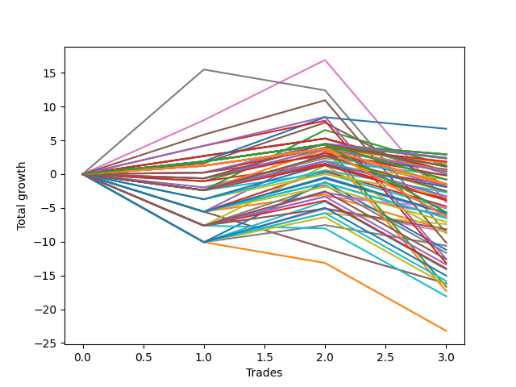

# Short Wallace 1231_002 
- Symbol: TSLA_Unlimited
- Date Range: 03/23/2022 - 07/08/2022
- Trading Period: 7:20-12:30
- Number of Trades: 3



| Name | Win Percent | Profit | Avg Profit / Trade | Avg Time / Trade |      | Name | Win Percent | Profit | Avg Profit / Trade | Avg Time / Trade |
| ---- | ----------- | ------ | ------------------ | ---------------- | ---- | ---- | ----------- | ------ | ------------------ | ---------------- |
| Sorted By <br> Profit | | | | | | Sorted By <br> Win Percentage ||||
| Seventy-Three | 66.67 | 3355.00 | 1118.33 | 08:45 |     | Seventy-Three | 66.67 | 3355.00 | 1118.33 | 08:45 |
| Sixty-Four | 66.67 | 1460.00 | 486.67 | 05:28 |     | Sixty-Four | 66.67 | 1460.00 | 486.67 | 05:28 |
| Fifty-Six | 66.67 | 1460.00 | 486.67 | 05:28 |     | Fifty-Six | 66.67 | 1460.00 | 486.67 | 05:28 |
| Forty-Eight | 66.67 | 1460.00 | 486.67 | 05:28 |     | Forty-Eight | 66.67 | 1460.00 | 486.67 | 05:28 |
| Forty | 66.67 | 1460.00 | 486.67 | 05:28 |     | Forty | 66.67 | 1460.00 | 486.67 | 05:28 |
| Zero | 66.67 | 1460.00 | 486.67 | 05:28 |     | Zero | 66.67 | 1460.00 | 486.67 | 05:28 |
| Ninety-Nine | 66.67 | 1225.00 | 408.33 | 03:46 |     | Ninety-Nine | 66.67 | 1225.00 | 408.33 | 03:46 |
| Ninety-Seven | 66.67 | 1160.00 | 386.67 | 02:50 |     | Ninety-Seven | 66.67 | 1160.00 | 386.67 | 02:50 |
| Ninety-Two | 66.67 | 1160.00 | 386.67 | 02:50 |     | Ninety-Two | 66.67 | 1160.00 | 386.67 | 02:50 |
| Ninety-Eight | 66.67 | 930.00 | 310.00 | 03:38 |     | Ninety-Eight | 66.67 | 930.00 | 310.00 | 03:38 |
| Ninety-Six | 66.67 | 850.00 | 283.33 | 02:26 |     | Ninety-Six | 66.67 | 850.00 | 283.33 | 02:26 |
| Ninety-One | 66.67 | 850.00 | 283.33 | 02:26 |     | Ninety-One | 66.67 | 850.00 | 283.33 | 02:26 |
| Fifty-Four | 33.33 | 655.00 | 218.33 | 17:16 |     | One Hundred Seven | 66.67 | 555.00 | 185.00 | 02:58 |
| One Hundred Ten | 33.33 | 590.00 | 196.67 | 07:45 |     | One Hundred Two | 66.67 | 555.00 | 185.00 | 02:58 |
| One Hundred Seven | 66.67 | 555.00 | 185.00 | 02:58 |     | One Hundred | 66.67 | 355.00 | 118.33 | 04:30 |
| One Hundred Two | 66.67 | 555.00 | 185.00 | 02:58 |     | One Hundred Six | 66.67 | 245.00 | 81.67 | 02:35 |
| One Hundred | 66.67 | 355.00 | 118.33 | 04:30 |     | One Hundred One | 66.67 | 245.00 | 81.67 | 02:35 |
| Four | 33.33 | 350.00 | 116.67 | 37:21 |     | Sixty-Five | 66.67 | 225.00 | 75.00 | 15:45 |
| Ninety-Five | 33.33 | 315.00 | 105.00 | 08:18 |     | Fifty-Seven | 66.67 | 225.00 | 75.00 | 15:45 |
| One Hundred Six | 66.67 | 245.00 | 81.67 | 02:35 |     | One | 66.67 | 225.00 | 75.00 | 15:45 |
| One Hundred One | 66.67 | 245.00 | 81.67 | 02:35 |     | Forty-Nine | 66.67 | 30.00 | 10.00 | 09:15 |
| Two | 33.33 | 240.00 | 80.00 | 28:08 |     | Forty-One | 66.67 | 30.00 | 10.00 | 09:15 |
| Sixty-Five | 66.67 | 225.00 | 75.00 | 15:45 |     | One Hundred Seventeen | 66.67 | -410.00 | -136.67 | 07:50 |
| Fifty-Seven | 66.67 | 225.00 | 75.00 | 15:45 |     | One Hundred Twelve | 66.67 | -410.00 | -136.67 | 07:50 |
| One | 66.67 | 225.00 | 75.00 | 15:45 |     | One Hundred Sixteen | 66.67 | -720.00 | -240.00 | 07:26 |
| One Hundred Nine | 33.33 | 195.00 | 65.00 | 05:16 |     | One Hundred Eleven | 66.67 | -720.00 | -240.00 | 07:26 |
| Forty-Nine | 66.67 | 30.00 | 10.00 | 09:15 |     | Five | 66.67 | -840.00 | -280.00 | 75:36 |
| Forty-One | 66.67 | 30.00 | 10.00 | 09:15 |     | Six | 66.67 | -2090.00 | -696.67 | 109:43 |
| Ninety-Four | 33.33 | -80.00 | -26.67 | 05:50 |     | One Hundred Twenty-Seven | 66.67 | -2830.00 | -943.33 | 27:53 |
| One Hundred Eight | 33.33 | -100.00 | -33.33 | 05:08 |     | One Hundred Twenty-Two | 66.67 | -2830.00 | -943.33 | 27:53 |
| Ninety-Three | 33.33 | -375.00 | -125.00 | 05:41 |     | One Hundred Twenty-Six | 66.67 | -3140.00 | -1046.67 | 27:30 |
| One Hundred Seventeen | 66.67 | -410.00 | -136.67 | 07:50 |     | One Hundred Twenty-One | 66.67 | -3140.00 | -1046.67 | 27:30 |
| One Hundred Twelve | 66.67 | -410.00 | -136.67 | 07:50 |     | Eighty-Five | 66.67 | -5070.00 | -1690.00 | 105:43 |
| One Hundred Sixteen | 66.67 | -720.00 | -240.00 | 07:26 |     | Eighty-Four | 66.67 | -6290.00 | -2096.67 | 103:11 |
| One Hundred Eleven | 66.67 | -720.00 | -240.00 | 07:26 |     | Eighty-Three | 66.67 | -6585.00 | -2195.00 | 103:03 |
| Three | 33.33 | -790.00 | -263.33 | 25:55 |     | Eighty-Two | 66.67 | -8340.00 | -2780.00 | 76:03 |
| Fifty-Three | 33.33 | -795.00 | -265.00 | 13:25 |     | Eighty-One | 66.67 | -8650.00 | -2883.33 | 75:40 |
| Five | 66.67 | -840.00 | -280.00 | 75:36 |     | Fifty-Four | 33.33 | 655.00 | 218.33 | 17:16 |
| Forty-Six | 33.33 | -935.00 | -311.67 | 19:51 |     | One Hundred Ten | 33.33 | 590.00 | 196.67 | 07:45 |
| One Hundred Five | 33.33 | -955.00 | -318.33 | 09:08 |     | Four | 33.33 | 350.00 | 116.67 | 37:21 |
| One Hundred Twenty | 33.33 | -1255.00 | -418.33 | 13:18 |     | Ninety-Five | 33.33 | 315.00 | 105.00 | 08:18 |
| Fifty | 33.33 | -1330.00 | -443.33 | 13:11 |     | Two | 33.33 | 240.00 | 80.00 | 28:08 |
| One Hundred Four | 33.33 | -1350.00 | -450.00 | 06:40 |     | One Hundred Nine | 33.33 | 195.00 | 65.00 | 05:16 |
| One Hundred Three | 33.33 | -1645.00 | -548.33 | 06:31 |     | Ninety-Four | 33.33 | -80.00 | -26.67 | 05:50 |
| One Hundred Ninteen | 33.33 | -1650.00 | -550.00 | 10:50 |     | One Hundred Eight | 33.33 | -100.00 | -33.33 | 05:08 |
| Fifty-Two | 33.33 | -1650.00 | -550.00 | 10:50 |     | Ninety-Three | 33.33 | -375.00 | -125.00 | 05:41 |
| Fifty-Five | 33.33 | -1835.00 | -611.67 | 19:41 |     | Three | 33.33 | -790.00 | -263.33 | 25:55 |
| One Hundred Eighteen | 33.33 | -1945.00 | -648.33 | 10:41 |     | Fifty-Three | 33.33 | -795.00 | -265.00 | 13:25 |
| Six | 66.67 | -2090.00 | -696.67 | 109:43 |     | Forty-Six | 33.33 | -935.00 | -311.67 | 19:51 |
| Forty-Five | 33.33 | -2385.00 | -795.00 | 16:00 |     | One Hundred Five | 33.33 | -955.00 | -318.33 | 09:08 |
| Sixty-Eight | 33.33 | -2480.00 | -826.67 | 23:13 |     | One Hundred Twenty | 33.33 | -1255.00 | -418.33 | 13:18 |
| Fifty-One | 33.33 | -2535.00 | -845.00 | 10:30 |     | Fifty | 33.33 | -1330.00 | -443.33 | 13:11 |
| One Hundred Twenty-Seven | 66.67 | -2830.00 | -943.33 | 27:53 |     | One Hundred Four | 33.33 | -1350.00 | -450.00 | 06:40 |
| One Hundred Twenty-Two | 66.67 | -2830.00 | -943.33 | 27:53 |     | One Hundred Three | 33.33 | -1645.00 | -548.33 | 06:31 |
| One Hundred Fifteen | 33.33 | -2845.00 | -948.33 | 15:53 |     | One Hundred Ninteen | 33.33 | -1650.00 | -550.00 | 10:50 |
| Forty-Two | 33.33 | -2920.00 | -973.33 | 15:46 |     | Fifty-Two | 33.33 | -1650.00 | -550.00 | 10:50 |
| Sixty-Six | 33.33 | -3050.00 | -1016.67 | 23:06 |     | Fifty-Five | 33.33 | -1835.00 | -611.67 | 19:41 |
| One Hundred Twenty-Six | 66.67 | -3140.00 | -1046.67 | 27:30 |     | One Hundred Eighteen | 33.33 | -1945.00 | -648.33 | 10:41 |
| One Hundred Twenty-One | 66.67 | -3140.00 | -1046.67 | 27:30 |     | Forty-Five | 33.33 | -2385.00 | -795.00 | 16:00 |
| One Hundred Fourteen | 33.33 | -3240.00 | -1080.00 | 13:25 |     | Sixty-Eight | 33.33 | -2480.00 | -826.67 | 23:13 |
| Forty-Four | 33.33 | -3240.00 | -1080.00 | 13:25 |     | Fifty-One | 33.33 | -2535.00 | -845.00 | 10:30 |
| One Hundred Thirteen | 33.33 | -3535.00 | -1178.33 | 13:16 |     | One Hundred Fifteen | 33.33 | -2845.00 | -948.33 | 15:53 |
| Sixty | 33.33 | -3700.00 | -1233.33 | 23:21 |     | Forty-Two | 33.33 | -2920.00 | -973.33 | 15:46 |
| Sixty-Seven | 33.33 | -4080.00 | -1360.00 | 20:53 |     | Sixty-Six | 33.33 | -3050.00 | -1016.67 | 23:06 |
| Forty-Three | 33.33 | -4125.00 | -1375.00 | 13:05 |     | One Hundred Fourteen | 33.33 | -3240.00 | -1080.00 | 13:25 |
| Fifty-Eight | 33.33 | -4270.00 | -1423.33 | 23:15 |     | Forty-Four | 33.33 | -3240.00 | -1080.00 | 13:25 |
| Seven | 33.33 | -4335.00 | -1445.00 | 174:41 |     | One Hundred Thirteen | 33.33 | -3535.00 | -1178.33 | 13:16 |
| Seventy | 33.33 | -4385.00 | -1461.67 | 40:08 |     | Sixty | 33.33 | -3700.00 | -1233.33 | 23:21 |
| Eighty-Five | 66.67 | -5070.00 | -1690.00 | 105:43 |     | Sixty-Seven | 33.33 | -4080.00 | -1360.00 | 20:53 |
| Fifty-Nine | 33.33 | -5300.00 | -1766.67 | 21:01 |     | Forty-Three | 33.33 | -4125.00 | -1375.00 | 13:05 |
| Sixty-Two | 33.33 | -5605.00 | -1868.33 | 40:16 |     | Fifty-Eight | 33.33 | -4270.00 | -1423.33 | 23:15 |
| Sixty-Nine | 33.33 | -5835.00 | -1945.00 | 36:16 |     | Seven | 33.33 | -4335.00 | -1445.00 | 174:41 |
| Eighty-Four | 66.67 | -6290.00 | -2096.67 | 103:11 |     | Seventy | 33.33 | -4385.00 | -1461.67 | 40:08 |
| One Hundred Thirty | 33.33 | -6295.00 | -2098.33 | 36:10 |     | Fifty-Nine | 33.33 | -5300.00 | -1766.67 | 21:01 |
| Eighty-Three | 66.67 | -6585.00 | -2195.00 | 103:03 |     | Sixty-Two | 33.33 | -5605.00 | -1868.33 | 40:16 |
| One Hundred Twenty-Nine | 33.33 | -6690.00 | -2230.00 | 33:41 |     | Sixty-Nine | 33.33 | -5835.00 | -1945.00 | 36:16 |
| One Hundred Twenty-Eight | 33.33 | -6985.00 | -2328.33 | 33:33 |     | One Hundred Thirty | 33.33 | -6295.00 | -2098.33 | 36:10 |
| Sixty-One | 33.33 | -7055.00 | -2351.67 | 36:25 |     | One Hundred Twenty-Nine | 33.33 | -6690.00 | -2230.00 | 33:41 |
| One Hundred Twenty-Five | 33.33 | -7515.00 | -2505.00 | 36:18 |     | One Hundred Twenty-Eight | 33.33 | -6985.00 | -2328.33 | 33:33 |
| One Hundred Twenty-Four | 33.33 | -7910.00 | -2636.67 | 33:50 |     | Sixty-One | 33.33 | -7055.00 | -2351.67 | 36:25 |
| Forty-Seven | 0.00 | -8095.00 | -2698.33 | 42:48 |     | One Hundred Twenty-Five | 33.33 | -7515.00 | -2505.00 | 36:18 |
| One Hundred Twenty-Three | 33.33 | -8205.00 | -2735.00 | 33:41 |     | One Hundred Twenty-Four | 33.33 | -7910.00 | -2636.67 | 33:50 |
| Eighty-Two | 66.67 | -8340.00 | -2780.00 | 76:03 |     | One Hundred Twenty-Three | 33.33 | -8205.00 | -2735.00 | 33:41 |
| Eighty-One | 66.67 | -8650.00 | -2883.33 | 75:40 |     | Forty-Seven | 0.00 | -8095.00 | -2698.33 | 42:48 |
| Seventy-One | 0.00 | -9045.00 | -3015.00 | 47:11 |     | Seventy-One | 0.00 | -9045.00 | -3015.00 | 47:11 |
| Sixty-Three | 0.00 | -11600.00 | -3866.67 | 96:06 |     | Sixty-Three | 0.00 | -11600.00 | -3866.67 | 96:06 |

## NO STOPLOSS

### Test Zero
* Sell when price hits the middle line of the 20p bollinger
* No Stoploss
* Results:
```
Total Trades: 3
Percent Up: 33.33
Percent Down: 66.67
Total Points Moved Down: 2.92
Potential Profit: 1460.00
Total Points Ups: 1.47 Count Ups: 1
Total Points Downs: 4.39 Count Downs: 2
```

<details><summary>Trades</summary>

<code>In: 2022-05-04 09:43:00		Out: 2022-05-04 09:47:00		Total Position Time: 04:00		Total Move Down: 1.86		Total to Date: 1.86</code> <br />
<code>In: 2022-05-17 09:38:00		Out: 2022-05-17 09:39:10		Total Position Time: 01:10		Total Move Down: 2.53		Total to Date: 4.39</code> <br />
<code>In: 2022-07-05 09:04:00		Out: 2022-07-05 09:15:15		Total Position Time: 11:15		Total Move Down: -1.47		Total to Date: 2.92</code> <br />


</details>

### Test One
* Sell when the price hits the upper line of the 20p 1std bollinger
* No Stoploss
* Results:
```
Total Trades: 3
Percent Up: 33.33
Percent Down: 66.67
Total Points Moved Down: 0.45
Potential Profit: 225.00
Total Points Ups: 4.82 Count Ups: 1
Total Points Downs: 5.27 Count Downs: 2
```

<details><summary>Trades</summary>

<code>In: 2022-05-04 09:43:00		Out: 2022-05-04 09:51:10		Total Position Time: 08:10		Total Move Down: 2.68		Total to Date: 2.68</code> <br />
<code>In: 2022-05-17 09:38:00		Out: 2022-05-17 09:39:15		Total Position Time: 01:15		Total Move Down: 2.59		Total to Date: 5.27</code> <br />
<code>In: 2022-07-05 09:04:00		Out: 2022-07-05 09:41:50		Total Position Time: 37:50		Total Move Down: -4.82		Total to Date: 0.45</code> <br />


</details>

### Test Two
* Sell when the price hits the upper line of the 20p 2std bollinger
* No Stoploss
* Results:
```
Total Trades: 3
Percent Up: 66.67
Percent Down: 33.33
Total Points Moved Down: 0.48
Potential Profit: 240.00
Total Points Ups: 4.46 Count Ups: 2
Total Points Downs: 4.94 Count Downs: 1
```

<details><summary>Trades</summary>

<code>In: 2022-05-04 09:43:00		Out: 2022-05-04 10:18:30		Total Position Time: 35:30		Total Move Down: -1.05		Total to Date: -1.05</code> <br />
<code>In: 2022-05-17 09:38:00		Out: 2022-05-17 09:47:15		Total Position Time: 09:15		Total Move Down: 4.94		Total to Date: 3.89</code> <br />
<code>In: 2022-07-05 09:04:00		Out: 2022-07-05 09:43:40		Total Position Time: 39:40		Total Move Down: -3.41		Total to Date: 0.48</code> <br />


</details>

### Test Three
* Sell when price hits the middle line of the 50p bollinger
* No Stoploss
* Results:
```
Total Trades: 3
Percent Up: 66.67
Percent Down: 33.33
Total Points Moved Down: -1.58
Potential Profit: -790.00
Total Points Ups: 4.11 Count Ups: 2
Total Points Downs: 2.53 Count Downs: 1
```

<details><summary>Trades</summary>

<code>In: 2022-05-04 09:43:00		Out: 2022-05-04 10:18:30		Total Position Time: 35:30		Total Move Down: -1.05		Total to Date: -1.05</code> <br />
<code>In: 2022-05-17 09:38:00		Out: 2022-05-17 09:39:10		Total Position Time: 01:10		Total Move Down: 2.53		Total to Date: 1.48</code> <br />
<code>In: 2022-07-05 09:04:00		Out: 2022-07-05 09:45:05		Total Position Time: 41:05		Total Move Down: -3.06		Total to Date: -1.58</code> <br />


</details>

### Test Four
* Sell when the price hits the upper line of the 50p 1std bollinger
* No Stoploss
* Results:
```
Total Trades: 3
Percent Up: 66.67
Percent Down: 33.33
Total Points Moved Down: 0.70
Potential Profit: 350.00
Total Points Ups: 3.60 Count Ups: 2
Total Points Downs: 4.30 Count Downs: 1
```

<details><summary>Trades</summary>

<code>In: 2022-05-04 09:43:00		Out: 2022-05-04 10:45:50		Total Position Time: 62:50		Total Move Down: -1.97		Total to Date: -1.97</code> <br />
<code>In: 2022-05-17 09:38:00		Out: 2022-05-17 09:40:10		Total Position Time: 02:10		Total Move Down: 4.30		Total to Date: 2.33</code> <br />
<code>In: 2022-07-05 09:04:00		Out: 2022-07-05 09:51:05		Total Position Time: 47:05		Total Move Down: -1.63		Total to Date: 0.70</code> <br />


</details>

### Test Five
* Sell when the price hits the upper line of the 50p 2std bollinger
* No Stoploss
* Results:
```
Total Trades: 3
Percent Up: 33.33
Percent Down: 66.67
Total Points Moved Down: -1.68
Potential Profit: -840.00
Total Points Ups: 9.30 Count Ups: 1
Total Points Downs: 7.62 Count Downs: 2
```

<details><summary>Trades</summary>

<code>In: 2022-05-04 09:43:00		Out: 2022-05-04 11:07:20		Total Position Time: 84:20		Total Move Down: 1.61		Total to Date: 1.61</code> <br />
<code>In: 2022-05-17 09:38:00		Out: 2022-05-17 09:47:55		Total Position Time: 09:55		Total Move Down: 6.01		Total to Date: 7.62</code> <br />
<code>In: 2022-07-05 09:04:00		Out: 2022-07-05 11:16:35		Total Position Time: 132:35		Total Move Down: -9.30		Total to Date: -1.68</code> <br />


</details>

### Test Six
* Sell when the price hits the middle line of the 1std VWAP
* No Stoploss
* Results:
```
Total Trades: 3
Percent Up: 33.33
Percent Down: 66.67
Total Points Moved Down: -4.18
Potential Profit: -2090.00
Total Points Ups: 21.07 Count Ups: 1
Total Points Downs: 16.89 Count Downs: 2
```

<details><summary>Trades</summary>

<code>In: 2022-05-04 09:43:00		Out: 2022-05-04 11:07:40		Total Position Time: 84:40		Total Move Down: 7.98		Total to Date: 7.98</code> <br />
<code>In: 2022-05-17 09:38:00		Out: 2022-05-17 09:59:30		Total Position Time: 21:30		Total Move Down: 8.91		Total to Date: 16.89</code> <br />
<code>In: 2022-07-05 09:04:00		Out: 2022-07-05 12:47:00		Total Position Time: 223:00		Total Move Down: -21.07		Total to Date: -4.18</code> <br />


</details>

### Test Seven
* Sell when the price hits the upper line of the 1std VWAP
* No Stoploss
* Results:
```
Total Trades: 3
Percent Up: 66.67
Percent Down: 33.33
Total Points Moved Down: -8.67
Potential Profit: -4335.00
Total Points Ups: 24.15 Count Ups: 2
Total Points Downs: 15.48 Count Downs: 1
```

<details><summary>Trades</summary>

<code>In: 2022-05-04 09:43:00		Out: 2022-05-04 11:35:05		Total Position Time: 112:05		Total Move Down: 15.48		Total to Date: 15.48</code> <br />
<code>In: 2022-05-17 09:38:00		Out: 2022-05-17 12:47:00		Total Position Time: 189:00		Total Move Down: -3.08		Total to Date: 12.40</code> <br />
<code>In: 2022-07-05 09:04:00		Out: 2022-07-05 12:47:00		Total Position Time: 223:00		Total Move Down: -21.07		Total to Date: -8.67</code> <br />


</details>

## STOPLOSS OF 5

### Test Forty
* Sell when price hits the middle line of the 20p bollinger
* Stoploss is -5 points
* Results:
```
Total Trades: 3
Percent Up: 33.33
Percent Down: 66.67
Total Points Moved Down: 2.92
Potential Profit: 1460.00
Total Points Ups: 1.47 Count Ups: 1
Total Points Downs: 4.39 Count Downs: 2
```

<details><summary>Trades</summary>

<code>In: 2022-05-04 09:43:00		Out: 2022-05-04 09:47:00		Total Position Time: 04:00		Total Move Down: 1.86		Total to Date: 1.86</code> <br />
<code>In: 2022-05-17 09:38:00		Out: 2022-05-17 09:39:10		Total Position Time: 01:10		Total Move Down: 2.53		Total to Date: 4.39</code> <br />
<code>In: 2022-07-05 09:04:00		Out: 2022-07-05 09:15:15		Total Position Time: 11:15		Total Move Down: -1.47		Total to Date: 2.92</code> <br />


</details>

### Test Forty-One
* Sell when the price hits the upper line of the 20p 1std bollinger
* Stoploss is -5 points
* Results:
```
Total Trades: 3
Percent Up: 33.33
Percent Down: 66.67
Total Points Moved Down: 0.06
Potential Profit: 30.00
Total Points Ups: 5.21 Count Ups: 1
Total Points Downs: 5.27 Count Downs: 2
```

<details><summary>Trades</summary>

<code>In: 2022-05-04 09:43:00		Out: 2022-05-04 09:51:10		Total Position Time: 08:10		Total Move Down: 2.68		Total to Date: 2.68</code> <br />
<code>In: 2022-05-17 09:38:00		Out: 2022-05-17 09:39:15		Total Position Time: 01:15		Total Move Down: 2.59		Total to Date: 5.27</code> <br />
<code>In: 2022-07-05 09:04:00		Out: 2022-07-05 09:22:20		Total Position Time: 18:20		Total Move Down: -5.21		Total to Date: 0.06</code> <br />


</details>

### Test Forty-Two
* Sell when the price hits the upper line of the 20p 2std bollinger
* Stoploss is -5 points
* Results:
```
Total Trades: 3
Percent Up: 66.67
Percent Down: 33.33
Total Points Moved Down: -5.84
Potential Profit: -2920.00
Total Points Ups: 10.78 Count Ups: 2
Total Points Downs: 4.94 Count Downs: 1
```

<details><summary>Trades</summary>

<code>In: 2022-05-04 09:43:00		Out: 2022-05-04 10:02:45		Total Position Time: 19:45		Total Move Down: -5.57		Total to Date: -5.57</code> <br />
<code>In: 2022-05-17 09:38:00		Out: 2022-05-17 09:47:15		Total Position Time: 09:15		Total Move Down: 4.94		Total to Date: -0.63</code> <br />
<code>In: 2022-07-05 09:04:00		Out: 2022-07-05 09:22:20		Total Position Time: 18:20		Total Move Down: -5.21		Total to Date: -5.84</code> <br />


</details>

### Test Forty-Three
* Sell when price hits the middle line of the 50p bollinger
* Stoploss is -5 points
* Results:
```
Total Trades: 3
Percent Up: 66.67
Percent Down: 33.33
Total Points Moved Down: -8.25
Potential Profit: -4125.00
Total Points Ups: 10.78 Count Ups: 2
Total Points Downs: 2.53 Count Downs: 1
```

<details><summary>Trades</summary>

<code>In: 2022-05-04 09:43:00		Out: 2022-05-04 10:02:45		Total Position Time: 19:45		Total Move Down: -5.57		Total to Date: -5.57</code> <br />
<code>In: 2022-05-17 09:38:00		Out: 2022-05-17 09:39:10		Total Position Time: 01:10		Total Move Down: 2.53		Total to Date: -3.04</code> <br />
<code>In: 2022-07-05 09:04:00		Out: 2022-07-05 09:22:20		Total Position Time: 18:20		Total Move Down: -5.21		Total to Date: -8.25</code> <br />


</details>

### Test Forty-Four
* Sell when the price hits the upper line of the 50p 1std bollinger
* Stoploss is -5 points
* Results:
```
Total Trades: 3
Percent Up: 66.67
Percent Down: 33.33
Total Points Moved Down: -6.48
Potential Profit: -3240.00
Total Points Ups: 10.78 Count Ups: 2
Total Points Downs: 4.30 Count Downs: 1
```

<details><summary>Trades</summary>

<code>In: 2022-05-04 09:43:00		Out: 2022-05-04 10:02:45		Total Position Time: 19:45		Total Move Down: -5.57		Total to Date: -5.57</code> <br />
<code>In: 2022-05-17 09:38:00		Out: 2022-05-17 09:40:10		Total Position Time: 02:10		Total Move Down: 4.30		Total to Date: -1.27</code> <br />
<code>In: 2022-07-05 09:04:00		Out: 2022-07-05 09:22:20		Total Position Time: 18:20		Total Move Down: -5.21		Total to Date: -6.48</code> <br />


</details>

### Test Forty-Five
* Sell when the price hits the upper line of the 50p 2std bollinger
* Stoploss is -5 points
* Results:
```
Total Trades: 3
Percent Up: 66.67
Percent Down: 33.33
Total Points Moved Down: -4.77
Potential Profit: -2385.00
Total Points Ups: 10.78 Count Ups: 2
Total Points Downs: 6.01 Count Downs: 1
```

<details><summary>Trades</summary>

<code>In: 2022-05-04 09:43:00		Out: 2022-05-04 10:02:45		Total Position Time: 19:45		Total Move Down: -5.57		Total to Date: -5.57</code> <br />
<code>In: 2022-05-17 09:38:00		Out: 2022-05-17 09:47:55		Total Position Time: 09:55		Total Move Down: 6.01		Total to Date: 0.44</code> <br />
<code>In: 2022-07-05 09:04:00		Out: 2022-07-05 09:22:20		Total Position Time: 18:20		Total Move Down: -5.21		Total to Date: -4.77</code> <br />


</details>

### Test Forty-Six
* Sell when the price hits the middle line of the 1std VWAP
* Stoploss is -5 points
* Results:
```
Total Trades: 3
Percent Up: 66.67
Percent Down: 33.33
Total Points Moved Down: -1.87
Potential Profit: -935.00
Total Points Ups: 10.78 Count Ups: 2
Total Points Downs: 8.91 Count Downs: 1
```

<details><summary>Trades</summary>

<code>In: 2022-05-04 09:43:00		Out: 2022-05-04 10:02:45		Total Position Time: 19:45		Total Move Down: -5.57		Total to Date: -5.57</code> <br />
<code>In: 2022-05-17 09:38:00		Out: 2022-05-17 09:59:30		Total Position Time: 21:30		Total Move Down: 8.91		Total to Date: 3.34</code> <br />
<code>In: 2022-07-05 09:04:00		Out: 2022-07-05 09:22:20		Total Position Time: 18:20		Total Move Down: -5.21		Total to Date: -1.87</code> <br />


</details>

### Test Forty-Seven
* Sell when the price hits the upper line of the 1std VWAP
* Stoploss is -5 points
* Results:
```
Total Trades: 3
Percent Up: 100.00
Percent Down: 0.00
Total Points Moved Down: -16.19
Potential Profit: -8095.00
Total Points Ups: 16.19 Count Ups: 3
Total Points Downs: 0.00 Count Downs: 0
```

<details><summary>Trades</summary>

<code>In: 2022-05-04 09:43:00		Out: 2022-05-04 10:02:45		Total Position Time: 19:45		Total Move Down: -5.57		Total to Date: -5.57</code> <br />
<code>In: 2022-05-17 09:38:00		Out: 2022-05-17 11:08:20		Total Position Time: 90:20		Total Move Down: -5.41		Total to Date: -10.98</code> <br />
<code>In: 2022-07-05 09:04:00		Out: 2022-07-05 09:22:20		Total Position Time: 18:20		Total Move Down: -5.21		Total to Date: -16.19</code> <br />


</details>

## TRAIL STOP OF 5

### Test Forty-Eight
* Sell when price hits the middle line of the 20p bollinger
* Trailing Stop is -5 points
* Results:
```
Total Trades: 3
Percent Up: 33.33
Percent Down: 66.67
Total Points Moved Down: 2.92
Potential Profit: 1460.00
Total Points Ups: 1.47 Count Ups: 1
Total Points Downs: 4.39 Count Downs: 2
```

<details><summary>Trades</summary>

<code>In: 2022-05-04 09:43:00		Out: 2022-05-04 09:47:00		Total Position Time: 04:00		Total Move Down: 1.86		Total to Date: 1.86</code> <br />
<code>In: 2022-05-17 09:38:00		Out: 2022-05-17 09:39:10		Total Position Time: 01:10		Total Move Down: 2.53		Total to Date: 4.39</code> <br />
<code>In: 2022-07-05 09:04:00		Out: 2022-07-05 09:15:15		Total Position Time: 11:15		Total Move Down: -1.47		Total to Date: 2.92</code> <br />


</details>

### Test Forty-Nine
* Sell when the price hits the upper line of the 20p 1std bollinger
* Trailing Stop is -5 points
* Results:
```
Total Trades: 3
Percent Up: 33.33
Percent Down: 66.67
Total Points Moved Down: 0.06
Potential Profit: 30.00
Total Points Ups: 5.21 Count Ups: 1
Total Points Downs: 5.27 Count Downs: 2
```

<details><summary>Trades</summary>

<code>In: 2022-05-04 09:43:00		Out: 2022-05-04 09:51:10		Total Position Time: 08:10		Total Move Down: 2.68		Total to Date: 2.68</code> <br />
<code>In: 2022-05-17 09:38:00		Out: 2022-05-17 09:39:15		Total Position Time: 01:15		Total Move Down: 2.59		Total to Date: 5.27</code> <br />
<code>In: 2022-07-05 09:04:00		Out: 2022-07-05 09:22:20		Total Position Time: 18:20		Total Move Down: -5.21		Total to Date: 0.06</code> <br />


</details>

### Test Fifty
* Sell when the price hits the upper line of the 20p 2std bollinger
* Trailing Stop is -5 points
* Results:
```
Total Trades: 3
Percent Up: 66.67
Percent Down: 33.33
Total Points Moved Down: -2.66
Potential Profit: -1330.00
Total Points Ups: 7.60 Count Ups: 2
Total Points Downs: 4.94 Count Downs: 1
```

<details><summary>Trades</summary>

<code>In: 2022-05-04 09:43:00		Out: 2022-05-04 09:55:00		Total Position Time: 12:00		Total Move Down: -2.39		Total to Date: -2.39</code> <br />
<code>In: 2022-05-17 09:38:00		Out: 2022-05-17 09:47:15		Total Position Time: 09:15		Total Move Down: 4.94		Total to Date: 2.55</code> <br />
<code>In: 2022-07-05 09:04:00		Out: 2022-07-05 09:22:20		Total Position Time: 18:20		Total Move Down: -5.21		Total to Date: -2.66</code> <br />


</details>

### Test Fifty-One
* Sell when price hits the middle line of the 50p bollinger
* Trailing Stop is -5 points
* Results:
```
Total Trades: 3
Percent Up: 66.67
Percent Down: 33.33
Total Points Moved Down: -5.07
Potential Profit: -2535.00
Total Points Ups: 7.60 Count Ups: 2
Total Points Downs: 2.53 Count Downs: 1
```

<details><summary>Trades</summary>

<code>In: 2022-05-04 09:43:00		Out: 2022-05-04 09:55:00		Total Position Time: 12:00		Total Move Down: -2.39		Total to Date: -2.39</code> <br />
<code>In: 2022-05-17 09:38:00		Out: 2022-05-17 09:39:10		Total Position Time: 01:10		Total Move Down: 2.53		Total to Date: 0.14</code> <br />
<code>In: 2022-07-05 09:04:00		Out: 2022-07-05 09:22:20		Total Position Time: 18:20		Total Move Down: -5.21		Total to Date: -5.07</code> <br />


</details>

### Test Fifty-Two
* Sell when the price hits the upper line of the 50p 1std bollinger
* Trailing Stop is -5 points
* Results:
```
Total Trades: 3
Percent Up: 66.67
Percent Down: 33.33
Total Points Moved Down: -3.30
Potential Profit: -1650.00
Total Points Ups: 7.60 Count Ups: 2
Total Points Downs: 4.30 Count Downs: 1
```

<details><summary>Trades</summary>

<code>In: 2022-05-04 09:43:00		Out: 2022-05-04 09:55:00		Total Position Time: 12:00		Total Move Down: -2.39		Total to Date: -2.39</code> <br />
<code>In: 2022-05-17 09:38:00		Out: 2022-05-17 09:40:10		Total Position Time: 02:10		Total Move Down: 4.30		Total to Date: 1.91</code> <br />
<code>In: 2022-07-05 09:04:00		Out: 2022-07-05 09:22:20		Total Position Time: 18:20		Total Move Down: -5.21		Total to Date: -3.30</code> <br />


</details>

### Test Fifty-Three
* Sell when the price hits the upper line of the 50p 2std bollinger
* Trailing Stop is -5 points
* Results:
```
Total Trades: 3
Percent Up: 66.67
Percent Down: 33.33
Total Points Moved Down: -1.59
Potential Profit: -795.00
Total Points Ups: 7.60 Count Ups: 2
Total Points Downs: 6.01 Count Downs: 1
```

<details><summary>Trades</summary>

<code>In: 2022-05-04 09:43:00		Out: 2022-05-04 09:55:00		Total Position Time: 12:00		Total Move Down: -2.39		Total to Date: -2.39</code> <br />
<code>In: 2022-05-17 09:38:00		Out: 2022-05-17 09:47:55		Total Position Time: 09:55		Total Move Down: 6.01		Total to Date: 3.62</code> <br />
<code>In: 2022-07-05 09:04:00		Out: 2022-07-05 09:22:20		Total Position Time: 18:20		Total Move Down: -5.21		Total to Date: -1.59</code> <br />


</details>

### Test Fifty-Four
* Sell when the price hits the middle line of the 1std VWAP
* Trailing Stop is -5 points
* Results:
```
Total Trades: 3
Percent Up: 66.67
Percent Down: 33.33
Total Points Moved Down: 1.31
Potential Profit: 655.00
Total Points Ups: 7.60 Count Ups: 2
Total Points Downs: 8.91 Count Downs: 1
```

<details><summary>Trades</summary>

<code>In: 2022-05-04 09:43:00		Out: 2022-05-04 09:55:00		Total Position Time: 12:00		Total Move Down: -2.39		Total to Date: -2.39</code> <br />
<code>In: 2022-05-17 09:38:00		Out: 2022-05-17 09:59:30		Total Position Time: 21:30		Total Move Down: 8.91		Total to Date: 6.52</code> <br />
<code>In: 2022-07-05 09:04:00		Out: 2022-07-05 09:22:20		Total Position Time: 18:20		Total Move Down: -5.21		Total to Date: 1.31</code> <br />


</details>

### Test Fifty-Five
* Sell when the price hits the upper line of the 1std VWAP
* Trailing Stop is -5 points
* Results:
```
Total Trades: 3
Percent Up: 66.67
Percent Down: 33.33
Total Points Moved Down: -3.67
Potential Profit: -1835.00
Total Points Ups: 7.60 Count Ups: 2
Total Points Downs: 3.93 Count Downs: 1
```

<details><summary>Trades</summary>

<code>In: 2022-05-04 09:43:00		Out: 2022-05-04 09:55:00		Total Position Time: 12:00		Total Move Down: -2.39		Total to Date: -2.39</code> <br />
<code>In: 2022-05-17 09:38:00		Out: 2022-05-17 10:06:45		Total Position Time: 28:45		Total Move Down: 3.93		Total to Date: 1.54</code> <br />
<code>In: 2022-07-05 09:04:00		Out: 2022-07-05 09:22:20		Total Position Time: 18:20		Total Move Down: -5.21		Total to Date: -3.67</code> <br />


</details>

## STOPLOSS OF 10

### Test Fifty-Six
* Sell when price hits the middle line of the 20p bollinger
* Stoploss is -10 points
* Results:
```
Total Trades: 3
Percent Up: 33.33
Percent Down: 66.67
Total Points Moved Down: 2.92
Potential Profit: 1460.00
Total Points Ups: 1.47 Count Ups: 1
Total Points Downs: 4.39 Count Downs: 2
```

<details><summary>Trades</summary>

<code>In: 2022-05-04 09:43:00		Out: 2022-05-04 09:47:00		Total Position Time: 04:00		Total Move Down: 1.86		Total to Date: 1.86</code> <br />
<code>In: 2022-05-17 09:38:00		Out: 2022-05-17 09:39:10		Total Position Time: 01:10		Total Move Down: 2.53		Total to Date: 4.39</code> <br />
<code>In: 2022-07-05 09:04:00		Out: 2022-07-05 09:15:15		Total Position Time: 11:15		Total Move Down: -1.47		Total to Date: 2.92</code> <br />


</details>

### Test Fifty-Seven
* Sell when the price hits the upper line of the 20p 1std bollinger
* Stoploss is -10 points
* Results:
```
Total Trades: 3
Percent Up: 33.33
Percent Down: 66.67
Total Points Moved Down: 0.45
Potential Profit: 225.00
Total Points Ups: 4.82 Count Ups: 1
Total Points Downs: 5.27 Count Downs: 2
```

<details><summary>Trades</summary>

<code>In: 2022-05-04 09:43:00		Out: 2022-05-04 09:51:10		Total Position Time: 08:10		Total Move Down: 2.68		Total to Date: 2.68</code> <br />
<code>In: 2022-05-17 09:38:00		Out: 2022-05-17 09:39:15		Total Position Time: 01:15		Total Move Down: 2.59		Total to Date: 5.27</code> <br />
<code>In: 2022-07-05 09:04:00		Out: 2022-07-05 09:41:50		Total Position Time: 37:50		Total Move Down: -4.82		Total to Date: 0.45</code> <br />


</details>

### Test Fifty-Eight
* Sell when the price hits the upper line of the 20p 2std bollinger
* Stoploss is -10 points
* Results:
```
Total Trades: 3
Percent Up: 66.67
Percent Down: 33.33
Total Points Moved Down: -8.54
Potential Profit: -4270.00
Total Points Ups: 13.48 Count Ups: 2
Total Points Downs: 4.94 Count Downs: 1
```

<details><summary>Trades</summary>

<code>In: 2022-05-04 09:43:00		Out: 2022-05-04 10:03:50		Total Position Time: 20:50		Total Move Down: -10.07		Total to Date: -10.07</code> <br />
<code>In: 2022-05-17 09:38:00		Out: 2022-05-17 09:47:15		Total Position Time: 09:15		Total Move Down: 4.94		Total to Date: -5.13</code> <br />
<code>In: 2022-07-05 09:04:00		Out: 2022-07-05 09:43:40		Total Position Time: 39:40		Total Move Down: -3.41		Total to Date: -8.54</code> <br />


</details>

### Test Fifty-Nine
* Sell when price hits the middle line of the 50p bollinger
* Stoploss is -10 points
* Results:
```
Total Trades: 3
Percent Up: 66.67
Percent Down: 33.33
Total Points Moved Down: -10.60
Potential Profit: -5300.00
Total Points Ups: 13.13 Count Ups: 2
Total Points Downs: 2.53 Count Downs: 1
```

<details><summary>Trades</summary>

<code>In: 2022-05-04 09:43:00		Out: 2022-05-04 10:03:50		Total Position Time: 20:50		Total Move Down: -10.07		Total to Date: -10.07</code> <br />
<code>In: 2022-05-17 09:38:00		Out: 2022-05-17 09:39:10		Total Position Time: 01:10		Total Move Down: 2.53		Total to Date: -7.54</code> <br />
<code>In: 2022-07-05 09:04:00		Out: 2022-07-05 09:45:05		Total Position Time: 41:05		Total Move Down: -3.06		Total to Date: -10.60</code> <br />


</details>

### Test Sixty
* Sell when the price hits the upper line of the 50p 1std bollinger
* Stoploss is -10 points
* Results:
```
Total Trades: 3
Percent Up: 66.67
Percent Down: 33.33
Total Points Moved Down: -7.40
Potential Profit: -3700.00
Total Points Ups: 11.70 Count Ups: 2
Total Points Downs: 4.30 Count Downs: 1
```

<details><summary>Trades</summary>

<code>In: 2022-05-04 09:43:00		Out: 2022-05-04 10:03:50		Total Position Time: 20:50		Total Move Down: -10.07		Total to Date: -10.07</code> <br />
<code>In: 2022-05-17 09:38:00		Out: 2022-05-17 09:40:10		Total Position Time: 02:10		Total Move Down: 4.30		Total to Date: -5.77</code> <br />
<code>In: 2022-07-05 09:04:00		Out: 2022-07-05 09:51:05		Total Position Time: 47:05		Total Move Down: -1.63		Total to Date: -7.40</code> <br />


</details>

### Test Sixty-One
* Sell when the price hits the upper line of the 50p 2std bollinger
* Stoploss is -10 points
* Results:
```
Total Trades: 3
Percent Up: 66.67
Percent Down: 33.33
Total Points Moved Down: -14.11
Potential Profit: -7055.00
Total Points Ups: 20.12 Count Ups: 2
Total Points Downs: 6.01 Count Downs: 1
```

<details><summary>Trades</summary>

<code>In: 2022-05-04 09:43:00		Out: 2022-05-04 10:03:50		Total Position Time: 20:50		Total Move Down: -10.07		Total to Date: -10.07</code> <br />
<code>In: 2022-05-17 09:38:00		Out: 2022-05-17 09:47:55		Total Position Time: 09:55		Total Move Down: 6.01		Total to Date: -4.06</code> <br />
<code>In: 2022-07-05 09:04:00		Out: 2022-07-05 10:22:30		Total Position Time: 78:30		Total Move Down: -10.05		Total to Date: -14.11</code> <br />


</details>

### Test Sixty-Two
* Sell when the price hits the middle line of the 1std VWAP
* Stoploss is -10 points
* Results:
```
Total Trades: 3
Percent Up: 66.67
Percent Down: 33.33
Total Points Moved Down: -11.21
Potential Profit: -5605.00
Total Points Ups: 20.12 Count Ups: 2
Total Points Downs: 8.91 Count Downs: 1
```

<details><summary>Trades</summary>

<code>In: 2022-05-04 09:43:00		Out: 2022-05-04 10:03:50		Total Position Time: 20:50		Total Move Down: -10.07		Total to Date: -10.07</code> <br />
<code>In: 2022-05-17 09:38:00		Out: 2022-05-17 09:59:30		Total Position Time: 21:30		Total Move Down: 8.91		Total to Date: -1.16</code> <br />
<code>In: 2022-07-05 09:04:00		Out: 2022-07-05 10:22:30		Total Position Time: 78:30		Total Move Down: -10.05		Total to Date: -11.21</code> <br />


</details>

### Test Sixty-Three
* Sell when the price hits the upper line of the 1std VWAP
* Stoploss is -10 points
* Results:
```
Total Trades: 3
Percent Up: 100.00
Percent Down: 0.00
Total Points Moved Down: -23.20
Potential Profit: -11600.00
Total Points Ups: 23.20 Count Ups: 3
Total Points Downs: 0.00 Count Downs: 0
```

<details><summary>Trades</summary>

<code>In: 2022-05-04 09:43:00		Out: 2022-05-04 10:03:50		Total Position Time: 20:50		Total Move Down: -10.07		Total to Date: -10.07</code> <br />
<code>In: 2022-05-17 09:38:00		Out: 2022-05-17 12:47:00		Total Position Time: 189:00		Total Move Down: -3.08		Total to Date: -13.15</code> <br />
<code>In: 2022-07-05 09:04:00		Out: 2022-07-05 10:22:30		Total Position Time: 78:30		Total Move Down: -10.05		Total to Date: -23.20</code> <br />


</details>

## TRAIL STOP OF 10

### Test Sixty-Four
* Sell when price hits the middle line of the 20p bollinger
* Trailing Stop is -10 points
* Results:
```
Total Trades: 3
Percent Up: 33.33
Percent Down: 66.67
Total Points Moved Down: 2.92
Potential Profit: 1460.00
Total Points Ups: 1.47 Count Ups: 1
Total Points Downs: 4.39 Count Downs: 2
```

<details><summary>Trades</summary>

<code>In: 2022-05-04 09:43:00		Out: 2022-05-04 09:47:00		Total Position Time: 04:00		Total Move Down: 1.86		Total to Date: 1.86</code> <br />
<code>In: 2022-05-17 09:38:00		Out: 2022-05-17 09:39:10		Total Position Time: 01:10		Total Move Down: 2.53		Total to Date: 4.39</code> <br />
<code>In: 2022-07-05 09:04:00		Out: 2022-07-05 09:15:15		Total Position Time: 11:15		Total Move Down: -1.47		Total to Date: 2.92</code> <br />


</details>

### Test Sixty-Five
* Sell when the price hits the upper line of the 20p 1std bollinger
* Trailing Stop is -10 points
* Results:
```
Total Trades: 3
Percent Up: 33.33
Percent Down: 66.67
Total Points Moved Down: 0.45
Potential Profit: 225.00
Total Points Ups: 4.82 Count Ups: 1
Total Points Downs: 5.27 Count Downs: 2
```

<details><summary>Trades</summary>

<code>In: 2022-05-04 09:43:00		Out: 2022-05-04 09:51:10		Total Position Time: 08:10		Total Move Down: 2.68		Total to Date: 2.68</code> <br />
<code>In: 2022-05-17 09:38:00		Out: 2022-05-17 09:39:15		Total Position Time: 01:15		Total Move Down: 2.59		Total to Date: 5.27</code> <br />
<code>In: 2022-07-05 09:04:00		Out: 2022-07-05 09:41:50		Total Position Time: 37:50		Total Move Down: -4.82		Total to Date: 0.45</code> <br />


</details>

### Test Sixty-Six
* Sell when the price hits the upper line of the 20p 2std bollinger
* Trailing Stop is -10 points
* Results:
```
Total Trades: 3
Percent Up: 66.67
Percent Down: 33.33
Total Points Moved Down: -6.10
Potential Profit: -3050.00
Total Points Ups: 11.04 Count Ups: 2
Total Points Downs: 4.94 Count Downs: 1
```

<details><summary>Trades</summary>

<code>In: 2022-05-04 09:43:00		Out: 2022-05-04 10:03:25		Total Position Time: 20:25		Total Move Down: -7.63		Total to Date: -7.63</code> <br />
<code>In: 2022-05-17 09:38:00		Out: 2022-05-17 09:47:15		Total Position Time: 09:15		Total Move Down: 4.94		Total to Date: -2.69</code> <br />
<code>In: 2022-07-05 09:04:00		Out: 2022-07-05 09:43:40		Total Position Time: 39:40		Total Move Down: -3.41		Total to Date: -6.10</code> <br />


</details>

### Test Sixty-Seven
* Sell when price hits the middle line of the 50p bollinger
* Trailing Stop is -10 points
* Results:
```
Total Trades: 3
Percent Up: 66.67
Percent Down: 33.33
Total Points Moved Down: -8.16
Potential Profit: -4080.00
Total Points Ups: 10.69 Count Ups: 2
Total Points Downs: 2.53 Count Downs: 1
```

<details><summary>Trades</summary>

<code>In: 2022-05-04 09:43:00		Out: 2022-05-04 10:03:25		Total Position Time: 20:25		Total Move Down: -7.63		Total to Date: -7.63</code> <br />
<code>In: 2022-05-17 09:38:00		Out: 2022-05-17 09:39:10		Total Position Time: 01:10		Total Move Down: 2.53		Total to Date: -5.10</code> <br />
<code>In: 2022-07-05 09:04:00		Out: 2022-07-05 09:45:05		Total Position Time: 41:05		Total Move Down: -3.06		Total to Date: -8.16</code> <br />


</details>

### Test Sixty-Eight
* Sell when the price hits the upper line of the 50p 1std bollinger
* Trailing Stop is -10 points
* Results:
```
Total Trades: 3
Percent Up: 66.67
Percent Down: 33.33
Total Points Moved Down: -4.96
Potential Profit: -2480.00
Total Points Ups: 9.26 Count Ups: 2
Total Points Downs: 4.30 Count Downs: 1
```

<details><summary>Trades</summary>

<code>In: 2022-05-04 09:43:00		Out: 2022-05-04 10:03:25		Total Position Time: 20:25		Total Move Down: -7.63		Total to Date: -7.63</code> <br />
<code>In: 2022-05-17 09:38:00		Out: 2022-05-17 09:40:10		Total Position Time: 02:10		Total Move Down: 4.30		Total to Date: -3.33</code> <br />
<code>In: 2022-07-05 09:04:00		Out: 2022-07-05 09:51:05		Total Position Time: 47:05		Total Move Down: -1.63		Total to Date: -4.96</code> <br />


</details>

### Test Sixty-Nine
* Sell when the price hits the upper line of the 50p 2std bollinger
* Trailing Stop is -10 points
* Results:
```
Total Trades: 3
Percent Up: 66.67
Percent Down: 33.33
Total Points Moved Down: -11.67
Potential Profit: -5835.00
Total Points Ups: 17.68 Count Ups: 2
Total Points Downs: 6.01 Count Downs: 1
```

<details><summary>Trades</summary>

<code>In: 2022-05-04 09:43:00		Out: 2022-05-04 10:03:25		Total Position Time: 20:25		Total Move Down: -7.63		Total to Date: -7.63</code> <br />
<code>In: 2022-05-17 09:38:00		Out: 2022-05-17 09:47:55		Total Position Time: 09:55		Total Move Down: 6.01		Total to Date: -1.62</code> <br />
<code>In: 2022-07-05 09:04:00		Out: 2022-07-05 10:22:30		Total Position Time: 78:30		Total Move Down: -10.05		Total to Date: -11.67</code> <br />


</details>

### Test Seventy
* Sell when the price hits the middle line of the 1std VWAP
* Trailing Stop is -10 points
* Results:
```
Total Trades: 3
Percent Up: 66.67
Percent Down: 33.33
Total Points Moved Down: -8.77
Potential Profit: -4385.00
Total Points Ups: 17.68 Count Ups: 2
Total Points Downs: 8.91 Count Downs: 1
```

<details><summary>Trades</summary>

<code>In: 2022-05-04 09:43:00		Out: 2022-05-04 10:03:25		Total Position Time: 20:25		Total Move Down: -7.63		Total to Date: -7.63</code> <br />
<code>In: 2022-05-17 09:38:00		Out: 2022-05-17 09:59:30		Total Position Time: 21:30		Total Move Down: 8.91		Total to Date: 1.28</code> <br />
<code>In: 2022-07-05 09:04:00		Out: 2022-07-05 10:22:30		Total Position Time: 78:30		Total Move Down: -10.05		Total to Date: -8.77</code> <br />


</details>

### Test Seventy-One
* Sell when the price hits the upper line of the 1std VWAP
* Trailing Stop is -10 points
* Results:
```
Total Trades: 3
Percent Up: 100.00
Percent Down: 0.00
Total Points Moved Down: -18.09
Potential Profit: -9045.00
Total Points Ups: 18.09 Count Ups: 3
Total Points Downs: 0.00 Count Downs: 0
```

<details><summary>Trades</summary>

<code>In: 2022-05-04 09:43:00		Out: 2022-05-04 10:03:25		Total Position Time: 20:25		Total Move Down: -7.63		Total to Date: -7.63</code> <br />
<code>In: 2022-05-17 09:38:00		Out: 2022-05-17 10:20:40		Total Position Time: 42:40		Total Move Down: -0.41		Total to Date: -8.04</code> <br />
<code>In: 2022-07-05 09:04:00		Out: 2022-07-05 10:22:30		Total Position Time: 78:30		Total Move Down: -10.05		Total to Date: -18.09</code> <br />


</details>

## SPECIAL EXIT CONDITIONS 

### Test Seventy-Three
* Sell when the linear regression slope changes to negative
* No Stoploss
* Results:
```
Total Trades: 3
Percent Up: 33.33
Percent Down: 66.67
Total Points Moved Down: 6.71
Potential Profit: 3355.00
Total Points Ups: 1.70 Count Ups: 1
Total Points Downs: 8.41 Count Downs: 2
```

<details><summary>Trades</summary>

<code>In: 2022-05-04 09:43:00		Out: 2022-05-04 09:47:05		Total Position Time: 04:05		Total Move Down: 1.90		Total to Date: 1.90</code> <br />
<code>In: 2022-05-17 09:38:00		Out: 2022-05-17 09:57:05		Total Position Time: 19:05		Total Move Down: 6.51		Total to Date: 8.41</code> <br />
<code>In: 2022-07-05 09:04:00		Out: 2022-07-05 09:07:05		Total Position Time: 03:05		Total Move Down: -1.70		Total to Date: 6.71</code> <br />


</details>

## TAKE PROFIT

### Test Eighty-One
* Take Profit of 1 Point
* No Stoploss
* Results:
```
Total Trades: 3
Percent Up: 33.33
Percent Down: 66.67
Total Points Moved Down: -17.30
Potential Profit: -8650.00
Total Points Ups: 21.07 Count Ups: 1
Total Points Downs: 3.77 Count Downs: 2
```

<details><summary>Trades</summary>

<code>In: 2022-05-04 09:43:00		Out: 2022-05-04 09:45:50		Total Position Time: 02:50		Total Move Down: 1.24		Total to Date: 1.24</code> <br />
<code>In: 2022-05-17 09:38:00		Out: 2022-05-17 09:39:10		Total Position Time: 01:10		Total Move Down: 2.53		Total to Date: 3.77</code> <br />
<code>In: 2022-07-05 09:04:00		Out: 2022-07-05 12:47:00		Total Position Time: 223:00		Total Move Down: -21.07		Total to Date: -17.30</code> <br />


</details>

### Test Eighty-Two
* Take Profit of 2 Point
* No Stoploss
* Results:
```
Total Trades: 3
Percent Up: 33.33
Percent Down: 66.67
Total Points Moved Down: -16.68
Potential Profit: -8340.00
Total Points Ups: 21.07 Count Ups: 1
Total Points Downs: 4.39 Count Downs: 2
```

<details><summary>Trades</summary>

<code>In: 2022-05-04 09:43:00		Out: 2022-05-04 09:47:00		Total Position Time: 04:00		Total Move Down: 1.86		Total to Date: 1.86</code> <br />
<code>In: 2022-05-17 09:38:00		Out: 2022-05-17 09:39:10		Total Position Time: 01:10		Total Move Down: 2.53		Total to Date: 4.39</code> <br />
<code>In: 2022-07-05 09:04:00		Out: 2022-07-05 12:47:00		Total Position Time: 223:00		Total Move Down: -21.07		Total to Date: -16.68</code> <br />


</details>

### Test Eighty-Three
* Take Profit of 3 Point
* No Stoploss
* Results:
```
Total Trades: 3
Percent Up: 33.33
Percent Down: 66.67
Total Points Moved Down: -13.17
Potential Profit: -6585.00
Total Points Ups: 21.07 Count Ups: 1
Total Points Downs: 7.90 Count Downs: 2
```

<details><summary>Trades</summary>

<code>In: 2022-05-04 09:43:00		Out: 2022-05-04 11:07:25		Total Position Time: 84:25		Total Move Down: 4.19		Total to Date: 4.19</code> <br />
<code>In: 2022-05-17 09:38:00		Out: 2022-05-17 09:39:45		Total Position Time: 01:45		Total Move Down: 3.71		Total to Date: 7.90</code> <br />
<code>In: 2022-07-05 09:04:00		Out: 2022-07-05 12:47:00		Total Position Time: 223:00		Total Move Down: -21.07		Total to Date: -13.17</code> <br />


</details>

### Test Eighty-Four
* Take Profit of 4 Point
* No Stoploss
* Results:
```
Total Trades: 3
Percent Up: 33.33
Percent Down: 66.67
Total Points Moved Down: -12.58
Potential Profit: -6290.00
Total Points Ups: 21.07 Count Ups: 1
Total Points Downs: 8.49 Count Downs: 2
```

<details><summary>Trades</summary>

<code>In: 2022-05-04 09:43:00		Out: 2022-05-04 11:07:25		Total Position Time: 84:25		Total Move Down: 4.19		Total to Date: 4.19</code> <br />
<code>In: 2022-05-17 09:38:00		Out: 2022-05-17 09:40:10		Total Position Time: 02:10		Total Move Down: 4.30		Total to Date: 8.49</code> <br />
<code>In: 2022-07-05 09:04:00		Out: 2022-07-05 12:47:00		Total Position Time: 223:00		Total Move Down: -21.07		Total to Date: -12.58</code> <br />


</details>

### Test Eighty-Five
* Take Profit of 5 Point
* No Stoploss
* Results:
```
Total Trades: 3
Percent Up: 33.33
Percent Down: 66.67
Total Points Moved Down: -10.14
Potential Profit: -5070.00
Total Points Ups: 21.07 Count Ups: 1
Total Points Downs: 10.93 Count Downs: 2
```

<details><summary>Trades</summary>

<code>In: 2022-05-04 09:43:00		Out: 2022-05-04 11:07:35		Total Position Time: 84:35		Total Move Down: 5.84		Total to Date: 5.84</code> <br />
<code>In: 2022-05-17 09:38:00		Out: 2022-05-17 09:47:35		Total Position Time: 09:35		Total Move Down: 5.09		Total to Date: 10.93</code> <br />
<code>In: 2022-07-05 09:04:00		Out: 2022-07-05 12:47:00		Total Position Time: 223:00		Total Move Down: -21.07		Total to Date: -10.14</code> <br />


</details>

## TAKE PROFIT Stoploss of Two

### Test Ninety-One
* Take Profit of 1 Point
* Stoploss is -2 points
* Results:
```
Total Trades: 3
Percent Up: 33.33
Percent Down: 66.67
Total Points Moved Down: 1.70
Potential Profit: 850.00
Total Points Ups: 2.07 Count Ups: 1
Total Points Downs: 3.77 Count Downs: 2
```

<details><summary>Trades</summary>

<code>In: 2022-05-04 09:43:00		Out: 2022-05-04 09:45:50		Total Position Time: 02:50		Total Move Down: 1.24		Total to Date: 1.24</code> <br />
<code>In: 2022-05-17 09:38:00		Out: 2022-05-17 09:39:10		Total Position Time: 01:10		Total Move Down: 2.53		Total to Date: 3.77</code> <br />
<code>In: 2022-07-05 09:04:00		Out: 2022-07-05 09:07:20		Total Position Time: 03:20		Total Move Down: -2.07		Total to Date: 1.70</code> <br />


</details>

### Test Ninety-Two
* Take Profit of 2 Point
* Stoploss is -2 points
* Results:
```
Total Trades: 3
Percent Up: 33.33
Percent Down: 66.67
Total Points Moved Down: 2.32
Potential Profit: 1160.00
Total Points Ups: 2.07 Count Ups: 1
Total Points Downs: 4.39 Count Downs: 2
```

<details><summary>Trades</summary>

<code>In: 2022-05-04 09:43:00		Out: 2022-05-04 09:47:00		Total Position Time: 04:00		Total Move Down: 1.86		Total to Date: 1.86</code> <br />
<code>In: 2022-05-17 09:38:00		Out: 2022-05-17 09:39:10		Total Position Time: 01:10		Total Move Down: 2.53		Total to Date: 4.39</code> <br />
<code>In: 2022-07-05 09:04:00		Out: 2022-07-05 09:07:20		Total Position Time: 03:20		Total Move Down: -2.07		Total to Date: 2.32</code> <br />


</details>

### Test Ninety-Three
* Take Profit of 3 Point
* Stoploss is -2 points
* Results:
```
Total Trades: 3
Percent Up: 66.67
Percent Down: 33.33
Total Points Moved Down: -0.75
Potential Profit: -375.00
Total Points Ups: 4.46 Count Ups: 2
Total Points Downs: 3.71 Count Downs: 1
```

<details><summary>Trades</summary>

<code>In: 2022-05-04 09:43:00		Out: 2022-05-04 09:55:00		Total Position Time: 12:00		Total Move Down: -2.39		Total to Date: -2.39</code> <br />
<code>In: 2022-05-17 09:38:00		Out: 2022-05-17 09:39:45		Total Position Time: 01:45		Total Move Down: 3.71		Total to Date: 1.32</code> <br />
<code>In: 2022-07-05 09:04:00		Out: 2022-07-05 09:07:20		Total Position Time: 03:20		Total Move Down: -2.07		Total to Date: -0.75</code> <br />


</details>

### Test Ninety-Four
* Take Profit of 4 Point
* Stoploss is -2 points
* Results:
```
Total Trades: 3
Percent Up: 66.67
Percent Down: 33.33
Total Points Moved Down: -0.16
Potential Profit: -80.00
Total Points Ups: 4.46 Count Ups: 2
Total Points Downs: 4.30 Count Downs: 1
```

<details><summary>Trades</summary>

<code>In: 2022-05-04 09:43:00		Out: 2022-05-04 09:55:00		Total Position Time: 12:00		Total Move Down: -2.39		Total to Date: -2.39</code> <br />
<code>In: 2022-05-17 09:38:00		Out: 2022-05-17 09:40:10		Total Position Time: 02:10		Total Move Down: 4.30		Total to Date: 1.91</code> <br />
<code>In: 2022-07-05 09:04:00		Out: 2022-07-05 09:07:20		Total Position Time: 03:20		Total Move Down: -2.07		Total to Date: -0.16</code> <br />


</details>

### Test Ninety-Five
* Take Profit of 5 Point
* Stoploss is -2 points
* Results:
```
Total Trades: 3
Percent Up: 66.67
Percent Down: 33.33
Total Points Moved Down: 0.63
Potential Profit: 315.00
Total Points Ups: 4.46 Count Ups: 2
Total Points Downs: 5.09 Count Downs: 1
```

<details><summary>Trades</summary>

<code>In: 2022-05-04 09:43:00		Out: 2022-05-04 09:55:00		Total Position Time: 12:00		Total Move Down: -2.39		Total to Date: -2.39</code> <br />
<code>In: 2022-05-17 09:38:00		Out: 2022-05-17 09:47:35		Total Position Time: 09:35		Total Move Down: 5.09		Total to Date: 2.70</code> <br />
<code>In: 2022-07-05 09:04:00		Out: 2022-07-05 09:07:20		Total Position Time: 03:20		Total Move Down: -2.07		Total to Date: 0.63</code> <br />


</details>

## TAKE PROFIT Trailstop of Two

### Test Ninety-Six
* Take Profit of 1 Point
* Trailing stop is -2 points
* Results:
```
Total Trades: 3
Percent Up: 33.33
Percent Down: 66.67
Total Points Moved Down: 1.70
Potential Profit: 850.00
Total Points Ups: 2.07 Count Ups: 1
Total Points Downs: 3.77 Count Downs: 2
```

<details><summary>Trades</summary>

<code>In: 2022-05-04 09:43:00		Out: 2022-05-04 09:45:50		Total Position Time: 02:50		Total Move Down: 1.24		Total to Date: 1.24</code> <br />
<code>In: 2022-05-17 09:38:00		Out: 2022-05-17 09:39:10		Total Position Time: 01:10		Total Move Down: 2.53		Total to Date: 3.77</code> <br />
<code>In: 2022-07-05 09:04:00		Out: 2022-07-05 09:07:20		Total Position Time: 03:20		Total Move Down: -2.07		Total to Date: 1.70</code> <br />


</details>

### Test Ninety-Seven
* Take Profit of 2 Point
* Trailing stop is -2 points
* Results:
```
Total Trades: 3
Percent Up: 33.33
Percent Down: 66.67
Total Points Moved Down: 2.32
Potential Profit: 1160.00
Total Points Ups: 2.07 Count Ups: 1
Total Points Downs: 4.39 Count Downs: 2
```

<details><summary>Trades</summary>

<code>In: 2022-05-04 09:43:00		Out: 2022-05-04 09:47:00		Total Position Time: 04:00		Total Move Down: 1.86		Total to Date: 1.86</code> <br />
<code>In: 2022-05-17 09:38:00		Out: 2022-05-17 09:39:10		Total Position Time: 01:10		Total Move Down: 2.53		Total to Date: 4.39</code> <br />
<code>In: 2022-07-05 09:04:00		Out: 2022-07-05 09:07:20		Total Position Time: 03:20		Total Move Down: -2.07		Total to Date: 2.32</code> <br />


</details>

### Test Ninety-Eight
* Take Profit of 3 Point
* Trailing stop is -2 points
* Results:
```
Total Trades: 3
Percent Up: 33.33
Percent Down: 66.67
Total Points Moved Down: 1.86
Potential Profit: 930.00
Total Points Ups: 2.07 Count Ups: 1
Total Points Downs: 3.93 Count Downs: 2
```

<details><summary>Trades</summary>

<code>In: 2022-05-04 09:43:00		Out: 2022-05-04 09:48:50		Total Position Time: 05:50		Total Move Down: 0.22		Total to Date: 0.22</code> <br />
<code>In: 2022-05-17 09:38:00		Out: 2022-05-17 09:39:45		Total Position Time: 01:45		Total Move Down: 3.71		Total to Date: 3.93</code> <br />
<code>In: 2022-07-05 09:04:00		Out: 2022-07-05 09:07:20		Total Position Time: 03:20		Total Move Down: -2.07		Total to Date: 1.86</code> <br />


</details>

### Test Ninety-Nine
* Take Profit of 4 Point
* Trailing stop is -2 points
* Results:
```
Total Trades: 3
Percent Up: 33.33
Percent Down: 66.67
Total Points Moved Down: 2.45
Potential Profit: 1225.00
Total Points Ups: 2.07 Count Ups: 1
Total Points Downs: 4.52 Count Downs: 2
```

<details><summary>Trades</summary>

<code>In: 2022-05-04 09:43:00		Out: 2022-05-04 09:48:50		Total Position Time: 05:50		Total Move Down: 0.22		Total to Date: 0.22</code> <br />
<code>In: 2022-05-17 09:38:00		Out: 2022-05-17 09:40:10		Total Position Time: 02:10		Total Move Down: 4.30		Total to Date: 4.52</code> <br />
<code>In: 2022-07-05 09:04:00		Out: 2022-07-05 09:07:20		Total Position Time: 03:20		Total Move Down: -2.07		Total to Date: 2.45</code> <br />


</details>

### Test One Hundred
* Take Profit of 5 Point
* Trailing stop is -2 points
* Results:
```
Total Trades: 3
Percent Up: 33.33
Percent Down: 66.67
Total Points Moved Down: 0.71
Potential Profit: 355.00
Total Points Ups: 2.07 Count Ups: 1
Total Points Downs: 2.78 Count Downs: 2
```

<details><summary>Trades</summary>

<code>In: 2022-05-04 09:43:00		Out: 2022-05-04 09:48:50		Total Position Time: 05:50		Total Move Down: 0.22		Total to Date: 0.22</code> <br />
<code>In: 2022-05-17 09:38:00		Out: 2022-05-17 09:42:20		Total Position Time: 04:20		Total Move Down: 2.56		Total to Date: 2.78</code> <br />
<code>In: 2022-07-05 09:04:00		Out: 2022-07-05 09:07:20		Total Position Time: 03:20		Total Move Down: -2.07		Total to Date: 0.71</code> <br />


</details>

## TAKE PROFIT Stoploss of Three

### Test One Hundred One
* Take Profit of 1 Point
* Stoploss is -3 points
* Results:
```
Total Trades: 3
Percent Up: 33.33
Percent Down: 66.67
Total Points Moved Down: 0.49
Potential Profit: 245.00
Total Points Ups: 3.28 Count Ups: 1
Total Points Downs: 3.77 Count Downs: 2
```

<details><summary>Trades</summary>

<code>In: 2022-05-04 09:43:00		Out: 2022-05-04 09:45:50		Total Position Time: 02:50		Total Move Down: 1.24		Total to Date: 1.24</code> <br />
<code>In: 2022-05-17 09:38:00		Out: 2022-05-17 09:39:10		Total Position Time: 01:10		Total Move Down: 2.53		Total to Date: 3.77</code> <br />
<code>In: 2022-07-05 09:04:00		Out: 2022-07-05 09:07:45		Total Position Time: 03:45		Total Move Down: -3.28		Total to Date: 0.49</code> <br />


</details>

### Test One Hundred Two
* Take Profit of 2 Point
* Stoploss is -3 points
* Results:
```
Total Trades: 3
Percent Up: 33.33
Percent Down: 66.67
Total Points Moved Down: 1.11
Potential Profit: 555.00
Total Points Ups: 3.28 Count Ups: 1
Total Points Downs: 4.39 Count Downs: 2
```

<details><summary>Trades</summary>

<code>In: 2022-05-04 09:43:00		Out: 2022-05-04 09:47:00		Total Position Time: 04:00		Total Move Down: 1.86		Total to Date: 1.86</code> <br />
<code>In: 2022-05-17 09:38:00		Out: 2022-05-17 09:39:10		Total Position Time: 01:10		Total Move Down: 2.53		Total to Date: 4.39</code> <br />
<code>In: 2022-07-05 09:04:00		Out: 2022-07-05 09:07:45		Total Position Time: 03:45		Total Move Down: -3.28		Total to Date: 1.11</code> <br />


</details>

### Test One Hundred Three
* Take Profit of 3 Point
* Stoploss is -3 points
* Results:
```
Total Trades: 3
Percent Up: 66.67
Percent Down: 33.33
Total Points Moved Down: -3.29
Potential Profit: -1645.00
Total Points Ups: 7.00 Count Ups: 2
Total Points Downs: 3.71 Count Downs: 1
```

<details><summary>Trades</summary>

<code>In: 2022-05-04 09:43:00		Out: 2022-05-04 09:57:05		Total Position Time: 14:05		Total Move Down: -3.72		Total to Date: -3.72</code> <br />
<code>In: 2022-05-17 09:38:00		Out: 2022-05-17 09:39:45		Total Position Time: 01:45		Total Move Down: 3.71		Total to Date: -0.01</code> <br />
<code>In: 2022-07-05 09:04:00		Out: 2022-07-05 09:07:45		Total Position Time: 03:45		Total Move Down: -3.28		Total to Date: -3.29</code> <br />


</details>

### Test One Hundred Four
* Take Profit of 4 Point
* Stoploss is -3 points
* Results:
```
Total Trades: 3
Percent Up: 66.67
Percent Down: 33.33
Total Points Moved Down: -2.70
Potential Profit: -1350.00
Total Points Ups: 7.00 Count Ups: 2
Total Points Downs: 4.30 Count Downs: 1
```

<details><summary>Trades</summary>

<code>In: 2022-05-04 09:43:00		Out: 2022-05-04 09:57:05		Total Position Time: 14:05		Total Move Down: -3.72		Total to Date: -3.72</code> <br />
<code>In: 2022-05-17 09:38:00		Out: 2022-05-17 09:40:10		Total Position Time: 02:10		Total Move Down: 4.30		Total to Date: 0.58</code> <br />
<code>In: 2022-07-05 09:04:00		Out: 2022-07-05 09:07:45		Total Position Time: 03:45		Total Move Down: -3.28		Total to Date: -2.70</code> <br />


</details>

### Test One Hundred Five
* Take Profit of 5 Point
* Stoploss is -3 points
* Results:
```
Total Trades: 3
Percent Up: 66.67
Percent Down: 33.33
Total Points Moved Down: -1.91
Potential Profit: -955.00
Total Points Ups: 7.00 Count Ups: 2
Total Points Downs: 5.09 Count Downs: 1
```

<details><summary>Trades</summary>

<code>In: 2022-05-04 09:43:00		Out: 2022-05-04 09:57:05		Total Position Time: 14:05		Total Move Down: -3.72		Total to Date: -3.72</code> <br />
<code>In: 2022-05-17 09:38:00		Out: 2022-05-17 09:47:35		Total Position Time: 09:35		Total Move Down: 5.09		Total to Date: 1.37</code> <br />
<code>In: 2022-07-05 09:04:00		Out: 2022-07-05 09:07:45		Total Position Time: 03:45		Total Move Down: -3.28		Total to Date: -1.91</code> <br />


</details>

## TAKE PROFIT Trailstop of Three

### Test One Hundred Six
* Take Profit of 1 Point
* Trailing stop is -3 points
* Results:
```
Total Trades: 3
Percent Up: 33.33
Percent Down: 66.67
Total Points Moved Down: 0.49
Potential Profit: 245.00
Total Points Ups: 3.28 Count Ups: 1
Total Points Downs: 3.77 Count Downs: 2
```

<details><summary>Trades</summary>

<code>In: 2022-05-04 09:43:00		Out: 2022-05-04 09:45:50		Total Position Time: 02:50		Total Move Down: 1.24		Total to Date: 1.24</code> <br />
<code>In: 2022-05-17 09:38:00		Out: 2022-05-17 09:39:10		Total Position Time: 01:10		Total Move Down: 2.53		Total to Date: 3.77</code> <br />
<code>In: 2022-07-05 09:04:00		Out: 2022-07-05 09:07:45		Total Position Time: 03:45		Total Move Down: -3.28		Total to Date: 0.49</code> <br />


</details>

### Test One Hundred Seven
* Take Profit of 2 Point
* Trailing stop is -3 points
* Results:
```
Total Trades: 3
Percent Up: 33.33
Percent Down: 66.67
Total Points Moved Down: 1.11
Potential Profit: 555.00
Total Points Ups: 3.28 Count Ups: 1
Total Points Downs: 4.39 Count Downs: 2
```

<details><summary>Trades</summary>

<code>In: 2022-05-04 09:43:00		Out: 2022-05-04 09:47:00		Total Position Time: 04:00		Total Move Down: 1.86		Total to Date: 1.86</code> <br />
<code>In: 2022-05-17 09:38:00		Out: 2022-05-17 09:39:10		Total Position Time: 01:10		Total Move Down: 2.53		Total to Date: 4.39</code> <br />
<code>In: 2022-07-05 09:04:00		Out: 2022-07-05 09:07:45		Total Position Time: 03:45		Total Move Down: -3.28		Total to Date: 1.11</code> <br />


</details>

### Test One Hundred Eight
* Take Profit of 3 Point
* Trailing stop is -3 points
* Results:
```
Total Trades: 3
Percent Up: 66.67
Percent Down: 33.33
Total Points Moved Down: -0.20
Potential Profit: -100.00
Total Points Ups: 3.91 Count Ups: 2
Total Points Downs: 3.71 Count Downs: 1
```

<details><summary>Trades</summary>

<code>In: 2022-05-04 09:43:00		Out: 2022-05-04 09:52:55		Total Position Time: 09:55		Total Move Down: -0.63		Total to Date: -0.63</code> <br />
<code>In: 2022-05-17 09:38:00		Out: 2022-05-17 09:39:45		Total Position Time: 01:45		Total Move Down: 3.71		Total to Date: 3.08</code> <br />
<code>In: 2022-07-05 09:04:00		Out: 2022-07-05 09:07:45		Total Position Time: 03:45		Total Move Down: -3.28		Total to Date: -0.20</code> <br />


</details>

### Test One Hundred Nine
* Take Profit of 4 Point
* Trailing stop is -3 points
* Results:
```
Total Trades: 3
Percent Up: 66.67
Percent Down: 33.33
Total Points Moved Down: 0.39
Potential Profit: 195.00
Total Points Ups: 3.91 Count Ups: 2
Total Points Downs: 4.30 Count Downs: 1
```

<details><summary>Trades</summary>

<code>In: 2022-05-04 09:43:00		Out: 2022-05-04 09:52:55		Total Position Time: 09:55		Total Move Down: -0.63		Total to Date: -0.63</code> <br />
<code>In: 2022-05-17 09:38:00		Out: 2022-05-17 09:40:10		Total Position Time: 02:10		Total Move Down: 4.30		Total to Date: 3.67</code> <br />
<code>In: 2022-07-05 09:04:00		Out: 2022-07-05 09:07:45		Total Position Time: 03:45		Total Move Down: -3.28		Total to Date: 0.39</code> <br />


</details>

### Test One Hundred Ten
* Take Profit of 5 Point
* Trailing stop is -3 points
* Results:
```
Total Trades: 3
Percent Up: 66.67
Percent Down: 33.33
Total Points Moved Down: 1.18
Potential Profit: 590.00
Total Points Ups: 3.91 Count Ups: 2
Total Points Downs: 5.09 Count Downs: 1
```

<details><summary>Trades</summary>

<code>In: 2022-05-04 09:43:00		Out: 2022-05-04 09:52:55		Total Position Time: 09:55		Total Move Down: -0.63		Total to Date: -0.63</code> <br />
<code>In: 2022-05-17 09:38:00		Out: 2022-05-17 09:47:35		Total Position Time: 09:35		Total Move Down: 5.09		Total to Date: 4.46</code> <br />
<code>In: 2022-07-05 09:04:00		Out: 2022-07-05 09:07:45		Total Position Time: 03:45		Total Move Down: -3.28		Total to Date: 1.18</code> <br />


</details>

## TAKE PROFIT Stoploss of Five

### Test One Hundred Eleven
* Take Profit of 1 Point
* Stoploss is -5 points
* Results:
```
Total Trades: 3
Percent Up: 33.33
Percent Down: 66.67
Total Points Moved Down: -1.44
Potential Profit: -720.00
Total Points Ups: 5.21 Count Ups: 1
Total Points Downs: 3.77 Count Downs: 2
```

<details><summary>Trades</summary>

<code>In: 2022-05-04 09:43:00		Out: 2022-05-04 09:45:50		Total Position Time: 02:50		Total Move Down: 1.24		Total to Date: 1.24</code> <br />
<code>In: 2022-05-17 09:38:00		Out: 2022-05-17 09:39:10		Total Position Time: 01:10		Total Move Down: 2.53		Total to Date: 3.77</code> <br />
<code>In: 2022-07-05 09:04:00		Out: 2022-07-05 09:22:20		Total Position Time: 18:20		Total Move Down: -5.21		Total to Date: -1.44</code> <br />


</details>

### Test One Hundred Twelve
* Take Profit of 2 Point
* Stoploss is -5 points
* Results:
```
Total Trades: 3
Percent Up: 33.33
Percent Down: 66.67
Total Points Moved Down: -0.82
Potential Profit: -410.00
Total Points Ups: 5.21 Count Ups: 1
Total Points Downs: 4.39 Count Downs: 2
```

<details><summary>Trades</summary>

<code>In: 2022-05-04 09:43:00		Out: 2022-05-04 09:47:00		Total Position Time: 04:00		Total Move Down: 1.86		Total to Date: 1.86</code> <br />
<code>In: 2022-05-17 09:38:00		Out: 2022-05-17 09:39:10		Total Position Time: 01:10		Total Move Down: 2.53		Total to Date: 4.39</code> <br />
<code>In: 2022-07-05 09:04:00		Out: 2022-07-05 09:22:20		Total Position Time: 18:20		Total Move Down: -5.21		Total to Date: -0.82</code> <br />


</details>

### Test One Hundred Thirteen
* Take Profit of 3 Point
* Stoploss is -5 points
* Results:
```
Total Trades: 3
Percent Up: 66.67
Percent Down: 33.33
Total Points Moved Down: -7.07
Potential Profit: -3535.00
Total Points Ups: 10.78 Count Ups: 2
Total Points Downs: 3.71 Count Downs: 1
```

<details><summary>Trades</summary>

<code>In: 2022-05-04 09:43:00		Out: 2022-05-04 10:02:45		Total Position Time: 19:45		Total Move Down: -5.57		Total to Date: -5.57</code> <br />
<code>In: 2022-05-17 09:38:00		Out: 2022-05-17 09:39:45		Total Position Time: 01:45		Total Move Down: 3.71		Total to Date: -1.86</code> <br />
<code>In: 2022-07-05 09:04:00		Out: 2022-07-05 09:22:20		Total Position Time: 18:20		Total Move Down: -5.21		Total to Date: -7.07</code> <br />


</details>

### Test One Hundred Fourteen
* Take Profit of 4 Point
* Stoploss is -5 points
* Results:
```
Total Trades: 3
Percent Up: 66.67
Percent Down: 33.33
Total Points Moved Down: -6.48
Potential Profit: -3240.00
Total Points Ups: 10.78 Count Ups: 2
Total Points Downs: 4.30 Count Downs: 1
```

<details><summary>Trades</summary>

<code>In: 2022-05-04 09:43:00		Out: 2022-05-04 10:02:45		Total Position Time: 19:45		Total Move Down: -5.57		Total to Date: -5.57</code> <br />
<code>In: 2022-05-17 09:38:00		Out: 2022-05-17 09:40:10		Total Position Time: 02:10		Total Move Down: 4.30		Total to Date: -1.27</code> <br />
<code>In: 2022-07-05 09:04:00		Out: 2022-07-05 09:22:20		Total Position Time: 18:20		Total Move Down: -5.21		Total to Date: -6.48</code> <br />


</details>

### Test One Hundred Fifteen
* Take Profit of 5 Point
* Stoploss is -5 points
* Results:
```
Total Trades: 3
Percent Up: 66.67
Percent Down: 33.33
Total Points Moved Down: -5.69
Potential Profit: -2845.00
Total Points Ups: 10.78 Count Ups: 2
Total Points Downs: 5.09 Count Downs: 1
```

<details><summary>Trades</summary>

<code>In: 2022-05-04 09:43:00		Out: 2022-05-04 10:02:45		Total Position Time: 19:45		Total Move Down: -5.57		Total to Date: -5.57</code> <br />
<code>In: 2022-05-17 09:38:00		Out: 2022-05-17 09:47:35		Total Position Time: 09:35		Total Move Down: 5.09		Total to Date: -0.48</code> <br />
<code>In: 2022-07-05 09:04:00		Out: 2022-07-05 09:22:20		Total Position Time: 18:20		Total Move Down: -5.21		Total to Date: -5.69</code> <br />


</details>

## TAKE PROFIT Trailstop of Five

### Test One Hundred Sixteen
* Take Profit of 1 Point
* Trailing stop is -5 points
* Results:
```
Total Trades: 3
Percent Up: 33.33
Percent Down: 66.67
Total Points Moved Down: -1.44
Potential Profit: -720.00
Total Points Ups: 5.21 Count Ups: 1
Total Points Downs: 3.77 Count Downs: 2
```

<details><summary>Trades</summary>

<code>In: 2022-05-04 09:43:00		Out: 2022-05-04 09:45:50		Total Position Time: 02:50		Total Move Down: 1.24		Total to Date: 1.24</code> <br />
<code>In: 2022-05-17 09:38:00		Out: 2022-05-17 09:39:10		Total Position Time: 01:10		Total Move Down: 2.53		Total to Date: 3.77</code> <br />
<code>In: 2022-07-05 09:04:00		Out: 2022-07-05 09:22:20		Total Position Time: 18:20		Total Move Down: -5.21		Total to Date: -1.44</code> <br />


</details>

### Test One Hundred Seventeen
* Take Profit of 2 Point
* Trailing stop is -5 points
* Results:
```
Total Trades: 3
Percent Up: 33.33
Percent Down: 66.67
Total Points Moved Down: -0.82
Potential Profit: -410.00
Total Points Ups: 5.21 Count Ups: 1
Total Points Downs: 4.39 Count Downs: 2
```

<details><summary>Trades</summary>

<code>In: 2022-05-04 09:43:00		Out: 2022-05-04 09:47:00		Total Position Time: 04:00		Total Move Down: 1.86		Total to Date: 1.86</code> <br />
<code>In: 2022-05-17 09:38:00		Out: 2022-05-17 09:39:10		Total Position Time: 01:10		Total Move Down: 2.53		Total to Date: 4.39</code> <br />
<code>In: 2022-07-05 09:04:00		Out: 2022-07-05 09:22:20		Total Position Time: 18:20		Total Move Down: -5.21		Total to Date: -0.82</code> <br />


</details>

### Test One Hundred Eighteen
* Take Profit of 3 Point
* Trailing stop is -5 points
* Results:
```
Total Trades: 3
Percent Up: 66.67
Percent Down: 33.33
Total Points Moved Down: -3.89
Potential Profit: -1945.00
Total Points Ups: 7.60 Count Ups: 2
Total Points Downs: 3.71 Count Downs: 1
```

<details><summary>Trades</summary>

<code>In: 2022-05-04 09:43:00		Out: 2022-05-04 09:55:00		Total Position Time: 12:00		Total Move Down: -2.39		Total to Date: -2.39</code> <br />
<code>In: 2022-05-17 09:38:00		Out: 2022-05-17 09:39:45		Total Position Time: 01:45		Total Move Down: 3.71		Total to Date: 1.32</code> <br />
<code>In: 2022-07-05 09:04:00		Out: 2022-07-05 09:22:20		Total Position Time: 18:20		Total Move Down: -5.21		Total to Date: -3.89</code> <br />


</details>

### Test One Hundred Ninteen
* Take Profit of 4 Point
* Trailing stop is -5 points
* Results:
```
Total Trades: 3
Percent Up: 66.67
Percent Down: 33.33
Total Points Moved Down: -3.30
Potential Profit: -1650.00
Total Points Ups: 7.60 Count Ups: 2
Total Points Downs: 4.30 Count Downs: 1
```

<details><summary>Trades</summary>

<code>In: 2022-05-04 09:43:00		Out: 2022-05-04 09:55:00		Total Position Time: 12:00		Total Move Down: -2.39		Total to Date: -2.39</code> <br />
<code>In: 2022-05-17 09:38:00		Out: 2022-05-17 09:40:10		Total Position Time: 02:10		Total Move Down: 4.30		Total to Date: 1.91</code> <br />
<code>In: 2022-07-05 09:04:00		Out: 2022-07-05 09:22:20		Total Position Time: 18:20		Total Move Down: -5.21		Total to Date: -3.30</code> <br />


</details>

### Test One Hundred Twenty
* Take Profit of 5 Point
* Trailing stop is -5 points
* Results:
```
Total Trades: 3
Percent Up: 66.67
Percent Down: 33.33
Total Points Moved Down: -2.51
Potential Profit: -1255.00
Total Points Ups: 7.60 Count Ups: 2
Total Points Downs: 5.09 Count Downs: 1
```

<details><summary>Trades</summary>

<code>In: 2022-05-04 09:43:00		Out: 2022-05-04 09:55:00		Total Position Time: 12:00		Total Move Down: -2.39		Total to Date: -2.39</code> <br />
<code>In: 2022-05-17 09:38:00		Out: 2022-05-17 09:47:35		Total Position Time: 09:35		Total Move Down: 5.09		Total to Date: 2.70</code> <br />
<code>In: 2022-07-05 09:04:00		Out: 2022-07-05 09:22:20		Total Position Time: 18:20		Total Move Down: -5.21		Total to Date: -2.51</code> <br />


</details>

## TAKE PROFIT Stoploss of Ten

### Test One Hundred Twenty-One
* Take Profit of 1 Point
* Stoploss is -10 points
* Results:
```
Total Trades: 3
Percent Up: 33.33
Percent Down: 66.67
Total Points Moved Down: -6.28
Potential Profit: -3140.00
Total Points Ups: 10.05 Count Ups: 1
Total Points Downs: 3.77 Count Downs: 2
```

<details><summary>Trades</summary>

<code>In: 2022-05-04 09:43:00		Out: 2022-05-04 09:45:50		Total Position Time: 02:50		Total Move Down: 1.24		Total to Date: 1.24</code> <br />
<code>In: 2022-05-17 09:38:00		Out: 2022-05-17 09:39:10		Total Position Time: 01:10		Total Move Down: 2.53		Total to Date: 3.77</code> <br />
<code>In: 2022-07-05 09:04:00		Out: 2022-07-05 10:22:30		Total Position Time: 78:30		Total Move Down: -10.05		Total to Date: -6.28</code> <br />


</details>

### Test One Hundred Twenty-Two
* Take Profit of 2 Point
* Stoploss is -10 points
* Results:
```
Total Trades: 3
Percent Up: 33.33
Percent Down: 66.67
Total Points Moved Down: -5.66
Potential Profit: -2830.00
Total Points Ups: 10.05 Count Ups: 1
Total Points Downs: 4.39 Count Downs: 2
```

<details><summary>Trades</summary>

<code>In: 2022-05-04 09:43:00		Out: 2022-05-04 09:47:00		Total Position Time: 04:00		Total Move Down: 1.86		Total to Date: 1.86</code> <br />
<code>In: 2022-05-17 09:38:00		Out: 2022-05-17 09:39:10		Total Position Time: 01:10		Total Move Down: 2.53		Total to Date: 4.39</code> <br />
<code>In: 2022-07-05 09:04:00		Out: 2022-07-05 10:22:30		Total Position Time: 78:30		Total Move Down: -10.05		Total to Date: -5.66</code> <br />


</details>

### Test One Hundred Twenty-Three
* Take Profit of 3 Point
* Stoploss is -10 points
* Results:
```
Total Trades: 3
Percent Up: 66.67
Percent Down: 33.33
Total Points Moved Down: -16.41
Potential Profit: -8205.00
Total Points Ups: 20.12 Count Ups: 2
Total Points Downs: 3.71 Count Downs: 1
```

<details><summary>Trades</summary>

<code>In: 2022-05-04 09:43:00		Out: 2022-05-04 10:03:50		Total Position Time: 20:50		Total Move Down: -10.07		Total to Date: -10.07</code> <br />
<code>In: 2022-05-17 09:38:00		Out: 2022-05-17 09:39:45		Total Position Time: 01:45		Total Move Down: 3.71		Total to Date: -6.36</code> <br />
<code>In: 2022-07-05 09:04:00		Out: 2022-07-05 10:22:30		Total Position Time: 78:30		Total Move Down: -10.05		Total to Date: -16.41</code> <br />


</details>

### Test One Hundred Twenty-Four
* Take Profit of 4 Point
* Stoploss is -10 points
* Results:
```
Total Trades: 3
Percent Up: 66.67
Percent Down: 33.33
Total Points Moved Down: -15.82
Potential Profit: -7910.00
Total Points Ups: 20.12 Count Ups: 2
Total Points Downs: 4.30 Count Downs: 1
```

<details><summary>Trades</summary>

<code>In: 2022-05-04 09:43:00		Out: 2022-05-04 10:03:50		Total Position Time: 20:50		Total Move Down: -10.07		Total to Date: -10.07</code> <br />
<code>In: 2022-05-17 09:38:00		Out: 2022-05-17 09:40:10		Total Position Time: 02:10		Total Move Down: 4.30		Total to Date: -5.77</code> <br />
<code>In: 2022-07-05 09:04:00		Out: 2022-07-05 10:22:30		Total Position Time: 78:30		Total Move Down: -10.05		Total to Date: -15.82</code> <br />


</details>

### Test One Hundred Twenty-Five
* Take Profit of 5 Point
* Stoploss is -10 points
* Results:
```
Total Trades: 3
Percent Up: 66.67
Percent Down: 33.33
Total Points Moved Down: -15.03
Potential Profit: -7515.00
Total Points Ups: 20.12 Count Ups: 2
Total Points Downs: 5.09 Count Downs: 1
```

<details><summary>Trades</summary>

<code>In: 2022-05-04 09:43:00		Out: 2022-05-04 10:03:50		Total Position Time: 20:50		Total Move Down: -10.07		Total to Date: -10.07</code> <br />
<code>In: 2022-05-17 09:38:00		Out: 2022-05-17 09:47:35		Total Position Time: 09:35		Total Move Down: 5.09		Total to Date: -4.98</code> <br />
<code>In: 2022-07-05 09:04:00		Out: 2022-07-05 10:22:30		Total Position Time: 78:30		Total Move Down: -10.05		Total to Date: -15.03</code> <br />


</details>

## TAKE PROFIT Trailstop of Ten

### Test One Hundred Twenty-Six
* Take Profit of 1 Point
* Trailing stop is -10 points
* Results:
```
Total Trades: 3
Percent Up: 33.33
Percent Down: 66.67
Total Points Moved Down: -6.28
Potential Profit: -3140.00
Total Points Ups: 10.05 Count Ups: 1
Total Points Downs: 3.77 Count Downs: 2
```

<details><summary>Trades</summary>

<code>In: 2022-05-04 09:43:00		Out: 2022-05-04 09:45:50		Total Position Time: 02:50		Total Move Down: 1.24		Total to Date: 1.24</code> <br />
<code>In: 2022-05-17 09:38:00		Out: 2022-05-17 09:39:10		Total Position Time: 01:10		Total Move Down: 2.53		Total to Date: 3.77</code> <br />
<code>In: 2022-07-05 09:04:00		Out: 2022-07-05 10:22:30		Total Position Time: 78:30		Total Move Down: -10.05		Total to Date: -6.28</code> <br />


</details>

### Test One Hundred Twenty-Seven
* Take Profit of 2 Point
* Trailing stop is -10 points
* Results:
```
Total Trades: 3
Percent Up: 33.33
Percent Down: 66.67
Total Points Moved Down: -5.66
Potential Profit: -2830.00
Total Points Ups: 10.05 Count Ups: 1
Total Points Downs: 4.39 Count Downs: 2
```

<details><summary>Trades</summary>

<code>In: 2022-05-04 09:43:00		Out: 2022-05-04 09:47:00		Total Position Time: 04:00		Total Move Down: 1.86		Total to Date: 1.86</code> <br />
<code>In: 2022-05-17 09:38:00		Out: 2022-05-17 09:39:10		Total Position Time: 01:10		Total Move Down: 2.53		Total to Date: 4.39</code> <br />
<code>In: 2022-07-05 09:04:00		Out: 2022-07-05 10:22:30		Total Position Time: 78:30		Total Move Down: -10.05		Total to Date: -5.66</code> <br />


</details>

### Test One Hundred Twenty-Eight
* Take Profit of 3 Point
* Trailing stop is -10 points
* Results:
```
Total Trades: 3
Percent Up: 66.67
Percent Down: 33.33
Total Points Moved Down: -13.97
Potential Profit: -6985.00
Total Points Ups: 17.68 Count Ups: 2
Total Points Downs: 3.71 Count Downs: 1
```

<details><summary>Trades</summary>

<code>In: 2022-05-04 09:43:00		Out: 2022-05-04 10:03:25		Total Position Time: 20:25		Total Move Down: -7.63		Total to Date: -7.63</code> <br />
<code>In: 2022-05-17 09:38:00		Out: 2022-05-17 09:39:45		Total Position Time: 01:45		Total Move Down: 3.71		Total to Date: -3.92</code> <br />
<code>In: 2022-07-05 09:04:00		Out: 2022-07-05 10:22:30		Total Position Time: 78:30		Total Move Down: -10.05		Total to Date: -13.97</code> <br />


</details>

### Test One Hundred Twenty-Nine
* Take Profit of 4 Point
* Trailing stop is -10 points
* Results:
```
Total Trades: 3
Percent Up: 66.67
Percent Down: 33.33
Total Points Moved Down: -13.38
Potential Profit: -6690.00
Total Points Ups: 17.68 Count Ups: 2
Total Points Downs: 4.30 Count Downs: 1
```

<details><summary>Trades</summary>

<code>In: 2022-05-04 09:43:00		Out: 2022-05-04 10:03:25		Total Position Time: 20:25		Total Move Down: -7.63		Total to Date: -7.63</code> <br />
<code>In: 2022-05-17 09:38:00		Out: 2022-05-17 09:40:10		Total Position Time: 02:10		Total Move Down: 4.30		Total to Date: -3.33</code> <br />
<code>In: 2022-07-05 09:04:00		Out: 2022-07-05 10:22:30		Total Position Time: 78:30		Total Move Down: -10.05		Total to Date: -13.38</code> <br />


</details>

### Test One Hundred Thirty
* Take Profit of 5 Point
* Trailing stop is -10 points
* Results:
```
Total Trades: 3
Percent Up: 66.67
Percent Down: 33.33
Total Points Moved Down: -12.59
Potential Profit: -6295.00
Total Points Ups: 17.68 Count Ups: 2
Total Points Downs: 5.09 Count Downs: 1
```

<details><summary>Trades</summary>

<code>In: 2022-05-04 09:43:00		Out: 2022-05-04 10:03:25		Total Position Time: 20:25		Total Move Down: -7.63		Total to Date: -7.63</code> <br />
<code>In: 2022-05-17 09:38:00		Out: 2022-05-17 09:47:35		Total Position Time: 09:35		Total Move Down: 5.09		Total to Date: -2.54</code> <br />
<code>In: 2022-07-05 09:04:00		Out: 2022-07-05 10:22:30		Total Position Time: 78:30		Total Move Down: -10.05		Total to Date: -12.59</code> <br />


</details>