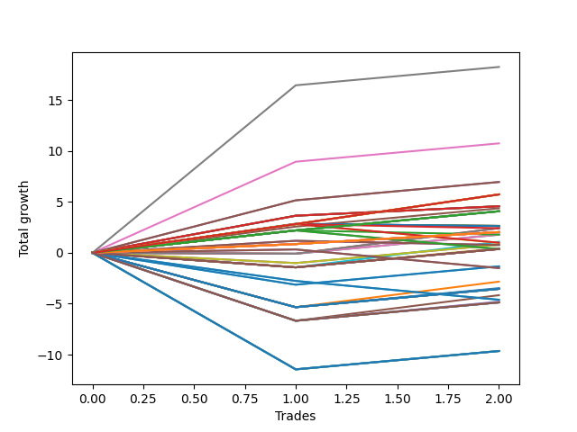

# Short Wallace Betterrerer 020 
- Symbol: TSLA_Unlimited
- Date Range: 03/23/2022 - 07/08/2022
- Trading Period: 7:20-12:30
- Number of Trades: 2



| Name | Win Percent | Profit | Avg Profit / Trade | Avg Time / Trade |      | Name | Win Percent | Profit | Avg Profit / Trade | Avg Time / Trade |
| ---- | ----------- | ------ | ------------------ | ---------------- | ---- | ---- | ----------- | ------ | ------------------ | ---------------- |
| Sorted By <br> Profit | | | | | | Sorted By <br> Win Percentage ||||
| Seven | 100.00 | 9120.00 | 4560.00 | 74:32 |     | Seven | 100.00 | 9120.00 | 4560.00 | 74:32 |
| Six | 100.00 | 5370.00 | 2685.00 | 60:50 |     | Six | 100.00 | 5370.00 | 2685.00 | 60:50 |
| Eighty-Five | 100.00 | 3475.00 | 1737.50 | 60:42 |     | Eighty-Five | 100.00 | 3475.00 | 1737.50 | 60:42 |
| Eighty-Four | 100.00 | 3475.00 | 1737.50 | 60:42 |     | Eighty-Four | 100.00 | 3475.00 | 1737.50 | 60:42 |
| One Hundred Twenty-Eight | 100.00 | 2865.00 | 1432.50 | 15:35 |     | One Hundred Twenty-Eight | 100.00 | 2865.00 | 1432.50 | 15:35 |
| One Hundred Twenty-Three | 100.00 | 2865.00 | 1432.50 | 15:35 |     | One Hundred Twenty-Three | 100.00 | 2865.00 | 1432.50 | 15:35 |
| One Hundred Eighteen | 100.00 | 2865.00 | 1432.50 | 15:35 |     | One Hundred Eighteen | 100.00 | 2865.00 | 1432.50 | 15:35 |
| One Hundred Thirteen | 100.00 | 2865.00 | 1432.50 | 15:35 |     | One Hundred Thirteen | 100.00 | 2865.00 | 1432.50 | 15:35 |
| One Hundred Three | 100.00 | 2865.00 | 1432.50 | 15:35 |     | One Hundred Three | 100.00 | 2865.00 | 1432.50 | 15:35 |
| Eighty-Three | 100.00 | 2865.00 | 1432.50 | 15:35 |     | Eighty-Three | 100.00 | 2865.00 | 1432.50 | 15:35 |
| Sixty-Five | 100.00 | 2285.00 | 1142.50 | 15:47 |     | Sixty-Five | 100.00 | 2285.00 | 1142.50 | 15:47 |
| Fifty-Seven | 100.00 | 2285.00 | 1142.50 | 15:47 |     | Fifty-Seven | 100.00 | 2285.00 | 1142.50 | 15:47 |
| Forty-Nine | 100.00 | 2285.00 | 1142.50 | 15:47 |     | Forty-Nine | 100.00 | 2285.00 | 1142.50 | 15:47 |
| Forty-One | 100.00 | 2285.00 | 1142.50 | 15:47 |     | Forty-One | 100.00 | 2285.00 | 1142.50 | 15:47 |
| One | 100.00 | 2285.00 | 1142.50 | 15:47 |     | One | 100.00 | 2285.00 | 1142.50 | 15:47 |
| Five | 100.00 | 2185.00 | 1092.50 | 60:40 |     | Five | 100.00 | 2185.00 | 1092.50 | 60:40 |
| One Hundred Twenty-Seven | 100.00 | 2040.00 | 1020.00 | 13:35 |     | One Hundred Twenty-Seven | 100.00 | 2040.00 | 1020.00 | 13:35 |
| One Hundred Twenty-Two | 100.00 | 2040.00 | 1020.00 | 13:35 |     | One Hundred Twenty-Two | 100.00 | 2040.00 | 1020.00 | 13:35 |
| One Hundred Seventeen | 100.00 | 2040.00 | 1020.00 | 13:35 |     | One Hundred Seventeen | 100.00 | 2040.00 | 1020.00 | 13:35 |
| One Hundred Twelve | 100.00 | 2040.00 | 1020.00 | 13:35 |     | One Hundred Twelve | 100.00 | 2040.00 | 1020.00 | 13:35 |
| One Hundred Two | 100.00 | 2040.00 | 1020.00 | 13:35 |     | One Hundred Two | 100.00 | 2040.00 | 1020.00 | 13:35 |
| Eighty-Two | 100.00 | 2040.00 | 1020.00 | 13:35 |     | Eighty-Two | 100.00 | 2040.00 | 1020.00 | 13:35 |
| Sixty-Four | 50.00 | 1320.00 | 660.00 | 13:12 |     | One Hundred Twenty-Six | 100.00 | 1015.00 | 507.50 | 01:22 |
| Fifty-Six | 50.00 | 1320.00 | 660.00 | 13:12 |     | One Hundred Twenty-One | 100.00 | 1015.00 | 507.50 | 01:22 |
| Forty-Eight | 50.00 | 1320.00 | 660.00 | 13:12 |     | One Hundred Sixteen | 100.00 | 1015.00 | 507.50 | 01:22 |
| Forty | 50.00 | 1320.00 | 660.00 | 13:12 |     | One Hundred Eleven | 100.00 | 1015.00 | 507.50 | 01:22 |
| Zero | 50.00 | 1320.00 | 660.00 | 13:12 |     | One Hundred Six | 100.00 | 1015.00 | 507.50 | 01:22 |
| Seventy-Three | 50.00 | 1305.00 | 652.50 | 09:05 |     | One Hundred One | 100.00 | 1015.00 | 507.50 | 01:22 |
| Fifty-Nine | 50.00 | 1210.00 | 605.00 | 31:02 |     | Ninety-Six | 100.00 | 1015.00 | 507.50 | 01:22 |
| Three | 50.00 | 1210.00 | 605.00 | 31:02 |     | Ninety-One | 100.00 | 1015.00 | 507.50 | 01:22 |
| Ninety-Eight | 50.00 | 1205.00 | 602.50 | 05:42 |     | Eighty-One | 100.00 | 1015.00 | 507.50 | 01:22 |
| One Hundred Twenty-Six | 100.00 | 1015.00 | 507.50 | 01:22 |     | Sixty-Four | 50.00 | 1320.00 | 660.00 | 13:12 |
| One Hundred Twenty-One | 100.00 | 1015.00 | 507.50 | 01:22 |     | Fifty-Six | 50.00 | 1320.00 | 660.00 | 13:12 |
| One Hundred Sixteen | 100.00 | 1015.00 | 507.50 | 01:22 |     | Forty-Eight | 50.00 | 1320.00 | 660.00 | 13:12 |
| One Hundred Eleven | 100.00 | 1015.00 | 507.50 | 01:22 |     | Forty | 50.00 | 1320.00 | 660.00 | 13:12 |
| One Hundred Six | 100.00 | 1015.00 | 507.50 | 01:22 |     | Zero | 50.00 | 1320.00 | 660.00 | 13:12 |
| One Hundred One | 100.00 | 1015.00 | 507.50 | 01:22 |     | Seventy-Three | 50.00 | 1305.00 | 652.50 | 09:05 |
| Ninety-Six | 100.00 | 1015.00 | 507.50 | 01:22 |     | Fifty-Nine | 50.00 | 1210.00 | 605.00 | 31:02 |
| Ninety-One | 100.00 | 1015.00 | 507.50 | 01:22 |     | Three | 50.00 | 1210.00 | 605.00 | 31:02 |
| Eighty-One | 100.00 | 1015.00 | 507.50 | 01:22 |     | Ninety-Eight | 50.00 | 1205.00 | 602.50 | 05:42 |
| Ninety-Seven | 50.00 | 895.00 | 447.50 | 05:07 |     | Ninety-Seven | 50.00 | 895.00 | 447.50 | 05:07 |
| Fifty-Eight | 50.00 | 890.00 | 445.00 | 29:52 |     | Fifty-Eight | 50.00 | 890.00 | 445.00 | 29:52 |
| Two | 50.00 | 890.00 | 445.00 | 29:52 |     | Two | 50.00 | 890.00 | 445.00 | 29:52 |
| Fifty-One | 50.00 | 540.00 | 270.00 | 19:17 |     | Fifty-One | 50.00 | 540.00 | 270.00 | 19:17 |
| One Hundred Eight | 50.00 | 495.00 | 247.50 | 11:45 |     | One Hundred Eight | 50.00 | 495.00 | 247.50 | 11:45 |
| Ninety-Three | 50.00 | 485.00 | 242.50 | 11:47 |     | Ninety-Three | 50.00 | 485.00 | 242.50 | 11:47 |
| Sixty | 50.00 | 395.00 | 197.50 | 49:55 |     | Sixty | 50.00 | 395.00 | 197.50 | 49:55 |
| Four | 50.00 | 395.00 | 197.50 | 49:55 |     | Four | 50.00 | 395.00 | 197.50 | 49:55 |
| One Hundred | 50.00 | 385.00 | 192.50 | 06:37 |     | One Hundred | 50.00 | 385.00 | 192.50 | 06:37 |
| Ninety-Nine | 50.00 | 385.00 | 192.50 | 06:37 |     | Ninety-Nine | 50.00 | 385.00 | 192.50 | 06:37 |
| Fifty | 50.00 | 220.00 | 110.00 | 18:07 |     | Fifty | 50.00 | 220.00 | 110.00 | 18:07 |
| One Hundred Twenty | 50.00 | 185.00 | 92.50 | 24:30 |     | One Hundred Twenty | 50.00 | 185.00 | 92.50 | 24:30 |
| One Hundred Ninteen | 50.00 | 185.00 | 92.50 | 24:30 |     | One Hundred Ninteen | 50.00 | 185.00 | 92.50 | 24:30 |
| One Hundred Seven | 50.00 | 185.00 | 92.50 | 11:10 |     | One Hundred Seven | 50.00 | 185.00 | 92.50 | 11:10 |
| Fifty-Five | 50.00 | 185.00 | 92.50 | 24:30 |     | Fifty-Five | 50.00 | 185.00 | 92.50 | 24:30 |
| Fifty-Four | 50.00 | 185.00 | 92.50 | 24:30 |     | Fifty-Four | 50.00 | 185.00 | 92.50 | 24:30 |
| Fifty-Three | 50.00 | 185.00 | 92.50 | 24:30 |     | Fifty-Three | 50.00 | 185.00 | 92.50 | 24:30 |
| Fifty-Two | 50.00 | 185.00 | 92.50 | 24:30 |     | Fifty-Two | 50.00 | 185.00 | 92.50 | 24:30 |
| Ninety-Two | 50.00 | 175.00 | 87.50 | 11:12 |     | Ninety-Two | 50.00 | 175.00 | 87.50 | 11:12 |
| One Hundred Five | 50.00 | -665.00 | -332.50 | 26:32 |     | One Hundred Five | 50.00 | -665.00 | -332.50 | 26:32 |
| One Hundred Four | 50.00 | -665.00 | -332.50 | 26:32 |     | One Hundred Four | 50.00 | -665.00 | -332.50 | 26:32 |
| One Hundred Ten | 50.00 | -750.00 | -375.00 | 14:42 |     | One Hundred Ten | 50.00 | -750.00 | -375.00 | 14:42 |
| One Hundred Nine | 50.00 | -750.00 | -375.00 | 14:42 |     | One Hundred Nine | 50.00 | -750.00 | -375.00 | 14:42 |
| Forty-Three | 50.00 | -1415.00 | -707.50 | 23:20 |     | Forty-Three | 50.00 | -1415.00 | -707.50 | 23:20 |
| Forty-Two | 50.00 | -1735.00 | -867.50 | 22:10 |     | Forty-Two | 50.00 | -1735.00 | -867.50 | 22:10 |
| One Hundred Fifteen | 50.00 | -1770.00 | -885.00 | 28:32 |     | One Hundred Fifteen | 50.00 | -1770.00 | -885.00 | 28:32 |
| One Hundred Fourteen | 50.00 | -1770.00 | -885.00 | 28:32 |     | One Hundred Fourteen | 50.00 | -1770.00 | -885.00 | 28:32 |
| Forty-Seven | 50.00 | -1770.00 | -885.00 | 28:32 |     | Forty-Seven | 50.00 | -1770.00 | -885.00 | 28:32 |
| Forty-Six | 50.00 | -1770.00 | -885.00 | 28:32 |     | Forty-Six | 50.00 | -1770.00 | -885.00 | 28:32 |
| Forty-Five | 50.00 | -1770.00 | -885.00 | 28:32 |     | Forty-Five | 50.00 | -1770.00 | -885.00 | 28:32 |
| Forty-Four | 50.00 | -1770.00 | -885.00 | 28:32 |     | Forty-Four | 50.00 | -1770.00 | -885.00 | 28:32 |
| Sixty-Seven | 50.00 | -2080.00 | -1040.00 | 23:30 |     | Sixty-Seven | 50.00 | -2080.00 | -1040.00 | 23:30 |
| Ninety-Five | 0.00 | -2305.00 | -1152.50 | 16:50 |     | Sixty-Six | 50.00 | -2400.00 | -1200.00 | 22:20 |
| Ninety-Four | 0.00 | -2305.00 | -1152.50 | 16:50 |     | One Hundred Thirty | 50.00 | -2435.00 | -1217.50 | 28:42 |
| Sixty-Six | 50.00 | -2400.00 | -1200.00 | 22:20 |     | One Hundred Twenty-Nine | 50.00 | -2435.00 | -1217.50 | 28:42 |
| One Hundred Thirty | 50.00 | -2435.00 | -1217.50 | 28:42 |     | Seventy-One | 50.00 | -2435.00 | -1217.50 | 28:42 |
| One Hundred Twenty-Nine | 50.00 | -2435.00 | -1217.50 | 28:42 |     | Seventy | 50.00 | -2435.00 | -1217.50 | 28:42 |
| Seventy-One | 50.00 | -2435.00 | -1217.50 | 28:42 |     | Sixty-Nine | 50.00 | -2435.00 | -1217.50 | 28:42 |
| Seventy | 50.00 | -2435.00 | -1217.50 | 28:42 |     | Sixty-Eight | 50.00 | -2435.00 | -1217.50 | 28:42 |
| Sixty-Nine | 50.00 | -2435.00 | -1217.50 | 28:42 |     | One Hundred Twenty-Five | 50.00 | -4820.00 | -2410.00 | 57:32 |
| Sixty-Eight | 50.00 | -2435.00 | -1217.50 | 28:42 |     | One Hundred Twenty-Four | 50.00 | -4820.00 | -2410.00 | 57:32 |
| One Hundred Twenty-Five | 50.00 | -4820.00 | -2410.00 | 57:32 |     | Sixty-Three | 50.00 | -4820.00 | -2410.00 | 57:32 |
| One Hundred Twenty-Four | 50.00 | -4820.00 | -2410.00 | 57:32 |     | Sixty-Two | 50.00 | -4820.00 | -2410.00 | 57:32 |
| Sixty-Three | 50.00 | -4820.00 | -2410.00 | 57:32 |     | Sixty-One | 50.00 | -4820.00 | -2410.00 | 57:32 |
| Sixty-Two | 50.00 | -4820.00 | -2410.00 | 57:32 |     | Ninety-Five | 0.00 | -2305.00 | -1152.50 | 16:50 |
| Sixty-One | 50.00 | -4820.00 | -2410.00 | 57:32 |     | Ninety-Four | 0.00 | -2305.00 | -1152.50 | 16:50 |

## NO STOPLOSS

### Test Zero
* Sell when price hits the middle line of the 20p bollinger
* No Stoploss
* Results:
```
Total Trades: 2
Percent Up: 50.00
Percent Down: 50.00
Total Points Moved Down: 2.64
Potential Profit: 1320.00
Total Points Ups: 0.18 Count Ups: 1
Total Points Downs: 2.82 Count Downs: 1
```

<details><summary>Trades</summary>

<code>In: 2022-05-04 09:42:00		Out: 2022-05-04 09:47:00		Total Position Time: 05:00		Total Move Down: 2.82		Total to Date: 2.82</code> <br />
<code>In: 2022-06-29 12:11:00		Out: 2022-06-29 12:32:25		Total Position Time: 21:25		Total Move Down: -0.18		Total to Date: 2.64</code> <br />


</details>

### Test One
* Sell when the price hits the upper line of the 20p 1std bollinger
* No Stoploss
* Results:
```
Total Trades: 2
Percent Up: 0.00
Percent Down: 100.00
Total Points Moved Down: 4.57
Potential Profit: 2285.00
Total Points Ups: 0.00 Count Ups: 0
Total Points Downs: 4.57 Count Downs: 2
```

<details><summary>Trades</summary>

<code>In: 2022-05-04 09:42:00		Out: 2022-05-04 09:51:10		Total Position Time: 09:10		Total Move Down: 3.64		Total to Date: 3.64</code> <br />
<code>In: 2022-06-29 12:11:00		Out: 2022-06-29 12:33:25		Total Position Time: 22:25		Total Move Down: 0.93		Total to Date: 4.57</code> <br />


</details>

### Test Two
* Sell when the price hits the upper line of the 20p 2std bollinger
* No Stoploss
* Results:
```
Total Trades: 2
Percent Up: 50.00
Percent Down: 50.00
Total Points Moved Down: 1.78
Potential Profit: 890.00
Total Points Ups: 0.09 Count Ups: 1
Total Points Downs: 1.87 Count Downs: 1
```

<details><summary>Trades</summary>

<code>In: 2022-05-04 09:42:00		Out: 2022-05-04 10:18:30		Total Position Time: 36:30		Total Move Down: -0.09		Total to Date: -0.09</code> <br />
<code>In: 2022-06-29 12:11:00		Out: 2022-06-29 12:34:15		Total Position Time: 23:15		Total Move Down: 1.87		Total to Date: 1.78</code> <br />


</details>

### Test Three
* Sell when price hits the middle line of the 50p bollinger
* No Stoploss
* Results:
```
Total Trades: 2
Percent Up: 50.00
Percent Down: 50.00
Total Points Moved Down: 2.42
Potential Profit: 1210.00
Total Points Ups: 0.09 Count Ups: 1
Total Points Downs: 2.51 Count Downs: 1
```

<details><summary>Trades</summary>

<code>In: 2022-05-04 09:42:00		Out: 2022-05-04 10:18:30		Total Position Time: 36:30		Total Move Down: -0.09		Total to Date: -0.09</code> <br />
<code>In: 2022-06-29 12:11:00		Out: 2022-06-29 12:36:35		Total Position Time: 25:35		Total Move Down: 2.51		Total to Date: 2.42</code> <br />


</details>

### Test Four
* Sell when the price hits the upper line of the 50p 1std bollinger
* No Stoploss
* Results:
```
Total Trades: 2
Percent Up: 50.00
Percent Down: 50.00
Total Points Moved Down: 0.79
Potential Profit: 395.00
Total Points Ups: 1.01 Count Ups: 1
Total Points Downs: 1.80 Count Downs: 1
```

<details><summary>Trades</summary>

<code>In: 2022-05-04 09:42:00		Out: 2022-05-04 10:45:50		Total Position Time: 63:50		Total Move Down: -1.01		Total to Date: -1.01</code> <br />
<code>In: 2022-06-29 12:11:00		Out: 2022-06-29 12:47:00		Total Position Time: 36:00		Total Move Down: 1.80		Total to Date: 0.79</code> <br />


</details>

### Test Five
* Sell when the price hits the upper line of the 50p 2std bollinger
* No Stoploss
* Results:
```
Total Trades: 2
Percent Up: 0.00
Percent Down: 100.00
Total Points Moved Down: 4.37
Potential Profit: 2185.00
Total Points Ups: 0.00 Count Ups: 0
Total Points Downs: 4.37 Count Downs: 2
```

<details><summary>Trades</summary>

<code>In: 2022-05-04 09:42:00		Out: 2022-05-04 11:07:20		Total Position Time: 85:20		Total Move Down: 2.57		Total to Date: 2.57</code> <br />
<code>In: 2022-06-29 12:11:00		Out: 2022-06-29 12:47:00		Total Position Time: 36:00		Total Move Down: 1.80		Total to Date: 4.37</code> <br />


</details>

### Test Six
* Sell when the price hits the middle line of the 1std VWAP
* No Stoploss
* Results:
```
Total Trades: 2
Percent Up: 0.00
Percent Down: 100.00
Total Points Moved Down: 10.74
Potential Profit: 5370.00
Total Points Ups: 0.00 Count Ups: 0
Total Points Downs: 10.74 Count Downs: 2
```

<details><summary>Trades</summary>

<code>In: 2022-05-04 09:42:00		Out: 2022-05-04 11:07:40		Total Position Time: 85:40		Total Move Down: 8.94		Total to Date: 8.94</code> <br />
<code>In: 2022-06-29 12:11:00		Out: 2022-06-29 12:47:00		Total Position Time: 36:00		Total Move Down: 1.80		Total to Date: 10.74</code> <br />


</details>

### Test Seven
* Sell when the price hits the upper line of the 1std VWAP
* No Stoploss
* Results:
```
Total Trades: 2
Percent Up: 0.00
Percent Down: 100.00
Total Points Moved Down: 18.24
Potential Profit: 9120.00
Total Points Ups: 0.00 Count Ups: 0
Total Points Downs: 18.24 Count Downs: 2
```

<details><summary>Trades</summary>

<code>In: 2022-05-04 09:42:00		Out: 2022-05-04 11:35:05		Total Position Time: 113:05		Total Move Down: 16.44		Total to Date: 16.44</code> <br />
<code>In: 2022-06-29 12:11:00		Out: 2022-06-29 12:47:00		Total Position Time: 36:00		Total Move Down: 1.80		Total to Date: 18.24</code> <br />


</details>

## STOPLOSS OF 5

### Test Forty
* Sell when price hits the middle line of the 20p bollinger
* Stoploss is -5 points
* Results:
```
Total Trades: 2
Percent Up: 50.00
Percent Down: 50.00
Total Points Moved Down: 2.64
Potential Profit: 1320.00
Total Points Ups: 0.18 Count Ups: 1
Total Points Downs: 2.82 Count Downs: 1
```

<details><summary>Trades</summary>

<code>In: 2022-05-04 09:42:00		Out: 2022-05-04 09:47:00		Total Position Time: 05:00		Total Move Down: 2.82		Total to Date: 2.82</code> <br />
<code>In: 2022-06-29 12:11:00		Out: 2022-06-29 12:32:25		Total Position Time: 21:25		Total Move Down: -0.18		Total to Date: 2.64</code> <br />


</details>

### Test Forty-One
* Sell when the price hits the upper line of the 20p 1std bollinger
* Stoploss is -5 points
* Results:
```
Total Trades: 2
Percent Up: 0.00
Percent Down: 100.00
Total Points Moved Down: 4.57
Potential Profit: 2285.00
Total Points Ups: 0.00 Count Ups: 0
Total Points Downs: 4.57 Count Downs: 2
```

<details><summary>Trades</summary>

<code>In: 2022-05-04 09:42:00		Out: 2022-05-04 09:51:10		Total Position Time: 09:10		Total Move Down: 3.64		Total to Date: 3.64</code> <br />
<code>In: 2022-06-29 12:11:00		Out: 2022-06-29 12:33:25		Total Position Time: 22:25		Total Move Down: 0.93		Total to Date: 4.57</code> <br />


</details>

### Test Forty-Two
* Sell when the price hits the upper line of the 20p 2std bollinger
* Stoploss is -5 points
* Results:
```
Total Trades: 2
Percent Up: 50.00
Percent Down: 50.00
Total Points Moved Down: -3.47
Potential Profit: -1735.00
Total Points Ups: 5.34 Count Ups: 1
Total Points Downs: 1.87 Count Downs: 1
```

<details><summary>Trades</summary>

<code>In: 2022-05-04 09:42:00		Out: 2022-05-04 10:03:05		Total Position Time: 21:05		Total Move Down: -5.34		Total to Date: -5.34</code> <br />
<code>In: 2022-06-29 12:11:00		Out: 2022-06-29 12:34:15		Total Position Time: 23:15		Total Move Down: 1.87		Total to Date: -3.47</code> <br />


</details>

### Test Forty-Three
* Sell when price hits the middle line of the 50p bollinger
* Stoploss is -5 points
* Results:
```
Total Trades: 2
Percent Up: 50.00
Percent Down: 50.00
Total Points Moved Down: -2.83
Potential Profit: -1415.00
Total Points Ups: 5.34 Count Ups: 1
Total Points Downs: 2.51 Count Downs: 1
```

<details><summary>Trades</summary>

<code>In: 2022-05-04 09:42:00		Out: 2022-05-04 10:03:05		Total Position Time: 21:05		Total Move Down: -5.34		Total to Date: -5.34</code> <br />
<code>In: 2022-06-29 12:11:00		Out: 2022-06-29 12:36:35		Total Position Time: 25:35		Total Move Down: 2.51		Total to Date: -2.83</code> <br />


</details>

### Test Forty-Four
* Sell when the price hits the upper line of the 50p 1std bollinger
* Stoploss is -5 points
* Results:
```
Total Trades: 2
Percent Up: 50.00
Percent Down: 50.00
Total Points Moved Down: -3.54
Potential Profit: -1770.00
Total Points Ups: 5.34 Count Ups: 1
Total Points Downs: 1.80 Count Downs: 1
```

<details><summary>Trades</summary>

<code>In: 2022-05-04 09:42:00		Out: 2022-05-04 10:03:05		Total Position Time: 21:05		Total Move Down: -5.34		Total to Date: -5.34</code> <br />
<code>In: 2022-06-29 12:11:00		Out: 2022-06-29 12:47:00		Total Position Time: 36:00		Total Move Down: 1.80		Total to Date: -3.54</code> <br />


</details>

### Test Forty-Five
* Sell when the price hits the upper line of the 50p 2std bollinger
* Stoploss is -5 points
* Results:
```
Total Trades: 2
Percent Up: 50.00
Percent Down: 50.00
Total Points Moved Down: -3.54
Potential Profit: -1770.00
Total Points Ups: 5.34 Count Ups: 1
Total Points Downs: 1.80 Count Downs: 1
```

<details><summary>Trades</summary>

<code>In: 2022-05-04 09:42:00		Out: 2022-05-04 10:03:05		Total Position Time: 21:05		Total Move Down: -5.34		Total to Date: -5.34</code> <br />
<code>In: 2022-06-29 12:11:00		Out: 2022-06-29 12:47:00		Total Position Time: 36:00		Total Move Down: 1.80		Total to Date: -3.54</code> <br />


</details>

### Test Forty-Six
* Sell when the price hits the middle line of the 1std VWAP
* Stoploss is -5 points
* Results:
```
Total Trades: 2
Percent Up: 50.00
Percent Down: 50.00
Total Points Moved Down: -3.54
Potential Profit: -1770.00
Total Points Ups: 5.34 Count Ups: 1
Total Points Downs: 1.80 Count Downs: 1
```

<details><summary>Trades</summary>

<code>In: 2022-05-04 09:42:00		Out: 2022-05-04 10:03:05		Total Position Time: 21:05		Total Move Down: -5.34		Total to Date: -5.34</code> <br />
<code>In: 2022-06-29 12:11:00		Out: 2022-06-29 12:47:00		Total Position Time: 36:00		Total Move Down: 1.80		Total to Date: -3.54</code> <br />


</details>

### Test Forty-Seven
* Sell when the price hits the upper line of the 1std VWAP
* Stoploss is -5 points
* Results:
```
Total Trades: 2
Percent Up: 50.00
Percent Down: 50.00
Total Points Moved Down: -3.54
Potential Profit: -1770.00
Total Points Ups: 5.34 Count Ups: 1
Total Points Downs: 1.80 Count Downs: 1
```

<details><summary>Trades</summary>

<code>In: 2022-05-04 09:42:00		Out: 2022-05-04 10:03:05		Total Position Time: 21:05		Total Move Down: -5.34		Total to Date: -5.34</code> <br />
<code>In: 2022-06-29 12:11:00		Out: 2022-06-29 12:47:00		Total Position Time: 36:00		Total Move Down: 1.80		Total to Date: -3.54</code> <br />


</details>

## TRAIL STOP OF 5

### Test Forty-Eight
* Sell when price hits the middle line of the 20p bollinger
* Trailing Stop is -5 points
* Results:
```
Total Trades: 2
Percent Up: 50.00
Percent Down: 50.00
Total Points Moved Down: 2.64
Potential Profit: 1320.00
Total Points Ups: 0.18 Count Ups: 1
Total Points Downs: 2.82 Count Downs: 1
```

<details><summary>Trades</summary>

<code>In: 2022-05-04 09:42:00		Out: 2022-05-04 09:47:00		Total Position Time: 05:00		Total Move Down: 2.82		Total to Date: 2.82</code> <br />
<code>In: 2022-06-29 12:11:00		Out: 2022-06-29 12:32:25		Total Position Time: 21:25		Total Move Down: -0.18		Total to Date: 2.64</code> <br />


</details>

### Test Forty-Nine
* Sell when the price hits the upper line of the 20p 1std bollinger
* Trailing Stop is -5 points
* Results:
```
Total Trades: 2
Percent Up: 0.00
Percent Down: 100.00
Total Points Moved Down: 4.57
Potential Profit: 2285.00
Total Points Ups: 0.00 Count Ups: 0
Total Points Downs: 4.57 Count Downs: 2
```

<details><summary>Trades</summary>

<code>In: 2022-05-04 09:42:00		Out: 2022-05-04 09:51:10		Total Position Time: 09:10		Total Move Down: 3.64		Total to Date: 3.64</code> <br />
<code>In: 2022-06-29 12:11:00		Out: 2022-06-29 12:33:25		Total Position Time: 22:25		Total Move Down: 0.93		Total to Date: 4.57</code> <br />


</details>

### Test Fifty
* Sell when the price hits the upper line of the 20p 2std bollinger
* Trailing Stop is -5 points
* Results:
```
Total Trades: 2
Percent Up: 50.00
Percent Down: 50.00
Total Points Moved Down: 0.44
Potential Profit: 220.00
Total Points Ups: 1.43 Count Ups: 1
Total Points Downs: 1.87 Count Downs: 1
```

<details><summary>Trades</summary>

<code>In: 2022-05-04 09:42:00		Out: 2022-05-04 09:55:00		Total Position Time: 13:00		Total Move Down: -1.43		Total to Date: -1.43</code> <br />
<code>In: 2022-06-29 12:11:00		Out: 2022-06-29 12:34:15		Total Position Time: 23:15		Total Move Down: 1.87		Total to Date: 0.44</code> <br />


</details>

### Test Fifty-One
* Sell when price hits the middle line of the 50p bollinger
* Trailing Stop is -5 points
* Results:
```
Total Trades: 2
Percent Up: 50.00
Percent Down: 50.00
Total Points Moved Down: 1.08
Potential Profit: 540.00
Total Points Ups: 1.43 Count Ups: 1
Total Points Downs: 2.51 Count Downs: 1
```

<details><summary>Trades</summary>

<code>In: 2022-05-04 09:42:00		Out: 2022-05-04 09:55:00		Total Position Time: 13:00		Total Move Down: -1.43		Total to Date: -1.43</code> <br />
<code>In: 2022-06-29 12:11:00		Out: 2022-06-29 12:36:35		Total Position Time: 25:35		Total Move Down: 2.51		Total to Date: 1.08</code> <br />


</details>

### Test Fifty-Two
* Sell when the price hits the upper line of the 50p 1std bollinger
* Trailing Stop is -5 points
* Results:
```
Total Trades: 2
Percent Up: 50.00
Percent Down: 50.00
Total Points Moved Down: 0.37
Potential Profit: 185.00
Total Points Ups: 1.43 Count Ups: 1
Total Points Downs: 1.80 Count Downs: 1
```

<details><summary>Trades</summary>

<code>In: 2022-05-04 09:42:00		Out: 2022-05-04 09:55:00		Total Position Time: 13:00		Total Move Down: -1.43		Total to Date: -1.43</code> <br />
<code>In: 2022-06-29 12:11:00		Out: 2022-06-29 12:47:00		Total Position Time: 36:00		Total Move Down: 1.80		Total to Date: 0.37</code> <br />


</details>

### Test Fifty-Three
* Sell when the price hits the upper line of the 50p 2std bollinger
* Trailing Stop is -5 points
* Results:
```
Total Trades: 2
Percent Up: 50.00
Percent Down: 50.00
Total Points Moved Down: 0.37
Potential Profit: 185.00
Total Points Ups: 1.43 Count Ups: 1
Total Points Downs: 1.80 Count Downs: 1
```

<details><summary>Trades</summary>

<code>In: 2022-05-04 09:42:00		Out: 2022-05-04 09:55:00		Total Position Time: 13:00		Total Move Down: -1.43		Total to Date: -1.43</code> <br />
<code>In: 2022-06-29 12:11:00		Out: 2022-06-29 12:47:00		Total Position Time: 36:00		Total Move Down: 1.80		Total to Date: 0.37</code> <br />


</details>

### Test Fifty-Four
* Sell when the price hits the middle line of the 1std VWAP
* Trailing Stop is -5 points
* Results:
```
Total Trades: 2
Percent Up: 50.00
Percent Down: 50.00
Total Points Moved Down: 0.37
Potential Profit: 185.00
Total Points Ups: 1.43 Count Ups: 1
Total Points Downs: 1.80 Count Downs: 1
```

<details><summary>Trades</summary>

<code>In: 2022-05-04 09:42:00		Out: 2022-05-04 09:55:00		Total Position Time: 13:00		Total Move Down: -1.43		Total to Date: -1.43</code> <br />
<code>In: 2022-06-29 12:11:00		Out: 2022-06-29 12:47:00		Total Position Time: 36:00		Total Move Down: 1.80		Total to Date: 0.37</code> <br />


</details>

### Test Fifty-Five
* Sell when the price hits the upper line of the 1std VWAP
* Trailing Stop is -5 points
* Results:
```
Total Trades: 2
Percent Up: 50.00
Percent Down: 50.00
Total Points Moved Down: 0.37
Potential Profit: 185.00
Total Points Ups: 1.43 Count Ups: 1
Total Points Downs: 1.80 Count Downs: 1
```

<details><summary>Trades</summary>

<code>In: 2022-05-04 09:42:00		Out: 2022-05-04 09:55:00		Total Position Time: 13:00		Total Move Down: -1.43		Total to Date: -1.43</code> <br />
<code>In: 2022-06-29 12:11:00		Out: 2022-06-29 12:47:00		Total Position Time: 36:00		Total Move Down: 1.80		Total to Date: 0.37</code> <br />


</details>

## STOPLOSS OF 10

### Test Fifty-Six
* Sell when price hits the middle line of the 20p bollinger
* Stoploss is -10 points
* Results:
```
Total Trades: 2
Percent Up: 50.00
Percent Down: 50.00
Total Points Moved Down: 2.64
Potential Profit: 1320.00
Total Points Ups: 0.18 Count Ups: 1
Total Points Downs: 2.82 Count Downs: 1
```

<details><summary>Trades</summary>

<code>In: 2022-05-04 09:42:00		Out: 2022-05-04 09:47:00		Total Position Time: 05:00		Total Move Down: 2.82		Total to Date: 2.82</code> <br />
<code>In: 2022-06-29 12:11:00		Out: 2022-06-29 12:32:25		Total Position Time: 21:25		Total Move Down: -0.18		Total to Date: 2.64</code> <br />


</details>

### Test Fifty-Seven
* Sell when the price hits the upper line of the 20p 1std bollinger
* Stoploss is -10 points
* Results:
```
Total Trades: 2
Percent Up: 0.00
Percent Down: 100.00
Total Points Moved Down: 4.57
Potential Profit: 2285.00
Total Points Ups: 0.00 Count Ups: 0
Total Points Downs: 4.57 Count Downs: 2
```

<details><summary>Trades</summary>

<code>In: 2022-05-04 09:42:00		Out: 2022-05-04 09:51:10		Total Position Time: 09:10		Total Move Down: 3.64		Total to Date: 3.64</code> <br />
<code>In: 2022-06-29 12:11:00		Out: 2022-06-29 12:33:25		Total Position Time: 22:25		Total Move Down: 0.93		Total to Date: 4.57</code> <br />


</details>

### Test Fifty-Eight
* Sell when the price hits the upper line of the 20p 2std bollinger
* Stoploss is -10 points
* Results:
```
Total Trades: 2
Percent Up: 50.00
Percent Down: 50.00
Total Points Moved Down: 1.78
Potential Profit: 890.00
Total Points Ups: 0.09 Count Ups: 1
Total Points Downs: 1.87 Count Downs: 1
```

<details><summary>Trades</summary>

<code>In: 2022-05-04 09:42:00		Out: 2022-05-04 10:18:30		Total Position Time: 36:30		Total Move Down: -0.09		Total to Date: -0.09</code> <br />
<code>In: 2022-06-29 12:11:00		Out: 2022-06-29 12:34:15		Total Position Time: 23:15		Total Move Down: 1.87		Total to Date: 1.78</code> <br />


</details>

### Test Fifty-Nine
* Sell when price hits the middle line of the 50p bollinger
* Stoploss is -10 points
* Results:
```
Total Trades: 2
Percent Up: 50.00
Percent Down: 50.00
Total Points Moved Down: 2.42
Potential Profit: 1210.00
Total Points Ups: 0.09 Count Ups: 1
Total Points Downs: 2.51 Count Downs: 1
```

<details><summary>Trades</summary>

<code>In: 2022-05-04 09:42:00		Out: 2022-05-04 10:18:30		Total Position Time: 36:30		Total Move Down: -0.09		Total to Date: -0.09</code> <br />
<code>In: 2022-06-29 12:11:00		Out: 2022-06-29 12:36:35		Total Position Time: 25:35		Total Move Down: 2.51		Total to Date: 2.42</code> <br />


</details>

### Test Sixty
* Sell when the price hits the upper line of the 50p 1std bollinger
* Stoploss is -10 points
* Results:
```
Total Trades: 2
Percent Up: 50.00
Percent Down: 50.00
Total Points Moved Down: 0.79
Potential Profit: 395.00
Total Points Ups: 1.01 Count Ups: 1
Total Points Downs: 1.80 Count Downs: 1
```

<details><summary>Trades</summary>

<code>In: 2022-05-04 09:42:00		Out: 2022-05-04 10:45:50		Total Position Time: 63:50		Total Move Down: -1.01		Total to Date: -1.01</code> <br />
<code>In: 2022-06-29 12:11:00		Out: 2022-06-29 12:47:00		Total Position Time: 36:00		Total Move Down: 1.80		Total to Date: 0.79</code> <br />


</details>

### Test Sixty-One
* Sell when the price hits the upper line of the 50p 2std bollinger
* Stoploss is -10 points
* Results:
```
Total Trades: 2
Percent Up: 50.00
Percent Down: 50.00
Total Points Moved Down: -9.64
Potential Profit: -4820.00
Total Points Ups: 11.44 Count Ups: 1
Total Points Downs: 1.80 Count Downs: 1
```

<details><summary>Trades</summary>

<code>In: 2022-05-04 09:42:00		Out: 2022-05-04 11:01:05		Total Position Time: 79:05		Total Move Down: -11.44		Total to Date: -11.44</code> <br />
<code>In: 2022-06-29 12:11:00		Out: 2022-06-29 12:47:00		Total Position Time: 36:00		Total Move Down: 1.80		Total to Date: -9.64</code> <br />


</details>

### Test Sixty-Two
* Sell when the price hits the middle line of the 1std VWAP
* Stoploss is -10 points
* Results:
```
Total Trades: 2
Percent Up: 50.00
Percent Down: 50.00
Total Points Moved Down: -9.64
Potential Profit: -4820.00
Total Points Ups: 11.44 Count Ups: 1
Total Points Downs: 1.80 Count Downs: 1
```

<details><summary>Trades</summary>

<code>In: 2022-05-04 09:42:00		Out: 2022-05-04 11:01:05		Total Position Time: 79:05		Total Move Down: -11.44		Total to Date: -11.44</code> <br />
<code>In: 2022-06-29 12:11:00		Out: 2022-06-29 12:47:00		Total Position Time: 36:00		Total Move Down: 1.80		Total to Date: -9.64</code> <br />


</details>

### Test Sixty-Three
* Sell when the price hits the upper line of the 1std VWAP
* Stoploss is -10 points
* Results:
```
Total Trades: 2
Percent Up: 50.00
Percent Down: 50.00
Total Points Moved Down: -9.64
Potential Profit: -4820.00
Total Points Ups: 11.44 Count Ups: 1
Total Points Downs: 1.80 Count Downs: 1
```

<details><summary>Trades</summary>

<code>In: 2022-05-04 09:42:00		Out: 2022-05-04 11:01:05		Total Position Time: 79:05		Total Move Down: -11.44		Total to Date: -11.44</code> <br />
<code>In: 2022-06-29 12:11:00		Out: 2022-06-29 12:47:00		Total Position Time: 36:00		Total Move Down: 1.80		Total to Date: -9.64</code> <br />


</details>

## TRAIL STOP OF 10

### Test Sixty-Four
* Sell when price hits the middle line of the 20p bollinger
* Trailing Stop is -10 points
* Results:
```
Total Trades: 2
Percent Up: 50.00
Percent Down: 50.00
Total Points Moved Down: 2.64
Potential Profit: 1320.00
Total Points Ups: 0.18 Count Ups: 1
Total Points Downs: 2.82 Count Downs: 1
```

<details><summary>Trades</summary>

<code>In: 2022-05-04 09:42:00		Out: 2022-05-04 09:47:00		Total Position Time: 05:00		Total Move Down: 2.82		Total to Date: 2.82</code> <br />
<code>In: 2022-06-29 12:11:00		Out: 2022-06-29 12:32:25		Total Position Time: 21:25		Total Move Down: -0.18		Total to Date: 2.64</code> <br />


</details>

### Test Sixty-Five
* Sell when the price hits the upper line of the 20p 1std bollinger
* Trailing Stop is -10 points
* Results:
```
Total Trades: 2
Percent Up: 0.00
Percent Down: 100.00
Total Points Moved Down: 4.57
Potential Profit: 2285.00
Total Points Ups: 0.00 Count Ups: 0
Total Points Downs: 4.57 Count Downs: 2
```

<details><summary>Trades</summary>

<code>In: 2022-05-04 09:42:00		Out: 2022-05-04 09:51:10		Total Position Time: 09:10		Total Move Down: 3.64		Total to Date: 3.64</code> <br />
<code>In: 2022-06-29 12:11:00		Out: 2022-06-29 12:33:25		Total Position Time: 22:25		Total Move Down: 0.93		Total to Date: 4.57</code> <br />


</details>

### Test Sixty-Six
* Sell when the price hits the upper line of the 20p 2std bollinger
* Trailing Stop is -10 points
* Results:
```
Total Trades: 2
Percent Up: 50.00
Percent Down: 50.00
Total Points Moved Down: -4.80
Potential Profit: -2400.00
Total Points Ups: 6.67 Count Ups: 1
Total Points Downs: 1.87 Count Downs: 1
```

<details><summary>Trades</summary>

<code>In: 2022-05-04 09:42:00		Out: 2022-05-04 10:03:25		Total Position Time: 21:25		Total Move Down: -6.67		Total to Date: -6.67</code> <br />
<code>In: 2022-06-29 12:11:00		Out: 2022-06-29 12:34:15		Total Position Time: 23:15		Total Move Down: 1.87		Total to Date: -4.80</code> <br />


</details>

### Test Sixty-Seven
* Sell when price hits the middle line of the 50p bollinger
* Trailing Stop is -10 points
* Results:
```
Total Trades: 2
Percent Up: 50.00
Percent Down: 50.00
Total Points Moved Down: -4.16
Potential Profit: -2080.00
Total Points Ups: 6.67 Count Ups: 1
Total Points Downs: 2.51 Count Downs: 1
```

<details><summary>Trades</summary>

<code>In: 2022-05-04 09:42:00		Out: 2022-05-04 10:03:25		Total Position Time: 21:25		Total Move Down: -6.67		Total to Date: -6.67</code> <br />
<code>In: 2022-06-29 12:11:00		Out: 2022-06-29 12:36:35		Total Position Time: 25:35		Total Move Down: 2.51		Total to Date: -4.16</code> <br />


</details>

### Test Sixty-Eight
* Sell when the price hits the upper line of the 50p 1std bollinger
* Trailing Stop is -10 points
* Results:
```
Total Trades: 2
Percent Up: 50.00
Percent Down: 50.00
Total Points Moved Down: -4.87
Potential Profit: -2435.00
Total Points Ups: 6.67 Count Ups: 1
Total Points Downs: 1.80 Count Downs: 1
```

<details><summary>Trades</summary>

<code>In: 2022-05-04 09:42:00		Out: 2022-05-04 10:03:25		Total Position Time: 21:25		Total Move Down: -6.67		Total to Date: -6.67</code> <br />
<code>In: 2022-06-29 12:11:00		Out: 2022-06-29 12:47:00		Total Position Time: 36:00		Total Move Down: 1.80		Total to Date: -4.87</code> <br />


</details>

### Test Sixty-Nine
* Sell when the price hits the upper line of the 50p 2std bollinger
* Trailing Stop is -10 points
* Results:
```
Total Trades: 2
Percent Up: 50.00
Percent Down: 50.00
Total Points Moved Down: -4.87
Potential Profit: -2435.00
Total Points Ups: 6.67 Count Ups: 1
Total Points Downs: 1.80 Count Downs: 1
```

<details><summary>Trades</summary>

<code>In: 2022-05-04 09:42:00		Out: 2022-05-04 10:03:25		Total Position Time: 21:25		Total Move Down: -6.67		Total to Date: -6.67</code> <br />
<code>In: 2022-06-29 12:11:00		Out: 2022-06-29 12:47:00		Total Position Time: 36:00		Total Move Down: 1.80		Total to Date: -4.87</code> <br />


</details>

### Test Seventy
* Sell when the price hits the middle line of the 1std VWAP
* Trailing Stop is -10 points
* Results:
```
Total Trades: 2
Percent Up: 50.00
Percent Down: 50.00
Total Points Moved Down: -4.87
Potential Profit: -2435.00
Total Points Ups: 6.67 Count Ups: 1
Total Points Downs: 1.80 Count Downs: 1
```

<details><summary>Trades</summary>

<code>In: 2022-05-04 09:42:00		Out: 2022-05-04 10:03:25		Total Position Time: 21:25		Total Move Down: -6.67		Total to Date: -6.67</code> <br />
<code>In: 2022-06-29 12:11:00		Out: 2022-06-29 12:47:00		Total Position Time: 36:00		Total Move Down: 1.80		Total to Date: -4.87</code> <br />


</details>

### Test Seventy-One
* Sell when the price hits the upper line of the 1std VWAP
* Trailing Stop is -10 points
* Results:
```
Total Trades: 2
Percent Up: 50.00
Percent Down: 50.00
Total Points Moved Down: -4.87
Potential Profit: -2435.00
Total Points Ups: 6.67 Count Ups: 1
Total Points Downs: 1.80 Count Downs: 1
```

<details><summary>Trades</summary>

<code>In: 2022-05-04 09:42:00		Out: 2022-05-04 10:03:25		Total Position Time: 21:25		Total Move Down: -6.67		Total to Date: -6.67</code> <br />
<code>In: 2022-06-29 12:11:00		Out: 2022-06-29 12:47:00		Total Position Time: 36:00		Total Move Down: 1.80		Total to Date: -4.87</code> <br />


</details>

## SPECIAL EXIT CONDITIONS 

### Test Seventy-Three
* Sell when the linear regression slope changes to negative
* No Stoploss
* Results:
```
Total Trades: 2
Percent Up: 50.00
Percent Down: 50.00
Total Points Moved Down: 2.61
Potential Profit: 1305.00
Total Points Ups: 0.25 Count Ups: 1
Total Points Downs: 2.86 Count Downs: 1
```

<details><summary>Trades</summary>

<code>In: 2022-05-04 09:42:00		Out: 2022-05-04 09:47:05		Total Position Time: 05:05		Total Move Down: 2.86		Total to Date: 2.86</code> <br />
<code>In: 2022-06-29 12:11:00		Out: 2022-06-29 12:24:05		Total Position Time: 13:05		Total Move Down: -0.25		Total to Date: 2.61</code> <br />


</details>

## TAKE PROFIT

### Test Eighty-One
* Take Profit of 1 Point
* No Stoploss
* Results:
```
Total Trades: 2
Percent Up: 0.00
Percent Down: 100.00
Total Points Moved Down: 2.03
Potential Profit: 1015.00
Total Points Ups: 0.00 Count Ups: 0
Total Points Downs: 2.03 Count Downs: 2
```

<details><summary>Trades</summary>

<code>In: 2022-05-04 09:42:00		Out: 2022-05-04 09:43:30		Total Position Time: 01:30		Total Move Down: 0.86		Total to Date: 0.86</code> <br />
<code>In: 2022-06-29 12:11:00		Out: 2022-06-29 12:12:15		Total Position Time: 01:15		Total Move Down: 1.17		Total to Date: 2.03</code> <br />


</details>

### Test Eighty-Two
* Take Profit of 2 Point
* No Stoploss
* Results:
```
Total Trades: 2
Percent Up: 0.00
Percent Down: 100.00
Total Points Moved Down: 4.08
Potential Profit: 2040.00
Total Points Ups: 0.00 Count Ups: 0
Total Points Downs: 4.08 Count Downs: 2
```

<details><summary>Trades</summary>

<code>In: 2022-05-04 09:42:00		Out: 2022-05-04 09:45:50		Total Position Time: 03:50		Total Move Down: 2.20		Total to Date: 2.20</code> <br />
<code>In: 2022-06-29 12:11:00		Out: 2022-06-29 12:34:20		Total Position Time: 23:20		Total Move Down: 1.88		Total to Date: 4.08</code> <br />


</details>

### Test Eighty-Three
* Take Profit of 3 Point
* No Stoploss
* Results:
```
Total Trades: 2
Percent Up: 0.00
Percent Down: 100.00
Total Points Moved Down: 5.73
Potential Profit: 2865.00
Total Points Ups: 0.00 Count Ups: 0
Total Points Downs: 5.73 Count Downs: 2
```

<details><summary>Trades</summary>

<code>In: 2022-05-04 09:42:00		Out: 2022-05-04 09:47:00		Total Position Time: 05:00		Total Move Down: 2.82		Total to Date: 2.82</code> <br />
<code>In: 2022-06-29 12:11:00		Out: 2022-06-29 12:37:10		Total Position Time: 26:10		Total Move Down: 2.91		Total to Date: 5.73</code> <br />


</details>

### Test Eighty-Four
* Take Profit of 4 Point
* No Stoploss
* Results:
```
Total Trades: 2
Percent Up: 0.00
Percent Down: 100.00
Total Points Moved Down: 6.95
Potential Profit: 3475.00
Total Points Ups: 0.00 Count Ups: 0
Total Points Downs: 6.95 Count Downs: 2
```

<details><summary>Trades</summary>

<code>In: 2022-05-04 09:42:00		Out: 2022-05-04 11:07:25		Total Position Time: 85:25		Total Move Down: 5.15		Total to Date: 5.15</code> <br />
<code>In: 2022-06-29 12:11:00		Out: 2022-06-29 12:47:00		Total Position Time: 36:00		Total Move Down: 1.80		Total to Date: 6.95</code> <br />


</details>

### Test Eighty-Five
* Take Profit of 5 Point
* No Stoploss
* Results:
```
Total Trades: 2
Percent Up: 0.00
Percent Down: 100.00
Total Points Moved Down: 6.95
Potential Profit: 3475.00
Total Points Ups: 0.00 Count Ups: 0
Total Points Downs: 6.95 Count Downs: 2
```

<details><summary>Trades</summary>

<code>In: 2022-05-04 09:42:00		Out: 2022-05-04 11:07:25		Total Position Time: 85:25		Total Move Down: 5.15		Total to Date: 5.15</code> <br />
<code>In: 2022-06-29 12:11:00		Out: 2022-06-29 12:47:00		Total Position Time: 36:00		Total Move Down: 1.80		Total to Date: 6.95</code> <br />


</details>

## TAKE PROFIT Stoploss of Two

### Test Ninety-One
* Take Profit of 1 Point
* Stoploss is -2 points
* Results:
```
Total Trades: 2
Percent Up: 0.00
Percent Down: 100.00
Total Points Moved Down: 2.03
Potential Profit: 1015.00
Total Points Ups: 0.00 Count Ups: 0
Total Points Downs: 2.03 Count Downs: 2
```

<details><summary>Trades</summary>

<code>In: 2022-05-04 09:42:00		Out: 2022-05-04 09:43:30		Total Position Time: 01:30		Total Move Down: 0.86		Total to Date: 0.86</code> <br />
<code>In: 2022-06-29 12:11:00		Out: 2022-06-29 12:12:15		Total Position Time: 01:15		Total Move Down: 1.17		Total to Date: 2.03</code> <br />


</details>

### Test Ninety-Two
* Take Profit of 2 Point
* Stoploss is -2 points
* Results:
```
Total Trades: 2
Percent Up: 50.00
Percent Down: 50.00
Total Points Moved Down: 0.35
Potential Profit: 175.00
Total Points Ups: 1.85 Count Ups: 1
Total Points Downs: 2.20 Count Downs: 1
```

<details><summary>Trades</summary>

<code>In: 2022-05-04 09:42:00		Out: 2022-05-04 09:45:50		Total Position Time: 03:50		Total Move Down: 2.20		Total to Date: 2.20</code> <br />
<code>In: 2022-06-29 12:11:00		Out: 2022-06-29 12:29:35		Total Position Time: 18:35		Total Move Down: -1.85		Total to Date: 0.35</code> <br />


</details>

### Test Ninety-Three
* Take Profit of 3 Point
* Stoploss is -2 points
* Results:
```
Total Trades: 2
Percent Up: 50.00
Percent Down: 50.00
Total Points Moved Down: 0.97
Potential Profit: 485.00
Total Points Ups: 1.85 Count Ups: 1
Total Points Downs: 2.82 Count Downs: 1
```

<details><summary>Trades</summary>

<code>In: 2022-05-04 09:42:00		Out: 2022-05-04 09:47:00		Total Position Time: 05:00		Total Move Down: 2.82		Total to Date: 2.82</code> <br />
<code>In: 2022-06-29 12:11:00		Out: 2022-06-29 12:29:35		Total Position Time: 18:35		Total Move Down: -1.85		Total to Date: 0.97</code> <br />


</details>

### Test Ninety-Four
* Take Profit of 4 Point
* Stoploss is -2 points
* Results:
```
Total Trades: 2
Percent Up: 100.00
Percent Down: 0.00
Total Points Moved Down: -4.61
Potential Profit: -2305.00
Total Points Ups: 4.61 Count Ups: 2
Total Points Downs: 0.00 Count Downs: 0
```

<details><summary>Trades</summary>

<code>In: 2022-05-04 09:42:00		Out: 2022-05-04 09:57:05		Total Position Time: 15:05		Total Move Down: -2.76		Total to Date: -2.76</code> <br />
<code>In: 2022-06-29 12:11:00		Out: 2022-06-29 12:29:35		Total Position Time: 18:35		Total Move Down: -1.85		Total to Date: -4.61</code> <br />


</details>

### Test Ninety-Five
* Take Profit of 5 Point
* Stoploss is -2 points
* Results:
```
Total Trades: 2
Percent Up: 100.00
Percent Down: 0.00
Total Points Moved Down: -4.61
Potential Profit: -2305.00
Total Points Ups: 4.61 Count Ups: 2
Total Points Downs: 0.00 Count Downs: 0
```

<details><summary>Trades</summary>

<code>In: 2022-05-04 09:42:00		Out: 2022-05-04 09:57:05		Total Position Time: 15:05		Total Move Down: -2.76		Total to Date: -2.76</code> <br />
<code>In: 2022-06-29 12:11:00		Out: 2022-06-29 12:29:35		Total Position Time: 18:35		Total Move Down: -1.85		Total to Date: -4.61</code> <br />


</details>

## TAKE PROFIT Trailstop of Two

### Test Ninety-Six
* Take Profit of 1 Point
* Trailing stop is -2 points
* Results:
```
Total Trades: 2
Percent Up: 0.00
Percent Down: 100.00
Total Points Moved Down: 2.03
Potential Profit: 1015.00
Total Points Ups: 0.00 Count Ups: 0
Total Points Downs: 2.03 Count Downs: 2
```

<details><summary>Trades</summary>

<code>In: 2022-05-04 09:42:00		Out: 2022-05-04 09:43:30		Total Position Time: 01:30		Total Move Down: 0.86		Total to Date: 0.86</code> <br />
<code>In: 2022-06-29 12:11:00		Out: 2022-06-29 12:12:15		Total Position Time: 01:15		Total Move Down: 1.17		Total to Date: 2.03</code> <br />


</details>

### Test Ninety-Seven
* Take Profit of 2 Point
* Trailing stop is -2 points
* Results:
```
Total Trades: 2
Percent Up: 50.00
Percent Down: 50.00
Total Points Moved Down: 1.79
Potential Profit: 895.00
Total Points Ups: 0.41 Count Ups: 1
Total Points Downs: 2.20 Count Downs: 1
```

<details><summary>Trades</summary>

<code>In: 2022-05-04 09:42:00		Out: 2022-05-04 09:45:50		Total Position Time: 03:50		Total Move Down: 2.20		Total to Date: 2.20</code> <br />
<code>In: 2022-06-29 12:11:00		Out: 2022-06-29 12:17:25		Total Position Time: 06:25		Total Move Down: -0.41		Total to Date: 1.79</code> <br />


</details>

### Test Ninety-Eight
* Take Profit of 3 Point
* Trailing stop is -2 points
* Results:
```
Total Trades: 2
Percent Up: 50.00
Percent Down: 50.00
Total Points Moved Down: 2.41
Potential Profit: 1205.00
Total Points Ups: 0.41 Count Ups: 1
Total Points Downs: 2.82 Count Downs: 1
```

<details><summary>Trades</summary>

<code>In: 2022-05-04 09:42:00		Out: 2022-05-04 09:47:00		Total Position Time: 05:00		Total Move Down: 2.82		Total to Date: 2.82</code> <br />
<code>In: 2022-06-29 12:11:00		Out: 2022-06-29 12:17:25		Total Position Time: 06:25		Total Move Down: -0.41		Total to Date: 2.41</code> <br />


</details>

### Test Ninety-Nine
* Take Profit of 4 Point
* Trailing stop is -2 points
* Results:
```
Total Trades: 2
Percent Up: 50.00
Percent Down: 50.00
Total Points Moved Down: 0.77
Potential Profit: 385.00
Total Points Ups: 0.41 Count Ups: 1
Total Points Downs: 1.18 Count Downs: 1
```

<details><summary>Trades</summary>

<code>In: 2022-05-04 09:42:00		Out: 2022-05-04 09:48:50		Total Position Time: 06:50		Total Move Down: 1.18		Total to Date: 1.18</code> <br />
<code>In: 2022-06-29 12:11:00		Out: 2022-06-29 12:17:25		Total Position Time: 06:25		Total Move Down: -0.41		Total to Date: 0.77</code> <br />


</details>

### Test One Hundred
* Take Profit of 5 Point
* Trailing stop is -2 points
* Results:
```
Total Trades: 2
Percent Up: 50.00
Percent Down: 50.00
Total Points Moved Down: 0.77
Potential Profit: 385.00
Total Points Ups: 0.41 Count Ups: 1
Total Points Downs: 1.18 Count Downs: 1
```

<details><summary>Trades</summary>

<code>In: 2022-05-04 09:42:00		Out: 2022-05-04 09:48:50		Total Position Time: 06:50		Total Move Down: 1.18		Total to Date: 1.18</code> <br />
<code>In: 2022-06-29 12:11:00		Out: 2022-06-29 12:17:25		Total Position Time: 06:25		Total Move Down: -0.41		Total to Date: 0.77</code> <br />


</details>

## TAKE PROFIT Stoploss of Three

### Test One Hundred One
* Take Profit of 1 Point
* Stoploss is -3 points
* Results:
```
Total Trades: 2
Percent Up: 0.00
Percent Down: 100.00
Total Points Moved Down: 2.03
Potential Profit: 1015.00
Total Points Ups: 0.00 Count Ups: 0
Total Points Downs: 2.03 Count Downs: 2
```

<details><summary>Trades</summary>

<code>In: 2022-05-04 09:42:00		Out: 2022-05-04 09:43:30		Total Position Time: 01:30		Total Move Down: 0.86		Total to Date: 0.86</code> <br />
<code>In: 2022-06-29 12:11:00		Out: 2022-06-29 12:12:15		Total Position Time: 01:15		Total Move Down: 1.17		Total to Date: 2.03</code> <br />


</details>

### Test One Hundred Two
* Take Profit of 2 Point
* Stoploss is -3 points
* Results:
```
Total Trades: 2
Percent Up: 0.00
Percent Down: 100.00
Total Points Moved Down: 4.08
Potential Profit: 2040.00
Total Points Ups: 0.00 Count Ups: 0
Total Points Downs: 4.08 Count Downs: 2
```

<details><summary>Trades</summary>

<code>In: 2022-05-04 09:42:00		Out: 2022-05-04 09:45:50		Total Position Time: 03:50		Total Move Down: 2.20		Total to Date: 2.20</code> <br />
<code>In: 2022-06-29 12:11:00		Out: 2022-06-29 12:34:20		Total Position Time: 23:20		Total Move Down: 1.88		Total to Date: 4.08</code> <br />


</details>

### Test One Hundred Three
* Take Profit of 3 Point
* Stoploss is -3 points
* Results:
```
Total Trades: 2
Percent Up: 0.00
Percent Down: 100.00
Total Points Moved Down: 5.73
Potential Profit: 2865.00
Total Points Ups: 0.00 Count Ups: 0
Total Points Downs: 5.73 Count Downs: 2
```

<details><summary>Trades</summary>

<code>In: 2022-05-04 09:42:00		Out: 2022-05-04 09:47:00		Total Position Time: 05:00		Total Move Down: 2.82		Total to Date: 2.82</code> <br />
<code>In: 2022-06-29 12:11:00		Out: 2022-06-29 12:37:10		Total Position Time: 26:10		Total Move Down: 2.91		Total to Date: 5.73</code> <br />


</details>

### Test One Hundred Four
* Take Profit of 4 Point
* Stoploss is -3 points
* Results:
```
Total Trades: 2
Percent Up: 50.00
Percent Down: 50.00
Total Points Moved Down: -1.33
Potential Profit: -665.00
Total Points Ups: 3.13 Count Ups: 1
Total Points Downs: 1.80 Count Downs: 1
```

<details><summary>Trades</summary>

<code>In: 2022-05-04 09:42:00		Out: 2022-05-04 09:59:05		Total Position Time: 17:05		Total Move Down: -3.13		Total to Date: -3.13</code> <br />
<code>In: 2022-06-29 12:11:00		Out: 2022-06-29 12:47:00		Total Position Time: 36:00		Total Move Down: 1.80		Total to Date: -1.33</code> <br />


</details>

### Test One Hundred Five
* Take Profit of 5 Point
* Stoploss is -3 points
* Results:
```
Total Trades: 2
Percent Up: 50.00
Percent Down: 50.00
Total Points Moved Down: -1.33
Potential Profit: -665.00
Total Points Ups: 3.13 Count Ups: 1
Total Points Downs: 1.80 Count Downs: 1
```

<details><summary>Trades</summary>

<code>In: 2022-05-04 09:42:00		Out: 2022-05-04 09:59:05		Total Position Time: 17:05		Total Move Down: -3.13		Total to Date: -3.13</code> <br />
<code>In: 2022-06-29 12:11:00		Out: 2022-06-29 12:47:00		Total Position Time: 36:00		Total Move Down: 1.80		Total to Date: -1.33</code> <br />


</details>

## TAKE PROFIT Trailstop of Three

### Test One Hundred Six
* Take Profit of 1 Point
* Trailing stop is -3 points
* Results:
```
Total Trades: 2
Percent Up: 0.00
Percent Down: 100.00
Total Points Moved Down: 2.03
Potential Profit: 1015.00
Total Points Ups: 0.00 Count Ups: 0
Total Points Downs: 2.03 Count Downs: 2
```

<details><summary>Trades</summary>

<code>In: 2022-05-04 09:42:00		Out: 2022-05-04 09:43:30		Total Position Time: 01:30		Total Move Down: 0.86		Total to Date: 0.86</code> <br />
<code>In: 2022-06-29 12:11:00		Out: 2022-06-29 12:12:15		Total Position Time: 01:15		Total Move Down: 1.17		Total to Date: 2.03</code> <br />


</details>

### Test One Hundred Seven
* Take Profit of 2 Point
* Trailing stop is -3 points
* Results:
```
Total Trades: 2
Percent Up: 50.00
Percent Down: 50.00
Total Points Moved Down: 0.37
Potential Profit: 185.00
Total Points Ups: 1.83 Count Ups: 1
Total Points Downs: 2.20 Count Downs: 1
```

<details><summary>Trades</summary>

<code>In: 2022-05-04 09:42:00		Out: 2022-05-04 09:45:50		Total Position Time: 03:50		Total Move Down: 2.20		Total to Date: 2.20</code> <br />
<code>In: 2022-06-29 12:11:00		Out: 2022-06-29 12:29:30		Total Position Time: 18:30		Total Move Down: -1.83		Total to Date: 0.37</code> <br />


</details>

### Test One Hundred Eight
* Take Profit of 3 Point
* Trailing stop is -3 points
* Results:
```
Total Trades: 2
Percent Up: 50.00
Percent Down: 50.00
Total Points Moved Down: 0.99
Potential Profit: 495.00
Total Points Ups: 1.83 Count Ups: 1
Total Points Downs: 2.82 Count Downs: 1
```

<details><summary>Trades</summary>

<code>In: 2022-05-04 09:42:00		Out: 2022-05-04 09:47:00		Total Position Time: 05:00		Total Move Down: 2.82		Total to Date: 2.82</code> <br />
<code>In: 2022-06-29 12:11:00		Out: 2022-06-29 12:29:30		Total Position Time: 18:30		Total Move Down: -1.83		Total to Date: 0.99</code> <br />


</details>

### Test One Hundred Nine
* Take Profit of 4 Point
* Trailing stop is -3 points
* Results:
```
Total Trades: 2
Percent Up: 50.00
Percent Down: 50.00
Total Points Moved Down: -1.50
Potential Profit: -750.00
Total Points Ups: 1.83 Count Ups: 1
Total Points Downs: 0.33 Count Downs: 1
```

<details><summary>Trades</summary>

<code>In: 2022-05-04 09:42:00		Out: 2022-05-04 09:52:55		Total Position Time: 10:55		Total Move Down: 0.33		Total to Date: 0.33</code> <br />
<code>In: 2022-06-29 12:11:00		Out: 2022-06-29 12:29:30		Total Position Time: 18:30		Total Move Down: -1.83		Total to Date: -1.50</code> <br />


</details>

### Test One Hundred Ten
* Take Profit of 5 Point
* Trailing stop is -3 points
* Results:
```
Total Trades: 2
Percent Up: 50.00
Percent Down: 50.00
Total Points Moved Down: -1.50
Potential Profit: -750.00
Total Points Ups: 1.83 Count Ups: 1
Total Points Downs: 0.33 Count Downs: 1
```

<details><summary>Trades</summary>

<code>In: 2022-05-04 09:42:00		Out: 2022-05-04 09:52:55		Total Position Time: 10:55		Total Move Down: 0.33		Total to Date: 0.33</code> <br />
<code>In: 2022-06-29 12:11:00		Out: 2022-06-29 12:29:30		Total Position Time: 18:30		Total Move Down: -1.83		Total to Date: -1.50</code> <br />


</details>

## TAKE PROFIT Stoploss of Five

### Test One Hundred Eleven
* Take Profit of 1 Point
* Stoploss is -5 points
* Results:
```
Total Trades: 2
Percent Up: 0.00
Percent Down: 100.00
Total Points Moved Down: 2.03
Potential Profit: 1015.00
Total Points Ups: 0.00 Count Ups: 0
Total Points Downs: 2.03 Count Downs: 2
```

<details><summary>Trades</summary>

<code>In: 2022-05-04 09:42:00		Out: 2022-05-04 09:43:30		Total Position Time: 01:30		Total Move Down: 0.86		Total to Date: 0.86</code> <br />
<code>In: 2022-06-29 12:11:00		Out: 2022-06-29 12:12:15		Total Position Time: 01:15		Total Move Down: 1.17		Total to Date: 2.03</code> <br />


</details>

### Test One Hundred Twelve
* Take Profit of 2 Point
* Stoploss is -5 points
* Results:
```
Total Trades: 2
Percent Up: 0.00
Percent Down: 100.00
Total Points Moved Down: 4.08
Potential Profit: 2040.00
Total Points Ups: 0.00 Count Ups: 0
Total Points Downs: 4.08 Count Downs: 2
```

<details><summary>Trades</summary>

<code>In: 2022-05-04 09:42:00		Out: 2022-05-04 09:45:50		Total Position Time: 03:50		Total Move Down: 2.20		Total to Date: 2.20</code> <br />
<code>In: 2022-06-29 12:11:00		Out: 2022-06-29 12:34:20		Total Position Time: 23:20		Total Move Down: 1.88		Total to Date: 4.08</code> <br />


</details>

### Test One Hundred Thirteen
* Take Profit of 3 Point
* Stoploss is -5 points
* Results:
```
Total Trades: 2
Percent Up: 0.00
Percent Down: 100.00
Total Points Moved Down: 5.73
Potential Profit: 2865.00
Total Points Ups: 0.00 Count Ups: 0
Total Points Downs: 5.73 Count Downs: 2
```

<details><summary>Trades</summary>

<code>In: 2022-05-04 09:42:00		Out: 2022-05-04 09:47:00		Total Position Time: 05:00		Total Move Down: 2.82		Total to Date: 2.82</code> <br />
<code>In: 2022-06-29 12:11:00		Out: 2022-06-29 12:37:10		Total Position Time: 26:10		Total Move Down: 2.91		Total to Date: 5.73</code> <br />


</details>

### Test One Hundred Fourteen
* Take Profit of 4 Point
* Stoploss is -5 points
* Results:
```
Total Trades: 2
Percent Up: 50.00
Percent Down: 50.00
Total Points Moved Down: -3.54
Potential Profit: -1770.00
Total Points Ups: 5.34 Count Ups: 1
Total Points Downs: 1.80 Count Downs: 1
```

<details><summary>Trades</summary>

<code>In: 2022-05-04 09:42:00		Out: 2022-05-04 10:03:05		Total Position Time: 21:05		Total Move Down: -5.34		Total to Date: -5.34</code> <br />
<code>In: 2022-06-29 12:11:00		Out: 2022-06-29 12:47:00		Total Position Time: 36:00		Total Move Down: 1.80		Total to Date: -3.54</code> <br />


</details>

### Test One Hundred Fifteen
* Take Profit of 5 Point
* Stoploss is -5 points
* Results:
```
Total Trades: 2
Percent Up: 50.00
Percent Down: 50.00
Total Points Moved Down: -3.54
Potential Profit: -1770.00
Total Points Ups: 5.34 Count Ups: 1
Total Points Downs: 1.80 Count Downs: 1
```

<details><summary>Trades</summary>

<code>In: 2022-05-04 09:42:00		Out: 2022-05-04 10:03:05		Total Position Time: 21:05		Total Move Down: -5.34		Total to Date: -5.34</code> <br />
<code>In: 2022-06-29 12:11:00		Out: 2022-06-29 12:47:00		Total Position Time: 36:00		Total Move Down: 1.80		Total to Date: -3.54</code> <br />


</details>

## TAKE PROFIT Trailstop of Five

### Test One Hundred Sixteen
* Take Profit of 1 Point
* Trailing stop is -5 points
* Results:
```
Total Trades: 2
Percent Up: 0.00
Percent Down: 100.00
Total Points Moved Down: 2.03
Potential Profit: 1015.00
Total Points Ups: 0.00 Count Ups: 0
Total Points Downs: 2.03 Count Downs: 2
```

<details><summary>Trades</summary>

<code>In: 2022-05-04 09:42:00		Out: 2022-05-04 09:43:30		Total Position Time: 01:30		Total Move Down: 0.86		Total to Date: 0.86</code> <br />
<code>In: 2022-06-29 12:11:00		Out: 2022-06-29 12:12:15		Total Position Time: 01:15		Total Move Down: 1.17		Total to Date: 2.03</code> <br />


</details>

### Test One Hundred Seventeen
* Take Profit of 2 Point
* Trailing stop is -5 points
* Results:
```
Total Trades: 2
Percent Up: 0.00
Percent Down: 100.00
Total Points Moved Down: 4.08
Potential Profit: 2040.00
Total Points Ups: 0.00 Count Ups: 0
Total Points Downs: 4.08 Count Downs: 2
```

<details><summary>Trades</summary>

<code>In: 2022-05-04 09:42:00		Out: 2022-05-04 09:45:50		Total Position Time: 03:50		Total Move Down: 2.20		Total to Date: 2.20</code> <br />
<code>In: 2022-06-29 12:11:00		Out: 2022-06-29 12:34:20		Total Position Time: 23:20		Total Move Down: 1.88		Total to Date: 4.08</code> <br />


</details>

### Test One Hundred Eighteen
* Take Profit of 3 Point
* Trailing stop is -5 points
* Results:
```
Total Trades: 2
Percent Up: 0.00
Percent Down: 100.00
Total Points Moved Down: 5.73
Potential Profit: 2865.00
Total Points Ups: 0.00 Count Ups: 0
Total Points Downs: 5.73 Count Downs: 2
```

<details><summary>Trades</summary>

<code>In: 2022-05-04 09:42:00		Out: 2022-05-04 09:47:00		Total Position Time: 05:00		Total Move Down: 2.82		Total to Date: 2.82</code> <br />
<code>In: 2022-06-29 12:11:00		Out: 2022-06-29 12:37:10		Total Position Time: 26:10		Total Move Down: 2.91		Total to Date: 5.73</code> <br />


</details>

### Test One Hundred Ninteen
* Take Profit of 4 Point
* Trailing stop is -5 points
* Results:
```
Total Trades: 2
Percent Up: 50.00
Percent Down: 50.00
Total Points Moved Down: 0.37
Potential Profit: 185.00
Total Points Ups: 1.43 Count Ups: 1
Total Points Downs: 1.80 Count Downs: 1
```

<details><summary>Trades</summary>

<code>In: 2022-05-04 09:42:00		Out: 2022-05-04 09:55:00		Total Position Time: 13:00		Total Move Down: -1.43		Total to Date: -1.43</code> <br />
<code>In: 2022-06-29 12:11:00		Out: 2022-06-29 12:47:00		Total Position Time: 36:00		Total Move Down: 1.80		Total to Date: 0.37</code> <br />


</details>

### Test One Hundred Twenty
* Take Profit of 5 Point
* Trailing stop is -5 points
* Results:
```
Total Trades: 2
Percent Up: 50.00
Percent Down: 50.00
Total Points Moved Down: 0.37
Potential Profit: 185.00
Total Points Ups: 1.43 Count Ups: 1
Total Points Downs: 1.80 Count Downs: 1
```

<details><summary>Trades</summary>

<code>In: 2022-05-04 09:42:00		Out: 2022-05-04 09:55:00		Total Position Time: 13:00		Total Move Down: -1.43		Total to Date: -1.43</code> <br />
<code>In: 2022-06-29 12:11:00		Out: 2022-06-29 12:47:00		Total Position Time: 36:00		Total Move Down: 1.80		Total to Date: 0.37</code> <br />


</details>

## TAKE PROFIT Stoploss of Ten

### Test One Hundred Twenty-One
* Take Profit of 1 Point
* Stoploss is -10 points
* Results:
```
Total Trades: 2
Percent Up: 0.00
Percent Down: 100.00
Total Points Moved Down: 2.03
Potential Profit: 1015.00
Total Points Ups: 0.00 Count Ups: 0
Total Points Downs: 2.03 Count Downs: 2
```

<details><summary>Trades</summary>

<code>In: 2022-05-04 09:42:00		Out: 2022-05-04 09:43:30		Total Position Time: 01:30		Total Move Down: 0.86		Total to Date: 0.86</code> <br />
<code>In: 2022-06-29 12:11:00		Out: 2022-06-29 12:12:15		Total Position Time: 01:15		Total Move Down: 1.17		Total to Date: 2.03</code> <br />


</details>

### Test One Hundred Twenty-Two
* Take Profit of 2 Point
* Stoploss is -10 points
* Results:
```
Total Trades: 2
Percent Up: 0.00
Percent Down: 100.00
Total Points Moved Down: 4.08
Potential Profit: 2040.00
Total Points Ups: 0.00 Count Ups: 0
Total Points Downs: 4.08 Count Downs: 2
```

<details><summary>Trades</summary>

<code>In: 2022-05-04 09:42:00		Out: 2022-05-04 09:45:50		Total Position Time: 03:50		Total Move Down: 2.20		Total to Date: 2.20</code> <br />
<code>In: 2022-06-29 12:11:00		Out: 2022-06-29 12:34:20		Total Position Time: 23:20		Total Move Down: 1.88		Total to Date: 4.08</code> <br />


</details>

### Test One Hundred Twenty-Three
* Take Profit of 3 Point
* Stoploss is -10 points
* Results:
```
Total Trades: 2
Percent Up: 0.00
Percent Down: 100.00
Total Points Moved Down: 5.73
Potential Profit: 2865.00
Total Points Ups: 0.00 Count Ups: 0
Total Points Downs: 5.73 Count Downs: 2
```

<details><summary>Trades</summary>

<code>In: 2022-05-04 09:42:00		Out: 2022-05-04 09:47:00		Total Position Time: 05:00		Total Move Down: 2.82		Total to Date: 2.82</code> <br />
<code>In: 2022-06-29 12:11:00		Out: 2022-06-29 12:37:10		Total Position Time: 26:10		Total Move Down: 2.91		Total to Date: 5.73</code> <br />


</details>

### Test One Hundred Twenty-Four
* Take Profit of 4 Point
* Stoploss is -10 points
* Results:
```
Total Trades: 2
Percent Up: 50.00
Percent Down: 50.00
Total Points Moved Down: -9.64
Potential Profit: -4820.00
Total Points Ups: 11.44 Count Ups: 1
Total Points Downs: 1.80 Count Downs: 1
```

<details><summary>Trades</summary>

<code>In: 2022-05-04 09:42:00		Out: 2022-05-04 11:01:05		Total Position Time: 79:05		Total Move Down: -11.44		Total to Date: -11.44</code> <br />
<code>In: 2022-06-29 12:11:00		Out: 2022-06-29 12:47:00		Total Position Time: 36:00		Total Move Down: 1.80		Total to Date: -9.64</code> <br />


</details>

### Test One Hundred Twenty-Five
* Take Profit of 5 Point
* Stoploss is -10 points
* Results:
```
Total Trades: 2
Percent Up: 50.00
Percent Down: 50.00
Total Points Moved Down: -9.64
Potential Profit: -4820.00
Total Points Ups: 11.44 Count Ups: 1
Total Points Downs: 1.80 Count Downs: 1
```

<details><summary>Trades</summary>

<code>In: 2022-05-04 09:42:00		Out: 2022-05-04 11:01:05		Total Position Time: 79:05		Total Move Down: -11.44		Total to Date: -11.44</code> <br />
<code>In: 2022-06-29 12:11:00		Out: 2022-06-29 12:47:00		Total Position Time: 36:00		Total Move Down: 1.80		Total to Date: -9.64</code> <br />


</details>

## TAKE PROFIT Trailstop of Ten

### Test One Hundred Twenty-Six
* Take Profit of 1 Point
* Trailing stop is -10 points
* Results:
```
Total Trades: 2
Percent Up: 0.00
Percent Down: 100.00
Total Points Moved Down: 2.03
Potential Profit: 1015.00
Total Points Ups: 0.00 Count Ups: 0
Total Points Downs: 2.03 Count Downs: 2
```

<details><summary>Trades</summary>

<code>In: 2022-05-04 09:42:00		Out: 2022-05-04 09:43:30		Total Position Time: 01:30		Total Move Down: 0.86		Total to Date: 0.86</code> <br />
<code>In: 2022-06-29 12:11:00		Out: 2022-06-29 12:12:15		Total Position Time: 01:15		Total Move Down: 1.17		Total to Date: 2.03</code> <br />


</details>

### Test One Hundred Twenty-Seven
* Take Profit of 2 Point
* Trailing stop is -10 points
* Results:
```
Total Trades: 2
Percent Up: 0.00
Percent Down: 100.00
Total Points Moved Down: 4.08
Potential Profit: 2040.00
Total Points Ups: 0.00 Count Ups: 0
Total Points Downs: 4.08 Count Downs: 2
```

<details><summary>Trades</summary>

<code>In: 2022-05-04 09:42:00		Out: 2022-05-04 09:45:50		Total Position Time: 03:50		Total Move Down: 2.20		Total to Date: 2.20</code> <br />
<code>In: 2022-06-29 12:11:00		Out: 2022-06-29 12:34:20		Total Position Time: 23:20		Total Move Down: 1.88		Total to Date: 4.08</code> <br />


</details>

### Test One Hundred Twenty-Eight
* Take Profit of 3 Point
* Trailing stop is -10 points
* Results:
```
Total Trades: 2
Percent Up: 0.00
Percent Down: 100.00
Total Points Moved Down: 5.73
Potential Profit: 2865.00
Total Points Ups: 0.00 Count Ups: 0
Total Points Downs: 5.73 Count Downs: 2
```

<details><summary>Trades</summary>

<code>In: 2022-05-04 09:42:00		Out: 2022-05-04 09:47:00		Total Position Time: 05:00		Total Move Down: 2.82		Total to Date: 2.82</code> <br />
<code>In: 2022-06-29 12:11:00		Out: 2022-06-29 12:37:10		Total Position Time: 26:10		Total Move Down: 2.91		Total to Date: 5.73</code> <br />


</details>

### Test One Hundred Twenty-Nine
* Take Profit of 4 Point
* Trailing stop is -10 points
* Results:
```
Total Trades: 2
Percent Up: 50.00
Percent Down: 50.00
Total Points Moved Down: -4.87
Potential Profit: -2435.00
Total Points Ups: 6.67 Count Ups: 1
Total Points Downs: 1.80 Count Downs: 1
```

<details><summary>Trades</summary>

<code>In: 2022-05-04 09:42:00		Out: 2022-05-04 10:03:25		Total Position Time: 21:25		Total Move Down: -6.67		Total to Date: -6.67</code> <br />
<code>In: 2022-06-29 12:11:00		Out: 2022-06-29 12:47:00		Total Position Time: 36:00		Total Move Down: 1.80		Total to Date: -4.87</code> <br />


</details>

### Test One Hundred Thirty
* Take Profit of 5 Point
* Trailing stop is -10 points
* Results:
```
Total Trades: 2
Percent Up: 50.00
Percent Down: 50.00
Total Points Moved Down: -4.87
Potential Profit: -2435.00
Total Points Ups: 6.67 Count Ups: 1
Total Points Downs: 1.80 Count Downs: 1
```

<details><summary>Trades</summary>

<code>In: 2022-05-04 09:42:00		Out: 2022-05-04 10:03:25		Total Position Time: 21:25		Total Move Down: -6.67		Total to Date: -6.67</code> <br />
<code>In: 2022-06-29 12:11:00		Out: 2022-06-29 12:47:00		Total Position Time: 36:00		Total Move Down: 1.80		Total to Date: -4.87</code> <br />


</details>