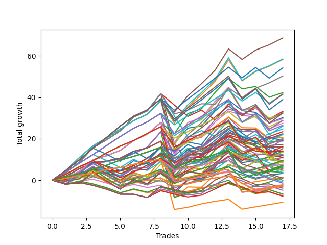

# Short Wallace Doodle 010 
- Symbol: TSLA_Unlimited
- Date Range: 03/23/2022 - 07/08/2022
- Trading Period: 7:20-12:30
- Number of Trades: 17



| Name | Win Percent | Profit | Avg Profit / Trade | Avg Time / Trade |      | Name | Win Percent | Profit | Avg Profit / Trade | Avg Time / Trade |
| ---- | ----------- | ------ | ------------------ | ---------------- | ---- | ---- | ----------- | ------ | ------------------ | ---------------- |
| Sorted By <br> Profit | | | | | | Sorted By <br> Win Percentage ||||
| Forty-Seven | 88.24 | 34290.00 | 2017.06 | 40:34 |     | Forty-Seven | 88.24 | 34290.00 | 2017.06 | 40:34 |
| Seventy-One | 88.24 | 29225.00 | 1719.12 | 44:47 |     | Seventy-One | 88.24 | 29225.00 | 1719.12 | 44:47 |
| Sixty-Three | 88.24 | 29110.00 | 1712.35 | 44:45 |     | Sixty-Three | 88.24 | 29110.00 | 1712.35 | 44:45 |
| One Hundred Fifteen | 82.35 | 27080.00 | 1592.94 | 38:51 |     | Seven | 88.24 | 25100.00 | 1476.47 | 49:56 |
| Seven | 88.24 | 25100.00 | 1476.47 | 49:56 |     | One Hundred Twelve | 88.24 | 9900.00 | 582.35 | 11:32 |
| Forty-Four | 82.35 | 21120.00 | 1242.35 | 30:27 |     | One Hundred Twenty-Seven | 88.24 | 4835.00 | 284.41 | 15:46 |
| One Hundred Thirty | 82.35 | 20780.00 | 1222.35 | 43:24 |     | One Hundred Twenty-Two | 88.24 | 4720.00 | 277.65 | 15:44 |
| One Hundred Fourteen | 82.35 | 20710.00 | 1218.24 | 32:02 |     | One Hundred Eleven | 88.24 | 3870.00 | 227.65 | 08:51 |
| One Hundred Twenty-Five | 82.35 | 19430.00 | 1142.94 | 47:10 |     | Eighty-Two | 88.24 | 710.00 | 41.76 | 20:55 |
| Forty-Five | 70.59 | 16585.00 | 975.59 | 37:57 |     | One Hundred Twenty-Six | 88.24 | -1195.00 | -70.29 | 13:05 |
| Sixty-Nine | 76.47 | 16250.00 | 955.88 | 39:00 |     | One Hundred Twenty-One | 88.24 | -1310.00 | -77.06 | 13:02 |
| Eighty-Five | 82.35 | 16210.00 | 953.53 | 54:41 |     | Eighty-One | 88.24 | -5320.00 | -312.94 | 18:14 |
| Sixty | 82.35 | 16070.00 | 945.29 | 37:18 |     | One Hundred Fifteen | 82.35 | 27080.00 | 1592.94 | 38:51 |
| Forty-Two | 76.47 | 15090.00 | 887.65 | 20:29 |     | Forty-Four | 82.35 | 21120.00 | 1242.35 | 30:27 |
| Sixty-Eight | 82.35 | 14820.00 | 871.76 | 35:00 |     | One Hundred Thirty | 82.35 | 20780.00 | 1222.35 | 43:24 |
| One Hundred Thirteen | 82.35 | 14440.00 | 849.41 | 18:37 |     | One Hundred Fourteen | 82.35 | 20710.00 | 1218.24 | 32:02 |
| One Hundred Twenty-Nine | 82.35 | 14410.00 | 847.65 | 36:35 |     | One Hundred Twenty-Five | 82.35 | 19430.00 | 1142.94 | 47:10 |
| Fifty-Eight | 76.47 | 13735.00 | 807.94 | 23:35 |     | Eighty-Five | 82.35 | 16210.00 | 953.53 | 54:41 |
| Sixty-Six | 76.47 | 13220.00 | 777.65 | 22:30 |     | Sixty | 82.35 | 16070.00 | 945.29 | 37:18 |
| One Hundred Twenty-Four | 82.35 | 13060.00 | 768.24 | 40:21 |     | Sixty-Eight | 82.35 | 14820.00 | 871.76 | 35:00 |
| Forty-One | 64.71 | 12345.00 | 726.18 | 13:55 |     | One Hundred Thirteen | 82.35 | 14440.00 | 849.41 | 18:37 |
| Sixty-Five | 64.71 | 11690.00 | 687.65 | 15:08 |     | One Hundred Twenty-Nine | 82.35 | 14410.00 | 847.65 | 36:35 |
| Fifty-Seven | 64.71 | 11195.00 | 658.53 | 15:08 |     | One Hundred Twenty-Four | 82.35 | 13060.00 | 768.24 | 40:21 |
| Sixty-One | 70.59 | 11035.00 | 649.12 | 45:23 |     | Four | 82.35 | 10975.00 | 645.59 | 42:14 |
| Four | 82.35 | 10975.00 | 645.59 | 42:14 |     | Eighty-Four | 82.35 | 9840.00 | 578.82 | 47:52 |
| Forty-Three | 76.47 | 10270.00 | 604.12 | 20:38 |     | One Hundred Twenty-Eight | 82.35 | 8140.00 | 478.82 | 23:10 |
| Forty-Nine | 64.71 | 10010.00 | 588.82 | 11:46 |     | One Hundred Twenty-Three | 82.35 | 6790.00 | 399.41 | 26:56 |
| One Hundred Twelve | 88.24 | 9900.00 | 582.35 | 11:32 |     | Eighty-Three | 82.35 | 3570.00 | 210.00 | 34:27 |
| Eighty-Four | 82.35 | 9840.00 | 578.82 | 47:52 |     | One Hundred Sixteen | 82.35 | 740.00 | 43.53 | 08:00 |
| Seventy-Three | 58.82 | 9490.00 | 558.24 | 15:26 |     | Sixty-Nine | 76.47 | 16250.00 | 955.88 | 39:00 |
| Fifty-Nine | 76.47 | 9425.00 | 554.41 | 24:25 |     | Forty-Two | 76.47 | 15090.00 | 887.65 | 20:29 |
| Sixty-Seven | 76.47 | 8620.00 | 507.06 | 22:45 |     | Fifty-Eight | 76.47 | 13735.00 | 807.94 | 23:35 |
| One Hundred Twenty-Eight | 82.35 | 8140.00 | 478.82 | 23:10 |     | Sixty-Six | 76.47 | 13220.00 | 777.65 | 22:30 |
| One Hundred Ten | 58.82 | 8025.00 | 472.06 | 12:29 |     | Forty-Three | 76.47 | 10270.00 | 604.12 | 20:38 |
| Five | 70.59 | 7625.00 | 448.53 | 53:24 |     | Fifty-Nine | 76.47 | 9425.00 | 554.41 | 24:25 |
| Forty | 76.47 | 7080.00 | 416.47 | 08:52 |     | Sixty-Seven | 76.47 | 8620.00 | 507.06 | 22:45 |
| Two | 76.47 | 7005.00 | 412.06 | 25:45 |     | Forty | 76.47 | 7080.00 | 416.47 | 08:52 |
| One Hundred Eight | 64.71 | 6910.00 | 406.47 | 08:46 |     | Two | 76.47 | 7005.00 | 412.06 | 25:45 |
| Ninety-Five | 41.18 | 6810.00 | 400.59 | 11:48 |     | Sixty-Four | 76.47 | 5930.00 | 348.82 | 09:51 |
| One Hundred Twenty-Three | 82.35 | 6790.00 | 399.41 | 26:56 |     | Fifty-Six | 76.47 | 5435.00 | 319.71 | 09:51 |
| One Hundred Nine | 58.82 | 6255.00 | 367.94 | 10:15 |     | One Hundred Seventeen | 76.47 | 3575.00 | 210.29 | 10:05 |
| Forty-Eight | 70.59 | 6020.00 | 354.12 | 07:35 |     | Three | 76.47 | 2695.00 | 158.53 | 26:35 |
| Sixty-Four | 76.47 | 5930.00 | 348.82 | 09:51 |     | Zero | 76.47 | 1635.00 | 96.18 | 11:28 |
| One Hundred Five | 47.06 | 5855.00 | 344.41 | 18:57 |     | Forty-Five | 70.59 | 16585.00 | 975.59 | 37:57 |
| Fifty-Six | 76.47 | 5435.00 | 319.71 | 09:51 |     | Sixty-One | 70.59 | 11035.00 | 649.12 | 45:23 |
| One Hundred Eighteen | 64.71 | 5420.00 | 318.82 | 14:31 |     | Five | 70.59 | 7625.00 | 448.53 | 53:24 |
| Fifty-Three | 41.18 | 5370.00 | 315.88 | 21:26 |     | Forty-Eight | 70.59 | 6020.00 | 354.12 | 07:35 |
| One Hundred Twenty-Seven | 88.24 | 4835.00 | 284.41 | 15:46 |     | One Hundred Two | 70.59 | 3630.00 | 213.53 | 05:22 |
| One Hundred Twenty-Two | 88.24 | 4720.00 | 277.65 | 15:44 |     | One Hundred Seven | 70.59 | 3235.00 | 190.29 | 05:23 |
| Seventy | 58.82 | 4695.00 | 276.18 | 08:53 |     | One Hundred One | 70.59 | -1090.00 | -64.12 | 04:19 |
| Sixty-Two | 58.82 | 4695.00 | 276.18 | 08:53 |     | One Hundred Six | 70.59 | -1485.00 | -87.35 | 04:20 |
| Forty-Six | 58.82 | 4695.00 | 276.18 | 08:53 |     | Forty-One | 64.71 | 12345.00 | 726.18 | 13:55 |
| Six | 58.82 | 4695.00 | 276.18 | 08:53 |     | Sixty-Five | 64.71 | 11690.00 | 687.65 | 15:08 |
| Fifty-Five | 41.18 | 4620.00 | 271.76 | 23:51 |     | Fifty-Seven | 64.71 | 11195.00 | 658.53 | 15:08 |
| Fifty | 52.94 | 4515.00 | 265.59 | 15:02 |     | Forty-Nine | 64.71 | 10010.00 | 588.82 | 11:46 |
| One | 64.71 | 4465.00 | 262.65 | 17:18 |     | One Hundred Eight | 64.71 | 6910.00 | 406.47 | 08:46 |
| One Hundred Three | 58.82 | 4215.00 | 247.94 | 10:01 |     | One Hundred Eighteen | 64.71 | 5420.00 | 318.82 | 14:31 |
| One Hundred Eleven | 88.24 | 3870.00 | 227.65 | 08:51 |     | One | 64.71 | 4465.00 | 262.65 | 17:18 |
| One Hundred Two | 70.59 | 3630.00 | 213.53 | 05:22 |     | Seventy-Three | 58.82 | 9490.00 | 558.24 | 15:26 |
| One Hundred Seventeen | 76.47 | 3575.00 | 210.29 | 10:05 |     | One Hundred Ten | 58.82 | 8025.00 | 472.06 | 12:29 |
| Eighty-Three | 82.35 | 3570.00 | 210.00 | 34:27 |     | One Hundred Nine | 58.82 | 6255.00 | 367.94 | 10:15 |
| One Hundred Seven | 70.59 | 3235.00 | 190.29 | 05:23 |     | Seventy | 58.82 | 4695.00 | 276.18 | 08:53 |
| Ninety-Four | 41.18 | 3005.00 | 176.76 | 07:45 |     | Sixty-Two | 58.82 | 4695.00 | 276.18 | 08:53 |
| Three | 76.47 | 2695.00 | 158.53 | 26:35 |     | Forty-Six | 58.82 | 4695.00 | 276.18 | 08:53 |
| Fifty-Two | 41.18 | 2365.00 | 139.12 | 19:34 |     | Six | 58.82 | 4695.00 | 276.18 | 08:53 |
| Ninety-Three | 47.06 | 2200.00 | 129.41 | 06:30 |     | One Hundred Three | 58.82 | 4215.00 | 247.94 | 10:01 |
| Fifty-Four | 52.94 | 1870.00 | 110.00 | 06:24 |     | Fifty | 52.94 | 4515.00 | 265.59 | 15:02 |
| One Hundred Four | 47.06 | 1735.00 | 102.06 | 14:17 |     | Fifty-Four | 52.94 | 1870.00 | 110.00 | 06:24 |
| Zero | 76.47 | 1635.00 | 96.18 | 11:28 |     | Ninety-Two | 52.94 | -15.00 | -0.88 | 03:18 |
| One Hundred Sixteen | 82.35 | 740.00 | 43.53 | 08:00 |     | Ninety-One | 52.94 | -3415.00 | -200.88 | 02:43 |
| Eighty-Two | 88.24 | 710.00 | 41.76 | 20:55 |     | One Hundred Five | 47.06 | 5855.00 | 344.41 | 18:57 |
| One Hundred Twenty | 35.29 | 470.00 | 27.65 | 21:25 |     | Ninety-Three | 47.06 | 2200.00 | 129.41 | 06:30 |
| Ninety-Two | 52.94 | -15.00 | -0.88 | 03:18 |     | One Hundred Four | 47.06 | 1735.00 | 102.06 | 14:17 |
| Fifty-One | 47.06 | -425.00 | -25.00 | 15:24 |     | Fifty-One | 47.06 | -425.00 | -25.00 | 15:24 |
| One Hundred Ninteen | 41.18 | -730.00 | -42.94 | 19:00 |     | Ninety-Six | 47.06 | -3780.00 | -222.35 | 03:05 |
| One Hundred One | 70.59 | -1090.00 | -64.12 | 04:19 |     | Ninety-Five | 41.18 | 6810.00 | 400.59 | 11:48 |
| One Hundred Twenty-Six | 88.24 | -1195.00 | -70.29 | 13:05 |     | Fifty-Three | 41.18 | 5370.00 | 315.88 | 21:26 |
| One Hundred Twenty-One | 88.24 | -1310.00 | -77.06 | 13:02 |     | Fifty-Five | 41.18 | 4620.00 | 271.76 | 23:51 |
| One Hundred Six | 70.59 | -1485.00 | -87.35 | 04:20 |     | Ninety-Four | 41.18 | 3005.00 | 176.76 | 07:45 |
| One Hundred | 35.29 | -1925.00 | -113.24 | 05:46 |     | Fifty-Two | 41.18 | 2365.00 | 139.12 | 19:34 |
| Ninety-Nine | 35.29 | -2430.00 | -142.94 | 05:23 |     | One Hundred Ninteen | 41.18 | -730.00 | -42.94 | 19:00 |
| Ninety-Seven | 41.18 | -3335.00 | -196.18 | 03:31 |     | Ninety-Seven | 41.18 | -3335.00 | -196.18 | 03:31 |
| Ninety-One | 52.94 | -3415.00 | -200.88 | 02:43 |     | One Hundred Twenty | 35.29 | 470.00 | 27.65 | 21:25 |
| Ninety-Six | 47.06 | -3780.00 | -222.35 | 03:05 |     | One Hundred | 35.29 | -1925.00 | -113.24 | 05:46 |
| Ninety-Eight | 35.29 | -3865.00 | -227.35 | 05:18 |     | Ninety-Nine | 35.29 | -2430.00 | -142.94 | 05:23 |
| Eighty-One | 88.24 | -5320.00 | -312.94 | 18:14 |     | Ninety-Eight | 35.29 | -3865.00 | -227.35 | 05:18 |

## NO STOPLOSS

### Test Zero
* Sell when price hits the middle line of the 20p bollinger
* No Stoploss
* Results:
```
Total Trades: 17
Percent Up: 23.53
Percent Down: 76.47
Total Points Moved Down: 3.27
Potential Profit: 1635.00
Total Points Ups: 23.84 Count Ups: 4
Total Points Downs: 27.11 Count Downs: 13
```

<details><summary>Trades</summary>

<code>In: 2022-03-25 11:01:00		Out: 2022-03-25 11:11:05		Total Position Time: 10:05		Total Move Down: -0.06		Total to Date: -0.06</code> <br />
<code>In: 2022-03-25 11:08:00		Out: 2022-03-25 11:11:05		Total Position Time: 03:05		Total Move Down: 1.51		Total to Date: 1.45</code> <br />
<code>In: 2022-04-05 11:48:00		Out: 2022-04-05 11:54:40		Total Position Time: 06:40		Total Move Down: 1.94		Total to Date: 3.39</code> <br />
<code>In: 2022-04-11 10:08:00		Out: 2022-04-11 10:19:00		Total Position Time: 11:00		Total Move Down: 0.24		Total to Date: 3.63</code> <br />
<code>In: 2022-04-11 10:10:00		Out: 2022-04-11 10:19:00		Total Position Time: 09:00		Total Move Down: 0.79		Total to Date: 4.42</code> <br />
<code>In: 2022-04-11 12:03:00		Out: 2022-04-11 12:04:55		Total Position Time: 01:55		Total Move Down: 1.68		Total to Date: 6.10</code> <br />
<code>In: 2022-04-22 12:16:00		Out: 2022-04-22 12:23:05		Total Position Time: 07:05		Total Move Down: 2.53		Total to Date: 8.63</code> <br />
<code>In: 2022-04-26 12:02:00		Out: 2022-04-26 12:05:50		Total Position Time: 03:50		Total Move Down: 3.28		Total to Date: 11.91</code> <br />
<code>In: 2022-05-02 11:51:00		Out: 2022-05-02 12:37:35		Total Position Time: 46:35		Total Move Down: -18.40		Total to Date: -6.49</code> <br />
<code>In: 2022-05-10 09:06:00		Out: 2022-05-10 09:10:25		Total Position Time: 04:25		Total Move Down: 6.57		Total to Date: 0.08</code> <br />
<code>In: 2022-05-16 11:11:00		Out: 2022-05-16 11:36:40		Total Position Time: 25:40		Total Move Down: 0.91		Total to Date: 0.99</code> <br />
<code>In: 2022-05-20 11:55:00		Out: 2022-05-20 12:02:15		Total Position Time: 07:15		Total Move Down: 2.96		Total to Date: 3.95</code> <br />
<code>In: 2022-06-06 10:59:00		Out: 2022-06-06 11:05:15		Total Position Time: 06:15		Total Move Down: 2.43		Total to Date: 6.38</code> <br />
<code>In: 2022-06-10 10:39:00		Out: 2022-06-10 11:01:00		Total Position Time: 22:00		Total Move Down: -3.09		Total to Date: 3.29</code> <br />
<code>In: 2022-06-17 10:07:00		Out: 2022-06-17 10:24:05		Total Position Time: 17:05		Total Move Down: -2.29		Total to Date: 1.00</code> <br />
<code>In: 2022-06-29 10:12:00		Out: 2022-06-29 10:14:05		Total Position Time: 02:05		Total Move Down: 1.43		Total to Date: 2.43</code> <br />
<code>In: 2022-07-01 08:11:00		Out: 2022-07-01 08:22:00		Total Position Time: 11:00		Total Move Down: 0.84		Total to Date: 3.27</code> <br />


</details>

### Test One
* Sell when the price hits the upper line of the 20p 1std bollinger
* No Stoploss
* Results:
```
Total Trades: 17
Percent Up: 35.29
Percent Down: 64.71
Total Points Moved Down: 8.93
Potential Profit: 4465.00
Total Points Ups: 28.46 Count Ups: 6
Total Points Downs: 37.39 Count Downs: 11
```

<details><summary>Trades</summary>

<code>In: 2022-03-25 11:01:00		Out: 2022-03-25 11:17:25		Total Position Time: 16:25		Total Move Down: 0.47		Total to Date: 0.47</code> <br />
<code>In: 2022-03-25 11:08:00		Out: 2022-03-25 11:17:25		Total Position Time: 09:25		Total Move Down: 2.04		Total to Date: 2.51</code> <br />
<code>In: 2022-04-05 11:48:00		Out: 2022-04-05 11:57:55		Total Position Time: 09:55		Total Move Down: 2.60		Total to Date: 5.11</code> <br />
<code>In: 2022-04-11 10:08:00		Out: 2022-04-11 10:29:25		Total Position Time: 21:25		Total Move Down: -0.61		Total to Date: 4.50</code> <br />
<code>In: 2022-04-11 10:10:00		Out: 2022-04-11 10:29:25		Total Position Time: 19:25		Total Move Down: -0.06		Total to Date: 4.44</code> <br />
<code>In: 2022-04-11 12:03:00		Out: 2022-04-11 12:11:30		Total Position Time: 08:30		Total Move Down: 2.58		Total to Date: 7.02</code> <br />
<code>In: 2022-04-22 12:16:00		Out: 2022-04-22 12:29:35		Total Position Time: 13:35		Total Move Down: 3.58		Total to Date: 10.60</code> <br />
<code>In: 2022-04-26 12:02:00		Out: 2022-04-26 12:11:50		Total Position Time: 09:50		Total Move Down: 5.23		Total to Date: 15.83</code> <br />
<code>In: 2022-05-02 11:51:00		Out: 2022-05-02 12:47:00		Total Position Time: 56:00		Total Move Down: -24.26		Total to Date: -8.43</code> <br />
<code>In: 2022-05-10 09:06:00		Out: 2022-05-10 09:20:25		Total Position Time: 14:25		Total Move Down: 5.15		Total to Date: -3.28</code> <br />
<code>In: 2022-05-16 11:11:00		Out: 2022-05-16 11:45:45		Total Position Time: 34:45		Total Move Down: -0.16		Total to Date: -3.44</code> <br />
<code>In: 2022-05-20 11:55:00		Out: 2022-05-20 12:02:45		Total Position Time: 07:45		Total Move Down: 6.17		Total to Date: 2.73</code> <br />
<code>In: 2022-06-06 10:59:00		Out: 2022-06-06 11:07:55		Total Position Time: 08:55		Total Move Down: 4.67		Total to Date: 7.40</code> <br />
<code>In: 2022-06-10 10:39:00		Out: 2022-06-10 11:05:05		Total Position Time: 26:05		Total Move Down: -2.10		Total to Date: 5.30</code> <br />
<code>In: 2022-06-17 10:07:00		Out: 2022-06-17 10:28:05		Total Position Time: 21:05		Total Move Down: -1.27		Total to Date: 4.03</code> <br />
<code>In: 2022-06-29 10:12:00		Out: 2022-06-29 10:15:25		Total Position Time: 03:25		Total Move Down: 2.56		Total to Date: 6.59</code> <br />
<code>In: 2022-07-01 08:11:00		Out: 2022-07-01 08:24:20		Total Position Time: 13:20		Total Move Down: 2.34		Total to Date: 8.93</code> <br />


</details>

### Test Two
* Sell when the price hits the upper line of the 20p 2std bollinger
* No Stoploss
* Results:
```
Total Trades: 17
Percent Up: 23.53
Percent Down: 76.47
Total Points Moved Down: 14.01
Potential Profit: 7005.00
Total Points Ups: 32.76 Count Ups: 4
Total Points Downs: 46.77 Count Downs: 13
```

<details><summary>Trades</summary>

<code>In: 2022-03-25 11:01:00		Out: 2022-03-25 11:18:05		Total Position Time: 17:05		Total Move Down: 1.23		Total to Date: 1.23</code> <br />
<code>In: 2022-03-25 11:08:00		Out: 2022-03-25 11:18:05		Total Position Time: 10:05		Total Move Down: 2.80		Total to Date: 4.03</code> <br />
<code>In: 2022-04-05 11:48:00		Out: 2022-04-05 11:58:15		Total Position Time: 10:15		Total Move Down: 4.13		Total to Date: 8.16</code> <br />
<code>In: 2022-04-11 10:08:00		Out: 2022-04-11 10:38:25		Total Position Time: 30:25		Total Move Down: 0.79		Total to Date: 8.95</code> <br />
<code>In: 2022-04-11 10:10:00		Out: 2022-04-11 10:38:25		Total Position Time: 28:25		Total Move Down: 1.34		Total to Date: 10.29</code> <br />
<code>In: 2022-04-11 12:03:00		Out: 2022-04-11 12:11:30		Total Position Time: 08:30		Total Move Down: 2.58		Total to Date: 12.87</code> <br />
<code>In: 2022-04-22 12:16:00		Out: 2022-04-22 12:47:00		Total Position Time: 31:00		Total Move Down: 3.05		Total to Date: 15.92</code> <br />
<code>In: 2022-04-26 12:02:00		Out: 2022-04-26 12:13:25		Total Position Time: 11:25		Total Move Down: 7.37		Total to Date: 23.29</code> <br />
<code>In: 2022-05-02 11:51:00		Out: 2022-05-02 12:47:00		Total Position Time: 56:00		Total Move Down: -24.26		Total to Date: -0.97</code> <br />
<code>In: 2022-05-10 09:06:00		Out: 2022-05-10 09:31:00		Total Position Time: 25:00		Total Move Down: 7.30		Total to Date: 6.33</code> <br />
<code>In: 2022-05-16 11:11:00		Out: 2022-05-16 11:49:00		Total Position Time: 38:00		Total Move Down: 1.07		Total to Date: 7.40</code> <br />
<code>In: 2022-05-20 11:55:00		Out: 2022-05-20 12:03:20		Total Position Time: 08:20		Total Move Down: 7.20		Total to Date: 14.60</code> <br />
<code>In: 2022-06-06 10:59:00		Out: 2022-06-06 11:21:40		Total Position Time: 22:40		Total Move Down: 5.27		Total to Date: 19.87</code> <br />
<code>In: 2022-06-10 10:39:00		Out: 2022-06-10 11:13:20		Total Position Time: 34:20		Total Move Down: -2.06		Total to Date: 17.81</code> <br />
<code>In: 2022-06-17 10:07:00		Out: 2022-06-17 10:29:05		Total Position Time: 22:05		Total Move Down: -0.84		Total to Date: 16.97</code> <br />
<code>In: 2022-06-29 10:12:00		Out: 2022-06-29 11:21:05		Total Position Time: 69:05		Total Move Down: -5.60		Total to Date: 11.37</code> <br />
<code>In: 2022-07-01 08:11:00		Out: 2022-07-01 08:26:10		Total Position Time: 15:10		Total Move Down: 2.64		Total to Date: 14.01</code> <br />


</details>

### Test Three
* Sell when price hits the middle line of the 50p bollinger
* No Stoploss
* Results:
```
Total Trades: 17
Percent Up: 23.53
Percent Down: 76.47
Total Points Moved Down: 5.39
Potential Profit: 2695.00
Total Points Ups: 31.02 Count Ups: 4
Total Points Downs: 36.41 Count Downs: 13
```

<details><summary>Trades</summary>

<code>In: 2022-03-25 11:01:00		Out: 2022-03-25 11:18:15		Total Position Time: 17:15		Total Move Down: 1.98		Total to Date: 1.98</code> <br />
<code>In: 2022-03-25 11:08:00		Out: 2022-03-25 11:18:15		Total Position Time: 10:15		Total Move Down: 3.55		Total to Date: 5.53</code> <br />
<code>In: 2022-04-05 11:48:00		Out: 2022-04-05 11:58:10		Total Position Time: 10:10		Total Move Down: 2.94		Total to Date: 8.47</code> <br />
<code>In: 2022-04-11 10:08:00		Out: 2022-04-11 10:38:25		Total Position Time: 30:25		Total Move Down: 0.79		Total to Date: 9.26</code> <br />
<code>In: 2022-04-11 10:10:00		Out: 2022-04-11 10:38:25		Total Position Time: 28:25		Total Move Down: 1.34		Total to Date: 10.60</code> <br />
<code>In: 2022-04-11 12:03:00		Out: 2022-04-11 12:12:35		Total Position Time: 09:35		Total Move Down: 3.32		Total to Date: 13.92</code> <br />
<code>In: 2022-04-22 12:16:00		Out: 2022-04-22 12:46:05		Total Position Time: 30:05		Total Move Down: 1.61		Total to Date: 15.53</code> <br />
<code>In: 2022-04-26 12:02:00		Out: 2022-04-26 12:05:40		Total Position Time: 03:40		Total Move Down: 3.25		Total to Date: 18.78</code> <br />
<code>In: 2022-05-02 11:51:00		Out: 2022-05-02 12:47:00		Total Position Time: 56:00		Total Move Down: -24.26		Total to Date: -5.48</code> <br />
<code>In: 2022-05-10 09:06:00		Out: 2022-05-10 09:22:35		Total Position Time: 16:35		Total Move Down: 5.84		Total to Date: 0.36</code> <br />
<code>In: 2022-05-16 11:11:00		Out: 2022-05-16 11:49:05		Total Position Time: 38:05		Total Move Down: 1.55		Total to Date: 1.91</code> <br />
<code>In: 2022-05-20 11:55:00		Out: 2022-05-20 12:02:40		Total Position Time: 07:40		Total Move Down: 5.20		Total to Date: 7.11</code> <br />
<code>In: 2022-06-06 10:59:00		Out: 2022-06-06 11:17:05		Total Position Time: 18:05		Total Move Down: 4.53		Total to Date: 11.64</code> <br />
<code>In: 2022-06-10 10:39:00		Out: 2022-06-10 11:15:10		Total Position Time: 36:10		Total Move Down: -1.62		Total to Date: 10.02</code> <br />
<code>In: 2022-06-17 10:07:00		Out: 2022-06-17 10:32:25		Total Position Time: 25:25		Total Move Down: -0.12		Total to Date: 9.90</code> <br />
<code>In: 2022-06-29 10:12:00		Out: 2022-06-29 11:30:45		Total Position Time: 78:45		Total Move Down: -5.02		Total to Date: 4.88</code> <br />
<code>In: 2022-07-01 08:11:00		Out: 2022-07-01 08:46:20		Total Position Time: 35:20		Total Move Down: 0.51		Total to Date: 5.39</code> <br />


</details>

### Test Four
* Sell when the price hits the upper line of the 50p 1std bollinger
* No Stoploss
* Results:
```
Total Trades: 17
Percent Up: 17.65
Percent Down: 82.35
Total Points Moved Down: 21.95
Potential Profit: 10975.00
Total Points Ups: 36.04 Count Ups: 3
Total Points Downs: 57.99 Count Downs: 14
```

<details><summary>Trades</summary>

<code>In: 2022-03-25 11:01:00		Out: 2022-03-25 12:01:35		Total Position Time: 60:35		Total Move Down: 1.35		Total to Date: 1.35</code> <br />
<code>In: 2022-03-25 11:08:00		Out: 2022-03-25 12:01:35		Total Position Time: 53:35		Total Move Down: 2.92		Total to Date: 4.27</code> <br />
<code>In: 2022-04-05 11:48:00		Out: 2022-04-05 12:02:05		Total Position Time: 14:05		Total Move Down: 5.55		Total to Date: 9.82</code> <br />
<code>In: 2022-04-11 10:08:00		Out: 2022-04-11 10:45:35		Total Position Time: 37:35		Total Move Down: 1.99		Total to Date: 11.81</code> <br />
<code>In: 2022-04-11 10:10:00		Out: 2022-04-11 10:45:35		Total Position Time: 35:35		Total Move Down: 2.54		Total to Date: 14.35</code> <br />
<code>In: 2022-04-11 12:03:00		Out: 2022-04-11 12:21:05		Total Position Time: 18:05		Total Move Down: 4.74		Total to Date: 19.09</code> <br />
<code>In: 2022-04-22 12:16:00		Out: 2022-04-22 12:47:00		Total Position Time: 31:00		Total Move Down: 3.05		Total to Date: 22.14</code> <br />
<code>In: 2022-04-26 12:02:00		Out: 2022-04-26 12:12:15		Total Position Time: 10:15		Total Move Down: 5.70		Total to Date: 27.84</code> <br />
<code>In: 2022-05-02 11:51:00		Out: 2022-05-02 12:47:00		Total Position Time: 56:00		Total Move Down: -24.26		Total to Date: 3.58</code> <br />
<code>In: 2022-05-10 09:06:00		Out: 2022-05-10 09:31:20		Total Position Time: 25:20		Total Move Down: 9.80		Total to Date: 13.38</code> <br />
<code>In: 2022-05-16 11:11:00		Out: 2022-05-16 12:02:45		Total Position Time: 51:45		Total Move Down: 2.27		Total to Date: 15.65</code> <br />
<code>In: 2022-05-20 11:55:00		Out: 2022-05-20 12:03:35		Total Position Time: 08:35		Total Move Down: 7.91		Total to Date: 23.56</code> <br />
<code>In: 2022-06-06 10:59:00		Out: 2022-06-06 11:22:25		Total Position Time: 23:25		Total Move Down: 6.82		Total to Date: 30.38</code> <br />
<code>In: 2022-06-10 10:39:00		Out: 2022-06-10 12:42:40		Total Position Time: 123:40		Total Move Down: -6.89		Total to Date: 23.49</code> <br />
<code>In: 2022-06-17 10:07:00		Out: 2022-06-17 10:45:40		Total Position Time: 38:40		Total Move Down: 1.14		Total to Date: 24.63</code> <br />
<code>In: 2022-06-29 10:12:00		Out: 2022-06-29 11:42:15		Total Position Time: 90:15		Total Move Down: -4.89		Total to Date: 19.74</code> <br />
<code>In: 2022-07-01 08:11:00		Out: 2022-07-01 08:50:35		Total Position Time: 39:35		Total Move Down: 2.21		Total to Date: 21.95</code> <br />


</details>

### Test Five
* Sell when the price hits the upper line of the 50p 2std bollinger
* No Stoploss
* Results:
```
Total Trades: 17
Percent Up: 29.41
Percent Down: 70.59
Total Points Moved Down: 15.25
Potential Profit: 7625.00
Total Points Ups: 43.87 Count Ups: 5
Total Points Downs: 59.12 Count Downs: 12
```

<details><summary>Trades</summary>

<code>In: 2022-03-25 11:01:00		Out: 2022-03-25 12:02:00		Total Position Time: 61:00		Total Move Down: 3.61		Total to Date: 3.61</code> <br />
<code>In: 2022-03-25 11:08:00		Out: 2022-03-25 12:02:00		Total Position Time: 54:00		Total Move Down: 5.18		Total to Date: 8.79</code> <br />
<code>In: 2022-04-05 11:48:00		Out: 2022-04-05 12:03:55		Total Position Time: 15:55		Total Move Down: 6.94		Total to Date: 15.73</code> <br />
<code>In: 2022-04-11 10:08:00		Out: 2022-04-11 10:49:20		Total Position Time: 41:20		Total Move Down: 3.76		Total to Date: 19.49</code> <br />
<code>In: 2022-04-11 10:10:00		Out: 2022-04-11 10:49:20		Total Position Time: 39:20		Total Move Down: 4.31		Total to Date: 23.80</code> <br />
<code>In: 2022-04-11 12:03:00		Out: 2022-04-11 12:26:50		Total Position Time: 23:50		Total Move Down: 6.60		Total to Date: 30.40</code> <br />
<code>In: 2022-04-22 12:16:00		Out: 2022-04-22 12:47:00		Total Position Time: 31:00		Total Move Down: 3.05		Total to Date: 33.45</code> <br />
<code>In: 2022-04-26 12:02:00		Out: 2022-04-26 12:14:25		Total Position Time: 12:25		Total Move Down: 8.29		Total to Date: 41.74</code> <br />
<code>In: 2022-05-02 11:51:00		Out: 2022-05-02 12:47:00		Total Position Time: 56:00		Total Move Down: -24.26		Total to Date: 17.48</code> <br />
<code>In: 2022-05-10 09:06:00		Out: 2022-05-10 11:24:05		Total Position Time: 138:05		Total Move Down: -8.43		Total to Date: 9.05</code> <br />
<code>In: 2022-05-16 11:11:00		Out: 2022-05-16 12:03:25		Total Position Time: 52:25		Total Move Down: 2.99		Total to Date: 12.04</code> <br />
<code>In: 2022-05-20 11:55:00		Out: 2022-05-20 12:47:00		Total Position Time: 52:00		Total Move Down: -2.58		Total to Date: 9.46</code> <br />
<code>In: 2022-06-06 10:59:00		Out: 2022-06-06 11:27:20		Total Position Time: 28:20		Total Move Down: 7.77		Total to Date: 17.23</code> <br />
<code>In: 2022-06-10 10:39:00		Out: 2022-06-10 12:46:10		Total Position Time: 127:10		Total Move Down: -5.13		Total to Date: 12.10</code> <br />
<code>In: 2022-06-17 10:07:00		Out: 2022-06-17 10:47:30		Total Position Time: 40:30		Total Move Down: 3.03		Total to Date: 15.13</code> <br />
<code>In: 2022-06-29 10:12:00		Out: 2022-06-29 11:45:00		Total Position Time: 93:00		Total Move Down: -3.47		Total to Date: 11.66</code> <br />
<code>In: 2022-07-01 08:11:00		Out: 2022-07-01 08:52:30		Total Position Time: 41:30		Total Move Down: 3.59		Total to Date: 15.25</code> <br />


</details>

### Test Six
* Sell when the price hits the middle line of the 1std VWAP
* No Stoploss
* Results:
```
Total Trades: 17
Percent Up: 41.18
Percent Down: 58.82
Total Points Moved Down: 9.39
Potential Profit: 4695.00
Total Points Ups: 6.27 Count Ups: 7
Total Points Downs: 15.66 Count Downs: 10
```

<details><summary>Trades</summary>

<code>In: 2022-03-25 11:01:00		Out: 2022-03-25 11:02:10		Total Position Time: 01:10		Total Move Down: -0.37		Total to Date: -0.37</code> <br />
<code>In: 2022-03-25 11:08:00		Out: 2022-03-25 11:10:55		Total Position Time: 02:55		Total Move Down: 1.57		Total to Date: 1.20</code> <br />
<code>In: 2022-04-05 11:48:00		Out: 2022-04-05 11:49:10		Total Position Time: 01:10		Total Move Down: 0.99		Total to Date: 2.19</code> <br />
<code>In: 2022-04-11 10:08:00		Out: 2022-04-11 10:09:10		Total Position Time: 01:10		Total Move Down: -1.26		Total to Date: 0.93</code> <br />
<code>In: 2022-04-11 10:10:00		Out: 2022-04-11 10:11:10		Total Position Time: 01:10		Total Move Down: -0.50		Total to Date: 0.43</code> <br />
<code>In: 2022-04-11 12:03:00		Out: 2022-04-11 12:04:10		Total Position Time: 01:10		Total Move Down: 0.58		Total to Date: 1.01</code> <br />
<code>In: 2022-04-22 12:16:00		Out: 2022-04-22 12:17:10		Total Position Time: 01:10		Total Move Down: -0.88		Total to Date: 0.13</code> <br />
<code>In: 2022-04-26 12:02:00		Out: 2022-04-26 12:03:10		Total Position Time: 01:10		Total Move Down: -0.77		Total to Date: -0.64</code> <br />
<code>In: 2022-05-02 11:51:00		Out: 2022-05-02 11:52:10		Total Position Time: 01:10		Total Move Down: 0.60		Total to Date: -0.04</code> <br />
<code>In: 2022-05-10 09:06:00		Out: 2022-05-10 09:07:10		Total Position Time: 01:10		Total Move Down: 1.07		Total to Date: 1.03</code> <br />
<code>In: 2022-05-16 11:11:00		Out: 2022-05-16 11:12:10		Total Position Time: 01:10		Total Move Down: 1.63		Total to Date: 2.66</code> <br />
<code>In: 2022-05-20 11:55:00		Out: 2022-05-20 11:56:10		Total Position Time: 01:10		Total Move Down: 0.19		Total to Date: 2.85</code> <br />
<code>In: 2022-06-06 10:59:00		Out: 2022-06-06 11:07:55		Total Position Time: 08:55		Total Move Down: 4.67		Total to Date: 7.52</code> <br />
<code>In: 2022-06-10 10:39:00		Out: 2022-06-10 10:40:10		Total Position Time: 01:10		Total Move Down: -2.00		Total to Date: 5.52</code> <br />
<code>In: 2022-06-17 10:07:00		Out: 2022-06-17 12:10:00		Total Position Time: 123:00		Total Move Down: 3.68		Total to Date: 9.20</code> <br />
<code>In: 2022-06-29 10:12:00		Out: 2022-06-29 10:13:10		Total Position Time: 01:10		Total Move Down: 0.68		Total to Date: 9.88</code> <br />
<code>In: 2022-07-01 08:11:00		Out: 2022-07-01 08:12:10		Total Position Time: 01:10		Total Move Down: -0.49		Total to Date: 9.39</code> <br />


</details>

### Test Seven
* Sell when the price hits the upper line of the 1std VWAP
* No Stoploss
* Results:
```
Total Trades: 17
Percent Up: 11.76
Percent Down: 88.24
Total Points Moved Down: 50.20
Potential Profit: 25100.00
Total Points Ups: 28.98 Count Ups: 2
Total Points Downs: 79.18 Count Downs: 15
```

<details><summary>Trades</summary>

<code>In: 2022-03-25 11:01:00		Out: 2022-03-25 12:13:30		Total Position Time: 72:30		Total Move Down: 4.69		Total to Date: 4.69</code> <br />
<code>In: 2022-03-25 11:08:00		Out: 2022-03-25 12:13:30		Total Position Time: 65:30		Total Move Down: 6.26		Total to Date: 10.95</code> <br />
<code>In: 2022-04-05 11:48:00		Out: 2022-04-05 12:02:20		Total Position Time: 14:20		Total Move Down: 5.64		Total to Date: 16.59</code> <br />
<code>In: 2022-04-11 10:08:00		Out: 2022-04-11 10:49:20		Total Position Time: 41:20		Total Move Down: 3.76		Total to Date: 20.35</code> <br />
<code>In: 2022-04-11 10:10:00		Out: 2022-04-11 10:49:20		Total Position Time: 39:20		Total Move Down: 4.31		Total to Date: 24.66</code> <br />
<code>In: 2022-04-11 12:03:00		Out: 2022-04-11 12:15:15		Total Position Time: 12:15		Total Move Down: 4.03		Total to Date: 28.69</code> <br />
<code>In: 2022-04-22 12:16:00		Out: 2022-04-22 12:47:00		Total Position Time: 31:00		Total Move Down: 3.05		Total to Date: 31.74</code> <br />
<code>In: 2022-04-26 12:02:00		Out: 2022-04-26 12:12:40		Total Position Time: 10:40		Total Move Down: 6.59		Total to Date: 38.33</code> <br />
<code>In: 2022-05-02 11:51:00		Out: 2022-05-02 12:47:00		Total Position Time: 56:00		Total Move Down: -24.26		Total to Date: 14.07</code> <br />
<code>In: 2022-05-10 09:06:00		Out: 2022-05-10 09:31:15		Total Position Time: 25:15		Total Move Down: 7.89		Total to Date: 21.96</code> <br />
<code>In: 2022-05-16 11:11:00		Out: 2022-05-16 12:10:10		Total Position Time: 59:10		Total Move Down: 5.81		Total to Date: 27.77</code> <br />
<code>In: 2022-05-20 11:55:00		Out: 2022-05-20 12:03:10		Total Position Time: 08:10		Total Move Down: 6.46		Total to Date: 34.23</code> <br />
<code>In: 2022-06-06 10:59:00		Out: 2022-06-06 12:20:40		Total Position Time: 81:40		Total Move Down: 10.35		Total to Date: 44.58</code> <br />
<code>In: 2022-06-10 10:39:00		Out: 2022-06-10 12:47:00		Total Position Time: 128:00		Total Move Down: -4.72		Total to Date: 39.86</code> <br />
<code>In: 2022-06-17 10:07:00		Out: 2022-06-17 12:47:00		Total Position Time: 160:00		Total Move Down: 4.51		Total to Date: 44.37</code> <br />
<code>In: 2022-06-29 10:12:00		Out: 2022-06-29 10:15:25		Total Position Time: 03:25		Total Move Down: 2.56		Total to Date: 46.93</code> <br />
<code>In: 2022-07-01 08:11:00		Out: 2022-07-01 08:51:30		Total Position Time: 40:30		Total Move Down: 3.27		Total to Date: 50.20</code> <br />


</details>

## STOPLOSS OF 5

### Test Forty
* Sell when price hits the middle line of the 20p bollinger
* Stoploss is -5 points
* Results:
```
Total Trades: 17
Percent Up: 23.53
Percent Down: 76.47
Total Points Moved Down: 14.16
Potential Profit: 7080.00
Total Points Ups: 12.95 Count Ups: 4
Total Points Downs: 27.11 Count Downs: 13
```

<details><summary>Trades</summary>

<code>In: 2022-03-25 11:01:00		Out: 2022-03-25 11:11:05		Total Position Time: 10:05		Total Move Down: -0.06		Total to Date: -0.06</code> <br />
<code>In: 2022-03-25 11:08:00		Out: 2022-03-25 11:11:05		Total Position Time: 03:05		Total Move Down: 1.51		Total to Date: 1.45</code> <br />
<code>In: 2022-04-05 11:48:00		Out: 2022-04-05 11:54:40		Total Position Time: 06:40		Total Move Down: 1.94		Total to Date: 3.39</code> <br />
<code>In: 2022-04-11 10:08:00		Out: 2022-04-11 10:19:00		Total Position Time: 11:00		Total Move Down: 0.24		Total to Date: 3.63</code> <br />
<code>In: 2022-04-11 10:10:00		Out: 2022-04-11 10:19:00		Total Position Time: 09:00		Total Move Down: 0.79		Total to Date: 4.42</code> <br />
<code>In: 2022-04-11 12:03:00		Out: 2022-04-11 12:04:55		Total Position Time: 01:55		Total Move Down: 1.68		Total to Date: 6.10</code> <br />
<code>In: 2022-04-22 12:16:00		Out: 2022-04-22 12:23:05		Total Position Time: 07:05		Total Move Down: 2.53		Total to Date: 8.63</code> <br />
<code>In: 2022-04-26 12:02:00		Out: 2022-04-26 12:05:50		Total Position Time: 03:50		Total Move Down: 3.28		Total to Date: 11.91</code> <br />
<code>In: 2022-05-02 11:51:00		Out: 2022-05-02 12:04:30		Total Position Time: 13:30		Total Move Down: -5.50		Total to Date: 6.41</code> <br />
<code>In: 2022-05-10 09:06:00		Out: 2022-05-10 09:10:25		Total Position Time: 04:25		Total Move Down: 6.57		Total to Date: 12.98</code> <br />
<code>In: 2022-05-16 11:11:00		Out: 2022-05-16 11:36:40		Total Position Time: 25:40		Total Move Down: 0.91		Total to Date: 13.89</code> <br />
<code>In: 2022-05-20 11:55:00		Out: 2022-05-20 12:02:15		Total Position Time: 07:15		Total Move Down: 2.96		Total to Date: 16.85</code> <br />
<code>In: 2022-06-06 10:59:00		Out: 2022-06-06 11:05:15		Total Position Time: 06:15		Total Move Down: 2.43		Total to Date: 19.28</code> <br />
<code>In: 2022-06-10 10:39:00		Out: 2022-06-10 10:50:05		Total Position Time: 11:05		Total Move Down: -5.10		Total to Date: 14.18</code> <br />
<code>In: 2022-06-17 10:07:00		Out: 2022-06-17 10:24:05		Total Position Time: 17:05		Total Move Down: -2.29		Total to Date: 11.89</code> <br />
<code>In: 2022-06-29 10:12:00		Out: 2022-06-29 10:14:05		Total Position Time: 02:05		Total Move Down: 1.43		Total to Date: 13.32</code> <br />
<code>In: 2022-07-01 08:11:00		Out: 2022-07-01 08:22:00		Total Position Time: 11:00		Total Move Down: 0.84		Total to Date: 14.16</code> <br />


</details>

### Test Forty-One
* Sell when the price hits the upper line of the 20p 1std bollinger
* Stoploss is -5 points
* Results:
```
Total Trades: 17
Percent Up: 35.29
Percent Down: 64.71
Total Points Moved Down: 24.69
Potential Profit: 12345.00
Total Points Ups: 12.70 Count Ups: 6
Total Points Downs: 37.39 Count Downs: 11
```

<details><summary>Trades</summary>

<code>In: 2022-03-25 11:01:00		Out: 2022-03-25 11:17:25		Total Position Time: 16:25		Total Move Down: 0.47		Total to Date: 0.47</code> <br />
<code>In: 2022-03-25 11:08:00		Out: 2022-03-25 11:17:25		Total Position Time: 09:25		Total Move Down: 2.04		Total to Date: 2.51</code> <br />
<code>In: 2022-04-05 11:48:00		Out: 2022-04-05 11:57:55		Total Position Time: 09:55		Total Move Down: 2.60		Total to Date: 5.11</code> <br />
<code>In: 2022-04-11 10:08:00		Out: 2022-04-11 10:29:25		Total Position Time: 21:25		Total Move Down: -0.61		Total to Date: 4.50</code> <br />
<code>In: 2022-04-11 10:10:00		Out: 2022-04-11 10:29:25		Total Position Time: 19:25		Total Move Down: -0.06		Total to Date: 4.44</code> <br />
<code>In: 2022-04-11 12:03:00		Out: 2022-04-11 12:11:30		Total Position Time: 08:30		Total Move Down: 2.58		Total to Date: 7.02</code> <br />
<code>In: 2022-04-22 12:16:00		Out: 2022-04-22 12:29:35		Total Position Time: 13:35		Total Move Down: 3.58		Total to Date: 10.60</code> <br />
<code>In: 2022-04-26 12:02:00		Out: 2022-04-26 12:11:50		Total Position Time: 09:50		Total Move Down: 5.23		Total to Date: 15.83</code> <br />
<code>In: 2022-05-02 11:51:00		Out: 2022-05-02 12:04:30		Total Position Time: 13:30		Total Move Down: -5.50		Total to Date: 10.33</code> <br />
<code>In: 2022-05-10 09:06:00		Out: 2022-05-10 09:20:25		Total Position Time: 14:25		Total Move Down: 5.15		Total to Date: 15.48</code> <br />
<code>In: 2022-05-16 11:11:00		Out: 2022-05-16 11:45:45		Total Position Time: 34:45		Total Move Down: -0.16		Total to Date: 15.32</code> <br />
<code>In: 2022-05-20 11:55:00		Out: 2022-05-20 12:02:45		Total Position Time: 07:45		Total Move Down: 6.17		Total to Date: 21.49</code> <br />
<code>In: 2022-06-06 10:59:00		Out: 2022-06-06 11:07:55		Total Position Time: 08:55		Total Move Down: 4.67		Total to Date: 26.16</code> <br />
<code>In: 2022-06-10 10:39:00		Out: 2022-06-10 10:50:05		Total Position Time: 11:05		Total Move Down: -5.10		Total to Date: 21.06</code> <br />
<code>In: 2022-06-17 10:07:00		Out: 2022-06-17 10:28:05		Total Position Time: 21:05		Total Move Down: -1.27		Total to Date: 19.79</code> <br />
<code>In: 2022-06-29 10:12:00		Out: 2022-06-29 10:15:25		Total Position Time: 03:25		Total Move Down: 2.56		Total to Date: 22.35</code> <br />
<code>In: 2022-07-01 08:11:00		Out: 2022-07-01 08:24:20		Total Position Time: 13:20		Total Move Down: 2.34		Total to Date: 24.69</code> <br />


</details>

### Test Forty-Two
* Sell when the price hits the upper line of the 20p 2std bollinger
* Stoploss is -5 points
* Results:
```
Total Trades: 17
Percent Up: 23.53
Percent Down: 76.47
Total Points Moved Down: 30.18
Potential Profit: 15090.00
Total Points Ups: 16.59 Count Ups: 4
Total Points Downs: 46.77 Count Downs: 13
```

<details><summary>Trades</summary>

<code>In: 2022-03-25 11:01:00		Out: 2022-03-25 11:18:05		Total Position Time: 17:05		Total Move Down: 1.23		Total to Date: 1.23</code> <br />
<code>In: 2022-03-25 11:08:00		Out: 2022-03-25 11:18:05		Total Position Time: 10:05		Total Move Down: 2.80		Total to Date: 4.03</code> <br />
<code>In: 2022-04-05 11:48:00		Out: 2022-04-05 11:58:15		Total Position Time: 10:15		Total Move Down: 4.13		Total to Date: 8.16</code> <br />
<code>In: 2022-04-11 10:08:00		Out: 2022-04-11 10:38:25		Total Position Time: 30:25		Total Move Down: 0.79		Total to Date: 8.95</code> <br />
<code>In: 2022-04-11 10:10:00		Out: 2022-04-11 10:38:25		Total Position Time: 28:25		Total Move Down: 1.34		Total to Date: 10.29</code> <br />
<code>In: 2022-04-11 12:03:00		Out: 2022-04-11 12:11:30		Total Position Time: 08:30		Total Move Down: 2.58		Total to Date: 12.87</code> <br />
<code>In: 2022-04-22 12:16:00		Out: 2022-04-22 12:47:00		Total Position Time: 31:00		Total Move Down: 3.05		Total to Date: 15.92</code> <br />
<code>In: 2022-04-26 12:02:00		Out: 2022-04-26 12:13:25		Total Position Time: 11:25		Total Move Down: 7.37		Total to Date: 23.29</code> <br />
<code>In: 2022-05-02 11:51:00		Out: 2022-05-02 12:04:30		Total Position Time: 13:30		Total Move Down: -5.50		Total to Date: 17.79</code> <br />
<code>In: 2022-05-10 09:06:00		Out: 2022-05-10 09:31:00		Total Position Time: 25:00		Total Move Down: 7.30		Total to Date: 25.09</code> <br />
<code>In: 2022-05-16 11:11:00		Out: 2022-05-16 11:49:00		Total Position Time: 38:00		Total Move Down: 1.07		Total to Date: 26.16</code> <br />
<code>In: 2022-05-20 11:55:00		Out: 2022-05-20 12:03:20		Total Position Time: 08:20		Total Move Down: 7.20		Total to Date: 33.36</code> <br />
<code>In: 2022-06-06 10:59:00		Out: 2022-06-06 11:21:40		Total Position Time: 22:40		Total Move Down: 5.27		Total to Date: 38.63</code> <br />
<code>In: 2022-06-10 10:39:00		Out: 2022-06-10 10:50:05		Total Position Time: 11:05		Total Move Down: -5.10		Total to Date: 33.53</code> <br />
<code>In: 2022-06-17 10:07:00		Out: 2022-06-17 10:29:05		Total Position Time: 22:05		Total Move Down: -0.84		Total to Date: 32.69</code> <br />
<code>In: 2022-06-29 10:12:00		Out: 2022-06-29 10:57:15		Total Position Time: 45:15		Total Move Down: -5.15		Total to Date: 27.54</code> <br />
<code>In: 2022-07-01 08:11:00		Out: 2022-07-01 08:26:10		Total Position Time: 15:10		Total Move Down: 2.64		Total to Date: 30.18</code> <br />


</details>

### Test Forty-Three
* Sell when price hits the middle line of the 50p bollinger
* Stoploss is -5 points
* Results:
```
Total Trades: 17
Percent Up: 23.53
Percent Down: 76.47
Total Points Moved Down: 20.54
Potential Profit: 10270.00
Total Points Ups: 15.87 Count Ups: 4
Total Points Downs: 36.41 Count Downs: 13
```

<details><summary>Trades</summary>

<code>In: 2022-03-25 11:01:00		Out: 2022-03-25 11:18:15		Total Position Time: 17:15		Total Move Down: 1.98		Total to Date: 1.98</code> <br />
<code>In: 2022-03-25 11:08:00		Out: 2022-03-25 11:18:15		Total Position Time: 10:15		Total Move Down: 3.55		Total to Date: 5.53</code> <br />
<code>In: 2022-04-05 11:48:00		Out: 2022-04-05 11:58:10		Total Position Time: 10:10		Total Move Down: 2.94		Total to Date: 8.47</code> <br />
<code>In: 2022-04-11 10:08:00		Out: 2022-04-11 10:38:25		Total Position Time: 30:25		Total Move Down: 0.79		Total to Date: 9.26</code> <br />
<code>In: 2022-04-11 10:10:00		Out: 2022-04-11 10:38:25		Total Position Time: 28:25		Total Move Down: 1.34		Total to Date: 10.60</code> <br />
<code>In: 2022-04-11 12:03:00		Out: 2022-04-11 12:12:35		Total Position Time: 09:35		Total Move Down: 3.32		Total to Date: 13.92</code> <br />
<code>In: 2022-04-22 12:16:00		Out: 2022-04-22 12:46:05		Total Position Time: 30:05		Total Move Down: 1.61		Total to Date: 15.53</code> <br />
<code>In: 2022-04-26 12:02:00		Out: 2022-04-26 12:05:40		Total Position Time: 03:40		Total Move Down: 3.25		Total to Date: 18.78</code> <br />
<code>In: 2022-05-02 11:51:00		Out: 2022-05-02 12:04:30		Total Position Time: 13:30		Total Move Down: -5.50		Total to Date: 13.28</code> <br />
<code>In: 2022-05-10 09:06:00		Out: 2022-05-10 09:22:35		Total Position Time: 16:35		Total Move Down: 5.84		Total to Date: 19.12</code> <br />
<code>In: 2022-05-16 11:11:00		Out: 2022-05-16 11:49:05		Total Position Time: 38:05		Total Move Down: 1.55		Total to Date: 20.67</code> <br />
<code>In: 2022-05-20 11:55:00		Out: 2022-05-20 12:02:40		Total Position Time: 07:40		Total Move Down: 5.20		Total to Date: 25.87</code> <br />
<code>In: 2022-06-06 10:59:00		Out: 2022-06-06 11:17:05		Total Position Time: 18:05		Total Move Down: 4.53		Total to Date: 30.40</code> <br />
<code>In: 2022-06-10 10:39:00		Out: 2022-06-10 10:50:05		Total Position Time: 11:05		Total Move Down: -5.10		Total to Date: 25.30</code> <br />
<code>In: 2022-06-17 10:07:00		Out: 2022-06-17 10:32:25		Total Position Time: 25:25		Total Move Down: -0.12		Total to Date: 25.18</code> <br />
<code>In: 2022-06-29 10:12:00		Out: 2022-06-29 10:57:15		Total Position Time: 45:15		Total Move Down: -5.15		Total to Date: 20.03</code> <br />
<code>In: 2022-07-01 08:11:00		Out: 2022-07-01 08:46:20		Total Position Time: 35:20		Total Move Down: 0.51		Total to Date: 20.54</code> <br />


</details>

### Test Forty-Four
* Sell when the price hits the upper line of the 50p 1std bollinger
* Stoploss is -5 points
* Results:
```
Total Trades: 17
Percent Up: 17.65
Percent Down: 82.35
Total Points Moved Down: 42.24
Potential Profit: 21120.00
Total Points Ups: 15.75 Count Ups: 3
Total Points Downs: 57.99 Count Downs: 14
```

<details><summary>Trades</summary>

<code>In: 2022-03-25 11:01:00		Out: 2022-03-25 12:01:35		Total Position Time: 60:35		Total Move Down: 1.35		Total to Date: 1.35</code> <br />
<code>In: 2022-03-25 11:08:00		Out: 2022-03-25 12:01:35		Total Position Time: 53:35		Total Move Down: 2.92		Total to Date: 4.27</code> <br />
<code>In: 2022-04-05 11:48:00		Out: 2022-04-05 12:02:05		Total Position Time: 14:05		Total Move Down: 5.55		Total to Date: 9.82</code> <br />
<code>In: 2022-04-11 10:08:00		Out: 2022-04-11 10:45:35		Total Position Time: 37:35		Total Move Down: 1.99		Total to Date: 11.81</code> <br />
<code>In: 2022-04-11 10:10:00		Out: 2022-04-11 10:45:35		Total Position Time: 35:35		Total Move Down: 2.54		Total to Date: 14.35</code> <br />
<code>In: 2022-04-11 12:03:00		Out: 2022-04-11 12:21:05		Total Position Time: 18:05		Total Move Down: 4.74		Total to Date: 19.09</code> <br />
<code>In: 2022-04-22 12:16:00		Out: 2022-04-22 12:47:00		Total Position Time: 31:00		Total Move Down: 3.05		Total to Date: 22.14</code> <br />
<code>In: 2022-04-26 12:02:00		Out: 2022-04-26 12:12:15		Total Position Time: 10:15		Total Move Down: 5.70		Total to Date: 27.84</code> <br />
<code>In: 2022-05-02 11:51:00		Out: 2022-05-02 12:04:30		Total Position Time: 13:30		Total Move Down: -5.50		Total to Date: 22.34</code> <br />
<code>In: 2022-05-10 09:06:00		Out: 2022-05-10 09:31:20		Total Position Time: 25:20		Total Move Down: 9.80		Total to Date: 32.14</code> <br />
<code>In: 2022-05-16 11:11:00		Out: 2022-05-16 12:02:45		Total Position Time: 51:45		Total Move Down: 2.27		Total to Date: 34.41</code> <br />
<code>In: 2022-05-20 11:55:00		Out: 2022-05-20 12:03:35		Total Position Time: 08:35		Total Move Down: 7.91		Total to Date: 42.32</code> <br />
<code>In: 2022-06-06 10:59:00		Out: 2022-06-06 11:22:25		Total Position Time: 23:25		Total Move Down: 6.82		Total to Date: 49.14</code> <br />
<code>In: 2022-06-10 10:39:00		Out: 2022-06-10 10:50:05		Total Position Time: 11:05		Total Move Down: -5.10		Total to Date: 44.04</code> <br />
<code>In: 2022-06-17 10:07:00		Out: 2022-06-17 10:45:40		Total Position Time: 38:40		Total Move Down: 1.14		Total to Date: 45.18</code> <br />
<code>In: 2022-06-29 10:12:00		Out: 2022-06-29 10:57:15		Total Position Time: 45:15		Total Move Down: -5.15		Total to Date: 40.03</code> <br />
<code>In: 2022-07-01 08:11:00		Out: 2022-07-01 08:50:35		Total Position Time: 39:35		Total Move Down: 2.21		Total to Date: 42.24</code> <br />


</details>

### Test Forty-Five
* Sell when the price hits the upper line of the 50p 2std bollinger
* Stoploss is -5 points
* Results:
```
Total Trades: 17
Percent Up: 29.41
Percent Down: 70.59
Total Points Moved Down: 33.17
Potential Profit: 16585.00
Total Points Ups: 25.95 Count Ups: 5
Total Points Downs: 59.12 Count Downs: 12
```

<details><summary>Trades</summary>

<code>In: 2022-03-25 11:01:00		Out: 2022-03-25 12:02:00		Total Position Time: 61:00		Total Move Down: 3.61		Total to Date: 3.61</code> <br />
<code>In: 2022-03-25 11:08:00		Out: 2022-03-25 12:02:00		Total Position Time: 54:00		Total Move Down: 5.18		Total to Date: 8.79</code> <br />
<code>In: 2022-04-05 11:48:00		Out: 2022-04-05 12:03:55		Total Position Time: 15:55		Total Move Down: 6.94		Total to Date: 15.73</code> <br />
<code>In: 2022-04-11 10:08:00		Out: 2022-04-11 10:49:20		Total Position Time: 41:20		Total Move Down: 3.76		Total to Date: 19.49</code> <br />
<code>In: 2022-04-11 10:10:00		Out: 2022-04-11 10:49:20		Total Position Time: 39:20		Total Move Down: 4.31		Total to Date: 23.80</code> <br />
<code>In: 2022-04-11 12:03:00		Out: 2022-04-11 12:26:50		Total Position Time: 23:50		Total Move Down: 6.60		Total to Date: 30.40</code> <br />
<code>In: 2022-04-22 12:16:00		Out: 2022-04-22 12:47:00		Total Position Time: 31:00		Total Move Down: 3.05		Total to Date: 33.45</code> <br />
<code>In: 2022-04-26 12:02:00		Out: 2022-04-26 12:14:25		Total Position Time: 12:25		Total Move Down: 8.29		Total to Date: 41.74</code> <br />
<code>In: 2022-05-02 11:51:00		Out: 2022-05-02 12:04:30		Total Position Time: 13:30		Total Move Down: -5.50		Total to Date: 36.24</code> <br />
<code>In: 2022-05-10 09:06:00		Out: 2022-05-10 10:33:05		Total Position Time: 87:05		Total Move Down: -5.45		Total to Date: 30.79</code> <br />
<code>In: 2022-05-16 11:11:00		Out: 2022-05-16 12:03:25		Total Position Time: 52:25		Total Move Down: 2.99		Total to Date: 33.78</code> <br />
<code>In: 2022-05-20 11:55:00		Out: 2022-05-20 12:41:40		Total Position Time: 46:40		Total Move Down: -4.75		Total to Date: 29.03</code> <br />
<code>In: 2022-06-06 10:59:00		Out: 2022-06-06 11:27:20		Total Position Time: 28:20		Total Move Down: 7.77		Total to Date: 36.80</code> <br />
<code>In: 2022-06-10 10:39:00		Out: 2022-06-10 10:50:05		Total Position Time: 11:05		Total Move Down: -5.10		Total to Date: 31.70</code> <br />
<code>In: 2022-06-17 10:07:00		Out: 2022-06-17 10:47:30		Total Position Time: 40:30		Total Move Down: 3.03		Total to Date: 34.73</code> <br />
<code>In: 2022-06-29 10:12:00		Out: 2022-06-29 10:57:15		Total Position Time: 45:15		Total Move Down: -5.15		Total to Date: 29.58</code> <br />
<code>In: 2022-07-01 08:11:00		Out: 2022-07-01 08:52:30		Total Position Time: 41:30		Total Move Down: 3.59		Total to Date: 33.17</code> <br />


</details>

### Test Forty-Six
* Sell when the price hits the middle line of the 1std VWAP
* Stoploss is -5 points
* Results:
```
Total Trades: 17
Percent Up: 41.18
Percent Down: 58.82
Total Points Moved Down: 9.39
Potential Profit: 4695.00
Total Points Ups: 6.27 Count Ups: 7
Total Points Downs: 15.66 Count Downs: 10
```

<details><summary>Trades</summary>

<code>In: 2022-03-25 11:01:00		Out: 2022-03-25 11:02:10		Total Position Time: 01:10		Total Move Down: -0.37		Total to Date: -0.37</code> <br />
<code>In: 2022-03-25 11:08:00		Out: 2022-03-25 11:10:55		Total Position Time: 02:55		Total Move Down: 1.57		Total to Date: 1.20</code> <br />
<code>In: 2022-04-05 11:48:00		Out: 2022-04-05 11:49:10		Total Position Time: 01:10		Total Move Down: 0.99		Total to Date: 2.19</code> <br />
<code>In: 2022-04-11 10:08:00		Out: 2022-04-11 10:09:10		Total Position Time: 01:10		Total Move Down: -1.26		Total to Date: 0.93</code> <br />
<code>In: 2022-04-11 10:10:00		Out: 2022-04-11 10:11:10		Total Position Time: 01:10		Total Move Down: -0.50		Total to Date: 0.43</code> <br />
<code>In: 2022-04-11 12:03:00		Out: 2022-04-11 12:04:10		Total Position Time: 01:10		Total Move Down: 0.58		Total to Date: 1.01</code> <br />
<code>In: 2022-04-22 12:16:00		Out: 2022-04-22 12:17:10		Total Position Time: 01:10		Total Move Down: -0.88		Total to Date: 0.13</code> <br />
<code>In: 2022-04-26 12:02:00		Out: 2022-04-26 12:03:10		Total Position Time: 01:10		Total Move Down: -0.77		Total to Date: -0.64</code> <br />
<code>In: 2022-05-02 11:51:00		Out: 2022-05-02 11:52:10		Total Position Time: 01:10		Total Move Down: 0.60		Total to Date: -0.04</code> <br />
<code>In: 2022-05-10 09:06:00		Out: 2022-05-10 09:07:10		Total Position Time: 01:10		Total Move Down: 1.07		Total to Date: 1.03</code> <br />
<code>In: 2022-05-16 11:11:00		Out: 2022-05-16 11:12:10		Total Position Time: 01:10		Total Move Down: 1.63		Total to Date: 2.66</code> <br />
<code>In: 2022-05-20 11:55:00		Out: 2022-05-20 11:56:10		Total Position Time: 01:10		Total Move Down: 0.19		Total to Date: 2.85</code> <br />
<code>In: 2022-06-06 10:59:00		Out: 2022-06-06 11:07:55		Total Position Time: 08:55		Total Move Down: 4.67		Total to Date: 7.52</code> <br />
<code>In: 2022-06-10 10:39:00		Out: 2022-06-10 10:40:10		Total Position Time: 01:10		Total Move Down: -2.00		Total to Date: 5.52</code> <br />
<code>In: 2022-06-17 10:07:00		Out: 2022-06-17 12:10:00		Total Position Time: 123:00		Total Move Down: 3.68		Total to Date: 9.20</code> <br />
<code>In: 2022-06-29 10:12:00		Out: 2022-06-29 10:13:10		Total Position Time: 01:10		Total Move Down: 0.68		Total to Date: 9.88</code> <br />
<code>In: 2022-07-01 08:11:00		Out: 2022-07-01 08:12:10		Total Position Time: 01:10		Total Move Down: -0.49		Total to Date: 9.39</code> <br />


</details>

### Test Forty-Seven
* Sell when the price hits the upper line of the 1std VWAP
* Stoploss is -5 points
* Results:
```
Total Trades: 17
Percent Up: 11.76
Percent Down: 88.24
Total Points Moved Down: 68.58
Potential Profit: 34290.00
Total Points Ups: 10.60 Count Ups: 2
Total Points Downs: 79.18 Count Downs: 15
```

<details><summary>Trades</summary>

<code>In: 2022-03-25 11:01:00		Out: 2022-03-25 12:13:30		Total Position Time: 72:30		Total Move Down: 4.69		Total to Date: 4.69</code> <br />
<code>In: 2022-03-25 11:08:00		Out: 2022-03-25 12:13:30		Total Position Time: 65:30		Total Move Down: 6.26		Total to Date: 10.95</code> <br />
<code>In: 2022-04-05 11:48:00		Out: 2022-04-05 12:02:20		Total Position Time: 14:20		Total Move Down: 5.64		Total to Date: 16.59</code> <br />
<code>In: 2022-04-11 10:08:00		Out: 2022-04-11 10:49:20		Total Position Time: 41:20		Total Move Down: 3.76		Total to Date: 20.35</code> <br />
<code>In: 2022-04-11 10:10:00		Out: 2022-04-11 10:49:20		Total Position Time: 39:20		Total Move Down: 4.31		Total to Date: 24.66</code> <br />
<code>In: 2022-04-11 12:03:00		Out: 2022-04-11 12:15:15		Total Position Time: 12:15		Total Move Down: 4.03		Total to Date: 28.69</code> <br />
<code>In: 2022-04-22 12:16:00		Out: 2022-04-22 12:47:00		Total Position Time: 31:00		Total Move Down: 3.05		Total to Date: 31.74</code> <br />
<code>In: 2022-04-26 12:02:00		Out: 2022-04-26 12:12:40		Total Position Time: 10:40		Total Move Down: 6.59		Total to Date: 38.33</code> <br />
<code>In: 2022-05-02 11:51:00		Out: 2022-05-02 12:04:30		Total Position Time: 13:30		Total Move Down: -5.50		Total to Date: 32.83</code> <br />
<code>In: 2022-05-10 09:06:00		Out: 2022-05-10 09:31:15		Total Position Time: 25:15		Total Move Down: 7.89		Total to Date: 40.72</code> <br />
<code>In: 2022-05-16 11:11:00		Out: 2022-05-16 12:10:10		Total Position Time: 59:10		Total Move Down: 5.81		Total to Date: 46.53</code> <br />
<code>In: 2022-05-20 11:55:00		Out: 2022-05-20 12:03:10		Total Position Time: 08:10		Total Move Down: 6.46		Total to Date: 52.99</code> <br />
<code>In: 2022-06-06 10:59:00		Out: 2022-06-06 12:20:40		Total Position Time: 81:40		Total Move Down: 10.35		Total to Date: 63.34</code> <br />
<code>In: 2022-06-10 10:39:00		Out: 2022-06-10 10:50:05		Total Position Time: 11:05		Total Move Down: -5.10		Total to Date: 58.24</code> <br />
<code>In: 2022-06-17 10:07:00		Out: 2022-06-17 12:47:00		Total Position Time: 160:00		Total Move Down: 4.51		Total to Date: 62.75</code> <br />
<code>In: 2022-06-29 10:12:00		Out: 2022-06-29 10:15:25		Total Position Time: 03:25		Total Move Down: 2.56		Total to Date: 65.31</code> <br />
<code>In: 2022-07-01 08:11:00		Out: 2022-07-01 08:51:30		Total Position Time: 40:30		Total Move Down: 3.27		Total to Date: 68.58</code> <br />


</details>

## TRAIL STOP OF 5

### Test Forty-Eight
* Sell when price hits the middle line of the 20p bollinger
* Trailing Stop is -5 points
* Results:
```
Total Trades: 17
Percent Up: 29.41
Percent Down: 70.59
Total Points Moved Down: 12.04
Potential Profit: 6020.00
Total Points Ups: 14.16 Count Ups: 5
Total Points Downs: 26.20 Count Downs: 12
```

<details><summary>Trades</summary>

<code>In: 2022-03-25 11:01:00		Out: 2022-03-25 11:11:05		Total Position Time: 10:05		Total Move Down: -0.06		Total to Date: -0.06</code> <br />
<code>In: 2022-03-25 11:08:00		Out: 2022-03-25 11:11:05		Total Position Time: 03:05		Total Move Down: 1.51		Total to Date: 1.45</code> <br />
<code>In: 2022-04-05 11:48:00		Out: 2022-04-05 11:54:40		Total Position Time: 06:40		Total Move Down: 1.94		Total to Date: 3.39</code> <br />
<code>In: 2022-04-11 10:08:00		Out: 2022-04-11 10:19:00		Total Position Time: 11:00		Total Move Down: 0.24		Total to Date: 3.63</code> <br />
<code>In: 2022-04-11 10:10:00		Out: 2022-04-11 10:19:00		Total Position Time: 09:00		Total Move Down: 0.79		Total to Date: 4.42</code> <br />
<code>In: 2022-04-11 12:03:00		Out: 2022-04-11 12:04:55		Total Position Time: 01:55		Total Move Down: 1.68		Total to Date: 6.10</code> <br />
<code>In: 2022-04-22 12:16:00		Out: 2022-04-22 12:23:05		Total Position Time: 07:05		Total Move Down: 2.53		Total to Date: 8.63</code> <br />
<code>In: 2022-04-26 12:02:00		Out: 2022-04-26 12:05:50		Total Position Time: 03:50		Total Move Down: 3.28		Total to Date: 11.91</code> <br />
<code>In: 2022-05-02 11:51:00		Out: 2022-05-02 11:53:40		Total Position Time: 02:40		Total Move Down: -4.84		Total to Date: 7.07</code> <br />
<code>In: 2022-05-10 09:06:00		Out: 2022-05-10 09:10:25		Total Position Time: 04:25		Total Move Down: 6.57		Total to Date: 13.64</code> <br />
<code>In: 2022-05-16 11:11:00		Out: 2022-05-16 11:25:35		Total Position Time: 14:35		Total Move Down: -1.26		Total to Date: 12.38</code> <br />
<code>In: 2022-05-20 11:55:00		Out: 2022-05-20 12:02:15		Total Position Time: 07:15		Total Move Down: 2.96		Total to Date: 15.34</code> <br />
<code>In: 2022-06-06 10:59:00		Out: 2022-06-06 11:05:15		Total Position Time: 06:15		Total Move Down: 2.43		Total to Date: 17.77</code> <br />
<code>In: 2022-06-10 10:39:00		Out: 2022-06-10 10:50:10		Total Position Time: 11:10		Total Move Down: -5.71		Total to Date: 12.06</code> <br />
<code>In: 2022-06-17 10:07:00		Out: 2022-06-17 10:24:05		Total Position Time: 17:05		Total Move Down: -2.29		Total to Date: 9.77</code> <br />
<code>In: 2022-06-29 10:12:00		Out: 2022-06-29 10:14:05		Total Position Time: 02:05		Total Move Down: 1.43		Total to Date: 11.20</code> <br />
<code>In: 2022-07-01 08:11:00		Out: 2022-07-01 08:22:00		Total Position Time: 11:00		Total Move Down: 0.84		Total to Date: 12.04</code> <br />


</details>

### Test Forty-Nine
* Sell when the price hits the upper line of the 20p 1std bollinger
* Trailing Stop is -5 points
* Results:
```
Total Trades: 17
Percent Up: 35.29
Percent Down: 64.71
Total Points Moved Down: 20.02
Potential Profit: 10010.00
Total Points Ups: 13.75 Count Ups: 6
Total Points Downs: 33.77 Count Downs: 11
```

<details><summary>Trades</summary>

<code>In: 2022-03-25 11:01:00		Out: 2022-03-25 11:17:25		Total Position Time: 16:25		Total Move Down: 0.47		Total to Date: 0.47</code> <br />
<code>In: 2022-03-25 11:08:00		Out: 2022-03-25 11:17:25		Total Position Time: 09:25		Total Move Down: 2.04		Total to Date: 2.51</code> <br />
<code>In: 2022-04-05 11:48:00		Out: 2022-04-05 11:57:55		Total Position Time: 09:55		Total Move Down: 2.60		Total to Date: 5.11</code> <br />
<code>In: 2022-04-11 10:08:00		Out: 2022-04-11 10:29:25		Total Position Time: 21:25		Total Move Down: -0.61		Total to Date: 4.50</code> <br />
<code>In: 2022-04-11 10:10:00		Out: 2022-04-11 10:29:25		Total Position Time: 19:25		Total Move Down: -0.06		Total to Date: 4.44</code> <br />
<code>In: 2022-04-11 12:03:00		Out: 2022-04-11 12:11:30		Total Position Time: 08:30		Total Move Down: 2.58		Total to Date: 7.02</code> <br />
<code>In: 2022-04-22 12:16:00		Out: 2022-04-22 12:29:35		Total Position Time: 13:35		Total Move Down: 3.58		Total to Date: 10.60</code> <br />
<code>In: 2022-04-26 12:02:00		Out: 2022-04-26 12:11:50		Total Position Time: 09:50		Total Move Down: 5.23		Total to Date: 15.83</code> <br />
<code>In: 2022-05-02 11:51:00		Out: 2022-05-02 11:53:40		Total Position Time: 02:40		Total Move Down: -4.84		Total to Date: 10.99</code> <br />
<code>In: 2022-05-10 09:06:00		Out: 2022-05-10 09:14:45		Total Position Time: 08:45		Total Move Down: 1.53		Total to Date: 12.52</code> <br />
<code>In: 2022-05-16 11:11:00		Out: 2022-05-16 11:25:35		Total Position Time: 14:35		Total Move Down: -1.26		Total to Date: 11.26</code> <br />
<code>In: 2022-05-20 11:55:00		Out: 2022-05-20 12:02:45		Total Position Time: 07:45		Total Move Down: 6.17		Total to Date: 17.43</code> <br />
<code>In: 2022-06-06 10:59:00		Out: 2022-06-06 11:07:55		Total Position Time: 08:55		Total Move Down: 4.67		Total to Date: 22.10</code> <br />
<code>In: 2022-06-10 10:39:00		Out: 2022-06-10 10:50:10		Total Position Time: 11:10		Total Move Down: -5.71		Total to Date: 16.39</code> <br />
<code>In: 2022-06-17 10:07:00		Out: 2022-06-17 10:28:05		Total Position Time: 21:05		Total Move Down: -1.27		Total to Date: 15.12</code> <br />
<code>In: 2022-06-29 10:12:00		Out: 2022-06-29 10:15:25		Total Position Time: 03:25		Total Move Down: 2.56		Total to Date: 17.68</code> <br />
<code>In: 2022-07-01 08:11:00		Out: 2022-07-01 08:24:20		Total Position Time: 13:20		Total Move Down: 2.34		Total to Date: 20.02</code> <br />


</details>

### Test Fifty
* Sell when the price hits the upper line of the 20p 2std bollinger
* Trailing Stop is -5 points
* Results:
```
Total Trades: 17
Percent Up: 47.06
Percent Down: 52.94
Total Points Moved Down: 9.03
Potential Profit: 4515.00
Total Points Ups: 25.72 Count Ups: 8
Total Points Downs: 34.75 Count Downs: 9
```

<details><summary>Trades</summary>

<code>In: 2022-03-25 11:01:00		Out: 2022-03-25 11:18:05		Total Position Time: 17:05		Total Move Down: 1.23		Total to Date: 1.23</code> <br />
<code>In: 2022-03-25 11:08:00		Out: 2022-03-25 11:18:05		Total Position Time: 10:05		Total Move Down: 2.80		Total to Date: 4.03</code> <br />
<code>In: 2022-04-05 11:48:00		Out: 2022-04-05 11:58:15		Total Position Time: 10:15		Total Move Down: 4.13		Total to Date: 8.16</code> <br />
<code>In: 2022-04-11 10:08:00		Out: 2022-04-11 10:35:10		Total Position Time: 27:10		Total Move Down: -4.40		Total to Date: 3.76</code> <br />
<code>In: 2022-04-11 10:10:00		Out: 2022-04-11 10:35:10		Total Position Time: 25:10		Total Move Down: -3.85		Total to Date: -0.09</code> <br />
<code>In: 2022-04-11 12:03:00		Out: 2022-04-11 12:11:30		Total Position Time: 08:30		Total Move Down: 2.58		Total to Date: 2.49</code> <br />
<code>In: 2022-04-22 12:16:00		Out: 2022-04-22 12:31:25		Total Position Time: 15:25		Total Move Down: -2.11		Total to Date: 0.38</code> <br />
<code>In: 2022-04-26 12:02:00		Out: 2022-04-26 12:13:25		Total Position Time: 11:25		Total Move Down: 7.37		Total to Date: 7.75</code> <br />
<code>In: 2022-05-02 11:51:00		Out: 2022-05-02 11:53:40		Total Position Time: 02:40		Total Move Down: -4.84		Total to Date: 2.91</code> <br />
<code>In: 2022-05-10 09:06:00		Out: 2022-05-10 09:14:45		Total Position Time: 08:45		Total Move Down: 1.53		Total to Date: 4.44</code> <br />
<code>In: 2022-05-16 11:11:00		Out: 2022-05-16 11:25:35		Total Position Time: 14:35		Total Move Down: -1.26		Total to Date: 3.18</code> <br />
<code>In: 2022-05-20 11:55:00		Out: 2022-05-20 12:03:20		Total Position Time: 08:20		Total Move Down: 7.20		Total to Date: 10.38</code> <br />
<code>In: 2022-06-06 10:59:00		Out: 2022-06-06 11:21:40		Total Position Time: 22:40		Total Move Down: 5.27		Total to Date: 15.65</code> <br />
<code>In: 2022-06-10 10:39:00		Out: 2022-06-10 10:50:10		Total Position Time: 11:10		Total Move Down: -5.71		Total to Date: 9.94</code> <br />
<code>In: 2022-06-17 10:07:00		Out: 2022-06-17 10:29:05		Total Position Time: 22:05		Total Move Down: -0.84		Total to Date: 9.10</code> <br />
<code>In: 2022-06-29 10:12:00		Out: 2022-06-29 10:37:05		Total Position Time: 25:05		Total Move Down: -2.71		Total to Date: 6.39</code> <br />
<code>In: 2022-07-01 08:11:00		Out: 2022-07-01 08:26:10		Total Position Time: 15:10		Total Move Down: 2.64		Total to Date: 9.03</code> <br />


</details>

### Test Fifty-One
* Sell when price hits the middle line of the 50p bollinger
* Trailing Stop is -5 points
* Results:
```
Total Trades: 17
Percent Up: 52.94
Percent Down: 47.06
Total Points Moved Down: -0.85
Potential Profit: -425.00
Total Points Ups: 27.15 Count Ups: 9
Total Points Downs: 26.30 Count Downs: 8
```

<details><summary>Trades</summary>

<code>In: 2022-03-25 11:01:00		Out: 2022-03-25 11:18:15		Total Position Time: 17:15		Total Move Down: 1.98		Total to Date: 1.98</code> <br />
<code>In: 2022-03-25 11:08:00		Out: 2022-03-25 11:18:15		Total Position Time: 10:15		Total Move Down: 3.55		Total to Date: 5.53</code> <br />
<code>In: 2022-04-05 11:48:00		Out: 2022-04-05 11:58:10		Total Position Time: 10:10		Total Move Down: 2.94		Total to Date: 8.47</code> <br />
<code>In: 2022-04-11 10:08:00		Out: 2022-04-11 10:35:10		Total Position Time: 27:10		Total Move Down: -4.40		Total to Date: 4.07</code> <br />
<code>In: 2022-04-11 10:10:00		Out: 2022-04-11 10:35:10		Total Position Time: 25:10		Total Move Down: -3.85		Total to Date: 0.22</code> <br />
<code>In: 2022-04-11 12:03:00		Out: 2022-04-11 12:12:35		Total Position Time: 09:35		Total Move Down: 3.32		Total to Date: 3.54</code> <br />
<code>In: 2022-04-22 12:16:00		Out: 2022-04-22 12:31:25		Total Position Time: 15:25		Total Move Down: -2.11		Total to Date: 1.43</code> <br />
<code>In: 2022-04-26 12:02:00		Out: 2022-04-26 12:05:40		Total Position Time: 03:40		Total Move Down: 3.25		Total to Date: 4.68</code> <br />
<code>In: 2022-05-02 11:51:00		Out: 2022-05-02 11:53:40		Total Position Time: 02:40		Total Move Down: -4.84		Total to Date: -0.16</code> <br />
<code>In: 2022-05-10 09:06:00		Out: 2022-05-10 09:14:45		Total Position Time: 08:45		Total Move Down: 1.53		Total to Date: 1.37</code> <br />
<code>In: 2022-05-16 11:11:00		Out: 2022-05-16 11:25:35		Total Position Time: 14:35		Total Move Down: -1.26		Total to Date: 0.11</code> <br />
<code>In: 2022-05-20 11:55:00		Out: 2022-05-20 12:02:40		Total Position Time: 07:40		Total Move Down: 5.20		Total to Date: 5.31</code> <br />
<code>In: 2022-06-06 10:59:00		Out: 2022-06-06 11:17:05		Total Position Time: 18:05		Total Move Down: 4.53		Total to Date: 9.84</code> <br />
<code>In: 2022-06-10 10:39:00		Out: 2022-06-10 10:50:10		Total Position Time: 11:10		Total Move Down: -5.71		Total to Date: 4.13</code> <br />
<code>In: 2022-06-17 10:07:00		Out: 2022-06-17 10:32:25		Total Position Time: 25:25		Total Move Down: -0.12		Total to Date: 4.01</code> <br />
<code>In: 2022-06-29 10:12:00		Out: 2022-06-29 10:37:05		Total Position Time: 25:05		Total Move Down: -2.71		Total to Date: 1.30</code> <br />
<code>In: 2022-07-01 08:11:00		Out: 2022-07-01 08:40:45		Total Position Time: 29:45		Total Move Down: -2.15		Total to Date: -0.85</code> <br />


</details>

### Test Fifty-Two
* Sell when the price hits the upper line of the 50p 1std bollinger
* Trailing Stop is -5 points
* Results:
```
Total Trades: 17
Percent Up: 58.82
Percent Down: 41.18
Total Points Moved Down: 4.73
Potential Profit: 2365.00
Total Points Ups: 28.66 Count Ups: 10
Total Points Downs: 33.39 Count Downs: 7
```

<details><summary>Trades</summary>

<code>In: 2022-03-25 11:01:00		Out: 2022-03-25 11:34:25		Total Position Time: 33:25		Total Move Down: -1.60		Total to Date: -1.60</code> <br />
<code>In: 2022-03-25 11:08:00		Out: 2022-03-25 11:34:25		Total Position Time: 26:25		Total Move Down: -0.03		Total to Date: -1.63</code> <br />
<code>In: 2022-04-05 11:48:00		Out: 2022-04-05 12:02:05		Total Position Time: 14:05		Total Move Down: 5.55		Total to Date: 3.92</code> <br />
<code>In: 2022-04-11 10:08:00		Out: 2022-04-11 10:35:10		Total Position Time: 27:10		Total Move Down: -4.40		Total to Date: -0.48</code> <br />
<code>In: 2022-04-11 10:10:00		Out: 2022-04-11 10:35:10		Total Position Time: 25:10		Total Move Down: -3.85		Total to Date: -4.33</code> <br />
<code>In: 2022-04-11 12:03:00		Out: 2022-04-11 12:21:05		Total Position Time: 18:05		Total Move Down: 4.74		Total to Date: 0.41</code> <br />
<code>In: 2022-04-22 12:16:00		Out: 2022-04-22 12:31:25		Total Position Time: 15:25		Total Move Down: -2.11		Total to Date: -1.70</code> <br />
<code>In: 2022-04-26 12:02:00		Out: 2022-04-26 12:12:15		Total Position Time: 10:15		Total Move Down: 5.70		Total to Date: 4.00</code> <br />
<code>In: 2022-05-02 11:51:00		Out: 2022-05-02 11:53:40		Total Position Time: 02:40		Total Move Down: -4.84		Total to Date: -0.84</code> <br />
<code>In: 2022-05-10 09:06:00		Out: 2022-05-10 09:14:45		Total Position Time: 08:45		Total Move Down: 1.53		Total to Date: 0.69</code> <br />
<code>In: 2022-05-16 11:11:00		Out: 2022-05-16 11:25:35		Total Position Time: 14:35		Total Move Down: -1.26		Total to Date: -0.57</code> <br />
<code>In: 2022-05-20 11:55:00		Out: 2022-05-20 12:03:35		Total Position Time: 08:35		Total Move Down: 7.91		Total to Date: 7.34</code> <br />
<code>In: 2022-06-06 10:59:00		Out: 2022-06-06 11:22:25		Total Position Time: 23:25		Total Move Down: 6.82		Total to Date: 14.16</code> <br />
<code>In: 2022-06-10 10:39:00		Out: 2022-06-10 10:50:10		Total Position Time: 11:10		Total Move Down: -5.71		Total to Date: 8.45</code> <br />
<code>In: 2022-06-17 10:07:00		Out: 2022-06-17 10:45:40		Total Position Time: 38:40		Total Move Down: 1.14		Total to Date: 9.59</code> <br />
<code>In: 2022-06-29 10:12:00		Out: 2022-06-29 10:37:05		Total Position Time: 25:05		Total Move Down: -2.71		Total to Date: 6.88</code> <br />
<code>In: 2022-07-01 08:11:00		Out: 2022-07-01 08:40:45		Total Position Time: 29:45		Total Move Down: -2.15		Total to Date: 4.73</code> <br />


</details>

### Test Fifty-Three
* Sell when the price hits the upper line of the 50p 2std bollinger
* Trailing Stop is -5 points
* Results:
```
Total Trades: 17
Percent Up: 58.82
Percent Down: 41.18
Total Points Moved Down: 10.74
Potential Profit: 5370.00
Total Points Ups: 28.66 Count Ups: 10
Total Points Downs: 39.40 Count Downs: 7
```

<details><summary>Trades</summary>

<code>In: 2022-03-25 11:01:00		Out: 2022-03-25 11:34:25		Total Position Time: 33:25		Total Move Down: -1.60		Total to Date: -1.60</code> <br />
<code>In: 2022-03-25 11:08:00		Out: 2022-03-25 11:34:25		Total Position Time: 26:25		Total Move Down: -0.03		Total to Date: -1.63</code> <br />
<code>In: 2022-04-05 11:48:00		Out: 2022-04-05 12:03:55		Total Position Time: 15:55		Total Move Down: 6.94		Total to Date: 5.31</code> <br />
<code>In: 2022-04-11 10:08:00		Out: 2022-04-11 10:35:10		Total Position Time: 27:10		Total Move Down: -4.40		Total to Date: 0.91</code> <br />
<code>In: 2022-04-11 10:10:00		Out: 2022-04-11 10:35:10		Total Position Time: 25:10		Total Move Down: -3.85		Total to Date: -2.94</code> <br />
<code>In: 2022-04-11 12:03:00		Out: 2022-04-11 12:26:50		Total Position Time: 23:50		Total Move Down: 6.60		Total to Date: 3.66</code> <br />
<code>In: 2022-04-22 12:16:00		Out: 2022-04-22 12:31:25		Total Position Time: 15:25		Total Move Down: -2.11		Total to Date: 1.55</code> <br />
<code>In: 2022-04-26 12:02:00		Out: 2022-04-26 12:14:25		Total Position Time: 12:25		Total Move Down: 8.29		Total to Date: 9.84</code> <br />
<code>In: 2022-05-02 11:51:00		Out: 2022-05-02 11:53:40		Total Position Time: 02:40		Total Move Down: -4.84		Total to Date: 5.00</code> <br />
<code>In: 2022-05-10 09:06:00		Out: 2022-05-10 09:14:45		Total Position Time: 08:45		Total Move Down: 1.53		Total to Date: 6.53</code> <br />
<code>In: 2022-05-16 11:11:00		Out: 2022-05-16 11:25:35		Total Position Time: 14:35		Total Move Down: -1.26		Total to Date: 5.27</code> <br />
<code>In: 2022-05-20 11:55:00		Out: 2022-05-20 12:19:00		Total Position Time: 24:00		Total Move Down: 5.24		Total to Date: 10.51</code> <br />
<code>In: 2022-06-06 10:59:00		Out: 2022-06-06 11:27:20		Total Position Time: 28:20		Total Move Down: 7.77		Total to Date: 18.28</code> <br />
<code>In: 2022-06-10 10:39:00		Out: 2022-06-10 10:50:10		Total Position Time: 11:10		Total Move Down: -5.71		Total to Date: 12.57</code> <br />
<code>In: 2022-06-17 10:07:00		Out: 2022-06-17 10:47:30		Total Position Time: 40:30		Total Move Down: 3.03		Total to Date: 15.60</code> <br />
<code>In: 2022-06-29 10:12:00		Out: 2022-06-29 10:37:05		Total Position Time: 25:05		Total Move Down: -2.71		Total to Date: 12.89</code> <br />
<code>In: 2022-07-01 08:11:00		Out: 2022-07-01 08:40:45		Total Position Time: 29:45		Total Move Down: -2.15		Total to Date: 10.74</code> <br />


</details>

### Test Fifty-Four
* Sell when the price hits the middle line of the 1std VWAP
* Trailing Stop is -5 points
* Results:
```
Total Trades: 17
Percent Up: 47.06
Percent Down: 52.94
Total Points Moved Down: 3.74
Potential Profit: 1870.00
Total Points Ups: 8.24 Count Ups: 8
Total Points Downs: 11.98 Count Downs: 9
```

<details><summary>Trades</summary>

<code>In: 2022-03-25 11:01:00		Out: 2022-03-25 11:02:10		Total Position Time: 01:10		Total Move Down: -0.37		Total to Date: -0.37</code> <br />
<code>In: 2022-03-25 11:08:00		Out: 2022-03-25 11:10:55		Total Position Time: 02:55		Total Move Down: 1.57		Total to Date: 1.20</code> <br />
<code>In: 2022-04-05 11:48:00		Out: 2022-04-05 11:49:10		Total Position Time: 01:10		Total Move Down: 0.99		Total to Date: 2.19</code> <br />
<code>In: 2022-04-11 10:08:00		Out: 2022-04-11 10:09:10		Total Position Time: 01:10		Total Move Down: -1.26		Total to Date: 0.93</code> <br />
<code>In: 2022-04-11 10:10:00		Out: 2022-04-11 10:11:10		Total Position Time: 01:10		Total Move Down: -0.50		Total to Date: 0.43</code> <br />
<code>In: 2022-04-11 12:03:00		Out: 2022-04-11 12:04:10		Total Position Time: 01:10		Total Move Down: 0.58		Total to Date: 1.01</code> <br />
<code>In: 2022-04-22 12:16:00		Out: 2022-04-22 12:17:10		Total Position Time: 01:10		Total Move Down: -0.88		Total to Date: 0.13</code> <br />
<code>In: 2022-04-26 12:02:00		Out: 2022-04-26 12:03:10		Total Position Time: 01:10		Total Move Down: -0.77		Total to Date: -0.64</code> <br />
<code>In: 2022-05-02 11:51:00		Out: 2022-05-02 11:52:10		Total Position Time: 01:10		Total Move Down: 0.60		Total to Date: -0.04</code> <br />
<code>In: 2022-05-10 09:06:00		Out: 2022-05-10 09:07:10		Total Position Time: 01:10		Total Move Down: 1.07		Total to Date: 1.03</code> <br />
<code>In: 2022-05-16 11:11:00		Out: 2022-05-16 11:12:10		Total Position Time: 01:10		Total Move Down: 1.63		Total to Date: 2.66</code> <br />
<code>In: 2022-05-20 11:55:00		Out: 2022-05-20 11:56:10		Total Position Time: 01:10		Total Move Down: 0.19		Total to Date: 2.85</code> <br />
<code>In: 2022-06-06 10:59:00		Out: 2022-06-06 11:07:55		Total Position Time: 08:55		Total Move Down: 4.67		Total to Date: 7.52</code> <br />
<code>In: 2022-06-10 10:39:00		Out: 2022-06-10 10:40:10		Total Position Time: 01:10		Total Move Down: -2.00		Total to Date: 5.52</code> <br />
<code>In: 2022-06-17 10:07:00		Out: 2022-06-17 11:27:40		Total Position Time: 80:40		Total Move Down: -1.97		Total to Date: 3.55</code> <br />
<code>In: 2022-06-29 10:12:00		Out: 2022-06-29 10:13:10		Total Position Time: 01:10		Total Move Down: 0.68		Total to Date: 4.23</code> <br />
<code>In: 2022-07-01 08:11:00		Out: 2022-07-01 08:12:10		Total Position Time: 01:10		Total Move Down: -0.49		Total to Date: 3.74</code> <br />


</details>

### Test Fifty-Five
* Sell when the price hits the upper line of the 1std VWAP
* Trailing Stop is -5 points
* Results:
```
Total Trades: 17
Percent Up: 58.82
Percent Down: 41.18
Total Points Moved Down: 9.24
Potential Profit: 4620.00
Total Points Ups: 27.92 Count Ups: 10
Total Points Downs: 37.16 Count Downs: 7
```

<details><summary>Trades</summary>

<code>In: 2022-03-25 11:01:00		Out: 2022-03-25 11:34:25		Total Position Time: 33:25		Total Move Down: -1.60		Total to Date: -1.60</code> <br />
<code>In: 2022-03-25 11:08:00		Out: 2022-03-25 11:34:25		Total Position Time: 26:25		Total Move Down: -0.03		Total to Date: -1.63</code> <br />
<code>In: 2022-04-05 11:48:00		Out: 2022-04-05 12:02:20		Total Position Time: 14:20		Total Move Down: 5.64		Total to Date: 4.01</code> <br />
<code>In: 2022-04-11 10:08:00		Out: 2022-04-11 10:35:10		Total Position Time: 27:10		Total Move Down: -4.40		Total to Date: -0.39</code> <br />
<code>In: 2022-04-11 10:10:00		Out: 2022-04-11 10:35:10		Total Position Time: 25:10		Total Move Down: -3.85		Total to Date: -4.24</code> <br />
<code>In: 2022-04-11 12:03:00		Out: 2022-04-11 12:15:15		Total Position Time: 12:15		Total Move Down: 4.03		Total to Date: -0.21</code> <br />
<code>In: 2022-04-22 12:16:00		Out: 2022-04-22 12:31:25		Total Position Time: 15:25		Total Move Down: -2.11		Total to Date: -2.32</code> <br />
<code>In: 2022-04-26 12:02:00		Out: 2022-04-26 12:12:40		Total Position Time: 10:40		Total Move Down: 6.59		Total to Date: 4.27</code> <br />
<code>In: 2022-05-02 11:51:00		Out: 2022-05-02 11:53:40		Total Position Time: 02:40		Total Move Down: -4.84		Total to Date: -0.57</code> <br />
<code>In: 2022-05-10 09:06:00		Out: 2022-05-10 09:14:45		Total Position Time: 08:45		Total Move Down: 1.53		Total to Date: 0.96</code> <br />
<code>In: 2022-05-16 11:11:00		Out: 2022-05-16 11:25:35		Total Position Time: 14:35		Total Move Down: -1.26		Total to Date: -0.30</code> <br />
<code>In: 2022-05-20 11:55:00		Out: 2022-05-20 12:03:10		Total Position Time: 08:10		Total Move Down: 6.46		Total to Date: 6.16</code> <br />
<code>In: 2022-06-06 10:59:00		Out: 2022-06-06 12:20:40		Total Position Time: 81:40		Total Move Down: 10.35		Total to Date: 16.51</code> <br />
<code>In: 2022-06-10 10:39:00		Out: 2022-06-10 10:50:10		Total Position Time: 11:10		Total Move Down: -5.71		Total to Date: 10.80</code> <br />
<code>In: 2022-06-17 10:07:00		Out: 2022-06-17 11:27:40		Total Position Time: 80:40		Total Move Down: -1.97		Total to Date: 8.83</code> <br />
<code>In: 2022-06-29 10:12:00		Out: 2022-06-29 10:15:25		Total Position Time: 03:25		Total Move Down: 2.56		Total to Date: 11.39</code> <br />
<code>In: 2022-07-01 08:11:00		Out: 2022-07-01 08:40:45		Total Position Time: 29:45		Total Move Down: -2.15		Total to Date: 9.24</code> <br />


</details>

## STOPLOSS OF 10

### Test Fifty-Six
* Sell when price hits the middle line of the 20p bollinger
* Stoploss is -10 points
* Results:
```
Total Trades: 17
Percent Up: 23.53
Percent Down: 76.47
Total Points Moved Down: 10.87
Potential Profit: 5435.00
Total Points Ups: 16.24 Count Ups: 4
Total Points Downs: 27.11 Count Downs: 13
```

<details><summary>Trades</summary>

<code>In: 2022-03-25 11:01:00		Out: 2022-03-25 11:11:05		Total Position Time: 10:05		Total Move Down: -0.06		Total to Date: -0.06</code> <br />
<code>In: 2022-03-25 11:08:00		Out: 2022-03-25 11:11:05		Total Position Time: 03:05		Total Move Down: 1.51		Total to Date: 1.45</code> <br />
<code>In: 2022-04-05 11:48:00		Out: 2022-04-05 11:54:40		Total Position Time: 06:40		Total Move Down: 1.94		Total to Date: 3.39</code> <br />
<code>In: 2022-04-11 10:08:00		Out: 2022-04-11 10:19:00		Total Position Time: 11:00		Total Move Down: 0.24		Total to Date: 3.63</code> <br />
<code>In: 2022-04-11 10:10:00		Out: 2022-04-11 10:19:00		Total Position Time: 09:00		Total Move Down: 0.79		Total to Date: 4.42</code> <br />
<code>In: 2022-04-11 12:03:00		Out: 2022-04-11 12:04:55		Total Position Time: 01:55		Total Move Down: 1.68		Total to Date: 6.10</code> <br />
<code>In: 2022-04-22 12:16:00		Out: 2022-04-22 12:23:05		Total Position Time: 07:05		Total Move Down: 2.53		Total to Date: 8.63</code> <br />
<code>In: 2022-04-26 12:02:00		Out: 2022-04-26 12:05:50		Total Position Time: 03:50		Total Move Down: 3.28		Total to Date: 11.91</code> <br />
<code>In: 2022-05-02 11:51:00		Out: 2022-05-02 12:10:15		Total Position Time: 19:15		Total Move Down: -10.80		Total to Date: 1.11</code> <br />
<code>In: 2022-05-10 09:06:00		Out: 2022-05-10 09:10:25		Total Position Time: 04:25		Total Move Down: 6.57		Total to Date: 7.68</code> <br />
<code>In: 2022-05-16 11:11:00		Out: 2022-05-16 11:36:40		Total Position Time: 25:40		Total Move Down: 0.91		Total to Date: 8.59</code> <br />
<code>In: 2022-05-20 11:55:00		Out: 2022-05-20 12:02:15		Total Position Time: 07:15		Total Move Down: 2.96		Total to Date: 11.55</code> <br />
<code>In: 2022-06-06 10:59:00		Out: 2022-06-06 11:05:15		Total Position Time: 06:15		Total Move Down: 2.43		Total to Date: 13.98</code> <br />
<code>In: 2022-06-10 10:39:00		Out: 2022-06-10 11:01:00		Total Position Time: 22:00		Total Move Down: -3.09		Total to Date: 10.89</code> <br />
<code>In: 2022-06-17 10:07:00		Out: 2022-06-17 10:24:05		Total Position Time: 17:05		Total Move Down: -2.29		Total to Date: 8.60</code> <br />
<code>In: 2022-06-29 10:12:00		Out: 2022-06-29 10:14:05		Total Position Time: 02:05		Total Move Down: 1.43		Total to Date: 10.03</code> <br />
<code>In: 2022-07-01 08:11:00		Out: 2022-07-01 08:22:00		Total Position Time: 11:00		Total Move Down: 0.84		Total to Date: 10.87</code> <br />


</details>

### Test Fifty-Seven
* Sell when the price hits the upper line of the 20p 1std bollinger
* Stoploss is -10 points
* Results:
```
Total Trades: 17
Percent Up: 35.29
Percent Down: 64.71
Total Points Moved Down: 22.39
Potential Profit: 11195.00
Total Points Ups: 15.00 Count Ups: 6
Total Points Downs: 37.39 Count Downs: 11
```

<details><summary>Trades</summary>

<code>In: 2022-03-25 11:01:00		Out: 2022-03-25 11:17:25		Total Position Time: 16:25		Total Move Down: 0.47		Total to Date: 0.47</code> <br />
<code>In: 2022-03-25 11:08:00		Out: 2022-03-25 11:17:25		Total Position Time: 09:25		Total Move Down: 2.04		Total to Date: 2.51</code> <br />
<code>In: 2022-04-05 11:48:00		Out: 2022-04-05 11:57:55		Total Position Time: 09:55		Total Move Down: 2.60		Total to Date: 5.11</code> <br />
<code>In: 2022-04-11 10:08:00		Out: 2022-04-11 10:29:25		Total Position Time: 21:25		Total Move Down: -0.61		Total to Date: 4.50</code> <br />
<code>In: 2022-04-11 10:10:00		Out: 2022-04-11 10:29:25		Total Position Time: 19:25		Total Move Down: -0.06		Total to Date: 4.44</code> <br />
<code>In: 2022-04-11 12:03:00		Out: 2022-04-11 12:11:30		Total Position Time: 08:30		Total Move Down: 2.58		Total to Date: 7.02</code> <br />
<code>In: 2022-04-22 12:16:00		Out: 2022-04-22 12:29:35		Total Position Time: 13:35		Total Move Down: 3.58		Total to Date: 10.60</code> <br />
<code>In: 2022-04-26 12:02:00		Out: 2022-04-26 12:11:50		Total Position Time: 09:50		Total Move Down: 5.23		Total to Date: 15.83</code> <br />
<code>In: 2022-05-02 11:51:00		Out: 2022-05-02 12:10:15		Total Position Time: 19:15		Total Move Down: -10.80		Total to Date: 5.03</code> <br />
<code>In: 2022-05-10 09:06:00		Out: 2022-05-10 09:20:25		Total Position Time: 14:25		Total Move Down: 5.15		Total to Date: 10.18</code> <br />
<code>In: 2022-05-16 11:11:00		Out: 2022-05-16 11:45:45		Total Position Time: 34:45		Total Move Down: -0.16		Total to Date: 10.02</code> <br />
<code>In: 2022-05-20 11:55:00		Out: 2022-05-20 12:02:45		Total Position Time: 07:45		Total Move Down: 6.17		Total to Date: 16.19</code> <br />
<code>In: 2022-06-06 10:59:00		Out: 2022-06-06 11:07:55		Total Position Time: 08:55		Total Move Down: 4.67		Total to Date: 20.86</code> <br />
<code>In: 2022-06-10 10:39:00		Out: 2022-06-10 11:05:05		Total Position Time: 26:05		Total Move Down: -2.10		Total to Date: 18.76</code> <br />
<code>In: 2022-06-17 10:07:00		Out: 2022-06-17 10:28:05		Total Position Time: 21:05		Total Move Down: -1.27		Total to Date: 17.49</code> <br />
<code>In: 2022-06-29 10:12:00		Out: 2022-06-29 10:15:25		Total Position Time: 03:25		Total Move Down: 2.56		Total to Date: 20.05</code> <br />
<code>In: 2022-07-01 08:11:00		Out: 2022-07-01 08:24:20		Total Position Time: 13:20		Total Move Down: 2.34		Total to Date: 22.39</code> <br />


</details>

### Test Fifty-Eight
* Sell when the price hits the upper line of the 20p 2std bollinger
* Stoploss is -10 points
* Results:
```
Total Trades: 17
Percent Up: 23.53
Percent Down: 76.47
Total Points Moved Down: 27.47
Potential Profit: 13735.00
Total Points Ups: 19.30 Count Ups: 4
Total Points Downs: 46.77 Count Downs: 13
```

<details><summary>Trades</summary>

<code>In: 2022-03-25 11:01:00		Out: 2022-03-25 11:18:05		Total Position Time: 17:05		Total Move Down: 1.23		Total to Date: 1.23</code> <br />
<code>In: 2022-03-25 11:08:00		Out: 2022-03-25 11:18:05		Total Position Time: 10:05		Total Move Down: 2.80		Total to Date: 4.03</code> <br />
<code>In: 2022-04-05 11:48:00		Out: 2022-04-05 11:58:15		Total Position Time: 10:15		Total Move Down: 4.13		Total to Date: 8.16</code> <br />
<code>In: 2022-04-11 10:08:00		Out: 2022-04-11 10:38:25		Total Position Time: 30:25		Total Move Down: 0.79		Total to Date: 8.95</code> <br />
<code>In: 2022-04-11 10:10:00		Out: 2022-04-11 10:38:25		Total Position Time: 28:25		Total Move Down: 1.34		Total to Date: 10.29</code> <br />
<code>In: 2022-04-11 12:03:00		Out: 2022-04-11 12:11:30		Total Position Time: 08:30		Total Move Down: 2.58		Total to Date: 12.87</code> <br />
<code>In: 2022-04-22 12:16:00		Out: 2022-04-22 12:47:00		Total Position Time: 31:00		Total Move Down: 3.05		Total to Date: 15.92</code> <br />
<code>In: 2022-04-26 12:02:00		Out: 2022-04-26 12:13:25		Total Position Time: 11:25		Total Move Down: 7.37		Total to Date: 23.29</code> <br />
<code>In: 2022-05-02 11:51:00		Out: 2022-05-02 12:10:15		Total Position Time: 19:15		Total Move Down: -10.80		Total to Date: 12.49</code> <br />
<code>In: 2022-05-10 09:06:00		Out: 2022-05-10 09:31:00		Total Position Time: 25:00		Total Move Down: 7.30		Total to Date: 19.79</code> <br />
<code>In: 2022-05-16 11:11:00		Out: 2022-05-16 11:49:00		Total Position Time: 38:00		Total Move Down: 1.07		Total to Date: 20.86</code> <br />
<code>In: 2022-05-20 11:55:00		Out: 2022-05-20 12:03:20		Total Position Time: 08:20		Total Move Down: 7.20		Total to Date: 28.06</code> <br />
<code>In: 2022-06-06 10:59:00		Out: 2022-06-06 11:21:40		Total Position Time: 22:40		Total Move Down: 5.27		Total to Date: 33.33</code> <br />
<code>In: 2022-06-10 10:39:00		Out: 2022-06-10 11:13:20		Total Position Time: 34:20		Total Move Down: -2.06		Total to Date: 31.27</code> <br />
<code>In: 2022-06-17 10:07:00		Out: 2022-06-17 10:29:05		Total Position Time: 22:05		Total Move Down: -0.84		Total to Date: 30.43</code> <br />
<code>In: 2022-06-29 10:12:00		Out: 2022-06-29 11:21:05		Total Position Time: 69:05		Total Move Down: -5.60		Total to Date: 24.83</code> <br />
<code>In: 2022-07-01 08:11:00		Out: 2022-07-01 08:26:10		Total Position Time: 15:10		Total Move Down: 2.64		Total to Date: 27.47</code> <br />


</details>

### Test Fifty-Nine
* Sell when price hits the middle line of the 50p bollinger
* Stoploss is -10 points
* Results:
```
Total Trades: 17
Percent Up: 23.53
Percent Down: 76.47
Total Points Moved Down: 18.85
Potential Profit: 9425.00
Total Points Ups: 17.56 Count Ups: 4
Total Points Downs: 36.41 Count Downs: 13
```

<details><summary>Trades</summary>

<code>In: 2022-03-25 11:01:00		Out: 2022-03-25 11:18:15		Total Position Time: 17:15		Total Move Down: 1.98		Total to Date: 1.98</code> <br />
<code>In: 2022-03-25 11:08:00		Out: 2022-03-25 11:18:15		Total Position Time: 10:15		Total Move Down: 3.55		Total to Date: 5.53</code> <br />
<code>In: 2022-04-05 11:48:00		Out: 2022-04-05 11:58:10		Total Position Time: 10:10		Total Move Down: 2.94		Total to Date: 8.47</code> <br />
<code>In: 2022-04-11 10:08:00		Out: 2022-04-11 10:38:25		Total Position Time: 30:25		Total Move Down: 0.79		Total to Date: 9.26</code> <br />
<code>In: 2022-04-11 10:10:00		Out: 2022-04-11 10:38:25		Total Position Time: 28:25		Total Move Down: 1.34		Total to Date: 10.60</code> <br />
<code>In: 2022-04-11 12:03:00		Out: 2022-04-11 12:12:35		Total Position Time: 09:35		Total Move Down: 3.32		Total to Date: 13.92</code> <br />
<code>In: 2022-04-22 12:16:00		Out: 2022-04-22 12:46:05		Total Position Time: 30:05		Total Move Down: 1.61		Total to Date: 15.53</code> <br />
<code>In: 2022-04-26 12:02:00		Out: 2022-04-26 12:05:40		Total Position Time: 03:40		Total Move Down: 3.25		Total to Date: 18.78</code> <br />
<code>In: 2022-05-02 11:51:00		Out: 2022-05-02 12:10:15		Total Position Time: 19:15		Total Move Down: -10.80		Total to Date: 7.98</code> <br />
<code>In: 2022-05-10 09:06:00		Out: 2022-05-10 09:22:35		Total Position Time: 16:35		Total Move Down: 5.84		Total to Date: 13.82</code> <br />
<code>In: 2022-05-16 11:11:00		Out: 2022-05-16 11:49:05		Total Position Time: 38:05		Total Move Down: 1.55		Total to Date: 15.37</code> <br />
<code>In: 2022-05-20 11:55:00		Out: 2022-05-20 12:02:40		Total Position Time: 07:40		Total Move Down: 5.20		Total to Date: 20.57</code> <br />
<code>In: 2022-06-06 10:59:00		Out: 2022-06-06 11:17:05		Total Position Time: 18:05		Total Move Down: 4.53		Total to Date: 25.10</code> <br />
<code>In: 2022-06-10 10:39:00		Out: 2022-06-10 11:15:10		Total Position Time: 36:10		Total Move Down: -1.62		Total to Date: 23.48</code> <br />
<code>In: 2022-06-17 10:07:00		Out: 2022-06-17 10:32:25		Total Position Time: 25:25		Total Move Down: -0.12		Total to Date: 23.36</code> <br />
<code>In: 2022-06-29 10:12:00		Out: 2022-06-29 11:30:45		Total Position Time: 78:45		Total Move Down: -5.02		Total to Date: 18.34</code> <br />
<code>In: 2022-07-01 08:11:00		Out: 2022-07-01 08:46:20		Total Position Time: 35:20		Total Move Down: 0.51		Total to Date: 18.85</code> <br />


</details>

### Test Sixty
* Sell when the price hits the upper line of the 50p 1std bollinger
* Stoploss is -10 points
* Results:
```
Total Trades: 17
Percent Up: 17.65
Percent Down: 82.35
Total Points Moved Down: 32.14
Potential Profit: 16070.00
Total Points Ups: 25.85 Count Ups: 3
Total Points Downs: 57.99 Count Downs: 14
```

<details><summary>Trades</summary>

<code>In: 2022-03-25 11:01:00		Out: 2022-03-25 12:01:35		Total Position Time: 60:35		Total Move Down: 1.35		Total to Date: 1.35</code> <br />
<code>In: 2022-03-25 11:08:00		Out: 2022-03-25 12:01:35		Total Position Time: 53:35		Total Move Down: 2.92		Total to Date: 4.27</code> <br />
<code>In: 2022-04-05 11:48:00		Out: 2022-04-05 12:02:05		Total Position Time: 14:05		Total Move Down: 5.55		Total to Date: 9.82</code> <br />
<code>In: 2022-04-11 10:08:00		Out: 2022-04-11 10:45:35		Total Position Time: 37:35		Total Move Down: 1.99		Total to Date: 11.81</code> <br />
<code>In: 2022-04-11 10:10:00		Out: 2022-04-11 10:45:35		Total Position Time: 35:35		Total Move Down: 2.54		Total to Date: 14.35</code> <br />
<code>In: 2022-04-11 12:03:00		Out: 2022-04-11 12:21:05		Total Position Time: 18:05		Total Move Down: 4.74		Total to Date: 19.09</code> <br />
<code>In: 2022-04-22 12:16:00		Out: 2022-04-22 12:47:00		Total Position Time: 31:00		Total Move Down: 3.05		Total to Date: 22.14</code> <br />
<code>In: 2022-04-26 12:02:00		Out: 2022-04-26 12:12:15		Total Position Time: 10:15		Total Move Down: 5.70		Total to Date: 27.84</code> <br />
<code>In: 2022-05-02 11:51:00		Out: 2022-05-02 12:10:15		Total Position Time: 19:15		Total Move Down: -10.80		Total to Date: 17.04</code> <br />
<code>In: 2022-05-10 09:06:00		Out: 2022-05-10 09:31:20		Total Position Time: 25:20		Total Move Down: 9.80		Total to Date: 26.84</code> <br />
<code>In: 2022-05-16 11:11:00		Out: 2022-05-16 12:02:45		Total Position Time: 51:45		Total Move Down: 2.27		Total to Date: 29.11</code> <br />
<code>In: 2022-05-20 11:55:00		Out: 2022-05-20 12:03:35		Total Position Time: 08:35		Total Move Down: 7.91		Total to Date: 37.02</code> <br />
<code>In: 2022-06-06 10:59:00		Out: 2022-06-06 11:22:25		Total Position Time: 23:25		Total Move Down: 6.82		Total to Date: 43.84</code> <br />
<code>In: 2022-06-10 10:39:00		Out: 2022-06-10 11:55:35		Total Position Time: 76:35		Total Move Down: -10.16		Total to Date: 33.68</code> <br />
<code>In: 2022-06-17 10:07:00		Out: 2022-06-17 10:45:40		Total Position Time: 38:40		Total Move Down: 1.14		Total to Date: 34.82</code> <br />
<code>In: 2022-06-29 10:12:00		Out: 2022-06-29 11:42:15		Total Position Time: 90:15		Total Move Down: -4.89		Total to Date: 29.93</code> <br />
<code>In: 2022-07-01 08:11:00		Out: 2022-07-01 08:50:35		Total Position Time: 39:35		Total Move Down: 2.21		Total to Date: 32.14</code> <br />


</details>

### Test Sixty-One
* Sell when the price hits the upper line of the 50p 2std bollinger
* Stoploss is -10 points
* Results:
```
Total Trades: 17
Percent Up: 29.41
Percent Down: 70.59
Total Points Moved Down: 22.07
Potential Profit: 11035.00
Total Points Ups: 37.05 Count Ups: 5
Total Points Downs: 59.12 Count Downs: 12
```

<details><summary>Trades</summary>

<code>In: 2022-03-25 11:01:00		Out: 2022-03-25 12:02:00		Total Position Time: 61:00		Total Move Down: 3.61		Total to Date: 3.61</code> <br />
<code>In: 2022-03-25 11:08:00		Out: 2022-03-25 12:02:00		Total Position Time: 54:00		Total Move Down: 5.18		Total to Date: 8.79</code> <br />
<code>In: 2022-04-05 11:48:00		Out: 2022-04-05 12:03:55		Total Position Time: 15:55		Total Move Down: 6.94		Total to Date: 15.73</code> <br />
<code>In: 2022-04-11 10:08:00		Out: 2022-04-11 10:49:20		Total Position Time: 41:20		Total Move Down: 3.76		Total to Date: 19.49</code> <br />
<code>In: 2022-04-11 10:10:00		Out: 2022-04-11 10:49:20		Total Position Time: 39:20		Total Move Down: 4.31		Total to Date: 23.80</code> <br />
<code>In: 2022-04-11 12:03:00		Out: 2022-04-11 12:26:50		Total Position Time: 23:50		Total Move Down: 6.60		Total to Date: 30.40</code> <br />
<code>In: 2022-04-22 12:16:00		Out: 2022-04-22 12:47:00		Total Position Time: 31:00		Total Move Down: 3.05		Total to Date: 33.45</code> <br />
<code>In: 2022-04-26 12:02:00		Out: 2022-04-26 12:14:25		Total Position Time: 12:25		Total Move Down: 8.29		Total to Date: 41.74</code> <br />
<code>In: 2022-05-02 11:51:00		Out: 2022-05-02 12:10:15		Total Position Time: 19:15		Total Move Down: -10.80		Total to Date: 30.94</code> <br />
<code>In: 2022-05-10 09:06:00		Out: 2022-05-10 10:35:20		Total Position Time: 89:20		Total Move Down: -10.04		Total to Date: 20.90</code> <br />
<code>In: 2022-05-16 11:11:00		Out: 2022-05-16 12:03:25		Total Position Time: 52:25		Total Move Down: 2.99		Total to Date: 23.89</code> <br />
<code>In: 2022-05-20 11:55:00		Out: 2022-05-20 12:47:00		Total Position Time: 52:00		Total Move Down: -2.58		Total to Date: 21.31</code> <br />
<code>In: 2022-06-06 10:59:00		Out: 2022-06-06 11:27:20		Total Position Time: 28:20		Total Move Down: 7.77		Total to Date: 29.08</code> <br />
<code>In: 2022-06-10 10:39:00		Out: 2022-06-10 11:55:35		Total Position Time: 76:35		Total Move Down: -10.16		Total to Date: 18.92</code> <br />
<code>In: 2022-06-17 10:07:00		Out: 2022-06-17 10:47:30		Total Position Time: 40:30		Total Move Down: 3.03		Total to Date: 21.95</code> <br />
<code>In: 2022-06-29 10:12:00		Out: 2022-06-29 11:45:00		Total Position Time: 93:00		Total Move Down: -3.47		Total to Date: 18.48</code> <br />
<code>In: 2022-07-01 08:11:00		Out: 2022-07-01 08:52:30		Total Position Time: 41:30		Total Move Down: 3.59		Total to Date: 22.07</code> <br />


</details>

### Test Sixty-Two
* Sell when the price hits the middle line of the 1std VWAP
* Stoploss is -10 points
* Results:
```
Total Trades: 17
Percent Up: 41.18
Percent Down: 58.82
Total Points Moved Down: 9.39
Potential Profit: 4695.00
Total Points Ups: 6.27 Count Ups: 7
Total Points Downs: 15.66 Count Downs: 10
```

<details><summary>Trades</summary>

<code>In: 2022-03-25 11:01:00		Out: 2022-03-25 11:02:10		Total Position Time: 01:10		Total Move Down: -0.37		Total to Date: -0.37</code> <br />
<code>In: 2022-03-25 11:08:00		Out: 2022-03-25 11:10:55		Total Position Time: 02:55		Total Move Down: 1.57		Total to Date: 1.20</code> <br />
<code>In: 2022-04-05 11:48:00		Out: 2022-04-05 11:49:10		Total Position Time: 01:10		Total Move Down: 0.99		Total to Date: 2.19</code> <br />
<code>In: 2022-04-11 10:08:00		Out: 2022-04-11 10:09:10		Total Position Time: 01:10		Total Move Down: -1.26		Total to Date: 0.93</code> <br />
<code>In: 2022-04-11 10:10:00		Out: 2022-04-11 10:11:10		Total Position Time: 01:10		Total Move Down: -0.50		Total to Date: 0.43</code> <br />
<code>In: 2022-04-11 12:03:00		Out: 2022-04-11 12:04:10		Total Position Time: 01:10		Total Move Down: 0.58		Total to Date: 1.01</code> <br />
<code>In: 2022-04-22 12:16:00		Out: 2022-04-22 12:17:10		Total Position Time: 01:10		Total Move Down: -0.88		Total to Date: 0.13</code> <br />
<code>In: 2022-04-26 12:02:00		Out: 2022-04-26 12:03:10		Total Position Time: 01:10		Total Move Down: -0.77		Total to Date: -0.64</code> <br />
<code>In: 2022-05-02 11:51:00		Out: 2022-05-02 11:52:10		Total Position Time: 01:10		Total Move Down: 0.60		Total to Date: -0.04</code> <br />
<code>In: 2022-05-10 09:06:00		Out: 2022-05-10 09:07:10		Total Position Time: 01:10		Total Move Down: 1.07		Total to Date: 1.03</code> <br />
<code>In: 2022-05-16 11:11:00		Out: 2022-05-16 11:12:10		Total Position Time: 01:10		Total Move Down: 1.63		Total to Date: 2.66</code> <br />
<code>In: 2022-05-20 11:55:00		Out: 2022-05-20 11:56:10		Total Position Time: 01:10		Total Move Down: 0.19		Total to Date: 2.85</code> <br />
<code>In: 2022-06-06 10:59:00		Out: 2022-06-06 11:07:55		Total Position Time: 08:55		Total Move Down: 4.67		Total to Date: 7.52</code> <br />
<code>In: 2022-06-10 10:39:00		Out: 2022-06-10 10:40:10		Total Position Time: 01:10		Total Move Down: -2.00		Total to Date: 5.52</code> <br />
<code>In: 2022-06-17 10:07:00		Out: 2022-06-17 12:10:00		Total Position Time: 123:00		Total Move Down: 3.68		Total to Date: 9.20</code> <br />
<code>In: 2022-06-29 10:12:00		Out: 2022-06-29 10:13:10		Total Position Time: 01:10		Total Move Down: 0.68		Total to Date: 9.88</code> <br />
<code>In: 2022-07-01 08:11:00		Out: 2022-07-01 08:12:10		Total Position Time: 01:10		Total Move Down: -0.49		Total to Date: 9.39</code> <br />


</details>

### Test Sixty-Three
* Sell when the price hits the upper line of the 1std VWAP
* Stoploss is -10 points
* Results:
```
Total Trades: 17
Percent Up: 11.76
Percent Down: 88.24
Total Points Moved Down: 58.22
Potential Profit: 29110.00
Total Points Ups: 20.96 Count Ups: 2
Total Points Downs: 79.18 Count Downs: 15
```

<details><summary>Trades</summary>

<code>In: 2022-03-25 11:01:00		Out: 2022-03-25 12:13:30		Total Position Time: 72:30		Total Move Down: 4.69		Total to Date: 4.69</code> <br />
<code>In: 2022-03-25 11:08:00		Out: 2022-03-25 12:13:30		Total Position Time: 65:30		Total Move Down: 6.26		Total to Date: 10.95</code> <br />
<code>In: 2022-04-05 11:48:00		Out: 2022-04-05 12:02:20		Total Position Time: 14:20		Total Move Down: 5.64		Total to Date: 16.59</code> <br />
<code>In: 2022-04-11 10:08:00		Out: 2022-04-11 10:49:20		Total Position Time: 41:20		Total Move Down: 3.76		Total to Date: 20.35</code> <br />
<code>In: 2022-04-11 10:10:00		Out: 2022-04-11 10:49:20		Total Position Time: 39:20		Total Move Down: 4.31		Total to Date: 24.66</code> <br />
<code>In: 2022-04-11 12:03:00		Out: 2022-04-11 12:15:15		Total Position Time: 12:15		Total Move Down: 4.03		Total to Date: 28.69</code> <br />
<code>In: 2022-04-22 12:16:00		Out: 2022-04-22 12:47:00		Total Position Time: 31:00		Total Move Down: 3.05		Total to Date: 31.74</code> <br />
<code>In: 2022-04-26 12:02:00		Out: 2022-04-26 12:12:40		Total Position Time: 10:40		Total Move Down: 6.59		Total to Date: 38.33</code> <br />
<code>In: 2022-05-02 11:51:00		Out: 2022-05-02 12:10:15		Total Position Time: 19:15		Total Move Down: -10.80		Total to Date: 27.53</code> <br />
<code>In: 2022-05-10 09:06:00		Out: 2022-05-10 09:31:15		Total Position Time: 25:15		Total Move Down: 7.89		Total to Date: 35.42</code> <br />
<code>In: 2022-05-16 11:11:00		Out: 2022-05-16 12:10:10		Total Position Time: 59:10		Total Move Down: 5.81		Total to Date: 41.23</code> <br />
<code>In: 2022-05-20 11:55:00		Out: 2022-05-20 12:03:10		Total Position Time: 08:10		Total Move Down: 6.46		Total to Date: 47.69</code> <br />
<code>In: 2022-06-06 10:59:00		Out: 2022-06-06 12:20:40		Total Position Time: 81:40		Total Move Down: 10.35		Total to Date: 58.04</code> <br />
<code>In: 2022-06-10 10:39:00		Out: 2022-06-10 11:55:35		Total Position Time: 76:35		Total Move Down: -10.16		Total to Date: 47.88</code> <br />
<code>In: 2022-06-17 10:07:00		Out: 2022-06-17 12:47:00		Total Position Time: 160:00		Total Move Down: 4.51		Total to Date: 52.39</code> <br />
<code>In: 2022-06-29 10:12:00		Out: 2022-06-29 10:15:25		Total Position Time: 03:25		Total Move Down: 2.56		Total to Date: 54.95</code> <br />
<code>In: 2022-07-01 08:11:00		Out: 2022-07-01 08:51:30		Total Position Time: 40:30		Total Move Down: 3.27		Total to Date: 58.22</code> <br />


</details>

## TRAIL STOP OF 10

### Test Sixty-Four
* Sell when price hits the middle line of the 20p bollinger
* Trailing Stop is -10 points
* Results:
```
Total Trades: 17
Percent Up: 23.53
Percent Down: 76.47
Total Points Moved Down: 11.86
Potential Profit: 5930.00
Total Points Ups: 15.25 Count Ups: 4
Total Points Downs: 27.11 Count Downs: 13
```

<details><summary>Trades</summary>

<code>In: 2022-03-25 11:01:00		Out: 2022-03-25 11:11:05		Total Position Time: 10:05		Total Move Down: -0.06		Total to Date: -0.06</code> <br />
<code>In: 2022-03-25 11:08:00		Out: 2022-03-25 11:11:05		Total Position Time: 03:05		Total Move Down: 1.51		Total to Date: 1.45</code> <br />
<code>In: 2022-04-05 11:48:00		Out: 2022-04-05 11:54:40		Total Position Time: 06:40		Total Move Down: 1.94		Total to Date: 3.39</code> <br />
<code>In: 2022-04-11 10:08:00		Out: 2022-04-11 10:19:00		Total Position Time: 11:00		Total Move Down: 0.24		Total to Date: 3.63</code> <br />
<code>In: 2022-04-11 10:10:00		Out: 2022-04-11 10:19:00		Total Position Time: 09:00		Total Move Down: 0.79		Total to Date: 4.42</code> <br />
<code>In: 2022-04-11 12:03:00		Out: 2022-04-11 12:04:55		Total Position Time: 01:55		Total Move Down: 1.68		Total to Date: 6.10</code> <br />
<code>In: 2022-04-22 12:16:00		Out: 2022-04-22 12:23:05		Total Position Time: 07:05		Total Move Down: 2.53		Total to Date: 8.63</code> <br />
<code>In: 2022-04-26 12:02:00		Out: 2022-04-26 12:05:50		Total Position Time: 03:50		Total Move Down: 3.28		Total to Date: 11.91</code> <br />
<code>In: 2022-05-02 11:51:00		Out: 2022-05-02 12:10:05		Total Position Time: 19:05		Total Move Down: -9.81		Total to Date: 2.10</code> <br />
<code>In: 2022-05-10 09:06:00		Out: 2022-05-10 09:10:25		Total Position Time: 04:25		Total Move Down: 6.57		Total to Date: 8.67</code> <br />
<code>In: 2022-05-16 11:11:00		Out: 2022-05-16 11:36:40		Total Position Time: 25:40		Total Move Down: 0.91		Total to Date: 9.58</code> <br />
<code>In: 2022-05-20 11:55:00		Out: 2022-05-20 12:02:15		Total Position Time: 07:15		Total Move Down: 2.96		Total to Date: 12.54</code> <br />
<code>In: 2022-06-06 10:59:00		Out: 2022-06-06 11:05:15		Total Position Time: 06:15		Total Move Down: 2.43		Total to Date: 14.97</code> <br />
<code>In: 2022-06-10 10:39:00		Out: 2022-06-10 11:01:00		Total Position Time: 22:00		Total Move Down: -3.09		Total to Date: 11.88</code> <br />
<code>In: 2022-06-17 10:07:00		Out: 2022-06-17 10:24:05		Total Position Time: 17:05		Total Move Down: -2.29		Total to Date: 9.59</code> <br />
<code>In: 2022-06-29 10:12:00		Out: 2022-06-29 10:14:05		Total Position Time: 02:05		Total Move Down: 1.43		Total to Date: 11.02</code> <br />
<code>In: 2022-07-01 08:11:00		Out: 2022-07-01 08:22:00		Total Position Time: 11:00		Total Move Down: 0.84		Total to Date: 11.86</code> <br />


</details>

### Test Sixty-Five
* Sell when the price hits the upper line of the 20p 1std bollinger
* Trailing Stop is -10 points
* Results:
```
Total Trades: 17
Percent Up: 35.29
Percent Down: 64.71
Total Points Moved Down: 23.38
Potential Profit: 11690.00
Total Points Ups: 14.01 Count Ups: 6
Total Points Downs: 37.39 Count Downs: 11
```

<details><summary>Trades</summary>

<code>In: 2022-03-25 11:01:00		Out: 2022-03-25 11:17:25		Total Position Time: 16:25		Total Move Down: 0.47		Total to Date: 0.47</code> <br />
<code>In: 2022-03-25 11:08:00		Out: 2022-03-25 11:17:25		Total Position Time: 09:25		Total Move Down: 2.04		Total to Date: 2.51</code> <br />
<code>In: 2022-04-05 11:48:00		Out: 2022-04-05 11:57:55		Total Position Time: 09:55		Total Move Down: 2.60		Total to Date: 5.11</code> <br />
<code>In: 2022-04-11 10:08:00		Out: 2022-04-11 10:29:25		Total Position Time: 21:25		Total Move Down: -0.61		Total to Date: 4.50</code> <br />
<code>In: 2022-04-11 10:10:00		Out: 2022-04-11 10:29:25		Total Position Time: 19:25		Total Move Down: -0.06		Total to Date: 4.44</code> <br />
<code>In: 2022-04-11 12:03:00		Out: 2022-04-11 12:11:30		Total Position Time: 08:30		Total Move Down: 2.58		Total to Date: 7.02</code> <br />
<code>In: 2022-04-22 12:16:00		Out: 2022-04-22 12:29:35		Total Position Time: 13:35		Total Move Down: 3.58		Total to Date: 10.60</code> <br />
<code>In: 2022-04-26 12:02:00		Out: 2022-04-26 12:11:50		Total Position Time: 09:50		Total Move Down: 5.23		Total to Date: 15.83</code> <br />
<code>In: 2022-05-02 11:51:00		Out: 2022-05-02 12:10:05		Total Position Time: 19:05		Total Move Down: -9.81		Total to Date: 6.02</code> <br />
<code>In: 2022-05-10 09:06:00		Out: 2022-05-10 09:20:25		Total Position Time: 14:25		Total Move Down: 5.15		Total to Date: 11.17</code> <br />
<code>In: 2022-05-16 11:11:00		Out: 2022-05-16 11:45:45		Total Position Time: 34:45		Total Move Down: -0.16		Total to Date: 11.01</code> <br />
<code>In: 2022-05-20 11:55:00		Out: 2022-05-20 12:02:45		Total Position Time: 07:45		Total Move Down: 6.17		Total to Date: 17.18</code> <br />
<code>In: 2022-06-06 10:59:00		Out: 2022-06-06 11:07:55		Total Position Time: 08:55		Total Move Down: 4.67		Total to Date: 21.85</code> <br />
<code>In: 2022-06-10 10:39:00		Out: 2022-06-10 11:05:05		Total Position Time: 26:05		Total Move Down: -2.10		Total to Date: 19.75</code> <br />
<code>In: 2022-06-17 10:07:00		Out: 2022-06-17 10:28:05		Total Position Time: 21:05		Total Move Down: -1.27		Total to Date: 18.48</code> <br />
<code>In: 2022-06-29 10:12:00		Out: 2022-06-29 10:15:25		Total Position Time: 03:25		Total Move Down: 2.56		Total to Date: 21.04</code> <br />
<code>In: 2022-07-01 08:11:00		Out: 2022-07-01 08:24:20		Total Position Time: 13:20		Total Move Down: 2.34		Total to Date: 23.38</code> <br />


</details>

### Test Sixty-Six
* Sell when the price hits the upper line of the 20p 2std bollinger
* Trailing Stop is -10 points
* Results:
```
Total Trades: 17
Percent Up: 23.53
Percent Down: 76.47
Total Points Moved Down: 26.44
Potential Profit: 13220.00
Total Points Ups: 20.33 Count Ups: 4
Total Points Downs: 46.77 Count Downs: 13
```

<details><summary>Trades</summary>

<code>In: 2022-03-25 11:01:00		Out: 2022-03-25 11:18:05		Total Position Time: 17:05		Total Move Down: 1.23		Total to Date: 1.23</code> <br />
<code>In: 2022-03-25 11:08:00		Out: 2022-03-25 11:18:05		Total Position Time: 10:05		Total Move Down: 2.80		Total to Date: 4.03</code> <br />
<code>In: 2022-04-05 11:48:00		Out: 2022-04-05 11:58:15		Total Position Time: 10:15		Total Move Down: 4.13		Total to Date: 8.16</code> <br />
<code>In: 2022-04-11 10:08:00		Out: 2022-04-11 10:38:25		Total Position Time: 30:25		Total Move Down: 0.79		Total to Date: 8.95</code> <br />
<code>In: 2022-04-11 10:10:00		Out: 2022-04-11 10:38:25		Total Position Time: 28:25		Total Move Down: 1.34		Total to Date: 10.29</code> <br />
<code>In: 2022-04-11 12:03:00		Out: 2022-04-11 12:11:30		Total Position Time: 08:30		Total Move Down: 2.58		Total to Date: 12.87</code> <br />
<code>In: 2022-04-22 12:16:00		Out: 2022-04-22 12:47:00		Total Position Time: 31:00		Total Move Down: 3.05		Total to Date: 15.92</code> <br />
<code>In: 2022-04-26 12:02:00		Out: 2022-04-26 12:13:25		Total Position Time: 11:25		Total Move Down: 7.37		Total to Date: 23.29</code> <br />
<code>In: 2022-05-02 11:51:00		Out: 2022-05-02 12:10:05		Total Position Time: 19:05		Total Move Down: -9.81		Total to Date: 13.48</code> <br />
<code>In: 2022-05-10 09:06:00		Out: 2022-05-10 09:31:00		Total Position Time: 25:00		Total Move Down: 7.30		Total to Date: 20.78</code> <br />
<code>In: 2022-05-16 11:11:00		Out: 2022-05-16 11:49:00		Total Position Time: 38:00		Total Move Down: 1.07		Total to Date: 21.85</code> <br />
<code>In: 2022-05-20 11:55:00		Out: 2022-05-20 12:03:20		Total Position Time: 08:20		Total Move Down: 7.20		Total to Date: 29.05</code> <br />
<code>In: 2022-06-06 10:59:00		Out: 2022-06-06 11:21:40		Total Position Time: 22:40		Total Move Down: 5.27		Total to Date: 34.32</code> <br />
<code>In: 2022-06-10 10:39:00		Out: 2022-06-10 11:13:20		Total Position Time: 34:20		Total Move Down: -2.06		Total to Date: 32.26</code> <br />
<code>In: 2022-06-17 10:07:00		Out: 2022-06-17 10:29:05		Total Position Time: 22:05		Total Move Down: -0.84		Total to Date: 31.42</code> <br />
<code>In: 2022-06-29 10:12:00		Out: 2022-06-29 11:02:40		Total Position Time: 50:40		Total Move Down: -7.62		Total to Date: 23.80</code> <br />
<code>In: 2022-07-01 08:11:00		Out: 2022-07-01 08:26:10		Total Position Time: 15:10		Total Move Down: 2.64		Total to Date: 26.44</code> <br />


</details>

### Test Sixty-Seven
* Sell when price hits the middle line of the 50p bollinger
* Trailing Stop is -10 points
* Results:
```
Total Trades: 17
Percent Up: 23.53
Percent Down: 76.47
Total Points Moved Down: 17.24
Potential Profit: 8620.00
Total Points Ups: 19.17 Count Ups: 4
Total Points Downs: 36.41 Count Downs: 13
```

<details><summary>Trades</summary>

<code>In: 2022-03-25 11:01:00		Out: 2022-03-25 11:18:15		Total Position Time: 17:15		Total Move Down: 1.98		Total to Date: 1.98</code> <br />
<code>In: 2022-03-25 11:08:00		Out: 2022-03-25 11:18:15		Total Position Time: 10:15		Total Move Down: 3.55		Total to Date: 5.53</code> <br />
<code>In: 2022-04-05 11:48:00		Out: 2022-04-05 11:58:10		Total Position Time: 10:10		Total Move Down: 2.94		Total to Date: 8.47</code> <br />
<code>In: 2022-04-11 10:08:00		Out: 2022-04-11 10:38:25		Total Position Time: 30:25		Total Move Down: 0.79		Total to Date: 9.26</code> <br />
<code>In: 2022-04-11 10:10:00		Out: 2022-04-11 10:38:25		Total Position Time: 28:25		Total Move Down: 1.34		Total to Date: 10.60</code> <br />
<code>In: 2022-04-11 12:03:00		Out: 2022-04-11 12:12:35		Total Position Time: 09:35		Total Move Down: 3.32		Total to Date: 13.92</code> <br />
<code>In: 2022-04-22 12:16:00		Out: 2022-04-22 12:46:05		Total Position Time: 30:05		Total Move Down: 1.61		Total to Date: 15.53</code> <br />
<code>In: 2022-04-26 12:02:00		Out: 2022-04-26 12:05:40		Total Position Time: 03:40		Total Move Down: 3.25		Total to Date: 18.78</code> <br />
<code>In: 2022-05-02 11:51:00		Out: 2022-05-02 12:10:05		Total Position Time: 19:05		Total Move Down: -9.81		Total to Date: 8.97</code> <br />
<code>In: 2022-05-10 09:06:00		Out: 2022-05-10 09:22:35		Total Position Time: 16:35		Total Move Down: 5.84		Total to Date: 14.81</code> <br />
<code>In: 2022-05-16 11:11:00		Out: 2022-05-16 11:49:05		Total Position Time: 38:05		Total Move Down: 1.55		Total to Date: 16.36</code> <br />
<code>In: 2022-05-20 11:55:00		Out: 2022-05-20 12:02:40		Total Position Time: 07:40		Total Move Down: 5.20		Total to Date: 21.56</code> <br />
<code>In: 2022-06-06 10:59:00		Out: 2022-06-06 11:17:05		Total Position Time: 18:05		Total Move Down: 4.53		Total to Date: 26.09</code> <br />
<code>In: 2022-06-10 10:39:00		Out: 2022-06-10 11:15:10		Total Position Time: 36:10		Total Move Down: -1.62		Total to Date: 24.47</code> <br />
<code>In: 2022-06-17 10:07:00		Out: 2022-06-17 10:32:25		Total Position Time: 25:25		Total Move Down: -0.12		Total to Date: 24.35</code> <br />
<code>In: 2022-06-29 10:12:00		Out: 2022-06-29 11:02:40		Total Position Time: 50:40		Total Move Down: -7.62		Total to Date: 16.73</code> <br />
<code>In: 2022-07-01 08:11:00		Out: 2022-07-01 08:46:20		Total Position Time: 35:20		Total Move Down: 0.51		Total to Date: 17.24</code> <br />


</details>

### Test Sixty-Eight
* Sell when the price hits the upper line of the 50p 1std bollinger
* Trailing Stop is -10 points
* Results:
```
Total Trades: 17
Percent Up: 17.65
Percent Down: 82.35
Total Points Moved Down: 29.64
Potential Profit: 14820.00
Total Points Ups: 28.35 Count Ups: 3
Total Points Downs: 57.99 Count Downs: 14
```

<details><summary>Trades</summary>

<code>In: 2022-03-25 11:01:00		Out: 2022-03-25 12:01:35		Total Position Time: 60:35		Total Move Down: 1.35		Total to Date: 1.35</code> <br />
<code>In: 2022-03-25 11:08:00		Out: 2022-03-25 12:01:35		Total Position Time: 53:35		Total Move Down: 2.92		Total to Date: 4.27</code> <br />
<code>In: 2022-04-05 11:48:00		Out: 2022-04-05 12:02:05		Total Position Time: 14:05		Total Move Down: 5.55		Total to Date: 9.82</code> <br />
<code>In: 2022-04-11 10:08:00		Out: 2022-04-11 10:45:35		Total Position Time: 37:35		Total Move Down: 1.99		Total to Date: 11.81</code> <br />
<code>In: 2022-04-11 10:10:00		Out: 2022-04-11 10:45:35		Total Position Time: 35:35		Total Move Down: 2.54		Total to Date: 14.35</code> <br />
<code>In: 2022-04-11 12:03:00		Out: 2022-04-11 12:21:05		Total Position Time: 18:05		Total Move Down: 4.74		Total to Date: 19.09</code> <br />
<code>In: 2022-04-22 12:16:00		Out: 2022-04-22 12:47:00		Total Position Time: 31:00		Total Move Down: 3.05		Total to Date: 22.14</code> <br />
<code>In: 2022-04-26 12:02:00		Out: 2022-04-26 12:12:15		Total Position Time: 10:15		Total Move Down: 5.70		Total to Date: 27.84</code> <br />
<code>In: 2022-05-02 11:51:00		Out: 2022-05-02 12:10:05		Total Position Time: 19:05		Total Move Down: -9.81		Total to Date: 18.03</code> <br />
<code>In: 2022-05-10 09:06:00		Out: 2022-05-10 09:31:20		Total Position Time: 25:20		Total Move Down: 9.80		Total to Date: 27.83</code> <br />
<code>In: 2022-05-16 11:11:00		Out: 2022-05-16 12:02:45		Total Position Time: 51:45		Total Move Down: 2.27		Total to Date: 30.10</code> <br />
<code>In: 2022-05-20 11:55:00		Out: 2022-05-20 12:03:35		Total Position Time: 08:35		Total Move Down: 7.91		Total to Date: 38.01</code> <br />
<code>In: 2022-06-06 10:59:00		Out: 2022-06-06 11:22:25		Total Position Time: 23:25		Total Move Down: 6.82		Total to Date: 44.83</code> <br />
<code>In: 2022-06-10 10:39:00		Out: 2022-06-10 11:56:25		Total Position Time: 77:25		Total Move Down: -10.92		Total to Date: 33.91</code> <br />
<code>In: 2022-06-17 10:07:00		Out: 2022-06-17 10:45:40		Total Position Time: 38:40		Total Move Down: 1.14		Total to Date: 35.05</code> <br />
<code>In: 2022-06-29 10:12:00		Out: 2022-06-29 11:02:40		Total Position Time: 50:40		Total Move Down: -7.62		Total to Date: 27.43</code> <br />
<code>In: 2022-07-01 08:11:00		Out: 2022-07-01 08:50:35		Total Position Time: 39:35		Total Move Down: 2.21		Total to Date: 29.64</code> <br />


</details>

### Test Sixty-Nine
* Sell when the price hits the upper line of the 50p 2std bollinger
* Trailing Stop is -10 points
* Results:
```
Total Trades: 17
Percent Up: 23.53
Percent Down: 76.47
Total Points Moved Down: 32.50
Potential Profit: 16250.00
Total Points Ups: 28.54 Count Ups: 4
Total Points Downs: 61.04 Count Downs: 13
```

<details><summary>Trades</summary>

<code>In: 2022-03-25 11:01:00		Out: 2022-03-25 12:02:00		Total Position Time: 61:00		Total Move Down: 3.61		Total to Date: 3.61</code> <br />
<code>In: 2022-03-25 11:08:00		Out: 2022-03-25 12:02:00		Total Position Time: 54:00		Total Move Down: 5.18		Total to Date: 8.79</code> <br />
<code>In: 2022-04-05 11:48:00		Out: 2022-04-05 12:03:55		Total Position Time: 15:55		Total Move Down: 6.94		Total to Date: 15.73</code> <br />
<code>In: 2022-04-11 10:08:00		Out: 2022-04-11 10:49:20		Total Position Time: 41:20		Total Move Down: 3.76		Total to Date: 19.49</code> <br />
<code>In: 2022-04-11 10:10:00		Out: 2022-04-11 10:49:20		Total Position Time: 39:20		Total Move Down: 4.31		Total to Date: 23.80</code> <br />
<code>In: 2022-04-11 12:03:00		Out: 2022-04-11 12:26:50		Total Position Time: 23:50		Total Move Down: 6.60		Total to Date: 30.40</code> <br />
<code>In: 2022-04-22 12:16:00		Out: 2022-04-22 12:47:00		Total Position Time: 31:00		Total Move Down: 3.05		Total to Date: 33.45</code> <br />
<code>In: 2022-04-26 12:02:00		Out: 2022-04-26 12:14:25		Total Position Time: 12:25		Total Move Down: 8.29		Total to Date: 41.74</code> <br />
<code>In: 2022-05-02 11:51:00		Out: 2022-05-02 12:10:05		Total Position Time: 19:05		Total Move Down: -9.81		Total to Date: 31.93</code> <br />
<code>In: 2022-05-10 09:06:00		Out: 2022-05-10 09:45:30		Total Position Time: 39:30		Total Move Down: 1.92		Total to Date: 33.85</code> <br />
<code>In: 2022-05-16 11:11:00		Out: 2022-05-16 12:03:25		Total Position Time: 52:25		Total Move Down: 2.99		Total to Date: 36.84</code> <br />
<code>In: 2022-05-20 11:55:00		Out: 2022-05-20 12:29:45		Total Position Time: 34:45		Total Move Down: -0.19		Total to Date: 36.65</code> <br />
<code>In: 2022-06-06 10:59:00		Out: 2022-06-06 11:27:20		Total Position Time: 28:20		Total Move Down: 7.77		Total to Date: 44.42</code> <br />
<code>In: 2022-06-10 10:39:00		Out: 2022-06-10 11:56:25		Total Position Time: 77:25		Total Move Down: -10.92		Total to Date: 33.50</code> <br />
<code>In: 2022-06-17 10:07:00		Out: 2022-06-17 10:47:30		Total Position Time: 40:30		Total Move Down: 3.03		Total to Date: 36.53</code> <br />
<code>In: 2022-06-29 10:12:00		Out: 2022-06-29 11:02:40		Total Position Time: 50:40		Total Move Down: -7.62		Total to Date: 28.91</code> <br />
<code>In: 2022-07-01 08:11:00		Out: 2022-07-01 08:52:30		Total Position Time: 41:30		Total Move Down: 3.59		Total to Date: 32.50</code> <br />


</details>

### Test Seventy
* Sell when the price hits the middle line of the 1std VWAP
* Trailing Stop is -10 points
* Results:
```
Total Trades: 17
Percent Up: 41.18
Percent Down: 58.82
Total Points Moved Down: 9.39
Potential Profit: 4695.00
Total Points Ups: 6.27 Count Ups: 7
Total Points Downs: 15.66 Count Downs: 10
```

<details><summary>Trades</summary>

<code>In: 2022-03-25 11:01:00		Out: 2022-03-25 11:02:10		Total Position Time: 01:10		Total Move Down: -0.37		Total to Date: -0.37</code> <br />
<code>In: 2022-03-25 11:08:00		Out: 2022-03-25 11:10:55		Total Position Time: 02:55		Total Move Down: 1.57		Total to Date: 1.20</code> <br />
<code>In: 2022-04-05 11:48:00		Out: 2022-04-05 11:49:10		Total Position Time: 01:10		Total Move Down: 0.99		Total to Date: 2.19</code> <br />
<code>In: 2022-04-11 10:08:00		Out: 2022-04-11 10:09:10		Total Position Time: 01:10		Total Move Down: -1.26		Total to Date: 0.93</code> <br />
<code>In: 2022-04-11 10:10:00		Out: 2022-04-11 10:11:10		Total Position Time: 01:10		Total Move Down: -0.50		Total to Date: 0.43</code> <br />
<code>In: 2022-04-11 12:03:00		Out: 2022-04-11 12:04:10		Total Position Time: 01:10		Total Move Down: 0.58		Total to Date: 1.01</code> <br />
<code>In: 2022-04-22 12:16:00		Out: 2022-04-22 12:17:10		Total Position Time: 01:10		Total Move Down: -0.88		Total to Date: 0.13</code> <br />
<code>In: 2022-04-26 12:02:00		Out: 2022-04-26 12:03:10		Total Position Time: 01:10		Total Move Down: -0.77		Total to Date: -0.64</code> <br />
<code>In: 2022-05-02 11:51:00		Out: 2022-05-02 11:52:10		Total Position Time: 01:10		Total Move Down: 0.60		Total to Date: -0.04</code> <br />
<code>In: 2022-05-10 09:06:00		Out: 2022-05-10 09:07:10		Total Position Time: 01:10		Total Move Down: 1.07		Total to Date: 1.03</code> <br />
<code>In: 2022-05-16 11:11:00		Out: 2022-05-16 11:12:10		Total Position Time: 01:10		Total Move Down: 1.63		Total to Date: 2.66</code> <br />
<code>In: 2022-05-20 11:55:00		Out: 2022-05-20 11:56:10		Total Position Time: 01:10		Total Move Down: 0.19		Total to Date: 2.85</code> <br />
<code>In: 2022-06-06 10:59:00		Out: 2022-06-06 11:07:55		Total Position Time: 08:55		Total Move Down: 4.67		Total to Date: 7.52</code> <br />
<code>In: 2022-06-10 10:39:00		Out: 2022-06-10 10:40:10		Total Position Time: 01:10		Total Move Down: -2.00		Total to Date: 5.52</code> <br />
<code>In: 2022-06-17 10:07:00		Out: 2022-06-17 12:10:00		Total Position Time: 123:00		Total Move Down: 3.68		Total to Date: 9.20</code> <br />
<code>In: 2022-06-29 10:12:00		Out: 2022-06-29 10:13:10		Total Position Time: 01:10		Total Move Down: 0.68		Total to Date: 9.88</code> <br />
<code>In: 2022-07-01 08:11:00		Out: 2022-07-01 08:12:10		Total Position Time: 01:10		Total Move Down: -0.49		Total to Date: 9.39</code> <br />


</details>

### Test Seventy-One
* Sell when the price hits the upper line of the 1std VWAP
* Trailing Stop is -10 points
* Results:
```
Total Trades: 17
Percent Up: 11.76
Percent Down: 88.24
Total Points Moved Down: 58.45
Potential Profit: 29225.00
Total Points Ups: 20.73 Count Ups: 2
Total Points Downs: 79.18 Count Downs: 15
```

<details><summary>Trades</summary>

<code>In: 2022-03-25 11:01:00		Out: 2022-03-25 12:13:30		Total Position Time: 72:30		Total Move Down: 4.69		Total to Date: 4.69</code> <br />
<code>In: 2022-03-25 11:08:00		Out: 2022-03-25 12:13:30		Total Position Time: 65:30		Total Move Down: 6.26		Total to Date: 10.95</code> <br />
<code>In: 2022-04-05 11:48:00		Out: 2022-04-05 12:02:20		Total Position Time: 14:20		Total Move Down: 5.64		Total to Date: 16.59</code> <br />
<code>In: 2022-04-11 10:08:00		Out: 2022-04-11 10:49:20		Total Position Time: 41:20		Total Move Down: 3.76		Total to Date: 20.35</code> <br />
<code>In: 2022-04-11 10:10:00		Out: 2022-04-11 10:49:20		Total Position Time: 39:20		Total Move Down: 4.31		Total to Date: 24.66</code> <br />
<code>In: 2022-04-11 12:03:00		Out: 2022-04-11 12:15:15		Total Position Time: 12:15		Total Move Down: 4.03		Total to Date: 28.69</code> <br />
<code>In: 2022-04-22 12:16:00		Out: 2022-04-22 12:47:00		Total Position Time: 31:00		Total Move Down: 3.05		Total to Date: 31.74</code> <br />
<code>In: 2022-04-26 12:02:00		Out: 2022-04-26 12:12:40		Total Position Time: 10:40		Total Move Down: 6.59		Total to Date: 38.33</code> <br />
<code>In: 2022-05-02 11:51:00		Out: 2022-05-02 12:10:05		Total Position Time: 19:05		Total Move Down: -9.81		Total to Date: 28.52</code> <br />
<code>In: 2022-05-10 09:06:00		Out: 2022-05-10 09:31:15		Total Position Time: 25:15		Total Move Down: 7.89		Total to Date: 36.41</code> <br />
<code>In: 2022-05-16 11:11:00		Out: 2022-05-16 12:10:10		Total Position Time: 59:10		Total Move Down: 5.81		Total to Date: 42.22</code> <br />
<code>In: 2022-05-20 11:55:00		Out: 2022-05-20 12:03:10		Total Position Time: 08:10		Total Move Down: 6.46		Total to Date: 48.68</code> <br />
<code>In: 2022-06-06 10:59:00		Out: 2022-06-06 12:20:40		Total Position Time: 81:40		Total Move Down: 10.35		Total to Date: 59.03</code> <br />
<code>In: 2022-06-10 10:39:00		Out: 2022-06-10 11:56:25		Total Position Time: 77:25		Total Move Down: -10.92		Total to Date: 48.11</code> <br />
<code>In: 2022-06-17 10:07:00		Out: 2022-06-17 12:47:00		Total Position Time: 160:00		Total Move Down: 4.51		Total to Date: 52.62</code> <br />
<code>In: 2022-06-29 10:12:00		Out: 2022-06-29 10:15:25		Total Position Time: 03:25		Total Move Down: 2.56		Total to Date: 55.18</code> <br />
<code>In: 2022-07-01 08:11:00		Out: 2022-07-01 08:51:30		Total Position Time: 40:30		Total Move Down: 3.27		Total to Date: 58.45</code> <br />


</details>

## SPECIAL EXIT CONDITIONS 

### Test Seventy-Three
* Sell when the linear regression slope changes to negative
* No Stoploss
* Results:
```
Total Trades: 17
Percent Up: 41.18
Percent Down: 58.82
Total Points Moved Down: 18.98
Potential Profit: 9490.00
Total Points Ups: 17.26 Count Ups: 7
Total Points Downs: 36.24 Count Downs: 10
```

<details><summary>Trades</summary>

<code>In: 2022-03-25 11:01:00		Out: 2022-03-25 11:29:05		Total Position Time: 28:05		Total Move Down: 1.02		Total to Date: 1.02</code> <br />
<code>In: 2022-03-25 11:08:00		Out: 2022-03-25 11:29:05		Total Position Time: 21:05		Total Move Down: 2.59		Total to Date: 3.61</code> <br />
<code>In: 2022-04-05 11:48:00		Out: 2022-04-05 11:52:05		Total Position Time: 04:05		Total Move Down: 1.36		Total to Date: 4.97</code> <br />
<code>In: 2022-04-11 10:08:00		Out: 2022-04-11 10:29:05		Total Position Time: 21:05		Total Move Down: -1.72		Total to Date: 3.25</code> <br />
<code>In: 2022-04-11 10:10:00		Out: 2022-04-11 10:29:05		Total Position Time: 19:05		Total Move Down: -1.17		Total to Date: 2.08</code> <br />
<code>In: 2022-04-11 12:03:00		Out: 2022-04-11 12:19:05		Total Position Time: 16:05		Total Move Down: 3.98		Total to Date: 6.06</code> <br />
<code>In: 2022-04-22 12:16:00		Out: 2022-04-22 12:29:05		Total Position Time: 13:05		Total Move Down: 2.99		Total to Date: 9.05</code> <br />
<code>In: 2022-04-26 12:02:00		Out: 2022-04-26 12:23:05		Total Position Time: 21:05		Total Move Down: 6.91		Total to Date: 15.96</code> <br />
<code>In: 2022-05-02 11:51:00		Out: 2022-05-02 12:03:05		Total Position Time: 12:05		Total Move Down: -1.63		Total to Date: 14.33</code> <br />
<code>In: 2022-05-10 09:06:00		Out: 2022-05-10 09:18:05		Total Position Time: 12:05		Total Move Down: 4.04		Total to Date: 18.37</code> <br />
<code>In: 2022-05-16 11:11:00		Out: 2022-05-16 11:25:05		Total Position Time: 14:05		Total Move Down: -1.22		Total to Date: 17.15</code> <br />
<code>In: 2022-05-20 11:55:00		Out: 2022-05-20 12:15:05		Total Position Time: 20:05		Total Move Down: 8.43		Total to Date: 25.58</code> <br />
<code>In: 2022-06-06 10:59:00		Out: 2022-06-06 11:14:05		Total Position Time: 15:05		Total Move Down: 2.57		Total to Date: 28.15</code> <br />
<code>In: 2022-06-10 10:39:00		Out: 2022-06-10 10:52:05		Total Position Time: 13:05		Total Move Down: -5.56		Total to Date: 22.59</code> <br />
<code>In: 2022-06-17 10:07:00		Out: 2022-06-17 10:19:05		Total Position Time: 12:05		Total Move Down: -4.17		Total to Date: 18.42</code> <br />
<code>In: 2022-06-29 10:12:00		Out: 2022-06-29 10:25:05		Total Position Time: 13:05		Total Move Down: 2.35		Total to Date: 20.77</code> <br />
<code>In: 2022-07-01 08:11:00		Out: 2022-07-01 08:18:05		Total Position Time: 07:05		Total Move Down: -1.79		Total to Date: 18.98</code> <br />


</details>

## TAKE PROFIT

### Test Eighty-One
* Take Profit of 1 Point
* No Stoploss
* Results:
```
Total Trades: 17
Percent Up: 11.76
Percent Down: 88.24
Total Points Moved Down: -10.64
Potential Profit: -5320.00
Total Points Ups: 28.98 Count Ups: 2
Total Points Downs: 18.34 Count Downs: 15
```

<details><summary>Trades</summary>

<code>In: 2022-03-25 11:01:00		Out: 2022-03-25 11:12:40		Total Position Time: 11:40		Total Move Down: 0.87		Total to Date: 0.87</code> <br />
<code>In: 2022-03-25 11:08:00		Out: 2022-03-25 11:10:50		Total Position Time: 02:50		Total Move Down: 1.47		Total to Date: 2.34</code> <br />
<code>In: 2022-04-05 11:48:00		Out: 2022-04-05 11:51:45		Total Position Time: 03:45		Total Move Down: 0.99		Total to Date: 3.33</code> <br />
<code>In: 2022-04-11 10:08:00		Out: 2022-04-11 10:38:50		Total Position Time: 30:50		Total Move Down: 1.91		Total to Date: 5.24</code> <br />
<code>In: 2022-04-11 10:10:00		Out: 2022-04-11 10:19:00		Total Position Time: 09:00		Total Move Down: 0.79		Total to Date: 6.03</code> <br />
<code>In: 2022-04-11 12:03:00		Out: 2022-04-11 12:04:15		Total Position Time: 01:15		Total Move Down: 1.61		Total to Date: 7.64</code> <br />
<code>In: 2022-04-22 12:16:00		Out: 2022-04-22 12:21:50		Total Position Time: 05:50		Total Move Down: 1.34		Total to Date: 8.98</code> <br />
<code>In: 2022-04-26 12:02:00		Out: 2022-04-26 12:04:25		Total Position Time: 02:25		Total Move Down: 1.16		Total to Date: 10.14</code> <br />
<code>In: 2022-05-02 11:51:00		Out: 2022-05-02 12:47:00		Total Position Time: 56:00		Total Move Down: -24.26		Total to Date: -14.12</code> <br />
<code>In: 2022-05-10 09:06:00		Out: 2022-05-10 09:07:10		Total Position Time: 01:10		Total Move Down: 1.07		Total to Date: -13.05</code> <br />
<code>In: 2022-05-16 11:11:00		Out: 2022-05-16 11:12:10		Total Position Time: 01:10		Total Move Down: 1.63		Total to Date: -11.42</code> <br />
<code>In: 2022-05-20 11:55:00		Out: 2022-05-20 11:56:30		Total Position Time: 01:30		Total Move Down: 1.23		Total to Date: -10.19</code> <br />
<code>In: 2022-06-06 10:59:00		Out: 2022-06-06 11:02:05		Total Position Time: 03:05		Total Move Down: 0.96		Total to Date: -9.23</code> <br />
<code>In: 2022-06-10 10:39:00		Out: 2022-06-10 12:47:00		Total Position Time: 128:00		Total Move Down: -4.72		Total to Date: -13.95</code> <br />
<code>In: 2022-06-17 10:07:00		Out: 2022-06-17 10:45:25		Total Position Time: 38:25		Total Move Down: 1.11		Total to Date: -12.84</code> <br />
<code>In: 2022-06-29 10:12:00		Out: 2022-06-29 10:13:55		Total Position Time: 01:55		Total Move Down: 1.09		Total to Date: -11.75</code> <br />
<code>In: 2022-07-01 08:11:00		Out: 2022-07-01 08:22:10		Total Position Time: 11:10		Total Move Down: 1.11		Total to Date: -10.64</code> <br />


</details>

### Test Eighty-Two
* Take Profit of 2 Point
* No Stoploss
* Results:
```
Total Trades: 17
Percent Up: 11.76
Percent Down: 88.24
Total Points Moved Down: 1.42
Potential Profit: 710.00
Total Points Ups: 28.98 Count Ups: 2
Total Points Downs: 30.40 Count Downs: 15
```

<details><summary>Trades</summary>

<code>In: 2022-03-25 11:01:00		Out: 2022-03-25 11:18:20		Total Position Time: 17:20		Total Move Down: 1.59		Total to Date: 1.59</code> <br />
<code>In: 2022-03-25 11:08:00		Out: 2022-03-25 11:11:05		Total Position Time: 03:05		Total Move Down: 1.51		Total to Date: 3.10</code> <br />
<code>In: 2022-04-05 11:48:00		Out: 2022-04-05 11:52:00		Total Position Time: 04:00		Total Move Down: 2.14		Total to Date: 5.24</code> <br />
<code>In: 2022-04-11 10:08:00		Out: 2022-04-11 10:45:35		Total Position Time: 37:35		Total Move Down: 1.99		Total to Date: 7.23</code> <br />
<code>In: 2022-04-11 10:10:00		Out: 2022-04-11 10:38:50		Total Position Time: 28:50		Total Move Down: 2.46		Total to Date: 9.69</code> <br />
<code>In: 2022-04-11 12:03:00		Out: 2022-04-11 12:06:05		Total Position Time: 03:05		Total Move Down: 1.82		Total to Date: 11.51</code> <br />
<code>In: 2022-04-22 12:16:00		Out: 2022-04-22 12:22:05		Total Position Time: 06:05		Total Move Down: 2.03		Total to Date: 13.54</code> <br />
<code>In: 2022-04-26 12:02:00		Out: 2022-04-26 12:05:25		Total Position Time: 03:25		Total Move Down: 2.38		Total to Date: 15.92</code> <br />
<code>In: 2022-05-02 11:51:00		Out: 2022-05-02 12:47:00		Total Position Time: 56:00		Total Move Down: -24.26		Total to Date: -8.34</code> <br />
<code>In: 2022-05-10 09:06:00		Out: 2022-05-10 09:09:15		Total Position Time: 03:15		Total Move Down: 2.39		Total to Date: -5.95</code> <br />
<code>In: 2022-05-16 11:11:00		Out: 2022-05-16 11:13:05		Total Position Time: 02:05		Total Move Down: 1.90		Total to Date: -4.05</code> <br />
<code>In: 2022-05-20 11:55:00		Out: 2022-05-20 11:56:50		Total Position Time: 01:50		Total Move Down: 2.02		Total to Date: -2.03</code> <br />
<code>In: 2022-06-06 10:59:00		Out: 2022-06-06 11:04:05		Total Position Time: 05:05		Total Move Down: 2.01		Total to Date: -0.02</code> <br />
<code>In: 2022-06-10 10:39:00		Out: 2022-06-10 12:47:00		Total Position Time: 128:00		Total Move Down: -4.72		Total to Date: -4.74</code> <br />
<code>In: 2022-06-17 10:07:00		Out: 2022-06-17 10:46:35		Total Position Time: 39:35		Total Move Down: 1.98		Total to Date: -2.76</code> <br />
<code>In: 2022-06-29 10:12:00		Out: 2022-06-29 10:15:10		Total Position Time: 03:10		Total Move Down: 1.84		Total to Date: -0.92</code> <br />
<code>In: 2022-07-01 08:11:00		Out: 2022-07-01 08:24:20		Total Position Time: 13:20		Total Move Down: 2.34		Total to Date: 1.42</code> <br />


</details>

### Test Eighty-Three
* Take Profit of 3 Point
* No Stoploss
* Results:
```
Total Trades: 17
Percent Up: 17.65
Percent Down: 82.35
Total Points Moved Down: 7.14
Potential Profit: 3570.00
Total Points Ups: 37.49 Count Ups: 3
Total Points Downs: 44.63 Count Downs: 14
```

<details><summary>Trades</summary>

<code>In: 2022-03-25 11:01:00		Out: 2022-03-25 11:19:55		Total Position Time: 18:55		Total Move Down: 2.94		Total to Date: 2.94</code> <br />
<code>In: 2022-03-25 11:08:00		Out: 2022-03-25 11:18:15		Total Position Time: 10:15		Total Move Down: 3.55		Total to Date: 6.49</code> <br />
<code>In: 2022-04-05 11:48:00		Out: 2022-04-05 11:58:10		Total Position Time: 10:10		Total Move Down: 2.94		Total to Date: 9.43</code> <br />
<code>In: 2022-04-11 10:08:00		Out: 2022-04-11 10:49:20		Total Position Time: 41:20		Total Move Down: 3.76		Total to Date: 13.19</code> <br />
<code>In: 2022-04-11 10:10:00		Out: 2022-04-11 10:49:10		Total Position Time: 39:10		Total Move Down: 3.24		Total to Date: 16.43</code> <br />
<code>In: 2022-04-11 12:03:00		Out: 2022-04-11 12:12:15		Total Position Time: 09:15		Total Move Down: 2.71		Total to Date: 19.14</code> <br />
<code>In: 2022-04-22 12:16:00		Out: 2022-04-22 12:24:05		Total Position Time: 08:05		Total Move Down: 3.38		Total to Date: 22.52</code> <br />
<code>In: 2022-04-26 12:02:00		Out: 2022-04-26 12:05:40		Total Position Time: 03:40		Total Move Down: 3.25		Total to Date: 25.77</code> <br />
<code>In: 2022-05-02 11:51:00		Out: 2022-05-02 12:47:00		Total Position Time: 56:00		Total Move Down: -24.26		Total to Date: 1.51</code> <br />
<code>In: 2022-05-10 09:06:00		Out: 2022-05-10 09:09:20		Total Position Time: 03:20		Total Move Down: 3.17		Total to Date: 4.68</code> <br />
<code>In: 2022-05-16 11:11:00		Out: 2022-05-16 11:17:25		Total Position Time: 06:25		Total Move Down: 3.33		Total to Date: 8.01</code> <br />
<code>In: 2022-05-20 11:55:00		Out: 2022-05-20 12:02:15		Total Position Time: 07:15		Total Move Down: 2.96		Total to Date: 10.97</code> <br />
<code>In: 2022-06-06 10:59:00		Out: 2022-06-06 11:07:05		Total Position Time: 08:05		Total Move Down: 3.24		Total to Date: 14.21</code> <br />
<code>In: 2022-06-10 10:39:00		Out: 2022-06-10 12:47:00		Total Position Time: 128:00		Total Move Down: -4.72		Total to Date: 9.49</code> <br />
<code>In: 2022-06-17 10:07:00		Out: 2022-06-17 10:47:30		Total Position Time: 40:30		Total Move Down: 3.03		Total to Date: 12.52</code> <br />
<code>In: 2022-06-29 10:12:00		Out: 2022-06-29 12:47:00		Total Position Time: 155:00		Total Move Down: -8.51		Total to Date: 4.01</code> <br />
<code>In: 2022-07-01 08:11:00		Out: 2022-07-01 08:51:25		Total Position Time: 40:25		Total Move Down: 3.13		Total to Date: 7.14</code> <br />


</details>

### Test Eighty-Four
* Take Profit of 4 Point
* No Stoploss
* Results:
```
Total Trades: 17
Percent Up: 17.65
Percent Down: 82.35
Total Points Moved Down: 19.68
Potential Profit: 9840.00
Total Points Ups: 37.49 Count Ups: 3
Total Points Downs: 57.17 Count Downs: 14
```

<details><summary>Trades</summary>

<code>In: 2022-03-25 11:01:00		Out: 2022-03-25 12:02:50		Total Position Time: 61:50		Total Move Down: 4.06		Total to Date: 4.06</code> <br />
<code>In: 2022-03-25 11:08:00		Out: 2022-03-25 11:19:50		Total Position Time: 11:50		Total Move Down: 4.20		Total to Date: 8.26</code> <br />
<code>In: 2022-04-05 11:48:00		Out: 2022-04-05 11:58:15		Total Position Time: 10:15		Total Move Down: 4.13		Total to Date: 12.39</code> <br />
<code>In: 2022-04-11 10:08:00		Out: 2022-04-11 11:14:30		Total Position Time: 66:30		Total Move Down: 4.33		Total to Date: 16.72</code> <br />
<code>In: 2022-04-11 10:10:00		Out: 2022-04-11 10:49:20		Total Position Time: 39:20		Total Move Down: 4.31		Total to Date: 21.03</code> <br />
<code>In: 2022-04-11 12:03:00		Out: 2022-04-11 12:15:15		Total Position Time: 12:15		Total Move Down: 4.03		Total to Date: 25.06</code> <br />
<code>In: 2022-04-22 12:16:00		Out: 2022-04-22 12:47:00		Total Position Time: 31:00		Total Move Down: 3.05		Total to Date: 28.11</code> <br />
<code>In: 2022-04-26 12:02:00		Out: 2022-04-26 12:06:25		Total Position Time: 04:25		Total Move Down: 4.12		Total to Date: 32.23</code> <br />
<code>In: 2022-05-02 11:51:00		Out: 2022-05-02 12:47:00		Total Position Time: 56:00		Total Move Down: -24.26		Total to Date: 7.97</code> <br />
<code>In: 2022-05-10 09:06:00		Out: 2022-05-10 09:09:25		Total Position Time: 03:25		Total Move Down: 4.46		Total to Date: 12.43</code> <br />
<code>In: 2022-05-16 11:11:00		Out: 2022-05-16 12:03:45		Total Position Time: 52:45		Total Move Down: 3.88		Total to Date: 16.31</code> <br />
<code>In: 2022-05-20 11:55:00		Out: 2022-05-20 12:02:25		Total Position Time: 07:25		Total Move Down: 4.19		Total to Date: 20.50</code> <br />
<code>In: 2022-06-06 10:59:00		Out: 2022-06-06 11:07:30		Total Position Time: 08:30		Total Move Down: 4.01		Total to Date: 24.51</code> <br />
<code>In: 2022-06-10 10:39:00		Out: 2022-06-10 12:47:00		Total Position Time: 128:00		Total Move Down: -4.72		Total to Date: 19.79</code> <br />
<code>In: 2022-06-17 10:07:00		Out: 2022-06-17 12:10:35		Total Position Time: 123:35		Total Move Down: 4.12		Total to Date: 23.91</code> <br />
<code>In: 2022-06-29 10:12:00		Out: 2022-06-29 12:47:00		Total Position Time: 155:00		Total Move Down: -8.51		Total to Date: 15.40</code> <br />
<code>In: 2022-07-01 08:11:00		Out: 2022-07-01 08:52:45		Total Position Time: 41:45		Total Move Down: 4.28		Total to Date: 19.68</code> <br />


</details>

### Test Eighty-Five
* Take Profit of 5 Point
* No Stoploss
* Results:
```
Total Trades: 17
Percent Up: 17.65
Percent Down: 82.35
Total Points Moved Down: 32.42
Potential Profit: 16210.00
Total Points Ups: 37.49 Count Ups: 3
Total Points Downs: 69.91 Count Downs: 14
```

<details><summary>Trades</summary>

<code>In: 2022-03-25 11:01:00		Out: 2022-03-25 12:13:30		Total Position Time: 72:30		Total Move Down: 4.69		Total to Date: 4.69</code> <br />
<code>In: 2022-03-25 11:08:00		Out: 2022-03-25 12:02:00		Total Position Time: 54:00		Total Move Down: 5.18		Total to Date: 9.87</code> <br />
<code>In: 2022-04-05 11:48:00		Out: 2022-04-05 12:02:05		Total Position Time: 14:05		Total Move Down: 5.55		Total to Date: 15.42</code> <br />
<code>In: 2022-04-11 10:08:00		Out: 2022-04-11 11:15:45		Total Position Time: 67:45		Total Move Down: 5.19		Total to Date: 20.61</code> <br />
<code>In: 2022-04-11 10:10:00		Out: 2022-04-11 11:14:35		Total Position Time: 64:35		Total Move Down: 5.49		Total to Date: 26.10</code> <br />
<code>In: 2022-04-11 12:03:00		Out: 2022-04-11 12:21:05		Total Position Time: 18:05		Total Move Down: 4.74		Total to Date: 30.84</code> <br />
<code>In: 2022-04-22 12:16:00		Out: 2022-04-22 12:47:00		Total Position Time: 31:00		Total Move Down: 3.05		Total to Date: 33.89</code> <br />
<code>In: 2022-04-26 12:02:00		Out: 2022-04-26 12:08:20		Total Position Time: 06:20		Total Move Down: 5.34		Total to Date: 39.23</code> <br />
<code>In: 2022-05-02 11:51:00		Out: 2022-05-02 12:47:00		Total Position Time: 56:00		Total Move Down: -24.26		Total to Date: 14.97</code> <br />
<code>In: 2022-05-10 09:06:00		Out: 2022-05-10 09:09:55		Total Position Time: 03:55		Total Move Down: 5.47		Total to Date: 20.44</code> <br />
<code>In: 2022-05-16 11:11:00		Out: 2022-05-16 12:10:05		Total Position Time: 59:05		Total Move Down: 4.82		Total to Date: 25.26</code> <br />
<code>In: 2022-05-20 11:55:00		Out: 2022-05-20 12:02:40		Total Position Time: 07:40		Total Move Down: 5.20		Total to Date: 30.46</code> <br />
<code>In: 2022-06-06 10:59:00		Out: 2022-06-06 11:21:40		Total Position Time: 22:40		Total Move Down: 5.27		Total to Date: 35.73</code> <br />
<code>In: 2022-06-10 10:39:00		Out: 2022-06-10 12:47:00		Total Position Time: 128:00		Total Move Down: -4.72		Total to Date: 31.01</code> <br />
<code>In: 2022-06-17 10:07:00		Out: 2022-06-17 12:12:00		Total Position Time: 125:00		Total Move Down: 4.97		Total to Date: 35.98</code> <br />
<code>In: 2022-06-29 10:12:00		Out: 2022-06-29 12:47:00		Total Position Time: 155:00		Total Move Down: -8.51		Total to Date: 27.47</code> <br />
<code>In: 2022-07-01 08:11:00		Out: 2022-07-01 08:55:10		Total Position Time: 44:10		Total Move Down: 4.95		Total to Date: 32.42</code> <br />


</details>

## TAKE PROFIT Stoploss of Two

### Test Ninety-One
* Take Profit of 1 Point
* Stoploss is -2 points
* Results:
```
Total Trades: 17
Percent Up: 47.06
Percent Down: 52.94
Total Points Moved Down: -6.83
Potential Profit: -3415.00
Total Points Ups: 18.04 Count Ups: 8
Total Points Downs: 11.21 Count Downs: 9
```

<details><summary>Trades</summary>

<code>In: 2022-03-25 11:01:00		Out: 2022-03-25 11:06:55		Total Position Time: 05:55		Total Move Down: -1.98		Total to Date: -1.98</code> <br />
<code>In: 2022-03-25 11:08:00		Out: 2022-03-25 11:10:50		Total Position Time: 02:50		Total Move Down: 1.47		Total to Date: -0.51</code> <br />
<code>In: 2022-04-05 11:48:00		Out: 2022-04-05 11:51:45		Total Position Time: 03:45		Total Move Down: 0.99		Total to Date: 0.48</code> <br />
<code>In: 2022-04-11 10:08:00		Out: 2022-04-11 10:11:15		Total Position Time: 03:15		Total Move Down: -1.85		Total to Date: -1.37</code> <br />
<code>In: 2022-04-11 10:10:00		Out: 2022-04-11 10:11:35		Total Position Time: 01:35		Total Move Down: -2.25		Total to Date: -3.62</code> <br />
<code>In: 2022-04-11 12:03:00		Out: 2022-04-11 12:04:15		Total Position Time: 01:15		Total Move Down: 1.61		Total to Date: -2.01</code> <br />
<code>In: 2022-04-22 12:16:00		Out: 2022-04-22 12:18:20		Total Position Time: 02:20		Total Move Down: -1.56		Total to Date: -3.57</code> <br />
<code>In: 2022-04-26 12:02:00		Out: 2022-04-26 12:04:25		Total Position Time: 02:25		Total Move Down: 1.16		Total to Date: -2.41</code> <br />
<code>In: 2022-05-02 11:51:00		Out: 2022-05-02 11:53:35		Total Position Time: 02:35		Total Move Down: -4.00		Total to Date: -6.41</code> <br />
<code>In: 2022-05-10 09:06:00		Out: 2022-05-10 09:07:10		Total Position Time: 01:10		Total Move Down: 1.07		Total to Date: -5.34</code> <br />
<code>In: 2022-05-16 11:11:00		Out: 2022-05-16 11:12:10		Total Position Time: 01:10		Total Move Down: 1.63		Total to Date: -3.71</code> <br />
<code>In: 2022-05-20 11:55:00		Out: 2022-05-20 11:56:30		Total Position Time: 01:30		Total Move Down: 1.23		Total to Date: -2.48</code> <br />
<code>In: 2022-06-06 10:59:00		Out: 2022-06-06 11:02:05		Total Position Time: 03:05		Total Move Down: 0.96		Total to Date: -1.52</code> <br />
<code>In: 2022-06-10 10:39:00		Out: 2022-06-10 10:40:10		Total Position Time: 01:10		Total Move Down: -2.00		Total to Date: -3.52</code> <br />
<code>In: 2022-06-17 10:07:00		Out: 2022-06-17 10:11:15		Total Position Time: 04:15		Total Move Down: -2.04		Total to Date: -5.56</code> <br />
<code>In: 2022-06-29 10:12:00		Out: 2022-06-29 10:13:55		Total Position Time: 01:55		Total Move Down: 1.09		Total to Date: -4.47</code> <br />
<code>In: 2022-07-01 08:11:00		Out: 2022-07-01 08:17:05		Total Position Time: 06:05		Total Move Down: -2.36		Total to Date: -6.83</code> <br />


</details>

### Test Ninety-Two
* Take Profit of 2 Point
* Stoploss is -2 points
* Results:
```
Total Trades: 17
Percent Up: 47.06
Percent Down: 52.94
Total Points Moved Down: -0.03
Potential Profit: -15.00
Total Points Ups: 18.04 Count Ups: 8
Total Points Downs: 18.01 Count Downs: 9
```

<details><summary>Trades</summary>

<code>In: 2022-03-25 11:01:00		Out: 2022-03-25 11:06:55		Total Position Time: 05:55		Total Move Down: -1.98		Total to Date: -1.98</code> <br />
<code>In: 2022-03-25 11:08:00		Out: 2022-03-25 11:11:05		Total Position Time: 03:05		Total Move Down: 1.51		Total to Date: -0.47</code> <br />
<code>In: 2022-04-05 11:48:00		Out: 2022-04-05 11:52:00		Total Position Time: 04:00		Total Move Down: 2.14		Total to Date: 1.67</code> <br />
<code>In: 2022-04-11 10:08:00		Out: 2022-04-11 10:11:15		Total Position Time: 03:15		Total Move Down: -1.85		Total to Date: -0.18</code> <br />
<code>In: 2022-04-11 10:10:00		Out: 2022-04-11 10:11:35		Total Position Time: 01:35		Total Move Down: -2.25		Total to Date: -2.43</code> <br />
<code>In: 2022-04-11 12:03:00		Out: 2022-04-11 12:06:05		Total Position Time: 03:05		Total Move Down: 1.82		Total to Date: -0.61</code> <br />
<code>In: 2022-04-22 12:16:00		Out: 2022-04-22 12:18:20		Total Position Time: 02:20		Total Move Down: -1.56		Total to Date: -2.17</code> <br />
<code>In: 2022-04-26 12:02:00		Out: 2022-04-26 12:05:25		Total Position Time: 03:25		Total Move Down: 2.38		Total to Date: 0.21</code> <br />
<code>In: 2022-05-02 11:51:00		Out: 2022-05-02 11:53:35		Total Position Time: 02:35		Total Move Down: -4.00		Total to Date: -3.79</code> <br />
<code>In: 2022-05-10 09:06:00		Out: 2022-05-10 09:09:15		Total Position Time: 03:15		Total Move Down: 2.39		Total to Date: -1.40</code> <br />
<code>In: 2022-05-16 11:11:00		Out: 2022-05-16 11:13:05		Total Position Time: 02:05		Total Move Down: 1.90		Total to Date: 0.50</code> <br />
<code>In: 2022-05-20 11:55:00		Out: 2022-05-20 11:56:50		Total Position Time: 01:50		Total Move Down: 2.02		Total to Date: 2.52</code> <br />
<code>In: 2022-06-06 10:59:00		Out: 2022-06-06 11:04:05		Total Position Time: 05:05		Total Move Down: 2.01		Total to Date: 4.53</code> <br />
<code>In: 2022-06-10 10:39:00		Out: 2022-06-10 10:40:10		Total Position Time: 01:10		Total Move Down: -2.00		Total to Date: 2.53</code> <br />
<code>In: 2022-06-17 10:07:00		Out: 2022-06-17 10:11:15		Total Position Time: 04:15		Total Move Down: -2.04		Total to Date: 0.49</code> <br />
<code>In: 2022-06-29 10:12:00		Out: 2022-06-29 10:15:10		Total Position Time: 03:10		Total Move Down: 1.84		Total to Date: 2.33</code> <br />
<code>In: 2022-07-01 08:11:00		Out: 2022-07-01 08:17:05		Total Position Time: 06:05		Total Move Down: -2.36		Total to Date: -0.03</code> <br />


</details>

### Test Ninety-Three
* Take Profit of 3 Point
* Stoploss is -2 points
* Results:
```
Total Trades: 17
Percent Up: 52.94
Percent Down: 47.06
Total Points Moved Down: 4.40
Potential Profit: 2200.00
Total Points Ups: 20.75 Count Ups: 9
Total Points Downs: 25.15 Count Downs: 8
```

<details><summary>Trades</summary>

<code>In: 2022-03-25 11:01:00		Out: 2022-03-25 11:06:55		Total Position Time: 05:55		Total Move Down: -1.98		Total to Date: -1.98</code> <br />
<code>In: 2022-03-25 11:08:00		Out: 2022-03-25 11:18:15		Total Position Time: 10:15		Total Move Down: 3.55		Total to Date: 1.57</code> <br />
<code>In: 2022-04-05 11:48:00		Out: 2022-04-05 11:58:10		Total Position Time: 10:10		Total Move Down: 2.94		Total to Date: 4.51</code> <br />
<code>In: 2022-04-11 10:08:00		Out: 2022-04-11 10:11:15		Total Position Time: 03:15		Total Move Down: -1.85		Total to Date: 2.66</code> <br />
<code>In: 2022-04-11 10:10:00		Out: 2022-04-11 10:11:35		Total Position Time: 01:35		Total Move Down: -2.25		Total to Date: 0.41</code> <br />
<code>In: 2022-04-11 12:03:00		Out: 2022-04-11 12:12:15		Total Position Time: 09:15		Total Move Down: 2.71		Total to Date: 3.12</code> <br />
<code>In: 2022-04-22 12:16:00		Out: 2022-04-22 12:18:20		Total Position Time: 02:20		Total Move Down: -1.56		Total to Date: 1.56</code> <br />
<code>In: 2022-04-26 12:02:00		Out: 2022-04-26 12:05:40		Total Position Time: 03:40		Total Move Down: 3.25		Total to Date: 4.81</code> <br />
<code>In: 2022-05-02 11:51:00		Out: 2022-05-02 11:53:35		Total Position Time: 02:35		Total Move Down: -4.00		Total to Date: 0.81</code> <br />
<code>In: 2022-05-10 09:06:00		Out: 2022-05-10 09:09:20		Total Position Time: 03:20		Total Move Down: 3.17		Total to Date: 3.98</code> <br />
<code>In: 2022-05-16 11:11:00		Out: 2022-05-16 11:17:25		Total Position Time: 06:25		Total Move Down: 3.33		Total to Date: 7.31</code> <br />
<code>In: 2022-05-20 11:55:00		Out: 2022-05-20 12:02:15		Total Position Time: 07:15		Total Move Down: 2.96		Total to Date: 10.27</code> <br />
<code>In: 2022-06-06 10:59:00		Out: 2022-06-06 11:07:05		Total Position Time: 08:05		Total Move Down: 3.24		Total to Date: 13.51</code> <br />
<code>In: 2022-06-10 10:39:00		Out: 2022-06-10 10:40:10		Total Position Time: 01:10		Total Move Down: -2.00		Total to Date: 11.51</code> <br />
<code>In: 2022-06-17 10:07:00		Out: 2022-06-17 10:11:15		Total Position Time: 04:15		Total Move Down: -2.04		Total to Date: 9.47</code> <br />
<code>In: 2022-06-29 10:12:00		Out: 2022-06-29 10:37:05		Total Position Time: 25:05		Total Move Down: -2.71		Total to Date: 6.76</code> <br />
<code>In: 2022-07-01 08:11:00		Out: 2022-07-01 08:17:05		Total Position Time: 06:05		Total Move Down: -2.36		Total to Date: 4.40</code> <br />


</details>

### Test Ninety-Four
* Take Profit of 4 Point
* Stoploss is -2 points
* Results:
```
Total Trades: 17
Percent Up: 58.82
Percent Down: 41.18
Total Points Moved Down: 6.01
Potential Profit: 3005.00
Total Points Ups: 23.13 Count Ups: 10
Total Points Downs: 29.14 Count Downs: 7
```

<details><summary>Trades</summary>

<code>In: 2022-03-25 11:01:00		Out: 2022-03-25 11:06:55		Total Position Time: 05:55		Total Move Down: -1.98		Total to Date: -1.98</code> <br />
<code>In: 2022-03-25 11:08:00		Out: 2022-03-25 11:19:50		Total Position Time: 11:50		Total Move Down: 4.20		Total to Date: 2.22</code> <br />
<code>In: 2022-04-05 11:48:00		Out: 2022-04-05 11:58:15		Total Position Time: 10:15		Total Move Down: 4.13		Total to Date: 6.35</code> <br />
<code>In: 2022-04-11 10:08:00		Out: 2022-04-11 10:11:15		Total Position Time: 03:15		Total Move Down: -1.85		Total to Date: 4.50</code> <br />
<code>In: 2022-04-11 10:10:00		Out: 2022-04-11 10:11:35		Total Position Time: 01:35		Total Move Down: -2.25		Total to Date: 2.25</code> <br />
<code>In: 2022-04-11 12:03:00		Out: 2022-04-11 12:15:15		Total Position Time: 12:15		Total Move Down: 4.03		Total to Date: 6.28</code> <br />
<code>In: 2022-04-22 12:16:00		Out: 2022-04-22 12:18:20		Total Position Time: 02:20		Total Move Down: -1.56		Total to Date: 4.72</code> <br />
<code>In: 2022-04-26 12:02:00		Out: 2022-04-26 12:06:25		Total Position Time: 04:25		Total Move Down: 4.12		Total to Date: 8.84</code> <br />
<code>In: 2022-05-02 11:51:00		Out: 2022-05-02 11:53:35		Total Position Time: 02:35		Total Move Down: -4.00		Total to Date: 4.84</code> <br />
<code>In: 2022-05-10 09:06:00		Out: 2022-05-10 09:09:25		Total Position Time: 03:25		Total Move Down: 4.46		Total to Date: 9.30</code> <br />
<code>In: 2022-05-16 11:11:00		Out: 2022-05-16 11:32:40		Total Position Time: 21:40		Total Move Down: -2.38		Total to Date: 6.92</code> <br />
<code>In: 2022-05-20 11:55:00		Out: 2022-05-20 12:02:25		Total Position Time: 07:25		Total Move Down: 4.19		Total to Date: 11.11</code> <br />
<code>In: 2022-06-06 10:59:00		Out: 2022-06-06 11:07:30		Total Position Time: 08:30		Total Move Down: 4.01		Total to Date: 15.12</code> <br />
<code>In: 2022-06-10 10:39:00		Out: 2022-06-10 10:40:10		Total Position Time: 01:10		Total Move Down: -2.00		Total to Date: 13.12</code> <br />
<code>In: 2022-06-17 10:07:00		Out: 2022-06-17 10:11:15		Total Position Time: 04:15		Total Move Down: -2.04		Total to Date: 11.08</code> <br />
<code>In: 2022-06-29 10:12:00		Out: 2022-06-29 10:37:05		Total Position Time: 25:05		Total Move Down: -2.71		Total to Date: 8.37</code> <br />
<code>In: 2022-07-01 08:11:00		Out: 2022-07-01 08:17:05		Total Position Time: 06:05		Total Move Down: -2.36		Total to Date: 6.01</code> <br />


</details>

### Test Ninety-Five
* Take Profit of 5 Point
* Stoploss is -2 points
* Results:
```
Total Trades: 17
Percent Up: 58.82
Percent Down: 41.18
Total Points Moved Down: 13.62
Potential Profit: 6810.00
Total Points Ups: 23.13 Count Ups: 10
Total Points Downs: 36.75 Count Downs: 7
```

<details><summary>Trades</summary>

<code>In: 2022-03-25 11:01:00		Out: 2022-03-25 11:06:55		Total Position Time: 05:55		Total Move Down: -1.98		Total to Date: -1.98</code> <br />
<code>In: 2022-03-25 11:08:00		Out: 2022-03-25 12:02:00		Total Position Time: 54:00		Total Move Down: 5.18		Total to Date: 3.20</code> <br />
<code>In: 2022-04-05 11:48:00		Out: 2022-04-05 12:02:05		Total Position Time: 14:05		Total Move Down: 5.55		Total to Date: 8.75</code> <br />
<code>In: 2022-04-11 10:08:00		Out: 2022-04-11 10:11:15		Total Position Time: 03:15		Total Move Down: -1.85		Total to Date: 6.90</code> <br />
<code>In: 2022-04-11 10:10:00		Out: 2022-04-11 10:11:35		Total Position Time: 01:35		Total Move Down: -2.25		Total to Date: 4.65</code> <br />
<code>In: 2022-04-11 12:03:00		Out: 2022-04-11 12:21:05		Total Position Time: 18:05		Total Move Down: 4.74		Total to Date: 9.39</code> <br />
<code>In: 2022-04-22 12:16:00		Out: 2022-04-22 12:18:20		Total Position Time: 02:20		Total Move Down: -1.56		Total to Date: 7.83</code> <br />
<code>In: 2022-04-26 12:02:00		Out: 2022-04-26 12:08:20		Total Position Time: 06:20		Total Move Down: 5.34		Total to Date: 13.17</code> <br />
<code>In: 2022-05-02 11:51:00		Out: 2022-05-02 11:53:35		Total Position Time: 02:35		Total Move Down: -4.00		Total to Date: 9.17</code> <br />
<code>In: 2022-05-10 09:06:00		Out: 2022-05-10 09:09:55		Total Position Time: 03:55		Total Move Down: 5.47		Total to Date: 14.64</code> <br />
<code>In: 2022-05-16 11:11:00		Out: 2022-05-16 11:32:40		Total Position Time: 21:40		Total Move Down: -2.38		Total to Date: 12.26</code> <br />
<code>In: 2022-05-20 11:55:00		Out: 2022-05-20 12:02:40		Total Position Time: 07:40		Total Move Down: 5.20		Total to Date: 17.46</code> <br />
<code>In: 2022-06-06 10:59:00		Out: 2022-06-06 11:21:40		Total Position Time: 22:40		Total Move Down: 5.27		Total to Date: 22.73</code> <br />
<code>In: 2022-06-10 10:39:00		Out: 2022-06-10 10:40:10		Total Position Time: 01:10		Total Move Down: -2.00		Total to Date: 20.73</code> <br />
<code>In: 2022-06-17 10:07:00		Out: 2022-06-17 10:11:15		Total Position Time: 04:15		Total Move Down: -2.04		Total to Date: 18.69</code> <br />
<code>In: 2022-06-29 10:12:00		Out: 2022-06-29 10:37:05		Total Position Time: 25:05		Total Move Down: -2.71		Total to Date: 15.98</code> <br />
<code>In: 2022-07-01 08:11:00		Out: 2022-07-01 08:17:05		Total Position Time: 06:05		Total Move Down: -2.36		Total to Date: 13.62</code> <br />


</details>

## TAKE PROFIT Trailstop of Two

### Test Ninety-Six
* Take Profit of 1 Point
* Trailing stop is -2 points
* Results:
```
Total Trades: 17
Percent Up: 52.94
Percent Down: 47.06
Total Points Moved Down: -7.56
Potential Profit: -3780.00
Total Points Ups: 17.78 Count Ups: 9
Total Points Downs: 10.22 Count Downs: 8
```

<details><summary>Trades</summary>

<code>In: 2022-03-25 11:01:00		Out: 2022-03-25 11:06:50		Total Position Time: 05:50		Total Move Down: -1.97		Total to Date: -1.97</code> <br />
<code>In: 2022-03-25 11:08:00		Out: 2022-03-25 11:10:50		Total Position Time: 02:50		Total Move Down: 1.47		Total to Date: -0.50</code> <br />
<code>In: 2022-04-05 11:48:00		Out: 2022-04-05 11:50:40		Total Position Time: 02:40		Total Move Down: -1.35		Total to Date: -1.85</code> <br />
<code>In: 2022-04-11 10:08:00		Out: 2022-04-11 10:11:15		Total Position Time: 03:15		Total Move Down: -1.85		Total to Date: -3.70</code> <br />
<code>In: 2022-04-11 10:10:00		Out: 2022-04-11 10:13:10		Total Position Time: 03:10		Total Move Down: -2.39		Total to Date: -6.09</code> <br />
<code>In: 2022-04-11 12:03:00		Out: 2022-04-11 12:04:15		Total Position Time: 01:15		Total Move Down: 1.61		Total to Date: -4.48</code> <br />
<code>In: 2022-04-22 12:16:00		Out: 2022-04-22 12:18:20		Total Position Time: 02:20		Total Move Down: -1.56		Total to Date: -6.04</code> <br />
<code>In: 2022-04-26 12:02:00		Out: 2022-04-26 12:04:25		Total Position Time: 02:25		Total Move Down: 1.16		Total to Date: -4.88</code> <br />
<code>In: 2022-05-02 11:51:00		Out: 2022-05-02 11:52:50		Total Position Time: 01:50		Total Move Down: -1.65		Total to Date: -6.53</code> <br />
<code>In: 2022-05-10 09:06:00		Out: 2022-05-10 09:07:10		Total Position Time: 01:10		Total Move Down: 1.07		Total to Date: -5.46</code> <br />
<code>In: 2022-05-16 11:11:00		Out: 2022-05-16 11:12:10		Total Position Time: 01:10		Total Move Down: 1.63		Total to Date: -3.83</code> <br />
<code>In: 2022-05-20 11:55:00		Out: 2022-05-20 11:56:30		Total Position Time: 01:30		Total Move Down: 1.23		Total to Date: -2.60</code> <br />
<code>In: 2022-06-06 10:59:00		Out: 2022-06-06 11:02:05		Total Position Time: 03:05		Total Move Down: 0.96		Total to Date: -1.64</code> <br />
<code>In: 2022-06-10 10:39:00		Out: 2022-06-10 10:46:10		Total Position Time: 07:10		Total Move Down: -2.20		Total to Date: -3.84</code> <br />
<code>In: 2022-06-17 10:07:00		Out: 2022-06-17 10:12:00		Total Position Time: 05:00		Total Move Down: -2.74		Total to Date: -6.58</code> <br />
<code>In: 2022-06-29 10:12:00		Out: 2022-06-29 10:13:55		Total Position Time: 01:55		Total Move Down: 1.09		Total to Date: -5.49</code> <br />
<code>In: 2022-07-01 08:11:00		Out: 2022-07-01 08:17:00		Total Position Time: 06:00		Total Move Down: -2.07		Total to Date: -7.56</code> <br />


</details>

### Test Ninety-Seven
* Take Profit of 2 Point
* Trailing stop is -2 points
* Results:
```
Total Trades: 17
Percent Up: 58.82
Percent Down: 41.18
Total Points Moved Down: -6.67
Potential Profit: -3335.00
Total Points Ups: 19.09 Count Ups: 10
Total Points Downs: 12.42 Count Downs: 7
```

<details><summary>Trades</summary>

<code>In: 2022-03-25 11:01:00		Out: 2022-03-25 11:06:50		Total Position Time: 05:50		Total Move Down: -1.97		Total to Date: -1.97</code> <br />
<code>In: 2022-03-25 11:08:00		Out: 2022-03-25 11:11:05		Total Position Time: 03:05		Total Move Down: 1.51		Total to Date: -0.46</code> <br />
<code>In: 2022-04-05 11:48:00		Out: 2022-04-05 11:50:40		Total Position Time: 02:40		Total Move Down: -1.35		Total to Date: -1.81</code> <br />
<code>In: 2022-04-11 10:08:00		Out: 2022-04-11 10:11:15		Total Position Time: 03:15		Total Move Down: -1.85		Total to Date: -3.66</code> <br />
<code>In: 2022-04-11 10:10:00		Out: 2022-04-11 10:13:10		Total Position Time: 03:10		Total Move Down: -2.39		Total to Date: -6.05</code> <br />
<code>In: 2022-04-11 12:03:00		Out: 2022-04-11 12:06:05		Total Position Time: 03:05		Total Move Down: 1.82		Total to Date: -4.23</code> <br />
<code>In: 2022-04-22 12:16:00		Out: 2022-04-22 12:18:20		Total Position Time: 02:20		Total Move Down: -1.56		Total to Date: -5.79</code> <br />
<code>In: 2022-04-26 12:02:00		Out: 2022-04-26 12:05:25		Total Position Time: 03:25		Total Move Down: 2.38		Total to Date: -3.41</code> <br />
<code>In: 2022-05-02 11:51:00		Out: 2022-05-02 11:52:50		Total Position Time: 01:50		Total Move Down: -1.65		Total to Date: -5.06</code> <br />
<code>In: 2022-05-10 09:06:00		Out: 2022-05-10 09:07:35		Total Position Time: 01:35		Total Move Down: -1.31		Total to Date: -6.37</code> <br />
<code>In: 2022-05-16 11:11:00		Out: 2022-05-16 11:12:25		Total Position Time: 01:25		Total Move Down: 0.84		Total to Date: -5.53</code> <br />
<code>In: 2022-05-20 11:55:00		Out: 2022-05-20 11:56:50		Total Position Time: 01:50		Total Move Down: 2.02		Total to Date: -3.51</code> <br />
<code>In: 2022-06-06 10:59:00		Out: 2022-06-06 11:04:05		Total Position Time: 05:05		Total Move Down: 2.01		Total to Date: -1.50</code> <br />
<code>In: 2022-06-10 10:39:00		Out: 2022-06-10 10:46:10		Total Position Time: 07:10		Total Move Down: -2.20		Total to Date: -3.70</code> <br />
<code>In: 2022-06-17 10:07:00		Out: 2022-06-17 10:12:00		Total Position Time: 05:00		Total Move Down: -2.74		Total to Date: -6.44</code> <br />
<code>In: 2022-06-29 10:12:00		Out: 2022-06-29 10:15:10		Total Position Time: 03:10		Total Move Down: 1.84		Total to Date: -4.60</code> <br />
<code>In: 2022-07-01 08:11:00		Out: 2022-07-01 08:17:00		Total Position Time: 06:00		Total Move Down: -2.07		Total to Date: -6.67</code> <br />


</details>

### Test Ninety-Eight
* Take Profit of 3 Point
* Trailing stop is -2 points
* Results:
```
Total Trades: 17
Percent Up: 64.71
Percent Down: 35.29
Total Points Moved Down: -7.73
Potential Profit: -3865.00
Total Points Ups: 19.15 Count Ups: 11
Total Points Downs: 11.42 Count Downs: 6
```

<details><summary>Trades</summary>

<code>In: 2022-03-25 11:01:00		Out: 2022-03-25 11:06:50		Total Position Time: 05:50		Total Move Down: -1.97		Total to Date: -1.97</code> <br />
<code>In: 2022-03-25 11:08:00		Out: 2022-03-25 11:16:05		Total Position Time: 08:05		Total Move Down: 0.83		Total to Date: -1.14</code> <br />
<code>In: 2022-04-05 11:48:00		Out: 2022-04-05 11:50:40		Total Position Time: 02:40		Total Move Down: -1.35		Total to Date: -2.49</code> <br />
<code>In: 2022-04-11 10:08:00		Out: 2022-04-11 10:11:15		Total Position Time: 03:15		Total Move Down: -1.85		Total to Date: -4.34</code> <br />
<code>In: 2022-04-11 10:10:00		Out: 2022-04-11 10:13:10		Total Position Time: 03:10		Total Move Down: -2.39		Total to Date: -6.73</code> <br />
<code>In: 2022-04-11 12:03:00		Out: 2022-04-11 12:08:35		Total Position Time: 05:35		Total Move Down: -0.06		Total to Date: -6.79</code> <br />
<code>In: 2022-04-22 12:16:00		Out: 2022-04-22 12:18:20		Total Position Time: 02:20		Total Move Down: -1.56		Total to Date: -8.35</code> <br />
<code>In: 2022-04-26 12:02:00		Out: 2022-04-26 12:05:40		Total Position Time: 03:40		Total Move Down: 3.25		Total to Date: -5.10</code> <br />
<code>In: 2022-05-02 11:51:00		Out: 2022-05-02 11:52:50		Total Position Time: 01:50		Total Move Down: -1.65		Total to Date: -6.75</code> <br />
<code>In: 2022-05-10 09:06:00		Out: 2022-05-10 09:07:35		Total Position Time: 01:35		Total Move Down: -1.31		Total to Date: -8.06</code> <br />
<code>In: 2022-05-16 11:11:00		Out: 2022-05-16 11:12:25		Total Position Time: 01:25		Total Move Down: 0.84		Total to Date: -7.22</code> <br />
<code>In: 2022-05-20 11:55:00		Out: 2022-05-20 12:02:15		Total Position Time: 07:15		Total Move Down: 2.96		Total to Date: -4.26</code> <br />
<code>In: 2022-06-06 10:59:00		Out: 2022-06-06 11:07:05		Total Position Time: 08:05		Total Move Down: 3.24		Total to Date: -1.02</code> <br />
<code>In: 2022-06-10 10:39:00		Out: 2022-06-10 10:46:10		Total Position Time: 07:10		Total Move Down: -2.20		Total to Date: -3.22</code> <br />
<code>In: 2022-06-17 10:07:00		Out: 2022-06-17 10:12:00		Total Position Time: 05:00		Total Move Down: -2.74		Total to Date: -5.96</code> <br />
<code>In: 2022-06-29 10:12:00		Out: 2022-06-29 10:29:25		Total Position Time: 17:25		Total Move Down: 0.30		Total to Date: -5.66</code> <br />
<code>In: 2022-07-01 08:11:00		Out: 2022-07-01 08:17:00		Total Position Time: 06:00		Total Move Down: -2.07		Total to Date: -7.73</code> <br />


</details>

### Test Ninety-Nine
* Take Profit of 4 Point
* Trailing stop is -2 points
* Results:
```
Total Trades: 17
Percent Up: 64.71
Percent Down: 35.29
Total Points Moved Down: -4.86
Potential Profit: -2430.00
Total Points Ups: 19.15 Count Ups: 11
Total Points Downs: 14.29 Count Downs: 6
```

<details><summary>Trades</summary>

<code>In: 2022-03-25 11:01:00		Out: 2022-03-25 11:06:50		Total Position Time: 05:50		Total Move Down: -1.97		Total to Date: -1.97</code> <br />
<code>In: 2022-03-25 11:08:00		Out: 2022-03-25 11:16:05		Total Position Time: 08:05		Total Move Down: 0.83		Total to Date: -1.14</code> <br />
<code>In: 2022-04-05 11:48:00		Out: 2022-04-05 11:50:40		Total Position Time: 02:40		Total Move Down: -1.35		Total to Date: -2.49</code> <br />
<code>In: 2022-04-11 10:08:00		Out: 2022-04-11 10:11:15		Total Position Time: 03:15		Total Move Down: -1.85		Total to Date: -4.34</code> <br />
<code>In: 2022-04-11 10:10:00		Out: 2022-04-11 10:13:10		Total Position Time: 03:10		Total Move Down: -2.39		Total to Date: -6.73</code> <br />
<code>In: 2022-04-11 12:03:00		Out: 2022-04-11 12:08:35		Total Position Time: 05:35		Total Move Down: -0.06		Total to Date: -6.79</code> <br />
<code>In: 2022-04-22 12:16:00		Out: 2022-04-22 12:18:20		Total Position Time: 02:20		Total Move Down: -1.56		Total to Date: -8.35</code> <br />
<code>In: 2022-04-26 12:02:00		Out: 2022-04-26 12:06:25		Total Position Time: 04:25		Total Move Down: 4.12		Total to Date: -4.23</code> <br />
<code>In: 2022-05-02 11:51:00		Out: 2022-05-02 11:52:50		Total Position Time: 01:50		Total Move Down: -1.65		Total to Date: -5.88</code> <br />
<code>In: 2022-05-10 09:06:00		Out: 2022-05-10 09:07:35		Total Position Time: 01:35		Total Move Down: -1.31		Total to Date: -7.19</code> <br />
<code>In: 2022-05-16 11:11:00		Out: 2022-05-16 11:12:25		Total Position Time: 01:25		Total Move Down: 0.84		Total to Date: -6.35</code> <br />
<code>In: 2022-05-20 11:55:00		Out: 2022-05-20 12:02:25		Total Position Time: 07:25		Total Move Down: 4.19		Total to Date: -2.16</code> <br />
<code>In: 2022-06-06 10:59:00		Out: 2022-06-06 11:07:30		Total Position Time: 08:30		Total Move Down: 4.01		Total to Date: 1.85</code> <br />
<code>In: 2022-06-10 10:39:00		Out: 2022-06-10 10:46:10		Total Position Time: 07:10		Total Move Down: -2.20		Total to Date: -0.35</code> <br />
<code>In: 2022-06-17 10:07:00		Out: 2022-06-17 10:12:00		Total Position Time: 05:00		Total Move Down: -2.74		Total to Date: -3.09</code> <br />
<code>In: 2022-06-29 10:12:00		Out: 2022-06-29 10:29:25		Total Position Time: 17:25		Total Move Down: 0.30		Total to Date: -2.79</code> <br />
<code>In: 2022-07-01 08:11:00		Out: 2022-07-01 08:17:00		Total Position Time: 06:00		Total Move Down: -2.07		Total to Date: -4.86</code> <br />


</details>

### Test One Hundred
* Take Profit of 5 Point
* Trailing stop is -2 points
* Results:
```
Total Trades: 17
Percent Up: 64.71
Percent Down: 35.29
Total Points Moved Down: -3.85
Potential Profit: -1925.00
Total Points Ups: 19.15 Count Ups: 11
Total Points Downs: 15.30 Count Downs: 6
```

<details><summary>Trades</summary>

<code>In: 2022-03-25 11:01:00		Out: 2022-03-25 11:06:50		Total Position Time: 05:50		Total Move Down: -1.97		Total to Date: -1.97</code> <br />
<code>In: 2022-03-25 11:08:00		Out: 2022-03-25 11:16:05		Total Position Time: 08:05		Total Move Down: 0.83		Total to Date: -1.14</code> <br />
<code>In: 2022-04-05 11:48:00		Out: 2022-04-05 11:50:40		Total Position Time: 02:40		Total Move Down: -1.35		Total to Date: -2.49</code> <br />
<code>In: 2022-04-11 10:08:00		Out: 2022-04-11 10:11:15		Total Position Time: 03:15		Total Move Down: -1.85		Total to Date: -4.34</code> <br />
<code>In: 2022-04-11 10:10:00		Out: 2022-04-11 10:13:10		Total Position Time: 03:10		Total Move Down: -2.39		Total to Date: -6.73</code> <br />
<code>In: 2022-04-11 12:03:00		Out: 2022-04-11 12:08:35		Total Position Time: 05:35		Total Move Down: -0.06		Total to Date: -6.79</code> <br />
<code>In: 2022-04-22 12:16:00		Out: 2022-04-22 12:18:20		Total Position Time: 02:20		Total Move Down: -1.56		Total to Date: -8.35</code> <br />
<code>In: 2022-04-26 12:02:00		Out: 2022-04-26 12:08:20		Total Position Time: 06:20		Total Move Down: 5.34		Total to Date: -3.01</code> <br />
<code>In: 2022-05-02 11:51:00		Out: 2022-05-02 11:52:50		Total Position Time: 01:50		Total Move Down: -1.65		Total to Date: -4.66</code> <br />
<code>In: 2022-05-10 09:06:00		Out: 2022-05-10 09:07:35		Total Position Time: 01:35		Total Move Down: -1.31		Total to Date: -5.97</code> <br />
<code>In: 2022-05-16 11:11:00		Out: 2022-05-16 11:12:25		Total Position Time: 01:25		Total Move Down: 0.84		Total to Date: -5.13</code> <br />
<code>In: 2022-05-20 11:55:00		Out: 2022-05-20 12:02:40		Total Position Time: 07:40		Total Move Down: 5.20		Total to Date: 0.07</code> <br />
<code>In: 2022-06-06 10:59:00		Out: 2022-06-06 11:11:45		Total Position Time: 12:45		Total Move Down: 2.79		Total to Date: 2.86</code> <br />
<code>In: 2022-06-10 10:39:00		Out: 2022-06-10 10:46:10		Total Position Time: 07:10		Total Move Down: -2.20		Total to Date: 0.66</code> <br />
<code>In: 2022-06-17 10:07:00		Out: 2022-06-17 10:12:00		Total Position Time: 05:00		Total Move Down: -2.74		Total to Date: -2.08</code> <br />
<code>In: 2022-06-29 10:12:00		Out: 2022-06-29 10:29:25		Total Position Time: 17:25		Total Move Down: 0.30		Total to Date: -1.78</code> <br />
<code>In: 2022-07-01 08:11:00		Out: 2022-07-01 08:17:00		Total Position Time: 06:00		Total Move Down: -2.07		Total to Date: -3.85</code> <br />


</details>

## TAKE PROFIT Stoploss of Three

### Test One Hundred One
* Take Profit of 1 Point
* Stoploss is -3 points
* Results:
```
Total Trades: 17
Percent Up: 29.41
Percent Down: 70.59
Total Points Moved Down: -2.18
Potential Profit: -1090.00
Total Points Ups: 16.71 Count Ups: 5
Total Points Downs: 14.53 Count Downs: 12
```

<details><summary>Trades</summary>

<code>In: 2022-03-25 11:01:00		Out: 2022-03-25 11:12:40		Total Position Time: 11:40		Total Move Down: 0.87		Total to Date: 0.87</code> <br />
<code>In: 2022-03-25 11:08:00		Out: 2022-03-25 11:10:50		Total Position Time: 02:50		Total Move Down: 1.47		Total to Date: 2.34</code> <br />
<code>In: 2022-04-05 11:48:00		Out: 2022-04-05 11:51:45		Total Position Time: 03:45		Total Move Down: 0.99		Total to Date: 3.33</code> <br />
<code>In: 2022-04-11 10:08:00		Out: 2022-04-11 10:13:15		Total Position Time: 05:15		Total Move Down: -2.92		Total to Date: 0.41</code> <br />
<code>In: 2022-04-11 10:10:00		Out: 2022-04-11 10:15:00		Total Position Time: 05:00		Total Move Down: -3.37		Total to Date: -2.96</code> <br />
<code>In: 2022-04-11 12:03:00		Out: 2022-04-11 12:04:15		Total Position Time: 01:15		Total Move Down: 1.61		Total to Date: -1.35</code> <br />
<code>In: 2022-04-22 12:16:00		Out: 2022-04-22 12:21:50		Total Position Time: 05:50		Total Move Down: 1.34		Total to Date: -0.01</code> <br />
<code>In: 2022-04-26 12:02:00		Out: 2022-04-26 12:04:25		Total Position Time: 02:25		Total Move Down: 1.16		Total to Date: 1.15</code> <br />
<code>In: 2022-05-02 11:51:00		Out: 2022-05-02 11:53:35		Total Position Time: 02:35		Total Move Down: -4.00		Total to Date: -2.85</code> <br />
<code>In: 2022-05-10 09:06:00		Out: 2022-05-10 09:07:10		Total Position Time: 01:10		Total Move Down: 1.07		Total to Date: -1.78</code> <br />
<code>In: 2022-05-16 11:11:00		Out: 2022-05-16 11:12:10		Total Position Time: 01:10		Total Move Down: 1.63		Total to Date: -0.15</code> <br />
<code>In: 2022-05-20 11:55:00		Out: 2022-05-20 11:56:30		Total Position Time: 01:30		Total Move Down: 1.23		Total to Date: 1.08</code> <br />
<code>In: 2022-06-06 10:59:00		Out: 2022-06-06 11:02:05		Total Position Time: 03:05		Total Move Down: 0.96		Total to Date: 2.04</code> <br />
<code>In: 2022-06-10 10:39:00		Out: 2022-06-10 10:46:40		Total Position Time: 07:40		Total Move Down: -3.46		Total to Date: -1.42</code> <br />
<code>In: 2022-06-17 10:07:00		Out: 2022-06-17 10:12:15		Total Position Time: 05:15		Total Move Down: -2.96		Total to Date: -4.38</code> <br />
<code>In: 2022-06-29 10:12:00		Out: 2022-06-29 10:13:55		Total Position Time: 01:55		Total Move Down: 1.09		Total to Date: -3.29</code> <br />
<code>In: 2022-07-01 08:11:00		Out: 2022-07-01 08:22:10		Total Position Time: 11:10		Total Move Down: 1.11		Total to Date: -2.18</code> <br />


</details>

### Test One Hundred Two
* Take Profit of 2 Point
* Stoploss is -3 points
* Results:
```
Total Trades: 17
Percent Up: 29.41
Percent Down: 70.59
Total Points Moved Down: 7.26
Potential Profit: 3630.00
Total Points Ups: 16.71 Count Ups: 5
Total Points Downs: 23.97 Count Downs: 12
```

<details><summary>Trades</summary>

<code>In: 2022-03-25 11:01:00		Out: 2022-03-25 11:18:20		Total Position Time: 17:20		Total Move Down: 1.59		Total to Date: 1.59</code> <br />
<code>In: 2022-03-25 11:08:00		Out: 2022-03-25 11:11:05		Total Position Time: 03:05		Total Move Down: 1.51		Total to Date: 3.10</code> <br />
<code>In: 2022-04-05 11:48:00		Out: 2022-04-05 11:52:00		Total Position Time: 04:00		Total Move Down: 2.14		Total to Date: 5.24</code> <br />
<code>In: 2022-04-11 10:08:00		Out: 2022-04-11 10:13:15		Total Position Time: 05:15		Total Move Down: -2.92		Total to Date: 2.32</code> <br />
<code>In: 2022-04-11 10:10:00		Out: 2022-04-11 10:15:00		Total Position Time: 05:00		Total Move Down: -3.37		Total to Date: -1.05</code> <br />
<code>In: 2022-04-11 12:03:00		Out: 2022-04-11 12:06:05		Total Position Time: 03:05		Total Move Down: 1.82		Total to Date: 0.77</code> <br />
<code>In: 2022-04-22 12:16:00		Out: 2022-04-22 12:22:05		Total Position Time: 06:05		Total Move Down: 2.03		Total to Date: 2.80</code> <br />
<code>In: 2022-04-26 12:02:00		Out: 2022-04-26 12:05:25		Total Position Time: 03:25		Total Move Down: 2.38		Total to Date: 5.18</code> <br />
<code>In: 2022-05-02 11:51:00		Out: 2022-05-02 11:53:35		Total Position Time: 02:35		Total Move Down: -4.00		Total to Date: 1.18</code> <br />
<code>In: 2022-05-10 09:06:00		Out: 2022-05-10 09:09:15		Total Position Time: 03:15		Total Move Down: 2.39		Total to Date: 3.57</code> <br />
<code>In: 2022-05-16 11:11:00		Out: 2022-05-16 11:13:05		Total Position Time: 02:05		Total Move Down: 1.90		Total to Date: 5.47</code> <br />
<code>In: 2022-05-20 11:55:00		Out: 2022-05-20 11:56:50		Total Position Time: 01:50		Total Move Down: 2.02		Total to Date: 7.49</code> <br />
<code>In: 2022-06-06 10:59:00		Out: 2022-06-06 11:04:05		Total Position Time: 05:05		Total Move Down: 2.01		Total to Date: 9.50</code> <br />
<code>In: 2022-06-10 10:39:00		Out: 2022-06-10 10:46:40		Total Position Time: 07:40		Total Move Down: -3.46		Total to Date: 6.04</code> <br />
<code>In: 2022-06-17 10:07:00		Out: 2022-06-17 10:12:15		Total Position Time: 05:15		Total Move Down: -2.96		Total to Date: 3.08</code> <br />
<code>In: 2022-06-29 10:12:00		Out: 2022-06-29 10:15:10		Total Position Time: 03:10		Total Move Down: 1.84		Total to Date: 4.92</code> <br />
<code>In: 2022-07-01 08:11:00		Out: 2022-07-01 08:24:20		Total Position Time: 13:20		Total Move Down: 2.34		Total to Date: 7.26</code> <br />


</details>

### Test One Hundred Three
* Take Profit of 3 Point
* Stoploss is -3 points
* Results:
```
Total Trades: 17
Percent Up: 41.18
Percent Down: 58.82
Total Points Moved Down: 8.43
Potential Profit: 4215.00
Total Points Ups: 23.04 Count Ups: 7
Total Points Downs: 31.47 Count Downs: 10
```

<details><summary>Trades</summary>

<code>In: 2022-03-25 11:01:00		Out: 2022-03-25 11:19:55		Total Position Time: 18:55		Total Move Down: 2.94		Total to Date: 2.94</code> <br />
<code>In: 2022-03-25 11:08:00		Out: 2022-03-25 11:18:15		Total Position Time: 10:15		Total Move Down: 3.55		Total to Date: 6.49</code> <br />
<code>In: 2022-04-05 11:48:00		Out: 2022-04-05 11:58:10		Total Position Time: 10:10		Total Move Down: 2.94		Total to Date: 9.43</code> <br />
<code>In: 2022-04-11 10:08:00		Out: 2022-04-11 10:13:15		Total Position Time: 05:15		Total Move Down: -2.92		Total to Date: 6.51</code> <br />
<code>In: 2022-04-11 10:10:00		Out: 2022-04-11 10:15:00		Total Position Time: 05:00		Total Move Down: -3.37		Total to Date: 3.14</code> <br />
<code>In: 2022-04-11 12:03:00		Out: 2022-04-11 12:12:15		Total Position Time: 09:15		Total Move Down: 2.71		Total to Date: 5.85</code> <br />
<code>In: 2022-04-22 12:16:00		Out: 2022-04-22 12:24:05		Total Position Time: 08:05		Total Move Down: 3.38		Total to Date: 9.23</code> <br />
<code>In: 2022-04-26 12:02:00		Out: 2022-04-26 12:05:40		Total Position Time: 03:40		Total Move Down: 3.25		Total to Date: 12.48</code> <br />
<code>In: 2022-05-02 11:51:00		Out: 2022-05-02 11:53:35		Total Position Time: 02:35		Total Move Down: -4.00		Total to Date: 8.48</code> <br />
<code>In: 2022-05-10 09:06:00		Out: 2022-05-10 09:09:20		Total Position Time: 03:20		Total Move Down: 3.17		Total to Date: 11.65</code> <br />
<code>In: 2022-05-16 11:11:00		Out: 2022-05-16 11:17:25		Total Position Time: 06:25		Total Move Down: 3.33		Total to Date: 14.98</code> <br />
<code>In: 2022-05-20 11:55:00		Out: 2022-05-20 12:02:15		Total Position Time: 07:15		Total Move Down: 2.96		Total to Date: 17.94</code> <br />
<code>In: 2022-06-06 10:59:00		Out: 2022-06-06 11:07:05		Total Position Time: 08:05		Total Move Down: 3.24		Total to Date: 21.18</code> <br />
<code>In: 2022-06-10 10:39:00		Out: 2022-06-10 10:46:40		Total Position Time: 07:40		Total Move Down: -3.46		Total to Date: 17.72</code> <br />
<code>In: 2022-06-17 10:07:00		Out: 2022-06-17 10:12:15		Total Position Time: 05:15		Total Move Down: -2.96		Total to Date: 14.76</code> <br />
<code>In: 2022-06-29 10:12:00		Out: 2022-06-29 10:40:45		Total Position Time: 28:45		Total Move Down: -3.28		Total to Date: 11.48</code> <br />
<code>In: 2022-07-01 08:11:00		Out: 2022-07-01 08:41:25		Total Position Time: 30:25		Total Move Down: -3.05		Total to Date: 8.43</code> <br />


</details>

### Test One Hundred Four
* Take Profit of 4 Point
* Stoploss is -3 points
* Results:
```
Total Trades: 17
Percent Up: 52.94
Percent Down: 47.06
Total Points Moved Down: 3.47
Potential Profit: 1735.00
Total Points Ups: 29.73 Count Ups: 9
Total Points Downs: 33.20 Count Downs: 8
```

<details><summary>Trades</summary>

<code>In: 2022-03-25 11:01:00		Out: 2022-03-25 12:02:50		Total Position Time: 61:50		Total Move Down: 4.06		Total to Date: 4.06</code> <br />
<code>In: 2022-03-25 11:08:00		Out: 2022-03-25 11:19:50		Total Position Time: 11:50		Total Move Down: 4.20		Total to Date: 8.26</code> <br />
<code>In: 2022-04-05 11:48:00		Out: 2022-04-05 11:58:15		Total Position Time: 10:15		Total Move Down: 4.13		Total to Date: 12.39</code> <br />
<code>In: 2022-04-11 10:08:00		Out: 2022-04-11 10:13:15		Total Position Time: 05:15		Total Move Down: -2.92		Total to Date: 9.47</code> <br />
<code>In: 2022-04-11 10:10:00		Out: 2022-04-11 10:15:00		Total Position Time: 05:00		Total Move Down: -3.37		Total to Date: 6.10</code> <br />
<code>In: 2022-04-11 12:03:00		Out: 2022-04-11 12:15:15		Total Position Time: 12:15		Total Move Down: 4.03		Total to Date: 10.13</code> <br />
<code>In: 2022-04-22 12:16:00		Out: 2022-04-22 12:31:35		Total Position Time: 15:35		Total Move Down: -3.47		Total to Date: 6.66</code> <br />
<code>In: 2022-04-26 12:02:00		Out: 2022-04-26 12:06:25		Total Position Time: 04:25		Total Move Down: 4.12		Total to Date: 10.78</code> <br />
<code>In: 2022-05-02 11:51:00		Out: 2022-05-02 11:53:35		Total Position Time: 02:35		Total Move Down: -4.00		Total to Date: 6.78</code> <br />
<code>In: 2022-05-10 09:06:00		Out: 2022-05-10 09:09:25		Total Position Time: 03:25		Total Move Down: 4.46		Total to Date: 11.24</code> <br />
<code>In: 2022-05-16 11:11:00		Out: 2022-05-16 11:33:25		Total Position Time: 22:25		Total Move Down: -3.22		Total to Date: 8.02</code> <br />
<code>In: 2022-05-20 11:55:00		Out: 2022-05-20 12:02:25		Total Position Time: 07:25		Total Move Down: 4.19		Total to Date: 12.21</code> <br />
<code>In: 2022-06-06 10:59:00		Out: 2022-06-06 11:07:30		Total Position Time: 08:30		Total Move Down: 4.01		Total to Date: 16.22</code> <br />
<code>In: 2022-06-10 10:39:00		Out: 2022-06-10 10:46:40		Total Position Time: 07:40		Total Move Down: -3.46		Total to Date: 12.76</code> <br />
<code>In: 2022-06-17 10:07:00		Out: 2022-06-17 10:12:15		Total Position Time: 05:15		Total Move Down: -2.96		Total to Date: 9.80</code> <br />
<code>In: 2022-06-29 10:12:00		Out: 2022-06-29 10:40:45		Total Position Time: 28:45		Total Move Down: -3.28		Total to Date: 6.52</code> <br />
<code>In: 2022-07-01 08:11:00		Out: 2022-07-01 08:41:25		Total Position Time: 30:25		Total Move Down: -3.05		Total to Date: 3.47</code> <br />


</details>

### Test One Hundred Five
* Take Profit of 5 Point
* Stoploss is -3 points
* Results:
```
Total Trades: 17
Percent Up: 52.94
Percent Down: 47.06
Total Points Moved Down: 11.71
Potential Profit: 5855.00
Total Points Ups: 29.73 Count Ups: 9
Total Points Downs: 41.44 Count Downs: 8
```

<details><summary>Trades</summary>

<code>In: 2022-03-25 11:01:00		Out: 2022-03-25 12:13:30		Total Position Time: 72:30		Total Move Down: 4.69		Total to Date: 4.69</code> <br />
<code>In: 2022-03-25 11:08:00		Out: 2022-03-25 12:02:00		Total Position Time: 54:00		Total Move Down: 5.18		Total to Date: 9.87</code> <br />
<code>In: 2022-04-05 11:48:00		Out: 2022-04-05 12:02:05		Total Position Time: 14:05		Total Move Down: 5.55		Total to Date: 15.42</code> <br />
<code>In: 2022-04-11 10:08:00		Out: 2022-04-11 10:13:15		Total Position Time: 05:15		Total Move Down: -2.92		Total to Date: 12.50</code> <br />
<code>In: 2022-04-11 10:10:00		Out: 2022-04-11 10:15:00		Total Position Time: 05:00		Total Move Down: -3.37		Total to Date: 9.13</code> <br />
<code>In: 2022-04-11 12:03:00		Out: 2022-04-11 12:21:05		Total Position Time: 18:05		Total Move Down: 4.74		Total to Date: 13.87</code> <br />
<code>In: 2022-04-22 12:16:00		Out: 2022-04-22 12:31:35		Total Position Time: 15:35		Total Move Down: -3.47		Total to Date: 10.40</code> <br />
<code>In: 2022-04-26 12:02:00		Out: 2022-04-26 12:08:20		Total Position Time: 06:20		Total Move Down: 5.34		Total to Date: 15.74</code> <br />
<code>In: 2022-05-02 11:51:00		Out: 2022-05-02 11:53:35		Total Position Time: 02:35		Total Move Down: -4.00		Total to Date: 11.74</code> <br />
<code>In: 2022-05-10 09:06:00		Out: 2022-05-10 09:09:55		Total Position Time: 03:55		Total Move Down: 5.47		Total to Date: 17.21</code> <br />
<code>In: 2022-05-16 11:11:00		Out: 2022-05-16 11:33:25		Total Position Time: 22:25		Total Move Down: -3.22		Total to Date: 13.99</code> <br />
<code>In: 2022-05-20 11:55:00		Out: 2022-05-20 12:02:40		Total Position Time: 07:40		Total Move Down: 5.20		Total to Date: 19.19</code> <br />
<code>In: 2022-06-06 10:59:00		Out: 2022-06-06 11:21:40		Total Position Time: 22:40		Total Move Down: 5.27		Total to Date: 24.46</code> <br />
<code>In: 2022-06-10 10:39:00		Out: 2022-06-10 10:46:40		Total Position Time: 07:40		Total Move Down: -3.46		Total to Date: 21.00</code> <br />
<code>In: 2022-06-17 10:07:00		Out: 2022-06-17 10:12:15		Total Position Time: 05:15		Total Move Down: -2.96		Total to Date: 18.04</code> <br />
<code>In: 2022-06-29 10:12:00		Out: 2022-06-29 10:40:45		Total Position Time: 28:45		Total Move Down: -3.28		Total to Date: 14.76</code> <br />
<code>In: 2022-07-01 08:11:00		Out: 2022-07-01 08:41:25		Total Position Time: 30:25		Total Move Down: -3.05		Total to Date: 11.71</code> <br />


</details>

## TAKE PROFIT Trailstop of Three

### Test One Hundred Six
* Take Profit of 1 Point
* Trailing stop is -3 points
* Results:
```
Total Trades: 17
Percent Up: 29.41
Percent Down: 70.59
Total Points Moved Down: -2.97
Potential Profit: -1485.00
Total Points Ups: 17.50 Count Ups: 5
Total Points Downs: 14.53 Count Downs: 12
```

<details><summary>Trades</summary>

<code>In: 2022-03-25 11:01:00		Out: 2022-03-25 11:12:40		Total Position Time: 11:40		Total Move Down: 0.87		Total to Date: 0.87</code> <br />
<code>In: 2022-03-25 11:08:00		Out: 2022-03-25 11:10:50		Total Position Time: 02:50		Total Move Down: 1.47		Total to Date: 2.34</code> <br />
<code>In: 2022-04-05 11:48:00		Out: 2022-04-05 11:51:45		Total Position Time: 03:45		Total Move Down: 0.99		Total to Date: 3.33</code> <br />
<code>In: 2022-04-11 10:08:00		Out: 2022-04-11 10:13:15		Total Position Time: 05:15		Total Move Down: -2.92		Total to Date: 0.41</code> <br />
<code>In: 2022-04-11 10:10:00		Out: 2022-04-11 10:15:00		Total Position Time: 05:00		Total Move Down: -3.37		Total to Date: -2.96</code> <br />
<code>In: 2022-04-11 12:03:00		Out: 2022-04-11 12:04:15		Total Position Time: 01:15		Total Move Down: 1.61		Total to Date: -1.35</code> <br />
<code>In: 2022-04-22 12:16:00		Out: 2022-04-22 12:21:50		Total Position Time: 05:50		Total Move Down: 1.34		Total to Date: -0.01</code> <br />
<code>In: 2022-04-26 12:02:00		Out: 2022-04-26 12:04:25		Total Position Time: 02:25		Total Move Down: 1.16		Total to Date: 1.15</code> <br />
<code>In: 2022-05-02 11:51:00		Out: 2022-05-02 11:53:35		Total Position Time: 02:35		Total Move Down: -4.00		Total to Date: -2.85</code> <br />
<code>In: 2022-05-10 09:06:00		Out: 2022-05-10 09:07:10		Total Position Time: 01:10		Total Move Down: 1.07		Total to Date: -1.78</code> <br />
<code>In: 2022-05-16 11:11:00		Out: 2022-05-16 11:12:10		Total Position Time: 01:10		Total Move Down: 1.63		Total to Date: -0.15</code> <br />
<code>In: 2022-05-20 11:55:00		Out: 2022-05-20 11:56:30		Total Position Time: 01:30		Total Move Down: 1.23		Total to Date: 1.08</code> <br />
<code>In: 2022-06-06 10:59:00		Out: 2022-06-06 11:02:05		Total Position Time: 03:05		Total Move Down: 0.96		Total to Date: 2.04</code> <br />
<code>In: 2022-06-10 10:39:00		Out: 2022-06-10 10:46:40		Total Position Time: 07:40		Total Move Down: -3.46		Total to Date: -1.42</code> <br />
<code>In: 2022-06-17 10:07:00		Out: 2022-06-17 10:12:25		Total Position Time: 05:25		Total Move Down: -3.75		Total to Date: -5.17</code> <br />
<code>In: 2022-06-29 10:12:00		Out: 2022-06-29 10:13:55		Total Position Time: 01:55		Total Move Down: 1.09		Total to Date: -4.08</code> <br />
<code>In: 2022-07-01 08:11:00		Out: 2022-07-01 08:22:10		Total Position Time: 11:10		Total Move Down: 1.11		Total to Date: -2.97</code> <br />


</details>

### Test One Hundred Seven
* Take Profit of 2 Point
* Trailing stop is -3 points
* Results:
```
Total Trades: 17
Percent Up: 29.41
Percent Down: 70.59
Total Points Moved Down: 6.47
Potential Profit: 3235.00
Total Points Ups: 17.50 Count Ups: 5
Total Points Downs: 23.97 Count Downs: 12
```

<details><summary>Trades</summary>

<code>In: 2022-03-25 11:01:00		Out: 2022-03-25 11:18:20		Total Position Time: 17:20		Total Move Down: 1.59		Total to Date: 1.59</code> <br />
<code>In: 2022-03-25 11:08:00		Out: 2022-03-25 11:11:05		Total Position Time: 03:05		Total Move Down: 1.51		Total to Date: 3.10</code> <br />
<code>In: 2022-04-05 11:48:00		Out: 2022-04-05 11:52:00		Total Position Time: 04:00		Total Move Down: 2.14		Total to Date: 5.24</code> <br />
<code>In: 2022-04-11 10:08:00		Out: 2022-04-11 10:13:15		Total Position Time: 05:15		Total Move Down: -2.92		Total to Date: 2.32</code> <br />
<code>In: 2022-04-11 10:10:00		Out: 2022-04-11 10:15:00		Total Position Time: 05:00		Total Move Down: -3.37		Total to Date: -1.05</code> <br />
<code>In: 2022-04-11 12:03:00		Out: 2022-04-11 12:06:05		Total Position Time: 03:05		Total Move Down: 1.82		Total to Date: 0.77</code> <br />
<code>In: 2022-04-22 12:16:00		Out: 2022-04-22 12:22:05		Total Position Time: 06:05		Total Move Down: 2.03		Total to Date: 2.80</code> <br />
<code>In: 2022-04-26 12:02:00		Out: 2022-04-26 12:05:25		Total Position Time: 03:25		Total Move Down: 2.38		Total to Date: 5.18</code> <br />
<code>In: 2022-05-02 11:51:00		Out: 2022-05-02 11:53:35		Total Position Time: 02:35		Total Move Down: -4.00		Total to Date: 1.18</code> <br />
<code>In: 2022-05-10 09:06:00		Out: 2022-05-10 09:09:15		Total Position Time: 03:15		Total Move Down: 2.39		Total to Date: 3.57</code> <br />
<code>In: 2022-05-16 11:11:00		Out: 2022-05-16 11:13:05		Total Position Time: 02:05		Total Move Down: 1.90		Total to Date: 5.47</code> <br />
<code>In: 2022-05-20 11:55:00		Out: 2022-05-20 11:56:50		Total Position Time: 01:50		Total Move Down: 2.02		Total to Date: 7.49</code> <br />
<code>In: 2022-06-06 10:59:00		Out: 2022-06-06 11:04:05		Total Position Time: 05:05		Total Move Down: 2.01		Total to Date: 9.50</code> <br />
<code>In: 2022-06-10 10:39:00		Out: 2022-06-10 10:46:40		Total Position Time: 07:40		Total Move Down: -3.46		Total to Date: 6.04</code> <br />
<code>In: 2022-06-17 10:07:00		Out: 2022-06-17 10:12:25		Total Position Time: 05:25		Total Move Down: -3.75		Total to Date: 2.29</code> <br />
<code>In: 2022-06-29 10:12:00		Out: 2022-06-29 10:15:10		Total Position Time: 03:10		Total Move Down: 1.84		Total to Date: 4.13</code> <br />
<code>In: 2022-07-01 08:11:00		Out: 2022-07-01 08:24:20		Total Position Time: 13:20		Total Move Down: 2.34		Total to Date: 6.47</code> <br />


</details>

### Test One Hundred Eight
* Take Profit of 3 Point
* Trailing stop is -3 points
* Results:
```
Total Trades: 17
Percent Up: 35.29
Percent Down: 64.71
Total Points Moved Down: 13.82
Potential Profit: 6910.00
Total Points Ups: 17.71 Count Ups: 6
Total Points Downs: 31.53 Count Downs: 11
```

<details><summary>Trades</summary>

<code>In: 2022-03-25 11:01:00		Out: 2022-03-25 11:19:55		Total Position Time: 18:55		Total Move Down: 2.94		Total to Date: 2.94</code> <br />
<code>In: 2022-03-25 11:08:00		Out: 2022-03-25 11:18:15		Total Position Time: 10:15		Total Move Down: 3.55		Total to Date: 6.49</code> <br />
<code>In: 2022-04-05 11:48:00		Out: 2022-04-05 11:58:10		Total Position Time: 10:10		Total Move Down: 2.94		Total to Date: 9.43</code> <br />
<code>In: 2022-04-11 10:08:00		Out: 2022-04-11 10:13:15		Total Position Time: 05:15		Total Move Down: -2.92		Total to Date: 6.51</code> <br />
<code>In: 2022-04-11 10:10:00		Out: 2022-04-11 10:15:00		Total Position Time: 05:00		Total Move Down: -3.37		Total to Date: 3.14</code> <br />
<code>In: 2022-04-11 12:03:00		Out: 2022-04-11 12:12:15		Total Position Time: 09:15		Total Move Down: 2.71		Total to Date: 5.85</code> <br />
<code>In: 2022-04-22 12:16:00		Out: 2022-04-22 12:24:05		Total Position Time: 08:05		Total Move Down: 3.38		Total to Date: 9.23</code> <br />
<code>In: 2022-04-26 12:02:00		Out: 2022-04-26 12:05:40		Total Position Time: 03:40		Total Move Down: 3.25		Total to Date: 12.48</code> <br />
<code>In: 2022-05-02 11:51:00		Out: 2022-05-02 11:53:35		Total Position Time: 02:35		Total Move Down: -4.00		Total to Date: 8.48</code> <br />
<code>In: 2022-05-10 09:06:00		Out: 2022-05-10 09:09:20		Total Position Time: 03:20		Total Move Down: 3.17		Total to Date: 11.65</code> <br />
<code>In: 2022-05-16 11:11:00		Out: 2022-05-16 11:17:25		Total Position Time: 06:25		Total Move Down: 3.33		Total to Date: 14.98</code> <br />
<code>In: 2022-05-20 11:55:00		Out: 2022-05-20 12:02:15		Total Position Time: 07:15		Total Move Down: 2.96		Total to Date: 17.94</code> <br />
<code>In: 2022-06-06 10:59:00		Out: 2022-06-06 11:07:05		Total Position Time: 08:05		Total Move Down: 3.24		Total to Date: 21.18</code> <br />
<code>In: 2022-06-10 10:39:00		Out: 2022-06-10 10:46:40		Total Position Time: 07:40		Total Move Down: -3.46		Total to Date: 17.72</code> <br />
<code>In: 2022-06-17 10:07:00		Out: 2022-06-17 10:12:25		Total Position Time: 05:25		Total Move Down: -3.75		Total to Date: 13.97</code> <br />
<code>In: 2022-06-29 10:12:00		Out: 2022-06-29 10:29:50		Total Position Time: 17:50		Total Move Down: -0.21		Total to Date: 13.76</code> <br />
<code>In: 2022-07-01 08:11:00		Out: 2022-07-01 08:31:00		Total Position Time: 20:00		Total Move Down: 0.06		Total to Date: 13.82</code> <br />


</details>

### Test One Hundred Nine
* Take Profit of 4 Point
* Trailing stop is -3 points
* Results:
```
Total Trades: 17
Percent Up: 41.18
Percent Down: 58.82
Total Points Moved Down: 12.51
Potential Profit: 6255.00
Total Points Ups: 18.17 Count Ups: 7
Total Points Downs: 30.68 Count Downs: 10
```

<details><summary>Trades</summary>

<code>In: 2022-03-25 11:01:00		Out: 2022-03-25 11:31:10		Total Position Time: 30:10		Total Move Down: -0.46		Total to Date: -0.46</code> <br />
<code>In: 2022-03-25 11:08:00		Out: 2022-03-25 11:19:50		Total Position Time: 11:50		Total Move Down: 4.20		Total to Date: 3.74</code> <br />
<code>In: 2022-04-05 11:48:00		Out: 2022-04-05 11:58:15		Total Position Time: 10:15		Total Move Down: 4.13		Total to Date: 7.87</code> <br />
<code>In: 2022-04-11 10:08:00		Out: 2022-04-11 10:13:15		Total Position Time: 05:15		Total Move Down: -2.92		Total to Date: 4.95</code> <br />
<code>In: 2022-04-11 10:10:00		Out: 2022-04-11 10:15:00		Total Position Time: 05:00		Total Move Down: -3.37		Total to Date: 1.58</code> <br />
<code>In: 2022-04-11 12:03:00		Out: 2022-04-11 12:15:15		Total Position Time: 12:15		Total Move Down: 4.03		Total to Date: 5.61</code> <br />
<code>In: 2022-04-22 12:16:00		Out: 2022-04-22 12:26:55		Total Position Time: 10:55		Total Move Down: 0.59		Total to Date: 6.20</code> <br />
<code>In: 2022-04-26 12:02:00		Out: 2022-04-26 12:06:25		Total Position Time: 04:25		Total Move Down: 4.12		Total to Date: 10.32</code> <br />
<code>In: 2022-05-02 11:51:00		Out: 2022-05-02 11:53:35		Total Position Time: 02:35		Total Move Down: -4.00		Total to Date: 6.32</code> <br />
<code>In: 2022-05-10 09:06:00		Out: 2022-05-10 09:09:25		Total Position Time: 03:25		Total Move Down: 4.46		Total to Date: 10.78</code> <br />
<code>In: 2022-05-16 11:11:00		Out: 2022-05-16 11:22:35		Total Position Time: 11:35		Total Move Down: 0.89		Total to Date: 11.67</code> <br />
<code>In: 2022-05-20 11:55:00		Out: 2022-05-20 12:02:25		Total Position Time: 07:25		Total Move Down: 4.19		Total to Date: 15.86</code> <br />
<code>In: 2022-06-06 10:59:00		Out: 2022-06-06 11:07:30		Total Position Time: 08:30		Total Move Down: 4.01		Total to Date: 19.87</code> <br />
<code>In: 2022-06-10 10:39:00		Out: 2022-06-10 10:46:40		Total Position Time: 07:40		Total Move Down: -3.46		Total to Date: 16.41</code> <br />
<code>In: 2022-06-17 10:07:00		Out: 2022-06-17 10:12:25		Total Position Time: 05:25		Total Move Down: -3.75		Total to Date: 12.66</code> <br />
<code>In: 2022-06-29 10:12:00		Out: 2022-06-29 10:29:50		Total Position Time: 17:50		Total Move Down: -0.21		Total to Date: 12.45</code> <br />
<code>In: 2022-07-01 08:11:00		Out: 2022-07-01 08:31:00		Total Position Time: 20:00		Total Move Down: 0.06		Total to Date: 12.51</code> <br />


</details>

### Test One Hundred Ten
* Take Profit of 5 Point
* Trailing stop is -3 points
* Results:
```
Total Trades: 17
Percent Up: 41.18
Percent Down: 58.82
Total Points Moved Down: 16.05
Potential Profit: 8025.00
Total Points Ups: 18.17 Count Ups: 7
Total Points Downs: 34.22 Count Downs: 10
```

<details><summary>Trades</summary>

<code>In: 2022-03-25 11:01:00		Out: 2022-03-25 11:31:10		Total Position Time: 30:10		Total Move Down: -0.46		Total to Date: -0.46</code> <br />
<code>In: 2022-03-25 11:08:00		Out: 2022-03-25 11:31:10		Total Position Time: 23:10		Total Move Down: 1.11		Total to Date: 0.65</code> <br />
<code>In: 2022-04-05 11:48:00		Out: 2022-04-05 12:02:05		Total Position Time: 14:05		Total Move Down: 5.55		Total to Date: 6.20</code> <br />
<code>In: 2022-04-11 10:08:00		Out: 2022-04-11 10:13:15		Total Position Time: 05:15		Total Move Down: -2.92		Total to Date: 3.28</code> <br />
<code>In: 2022-04-11 10:10:00		Out: 2022-04-11 10:15:00		Total Position Time: 05:00		Total Move Down: -3.37		Total to Date: -0.09</code> <br />
<code>In: 2022-04-11 12:03:00		Out: 2022-04-11 12:21:05		Total Position Time: 18:05		Total Move Down: 4.74		Total to Date: 4.65</code> <br />
<code>In: 2022-04-22 12:16:00		Out: 2022-04-22 12:26:55		Total Position Time: 10:55		Total Move Down: 0.59		Total to Date: 5.24</code> <br />
<code>In: 2022-04-26 12:02:00		Out: 2022-04-26 12:08:20		Total Position Time: 06:20		Total Move Down: 5.34		Total to Date: 10.58</code> <br />
<code>In: 2022-05-02 11:51:00		Out: 2022-05-02 11:53:35		Total Position Time: 02:35		Total Move Down: -4.00		Total to Date: 6.58</code> <br />
<code>In: 2022-05-10 09:06:00		Out: 2022-05-10 09:09:55		Total Position Time: 03:55		Total Move Down: 5.47		Total to Date: 12.05</code> <br />
<code>In: 2022-05-16 11:11:00		Out: 2022-05-16 11:22:35		Total Position Time: 11:35		Total Move Down: 0.89		Total to Date: 12.94</code> <br />
<code>In: 2022-05-20 11:55:00		Out: 2022-05-20 12:02:40		Total Position Time: 07:40		Total Move Down: 5.20		Total to Date: 18.14</code> <br />
<code>In: 2022-06-06 10:59:00		Out: 2022-06-06 11:21:40		Total Position Time: 22:40		Total Move Down: 5.27		Total to Date: 23.41</code> <br />
<code>In: 2022-06-10 10:39:00		Out: 2022-06-10 10:46:40		Total Position Time: 07:40		Total Move Down: -3.46		Total to Date: 19.95</code> <br />
<code>In: 2022-06-17 10:07:00		Out: 2022-06-17 10:12:25		Total Position Time: 05:25		Total Move Down: -3.75		Total to Date: 16.20</code> <br />
<code>In: 2022-06-29 10:12:00		Out: 2022-06-29 10:29:50		Total Position Time: 17:50		Total Move Down: -0.21		Total to Date: 15.99</code> <br />
<code>In: 2022-07-01 08:11:00		Out: 2022-07-01 08:31:00		Total Position Time: 20:00		Total Move Down: 0.06		Total to Date: 16.05</code> <br />


</details>

## TAKE PROFIT Stoploss of Five

### Test One Hundred Eleven
* Take Profit of 1 Point
* Stoploss is -5 points
* Results:
```
Total Trades: 17
Percent Up: 11.76
Percent Down: 88.24
Total Points Moved Down: 7.74
Potential Profit: 3870.00
Total Points Ups: 10.60 Count Ups: 2
Total Points Downs: 18.34 Count Downs: 15
```

<details><summary>Trades</summary>

<code>In: 2022-03-25 11:01:00		Out: 2022-03-25 11:12:40		Total Position Time: 11:40		Total Move Down: 0.87		Total to Date: 0.87</code> <br />
<code>In: 2022-03-25 11:08:00		Out: 2022-03-25 11:10:50		Total Position Time: 02:50		Total Move Down: 1.47		Total to Date: 2.34</code> <br />
<code>In: 2022-04-05 11:48:00		Out: 2022-04-05 11:51:45		Total Position Time: 03:45		Total Move Down: 0.99		Total to Date: 3.33</code> <br />
<code>In: 2022-04-11 10:08:00		Out: 2022-04-11 10:38:50		Total Position Time: 30:50		Total Move Down: 1.91		Total to Date: 5.24</code> <br />
<code>In: 2022-04-11 10:10:00		Out: 2022-04-11 10:19:00		Total Position Time: 09:00		Total Move Down: 0.79		Total to Date: 6.03</code> <br />
<code>In: 2022-04-11 12:03:00		Out: 2022-04-11 12:04:15		Total Position Time: 01:15		Total Move Down: 1.61		Total to Date: 7.64</code> <br />
<code>In: 2022-04-22 12:16:00		Out: 2022-04-22 12:21:50		Total Position Time: 05:50		Total Move Down: 1.34		Total to Date: 8.98</code> <br />
<code>In: 2022-04-26 12:02:00		Out: 2022-04-26 12:04:25		Total Position Time: 02:25		Total Move Down: 1.16		Total to Date: 10.14</code> <br />
<code>In: 2022-05-02 11:51:00		Out: 2022-05-02 12:04:30		Total Position Time: 13:30		Total Move Down: -5.50		Total to Date: 4.64</code> <br />
<code>In: 2022-05-10 09:06:00		Out: 2022-05-10 09:07:10		Total Position Time: 01:10		Total Move Down: 1.07		Total to Date: 5.71</code> <br />
<code>In: 2022-05-16 11:11:00		Out: 2022-05-16 11:12:10		Total Position Time: 01:10		Total Move Down: 1.63		Total to Date: 7.34</code> <br />
<code>In: 2022-05-20 11:55:00		Out: 2022-05-20 11:56:30		Total Position Time: 01:30		Total Move Down: 1.23		Total to Date: 8.57</code> <br />
<code>In: 2022-06-06 10:59:00		Out: 2022-06-06 11:02:05		Total Position Time: 03:05		Total Move Down: 0.96		Total to Date: 9.53</code> <br />
<code>In: 2022-06-10 10:39:00		Out: 2022-06-10 10:50:05		Total Position Time: 11:05		Total Move Down: -5.10		Total to Date: 4.43</code> <br />
<code>In: 2022-06-17 10:07:00		Out: 2022-06-17 10:45:25		Total Position Time: 38:25		Total Move Down: 1.11		Total to Date: 5.54</code> <br />
<code>In: 2022-06-29 10:12:00		Out: 2022-06-29 10:13:55		Total Position Time: 01:55		Total Move Down: 1.09		Total to Date: 6.63</code> <br />
<code>In: 2022-07-01 08:11:00		Out: 2022-07-01 08:22:10		Total Position Time: 11:10		Total Move Down: 1.11		Total to Date: 7.74</code> <br />


</details>

### Test One Hundred Twelve
* Take Profit of 2 Point
* Stoploss is -5 points
* Results:
```
Total Trades: 17
Percent Up: 11.76
Percent Down: 88.24
Total Points Moved Down: 19.80
Potential Profit: 9900.00
Total Points Ups: 10.60 Count Ups: 2
Total Points Downs: 30.40 Count Downs: 15
```

<details><summary>Trades</summary>

<code>In: 2022-03-25 11:01:00		Out: 2022-03-25 11:18:20		Total Position Time: 17:20		Total Move Down: 1.59		Total to Date: 1.59</code> <br />
<code>In: 2022-03-25 11:08:00		Out: 2022-03-25 11:11:05		Total Position Time: 03:05		Total Move Down: 1.51		Total to Date: 3.10</code> <br />
<code>In: 2022-04-05 11:48:00		Out: 2022-04-05 11:52:00		Total Position Time: 04:00		Total Move Down: 2.14		Total to Date: 5.24</code> <br />
<code>In: 2022-04-11 10:08:00		Out: 2022-04-11 10:45:35		Total Position Time: 37:35		Total Move Down: 1.99		Total to Date: 7.23</code> <br />
<code>In: 2022-04-11 10:10:00		Out: 2022-04-11 10:38:50		Total Position Time: 28:50		Total Move Down: 2.46		Total to Date: 9.69</code> <br />
<code>In: 2022-04-11 12:03:00		Out: 2022-04-11 12:06:05		Total Position Time: 03:05		Total Move Down: 1.82		Total to Date: 11.51</code> <br />
<code>In: 2022-04-22 12:16:00		Out: 2022-04-22 12:22:05		Total Position Time: 06:05		Total Move Down: 2.03		Total to Date: 13.54</code> <br />
<code>In: 2022-04-26 12:02:00		Out: 2022-04-26 12:05:25		Total Position Time: 03:25		Total Move Down: 2.38		Total to Date: 15.92</code> <br />
<code>In: 2022-05-02 11:51:00		Out: 2022-05-02 12:04:30		Total Position Time: 13:30		Total Move Down: -5.50		Total to Date: 10.42</code> <br />
<code>In: 2022-05-10 09:06:00		Out: 2022-05-10 09:09:15		Total Position Time: 03:15		Total Move Down: 2.39		Total to Date: 12.81</code> <br />
<code>In: 2022-05-16 11:11:00		Out: 2022-05-16 11:13:05		Total Position Time: 02:05		Total Move Down: 1.90		Total to Date: 14.71</code> <br />
<code>In: 2022-05-20 11:55:00		Out: 2022-05-20 11:56:50		Total Position Time: 01:50		Total Move Down: 2.02		Total to Date: 16.73</code> <br />
<code>In: 2022-06-06 10:59:00		Out: 2022-06-06 11:04:05		Total Position Time: 05:05		Total Move Down: 2.01		Total to Date: 18.74</code> <br />
<code>In: 2022-06-10 10:39:00		Out: 2022-06-10 10:50:05		Total Position Time: 11:05		Total Move Down: -5.10		Total to Date: 13.64</code> <br />
<code>In: 2022-06-17 10:07:00		Out: 2022-06-17 10:46:35		Total Position Time: 39:35		Total Move Down: 1.98		Total to Date: 15.62</code> <br />
<code>In: 2022-06-29 10:12:00		Out: 2022-06-29 10:15:10		Total Position Time: 03:10		Total Move Down: 1.84		Total to Date: 17.46</code> <br />
<code>In: 2022-07-01 08:11:00		Out: 2022-07-01 08:24:20		Total Position Time: 13:20		Total Move Down: 2.34		Total to Date: 19.80</code> <br />


</details>

### Test One Hundred Thirteen
* Take Profit of 3 Point
* Stoploss is -5 points
* Results:
```
Total Trades: 17
Percent Up: 17.65
Percent Down: 82.35
Total Points Moved Down: 28.88
Potential Profit: 14440.00
Total Points Ups: 15.75 Count Ups: 3
Total Points Downs: 44.63 Count Downs: 14
```

<details><summary>Trades</summary>

<code>In: 2022-03-25 11:01:00		Out: 2022-03-25 11:19:55		Total Position Time: 18:55		Total Move Down: 2.94		Total to Date: 2.94</code> <br />
<code>In: 2022-03-25 11:08:00		Out: 2022-03-25 11:18:15		Total Position Time: 10:15		Total Move Down: 3.55		Total to Date: 6.49</code> <br />
<code>In: 2022-04-05 11:48:00		Out: 2022-04-05 11:58:10		Total Position Time: 10:10		Total Move Down: 2.94		Total to Date: 9.43</code> <br />
<code>In: 2022-04-11 10:08:00		Out: 2022-04-11 10:49:20		Total Position Time: 41:20		Total Move Down: 3.76		Total to Date: 13.19</code> <br />
<code>In: 2022-04-11 10:10:00		Out: 2022-04-11 10:49:10		Total Position Time: 39:10		Total Move Down: 3.24		Total to Date: 16.43</code> <br />
<code>In: 2022-04-11 12:03:00		Out: 2022-04-11 12:12:15		Total Position Time: 09:15		Total Move Down: 2.71		Total to Date: 19.14</code> <br />
<code>In: 2022-04-22 12:16:00		Out: 2022-04-22 12:24:05		Total Position Time: 08:05		Total Move Down: 3.38		Total to Date: 22.52</code> <br />
<code>In: 2022-04-26 12:02:00		Out: 2022-04-26 12:05:40		Total Position Time: 03:40		Total Move Down: 3.25		Total to Date: 25.77</code> <br />
<code>In: 2022-05-02 11:51:00		Out: 2022-05-02 12:04:30		Total Position Time: 13:30		Total Move Down: -5.50		Total to Date: 20.27</code> <br />
<code>In: 2022-05-10 09:06:00		Out: 2022-05-10 09:09:20		Total Position Time: 03:20		Total Move Down: 3.17		Total to Date: 23.44</code> <br />
<code>In: 2022-05-16 11:11:00		Out: 2022-05-16 11:17:25		Total Position Time: 06:25		Total Move Down: 3.33		Total to Date: 26.77</code> <br />
<code>In: 2022-05-20 11:55:00		Out: 2022-05-20 12:02:15		Total Position Time: 07:15		Total Move Down: 2.96		Total to Date: 29.73</code> <br />
<code>In: 2022-06-06 10:59:00		Out: 2022-06-06 11:07:05		Total Position Time: 08:05		Total Move Down: 3.24		Total to Date: 32.97</code> <br />
<code>In: 2022-06-10 10:39:00		Out: 2022-06-10 10:50:05		Total Position Time: 11:05		Total Move Down: -5.10		Total to Date: 27.87</code> <br />
<code>In: 2022-06-17 10:07:00		Out: 2022-06-17 10:47:30		Total Position Time: 40:30		Total Move Down: 3.03		Total to Date: 30.90</code> <br />
<code>In: 2022-06-29 10:12:00		Out: 2022-06-29 10:57:15		Total Position Time: 45:15		Total Move Down: -5.15		Total to Date: 25.75</code> <br />
<code>In: 2022-07-01 08:11:00		Out: 2022-07-01 08:51:25		Total Position Time: 40:25		Total Move Down: 3.13		Total to Date: 28.88</code> <br />


</details>

### Test One Hundred Fourteen
* Take Profit of 4 Point
* Stoploss is -5 points
* Results:
```
Total Trades: 17
Percent Up: 17.65
Percent Down: 82.35
Total Points Moved Down: 41.42
Potential Profit: 20710.00
Total Points Ups: 15.75 Count Ups: 3
Total Points Downs: 57.17 Count Downs: 14
```

<details><summary>Trades</summary>

<code>In: 2022-03-25 11:01:00		Out: 2022-03-25 12:02:50		Total Position Time: 61:50		Total Move Down: 4.06		Total to Date: 4.06</code> <br />
<code>In: 2022-03-25 11:08:00		Out: 2022-03-25 11:19:50		Total Position Time: 11:50		Total Move Down: 4.20		Total to Date: 8.26</code> <br />
<code>In: 2022-04-05 11:48:00		Out: 2022-04-05 11:58:15		Total Position Time: 10:15		Total Move Down: 4.13		Total to Date: 12.39</code> <br />
<code>In: 2022-04-11 10:08:00		Out: 2022-04-11 11:14:30		Total Position Time: 66:30		Total Move Down: 4.33		Total to Date: 16.72</code> <br />
<code>In: 2022-04-11 10:10:00		Out: 2022-04-11 10:49:20		Total Position Time: 39:20		Total Move Down: 4.31		Total to Date: 21.03</code> <br />
<code>In: 2022-04-11 12:03:00		Out: 2022-04-11 12:15:15		Total Position Time: 12:15		Total Move Down: 4.03		Total to Date: 25.06</code> <br />
<code>In: 2022-04-22 12:16:00		Out: 2022-04-22 12:47:00		Total Position Time: 31:00		Total Move Down: 3.05		Total to Date: 28.11</code> <br />
<code>In: 2022-04-26 12:02:00		Out: 2022-04-26 12:06:25		Total Position Time: 04:25		Total Move Down: 4.12		Total to Date: 32.23</code> <br />
<code>In: 2022-05-02 11:51:00		Out: 2022-05-02 12:04:30		Total Position Time: 13:30		Total Move Down: -5.50		Total to Date: 26.73</code> <br />
<code>In: 2022-05-10 09:06:00		Out: 2022-05-10 09:09:25		Total Position Time: 03:25		Total Move Down: 4.46		Total to Date: 31.19</code> <br />
<code>In: 2022-05-16 11:11:00		Out: 2022-05-16 12:03:45		Total Position Time: 52:45		Total Move Down: 3.88		Total to Date: 35.07</code> <br />
<code>In: 2022-05-20 11:55:00		Out: 2022-05-20 12:02:25		Total Position Time: 07:25		Total Move Down: 4.19		Total to Date: 39.26</code> <br />
<code>In: 2022-06-06 10:59:00		Out: 2022-06-06 11:07:30		Total Position Time: 08:30		Total Move Down: 4.01		Total to Date: 43.27</code> <br />
<code>In: 2022-06-10 10:39:00		Out: 2022-06-10 10:50:05		Total Position Time: 11:05		Total Move Down: -5.10		Total to Date: 38.17</code> <br />
<code>In: 2022-06-17 10:07:00		Out: 2022-06-17 12:10:35		Total Position Time: 123:35		Total Move Down: 4.12		Total to Date: 42.29</code> <br />
<code>In: 2022-06-29 10:12:00		Out: 2022-06-29 10:57:15		Total Position Time: 45:15		Total Move Down: -5.15		Total to Date: 37.14</code> <br />
<code>In: 2022-07-01 08:11:00		Out: 2022-07-01 08:52:45		Total Position Time: 41:45		Total Move Down: 4.28		Total to Date: 41.42</code> <br />


</details>

### Test One Hundred Fifteen
* Take Profit of 5 Point
* Stoploss is -5 points
* Results:
```
Total Trades: 17
Percent Up: 17.65
Percent Down: 82.35
Total Points Moved Down: 54.16
Potential Profit: 27080.00
Total Points Ups: 15.75 Count Ups: 3
Total Points Downs: 69.91 Count Downs: 14
```

<details><summary>Trades</summary>

<code>In: 2022-03-25 11:01:00		Out: 2022-03-25 12:13:30		Total Position Time: 72:30		Total Move Down: 4.69		Total to Date: 4.69</code> <br />
<code>In: 2022-03-25 11:08:00		Out: 2022-03-25 12:02:00		Total Position Time: 54:00		Total Move Down: 5.18		Total to Date: 9.87</code> <br />
<code>In: 2022-04-05 11:48:00		Out: 2022-04-05 12:02:05		Total Position Time: 14:05		Total Move Down: 5.55		Total to Date: 15.42</code> <br />
<code>In: 2022-04-11 10:08:00		Out: 2022-04-11 11:15:45		Total Position Time: 67:45		Total Move Down: 5.19		Total to Date: 20.61</code> <br />
<code>In: 2022-04-11 10:10:00		Out: 2022-04-11 11:14:35		Total Position Time: 64:35		Total Move Down: 5.49		Total to Date: 26.10</code> <br />
<code>In: 2022-04-11 12:03:00		Out: 2022-04-11 12:21:05		Total Position Time: 18:05		Total Move Down: 4.74		Total to Date: 30.84</code> <br />
<code>In: 2022-04-22 12:16:00		Out: 2022-04-22 12:47:00		Total Position Time: 31:00		Total Move Down: 3.05		Total to Date: 33.89</code> <br />
<code>In: 2022-04-26 12:02:00		Out: 2022-04-26 12:08:20		Total Position Time: 06:20		Total Move Down: 5.34		Total to Date: 39.23</code> <br />
<code>In: 2022-05-02 11:51:00		Out: 2022-05-02 12:04:30		Total Position Time: 13:30		Total Move Down: -5.50		Total to Date: 33.73</code> <br />
<code>In: 2022-05-10 09:06:00		Out: 2022-05-10 09:09:55		Total Position Time: 03:55		Total Move Down: 5.47		Total to Date: 39.20</code> <br />
<code>In: 2022-05-16 11:11:00		Out: 2022-05-16 12:10:05		Total Position Time: 59:05		Total Move Down: 4.82		Total to Date: 44.02</code> <br />
<code>In: 2022-05-20 11:55:00		Out: 2022-05-20 12:02:40		Total Position Time: 07:40		Total Move Down: 5.20		Total to Date: 49.22</code> <br />
<code>In: 2022-06-06 10:59:00		Out: 2022-06-06 11:21:40		Total Position Time: 22:40		Total Move Down: 5.27		Total to Date: 54.49</code> <br />
<code>In: 2022-06-10 10:39:00		Out: 2022-06-10 10:50:05		Total Position Time: 11:05		Total Move Down: -5.10		Total to Date: 49.39</code> <br />
<code>In: 2022-06-17 10:07:00		Out: 2022-06-17 12:12:00		Total Position Time: 125:00		Total Move Down: 4.97		Total to Date: 54.36</code> <br />
<code>In: 2022-06-29 10:12:00		Out: 2022-06-29 10:57:15		Total Position Time: 45:15		Total Move Down: -5.15		Total to Date: 49.21</code> <br />
<code>In: 2022-07-01 08:11:00		Out: 2022-07-01 08:55:10		Total Position Time: 44:10		Total Move Down: 4.95		Total to Date: 54.16</code> <br />


</details>

## TAKE PROFIT Trailstop of Five

### Test One Hundred Sixteen
* Take Profit of 1 Point
* Trailing stop is -5 points
* Results:
```
Total Trades: 17
Percent Up: 17.65
Percent Down: 82.35
Total Points Moved Down: 1.48
Potential Profit: 740.00
Total Points Ups: 14.95 Count Ups: 3
Total Points Downs: 16.43 Count Downs: 14
```

<details><summary>Trades</summary>

<code>In: 2022-03-25 11:01:00		Out: 2022-03-25 11:12:40		Total Position Time: 11:40		Total Move Down: 0.87		Total to Date: 0.87</code> <br />
<code>In: 2022-03-25 11:08:00		Out: 2022-03-25 11:10:50		Total Position Time: 02:50		Total Move Down: 1.47		Total to Date: 2.34</code> <br />
<code>In: 2022-04-05 11:48:00		Out: 2022-04-05 11:51:45		Total Position Time: 03:45		Total Move Down: 0.99		Total to Date: 3.33</code> <br />
<code>In: 2022-04-11 10:08:00		Out: 2022-04-11 10:35:10		Total Position Time: 27:10		Total Move Down: -4.40		Total to Date: -1.07</code> <br />
<code>In: 2022-04-11 10:10:00		Out: 2022-04-11 10:19:00		Total Position Time: 09:00		Total Move Down: 0.79		Total to Date: -0.28</code> <br />
<code>In: 2022-04-11 12:03:00		Out: 2022-04-11 12:04:15		Total Position Time: 01:15		Total Move Down: 1.61		Total to Date: 1.33</code> <br />
<code>In: 2022-04-22 12:16:00		Out: 2022-04-22 12:21:50		Total Position Time: 05:50		Total Move Down: 1.34		Total to Date: 2.67</code> <br />
<code>In: 2022-04-26 12:02:00		Out: 2022-04-26 12:04:25		Total Position Time: 02:25		Total Move Down: 1.16		Total to Date: 3.83</code> <br />
<code>In: 2022-05-02 11:51:00		Out: 2022-05-02 11:53:40		Total Position Time: 02:40		Total Move Down: -4.84		Total to Date: -1.01</code> <br />
<code>In: 2022-05-10 09:06:00		Out: 2022-05-10 09:07:10		Total Position Time: 01:10		Total Move Down: 1.07		Total to Date: 0.06</code> <br />
<code>In: 2022-05-16 11:11:00		Out: 2022-05-16 11:12:10		Total Position Time: 01:10		Total Move Down: 1.63		Total to Date: 1.69</code> <br />
<code>In: 2022-05-20 11:55:00		Out: 2022-05-20 11:56:30		Total Position Time: 01:30		Total Move Down: 1.23		Total to Date: 2.92</code> <br />
<code>In: 2022-06-06 10:59:00		Out: 2022-06-06 11:02:05		Total Position Time: 03:05		Total Move Down: 0.96		Total to Date: 3.88</code> <br />
<code>In: 2022-06-10 10:39:00		Out: 2022-06-10 10:50:10		Total Position Time: 11:10		Total Move Down: -5.71		Total to Date: -1.83</code> <br />
<code>In: 2022-06-17 10:07:00		Out: 2022-06-17 10:45:25		Total Position Time: 38:25		Total Move Down: 1.11		Total to Date: -0.72</code> <br />
<code>In: 2022-06-29 10:12:00		Out: 2022-06-29 10:13:55		Total Position Time: 01:55		Total Move Down: 1.09		Total to Date: 0.37</code> <br />
<code>In: 2022-07-01 08:11:00		Out: 2022-07-01 08:22:10		Total Position Time: 11:10		Total Move Down: 1.11		Total to Date: 1.48</code> <br />


</details>

### Test One Hundred Seventeen
* Take Profit of 2 Point
* Trailing stop is -5 points
* Results:
```
Total Trades: 17
Percent Up: 23.53
Percent Down: 76.47
Total Points Moved Down: 7.15
Potential Profit: 3575.00
Total Points Ups: 18.80 Count Ups: 4
Total Points Downs: 25.95 Count Downs: 13
```

<details><summary>Trades</summary>

<code>In: 2022-03-25 11:01:00		Out: 2022-03-25 11:18:20		Total Position Time: 17:20		Total Move Down: 1.59		Total to Date: 1.59</code> <br />
<code>In: 2022-03-25 11:08:00		Out: 2022-03-25 11:11:05		Total Position Time: 03:05		Total Move Down: 1.51		Total to Date: 3.10</code> <br />
<code>In: 2022-04-05 11:48:00		Out: 2022-04-05 11:52:00		Total Position Time: 04:00		Total Move Down: 2.14		Total to Date: 5.24</code> <br />
<code>In: 2022-04-11 10:08:00		Out: 2022-04-11 10:35:10		Total Position Time: 27:10		Total Move Down: -4.40		Total to Date: 0.84</code> <br />
<code>In: 2022-04-11 10:10:00		Out: 2022-04-11 10:35:10		Total Position Time: 25:10		Total Move Down: -3.85		Total to Date: -3.01</code> <br />
<code>In: 2022-04-11 12:03:00		Out: 2022-04-11 12:06:05		Total Position Time: 03:05		Total Move Down: 1.82		Total to Date: -1.19</code> <br />
<code>In: 2022-04-22 12:16:00		Out: 2022-04-22 12:22:05		Total Position Time: 06:05		Total Move Down: 2.03		Total to Date: 0.84</code> <br />
<code>In: 2022-04-26 12:02:00		Out: 2022-04-26 12:05:25		Total Position Time: 03:25		Total Move Down: 2.38		Total to Date: 3.22</code> <br />
<code>In: 2022-05-02 11:51:00		Out: 2022-05-02 11:53:40		Total Position Time: 02:40		Total Move Down: -4.84		Total to Date: -1.62</code> <br />
<code>In: 2022-05-10 09:06:00		Out: 2022-05-10 09:09:15		Total Position Time: 03:15		Total Move Down: 2.39		Total to Date: 0.77</code> <br />
<code>In: 2022-05-16 11:11:00		Out: 2022-05-16 11:13:05		Total Position Time: 02:05		Total Move Down: 1.90		Total to Date: 2.67</code> <br />
<code>In: 2022-05-20 11:55:00		Out: 2022-05-20 11:56:50		Total Position Time: 01:50		Total Move Down: 2.02		Total to Date: 4.69</code> <br />
<code>In: 2022-06-06 10:59:00		Out: 2022-06-06 11:04:05		Total Position Time: 05:05		Total Move Down: 2.01		Total to Date: 6.70</code> <br />
<code>In: 2022-06-10 10:39:00		Out: 2022-06-10 10:50:10		Total Position Time: 11:10		Total Move Down: -5.71		Total to Date: 0.99</code> <br />
<code>In: 2022-06-17 10:07:00		Out: 2022-06-17 10:46:35		Total Position Time: 39:35		Total Move Down: 1.98		Total to Date: 2.97</code> <br />
<code>In: 2022-06-29 10:12:00		Out: 2022-06-29 10:15:10		Total Position Time: 03:10		Total Move Down: 1.84		Total to Date: 4.81</code> <br />
<code>In: 2022-07-01 08:11:00		Out: 2022-07-01 08:24:20		Total Position Time: 13:20		Total Move Down: 2.34		Total to Date: 7.15</code> <br />


</details>

### Test One Hundred Eighteen
* Take Profit of 3 Point
* Trailing stop is -5 points
* Results:
```
Total Trades: 17
Percent Up: 35.29
Percent Down: 64.71
Total Points Moved Down: 10.84
Potential Profit: 5420.00
Total Points Ups: 23.66 Count Ups: 6
Total Points Downs: 34.50 Count Downs: 11
```

<details><summary>Trades</summary>

<code>In: 2022-03-25 11:01:00		Out: 2022-03-25 11:19:55		Total Position Time: 18:55		Total Move Down: 2.94		Total to Date: 2.94</code> <br />
<code>In: 2022-03-25 11:08:00		Out: 2022-03-25 11:18:15		Total Position Time: 10:15		Total Move Down: 3.55		Total to Date: 6.49</code> <br />
<code>In: 2022-04-05 11:48:00		Out: 2022-04-05 11:58:10		Total Position Time: 10:10		Total Move Down: 2.94		Total to Date: 9.43</code> <br />
<code>In: 2022-04-11 10:08:00		Out: 2022-04-11 10:35:10		Total Position Time: 27:10		Total Move Down: -4.40		Total to Date: 5.03</code> <br />
<code>In: 2022-04-11 10:10:00		Out: 2022-04-11 10:35:10		Total Position Time: 25:10		Total Move Down: -3.85		Total to Date: 1.18</code> <br />
<code>In: 2022-04-11 12:03:00		Out: 2022-04-11 12:12:15		Total Position Time: 09:15		Total Move Down: 2.71		Total to Date: 3.89</code> <br />
<code>In: 2022-04-22 12:16:00		Out: 2022-04-22 12:24:05		Total Position Time: 08:05		Total Move Down: 3.38		Total to Date: 7.27</code> <br />
<code>In: 2022-04-26 12:02:00		Out: 2022-04-26 12:05:40		Total Position Time: 03:40		Total Move Down: 3.25		Total to Date: 10.52</code> <br />
<code>In: 2022-05-02 11:51:00		Out: 2022-05-02 11:53:40		Total Position Time: 02:40		Total Move Down: -4.84		Total to Date: 5.68</code> <br />
<code>In: 2022-05-10 09:06:00		Out: 2022-05-10 09:09:20		Total Position Time: 03:20		Total Move Down: 3.17		Total to Date: 8.85</code> <br />
<code>In: 2022-05-16 11:11:00		Out: 2022-05-16 11:17:25		Total Position Time: 06:25		Total Move Down: 3.33		Total to Date: 12.18</code> <br />
<code>In: 2022-05-20 11:55:00		Out: 2022-05-20 12:02:15		Total Position Time: 07:15		Total Move Down: 2.96		Total to Date: 15.14</code> <br />
<code>In: 2022-06-06 10:59:00		Out: 2022-06-06 11:07:05		Total Position Time: 08:05		Total Move Down: 3.24		Total to Date: 18.38</code> <br />
<code>In: 2022-06-10 10:39:00		Out: 2022-06-10 10:50:10		Total Position Time: 11:10		Total Move Down: -5.71		Total to Date: 12.67</code> <br />
<code>In: 2022-06-17 10:07:00		Out: 2022-06-17 10:47:30		Total Position Time: 40:30		Total Move Down: 3.03		Total to Date: 15.70</code> <br />
<code>In: 2022-06-29 10:12:00		Out: 2022-06-29 10:37:05		Total Position Time: 25:05		Total Move Down: -2.71		Total to Date: 12.99</code> <br />
<code>In: 2022-07-01 08:11:00		Out: 2022-07-01 08:40:45		Total Position Time: 29:45		Total Move Down: -2.15		Total to Date: 10.84</code> <br />


</details>

### Test One Hundred Ninteen
* Take Profit of 4 Point
* Trailing stop is -5 points
* Results:
```
Total Trades: 17
Percent Up: 58.82
Percent Down: 41.18
Total Points Moved Down: -1.46
Potential Profit: -730.00
Total Points Ups: 30.60 Count Ups: 10
Total Points Downs: 29.14 Count Downs: 7
```

<details><summary>Trades</summary>

<code>In: 2022-03-25 11:01:00		Out: 2022-03-25 11:34:25		Total Position Time: 33:25		Total Move Down: -1.60		Total to Date: -1.60</code> <br />
<code>In: 2022-03-25 11:08:00		Out: 2022-03-25 11:19:50		Total Position Time: 11:50		Total Move Down: 4.20		Total to Date: 2.60</code> <br />
<code>In: 2022-04-05 11:48:00		Out: 2022-04-05 11:58:15		Total Position Time: 10:15		Total Move Down: 4.13		Total to Date: 6.73</code> <br />
<code>In: 2022-04-11 10:08:00		Out: 2022-04-11 10:35:10		Total Position Time: 27:10		Total Move Down: -4.40		Total to Date: 2.33</code> <br />
<code>In: 2022-04-11 10:10:00		Out: 2022-04-11 10:35:10		Total Position Time: 25:10		Total Move Down: -3.85		Total to Date: -1.52</code> <br />
<code>In: 2022-04-11 12:03:00		Out: 2022-04-11 12:15:15		Total Position Time: 12:15		Total Move Down: 4.03		Total to Date: 2.51</code> <br />
<code>In: 2022-04-22 12:16:00		Out: 2022-04-22 12:31:25		Total Position Time: 15:25		Total Move Down: -2.11		Total to Date: 0.40</code> <br />
<code>In: 2022-04-26 12:02:00		Out: 2022-04-26 12:06:25		Total Position Time: 04:25		Total Move Down: 4.12		Total to Date: 4.52</code> <br />
<code>In: 2022-05-02 11:51:00		Out: 2022-05-02 11:53:40		Total Position Time: 02:40		Total Move Down: -4.84		Total to Date: -0.32</code> <br />
<code>In: 2022-05-10 09:06:00		Out: 2022-05-10 09:09:25		Total Position Time: 03:25		Total Move Down: 4.46		Total to Date: 4.14</code> <br />
<code>In: 2022-05-16 11:11:00		Out: 2022-05-16 11:25:35		Total Position Time: 14:35		Total Move Down: -1.26		Total to Date: 2.88</code> <br />
<code>In: 2022-05-20 11:55:00		Out: 2022-05-20 12:02:25		Total Position Time: 07:25		Total Move Down: 4.19		Total to Date: 7.07</code> <br />
<code>In: 2022-06-06 10:59:00		Out: 2022-06-06 11:07:30		Total Position Time: 08:30		Total Move Down: 4.01		Total to Date: 11.08</code> <br />
<code>In: 2022-06-10 10:39:00		Out: 2022-06-10 10:50:10		Total Position Time: 11:10		Total Move Down: -5.71		Total to Date: 5.37</code> <br />
<code>In: 2022-06-17 10:07:00		Out: 2022-06-17 11:27:40		Total Position Time: 80:40		Total Move Down: -1.97		Total to Date: 3.40</code> <br />
<code>In: 2022-06-29 10:12:00		Out: 2022-06-29 10:37:05		Total Position Time: 25:05		Total Move Down: -2.71		Total to Date: 0.69</code> <br />
<code>In: 2022-07-01 08:11:00		Out: 2022-07-01 08:40:45		Total Position Time: 29:45		Total Move Down: -2.15		Total to Date: -1.46</code> <br />


</details>

### Test One Hundred Twenty
* Take Profit of 5 Point
* Trailing stop is -5 points
* Results:
```
Total Trades: 17
Percent Up: 64.71
Percent Down: 35.29
Total Points Moved Down: 0.94
Potential Profit: 470.00
Total Points Ups: 30.63 Count Ups: 11
Total Points Downs: 31.57 Count Downs: 6
```

<details><summary>Trades</summary>

<code>In: 2022-03-25 11:01:00		Out: 2022-03-25 11:34:25		Total Position Time: 33:25		Total Move Down: -1.60		Total to Date: -1.60</code> <br />
<code>In: 2022-03-25 11:08:00		Out: 2022-03-25 11:34:25		Total Position Time: 26:25		Total Move Down: -0.03		Total to Date: -1.63</code> <br />
<code>In: 2022-04-05 11:48:00		Out: 2022-04-05 12:02:05		Total Position Time: 14:05		Total Move Down: 5.55		Total to Date: 3.92</code> <br />
<code>In: 2022-04-11 10:08:00		Out: 2022-04-11 10:35:10		Total Position Time: 27:10		Total Move Down: -4.40		Total to Date: -0.48</code> <br />
<code>In: 2022-04-11 10:10:00		Out: 2022-04-11 10:35:10		Total Position Time: 25:10		Total Move Down: -3.85		Total to Date: -4.33</code> <br />
<code>In: 2022-04-11 12:03:00		Out: 2022-04-11 12:21:05		Total Position Time: 18:05		Total Move Down: 4.74		Total to Date: 0.41</code> <br />
<code>In: 2022-04-22 12:16:00		Out: 2022-04-22 12:31:25		Total Position Time: 15:25		Total Move Down: -2.11		Total to Date: -1.70</code> <br />
<code>In: 2022-04-26 12:02:00		Out: 2022-04-26 12:08:20		Total Position Time: 06:20		Total Move Down: 5.34		Total to Date: 3.64</code> <br />
<code>In: 2022-05-02 11:51:00		Out: 2022-05-02 11:53:40		Total Position Time: 02:40		Total Move Down: -4.84		Total to Date: -1.20</code> <br />
<code>In: 2022-05-10 09:06:00		Out: 2022-05-10 09:09:55		Total Position Time: 03:55		Total Move Down: 5.47		Total to Date: 4.27</code> <br />
<code>In: 2022-05-16 11:11:00		Out: 2022-05-16 11:25:35		Total Position Time: 14:35		Total Move Down: -1.26		Total to Date: 3.01</code> <br />
<code>In: 2022-05-20 11:55:00		Out: 2022-05-20 12:02:40		Total Position Time: 07:40		Total Move Down: 5.20		Total to Date: 8.21</code> <br />
<code>In: 2022-06-06 10:59:00		Out: 2022-06-06 11:21:40		Total Position Time: 22:40		Total Move Down: 5.27		Total to Date: 13.48</code> <br />
<code>In: 2022-06-10 10:39:00		Out: 2022-06-10 10:50:10		Total Position Time: 11:10		Total Move Down: -5.71		Total to Date: 7.77</code> <br />
<code>In: 2022-06-17 10:07:00		Out: 2022-06-17 11:27:40		Total Position Time: 80:40		Total Move Down: -1.97		Total to Date: 5.80</code> <br />
<code>In: 2022-06-29 10:12:00		Out: 2022-06-29 10:37:05		Total Position Time: 25:05		Total Move Down: -2.71		Total to Date: 3.09</code> <br />
<code>In: 2022-07-01 08:11:00		Out: 2022-07-01 08:40:45		Total Position Time: 29:45		Total Move Down: -2.15		Total to Date: 0.94</code> <br />


</details>

## TAKE PROFIT Stoploss of Ten

### Test One Hundred Twenty-One
* Take Profit of 1 Point
* Stoploss is -10 points
* Results:
```
Total Trades: 17
Percent Up: 11.76
Percent Down: 88.24
Total Points Moved Down: -2.62
Potential Profit: -1310.00
Total Points Ups: 20.96 Count Ups: 2
Total Points Downs: 18.34 Count Downs: 15
```

<details><summary>Trades</summary>

<code>In: 2022-03-25 11:01:00		Out: 2022-03-25 11:12:40		Total Position Time: 11:40		Total Move Down: 0.87		Total to Date: 0.87</code> <br />
<code>In: 2022-03-25 11:08:00		Out: 2022-03-25 11:10:50		Total Position Time: 02:50		Total Move Down: 1.47		Total to Date: 2.34</code> <br />
<code>In: 2022-04-05 11:48:00		Out: 2022-04-05 11:51:45		Total Position Time: 03:45		Total Move Down: 0.99		Total to Date: 3.33</code> <br />
<code>In: 2022-04-11 10:08:00		Out: 2022-04-11 10:38:50		Total Position Time: 30:50		Total Move Down: 1.91		Total to Date: 5.24</code> <br />
<code>In: 2022-04-11 10:10:00		Out: 2022-04-11 10:19:00		Total Position Time: 09:00		Total Move Down: 0.79		Total to Date: 6.03</code> <br />
<code>In: 2022-04-11 12:03:00		Out: 2022-04-11 12:04:15		Total Position Time: 01:15		Total Move Down: 1.61		Total to Date: 7.64</code> <br />
<code>In: 2022-04-22 12:16:00		Out: 2022-04-22 12:21:50		Total Position Time: 05:50		Total Move Down: 1.34		Total to Date: 8.98</code> <br />
<code>In: 2022-04-26 12:02:00		Out: 2022-04-26 12:04:25		Total Position Time: 02:25		Total Move Down: 1.16		Total to Date: 10.14</code> <br />
<code>In: 2022-05-02 11:51:00		Out: 2022-05-02 12:10:15		Total Position Time: 19:15		Total Move Down: -10.80		Total to Date: -0.66</code> <br />
<code>In: 2022-05-10 09:06:00		Out: 2022-05-10 09:07:10		Total Position Time: 01:10		Total Move Down: 1.07		Total to Date: 0.41</code> <br />
<code>In: 2022-05-16 11:11:00		Out: 2022-05-16 11:12:10		Total Position Time: 01:10		Total Move Down: 1.63		Total to Date: 2.04</code> <br />
<code>In: 2022-05-20 11:55:00		Out: 2022-05-20 11:56:30		Total Position Time: 01:30		Total Move Down: 1.23		Total to Date: 3.27</code> <br />
<code>In: 2022-06-06 10:59:00		Out: 2022-06-06 11:02:05		Total Position Time: 03:05		Total Move Down: 0.96		Total to Date: 4.23</code> <br />
<code>In: 2022-06-10 10:39:00		Out: 2022-06-10 11:55:35		Total Position Time: 76:35		Total Move Down: -10.16		Total to Date: -5.93</code> <br />
<code>In: 2022-06-17 10:07:00		Out: 2022-06-17 10:45:25		Total Position Time: 38:25		Total Move Down: 1.11		Total to Date: -4.82</code> <br />
<code>In: 2022-06-29 10:12:00		Out: 2022-06-29 10:13:55		Total Position Time: 01:55		Total Move Down: 1.09		Total to Date: -3.73</code> <br />
<code>In: 2022-07-01 08:11:00		Out: 2022-07-01 08:22:10		Total Position Time: 11:10		Total Move Down: 1.11		Total to Date: -2.62</code> <br />


</details>

### Test One Hundred Twenty-Two
* Take Profit of 2 Point
* Stoploss is -10 points
* Results:
```
Total Trades: 17
Percent Up: 11.76
Percent Down: 88.24
Total Points Moved Down: 9.44
Potential Profit: 4720.00
Total Points Ups: 20.96 Count Ups: 2
Total Points Downs: 30.40 Count Downs: 15
```

<details><summary>Trades</summary>

<code>In: 2022-03-25 11:01:00		Out: 2022-03-25 11:18:20		Total Position Time: 17:20		Total Move Down: 1.59		Total to Date: 1.59</code> <br />
<code>In: 2022-03-25 11:08:00		Out: 2022-03-25 11:11:05		Total Position Time: 03:05		Total Move Down: 1.51		Total to Date: 3.10</code> <br />
<code>In: 2022-04-05 11:48:00		Out: 2022-04-05 11:52:00		Total Position Time: 04:00		Total Move Down: 2.14		Total to Date: 5.24</code> <br />
<code>In: 2022-04-11 10:08:00		Out: 2022-04-11 10:45:35		Total Position Time: 37:35		Total Move Down: 1.99		Total to Date: 7.23</code> <br />
<code>In: 2022-04-11 10:10:00		Out: 2022-04-11 10:38:50		Total Position Time: 28:50		Total Move Down: 2.46		Total to Date: 9.69</code> <br />
<code>In: 2022-04-11 12:03:00		Out: 2022-04-11 12:06:05		Total Position Time: 03:05		Total Move Down: 1.82		Total to Date: 11.51</code> <br />
<code>In: 2022-04-22 12:16:00		Out: 2022-04-22 12:22:05		Total Position Time: 06:05		Total Move Down: 2.03		Total to Date: 13.54</code> <br />
<code>In: 2022-04-26 12:02:00		Out: 2022-04-26 12:05:25		Total Position Time: 03:25		Total Move Down: 2.38		Total to Date: 15.92</code> <br />
<code>In: 2022-05-02 11:51:00		Out: 2022-05-02 12:10:15		Total Position Time: 19:15		Total Move Down: -10.80		Total to Date: 5.12</code> <br />
<code>In: 2022-05-10 09:06:00		Out: 2022-05-10 09:09:15		Total Position Time: 03:15		Total Move Down: 2.39		Total to Date: 7.51</code> <br />
<code>In: 2022-05-16 11:11:00		Out: 2022-05-16 11:13:05		Total Position Time: 02:05		Total Move Down: 1.90		Total to Date: 9.41</code> <br />
<code>In: 2022-05-20 11:55:00		Out: 2022-05-20 11:56:50		Total Position Time: 01:50		Total Move Down: 2.02		Total to Date: 11.43</code> <br />
<code>In: 2022-06-06 10:59:00		Out: 2022-06-06 11:04:05		Total Position Time: 05:05		Total Move Down: 2.01		Total to Date: 13.44</code> <br />
<code>In: 2022-06-10 10:39:00		Out: 2022-06-10 11:55:35		Total Position Time: 76:35		Total Move Down: -10.16		Total to Date: 3.28</code> <br />
<code>In: 2022-06-17 10:07:00		Out: 2022-06-17 10:46:35		Total Position Time: 39:35		Total Move Down: 1.98		Total to Date: 5.26</code> <br />
<code>In: 2022-06-29 10:12:00		Out: 2022-06-29 10:15:10		Total Position Time: 03:10		Total Move Down: 1.84		Total to Date: 7.10</code> <br />
<code>In: 2022-07-01 08:11:00		Out: 2022-07-01 08:24:20		Total Position Time: 13:20		Total Move Down: 2.34		Total to Date: 9.44</code> <br />


</details>

### Test One Hundred Twenty-Three
* Take Profit of 3 Point
* Stoploss is -10 points
* Results:
```
Total Trades: 17
Percent Up: 17.65
Percent Down: 82.35
Total Points Moved Down: 13.58
Potential Profit: 6790.00
Total Points Ups: 31.05 Count Ups: 3
Total Points Downs: 44.63 Count Downs: 14
```

<details><summary>Trades</summary>

<code>In: 2022-03-25 11:01:00		Out: 2022-03-25 11:19:55		Total Position Time: 18:55		Total Move Down: 2.94		Total to Date: 2.94</code> <br />
<code>In: 2022-03-25 11:08:00		Out: 2022-03-25 11:18:15		Total Position Time: 10:15		Total Move Down: 3.55		Total to Date: 6.49</code> <br />
<code>In: 2022-04-05 11:48:00		Out: 2022-04-05 11:58:10		Total Position Time: 10:10		Total Move Down: 2.94		Total to Date: 9.43</code> <br />
<code>In: 2022-04-11 10:08:00		Out: 2022-04-11 10:49:20		Total Position Time: 41:20		Total Move Down: 3.76		Total to Date: 13.19</code> <br />
<code>In: 2022-04-11 10:10:00		Out: 2022-04-11 10:49:10		Total Position Time: 39:10		Total Move Down: 3.24		Total to Date: 16.43</code> <br />
<code>In: 2022-04-11 12:03:00		Out: 2022-04-11 12:12:15		Total Position Time: 09:15		Total Move Down: 2.71		Total to Date: 19.14</code> <br />
<code>In: 2022-04-22 12:16:00		Out: 2022-04-22 12:24:05		Total Position Time: 08:05		Total Move Down: 3.38		Total to Date: 22.52</code> <br />
<code>In: 2022-04-26 12:02:00		Out: 2022-04-26 12:05:40		Total Position Time: 03:40		Total Move Down: 3.25		Total to Date: 25.77</code> <br />
<code>In: 2022-05-02 11:51:00		Out: 2022-05-02 12:10:15		Total Position Time: 19:15		Total Move Down: -10.80		Total to Date: 14.97</code> <br />
<code>In: 2022-05-10 09:06:00		Out: 2022-05-10 09:09:20		Total Position Time: 03:20		Total Move Down: 3.17		Total to Date: 18.14</code> <br />
<code>In: 2022-05-16 11:11:00		Out: 2022-05-16 11:17:25		Total Position Time: 06:25		Total Move Down: 3.33		Total to Date: 21.47</code> <br />
<code>In: 2022-05-20 11:55:00		Out: 2022-05-20 12:02:15		Total Position Time: 07:15		Total Move Down: 2.96		Total to Date: 24.43</code> <br />
<code>In: 2022-06-06 10:59:00		Out: 2022-06-06 11:07:05		Total Position Time: 08:05		Total Move Down: 3.24		Total to Date: 27.67</code> <br />
<code>In: 2022-06-10 10:39:00		Out: 2022-06-10 11:55:35		Total Position Time: 76:35		Total Move Down: -10.16		Total to Date: 17.51</code> <br />
<code>In: 2022-06-17 10:07:00		Out: 2022-06-17 10:47:30		Total Position Time: 40:30		Total Move Down: 3.03		Total to Date: 20.54</code> <br />
<code>In: 2022-06-29 10:12:00		Out: 2022-06-29 12:07:20		Total Position Time: 115:20		Total Move Down: -10.09		Total to Date: 10.45</code> <br />
<code>In: 2022-07-01 08:11:00		Out: 2022-07-01 08:51:25		Total Position Time: 40:25		Total Move Down: 3.13		Total to Date: 13.58</code> <br />


</details>

### Test One Hundred Twenty-Four
* Take Profit of 4 Point
* Stoploss is -10 points
* Results:
```
Total Trades: 17
Percent Up: 17.65
Percent Down: 82.35
Total Points Moved Down: 26.12
Potential Profit: 13060.00
Total Points Ups: 31.05 Count Ups: 3
Total Points Downs: 57.17 Count Downs: 14
```

<details><summary>Trades</summary>

<code>In: 2022-03-25 11:01:00		Out: 2022-03-25 12:02:50		Total Position Time: 61:50		Total Move Down: 4.06		Total to Date: 4.06</code> <br />
<code>In: 2022-03-25 11:08:00		Out: 2022-03-25 11:19:50		Total Position Time: 11:50		Total Move Down: 4.20		Total to Date: 8.26</code> <br />
<code>In: 2022-04-05 11:48:00		Out: 2022-04-05 11:58:15		Total Position Time: 10:15		Total Move Down: 4.13		Total to Date: 12.39</code> <br />
<code>In: 2022-04-11 10:08:00		Out: 2022-04-11 11:14:30		Total Position Time: 66:30		Total Move Down: 4.33		Total to Date: 16.72</code> <br />
<code>In: 2022-04-11 10:10:00		Out: 2022-04-11 10:49:20		Total Position Time: 39:20		Total Move Down: 4.31		Total to Date: 21.03</code> <br />
<code>In: 2022-04-11 12:03:00		Out: 2022-04-11 12:15:15		Total Position Time: 12:15		Total Move Down: 4.03		Total to Date: 25.06</code> <br />
<code>In: 2022-04-22 12:16:00		Out: 2022-04-22 12:47:00		Total Position Time: 31:00		Total Move Down: 3.05		Total to Date: 28.11</code> <br />
<code>In: 2022-04-26 12:02:00		Out: 2022-04-26 12:06:25		Total Position Time: 04:25		Total Move Down: 4.12		Total to Date: 32.23</code> <br />
<code>In: 2022-05-02 11:51:00		Out: 2022-05-02 12:10:15		Total Position Time: 19:15		Total Move Down: -10.80		Total to Date: 21.43</code> <br />
<code>In: 2022-05-10 09:06:00		Out: 2022-05-10 09:09:25		Total Position Time: 03:25		Total Move Down: 4.46		Total to Date: 25.89</code> <br />
<code>In: 2022-05-16 11:11:00		Out: 2022-05-16 12:03:45		Total Position Time: 52:45		Total Move Down: 3.88		Total to Date: 29.77</code> <br />
<code>In: 2022-05-20 11:55:00		Out: 2022-05-20 12:02:25		Total Position Time: 07:25		Total Move Down: 4.19		Total to Date: 33.96</code> <br />
<code>In: 2022-06-06 10:59:00		Out: 2022-06-06 11:07:30		Total Position Time: 08:30		Total Move Down: 4.01		Total to Date: 37.97</code> <br />
<code>In: 2022-06-10 10:39:00		Out: 2022-06-10 11:55:35		Total Position Time: 76:35		Total Move Down: -10.16		Total to Date: 27.81</code> <br />
<code>In: 2022-06-17 10:07:00		Out: 2022-06-17 12:10:35		Total Position Time: 123:35		Total Move Down: 4.12		Total to Date: 31.93</code> <br />
<code>In: 2022-06-29 10:12:00		Out: 2022-06-29 12:07:20		Total Position Time: 115:20		Total Move Down: -10.09		Total to Date: 21.84</code> <br />
<code>In: 2022-07-01 08:11:00		Out: 2022-07-01 08:52:45		Total Position Time: 41:45		Total Move Down: 4.28		Total to Date: 26.12</code> <br />


</details>

### Test One Hundred Twenty-Five
* Take Profit of 5 Point
* Stoploss is -10 points
* Results:
```
Total Trades: 17
Percent Up: 17.65
Percent Down: 82.35
Total Points Moved Down: 38.86
Potential Profit: 19430.00
Total Points Ups: 31.05 Count Ups: 3
Total Points Downs: 69.91 Count Downs: 14
```

<details><summary>Trades</summary>

<code>In: 2022-03-25 11:01:00		Out: 2022-03-25 12:13:30		Total Position Time: 72:30		Total Move Down: 4.69		Total to Date: 4.69</code> <br />
<code>In: 2022-03-25 11:08:00		Out: 2022-03-25 12:02:00		Total Position Time: 54:00		Total Move Down: 5.18		Total to Date: 9.87</code> <br />
<code>In: 2022-04-05 11:48:00		Out: 2022-04-05 12:02:05		Total Position Time: 14:05		Total Move Down: 5.55		Total to Date: 15.42</code> <br />
<code>In: 2022-04-11 10:08:00		Out: 2022-04-11 11:15:45		Total Position Time: 67:45		Total Move Down: 5.19		Total to Date: 20.61</code> <br />
<code>In: 2022-04-11 10:10:00		Out: 2022-04-11 11:14:35		Total Position Time: 64:35		Total Move Down: 5.49		Total to Date: 26.10</code> <br />
<code>In: 2022-04-11 12:03:00		Out: 2022-04-11 12:21:05		Total Position Time: 18:05		Total Move Down: 4.74		Total to Date: 30.84</code> <br />
<code>In: 2022-04-22 12:16:00		Out: 2022-04-22 12:47:00		Total Position Time: 31:00		Total Move Down: 3.05		Total to Date: 33.89</code> <br />
<code>In: 2022-04-26 12:02:00		Out: 2022-04-26 12:08:20		Total Position Time: 06:20		Total Move Down: 5.34		Total to Date: 39.23</code> <br />
<code>In: 2022-05-02 11:51:00		Out: 2022-05-02 12:10:15		Total Position Time: 19:15		Total Move Down: -10.80		Total to Date: 28.43</code> <br />
<code>In: 2022-05-10 09:06:00		Out: 2022-05-10 09:09:55		Total Position Time: 03:55		Total Move Down: 5.47		Total to Date: 33.90</code> <br />
<code>In: 2022-05-16 11:11:00		Out: 2022-05-16 12:10:05		Total Position Time: 59:05		Total Move Down: 4.82		Total to Date: 38.72</code> <br />
<code>In: 2022-05-20 11:55:00		Out: 2022-05-20 12:02:40		Total Position Time: 07:40		Total Move Down: 5.20		Total to Date: 43.92</code> <br />
<code>In: 2022-06-06 10:59:00		Out: 2022-06-06 11:21:40		Total Position Time: 22:40		Total Move Down: 5.27		Total to Date: 49.19</code> <br />
<code>In: 2022-06-10 10:39:00		Out: 2022-06-10 11:55:35		Total Position Time: 76:35		Total Move Down: -10.16		Total to Date: 39.03</code> <br />
<code>In: 2022-06-17 10:07:00		Out: 2022-06-17 12:12:00		Total Position Time: 125:00		Total Move Down: 4.97		Total to Date: 44.00</code> <br />
<code>In: 2022-06-29 10:12:00		Out: 2022-06-29 12:07:20		Total Position Time: 115:20		Total Move Down: -10.09		Total to Date: 33.91</code> <br />
<code>In: 2022-07-01 08:11:00		Out: 2022-07-01 08:55:10		Total Position Time: 44:10		Total Move Down: 4.95		Total to Date: 38.86</code> <br />


</details>

## TAKE PROFIT Trailstop of Ten

### Test One Hundred Twenty-Six
* Take Profit of 1 Point
* Trailing stop is -10 points
* Results:
```
Total Trades: 17
Percent Up: 11.76
Percent Down: 88.24
Total Points Moved Down: -2.39
Potential Profit: -1195.00
Total Points Ups: 20.73 Count Ups: 2
Total Points Downs: 18.34 Count Downs: 15
```

<details><summary>Trades</summary>

<code>In: 2022-03-25 11:01:00		Out: 2022-03-25 11:12:40		Total Position Time: 11:40		Total Move Down: 0.87		Total to Date: 0.87</code> <br />
<code>In: 2022-03-25 11:08:00		Out: 2022-03-25 11:10:50		Total Position Time: 02:50		Total Move Down: 1.47		Total to Date: 2.34</code> <br />
<code>In: 2022-04-05 11:48:00		Out: 2022-04-05 11:51:45		Total Position Time: 03:45		Total Move Down: 0.99		Total to Date: 3.33</code> <br />
<code>In: 2022-04-11 10:08:00		Out: 2022-04-11 10:38:50		Total Position Time: 30:50		Total Move Down: 1.91		Total to Date: 5.24</code> <br />
<code>In: 2022-04-11 10:10:00		Out: 2022-04-11 10:19:00		Total Position Time: 09:00		Total Move Down: 0.79		Total to Date: 6.03</code> <br />
<code>In: 2022-04-11 12:03:00		Out: 2022-04-11 12:04:15		Total Position Time: 01:15		Total Move Down: 1.61		Total to Date: 7.64</code> <br />
<code>In: 2022-04-22 12:16:00		Out: 2022-04-22 12:21:50		Total Position Time: 05:50		Total Move Down: 1.34		Total to Date: 8.98</code> <br />
<code>In: 2022-04-26 12:02:00		Out: 2022-04-26 12:04:25		Total Position Time: 02:25		Total Move Down: 1.16		Total to Date: 10.14</code> <br />
<code>In: 2022-05-02 11:51:00		Out: 2022-05-02 12:10:05		Total Position Time: 19:05		Total Move Down: -9.81		Total to Date: 0.33</code> <br />
<code>In: 2022-05-10 09:06:00		Out: 2022-05-10 09:07:10		Total Position Time: 01:10		Total Move Down: 1.07		Total to Date: 1.40</code> <br />
<code>In: 2022-05-16 11:11:00		Out: 2022-05-16 11:12:10		Total Position Time: 01:10		Total Move Down: 1.63		Total to Date: 3.03</code> <br />
<code>In: 2022-05-20 11:55:00		Out: 2022-05-20 11:56:30		Total Position Time: 01:30		Total Move Down: 1.23		Total to Date: 4.26</code> <br />
<code>In: 2022-06-06 10:59:00		Out: 2022-06-06 11:02:05		Total Position Time: 03:05		Total Move Down: 0.96		Total to Date: 5.22</code> <br />
<code>In: 2022-06-10 10:39:00		Out: 2022-06-10 11:56:25		Total Position Time: 77:25		Total Move Down: -10.92		Total to Date: -5.70</code> <br />
<code>In: 2022-06-17 10:07:00		Out: 2022-06-17 10:45:25		Total Position Time: 38:25		Total Move Down: 1.11		Total to Date: -4.59</code> <br />
<code>In: 2022-06-29 10:12:00		Out: 2022-06-29 10:13:55		Total Position Time: 01:55		Total Move Down: 1.09		Total to Date: -3.50</code> <br />
<code>In: 2022-07-01 08:11:00		Out: 2022-07-01 08:22:10		Total Position Time: 11:10		Total Move Down: 1.11		Total to Date: -2.39</code> <br />


</details>

### Test One Hundred Twenty-Seven
* Take Profit of 2 Point
* Trailing stop is -10 points
* Results:
```
Total Trades: 17
Percent Up: 11.76
Percent Down: 88.24
Total Points Moved Down: 9.67
Potential Profit: 4835.00
Total Points Ups: 20.73 Count Ups: 2
Total Points Downs: 30.40 Count Downs: 15
```

<details><summary>Trades</summary>

<code>In: 2022-03-25 11:01:00		Out: 2022-03-25 11:18:20		Total Position Time: 17:20		Total Move Down: 1.59		Total to Date: 1.59</code> <br />
<code>In: 2022-03-25 11:08:00		Out: 2022-03-25 11:11:05		Total Position Time: 03:05		Total Move Down: 1.51		Total to Date: 3.10</code> <br />
<code>In: 2022-04-05 11:48:00		Out: 2022-04-05 11:52:00		Total Position Time: 04:00		Total Move Down: 2.14		Total to Date: 5.24</code> <br />
<code>In: 2022-04-11 10:08:00		Out: 2022-04-11 10:45:35		Total Position Time: 37:35		Total Move Down: 1.99		Total to Date: 7.23</code> <br />
<code>In: 2022-04-11 10:10:00		Out: 2022-04-11 10:38:50		Total Position Time: 28:50		Total Move Down: 2.46		Total to Date: 9.69</code> <br />
<code>In: 2022-04-11 12:03:00		Out: 2022-04-11 12:06:05		Total Position Time: 03:05		Total Move Down: 1.82		Total to Date: 11.51</code> <br />
<code>In: 2022-04-22 12:16:00		Out: 2022-04-22 12:22:05		Total Position Time: 06:05		Total Move Down: 2.03		Total to Date: 13.54</code> <br />
<code>In: 2022-04-26 12:02:00		Out: 2022-04-26 12:05:25		Total Position Time: 03:25		Total Move Down: 2.38		Total to Date: 15.92</code> <br />
<code>In: 2022-05-02 11:51:00		Out: 2022-05-02 12:10:05		Total Position Time: 19:05		Total Move Down: -9.81		Total to Date: 6.11</code> <br />
<code>In: 2022-05-10 09:06:00		Out: 2022-05-10 09:09:15		Total Position Time: 03:15		Total Move Down: 2.39		Total to Date: 8.50</code> <br />
<code>In: 2022-05-16 11:11:00		Out: 2022-05-16 11:13:05		Total Position Time: 02:05		Total Move Down: 1.90		Total to Date: 10.40</code> <br />
<code>In: 2022-05-20 11:55:00		Out: 2022-05-20 11:56:50		Total Position Time: 01:50		Total Move Down: 2.02		Total to Date: 12.42</code> <br />
<code>In: 2022-06-06 10:59:00		Out: 2022-06-06 11:04:05		Total Position Time: 05:05		Total Move Down: 2.01		Total to Date: 14.43</code> <br />
<code>In: 2022-06-10 10:39:00		Out: 2022-06-10 11:56:25		Total Position Time: 77:25		Total Move Down: -10.92		Total to Date: 3.51</code> <br />
<code>In: 2022-06-17 10:07:00		Out: 2022-06-17 10:46:35		Total Position Time: 39:35		Total Move Down: 1.98		Total to Date: 5.49</code> <br />
<code>In: 2022-06-29 10:12:00		Out: 2022-06-29 10:15:10		Total Position Time: 03:10		Total Move Down: 1.84		Total to Date: 7.33</code> <br />
<code>In: 2022-07-01 08:11:00		Out: 2022-07-01 08:24:20		Total Position Time: 13:20		Total Move Down: 2.34		Total to Date: 9.67</code> <br />


</details>

### Test One Hundred Twenty-Eight
* Take Profit of 3 Point
* Trailing stop is -10 points
* Results:
```
Total Trades: 17
Percent Up: 17.65
Percent Down: 82.35
Total Points Moved Down: 16.28
Potential Profit: 8140.00
Total Points Ups: 28.35 Count Ups: 3
Total Points Downs: 44.63 Count Downs: 14
```

<details><summary>Trades</summary>

<code>In: 2022-03-25 11:01:00		Out: 2022-03-25 11:19:55		Total Position Time: 18:55		Total Move Down: 2.94		Total to Date: 2.94</code> <br />
<code>In: 2022-03-25 11:08:00		Out: 2022-03-25 11:18:15		Total Position Time: 10:15		Total Move Down: 3.55		Total to Date: 6.49</code> <br />
<code>In: 2022-04-05 11:48:00		Out: 2022-04-05 11:58:10		Total Position Time: 10:10		Total Move Down: 2.94		Total to Date: 9.43</code> <br />
<code>In: 2022-04-11 10:08:00		Out: 2022-04-11 10:49:20		Total Position Time: 41:20		Total Move Down: 3.76		Total to Date: 13.19</code> <br />
<code>In: 2022-04-11 10:10:00		Out: 2022-04-11 10:49:10		Total Position Time: 39:10		Total Move Down: 3.24		Total to Date: 16.43</code> <br />
<code>In: 2022-04-11 12:03:00		Out: 2022-04-11 12:12:15		Total Position Time: 09:15		Total Move Down: 2.71		Total to Date: 19.14</code> <br />
<code>In: 2022-04-22 12:16:00		Out: 2022-04-22 12:24:05		Total Position Time: 08:05		Total Move Down: 3.38		Total to Date: 22.52</code> <br />
<code>In: 2022-04-26 12:02:00		Out: 2022-04-26 12:05:40		Total Position Time: 03:40		Total Move Down: 3.25		Total to Date: 25.77</code> <br />
<code>In: 2022-05-02 11:51:00		Out: 2022-05-02 12:10:05		Total Position Time: 19:05		Total Move Down: -9.81		Total to Date: 15.96</code> <br />
<code>In: 2022-05-10 09:06:00		Out: 2022-05-10 09:09:20		Total Position Time: 03:20		Total Move Down: 3.17		Total to Date: 19.13</code> <br />
<code>In: 2022-05-16 11:11:00		Out: 2022-05-16 11:17:25		Total Position Time: 06:25		Total Move Down: 3.33		Total to Date: 22.46</code> <br />
<code>In: 2022-05-20 11:55:00		Out: 2022-05-20 12:02:15		Total Position Time: 07:15		Total Move Down: 2.96		Total to Date: 25.42</code> <br />
<code>In: 2022-06-06 10:59:00		Out: 2022-06-06 11:07:05		Total Position Time: 08:05		Total Move Down: 3.24		Total to Date: 28.66</code> <br />
<code>In: 2022-06-10 10:39:00		Out: 2022-06-10 11:56:25		Total Position Time: 77:25		Total Move Down: -10.92		Total to Date: 17.74</code> <br />
<code>In: 2022-06-17 10:07:00		Out: 2022-06-17 10:47:30		Total Position Time: 40:30		Total Move Down: 3.03		Total to Date: 20.77</code> <br />
<code>In: 2022-06-29 10:12:00		Out: 2022-06-29 11:02:40		Total Position Time: 50:40		Total Move Down: -7.62		Total to Date: 13.15</code> <br />
<code>In: 2022-07-01 08:11:00		Out: 2022-07-01 08:51:25		Total Position Time: 40:25		Total Move Down: 3.13		Total to Date: 16.28</code> <br />


</details>

### Test One Hundred Twenty-Nine
* Take Profit of 4 Point
* Trailing stop is -10 points
* Results:
```
Total Trades: 17
Percent Up: 17.65
Percent Down: 82.35
Total Points Moved Down: 28.82
Potential Profit: 14410.00
Total Points Ups: 28.35 Count Ups: 3
Total Points Downs: 57.17 Count Downs: 14
```

<details><summary>Trades</summary>

<code>In: 2022-03-25 11:01:00		Out: 2022-03-25 12:02:50		Total Position Time: 61:50		Total Move Down: 4.06		Total to Date: 4.06</code> <br />
<code>In: 2022-03-25 11:08:00		Out: 2022-03-25 11:19:50		Total Position Time: 11:50		Total Move Down: 4.20		Total to Date: 8.26</code> <br />
<code>In: 2022-04-05 11:48:00		Out: 2022-04-05 11:58:15		Total Position Time: 10:15		Total Move Down: 4.13		Total to Date: 12.39</code> <br />
<code>In: 2022-04-11 10:08:00		Out: 2022-04-11 11:14:30		Total Position Time: 66:30		Total Move Down: 4.33		Total to Date: 16.72</code> <br />
<code>In: 2022-04-11 10:10:00		Out: 2022-04-11 10:49:20		Total Position Time: 39:20		Total Move Down: 4.31		Total to Date: 21.03</code> <br />
<code>In: 2022-04-11 12:03:00		Out: 2022-04-11 12:15:15		Total Position Time: 12:15		Total Move Down: 4.03		Total to Date: 25.06</code> <br />
<code>In: 2022-04-22 12:16:00		Out: 2022-04-22 12:47:00		Total Position Time: 31:00		Total Move Down: 3.05		Total to Date: 28.11</code> <br />
<code>In: 2022-04-26 12:02:00		Out: 2022-04-26 12:06:25		Total Position Time: 04:25		Total Move Down: 4.12		Total to Date: 32.23</code> <br />
<code>In: 2022-05-02 11:51:00		Out: 2022-05-02 12:10:05		Total Position Time: 19:05		Total Move Down: -9.81		Total to Date: 22.42</code> <br />
<code>In: 2022-05-10 09:06:00		Out: 2022-05-10 09:09:25		Total Position Time: 03:25		Total Move Down: 4.46		Total to Date: 26.88</code> <br />
<code>In: 2022-05-16 11:11:00		Out: 2022-05-16 12:03:45		Total Position Time: 52:45		Total Move Down: 3.88		Total to Date: 30.76</code> <br />
<code>In: 2022-05-20 11:55:00		Out: 2022-05-20 12:02:25		Total Position Time: 07:25		Total Move Down: 4.19		Total to Date: 34.95</code> <br />
<code>In: 2022-06-06 10:59:00		Out: 2022-06-06 11:07:30		Total Position Time: 08:30		Total Move Down: 4.01		Total to Date: 38.96</code> <br />
<code>In: 2022-06-10 10:39:00		Out: 2022-06-10 11:56:25		Total Position Time: 77:25		Total Move Down: -10.92		Total to Date: 28.04</code> <br />
<code>In: 2022-06-17 10:07:00		Out: 2022-06-17 12:10:35		Total Position Time: 123:35		Total Move Down: 4.12		Total to Date: 32.16</code> <br />
<code>In: 2022-06-29 10:12:00		Out: 2022-06-29 11:02:40		Total Position Time: 50:40		Total Move Down: -7.62		Total to Date: 24.54</code> <br />
<code>In: 2022-07-01 08:11:00		Out: 2022-07-01 08:52:45		Total Position Time: 41:45		Total Move Down: 4.28		Total to Date: 28.82</code> <br />


</details>

### Test One Hundred Thirty
* Take Profit of 5 Point
* Trailing stop is -10 points
* Results:
```
Total Trades: 17
Percent Up: 17.65
Percent Down: 82.35
Total Points Moved Down: 41.56
Potential Profit: 20780.00
Total Points Ups: 28.35 Count Ups: 3
Total Points Downs: 69.91 Count Downs: 14
```

<details><summary>Trades</summary>

<code>In: 2022-03-25 11:01:00		Out: 2022-03-25 12:13:30		Total Position Time: 72:30		Total Move Down: 4.69		Total to Date: 4.69</code> <br />
<code>In: 2022-03-25 11:08:00		Out: 2022-03-25 12:02:00		Total Position Time: 54:00		Total Move Down: 5.18		Total to Date: 9.87</code> <br />
<code>In: 2022-04-05 11:48:00		Out: 2022-04-05 12:02:05		Total Position Time: 14:05		Total Move Down: 5.55		Total to Date: 15.42</code> <br />
<code>In: 2022-04-11 10:08:00		Out: 2022-04-11 11:15:45		Total Position Time: 67:45		Total Move Down: 5.19		Total to Date: 20.61</code> <br />
<code>In: 2022-04-11 10:10:00		Out: 2022-04-11 11:14:35		Total Position Time: 64:35		Total Move Down: 5.49		Total to Date: 26.10</code> <br />
<code>In: 2022-04-11 12:03:00		Out: 2022-04-11 12:21:05		Total Position Time: 18:05		Total Move Down: 4.74		Total to Date: 30.84</code> <br />
<code>In: 2022-04-22 12:16:00		Out: 2022-04-22 12:47:00		Total Position Time: 31:00		Total Move Down: 3.05		Total to Date: 33.89</code> <br />
<code>In: 2022-04-26 12:02:00		Out: 2022-04-26 12:08:20		Total Position Time: 06:20		Total Move Down: 5.34		Total to Date: 39.23</code> <br />
<code>In: 2022-05-02 11:51:00		Out: 2022-05-02 12:10:05		Total Position Time: 19:05		Total Move Down: -9.81		Total to Date: 29.42</code> <br />
<code>In: 2022-05-10 09:06:00		Out: 2022-05-10 09:09:55		Total Position Time: 03:55		Total Move Down: 5.47		Total to Date: 34.89</code> <br />
<code>In: 2022-05-16 11:11:00		Out: 2022-05-16 12:10:05		Total Position Time: 59:05		Total Move Down: 4.82		Total to Date: 39.71</code> <br />
<code>In: 2022-05-20 11:55:00		Out: 2022-05-20 12:02:40		Total Position Time: 07:40		Total Move Down: 5.20		Total to Date: 44.91</code> <br />
<code>In: 2022-06-06 10:59:00		Out: 2022-06-06 11:21:40		Total Position Time: 22:40		Total Move Down: 5.27		Total to Date: 50.18</code> <br />
<code>In: 2022-06-10 10:39:00		Out: 2022-06-10 11:56:25		Total Position Time: 77:25		Total Move Down: -10.92		Total to Date: 39.26</code> <br />
<code>In: 2022-06-17 10:07:00		Out: 2022-06-17 12:12:00		Total Position Time: 125:00		Total Move Down: 4.97		Total to Date: 44.23</code> <br />
<code>In: 2022-06-29 10:12:00		Out: 2022-06-29 11:02:40		Total Position Time: 50:40		Total Move Down: -7.62		Total to Date: 36.61</code> <br />
<code>In: 2022-07-01 08:11:00		Out: 2022-07-01 08:55:10		Total Position Time: 44:10		Total Move Down: 4.95		Total to Date: 41.56</code> <br />


</details>