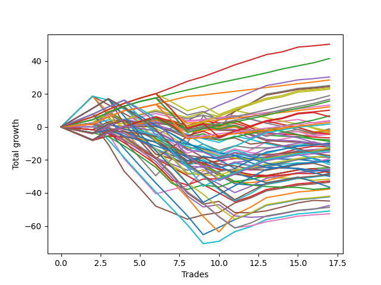

# Short Wallace Doodle 011 
- Symbol: TSLA_Unlimited
- Date Range: 03/23/2022 - 07/08/2022
- Trading Period: 7:20-12:30
- Number of Trades: 17



| Name | Win Percent | Profit | Avg Profit / Trade | Avg Time / Trade |      | Name | Win Percent | Profit | Avg Profit / Trade | Avg Time / Trade |
| ---- | ----------- | ------ | ------------------ | ---------------- | ---- | ---- | ----------- | ------ | ------------------ | ---------------- |
| Sorted By <br> Profit | | | | | | Sorted By <br> Win Percentage ||||
| Eighty-Three | 100.00 | 25075.00 | 1475.00 | 37:00 |     | Eighty-Three | 100.00 | 25075.00 | 1475.00 | 37:00 |
| Eighty-Two | 100.00 | 20730.00 | 1219.41 | 29:57 |     | Eighty-Two | 100.00 | 20730.00 | 1219.41 | 29:57 |
| Eighty-Four | 88.24 | 15140.00 | 890.59 | 53:24 |     | Eighty-One | 100.00 | 14230.00 | 837.06 | 21:03 |
| Eighty-One | 100.00 | 14230.00 | 837.06 | 21:03 |     | Eighty-Four | 88.24 | 15140.00 | 890.59 | 53:24 |
| Seven | 70.59 | 12540.00 | 737.65 | 103:40 |     | One Hundred Twenty-Three | 88.24 | 11440.00 | 672.94 | 28:56 |
| Eighty-Five | 82.35 | 12245.00 | 720.29 | 72:50 |     | One Hundred Twenty-Two | 88.24 | 8400.00 | 494.12 | 21:56 |
| One Hundred Thirteen | 82.35 | 11855.00 | 697.35 | 22:56 |     | One Hundred Twenty-Seven | 88.24 | 7865.00 | 462.65 | 20:59 |
| One Hundred Twenty-Three | 88.24 | 11440.00 | 672.94 | 28:56 |     | One Hundred Eleven | 88.24 | 6630.00 | 390.00 | 10:25 |
| One Hundred Twelve | 82.35 | 9495.00 | 558.53 | 18:17 |     | One Hundred Sixteen | 88.24 | 6095.00 | 358.53 | 10:26 |
| One Hundred Twenty-Two | 88.24 | 8400.00 | 494.12 | 21:56 |     | One Hundred Twenty-One | 88.24 | 1900.00 | 111.76 | 13:02 |
| One Hundred Twenty-Seven | 88.24 | 7865.00 | 462.65 | 20:59 |     | One Hundred Twenty-Six | 88.24 | 1365.00 | 80.29 | 12:05 |
| One Hundred Eleven | 88.24 | 6630.00 | 390.00 | 10:25 |     | Eighty-Five | 82.35 | 12245.00 | 720.29 | 72:50 |
| One Hundred Sixteen | 88.24 | 6095.00 | 358.53 | 10:26 |     | One Hundred Thirteen | 82.35 | 11855.00 | 697.35 | 22:56 |
| One Hundred Twenty-Eight | 82.35 | 5060.00 | 297.65 | 27:07 |     | One Hundred Twelve | 82.35 | 9495.00 | 558.53 | 18:17 |
| One Hundred Seventeen | 70.59 | 3355.00 | 197.35 | 16:36 |     | One Hundred Twenty-Eight | 82.35 | 5060.00 | 297.65 | 27:07 |
| One Hundred Eighteen | 64.71 | 3110.00 | 182.94 | 19:42 |     | Six | 76.47 | -1900.00 | -111.76 | 79:29 |
| One Hundred Twenty-One | 88.24 | 1900.00 | 111.76 | 13:02 |     | Seven | 70.59 | 12540.00 | 737.65 | 103:40 |
| Ninety-One | 58.82 | 1795.00 | 105.59 | 02:27 |     | One Hundred Seventeen | 70.59 | 3355.00 | 197.35 | 16:36 |
| One Hundred Twenty-Six | 88.24 | 1365.00 | 80.29 | 12:05 |     | One Hundred Twenty-Four | 70.59 | -7190.00 | -422.94 | 42:15 |
| One Hundred Fourteen | 64.71 | 860.00 | 50.59 | 30:36 |     | One Hundred Eighteen | 64.71 | 3110.00 | 182.94 | 19:42 |
| Ninety-Two | 41.18 | -575.00 | -33.82 | 06:09 |     | One Hundred Fourteen | 64.71 | 860.00 | 50.59 | 30:36 |
| One Hundred Two | 52.94 | -895.00 | -52.65 | 08:23 |     | One Hundred Six | 64.71 | -965.00 | -56.76 | 05:15 |
| One Hundred Six | 64.71 | -965.00 | -56.76 | 05:15 |     | Four | 64.71 | -6525.00 | -383.82 | 47:02 |
| Ninety-Three | 35.29 | -1320.00 | -77.65 | 07:23 |     | One Hundred Twenty-Nine | 64.71 | -7630.00 | -448.82 | 35:01 |
| Ninety-Six | 47.06 | -1490.00 | -87.65 | 03:10 |     | Sixty | 64.71 | -8805.00 | -517.94 | 40:26 |
| Six | 76.47 | -1900.00 | -111.76 | 79:29 |     | One Hundred Twenty-Five | 64.71 | -10250.00 | -602.94 | 53:50 |
| One Hundred Three | 47.06 | -2040.00 | -120.00 | 10:34 |     | Five | 64.71 | -16765.00 | -986.18 | 66:31 |
| One Hundred One | 58.82 | -2195.00 | -129.12 | 03:58 |     | Ninety-One | 58.82 | 1795.00 | 105.59 | 02:27 |
| One Hundred Eight | 41.18 | -2210.00 | -130.00 | 09:36 |     | One Hundred One | 58.82 | -2195.00 | -129.12 | 03:58 |
| Ninety-Eight | 23.53 | -3330.00 | -195.88 | 04:12 |     | Three | 58.82 | -6065.00 | -356.76 | 32:54 |
| Ninety-Seven | 23.53 | -3940.00 | -231.76 | 04:06 |     | Fifty-Nine | 58.82 | -9265.00 | -545.00 | 29:31 |
| One Hundred Seven | 41.18 | -4365.00 | -256.76 | 09:00 |     | Sixty-Two | 58.82 | -21150.00 | -1244.12 | 57:19 |
| Forty-Nine | 41.18 | -4790.00 | -281.76 | 13:58 |     | Sixty-One | 58.82 | -25470.00 | -1498.24 | 46:27 |
| One Hundred Fifteen | 52.94 | -5005.00 | -294.41 | 37:11 |     | One Hundred Two | 52.94 | -895.00 | -52.65 | 08:23 |
| Ninety-Nine | 23.53 | -5220.00 | -307.06 | 04:22 |     | One Hundred Fifteen | 52.94 | -5005.00 | -294.41 | 37:11 |
| One Hundred Nine | 41.18 | -5370.00 | -315.88 | 10:10 |     | Two | 52.94 | -6385.00 | -375.59 | 28:27 |
| One Hundred | 23.53 | -5575.00 | -327.94 | 04:26 |     | Fifty-Seven | 52.94 | -6855.00 | -403.24 | 20:22 |
| One Hundred Ninteen | 41.18 | -5775.00 | -339.71 | 23:22 |     | One | 52.94 | -6955.00 | -409.12 | 21:32 |
| Three | 58.82 | -6065.00 | -356.76 | 32:54 |     | Fifty-Eight | 52.94 | -9585.00 | -563.82 | 25:04 |
| Fifty-One | 41.18 | -6080.00 | -357.65 | 17:03 |     | Forty-Four | 52.94 | -12315.00 | -724.41 | 27:57 |
| Fifty | 35.29 | -6240.00 | -367.06 | 14:52 |     | One Hundred Thirty | 52.94 | -14450.00 | -850.00 | 41:37 |
| Two | 52.94 | -6385.00 | -375.59 | 28:27 |     | Sixty-Three | 52.94 | -18820.00 | -1107.06 | 70:52 |
| Four | 64.71 | -6525.00 | -383.82 | 47:02 |     | Ninety-Six | 47.06 | -1490.00 | -87.65 | 03:10 |
| Forty-Seven | 47.06 | -6660.00 | -391.76 | 48:40 |     | One Hundred Three | 47.06 | -2040.00 | -120.00 | 10:34 |
| Fifty-Seven | 52.94 | -6855.00 | -403.24 | 20:22 |     | Forty-Seven | 47.06 | -6660.00 | -391.76 | 48:40 |
| One | 52.94 | -6955.00 | -409.12 | 21:32 |     | Forty-Six | 47.06 | -12970.00 | -762.94 | 40:46 |
| One Hundred Twenty-Four | 70.59 | -7190.00 | -422.94 | 42:15 |     | Seventy-One | 47.06 | -14660.00 | -862.35 | 49:47 |
| One Hundred Twenty-Nine | 64.71 | -7630.00 | -448.82 | 35:01 |     | Forty-Five | 47.06 | -16360.00 | -962.35 | 30:25 |
| One Hundred Ten | 41.18 | -8645.00 | -508.53 | 11:11 |     | Seventy | 47.06 | -20970.00 | -1233.53 | 41:53 |
| Forty-Eight | 23.53 | -8785.00 | -516.76 | 12:30 |     | Sixty-Nine | 47.06 | -24360.00 | -1432.94 | 31:31 |
| Sixty | 64.71 | -8805.00 | -517.94 | 40:26 |     | Sixty-Eight | 47.06 | -26315.00 | -1547.94 | 30:37 |
| Fifty-Three | 35.29 | -8885.00 | -522.65 | 21:46 |     | Ninety-Two | 41.18 | -575.00 | -33.82 | 06:09 |
| Ninety-Four | 17.65 | -9110.00 | -535.88 | 08:21 |     | One Hundred Eight | 41.18 | -2210.00 | -130.00 | 09:36 |
| Fifty-Nine | 58.82 | -9265.00 | -545.00 | 29:31 |     | One Hundred Seven | 41.18 | -4365.00 | -256.76 | 09:00 |
| Fifty-Eight | 52.94 | -9585.00 | -563.82 | 25:04 |     | Forty-Nine | 41.18 | -4790.00 | -281.76 | 13:58 |
| Zero | 23.53 | -10050.00 | -591.18 | 17:55 |     | One Hundred Nine | 41.18 | -5370.00 | -315.88 | 10:10 |
| Forty-One | 41.18 | -10150.00 | -597.06 | 15:48 |     | One Hundred Ninteen | 41.18 | -5775.00 | -339.71 | 23:22 |
| One Hundred Twenty-Five | 64.71 | -10250.00 | -602.94 | 53:50 |     | Fifty-One | 41.18 | -6080.00 | -357.65 | 17:03 |
| Fifty-Two | 35.29 | -10775.00 | -633.82 | 21:33 |     | One Hundred Ten | 41.18 | -8645.00 | -508.53 | 11:11 |
| One Hundred Four | 29.41 | -11360.00 | -668.24 | 12:17 |     | Forty-One | 41.18 | -10150.00 | -597.06 | 15:48 |
| One Hundred Twenty | 23.53 | -12275.00 | -722.06 | 26:20 |     | Forty-Three | 41.18 | -13320.00 | -783.53 | 21:18 |
| Forty-Four | 52.94 | -12315.00 | -724.41 | 27:57 |     | Sixty-Five | 41.18 | -13385.00 | -787.35 | 17:18 |
| Fifty-Six | 23.53 | -12755.00 | -750.29 | 17:32 |     | Sixty-Seven | 41.18 | -22450.00 | -1320.59 | 23:14 |
| Forty-Six | 47.06 | -12970.00 | -762.94 | 40:46 |     | Ninety-Three | 35.29 | -1320.00 | -77.65 | 07:23 |
| Forty-Three | 41.18 | -13320.00 | -783.53 | 21:18 |     | Fifty | 35.29 | -6240.00 | -367.06 | 14:52 |
| Seventy-Three | 17.65 | -13325.00 | -783.82 | 11:08 |     | Fifty-Three | 35.29 | -8885.00 | -522.65 | 21:46 |
| Sixty-Five | 41.18 | -13385.00 | -787.35 | 17:18 |     | Fifty-Two | 35.29 | -10775.00 | -633.82 | 21:33 |
| Fifty-Five | 23.53 | -13885.00 | -816.76 | 26:29 |     | Forty-Two | 35.29 | -14065.00 | -827.35 | 17:33 |
| Fifty-Four | 23.53 | -13885.00 | -816.76 | 26:29 |     | Sixty-Six | 35.29 | -23815.00 | -1400.88 | 19:49 |
| Forty-Two | 35.29 | -14065.00 | -827.35 | 17:33 |     | One Hundred Four | 29.41 | -11360.00 | -668.24 | 12:17 |
| One Hundred Thirty | 52.94 | -14450.00 | -850.00 | 41:37 |     | Ninety-Eight | 23.53 | -3330.00 | -195.88 | 04:12 |
| Seventy-One | 47.06 | -14660.00 | -862.35 | 49:47 |     | Ninety-Seven | 23.53 | -3940.00 | -231.76 | 04:06 |
| Ninety-Five | 5.88 | -14975.00 | -880.88 | 08:58 |     | Ninety-Nine | 23.53 | -5220.00 | -307.06 | 04:22 |
| Forty | 23.53 | -15825.00 | -930.88 | 14:10 |     | One Hundred | 23.53 | -5575.00 | -327.94 | 04:26 |
| Forty-Five | 47.06 | -16360.00 | -962.35 | 30:25 |     | Forty-Eight | 23.53 | -8785.00 | -516.76 | 12:30 |
| Five | 64.71 | -16765.00 | -986.18 | 66:31 |     | Zero | 23.53 | -10050.00 | -591.18 | 17:55 |
| One Hundred Five | 17.65 | -18260.00 | -1074.12 | 13:13 |     | One Hundred Twenty | 23.53 | -12275.00 | -722.06 | 26:20 |
| Sixty-Four | 17.65 | -18570.00 | -1092.35 | 15:22 |     | Fifty-Six | 23.53 | -12755.00 | -750.29 | 17:32 |
| Sixty-Three | 52.94 | -18820.00 | -1107.06 | 70:52 |     | Fifty-Five | 23.53 | -13885.00 | -816.76 | 26:29 |
| Seventy | 47.06 | -20970.00 | -1233.53 | 41:53 |     | Fifty-Four | 23.53 | -13885.00 | -816.76 | 26:29 |
| Sixty-Two | 58.82 | -21150.00 | -1244.12 | 57:19 |     | Forty | 23.53 | -15825.00 | -930.88 | 14:10 |
| Sixty-Seven | 41.18 | -22450.00 | -1320.59 | 23:14 |     | Ninety-Four | 17.65 | -9110.00 | -535.88 | 08:21 |
| Sixty-Six | 35.29 | -23815.00 | -1400.88 | 19:49 |     | Seventy-Three | 17.65 | -13325.00 | -783.82 | 11:08 |
| Sixty-Nine | 47.06 | -24360.00 | -1432.94 | 31:31 |     | One Hundred Five | 17.65 | -18260.00 | -1074.12 | 13:13 |
| Sixty-One | 58.82 | -25470.00 | -1498.24 | 46:27 |     | Sixty-Four | 17.65 | -18570.00 | -1092.35 | 15:22 |
| Sixty-Eight | 47.06 | -26315.00 | -1547.94 | 30:37 |     | Ninety-Five | 5.88 | -14975.00 | -880.88 | 08:58 |

## NO STOPLOSS

### Test Zero
* Sell when price hits the middle line of the 20p bollinger
* No Stoploss
* Results:
```
Total Trades: 17
Percent Up: 76.47
Percent Down: 23.53
Total Points Moved Down: -20.10
Potential Profit: -10050.00
Total Points Ups: 28.70 Count Ups: 13
Total Points Downs: 8.60 Count Downs: 4
```

<details><summary>Trades</summary>

<code>In: 2022-04-08 09:24:00		Out: 2022-04-08 09:42:00		Total Position Time: 18:00		Total Move Down: -1.77		Total to Date: -1.77</code> <br />
<code>In: 2022-04-08 09:24:00		Out: 2022-04-08 09:42:00		Total Position Time: 18:00		Total Move Down: -1.77		Total to Date: -3.54</code> <br />
<code>In: 2022-04-28 09:49:00		Out: 2022-04-28 10:06:10		Total Position Time: 17:10		Total Move Down: 1.39		Total to Date: -2.15</code> <br />
<code>In: 2022-04-28 09:50:00		Out: 2022-04-28 10:06:10		Total Position Time: 16:10		Total Move Down: -1.90		Total to Date: -4.05</code> <br />
<code>In: 2022-05-02 12:15:00		Out: 2022-05-02 12:37:35		Total Position Time: 22:35		Total Move Down: -4.50		Total to Date: -8.55</code> <br />
<code>In: 2022-05-02 12:16:00		Out: 2022-05-02 12:37:35		Total Position Time: 21:35		Total Move Down: -4.91		Total to Date: -13.46</code> <br />
<code>In: 2022-05-04 09:25:00		Out: 2022-05-04 09:47:00		Total Position Time: 22:00		Total Move Down: -3.56		Total to Date: -17.02</code> <br />
<code>In: 2022-05-04 09:26:00		Out: 2022-05-04 09:47:00		Total Position Time: 21:00		Total Move Down: -3.85		Total to Date: -20.87</code> <br />
<code>In: 2022-05-04 09:42:00		Out: 2022-05-04 09:47:00		Total Position Time: 05:00		Total Move Down: 2.82		Total to Date: -18.05</code> <br />
<code>In: 2022-05-17 08:37:00		Out: 2022-05-17 09:02:20		Total Position Time: 25:20		Total Move Down: -1.43		Total to Date: -19.48</code> <br />
<code>In: 2022-05-24 08:51:00		Out: 2022-05-24 09:01:05		Total Position Time: 10:05		Total Move Down: 3.67		Total to Date: -15.81</code> <br />
<code>In: 2022-06-17 10:07:00		Out: 2022-06-17 10:24:05		Total Position Time: 17:05		Total Move Down: -2.29		Total to Date: -18.10</code> <br />
<code>In: 2022-06-17 10:11:00		Out: 2022-06-17 10:24:05		Total Position Time: 13:05		Total Move Down: -1.01		Total to Date: -19.11</code> <br />
<code>In: 2022-06-29 12:10:00		Out: 2022-06-29 12:32:25		Total Position Time: 22:25		Total Move Down: -0.34		Total to Date: -19.45</code> <br />
<code>In: 2022-06-29 12:11:00		Out: 2022-06-29 12:32:25		Total Position Time: 21:25		Total Move Down: -0.18		Total to Date: -19.63</code> <br />
<code>In: 2022-06-29 12:12:00		Out: 2022-06-29 12:32:25		Total Position Time: 20:25		Total Move Down: -1.19		Total to Date: -20.82</code> <br />
<code>In: 2022-07-06 11:48:00		Out: 2022-07-06 12:01:25		Total Position Time: 13:25		Total Move Down: 0.72		Total to Date: -20.10</code> <br />


</details>

### Test One
* Sell when the price hits the upper line of the 20p 1std bollinger
* No Stoploss
* Results:
```
Total Trades: 17
Percent Up: 47.06
Percent Down: 52.94
Total Points Moved Down: -13.91
Potential Profit: -6955.00
Total Points Ups: 29.93 Count Ups: 8
Total Points Downs: 16.02 Count Downs: 9
```

<details><summary>Trades</summary>

<code>In: 2022-04-08 09:24:00		Out: 2022-04-08 09:44:10		Total Position Time: 20:10		Total Move Down: -0.84		Total to Date: -0.84</code> <br />
<code>In: 2022-04-08 09:24:00		Out: 2022-04-08 09:44:10		Total Position Time: 20:10		Total Move Down: -0.84		Total to Date: -1.68</code> <br />
<code>In: 2022-04-28 09:49:00		Out: 2022-04-28 10:08:55		Total Position Time: 19:55		Total Move Down: 4.75		Total to Date: 3.07</code> <br />
<code>In: 2022-04-28 09:50:00		Out: 2022-04-28 10:08:55		Total Position Time: 18:55		Total Move Down: 1.46		Total to Date: 4.53</code> <br />
<code>In: 2022-05-02 12:15:00		Out: 2022-05-02 12:47:00		Total Position Time: 32:00		Total Move Down: -10.36		Total to Date: -5.83</code> <br />
<code>In: 2022-05-02 12:16:00		Out: 2022-05-02 12:47:00		Total Position Time: 31:00		Total Move Down: -10.77		Total to Date: -16.60</code> <br />
<code>In: 2022-05-04 09:25:00		Out: 2022-05-04 09:51:10		Total Position Time: 26:10		Total Move Down: -2.74		Total to Date: -19.34</code> <br />
<code>In: 2022-05-04 09:26:00		Out: 2022-05-04 09:51:10		Total Position Time: 25:10		Total Move Down: -3.03		Total to Date: -22.37</code> <br />
<code>In: 2022-05-04 09:42:00		Out: 2022-05-04 09:51:10		Total Position Time: 09:10		Total Move Down: 3.64		Total to Date: -18.73</code> <br />
<code>In: 2022-05-17 08:37:00		Out: 2022-05-17 09:06:00		Total Position Time: 29:00		Total Move Down: 0.13		Total to Date: -18.60</code> <br />
<code>In: 2022-05-24 08:51:00		Out: 2022-05-24 09:06:25		Total Position Time: 15:25		Total Move Down: 2.81		Total to Date: -15.79</code> <br />
<code>In: 2022-06-17 10:07:00		Out: 2022-06-17 10:28:05		Total Position Time: 21:05		Total Move Down: -1.27		Total to Date: -17.06</code> <br />
<code>In: 2022-06-17 10:11:00		Out: 2022-06-17 10:28:05		Total Position Time: 17:05		Total Move Down: 0.01		Total to Date: -17.05</code> <br />
<code>In: 2022-06-29 12:10:00		Out: 2022-06-29 12:33:25		Total Position Time: 23:25		Total Move Down: 0.77		Total to Date: -16.28</code> <br />
<code>In: 2022-06-29 12:11:00		Out: 2022-06-29 12:33:25		Total Position Time: 22:25		Total Move Down: 0.93		Total to Date: -15.35</code> <br />
<code>In: 2022-06-29 12:12:00		Out: 2022-06-29 12:33:25		Total Position Time: 21:25		Total Move Down: -0.08		Total to Date: -15.43</code> <br />
<code>In: 2022-07-06 11:48:00		Out: 2022-07-06 12:01:35		Total Position Time: 13:35		Total Move Down: 1.52		Total to Date: -13.91</code> <br />


</details>

### Test Two
* Sell when the price hits the upper line of the 20p 2std bollinger
* No Stoploss
* Results:
```
Total Trades: 17
Percent Up: 47.06
Percent Down: 52.94
Total Points Moved Down: -12.77
Potential Profit: -6385.00
Total Points Ups: 35.31 Count Ups: 8
Total Points Downs: 22.54 Count Downs: 9
```

<details><summary>Trades</summary>

<code>In: 2022-04-08 09:24:00		Out: 2022-04-08 09:45:20		Total Position Time: 21:20		Total Move Down: -0.01		Total to Date: -0.01</code> <br />
<code>In: 2022-04-08 09:24:00		Out: 2022-04-08 09:45:20		Total Position Time: 21:20		Total Move Down: -0.01		Total to Date: -0.02</code> <br />
<code>In: 2022-04-28 09:49:00		Out: 2022-04-28 10:09:15		Total Position Time: 20:15		Total Move Down: 7.87		Total to Date: 7.85</code> <br />
<code>In: 2022-04-28 09:50:00		Out: 2022-04-28 10:09:15		Total Position Time: 19:15		Total Move Down: 4.58		Total to Date: 12.43</code> <br />
<code>In: 2022-05-02 12:15:00		Out: 2022-05-02 12:47:00		Total Position Time: 32:00		Total Move Down: -10.36		Total to Date: 2.07</code> <br />
<code>In: 2022-05-02 12:16:00		Out: 2022-05-02 12:47:00		Total Position Time: 31:00		Total Move Down: -10.77		Total to Date: -8.70</code> <br />
<code>In: 2022-05-04 09:25:00		Out: 2022-05-04 10:18:30		Total Position Time: 53:30		Total Move Down: -6.47		Total to Date: -15.17</code> <br />
<code>In: 2022-05-04 09:26:00		Out: 2022-05-04 10:18:30		Total Position Time: 52:30		Total Move Down: -6.76		Total to Date: -21.93</code> <br />
<code>In: 2022-05-04 09:42:00		Out: 2022-05-04 10:18:30		Total Position Time: 36:30		Total Move Down: -0.09		Total to Date: -22.02</code> <br />
<code>In: 2022-05-17 08:37:00		Out: 2022-05-17 09:07:10		Total Position Time: 30:10		Total Move Down: 1.39		Total to Date: -20.63</code> <br />
<code>In: 2022-05-24 08:51:00		Out: 2022-05-24 09:31:20		Total Position Time: 40:20		Total Move Down: 1.58		Total to Date: -19.05</code> <br />
<code>In: 2022-06-17 10:07:00		Out: 2022-06-17 10:29:05		Total Position Time: 22:05		Total Move Down: -0.84		Total to Date: -19.89</code> <br />
<code>In: 2022-06-17 10:11:00		Out: 2022-06-17 10:29:05		Total Position Time: 18:05		Total Move Down: 0.44		Total to Date: -19.45</code> <br />
<code>In: 2022-06-29 12:10:00		Out: 2022-06-29 12:34:15		Total Position Time: 24:15		Total Move Down: 1.71		Total to Date: -17.74</code> <br />
<code>In: 2022-06-29 12:11:00		Out: 2022-06-29 12:34:15		Total Position Time: 23:15		Total Move Down: 1.87		Total to Date: -15.87</code> <br />
<code>In: 2022-06-29 12:12:00		Out: 2022-06-29 12:34:15		Total Position Time: 22:15		Total Move Down: 0.86		Total to Date: -15.01</code> <br />
<code>In: 2022-07-06 11:48:00		Out: 2022-07-06 12:03:45		Total Position Time: 15:45		Total Move Down: 2.24		Total to Date: -12.77</code> <br />


</details>

### Test Three
* Sell when price hits the middle line of the 50p bollinger
* No Stoploss
* Results:
```
Total Trades: 17
Percent Up: 41.18
Percent Down: 58.82
Total Points Moved Down: -12.13
Potential Profit: -6065.00
Total Points Ups: 34.96 Count Ups: 7
Total Points Downs: 22.83 Count Downs: 10
```

<details><summary>Trades</summary>

<code>In: 2022-04-08 09:24:00		Out: 2022-04-08 09:48:20		Total Position Time: 24:20		Total Move Down: 0.84		Total to Date: 0.84</code> <br />
<code>In: 2022-04-08 09:24:00		Out: 2022-04-08 09:48:20		Total Position Time: 24:20		Total Move Down: 0.84		Total to Date: 1.68</code> <br />
<code>In: 2022-04-28 09:49:00		Out: 2022-04-28 10:18:05		Total Position Time: 29:05		Total Move Down: 6.93		Total to Date: 8.61</code> <br />
<code>In: 2022-04-28 09:50:00		Out: 2022-04-28 10:18:05		Total Position Time: 28:05		Total Move Down: 3.64		Total to Date: 12.25</code> <br />
<code>In: 2022-05-02 12:15:00		Out: 2022-05-02 12:47:00		Total Position Time: 32:00		Total Move Down: -10.36		Total to Date: 1.89</code> <br />
<code>In: 2022-05-02 12:16:00		Out: 2022-05-02 12:47:00		Total Position Time: 31:00		Total Move Down: -10.77		Total to Date: -8.88</code> <br />
<code>In: 2022-05-04 09:25:00		Out: 2022-05-04 10:18:30		Total Position Time: 53:30		Total Move Down: -6.47		Total to Date: -15.35</code> <br />
<code>In: 2022-05-04 09:26:00		Out: 2022-05-04 10:18:30		Total Position Time: 52:30		Total Move Down: -6.76		Total to Date: -22.11</code> <br />
<code>In: 2022-05-04 09:42:00		Out: 2022-05-04 10:18:30		Total Position Time: 36:30		Total Move Down: -0.09		Total to Date: -22.20</code> <br />
<code>In: 2022-05-17 08:37:00		Out: 2022-05-17 09:10:25		Total Position Time: 33:25		Total Move Down: 1.69		Total to Date: -20.51</code> <br />
<code>In: 2022-05-24 08:51:00		Out: 2022-05-24 09:31:10		Total Position Time: 40:10		Total Move Down: 1.37		Total to Date: -19.14</code> <br />
<code>In: 2022-06-17 10:07:00		Out: 2022-06-17 10:32:25		Total Position Time: 25:25		Total Move Down: -0.12		Total to Date: -19.26</code> <br />
<code>In: 2022-06-17 10:11:00		Out: 2022-06-17 10:32:25		Total Position Time: 21:25		Total Move Down: 1.16		Total to Date: -18.10</code> <br />
<code>In: 2022-06-29 12:10:00		Out: 2022-06-29 12:36:35		Total Position Time: 26:35		Total Move Down: 2.35		Total to Date: -15.75</code> <br />
<code>In: 2022-06-29 12:11:00		Out: 2022-06-29 12:36:35		Total Position Time: 25:35		Total Move Down: 2.51		Total to Date: -13.24</code> <br />
<code>In: 2022-06-29 12:12:00		Out: 2022-06-29 12:36:35		Total Position Time: 24:35		Total Move Down: 1.50		Total to Date: -11.74</code> <br />
<code>In: 2022-07-06 11:48:00		Out: 2022-07-06 12:39:00		Total Position Time: 51:00		Total Move Down: -0.39		Total to Date: -12.13</code> <br />


</details>

### Test Four
* Sell when the price hits the upper line of the 50p 1std bollinger
* No Stoploss
* Results:
```
Total Trades: 17
Percent Up: 35.29
Percent Down: 64.71
Total Points Moved Down: -13.05
Potential Profit: -6525.00
Total Points Ups: 37.46 Count Ups: 6
Total Points Downs: 24.41 Count Downs: 11
```

<details><summary>Trades</summary>

<code>In: 2022-04-08 09:24:00		Out: 2022-04-08 10:06:40		Total Position Time: 42:40		Total Move Down: 1.21		Total to Date: 1.21</code> <br />
<code>In: 2022-04-08 09:24:00		Out: 2022-04-08 10:06:40		Total Position Time: 42:40		Total Move Down: 1.21		Total to Date: 2.42</code> <br />
<code>In: 2022-04-28 09:49:00		Out: 2022-04-28 10:30:55		Total Position Time: 41:55		Total Move Down: 6.78		Total to Date: 9.20</code> <br />
<code>In: 2022-04-28 09:50:00		Out: 2022-04-28 10:30:55		Total Position Time: 40:55		Total Move Down: 3.49		Total to Date: 12.69</code> <br />
<code>In: 2022-05-02 12:15:00		Out: 2022-05-02 12:47:00		Total Position Time: 32:00		Total Move Down: -10.36		Total to Date: 2.33</code> <br />
<code>In: 2022-05-02 12:16:00		Out: 2022-05-02 12:47:00		Total Position Time: 31:00		Total Move Down: -10.77		Total to Date: -8.44</code> <br />
<code>In: 2022-05-04 09:25:00		Out: 2022-05-04 10:45:50		Total Position Time: 80:50		Total Move Down: -7.39		Total to Date: -15.83</code> <br />
<code>In: 2022-05-04 09:26:00		Out: 2022-05-04 10:45:50		Total Position Time: 79:50		Total Move Down: -7.68		Total to Date: -23.51</code> <br />
<code>In: 2022-05-04 09:42:00		Out: 2022-05-04 10:45:50		Total Position Time: 63:50		Total Move Down: -1.01		Total to Date: -24.52</code> <br />
<code>In: 2022-05-17 08:37:00		Out: 2022-05-17 09:40:10		Total Position Time: 63:10		Total Move Down: -0.25		Total to Date: -24.77</code> <br />
<code>In: 2022-05-24 08:51:00		Out: 2022-05-24 09:34:00		Total Position Time: 43:00		Total Move Down: 3.29		Total to Date: -21.48</code> <br />
<code>In: 2022-06-17 10:07:00		Out: 2022-06-17 10:45:40		Total Position Time: 38:40		Total Move Down: 1.14		Total to Date: -20.34</code> <br />
<code>In: 2022-06-17 10:11:00		Out: 2022-06-17 10:45:40		Total Position Time: 34:40		Total Move Down: 2.42		Total to Date: -17.92</code> <br />
<code>In: 2022-06-29 12:10:00		Out: 2022-06-29 12:47:00		Total Position Time: 37:00		Total Move Down: 1.64		Total to Date: -16.28</code> <br />
<code>In: 2022-06-29 12:11:00		Out: 2022-06-29 12:47:00		Total Position Time: 36:00		Total Move Down: 1.80		Total to Date: -14.48</code> <br />
<code>In: 2022-06-29 12:12:00		Out: 2022-06-29 12:47:00		Total Position Time: 35:00		Total Move Down: 0.79		Total to Date: -13.69</code> <br />
<code>In: 2022-07-06 11:48:00		Out: 2022-07-06 12:44:40		Total Position Time: 56:40		Total Move Down: 0.64		Total to Date: -13.05</code> <br />


</details>

### Test Five
* Sell when the price hits the upper line of the 50p 2std bollinger
* No Stoploss
* Results:
```
Total Trades: 17
Percent Up: 35.29
Percent Down: 64.71
Total Points Moved Down: -33.53
Potential Profit: -16765.00
Total Points Ups: 58.11 Count Ups: 6
Total Points Downs: 24.58 Count Downs: 11
```

<details><summary>Trades</summary>

<code>In: 2022-04-08 09:24:00		Out: 2022-04-08 10:11:20		Total Position Time: 47:20		Total Move Down: 1.10		Total to Date: 1.10</code> <br />
<code>In: 2022-04-08 09:24:00		Out: 2022-04-08 10:11:20		Total Position Time: 47:20		Total Move Down: 1.10		Total to Date: 2.20</code> <br />
<code>In: 2022-04-28 09:49:00		Out: 2022-04-28 12:29:40		Total Position Time: 160:40		Total Move Down: -12.89		Total to Date: -10.69</code> <br />
<code>In: 2022-04-28 09:50:00		Out: 2022-04-28 12:29:40		Total Position Time: 159:40		Total Move Down: -16.18		Total to Date: -26.87</code> <br />
<code>In: 2022-05-02 12:15:00		Out: 2022-05-02 12:47:00		Total Position Time: 32:00		Total Move Down: -10.36		Total to Date: -37.23</code> <br />
<code>In: 2022-05-02 12:16:00		Out: 2022-05-02 12:47:00		Total Position Time: 31:00		Total Move Down: -10.77		Total to Date: -48.00</code> <br />
<code>In: 2022-05-04 09:25:00		Out: 2022-05-04 11:07:20		Total Position Time: 102:20		Total Move Down: -3.81		Total to Date: -51.81</code> <br />
<code>In: 2022-05-04 09:26:00		Out: 2022-05-04 11:07:20		Total Position Time: 101:20		Total Move Down: -4.10		Total to Date: -55.91</code> <br />
<code>In: 2022-05-04 09:42:00		Out: 2022-05-04 11:07:20		Total Position Time: 85:20		Total Move Down: 2.57		Total to Date: -53.34</code> <br />
<code>In: 2022-05-17 08:37:00		Out: 2022-05-17 09:47:55		Total Position Time: 70:55		Total Move Down: 1.46		Total to Date: -51.88</code> <br />
<code>In: 2022-05-24 08:51:00		Out: 2022-05-24 09:39:55		Total Position Time: 48:55		Total Move Down: 5.79		Total to Date: -46.09</code> <br />
<code>In: 2022-06-17 10:07:00		Out: 2022-06-17 10:47:30		Total Position Time: 40:30		Total Move Down: 3.03		Total to Date: -43.06</code> <br />
<code>In: 2022-06-17 10:11:00		Out: 2022-06-17 10:47:30		Total Position Time: 36:30		Total Move Down: 4.31		Total to Date: -38.75</code> <br />
<code>In: 2022-06-29 12:10:00		Out: 2022-06-29 12:47:00		Total Position Time: 37:00		Total Move Down: 1.64		Total to Date: -37.11</code> <br />
<code>In: 2022-06-29 12:11:00		Out: 2022-06-29 12:47:00		Total Position Time: 36:00		Total Move Down: 1.80		Total to Date: -35.31</code> <br />
<code>In: 2022-06-29 12:12:00		Out: 2022-06-29 12:47:00		Total Position Time: 35:00		Total Move Down: 0.79		Total to Date: -34.52</code> <br />
<code>In: 2022-07-06 11:48:00		Out: 2022-07-06 12:47:00		Total Position Time: 59:00		Total Move Down: 0.99		Total to Date: -33.53</code> <br />


</details>

### Test Six
* Sell when the price hits the middle line of the 1std VWAP
* No Stoploss
* Results:
```
Total Trades: 17
Percent Up: 23.53
Percent Down: 76.47
Total Points Moved Down: -3.80
Potential Profit: -1900.00
Total Points Ups: 48.22 Count Ups: 4
Total Points Downs: 44.42 Count Downs: 13
```

<details><summary>Trades</summary>

<code>In: 2022-04-08 09:24:00		Out: 2022-04-08 10:16:55		Total Position Time: 52:55		Total Move Down: 3.84		Total to Date: 3.84</code> <br />
<code>In: 2022-04-08 09:24:00		Out: 2022-04-08 10:16:55		Total Position Time: 52:55		Total Move Down: 3.84		Total to Date: 7.68</code> <br />
<code>In: 2022-04-28 09:49:00		Out: 2022-04-28 12:47:00		Total Position Time: 178:00		Total Move Down: -11.90		Total to Date: -4.22</code> <br />
<code>In: 2022-04-28 09:50:00		Out: 2022-04-28 12:47:00		Total Position Time: 177:00		Total Move Down: -15.19		Total to Date: -19.41</code> <br />
<code>In: 2022-05-02 12:15:00		Out: 2022-05-02 12:47:00		Total Position Time: 32:00		Total Move Down: -10.36		Total to Date: -29.77</code> <br />
<code>In: 2022-05-02 12:16:00		Out: 2022-05-02 12:47:00		Total Position Time: 31:00		Total Move Down: -10.77		Total to Date: -40.54</code> <br />
<code>In: 2022-05-04 09:25:00		Out: 2022-05-04 11:07:40		Total Position Time: 102:40		Total Move Down: 2.56		Total to Date: -37.98</code> <br />
<code>In: 2022-05-04 09:26:00		Out: 2022-05-04 11:07:40		Total Position Time: 101:40		Total Move Down: 2.27		Total to Date: -35.71</code> <br />
<code>In: 2022-05-04 09:42:00		Out: 2022-05-04 11:07:40		Total Position Time: 85:40		Total Move Down: 8.94		Total to Date: -26.77</code> <br />
<code>In: 2022-05-17 08:37:00		Out: 2022-05-17 09:59:30		Total Position Time: 82:30		Total Move Down: 4.36		Total to Date: -22.41</code> <br />
<code>In: 2022-05-24 08:51:00		Out: 2022-05-24 09:37:00		Total Position Time: 46:00		Total Move Down: 4.75		Total to Date: -17.66</code> <br />
<code>In: 2022-06-17 10:07:00		Out: 2022-06-17 12:10:00		Total Position Time: 123:00		Total Move Down: 3.68		Total to Date: -13.98</code> <br />
<code>In: 2022-06-17 10:11:00		Out: 2022-06-17 12:10:00		Total Position Time: 119:00		Total Move Down: 4.96		Total to Date: -9.02</code> <br />
<code>In: 2022-06-29 12:10:00		Out: 2022-06-29 12:47:00		Total Position Time: 37:00		Total Move Down: 1.64		Total to Date: -7.38</code> <br />
<code>In: 2022-06-29 12:11:00		Out: 2022-06-29 12:47:00		Total Position Time: 36:00		Total Move Down: 1.80		Total to Date: -5.58</code> <br />
<code>In: 2022-06-29 12:12:00		Out: 2022-06-29 12:47:00		Total Position Time: 35:00		Total Move Down: 0.79		Total to Date: -4.79</code> <br />
<code>In: 2022-07-06 11:48:00		Out: 2022-07-06 12:47:00		Total Position Time: 59:00		Total Move Down: 0.99		Total to Date: -3.80</code> <br />


</details>

### Test Seven
* Sell when the price hits the upper line of the 1std VWAP
* No Stoploss
* Results:
```
Total Trades: 17
Percent Up: 29.41
Percent Down: 70.59
Total Points Moved Down: 25.08
Potential Profit: 12540.00
Total Points Ups: 55.85 Count Ups: 5
Total Points Downs: 80.93 Count Downs: 12
```

<details><summary>Trades</summary>

<code>In: 2022-04-08 09:24:00		Out: 2022-04-08 10:47:00		Total Position Time: 83:00		Total Move Down: 9.32		Total to Date: 9.32</code> <br />
<code>In: 2022-04-08 09:24:00		Out: 2022-04-08 10:47:00		Total Position Time: 83:00		Total Move Down: 9.32		Total to Date: 18.64</code> <br />
<code>In: 2022-04-28 09:49:00		Out: 2022-04-28 12:47:00		Total Position Time: 178:00		Total Move Down: -11.90		Total to Date: 6.74</code> <br />
<code>In: 2022-04-28 09:50:00		Out: 2022-04-28 12:47:00		Total Position Time: 177:00		Total Move Down: -15.19		Total to Date: -8.45</code> <br />
<code>In: 2022-05-02 12:15:00		Out: 2022-05-02 12:47:00		Total Position Time: 32:00		Total Move Down: -10.36		Total to Date: -18.81</code> <br />
<code>In: 2022-05-02 12:16:00		Out: 2022-05-02 12:47:00		Total Position Time: 31:00		Total Move Down: -10.77		Total to Date: -29.58</code> <br />
<code>In: 2022-05-04 09:25:00		Out: 2022-05-04 11:35:05		Total Position Time: 130:05		Total Move Down: 10.06		Total to Date: -19.52</code> <br />
<code>In: 2022-05-04 09:26:00		Out: 2022-05-04 11:35:05		Total Position Time: 129:05		Total Move Down: 9.77		Total to Date: -9.75</code> <br />
<code>In: 2022-05-04 09:42:00		Out: 2022-05-04 11:35:05		Total Position Time: 113:05		Total Move Down: 16.44		Total to Date: 6.69</code> <br />
<code>In: 2022-05-17 08:37:00		Out: 2022-05-17 12:47:00		Total Position Time: 250:00		Total Move Down: -7.63		Total to Date: -0.94</code> <br />
<code>In: 2022-05-24 08:51:00		Out: 2022-05-24 10:04:20		Total Position Time: 73:20		Total Move Down: 10.50		Total to Date: 9.56</code> <br />
<code>In: 2022-06-17 10:07:00		Out: 2022-06-17 12:47:00		Total Position Time: 160:00		Total Move Down: 4.51		Total to Date: 14.07</code> <br />
<code>In: 2022-06-17 10:11:00		Out: 2022-06-17 12:47:00		Total Position Time: 156:00		Total Move Down: 5.79		Total to Date: 19.86</code> <br />
<code>In: 2022-06-29 12:10:00		Out: 2022-06-29 12:47:00		Total Position Time: 37:00		Total Move Down: 1.64		Total to Date: 21.50</code> <br />
<code>In: 2022-06-29 12:11:00		Out: 2022-06-29 12:47:00		Total Position Time: 36:00		Total Move Down: 1.80		Total to Date: 23.30</code> <br />
<code>In: 2022-06-29 12:12:00		Out: 2022-06-29 12:47:00		Total Position Time: 35:00		Total Move Down: 0.79		Total to Date: 24.09</code> <br />
<code>In: 2022-07-06 11:48:00		Out: 2022-07-06 12:47:00		Total Position Time: 59:00		Total Move Down: 0.99		Total to Date: 25.08</code> <br />


</details>

## STOPLOSS OF 5

### Test Forty
* Sell when price hits the middle line of the 20p bollinger
* Stoploss is -5 points
* Results:
```
Total Trades: 17
Percent Up: 76.47
Percent Down: 23.53
Total Points Moved Down: -31.65
Potential Profit: -15825.00
Total Points Ups: 40.25 Count Ups: 13
Total Points Downs: 8.60 Count Downs: 4
```

<details><summary>Trades</summary>

<code>In: 2022-04-08 09:24:00		Out: 2022-04-08 09:42:00		Total Position Time: 18:00		Total Move Down: -1.77		Total to Date: -1.77</code> <br />
<code>In: 2022-04-08 09:24:00		Out: 2022-04-08 09:42:00		Total Position Time: 18:00		Total Move Down: -1.77		Total to Date: -3.54</code> <br />
<code>In: 2022-04-28 09:49:00		Out: 2022-04-28 10:06:10		Total Position Time: 17:10		Total Move Down: 1.39		Total to Date: -2.15</code> <br />
<code>In: 2022-04-28 09:50:00		Out: 2022-04-28 10:00:50		Total Position Time: 10:50		Total Move Down: -5.30		Total to Date: -7.45</code> <br />
<code>In: 2022-05-02 12:15:00		Out: 2022-05-02 12:22:45		Total Position Time: 07:45		Total Move Down: -5.24		Total to Date: -12.69</code> <br />
<code>In: 2022-05-02 12:16:00		Out: 2022-05-02 12:22:45		Total Position Time: 06:45		Total Move Down: -5.65		Total to Date: -18.34</code> <br />
<code>In: 2022-05-04 09:25:00		Out: 2022-05-04 09:37:20		Total Position Time: 12:20		Total Move Down: -5.04		Total to Date: -23.38</code> <br />
<code>In: 2022-05-04 09:26:00		Out: 2022-05-04 09:37:20		Total Position Time: 11:20		Total Move Down: -5.33		Total to Date: -28.71</code> <br />
<code>In: 2022-05-04 09:42:00		Out: 2022-05-04 09:47:00		Total Position Time: 05:00		Total Move Down: 2.82		Total to Date: -25.89</code> <br />
<code>In: 2022-05-17 08:37:00		Out: 2022-05-17 08:52:50		Total Position Time: 15:50		Total Move Down: -5.14		Total to Date: -31.03</code> <br />
<code>In: 2022-05-24 08:51:00		Out: 2022-05-24 09:01:05		Total Position Time: 10:05		Total Move Down: 3.67		Total to Date: -27.36</code> <br />
<code>In: 2022-06-17 10:07:00		Out: 2022-06-17 10:24:05		Total Position Time: 17:05		Total Move Down: -2.29		Total to Date: -29.65</code> <br />
<code>In: 2022-06-17 10:11:00		Out: 2022-06-17 10:24:05		Total Position Time: 13:05		Total Move Down: -1.01		Total to Date: -30.66</code> <br />
<code>In: 2022-06-29 12:10:00		Out: 2022-06-29 12:32:25		Total Position Time: 22:25		Total Move Down: -0.34		Total to Date: -31.00</code> <br />
<code>In: 2022-06-29 12:11:00		Out: 2022-06-29 12:32:25		Total Position Time: 21:25		Total Move Down: -0.18		Total to Date: -31.18</code> <br />
<code>In: 2022-06-29 12:12:00		Out: 2022-06-29 12:32:25		Total Position Time: 20:25		Total Move Down: -1.19		Total to Date: -32.37</code> <br />
<code>In: 2022-07-06 11:48:00		Out: 2022-07-06 12:01:25		Total Position Time: 13:25		Total Move Down: 0.72		Total to Date: -31.65</code> <br />


</details>

### Test Forty-One
* Sell when the price hits the upper line of the 20p 1std bollinger
* Stoploss is -5 points
* Results:
```
Total Trades: 17
Percent Up: 58.82
Percent Down: 41.18
Total Points Moved Down: -20.30
Potential Profit: -10150.00
Total Points Ups: 34.73 Count Ups: 10
Total Points Downs: 14.43 Count Downs: 7
```

<details><summary>Trades</summary>

<code>In: 2022-04-08 09:24:00		Out: 2022-04-08 09:44:10		Total Position Time: 20:10		Total Move Down: -0.84		Total to Date: -0.84</code> <br />
<code>In: 2022-04-08 09:24:00		Out: 2022-04-08 09:44:10		Total Position Time: 20:10		Total Move Down: -0.84		Total to Date: -1.68</code> <br />
<code>In: 2022-04-28 09:49:00		Out: 2022-04-28 10:08:55		Total Position Time: 19:55		Total Move Down: 4.75		Total to Date: 3.07</code> <br />
<code>In: 2022-04-28 09:50:00		Out: 2022-04-28 10:00:50		Total Position Time: 10:50		Total Move Down: -5.30		Total to Date: -2.23</code> <br />
<code>In: 2022-05-02 12:15:00		Out: 2022-05-02 12:22:45		Total Position Time: 07:45		Total Move Down: -5.24		Total to Date: -7.47</code> <br />
<code>In: 2022-05-02 12:16:00		Out: 2022-05-02 12:22:45		Total Position Time: 06:45		Total Move Down: -5.65		Total to Date: -13.12</code> <br />
<code>In: 2022-05-04 09:25:00		Out: 2022-05-04 09:37:20		Total Position Time: 12:20		Total Move Down: -5.04		Total to Date: -18.16</code> <br />
<code>In: 2022-05-04 09:26:00		Out: 2022-05-04 09:37:20		Total Position Time: 11:20		Total Move Down: -5.33		Total to Date: -23.49</code> <br />
<code>In: 2022-05-04 09:42:00		Out: 2022-05-04 09:51:10		Total Position Time: 09:10		Total Move Down: 3.64		Total to Date: -19.85</code> <br />
<code>In: 2022-05-17 08:37:00		Out: 2022-05-17 08:52:50		Total Position Time: 15:50		Total Move Down: -5.14		Total to Date: -24.99</code> <br />
<code>In: 2022-05-24 08:51:00		Out: 2022-05-24 09:06:25		Total Position Time: 15:25		Total Move Down: 2.81		Total to Date: -22.18</code> <br />
<code>In: 2022-06-17 10:07:00		Out: 2022-06-17 10:28:05		Total Position Time: 21:05		Total Move Down: -1.27		Total to Date: -23.45</code> <br />
<code>In: 2022-06-17 10:11:00		Out: 2022-06-17 10:28:05		Total Position Time: 17:05		Total Move Down: 0.01		Total to Date: -23.44</code> <br />
<code>In: 2022-06-29 12:10:00		Out: 2022-06-29 12:33:25		Total Position Time: 23:25		Total Move Down: 0.77		Total to Date: -22.67</code> <br />
<code>In: 2022-06-29 12:11:00		Out: 2022-06-29 12:33:25		Total Position Time: 22:25		Total Move Down: 0.93		Total to Date: -21.74</code> <br />
<code>In: 2022-06-29 12:12:00		Out: 2022-06-29 12:33:25		Total Position Time: 21:25		Total Move Down: -0.08		Total to Date: -21.82</code> <br />
<code>In: 2022-07-06 11:48:00		Out: 2022-07-06 12:01:35		Total Position Time: 13:35		Total Move Down: 1.52		Total to Date: -20.30</code> <br />


</details>

### Test Forty-Two
* Sell when the price hits the upper line of the 20p 2std bollinger
* Stoploss is -5 points
* Results:
```
Total Trades: 17
Percent Up: 64.71
Percent Down: 35.29
Total Points Moved Down: -28.13
Potential Profit: -14065.00
Total Points Ups: 43.12 Count Ups: 11
Total Points Downs: 14.99 Count Downs: 6
```

<details><summary>Trades</summary>

<code>In: 2022-04-08 09:24:00		Out: 2022-04-08 09:45:20		Total Position Time: 21:20		Total Move Down: -0.01		Total to Date: -0.01</code> <br />
<code>In: 2022-04-08 09:24:00		Out: 2022-04-08 09:45:20		Total Position Time: 21:20		Total Move Down: -0.01		Total to Date: -0.02</code> <br />
<code>In: 2022-04-28 09:49:00		Out: 2022-04-28 10:09:15		Total Position Time: 20:15		Total Move Down: 7.87		Total to Date: 7.85</code> <br />
<code>In: 2022-04-28 09:50:00		Out: 2022-04-28 10:00:50		Total Position Time: 10:50		Total Move Down: -5.30		Total to Date: 2.55</code> <br />
<code>In: 2022-05-02 12:15:00		Out: 2022-05-02 12:22:45		Total Position Time: 07:45		Total Move Down: -5.24		Total to Date: -2.69</code> <br />
<code>In: 2022-05-02 12:16:00		Out: 2022-05-02 12:22:45		Total Position Time: 06:45		Total Move Down: -5.65		Total to Date: -8.34</code> <br />
<code>In: 2022-05-04 09:25:00		Out: 2022-05-04 09:37:20		Total Position Time: 12:20		Total Move Down: -5.04		Total to Date: -13.38</code> <br />
<code>In: 2022-05-04 09:26:00		Out: 2022-05-04 09:37:20		Total Position Time: 11:20		Total Move Down: -5.33		Total to Date: -18.71</code> <br />
<code>In: 2022-05-04 09:42:00		Out: 2022-05-04 10:03:05		Total Position Time: 21:05		Total Move Down: -5.34		Total to Date: -24.05</code> <br />
<code>In: 2022-05-17 08:37:00		Out: 2022-05-17 08:52:50		Total Position Time: 15:50		Total Move Down: -5.14		Total to Date: -29.19</code> <br />
<code>In: 2022-05-24 08:51:00		Out: 2022-05-24 09:15:05		Total Position Time: 24:05		Total Move Down: -5.22		Total to Date: -34.41</code> <br />
<code>In: 2022-06-17 10:07:00		Out: 2022-06-17 10:29:05		Total Position Time: 22:05		Total Move Down: -0.84		Total to Date: -35.25</code> <br />
<code>In: 2022-06-17 10:11:00		Out: 2022-06-17 10:29:05		Total Position Time: 18:05		Total Move Down: 0.44		Total to Date: -34.81</code> <br />
<code>In: 2022-06-29 12:10:00		Out: 2022-06-29 12:34:15		Total Position Time: 24:15		Total Move Down: 1.71		Total to Date: -33.10</code> <br />
<code>In: 2022-06-29 12:11:00		Out: 2022-06-29 12:34:15		Total Position Time: 23:15		Total Move Down: 1.87		Total to Date: -31.23</code> <br />
<code>In: 2022-06-29 12:12:00		Out: 2022-06-29 12:34:15		Total Position Time: 22:15		Total Move Down: 0.86		Total to Date: -30.37</code> <br />
<code>In: 2022-07-06 11:48:00		Out: 2022-07-06 12:03:45		Total Position Time: 15:45		Total Move Down: 2.24		Total to Date: -28.13</code> <br />


</details>

### Test Forty-Three
* Sell when price hits the middle line of the 50p bollinger
* Stoploss is -5 points
* Results:
```
Total Trades: 17
Percent Up: 58.82
Percent Down: 41.18
Total Points Moved Down: -26.64
Potential Profit: -13320.00
Total Points Ups: 42.77 Count Ups: 10
Total Points Downs: 16.13 Count Downs: 7
```

<details><summary>Trades</summary>

<code>In: 2022-04-08 09:24:00		Out: 2022-04-08 09:48:20		Total Position Time: 24:20		Total Move Down: 0.84		Total to Date: 0.84</code> <br />
<code>In: 2022-04-08 09:24:00		Out: 2022-04-08 09:48:20		Total Position Time: 24:20		Total Move Down: 0.84		Total to Date: 1.68</code> <br />
<code>In: 2022-04-28 09:49:00		Out: 2022-04-28 10:18:05		Total Position Time: 29:05		Total Move Down: 6.93		Total to Date: 8.61</code> <br />
<code>In: 2022-04-28 09:50:00		Out: 2022-04-28 10:00:50		Total Position Time: 10:50		Total Move Down: -5.30		Total to Date: 3.31</code> <br />
<code>In: 2022-05-02 12:15:00		Out: 2022-05-02 12:22:45		Total Position Time: 07:45		Total Move Down: -5.24		Total to Date: -1.93</code> <br />
<code>In: 2022-05-02 12:16:00		Out: 2022-05-02 12:22:45		Total Position Time: 06:45		Total Move Down: -5.65		Total to Date: -7.58</code> <br />
<code>In: 2022-05-04 09:25:00		Out: 2022-05-04 09:37:20		Total Position Time: 12:20		Total Move Down: -5.04		Total to Date: -12.62</code> <br />
<code>In: 2022-05-04 09:26:00		Out: 2022-05-04 09:37:20		Total Position Time: 11:20		Total Move Down: -5.33		Total to Date: -17.95</code> <br />
<code>In: 2022-05-04 09:42:00		Out: 2022-05-04 10:03:05		Total Position Time: 21:05		Total Move Down: -5.34		Total to Date: -23.29</code> <br />
<code>In: 2022-05-17 08:37:00		Out: 2022-05-17 08:52:50		Total Position Time: 15:50		Total Move Down: -5.14		Total to Date: -28.43</code> <br />
<code>In: 2022-05-24 08:51:00		Out: 2022-05-24 09:15:05		Total Position Time: 24:05		Total Move Down: -5.22		Total to Date: -33.65</code> <br />
<code>In: 2022-06-17 10:07:00		Out: 2022-06-17 10:32:25		Total Position Time: 25:25		Total Move Down: -0.12		Total to Date: -33.77</code> <br />
<code>In: 2022-06-17 10:11:00		Out: 2022-06-17 10:32:25		Total Position Time: 21:25		Total Move Down: 1.16		Total to Date: -32.61</code> <br />
<code>In: 2022-06-29 12:10:00		Out: 2022-06-29 12:36:35		Total Position Time: 26:35		Total Move Down: 2.35		Total to Date: -30.26</code> <br />
<code>In: 2022-06-29 12:11:00		Out: 2022-06-29 12:36:35		Total Position Time: 25:35		Total Move Down: 2.51		Total to Date: -27.75</code> <br />
<code>In: 2022-06-29 12:12:00		Out: 2022-06-29 12:36:35		Total Position Time: 24:35		Total Move Down: 1.50		Total to Date: -26.25</code> <br />
<code>In: 2022-07-06 11:48:00		Out: 2022-07-06 12:39:00		Total Position Time: 51:00		Total Move Down: -0.39		Total to Date: -26.64</code> <br />


</details>

### Test Forty-Four
* Sell when the price hits the upper line of the 50p 1std bollinger
* Stoploss is -5 points
* Results:
```
Total Trades: 17
Percent Up: 47.06
Percent Down: 52.94
Total Points Moved Down: -24.63
Potential Profit: -12315.00
Total Points Ups: 42.26 Count Ups: 8
Total Points Downs: 17.63 Count Downs: 9
```

<details><summary>Trades</summary>

<code>In: 2022-04-08 09:24:00		Out: 2022-04-08 10:06:40		Total Position Time: 42:40		Total Move Down: 1.21		Total to Date: 1.21</code> <br />
<code>In: 2022-04-08 09:24:00		Out: 2022-04-08 10:06:40		Total Position Time: 42:40		Total Move Down: 1.21		Total to Date: 2.42</code> <br />
<code>In: 2022-04-28 09:49:00		Out: 2022-04-28 10:30:55		Total Position Time: 41:55		Total Move Down: 6.78		Total to Date: 9.20</code> <br />
<code>In: 2022-04-28 09:50:00		Out: 2022-04-28 10:00:50		Total Position Time: 10:50		Total Move Down: -5.30		Total to Date: 3.90</code> <br />
<code>In: 2022-05-02 12:15:00		Out: 2022-05-02 12:22:45		Total Position Time: 07:45		Total Move Down: -5.24		Total to Date: -1.34</code> <br />
<code>In: 2022-05-02 12:16:00		Out: 2022-05-02 12:22:45		Total Position Time: 06:45		Total Move Down: -5.65		Total to Date: -6.99</code> <br />
<code>In: 2022-05-04 09:25:00		Out: 2022-05-04 09:37:20		Total Position Time: 12:20		Total Move Down: -5.04		Total to Date: -12.03</code> <br />
<code>In: 2022-05-04 09:26:00		Out: 2022-05-04 09:37:20		Total Position Time: 11:20		Total Move Down: -5.33		Total to Date: -17.36</code> <br />
<code>In: 2022-05-04 09:42:00		Out: 2022-05-04 10:03:05		Total Position Time: 21:05		Total Move Down: -5.34		Total to Date: -22.70</code> <br />
<code>In: 2022-05-17 08:37:00		Out: 2022-05-17 08:52:50		Total Position Time: 15:50		Total Move Down: -5.14		Total to Date: -27.84</code> <br />
<code>In: 2022-05-24 08:51:00		Out: 2022-05-24 09:15:05		Total Position Time: 24:05		Total Move Down: -5.22		Total to Date: -33.06</code> <br />
<code>In: 2022-06-17 10:07:00		Out: 2022-06-17 10:45:40		Total Position Time: 38:40		Total Move Down: 1.14		Total to Date: -31.92</code> <br />
<code>In: 2022-06-17 10:11:00		Out: 2022-06-17 10:45:40		Total Position Time: 34:40		Total Move Down: 2.42		Total to Date: -29.50</code> <br />
<code>In: 2022-06-29 12:10:00		Out: 2022-06-29 12:47:00		Total Position Time: 37:00		Total Move Down: 1.64		Total to Date: -27.86</code> <br />
<code>In: 2022-06-29 12:11:00		Out: 2022-06-29 12:47:00		Total Position Time: 36:00		Total Move Down: 1.80		Total to Date: -26.06</code> <br />
<code>In: 2022-06-29 12:12:00		Out: 2022-06-29 12:47:00		Total Position Time: 35:00		Total Move Down: 0.79		Total to Date: -25.27</code> <br />
<code>In: 2022-07-06 11:48:00		Out: 2022-07-06 12:44:40		Total Position Time: 56:40		Total Move Down: 0.64		Total to Date: -24.63</code> <br />


</details>

### Test Forty-Five
* Sell when the price hits the upper line of the 50p 2std bollinger
* Stoploss is -5 points
* Results:
```
Total Trades: 17
Percent Up: 52.94
Percent Down: 47.06
Total Points Moved Down: -32.72
Potential Profit: -16360.00
Total Points Ups: 47.48 Count Ups: 9
Total Points Downs: 14.76 Count Downs: 8
```

<details><summary>Trades</summary>

<code>In: 2022-04-08 09:24:00		Out: 2022-04-08 10:11:20		Total Position Time: 47:20		Total Move Down: 1.10		Total to Date: 1.10</code> <br />
<code>In: 2022-04-08 09:24:00		Out: 2022-04-08 10:11:20		Total Position Time: 47:20		Total Move Down: 1.10		Total to Date: 2.20</code> <br />
<code>In: 2022-04-28 09:49:00		Out: 2022-04-28 10:57:25		Total Position Time: 68:25		Total Move Down: -5.22		Total to Date: -3.02</code> <br />
<code>In: 2022-04-28 09:50:00		Out: 2022-04-28 10:00:50		Total Position Time: 10:50		Total Move Down: -5.30		Total to Date: -8.32</code> <br />
<code>In: 2022-05-02 12:15:00		Out: 2022-05-02 12:22:45		Total Position Time: 07:45		Total Move Down: -5.24		Total to Date: -13.56</code> <br />
<code>In: 2022-05-02 12:16:00		Out: 2022-05-02 12:22:45		Total Position Time: 06:45		Total Move Down: -5.65		Total to Date: -19.21</code> <br />
<code>In: 2022-05-04 09:25:00		Out: 2022-05-04 09:37:20		Total Position Time: 12:20		Total Move Down: -5.04		Total to Date: -24.25</code> <br />
<code>In: 2022-05-04 09:26:00		Out: 2022-05-04 09:37:20		Total Position Time: 11:20		Total Move Down: -5.33		Total to Date: -29.58</code> <br />
<code>In: 2022-05-04 09:42:00		Out: 2022-05-04 10:03:05		Total Position Time: 21:05		Total Move Down: -5.34		Total to Date: -34.92</code> <br />
<code>In: 2022-05-17 08:37:00		Out: 2022-05-17 08:52:50		Total Position Time: 15:50		Total Move Down: -5.14		Total to Date: -40.06</code> <br />
<code>In: 2022-05-24 08:51:00		Out: 2022-05-24 09:15:05		Total Position Time: 24:05		Total Move Down: -5.22		Total to Date: -45.28</code> <br />
<code>In: 2022-06-17 10:07:00		Out: 2022-06-17 10:47:30		Total Position Time: 40:30		Total Move Down: 3.03		Total to Date: -42.25</code> <br />
<code>In: 2022-06-17 10:11:00		Out: 2022-06-17 10:47:30		Total Position Time: 36:30		Total Move Down: 4.31		Total to Date: -37.94</code> <br />
<code>In: 2022-06-29 12:10:00		Out: 2022-06-29 12:47:00		Total Position Time: 37:00		Total Move Down: 1.64		Total to Date: -36.30</code> <br />
<code>In: 2022-06-29 12:11:00		Out: 2022-06-29 12:47:00		Total Position Time: 36:00		Total Move Down: 1.80		Total to Date: -34.50</code> <br />
<code>In: 2022-06-29 12:12:00		Out: 2022-06-29 12:47:00		Total Position Time: 35:00		Total Move Down: 0.79		Total to Date: -33.71</code> <br />
<code>In: 2022-07-06 11:48:00		Out: 2022-07-06 12:47:00		Total Position Time: 59:00		Total Move Down: 0.99		Total to Date: -32.72</code> <br />


</details>

### Test Forty-Six
* Sell when the price hits the middle line of the 1std VWAP
* Stoploss is -5 points
* Results:
```
Total Trades: 17
Percent Up: 52.94
Percent Down: 47.06
Total Points Moved Down: -25.94
Potential Profit: -12970.00
Total Points Ups: 47.48 Count Ups: 9
Total Points Downs: 21.54 Count Downs: 8
```

<details><summary>Trades</summary>

<code>In: 2022-04-08 09:24:00		Out: 2022-04-08 10:16:55		Total Position Time: 52:55		Total Move Down: 3.84		Total to Date: 3.84</code> <br />
<code>In: 2022-04-08 09:24:00		Out: 2022-04-08 10:16:55		Total Position Time: 52:55		Total Move Down: 3.84		Total to Date: 7.68</code> <br />
<code>In: 2022-04-28 09:49:00		Out: 2022-04-28 10:57:25		Total Position Time: 68:25		Total Move Down: -5.22		Total to Date: 2.46</code> <br />
<code>In: 2022-04-28 09:50:00		Out: 2022-04-28 10:00:50		Total Position Time: 10:50		Total Move Down: -5.30		Total to Date: -2.84</code> <br />
<code>In: 2022-05-02 12:15:00		Out: 2022-05-02 12:22:45		Total Position Time: 07:45		Total Move Down: -5.24		Total to Date: -8.08</code> <br />
<code>In: 2022-05-02 12:16:00		Out: 2022-05-02 12:22:45		Total Position Time: 06:45		Total Move Down: -5.65		Total to Date: -13.73</code> <br />
<code>In: 2022-05-04 09:25:00		Out: 2022-05-04 09:37:20		Total Position Time: 12:20		Total Move Down: -5.04		Total to Date: -18.77</code> <br />
<code>In: 2022-05-04 09:26:00		Out: 2022-05-04 09:37:20		Total Position Time: 11:20		Total Move Down: -5.33		Total to Date: -24.10</code> <br />
<code>In: 2022-05-04 09:42:00		Out: 2022-05-04 10:03:05		Total Position Time: 21:05		Total Move Down: -5.34		Total to Date: -29.44</code> <br />
<code>In: 2022-05-17 08:37:00		Out: 2022-05-17 08:52:50		Total Position Time: 15:50		Total Move Down: -5.14		Total to Date: -34.58</code> <br />
<code>In: 2022-05-24 08:51:00		Out: 2022-05-24 09:15:05		Total Position Time: 24:05		Total Move Down: -5.22		Total to Date: -39.80</code> <br />
<code>In: 2022-06-17 10:07:00		Out: 2022-06-17 12:10:00		Total Position Time: 123:00		Total Move Down: 3.68		Total to Date: -36.12</code> <br />
<code>In: 2022-06-17 10:11:00		Out: 2022-06-17 12:10:00		Total Position Time: 119:00		Total Move Down: 4.96		Total to Date: -31.16</code> <br />
<code>In: 2022-06-29 12:10:00		Out: 2022-06-29 12:47:00		Total Position Time: 37:00		Total Move Down: 1.64		Total to Date: -29.52</code> <br />
<code>In: 2022-06-29 12:11:00		Out: 2022-06-29 12:47:00		Total Position Time: 36:00		Total Move Down: 1.80		Total to Date: -27.72</code> <br />
<code>In: 2022-06-29 12:12:00		Out: 2022-06-29 12:47:00		Total Position Time: 35:00		Total Move Down: 0.79		Total to Date: -26.93</code> <br />
<code>In: 2022-07-06 11:48:00		Out: 2022-07-06 12:47:00		Total Position Time: 59:00		Total Move Down: 0.99		Total to Date: -25.94</code> <br />


</details>

### Test Forty-Seven
* Sell when the price hits the upper line of the 1std VWAP
* Stoploss is -5 points
* Results:
```
Total Trades: 17
Percent Up: 52.94
Percent Down: 47.06
Total Points Moved Down: -13.32
Potential Profit: -6660.00
Total Points Ups: 47.48 Count Ups: 9
Total Points Downs: 34.16 Count Downs: 8
```

<details><summary>Trades</summary>

<code>In: 2022-04-08 09:24:00		Out: 2022-04-08 10:47:00		Total Position Time: 83:00		Total Move Down: 9.32		Total to Date: 9.32</code> <br />
<code>In: 2022-04-08 09:24:00		Out: 2022-04-08 10:47:00		Total Position Time: 83:00		Total Move Down: 9.32		Total to Date: 18.64</code> <br />
<code>In: 2022-04-28 09:49:00		Out: 2022-04-28 10:57:25		Total Position Time: 68:25		Total Move Down: -5.22		Total to Date: 13.42</code> <br />
<code>In: 2022-04-28 09:50:00		Out: 2022-04-28 10:00:50		Total Position Time: 10:50		Total Move Down: -5.30		Total to Date: 8.12</code> <br />
<code>In: 2022-05-02 12:15:00		Out: 2022-05-02 12:22:45		Total Position Time: 07:45		Total Move Down: -5.24		Total to Date: 2.88</code> <br />
<code>In: 2022-05-02 12:16:00		Out: 2022-05-02 12:22:45		Total Position Time: 06:45		Total Move Down: -5.65		Total to Date: -2.77</code> <br />
<code>In: 2022-05-04 09:25:00		Out: 2022-05-04 09:37:20		Total Position Time: 12:20		Total Move Down: -5.04		Total to Date: -7.81</code> <br />
<code>In: 2022-05-04 09:26:00		Out: 2022-05-04 09:37:20		Total Position Time: 11:20		Total Move Down: -5.33		Total to Date: -13.14</code> <br />
<code>In: 2022-05-04 09:42:00		Out: 2022-05-04 10:03:05		Total Position Time: 21:05		Total Move Down: -5.34		Total to Date: -18.48</code> <br />
<code>In: 2022-05-17 08:37:00		Out: 2022-05-17 08:52:50		Total Position Time: 15:50		Total Move Down: -5.14		Total to Date: -23.62</code> <br />
<code>In: 2022-05-24 08:51:00		Out: 2022-05-24 09:15:05		Total Position Time: 24:05		Total Move Down: -5.22		Total to Date: -28.84</code> <br />
<code>In: 2022-06-17 10:07:00		Out: 2022-06-17 12:47:00		Total Position Time: 160:00		Total Move Down: 4.51		Total to Date: -24.33</code> <br />
<code>In: 2022-06-17 10:11:00		Out: 2022-06-17 12:47:00		Total Position Time: 156:00		Total Move Down: 5.79		Total to Date: -18.54</code> <br />
<code>In: 2022-06-29 12:10:00		Out: 2022-06-29 12:47:00		Total Position Time: 37:00		Total Move Down: 1.64		Total to Date: -16.90</code> <br />
<code>In: 2022-06-29 12:11:00		Out: 2022-06-29 12:47:00		Total Position Time: 36:00		Total Move Down: 1.80		Total to Date: -15.10</code> <br />
<code>In: 2022-06-29 12:12:00		Out: 2022-06-29 12:47:00		Total Position Time: 35:00		Total Move Down: 0.79		Total to Date: -14.31</code> <br />
<code>In: 2022-07-06 11:48:00		Out: 2022-07-06 12:47:00		Total Position Time: 59:00		Total Move Down: 0.99		Total to Date: -13.32</code> <br />


</details>

## TRAIL STOP OF 5

### Test Forty-Eight
* Sell when price hits the middle line of the 20p bollinger
* Trailing Stop is -5 points
* Results:
```
Total Trades: 17
Percent Up: 76.47
Percent Down: 23.53
Total Points Moved Down: -17.57
Potential Profit: -8785.00
Total Points Ups: 27.42 Count Ups: 13
Total Points Downs: 9.85 Count Downs: 4
```

<details><summary>Trades</summary>

<code>In: 2022-04-08 09:24:00		Out: 2022-04-08 09:42:00		Total Position Time: 18:00		Total Move Down: -1.77		Total to Date: -1.77</code> <br />
<code>In: 2022-04-08 09:24:00		Out: 2022-04-08 09:42:00		Total Position Time: 18:00		Total Move Down: -1.77		Total to Date: -3.54</code> <br />
<code>In: 2022-04-28 09:49:00		Out: 2022-04-28 09:53:10		Total Position Time: 04:10		Total Move Down: 2.64		Total to Date: -0.90</code> <br />
<code>In: 2022-04-28 09:50:00		Out: 2022-04-28 09:53:10		Total Position Time: 03:10		Total Move Down: -0.65		Total to Date: -1.55</code> <br />
<code>In: 2022-05-02 12:15:00		Out: 2022-05-02 12:19:20		Total Position Time: 04:20		Total Move Down: -1.24		Total to Date: -2.79</code> <br />
<code>In: 2022-05-02 12:16:00		Out: 2022-05-02 12:19:20		Total Position Time: 03:20		Total Move Down: -1.65		Total to Date: -4.44</code> <br />
<code>In: 2022-05-04 09:25:00		Out: 2022-05-04 09:37:20		Total Position Time: 12:20		Total Move Down: -5.04		Total to Date: -9.48</code> <br />
<code>In: 2022-05-04 09:26:00		Out: 2022-05-04 09:37:40		Total Position Time: 11:40		Total Move Down: -6.40		Total to Date: -15.88</code> <br />
<code>In: 2022-05-04 09:42:00		Out: 2022-05-04 09:47:00		Total Position Time: 05:00		Total Move Down: 2.82		Total to Date: -13.06</code> <br />
<code>In: 2022-05-17 08:37:00		Out: 2022-05-17 08:51:45		Total Position Time: 14:45		Total Move Down: -3.89		Total to Date: -16.95</code> <br />
<code>In: 2022-05-24 08:51:00		Out: 2022-05-24 09:01:05		Total Position Time: 10:05		Total Move Down: 3.67		Total to Date: -13.28</code> <br />
<code>In: 2022-06-17 10:07:00		Out: 2022-06-17 10:24:05		Total Position Time: 17:05		Total Move Down: -2.29		Total to Date: -15.57</code> <br />
<code>In: 2022-06-17 10:11:00		Out: 2022-06-17 10:24:05		Total Position Time: 13:05		Total Move Down: -1.01		Total to Date: -16.58</code> <br />
<code>In: 2022-06-29 12:10:00		Out: 2022-06-29 12:32:25		Total Position Time: 22:25		Total Move Down: -0.34		Total to Date: -16.92</code> <br />
<code>In: 2022-06-29 12:11:00		Out: 2022-06-29 12:32:25		Total Position Time: 21:25		Total Move Down: -0.18		Total to Date: -17.10</code> <br />
<code>In: 2022-06-29 12:12:00		Out: 2022-06-29 12:32:25		Total Position Time: 20:25		Total Move Down: -1.19		Total to Date: -18.29</code> <br />
<code>In: 2022-07-06 11:48:00		Out: 2022-07-06 12:01:25		Total Position Time: 13:25		Total Move Down: 0.72		Total to Date: -17.57</code> <br />


</details>

### Test Forty-Nine
* Sell when the price hits the upper line of the 20p 1std bollinger
* Trailing Stop is -5 points
* Results:
```
Total Trades: 17
Percent Up: 58.82
Percent Down: 41.18
Total Points Moved Down: -9.58
Potential Profit: -4790.00
Total Points Ups: 21.90 Count Ups: 10
Total Points Downs: 12.32 Count Downs: 7
```

<details><summary>Trades</summary>

<code>In: 2022-04-08 09:24:00		Out: 2022-04-08 09:44:10		Total Position Time: 20:10		Total Move Down: -0.84		Total to Date: -0.84</code> <br />
<code>In: 2022-04-08 09:24:00		Out: 2022-04-08 09:44:10		Total Position Time: 20:10		Total Move Down: -0.84		Total to Date: -1.68</code> <br />
<code>In: 2022-04-28 09:49:00		Out: 2022-04-28 09:53:10		Total Position Time: 04:10		Total Move Down: 2.64		Total to Date: 0.96</code> <br />
<code>In: 2022-04-28 09:50:00		Out: 2022-04-28 09:53:10		Total Position Time: 03:10		Total Move Down: -0.65		Total to Date: 0.31</code> <br />
<code>In: 2022-05-02 12:15:00		Out: 2022-05-02 12:19:20		Total Position Time: 04:20		Total Move Down: -1.24		Total to Date: -0.93</code> <br />
<code>In: 2022-05-02 12:16:00		Out: 2022-05-02 12:19:20		Total Position Time: 03:20		Total Move Down: -1.65		Total to Date: -2.58</code> <br />
<code>In: 2022-05-04 09:25:00		Out: 2022-05-04 09:37:20		Total Position Time: 12:20		Total Move Down: -5.04		Total to Date: -7.62</code> <br />
<code>In: 2022-05-04 09:26:00		Out: 2022-05-04 09:37:40		Total Position Time: 11:40		Total Move Down: -6.40		Total to Date: -14.02</code> <br />
<code>In: 2022-05-04 09:42:00		Out: 2022-05-04 09:51:10		Total Position Time: 09:10		Total Move Down: 3.64		Total to Date: -10.38</code> <br />
<code>In: 2022-05-17 08:37:00		Out: 2022-05-17 08:51:45		Total Position Time: 14:45		Total Move Down: -3.89		Total to Date: -14.27</code> <br />
<code>In: 2022-05-24 08:51:00		Out: 2022-05-24 09:06:25		Total Position Time: 15:25		Total Move Down: 2.81		Total to Date: -11.46</code> <br />
<code>In: 2022-06-17 10:07:00		Out: 2022-06-17 10:28:05		Total Position Time: 21:05		Total Move Down: -1.27		Total to Date: -12.73</code> <br />
<code>In: 2022-06-17 10:11:00		Out: 2022-06-17 10:28:05		Total Position Time: 17:05		Total Move Down: 0.01		Total to Date: -12.72</code> <br />
<code>In: 2022-06-29 12:10:00		Out: 2022-06-29 12:33:25		Total Position Time: 23:25		Total Move Down: 0.77		Total to Date: -11.95</code> <br />
<code>In: 2022-06-29 12:11:00		Out: 2022-06-29 12:33:25		Total Position Time: 22:25		Total Move Down: 0.93		Total to Date: -11.02</code> <br />
<code>In: 2022-06-29 12:12:00		Out: 2022-06-29 12:33:25		Total Position Time: 21:25		Total Move Down: -0.08		Total to Date: -11.10</code> <br />
<code>In: 2022-07-06 11:48:00		Out: 2022-07-06 12:01:35		Total Position Time: 13:35		Total Move Down: 1.52		Total to Date: -9.58</code> <br />


</details>

### Test Fifty
* Sell when the price hits the upper line of the 20p 2std bollinger
* Trailing Stop is -5 points
* Results:
```
Total Trades: 17
Percent Up: 64.71
Percent Down: 35.29
Total Points Moved Down: -12.48
Potential Profit: -6240.00
Total Points Ups: 22.24 Count Ups: 11
Total Points Downs: 9.76 Count Downs: 6
```

<details><summary>Trades</summary>

<code>In: 2022-04-08 09:24:00		Out: 2022-04-08 09:45:20		Total Position Time: 21:20		Total Move Down: -0.01		Total to Date: -0.01</code> <br />
<code>In: 2022-04-08 09:24:00		Out: 2022-04-08 09:45:20		Total Position Time: 21:20		Total Move Down: -0.01		Total to Date: -0.02</code> <br />
<code>In: 2022-04-28 09:49:00		Out: 2022-04-28 09:53:10		Total Position Time: 04:10		Total Move Down: 2.64		Total to Date: 2.62</code> <br />
<code>In: 2022-04-28 09:50:00		Out: 2022-04-28 09:53:10		Total Position Time: 03:10		Total Move Down: -0.65		Total to Date: 1.97</code> <br />
<code>In: 2022-05-02 12:15:00		Out: 2022-05-02 12:19:20		Total Position Time: 04:20		Total Move Down: -1.24		Total to Date: 0.73</code> <br />
<code>In: 2022-05-02 12:16:00		Out: 2022-05-02 12:19:20		Total Position Time: 03:20		Total Move Down: -1.65		Total to Date: -0.92</code> <br />
<code>In: 2022-05-04 09:25:00		Out: 2022-05-04 09:37:20		Total Position Time: 12:20		Total Move Down: -5.04		Total to Date: -5.96</code> <br />
<code>In: 2022-05-04 09:26:00		Out: 2022-05-04 09:37:40		Total Position Time: 11:40		Total Move Down: -6.40		Total to Date: -12.36</code> <br />
<code>In: 2022-05-04 09:42:00		Out: 2022-05-04 09:55:00		Total Position Time: 13:00		Total Move Down: -1.43		Total to Date: -13.79</code> <br />
<code>In: 2022-05-17 08:37:00		Out: 2022-05-17 08:51:45		Total Position Time: 14:45		Total Move Down: -3.89		Total to Date: -17.68</code> <br />
<code>In: 2022-05-24 08:51:00		Out: 2022-05-24 09:08:45		Total Position Time: 17:45		Total Move Down: -1.08		Total to Date: -18.76</code> <br />
<code>In: 2022-06-17 10:07:00		Out: 2022-06-17 10:29:05		Total Position Time: 22:05		Total Move Down: -0.84		Total to Date: -19.60</code> <br />
<code>In: 2022-06-17 10:11:00		Out: 2022-06-17 10:29:05		Total Position Time: 18:05		Total Move Down: 0.44		Total to Date: -19.16</code> <br />
<code>In: 2022-06-29 12:10:00		Out: 2022-06-29 12:34:15		Total Position Time: 24:15		Total Move Down: 1.71		Total to Date: -17.45</code> <br />
<code>In: 2022-06-29 12:11:00		Out: 2022-06-29 12:34:15		Total Position Time: 23:15		Total Move Down: 1.87		Total to Date: -15.58</code> <br />
<code>In: 2022-06-29 12:12:00		Out: 2022-06-29 12:34:15		Total Position Time: 22:15		Total Move Down: 0.86		Total to Date: -14.72</code> <br />
<code>In: 2022-07-06 11:48:00		Out: 2022-07-06 12:03:45		Total Position Time: 15:45		Total Move Down: 2.24		Total to Date: -12.48</code> <br />


</details>

### Test Fifty-One
* Sell when price hits the middle line of the 50p bollinger
* Trailing Stop is -5 points
* Results:
```
Total Trades: 17
Percent Up: 58.82
Percent Down: 41.18
Total Points Moved Down: -12.16
Potential Profit: -6080.00
Total Points Ups: 24.00 Count Ups: 10
Total Points Downs: 11.84 Count Downs: 7
```

<details><summary>Trades</summary>

<code>In: 2022-04-08 09:24:00		Out: 2022-04-08 09:48:20		Total Position Time: 24:20		Total Move Down: 0.84		Total to Date: 0.84</code> <br />
<code>In: 2022-04-08 09:24:00		Out: 2022-04-08 09:48:20		Total Position Time: 24:20		Total Move Down: 0.84		Total to Date: 1.68</code> <br />
<code>In: 2022-04-28 09:49:00		Out: 2022-04-28 09:53:10		Total Position Time: 04:10		Total Move Down: 2.64		Total to Date: 4.32</code> <br />
<code>In: 2022-04-28 09:50:00		Out: 2022-04-28 09:53:10		Total Position Time: 03:10		Total Move Down: -0.65		Total to Date: 3.67</code> <br />
<code>In: 2022-05-02 12:15:00		Out: 2022-05-02 12:19:20		Total Position Time: 04:20		Total Move Down: -1.24		Total to Date: 2.43</code> <br />
<code>In: 2022-05-02 12:16:00		Out: 2022-05-02 12:19:20		Total Position Time: 03:20		Total Move Down: -1.65		Total to Date: 0.78</code> <br />
<code>In: 2022-05-04 09:25:00		Out: 2022-05-04 09:37:20		Total Position Time: 12:20		Total Move Down: -5.04		Total to Date: -4.26</code> <br />
<code>In: 2022-05-04 09:26:00		Out: 2022-05-04 09:37:40		Total Position Time: 11:40		Total Move Down: -6.40		Total to Date: -10.66</code> <br />
<code>In: 2022-05-04 09:42:00		Out: 2022-05-04 09:55:00		Total Position Time: 13:00		Total Move Down: -1.43		Total to Date: -12.09</code> <br />
<code>In: 2022-05-17 08:37:00		Out: 2022-05-17 08:51:45		Total Position Time: 14:45		Total Move Down: -3.89		Total to Date: -15.98</code> <br />
<code>In: 2022-05-24 08:51:00		Out: 2022-05-24 09:08:45		Total Position Time: 17:45		Total Move Down: -1.08		Total to Date: -17.06</code> <br />
<code>In: 2022-06-17 10:07:00		Out: 2022-06-17 10:32:25		Total Position Time: 25:25		Total Move Down: -0.12		Total to Date: -17.18</code> <br />
<code>In: 2022-06-17 10:11:00		Out: 2022-06-17 10:32:25		Total Position Time: 21:25		Total Move Down: 1.16		Total to Date: -16.02</code> <br />
<code>In: 2022-06-29 12:10:00		Out: 2022-06-29 12:36:35		Total Position Time: 26:35		Total Move Down: 2.35		Total to Date: -13.67</code> <br />
<code>In: 2022-06-29 12:11:00		Out: 2022-06-29 12:36:35		Total Position Time: 25:35		Total Move Down: 2.51		Total to Date: -11.16</code> <br />
<code>In: 2022-06-29 12:12:00		Out: 2022-06-29 12:36:35		Total Position Time: 24:35		Total Move Down: 1.50		Total to Date: -9.66</code> <br />
<code>In: 2022-07-06 11:48:00		Out: 2022-07-06 12:21:15		Total Position Time: 33:15		Total Move Down: -2.50		Total to Date: -12.16</code> <br />


</details>

### Test Fifty-Two
* Sell when the price hits the upper line of the 50p 1std bollinger
* Trailing Stop is -5 points
* Results:
```
Total Trades: 17
Percent Up: 64.71
Percent Down: 35.29
Total Points Moved Down: -21.55
Potential Profit: -10775.00
Total Points Ups: 31.98 Count Ups: 11
Total Points Downs: 10.43 Count Downs: 6
```

<details><summary>Trades</summary>

<code>In: 2022-04-08 09:24:00		Out: 2022-04-08 09:57:40		Total Position Time: 33:40		Total Move Down: -4.05		Total to Date: -4.05</code> <br />
<code>In: 2022-04-08 09:24:00		Out: 2022-04-08 09:57:40		Total Position Time: 33:40		Total Move Down: -4.05		Total to Date: -8.10</code> <br />
<code>In: 2022-04-28 09:49:00		Out: 2022-04-28 09:53:10		Total Position Time: 04:10		Total Move Down: 2.64		Total to Date: -5.46</code> <br />
<code>In: 2022-04-28 09:50:00		Out: 2022-04-28 09:53:10		Total Position Time: 03:10		Total Move Down: -0.65		Total to Date: -6.11</code> <br />
<code>In: 2022-05-02 12:15:00		Out: 2022-05-02 12:19:20		Total Position Time: 04:20		Total Move Down: -1.24		Total to Date: -7.35</code> <br />
<code>In: 2022-05-02 12:16:00		Out: 2022-05-02 12:19:20		Total Position Time: 03:20		Total Move Down: -1.65		Total to Date: -9.00</code> <br />
<code>In: 2022-05-04 09:25:00		Out: 2022-05-04 09:37:20		Total Position Time: 12:20		Total Move Down: -5.04		Total to Date: -14.04</code> <br />
<code>In: 2022-05-04 09:26:00		Out: 2022-05-04 09:37:40		Total Position Time: 11:40		Total Move Down: -6.40		Total to Date: -20.44</code> <br />
<code>In: 2022-05-04 09:42:00		Out: 2022-05-04 09:55:00		Total Position Time: 13:00		Total Move Down: -1.43		Total to Date: -21.87</code> <br />
<code>In: 2022-05-17 08:37:00		Out: 2022-05-17 08:51:45		Total Position Time: 14:45		Total Move Down: -3.89		Total to Date: -25.76</code> <br />
<code>In: 2022-05-24 08:51:00		Out: 2022-05-24 09:08:45		Total Position Time: 17:45		Total Move Down: -1.08		Total to Date: -26.84</code> <br />
<code>In: 2022-06-17 10:07:00		Out: 2022-06-17 10:45:40		Total Position Time: 38:40		Total Move Down: 1.14		Total to Date: -25.70</code> <br />
<code>In: 2022-06-17 10:11:00		Out: 2022-06-17 10:45:40		Total Position Time: 34:40		Total Move Down: 2.42		Total to Date: -23.28</code> <br />
<code>In: 2022-06-29 12:10:00		Out: 2022-06-29 12:47:00		Total Position Time: 37:00		Total Move Down: 1.64		Total to Date: -21.64</code> <br />
<code>In: 2022-06-29 12:11:00		Out: 2022-06-29 12:47:00		Total Position Time: 36:00		Total Move Down: 1.80		Total to Date: -19.84</code> <br />
<code>In: 2022-06-29 12:12:00		Out: 2022-06-29 12:47:00		Total Position Time: 35:00		Total Move Down: 0.79		Total to Date: -19.05</code> <br />
<code>In: 2022-07-06 11:48:00		Out: 2022-07-06 12:21:15		Total Position Time: 33:15		Total Move Down: -2.50		Total to Date: -21.55</code> <br />


</details>

### Test Fifty-Three
* Sell when the price hits the upper line of the 50p 2std bollinger
* Trailing Stop is -5 points
* Results:
```
Total Trades: 17
Percent Up: 64.71
Percent Down: 35.29
Total Points Moved Down: -17.77
Potential Profit: -8885.00
Total Points Ups: 31.98 Count Ups: 11
Total Points Downs: 14.21 Count Downs: 6
```

<details><summary>Trades</summary>

<code>In: 2022-04-08 09:24:00		Out: 2022-04-08 09:57:40		Total Position Time: 33:40		Total Move Down: -4.05		Total to Date: -4.05</code> <br />
<code>In: 2022-04-08 09:24:00		Out: 2022-04-08 09:57:40		Total Position Time: 33:40		Total Move Down: -4.05		Total to Date: -8.10</code> <br />
<code>In: 2022-04-28 09:49:00		Out: 2022-04-28 09:53:10		Total Position Time: 04:10		Total Move Down: 2.64		Total to Date: -5.46</code> <br />
<code>In: 2022-04-28 09:50:00		Out: 2022-04-28 09:53:10		Total Position Time: 03:10		Total Move Down: -0.65		Total to Date: -6.11</code> <br />
<code>In: 2022-05-02 12:15:00		Out: 2022-05-02 12:19:20		Total Position Time: 04:20		Total Move Down: -1.24		Total to Date: -7.35</code> <br />
<code>In: 2022-05-02 12:16:00		Out: 2022-05-02 12:19:20		Total Position Time: 03:20		Total Move Down: -1.65		Total to Date: -9.00</code> <br />
<code>In: 2022-05-04 09:25:00		Out: 2022-05-04 09:37:20		Total Position Time: 12:20		Total Move Down: -5.04		Total to Date: -14.04</code> <br />
<code>In: 2022-05-04 09:26:00		Out: 2022-05-04 09:37:40		Total Position Time: 11:40		Total Move Down: -6.40		Total to Date: -20.44</code> <br />
<code>In: 2022-05-04 09:42:00		Out: 2022-05-04 09:55:00		Total Position Time: 13:00		Total Move Down: -1.43		Total to Date: -21.87</code> <br />
<code>In: 2022-05-17 08:37:00		Out: 2022-05-17 08:51:45		Total Position Time: 14:45		Total Move Down: -3.89		Total to Date: -25.76</code> <br />
<code>In: 2022-05-24 08:51:00		Out: 2022-05-24 09:08:45		Total Position Time: 17:45		Total Move Down: -1.08		Total to Date: -26.84</code> <br />
<code>In: 2022-06-17 10:07:00		Out: 2022-06-17 10:47:30		Total Position Time: 40:30		Total Move Down: 3.03		Total to Date: -23.81</code> <br />
<code>In: 2022-06-17 10:11:00		Out: 2022-06-17 10:47:30		Total Position Time: 36:30		Total Move Down: 4.31		Total to Date: -19.50</code> <br />
<code>In: 2022-06-29 12:10:00		Out: 2022-06-29 12:47:00		Total Position Time: 37:00		Total Move Down: 1.64		Total to Date: -17.86</code> <br />
<code>In: 2022-06-29 12:11:00		Out: 2022-06-29 12:47:00		Total Position Time: 36:00		Total Move Down: 1.80		Total to Date: -16.06</code> <br />
<code>In: 2022-06-29 12:12:00		Out: 2022-06-29 12:47:00		Total Position Time: 35:00		Total Move Down: 0.79		Total to Date: -15.27</code> <br />
<code>In: 2022-07-06 11:48:00		Out: 2022-07-06 12:21:15		Total Position Time: 33:15		Total Move Down: -2.50		Total to Date: -17.77</code> <br />


</details>

### Test Fifty-Four
* Sell when the price hits the middle line of the 1std VWAP
* Trailing Stop is -5 points
* Results:
```
Total Trades: 17
Percent Up: 76.47
Percent Down: 23.53
Total Points Moved Down: -27.77
Potential Profit: -13885.00
Total Points Ups: 34.64 Count Ups: 13
Total Points Downs: 6.87 Count Downs: 4
```

<details><summary>Trades</summary>

<code>In: 2022-04-08 09:24:00		Out: 2022-04-08 09:57:40		Total Position Time: 33:40		Total Move Down: -4.05		Total to Date: -4.05</code> <br />
<code>In: 2022-04-08 09:24:00		Out: 2022-04-08 09:57:40		Total Position Time: 33:40		Total Move Down: -4.05		Total to Date: -8.10</code> <br />
<code>In: 2022-04-28 09:49:00		Out: 2022-04-28 09:53:10		Total Position Time: 04:10		Total Move Down: 2.64		Total to Date: -5.46</code> <br />
<code>In: 2022-04-28 09:50:00		Out: 2022-04-28 09:53:10		Total Position Time: 03:10		Total Move Down: -0.65		Total to Date: -6.11</code> <br />
<code>In: 2022-05-02 12:15:00		Out: 2022-05-02 12:19:20		Total Position Time: 04:20		Total Move Down: -1.24		Total to Date: -7.35</code> <br />
<code>In: 2022-05-02 12:16:00		Out: 2022-05-02 12:19:20		Total Position Time: 03:20		Total Move Down: -1.65		Total to Date: -9.00</code> <br />
<code>In: 2022-05-04 09:25:00		Out: 2022-05-04 09:37:20		Total Position Time: 12:20		Total Move Down: -5.04		Total to Date: -14.04</code> <br />
<code>In: 2022-05-04 09:26:00		Out: 2022-05-04 09:37:40		Total Position Time: 11:40		Total Move Down: -6.40		Total to Date: -20.44</code> <br />
<code>In: 2022-05-04 09:42:00		Out: 2022-05-04 09:55:00		Total Position Time: 13:00		Total Move Down: -1.43		Total to Date: -21.87</code> <br />
<code>In: 2022-05-17 08:37:00		Out: 2022-05-17 08:51:45		Total Position Time: 14:45		Total Move Down: -3.89		Total to Date: -25.76</code> <br />
<code>In: 2022-05-24 08:51:00		Out: 2022-05-24 09:08:45		Total Position Time: 17:45		Total Move Down: -1.08		Total to Date: -26.84</code> <br />
<code>In: 2022-06-17 10:07:00		Out: 2022-06-17 11:27:40		Total Position Time: 80:40		Total Move Down: -1.97		Total to Date: -28.81</code> <br />
<code>In: 2022-06-17 10:11:00		Out: 2022-06-17 11:27:40		Total Position Time: 76:40		Total Move Down: -0.69		Total to Date: -29.50</code> <br />
<code>In: 2022-06-29 12:10:00		Out: 2022-06-29 12:47:00		Total Position Time: 37:00		Total Move Down: 1.64		Total to Date: -27.86</code> <br />
<code>In: 2022-06-29 12:11:00		Out: 2022-06-29 12:47:00		Total Position Time: 36:00		Total Move Down: 1.80		Total to Date: -26.06</code> <br />
<code>In: 2022-06-29 12:12:00		Out: 2022-06-29 12:47:00		Total Position Time: 35:00		Total Move Down: 0.79		Total to Date: -25.27</code> <br />
<code>In: 2022-07-06 11:48:00		Out: 2022-07-06 12:21:15		Total Position Time: 33:15		Total Move Down: -2.50		Total to Date: -27.77</code> <br />


</details>

### Test Fifty-Five
* Sell when the price hits the upper line of the 1std VWAP
* Trailing Stop is -5 points
* Results:
```
Total Trades: 17
Percent Up: 76.47
Percent Down: 23.53
Total Points Moved Down: -27.77
Potential Profit: -13885.00
Total Points Ups: 34.64 Count Ups: 13
Total Points Downs: 6.87 Count Downs: 4
```

<details><summary>Trades</summary>

<code>In: 2022-04-08 09:24:00		Out: 2022-04-08 09:57:40		Total Position Time: 33:40		Total Move Down: -4.05		Total to Date: -4.05</code> <br />
<code>In: 2022-04-08 09:24:00		Out: 2022-04-08 09:57:40		Total Position Time: 33:40		Total Move Down: -4.05		Total to Date: -8.10</code> <br />
<code>In: 2022-04-28 09:49:00		Out: 2022-04-28 09:53:10		Total Position Time: 04:10		Total Move Down: 2.64		Total to Date: -5.46</code> <br />
<code>In: 2022-04-28 09:50:00		Out: 2022-04-28 09:53:10		Total Position Time: 03:10		Total Move Down: -0.65		Total to Date: -6.11</code> <br />
<code>In: 2022-05-02 12:15:00		Out: 2022-05-02 12:19:20		Total Position Time: 04:20		Total Move Down: -1.24		Total to Date: -7.35</code> <br />
<code>In: 2022-05-02 12:16:00		Out: 2022-05-02 12:19:20		Total Position Time: 03:20		Total Move Down: -1.65		Total to Date: -9.00</code> <br />
<code>In: 2022-05-04 09:25:00		Out: 2022-05-04 09:37:20		Total Position Time: 12:20		Total Move Down: -5.04		Total to Date: -14.04</code> <br />
<code>In: 2022-05-04 09:26:00		Out: 2022-05-04 09:37:40		Total Position Time: 11:40		Total Move Down: -6.40		Total to Date: -20.44</code> <br />
<code>In: 2022-05-04 09:42:00		Out: 2022-05-04 09:55:00		Total Position Time: 13:00		Total Move Down: -1.43		Total to Date: -21.87</code> <br />
<code>In: 2022-05-17 08:37:00		Out: 2022-05-17 08:51:45		Total Position Time: 14:45		Total Move Down: -3.89		Total to Date: -25.76</code> <br />
<code>In: 2022-05-24 08:51:00		Out: 2022-05-24 09:08:45		Total Position Time: 17:45		Total Move Down: -1.08		Total to Date: -26.84</code> <br />
<code>In: 2022-06-17 10:07:00		Out: 2022-06-17 11:27:40		Total Position Time: 80:40		Total Move Down: -1.97		Total to Date: -28.81</code> <br />
<code>In: 2022-06-17 10:11:00		Out: 2022-06-17 11:27:40		Total Position Time: 76:40		Total Move Down: -0.69		Total to Date: -29.50</code> <br />
<code>In: 2022-06-29 12:10:00		Out: 2022-06-29 12:47:00		Total Position Time: 37:00		Total Move Down: 1.64		Total to Date: -27.86</code> <br />
<code>In: 2022-06-29 12:11:00		Out: 2022-06-29 12:47:00		Total Position Time: 36:00		Total Move Down: 1.80		Total to Date: -26.06</code> <br />
<code>In: 2022-06-29 12:12:00		Out: 2022-06-29 12:47:00		Total Position Time: 35:00		Total Move Down: 0.79		Total to Date: -25.27</code> <br />
<code>In: 2022-07-06 11:48:00		Out: 2022-07-06 12:21:15		Total Position Time: 33:15		Total Move Down: -2.50		Total to Date: -27.77</code> <br />


</details>

## STOPLOSS OF 10

### Test Fifty-Six
* Sell when price hits the middle line of the 20p bollinger
* Stoploss is -10 points
* Results:
```
Total Trades: 17
Percent Up: 76.47
Percent Down: 23.53
Total Points Moved Down: -25.51
Potential Profit: -12755.00
Total Points Ups: 34.11 Count Ups: 13
Total Points Downs: 8.60 Count Downs: 4
```

<details><summary>Trades</summary>

<code>In: 2022-04-08 09:24:00		Out: 2022-04-08 09:42:00		Total Position Time: 18:00		Total Move Down: -1.77		Total to Date: -1.77</code> <br />
<code>In: 2022-04-08 09:24:00		Out: 2022-04-08 09:42:00		Total Position Time: 18:00		Total Move Down: -1.77		Total to Date: -3.54</code> <br />
<code>In: 2022-04-28 09:49:00		Out: 2022-04-28 10:06:10		Total Position Time: 17:10		Total Move Down: 1.39		Total to Date: -2.15</code> <br />
<code>In: 2022-04-28 09:50:00		Out: 2022-04-28 10:06:10		Total Position Time: 16:10		Total Move Down: -1.90		Total to Date: -4.05</code> <br />
<code>In: 2022-05-02 12:15:00		Out: 2022-05-02 12:37:35		Total Position Time: 22:35		Total Move Down: -4.50		Total to Date: -8.55</code> <br />
<code>In: 2022-05-02 12:16:00		Out: 2022-05-02 12:31:05		Total Position Time: 15:05		Total Move Down: -10.32		Total to Date: -18.87</code> <br />
<code>In: 2022-05-04 09:25:00		Out: 2022-05-04 09:47:00		Total Position Time: 22:00		Total Move Down: -3.56		Total to Date: -22.43</code> <br />
<code>In: 2022-05-04 09:26:00		Out: 2022-05-04 09:47:00		Total Position Time: 21:00		Total Move Down: -3.85		Total to Date: -26.28</code> <br />
<code>In: 2022-05-04 09:42:00		Out: 2022-05-04 09:47:00		Total Position Time: 05:00		Total Move Down: 2.82		Total to Date: -23.46</code> <br />
<code>In: 2022-05-17 08:37:00		Out: 2022-05-17 09:02:20		Total Position Time: 25:20		Total Move Down: -1.43		Total to Date: -24.89</code> <br />
<code>In: 2022-05-24 08:51:00		Out: 2022-05-24 09:01:05		Total Position Time: 10:05		Total Move Down: 3.67		Total to Date: -21.22</code> <br />
<code>In: 2022-06-17 10:07:00		Out: 2022-06-17 10:24:05		Total Position Time: 17:05		Total Move Down: -2.29		Total to Date: -23.51</code> <br />
<code>In: 2022-06-17 10:11:00		Out: 2022-06-17 10:24:05		Total Position Time: 13:05		Total Move Down: -1.01		Total to Date: -24.52</code> <br />
<code>In: 2022-06-29 12:10:00		Out: 2022-06-29 12:32:25		Total Position Time: 22:25		Total Move Down: -0.34		Total to Date: -24.86</code> <br />
<code>In: 2022-06-29 12:11:00		Out: 2022-06-29 12:32:25		Total Position Time: 21:25		Total Move Down: -0.18		Total to Date: -25.04</code> <br />
<code>In: 2022-06-29 12:12:00		Out: 2022-06-29 12:32:25		Total Position Time: 20:25		Total Move Down: -1.19		Total to Date: -26.23</code> <br />
<code>In: 2022-07-06 11:48:00		Out: 2022-07-06 12:01:25		Total Position Time: 13:25		Total Move Down: 0.72		Total to Date: -25.51</code> <br />


</details>

### Test Fifty-Seven
* Sell when the price hits the upper line of the 20p 1std bollinger
* Stoploss is -10 points
* Results:
```
Total Trades: 17
Percent Up: 47.06
Percent Down: 52.94
Total Points Moved Down: -13.71
Potential Profit: -6855.00
Total Points Ups: 29.73 Count Ups: 8
Total Points Downs: 16.02 Count Downs: 9
```

<details><summary>Trades</summary>

<code>In: 2022-04-08 09:24:00		Out: 2022-04-08 09:44:10		Total Position Time: 20:10		Total Move Down: -0.84		Total to Date: -0.84</code> <br />
<code>In: 2022-04-08 09:24:00		Out: 2022-04-08 09:44:10		Total Position Time: 20:10		Total Move Down: -0.84		Total to Date: -1.68</code> <br />
<code>In: 2022-04-28 09:49:00		Out: 2022-04-28 10:08:55		Total Position Time: 19:55		Total Move Down: 4.75		Total to Date: 3.07</code> <br />
<code>In: 2022-04-28 09:50:00		Out: 2022-04-28 10:08:55		Total Position Time: 18:55		Total Move Down: 1.46		Total to Date: 4.53</code> <br />
<code>In: 2022-05-02 12:15:00		Out: 2022-05-02 12:43:20		Total Position Time: 28:20		Total Move Down: -10.61		Total to Date: -6.08</code> <br />
<code>In: 2022-05-02 12:16:00		Out: 2022-05-02 12:31:05		Total Position Time: 15:05		Total Move Down: -10.32		Total to Date: -16.40</code> <br />
<code>In: 2022-05-04 09:25:00		Out: 2022-05-04 09:51:10		Total Position Time: 26:10		Total Move Down: -2.74		Total to Date: -19.14</code> <br />
<code>In: 2022-05-04 09:26:00		Out: 2022-05-04 09:51:10		Total Position Time: 25:10		Total Move Down: -3.03		Total to Date: -22.17</code> <br />
<code>In: 2022-05-04 09:42:00		Out: 2022-05-04 09:51:10		Total Position Time: 09:10		Total Move Down: 3.64		Total to Date: -18.53</code> <br />
<code>In: 2022-05-17 08:37:00		Out: 2022-05-17 09:06:00		Total Position Time: 29:00		Total Move Down: 0.13		Total to Date: -18.40</code> <br />
<code>In: 2022-05-24 08:51:00		Out: 2022-05-24 09:06:25		Total Position Time: 15:25		Total Move Down: 2.81		Total to Date: -15.59</code> <br />
<code>In: 2022-06-17 10:07:00		Out: 2022-06-17 10:28:05		Total Position Time: 21:05		Total Move Down: -1.27		Total to Date: -16.86</code> <br />
<code>In: 2022-06-17 10:11:00		Out: 2022-06-17 10:28:05		Total Position Time: 17:05		Total Move Down: 0.01		Total to Date: -16.85</code> <br />
<code>In: 2022-06-29 12:10:00		Out: 2022-06-29 12:33:25		Total Position Time: 23:25		Total Move Down: 0.77		Total to Date: -16.08</code> <br />
<code>In: 2022-06-29 12:11:00		Out: 2022-06-29 12:33:25		Total Position Time: 22:25		Total Move Down: 0.93		Total to Date: -15.15</code> <br />
<code>In: 2022-06-29 12:12:00		Out: 2022-06-29 12:33:25		Total Position Time: 21:25		Total Move Down: -0.08		Total to Date: -15.23</code> <br />
<code>In: 2022-07-06 11:48:00		Out: 2022-07-06 12:01:35		Total Position Time: 13:35		Total Move Down: 1.52		Total to Date: -13.71</code> <br />


</details>

### Test Fifty-Eight
* Sell when the price hits the upper line of the 20p 2std bollinger
* Stoploss is -10 points
* Results:
```
Total Trades: 17
Percent Up: 47.06
Percent Down: 52.94
Total Points Moved Down: -19.17
Potential Profit: -9585.00
Total Points Ups: 41.71 Count Ups: 8
Total Points Downs: 22.54 Count Downs: 9
```

<details><summary>Trades</summary>

<code>In: 2022-04-08 09:24:00		Out: 2022-04-08 09:45:20		Total Position Time: 21:20		Total Move Down: -0.01		Total to Date: -0.01</code> <br />
<code>In: 2022-04-08 09:24:00		Out: 2022-04-08 09:45:20		Total Position Time: 21:20		Total Move Down: -0.01		Total to Date: -0.02</code> <br />
<code>In: 2022-04-28 09:49:00		Out: 2022-04-28 10:09:15		Total Position Time: 20:15		Total Move Down: 7.87		Total to Date: 7.85</code> <br />
<code>In: 2022-04-28 09:50:00		Out: 2022-04-28 10:09:15		Total Position Time: 19:15		Total Move Down: 4.58		Total to Date: 12.43</code> <br />
<code>In: 2022-05-02 12:15:00		Out: 2022-05-02 12:43:20		Total Position Time: 28:20		Total Move Down: -10.61		Total to Date: 1.82</code> <br />
<code>In: 2022-05-02 12:16:00		Out: 2022-05-02 12:31:05		Total Position Time: 15:05		Total Move Down: -10.32		Total to Date: -8.50</code> <br />
<code>In: 2022-05-04 09:25:00		Out: 2022-05-04 09:59:30		Total Position Time: 34:30		Total Move Down: -9.77		Total to Date: -18.27</code> <br />
<code>In: 2022-05-04 09:26:00		Out: 2022-05-04 09:59:30		Total Position Time: 33:30		Total Move Down: -10.06		Total to Date: -28.33</code> <br />
<code>In: 2022-05-04 09:42:00		Out: 2022-05-04 10:18:30		Total Position Time: 36:30		Total Move Down: -0.09		Total to Date: -28.42</code> <br />
<code>In: 2022-05-17 08:37:00		Out: 2022-05-17 09:07:10		Total Position Time: 30:10		Total Move Down: 1.39		Total to Date: -27.03</code> <br />
<code>In: 2022-05-24 08:51:00		Out: 2022-05-24 09:31:20		Total Position Time: 40:20		Total Move Down: 1.58		Total to Date: -25.45</code> <br />
<code>In: 2022-06-17 10:07:00		Out: 2022-06-17 10:29:05		Total Position Time: 22:05		Total Move Down: -0.84		Total to Date: -26.29</code> <br />
<code>In: 2022-06-17 10:11:00		Out: 2022-06-17 10:29:05		Total Position Time: 18:05		Total Move Down: 0.44		Total to Date: -25.85</code> <br />
<code>In: 2022-06-29 12:10:00		Out: 2022-06-29 12:34:15		Total Position Time: 24:15		Total Move Down: 1.71		Total to Date: -24.14</code> <br />
<code>In: 2022-06-29 12:11:00		Out: 2022-06-29 12:34:15		Total Position Time: 23:15		Total Move Down: 1.87		Total to Date: -22.27</code> <br />
<code>In: 2022-06-29 12:12:00		Out: 2022-06-29 12:34:15		Total Position Time: 22:15		Total Move Down: 0.86		Total to Date: -21.41</code> <br />
<code>In: 2022-07-06 11:48:00		Out: 2022-07-06 12:03:45		Total Position Time: 15:45		Total Move Down: 2.24		Total to Date: -19.17</code> <br />


</details>

### Test Fifty-Nine
* Sell when price hits the middle line of the 50p bollinger
* Stoploss is -10 points
* Results:
```
Total Trades: 17
Percent Up: 41.18
Percent Down: 58.82
Total Points Moved Down: -18.53
Potential Profit: -9265.00
Total Points Ups: 41.36 Count Ups: 7
Total Points Downs: 22.83 Count Downs: 10
```

<details><summary>Trades</summary>

<code>In: 2022-04-08 09:24:00		Out: 2022-04-08 09:48:20		Total Position Time: 24:20		Total Move Down: 0.84		Total to Date: 0.84</code> <br />
<code>In: 2022-04-08 09:24:00		Out: 2022-04-08 09:48:20		Total Position Time: 24:20		Total Move Down: 0.84		Total to Date: 1.68</code> <br />
<code>In: 2022-04-28 09:49:00		Out: 2022-04-28 10:18:05		Total Position Time: 29:05		Total Move Down: 6.93		Total to Date: 8.61</code> <br />
<code>In: 2022-04-28 09:50:00		Out: 2022-04-28 10:18:05		Total Position Time: 28:05		Total Move Down: 3.64		Total to Date: 12.25</code> <br />
<code>In: 2022-05-02 12:15:00		Out: 2022-05-02 12:43:20		Total Position Time: 28:20		Total Move Down: -10.61		Total to Date: 1.64</code> <br />
<code>In: 2022-05-02 12:16:00		Out: 2022-05-02 12:31:05		Total Position Time: 15:05		Total Move Down: -10.32		Total to Date: -8.68</code> <br />
<code>In: 2022-05-04 09:25:00		Out: 2022-05-04 09:59:30		Total Position Time: 34:30		Total Move Down: -9.77		Total to Date: -18.45</code> <br />
<code>In: 2022-05-04 09:26:00		Out: 2022-05-04 09:59:30		Total Position Time: 33:30		Total Move Down: -10.06		Total to Date: -28.51</code> <br />
<code>In: 2022-05-04 09:42:00		Out: 2022-05-04 10:18:30		Total Position Time: 36:30		Total Move Down: -0.09		Total to Date: -28.60</code> <br />
<code>In: 2022-05-17 08:37:00		Out: 2022-05-17 09:10:25		Total Position Time: 33:25		Total Move Down: 1.69		Total to Date: -26.91</code> <br />
<code>In: 2022-05-24 08:51:00		Out: 2022-05-24 09:31:10		Total Position Time: 40:10		Total Move Down: 1.37		Total to Date: -25.54</code> <br />
<code>In: 2022-06-17 10:07:00		Out: 2022-06-17 10:32:25		Total Position Time: 25:25		Total Move Down: -0.12		Total to Date: -25.66</code> <br />
<code>In: 2022-06-17 10:11:00		Out: 2022-06-17 10:32:25		Total Position Time: 21:25		Total Move Down: 1.16		Total to Date: -24.50</code> <br />
<code>In: 2022-06-29 12:10:00		Out: 2022-06-29 12:36:35		Total Position Time: 26:35		Total Move Down: 2.35		Total to Date: -22.15</code> <br />
<code>In: 2022-06-29 12:11:00		Out: 2022-06-29 12:36:35		Total Position Time: 25:35		Total Move Down: 2.51		Total to Date: -19.64</code> <br />
<code>In: 2022-06-29 12:12:00		Out: 2022-06-29 12:36:35		Total Position Time: 24:35		Total Move Down: 1.50		Total to Date: -18.14</code> <br />
<code>In: 2022-07-06 11:48:00		Out: 2022-07-06 12:39:00		Total Position Time: 51:00		Total Move Down: -0.39		Total to Date: -18.53</code> <br />


</details>

### Test Sixty
* Sell when the price hits the upper line of the 50p 1std bollinger
* Stoploss is -10 points
* Results:
```
Total Trades: 17
Percent Up: 35.29
Percent Down: 64.71
Total Points Moved Down: -17.61
Potential Profit: -8805.00
Total Points Ups: 42.02 Count Ups: 6
Total Points Downs: 24.41 Count Downs: 11
```

<details><summary>Trades</summary>

<code>In: 2022-04-08 09:24:00		Out: 2022-04-08 10:06:40		Total Position Time: 42:40		Total Move Down: 1.21		Total to Date: 1.21</code> <br />
<code>In: 2022-04-08 09:24:00		Out: 2022-04-08 10:06:40		Total Position Time: 42:40		Total Move Down: 1.21		Total to Date: 2.42</code> <br />
<code>In: 2022-04-28 09:49:00		Out: 2022-04-28 10:30:55		Total Position Time: 41:55		Total Move Down: 6.78		Total to Date: 9.20</code> <br />
<code>In: 2022-04-28 09:50:00		Out: 2022-04-28 10:30:55		Total Position Time: 40:55		Total Move Down: 3.49		Total to Date: 12.69</code> <br />
<code>In: 2022-05-02 12:15:00		Out: 2022-05-02 12:43:20		Total Position Time: 28:20		Total Move Down: -10.61		Total to Date: 2.08</code> <br />
<code>In: 2022-05-02 12:16:00		Out: 2022-05-02 12:31:05		Total Position Time: 15:05		Total Move Down: -10.32		Total to Date: -8.24</code> <br />
<code>In: 2022-05-04 09:25:00		Out: 2022-05-04 09:59:30		Total Position Time: 34:30		Total Move Down: -9.77		Total to Date: -18.01</code> <br />
<code>In: 2022-05-04 09:26:00		Out: 2022-05-04 09:59:30		Total Position Time: 33:30		Total Move Down: -10.06		Total to Date: -28.07</code> <br />
<code>In: 2022-05-04 09:42:00		Out: 2022-05-04 10:45:50		Total Position Time: 63:50		Total Move Down: -1.01		Total to Date: -29.08</code> <br />
<code>In: 2022-05-17 08:37:00		Out: 2022-05-17 09:40:10		Total Position Time: 63:10		Total Move Down: -0.25		Total to Date: -29.33</code> <br />
<code>In: 2022-05-24 08:51:00		Out: 2022-05-24 09:34:00		Total Position Time: 43:00		Total Move Down: 3.29		Total to Date: -26.04</code> <br />
<code>In: 2022-06-17 10:07:00		Out: 2022-06-17 10:45:40		Total Position Time: 38:40		Total Move Down: 1.14		Total to Date: -24.90</code> <br />
<code>In: 2022-06-17 10:11:00		Out: 2022-06-17 10:45:40		Total Position Time: 34:40		Total Move Down: 2.42		Total to Date: -22.48</code> <br />
<code>In: 2022-06-29 12:10:00		Out: 2022-06-29 12:47:00		Total Position Time: 37:00		Total Move Down: 1.64		Total to Date: -20.84</code> <br />
<code>In: 2022-06-29 12:11:00		Out: 2022-06-29 12:47:00		Total Position Time: 36:00		Total Move Down: 1.80		Total to Date: -19.04</code> <br />
<code>In: 2022-06-29 12:12:00		Out: 2022-06-29 12:47:00		Total Position Time: 35:00		Total Move Down: 0.79		Total to Date: -18.25</code> <br />
<code>In: 2022-07-06 11:48:00		Out: 2022-07-06 12:44:40		Total Position Time: 56:40		Total Move Down: 0.64		Total to Date: -17.61</code> <br />


</details>

### Test Sixty-One
* Sell when the price hits the upper line of the 50p 2std bollinger
* Stoploss is -10 points
* Results:
```
Total Trades: 17
Percent Up: 41.18
Percent Down: 58.82
Total Points Moved Down: -50.94
Potential Profit: -25470.00
Total Points Ups: 72.95 Count Ups: 7
Total Points Downs: 22.01 Count Downs: 10
```

<details><summary>Trades</summary>

<code>In: 2022-04-08 09:24:00		Out: 2022-04-08 10:11:20		Total Position Time: 47:20		Total Move Down: 1.10		Total to Date: 1.10</code> <br />
<code>In: 2022-04-08 09:24:00		Out: 2022-04-08 10:11:20		Total Position Time: 47:20		Total Move Down: 1.10		Total to Date: 2.20</code> <br />
<code>In: 2022-04-28 09:49:00		Out: 2022-04-28 11:00:45		Total Position Time: 71:45		Total Move Down: -10.10		Total to Date: -7.90</code> <br />
<code>In: 2022-04-28 09:50:00		Out: 2022-04-28 10:59:00		Total Position Time: 69:00		Total Move Down: -10.65		Total to Date: -18.55</code> <br />
<code>In: 2022-05-02 12:15:00		Out: 2022-05-02 12:43:20		Total Position Time: 28:20		Total Move Down: -10.61		Total to Date: -29.16</code> <br />
<code>In: 2022-05-02 12:16:00		Out: 2022-05-02 12:31:05		Total Position Time: 15:05		Total Move Down: -10.32		Total to Date: -39.48</code> <br />
<code>In: 2022-05-04 09:25:00		Out: 2022-05-04 09:59:30		Total Position Time: 34:30		Total Move Down: -9.77		Total to Date: -49.25</code> <br />
<code>In: 2022-05-04 09:26:00		Out: 2022-05-04 09:59:30		Total Position Time: 33:30		Total Move Down: -10.06		Total to Date: -59.31</code> <br />
<code>In: 2022-05-04 09:42:00		Out: 2022-05-04 11:01:05		Total Position Time: 79:05		Total Move Down: -11.44		Total to Date: -70.75</code> <br />
<code>In: 2022-05-17 08:37:00		Out: 2022-05-17 09:47:55		Total Position Time: 70:55		Total Move Down: 1.46		Total to Date: -69.29</code> <br />
<code>In: 2022-05-24 08:51:00		Out: 2022-05-24 09:39:55		Total Position Time: 48:55		Total Move Down: 5.79		Total to Date: -63.50</code> <br />
<code>In: 2022-06-17 10:07:00		Out: 2022-06-17 10:47:30		Total Position Time: 40:30		Total Move Down: 3.03		Total to Date: -60.47</code> <br />
<code>In: 2022-06-17 10:11:00		Out: 2022-06-17 10:47:30		Total Position Time: 36:30		Total Move Down: 4.31		Total to Date: -56.16</code> <br />
<code>In: 2022-06-29 12:10:00		Out: 2022-06-29 12:47:00		Total Position Time: 37:00		Total Move Down: 1.64		Total to Date: -54.52</code> <br />
<code>In: 2022-06-29 12:11:00		Out: 2022-06-29 12:47:00		Total Position Time: 36:00		Total Move Down: 1.80		Total to Date: -52.72</code> <br />
<code>In: 2022-06-29 12:12:00		Out: 2022-06-29 12:47:00		Total Position Time: 35:00		Total Move Down: 0.79		Total to Date: -51.93</code> <br />
<code>In: 2022-07-06 11:48:00		Out: 2022-07-06 12:47:00		Total Position Time: 59:00		Total Move Down: 0.99		Total to Date: -50.94</code> <br />


</details>

### Test Sixty-Two
* Sell when the price hits the middle line of the 1std VWAP
* Stoploss is -10 points
* Results:
```
Total Trades: 17
Percent Up: 41.18
Percent Down: 58.82
Total Points Moved Down: -42.30
Potential Profit: -21150.00
Total Points Ups: 72.95 Count Ups: 7
Total Points Downs: 30.65 Count Downs: 10
```

<details><summary>Trades</summary>

<code>In: 2022-04-08 09:24:00		Out: 2022-04-08 10:16:55		Total Position Time: 52:55		Total Move Down: 3.84		Total to Date: 3.84</code> <br />
<code>In: 2022-04-08 09:24:00		Out: 2022-04-08 10:16:55		Total Position Time: 52:55		Total Move Down: 3.84		Total to Date: 7.68</code> <br />
<code>In: 2022-04-28 09:49:00		Out: 2022-04-28 11:00:45		Total Position Time: 71:45		Total Move Down: -10.10		Total to Date: -2.42</code> <br />
<code>In: 2022-04-28 09:50:00		Out: 2022-04-28 10:59:00		Total Position Time: 69:00		Total Move Down: -10.65		Total to Date: -13.07</code> <br />
<code>In: 2022-05-02 12:15:00		Out: 2022-05-02 12:43:20		Total Position Time: 28:20		Total Move Down: -10.61		Total to Date: -23.68</code> <br />
<code>In: 2022-05-02 12:16:00		Out: 2022-05-02 12:31:05		Total Position Time: 15:05		Total Move Down: -10.32		Total to Date: -34.00</code> <br />
<code>In: 2022-05-04 09:25:00		Out: 2022-05-04 09:59:30		Total Position Time: 34:30		Total Move Down: -9.77		Total to Date: -43.77</code> <br />
<code>In: 2022-05-04 09:26:00		Out: 2022-05-04 09:59:30		Total Position Time: 33:30		Total Move Down: -10.06		Total to Date: -53.83</code> <br />
<code>In: 2022-05-04 09:42:00		Out: 2022-05-04 11:01:05		Total Position Time: 79:05		Total Move Down: -11.44		Total to Date: -65.27</code> <br />
<code>In: 2022-05-17 08:37:00		Out: 2022-05-17 09:59:30		Total Position Time: 82:30		Total Move Down: 4.36		Total to Date: -60.91</code> <br />
<code>In: 2022-05-24 08:51:00		Out: 2022-05-24 09:37:00		Total Position Time: 46:00		Total Move Down: 4.75		Total to Date: -56.16</code> <br />
<code>In: 2022-06-17 10:07:00		Out: 2022-06-17 12:10:00		Total Position Time: 123:00		Total Move Down: 3.68		Total to Date: -52.48</code> <br />
<code>In: 2022-06-17 10:11:00		Out: 2022-06-17 12:10:00		Total Position Time: 119:00		Total Move Down: 4.96		Total to Date: -47.52</code> <br />
<code>In: 2022-06-29 12:10:00		Out: 2022-06-29 12:47:00		Total Position Time: 37:00		Total Move Down: 1.64		Total to Date: -45.88</code> <br />
<code>In: 2022-06-29 12:11:00		Out: 2022-06-29 12:47:00		Total Position Time: 36:00		Total Move Down: 1.80		Total to Date: -44.08</code> <br />
<code>In: 2022-06-29 12:12:00		Out: 2022-06-29 12:47:00		Total Position Time: 35:00		Total Move Down: 0.79		Total to Date: -43.29</code> <br />
<code>In: 2022-07-06 11:48:00		Out: 2022-07-06 12:47:00		Total Position Time: 59:00		Total Move Down: 0.99		Total to Date: -42.30</code> <br />


</details>

### Test Sixty-Three
* Sell when the price hits the upper line of the 1std VWAP
* Stoploss is -10 points
* Results:
```
Total Trades: 17
Percent Up: 47.06
Percent Down: 52.94
Total Points Moved Down: -37.64
Potential Profit: -18820.00
Total Points Ups: 82.30 Count Ups: 8
Total Points Downs: 44.66 Count Downs: 9
```

<details><summary>Trades</summary>

<code>In: 2022-04-08 09:24:00		Out: 2022-04-08 10:47:00		Total Position Time: 83:00		Total Move Down: 9.32		Total to Date: 9.32</code> <br />
<code>In: 2022-04-08 09:24:00		Out: 2022-04-08 10:47:00		Total Position Time: 83:00		Total Move Down: 9.32		Total to Date: 18.64</code> <br />
<code>In: 2022-04-28 09:49:00		Out: 2022-04-28 11:00:45		Total Position Time: 71:45		Total Move Down: -10.10		Total to Date: 8.54</code> <br />
<code>In: 2022-04-28 09:50:00		Out: 2022-04-28 10:59:00		Total Position Time: 69:00		Total Move Down: -10.65		Total to Date: -2.11</code> <br />
<code>In: 2022-05-02 12:15:00		Out: 2022-05-02 12:43:20		Total Position Time: 28:20		Total Move Down: -10.61		Total to Date: -12.72</code> <br />
<code>In: 2022-05-02 12:16:00		Out: 2022-05-02 12:31:05		Total Position Time: 15:05		Total Move Down: -10.32		Total to Date: -23.04</code> <br />
<code>In: 2022-05-04 09:25:00		Out: 2022-05-04 09:59:30		Total Position Time: 34:30		Total Move Down: -9.77		Total to Date: -32.81</code> <br />
<code>In: 2022-05-04 09:26:00		Out: 2022-05-04 09:59:30		Total Position Time: 33:30		Total Move Down: -10.06		Total to Date: -42.87</code> <br />
<code>In: 2022-05-04 09:42:00		Out: 2022-05-04 11:01:05		Total Position Time: 79:05		Total Move Down: -11.44		Total to Date: -54.31</code> <br />
<code>In: 2022-05-17 08:37:00		Out: 2022-05-17 11:08:25		Total Position Time: 151:25		Total Move Down: -9.35		Total to Date: -63.66</code> <br />
<code>In: 2022-05-24 08:51:00		Out: 2022-05-24 10:04:20		Total Position Time: 73:20		Total Move Down: 10.50		Total to Date: -53.16</code> <br />
<code>In: 2022-06-17 10:07:00		Out: 2022-06-17 12:47:00		Total Position Time: 160:00		Total Move Down: 4.51		Total to Date: -48.65</code> <br />
<code>In: 2022-06-17 10:11:00		Out: 2022-06-17 12:47:00		Total Position Time: 156:00		Total Move Down: 5.79		Total to Date: -42.86</code> <br />
<code>In: 2022-06-29 12:10:00		Out: 2022-06-29 12:47:00		Total Position Time: 37:00		Total Move Down: 1.64		Total to Date: -41.22</code> <br />
<code>In: 2022-06-29 12:11:00		Out: 2022-06-29 12:47:00		Total Position Time: 36:00		Total Move Down: 1.80		Total to Date: -39.42</code> <br />
<code>In: 2022-06-29 12:12:00		Out: 2022-06-29 12:47:00		Total Position Time: 35:00		Total Move Down: 0.79		Total to Date: -38.63</code> <br />
<code>In: 2022-07-06 11:48:00		Out: 2022-07-06 12:47:00		Total Position Time: 59:00		Total Move Down: 0.99		Total to Date: -37.64</code> <br />


</details>

## TRAIL STOP OF 10

### Test Sixty-Four
* Sell when price hits the middle line of the 20p bollinger
* Trailing Stop is -10 points
* Results:
```
Total Trades: 17
Percent Up: 82.35
Percent Down: 17.65
Total Points Moved Down: -37.14
Potential Profit: -18570.00
Total Points Ups: 44.35 Count Ups: 14
Total Points Downs: 7.21 Count Downs: 3
```

<details><summary>Trades</summary>

<code>In: 2022-04-08 09:24:00		Out: 2022-04-08 09:42:00		Total Position Time: 18:00		Total Move Down: -1.77		Total to Date: -1.77</code> <br />
<code>In: 2022-04-08 09:24:00		Out: 2022-04-08 09:42:00		Total Position Time: 18:00		Total Move Down: -1.77		Total to Date: -3.54</code> <br />
<code>In: 2022-04-28 09:49:00		Out: 2022-04-28 10:00:55		Total Position Time: 11:55		Total Move Down: -2.33		Total to Date: -5.87</code> <br />
<code>In: 2022-04-28 09:50:00		Out: 2022-04-28 10:00:55		Total Position Time: 10:55		Total Move Down: -5.62		Total to Date: -11.49</code> <br />
<code>In: 2022-05-02 12:15:00		Out: 2022-05-02 12:24:35		Total Position Time: 09:35		Total Move Down: -6.27		Total to Date: -17.76</code> <br />
<code>In: 2022-05-02 12:16:00		Out: 2022-05-02 12:24:35		Total Position Time: 08:35		Total Move Down: -6.68		Total to Date: -24.44</code> <br />
<code>In: 2022-05-04 09:25:00		Out: 2022-05-04 09:40:05		Total Position Time: 15:05		Total Move Down: -9.62		Total to Date: -34.06</code> <br />
<code>In: 2022-05-04 09:26:00		Out: 2022-05-04 09:47:00		Total Position Time: 21:00		Total Move Down: -3.85		Total to Date: -37.91</code> <br />
<code>In: 2022-05-04 09:42:00		Out: 2022-05-04 09:47:00		Total Position Time: 05:00		Total Move Down: 2.82		Total to Date: -35.09</code> <br />
<code>In: 2022-05-17 08:37:00		Out: 2022-05-17 09:02:20		Total Position Time: 25:20		Total Move Down: -1.43		Total to Date: -36.52</code> <br />
<code>In: 2022-05-24 08:51:00		Out: 2022-05-24 09:01:05		Total Position Time: 10:05		Total Move Down: 3.67		Total to Date: -32.85</code> <br />
<code>In: 2022-06-17 10:07:00		Out: 2022-06-17 10:24:05		Total Position Time: 17:05		Total Move Down: -2.29		Total to Date: -35.14</code> <br />
<code>In: 2022-06-17 10:11:00		Out: 2022-06-17 10:24:05		Total Position Time: 13:05		Total Move Down: -1.01		Total to Date: -36.15</code> <br />
<code>In: 2022-06-29 12:10:00		Out: 2022-06-29 12:32:25		Total Position Time: 22:25		Total Move Down: -0.34		Total to Date: -36.49</code> <br />
<code>In: 2022-06-29 12:11:00		Out: 2022-06-29 12:32:25		Total Position Time: 21:25		Total Move Down: -0.18		Total to Date: -36.67</code> <br />
<code>In: 2022-06-29 12:12:00		Out: 2022-06-29 12:32:25		Total Position Time: 20:25		Total Move Down: -1.19		Total to Date: -37.86</code> <br />
<code>In: 2022-07-06 11:48:00		Out: 2022-07-06 12:01:25		Total Position Time: 13:25		Total Move Down: 0.72		Total to Date: -37.14</code> <br />


</details>

### Test Sixty-Five
* Sell when the price hits the upper line of the 20p 1std bollinger
* Trailing Stop is -10 points
* Results:
```
Total Trades: 17
Percent Up: 58.82
Percent Down: 41.18
Total Points Moved Down: -26.77
Potential Profit: -13385.00
Total Points Ups: 36.58 Count Ups: 10
Total Points Downs: 9.81 Count Downs: 7
```

<details><summary>Trades</summary>

<code>In: 2022-04-08 09:24:00		Out: 2022-04-08 09:44:10		Total Position Time: 20:10		Total Move Down: -0.84		Total to Date: -0.84</code> <br />
<code>In: 2022-04-08 09:24:00		Out: 2022-04-08 09:44:10		Total Position Time: 20:10		Total Move Down: -0.84		Total to Date: -1.68</code> <br />
<code>In: 2022-04-28 09:49:00		Out: 2022-04-28 10:00:55		Total Position Time: 11:55		Total Move Down: -2.33		Total to Date: -4.01</code> <br />
<code>In: 2022-04-28 09:50:00		Out: 2022-04-28 10:00:55		Total Position Time: 10:55		Total Move Down: -5.62		Total to Date: -9.63</code> <br />
<code>In: 2022-05-02 12:15:00		Out: 2022-05-02 12:24:35		Total Position Time: 09:35		Total Move Down: -6.27		Total to Date: -15.90</code> <br />
<code>In: 2022-05-02 12:16:00		Out: 2022-05-02 12:24:35		Total Position Time: 08:35		Total Move Down: -6.68		Total to Date: -22.58</code> <br />
<code>In: 2022-05-04 09:25:00		Out: 2022-05-04 09:40:05		Total Position Time: 15:05		Total Move Down: -9.62		Total to Date: -32.20</code> <br />
<code>In: 2022-05-04 09:26:00		Out: 2022-05-04 09:51:10		Total Position Time: 25:10		Total Move Down: -3.03		Total to Date: -35.23</code> <br />
<code>In: 2022-05-04 09:42:00		Out: 2022-05-04 09:51:10		Total Position Time: 09:10		Total Move Down: 3.64		Total to Date: -31.59</code> <br />
<code>In: 2022-05-17 08:37:00		Out: 2022-05-17 09:06:00		Total Position Time: 29:00		Total Move Down: 0.13		Total to Date: -31.46</code> <br />
<code>In: 2022-05-24 08:51:00		Out: 2022-05-24 09:06:25		Total Position Time: 15:25		Total Move Down: 2.81		Total to Date: -28.65</code> <br />
<code>In: 2022-06-17 10:07:00		Out: 2022-06-17 10:28:05		Total Position Time: 21:05		Total Move Down: -1.27		Total to Date: -29.92</code> <br />
<code>In: 2022-06-17 10:11:00		Out: 2022-06-17 10:28:05		Total Position Time: 17:05		Total Move Down: 0.01		Total to Date: -29.91</code> <br />
<code>In: 2022-06-29 12:10:00		Out: 2022-06-29 12:33:25		Total Position Time: 23:25		Total Move Down: 0.77		Total to Date: -29.14</code> <br />
<code>In: 2022-06-29 12:11:00		Out: 2022-06-29 12:33:25		Total Position Time: 22:25		Total Move Down: 0.93		Total to Date: -28.21</code> <br />
<code>In: 2022-06-29 12:12:00		Out: 2022-06-29 12:33:25		Total Position Time: 21:25		Total Move Down: -0.08		Total to Date: -28.29</code> <br />
<code>In: 2022-07-06 11:48:00		Out: 2022-07-06 12:01:35		Total Position Time: 13:35		Total Move Down: 1.52		Total to Date: -26.77</code> <br />


</details>

### Test Sixty-Six
* Sell when the price hits the upper line of the 20p 2std bollinger
* Trailing Stop is -10 points
* Results:
```
Total Trades: 17
Percent Up: 64.71
Percent Down: 35.29
Total Points Moved Down: -47.63
Potential Profit: -23815.00
Total Points Ups: 56.14 Count Ups: 11
Total Points Downs: 8.51 Count Downs: 6
```

<details><summary>Trades</summary>

<code>In: 2022-04-08 09:24:00		Out: 2022-04-08 09:45:20		Total Position Time: 21:20		Total Move Down: -0.01		Total to Date: -0.01</code> <br />
<code>In: 2022-04-08 09:24:00		Out: 2022-04-08 09:45:20		Total Position Time: 21:20		Total Move Down: -0.01		Total to Date: -0.02</code> <br />
<code>In: 2022-04-28 09:49:00		Out: 2022-04-28 10:00:55		Total Position Time: 11:55		Total Move Down: -2.33		Total to Date: -2.35</code> <br />
<code>In: 2022-04-28 09:50:00		Out: 2022-04-28 10:00:55		Total Position Time: 10:55		Total Move Down: -5.62		Total to Date: -7.97</code> <br />
<code>In: 2022-05-02 12:15:00		Out: 2022-05-02 12:24:35		Total Position Time: 09:35		Total Move Down: -6.27		Total to Date: -14.24</code> <br />
<code>In: 2022-05-02 12:16:00		Out: 2022-05-02 12:24:35		Total Position Time: 08:35		Total Move Down: -6.68		Total to Date: -20.92</code> <br />
<code>In: 2022-05-04 09:25:00		Out: 2022-05-04 09:40:05		Total Position Time: 15:05		Total Move Down: -9.62		Total to Date: -30.54</code> <br />
<code>In: 2022-05-04 09:26:00		Out: 2022-05-04 10:02:45		Total Position Time: 36:45		Total Move Down: -11.28		Total to Date: -41.82</code> <br />
<code>In: 2022-05-04 09:42:00		Out: 2022-05-04 10:03:25		Total Position Time: 21:25		Total Move Down: -6.67		Total to Date: -48.49</code> <br />
<code>In: 2022-05-17 08:37:00		Out: 2022-05-17 09:07:10		Total Position Time: 30:10		Total Move Down: 1.39		Total to Date: -47.10</code> <br />
<code>In: 2022-05-24 08:51:00		Out: 2022-05-24 09:15:15		Total Position Time: 24:15		Total Move Down: -6.81		Total to Date: -53.91</code> <br />
<code>In: 2022-06-17 10:07:00		Out: 2022-06-17 10:29:05		Total Position Time: 22:05		Total Move Down: -0.84		Total to Date: -54.75</code> <br />
<code>In: 2022-06-17 10:11:00		Out: 2022-06-17 10:29:05		Total Position Time: 18:05		Total Move Down: 0.44		Total to Date: -54.31</code> <br />
<code>In: 2022-06-29 12:10:00		Out: 2022-06-29 12:34:15		Total Position Time: 24:15		Total Move Down: 1.71		Total to Date: -52.60</code> <br />
<code>In: 2022-06-29 12:11:00		Out: 2022-06-29 12:34:15		Total Position Time: 23:15		Total Move Down: 1.87		Total to Date: -50.73</code> <br />
<code>In: 2022-06-29 12:12:00		Out: 2022-06-29 12:34:15		Total Position Time: 22:15		Total Move Down: 0.86		Total to Date: -49.87</code> <br />
<code>In: 2022-07-06 11:48:00		Out: 2022-07-06 12:03:45		Total Position Time: 15:45		Total Move Down: 2.24		Total to Date: -47.63</code> <br />


</details>

### Test Sixty-Seven
* Sell when price hits the middle line of the 50p bollinger
* Trailing Stop is -10 points
* Results:
```
Total Trades: 17
Percent Up: 58.82
Percent Down: 41.18
Total Points Moved Down: -44.90
Potential Profit: -22450.00
Total Points Ups: 55.79 Count Ups: 10
Total Points Downs: 10.89 Count Downs: 7
```

<details><summary>Trades</summary>

<code>In: 2022-04-08 09:24:00		Out: 2022-04-08 09:48:20		Total Position Time: 24:20		Total Move Down: 0.84		Total to Date: 0.84</code> <br />
<code>In: 2022-04-08 09:24:00		Out: 2022-04-08 09:48:20		Total Position Time: 24:20		Total Move Down: 0.84		Total to Date: 1.68</code> <br />
<code>In: 2022-04-28 09:49:00		Out: 2022-04-28 10:00:55		Total Position Time: 11:55		Total Move Down: -2.33		Total to Date: -0.65</code> <br />
<code>In: 2022-04-28 09:50:00		Out: 2022-04-28 10:00:55		Total Position Time: 10:55		Total Move Down: -5.62		Total to Date: -6.27</code> <br />
<code>In: 2022-05-02 12:15:00		Out: 2022-05-02 12:24:35		Total Position Time: 09:35		Total Move Down: -6.27		Total to Date: -12.54</code> <br />
<code>In: 2022-05-02 12:16:00		Out: 2022-05-02 12:24:35		Total Position Time: 08:35		Total Move Down: -6.68		Total to Date: -19.22</code> <br />
<code>In: 2022-05-04 09:25:00		Out: 2022-05-04 09:40:05		Total Position Time: 15:05		Total Move Down: -9.62		Total to Date: -28.84</code> <br />
<code>In: 2022-05-04 09:26:00		Out: 2022-05-04 10:02:45		Total Position Time: 36:45		Total Move Down: -11.28		Total to Date: -40.12</code> <br />
<code>In: 2022-05-04 09:42:00		Out: 2022-05-04 10:03:25		Total Position Time: 21:25		Total Move Down: -6.67		Total to Date: -46.79</code> <br />
<code>In: 2022-05-17 08:37:00		Out: 2022-05-17 09:10:25		Total Position Time: 33:25		Total Move Down: 1.69		Total to Date: -45.10</code> <br />
<code>In: 2022-05-24 08:51:00		Out: 2022-05-24 09:15:15		Total Position Time: 24:15		Total Move Down: -6.81		Total to Date: -51.91</code> <br />
<code>In: 2022-06-17 10:07:00		Out: 2022-06-17 10:32:25		Total Position Time: 25:25		Total Move Down: -0.12		Total to Date: -52.03</code> <br />
<code>In: 2022-06-17 10:11:00		Out: 2022-06-17 10:32:25		Total Position Time: 21:25		Total Move Down: 1.16		Total to Date: -50.87</code> <br />
<code>In: 2022-06-29 12:10:00		Out: 2022-06-29 12:36:35		Total Position Time: 26:35		Total Move Down: 2.35		Total to Date: -48.52</code> <br />
<code>In: 2022-06-29 12:11:00		Out: 2022-06-29 12:36:35		Total Position Time: 25:35		Total Move Down: 2.51		Total to Date: -46.01</code> <br />
<code>In: 2022-06-29 12:12:00		Out: 2022-06-29 12:36:35		Total Position Time: 24:35		Total Move Down: 1.50		Total to Date: -44.51</code> <br />
<code>In: 2022-07-06 11:48:00		Out: 2022-07-06 12:39:00		Total Position Time: 51:00		Total Move Down: -0.39		Total to Date: -44.90</code> <br />


</details>

### Test Sixty-Eight
* Sell when the price hits the upper line of the 50p 1std bollinger
* Trailing Stop is -10 points
* Results:
```
Total Trades: 17
Percent Up: 52.94
Percent Down: 47.06
Total Points Moved Down: -52.63
Potential Profit: -26315.00
Total Points Ups: 63.48 Count Ups: 9
Total Points Downs: 10.85 Count Downs: 8
```

<details><summary>Trades</summary>

<code>In: 2022-04-08 09:24:00		Out: 2022-04-08 10:06:40		Total Position Time: 42:40		Total Move Down: 1.21		Total to Date: 1.21</code> <br />
<code>In: 2022-04-08 09:24:00		Out: 2022-04-08 10:06:40		Total Position Time: 42:40		Total Move Down: 1.21		Total to Date: 2.42</code> <br />
<code>In: 2022-04-28 09:49:00		Out: 2022-04-28 10:00:55		Total Position Time: 11:55		Total Move Down: -2.33		Total to Date: 0.09</code> <br />
<code>In: 2022-04-28 09:50:00		Out: 2022-04-28 10:00:55		Total Position Time: 10:55		Total Move Down: -5.62		Total to Date: -5.53</code> <br />
<code>In: 2022-05-02 12:15:00		Out: 2022-05-02 12:24:35		Total Position Time: 09:35		Total Move Down: -6.27		Total to Date: -11.80</code> <br />
<code>In: 2022-05-02 12:16:00		Out: 2022-05-02 12:24:35		Total Position Time: 08:35		Total Move Down: -6.68		Total to Date: -18.48</code> <br />
<code>In: 2022-05-04 09:25:00		Out: 2022-05-04 09:40:05		Total Position Time: 15:05		Total Move Down: -9.62		Total to Date: -28.10</code> <br />
<code>In: 2022-05-04 09:26:00		Out: 2022-05-04 10:02:45		Total Position Time: 36:45		Total Move Down: -11.28		Total to Date: -39.38</code> <br />
<code>In: 2022-05-04 09:42:00		Out: 2022-05-04 10:03:25		Total Position Time: 21:25		Total Move Down: -6.67		Total to Date: -46.05</code> <br />
<code>In: 2022-05-17 08:37:00		Out: 2022-05-17 09:35:50		Total Position Time: 58:50		Total Move Down: -8.20		Total to Date: -54.25</code> <br />
<code>In: 2022-05-24 08:51:00		Out: 2022-05-24 09:15:15		Total Position Time: 24:15		Total Move Down: -6.81		Total to Date: -61.06</code> <br />
<code>In: 2022-06-17 10:07:00		Out: 2022-06-17 10:45:40		Total Position Time: 38:40		Total Move Down: 1.14		Total to Date: -59.92</code> <br />
<code>In: 2022-06-17 10:11:00		Out: 2022-06-17 10:45:40		Total Position Time: 34:40		Total Move Down: 2.42		Total to Date: -57.50</code> <br />
<code>In: 2022-06-29 12:10:00		Out: 2022-06-29 12:47:00		Total Position Time: 37:00		Total Move Down: 1.64		Total to Date: -55.86</code> <br />
<code>In: 2022-06-29 12:11:00		Out: 2022-06-29 12:47:00		Total Position Time: 36:00		Total Move Down: 1.80		Total to Date: -54.06</code> <br />
<code>In: 2022-06-29 12:12:00		Out: 2022-06-29 12:47:00		Total Position Time: 35:00		Total Move Down: 0.79		Total to Date: -53.27</code> <br />
<code>In: 2022-07-06 11:48:00		Out: 2022-07-06 12:44:40		Total Position Time: 56:40		Total Move Down: 0.64		Total to Date: -52.63</code> <br />


</details>

### Test Sixty-Nine
* Sell when the price hits the upper line of the 50p 2std bollinger
* Trailing Stop is -10 points
* Results:
```
Total Trades: 17
Percent Up: 52.94
Percent Down: 47.06
Total Points Moved Down: -48.72
Potential Profit: -24360.00
Total Points Ups: 63.48 Count Ups: 9
Total Points Downs: 14.76 Count Downs: 8
```

<details><summary>Trades</summary>

<code>In: 2022-04-08 09:24:00		Out: 2022-04-08 10:11:20		Total Position Time: 47:20		Total Move Down: 1.10		Total to Date: 1.10</code> <br />
<code>In: 2022-04-08 09:24:00		Out: 2022-04-08 10:11:20		Total Position Time: 47:20		Total Move Down: 1.10		Total to Date: 2.20</code> <br />
<code>In: 2022-04-28 09:49:00		Out: 2022-04-28 10:00:55		Total Position Time: 11:55		Total Move Down: -2.33		Total to Date: -0.13</code> <br />
<code>In: 2022-04-28 09:50:00		Out: 2022-04-28 10:00:55		Total Position Time: 10:55		Total Move Down: -5.62		Total to Date: -5.75</code> <br />
<code>In: 2022-05-02 12:15:00		Out: 2022-05-02 12:24:35		Total Position Time: 09:35		Total Move Down: -6.27		Total to Date: -12.02</code> <br />
<code>In: 2022-05-02 12:16:00		Out: 2022-05-02 12:24:35		Total Position Time: 08:35		Total Move Down: -6.68		Total to Date: -18.70</code> <br />
<code>In: 2022-05-04 09:25:00		Out: 2022-05-04 09:40:05		Total Position Time: 15:05		Total Move Down: -9.62		Total to Date: -28.32</code> <br />
<code>In: 2022-05-04 09:26:00		Out: 2022-05-04 10:02:45		Total Position Time: 36:45		Total Move Down: -11.28		Total to Date: -39.60</code> <br />
<code>In: 2022-05-04 09:42:00		Out: 2022-05-04 10:03:25		Total Position Time: 21:25		Total Move Down: -6.67		Total to Date: -46.27</code> <br />
<code>In: 2022-05-17 08:37:00		Out: 2022-05-17 09:35:50		Total Position Time: 58:50		Total Move Down: -8.20		Total to Date: -54.47</code> <br />
<code>In: 2022-05-24 08:51:00		Out: 2022-05-24 09:15:15		Total Position Time: 24:15		Total Move Down: -6.81		Total to Date: -61.28</code> <br />
<code>In: 2022-06-17 10:07:00		Out: 2022-06-17 10:47:30		Total Position Time: 40:30		Total Move Down: 3.03		Total to Date: -58.25</code> <br />
<code>In: 2022-06-17 10:11:00		Out: 2022-06-17 10:47:30		Total Position Time: 36:30		Total Move Down: 4.31		Total to Date: -53.94</code> <br />
<code>In: 2022-06-29 12:10:00		Out: 2022-06-29 12:47:00		Total Position Time: 37:00		Total Move Down: 1.64		Total to Date: -52.30</code> <br />
<code>In: 2022-06-29 12:11:00		Out: 2022-06-29 12:47:00		Total Position Time: 36:00		Total Move Down: 1.80		Total to Date: -50.50</code> <br />
<code>In: 2022-06-29 12:12:00		Out: 2022-06-29 12:47:00		Total Position Time: 35:00		Total Move Down: 0.79		Total to Date: -49.71</code> <br />
<code>In: 2022-07-06 11:48:00		Out: 2022-07-06 12:47:00		Total Position Time: 59:00		Total Move Down: 0.99		Total to Date: -48.72</code> <br />


</details>

### Test Seventy
* Sell when the price hits the middle line of the 1std VWAP
* Trailing Stop is -10 points
* Results:
```
Total Trades: 17
Percent Up: 52.94
Percent Down: 47.06
Total Points Moved Down: -41.94
Potential Profit: -20970.00
Total Points Ups: 63.48 Count Ups: 9
Total Points Downs: 21.54 Count Downs: 8
```

<details><summary>Trades</summary>

<code>In: 2022-04-08 09:24:00		Out: 2022-04-08 10:16:55		Total Position Time: 52:55		Total Move Down: 3.84		Total to Date: 3.84</code> <br />
<code>In: 2022-04-08 09:24:00		Out: 2022-04-08 10:16:55		Total Position Time: 52:55		Total Move Down: 3.84		Total to Date: 7.68</code> <br />
<code>In: 2022-04-28 09:49:00		Out: 2022-04-28 10:00:55		Total Position Time: 11:55		Total Move Down: -2.33		Total to Date: 5.35</code> <br />
<code>In: 2022-04-28 09:50:00		Out: 2022-04-28 10:00:55		Total Position Time: 10:55		Total Move Down: -5.62		Total to Date: -0.27</code> <br />
<code>In: 2022-05-02 12:15:00		Out: 2022-05-02 12:24:35		Total Position Time: 09:35		Total Move Down: -6.27		Total to Date: -6.54</code> <br />
<code>In: 2022-05-02 12:16:00		Out: 2022-05-02 12:24:35		Total Position Time: 08:35		Total Move Down: -6.68		Total to Date: -13.22</code> <br />
<code>In: 2022-05-04 09:25:00		Out: 2022-05-04 09:40:05		Total Position Time: 15:05		Total Move Down: -9.62		Total to Date: -22.84</code> <br />
<code>In: 2022-05-04 09:26:00		Out: 2022-05-04 10:02:45		Total Position Time: 36:45		Total Move Down: -11.28		Total to Date: -34.12</code> <br />
<code>In: 2022-05-04 09:42:00		Out: 2022-05-04 10:03:25		Total Position Time: 21:25		Total Move Down: -6.67		Total to Date: -40.79</code> <br />
<code>In: 2022-05-17 08:37:00		Out: 2022-05-17 09:35:50		Total Position Time: 58:50		Total Move Down: -8.20		Total to Date: -48.99</code> <br />
<code>In: 2022-05-24 08:51:00		Out: 2022-05-24 09:15:15		Total Position Time: 24:15		Total Move Down: -6.81		Total to Date: -55.80</code> <br />
<code>In: 2022-06-17 10:07:00		Out: 2022-06-17 12:10:00		Total Position Time: 123:00		Total Move Down: 3.68		Total to Date: -52.12</code> <br />
<code>In: 2022-06-17 10:11:00		Out: 2022-06-17 12:10:00		Total Position Time: 119:00		Total Move Down: 4.96		Total to Date: -47.16</code> <br />
<code>In: 2022-06-29 12:10:00		Out: 2022-06-29 12:47:00		Total Position Time: 37:00		Total Move Down: 1.64		Total to Date: -45.52</code> <br />
<code>In: 2022-06-29 12:11:00		Out: 2022-06-29 12:47:00		Total Position Time: 36:00		Total Move Down: 1.80		Total to Date: -43.72</code> <br />
<code>In: 2022-06-29 12:12:00		Out: 2022-06-29 12:47:00		Total Position Time: 35:00		Total Move Down: 0.79		Total to Date: -42.93</code> <br />
<code>In: 2022-07-06 11:48:00		Out: 2022-07-06 12:47:00		Total Position Time: 59:00		Total Move Down: 0.99		Total to Date: -41.94</code> <br />


</details>

### Test Seventy-One
* Sell when the price hits the upper line of the 1std VWAP
* Trailing Stop is -10 points
* Results:
```
Total Trades: 17
Percent Up: 52.94
Percent Down: 47.06
Total Points Moved Down: -29.32
Potential Profit: -14660.00
Total Points Ups: 63.48 Count Ups: 9
Total Points Downs: 34.16 Count Downs: 8
```

<details><summary>Trades</summary>

<code>In: 2022-04-08 09:24:00		Out: 2022-04-08 10:47:00		Total Position Time: 83:00		Total Move Down: 9.32		Total to Date: 9.32</code> <br />
<code>In: 2022-04-08 09:24:00		Out: 2022-04-08 10:47:00		Total Position Time: 83:00		Total Move Down: 9.32		Total to Date: 18.64</code> <br />
<code>In: 2022-04-28 09:49:00		Out: 2022-04-28 10:00:55		Total Position Time: 11:55		Total Move Down: -2.33		Total to Date: 16.31</code> <br />
<code>In: 2022-04-28 09:50:00		Out: 2022-04-28 10:00:55		Total Position Time: 10:55		Total Move Down: -5.62		Total to Date: 10.69</code> <br />
<code>In: 2022-05-02 12:15:00		Out: 2022-05-02 12:24:35		Total Position Time: 09:35		Total Move Down: -6.27		Total to Date: 4.42</code> <br />
<code>In: 2022-05-02 12:16:00		Out: 2022-05-02 12:24:35		Total Position Time: 08:35		Total Move Down: -6.68		Total to Date: -2.26</code> <br />
<code>In: 2022-05-04 09:25:00		Out: 2022-05-04 09:40:05		Total Position Time: 15:05		Total Move Down: -9.62		Total to Date: -11.88</code> <br />
<code>In: 2022-05-04 09:26:00		Out: 2022-05-04 10:02:45		Total Position Time: 36:45		Total Move Down: -11.28		Total to Date: -23.16</code> <br />
<code>In: 2022-05-04 09:42:00		Out: 2022-05-04 10:03:25		Total Position Time: 21:25		Total Move Down: -6.67		Total to Date: -29.83</code> <br />
<code>In: 2022-05-17 08:37:00		Out: 2022-05-17 09:35:50		Total Position Time: 58:50		Total Move Down: -8.20		Total to Date: -38.03</code> <br />
<code>In: 2022-05-24 08:51:00		Out: 2022-05-24 09:15:15		Total Position Time: 24:15		Total Move Down: -6.81		Total to Date: -44.84</code> <br />
<code>In: 2022-06-17 10:07:00		Out: 2022-06-17 12:47:00		Total Position Time: 160:00		Total Move Down: 4.51		Total to Date: -40.33</code> <br />
<code>In: 2022-06-17 10:11:00		Out: 2022-06-17 12:47:00		Total Position Time: 156:00		Total Move Down: 5.79		Total to Date: -34.54</code> <br />
<code>In: 2022-06-29 12:10:00		Out: 2022-06-29 12:47:00		Total Position Time: 37:00		Total Move Down: 1.64		Total to Date: -32.90</code> <br />
<code>In: 2022-06-29 12:11:00		Out: 2022-06-29 12:47:00		Total Position Time: 36:00		Total Move Down: 1.80		Total to Date: -31.10</code> <br />
<code>In: 2022-06-29 12:12:00		Out: 2022-06-29 12:47:00		Total Position Time: 35:00		Total Move Down: 0.79		Total to Date: -30.31</code> <br />
<code>In: 2022-07-06 11:48:00		Out: 2022-07-06 12:47:00		Total Position Time: 59:00		Total Move Down: 0.99		Total to Date: -29.32</code> <br />


</details>

## SPECIAL EXIT CONDITIONS 

### Test Seventy-Three
* Sell when the linear regression slope changes to negative
* No Stoploss
* Results:
```
Total Trades: 17
Percent Up: 82.35
Percent Down: 17.65
Total Points Moved Down: -26.65
Potential Profit: -13325.00
Total Points Ups: 33.54 Count Ups: 14
Total Points Downs: 6.89 Count Downs: 3
```

<details><summary>Trades</summary>

<code>In: 2022-04-08 09:24:00		Out: 2022-04-08 09:42:05		Total Position Time: 18:05		Total Move Down: -1.92		Total to Date: -1.92</code> <br />
<code>In: 2022-04-08 09:24:00		Out: 2022-04-08 09:42:05		Total Position Time: 18:05		Total Move Down: -1.92		Total to Date: -3.84</code> <br />
<code>In: 2022-04-28 09:49:00		Out: 2022-04-28 09:56:05		Total Position Time: 07:05		Total Move Down: 2.09		Total to Date: -1.75</code> <br />
<code>In: 2022-04-28 09:50:00		Out: 2022-04-28 09:56:05		Total Position Time: 06:05		Total Move Down: -1.20		Total to Date: -2.95</code> <br />
<code>In: 2022-05-02 12:15:00		Out: 2022-05-02 12:21:05		Total Position Time: 06:05		Total Move Down: -3.05		Total to Date: -6.00</code> <br />
<code>In: 2022-05-02 12:16:00		Out: 2022-05-02 12:21:05		Total Position Time: 05:05		Total Move Down: -3.46		Total to Date: -9.46</code> <br />
<code>In: 2022-05-04 09:25:00		Out: 2022-05-04 09:38:05		Total Position Time: 13:05		Total Move Down: -5.43		Total to Date: -14.89</code> <br />
<code>In: 2022-05-04 09:26:00		Out: 2022-05-04 09:38:05		Total Position Time: 12:05		Total Move Down: -5.72		Total to Date: -20.61</code> <br />
<code>In: 2022-05-04 09:42:00		Out: 2022-05-04 09:47:05		Total Position Time: 05:05		Total Move Down: 2.86		Total to Date: -17.75</code> <br />
<code>In: 2022-05-17 08:37:00		Out: 2022-05-17 08:51:05		Total Position Time: 14:05		Total Move Down: -1.65		Total to Date: -19.40</code> <br />
<code>In: 2022-05-24 08:51:00		Out: 2022-05-24 09:06:05		Total Position Time: 15:05		Total Move Down: 1.94		Total to Date: -17.46</code> <br />
<code>In: 2022-06-17 10:07:00		Out: 2022-06-17 10:19:05		Total Position Time: 12:05		Total Move Down: -4.17		Total to Date: -21.63</code> <br />
<code>In: 2022-06-17 10:11:00		Out: 2022-06-17 10:19:05		Total Position Time: 08:05		Total Move Down: -2.89		Total to Date: -24.52</code> <br />
<code>In: 2022-06-29 12:10:00		Out: 2022-06-29 12:24:05		Total Position Time: 14:05		Total Move Down: -0.41		Total to Date: -24.93</code> <br />
<code>In: 2022-06-29 12:11:00		Out: 2022-06-29 12:24:05		Total Position Time: 13:05		Total Move Down: -0.25		Total to Date: -25.18</code> <br />
<code>In: 2022-06-29 12:12:00		Out: 2022-06-29 12:24:05		Total Position Time: 12:05		Total Move Down: -1.26		Total to Date: -26.44</code> <br />
<code>In: 2022-07-06 11:48:00		Out: 2022-07-06 11:58:05		Total Position Time: 10:05		Total Move Down: -0.21		Total to Date: -26.65</code> <br />


</details>

## TAKE PROFIT

### Test Eighty-One
* Take Profit of 1 Point
* No Stoploss
* Results:
```
Total Trades: 17
Percent Up: 0.00
Percent Down: 100.00
Total Points Moved Down: 28.46
Potential Profit: 14230.00
Total Points Ups: 0.00 Count Ups: 0
Total Points Downs: 28.46 Count Downs: 17
```

<details><summary>Trades</summary>

<code>In: 2022-04-08 09:24:00		Out: 2022-04-08 09:48:20		Total Position Time: 24:20		Total Move Down: 0.84		Total to Date: 0.84</code> <br />
<code>In: 2022-04-08 09:24:00		Out: 2022-04-08 09:48:20		Total Position Time: 24:20		Total Move Down: 0.84		Total to Date: 1.68</code> <br />
<code>In: 2022-04-28 09:49:00		Out: 2022-04-28 09:50:10		Total Position Time: 01:10		Total Move Down: 4.48		Total to Date: 6.16</code> <br />
<code>In: 2022-04-28 09:50:00		Out: 2022-04-28 09:51:10		Total Position Time: 01:10		Total Move Down: 3.71		Total to Date: 9.87</code> <br />
<code>In: 2022-05-02 12:15:00		Out: 2022-05-02 12:16:55		Total Position Time: 01:55		Total Move Down: 1.65		Total to Date: 11.52</code> <br />
<code>In: 2022-05-02 12:16:00		Out: 2022-05-02 12:17:10		Total Position Time: 01:10		Total Move Down: 2.15		Total to Date: 13.67</code> <br />
<code>In: 2022-05-04 09:25:00		Out: 2022-05-04 11:07:40		Total Position Time: 102:40		Total Move Down: 2.56		Total to Date: 16.23</code> <br />
<code>In: 2022-05-04 09:26:00		Out: 2022-05-04 11:07:40		Total Position Time: 101:40		Total Move Down: 2.27		Total to Date: 18.50</code> <br />
<code>In: 2022-05-04 09:42:00		Out: 2022-05-04 09:43:30		Total Position Time: 01:30		Total Move Down: 0.86		Total to Date: 19.36</code> <br />
<code>In: 2022-05-17 08:37:00		Out: 2022-05-17 08:42:55		Total Position Time: 05:55		Total Move Down: 1.14		Total to Date: 20.50</code> <br />
<code>In: 2022-05-24 08:51:00		Out: 2022-05-24 08:52:20		Total Position Time: 01:20		Total Move Down: 1.08		Total to Date: 21.58</code> <br />
<code>In: 2022-06-17 10:07:00		Out: 2022-06-17 10:45:25		Total Position Time: 38:25		Total Move Down: 1.11		Total to Date: 22.69</code> <br />
<code>In: 2022-06-17 10:11:00		Out: 2022-06-17 10:32:10		Total Position Time: 21:10		Total Move Down: 1.23		Total to Date: 23.92</code> <br />
<code>In: 2022-06-29 12:10:00		Out: 2022-06-29 12:15:20		Total Position Time: 05:20		Total Move Down: 1.10		Total to Date: 25.02</code> <br />
<code>In: 2022-06-29 12:11:00		Out: 2022-06-29 12:12:15		Total Position Time: 01:15		Total Move Down: 1.17		Total to Date: 26.19</code> <br />
<code>In: 2022-06-29 12:12:00		Out: 2022-06-29 12:35:15		Total Position Time: 23:15		Total Move Down: 1.06		Total to Date: 27.25</code> <br />
<code>In: 2022-07-06 11:48:00		Out: 2022-07-06 11:49:20		Total Position Time: 01:20		Total Move Down: 1.21		Total to Date: 28.46</code> <br />


</details>

### Test Eighty-Two
* Take Profit of 2 Point
* No Stoploss
* Results:
```
Total Trades: 17
Percent Up: 0.00
Percent Down: 100.00
Total Points Moved Down: 41.46
Potential Profit: 20730.00
Total Points Ups: 0.00 Count Ups: 0
Total Points Downs: 41.46 Count Downs: 17
```

<details><summary>Trades</summary>

<code>In: 2022-04-08 09:24:00		Out: 2022-04-08 10:11:40		Total Position Time: 47:40		Total Move Down: 2.18		Total to Date: 2.18</code> <br />
<code>In: 2022-04-08 09:24:00		Out: 2022-04-08 10:11:40		Total Position Time: 47:40		Total Move Down: 2.18		Total to Date: 4.36</code> <br />
<code>In: 2022-04-28 09:49:00		Out: 2022-04-28 09:50:10		Total Position Time: 01:10		Total Move Down: 4.48		Total to Date: 8.84</code> <br />
<code>In: 2022-04-28 09:50:00		Out: 2022-04-28 09:51:10		Total Position Time: 01:10		Total Move Down: 3.71		Total to Date: 12.55</code> <br />
<code>In: 2022-05-02 12:15:00		Out: 2022-05-02 12:17:00		Total Position Time: 02:00		Total Move Down: 2.87		Total to Date: 15.42</code> <br />
<code>In: 2022-05-02 12:16:00		Out: 2022-05-02 12:17:10		Total Position Time: 01:10		Total Move Down: 2.15		Total to Date: 17.57</code> <br />
<code>In: 2022-05-04 09:25:00		Out: 2022-05-04 11:07:40		Total Position Time: 102:40		Total Move Down: 2.56		Total to Date: 20.13</code> <br />
<code>In: 2022-05-04 09:26:00		Out: 2022-05-04 11:07:40		Total Position Time: 101:40		Total Move Down: 2.27		Total to Date: 22.40</code> <br />
<code>In: 2022-05-04 09:42:00		Out: 2022-05-04 09:45:50		Total Position Time: 03:50		Total Move Down: 2.20		Total to Date: 24.60</code> <br />
<code>In: 2022-05-17 08:37:00		Out: 2022-05-17 09:10:35		Total Position Time: 33:35		Total Move Down: 2.13		Total to Date: 26.73</code> <br />
<code>In: 2022-05-24 08:51:00		Out: 2022-05-24 08:59:35		Total Position Time: 08:35		Total Move Down: 1.96		Total to Date: 28.69</code> <br />
<code>In: 2022-06-17 10:07:00		Out: 2022-06-17 10:46:35		Total Position Time: 39:35		Total Move Down: 1.98		Total to Date: 30.67</code> <br />
<code>In: 2022-06-17 10:11:00		Out: 2022-06-17 10:39:45		Total Position Time: 28:45		Total Move Down: 2.10		Total to Date: 32.77</code> <br />
<code>In: 2022-06-29 12:10:00		Out: 2022-06-29 12:36:35		Total Position Time: 26:35		Total Move Down: 2.35		Total to Date: 35.12</code> <br />
<code>In: 2022-06-29 12:11:00		Out: 2022-06-29 12:34:20		Total Position Time: 23:20		Total Move Down: 1.88		Total to Date: 37.00</code> <br />
<code>In: 2022-06-29 12:12:00		Out: 2022-06-29 12:37:10		Total Position Time: 25:10		Total Move Down: 1.90		Total to Date: 38.90</code> <br />
<code>In: 2022-07-06 11:48:00		Out: 2022-07-06 12:02:50		Total Position Time: 14:50		Total Move Down: 2.56		Total to Date: 41.46</code> <br />


</details>

### Test Eighty-Three
* Take Profit of 3 Point
* No Stoploss
* Results:
```
Total Trades: 17
Percent Up: 0.00
Percent Down: 100.00
Total Points Moved Down: 50.15
Potential Profit: 25075.00
Total Points Ups: 0.00 Count Ups: 0
Total Points Downs: 50.15 Count Downs: 17
```

<details><summary>Trades</summary>

<code>In: 2022-04-08 09:24:00		Out: 2022-04-08 10:12:00		Total Position Time: 48:00		Total Move Down: 3.04		Total to Date: 3.04</code> <br />
<code>In: 2022-04-08 09:24:00		Out: 2022-04-08 10:12:00		Total Position Time: 48:00		Total Move Down: 3.04		Total to Date: 6.08</code> <br />
<code>In: 2022-04-28 09:49:00		Out: 2022-04-28 09:50:10		Total Position Time: 01:10		Total Move Down: 4.48		Total to Date: 10.56</code> <br />
<code>In: 2022-04-28 09:50:00		Out: 2022-04-28 09:51:10		Total Position Time: 01:10		Total Move Down: 3.71		Total to Date: 14.27</code> <br />
<code>In: 2022-05-02 12:15:00		Out: 2022-05-02 12:17:30		Total Position Time: 02:30		Total Move Down: 3.16		Total to Date: 17.43</code> <br />
<code>In: 2022-05-02 12:16:00		Out: 2022-05-02 12:17:30		Total Position Time: 01:30		Total Move Down: 2.75		Total to Date: 20.18</code> <br />
<code>In: 2022-05-04 09:25:00		Out: 2022-05-04 11:07:55		Total Position Time: 102:55		Total Move Down: 3.62		Total to Date: 23.80</code> <br />
<code>In: 2022-05-04 09:26:00		Out: 2022-05-04 11:08:05		Total Position Time: 102:05		Total Move Down: 3.82		Total to Date: 27.62</code> <br />
<code>In: 2022-05-04 09:42:00		Out: 2022-05-04 09:47:00		Total Position Time: 05:00		Total Move Down: 2.82		Total to Date: 30.44</code> <br />
<code>In: 2022-05-17 08:37:00		Out: 2022-05-17 09:50:30		Total Position Time: 73:30		Total Move Down: 3.49		Total to Date: 33.93</code> <br />
<code>In: 2022-05-24 08:51:00		Out: 2022-05-24 09:01:05		Total Position Time: 10:05		Total Move Down: 3.67		Total to Date: 37.60</code> <br />
<code>In: 2022-06-17 10:07:00		Out: 2022-06-17 10:47:30		Total Position Time: 40:30		Total Move Down: 3.03		Total to Date: 40.63</code> <br />
<code>In: 2022-06-17 10:11:00		Out: 2022-06-17 10:46:30		Total Position Time: 35:30		Total Move Down: 3.19		Total to Date: 43.82</code> <br />
<code>In: 2022-06-29 12:10:00		Out: 2022-06-29 12:47:00		Total Position Time: 37:00		Total Move Down: 1.64		Total to Date: 45.46</code> <br />
<code>In: 2022-06-29 12:11:00		Out: 2022-06-29 12:37:10		Total Position Time: 26:10		Total Move Down: 2.91		Total to Date: 48.37</code> <br />
<code>In: 2022-06-29 12:12:00		Out: 2022-06-29 12:47:00		Total Position Time: 35:00		Total Move Down: 0.79		Total to Date: 49.16</code> <br />
<code>In: 2022-07-06 11:48:00		Out: 2022-07-06 12:47:00		Total Position Time: 59:00		Total Move Down: 0.99		Total to Date: 50.15</code> <br />


</details>

### Test Eighty-Four
* Take Profit of 4 Point
* No Stoploss
* Results:
```
Total Trades: 17
Percent Up: 11.76
Percent Down: 88.24
Total Points Moved Down: 30.28
Potential Profit: 15140.00
Total Points Ups: 21.13 Count Ups: 2
Total Points Downs: 51.41 Count Downs: 15
```

<details><summary>Trades</summary>

<code>In: 2022-04-08 09:24:00		Out: 2022-04-08 10:16:55		Total Position Time: 52:55		Total Move Down: 3.84		Total to Date: 3.84</code> <br />
<code>In: 2022-04-08 09:24:00		Out: 2022-04-08 10:16:55		Total Position Time: 52:55		Total Move Down: 3.84		Total to Date: 7.68</code> <br />
<code>In: 2022-04-28 09:49:00		Out: 2022-04-28 09:50:10		Total Position Time: 01:10		Total Move Down: 4.48		Total to Date: 12.16</code> <br />
<code>In: 2022-04-28 09:50:00		Out: 2022-04-28 09:51:15		Total Position Time: 01:15		Total Move Down: 4.08		Total to Date: 16.24</code> <br />
<code>In: 2022-05-02 12:15:00		Out: 2022-05-02 12:47:00		Total Position Time: 32:00		Total Move Down: -10.36		Total to Date: 5.88</code> <br />
<code>In: 2022-05-02 12:16:00		Out: 2022-05-02 12:47:00		Total Position Time: 31:00		Total Move Down: -10.77		Total to Date: -4.89</code> <br />
<code>In: 2022-05-04 09:25:00		Out: 2022-05-04 11:21:15		Total Position Time: 116:15		Total Move Down: 4.31		Total to Date: -0.58</code> <br />
<code>In: 2022-05-04 09:26:00		Out: 2022-05-04 11:21:25		Total Position Time: 115:25		Total Move Down: 4.13		Total to Date: 3.55</code> <br />
<code>In: 2022-05-04 09:42:00		Out: 2022-05-04 11:07:25		Total Position Time: 85:25		Total Move Down: 5.15		Total to Date: 8.70</code> <br />
<code>In: 2022-05-17 08:37:00		Out: 2022-05-17 09:59:30		Total Position Time: 82:30		Total Move Down: 4.36		Total to Date: 13.06</code> <br />
<code>In: 2022-05-24 08:51:00		Out: 2022-05-24 09:01:25		Total Position Time: 10:25		Total Move Down: 3.84		Total to Date: 16.90</code> <br />
<code>In: 2022-06-17 10:07:00		Out: 2022-06-17 12:10:35		Total Position Time: 123:35		Total Move Down: 4.12		Total to Date: 21.02</code> <br />
<code>In: 2022-06-17 10:11:00		Out: 2022-06-17 10:47:00		Total Position Time: 36:00		Total Move Down: 4.04		Total to Date: 25.06</code> <br />
<code>In: 2022-06-29 12:10:00		Out: 2022-06-29 12:47:00		Total Position Time: 37:00		Total Move Down: 1.64		Total to Date: 26.70</code> <br />
<code>In: 2022-06-29 12:11:00		Out: 2022-06-29 12:47:00		Total Position Time: 36:00		Total Move Down: 1.80		Total to Date: 28.50</code> <br />
<code>In: 2022-06-29 12:12:00		Out: 2022-06-29 12:47:00		Total Position Time: 35:00		Total Move Down: 0.79		Total to Date: 29.29</code> <br />
<code>In: 2022-07-06 11:48:00		Out: 2022-07-06 12:47:00		Total Position Time: 59:00		Total Move Down: 0.99		Total to Date: 30.28</code> <br />


</details>

### Test Eighty-Five
* Take Profit of 5 Point
* No Stoploss
* Results:
```
Total Trades: 17
Percent Up: 17.65
Percent Down: 82.35
Total Points Moved Down: 24.49
Potential Profit: 12245.00
Total Points Ups: 36.32 Count Ups: 3
Total Points Downs: 60.81 Count Downs: 14
```

<details><summary>Trades</summary>

<code>In: 2022-04-08 09:24:00		Out: 2022-04-08 10:18:50		Total Position Time: 54:50		Total Move Down: 5.62		Total to Date: 5.62</code> <br />
<code>In: 2022-04-08 09:24:00		Out: 2022-04-08 10:18:50		Total Position Time: 54:50		Total Move Down: 5.62		Total to Date: 11.24</code> <br />
<code>In: 2022-04-28 09:49:00		Out: 2022-04-28 09:50:30		Total Position Time: 01:30		Total Move Down: 5.86		Total to Date: 17.10</code> <br />
<code>In: 2022-04-28 09:50:00		Out: 2022-04-28 12:47:00		Total Position Time: 177:00		Total Move Down: -15.19		Total to Date: 1.91</code> <br />
<code>In: 2022-05-02 12:15:00		Out: 2022-05-02 12:47:00		Total Position Time: 32:00		Total Move Down: -10.36		Total to Date: -8.45</code> <br />
<code>In: 2022-05-02 12:16:00		Out: 2022-05-02 12:47:00		Total Position Time: 31:00		Total Move Down: -10.77		Total to Date: -19.22</code> <br />
<code>In: 2022-05-04 09:25:00		Out: 2022-05-04 11:34:05		Total Position Time: 129:05		Total Move Down: 6.80		Total to Date: -12.42</code> <br />
<code>In: 2022-05-04 09:26:00		Out: 2022-05-04 11:34:05		Total Position Time: 128:05		Total Move Down: 6.51		Total to Date: -5.91</code> <br />
<code>In: 2022-05-04 09:42:00		Out: 2022-05-04 11:07:25		Total Position Time: 85:25		Total Move Down: 5.15		Total to Date: -0.76</code> <br />
<code>In: 2022-05-17 08:37:00		Out: 2022-05-17 10:02:25		Total Position Time: 85:25		Total Move Down: 4.95		Total to Date: 4.19</code> <br />
<code>In: 2022-05-24 08:51:00		Out: 2022-05-24 09:39:05		Total Position Time: 48:05		Total Move Down: 5.15		Total to Date: 9.34</code> <br />
<code>In: 2022-06-17 10:07:00		Out: 2022-06-17 12:12:00		Total Position Time: 125:00		Total Move Down: 4.97		Total to Date: 14.31</code> <br />
<code>In: 2022-06-17 10:11:00		Out: 2022-06-17 12:10:00		Total Position Time: 119:00		Total Move Down: 4.96		Total to Date: 19.27</code> <br />
<code>In: 2022-06-29 12:10:00		Out: 2022-06-29 12:47:00		Total Position Time: 37:00		Total Move Down: 1.64		Total to Date: 20.91</code> <br />
<code>In: 2022-06-29 12:11:00		Out: 2022-06-29 12:47:00		Total Position Time: 36:00		Total Move Down: 1.80		Total to Date: 22.71</code> <br />
<code>In: 2022-06-29 12:12:00		Out: 2022-06-29 12:47:00		Total Position Time: 35:00		Total Move Down: 0.79		Total to Date: 23.50</code> <br />
<code>In: 2022-07-06 11:48:00		Out: 2022-07-06 12:47:00		Total Position Time: 59:00		Total Move Down: 0.99		Total to Date: 24.49</code> <br />


</details>

## TAKE PROFIT Stoploss of Two

### Test Ninety-One
* Take Profit of 1 Point
* Stoploss is -2 points
* Results:
```
Total Trades: 17
Percent Up: 41.18
Percent Down: 58.82
Total Points Moved Down: 3.59
Potential Profit: 1795.00
Total Points Ups: 14.96 Count Ups: 7
Total Points Downs: 18.55 Count Downs: 10
```

<details><summary>Trades</summary>

<code>In: 2022-04-08 09:24:00		Out: 2022-04-08 09:25:15		Total Position Time: 01:15		Total Move Down: -1.91		Total to Date: -1.91</code> <br />
<code>In: 2022-04-08 09:24:00		Out: 2022-04-08 09:25:15		Total Position Time: 01:15		Total Move Down: -1.91		Total to Date: -3.82</code> <br />
<code>In: 2022-04-28 09:49:00		Out: 2022-04-28 09:50:10		Total Position Time: 01:10		Total Move Down: 4.48		Total to Date: 0.66</code> <br />
<code>In: 2022-04-28 09:50:00		Out: 2022-04-28 09:51:10		Total Position Time: 01:10		Total Move Down: 3.71		Total to Date: 4.37</code> <br />
<code>In: 2022-05-02 12:15:00		Out: 2022-05-02 12:16:55		Total Position Time: 01:55		Total Move Down: 1.65		Total to Date: 6.02</code> <br />
<code>In: 2022-05-02 12:16:00		Out: 2022-05-02 12:17:10		Total Position Time: 01:10		Total Move Down: 2.15		Total to Date: 8.17</code> <br />
<code>In: 2022-05-04 09:25:00		Out: 2022-05-04 09:28:25		Total Position Time: 03:25		Total Move Down: -2.37		Total to Date: 5.80</code> <br />
<code>In: 2022-05-04 09:26:00		Out: 2022-05-04 09:28:10		Total Position Time: 02:10		Total Move Down: -2.10		Total to Date: 3.70</code> <br />
<code>In: 2022-05-04 09:42:00		Out: 2022-05-04 09:43:30		Total Position Time: 01:30		Total Move Down: 0.86		Total to Date: 4.56</code> <br />
<code>In: 2022-05-17 08:37:00		Out: 2022-05-17 08:42:55		Total Position Time: 05:55		Total Move Down: 1.14		Total to Date: 5.70</code> <br />
<code>In: 2022-05-24 08:51:00		Out: 2022-05-24 08:52:20		Total Position Time: 01:20		Total Move Down: 1.08		Total to Date: 6.78</code> <br />
<code>In: 2022-06-17 10:07:00		Out: 2022-06-17 10:11:15		Total Position Time: 04:15		Total Move Down: -2.04		Total to Date: 4.74</code> <br />
<code>In: 2022-06-17 10:11:00		Out: 2022-06-17 10:12:25		Total Position Time: 01:25		Total Move Down: -2.47		Total to Date: 2.27</code> <br />
<code>In: 2022-06-29 12:10:00		Out: 2022-06-29 12:15:20		Total Position Time: 05:20		Total Move Down: 1.10		Total to Date: 3.37</code> <br />
<code>In: 2022-06-29 12:11:00		Out: 2022-06-29 12:12:15		Total Position Time: 01:15		Total Move Down: 1.17		Total to Date: 4.54</code> <br />
<code>In: 2022-06-29 12:12:00		Out: 2022-06-29 12:17:50		Total Position Time: 05:50		Total Move Down: -2.16		Total to Date: 2.38</code> <br />
<code>In: 2022-07-06 11:48:00		Out: 2022-07-06 11:49:20		Total Position Time: 01:20		Total Move Down: 1.21		Total to Date: 3.59</code> <br />


</details>

### Test Ninety-Two
* Take Profit of 2 Point
* Stoploss is -2 points
* Results:
```
Total Trades: 17
Percent Up: 58.82
Percent Down: 41.18
Total Points Moved Down: -1.15
Potential Profit: -575.00
Total Points Ups: 21.08 Count Ups: 10
Total Points Downs: 19.93 Count Downs: 7
```

<details><summary>Trades</summary>

<code>In: 2022-04-08 09:24:00		Out: 2022-04-08 09:25:15		Total Position Time: 01:15		Total Move Down: -1.91		Total to Date: -1.91</code> <br />
<code>In: 2022-04-08 09:24:00		Out: 2022-04-08 09:25:15		Total Position Time: 01:15		Total Move Down: -1.91		Total to Date: -3.82</code> <br />
<code>In: 2022-04-28 09:49:00		Out: 2022-04-28 09:50:10		Total Position Time: 01:10		Total Move Down: 4.48		Total to Date: 0.66</code> <br />
<code>In: 2022-04-28 09:50:00		Out: 2022-04-28 09:51:10		Total Position Time: 01:10		Total Move Down: 3.71		Total to Date: 4.37</code> <br />
<code>In: 2022-05-02 12:15:00		Out: 2022-05-02 12:17:00		Total Position Time: 02:00		Total Move Down: 2.87		Total to Date: 7.24</code> <br />
<code>In: 2022-05-02 12:16:00		Out: 2022-05-02 12:17:10		Total Position Time: 01:10		Total Move Down: 2.15		Total to Date: 9.39</code> <br />
<code>In: 2022-05-04 09:25:00		Out: 2022-05-04 09:28:25		Total Position Time: 03:25		Total Move Down: -2.37		Total to Date: 7.02</code> <br />
<code>In: 2022-05-04 09:26:00		Out: 2022-05-04 09:28:10		Total Position Time: 02:10		Total Move Down: -2.10		Total to Date: 4.92</code> <br />
<code>In: 2022-05-04 09:42:00		Out: 2022-05-04 09:45:50		Total Position Time: 03:50		Total Move Down: 2.20		Total to Date: 7.12</code> <br />
<code>In: 2022-05-17 08:37:00		Out: 2022-05-17 08:51:15		Total Position Time: 14:15		Total Move Down: -2.26		Total to Date: 4.86</code> <br />
<code>In: 2022-05-24 08:51:00		Out: 2022-05-24 08:59:35		Total Position Time: 08:35		Total Move Down: 1.96		Total to Date: 6.82</code> <br />
<code>In: 2022-06-17 10:07:00		Out: 2022-06-17 10:11:15		Total Position Time: 04:15		Total Move Down: -2.04		Total to Date: 4.78</code> <br />
<code>In: 2022-06-17 10:11:00		Out: 2022-06-17 10:12:25		Total Position Time: 01:25		Total Move Down: -2.47		Total to Date: 2.31</code> <br />
<code>In: 2022-06-29 12:10:00		Out: 2022-06-29 12:29:35		Total Position Time: 19:35		Total Move Down: -2.01		Total to Date: 0.30</code> <br />
<code>In: 2022-06-29 12:11:00		Out: 2022-06-29 12:29:35		Total Position Time: 18:35		Total Move Down: -1.85		Total to Date: -1.55</code> <br />
<code>In: 2022-06-29 12:12:00		Out: 2022-06-29 12:17:50		Total Position Time: 05:50		Total Move Down: -2.16		Total to Date: -3.71</code> <br />
<code>In: 2022-07-06 11:48:00		Out: 2022-07-06 12:02:50		Total Position Time: 14:50		Total Move Down: 2.56		Total to Date: -1.15</code> <br />


</details>

### Test Ninety-Three
* Take Profit of 3 Point
* Stoploss is -2 points
* Results:
```
Total Trades: 17
Percent Up: 64.71
Percent Down: 35.29
Total Points Moved Down: -2.64
Potential Profit: -1320.00
Total Points Ups: 23.23 Count Ups: 11
Total Points Downs: 20.59 Count Downs: 6
```

<details><summary>Trades</summary>

<code>In: 2022-04-08 09:24:00		Out: 2022-04-08 09:25:15		Total Position Time: 01:15		Total Move Down: -1.91		Total to Date: -1.91</code> <br />
<code>In: 2022-04-08 09:24:00		Out: 2022-04-08 09:25:15		Total Position Time: 01:15		Total Move Down: -1.91		Total to Date: -3.82</code> <br />
<code>In: 2022-04-28 09:49:00		Out: 2022-04-28 09:50:10		Total Position Time: 01:10		Total Move Down: 4.48		Total to Date: 0.66</code> <br />
<code>In: 2022-04-28 09:50:00		Out: 2022-04-28 09:51:10		Total Position Time: 01:10		Total Move Down: 3.71		Total to Date: 4.37</code> <br />
<code>In: 2022-05-02 12:15:00		Out: 2022-05-02 12:17:30		Total Position Time: 02:30		Total Move Down: 3.16		Total to Date: 7.53</code> <br />
<code>In: 2022-05-02 12:16:00		Out: 2022-05-02 12:17:30		Total Position Time: 01:30		Total Move Down: 2.75		Total to Date: 10.28</code> <br />
<code>In: 2022-05-04 09:25:00		Out: 2022-05-04 09:28:25		Total Position Time: 03:25		Total Move Down: -2.37		Total to Date: 7.91</code> <br />
<code>In: 2022-05-04 09:26:00		Out: 2022-05-04 09:28:10		Total Position Time: 02:10		Total Move Down: -2.10		Total to Date: 5.81</code> <br />
<code>In: 2022-05-04 09:42:00		Out: 2022-05-04 09:47:00		Total Position Time: 05:00		Total Move Down: 2.82		Total to Date: 8.63</code> <br />
<code>In: 2022-05-17 08:37:00		Out: 2022-05-17 08:51:15		Total Position Time: 14:15		Total Move Down: -2.26		Total to Date: 6.37</code> <br />
<code>In: 2022-05-24 08:51:00		Out: 2022-05-24 09:01:05		Total Position Time: 10:05		Total Move Down: 3.67		Total to Date: 10.04</code> <br />
<code>In: 2022-06-17 10:07:00		Out: 2022-06-17 10:11:15		Total Position Time: 04:15		Total Move Down: -2.04		Total to Date: 8.00</code> <br />
<code>In: 2022-06-17 10:11:00		Out: 2022-06-17 10:12:25		Total Position Time: 01:25		Total Move Down: -2.47		Total to Date: 5.53</code> <br />
<code>In: 2022-06-29 12:10:00		Out: 2022-06-29 12:29:35		Total Position Time: 19:35		Total Move Down: -2.01		Total to Date: 3.52</code> <br />
<code>In: 2022-06-29 12:11:00		Out: 2022-06-29 12:29:35		Total Position Time: 18:35		Total Move Down: -1.85		Total to Date: 1.67</code> <br />
<code>In: 2022-06-29 12:12:00		Out: 2022-06-29 12:17:50		Total Position Time: 05:50		Total Move Down: -2.16		Total to Date: -0.49</code> <br />
<code>In: 2022-07-06 11:48:00		Out: 2022-07-06 12:20:20		Total Position Time: 32:20		Total Move Down: -2.15		Total to Date: -2.64</code> <br />


</details>

### Test Ninety-Four
* Take Profit of 4 Point
* Stoploss is -2 points
* Results:
```
Total Trades: 17
Percent Up: 82.35
Percent Down: 17.65
Total Points Moved Down: -18.22
Potential Profit: -9110.00
Total Points Ups: 30.62 Count Ups: 14
Total Points Downs: 12.40 Count Downs: 3
```

<details><summary>Trades</summary>

<code>In: 2022-04-08 09:24:00		Out: 2022-04-08 09:25:15		Total Position Time: 01:15		Total Move Down: -1.91		Total to Date: -1.91</code> <br />
<code>In: 2022-04-08 09:24:00		Out: 2022-04-08 09:25:15		Total Position Time: 01:15		Total Move Down: -1.91		Total to Date: -3.82</code> <br />
<code>In: 2022-04-28 09:49:00		Out: 2022-04-28 09:50:10		Total Position Time: 01:10		Total Move Down: 4.48		Total to Date: 0.66</code> <br />
<code>In: 2022-04-28 09:50:00		Out: 2022-04-28 09:51:15		Total Position Time: 01:15		Total Move Down: 4.08		Total to Date: 4.74</code> <br />
<code>In: 2022-05-02 12:15:00		Out: 2022-05-02 12:20:25		Total Position Time: 05:25		Total Move Down: -2.11		Total to Date: 2.63</code> <br />
<code>In: 2022-05-02 12:16:00		Out: 2022-05-02 12:20:25		Total Position Time: 04:25		Total Move Down: -2.52		Total to Date: 0.11</code> <br />
<code>In: 2022-05-04 09:25:00		Out: 2022-05-04 09:28:25		Total Position Time: 03:25		Total Move Down: -2.37		Total to Date: -2.26</code> <br />
<code>In: 2022-05-04 09:26:00		Out: 2022-05-04 09:28:10		Total Position Time: 02:10		Total Move Down: -2.10		Total to Date: -4.36</code> <br />
<code>In: 2022-05-04 09:42:00		Out: 2022-05-04 09:57:05		Total Position Time: 15:05		Total Move Down: -2.76		Total to Date: -7.12</code> <br />
<code>In: 2022-05-17 08:37:00		Out: 2022-05-17 08:51:15		Total Position Time: 14:15		Total Move Down: -2.26		Total to Date: -9.38</code> <br />
<code>In: 2022-05-24 08:51:00		Out: 2022-05-24 09:01:25		Total Position Time: 10:25		Total Move Down: 3.84		Total to Date: -5.54</code> <br />
<code>In: 2022-06-17 10:07:00		Out: 2022-06-17 10:11:15		Total Position Time: 04:15		Total Move Down: -2.04		Total to Date: -7.58</code> <br />
<code>In: 2022-06-17 10:11:00		Out: 2022-06-17 10:12:25		Total Position Time: 01:25		Total Move Down: -2.47		Total to Date: -10.05</code> <br />
<code>In: 2022-06-29 12:10:00		Out: 2022-06-29 12:29:35		Total Position Time: 19:35		Total Move Down: -2.01		Total to Date: -12.06</code> <br />
<code>In: 2022-06-29 12:11:00		Out: 2022-06-29 12:29:35		Total Position Time: 18:35		Total Move Down: -1.85		Total to Date: -13.91</code> <br />
<code>In: 2022-06-29 12:12:00		Out: 2022-06-29 12:17:50		Total Position Time: 05:50		Total Move Down: -2.16		Total to Date: -16.07</code> <br />
<code>In: 2022-07-06 11:48:00		Out: 2022-07-06 12:20:20		Total Position Time: 32:20		Total Move Down: -2.15		Total to Date: -18.22</code> <br />


</details>

### Test Ninety-Five
* Take Profit of 5 Point
* Stoploss is -2 points
* Results:
```
Total Trades: 17
Percent Up: 94.12
Percent Down: 5.88
Total Points Moved Down: -29.95
Potential Profit: -14975.00
Total Points Ups: 35.81 Count Ups: 16
Total Points Downs: 5.86 Count Downs: 1
```

<details><summary>Trades</summary>

<code>In: 2022-04-08 09:24:00		Out: 2022-04-08 09:25:15		Total Position Time: 01:15		Total Move Down: -1.91		Total to Date: -1.91</code> <br />
<code>In: 2022-04-08 09:24:00		Out: 2022-04-08 09:25:15		Total Position Time: 01:15		Total Move Down: -1.91		Total to Date: -3.82</code> <br />
<code>In: 2022-04-28 09:49:00		Out: 2022-04-28 09:50:30		Total Position Time: 01:30		Total Move Down: 5.86		Total to Date: 2.04</code> <br />
<code>In: 2022-04-28 09:50:00		Out: 2022-04-28 09:53:50		Total Position Time: 03:50		Total Move Down: -3.35		Total to Date: -1.31</code> <br />
<code>In: 2022-05-02 12:15:00		Out: 2022-05-02 12:20:25		Total Position Time: 05:25		Total Move Down: -2.11		Total to Date: -3.42</code> <br />
<code>In: 2022-05-02 12:16:00		Out: 2022-05-02 12:20:25		Total Position Time: 04:25		Total Move Down: -2.52		Total to Date: -5.94</code> <br />
<code>In: 2022-05-04 09:25:00		Out: 2022-05-04 09:28:25		Total Position Time: 03:25		Total Move Down: -2.37		Total to Date: -8.31</code> <br />
<code>In: 2022-05-04 09:26:00		Out: 2022-05-04 09:28:10		Total Position Time: 02:10		Total Move Down: -2.10		Total to Date: -10.41</code> <br />
<code>In: 2022-05-04 09:42:00		Out: 2022-05-04 09:57:05		Total Position Time: 15:05		Total Move Down: -2.76		Total to Date: -13.17</code> <br />
<code>In: 2022-05-17 08:37:00		Out: 2022-05-17 08:51:15		Total Position Time: 14:15		Total Move Down: -2.26		Total to Date: -15.43</code> <br />
<code>In: 2022-05-24 08:51:00		Out: 2022-05-24 09:08:55		Total Position Time: 17:55		Total Move Down: -1.84		Total to Date: -17.27</code> <br />
<code>In: 2022-06-17 10:07:00		Out: 2022-06-17 10:11:15		Total Position Time: 04:15		Total Move Down: -2.04		Total to Date: -19.31</code> <br />
<code>In: 2022-06-17 10:11:00		Out: 2022-06-17 10:12:25		Total Position Time: 01:25		Total Move Down: -2.47		Total to Date: -21.78</code> <br />
<code>In: 2022-06-29 12:10:00		Out: 2022-06-29 12:29:35		Total Position Time: 19:35		Total Move Down: -2.01		Total to Date: -23.79</code> <br />
<code>In: 2022-06-29 12:11:00		Out: 2022-06-29 12:29:35		Total Position Time: 18:35		Total Move Down: -1.85		Total to Date: -25.64</code> <br />
<code>In: 2022-06-29 12:12:00		Out: 2022-06-29 12:17:50		Total Position Time: 05:50		Total Move Down: -2.16		Total to Date: -27.80</code> <br />
<code>In: 2022-07-06 11:48:00		Out: 2022-07-06 12:20:20		Total Position Time: 32:20		Total Move Down: -2.15		Total to Date: -29.95</code> <br />


</details>

## TAKE PROFIT Trailstop of Two

### Test Ninety-Six
* Take Profit of 1 Point
* Trailing stop is -2 points
* Results:
```
Total Trades: 17
Percent Up: 52.94
Percent Down: 47.06
Total Points Moved Down: -2.98
Potential Profit: -1490.00
Total Points Ups: 18.74 Count Ups: 9
Total Points Downs: 15.76 Count Downs: 8
```

<details><summary>Trades</summary>

<code>In: 2022-04-08 09:24:00		Out: 2022-04-08 09:28:40		Total Position Time: 04:40		Total Move Down: -2.01		Total to Date: -2.01</code> <br />
<code>In: 2022-04-08 09:24:00		Out: 2022-04-08 09:28:40		Total Position Time: 04:40		Total Move Down: -2.01		Total to Date: -4.02</code> <br />
<code>In: 2022-04-28 09:49:00		Out: 2022-04-28 09:50:10		Total Position Time: 01:10		Total Move Down: 4.48		Total to Date: 0.46</code> <br />
<code>In: 2022-04-28 09:50:00		Out: 2022-04-28 09:51:10		Total Position Time: 01:10		Total Move Down: 3.71		Total to Date: 4.17</code> <br />
<code>In: 2022-05-02 12:15:00		Out: 2022-05-02 12:16:20		Total Position Time: 01:20		Total Move Down: -1.85		Total to Date: 2.32</code> <br />
<code>In: 2022-05-02 12:16:00		Out: 2022-05-02 12:17:10		Total Position Time: 01:10		Total Move Down: 2.15		Total to Date: 4.47</code> <br />
<code>In: 2022-05-04 09:25:00		Out: 2022-05-04 09:26:45		Total Position Time: 01:45		Total Move Down: -1.19		Total to Date: 3.28</code> <br />
<code>In: 2022-05-04 09:26:00		Out: 2022-05-04 09:30:40		Total Position Time: 04:40		Total Move Down: -3.17		Total to Date: 0.11</code> <br />
<code>In: 2022-05-04 09:42:00		Out: 2022-05-04 09:43:30		Total Position Time: 01:30		Total Move Down: 0.86		Total to Date: 0.97</code> <br />
<code>In: 2022-05-17 08:37:00		Out: 2022-05-17 08:41:45		Total Position Time: 04:45		Total Move Down: -1.03		Total to Date: -0.06</code> <br />
<code>In: 2022-05-24 08:51:00		Out: 2022-05-24 08:52:20		Total Position Time: 01:20		Total Move Down: 1.08		Total to Date: 1.02</code> <br />
<code>In: 2022-06-17 10:07:00		Out: 2022-06-17 10:12:00		Total Position Time: 05:00		Total Move Down: -2.74		Total to Date: -1.72</code> <br />
<code>In: 2022-06-17 10:11:00		Out: 2022-06-17 10:18:30		Total Position Time: 07:30		Total Move Down: -3.32		Total to Date: -5.04</code> <br />
<code>In: 2022-06-29 12:10:00		Out: 2022-06-29 12:15:20		Total Position Time: 05:20		Total Move Down: 1.10		Total to Date: -3.94</code> <br />
<code>In: 2022-06-29 12:11:00		Out: 2022-06-29 12:12:15		Total Position Time: 01:15		Total Move Down: 1.17		Total to Date: -2.77</code> <br />
<code>In: 2022-06-29 12:12:00		Out: 2022-06-29 12:17:25		Total Position Time: 05:25		Total Move Down: -1.42		Total to Date: -4.19</code> <br />
<code>In: 2022-07-06 11:48:00		Out: 2022-07-06 11:49:20		Total Position Time: 01:20		Total Move Down: 1.21		Total to Date: -2.98</code> <br />


</details>

### Test Ninety-Seven
* Take Profit of 2 Point
* Trailing stop is -2 points
* Results:
```
Total Trades: 17
Percent Up: 76.47
Percent Down: 23.53
Total Points Moved Down: -7.88
Potential Profit: -3940.00
Total Points Ups: 20.42 Count Ups: 13
Total Points Downs: 12.54 Count Downs: 4
```

<details><summary>Trades</summary>

<code>In: 2022-04-08 09:24:00		Out: 2022-04-08 09:28:40		Total Position Time: 04:40		Total Move Down: -2.01		Total to Date: -2.01</code> <br />
<code>In: 2022-04-08 09:24:00		Out: 2022-04-08 09:28:40		Total Position Time: 04:40		Total Move Down: -2.01		Total to Date: -4.02</code> <br />
<code>In: 2022-04-28 09:49:00		Out: 2022-04-28 09:50:10		Total Position Time: 01:10		Total Move Down: 4.48		Total to Date: 0.46</code> <br />
<code>In: 2022-04-28 09:50:00		Out: 2022-04-28 09:51:10		Total Position Time: 01:10		Total Move Down: 3.71		Total to Date: 4.17</code> <br />
<code>In: 2022-05-02 12:15:00		Out: 2022-05-02 12:16:20		Total Position Time: 01:20		Total Move Down: -1.85		Total to Date: 2.32</code> <br />
<code>In: 2022-05-02 12:16:00		Out: 2022-05-02 12:17:10		Total Position Time: 01:10		Total Move Down: 2.15		Total to Date: 4.47</code> <br />
<code>In: 2022-05-04 09:25:00		Out: 2022-05-04 09:26:45		Total Position Time: 01:45		Total Move Down: -1.19		Total to Date: 3.28</code> <br />
<code>In: 2022-05-04 09:26:00		Out: 2022-05-04 09:30:40		Total Position Time: 04:40		Total Move Down: -3.17		Total to Date: 0.11</code> <br />
<code>In: 2022-05-04 09:42:00		Out: 2022-05-04 09:45:50		Total Position Time: 03:50		Total Move Down: 2.20		Total to Date: 2.31</code> <br />
<code>In: 2022-05-17 08:37:00		Out: 2022-05-17 08:41:45		Total Position Time: 04:45		Total Move Down: -1.03		Total to Date: 1.28</code> <br />
<code>In: 2022-05-24 08:51:00		Out: 2022-05-24 08:54:40		Total Position Time: 03:40		Total Move Down: -0.21		Total to Date: 1.07</code> <br />
<code>In: 2022-06-17 10:07:00		Out: 2022-06-17 10:12:00		Total Position Time: 05:00		Total Move Down: -2.74		Total to Date: -1.67</code> <br />
<code>In: 2022-06-17 10:11:00		Out: 2022-06-17 10:18:30		Total Position Time: 07:30		Total Move Down: -3.32		Total to Date: -4.99</code> <br />
<code>In: 2022-06-29 12:10:00		Out: 2022-06-29 12:17:25		Total Position Time: 07:25		Total Move Down: -0.57		Total to Date: -5.56</code> <br />
<code>In: 2022-06-29 12:11:00		Out: 2022-06-29 12:17:25		Total Position Time: 06:25		Total Move Down: -0.41		Total to Date: -5.97</code> <br />
<code>In: 2022-06-29 12:12:00		Out: 2022-06-29 12:17:25		Total Position Time: 05:25		Total Move Down: -1.42		Total to Date: -7.39</code> <br />
<code>In: 2022-07-06 11:48:00		Out: 2022-07-06 11:53:20		Total Position Time: 05:20		Total Move Down: -0.49		Total to Date: -7.88</code> <br />


</details>

### Test Ninety-Eight
* Take Profit of 3 Point
* Trailing stop is -2 points
* Results:
```
Total Trades: 17
Percent Up: 76.47
Percent Down: 23.53
Total Points Moved Down: -6.66
Potential Profit: -3330.00
Total Points Ups: 20.42 Count Ups: 13
Total Points Downs: 13.76 Count Downs: 4
```

<details><summary>Trades</summary>

<code>In: 2022-04-08 09:24:00		Out: 2022-04-08 09:28:40		Total Position Time: 04:40		Total Move Down: -2.01		Total to Date: -2.01</code> <br />
<code>In: 2022-04-08 09:24:00		Out: 2022-04-08 09:28:40		Total Position Time: 04:40		Total Move Down: -2.01		Total to Date: -4.02</code> <br />
<code>In: 2022-04-28 09:49:00		Out: 2022-04-28 09:50:10		Total Position Time: 01:10		Total Move Down: 4.48		Total to Date: 0.46</code> <br />
<code>In: 2022-04-28 09:50:00		Out: 2022-04-28 09:51:10		Total Position Time: 01:10		Total Move Down: 3.71		Total to Date: 4.17</code> <br />
<code>In: 2022-05-02 12:15:00		Out: 2022-05-02 12:16:20		Total Position Time: 01:20		Total Move Down: -1.85		Total to Date: 2.32</code> <br />
<code>In: 2022-05-02 12:16:00		Out: 2022-05-02 12:17:30		Total Position Time: 01:30		Total Move Down: 2.75		Total to Date: 5.07</code> <br />
<code>In: 2022-05-04 09:25:00		Out: 2022-05-04 09:26:45		Total Position Time: 01:45		Total Move Down: -1.19		Total to Date: 3.88</code> <br />
<code>In: 2022-05-04 09:26:00		Out: 2022-05-04 09:30:40		Total Position Time: 04:40		Total Move Down: -3.17		Total to Date: 0.71</code> <br />
<code>In: 2022-05-04 09:42:00		Out: 2022-05-04 09:47:00		Total Position Time: 05:00		Total Move Down: 2.82		Total to Date: 3.53</code> <br />
<code>In: 2022-05-17 08:37:00		Out: 2022-05-17 08:41:45		Total Position Time: 04:45		Total Move Down: -1.03		Total to Date: 2.50</code> <br />
<code>In: 2022-05-24 08:51:00		Out: 2022-05-24 08:54:40		Total Position Time: 03:40		Total Move Down: -0.21		Total to Date: 2.29</code> <br />
<code>In: 2022-06-17 10:07:00		Out: 2022-06-17 10:12:00		Total Position Time: 05:00		Total Move Down: -2.74		Total to Date: -0.45</code> <br />
<code>In: 2022-06-17 10:11:00		Out: 2022-06-17 10:18:30		Total Position Time: 07:30		Total Move Down: -3.32		Total to Date: -3.77</code> <br />
<code>In: 2022-06-29 12:10:00		Out: 2022-06-29 12:17:25		Total Position Time: 07:25		Total Move Down: -0.57		Total to Date: -4.34</code> <br />
<code>In: 2022-06-29 12:11:00		Out: 2022-06-29 12:17:25		Total Position Time: 06:25		Total Move Down: -0.41		Total to Date: -4.75</code> <br />
<code>In: 2022-06-29 12:12:00		Out: 2022-06-29 12:17:25		Total Position Time: 05:25		Total Move Down: -1.42		Total to Date: -6.17</code> <br />
<code>In: 2022-07-06 11:48:00		Out: 2022-07-06 11:53:20		Total Position Time: 05:20		Total Move Down: -0.49		Total to Date: -6.66</code> <br />


</details>

### Test Ninety-Nine
* Take Profit of 4 Point
* Trailing stop is -2 points
* Results:
```
Total Trades: 17
Percent Up: 76.47
Percent Down: 23.53
Total Points Moved Down: -10.44
Potential Profit: -5220.00
Total Points Ups: 20.42 Count Ups: 13
Total Points Downs: 9.98 Count Downs: 4
```

<details><summary>Trades</summary>

<code>In: 2022-04-08 09:24:00		Out: 2022-04-08 09:28:40		Total Position Time: 04:40		Total Move Down: -2.01		Total to Date: -2.01</code> <br />
<code>In: 2022-04-08 09:24:00		Out: 2022-04-08 09:28:40		Total Position Time: 04:40		Total Move Down: -2.01		Total to Date: -4.02</code> <br />
<code>In: 2022-04-28 09:49:00		Out: 2022-04-28 09:50:10		Total Position Time: 01:10		Total Move Down: 4.48		Total to Date: 0.46</code> <br />
<code>In: 2022-04-28 09:50:00		Out: 2022-04-28 09:51:15		Total Position Time: 01:15		Total Move Down: 4.08		Total to Date: 4.54</code> <br />
<code>In: 2022-05-02 12:15:00		Out: 2022-05-02 12:16:20		Total Position Time: 01:20		Total Move Down: -1.85		Total to Date: 2.69</code> <br />
<code>In: 2022-05-02 12:16:00		Out: 2022-05-02 12:18:40		Total Position Time: 02:40		Total Move Down: 0.24		Total to Date: 2.93</code> <br />
<code>In: 2022-05-04 09:25:00		Out: 2022-05-04 09:26:45		Total Position Time: 01:45		Total Move Down: -1.19		Total to Date: 1.74</code> <br />
<code>In: 2022-05-04 09:26:00		Out: 2022-05-04 09:30:40		Total Position Time: 04:40		Total Move Down: -3.17		Total to Date: -1.43</code> <br />
<code>In: 2022-05-04 09:42:00		Out: 2022-05-04 09:48:50		Total Position Time: 06:50		Total Move Down: 1.18		Total to Date: -0.25</code> <br />
<code>In: 2022-05-17 08:37:00		Out: 2022-05-17 08:41:45		Total Position Time: 04:45		Total Move Down: -1.03		Total to Date: -1.28</code> <br />
<code>In: 2022-05-24 08:51:00		Out: 2022-05-24 08:54:40		Total Position Time: 03:40		Total Move Down: -0.21		Total to Date: -1.49</code> <br />
<code>In: 2022-06-17 10:07:00		Out: 2022-06-17 10:12:00		Total Position Time: 05:00		Total Move Down: -2.74		Total to Date: -4.23</code> <br />
<code>In: 2022-06-17 10:11:00		Out: 2022-06-17 10:18:30		Total Position Time: 07:30		Total Move Down: -3.32		Total to Date: -7.55</code> <br />
<code>In: 2022-06-29 12:10:00		Out: 2022-06-29 12:17:25		Total Position Time: 07:25		Total Move Down: -0.57		Total to Date: -8.12</code> <br />
<code>In: 2022-06-29 12:11:00		Out: 2022-06-29 12:17:25		Total Position Time: 06:25		Total Move Down: -0.41		Total to Date: -8.53</code> <br />
<code>In: 2022-06-29 12:12:00		Out: 2022-06-29 12:17:25		Total Position Time: 05:25		Total Move Down: -1.42		Total to Date: -9.95</code> <br />
<code>In: 2022-07-06 11:48:00		Out: 2022-07-06 11:53:20		Total Position Time: 05:20		Total Move Down: -0.49		Total to Date: -10.44</code> <br />


</details>

### Test One Hundred
* Take Profit of 5 Point
* Trailing stop is -2 points
* Results:
```
Total Trades: 17
Percent Up: 76.47
Percent Down: 23.53
Total Points Moved Down: -11.15
Potential Profit: -5575.00
Total Points Ups: 20.42 Count Ups: 13
Total Points Downs: 9.27 Count Downs: 4
```

<details><summary>Trades</summary>

<code>In: 2022-04-08 09:24:00		Out: 2022-04-08 09:28:40		Total Position Time: 04:40		Total Move Down: -2.01		Total to Date: -2.01</code> <br />
<code>In: 2022-04-08 09:24:00		Out: 2022-04-08 09:28:40		Total Position Time: 04:40		Total Move Down: -2.01		Total to Date: -4.02</code> <br />
<code>In: 2022-04-28 09:49:00		Out: 2022-04-28 09:50:30		Total Position Time: 01:30		Total Move Down: 5.86		Total to Date: 1.84</code> <br />
<code>In: 2022-04-28 09:50:00		Out: 2022-04-28 09:51:50		Total Position Time: 01:50		Total Move Down: 1.99		Total to Date: 3.83</code> <br />
<code>In: 2022-05-02 12:15:00		Out: 2022-05-02 12:16:20		Total Position Time: 01:20		Total Move Down: -1.85		Total to Date: 1.98</code> <br />
<code>In: 2022-05-02 12:16:00		Out: 2022-05-02 12:18:40		Total Position Time: 02:40		Total Move Down: 0.24		Total to Date: 2.22</code> <br />
<code>In: 2022-05-04 09:25:00		Out: 2022-05-04 09:26:45		Total Position Time: 01:45		Total Move Down: -1.19		Total to Date: 1.03</code> <br />
<code>In: 2022-05-04 09:26:00		Out: 2022-05-04 09:30:40		Total Position Time: 04:40		Total Move Down: -3.17		Total to Date: -2.14</code> <br />
<code>In: 2022-05-04 09:42:00		Out: 2022-05-04 09:48:50		Total Position Time: 06:50		Total Move Down: 1.18		Total to Date: -0.96</code> <br />
<code>In: 2022-05-17 08:37:00		Out: 2022-05-17 08:41:45		Total Position Time: 04:45		Total Move Down: -1.03		Total to Date: -1.99</code> <br />
<code>In: 2022-05-24 08:51:00		Out: 2022-05-24 08:54:40		Total Position Time: 03:40		Total Move Down: -0.21		Total to Date: -2.20</code> <br />
<code>In: 2022-06-17 10:07:00		Out: 2022-06-17 10:12:00		Total Position Time: 05:00		Total Move Down: -2.74		Total to Date: -4.94</code> <br />
<code>In: 2022-06-17 10:11:00		Out: 2022-06-17 10:18:30		Total Position Time: 07:30		Total Move Down: -3.32		Total to Date: -8.26</code> <br />
<code>In: 2022-06-29 12:10:00		Out: 2022-06-29 12:17:25		Total Position Time: 07:25		Total Move Down: -0.57		Total to Date: -8.83</code> <br />
<code>In: 2022-06-29 12:11:00		Out: 2022-06-29 12:17:25		Total Position Time: 06:25		Total Move Down: -0.41		Total to Date: -9.24</code> <br />
<code>In: 2022-06-29 12:12:00		Out: 2022-06-29 12:17:25		Total Position Time: 05:25		Total Move Down: -1.42		Total to Date: -10.66</code> <br />
<code>In: 2022-07-06 11:48:00		Out: 2022-07-06 11:53:20		Total Position Time: 05:20		Total Move Down: -0.49		Total to Date: -11.15</code> <br />


</details>

## TAKE PROFIT Stoploss of Three

### Test One Hundred One
* Take Profit of 1 Point
* Stoploss is -3 points
* Results:
```
Total Trades: 17
Percent Up: 41.18
Percent Down: 58.82
Total Points Moved Down: -4.39
Potential Profit: -2195.00
Total Points Ups: 22.94 Count Ups: 7
Total Points Downs: 18.55 Count Downs: 10
```

<details><summary>Trades</summary>

<code>In: 2022-04-08 09:24:00		Out: 2022-04-08 09:29:05		Total Position Time: 05:05		Total Move Down: -3.94		Total to Date: -3.94</code> <br />
<code>In: 2022-04-08 09:24:00		Out: 2022-04-08 09:29:05		Total Position Time: 05:05		Total Move Down: -3.94		Total to Date: -7.88</code> <br />
<code>In: 2022-04-28 09:49:00		Out: 2022-04-28 09:50:10		Total Position Time: 01:10		Total Move Down: 4.48		Total to Date: -3.40</code> <br />
<code>In: 2022-04-28 09:50:00		Out: 2022-04-28 09:51:10		Total Position Time: 01:10		Total Move Down: 3.71		Total to Date: 0.31</code> <br />
<code>In: 2022-05-02 12:15:00		Out: 2022-05-02 12:16:55		Total Position Time: 01:55		Total Move Down: 1.65		Total to Date: 1.96</code> <br />
<code>In: 2022-05-02 12:16:00		Out: 2022-05-02 12:17:10		Total Position Time: 01:10		Total Move Down: 2.15		Total to Date: 4.11</code> <br />
<code>In: 2022-05-04 09:25:00		Out: 2022-05-04 09:30:45		Total Position Time: 05:45		Total Move Down: -2.99		Total to Date: 1.12</code> <br />
<code>In: 2022-05-04 09:26:00		Out: 2022-05-04 09:30:35		Total Position Time: 04:35		Total Move Down: -3.24		Total to Date: -2.12</code> <br />
<code>In: 2022-05-04 09:42:00		Out: 2022-05-04 09:43:30		Total Position Time: 01:30		Total Move Down: 0.86		Total to Date: -1.26</code> <br />
<code>In: 2022-05-17 08:37:00		Out: 2022-05-17 08:42:55		Total Position Time: 05:55		Total Move Down: 1.14		Total to Date: -0.12</code> <br />
<code>In: 2022-05-24 08:51:00		Out: 2022-05-24 08:52:20		Total Position Time: 01:20		Total Move Down: 1.08		Total to Date: 0.96</code> <br />
<code>In: 2022-06-17 10:07:00		Out: 2022-06-17 10:12:15		Total Position Time: 05:15		Total Move Down: -2.96		Total to Date: -2.00</code> <br />
<code>In: 2022-06-17 10:11:00		Out: 2022-06-17 10:13:05		Total Position Time: 02:05		Total Move Down: -3.01		Total to Date: -5.01</code> <br />
<code>In: 2022-06-29 12:10:00		Out: 2022-06-29 12:15:20		Total Position Time: 05:20		Total Move Down: 1.10		Total to Date: -3.91</code> <br />
<code>In: 2022-06-29 12:11:00		Out: 2022-06-29 12:12:15		Total Position Time: 01:15		Total Move Down: 1.17		Total to Date: -2.74</code> <br />
<code>In: 2022-06-29 12:12:00		Out: 2022-06-29 12:29:35		Total Position Time: 17:35		Total Move Down: -2.86		Total to Date: -5.60</code> <br />
<code>In: 2022-07-06 11:48:00		Out: 2022-07-06 11:49:20		Total Position Time: 01:20		Total Move Down: 1.21		Total to Date: -4.39</code> <br />


</details>

### Test One Hundred Two
* Take Profit of 2 Point
* Stoploss is -3 points
* Results:
```
Total Trades: 17
Percent Up: 47.06
Percent Down: 52.94
Total Points Moved Down: -1.79
Potential Profit: -895.00
Total Points Ups: 25.95 Count Ups: 8
Total Points Downs: 24.16 Count Downs: 9
```

<details><summary>Trades</summary>

<code>In: 2022-04-08 09:24:00		Out: 2022-04-08 09:29:05		Total Position Time: 05:05		Total Move Down: -3.94		Total to Date: -3.94</code> <br />
<code>In: 2022-04-08 09:24:00		Out: 2022-04-08 09:29:05		Total Position Time: 05:05		Total Move Down: -3.94		Total to Date: -7.88</code> <br />
<code>In: 2022-04-28 09:49:00		Out: 2022-04-28 09:50:10		Total Position Time: 01:10		Total Move Down: 4.48		Total to Date: -3.40</code> <br />
<code>In: 2022-04-28 09:50:00		Out: 2022-04-28 09:51:10		Total Position Time: 01:10		Total Move Down: 3.71		Total to Date: 0.31</code> <br />
<code>In: 2022-05-02 12:15:00		Out: 2022-05-02 12:17:00		Total Position Time: 02:00		Total Move Down: 2.87		Total to Date: 3.18</code> <br />
<code>In: 2022-05-02 12:16:00		Out: 2022-05-02 12:17:10		Total Position Time: 01:10		Total Move Down: 2.15		Total to Date: 5.33</code> <br />
<code>In: 2022-05-04 09:25:00		Out: 2022-05-04 09:30:45		Total Position Time: 05:45		Total Move Down: -2.99		Total to Date: 2.34</code> <br />
<code>In: 2022-05-04 09:26:00		Out: 2022-05-04 09:30:35		Total Position Time: 04:35		Total Move Down: -3.24		Total to Date: -0.90</code> <br />
<code>In: 2022-05-04 09:42:00		Out: 2022-05-04 09:45:50		Total Position Time: 03:50		Total Move Down: 2.20		Total to Date: 1.30</code> <br />
<code>In: 2022-05-17 08:37:00		Out: 2022-05-17 08:51:30		Total Position Time: 14:30		Total Move Down: -3.01		Total to Date: -1.71</code> <br />
<code>In: 2022-05-24 08:51:00		Out: 2022-05-24 08:59:35		Total Position Time: 08:35		Total Move Down: 1.96		Total to Date: 0.25</code> <br />
<code>In: 2022-06-17 10:07:00		Out: 2022-06-17 10:12:15		Total Position Time: 05:15		Total Move Down: -2.96		Total to Date: -2.71</code> <br />
<code>In: 2022-06-17 10:11:00		Out: 2022-06-17 10:13:05		Total Position Time: 02:05		Total Move Down: -3.01		Total to Date: -5.72</code> <br />
<code>In: 2022-06-29 12:10:00		Out: 2022-06-29 12:36:35		Total Position Time: 26:35		Total Move Down: 2.35		Total to Date: -3.37</code> <br />
<code>In: 2022-06-29 12:11:00		Out: 2022-06-29 12:34:20		Total Position Time: 23:20		Total Move Down: 1.88		Total to Date: -1.49</code> <br />
<code>In: 2022-06-29 12:12:00		Out: 2022-06-29 12:29:35		Total Position Time: 17:35		Total Move Down: -2.86		Total to Date: -4.35</code> <br />
<code>In: 2022-07-06 11:48:00		Out: 2022-07-06 12:02:50		Total Position Time: 14:50		Total Move Down: 2.56		Total to Date: -1.79</code> <br />


</details>

### Test One Hundred Three
* Take Profit of 3 Point
* Stoploss is -3 points
* Results:
```
Total Trades: 17
Percent Up: 52.94
Percent Down: 47.06
Total Points Moved Down: -4.08
Potential Profit: -2040.00
Total Points Ups: 29.22 Count Ups: 9
Total Points Downs: 25.14 Count Downs: 8
```

<details><summary>Trades</summary>

<code>In: 2022-04-08 09:24:00		Out: 2022-04-08 09:29:05		Total Position Time: 05:05		Total Move Down: -3.94		Total to Date: -3.94</code> <br />
<code>In: 2022-04-08 09:24:00		Out: 2022-04-08 09:29:05		Total Position Time: 05:05		Total Move Down: -3.94		Total to Date: -7.88</code> <br />
<code>In: 2022-04-28 09:49:00		Out: 2022-04-28 09:50:10		Total Position Time: 01:10		Total Move Down: 4.48		Total to Date: -3.40</code> <br />
<code>In: 2022-04-28 09:50:00		Out: 2022-04-28 09:51:10		Total Position Time: 01:10		Total Move Down: 3.71		Total to Date: 0.31</code> <br />
<code>In: 2022-05-02 12:15:00		Out: 2022-05-02 12:17:30		Total Position Time: 02:30		Total Move Down: 3.16		Total to Date: 3.47</code> <br />
<code>In: 2022-05-02 12:16:00		Out: 2022-05-02 12:17:30		Total Position Time: 01:30		Total Move Down: 2.75		Total to Date: 6.22</code> <br />
<code>In: 2022-05-04 09:25:00		Out: 2022-05-04 09:30:45		Total Position Time: 05:45		Total Move Down: -2.99		Total to Date: 3.23</code> <br />
<code>In: 2022-05-04 09:26:00		Out: 2022-05-04 09:30:35		Total Position Time: 04:35		Total Move Down: -3.24		Total to Date: -0.01</code> <br />
<code>In: 2022-05-04 09:42:00		Out: 2022-05-04 09:47:00		Total Position Time: 05:00		Total Move Down: 2.82		Total to Date: 2.81</code> <br />
<code>In: 2022-05-17 08:37:00		Out: 2022-05-17 08:51:30		Total Position Time: 14:30		Total Move Down: -3.01		Total to Date: -0.20</code> <br />
<code>In: 2022-05-24 08:51:00		Out: 2022-05-24 09:01:05		Total Position Time: 10:05		Total Move Down: 3.67		Total to Date: 3.47</code> <br />
<code>In: 2022-06-17 10:07:00		Out: 2022-06-17 10:12:15		Total Position Time: 05:15		Total Move Down: -2.96		Total to Date: 0.51</code> <br />
<code>In: 2022-06-17 10:11:00		Out: 2022-06-17 10:13:05		Total Position Time: 02:05		Total Move Down: -3.01		Total to Date: -2.50</code> <br />
<code>In: 2022-06-29 12:10:00		Out: 2022-06-29 12:47:00		Total Position Time: 37:00		Total Move Down: 1.64		Total to Date: -0.86</code> <br />
<code>In: 2022-06-29 12:11:00		Out: 2022-06-29 12:37:10		Total Position Time: 26:10		Total Move Down: 2.91		Total to Date: 2.05</code> <br />
<code>In: 2022-06-29 12:12:00		Out: 2022-06-29 12:29:35		Total Position Time: 17:35		Total Move Down: -2.86		Total to Date: -0.81</code> <br />
<code>In: 2022-07-06 11:48:00		Out: 2022-07-06 12:23:20		Total Position Time: 35:20		Total Move Down: -3.27		Total to Date: -4.08</code> <br />


</details>

### Test One Hundred Four
* Take Profit of 4 Point
* Stoploss is -3 points
* Results:
```
Total Trades: 17
Percent Up: 70.59
Percent Down: 29.41
Total Points Moved Down: -22.72
Potential Profit: -11360.00
Total Points Ups: 38.56 Count Ups: 12
Total Points Downs: 15.84 Count Downs: 5
```

<details><summary>Trades</summary>

<code>In: 2022-04-08 09:24:00		Out: 2022-04-08 09:29:05		Total Position Time: 05:05		Total Move Down: -3.94		Total to Date: -3.94</code> <br />
<code>In: 2022-04-08 09:24:00		Out: 2022-04-08 09:29:05		Total Position Time: 05:05		Total Move Down: -3.94		Total to Date: -7.88</code> <br />
<code>In: 2022-04-28 09:49:00		Out: 2022-04-28 09:50:10		Total Position Time: 01:10		Total Move Down: 4.48		Total to Date: -3.40</code> <br />
<code>In: 2022-04-28 09:50:00		Out: 2022-04-28 09:51:15		Total Position Time: 01:15		Total Move Down: 4.08		Total to Date: 0.68</code> <br />
<code>In: 2022-05-02 12:15:00		Out: 2022-05-02 12:20:50		Total Position Time: 05:50		Total Move Down: -2.90		Total to Date: -2.22</code> <br />
<code>In: 2022-05-02 12:16:00		Out: 2022-05-02 12:20:50		Total Position Time: 04:50		Total Move Down: -3.31		Total to Date: -5.53</code> <br />
<code>In: 2022-05-04 09:25:00		Out: 2022-05-04 09:30:45		Total Position Time: 05:45		Total Move Down: -2.99		Total to Date: -8.52</code> <br />
<code>In: 2022-05-04 09:26:00		Out: 2022-05-04 09:30:35		Total Position Time: 04:35		Total Move Down: -3.24		Total to Date: -11.76</code> <br />
<code>In: 2022-05-04 09:42:00		Out: 2022-05-04 09:59:05		Total Position Time: 17:05		Total Move Down: -3.13		Total to Date: -14.89</code> <br />
<code>In: 2022-05-17 08:37:00		Out: 2022-05-17 08:51:30		Total Position Time: 14:30		Total Move Down: -3.01		Total to Date: -17.90</code> <br />
<code>In: 2022-05-24 08:51:00		Out: 2022-05-24 09:01:25		Total Position Time: 10:25		Total Move Down: 3.84		Total to Date: -14.06</code> <br />
<code>In: 2022-06-17 10:07:00		Out: 2022-06-17 10:12:15		Total Position Time: 05:15		Total Move Down: -2.96		Total to Date: -17.02</code> <br />
<code>In: 2022-06-17 10:11:00		Out: 2022-06-17 10:13:05		Total Position Time: 02:05		Total Move Down: -3.01		Total to Date: -20.03</code> <br />
<code>In: 2022-06-29 12:10:00		Out: 2022-06-29 12:47:00		Total Position Time: 37:00		Total Move Down: 1.64		Total to Date: -18.39</code> <br />
<code>In: 2022-06-29 12:11:00		Out: 2022-06-29 12:47:00		Total Position Time: 36:00		Total Move Down: 1.80		Total to Date: -16.59</code> <br />
<code>In: 2022-06-29 12:12:00		Out: 2022-06-29 12:29:35		Total Position Time: 17:35		Total Move Down: -2.86		Total to Date: -19.45</code> <br />
<code>In: 2022-07-06 11:48:00		Out: 2022-07-06 12:23:20		Total Position Time: 35:20		Total Move Down: -3.27		Total to Date: -22.72</code> <br />


</details>

### Test One Hundred Five
* Take Profit of 5 Point
* Stoploss is -3 points
* Results:
```
Total Trades: 17
Percent Up: 82.35
Percent Down: 17.65
Total Points Moved Down: -36.52
Potential Profit: -18260.00
Total Points Ups: 45.82 Count Ups: 14
Total Points Downs: 9.30 Count Downs: 3
```

<details><summary>Trades</summary>

<code>In: 2022-04-08 09:24:00		Out: 2022-04-08 09:29:05		Total Position Time: 05:05		Total Move Down: -3.94		Total to Date: -3.94</code> <br />
<code>In: 2022-04-08 09:24:00		Out: 2022-04-08 09:29:05		Total Position Time: 05:05		Total Move Down: -3.94		Total to Date: -7.88</code> <br />
<code>In: 2022-04-28 09:49:00		Out: 2022-04-28 09:50:30		Total Position Time: 01:30		Total Move Down: 5.86		Total to Date: -2.02</code> <br />
<code>In: 2022-04-28 09:50:00		Out: 2022-04-28 09:53:50		Total Position Time: 03:50		Total Move Down: -3.35		Total to Date: -5.37</code> <br />
<code>In: 2022-05-02 12:15:00		Out: 2022-05-02 12:20:50		Total Position Time: 05:50		Total Move Down: -2.90		Total to Date: -8.27</code> <br />
<code>In: 2022-05-02 12:16:00		Out: 2022-05-02 12:20:50		Total Position Time: 04:50		Total Move Down: -3.31		Total to Date: -11.58</code> <br />
<code>In: 2022-05-04 09:25:00		Out: 2022-05-04 09:30:45		Total Position Time: 05:45		Total Move Down: -2.99		Total to Date: -14.57</code> <br />
<code>In: 2022-05-04 09:26:00		Out: 2022-05-04 09:30:35		Total Position Time: 04:35		Total Move Down: -3.24		Total to Date: -17.81</code> <br />
<code>In: 2022-05-04 09:42:00		Out: 2022-05-04 09:59:05		Total Position Time: 17:05		Total Move Down: -3.13		Total to Date: -20.94</code> <br />
<code>In: 2022-05-17 08:37:00		Out: 2022-05-17 08:51:30		Total Position Time: 14:30		Total Move Down: -3.01		Total to Date: -23.95</code> <br />
<code>In: 2022-05-24 08:51:00		Out: 2022-05-24 09:14:25		Total Position Time: 23:25		Total Move Down: -3.91		Total to Date: -27.86</code> <br />
<code>In: 2022-06-17 10:07:00		Out: 2022-06-17 10:12:15		Total Position Time: 05:15		Total Move Down: -2.96		Total to Date: -30.82</code> <br />
<code>In: 2022-06-17 10:11:00		Out: 2022-06-17 10:13:05		Total Position Time: 02:05		Total Move Down: -3.01		Total to Date: -33.83</code> <br />
<code>In: 2022-06-29 12:10:00		Out: 2022-06-29 12:47:00		Total Position Time: 37:00		Total Move Down: 1.64		Total to Date: -32.19</code> <br />
<code>In: 2022-06-29 12:11:00		Out: 2022-06-29 12:47:00		Total Position Time: 36:00		Total Move Down: 1.80		Total to Date: -30.39</code> <br />
<code>In: 2022-06-29 12:12:00		Out: 2022-06-29 12:29:35		Total Position Time: 17:35		Total Move Down: -2.86		Total to Date: -33.25</code> <br />
<code>In: 2022-07-06 11:48:00		Out: 2022-07-06 12:23:20		Total Position Time: 35:20		Total Move Down: -3.27		Total to Date: -36.52</code> <br />


</details>

## TAKE PROFIT Trailstop of Three

### Test One Hundred Six
* Take Profit of 1 Point
* Trailing stop is -3 points
* Results:
```
Total Trades: 17
Percent Up: 35.29
Percent Down: 64.71
Total Points Moved Down: -1.93
Potential Profit: -965.00
Total Points Ups: 21.71 Count Ups: 6
Total Points Downs: 19.78 Count Downs: 11
```

<details><summary>Trades</summary>

<code>In: 2022-04-08 09:24:00		Out: 2022-04-08 09:29:05		Total Position Time: 05:05		Total Move Down: -3.94		Total to Date: -3.94</code> <br />
<code>In: 2022-04-08 09:24:00		Out: 2022-04-08 09:29:05		Total Position Time: 05:05		Total Move Down: -3.94		Total to Date: -7.88</code> <br />
<code>In: 2022-04-28 09:49:00		Out: 2022-04-28 09:50:10		Total Position Time: 01:10		Total Move Down: 4.48		Total to Date: -3.40</code> <br />
<code>In: 2022-04-28 09:50:00		Out: 2022-04-28 09:51:10		Total Position Time: 01:10		Total Move Down: 3.71		Total to Date: 0.31</code> <br />
<code>In: 2022-05-02 12:15:00		Out: 2022-05-02 12:16:55		Total Position Time: 01:55		Total Move Down: 1.65		Total to Date: 1.96</code> <br />
<code>In: 2022-05-02 12:16:00		Out: 2022-05-02 12:17:10		Total Position Time: 01:10		Total Move Down: 2.15		Total to Date: 4.11</code> <br />
<code>In: 2022-05-04 09:25:00		Out: 2022-05-04 09:30:35		Total Position Time: 05:35		Total Move Down: -2.95		Total to Date: 1.16</code> <br />
<code>In: 2022-05-04 09:26:00		Out: 2022-05-04 09:33:20		Total Position Time: 07:20		Total Move Down: -4.29		Total to Date: -3.13</code> <br />
<code>In: 2022-05-04 09:42:00		Out: 2022-05-04 09:43:30		Total Position Time: 01:30		Total Move Down: 0.86		Total to Date: -2.27</code> <br />
<code>In: 2022-05-17 08:37:00		Out: 2022-05-17 08:42:55		Total Position Time: 05:55		Total Move Down: 1.14		Total to Date: -1.13</code> <br />
<code>In: 2022-05-24 08:51:00		Out: 2022-05-24 08:52:20		Total Position Time: 01:20		Total Move Down: 1.08		Total to Date: -0.05</code> <br />
<code>In: 2022-06-17 10:07:00		Out: 2022-06-17 10:12:25		Total Position Time: 05:25		Total Move Down: -3.75		Total to Date: -3.80</code> <br />
<code>In: 2022-06-17 10:11:00		Out: 2022-06-17 10:32:10		Total Position Time: 21:10		Total Move Down: 1.23		Total to Date: -2.57</code> <br />
<code>In: 2022-06-29 12:10:00		Out: 2022-06-29 12:15:20		Total Position Time: 05:20		Total Move Down: 1.10		Total to Date: -1.47</code> <br />
<code>In: 2022-06-29 12:11:00		Out: 2022-06-29 12:12:15		Total Position Time: 01:15		Total Move Down: 1.17		Total to Date: -0.30</code> <br />
<code>In: 2022-06-29 12:12:00		Out: 2022-06-29 12:29:30		Total Position Time: 17:30		Total Move Down: -2.84		Total to Date: -3.14</code> <br />
<code>In: 2022-07-06 11:48:00		Out: 2022-07-06 11:49:20		Total Position Time: 01:20		Total Move Down: 1.21		Total to Date: -1.93</code> <br />


</details>

### Test One Hundred Seven
* Take Profit of 2 Point
* Trailing stop is -3 points
* Results:
```
Total Trades: 17
Percent Up: 58.82
Percent Down: 41.18
Total Points Moved Down: -8.73
Potential Profit: -4365.00
Total Points Ups: 28.20 Count Ups: 10
Total Points Downs: 19.47 Count Downs: 7
```

<details><summary>Trades</summary>

<code>In: 2022-04-08 09:24:00		Out: 2022-04-08 09:29:05		Total Position Time: 05:05		Total Move Down: -3.94		Total to Date: -3.94</code> <br />
<code>In: 2022-04-08 09:24:00		Out: 2022-04-08 09:29:05		Total Position Time: 05:05		Total Move Down: -3.94		Total to Date: -7.88</code> <br />
<code>In: 2022-04-28 09:49:00		Out: 2022-04-28 09:50:10		Total Position Time: 01:10		Total Move Down: 4.48		Total to Date: -3.40</code> <br />
<code>In: 2022-04-28 09:50:00		Out: 2022-04-28 09:51:10		Total Position Time: 01:10		Total Move Down: 3.71		Total to Date: 0.31</code> <br />
<code>In: 2022-05-02 12:15:00		Out: 2022-05-02 12:17:00		Total Position Time: 02:00		Total Move Down: 2.87		Total to Date: 3.18</code> <br />
<code>In: 2022-05-02 12:16:00		Out: 2022-05-02 12:17:10		Total Position Time: 01:10		Total Move Down: 2.15		Total to Date: 5.33</code> <br />
<code>In: 2022-05-04 09:25:00		Out: 2022-05-04 09:30:35		Total Position Time: 05:35		Total Move Down: -2.95		Total to Date: 2.38</code> <br />
<code>In: 2022-05-04 09:26:00		Out: 2022-05-04 09:33:20		Total Position Time: 07:20		Total Move Down: -4.29		Total to Date: -1.91</code> <br />
<code>In: 2022-05-04 09:42:00		Out: 2022-05-04 09:45:50		Total Position Time: 03:50		Total Move Down: 2.20		Total to Date: 0.29</code> <br />
<code>In: 2022-05-17 08:37:00		Out: 2022-05-17 08:48:50		Total Position Time: 11:50		Total Move Down: -1.37		Total to Date: -1.08</code> <br />
<code>In: 2022-05-24 08:51:00		Out: 2022-05-24 08:59:35		Total Position Time: 08:35		Total Move Down: 1.96		Total to Date: 0.88</code> <br />
<code>In: 2022-06-17 10:07:00		Out: 2022-06-17 10:12:25		Total Position Time: 05:25		Total Move Down: -3.75		Total to Date: -2.87</code> <br />
<code>In: 2022-06-17 10:11:00		Out: 2022-06-17 10:39:45		Total Position Time: 28:45		Total Move Down: 2.10		Total to Date: -0.77</code> <br />
<code>In: 2022-06-29 12:10:00		Out: 2022-06-29 12:29:30		Total Position Time: 19:30		Total Move Down: -1.99		Total to Date: -2.76</code> <br />
<code>In: 2022-06-29 12:11:00		Out: 2022-06-29 12:29:30		Total Position Time: 18:30		Total Move Down: -1.83		Total to Date: -4.59</code> <br />
<code>In: 2022-06-29 12:12:00		Out: 2022-06-29 12:29:30		Total Position Time: 17:30		Total Move Down: -2.84		Total to Date: -7.43</code> <br />
<code>In: 2022-07-06 11:48:00		Out: 2022-07-06 11:58:40		Total Position Time: 10:40		Total Move Down: -1.30		Total to Date: -8.73</code> <br />


</details>

### Test One Hundred Eight
* Take Profit of 3 Point
* Trailing stop is -3 points
* Results:
```
Total Trades: 17
Percent Up: 58.82
Percent Down: 41.18
Total Points Moved Down: -4.42
Potential Profit: -2210.00
Total Points Ups: 28.20 Count Ups: 10
Total Points Downs: 23.78 Count Downs: 7
```

<details><summary>Trades</summary>

<code>In: 2022-04-08 09:24:00		Out: 2022-04-08 09:29:05		Total Position Time: 05:05		Total Move Down: -3.94		Total to Date: -3.94</code> <br />
<code>In: 2022-04-08 09:24:00		Out: 2022-04-08 09:29:05		Total Position Time: 05:05		Total Move Down: -3.94		Total to Date: -7.88</code> <br />
<code>In: 2022-04-28 09:49:00		Out: 2022-04-28 09:50:10		Total Position Time: 01:10		Total Move Down: 4.48		Total to Date: -3.40</code> <br />
<code>In: 2022-04-28 09:50:00		Out: 2022-04-28 09:51:10		Total Position Time: 01:10		Total Move Down: 3.71		Total to Date: 0.31</code> <br />
<code>In: 2022-05-02 12:15:00		Out: 2022-05-02 12:17:30		Total Position Time: 02:30		Total Move Down: 3.16		Total to Date: 3.47</code> <br />
<code>In: 2022-05-02 12:16:00		Out: 2022-05-02 12:17:30		Total Position Time: 01:30		Total Move Down: 2.75		Total to Date: 6.22</code> <br />
<code>In: 2022-05-04 09:25:00		Out: 2022-05-04 09:30:35		Total Position Time: 05:35		Total Move Down: -2.95		Total to Date: 3.27</code> <br />
<code>In: 2022-05-04 09:26:00		Out: 2022-05-04 09:33:20		Total Position Time: 07:20		Total Move Down: -4.29		Total to Date: -1.02</code> <br />
<code>In: 2022-05-04 09:42:00		Out: 2022-05-04 09:47:00		Total Position Time: 05:00		Total Move Down: 2.82		Total to Date: 1.80</code> <br />
<code>In: 2022-05-17 08:37:00		Out: 2022-05-17 08:48:50		Total Position Time: 11:50		Total Move Down: -1.37		Total to Date: 0.43</code> <br />
<code>In: 2022-05-24 08:51:00		Out: 2022-05-24 09:01:05		Total Position Time: 10:05		Total Move Down: 3.67		Total to Date: 4.10</code> <br />
<code>In: 2022-06-17 10:07:00		Out: 2022-06-17 10:12:25		Total Position Time: 05:25		Total Move Down: -3.75		Total to Date: 0.35</code> <br />
<code>In: 2022-06-17 10:11:00		Out: 2022-06-17 10:46:30		Total Position Time: 35:30		Total Move Down: 3.19		Total to Date: 3.54</code> <br />
<code>In: 2022-06-29 12:10:00		Out: 2022-06-29 12:29:30		Total Position Time: 19:30		Total Move Down: -1.99		Total to Date: 1.55</code> <br />
<code>In: 2022-06-29 12:11:00		Out: 2022-06-29 12:29:30		Total Position Time: 18:30		Total Move Down: -1.83		Total to Date: -0.28</code> <br />
<code>In: 2022-06-29 12:12:00		Out: 2022-06-29 12:29:30		Total Position Time: 17:30		Total Move Down: -2.84		Total to Date: -3.12</code> <br />
<code>In: 2022-07-06 11:48:00		Out: 2022-07-06 11:58:40		Total Position Time: 10:40		Total Move Down: -1.30		Total to Date: -4.42</code> <br />


</details>

### Test One Hundred Nine
* Take Profit of 4 Point
* Trailing stop is -3 points
* Results:
```
Total Trades: 17
Percent Up: 58.82
Percent Down: 41.18
Total Points Moved Down: -10.74
Potential Profit: -5370.00
Total Points Ups: 28.20 Count Ups: 10
Total Points Downs: 17.46 Count Downs: 7
```

<details><summary>Trades</summary>

<code>In: 2022-04-08 09:24:00		Out: 2022-04-08 09:29:05		Total Position Time: 05:05		Total Move Down: -3.94		Total to Date: -3.94</code> <br />
<code>In: 2022-04-08 09:24:00		Out: 2022-04-08 09:29:05		Total Position Time: 05:05		Total Move Down: -3.94		Total to Date: -7.88</code> <br />
<code>In: 2022-04-28 09:49:00		Out: 2022-04-28 09:50:10		Total Position Time: 01:10		Total Move Down: 4.48		Total to Date: -3.40</code> <br />
<code>In: 2022-04-28 09:50:00		Out: 2022-04-28 09:51:15		Total Position Time: 01:15		Total Move Down: 4.08		Total to Date: 0.68</code> <br />
<code>In: 2022-05-02 12:15:00		Out: 2022-05-02 12:18:55		Total Position Time: 03:55		Total Move Down: 0.55		Total to Date: 1.23</code> <br />
<code>In: 2022-05-02 12:16:00		Out: 2022-05-02 12:18:55		Total Position Time: 02:55		Total Move Down: 0.14		Total to Date: 1.37</code> <br />
<code>In: 2022-05-04 09:25:00		Out: 2022-05-04 09:30:35		Total Position Time: 05:35		Total Move Down: -2.95		Total to Date: -1.58</code> <br />
<code>In: 2022-05-04 09:26:00		Out: 2022-05-04 09:33:20		Total Position Time: 07:20		Total Move Down: -4.29		Total to Date: -5.87</code> <br />
<code>In: 2022-05-04 09:42:00		Out: 2022-05-04 09:52:55		Total Position Time: 10:55		Total Move Down: 0.33		Total to Date: -5.54</code> <br />
<code>In: 2022-05-17 08:37:00		Out: 2022-05-17 08:48:50		Total Position Time: 11:50		Total Move Down: -1.37		Total to Date: -6.91</code> <br />
<code>In: 2022-05-24 08:51:00		Out: 2022-05-24 09:01:25		Total Position Time: 10:25		Total Move Down: 3.84		Total to Date: -3.07</code> <br />
<code>In: 2022-06-17 10:07:00		Out: 2022-06-17 10:12:25		Total Position Time: 05:25		Total Move Down: -3.75		Total to Date: -6.82</code> <br />
<code>In: 2022-06-17 10:11:00		Out: 2022-06-17 10:47:00		Total Position Time: 36:00		Total Move Down: 4.04		Total to Date: -2.78</code> <br />
<code>In: 2022-06-29 12:10:00		Out: 2022-06-29 12:29:30		Total Position Time: 19:30		Total Move Down: -1.99		Total to Date: -4.77</code> <br />
<code>In: 2022-06-29 12:11:00		Out: 2022-06-29 12:29:30		Total Position Time: 18:30		Total Move Down: -1.83		Total to Date: -6.60</code> <br />
<code>In: 2022-06-29 12:12:00		Out: 2022-06-29 12:29:30		Total Position Time: 17:30		Total Move Down: -2.84		Total to Date: -9.44</code> <br />
<code>In: 2022-07-06 11:48:00		Out: 2022-07-06 11:58:40		Total Position Time: 10:40		Total Move Down: -1.30		Total to Date: -10.74</code> <br />


</details>

### Test One Hundred Ten
* Take Profit of 5 Point
* Trailing stop is -3 points
* Results:
```
Total Trades: 17
Percent Up: 58.82
Percent Down: 41.18
Total Points Moved Down: -17.29
Potential Profit: -8645.00
Total Points Ups: 28.20 Count Ups: 10
Total Points Downs: 10.91 Count Downs: 7
```

<details><summary>Trades</summary>

<code>In: 2022-04-08 09:24:00		Out: 2022-04-08 09:29:05		Total Position Time: 05:05		Total Move Down: -3.94		Total to Date: -3.94</code> <br />
<code>In: 2022-04-08 09:24:00		Out: 2022-04-08 09:29:05		Total Position Time: 05:05		Total Move Down: -3.94		Total to Date: -7.88</code> <br />
<code>In: 2022-04-28 09:49:00		Out: 2022-04-28 09:50:30		Total Position Time: 01:30		Total Move Down: 5.86		Total to Date: -2.02</code> <br />
<code>In: 2022-04-28 09:50:00		Out: 2022-04-28 09:52:25		Total Position Time: 02:25		Total Move Down: 1.71		Total to Date: -0.31</code> <br />
<code>In: 2022-05-02 12:15:00		Out: 2022-05-02 12:18:55		Total Position Time: 03:55		Total Move Down: 0.55		Total to Date: 0.24</code> <br />
<code>In: 2022-05-02 12:16:00		Out: 2022-05-02 12:18:55		Total Position Time: 02:55		Total Move Down: 0.14		Total to Date: 0.38</code> <br />
<code>In: 2022-05-04 09:25:00		Out: 2022-05-04 09:30:35		Total Position Time: 05:35		Total Move Down: -2.95		Total to Date: -2.57</code> <br />
<code>In: 2022-05-04 09:26:00		Out: 2022-05-04 09:33:20		Total Position Time: 07:20		Total Move Down: -4.29		Total to Date: -6.86</code> <br />
<code>In: 2022-05-04 09:42:00		Out: 2022-05-04 09:52:55		Total Position Time: 10:55		Total Move Down: 0.33		Total to Date: -6.53</code> <br />
<code>In: 2022-05-17 08:37:00		Out: 2022-05-17 08:48:50		Total Position Time: 11:50		Total Move Down: -1.37		Total to Date: -7.90</code> <br />
<code>In: 2022-05-24 08:51:00		Out: 2022-05-24 09:07:10		Total Position Time: 16:10		Total Move Down: 1.24		Total to Date: -6.66</code> <br />
<code>In: 2022-06-17 10:07:00		Out: 2022-06-17 10:12:25		Total Position Time: 05:25		Total Move Down: -3.75		Total to Date: -10.41</code> <br />
<code>In: 2022-06-17 10:11:00		Out: 2022-06-17 10:56:55		Total Position Time: 45:55		Total Move Down: 1.08		Total to Date: -9.33</code> <br />
<code>In: 2022-06-29 12:10:00		Out: 2022-06-29 12:29:30		Total Position Time: 19:30		Total Move Down: -1.99		Total to Date: -11.32</code> <br />
<code>In: 2022-06-29 12:11:00		Out: 2022-06-29 12:29:30		Total Position Time: 18:30		Total Move Down: -1.83		Total to Date: -13.15</code> <br />
<code>In: 2022-06-29 12:12:00		Out: 2022-06-29 12:29:30		Total Position Time: 17:30		Total Move Down: -2.84		Total to Date: -15.99</code> <br />
<code>In: 2022-07-06 11:48:00		Out: 2022-07-06 11:58:40		Total Position Time: 10:40		Total Move Down: -1.30		Total to Date: -17.29</code> <br />


</details>

## TAKE PROFIT Stoploss of Five

### Test One Hundred Eleven
* Take Profit of 1 Point
* Stoploss is -5 points
* Results:
```
Total Trades: 17
Percent Up: 11.76
Percent Down: 88.24
Total Points Moved Down: 13.26
Potential Profit: 6630.00
Total Points Ups: 10.37 Count Ups: 2
Total Points Downs: 23.63 Count Downs: 15
```

<details><summary>Trades</summary>

<code>In: 2022-04-08 09:24:00		Out: 2022-04-08 09:48:20		Total Position Time: 24:20		Total Move Down: 0.84		Total to Date: 0.84</code> <br />
<code>In: 2022-04-08 09:24:00		Out: 2022-04-08 09:48:20		Total Position Time: 24:20		Total Move Down: 0.84		Total to Date: 1.68</code> <br />
<code>In: 2022-04-28 09:49:00		Out: 2022-04-28 09:50:10		Total Position Time: 01:10		Total Move Down: 4.48		Total to Date: 6.16</code> <br />
<code>In: 2022-04-28 09:50:00		Out: 2022-04-28 09:51:10		Total Position Time: 01:10		Total Move Down: 3.71		Total to Date: 9.87</code> <br />
<code>In: 2022-05-02 12:15:00		Out: 2022-05-02 12:16:55		Total Position Time: 01:55		Total Move Down: 1.65		Total to Date: 11.52</code> <br />
<code>In: 2022-05-02 12:16:00		Out: 2022-05-02 12:17:10		Total Position Time: 01:10		Total Move Down: 2.15		Total to Date: 13.67</code> <br />
<code>In: 2022-05-04 09:25:00		Out: 2022-05-04 09:37:20		Total Position Time: 12:20		Total Move Down: -5.04		Total to Date: 8.63</code> <br />
<code>In: 2022-05-04 09:26:00		Out: 2022-05-04 09:37:20		Total Position Time: 11:20		Total Move Down: -5.33		Total to Date: 3.30</code> <br />
<code>In: 2022-05-04 09:42:00		Out: 2022-05-04 09:43:30		Total Position Time: 01:30		Total Move Down: 0.86		Total to Date: 4.16</code> <br />
<code>In: 2022-05-17 08:37:00		Out: 2022-05-17 08:42:55		Total Position Time: 05:55		Total Move Down: 1.14		Total to Date: 5.30</code> <br />
<code>In: 2022-05-24 08:51:00		Out: 2022-05-24 08:52:20		Total Position Time: 01:20		Total Move Down: 1.08		Total to Date: 6.38</code> <br />
<code>In: 2022-06-17 10:07:00		Out: 2022-06-17 10:45:25		Total Position Time: 38:25		Total Move Down: 1.11		Total to Date: 7.49</code> <br />
<code>In: 2022-06-17 10:11:00		Out: 2022-06-17 10:32:10		Total Position Time: 21:10		Total Move Down: 1.23		Total to Date: 8.72</code> <br />
<code>In: 2022-06-29 12:10:00		Out: 2022-06-29 12:15:20		Total Position Time: 05:20		Total Move Down: 1.10		Total to Date: 9.82</code> <br />
<code>In: 2022-06-29 12:11:00		Out: 2022-06-29 12:12:15		Total Position Time: 01:15		Total Move Down: 1.17		Total to Date: 10.99</code> <br />
<code>In: 2022-06-29 12:12:00		Out: 2022-06-29 12:35:15		Total Position Time: 23:15		Total Move Down: 1.06		Total to Date: 12.05</code> <br />
<code>In: 2022-07-06 11:48:00		Out: 2022-07-06 11:49:20		Total Position Time: 01:20		Total Move Down: 1.21		Total to Date: 13.26</code> <br />


</details>

### Test One Hundred Twelve
* Take Profit of 2 Point
* Stoploss is -5 points
* Results:
```
Total Trades: 17
Percent Up: 17.65
Percent Down: 82.35
Total Points Moved Down: 18.99
Potential Profit: 9495.00
Total Points Ups: 15.51 Count Ups: 3
Total Points Downs: 34.50 Count Downs: 14
```

<details><summary>Trades</summary>

<code>In: 2022-04-08 09:24:00		Out: 2022-04-08 10:11:40		Total Position Time: 47:40		Total Move Down: 2.18		Total to Date: 2.18</code> <br />
<code>In: 2022-04-08 09:24:00		Out: 2022-04-08 10:11:40		Total Position Time: 47:40		Total Move Down: 2.18		Total to Date: 4.36</code> <br />
<code>In: 2022-04-28 09:49:00		Out: 2022-04-28 09:50:10		Total Position Time: 01:10		Total Move Down: 4.48		Total to Date: 8.84</code> <br />
<code>In: 2022-04-28 09:50:00		Out: 2022-04-28 09:51:10		Total Position Time: 01:10		Total Move Down: 3.71		Total to Date: 12.55</code> <br />
<code>In: 2022-05-02 12:15:00		Out: 2022-05-02 12:17:00		Total Position Time: 02:00		Total Move Down: 2.87		Total to Date: 15.42</code> <br />
<code>In: 2022-05-02 12:16:00		Out: 2022-05-02 12:17:10		Total Position Time: 01:10		Total Move Down: 2.15		Total to Date: 17.57</code> <br />
<code>In: 2022-05-04 09:25:00		Out: 2022-05-04 09:37:20		Total Position Time: 12:20		Total Move Down: -5.04		Total to Date: 12.53</code> <br />
<code>In: 2022-05-04 09:26:00		Out: 2022-05-04 09:37:20		Total Position Time: 11:20		Total Move Down: -5.33		Total to Date: 7.20</code> <br />
<code>In: 2022-05-04 09:42:00		Out: 2022-05-04 09:45:50		Total Position Time: 03:50		Total Move Down: 2.20		Total to Date: 9.40</code> <br />
<code>In: 2022-05-17 08:37:00		Out: 2022-05-17 08:52:50		Total Position Time: 15:50		Total Move Down: -5.14		Total to Date: 4.26</code> <br />
<code>In: 2022-05-24 08:51:00		Out: 2022-05-24 08:59:35		Total Position Time: 08:35		Total Move Down: 1.96		Total to Date: 6.22</code> <br />
<code>In: 2022-06-17 10:07:00		Out: 2022-06-17 10:46:35		Total Position Time: 39:35		Total Move Down: 1.98		Total to Date: 8.20</code> <br />
<code>In: 2022-06-17 10:11:00		Out: 2022-06-17 10:39:45		Total Position Time: 28:45		Total Move Down: 2.10		Total to Date: 10.30</code> <br />
<code>In: 2022-06-29 12:10:00		Out: 2022-06-29 12:36:35		Total Position Time: 26:35		Total Move Down: 2.35		Total to Date: 12.65</code> <br />
<code>In: 2022-06-29 12:11:00		Out: 2022-06-29 12:34:20		Total Position Time: 23:20		Total Move Down: 1.88		Total to Date: 14.53</code> <br />
<code>In: 2022-06-29 12:12:00		Out: 2022-06-29 12:37:10		Total Position Time: 25:10		Total Move Down: 1.90		Total to Date: 16.43</code> <br />
<code>In: 2022-07-06 11:48:00		Out: 2022-07-06 12:02:50		Total Position Time: 14:50		Total Move Down: 2.56		Total to Date: 18.99</code> <br />


</details>

### Test One Hundred Thirteen
* Take Profit of 3 Point
* Stoploss is -5 points
* Results:
```
Total Trades: 17
Percent Up: 17.65
Percent Down: 82.35
Total Points Moved Down: 23.71
Potential Profit: 11855.00
Total Points Ups: 15.51 Count Ups: 3
Total Points Downs: 39.22 Count Downs: 14
```

<details><summary>Trades</summary>

<code>In: 2022-04-08 09:24:00		Out: 2022-04-08 10:12:00		Total Position Time: 48:00		Total Move Down: 3.04		Total to Date: 3.04</code> <br />
<code>In: 2022-04-08 09:24:00		Out: 2022-04-08 10:12:00		Total Position Time: 48:00		Total Move Down: 3.04		Total to Date: 6.08</code> <br />
<code>In: 2022-04-28 09:49:00		Out: 2022-04-28 09:50:10		Total Position Time: 01:10		Total Move Down: 4.48		Total to Date: 10.56</code> <br />
<code>In: 2022-04-28 09:50:00		Out: 2022-04-28 09:51:10		Total Position Time: 01:10		Total Move Down: 3.71		Total to Date: 14.27</code> <br />
<code>In: 2022-05-02 12:15:00		Out: 2022-05-02 12:17:30		Total Position Time: 02:30		Total Move Down: 3.16		Total to Date: 17.43</code> <br />
<code>In: 2022-05-02 12:16:00		Out: 2022-05-02 12:17:30		Total Position Time: 01:30		Total Move Down: 2.75		Total to Date: 20.18</code> <br />
<code>In: 2022-05-04 09:25:00		Out: 2022-05-04 09:37:20		Total Position Time: 12:20		Total Move Down: -5.04		Total to Date: 15.14</code> <br />
<code>In: 2022-05-04 09:26:00		Out: 2022-05-04 09:37:20		Total Position Time: 11:20		Total Move Down: -5.33		Total to Date: 9.81</code> <br />
<code>In: 2022-05-04 09:42:00		Out: 2022-05-04 09:47:00		Total Position Time: 05:00		Total Move Down: 2.82		Total to Date: 12.63</code> <br />
<code>In: 2022-05-17 08:37:00		Out: 2022-05-17 08:52:50		Total Position Time: 15:50		Total Move Down: -5.14		Total to Date: 7.49</code> <br />
<code>In: 2022-05-24 08:51:00		Out: 2022-05-24 09:01:05		Total Position Time: 10:05		Total Move Down: 3.67		Total to Date: 11.16</code> <br />
<code>In: 2022-06-17 10:07:00		Out: 2022-06-17 10:47:30		Total Position Time: 40:30		Total Move Down: 3.03		Total to Date: 14.19</code> <br />
<code>In: 2022-06-17 10:11:00		Out: 2022-06-17 10:46:30		Total Position Time: 35:30		Total Move Down: 3.19		Total to Date: 17.38</code> <br />
<code>In: 2022-06-29 12:10:00		Out: 2022-06-29 12:47:00		Total Position Time: 37:00		Total Move Down: 1.64		Total to Date: 19.02</code> <br />
<code>In: 2022-06-29 12:11:00		Out: 2022-06-29 12:37:10		Total Position Time: 26:10		Total Move Down: 2.91		Total to Date: 21.93</code> <br />
<code>In: 2022-06-29 12:12:00		Out: 2022-06-29 12:47:00		Total Position Time: 35:00		Total Move Down: 0.79		Total to Date: 22.72</code> <br />
<code>In: 2022-07-06 11:48:00		Out: 2022-07-06 12:47:00		Total Position Time: 59:00		Total Move Down: 0.99		Total to Date: 23.71</code> <br />


</details>

### Test One Hundred Fourteen
* Take Profit of 4 Point
* Stoploss is -5 points
* Results:
```
Total Trades: 17
Percent Up: 35.29
Percent Down: 64.71
Total Points Moved Down: 1.72
Potential Profit: 860.00
Total Points Ups: 31.74 Count Ups: 6
Total Points Downs: 33.46 Count Downs: 11
```

<details><summary>Trades</summary>

<code>In: 2022-04-08 09:24:00		Out: 2022-04-08 10:16:55		Total Position Time: 52:55		Total Move Down: 3.84		Total to Date: 3.84</code> <br />
<code>In: 2022-04-08 09:24:00		Out: 2022-04-08 10:16:55		Total Position Time: 52:55		Total Move Down: 3.84		Total to Date: 7.68</code> <br />
<code>In: 2022-04-28 09:49:00		Out: 2022-04-28 09:50:10		Total Position Time: 01:10		Total Move Down: 4.48		Total to Date: 12.16</code> <br />
<code>In: 2022-04-28 09:50:00		Out: 2022-04-28 09:51:15		Total Position Time: 01:15		Total Move Down: 4.08		Total to Date: 16.24</code> <br />
<code>In: 2022-05-02 12:15:00		Out: 2022-05-02 12:22:45		Total Position Time: 07:45		Total Move Down: -5.24		Total to Date: 11.00</code> <br />
<code>In: 2022-05-02 12:16:00		Out: 2022-05-02 12:22:45		Total Position Time: 06:45		Total Move Down: -5.65		Total to Date: 5.35</code> <br />
<code>In: 2022-05-04 09:25:00		Out: 2022-05-04 09:37:20		Total Position Time: 12:20		Total Move Down: -5.04		Total to Date: 0.31</code> <br />
<code>In: 2022-05-04 09:26:00		Out: 2022-05-04 09:37:20		Total Position Time: 11:20		Total Move Down: -5.33		Total to Date: -5.02</code> <br />
<code>In: 2022-05-04 09:42:00		Out: 2022-05-04 10:03:05		Total Position Time: 21:05		Total Move Down: -5.34		Total to Date: -10.36</code> <br />
<code>In: 2022-05-17 08:37:00		Out: 2022-05-17 08:52:50		Total Position Time: 15:50		Total Move Down: -5.14		Total to Date: -15.50</code> <br />
<code>In: 2022-05-24 08:51:00		Out: 2022-05-24 09:01:25		Total Position Time: 10:25		Total Move Down: 3.84		Total to Date: -11.66</code> <br />
<code>In: 2022-06-17 10:07:00		Out: 2022-06-17 12:10:35		Total Position Time: 123:35		Total Move Down: 4.12		Total to Date: -7.54</code> <br />
<code>In: 2022-06-17 10:11:00		Out: 2022-06-17 10:47:00		Total Position Time: 36:00		Total Move Down: 4.04		Total to Date: -3.50</code> <br />
<code>In: 2022-06-29 12:10:00		Out: 2022-06-29 12:47:00		Total Position Time: 37:00		Total Move Down: 1.64		Total to Date: -1.86</code> <br />
<code>In: 2022-06-29 12:11:00		Out: 2022-06-29 12:47:00		Total Position Time: 36:00		Total Move Down: 1.80		Total to Date: -0.06</code> <br />
<code>In: 2022-06-29 12:12:00		Out: 2022-06-29 12:47:00		Total Position Time: 35:00		Total Move Down: 0.79		Total to Date: 0.73</code> <br />
<code>In: 2022-07-06 11:48:00		Out: 2022-07-06 12:47:00		Total Position Time: 59:00		Total Move Down: 0.99		Total to Date: 1.72</code> <br />


</details>

### Test One Hundred Fifteen
* Take Profit of 5 Point
* Stoploss is -5 points
* Results:
```
Total Trades: 17
Percent Up: 47.06
Percent Down: 52.94
Total Points Moved Down: -10.01
Potential Profit: -5005.00
Total Points Ups: 42.26 Count Ups: 8
Total Points Downs: 32.25 Count Downs: 9
```

<details><summary>Trades</summary>

<code>In: 2022-04-08 09:24:00		Out: 2022-04-08 10:18:50		Total Position Time: 54:50		Total Move Down: 5.62		Total to Date: 5.62</code> <br />
<code>In: 2022-04-08 09:24:00		Out: 2022-04-08 10:18:50		Total Position Time: 54:50		Total Move Down: 5.62		Total to Date: 11.24</code> <br />
<code>In: 2022-04-28 09:49:00		Out: 2022-04-28 09:50:30		Total Position Time: 01:30		Total Move Down: 5.86		Total to Date: 17.10</code> <br />
<code>In: 2022-04-28 09:50:00		Out: 2022-04-28 10:00:50		Total Position Time: 10:50		Total Move Down: -5.30		Total to Date: 11.80</code> <br />
<code>In: 2022-05-02 12:15:00		Out: 2022-05-02 12:22:45		Total Position Time: 07:45		Total Move Down: -5.24		Total to Date: 6.56</code> <br />
<code>In: 2022-05-02 12:16:00		Out: 2022-05-02 12:22:45		Total Position Time: 06:45		Total Move Down: -5.65		Total to Date: 0.91</code> <br />
<code>In: 2022-05-04 09:25:00		Out: 2022-05-04 09:37:20		Total Position Time: 12:20		Total Move Down: -5.04		Total to Date: -4.13</code> <br />
<code>In: 2022-05-04 09:26:00		Out: 2022-05-04 09:37:20		Total Position Time: 11:20		Total Move Down: -5.33		Total to Date: -9.46</code> <br />
<code>In: 2022-05-04 09:42:00		Out: 2022-05-04 10:03:05		Total Position Time: 21:05		Total Move Down: -5.34		Total to Date: -14.80</code> <br />
<code>In: 2022-05-17 08:37:00		Out: 2022-05-17 08:52:50		Total Position Time: 15:50		Total Move Down: -5.14		Total to Date: -19.94</code> <br />
<code>In: 2022-05-24 08:51:00		Out: 2022-05-24 09:15:05		Total Position Time: 24:05		Total Move Down: -5.22		Total to Date: -25.16</code> <br />
<code>In: 2022-06-17 10:07:00		Out: 2022-06-17 12:12:00		Total Position Time: 125:00		Total Move Down: 4.97		Total to Date: -20.19</code> <br />
<code>In: 2022-06-17 10:11:00		Out: 2022-06-17 12:10:00		Total Position Time: 119:00		Total Move Down: 4.96		Total to Date: -15.23</code> <br />
<code>In: 2022-06-29 12:10:00		Out: 2022-06-29 12:47:00		Total Position Time: 37:00		Total Move Down: 1.64		Total to Date: -13.59</code> <br />
<code>In: 2022-06-29 12:11:00		Out: 2022-06-29 12:47:00		Total Position Time: 36:00		Total Move Down: 1.80		Total to Date: -11.79</code> <br />
<code>In: 2022-06-29 12:12:00		Out: 2022-06-29 12:47:00		Total Position Time: 35:00		Total Move Down: 0.79		Total to Date: -11.00</code> <br />
<code>In: 2022-07-06 11:48:00		Out: 2022-07-06 12:47:00		Total Position Time: 59:00		Total Move Down: 0.99		Total to Date: -10.01</code> <br />


</details>

## TAKE PROFIT Trailstop of Five

### Test One Hundred Sixteen
* Take Profit of 1 Point
* Trailing stop is -5 points
* Results:
```
Total Trades: 17
Percent Up: 11.76
Percent Down: 88.24
Total Points Moved Down: 12.19
Potential Profit: 6095.00
Total Points Ups: 11.44 Count Ups: 2
Total Points Downs: 23.63 Count Downs: 15
```

<details><summary>Trades</summary>

<code>In: 2022-04-08 09:24:00		Out: 2022-04-08 09:48:20		Total Position Time: 24:20		Total Move Down: 0.84		Total to Date: 0.84</code> <br />
<code>In: 2022-04-08 09:24:00		Out: 2022-04-08 09:48:20		Total Position Time: 24:20		Total Move Down: 0.84		Total to Date: 1.68</code> <br />
<code>In: 2022-04-28 09:49:00		Out: 2022-04-28 09:50:10		Total Position Time: 01:10		Total Move Down: 4.48		Total to Date: 6.16</code> <br />
<code>In: 2022-04-28 09:50:00		Out: 2022-04-28 09:51:10		Total Position Time: 01:10		Total Move Down: 3.71		Total to Date: 9.87</code> <br />
<code>In: 2022-05-02 12:15:00		Out: 2022-05-02 12:16:55		Total Position Time: 01:55		Total Move Down: 1.65		Total to Date: 11.52</code> <br />
<code>In: 2022-05-02 12:16:00		Out: 2022-05-02 12:17:10		Total Position Time: 01:10		Total Move Down: 2.15		Total to Date: 13.67</code> <br />
<code>In: 2022-05-04 09:25:00		Out: 2022-05-04 09:37:20		Total Position Time: 12:20		Total Move Down: -5.04		Total to Date: 8.63</code> <br />
<code>In: 2022-05-04 09:26:00		Out: 2022-05-04 09:37:40		Total Position Time: 11:40		Total Move Down: -6.40		Total to Date: 2.23</code> <br />
<code>In: 2022-05-04 09:42:00		Out: 2022-05-04 09:43:30		Total Position Time: 01:30		Total Move Down: 0.86		Total to Date: 3.09</code> <br />
<code>In: 2022-05-17 08:37:00		Out: 2022-05-17 08:42:55		Total Position Time: 05:55		Total Move Down: 1.14		Total to Date: 4.23</code> <br />
<code>In: 2022-05-24 08:51:00		Out: 2022-05-24 08:52:20		Total Position Time: 01:20		Total Move Down: 1.08		Total to Date: 5.31</code> <br />
<code>In: 2022-06-17 10:07:00		Out: 2022-06-17 10:45:25		Total Position Time: 38:25		Total Move Down: 1.11		Total to Date: 6.42</code> <br />
<code>In: 2022-06-17 10:11:00		Out: 2022-06-17 10:32:10		Total Position Time: 21:10		Total Move Down: 1.23		Total to Date: 7.65</code> <br />
<code>In: 2022-06-29 12:10:00		Out: 2022-06-29 12:15:20		Total Position Time: 05:20		Total Move Down: 1.10		Total to Date: 8.75</code> <br />
<code>In: 2022-06-29 12:11:00		Out: 2022-06-29 12:12:15		Total Position Time: 01:15		Total Move Down: 1.17		Total to Date: 9.92</code> <br />
<code>In: 2022-06-29 12:12:00		Out: 2022-06-29 12:35:15		Total Position Time: 23:15		Total Move Down: 1.06		Total to Date: 10.98</code> <br />
<code>In: 2022-07-06 11:48:00		Out: 2022-07-06 11:49:20		Total Position Time: 01:20		Total Move Down: 1.21		Total to Date: 12.19</code> <br />


</details>

### Test One Hundred Seventeen
* Take Profit of 2 Point
* Trailing stop is -5 points
* Results:
```
Total Trades: 17
Percent Up: 29.41
Percent Down: 70.59
Total Points Moved Down: 6.71
Potential Profit: 3355.00
Total Points Ups: 23.43 Count Ups: 5
Total Points Downs: 30.14 Count Downs: 12
```

<details><summary>Trades</summary>

<code>In: 2022-04-08 09:24:00		Out: 2022-04-08 09:57:40		Total Position Time: 33:40		Total Move Down: -4.05		Total to Date: -4.05</code> <br />
<code>In: 2022-04-08 09:24:00		Out: 2022-04-08 09:57:40		Total Position Time: 33:40		Total Move Down: -4.05		Total to Date: -8.10</code> <br />
<code>In: 2022-04-28 09:49:00		Out: 2022-04-28 09:50:10		Total Position Time: 01:10		Total Move Down: 4.48		Total to Date: -3.62</code> <br />
<code>In: 2022-04-28 09:50:00		Out: 2022-04-28 09:51:10		Total Position Time: 01:10		Total Move Down: 3.71		Total to Date: 0.09</code> <br />
<code>In: 2022-05-02 12:15:00		Out: 2022-05-02 12:17:00		Total Position Time: 02:00		Total Move Down: 2.87		Total to Date: 2.96</code> <br />
<code>In: 2022-05-02 12:16:00		Out: 2022-05-02 12:17:10		Total Position Time: 01:10		Total Move Down: 2.15		Total to Date: 5.11</code> <br />
<code>In: 2022-05-04 09:25:00		Out: 2022-05-04 09:37:20		Total Position Time: 12:20		Total Move Down: -5.04		Total to Date: 0.07</code> <br />
<code>In: 2022-05-04 09:26:00		Out: 2022-05-04 09:37:40		Total Position Time: 11:40		Total Move Down: -6.40		Total to Date: -6.33</code> <br />
<code>In: 2022-05-04 09:42:00		Out: 2022-05-04 09:45:50		Total Position Time: 03:50		Total Move Down: 2.20		Total to Date: -4.13</code> <br />
<code>In: 2022-05-17 08:37:00		Out: 2022-05-17 08:51:45		Total Position Time: 14:45		Total Move Down: -3.89		Total to Date: -8.02</code> <br />
<code>In: 2022-05-24 08:51:00		Out: 2022-05-24 08:59:35		Total Position Time: 08:35		Total Move Down: 1.96		Total to Date: -6.06</code> <br />
<code>In: 2022-06-17 10:07:00		Out: 2022-06-17 10:46:35		Total Position Time: 39:35		Total Move Down: 1.98		Total to Date: -4.08</code> <br />
<code>In: 2022-06-17 10:11:00		Out: 2022-06-17 10:39:45		Total Position Time: 28:45		Total Move Down: 2.10		Total to Date: -1.98</code> <br />
<code>In: 2022-06-29 12:10:00		Out: 2022-06-29 12:36:35		Total Position Time: 26:35		Total Move Down: 2.35		Total to Date: 0.37</code> <br />
<code>In: 2022-06-29 12:11:00		Out: 2022-06-29 12:34:20		Total Position Time: 23:20		Total Move Down: 1.88		Total to Date: 2.25</code> <br />
<code>In: 2022-06-29 12:12:00		Out: 2022-06-29 12:37:10		Total Position Time: 25:10		Total Move Down: 1.90		Total to Date: 4.15</code> <br />
<code>In: 2022-07-06 11:48:00		Out: 2022-07-06 12:02:50		Total Position Time: 14:50		Total Move Down: 2.56		Total to Date: 6.71</code> <br />


</details>

### Test One Hundred Eighteen
* Take Profit of 3 Point
* Trailing stop is -5 points
* Results:
```
Total Trades: 17
Percent Up: 35.29
Percent Down: 64.71
Total Points Moved Down: 6.22
Potential Profit: 3110.00
Total Points Ups: 25.93 Count Ups: 6
Total Points Downs: 32.15 Count Downs: 11
```

<details><summary>Trades</summary>

<code>In: 2022-04-08 09:24:00		Out: 2022-04-08 09:57:40		Total Position Time: 33:40		Total Move Down: -4.05		Total to Date: -4.05</code> <br />
<code>In: 2022-04-08 09:24:00		Out: 2022-04-08 09:57:40		Total Position Time: 33:40		Total Move Down: -4.05		Total to Date: -8.10</code> <br />
<code>In: 2022-04-28 09:49:00		Out: 2022-04-28 09:50:10		Total Position Time: 01:10		Total Move Down: 4.48		Total to Date: -3.62</code> <br />
<code>In: 2022-04-28 09:50:00		Out: 2022-04-28 09:51:10		Total Position Time: 01:10		Total Move Down: 3.71		Total to Date: 0.09</code> <br />
<code>In: 2022-05-02 12:15:00		Out: 2022-05-02 12:17:30		Total Position Time: 02:30		Total Move Down: 3.16		Total to Date: 3.25</code> <br />
<code>In: 2022-05-02 12:16:00		Out: 2022-05-02 12:17:30		Total Position Time: 01:30		Total Move Down: 2.75		Total to Date: 6.00</code> <br />
<code>In: 2022-05-04 09:25:00		Out: 2022-05-04 09:37:20		Total Position Time: 12:20		Total Move Down: -5.04		Total to Date: 0.96</code> <br />
<code>In: 2022-05-04 09:26:00		Out: 2022-05-04 09:37:40		Total Position Time: 11:40		Total Move Down: -6.40		Total to Date: -5.44</code> <br />
<code>In: 2022-05-04 09:42:00		Out: 2022-05-04 09:47:00		Total Position Time: 05:00		Total Move Down: 2.82		Total to Date: -2.62</code> <br />
<code>In: 2022-05-17 08:37:00		Out: 2022-05-17 08:51:45		Total Position Time: 14:45		Total Move Down: -3.89		Total to Date: -6.51</code> <br />
<code>In: 2022-05-24 08:51:00		Out: 2022-05-24 09:01:05		Total Position Time: 10:05		Total Move Down: 3.67		Total to Date: -2.84</code> <br />
<code>In: 2022-06-17 10:07:00		Out: 2022-06-17 10:47:30		Total Position Time: 40:30		Total Move Down: 3.03		Total to Date: 0.19</code> <br />
<code>In: 2022-06-17 10:11:00		Out: 2022-06-17 10:46:30		Total Position Time: 35:30		Total Move Down: 3.19		Total to Date: 3.38</code> <br />
<code>In: 2022-06-29 12:10:00		Out: 2022-06-29 12:47:00		Total Position Time: 37:00		Total Move Down: 1.64		Total to Date: 5.02</code> <br />
<code>In: 2022-06-29 12:11:00		Out: 2022-06-29 12:37:10		Total Position Time: 26:10		Total Move Down: 2.91		Total to Date: 7.93</code> <br />
<code>In: 2022-06-29 12:12:00		Out: 2022-06-29 12:47:00		Total Position Time: 35:00		Total Move Down: 0.79		Total to Date: 8.72</code> <br />
<code>In: 2022-07-06 11:48:00		Out: 2022-07-06 12:21:15		Total Position Time: 33:15		Total Move Down: -2.50		Total to Date: 6.22</code> <br />


</details>

### Test One Hundred Ninteen
* Take Profit of 4 Point
* Trailing stop is -5 points
* Results:
```
Total Trades: 17
Percent Up: 58.82
Percent Down: 41.18
Total Points Moved Down: -11.55
Potential Profit: -5775.00
Total Points Ups: 32.22 Count Ups: 10
Total Points Downs: 20.67 Count Downs: 7
```

<details><summary>Trades</summary>

<code>In: 2022-04-08 09:24:00		Out: 2022-04-08 09:57:40		Total Position Time: 33:40		Total Move Down: -4.05		Total to Date: -4.05</code> <br />
<code>In: 2022-04-08 09:24:00		Out: 2022-04-08 09:57:40		Total Position Time: 33:40		Total Move Down: -4.05		Total to Date: -8.10</code> <br />
<code>In: 2022-04-28 09:49:00		Out: 2022-04-28 09:50:10		Total Position Time: 01:10		Total Move Down: 4.48		Total to Date: -3.62</code> <br />
<code>In: 2022-04-28 09:50:00		Out: 2022-04-28 09:51:15		Total Position Time: 01:15		Total Move Down: 4.08		Total to Date: 0.46</code> <br />
<code>In: 2022-05-02 12:15:00		Out: 2022-05-02 12:19:20		Total Position Time: 04:20		Total Move Down: -1.24		Total to Date: -0.78</code> <br />
<code>In: 2022-05-02 12:16:00		Out: 2022-05-02 12:19:20		Total Position Time: 03:20		Total Move Down: -1.65		Total to Date: -2.43</code> <br />
<code>In: 2022-05-04 09:25:00		Out: 2022-05-04 09:37:20		Total Position Time: 12:20		Total Move Down: -5.04		Total to Date: -7.47</code> <br />
<code>In: 2022-05-04 09:26:00		Out: 2022-05-04 09:37:40		Total Position Time: 11:40		Total Move Down: -6.40		Total to Date: -13.87</code> <br />
<code>In: 2022-05-04 09:42:00		Out: 2022-05-04 09:55:00		Total Position Time: 13:00		Total Move Down: -1.43		Total to Date: -15.30</code> <br />
<code>In: 2022-05-17 08:37:00		Out: 2022-05-17 08:51:45		Total Position Time: 14:45		Total Move Down: -3.89		Total to Date: -19.19</code> <br />
<code>In: 2022-05-24 08:51:00		Out: 2022-05-24 09:01:25		Total Position Time: 10:25		Total Move Down: 3.84		Total to Date: -15.35</code> <br />
<code>In: 2022-06-17 10:07:00		Out: 2022-06-17 11:27:40		Total Position Time: 80:40		Total Move Down: -1.97		Total to Date: -17.32</code> <br />
<code>In: 2022-06-17 10:11:00		Out: 2022-06-17 10:47:00		Total Position Time: 36:00		Total Move Down: 4.04		Total to Date: -13.28</code> <br />
<code>In: 2022-06-29 12:10:00		Out: 2022-06-29 12:47:00		Total Position Time: 37:00		Total Move Down: 1.64		Total to Date: -11.64</code> <br />
<code>In: 2022-06-29 12:11:00		Out: 2022-06-29 12:47:00		Total Position Time: 36:00		Total Move Down: 1.80		Total to Date: -9.84</code> <br />
<code>In: 2022-06-29 12:12:00		Out: 2022-06-29 12:47:00		Total Position Time: 35:00		Total Move Down: 0.79		Total to Date: -9.05</code> <br />
<code>In: 2022-07-06 11:48:00		Out: 2022-07-06 12:21:15		Total Position Time: 33:15		Total Move Down: -2.50		Total to Date: -11.55</code> <br />


</details>

### Test One Hundred Twenty
* Take Profit of 5 Point
* Trailing stop is -5 points
* Results:
```
Total Trades: 17
Percent Up: 76.47
Percent Down: 23.53
Total Points Moved Down: -24.55
Potential Profit: -12275.00
Total Points Ups: 34.64 Count Ups: 13
Total Points Downs: 10.09 Count Downs: 4
```

<details><summary>Trades</summary>

<code>In: 2022-04-08 09:24:00		Out: 2022-04-08 09:57:40		Total Position Time: 33:40		Total Move Down: -4.05		Total to Date: -4.05</code> <br />
<code>In: 2022-04-08 09:24:00		Out: 2022-04-08 09:57:40		Total Position Time: 33:40		Total Move Down: -4.05		Total to Date: -8.10</code> <br />
<code>In: 2022-04-28 09:49:00		Out: 2022-04-28 09:50:30		Total Position Time: 01:30		Total Move Down: 5.86		Total to Date: -2.24</code> <br />
<code>In: 2022-04-28 09:50:00		Out: 2022-04-28 09:53:10		Total Position Time: 03:10		Total Move Down: -0.65		Total to Date: -2.89</code> <br />
<code>In: 2022-05-02 12:15:00		Out: 2022-05-02 12:19:20		Total Position Time: 04:20		Total Move Down: -1.24		Total to Date: -4.13</code> <br />
<code>In: 2022-05-02 12:16:00		Out: 2022-05-02 12:19:20		Total Position Time: 03:20		Total Move Down: -1.65		Total to Date: -5.78</code> <br />
<code>In: 2022-05-04 09:25:00		Out: 2022-05-04 09:37:20		Total Position Time: 12:20		Total Move Down: -5.04		Total to Date: -10.82</code> <br />
<code>In: 2022-05-04 09:26:00		Out: 2022-05-04 09:37:40		Total Position Time: 11:40		Total Move Down: -6.40		Total to Date: -17.22</code> <br />
<code>In: 2022-05-04 09:42:00		Out: 2022-05-04 09:55:00		Total Position Time: 13:00		Total Move Down: -1.43		Total to Date: -18.65</code> <br />
<code>In: 2022-05-17 08:37:00		Out: 2022-05-17 08:51:45		Total Position Time: 14:45		Total Move Down: -3.89		Total to Date: -22.54</code> <br />
<code>In: 2022-05-24 08:51:00		Out: 2022-05-24 09:08:45		Total Position Time: 17:45		Total Move Down: -1.08		Total to Date: -23.62</code> <br />
<code>In: 2022-06-17 10:07:00		Out: 2022-06-17 11:27:40		Total Position Time: 80:40		Total Move Down: -1.97		Total to Date: -25.59</code> <br />
<code>In: 2022-06-17 10:11:00		Out: 2022-06-17 11:27:40		Total Position Time: 76:40		Total Move Down: -0.69		Total to Date: -26.28</code> <br />
<code>In: 2022-06-29 12:10:00		Out: 2022-06-29 12:47:00		Total Position Time: 37:00		Total Move Down: 1.64		Total to Date: -24.64</code> <br />
<code>In: 2022-06-29 12:11:00		Out: 2022-06-29 12:47:00		Total Position Time: 36:00		Total Move Down: 1.80		Total to Date: -22.84</code> <br />
<code>In: 2022-06-29 12:12:00		Out: 2022-06-29 12:47:00		Total Position Time: 35:00		Total Move Down: 0.79		Total to Date: -22.05</code> <br />
<code>In: 2022-07-06 11:48:00		Out: 2022-07-06 12:21:15		Total Position Time: 33:15		Total Move Down: -2.50		Total to Date: -24.55</code> <br />


</details>

## TAKE PROFIT Stoploss of Ten

### Test One Hundred Twenty-One
* Take Profit of 1 Point
* Stoploss is -10 points
* Results:
```
Total Trades: 17
Percent Up: 11.76
Percent Down: 88.24
Total Points Moved Down: 3.80
Potential Profit: 1900.00
Total Points Ups: 19.83 Count Ups: 2
Total Points Downs: 23.63 Count Downs: 15
```

<details><summary>Trades</summary>

<code>In: 2022-04-08 09:24:00		Out: 2022-04-08 09:48:20		Total Position Time: 24:20		Total Move Down: 0.84		Total to Date: 0.84</code> <br />
<code>In: 2022-04-08 09:24:00		Out: 2022-04-08 09:48:20		Total Position Time: 24:20		Total Move Down: 0.84		Total to Date: 1.68</code> <br />
<code>In: 2022-04-28 09:49:00		Out: 2022-04-28 09:50:10		Total Position Time: 01:10		Total Move Down: 4.48		Total to Date: 6.16</code> <br />
<code>In: 2022-04-28 09:50:00		Out: 2022-04-28 09:51:10		Total Position Time: 01:10		Total Move Down: 3.71		Total to Date: 9.87</code> <br />
<code>In: 2022-05-02 12:15:00		Out: 2022-05-02 12:16:55		Total Position Time: 01:55		Total Move Down: 1.65		Total to Date: 11.52</code> <br />
<code>In: 2022-05-02 12:16:00		Out: 2022-05-02 12:17:10		Total Position Time: 01:10		Total Move Down: 2.15		Total to Date: 13.67</code> <br />
<code>In: 2022-05-04 09:25:00		Out: 2022-05-04 09:59:30		Total Position Time: 34:30		Total Move Down: -9.77		Total to Date: 3.90</code> <br />
<code>In: 2022-05-04 09:26:00		Out: 2022-05-04 09:59:30		Total Position Time: 33:30		Total Move Down: -10.06		Total to Date: -6.16</code> <br />
<code>In: 2022-05-04 09:42:00		Out: 2022-05-04 09:43:30		Total Position Time: 01:30		Total Move Down: 0.86		Total to Date: -5.30</code> <br />
<code>In: 2022-05-17 08:37:00		Out: 2022-05-17 08:42:55		Total Position Time: 05:55		Total Move Down: 1.14		Total to Date: -4.16</code> <br />
<code>In: 2022-05-24 08:51:00		Out: 2022-05-24 08:52:20		Total Position Time: 01:20		Total Move Down: 1.08		Total to Date: -3.08</code> <br />
<code>In: 2022-06-17 10:07:00		Out: 2022-06-17 10:45:25		Total Position Time: 38:25		Total Move Down: 1.11		Total to Date: -1.97</code> <br />
<code>In: 2022-06-17 10:11:00		Out: 2022-06-17 10:32:10		Total Position Time: 21:10		Total Move Down: 1.23		Total to Date: -0.74</code> <br />
<code>In: 2022-06-29 12:10:00		Out: 2022-06-29 12:15:20		Total Position Time: 05:20		Total Move Down: 1.10		Total to Date: 0.36</code> <br />
<code>In: 2022-06-29 12:11:00		Out: 2022-06-29 12:12:15		Total Position Time: 01:15		Total Move Down: 1.17		Total to Date: 1.53</code> <br />
<code>In: 2022-06-29 12:12:00		Out: 2022-06-29 12:35:15		Total Position Time: 23:15		Total Move Down: 1.06		Total to Date: 2.59</code> <br />
<code>In: 2022-07-06 11:48:00		Out: 2022-07-06 11:49:20		Total Position Time: 01:20		Total Move Down: 1.21		Total to Date: 3.80</code> <br />


</details>

### Test One Hundred Twenty-Two
* Take Profit of 2 Point
* Stoploss is -10 points
* Results:
```
Total Trades: 17
Percent Up: 11.76
Percent Down: 88.24
Total Points Moved Down: 16.80
Potential Profit: 8400.00
Total Points Ups: 19.83 Count Ups: 2
Total Points Downs: 36.63 Count Downs: 15
```

<details><summary>Trades</summary>

<code>In: 2022-04-08 09:24:00		Out: 2022-04-08 10:11:40		Total Position Time: 47:40		Total Move Down: 2.18		Total to Date: 2.18</code> <br />
<code>In: 2022-04-08 09:24:00		Out: 2022-04-08 10:11:40		Total Position Time: 47:40		Total Move Down: 2.18		Total to Date: 4.36</code> <br />
<code>In: 2022-04-28 09:49:00		Out: 2022-04-28 09:50:10		Total Position Time: 01:10		Total Move Down: 4.48		Total to Date: 8.84</code> <br />
<code>In: 2022-04-28 09:50:00		Out: 2022-04-28 09:51:10		Total Position Time: 01:10		Total Move Down: 3.71		Total to Date: 12.55</code> <br />
<code>In: 2022-05-02 12:15:00		Out: 2022-05-02 12:17:00		Total Position Time: 02:00		Total Move Down: 2.87		Total to Date: 15.42</code> <br />
<code>In: 2022-05-02 12:16:00		Out: 2022-05-02 12:17:10		Total Position Time: 01:10		Total Move Down: 2.15		Total to Date: 17.57</code> <br />
<code>In: 2022-05-04 09:25:00		Out: 2022-05-04 09:59:30		Total Position Time: 34:30		Total Move Down: -9.77		Total to Date: 7.80</code> <br />
<code>In: 2022-05-04 09:26:00		Out: 2022-05-04 09:59:30		Total Position Time: 33:30		Total Move Down: -10.06		Total to Date: -2.26</code> <br />
<code>In: 2022-05-04 09:42:00		Out: 2022-05-04 09:45:50		Total Position Time: 03:50		Total Move Down: 2.20		Total to Date: -0.06</code> <br />
<code>In: 2022-05-17 08:37:00		Out: 2022-05-17 09:10:35		Total Position Time: 33:35		Total Move Down: 2.13		Total to Date: 2.07</code> <br />
<code>In: 2022-05-24 08:51:00		Out: 2022-05-24 08:59:35		Total Position Time: 08:35		Total Move Down: 1.96		Total to Date: 4.03</code> <br />
<code>In: 2022-06-17 10:07:00		Out: 2022-06-17 10:46:35		Total Position Time: 39:35		Total Move Down: 1.98		Total to Date: 6.01</code> <br />
<code>In: 2022-06-17 10:11:00		Out: 2022-06-17 10:39:45		Total Position Time: 28:45		Total Move Down: 2.10		Total to Date: 8.11</code> <br />
<code>In: 2022-06-29 12:10:00		Out: 2022-06-29 12:36:35		Total Position Time: 26:35		Total Move Down: 2.35		Total to Date: 10.46</code> <br />
<code>In: 2022-06-29 12:11:00		Out: 2022-06-29 12:34:20		Total Position Time: 23:20		Total Move Down: 1.88		Total to Date: 12.34</code> <br />
<code>In: 2022-06-29 12:12:00		Out: 2022-06-29 12:37:10		Total Position Time: 25:10		Total Move Down: 1.90		Total to Date: 14.24</code> <br />
<code>In: 2022-07-06 11:48:00		Out: 2022-07-06 12:02:50		Total Position Time: 14:50		Total Move Down: 2.56		Total to Date: 16.80</code> <br />


</details>

### Test One Hundred Twenty-Three
* Take Profit of 3 Point
* Stoploss is -10 points
* Results:
```
Total Trades: 17
Percent Up: 11.76
Percent Down: 88.24
Total Points Moved Down: 22.88
Potential Profit: 11440.00
Total Points Ups: 19.83 Count Ups: 2
Total Points Downs: 42.71 Count Downs: 15
```

<details><summary>Trades</summary>

<code>In: 2022-04-08 09:24:00		Out: 2022-04-08 10:12:00		Total Position Time: 48:00		Total Move Down: 3.04		Total to Date: 3.04</code> <br />
<code>In: 2022-04-08 09:24:00		Out: 2022-04-08 10:12:00		Total Position Time: 48:00		Total Move Down: 3.04		Total to Date: 6.08</code> <br />
<code>In: 2022-04-28 09:49:00		Out: 2022-04-28 09:50:10		Total Position Time: 01:10		Total Move Down: 4.48		Total to Date: 10.56</code> <br />
<code>In: 2022-04-28 09:50:00		Out: 2022-04-28 09:51:10		Total Position Time: 01:10		Total Move Down: 3.71		Total to Date: 14.27</code> <br />
<code>In: 2022-05-02 12:15:00		Out: 2022-05-02 12:17:30		Total Position Time: 02:30		Total Move Down: 3.16		Total to Date: 17.43</code> <br />
<code>In: 2022-05-02 12:16:00		Out: 2022-05-02 12:17:30		Total Position Time: 01:30		Total Move Down: 2.75		Total to Date: 20.18</code> <br />
<code>In: 2022-05-04 09:25:00		Out: 2022-05-04 09:59:30		Total Position Time: 34:30		Total Move Down: -9.77		Total to Date: 10.41</code> <br />
<code>In: 2022-05-04 09:26:00		Out: 2022-05-04 09:59:30		Total Position Time: 33:30		Total Move Down: -10.06		Total to Date: 0.35</code> <br />
<code>In: 2022-05-04 09:42:00		Out: 2022-05-04 09:47:00		Total Position Time: 05:00		Total Move Down: 2.82		Total to Date: 3.17</code> <br />
<code>In: 2022-05-17 08:37:00		Out: 2022-05-17 09:50:30		Total Position Time: 73:30		Total Move Down: 3.49		Total to Date: 6.66</code> <br />
<code>In: 2022-05-24 08:51:00		Out: 2022-05-24 09:01:05		Total Position Time: 10:05		Total Move Down: 3.67		Total to Date: 10.33</code> <br />
<code>In: 2022-06-17 10:07:00		Out: 2022-06-17 10:47:30		Total Position Time: 40:30		Total Move Down: 3.03		Total to Date: 13.36</code> <br />
<code>In: 2022-06-17 10:11:00		Out: 2022-06-17 10:46:30		Total Position Time: 35:30		Total Move Down: 3.19		Total to Date: 16.55</code> <br />
<code>In: 2022-06-29 12:10:00		Out: 2022-06-29 12:47:00		Total Position Time: 37:00		Total Move Down: 1.64		Total to Date: 18.19</code> <br />
<code>In: 2022-06-29 12:11:00		Out: 2022-06-29 12:37:10		Total Position Time: 26:10		Total Move Down: 2.91		Total to Date: 21.10</code> <br />
<code>In: 2022-06-29 12:12:00		Out: 2022-06-29 12:47:00		Total Position Time: 35:00		Total Move Down: 0.79		Total to Date: 21.89</code> <br />
<code>In: 2022-07-06 11:48:00		Out: 2022-07-06 12:47:00		Total Position Time: 59:00		Total Move Down: 0.99		Total to Date: 22.88</code> <br />


</details>

### Test One Hundred Twenty-Four
* Take Profit of 4 Point
* Stoploss is -10 points
* Results:
```
Total Trades: 17
Percent Up: 29.41
Percent Down: 70.59
Total Points Moved Down: -14.38
Potential Profit: -7190.00
Total Points Ups: 52.20 Count Ups: 5
Total Points Downs: 37.82 Count Downs: 12
```

<details><summary>Trades</summary>

<code>In: 2022-04-08 09:24:00		Out: 2022-04-08 10:16:55		Total Position Time: 52:55		Total Move Down: 3.84		Total to Date: 3.84</code> <br />
<code>In: 2022-04-08 09:24:00		Out: 2022-04-08 10:16:55		Total Position Time: 52:55		Total Move Down: 3.84		Total to Date: 7.68</code> <br />
<code>In: 2022-04-28 09:49:00		Out: 2022-04-28 09:50:10		Total Position Time: 01:10		Total Move Down: 4.48		Total to Date: 12.16</code> <br />
<code>In: 2022-04-28 09:50:00		Out: 2022-04-28 09:51:15		Total Position Time: 01:15		Total Move Down: 4.08		Total to Date: 16.24</code> <br />
<code>In: 2022-05-02 12:15:00		Out: 2022-05-02 12:43:20		Total Position Time: 28:20		Total Move Down: -10.61		Total to Date: 5.63</code> <br />
<code>In: 2022-05-02 12:16:00		Out: 2022-05-02 12:31:05		Total Position Time: 15:05		Total Move Down: -10.32		Total to Date: -4.69</code> <br />
<code>In: 2022-05-04 09:25:00		Out: 2022-05-04 09:59:30		Total Position Time: 34:30		Total Move Down: -9.77		Total to Date: -14.46</code> <br />
<code>In: 2022-05-04 09:26:00		Out: 2022-05-04 09:59:30		Total Position Time: 33:30		Total Move Down: -10.06		Total to Date: -24.52</code> <br />
<code>In: 2022-05-04 09:42:00		Out: 2022-05-04 11:01:05		Total Position Time: 79:05		Total Move Down: -11.44		Total to Date: -35.96</code> <br />
<code>In: 2022-05-17 08:37:00		Out: 2022-05-17 09:59:30		Total Position Time: 82:30		Total Move Down: 4.36		Total to Date: -31.60</code> <br />
<code>In: 2022-05-24 08:51:00		Out: 2022-05-24 09:01:25		Total Position Time: 10:25		Total Move Down: 3.84		Total to Date: -27.76</code> <br />
<code>In: 2022-06-17 10:07:00		Out: 2022-06-17 12:10:35		Total Position Time: 123:35		Total Move Down: 4.12		Total to Date: -23.64</code> <br />
<code>In: 2022-06-17 10:11:00		Out: 2022-06-17 10:47:00		Total Position Time: 36:00		Total Move Down: 4.04		Total to Date: -19.60</code> <br />
<code>In: 2022-06-29 12:10:00		Out: 2022-06-29 12:47:00		Total Position Time: 37:00		Total Move Down: 1.64		Total to Date: -17.96</code> <br />
<code>In: 2022-06-29 12:11:00		Out: 2022-06-29 12:47:00		Total Position Time: 36:00		Total Move Down: 1.80		Total to Date: -16.16</code> <br />
<code>In: 2022-06-29 12:12:00		Out: 2022-06-29 12:47:00		Total Position Time: 35:00		Total Move Down: 0.79		Total to Date: -15.37</code> <br />
<code>In: 2022-07-06 11:48:00		Out: 2022-07-06 12:47:00		Total Position Time: 59:00		Total Move Down: 0.99		Total to Date: -14.38</code> <br />


</details>

### Test One Hundred Twenty-Five
* Take Profit of 5 Point
* Stoploss is -10 points
* Results:
```
Total Trades: 17
Percent Up: 35.29
Percent Down: 64.71
Total Points Moved Down: -20.50
Potential Profit: -10250.00
Total Points Ups: 62.85 Count Ups: 6
Total Points Downs: 42.35 Count Downs: 11
```

<details><summary>Trades</summary>

<code>In: 2022-04-08 09:24:00		Out: 2022-04-08 10:18:50		Total Position Time: 54:50		Total Move Down: 5.62		Total to Date: 5.62</code> <br />
<code>In: 2022-04-08 09:24:00		Out: 2022-04-08 10:18:50		Total Position Time: 54:50		Total Move Down: 5.62		Total to Date: 11.24</code> <br />
<code>In: 2022-04-28 09:49:00		Out: 2022-04-28 09:50:30		Total Position Time: 01:30		Total Move Down: 5.86		Total to Date: 17.10</code> <br />
<code>In: 2022-04-28 09:50:00		Out: 2022-04-28 10:59:00		Total Position Time: 69:00		Total Move Down: -10.65		Total to Date: 6.45</code> <br />
<code>In: 2022-05-02 12:15:00		Out: 2022-05-02 12:43:20		Total Position Time: 28:20		Total Move Down: -10.61		Total to Date: -4.16</code> <br />
<code>In: 2022-05-02 12:16:00		Out: 2022-05-02 12:31:05		Total Position Time: 15:05		Total Move Down: -10.32		Total to Date: -14.48</code> <br />
<code>In: 2022-05-04 09:25:00		Out: 2022-05-04 09:59:30		Total Position Time: 34:30		Total Move Down: -9.77		Total to Date: -24.25</code> <br />
<code>In: 2022-05-04 09:26:00		Out: 2022-05-04 09:59:30		Total Position Time: 33:30		Total Move Down: -10.06		Total to Date: -34.31</code> <br />
<code>In: 2022-05-04 09:42:00		Out: 2022-05-04 11:01:05		Total Position Time: 79:05		Total Move Down: -11.44		Total to Date: -45.75</code> <br />
<code>In: 2022-05-17 08:37:00		Out: 2022-05-17 10:02:25		Total Position Time: 85:25		Total Move Down: 4.95		Total to Date: -40.80</code> <br />
<code>In: 2022-05-24 08:51:00		Out: 2022-05-24 09:39:05		Total Position Time: 48:05		Total Move Down: 5.15		Total to Date: -35.65</code> <br />
<code>In: 2022-06-17 10:07:00		Out: 2022-06-17 12:12:00		Total Position Time: 125:00		Total Move Down: 4.97		Total to Date: -30.68</code> <br />
<code>In: 2022-06-17 10:11:00		Out: 2022-06-17 12:10:00		Total Position Time: 119:00		Total Move Down: 4.96		Total to Date: -25.72</code> <br />
<code>In: 2022-06-29 12:10:00		Out: 2022-06-29 12:47:00		Total Position Time: 37:00		Total Move Down: 1.64		Total to Date: -24.08</code> <br />
<code>In: 2022-06-29 12:11:00		Out: 2022-06-29 12:47:00		Total Position Time: 36:00		Total Move Down: 1.80		Total to Date: -22.28</code> <br />
<code>In: 2022-06-29 12:12:00		Out: 2022-06-29 12:47:00		Total Position Time: 35:00		Total Move Down: 0.79		Total to Date: -21.49</code> <br />
<code>In: 2022-07-06 11:48:00		Out: 2022-07-06 12:47:00		Total Position Time: 59:00		Total Move Down: 0.99		Total to Date: -20.50</code> <br />


</details>

## TAKE PROFIT Trailstop of Ten

### Test One Hundred Twenty-Six
* Take Profit of 1 Point
* Trailing stop is -10 points
* Results:
```
Total Trades: 17
Percent Up: 11.76
Percent Down: 88.24
Total Points Moved Down: 2.73
Potential Profit: 1365.00
Total Points Ups: 20.90 Count Ups: 2
Total Points Downs: 23.63 Count Downs: 15
```

<details><summary>Trades</summary>

<code>In: 2022-04-08 09:24:00		Out: 2022-04-08 09:48:20		Total Position Time: 24:20		Total Move Down: 0.84		Total to Date: 0.84</code> <br />
<code>In: 2022-04-08 09:24:00		Out: 2022-04-08 09:48:20		Total Position Time: 24:20		Total Move Down: 0.84		Total to Date: 1.68</code> <br />
<code>In: 2022-04-28 09:49:00		Out: 2022-04-28 09:50:10		Total Position Time: 01:10		Total Move Down: 4.48		Total to Date: 6.16</code> <br />
<code>In: 2022-04-28 09:50:00		Out: 2022-04-28 09:51:10		Total Position Time: 01:10		Total Move Down: 3.71		Total to Date: 9.87</code> <br />
<code>In: 2022-05-02 12:15:00		Out: 2022-05-02 12:16:55		Total Position Time: 01:55		Total Move Down: 1.65		Total to Date: 11.52</code> <br />
<code>In: 2022-05-02 12:16:00		Out: 2022-05-02 12:17:10		Total Position Time: 01:10		Total Move Down: 2.15		Total to Date: 13.67</code> <br />
<code>In: 2022-05-04 09:25:00		Out: 2022-05-04 09:40:05		Total Position Time: 15:05		Total Move Down: -9.62		Total to Date: 4.05</code> <br />
<code>In: 2022-05-04 09:26:00		Out: 2022-05-04 10:02:45		Total Position Time: 36:45		Total Move Down: -11.28		Total to Date: -7.23</code> <br />
<code>In: 2022-05-04 09:42:00		Out: 2022-05-04 09:43:30		Total Position Time: 01:30		Total Move Down: 0.86		Total to Date: -6.37</code> <br />
<code>In: 2022-05-17 08:37:00		Out: 2022-05-17 08:42:55		Total Position Time: 05:55		Total Move Down: 1.14		Total to Date: -5.23</code> <br />
<code>In: 2022-05-24 08:51:00		Out: 2022-05-24 08:52:20		Total Position Time: 01:20		Total Move Down: 1.08		Total to Date: -4.15</code> <br />
<code>In: 2022-06-17 10:07:00		Out: 2022-06-17 10:45:25		Total Position Time: 38:25		Total Move Down: 1.11		Total to Date: -3.04</code> <br />
<code>In: 2022-06-17 10:11:00		Out: 2022-06-17 10:32:10		Total Position Time: 21:10		Total Move Down: 1.23		Total to Date: -1.81</code> <br />
<code>In: 2022-06-29 12:10:00		Out: 2022-06-29 12:15:20		Total Position Time: 05:20		Total Move Down: 1.10		Total to Date: -0.71</code> <br />
<code>In: 2022-06-29 12:11:00		Out: 2022-06-29 12:12:15		Total Position Time: 01:15		Total Move Down: 1.17		Total to Date: 0.46</code> <br />
<code>In: 2022-06-29 12:12:00		Out: 2022-06-29 12:35:15		Total Position Time: 23:15		Total Move Down: 1.06		Total to Date: 1.52</code> <br />
<code>In: 2022-07-06 11:48:00		Out: 2022-07-06 11:49:20		Total Position Time: 01:20		Total Move Down: 1.21		Total to Date: 2.73</code> <br />


</details>

### Test One Hundred Twenty-Seven
* Take Profit of 2 Point
* Trailing stop is -10 points
* Results:
```
Total Trades: 17
Percent Up: 11.76
Percent Down: 88.24
Total Points Moved Down: 15.73
Potential Profit: 7865.00
Total Points Ups: 20.90 Count Ups: 2
Total Points Downs: 36.63 Count Downs: 15
```

<details><summary>Trades</summary>

<code>In: 2022-04-08 09:24:00		Out: 2022-04-08 10:11:40		Total Position Time: 47:40		Total Move Down: 2.18		Total to Date: 2.18</code> <br />
<code>In: 2022-04-08 09:24:00		Out: 2022-04-08 10:11:40		Total Position Time: 47:40		Total Move Down: 2.18		Total to Date: 4.36</code> <br />
<code>In: 2022-04-28 09:49:00		Out: 2022-04-28 09:50:10		Total Position Time: 01:10		Total Move Down: 4.48		Total to Date: 8.84</code> <br />
<code>In: 2022-04-28 09:50:00		Out: 2022-04-28 09:51:10		Total Position Time: 01:10		Total Move Down: 3.71		Total to Date: 12.55</code> <br />
<code>In: 2022-05-02 12:15:00		Out: 2022-05-02 12:17:00		Total Position Time: 02:00		Total Move Down: 2.87		Total to Date: 15.42</code> <br />
<code>In: 2022-05-02 12:16:00		Out: 2022-05-02 12:17:10		Total Position Time: 01:10		Total Move Down: 2.15		Total to Date: 17.57</code> <br />
<code>In: 2022-05-04 09:25:00		Out: 2022-05-04 09:40:05		Total Position Time: 15:05		Total Move Down: -9.62		Total to Date: 7.95</code> <br />
<code>In: 2022-05-04 09:26:00		Out: 2022-05-04 10:02:45		Total Position Time: 36:45		Total Move Down: -11.28		Total to Date: -3.33</code> <br />
<code>In: 2022-05-04 09:42:00		Out: 2022-05-04 09:45:50		Total Position Time: 03:50		Total Move Down: 2.20		Total to Date: -1.13</code> <br />
<code>In: 2022-05-17 08:37:00		Out: 2022-05-17 09:10:35		Total Position Time: 33:35		Total Move Down: 2.13		Total to Date: 1.00</code> <br />
<code>In: 2022-05-24 08:51:00		Out: 2022-05-24 08:59:35		Total Position Time: 08:35		Total Move Down: 1.96		Total to Date: 2.96</code> <br />
<code>In: 2022-06-17 10:07:00		Out: 2022-06-17 10:46:35		Total Position Time: 39:35		Total Move Down: 1.98		Total to Date: 4.94</code> <br />
<code>In: 2022-06-17 10:11:00		Out: 2022-06-17 10:39:45		Total Position Time: 28:45		Total Move Down: 2.10		Total to Date: 7.04</code> <br />
<code>In: 2022-06-29 12:10:00		Out: 2022-06-29 12:36:35		Total Position Time: 26:35		Total Move Down: 2.35		Total to Date: 9.39</code> <br />
<code>In: 2022-06-29 12:11:00		Out: 2022-06-29 12:34:20		Total Position Time: 23:20		Total Move Down: 1.88		Total to Date: 11.27</code> <br />
<code>In: 2022-06-29 12:12:00		Out: 2022-06-29 12:37:10		Total Position Time: 25:10		Total Move Down: 1.90		Total to Date: 13.17</code> <br />
<code>In: 2022-07-06 11:48:00		Out: 2022-07-06 12:02:50		Total Position Time: 14:50		Total Move Down: 2.56		Total to Date: 15.73</code> <br />


</details>

### Test One Hundred Twenty-Eight
* Take Profit of 3 Point
* Trailing stop is -10 points
* Results:
```
Total Trades: 17
Percent Up: 17.65
Percent Down: 82.35
Total Points Moved Down: 10.12
Potential Profit: 5060.00
Total Points Ups: 29.10 Count Ups: 3
Total Points Downs: 39.22 Count Downs: 14
```

<details><summary>Trades</summary>

<code>In: 2022-04-08 09:24:00		Out: 2022-04-08 10:12:00		Total Position Time: 48:00		Total Move Down: 3.04		Total to Date: 3.04</code> <br />
<code>In: 2022-04-08 09:24:00		Out: 2022-04-08 10:12:00		Total Position Time: 48:00		Total Move Down: 3.04		Total to Date: 6.08</code> <br />
<code>In: 2022-04-28 09:49:00		Out: 2022-04-28 09:50:10		Total Position Time: 01:10		Total Move Down: 4.48		Total to Date: 10.56</code> <br />
<code>In: 2022-04-28 09:50:00		Out: 2022-04-28 09:51:10		Total Position Time: 01:10		Total Move Down: 3.71		Total to Date: 14.27</code> <br />
<code>In: 2022-05-02 12:15:00		Out: 2022-05-02 12:17:30		Total Position Time: 02:30		Total Move Down: 3.16		Total to Date: 17.43</code> <br />
<code>In: 2022-05-02 12:16:00		Out: 2022-05-02 12:17:30		Total Position Time: 01:30		Total Move Down: 2.75		Total to Date: 20.18</code> <br />
<code>In: 2022-05-04 09:25:00		Out: 2022-05-04 09:40:05		Total Position Time: 15:05		Total Move Down: -9.62		Total to Date: 10.56</code> <br />
<code>In: 2022-05-04 09:26:00		Out: 2022-05-04 10:02:45		Total Position Time: 36:45		Total Move Down: -11.28		Total to Date: -0.72</code> <br />
<code>In: 2022-05-04 09:42:00		Out: 2022-05-04 09:47:00		Total Position Time: 05:00		Total Move Down: 2.82		Total to Date: 2.10</code> <br />
<code>In: 2022-05-17 08:37:00		Out: 2022-05-17 09:35:50		Total Position Time: 58:50		Total Move Down: -8.20		Total to Date: -6.10</code> <br />
<code>In: 2022-05-24 08:51:00		Out: 2022-05-24 09:01:05		Total Position Time: 10:05		Total Move Down: 3.67		Total to Date: -2.43</code> <br />
<code>In: 2022-06-17 10:07:00		Out: 2022-06-17 10:47:30		Total Position Time: 40:30		Total Move Down: 3.03		Total to Date: 0.60</code> <br />
<code>In: 2022-06-17 10:11:00		Out: 2022-06-17 10:46:30		Total Position Time: 35:30		Total Move Down: 3.19		Total to Date: 3.79</code> <br />
<code>In: 2022-06-29 12:10:00		Out: 2022-06-29 12:47:00		Total Position Time: 37:00		Total Move Down: 1.64		Total to Date: 5.43</code> <br />
<code>In: 2022-06-29 12:11:00		Out: 2022-06-29 12:37:10		Total Position Time: 26:10		Total Move Down: 2.91		Total to Date: 8.34</code> <br />
<code>In: 2022-06-29 12:12:00		Out: 2022-06-29 12:47:00		Total Position Time: 35:00		Total Move Down: 0.79		Total to Date: 9.13</code> <br />
<code>In: 2022-07-06 11:48:00		Out: 2022-07-06 12:47:00		Total Position Time: 59:00		Total Move Down: 0.99		Total to Date: 10.12</code> <br />


</details>

### Test One Hundred Twenty-Nine
* Take Profit of 4 Point
* Trailing stop is -10 points
* Results:
```
Total Trades: 17
Percent Up: 35.29
Percent Down: 64.71
Total Points Moved Down: -15.26
Potential Profit: -7630.00
Total Points Ups: 48.72 Count Ups: 6
Total Points Downs: 33.46 Count Downs: 11
```

<details><summary>Trades</summary>

<code>In: 2022-04-08 09:24:00		Out: 2022-04-08 10:16:55		Total Position Time: 52:55		Total Move Down: 3.84		Total to Date: 3.84</code> <br />
<code>In: 2022-04-08 09:24:00		Out: 2022-04-08 10:16:55		Total Position Time: 52:55		Total Move Down: 3.84		Total to Date: 7.68</code> <br />
<code>In: 2022-04-28 09:49:00		Out: 2022-04-28 09:50:10		Total Position Time: 01:10		Total Move Down: 4.48		Total to Date: 12.16</code> <br />
<code>In: 2022-04-28 09:50:00		Out: 2022-04-28 09:51:15		Total Position Time: 01:15		Total Move Down: 4.08		Total to Date: 16.24</code> <br />
<code>In: 2022-05-02 12:15:00		Out: 2022-05-02 12:24:35		Total Position Time: 09:35		Total Move Down: -6.27		Total to Date: 9.97</code> <br />
<code>In: 2022-05-02 12:16:00		Out: 2022-05-02 12:24:35		Total Position Time: 08:35		Total Move Down: -6.68		Total to Date: 3.29</code> <br />
<code>In: 2022-05-04 09:25:00		Out: 2022-05-04 09:40:05		Total Position Time: 15:05		Total Move Down: -9.62		Total to Date: -6.33</code> <br />
<code>In: 2022-05-04 09:26:00		Out: 2022-05-04 10:02:45		Total Position Time: 36:45		Total Move Down: -11.28		Total to Date: -17.61</code> <br />
<code>In: 2022-05-04 09:42:00		Out: 2022-05-04 10:03:25		Total Position Time: 21:25		Total Move Down: -6.67		Total to Date: -24.28</code> <br />
<code>In: 2022-05-17 08:37:00		Out: 2022-05-17 09:35:50		Total Position Time: 58:50		Total Move Down: -8.20		Total to Date: -32.48</code> <br />
<code>In: 2022-05-24 08:51:00		Out: 2022-05-24 09:01:25		Total Position Time: 10:25		Total Move Down: 3.84		Total to Date: -28.64</code> <br />
<code>In: 2022-06-17 10:07:00		Out: 2022-06-17 12:10:35		Total Position Time: 123:35		Total Move Down: 4.12		Total to Date: -24.52</code> <br />
<code>In: 2022-06-17 10:11:00		Out: 2022-06-17 10:47:00		Total Position Time: 36:00		Total Move Down: 4.04		Total to Date: -20.48</code> <br />
<code>In: 2022-06-29 12:10:00		Out: 2022-06-29 12:47:00		Total Position Time: 37:00		Total Move Down: 1.64		Total to Date: -18.84</code> <br />
<code>In: 2022-06-29 12:11:00		Out: 2022-06-29 12:47:00		Total Position Time: 36:00		Total Move Down: 1.80		Total to Date: -17.04</code> <br />
<code>In: 2022-06-29 12:12:00		Out: 2022-06-29 12:47:00		Total Position Time: 35:00		Total Move Down: 0.79		Total to Date: -16.25</code> <br />
<code>In: 2022-07-06 11:48:00		Out: 2022-07-06 12:47:00		Total Position Time: 59:00		Total Move Down: 0.99		Total to Date: -15.26</code> <br />


</details>

### Test One Hundred Thirty
* Take Profit of 5 Point
* Trailing stop is -10 points
* Results:
```
Total Trades: 17
Percent Up: 47.06
Percent Down: 52.94
Total Points Moved Down: -28.90
Potential Profit: -14450.00
Total Points Ups: 61.15 Count Ups: 8
Total Points Downs: 32.25 Count Downs: 9
```

<details><summary>Trades</summary>

<code>In: 2022-04-08 09:24:00		Out: 2022-04-08 10:18:50		Total Position Time: 54:50		Total Move Down: 5.62		Total to Date: 5.62</code> <br />
<code>In: 2022-04-08 09:24:00		Out: 2022-04-08 10:18:50		Total Position Time: 54:50		Total Move Down: 5.62		Total to Date: 11.24</code> <br />
<code>In: 2022-04-28 09:49:00		Out: 2022-04-28 09:50:30		Total Position Time: 01:30		Total Move Down: 5.86		Total to Date: 17.10</code> <br />
<code>In: 2022-04-28 09:50:00		Out: 2022-04-28 10:00:55		Total Position Time: 10:55		Total Move Down: -5.62		Total to Date: 11.48</code> <br />
<code>In: 2022-05-02 12:15:00		Out: 2022-05-02 12:24:35		Total Position Time: 09:35		Total Move Down: -6.27		Total to Date: 5.21</code> <br />
<code>In: 2022-05-02 12:16:00		Out: 2022-05-02 12:24:35		Total Position Time: 08:35		Total Move Down: -6.68		Total to Date: -1.47</code> <br />
<code>In: 2022-05-04 09:25:00		Out: 2022-05-04 09:40:05		Total Position Time: 15:05		Total Move Down: -9.62		Total to Date: -11.09</code> <br />
<code>In: 2022-05-04 09:26:00		Out: 2022-05-04 10:02:45		Total Position Time: 36:45		Total Move Down: -11.28		Total to Date: -22.37</code> <br />
<code>In: 2022-05-04 09:42:00		Out: 2022-05-04 10:03:25		Total Position Time: 21:25		Total Move Down: -6.67		Total to Date: -29.04</code> <br />
<code>In: 2022-05-17 08:37:00		Out: 2022-05-17 09:35:50		Total Position Time: 58:50		Total Move Down: -8.20		Total to Date: -37.24</code> <br />
<code>In: 2022-05-24 08:51:00		Out: 2022-05-24 09:15:15		Total Position Time: 24:15		Total Move Down: -6.81		Total to Date: -44.05</code> <br />
<code>In: 2022-06-17 10:07:00		Out: 2022-06-17 12:12:00		Total Position Time: 125:00		Total Move Down: 4.97		Total to Date: -39.08</code> <br />
<code>In: 2022-06-17 10:11:00		Out: 2022-06-17 12:10:00		Total Position Time: 119:00		Total Move Down: 4.96		Total to Date: -34.12</code> <br />
<code>In: 2022-06-29 12:10:00		Out: 2022-06-29 12:47:00		Total Position Time: 37:00		Total Move Down: 1.64		Total to Date: -32.48</code> <br />
<code>In: 2022-06-29 12:11:00		Out: 2022-06-29 12:47:00		Total Position Time: 36:00		Total Move Down: 1.80		Total to Date: -30.68</code> <br />
<code>In: 2022-06-29 12:12:00		Out: 2022-06-29 12:47:00		Total Position Time: 35:00		Total Move Down: 0.79		Total to Date: -29.89</code> <br />
<code>In: 2022-07-06 11:48:00		Out: 2022-07-06 12:47:00		Total Position Time: 59:00		Total Move Down: 0.99		Total to Date: -28.90</code> <br />


</details>