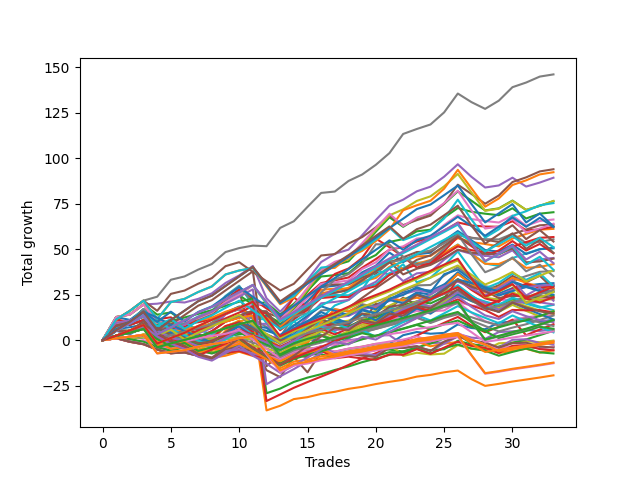

# Short Wallace Doodle 012 
- Symbol: TSLA_Unlimited
- Date Range: 03/23/2022 - 07/08/2022
- Trading Period: 7:20-12:30
- Number of Trades: 33



| Name | Win Percent | Profit | Avg Profit / Trade | Avg Time / Trade |      | Name | Win Percent | Profit | Avg Profit / Trade | Avg Time / Trade |
| ---- | ----------- | ------ | ------------------ | ---------------- | ---- | ---- | ----------- | ------ | ------------------ | ---------------- |
| Sorted By <br> Profit | | | | | | Sorted By <br> Win Percentage ||||
| Seven | 90.91 | 73055.00 | 2213.79 | 46:06 |     | Seven | 90.91 | 73055.00 | 2213.79 | 46:06 |
| Forty-Seven | 78.79 | 46990.00 | 1423.94 | 28:35 |     | Eighty-Two | 90.91 | 2605.00 | 78.94 | 28:45 |
| Sixty-Three | 84.85 | 46170.00 | 1399.09 | 35:03 |     | Eighty-One | 90.91 | -9660.00 | -292.73 | 25:23 |
| Four | 81.82 | 44655.00 | 1353.18 | 40:34 |     | Sixty-Three | 84.85 | 46170.00 | 1399.09 | 35:03 |
| Sixty | 78.79 | 38260.00 | 1159.39 | 32:48 |     | One Hundred Twenty-Seven | 84.85 | 5550.00 | 168.18 | 15:44 |
| Forty-Four | 72.73 | 38230.00 | 1158.48 | 24:36 |     | One Hundred Twenty-Two | 84.85 | 5385.00 | 163.18 | 16:21 |
| Seventy-One | 81.82 | 37680.00 | 1141.82 | 32:58 |     | Eighty-Three | 84.85 | 4400.00 | 133.33 | 41:20 |
| Two | 75.76 | 35175.00 | 1065.91 | 24:58 |     | One Hundred Twenty-Six | 84.85 | -6160.00 | -186.67 | 12:23 |
| Fifty-Eight | 75.76 | 33170.00 | 1005.15 | 23:32 |     | One Hundred Twenty-One | 84.85 | -6325.00 | -191.67 | 13:00 |
| Sixty-Eight | 75.76 | 32010.00 | 970.00 | 30:25 |     | Four | 81.82 | 44655.00 | 1353.18 | 40:34 |
| Fifty-Seven | 72.73 | 31795.00 | 963.48 | 14:01 |     | Seventy-One | 81.82 | 37680.00 | 1141.82 | 32:58 |
| One Hundred Twenty-Five | 78.79 | 31270.00 | 947.58 | 41:55 |     | Eighty-Five | 81.82 | 24015.00 | 727.73 | 59:03 |
| Three | 78.79 | 31205.00 | 945.61 | 22:26 |     | One Hundred Twenty-Eight | 81.82 | 14645.00 | 443.79 | 22:26 |
| One Hundred Fifteen | 69.70 | 31075.00 | 941.67 | 31:05 |     | One Hundred Twelve | 81.82 | 13815.00 | 418.64 | 11:21 |
| One | 72.73 | 30600.00 | 927.27 | 14:50 |     | One Hundred Twenty-Three | 81.82 | 13245.00 | 401.36 | 25:00 |
| Sixty-Five | 72.73 | 28355.00 | 859.24 | 13:41 |     | Eighty-Four | 81.82 | 10855.00 | 328.94 | 52:51 |
| Fifty-Nine | 78.79 | 27730.00 | 840.30 | 20:59 |     | One Hundred Eleven | 81.82 | 2425.00 | 73.48 | 08:01 |
| One Hundred Thirty | 75.76 | 27120.00 | 821.82 | 38:20 |     | Forty-Seven | 78.79 | 46990.00 | 1423.94 | 28:35 |
| One Hundred Fourteen | 72.73 | 25570.00 | 774.85 | 26:23 |     | Sixty | 78.79 | 38260.00 | 1159.39 | 32:48 |
| Forty-Two | 69.70 | 25405.00 | 769.85 | 18:15 |     | One Hundred Twenty-Five | 78.79 | 31270.00 | 947.58 | 41:55 |
| Forty-One | 69.70 | 25230.00 | 764.55 | 12:25 |     | Three | 78.79 | 31205.00 | 945.61 | 22:26 |
| Eighty-Five | 81.82 | 24015.00 | 727.73 | 59:03 |     | Fifty-Nine | 78.79 | 27730.00 | 840.30 | 20:59 |
| Forty-Five | 60.61 | 23890.00 | 723.94 | 37:02 |     | One Hundred Twenty-Nine | 78.79 | 21185.00 | 641.97 | 33:14 |
| Sixty-Six | 69.70 | 22605.00 | 685.00 | 21:16 |     | One Hundred Twenty-Four | 78.79 | 19355.00 | 586.52 | 36:07 |
| Sixty-Seven | 75.76 | 22415.00 | 679.24 | 19:04 |     | One Hundred Sixteen | 78.79 | -335.00 | -10.15 | 07:05 |
| One Hundred Twenty-Nine | 78.79 | 21185.00 | 641.97 | 33:14 |     | Two | 75.76 | 35175.00 | 1065.91 | 24:58 |
| Forty-Three | 72.73 | 20905.00 | 633.48 | 17:03 |     | Fifty-Eight | 75.76 | 33170.00 | 1005.15 | 23:32 |
| One Hundred Twenty-Four | 78.79 | 19355.00 | 586.52 | 36:07 |     | Sixty-Eight | 75.76 | 32010.00 | 970.00 | 30:25 |
| One Hundred Thirteen | 75.76 | 19210.00 | 582.12 | 15:50 |     | One Hundred Thirty | 75.76 | 27120.00 | 821.82 | 38:20 |
| Forty-Nine | 66.67 | 19010.00 | 576.06 | 10:59 |     | Sixty-Seven | 75.76 | 22415.00 | 679.24 | 19:04 |
| Sixty-Nine | 66.67 | 17590.00 | 533.03 | 40:46 |     | One Hundred Thirteen | 75.76 | 19210.00 | 582.12 | 15:50 |
| Zero | 69.70 | 15675.00 | 475.00 | 10:41 |     | One Hundred Seventeen | 75.76 | 7900.00 | 239.39 | 09:48 |
| Fifty-Six | 69.70 | 15230.00 | 461.52 | 10:08 |     | Forty-Four | 72.73 | 38230.00 | 1158.48 | 24:36 |
| Fifty-Two | 48.48 | 15070.00 | 456.67 | 17:36 |     | Fifty-Seven | 72.73 | 31795.00 | 963.48 | 14:01 |
| Fifty-Five | 51.52 | 15015.00 | 455.00 | 18:00 |     | One | 72.73 | 30600.00 | 927.27 | 14:50 |
| Sixty-One | 66.67 | 14815.00 | 448.94 | 48:49 |     | Sixty-Five | 72.73 | 28355.00 | 859.24 | 13:41 |
| One Hundred Twenty-Eight | 81.82 | 14645.00 | 443.79 | 22:26 |     | One Hundred Fourteen | 72.73 | 25570.00 | 774.85 | 26:23 |
| Five | 66.67 | 14145.00 | 428.64 | 64:51 |     | Forty-Three | 72.73 | 20905.00 | 633.48 | 17:03 |
| Fifty-Three | 45.45 | 14110.00 | 427.58 | 21:50 |     | One Hundred Fifteen | 69.70 | 31075.00 | 941.67 | 31:05 |
| One Hundred Twelve | 81.82 | 13815.00 | 418.64 | 11:21 |     | Forty-Two | 69.70 | 25405.00 | 769.85 | 18:15 |
| Fifty | 54.55 | 13495.00 | 408.94 | 14:41 |     | Forty-One | 69.70 | 25230.00 | 764.55 | 12:25 |
| Seventy-Three | 51.52 | 13280.00 | 402.42 | 14:32 |     | Sixty-Six | 69.70 | 22605.00 | 685.00 | 21:16 |
| One Hundred Twenty-Three | 81.82 | 13245.00 | 401.36 | 25:00 |     | Zero | 69.70 | 15675.00 | 475.00 | 10:41 |
| Ninety-Five | 39.39 | 12510.00 | 379.09 | 09:24 |     | Fifty-Six | 69.70 | 15230.00 | 461.52 | 10:08 |
| Sixty-Four | 69.70 | 12200.00 | 369.70 | 09:55 |     | Sixty-Four | 69.70 | 12200.00 | 369.70 | 09:55 |
| One Hundred Eighteen | 66.67 | 11840.00 | 358.79 | 13:03 |     | One Hundred One | 69.70 | -395.00 | -11.97 | 03:47 |
| Six | 63.64 | 11755.00 | 356.21 | 11:05 |     | One Hundred Six | 69.70 | -700.00 | -21.21 | 03:58 |
| One Hundred Ten | 51.52 | 11515.00 | 348.94 | 09:59 |     | Forty-Nine | 66.67 | 19010.00 | 576.06 | 10:59 |
| Forty | 66.67 | 11275.00 | 341.67 | 08:58 |     | Sixty-Nine | 66.67 | 17590.00 | 533.03 | 40:46 |
| Eighty-Four | 81.82 | 10855.00 | 328.94 | 52:51 |     | Sixty-One | 66.67 | 14815.00 | 448.94 | 48:49 |
| One Hundred Nine | 51.52 | 9835.00 | 298.03 | 08:21 |     | Five | 66.67 | 14145.00 | 428.64 | 64:51 |
| Fifty-One | 57.58 | 9715.00 | 294.39 | 13:12 |     | One Hundred Eighteen | 66.67 | 11840.00 | 358.79 | 13:03 |
| Ninety-Four | 42.42 | 8245.00 | 249.85 | 07:02 |     | Forty | 66.67 | 11275.00 | 341.67 | 08:58 |
| One Hundred Three | 57.58 | 8015.00 | 242.88 | 08:48 |     | One Hundred Two | 66.67 | 6775.00 | 205.30 | 05:46 |
| One Hundred Seventeen | 75.76 | 7900.00 | 239.39 | 09:48 |     | Six | 63.64 | 11755.00 | 356.21 | 11:05 |
| One Hundred Eight | 54.55 | 7665.00 | 232.27 | 07:17 |     | Forty-Five | 60.61 | 23890.00 | 723.94 | 37:02 |
| One Hundred Twenty | 42.42 | 7340.00 | 222.42 | 19:23 |     | Forty-Eight | 60.61 | 6950.00 | 210.61 | 08:16 |
| Ninety-Three | 48.48 | 7215.00 | 218.64 | 06:02 |     | Sixty-Two | 60.61 | 5590.00 | 169.39 | 09:01 |
| Forty-Eight | 60.61 | 6950.00 | 210.61 | 08:16 |     | One Hundred Seven | 60.61 | 3125.00 | 94.70 | 05:11 |
| One Hundred Two | 66.67 | 6775.00 | 205.30 | 05:46 |     | Fifty-One | 57.58 | 9715.00 | 294.39 | 13:12 |
| One Hundred Five | 42.42 | 5700.00 | 172.73 | 15:23 |     | One Hundred Three | 57.58 | 8015.00 | 242.88 | 08:48 |
| Sixty-Two | 60.61 | 5590.00 | 169.39 | 09:01 |     | Forty-Six | 57.58 | 2970.00 | 90.00 | 07:41 |
| One Hundred Twenty-Seven | 84.85 | 5550.00 | 168.18 | 15:44 |     | Seventy | 57.58 | -115.00 | -3.48 | 07:47 |
| One Hundred Twenty-Two | 84.85 | 5385.00 | 163.18 | 16:21 |     | Ninety-One | 57.58 | -1695.00 | -51.36 | 02:39 |
| One Hundred Ninteen | 48.48 | 4955.00 | 150.15 | 16:38 |     | Fifty | 54.55 | 13495.00 | 408.94 | 14:41 |
| Eighty-Three | 84.85 | 4400.00 | 133.33 | 41:20 |     | One Hundred Eight | 54.55 | 7665.00 | 232.27 | 07:17 |
| Ninety-Two | 54.55 | 3895.00 | 118.03 | 03:53 |     | Ninety-Two | 54.55 | 3895.00 | 118.03 | 03:53 |
| One Hundred Seven | 60.61 | 3125.00 | 94.70 | 05:11 |     | Ninety-Six | 54.55 | -2795.00 | -84.70 | 02:56 |
| Forty-Six | 57.58 | 2970.00 | 90.00 | 07:41 |     | Fifty-Five | 51.52 | 15015.00 | 455.00 | 18:00 |
| Eighty-Two | 90.91 | 2605.00 | 78.94 | 28:45 |     | Seventy-Three | 51.52 | 13280.00 | 402.42 | 14:32 |
| One Hundred Eleven | 81.82 | 2425.00 | 73.48 | 08:01 |     | One Hundred Ten | 51.52 | 11515.00 | 348.94 | 09:59 |
| One Hundred Four | 45.45 | 2155.00 | 65.30 | 12:32 |     | One Hundred Nine | 51.52 | 9835.00 | 298.03 | 08:21 |
| Seventy | 57.58 | -115.00 | -3.48 | 07:47 |     | Fifty-Four | 51.52 | -1730.00 | -52.42 | 05:38 |
| One Hundred Sixteen | 78.79 | -335.00 | -10.15 | 07:05 |     | Fifty-Two | 48.48 | 15070.00 | 456.67 | 17:36 |
| One Hundred One | 69.70 | -395.00 | -11.97 | 03:47 |     | Ninety-Three | 48.48 | 7215.00 | 218.64 | 06:02 |
| One Hundred Six | 69.70 | -700.00 | -21.21 | 03:58 |     | One Hundred Ninteen | 48.48 | 4955.00 | 150.15 | 16:38 |
| Ninety-Nine | 39.39 | -1105.00 | -33.48 | 04:56 |     | Fifty-Three | 45.45 | 14110.00 | 427.58 | 21:50 |
| Ninety-One | 57.58 | -1695.00 | -51.36 | 02:39 |     | One Hundred Four | 45.45 | 2155.00 | 65.30 | 12:32 |
| Fifty-Four | 51.52 | -1730.00 | -52.42 | 05:38 |     | Ninety-Four | 42.42 | 8245.00 | 249.85 | 07:02 |
| One Hundred | 39.39 | -2045.00 | -61.97 | 05:19 |     | One Hundred Twenty | 42.42 | 7340.00 | 222.42 | 19:23 |
| Ninety-Eight | 39.39 | -2775.00 | -84.09 | 04:38 |     | One Hundred Five | 42.42 | 5700.00 | 172.73 | 15:23 |
| Ninety-Six | 54.55 | -2795.00 | -84.70 | 02:56 |     | Ninety-Five | 39.39 | 12510.00 | 379.09 | 09:24 |
| Ninety-Seven | 39.39 | -3655.00 | -110.76 | 03:26 |     | Ninety-Nine | 39.39 | -1105.00 | -33.48 | 04:56 |
| One Hundred Twenty-Six | 84.85 | -6160.00 | -186.67 | 12:23 |     | One Hundred | 39.39 | -2045.00 | -61.97 | 05:19 |
| One Hundred Twenty-One | 84.85 | -6325.00 | -191.67 | 13:00 |     | Ninety-Eight | 39.39 | -2775.00 | -84.09 | 04:38 |
| Eighty-One | 90.91 | -9660.00 | -292.73 | 25:23 |     | Ninety-Seven | 39.39 | -3655.00 | -110.76 | 03:26 |

## NO STOPLOSS

### Test Zero
* Sell when price hits the middle line of the 20p bollinger
* No Stoploss
* Results:
```
Total Trades: 33
Percent Up: 30.30
Percent Down: 69.70
Total Points Moved Down: 31.35
Potential Profit: 15675.00
Total Points Ups: 24.49 Count Ups: 10
Total Points Downs: 55.84 Count Downs: 23
```

<details><summary>Trades</summary>

<code>In: 2022-03-23 11:51:00		Out: 2022-03-23 11:56:30		Total Position Time: 05:30		Total Move Down: 5.20		Total to Date: 5.20</code> <br />
<code>In: 2022-03-25 11:01:00		Out: 2022-03-25 11:11:05		Total Position Time: 10:05		Total Move Down: -0.06		Total to Date: 5.14</code> <br />
<code>In: 2022-04-05 11:48:00		Out: 2022-04-05 11:54:40		Total Position Time: 06:40		Total Move Down: 1.94		Total to Date: 7.08</code> <br />
<code>In: 2022-04-06 10:36:00		Out: 2022-04-06 11:00:10		Total Position Time: 24:10		Total Move Down: -9.28		Total to Date: -2.20</code> <br />
<code>In: 2022-04-08 09:24:00		Out: 2022-04-08 09:42:00		Total Position Time: 18:00		Total Move Down: -1.77		Total to Date: -3.97</code> <br />
<code>In: 2022-04-11 09:48:00		Out: 2022-04-11 09:52:30		Total Position Time: 04:30		Total Move Down: 0.96		Total to Date: -3.01</code> <br />
<code>In: 2022-04-11 10:08:00		Out: 2022-04-11 10:19:00		Total Position Time: 11:00		Total Move Down: 0.24		Total to Date: -2.77</code> <br />
<code>In: 2022-04-22 12:16:00		Out: 2022-04-22 12:23:05		Total Position Time: 07:05		Total Move Down: 2.53		Total to Date: -0.24</code> <br />
<code>In: 2022-04-26 12:02:00		Out: 2022-04-26 12:05:50		Total Position Time: 03:50		Total Move Down: 3.28		Total to Date: 3.04</code> <br />
<code>In: 2022-04-29 10:39:00		Out: 2022-04-29 10:40:10		Total Position Time: 01:10		Total Move Down: 1.12		Total to Date: 4.16</code> <br />
<code>In: 2022-05-02 11:01:00		Out: 2022-05-02 11:11:05		Total Position Time: 10:05		Total Move Down: 0.38		Total to Date: 4.54</code> <br />
<code>In: 2022-05-04 08:43:00		Out: 2022-05-04 08:58:05		Total Position Time: 15:05		Total Move Down: -1.19		Total to Date: 3.35</code> <br />
<code>In: 2022-05-04 09:25:00		Out: 2022-05-04 09:47:00		Total Position Time: 22:00		Total Move Down: -3.56		Total to Date: -0.21</code> <br />
<code>In: 2022-05-09 12:03:00		Out: 2022-05-09 12:09:10		Total Position Time: 06:10		Total Move Down: 3.51		Total to Date: 3.30</code> <br />
<code>In: 2022-05-10 09:06:00		Out: 2022-05-10 09:10:25		Total Position Time: 04:25		Total Move Down: 6.57		Total to Date: 9.87</code> <br />
<code>In: 2022-05-11 08:40:00		Out: 2022-05-11 08:46:25		Total Position Time: 06:25		Total Move Down: 3.55		Total to Date: 13.42</code> <br />
<code>In: 2022-05-16 08:51:00		Out: 2022-05-16 09:01:45		Total Position Time: 10:45		Total Move Down: -0.09		Total to Date: 13.33</code> <br />
<code>In: 2022-05-16 11:11:00		Out: 2022-05-16 11:36:40		Total Position Time: 25:40		Total Move Down: 0.91		Total to Date: 14.24</code> <br />
<code>In: 2022-05-18 12:09:00		Out: 2022-05-18 12:13:40		Total Position Time: 04:40		Total Move Down: 3.55		Total to Date: 17.79</code> <br />
<code>In: 2022-05-20 10:48:00		Out: 2022-05-20 11:02:00		Total Position Time: 14:00		Total Move Down: 1.76		Total to Date: 19.55</code> <br />
<code>In: 2022-05-20 11:55:00		Out: 2022-05-20 12:02:15		Total Position Time: 07:15		Total Move Down: 2.96		Total to Date: 22.51</code> <br />
<code>In: 2022-05-24 08:51:00		Out: 2022-05-24 09:01:05		Total Position Time: 10:05		Total Move Down: 3.67		Total to Date: 26.18</code> <br />
<code>In: 2022-06-01 10:13:00		Out: 2022-06-01 10:18:30		Total Position Time: 05:30		Total Move Down: 2.09		Total to Date: 28.27</code> <br />
<code>In: 2022-06-01 11:29:00		Out: 2022-06-01 11:50:05		Total Position Time: 21:05		Total Move Down: -1.08		Total to Date: 27.19</code> <br />
<code>In: 2022-06-03 10:05:00		Out: 2022-06-03 10:08:45		Total Position Time: 03:45		Total Move Down: 3.42		Total to Date: 30.61</code> <br />
<code>In: 2022-06-06 10:59:00		Out: 2022-06-06 11:05:15		Total Position Time: 06:15		Total Move Down: 2.43		Total to Date: 33.04</code> <br />
<code>In: 2022-06-10 10:39:00		Out: 2022-06-10 11:01:00		Total Position Time: 22:00		Total Move Down: -3.09		Total to Date: 29.95</code> <br />
<code>In: 2022-06-10 10:41:00		Out: 2022-06-10 11:01:00		Total Position Time: 20:00		Total Move Down: -2.08		Total to Date: 27.87</code> <br />
<code>In: 2022-06-17 10:07:00		Out: 2022-06-17 10:24:05		Total Position Time: 17:05		Total Move Down: -2.29		Total to Date: 25.58</code> <br />
<code>In: 2022-06-22 10:52:00		Out: 2022-06-22 10:54:25		Total Position Time: 02:25		Total Move Down: 3.04		Total to Date: 28.62</code> <br />
<code>In: 2022-06-29 10:12:00		Out: 2022-06-29 10:14:05		Total Position Time: 02:05		Total Move Down: 1.43		Total to Date: 30.05</code> <br />
<code>In: 2022-07-01 08:11:00		Out: 2022-07-01 08:22:00		Total Position Time: 11:00		Total Move Down: 0.84		Total to Date: 30.89</code> <br />
<code>In: 2022-07-01 10:34:00		Out: 2022-07-01 10:47:15		Total Position Time: 13:15		Total Move Down: 0.46		Total to Date: 31.35</code> <br />


</details>

### Test One
* Sell when the price hits the upper line of the 20p 1std bollinger
* No Stoploss
* Results:
```
Total Trades: 33
Percent Up: 27.27
Percent Down: 72.73
Total Points Moved Down: 61.20
Potential Profit: 30600.00
Total Points Ups: 21.55 Count Ups: 9
Total Points Downs: 82.75 Count Downs: 24
```

<details><summary>Trades</summary>

<code>In: 2022-03-23 11:51:00		Out: 2022-03-23 11:57:20		Total Position Time: 06:20		Total Move Down: 7.98		Total to Date: 7.98</code> <br />
<code>In: 2022-03-25 11:01:00		Out: 2022-03-25 11:17:25		Total Position Time: 16:25		Total Move Down: 0.47		Total to Date: 8.45</code> <br />
<code>In: 2022-04-05 11:48:00		Out: 2022-04-05 11:57:55		Total Position Time: 09:55		Total Move Down: 2.60		Total to Date: 11.05</code> <br />
<code>In: 2022-04-06 10:36:00		Out: 2022-04-06 11:08:40		Total Position Time: 32:40		Total Move Down: -12.56		Total to Date: -1.51</code> <br />
<code>In: 2022-04-08 09:24:00		Out: 2022-04-08 09:44:10		Total Position Time: 20:10		Total Move Down: -0.84		Total to Date: -2.35</code> <br />
<code>In: 2022-04-11 09:48:00		Out: 2022-04-11 09:54:05		Total Position Time: 06:05		Total Move Down: 1.97		Total to Date: -0.38</code> <br />
<code>In: 2022-04-11 10:08:00		Out: 2022-04-11 10:29:25		Total Position Time: 21:25		Total Move Down: -0.61		Total to Date: -0.99</code> <br />
<code>In: 2022-04-22 12:16:00		Out: 2022-04-22 12:29:35		Total Position Time: 13:35		Total Move Down: 3.58		Total to Date: 2.59</code> <br />
<code>In: 2022-04-26 12:02:00		Out: 2022-04-26 12:11:50		Total Position Time: 09:50		Total Move Down: 5.23		Total to Date: 7.82</code> <br />
<code>In: 2022-04-29 10:39:00		Out: 2022-04-29 10:40:35		Total Position Time: 01:35		Total Move Down: 2.26		Total to Date: 10.08</code> <br />
<code>In: 2022-05-02 11:01:00		Out: 2022-05-02 11:13:05		Total Position Time: 12:05		Total Move Down: 2.80		Total to Date: 12.88</code> <br />
<code>In: 2022-05-04 08:43:00		Out: 2022-05-04 09:04:40		Total Position Time: 21:40		Total Move Down: -0.18		Total to Date: 12.70</code> <br />
<code>In: 2022-05-04 09:25:00		Out: 2022-05-04 09:51:10		Total Position Time: 26:10		Total Move Down: -2.74		Total to Date: 9.96</code> <br />
<code>In: 2022-05-09 12:03:00		Out: 2022-05-09 12:09:35		Total Position Time: 06:35		Total Move Down: 6.04		Total to Date: 16.00</code> <br />
<code>In: 2022-05-10 09:06:00		Out: 2022-05-10 09:20:25		Total Position Time: 14:25		Total Move Down: 5.15		Total to Date: 21.15</code> <br />
<code>In: 2022-05-11 08:40:00		Out: 2022-05-11 08:46:55		Total Position Time: 06:55		Total Move Down: 6.54		Total to Date: 27.69</code> <br />
<code>In: 2022-05-16 08:51:00		Out: 2022-05-16 09:06:05		Total Position Time: 15:05		Total Move Down: 0.63		Total to Date: 28.32</code> <br />
<code>In: 2022-05-16 11:11:00		Out: 2022-05-16 11:45:45		Total Position Time: 34:45		Total Move Down: -0.16		Total to Date: 28.16</code> <br />
<code>In: 2022-05-18 12:09:00		Out: 2022-05-18 12:20:05		Total Position Time: 11:05		Total Move Down: 4.06		Total to Date: 32.22</code> <br />
<code>In: 2022-05-20 10:48:00		Out: 2022-05-20 11:05:00		Total Position Time: 17:00		Total Move Down: 1.99		Total to Date: 34.21</code> <br />
<code>In: 2022-05-20 11:55:00		Out: 2022-05-20 12:02:45		Total Position Time: 07:45		Total Move Down: 6.17		Total to Date: 40.38</code> <br />
<code>In: 2022-05-24 08:51:00		Out: 2022-05-24 09:06:25		Total Position Time: 15:25		Total Move Down: 2.81		Total to Date: 43.19</code> <br />
<code>In: 2022-06-01 10:13:00		Out: 2022-06-01 10:22:10		Total Position Time: 09:10		Total Move Down: 2.90		Total to Date: 46.09</code> <br />
<code>In: 2022-06-01 11:29:00		Out: 2022-06-01 11:50:50		Total Position Time: 21:50		Total Move Down: 0.21		Total to Date: 46.30</code> <br />
<code>In: 2022-06-03 10:05:00		Out: 2022-06-03 10:11:25		Total Position Time: 06:25		Total Move Down: 5.09		Total to Date: 51.39</code> <br />
<code>In: 2022-06-06 10:59:00		Out: 2022-06-06 11:07:55		Total Position Time: 08:55		Total Move Down: 4.67		Total to Date: 56.06</code> <br />
<code>In: 2022-06-10 10:39:00		Out: 2022-06-10 11:05:05		Total Position Time: 26:05		Total Move Down: -2.10		Total to Date: 53.96</code> <br />
<code>In: 2022-06-10 10:41:00		Out: 2022-06-10 11:05:05		Total Position Time: 24:05		Total Move Down: -1.09		Total to Date: 52.87</code> <br />
<code>In: 2022-06-17 10:07:00		Out: 2022-06-17 10:28:05		Total Position Time: 21:05		Total Move Down: -1.27		Total to Date: 51.60</code> <br />
<code>In: 2022-06-22 10:52:00		Out: 2022-06-22 10:57:20		Total Position Time: 05:20		Total Move Down: 4.27		Total to Date: 55.87</code> <br />
<code>In: 2022-06-29 10:12:00		Out: 2022-06-29 10:15:25		Total Position Time: 03:25		Total Move Down: 2.56		Total to Date: 58.43</code> <br />
<code>In: 2022-07-01 08:11:00		Out: 2022-07-01 08:24:20		Total Position Time: 13:20		Total Move Down: 2.34		Total to Date: 60.77</code> <br />
<code>In: 2022-07-01 10:34:00		Out: 2022-07-01 10:57:10		Total Position Time: 23:10		Total Move Down: 0.43		Total to Date: 61.20</code> <br />


</details>

### Test Two
* Sell when the price hits the upper line of the 20p 2std bollinger
* No Stoploss
* Results:
```
Total Trades: 33
Percent Up: 24.24
Percent Down: 75.76
Total Points Moved Down: 70.35
Potential Profit: 35175.00
Total Points Ups: 27.24 Count Ups: 8
Total Points Downs: 97.59 Count Downs: 25
```

<details><summary>Trades</summary>

<code>In: 2022-03-23 11:51:00		Out: 2022-03-23 12:07:50		Total Position Time: 16:50		Total Move Down: 9.54		Total to Date: 9.54</code> <br />
<code>In: 2022-03-25 11:01:00		Out: 2022-03-25 11:18:05		Total Position Time: 17:05		Total Move Down: 1.23		Total to Date: 10.77</code> <br />
<code>In: 2022-04-05 11:48:00		Out: 2022-04-05 11:58:15		Total Position Time: 10:15		Total Move Down: 4.13		Total to Date: 14.90</code> <br />
<code>In: 2022-04-06 10:36:00		Out: 2022-04-06 11:09:40		Total Position Time: 33:40		Total Move Down: -9.46		Total to Date: 5.44</code> <br />
<code>In: 2022-04-08 09:24:00		Out: 2022-04-08 09:45:20		Total Position Time: 21:20		Total Move Down: -0.01		Total to Date: 5.43</code> <br />
<code>In: 2022-04-11 09:48:00		Out: 2022-04-11 10:38:25		Total Position Time: 50:25		Total Move Down: -1.75		Total to Date: 3.68</code> <br />
<code>In: 2022-04-11 10:08:00		Out: 2022-04-11 10:38:25		Total Position Time: 30:25		Total Move Down: 0.79		Total to Date: 4.47</code> <br />
<code>In: 2022-04-22 12:16:00		Out: 2022-04-22 12:47:00		Total Position Time: 31:00		Total Move Down: 3.05		Total to Date: 7.52</code> <br />
<code>In: 2022-04-26 12:02:00		Out: 2022-04-26 12:13:25		Total Position Time: 11:25		Total Move Down: 7.37		Total to Date: 14.89</code> <br />
<code>In: 2022-04-29 10:39:00		Out: 2022-04-29 10:44:15		Total Position Time: 05:15		Total Move Down: 3.37		Total to Date: 18.26</code> <br />
<code>In: 2022-05-02 11:01:00		Out: 2022-05-02 11:43:05		Total Position Time: 42:05		Total Move Down: 2.21		Total to Date: 20.47</code> <br />
<code>In: 2022-05-04 08:43:00		Out: 2022-05-04 09:05:05		Total Position Time: 22:05		Total Move Down: 0.13		Total to Date: 20.60</code> <br />
<code>In: 2022-05-04 09:25:00		Out: 2022-05-04 10:18:30		Total Position Time: 53:30		Total Move Down: -6.47		Total to Date: 14.13</code> <br />
<code>In: 2022-05-09 12:03:00		Out: 2022-05-09 12:20:15		Total Position Time: 17:15		Total Move Down: 5.89		Total to Date: 20.02</code> <br />
<code>In: 2022-05-10 09:06:00		Out: 2022-05-10 09:31:00		Total Position Time: 25:00		Total Move Down: 7.30		Total to Date: 27.32</code> <br />
<code>In: 2022-05-11 08:40:00		Out: 2022-05-11 08:51:00		Total Position Time: 11:00		Total Move Down: 7.69		Total to Date: 35.01</code> <br />
<code>In: 2022-05-16 08:51:00		Out: 2022-05-16 09:06:10		Total Position Time: 15:10		Total Move Down: 0.76		Total to Date: 35.77</code> <br />
<code>In: 2022-05-16 11:11:00		Out: 2022-05-16 11:49:00		Total Position Time: 38:00		Total Move Down: 1.07		Total to Date: 36.84</code> <br />
<code>In: 2022-05-18 12:09:00		Out: 2022-05-18 12:22:10		Total Position Time: 13:10		Total Move Down: 6.31		Total to Date: 43.15</code> <br />
<code>In: 2022-05-20 10:48:00		Out: 2022-05-20 11:05:25		Total Position Time: 17:25		Total Move Down: 3.66		Total to Date: 46.81</code> <br />
<code>In: 2022-05-20 11:55:00		Out: 2022-05-20 12:03:20		Total Position Time: 08:20		Total Move Down: 7.20		Total to Date: 54.01</code> <br />
<code>In: 2022-05-24 08:51:00		Out: 2022-05-24 09:31:20		Total Position Time: 40:20		Total Move Down: 1.58		Total to Date: 55.59</code> <br />
<code>In: 2022-06-01 10:13:00		Out: 2022-06-01 10:24:00		Total Position Time: 11:00		Total Move Down: 4.27		Total to Date: 59.86</code> <br />
<code>In: 2022-06-01 11:29:00		Out: 2022-06-01 11:51:15		Total Position Time: 22:15		Total Move Down: 0.86		Total to Date: 60.72</code> <br />
<code>In: 2022-06-03 10:05:00		Out: 2022-06-03 10:14:45		Total Position Time: 09:45		Total Move Down: 6.66		Total to Date: 67.38</code> <br />
<code>In: 2022-06-06 10:59:00		Out: 2022-06-06 11:21:40		Total Position Time: 22:40		Total Move Down: 5.27		Total to Date: 72.65</code> <br />
<code>In: 2022-06-10 10:39:00		Out: 2022-06-10 11:13:20		Total Position Time: 34:20		Total Move Down: -2.06		Total to Date: 70.59</code> <br />
<code>In: 2022-06-10 10:41:00		Out: 2022-06-10 11:13:20		Total Position Time: 32:20		Total Move Down: -1.05		Total to Date: 69.54</code> <br />
<code>In: 2022-06-17 10:07:00		Out: 2022-06-17 10:29:05		Total Position Time: 22:05		Total Move Down: -0.84		Total to Date: 68.70</code> <br />
<code>In: 2022-06-22 10:52:00		Out: 2022-06-22 11:21:35		Total Position Time: 29:35		Total Move Down: 3.82		Total to Date: 72.52</code> <br />
<code>In: 2022-06-29 10:12:00		Out: 2022-06-29 11:21:05		Total Position Time: 69:05		Total Move Down: -5.60		Total to Date: 66.92</code> <br />
<code>In: 2022-07-01 08:11:00		Out: 2022-07-01 08:26:10		Total Position Time: 15:10		Total Move Down: 2.64		Total to Date: 69.56</code> <br />
<code>In: 2022-07-01 10:34:00		Out: 2022-07-01 10:58:45		Total Position Time: 24:45		Total Move Down: 0.79		Total to Date: 70.35</code> <br />


</details>

### Test Three
* Sell when price hits the middle line of the 50p bollinger
* No Stoploss
* Results:
```
Total Trades: 33
Percent Up: 21.21
Percent Down: 78.79
Total Points Moved Down: 62.41
Potential Profit: 31205.00
Total Points Ups: 20.74 Count Ups: 7
Total Points Downs: 83.15 Count Downs: 26
```

<details><summary>Trades</summary>

<code>In: 2022-03-23 11:51:00		Out: 2022-03-23 12:06:05		Total Position Time: 15:05		Total Move Down: 8.01		Total to Date: 8.01</code> <br />
<code>In: 2022-03-25 11:01:00		Out: 2022-03-25 11:18:15		Total Position Time: 17:15		Total Move Down: 1.98		Total to Date: 9.99</code> <br />
<code>In: 2022-04-05 11:48:00		Out: 2022-04-05 11:58:10		Total Position Time: 10:10		Total Move Down: 2.94		Total to Date: 12.93</code> <br />
<code>In: 2022-04-06 10:36:00		Out: 2022-04-06 11:10:10		Total Position Time: 34:10		Total Move Down: -6.52		Total to Date: 6.41</code> <br />
<code>In: 2022-04-08 09:24:00		Out: 2022-04-08 09:48:20		Total Position Time: 24:20		Total Move Down: 0.84		Total to Date: 7.25</code> <br />
<code>In: 2022-04-11 09:48:00		Out: 2022-04-11 09:52:55		Total Position Time: 04:55		Total Move Down: 1.82		Total to Date: 9.07</code> <br />
<code>In: 2022-04-11 10:08:00		Out: 2022-04-11 10:38:25		Total Position Time: 30:25		Total Move Down: 0.79		Total to Date: 9.86</code> <br />
<code>In: 2022-04-22 12:16:00		Out: 2022-04-22 12:46:05		Total Position Time: 30:05		Total Move Down: 1.61		Total to Date: 11.47</code> <br />
<code>In: 2022-04-26 12:02:00		Out: 2022-04-26 12:05:40		Total Position Time: 03:40		Total Move Down: 3.25		Total to Date: 14.72</code> <br />
<code>In: 2022-04-29 10:39:00		Out: 2022-04-29 10:41:00		Total Position Time: 02:00		Total Move Down: 2.44		Total to Date: 17.16</code> <br />
<code>In: 2022-05-02 11:01:00		Out: 2022-05-02 11:12:30		Total Position Time: 11:30		Total Move Down: 2.67		Total to Date: 19.83</code> <br />
<code>In: 2022-05-04 08:43:00		Out: 2022-05-04 09:17:25		Total Position Time: 34:25		Total Move Down: -0.38		Total to Date: 19.45</code> <br />
<code>In: 2022-05-04 09:25:00		Out: 2022-05-04 10:18:30		Total Position Time: 53:30		Total Move Down: -6.47		Total to Date: 12.98</code> <br />
<code>In: 2022-05-09 12:03:00		Out: 2022-05-09 12:09:35		Total Position Time: 06:35		Total Move Down: 6.04		Total to Date: 19.02</code> <br />
<code>In: 2022-05-10 09:06:00		Out: 2022-05-10 09:22:35		Total Position Time: 16:35		Total Move Down: 5.84		Total to Date: 24.86</code> <br />
<code>In: 2022-05-11 08:40:00		Out: 2022-05-11 08:46:55		Total Position Time: 06:55		Total Move Down: 6.54		Total to Date: 31.40</code> <br />
<code>In: 2022-05-16 08:51:00		Out: 2022-05-16 09:06:20		Total Position Time: 15:20		Total Move Down: 1.52		Total to Date: 32.92</code> <br />
<code>In: 2022-05-16 11:11:00		Out: 2022-05-16 11:49:05		Total Position Time: 38:05		Total Move Down: 1.55		Total to Date: 34.47</code> <br />
<code>In: 2022-05-18 12:09:00		Out: 2022-05-18 12:21:55		Total Position Time: 12:55		Total Move Down: 5.37		Total to Date: 39.84</code> <br />
<code>In: 2022-05-20 10:48:00		Out: 2022-05-20 11:16:10		Total Position Time: 28:10		Total Move Down: 4.74		Total to Date: 44.58</code> <br />
<code>In: 2022-05-20 11:55:00		Out: 2022-05-20 12:02:40		Total Position Time: 07:40		Total Move Down: 5.20		Total to Date: 49.78</code> <br />
<code>In: 2022-05-24 08:51:00		Out: 2022-05-24 09:31:10		Total Position Time: 40:10		Total Move Down: 1.37		Total to Date: 51.15</code> <br />
<code>In: 2022-06-01 10:13:00		Out: 2022-06-01 10:18:55		Total Position Time: 05:55		Total Move Down: 3.11		Total to Date: 54.26</code> <br />
<code>In: 2022-06-01 11:29:00		Out: 2022-06-01 11:57:05		Total Position Time: 28:05		Total Move Down: 2.09		Total to Date: 56.35</code> <br />
<code>In: 2022-06-03 10:05:00		Out: 2022-06-03 10:08:55		Total Position Time: 03:55		Total Move Down: 3.83		Total to Date: 60.18</code> <br />
<code>In: 2022-06-06 10:59:00		Out: 2022-06-06 11:17:05		Total Position Time: 18:05		Total Move Down: 4.53		Total to Date: 64.71</code> <br />
<code>In: 2022-06-10 10:39:00		Out: 2022-06-10 11:15:10		Total Position Time: 36:10		Total Move Down: -1.62		Total to Date: 63.09</code> <br />
<code>In: 2022-06-10 10:41:00		Out: 2022-06-10 11:15:10		Total Position Time: 34:10		Total Move Down: -0.61		Total to Date: 62.48</code> <br />
<code>In: 2022-06-17 10:07:00		Out: 2022-06-17 10:32:25		Total Position Time: 25:25		Total Move Down: -0.12		Total to Date: 62.36</code> <br />
<code>In: 2022-06-22 10:52:00		Out: 2022-06-22 10:54:25		Total Position Time: 02:25		Total Move Down: 3.04		Total to Date: 65.40</code> <br />
<code>In: 2022-06-29 10:12:00		Out: 2022-06-29 11:30:45		Total Position Time: 78:45		Total Move Down: -5.02		Total to Date: 60.38</code> <br />
<code>In: 2022-07-01 08:11:00		Out: 2022-07-01 08:46:20		Total Position Time: 35:20		Total Move Down: 0.51		Total to Date: 60.89</code> <br />
<code>In: 2022-07-01 10:34:00		Out: 2022-07-01 11:02:10		Total Position Time: 28:10		Total Move Down: 1.52		Total to Date: 62.41</code> <br />


</details>

### Test Four
* Sell when the price hits the upper line of the 50p 1std bollinger
* No Stoploss
* Results:
```
Total Trades: 33
Percent Up: 18.18
Percent Down: 81.82
Total Points Moved Down: 89.31
Potential Profit: 44655.00
Total Points Ups: 43.37 Count Ups: 6
Total Points Downs: 132.68 Count Downs: 27
```

<details><summary>Trades</summary>

<code>In: 2022-03-23 11:51:00		Out: 2022-03-23 12:09:20		Total Position Time: 18:20		Total Move Down: 12.75		Total to Date: 12.75</code> <br />
<code>In: 2022-03-25 11:01:00		Out: 2022-03-25 12:01:35		Total Position Time: 60:35		Total Move Down: 1.35		Total to Date: 14.10</code> <br />
<code>In: 2022-04-05 11:48:00		Out: 2022-04-05 12:02:05		Total Position Time: 14:05		Total Move Down: 5.55		Total to Date: 19.65</code> <br />
<code>In: 2022-04-06 10:36:00		Out: 2022-04-06 11:16:15		Total Position Time: 40:15		Total Move Down: 0.41		Total to Date: 20.06</code> <br />
<code>In: 2022-04-08 09:24:00		Out: 2022-04-08 10:06:40		Total Position Time: 42:40		Total Move Down: 1.21		Total to Date: 21.27</code> <br />
<code>In: 2022-04-11 09:48:00		Out: 2022-04-11 10:45:35		Total Position Time: 57:35		Total Move Down: -0.55		Total to Date: 20.72</code> <br />
<code>In: 2022-04-11 10:08:00		Out: 2022-04-11 10:45:35		Total Position Time: 37:35		Total Move Down: 1.99		Total to Date: 22.71</code> <br />
<code>In: 2022-04-22 12:16:00		Out: 2022-04-22 12:47:00		Total Position Time: 31:00		Total Move Down: 3.05		Total to Date: 25.76</code> <br />
<code>In: 2022-04-26 12:02:00		Out: 2022-04-26 12:12:15		Total Position Time: 10:15		Total Move Down: 5.70		Total to Date: 31.46</code> <br />
<code>In: 2022-04-29 10:39:00		Out: 2022-04-29 10:47:15		Total Position Time: 08:15		Total Move Down: 4.13		Total to Date: 35.59</code> <br />
<code>In: 2022-05-02 11:01:00		Out: 2022-05-02 11:20:20		Total Position Time: 19:20		Total Move Down: 5.21		Total to Date: 40.80</code> <br />
<code>In: 2022-05-04 08:43:00		Out: 2022-05-04 10:45:50		Total Position Time: 122:50		Total Move Down: -17.77		Total to Date: 23.03</code> <br />
<code>In: 2022-05-04 09:25:00		Out: 2022-05-04 10:45:50		Total Position Time: 80:50		Total Move Down: -7.39		Total to Date: 15.64</code> <br />
<code>In: 2022-05-09 12:03:00		Out: 2022-05-09 12:21:25		Total Position Time: 18:25		Total Move Down: 7.78		Total to Date: 23.42</code> <br />
<code>In: 2022-05-10 09:06:00		Out: 2022-05-10 09:31:20		Total Position Time: 25:20		Total Move Down: 9.80		Total to Date: 33.22</code> <br />
<code>In: 2022-05-11 08:40:00		Out: 2022-05-11 09:00:55		Total Position Time: 20:55		Total Move Down: 9.75		Total to Date: 42.97</code> <br />
<code>In: 2022-05-16 08:51:00		Out: 2022-05-16 09:18:00		Total Position Time: 27:00		Total Move Down: 4.54		Total to Date: 47.51</code> <br />
<code>In: 2022-05-16 11:11:00		Out: 2022-05-16 12:02:45		Total Position Time: 51:45		Total Move Down: 2.27		Total to Date: 49.78</code> <br />
<code>In: 2022-05-18 12:09:00		Out: 2022-05-18 12:26:05		Total Position Time: 17:05		Total Move Down: 7.93		Total to Date: 57.71</code> <br />
<code>In: 2022-05-20 10:48:00		Out: 2022-05-20 11:18:10		Total Position Time: 30:10		Total Move Down: 8.33		Total to Date: 66.04</code> <br />
<code>In: 2022-05-20 11:55:00		Out: 2022-05-20 12:03:35		Total Position Time: 08:35		Total Move Down: 7.91		Total to Date: 73.95</code> <br />
<code>In: 2022-05-24 08:51:00		Out: 2022-05-24 09:34:00		Total Position Time: 43:00		Total Move Down: 3.29		Total to Date: 77.24</code> <br />
<code>In: 2022-06-01 10:13:00		Out: 2022-06-01 10:24:35		Total Position Time: 11:35		Total Move Down: 4.61		Total to Date: 81.85</code> <br />
<code>In: 2022-06-01 11:29:00		Out: 2022-06-01 12:30:05		Total Position Time: 61:05		Total Move Down: 2.54		Total to Date: 84.39</code> <br />
<code>In: 2022-06-03 10:05:00		Out: 2022-06-03 10:11:40		Total Position Time: 06:40		Total Move Down: 5.49		Total to Date: 89.88</code> <br />
<code>In: 2022-06-06 10:59:00		Out: 2022-06-06 11:22:25		Total Position Time: 23:25		Total Move Down: 6.82		Total to Date: 96.70</code> <br />
<code>In: 2022-06-10 10:39:00		Out: 2022-06-10 12:42:40		Total Position Time: 123:40		Total Move Down: -6.89		Total to Date: 89.81</code> <br />
<code>In: 2022-06-10 10:41:00		Out: 2022-06-10 12:42:40		Total Position Time: 121:40		Total Move Down: -5.88		Total to Date: 83.93</code> <br />
<code>In: 2022-06-17 10:07:00		Out: 2022-06-17 10:45:40		Total Position Time: 38:40		Total Move Down: 1.14		Total to Date: 85.07</code> <br />
<code>In: 2022-06-22 10:52:00		Out: 2022-06-22 10:57:20		Total Position Time: 05:20		Total Move Down: 4.27		Total to Date: 89.34</code> <br />
<code>In: 2022-06-29 10:12:00		Out: 2022-06-29 11:42:15		Total Position Time: 90:15		Total Move Down: -4.89		Total to Date: 84.45</code> <br />
<code>In: 2022-07-01 08:11:00		Out: 2022-07-01 08:50:35		Total Position Time: 39:35		Total Move Down: 2.21		Total to Date: 86.66</code> <br />
<code>In: 2022-07-01 10:34:00		Out: 2022-07-01 11:05:25		Total Position Time: 31:25		Total Move Down: 2.65		Total to Date: 89.31</code> <br />


</details>

### Test Five
* Sell when the price hits the upper line of the 50p 2std bollinger
* No Stoploss
* Results:
```
Total Trades: 33
Percent Up: 33.33
Percent Down: 66.67
Total Points Moved Down: 28.29
Potential Profit: 14145.00
Total Points Ups: 95.14 Count Ups: 11
Total Points Downs: 123.43 Count Downs: 22
```

<details><summary>Trades</summary>

<code>In: 2022-03-23 11:51:00		Out: 2022-03-23 12:47:00		Total Position Time: 56:00		Total Move Down: 6.55		Total to Date: 6.55</code> <br />
<code>In: 2022-03-25 11:01:00		Out: 2022-03-25 12:02:00		Total Position Time: 61:00		Total Move Down: 3.61		Total to Date: 10.16</code> <br />
<code>In: 2022-04-05 11:48:00		Out: 2022-04-05 12:03:55		Total Position Time: 15:55		Total Move Down: 6.94		Total to Date: 17.10</code> <br />
<code>In: 2022-04-06 10:36:00		Out: 2022-04-06 12:47:00		Total Position Time: 131:00		Total Move Down: -12.62		Total to Date: 4.48</code> <br />
<code>In: 2022-04-08 09:24:00		Out: 2022-04-08 10:11:20		Total Position Time: 47:20		Total Move Down: 1.10		Total to Date: 5.58</code> <br />
<code>In: 2022-04-11 09:48:00		Out: 2022-04-11 10:49:20		Total Position Time: 61:20		Total Move Down: 1.22		Total to Date: 6.80</code> <br />
<code>In: 2022-04-11 10:08:00		Out: 2022-04-11 10:49:20		Total Position Time: 41:20		Total Move Down: 3.76		Total to Date: 10.56</code> <br />
<code>In: 2022-04-22 12:16:00		Out: 2022-04-22 12:47:00		Total Position Time: 31:00		Total Move Down: 3.05		Total to Date: 13.61</code> <br />
<code>In: 2022-04-26 12:02:00		Out: 2022-04-26 12:14:25		Total Position Time: 12:25		Total Move Down: 8.29		Total to Date: 21.90</code> <br />
<code>In: 2022-04-29 10:39:00		Out: 2022-04-29 10:50:05		Total Position Time: 11:05		Total Move Down: 5.60		Total to Date: 27.50</code> <br />
<code>In: 2022-05-02 11:01:00		Out: 2022-05-02 12:47:00		Total Position Time: 106:00		Total Move Down: -29.80		Total to Date: -2.30</code> <br />
<code>In: 2022-05-04 08:43:00		Out: 2022-05-04 11:07:20		Total Position Time: 144:20		Total Move Down: -14.19		Total to Date: -16.49</code> <br />
<code>In: 2022-05-04 09:25:00		Out: 2022-05-04 11:07:20		Total Position Time: 102:20		Total Move Down: -3.81		Total to Date: -20.30</code> <br />
<code>In: 2022-05-09 12:03:00		Out: 2022-05-09 12:28:05		Total Position Time: 25:05		Total Move Down: 11.06		Total to Date: -9.24</code> <br />
<code>In: 2022-05-10 09:06:00		Out: 2022-05-10 11:24:05		Total Position Time: 138:05		Total Move Down: -8.43		Total to Date: -17.67</code> <br />
<code>In: 2022-05-11 08:40:00		Out: 2022-05-11 09:11:45		Total Position Time: 31:45		Total Move Down: 11.32		Total to Date: -6.35</code> <br />
<code>In: 2022-05-16 08:51:00		Out: 2022-05-16 09:24:50		Total Position Time: 33:50		Total Move Down: 7.07		Total to Date: 0.72</code> <br />
<code>In: 2022-05-16 11:11:00		Out: 2022-05-16 12:03:25		Total Position Time: 52:25		Total Move Down: 2.99		Total to Date: 3.71</code> <br />
<code>In: 2022-05-18 12:09:00		Out: 2022-05-18 12:47:00		Total Position Time: 38:00		Total Move Down: 5.82		Total to Date: 9.53</code> <br />
<code>In: 2022-05-20 10:48:00		Out: 2022-05-20 11:22:30		Total Position Time: 34:30		Total Move Down: 10.63		Total to Date: 20.16</code> <br />
<code>In: 2022-05-20 11:55:00		Out: 2022-05-20 12:47:00		Total Position Time: 52:00		Total Move Down: -2.58		Total to Date: 17.58</code> <br />
<code>In: 2022-05-24 08:51:00		Out: 2022-05-24 09:39:55		Total Position Time: 48:55		Total Move Down: 5.79		Total to Date: 23.37</code> <br />
<code>In: 2022-06-01 10:13:00		Out: 2022-06-01 12:47:00		Total Position Time: 154:00		Total Move Down: -3.85		Total to Date: 19.52</code> <br />
<code>In: 2022-06-01 11:29:00		Out: 2022-06-01 12:47:00		Total Position Time: 78:00		Total Move Down: 2.48		Total to Date: 22.00</code> <br />
<code>In: 2022-06-03 10:05:00		Out: 2022-06-03 10:14:45		Total Position Time: 09:45		Total Move Down: 6.66		Total to Date: 28.66</code> <br />
<code>In: 2022-06-06 10:59:00		Out: 2022-06-06 11:27:20		Total Position Time: 28:20		Total Move Down: 7.77		Total to Date: 36.43</code> <br />
<code>In: 2022-06-10 10:39:00		Out: 2022-06-10 12:46:10		Total Position Time: 127:10		Total Move Down: -5.13		Total to Date: 31.30</code> <br />
<code>In: 2022-06-10 10:41:00		Out: 2022-06-10 12:46:10		Total Position Time: 125:10		Total Move Down: -4.12		Total to Date: 27.18</code> <br />
<code>In: 2022-06-17 10:07:00		Out: 2022-06-17 10:47:30		Total Position Time: 40:30		Total Move Down: 3.03		Total to Date: 30.21</code> <br />
<code>In: 2022-06-22 10:52:00		Out: 2022-06-22 11:26:10		Total Position Time: 34:10		Total Move Down: 5.10		Total to Date: 35.31</code> <br />
<code>In: 2022-06-29 10:12:00		Out: 2022-06-29 11:45:00		Total Position Time: 93:00		Total Move Down: -3.47		Total to Date: 31.84</code> <br />
<code>In: 2022-07-01 08:11:00		Out: 2022-07-01 08:52:30		Total Position Time: 41:30		Total Move Down: 3.59		Total to Date: 35.43</code> <br />
<code>In: 2022-07-01 10:34:00		Out: 2022-07-01 12:47:00		Total Position Time: 133:00		Total Move Down: -7.14		Total to Date: 28.29</code> <br />


</details>

### Test Six
* Sell when the price hits the middle line of the 1std VWAP
* No Stoploss
* Results:
```
Total Trades: 33
Percent Up: 36.36
Percent Down: 63.64
Total Points Moved Down: 23.51
Potential Profit: 11755.00
Total Points Ups: 12.68 Count Ups: 12
Total Points Downs: 36.19 Count Downs: 21
```

<details><summary>Trades</summary>

<code>In: 2022-03-23 11:51:00		Out: 2022-03-23 11:52:10		Total Position Time: 01:10		Total Move Down: 1.05		Total to Date: 1.05</code> <br />
<code>In: 2022-03-25 11:01:00		Out: 2022-03-25 11:02:10		Total Position Time: 01:10		Total Move Down: -0.37		Total to Date: 0.68</code> <br />
<code>In: 2022-04-05 11:48:00		Out: 2022-04-05 11:49:10		Total Position Time: 01:10		Total Move Down: 0.99		Total to Date: 1.67</code> <br />
<code>In: 2022-04-06 10:36:00		Out: 2022-04-06 10:37:10		Total Position Time: 01:10		Total Move Down: -1.04		Total to Date: 0.63</code> <br />
<code>In: 2022-04-08 09:24:00		Out: 2022-04-08 10:16:55		Total Position Time: 52:55		Total Move Down: 3.84		Total to Date: 4.47</code> <br />
<code>In: 2022-04-11 09:48:00		Out: 2022-04-11 09:49:10		Total Position Time: 01:10		Total Move Down: -1.03		Total to Date: 3.44</code> <br />
<code>In: 2022-04-11 10:08:00		Out: 2022-04-11 10:09:10		Total Position Time: 01:10		Total Move Down: -1.26		Total to Date: 2.18</code> <br />
<code>In: 2022-04-22 12:16:00		Out: 2022-04-22 12:17:10		Total Position Time: 01:10		Total Move Down: -0.88		Total to Date: 1.30</code> <br />
<code>In: 2022-04-26 12:02:00		Out: 2022-04-26 12:03:10		Total Position Time: 01:10		Total Move Down: -0.77		Total to Date: 0.53</code> <br />
<code>In: 2022-04-29 10:39:00		Out: 2022-04-29 10:40:10		Total Position Time: 01:10		Total Move Down: 1.12		Total to Date: 1.65</code> <br />
<code>In: 2022-05-02 11:01:00		Out: 2022-05-02 11:02:10		Total Position Time: 01:10		Total Move Down: -1.35		Total to Date: 0.30</code> <br />
<code>In: 2022-05-04 08:43:00		Out: 2022-05-04 08:44:10		Total Position Time: 01:10		Total Move Down: 0.14		Total to Date: 0.44</code> <br />
<code>In: 2022-05-04 09:25:00		Out: 2022-05-04 11:07:40		Total Position Time: 102:40		Total Move Down: 2.56		Total to Date: 3.00</code> <br />
<code>In: 2022-05-09 12:03:00		Out: 2022-05-09 12:04:10		Total Position Time: 01:10		Total Move Down: 3.65		Total to Date: 6.65</code> <br />
<code>In: 2022-05-10 09:06:00		Out: 2022-05-10 09:07:10		Total Position Time: 01:10		Total Move Down: 1.07		Total to Date: 7.72</code> <br />
<code>In: 2022-05-11 08:40:00		Out: 2022-05-11 08:41:10		Total Position Time: 01:10		Total Move Down: 0.01		Total to Date: 7.73</code> <br />
<code>In: 2022-05-16 08:51:00		Out: 2022-05-16 08:52:10		Total Position Time: 01:10		Total Move Down: -1.86		Total to Date: 5.87</code> <br />
<code>In: 2022-05-16 11:11:00		Out: 2022-05-16 11:12:10		Total Position Time: 01:10		Total Move Down: 1.63		Total to Date: 7.50</code> <br />
<code>In: 2022-05-18 12:09:00		Out: 2022-05-18 12:10:10		Total Position Time: 01:10		Total Move Down: 1.10		Total to Date: 8.60</code> <br />
<code>In: 2022-05-20 10:48:00		Out: 2022-05-20 10:49:10		Total Position Time: 01:10		Total Move Down: 1.54		Total to Date: 10.14</code> <br />
<code>In: 2022-05-20 11:55:00		Out: 2022-05-20 11:56:10		Total Position Time: 01:10		Total Move Down: 0.19		Total to Date: 10.33</code> <br />
<code>In: 2022-05-24 08:51:00		Out: 2022-05-24 09:37:00		Total Position Time: 46:00		Total Move Down: 4.75		Total to Date: 15.08</code> <br />
<code>In: 2022-06-01 10:13:00		Out: 2022-06-01 10:14:10		Total Position Time: 01:10		Total Move Down: 1.77		Total to Date: 16.85</code> <br />
<code>In: 2022-06-01 11:29:00		Out: 2022-06-01 11:30:15		Total Position Time: 01:15		Total Move Down: -0.96		Total to Date: 15.89</code> <br />
<code>In: 2022-06-03 10:05:00		Out: 2022-06-03 10:06:10		Total Position Time: 01:10		Total Move Down: 0.45		Total to Date: 16.34</code> <br />
<code>In: 2022-06-06 10:59:00		Out: 2022-06-06 11:07:55		Total Position Time: 08:55		Total Move Down: 4.67		Total to Date: 21.01</code> <br />
<code>In: 2022-06-10 10:39:00		Out: 2022-06-10 10:40:10		Total Position Time: 01:10		Total Move Down: -2.00		Total to Date: 19.01</code> <br />
<code>In: 2022-06-10 10:41:00		Out: 2022-06-10 10:42:10		Total Position Time: 01:10		Total Move Down: -0.67		Total to Date: 18.34</code> <br />
<code>In: 2022-06-17 10:07:00		Out: 2022-06-17 12:10:00		Total Position Time: 123:00		Total Move Down: 3.68		Total to Date: 22.02</code> <br />
<code>In: 2022-06-22 10:52:00		Out: 2022-06-22 10:53:10		Total Position Time: 01:10		Total Move Down: 0.44		Total to Date: 22.46</code> <br />
<code>In: 2022-06-29 10:12:00		Out: 2022-06-29 10:13:10		Total Position Time: 01:10		Total Move Down: 0.68		Total to Date: 23.14</code> <br />
<code>In: 2022-07-01 08:11:00		Out: 2022-07-01 08:12:10		Total Position Time: 01:10		Total Move Down: -0.49		Total to Date: 22.65</code> <br />
<code>In: 2022-07-01 10:34:00		Out: 2022-07-01 10:35:10		Total Position Time: 01:10		Total Move Down: 0.86		Total to Date: 23.51</code> <br />


</details>

### Test Seven
* Sell when the price hits the upper line of the 1std VWAP
* No Stoploss
* Results:
```
Total Trades: 33
Percent Up: 9.09
Percent Down: 90.91
Total Points Moved Down: 146.11
Potential Profit: 73055.00
Total Points Ups: 8.75 Count Ups: 3
Total Points Downs: 154.86 Count Downs: 30
```

<details><summary>Trades</summary>

<code>In: 2022-03-23 11:51:00		Out: 2022-03-23 12:09:10		Total Position Time: 18:10		Total Move Down: 11.43		Total to Date: 11.43</code> <br />
<code>In: 2022-03-25 11:01:00		Out: 2022-03-25 12:13:30		Total Position Time: 72:30		Total Move Down: 4.69		Total to Date: 16.12</code> <br />
<code>In: 2022-04-05 11:48:00		Out: 2022-04-05 12:02:20		Total Position Time: 14:20		Total Move Down: 5.64		Total to Date: 21.76</code> <br />
<code>In: 2022-04-06 10:36:00		Out: 2022-04-06 11:17:00		Total Position Time: 41:00		Total Move Down: 2.15		Total to Date: 23.91</code> <br />
<code>In: 2022-04-08 09:24:00		Out: 2022-04-08 10:47:00		Total Position Time: 83:00		Total Move Down: 9.32		Total to Date: 33.23</code> <br />
<code>In: 2022-04-11 09:48:00		Out: 2022-04-11 09:52:55		Total Position Time: 04:55		Total Move Down: 1.82		Total to Date: 35.05</code> <br />
<code>In: 2022-04-11 10:08:00		Out: 2022-04-11 10:49:20		Total Position Time: 41:20		Total Move Down: 3.76		Total to Date: 38.81</code> <br />
<code>In: 2022-04-22 12:16:00		Out: 2022-04-22 12:47:00		Total Position Time: 31:00		Total Move Down: 3.05		Total to Date: 41.86</code> <br />
<code>In: 2022-04-26 12:02:00		Out: 2022-04-26 12:12:40		Total Position Time: 10:40		Total Move Down: 6.59		Total to Date: 48.45</code> <br />
<code>In: 2022-04-29 10:39:00		Out: 2022-04-29 10:40:30		Total Position Time: 01:30		Total Move Down: 2.19		Total to Date: 50.64</code> <br />
<code>In: 2022-05-02 11:01:00		Out: 2022-05-02 11:12:15		Total Position Time: 11:15		Total Move Down: 1.35		Total to Date: 51.99</code> <br />
<code>In: 2022-05-04 08:43:00		Out: 2022-05-04 11:35:05		Total Position Time: 172:05		Total Move Down: -0.32		Total to Date: 51.67</code> <br />
<code>In: 2022-05-04 09:25:00		Out: 2022-05-04 11:35:05		Total Position Time: 130:05		Total Move Down: 10.06		Total to Date: 61.73</code> <br />
<code>In: 2022-05-09 12:03:00		Out: 2022-05-09 12:04:10		Total Position Time: 01:10		Total Move Down: 3.65		Total to Date: 65.38</code> <br />
<code>In: 2022-05-10 09:06:00		Out: 2022-05-10 09:31:15		Total Position Time: 25:15		Total Move Down: 7.89		Total to Date: 73.27</code> <br />
<code>In: 2022-05-11 08:40:00		Out: 2022-05-11 08:51:00		Total Position Time: 11:00		Total Move Down: 7.69		Total to Date: 80.96</code> <br />
<code>In: 2022-05-16 08:51:00		Out: 2022-05-16 09:06:10		Total Position Time: 15:10		Total Move Down: 0.76		Total to Date: 81.72</code> <br />
<code>In: 2022-05-16 11:11:00		Out: 2022-05-16 12:10:10		Total Position Time: 59:10		Total Move Down: 5.81		Total to Date: 87.53</code> <br />
<code>In: 2022-05-18 12:09:00		Out: 2022-05-18 12:13:40		Total Position Time: 04:40		Total Move Down: 3.55		Total to Date: 91.08</code> <br />
<code>In: 2022-05-20 10:48:00		Out: 2022-05-20 11:07:30		Total Position Time: 19:30		Total Move Down: 5.33		Total to Date: 96.41</code> <br />
<code>In: 2022-05-20 11:55:00		Out: 2022-05-20 12:03:10		Total Position Time: 08:10		Total Move Down: 6.46		Total to Date: 102.87</code> <br />
<code>In: 2022-05-24 08:51:00		Out: 2022-05-24 10:04:20		Total Position Time: 73:20		Total Move Down: 10.50		Total to Date: 113.37</code> <br />
<code>In: 2022-06-01 10:13:00		Out: 2022-06-01 10:18:35		Total Position Time: 05:35		Total Move Down: 2.73		Total to Date: 116.10</code> <br />
<code>In: 2022-06-01 11:29:00		Out: 2022-06-01 12:47:00		Total Position Time: 78:00		Total Move Down: 2.48		Total to Date: 118.58</code> <br />
<code>In: 2022-06-03 10:05:00		Out: 2022-06-03 10:14:45		Total Position Time: 09:45		Total Move Down: 6.66		Total to Date: 125.24</code> <br />
<code>In: 2022-06-06 10:59:00		Out: 2022-06-06 12:20:40		Total Position Time: 81:40		Total Move Down: 10.35		Total to Date: 135.59</code> <br />
<code>In: 2022-06-10 10:39:00		Out: 2022-06-10 12:47:00		Total Position Time: 128:00		Total Move Down: -4.72		Total to Date: 130.87</code> <br />
<code>In: 2022-06-10 10:41:00		Out: 2022-06-10 12:47:00		Total Position Time: 126:00		Total Move Down: -3.71		Total to Date: 127.16</code> <br />
<code>In: 2022-06-17 10:07:00		Out: 2022-06-17 12:47:00		Total Position Time: 160:00		Total Move Down: 4.51		Total to Date: 131.67</code> <br />
<code>In: 2022-06-22 10:52:00		Out: 2022-06-22 11:30:10		Total Position Time: 38:10		Total Move Down: 7.41		Total to Date: 139.08</code> <br />
<code>In: 2022-06-29 10:12:00		Out: 2022-06-29 10:15:25		Total Position Time: 03:25		Total Move Down: 2.56		Total to Date: 141.64</code> <br />
<code>In: 2022-07-01 08:11:00		Out: 2022-07-01 08:51:30		Total Position Time: 40:30		Total Move Down: 3.27		Total to Date: 144.91</code> <br />
<code>In: 2022-07-01 10:34:00		Out: 2022-07-01 10:35:20		Total Position Time: 01:20		Total Move Down: 1.20		Total to Date: 146.11</code> <br />


</details>

## STOPLOSS OF 5

### Test Forty
* Sell when price hits the middle line of the 20p bollinger
* Stoploss is -5 points
* Results:
```
Total Trades: 33
Percent Up: 33.33
Percent Down: 66.67
Total Points Moved Down: 22.55
Potential Profit: 11275.00
Total Points Ups: 32.91 Count Ups: 11
Total Points Downs: 55.46 Count Downs: 22
```

<details><summary>Trades</summary>

<code>In: 2022-03-23 11:51:00		Out: 2022-03-23 11:56:30		Total Position Time: 05:30		Total Move Down: 5.20		Total to Date: 5.20</code> <br />
<code>In: 2022-03-25 11:01:00		Out: 2022-03-25 11:11:05		Total Position Time: 10:05		Total Move Down: -0.06		Total to Date: 5.14</code> <br />
<code>In: 2022-04-05 11:48:00		Out: 2022-04-05 11:54:40		Total Position Time: 06:40		Total Move Down: 1.94		Total to Date: 7.08</code> <br />
<code>In: 2022-04-06 10:36:00		Out: 2022-04-06 10:40:35		Total Position Time: 04:35		Total Move Down: -5.61		Total to Date: 1.47</code> <br />
<code>In: 2022-04-08 09:24:00		Out: 2022-04-08 09:42:00		Total Position Time: 18:00		Total Move Down: -1.77		Total to Date: -0.30</code> <br />
<code>In: 2022-04-11 09:48:00		Out: 2022-04-11 09:52:30		Total Position Time: 04:30		Total Move Down: 0.96		Total to Date: 0.66</code> <br />
<code>In: 2022-04-11 10:08:00		Out: 2022-04-11 10:19:00		Total Position Time: 11:00		Total Move Down: 0.24		Total to Date: 0.90</code> <br />
<code>In: 2022-04-22 12:16:00		Out: 2022-04-22 12:23:05		Total Position Time: 07:05		Total Move Down: 2.53		Total to Date: 3.43</code> <br />
<code>In: 2022-04-26 12:02:00		Out: 2022-04-26 12:05:50		Total Position Time: 03:50		Total Move Down: 3.28		Total to Date: 6.71</code> <br />
<code>In: 2022-04-29 10:39:00		Out: 2022-04-29 10:40:10		Total Position Time: 01:10		Total Move Down: 1.12		Total to Date: 7.83</code> <br />
<code>In: 2022-05-02 11:01:00		Out: 2022-05-02 11:05:00		Total Position Time: 04:00		Total Move Down: -5.33		Total to Date: 2.50</code> <br />
<code>In: 2022-05-04 08:43:00		Out: 2022-05-04 08:58:05		Total Position Time: 15:05		Total Move Down: -1.19		Total to Date: 1.31</code> <br />
<code>In: 2022-05-04 09:25:00		Out: 2022-05-04 09:37:20		Total Position Time: 12:20		Total Move Down: -5.04		Total to Date: -3.73</code> <br />
<code>In: 2022-05-09 12:03:00		Out: 2022-05-09 12:09:10		Total Position Time: 06:10		Total Move Down: 3.51		Total to Date: -0.22</code> <br />
<code>In: 2022-05-10 09:06:00		Out: 2022-05-10 09:10:25		Total Position Time: 04:25		Total Move Down: 6.57		Total to Date: 6.35</code> <br />
<code>In: 2022-05-11 08:40:00		Out: 2022-05-11 08:46:25		Total Position Time: 06:25		Total Move Down: 3.55		Total to Date: 9.90</code> <br />
<code>In: 2022-05-16 08:51:00		Out: 2022-05-16 09:01:45		Total Position Time: 10:45		Total Move Down: -0.09		Total to Date: 9.81</code> <br />
<code>In: 2022-05-16 11:11:00		Out: 2022-05-16 11:36:40		Total Position Time: 25:40		Total Move Down: 0.91		Total to Date: 10.72</code> <br />
<code>In: 2022-05-18 12:09:00		Out: 2022-05-18 12:13:40		Total Position Time: 04:40		Total Move Down: 3.55		Total to Date: 14.27</code> <br />
<code>In: 2022-05-20 10:48:00		Out: 2022-05-20 11:02:00		Total Position Time: 14:00		Total Move Down: 1.76		Total to Date: 16.03</code> <br />
<code>In: 2022-05-20 11:55:00		Out: 2022-05-20 12:02:15		Total Position Time: 07:15		Total Move Down: 2.96		Total to Date: 18.99</code> <br />
<code>In: 2022-05-24 08:51:00		Out: 2022-05-24 09:01:05		Total Position Time: 10:05		Total Move Down: 3.67		Total to Date: 22.66</code> <br />
<code>In: 2022-06-01 10:13:00		Out: 2022-06-01 10:18:30		Total Position Time: 05:30		Total Move Down: 2.09		Total to Date: 24.75</code> <br />
<code>In: 2022-06-01 11:29:00		Out: 2022-06-01 11:50:05		Total Position Time: 21:05		Total Move Down: -1.08		Total to Date: 23.67</code> <br />
<code>In: 2022-06-03 10:05:00		Out: 2022-06-03 10:08:45		Total Position Time: 03:45		Total Move Down: 3.42		Total to Date: 27.09</code> <br />
<code>In: 2022-06-06 10:59:00		Out: 2022-06-06 11:05:15		Total Position Time: 06:15		Total Move Down: 2.43		Total to Date: 29.52</code> <br />
<code>In: 2022-06-10 10:39:00		Out: 2022-06-10 10:50:05		Total Position Time: 11:05		Total Move Down: -5.10		Total to Date: 24.42</code> <br />
<code>In: 2022-06-10 10:41:00		Out: 2022-06-10 10:50:30		Total Position Time: 09:30		Total Move Down: -5.35		Total to Date: 19.07</code> <br />
<code>In: 2022-06-17 10:07:00		Out: 2022-06-17 10:24:05		Total Position Time: 17:05		Total Move Down: -2.29		Total to Date: 16.78</code> <br />
<code>In: 2022-06-22 10:52:00		Out: 2022-06-22 10:54:25		Total Position Time: 02:25		Total Move Down: 3.04		Total to Date: 19.82</code> <br />
<code>In: 2022-06-29 10:12:00		Out: 2022-06-29 10:14:05		Total Position Time: 02:05		Total Move Down: 1.43		Total to Date: 21.25</code> <br />
<code>In: 2022-07-01 08:11:00		Out: 2022-07-01 08:22:00		Total Position Time: 11:00		Total Move Down: 0.84		Total to Date: 22.09</code> <br />
<code>In: 2022-07-01 10:34:00		Out: 2022-07-01 10:47:15		Total Position Time: 13:15		Total Move Down: 0.46		Total to Date: 22.55</code> <br />


</details>

### Test Forty-One
* Sell when the price hits the upper line of the 20p 1std bollinger
* Stoploss is -5 points
* Results:
```
Total Trades: 33
Percent Up: 30.30
Percent Down: 69.70
Total Points Moved Down: 50.46
Potential Profit: 25230.00
Total Points Ups: 29.49 Count Ups: 10
Total Points Downs: 79.95 Count Downs: 23
```

<details><summary>Trades</summary>

<code>In: 2022-03-23 11:51:00		Out: 2022-03-23 11:57:20		Total Position Time: 06:20		Total Move Down: 7.98		Total to Date: 7.98</code> <br />
<code>In: 2022-03-25 11:01:00		Out: 2022-03-25 11:17:25		Total Position Time: 16:25		Total Move Down: 0.47		Total to Date: 8.45</code> <br />
<code>In: 2022-04-05 11:48:00		Out: 2022-04-05 11:57:55		Total Position Time: 09:55		Total Move Down: 2.60		Total to Date: 11.05</code> <br />
<code>In: 2022-04-06 10:36:00		Out: 2022-04-06 10:40:35		Total Position Time: 04:35		Total Move Down: -5.61		Total to Date: 5.44</code> <br />
<code>In: 2022-04-08 09:24:00		Out: 2022-04-08 09:44:10		Total Position Time: 20:10		Total Move Down: -0.84		Total to Date: 4.60</code> <br />
<code>In: 2022-04-11 09:48:00		Out: 2022-04-11 09:54:05		Total Position Time: 06:05		Total Move Down: 1.97		Total to Date: 6.57</code> <br />
<code>In: 2022-04-11 10:08:00		Out: 2022-04-11 10:29:25		Total Position Time: 21:25		Total Move Down: -0.61		Total to Date: 5.96</code> <br />
<code>In: 2022-04-22 12:16:00		Out: 2022-04-22 12:29:35		Total Position Time: 13:35		Total Move Down: 3.58		Total to Date: 9.54</code> <br />
<code>In: 2022-04-26 12:02:00		Out: 2022-04-26 12:11:50		Total Position Time: 09:50		Total Move Down: 5.23		Total to Date: 14.77</code> <br />
<code>In: 2022-04-29 10:39:00		Out: 2022-04-29 10:40:35		Total Position Time: 01:35		Total Move Down: 2.26		Total to Date: 17.03</code> <br />
<code>In: 2022-05-02 11:01:00		Out: 2022-05-02 11:05:00		Total Position Time: 04:00		Total Move Down: -5.33		Total to Date: 11.70</code> <br />
<code>In: 2022-05-04 08:43:00		Out: 2022-05-04 09:04:40		Total Position Time: 21:40		Total Move Down: -0.18		Total to Date: 11.52</code> <br />
<code>In: 2022-05-04 09:25:00		Out: 2022-05-04 09:37:20		Total Position Time: 12:20		Total Move Down: -5.04		Total to Date: 6.48</code> <br />
<code>In: 2022-05-09 12:03:00		Out: 2022-05-09 12:09:35		Total Position Time: 06:35		Total Move Down: 6.04		Total to Date: 12.52</code> <br />
<code>In: 2022-05-10 09:06:00		Out: 2022-05-10 09:20:25		Total Position Time: 14:25		Total Move Down: 5.15		Total to Date: 17.67</code> <br />
<code>In: 2022-05-11 08:40:00		Out: 2022-05-11 08:46:55		Total Position Time: 06:55		Total Move Down: 6.54		Total to Date: 24.21</code> <br />
<code>In: 2022-05-16 08:51:00		Out: 2022-05-16 09:06:05		Total Position Time: 15:05		Total Move Down: 0.63		Total to Date: 24.84</code> <br />
<code>In: 2022-05-16 11:11:00		Out: 2022-05-16 11:45:45		Total Position Time: 34:45		Total Move Down: -0.16		Total to Date: 24.68</code> <br />
<code>In: 2022-05-18 12:09:00		Out: 2022-05-18 12:20:05		Total Position Time: 11:05		Total Move Down: 4.06		Total to Date: 28.74</code> <br />
<code>In: 2022-05-20 10:48:00		Out: 2022-05-20 11:05:00		Total Position Time: 17:00		Total Move Down: 1.99		Total to Date: 30.73</code> <br />
<code>In: 2022-05-20 11:55:00		Out: 2022-05-20 12:02:45		Total Position Time: 07:45		Total Move Down: 6.17		Total to Date: 36.90</code> <br />
<code>In: 2022-05-24 08:51:00		Out: 2022-05-24 09:06:25		Total Position Time: 15:25		Total Move Down: 2.81		Total to Date: 39.71</code> <br />
<code>In: 2022-06-01 10:13:00		Out: 2022-06-01 10:22:10		Total Position Time: 09:10		Total Move Down: 2.90		Total to Date: 42.61</code> <br />
<code>In: 2022-06-01 11:29:00		Out: 2022-06-01 11:50:50		Total Position Time: 21:50		Total Move Down: 0.21		Total to Date: 42.82</code> <br />
<code>In: 2022-06-03 10:05:00		Out: 2022-06-03 10:11:25		Total Position Time: 06:25		Total Move Down: 5.09		Total to Date: 47.91</code> <br />
<code>In: 2022-06-06 10:59:00		Out: 2022-06-06 11:07:55		Total Position Time: 08:55		Total Move Down: 4.67		Total to Date: 52.58</code> <br />
<code>In: 2022-06-10 10:39:00		Out: 2022-06-10 10:50:05		Total Position Time: 11:05		Total Move Down: -5.10		Total to Date: 47.48</code> <br />
<code>In: 2022-06-10 10:41:00		Out: 2022-06-10 10:50:30		Total Position Time: 09:30		Total Move Down: -5.35		Total to Date: 42.13</code> <br />
<code>In: 2022-06-17 10:07:00		Out: 2022-06-17 10:28:05		Total Position Time: 21:05		Total Move Down: -1.27		Total to Date: 40.86</code> <br />
<code>In: 2022-06-22 10:52:00		Out: 2022-06-22 10:57:20		Total Position Time: 05:20		Total Move Down: 4.27		Total to Date: 45.13</code> <br />
<code>In: 2022-06-29 10:12:00		Out: 2022-06-29 10:15:25		Total Position Time: 03:25		Total Move Down: 2.56		Total to Date: 47.69</code> <br />
<code>In: 2022-07-01 08:11:00		Out: 2022-07-01 08:24:20		Total Position Time: 13:20		Total Move Down: 2.34		Total to Date: 50.03</code> <br />
<code>In: 2022-07-01 10:34:00		Out: 2022-07-01 10:57:10		Total Position Time: 23:10		Total Move Down: 0.43		Total to Date: 50.46</code> <br />


</details>

### Test Forty-Two
* Sell when the price hits the upper line of the 20p 2std bollinger
* Stoploss is -5 points
* Results:
```
Total Trades: 33
Percent Up: 30.30
Percent Down: 69.70
Total Points Moved Down: 50.81
Potential Profit: 25405.00
Total Points Ups: 42.99 Count Ups: 10
Total Points Downs: 93.80 Count Downs: 23
```

<details><summary>Trades</summary>

<code>In: 2022-03-23 11:51:00		Out: 2022-03-23 12:07:50		Total Position Time: 16:50		Total Move Down: 9.54		Total to Date: 9.54</code> <br />
<code>In: 2022-03-25 11:01:00		Out: 2022-03-25 11:18:05		Total Position Time: 17:05		Total Move Down: 1.23		Total to Date: 10.77</code> <br />
<code>In: 2022-04-05 11:48:00		Out: 2022-04-05 11:58:15		Total Position Time: 10:15		Total Move Down: 4.13		Total to Date: 14.90</code> <br />
<code>In: 2022-04-06 10:36:00		Out: 2022-04-06 10:40:35		Total Position Time: 04:35		Total Move Down: -5.61		Total to Date: 9.29</code> <br />
<code>In: 2022-04-08 09:24:00		Out: 2022-04-08 09:45:20		Total Position Time: 21:20		Total Move Down: -0.01		Total to Date: 9.28</code> <br />
<code>In: 2022-04-11 09:48:00		Out: 2022-04-11 10:11:35		Total Position Time: 23:35		Total Move Down: -5.34		Total to Date: 3.94</code> <br />
<code>In: 2022-04-11 10:08:00		Out: 2022-04-11 10:38:25		Total Position Time: 30:25		Total Move Down: 0.79		Total to Date: 4.73</code> <br />
<code>In: 2022-04-22 12:16:00		Out: 2022-04-22 12:47:00		Total Position Time: 31:00		Total Move Down: 3.05		Total to Date: 7.78</code> <br />
<code>In: 2022-04-26 12:02:00		Out: 2022-04-26 12:13:25		Total Position Time: 11:25		Total Move Down: 7.37		Total to Date: 15.15</code> <br />
<code>In: 2022-04-29 10:39:00		Out: 2022-04-29 10:44:15		Total Position Time: 05:15		Total Move Down: 3.37		Total to Date: 18.52</code> <br />
<code>In: 2022-05-02 11:01:00		Out: 2022-05-02 11:05:00		Total Position Time: 04:00		Total Move Down: -5.33		Total to Date: 13.19</code> <br />
<code>In: 2022-05-04 08:43:00		Out: 2022-05-04 09:05:05		Total Position Time: 22:05		Total Move Down: 0.13		Total to Date: 13.32</code> <br />
<code>In: 2022-05-04 09:25:00		Out: 2022-05-04 09:37:20		Total Position Time: 12:20		Total Move Down: -5.04		Total to Date: 8.28</code> <br />
<code>In: 2022-05-09 12:03:00		Out: 2022-05-09 12:20:15		Total Position Time: 17:15		Total Move Down: 5.89		Total to Date: 14.17</code> <br />
<code>In: 2022-05-10 09:06:00		Out: 2022-05-10 09:31:00		Total Position Time: 25:00		Total Move Down: 7.30		Total to Date: 21.47</code> <br />
<code>In: 2022-05-11 08:40:00		Out: 2022-05-11 08:51:00		Total Position Time: 11:00		Total Move Down: 7.69		Total to Date: 29.16</code> <br />
<code>In: 2022-05-16 08:51:00		Out: 2022-05-16 09:06:10		Total Position Time: 15:10		Total Move Down: 0.76		Total to Date: 29.92</code> <br />
<code>In: 2022-05-16 11:11:00		Out: 2022-05-16 11:49:00		Total Position Time: 38:00		Total Move Down: 1.07		Total to Date: 30.99</code> <br />
<code>In: 2022-05-18 12:09:00		Out: 2022-05-18 12:22:10		Total Position Time: 13:10		Total Move Down: 6.31		Total to Date: 37.30</code> <br />
<code>In: 2022-05-20 10:48:00		Out: 2022-05-20 11:05:25		Total Position Time: 17:25		Total Move Down: 3.66		Total to Date: 40.96</code> <br />
<code>In: 2022-05-20 11:55:00		Out: 2022-05-20 12:03:20		Total Position Time: 08:20		Total Move Down: 7.20		Total to Date: 48.16</code> <br />
<code>In: 2022-05-24 08:51:00		Out: 2022-05-24 09:15:05		Total Position Time: 24:05		Total Move Down: -5.22		Total to Date: 42.94</code> <br />
<code>In: 2022-06-01 10:13:00		Out: 2022-06-01 10:24:00		Total Position Time: 11:00		Total Move Down: 4.27		Total to Date: 47.21</code> <br />
<code>In: 2022-06-01 11:29:00		Out: 2022-06-01 11:51:15		Total Position Time: 22:15		Total Move Down: 0.86		Total to Date: 48.07</code> <br />
<code>In: 2022-06-03 10:05:00		Out: 2022-06-03 10:14:45		Total Position Time: 09:45		Total Move Down: 6.66		Total to Date: 54.73</code> <br />
<code>In: 2022-06-06 10:59:00		Out: 2022-06-06 11:21:40		Total Position Time: 22:40		Total Move Down: 5.27		Total to Date: 60.00</code> <br />
<code>In: 2022-06-10 10:39:00		Out: 2022-06-10 10:50:05		Total Position Time: 11:05		Total Move Down: -5.10		Total to Date: 54.90</code> <br />
<code>In: 2022-06-10 10:41:00		Out: 2022-06-10 10:50:30		Total Position Time: 09:30		Total Move Down: -5.35		Total to Date: 49.55</code> <br />
<code>In: 2022-06-17 10:07:00		Out: 2022-06-17 10:29:05		Total Position Time: 22:05		Total Move Down: -0.84		Total to Date: 48.71</code> <br />
<code>In: 2022-06-22 10:52:00		Out: 2022-06-22 11:21:35		Total Position Time: 29:35		Total Move Down: 3.82		Total to Date: 52.53</code> <br />
<code>In: 2022-06-29 10:12:00		Out: 2022-06-29 10:57:15		Total Position Time: 45:15		Total Move Down: -5.15		Total to Date: 47.38</code> <br />
<code>In: 2022-07-01 08:11:00		Out: 2022-07-01 08:26:10		Total Position Time: 15:10		Total Move Down: 2.64		Total to Date: 50.02</code> <br />
<code>In: 2022-07-01 10:34:00		Out: 2022-07-01 10:58:45		Total Position Time: 24:45		Total Move Down: 0.79		Total to Date: 50.81</code> <br />


</details>

### Test Forty-Three
* Sell when price hits the middle line of the 50p bollinger
* Stoploss is -5 points
* Results:
```
Total Trades: 33
Percent Up: 27.27
Percent Down: 72.73
Total Points Moved Down: 41.81
Potential Profit: 20905.00
Total Points Ups: 37.30 Count Ups: 9
Total Points Downs: 79.11 Count Downs: 24
```

<details><summary>Trades</summary>

<code>In: 2022-03-23 11:51:00		Out: 2022-03-23 12:06:05		Total Position Time: 15:05		Total Move Down: 8.01		Total to Date: 8.01</code> <br />
<code>In: 2022-03-25 11:01:00		Out: 2022-03-25 11:18:15		Total Position Time: 17:15		Total Move Down: 1.98		Total to Date: 9.99</code> <br />
<code>In: 2022-04-05 11:48:00		Out: 2022-04-05 11:58:10		Total Position Time: 10:10		Total Move Down: 2.94		Total to Date: 12.93</code> <br />
<code>In: 2022-04-06 10:36:00		Out: 2022-04-06 10:40:35		Total Position Time: 04:35		Total Move Down: -5.61		Total to Date: 7.32</code> <br />
<code>In: 2022-04-08 09:24:00		Out: 2022-04-08 09:48:20		Total Position Time: 24:20		Total Move Down: 0.84		Total to Date: 8.16</code> <br />
<code>In: 2022-04-11 09:48:00		Out: 2022-04-11 09:52:55		Total Position Time: 04:55		Total Move Down: 1.82		Total to Date: 9.98</code> <br />
<code>In: 2022-04-11 10:08:00		Out: 2022-04-11 10:38:25		Total Position Time: 30:25		Total Move Down: 0.79		Total to Date: 10.77</code> <br />
<code>In: 2022-04-22 12:16:00		Out: 2022-04-22 12:46:05		Total Position Time: 30:05		Total Move Down: 1.61		Total to Date: 12.38</code> <br />
<code>In: 2022-04-26 12:02:00		Out: 2022-04-26 12:05:40		Total Position Time: 03:40		Total Move Down: 3.25		Total to Date: 15.63</code> <br />
<code>In: 2022-04-29 10:39:00		Out: 2022-04-29 10:41:00		Total Position Time: 02:00		Total Move Down: 2.44		Total to Date: 18.07</code> <br />
<code>In: 2022-05-02 11:01:00		Out: 2022-05-02 11:05:00		Total Position Time: 04:00		Total Move Down: -5.33		Total to Date: 12.74</code> <br />
<code>In: 2022-05-04 08:43:00		Out: 2022-05-04 09:17:25		Total Position Time: 34:25		Total Move Down: -0.38		Total to Date: 12.36</code> <br />
<code>In: 2022-05-04 09:25:00		Out: 2022-05-04 09:37:20		Total Position Time: 12:20		Total Move Down: -5.04		Total to Date: 7.32</code> <br />
<code>In: 2022-05-09 12:03:00		Out: 2022-05-09 12:09:35		Total Position Time: 06:35		Total Move Down: 6.04		Total to Date: 13.36</code> <br />
<code>In: 2022-05-10 09:06:00		Out: 2022-05-10 09:22:35		Total Position Time: 16:35		Total Move Down: 5.84		Total to Date: 19.20</code> <br />
<code>In: 2022-05-11 08:40:00		Out: 2022-05-11 08:46:55		Total Position Time: 06:55		Total Move Down: 6.54		Total to Date: 25.74</code> <br />
<code>In: 2022-05-16 08:51:00		Out: 2022-05-16 09:06:20		Total Position Time: 15:20		Total Move Down: 1.52		Total to Date: 27.26</code> <br />
<code>In: 2022-05-16 11:11:00		Out: 2022-05-16 11:49:05		Total Position Time: 38:05		Total Move Down: 1.55		Total to Date: 28.81</code> <br />
<code>In: 2022-05-18 12:09:00		Out: 2022-05-18 12:21:55		Total Position Time: 12:55		Total Move Down: 5.37		Total to Date: 34.18</code> <br />
<code>In: 2022-05-20 10:48:00		Out: 2022-05-20 11:16:10		Total Position Time: 28:10		Total Move Down: 4.74		Total to Date: 38.92</code> <br />
<code>In: 2022-05-20 11:55:00		Out: 2022-05-20 12:02:40		Total Position Time: 07:40		Total Move Down: 5.20		Total to Date: 44.12</code> <br />
<code>In: 2022-05-24 08:51:00		Out: 2022-05-24 09:15:05		Total Position Time: 24:05		Total Move Down: -5.22		Total to Date: 38.90</code> <br />
<code>In: 2022-06-01 10:13:00		Out: 2022-06-01 10:18:55		Total Position Time: 05:55		Total Move Down: 3.11		Total to Date: 42.01</code> <br />
<code>In: 2022-06-01 11:29:00		Out: 2022-06-01 11:57:05		Total Position Time: 28:05		Total Move Down: 2.09		Total to Date: 44.10</code> <br />
<code>In: 2022-06-03 10:05:00		Out: 2022-06-03 10:08:55		Total Position Time: 03:55		Total Move Down: 3.83		Total to Date: 47.93</code> <br />
<code>In: 2022-06-06 10:59:00		Out: 2022-06-06 11:17:05		Total Position Time: 18:05		Total Move Down: 4.53		Total to Date: 52.46</code> <br />
<code>In: 2022-06-10 10:39:00		Out: 2022-06-10 10:50:05		Total Position Time: 11:05		Total Move Down: -5.10		Total to Date: 47.36</code> <br />
<code>In: 2022-06-10 10:41:00		Out: 2022-06-10 10:50:30		Total Position Time: 09:30		Total Move Down: -5.35		Total to Date: 42.01</code> <br />
<code>In: 2022-06-17 10:07:00		Out: 2022-06-17 10:32:25		Total Position Time: 25:25		Total Move Down: -0.12		Total to Date: 41.89</code> <br />
<code>In: 2022-06-22 10:52:00		Out: 2022-06-22 10:54:25		Total Position Time: 02:25		Total Move Down: 3.04		Total to Date: 44.93</code> <br />
<code>In: 2022-06-29 10:12:00		Out: 2022-06-29 10:57:15		Total Position Time: 45:15		Total Move Down: -5.15		Total to Date: 39.78</code> <br />
<code>In: 2022-07-01 08:11:00		Out: 2022-07-01 08:46:20		Total Position Time: 35:20		Total Move Down: 0.51		Total to Date: 40.29</code> <br />
<code>In: 2022-07-01 10:34:00		Out: 2022-07-01 11:02:10		Total Position Time: 28:10		Total Move Down: 1.52		Total to Date: 41.81</code> <br />


</details>

### Test Forty-Four
* Sell when the price hits the upper line of the 50p 1std bollinger
* Stoploss is -5 points
* Results:
```
Total Trades: 33
Percent Up: 27.27
Percent Down: 72.73
Total Points Moved Down: 76.46
Potential Profit: 38230.00
Total Points Ups: 47.31 Count Ups: 9
Total Points Downs: 123.77 Count Downs: 24
```

<details><summary>Trades</summary>

<code>In: 2022-03-23 11:51:00		Out: 2022-03-23 12:09:20		Total Position Time: 18:20		Total Move Down: 12.75		Total to Date: 12.75</code> <br />
<code>In: 2022-03-25 11:01:00		Out: 2022-03-25 12:01:35		Total Position Time: 60:35		Total Move Down: 1.35		Total to Date: 14.10</code> <br />
<code>In: 2022-04-05 11:48:00		Out: 2022-04-05 12:02:05		Total Position Time: 14:05		Total Move Down: 5.55		Total to Date: 19.65</code> <br />
<code>In: 2022-04-06 10:36:00		Out: 2022-04-06 10:40:35		Total Position Time: 04:35		Total Move Down: -5.61		Total to Date: 14.04</code> <br />
<code>In: 2022-04-08 09:24:00		Out: 2022-04-08 10:06:40		Total Position Time: 42:40		Total Move Down: 1.21		Total to Date: 15.25</code> <br />
<code>In: 2022-04-11 09:48:00		Out: 2022-04-11 10:11:35		Total Position Time: 23:35		Total Move Down: -5.34		Total to Date: 9.91</code> <br />
<code>In: 2022-04-11 10:08:00		Out: 2022-04-11 10:45:35		Total Position Time: 37:35		Total Move Down: 1.99		Total to Date: 11.90</code> <br />
<code>In: 2022-04-22 12:16:00		Out: 2022-04-22 12:47:00		Total Position Time: 31:00		Total Move Down: 3.05		Total to Date: 14.95</code> <br />
<code>In: 2022-04-26 12:02:00		Out: 2022-04-26 12:12:15		Total Position Time: 10:15		Total Move Down: 5.70		Total to Date: 20.65</code> <br />
<code>In: 2022-04-29 10:39:00		Out: 2022-04-29 10:47:15		Total Position Time: 08:15		Total Move Down: 4.13		Total to Date: 24.78</code> <br />
<code>In: 2022-05-02 11:01:00		Out: 2022-05-02 11:05:00		Total Position Time: 04:00		Total Move Down: -5.33		Total to Date: 19.45</code> <br />
<code>In: 2022-05-04 08:43:00		Out: 2022-05-04 09:20:50		Total Position Time: 37:50		Total Move Down: -5.17		Total to Date: 14.28</code> <br />
<code>In: 2022-05-04 09:25:00		Out: 2022-05-04 09:37:20		Total Position Time: 12:20		Total Move Down: -5.04		Total to Date: 9.24</code> <br />
<code>In: 2022-05-09 12:03:00		Out: 2022-05-09 12:21:25		Total Position Time: 18:25		Total Move Down: 7.78		Total to Date: 17.02</code> <br />
<code>In: 2022-05-10 09:06:00		Out: 2022-05-10 09:31:20		Total Position Time: 25:20		Total Move Down: 9.80		Total to Date: 26.82</code> <br />
<code>In: 2022-05-11 08:40:00		Out: 2022-05-11 09:00:55		Total Position Time: 20:55		Total Move Down: 9.75		Total to Date: 36.57</code> <br />
<code>In: 2022-05-16 08:51:00		Out: 2022-05-16 09:18:00		Total Position Time: 27:00		Total Move Down: 4.54		Total to Date: 41.11</code> <br />
<code>In: 2022-05-16 11:11:00		Out: 2022-05-16 12:02:45		Total Position Time: 51:45		Total Move Down: 2.27		Total to Date: 43.38</code> <br />
<code>In: 2022-05-18 12:09:00		Out: 2022-05-18 12:26:05		Total Position Time: 17:05		Total Move Down: 7.93		Total to Date: 51.31</code> <br />
<code>In: 2022-05-20 10:48:00		Out: 2022-05-20 11:18:10		Total Position Time: 30:10		Total Move Down: 8.33		Total to Date: 59.64</code> <br />
<code>In: 2022-05-20 11:55:00		Out: 2022-05-20 12:03:35		Total Position Time: 08:35		Total Move Down: 7.91		Total to Date: 67.55</code> <br />
<code>In: 2022-05-24 08:51:00		Out: 2022-05-24 09:15:05		Total Position Time: 24:05		Total Move Down: -5.22		Total to Date: 62.33</code> <br />
<code>In: 2022-06-01 10:13:00		Out: 2022-06-01 10:24:35		Total Position Time: 11:35		Total Move Down: 4.61		Total to Date: 66.94</code> <br />
<code>In: 2022-06-01 11:29:00		Out: 2022-06-01 12:30:05		Total Position Time: 61:05		Total Move Down: 2.54		Total to Date: 69.48</code> <br />
<code>In: 2022-06-03 10:05:00		Out: 2022-06-03 10:11:40		Total Position Time: 06:40		Total Move Down: 5.49		Total to Date: 74.97</code> <br />
<code>In: 2022-06-06 10:59:00		Out: 2022-06-06 11:22:25		Total Position Time: 23:25		Total Move Down: 6.82		Total to Date: 81.79</code> <br />
<code>In: 2022-06-10 10:39:00		Out: 2022-06-10 10:50:05		Total Position Time: 11:05		Total Move Down: -5.10		Total to Date: 76.69</code> <br />
<code>In: 2022-06-10 10:41:00		Out: 2022-06-10 10:50:30		Total Position Time: 09:30		Total Move Down: -5.35		Total to Date: 71.34</code> <br />
<code>In: 2022-06-17 10:07:00		Out: 2022-06-17 10:45:40		Total Position Time: 38:40		Total Move Down: 1.14		Total to Date: 72.48</code> <br />
<code>In: 2022-06-22 10:52:00		Out: 2022-06-22 10:57:20		Total Position Time: 05:20		Total Move Down: 4.27		Total to Date: 76.75</code> <br />
<code>In: 2022-06-29 10:12:00		Out: 2022-06-29 10:57:15		Total Position Time: 45:15		Total Move Down: -5.15		Total to Date: 71.60</code> <br />
<code>In: 2022-07-01 08:11:00		Out: 2022-07-01 08:50:35		Total Position Time: 39:35		Total Move Down: 2.21		Total to Date: 73.81</code> <br />
<code>In: 2022-07-01 10:34:00		Out: 2022-07-01 11:05:25		Total Position Time: 31:25		Total Move Down: 2.65		Total to Date: 76.46</code> <br />


</details>

### Test Forty-Five
* Sell when the price hits the upper line of the 50p 2std bollinger
* Stoploss is -5 points
* Results:
```
Total Trades: 33
Percent Up: 39.39
Percent Down: 60.61
Total Points Moved Down: 47.78
Potential Profit: 23890.00
Total Points Ups: 68.64 Count Ups: 13
Total Points Downs: 116.42 Count Downs: 20
```

<details><summary>Trades</summary>

<code>In: 2022-03-23 11:51:00		Out: 2022-03-23 12:47:00		Total Position Time: 56:00		Total Move Down: 6.55		Total to Date: 6.55</code> <br />
<code>In: 2022-03-25 11:01:00		Out: 2022-03-25 12:02:00		Total Position Time: 61:00		Total Move Down: 3.61		Total to Date: 10.16</code> <br />
<code>In: 2022-04-05 11:48:00		Out: 2022-04-05 12:03:55		Total Position Time: 15:55		Total Move Down: 6.94		Total to Date: 17.10</code> <br />
<code>In: 2022-04-06 10:36:00		Out: 2022-04-06 10:40:35		Total Position Time: 04:35		Total Move Down: -5.61		Total to Date: 11.49</code> <br />
<code>In: 2022-04-08 09:24:00		Out: 2022-04-08 10:11:20		Total Position Time: 47:20		Total Move Down: 1.10		Total to Date: 12.59</code> <br />
<code>In: 2022-04-11 09:48:00		Out: 2022-04-11 10:11:35		Total Position Time: 23:35		Total Move Down: -5.34		Total to Date: 7.25</code> <br />
<code>In: 2022-04-11 10:08:00		Out: 2022-04-11 10:49:20		Total Position Time: 41:20		Total Move Down: 3.76		Total to Date: 11.01</code> <br />
<code>In: 2022-04-22 12:16:00		Out: 2022-04-22 12:47:00		Total Position Time: 31:00		Total Move Down: 3.05		Total to Date: 14.06</code> <br />
<code>In: 2022-04-26 12:02:00		Out: 2022-04-26 12:14:25		Total Position Time: 12:25		Total Move Down: 8.29		Total to Date: 22.35</code> <br />
<code>In: 2022-04-29 10:39:00		Out: 2022-04-29 10:50:05		Total Position Time: 11:05		Total Move Down: 5.60		Total to Date: 27.95</code> <br />
<code>In: 2022-05-02 11:01:00		Out: 2022-05-02 11:05:00		Total Position Time: 04:00		Total Move Down: -5.33		Total to Date: 22.62</code> <br />
<code>In: 2022-05-04 08:43:00		Out: 2022-05-04 09:20:50		Total Position Time: 37:50		Total Move Down: -5.17		Total to Date: 17.45</code> <br />
<code>In: 2022-05-04 09:25:00		Out: 2022-05-04 09:37:20		Total Position Time: 12:20		Total Move Down: -5.04		Total to Date: 12.41</code> <br />
<code>In: 2022-05-09 12:03:00		Out: 2022-05-09 12:28:05		Total Position Time: 25:05		Total Move Down: 11.06		Total to Date: 23.47</code> <br />
<code>In: 2022-05-10 09:06:00		Out: 2022-05-10 10:33:05		Total Position Time: 87:05		Total Move Down: -5.45		Total to Date: 18.02</code> <br />
<code>In: 2022-05-11 08:40:00		Out: 2022-05-11 09:11:45		Total Position Time: 31:45		Total Move Down: 11.32		Total to Date: 29.34</code> <br />
<code>In: 2022-05-16 08:51:00		Out: 2022-05-16 09:24:50		Total Position Time: 33:50		Total Move Down: 7.07		Total to Date: 36.41</code> <br />
<code>In: 2022-05-16 11:11:00		Out: 2022-05-16 12:03:25		Total Position Time: 52:25		Total Move Down: 2.99		Total to Date: 39.40</code> <br />
<code>In: 2022-05-18 12:09:00		Out: 2022-05-18 12:47:00		Total Position Time: 38:00		Total Move Down: 5.82		Total to Date: 45.22</code> <br />
<code>In: 2022-05-20 10:48:00		Out: 2022-05-20 11:22:30		Total Position Time: 34:30		Total Move Down: 10.63		Total to Date: 55.85</code> <br />
<code>In: 2022-05-20 11:55:00		Out: 2022-05-20 12:41:40		Total Position Time: 46:40		Total Move Down: -4.75		Total to Date: 51.10</code> <br />
<code>In: 2022-05-24 08:51:00		Out: 2022-05-24 09:15:05		Total Position Time: 24:05		Total Move Down: -5.22		Total to Date: 45.88</code> <br />
<code>In: 2022-06-01 10:13:00		Out: 2022-06-01 11:26:05		Total Position Time: 73:05		Total Move Down: -6.00		Total to Date: 39.88</code> <br />
<code>In: 2022-06-01 11:29:00		Out: 2022-06-01 12:47:00		Total Position Time: 78:00		Total Move Down: 2.48		Total to Date: 42.36</code> <br />
<code>In: 2022-06-03 10:05:00		Out: 2022-06-03 10:14:45		Total Position Time: 09:45		Total Move Down: 6.66		Total to Date: 49.02</code> <br />
<code>In: 2022-06-06 10:59:00		Out: 2022-06-06 11:27:20		Total Position Time: 28:20		Total Move Down: 7.77		Total to Date: 56.79</code> <br />
<code>In: 2022-06-10 10:39:00		Out: 2022-06-10 10:50:05		Total Position Time: 11:05		Total Move Down: -5.10		Total to Date: 51.69</code> <br />
<code>In: 2022-06-10 10:41:00		Out: 2022-06-10 10:50:30		Total Position Time: 09:30		Total Move Down: -5.35		Total to Date: 46.34</code> <br />
<code>In: 2022-06-17 10:07:00		Out: 2022-06-17 10:47:30		Total Position Time: 40:30		Total Move Down: 3.03		Total to Date: 49.37</code> <br />
<code>In: 2022-06-22 10:52:00		Out: 2022-06-22 11:26:10		Total Position Time: 34:10		Total Move Down: 5.10		Total to Date: 54.47</code> <br />
<code>In: 2022-06-29 10:12:00		Out: 2022-06-29 10:57:15		Total Position Time: 45:15		Total Move Down: -5.15		Total to Date: 49.32</code> <br />
<code>In: 2022-07-01 08:11:00		Out: 2022-07-01 08:52:30		Total Position Time: 41:30		Total Move Down: 3.59		Total to Date: 52.91</code> <br />
<code>In: 2022-07-01 10:34:00		Out: 2022-07-01 12:33:10		Total Position Time: 119:10		Total Move Down: -5.13		Total to Date: 47.78</code> <br />


</details>

### Test Forty-Six
* Sell when the price hits the middle line of the 1std VWAP
* Stoploss is -5 points
* Results:
```
Total Trades: 33
Percent Up: 42.42
Percent Down: 57.58
Total Points Moved Down: 5.94
Potential Profit: 2970.00
Total Points Ups: 22.94 Count Ups: 14
Total Points Downs: 28.88 Count Downs: 19
```

<details><summary>Trades</summary>

<code>In: 2022-03-23 11:51:00		Out: 2022-03-23 11:52:10		Total Position Time: 01:10		Total Move Down: 1.05		Total to Date: 1.05</code> <br />
<code>In: 2022-03-25 11:01:00		Out: 2022-03-25 11:02:10		Total Position Time: 01:10		Total Move Down: -0.37		Total to Date: 0.68</code> <br />
<code>In: 2022-04-05 11:48:00		Out: 2022-04-05 11:49:10		Total Position Time: 01:10		Total Move Down: 0.99		Total to Date: 1.67</code> <br />
<code>In: 2022-04-06 10:36:00		Out: 2022-04-06 10:37:10		Total Position Time: 01:10		Total Move Down: -1.04		Total to Date: 0.63</code> <br />
<code>In: 2022-04-08 09:24:00		Out: 2022-04-08 10:16:55		Total Position Time: 52:55		Total Move Down: 3.84		Total to Date: 4.47</code> <br />
<code>In: 2022-04-11 09:48:00		Out: 2022-04-11 09:49:10		Total Position Time: 01:10		Total Move Down: -1.03		Total to Date: 3.44</code> <br />
<code>In: 2022-04-11 10:08:00		Out: 2022-04-11 10:09:10		Total Position Time: 01:10		Total Move Down: -1.26		Total to Date: 2.18</code> <br />
<code>In: 2022-04-22 12:16:00		Out: 2022-04-22 12:17:10		Total Position Time: 01:10		Total Move Down: -0.88		Total to Date: 1.30</code> <br />
<code>In: 2022-04-26 12:02:00		Out: 2022-04-26 12:03:10		Total Position Time: 01:10		Total Move Down: -0.77		Total to Date: 0.53</code> <br />
<code>In: 2022-04-29 10:39:00		Out: 2022-04-29 10:40:10		Total Position Time: 01:10		Total Move Down: 1.12		Total to Date: 1.65</code> <br />
<code>In: 2022-05-02 11:01:00		Out: 2022-05-02 11:02:10		Total Position Time: 01:10		Total Move Down: -1.35		Total to Date: 0.30</code> <br />
<code>In: 2022-05-04 08:43:00		Out: 2022-05-04 08:44:10		Total Position Time: 01:10		Total Move Down: 0.14		Total to Date: 0.44</code> <br />
<code>In: 2022-05-04 09:25:00		Out: 2022-05-04 09:37:20		Total Position Time: 12:20		Total Move Down: -5.04		Total to Date: -4.60</code> <br />
<code>In: 2022-05-09 12:03:00		Out: 2022-05-09 12:04:10		Total Position Time: 01:10		Total Move Down: 3.65		Total to Date: -0.95</code> <br />
<code>In: 2022-05-10 09:06:00		Out: 2022-05-10 09:07:10		Total Position Time: 01:10		Total Move Down: 1.07		Total to Date: 0.12</code> <br />
<code>In: 2022-05-11 08:40:00		Out: 2022-05-11 08:41:10		Total Position Time: 01:10		Total Move Down: 0.01		Total to Date: 0.13</code> <br />
<code>In: 2022-05-16 08:51:00		Out: 2022-05-16 08:52:10		Total Position Time: 01:10		Total Move Down: -1.86		Total to Date: -1.73</code> <br />
<code>In: 2022-05-16 11:11:00		Out: 2022-05-16 11:12:10		Total Position Time: 01:10		Total Move Down: 1.63		Total to Date: -0.10</code> <br />
<code>In: 2022-05-18 12:09:00		Out: 2022-05-18 12:10:10		Total Position Time: 01:10		Total Move Down: 1.10		Total to Date: 1.00</code> <br />
<code>In: 2022-05-20 10:48:00		Out: 2022-05-20 10:49:10		Total Position Time: 01:10		Total Move Down: 1.54		Total to Date: 2.54</code> <br />
<code>In: 2022-05-20 11:55:00		Out: 2022-05-20 11:56:10		Total Position Time: 01:10		Total Move Down: 0.19		Total to Date: 2.73</code> <br />
<code>In: 2022-05-24 08:51:00		Out: 2022-05-24 09:15:05		Total Position Time: 24:05		Total Move Down: -5.22		Total to Date: -2.49</code> <br />
<code>In: 2022-06-01 10:13:00		Out: 2022-06-01 10:14:10		Total Position Time: 01:10		Total Move Down: 1.77		Total to Date: -0.72</code> <br />
<code>In: 2022-06-01 11:29:00		Out: 2022-06-01 11:30:15		Total Position Time: 01:15		Total Move Down: -0.96		Total to Date: -1.68</code> <br />
<code>In: 2022-06-03 10:05:00		Out: 2022-06-03 10:06:10		Total Position Time: 01:10		Total Move Down: 0.45		Total to Date: -1.23</code> <br />
<code>In: 2022-06-06 10:59:00		Out: 2022-06-06 11:07:55		Total Position Time: 08:55		Total Move Down: 4.67		Total to Date: 3.44</code> <br />
<code>In: 2022-06-10 10:39:00		Out: 2022-06-10 10:40:10		Total Position Time: 01:10		Total Move Down: -2.00		Total to Date: 1.44</code> <br />
<code>In: 2022-06-10 10:41:00		Out: 2022-06-10 10:42:10		Total Position Time: 01:10		Total Move Down: -0.67		Total to Date: 0.77</code> <br />
<code>In: 2022-06-17 10:07:00		Out: 2022-06-17 12:10:00		Total Position Time: 123:00		Total Move Down: 3.68		Total to Date: 4.45</code> <br />
<code>In: 2022-06-22 10:52:00		Out: 2022-06-22 10:53:10		Total Position Time: 01:10		Total Move Down: 0.44		Total to Date: 4.89</code> <br />
<code>In: 2022-06-29 10:12:00		Out: 2022-06-29 10:13:10		Total Position Time: 01:10		Total Move Down: 0.68		Total to Date: 5.57</code> <br />
<code>In: 2022-07-01 08:11:00		Out: 2022-07-01 08:12:10		Total Position Time: 01:10		Total Move Down: -0.49		Total to Date: 5.08</code> <br />
<code>In: 2022-07-01 10:34:00		Out: 2022-07-01 10:35:10		Total Position Time: 01:10		Total Move Down: 0.86		Total to Date: 5.94</code> <br />


</details>

### Test Forty-Seven
* Sell when the price hits the upper line of the 1std VWAP
* Stoploss is -5 points
* Results:
```
Total Trades: 33
Percent Up: 21.21
Percent Down: 78.79
Total Points Moved Down: 93.98
Potential Profit: 46990.00
Total Points Ups: 36.82 Count Ups: 7
Total Points Downs: 130.80 Count Downs: 26
```

<details><summary>Trades</summary>

<code>In: 2022-03-23 11:51:00		Out: 2022-03-23 12:09:10		Total Position Time: 18:10		Total Move Down: 11.43		Total to Date: 11.43</code> <br />
<code>In: 2022-03-25 11:01:00		Out: 2022-03-25 12:13:30		Total Position Time: 72:30		Total Move Down: 4.69		Total to Date: 16.12</code> <br />
<code>In: 2022-04-05 11:48:00		Out: 2022-04-05 12:02:20		Total Position Time: 14:20		Total Move Down: 5.64		Total to Date: 21.76</code> <br />
<code>In: 2022-04-06 10:36:00		Out: 2022-04-06 10:40:35		Total Position Time: 04:35		Total Move Down: -5.61		Total to Date: 16.15</code> <br />
<code>In: 2022-04-08 09:24:00		Out: 2022-04-08 10:47:00		Total Position Time: 83:00		Total Move Down: 9.32		Total to Date: 25.47</code> <br />
<code>In: 2022-04-11 09:48:00		Out: 2022-04-11 09:52:55		Total Position Time: 04:55		Total Move Down: 1.82		Total to Date: 27.29</code> <br />
<code>In: 2022-04-11 10:08:00		Out: 2022-04-11 10:49:20		Total Position Time: 41:20		Total Move Down: 3.76		Total to Date: 31.05</code> <br />
<code>In: 2022-04-22 12:16:00		Out: 2022-04-22 12:47:00		Total Position Time: 31:00		Total Move Down: 3.05		Total to Date: 34.10</code> <br />
<code>In: 2022-04-26 12:02:00		Out: 2022-04-26 12:12:40		Total Position Time: 10:40		Total Move Down: 6.59		Total to Date: 40.69</code> <br />
<code>In: 2022-04-29 10:39:00		Out: 2022-04-29 10:40:30		Total Position Time: 01:30		Total Move Down: 2.19		Total to Date: 42.88</code> <br />
<code>In: 2022-05-02 11:01:00		Out: 2022-05-02 11:05:00		Total Position Time: 04:00		Total Move Down: -5.33		Total to Date: 37.55</code> <br />
<code>In: 2022-05-04 08:43:00		Out: 2022-05-04 09:20:50		Total Position Time: 37:50		Total Move Down: -5.17		Total to Date: 32.38</code> <br />
<code>In: 2022-05-04 09:25:00		Out: 2022-05-04 09:37:20		Total Position Time: 12:20		Total Move Down: -5.04		Total to Date: 27.34</code> <br />
<code>In: 2022-05-09 12:03:00		Out: 2022-05-09 12:04:10		Total Position Time: 01:10		Total Move Down: 3.65		Total to Date: 30.99</code> <br />
<code>In: 2022-05-10 09:06:00		Out: 2022-05-10 09:31:15		Total Position Time: 25:15		Total Move Down: 7.89		Total to Date: 38.88</code> <br />
<code>In: 2022-05-11 08:40:00		Out: 2022-05-11 08:51:00		Total Position Time: 11:00		Total Move Down: 7.69		Total to Date: 46.57</code> <br />
<code>In: 2022-05-16 08:51:00		Out: 2022-05-16 09:06:10		Total Position Time: 15:10		Total Move Down: 0.76		Total to Date: 47.33</code> <br />
<code>In: 2022-05-16 11:11:00		Out: 2022-05-16 12:10:10		Total Position Time: 59:10		Total Move Down: 5.81		Total to Date: 53.14</code> <br />
<code>In: 2022-05-18 12:09:00		Out: 2022-05-18 12:13:40		Total Position Time: 04:40		Total Move Down: 3.55		Total to Date: 56.69</code> <br />
<code>In: 2022-05-20 10:48:00		Out: 2022-05-20 11:07:30		Total Position Time: 19:30		Total Move Down: 5.33		Total to Date: 62.02</code> <br />
<code>In: 2022-05-20 11:55:00		Out: 2022-05-20 12:03:10		Total Position Time: 08:10		Total Move Down: 6.46		Total to Date: 68.48</code> <br />
<code>In: 2022-05-24 08:51:00		Out: 2022-05-24 09:15:05		Total Position Time: 24:05		Total Move Down: -5.22		Total to Date: 63.26</code> <br />
<code>In: 2022-06-01 10:13:00		Out: 2022-06-01 10:18:35		Total Position Time: 05:35		Total Move Down: 2.73		Total to Date: 65.99</code> <br />
<code>In: 2022-06-01 11:29:00		Out: 2022-06-01 12:47:00		Total Position Time: 78:00		Total Move Down: 2.48		Total to Date: 68.47</code> <br />
<code>In: 2022-06-03 10:05:00		Out: 2022-06-03 10:14:45		Total Position Time: 09:45		Total Move Down: 6.66		Total to Date: 75.13</code> <br />
<code>In: 2022-06-06 10:59:00		Out: 2022-06-06 12:20:40		Total Position Time: 81:40		Total Move Down: 10.35		Total to Date: 85.48</code> <br />
<code>In: 2022-06-10 10:39:00		Out: 2022-06-10 10:50:05		Total Position Time: 11:05		Total Move Down: -5.10		Total to Date: 80.38</code> <br />
<code>In: 2022-06-10 10:41:00		Out: 2022-06-10 10:50:30		Total Position Time: 09:30		Total Move Down: -5.35		Total to Date: 75.03</code> <br />
<code>In: 2022-06-17 10:07:00		Out: 2022-06-17 12:47:00		Total Position Time: 160:00		Total Move Down: 4.51		Total to Date: 79.54</code> <br />
<code>In: 2022-06-22 10:52:00		Out: 2022-06-22 11:30:10		Total Position Time: 38:10		Total Move Down: 7.41		Total to Date: 86.95</code> <br />
<code>In: 2022-06-29 10:12:00		Out: 2022-06-29 10:15:25		Total Position Time: 03:25		Total Move Down: 2.56		Total to Date: 89.51</code> <br />
<code>In: 2022-07-01 08:11:00		Out: 2022-07-01 08:51:30		Total Position Time: 40:30		Total Move Down: 3.27		Total to Date: 92.78</code> <br />
<code>In: 2022-07-01 10:34:00		Out: 2022-07-01 10:35:20		Total Position Time: 01:20		Total Move Down: 1.20		Total to Date: 93.98</code> <br />


</details>

## TRAIL STOP OF 5

### Test Forty-Eight
* Sell when price hits the middle line of the 20p bollinger
* Trailing Stop is -5 points
* Results:
```
Total Trades: 33
Percent Up: 39.39
Percent Down: 60.61
Total Points Moved Down: 13.90
Potential Profit: 6950.00
Total Points Ups: 38.89 Count Ups: 13
Total Points Downs: 52.79 Count Downs: 20
```

<details><summary>Trades</summary>

<code>In: 2022-03-23 11:51:00		Out: 2022-03-23 11:56:30		Total Position Time: 05:30		Total Move Down: 5.20		Total to Date: 5.20</code> <br />
<code>In: 2022-03-25 11:01:00		Out: 2022-03-25 11:11:05		Total Position Time: 10:05		Total Move Down: -0.06		Total to Date: 5.14</code> <br />
<code>In: 2022-04-05 11:48:00		Out: 2022-04-05 11:54:40		Total Position Time: 06:40		Total Move Down: 1.94		Total to Date: 7.08</code> <br />
<code>In: 2022-04-06 10:36:00		Out: 2022-04-06 10:40:35		Total Position Time: 04:35		Total Move Down: -5.61		Total to Date: 1.47</code> <br />
<code>In: 2022-04-08 09:24:00		Out: 2022-04-08 09:42:00		Total Position Time: 18:00		Total Move Down: -1.77		Total to Date: -0.30</code> <br />
<code>In: 2022-04-11 09:48:00		Out: 2022-04-11 09:52:30		Total Position Time: 04:30		Total Move Down: 0.96		Total to Date: 0.66</code> <br />
<code>In: 2022-04-11 10:08:00		Out: 2022-04-11 10:19:00		Total Position Time: 11:00		Total Move Down: 0.24		Total to Date: 0.90</code> <br />
<code>In: 2022-04-22 12:16:00		Out: 2022-04-22 12:23:05		Total Position Time: 07:05		Total Move Down: 2.53		Total to Date: 3.43</code> <br />
<code>In: 2022-04-26 12:02:00		Out: 2022-04-26 12:05:50		Total Position Time: 03:50		Total Move Down: 3.28		Total to Date: 6.71</code> <br />
<code>In: 2022-04-29 10:39:00		Out: 2022-04-29 10:40:10		Total Position Time: 01:10		Total Move Down: 1.12		Total to Date: 7.83</code> <br />
<code>In: 2022-05-02 11:01:00		Out: 2022-05-02 11:05:00		Total Position Time: 04:00		Total Move Down: -5.33		Total to Date: 2.50</code> <br />
<code>In: 2022-05-04 08:43:00		Out: 2022-05-04 08:54:20		Total Position Time: 11:20		Total Move Down: -4.42		Total to Date: -1.92</code> <br />
<code>In: 2022-05-04 09:25:00		Out: 2022-05-04 09:37:20		Total Position Time: 12:20		Total Move Down: -5.04		Total to Date: -6.96</code> <br />
<code>In: 2022-05-09 12:03:00		Out: 2022-05-09 12:09:10		Total Position Time: 06:10		Total Move Down: 3.51		Total to Date: -3.45</code> <br />
<code>In: 2022-05-10 09:06:00		Out: 2022-05-10 09:10:25		Total Position Time: 04:25		Total Move Down: 6.57		Total to Date: 3.12</code> <br />
<code>In: 2022-05-11 08:40:00		Out: 2022-05-11 08:46:25		Total Position Time: 06:25		Total Move Down: 3.55		Total to Date: 6.67</code> <br />
<code>In: 2022-05-16 08:51:00		Out: 2022-05-16 09:01:45		Total Position Time: 10:45		Total Move Down: -0.09		Total to Date: 6.58</code> <br />
<code>In: 2022-05-16 11:11:00		Out: 2022-05-16 11:25:35		Total Position Time: 14:35		Total Move Down: -1.26		Total to Date: 5.32</code> <br />
<code>In: 2022-05-18 12:09:00		Out: 2022-05-18 12:13:40		Total Position Time: 04:40		Total Move Down: 3.55		Total to Date: 8.87</code> <br />
<code>In: 2022-05-20 10:48:00		Out: 2022-05-20 10:53:55		Total Position Time: 05:55		Total Move Down: -1.53		Total to Date: 7.34</code> <br />
<code>In: 2022-05-20 11:55:00		Out: 2022-05-20 12:02:15		Total Position Time: 07:15		Total Move Down: 2.96		Total to Date: 10.30</code> <br />
<code>In: 2022-05-24 08:51:00		Out: 2022-05-24 09:01:05		Total Position Time: 10:05		Total Move Down: 3.67		Total to Date: 13.97</code> <br />
<code>In: 2022-06-01 10:13:00		Out: 2022-06-01 10:18:30		Total Position Time: 05:30		Total Move Down: 2.09		Total to Date: 16.06</code> <br />
<code>In: 2022-06-01 11:29:00		Out: 2022-06-01 11:50:05		Total Position Time: 21:05		Total Move Down: -1.08		Total to Date: 14.98</code> <br />
<code>In: 2022-06-03 10:05:00		Out: 2022-06-03 10:08:45		Total Position Time: 03:45		Total Move Down: 3.42		Total to Date: 18.40</code> <br />
<code>In: 2022-06-06 10:59:00		Out: 2022-06-06 11:05:15		Total Position Time: 06:15		Total Move Down: 2.43		Total to Date: 20.83</code> <br />
<code>In: 2022-06-10 10:39:00		Out: 2022-06-10 10:50:10		Total Position Time: 11:10		Total Move Down: -5.71		Total to Date: 15.12</code> <br />
<code>In: 2022-06-10 10:41:00		Out: 2022-06-10 10:50:10		Total Position Time: 09:10		Total Move Down: -4.70		Total to Date: 10.42</code> <br />
<code>In: 2022-06-17 10:07:00		Out: 2022-06-17 10:24:05		Total Position Time: 17:05		Total Move Down: -2.29		Total to Date: 8.13</code> <br />
<code>In: 2022-06-22 10:52:00		Out: 2022-06-22 10:54:25		Total Position Time: 02:25		Total Move Down: 3.04		Total to Date: 11.17</code> <br />
<code>In: 2022-06-29 10:12:00		Out: 2022-06-29 10:14:05		Total Position Time: 02:05		Total Move Down: 1.43		Total to Date: 12.60</code> <br />
<code>In: 2022-07-01 08:11:00		Out: 2022-07-01 08:22:00		Total Position Time: 11:00		Total Move Down: 0.84		Total to Date: 13.44</code> <br />
<code>In: 2022-07-01 10:34:00		Out: 2022-07-01 10:47:15		Total Position Time: 13:15		Total Move Down: 0.46		Total to Date: 13.90</code> <br />


</details>

### Test Forty-Nine
* Sell when the price hits the upper line of the 20p 1std bollinger
* Trailing Stop is -5 points
* Results:
```
Total Trades: 33
Percent Up: 33.33
Percent Down: 66.67
Total Points Moved Down: 38.02
Potential Profit: 19010.00
Total Points Ups: 36.32 Count Ups: 11
Total Points Downs: 74.34 Count Downs: 22
```

<details><summary>Trades</summary>

<code>In: 2022-03-23 11:51:00		Out: 2022-03-23 11:57:20		Total Position Time: 06:20		Total Move Down: 7.98		Total to Date: 7.98</code> <br />
<code>In: 2022-03-25 11:01:00		Out: 2022-03-25 11:17:25		Total Position Time: 16:25		Total Move Down: 0.47		Total to Date: 8.45</code> <br />
<code>In: 2022-04-05 11:48:00		Out: 2022-04-05 11:57:55		Total Position Time: 09:55		Total Move Down: 2.60		Total to Date: 11.05</code> <br />
<code>In: 2022-04-06 10:36:00		Out: 2022-04-06 10:40:35		Total Position Time: 04:35		Total Move Down: -5.61		Total to Date: 5.44</code> <br />
<code>In: 2022-04-08 09:24:00		Out: 2022-04-08 09:44:10		Total Position Time: 20:10		Total Move Down: -0.84		Total to Date: 4.60</code> <br />
<code>In: 2022-04-11 09:48:00		Out: 2022-04-11 09:54:05		Total Position Time: 06:05		Total Move Down: 1.97		Total to Date: 6.57</code> <br />
<code>In: 2022-04-11 10:08:00		Out: 2022-04-11 10:29:25		Total Position Time: 21:25		Total Move Down: -0.61		Total to Date: 5.96</code> <br />
<code>In: 2022-04-22 12:16:00		Out: 2022-04-22 12:29:35		Total Position Time: 13:35		Total Move Down: 3.58		Total to Date: 9.54</code> <br />
<code>In: 2022-04-26 12:02:00		Out: 2022-04-26 12:11:50		Total Position Time: 09:50		Total Move Down: 5.23		Total to Date: 14.77</code> <br />
<code>In: 2022-04-29 10:39:00		Out: 2022-04-29 10:40:35		Total Position Time: 01:35		Total Move Down: 2.26		Total to Date: 17.03</code> <br />
<code>In: 2022-05-02 11:01:00		Out: 2022-05-02 11:05:00		Total Position Time: 04:00		Total Move Down: -5.33		Total to Date: 11.70</code> <br />
<code>In: 2022-05-04 08:43:00		Out: 2022-05-04 08:54:20		Total Position Time: 11:20		Total Move Down: -4.42		Total to Date: 7.28</code> <br />
<code>In: 2022-05-04 09:25:00		Out: 2022-05-04 09:37:20		Total Position Time: 12:20		Total Move Down: -5.04		Total to Date: 2.24</code> <br />
<code>In: 2022-05-09 12:03:00		Out: 2022-05-09 12:09:35		Total Position Time: 06:35		Total Move Down: 6.04		Total to Date: 8.28</code> <br />
<code>In: 2022-05-10 09:06:00		Out: 2022-05-10 09:14:45		Total Position Time: 08:45		Total Move Down: 1.53		Total to Date: 9.81</code> <br />
<code>In: 2022-05-11 08:40:00		Out: 2022-05-11 08:46:55		Total Position Time: 06:55		Total Move Down: 6.54		Total to Date: 16.35</code> <br />
<code>In: 2022-05-16 08:51:00		Out: 2022-05-16 09:06:05		Total Position Time: 15:05		Total Move Down: 0.63		Total to Date: 16.98</code> <br />
<code>In: 2022-05-16 11:11:00		Out: 2022-05-16 11:25:35		Total Position Time: 14:35		Total Move Down: -1.26		Total to Date: 15.72</code> <br />
<code>In: 2022-05-18 12:09:00		Out: 2022-05-18 12:20:05		Total Position Time: 11:05		Total Move Down: 4.06		Total to Date: 19.78</code> <br />
<code>In: 2022-05-20 10:48:00		Out: 2022-05-20 10:53:55		Total Position Time: 05:55		Total Move Down: -1.53		Total to Date: 18.25</code> <br />
<code>In: 2022-05-20 11:55:00		Out: 2022-05-20 12:02:45		Total Position Time: 07:45		Total Move Down: 6.17		Total to Date: 24.42</code> <br />
<code>In: 2022-05-24 08:51:00		Out: 2022-05-24 09:06:25		Total Position Time: 15:25		Total Move Down: 2.81		Total to Date: 27.23</code> <br />
<code>In: 2022-06-01 10:13:00		Out: 2022-06-01 10:22:10		Total Position Time: 09:10		Total Move Down: 2.90		Total to Date: 30.13</code> <br />
<code>In: 2022-06-01 11:29:00		Out: 2022-06-01 11:50:50		Total Position Time: 21:50		Total Move Down: 0.21		Total to Date: 30.34</code> <br />
<code>In: 2022-06-03 10:05:00		Out: 2022-06-03 10:11:25		Total Position Time: 06:25		Total Move Down: 5.09		Total to Date: 35.43</code> <br />
<code>In: 2022-06-06 10:59:00		Out: 2022-06-06 11:07:55		Total Position Time: 08:55		Total Move Down: 4.67		Total to Date: 40.10</code> <br />
<code>In: 2022-06-10 10:39:00		Out: 2022-06-10 10:50:10		Total Position Time: 11:10		Total Move Down: -5.71		Total to Date: 34.39</code> <br />
<code>In: 2022-06-10 10:41:00		Out: 2022-06-10 10:50:10		Total Position Time: 09:10		Total Move Down: -4.70		Total to Date: 29.69</code> <br />
<code>In: 2022-06-17 10:07:00		Out: 2022-06-17 10:28:05		Total Position Time: 21:05		Total Move Down: -1.27		Total to Date: 28.42</code> <br />
<code>In: 2022-06-22 10:52:00		Out: 2022-06-22 10:57:20		Total Position Time: 05:20		Total Move Down: 4.27		Total to Date: 32.69</code> <br />
<code>In: 2022-06-29 10:12:00		Out: 2022-06-29 10:15:25		Total Position Time: 03:25		Total Move Down: 2.56		Total to Date: 35.25</code> <br />
<code>In: 2022-07-01 08:11:00		Out: 2022-07-01 08:24:20		Total Position Time: 13:20		Total Move Down: 2.34		Total to Date: 37.59</code> <br />
<code>In: 2022-07-01 10:34:00		Out: 2022-07-01 10:57:10		Total Position Time: 23:10		Total Move Down: 0.43		Total to Date: 38.02</code> <br />


</details>

### Test Fifty
* Sell when the price hits the upper line of the 20p 2std bollinger
* Trailing Stop is -5 points
* Results:
```
Total Trades: 33
Percent Up: 45.45
Percent Down: 54.55
Total Points Moved Down: 26.99
Potential Profit: 13495.00
Total Points Ups: 47.53 Count Ups: 15
Total Points Downs: 74.52 Count Downs: 18
```

<details><summary>Trades</summary>

<code>In: 2022-03-23 11:51:00		Out: 2022-03-23 12:07:50		Total Position Time: 16:50		Total Move Down: 9.54		Total to Date: 9.54</code> <br />
<code>In: 2022-03-25 11:01:00		Out: 2022-03-25 11:18:05		Total Position Time: 17:05		Total Move Down: 1.23		Total to Date: 10.77</code> <br />
<code>In: 2022-04-05 11:48:00		Out: 2022-04-05 11:58:15		Total Position Time: 10:15		Total Move Down: 4.13		Total to Date: 14.90</code> <br />
<code>In: 2022-04-06 10:36:00		Out: 2022-04-06 10:40:35		Total Position Time: 04:35		Total Move Down: -5.61		Total to Date: 9.29</code> <br />
<code>In: 2022-04-08 09:24:00		Out: 2022-04-08 09:45:20		Total Position Time: 21:20		Total Move Down: -0.01		Total to Date: 9.28</code> <br />
<code>In: 2022-04-11 09:48:00		Out: 2022-04-11 10:05:55		Total Position Time: 17:55		Total Move Down: -2.78		Total to Date: 6.50</code> <br />
<code>In: 2022-04-11 10:08:00		Out: 2022-04-11 10:35:10		Total Position Time: 27:10		Total Move Down: -4.40		Total to Date: 2.10</code> <br />
<code>In: 2022-04-22 12:16:00		Out: 2022-04-22 12:31:25		Total Position Time: 15:25		Total Move Down: -2.11		Total to Date: -0.01</code> <br />
<code>In: 2022-04-26 12:02:00		Out: 2022-04-26 12:13:25		Total Position Time: 11:25		Total Move Down: 7.37		Total to Date: 7.36</code> <br />
<code>In: 2022-04-29 10:39:00		Out: 2022-04-29 10:44:15		Total Position Time: 05:15		Total Move Down: 3.37		Total to Date: 10.73</code> <br />
<code>In: 2022-05-02 11:01:00		Out: 2022-05-02 11:05:00		Total Position Time: 04:00		Total Move Down: -5.33		Total to Date: 5.40</code> <br />
<code>In: 2022-05-04 08:43:00		Out: 2022-05-04 08:54:20		Total Position Time: 11:20		Total Move Down: -4.42		Total to Date: 0.98</code> <br />
<code>In: 2022-05-04 09:25:00		Out: 2022-05-04 09:37:20		Total Position Time: 12:20		Total Move Down: -5.04		Total to Date: -4.06</code> <br />
<code>In: 2022-05-09 12:03:00		Out: 2022-05-09 12:15:20		Total Position Time: 12:20		Total Move Down: 1.08		Total to Date: -2.98</code> <br />
<code>In: 2022-05-10 09:06:00		Out: 2022-05-10 09:14:45		Total Position Time: 08:45		Total Move Down: 1.53		Total to Date: -1.45</code> <br />
<code>In: 2022-05-11 08:40:00		Out: 2022-05-11 08:51:00		Total Position Time: 11:00		Total Move Down: 7.69		Total to Date: 6.24</code> <br />
<code>In: 2022-05-16 08:51:00		Out: 2022-05-16 09:06:10		Total Position Time: 15:10		Total Move Down: 0.76		Total to Date: 7.00</code> <br />
<code>In: 2022-05-16 11:11:00		Out: 2022-05-16 11:25:35		Total Position Time: 14:35		Total Move Down: -1.26		Total to Date: 5.74</code> <br />
<code>In: 2022-05-18 12:09:00		Out: 2022-05-18 12:22:10		Total Position Time: 13:10		Total Move Down: 6.31		Total to Date: 12.05</code> <br />
<code>In: 2022-05-20 10:48:00		Out: 2022-05-20 10:53:55		Total Position Time: 05:55		Total Move Down: -1.53		Total to Date: 10.52</code> <br />
<code>In: 2022-05-20 11:55:00		Out: 2022-05-20 12:03:20		Total Position Time: 08:20		Total Move Down: 7.20		Total to Date: 17.72</code> <br />
<code>In: 2022-05-24 08:51:00		Out: 2022-05-24 09:08:45		Total Position Time: 17:45		Total Move Down: -1.08		Total to Date: 16.64</code> <br />
<code>In: 2022-06-01 10:13:00		Out: 2022-06-01 10:24:00		Total Position Time: 11:00		Total Move Down: 4.27		Total to Date: 20.91</code> <br />
<code>In: 2022-06-01 11:29:00		Out: 2022-06-01 11:51:15		Total Position Time: 22:15		Total Move Down: 0.86		Total to Date: 21.77</code> <br />
<code>In: 2022-06-03 10:05:00		Out: 2022-06-03 10:14:45		Total Position Time: 09:45		Total Move Down: 6.66		Total to Date: 28.43</code> <br />
<code>In: 2022-06-06 10:59:00		Out: 2022-06-06 11:21:40		Total Position Time: 22:40		Total Move Down: 5.27		Total to Date: 33.70</code> <br />
<code>In: 2022-06-10 10:39:00		Out: 2022-06-10 10:50:10		Total Position Time: 11:10		Total Move Down: -5.71		Total to Date: 27.99</code> <br />
<code>In: 2022-06-10 10:41:00		Out: 2022-06-10 10:50:10		Total Position Time: 09:10		Total Move Down: -4.70		Total to Date: 23.29</code> <br />
<code>In: 2022-06-17 10:07:00		Out: 2022-06-17 10:29:05		Total Position Time: 22:05		Total Move Down: -0.84		Total to Date: 22.45</code> <br />
<code>In: 2022-06-22 10:52:00		Out: 2022-06-22 11:21:35		Total Position Time: 29:35		Total Move Down: 3.82		Total to Date: 26.27</code> <br />
<code>In: 2022-06-29 10:12:00		Out: 2022-06-29 10:37:05		Total Position Time: 25:05		Total Move Down: -2.71		Total to Date: 23.56</code> <br />
<code>In: 2022-07-01 08:11:00		Out: 2022-07-01 08:26:10		Total Position Time: 15:10		Total Move Down: 2.64		Total to Date: 26.20</code> <br />
<code>In: 2022-07-01 10:34:00		Out: 2022-07-01 10:58:45		Total Position Time: 24:45		Total Move Down: 0.79		Total to Date: 26.99</code> <br />


</details>

### Test Fifty-One
* Sell when price hits the middle line of the 50p bollinger
* Trailing Stop is -5 points
* Results:
```
Total Trades: 33
Percent Up: 42.42
Percent Down: 57.58
Total Points Moved Down: 19.43
Potential Profit: 9715.00
Total Points Ups: 46.17 Count Ups: 14
Total Points Downs: 65.60 Count Downs: 19
```

<details><summary>Trades</summary>

<code>In: 2022-03-23 11:51:00		Out: 2022-03-23 12:06:05		Total Position Time: 15:05		Total Move Down: 8.01		Total to Date: 8.01</code> <br />
<code>In: 2022-03-25 11:01:00		Out: 2022-03-25 11:18:15		Total Position Time: 17:15		Total Move Down: 1.98		Total to Date: 9.99</code> <br />
<code>In: 2022-04-05 11:48:00		Out: 2022-04-05 11:58:10		Total Position Time: 10:10		Total Move Down: 2.94		Total to Date: 12.93</code> <br />
<code>In: 2022-04-06 10:36:00		Out: 2022-04-06 10:40:35		Total Position Time: 04:35		Total Move Down: -5.61		Total to Date: 7.32</code> <br />
<code>In: 2022-04-08 09:24:00		Out: 2022-04-08 09:48:20		Total Position Time: 24:20		Total Move Down: 0.84		Total to Date: 8.16</code> <br />
<code>In: 2022-04-11 09:48:00		Out: 2022-04-11 09:52:55		Total Position Time: 04:55		Total Move Down: 1.82		Total to Date: 9.98</code> <br />
<code>In: 2022-04-11 10:08:00		Out: 2022-04-11 10:35:10		Total Position Time: 27:10		Total Move Down: -4.40		Total to Date: 5.58</code> <br />
<code>In: 2022-04-22 12:16:00		Out: 2022-04-22 12:31:25		Total Position Time: 15:25		Total Move Down: -2.11		Total to Date: 3.47</code> <br />
<code>In: 2022-04-26 12:02:00		Out: 2022-04-26 12:05:40		Total Position Time: 03:40		Total Move Down: 3.25		Total to Date: 6.72</code> <br />
<code>In: 2022-04-29 10:39:00		Out: 2022-04-29 10:41:00		Total Position Time: 02:00		Total Move Down: 2.44		Total to Date: 9.16</code> <br />
<code>In: 2022-05-02 11:01:00		Out: 2022-05-02 11:05:00		Total Position Time: 04:00		Total Move Down: -5.33		Total to Date: 3.83</code> <br />
<code>In: 2022-05-04 08:43:00		Out: 2022-05-04 08:54:20		Total Position Time: 11:20		Total Move Down: -4.42		Total to Date: -0.59</code> <br />
<code>In: 2022-05-04 09:25:00		Out: 2022-05-04 09:37:20		Total Position Time: 12:20		Total Move Down: -5.04		Total to Date: -5.63</code> <br />
<code>In: 2022-05-09 12:03:00		Out: 2022-05-09 12:09:35		Total Position Time: 06:35		Total Move Down: 6.04		Total to Date: 0.41</code> <br />
<code>In: 2022-05-10 09:06:00		Out: 2022-05-10 09:14:45		Total Position Time: 08:45		Total Move Down: 1.53		Total to Date: 1.94</code> <br />
<code>In: 2022-05-11 08:40:00		Out: 2022-05-11 08:46:55		Total Position Time: 06:55		Total Move Down: 6.54		Total to Date: 8.48</code> <br />
<code>In: 2022-05-16 08:51:00		Out: 2022-05-16 09:06:20		Total Position Time: 15:20		Total Move Down: 1.52		Total to Date: 10.00</code> <br />
<code>In: 2022-05-16 11:11:00		Out: 2022-05-16 11:25:35		Total Position Time: 14:35		Total Move Down: -1.26		Total to Date: 8.74</code> <br />
<code>In: 2022-05-18 12:09:00		Out: 2022-05-18 12:21:55		Total Position Time: 12:55		Total Move Down: 5.37		Total to Date: 14.11</code> <br />
<code>In: 2022-05-20 10:48:00		Out: 2022-05-20 10:53:55		Total Position Time: 05:55		Total Move Down: -1.53		Total to Date: 12.58</code> <br />
<code>In: 2022-05-20 11:55:00		Out: 2022-05-20 12:02:40		Total Position Time: 07:40		Total Move Down: 5.20		Total to Date: 17.78</code> <br />
<code>In: 2022-05-24 08:51:00		Out: 2022-05-24 09:08:45		Total Position Time: 17:45		Total Move Down: -1.08		Total to Date: 16.70</code> <br />
<code>In: 2022-06-01 10:13:00		Out: 2022-06-01 10:18:55		Total Position Time: 05:55		Total Move Down: 3.11		Total to Date: 19.81</code> <br />
<code>In: 2022-06-01 11:29:00		Out: 2022-06-01 11:57:05		Total Position Time: 28:05		Total Move Down: 2.09		Total to Date: 21.90</code> <br />
<code>In: 2022-06-03 10:05:00		Out: 2022-06-03 10:08:55		Total Position Time: 03:55		Total Move Down: 3.83		Total to Date: 25.73</code> <br />
<code>In: 2022-06-06 10:59:00		Out: 2022-06-06 11:17:05		Total Position Time: 18:05		Total Move Down: 4.53		Total to Date: 30.26</code> <br />
<code>In: 2022-06-10 10:39:00		Out: 2022-06-10 10:50:10		Total Position Time: 11:10		Total Move Down: -5.71		Total to Date: 24.55</code> <br />
<code>In: 2022-06-10 10:41:00		Out: 2022-06-10 10:50:10		Total Position Time: 09:10		Total Move Down: -4.70		Total to Date: 19.85</code> <br />
<code>In: 2022-06-17 10:07:00		Out: 2022-06-17 10:32:25		Total Position Time: 25:25		Total Move Down: -0.12		Total to Date: 19.73</code> <br />
<code>In: 2022-06-22 10:52:00		Out: 2022-06-22 10:54:25		Total Position Time: 02:25		Total Move Down: 3.04		Total to Date: 22.77</code> <br />
<code>In: 2022-06-29 10:12:00		Out: 2022-06-29 10:37:05		Total Position Time: 25:05		Total Move Down: -2.71		Total to Date: 20.06</code> <br />
<code>In: 2022-07-01 08:11:00		Out: 2022-07-01 08:40:45		Total Position Time: 29:45		Total Move Down: -2.15		Total to Date: 17.91</code> <br />
<code>In: 2022-07-01 10:34:00		Out: 2022-07-01 11:02:10		Total Position Time: 28:10		Total Move Down: 1.52		Total to Date: 19.43</code> <br />


</details>

### Test Fifty-Two
* Sell when the price hits the upper line of the 50p 1std bollinger
* Trailing Stop is -5 points
* Results:
```
Total Trades: 33
Percent Up: 51.52
Percent Down: 48.48
Total Points Moved Down: 30.14
Potential Profit: 15070.00
Total Points Ups: 55.71 Count Ups: 17
Total Points Downs: 85.85 Count Downs: 16
```

<details><summary>Trades</summary>

<code>In: 2022-03-23 11:51:00		Out: 2022-03-23 12:09:20		Total Position Time: 18:20		Total Move Down: 12.75		Total to Date: 12.75</code> <br />
<code>In: 2022-03-25 11:01:00		Out: 2022-03-25 11:34:25		Total Position Time: 33:25		Total Move Down: -1.60		Total to Date: 11.15</code> <br />
<code>In: 2022-04-05 11:48:00		Out: 2022-04-05 12:02:05		Total Position Time: 14:05		Total Move Down: 5.55		Total to Date: 16.70</code> <br />
<code>In: 2022-04-06 10:36:00		Out: 2022-04-06 10:40:35		Total Position Time: 04:35		Total Move Down: -5.61		Total to Date: 11.09</code> <br />
<code>In: 2022-04-08 09:24:00		Out: 2022-04-08 09:57:40		Total Position Time: 33:40		Total Move Down: -4.05		Total to Date: 7.04</code> <br />
<code>In: 2022-04-11 09:48:00		Out: 2022-04-11 10:05:55		Total Position Time: 17:55		Total Move Down: -2.78		Total to Date: 4.26</code> <br />
<code>In: 2022-04-11 10:08:00		Out: 2022-04-11 10:35:10		Total Position Time: 27:10		Total Move Down: -4.40		Total to Date: -0.14</code> <br />
<code>In: 2022-04-22 12:16:00		Out: 2022-04-22 12:31:25		Total Position Time: 15:25		Total Move Down: -2.11		Total to Date: -2.25</code> <br />
<code>In: 2022-04-26 12:02:00		Out: 2022-04-26 12:12:15		Total Position Time: 10:15		Total Move Down: 5.70		Total to Date: 3.45</code> <br />
<code>In: 2022-04-29 10:39:00		Out: 2022-04-29 10:47:15		Total Position Time: 08:15		Total Move Down: 4.13		Total to Date: 7.58</code> <br />
<code>In: 2022-05-02 11:01:00		Out: 2022-05-02 11:05:00		Total Position Time: 04:00		Total Move Down: -5.33		Total to Date: 2.25</code> <br />
<code>In: 2022-05-04 08:43:00		Out: 2022-05-04 08:54:20		Total Position Time: 11:20		Total Move Down: -4.42		Total to Date: -2.17</code> <br />
<code>In: 2022-05-04 09:25:00		Out: 2022-05-04 09:37:20		Total Position Time: 12:20		Total Move Down: -5.04		Total to Date: -7.21</code> <br />
<code>In: 2022-05-09 12:03:00		Out: 2022-05-09 12:15:20		Total Position Time: 12:20		Total Move Down: 1.08		Total to Date: -6.13</code> <br />
<code>In: 2022-05-10 09:06:00		Out: 2022-05-10 09:14:45		Total Position Time: 08:45		Total Move Down: 1.53		Total to Date: -4.60</code> <br />
<code>In: 2022-05-11 08:40:00		Out: 2022-05-11 09:00:55		Total Position Time: 20:55		Total Move Down: 9.75		Total to Date: 5.15</code> <br />
<code>In: 2022-05-16 08:51:00		Out: 2022-05-16 09:18:00		Total Position Time: 27:00		Total Move Down: 4.54		Total to Date: 9.69</code> <br />
<code>In: 2022-05-16 11:11:00		Out: 2022-05-16 11:25:35		Total Position Time: 14:35		Total Move Down: -1.26		Total to Date: 8.43</code> <br />
<code>In: 2022-05-18 12:09:00		Out: 2022-05-18 12:26:05		Total Position Time: 17:05		Total Move Down: 7.93		Total to Date: 16.36</code> <br />
<code>In: 2022-05-20 10:48:00		Out: 2022-05-20 10:53:55		Total Position Time: 05:55		Total Move Down: -1.53		Total to Date: 14.83</code> <br />
<code>In: 2022-05-20 11:55:00		Out: 2022-05-20 12:03:35		Total Position Time: 08:35		Total Move Down: 7.91		Total to Date: 22.74</code> <br />
<code>In: 2022-05-24 08:51:00		Out: 2022-05-24 09:08:45		Total Position Time: 17:45		Total Move Down: -1.08		Total to Date: 21.66</code> <br />
<code>In: 2022-06-01 10:13:00		Out: 2022-06-01 10:24:35		Total Position Time: 11:35		Total Move Down: 4.61		Total to Date: 26.27</code> <br />
<code>In: 2022-06-01 11:29:00		Out: 2022-06-01 12:14:00		Total Position Time: 45:00		Total Move Down: -1.23		Total to Date: 25.04</code> <br />
<code>In: 2022-06-03 10:05:00		Out: 2022-06-03 10:11:40		Total Position Time: 06:40		Total Move Down: 5.49		Total to Date: 30.53</code> <br />
<code>In: 2022-06-06 10:59:00		Out: 2022-06-06 11:22:25		Total Position Time: 23:25		Total Move Down: 6.82		Total to Date: 37.35</code> <br />
<code>In: 2022-06-10 10:39:00		Out: 2022-06-10 10:50:10		Total Position Time: 11:10		Total Move Down: -5.71		Total to Date: 31.64</code> <br />
<code>In: 2022-06-10 10:41:00		Out: 2022-06-10 10:50:10		Total Position Time: 09:10		Total Move Down: -4.70		Total to Date: 26.94</code> <br />
<code>In: 2022-06-17 10:07:00		Out: 2022-06-17 10:45:40		Total Position Time: 38:40		Total Move Down: 1.14		Total to Date: 28.08</code> <br />
<code>In: 2022-06-22 10:52:00		Out: 2022-06-22 10:57:20		Total Position Time: 05:20		Total Move Down: 4.27		Total to Date: 32.35</code> <br />
<code>In: 2022-06-29 10:12:00		Out: 2022-06-29 10:37:05		Total Position Time: 25:05		Total Move Down: -2.71		Total to Date: 29.64</code> <br />
<code>In: 2022-07-01 08:11:00		Out: 2022-07-01 08:40:45		Total Position Time: 29:45		Total Move Down: -2.15		Total to Date: 27.49</code> <br />
<code>In: 2022-07-01 10:34:00		Out: 2022-07-01 11:05:25		Total Position Time: 31:25		Total Move Down: 2.65		Total to Date: 30.14</code> <br />


</details>

### Test Fifty-Three
* Sell when the price hits the upper line of the 50p 2std bollinger
* Trailing Stop is -5 points
* Results:
```
Total Trades: 33
Percent Up: 54.55
Percent Down: 45.45
Total Points Moved Down: 28.22
Potential Profit: 14110.00
Total Points Ups: 56.87 Count Ups: 18
Total Points Downs: 85.09 Count Downs: 15
```

<details><summary>Trades</summary>

<code>In: 2022-03-23 11:51:00		Out: 2022-03-23 12:22:05		Total Position Time: 31:05		Total Move Down: 10.51		Total to Date: 10.51</code> <br />
<code>In: 2022-03-25 11:01:00		Out: 2022-03-25 11:34:25		Total Position Time: 33:25		Total Move Down: -1.60		Total to Date: 8.91</code> <br />
<code>In: 2022-04-05 11:48:00		Out: 2022-04-05 12:03:55		Total Position Time: 15:55		Total Move Down: 6.94		Total to Date: 15.85</code> <br />
<code>In: 2022-04-06 10:36:00		Out: 2022-04-06 10:40:35		Total Position Time: 04:35		Total Move Down: -5.61		Total to Date: 10.24</code> <br />
<code>In: 2022-04-08 09:24:00		Out: 2022-04-08 09:57:40		Total Position Time: 33:40		Total Move Down: -4.05		Total to Date: 6.19</code> <br />
<code>In: 2022-04-11 09:48:00		Out: 2022-04-11 10:05:55		Total Position Time: 17:55		Total Move Down: -2.78		Total to Date: 3.41</code> <br />
<code>In: 2022-04-11 10:08:00		Out: 2022-04-11 10:35:10		Total Position Time: 27:10		Total Move Down: -4.40		Total to Date: -0.99</code> <br />
<code>In: 2022-04-22 12:16:00		Out: 2022-04-22 12:31:25		Total Position Time: 15:25		Total Move Down: -2.11		Total to Date: -3.10</code> <br />
<code>In: 2022-04-26 12:02:00		Out: 2022-04-26 12:14:25		Total Position Time: 12:25		Total Move Down: 8.29		Total to Date: 5.19</code> <br />
<code>In: 2022-04-29 10:39:00		Out: 2022-04-29 10:50:05		Total Position Time: 11:05		Total Move Down: 5.60		Total to Date: 10.79</code> <br />
<code>In: 2022-05-02 11:01:00		Out: 2022-05-02 11:05:00		Total Position Time: 04:00		Total Move Down: -5.33		Total to Date: 5.46</code> <br />
<code>In: 2022-05-04 08:43:00		Out: 2022-05-04 08:54:20		Total Position Time: 11:20		Total Move Down: -4.42		Total to Date: 1.04</code> <br />
<code>In: 2022-05-04 09:25:00		Out: 2022-05-04 09:37:20		Total Position Time: 12:20		Total Move Down: -5.04		Total to Date: -4.00</code> <br />
<code>In: 2022-05-09 12:03:00		Out: 2022-05-09 12:15:20		Total Position Time: 12:20		Total Move Down: 1.08		Total to Date: -2.92</code> <br />
<code>In: 2022-05-10 09:06:00		Out: 2022-05-10 09:14:45		Total Position Time: 08:45		Total Move Down: 1.53		Total to Date: -1.39</code> <br />
<code>In: 2022-05-11 08:40:00		Out: 2022-05-11 09:11:45		Total Position Time: 31:45		Total Move Down: 11.32		Total to Date: 9.93</code> <br />
<code>In: 2022-05-16 08:51:00		Out: 2022-05-16 09:24:50		Total Position Time: 33:50		Total Move Down: 7.07		Total to Date: 17.00</code> <br />
<code>In: 2022-05-16 11:11:00		Out: 2022-05-16 11:25:35		Total Position Time: 14:35		Total Move Down: -1.26		Total to Date: 15.74</code> <br />
<code>In: 2022-05-18 12:09:00		Out: 2022-05-18 12:37:15		Total Position Time: 28:15		Total Move Down: 3.49		Total to Date: 19.23</code> <br />
<code>In: 2022-05-20 10:48:00		Out: 2022-05-20 10:53:55		Total Position Time: 05:55		Total Move Down: -1.53		Total to Date: 17.70</code> <br />
<code>In: 2022-05-20 11:55:00		Out: 2022-05-20 12:19:00		Total Position Time: 24:00		Total Move Down: 5.24		Total to Date: 22.94</code> <br />
<code>In: 2022-05-24 08:51:00		Out: 2022-05-24 09:08:45		Total Position Time: 17:45		Total Move Down: -1.08		Total to Date: 21.86</code> <br />
<code>In: 2022-06-01 10:13:00		Out: 2022-06-01 10:35:30		Total Position Time: 22:30		Total Move Down: 1.46		Total to Date: 23.32</code> <br />
<code>In: 2022-06-01 11:29:00		Out: 2022-06-01 12:14:00		Total Position Time: 45:00		Total Move Down: -1.23		Total to Date: 22.09</code> <br />
<code>In: 2022-06-03 10:05:00		Out: 2022-06-03 10:14:45		Total Position Time: 09:45		Total Move Down: 6.66		Total to Date: 28.75</code> <br />
<code>In: 2022-06-06 10:59:00		Out: 2022-06-06 11:27:20		Total Position Time: 28:20		Total Move Down: 7.77		Total to Date: 36.52</code> <br />
<code>In: 2022-06-10 10:39:00		Out: 2022-06-10 10:50:10		Total Position Time: 11:10		Total Move Down: -5.71		Total to Date: 30.81</code> <br />
<code>In: 2022-06-10 10:41:00		Out: 2022-06-10 10:50:10		Total Position Time: 09:10		Total Move Down: -4.70		Total to Date: 26.11</code> <br />
<code>In: 2022-06-17 10:07:00		Out: 2022-06-17 10:47:30		Total Position Time: 40:30		Total Move Down: 3.03		Total to Date: 29.14</code> <br />
<code>In: 2022-06-22 10:52:00		Out: 2022-06-22 11:26:10		Total Position Time: 34:10		Total Move Down: 5.10		Total to Date: 34.24</code> <br />
<code>In: 2022-06-29 10:12:00		Out: 2022-06-29 10:37:05		Total Position Time: 25:05		Total Move Down: -2.71		Total to Date: 31.53</code> <br />
<code>In: 2022-07-01 08:11:00		Out: 2022-07-01 08:40:45		Total Position Time: 29:45		Total Move Down: -2.15		Total to Date: 29.38</code> <br />
<code>In: 2022-07-01 10:34:00		Out: 2022-07-01 11:31:55		Total Position Time: 57:55		Total Move Down: -1.16		Total to Date: 28.22</code> <br />


</details>

### Test Fifty-Four
* Sell when the price hits the middle line of the 1std VWAP
* Trailing Stop is -5 points
* Results:
```
Total Trades: 33
Percent Up: 48.48
Percent Down: 51.52
Total Points Moved Down: -3.46
Potential Profit: -1730.00
Total Points Ups: 24.82 Count Ups: 16
Total Points Downs: 21.36 Count Downs: 17
```

<details><summary>Trades</summary>

<code>In: 2022-03-23 11:51:00		Out: 2022-03-23 11:52:10		Total Position Time: 01:10		Total Move Down: 1.05		Total to Date: 1.05</code> <br />
<code>In: 2022-03-25 11:01:00		Out: 2022-03-25 11:02:10		Total Position Time: 01:10		Total Move Down: -0.37		Total to Date: 0.68</code> <br />
<code>In: 2022-04-05 11:48:00		Out: 2022-04-05 11:49:10		Total Position Time: 01:10		Total Move Down: 0.99		Total to Date: 1.67</code> <br />
<code>In: 2022-04-06 10:36:00		Out: 2022-04-06 10:37:10		Total Position Time: 01:10		Total Move Down: -1.04		Total to Date: 0.63</code> <br />
<code>In: 2022-04-08 09:24:00		Out: 2022-04-08 09:57:40		Total Position Time: 33:40		Total Move Down: -4.05		Total to Date: -3.42</code> <br />
<code>In: 2022-04-11 09:48:00		Out: 2022-04-11 09:49:10		Total Position Time: 01:10		Total Move Down: -1.03		Total to Date: -4.45</code> <br />
<code>In: 2022-04-11 10:08:00		Out: 2022-04-11 10:09:10		Total Position Time: 01:10		Total Move Down: -1.26		Total to Date: -5.71</code> <br />
<code>In: 2022-04-22 12:16:00		Out: 2022-04-22 12:17:10		Total Position Time: 01:10		Total Move Down: -0.88		Total to Date: -6.59</code> <br />
<code>In: 2022-04-26 12:02:00		Out: 2022-04-26 12:03:10		Total Position Time: 01:10		Total Move Down: -0.77		Total to Date: -7.36</code> <br />
<code>In: 2022-04-29 10:39:00		Out: 2022-04-29 10:40:10		Total Position Time: 01:10		Total Move Down: 1.12		Total to Date: -6.24</code> <br />
<code>In: 2022-05-02 11:01:00		Out: 2022-05-02 11:02:10		Total Position Time: 01:10		Total Move Down: -1.35		Total to Date: -7.59</code> <br />
<code>In: 2022-05-04 08:43:00		Out: 2022-05-04 08:44:10		Total Position Time: 01:10		Total Move Down: 0.14		Total to Date: -7.45</code> <br />
<code>In: 2022-05-04 09:25:00		Out: 2022-05-04 09:37:20		Total Position Time: 12:20		Total Move Down: -5.04		Total to Date: -12.49</code> <br />
<code>In: 2022-05-09 12:03:00		Out: 2022-05-09 12:04:10		Total Position Time: 01:10		Total Move Down: 3.65		Total to Date: -8.84</code> <br />
<code>In: 2022-05-10 09:06:00		Out: 2022-05-10 09:07:10		Total Position Time: 01:10		Total Move Down: 1.07		Total to Date: -7.77</code> <br />
<code>In: 2022-05-11 08:40:00		Out: 2022-05-11 08:41:10		Total Position Time: 01:10		Total Move Down: 0.01		Total to Date: -7.76</code> <br />
<code>In: 2022-05-16 08:51:00		Out: 2022-05-16 08:52:10		Total Position Time: 01:10		Total Move Down: -1.86		Total to Date: -9.62</code> <br />
<code>In: 2022-05-16 11:11:00		Out: 2022-05-16 11:12:10		Total Position Time: 01:10		Total Move Down: 1.63		Total to Date: -7.99</code> <br />
<code>In: 2022-05-18 12:09:00		Out: 2022-05-18 12:10:10		Total Position Time: 01:10		Total Move Down: 1.10		Total to Date: -6.89</code> <br />
<code>In: 2022-05-20 10:48:00		Out: 2022-05-20 10:49:10		Total Position Time: 01:10		Total Move Down: 1.54		Total to Date: -5.35</code> <br />
<code>In: 2022-05-20 11:55:00		Out: 2022-05-20 11:56:10		Total Position Time: 01:10		Total Move Down: 0.19		Total to Date: -5.16</code> <br />
<code>In: 2022-05-24 08:51:00		Out: 2022-05-24 09:08:45		Total Position Time: 17:45		Total Move Down: -1.08		Total to Date: -6.24</code> <br />
<code>In: 2022-06-01 10:13:00		Out: 2022-06-01 10:14:10		Total Position Time: 01:10		Total Move Down: 1.77		Total to Date: -4.47</code> <br />
<code>In: 2022-06-01 11:29:00		Out: 2022-06-01 11:30:15		Total Position Time: 01:15		Total Move Down: -0.96		Total to Date: -5.43</code> <br />
<code>In: 2022-06-03 10:05:00		Out: 2022-06-03 10:06:10		Total Position Time: 01:10		Total Move Down: 0.45		Total to Date: -4.98</code> <br />
<code>In: 2022-06-06 10:59:00		Out: 2022-06-06 11:07:55		Total Position Time: 08:55		Total Move Down: 4.67		Total to Date: -0.31</code> <br />
<code>In: 2022-06-10 10:39:00		Out: 2022-06-10 10:40:10		Total Position Time: 01:10		Total Move Down: -2.00		Total to Date: -2.31</code> <br />
<code>In: 2022-06-10 10:41:00		Out: 2022-06-10 10:42:10		Total Position Time: 01:10		Total Move Down: -0.67		Total to Date: -2.98</code> <br />
<code>In: 2022-06-17 10:07:00		Out: 2022-06-17 11:27:40		Total Position Time: 80:40		Total Move Down: -1.97		Total to Date: -4.95</code> <br />
<code>In: 2022-06-22 10:52:00		Out: 2022-06-22 10:53:10		Total Position Time: 01:10		Total Move Down: 0.44		Total to Date: -4.51</code> <br />
<code>In: 2022-06-29 10:12:00		Out: 2022-06-29 10:13:10		Total Position Time: 01:10		Total Move Down: 0.68		Total to Date: -3.83</code> <br />
<code>In: 2022-07-01 08:11:00		Out: 2022-07-01 08:12:10		Total Position Time: 01:10		Total Move Down: -0.49		Total to Date: -4.32</code> <br />
<code>In: 2022-07-01 10:34:00		Out: 2022-07-01 10:35:10		Total Position Time: 01:10		Total Move Down: 0.86		Total to Date: -3.46</code> <br />


</details>

### Test Fifty-Five
* Sell when the price hits the upper line of the 1std VWAP
* Trailing Stop is -5 points
* Results:
```
Total Trades: 33
Percent Up: 48.48
Percent Down: 51.52
Total Points Moved Down: 30.03
Potential Profit: 15015.00
Total Points Ups: 52.19 Count Ups: 16
Total Points Downs: 82.22 Count Downs: 17
```

<details><summary>Trades</summary>

<code>In: 2022-03-23 11:51:00		Out: 2022-03-23 12:09:10		Total Position Time: 18:10		Total Move Down: 11.43		Total to Date: 11.43</code> <br />
<code>In: 2022-03-25 11:01:00		Out: 2022-03-25 11:34:25		Total Position Time: 33:25		Total Move Down: -1.60		Total to Date: 9.83</code> <br />
<code>In: 2022-04-05 11:48:00		Out: 2022-04-05 12:02:20		Total Position Time: 14:20		Total Move Down: 5.64		Total to Date: 15.47</code> <br />
<code>In: 2022-04-06 10:36:00		Out: 2022-04-06 10:40:35		Total Position Time: 04:35		Total Move Down: -5.61		Total to Date: 9.86</code> <br />
<code>In: 2022-04-08 09:24:00		Out: 2022-04-08 09:57:40		Total Position Time: 33:40		Total Move Down: -4.05		Total to Date: 5.81</code> <br />
<code>In: 2022-04-11 09:48:00		Out: 2022-04-11 09:52:55		Total Position Time: 04:55		Total Move Down: 1.82		Total to Date: 7.63</code> <br />
<code>In: 2022-04-11 10:08:00		Out: 2022-04-11 10:35:10		Total Position Time: 27:10		Total Move Down: -4.40		Total to Date: 3.23</code> <br />
<code>In: 2022-04-22 12:16:00		Out: 2022-04-22 12:31:25		Total Position Time: 15:25		Total Move Down: -2.11		Total to Date: 1.12</code> <br />
<code>In: 2022-04-26 12:02:00		Out: 2022-04-26 12:12:40		Total Position Time: 10:40		Total Move Down: 6.59		Total to Date: 7.71</code> <br />
<code>In: 2022-04-29 10:39:00		Out: 2022-04-29 10:40:30		Total Position Time: 01:30		Total Move Down: 2.19		Total to Date: 9.90</code> <br />
<code>In: 2022-05-02 11:01:00		Out: 2022-05-02 11:05:00		Total Position Time: 04:00		Total Move Down: -5.33		Total to Date: 4.57</code> <br />
<code>In: 2022-05-04 08:43:00		Out: 2022-05-04 08:54:20		Total Position Time: 11:20		Total Move Down: -4.42		Total to Date: 0.15</code> <br />
<code>In: 2022-05-04 09:25:00		Out: 2022-05-04 09:37:20		Total Position Time: 12:20		Total Move Down: -5.04		Total to Date: -4.89</code> <br />
<code>In: 2022-05-09 12:03:00		Out: 2022-05-09 12:04:10		Total Position Time: 01:10		Total Move Down: 3.65		Total to Date: -1.24</code> <br />
<code>In: 2022-05-10 09:06:00		Out: 2022-05-10 09:14:45		Total Position Time: 08:45		Total Move Down: 1.53		Total to Date: 0.29</code> <br />
<code>In: 2022-05-11 08:40:00		Out: 2022-05-11 08:51:00		Total Position Time: 11:00		Total Move Down: 7.69		Total to Date: 7.98</code> <br />
<code>In: 2022-05-16 08:51:00		Out: 2022-05-16 09:06:10		Total Position Time: 15:10		Total Move Down: 0.76		Total to Date: 8.74</code> <br />
<code>In: 2022-05-16 11:11:00		Out: 2022-05-16 11:25:35		Total Position Time: 14:35		Total Move Down: -1.26		Total to Date: 7.48</code> <br />
<code>In: 2022-05-18 12:09:00		Out: 2022-05-18 12:13:40		Total Position Time: 04:40		Total Move Down: 3.55		Total to Date: 11.03</code> <br />
<code>In: 2022-05-20 10:48:00		Out: 2022-05-20 10:53:55		Total Position Time: 05:55		Total Move Down: -1.53		Total to Date: 9.50</code> <br />
<code>In: 2022-05-20 11:55:00		Out: 2022-05-20 12:03:10		Total Position Time: 08:10		Total Move Down: 6.46		Total to Date: 15.96</code> <br />
<code>In: 2022-05-24 08:51:00		Out: 2022-05-24 09:08:45		Total Position Time: 17:45		Total Move Down: -1.08		Total to Date: 14.88</code> <br />
<code>In: 2022-06-01 10:13:00		Out: 2022-06-01 10:18:35		Total Position Time: 05:35		Total Move Down: 2.73		Total to Date: 17.61</code> <br />
<code>In: 2022-06-01 11:29:00		Out: 2022-06-01 12:14:00		Total Position Time: 45:00		Total Move Down: -1.23		Total to Date: 16.38</code> <br />
<code>In: 2022-06-03 10:05:00		Out: 2022-06-03 10:14:45		Total Position Time: 09:45		Total Move Down: 6.66		Total to Date: 23.04</code> <br />
<code>In: 2022-06-06 10:59:00		Out: 2022-06-06 12:20:40		Total Position Time: 81:40		Total Move Down: 10.35		Total to Date: 33.39</code> <br />
<code>In: 2022-06-10 10:39:00		Out: 2022-06-10 10:50:10		Total Position Time: 11:10		Total Move Down: -5.71		Total to Date: 27.68</code> <br />
<code>In: 2022-06-10 10:41:00		Out: 2022-06-10 10:50:10		Total Position Time: 09:10		Total Move Down: -4.70		Total to Date: 22.98</code> <br />
<code>In: 2022-06-17 10:07:00		Out: 2022-06-17 11:27:40		Total Position Time: 80:40		Total Move Down: -1.97		Total to Date: 21.01</code> <br />
<code>In: 2022-06-22 10:52:00		Out: 2022-06-22 11:30:10		Total Position Time: 38:10		Total Move Down: 7.41		Total to Date: 28.42</code> <br />
<code>In: 2022-06-29 10:12:00		Out: 2022-06-29 10:15:25		Total Position Time: 03:25		Total Move Down: 2.56		Total to Date: 30.98</code> <br />
<code>In: 2022-07-01 08:11:00		Out: 2022-07-01 08:40:45		Total Position Time: 29:45		Total Move Down: -2.15		Total to Date: 28.83</code> <br />
<code>In: 2022-07-01 10:34:00		Out: 2022-07-01 10:35:20		Total Position Time: 01:20		Total Move Down: 1.20		Total to Date: 30.03</code> <br />


</details>

## STOPLOSS OF 10

### Test Fifty-Six
* Sell when price hits the middle line of the 20p bollinger
* Stoploss is -10 points
* Results:
```
Total Trades: 33
Percent Up: 30.30
Percent Down: 69.70
Total Points Moved Down: 30.46
Potential Profit: 15230.00
Total Points Ups: 25.38 Count Ups: 10
Total Points Downs: 55.84 Count Downs: 23
```

<details><summary>Trades</summary>

<code>In: 2022-03-23 11:51:00		Out: 2022-03-23 11:56:30		Total Position Time: 05:30		Total Move Down: 5.20		Total to Date: 5.20</code> <br />
<code>In: 2022-03-25 11:01:00		Out: 2022-03-25 11:11:05		Total Position Time: 10:05		Total Move Down: -0.06		Total to Date: 5.14</code> <br />
<code>In: 2022-04-05 11:48:00		Out: 2022-04-05 11:54:40		Total Position Time: 06:40		Total Move Down: 1.94		Total to Date: 7.08</code> <br />
<code>In: 2022-04-06 10:36:00		Out: 2022-04-06 10:41:45		Total Position Time: 05:45		Total Move Down: -10.17		Total to Date: -3.09</code> <br />
<code>In: 2022-04-08 09:24:00		Out: 2022-04-08 09:42:00		Total Position Time: 18:00		Total Move Down: -1.77		Total to Date: -4.86</code> <br />
<code>In: 2022-04-11 09:48:00		Out: 2022-04-11 09:52:30		Total Position Time: 04:30		Total Move Down: 0.96		Total to Date: -3.90</code> <br />
<code>In: 2022-04-11 10:08:00		Out: 2022-04-11 10:19:00		Total Position Time: 11:00		Total Move Down: 0.24		Total to Date: -3.66</code> <br />
<code>In: 2022-04-22 12:16:00		Out: 2022-04-22 12:23:05		Total Position Time: 07:05		Total Move Down: 2.53		Total to Date: -1.13</code> <br />
<code>In: 2022-04-26 12:02:00		Out: 2022-04-26 12:05:50		Total Position Time: 03:50		Total Move Down: 3.28		Total to Date: 2.15</code> <br />
<code>In: 2022-04-29 10:39:00		Out: 2022-04-29 10:40:10		Total Position Time: 01:10		Total Move Down: 1.12		Total to Date: 3.27</code> <br />
<code>In: 2022-05-02 11:01:00		Out: 2022-05-02 11:11:05		Total Position Time: 10:05		Total Move Down: 0.38		Total to Date: 3.65</code> <br />
<code>In: 2022-05-04 08:43:00		Out: 2022-05-04 08:58:05		Total Position Time: 15:05		Total Move Down: -1.19		Total to Date: 2.46</code> <br />
<code>In: 2022-05-04 09:25:00		Out: 2022-05-04 09:47:00		Total Position Time: 22:00		Total Move Down: -3.56		Total to Date: -1.10</code> <br />
<code>In: 2022-05-09 12:03:00		Out: 2022-05-09 12:09:10		Total Position Time: 06:10		Total Move Down: 3.51		Total to Date: 2.41</code> <br />
<code>In: 2022-05-10 09:06:00		Out: 2022-05-10 09:10:25		Total Position Time: 04:25		Total Move Down: 6.57		Total to Date: 8.98</code> <br />
<code>In: 2022-05-11 08:40:00		Out: 2022-05-11 08:46:25		Total Position Time: 06:25		Total Move Down: 3.55		Total to Date: 12.53</code> <br />
<code>In: 2022-05-16 08:51:00		Out: 2022-05-16 09:01:45		Total Position Time: 10:45		Total Move Down: -0.09		Total to Date: 12.44</code> <br />
<code>In: 2022-05-16 11:11:00		Out: 2022-05-16 11:36:40		Total Position Time: 25:40		Total Move Down: 0.91		Total to Date: 13.35</code> <br />
<code>In: 2022-05-18 12:09:00		Out: 2022-05-18 12:13:40		Total Position Time: 04:40		Total Move Down: 3.55		Total to Date: 16.90</code> <br />
<code>In: 2022-05-20 10:48:00		Out: 2022-05-20 11:02:00		Total Position Time: 14:00		Total Move Down: 1.76		Total to Date: 18.66</code> <br />
<code>In: 2022-05-20 11:55:00		Out: 2022-05-20 12:02:15		Total Position Time: 07:15		Total Move Down: 2.96		Total to Date: 21.62</code> <br />
<code>In: 2022-05-24 08:51:00		Out: 2022-05-24 09:01:05		Total Position Time: 10:05		Total Move Down: 3.67		Total to Date: 25.29</code> <br />
<code>In: 2022-06-01 10:13:00		Out: 2022-06-01 10:18:30		Total Position Time: 05:30		Total Move Down: 2.09		Total to Date: 27.38</code> <br />
<code>In: 2022-06-01 11:29:00		Out: 2022-06-01 11:50:05		Total Position Time: 21:05		Total Move Down: -1.08		Total to Date: 26.30</code> <br />
<code>In: 2022-06-03 10:05:00		Out: 2022-06-03 10:08:45		Total Position Time: 03:45		Total Move Down: 3.42		Total to Date: 29.72</code> <br />
<code>In: 2022-06-06 10:59:00		Out: 2022-06-06 11:05:15		Total Position Time: 06:15		Total Move Down: 2.43		Total to Date: 32.15</code> <br />
<code>In: 2022-06-10 10:39:00		Out: 2022-06-10 11:01:00		Total Position Time: 22:00		Total Move Down: -3.09		Total to Date: 29.06</code> <br />
<code>In: 2022-06-10 10:41:00		Out: 2022-06-10 11:01:00		Total Position Time: 20:00		Total Move Down: -2.08		Total to Date: 26.98</code> <br />
<code>In: 2022-06-17 10:07:00		Out: 2022-06-17 10:24:05		Total Position Time: 17:05		Total Move Down: -2.29		Total to Date: 24.69</code> <br />
<code>In: 2022-06-22 10:52:00		Out: 2022-06-22 10:54:25		Total Position Time: 02:25		Total Move Down: 3.04		Total to Date: 27.73</code> <br />
<code>In: 2022-06-29 10:12:00		Out: 2022-06-29 10:14:05		Total Position Time: 02:05		Total Move Down: 1.43		Total to Date: 29.16</code> <br />
<code>In: 2022-07-01 08:11:00		Out: 2022-07-01 08:22:00		Total Position Time: 11:00		Total Move Down: 0.84		Total to Date: 30.00</code> <br />
<code>In: 2022-07-01 10:34:00		Out: 2022-07-01 10:47:15		Total Position Time: 13:15		Total Move Down: 0.46		Total to Date: 30.46</code> <br />


</details>

### Test Fifty-Seven
* Sell when the price hits the upper line of the 20p 1std bollinger
* Stoploss is -10 points
* Results:
```
Total Trades: 33
Percent Up: 27.27
Percent Down: 72.73
Total Points Moved Down: 63.59
Potential Profit: 31795.00
Total Points Ups: 19.16 Count Ups: 9
Total Points Downs: 82.75 Count Downs: 24
```

<details><summary>Trades</summary>

<code>In: 2022-03-23 11:51:00		Out: 2022-03-23 11:57:20		Total Position Time: 06:20		Total Move Down: 7.98		Total to Date: 7.98</code> <br />
<code>In: 2022-03-25 11:01:00		Out: 2022-03-25 11:17:25		Total Position Time: 16:25		Total Move Down: 0.47		Total to Date: 8.45</code> <br />
<code>In: 2022-04-05 11:48:00		Out: 2022-04-05 11:57:55		Total Position Time: 09:55		Total Move Down: 2.60		Total to Date: 11.05</code> <br />
<code>In: 2022-04-06 10:36:00		Out: 2022-04-06 10:41:45		Total Position Time: 05:45		Total Move Down: -10.17		Total to Date: 0.88</code> <br />
<code>In: 2022-04-08 09:24:00		Out: 2022-04-08 09:44:10		Total Position Time: 20:10		Total Move Down: -0.84		Total to Date: 0.04</code> <br />
<code>In: 2022-04-11 09:48:00		Out: 2022-04-11 09:54:05		Total Position Time: 06:05		Total Move Down: 1.97		Total to Date: 2.01</code> <br />
<code>In: 2022-04-11 10:08:00		Out: 2022-04-11 10:29:25		Total Position Time: 21:25		Total Move Down: -0.61		Total to Date: 1.40</code> <br />
<code>In: 2022-04-22 12:16:00		Out: 2022-04-22 12:29:35		Total Position Time: 13:35		Total Move Down: 3.58		Total to Date: 4.98</code> <br />
<code>In: 2022-04-26 12:02:00		Out: 2022-04-26 12:11:50		Total Position Time: 09:50		Total Move Down: 5.23		Total to Date: 10.21</code> <br />
<code>In: 2022-04-29 10:39:00		Out: 2022-04-29 10:40:35		Total Position Time: 01:35		Total Move Down: 2.26		Total to Date: 12.47</code> <br />
<code>In: 2022-05-02 11:01:00		Out: 2022-05-02 11:13:05		Total Position Time: 12:05		Total Move Down: 2.80		Total to Date: 15.27</code> <br />
<code>In: 2022-05-04 08:43:00		Out: 2022-05-04 09:04:40		Total Position Time: 21:40		Total Move Down: -0.18		Total to Date: 15.09</code> <br />
<code>In: 2022-05-04 09:25:00		Out: 2022-05-04 09:51:10		Total Position Time: 26:10		Total Move Down: -2.74		Total to Date: 12.35</code> <br />
<code>In: 2022-05-09 12:03:00		Out: 2022-05-09 12:09:35		Total Position Time: 06:35		Total Move Down: 6.04		Total to Date: 18.39</code> <br />
<code>In: 2022-05-10 09:06:00		Out: 2022-05-10 09:20:25		Total Position Time: 14:25		Total Move Down: 5.15		Total to Date: 23.54</code> <br />
<code>In: 2022-05-11 08:40:00		Out: 2022-05-11 08:46:55		Total Position Time: 06:55		Total Move Down: 6.54		Total to Date: 30.08</code> <br />
<code>In: 2022-05-16 08:51:00		Out: 2022-05-16 09:06:05		Total Position Time: 15:05		Total Move Down: 0.63		Total to Date: 30.71</code> <br />
<code>In: 2022-05-16 11:11:00		Out: 2022-05-16 11:45:45		Total Position Time: 34:45		Total Move Down: -0.16		Total to Date: 30.55</code> <br />
<code>In: 2022-05-18 12:09:00		Out: 2022-05-18 12:20:05		Total Position Time: 11:05		Total Move Down: 4.06		Total to Date: 34.61</code> <br />
<code>In: 2022-05-20 10:48:00		Out: 2022-05-20 11:05:00		Total Position Time: 17:00		Total Move Down: 1.99		Total to Date: 36.60</code> <br />
<code>In: 2022-05-20 11:55:00		Out: 2022-05-20 12:02:45		Total Position Time: 07:45		Total Move Down: 6.17		Total to Date: 42.77</code> <br />
<code>In: 2022-05-24 08:51:00		Out: 2022-05-24 09:06:25		Total Position Time: 15:25		Total Move Down: 2.81		Total to Date: 45.58</code> <br />
<code>In: 2022-06-01 10:13:00		Out: 2022-06-01 10:22:10		Total Position Time: 09:10		Total Move Down: 2.90		Total to Date: 48.48</code> <br />
<code>In: 2022-06-01 11:29:00		Out: 2022-06-01 11:50:50		Total Position Time: 21:50		Total Move Down: 0.21		Total to Date: 48.69</code> <br />
<code>In: 2022-06-03 10:05:00		Out: 2022-06-03 10:11:25		Total Position Time: 06:25		Total Move Down: 5.09		Total to Date: 53.78</code> <br />
<code>In: 2022-06-06 10:59:00		Out: 2022-06-06 11:07:55		Total Position Time: 08:55		Total Move Down: 4.67		Total to Date: 58.45</code> <br />
<code>In: 2022-06-10 10:39:00		Out: 2022-06-10 11:05:05		Total Position Time: 26:05		Total Move Down: -2.10		Total to Date: 56.35</code> <br />
<code>In: 2022-06-10 10:41:00		Out: 2022-06-10 11:05:05		Total Position Time: 24:05		Total Move Down: -1.09		Total to Date: 55.26</code> <br />
<code>In: 2022-06-17 10:07:00		Out: 2022-06-17 10:28:05		Total Position Time: 21:05		Total Move Down: -1.27		Total to Date: 53.99</code> <br />
<code>In: 2022-06-22 10:52:00		Out: 2022-06-22 10:57:20		Total Position Time: 05:20		Total Move Down: 4.27		Total to Date: 58.26</code> <br />
<code>In: 2022-06-29 10:12:00		Out: 2022-06-29 10:15:25		Total Position Time: 03:25		Total Move Down: 2.56		Total to Date: 60.82</code> <br />
<code>In: 2022-07-01 08:11:00		Out: 2022-07-01 08:24:20		Total Position Time: 13:20		Total Move Down: 2.34		Total to Date: 63.16</code> <br />
<code>In: 2022-07-01 10:34:00		Out: 2022-07-01 10:57:10		Total Position Time: 23:10		Total Move Down: 0.43		Total to Date: 63.59</code> <br />


</details>

### Test Fifty-Eight
* Sell when the price hits the upper line of the 20p 2std bollinger
* Stoploss is -10 points
* Results:
```
Total Trades: 33
Percent Up: 24.24
Percent Down: 75.76
Total Points Moved Down: 66.34
Potential Profit: 33170.00
Total Points Ups: 31.25 Count Ups: 8
Total Points Downs: 97.59 Count Downs: 25
```

<details><summary>Trades</summary>

<code>In: 2022-03-23 11:51:00		Out: 2022-03-23 12:07:50		Total Position Time: 16:50		Total Move Down: 9.54		Total to Date: 9.54</code> <br />
<code>In: 2022-03-25 11:01:00		Out: 2022-03-25 11:18:05		Total Position Time: 17:05		Total Move Down: 1.23		Total to Date: 10.77</code> <br />
<code>In: 2022-04-05 11:48:00		Out: 2022-04-05 11:58:15		Total Position Time: 10:15		Total Move Down: 4.13		Total to Date: 14.90</code> <br />
<code>In: 2022-04-06 10:36:00		Out: 2022-04-06 10:41:45		Total Position Time: 05:45		Total Move Down: -10.17		Total to Date: 4.73</code> <br />
<code>In: 2022-04-08 09:24:00		Out: 2022-04-08 09:45:20		Total Position Time: 21:20		Total Move Down: -0.01		Total to Date: 4.72</code> <br />
<code>In: 2022-04-11 09:48:00		Out: 2022-04-11 10:38:25		Total Position Time: 50:25		Total Move Down: -1.75		Total to Date: 2.97</code> <br />
<code>In: 2022-04-11 10:08:00		Out: 2022-04-11 10:38:25		Total Position Time: 30:25		Total Move Down: 0.79		Total to Date: 3.76</code> <br />
<code>In: 2022-04-22 12:16:00		Out: 2022-04-22 12:47:00		Total Position Time: 31:00		Total Move Down: 3.05		Total to Date: 6.81</code> <br />
<code>In: 2022-04-26 12:02:00		Out: 2022-04-26 12:13:25		Total Position Time: 11:25		Total Move Down: 7.37		Total to Date: 14.18</code> <br />
<code>In: 2022-04-29 10:39:00		Out: 2022-04-29 10:44:15		Total Position Time: 05:15		Total Move Down: 3.37		Total to Date: 17.55</code> <br />
<code>In: 2022-05-02 11:01:00		Out: 2022-05-02 11:43:05		Total Position Time: 42:05		Total Move Down: 2.21		Total to Date: 19.76</code> <br />
<code>In: 2022-05-04 08:43:00		Out: 2022-05-04 09:05:05		Total Position Time: 22:05		Total Move Down: 0.13		Total to Date: 19.89</code> <br />
<code>In: 2022-05-04 09:25:00		Out: 2022-05-04 09:59:30		Total Position Time: 34:30		Total Move Down: -9.77		Total to Date: 10.12</code> <br />
<code>In: 2022-05-09 12:03:00		Out: 2022-05-09 12:20:15		Total Position Time: 17:15		Total Move Down: 5.89		Total to Date: 16.01</code> <br />
<code>In: 2022-05-10 09:06:00		Out: 2022-05-10 09:31:00		Total Position Time: 25:00		Total Move Down: 7.30		Total to Date: 23.31</code> <br />
<code>In: 2022-05-11 08:40:00		Out: 2022-05-11 08:51:00		Total Position Time: 11:00		Total Move Down: 7.69		Total to Date: 31.00</code> <br />
<code>In: 2022-05-16 08:51:00		Out: 2022-05-16 09:06:10		Total Position Time: 15:10		Total Move Down: 0.76		Total to Date: 31.76</code> <br />
<code>In: 2022-05-16 11:11:00		Out: 2022-05-16 11:49:00		Total Position Time: 38:00		Total Move Down: 1.07		Total to Date: 32.83</code> <br />
<code>In: 2022-05-18 12:09:00		Out: 2022-05-18 12:22:10		Total Position Time: 13:10		Total Move Down: 6.31		Total to Date: 39.14</code> <br />
<code>In: 2022-05-20 10:48:00		Out: 2022-05-20 11:05:25		Total Position Time: 17:25		Total Move Down: 3.66		Total to Date: 42.80</code> <br />
<code>In: 2022-05-20 11:55:00		Out: 2022-05-20 12:03:20		Total Position Time: 08:20		Total Move Down: 7.20		Total to Date: 50.00</code> <br />
<code>In: 2022-05-24 08:51:00		Out: 2022-05-24 09:31:20		Total Position Time: 40:20		Total Move Down: 1.58		Total to Date: 51.58</code> <br />
<code>In: 2022-06-01 10:13:00		Out: 2022-06-01 10:24:00		Total Position Time: 11:00		Total Move Down: 4.27		Total to Date: 55.85</code> <br />
<code>In: 2022-06-01 11:29:00		Out: 2022-06-01 11:51:15		Total Position Time: 22:15		Total Move Down: 0.86		Total to Date: 56.71</code> <br />
<code>In: 2022-06-03 10:05:00		Out: 2022-06-03 10:14:45		Total Position Time: 09:45		Total Move Down: 6.66		Total to Date: 63.37</code> <br />
<code>In: 2022-06-06 10:59:00		Out: 2022-06-06 11:21:40		Total Position Time: 22:40		Total Move Down: 5.27		Total to Date: 68.64</code> <br />
<code>In: 2022-06-10 10:39:00		Out: 2022-06-10 11:13:20		Total Position Time: 34:20		Total Move Down: -2.06		Total to Date: 66.58</code> <br />
<code>In: 2022-06-10 10:41:00		Out: 2022-06-10 11:13:20		Total Position Time: 32:20		Total Move Down: -1.05		Total to Date: 65.53</code> <br />
<code>In: 2022-06-17 10:07:00		Out: 2022-06-17 10:29:05		Total Position Time: 22:05		Total Move Down: -0.84		Total to Date: 64.69</code> <br />
<code>In: 2022-06-22 10:52:00		Out: 2022-06-22 11:21:35		Total Position Time: 29:35		Total Move Down: 3.82		Total to Date: 68.51</code> <br />
<code>In: 2022-06-29 10:12:00		Out: 2022-06-29 11:21:05		Total Position Time: 69:05		Total Move Down: -5.60		Total to Date: 62.91</code> <br />
<code>In: 2022-07-01 08:11:00		Out: 2022-07-01 08:26:10		Total Position Time: 15:10		Total Move Down: 2.64		Total to Date: 65.55</code> <br />
<code>In: 2022-07-01 10:34:00		Out: 2022-07-01 10:58:45		Total Position Time: 24:45		Total Move Down: 0.79		Total to Date: 66.34</code> <br />


</details>

### Test Fifty-Nine
* Sell when price hits the middle line of the 50p bollinger
* Stoploss is -10 points
* Results:
```
Total Trades: 33
Percent Up: 21.21
Percent Down: 78.79
Total Points Moved Down: 55.46
Potential Profit: 27730.00
Total Points Ups: 27.69 Count Ups: 7
Total Points Downs: 83.15 Count Downs: 26
```

<details><summary>Trades</summary>

<code>In: 2022-03-23 11:51:00		Out: 2022-03-23 12:06:05		Total Position Time: 15:05		Total Move Down: 8.01		Total to Date: 8.01</code> <br />
<code>In: 2022-03-25 11:01:00		Out: 2022-03-25 11:18:15		Total Position Time: 17:15		Total Move Down: 1.98		Total to Date: 9.99</code> <br />
<code>In: 2022-04-05 11:48:00		Out: 2022-04-05 11:58:10		Total Position Time: 10:10		Total Move Down: 2.94		Total to Date: 12.93</code> <br />
<code>In: 2022-04-06 10:36:00		Out: 2022-04-06 10:41:45		Total Position Time: 05:45		Total Move Down: -10.17		Total to Date: 2.76</code> <br />
<code>In: 2022-04-08 09:24:00		Out: 2022-04-08 09:48:20		Total Position Time: 24:20		Total Move Down: 0.84		Total to Date: 3.60</code> <br />
<code>In: 2022-04-11 09:48:00		Out: 2022-04-11 09:52:55		Total Position Time: 04:55		Total Move Down: 1.82		Total to Date: 5.42</code> <br />
<code>In: 2022-04-11 10:08:00		Out: 2022-04-11 10:38:25		Total Position Time: 30:25		Total Move Down: 0.79		Total to Date: 6.21</code> <br />
<code>In: 2022-04-22 12:16:00		Out: 2022-04-22 12:46:05		Total Position Time: 30:05		Total Move Down: 1.61		Total to Date: 7.82</code> <br />
<code>In: 2022-04-26 12:02:00		Out: 2022-04-26 12:05:40		Total Position Time: 03:40		Total Move Down: 3.25		Total to Date: 11.07</code> <br />
<code>In: 2022-04-29 10:39:00		Out: 2022-04-29 10:41:00		Total Position Time: 02:00		Total Move Down: 2.44		Total to Date: 13.51</code> <br />
<code>In: 2022-05-02 11:01:00		Out: 2022-05-02 11:12:30		Total Position Time: 11:30		Total Move Down: 2.67		Total to Date: 16.18</code> <br />
<code>In: 2022-05-04 08:43:00		Out: 2022-05-04 09:17:25		Total Position Time: 34:25		Total Move Down: -0.38		Total to Date: 15.80</code> <br />
<code>In: 2022-05-04 09:25:00		Out: 2022-05-04 09:59:30		Total Position Time: 34:30		Total Move Down: -9.77		Total to Date: 6.03</code> <br />
<code>In: 2022-05-09 12:03:00		Out: 2022-05-09 12:09:35		Total Position Time: 06:35		Total Move Down: 6.04		Total to Date: 12.07</code> <br />
<code>In: 2022-05-10 09:06:00		Out: 2022-05-10 09:22:35		Total Position Time: 16:35		Total Move Down: 5.84		Total to Date: 17.91</code> <br />
<code>In: 2022-05-11 08:40:00		Out: 2022-05-11 08:46:55		Total Position Time: 06:55		Total Move Down: 6.54		Total to Date: 24.45</code> <br />
<code>In: 2022-05-16 08:51:00		Out: 2022-05-16 09:06:20		Total Position Time: 15:20		Total Move Down: 1.52		Total to Date: 25.97</code> <br />
<code>In: 2022-05-16 11:11:00		Out: 2022-05-16 11:49:05		Total Position Time: 38:05		Total Move Down: 1.55		Total to Date: 27.52</code> <br />
<code>In: 2022-05-18 12:09:00		Out: 2022-05-18 12:21:55		Total Position Time: 12:55		Total Move Down: 5.37		Total to Date: 32.89</code> <br />
<code>In: 2022-05-20 10:48:00		Out: 2022-05-20 11:16:10		Total Position Time: 28:10		Total Move Down: 4.74		Total to Date: 37.63</code> <br />
<code>In: 2022-05-20 11:55:00		Out: 2022-05-20 12:02:40		Total Position Time: 07:40		Total Move Down: 5.20		Total to Date: 42.83</code> <br />
<code>In: 2022-05-24 08:51:00		Out: 2022-05-24 09:31:10		Total Position Time: 40:10		Total Move Down: 1.37		Total to Date: 44.20</code> <br />
<code>In: 2022-06-01 10:13:00		Out: 2022-06-01 10:18:55		Total Position Time: 05:55		Total Move Down: 3.11		Total to Date: 47.31</code> <br />
<code>In: 2022-06-01 11:29:00		Out: 2022-06-01 11:57:05		Total Position Time: 28:05		Total Move Down: 2.09		Total to Date: 49.40</code> <br />
<code>In: 2022-06-03 10:05:00		Out: 2022-06-03 10:08:55		Total Position Time: 03:55		Total Move Down: 3.83		Total to Date: 53.23</code> <br />
<code>In: 2022-06-06 10:59:00		Out: 2022-06-06 11:17:05		Total Position Time: 18:05		Total Move Down: 4.53		Total to Date: 57.76</code> <br />
<code>In: 2022-06-10 10:39:00		Out: 2022-06-10 11:15:10		Total Position Time: 36:10		Total Move Down: -1.62		Total to Date: 56.14</code> <br />
<code>In: 2022-06-10 10:41:00		Out: 2022-06-10 11:15:10		Total Position Time: 34:10		Total Move Down: -0.61		Total to Date: 55.53</code> <br />
<code>In: 2022-06-17 10:07:00		Out: 2022-06-17 10:32:25		Total Position Time: 25:25		Total Move Down: -0.12		Total to Date: 55.41</code> <br />
<code>In: 2022-06-22 10:52:00		Out: 2022-06-22 10:54:25		Total Position Time: 02:25		Total Move Down: 3.04		Total to Date: 58.45</code> <br />
<code>In: 2022-06-29 10:12:00		Out: 2022-06-29 11:30:45		Total Position Time: 78:45		Total Move Down: -5.02		Total to Date: 53.43</code> <br />
<code>In: 2022-07-01 08:11:00		Out: 2022-07-01 08:46:20		Total Position Time: 35:20		Total Move Down: 0.51		Total to Date: 53.94</code> <br />
<code>In: 2022-07-01 10:34:00		Out: 2022-07-01 11:02:10		Total Position Time: 28:10		Total Move Down: 1.52		Total to Date: 55.46</code> <br />


</details>

### Test Sixty
* Sell when the price hits the upper line of the 50p 1std bollinger
* Stoploss is -10 points
* Results:
```
Total Trades: 33
Percent Up: 21.21
Percent Down: 78.79
Total Points Moved Down: 76.52
Potential Profit: 38260.00
Total Points Ups: 55.75 Count Ups: 7
Total Points Downs: 132.27 Count Downs: 26
```

<details><summary>Trades</summary>

<code>In: 2022-03-23 11:51:00		Out: 2022-03-23 12:09:20		Total Position Time: 18:20		Total Move Down: 12.75		Total to Date: 12.75</code> <br />
<code>In: 2022-03-25 11:01:00		Out: 2022-03-25 12:01:35		Total Position Time: 60:35		Total Move Down: 1.35		Total to Date: 14.10</code> <br />
<code>In: 2022-04-05 11:48:00		Out: 2022-04-05 12:02:05		Total Position Time: 14:05		Total Move Down: 5.55		Total to Date: 19.65</code> <br />
<code>In: 2022-04-06 10:36:00		Out: 2022-04-06 10:41:45		Total Position Time: 05:45		Total Move Down: -10.17		Total to Date: 9.48</code> <br />
<code>In: 2022-04-08 09:24:00		Out: 2022-04-08 10:06:40		Total Position Time: 42:40		Total Move Down: 1.21		Total to Date: 10.69</code> <br />
<code>In: 2022-04-11 09:48:00		Out: 2022-04-11 10:45:35		Total Position Time: 57:35		Total Move Down: -0.55		Total to Date: 10.14</code> <br />
<code>In: 2022-04-11 10:08:00		Out: 2022-04-11 10:45:35		Total Position Time: 37:35		Total Move Down: 1.99		Total to Date: 12.13</code> <br />
<code>In: 2022-04-22 12:16:00		Out: 2022-04-22 12:47:00		Total Position Time: 31:00		Total Move Down: 3.05		Total to Date: 15.18</code> <br />
<code>In: 2022-04-26 12:02:00		Out: 2022-04-26 12:12:15		Total Position Time: 10:15		Total Move Down: 5.70		Total to Date: 20.88</code> <br />
<code>In: 2022-04-29 10:39:00		Out: 2022-04-29 10:47:15		Total Position Time: 08:15		Total Move Down: 4.13		Total to Date: 25.01</code> <br />
<code>In: 2022-05-02 11:01:00		Out: 2022-05-02 11:20:20		Total Position Time: 19:20		Total Move Down: 5.21		Total to Date: 30.22</code> <br />
<code>In: 2022-05-04 08:43:00		Out: 2022-05-04 09:22:50		Total Position Time: 39:50		Total Move Down: -10.12		Total to Date: 20.10</code> <br />
<code>In: 2022-05-04 09:25:00		Out: 2022-05-04 09:59:30		Total Position Time: 34:30		Total Move Down: -9.77		Total to Date: 10.33</code> <br />
<code>In: 2022-05-09 12:03:00		Out: 2022-05-09 12:21:25		Total Position Time: 18:25		Total Move Down: 7.78		Total to Date: 18.11</code> <br />
<code>In: 2022-05-10 09:06:00		Out: 2022-05-10 09:31:20		Total Position Time: 25:20		Total Move Down: 9.80		Total to Date: 27.91</code> <br />
<code>In: 2022-05-11 08:40:00		Out: 2022-05-11 09:00:55		Total Position Time: 20:55		Total Move Down: 9.75		Total to Date: 37.66</code> <br />
<code>In: 2022-05-16 08:51:00		Out: 2022-05-16 09:18:00		Total Position Time: 27:00		Total Move Down: 4.54		Total to Date: 42.20</code> <br />
<code>In: 2022-05-16 11:11:00		Out: 2022-05-16 12:02:45		Total Position Time: 51:45		Total Move Down: 2.27		Total to Date: 44.47</code> <br />
<code>In: 2022-05-18 12:09:00		Out: 2022-05-18 12:26:05		Total Position Time: 17:05		Total Move Down: 7.93		Total to Date: 52.40</code> <br />
<code>In: 2022-05-20 10:48:00		Out: 2022-05-20 11:18:10		Total Position Time: 30:10		Total Move Down: 8.33		Total to Date: 60.73</code> <br />
<code>In: 2022-05-20 11:55:00		Out: 2022-05-20 12:03:35		Total Position Time: 08:35		Total Move Down: 7.91		Total to Date: 68.64</code> <br />
<code>In: 2022-05-24 08:51:00		Out: 2022-05-24 09:34:00		Total Position Time: 43:00		Total Move Down: 3.29		Total to Date: 71.93</code> <br />
<code>In: 2022-06-01 10:13:00		Out: 2022-06-01 10:24:35		Total Position Time: 11:35		Total Move Down: 4.61		Total to Date: 76.54</code> <br />
<code>In: 2022-06-01 11:29:00		Out: 2022-06-01 12:30:05		Total Position Time: 61:05		Total Move Down: 2.54		Total to Date: 79.08</code> <br />
<code>In: 2022-06-03 10:05:00		Out: 2022-06-03 10:11:40		Total Position Time: 06:40		Total Move Down: 5.49		Total to Date: 84.57</code> <br />
<code>In: 2022-06-06 10:59:00		Out: 2022-06-06 11:22:25		Total Position Time: 23:25		Total Move Down: 6.82		Total to Date: 91.39</code> <br />
<code>In: 2022-06-10 10:39:00		Out: 2022-06-10 11:55:35		Total Position Time: 76:35		Total Move Down: -10.16		Total to Date: 81.23</code> <br />
<code>In: 2022-06-10 10:41:00		Out: 2022-06-10 11:56:55		Total Position Time: 75:55		Total Move Down: -10.09		Total to Date: 71.14</code> <br />
<code>In: 2022-06-17 10:07:00		Out: 2022-06-17 10:45:40		Total Position Time: 38:40		Total Move Down: 1.14		Total to Date: 72.28</code> <br />
<code>In: 2022-06-22 10:52:00		Out: 2022-06-22 10:57:20		Total Position Time: 05:20		Total Move Down: 4.27		Total to Date: 76.55</code> <br />
<code>In: 2022-06-29 10:12:00		Out: 2022-06-29 11:42:15		Total Position Time: 90:15		Total Move Down: -4.89		Total to Date: 71.66</code> <br />
<code>In: 2022-07-01 08:11:00		Out: 2022-07-01 08:50:35		Total Position Time: 39:35		Total Move Down: 2.21		Total to Date: 73.87</code> <br />
<code>In: 2022-07-01 10:34:00		Out: 2022-07-01 11:05:25		Total Position Time: 31:25		Total Move Down: 2.65		Total to Date: 76.52</code> <br />


</details>

### Test Sixty-One
* Sell when the price hits the upper line of the 50p 2std bollinger
* Stoploss is -10 points
* Results:
```
Total Trades: 33
Percent Up: 33.33
Percent Down: 66.67
Total Points Moved Down: 29.63
Potential Profit: 14815.00
Total Points Ups: 93.80 Count Ups: 11
Total Points Downs: 123.43 Count Downs: 22
```

<details><summary>Trades</summary>

<code>In: 2022-03-23 11:51:00		Out: 2022-03-23 12:47:00		Total Position Time: 56:00		Total Move Down: 6.55		Total to Date: 6.55</code> <br />
<code>In: 2022-03-25 11:01:00		Out: 2022-03-25 12:02:00		Total Position Time: 61:00		Total Move Down: 3.61		Total to Date: 10.16</code> <br />
<code>In: 2022-04-05 11:48:00		Out: 2022-04-05 12:03:55		Total Position Time: 15:55		Total Move Down: 6.94		Total to Date: 17.10</code> <br />
<code>In: 2022-04-06 10:36:00		Out: 2022-04-06 10:41:45		Total Position Time: 05:45		Total Move Down: -10.17		Total to Date: 6.93</code> <br />
<code>In: 2022-04-08 09:24:00		Out: 2022-04-08 10:11:20		Total Position Time: 47:20		Total Move Down: 1.10		Total to Date: 8.03</code> <br />
<code>In: 2022-04-11 09:48:00		Out: 2022-04-11 10:49:20		Total Position Time: 61:20		Total Move Down: 1.22		Total to Date: 9.25</code> <br />
<code>In: 2022-04-11 10:08:00		Out: 2022-04-11 10:49:20		Total Position Time: 41:20		Total Move Down: 3.76		Total to Date: 13.01</code> <br />
<code>In: 2022-04-22 12:16:00		Out: 2022-04-22 12:47:00		Total Position Time: 31:00		Total Move Down: 3.05		Total to Date: 16.06</code> <br />
<code>In: 2022-04-26 12:02:00		Out: 2022-04-26 12:14:25		Total Position Time: 12:25		Total Move Down: 8.29		Total to Date: 24.35</code> <br />
<code>In: 2022-04-29 10:39:00		Out: 2022-04-29 10:50:05		Total Position Time: 11:05		Total Move Down: 5.60		Total to Date: 29.95</code> <br />
<code>In: 2022-05-02 11:01:00		Out: 2022-05-02 11:53:40		Total Position Time: 52:40		Total Move Down: -10.38		Total to Date: 19.57</code> <br />
<code>In: 2022-05-04 08:43:00		Out: 2022-05-04 09:22:50		Total Position Time: 39:50		Total Move Down: -10.12		Total to Date: 9.45</code> <br />
<code>In: 2022-05-04 09:25:00		Out: 2022-05-04 09:59:30		Total Position Time: 34:30		Total Move Down: -9.77		Total to Date: -0.32</code> <br />
<code>In: 2022-05-09 12:03:00		Out: 2022-05-09 12:28:05		Total Position Time: 25:05		Total Move Down: 11.06		Total to Date: 10.74</code> <br />
<code>In: 2022-05-10 09:06:00		Out: 2022-05-10 10:35:20		Total Position Time: 89:20		Total Move Down: -10.04		Total to Date: 0.70</code> <br />
<code>In: 2022-05-11 08:40:00		Out: 2022-05-11 09:11:45		Total Position Time: 31:45		Total Move Down: 11.32		Total to Date: 12.02</code> <br />
<code>In: 2022-05-16 08:51:00		Out: 2022-05-16 09:24:50		Total Position Time: 33:50		Total Move Down: 7.07		Total to Date: 19.09</code> <br />
<code>In: 2022-05-16 11:11:00		Out: 2022-05-16 12:03:25		Total Position Time: 52:25		Total Move Down: 2.99		Total to Date: 22.08</code> <br />
<code>In: 2022-05-18 12:09:00		Out: 2022-05-18 12:47:00		Total Position Time: 38:00		Total Move Down: 5.82		Total to Date: 27.90</code> <br />
<code>In: 2022-05-20 10:48:00		Out: 2022-05-20 11:22:30		Total Position Time: 34:30		Total Move Down: 10.63		Total to Date: 38.53</code> <br />
<code>In: 2022-05-20 11:55:00		Out: 2022-05-20 12:47:00		Total Position Time: 52:00		Total Move Down: -2.58		Total to Date: 35.95</code> <br />
<code>In: 2022-05-24 08:51:00		Out: 2022-05-24 09:39:55		Total Position Time: 48:55		Total Move Down: 5.79		Total to Date: 41.74</code> <br />
<code>In: 2022-06-01 10:13:00		Out: 2022-06-01 12:17:20		Total Position Time: 124:20		Total Move Down: -9.88		Total to Date: 31.86</code> <br />
<code>In: 2022-06-01 11:29:00		Out: 2022-06-01 12:47:00		Total Position Time: 78:00		Total Move Down: 2.48		Total to Date: 34.34</code> <br />
<code>In: 2022-06-03 10:05:00		Out: 2022-06-03 10:14:45		Total Position Time: 09:45		Total Move Down: 6.66		Total to Date: 41.00</code> <br />
<code>In: 2022-06-06 10:59:00		Out: 2022-06-06 11:27:20		Total Position Time: 28:20		Total Move Down: 7.77		Total to Date: 48.77</code> <br />
<code>In: 2022-06-10 10:39:00		Out: 2022-06-10 11:55:35		Total Position Time: 76:35		Total Move Down: -10.16		Total to Date: 38.61</code> <br />
<code>In: 2022-06-10 10:41:00		Out: 2022-06-10 11:56:55		Total Position Time: 75:55		Total Move Down: -10.09		Total to Date: 28.52</code> <br />
<code>In: 2022-06-17 10:07:00		Out: 2022-06-17 10:47:30		Total Position Time: 40:30		Total Move Down: 3.03		Total to Date: 31.55</code> <br />
<code>In: 2022-06-22 10:52:00		Out: 2022-06-22 11:26:10		Total Position Time: 34:10		Total Move Down: 5.10		Total to Date: 36.65</code> <br />
<code>In: 2022-06-29 10:12:00		Out: 2022-06-29 11:45:00		Total Position Time: 93:00		Total Move Down: -3.47		Total to Date: 33.18</code> <br />
<code>In: 2022-07-01 08:11:00		Out: 2022-07-01 08:52:30		Total Position Time: 41:30		Total Move Down: 3.59		Total to Date: 36.77</code> <br />
<code>In: 2022-07-01 10:34:00		Out: 2022-07-01 12:47:00		Total Position Time: 133:00		Total Move Down: -7.14		Total to Date: 29.63</code> <br />


</details>

### Test Sixty-Two
* Sell when the price hits the middle line of the 1std VWAP
* Stoploss is -10 points
* Results:
```
Total Trades: 33
Percent Up: 39.39
Percent Down: 60.61
Total Points Moved Down: 11.18
Potential Profit: 5590.00
Total Points Ups: 22.45 Count Ups: 13
Total Points Downs: 33.63 Count Downs: 20
```

<details><summary>Trades</summary>

<code>In: 2022-03-23 11:51:00		Out: 2022-03-23 11:52:10		Total Position Time: 01:10		Total Move Down: 1.05		Total to Date: 1.05</code> <br />
<code>In: 2022-03-25 11:01:00		Out: 2022-03-25 11:02:10		Total Position Time: 01:10		Total Move Down: -0.37		Total to Date: 0.68</code> <br />
<code>In: 2022-04-05 11:48:00		Out: 2022-04-05 11:49:10		Total Position Time: 01:10		Total Move Down: 0.99		Total to Date: 1.67</code> <br />
<code>In: 2022-04-06 10:36:00		Out: 2022-04-06 10:37:10		Total Position Time: 01:10		Total Move Down: -1.04		Total to Date: 0.63</code> <br />
<code>In: 2022-04-08 09:24:00		Out: 2022-04-08 10:16:55		Total Position Time: 52:55		Total Move Down: 3.84		Total to Date: 4.47</code> <br />
<code>In: 2022-04-11 09:48:00		Out: 2022-04-11 09:49:10		Total Position Time: 01:10		Total Move Down: -1.03		Total to Date: 3.44</code> <br />
<code>In: 2022-04-11 10:08:00		Out: 2022-04-11 10:09:10		Total Position Time: 01:10		Total Move Down: -1.26		Total to Date: 2.18</code> <br />
<code>In: 2022-04-22 12:16:00		Out: 2022-04-22 12:17:10		Total Position Time: 01:10		Total Move Down: -0.88		Total to Date: 1.30</code> <br />
<code>In: 2022-04-26 12:02:00		Out: 2022-04-26 12:03:10		Total Position Time: 01:10		Total Move Down: -0.77		Total to Date: 0.53</code> <br />
<code>In: 2022-04-29 10:39:00		Out: 2022-04-29 10:40:10		Total Position Time: 01:10		Total Move Down: 1.12		Total to Date: 1.65</code> <br />
<code>In: 2022-05-02 11:01:00		Out: 2022-05-02 11:02:10		Total Position Time: 01:10		Total Move Down: -1.35		Total to Date: 0.30</code> <br />
<code>In: 2022-05-04 08:43:00		Out: 2022-05-04 08:44:10		Total Position Time: 01:10		Total Move Down: 0.14		Total to Date: 0.44</code> <br />
<code>In: 2022-05-04 09:25:00		Out: 2022-05-04 09:59:30		Total Position Time: 34:30		Total Move Down: -9.77		Total to Date: -9.33</code> <br />
<code>In: 2022-05-09 12:03:00		Out: 2022-05-09 12:04:10		Total Position Time: 01:10		Total Move Down: 3.65		Total to Date: -5.68</code> <br />
<code>In: 2022-05-10 09:06:00		Out: 2022-05-10 09:07:10		Total Position Time: 01:10		Total Move Down: 1.07		Total to Date: -4.61</code> <br />
<code>In: 2022-05-11 08:40:00		Out: 2022-05-11 08:41:10		Total Position Time: 01:10		Total Move Down: 0.01		Total to Date: -4.60</code> <br />
<code>In: 2022-05-16 08:51:00		Out: 2022-05-16 08:52:10		Total Position Time: 01:10		Total Move Down: -1.86		Total to Date: -6.46</code> <br />
<code>In: 2022-05-16 11:11:00		Out: 2022-05-16 11:12:10		Total Position Time: 01:10		Total Move Down: 1.63		Total to Date: -4.83</code> <br />
<code>In: 2022-05-18 12:09:00		Out: 2022-05-18 12:10:10		Total Position Time: 01:10		Total Move Down: 1.10		Total to Date: -3.73</code> <br />
<code>In: 2022-05-20 10:48:00		Out: 2022-05-20 10:49:10		Total Position Time: 01:10		Total Move Down: 1.54		Total to Date: -2.19</code> <br />
<code>In: 2022-05-20 11:55:00		Out: 2022-05-20 11:56:10		Total Position Time: 01:10		Total Move Down: 0.19		Total to Date: -2.00</code> <br />
<code>In: 2022-05-24 08:51:00		Out: 2022-05-24 09:37:00		Total Position Time: 46:00		Total Move Down: 4.75		Total to Date: 2.75</code> <br />
<code>In: 2022-06-01 10:13:00		Out: 2022-06-01 10:14:10		Total Position Time: 01:10		Total Move Down: 1.77		Total to Date: 4.52</code> <br />
<code>In: 2022-06-01 11:29:00		Out: 2022-06-01 11:30:15		Total Position Time: 01:15		Total Move Down: -0.96		Total to Date: 3.56</code> <br />
<code>In: 2022-06-03 10:05:00		Out: 2022-06-03 10:06:10		Total Position Time: 01:10		Total Move Down: 0.45		Total to Date: 4.01</code> <br />
<code>In: 2022-06-06 10:59:00		Out: 2022-06-06 11:07:55		Total Position Time: 08:55		Total Move Down: 4.67		Total to Date: 8.68</code> <br />
<code>In: 2022-06-10 10:39:00		Out: 2022-06-10 10:40:10		Total Position Time: 01:10		Total Move Down: -2.00		Total to Date: 6.68</code> <br />
<code>In: 2022-06-10 10:41:00		Out: 2022-06-10 10:42:10		Total Position Time: 01:10		Total Move Down: -0.67		Total to Date: 6.01</code> <br />
<code>In: 2022-06-17 10:07:00		Out: 2022-06-17 12:10:00		Total Position Time: 123:00		Total Move Down: 3.68		Total to Date: 9.69</code> <br />
<code>In: 2022-06-22 10:52:00		Out: 2022-06-22 10:53:10		Total Position Time: 01:10		Total Move Down: 0.44		Total to Date: 10.13</code> <br />
<code>In: 2022-06-29 10:12:00		Out: 2022-06-29 10:13:10		Total Position Time: 01:10		Total Move Down: 0.68		Total to Date: 10.81</code> <br />
<code>In: 2022-07-01 08:11:00		Out: 2022-07-01 08:12:10		Total Position Time: 01:10		Total Move Down: -0.49		Total to Date: 10.32</code> <br />
<code>In: 2022-07-01 10:34:00		Out: 2022-07-01 10:35:10		Total Position Time: 01:10		Total Move Down: 0.86		Total to Date: 11.18</code> <br />


</details>

### Test Sixty-Three
* Sell when the price hits the upper line of the 1std VWAP
* Stoploss is -10 points
* Results:
```
Total Trades: 33
Percent Up: 15.15
Percent Down: 84.85
Total Points Moved Down: 92.34
Potential Profit: 46170.00
Total Points Ups: 50.31 Count Ups: 5
Total Points Downs: 142.65 Count Downs: 28
```

<details><summary>Trades</summary>

<code>In: 2022-03-23 11:51:00		Out: 2022-03-23 12:09:10		Total Position Time: 18:10		Total Move Down: 11.43		Total to Date: 11.43</code> <br />
<code>In: 2022-03-25 11:01:00		Out: 2022-03-25 12:13:30		Total Position Time: 72:30		Total Move Down: 4.69		Total to Date: 16.12</code> <br />
<code>In: 2022-04-05 11:48:00		Out: 2022-04-05 12:02:20		Total Position Time: 14:20		Total Move Down: 5.64		Total to Date: 21.76</code> <br />
<code>In: 2022-04-06 10:36:00		Out: 2022-04-06 10:41:45		Total Position Time: 05:45		Total Move Down: -10.17		Total to Date: 11.59</code> <br />
<code>In: 2022-04-08 09:24:00		Out: 2022-04-08 10:47:00		Total Position Time: 83:00		Total Move Down: 9.32		Total to Date: 20.91</code> <br />
<code>In: 2022-04-11 09:48:00		Out: 2022-04-11 09:52:55		Total Position Time: 04:55		Total Move Down: 1.82		Total to Date: 22.73</code> <br />
<code>In: 2022-04-11 10:08:00		Out: 2022-04-11 10:49:20		Total Position Time: 41:20		Total Move Down: 3.76		Total to Date: 26.49</code> <br />
<code>In: 2022-04-22 12:16:00		Out: 2022-04-22 12:47:00		Total Position Time: 31:00		Total Move Down: 3.05		Total to Date: 29.54</code> <br />
<code>In: 2022-04-26 12:02:00		Out: 2022-04-26 12:12:40		Total Position Time: 10:40		Total Move Down: 6.59		Total to Date: 36.13</code> <br />
<code>In: 2022-04-29 10:39:00		Out: 2022-04-29 10:40:30		Total Position Time: 01:30		Total Move Down: 2.19		Total to Date: 38.32</code> <br />
<code>In: 2022-05-02 11:01:00		Out: 2022-05-02 11:12:15		Total Position Time: 11:15		Total Move Down: 1.35		Total to Date: 39.67</code> <br />
<code>In: 2022-05-04 08:43:00		Out: 2022-05-04 09:22:50		Total Position Time: 39:50		Total Move Down: -10.12		Total to Date: 29.55</code> <br />
<code>In: 2022-05-04 09:25:00		Out: 2022-05-04 09:59:30		Total Position Time: 34:30		Total Move Down: -9.77		Total to Date: 19.78</code> <br />
<code>In: 2022-05-09 12:03:00		Out: 2022-05-09 12:04:10		Total Position Time: 01:10		Total Move Down: 3.65		Total to Date: 23.43</code> <br />
<code>In: 2022-05-10 09:06:00		Out: 2022-05-10 09:31:15		Total Position Time: 25:15		Total Move Down: 7.89		Total to Date: 31.32</code> <br />
<code>In: 2022-05-11 08:40:00		Out: 2022-05-11 08:51:00		Total Position Time: 11:00		Total Move Down: 7.69		Total to Date: 39.01</code> <br />
<code>In: 2022-05-16 08:51:00		Out: 2022-05-16 09:06:10		Total Position Time: 15:10		Total Move Down: 0.76		Total to Date: 39.77</code> <br />
<code>In: 2022-05-16 11:11:00		Out: 2022-05-16 12:10:10		Total Position Time: 59:10		Total Move Down: 5.81		Total to Date: 45.58</code> <br />
<code>In: 2022-05-18 12:09:00		Out: 2022-05-18 12:13:40		Total Position Time: 04:40		Total Move Down: 3.55		Total to Date: 49.13</code> <br />
<code>In: 2022-05-20 10:48:00		Out: 2022-05-20 11:07:30		Total Position Time: 19:30		Total Move Down: 5.33		Total to Date: 54.46</code> <br />
<code>In: 2022-05-20 11:55:00		Out: 2022-05-20 12:03:10		Total Position Time: 08:10		Total Move Down: 6.46		Total to Date: 60.92</code> <br />
<code>In: 2022-05-24 08:51:00		Out: 2022-05-24 10:04:20		Total Position Time: 73:20		Total Move Down: 10.50		Total to Date: 71.42</code> <br />
<code>In: 2022-06-01 10:13:00		Out: 2022-06-01 10:18:35		Total Position Time: 05:35		Total Move Down: 2.73		Total to Date: 74.15</code> <br />
<code>In: 2022-06-01 11:29:00		Out: 2022-06-01 12:47:00		Total Position Time: 78:00		Total Move Down: 2.48		Total to Date: 76.63</code> <br />
<code>In: 2022-06-03 10:05:00		Out: 2022-06-03 10:14:45		Total Position Time: 09:45		Total Move Down: 6.66		Total to Date: 83.29</code> <br />
<code>In: 2022-06-06 10:59:00		Out: 2022-06-06 12:20:40		Total Position Time: 81:40		Total Move Down: 10.35		Total to Date: 93.64</code> <br />
<code>In: 2022-06-10 10:39:00		Out: 2022-06-10 11:55:35		Total Position Time: 76:35		Total Move Down: -10.16		Total to Date: 83.48</code> <br />
<code>In: 2022-06-10 10:41:00		Out: 2022-06-10 11:56:55		Total Position Time: 75:55		Total Move Down: -10.09		Total to Date: 73.39</code> <br />
<code>In: 2022-06-17 10:07:00		Out: 2022-06-17 12:47:00		Total Position Time: 160:00		Total Move Down: 4.51		Total to Date: 77.90</code> <br />
<code>In: 2022-06-22 10:52:00		Out: 2022-06-22 11:30:10		Total Position Time: 38:10		Total Move Down: 7.41		Total to Date: 85.31</code> <br />
<code>In: 2022-06-29 10:12:00		Out: 2022-06-29 10:15:25		Total Position Time: 03:25		Total Move Down: 2.56		Total to Date: 87.87</code> <br />
<code>In: 2022-07-01 08:11:00		Out: 2022-07-01 08:51:30		Total Position Time: 40:30		Total Move Down: 3.27		Total to Date: 91.14</code> <br />
<code>In: 2022-07-01 10:34:00		Out: 2022-07-01 10:35:20		Total Position Time: 01:20		Total Move Down: 1.20		Total to Date: 92.34</code> <br />


</details>

## TRAIL STOP OF 10

### Test Sixty-Four
* Sell when price hits the middle line of the 20p bollinger
* Trailing Stop is -10 points
* Results:
```
Total Trades: 33
Percent Up: 30.30
Percent Down: 69.70
Total Points Moved Down: 24.40
Potential Profit: 12200.00
Total Points Ups: 31.44 Count Ups: 10
Total Points Downs: 55.84 Count Downs: 23
```

<details><summary>Trades</summary>

<code>In: 2022-03-23 11:51:00		Out: 2022-03-23 11:56:30		Total Position Time: 05:30		Total Move Down: 5.20		Total to Date: 5.20</code> <br />
<code>In: 2022-03-25 11:01:00		Out: 2022-03-25 11:11:05		Total Position Time: 10:05		Total Move Down: -0.06		Total to Date: 5.14</code> <br />
<code>In: 2022-04-05 11:48:00		Out: 2022-04-05 11:54:40		Total Position Time: 06:40		Total Move Down: 1.94		Total to Date: 7.08</code> <br />
<code>In: 2022-04-06 10:36:00		Out: 2022-04-06 10:41:45		Total Position Time: 05:45		Total Move Down: -10.17		Total to Date: -3.09</code> <br />
<code>In: 2022-04-08 09:24:00		Out: 2022-04-08 09:42:00		Total Position Time: 18:00		Total Move Down: -1.77		Total to Date: -4.86</code> <br />
<code>In: 2022-04-11 09:48:00		Out: 2022-04-11 09:52:30		Total Position Time: 04:30		Total Move Down: 0.96		Total to Date: -3.90</code> <br />
<code>In: 2022-04-11 10:08:00		Out: 2022-04-11 10:19:00		Total Position Time: 11:00		Total Move Down: 0.24		Total to Date: -3.66</code> <br />
<code>In: 2022-04-22 12:16:00		Out: 2022-04-22 12:23:05		Total Position Time: 07:05		Total Move Down: 2.53		Total to Date: -1.13</code> <br />
<code>In: 2022-04-26 12:02:00		Out: 2022-04-26 12:05:50		Total Position Time: 03:50		Total Move Down: 3.28		Total to Date: 2.15</code> <br />
<code>In: 2022-04-29 10:39:00		Out: 2022-04-29 10:40:10		Total Position Time: 01:10		Total Move Down: 1.12		Total to Date: 3.27</code> <br />
<code>In: 2022-05-02 11:01:00		Out: 2022-05-02 11:11:05		Total Position Time: 10:05		Total Move Down: 0.38		Total to Date: 3.65</code> <br />
<code>In: 2022-05-04 08:43:00		Out: 2022-05-04 08:58:05		Total Position Time: 15:05		Total Move Down: -1.19		Total to Date: 2.46</code> <br />
<code>In: 2022-05-04 09:25:00		Out: 2022-05-04 09:40:05		Total Position Time: 15:05		Total Move Down: -9.62		Total to Date: -7.16</code> <br />
<code>In: 2022-05-09 12:03:00		Out: 2022-05-09 12:09:10		Total Position Time: 06:10		Total Move Down: 3.51		Total to Date: -3.65</code> <br />
<code>In: 2022-05-10 09:06:00		Out: 2022-05-10 09:10:25		Total Position Time: 04:25		Total Move Down: 6.57		Total to Date: 2.92</code> <br />
<code>In: 2022-05-11 08:40:00		Out: 2022-05-11 08:46:25		Total Position Time: 06:25		Total Move Down: 3.55		Total to Date: 6.47</code> <br />
<code>In: 2022-05-16 08:51:00		Out: 2022-05-16 09:01:45		Total Position Time: 10:45		Total Move Down: -0.09		Total to Date: 6.38</code> <br />
<code>In: 2022-05-16 11:11:00		Out: 2022-05-16 11:36:40		Total Position Time: 25:40		Total Move Down: 0.91		Total to Date: 7.29</code> <br />
<code>In: 2022-05-18 12:09:00		Out: 2022-05-18 12:13:40		Total Position Time: 04:40		Total Move Down: 3.55		Total to Date: 10.84</code> <br />
<code>In: 2022-05-20 10:48:00		Out: 2022-05-20 11:02:00		Total Position Time: 14:00		Total Move Down: 1.76		Total to Date: 12.60</code> <br />
<code>In: 2022-05-20 11:55:00		Out: 2022-05-20 12:02:15		Total Position Time: 07:15		Total Move Down: 2.96		Total to Date: 15.56</code> <br />
<code>In: 2022-05-24 08:51:00		Out: 2022-05-24 09:01:05		Total Position Time: 10:05		Total Move Down: 3.67		Total to Date: 19.23</code> <br />
<code>In: 2022-06-01 10:13:00		Out: 2022-06-01 10:18:30		Total Position Time: 05:30		Total Move Down: 2.09		Total to Date: 21.32</code> <br />
<code>In: 2022-06-01 11:29:00		Out: 2022-06-01 11:50:05		Total Position Time: 21:05		Total Move Down: -1.08		Total to Date: 20.24</code> <br />
<code>In: 2022-06-03 10:05:00		Out: 2022-06-03 10:08:45		Total Position Time: 03:45		Total Move Down: 3.42		Total to Date: 23.66</code> <br />
<code>In: 2022-06-06 10:59:00		Out: 2022-06-06 11:05:15		Total Position Time: 06:15		Total Move Down: 2.43		Total to Date: 26.09</code> <br />
<code>In: 2022-06-10 10:39:00		Out: 2022-06-10 11:01:00		Total Position Time: 22:00		Total Move Down: -3.09		Total to Date: 23.00</code> <br />
<code>In: 2022-06-10 10:41:00		Out: 2022-06-10 11:01:00		Total Position Time: 20:00		Total Move Down: -2.08		Total to Date: 20.92</code> <br />
<code>In: 2022-06-17 10:07:00		Out: 2022-06-17 10:24:05		Total Position Time: 17:05		Total Move Down: -2.29		Total to Date: 18.63</code> <br />
<code>In: 2022-06-22 10:52:00		Out: 2022-06-22 10:54:25		Total Position Time: 02:25		Total Move Down: 3.04		Total to Date: 21.67</code> <br />
<code>In: 2022-06-29 10:12:00		Out: 2022-06-29 10:14:05		Total Position Time: 02:05		Total Move Down: 1.43		Total to Date: 23.10</code> <br />
<code>In: 2022-07-01 08:11:00		Out: 2022-07-01 08:22:00		Total Position Time: 11:00		Total Move Down: 0.84		Total to Date: 23.94</code> <br />
<code>In: 2022-07-01 10:34:00		Out: 2022-07-01 10:47:15		Total Position Time: 13:15		Total Move Down: 0.46		Total to Date: 24.40</code> <br />


</details>

### Test Sixty-Five
* Sell when the price hits the upper line of the 20p 1std bollinger
* Trailing Stop is -10 points
* Results:
```
Total Trades: 33
Percent Up: 27.27
Percent Down: 72.73
Total Points Moved Down: 56.71
Potential Profit: 28355.00
Total Points Ups: 26.04 Count Ups: 9
Total Points Downs: 82.75 Count Downs: 24
```

<details><summary>Trades</summary>

<code>In: 2022-03-23 11:51:00		Out: 2022-03-23 11:57:20		Total Position Time: 06:20		Total Move Down: 7.98		Total to Date: 7.98</code> <br />
<code>In: 2022-03-25 11:01:00		Out: 2022-03-25 11:17:25		Total Position Time: 16:25		Total Move Down: 0.47		Total to Date: 8.45</code> <br />
<code>In: 2022-04-05 11:48:00		Out: 2022-04-05 11:57:55		Total Position Time: 09:55		Total Move Down: 2.60		Total to Date: 11.05</code> <br />
<code>In: 2022-04-06 10:36:00		Out: 2022-04-06 10:41:45		Total Position Time: 05:45		Total Move Down: -10.17		Total to Date: 0.88</code> <br />
<code>In: 2022-04-08 09:24:00		Out: 2022-04-08 09:44:10		Total Position Time: 20:10		Total Move Down: -0.84		Total to Date: 0.04</code> <br />
<code>In: 2022-04-11 09:48:00		Out: 2022-04-11 09:54:05		Total Position Time: 06:05		Total Move Down: 1.97		Total to Date: 2.01</code> <br />
<code>In: 2022-04-11 10:08:00		Out: 2022-04-11 10:29:25		Total Position Time: 21:25		Total Move Down: -0.61		Total to Date: 1.40</code> <br />
<code>In: 2022-04-22 12:16:00		Out: 2022-04-22 12:29:35		Total Position Time: 13:35		Total Move Down: 3.58		Total to Date: 4.98</code> <br />
<code>In: 2022-04-26 12:02:00		Out: 2022-04-26 12:11:50		Total Position Time: 09:50		Total Move Down: 5.23		Total to Date: 10.21</code> <br />
<code>In: 2022-04-29 10:39:00		Out: 2022-04-29 10:40:35		Total Position Time: 01:35		Total Move Down: 2.26		Total to Date: 12.47</code> <br />
<code>In: 2022-05-02 11:01:00		Out: 2022-05-02 11:13:05		Total Position Time: 12:05		Total Move Down: 2.80		Total to Date: 15.27</code> <br />
<code>In: 2022-05-04 08:43:00		Out: 2022-05-04 09:04:40		Total Position Time: 21:40		Total Move Down: -0.18		Total to Date: 15.09</code> <br />
<code>In: 2022-05-04 09:25:00		Out: 2022-05-04 09:40:05		Total Position Time: 15:05		Total Move Down: -9.62		Total to Date: 5.47</code> <br />
<code>In: 2022-05-09 12:03:00		Out: 2022-05-09 12:09:35		Total Position Time: 06:35		Total Move Down: 6.04		Total to Date: 11.51</code> <br />
<code>In: 2022-05-10 09:06:00		Out: 2022-05-10 09:20:25		Total Position Time: 14:25		Total Move Down: 5.15		Total to Date: 16.66</code> <br />
<code>In: 2022-05-11 08:40:00		Out: 2022-05-11 08:46:55		Total Position Time: 06:55		Total Move Down: 6.54		Total to Date: 23.20</code> <br />
<code>In: 2022-05-16 08:51:00		Out: 2022-05-16 09:06:05		Total Position Time: 15:05		Total Move Down: 0.63		Total to Date: 23.83</code> <br />
<code>In: 2022-05-16 11:11:00		Out: 2022-05-16 11:45:45		Total Position Time: 34:45		Total Move Down: -0.16		Total to Date: 23.67</code> <br />
<code>In: 2022-05-18 12:09:00		Out: 2022-05-18 12:20:05		Total Position Time: 11:05		Total Move Down: 4.06		Total to Date: 27.73</code> <br />
<code>In: 2022-05-20 10:48:00		Out: 2022-05-20 11:05:00		Total Position Time: 17:00		Total Move Down: 1.99		Total to Date: 29.72</code> <br />
<code>In: 2022-05-20 11:55:00		Out: 2022-05-20 12:02:45		Total Position Time: 07:45		Total Move Down: 6.17		Total to Date: 35.89</code> <br />
<code>In: 2022-05-24 08:51:00		Out: 2022-05-24 09:06:25		Total Position Time: 15:25		Total Move Down: 2.81		Total to Date: 38.70</code> <br />
<code>In: 2022-06-01 10:13:00		Out: 2022-06-01 10:22:10		Total Position Time: 09:10		Total Move Down: 2.90		Total to Date: 41.60</code> <br />
<code>In: 2022-06-01 11:29:00		Out: 2022-06-01 11:50:50		Total Position Time: 21:50		Total Move Down: 0.21		Total to Date: 41.81</code> <br />
<code>In: 2022-06-03 10:05:00		Out: 2022-06-03 10:11:25		Total Position Time: 06:25		Total Move Down: 5.09		Total to Date: 46.90</code> <br />
<code>In: 2022-06-06 10:59:00		Out: 2022-06-06 11:07:55		Total Position Time: 08:55		Total Move Down: 4.67		Total to Date: 51.57</code> <br />
<code>In: 2022-06-10 10:39:00		Out: 2022-06-10 11:05:05		Total Position Time: 26:05		Total Move Down: -2.10		Total to Date: 49.47</code> <br />
<code>In: 2022-06-10 10:41:00		Out: 2022-06-10 11:05:05		Total Position Time: 24:05		Total Move Down: -1.09		Total to Date: 48.38</code> <br />
<code>In: 2022-06-17 10:07:00		Out: 2022-06-17 10:28:05		Total Position Time: 21:05		Total Move Down: -1.27		Total to Date: 47.11</code> <br />
<code>In: 2022-06-22 10:52:00		Out: 2022-06-22 10:57:20		Total Position Time: 05:20		Total Move Down: 4.27		Total to Date: 51.38</code> <br />
<code>In: 2022-06-29 10:12:00		Out: 2022-06-29 10:15:25		Total Position Time: 03:25		Total Move Down: 2.56		Total to Date: 53.94</code> <br />
<code>In: 2022-07-01 08:11:00		Out: 2022-07-01 08:24:20		Total Position Time: 13:20		Total Move Down: 2.34		Total to Date: 56.28</code> <br />
<code>In: 2022-07-01 10:34:00		Out: 2022-07-01 10:57:10		Total Position Time: 23:10		Total Move Down: 0.43		Total to Date: 56.71</code> <br />


</details>

### Test Sixty-Six
* Sell when the price hits the upper line of the 20p 2std bollinger
* Trailing Stop is -10 points
* Results:
```
Total Trades: 33
Percent Up: 30.30
Percent Down: 69.70
Total Points Moved Down: 45.21
Potential Profit: 22605.00
Total Points Ups: 48.59 Count Ups: 10
Total Points Downs: 93.80 Count Downs: 23
```

<details><summary>Trades</summary>

<code>In: 2022-03-23 11:51:00		Out: 2022-03-23 12:07:50		Total Position Time: 16:50		Total Move Down: 9.54		Total to Date: 9.54</code> <br />
<code>In: 2022-03-25 11:01:00		Out: 2022-03-25 11:18:05		Total Position Time: 17:05		Total Move Down: 1.23		Total to Date: 10.77</code> <br />
<code>In: 2022-04-05 11:48:00		Out: 2022-04-05 11:58:15		Total Position Time: 10:15		Total Move Down: 4.13		Total to Date: 14.90</code> <br />
<code>In: 2022-04-06 10:36:00		Out: 2022-04-06 10:41:45		Total Position Time: 05:45		Total Move Down: -10.17		Total to Date: 4.73</code> <br />
<code>In: 2022-04-08 09:24:00		Out: 2022-04-08 09:45:20		Total Position Time: 21:20		Total Move Down: -0.01		Total to Date: 4.72</code> <br />
<code>In: 2022-04-11 09:48:00		Out: 2022-04-11 10:38:25		Total Position Time: 50:25		Total Move Down: -1.75		Total to Date: 2.97</code> <br />
<code>In: 2022-04-11 10:08:00		Out: 2022-04-11 10:38:25		Total Position Time: 30:25		Total Move Down: 0.79		Total to Date: 3.76</code> <br />
<code>In: 2022-04-22 12:16:00		Out: 2022-04-22 12:47:00		Total Position Time: 31:00		Total Move Down: 3.05		Total to Date: 6.81</code> <br />
<code>In: 2022-04-26 12:02:00		Out: 2022-04-26 12:13:25		Total Position Time: 11:25		Total Move Down: 7.37		Total to Date: 14.18</code> <br />
<code>In: 2022-04-29 10:39:00		Out: 2022-04-29 10:44:15		Total Position Time: 05:15		Total Move Down: 3.37		Total to Date: 17.55</code> <br />
<code>In: 2022-05-02 11:01:00		Out: 2022-05-02 11:22:10		Total Position Time: 21:10		Total Move Down: -8.66		Total to Date: 8.89</code> <br />
<code>In: 2022-05-04 08:43:00		Out: 2022-05-04 09:05:05		Total Position Time: 22:05		Total Move Down: 0.13		Total to Date: 9.02</code> <br />
<code>In: 2022-05-04 09:25:00		Out: 2022-05-04 09:40:05		Total Position Time: 15:05		Total Move Down: -9.62		Total to Date: -0.60</code> <br />
<code>In: 2022-05-09 12:03:00		Out: 2022-05-09 12:20:15		Total Position Time: 17:15		Total Move Down: 5.89		Total to Date: 5.29</code> <br />
<code>In: 2022-05-10 09:06:00		Out: 2022-05-10 09:31:00		Total Position Time: 25:00		Total Move Down: 7.30		Total to Date: 12.59</code> <br />
<code>In: 2022-05-11 08:40:00		Out: 2022-05-11 08:51:00		Total Position Time: 11:00		Total Move Down: 7.69		Total to Date: 20.28</code> <br />
<code>In: 2022-05-16 08:51:00		Out: 2022-05-16 09:06:10		Total Position Time: 15:10		Total Move Down: 0.76		Total to Date: 21.04</code> <br />
<code>In: 2022-05-16 11:11:00		Out: 2022-05-16 11:49:00		Total Position Time: 38:00		Total Move Down: 1.07		Total to Date: 22.11</code> <br />
<code>In: 2022-05-18 12:09:00		Out: 2022-05-18 12:22:10		Total Position Time: 13:10		Total Move Down: 6.31		Total to Date: 28.42</code> <br />
<code>In: 2022-05-20 10:48:00		Out: 2022-05-20 11:05:25		Total Position Time: 17:25		Total Move Down: 3.66		Total to Date: 32.08</code> <br />
<code>In: 2022-05-20 11:55:00		Out: 2022-05-20 12:03:20		Total Position Time: 08:20		Total Move Down: 7.20		Total to Date: 39.28</code> <br />
<code>In: 2022-05-24 08:51:00		Out: 2022-05-24 09:15:15		Total Position Time: 24:15		Total Move Down: -6.81		Total to Date: 32.47</code> <br />
<code>In: 2022-06-01 10:13:00		Out: 2022-06-01 10:24:00		Total Position Time: 11:00		Total Move Down: 4.27		Total to Date: 36.74</code> <br />
<code>In: 2022-06-01 11:29:00		Out: 2022-06-01 11:51:15		Total Position Time: 22:15		Total Move Down: 0.86		Total to Date: 37.60</code> <br />
<code>In: 2022-06-03 10:05:00		Out: 2022-06-03 10:14:45		Total Position Time: 09:45		Total Move Down: 6.66		Total to Date: 44.26</code> <br />
<code>In: 2022-06-06 10:59:00		Out: 2022-06-06 11:21:40		Total Position Time: 22:40		Total Move Down: 5.27		Total to Date: 49.53</code> <br />
<code>In: 2022-06-10 10:39:00		Out: 2022-06-10 11:13:20		Total Position Time: 34:20		Total Move Down: -2.06		Total to Date: 47.47</code> <br />
<code>In: 2022-06-10 10:41:00		Out: 2022-06-10 11:13:20		Total Position Time: 32:20		Total Move Down: -1.05		Total to Date: 46.42</code> <br />
<code>In: 2022-06-17 10:07:00		Out: 2022-06-17 10:29:05		Total Position Time: 22:05		Total Move Down: -0.84		Total to Date: 45.58</code> <br />
<code>In: 2022-06-22 10:52:00		Out: 2022-06-22 11:21:35		Total Position Time: 29:35		Total Move Down: 3.82		Total to Date: 49.40</code> <br />
<code>In: 2022-06-29 10:12:00		Out: 2022-06-29 11:02:40		Total Position Time: 50:40		Total Move Down: -7.62		Total to Date: 41.78</code> <br />
<code>In: 2022-07-01 08:11:00		Out: 2022-07-01 08:26:10		Total Position Time: 15:10		Total Move Down: 2.64		Total to Date: 44.42</code> <br />
<code>In: 2022-07-01 10:34:00		Out: 2022-07-01 10:58:45		Total Position Time: 24:45		Total Move Down: 0.79		Total to Date: 45.21</code> <br />


</details>

### Test Sixty-Seven
* Sell when price hits the middle line of the 50p bollinger
* Trailing Stop is -10 points
* Results:
```
Total Trades: 33
Percent Up: 24.24
Percent Down: 75.76
Total Points Moved Down: 44.83
Potential Profit: 22415.00
Total Points Ups: 36.95 Count Ups: 8
Total Points Downs: 81.78 Count Downs: 25
```

<details><summary>Trades</summary>

<code>In: 2022-03-23 11:51:00		Out: 2022-03-23 12:06:05		Total Position Time: 15:05		Total Move Down: 8.01		Total to Date: 8.01</code> <br />
<code>In: 2022-03-25 11:01:00		Out: 2022-03-25 11:18:15		Total Position Time: 17:15		Total Move Down: 1.98		Total to Date: 9.99</code> <br />
<code>In: 2022-04-05 11:48:00		Out: 2022-04-05 11:58:10		Total Position Time: 10:10		Total Move Down: 2.94		Total to Date: 12.93</code> <br />
<code>In: 2022-04-06 10:36:00		Out: 2022-04-06 10:41:45		Total Position Time: 05:45		Total Move Down: -10.17		Total to Date: 2.76</code> <br />
<code>In: 2022-04-08 09:24:00		Out: 2022-04-08 09:48:20		Total Position Time: 24:20		Total Move Down: 0.84		Total to Date: 3.60</code> <br />
<code>In: 2022-04-11 09:48:00		Out: 2022-04-11 09:52:55		Total Position Time: 04:55		Total Move Down: 1.82		Total to Date: 5.42</code> <br />
<code>In: 2022-04-11 10:08:00		Out: 2022-04-11 10:38:25		Total Position Time: 30:25		Total Move Down: 0.79		Total to Date: 6.21</code> <br />
<code>In: 2022-04-22 12:16:00		Out: 2022-04-22 12:46:05		Total Position Time: 30:05		Total Move Down: 1.61		Total to Date: 7.82</code> <br />
<code>In: 2022-04-26 12:02:00		Out: 2022-04-26 12:05:40		Total Position Time: 03:40		Total Move Down: 3.25		Total to Date: 11.07</code> <br />
<code>In: 2022-04-29 10:39:00		Out: 2022-04-29 10:41:00		Total Position Time: 02:00		Total Move Down: 2.44		Total to Date: 13.51</code> <br />
<code>In: 2022-05-02 11:01:00		Out: 2022-05-02 11:12:30		Total Position Time: 11:30		Total Move Down: 2.67		Total to Date: 16.18</code> <br />
<code>In: 2022-05-04 08:43:00		Out: 2022-05-04 09:17:25		Total Position Time: 34:25		Total Move Down: -0.38		Total to Date: 15.80</code> <br />
<code>In: 2022-05-04 09:25:00		Out: 2022-05-04 09:40:05		Total Position Time: 15:05		Total Move Down: -9.62		Total to Date: 6.18</code> <br />
<code>In: 2022-05-09 12:03:00		Out: 2022-05-09 12:09:35		Total Position Time: 06:35		Total Move Down: 6.04		Total to Date: 12.22</code> <br />
<code>In: 2022-05-10 09:06:00		Out: 2022-05-10 09:22:35		Total Position Time: 16:35		Total Move Down: 5.84		Total to Date: 18.06</code> <br />
<code>In: 2022-05-11 08:40:00		Out: 2022-05-11 08:46:55		Total Position Time: 06:55		Total Move Down: 6.54		Total to Date: 24.60</code> <br />
<code>In: 2022-05-16 08:51:00		Out: 2022-05-16 09:06:20		Total Position Time: 15:20		Total Move Down: 1.52		Total to Date: 26.12</code> <br />
<code>In: 2022-05-16 11:11:00		Out: 2022-05-16 11:49:05		Total Position Time: 38:05		Total Move Down: 1.55		Total to Date: 27.67</code> <br />
<code>In: 2022-05-18 12:09:00		Out: 2022-05-18 12:21:55		Total Position Time: 12:55		Total Move Down: 5.37		Total to Date: 33.04</code> <br />
<code>In: 2022-05-20 10:48:00		Out: 2022-05-20 11:16:10		Total Position Time: 28:10		Total Move Down: 4.74		Total to Date: 37.78</code> <br />
<code>In: 2022-05-20 11:55:00		Out: 2022-05-20 12:02:40		Total Position Time: 07:40		Total Move Down: 5.20		Total to Date: 42.98</code> <br />
<code>In: 2022-05-24 08:51:00		Out: 2022-05-24 09:15:15		Total Position Time: 24:15		Total Move Down: -6.81		Total to Date: 36.17</code> <br />
<code>In: 2022-06-01 10:13:00		Out: 2022-06-01 10:18:55		Total Position Time: 05:55		Total Move Down: 3.11		Total to Date: 39.28</code> <br />
<code>In: 2022-06-01 11:29:00		Out: 2022-06-01 11:57:05		Total Position Time: 28:05		Total Move Down: 2.09		Total to Date: 41.37</code> <br />
<code>In: 2022-06-03 10:05:00		Out: 2022-06-03 10:08:55		Total Position Time: 03:55		Total Move Down: 3.83		Total to Date: 45.20</code> <br />
<code>In: 2022-06-06 10:59:00		Out: 2022-06-06 11:17:05		Total Position Time: 18:05		Total Move Down: 4.53		Total to Date: 49.73</code> <br />
<code>In: 2022-06-10 10:39:00		Out: 2022-06-10 11:15:10		Total Position Time: 36:10		Total Move Down: -1.62		Total to Date: 48.11</code> <br />
<code>In: 2022-06-10 10:41:00		Out: 2022-06-10 11:15:10		Total Position Time: 34:10		Total Move Down: -0.61		Total to Date: 47.50</code> <br />
<code>In: 2022-06-17 10:07:00		Out: 2022-06-17 10:32:25		Total Position Time: 25:25		Total Move Down: -0.12		Total to Date: 47.38</code> <br />
<code>In: 2022-06-22 10:52:00		Out: 2022-06-22 10:54:25		Total Position Time: 02:25		Total Move Down: 3.04		Total to Date: 50.42</code> <br />
<code>In: 2022-06-29 10:12:00		Out: 2022-06-29 11:02:40		Total Position Time: 50:40		Total Move Down: -7.62		Total to Date: 42.80</code> <br />
<code>In: 2022-07-01 08:11:00		Out: 2022-07-01 08:46:20		Total Position Time: 35:20		Total Move Down: 0.51		Total to Date: 43.31</code> <br />
<code>In: 2022-07-01 10:34:00		Out: 2022-07-01 11:02:10		Total Position Time: 28:10		Total Move Down: 1.52		Total to Date: 44.83</code> <br />


</details>

### Test Sixty-Eight
* Sell when the price hits the upper line of the 50p 1std bollinger
* Trailing Stop is -10 points
* Results:
```
Total Trades: 33
Percent Up: 24.24
Percent Down: 75.76
Total Points Moved Down: 64.02
Potential Profit: 32010.00
Total Points Ups: 64.96 Count Ups: 8
Total Points Downs: 128.98 Count Downs: 25
```

<details><summary>Trades</summary>

<code>In: 2022-03-23 11:51:00		Out: 2022-03-23 12:09:20		Total Position Time: 18:20		Total Move Down: 12.75		Total to Date: 12.75</code> <br />
<code>In: 2022-03-25 11:01:00		Out: 2022-03-25 12:01:35		Total Position Time: 60:35		Total Move Down: 1.35		Total to Date: 14.10</code> <br />
<code>In: 2022-04-05 11:48:00		Out: 2022-04-05 12:02:05		Total Position Time: 14:05		Total Move Down: 5.55		Total to Date: 19.65</code> <br />
<code>In: 2022-04-06 10:36:00		Out: 2022-04-06 10:41:45		Total Position Time: 05:45		Total Move Down: -10.17		Total to Date: 9.48</code> <br />
<code>In: 2022-04-08 09:24:00		Out: 2022-04-08 10:06:40		Total Position Time: 42:40		Total Move Down: 1.21		Total to Date: 10.69</code> <br />
<code>In: 2022-04-11 09:48:00		Out: 2022-04-11 10:45:35		Total Position Time: 57:35		Total Move Down: -0.55		Total to Date: 10.14</code> <br />
<code>In: 2022-04-11 10:08:00		Out: 2022-04-11 10:45:35		Total Position Time: 37:35		Total Move Down: 1.99		Total to Date: 12.13</code> <br />
<code>In: 2022-04-22 12:16:00		Out: 2022-04-22 12:47:00		Total Position Time: 31:00		Total Move Down: 3.05		Total to Date: 15.18</code> <br />
<code>In: 2022-04-26 12:02:00		Out: 2022-04-26 12:12:15		Total Position Time: 10:15		Total Move Down: 5.70		Total to Date: 20.88</code> <br />
<code>In: 2022-04-29 10:39:00		Out: 2022-04-29 10:47:15		Total Position Time: 08:15		Total Move Down: 4.13		Total to Date: 25.01</code> <br />
<code>In: 2022-05-02 11:01:00		Out: 2022-05-02 11:20:20		Total Position Time: 19:20		Total Move Down: 5.21		Total to Date: 30.22</code> <br />
<code>In: 2022-05-04 08:43:00		Out: 2022-05-04 09:21:55		Total Position Time: 38:55		Total Move Down: -9.36		Total to Date: 20.86</code> <br />
<code>In: 2022-05-04 09:25:00		Out: 2022-05-04 09:40:05		Total Position Time: 15:05		Total Move Down: -9.62		Total to Date: 11.24</code> <br />
<code>In: 2022-05-09 12:03:00		Out: 2022-05-09 12:21:25		Total Position Time: 18:25		Total Move Down: 7.78		Total to Date: 19.02</code> <br />
<code>In: 2022-05-10 09:06:00		Out: 2022-05-10 09:31:20		Total Position Time: 25:20		Total Move Down: 9.80		Total to Date: 28.82</code> <br />
<code>In: 2022-05-11 08:40:00		Out: 2022-05-11 09:00:55		Total Position Time: 20:55		Total Move Down: 9.75		Total to Date: 38.57</code> <br />
<code>In: 2022-05-16 08:51:00		Out: 2022-05-16 09:18:00		Total Position Time: 27:00		Total Move Down: 4.54		Total to Date: 43.11</code> <br />
<code>In: 2022-05-16 11:11:00		Out: 2022-05-16 12:02:45		Total Position Time: 51:45		Total Move Down: 2.27		Total to Date: 45.38</code> <br />
<code>In: 2022-05-18 12:09:00		Out: 2022-05-18 12:26:05		Total Position Time: 17:05		Total Move Down: 7.93		Total to Date: 53.31</code> <br />
<code>In: 2022-05-20 10:48:00		Out: 2022-05-20 11:18:10		Total Position Time: 30:10		Total Move Down: 8.33		Total to Date: 61.64</code> <br />
<code>In: 2022-05-20 11:55:00		Out: 2022-05-20 12:03:35		Total Position Time: 08:35		Total Move Down: 7.91		Total to Date: 69.55</code> <br />
<code>In: 2022-05-24 08:51:00		Out: 2022-05-24 09:15:15		Total Position Time: 24:15		Total Move Down: -6.81		Total to Date: 62.74</code> <br />
<code>In: 2022-06-01 10:13:00		Out: 2022-06-01 10:24:35		Total Position Time: 11:35		Total Move Down: 4.61		Total to Date: 67.35</code> <br />
<code>In: 2022-06-01 11:29:00		Out: 2022-06-01 12:30:05		Total Position Time: 61:05		Total Move Down: 2.54		Total to Date: 69.89</code> <br />
<code>In: 2022-06-03 10:05:00		Out: 2022-06-03 10:11:40		Total Position Time: 06:40		Total Move Down: 5.49		Total to Date: 75.38</code> <br />
<code>In: 2022-06-06 10:59:00		Out: 2022-06-06 11:22:25		Total Position Time: 23:25		Total Move Down: 6.82		Total to Date: 82.20</code> <br />
<code>In: 2022-06-10 10:39:00		Out: 2022-06-10 11:56:25		Total Position Time: 77:25		Total Move Down: -10.92		Total to Date: 71.28</code> <br />
<code>In: 2022-06-10 10:41:00		Out: 2022-06-10 11:56:25		Total Position Time: 75:25		Total Move Down: -9.91		Total to Date: 61.37</code> <br />
<code>In: 2022-06-17 10:07:00		Out: 2022-06-17 10:45:40		Total Position Time: 38:40		Total Move Down: 1.14		Total to Date: 62.51</code> <br />
<code>In: 2022-06-22 10:52:00		Out: 2022-06-22 10:57:20		Total Position Time: 05:20		Total Move Down: 4.27		Total to Date: 66.78</code> <br />
<code>In: 2022-06-29 10:12:00		Out: 2022-06-29 11:02:40		Total Position Time: 50:40		Total Move Down: -7.62		Total to Date: 59.16</code> <br />
<code>In: 2022-07-01 08:11:00		Out: 2022-07-01 08:50:35		Total Position Time: 39:35		Total Move Down: 2.21		Total to Date: 61.37</code> <br />
<code>In: 2022-07-01 10:34:00		Out: 2022-07-01 11:05:25		Total Position Time: 31:25		Total Move Down: 2.65		Total to Date: 64.02</code> <br />


</details>

### Test Sixty-Nine
* Sell when the price hits the upper line of the 50p 2std bollinger
* Trailing Stop is -10 points
* Results:
```
Total Trades: 33
Percent Up: 33.33
Percent Down: 66.67
Total Points Moved Down: 35.18
Potential Profit: 17590.00
Total Points Ups: 84.00 Count Ups: 11
Total Points Downs: 119.18 Count Downs: 22
```

<details><summary>Trades</summary>

<code>In: 2022-03-23 11:51:00		Out: 2022-03-23 12:29:10		Total Position Time: 38:10		Total Move Down: 6.17		Total to Date: 6.17</code> <br />
<code>In: 2022-03-25 11:01:00		Out: 2022-03-25 12:02:00		Total Position Time: 61:00		Total Move Down: 3.61		Total to Date: 9.78</code> <br />
<code>In: 2022-04-05 11:48:00		Out: 2022-04-05 12:03:55		Total Position Time: 15:55		Total Move Down: 6.94		Total to Date: 16.72</code> <br />
<code>In: 2022-04-06 10:36:00		Out: 2022-04-06 10:41:45		Total Position Time: 05:45		Total Move Down: -10.17		Total to Date: 6.55</code> <br />
<code>In: 2022-04-08 09:24:00		Out: 2022-04-08 10:11:20		Total Position Time: 47:20		Total Move Down: 1.10		Total to Date: 7.65</code> <br />
<code>In: 2022-04-11 09:48:00		Out: 2022-04-11 10:49:20		Total Position Time: 61:20		Total Move Down: 1.22		Total to Date: 8.87</code> <br />
<code>In: 2022-04-11 10:08:00		Out: 2022-04-11 10:49:20		Total Position Time: 41:20		Total Move Down: 3.76		Total to Date: 12.63</code> <br />
<code>In: 2022-04-22 12:16:00		Out: 2022-04-22 12:47:00		Total Position Time: 31:00		Total Move Down: 3.05		Total to Date: 15.68</code> <br />
<code>In: 2022-04-26 12:02:00		Out: 2022-04-26 12:14:25		Total Position Time: 12:25		Total Move Down: 8.29		Total to Date: 23.97</code> <br />
<code>In: 2022-04-29 10:39:00		Out: 2022-04-29 10:50:05		Total Position Time: 11:05		Total Move Down: 5.60		Total to Date: 29.57</code> <br />
<code>In: 2022-05-02 11:01:00		Out: 2022-05-02 11:22:10		Total Position Time: 21:10		Total Move Down: -8.66		Total to Date: 20.91</code> <br />
<code>In: 2022-05-04 08:43:00		Out: 2022-05-04 09:21:55		Total Position Time: 38:55		Total Move Down: -9.36		Total to Date: 11.55</code> <br />
<code>In: 2022-05-04 09:25:00		Out: 2022-05-04 09:40:05		Total Position Time: 15:05		Total Move Down: -9.62		Total to Date: 1.93</code> <br />
<code>In: 2022-05-09 12:03:00		Out: 2022-05-09 12:28:05		Total Position Time: 25:05		Total Move Down: 11.06		Total to Date: 12.99</code> <br />
<code>In: 2022-05-10 09:06:00		Out: 2022-05-10 09:45:30		Total Position Time: 39:30		Total Move Down: 1.92		Total to Date: 14.91</code> <br />
<code>In: 2022-05-11 08:40:00		Out: 2022-05-11 09:11:45		Total Position Time: 31:45		Total Move Down: 11.32		Total to Date: 26.23</code> <br />
<code>In: 2022-05-16 08:51:00		Out: 2022-05-16 09:24:50		Total Position Time: 33:50		Total Move Down: 7.07		Total to Date: 33.30</code> <br />
<code>In: 2022-05-16 11:11:00		Out: 2022-05-16 12:03:25		Total Position Time: 52:25		Total Move Down: 2.99		Total to Date: 36.29</code> <br />
<code>In: 2022-05-18 12:09:00		Out: 2022-05-18 12:47:00		Total Position Time: 38:00		Total Move Down: 5.82		Total to Date: 42.11</code> <br />
<code>In: 2022-05-20 10:48:00		Out: 2022-05-20 11:22:30		Total Position Time: 34:30		Total Move Down: 10.63		Total to Date: 52.74</code> <br />
<code>In: 2022-05-20 11:55:00		Out: 2022-05-20 12:29:45		Total Position Time: 34:45		Total Move Down: -0.19		Total to Date: 52.55</code> <br />
<code>In: 2022-05-24 08:51:00		Out: 2022-05-24 09:15:15		Total Position Time: 24:15		Total Move Down: -6.81		Total to Date: 45.74</code> <br />
<code>In: 2022-06-01 10:13:00		Out: 2022-06-01 11:25:35		Total Position Time: 72:35		Total Move Down: -4.46		Total to Date: 41.28</code> <br />
<code>In: 2022-06-01 11:29:00		Out: 2022-06-01 12:47:00		Total Position Time: 78:00		Total Move Down: 2.48		Total to Date: 43.76</code> <br />
<code>In: 2022-06-03 10:05:00		Out: 2022-06-03 10:14:45		Total Position Time: 09:45		Total Move Down: 6.66		Total to Date: 50.42</code> <br />
<code>In: 2022-06-06 10:59:00		Out: 2022-06-06 11:27:20		Total Position Time: 28:20		Total Move Down: 7.77		Total to Date: 58.19</code> <br />
<code>In: 2022-06-10 10:39:00		Out: 2022-06-10 11:56:25		Total Position Time: 77:25		Total Move Down: -10.92		Total to Date: 47.27</code> <br />
<code>In: 2022-06-10 10:41:00		Out: 2022-06-10 11:56:25		Total Position Time: 75:25		Total Move Down: -9.91		Total to Date: 37.36</code> <br />
<code>In: 2022-06-17 10:07:00		Out: 2022-06-17 10:47:30		Total Position Time: 40:30		Total Move Down: 3.03		Total to Date: 40.39</code> <br />
<code>In: 2022-06-22 10:52:00		Out: 2022-06-22 11:26:10		Total Position Time: 34:10		Total Move Down: 5.10		Total to Date: 45.49</code> <br />
<code>In: 2022-06-29 10:12:00		Out: 2022-06-29 11:02:40		Total Position Time: 50:40		Total Move Down: -7.62		Total to Date: 37.87</code> <br />
<code>In: 2022-07-01 08:11:00		Out: 2022-07-01 08:52:30		Total Position Time: 41:30		Total Move Down: 3.59		Total to Date: 41.46</code> <br />
<code>In: 2022-07-01 10:34:00		Out: 2022-07-01 12:36:45		Total Position Time: 122:45		Total Move Down: -6.28		Total to Date: 35.18</code> <br />


</details>

### Test Seventy
* Sell when the price hits the middle line of the 1std VWAP
* Trailing Stop is -10 points
* Results:
```
Total Trades: 33
Percent Up: 42.42
Percent Down: 57.58
Total Points Moved Down: -0.23
Potential Profit: -115.00
Total Points Ups: 29.11 Count Ups: 14
Total Points Downs: 28.88 Count Downs: 19
```

<details><summary>Trades</summary>

<code>In: 2022-03-23 11:51:00		Out: 2022-03-23 11:52:10		Total Position Time: 01:10		Total Move Down: 1.05		Total to Date: 1.05</code> <br />
<code>In: 2022-03-25 11:01:00		Out: 2022-03-25 11:02:10		Total Position Time: 01:10		Total Move Down: -0.37		Total to Date: 0.68</code> <br />
<code>In: 2022-04-05 11:48:00		Out: 2022-04-05 11:49:10		Total Position Time: 01:10		Total Move Down: 0.99		Total to Date: 1.67</code> <br />
<code>In: 2022-04-06 10:36:00		Out: 2022-04-06 10:37:10		Total Position Time: 01:10		Total Move Down: -1.04		Total to Date: 0.63</code> <br />
<code>In: 2022-04-08 09:24:00		Out: 2022-04-08 10:16:55		Total Position Time: 52:55		Total Move Down: 3.84		Total to Date: 4.47</code> <br />
<code>In: 2022-04-11 09:48:00		Out: 2022-04-11 09:49:10		Total Position Time: 01:10		Total Move Down: -1.03		Total to Date: 3.44</code> <br />
<code>In: 2022-04-11 10:08:00		Out: 2022-04-11 10:09:10		Total Position Time: 01:10		Total Move Down: -1.26		Total to Date: 2.18</code> <br />
<code>In: 2022-04-22 12:16:00		Out: 2022-04-22 12:17:10		Total Position Time: 01:10		Total Move Down: -0.88		Total to Date: 1.30</code> <br />
<code>In: 2022-04-26 12:02:00		Out: 2022-04-26 12:03:10		Total Position Time: 01:10		Total Move Down: -0.77		Total to Date: 0.53</code> <br />
<code>In: 2022-04-29 10:39:00		Out: 2022-04-29 10:40:10		Total Position Time: 01:10		Total Move Down: 1.12		Total to Date: 1.65</code> <br />
<code>In: 2022-05-02 11:01:00		Out: 2022-05-02 11:02:10		Total Position Time: 01:10		Total Move Down: -1.35		Total to Date: 0.30</code> <br />
<code>In: 2022-05-04 08:43:00		Out: 2022-05-04 08:44:10		Total Position Time: 01:10		Total Move Down: 0.14		Total to Date: 0.44</code> <br />
<code>In: 2022-05-04 09:25:00		Out: 2022-05-04 09:40:05		Total Position Time: 15:05		Total Move Down: -9.62		Total to Date: -9.18</code> <br />
<code>In: 2022-05-09 12:03:00		Out: 2022-05-09 12:04:10		Total Position Time: 01:10		Total Move Down: 3.65		Total to Date: -5.53</code> <br />
<code>In: 2022-05-10 09:06:00		Out: 2022-05-10 09:07:10		Total Position Time: 01:10		Total Move Down: 1.07		Total to Date: -4.46</code> <br />
<code>In: 2022-05-11 08:40:00		Out: 2022-05-11 08:41:10		Total Position Time: 01:10		Total Move Down: 0.01		Total to Date: -4.45</code> <br />
<code>In: 2022-05-16 08:51:00		Out: 2022-05-16 08:52:10		Total Position Time: 01:10		Total Move Down: -1.86		Total to Date: -6.31</code> <br />
<code>In: 2022-05-16 11:11:00		Out: 2022-05-16 11:12:10		Total Position Time: 01:10		Total Move Down: 1.63		Total to Date: -4.68</code> <br />
<code>In: 2022-05-18 12:09:00		Out: 2022-05-18 12:10:10		Total Position Time: 01:10		Total Move Down: 1.10		Total to Date: -3.58</code> <br />
<code>In: 2022-05-20 10:48:00		Out: 2022-05-20 10:49:10		Total Position Time: 01:10		Total Move Down: 1.54		Total to Date: -2.04</code> <br />
<code>In: 2022-05-20 11:55:00		Out: 2022-05-20 11:56:10		Total Position Time: 01:10		Total Move Down: 0.19		Total to Date: -1.85</code> <br />
<code>In: 2022-05-24 08:51:00		Out: 2022-05-24 09:15:15		Total Position Time: 24:15		Total Move Down: -6.81		Total to Date: -8.66</code> <br />
<code>In: 2022-06-01 10:13:00		Out: 2022-06-01 10:14:10		Total Position Time: 01:10		Total Move Down: 1.77		Total to Date: -6.89</code> <br />
<code>In: 2022-06-01 11:29:00		Out: 2022-06-01 11:30:15		Total Position Time: 01:15		Total Move Down: -0.96		Total to Date: -7.85</code> <br />
<code>In: 2022-06-03 10:05:00		Out: 2022-06-03 10:06:10		Total Position Time: 01:10		Total Move Down: 0.45		Total to Date: -7.40</code> <br />
<code>In: 2022-06-06 10:59:00		Out: 2022-06-06 11:07:55		Total Position Time: 08:55		Total Move Down: 4.67		Total to Date: -2.73</code> <br />
<code>In: 2022-06-10 10:39:00		Out: 2022-06-10 10:40:10		Total Position Time: 01:10		Total Move Down: -2.00		Total to Date: -4.73</code> <br />
<code>In: 2022-06-10 10:41:00		Out: 2022-06-10 10:42:10		Total Position Time: 01:10		Total Move Down: -0.67		Total to Date: -5.40</code> <br />
<code>In: 2022-06-17 10:07:00		Out: 2022-06-17 12:10:00		Total Position Time: 123:00		Total Move Down: 3.68		Total to Date: -1.72</code> <br />
<code>In: 2022-06-22 10:52:00		Out: 2022-06-22 10:53:10		Total Position Time: 01:10		Total Move Down: 0.44		Total to Date: -1.28</code> <br />
<code>In: 2022-06-29 10:12:00		Out: 2022-06-29 10:13:10		Total Position Time: 01:10		Total Move Down: 0.68		Total to Date: -0.60</code> <br />
<code>In: 2022-07-01 08:11:00		Out: 2022-07-01 08:12:10		Total Position Time: 01:10		Total Move Down: -0.49		Total to Date: -1.09</code> <br />
<code>In: 2022-07-01 10:34:00		Out: 2022-07-01 10:35:10		Total Position Time: 01:10		Total Move Down: 0.86		Total to Date: -0.23</code> <br />


</details>

### Test Seventy-One
* Sell when the price hits the upper line of the 1std VWAP
* Trailing Stop is -10 points
* Results:
```
Total Trades: 33
Percent Up: 18.18
Percent Down: 81.82
Total Points Moved Down: 75.36
Potential Profit: 37680.00
Total Points Ups: 56.79 Count Ups: 6
Total Points Downs: 132.15 Count Downs: 27
```

<details><summary>Trades</summary>

<code>In: 2022-03-23 11:51:00		Out: 2022-03-23 12:09:10		Total Position Time: 18:10		Total Move Down: 11.43		Total to Date: 11.43</code> <br />
<code>In: 2022-03-25 11:01:00		Out: 2022-03-25 12:13:30		Total Position Time: 72:30		Total Move Down: 4.69		Total to Date: 16.12</code> <br />
<code>In: 2022-04-05 11:48:00		Out: 2022-04-05 12:02:20		Total Position Time: 14:20		Total Move Down: 5.64		Total to Date: 21.76</code> <br />
<code>In: 2022-04-06 10:36:00		Out: 2022-04-06 10:41:45		Total Position Time: 05:45		Total Move Down: -10.17		Total to Date: 11.59</code> <br />
<code>In: 2022-04-08 09:24:00		Out: 2022-04-08 10:47:00		Total Position Time: 83:00		Total Move Down: 9.32		Total to Date: 20.91</code> <br />
<code>In: 2022-04-11 09:48:00		Out: 2022-04-11 09:52:55		Total Position Time: 04:55		Total Move Down: 1.82		Total to Date: 22.73</code> <br />
<code>In: 2022-04-11 10:08:00		Out: 2022-04-11 10:49:20		Total Position Time: 41:20		Total Move Down: 3.76		Total to Date: 26.49</code> <br />
<code>In: 2022-04-22 12:16:00		Out: 2022-04-22 12:47:00		Total Position Time: 31:00		Total Move Down: 3.05		Total to Date: 29.54</code> <br />
<code>In: 2022-04-26 12:02:00		Out: 2022-04-26 12:12:40		Total Position Time: 10:40		Total Move Down: 6.59		Total to Date: 36.13</code> <br />
<code>In: 2022-04-29 10:39:00		Out: 2022-04-29 10:40:30		Total Position Time: 01:30		Total Move Down: 2.19		Total to Date: 38.32</code> <br />
<code>In: 2022-05-02 11:01:00		Out: 2022-05-02 11:12:15		Total Position Time: 11:15		Total Move Down: 1.35		Total to Date: 39.67</code> <br />
<code>In: 2022-05-04 08:43:00		Out: 2022-05-04 09:21:55		Total Position Time: 38:55		Total Move Down: -9.36		Total to Date: 30.31</code> <br />
<code>In: 2022-05-04 09:25:00		Out: 2022-05-04 09:40:05		Total Position Time: 15:05		Total Move Down: -9.62		Total to Date: 20.69</code> <br />
<code>In: 2022-05-09 12:03:00		Out: 2022-05-09 12:04:10		Total Position Time: 01:10		Total Move Down: 3.65		Total to Date: 24.34</code> <br />
<code>In: 2022-05-10 09:06:00		Out: 2022-05-10 09:31:15		Total Position Time: 25:15		Total Move Down: 7.89		Total to Date: 32.23</code> <br />
<code>In: 2022-05-11 08:40:00		Out: 2022-05-11 08:51:00		Total Position Time: 11:00		Total Move Down: 7.69		Total to Date: 39.92</code> <br />
<code>In: 2022-05-16 08:51:00		Out: 2022-05-16 09:06:10		Total Position Time: 15:10		Total Move Down: 0.76		Total to Date: 40.68</code> <br />
<code>In: 2022-05-16 11:11:00		Out: 2022-05-16 12:10:10		Total Position Time: 59:10		Total Move Down: 5.81		Total to Date: 46.49</code> <br />
<code>In: 2022-05-18 12:09:00		Out: 2022-05-18 12:13:40		Total Position Time: 04:40		Total Move Down: 3.55		Total to Date: 50.04</code> <br />
<code>In: 2022-05-20 10:48:00		Out: 2022-05-20 11:07:30		Total Position Time: 19:30		Total Move Down: 5.33		Total to Date: 55.37</code> <br />
<code>In: 2022-05-20 11:55:00		Out: 2022-05-20 12:03:10		Total Position Time: 08:10		Total Move Down: 6.46		Total to Date: 61.83</code> <br />
<code>In: 2022-05-24 08:51:00		Out: 2022-05-24 09:15:15		Total Position Time: 24:15		Total Move Down: -6.81		Total to Date: 55.02</code> <br />
<code>In: 2022-06-01 10:13:00		Out: 2022-06-01 10:18:35		Total Position Time: 05:35		Total Move Down: 2.73		Total to Date: 57.75</code> <br />
<code>In: 2022-06-01 11:29:00		Out: 2022-06-01 12:47:00		Total Position Time: 78:00		Total Move Down: 2.48		Total to Date: 60.23</code> <br />
<code>In: 2022-06-03 10:05:00		Out: 2022-06-03 10:14:45		Total Position Time: 09:45		Total Move Down: 6.66		Total to Date: 66.89</code> <br />
<code>In: 2022-06-06 10:59:00		Out: 2022-06-06 12:20:40		Total Position Time: 81:40		Total Move Down: 10.35		Total to Date: 77.24</code> <br />
<code>In: 2022-06-10 10:39:00		Out: 2022-06-10 11:56:25		Total Position Time: 77:25		Total Move Down: -10.92		Total to Date: 66.32</code> <br />
<code>In: 2022-06-10 10:41:00		Out: 2022-06-10 11:56:25		Total Position Time: 75:25		Total Move Down: -9.91		Total to Date: 56.41</code> <br />
<code>In: 2022-06-17 10:07:00		Out: 2022-06-17 12:47:00		Total Position Time: 160:00		Total Move Down: 4.51		Total to Date: 60.92</code> <br />
<code>In: 2022-06-22 10:52:00		Out: 2022-06-22 11:30:10		Total Position Time: 38:10		Total Move Down: 7.41		Total to Date: 68.33</code> <br />
<code>In: 2022-06-29 10:12:00		Out: 2022-06-29 10:15:25		Total Position Time: 03:25		Total Move Down: 2.56		Total to Date: 70.89</code> <br />
<code>In: 2022-07-01 08:11:00		Out: 2022-07-01 08:51:30		Total Position Time: 40:30		Total Move Down: 3.27		Total to Date: 74.16</code> <br />
<code>In: 2022-07-01 10:34:00		Out: 2022-07-01 10:35:20		Total Position Time: 01:20		Total Move Down: 1.20		Total to Date: 75.36</code> <br />


</details>

## SPECIAL EXIT CONDITIONS 

### Test Seventy-Three
* Sell when the linear regression slope changes to negative
* No Stoploss
* Results:
```
Total Trades: 33
Percent Up: 48.48
Percent Down: 51.52
Total Points Moved Down: 26.56
Potential Profit: 13280.00
Total Points Ups: 50.25 Count Ups: 16
Total Points Downs: 76.81 Count Downs: 17
```

<details><summary>Trades</summary>

<code>In: 2022-03-23 11:51:00		Out: 2022-03-23 12:05:05		Total Position Time: 14:05		Total Move Down: 6.12		Total to Date: 6.12</code> <br />
<code>In: 2022-03-25 11:01:00		Out: 2022-03-25 11:29:05		Total Position Time: 28:05		Total Move Down: 1.02		Total to Date: 7.14</code> <br />
<code>In: 2022-04-05 11:48:00		Out: 2022-04-05 11:52:05		Total Position Time: 04:05		Total Move Down: 1.36		Total to Date: 8.50</code> <br />
<code>In: 2022-04-06 10:36:00		Out: 2022-04-06 10:50:05		Total Position Time: 14:05		Total Move Down: -12.24		Total to Date: -3.74</code> <br />
<code>In: 2022-04-08 09:24:00		Out: 2022-04-08 09:42:05		Total Position Time: 18:05		Total Move Down: -1.92		Total to Date: -5.66</code> <br />
<code>In: 2022-04-11 09:48:00		Out: 2022-04-11 09:51:05		Total Position Time: 03:05		Total Move Down: -0.53		Total to Date: -6.19</code> <br />
<code>In: 2022-04-11 10:08:00		Out: 2022-04-11 10:29:05		Total Position Time: 21:05		Total Move Down: -1.72		Total to Date: -7.91</code> <br />
<code>In: 2022-04-22 12:16:00		Out: 2022-04-22 12:29:05		Total Position Time: 13:05		Total Move Down: 2.99		Total to Date: -4.92</code> <br />
<code>In: 2022-04-26 12:02:00		Out: 2022-04-26 12:23:05		Total Position Time: 21:05		Total Move Down: 6.91		Total to Date: 1.99</code> <br />
<code>In: 2022-04-29 10:39:00		Out: 2022-04-29 10:54:05		Total Position Time: 15:05		Total Move Down: 6.98		Total to Date: 8.97</code> <br />
<code>In: 2022-05-02 11:01:00		Out: 2022-05-02 11:24:05		Total Position Time: 23:05		Total Move Down: -1.19		Total to Date: 7.78</code> <br />
<code>In: 2022-05-04 08:43:00		Out: 2022-05-04 09:06:05		Total Position Time: 23:05		Total Move Down: -1.00		Total to Date: 6.78</code> <br />
<code>In: 2022-05-04 09:25:00		Out: 2022-05-04 09:38:05		Total Position Time: 13:05		Total Move Down: -5.43		Total to Date: 1.35</code> <br />
<code>In: 2022-05-09 12:03:00		Out: 2022-05-09 12:10:05		Total Position Time: 07:05		Total Move Down: 5.21		Total to Date: 6.56</code> <br />
<code>In: 2022-05-10 09:06:00		Out: 2022-05-10 09:18:05		Total Position Time: 12:05		Total Move Down: 4.04		Total to Date: 10.60</code> <br />
<code>In: 2022-05-11 08:40:00		Out: 2022-05-11 08:46:05		Total Position Time: 06:05		Total Move Down: 3.02		Total to Date: 13.62</code> <br />
<code>In: 2022-05-16 08:51:00		Out: 2022-05-16 09:05:05		Total Position Time: 14:05		Total Move Down: -2.62		Total to Date: 11.00</code> <br />
<code>In: 2022-05-16 11:11:00		Out: 2022-05-16 11:25:05		Total Position Time: 14:05		Total Move Down: -1.22		Total to Date: 9.78</code> <br />
<code>In: 2022-05-18 12:09:00		Out: 2022-05-18 12:34:05		Total Position Time: 25:05		Total Move Down: 7.17		Total to Date: 16.95</code> <br />
<code>In: 2022-05-20 10:48:00		Out: 2022-05-20 10:59:05		Total Position Time: 11:05		Total Move Down: -2.48		Total to Date: 14.47</code> <br />
<code>In: 2022-05-20 11:55:00		Out: 2022-05-20 12:15:05		Total Position Time: 20:05		Total Move Down: 8.43		Total to Date: 22.90</code> <br />
<code>In: 2022-05-24 08:51:00		Out: 2022-05-24 09:06:05		Total Position Time: 15:05		Total Move Down: 1.94		Total to Date: 24.84</code> <br />
<code>In: 2022-06-01 10:13:00		Out: 2022-06-01 10:28:05		Total Position Time: 15:05		Total Move Down: 4.30		Total to Date: 29.14</code> <br />
<code>In: 2022-06-01 11:29:00		Out: 2022-06-01 11:44:05		Total Position Time: 15:05		Total Move Down: -2.86		Total to Date: 26.28</code> <br />
<code>In: 2022-06-03 10:05:00		Out: 2022-06-03 10:27:05		Total Position Time: 22:05		Total Move Down: 9.97		Total to Date: 36.25</code> <br />
<code>In: 2022-06-06 10:59:00		Out: 2022-06-06 11:14:05		Total Position Time: 15:05		Total Move Down: 2.57		Total to Date: 38.82</code> <br />
<code>In: 2022-06-10 10:39:00		Out: 2022-06-10 10:52:05		Total Position Time: 13:05		Total Move Down: -5.56		Total to Date: 33.26</code> <br />
<code>In: 2022-06-10 10:41:00		Out: 2022-06-10 10:52:05		Total Position Time: 11:05		Total Move Down: -4.55		Total to Date: 28.71</code> <br />
<code>In: 2022-06-17 10:07:00		Out: 2022-06-17 10:19:05		Total Position Time: 12:05		Total Move Down: -4.17		Total to Date: 24.54</code> <br />
<code>In: 2022-06-22 10:52:00		Out: 2022-06-22 11:06:05		Total Position Time: 14:05		Total Move Down: 2.43		Total to Date: 26.97</code> <br />
<code>In: 2022-06-29 10:12:00		Out: 2022-06-29 10:25:05		Total Position Time: 13:05		Total Move Down: 2.35		Total to Date: 29.32</code> <br />
<code>In: 2022-07-01 08:11:00		Out: 2022-07-01 08:18:05		Total Position Time: 07:05		Total Move Down: -1.79		Total to Date: 27.53</code> <br />
<code>In: 2022-07-01 10:34:00		Out: 2022-07-01 10:40:05		Total Position Time: 06:05		Total Move Down: -0.97		Total to Date: 26.56</code> <br />


</details>

## TAKE PROFIT

### Test Eighty-One
* Take Profit of 1 Point
* No Stoploss
* Results:
```
Total Trades: 33
Percent Up: 9.09
Percent Down: 90.91
Total Points Moved Down: -19.32
Potential Profit: -9660.00
Total Points Ups: 60.58 Count Ups: 3
Total Points Downs: 41.26 Count Downs: 30
```

<details><summary>Trades</summary>

<code>In: 2022-03-23 11:51:00		Out: 2022-03-23 11:52:10		Total Position Time: 01:10		Total Move Down: 1.05		Total to Date: 1.05</code> <br />
<code>In: 2022-03-25 11:01:00		Out: 2022-03-25 11:12:40		Total Position Time: 11:40		Total Move Down: 0.87		Total to Date: 1.92</code> <br />
<code>In: 2022-04-05 11:48:00		Out: 2022-04-05 11:51:45		Total Position Time: 03:45		Total Move Down: 0.99		Total to Date: 2.91</code> <br />
<code>In: 2022-04-06 10:36:00		Out: 2022-04-06 11:16:35		Total Position Time: 40:35		Total Move Down: 1.04		Total to Date: 3.95</code> <br />
<code>In: 2022-04-08 09:24:00		Out: 2022-04-08 09:48:20		Total Position Time: 24:20		Total Move Down: 0.84		Total to Date: 4.79</code> <br />
<code>In: 2022-04-11 09:48:00		Out: 2022-04-11 09:52:30		Total Position Time: 04:30		Total Move Down: 0.96		Total to Date: 5.75</code> <br />
<code>In: 2022-04-11 10:08:00		Out: 2022-04-11 10:38:50		Total Position Time: 30:50		Total Move Down: 1.91		Total to Date: 7.66</code> <br />
<code>In: 2022-04-22 12:16:00		Out: 2022-04-22 12:21:50		Total Position Time: 05:50		Total Move Down: 1.34		Total to Date: 9.00</code> <br />
<code>In: 2022-04-26 12:02:00		Out: 2022-04-26 12:04:25		Total Position Time: 02:25		Total Move Down: 1.16		Total to Date: 10.16</code> <br />
<code>In: 2022-04-29 10:39:00		Out: 2022-04-29 10:40:30		Total Position Time: 01:30		Total Move Down: 2.19		Total to Date: 12.35</code> <br />
<code>In: 2022-05-02 11:01:00		Out: 2022-05-02 11:12:10		Total Position Time: 11:10		Total Move Down: 1.21		Total to Date: 13.56</code> <br />
<code>In: 2022-05-04 08:43:00		Out: 2022-05-04 12:47:00		Total Position Time: 244:00		Total Move Down: -52.15		Total to Date: -38.59</code> <br />
<code>In: 2022-05-04 09:25:00		Out: 2022-05-04 11:07:40		Total Position Time: 102:40		Total Move Down: 2.56		Total to Date: -36.03</code> <br />
<code>In: 2022-05-09 12:03:00		Out: 2022-05-09 12:04:10		Total Position Time: 01:10		Total Move Down: 3.65		Total to Date: -32.38</code> <br />
<code>In: 2022-05-10 09:06:00		Out: 2022-05-10 09:07:10		Total Position Time: 01:10		Total Move Down: 1.07		Total to Date: -31.31</code> <br />
<code>In: 2022-05-11 08:40:00		Out: 2022-05-11 08:42:15		Total Position Time: 02:15		Total Move Down: 1.80		Total to Date: -29.51</code> <br />
<code>In: 2022-05-16 08:51:00		Out: 2022-05-16 09:06:15		Total Position Time: 15:15		Total Move Down: 1.14		Total to Date: -28.37</code> <br />
<code>In: 2022-05-16 11:11:00		Out: 2022-05-16 11:12:10		Total Position Time: 01:10		Total Move Down: 1.63		Total to Date: -26.74</code> <br />
<code>In: 2022-05-18 12:09:00		Out: 2022-05-18 12:10:10		Total Position Time: 01:10		Total Move Down: 1.10		Total to Date: -25.64</code> <br />
<code>In: 2022-05-20 10:48:00		Out: 2022-05-20 10:49:10		Total Position Time: 01:10		Total Move Down: 1.54		Total to Date: -24.10</code> <br />
<code>In: 2022-05-20 11:55:00		Out: 2022-05-20 11:56:30		Total Position Time: 01:30		Total Move Down: 1.23		Total to Date: -22.87</code> <br />
<code>In: 2022-05-24 08:51:00		Out: 2022-05-24 08:52:20		Total Position Time: 01:20		Total Move Down: 1.08		Total to Date: -21.79</code> <br />
<code>In: 2022-06-01 10:13:00		Out: 2022-06-01 10:14:10		Total Position Time: 01:10		Total Move Down: 1.77		Total to Date: -20.02</code> <br />
<code>In: 2022-06-01 11:29:00		Out: 2022-06-01 11:40:15		Total Position Time: 11:15		Total Move Down: 0.95		Total to Date: -19.07</code> <br />
<code>In: 2022-06-03 10:05:00		Out: 2022-06-03 10:08:25		Total Position Time: 03:25		Total Move Down: 1.43		Total to Date: -17.64</code> <br />
<code>In: 2022-06-06 10:59:00		Out: 2022-06-06 11:02:05		Total Position Time: 03:05		Total Move Down: 0.96		Total to Date: -16.68</code> <br />
<code>In: 2022-06-10 10:39:00		Out: 2022-06-10 12:47:00		Total Position Time: 128:00		Total Move Down: -4.72		Total to Date: -21.40</code> <br />
<code>In: 2022-06-10 10:41:00		Out: 2022-06-10 12:47:00		Total Position Time: 126:00		Total Move Down: -3.71		Total to Date: -25.11</code> <br />
<code>In: 2022-06-17 10:07:00		Out: 2022-06-17 10:45:25		Total Position Time: 38:25		Total Move Down: 1.11		Total to Date: -24.00</code> <br />
<code>In: 2022-06-22 10:52:00		Out: 2022-06-22 10:53:25		Total Position Time: 01:25		Total Move Down: 1.28		Total to Date: -22.72</code> <br />
<code>In: 2022-06-29 10:12:00		Out: 2022-06-29 10:13:55		Total Position Time: 01:55		Total Move Down: 1.09		Total to Date: -21.63</code> <br />
<code>In: 2022-07-01 08:11:00		Out: 2022-07-01 08:22:10		Total Position Time: 11:10		Total Move Down: 1.11		Total to Date: -20.52</code> <br />
<code>In: 2022-07-01 10:34:00		Out: 2022-07-01 10:35:20		Total Position Time: 01:20		Total Move Down: 1.20		Total to Date: -19.32</code> <br />


</details>

### Test Eighty-Two
* Take Profit of 2 Point
* No Stoploss
* Results:
```
Total Trades: 33
Percent Up: 9.09
Percent Down: 90.91
Total Points Moved Down: 5.21
Potential Profit: 2605.00
Total Points Ups: 60.58 Count Ups: 3
Total Points Downs: 65.79 Count Downs: 30
```

<details><summary>Trades</summary>

<code>In: 2022-03-23 11:51:00		Out: 2022-03-23 11:52:40		Total Position Time: 01:40		Total Move Down: 2.50		Total to Date: 2.50</code> <br />
<code>In: 2022-03-25 11:01:00		Out: 2022-03-25 11:18:20		Total Position Time: 17:20		Total Move Down: 1.59		Total to Date: 4.09</code> <br />
<code>In: 2022-04-05 11:48:00		Out: 2022-04-05 11:52:00		Total Position Time: 04:00		Total Move Down: 2.14		Total to Date: 6.23</code> <br />
<code>In: 2022-04-06 10:36:00		Out: 2022-04-06 11:17:00		Total Position Time: 41:00		Total Move Down: 2.15		Total to Date: 8.38</code> <br />
<code>In: 2022-04-08 09:24:00		Out: 2022-04-08 10:11:40		Total Position Time: 47:40		Total Move Down: 2.18		Total to Date: 10.56</code> <br />
<code>In: 2022-04-11 09:48:00		Out: 2022-04-11 09:53:45		Total Position Time: 05:45		Total Move Down: 1.92		Total to Date: 12.48</code> <br />
<code>In: 2022-04-11 10:08:00		Out: 2022-04-11 10:45:35		Total Position Time: 37:35		Total Move Down: 1.99		Total to Date: 14.47</code> <br />
<code>In: 2022-04-22 12:16:00		Out: 2022-04-22 12:22:05		Total Position Time: 06:05		Total Move Down: 2.03		Total to Date: 16.50</code> <br />
<code>In: 2022-04-26 12:02:00		Out: 2022-04-26 12:05:25		Total Position Time: 03:25		Total Move Down: 2.38		Total to Date: 18.88</code> <br />
<code>In: 2022-04-29 10:39:00		Out: 2022-04-29 10:40:35		Total Position Time: 01:35		Total Move Down: 2.26		Total to Date: 21.14</code> <br />
<code>In: 2022-05-02 11:01:00		Out: 2022-05-02 11:12:20		Total Position Time: 11:20		Total Move Down: 1.85		Total to Date: 22.99</code> <br />
<code>In: 2022-05-04 08:43:00		Out: 2022-05-04 12:47:00		Total Position Time: 244:00		Total Move Down: -52.15		Total to Date: -29.16</code> <br />
<code>In: 2022-05-04 09:25:00		Out: 2022-05-04 11:07:40		Total Position Time: 102:40		Total Move Down: 2.56		Total to Date: -26.60</code> <br />
<code>In: 2022-05-09 12:03:00		Out: 2022-05-09 12:04:10		Total Position Time: 01:10		Total Move Down: 3.65		Total to Date: -22.95</code> <br />
<code>In: 2022-05-10 09:06:00		Out: 2022-05-10 09:09:15		Total Position Time: 03:15		Total Move Down: 2.39		Total to Date: -20.56</code> <br />
<code>In: 2022-05-11 08:40:00		Out: 2022-05-11 08:42:50		Total Position Time: 02:50		Total Move Down: 1.88		Total to Date: -18.68</code> <br />
<code>In: 2022-05-16 08:51:00		Out: 2022-05-16 09:06:25		Total Position Time: 15:25		Total Move Down: 2.31		Total to Date: -16.37</code> <br />
<code>In: 2022-05-16 11:11:00		Out: 2022-05-16 11:13:05		Total Position Time: 02:05		Total Move Down: 1.90		Total to Date: -14.47</code> <br />
<code>In: 2022-05-18 12:09:00		Out: 2022-05-18 12:13:30		Total Position Time: 04:30		Total Move Down: 2.39		Total to Date: -12.08</code> <br />
<code>In: 2022-05-20 10:48:00		Out: 2022-05-20 10:51:50		Total Position Time: 03:50		Total Move Down: 1.97		Total to Date: -10.11</code> <br />
<code>In: 2022-05-20 11:55:00		Out: 2022-05-20 11:56:50		Total Position Time: 01:50		Total Move Down: 2.02		Total to Date: -8.09</code> <br />
<code>In: 2022-05-24 08:51:00		Out: 2022-05-24 08:59:35		Total Position Time: 08:35		Total Move Down: 1.96		Total to Date: -6.13</code> <br />
<code>In: 2022-06-01 10:13:00		Out: 2022-06-01 10:14:55		Total Position Time: 01:55		Total Move Down: 2.17		Total to Date: -3.96</code> <br />
<code>In: 2022-06-01 11:29:00		Out: 2022-06-01 11:57:05		Total Position Time: 28:05		Total Move Down: 2.09		Total to Date: -1.87</code> <br />
<code>In: 2022-06-03 10:05:00		Out: 2022-06-03 10:08:40		Total Position Time: 03:40		Total Move Down: 2.81		Total to Date: 0.94</code> <br />
<code>In: 2022-06-06 10:59:00		Out: 2022-06-06 11:04:05		Total Position Time: 05:05		Total Move Down: 2.01		Total to Date: 2.95</code> <br />
<code>In: 2022-06-10 10:39:00		Out: 2022-06-10 12:47:00		Total Position Time: 128:00		Total Move Down: -4.72		Total to Date: -1.77</code> <br />
<code>In: 2022-06-10 10:41:00		Out: 2022-06-10 12:47:00		Total Position Time: 126:00		Total Move Down: -3.71		Total to Date: -5.48</code> <br />
<code>In: 2022-06-17 10:07:00		Out: 2022-06-17 10:46:35		Total Position Time: 39:35		Total Move Down: 1.98		Total to Date: -3.50</code> <br />
<code>In: 2022-06-22 10:52:00		Out: 2022-06-22 10:54:00		Total Position Time: 02:00		Total Move Down: 2.08		Total to Date: -1.42</code> <br />
<code>In: 2022-06-29 10:12:00		Out: 2022-06-29 10:15:10		Total Position Time: 03:10		Total Move Down: 1.84		Total to Date: 0.42</code> <br />
<code>In: 2022-07-01 08:11:00		Out: 2022-07-01 08:24:20		Total Position Time: 13:20		Total Move Down: 2.34		Total to Date: 2.76</code> <br />
<code>In: 2022-07-01 10:34:00		Out: 2022-07-01 11:04:20		Total Position Time: 30:20		Total Move Down: 2.45		Total to Date: 5.21</code> <br />


</details>

### Test Eighty-Three
* Take Profit of 3 Point
* No Stoploss
* Results:
```
Total Trades: 33
Percent Up: 15.15
Percent Down: 84.85
Total Points Moved Down: 8.80
Potential Profit: 4400.00
Total Points Ups: 81.71 Count Ups: 5
Total Points Downs: 90.51 Count Downs: 28
```

<details><summary>Trades</summary>

<code>In: 2022-03-23 11:51:00		Out: 2022-03-23 11:55:45		Total Position Time: 04:45		Total Move Down: 2.45		Total to Date: 2.45</code> <br />
<code>In: 2022-03-25 11:01:00		Out: 2022-03-25 11:19:55		Total Position Time: 18:55		Total Move Down: 2.94		Total to Date: 5.39</code> <br />
<code>In: 2022-04-05 11:48:00		Out: 2022-04-05 11:58:10		Total Position Time: 10:10		Total Move Down: 2.94		Total to Date: 8.33</code> <br />
<code>In: 2022-04-06 10:36:00		Out: 2022-04-06 12:47:00		Total Position Time: 131:00		Total Move Down: -12.62		Total to Date: -4.29</code> <br />
<code>In: 2022-04-08 09:24:00		Out: 2022-04-08 10:12:00		Total Position Time: 48:00		Total Move Down: 3.04		Total to Date: -1.25</code> <br />
<code>In: 2022-04-11 09:48:00		Out: 2022-04-11 11:17:55		Total Position Time: 89:55		Total Move Down: 2.85		Total to Date: 1.60</code> <br />
<code>In: 2022-04-11 10:08:00		Out: 2022-04-11 10:49:20		Total Position Time: 41:20		Total Move Down: 3.76		Total to Date: 5.36</code> <br />
<code>In: 2022-04-22 12:16:00		Out: 2022-04-22 12:24:05		Total Position Time: 08:05		Total Move Down: 3.38		Total to Date: 8.74</code> <br />
<code>In: 2022-04-26 12:02:00		Out: 2022-04-26 12:05:40		Total Position Time: 03:40		Total Move Down: 3.25		Total to Date: 11.99</code> <br />
<code>In: 2022-04-29 10:39:00		Out: 2022-04-29 10:44:10		Total Position Time: 05:10		Total Move Down: 3.19		Total to Date: 15.18</code> <br />
<code>In: 2022-05-02 11:01:00		Out: 2022-05-02 11:13:35		Total Position Time: 12:35		Total Move Down: 3.53		Total to Date: 18.71</code> <br />
<code>In: 2022-05-04 08:43:00		Out: 2022-05-04 12:47:00		Total Position Time: 244:00		Total Move Down: -52.15		Total to Date: -33.44</code> <br />
<code>In: 2022-05-04 09:25:00		Out: 2022-05-04 11:07:55		Total Position Time: 102:55		Total Move Down: 3.62		Total to Date: -29.82</code> <br />
<code>In: 2022-05-09 12:03:00		Out: 2022-05-09 12:04:10		Total Position Time: 01:10		Total Move Down: 3.65		Total to Date: -26.17</code> <br />
<code>In: 2022-05-10 09:06:00		Out: 2022-05-10 09:09:20		Total Position Time: 03:20		Total Move Down: 3.17		Total to Date: -23.00</code> <br />
<code>In: 2022-05-11 08:40:00		Out: 2022-05-11 08:44:40		Total Position Time: 04:40		Total Move Down: 2.99		Total to Date: -20.01</code> <br />
<code>In: 2022-05-16 08:51:00		Out: 2022-05-16 09:11:45		Total Position Time: 20:45		Total Move Down: 3.05		Total to Date: -16.96</code> <br />
<code>In: 2022-05-16 11:11:00		Out: 2022-05-16 11:17:25		Total Position Time: 06:25		Total Move Down: 3.33		Total to Date: -13.63</code> <br />
<code>In: 2022-05-18 12:09:00		Out: 2022-05-18 12:13:40		Total Position Time: 04:40		Total Move Down: 3.55		Total to Date: -10.08</code> <br />
<code>In: 2022-05-20 10:48:00		Out: 2022-05-20 10:52:10		Total Position Time: 04:10		Total Move Down: 2.91		Total to Date: -7.17</code> <br />
<code>In: 2022-05-20 11:55:00		Out: 2022-05-20 12:02:15		Total Position Time: 07:15		Total Move Down: 2.96		Total to Date: -4.21</code> <br />
<code>In: 2022-05-24 08:51:00		Out: 2022-05-24 09:01:05		Total Position Time: 10:05		Total Move Down: 3.67		Total to Date: -0.54</code> <br />
<code>In: 2022-06-01 10:13:00		Out: 2022-06-01 10:18:55		Total Position Time: 05:55		Total Move Down: 3.11		Total to Date: 2.57</code> <br />
<code>In: 2022-06-01 11:29:00		Out: 2022-06-01 12:03:25		Total Position Time: 34:25		Total Move Down: 3.56		Total to Date: 6.13</code> <br />
<code>In: 2022-06-03 10:05:00		Out: 2022-06-03 10:08:45		Total Position Time: 03:45		Total Move Down: 3.42		Total to Date: 9.55</code> <br />
<code>In: 2022-06-06 10:59:00		Out: 2022-06-06 11:07:05		Total Position Time: 08:05		Total Move Down: 3.24		Total to Date: 12.79</code> <br />
<code>In: 2022-06-10 10:39:00		Out: 2022-06-10 12:47:00		Total Position Time: 128:00		Total Move Down: -4.72		Total to Date: 8.07</code> <br />
<code>In: 2022-06-10 10:41:00		Out: 2022-06-10 12:47:00		Total Position Time: 126:00		Total Move Down: -3.71		Total to Date: 4.36</code> <br />
<code>In: 2022-06-17 10:07:00		Out: 2022-06-17 10:47:30		Total Position Time: 40:30		Total Move Down: 3.03		Total to Date: 7.39</code> <br />
<code>In: 2022-06-22 10:52:00		Out: 2022-06-22 10:57:10		Total Position Time: 05:10		Total Move Down: 3.84		Total to Date: 11.23</code> <br />
<code>In: 2022-06-29 10:12:00		Out: 2022-06-29 12:47:00		Total Position Time: 155:00		Total Move Down: -8.51		Total to Date: 2.72</code> <br />
<code>In: 2022-07-01 08:11:00		Out: 2022-07-01 08:51:25		Total Position Time: 40:25		Total Move Down: 3.13		Total to Date: 5.85</code> <br />
<code>In: 2022-07-01 10:34:00		Out: 2022-07-01 11:07:55		Total Position Time: 33:55		Total Move Down: 2.95		Total to Date: 8.80</code> <br />


</details>

### Test Eighty-Four
* Take Profit of 4 Point
* No Stoploss
* Results:
```
Total Trades: 33
Percent Up: 18.18
Percent Down: 81.82
Total Points Moved Down: 21.71
Potential Profit: 10855.00
Total Points Ups: 88.85 Count Ups: 6
Total Points Downs: 110.56 Count Downs: 27
```

<details><summary>Trades</summary>

<code>In: 2022-03-23 11:51:00		Out: 2022-03-23 11:56:30		Total Position Time: 05:30		Total Move Down: 5.20		Total to Date: 5.20</code> <br />
<code>In: 2022-03-25 11:01:00		Out: 2022-03-25 12:02:50		Total Position Time: 61:50		Total Move Down: 4.06		Total to Date: 9.26</code> <br />
<code>In: 2022-04-05 11:48:00		Out: 2022-04-05 11:58:15		Total Position Time: 10:15		Total Move Down: 4.13		Total to Date: 13.39</code> <br />
<code>In: 2022-04-06 10:36:00		Out: 2022-04-06 12:47:00		Total Position Time: 131:00		Total Move Down: -12.62		Total to Date: 0.77</code> <br />
<code>In: 2022-04-08 09:24:00		Out: 2022-04-08 10:16:55		Total Position Time: 52:55		Total Move Down: 3.84		Total to Date: 4.61</code> <br />
<code>In: 2022-04-11 09:48:00		Out: 2022-04-11 11:19:05		Total Position Time: 91:05		Total Move Down: 3.87		Total to Date: 8.48</code> <br />
<code>In: 2022-04-11 10:08:00		Out: 2022-04-11 11:14:30		Total Position Time: 66:30		Total Move Down: 4.33		Total to Date: 12.81</code> <br />
<code>In: 2022-04-22 12:16:00		Out: 2022-04-22 12:47:00		Total Position Time: 31:00		Total Move Down: 3.05		Total to Date: 15.86</code> <br />
<code>In: 2022-04-26 12:02:00		Out: 2022-04-26 12:06:25		Total Position Time: 04:25		Total Move Down: 4.12		Total to Date: 19.98</code> <br />
<code>In: 2022-04-29 10:39:00		Out: 2022-04-29 10:46:50		Total Position Time: 07:50		Total Move Down: 3.95		Total to Date: 23.93</code> <br />
<code>In: 2022-05-02 11:01:00		Out: 2022-05-02 11:17:30		Total Position Time: 16:30		Total Move Down: 4.02		Total to Date: 27.95</code> <br />
<code>In: 2022-05-04 08:43:00		Out: 2022-05-04 12:47:00		Total Position Time: 244:00		Total Move Down: -52.15		Total to Date: -24.20</code> <br />
<code>In: 2022-05-04 09:25:00		Out: 2022-05-04 11:21:15		Total Position Time: 116:15		Total Move Down: 4.31		Total to Date: -19.89</code> <br />
<code>In: 2022-05-09 12:03:00		Out: 2022-05-09 12:05:35		Total Position Time: 02:35		Total Move Down: 3.99		Total to Date: -15.90</code> <br />
<code>In: 2022-05-10 09:06:00		Out: 2022-05-10 09:09:25		Total Position Time: 03:25		Total Move Down: 4.46		Total to Date: -11.44</code> <br />
<code>In: 2022-05-11 08:40:00		Out: 2022-05-11 08:46:40		Total Position Time: 06:40		Total Move Down: 4.33		Total to Date: -7.11</code> <br />
<code>In: 2022-05-16 08:51:00		Out: 2022-05-16 09:17:50		Total Position Time: 26:50		Total Move Down: 4.09		Total to Date: -3.02</code> <br />
<code>In: 2022-05-16 11:11:00		Out: 2022-05-16 12:03:45		Total Position Time: 52:45		Total Move Down: 3.88		Total to Date: 0.86</code> <br />
<code>In: 2022-05-18 12:09:00		Out: 2022-05-18 12:13:45		Total Position Time: 04:45		Total Move Down: 4.21		Total to Date: 5.07</code> <br />
<code>In: 2022-05-20 10:48:00		Out: 2022-05-20 11:06:15		Total Position Time: 18:15		Total Move Down: 4.36		Total to Date: 9.43</code> <br />
<code>In: 2022-05-20 11:55:00		Out: 2022-05-20 12:02:25		Total Position Time: 07:25		Total Move Down: 4.19		Total to Date: 13.62</code> <br />
<code>In: 2022-05-24 08:51:00		Out: 2022-05-24 09:01:25		Total Position Time: 10:25		Total Move Down: 3.84		Total to Date: 17.46</code> <br />
<code>In: 2022-06-01 10:13:00		Out: 2022-06-01 10:23:50		Total Position Time: 10:50		Total Move Down: 3.77		Total to Date: 21.23</code> <br />
<code>In: 2022-06-01 11:29:00		Out: 2022-06-01 12:03:40		Total Position Time: 34:40		Total Move Down: 3.95		Total to Date: 25.18</code> <br />
<code>In: 2022-06-03 10:05:00		Out: 2022-06-03 10:10:35		Total Position Time: 05:35		Total Move Down: 3.93		Total to Date: 29.11</code> <br />
<code>In: 2022-06-06 10:59:00		Out: 2022-06-06 11:07:30		Total Position Time: 08:30		Total Move Down: 4.01		Total to Date: 33.12</code> <br />
<code>In: 2022-06-10 10:39:00		Out: 2022-06-10 12:47:00		Total Position Time: 128:00		Total Move Down: -4.72		Total to Date: 28.40</code> <br />
<code>In: 2022-06-10 10:41:00		Out: 2022-06-10 12:47:00		Total Position Time: 126:00		Total Move Down: -3.71		Total to Date: 24.69</code> <br />
<code>In: 2022-06-17 10:07:00		Out: 2022-06-17 12:10:35		Total Position Time: 123:35		Total Move Down: 4.12		Total to Date: 28.81</code> <br />
<code>In: 2022-06-22 10:52:00		Out: 2022-06-22 10:57:20		Total Position Time: 05:20		Total Move Down: 4.27		Total to Date: 33.08</code> <br />
<code>In: 2022-06-29 10:12:00		Out: 2022-06-29 12:47:00		Total Position Time: 155:00		Total Move Down: -8.51		Total to Date: 24.57</code> <br />
<code>In: 2022-07-01 08:11:00		Out: 2022-07-01 08:52:45		Total Position Time: 41:45		Total Move Down: 4.28		Total to Date: 28.85</code> <br />
<code>In: 2022-07-01 10:34:00		Out: 2022-07-01 12:47:00		Total Position Time: 133:00		Total Move Down: -7.14		Total to Date: 21.71</code> <br />


</details>

### Test Eighty-Five
* Take Profit of 5 Point
* No Stoploss
* Results:
```
Total Trades: 33
Percent Up: 18.18
Percent Down: 81.82
Total Points Moved Down: 48.03
Potential Profit: 24015.00
Total Points Ups: 88.85 Count Ups: 6
Total Points Downs: 136.88 Count Downs: 27
```

<details><summary>Trades</summary>

<code>In: 2022-03-23 11:51:00		Out: 2022-03-23 11:56:35		Total Position Time: 05:35		Total Move Down: 5.42		Total to Date: 5.42</code> <br />
<code>In: 2022-03-25 11:01:00		Out: 2022-03-25 12:13:30		Total Position Time: 72:30		Total Move Down: 4.69		Total to Date: 10.11</code> <br />
<code>In: 2022-04-05 11:48:00		Out: 2022-04-05 12:02:05		Total Position Time: 14:05		Total Move Down: 5.55		Total to Date: 15.66</code> <br />
<code>In: 2022-04-06 10:36:00		Out: 2022-04-06 12:47:00		Total Position Time: 131:00		Total Move Down: -12.62		Total to Date: 3.04</code> <br />
<code>In: 2022-04-08 09:24:00		Out: 2022-04-08 10:18:50		Total Position Time: 54:50		Total Move Down: 5.62		Total to Date: 8.66</code> <br />
<code>In: 2022-04-11 09:48:00		Out: 2022-04-11 11:28:45		Total Position Time: 100:45		Total Move Down: 5.13		Total to Date: 13.79</code> <br />
<code>In: 2022-04-11 10:08:00		Out: 2022-04-11 11:15:45		Total Position Time: 67:45		Total Move Down: 5.19		Total to Date: 18.98</code> <br />
<code>In: 2022-04-22 12:16:00		Out: 2022-04-22 12:47:00		Total Position Time: 31:00		Total Move Down: 3.05		Total to Date: 22.03</code> <br />
<code>In: 2022-04-26 12:02:00		Out: 2022-04-26 12:08:20		Total Position Time: 06:20		Total Move Down: 5.34		Total to Date: 27.37</code> <br />
<code>In: 2022-04-29 10:39:00		Out: 2022-04-29 10:47:45		Total Position Time: 08:45		Total Move Down: 5.25		Total to Date: 32.62</code> <br />
<code>In: 2022-05-02 11:01:00		Out: 2022-05-02 11:20:20		Total Position Time: 19:20		Total Move Down: 5.21		Total to Date: 37.83</code> <br />
<code>In: 2022-05-04 08:43:00		Out: 2022-05-04 12:47:00		Total Position Time: 244:00		Total Move Down: -52.15		Total to Date: -14.32</code> <br />
<code>In: 2022-05-04 09:25:00		Out: 2022-05-04 11:34:05		Total Position Time: 129:05		Total Move Down: 6.80		Total to Date: -7.52</code> <br />
<code>In: 2022-05-09 12:03:00		Out: 2022-05-09 12:09:30		Total Position Time: 06:30		Total Move Down: 5.20		Total to Date: -2.32</code> <br />
<code>In: 2022-05-10 09:06:00		Out: 2022-05-10 09:09:55		Total Position Time: 03:55		Total Move Down: 5.47		Total to Date: 3.15</code> <br />
<code>In: 2022-05-11 08:40:00		Out: 2022-05-11 08:46:45		Total Position Time: 06:45		Total Move Down: 5.16		Total to Date: 8.31</code> <br />
<code>In: 2022-05-16 08:51:00		Out: 2022-05-16 09:20:35		Total Position Time: 29:35		Total Move Down: 4.75		Total to Date: 13.06</code> <br />
<code>In: 2022-05-16 11:11:00		Out: 2022-05-16 12:10:05		Total Position Time: 59:05		Total Move Down: 4.82		Total to Date: 17.88</code> <br />
<code>In: 2022-05-18 12:09:00		Out: 2022-05-18 12:21:55		Total Position Time: 12:55		Total Move Down: 5.37		Total to Date: 23.25</code> <br />
<code>In: 2022-05-20 10:48:00		Out: 2022-05-20 11:07:05		Total Position Time: 19:05		Total Move Down: 5.30		Total to Date: 28.55</code> <br />
<code>In: 2022-05-20 11:55:00		Out: 2022-05-20 12:02:40		Total Position Time: 07:40		Total Move Down: 5.20		Total to Date: 33.75</code> <br />
<code>In: 2022-05-24 08:51:00		Out: 2022-05-24 09:39:05		Total Position Time: 48:05		Total Move Down: 5.15		Total to Date: 38.90</code> <br />
<code>In: 2022-06-01 10:13:00		Out: 2022-06-01 10:31:00		Total Position Time: 18:00		Total Move Down: 5.27		Total to Date: 44.17</code> <br />
<code>In: 2022-06-01 11:29:00		Out: 2022-06-01 12:47:00		Total Position Time: 78:00		Total Move Down: 2.48		Total to Date: 46.65</code> <br />
<code>In: 2022-06-03 10:05:00		Out: 2022-06-03 10:11:20		Total Position Time: 06:20		Total Move Down: 5.17		Total to Date: 51.82</code> <br />
<code>In: 2022-06-06 10:59:00		Out: 2022-06-06 11:21:40		Total Position Time: 22:40		Total Move Down: 5.27		Total to Date: 57.09</code> <br />
<code>In: 2022-06-10 10:39:00		Out: 2022-06-10 12:47:00		Total Position Time: 128:00		Total Move Down: -4.72		Total to Date: 52.37</code> <br />
<code>In: 2022-06-10 10:41:00		Out: 2022-06-10 12:47:00		Total Position Time: 126:00		Total Move Down: -3.71		Total to Date: 48.66</code> <br />
<code>In: 2022-06-17 10:07:00		Out: 2022-06-17 12:12:00		Total Position Time: 125:00		Total Move Down: 4.97		Total to Date: 53.63</code> <br />
<code>In: 2022-06-22 10:52:00		Out: 2022-06-22 11:26:10		Total Position Time: 34:10		Total Move Down: 5.10		Total to Date: 58.73</code> <br />
<code>In: 2022-06-29 10:12:00		Out: 2022-06-29 12:47:00		Total Position Time: 155:00		Total Move Down: -8.51		Total to Date: 50.22</code> <br />
<code>In: 2022-07-01 08:11:00		Out: 2022-07-01 08:55:10		Total Position Time: 44:10		Total Move Down: 4.95		Total to Date: 55.17</code> <br />
<code>In: 2022-07-01 10:34:00		Out: 2022-07-01 12:47:00		Total Position Time: 133:00		Total Move Down: -7.14		Total to Date: 48.03</code> <br />


</details>

## TAKE PROFIT Stoploss of Two

### Test Ninety-One
* Take Profit of 1 Point
* Stoploss is -2 points
* Results:
```
Total Trades: 33
Percent Up: 42.42
Percent Down: 57.58
Total Points Moved Down: -3.39
Potential Profit: -1695.00
Total Points Ups: 30.57 Count Ups: 14
Total Points Downs: 27.18 Count Downs: 19
```

<details><summary>Trades</summary>

<code>In: 2022-03-23 11:51:00		Out: 2022-03-23 11:52:10		Total Position Time: 01:10		Total Move Down: 1.05		Total to Date: 1.05</code> <br />
<code>In: 2022-03-25 11:01:00		Out: 2022-03-25 11:06:55		Total Position Time: 05:55		Total Move Down: -1.98		Total to Date: -0.93</code> <br />
<code>In: 2022-04-05 11:48:00		Out: 2022-04-05 11:51:45		Total Position Time: 03:45		Total Move Down: 0.99		Total to Date: 0.06</code> <br />
<code>In: 2022-04-06 10:36:00		Out: 2022-04-06 10:38:00		Total Position Time: 02:00		Total Move Down: -2.96		Total to Date: -2.90</code> <br />
<code>In: 2022-04-08 09:24:00		Out: 2022-04-08 09:25:15		Total Position Time: 01:15		Total Move Down: -1.91		Total to Date: -4.81</code> <br />
<code>In: 2022-04-11 09:48:00		Out: 2022-04-11 09:52:30		Total Position Time: 04:30		Total Move Down: 0.96		Total to Date: -3.85</code> <br />
<code>In: 2022-04-11 10:08:00		Out: 2022-04-11 10:11:15		Total Position Time: 03:15		Total Move Down: -1.85		Total to Date: -5.70</code> <br />
<code>In: 2022-04-22 12:16:00		Out: 2022-04-22 12:18:20		Total Position Time: 02:20		Total Move Down: -1.56		Total to Date: -7.26</code> <br />
<code>In: 2022-04-26 12:02:00		Out: 2022-04-26 12:04:25		Total Position Time: 02:25		Total Move Down: 1.16		Total to Date: -6.10</code> <br />
<code>In: 2022-04-29 10:39:00		Out: 2022-04-29 10:40:30		Total Position Time: 01:30		Total Move Down: 2.19		Total to Date: -3.91</code> <br />
<code>In: 2022-05-02 11:01:00		Out: 2022-05-02 11:02:15		Total Position Time: 01:15		Total Move Down: -2.34		Total to Date: -6.25</code> <br />
<code>In: 2022-05-04 08:43:00		Out: 2022-05-04 08:47:25		Total Position Time: 04:25		Total Move Down: -1.75		Total to Date: -8.00</code> <br />
<code>In: 2022-05-04 09:25:00		Out: 2022-05-04 09:28:25		Total Position Time: 03:25		Total Move Down: -2.37		Total to Date: -10.37</code> <br />
<code>In: 2022-05-09 12:03:00		Out: 2022-05-09 12:04:10		Total Position Time: 01:10		Total Move Down: 3.65		Total to Date: -6.72</code> <br />
<code>In: 2022-05-10 09:06:00		Out: 2022-05-10 09:07:10		Total Position Time: 01:10		Total Move Down: 1.07		Total to Date: -5.65</code> <br />
<code>In: 2022-05-11 08:40:00		Out: 2022-05-11 08:42:15		Total Position Time: 02:15		Total Move Down: 1.80		Total to Date: -3.85</code> <br />
<code>In: 2022-05-16 08:51:00		Out: 2022-05-16 08:52:20		Total Position Time: 01:20		Total Move Down: -2.41		Total to Date: -6.26</code> <br />
<code>In: 2022-05-16 11:11:00		Out: 2022-05-16 11:12:10		Total Position Time: 01:10		Total Move Down: 1.63		Total to Date: -4.63</code> <br />
<code>In: 2022-05-18 12:09:00		Out: 2022-05-18 12:10:10		Total Position Time: 01:10		Total Move Down: 1.10		Total to Date: -3.53</code> <br />
<code>In: 2022-05-20 10:48:00		Out: 2022-05-20 10:49:10		Total Position Time: 01:10		Total Move Down: 1.54		Total to Date: -1.99</code> <br />
<code>In: 2022-05-20 11:55:00		Out: 2022-05-20 11:56:30		Total Position Time: 01:30		Total Move Down: 1.23		Total to Date: -0.76</code> <br />
<code>In: 2022-05-24 08:51:00		Out: 2022-05-24 08:52:20		Total Position Time: 01:20		Total Move Down: 1.08		Total to Date: 0.32</code> <br />
<code>In: 2022-06-01 10:13:00		Out: 2022-06-01 10:14:10		Total Position Time: 01:10		Total Move Down: 1.77		Total to Date: 2.09</code> <br />
<code>In: 2022-06-01 11:29:00		Out: 2022-06-01 11:37:40		Total Position Time: 08:40		Total Move Down: -2.59		Total to Date: -0.50</code> <br />
<code>In: 2022-06-03 10:05:00		Out: 2022-06-03 10:08:25		Total Position Time: 03:25		Total Move Down: 1.43		Total to Date: 0.93</code> <br />
<code>In: 2022-06-06 10:59:00		Out: 2022-06-06 11:02:05		Total Position Time: 03:05		Total Move Down: 0.96		Total to Date: 1.89</code> <br />
<code>In: 2022-06-10 10:39:00		Out: 2022-06-10 10:40:10		Total Position Time: 01:10		Total Move Down: -2.00		Total to Date: -0.11</code> <br />
<code>In: 2022-06-10 10:41:00		Out: 2022-06-10 10:46:40		Total Position Time: 05:40		Total Move Down: -2.45		Total to Date: -2.56</code> <br />
<code>In: 2022-06-17 10:07:00		Out: 2022-06-17 10:11:15		Total Position Time: 04:15		Total Move Down: -2.04		Total to Date: -4.60</code> <br />
<code>In: 2022-06-22 10:52:00		Out: 2022-06-22 10:53:25		Total Position Time: 01:25		Total Move Down: 1.28		Total to Date: -3.32</code> <br />
<code>In: 2022-06-29 10:12:00		Out: 2022-06-29 10:13:55		Total Position Time: 01:55		Total Move Down: 1.09		Total to Date: -2.23</code> <br />
<code>In: 2022-07-01 08:11:00		Out: 2022-07-01 08:17:05		Total Position Time: 06:05		Total Move Down: -2.36		Total to Date: -4.59</code> <br />
<code>In: 2022-07-01 10:34:00		Out: 2022-07-01 10:35:20		Total Position Time: 01:20		Total Move Down: 1.20		Total to Date: -3.39</code> <br />


</details>

### Test Ninety-Two
* Take Profit of 2 Point
* Stoploss is -2 points
* Results:
```
Total Trades: 33
Percent Up: 45.45
Percent Down: 54.55
Total Points Moved Down: 7.79
Potential Profit: 3895.00
Total Points Ups: 32.48 Count Ups: 15
Total Points Downs: 40.27 Count Downs: 18
```

<details><summary>Trades</summary>

<code>In: 2022-03-23 11:51:00		Out: 2022-03-23 11:52:40		Total Position Time: 01:40		Total Move Down: 2.50		Total to Date: 2.50</code> <br />
<code>In: 2022-03-25 11:01:00		Out: 2022-03-25 11:06:55		Total Position Time: 05:55		Total Move Down: -1.98		Total to Date: 0.52</code> <br />
<code>In: 2022-04-05 11:48:00		Out: 2022-04-05 11:52:00		Total Position Time: 04:00		Total Move Down: 2.14		Total to Date: 2.66</code> <br />
<code>In: 2022-04-06 10:36:00		Out: 2022-04-06 10:38:00		Total Position Time: 02:00		Total Move Down: -2.96		Total to Date: -0.30</code> <br />
<code>In: 2022-04-08 09:24:00		Out: 2022-04-08 09:25:15		Total Position Time: 01:15		Total Move Down: -1.91		Total to Date: -2.21</code> <br />
<code>In: 2022-04-11 09:48:00		Out: 2022-04-11 09:53:45		Total Position Time: 05:45		Total Move Down: 1.92		Total to Date: -0.29</code> <br />
<code>In: 2022-04-11 10:08:00		Out: 2022-04-11 10:11:15		Total Position Time: 03:15		Total Move Down: -1.85		Total to Date: -2.14</code> <br />
<code>In: 2022-04-22 12:16:00		Out: 2022-04-22 12:18:20		Total Position Time: 02:20		Total Move Down: -1.56		Total to Date: -3.70</code> <br />
<code>In: 2022-04-26 12:02:00		Out: 2022-04-26 12:05:25		Total Position Time: 03:25		Total Move Down: 2.38		Total to Date: -1.32</code> <br />
<code>In: 2022-04-29 10:39:00		Out: 2022-04-29 10:40:35		Total Position Time: 01:35		Total Move Down: 2.26		Total to Date: 0.94</code> <br />
<code>In: 2022-05-02 11:01:00		Out: 2022-05-02 11:02:15		Total Position Time: 01:15		Total Move Down: -2.34		Total to Date: -1.40</code> <br />
<code>In: 2022-05-04 08:43:00		Out: 2022-05-04 08:47:25		Total Position Time: 04:25		Total Move Down: -1.75		Total to Date: -3.15</code> <br />
<code>In: 2022-05-04 09:25:00		Out: 2022-05-04 09:28:25		Total Position Time: 03:25		Total Move Down: -2.37		Total to Date: -5.52</code> <br />
<code>In: 2022-05-09 12:03:00		Out: 2022-05-09 12:04:10		Total Position Time: 01:10		Total Move Down: 3.65		Total to Date: -1.87</code> <br />
<code>In: 2022-05-10 09:06:00		Out: 2022-05-10 09:09:15		Total Position Time: 03:15		Total Move Down: 2.39		Total to Date: 0.52</code> <br />
<code>In: 2022-05-11 08:40:00		Out: 2022-05-11 08:42:50		Total Position Time: 02:50		Total Move Down: 1.88		Total to Date: 2.40</code> <br />
<code>In: 2022-05-16 08:51:00		Out: 2022-05-16 08:52:20		Total Position Time: 01:20		Total Move Down: -2.41		Total to Date: -0.01</code> <br />
<code>In: 2022-05-16 11:11:00		Out: 2022-05-16 11:13:05		Total Position Time: 02:05		Total Move Down: 1.90		Total to Date: 1.89</code> <br />
<code>In: 2022-05-18 12:09:00		Out: 2022-05-18 12:13:30		Total Position Time: 04:30		Total Move Down: 2.39		Total to Date: 4.28</code> <br />
<code>In: 2022-05-20 10:48:00		Out: 2022-05-20 10:51:50		Total Position Time: 03:50		Total Move Down: 1.97		Total to Date: 6.25</code> <br />
<code>In: 2022-05-20 11:55:00		Out: 2022-05-20 11:56:50		Total Position Time: 01:50		Total Move Down: 2.02		Total to Date: 8.27</code> <br />
<code>In: 2022-05-24 08:51:00		Out: 2022-05-24 08:59:35		Total Position Time: 08:35		Total Move Down: 1.96		Total to Date: 10.23</code> <br />
<code>In: 2022-06-01 10:13:00		Out: 2022-06-01 10:14:55		Total Position Time: 01:55		Total Move Down: 2.17		Total to Date: 12.40</code> <br />
<code>In: 2022-06-01 11:29:00		Out: 2022-06-01 11:37:40		Total Position Time: 08:40		Total Move Down: -2.59		Total to Date: 9.81</code> <br />
<code>In: 2022-06-03 10:05:00		Out: 2022-06-03 10:08:40		Total Position Time: 03:40		Total Move Down: 2.81		Total to Date: 12.62</code> <br />
<code>In: 2022-06-06 10:59:00		Out: 2022-06-06 11:04:05		Total Position Time: 05:05		Total Move Down: 2.01		Total to Date: 14.63</code> <br />
<code>In: 2022-06-10 10:39:00		Out: 2022-06-10 10:40:10		Total Position Time: 01:10		Total Move Down: -2.00		Total to Date: 12.63</code> <br />
<code>In: 2022-06-10 10:41:00		Out: 2022-06-10 10:46:40		Total Position Time: 05:40		Total Move Down: -2.45		Total to Date: 10.18</code> <br />
<code>In: 2022-06-17 10:07:00		Out: 2022-06-17 10:11:15		Total Position Time: 04:15		Total Move Down: -2.04		Total to Date: 8.14</code> <br />
<code>In: 2022-06-22 10:52:00		Out: 2022-06-22 10:54:00		Total Position Time: 02:00		Total Move Down: 2.08		Total to Date: 10.22</code> <br />
<code>In: 2022-06-29 10:12:00		Out: 2022-06-29 10:15:10		Total Position Time: 03:10		Total Move Down: 1.84		Total to Date: 12.06</code> <br />
<code>In: 2022-07-01 08:11:00		Out: 2022-07-01 08:17:05		Total Position Time: 06:05		Total Move Down: -2.36		Total to Date: 9.70</code> <br />
<code>In: 2022-07-01 10:34:00		Out: 2022-07-01 10:51:15		Total Position Time: 17:15		Total Move Down: -1.91		Total to Date: 7.79</code> <br />


</details>

### Test Ninety-Three
* Take Profit of 3 Point
* Stoploss is -2 points
* Results:
```
Total Trades: 33
Percent Up: 51.52
Percent Down: 48.48
Total Points Moved Down: 14.43
Potential Profit: 7215.00
Total Points Ups: 37.24 Count Ups: 17
Total Points Downs: 51.67 Count Downs: 16
```

<details><summary>Trades</summary>

<code>In: 2022-03-23 11:51:00		Out: 2022-03-23 11:55:45		Total Position Time: 04:45		Total Move Down: 2.45		Total to Date: 2.45</code> <br />
<code>In: 2022-03-25 11:01:00		Out: 2022-03-25 11:06:55		Total Position Time: 05:55		Total Move Down: -1.98		Total to Date: 0.47</code> <br />
<code>In: 2022-04-05 11:48:00		Out: 2022-04-05 11:58:10		Total Position Time: 10:10		Total Move Down: 2.94		Total to Date: 3.41</code> <br />
<code>In: 2022-04-06 10:36:00		Out: 2022-04-06 10:38:00		Total Position Time: 02:00		Total Move Down: -2.96		Total to Date: 0.45</code> <br />
<code>In: 2022-04-08 09:24:00		Out: 2022-04-08 09:25:15		Total Position Time: 01:15		Total Move Down: -1.91		Total to Date: -1.46</code> <br />
<code>In: 2022-04-11 09:48:00		Out: 2022-04-11 10:05:40		Total Position Time: 17:40		Total Move Down: -2.05		Total to Date: -3.51</code> <br />
<code>In: 2022-04-11 10:08:00		Out: 2022-04-11 10:11:15		Total Position Time: 03:15		Total Move Down: -1.85		Total to Date: -5.36</code> <br />
<code>In: 2022-04-22 12:16:00		Out: 2022-04-22 12:18:20		Total Position Time: 02:20		Total Move Down: -1.56		Total to Date: -6.92</code> <br />
<code>In: 2022-04-26 12:02:00		Out: 2022-04-26 12:05:40		Total Position Time: 03:40		Total Move Down: 3.25		Total to Date: -3.67</code> <br />
<code>In: 2022-04-29 10:39:00		Out: 2022-04-29 10:44:10		Total Position Time: 05:10		Total Move Down: 3.19		Total to Date: -0.48</code> <br />
<code>In: 2022-05-02 11:01:00		Out: 2022-05-02 11:02:15		Total Position Time: 01:15		Total Move Down: -2.34		Total to Date: -2.82</code> <br />
<code>In: 2022-05-04 08:43:00		Out: 2022-05-04 08:47:25		Total Position Time: 04:25		Total Move Down: -1.75		Total to Date: -4.57</code> <br />
<code>In: 2022-05-04 09:25:00		Out: 2022-05-04 09:28:25		Total Position Time: 03:25		Total Move Down: -2.37		Total to Date: -6.94</code> <br />
<code>In: 2022-05-09 12:03:00		Out: 2022-05-09 12:04:10		Total Position Time: 01:10		Total Move Down: 3.65		Total to Date: -3.29</code> <br />
<code>In: 2022-05-10 09:06:00		Out: 2022-05-10 09:09:20		Total Position Time: 03:20		Total Move Down: 3.17		Total to Date: -0.12</code> <br />
<code>In: 2022-05-11 08:40:00		Out: 2022-05-11 08:44:40		Total Position Time: 04:40		Total Move Down: 2.99		Total to Date: 2.87</code> <br />
<code>In: 2022-05-16 08:51:00		Out: 2022-05-16 08:52:20		Total Position Time: 01:20		Total Move Down: -2.41		Total to Date: 0.46</code> <br />
<code>In: 2022-05-16 11:11:00		Out: 2022-05-16 11:17:25		Total Position Time: 06:25		Total Move Down: 3.33		Total to Date: 3.79</code> <br />
<code>In: 2022-05-18 12:09:00		Out: 2022-05-18 12:13:40		Total Position Time: 04:40		Total Move Down: 3.55		Total to Date: 7.34</code> <br />
<code>In: 2022-05-20 10:48:00		Out: 2022-05-20 10:52:10		Total Position Time: 04:10		Total Move Down: 2.91		Total to Date: 10.25</code> <br />
<code>In: 2022-05-20 11:55:00		Out: 2022-05-20 12:02:15		Total Position Time: 07:15		Total Move Down: 2.96		Total to Date: 13.21</code> <br />
<code>In: 2022-05-24 08:51:00		Out: 2022-05-24 09:01:05		Total Position Time: 10:05		Total Move Down: 3.67		Total to Date: 16.88</code> <br />
<code>In: 2022-06-01 10:13:00		Out: 2022-06-01 10:18:55		Total Position Time: 05:55		Total Move Down: 3.11		Total to Date: 19.99</code> <br />
<code>In: 2022-06-01 11:29:00		Out: 2022-06-01 11:37:40		Total Position Time: 08:40		Total Move Down: -2.59		Total to Date: 17.40</code> <br />
<code>In: 2022-06-03 10:05:00		Out: 2022-06-03 10:08:45		Total Position Time: 03:45		Total Move Down: 3.42		Total to Date: 20.82</code> <br />
<code>In: 2022-06-06 10:59:00		Out: 2022-06-06 11:07:05		Total Position Time: 08:05		Total Move Down: 3.24		Total to Date: 24.06</code> <br />
<code>In: 2022-06-10 10:39:00		Out: 2022-06-10 10:40:10		Total Position Time: 01:10		Total Move Down: -2.00		Total to Date: 22.06</code> <br />
<code>In: 2022-06-10 10:41:00		Out: 2022-06-10 10:46:40		Total Position Time: 05:40		Total Move Down: -2.45		Total to Date: 19.61</code> <br />
<code>In: 2022-06-17 10:07:00		Out: 2022-06-17 10:11:15		Total Position Time: 04:15		Total Move Down: -2.04		Total to Date: 17.57</code> <br />
<code>In: 2022-06-22 10:52:00		Out: 2022-06-22 10:57:10		Total Position Time: 05:10		Total Move Down: 3.84		Total to Date: 21.41</code> <br />
<code>In: 2022-06-29 10:12:00		Out: 2022-06-29 10:37:05		Total Position Time: 25:05		Total Move Down: -2.71		Total to Date: 18.70</code> <br />
<code>In: 2022-07-01 08:11:00		Out: 2022-07-01 08:17:05		Total Position Time: 06:05		Total Move Down: -2.36		Total to Date: 16.34</code> <br />
<code>In: 2022-07-01 10:34:00		Out: 2022-07-01 10:51:15		Total Position Time: 17:15		Total Move Down: -1.91		Total to Date: 14.43</code> <br />


</details>

### Test Ninety-Four
* Take Profit of 4 Point
* Stoploss is -2 points
* Results:
```
Total Trades: 33
Percent Up: 57.58
Percent Down: 42.42
Total Points Moved Down: 16.49
Potential Profit: 8245.00
Total Points Ups: 41.91 Count Ups: 19
Total Points Downs: 58.40 Count Downs: 14
```

<details><summary>Trades</summary>

<code>In: 2022-03-23 11:51:00		Out: 2022-03-23 11:56:30		Total Position Time: 05:30		Total Move Down: 5.20		Total to Date: 5.20</code> <br />
<code>In: 2022-03-25 11:01:00		Out: 2022-03-25 11:06:55		Total Position Time: 05:55		Total Move Down: -1.98		Total to Date: 3.22</code> <br />
<code>In: 2022-04-05 11:48:00		Out: 2022-04-05 11:58:15		Total Position Time: 10:15		Total Move Down: 4.13		Total to Date: 7.35</code> <br />
<code>In: 2022-04-06 10:36:00		Out: 2022-04-06 10:38:00		Total Position Time: 02:00		Total Move Down: -2.96		Total to Date: 4.39</code> <br />
<code>In: 2022-04-08 09:24:00		Out: 2022-04-08 09:25:15		Total Position Time: 01:15		Total Move Down: -1.91		Total to Date: 2.48</code> <br />
<code>In: 2022-04-11 09:48:00		Out: 2022-04-11 10:05:40		Total Position Time: 17:40		Total Move Down: -2.05		Total to Date: 0.43</code> <br />
<code>In: 2022-04-11 10:08:00		Out: 2022-04-11 10:11:15		Total Position Time: 03:15		Total Move Down: -1.85		Total to Date: -1.42</code> <br />
<code>In: 2022-04-22 12:16:00		Out: 2022-04-22 12:18:20		Total Position Time: 02:20		Total Move Down: -1.56		Total to Date: -2.98</code> <br />
<code>In: 2022-04-26 12:02:00		Out: 2022-04-26 12:06:25		Total Position Time: 04:25		Total Move Down: 4.12		Total to Date: 1.14</code> <br />
<code>In: 2022-04-29 10:39:00		Out: 2022-04-29 10:46:50		Total Position Time: 07:50		Total Move Down: 3.95		Total to Date: 5.09</code> <br />
<code>In: 2022-05-02 11:01:00		Out: 2022-05-02 11:02:15		Total Position Time: 01:15		Total Move Down: -2.34		Total to Date: 2.75</code> <br />
<code>In: 2022-05-04 08:43:00		Out: 2022-05-04 08:47:25		Total Position Time: 04:25		Total Move Down: -1.75		Total to Date: 1.00</code> <br />
<code>In: 2022-05-04 09:25:00		Out: 2022-05-04 09:28:25		Total Position Time: 03:25		Total Move Down: -2.37		Total to Date: -1.37</code> <br />
<code>In: 2022-05-09 12:03:00		Out: 2022-05-09 12:05:35		Total Position Time: 02:35		Total Move Down: 3.99		Total to Date: 2.62</code> <br />
<code>In: 2022-05-10 09:06:00		Out: 2022-05-10 09:09:25		Total Position Time: 03:25		Total Move Down: 4.46		Total to Date: 7.08</code> <br />
<code>In: 2022-05-11 08:40:00		Out: 2022-05-11 08:46:40		Total Position Time: 06:40		Total Move Down: 4.33		Total to Date: 11.41</code> <br />
<code>In: 2022-05-16 08:51:00		Out: 2022-05-16 08:52:20		Total Position Time: 01:20		Total Move Down: -2.41		Total to Date: 9.00</code> <br />
<code>In: 2022-05-16 11:11:00		Out: 2022-05-16 11:32:40		Total Position Time: 21:40		Total Move Down: -2.38		Total to Date: 6.62</code> <br />
<code>In: 2022-05-18 12:09:00		Out: 2022-05-18 12:13:45		Total Position Time: 04:45		Total Move Down: 4.21		Total to Date: 10.83</code> <br />
<code>In: 2022-05-20 10:48:00		Out: 2022-05-20 10:54:05		Total Position Time: 06:05		Total Move Down: -2.29		Total to Date: 8.54</code> <br />
<code>In: 2022-05-20 11:55:00		Out: 2022-05-20 12:02:25		Total Position Time: 07:25		Total Move Down: 4.19		Total to Date: 12.73</code> <br />
<code>In: 2022-05-24 08:51:00		Out: 2022-05-24 09:01:25		Total Position Time: 10:25		Total Move Down: 3.84		Total to Date: 16.57</code> <br />
<code>In: 2022-06-01 10:13:00		Out: 2022-06-01 10:23:50		Total Position Time: 10:50		Total Move Down: 3.77		Total to Date: 20.34</code> <br />
<code>In: 2022-06-01 11:29:00		Out: 2022-06-01 11:37:40		Total Position Time: 08:40		Total Move Down: -2.59		Total to Date: 17.75</code> <br />
<code>In: 2022-06-03 10:05:00		Out: 2022-06-03 10:10:35		Total Position Time: 05:35		Total Move Down: 3.93		Total to Date: 21.68</code> <br />
<code>In: 2022-06-06 10:59:00		Out: 2022-06-06 11:07:30		Total Position Time: 08:30		Total Move Down: 4.01		Total to Date: 25.69</code> <br />
<code>In: 2022-06-10 10:39:00		Out: 2022-06-10 10:40:10		Total Position Time: 01:10		Total Move Down: -2.00		Total to Date: 23.69</code> <br />
<code>In: 2022-06-10 10:41:00		Out: 2022-06-10 10:46:40		Total Position Time: 05:40		Total Move Down: -2.45		Total to Date: 21.24</code> <br />
<code>In: 2022-06-17 10:07:00		Out: 2022-06-17 10:11:15		Total Position Time: 04:15		Total Move Down: -2.04		Total to Date: 19.20</code> <br />
<code>In: 2022-06-22 10:52:00		Out: 2022-06-22 10:57:20		Total Position Time: 05:20		Total Move Down: 4.27		Total to Date: 23.47</code> <br />
<code>In: 2022-06-29 10:12:00		Out: 2022-06-29 10:37:05		Total Position Time: 25:05		Total Move Down: -2.71		Total to Date: 20.76</code> <br />
<code>In: 2022-07-01 08:11:00		Out: 2022-07-01 08:17:05		Total Position Time: 06:05		Total Move Down: -2.36		Total to Date: 18.40</code> <br />
<code>In: 2022-07-01 10:34:00		Out: 2022-07-01 10:51:15		Total Position Time: 17:15		Total Move Down: -1.91		Total to Date: 16.49</code> <br />


</details>

### Test Ninety-Five
* Take Profit of 5 Point
* Stoploss is -2 points
* Results:
```
Total Trades: 33
Percent Up: 60.61
Percent Down: 39.39
Total Points Moved Down: 25.02
Potential Profit: 12510.00
Total Points Ups: 43.75 Count Ups: 20
Total Points Downs: 68.77 Count Downs: 13
```

<details><summary>Trades</summary>

<code>In: 2022-03-23 11:51:00		Out: 2022-03-23 11:56:35		Total Position Time: 05:35		Total Move Down: 5.42		Total to Date: 5.42</code> <br />
<code>In: 2022-03-25 11:01:00		Out: 2022-03-25 11:06:55		Total Position Time: 05:55		Total Move Down: -1.98		Total to Date: 3.44</code> <br />
<code>In: 2022-04-05 11:48:00		Out: 2022-04-05 12:02:05		Total Position Time: 14:05		Total Move Down: 5.55		Total to Date: 8.99</code> <br />
<code>In: 2022-04-06 10:36:00		Out: 2022-04-06 10:38:00		Total Position Time: 02:00		Total Move Down: -2.96		Total to Date: 6.03</code> <br />
<code>In: 2022-04-08 09:24:00		Out: 2022-04-08 09:25:15		Total Position Time: 01:15		Total Move Down: -1.91		Total to Date: 4.12</code> <br />
<code>In: 2022-04-11 09:48:00		Out: 2022-04-11 10:05:40		Total Position Time: 17:40		Total Move Down: -2.05		Total to Date: 2.07</code> <br />
<code>In: 2022-04-11 10:08:00		Out: 2022-04-11 10:11:15		Total Position Time: 03:15		Total Move Down: -1.85		Total to Date: 0.22</code> <br />
<code>In: 2022-04-22 12:16:00		Out: 2022-04-22 12:18:20		Total Position Time: 02:20		Total Move Down: -1.56		Total to Date: -1.34</code> <br />
<code>In: 2022-04-26 12:02:00		Out: 2022-04-26 12:08:20		Total Position Time: 06:20		Total Move Down: 5.34		Total to Date: 4.00</code> <br />
<code>In: 2022-04-29 10:39:00		Out: 2022-04-29 10:47:45		Total Position Time: 08:45		Total Move Down: 5.25		Total to Date: 9.25</code> <br />
<code>In: 2022-05-02 11:01:00		Out: 2022-05-02 11:02:15		Total Position Time: 01:15		Total Move Down: -2.34		Total to Date: 6.91</code> <br />
<code>In: 2022-05-04 08:43:00		Out: 2022-05-04 08:47:25		Total Position Time: 04:25		Total Move Down: -1.75		Total to Date: 5.16</code> <br />
<code>In: 2022-05-04 09:25:00		Out: 2022-05-04 09:28:25		Total Position Time: 03:25		Total Move Down: -2.37		Total to Date: 2.79</code> <br />
<code>In: 2022-05-09 12:03:00		Out: 2022-05-09 12:09:30		Total Position Time: 06:30		Total Move Down: 5.20		Total to Date: 7.99</code> <br />
<code>In: 2022-05-10 09:06:00		Out: 2022-05-10 09:09:55		Total Position Time: 03:55		Total Move Down: 5.47		Total to Date: 13.46</code> <br />
<code>In: 2022-05-11 08:40:00		Out: 2022-05-11 08:46:45		Total Position Time: 06:45		Total Move Down: 5.16		Total to Date: 18.62</code> <br />
<code>In: 2022-05-16 08:51:00		Out: 2022-05-16 08:52:20		Total Position Time: 01:20		Total Move Down: -2.41		Total to Date: 16.21</code> <br />
<code>In: 2022-05-16 11:11:00		Out: 2022-05-16 11:32:40		Total Position Time: 21:40		Total Move Down: -2.38		Total to Date: 13.83</code> <br />
<code>In: 2022-05-18 12:09:00		Out: 2022-05-18 12:21:55		Total Position Time: 12:55		Total Move Down: 5.37		Total to Date: 19.20</code> <br />
<code>In: 2022-05-20 10:48:00		Out: 2022-05-20 10:54:05		Total Position Time: 06:05		Total Move Down: -2.29		Total to Date: 16.91</code> <br />
<code>In: 2022-05-20 11:55:00		Out: 2022-05-20 12:02:40		Total Position Time: 07:40		Total Move Down: 5.20		Total to Date: 22.11</code> <br />
<code>In: 2022-05-24 08:51:00		Out: 2022-05-24 09:08:55		Total Position Time: 17:55		Total Move Down: -1.84		Total to Date: 20.27</code> <br />
<code>In: 2022-06-01 10:13:00		Out: 2022-06-01 10:31:00		Total Position Time: 18:00		Total Move Down: 5.27		Total to Date: 25.54</code> <br />
<code>In: 2022-06-01 11:29:00		Out: 2022-06-01 11:37:40		Total Position Time: 08:40		Total Move Down: -2.59		Total to Date: 22.95</code> <br />
<code>In: 2022-06-03 10:05:00		Out: 2022-06-03 10:11:20		Total Position Time: 06:20		Total Move Down: 5.17		Total to Date: 28.12</code> <br />
<code>In: 2022-06-06 10:59:00		Out: 2022-06-06 11:21:40		Total Position Time: 22:40		Total Move Down: 5.27		Total to Date: 33.39</code> <br />
<code>In: 2022-06-10 10:39:00		Out: 2022-06-10 10:40:10		Total Position Time: 01:10		Total Move Down: -2.00		Total to Date: 31.39</code> <br />
<code>In: 2022-06-10 10:41:00		Out: 2022-06-10 10:46:40		Total Position Time: 05:40		Total Move Down: -2.45		Total to Date: 28.94</code> <br />
<code>In: 2022-06-17 10:07:00		Out: 2022-06-17 10:11:15		Total Position Time: 04:15		Total Move Down: -2.04		Total to Date: 26.90</code> <br />
<code>In: 2022-06-22 10:52:00		Out: 2022-06-22 11:26:10		Total Position Time: 34:10		Total Move Down: 5.10		Total to Date: 32.00</code> <br />
<code>In: 2022-06-29 10:12:00		Out: 2022-06-29 10:37:05		Total Position Time: 25:05		Total Move Down: -2.71		Total to Date: 29.29</code> <br />
<code>In: 2022-07-01 08:11:00		Out: 2022-07-01 08:17:05		Total Position Time: 06:05		Total Move Down: -2.36		Total to Date: 26.93</code> <br />
<code>In: 2022-07-01 10:34:00		Out: 2022-07-01 10:51:15		Total Position Time: 17:15		Total Move Down: -1.91		Total to Date: 25.02</code> <br />


</details>

## TAKE PROFIT Trailstop of Two

### Test Ninety-Six
* Take Profit of 1 Point
* Trailing stop is -2 points
* Results:
```
Total Trades: 33
Percent Up: 45.45
Percent Down: 54.55
Total Points Moved Down: -5.59
Potential Profit: -2795.00
Total Points Ups: 31.78 Count Ups: 15
Total Points Downs: 26.19 Count Downs: 18
```

<details><summary>Trades</summary>

<code>In: 2022-03-23 11:51:00		Out: 2022-03-23 11:52:10		Total Position Time: 01:10		Total Move Down: 1.05		Total to Date: 1.05</code> <br />
<code>In: 2022-03-25 11:01:00		Out: 2022-03-25 11:06:50		Total Position Time: 05:50		Total Move Down: -1.97		Total to Date: -0.92</code> <br />
<code>In: 2022-04-05 11:48:00		Out: 2022-04-05 11:50:40		Total Position Time: 02:40		Total Move Down: -1.35		Total to Date: -2.27</code> <br />
<code>In: 2022-04-06 10:36:00		Out: 2022-04-06 10:38:00		Total Position Time: 02:00		Total Move Down: -2.96		Total to Date: -5.23</code> <br />
<code>In: 2022-04-08 09:24:00		Out: 2022-04-08 09:28:40		Total Position Time: 04:40		Total Move Down: -2.01		Total to Date: -7.24</code> <br />
<code>In: 2022-04-11 09:48:00		Out: 2022-04-11 09:52:30		Total Position Time: 04:30		Total Move Down: 0.96		Total to Date: -6.28</code> <br />
<code>In: 2022-04-11 10:08:00		Out: 2022-04-11 10:11:15		Total Position Time: 03:15		Total Move Down: -1.85		Total to Date: -8.13</code> <br />
<code>In: 2022-04-22 12:16:00		Out: 2022-04-22 12:18:20		Total Position Time: 02:20		Total Move Down: -1.56		Total to Date: -9.69</code> <br />
<code>In: 2022-04-26 12:02:00		Out: 2022-04-26 12:04:25		Total Position Time: 02:25		Total Move Down: 1.16		Total to Date: -8.53</code> <br />
<code>In: 2022-04-29 10:39:00		Out: 2022-04-29 10:40:30		Total Position Time: 01:30		Total Move Down: 2.19		Total to Date: -6.34</code> <br />
<code>In: 2022-05-02 11:01:00		Out: 2022-05-02 11:02:15		Total Position Time: 01:15		Total Move Down: -2.34		Total to Date: -8.68</code> <br />
<code>In: 2022-05-04 08:43:00		Out: 2022-05-04 08:47:05		Total Position Time: 04:05		Total Move Down: -1.59		Total to Date: -10.27</code> <br />
<code>In: 2022-05-04 09:25:00		Out: 2022-05-04 09:26:45		Total Position Time: 01:45		Total Move Down: -1.19		Total to Date: -11.46</code> <br />
<code>In: 2022-05-09 12:03:00		Out: 2022-05-09 12:04:10		Total Position Time: 01:10		Total Move Down: 3.65		Total to Date: -7.81</code> <br />
<code>In: 2022-05-10 09:06:00		Out: 2022-05-10 09:07:10		Total Position Time: 01:10		Total Move Down: 1.07		Total to Date: -6.74</code> <br />
<code>In: 2022-05-11 08:40:00		Out: 2022-05-11 08:42:15		Total Position Time: 02:15		Total Move Down: 1.80		Total to Date: -4.94</code> <br />
<code>In: 2022-05-16 08:51:00		Out: 2022-05-16 08:55:15		Total Position Time: 04:15		Total Move Down: -4.17		Total to Date: -9.11</code> <br />
<code>In: 2022-05-16 11:11:00		Out: 2022-05-16 11:12:10		Total Position Time: 01:10		Total Move Down: 1.63		Total to Date: -7.48</code> <br />
<code>In: 2022-05-18 12:09:00		Out: 2022-05-18 12:10:10		Total Position Time: 01:10		Total Move Down: 1.10		Total to Date: -6.38</code> <br />
<code>In: 2022-05-20 10:48:00		Out: 2022-05-20 10:49:10		Total Position Time: 01:10		Total Move Down: 1.54		Total to Date: -4.84</code> <br />
<code>In: 2022-05-20 11:55:00		Out: 2022-05-20 11:56:30		Total Position Time: 01:30		Total Move Down: 1.23		Total to Date: -3.61</code> <br />
<code>In: 2022-05-24 08:51:00		Out: 2022-05-24 08:52:20		Total Position Time: 01:20		Total Move Down: 1.08		Total to Date: -2.53</code> <br />
<code>In: 2022-06-01 10:13:00		Out: 2022-06-01 10:14:10		Total Position Time: 01:10		Total Move Down: 1.77		Total to Date: -0.76</code> <br />
<code>In: 2022-06-01 11:29:00		Out: 2022-06-01 11:37:40		Total Position Time: 08:40		Total Move Down: -2.59		Total to Date: -3.35</code> <br />
<code>In: 2022-06-03 10:05:00		Out: 2022-06-03 10:08:25		Total Position Time: 03:25		Total Move Down: 1.43		Total to Date: -1.92</code> <br />
<code>In: 2022-06-06 10:59:00		Out: 2022-06-06 11:02:05		Total Position Time: 03:05		Total Move Down: 0.96		Total to Date: -0.96</code> <br />
<code>In: 2022-06-10 10:39:00		Out: 2022-06-10 10:46:10		Total Position Time: 07:10		Total Move Down: -2.20		Total to Date: -3.16</code> <br />
<code>In: 2022-06-10 10:41:00		Out: 2022-06-10 10:46:10		Total Position Time: 05:10		Total Move Down: -1.19		Total to Date: -4.35</code> <br />
<code>In: 2022-06-17 10:07:00		Out: 2022-06-17 10:12:00		Total Position Time: 05:00		Total Move Down: -2.74		Total to Date: -7.09</code> <br />
<code>In: 2022-06-22 10:52:00		Out: 2022-06-22 10:53:25		Total Position Time: 01:25		Total Move Down: 1.28		Total to Date: -5.81</code> <br />
<code>In: 2022-06-29 10:12:00		Out: 2022-06-29 10:13:55		Total Position Time: 01:55		Total Move Down: 1.09		Total to Date: -4.72</code> <br />
<code>In: 2022-07-01 08:11:00		Out: 2022-07-01 08:17:00		Total Position Time: 06:00		Total Move Down: -2.07		Total to Date: -6.79</code> <br />
<code>In: 2022-07-01 10:34:00		Out: 2022-07-01 10:35:20		Total Position Time: 01:20		Total Move Down: 1.20		Total to Date: -5.59</code> <br />


</details>

### Test Ninety-Seven
* Take Profit of 2 Point
* Trailing stop is -2 points
* Results:
```
Total Trades: 33
Percent Up: 60.61
Percent Down: 39.39
Total Points Moved Down: -7.31
Potential Profit: -3655.00
Total Points Ups: 35.67 Count Ups: 20
Total Points Downs: 28.36 Count Downs: 13
```

<details><summary>Trades</summary>

<code>In: 2022-03-23 11:51:00		Out: 2022-03-23 11:52:40		Total Position Time: 01:40		Total Move Down: 2.50		Total to Date: 2.50</code> <br />
<code>In: 2022-03-25 11:01:00		Out: 2022-03-25 11:06:50		Total Position Time: 05:50		Total Move Down: -1.97		Total to Date: 0.53</code> <br />
<code>In: 2022-04-05 11:48:00		Out: 2022-04-05 11:50:40		Total Position Time: 02:40		Total Move Down: -1.35		Total to Date: -0.82</code> <br />
<code>In: 2022-04-06 10:36:00		Out: 2022-04-06 10:38:00		Total Position Time: 02:00		Total Move Down: -2.96		Total to Date: -3.78</code> <br />
<code>In: 2022-04-08 09:24:00		Out: 2022-04-08 09:28:40		Total Position Time: 04:40		Total Move Down: -2.01		Total to Date: -5.79</code> <br />
<code>In: 2022-04-11 09:48:00		Out: 2022-04-11 09:53:45		Total Position Time: 05:45		Total Move Down: 1.92		Total to Date: -3.87</code> <br />
<code>In: 2022-04-11 10:08:00		Out: 2022-04-11 10:11:15		Total Position Time: 03:15		Total Move Down: -1.85		Total to Date: -5.72</code> <br />
<code>In: 2022-04-22 12:16:00		Out: 2022-04-22 12:18:20		Total Position Time: 02:20		Total Move Down: -1.56		Total to Date: -7.28</code> <br />
<code>In: 2022-04-26 12:02:00		Out: 2022-04-26 12:05:25		Total Position Time: 03:25		Total Move Down: 2.38		Total to Date: -4.90</code> <br />
<code>In: 2022-04-29 10:39:00		Out: 2022-04-29 10:40:35		Total Position Time: 01:35		Total Move Down: 2.26		Total to Date: -2.64</code> <br />
<code>In: 2022-05-02 11:01:00		Out: 2022-05-02 11:02:15		Total Position Time: 01:15		Total Move Down: -2.34		Total to Date: -4.98</code> <br />
<code>In: 2022-05-04 08:43:00		Out: 2022-05-04 08:47:05		Total Position Time: 04:05		Total Move Down: -1.59		Total to Date: -6.57</code> <br />
<code>In: 2022-05-04 09:25:00		Out: 2022-05-04 09:26:45		Total Position Time: 01:45		Total Move Down: -1.19		Total to Date: -7.76</code> <br />
<code>In: 2022-05-09 12:03:00		Out: 2022-05-09 12:04:10		Total Position Time: 01:10		Total Move Down: 3.65		Total to Date: -4.11</code> <br />
<code>In: 2022-05-10 09:06:00		Out: 2022-05-10 09:07:35		Total Position Time: 01:35		Total Move Down: -1.31		Total to Date: -5.42</code> <br />
<code>In: 2022-05-11 08:40:00		Out: 2022-05-11 08:42:50		Total Position Time: 02:50		Total Move Down: 1.88		Total to Date: -3.54</code> <br />
<code>In: 2022-05-16 08:51:00		Out: 2022-05-16 08:55:15		Total Position Time: 04:15		Total Move Down: -4.17		Total to Date: -7.71</code> <br />
<code>In: 2022-05-16 11:11:00		Out: 2022-05-16 11:12:25		Total Position Time: 01:25		Total Move Down: 0.84		Total to Date: -6.87</code> <br />
<code>In: 2022-05-18 12:09:00		Out: 2022-05-18 12:10:45		Total Position Time: 01:45		Total Move Down: -0.96		Total to Date: -7.83</code> <br />
<code>In: 2022-05-20 10:48:00		Out: 2022-05-20 10:50:15		Total Position Time: 02:15		Total Move Down: -0.76		Total to Date: -8.59</code> <br />
<code>In: 2022-05-20 11:55:00		Out: 2022-05-20 11:56:50		Total Position Time: 01:50		Total Move Down: 2.02		Total to Date: -6.57</code> <br />
<code>In: 2022-05-24 08:51:00		Out: 2022-05-24 08:54:40		Total Position Time: 03:40		Total Move Down: -0.21		Total to Date: -6.78</code> <br />
<code>In: 2022-06-01 10:13:00		Out: 2022-06-01 10:14:55		Total Position Time: 01:55		Total Move Down: 2.17		Total to Date: -4.61</code> <br />
<code>In: 2022-06-01 11:29:00		Out: 2022-06-01 11:37:40		Total Position Time: 08:40		Total Move Down: -2.59		Total to Date: -7.20</code> <br />
<code>In: 2022-06-03 10:05:00		Out: 2022-06-03 10:08:40		Total Position Time: 03:40		Total Move Down: 2.81		Total to Date: -4.39</code> <br />
<code>In: 2022-06-06 10:59:00		Out: 2022-06-06 11:04:05		Total Position Time: 05:05		Total Move Down: 2.01		Total to Date: -2.38</code> <br />
<code>In: 2022-06-10 10:39:00		Out: 2022-06-10 10:46:10		Total Position Time: 07:10		Total Move Down: -2.20		Total to Date: -4.58</code> <br />
<code>In: 2022-06-10 10:41:00		Out: 2022-06-10 10:46:10		Total Position Time: 05:10		Total Move Down: -1.19		Total to Date: -5.77</code> <br />
<code>In: 2022-06-17 10:07:00		Out: 2022-06-17 10:12:00		Total Position Time: 05:00		Total Move Down: -2.74		Total to Date: -8.51</code> <br />
<code>In: 2022-06-22 10:52:00		Out: 2022-06-22 10:54:00		Total Position Time: 02:00		Total Move Down: 2.08		Total to Date: -6.43</code> <br />
<code>In: 2022-06-29 10:12:00		Out: 2022-06-29 10:15:10		Total Position Time: 03:10		Total Move Down: 1.84		Total to Date: -4.59</code> <br />
<code>In: 2022-07-01 08:11:00		Out: 2022-07-01 08:17:00		Total Position Time: 06:00		Total Move Down: -2.07		Total to Date: -6.66</code> <br />
<code>In: 2022-07-01 10:34:00		Out: 2022-07-01 10:38:45		Total Position Time: 04:45		Total Move Down: -0.65		Total to Date: -7.31</code> <br />


</details>

### Test Ninety-Eight
* Take Profit of 3 Point
* Trailing stop is -2 points
* Results:
```
Total Trades: 33
Percent Up: 60.61
Percent Down: 39.39
Total Points Moved Down: -5.55
Potential Profit: -2775.00
Total Points Ups: 35.67 Count Ups: 20
Total Points Downs: 30.12 Count Downs: 13
```

<details><summary>Trades</summary>

<code>In: 2022-03-23 11:51:00		Out: 2022-03-23 11:55:30		Total Position Time: 04:30		Total Move Down: 1.13		Total to Date: 1.13</code> <br />
<code>In: 2022-03-25 11:01:00		Out: 2022-03-25 11:06:50		Total Position Time: 05:50		Total Move Down: -1.97		Total to Date: -0.84</code> <br />
<code>In: 2022-04-05 11:48:00		Out: 2022-04-05 11:50:40		Total Position Time: 02:40		Total Move Down: -1.35		Total to Date: -2.19</code> <br />
<code>In: 2022-04-06 10:36:00		Out: 2022-04-06 10:38:00		Total Position Time: 02:00		Total Move Down: -2.96		Total to Date: -5.15</code> <br />
<code>In: 2022-04-08 09:24:00		Out: 2022-04-08 09:28:40		Total Position Time: 04:40		Total Move Down: -2.01		Total to Date: -7.16</code> <br />
<code>In: 2022-04-11 09:48:00		Out: 2022-04-11 09:56:15		Total Position Time: 08:15		Total Move Down: 0.41		Total to Date: -6.75</code> <br />
<code>In: 2022-04-11 10:08:00		Out: 2022-04-11 10:11:15		Total Position Time: 03:15		Total Move Down: -1.85		Total to Date: -8.60</code> <br />
<code>In: 2022-04-22 12:16:00		Out: 2022-04-22 12:18:20		Total Position Time: 02:20		Total Move Down: -1.56		Total to Date: -10.16</code> <br />
<code>In: 2022-04-26 12:02:00		Out: 2022-04-26 12:05:40		Total Position Time: 03:40		Total Move Down: 3.25		Total to Date: -6.91</code> <br />
<code>In: 2022-04-29 10:39:00		Out: 2022-04-29 10:43:00		Total Position Time: 04:00		Total Move Down: 0.98		Total to Date: -5.93</code> <br />
<code>In: 2022-05-02 11:01:00		Out: 2022-05-02 11:02:15		Total Position Time: 01:15		Total Move Down: -2.34		Total to Date: -8.27</code> <br />
<code>In: 2022-05-04 08:43:00		Out: 2022-05-04 08:47:05		Total Position Time: 04:05		Total Move Down: -1.59		Total to Date: -9.86</code> <br />
<code>In: 2022-05-04 09:25:00		Out: 2022-05-04 09:26:45		Total Position Time: 01:45		Total Move Down: -1.19		Total to Date: -11.05</code> <br />
<code>In: 2022-05-09 12:03:00		Out: 2022-05-09 12:04:10		Total Position Time: 01:10		Total Move Down: 3.65		Total to Date: -7.40</code> <br />
<code>In: 2022-05-10 09:06:00		Out: 2022-05-10 09:07:35		Total Position Time: 01:35		Total Move Down: -1.31		Total to Date: -8.71</code> <br />
<code>In: 2022-05-11 08:40:00		Out: 2022-05-11 08:44:40		Total Position Time: 04:40		Total Move Down: 2.99		Total to Date: -5.72</code> <br />
<code>In: 2022-05-16 08:51:00		Out: 2022-05-16 08:55:15		Total Position Time: 04:15		Total Move Down: -4.17		Total to Date: -9.89</code> <br />
<code>In: 2022-05-16 11:11:00		Out: 2022-05-16 11:12:25		Total Position Time: 01:25		Total Move Down: 0.84		Total to Date: -9.05</code> <br />
<code>In: 2022-05-18 12:09:00		Out: 2022-05-18 12:10:45		Total Position Time: 01:45		Total Move Down: -0.96		Total to Date: -10.01</code> <br />
<code>In: 2022-05-20 10:48:00		Out: 2022-05-20 10:50:15		Total Position Time: 02:15		Total Move Down: -0.76		Total to Date: -10.77</code> <br />
<code>In: 2022-05-20 11:55:00		Out: 2022-05-20 12:02:15		Total Position Time: 07:15		Total Move Down: 2.96		Total to Date: -7.81</code> <br />
<code>In: 2022-05-24 08:51:00		Out: 2022-05-24 08:54:40		Total Position Time: 03:40		Total Move Down: -0.21		Total to Date: -8.02</code> <br />
<code>In: 2022-06-01 10:13:00		Out: 2022-06-01 10:18:55		Total Position Time: 05:55		Total Move Down: 3.11		Total to Date: -4.91</code> <br />
<code>In: 2022-06-01 11:29:00		Out: 2022-06-01 11:37:40		Total Position Time: 08:40		Total Move Down: -2.59		Total to Date: -7.50</code> <br />
<code>In: 2022-06-03 10:05:00		Out: 2022-06-03 10:08:45		Total Position Time: 03:45		Total Move Down: 3.42		Total to Date: -4.08</code> <br />
<code>In: 2022-06-06 10:59:00		Out: 2022-06-06 11:07:05		Total Position Time: 08:05		Total Move Down: 3.24		Total to Date: -0.84</code> <br />
<code>In: 2022-06-10 10:39:00		Out: 2022-06-10 10:46:10		Total Position Time: 07:10		Total Move Down: -2.20		Total to Date: -3.04</code> <br />
<code>In: 2022-06-10 10:41:00		Out: 2022-06-10 10:46:10		Total Position Time: 05:10		Total Move Down: -1.19		Total to Date: -4.23</code> <br />
<code>In: 2022-06-17 10:07:00		Out: 2022-06-17 10:12:00		Total Position Time: 05:00		Total Move Down: -2.74		Total to Date: -6.97</code> <br />
<code>In: 2022-06-22 10:52:00		Out: 2022-06-22 10:57:10		Total Position Time: 05:10		Total Move Down: 3.84		Total to Date: -3.13</code> <br />
<code>In: 2022-06-29 10:12:00		Out: 2022-06-29 10:29:25		Total Position Time: 17:25		Total Move Down: 0.30		Total to Date: -2.83</code> <br />
<code>In: 2022-07-01 08:11:00		Out: 2022-07-01 08:17:00		Total Position Time: 06:00		Total Move Down: -2.07		Total to Date: -4.90</code> <br />
<code>In: 2022-07-01 10:34:00		Out: 2022-07-01 10:38:45		Total Position Time: 04:45		Total Move Down: -0.65		Total to Date: -5.55</code> <br />


</details>

### Test Ninety-Nine
* Take Profit of 4 Point
* Trailing stop is -2 points
* Results:
```
Total Trades: 33
Percent Up: 60.61
Percent Down: 39.39
Total Points Moved Down: -2.21
Potential Profit: -1105.00
Total Points Ups: 35.67 Count Ups: 20
Total Points Downs: 33.46 Count Downs: 13
```

<details><summary>Trades</summary>

<code>In: 2022-03-23 11:51:00		Out: 2022-03-23 11:55:30		Total Position Time: 04:30		Total Move Down: 1.13		Total to Date: 1.13</code> <br />
<code>In: 2022-03-25 11:01:00		Out: 2022-03-25 11:06:50		Total Position Time: 05:50		Total Move Down: -1.97		Total to Date: -0.84</code> <br />
<code>In: 2022-04-05 11:48:00		Out: 2022-04-05 11:50:40		Total Position Time: 02:40		Total Move Down: -1.35		Total to Date: -2.19</code> <br />
<code>In: 2022-04-06 10:36:00		Out: 2022-04-06 10:38:00		Total Position Time: 02:00		Total Move Down: -2.96		Total to Date: -5.15</code> <br />
<code>In: 2022-04-08 09:24:00		Out: 2022-04-08 09:28:40		Total Position Time: 04:40		Total Move Down: -2.01		Total to Date: -7.16</code> <br />
<code>In: 2022-04-11 09:48:00		Out: 2022-04-11 09:56:15		Total Position Time: 08:15		Total Move Down: 0.41		Total to Date: -6.75</code> <br />
<code>In: 2022-04-11 10:08:00		Out: 2022-04-11 10:11:15		Total Position Time: 03:15		Total Move Down: -1.85		Total to Date: -8.60</code> <br />
<code>In: 2022-04-22 12:16:00		Out: 2022-04-22 12:18:20		Total Position Time: 02:20		Total Move Down: -1.56		Total to Date: -10.16</code> <br />
<code>In: 2022-04-26 12:02:00		Out: 2022-04-26 12:06:25		Total Position Time: 04:25		Total Move Down: 4.12		Total to Date: -6.04</code> <br />
<code>In: 2022-04-29 10:39:00		Out: 2022-04-29 10:43:00		Total Position Time: 04:00		Total Move Down: 0.98		Total to Date: -5.06</code> <br />
<code>In: 2022-05-02 11:01:00		Out: 2022-05-02 11:02:15		Total Position Time: 01:15		Total Move Down: -2.34		Total to Date: -7.40</code> <br />
<code>In: 2022-05-04 08:43:00		Out: 2022-05-04 08:47:05		Total Position Time: 04:05		Total Move Down: -1.59		Total to Date: -8.99</code> <br />
<code>In: 2022-05-04 09:25:00		Out: 2022-05-04 09:26:45		Total Position Time: 01:45		Total Move Down: -1.19		Total to Date: -10.18</code> <br />
<code>In: 2022-05-09 12:03:00		Out: 2022-05-09 12:05:35		Total Position Time: 02:35		Total Move Down: 3.99		Total to Date: -6.19</code> <br />
<code>In: 2022-05-10 09:06:00		Out: 2022-05-10 09:07:35		Total Position Time: 01:35		Total Move Down: -1.31		Total to Date: -7.50</code> <br />
<code>In: 2022-05-11 08:40:00		Out: 2022-05-11 08:46:40		Total Position Time: 06:40		Total Move Down: 4.33		Total to Date: -3.17</code> <br />
<code>In: 2022-05-16 08:51:00		Out: 2022-05-16 08:55:15		Total Position Time: 04:15		Total Move Down: -4.17		Total to Date: -7.34</code> <br />
<code>In: 2022-05-16 11:11:00		Out: 2022-05-16 11:12:25		Total Position Time: 01:25		Total Move Down: 0.84		Total to Date: -6.50</code> <br />
<code>In: 2022-05-18 12:09:00		Out: 2022-05-18 12:10:45		Total Position Time: 01:45		Total Move Down: -0.96		Total to Date: -7.46</code> <br />
<code>In: 2022-05-20 10:48:00		Out: 2022-05-20 10:50:15		Total Position Time: 02:15		Total Move Down: -0.76		Total to Date: -8.22</code> <br />
<code>In: 2022-05-20 11:55:00		Out: 2022-05-20 12:02:25		Total Position Time: 07:25		Total Move Down: 4.19		Total to Date: -4.03</code> <br />
<code>In: 2022-05-24 08:51:00		Out: 2022-05-24 08:54:40		Total Position Time: 03:40		Total Move Down: -0.21		Total to Date: -4.24</code> <br />
<code>In: 2022-06-01 10:13:00		Out: 2022-06-01 10:21:50		Total Position Time: 08:50		Total Move Down: 0.96		Total to Date: -3.28</code> <br />
<code>In: 2022-06-01 11:29:00		Out: 2022-06-01 11:37:40		Total Position Time: 08:40		Total Move Down: -2.59		Total to Date: -5.87</code> <br />
<code>In: 2022-06-03 10:05:00		Out: 2022-06-03 10:10:35		Total Position Time: 05:35		Total Move Down: 3.93		Total to Date: -1.94</code> <br />
<code>In: 2022-06-06 10:59:00		Out: 2022-06-06 11:07:30		Total Position Time: 08:30		Total Move Down: 4.01		Total to Date: 2.07</code> <br />
<code>In: 2022-06-10 10:39:00		Out: 2022-06-10 10:46:10		Total Position Time: 07:10		Total Move Down: -2.20		Total to Date: -0.13</code> <br />
<code>In: 2022-06-10 10:41:00		Out: 2022-06-10 10:46:10		Total Position Time: 05:10		Total Move Down: -1.19		Total to Date: -1.32</code> <br />
<code>In: 2022-06-17 10:07:00		Out: 2022-06-17 10:12:00		Total Position Time: 05:00		Total Move Down: -2.74		Total to Date: -4.06</code> <br />
<code>In: 2022-06-22 10:52:00		Out: 2022-06-22 10:57:20		Total Position Time: 05:20		Total Move Down: 4.27		Total to Date: 0.21</code> <br />
<code>In: 2022-06-29 10:12:00		Out: 2022-06-29 10:29:25		Total Position Time: 17:25		Total Move Down: 0.30		Total to Date: 0.51</code> <br />
<code>In: 2022-07-01 08:11:00		Out: 2022-07-01 08:17:00		Total Position Time: 06:00		Total Move Down: -2.07		Total to Date: -1.56</code> <br />
<code>In: 2022-07-01 10:34:00		Out: 2022-07-01 10:38:45		Total Position Time: 04:45		Total Move Down: -0.65		Total to Date: -2.21</code> <br />


</details>

### Test One Hundred
* Take Profit of 5 Point
* Trailing stop is -2 points
* Results:
```
Total Trades: 33
Percent Up: 60.61
Percent Down: 39.39
Total Points Moved Down: -4.09
Potential Profit: -2045.00
Total Points Ups: 35.67 Count Ups: 20
Total Points Downs: 31.58 Count Downs: 13
```

<details><summary>Trades</summary>

<code>In: 2022-03-23 11:51:00		Out: 2022-03-23 11:55:30		Total Position Time: 04:30		Total Move Down: 1.13		Total to Date: 1.13</code> <br />
<code>In: 2022-03-25 11:01:00		Out: 2022-03-25 11:06:50		Total Position Time: 05:50		Total Move Down: -1.97		Total to Date: -0.84</code> <br />
<code>In: 2022-04-05 11:48:00		Out: 2022-04-05 11:50:40		Total Position Time: 02:40		Total Move Down: -1.35		Total to Date: -2.19</code> <br />
<code>In: 2022-04-06 10:36:00		Out: 2022-04-06 10:38:00		Total Position Time: 02:00		Total Move Down: -2.96		Total to Date: -5.15</code> <br />
<code>In: 2022-04-08 09:24:00		Out: 2022-04-08 09:28:40		Total Position Time: 04:40		Total Move Down: -2.01		Total to Date: -7.16</code> <br />
<code>In: 2022-04-11 09:48:00		Out: 2022-04-11 09:56:15		Total Position Time: 08:15		Total Move Down: 0.41		Total to Date: -6.75</code> <br />
<code>In: 2022-04-11 10:08:00		Out: 2022-04-11 10:11:15		Total Position Time: 03:15		Total Move Down: -1.85		Total to Date: -8.60</code> <br />
<code>In: 2022-04-22 12:16:00		Out: 2022-04-22 12:18:20		Total Position Time: 02:20		Total Move Down: -1.56		Total to Date: -10.16</code> <br />
<code>In: 2022-04-26 12:02:00		Out: 2022-04-26 12:08:20		Total Position Time: 06:20		Total Move Down: 5.34		Total to Date: -4.82</code> <br />
<code>In: 2022-04-29 10:39:00		Out: 2022-04-29 10:43:00		Total Position Time: 04:00		Total Move Down: 0.98		Total to Date: -3.84</code> <br />
<code>In: 2022-05-02 11:01:00		Out: 2022-05-02 11:02:15		Total Position Time: 01:15		Total Move Down: -2.34		Total to Date: -6.18</code> <br />
<code>In: 2022-05-04 08:43:00		Out: 2022-05-04 08:47:05		Total Position Time: 04:05		Total Move Down: -1.59		Total to Date: -7.77</code> <br />
<code>In: 2022-05-04 09:25:00		Out: 2022-05-04 09:26:45		Total Position Time: 01:45		Total Move Down: -1.19		Total to Date: -8.96</code> <br />
<code>In: 2022-05-09 12:03:00		Out: 2022-05-09 12:07:05		Total Position Time: 04:05		Total Move Down: 0.89		Total to Date: -8.07</code> <br />
<code>In: 2022-05-10 09:06:00		Out: 2022-05-10 09:07:35		Total Position Time: 01:35		Total Move Down: -1.31		Total to Date: -9.38</code> <br />
<code>In: 2022-05-11 08:40:00		Out: 2022-05-11 08:46:45		Total Position Time: 06:45		Total Move Down: 5.16		Total to Date: -4.22</code> <br />
<code>In: 2022-05-16 08:51:00		Out: 2022-05-16 08:55:15		Total Position Time: 04:15		Total Move Down: -4.17		Total to Date: -8.39</code> <br />
<code>In: 2022-05-16 11:11:00		Out: 2022-05-16 11:12:25		Total Position Time: 01:25		Total Move Down: 0.84		Total to Date: -7.55</code> <br />
<code>In: 2022-05-18 12:09:00		Out: 2022-05-18 12:10:45		Total Position Time: 01:45		Total Move Down: -0.96		Total to Date: -8.51</code> <br />
<code>In: 2022-05-20 10:48:00		Out: 2022-05-20 10:50:15		Total Position Time: 02:15		Total Move Down: -0.76		Total to Date: -9.27</code> <br />
<code>In: 2022-05-20 11:55:00		Out: 2022-05-20 12:02:40		Total Position Time: 07:40		Total Move Down: 5.20		Total to Date: -4.07</code> <br />
<code>In: 2022-05-24 08:51:00		Out: 2022-05-24 08:54:40		Total Position Time: 03:40		Total Move Down: -0.21		Total to Date: -4.28</code> <br />
<code>In: 2022-06-01 10:13:00		Out: 2022-06-01 10:21:50		Total Position Time: 08:50		Total Move Down: 0.96		Total to Date: -3.32</code> <br />
<code>In: 2022-06-01 11:29:00		Out: 2022-06-01 11:37:40		Total Position Time: 08:40		Total Move Down: -2.59		Total to Date: -5.91</code> <br />
<code>In: 2022-06-03 10:05:00		Out: 2022-06-03 10:11:20		Total Position Time: 06:20		Total Move Down: 5.17		Total to Date: -0.74</code> <br />
<code>In: 2022-06-06 10:59:00		Out: 2022-06-06 11:11:45		Total Position Time: 12:45		Total Move Down: 2.79		Total to Date: 2.05</code> <br />
<code>In: 2022-06-10 10:39:00		Out: 2022-06-10 10:46:10		Total Position Time: 07:10		Total Move Down: -2.20		Total to Date: -0.15</code> <br />
<code>In: 2022-06-10 10:41:00		Out: 2022-06-10 10:46:10		Total Position Time: 05:10		Total Move Down: -1.19		Total to Date: -1.34</code> <br />
<code>In: 2022-06-17 10:07:00		Out: 2022-06-17 10:12:00		Total Position Time: 05:00		Total Move Down: -2.74		Total to Date: -4.08</code> <br />
<code>In: 2022-06-22 10:52:00		Out: 2022-06-22 11:01:30		Total Position Time: 09:30		Total Move Down: 2.41		Total to Date: -1.67</code> <br />
<code>In: 2022-06-29 10:12:00		Out: 2022-06-29 10:29:25		Total Position Time: 17:25		Total Move Down: 0.30		Total to Date: -1.37</code> <br />
<code>In: 2022-07-01 08:11:00		Out: 2022-07-01 08:17:00		Total Position Time: 06:00		Total Move Down: -2.07		Total to Date: -3.44</code> <br />
<code>In: 2022-07-01 10:34:00		Out: 2022-07-01 10:38:45		Total Position Time: 04:45		Total Move Down: -0.65		Total to Date: -4.09</code> <br />


</details>

## TAKE PROFIT Stoploss of Three

### Test One Hundred One
* Take Profit of 1 Point
* Stoploss is -3 points
* Results:
```
Total Trades: 33
Percent Up: 30.30
Percent Down: 69.70
Total Points Moved Down: -0.79
Potential Profit: -395.00
Total Points Ups: 32.24 Count Ups: 10
Total Points Downs: 31.45 Count Downs: 23
```

<details><summary>Trades</summary>

<code>In: 2022-03-23 11:51:00		Out: 2022-03-23 11:52:10		Total Position Time: 01:10		Total Move Down: 1.05		Total to Date: 1.05</code> <br />
<code>In: 2022-03-25 11:01:00		Out: 2022-03-25 11:12:40		Total Position Time: 11:40		Total Move Down: 0.87		Total to Date: 1.92</code> <br />
<code>In: 2022-04-05 11:48:00		Out: 2022-04-05 11:51:45		Total Position Time: 03:45		Total Move Down: 0.99		Total to Date: 2.91</code> <br />
<code>In: 2022-04-06 10:36:00		Out: 2022-04-06 10:38:15		Total Position Time: 02:15		Total Move Down: -3.25		Total to Date: -0.34</code> <br />
<code>In: 2022-04-08 09:24:00		Out: 2022-04-08 09:29:05		Total Position Time: 05:05		Total Move Down: -3.94		Total to Date: -4.28</code> <br />
<code>In: 2022-04-11 09:48:00		Out: 2022-04-11 09:52:30		Total Position Time: 04:30		Total Move Down: 0.96		Total to Date: -3.32</code> <br />
<code>In: 2022-04-11 10:08:00		Out: 2022-04-11 10:13:15		Total Position Time: 05:15		Total Move Down: -2.92		Total to Date: -6.24</code> <br />
<code>In: 2022-04-22 12:16:00		Out: 2022-04-22 12:21:50		Total Position Time: 05:50		Total Move Down: 1.34		Total to Date: -4.90</code> <br />
<code>In: 2022-04-26 12:02:00		Out: 2022-04-26 12:04:25		Total Position Time: 02:25		Total Move Down: 1.16		Total to Date: -3.74</code> <br />
<code>In: 2022-04-29 10:39:00		Out: 2022-04-29 10:40:30		Total Position Time: 01:30		Total Move Down: 2.19		Total to Date: -1.55</code> <br />
<code>In: 2022-05-02 11:01:00		Out: 2022-05-02 11:02:20		Total Position Time: 01:20		Total Move Down: -3.29		Total to Date: -4.84</code> <br />
<code>In: 2022-05-04 08:43:00		Out: 2022-05-04 08:48:25		Total Position Time: 05:25		Total Move Down: -3.32		Total to Date: -8.16</code> <br />
<code>In: 2022-05-04 09:25:00		Out: 2022-05-04 09:30:45		Total Position Time: 05:45		Total Move Down: -2.99		Total to Date: -11.15</code> <br />
<code>In: 2022-05-09 12:03:00		Out: 2022-05-09 12:04:10		Total Position Time: 01:10		Total Move Down: 3.65		Total to Date: -7.50</code> <br />
<code>In: 2022-05-10 09:06:00		Out: 2022-05-10 09:07:10		Total Position Time: 01:10		Total Move Down: 1.07		Total to Date: -6.43</code> <br />
<code>In: 2022-05-11 08:40:00		Out: 2022-05-11 08:42:15		Total Position Time: 02:15		Total Move Down: 1.80		Total to Date: -4.63</code> <br />
<code>In: 2022-05-16 08:51:00		Out: 2022-05-16 08:52:35		Total Position Time: 01:35		Total Move Down: -3.10		Total to Date: -7.73</code> <br />
<code>In: 2022-05-16 11:11:00		Out: 2022-05-16 11:12:10		Total Position Time: 01:10		Total Move Down: 1.63		Total to Date: -6.10</code> <br />
<code>In: 2022-05-18 12:09:00		Out: 2022-05-18 12:10:10		Total Position Time: 01:10		Total Move Down: 1.10		Total to Date: -5.00</code> <br />
<code>In: 2022-05-20 10:48:00		Out: 2022-05-20 10:49:10		Total Position Time: 01:10		Total Move Down: 1.54		Total to Date: -3.46</code> <br />
<code>In: 2022-05-20 11:55:00		Out: 2022-05-20 11:56:30		Total Position Time: 01:30		Total Move Down: 1.23		Total to Date: -2.23</code> <br />
<code>In: 2022-05-24 08:51:00		Out: 2022-05-24 08:52:20		Total Position Time: 01:20		Total Move Down: 1.08		Total to Date: -1.15</code> <br />
<code>In: 2022-06-01 10:13:00		Out: 2022-06-01 10:14:10		Total Position Time: 01:10		Total Move Down: 1.77		Total to Date: 0.62</code> <br />
<code>In: 2022-06-01 11:29:00		Out: 2022-06-01 11:40:15		Total Position Time: 11:15		Total Move Down: 0.95		Total to Date: 1.57</code> <br />
<code>In: 2022-06-03 10:05:00		Out: 2022-06-03 10:08:25		Total Position Time: 03:25		Total Move Down: 1.43		Total to Date: 3.00</code> <br />
<code>In: 2022-06-06 10:59:00		Out: 2022-06-06 11:02:05		Total Position Time: 03:05		Total Move Down: 0.96		Total to Date: 3.96</code> <br />
<code>In: 2022-06-10 10:39:00		Out: 2022-06-10 10:46:40		Total Position Time: 07:40		Total Move Down: -3.46		Total to Date: 0.50</code> <br />
<code>In: 2022-06-10 10:41:00		Out: 2022-06-10 10:49:50		Total Position Time: 08:50		Total Move Down: -3.01		Total to Date: -2.51</code> <br />
<code>In: 2022-06-17 10:07:00		Out: 2022-06-17 10:12:15		Total Position Time: 05:15		Total Move Down: -2.96		Total to Date: -5.47</code> <br />
<code>In: 2022-06-22 10:52:00		Out: 2022-06-22 10:53:25		Total Position Time: 01:25		Total Move Down: 1.28		Total to Date: -4.19</code> <br />
<code>In: 2022-06-29 10:12:00		Out: 2022-06-29 10:13:55		Total Position Time: 01:55		Total Move Down: 1.09		Total to Date: -3.10</code> <br />
<code>In: 2022-07-01 08:11:00		Out: 2022-07-01 08:22:10		Total Position Time: 11:10		Total Move Down: 1.11		Total to Date: -1.99</code> <br />
<code>In: 2022-07-01 10:34:00		Out: 2022-07-01 10:35:20		Total Position Time: 01:20		Total Move Down: 1.20		Total to Date: -0.79</code> <br />


</details>

### Test One Hundred Two
* Take Profit of 2 Point
* Stoploss is -3 points
* Results:
```
Total Trades: 33
Percent Up: 33.33
Percent Down: 66.67
Total Points Moved Down: 13.55
Potential Profit: 6775.00
Total Points Ups: 35.13 Count Ups: 11
Total Points Downs: 48.68 Count Downs: 22
```

<details><summary>Trades</summary>

<code>In: 2022-03-23 11:51:00		Out: 2022-03-23 11:52:40		Total Position Time: 01:40		Total Move Down: 2.50		Total to Date: 2.50</code> <br />
<code>In: 2022-03-25 11:01:00		Out: 2022-03-25 11:18:20		Total Position Time: 17:20		Total Move Down: 1.59		Total to Date: 4.09</code> <br />
<code>In: 2022-04-05 11:48:00		Out: 2022-04-05 11:52:00		Total Position Time: 04:00		Total Move Down: 2.14		Total to Date: 6.23</code> <br />
<code>In: 2022-04-06 10:36:00		Out: 2022-04-06 10:38:15		Total Position Time: 02:15		Total Move Down: -3.25		Total to Date: 2.98</code> <br />
<code>In: 2022-04-08 09:24:00		Out: 2022-04-08 09:29:05		Total Position Time: 05:05		Total Move Down: -3.94		Total to Date: -0.96</code> <br />
<code>In: 2022-04-11 09:48:00		Out: 2022-04-11 09:53:45		Total Position Time: 05:45		Total Move Down: 1.92		Total to Date: 0.96</code> <br />
<code>In: 2022-04-11 10:08:00		Out: 2022-04-11 10:13:15		Total Position Time: 05:15		Total Move Down: -2.92		Total to Date: -1.96</code> <br />
<code>In: 2022-04-22 12:16:00		Out: 2022-04-22 12:22:05		Total Position Time: 06:05		Total Move Down: 2.03		Total to Date: 0.07</code> <br />
<code>In: 2022-04-26 12:02:00		Out: 2022-04-26 12:05:25		Total Position Time: 03:25		Total Move Down: 2.38		Total to Date: 2.45</code> <br />
<code>In: 2022-04-29 10:39:00		Out: 2022-04-29 10:40:35		Total Position Time: 01:35		Total Move Down: 2.26		Total to Date: 4.71</code> <br />
<code>In: 2022-05-02 11:01:00		Out: 2022-05-02 11:02:20		Total Position Time: 01:20		Total Move Down: -3.29		Total to Date: 1.42</code> <br />
<code>In: 2022-05-04 08:43:00		Out: 2022-05-04 08:48:25		Total Position Time: 05:25		Total Move Down: -3.32		Total to Date: -1.90</code> <br />
<code>In: 2022-05-04 09:25:00		Out: 2022-05-04 09:30:45		Total Position Time: 05:45		Total Move Down: -2.99		Total to Date: -4.89</code> <br />
<code>In: 2022-05-09 12:03:00		Out: 2022-05-09 12:04:10		Total Position Time: 01:10		Total Move Down: 3.65		Total to Date: -1.24</code> <br />
<code>In: 2022-05-10 09:06:00		Out: 2022-05-10 09:09:15		Total Position Time: 03:15		Total Move Down: 2.39		Total to Date: 1.15</code> <br />
<code>In: 2022-05-11 08:40:00		Out: 2022-05-11 08:42:50		Total Position Time: 02:50		Total Move Down: 1.88		Total to Date: 3.03</code> <br />
<code>In: 2022-05-16 08:51:00		Out: 2022-05-16 08:52:35		Total Position Time: 01:35		Total Move Down: -3.10		Total to Date: -0.07</code> <br />
<code>In: 2022-05-16 11:11:00		Out: 2022-05-16 11:13:05		Total Position Time: 02:05		Total Move Down: 1.90		Total to Date: 1.83</code> <br />
<code>In: 2022-05-18 12:09:00		Out: 2022-05-18 12:13:30		Total Position Time: 04:30		Total Move Down: 2.39		Total to Date: 4.22</code> <br />
<code>In: 2022-05-20 10:48:00		Out: 2022-05-20 10:51:50		Total Position Time: 03:50		Total Move Down: 1.97		Total to Date: 6.19</code> <br />
<code>In: 2022-05-20 11:55:00		Out: 2022-05-20 11:56:50		Total Position Time: 01:50		Total Move Down: 2.02		Total to Date: 8.21</code> <br />
<code>In: 2022-05-24 08:51:00		Out: 2022-05-24 08:59:35		Total Position Time: 08:35		Total Move Down: 1.96		Total to Date: 10.17</code> <br />
<code>In: 2022-06-01 10:13:00		Out: 2022-06-01 10:14:55		Total Position Time: 01:55		Total Move Down: 2.17		Total to Date: 12.34</code> <br />
<code>In: 2022-06-01 11:29:00		Out: 2022-06-01 11:43:55		Total Position Time: 14:55		Total Move Down: -2.89		Total to Date: 9.45</code> <br />
<code>In: 2022-06-03 10:05:00		Out: 2022-06-03 10:08:40		Total Position Time: 03:40		Total Move Down: 2.81		Total to Date: 12.26</code> <br />
<code>In: 2022-06-06 10:59:00		Out: 2022-06-06 11:04:05		Total Position Time: 05:05		Total Move Down: 2.01		Total to Date: 14.27</code> <br />
<code>In: 2022-06-10 10:39:00		Out: 2022-06-10 10:46:40		Total Position Time: 07:40		Total Move Down: -3.46		Total to Date: 10.81</code> <br />
<code>In: 2022-06-10 10:41:00		Out: 2022-06-10 10:49:50		Total Position Time: 08:50		Total Move Down: -3.01		Total to Date: 7.80</code> <br />
<code>In: 2022-06-17 10:07:00		Out: 2022-06-17 10:12:15		Total Position Time: 05:15		Total Move Down: -2.96		Total to Date: 4.84</code> <br />
<code>In: 2022-06-22 10:52:00		Out: 2022-06-22 10:54:00		Total Position Time: 02:00		Total Move Down: 2.08		Total to Date: 6.92</code> <br />
<code>In: 2022-06-29 10:12:00		Out: 2022-06-29 10:15:10		Total Position Time: 03:10		Total Move Down: 1.84		Total to Date: 8.76</code> <br />
<code>In: 2022-07-01 08:11:00		Out: 2022-07-01 08:24:20		Total Position Time: 13:20		Total Move Down: 2.34		Total to Date: 11.10</code> <br />
<code>In: 2022-07-01 10:34:00		Out: 2022-07-01 11:04:20		Total Position Time: 30:20		Total Move Down: 2.45		Total to Date: 13.55</code> <br />


</details>

### Test One Hundred Three
* Take Profit of 3 Point
* Stoploss is -3 points
* Results:
```
Total Trades: 33
Percent Up: 42.42
Percent Down: 57.58
Total Points Moved Down: 16.03
Potential Profit: 8015.00
Total Points Ups: 44.91 Count Ups: 14
Total Points Downs: 60.94 Count Downs: 19
```

<details><summary>Trades</summary>

<code>In: 2022-03-23 11:51:00		Out: 2022-03-23 11:55:45		Total Position Time: 04:45		Total Move Down: 2.45		Total to Date: 2.45</code> <br />
<code>In: 2022-03-25 11:01:00		Out: 2022-03-25 11:19:55		Total Position Time: 18:55		Total Move Down: 2.94		Total to Date: 5.39</code> <br />
<code>In: 2022-04-05 11:48:00		Out: 2022-04-05 11:58:10		Total Position Time: 10:10		Total Move Down: 2.94		Total to Date: 8.33</code> <br />
<code>In: 2022-04-06 10:36:00		Out: 2022-04-06 10:38:15		Total Position Time: 02:15		Total Move Down: -3.25		Total to Date: 5.08</code> <br />
<code>In: 2022-04-08 09:24:00		Out: 2022-04-08 09:29:05		Total Position Time: 05:05		Total Move Down: -3.94		Total to Date: 1.14</code> <br />
<code>In: 2022-04-11 09:48:00		Out: 2022-04-11 10:06:45		Total Position Time: 18:45		Total Move Down: -3.45		Total to Date: -2.31</code> <br />
<code>In: 2022-04-11 10:08:00		Out: 2022-04-11 10:13:15		Total Position Time: 05:15		Total Move Down: -2.92		Total to Date: -5.23</code> <br />
<code>In: 2022-04-22 12:16:00		Out: 2022-04-22 12:24:05		Total Position Time: 08:05		Total Move Down: 3.38		Total to Date: -1.85</code> <br />
<code>In: 2022-04-26 12:02:00		Out: 2022-04-26 12:05:40		Total Position Time: 03:40		Total Move Down: 3.25		Total to Date: 1.40</code> <br />
<code>In: 2022-04-29 10:39:00		Out: 2022-04-29 10:44:10		Total Position Time: 05:10		Total Move Down: 3.19		Total to Date: 4.59</code> <br />
<code>In: 2022-05-02 11:01:00		Out: 2022-05-02 11:02:20		Total Position Time: 01:20		Total Move Down: -3.29		Total to Date: 1.30</code> <br />
<code>In: 2022-05-04 08:43:00		Out: 2022-05-04 08:48:25		Total Position Time: 05:25		Total Move Down: -3.32		Total to Date: -2.02</code> <br />
<code>In: 2022-05-04 09:25:00		Out: 2022-05-04 09:30:45		Total Position Time: 05:45		Total Move Down: -2.99		Total to Date: -5.01</code> <br />
<code>In: 2022-05-09 12:03:00		Out: 2022-05-09 12:04:10		Total Position Time: 01:10		Total Move Down: 3.65		Total to Date: -1.36</code> <br />
<code>In: 2022-05-10 09:06:00		Out: 2022-05-10 09:09:20		Total Position Time: 03:20		Total Move Down: 3.17		Total to Date: 1.81</code> <br />
<code>In: 2022-05-11 08:40:00		Out: 2022-05-11 08:44:40		Total Position Time: 04:40		Total Move Down: 2.99		Total to Date: 4.80</code> <br />
<code>In: 2022-05-16 08:51:00		Out: 2022-05-16 08:52:35		Total Position Time: 01:35		Total Move Down: -3.10		Total to Date: 1.70</code> <br />
<code>In: 2022-05-16 11:11:00		Out: 2022-05-16 11:17:25		Total Position Time: 06:25		Total Move Down: 3.33		Total to Date: 5.03</code> <br />
<code>In: 2022-05-18 12:09:00		Out: 2022-05-18 12:13:40		Total Position Time: 04:40		Total Move Down: 3.55		Total to Date: 8.58</code> <br />
<code>In: 2022-05-20 10:48:00		Out: 2022-05-20 10:52:10		Total Position Time: 04:10		Total Move Down: 2.91		Total to Date: 11.49</code> <br />
<code>In: 2022-05-20 11:55:00		Out: 2022-05-20 12:02:15		Total Position Time: 07:15		Total Move Down: 2.96		Total to Date: 14.45</code> <br />
<code>In: 2022-05-24 08:51:00		Out: 2022-05-24 09:01:05		Total Position Time: 10:05		Total Move Down: 3.67		Total to Date: 18.12</code> <br />
<code>In: 2022-06-01 10:13:00		Out: 2022-06-01 10:18:55		Total Position Time: 05:55		Total Move Down: 3.11		Total to Date: 21.23</code> <br />
<code>In: 2022-06-01 11:29:00		Out: 2022-06-01 11:43:55		Total Position Time: 14:55		Total Move Down: -2.89		Total to Date: 18.34</code> <br />
<code>In: 2022-06-03 10:05:00		Out: 2022-06-03 10:08:45		Total Position Time: 03:45		Total Move Down: 3.42		Total to Date: 21.76</code> <br />
<code>In: 2022-06-06 10:59:00		Out: 2022-06-06 11:07:05		Total Position Time: 08:05		Total Move Down: 3.24		Total to Date: 25.00</code> <br />
<code>In: 2022-06-10 10:39:00		Out: 2022-06-10 10:46:40		Total Position Time: 07:40		Total Move Down: -3.46		Total to Date: 21.54</code> <br />
<code>In: 2022-06-10 10:41:00		Out: 2022-06-10 10:49:50		Total Position Time: 08:50		Total Move Down: -3.01		Total to Date: 18.53</code> <br />
<code>In: 2022-06-17 10:07:00		Out: 2022-06-17 10:12:15		Total Position Time: 05:15		Total Move Down: -2.96		Total to Date: 15.57</code> <br />
<code>In: 2022-06-22 10:52:00		Out: 2022-06-22 10:57:10		Total Position Time: 05:10		Total Move Down: 3.84		Total to Date: 19.41</code> <br />
<code>In: 2022-06-29 10:12:00		Out: 2022-06-29 10:40:45		Total Position Time: 28:45		Total Move Down: -3.28		Total to Date: 16.13</code> <br />
<code>In: 2022-07-01 08:11:00		Out: 2022-07-01 08:41:25		Total Position Time: 30:25		Total Move Down: -3.05		Total to Date: 13.08</code> <br />
<code>In: 2022-07-01 10:34:00		Out: 2022-07-01 11:07:55		Total Position Time: 33:55		Total Move Down: 2.95		Total to Date: 16.03</code> <br />


</details>

### Test One Hundred Four
* Take Profit of 4 Point
* Stoploss is -3 points
* Results:
```
Total Trades: 33
Percent Up: 54.55
Percent Down: 45.45
Total Points Moved Down: 4.31
Potential Profit: 2155.00
Total Points Ups: 58.15 Count Ups: 18
Total Points Downs: 62.46 Count Downs: 15
```

<details><summary>Trades</summary>

<code>In: 2022-03-23 11:51:00		Out: 2022-03-23 11:56:30		Total Position Time: 05:30		Total Move Down: 5.20		Total to Date: 5.20</code> <br />
<code>In: 2022-03-25 11:01:00		Out: 2022-03-25 12:02:50		Total Position Time: 61:50		Total Move Down: 4.06		Total to Date: 9.26</code> <br />
<code>In: 2022-04-05 11:48:00		Out: 2022-04-05 11:58:15		Total Position Time: 10:15		Total Move Down: 4.13		Total to Date: 13.39</code> <br />
<code>In: 2022-04-06 10:36:00		Out: 2022-04-06 10:38:15		Total Position Time: 02:15		Total Move Down: -3.25		Total to Date: 10.14</code> <br />
<code>In: 2022-04-08 09:24:00		Out: 2022-04-08 09:29:05		Total Position Time: 05:05		Total Move Down: -3.94		Total to Date: 6.20</code> <br />
<code>In: 2022-04-11 09:48:00		Out: 2022-04-11 10:06:45		Total Position Time: 18:45		Total Move Down: -3.45		Total to Date: 2.75</code> <br />
<code>In: 2022-04-11 10:08:00		Out: 2022-04-11 10:13:15		Total Position Time: 05:15		Total Move Down: -2.92		Total to Date: -0.17</code> <br />
<code>In: 2022-04-22 12:16:00		Out: 2022-04-22 12:31:35		Total Position Time: 15:35		Total Move Down: -3.47		Total to Date: -3.64</code> <br />
<code>In: 2022-04-26 12:02:00		Out: 2022-04-26 12:06:25		Total Position Time: 04:25		Total Move Down: 4.12		Total to Date: 0.48</code> <br />
<code>In: 2022-04-29 10:39:00		Out: 2022-04-29 10:46:50		Total Position Time: 07:50		Total Move Down: 3.95		Total to Date: 4.43</code> <br />
<code>In: 2022-05-02 11:01:00		Out: 2022-05-02 11:02:20		Total Position Time: 01:20		Total Move Down: -3.29		Total to Date: 1.14</code> <br />
<code>In: 2022-05-04 08:43:00		Out: 2022-05-04 08:48:25		Total Position Time: 05:25		Total Move Down: -3.32		Total to Date: -2.18</code> <br />
<code>In: 2022-05-04 09:25:00		Out: 2022-05-04 09:30:45		Total Position Time: 05:45		Total Move Down: -2.99		Total to Date: -5.17</code> <br />
<code>In: 2022-05-09 12:03:00		Out: 2022-05-09 12:05:35		Total Position Time: 02:35		Total Move Down: 3.99		Total to Date: -1.18</code> <br />
<code>In: 2022-05-10 09:06:00		Out: 2022-05-10 09:09:25		Total Position Time: 03:25		Total Move Down: 4.46		Total to Date: 3.28</code> <br />
<code>In: 2022-05-11 08:40:00		Out: 2022-05-11 08:46:40		Total Position Time: 06:40		Total Move Down: 4.33		Total to Date: 7.61</code> <br />
<code>In: 2022-05-16 08:51:00		Out: 2022-05-16 08:52:35		Total Position Time: 01:35		Total Move Down: -3.10		Total to Date: 4.51</code> <br />
<code>In: 2022-05-16 11:11:00		Out: 2022-05-16 11:33:25		Total Position Time: 22:25		Total Move Down: -3.22		Total to Date: 1.29</code> <br />
<code>In: 2022-05-18 12:09:00		Out: 2022-05-18 12:13:45		Total Position Time: 04:45		Total Move Down: 4.21		Total to Date: 5.50</code> <br />
<code>In: 2022-05-20 10:48:00		Out: 2022-05-20 10:54:15		Total Position Time: 06:15		Total Move Down: -3.59		Total to Date: 1.91</code> <br />
<code>In: 2022-05-20 11:55:00		Out: 2022-05-20 12:02:25		Total Position Time: 07:25		Total Move Down: 4.19		Total to Date: 6.10</code> <br />
<code>In: 2022-05-24 08:51:00		Out: 2022-05-24 09:01:25		Total Position Time: 10:25		Total Move Down: 3.84		Total to Date: 9.94</code> <br />
<code>In: 2022-06-01 10:13:00		Out: 2022-06-01 10:23:50		Total Position Time: 10:50		Total Move Down: 3.77		Total to Date: 13.71</code> <br />
<code>In: 2022-06-01 11:29:00		Out: 2022-06-01 11:43:55		Total Position Time: 14:55		Total Move Down: -2.89		Total to Date: 10.82</code> <br />
<code>In: 2022-06-03 10:05:00		Out: 2022-06-03 10:10:35		Total Position Time: 05:35		Total Move Down: 3.93		Total to Date: 14.75</code> <br />
<code>In: 2022-06-06 10:59:00		Out: 2022-06-06 11:07:30		Total Position Time: 08:30		Total Move Down: 4.01		Total to Date: 18.76</code> <br />
<code>In: 2022-06-10 10:39:00		Out: 2022-06-10 10:46:40		Total Position Time: 07:40		Total Move Down: -3.46		Total to Date: 15.30</code> <br />
<code>In: 2022-06-10 10:41:00		Out: 2022-06-10 10:49:50		Total Position Time: 08:50		Total Move Down: -3.01		Total to Date: 12.29</code> <br />
<code>In: 2022-06-17 10:07:00		Out: 2022-06-17 10:12:15		Total Position Time: 05:15		Total Move Down: -2.96		Total to Date: 9.33</code> <br />
<code>In: 2022-06-22 10:52:00		Out: 2022-06-22 10:57:20		Total Position Time: 05:20		Total Move Down: 4.27		Total to Date: 13.60</code> <br />
<code>In: 2022-06-29 10:12:00		Out: 2022-06-29 10:40:45		Total Position Time: 28:45		Total Move Down: -3.28		Total to Date: 10.32</code> <br />
<code>In: 2022-07-01 08:11:00		Out: 2022-07-01 08:41:25		Total Position Time: 30:25		Total Move Down: -3.05		Total to Date: 7.27</code> <br />
<code>In: 2022-07-01 10:34:00		Out: 2022-07-01 11:46:55		Total Position Time: 72:55		Total Move Down: -2.96		Total to Date: 4.31</code> <br />


</details>

### Test One Hundred Five
* Take Profit of 5 Point
* Stoploss is -3 points
* Results:
```
Total Trades: 33
Percent Up: 57.58
Percent Down: 42.42
Total Points Moved Down: 11.40
Potential Profit: 5700.00
Total Points Ups: 62.06 Count Ups: 19
Total Points Downs: 73.46 Count Downs: 14
```

<details><summary>Trades</summary>

<code>In: 2022-03-23 11:51:00		Out: 2022-03-23 11:56:35		Total Position Time: 05:35		Total Move Down: 5.42		Total to Date: 5.42</code> <br />
<code>In: 2022-03-25 11:01:00		Out: 2022-03-25 12:13:30		Total Position Time: 72:30		Total Move Down: 4.69		Total to Date: 10.11</code> <br />
<code>In: 2022-04-05 11:48:00		Out: 2022-04-05 12:02:05		Total Position Time: 14:05		Total Move Down: 5.55		Total to Date: 15.66</code> <br />
<code>In: 2022-04-06 10:36:00		Out: 2022-04-06 10:38:15		Total Position Time: 02:15		Total Move Down: -3.25		Total to Date: 12.41</code> <br />
<code>In: 2022-04-08 09:24:00		Out: 2022-04-08 09:29:05		Total Position Time: 05:05		Total Move Down: -3.94		Total to Date: 8.47</code> <br />
<code>In: 2022-04-11 09:48:00		Out: 2022-04-11 10:06:45		Total Position Time: 18:45		Total Move Down: -3.45		Total to Date: 5.02</code> <br />
<code>In: 2022-04-11 10:08:00		Out: 2022-04-11 10:13:15		Total Position Time: 05:15		Total Move Down: -2.92		Total to Date: 2.10</code> <br />
<code>In: 2022-04-22 12:16:00		Out: 2022-04-22 12:31:35		Total Position Time: 15:35		Total Move Down: -3.47		Total to Date: -1.37</code> <br />
<code>In: 2022-04-26 12:02:00		Out: 2022-04-26 12:08:20		Total Position Time: 06:20		Total Move Down: 5.34		Total to Date: 3.97</code> <br />
<code>In: 2022-04-29 10:39:00		Out: 2022-04-29 10:47:45		Total Position Time: 08:45		Total Move Down: 5.25		Total to Date: 9.22</code> <br />
<code>In: 2022-05-02 11:01:00		Out: 2022-05-02 11:02:20		Total Position Time: 01:20		Total Move Down: -3.29		Total to Date: 5.93</code> <br />
<code>In: 2022-05-04 08:43:00		Out: 2022-05-04 08:48:25		Total Position Time: 05:25		Total Move Down: -3.32		Total to Date: 2.61</code> <br />
<code>In: 2022-05-04 09:25:00		Out: 2022-05-04 09:30:45		Total Position Time: 05:45		Total Move Down: -2.99		Total to Date: -0.38</code> <br />
<code>In: 2022-05-09 12:03:00		Out: 2022-05-09 12:09:30		Total Position Time: 06:30		Total Move Down: 5.20		Total to Date: 4.82</code> <br />
<code>In: 2022-05-10 09:06:00		Out: 2022-05-10 09:09:55		Total Position Time: 03:55		Total Move Down: 5.47		Total to Date: 10.29</code> <br />
<code>In: 2022-05-11 08:40:00		Out: 2022-05-11 08:46:45		Total Position Time: 06:45		Total Move Down: 5.16		Total to Date: 15.45</code> <br />
<code>In: 2022-05-16 08:51:00		Out: 2022-05-16 08:52:35		Total Position Time: 01:35		Total Move Down: -3.10		Total to Date: 12.35</code> <br />
<code>In: 2022-05-16 11:11:00		Out: 2022-05-16 11:33:25		Total Position Time: 22:25		Total Move Down: -3.22		Total to Date: 9.13</code> <br />
<code>In: 2022-05-18 12:09:00		Out: 2022-05-18 12:21:55		Total Position Time: 12:55		Total Move Down: 5.37		Total to Date: 14.50</code> <br />
<code>In: 2022-05-20 10:48:00		Out: 2022-05-20 10:54:15		Total Position Time: 06:15		Total Move Down: -3.59		Total to Date: 10.91</code> <br />
<code>In: 2022-05-20 11:55:00		Out: 2022-05-20 12:02:40		Total Position Time: 07:40		Total Move Down: 5.20		Total to Date: 16.11</code> <br />
<code>In: 2022-05-24 08:51:00		Out: 2022-05-24 09:14:25		Total Position Time: 23:25		Total Move Down: -3.91		Total to Date: 12.20</code> <br />
<code>In: 2022-06-01 10:13:00		Out: 2022-06-01 10:31:00		Total Position Time: 18:00		Total Move Down: 5.27		Total to Date: 17.47</code> <br />
<code>In: 2022-06-01 11:29:00		Out: 2022-06-01 11:43:55		Total Position Time: 14:55		Total Move Down: -2.89		Total to Date: 14.58</code> <br />
<code>In: 2022-06-03 10:05:00		Out: 2022-06-03 10:11:20		Total Position Time: 06:20		Total Move Down: 5.17		Total to Date: 19.75</code> <br />
<code>In: 2022-06-06 10:59:00		Out: 2022-06-06 11:21:40		Total Position Time: 22:40		Total Move Down: 5.27		Total to Date: 25.02</code> <br />
<code>In: 2022-06-10 10:39:00		Out: 2022-06-10 10:46:40		Total Position Time: 07:40		Total Move Down: -3.46		Total to Date: 21.56</code> <br />
<code>In: 2022-06-10 10:41:00		Out: 2022-06-10 10:49:50		Total Position Time: 08:50		Total Move Down: -3.01		Total to Date: 18.55</code> <br />
<code>In: 2022-06-17 10:07:00		Out: 2022-06-17 10:12:15		Total Position Time: 05:15		Total Move Down: -2.96		Total to Date: 15.59</code> <br />
<code>In: 2022-06-22 10:52:00		Out: 2022-06-22 11:26:10		Total Position Time: 34:10		Total Move Down: 5.10		Total to Date: 20.69</code> <br />
<code>In: 2022-06-29 10:12:00		Out: 2022-06-29 10:40:45		Total Position Time: 28:45		Total Move Down: -3.28		Total to Date: 17.41</code> <br />
<code>In: 2022-07-01 08:11:00		Out: 2022-07-01 08:41:25		Total Position Time: 30:25		Total Move Down: -3.05		Total to Date: 14.36</code> <br />
<code>In: 2022-07-01 10:34:00		Out: 2022-07-01 11:46:55		Total Position Time: 72:55		Total Move Down: -2.96		Total to Date: 11.40</code> <br />


</details>

## TAKE PROFIT Trailstop of Three

### Test One Hundred Six
* Take Profit of 1 Point
* Trailing stop is -3 points
* Results:
```
Total Trades: 33
Percent Up: 30.30
Percent Down: 69.70
Total Points Moved Down: -1.40
Potential Profit: -700.00
Total Points Ups: 32.85 Count Ups: 10
Total Points Downs: 31.45 Count Downs: 23
```

<details><summary>Trades</summary>

<code>In: 2022-03-23 11:51:00		Out: 2022-03-23 11:52:10		Total Position Time: 01:10		Total Move Down: 1.05		Total to Date: 1.05</code> <br />
<code>In: 2022-03-25 11:01:00		Out: 2022-03-25 11:12:40		Total Position Time: 11:40		Total Move Down: 0.87		Total to Date: 1.92</code> <br />
<code>In: 2022-04-05 11:48:00		Out: 2022-04-05 11:51:45		Total Position Time: 03:45		Total Move Down: 0.99		Total to Date: 2.91</code> <br />
<code>In: 2022-04-06 10:36:00		Out: 2022-04-06 10:38:20		Total Position Time: 02:20		Total Move Down: -3.71		Total to Date: -0.80</code> <br />
<code>In: 2022-04-08 09:24:00		Out: 2022-04-08 09:29:05		Total Position Time: 05:05		Total Move Down: -3.94		Total to Date: -4.74</code> <br />
<code>In: 2022-04-11 09:48:00		Out: 2022-04-11 09:52:30		Total Position Time: 04:30		Total Move Down: 0.96		Total to Date: -3.78</code> <br />
<code>In: 2022-04-11 10:08:00		Out: 2022-04-11 10:13:15		Total Position Time: 05:15		Total Move Down: -2.92		Total to Date: -6.70</code> <br />
<code>In: 2022-04-22 12:16:00		Out: 2022-04-22 12:21:50		Total Position Time: 05:50		Total Move Down: 1.34		Total to Date: -5.36</code> <br />
<code>In: 2022-04-26 12:02:00		Out: 2022-04-26 12:04:25		Total Position Time: 02:25		Total Move Down: 1.16		Total to Date: -4.20</code> <br />
<code>In: 2022-04-29 10:39:00		Out: 2022-04-29 10:40:30		Total Position Time: 01:30		Total Move Down: 2.19		Total to Date: -2.01</code> <br />
<code>In: 2022-05-02 11:01:00		Out: 2022-05-02 11:02:20		Total Position Time: 01:20		Total Move Down: -3.29		Total to Date: -5.30</code> <br />
<code>In: 2022-05-04 08:43:00		Out: 2022-05-04 08:48:25		Total Position Time: 05:25		Total Move Down: -3.32		Total to Date: -8.62</code> <br />
<code>In: 2022-05-04 09:25:00		Out: 2022-05-04 09:30:35		Total Position Time: 05:35		Total Move Down: -2.95		Total to Date: -11.57</code> <br />
<code>In: 2022-05-09 12:03:00		Out: 2022-05-09 12:04:10		Total Position Time: 01:10		Total Move Down: 3.65		Total to Date: -7.92</code> <br />
<code>In: 2022-05-10 09:06:00		Out: 2022-05-10 09:07:10		Total Position Time: 01:10		Total Move Down: 1.07		Total to Date: -6.85</code> <br />
<code>In: 2022-05-11 08:40:00		Out: 2022-05-11 08:42:15		Total Position Time: 02:15		Total Move Down: 1.80		Total to Date: -5.05</code> <br />
<code>In: 2022-05-16 08:51:00		Out: 2022-05-16 09:02:05		Total Position Time: 11:05		Total Move Down: -3.06		Total to Date: -8.11</code> <br />
<code>In: 2022-05-16 11:11:00		Out: 2022-05-16 11:12:10		Total Position Time: 01:10		Total Move Down: 1.63		Total to Date: -6.48</code> <br />
<code>In: 2022-05-18 12:09:00		Out: 2022-05-18 12:10:10		Total Position Time: 01:10		Total Move Down: 1.10		Total to Date: -5.38</code> <br />
<code>In: 2022-05-20 10:48:00		Out: 2022-05-20 10:49:10		Total Position Time: 01:10		Total Move Down: 1.54		Total to Date: -3.84</code> <br />
<code>In: 2022-05-20 11:55:00		Out: 2022-05-20 11:56:30		Total Position Time: 01:30		Total Move Down: 1.23		Total to Date: -2.61</code> <br />
<code>In: 2022-05-24 08:51:00		Out: 2022-05-24 08:52:20		Total Position Time: 01:20		Total Move Down: 1.08		Total to Date: -1.53</code> <br />
<code>In: 2022-06-01 10:13:00		Out: 2022-06-01 10:14:10		Total Position Time: 01:10		Total Move Down: 1.77		Total to Date: 0.24</code> <br />
<code>In: 2022-06-01 11:29:00		Out: 2022-06-01 11:40:15		Total Position Time: 11:15		Total Move Down: 0.95		Total to Date: 1.19</code> <br />
<code>In: 2022-06-03 10:05:00		Out: 2022-06-03 10:08:25		Total Position Time: 03:25		Total Move Down: 1.43		Total to Date: 2.62</code> <br />
<code>In: 2022-06-06 10:59:00		Out: 2022-06-06 11:02:05		Total Position Time: 03:05		Total Move Down: 0.96		Total to Date: 3.58</code> <br />
<code>In: 2022-06-10 10:39:00		Out: 2022-06-10 10:46:40		Total Position Time: 07:40		Total Move Down: -3.46		Total to Date: 0.12</code> <br />
<code>In: 2022-06-10 10:41:00		Out: 2022-06-10 10:46:40		Total Position Time: 05:40		Total Move Down: -2.45		Total to Date: -2.33</code> <br />
<code>In: 2022-06-17 10:07:00		Out: 2022-06-17 10:12:25		Total Position Time: 05:25		Total Move Down: -3.75		Total to Date: -6.08</code> <br />
<code>In: 2022-06-22 10:52:00		Out: 2022-06-22 10:53:25		Total Position Time: 01:25		Total Move Down: 1.28		Total to Date: -4.80</code> <br />
<code>In: 2022-06-29 10:12:00		Out: 2022-06-29 10:13:55		Total Position Time: 01:55		Total Move Down: 1.09		Total to Date: -3.71</code> <br />
<code>In: 2022-07-01 08:11:00		Out: 2022-07-01 08:22:10		Total Position Time: 11:10		Total Move Down: 1.11		Total to Date: -2.60</code> <br />
<code>In: 2022-07-01 10:34:00		Out: 2022-07-01 10:35:20		Total Position Time: 01:20		Total Move Down: 1.20		Total to Date: -1.40</code> <br />


</details>

### Test One Hundred Seven
* Take Profit of 2 Point
* Trailing stop is -3 points
* Results:
```
Total Trades: 33
Percent Up: 39.39
Percent Down: 60.61
Total Points Moved Down: 6.25
Potential Profit: 3125.00
Total Points Ups: 38.01 Count Ups: 13
Total Points Downs: 44.26 Count Downs: 20
```

<details><summary>Trades</summary>

<code>In: 2022-03-23 11:51:00		Out: 2022-03-23 11:52:40		Total Position Time: 01:40		Total Move Down: 2.50		Total to Date: 2.50</code> <br />
<code>In: 2022-03-25 11:01:00		Out: 2022-03-25 11:18:20		Total Position Time: 17:20		Total Move Down: 1.59		Total to Date: 4.09</code> <br />
<code>In: 2022-04-05 11:48:00		Out: 2022-04-05 11:52:00		Total Position Time: 04:00		Total Move Down: 2.14		Total to Date: 6.23</code> <br />
<code>In: 2022-04-06 10:36:00		Out: 2022-04-06 10:38:20		Total Position Time: 02:20		Total Move Down: -3.71		Total to Date: 2.52</code> <br />
<code>In: 2022-04-08 09:24:00		Out: 2022-04-08 09:29:05		Total Position Time: 05:05		Total Move Down: -3.94		Total to Date: -1.42</code> <br />
<code>In: 2022-04-11 09:48:00		Out: 2022-04-11 09:53:45		Total Position Time: 05:45		Total Move Down: 1.92		Total to Date: 0.50</code> <br />
<code>In: 2022-04-11 10:08:00		Out: 2022-04-11 10:13:15		Total Position Time: 05:15		Total Move Down: -2.92		Total to Date: -2.42</code> <br />
<code>In: 2022-04-22 12:16:00		Out: 2022-04-22 12:22:05		Total Position Time: 06:05		Total Move Down: 2.03		Total to Date: -0.39</code> <br />
<code>In: 2022-04-26 12:02:00		Out: 2022-04-26 12:05:25		Total Position Time: 03:25		Total Move Down: 2.38		Total to Date: 1.99</code> <br />
<code>In: 2022-04-29 10:39:00		Out: 2022-04-29 10:40:35		Total Position Time: 01:35		Total Move Down: 2.26		Total to Date: 4.25</code> <br />
<code>In: 2022-05-02 11:01:00		Out: 2022-05-02 11:02:20		Total Position Time: 01:20		Total Move Down: -3.29		Total to Date: 0.96</code> <br />
<code>In: 2022-05-04 08:43:00		Out: 2022-05-04 08:48:25		Total Position Time: 05:25		Total Move Down: -3.32		Total to Date: -2.36</code> <br />
<code>In: 2022-05-04 09:25:00		Out: 2022-05-04 09:30:35		Total Position Time: 05:35		Total Move Down: -2.95		Total to Date: -5.31</code> <br />
<code>In: 2022-05-09 12:03:00		Out: 2022-05-09 12:04:10		Total Position Time: 01:10		Total Move Down: 3.65		Total to Date: -1.66</code> <br />
<code>In: 2022-05-10 09:06:00		Out: 2022-05-10 09:09:15		Total Position Time: 03:15		Total Move Down: 2.39		Total to Date: 0.73</code> <br />
<code>In: 2022-05-11 08:40:00		Out: 2022-05-11 08:42:50		Total Position Time: 02:50		Total Move Down: 1.88		Total to Date: 2.61</code> <br />
<code>In: 2022-05-16 08:51:00		Out: 2022-05-16 09:02:05		Total Position Time: 11:05		Total Move Down: -3.06		Total to Date: -0.45</code> <br />
<code>In: 2022-05-16 11:11:00		Out: 2022-05-16 11:13:05		Total Position Time: 02:05		Total Move Down: 1.90		Total to Date: 1.45</code> <br />
<code>In: 2022-05-18 12:09:00		Out: 2022-05-18 12:13:30		Total Position Time: 04:30		Total Move Down: 2.39		Total to Date: 3.84</code> <br />
<code>In: 2022-05-20 10:48:00		Out: 2022-05-20 10:50:20		Total Position Time: 02:20		Total Move Down: -1.58		Total to Date: 2.26</code> <br />
<code>In: 2022-05-20 11:55:00		Out: 2022-05-20 11:56:50		Total Position Time: 01:50		Total Move Down: 2.02		Total to Date: 4.28</code> <br />
<code>In: 2022-05-24 08:51:00		Out: 2022-05-24 08:59:35		Total Position Time: 08:35		Total Move Down: 1.96		Total to Date: 6.24</code> <br />
<code>In: 2022-06-01 10:13:00		Out: 2022-06-01 10:14:55		Total Position Time: 01:55		Total Move Down: 2.17		Total to Date: 8.41</code> <br />
<code>In: 2022-06-01 11:29:00		Out: 2022-06-01 11:43:00		Total Position Time: 14:00		Total Move Down: -2.42		Total to Date: 5.99</code> <br />
<code>In: 2022-06-03 10:05:00		Out: 2022-06-03 10:08:40		Total Position Time: 03:40		Total Move Down: 2.81		Total to Date: 8.80</code> <br />
<code>In: 2022-06-06 10:59:00		Out: 2022-06-06 11:04:05		Total Position Time: 05:05		Total Move Down: 2.01		Total to Date: 10.81</code> <br />
<code>In: 2022-06-10 10:39:00		Out: 2022-06-10 10:46:40		Total Position Time: 07:40		Total Move Down: -3.46		Total to Date: 7.35</code> <br />
<code>In: 2022-06-10 10:41:00		Out: 2022-06-10 10:46:40		Total Position Time: 05:40		Total Move Down: -2.45		Total to Date: 4.90</code> <br />
<code>In: 2022-06-17 10:07:00		Out: 2022-06-17 10:12:25		Total Position Time: 05:25		Total Move Down: -3.75		Total to Date: 1.15</code> <br />
<code>In: 2022-06-22 10:52:00		Out: 2022-06-22 10:54:00		Total Position Time: 02:00		Total Move Down: 2.08		Total to Date: 3.23</code> <br />
<code>In: 2022-06-29 10:12:00		Out: 2022-06-29 10:15:10		Total Position Time: 03:10		Total Move Down: 1.84		Total to Date: 5.07</code> <br />
<code>In: 2022-07-01 08:11:00		Out: 2022-07-01 08:24:20		Total Position Time: 13:20		Total Move Down: 2.34		Total to Date: 7.41</code> <br />
<code>In: 2022-07-01 10:34:00		Out: 2022-07-01 10:41:10		Total Position Time: 07:10		Total Move Down: -1.16		Total to Date: 6.25</code> <br />


</details>

### Test One Hundred Eight
* Take Profit of 3 Point
* Trailing stop is -3 points
* Results:
```
Total Trades: 33
Percent Up: 45.45
Percent Down: 54.55
Total Points Moved Down: 15.33
Potential Profit: 7665.00
Total Points Ups: 39.81 Count Ups: 15
Total Points Downs: 55.14 Count Downs: 18
```

<details><summary>Trades</summary>

<code>In: 2022-03-23 11:51:00		Out: 2022-03-23 11:55:45		Total Position Time: 04:45		Total Move Down: 2.45		Total to Date: 2.45</code> <br />
<code>In: 2022-03-25 11:01:00		Out: 2022-03-25 11:19:55		Total Position Time: 18:55		Total Move Down: 2.94		Total to Date: 5.39</code> <br />
<code>In: 2022-04-05 11:48:00		Out: 2022-04-05 11:58:10		Total Position Time: 10:10		Total Move Down: 2.94		Total to Date: 8.33</code> <br />
<code>In: 2022-04-06 10:36:00		Out: 2022-04-06 10:38:20		Total Position Time: 02:20		Total Move Down: -3.71		Total to Date: 4.62</code> <br />
<code>In: 2022-04-08 09:24:00		Out: 2022-04-08 09:29:05		Total Position Time: 05:05		Total Move Down: -3.94		Total to Date: 0.68</code> <br />
<code>In: 2022-04-11 09:48:00		Out: 2022-04-11 10:01:25		Total Position Time: 13:25		Total Move Down: -1.59		Total to Date: -0.91</code> <br />
<code>In: 2022-04-11 10:08:00		Out: 2022-04-11 10:13:15		Total Position Time: 05:15		Total Move Down: -2.92		Total to Date: -3.83</code> <br />
<code>In: 2022-04-22 12:16:00		Out: 2022-04-22 12:24:05		Total Position Time: 08:05		Total Move Down: 3.38		Total to Date: -0.45</code> <br />
<code>In: 2022-04-26 12:02:00		Out: 2022-04-26 12:05:40		Total Position Time: 03:40		Total Move Down: 3.25		Total to Date: 2.80</code> <br />
<code>In: 2022-04-29 10:39:00		Out: 2022-04-29 10:44:10		Total Position Time: 05:10		Total Move Down: 3.19		Total to Date: 5.99</code> <br />
<code>In: 2022-05-02 11:01:00		Out: 2022-05-02 11:02:20		Total Position Time: 01:20		Total Move Down: -3.29		Total to Date: 2.70</code> <br />
<code>In: 2022-05-04 08:43:00		Out: 2022-05-04 08:48:25		Total Position Time: 05:25		Total Move Down: -3.32		Total to Date: -0.62</code> <br />
<code>In: 2022-05-04 09:25:00		Out: 2022-05-04 09:30:35		Total Position Time: 05:35		Total Move Down: -2.95		Total to Date: -3.57</code> <br />
<code>In: 2022-05-09 12:03:00		Out: 2022-05-09 12:04:10		Total Position Time: 01:10		Total Move Down: 3.65		Total to Date: 0.08</code> <br />
<code>In: 2022-05-10 09:06:00		Out: 2022-05-10 09:09:20		Total Position Time: 03:20		Total Move Down: 3.17		Total to Date: 3.25</code> <br />
<code>In: 2022-05-11 08:40:00		Out: 2022-05-11 08:44:40		Total Position Time: 04:40		Total Move Down: 2.99		Total to Date: 6.24</code> <br />
<code>In: 2022-05-16 08:51:00		Out: 2022-05-16 09:02:05		Total Position Time: 11:05		Total Move Down: -3.06		Total to Date: 3.18</code> <br />
<code>In: 2022-05-16 11:11:00		Out: 2022-05-16 11:17:25		Total Position Time: 06:25		Total Move Down: 3.33		Total to Date: 6.51</code> <br />
<code>In: 2022-05-18 12:09:00		Out: 2022-05-18 12:13:40		Total Position Time: 04:40		Total Move Down: 3.55		Total to Date: 10.06</code> <br />
<code>In: 2022-05-20 10:48:00		Out: 2022-05-20 10:50:20		Total Position Time: 02:20		Total Move Down: -1.58		Total to Date: 8.48</code> <br />
<code>In: 2022-05-20 11:55:00		Out: 2022-05-20 12:02:15		Total Position Time: 07:15		Total Move Down: 2.96		Total to Date: 11.44</code> <br />
<code>In: 2022-05-24 08:51:00		Out: 2022-05-24 09:01:05		Total Position Time: 10:05		Total Move Down: 3.67		Total to Date: 15.11</code> <br />
<code>In: 2022-06-01 10:13:00		Out: 2022-06-01 10:18:55		Total Position Time: 05:55		Total Move Down: 3.11		Total to Date: 18.22</code> <br />
<code>In: 2022-06-01 11:29:00		Out: 2022-06-01 11:43:00		Total Position Time: 14:00		Total Move Down: -2.42		Total to Date: 15.80</code> <br />
<code>In: 2022-06-03 10:05:00		Out: 2022-06-03 10:08:45		Total Position Time: 03:45		Total Move Down: 3.42		Total to Date: 19.22</code> <br />
<code>In: 2022-06-06 10:59:00		Out: 2022-06-06 11:07:05		Total Position Time: 08:05		Total Move Down: 3.24		Total to Date: 22.46</code> <br />
<code>In: 2022-06-10 10:39:00		Out: 2022-06-10 10:46:40		Total Position Time: 07:40		Total Move Down: -3.46		Total to Date: 19.00</code> <br />
<code>In: 2022-06-10 10:41:00		Out: 2022-06-10 10:46:40		Total Position Time: 05:40		Total Move Down: -2.45		Total to Date: 16.55</code> <br />
<code>In: 2022-06-17 10:07:00		Out: 2022-06-17 10:12:25		Total Position Time: 05:25		Total Move Down: -3.75		Total to Date: 12.80</code> <br />
<code>In: 2022-06-22 10:52:00		Out: 2022-06-22 10:57:10		Total Position Time: 05:10		Total Move Down: 3.84		Total to Date: 16.64</code> <br />
<code>In: 2022-06-29 10:12:00		Out: 2022-06-29 10:29:50		Total Position Time: 17:50		Total Move Down: -0.21		Total to Date: 16.43</code> <br />
<code>In: 2022-07-01 08:11:00		Out: 2022-07-01 08:31:00		Total Position Time: 20:00		Total Move Down: 0.06		Total to Date: 16.49</code> <br />
<code>In: 2022-07-01 10:34:00		Out: 2022-07-01 10:41:10		Total Position Time: 07:10		Total Move Down: -1.16		Total to Date: 15.33</code> <br />


</details>

### Test One Hundred Nine
* Take Profit of 4 Point
* Trailing stop is -3 points
* Results:
```
Total Trades: 33
Percent Up: 48.48
Percent Down: 51.52
Total Points Moved Down: 19.67
Potential Profit: 9835.00
Total Points Ups: 40.27 Count Ups: 16
Total Points Downs: 59.94 Count Downs: 17
```

<details><summary>Trades</summary>

<code>In: 2022-03-23 11:51:00		Out: 2022-03-23 11:56:30		Total Position Time: 05:30		Total Move Down: 5.20		Total to Date: 5.20</code> <br />
<code>In: 2022-03-25 11:01:00		Out: 2022-03-25 11:31:10		Total Position Time: 30:10		Total Move Down: -0.46		Total to Date: 4.74</code> <br />
<code>In: 2022-04-05 11:48:00		Out: 2022-04-05 11:58:15		Total Position Time: 10:15		Total Move Down: 4.13		Total to Date: 8.87</code> <br />
<code>In: 2022-04-06 10:36:00		Out: 2022-04-06 10:38:20		Total Position Time: 02:20		Total Move Down: -3.71		Total to Date: 5.16</code> <br />
<code>In: 2022-04-08 09:24:00		Out: 2022-04-08 09:29:05		Total Position Time: 05:05		Total Move Down: -3.94		Total to Date: 1.22</code> <br />
<code>In: 2022-04-11 09:48:00		Out: 2022-04-11 10:01:25		Total Position Time: 13:25		Total Move Down: -1.59		Total to Date: -0.37</code> <br />
<code>In: 2022-04-11 10:08:00		Out: 2022-04-11 10:13:15		Total Position Time: 05:15		Total Move Down: -2.92		Total to Date: -3.29</code> <br />
<code>In: 2022-04-22 12:16:00		Out: 2022-04-22 12:26:55		Total Position Time: 10:55		Total Move Down: 0.59		Total to Date: -2.70</code> <br />
<code>In: 2022-04-26 12:02:00		Out: 2022-04-26 12:06:25		Total Position Time: 04:25		Total Move Down: 4.12		Total to Date: 1.42</code> <br />
<code>In: 2022-04-29 10:39:00		Out: 2022-04-29 10:46:50		Total Position Time: 07:50		Total Move Down: 3.95		Total to Date: 5.37</code> <br />
<code>In: 2022-05-02 11:01:00		Out: 2022-05-02 11:02:20		Total Position Time: 01:20		Total Move Down: -3.29		Total to Date: 2.08</code> <br />
<code>In: 2022-05-04 08:43:00		Out: 2022-05-04 08:48:25		Total Position Time: 05:25		Total Move Down: -3.32		Total to Date: -1.24</code> <br />
<code>In: 2022-05-04 09:25:00		Out: 2022-05-04 09:30:35		Total Position Time: 05:35		Total Move Down: -2.95		Total to Date: -4.19</code> <br />
<code>In: 2022-05-09 12:03:00		Out: 2022-05-09 12:05:35		Total Position Time: 02:35		Total Move Down: 3.99		Total to Date: -0.20</code> <br />
<code>In: 2022-05-10 09:06:00		Out: 2022-05-10 09:09:25		Total Position Time: 03:25		Total Move Down: 4.46		Total to Date: 4.26</code> <br />
<code>In: 2022-05-11 08:40:00		Out: 2022-05-11 08:46:40		Total Position Time: 06:40		Total Move Down: 4.33		Total to Date: 8.59</code> <br />
<code>In: 2022-05-16 08:51:00		Out: 2022-05-16 09:02:05		Total Position Time: 11:05		Total Move Down: -3.06		Total to Date: 5.53</code> <br />
<code>In: 2022-05-16 11:11:00		Out: 2022-05-16 11:22:35		Total Position Time: 11:35		Total Move Down: 0.89		Total to Date: 6.42</code> <br />
<code>In: 2022-05-18 12:09:00		Out: 2022-05-18 12:13:45		Total Position Time: 04:45		Total Move Down: 4.21		Total to Date: 10.63</code> <br />
<code>In: 2022-05-20 10:48:00		Out: 2022-05-20 10:50:20		Total Position Time: 02:20		Total Move Down: -1.58		Total to Date: 9.05</code> <br />
<code>In: 2022-05-20 11:55:00		Out: 2022-05-20 12:02:25		Total Position Time: 07:25		Total Move Down: 4.19		Total to Date: 13.24</code> <br />
<code>In: 2022-05-24 08:51:00		Out: 2022-05-24 09:01:25		Total Position Time: 10:25		Total Move Down: 3.84		Total to Date: 17.08</code> <br />
<code>In: 2022-06-01 10:13:00		Out: 2022-06-01 10:23:50		Total Position Time: 10:50		Total Move Down: 3.77		Total to Date: 20.85</code> <br />
<code>In: 2022-06-01 11:29:00		Out: 2022-06-01 11:43:00		Total Position Time: 14:00		Total Move Down: -2.42		Total to Date: 18.43</code> <br />
<code>In: 2022-06-03 10:05:00		Out: 2022-06-03 10:10:35		Total Position Time: 05:35		Total Move Down: 3.93		Total to Date: 22.36</code> <br />
<code>In: 2022-06-06 10:59:00		Out: 2022-06-06 11:07:30		Total Position Time: 08:30		Total Move Down: 4.01		Total to Date: 26.37</code> <br />
<code>In: 2022-06-10 10:39:00		Out: 2022-06-10 10:46:40		Total Position Time: 07:40		Total Move Down: -3.46		Total to Date: 22.91</code> <br />
<code>In: 2022-06-10 10:41:00		Out: 2022-06-10 10:46:40		Total Position Time: 05:40		Total Move Down: -2.45		Total to Date: 20.46</code> <br />
<code>In: 2022-06-17 10:07:00		Out: 2022-06-17 10:12:25		Total Position Time: 05:25		Total Move Down: -3.75		Total to Date: 16.71</code> <br />
<code>In: 2022-06-22 10:52:00		Out: 2022-06-22 10:57:20		Total Position Time: 05:20		Total Move Down: 4.27		Total to Date: 20.98</code> <br />
<code>In: 2022-06-29 10:12:00		Out: 2022-06-29 10:29:50		Total Position Time: 17:50		Total Move Down: -0.21		Total to Date: 20.77</code> <br />
<code>In: 2022-07-01 08:11:00		Out: 2022-07-01 08:31:00		Total Position Time: 20:00		Total Move Down: 0.06		Total to Date: 20.83</code> <br />
<code>In: 2022-07-01 10:34:00		Out: 2022-07-01 10:41:10		Total Position Time: 07:10		Total Move Down: -1.16		Total to Date: 19.67</code> <br />


</details>

### Test One Hundred Ten
* Take Profit of 5 Point
* Trailing stop is -3 points
* Results:
```
Total Trades: 33
Percent Up: 48.48
Percent Down: 51.52
Total Points Moved Down: 23.03
Potential Profit: 11515.00
Total Points Ups: 40.27 Count Ups: 16
Total Points Downs: 63.30 Count Downs: 17
```

<details><summary>Trades</summary>

<code>In: 2022-03-23 11:51:00		Out: 2022-03-23 11:56:35		Total Position Time: 05:35		Total Move Down: 5.42		Total to Date: 5.42</code> <br />
<code>In: 2022-03-25 11:01:00		Out: 2022-03-25 11:31:10		Total Position Time: 30:10		Total Move Down: -0.46		Total to Date: 4.96</code> <br />
<code>In: 2022-04-05 11:48:00		Out: 2022-04-05 12:02:05		Total Position Time: 14:05		Total Move Down: 5.55		Total to Date: 10.51</code> <br />
<code>In: 2022-04-06 10:36:00		Out: 2022-04-06 10:38:20		Total Position Time: 02:20		Total Move Down: -3.71		Total to Date: 6.80</code> <br />
<code>In: 2022-04-08 09:24:00		Out: 2022-04-08 09:29:05		Total Position Time: 05:05		Total Move Down: -3.94		Total to Date: 2.86</code> <br />
<code>In: 2022-04-11 09:48:00		Out: 2022-04-11 10:01:25		Total Position Time: 13:25		Total Move Down: -1.59		Total to Date: 1.27</code> <br />
<code>In: 2022-04-11 10:08:00		Out: 2022-04-11 10:13:15		Total Position Time: 05:15		Total Move Down: -2.92		Total to Date: -1.65</code> <br />
<code>In: 2022-04-22 12:16:00		Out: 2022-04-22 12:26:55		Total Position Time: 10:55		Total Move Down: 0.59		Total to Date: -1.06</code> <br />
<code>In: 2022-04-26 12:02:00		Out: 2022-04-26 12:08:20		Total Position Time: 06:20		Total Move Down: 5.34		Total to Date: 4.28</code> <br />
<code>In: 2022-04-29 10:39:00		Out: 2022-04-29 10:47:45		Total Position Time: 08:45		Total Move Down: 5.25		Total to Date: 9.53</code> <br />
<code>In: 2022-05-02 11:01:00		Out: 2022-05-02 11:02:20		Total Position Time: 01:20		Total Move Down: -3.29		Total to Date: 6.24</code> <br />
<code>In: 2022-05-04 08:43:00		Out: 2022-05-04 08:48:25		Total Position Time: 05:25		Total Move Down: -3.32		Total to Date: 2.92</code> <br />
<code>In: 2022-05-04 09:25:00		Out: 2022-05-04 09:30:35		Total Position Time: 05:35		Total Move Down: -2.95		Total to Date: -0.03</code> <br />
<code>In: 2022-05-09 12:03:00		Out: 2022-05-09 12:07:05		Total Position Time: 04:05		Total Move Down: 0.89		Total to Date: 0.86</code> <br />
<code>In: 2022-05-10 09:06:00		Out: 2022-05-10 09:09:55		Total Position Time: 03:55		Total Move Down: 5.47		Total to Date: 6.33</code> <br />
<code>In: 2022-05-11 08:40:00		Out: 2022-05-11 08:46:45		Total Position Time: 06:45		Total Move Down: 5.16		Total to Date: 11.49</code> <br />
<code>In: 2022-05-16 08:51:00		Out: 2022-05-16 09:02:05		Total Position Time: 11:05		Total Move Down: -3.06		Total to Date: 8.43</code> <br />
<code>In: 2022-05-16 11:11:00		Out: 2022-05-16 11:22:35		Total Position Time: 11:35		Total Move Down: 0.89		Total to Date: 9.32</code> <br />
<code>In: 2022-05-18 12:09:00		Out: 2022-05-18 12:21:55		Total Position Time: 12:55		Total Move Down: 5.37		Total to Date: 14.69</code> <br />
<code>In: 2022-05-20 10:48:00		Out: 2022-05-20 10:50:20		Total Position Time: 02:20		Total Move Down: -1.58		Total to Date: 13.11</code> <br />
<code>In: 2022-05-20 11:55:00		Out: 2022-05-20 12:02:40		Total Position Time: 07:40		Total Move Down: 5.20		Total to Date: 18.31</code> <br />
<code>In: 2022-05-24 08:51:00		Out: 2022-05-24 09:07:10		Total Position Time: 16:10		Total Move Down: 1.24		Total to Date: 19.55</code> <br />
<code>In: 2022-06-01 10:13:00		Out: 2022-06-01 10:31:00		Total Position Time: 18:00		Total Move Down: 5.27		Total to Date: 24.82</code> <br />
<code>In: 2022-06-01 11:29:00		Out: 2022-06-01 11:43:00		Total Position Time: 14:00		Total Move Down: -2.42		Total to Date: 22.40</code> <br />
<code>In: 2022-06-03 10:05:00		Out: 2022-06-03 10:11:20		Total Position Time: 06:20		Total Move Down: 5.17		Total to Date: 27.57</code> <br />
<code>In: 2022-06-06 10:59:00		Out: 2022-06-06 11:21:40		Total Position Time: 22:40		Total Move Down: 5.27		Total to Date: 32.84</code> <br />
<code>In: 2022-06-10 10:39:00		Out: 2022-06-10 10:46:40		Total Position Time: 07:40		Total Move Down: -3.46		Total to Date: 29.38</code> <br />
<code>In: 2022-06-10 10:41:00		Out: 2022-06-10 10:46:40		Total Position Time: 05:40		Total Move Down: -2.45		Total to Date: 26.93</code> <br />
<code>In: 2022-06-17 10:07:00		Out: 2022-06-17 10:12:25		Total Position Time: 05:25		Total Move Down: -3.75		Total to Date: 23.18</code> <br />
<code>In: 2022-06-22 10:52:00		Out: 2022-06-22 11:06:25		Total Position Time: 14:25		Total Move Down: 1.16		Total to Date: 24.34</code> <br />
<code>In: 2022-06-29 10:12:00		Out: 2022-06-29 10:29:50		Total Position Time: 17:50		Total Move Down: -0.21		Total to Date: 24.13</code> <br />
<code>In: 2022-07-01 08:11:00		Out: 2022-07-01 08:31:00		Total Position Time: 20:00		Total Move Down: 0.06		Total to Date: 24.19</code> <br />
<code>In: 2022-07-01 10:34:00		Out: 2022-07-01 10:41:10		Total Position Time: 07:10		Total Move Down: -1.16		Total to Date: 23.03</code> <br />


</details>

## TAKE PROFIT Stoploss of Five

### Test One Hundred Eleven
* Take Profit of 1 Point
* Stoploss is -5 points
* Results:
```
Total Trades: 33
Percent Up: 18.18
Percent Down: 81.82
Total Points Moved Down: 4.85
Potential Profit: 2425.00
Total Points Ups: 31.60 Count Ups: 6
Total Points Downs: 36.45 Count Downs: 27
```

<details><summary>Trades</summary>

<code>In: 2022-03-23 11:51:00		Out: 2022-03-23 11:52:10		Total Position Time: 01:10		Total Move Down: 1.05		Total to Date: 1.05</code> <br />
<code>In: 2022-03-25 11:01:00		Out: 2022-03-25 11:12:40		Total Position Time: 11:40		Total Move Down: 0.87		Total to Date: 1.92</code> <br />
<code>In: 2022-04-05 11:48:00		Out: 2022-04-05 11:51:45		Total Position Time: 03:45		Total Move Down: 0.99		Total to Date: 2.91</code> <br />
<code>In: 2022-04-06 10:36:00		Out: 2022-04-06 10:40:35		Total Position Time: 04:35		Total Move Down: -5.61		Total to Date: -2.70</code> <br />
<code>In: 2022-04-08 09:24:00		Out: 2022-04-08 09:48:20		Total Position Time: 24:20		Total Move Down: 0.84		Total to Date: -1.86</code> <br />
<code>In: 2022-04-11 09:48:00		Out: 2022-04-11 09:52:30		Total Position Time: 04:30		Total Move Down: 0.96		Total to Date: -0.90</code> <br />
<code>In: 2022-04-11 10:08:00		Out: 2022-04-11 10:38:50		Total Position Time: 30:50		Total Move Down: 1.91		Total to Date: 1.01</code> <br />
<code>In: 2022-04-22 12:16:00		Out: 2022-04-22 12:21:50		Total Position Time: 05:50		Total Move Down: 1.34		Total to Date: 2.35</code> <br />
<code>In: 2022-04-26 12:02:00		Out: 2022-04-26 12:04:25		Total Position Time: 02:25		Total Move Down: 1.16		Total to Date: 3.51</code> <br />
<code>In: 2022-04-29 10:39:00		Out: 2022-04-29 10:40:30		Total Position Time: 01:30		Total Move Down: 2.19		Total to Date: 5.70</code> <br />
<code>In: 2022-05-02 11:01:00		Out: 2022-05-02 11:05:00		Total Position Time: 04:00		Total Move Down: -5.33		Total to Date: 0.37</code> <br />
<code>In: 2022-05-04 08:43:00		Out: 2022-05-04 09:20:50		Total Position Time: 37:50		Total Move Down: -5.17		Total to Date: -4.80</code> <br />
<code>In: 2022-05-04 09:25:00		Out: 2022-05-04 09:37:20		Total Position Time: 12:20		Total Move Down: -5.04		Total to Date: -9.84</code> <br />
<code>In: 2022-05-09 12:03:00		Out: 2022-05-09 12:04:10		Total Position Time: 01:10		Total Move Down: 3.65		Total to Date: -6.19</code> <br />
<code>In: 2022-05-10 09:06:00		Out: 2022-05-10 09:07:10		Total Position Time: 01:10		Total Move Down: 1.07		Total to Date: -5.12</code> <br />
<code>In: 2022-05-11 08:40:00		Out: 2022-05-11 08:42:15		Total Position Time: 02:15		Total Move Down: 1.80		Total to Date: -3.32</code> <br />
<code>In: 2022-05-16 08:51:00		Out: 2022-05-16 09:06:15		Total Position Time: 15:15		Total Move Down: 1.14		Total to Date: -2.18</code> <br />
<code>In: 2022-05-16 11:11:00		Out: 2022-05-16 11:12:10		Total Position Time: 01:10		Total Move Down: 1.63		Total to Date: -0.55</code> <br />
<code>In: 2022-05-18 12:09:00		Out: 2022-05-18 12:10:10		Total Position Time: 01:10		Total Move Down: 1.10		Total to Date: 0.55</code> <br />
<code>In: 2022-05-20 10:48:00		Out: 2022-05-20 10:49:10		Total Position Time: 01:10		Total Move Down: 1.54		Total to Date: 2.09</code> <br />
<code>In: 2022-05-20 11:55:00		Out: 2022-05-20 11:56:30		Total Position Time: 01:30		Total Move Down: 1.23		Total to Date: 3.32</code> <br />
<code>In: 2022-05-24 08:51:00		Out: 2022-05-24 08:52:20		Total Position Time: 01:20		Total Move Down: 1.08		Total to Date: 4.40</code> <br />
<code>In: 2022-06-01 10:13:00		Out: 2022-06-01 10:14:10		Total Position Time: 01:10		Total Move Down: 1.77		Total to Date: 6.17</code> <br />
<code>In: 2022-06-01 11:29:00		Out: 2022-06-01 11:40:15		Total Position Time: 11:15		Total Move Down: 0.95		Total to Date: 7.12</code> <br />
<code>In: 2022-06-03 10:05:00		Out: 2022-06-03 10:08:25		Total Position Time: 03:25		Total Move Down: 1.43		Total to Date: 8.55</code> <br />
<code>In: 2022-06-06 10:59:00		Out: 2022-06-06 11:02:05		Total Position Time: 03:05		Total Move Down: 0.96		Total to Date: 9.51</code> <br />
<code>In: 2022-06-10 10:39:00		Out: 2022-06-10 10:50:05		Total Position Time: 11:05		Total Move Down: -5.10		Total to Date: 4.41</code> <br />
<code>In: 2022-06-10 10:41:00		Out: 2022-06-10 10:50:30		Total Position Time: 09:30		Total Move Down: -5.35		Total to Date: -0.94</code> <br />
<code>In: 2022-06-17 10:07:00		Out: 2022-06-17 10:45:25		Total Position Time: 38:25		Total Move Down: 1.11		Total to Date: 0.17</code> <br />
<code>In: 2022-06-22 10:52:00		Out: 2022-06-22 10:53:25		Total Position Time: 01:25		Total Move Down: 1.28		Total to Date: 1.45</code> <br />
<code>In: 2022-06-29 10:12:00		Out: 2022-06-29 10:13:55		Total Position Time: 01:55		Total Move Down: 1.09		Total to Date: 2.54</code> <br />
<code>In: 2022-07-01 08:11:00		Out: 2022-07-01 08:22:10		Total Position Time: 11:10		Total Move Down: 1.11		Total to Date: 3.65</code> <br />
<code>In: 2022-07-01 10:34:00		Out: 2022-07-01 10:35:20		Total Position Time: 01:20		Total Move Down: 1.20		Total to Date: 4.85</code> <br />


</details>

### Test One Hundred Twelve
* Take Profit of 2 Point
* Stoploss is -5 points
* Results:
```
Total Trades: 33
Percent Up: 18.18
Percent Down: 81.82
Total Points Moved Down: 27.63
Potential Profit: 13815.00
Total Points Ups: 31.60 Count Ups: 6
Total Points Downs: 59.23 Count Downs: 27
```

<details><summary>Trades</summary>

<code>In: 2022-03-23 11:51:00		Out: 2022-03-23 11:52:40		Total Position Time: 01:40		Total Move Down: 2.50		Total to Date: 2.50</code> <br />
<code>In: 2022-03-25 11:01:00		Out: 2022-03-25 11:18:20		Total Position Time: 17:20		Total Move Down: 1.59		Total to Date: 4.09</code> <br />
<code>In: 2022-04-05 11:48:00		Out: 2022-04-05 11:52:00		Total Position Time: 04:00		Total Move Down: 2.14		Total to Date: 6.23</code> <br />
<code>In: 2022-04-06 10:36:00		Out: 2022-04-06 10:40:35		Total Position Time: 04:35		Total Move Down: -5.61		Total to Date: 0.62</code> <br />
<code>In: 2022-04-08 09:24:00		Out: 2022-04-08 10:11:40		Total Position Time: 47:40		Total Move Down: 2.18		Total to Date: 2.80</code> <br />
<code>In: 2022-04-11 09:48:00		Out: 2022-04-11 09:53:45		Total Position Time: 05:45		Total Move Down: 1.92		Total to Date: 4.72</code> <br />
<code>In: 2022-04-11 10:08:00		Out: 2022-04-11 10:45:35		Total Position Time: 37:35		Total Move Down: 1.99		Total to Date: 6.71</code> <br />
<code>In: 2022-04-22 12:16:00		Out: 2022-04-22 12:22:05		Total Position Time: 06:05		Total Move Down: 2.03		Total to Date: 8.74</code> <br />
<code>In: 2022-04-26 12:02:00		Out: 2022-04-26 12:05:25		Total Position Time: 03:25		Total Move Down: 2.38		Total to Date: 11.12</code> <br />
<code>In: 2022-04-29 10:39:00		Out: 2022-04-29 10:40:35		Total Position Time: 01:35		Total Move Down: 2.26		Total to Date: 13.38</code> <br />
<code>In: 2022-05-02 11:01:00		Out: 2022-05-02 11:05:00		Total Position Time: 04:00		Total Move Down: -5.33		Total to Date: 8.05</code> <br />
<code>In: 2022-05-04 08:43:00		Out: 2022-05-04 09:20:50		Total Position Time: 37:50		Total Move Down: -5.17		Total to Date: 2.88</code> <br />
<code>In: 2022-05-04 09:25:00		Out: 2022-05-04 09:37:20		Total Position Time: 12:20		Total Move Down: -5.04		Total to Date: -2.16</code> <br />
<code>In: 2022-05-09 12:03:00		Out: 2022-05-09 12:04:10		Total Position Time: 01:10		Total Move Down: 3.65		Total to Date: 1.49</code> <br />
<code>In: 2022-05-10 09:06:00		Out: 2022-05-10 09:09:15		Total Position Time: 03:15		Total Move Down: 2.39		Total to Date: 3.88</code> <br />
<code>In: 2022-05-11 08:40:00		Out: 2022-05-11 08:42:50		Total Position Time: 02:50		Total Move Down: 1.88		Total to Date: 5.76</code> <br />
<code>In: 2022-05-16 08:51:00		Out: 2022-05-16 09:06:25		Total Position Time: 15:25		Total Move Down: 2.31		Total to Date: 8.07</code> <br />
<code>In: 2022-05-16 11:11:00		Out: 2022-05-16 11:13:05		Total Position Time: 02:05		Total Move Down: 1.90		Total to Date: 9.97</code> <br />
<code>In: 2022-05-18 12:09:00		Out: 2022-05-18 12:13:30		Total Position Time: 04:30		Total Move Down: 2.39		Total to Date: 12.36</code> <br />
<code>In: 2022-05-20 10:48:00		Out: 2022-05-20 10:51:50		Total Position Time: 03:50		Total Move Down: 1.97		Total to Date: 14.33</code> <br />
<code>In: 2022-05-20 11:55:00		Out: 2022-05-20 11:56:50		Total Position Time: 01:50		Total Move Down: 2.02		Total to Date: 16.35</code> <br />
<code>In: 2022-05-24 08:51:00		Out: 2022-05-24 08:59:35		Total Position Time: 08:35		Total Move Down: 1.96		Total to Date: 18.31</code> <br />
<code>In: 2022-06-01 10:13:00		Out: 2022-06-01 10:14:55		Total Position Time: 01:55		Total Move Down: 2.17		Total to Date: 20.48</code> <br />
<code>In: 2022-06-01 11:29:00		Out: 2022-06-01 11:57:05		Total Position Time: 28:05		Total Move Down: 2.09		Total to Date: 22.57</code> <br />
<code>In: 2022-06-03 10:05:00		Out: 2022-06-03 10:08:40		Total Position Time: 03:40		Total Move Down: 2.81		Total to Date: 25.38</code> <br />
<code>In: 2022-06-06 10:59:00		Out: 2022-06-06 11:04:05		Total Position Time: 05:05		Total Move Down: 2.01		Total to Date: 27.39</code> <br />
<code>In: 2022-06-10 10:39:00		Out: 2022-06-10 10:50:05		Total Position Time: 11:05		Total Move Down: -5.10		Total to Date: 22.29</code> <br />
<code>In: 2022-06-10 10:41:00		Out: 2022-06-10 10:50:30		Total Position Time: 09:30		Total Move Down: -5.35		Total to Date: 16.94</code> <br />
<code>In: 2022-06-17 10:07:00		Out: 2022-06-17 10:46:35		Total Position Time: 39:35		Total Move Down: 1.98		Total to Date: 18.92</code> <br />
<code>In: 2022-06-22 10:52:00		Out: 2022-06-22 10:54:00		Total Position Time: 02:00		Total Move Down: 2.08		Total to Date: 21.00</code> <br />
<code>In: 2022-06-29 10:12:00		Out: 2022-06-29 10:15:10		Total Position Time: 03:10		Total Move Down: 1.84		Total to Date: 22.84</code> <br />
<code>In: 2022-07-01 08:11:00		Out: 2022-07-01 08:24:20		Total Position Time: 13:20		Total Move Down: 2.34		Total to Date: 25.18</code> <br />
<code>In: 2022-07-01 10:34:00		Out: 2022-07-01 11:04:20		Total Position Time: 30:20		Total Move Down: 2.45		Total to Date: 27.63</code> <br />


</details>

### Test One Hundred Thirteen
* Take Profit of 3 Point
* Stoploss is -5 points
* Results:
```
Total Trades: 33
Percent Up: 24.24
Percent Down: 75.76
Total Points Moved Down: 38.42
Potential Profit: 19210.00
Total Points Ups: 42.09 Count Ups: 8
Total Points Downs: 80.51 Count Downs: 25
```

<details><summary>Trades</summary>

<code>In: 2022-03-23 11:51:00		Out: 2022-03-23 11:55:45		Total Position Time: 04:45		Total Move Down: 2.45		Total to Date: 2.45</code> <br />
<code>In: 2022-03-25 11:01:00		Out: 2022-03-25 11:19:55		Total Position Time: 18:55		Total Move Down: 2.94		Total to Date: 5.39</code> <br />
<code>In: 2022-04-05 11:48:00		Out: 2022-04-05 11:58:10		Total Position Time: 10:10		Total Move Down: 2.94		Total to Date: 8.33</code> <br />
<code>In: 2022-04-06 10:36:00		Out: 2022-04-06 10:40:35		Total Position Time: 04:35		Total Move Down: -5.61		Total to Date: 2.72</code> <br />
<code>In: 2022-04-08 09:24:00		Out: 2022-04-08 10:12:00		Total Position Time: 48:00		Total Move Down: 3.04		Total to Date: 5.76</code> <br />
<code>In: 2022-04-11 09:48:00		Out: 2022-04-11 10:11:35		Total Position Time: 23:35		Total Move Down: -5.34		Total to Date: 0.42</code> <br />
<code>In: 2022-04-11 10:08:00		Out: 2022-04-11 10:49:20		Total Position Time: 41:20		Total Move Down: 3.76		Total to Date: 4.18</code> <br />
<code>In: 2022-04-22 12:16:00		Out: 2022-04-22 12:24:05		Total Position Time: 08:05		Total Move Down: 3.38		Total to Date: 7.56</code> <br />
<code>In: 2022-04-26 12:02:00		Out: 2022-04-26 12:05:40		Total Position Time: 03:40		Total Move Down: 3.25		Total to Date: 10.81</code> <br />
<code>In: 2022-04-29 10:39:00		Out: 2022-04-29 10:44:10		Total Position Time: 05:10		Total Move Down: 3.19		Total to Date: 14.00</code> <br />
<code>In: 2022-05-02 11:01:00		Out: 2022-05-02 11:05:00		Total Position Time: 04:00		Total Move Down: -5.33		Total to Date: 8.67</code> <br />
<code>In: 2022-05-04 08:43:00		Out: 2022-05-04 09:20:50		Total Position Time: 37:50		Total Move Down: -5.17		Total to Date: 3.50</code> <br />
<code>In: 2022-05-04 09:25:00		Out: 2022-05-04 09:37:20		Total Position Time: 12:20		Total Move Down: -5.04		Total to Date: -1.54</code> <br />
<code>In: 2022-05-09 12:03:00		Out: 2022-05-09 12:04:10		Total Position Time: 01:10		Total Move Down: 3.65		Total to Date: 2.11</code> <br />
<code>In: 2022-05-10 09:06:00		Out: 2022-05-10 09:09:20		Total Position Time: 03:20		Total Move Down: 3.17		Total to Date: 5.28</code> <br />
<code>In: 2022-05-11 08:40:00		Out: 2022-05-11 08:44:40		Total Position Time: 04:40		Total Move Down: 2.99		Total to Date: 8.27</code> <br />
<code>In: 2022-05-16 08:51:00		Out: 2022-05-16 09:11:45		Total Position Time: 20:45		Total Move Down: 3.05		Total to Date: 11.32</code> <br />
<code>In: 2022-05-16 11:11:00		Out: 2022-05-16 11:17:25		Total Position Time: 06:25		Total Move Down: 3.33		Total to Date: 14.65</code> <br />
<code>In: 2022-05-18 12:09:00		Out: 2022-05-18 12:13:40		Total Position Time: 04:40		Total Move Down: 3.55		Total to Date: 18.20</code> <br />
<code>In: 2022-05-20 10:48:00		Out: 2022-05-20 10:52:10		Total Position Time: 04:10		Total Move Down: 2.91		Total to Date: 21.11</code> <br />
<code>In: 2022-05-20 11:55:00		Out: 2022-05-20 12:02:15		Total Position Time: 07:15		Total Move Down: 2.96		Total to Date: 24.07</code> <br />
<code>In: 2022-05-24 08:51:00		Out: 2022-05-24 09:01:05		Total Position Time: 10:05		Total Move Down: 3.67		Total to Date: 27.74</code> <br />
<code>In: 2022-06-01 10:13:00		Out: 2022-06-01 10:18:55		Total Position Time: 05:55		Total Move Down: 3.11		Total to Date: 30.85</code> <br />
<code>In: 2022-06-01 11:29:00		Out: 2022-06-01 12:03:25		Total Position Time: 34:25		Total Move Down: 3.56		Total to Date: 34.41</code> <br />
<code>In: 2022-06-03 10:05:00		Out: 2022-06-03 10:08:45		Total Position Time: 03:45		Total Move Down: 3.42		Total to Date: 37.83</code> <br />
<code>In: 2022-06-06 10:59:00		Out: 2022-06-06 11:07:05		Total Position Time: 08:05		Total Move Down: 3.24		Total to Date: 41.07</code> <br />
<code>In: 2022-06-10 10:39:00		Out: 2022-06-10 10:50:05		Total Position Time: 11:05		Total Move Down: -5.10		Total to Date: 35.97</code> <br />
<code>In: 2022-06-10 10:41:00		Out: 2022-06-10 10:50:30		Total Position Time: 09:30		Total Move Down: -5.35		Total to Date: 30.62</code> <br />
<code>In: 2022-06-17 10:07:00		Out: 2022-06-17 10:47:30		Total Position Time: 40:30		Total Move Down: 3.03		Total to Date: 33.65</code> <br />
<code>In: 2022-06-22 10:52:00		Out: 2022-06-22 10:57:10		Total Position Time: 05:10		Total Move Down: 3.84		Total to Date: 37.49</code> <br />
<code>In: 2022-06-29 10:12:00		Out: 2022-06-29 10:57:15		Total Position Time: 45:15		Total Move Down: -5.15		Total to Date: 32.34</code> <br />
<code>In: 2022-07-01 08:11:00		Out: 2022-07-01 08:51:25		Total Position Time: 40:25		Total Move Down: 3.13		Total to Date: 35.47</code> <br />
<code>In: 2022-07-01 10:34:00		Out: 2022-07-01 11:07:55		Total Position Time: 33:55		Total Move Down: 2.95		Total to Date: 38.42</code> <br />


</details>

### Test One Hundred Fourteen
* Take Profit of 4 Point
* Stoploss is -5 points
* Results:
```
Total Trades: 33
Percent Up: 27.27
Percent Down: 72.73
Total Points Moved Down: 51.14
Potential Profit: 25570.00
Total Points Ups: 47.22 Count Ups: 9
Total Points Downs: 98.36 Count Downs: 24
```

<details><summary>Trades</summary>

<code>In: 2022-03-23 11:51:00		Out: 2022-03-23 11:56:30		Total Position Time: 05:30		Total Move Down: 5.20		Total to Date: 5.20</code> <br />
<code>In: 2022-03-25 11:01:00		Out: 2022-03-25 12:02:50		Total Position Time: 61:50		Total Move Down: 4.06		Total to Date: 9.26</code> <br />
<code>In: 2022-04-05 11:48:00		Out: 2022-04-05 11:58:15		Total Position Time: 10:15		Total Move Down: 4.13		Total to Date: 13.39</code> <br />
<code>In: 2022-04-06 10:36:00		Out: 2022-04-06 10:40:35		Total Position Time: 04:35		Total Move Down: -5.61		Total to Date: 7.78</code> <br />
<code>In: 2022-04-08 09:24:00		Out: 2022-04-08 10:16:55		Total Position Time: 52:55		Total Move Down: 3.84		Total to Date: 11.62</code> <br />
<code>In: 2022-04-11 09:48:00		Out: 2022-04-11 10:11:35		Total Position Time: 23:35		Total Move Down: -5.34		Total to Date: 6.28</code> <br />
<code>In: 2022-04-11 10:08:00		Out: 2022-04-11 11:14:30		Total Position Time: 66:30		Total Move Down: 4.33		Total to Date: 10.61</code> <br />
<code>In: 2022-04-22 12:16:00		Out: 2022-04-22 12:47:00		Total Position Time: 31:00		Total Move Down: 3.05		Total to Date: 13.66</code> <br />
<code>In: 2022-04-26 12:02:00		Out: 2022-04-26 12:06:25		Total Position Time: 04:25		Total Move Down: 4.12		Total to Date: 17.78</code> <br />
<code>In: 2022-04-29 10:39:00		Out: 2022-04-29 10:46:50		Total Position Time: 07:50		Total Move Down: 3.95		Total to Date: 21.73</code> <br />
<code>In: 2022-05-02 11:01:00		Out: 2022-05-02 11:05:00		Total Position Time: 04:00		Total Move Down: -5.33		Total to Date: 16.40</code> <br />
<code>In: 2022-05-04 08:43:00		Out: 2022-05-04 09:20:50		Total Position Time: 37:50		Total Move Down: -5.17		Total to Date: 11.23</code> <br />
<code>In: 2022-05-04 09:25:00		Out: 2022-05-04 09:37:20		Total Position Time: 12:20		Total Move Down: -5.04		Total to Date: 6.19</code> <br />
<code>In: 2022-05-09 12:03:00		Out: 2022-05-09 12:05:35		Total Position Time: 02:35		Total Move Down: 3.99		Total to Date: 10.18</code> <br />
<code>In: 2022-05-10 09:06:00		Out: 2022-05-10 09:09:25		Total Position Time: 03:25		Total Move Down: 4.46		Total to Date: 14.64</code> <br />
<code>In: 2022-05-11 08:40:00		Out: 2022-05-11 08:46:40		Total Position Time: 06:40		Total Move Down: 4.33		Total to Date: 18.97</code> <br />
<code>In: 2022-05-16 08:51:00		Out: 2022-05-16 09:17:50		Total Position Time: 26:50		Total Move Down: 4.09		Total to Date: 23.06</code> <br />
<code>In: 2022-05-16 11:11:00		Out: 2022-05-16 12:03:45		Total Position Time: 52:45		Total Move Down: 3.88		Total to Date: 26.94</code> <br />
<code>In: 2022-05-18 12:09:00		Out: 2022-05-18 12:13:45		Total Position Time: 04:45		Total Move Down: 4.21		Total to Date: 31.15</code> <br />
<code>In: 2022-05-20 10:48:00		Out: 2022-05-20 11:06:15		Total Position Time: 18:15		Total Move Down: 4.36		Total to Date: 35.51</code> <br />
<code>In: 2022-05-20 11:55:00		Out: 2022-05-20 12:02:25		Total Position Time: 07:25		Total Move Down: 4.19		Total to Date: 39.70</code> <br />
<code>In: 2022-05-24 08:51:00		Out: 2022-05-24 09:01:25		Total Position Time: 10:25		Total Move Down: 3.84		Total to Date: 43.54</code> <br />
<code>In: 2022-06-01 10:13:00		Out: 2022-06-01 10:23:50		Total Position Time: 10:50		Total Move Down: 3.77		Total to Date: 47.31</code> <br />
<code>In: 2022-06-01 11:29:00		Out: 2022-06-01 12:03:40		Total Position Time: 34:40		Total Move Down: 3.95		Total to Date: 51.26</code> <br />
<code>In: 2022-06-03 10:05:00		Out: 2022-06-03 10:10:35		Total Position Time: 05:35		Total Move Down: 3.93		Total to Date: 55.19</code> <br />
<code>In: 2022-06-06 10:59:00		Out: 2022-06-06 11:07:30		Total Position Time: 08:30		Total Move Down: 4.01		Total to Date: 59.20</code> <br />
<code>In: 2022-06-10 10:39:00		Out: 2022-06-10 10:50:05		Total Position Time: 11:05		Total Move Down: -5.10		Total to Date: 54.10</code> <br />
<code>In: 2022-06-10 10:41:00		Out: 2022-06-10 10:50:30		Total Position Time: 09:30		Total Move Down: -5.35		Total to Date: 48.75</code> <br />
<code>In: 2022-06-17 10:07:00		Out: 2022-06-17 12:10:35		Total Position Time: 123:35		Total Move Down: 4.12		Total to Date: 52.87</code> <br />
<code>In: 2022-06-22 10:52:00		Out: 2022-06-22 10:57:20		Total Position Time: 05:20		Total Move Down: 4.27		Total to Date: 57.14</code> <br />
<code>In: 2022-06-29 10:12:00		Out: 2022-06-29 10:57:15		Total Position Time: 45:15		Total Move Down: -5.15		Total to Date: 51.99</code> <br />
<code>In: 2022-07-01 08:11:00		Out: 2022-07-01 08:52:45		Total Position Time: 41:45		Total Move Down: 4.28		Total to Date: 56.27</code> <br />
<code>In: 2022-07-01 10:34:00		Out: 2022-07-01 12:33:10		Total Position Time: 119:10		Total Move Down: -5.13		Total to Date: 51.14</code> <br />


</details>

### Test One Hundred Fifteen
* Take Profit of 5 Point
* Stoploss is -5 points
* Results:
```
Total Trades: 33
Percent Up: 30.30
Percent Down: 69.70
Total Points Moved Down: 62.15
Potential Profit: 31075.00
Total Points Ups: 52.44 Count Ups: 10
Total Points Downs: 114.59 Count Downs: 23
```

<details><summary>Trades</summary>

<code>In: 2022-03-23 11:51:00		Out: 2022-03-23 11:56:35		Total Position Time: 05:35		Total Move Down: 5.42		Total to Date: 5.42</code> <br />
<code>In: 2022-03-25 11:01:00		Out: 2022-03-25 12:13:30		Total Position Time: 72:30		Total Move Down: 4.69		Total to Date: 10.11</code> <br />
<code>In: 2022-04-05 11:48:00		Out: 2022-04-05 12:02:05		Total Position Time: 14:05		Total Move Down: 5.55		Total to Date: 15.66</code> <br />
<code>In: 2022-04-06 10:36:00		Out: 2022-04-06 10:40:35		Total Position Time: 04:35		Total Move Down: -5.61		Total to Date: 10.05</code> <br />
<code>In: 2022-04-08 09:24:00		Out: 2022-04-08 10:18:50		Total Position Time: 54:50		Total Move Down: 5.62		Total to Date: 15.67</code> <br />
<code>In: 2022-04-11 09:48:00		Out: 2022-04-11 10:11:35		Total Position Time: 23:35		Total Move Down: -5.34		Total to Date: 10.33</code> <br />
<code>In: 2022-04-11 10:08:00		Out: 2022-04-11 11:15:45		Total Position Time: 67:45		Total Move Down: 5.19		Total to Date: 15.52</code> <br />
<code>In: 2022-04-22 12:16:00		Out: 2022-04-22 12:47:00		Total Position Time: 31:00		Total Move Down: 3.05		Total to Date: 18.57</code> <br />
<code>In: 2022-04-26 12:02:00		Out: 2022-04-26 12:08:20		Total Position Time: 06:20		Total Move Down: 5.34		Total to Date: 23.91</code> <br />
<code>In: 2022-04-29 10:39:00		Out: 2022-04-29 10:47:45		Total Position Time: 08:45		Total Move Down: 5.25		Total to Date: 29.16</code> <br />
<code>In: 2022-05-02 11:01:00		Out: 2022-05-02 11:05:00		Total Position Time: 04:00		Total Move Down: -5.33		Total to Date: 23.83</code> <br />
<code>In: 2022-05-04 08:43:00		Out: 2022-05-04 09:20:50		Total Position Time: 37:50		Total Move Down: -5.17		Total to Date: 18.66</code> <br />
<code>In: 2022-05-04 09:25:00		Out: 2022-05-04 09:37:20		Total Position Time: 12:20		Total Move Down: -5.04		Total to Date: 13.62</code> <br />
<code>In: 2022-05-09 12:03:00		Out: 2022-05-09 12:09:30		Total Position Time: 06:30		Total Move Down: 5.20		Total to Date: 18.82</code> <br />
<code>In: 2022-05-10 09:06:00		Out: 2022-05-10 09:09:55		Total Position Time: 03:55		Total Move Down: 5.47		Total to Date: 24.29</code> <br />
<code>In: 2022-05-11 08:40:00		Out: 2022-05-11 08:46:45		Total Position Time: 06:45		Total Move Down: 5.16		Total to Date: 29.45</code> <br />
<code>In: 2022-05-16 08:51:00		Out: 2022-05-16 09:20:35		Total Position Time: 29:35		Total Move Down: 4.75		Total to Date: 34.20</code> <br />
<code>In: 2022-05-16 11:11:00		Out: 2022-05-16 12:10:05		Total Position Time: 59:05		Total Move Down: 4.82		Total to Date: 39.02</code> <br />
<code>In: 2022-05-18 12:09:00		Out: 2022-05-18 12:21:55		Total Position Time: 12:55		Total Move Down: 5.37		Total to Date: 44.39</code> <br />
<code>In: 2022-05-20 10:48:00		Out: 2022-05-20 11:07:05		Total Position Time: 19:05		Total Move Down: 5.30		Total to Date: 49.69</code> <br />
<code>In: 2022-05-20 11:55:00		Out: 2022-05-20 12:02:40		Total Position Time: 07:40		Total Move Down: 5.20		Total to Date: 54.89</code> <br />
<code>In: 2022-05-24 08:51:00		Out: 2022-05-24 09:15:05		Total Position Time: 24:05		Total Move Down: -5.22		Total to Date: 49.67</code> <br />
<code>In: 2022-06-01 10:13:00		Out: 2022-06-01 10:31:00		Total Position Time: 18:00		Total Move Down: 5.27		Total to Date: 54.94</code> <br />
<code>In: 2022-06-01 11:29:00		Out: 2022-06-01 12:47:00		Total Position Time: 78:00		Total Move Down: 2.48		Total to Date: 57.42</code> <br />
<code>In: 2022-06-03 10:05:00		Out: 2022-06-03 10:11:20		Total Position Time: 06:20		Total Move Down: 5.17		Total to Date: 62.59</code> <br />
<code>In: 2022-06-06 10:59:00		Out: 2022-06-06 11:21:40		Total Position Time: 22:40		Total Move Down: 5.27		Total to Date: 67.86</code> <br />
<code>In: 2022-06-10 10:39:00		Out: 2022-06-10 10:50:05		Total Position Time: 11:05		Total Move Down: -5.10		Total to Date: 62.76</code> <br />
<code>In: 2022-06-10 10:41:00		Out: 2022-06-10 10:50:30		Total Position Time: 09:30		Total Move Down: -5.35		Total to Date: 57.41</code> <br />
<code>In: 2022-06-17 10:07:00		Out: 2022-06-17 12:12:00		Total Position Time: 125:00		Total Move Down: 4.97		Total to Date: 62.38</code> <br />
<code>In: 2022-06-22 10:52:00		Out: 2022-06-22 11:26:10		Total Position Time: 34:10		Total Move Down: 5.10		Total to Date: 67.48</code> <br />
<code>In: 2022-06-29 10:12:00		Out: 2022-06-29 10:57:15		Total Position Time: 45:15		Total Move Down: -5.15		Total to Date: 62.33</code> <br />
<code>In: 2022-07-01 08:11:00		Out: 2022-07-01 08:55:10		Total Position Time: 44:10		Total Move Down: 4.95		Total to Date: 67.28</code> <br />
<code>In: 2022-07-01 10:34:00		Out: 2022-07-01 12:33:10		Total Position Time: 119:10		Total Move Down: -5.13		Total to Date: 62.15</code> <br />


</details>

## TAKE PROFIT Trailstop of Five

### Test One Hundred Sixteen
* Take Profit of 1 Point
* Trailing stop is -5 points
* Results:
```
Total Trades: 33
Percent Up: 21.21
Percent Down: 78.79
Total Points Moved Down: -0.67
Potential Profit: -335.00
Total Points Ups: 35.21 Count Ups: 7
Total Points Downs: 34.54 Count Downs: 26
```

<details><summary>Trades</summary>

<code>In: 2022-03-23 11:51:00		Out: 2022-03-23 11:52:10		Total Position Time: 01:10		Total Move Down: 1.05		Total to Date: 1.05</code> <br />
<code>In: 2022-03-25 11:01:00		Out: 2022-03-25 11:12:40		Total Position Time: 11:40		Total Move Down: 0.87		Total to Date: 1.92</code> <br />
<code>In: 2022-04-05 11:48:00		Out: 2022-04-05 11:51:45		Total Position Time: 03:45		Total Move Down: 0.99		Total to Date: 2.91</code> <br />
<code>In: 2022-04-06 10:36:00		Out: 2022-04-06 10:40:35		Total Position Time: 04:35		Total Move Down: -5.61		Total to Date: -2.70</code> <br />
<code>In: 2022-04-08 09:24:00		Out: 2022-04-08 09:48:20		Total Position Time: 24:20		Total Move Down: 0.84		Total to Date: -1.86</code> <br />
<code>In: 2022-04-11 09:48:00		Out: 2022-04-11 09:52:30		Total Position Time: 04:30		Total Move Down: 0.96		Total to Date: -0.90</code> <br />
<code>In: 2022-04-11 10:08:00		Out: 2022-04-11 10:35:10		Total Position Time: 27:10		Total Move Down: -4.40		Total to Date: -5.30</code> <br />
<code>In: 2022-04-22 12:16:00		Out: 2022-04-22 12:21:50		Total Position Time: 05:50		Total Move Down: 1.34		Total to Date: -3.96</code> <br />
<code>In: 2022-04-26 12:02:00		Out: 2022-04-26 12:04:25		Total Position Time: 02:25		Total Move Down: 1.16		Total to Date: -2.80</code> <br />
<code>In: 2022-04-29 10:39:00		Out: 2022-04-29 10:40:30		Total Position Time: 01:30		Total Move Down: 2.19		Total to Date: -0.61</code> <br />
<code>In: 2022-05-02 11:01:00		Out: 2022-05-02 11:05:00		Total Position Time: 04:00		Total Move Down: -5.33		Total to Date: -5.94</code> <br />
<code>In: 2022-05-04 08:43:00		Out: 2022-05-04 08:54:20		Total Position Time: 11:20		Total Move Down: -4.42		Total to Date: -10.36</code> <br />
<code>In: 2022-05-04 09:25:00		Out: 2022-05-04 09:37:20		Total Position Time: 12:20		Total Move Down: -5.04		Total to Date: -15.40</code> <br />
<code>In: 2022-05-09 12:03:00		Out: 2022-05-09 12:04:10		Total Position Time: 01:10		Total Move Down: 3.65		Total to Date: -11.75</code> <br />
<code>In: 2022-05-10 09:06:00		Out: 2022-05-10 09:07:10		Total Position Time: 01:10		Total Move Down: 1.07		Total to Date: -10.68</code> <br />
<code>In: 2022-05-11 08:40:00		Out: 2022-05-11 08:42:15		Total Position Time: 02:15		Total Move Down: 1.80		Total to Date: -8.88</code> <br />
<code>In: 2022-05-16 08:51:00		Out: 2022-05-16 09:06:15		Total Position Time: 15:15		Total Move Down: 1.14		Total to Date: -7.74</code> <br />
<code>In: 2022-05-16 11:11:00		Out: 2022-05-16 11:12:10		Total Position Time: 01:10		Total Move Down: 1.63		Total to Date: -6.11</code> <br />
<code>In: 2022-05-18 12:09:00		Out: 2022-05-18 12:10:10		Total Position Time: 01:10		Total Move Down: 1.10		Total to Date: -5.01</code> <br />
<code>In: 2022-05-20 10:48:00		Out: 2022-05-20 10:49:10		Total Position Time: 01:10		Total Move Down: 1.54		Total to Date: -3.47</code> <br />
<code>In: 2022-05-20 11:55:00		Out: 2022-05-20 11:56:30		Total Position Time: 01:30		Total Move Down: 1.23		Total to Date: -2.24</code> <br />
<code>In: 2022-05-24 08:51:00		Out: 2022-05-24 08:52:20		Total Position Time: 01:20		Total Move Down: 1.08		Total to Date: -1.16</code> <br />
<code>In: 2022-06-01 10:13:00		Out: 2022-06-01 10:14:10		Total Position Time: 01:10		Total Move Down: 1.77		Total to Date: 0.61</code> <br />
<code>In: 2022-06-01 11:29:00		Out: 2022-06-01 11:40:15		Total Position Time: 11:15		Total Move Down: 0.95		Total to Date: 1.56</code> <br />
<code>In: 2022-06-03 10:05:00		Out: 2022-06-03 10:08:25		Total Position Time: 03:25		Total Move Down: 1.43		Total to Date: 2.99</code> <br />
<code>In: 2022-06-06 10:59:00		Out: 2022-06-06 11:02:05		Total Position Time: 03:05		Total Move Down: 0.96		Total to Date: 3.95</code> <br />
<code>In: 2022-06-10 10:39:00		Out: 2022-06-10 10:50:10		Total Position Time: 11:10		Total Move Down: -5.71		Total to Date: -1.76</code> <br />
<code>In: 2022-06-10 10:41:00		Out: 2022-06-10 10:50:10		Total Position Time: 09:10		Total Move Down: -4.70		Total to Date: -6.46</code> <br />
<code>In: 2022-06-17 10:07:00		Out: 2022-06-17 10:45:25		Total Position Time: 38:25		Total Move Down: 1.11		Total to Date: -5.35</code> <br />
<code>In: 2022-06-22 10:52:00		Out: 2022-06-22 10:53:25		Total Position Time: 01:25		Total Move Down: 1.28		Total to Date: -4.07</code> <br />
<code>In: 2022-06-29 10:12:00		Out: 2022-06-29 10:13:55		Total Position Time: 01:55		Total Move Down: 1.09		Total to Date: -2.98</code> <br />
<code>In: 2022-07-01 08:11:00		Out: 2022-07-01 08:22:10		Total Position Time: 11:10		Total Move Down: 1.11		Total to Date: -1.87</code> <br />
<code>In: 2022-07-01 10:34:00		Out: 2022-07-01 10:35:20		Total Position Time: 01:20		Total Move Down: 1.20		Total to Date: -0.67</code> <br />


</details>

### Test One Hundred Seventeen
* Take Profit of 2 Point
* Trailing stop is -5 points
* Results:
```
Total Trades: 33
Percent Up: 24.24
Percent Down: 75.76
Total Points Moved Down: 15.80
Potential Profit: 7900.00
Total Points Ups: 39.26 Count Ups: 8
Total Points Downs: 55.06 Count Downs: 25
```

<details><summary>Trades</summary>

<code>In: 2022-03-23 11:51:00		Out: 2022-03-23 11:52:40		Total Position Time: 01:40		Total Move Down: 2.50		Total to Date: 2.50</code> <br />
<code>In: 2022-03-25 11:01:00		Out: 2022-03-25 11:18:20		Total Position Time: 17:20		Total Move Down: 1.59		Total to Date: 4.09</code> <br />
<code>In: 2022-04-05 11:48:00		Out: 2022-04-05 11:52:00		Total Position Time: 04:00		Total Move Down: 2.14		Total to Date: 6.23</code> <br />
<code>In: 2022-04-06 10:36:00		Out: 2022-04-06 10:40:35		Total Position Time: 04:35		Total Move Down: -5.61		Total to Date: 0.62</code> <br />
<code>In: 2022-04-08 09:24:00		Out: 2022-04-08 09:57:40		Total Position Time: 33:40		Total Move Down: -4.05		Total to Date: -3.43</code> <br />
<code>In: 2022-04-11 09:48:00		Out: 2022-04-11 09:53:45		Total Position Time: 05:45		Total Move Down: 1.92		Total to Date: -1.51</code> <br />
<code>In: 2022-04-11 10:08:00		Out: 2022-04-11 10:35:10		Total Position Time: 27:10		Total Move Down: -4.40		Total to Date: -5.91</code> <br />
<code>In: 2022-04-22 12:16:00		Out: 2022-04-22 12:22:05		Total Position Time: 06:05		Total Move Down: 2.03		Total to Date: -3.88</code> <br />
<code>In: 2022-04-26 12:02:00		Out: 2022-04-26 12:05:25		Total Position Time: 03:25		Total Move Down: 2.38		Total to Date: -1.50</code> <br />
<code>In: 2022-04-29 10:39:00		Out: 2022-04-29 10:40:35		Total Position Time: 01:35		Total Move Down: 2.26		Total to Date: 0.76</code> <br />
<code>In: 2022-05-02 11:01:00		Out: 2022-05-02 11:05:00		Total Position Time: 04:00		Total Move Down: -5.33		Total to Date: -4.57</code> <br />
<code>In: 2022-05-04 08:43:00		Out: 2022-05-04 08:54:20		Total Position Time: 11:20		Total Move Down: -4.42		Total to Date: -8.99</code> <br />
<code>In: 2022-05-04 09:25:00		Out: 2022-05-04 09:37:20		Total Position Time: 12:20		Total Move Down: -5.04		Total to Date: -14.03</code> <br />
<code>In: 2022-05-09 12:03:00		Out: 2022-05-09 12:04:10		Total Position Time: 01:10		Total Move Down: 3.65		Total to Date: -10.38</code> <br />
<code>In: 2022-05-10 09:06:00		Out: 2022-05-10 09:09:15		Total Position Time: 03:15		Total Move Down: 2.39		Total to Date: -7.99</code> <br />
<code>In: 2022-05-11 08:40:00		Out: 2022-05-11 08:42:50		Total Position Time: 02:50		Total Move Down: 1.88		Total to Date: -6.11</code> <br />
<code>In: 2022-05-16 08:51:00		Out: 2022-05-16 09:06:25		Total Position Time: 15:25		Total Move Down: 2.31		Total to Date: -3.80</code> <br />
<code>In: 2022-05-16 11:11:00		Out: 2022-05-16 11:13:05		Total Position Time: 02:05		Total Move Down: 1.90		Total to Date: -1.90</code> <br />
<code>In: 2022-05-18 12:09:00		Out: 2022-05-18 12:13:30		Total Position Time: 04:30		Total Move Down: 2.39		Total to Date: 0.49</code> <br />
<code>In: 2022-05-20 10:48:00		Out: 2022-05-20 10:51:50		Total Position Time: 03:50		Total Move Down: 1.97		Total to Date: 2.46</code> <br />
<code>In: 2022-05-20 11:55:00		Out: 2022-05-20 11:56:50		Total Position Time: 01:50		Total Move Down: 2.02		Total to Date: 4.48</code> <br />
<code>In: 2022-05-24 08:51:00		Out: 2022-05-24 08:59:35		Total Position Time: 08:35		Total Move Down: 1.96		Total to Date: 6.44</code> <br />
<code>In: 2022-06-01 10:13:00		Out: 2022-06-01 10:14:55		Total Position Time: 01:55		Total Move Down: 2.17		Total to Date: 8.61</code> <br />
<code>In: 2022-06-01 11:29:00		Out: 2022-06-01 11:57:05		Total Position Time: 28:05		Total Move Down: 2.09		Total to Date: 10.70</code> <br />
<code>In: 2022-06-03 10:05:00		Out: 2022-06-03 10:08:40		Total Position Time: 03:40		Total Move Down: 2.81		Total to Date: 13.51</code> <br />
<code>In: 2022-06-06 10:59:00		Out: 2022-06-06 11:04:05		Total Position Time: 05:05		Total Move Down: 2.01		Total to Date: 15.52</code> <br />
<code>In: 2022-06-10 10:39:00		Out: 2022-06-10 10:50:10		Total Position Time: 11:10		Total Move Down: -5.71		Total to Date: 9.81</code> <br />
<code>In: 2022-06-10 10:41:00		Out: 2022-06-10 10:50:10		Total Position Time: 09:10		Total Move Down: -4.70		Total to Date: 5.11</code> <br />
<code>In: 2022-06-17 10:07:00		Out: 2022-06-17 10:46:35		Total Position Time: 39:35		Total Move Down: 1.98		Total to Date: 7.09</code> <br />
<code>In: 2022-06-22 10:52:00		Out: 2022-06-22 10:54:00		Total Position Time: 02:00		Total Move Down: 2.08		Total to Date: 9.17</code> <br />
<code>In: 2022-06-29 10:12:00		Out: 2022-06-29 10:15:10		Total Position Time: 03:10		Total Move Down: 1.84		Total to Date: 11.01</code> <br />
<code>In: 2022-07-01 08:11:00		Out: 2022-07-01 08:24:20		Total Position Time: 13:20		Total Move Down: 2.34		Total to Date: 13.35</code> <br />
<code>In: 2022-07-01 10:34:00		Out: 2022-07-01 11:04:20		Total Position Time: 30:20		Total Move Down: 2.45		Total to Date: 15.80</code> <br />


</details>

### Test One Hundred Eighteen
* Take Profit of 3 Point
* Trailing stop is -5 points
* Results:
```
Total Trades: 33
Percent Up: 33.33
Percent Down: 66.67
Total Points Moved Down: 23.68
Potential Profit: 11840.00
Total Points Ups: 46.90 Count Ups: 11
Total Points Downs: 70.58 Count Downs: 22
```

<details><summary>Trades</summary>

<code>In: 2022-03-23 11:51:00		Out: 2022-03-23 11:55:45		Total Position Time: 04:45		Total Move Down: 2.45		Total to Date: 2.45</code> <br />
<code>In: 2022-03-25 11:01:00		Out: 2022-03-25 11:19:55		Total Position Time: 18:55		Total Move Down: 2.94		Total to Date: 5.39</code> <br />
<code>In: 2022-04-05 11:48:00		Out: 2022-04-05 11:58:10		Total Position Time: 10:10		Total Move Down: 2.94		Total to Date: 8.33</code> <br />
<code>In: 2022-04-06 10:36:00		Out: 2022-04-06 10:40:35		Total Position Time: 04:35		Total Move Down: -5.61		Total to Date: 2.72</code> <br />
<code>In: 2022-04-08 09:24:00		Out: 2022-04-08 09:57:40		Total Position Time: 33:40		Total Move Down: -4.05		Total to Date: -1.33</code> <br />
<code>In: 2022-04-11 09:48:00		Out: 2022-04-11 10:05:55		Total Position Time: 17:55		Total Move Down: -2.78		Total to Date: -4.11</code> <br />
<code>In: 2022-04-11 10:08:00		Out: 2022-04-11 10:35:10		Total Position Time: 27:10		Total Move Down: -4.40		Total to Date: -8.51</code> <br />
<code>In: 2022-04-22 12:16:00		Out: 2022-04-22 12:24:05		Total Position Time: 08:05		Total Move Down: 3.38		Total to Date: -5.13</code> <br />
<code>In: 2022-04-26 12:02:00		Out: 2022-04-26 12:05:40		Total Position Time: 03:40		Total Move Down: 3.25		Total to Date: -1.88</code> <br />
<code>In: 2022-04-29 10:39:00		Out: 2022-04-29 10:44:10		Total Position Time: 05:10		Total Move Down: 3.19		Total to Date: 1.31</code> <br />
<code>In: 2022-05-02 11:01:00		Out: 2022-05-02 11:05:00		Total Position Time: 04:00		Total Move Down: -5.33		Total to Date: -4.02</code> <br />
<code>In: 2022-05-04 08:43:00		Out: 2022-05-04 08:54:20		Total Position Time: 11:20		Total Move Down: -4.42		Total to Date: -8.44</code> <br />
<code>In: 2022-05-04 09:25:00		Out: 2022-05-04 09:37:20		Total Position Time: 12:20		Total Move Down: -5.04		Total to Date: -13.48</code> <br />
<code>In: 2022-05-09 12:03:00		Out: 2022-05-09 12:04:10		Total Position Time: 01:10		Total Move Down: 3.65		Total to Date: -9.83</code> <br />
<code>In: 2022-05-10 09:06:00		Out: 2022-05-10 09:09:20		Total Position Time: 03:20		Total Move Down: 3.17		Total to Date: -6.66</code> <br />
<code>In: 2022-05-11 08:40:00		Out: 2022-05-11 08:44:40		Total Position Time: 04:40		Total Move Down: 2.99		Total to Date: -3.67</code> <br />
<code>In: 2022-05-16 08:51:00		Out: 2022-05-16 09:11:45		Total Position Time: 20:45		Total Move Down: 3.05		Total to Date: -0.62</code> <br />
<code>In: 2022-05-16 11:11:00		Out: 2022-05-16 11:17:25		Total Position Time: 06:25		Total Move Down: 3.33		Total to Date: 2.71</code> <br />
<code>In: 2022-05-18 12:09:00		Out: 2022-05-18 12:13:40		Total Position Time: 04:40		Total Move Down: 3.55		Total to Date: 6.26</code> <br />
<code>In: 2022-05-20 10:48:00		Out: 2022-05-20 10:52:10		Total Position Time: 04:10		Total Move Down: 2.91		Total to Date: 9.17</code> <br />
<code>In: 2022-05-20 11:55:00		Out: 2022-05-20 12:02:15		Total Position Time: 07:15		Total Move Down: 2.96		Total to Date: 12.13</code> <br />
<code>In: 2022-05-24 08:51:00		Out: 2022-05-24 09:01:05		Total Position Time: 10:05		Total Move Down: 3.67		Total to Date: 15.80</code> <br />
<code>In: 2022-06-01 10:13:00		Out: 2022-06-01 10:18:55		Total Position Time: 05:55		Total Move Down: 3.11		Total to Date: 18.91</code> <br />
<code>In: 2022-06-01 11:29:00		Out: 2022-06-01 12:03:25		Total Position Time: 34:25		Total Move Down: 3.56		Total to Date: 22.47</code> <br />
<code>In: 2022-06-03 10:05:00		Out: 2022-06-03 10:08:45		Total Position Time: 03:45		Total Move Down: 3.42		Total to Date: 25.89</code> <br />
<code>In: 2022-06-06 10:59:00		Out: 2022-06-06 11:07:05		Total Position Time: 08:05		Total Move Down: 3.24		Total to Date: 29.13</code> <br />
<code>In: 2022-06-10 10:39:00		Out: 2022-06-10 10:50:10		Total Position Time: 11:10		Total Move Down: -5.71		Total to Date: 23.42</code> <br />
<code>In: 2022-06-10 10:41:00		Out: 2022-06-10 10:50:10		Total Position Time: 09:10		Total Move Down: -4.70		Total to Date: 18.72</code> <br />
<code>In: 2022-06-17 10:07:00		Out: 2022-06-17 10:47:30		Total Position Time: 40:30		Total Move Down: 3.03		Total to Date: 21.75</code> <br />
<code>In: 2022-06-22 10:52:00		Out: 2022-06-22 10:57:10		Total Position Time: 05:10		Total Move Down: 3.84		Total to Date: 25.59</code> <br />
<code>In: 2022-06-29 10:12:00		Out: 2022-06-29 10:37:05		Total Position Time: 25:05		Total Move Down: -2.71		Total to Date: 22.88</code> <br />
<code>In: 2022-07-01 08:11:00		Out: 2022-07-01 08:40:45		Total Position Time: 29:45		Total Move Down: -2.15		Total to Date: 20.73</code> <br />
<code>In: 2022-07-01 10:34:00		Out: 2022-07-01 11:07:55		Total Position Time: 33:55		Total Move Down: 2.95		Total to Date: 23.68</code> <br />


</details>

### Test One Hundred Ninteen
* Take Profit of 4 Point
* Trailing stop is -5 points
* Results:
```
Total Trades: 33
Percent Up: 51.52
Percent Down: 48.48
Total Points Moved Down: 9.91
Potential Profit: 4955.00
Total Points Ups: 56.53 Count Ups: 17
Total Points Downs: 66.44 Count Downs: 16
```

<details><summary>Trades</summary>

<code>In: 2022-03-23 11:51:00		Out: 2022-03-23 11:56:30		Total Position Time: 05:30		Total Move Down: 5.20		Total to Date: 5.20</code> <br />
<code>In: 2022-03-25 11:01:00		Out: 2022-03-25 11:34:25		Total Position Time: 33:25		Total Move Down: -1.60		Total to Date: 3.60</code> <br />
<code>In: 2022-04-05 11:48:00		Out: 2022-04-05 11:58:15		Total Position Time: 10:15		Total Move Down: 4.13		Total to Date: 7.73</code> <br />
<code>In: 2022-04-06 10:36:00		Out: 2022-04-06 10:40:35		Total Position Time: 04:35		Total Move Down: -5.61		Total to Date: 2.12</code> <br />
<code>In: 2022-04-08 09:24:00		Out: 2022-04-08 09:57:40		Total Position Time: 33:40		Total Move Down: -4.05		Total to Date: -1.93</code> <br />
<code>In: 2022-04-11 09:48:00		Out: 2022-04-11 10:05:55		Total Position Time: 17:55		Total Move Down: -2.78		Total to Date: -4.71</code> <br />
<code>In: 2022-04-11 10:08:00		Out: 2022-04-11 10:35:10		Total Position Time: 27:10		Total Move Down: -4.40		Total to Date: -9.11</code> <br />
<code>In: 2022-04-22 12:16:00		Out: 2022-04-22 12:31:25		Total Position Time: 15:25		Total Move Down: -2.11		Total to Date: -11.22</code> <br />
<code>In: 2022-04-26 12:02:00		Out: 2022-04-26 12:06:25		Total Position Time: 04:25		Total Move Down: 4.12		Total to Date: -7.10</code> <br />
<code>In: 2022-04-29 10:39:00		Out: 2022-04-29 10:46:50		Total Position Time: 07:50		Total Move Down: 3.95		Total to Date: -3.15</code> <br />
<code>In: 2022-05-02 11:01:00		Out: 2022-05-02 11:05:00		Total Position Time: 04:00		Total Move Down: -5.33		Total to Date: -8.48</code> <br />
<code>In: 2022-05-04 08:43:00		Out: 2022-05-04 08:54:20		Total Position Time: 11:20		Total Move Down: -4.42		Total to Date: -12.90</code> <br />
<code>In: 2022-05-04 09:25:00		Out: 2022-05-04 09:37:20		Total Position Time: 12:20		Total Move Down: -5.04		Total to Date: -17.94</code> <br />
<code>In: 2022-05-09 12:03:00		Out: 2022-05-09 12:05:35		Total Position Time: 02:35		Total Move Down: 3.99		Total to Date: -13.95</code> <br />
<code>In: 2022-05-10 09:06:00		Out: 2022-05-10 09:09:25		Total Position Time: 03:25		Total Move Down: 4.46		Total to Date: -9.49</code> <br />
<code>In: 2022-05-11 08:40:00		Out: 2022-05-11 08:46:40		Total Position Time: 06:40		Total Move Down: 4.33		Total to Date: -5.16</code> <br />
<code>In: 2022-05-16 08:51:00		Out: 2022-05-16 09:17:50		Total Position Time: 26:50		Total Move Down: 4.09		Total to Date: -1.07</code> <br />
<code>In: 2022-05-16 11:11:00		Out: 2022-05-16 11:25:35		Total Position Time: 14:35		Total Move Down: -1.26		Total to Date: -2.33</code> <br />
<code>In: 2022-05-18 12:09:00		Out: 2022-05-18 12:13:45		Total Position Time: 04:45		Total Move Down: 4.21		Total to Date: 1.88</code> <br />
<code>In: 2022-05-20 10:48:00		Out: 2022-05-20 10:53:55		Total Position Time: 05:55		Total Move Down: -1.53		Total to Date: 0.35</code> <br />
<code>In: 2022-05-20 11:55:00		Out: 2022-05-20 12:02:25		Total Position Time: 07:25		Total Move Down: 4.19		Total to Date: 4.54</code> <br />
<code>In: 2022-05-24 08:51:00		Out: 2022-05-24 09:01:25		Total Position Time: 10:25		Total Move Down: 3.84		Total to Date: 8.38</code> <br />
<code>In: 2022-06-01 10:13:00		Out: 2022-06-01 10:23:50		Total Position Time: 10:50		Total Move Down: 3.77		Total to Date: 12.15</code> <br />
<code>In: 2022-06-01 11:29:00		Out: 2022-06-01 12:03:40		Total Position Time: 34:40		Total Move Down: 3.95		Total to Date: 16.10</code> <br />
<code>In: 2022-06-03 10:05:00		Out: 2022-06-03 10:10:35		Total Position Time: 05:35		Total Move Down: 3.93		Total to Date: 20.03</code> <br />
<code>In: 2022-06-06 10:59:00		Out: 2022-06-06 11:07:30		Total Position Time: 08:30		Total Move Down: 4.01		Total to Date: 24.04</code> <br />
<code>In: 2022-06-10 10:39:00		Out: 2022-06-10 10:50:10		Total Position Time: 11:10		Total Move Down: -5.71		Total to Date: 18.33</code> <br />
<code>In: 2022-06-10 10:41:00		Out: 2022-06-10 10:50:10		Total Position Time: 09:10		Total Move Down: -4.70		Total to Date: 13.63</code> <br />
<code>In: 2022-06-17 10:07:00		Out: 2022-06-17 11:27:40		Total Position Time: 80:40		Total Move Down: -1.97		Total to Date: 11.66</code> <br />
<code>In: 2022-06-22 10:52:00		Out: 2022-06-22 10:57:20		Total Position Time: 05:20		Total Move Down: 4.27		Total to Date: 15.93</code> <br />
<code>In: 2022-06-29 10:12:00		Out: 2022-06-29 10:37:05		Total Position Time: 25:05		Total Move Down: -2.71		Total to Date: 13.22</code> <br />
<code>In: 2022-07-01 08:11:00		Out: 2022-07-01 08:40:45		Total Position Time: 29:45		Total Move Down: -2.15		Total to Date: 11.07</code> <br />
<code>In: 2022-07-01 10:34:00		Out: 2022-07-01 11:31:55		Total Position Time: 57:55		Total Move Down: -1.16		Total to Date: 9.91</code> <br />


</details>

### Test One Hundred Twenty
* Take Profit of 5 Point
* Trailing stop is -5 points
* Results:
```
Total Trades: 33
Percent Up: 57.58
Percent Down: 42.42
Total Points Moved Down: 14.68
Potential Profit: 7340.00
Total Points Ups: 58.84 Count Ups: 19
Total Points Downs: 73.52 Count Downs: 14
```

<details><summary>Trades</summary>

<code>In: 2022-03-23 11:51:00		Out: 2022-03-23 11:56:35		Total Position Time: 05:35		Total Move Down: 5.42		Total to Date: 5.42</code> <br />
<code>In: 2022-03-25 11:01:00		Out: 2022-03-25 11:34:25		Total Position Time: 33:25		Total Move Down: -1.60		Total to Date: 3.82</code> <br />
<code>In: 2022-04-05 11:48:00		Out: 2022-04-05 12:02:05		Total Position Time: 14:05		Total Move Down: 5.55		Total to Date: 9.37</code> <br />
<code>In: 2022-04-06 10:36:00		Out: 2022-04-06 10:40:35		Total Position Time: 04:35		Total Move Down: -5.61		Total to Date: 3.76</code> <br />
<code>In: 2022-04-08 09:24:00		Out: 2022-04-08 09:57:40		Total Position Time: 33:40		Total Move Down: -4.05		Total to Date: -0.29</code> <br />
<code>In: 2022-04-11 09:48:00		Out: 2022-04-11 10:05:55		Total Position Time: 17:55		Total Move Down: -2.78		Total to Date: -3.07</code> <br />
<code>In: 2022-04-11 10:08:00		Out: 2022-04-11 10:35:10		Total Position Time: 27:10		Total Move Down: -4.40		Total to Date: -7.47</code> <br />
<code>In: 2022-04-22 12:16:00		Out: 2022-04-22 12:31:25		Total Position Time: 15:25		Total Move Down: -2.11		Total to Date: -9.58</code> <br />
<code>In: 2022-04-26 12:02:00		Out: 2022-04-26 12:08:20		Total Position Time: 06:20		Total Move Down: 5.34		Total to Date: -4.24</code> <br />
<code>In: 2022-04-29 10:39:00		Out: 2022-04-29 10:47:45		Total Position Time: 08:45		Total Move Down: 5.25		Total to Date: 1.01</code> <br />
<code>In: 2022-05-02 11:01:00		Out: 2022-05-02 11:05:00		Total Position Time: 04:00		Total Move Down: -5.33		Total to Date: -4.32</code> <br />
<code>In: 2022-05-04 08:43:00		Out: 2022-05-04 08:54:20		Total Position Time: 11:20		Total Move Down: -4.42		Total to Date: -8.74</code> <br />
<code>In: 2022-05-04 09:25:00		Out: 2022-05-04 09:37:20		Total Position Time: 12:20		Total Move Down: -5.04		Total to Date: -13.78</code> <br />
<code>In: 2022-05-09 12:03:00		Out: 2022-05-09 12:09:30		Total Position Time: 06:30		Total Move Down: 5.20		Total to Date: -8.58</code> <br />
<code>In: 2022-05-10 09:06:00		Out: 2022-05-10 09:09:55		Total Position Time: 03:55		Total Move Down: 5.47		Total to Date: -3.11</code> <br />
<code>In: 2022-05-11 08:40:00		Out: 2022-05-11 08:46:45		Total Position Time: 06:45		Total Move Down: 5.16		Total to Date: 2.05</code> <br />
<code>In: 2022-05-16 08:51:00		Out: 2022-05-16 09:20:35		Total Position Time: 29:35		Total Move Down: 4.75		Total to Date: 6.80</code> <br />
<code>In: 2022-05-16 11:11:00		Out: 2022-05-16 11:25:35		Total Position Time: 14:35		Total Move Down: -1.26		Total to Date: 5.54</code> <br />
<code>In: 2022-05-18 12:09:00		Out: 2022-05-18 12:21:55		Total Position Time: 12:55		Total Move Down: 5.37		Total to Date: 10.91</code> <br />
<code>In: 2022-05-20 10:48:00		Out: 2022-05-20 10:53:55		Total Position Time: 05:55		Total Move Down: -1.53		Total to Date: 9.38</code> <br />
<code>In: 2022-05-20 11:55:00		Out: 2022-05-20 12:02:40		Total Position Time: 07:40		Total Move Down: 5.20		Total to Date: 14.58</code> <br />
<code>In: 2022-05-24 08:51:00		Out: 2022-05-24 09:08:45		Total Position Time: 17:45		Total Move Down: -1.08		Total to Date: 13.50</code> <br />
<code>In: 2022-06-01 10:13:00		Out: 2022-06-01 10:31:00		Total Position Time: 18:00		Total Move Down: 5.27		Total to Date: 18.77</code> <br />
<code>In: 2022-06-01 11:29:00		Out: 2022-06-01 12:14:00		Total Position Time: 45:00		Total Move Down: -1.23		Total to Date: 17.54</code> <br />
<code>In: 2022-06-03 10:05:00		Out: 2022-06-03 10:11:20		Total Position Time: 06:20		Total Move Down: 5.17		Total to Date: 22.71</code> <br />
<code>In: 2022-06-06 10:59:00		Out: 2022-06-06 11:21:40		Total Position Time: 22:40		Total Move Down: 5.27		Total to Date: 27.98</code> <br />
<code>In: 2022-06-10 10:39:00		Out: 2022-06-10 10:50:10		Total Position Time: 11:10		Total Move Down: -5.71		Total to Date: 22.27</code> <br />
<code>In: 2022-06-10 10:41:00		Out: 2022-06-10 10:50:10		Total Position Time: 09:10		Total Move Down: -4.70		Total to Date: 17.57</code> <br />
<code>In: 2022-06-17 10:07:00		Out: 2022-06-17 11:27:40		Total Position Time: 80:40		Total Move Down: -1.97		Total to Date: 15.60</code> <br />
<code>In: 2022-06-22 10:52:00		Out: 2022-06-22 11:26:10		Total Position Time: 34:10		Total Move Down: 5.10		Total to Date: 20.70</code> <br />
<code>In: 2022-06-29 10:12:00		Out: 2022-06-29 10:37:05		Total Position Time: 25:05		Total Move Down: -2.71		Total to Date: 17.99</code> <br />
<code>In: 2022-07-01 08:11:00		Out: 2022-07-01 08:40:45		Total Position Time: 29:45		Total Move Down: -2.15		Total to Date: 15.84</code> <br />
<code>In: 2022-07-01 10:34:00		Out: 2022-07-01 11:31:55		Total Position Time: 57:55		Total Move Down: -1.16		Total to Date: 14.68</code> <br />


</details>

## TAKE PROFIT Stoploss of Ten

### Test One Hundred Twenty-One
* Take Profit of 1 Point
* Stoploss is -10 points
* Results:
```
Total Trades: 33
Percent Up: 15.15
Percent Down: 84.85
Total Points Moved Down: -12.65
Potential Profit: -6325.00
Total Points Ups: 50.31 Count Ups: 5
Total Points Downs: 37.66 Count Downs: 28
```

<details><summary>Trades</summary>

<code>In: 2022-03-23 11:51:00		Out: 2022-03-23 11:52:10		Total Position Time: 01:10		Total Move Down: 1.05		Total to Date: 1.05</code> <br />
<code>In: 2022-03-25 11:01:00		Out: 2022-03-25 11:12:40		Total Position Time: 11:40		Total Move Down: 0.87		Total to Date: 1.92</code> <br />
<code>In: 2022-04-05 11:48:00		Out: 2022-04-05 11:51:45		Total Position Time: 03:45		Total Move Down: 0.99		Total to Date: 2.91</code> <br />
<code>In: 2022-04-06 10:36:00		Out: 2022-04-06 10:41:45		Total Position Time: 05:45		Total Move Down: -10.17		Total to Date: -7.26</code> <br />
<code>In: 2022-04-08 09:24:00		Out: 2022-04-08 09:48:20		Total Position Time: 24:20		Total Move Down: 0.84		Total to Date: -6.42</code> <br />
<code>In: 2022-04-11 09:48:00		Out: 2022-04-11 09:52:30		Total Position Time: 04:30		Total Move Down: 0.96		Total to Date: -5.46</code> <br />
<code>In: 2022-04-11 10:08:00		Out: 2022-04-11 10:38:50		Total Position Time: 30:50		Total Move Down: 1.91		Total to Date: -3.55</code> <br />
<code>In: 2022-04-22 12:16:00		Out: 2022-04-22 12:21:50		Total Position Time: 05:50		Total Move Down: 1.34		Total to Date: -2.21</code> <br />
<code>In: 2022-04-26 12:02:00		Out: 2022-04-26 12:04:25		Total Position Time: 02:25		Total Move Down: 1.16		Total to Date: -1.05</code> <br />
<code>In: 2022-04-29 10:39:00		Out: 2022-04-29 10:40:30		Total Position Time: 01:30		Total Move Down: 2.19		Total to Date: 1.14</code> <br />
<code>In: 2022-05-02 11:01:00		Out: 2022-05-02 11:12:10		Total Position Time: 11:10		Total Move Down: 1.21		Total to Date: 2.35</code> <br />
<code>In: 2022-05-04 08:43:00		Out: 2022-05-04 09:22:50		Total Position Time: 39:50		Total Move Down: -10.12		Total to Date: -7.77</code> <br />
<code>In: 2022-05-04 09:25:00		Out: 2022-05-04 09:59:30		Total Position Time: 34:30		Total Move Down: -9.77		Total to Date: -17.54</code> <br />
<code>In: 2022-05-09 12:03:00		Out: 2022-05-09 12:04:10		Total Position Time: 01:10		Total Move Down: 3.65		Total to Date: -13.89</code> <br />
<code>In: 2022-05-10 09:06:00		Out: 2022-05-10 09:07:10		Total Position Time: 01:10		Total Move Down: 1.07		Total to Date: -12.82</code> <br />
<code>In: 2022-05-11 08:40:00		Out: 2022-05-11 08:42:15		Total Position Time: 02:15		Total Move Down: 1.80		Total to Date: -11.02</code> <br />
<code>In: 2022-05-16 08:51:00		Out: 2022-05-16 09:06:15		Total Position Time: 15:15		Total Move Down: 1.14		Total to Date: -9.88</code> <br />
<code>In: 2022-05-16 11:11:00		Out: 2022-05-16 11:12:10		Total Position Time: 01:10		Total Move Down: 1.63		Total to Date: -8.25</code> <br />
<code>In: 2022-05-18 12:09:00		Out: 2022-05-18 12:10:10		Total Position Time: 01:10		Total Move Down: 1.10		Total to Date: -7.15</code> <br />
<code>In: 2022-05-20 10:48:00		Out: 2022-05-20 10:49:10		Total Position Time: 01:10		Total Move Down: 1.54		Total to Date: -5.61</code> <br />
<code>In: 2022-05-20 11:55:00		Out: 2022-05-20 11:56:30		Total Position Time: 01:30		Total Move Down: 1.23		Total to Date: -4.38</code> <br />
<code>In: 2022-05-24 08:51:00		Out: 2022-05-24 08:52:20		Total Position Time: 01:20		Total Move Down: 1.08		Total to Date: -3.30</code> <br />
<code>In: 2022-06-01 10:13:00		Out: 2022-06-01 10:14:10		Total Position Time: 01:10		Total Move Down: 1.77		Total to Date: -1.53</code> <br />
<code>In: 2022-06-01 11:29:00		Out: 2022-06-01 11:40:15		Total Position Time: 11:15		Total Move Down: 0.95		Total to Date: -0.58</code> <br />
<code>In: 2022-06-03 10:05:00		Out: 2022-06-03 10:08:25		Total Position Time: 03:25		Total Move Down: 1.43		Total to Date: 0.85</code> <br />
<code>In: 2022-06-06 10:59:00		Out: 2022-06-06 11:02:05		Total Position Time: 03:05		Total Move Down: 0.96		Total to Date: 1.81</code> <br />
<code>In: 2022-06-10 10:39:00		Out: 2022-06-10 11:55:35		Total Position Time: 76:35		Total Move Down: -10.16		Total to Date: -8.35</code> <br />
<code>In: 2022-06-10 10:41:00		Out: 2022-06-10 11:56:55		Total Position Time: 75:55		Total Move Down: -10.09		Total to Date: -18.44</code> <br />
<code>In: 2022-06-17 10:07:00		Out: 2022-06-17 10:45:25		Total Position Time: 38:25		Total Move Down: 1.11		Total to Date: -17.33</code> <br />
<code>In: 2022-06-22 10:52:00		Out: 2022-06-22 10:53:25		Total Position Time: 01:25		Total Move Down: 1.28		Total to Date: -16.05</code> <br />
<code>In: 2022-06-29 10:12:00		Out: 2022-06-29 10:13:55		Total Position Time: 01:55		Total Move Down: 1.09		Total to Date: -14.96</code> <br />
<code>In: 2022-07-01 08:11:00		Out: 2022-07-01 08:22:10		Total Position Time: 11:10		Total Move Down: 1.11		Total to Date: -13.85</code> <br />
<code>In: 2022-07-01 10:34:00		Out: 2022-07-01 10:35:20		Total Position Time: 01:20		Total Move Down: 1.20		Total to Date: -12.65</code> <br />


</details>

### Test One Hundred Twenty-Two
* Take Profit of 2 Point
* Stoploss is -10 points
* Results:
```
Total Trades: 33
Percent Up: 15.15
Percent Down: 84.85
Total Points Moved Down: 10.77
Potential Profit: 5385.00
Total Points Ups: 50.31 Count Ups: 5
Total Points Downs: 61.08 Count Downs: 28
```

<details><summary>Trades</summary>

<code>In: 2022-03-23 11:51:00		Out: 2022-03-23 11:52:40		Total Position Time: 01:40		Total Move Down: 2.50		Total to Date: 2.50</code> <br />
<code>In: 2022-03-25 11:01:00		Out: 2022-03-25 11:18:20		Total Position Time: 17:20		Total Move Down: 1.59		Total to Date: 4.09</code> <br />
<code>In: 2022-04-05 11:48:00		Out: 2022-04-05 11:52:00		Total Position Time: 04:00		Total Move Down: 2.14		Total to Date: 6.23</code> <br />
<code>In: 2022-04-06 10:36:00		Out: 2022-04-06 10:41:45		Total Position Time: 05:45		Total Move Down: -10.17		Total to Date: -3.94</code> <br />
<code>In: 2022-04-08 09:24:00		Out: 2022-04-08 10:11:40		Total Position Time: 47:40		Total Move Down: 2.18		Total to Date: -1.76</code> <br />
<code>In: 2022-04-11 09:48:00		Out: 2022-04-11 09:53:45		Total Position Time: 05:45		Total Move Down: 1.92		Total to Date: 0.16</code> <br />
<code>In: 2022-04-11 10:08:00		Out: 2022-04-11 10:45:35		Total Position Time: 37:35		Total Move Down: 1.99		Total to Date: 2.15</code> <br />
<code>In: 2022-04-22 12:16:00		Out: 2022-04-22 12:22:05		Total Position Time: 06:05		Total Move Down: 2.03		Total to Date: 4.18</code> <br />
<code>In: 2022-04-26 12:02:00		Out: 2022-04-26 12:05:25		Total Position Time: 03:25		Total Move Down: 2.38		Total to Date: 6.56</code> <br />
<code>In: 2022-04-29 10:39:00		Out: 2022-04-29 10:40:35		Total Position Time: 01:35		Total Move Down: 2.26		Total to Date: 8.82</code> <br />
<code>In: 2022-05-02 11:01:00		Out: 2022-05-02 11:12:20		Total Position Time: 11:20		Total Move Down: 1.85		Total to Date: 10.67</code> <br />
<code>In: 2022-05-04 08:43:00		Out: 2022-05-04 09:22:50		Total Position Time: 39:50		Total Move Down: -10.12		Total to Date: 0.55</code> <br />
<code>In: 2022-05-04 09:25:00		Out: 2022-05-04 09:59:30		Total Position Time: 34:30		Total Move Down: -9.77		Total to Date: -9.22</code> <br />
<code>In: 2022-05-09 12:03:00		Out: 2022-05-09 12:04:10		Total Position Time: 01:10		Total Move Down: 3.65		Total to Date: -5.57</code> <br />
<code>In: 2022-05-10 09:06:00		Out: 2022-05-10 09:09:15		Total Position Time: 03:15		Total Move Down: 2.39		Total to Date: -3.18</code> <br />
<code>In: 2022-05-11 08:40:00		Out: 2022-05-11 08:42:50		Total Position Time: 02:50		Total Move Down: 1.88		Total to Date: -1.30</code> <br />
<code>In: 2022-05-16 08:51:00		Out: 2022-05-16 09:06:25		Total Position Time: 15:25		Total Move Down: 2.31		Total to Date: 1.01</code> <br />
<code>In: 2022-05-16 11:11:00		Out: 2022-05-16 11:13:05		Total Position Time: 02:05		Total Move Down: 1.90		Total to Date: 2.91</code> <br />
<code>In: 2022-05-18 12:09:00		Out: 2022-05-18 12:13:30		Total Position Time: 04:30		Total Move Down: 2.39		Total to Date: 5.30</code> <br />
<code>In: 2022-05-20 10:48:00		Out: 2022-05-20 10:51:50		Total Position Time: 03:50		Total Move Down: 1.97		Total to Date: 7.27</code> <br />
<code>In: 2022-05-20 11:55:00		Out: 2022-05-20 11:56:50		Total Position Time: 01:50		Total Move Down: 2.02		Total to Date: 9.29</code> <br />
<code>In: 2022-05-24 08:51:00		Out: 2022-05-24 08:59:35		Total Position Time: 08:35		Total Move Down: 1.96		Total to Date: 11.25</code> <br />
<code>In: 2022-06-01 10:13:00		Out: 2022-06-01 10:14:55		Total Position Time: 01:55		Total Move Down: 2.17		Total to Date: 13.42</code> <br />
<code>In: 2022-06-01 11:29:00		Out: 2022-06-01 11:57:05		Total Position Time: 28:05		Total Move Down: 2.09		Total to Date: 15.51</code> <br />
<code>In: 2022-06-03 10:05:00		Out: 2022-06-03 10:08:40		Total Position Time: 03:40		Total Move Down: 2.81		Total to Date: 18.32</code> <br />
<code>In: 2022-06-06 10:59:00		Out: 2022-06-06 11:04:05		Total Position Time: 05:05		Total Move Down: 2.01		Total to Date: 20.33</code> <br />
<code>In: 2022-06-10 10:39:00		Out: 2022-06-10 11:55:35		Total Position Time: 76:35		Total Move Down: -10.16		Total to Date: 10.17</code> <br />
<code>In: 2022-06-10 10:41:00		Out: 2022-06-10 11:56:55		Total Position Time: 75:55		Total Move Down: -10.09		Total to Date: 0.08</code> <br />
<code>In: 2022-06-17 10:07:00		Out: 2022-06-17 10:46:35		Total Position Time: 39:35		Total Move Down: 1.98		Total to Date: 2.06</code> <br />
<code>In: 2022-06-22 10:52:00		Out: 2022-06-22 10:54:00		Total Position Time: 02:00		Total Move Down: 2.08		Total to Date: 4.14</code> <br />
<code>In: 2022-06-29 10:12:00		Out: 2022-06-29 10:15:10		Total Position Time: 03:10		Total Move Down: 1.84		Total to Date: 5.98</code> <br />
<code>In: 2022-07-01 08:11:00		Out: 2022-07-01 08:24:20		Total Position Time: 13:20		Total Move Down: 2.34		Total to Date: 8.32</code> <br />
<code>In: 2022-07-01 10:34:00		Out: 2022-07-01 11:04:20		Total Position Time: 30:20		Total Move Down: 2.45		Total to Date: 10.77</code> <br />


</details>

### Test One Hundred Twenty-Three
* Take Profit of 3 Point
* Stoploss is -10 points
* Results:
```
Total Trades: 33
Percent Up: 18.18
Percent Down: 81.82
Total Points Moved Down: 26.49
Potential Profit: 13245.00
Total Points Ups: 60.40 Count Ups: 6
Total Points Downs: 86.89 Count Downs: 27
```

<details><summary>Trades</summary>

<code>In: 2022-03-23 11:51:00		Out: 2022-03-23 11:55:45		Total Position Time: 04:45		Total Move Down: 2.45		Total to Date: 2.45</code> <br />
<code>In: 2022-03-25 11:01:00		Out: 2022-03-25 11:19:55		Total Position Time: 18:55		Total Move Down: 2.94		Total to Date: 5.39</code> <br />
<code>In: 2022-04-05 11:48:00		Out: 2022-04-05 11:58:10		Total Position Time: 10:10		Total Move Down: 2.94		Total to Date: 8.33</code> <br />
<code>In: 2022-04-06 10:36:00		Out: 2022-04-06 10:41:45		Total Position Time: 05:45		Total Move Down: -10.17		Total to Date: -1.84</code> <br />
<code>In: 2022-04-08 09:24:00		Out: 2022-04-08 10:12:00		Total Position Time: 48:00		Total Move Down: 3.04		Total to Date: 1.20</code> <br />
<code>In: 2022-04-11 09:48:00		Out: 2022-04-11 11:17:55		Total Position Time: 89:55		Total Move Down: 2.85		Total to Date: 4.05</code> <br />
<code>In: 2022-04-11 10:08:00		Out: 2022-04-11 10:49:20		Total Position Time: 41:20		Total Move Down: 3.76		Total to Date: 7.81</code> <br />
<code>In: 2022-04-22 12:16:00		Out: 2022-04-22 12:24:05		Total Position Time: 08:05		Total Move Down: 3.38		Total to Date: 11.19</code> <br />
<code>In: 2022-04-26 12:02:00		Out: 2022-04-26 12:05:40		Total Position Time: 03:40		Total Move Down: 3.25		Total to Date: 14.44</code> <br />
<code>In: 2022-04-29 10:39:00		Out: 2022-04-29 10:44:10		Total Position Time: 05:10		Total Move Down: 3.19		Total to Date: 17.63</code> <br />
<code>In: 2022-05-02 11:01:00		Out: 2022-05-02 11:13:35		Total Position Time: 12:35		Total Move Down: 3.53		Total to Date: 21.16</code> <br />
<code>In: 2022-05-04 08:43:00		Out: 2022-05-04 09:22:50		Total Position Time: 39:50		Total Move Down: -10.12		Total to Date: 11.04</code> <br />
<code>In: 2022-05-04 09:25:00		Out: 2022-05-04 09:59:30		Total Position Time: 34:30		Total Move Down: -9.77		Total to Date: 1.27</code> <br />
<code>In: 2022-05-09 12:03:00		Out: 2022-05-09 12:04:10		Total Position Time: 01:10		Total Move Down: 3.65		Total to Date: 4.92</code> <br />
<code>In: 2022-05-10 09:06:00		Out: 2022-05-10 09:09:20		Total Position Time: 03:20		Total Move Down: 3.17		Total to Date: 8.09</code> <br />
<code>In: 2022-05-11 08:40:00		Out: 2022-05-11 08:44:40		Total Position Time: 04:40		Total Move Down: 2.99		Total to Date: 11.08</code> <br />
<code>In: 2022-05-16 08:51:00		Out: 2022-05-16 09:11:45		Total Position Time: 20:45		Total Move Down: 3.05		Total to Date: 14.13</code> <br />
<code>In: 2022-05-16 11:11:00		Out: 2022-05-16 11:17:25		Total Position Time: 06:25		Total Move Down: 3.33		Total to Date: 17.46</code> <br />
<code>In: 2022-05-18 12:09:00		Out: 2022-05-18 12:13:40		Total Position Time: 04:40		Total Move Down: 3.55		Total to Date: 21.01</code> <br />
<code>In: 2022-05-20 10:48:00		Out: 2022-05-20 10:52:10		Total Position Time: 04:10		Total Move Down: 2.91		Total to Date: 23.92</code> <br />
<code>In: 2022-05-20 11:55:00		Out: 2022-05-20 12:02:15		Total Position Time: 07:15		Total Move Down: 2.96		Total to Date: 26.88</code> <br />
<code>In: 2022-05-24 08:51:00		Out: 2022-05-24 09:01:05		Total Position Time: 10:05		Total Move Down: 3.67		Total to Date: 30.55</code> <br />
<code>In: 2022-06-01 10:13:00		Out: 2022-06-01 10:18:55		Total Position Time: 05:55		Total Move Down: 3.11		Total to Date: 33.66</code> <br />
<code>In: 2022-06-01 11:29:00		Out: 2022-06-01 12:03:25		Total Position Time: 34:25		Total Move Down: 3.56		Total to Date: 37.22</code> <br />
<code>In: 2022-06-03 10:05:00		Out: 2022-06-03 10:08:45		Total Position Time: 03:45		Total Move Down: 3.42		Total to Date: 40.64</code> <br />
<code>In: 2022-06-06 10:59:00		Out: 2022-06-06 11:07:05		Total Position Time: 08:05		Total Move Down: 3.24		Total to Date: 43.88</code> <br />
<code>In: 2022-06-10 10:39:00		Out: 2022-06-10 11:55:35		Total Position Time: 76:35		Total Move Down: -10.16		Total to Date: 33.72</code> <br />
<code>In: 2022-06-10 10:41:00		Out: 2022-06-10 11:56:55		Total Position Time: 75:55		Total Move Down: -10.09		Total to Date: 23.63</code> <br />
<code>In: 2022-06-17 10:07:00		Out: 2022-06-17 10:47:30		Total Position Time: 40:30		Total Move Down: 3.03		Total to Date: 26.66</code> <br />
<code>In: 2022-06-22 10:52:00		Out: 2022-06-22 10:57:10		Total Position Time: 05:10		Total Move Down: 3.84		Total to Date: 30.50</code> <br />
<code>In: 2022-06-29 10:12:00		Out: 2022-06-29 12:07:20		Total Position Time: 115:20		Total Move Down: -10.09		Total to Date: 20.41</code> <br />
<code>In: 2022-07-01 08:11:00		Out: 2022-07-01 08:51:25		Total Position Time: 40:25		Total Move Down: 3.13		Total to Date: 23.54</code> <br />
<code>In: 2022-07-01 10:34:00		Out: 2022-07-01 11:07:55		Total Position Time: 33:55		Total Move Down: 2.95		Total to Date: 26.49</code> <br />


</details>

### Test One Hundred Twenty-Four
* Take Profit of 4 Point
* Stoploss is -10 points
* Results:
```
Total Trades: 33
Percent Up: 21.21
Percent Down: 78.79
Total Points Moved Down: 38.71
Potential Profit: 19355.00
Total Points Ups: 67.54 Count Ups: 7
Total Points Downs: 106.25 Count Downs: 26
```

<details><summary>Trades</summary>

<code>In: 2022-03-23 11:51:00		Out: 2022-03-23 11:56:30		Total Position Time: 05:30		Total Move Down: 5.20		Total to Date: 5.20</code> <br />
<code>In: 2022-03-25 11:01:00		Out: 2022-03-25 12:02:50		Total Position Time: 61:50		Total Move Down: 4.06		Total to Date: 9.26</code> <br />
<code>In: 2022-04-05 11:48:00		Out: 2022-04-05 11:58:15		Total Position Time: 10:15		Total Move Down: 4.13		Total to Date: 13.39</code> <br />
<code>In: 2022-04-06 10:36:00		Out: 2022-04-06 10:41:45		Total Position Time: 05:45		Total Move Down: -10.17		Total to Date: 3.22</code> <br />
<code>In: 2022-04-08 09:24:00		Out: 2022-04-08 10:16:55		Total Position Time: 52:55		Total Move Down: 3.84		Total to Date: 7.06</code> <br />
<code>In: 2022-04-11 09:48:00		Out: 2022-04-11 11:19:05		Total Position Time: 91:05		Total Move Down: 3.87		Total to Date: 10.93</code> <br />
<code>In: 2022-04-11 10:08:00		Out: 2022-04-11 11:14:30		Total Position Time: 66:30		Total Move Down: 4.33		Total to Date: 15.26</code> <br />
<code>In: 2022-04-22 12:16:00		Out: 2022-04-22 12:47:00		Total Position Time: 31:00		Total Move Down: 3.05		Total to Date: 18.31</code> <br />
<code>In: 2022-04-26 12:02:00		Out: 2022-04-26 12:06:25		Total Position Time: 04:25		Total Move Down: 4.12		Total to Date: 22.43</code> <br />
<code>In: 2022-04-29 10:39:00		Out: 2022-04-29 10:46:50		Total Position Time: 07:50		Total Move Down: 3.95		Total to Date: 26.38</code> <br />
<code>In: 2022-05-02 11:01:00		Out: 2022-05-02 11:17:30		Total Position Time: 16:30		Total Move Down: 4.02		Total to Date: 30.40</code> <br />
<code>In: 2022-05-04 08:43:00		Out: 2022-05-04 09:22:50		Total Position Time: 39:50		Total Move Down: -10.12		Total to Date: 20.28</code> <br />
<code>In: 2022-05-04 09:25:00		Out: 2022-05-04 09:59:30		Total Position Time: 34:30		Total Move Down: -9.77		Total to Date: 10.51</code> <br />
<code>In: 2022-05-09 12:03:00		Out: 2022-05-09 12:05:35		Total Position Time: 02:35		Total Move Down: 3.99		Total to Date: 14.50</code> <br />
<code>In: 2022-05-10 09:06:00		Out: 2022-05-10 09:09:25		Total Position Time: 03:25		Total Move Down: 4.46		Total to Date: 18.96</code> <br />
<code>In: 2022-05-11 08:40:00		Out: 2022-05-11 08:46:40		Total Position Time: 06:40		Total Move Down: 4.33		Total to Date: 23.29</code> <br />
<code>In: 2022-05-16 08:51:00		Out: 2022-05-16 09:17:50		Total Position Time: 26:50		Total Move Down: 4.09		Total to Date: 27.38</code> <br />
<code>In: 2022-05-16 11:11:00		Out: 2022-05-16 12:03:45		Total Position Time: 52:45		Total Move Down: 3.88		Total to Date: 31.26</code> <br />
<code>In: 2022-05-18 12:09:00		Out: 2022-05-18 12:13:45		Total Position Time: 04:45		Total Move Down: 4.21		Total to Date: 35.47</code> <br />
<code>In: 2022-05-20 10:48:00		Out: 2022-05-20 11:06:15		Total Position Time: 18:15		Total Move Down: 4.36		Total to Date: 39.83</code> <br />
<code>In: 2022-05-20 11:55:00		Out: 2022-05-20 12:02:25		Total Position Time: 07:25		Total Move Down: 4.19		Total to Date: 44.02</code> <br />
<code>In: 2022-05-24 08:51:00		Out: 2022-05-24 09:01:25		Total Position Time: 10:25		Total Move Down: 3.84		Total to Date: 47.86</code> <br />
<code>In: 2022-06-01 10:13:00		Out: 2022-06-01 10:23:50		Total Position Time: 10:50		Total Move Down: 3.77		Total to Date: 51.63</code> <br />
<code>In: 2022-06-01 11:29:00		Out: 2022-06-01 12:03:40		Total Position Time: 34:40		Total Move Down: 3.95		Total to Date: 55.58</code> <br />
<code>In: 2022-06-03 10:05:00		Out: 2022-06-03 10:10:35		Total Position Time: 05:35		Total Move Down: 3.93		Total to Date: 59.51</code> <br />
<code>In: 2022-06-06 10:59:00		Out: 2022-06-06 11:07:30		Total Position Time: 08:30		Total Move Down: 4.01		Total to Date: 63.52</code> <br />
<code>In: 2022-06-10 10:39:00		Out: 2022-06-10 11:55:35		Total Position Time: 76:35		Total Move Down: -10.16		Total to Date: 53.36</code> <br />
<code>In: 2022-06-10 10:41:00		Out: 2022-06-10 11:56:55		Total Position Time: 75:55		Total Move Down: -10.09		Total to Date: 43.27</code> <br />
<code>In: 2022-06-17 10:07:00		Out: 2022-06-17 12:10:35		Total Position Time: 123:35		Total Move Down: 4.12		Total to Date: 47.39</code> <br />
<code>In: 2022-06-22 10:52:00		Out: 2022-06-22 10:57:20		Total Position Time: 05:20		Total Move Down: 4.27		Total to Date: 51.66</code> <br />
<code>In: 2022-06-29 10:12:00		Out: 2022-06-29 12:07:20		Total Position Time: 115:20		Total Move Down: -10.09		Total to Date: 41.57</code> <br />
<code>In: 2022-07-01 08:11:00		Out: 2022-07-01 08:52:45		Total Position Time: 41:45		Total Move Down: 4.28		Total to Date: 45.85</code> <br />
<code>In: 2022-07-01 10:34:00		Out: 2022-07-01 12:47:00		Total Position Time: 133:00		Total Move Down: -7.14		Total to Date: 38.71</code> <br />


</details>

### Test One Hundred Twenty-Five
* Take Profit of 5 Point
* Stoploss is -10 points
* Results:
```
Total Trades: 33
Percent Up: 21.21
Percent Down: 78.79
Total Points Moved Down: 62.54
Potential Profit: 31270.00
Total Points Ups: 67.54 Count Ups: 7
Total Points Downs: 130.08 Count Downs: 26
```

<details><summary>Trades</summary>

<code>In: 2022-03-23 11:51:00		Out: 2022-03-23 11:56:35		Total Position Time: 05:35		Total Move Down: 5.42		Total to Date: 5.42</code> <br />
<code>In: 2022-03-25 11:01:00		Out: 2022-03-25 12:13:30		Total Position Time: 72:30		Total Move Down: 4.69		Total to Date: 10.11</code> <br />
<code>In: 2022-04-05 11:48:00		Out: 2022-04-05 12:02:05		Total Position Time: 14:05		Total Move Down: 5.55		Total to Date: 15.66</code> <br />
<code>In: 2022-04-06 10:36:00		Out: 2022-04-06 10:41:45		Total Position Time: 05:45		Total Move Down: -10.17		Total to Date: 5.49</code> <br />
<code>In: 2022-04-08 09:24:00		Out: 2022-04-08 10:18:50		Total Position Time: 54:50		Total Move Down: 5.62		Total to Date: 11.11</code> <br />
<code>In: 2022-04-11 09:48:00		Out: 2022-04-11 11:28:45		Total Position Time: 100:45		Total Move Down: 5.13		Total to Date: 16.24</code> <br />
<code>In: 2022-04-11 10:08:00		Out: 2022-04-11 11:15:45		Total Position Time: 67:45		Total Move Down: 5.19		Total to Date: 21.43</code> <br />
<code>In: 2022-04-22 12:16:00		Out: 2022-04-22 12:47:00		Total Position Time: 31:00		Total Move Down: 3.05		Total to Date: 24.48</code> <br />
<code>In: 2022-04-26 12:02:00		Out: 2022-04-26 12:08:20		Total Position Time: 06:20		Total Move Down: 5.34		Total to Date: 29.82</code> <br />
<code>In: 2022-04-29 10:39:00		Out: 2022-04-29 10:47:45		Total Position Time: 08:45		Total Move Down: 5.25		Total to Date: 35.07</code> <br />
<code>In: 2022-05-02 11:01:00		Out: 2022-05-02 11:20:20		Total Position Time: 19:20		Total Move Down: 5.21		Total to Date: 40.28</code> <br />
<code>In: 2022-05-04 08:43:00		Out: 2022-05-04 09:22:50		Total Position Time: 39:50		Total Move Down: -10.12		Total to Date: 30.16</code> <br />
<code>In: 2022-05-04 09:25:00		Out: 2022-05-04 09:59:30		Total Position Time: 34:30		Total Move Down: -9.77		Total to Date: 20.39</code> <br />
<code>In: 2022-05-09 12:03:00		Out: 2022-05-09 12:09:30		Total Position Time: 06:30		Total Move Down: 5.20		Total to Date: 25.59</code> <br />
<code>In: 2022-05-10 09:06:00		Out: 2022-05-10 09:09:55		Total Position Time: 03:55		Total Move Down: 5.47		Total to Date: 31.06</code> <br />
<code>In: 2022-05-11 08:40:00		Out: 2022-05-11 08:46:45		Total Position Time: 06:45		Total Move Down: 5.16		Total to Date: 36.22</code> <br />
<code>In: 2022-05-16 08:51:00		Out: 2022-05-16 09:20:35		Total Position Time: 29:35		Total Move Down: 4.75		Total to Date: 40.97</code> <br />
<code>In: 2022-05-16 11:11:00		Out: 2022-05-16 12:10:05		Total Position Time: 59:05		Total Move Down: 4.82		Total to Date: 45.79</code> <br />
<code>In: 2022-05-18 12:09:00		Out: 2022-05-18 12:21:55		Total Position Time: 12:55		Total Move Down: 5.37		Total to Date: 51.16</code> <br />
<code>In: 2022-05-20 10:48:00		Out: 2022-05-20 11:07:05		Total Position Time: 19:05		Total Move Down: 5.30		Total to Date: 56.46</code> <br />
<code>In: 2022-05-20 11:55:00		Out: 2022-05-20 12:02:40		Total Position Time: 07:40		Total Move Down: 5.20		Total to Date: 61.66</code> <br />
<code>In: 2022-05-24 08:51:00		Out: 2022-05-24 09:39:05		Total Position Time: 48:05		Total Move Down: 5.15		Total to Date: 66.81</code> <br />
<code>In: 2022-06-01 10:13:00		Out: 2022-06-01 10:31:00		Total Position Time: 18:00		Total Move Down: 5.27		Total to Date: 72.08</code> <br />
<code>In: 2022-06-01 11:29:00		Out: 2022-06-01 12:47:00		Total Position Time: 78:00		Total Move Down: 2.48		Total to Date: 74.56</code> <br />
<code>In: 2022-06-03 10:05:00		Out: 2022-06-03 10:11:20		Total Position Time: 06:20		Total Move Down: 5.17		Total to Date: 79.73</code> <br />
<code>In: 2022-06-06 10:59:00		Out: 2022-06-06 11:21:40		Total Position Time: 22:40		Total Move Down: 5.27		Total to Date: 85.00</code> <br />
<code>In: 2022-06-10 10:39:00		Out: 2022-06-10 11:55:35		Total Position Time: 76:35		Total Move Down: -10.16		Total to Date: 74.84</code> <br />
<code>In: 2022-06-10 10:41:00		Out: 2022-06-10 11:56:55		Total Position Time: 75:55		Total Move Down: -10.09		Total to Date: 64.75</code> <br />
<code>In: 2022-06-17 10:07:00		Out: 2022-06-17 12:12:00		Total Position Time: 125:00		Total Move Down: 4.97		Total to Date: 69.72</code> <br />
<code>In: 2022-06-22 10:52:00		Out: 2022-06-22 11:26:10		Total Position Time: 34:10		Total Move Down: 5.10		Total to Date: 74.82</code> <br />
<code>In: 2022-06-29 10:12:00		Out: 2022-06-29 12:07:20		Total Position Time: 115:20		Total Move Down: -10.09		Total to Date: 64.73</code> <br />
<code>In: 2022-07-01 08:11:00		Out: 2022-07-01 08:55:10		Total Position Time: 44:10		Total Move Down: 4.95		Total to Date: 69.68</code> <br />
<code>In: 2022-07-01 10:34:00		Out: 2022-07-01 12:47:00		Total Position Time: 133:00		Total Move Down: -7.14		Total to Date: 62.54</code> <br />


</details>

## TAKE PROFIT Trailstop of Ten

### Test One Hundred Twenty-Six
* Take Profit of 1 Point
* Trailing stop is -10 points
* Results:
```
Total Trades: 33
Percent Up: 15.15
Percent Down: 84.85
Total Points Moved Down: -12.32
Potential Profit: -6160.00
Total Points Ups: 49.98 Count Ups: 5
Total Points Downs: 37.66 Count Downs: 28
```

<details><summary>Trades</summary>

<code>In: 2022-03-23 11:51:00		Out: 2022-03-23 11:52:10		Total Position Time: 01:10		Total Move Down: 1.05		Total to Date: 1.05</code> <br />
<code>In: 2022-03-25 11:01:00		Out: 2022-03-25 11:12:40		Total Position Time: 11:40		Total Move Down: 0.87		Total to Date: 1.92</code> <br />
<code>In: 2022-04-05 11:48:00		Out: 2022-04-05 11:51:45		Total Position Time: 03:45		Total Move Down: 0.99		Total to Date: 2.91</code> <br />
<code>In: 2022-04-06 10:36:00		Out: 2022-04-06 10:41:45		Total Position Time: 05:45		Total Move Down: -10.17		Total to Date: -7.26</code> <br />
<code>In: 2022-04-08 09:24:00		Out: 2022-04-08 09:48:20		Total Position Time: 24:20		Total Move Down: 0.84		Total to Date: -6.42</code> <br />
<code>In: 2022-04-11 09:48:00		Out: 2022-04-11 09:52:30		Total Position Time: 04:30		Total Move Down: 0.96		Total to Date: -5.46</code> <br />
<code>In: 2022-04-11 10:08:00		Out: 2022-04-11 10:38:50		Total Position Time: 30:50		Total Move Down: 1.91		Total to Date: -3.55</code> <br />
<code>In: 2022-04-22 12:16:00		Out: 2022-04-22 12:21:50		Total Position Time: 05:50		Total Move Down: 1.34		Total to Date: -2.21</code> <br />
<code>In: 2022-04-26 12:02:00		Out: 2022-04-26 12:04:25		Total Position Time: 02:25		Total Move Down: 1.16		Total to Date: -1.05</code> <br />
<code>In: 2022-04-29 10:39:00		Out: 2022-04-29 10:40:30		Total Position Time: 01:30		Total Move Down: 2.19		Total to Date: 1.14</code> <br />
<code>In: 2022-05-02 11:01:00		Out: 2022-05-02 11:12:10		Total Position Time: 11:10		Total Move Down: 1.21		Total to Date: 2.35</code> <br />
<code>In: 2022-05-04 08:43:00		Out: 2022-05-04 09:21:55		Total Position Time: 38:55		Total Move Down: -9.36		Total to Date: -7.01</code> <br />
<code>In: 2022-05-04 09:25:00		Out: 2022-05-04 09:40:05		Total Position Time: 15:05		Total Move Down: -9.62		Total to Date: -16.63</code> <br />
<code>In: 2022-05-09 12:03:00		Out: 2022-05-09 12:04:10		Total Position Time: 01:10		Total Move Down: 3.65		Total to Date: -12.98</code> <br />
<code>In: 2022-05-10 09:06:00		Out: 2022-05-10 09:07:10		Total Position Time: 01:10		Total Move Down: 1.07		Total to Date: -11.91</code> <br />
<code>In: 2022-05-11 08:40:00		Out: 2022-05-11 08:42:15		Total Position Time: 02:15		Total Move Down: 1.80		Total to Date: -10.11</code> <br />
<code>In: 2022-05-16 08:51:00		Out: 2022-05-16 09:06:15		Total Position Time: 15:15		Total Move Down: 1.14		Total to Date: -8.97</code> <br />
<code>In: 2022-05-16 11:11:00		Out: 2022-05-16 11:12:10		Total Position Time: 01:10		Total Move Down: 1.63		Total to Date: -7.34</code> <br />
<code>In: 2022-05-18 12:09:00		Out: 2022-05-18 12:10:10		Total Position Time: 01:10		Total Move Down: 1.10		Total to Date: -6.24</code> <br />
<code>In: 2022-05-20 10:48:00		Out: 2022-05-20 10:49:10		Total Position Time: 01:10		Total Move Down: 1.54		Total to Date: -4.70</code> <br />
<code>In: 2022-05-20 11:55:00		Out: 2022-05-20 11:56:30		Total Position Time: 01:30		Total Move Down: 1.23		Total to Date: -3.47</code> <br />
<code>In: 2022-05-24 08:51:00		Out: 2022-05-24 08:52:20		Total Position Time: 01:20		Total Move Down: 1.08		Total to Date: -2.39</code> <br />
<code>In: 2022-06-01 10:13:00		Out: 2022-06-01 10:14:10		Total Position Time: 01:10		Total Move Down: 1.77		Total to Date: -0.62</code> <br />
<code>In: 2022-06-01 11:29:00		Out: 2022-06-01 11:40:15		Total Position Time: 11:15		Total Move Down: 0.95		Total to Date: 0.33</code> <br />
<code>In: 2022-06-03 10:05:00		Out: 2022-06-03 10:08:25		Total Position Time: 03:25		Total Move Down: 1.43		Total to Date: 1.76</code> <br />
<code>In: 2022-06-06 10:59:00		Out: 2022-06-06 11:02:05		Total Position Time: 03:05		Total Move Down: 0.96		Total to Date: 2.72</code> <br />
<code>In: 2022-06-10 10:39:00		Out: 2022-06-10 11:56:25		Total Position Time: 77:25		Total Move Down: -10.92		Total to Date: -8.20</code> <br />
<code>In: 2022-06-10 10:41:00		Out: 2022-06-10 11:56:25		Total Position Time: 75:25		Total Move Down: -9.91		Total to Date: -18.11</code> <br />
<code>In: 2022-06-17 10:07:00		Out: 2022-06-17 10:45:25		Total Position Time: 38:25		Total Move Down: 1.11		Total to Date: -17.00</code> <br />
<code>In: 2022-06-22 10:52:00		Out: 2022-06-22 10:53:25		Total Position Time: 01:25		Total Move Down: 1.28		Total to Date: -15.72</code> <br />
<code>In: 2022-06-29 10:12:00		Out: 2022-06-29 10:13:55		Total Position Time: 01:55		Total Move Down: 1.09		Total to Date: -14.63</code> <br />
<code>In: 2022-07-01 08:11:00		Out: 2022-07-01 08:22:10		Total Position Time: 11:10		Total Move Down: 1.11		Total to Date: -13.52</code> <br />
<code>In: 2022-07-01 10:34:00		Out: 2022-07-01 10:35:20		Total Position Time: 01:20		Total Move Down: 1.20		Total to Date: -12.32</code> <br />


</details>

### Test One Hundred Twenty-Seven
* Take Profit of 2 Point
* Trailing stop is -10 points
* Results:
```
Total Trades: 33
Percent Up: 15.15
Percent Down: 84.85
Total Points Moved Down: 11.10
Potential Profit: 5550.00
Total Points Ups: 49.98 Count Ups: 5
Total Points Downs: 61.08 Count Downs: 28
```

<details><summary>Trades</summary>

<code>In: 2022-03-23 11:51:00		Out: 2022-03-23 11:52:40		Total Position Time: 01:40		Total Move Down: 2.50		Total to Date: 2.50</code> <br />
<code>In: 2022-03-25 11:01:00		Out: 2022-03-25 11:18:20		Total Position Time: 17:20		Total Move Down: 1.59		Total to Date: 4.09</code> <br />
<code>In: 2022-04-05 11:48:00		Out: 2022-04-05 11:52:00		Total Position Time: 04:00		Total Move Down: 2.14		Total to Date: 6.23</code> <br />
<code>In: 2022-04-06 10:36:00		Out: 2022-04-06 10:41:45		Total Position Time: 05:45		Total Move Down: -10.17		Total to Date: -3.94</code> <br />
<code>In: 2022-04-08 09:24:00		Out: 2022-04-08 10:11:40		Total Position Time: 47:40		Total Move Down: 2.18		Total to Date: -1.76</code> <br />
<code>In: 2022-04-11 09:48:00		Out: 2022-04-11 09:53:45		Total Position Time: 05:45		Total Move Down: 1.92		Total to Date: 0.16</code> <br />
<code>In: 2022-04-11 10:08:00		Out: 2022-04-11 10:45:35		Total Position Time: 37:35		Total Move Down: 1.99		Total to Date: 2.15</code> <br />
<code>In: 2022-04-22 12:16:00		Out: 2022-04-22 12:22:05		Total Position Time: 06:05		Total Move Down: 2.03		Total to Date: 4.18</code> <br />
<code>In: 2022-04-26 12:02:00		Out: 2022-04-26 12:05:25		Total Position Time: 03:25		Total Move Down: 2.38		Total to Date: 6.56</code> <br />
<code>In: 2022-04-29 10:39:00		Out: 2022-04-29 10:40:35		Total Position Time: 01:35		Total Move Down: 2.26		Total to Date: 8.82</code> <br />
<code>In: 2022-05-02 11:01:00		Out: 2022-05-02 11:12:20		Total Position Time: 11:20		Total Move Down: 1.85		Total to Date: 10.67</code> <br />
<code>In: 2022-05-04 08:43:00		Out: 2022-05-04 09:21:55		Total Position Time: 38:55		Total Move Down: -9.36		Total to Date: 1.31</code> <br />
<code>In: 2022-05-04 09:25:00		Out: 2022-05-04 09:40:05		Total Position Time: 15:05		Total Move Down: -9.62		Total to Date: -8.31</code> <br />
<code>In: 2022-05-09 12:03:00		Out: 2022-05-09 12:04:10		Total Position Time: 01:10		Total Move Down: 3.65		Total to Date: -4.66</code> <br />
<code>In: 2022-05-10 09:06:00		Out: 2022-05-10 09:09:15		Total Position Time: 03:15		Total Move Down: 2.39		Total to Date: -2.27</code> <br />
<code>In: 2022-05-11 08:40:00		Out: 2022-05-11 08:42:50		Total Position Time: 02:50		Total Move Down: 1.88		Total to Date: -0.39</code> <br />
<code>In: 2022-05-16 08:51:00		Out: 2022-05-16 09:06:25		Total Position Time: 15:25		Total Move Down: 2.31		Total to Date: 1.92</code> <br />
<code>In: 2022-05-16 11:11:00		Out: 2022-05-16 11:13:05		Total Position Time: 02:05		Total Move Down: 1.90		Total to Date: 3.82</code> <br />
<code>In: 2022-05-18 12:09:00		Out: 2022-05-18 12:13:30		Total Position Time: 04:30		Total Move Down: 2.39		Total to Date: 6.21</code> <br />
<code>In: 2022-05-20 10:48:00		Out: 2022-05-20 10:51:50		Total Position Time: 03:50		Total Move Down: 1.97		Total to Date: 8.18</code> <br />
<code>In: 2022-05-20 11:55:00		Out: 2022-05-20 11:56:50		Total Position Time: 01:50		Total Move Down: 2.02		Total to Date: 10.20</code> <br />
<code>In: 2022-05-24 08:51:00		Out: 2022-05-24 08:59:35		Total Position Time: 08:35		Total Move Down: 1.96		Total to Date: 12.16</code> <br />
<code>In: 2022-06-01 10:13:00		Out: 2022-06-01 10:14:55		Total Position Time: 01:55		Total Move Down: 2.17		Total to Date: 14.33</code> <br />
<code>In: 2022-06-01 11:29:00		Out: 2022-06-01 11:57:05		Total Position Time: 28:05		Total Move Down: 2.09		Total to Date: 16.42</code> <br />
<code>In: 2022-06-03 10:05:00		Out: 2022-06-03 10:08:40		Total Position Time: 03:40		Total Move Down: 2.81		Total to Date: 19.23</code> <br />
<code>In: 2022-06-06 10:59:00		Out: 2022-06-06 11:04:05		Total Position Time: 05:05		Total Move Down: 2.01		Total to Date: 21.24</code> <br />
<code>In: 2022-06-10 10:39:00		Out: 2022-06-10 11:56:25		Total Position Time: 77:25		Total Move Down: -10.92		Total to Date: 10.32</code> <br />
<code>In: 2022-06-10 10:41:00		Out: 2022-06-10 11:56:25		Total Position Time: 75:25		Total Move Down: -9.91		Total to Date: 0.41</code> <br />
<code>In: 2022-06-17 10:07:00		Out: 2022-06-17 10:46:35		Total Position Time: 39:35		Total Move Down: 1.98		Total to Date: 2.39</code> <br />
<code>In: 2022-06-22 10:52:00		Out: 2022-06-22 10:54:00		Total Position Time: 02:00		Total Move Down: 2.08		Total to Date: 4.47</code> <br />
<code>In: 2022-06-29 10:12:00		Out: 2022-06-29 10:15:10		Total Position Time: 03:10		Total Move Down: 1.84		Total to Date: 6.31</code> <br />
<code>In: 2022-07-01 08:11:00		Out: 2022-07-01 08:24:20		Total Position Time: 13:20		Total Move Down: 2.34		Total to Date: 8.65</code> <br />
<code>In: 2022-07-01 10:34:00		Out: 2022-07-01 11:04:20		Total Position Time: 30:20		Total Move Down: 2.45		Total to Date: 11.10</code> <br />


</details>

### Test One Hundred Twenty-Eight
* Take Profit of 3 Point
* Trailing stop is -10 points
* Results:
```
Total Trades: 33
Percent Up: 18.18
Percent Down: 81.82
Total Points Moved Down: 29.29
Potential Profit: 14645.00
Total Points Ups: 57.60 Count Ups: 6
Total Points Downs: 86.89 Count Downs: 27
```

<details><summary>Trades</summary>

<code>In: 2022-03-23 11:51:00		Out: 2022-03-23 11:55:45		Total Position Time: 04:45		Total Move Down: 2.45		Total to Date: 2.45</code> <br />
<code>In: 2022-03-25 11:01:00		Out: 2022-03-25 11:19:55		Total Position Time: 18:55		Total Move Down: 2.94		Total to Date: 5.39</code> <br />
<code>In: 2022-04-05 11:48:00		Out: 2022-04-05 11:58:10		Total Position Time: 10:10		Total Move Down: 2.94		Total to Date: 8.33</code> <br />
<code>In: 2022-04-06 10:36:00		Out: 2022-04-06 10:41:45		Total Position Time: 05:45		Total Move Down: -10.17		Total to Date: -1.84</code> <br />
<code>In: 2022-04-08 09:24:00		Out: 2022-04-08 10:12:00		Total Position Time: 48:00		Total Move Down: 3.04		Total to Date: 1.20</code> <br />
<code>In: 2022-04-11 09:48:00		Out: 2022-04-11 11:17:55		Total Position Time: 89:55		Total Move Down: 2.85		Total to Date: 4.05</code> <br />
<code>In: 2022-04-11 10:08:00		Out: 2022-04-11 10:49:20		Total Position Time: 41:20		Total Move Down: 3.76		Total to Date: 7.81</code> <br />
<code>In: 2022-04-22 12:16:00		Out: 2022-04-22 12:24:05		Total Position Time: 08:05		Total Move Down: 3.38		Total to Date: 11.19</code> <br />
<code>In: 2022-04-26 12:02:00		Out: 2022-04-26 12:05:40		Total Position Time: 03:40		Total Move Down: 3.25		Total to Date: 14.44</code> <br />
<code>In: 2022-04-29 10:39:00		Out: 2022-04-29 10:44:10		Total Position Time: 05:10		Total Move Down: 3.19		Total to Date: 17.63</code> <br />
<code>In: 2022-05-02 11:01:00		Out: 2022-05-02 11:13:35		Total Position Time: 12:35		Total Move Down: 3.53		Total to Date: 21.16</code> <br />
<code>In: 2022-05-04 08:43:00		Out: 2022-05-04 09:21:55		Total Position Time: 38:55		Total Move Down: -9.36		Total to Date: 11.80</code> <br />
<code>In: 2022-05-04 09:25:00		Out: 2022-05-04 09:40:05		Total Position Time: 15:05		Total Move Down: -9.62		Total to Date: 2.18</code> <br />
<code>In: 2022-05-09 12:03:00		Out: 2022-05-09 12:04:10		Total Position Time: 01:10		Total Move Down: 3.65		Total to Date: 5.83</code> <br />
<code>In: 2022-05-10 09:06:00		Out: 2022-05-10 09:09:20		Total Position Time: 03:20		Total Move Down: 3.17		Total to Date: 9.00</code> <br />
<code>In: 2022-05-11 08:40:00		Out: 2022-05-11 08:44:40		Total Position Time: 04:40		Total Move Down: 2.99		Total to Date: 11.99</code> <br />
<code>In: 2022-05-16 08:51:00		Out: 2022-05-16 09:11:45		Total Position Time: 20:45		Total Move Down: 3.05		Total to Date: 15.04</code> <br />
<code>In: 2022-05-16 11:11:00		Out: 2022-05-16 11:17:25		Total Position Time: 06:25		Total Move Down: 3.33		Total to Date: 18.37</code> <br />
<code>In: 2022-05-18 12:09:00		Out: 2022-05-18 12:13:40		Total Position Time: 04:40		Total Move Down: 3.55		Total to Date: 21.92</code> <br />
<code>In: 2022-05-20 10:48:00		Out: 2022-05-20 10:52:10		Total Position Time: 04:10		Total Move Down: 2.91		Total to Date: 24.83</code> <br />
<code>In: 2022-05-20 11:55:00		Out: 2022-05-20 12:02:15		Total Position Time: 07:15		Total Move Down: 2.96		Total to Date: 27.79</code> <br />
<code>In: 2022-05-24 08:51:00		Out: 2022-05-24 09:01:05		Total Position Time: 10:05		Total Move Down: 3.67		Total to Date: 31.46</code> <br />
<code>In: 2022-06-01 10:13:00		Out: 2022-06-01 10:18:55		Total Position Time: 05:55		Total Move Down: 3.11		Total to Date: 34.57</code> <br />
<code>In: 2022-06-01 11:29:00		Out: 2022-06-01 12:03:25		Total Position Time: 34:25		Total Move Down: 3.56		Total to Date: 38.13</code> <br />
<code>In: 2022-06-03 10:05:00		Out: 2022-06-03 10:08:45		Total Position Time: 03:45		Total Move Down: 3.42		Total to Date: 41.55</code> <br />
<code>In: 2022-06-06 10:59:00		Out: 2022-06-06 11:07:05		Total Position Time: 08:05		Total Move Down: 3.24		Total to Date: 44.79</code> <br />
<code>In: 2022-06-10 10:39:00		Out: 2022-06-10 11:56:25		Total Position Time: 77:25		Total Move Down: -10.92		Total to Date: 33.87</code> <br />
<code>In: 2022-06-10 10:41:00		Out: 2022-06-10 11:56:25		Total Position Time: 75:25		Total Move Down: -9.91		Total to Date: 23.96</code> <br />
<code>In: 2022-06-17 10:07:00		Out: 2022-06-17 10:47:30		Total Position Time: 40:30		Total Move Down: 3.03		Total to Date: 26.99</code> <br />
<code>In: 2022-06-22 10:52:00		Out: 2022-06-22 10:57:10		Total Position Time: 05:10		Total Move Down: 3.84		Total to Date: 30.83</code> <br />
<code>In: 2022-06-29 10:12:00		Out: 2022-06-29 11:02:40		Total Position Time: 50:40		Total Move Down: -7.62		Total to Date: 23.21</code> <br />
<code>In: 2022-07-01 08:11:00		Out: 2022-07-01 08:51:25		Total Position Time: 40:25		Total Move Down: 3.13		Total to Date: 26.34</code> <br />
<code>In: 2022-07-01 10:34:00		Out: 2022-07-01 11:07:55		Total Position Time: 33:55		Total Move Down: 2.95		Total to Date: 29.29</code> <br />


</details>

### Test One Hundred Twenty-Nine
* Take Profit of 4 Point
* Trailing stop is -10 points
* Results:
```
Total Trades: 33
Percent Up: 21.21
Percent Down: 78.79
Total Points Moved Down: 42.37
Potential Profit: 21185.00
Total Points Ups: 63.88 Count Ups: 7
Total Points Downs: 106.25 Count Downs: 26
```

<details><summary>Trades</summary>

<code>In: 2022-03-23 11:51:00		Out: 2022-03-23 11:56:30		Total Position Time: 05:30		Total Move Down: 5.20		Total to Date: 5.20</code> <br />
<code>In: 2022-03-25 11:01:00		Out: 2022-03-25 12:02:50		Total Position Time: 61:50		Total Move Down: 4.06		Total to Date: 9.26</code> <br />
<code>In: 2022-04-05 11:48:00		Out: 2022-04-05 11:58:15		Total Position Time: 10:15		Total Move Down: 4.13		Total to Date: 13.39</code> <br />
<code>In: 2022-04-06 10:36:00		Out: 2022-04-06 10:41:45		Total Position Time: 05:45		Total Move Down: -10.17		Total to Date: 3.22</code> <br />
<code>In: 2022-04-08 09:24:00		Out: 2022-04-08 10:16:55		Total Position Time: 52:55		Total Move Down: 3.84		Total to Date: 7.06</code> <br />
<code>In: 2022-04-11 09:48:00		Out: 2022-04-11 11:19:05		Total Position Time: 91:05		Total Move Down: 3.87		Total to Date: 10.93</code> <br />
<code>In: 2022-04-11 10:08:00		Out: 2022-04-11 11:14:30		Total Position Time: 66:30		Total Move Down: 4.33		Total to Date: 15.26</code> <br />
<code>In: 2022-04-22 12:16:00		Out: 2022-04-22 12:47:00		Total Position Time: 31:00		Total Move Down: 3.05		Total to Date: 18.31</code> <br />
<code>In: 2022-04-26 12:02:00		Out: 2022-04-26 12:06:25		Total Position Time: 04:25		Total Move Down: 4.12		Total to Date: 22.43</code> <br />
<code>In: 2022-04-29 10:39:00		Out: 2022-04-29 10:46:50		Total Position Time: 07:50		Total Move Down: 3.95		Total to Date: 26.38</code> <br />
<code>In: 2022-05-02 11:01:00		Out: 2022-05-02 11:17:30		Total Position Time: 16:30		Total Move Down: 4.02		Total to Date: 30.40</code> <br />
<code>In: 2022-05-04 08:43:00		Out: 2022-05-04 09:21:55		Total Position Time: 38:55		Total Move Down: -9.36		Total to Date: 21.04</code> <br />
<code>In: 2022-05-04 09:25:00		Out: 2022-05-04 09:40:05		Total Position Time: 15:05		Total Move Down: -9.62		Total to Date: 11.42</code> <br />
<code>In: 2022-05-09 12:03:00		Out: 2022-05-09 12:05:35		Total Position Time: 02:35		Total Move Down: 3.99		Total to Date: 15.41</code> <br />
<code>In: 2022-05-10 09:06:00		Out: 2022-05-10 09:09:25		Total Position Time: 03:25		Total Move Down: 4.46		Total to Date: 19.87</code> <br />
<code>In: 2022-05-11 08:40:00		Out: 2022-05-11 08:46:40		Total Position Time: 06:40		Total Move Down: 4.33		Total to Date: 24.20</code> <br />
<code>In: 2022-05-16 08:51:00		Out: 2022-05-16 09:17:50		Total Position Time: 26:50		Total Move Down: 4.09		Total to Date: 28.29</code> <br />
<code>In: 2022-05-16 11:11:00		Out: 2022-05-16 12:03:45		Total Position Time: 52:45		Total Move Down: 3.88		Total to Date: 32.17</code> <br />
<code>In: 2022-05-18 12:09:00		Out: 2022-05-18 12:13:45		Total Position Time: 04:45		Total Move Down: 4.21		Total to Date: 36.38</code> <br />
<code>In: 2022-05-20 10:48:00		Out: 2022-05-20 11:06:15		Total Position Time: 18:15		Total Move Down: 4.36		Total to Date: 40.74</code> <br />
<code>In: 2022-05-20 11:55:00		Out: 2022-05-20 12:02:25		Total Position Time: 07:25		Total Move Down: 4.19		Total to Date: 44.93</code> <br />
<code>In: 2022-05-24 08:51:00		Out: 2022-05-24 09:01:25		Total Position Time: 10:25		Total Move Down: 3.84		Total to Date: 48.77</code> <br />
<code>In: 2022-06-01 10:13:00		Out: 2022-06-01 10:23:50		Total Position Time: 10:50		Total Move Down: 3.77		Total to Date: 52.54</code> <br />
<code>In: 2022-06-01 11:29:00		Out: 2022-06-01 12:03:40		Total Position Time: 34:40		Total Move Down: 3.95		Total to Date: 56.49</code> <br />
<code>In: 2022-06-03 10:05:00		Out: 2022-06-03 10:10:35		Total Position Time: 05:35		Total Move Down: 3.93		Total to Date: 60.42</code> <br />
<code>In: 2022-06-06 10:59:00		Out: 2022-06-06 11:07:30		Total Position Time: 08:30		Total Move Down: 4.01		Total to Date: 64.43</code> <br />
<code>In: 2022-06-10 10:39:00		Out: 2022-06-10 11:56:25		Total Position Time: 77:25		Total Move Down: -10.92		Total to Date: 53.51</code> <br />
<code>In: 2022-06-10 10:41:00		Out: 2022-06-10 11:56:25		Total Position Time: 75:25		Total Move Down: -9.91		Total to Date: 43.60</code> <br />
<code>In: 2022-06-17 10:07:00		Out: 2022-06-17 12:10:35		Total Position Time: 123:35		Total Move Down: 4.12		Total to Date: 47.72</code> <br />
<code>In: 2022-06-22 10:52:00		Out: 2022-06-22 10:57:20		Total Position Time: 05:20		Total Move Down: 4.27		Total to Date: 51.99</code> <br />
<code>In: 2022-06-29 10:12:00		Out: 2022-06-29 11:02:40		Total Position Time: 50:40		Total Move Down: -7.62		Total to Date: 44.37</code> <br />
<code>In: 2022-07-01 08:11:00		Out: 2022-07-01 08:52:45		Total Position Time: 41:45		Total Move Down: 4.28		Total to Date: 48.65</code> <br />
<code>In: 2022-07-01 10:34:00		Out: 2022-07-01 12:36:45		Total Position Time: 122:45		Total Move Down: -6.28		Total to Date: 42.37</code> <br />


</details>

### Test One Hundred Thirty
* Take Profit of 5 Point
* Trailing stop is -10 points
* Results:
```
Total Trades: 33
Percent Up: 24.24
Percent Down: 75.76
Total Points Moved Down: 54.24
Potential Profit: 27120.00
Total Points Ups: 70.69 Count Ups: 8
Total Points Downs: 124.93 Count Downs: 25
```

<details><summary>Trades</summary>

<code>In: 2022-03-23 11:51:00		Out: 2022-03-23 11:56:35		Total Position Time: 05:35		Total Move Down: 5.42		Total to Date: 5.42</code> <br />
<code>In: 2022-03-25 11:01:00		Out: 2022-03-25 12:13:30		Total Position Time: 72:30		Total Move Down: 4.69		Total to Date: 10.11</code> <br />
<code>In: 2022-04-05 11:48:00		Out: 2022-04-05 12:02:05		Total Position Time: 14:05		Total Move Down: 5.55		Total to Date: 15.66</code> <br />
<code>In: 2022-04-06 10:36:00		Out: 2022-04-06 10:41:45		Total Position Time: 05:45		Total Move Down: -10.17		Total to Date: 5.49</code> <br />
<code>In: 2022-04-08 09:24:00		Out: 2022-04-08 10:18:50		Total Position Time: 54:50		Total Move Down: 5.62		Total to Date: 11.11</code> <br />
<code>In: 2022-04-11 09:48:00		Out: 2022-04-11 11:28:45		Total Position Time: 100:45		Total Move Down: 5.13		Total to Date: 16.24</code> <br />
<code>In: 2022-04-11 10:08:00		Out: 2022-04-11 11:15:45		Total Position Time: 67:45		Total Move Down: 5.19		Total to Date: 21.43</code> <br />
<code>In: 2022-04-22 12:16:00		Out: 2022-04-22 12:47:00		Total Position Time: 31:00		Total Move Down: 3.05		Total to Date: 24.48</code> <br />
<code>In: 2022-04-26 12:02:00		Out: 2022-04-26 12:08:20		Total Position Time: 06:20		Total Move Down: 5.34		Total to Date: 29.82</code> <br />
<code>In: 2022-04-29 10:39:00		Out: 2022-04-29 10:47:45		Total Position Time: 08:45		Total Move Down: 5.25		Total to Date: 35.07</code> <br />
<code>In: 2022-05-02 11:01:00		Out: 2022-05-02 11:20:20		Total Position Time: 19:20		Total Move Down: 5.21		Total to Date: 40.28</code> <br />
<code>In: 2022-05-04 08:43:00		Out: 2022-05-04 09:21:55		Total Position Time: 38:55		Total Move Down: -9.36		Total to Date: 30.92</code> <br />
<code>In: 2022-05-04 09:25:00		Out: 2022-05-04 09:40:05		Total Position Time: 15:05		Total Move Down: -9.62		Total to Date: 21.30</code> <br />
<code>In: 2022-05-09 12:03:00		Out: 2022-05-09 12:09:30		Total Position Time: 06:30		Total Move Down: 5.20		Total to Date: 26.50</code> <br />
<code>In: 2022-05-10 09:06:00		Out: 2022-05-10 09:09:55		Total Position Time: 03:55		Total Move Down: 5.47		Total to Date: 31.97</code> <br />
<code>In: 2022-05-11 08:40:00		Out: 2022-05-11 08:46:45		Total Position Time: 06:45		Total Move Down: 5.16		Total to Date: 37.13</code> <br />
<code>In: 2022-05-16 08:51:00		Out: 2022-05-16 09:20:35		Total Position Time: 29:35		Total Move Down: 4.75		Total to Date: 41.88</code> <br />
<code>In: 2022-05-16 11:11:00		Out: 2022-05-16 12:10:05		Total Position Time: 59:05		Total Move Down: 4.82		Total to Date: 46.70</code> <br />
<code>In: 2022-05-18 12:09:00		Out: 2022-05-18 12:21:55		Total Position Time: 12:55		Total Move Down: 5.37		Total to Date: 52.07</code> <br />
<code>In: 2022-05-20 10:48:00		Out: 2022-05-20 11:07:05		Total Position Time: 19:05		Total Move Down: 5.30		Total to Date: 57.37</code> <br />
<code>In: 2022-05-20 11:55:00		Out: 2022-05-20 12:02:40		Total Position Time: 07:40		Total Move Down: 5.20		Total to Date: 62.57</code> <br />
<code>In: 2022-05-24 08:51:00		Out: 2022-05-24 09:15:15		Total Position Time: 24:15		Total Move Down: -6.81		Total to Date: 55.76</code> <br />
<code>In: 2022-06-01 10:13:00		Out: 2022-06-01 10:31:00		Total Position Time: 18:00		Total Move Down: 5.27		Total to Date: 61.03</code> <br />
<code>In: 2022-06-01 11:29:00		Out: 2022-06-01 12:47:00		Total Position Time: 78:00		Total Move Down: 2.48		Total to Date: 63.51</code> <br />
<code>In: 2022-06-03 10:05:00		Out: 2022-06-03 10:11:20		Total Position Time: 06:20		Total Move Down: 5.17		Total to Date: 68.68</code> <br />
<code>In: 2022-06-06 10:59:00		Out: 2022-06-06 11:21:40		Total Position Time: 22:40		Total Move Down: 5.27		Total to Date: 73.95</code> <br />
<code>In: 2022-06-10 10:39:00		Out: 2022-06-10 11:56:25		Total Position Time: 77:25		Total Move Down: -10.92		Total to Date: 63.03</code> <br />
<code>In: 2022-06-10 10:41:00		Out: 2022-06-10 11:56:25		Total Position Time: 75:25		Total Move Down: -9.91		Total to Date: 53.12</code> <br />
<code>In: 2022-06-17 10:07:00		Out: 2022-06-17 12:12:00		Total Position Time: 125:00		Total Move Down: 4.97		Total to Date: 58.09</code> <br />
<code>In: 2022-06-22 10:52:00		Out: 2022-06-22 11:26:10		Total Position Time: 34:10		Total Move Down: 5.10		Total to Date: 63.19</code> <br />
<code>In: 2022-06-29 10:12:00		Out: 2022-06-29 11:02:40		Total Position Time: 50:40		Total Move Down: -7.62		Total to Date: 55.57</code> <br />
<code>In: 2022-07-01 08:11:00		Out: 2022-07-01 08:55:10		Total Position Time: 44:10		Total Move Down: 4.95		Total to Date: 60.52</code> <br />
<code>In: 2022-07-01 10:34:00		Out: 2022-07-01 12:36:45		Total Position Time: 122:45		Total Move Down: -6.28		Total to Date: 54.24</code> <br />


</details>