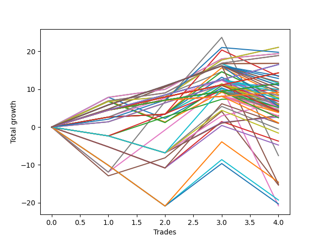

# Short Wallace Doodle 013 
- Symbol: TSLA_Unlimited
- Date Range: 03/23/2022 - 07/08/2022
- Trading Period: 7:20-12:30
- Number of Trades: 4



| Name | Win Percent | Profit | Avg Profit / Trade | Avg Time / Trade |      | Name | Win Percent | Profit | Avg Profit / Trade | Avg Time / Trade |
| ---- | ----------- | ------ | ------------------ | ---------------- | ---- | ---- | ----------- | ------ | ------------------ | ---------------- |
| Sorted By <br> Profit | | | | | | Sorted By <br> Win Percentage ||||
| Sixty | 100.00 | 10545.00 | 2636.25 | 42:28 |     | Sixty | 100.00 | 10545.00 | 2636.25 | 42:28 |
| Four | 100.00 | 10545.00 | 2636.25 | 42:28 |     | Four | 100.00 | 10545.00 | 2636.25 | 42:28 |
| Seventy-Three | 75.00 | 9890.00 | 2472.50 | 15:20 |     | Fifty-Eight | 100.00 | 9715.00 | 2428.75 | 25:00 |
| Fifty-Eight | 100.00 | 9715.00 | 2428.75 | 25:00 |     | Two | 100.00 | 9715.00 | 2428.75 | 25:00 |
| Two | 100.00 | 9715.00 | 2428.75 | 25:00 |     | Fifty-Nine | 100.00 | 9455.00 | 2363.75 | 28:28 |
| Fifty-Nine | 100.00 | 9455.00 | 2363.75 | 28:28 |     | Three | 100.00 | 9455.00 | 2363.75 | 28:28 |
| Three | 100.00 | 9455.00 | 2363.75 | 28:28 |     | Fifty-Seven | 100.00 | 8430.00 | 2107.50 | 15:20 |
| Fifty-Seven | 100.00 | 8430.00 | 2107.50 | 15:20 |     | One | 100.00 | 8430.00 | 2107.50 | 15:20 |
| One | 100.00 | 8430.00 | 2107.50 | 15:20 |     | One Hundred Twenty-Nine | 100.00 | 8270.00 | 2067.50 | 11:36 |
| One Hundred Twenty-Nine | 100.00 | 8270.00 | 2067.50 | 11:36 |     | One Hundred Twenty-Four | 100.00 | 8270.00 | 2067.50 | 11:36 |
| One Hundred Twenty-Four | 100.00 | 8270.00 | 2067.50 | 11:36 |     | Eighty-Four | 100.00 | 8270.00 | 2067.50 | 11:36 |
| Eighty-Four | 100.00 | 8270.00 | 2067.50 | 11:36 |     | One Hundred Twenty-Eight | 100.00 | 7165.00 | 1791.25 | 09:55 |
| One Hundred Twenty-Eight | 100.00 | 7165.00 | 1791.25 | 09:55 |     | One Hundred Twenty-Three | 100.00 | 7165.00 | 1791.25 | 09:55 |
| One Hundred Twenty-Three | 100.00 | 7165.00 | 1791.25 | 09:55 |     | Eighty-Three | 100.00 | 7165.00 | 1791.25 | 09:55 |
| Eighty-Three | 100.00 | 7165.00 | 1791.25 | 09:55 |     | One Hundred Twenty-Seven | 100.00 | 5735.00 | 1433.75 | 09:38 |
| Ninety-Five | 75.00 | 6770.00 | 1692.50 | 04:18 |     | One Hundred Twenty-Two | 100.00 | 5735.00 | 1433.75 | 09:38 |
| Fifty-Five | 75.00 | 6700.00 | 1675.00 | 17:21 |     | Eighty-Two | 100.00 | 5735.00 | 1433.75 | 09:38 |
| One Hundred Five | 75.00 | 6420.00 | 1605.00 | 04:30 |     | Fifty-Six | 100.00 | 5610.00 | 1402.50 | 11:15 |
| One Hundred | 75.00 | 5950.00 | 1487.50 | 04:50 |     | Zero | 100.00 | 5610.00 | 1402.50 | 11:15 |
| Forty-One | 75.00 | 5775.00 | 1443.75 | 11:25 |     | One Hundred Twenty-Six | 100.00 | 4600.00 | 1150.00 | 06:37 |
| One Hundred Twenty-Seven | 100.00 | 5735.00 | 1433.75 | 09:38 |     | One Hundred Twenty-One | 100.00 | 4600.00 | 1150.00 | 06:37 |
| One Hundred Twenty-Two | 100.00 | 5735.00 | 1433.75 | 09:38 |     | Eighty-One | 100.00 | 4600.00 | 1150.00 | 06:37 |
| Eighty-Two | 100.00 | 5735.00 | 1433.75 | 09:38 |     | Seventy-Three | 75.00 | 9890.00 | 2472.50 | 15:20 |
| Fifty-Six | 100.00 | 5610.00 | 1402.50 | 11:15 |     | Ninety-Five | 75.00 | 6770.00 | 1692.50 | 04:18 |
| Zero | 100.00 | 5610.00 | 1402.50 | 11:15 |     | Fifty-Five | 75.00 | 6700.00 | 1675.00 | 17:21 |
| One Hundred Fifteen | 75.00 | 5500.00 | 1375.00 | 04:52 |     | One Hundred Five | 75.00 | 6420.00 | 1605.00 | 04:30 |
| One Hundred Ten | 75.00 | 5500.00 | 1375.00 | 04:52 |     | One Hundred | 75.00 | 5950.00 | 1487.50 | 04:50 |
| One Hundred Thirty | 75.00 | 5085.00 | 1271.25 | 22:17 |     | Forty-One | 75.00 | 5775.00 | 1443.75 | 11:25 |
| Ninety-Four | 75.00 | 4950.00 | 1237.50 | 03:23 |     | One Hundred Fifteen | 75.00 | 5500.00 | 1375.00 | 04:52 |
| Sixty-Five | 75.00 | 4890.00 | 1222.50 | 13:20 |     | One Hundred Ten | 75.00 | 5500.00 | 1375.00 | 04:52 |
| One Hundred Twenty-Six | 100.00 | 4600.00 | 1150.00 | 06:37 |     | One Hundred Thirty | 75.00 | 5085.00 | 1271.25 | 22:17 |
| One Hundred Twenty-One | 100.00 | 4600.00 | 1150.00 | 06:37 |     | Ninety-Four | 75.00 | 4950.00 | 1237.50 | 03:23 |
| Eighty-One | 100.00 | 4600.00 | 1150.00 | 06:37 |     | Sixty-Five | 75.00 | 4890.00 | 1222.50 | 13:20 |
| One Hundred Four | 75.00 | 4600.00 | 1150.00 | 03:35 |     | One Hundred Four | 75.00 | 4600.00 | 1150.00 | 03:35 |
| One Hundred Twenty | 75.00 | 4595.00 | 1148.75 | 05:00 |     | One Hundred Twenty | 75.00 | 4595.00 | 1148.75 | 05:00 |
| Fifty-Three | 75.00 | 4345.00 | 1086.25 | 11:15 |     | Fifty-Three | 75.00 | 4345.00 | 1086.25 | 11:15 |
| Ninety-Three | 75.00 | 4255.00 | 1063.75 | 01:46 |     | Ninety-Three | 75.00 | 4255.00 | 1063.75 | 01:46 |
| Ninety-Nine | 75.00 | 4130.00 | 1032.50 | 03:55 |     | Ninety-Nine | 75.00 | 4130.00 | 1032.50 | 03:55 |
| One Hundred Three | 75.00 | 3905.00 | 976.25 | 01:57 |     | One Hundred Three | 75.00 | 3905.00 | 976.25 | 01:57 |
| Fifty-Four | 75.00 | 3825.00 | 956.25 | 10:31 |     | Fifty-Four | 75.00 | 3825.00 | 956.25 | 10:31 |
| Forty-Nine | 75.00 | 3815.00 | 953.75 | 07:36 |     | Forty-Nine | 75.00 | 3815.00 | 953.75 | 07:36 |
| Sixty-Four | 75.00 | 3750.00 | 937.50 | 09:56 |     | Sixty-Four | 75.00 | 3750.00 | 937.50 | 09:56 |
| One Hundred Fourteen | 75.00 | 3680.00 | 920.00 | 03:57 |     | One Hundred Fourteen | 75.00 | 3680.00 | 920.00 | 03:57 |
| One Hundred Nine | 75.00 | 3680.00 | 920.00 | 03:57 |     | One Hundred Nine | 75.00 | 3680.00 | 920.00 | 03:57 |
| Ninety-Eight | 75.00 | 3435.00 | 858.75 | 02:17 |     | Ninety-Eight | 75.00 | 3435.00 | 858.75 | 02:17 |
| Ninety-Two | 75.00 | 3405.00 | 851.25 | 01:38 |     | Ninety-Two | 75.00 | 3405.00 | 851.25 | 01:38 |
| Sixty-Eight | 50.00 | 3160.00 | 790.00 | 24:22 |     | Fifty-Two | 75.00 | 3095.00 | 773.75 | 09:46 |
| Fifty-Two | 75.00 | 3095.00 | 773.75 | 09:46 |     | One Hundred Two | 75.00 | 3055.00 | 763.75 | 01:50 |
| One Hundred Two | 75.00 | 3055.00 | 763.75 | 01:50 |     | One Hundred Thirteen | 75.00 | 2985.00 | 746.25 | 02:20 |
| One Hundred Thirteen | 75.00 | 2985.00 | 746.25 | 02:20 |     | One Hundred Eight | 75.00 | 2985.00 | 746.25 | 02:20 |
| One Hundred Eight | 75.00 | 2985.00 | 746.25 | 02:20 |     | Forty | 75.00 | 2950.00 | 737.50 | 08:27 |
| Forty | 75.00 | 2950.00 | 737.50 | 08:27 |     | One Hundred Ninteen | 75.00 | 2775.00 | 693.75 | 04:05 |
| Forty-Four | 50.00 | 2895.00 | 723.75 | 21:15 |     | One Hundred Twenty-Five | 75.00 | 2745.00 | 686.25 | 24:42 |
| One Hundred Ninteen | 75.00 | 2775.00 | 693.75 | 04:05 |     | Ninety-One | 75.00 | 2745.00 | 686.25 | 01:10 |
| One Hundred Twenty-Five | 75.00 | 2745.00 | 686.25 | 24:42 |     | Forty-Eight | 75.00 | 2670.00 | 667.50 | 05:20 |
| Ninety-One | 75.00 | 2745.00 | 686.25 | 01:10 |     | Ninety-Seven | 75.00 | 2585.00 | 646.25 | 02:10 |
| Forty-Eight | 75.00 | 2670.00 | 667.50 | 05:20 |     | One Hundred One | 75.00 | 2395.00 | 598.75 | 01:21 |
| Ninety-Seven | 75.00 | 2585.00 | 646.25 | 02:10 |     | Fifty | 75.00 | 2240.00 | 560.00 | 09:06 |
| Forty-Two | 50.00 | 2585.00 | 646.25 | 15:10 |     | One Hundred Twelve | 75.00 | 2135.00 | 533.75 | 02:12 |
| One Hundred One | 75.00 | 2395.00 | 598.75 | 01:21 |     | One Hundred Seven | 75.00 | 2135.00 | 533.75 | 02:12 |
| Fifty | 75.00 | 2240.00 | 560.00 | 09:06 |     | Fifty-One | 75.00 | 2135.00 | 533.75 | 09:03 |
| One Hundred Twelve | 75.00 | 2135.00 | 533.75 | 02:12 |     | One Hundred Eighteen | 75.00 | 2080.00 | 520.00 | 02:27 |
| One Hundred Seven | 75.00 | 2135.00 | 533.75 | 02:12 |     | Ninety-Six | 75.00 | 1925.00 | 481.25 | 01:41 |
| Fifty-One | 75.00 | 2135.00 | 533.75 | 09:03 |     | One Hundred Eleven | 75.00 | 1475.00 | 368.75 | 01:43 |
| Seventy-One | 25.00 | 2085.00 | 521.25 | 38:41 |     | One Hundred Six | 75.00 | 1475.00 | 368.75 | 01:43 |
| One Hundred Eighteen | 75.00 | 2080.00 | 520.00 | 02:27 |     | One Hundred Seventeen | 75.00 | 1230.00 | 307.50 | 02:20 |
| Forty-Three | 50.00 | 2010.00 | 502.50 | 17:20 |     | One Hundred Sixteen | 75.00 | 570.00 | 142.50 | 01:51 |
| Ninety-Six | 75.00 | 1925.00 | 481.25 | 01:41 |     | Eighty-Five | 75.00 | -7540.00 | -1885.00 | 81:16 |
| Sixty-Seven | 50.00 | 1535.00 | 383.75 | 20:25 |     | Sixty-Eight | 50.00 | 3160.00 | 790.00 | 24:22 |
| One Hundred Eleven | 75.00 | 1475.00 | 368.75 | 01:43 |     | Forty-Four | 50.00 | 2895.00 | 723.75 | 21:15 |
| One Hundred Six | 75.00 | 1475.00 | 368.75 | 01:43 |     | Forty-Two | 50.00 | 2585.00 | 646.25 | 15:10 |
| Sixty-Six | 50.00 | 1325.00 | 331.25 | 19:08 |     | Forty-Three | 50.00 | 2010.00 | 502.50 | 17:20 |
| One Hundred Seventeen | 75.00 | 1230.00 | 307.50 | 02:20 |     | Sixty-Seven | 50.00 | 1535.00 | 383.75 | 20:25 |
| One Hundred Sixteen | 75.00 | 570.00 | 142.50 | 01:51 |     | Sixty-Six | 50.00 | 1325.00 | 331.25 | 19:08 |
| Forty-Seven | 25.00 | 500.00 | 125.00 | 35:27 |     | Seven | 50.00 | -3770.00 | -942.50 | 162:06 |
| Sixty-Nine | 25.00 | -270.00 | -67.50 | 32:35 |     | Five | 50.00 | -7670.00 | -1917.50 | 122:07 |
| Seventy | 25.00 | -790.00 | -197.50 | 31:51 |     | Six | 50.00 | -10395.00 | -2598.75 | 148:25 |
| Forty-Five | 25.00 | -1855.00 | -463.75 | 29:21 |     | Seventy-One | 25.00 | 2085.00 | 521.25 | 38:41 |
| Forty-Six | 25.00 | -2375.00 | -593.75 | 28:37 |     | Forty-Seven | 25.00 | 500.00 | 125.00 | 35:27 |
| Seven | 50.00 | -3770.00 | -942.50 | 162:06 |     | Sixty-Nine | 25.00 | -270.00 | -67.50 | 32:35 |
| Sixty-Three | 25.00 | -7285.00 | -1821.25 | 70:31 |     | Seventy | 25.00 | -790.00 | -197.50 | 31:51 |
| Eighty-Five | 75.00 | -7540.00 | -1885.00 | 81:16 |     | Forty-Five | 25.00 | -1855.00 | -463.75 | 29:21 |
| Five | 50.00 | -7670.00 | -1917.50 | 122:07 |     | Forty-Six | 25.00 | -2375.00 | -593.75 | 28:37 |
| Sixty-One | 25.00 | -9640.00 | -2410.00 | 64:25 |     | Sixty-Three | 25.00 | -7285.00 | -1821.25 | 70:31 |
| Sixty-Two | 25.00 | -10160.00 | -2540.00 | 63:41 |     | Sixty-One | 25.00 | -9640.00 | -2410.00 | 64:25 |
| Six | 50.00 | -10395.00 | -2598.75 | 148:25 |     | Sixty-Two | 25.00 | -10160.00 | -2540.00 | 63:41 |

## NO STOPLOSS

### Test Zero
* Sell when price hits the middle line of the 20p bollinger
* No Stoploss
* Results:
```
Total Trades: 4
Percent Up: 0.00
Percent Down: 100.00
Total Points Moved Down: 11.22
Potential Profit: 5610.00
Total Points Ups: 0.00 Count Ups: 0
Total Points Downs: 11.22 Count Downs: 4
```

<details><summary>Trades</summary>

<code>In: 2022-04-28 09:49:00		Out: 2022-04-28 10:06:10		Total Position Time: 17:10		Total Move Down: 1.39		Total to Date: 1.39</code> <br />
<code>In: 2022-05-04 09:41:00		Out: 2022-05-04 09:47:00		Total Position Time: 06:00		Total Move Down: 5.01		Total to Date: 6.40</code> <br />
<code>In: 2022-05-24 09:17:00		Out: 2022-05-24 09:24:15		Total Position Time: 07:15		Total Move Down: 4.68		Total to Date: 11.08</code> <br />
<code>In: 2022-07-05 07:38:00		Out: 2022-07-05 07:52:35		Total Position Time: 14:35		Total Move Down: 0.14		Total to Date: 11.22</code> <br />


</details>

### Test One
* Sell when the price hits the upper line of the 20p 1std bollinger
* No Stoploss
* Results:
```
Total Trades: 4
Percent Up: 0.00
Percent Down: 100.00
Total Points Moved Down: 16.86
Potential Profit: 8430.00
Total Points Ups: 0.00 Count Ups: 0
Total Points Downs: 16.86 Count Downs: 4
```

<details><summary>Trades</summary>

<code>In: 2022-04-28 09:49:00		Out: 2022-04-28 10:08:55		Total Position Time: 19:55		Total Move Down: 4.75		Total to Date: 4.75</code> <br />
<code>In: 2022-05-04 09:41:00		Out: 2022-05-04 09:51:10		Total Position Time: 10:10		Total Move Down: 5.83		Total to Date: 10.58</code> <br />
<code>In: 2022-05-24 09:17:00		Out: 2022-05-24 09:29:10		Total Position Time: 12:10		Total Move Down: 6.15		Total to Date: 16.73</code> <br />
<code>In: 2022-07-05 07:38:00		Out: 2022-07-05 07:57:05		Total Position Time: 19:05		Total Move Down: 0.13		Total to Date: 16.86</code> <br />


</details>

### Test Two
* Sell when the price hits the upper line of the 20p 2std bollinger
* No Stoploss
* Results:
```
Total Trades: 4
Percent Up: 0.00
Percent Down: 100.00
Total Points Moved Down: 19.43
Potential Profit: 9715.00
Total Points Ups: 0.00 Count Ups: 0
Total Points Downs: 19.43 Count Downs: 4
```

<details><summary>Trades</summary>

<code>In: 2022-04-28 09:49:00		Out: 2022-04-28 10:09:15		Total Position Time: 20:15		Total Move Down: 7.87		Total to Date: 7.87</code> <br />
<code>In: 2022-05-04 09:41:00		Out: 2022-05-04 10:18:30		Total Position Time: 37:30		Total Move Down: 2.10		Total to Date: 9.97</code> <br />
<code>In: 2022-05-24 09:17:00		Out: 2022-05-24 09:31:20		Total Position Time: 14:20		Total Move Down: 8.07		Total to Date: 18.04</code> <br />
<code>In: 2022-07-05 07:38:00		Out: 2022-07-05 08:05:55		Total Position Time: 27:55		Total Move Down: 1.39		Total to Date: 19.43</code> <br />


</details>

### Test Three
* Sell when price hits the middle line of the 50p bollinger
* No Stoploss
* Results:
```
Total Trades: 4
Percent Up: 0.00
Percent Down: 100.00
Total Points Moved Down: 18.91
Potential Profit: 9455.00
Total Points Ups: 0.00 Count Ups: 0
Total Points Downs: 18.91 Count Downs: 4
```

<details><summary>Trades</summary>

<code>In: 2022-04-28 09:49:00		Out: 2022-04-28 10:18:05		Total Position Time: 29:05		Total Move Down: 6.93		Total to Date: 6.93</code> <br />
<code>In: 2022-05-04 09:41:00		Out: 2022-05-04 10:18:30		Total Position Time: 37:30		Total Move Down: 2.10		Total to Date: 9.03</code> <br />
<code>In: 2022-05-24 09:17:00		Out: 2022-05-24 09:31:10		Total Position Time: 14:10		Total Move Down: 7.86		Total to Date: 16.89</code> <br />
<code>In: 2022-07-05 07:38:00		Out: 2022-07-05 08:11:10		Total Position Time: 33:10		Total Move Down: 2.02		Total to Date: 18.91</code> <br />


</details>

### Test Four
* Sell when the price hits the upper line of the 50p 1std bollinger
* No Stoploss
* Results:
```
Total Trades: 4
Percent Up: 0.00
Percent Down: 100.00
Total Points Moved Down: 21.09
Potential Profit: 10545.00
Total Points Ups: 0.00 Count Ups: 0
Total Points Downs: 21.09 Count Downs: 4
```

<details><summary>Trades</summary>

<code>In: 2022-04-28 09:49:00		Out: 2022-04-28 10:30:55		Total Position Time: 41:55		Total Move Down: 6.78		Total to Date: 6.78</code> <br />
<code>In: 2022-05-04 09:41:00		Out: 2022-05-04 10:45:50		Total Position Time: 64:50		Total Move Down: 1.18		Total to Date: 7.96</code> <br />
<code>In: 2022-05-24 09:17:00		Out: 2022-05-24 09:34:00		Total Position Time: 17:00		Total Move Down: 9.78		Total to Date: 17.74</code> <br />
<code>In: 2022-07-05 07:38:00		Out: 2022-07-05 08:24:10		Total Position Time: 46:10		Total Move Down: 3.35		Total to Date: 21.09</code> <br />


</details>

### Test Five
* Sell when the price hits the upper line of the 50p 2std bollinger
* No Stoploss
* Results:
```
Total Trades: 4
Percent Up: 50.00
Percent Down: 50.00
Total Points Moved Down: -15.34
Potential Profit: -7670.00
Total Points Ups: 32.38 Count Ups: 2
Total Points Downs: 17.04 Count Downs: 2
```

<details><summary>Trades</summary>

<code>In: 2022-04-28 09:49:00		Out: 2022-04-28 12:29:40		Total Position Time: 160:40		Total Move Down: -12.89		Total to Date: -12.89</code> <br />
<code>In: 2022-05-04 09:41:00		Out: 2022-05-04 11:07:20		Total Position Time: 86:20		Total Move Down: 4.76		Total to Date: -8.13</code> <br />
<code>In: 2022-05-24 09:17:00		Out: 2022-05-24 09:39:55		Total Position Time: 22:55		Total Move Down: 12.28		Total to Date: 4.15</code> <br />
<code>In: 2022-07-05 07:38:00		Out: 2022-07-05 11:16:35		Total Position Time: 218:35		Total Move Down: -19.49		Total to Date: -15.34</code> <br />


</details>

### Test Six
* Sell when the price hits the middle line of the 1std VWAP
* No Stoploss
* Results:
```
Total Trades: 4
Percent Up: 50.00
Percent Down: 50.00
Total Points Moved Down: -20.79
Potential Profit: -10395.00
Total Points Ups: 43.16 Count Ups: 2
Total Points Downs: 22.37 Count Downs: 2
```

<details><summary>Trades</summary>

<code>In: 2022-04-28 09:49:00		Out: 2022-04-28 12:47:00		Total Position Time: 178:00		Total Move Down: -11.90		Total to Date: -11.90</code> <br />
<code>In: 2022-05-04 09:41:00		Out: 2022-05-04 11:07:40		Total Position Time: 86:40		Total Move Down: 11.13		Total to Date: -0.77</code> <br />
<code>In: 2022-05-24 09:17:00		Out: 2022-05-24 09:37:00		Total Position Time: 20:00		Total Move Down: 11.24		Total to Date: 10.47</code> <br />
<code>In: 2022-07-05 07:38:00		Out: 2022-07-05 12:47:00		Total Position Time: 309:00		Total Move Down: -31.26		Total to Date: -20.79</code> <br />


</details>

### Test Seven
* Sell when the price hits the upper line of the 1std VWAP
* No Stoploss
* Results:
```
Total Trades: 4
Percent Up: 50.00
Percent Down: 50.00
Total Points Moved Down: -7.54
Potential Profit: -3770.00
Total Points Ups: 43.16 Count Ups: 2
Total Points Downs: 35.62 Count Downs: 2
```

<details><summary>Trades</summary>

<code>In: 2022-04-28 09:49:00		Out: 2022-04-28 12:47:00		Total Position Time: 178:00		Total Move Down: -11.90		Total to Date: -11.90</code> <br />
<code>In: 2022-05-04 09:41:00		Out: 2022-05-04 11:35:05		Total Position Time: 114:05		Total Move Down: 18.63		Total to Date: 6.73</code> <br />
<code>In: 2022-05-24 09:17:00		Out: 2022-05-24 10:04:20		Total Position Time: 47:20		Total Move Down: 16.99		Total to Date: 23.72</code> <br />
<code>In: 2022-07-05 07:38:00		Out: 2022-07-05 12:47:00		Total Position Time: 309:00		Total Move Down: -31.26		Total to Date: -7.54</code> <br />


</details>

## STOPLOSS OF 5

### Test Forty
* Sell when price hits the middle line of the 20p bollinger
* Stoploss is -5 points
* Results:
```
Total Trades: 4
Percent Up: 25.00
Percent Down: 75.00
Total Points Moved Down: 5.90
Potential Profit: 2950.00
Total Points Ups: 5.18 Count Ups: 1
Total Points Downs: 11.08 Count Downs: 3
```

<details><summary>Trades</summary>

<code>In: 2022-04-28 09:49:00		Out: 2022-04-28 10:06:10		Total Position Time: 17:10		Total Move Down: 1.39		Total to Date: 1.39</code> <br />
<code>In: 2022-05-04 09:41:00		Out: 2022-05-04 09:47:00		Total Position Time: 06:00		Total Move Down: 5.01		Total to Date: 6.40</code> <br />
<code>In: 2022-05-24 09:17:00		Out: 2022-05-24 09:24:15		Total Position Time: 07:15		Total Move Down: 4.68		Total to Date: 11.08</code> <br />
<code>In: 2022-07-05 07:38:00		Out: 2022-07-05 07:41:25		Total Position Time: 03:25		Total Move Down: -5.18		Total to Date: 5.90</code> <br />


</details>

### Test Forty-One
* Sell when the price hits the upper line of the 20p 1std bollinger
* Stoploss is -5 points
* Results:
```
Total Trades: 4
Percent Up: 25.00
Percent Down: 75.00
Total Points Moved Down: 11.55
Potential Profit: 5775.00
Total Points Ups: 5.18 Count Ups: 1
Total Points Downs: 16.73 Count Downs: 3
```

<details><summary>Trades</summary>

<code>In: 2022-04-28 09:49:00		Out: 2022-04-28 10:08:55		Total Position Time: 19:55		Total Move Down: 4.75		Total to Date: 4.75</code> <br />
<code>In: 2022-05-04 09:41:00		Out: 2022-05-04 09:51:10		Total Position Time: 10:10		Total Move Down: 5.83		Total to Date: 10.58</code> <br />
<code>In: 2022-05-24 09:17:00		Out: 2022-05-24 09:29:10		Total Position Time: 12:10		Total Move Down: 6.15		Total to Date: 16.73</code> <br />
<code>In: 2022-07-05 07:38:00		Out: 2022-07-05 07:41:25		Total Position Time: 03:25		Total Move Down: -5.18		Total to Date: 11.55</code> <br />


</details>

### Test Forty-Two
* Sell when the price hits the upper line of the 20p 2std bollinger
* Stoploss is -5 points
* Results:
```
Total Trades: 4
Percent Up: 50.00
Percent Down: 50.00
Total Points Moved Down: 5.17
Potential Profit: 2585.00
Total Points Ups: 10.77 Count Ups: 2
Total Points Downs: 15.94 Count Downs: 2
```

<details><summary>Trades</summary>

<code>In: 2022-04-28 09:49:00		Out: 2022-04-28 10:09:15		Total Position Time: 20:15		Total Move Down: 7.87		Total to Date: 7.87</code> <br />
<code>In: 2022-05-04 09:41:00		Out: 2022-05-04 10:03:40		Total Position Time: 22:40		Total Move Down: -5.59		Total to Date: 2.28</code> <br />
<code>In: 2022-05-24 09:17:00		Out: 2022-05-24 09:31:20		Total Position Time: 14:20		Total Move Down: 8.07		Total to Date: 10.35</code> <br />
<code>In: 2022-07-05 07:38:00		Out: 2022-07-05 07:41:25		Total Position Time: 03:25		Total Move Down: -5.18		Total to Date: 5.17</code> <br />


</details>

### Test Forty-Three
* Sell when price hits the middle line of the 50p bollinger
* Stoploss is -5 points
* Results:
```
Total Trades: 4
Percent Up: 50.00
Percent Down: 50.00
Total Points Moved Down: 4.02
Potential Profit: 2010.00
Total Points Ups: 10.77 Count Ups: 2
Total Points Downs: 14.79 Count Downs: 2
```

<details><summary>Trades</summary>

<code>In: 2022-04-28 09:49:00		Out: 2022-04-28 10:18:05		Total Position Time: 29:05		Total Move Down: 6.93		Total to Date: 6.93</code> <br />
<code>In: 2022-05-04 09:41:00		Out: 2022-05-04 10:03:40		Total Position Time: 22:40		Total Move Down: -5.59		Total to Date: 1.34</code> <br />
<code>In: 2022-05-24 09:17:00		Out: 2022-05-24 09:31:10		Total Position Time: 14:10		Total Move Down: 7.86		Total to Date: 9.20</code> <br />
<code>In: 2022-07-05 07:38:00		Out: 2022-07-05 07:41:25		Total Position Time: 03:25		Total Move Down: -5.18		Total to Date: 4.02</code> <br />


</details>

### Test Forty-Four
* Sell when the price hits the upper line of the 50p 1std bollinger
* Stoploss is -5 points
* Results:
```
Total Trades: 4
Percent Up: 50.00
Percent Down: 50.00
Total Points Moved Down: 5.79
Potential Profit: 2895.00
Total Points Ups: 10.77 Count Ups: 2
Total Points Downs: 16.56 Count Downs: 2
```

<details><summary>Trades</summary>

<code>In: 2022-04-28 09:49:00		Out: 2022-04-28 10:30:55		Total Position Time: 41:55		Total Move Down: 6.78		Total to Date: 6.78</code> <br />
<code>In: 2022-05-04 09:41:00		Out: 2022-05-04 10:03:40		Total Position Time: 22:40		Total Move Down: -5.59		Total to Date: 1.19</code> <br />
<code>In: 2022-05-24 09:17:00		Out: 2022-05-24 09:34:00		Total Position Time: 17:00		Total Move Down: 9.78		Total to Date: 10.97</code> <br />
<code>In: 2022-07-05 07:38:00		Out: 2022-07-05 07:41:25		Total Position Time: 03:25		Total Move Down: -5.18		Total to Date: 5.79</code> <br />


</details>

### Test Forty-Five
* Sell when the price hits the upper line of the 50p 2std bollinger
* Stoploss is -5 points
* Results:
```
Total Trades: 4
Percent Up: 75.00
Percent Down: 25.00
Total Points Moved Down: -3.71
Potential Profit: -1855.00
Total Points Ups: 15.99 Count Ups: 3
Total Points Downs: 12.28 Count Downs: 1
```

<details><summary>Trades</summary>

<code>In: 2022-04-28 09:49:00		Out: 2022-04-28 10:57:25		Total Position Time: 68:25		Total Move Down: -5.22		Total to Date: -5.22</code> <br />
<code>In: 2022-05-04 09:41:00		Out: 2022-05-04 10:03:40		Total Position Time: 22:40		Total Move Down: -5.59		Total to Date: -10.81</code> <br />
<code>In: 2022-05-24 09:17:00		Out: 2022-05-24 09:39:55		Total Position Time: 22:55		Total Move Down: 12.28		Total to Date: 1.47</code> <br />
<code>In: 2022-07-05 07:38:00		Out: 2022-07-05 07:41:25		Total Position Time: 03:25		Total Move Down: -5.18		Total to Date: -3.71</code> <br />


</details>

### Test Forty-Six
* Sell when the price hits the middle line of the 1std VWAP
* Stoploss is -5 points
* Results:
```
Total Trades: 4
Percent Up: 75.00
Percent Down: 25.00
Total Points Moved Down: -4.75
Potential Profit: -2375.00
Total Points Ups: 15.99 Count Ups: 3
Total Points Downs: 11.24 Count Downs: 1
```

<details><summary>Trades</summary>

<code>In: 2022-04-28 09:49:00		Out: 2022-04-28 10:57:25		Total Position Time: 68:25		Total Move Down: -5.22		Total to Date: -5.22</code> <br />
<code>In: 2022-05-04 09:41:00		Out: 2022-05-04 10:03:40		Total Position Time: 22:40		Total Move Down: -5.59		Total to Date: -10.81</code> <br />
<code>In: 2022-05-24 09:17:00		Out: 2022-05-24 09:37:00		Total Position Time: 20:00		Total Move Down: 11.24		Total to Date: 0.43</code> <br />
<code>In: 2022-07-05 07:38:00		Out: 2022-07-05 07:41:25		Total Position Time: 03:25		Total Move Down: -5.18		Total to Date: -4.75</code> <br />


</details>

### Test Forty-Seven
* Sell when the price hits the upper line of the 1std VWAP
* Stoploss is -5 points
* Results:
```
Total Trades: 4
Percent Up: 75.00
Percent Down: 25.00
Total Points Moved Down: 1.00
Potential Profit: 500.00
Total Points Ups: 15.99 Count Ups: 3
Total Points Downs: 16.99 Count Downs: 1
```

<details><summary>Trades</summary>

<code>In: 2022-04-28 09:49:00		Out: 2022-04-28 10:57:25		Total Position Time: 68:25		Total Move Down: -5.22		Total to Date: -5.22</code> <br />
<code>In: 2022-05-04 09:41:00		Out: 2022-05-04 10:03:40		Total Position Time: 22:40		Total Move Down: -5.59		Total to Date: -10.81</code> <br />
<code>In: 2022-05-24 09:17:00		Out: 2022-05-24 10:04:20		Total Position Time: 47:20		Total Move Down: 16.99		Total to Date: 6.18</code> <br />
<code>In: 2022-07-05 07:38:00		Out: 2022-07-05 07:41:25		Total Position Time: 03:25		Total Move Down: -5.18		Total to Date: 1.00</code> <br />


</details>

## TRAIL STOP OF 5

### Test Forty-Eight
* Sell when price hits the middle line of the 20p bollinger
* Trailing Stop is -5 points
* Results:
```
Total Trades: 4
Percent Up: 25.00
Percent Down: 75.00
Total Points Moved Down: 5.34
Potential Profit: 2670.00
Total Points Ups: 6.99 Count Ups: 1
Total Points Downs: 12.33 Count Downs: 3
```

<details><summary>Trades</summary>

<code>In: 2022-04-28 09:49:00		Out: 2022-04-28 09:53:10		Total Position Time: 04:10		Total Move Down: 2.64		Total to Date: 2.64</code> <br />
<code>In: 2022-05-04 09:41:00		Out: 2022-05-04 09:47:00		Total Position Time: 06:00		Total Move Down: 5.01		Total to Date: 7.65</code> <br />
<code>In: 2022-05-24 09:17:00		Out: 2022-05-24 09:24:15		Total Position Time: 07:15		Total Move Down: 4.68		Total to Date: 12.33</code> <br />
<code>In: 2022-07-05 07:38:00		Out: 2022-07-05 07:41:55		Total Position Time: 03:55		Total Move Down: -6.99		Total to Date: 5.34</code> <br />


</details>

### Test Forty-Nine
* Sell when the price hits the upper line of the 20p 1std bollinger
* Trailing Stop is -5 points
* Results:
```
Total Trades: 4
Percent Up: 25.00
Percent Down: 75.00
Total Points Moved Down: 7.63
Potential Profit: 3815.00
Total Points Ups: 6.99 Count Ups: 1
Total Points Downs: 14.62 Count Downs: 3
```

<details><summary>Trades</summary>

<code>In: 2022-04-28 09:49:00		Out: 2022-04-28 09:53:10		Total Position Time: 04:10		Total Move Down: 2.64		Total to Date: 2.64</code> <br />
<code>In: 2022-05-04 09:41:00		Out: 2022-05-04 09:51:10		Total Position Time: 10:10		Total Move Down: 5.83		Total to Date: 8.47</code> <br />
<code>In: 2022-05-24 09:17:00		Out: 2022-05-24 09:29:10		Total Position Time: 12:10		Total Move Down: 6.15		Total to Date: 14.62</code> <br />
<code>In: 2022-07-05 07:38:00		Out: 2022-07-05 07:41:55		Total Position Time: 03:55		Total Move Down: -6.99		Total to Date: 7.63</code> <br />


</details>

### Test Fifty
* Sell when the price hits the upper line of the 20p 2std bollinger
* Trailing Stop is -5 points
* Results:
```
Total Trades: 4
Percent Up: 25.00
Percent Down: 75.00
Total Points Moved Down: 4.48
Potential Profit: 2240.00
Total Points Ups: 6.99 Count Ups: 1
Total Points Downs: 11.47 Count Downs: 3
```

<details><summary>Trades</summary>

<code>In: 2022-04-28 09:49:00		Out: 2022-04-28 09:53:10		Total Position Time: 04:10		Total Move Down: 2.64		Total to Date: 2.64</code> <br />
<code>In: 2022-05-04 09:41:00		Out: 2022-05-04 09:55:00		Total Position Time: 14:00		Total Move Down: 0.76		Total to Date: 3.40</code> <br />
<code>In: 2022-05-24 09:17:00		Out: 2022-05-24 09:31:20		Total Position Time: 14:20		Total Move Down: 8.07		Total to Date: 11.47</code> <br />
<code>In: 2022-07-05 07:38:00		Out: 2022-07-05 07:41:55		Total Position Time: 03:55		Total Move Down: -6.99		Total to Date: 4.48</code> <br />


</details>

### Test Fifty-One
* Sell when price hits the middle line of the 50p bollinger
* Trailing Stop is -5 points
* Results:
```
Total Trades: 4
Percent Up: 25.00
Percent Down: 75.00
Total Points Moved Down: 4.27
Potential Profit: 2135.00
Total Points Ups: 6.99 Count Ups: 1
Total Points Downs: 11.26 Count Downs: 3
```

<details><summary>Trades</summary>

<code>In: 2022-04-28 09:49:00		Out: 2022-04-28 09:53:10		Total Position Time: 04:10		Total Move Down: 2.64		Total to Date: 2.64</code> <br />
<code>In: 2022-05-04 09:41:00		Out: 2022-05-04 09:55:00		Total Position Time: 14:00		Total Move Down: 0.76		Total to Date: 3.40</code> <br />
<code>In: 2022-05-24 09:17:00		Out: 2022-05-24 09:31:10		Total Position Time: 14:10		Total Move Down: 7.86		Total to Date: 11.26</code> <br />
<code>In: 2022-07-05 07:38:00		Out: 2022-07-05 07:41:55		Total Position Time: 03:55		Total Move Down: -6.99		Total to Date: 4.27</code> <br />


</details>

### Test Fifty-Two
* Sell when the price hits the upper line of the 50p 1std bollinger
* Trailing Stop is -5 points
* Results:
```
Total Trades: 4
Percent Up: 25.00
Percent Down: 75.00
Total Points Moved Down: 6.19
Potential Profit: 3095.00
Total Points Ups: 6.99 Count Ups: 1
Total Points Downs: 13.18 Count Downs: 3
```

<details><summary>Trades</summary>

<code>In: 2022-04-28 09:49:00		Out: 2022-04-28 09:53:10		Total Position Time: 04:10		Total Move Down: 2.64		Total to Date: 2.64</code> <br />
<code>In: 2022-05-04 09:41:00		Out: 2022-05-04 09:55:00		Total Position Time: 14:00		Total Move Down: 0.76		Total to Date: 3.40</code> <br />
<code>In: 2022-05-24 09:17:00		Out: 2022-05-24 09:34:00		Total Position Time: 17:00		Total Move Down: 9.78		Total to Date: 13.18</code> <br />
<code>In: 2022-07-05 07:38:00		Out: 2022-07-05 07:41:55		Total Position Time: 03:55		Total Move Down: -6.99		Total to Date: 6.19</code> <br />


</details>

### Test Fifty-Three
* Sell when the price hits the upper line of the 50p 2std bollinger
* Trailing Stop is -5 points
* Results:
```
Total Trades: 4
Percent Up: 25.00
Percent Down: 75.00
Total Points Moved Down: 8.69
Potential Profit: 4345.00
Total Points Ups: 6.99 Count Ups: 1
Total Points Downs: 15.68 Count Downs: 3
```

<details><summary>Trades</summary>

<code>In: 2022-04-28 09:49:00		Out: 2022-04-28 09:53:10		Total Position Time: 04:10		Total Move Down: 2.64		Total to Date: 2.64</code> <br />
<code>In: 2022-05-04 09:41:00		Out: 2022-05-04 09:55:00		Total Position Time: 14:00		Total Move Down: 0.76		Total to Date: 3.40</code> <br />
<code>In: 2022-05-24 09:17:00		Out: 2022-05-24 09:39:55		Total Position Time: 22:55		Total Move Down: 12.28		Total to Date: 15.68</code> <br />
<code>In: 2022-07-05 07:38:00		Out: 2022-07-05 07:41:55		Total Position Time: 03:55		Total Move Down: -6.99		Total to Date: 8.69</code> <br />


</details>

### Test Fifty-Four
* Sell when the price hits the middle line of the 1std VWAP
* Trailing Stop is -5 points
* Results:
```
Total Trades: 4
Percent Up: 25.00
Percent Down: 75.00
Total Points Moved Down: 7.65
Potential Profit: 3825.00
Total Points Ups: 6.99 Count Ups: 1
Total Points Downs: 14.64 Count Downs: 3
```

<details><summary>Trades</summary>

<code>In: 2022-04-28 09:49:00		Out: 2022-04-28 09:53:10		Total Position Time: 04:10		Total Move Down: 2.64		Total to Date: 2.64</code> <br />
<code>In: 2022-05-04 09:41:00		Out: 2022-05-04 09:55:00		Total Position Time: 14:00		Total Move Down: 0.76		Total to Date: 3.40</code> <br />
<code>In: 2022-05-24 09:17:00		Out: 2022-05-24 09:37:00		Total Position Time: 20:00		Total Move Down: 11.24		Total to Date: 14.64</code> <br />
<code>In: 2022-07-05 07:38:00		Out: 2022-07-05 07:41:55		Total Position Time: 03:55		Total Move Down: -6.99		Total to Date: 7.65</code> <br />


</details>

### Test Fifty-Five
* Sell when the price hits the upper line of the 1std VWAP
* Trailing Stop is -5 points
* Results:
```
Total Trades: 4
Percent Up: 25.00
Percent Down: 75.00
Total Points Moved Down: 13.40
Potential Profit: 6700.00
Total Points Ups: 6.99 Count Ups: 1
Total Points Downs: 20.39 Count Downs: 3
```

<details><summary>Trades</summary>

<code>In: 2022-04-28 09:49:00		Out: 2022-04-28 09:53:10		Total Position Time: 04:10		Total Move Down: 2.64		Total to Date: 2.64</code> <br />
<code>In: 2022-05-04 09:41:00		Out: 2022-05-04 09:55:00		Total Position Time: 14:00		Total Move Down: 0.76		Total to Date: 3.40</code> <br />
<code>In: 2022-05-24 09:17:00		Out: 2022-05-24 10:04:20		Total Position Time: 47:20		Total Move Down: 16.99		Total to Date: 20.39</code> <br />
<code>In: 2022-07-05 07:38:00		Out: 2022-07-05 07:41:55		Total Position Time: 03:55		Total Move Down: -6.99		Total to Date: 13.40</code> <br />


</details>

## STOPLOSS OF 10

### Test Fifty-Six
* Sell when price hits the middle line of the 20p bollinger
* Stoploss is -10 points
* Results:
```
Total Trades: 4
Percent Up: 0.00
Percent Down: 100.00
Total Points Moved Down: 11.22
Potential Profit: 5610.00
Total Points Ups: 0.00 Count Ups: 0
Total Points Downs: 11.22 Count Downs: 4
```

<details><summary>Trades</summary>

<code>In: 2022-04-28 09:49:00		Out: 2022-04-28 10:06:10		Total Position Time: 17:10		Total Move Down: 1.39		Total to Date: 1.39</code> <br />
<code>In: 2022-05-04 09:41:00		Out: 2022-05-04 09:47:00		Total Position Time: 06:00		Total Move Down: 5.01		Total to Date: 6.40</code> <br />
<code>In: 2022-05-24 09:17:00		Out: 2022-05-24 09:24:15		Total Position Time: 07:15		Total Move Down: 4.68		Total to Date: 11.08</code> <br />
<code>In: 2022-07-05 07:38:00		Out: 2022-07-05 07:52:35		Total Position Time: 14:35		Total Move Down: 0.14		Total to Date: 11.22</code> <br />


</details>

### Test Fifty-Seven
* Sell when the price hits the upper line of the 20p 1std bollinger
* Stoploss is -10 points
* Results:
```
Total Trades: 4
Percent Up: 0.00
Percent Down: 100.00
Total Points Moved Down: 16.86
Potential Profit: 8430.00
Total Points Ups: 0.00 Count Ups: 0
Total Points Downs: 16.86 Count Downs: 4
```

<details><summary>Trades</summary>

<code>In: 2022-04-28 09:49:00		Out: 2022-04-28 10:08:55		Total Position Time: 19:55		Total Move Down: 4.75		Total to Date: 4.75</code> <br />
<code>In: 2022-05-04 09:41:00		Out: 2022-05-04 09:51:10		Total Position Time: 10:10		Total Move Down: 5.83		Total to Date: 10.58</code> <br />
<code>In: 2022-05-24 09:17:00		Out: 2022-05-24 09:29:10		Total Position Time: 12:10		Total Move Down: 6.15		Total to Date: 16.73</code> <br />
<code>In: 2022-07-05 07:38:00		Out: 2022-07-05 07:57:05		Total Position Time: 19:05		Total Move Down: 0.13		Total to Date: 16.86</code> <br />


</details>

### Test Fifty-Eight
* Sell when the price hits the upper line of the 20p 2std bollinger
* Stoploss is -10 points
* Results:
```
Total Trades: 4
Percent Up: 0.00
Percent Down: 100.00
Total Points Moved Down: 19.43
Potential Profit: 9715.00
Total Points Ups: 0.00 Count Ups: 0
Total Points Downs: 19.43 Count Downs: 4
```

<details><summary>Trades</summary>

<code>In: 2022-04-28 09:49:00		Out: 2022-04-28 10:09:15		Total Position Time: 20:15		Total Move Down: 7.87		Total to Date: 7.87</code> <br />
<code>In: 2022-05-04 09:41:00		Out: 2022-05-04 10:18:30		Total Position Time: 37:30		Total Move Down: 2.10		Total to Date: 9.97</code> <br />
<code>In: 2022-05-24 09:17:00		Out: 2022-05-24 09:31:20		Total Position Time: 14:20		Total Move Down: 8.07		Total to Date: 18.04</code> <br />
<code>In: 2022-07-05 07:38:00		Out: 2022-07-05 08:05:55		Total Position Time: 27:55		Total Move Down: 1.39		Total to Date: 19.43</code> <br />


</details>

### Test Fifty-Nine
* Sell when price hits the middle line of the 50p bollinger
* Stoploss is -10 points
* Results:
```
Total Trades: 4
Percent Up: 0.00
Percent Down: 100.00
Total Points Moved Down: 18.91
Potential Profit: 9455.00
Total Points Ups: 0.00 Count Ups: 0
Total Points Downs: 18.91 Count Downs: 4
```

<details><summary>Trades</summary>

<code>In: 2022-04-28 09:49:00		Out: 2022-04-28 10:18:05		Total Position Time: 29:05		Total Move Down: 6.93		Total to Date: 6.93</code> <br />
<code>In: 2022-05-04 09:41:00		Out: 2022-05-04 10:18:30		Total Position Time: 37:30		Total Move Down: 2.10		Total to Date: 9.03</code> <br />
<code>In: 2022-05-24 09:17:00		Out: 2022-05-24 09:31:10		Total Position Time: 14:10		Total Move Down: 7.86		Total to Date: 16.89</code> <br />
<code>In: 2022-07-05 07:38:00		Out: 2022-07-05 08:11:10		Total Position Time: 33:10		Total Move Down: 2.02		Total to Date: 18.91</code> <br />


</details>

### Test Sixty
* Sell when the price hits the upper line of the 50p 1std bollinger
* Stoploss is -10 points
* Results:
```
Total Trades: 4
Percent Up: 0.00
Percent Down: 100.00
Total Points Moved Down: 21.09
Potential Profit: 10545.00
Total Points Ups: 0.00 Count Ups: 0
Total Points Downs: 21.09 Count Downs: 4
```

<details><summary>Trades</summary>

<code>In: 2022-04-28 09:49:00		Out: 2022-04-28 10:30:55		Total Position Time: 41:55		Total Move Down: 6.78		Total to Date: 6.78</code> <br />
<code>In: 2022-05-04 09:41:00		Out: 2022-05-04 10:45:50		Total Position Time: 64:50		Total Move Down: 1.18		Total to Date: 7.96</code> <br />
<code>In: 2022-05-24 09:17:00		Out: 2022-05-24 09:34:00		Total Position Time: 17:00		Total Move Down: 9.78		Total to Date: 17.74</code> <br />
<code>In: 2022-07-05 07:38:00		Out: 2022-07-05 08:24:10		Total Position Time: 46:10		Total Move Down: 3.35		Total to Date: 21.09</code> <br />


</details>

### Test Sixty-One
* Sell when the price hits the upper line of the 50p 2std bollinger
* Stoploss is -10 points
* Results:
```
Total Trades: 4
Percent Up: 75.00
Percent Down: 25.00
Total Points Moved Down: -19.28
Potential Profit: -9640.00
Total Points Ups: 31.56 Count Ups: 3
Total Points Downs: 12.28 Count Downs: 1
```

<details><summary>Trades</summary>

<code>In: 2022-04-28 09:49:00		Out: 2022-04-28 11:00:45		Total Position Time: 71:45		Total Move Down: -10.10		Total to Date: -10.10</code> <br />
<code>In: 2022-05-04 09:41:00		Out: 2022-05-04 11:01:15		Total Position Time: 80:15		Total Move Down: -10.77		Total to Date: -20.87</code> <br />
<code>In: 2022-05-24 09:17:00		Out: 2022-05-24 09:39:55		Total Position Time: 22:55		Total Move Down: 12.28		Total to Date: -8.59</code> <br />
<code>In: 2022-07-05 07:38:00		Out: 2022-07-05 09:00:45		Total Position Time: 82:45		Total Move Down: -10.69		Total to Date: -19.28</code> <br />


</details>

### Test Sixty-Two
* Sell when the price hits the middle line of the 1std VWAP
* Stoploss is -10 points
* Results:
```
Total Trades: 4
Percent Up: 75.00
Percent Down: 25.00
Total Points Moved Down: -20.32
Potential Profit: -10160.00
Total Points Ups: 31.56 Count Ups: 3
Total Points Downs: 11.24 Count Downs: 1
```

<details><summary>Trades</summary>

<code>In: 2022-04-28 09:49:00		Out: 2022-04-28 11:00:45		Total Position Time: 71:45		Total Move Down: -10.10		Total to Date: -10.10</code> <br />
<code>In: 2022-05-04 09:41:00		Out: 2022-05-04 11:01:15		Total Position Time: 80:15		Total Move Down: -10.77		Total to Date: -20.87</code> <br />
<code>In: 2022-05-24 09:17:00		Out: 2022-05-24 09:37:00		Total Position Time: 20:00		Total Move Down: 11.24		Total to Date: -9.63</code> <br />
<code>In: 2022-07-05 07:38:00		Out: 2022-07-05 09:00:45		Total Position Time: 82:45		Total Move Down: -10.69		Total to Date: -20.32</code> <br />


</details>

### Test Sixty-Three
* Sell when the price hits the upper line of the 1std VWAP
* Stoploss is -10 points
* Results:
```
Total Trades: 4
Percent Up: 75.00
Percent Down: 25.00
Total Points Moved Down: -14.57
Potential Profit: -7285.00
Total Points Ups: 31.56 Count Ups: 3
Total Points Downs: 16.99 Count Downs: 1
```

<details><summary>Trades</summary>

<code>In: 2022-04-28 09:49:00		Out: 2022-04-28 11:00:45		Total Position Time: 71:45		Total Move Down: -10.10		Total to Date: -10.10</code> <br />
<code>In: 2022-05-04 09:41:00		Out: 2022-05-04 11:01:15		Total Position Time: 80:15		Total Move Down: -10.77		Total to Date: -20.87</code> <br />
<code>In: 2022-05-24 09:17:00		Out: 2022-05-24 10:04:20		Total Position Time: 47:20		Total Move Down: 16.99		Total to Date: -3.88</code> <br />
<code>In: 2022-07-05 07:38:00		Out: 2022-07-05 09:00:45		Total Position Time: 82:45		Total Move Down: -10.69		Total to Date: -14.57</code> <br />


</details>

## TRAIL STOP OF 10

### Test Sixty-Four
* Sell when price hits the middle line of the 20p bollinger
* Trailing Stop is -10 points
* Results:
```
Total Trades: 4
Percent Up: 25.00
Percent Down: 75.00
Total Points Moved Down: 7.50
Potential Profit: 3750.00
Total Points Ups: 2.33 Count Ups: 1
Total Points Downs: 9.83 Count Downs: 3
```

<details><summary>Trades</summary>

<code>In: 2022-04-28 09:49:00		Out: 2022-04-28 10:00:55		Total Position Time: 11:55		Total Move Down: -2.33		Total to Date: -2.33</code> <br />
<code>In: 2022-05-04 09:41:00		Out: 2022-05-04 09:47:00		Total Position Time: 06:00		Total Move Down: 5.01		Total to Date: 2.68</code> <br />
<code>In: 2022-05-24 09:17:00		Out: 2022-05-24 09:24:15		Total Position Time: 07:15		Total Move Down: 4.68		Total to Date: 7.36</code> <br />
<code>In: 2022-07-05 07:38:00		Out: 2022-07-05 07:52:35		Total Position Time: 14:35		Total Move Down: 0.14		Total to Date: 7.50</code> <br />


</details>

### Test Sixty-Five
* Sell when the price hits the upper line of the 20p 1std bollinger
* Trailing Stop is -10 points
* Results:
```
Total Trades: 4
Percent Up: 25.00
Percent Down: 75.00
Total Points Moved Down: 9.78
Potential Profit: 4890.00
Total Points Ups: 2.33 Count Ups: 1
Total Points Downs: 12.11 Count Downs: 3
```

<details><summary>Trades</summary>

<code>In: 2022-04-28 09:49:00		Out: 2022-04-28 10:00:55		Total Position Time: 11:55		Total Move Down: -2.33		Total to Date: -2.33</code> <br />
<code>In: 2022-05-04 09:41:00		Out: 2022-05-04 09:51:10		Total Position Time: 10:10		Total Move Down: 5.83		Total to Date: 3.50</code> <br />
<code>In: 2022-05-24 09:17:00		Out: 2022-05-24 09:29:10		Total Position Time: 12:10		Total Move Down: 6.15		Total to Date: 9.65</code> <br />
<code>In: 2022-07-05 07:38:00		Out: 2022-07-05 07:57:05		Total Position Time: 19:05		Total Move Down: 0.13		Total to Date: 9.78</code> <br />


</details>

### Test Sixty-Six
* Sell when the price hits the upper line of the 20p 2std bollinger
* Trailing Stop is -10 points
* Results:
```
Total Trades: 4
Percent Up: 50.00
Percent Down: 50.00
Total Points Moved Down: 2.65
Potential Profit: 1325.00
Total Points Ups: 6.81 Count Ups: 2
Total Points Downs: 9.46 Count Downs: 2
```

<details><summary>Trades</summary>

<code>In: 2022-04-28 09:49:00		Out: 2022-04-28 10:00:55		Total Position Time: 11:55		Total Move Down: -2.33		Total to Date: -2.33</code> <br />
<code>In: 2022-05-04 09:41:00		Out: 2022-05-04 10:03:25		Total Position Time: 22:25		Total Move Down: -4.48		Total to Date: -6.81</code> <br />
<code>In: 2022-05-24 09:17:00		Out: 2022-05-24 09:31:20		Total Position Time: 14:20		Total Move Down: 8.07		Total to Date: 1.26</code> <br />
<code>In: 2022-07-05 07:38:00		Out: 2022-07-05 08:05:55		Total Position Time: 27:55		Total Move Down: 1.39		Total to Date: 2.65</code> <br />


</details>

### Test Sixty-Seven
* Sell when price hits the middle line of the 50p bollinger
* Trailing Stop is -10 points
* Results:
```
Total Trades: 4
Percent Up: 50.00
Percent Down: 50.00
Total Points Moved Down: 3.07
Potential Profit: 1535.00
Total Points Ups: 6.81 Count Ups: 2
Total Points Downs: 9.88 Count Downs: 2
```

<details><summary>Trades</summary>

<code>In: 2022-04-28 09:49:00		Out: 2022-04-28 10:00:55		Total Position Time: 11:55		Total Move Down: -2.33		Total to Date: -2.33</code> <br />
<code>In: 2022-05-04 09:41:00		Out: 2022-05-04 10:03:25		Total Position Time: 22:25		Total Move Down: -4.48		Total to Date: -6.81</code> <br />
<code>In: 2022-05-24 09:17:00		Out: 2022-05-24 09:31:10		Total Position Time: 14:10		Total Move Down: 7.86		Total to Date: 1.05</code> <br />
<code>In: 2022-07-05 07:38:00		Out: 2022-07-05 08:11:10		Total Position Time: 33:10		Total Move Down: 2.02		Total to Date: 3.07</code> <br />


</details>

### Test Sixty-Eight
* Sell when the price hits the upper line of the 50p 1std bollinger
* Trailing Stop is -10 points
* Results:
```
Total Trades: 4
Percent Up: 50.00
Percent Down: 50.00
Total Points Moved Down: 6.32
Potential Profit: 3160.00
Total Points Ups: 6.81 Count Ups: 2
Total Points Downs: 13.13 Count Downs: 2
```

<details><summary>Trades</summary>

<code>In: 2022-04-28 09:49:00		Out: 2022-04-28 10:00:55		Total Position Time: 11:55		Total Move Down: -2.33		Total to Date: -2.33</code> <br />
<code>In: 2022-05-04 09:41:00		Out: 2022-05-04 10:03:25		Total Position Time: 22:25		Total Move Down: -4.48		Total to Date: -6.81</code> <br />
<code>In: 2022-05-24 09:17:00		Out: 2022-05-24 09:34:00		Total Position Time: 17:00		Total Move Down: 9.78		Total to Date: 2.97</code> <br />
<code>In: 2022-07-05 07:38:00		Out: 2022-07-05 08:24:10		Total Position Time: 46:10		Total Move Down: 3.35		Total to Date: 6.32</code> <br />


</details>

### Test Sixty-Nine
* Sell when the price hits the upper line of the 50p 2std bollinger
* Trailing Stop is -10 points
* Results:
```
Total Trades: 4
Percent Up: 75.00
Percent Down: 25.00
Total Points Moved Down: -0.54
Potential Profit: -270.00
Total Points Ups: 12.82 Count Ups: 3
Total Points Downs: 12.28 Count Downs: 1
```

<details><summary>Trades</summary>

<code>In: 2022-04-28 09:49:00		Out: 2022-04-28 10:00:55		Total Position Time: 11:55		Total Move Down: -2.33		Total to Date: -2.33</code> <br />
<code>In: 2022-05-04 09:41:00		Out: 2022-05-04 10:03:25		Total Position Time: 22:25		Total Move Down: -4.48		Total to Date: -6.81</code> <br />
<code>In: 2022-05-24 09:17:00		Out: 2022-05-24 09:39:55		Total Position Time: 22:55		Total Move Down: 12.28		Total to Date: 5.47</code> <br />
<code>In: 2022-07-05 07:38:00		Out: 2022-07-05 08:51:05		Total Position Time: 73:05		Total Move Down: -6.01		Total to Date: -0.54</code> <br />


</details>

### Test Seventy
* Sell when the price hits the middle line of the 1std VWAP
* Trailing Stop is -10 points
* Results:
```
Total Trades: 4
Percent Up: 75.00
Percent Down: 25.00
Total Points Moved Down: -1.58
Potential Profit: -790.00
Total Points Ups: 12.82 Count Ups: 3
Total Points Downs: 11.24 Count Downs: 1
```

<details><summary>Trades</summary>

<code>In: 2022-04-28 09:49:00		Out: 2022-04-28 10:00:55		Total Position Time: 11:55		Total Move Down: -2.33		Total to Date: -2.33</code> <br />
<code>In: 2022-05-04 09:41:00		Out: 2022-05-04 10:03:25		Total Position Time: 22:25		Total Move Down: -4.48		Total to Date: -6.81</code> <br />
<code>In: 2022-05-24 09:17:00		Out: 2022-05-24 09:37:00		Total Position Time: 20:00		Total Move Down: 11.24		Total to Date: 4.43</code> <br />
<code>In: 2022-07-05 07:38:00		Out: 2022-07-05 08:51:05		Total Position Time: 73:05		Total Move Down: -6.01		Total to Date: -1.58</code> <br />


</details>

### Test Seventy-One
* Sell when the price hits the upper line of the 1std VWAP
* Trailing Stop is -10 points
* Results:
```
Total Trades: 4
Percent Up: 75.00
Percent Down: 25.00
Total Points Moved Down: 4.17
Potential Profit: 2085.00
Total Points Ups: 12.82 Count Ups: 3
Total Points Downs: 16.99 Count Downs: 1
```

<details><summary>Trades</summary>

<code>In: 2022-04-28 09:49:00		Out: 2022-04-28 10:00:55		Total Position Time: 11:55		Total Move Down: -2.33		Total to Date: -2.33</code> <br />
<code>In: 2022-05-04 09:41:00		Out: 2022-05-04 10:03:25		Total Position Time: 22:25		Total Move Down: -4.48		Total to Date: -6.81</code> <br />
<code>In: 2022-05-24 09:17:00		Out: 2022-05-24 10:04:20		Total Position Time: 47:20		Total Move Down: 16.99		Total to Date: 10.18</code> <br />
<code>In: 2022-07-05 07:38:00		Out: 2022-07-05 08:51:05		Total Position Time: 73:05		Total Move Down: -6.01		Total to Date: 4.17</code> <br />


</details>

## SPECIAL EXIT CONDITIONS 

### Test Seventy-Three
* Sell when the linear regression slope changes to negative
* No Stoploss
* Results:
```
Total Trades: 4
Percent Up: 25.00
Percent Down: 75.00
Total Points Moved Down: 19.78
Potential Profit: 9890.00
Total Points Ups: 1.26 Count Ups: 1
Total Points Downs: 21.04 Count Downs: 3
```

<details><summary>Trades</summary>

<code>In: 2022-04-28 09:49:00		Out: 2022-04-28 09:56:05		Total Position Time: 07:05		Total Move Down: 2.09		Total to Date: 2.09</code> <br />
<code>In: 2022-05-04 09:41:00		Out: 2022-05-04 09:47:05		Total Position Time: 06:05		Total Move Down: 5.05		Total to Date: 7.14</code> <br />
<code>In: 2022-05-24 09:17:00		Out: 2022-05-24 09:45:05		Total Position Time: 28:05		Total Move Down: 13.90		Total to Date: 21.04</code> <br />
<code>In: 2022-07-05 07:38:00		Out: 2022-07-05 07:58:05		Total Position Time: 20:05		Total Move Down: -1.26		Total to Date: 19.78</code> <br />


</details>

## TAKE PROFIT

### Test Eighty-One
* Take Profit of 1 Point
* No Stoploss
* Results:
```
Total Trades: 4
Percent Up: 0.00
Percent Down: 100.00
Total Points Moved Down: 9.20
Potential Profit: 4600.00
Total Points Ups: 0.00 Count Ups: 0
Total Points Downs: 9.20 Count Downs: 4
```

<details><summary>Trades</summary>

<code>In: 2022-04-28 09:49:00		Out: 2022-04-28 09:50:10		Total Position Time: 01:10		Total Move Down: 4.48		Total to Date: 4.48</code> <br />
<code>In: 2022-05-04 09:41:00		Out: 2022-05-04 09:42:10		Total Position Time: 01:10		Total Move Down: 2.63		Total to Date: 7.11</code> <br />
<code>In: 2022-05-24 09:17:00		Out: 2022-05-24 09:18:10		Total Position Time: 01:10		Total Move Down: 1.02		Total to Date: 8.13</code> <br />
<code>In: 2022-07-05 07:38:00		Out: 2022-07-05 08:01:00		Total Position Time: 23:00		Total Move Down: 1.07		Total to Date: 9.20</code> <br />


</details>

### Test Eighty-Two
* Take Profit of 2 Point
* No Stoploss
* Results:
```
Total Trades: 4
Percent Up: 0.00
Percent Down: 100.00
Total Points Moved Down: 11.47
Potential Profit: 5735.00
Total Points Ups: 0.00 Count Ups: 0
Total Points Downs: 11.47 Count Downs: 4
```

<details><summary>Trades</summary>

<code>In: 2022-04-28 09:49:00		Out: 2022-04-28 09:50:10		Total Position Time: 01:10		Total Move Down: 4.48		Total to Date: 4.48</code> <br />
<code>In: 2022-05-04 09:41:00		Out: 2022-05-04 09:42:10		Total Position Time: 01:10		Total Move Down: 2.63		Total to Date: 7.11</code> <br />
<code>In: 2022-05-24 09:17:00		Out: 2022-05-24 09:20:05		Total Position Time: 03:05		Total Move Down: 2.34		Total to Date: 9.45</code> <br />
<code>In: 2022-07-05 07:38:00		Out: 2022-07-05 08:11:10		Total Position Time: 33:10		Total Move Down: 2.02		Total to Date: 11.47</code> <br />


</details>

### Test Eighty-Three
* Take Profit of 3 Point
* No Stoploss
* Results:
```
Total Trades: 4
Percent Up: 0.00
Percent Down: 100.00
Total Points Moved Down: 14.33
Potential Profit: 7165.00
Total Points Ups: 0.00 Count Ups: 0
Total Points Downs: 14.33 Count Downs: 4
```

<details><summary>Trades</summary>

<code>In: 2022-04-28 09:49:00		Out: 2022-04-28 09:50:10		Total Position Time: 01:10		Total Move Down: 4.48		Total to Date: 4.48</code> <br />
<code>In: 2022-05-04 09:41:00		Out: 2022-05-04 09:42:35		Total Position Time: 01:35		Total Move Down: 3.47		Total to Date: 7.95</code> <br />
<code>In: 2022-05-24 09:17:00		Out: 2022-05-24 09:20:10		Total Position Time: 03:10		Total Move Down: 3.20		Total to Date: 11.15</code> <br />
<code>In: 2022-07-05 07:38:00		Out: 2022-07-05 08:11:45		Total Position Time: 33:45		Total Move Down: 3.18		Total to Date: 14.33</code> <br />


</details>

### Test Eighty-Four
* Take Profit of 4 Point
* No Stoploss
* Results:
```
Total Trades: 4
Percent Up: 0.00
Percent Down: 100.00
Total Points Moved Down: 16.54
Potential Profit: 8270.00
Total Points Ups: 0.00 Count Ups: 0
Total Points Downs: 16.54 Count Downs: 4
```

<details><summary>Trades</summary>

<code>In: 2022-04-28 09:49:00		Out: 2022-04-28 09:50:10		Total Position Time: 01:10		Total Move Down: 4.48		Total to Date: 4.48</code> <br />
<code>In: 2022-05-04 09:41:00		Out: 2022-05-04 09:45:30		Total Position Time: 04:30		Total Move Down: 4.01		Total to Date: 8.49</code> <br />
<code>In: 2022-05-24 09:17:00		Out: 2022-05-24 09:23:45		Total Position Time: 06:45		Total Move Down: 4.05		Total to Date: 12.54</code> <br />
<code>In: 2022-07-05 07:38:00		Out: 2022-07-05 08:12:00		Total Position Time: 34:00		Total Move Down: 4.00		Total to Date: 16.54</code> <br />


</details>

### Test Eighty-Five
* Take Profit of 5 Point
* No Stoploss
* Results:
```
Total Trades: 4
Percent Up: 25.00
Percent Down: 75.00
Total Points Moved Down: -15.08
Potential Profit: -7540.00
Total Points Ups: 31.26 Count Ups: 1
Total Points Downs: 16.18 Count Downs: 3
```

<details><summary>Trades</summary>

<code>In: 2022-04-28 09:49:00		Out: 2022-04-28 09:50:30		Total Position Time: 01:30		Total Move Down: 5.86		Total to Date: 5.86</code> <br />
<code>In: 2022-05-04 09:41:00		Out: 2022-05-04 09:47:00		Total Position Time: 06:00		Total Move Down: 5.01		Total to Date: 10.87</code> <br />
<code>In: 2022-05-24 09:17:00		Out: 2022-05-24 09:25:35		Total Position Time: 08:35		Total Move Down: 5.31		Total to Date: 16.18</code> <br />
<code>In: 2022-07-05 07:38:00		Out: 2022-07-05 12:47:00		Total Position Time: 309:00		Total Move Down: -31.26		Total to Date: -15.08</code> <br />


</details>

## TAKE PROFIT Stoploss of Two

### Test Ninety-One
* Take Profit of 1 Point
* Stoploss is -2 points
* Results:
```
Total Trades: 4
Percent Up: 25.00
Percent Down: 75.00
Total Points Moved Down: 5.49
Potential Profit: 2745.00
Total Points Ups: 2.64 Count Ups: 1
Total Points Downs: 8.13 Count Downs: 3
```

<details><summary>Trades</summary>

<code>In: 2022-04-28 09:49:00		Out: 2022-04-28 09:50:10		Total Position Time: 01:10		Total Move Down: 4.48		Total to Date: 4.48</code> <br />
<code>In: 2022-05-04 09:41:00		Out: 2022-05-04 09:42:10		Total Position Time: 01:10		Total Move Down: 2.63		Total to Date: 7.11</code> <br />
<code>In: 2022-05-24 09:17:00		Out: 2022-05-24 09:18:10		Total Position Time: 01:10		Total Move Down: 1.02		Total to Date: 8.13</code> <br />
<code>In: 2022-07-05 07:38:00		Out: 2022-07-05 07:39:10		Total Position Time: 01:10		Total Move Down: -2.64		Total to Date: 5.49</code> <br />


</details>

### Test Ninety-Two
* Take Profit of 2 Point
* Stoploss is -2 points
* Results:
```
Total Trades: 4
Percent Up: 25.00
Percent Down: 75.00
Total Points Moved Down: 6.81
Potential Profit: 3405.00
Total Points Ups: 2.64 Count Ups: 1
Total Points Downs: 9.45 Count Downs: 3
```

<details><summary>Trades</summary>

<code>In: 2022-04-28 09:49:00		Out: 2022-04-28 09:50:10		Total Position Time: 01:10		Total Move Down: 4.48		Total to Date: 4.48</code> <br />
<code>In: 2022-05-04 09:41:00		Out: 2022-05-04 09:42:10		Total Position Time: 01:10		Total Move Down: 2.63		Total to Date: 7.11</code> <br />
<code>In: 2022-05-24 09:17:00		Out: 2022-05-24 09:20:05		Total Position Time: 03:05		Total Move Down: 2.34		Total to Date: 9.45</code> <br />
<code>In: 2022-07-05 07:38:00		Out: 2022-07-05 07:39:10		Total Position Time: 01:10		Total Move Down: -2.64		Total to Date: 6.81</code> <br />


</details>

### Test Ninety-Three
* Take Profit of 3 Point
* Stoploss is -2 points
* Results:
```
Total Trades: 4
Percent Up: 25.00
Percent Down: 75.00
Total Points Moved Down: 8.51
Potential Profit: 4255.00
Total Points Ups: 2.64 Count Ups: 1
Total Points Downs: 11.15 Count Downs: 3
```

<details><summary>Trades</summary>

<code>In: 2022-04-28 09:49:00		Out: 2022-04-28 09:50:10		Total Position Time: 01:10		Total Move Down: 4.48		Total to Date: 4.48</code> <br />
<code>In: 2022-05-04 09:41:00		Out: 2022-05-04 09:42:35		Total Position Time: 01:35		Total Move Down: 3.47		Total to Date: 7.95</code> <br />
<code>In: 2022-05-24 09:17:00		Out: 2022-05-24 09:20:10		Total Position Time: 03:10		Total Move Down: 3.20		Total to Date: 11.15</code> <br />
<code>In: 2022-07-05 07:38:00		Out: 2022-07-05 07:39:10		Total Position Time: 01:10		Total Move Down: -2.64		Total to Date: 8.51</code> <br />


</details>

### Test Ninety-Four
* Take Profit of 4 Point
* Stoploss is -2 points
* Results:
```
Total Trades: 4
Percent Up: 25.00
Percent Down: 75.00
Total Points Moved Down: 9.90
Potential Profit: 4950.00
Total Points Ups: 2.64 Count Ups: 1
Total Points Downs: 12.54 Count Downs: 3
```

<details><summary>Trades</summary>

<code>In: 2022-04-28 09:49:00		Out: 2022-04-28 09:50:10		Total Position Time: 01:10		Total Move Down: 4.48		Total to Date: 4.48</code> <br />
<code>In: 2022-05-04 09:41:00		Out: 2022-05-04 09:45:30		Total Position Time: 04:30		Total Move Down: 4.01		Total to Date: 8.49</code> <br />
<code>In: 2022-05-24 09:17:00		Out: 2022-05-24 09:23:45		Total Position Time: 06:45		Total Move Down: 4.05		Total to Date: 12.54</code> <br />
<code>In: 2022-07-05 07:38:00		Out: 2022-07-05 07:39:10		Total Position Time: 01:10		Total Move Down: -2.64		Total to Date: 9.90</code> <br />


</details>

### Test Ninety-Five
* Take Profit of 5 Point
* Stoploss is -2 points
* Results:
```
Total Trades: 4
Percent Up: 25.00
Percent Down: 75.00
Total Points Moved Down: 13.54
Potential Profit: 6770.00
Total Points Ups: 2.64 Count Ups: 1
Total Points Downs: 16.18 Count Downs: 3
```

<details><summary>Trades</summary>

<code>In: 2022-04-28 09:49:00		Out: 2022-04-28 09:50:30		Total Position Time: 01:30		Total Move Down: 5.86		Total to Date: 5.86</code> <br />
<code>In: 2022-05-04 09:41:00		Out: 2022-05-04 09:47:00		Total Position Time: 06:00		Total Move Down: 5.01		Total to Date: 10.87</code> <br />
<code>In: 2022-05-24 09:17:00		Out: 2022-05-24 09:25:35		Total Position Time: 08:35		Total Move Down: 5.31		Total to Date: 16.18</code> <br />
<code>In: 2022-07-05 07:38:00		Out: 2022-07-05 07:39:10		Total Position Time: 01:10		Total Move Down: -2.64		Total to Date: 13.54</code> <br />


</details>

## TAKE PROFIT Trailstop of Two

### Test Ninety-Six
* Take Profit of 1 Point
* Trailing stop is -2 points
* Results:
```
Total Trades: 4
Percent Up: 25.00
Percent Down: 75.00
Total Points Moved Down: 3.85
Potential Profit: 1925.00
Total Points Ups: 4.28 Count Ups: 1
Total Points Downs: 8.13 Count Downs: 3
```

<details><summary>Trades</summary>

<code>In: 2022-04-28 09:49:00		Out: 2022-04-28 09:50:10		Total Position Time: 01:10		Total Move Down: 4.48		Total to Date: 4.48</code> <br />
<code>In: 2022-05-04 09:41:00		Out: 2022-05-04 09:42:10		Total Position Time: 01:10		Total Move Down: 2.63		Total to Date: 7.11</code> <br />
<code>In: 2022-05-24 09:17:00		Out: 2022-05-24 09:18:10		Total Position Time: 01:10		Total Move Down: 1.02		Total to Date: 8.13</code> <br />
<code>In: 2022-07-05 07:38:00		Out: 2022-07-05 07:41:15		Total Position Time: 03:15		Total Move Down: -4.28		Total to Date: 3.85</code> <br />


</details>

### Test Ninety-Seven
* Take Profit of 2 Point
* Trailing stop is -2 points
* Results:
```
Total Trades: 4
Percent Up: 25.00
Percent Down: 75.00
Total Points Moved Down: 5.17
Potential Profit: 2585.00
Total Points Ups: 4.28 Count Ups: 1
Total Points Downs: 9.45 Count Downs: 3
```

<details><summary>Trades</summary>

<code>In: 2022-04-28 09:49:00		Out: 2022-04-28 09:50:10		Total Position Time: 01:10		Total Move Down: 4.48		Total to Date: 4.48</code> <br />
<code>In: 2022-05-04 09:41:00		Out: 2022-05-04 09:42:10		Total Position Time: 01:10		Total Move Down: 2.63		Total to Date: 7.11</code> <br />
<code>In: 2022-05-24 09:17:00		Out: 2022-05-24 09:20:05		Total Position Time: 03:05		Total Move Down: 2.34		Total to Date: 9.45</code> <br />
<code>In: 2022-07-05 07:38:00		Out: 2022-07-05 07:41:15		Total Position Time: 03:15		Total Move Down: -4.28		Total to Date: 5.17</code> <br />


</details>

### Test Ninety-Eight
* Take Profit of 3 Point
* Trailing stop is -2 points
* Results:
```
Total Trades: 4
Percent Up: 25.00
Percent Down: 75.00
Total Points Moved Down: 6.87
Potential Profit: 3435.00
Total Points Ups: 4.28 Count Ups: 1
Total Points Downs: 11.15 Count Downs: 3
```

<details><summary>Trades</summary>

<code>In: 2022-04-28 09:49:00		Out: 2022-04-28 09:50:10		Total Position Time: 01:10		Total Move Down: 4.48		Total to Date: 4.48</code> <br />
<code>In: 2022-05-04 09:41:00		Out: 2022-05-04 09:42:35		Total Position Time: 01:35		Total Move Down: 3.47		Total to Date: 7.95</code> <br />
<code>In: 2022-05-24 09:17:00		Out: 2022-05-24 09:20:10		Total Position Time: 03:10		Total Move Down: 3.20		Total to Date: 11.15</code> <br />
<code>In: 2022-07-05 07:38:00		Out: 2022-07-05 07:41:15		Total Position Time: 03:15		Total Move Down: -4.28		Total to Date: 6.87</code> <br />


</details>

### Test Ninety-Nine
* Take Profit of 4 Point
* Trailing stop is -2 points
* Results:
```
Total Trades: 4
Percent Up: 25.00
Percent Down: 75.00
Total Points Moved Down: 8.26
Potential Profit: 4130.00
Total Points Ups: 4.28 Count Ups: 1
Total Points Downs: 12.54 Count Downs: 3
```

<details><summary>Trades</summary>

<code>In: 2022-04-28 09:49:00		Out: 2022-04-28 09:50:10		Total Position Time: 01:10		Total Move Down: 4.48		Total to Date: 4.48</code> <br />
<code>In: 2022-05-04 09:41:00		Out: 2022-05-04 09:45:30		Total Position Time: 04:30		Total Move Down: 4.01		Total to Date: 8.49</code> <br />
<code>In: 2022-05-24 09:17:00		Out: 2022-05-24 09:23:45		Total Position Time: 06:45		Total Move Down: 4.05		Total to Date: 12.54</code> <br />
<code>In: 2022-07-05 07:38:00		Out: 2022-07-05 07:41:15		Total Position Time: 03:15		Total Move Down: -4.28		Total to Date: 8.26</code> <br />


</details>

### Test One Hundred
* Take Profit of 5 Point
* Trailing stop is -2 points
* Results:
```
Total Trades: 4
Percent Up: 25.00
Percent Down: 75.00
Total Points Moved Down: 11.90
Potential Profit: 5950.00
Total Points Ups: 4.28 Count Ups: 1
Total Points Downs: 16.18 Count Downs: 3
```

<details><summary>Trades</summary>

<code>In: 2022-04-28 09:49:00		Out: 2022-04-28 09:50:30		Total Position Time: 01:30		Total Move Down: 5.86		Total to Date: 5.86</code> <br />
<code>In: 2022-05-04 09:41:00		Out: 2022-05-04 09:47:00		Total Position Time: 06:00		Total Move Down: 5.01		Total to Date: 10.87</code> <br />
<code>In: 2022-05-24 09:17:00		Out: 2022-05-24 09:25:35		Total Position Time: 08:35		Total Move Down: 5.31		Total to Date: 16.18</code> <br />
<code>In: 2022-07-05 07:38:00		Out: 2022-07-05 07:41:15		Total Position Time: 03:15		Total Move Down: -4.28		Total to Date: 11.90</code> <br />


</details>

## TAKE PROFIT Stoploss of Three

### Test One Hundred One
* Take Profit of 1 Point
* Stoploss is -3 points
* Results:
```
Total Trades: 4
Percent Up: 25.00
Percent Down: 75.00
Total Points Moved Down: 4.79
Potential Profit: 2395.00
Total Points Ups: 3.34 Count Ups: 1
Total Points Downs: 8.13 Count Downs: 3
```

<details><summary>Trades</summary>

<code>In: 2022-04-28 09:49:00		Out: 2022-04-28 09:50:10		Total Position Time: 01:10		Total Move Down: 4.48		Total to Date: 4.48</code> <br />
<code>In: 2022-05-04 09:41:00		Out: 2022-05-04 09:42:10		Total Position Time: 01:10		Total Move Down: 2.63		Total to Date: 7.11</code> <br />
<code>In: 2022-05-24 09:17:00		Out: 2022-05-24 09:18:10		Total Position Time: 01:10		Total Move Down: 1.02		Total to Date: 8.13</code> <br />
<code>In: 2022-07-05 07:38:00		Out: 2022-07-05 07:39:55		Total Position Time: 01:55		Total Move Down: -3.34		Total to Date: 4.79</code> <br />


</details>

### Test One Hundred Two
* Take Profit of 2 Point
* Stoploss is -3 points
* Results:
```
Total Trades: 4
Percent Up: 25.00
Percent Down: 75.00
Total Points Moved Down: 6.11
Potential Profit: 3055.00
Total Points Ups: 3.34 Count Ups: 1
Total Points Downs: 9.45 Count Downs: 3
```

<details><summary>Trades</summary>

<code>In: 2022-04-28 09:49:00		Out: 2022-04-28 09:50:10		Total Position Time: 01:10		Total Move Down: 4.48		Total to Date: 4.48</code> <br />
<code>In: 2022-05-04 09:41:00		Out: 2022-05-04 09:42:10		Total Position Time: 01:10		Total Move Down: 2.63		Total to Date: 7.11</code> <br />
<code>In: 2022-05-24 09:17:00		Out: 2022-05-24 09:20:05		Total Position Time: 03:05		Total Move Down: 2.34		Total to Date: 9.45</code> <br />
<code>In: 2022-07-05 07:38:00		Out: 2022-07-05 07:39:55		Total Position Time: 01:55		Total Move Down: -3.34		Total to Date: 6.11</code> <br />


</details>

### Test One Hundred Three
* Take Profit of 3 Point
* Stoploss is -3 points
* Results:
```
Total Trades: 4
Percent Up: 25.00
Percent Down: 75.00
Total Points Moved Down: 7.81
Potential Profit: 3905.00
Total Points Ups: 3.34 Count Ups: 1
Total Points Downs: 11.15 Count Downs: 3
```

<details><summary>Trades</summary>

<code>In: 2022-04-28 09:49:00		Out: 2022-04-28 09:50:10		Total Position Time: 01:10		Total Move Down: 4.48		Total to Date: 4.48</code> <br />
<code>In: 2022-05-04 09:41:00		Out: 2022-05-04 09:42:35		Total Position Time: 01:35		Total Move Down: 3.47		Total to Date: 7.95</code> <br />
<code>In: 2022-05-24 09:17:00		Out: 2022-05-24 09:20:10		Total Position Time: 03:10		Total Move Down: 3.20		Total to Date: 11.15</code> <br />
<code>In: 2022-07-05 07:38:00		Out: 2022-07-05 07:39:55		Total Position Time: 01:55		Total Move Down: -3.34		Total to Date: 7.81</code> <br />


</details>

### Test One Hundred Four
* Take Profit of 4 Point
* Stoploss is -3 points
* Results:
```
Total Trades: 4
Percent Up: 25.00
Percent Down: 75.00
Total Points Moved Down: 9.20
Potential Profit: 4600.00
Total Points Ups: 3.34 Count Ups: 1
Total Points Downs: 12.54 Count Downs: 3
```

<details><summary>Trades</summary>

<code>In: 2022-04-28 09:49:00		Out: 2022-04-28 09:50:10		Total Position Time: 01:10		Total Move Down: 4.48		Total to Date: 4.48</code> <br />
<code>In: 2022-05-04 09:41:00		Out: 2022-05-04 09:45:30		Total Position Time: 04:30		Total Move Down: 4.01		Total to Date: 8.49</code> <br />
<code>In: 2022-05-24 09:17:00		Out: 2022-05-24 09:23:45		Total Position Time: 06:45		Total Move Down: 4.05		Total to Date: 12.54</code> <br />
<code>In: 2022-07-05 07:38:00		Out: 2022-07-05 07:39:55		Total Position Time: 01:55		Total Move Down: -3.34		Total to Date: 9.20</code> <br />


</details>

### Test One Hundred Five
* Take Profit of 5 Point
* Stoploss is -3 points
* Results:
```
Total Trades: 4
Percent Up: 25.00
Percent Down: 75.00
Total Points Moved Down: 12.84
Potential Profit: 6420.00
Total Points Ups: 3.34 Count Ups: 1
Total Points Downs: 16.18 Count Downs: 3
```

<details><summary>Trades</summary>

<code>In: 2022-04-28 09:49:00		Out: 2022-04-28 09:50:30		Total Position Time: 01:30		Total Move Down: 5.86		Total to Date: 5.86</code> <br />
<code>In: 2022-05-04 09:41:00		Out: 2022-05-04 09:47:00		Total Position Time: 06:00		Total Move Down: 5.01		Total to Date: 10.87</code> <br />
<code>In: 2022-05-24 09:17:00		Out: 2022-05-24 09:25:35		Total Position Time: 08:35		Total Move Down: 5.31		Total to Date: 16.18</code> <br />
<code>In: 2022-07-05 07:38:00		Out: 2022-07-05 07:39:55		Total Position Time: 01:55		Total Move Down: -3.34		Total to Date: 12.84</code> <br />


</details>

## TAKE PROFIT Trailstop of Three

### Test One Hundred Six
* Take Profit of 1 Point
* Trailing stop is -3 points
* Results:
```
Total Trades: 4
Percent Up: 25.00
Percent Down: 75.00
Total Points Moved Down: 2.95
Potential Profit: 1475.00
Total Points Ups: 5.18 Count Ups: 1
Total Points Downs: 8.13 Count Downs: 3
```

<details><summary>Trades</summary>

<code>In: 2022-04-28 09:49:00		Out: 2022-04-28 09:50:10		Total Position Time: 01:10		Total Move Down: 4.48		Total to Date: 4.48</code> <br />
<code>In: 2022-05-04 09:41:00		Out: 2022-05-04 09:42:10		Total Position Time: 01:10		Total Move Down: 2.63		Total to Date: 7.11</code> <br />
<code>In: 2022-05-24 09:17:00		Out: 2022-05-24 09:18:10		Total Position Time: 01:10		Total Move Down: 1.02		Total to Date: 8.13</code> <br />
<code>In: 2022-07-05 07:38:00		Out: 2022-07-05 07:41:25		Total Position Time: 03:25		Total Move Down: -5.18		Total to Date: 2.95</code> <br />


</details>

### Test One Hundred Seven
* Take Profit of 2 Point
* Trailing stop is -3 points
* Results:
```
Total Trades: 4
Percent Up: 25.00
Percent Down: 75.00
Total Points Moved Down: 4.27
Potential Profit: 2135.00
Total Points Ups: 5.18 Count Ups: 1
Total Points Downs: 9.45 Count Downs: 3
```

<details><summary>Trades</summary>

<code>In: 2022-04-28 09:49:00		Out: 2022-04-28 09:50:10		Total Position Time: 01:10		Total Move Down: 4.48		Total to Date: 4.48</code> <br />
<code>In: 2022-05-04 09:41:00		Out: 2022-05-04 09:42:10		Total Position Time: 01:10		Total Move Down: 2.63		Total to Date: 7.11</code> <br />
<code>In: 2022-05-24 09:17:00		Out: 2022-05-24 09:20:05		Total Position Time: 03:05		Total Move Down: 2.34		Total to Date: 9.45</code> <br />
<code>In: 2022-07-05 07:38:00		Out: 2022-07-05 07:41:25		Total Position Time: 03:25		Total Move Down: -5.18		Total to Date: 4.27</code> <br />


</details>

### Test One Hundred Eight
* Take Profit of 3 Point
* Trailing stop is -3 points
* Results:
```
Total Trades: 4
Percent Up: 25.00
Percent Down: 75.00
Total Points Moved Down: 5.97
Potential Profit: 2985.00
Total Points Ups: 5.18 Count Ups: 1
Total Points Downs: 11.15 Count Downs: 3
```

<details><summary>Trades</summary>

<code>In: 2022-04-28 09:49:00		Out: 2022-04-28 09:50:10		Total Position Time: 01:10		Total Move Down: 4.48		Total to Date: 4.48</code> <br />
<code>In: 2022-05-04 09:41:00		Out: 2022-05-04 09:42:35		Total Position Time: 01:35		Total Move Down: 3.47		Total to Date: 7.95</code> <br />
<code>In: 2022-05-24 09:17:00		Out: 2022-05-24 09:20:10		Total Position Time: 03:10		Total Move Down: 3.20		Total to Date: 11.15</code> <br />
<code>In: 2022-07-05 07:38:00		Out: 2022-07-05 07:41:25		Total Position Time: 03:25		Total Move Down: -5.18		Total to Date: 5.97</code> <br />


</details>

### Test One Hundred Nine
* Take Profit of 4 Point
* Trailing stop is -3 points
* Results:
```
Total Trades: 4
Percent Up: 25.00
Percent Down: 75.00
Total Points Moved Down: 7.36
Potential Profit: 3680.00
Total Points Ups: 5.18 Count Ups: 1
Total Points Downs: 12.54 Count Downs: 3
```

<details><summary>Trades</summary>

<code>In: 2022-04-28 09:49:00		Out: 2022-04-28 09:50:10		Total Position Time: 01:10		Total Move Down: 4.48		Total to Date: 4.48</code> <br />
<code>In: 2022-05-04 09:41:00		Out: 2022-05-04 09:45:30		Total Position Time: 04:30		Total Move Down: 4.01		Total to Date: 8.49</code> <br />
<code>In: 2022-05-24 09:17:00		Out: 2022-05-24 09:23:45		Total Position Time: 06:45		Total Move Down: 4.05		Total to Date: 12.54</code> <br />
<code>In: 2022-07-05 07:38:00		Out: 2022-07-05 07:41:25		Total Position Time: 03:25		Total Move Down: -5.18		Total to Date: 7.36</code> <br />


</details>

### Test One Hundred Ten
* Take Profit of 5 Point
* Trailing stop is -3 points
* Results:
```
Total Trades: 4
Percent Up: 25.00
Percent Down: 75.00
Total Points Moved Down: 11.00
Potential Profit: 5500.00
Total Points Ups: 5.18 Count Ups: 1
Total Points Downs: 16.18 Count Downs: 3
```

<details><summary>Trades</summary>

<code>In: 2022-04-28 09:49:00		Out: 2022-04-28 09:50:30		Total Position Time: 01:30		Total Move Down: 5.86		Total to Date: 5.86</code> <br />
<code>In: 2022-05-04 09:41:00		Out: 2022-05-04 09:47:00		Total Position Time: 06:00		Total Move Down: 5.01		Total to Date: 10.87</code> <br />
<code>In: 2022-05-24 09:17:00		Out: 2022-05-24 09:25:35		Total Position Time: 08:35		Total Move Down: 5.31		Total to Date: 16.18</code> <br />
<code>In: 2022-07-05 07:38:00		Out: 2022-07-05 07:41:25		Total Position Time: 03:25		Total Move Down: -5.18		Total to Date: 11.00</code> <br />


</details>

## TAKE PROFIT Stoploss of Five

### Test One Hundred Eleven
* Take Profit of 1 Point
* Stoploss is -5 points
* Results:
```
Total Trades: 4
Percent Up: 25.00
Percent Down: 75.00
Total Points Moved Down: 2.95
Potential Profit: 1475.00
Total Points Ups: 5.18 Count Ups: 1
Total Points Downs: 8.13 Count Downs: 3
```

<details><summary>Trades</summary>

<code>In: 2022-04-28 09:49:00		Out: 2022-04-28 09:50:10		Total Position Time: 01:10		Total Move Down: 4.48		Total to Date: 4.48</code> <br />
<code>In: 2022-05-04 09:41:00		Out: 2022-05-04 09:42:10		Total Position Time: 01:10		Total Move Down: 2.63		Total to Date: 7.11</code> <br />
<code>In: 2022-05-24 09:17:00		Out: 2022-05-24 09:18:10		Total Position Time: 01:10		Total Move Down: 1.02		Total to Date: 8.13</code> <br />
<code>In: 2022-07-05 07:38:00		Out: 2022-07-05 07:41:25		Total Position Time: 03:25		Total Move Down: -5.18		Total to Date: 2.95</code> <br />


</details>

### Test One Hundred Twelve
* Take Profit of 2 Point
* Stoploss is -5 points
* Results:
```
Total Trades: 4
Percent Up: 25.00
Percent Down: 75.00
Total Points Moved Down: 4.27
Potential Profit: 2135.00
Total Points Ups: 5.18 Count Ups: 1
Total Points Downs: 9.45 Count Downs: 3
```

<details><summary>Trades</summary>

<code>In: 2022-04-28 09:49:00		Out: 2022-04-28 09:50:10		Total Position Time: 01:10		Total Move Down: 4.48		Total to Date: 4.48</code> <br />
<code>In: 2022-05-04 09:41:00		Out: 2022-05-04 09:42:10		Total Position Time: 01:10		Total Move Down: 2.63		Total to Date: 7.11</code> <br />
<code>In: 2022-05-24 09:17:00		Out: 2022-05-24 09:20:05		Total Position Time: 03:05		Total Move Down: 2.34		Total to Date: 9.45</code> <br />
<code>In: 2022-07-05 07:38:00		Out: 2022-07-05 07:41:25		Total Position Time: 03:25		Total Move Down: -5.18		Total to Date: 4.27</code> <br />


</details>

### Test One Hundred Thirteen
* Take Profit of 3 Point
* Stoploss is -5 points
* Results:
```
Total Trades: 4
Percent Up: 25.00
Percent Down: 75.00
Total Points Moved Down: 5.97
Potential Profit: 2985.00
Total Points Ups: 5.18 Count Ups: 1
Total Points Downs: 11.15 Count Downs: 3
```

<details><summary>Trades</summary>

<code>In: 2022-04-28 09:49:00		Out: 2022-04-28 09:50:10		Total Position Time: 01:10		Total Move Down: 4.48		Total to Date: 4.48</code> <br />
<code>In: 2022-05-04 09:41:00		Out: 2022-05-04 09:42:35		Total Position Time: 01:35		Total Move Down: 3.47		Total to Date: 7.95</code> <br />
<code>In: 2022-05-24 09:17:00		Out: 2022-05-24 09:20:10		Total Position Time: 03:10		Total Move Down: 3.20		Total to Date: 11.15</code> <br />
<code>In: 2022-07-05 07:38:00		Out: 2022-07-05 07:41:25		Total Position Time: 03:25		Total Move Down: -5.18		Total to Date: 5.97</code> <br />


</details>

### Test One Hundred Fourteen
* Take Profit of 4 Point
* Stoploss is -5 points
* Results:
```
Total Trades: 4
Percent Up: 25.00
Percent Down: 75.00
Total Points Moved Down: 7.36
Potential Profit: 3680.00
Total Points Ups: 5.18 Count Ups: 1
Total Points Downs: 12.54 Count Downs: 3
```

<details><summary>Trades</summary>

<code>In: 2022-04-28 09:49:00		Out: 2022-04-28 09:50:10		Total Position Time: 01:10		Total Move Down: 4.48		Total to Date: 4.48</code> <br />
<code>In: 2022-05-04 09:41:00		Out: 2022-05-04 09:45:30		Total Position Time: 04:30		Total Move Down: 4.01		Total to Date: 8.49</code> <br />
<code>In: 2022-05-24 09:17:00		Out: 2022-05-24 09:23:45		Total Position Time: 06:45		Total Move Down: 4.05		Total to Date: 12.54</code> <br />
<code>In: 2022-07-05 07:38:00		Out: 2022-07-05 07:41:25		Total Position Time: 03:25		Total Move Down: -5.18		Total to Date: 7.36</code> <br />


</details>

### Test One Hundred Fifteen
* Take Profit of 5 Point
* Stoploss is -5 points
* Results:
```
Total Trades: 4
Percent Up: 25.00
Percent Down: 75.00
Total Points Moved Down: 11.00
Potential Profit: 5500.00
Total Points Ups: 5.18 Count Ups: 1
Total Points Downs: 16.18 Count Downs: 3
```

<details><summary>Trades</summary>

<code>In: 2022-04-28 09:49:00		Out: 2022-04-28 09:50:30		Total Position Time: 01:30		Total Move Down: 5.86		Total to Date: 5.86</code> <br />
<code>In: 2022-05-04 09:41:00		Out: 2022-05-04 09:47:00		Total Position Time: 06:00		Total Move Down: 5.01		Total to Date: 10.87</code> <br />
<code>In: 2022-05-24 09:17:00		Out: 2022-05-24 09:25:35		Total Position Time: 08:35		Total Move Down: 5.31		Total to Date: 16.18</code> <br />
<code>In: 2022-07-05 07:38:00		Out: 2022-07-05 07:41:25		Total Position Time: 03:25		Total Move Down: -5.18		Total to Date: 11.00</code> <br />


</details>

## TAKE PROFIT Trailstop of Five

### Test One Hundred Sixteen
* Take Profit of 1 Point
* Trailing stop is -5 points
* Results:
```
Total Trades: 4
Percent Up: 25.00
Percent Down: 75.00
Total Points Moved Down: 1.14
Potential Profit: 570.00
Total Points Ups: 6.99 Count Ups: 1
Total Points Downs: 8.13 Count Downs: 3
```

<details><summary>Trades</summary>

<code>In: 2022-04-28 09:49:00		Out: 2022-04-28 09:50:10		Total Position Time: 01:10		Total Move Down: 4.48		Total to Date: 4.48</code> <br />
<code>In: 2022-05-04 09:41:00		Out: 2022-05-04 09:42:10		Total Position Time: 01:10		Total Move Down: 2.63		Total to Date: 7.11</code> <br />
<code>In: 2022-05-24 09:17:00		Out: 2022-05-24 09:18:10		Total Position Time: 01:10		Total Move Down: 1.02		Total to Date: 8.13</code> <br />
<code>In: 2022-07-05 07:38:00		Out: 2022-07-05 07:41:55		Total Position Time: 03:55		Total Move Down: -6.99		Total to Date: 1.14</code> <br />


</details>

### Test One Hundred Seventeen
* Take Profit of 2 Point
* Trailing stop is -5 points
* Results:
```
Total Trades: 4
Percent Up: 25.00
Percent Down: 75.00
Total Points Moved Down: 2.46
Potential Profit: 1230.00
Total Points Ups: 6.99 Count Ups: 1
Total Points Downs: 9.45 Count Downs: 3
```

<details><summary>Trades</summary>

<code>In: 2022-04-28 09:49:00		Out: 2022-04-28 09:50:10		Total Position Time: 01:10		Total Move Down: 4.48		Total to Date: 4.48</code> <br />
<code>In: 2022-05-04 09:41:00		Out: 2022-05-04 09:42:10		Total Position Time: 01:10		Total Move Down: 2.63		Total to Date: 7.11</code> <br />
<code>In: 2022-05-24 09:17:00		Out: 2022-05-24 09:20:05		Total Position Time: 03:05		Total Move Down: 2.34		Total to Date: 9.45</code> <br />
<code>In: 2022-07-05 07:38:00		Out: 2022-07-05 07:41:55		Total Position Time: 03:55		Total Move Down: -6.99		Total to Date: 2.46</code> <br />


</details>

### Test One Hundred Eighteen
* Take Profit of 3 Point
* Trailing stop is -5 points
* Results:
```
Total Trades: 4
Percent Up: 25.00
Percent Down: 75.00
Total Points Moved Down: 4.16
Potential Profit: 2080.00
Total Points Ups: 6.99 Count Ups: 1
Total Points Downs: 11.15 Count Downs: 3
```

<details><summary>Trades</summary>

<code>In: 2022-04-28 09:49:00		Out: 2022-04-28 09:50:10		Total Position Time: 01:10		Total Move Down: 4.48		Total to Date: 4.48</code> <br />
<code>In: 2022-05-04 09:41:00		Out: 2022-05-04 09:42:35		Total Position Time: 01:35		Total Move Down: 3.47		Total to Date: 7.95</code> <br />
<code>In: 2022-05-24 09:17:00		Out: 2022-05-24 09:20:10		Total Position Time: 03:10		Total Move Down: 3.20		Total to Date: 11.15</code> <br />
<code>In: 2022-07-05 07:38:00		Out: 2022-07-05 07:41:55		Total Position Time: 03:55		Total Move Down: -6.99		Total to Date: 4.16</code> <br />


</details>

### Test One Hundred Ninteen
* Take Profit of 4 Point
* Trailing stop is -5 points
* Results:
```
Total Trades: 4
Percent Up: 25.00
Percent Down: 75.00
Total Points Moved Down: 5.55
Potential Profit: 2775.00
Total Points Ups: 6.99 Count Ups: 1
Total Points Downs: 12.54 Count Downs: 3
```

<details><summary>Trades</summary>

<code>In: 2022-04-28 09:49:00		Out: 2022-04-28 09:50:10		Total Position Time: 01:10		Total Move Down: 4.48		Total to Date: 4.48</code> <br />
<code>In: 2022-05-04 09:41:00		Out: 2022-05-04 09:45:30		Total Position Time: 04:30		Total Move Down: 4.01		Total to Date: 8.49</code> <br />
<code>In: 2022-05-24 09:17:00		Out: 2022-05-24 09:23:45		Total Position Time: 06:45		Total Move Down: 4.05		Total to Date: 12.54</code> <br />
<code>In: 2022-07-05 07:38:00		Out: 2022-07-05 07:41:55		Total Position Time: 03:55		Total Move Down: -6.99		Total to Date: 5.55</code> <br />


</details>

### Test One Hundred Twenty
* Take Profit of 5 Point
* Trailing stop is -5 points
* Results:
```
Total Trades: 4
Percent Up: 25.00
Percent Down: 75.00
Total Points Moved Down: 9.19
Potential Profit: 4595.00
Total Points Ups: 6.99 Count Ups: 1
Total Points Downs: 16.18 Count Downs: 3
```

<details><summary>Trades</summary>

<code>In: 2022-04-28 09:49:00		Out: 2022-04-28 09:50:30		Total Position Time: 01:30		Total Move Down: 5.86		Total to Date: 5.86</code> <br />
<code>In: 2022-05-04 09:41:00		Out: 2022-05-04 09:47:00		Total Position Time: 06:00		Total Move Down: 5.01		Total to Date: 10.87</code> <br />
<code>In: 2022-05-24 09:17:00		Out: 2022-05-24 09:25:35		Total Position Time: 08:35		Total Move Down: 5.31		Total to Date: 16.18</code> <br />
<code>In: 2022-07-05 07:38:00		Out: 2022-07-05 07:41:55		Total Position Time: 03:55		Total Move Down: -6.99		Total to Date: 9.19</code> <br />


</details>

## TAKE PROFIT Stoploss of Ten

### Test One Hundred Twenty-One
* Take Profit of 1 Point
* Stoploss is -10 points
* Results:
```
Total Trades: 4
Percent Up: 0.00
Percent Down: 100.00
Total Points Moved Down: 9.20
Potential Profit: 4600.00
Total Points Ups: 0.00 Count Ups: 0
Total Points Downs: 9.20 Count Downs: 4
```

<details><summary>Trades</summary>

<code>In: 2022-04-28 09:49:00		Out: 2022-04-28 09:50:10		Total Position Time: 01:10		Total Move Down: 4.48		Total to Date: 4.48</code> <br />
<code>In: 2022-05-04 09:41:00		Out: 2022-05-04 09:42:10		Total Position Time: 01:10		Total Move Down: 2.63		Total to Date: 7.11</code> <br />
<code>In: 2022-05-24 09:17:00		Out: 2022-05-24 09:18:10		Total Position Time: 01:10		Total Move Down: 1.02		Total to Date: 8.13</code> <br />
<code>In: 2022-07-05 07:38:00		Out: 2022-07-05 08:01:00		Total Position Time: 23:00		Total Move Down: 1.07		Total to Date: 9.20</code> <br />


</details>

### Test One Hundred Twenty-Two
* Take Profit of 2 Point
* Stoploss is -10 points
* Results:
```
Total Trades: 4
Percent Up: 0.00
Percent Down: 100.00
Total Points Moved Down: 11.47
Potential Profit: 5735.00
Total Points Ups: 0.00 Count Ups: 0
Total Points Downs: 11.47 Count Downs: 4
```

<details><summary>Trades</summary>

<code>In: 2022-04-28 09:49:00		Out: 2022-04-28 09:50:10		Total Position Time: 01:10		Total Move Down: 4.48		Total to Date: 4.48</code> <br />
<code>In: 2022-05-04 09:41:00		Out: 2022-05-04 09:42:10		Total Position Time: 01:10		Total Move Down: 2.63		Total to Date: 7.11</code> <br />
<code>In: 2022-05-24 09:17:00		Out: 2022-05-24 09:20:05		Total Position Time: 03:05		Total Move Down: 2.34		Total to Date: 9.45</code> <br />
<code>In: 2022-07-05 07:38:00		Out: 2022-07-05 08:11:10		Total Position Time: 33:10		Total Move Down: 2.02		Total to Date: 11.47</code> <br />


</details>

### Test One Hundred Twenty-Three
* Take Profit of 3 Point
* Stoploss is -10 points
* Results:
```
Total Trades: 4
Percent Up: 0.00
Percent Down: 100.00
Total Points Moved Down: 14.33
Potential Profit: 7165.00
Total Points Ups: 0.00 Count Ups: 0
Total Points Downs: 14.33 Count Downs: 4
```

<details><summary>Trades</summary>

<code>In: 2022-04-28 09:49:00		Out: 2022-04-28 09:50:10		Total Position Time: 01:10		Total Move Down: 4.48		Total to Date: 4.48</code> <br />
<code>In: 2022-05-04 09:41:00		Out: 2022-05-04 09:42:35		Total Position Time: 01:35		Total Move Down: 3.47		Total to Date: 7.95</code> <br />
<code>In: 2022-05-24 09:17:00		Out: 2022-05-24 09:20:10		Total Position Time: 03:10		Total Move Down: 3.20		Total to Date: 11.15</code> <br />
<code>In: 2022-07-05 07:38:00		Out: 2022-07-05 08:11:45		Total Position Time: 33:45		Total Move Down: 3.18		Total to Date: 14.33</code> <br />


</details>

### Test One Hundred Twenty-Four
* Take Profit of 4 Point
* Stoploss is -10 points
* Results:
```
Total Trades: 4
Percent Up: 0.00
Percent Down: 100.00
Total Points Moved Down: 16.54
Potential Profit: 8270.00
Total Points Ups: 0.00 Count Ups: 0
Total Points Downs: 16.54 Count Downs: 4
```

<details><summary>Trades</summary>

<code>In: 2022-04-28 09:49:00		Out: 2022-04-28 09:50:10		Total Position Time: 01:10		Total Move Down: 4.48		Total to Date: 4.48</code> <br />
<code>In: 2022-05-04 09:41:00		Out: 2022-05-04 09:45:30		Total Position Time: 04:30		Total Move Down: 4.01		Total to Date: 8.49</code> <br />
<code>In: 2022-05-24 09:17:00		Out: 2022-05-24 09:23:45		Total Position Time: 06:45		Total Move Down: 4.05		Total to Date: 12.54</code> <br />
<code>In: 2022-07-05 07:38:00		Out: 2022-07-05 08:12:00		Total Position Time: 34:00		Total Move Down: 4.00		Total to Date: 16.54</code> <br />


</details>

### Test One Hundred Twenty-Five
* Take Profit of 5 Point
* Stoploss is -10 points
* Results:
```
Total Trades: 4
Percent Up: 25.00
Percent Down: 75.00
Total Points Moved Down: 5.49
Potential Profit: 2745.00
Total Points Ups: 10.69 Count Ups: 1
Total Points Downs: 16.18 Count Downs: 3
```

<details><summary>Trades</summary>

<code>In: 2022-04-28 09:49:00		Out: 2022-04-28 09:50:30		Total Position Time: 01:30		Total Move Down: 5.86		Total to Date: 5.86</code> <br />
<code>In: 2022-05-04 09:41:00		Out: 2022-05-04 09:47:00		Total Position Time: 06:00		Total Move Down: 5.01		Total to Date: 10.87</code> <br />
<code>In: 2022-05-24 09:17:00		Out: 2022-05-24 09:25:35		Total Position Time: 08:35		Total Move Down: 5.31		Total to Date: 16.18</code> <br />
<code>In: 2022-07-05 07:38:00		Out: 2022-07-05 09:00:45		Total Position Time: 82:45		Total Move Down: -10.69		Total to Date: 5.49</code> <br />


</details>

## TAKE PROFIT Trailstop of Ten

### Test One Hundred Twenty-Six
* Take Profit of 1 Point
* Trailing stop is -10 points
* Results:
```
Total Trades: 4
Percent Up: 0.00
Percent Down: 100.00
Total Points Moved Down: 9.20
Potential Profit: 4600.00
Total Points Ups: 0.00 Count Ups: 0
Total Points Downs: 9.20 Count Downs: 4
```

<details><summary>Trades</summary>

<code>In: 2022-04-28 09:49:00		Out: 2022-04-28 09:50:10		Total Position Time: 01:10		Total Move Down: 4.48		Total to Date: 4.48</code> <br />
<code>In: 2022-05-04 09:41:00		Out: 2022-05-04 09:42:10		Total Position Time: 01:10		Total Move Down: 2.63		Total to Date: 7.11</code> <br />
<code>In: 2022-05-24 09:17:00		Out: 2022-05-24 09:18:10		Total Position Time: 01:10		Total Move Down: 1.02		Total to Date: 8.13</code> <br />
<code>In: 2022-07-05 07:38:00		Out: 2022-07-05 08:01:00		Total Position Time: 23:00		Total Move Down: 1.07		Total to Date: 9.20</code> <br />


</details>

### Test One Hundred Twenty-Seven
* Take Profit of 2 Point
* Trailing stop is -10 points
* Results:
```
Total Trades: 4
Percent Up: 0.00
Percent Down: 100.00
Total Points Moved Down: 11.47
Potential Profit: 5735.00
Total Points Ups: 0.00 Count Ups: 0
Total Points Downs: 11.47 Count Downs: 4
```

<details><summary>Trades</summary>

<code>In: 2022-04-28 09:49:00		Out: 2022-04-28 09:50:10		Total Position Time: 01:10		Total Move Down: 4.48		Total to Date: 4.48</code> <br />
<code>In: 2022-05-04 09:41:00		Out: 2022-05-04 09:42:10		Total Position Time: 01:10		Total Move Down: 2.63		Total to Date: 7.11</code> <br />
<code>In: 2022-05-24 09:17:00		Out: 2022-05-24 09:20:05		Total Position Time: 03:05		Total Move Down: 2.34		Total to Date: 9.45</code> <br />
<code>In: 2022-07-05 07:38:00		Out: 2022-07-05 08:11:10		Total Position Time: 33:10		Total Move Down: 2.02		Total to Date: 11.47</code> <br />


</details>

### Test One Hundred Twenty-Eight
* Take Profit of 3 Point
* Trailing stop is -10 points
* Results:
```
Total Trades: 4
Percent Up: 0.00
Percent Down: 100.00
Total Points Moved Down: 14.33
Potential Profit: 7165.00
Total Points Ups: 0.00 Count Ups: 0
Total Points Downs: 14.33 Count Downs: 4
```

<details><summary>Trades</summary>

<code>In: 2022-04-28 09:49:00		Out: 2022-04-28 09:50:10		Total Position Time: 01:10		Total Move Down: 4.48		Total to Date: 4.48</code> <br />
<code>In: 2022-05-04 09:41:00		Out: 2022-05-04 09:42:35		Total Position Time: 01:35		Total Move Down: 3.47		Total to Date: 7.95</code> <br />
<code>In: 2022-05-24 09:17:00		Out: 2022-05-24 09:20:10		Total Position Time: 03:10		Total Move Down: 3.20		Total to Date: 11.15</code> <br />
<code>In: 2022-07-05 07:38:00		Out: 2022-07-05 08:11:45		Total Position Time: 33:45		Total Move Down: 3.18		Total to Date: 14.33</code> <br />


</details>

### Test One Hundred Twenty-Nine
* Take Profit of 4 Point
* Trailing stop is -10 points
* Results:
```
Total Trades: 4
Percent Up: 0.00
Percent Down: 100.00
Total Points Moved Down: 16.54
Potential Profit: 8270.00
Total Points Ups: 0.00 Count Ups: 0
Total Points Downs: 16.54 Count Downs: 4
```

<details><summary>Trades</summary>

<code>In: 2022-04-28 09:49:00		Out: 2022-04-28 09:50:10		Total Position Time: 01:10		Total Move Down: 4.48		Total to Date: 4.48</code> <br />
<code>In: 2022-05-04 09:41:00		Out: 2022-05-04 09:45:30		Total Position Time: 04:30		Total Move Down: 4.01		Total to Date: 8.49</code> <br />
<code>In: 2022-05-24 09:17:00		Out: 2022-05-24 09:23:45		Total Position Time: 06:45		Total Move Down: 4.05		Total to Date: 12.54</code> <br />
<code>In: 2022-07-05 07:38:00		Out: 2022-07-05 08:12:00		Total Position Time: 34:00		Total Move Down: 4.00		Total to Date: 16.54</code> <br />


</details>

### Test One Hundred Thirty
* Take Profit of 5 Point
* Trailing stop is -10 points
* Results:
```
Total Trades: 4
Percent Up: 25.00
Percent Down: 75.00
Total Points Moved Down: 10.17
Potential Profit: 5085.00
Total Points Ups: 6.01 Count Ups: 1
Total Points Downs: 16.18 Count Downs: 3
```

<details><summary>Trades</summary>

<code>In: 2022-04-28 09:49:00		Out: 2022-04-28 09:50:30		Total Position Time: 01:30		Total Move Down: 5.86		Total to Date: 5.86</code> <br />
<code>In: 2022-05-04 09:41:00		Out: 2022-05-04 09:47:00		Total Position Time: 06:00		Total Move Down: 5.01		Total to Date: 10.87</code> <br />
<code>In: 2022-05-24 09:17:00		Out: 2022-05-24 09:25:35		Total Position Time: 08:35		Total Move Down: 5.31		Total to Date: 16.18</code> <br />
<code>In: 2022-07-05 07:38:00		Out: 2022-07-05 08:51:05		Total Position Time: 73:05		Total Move Down: -6.01		Total to Date: 10.17</code> <br />


</details>