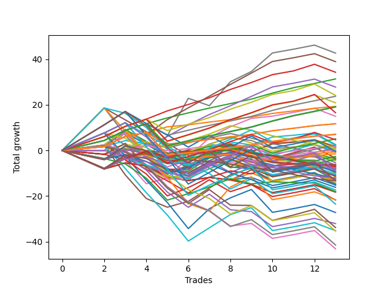

# Short Wallace Doodle 014 
- Symbol: TSLA_Unlimited
- Date Range: 03/23/2022 - 07/08/2022
- Trading Period: 7:20-12:30
- Number of Trades: 13



| Name | Win Percent | Profit | Avg Profit / Trade | Avg Time / Trade |      | Name | Win Percent | Profit | Avg Profit / Trade | Avg Time / Trade |
| ---- | ----------- | ------ | ------------------ | ---------------- | ---- | ---- | ----------- | ------ | ------------------ | ---------------- |
| Sorted By <br> Profit | | | | | | Sorted By <br> Win Percentage ||||
| Seven | 69.23 | 21340.00 | 1641.54 | 104:35 |     | Eighty-Two | 100.00 | 15675.00 | 1205.77 | 24:28 |
| Eighty-Five | 84.62 | 19465.00 | 1497.31 | 60:44 |     | Eighty-One | 100.00 | 9655.00 | 742.69 | 16:00 |
| Eighty-Three | 92.31 | 17140.00 | 1318.46 | 31:47 |     | Eighty-Three | 92.31 | 17140.00 | 1318.46 | 31:47 |
| Eighty-Two | 100.00 | 15675.00 | 1205.77 | 24:28 |     | One Hundred Twelve | 92.31 | 11875.00 | 913.46 | 17:31 |
| Eighty-Four | 84.62 | 13890.00 | 1068.46 | 56:17 |     | One Hundred Twenty-Seven | 92.31 | 9585.00 | 737.31 | 17:43 |
| One Hundred Thirteen | 84.62 | 12065.00 | 928.08 | 20:10 |     | One Hundred Twenty-Two | 92.31 | 9510.00 | 731.54 | 19:13 |
| One Hundred Twelve | 92.31 | 11875.00 | 913.46 | 17:31 |     | One Hundred Sixteen | 92.31 | 5855.00 | 450.38 | 09:03 |
| One Hundred Twenty-Three | 84.62 | 10445.00 | 803.46 | 26:31 |     | One Hundred Eleven | 92.31 | 5855.00 | 450.38 | 09:03 |
| Eighty-One | 100.00 | 9655.00 | 742.69 | 16:00 |     | One Hundred Twenty-Six | 92.31 | 3565.00 | 274.23 | 09:15 |
| One Hundred Twenty-Seven | 92.31 | 9585.00 | 737.31 | 17:43 |     | One Hundred Twenty-One | 92.31 | 3490.00 | 268.46 | 10:45 |
| One Hundred Twenty-Two | 92.31 | 9510.00 | 731.54 | 19:13 |     | Eighty-Five | 84.62 | 19465.00 | 1497.31 | 60:44 |
| One Hundred Twenty-Eight | 84.62 | 8270.00 | 636.15 | 23:15 |     | Eighty-Four | 84.62 | 13890.00 | 1068.46 | 56:17 |
| Six | 76.92 | 7495.00 | 576.54 | 75:27 |     | One Hundred Thirteen | 84.62 | 12065.00 | 928.08 | 20:10 |
| One Hundred Sixteen | 92.31 | 5855.00 | 450.38 | 09:03 |     | One Hundred Twenty-Three | 84.62 | 10445.00 | 803.46 | 26:31 |
| One Hundred Eleven | 92.31 | 5855.00 | 450.38 | 09:03 |     | One Hundred Twenty-Eight | 84.62 | 8270.00 | 636.15 | 23:15 |
| One Hundred Twenty-Six | 92.31 | 3565.00 | 274.23 | 09:15 |     | Six | 76.92 | 7495.00 | 576.54 | 75:27 |
| One Hundred Twenty-One | 92.31 | 3490.00 | 268.46 | 10:45 |     | Seven | 69.23 | 21340.00 | 1641.54 | 104:35 |
| One Hundred Seventeen | 69.23 | 2535.00 | 195.00 | 14:48 |     | One Hundred Seventeen | 69.23 | 2535.00 | 195.00 | 14:48 |
| One Hundred Eighteen | 61.54 | 2350.00 | 180.77 | 17:00 |     | One Hundred One | 69.23 | 65.00 | 5.00 | 03:01 |
| Forty-One | 53.85 | 1305.00 | 100.38 | 15:55 |     | One Hundred Six | 69.23 | -310.00 | -23.85 | 03:01 |
| One Hundred Two | 61.54 | 1200.00 | 92.31 | 07:15 |     | One Hundred Eighteen | 61.54 | 2350.00 | 180.77 | 17:00 |
| One Hundred Fourteen | 61.54 | 1135.00 | 87.31 | 30:54 |     | One Hundred Two | 61.54 | 1200.00 | 92.31 | 07:15 |
| One | 53.85 | 905.00 | 69.62 | 20:00 |     | One Hundred Fourteen | 61.54 | 1135.00 | 87.31 | 30:54 |
| Ninety-One | 61.54 | 880.00 | 67.69 | 02:05 |     | Ninety-One | 61.54 | 880.00 | 67.69 | 02:05 |
| Fifty-Seven | 53.85 | 780.00 | 60.00 | 19:43 |     | Four | 61.54 | -2685.00 | -206.54 | 49:25 |
| Ninety-Two | 46.15 | 555.00 | 42.69 | 05:19 |     | One Hundred Twenty-Nine | 61.54 | -4535.00 | -348.85 | 34:36 |
| One Hundred Three | 53.85 | 490.00 | 37.69 | 09:23 |     | Five | 61.54 | -4610.00 | -354.62 | 64:15 |
| Ninety-Three | 38.46 | 285.00 | 21.92 | 06:23 |     | One Hundred Twenty-Five | 61.54 | -4790.00 | -368.46 | 49:05 |
| One Hundred One | 69.23 | 65.00 | 5.00 | 03:01 |     | Sixty | 61.54 | -7045.00 | -541.92 | 44:30 |
| One Hundred Fifteen | 53.85 | -190.00 | -14.62 | 32:27 |     | One Hundred Twenty-Four | 61.54 | -8650.00 | -665.38 | 45:41 |
| Fifty-One | 46.15 | -240.00 | -18.46 | 15:45 |     | Forty-One | 53.85 | 1305.00 | 100.38 | 15:55 |
| One Hundred Six | 69.23 | -310.00 | -23.85 | 03:01 |     | One | 53.85 | 905.00 | 69.62 | 20:00 |
| Forty-Nine | 46.15 | -375.00 | -28.85 | 13:28 |     | Fifty-Seven | 53.85 | 780.00 | 60.00 | 19:43 |
| Ninety-Six | 53.85 | -730.00 | -56.15 | 02:30 |     | One Hundred Three | 53.85 | 490.00 | 37.69 | 09:23 |
| Ninety-Seven | 30.77 | -1310.00 | -100.77 | 03:28 |     | One Hundred Fifteen | 53.85 | -190.00 | -14.62 | 32:27 |
| Three | 53.85 | -1700.00 | -130.77 | 33:46 |     | Ninety-Six | 53.85 | -730.00 | -56.15 | 02:30 |
| Two | 38.46 | -1810.00 | -139.23 | 29:04 |     | Three | 53.85 | -1700.00 | -130.77 | 33:46 |
| One Hundred Seven | 46.15 | -1960.00 | -150.77 | 06:15 |     | Fifty-Nine | 53.85 | -3475.00 | -267.31 | 32:01 |
| Fifty | 30.77 | -2240.00 | -172.31 | 14:25 |     | Forty-Four | 53.85 | -6555.00 | -504.23 | 29:36 |
| Four | 61.54 | -2685.00 | -206.54 | 49:25 |     | One Hundred Thirty | 53.85 | -6655.00 | -511.92 | 36:10 |
| Ninety-Eight | 23.08 | -3075.00 | -236.54 | 03:52 |     | Sixty-Two | 53.85 | -13590.00 | -1045.38 | 57:55 |
| One Hundred | 23.08 | -3205.00 | -246.54 | 04:02 |     | Sixty-One | 53.85 | -17585.00 | -1352.69 | 50:03 |
| Fifty-Six | 38.46 | -3245.00 | -249.62 | 16:48 |     | Ninety-Two | 46.15 | 555.00 | 42.69 | 05:19 |
| Zero | 38.46 | -3245.00 | -249.62 | 16:48 |     | Fifty-One | 46.15 | -240.00 | -18.46 | 15:45 |
| Fifty-Nine | 53.85 | -3475.00 | -267.31 | 32:01 |     | Forty-Nine | 46.15 | -375.00 | -28.85 | 13:28 |
| One Hundred Eight | 30.77 | -3560.00 | -273.85 | 06:56 |     | One Hundred Seven | 46.15 | -1960.00 | -150.77 | 06:15 |
| Fifty-Eight | 38.46 | -3585.00 | -275.77 | 27:19 |     | Sixty-Five | 46.15 | -4030.00 | -310.00 | 16:48 |
| Forty-Eight | 30.77 | -3685.00 | -283.46 | 11:40 |     | Forty-Three | 46.15 | -5800.00 | -446.15 | 20:53 |
| Ninety-Nine | 23.08 | -3895.00 | -299.62 | 04:00 |     | Forty-Six | 46.15 | -6350.00 | -488.46 | 41:11 |
| Sixty-Five | 46.15 | -4030.00 | -310.00 | 16:48 |     | Sixty-Three | 46.15 | -10815.00 | -831.92 | 80:23 |
| One Hundred Ninteen | 38.46 | -4165.00 | -320.38 | 21:54 |     | Forty-Five | 46.15 | -10865.00 | -835.77 | 33:06 |
| Ninety-Four | 23.08 | -4275.00 | -328.85 | 07:41 |     | Ninety-Three | 38.46 | 285.00 | 21.92 | 06:23 |
| One Hundred Twenty-Nine | 61.54 | -4535.00 | -348.85 | 34:36 |     | Two | 38.46 | -1810.00 | -139.23 | 29:04 |
| Five | 61.54 | -4610.00 | -354.62 | 64:15 |     | Fifty-Six | 38.46 | -3245.00 | -249.62 | 16:48 |
| One Hundred Twenty-Five | 61.54 | -4790.00 | -368.46 | 49:05 |     | Zero | 38.46 | -3245.00 | -249.62 | 16:48 |
| Forty | 38.46 | -4965.00 | -381.92 | 13:46 |     | Fifty-Eight | 38.46 | -3585.00 | -275.77 | 27:19 |
| One Hundred Four | 38.46 | -5205.00 | -400.38 | 11:38 |     | One Hundred Ninteen | 38.46 | -4165.00 | -320.38 | 21:54 |
| Seventy-Three | 30.77 | -5470.00 | -420.77 | 12:05 |     | Forty | 38.46 | -4965.00 | -381.92 | 13:46 |
| One Hundred Twenty | 30.77 | -5625.00 | -432.69 | 22:34 |     | One Hundred Four | 38.46 | -5205.00 | -400.38 | 11:38 |
| Forty-Three | 46.15 | -5800.00 | -446.15 | 20:53 |     | Fifty-Three | 38.46 | -6620.00 | -509.23 | 20:24 |
| One Hundred Nine | 30.77 | -6025.00 | -463.46 | 07:31 |     | Fifty-Two | 38.46 | -7565.00 | -581.92 | 20:15 |
| Ninety-Five | 15.38 | -6115.00 | -470.38 | 08:22 |     | Forty-Seven | 38.46 | -7615.00 | -585.77 | 53:58 |
| Forty-Six | 46.15 | -6350.00 | -488.46 | 41:11 |     | Seventy-One | 38.46 | -11755.00 | -904.23 | 46:13 |
| Forty-Four | 53.85 | -6555.00 | -504.23 | 29:36 |     | Sixty-Seven | 38.46 | -16895.00 | -1299.62 | 23:17 |
| Fifty-Three | 38.46 | -6620.00 | -509.23 | 20:24 |     | Seventy | 38.46 | -17650.00 | -1357.69 | 38:45 |
| One Hundred Ten | 30.77 | -6635.00 | -510.38 | 07:59 |     | Sixty-Nine | 38.46 | -20715.00 | -1593.46 | 31:32 |
| One Hundred Thirty | 53.85 | -6655.00 | -511.92 | 36:10 |     | Sixty-Eight | 38.46 | -21550.00 | -1657.69 | 30:41 |
| Sixty | 61.54 | -7045.00 | -541.92 | 44:30 |     | Ninety-Seven | 30.77 | -1310.00 | -100.77 | 03:28 |
| Forty-Two | 30.77 | -7330.00 | -563.85 | 18:53 |     | Fifty | 30.77 | -2240.00 | -172.31 | 14:25 |
| Fifty-Two | 38.46 | -7565.00 | -581.92 | 20:15 |     | One Hundred Eight | 30.77 | -3560.00 | -273.85 | 06:56 |
| Forty-Seven | 38.46 | -7615.00 | -585.77 | 53:58 |     | Forty-Eight | 30.77 | -3685.00 | -283.46 | 11:40 |
| One Hundred Five | 30.77 | -8080.00 | -621.54 | 12:44 |     | Seventy-Three | 30.77 | -5470.00 | -420.77 | 12:05 |
| One Hundred Twenty-Four | 61.54 | -8650.00 | -665.38 | 45:41 |     | One Hundred Twenty | 30.77 | -5625.00 | -432.69 | 22:34 |
| Sixty-Four | 30.77 | -9020.00 | -693.85 | 14:52 |     | One Hundred Nine | 30.77 | -6025.00 | -463.46 | 07:31 |
| Fifty-Five | 30.77 | -9120.00 | -701.54 | 23:29 |     | One Hundred Ten | 30.77 | -6635.00 | -510.38 | 07:59 |
| Fifty-Four | 30.77 | -9120.00 | -701.54 | 23:29 |     | Forty-Two | 30.77 | -7330.00 | -563.85 | 18:53 |
| Sixty-Three | 46.15 | -10815.00 | -831.92 | 80:23 |     | One Hundred Five | 30.77 | -8080.00 | -621.54 | 12:44 |
| Forty-Five | 46.15 | -10865.00 | -835.77 | 33:06 |     | Sixty-Four | 30.77 | -9020.00 | -693.85 | 14:52 |
| Seventy-One | 38.46 | -11755.00 | -904.23 | 46:13 |     | Fifty-Five | 30.77 | -9120.00 | -701.54 | 23:29 |
| Sixty-Two | 53.85 | -13590.00 | -1045.38 | 57:55 |     | Fifty-Four | 30.77 | -9120.00 | -701.54 | 23:29 |
| Sixty-Six | 23.08 | -16020.00 | -1232.31 | 20:25 |     | Ninety-Eight | 23.08 | -3075.00 | -236.54 | 03:52 |
| Sixty-Seven | 38.46 | -16895.00 | -1299.62 | 23:17 |     | One Hundred | 23.08 | -3205.00 | -246.54 | 04:02 |
| Sixty-One | 53.85 | -17585.00 | -1352.69 | 50:03 |     | Ninety-Nine | 23.08 | -3895.00 | -299.62 | 04:00 |
| Seventy | 38.46 | -17650.00 | -1357.69 | 38:45 |     | Ninety-Four | 23.08 | -4275.00 | -328.85 | 07:41 |
| Sixty-Nine | 38.46 | -20715.00 | -1593.46 | 31:32 |     | Sixty-Six | 23.08 | -16020.00 | -1232.31 | 20:25 |
| Sixty-Eight | 38.46 | -21550.00 | -1657.69 | 30:41 |     | Ninety-Five | 15.38 | -6115.00 | -470.38 | 08:22 |

## NO STOPLOSS

### Test Zero
* Sell when price hits the middle line of the 20p bollinger
* No Stoploss
* Results:
```
Total Trades: 13
Percent Up: 61.54
Percent Down: 38.46
Total Points Moved Down: -6.49
Potential Profit: -3245.00
Total Points Ups: 18.18 Count Ups: 8
Total Points Downs: 11.69 Count Downs: 5
```

<details><summary>Trades</summary>

<code>In: 2022-04-08 09:24:00		Out: 2022-04-08 09:42:00		Total Position Time: 18:00		Total Move Down: -1.77		Total to Date: -1.77</code> <br />
<code>In: 2022-04-08 09:24:00		Out: 2022-04-08 09:42:00		Total Position Time: 18:00		Total Move Down: -1.77		Total to Date: -3.54</code> <br />
<code>In: 2022-04-28 09:49:00		Out: 2022-04-28 10:06:10		Total Position Time: 17:10		Total Move Down: 1.39		Total to Date: -2.15</code> <br />
<code>In: 2022-05-02 12:15:00		Out: 2022-05-02 12:37:35		Total Position Time: 22:35		Total Move Down: -4.50		Total to Date: -6.65</code> <br />
<code>In: 2022-05-04 09:25:00		Out: 2022-05-04 09:47:00		Total Position Time: 22:00		Total Move Down: -3.56		Total to Date: -10.21</code> <br />
<code>In: 2022-05-04 09:42:00		Out: 2022-05-04 09:47:00		Total Position Time: 05:00		Total Move Down: 2.82		Total to Date: -7.39</code> <br />
<code>In: 2022-05-17 08:54:00		Out: 2022-05-17 09:02:20		Total Position Time: 08:20		Total Move Down: 2.93		Total to Date: -4.46</code> <br />
<code>In: 2022-05-24 08:51:00		Out: 2022-05-24 09:01:05		Total Position Time: 10:05		Total Move Down: 3.67		Total to Date: -0.79</code> <br />
<code>In: 2022-06-17 10:07:00		Out: 2022-06-17 10:24:05		Total Position Time: 17:05		Total Move Down: -2.29		Total to Date: -3.08</code> <br />
<code>In: 2022-06-23 07:24:00		Out: 2022-06-23 07:34:05		Total Position Time: 10:05		Total Move Down: 0.88		Total to Date: -2.20</code> <br />
<code>In: 2022-06-29 12:10:00		Out: 2022-06-29 12:32:25		Total Position Time: 22:25		Total Move Down: -0.34		Total to Date: -2.54</code> <br />
<code>In: 2022-06-29 12:11:00		Out: 2022-06-29 12:32:25		Total Position Time: 21:25		Total Move Down: -0.18		Total to Date: -2.72</code> <br />
<code>In: 2022-07-06 11:35:00		Out: 2022-07-06 12:01:25		Total Position Time: 26:25		Total Move Down: -3.77		Total to Date: -6.49</code> <br />


</details>

### Test One
* Sell when the price hits the upper line of the 20p 1std bollinger
* No Stoploss
* Results:
```
Total Trades: 13
Percent Up: 46.15
Percent Down: 53.85
Total Points Moved Down: 1.81
Potential Profit: 905.00
Total Points Ups: 19.02 Count Ups: 6
Total Points Downs: 20.83 Count Downs: 7
```

<details><summary>Trades</summary>

<code>In: 2022-04-08 09:24:00		Out: 2022-04-08 09:44:10		Total Position Time: 20:10		Total Move Down: -0.84		Total to Date: -0.84</code> <br />
<code>In: 2022-04-08 09:24:00		Out: 2022-04-08 09:44:10		Total Position Time: 20:10		Total Move Down: -0.84		Total to Date: -1.68</code> <br />
<code>In: 2022-04-28 09:49:00		Out: 2022-04-28 10:08:55		Total Position Time: 19:55		Total Move Down: 4.75		Total to Date: 3.07</code> <br />
<code>In: 2022-05-02 12:15:00		Out: 2022-05-02 12:47:00		Total Position Time: 32:00		Total Move Down: -10.36		Total to Date: -7.29</code> <br />
<code>In: 2022-05-04 09:25:00		Out: 2022-05-04 09:51:10		Total Position Time: 26:10		Total Move Down: -2.74		Total to Date: -10.03</code> <br />
<code>In: 2022-05-04 09:42:00		Out: 2022-05-04 09:51:10		Total Position Time: 09:10		Total Move Down: 3.64		Total to Date: -6.39</code> <br />
<code>In: 2022-05-17 08:54:00		Out: 2022-05-17 09:06:00		Total Position Time: 12:00		Total Move Down: 4.49		Total to Date: -1.90</code> <br />
<code>In: 2022-05-24 08:51:00		Out: 2022-05-24 09:06:25		Total Position Time: 15:25		Total Move Down: 2.81		Total to Date: 0.91</code> <br />
<code>In: 2022-06-17 10:07:00		Out: 2022-06-17 10:28:05		Total Position Time: 21:05		Total Move Down: -1.27		Total to Date: -0.36</code> <br />
<code>In: 2022-06-23 07:24:00		Out: 2022-06-23 07:35:35		Total Position Time: 11:35		Total Move Down: 3.44		Total to Date: 3.08</code> <br />
<code>In: 2022-06-29 12:10:00		Out: 2022-06-29 12:33:25		Total Position Time: 23:25		Total Move Down: 0.77		Total to Date: 3.85</code> <br />
<code>In: 2022-06-29 12:11:00		Out: 2022-06-29 12:33:25		Total Position Time: 22:25		Total Move Down: 0.93		Total to Date: 4.78</code> <br />
<code>In: 2022-07-06 11:35:00		Out: 2022-07-06 12:01:35		Total Position Time: 26:35		Total Move Down: -2.97		Total to Date: 1.81</code> <br />


</details>

### Test Two
* Sell when the price hits the upper line of the 20p 2std bollinger
* No Stoploss
* Results:
```
Total Trades: 13
Percent Up: 61.54
Percent Down: 38.46
Total Points Moved Down: -3.62
Potential Profit: -1810.00
Total Points Ups: 22.40 Count Ups: 8
Total Points Downs: 18.78 Count Downs: 5
```

<details><summary>Trades</summary>

<code>In: 2022-04-08 09:24:00		Out: 2022-04-08 09:45:20		Total Position Time: 21:20		Total Move Down: -0.01		Total to Date: -0.01</code> <br />
<code>In: 2022-04-08 09:24:00		Out: 2022-04-08 09:45:20		Total Position Time: 21:20		Total Move Down: -0.01		Total to Date: -0.02</code> <br />
<code>In: 2022-04-28 09:49:00		Out: 2022-04-28 10:09:15		Total Position Time: 20:15		Total Move Down: 7.87		Total to Date: 7.85</code> <br />
<code>In: 2022-05-02 12:15:00		Out: 2022-05-02 12:47:00		Total Position Time: 32:00		Total Move Down: -10.36		Total to Date: -2.51</code> <br />
<code>In: 2022-05-04 09:25:00		Out: 2022-05-04 10:18:30		Total Position Time: 53:30		Total Move Down: -6.47		Total to Date: -8.98</code> <br />
<code>In: 2022-05-04 09:42:00		Out: 2022-05-04 10:18:30		Total Position Time: 36:30		Total Move Down: -0.09		Total to Date: -9.07</code> <br />
<code>In: 2022-05-17 08:54:00		Out: 2022-05-17 09:07:10		Total Position Time: 13:10		Total Move Down: 5.75		Total to Date: -3.32</code> <br />
<code>In: 2022-05-24 08:51:00		Out: 2022-05-24 09:31:20		Total Position Time: 40:20		Total Move Down: 1.58		Total to Date: -1.74</code> <br />
<code>In: 2022-06-17 10:07:00		Out: 2022-06-17 10:29:05		Total Position Time: 22:05		Total Move Down: -0.84		Total to Date: -2.58</code> <br />
<code>In: 2022-06-23 07:24:00		Out: 2022-06-23 08:05:10		Total Position Time: 41:10		Total Move Down: -2.37		Total to Date: -4.95</code> <br />
<code>In: 2022-06-29 12:10:00		Out: 2022-06-29 12:34:15		Total Position Time: 24:15		Total Move Down: 1.71		Total to Date: -3.24</code> <br />
<code>In: 2022-06-29 12:11:00		Out: 2022-06-29 12:34:15		Total Position Time: 23:15		Total Move Down: 1.87		Total to Date: -1.37</code> <br />
<code>In: 2022-07-06 11:35:00		Out: 2022-07-06 12:03:45		Total Position Time: 28:45		Total Move Down: -2.25		Total to Date: -3.62</code> <br />


</details>

### Test Three
* Sell when price hits the middle line of the 50p bollinger
* No Stoploss
* Results:
```
Total Trades: 13
Percent Up: 46.15
Percent Down: 53.85
Total Points Moved Down: -3.40
Potential Profit: -1700.00
Total Points Ups: 24.29 Count Ups: 6
Total Points Downs: 20.89 Count Downs: 7
```

<details><summary>Trades</summary>

<code>In: 2022-04-08 09:24:00		Out: 2022-04-08 09:48:20		Total Position Time: 24:20		Total Move Down: 0.84		Total to Date: 0.84</code> <br />
<code>In: 2022-04-08 09:24:00		Out: 2022-04-08 09:48:20		Total Position Time: 24:20		Total Move Down: 0.84		Total to Date: 1.68</code> <br />
<code>In: 2022-04-28 09:49:00		Out: 2022-04-28 10:18:05		Total Position Time: 29:05		Total Move Down: 6.93		Total to Date: 8.61</code> <br />
<code>In: 2022-05-02 12:15:00		Out: 2022-05-02 12:47:00		Total Position Time: 32:00		Total Move Down: -10.36		Total to Date: -1.75</code> <br />
<code>In: 2022-05-04 09:25:00		Out: 2022-05-04 10:18:30		Total Position Time: 53:30		Total Move Down: -6.47		Total to Date: -8.22</code> <br />
<code>In: 2022-05-04 09:42:00		Out: 2022-05-04 10:18:30		Total Position Time: 36:30		Total Move Down: -0.09		Total to Date: -8.31</code> <br />
<code>In: 2022-05-17 08:54:00		Out: 2022-05-17 09:10:25		Total Position Time: 16:25		Total Move Down: 6.05		Total to Date: -2.26</code> <br />
<code>In: 2022-05-24 08:51:00		Out: 2022-05-24 09:31:10		Total Position Time: 40:10		Total Move Down: 1.37		Total to Date: -0.89</code> <br />
<code>In: 2022-06-17 10:07:00		Out: 2022-06-17 10:32:25		Total Position Time: 25:25		Total Move Down: -0.12		Total to Date: -1.01</code> <br />
<code>In: 2022-06-23 07:24:00		Out: 2022-06-23 08:05:10		Total Position Time: 41:10		Total Move Down: -2.37		Total to Date: -3.38</code> <br />
<code>In: 2022-06-29 12:10:00		Out: 2022-06-29 12:36:35		Total Position Time: 26:35		Total Move Down: 2.35		Total to Date: -1.03</code> <br />
<code>In: 2022-06-29 12:11:00		Out: 2022-06-29 12:36:35		Total Position Time: 25:35		Total Move Down: 2.51		Total to Date: 1.48</code> <br />
<code>In: 2022-07-06 11:35:00		Out: 2022-07-06 12:39:00		Total Position Time: 64:00		Total Move Down: -4.88		Total to Date: -3.40</code> <br />


</details>

### Test Four
* Sell when the price hits the upper line of the 50p 1std bollinger
* No Stoploss
* Results:
```
Total Trades: 13
Percent Up: 38.46
Percent Down: 61.54
Total Points Moved Down: -5.37
Potential Profit: -2685.00
Total Points Ups: 26.55 Count Ups: 5
Total Points Downs: 21.18 Count Downs: 8
```

<details><summary>Trades</summary>

<code>In: 2022-04-08 09:24:00		Out: 2022-04-08 10:06:40		Total Position Time: 42:40		Total Move Down: 1.21		Total to Date: 1.21</code> <br />
<code>In: 2022-04-08 09:24:00		Out: 2022-04-08 10:06:40		Total Position Time: 42:40		Total Move Down: 1.21		Total to Date: 2.42</code> <br />
<code>In: 2022-04-28 09:49:00		Out: 2022-04-28 10:30:55		Total Position Time: 41:55		Total Move Down: 6.78		Total to Date: 9.20</code> <br />
<code>In: 2022-05-02 12:15:00		Out: 2022-05-02 12:47:00		Total Position Time: 32:00		Total Move Down: -10.36		Total to Date: -1.16</code> <br />
<code>In: 2022-05-04 09:25:00		Out: 2022-05-04 10:45:50		Total Position Time: 80:50		Total Move Down: -7.39		Total to Date: -8.55</code> <br />
<code>In: 2022-05-04 09:42:00		Out: 2022-05-04 10:45:50		Total Position Time: 63:50		Total Move Down: -1.01		Total to Date: -9.56</code> <br />
<code>In: 2022-05-17 08:54:00		Out: 2022-05-17 09:40:10		Total Position Time: 46:10		Total Move Down: 4.11		Total to Date: -5.45</code> <br />
<code>In: 2022-05-24 08:51:00		Out: 2022-05-24 09:34:00		Total Position Time: 43:00		Total Move Down: 3.29		Total to Date: -2.16</code> <br />
<code>In: 2022-06-17 10:07:00		Out: 2022-06-17 10:45:40		Total Position Time: 38:40		Total Move Down: 1.14		Total to Date: -1.02</code> <br />
<code>In: 2022-06-23 07:24:00		Out: 2022-06-23 08:32:05		Total Position Time: 68:05		Total Move Down: -3.94		Total to Date: -4.96</code> <br />
<code>In: 2022-06-29 12:10:00		Out: 2022-06-29 12:47:00		Total Position Time: 37:00		Total Move Down: 1.64		Total to Date: -3.32</code> <br />
<code>In: 2022-06-29 12:11:00		Out: 2022-06-29 12:47:00		Total Position Time: 36:00		Total Move Down: 1.80		Total to Date: -1.52</code> <br />
<code>In: 2022-07-06 11:35:00		Out: 2022-07-06 12:44:40		Total Position Time: 69:40		Total Move Down: -3.85		Total to Date: -5.37</code> <br />


</details>

### Test Five
* Sell when the price hits the upper line of the 50p 2std bollinger
* No Stoploss
* Results:
```
Total Trades: 13
Percent Up: 38.46
Percent Down: 61.54
Total Points Moved Down: -9.22
Potential Profit: -4610.00
Total Points Ups: 32.07 Count Ups: 5
Total Points Downs: 22.85 Count Downs: 8
```

<details><summary>Trades</summary>

<code>In: 2022-04-08 09:24:00		Out: 2022-04-08 10:11:20		Total Position Time: 47:20		Total Move Down: 1.10		Total to Date: 1.10</code> <br />
<code>In: 2022-04-08 09:24:00		Out: 2022-04-08 10:11:20		Total Position Time: 47:20		Total Move Down: 1.10		Total to Date: 2.20</code> <br />
<code>In: 2022-04-28 09:49:00		Out: 2022-04-28 12:29:40		Total Position Time: 160:40		Total Move Down: -12.89		Total to Date: -10.69</code> <br />
<code>In: 2022-05-02 12:15:00		Out: 2022-05-02 12:47:00		Total Position Time: 32:00		Total Move Down: -10.36		Total to Date: -21.05</code> <br />
<code>In: 2022-05-04 09:25:00		Out: 2022-05-04 11:07:20		Total Position Time: 102:20		Total Move Down: -3.81		Total to Date: -24.86</code> <br />
<code>In: 2022-05-04 09:42:00		Out: 2022-05-04 11:07:20		Total Position Time: 85:20		Total Move Down: 2.57		Total to Date: -22.29</code> <br />
<code>In: 2022-05-17 08:54:00		Out: 2022-05-17 09:47:55		Total Position Time: 53:55		Total Move Down: 5.82		Total to Date: -16.47</code> <br />
<code>In: 2022-05-24 08:51:00		Out: 2022-05-24 09:39:55		Total Position Time: 48:55		Total Move Down: 5.79		Total to Date: -10.68</code> <br />
<code>In: 2022-06-17 10:07:00		Out: 2022-06-17 10:47:30		Total Position Time: 40:30		Total Move Down: 3.03		Total to Date: -7.65</code> <br />
<code>In: 2022-06-23 07:24:00		Out: 2022-06-23 08:35:55		Total Position Time: 71:55		Total Move Down: -1.51		Total to Date: -9.16</code> <br />
<code>In: 2022-06-29 12:10:00		Out: 2022-06-29 12:47:00		Total Position Time: 37:00		Total Move Down: 1.64		Total to Date: -7.52</code> <br />
<code>In: 2022-06-29 12:11:00		Out: 2022-06-29 12:47:00		Total Position Time: 36:00		Total Move Down: 1.80		Total to Date: -5.72</code> <br />
<code>In: 2022-07-06 11:35:00		Out: 2022-07-06 12:47:00		Total Position Time: 72:00		Total Move Down: -3.50		Total to Date: -9.22</code> <br />


</details>

### Test Six
* Sell when the price hits the middle line of the 1std VWAP
* No Stoploss
* Results:
```
Total Trades: 13
Percent Up: 23.08
Percent Down: 76.92
Total Points Moved Down: 14.99
Potential Profit: 7495.00
Total Points Ups: 25.76 Count Ups: 3
Total Points Downs: 40.75 Count Downs: 10
```

<details><summary>Trades</summary>

<code>In: 2022-04-08 09:24:00		Out: 2022-04-08 10:16:55		Total Position Time: 52:55		Total Move Down: 3.84		Total to Date: 3.84</code> <br />
<code>In: 2022-04-08 09:24:00		Out: 2022-04-08 10:16:55		Total Position Time: 52:55		Total Move Down: 3.84		Total to Date: 7.68</code> <br />
<code>In: 2022-04-28 09:49:00		Out: 2022-04-28 12:47:00		Total Position Time: 178:00		Total Move Down: -11.90		Total to Date: -4.22</code> <br />
<code>In: 2022-05-02 12:15:00		Out: 2022-05-02 12:47:00		Total Position Time: 32:00		Total Move Down: -10.36		Total to Date: -14.58</code> <br />
<code>In: 2022-05-04 09:25:00		Out: 2022-05-04 11:07:40		Total Position Time: 102:40		Total Move Down: 2.56		Total to Date: -12.02</code> <br />
<code>In: 2022-05-04 09:42:00		Out: 2022-05-04 11:07:40		Total Position Time: 85:40		Total Move Down: 8.94		Total to Date: -3.08</code> <br />
<code>In: 2022-05-17 08:54:00		Out: 2022-05-17 09:59:30		Total Position Time: 65:30		Total Move Down: 8.72		Total to Date: 5.64</code> <br />
<code>In: 2022-05-24 08:51:00		Out: 2022-05-24 09:37:00		Total Position Time: 46:00		Total Move Down: 4.75		Total to Date: 10.39</code> <br />
<code>In: 2022-06-17 10:07:00		Out: 2022-06-17 12:10:00		Total Position Time: 123:00		Total Move Down: 3.68		Total to Date: 14.07</code> <br />
<code>In: 2022-06-23 07:24:00		Out: 2022-06-23 09:01:15		Total Position Time: 97:15		Total Move Down: 0.98		Total to Date: 15.05</code> <br />
<code>In: 2022-06-29 12:10:00		Out: 2022-06-29 12:47:00		Total Position Time: 37:00		Total Move Down: 1.64		Total to Date: 16.69</code> <br />
<code>In: 2022-06-29 12:11:00		Out: 2022-06-29 12:47:00		Total Position Time: 36:00		Total Move Down: 1.80		Total to Date: 18.49</code> <br />
<code>In: 2022-07-06 11:35:00		Out: 2022-07-06 12:47:00		Total Position Time: 72:00		Total Move Down: -3.50		Total to Date: 14.99</code> <br />


</details>

### Test Seven
* Sell when the price hits the upper line of the 1std VWAP
* No Stoploss
* Results:
```
Total Trades: 13
Percent Up: 30.77
Percent Down: 69.23
Total Points Moved Down: 42.68
Potential Profit: 21340.00
Total Points Ups: 29.03 Count Ups: 4
Total Points Downs: 71.71 Count Downs: 9
```

<details><summary>Trades</summary>

<code>In: 2022-04-08 09:24:00		Out: 2022-04-08 10:47:00		Total Position Time: 83:00		Total Move Down: 9.32		Total to Date: 9.32</code> <br />
<code>In: 2022-04-08 09:24:00		Out: 2022-04-08 10:47:00		Total Position Time: 83:00		Total Move Down: 9.32		Total to Date: 18.64</code> <br />
<code>In: 2022-04-28 09:49:00		Out: 2022-04-28 12:47:00		Total Position Time: 178:00		Total Move Down: -11.90		Total to Date: 6.74</code> <br />
<code>In: 2022-05-02 12:15:00		Out: 2022-05-02 12:47:00		Total Position Time: 32:00		Total Move Down: -10.36		Total to Date: -3.62</code> <br />
<code>In: 2022-05-04 09:25:00		Out: 2022-05-04 11:35:05		Total Position Time: 130:05		Total Move Down: 10.06		Total to Date: 6.44</code> <br />
<code>In: 2022-05-04 09:42:00		Out: 2022-05-04 11:35:05		Total Position Time: 113:05		Total Move Down: 16.44		Total to Date: 22.88</code> <br />
<code>In: 2022-05-17 08:54:00		Out: 2022-05-17 12:47:00		Total Position Time: 233:00		Total Move Down: -3.27		Total to Date: 19.61</code> <br />
<code>In: 2022-05-24 08:51:00		Out: 2022-05-24 10:04:20		Total Position Time: 73:20		Total Move Down: 10.50		Total to Date: 30.11</code> <br />
<code>In: 2022-06-17 10:07:00		Out: 2022-06-17 12:47:00		Total Position Time: 160:00		Total Move Down: 4.51		Total to Date: 34.62</code> <br />
<code>In: 2022-06-23 07:24:00		Out: 2022-06-23 09:33:05		Total Position Time: 129:05		Total Move Down: 8.12		Total to Date: 42.74</code> <br />
<code>In: 2022-06-29 12:10:00		Out: 2022-06-29 12:47:00		Total Position Time: 37:00		Total Move Down: 1.64		Total to Date: 44.38</code> <br />
<code>In: 2022-06-29 12:11:00		Out: 2022-06-29 12:47:00		Total Position Time: 36:00		Total Move Down: 1.80		Total to Date: 46.18</code> <br />
<code>In: 2022-07-06 11:35:00		Out: 2022-07-06 12:47:00		Total Position Time: 72:00		Total Move Down: -3.50		Total to Date: 42.68</code> <br />


</details>

## STOPLOSS OF 5

### Test Forty
* Sell when price hits the middle line of the 20p bollinger
* Stoploss is -5 points
* Results:
```
Total Trades: 13
Percent Up: 61.54
Percent Down: 38.46
Total Points Moved Down: -9.93
Potential Profit: -4965.00
Total Points Ups: 21.62 Count Ups: 8
Total Points Downs: 11.69 Count Downs: 5
```

<details><summary>Trades</summary>

<code>In: 2022-04-08 09:24:00		Out: 2022-04-08 09:42:00		Total Position Time: 18:00		Total Move Down: -1.77		Total to Date: -1.77</code> <br />
<code>In: 2022-04-08 09:24:00		Out: 2022-04-08 09:42:00		Total Position Time: 18:00		Total Move Down: -1.77		Total to Date: -3.54</code> <br />
<code>In: 2022-04-28 09:49:00		Out: 2022-04-28 10:06:10		Total Position Time: 17:10		Total Move Down: 1.39		Total to Date: -2.15</code> <br />
<code>In: 2022-05-02 12:15:00		Out: 2022-05-02 12:22:45		Total Position Time: 07:45		Total Move Down: -5.24		Total to Date: -7.39</code> <br />
<code>In: 2022-05-04 09:25:00		Out: 2022-05-04 09:37:20		Total Position Time: 12:20		Total Move Down: -5.04		Total to Date: -12.43</code> <br />
<code>In: 2022-05-04 09:42:00		Out: 2022-05-04 09:47:00		Total Position Time: 05:00		Total Move Down: 2.82		Total to Date: -9.61</code> <br />
<code>In: 2022-05-17 08:54:00		Out: 2022-05-17 09:02:20		Total Position Time: 08:20		Total Move Down: 2.93		Total to Date: -6.68</code> <br />
<code>In: 2022-05-24 08:51:00		Out: 2022-05-24 09:01:05		Total Position Time: 10:05		Total Move Down: 3.67		Total to Date: -3.01</code> <br />
<code>In: 2022-06-17 10:07:00		Out: 2022-06-17 10:24:05		Total Position Time: 17:05		Total Move Down: -2.29		Total to Date: -5.30</code> <br />
<code>In: 2022-06-23 07:24:00		Out: 2022-06-23 07:34:05		Total Position Time: 10:05		Total Move Down: 0.88		Total to Date: -4.42</code> <br />
<code>In: 2022-06-29 12:10:00		Out: 2022-06-29 12:32:25		Total Position Time: 22:25		Total Move Down: -0.34		Total to Date: -4.76</code> <br />
<code>In: 2022-06-29 12:11:00		Out: 2022-06-29 12:32:25		Total Position Time: 21:25		Total Move Down: -0.18		Total to Date: -4.94</code> <br />
<code>In: 2022-07-06 11:35:00		Out: 2022-07-06 11:46:30		Total Position Time: 11:30		Total Move Down: -4.99		Total to Date: -9.93</code> <br />


</details>

### Test Forty-One
* Sell when the price hits the upper line of the 20p 1std bollinger
* Stoploss is -5 points
* Results:
```
Total Trades: 13
Percent Up: 46.15
Percent Down: 53.85
Total Points Moved Down: 2.61
Potential Profit: 1305.00
Total Points Ups: 18.22 Count Ups: 6
Total Points Downs: 20.83 Count Downs: 7
```

<details><summary>Trades</summary>

<code>In: 2022-04-08 09:24:00		Out: 2022-04-08 09:44:10		Total Position Time: 20:10		Total Move Down: -0.84		Total to Date: -0.84</code> <br />
<code>In: 2022-04-08 09:24:00		Out: 2022-04-08 09:44:10		Total Position Time: 20:10		Total Move Down: -0.84		Total to Date: -1.68</code> <br />
<code>In: 2022-04-28 09:49:00		Out: 2022-04-28 10:08:55		Total Position Time: 19:55		Total Move Down: 4.75		Total to Date: 3.07</code> <br />
<code>In: 2022-05-02 12:15:00		Out: 2022-05-02 12:22:45		Total Position Time: 07:45		Total Move Down: -5.24		Total to Date: -2.17</code> <br />
<code>In: 2022-05-04 09:25:00		Out: 2022-05-04 09:37:20		Total Position Time: 12:20		Total Move Down: -5.04		Total to Date: -7.21</code> <br />
<code>In: 2022-05-04 09:42:00		Out: 2022-05-04 09:51:10		Total Position Time: 09:10		Total Move Down: 3.64		Total to Date: -3.57</code> <br />
<code>In: 2022-05-17 08:54:00		Out: 2022-05-17 09:06:00		Total Position Time: 12:00		Total Move Down: 4.49		Total to Date: 0.92</code> <br />
<code>In: 2022-05-24 08:51:00		Out: 2022-05-24 09:06:25		Total Position Time: 15:25		Total Move Down: 2.81		Total to Date: 3.73</code> <br />
<code>In: 2022-06-17 10:07:00		Out: 2022-06-17 10:28:05		Total Position Time: 21:05		Total Move Down: -1.27		Total to Date: 2.46</code> <br />
<code>In: 2022-06-23 07:24:00		Out: 2022-06-23 07:35:35		Total Position Time: 11:35		Total Move Down: 3.44		Total to Date: 5.90</code> <br />
<code>In: 2022-06-29 12:10:00		Out: 2022-06-29 12:33:25		Total Position Time: 23:25		Total Move Down: 0.77		Total to Date: 6.67</code> <br />
<code>In: 2022-06-29 12:11:00		Out: 2022-06-29 12:33:25		Total Position Time: 22:25		Total Move Down: 0.93		Total to Date: 7.60</code> <br />
<code>In: 2022-07-06 11:35:00		Out: 2022-07-06 11:46:30		Total Position Time: 11:30		Total Move Down: -4.99		Total to Date: 2.61</code> <br />


</details>

### Test Forty-Two
* Sell when the price hits the upper line of the 20p 2std bollinger
* Stoploss is -5 points
* Results:
```
Total Trades: 13
Percent Up: 69.23
Percent Down: 30.77
Total Points Moved Down: -14.66
Potential Profit: -7330.00
Total Points Ups: 31.86 Count Ups: 9
Total Points Downs: 17.20 Count Downs: 4
```

<details><summary>Trades</summary>

<code>In: 2022-04-08 09:24:00		Out: 2022-04-08 09:45:20		Total Position Time: 21:20		Total Move Down: -0.01		Total to Date: -0.01</code> <br />
<code>In: 2022-04-08 09:24:00		Out: 2022-04-08 09:45:20		Total Position Time: 21:20		Total Move Down: -0.01		Total to Date: -0.02</code> <br />
<code>In: 2022-04-28 09:49:00		Out: 2022-04-28 10:09:15		Total Position Time: 20:15		Total Move Down: 7.87		Total to Date: 7.85</code> <br />
<code>In: 2022-05-02 12:15:00		Out: 2022-05-02 12:22:45		Total Position Time: 07:45		Total Move Down: -5.24		Total to Date: 2.61</code> <br />
<code>In: 2022-05-04 09:25:00		Out: 2022-05-04 09:37:20		Total Position Time: 12:20		Total Move Down: -5.04		Total to Date: -2.43</code> <br />
<code>In: 2022-05-04 09:42:00		Out: 2022-05-04 10:03:05		Total Position Time: 21:05		Total Move Down: -5.34		Total to Date: -7.77</code> <br />
<code>In: 2022-05-17 08:54:00		Out: 2022-05-17 09:07:10		Total Position Time: 13:10		Total Move Down: 5.75		Total to Date: -2.02</code> <br />
<code>In: 2022-05-24 08:51:00		Out: 2022-05-24 09:15:05		Total Position Time: 24:05		Total Move Down: -5.22		Total to Date: -7.24</code> <br />
<code>In: 2022-06-17 10:07:00		Out: 2022-06-17 10:29:05		Total Position Time: 22:05		Total Move Down: -0.84		Total to Date: -8.08</code> <br />
<code>In: 2022-06-23 07:24:00		Out: 2022-06-23 07:47:05		Total Position Time: 23:05		Total Move Down: -5.17		Total to Date: -13.25</code> <br />
<code>In: 2022-06-29 12:10:00		Out: 2022-06-29 12:34:15		Total Position Time: 24:15		Total Move Down: 1.71		Total to Date: -11.54</code> <br />
<code>In: 2022-06-29 12:11:00		Out: 2022-06-29 12:34:15		Total Position Time: 23:15		Total Move Down: 1.87		Total to Date: -9.67</code> <br />
<code>In: 2022-07-06 11:35:00		Out: 2022-07-06 11:46:30		Total Position Time: 11:30		Total Move Down: -4.99		Total to Date: -14.66</code> <br />


</details>

### Test Forty-Three
* Sell when price hits the middle line of the 50p bollinger
* Stoploss is -5 points
* Results:
```
Total Trades: 13
Percent Up: 53.85
Percent Down: 46.15
Total Points Moved Down: -11.60
Potential Profit: -5800.00
Total Points Ups: 31.12 Count Ups: 7
Total Points Downs: 19.52 Count Downs: 6
```

<details><summary>Trades</summary>

<code>In: 2022-04-08 09:24:00		Out: 2022-04-08 09:48:20		Total Position Time: 24:20		Total Move Down: 0.84		Total to Date: 0.84</code> <br />
<code>In: 2022-04-08 09:24:00		Out: 2022-04-08 09:48:20		Total Position Time: 24:20		Total Move Down: 0.84		Total to Date: 1.68</code> <br />
<code>In: 2022-04-28 09:49:00		Out: 2022-04-28 10:18:05		Total Position Time: 29:05		Total Move Down: 6.93		Total to Date: 8.61</code> <br />
<code>In: 2022-05-02 12:15:00		Out: 2022-05-02 12:22:45		Total Position Time: 07:45		Total Move Down: -5.24		Total to Date: 3.37</code> <br />
<code>In: 2022-05-04 09:25:00		Out: 2022-05-04 09:37:20		Total Position Time: 12:20		Total Move Down: -5.04		Total to Date: -1.67</code> <br />
<code>In: 2022-05-04 09:42:00		Out: 2022-05-04 10:03:05		Total Position Time: 21:05		Total Move Down: -5.34		Total to Date: -7.01</code> <br />
<code>In: 2022-05-17 08:54:00		Out: 2022-05-17 09:10:25		Total Position Time: 16:25		Total Move Down: 6.05		Total to Date: -0.96</code> <br />
<code>In: 2022-05-24 08:51:00		Out: 2022-05-24 09:15:05		Total Position Time: 24:05		Total Move Down: -5.22		Total to Date: -6.18</code> <br />
<code>In: 2022-06-17 10:07:00		Out: 2022-06-17 10:32:25		Total Position Time: 25:25		Total Move Down: -0.12		Total to Date: -6.30</code> <br />
<code>In: 2022-06-23 07:24:00		Out: 2022-06-23 07:47:05		Total Position Time: 23:05		Total Move Down: -5.17		Total to Date: -11.47</code> <br />
<code>In: 2022-06-29 12:10:00		Out: 2022-06-29 12:36:35		Total Position Time: 26:35		Total Move Down: 2.35		Total to Date: -9.12</code> <br />
<code>In: 2022-06-29 12:11:00		Out: 2022-06-29 12:36:35		Total Position Time: 25:35		Total Move Down: 2.51		Total to Date: -6.61</code> <br />
<code>In: 2022-07-06 11:35:00		Out: 2022-07-06 11:46:30		Total Position Time: 11:30		Total Move Down: -4.99		Total to Date: -11.60</code> <br />


</details>

### Test Forty-Four
* Sell when the price hits the upper line of the 50p 1std bollinger
* Stoploss is -5 points
* Results:
```
Total Trades: 13
Percent Up: 46.15
Percent Down: 53.85
Total Points Moved Down: -13.11
Potential Profit: -6555.00
Total Points Ups: 31.00 Count Ups: 6
Total Points Downs: 17.89 Count Downs: 7
```

<details><summary>Trades</summary>

<code>In: 2022-04-08 09:24:00		Out: 2022-04-08 10:06:40		Total Position Time: 42:40		Total Move Down: 1.21		Total to Date: 1.21</code> <br />
<code>In: 2022-04-08 09:24:00		Out: 2022-04-08 10:06:40		Total Position Time: 42:40		Total Move Down: 1.21		Total to Date: 2.42</code> <br />
<code>In: 2022-04-28 09:49:00		Out: 2022-04-28 10:30:55		Total Position Time: 41:55		Total Move Down: 6.78		Total to Date: 9.20</code> <br />
<code>In: 2022-05-02 12:15:00		Out: 2022-05-02 12:22:45		Total Position Time: 07:45		Total Move Down: -5.24		Total to Date: 3.96</code> <br />
<code>In: 2022-05-04 09:25:00		Out: 2022-05-04 09:37:20		Total Position Time: 12:20		Total Move Down: -5.04		Total to Date: -1.08</code> <br />
<code>In: 2022-05-04 09:42:00		Out: 2022-05-04 10:03:05		Total Position Time: 21:05		Total Move Down: -5.34		Total to Date: -6.42</code> <br />
<code>In: 2022-05-17 08:54:00		Out: 2022-05-17 09:40:10		Total Position Time: 46:10		Total Move Down: 4.11		Total to Date: -2.31</code> <br />
<code>In: 2022-05-24 08:51:00		Out: 2022-05-24 09:15:05		Total Position Time: 24:05		Total Move Down: -5.22		Total to Date: -7.53</code> <br />
<code>In: 2022-06-17 10:07:00		Out: 2022-06-17 10:45:40		Total Position Time: 38:40		Total Move Down: 1.14		Total to Date: -6.39</code> <br />
<code>In: 2022-06-23 07:24:00		Out: 2022-06-23 07:47:05		Total Position Time: 23:05		Total Move Down: -5.17		Total to Date: -11.56</code> <br />
<code>In: 2022-06-29 12:10:00		Out: 2022-06-29 12:47:00		Total Position Time: 37:00		Total Move Down: 1.64		Total to Date: -9.92</code> <br />
<code>In: 2022-06-29 12:11:00		Out: 2022-06-29 12:47:00		Total Position Time: 36:00		Total Move Down: 1.80		Total to Date: -8.12</code> <br />
<code>In: 2022-07-06 11:35:00		Out: 2022-07-06 11:46:30		Total Position Time: 11:30		Total Move Down: -4.99		Total to Date: -13.11</code> <br />


</details>

### Test Forty-Five
* Sell when the price hits the upper line of the 50p 2std bollinger
* Stoploss is -5 points
* Results:
```
Total Trades: 13
Percent Up: 53.85
Percent Down: 46.15
Total Points Moved Down: -21.73
Potential Profit: -10865.00
Total Points Ups: 36.22 Count Ups: 7
Total Points Downs: 14.49 Count Downs: 6
```

<details><summary>Trades</summary>

<code>In: 2022-04-08 09:24:00		Out: 2022-04-08 10:11:20		Total Position Time: 47:20		Total Move Down: 1.10		Total to Date: 1.10</code> <br />
<code>In: 2022-04-08 09:24:00		Out: 2022-04-08 10:11:20		Total Position Time: 47:20		Total Move Down: 1.10		Total to Date: 2.20</code> <br />
<code>In: 2022-04-28 09:49:00		Out: 2022-04-28 10:57:25		Total Position Time: 68:25		Total Move Down: -5.22		Total to Date: -3.02</code> <br />
<code>In: 2022-05-02 12:15:00		Out: 2022-05-02 12:22:45		Total Position Time: 07:45		Total Move Down: -5.24		Total to Date: -8.26</code> <br />
<code>In: 2022-05-04 09:25:00		Out: 2022-05-04 09:37:20		Total Position Time: 12:20		Total Move Down: -5.04		Total to Date: -13.30</code> <br />
<code>In: 2022-05-04 09:42:00		Out: 2022-05-04 10:03:05		Total Position Time: 21:05		Total Move Down: -5.34		Total to Date: -18.64</code> <br />
<code>In: 2022-05-17 08:54:00		Out: 2022-05-17 09:47:55		Total Position Time: 53:55		Total Move Down: 5.82		Total to Date: -12.82</code> <br />
<code>In: 2022-05-24 08:51:00		Out: 2022-05-24 09:15:05		Total Position Time: 24:05		Total Move Down: -5.22		Total to Date: -18.04</code> <br />
<code>In: 2022-06-17 10:07:00		Out: 2022-06-17 10:47:30		Total Position Time: 40:30		Total Move Down: 3.03		Total to Date: -15.01</code> <br />
<code>In: 2022-06-23 07:24:00		Out: 2022-06-23 07:47:05		Total Position Time: 23:05		Total Move Down: -5.17		Total to Date: -20.18</code> <br />
<code>In: 2022-06-29 12:10:00		Out: 2022-06-29 12:47:00		Total Position Time: 37:00		Total Move Down: 1.64		Total to Date: -18.54</code> <br />
<code>In: 2022-06-29 12:11:00		Out: 2022-06-29 12:47:00		Total Position Time: 36:00		Total Move Down: 1.80		Total to Date: -16.74</code> <br />
<code>In: 2022-07-06 11:35:00		Out: 2022-07-06 11:46:30		Total Position Time: 11:30		Total Move Down: -4.99		Total to Date: -21.73</code> <br />


</details>

### Test Forty-Six
* Sell when the price hits the middle line of the 1std VWAP
* Stoploss is -5 points
* Results:
```
Total Trades: 13
Percent Up: 53.85
Percent Down: 46.15
Total Points Moved Down: -12.70
Potential Profit: -6350.00
Total Points Ups: 36.22 Count Ups: 7
Total Points Downs: 23.52 Count Downs: 6
```

<details><summary>Trades</summary>

<code>In: 2022-04-08 09:24:00		Out: 2022-04-08 10:16:55		Total Position Time: 52:55		Total Move Down: 3.84		Total to Date: 3.84</code> <br />
<code>In: 2022-04-08 09:24:00		Out: 2022-04-08 10:16:55		Total Position Time: 52:55		Total Move Down: 3.84		Total to Date: 7.68</code> <br />
<code>In: 2022-04-28 09:49:00		Out: 2022-04-28 10:57:25		Total Position Time: 68:25		Total Move Down: -5.22		Total to Date: 2.46</code> <br />
<code>In: 2022-05-02 12:15:00		Out: 2022-05-02 12:22:45		Total Position Time: 07:45		Total Move Down: -5.24		Total to Date: -2.78</code> <br />
<code>In: 2022-05-04 09:25:00		Out: 2022-05-04 09:37:20		Total Position Time: 12:20		Total Move Down: -5.04		Total to Date: -7.82</code> <br />
<code>In: 2022-05-04 09:42:00		Out: 2022-05-04 10:03:05		Total Position Time: 21:05		Total Move Down: -5.34		Total to Date: -13.16</code> <br />
<code>In: 2022-05-17 08:54:00		Out: 2022-05-17 09:59:30		Total Position Time: 65:30		Total Move Down: 8.72		Total to Date: -4.44</code> <br />
<code>In: 2022-05-24 08:51:00		Out: 2022-05-24 09:15:05		Total Position Time: 24:05		Total Move Down: -5.22		Total to Date: -9.66</code> <br />
<code>In: 2022-06-17 10:07:00		Out: 2022-06-17 12:10:00		Total Position Time: 123:00		Total Move Down: 3.68		Total to Date: -5.98</code> <br />
<code>In: 2022-06-23 07:24:00		Out: 2022-06-23 07:47:05		Total Position Time: 23:05		Total Move Down: -5.17		Total to Date: -11.15</code> <br />
<code>In: 2022-06-29 12:10:00		Out: 2022-06-29 12:47:00		Total Position Time: 37:00		Total Move Down: 1.64		Total to Date: -9.51</code> <br />
<code>In: 2022-06-29 12:11:00		Out: 2022-06-29 12:47:00		Total Position Time: 36:00		Total Move Down: 1.80		Total to Date: -7.71</code> <br />
<code>In: 2022-07-06 11:35:00		Out: 2022-07-06 11:46:30		Total Position Time: 11:30		Total Move Down: -4.99		Total to Date: -12.70</code> <br />


</details>

### Test Forty-Seven
* Sell when the price hits the upper line of the 1std VWAP
* Stoploss is -5 points
* Results:
```
Total Trades: 13
Percent Up: 61.54
Percent Down: 38.46
Total Points Moved Down: -15.23
Potential Profit: -7615.00
Total Points Ups: 41.82 Count Ups: 8
Total Points Downs: 26.59 Count Downs: 5
```

<details><summary>Trades</summary>

<code>In: 2022-04-08 09:24:00		Out: 2022-04-08 10:47:00		Total Position Time: 83:00		Total Move Down: 9.32		Total to Date: 9.32</code> <br />
<code>In: 2022-04-08 09:24:00		Out: 2022-04-08 10:47:00		Total Position Time: 83:00		Total Move Down: 9.32		Total to Date: 18.64</code> <br />
<code>In: 2022-04-28 09:49:00		Out: 2022-04-28 10:57:25		Total Position Time: 68:25		Total Move Down: -5.22		Total to Date: 13.42</code> <br />
<code>In: 2022-05-02 12:15:00		Out: 2022-05-02 12:22:45		Total Position Time: 07:45		Total Move Down: -5.24		Total to Date: 8.18</code> <br />
<code>In: 2022-05-04 09:25:00		Out: 2022-05-04 09:37:20		Total Position Time: 12:20		Total Move Down: -5.04		Total to Date: 3.14</code> <br />
<code>In: 2022-05-04 09:42:00		Out: 2022-05-04 10:03:05		Total Position Time: 21:05		Total Move Down: -5.34		Total to Date: -2.20</code> <br />
<code>In: 2022-05-17 08:54:00		Out: 2022-05-17 11:08:20		Total Position Time: 134:20		Total Move Down: -5.60		Total to Date: -7.80</code> <br />
<code>In: 2022-05-24 08:51:00		Out: 2022-05-24 09:15:05		Total Position Time: 24:05		Total Move Down: -5.22		Total to Date: -13.02</code> <br />
<code>In: 2022-06-17 10:07:00		Out: 2022-06-17 12:47:00		Total Position Time: 160:00		Total Move Down: 4.51		Total to Date: -8.51</code> <br />
<code>In: 2022-06-23 07:24:00		Out: 2022-06-23 07:47:05		Total Position Time: 23:05		Total Move Down: -5.17		Total to Date: -13.68</code> <br />
<code>In: 2022-06-29 12:10:00		Out: 2022-06-29 12:47:00		Total Position Time: 37:00		Total Move Down: 1.64		Total to Date: -12.04</code> <br />
<code>In: 2022-06-29 12:11:00		Out: 2022-06-29 12:47:00		Total Position Time: 36:00		Total Move Down: 1.80		Total to Date: -10.24</code> <br />
<code>In: 2022-07-06 11:35:00		Out: 2022-07-06 11:46:30		Total Position Time: 11:30		Total Move Down: -4.99		Total to Date: -15.23</code> <br />


</details>

## TRAIL STOP OF 5

### Test Forty-Eight
* Sell when price hits the middle line of the 20p bollinger
* Trailing Stop is -5 points
* Results:
```
Total Trades: 13
Percent Up: 69.23
Percent Down: 30.77
Total Points Moved Down: -7.37
Potential Profit: -3685.00
Total Points Ups: 19.43 Count Ups: 9
Total Points Downs: 12.06 Count Downs: 4
```

<details><summary>Trades</summary>

<code>In: 2022-04-08 09:24:00		Out: 2022-04-08 09:42:00		Total Position Time: 18:00		Total Move Down: -1.77		Total to Date: -1.77</code> <br />
<code>In: 2022-04-08 09:24:00		Out: 2022-04-08 09:42:00		Total Position Time: 18:00		Total Move Down: -1.77		Total to Date: -3.54</code> <br />
<code>In: 2022-04-28 09:49:00		Out: 2022-04-28 09:53:10		Total Position Time: 04:10		Total Move Down: 2.64		Total to Date: -0.90</code> <br />
<code>In: 2022-05-02 12:15:00		Out: 2022-05-02 12:19:20		Total Position Time: 04:20		Total Move Down: -1.24		Total to Date: -2.14</code> <br />
<code>In: 2022-05-04 09:25:00		Out: 2022-05-04 09:37:20		Total Position Time: 12:20		Total Move Down: -5.04		Total to Date: -7.18</code> <br />
<code>In: 2022-05-04 09:42:00		Out: 2022-05-04 09:47:00		Total Position Time: 05:00		Total Move Down: 2.82		Total to Date: -4.36</code> <br />
<code>In: 2022-05-17 08:54:00		Out: 2022-05-17 09:02:20		Total Position Time: 08:20		Total Move Down: 2.93		Total to Date: -1.43</code> <br />
<code>In: 2022-05-24 08:51:00		Out: 2022-05-24 09:01:05		Total Position Time: 10:05		Total Move Down: 3.67		Total to Date: 2.24</code> <br />
<code>In: 2022-06-17 10:07:00		Out: 2022-06-17 10:24:05		Total Position Time: 17:05		Total Move Down: -2.29		Total to Date: -0.05</code> <br />
<code>In: 2022-06-23 07:24:00		Out: 2022-06-23 07:28:10		Total Position Time: 04:10		Total Move Down: -3.59		Total to Date: -3.64</code> <br />
<code>In: 2022-06-29 12:10:00		Out: 2022-06-29 12:32:25		Total Position Time: 22:25		Total Move Down: -0.34		Total to Date: -3.98</code> <br />
<code>In: 2022-06-29 12:11:00		Out: 2022-06-29 12:32:25		Total Position Time: 21:25		Total Move Down: -0.18		Total to Date: -4.16</code> <br />
<code>In: 2022-07-06 11:35:00		Out: 2022-07-06 11:41:25		Total Position Time: 06:25		Total Move Down: -3.21		Total to Date: -7.37</code> <br />


</details>

### Test Forty-Nine
* Sell when the price hits the upper line of the 20p 1std bollinger
* Trailing Stop is -5 points
* Results:
```
Total Trades: 13
Percent Up: 53.85
Percent Down: 46.15
Total Points Moved Down: -0.75
Potential Profit: -375.00
Total Points Ups: 16.03 Count Ups: 7
Total Points Downs: 15.28 Count Downs: 6
```

<details><summary>Trades</summary>

<code>In: 2022-04-08 09:24:00		Out: 2022-04-08 09:44:10		Total Position Time: 20:10		Total Move Down: -0.84		Total to Date: -0.84</code> <br />
<code>In: 2022-04-08 09:24:00		Out: 2022-04-08 09:44:10		Total Position Time: 20:10		Total Move Down: -0.84		Total to Date: -1.68</code> <br />
<code>In: 2022-04-28 09:49:00		Out: 2022-04-28 09:53:10		Total Position Time: 04:10		Total Move Down: 2.64		Total to Date: 0.96</code> <br />
<code>In: 2022-05-02 12:15:00		Out: 2022-05-02 12:19:20		Total Position Time: 04:20		Total Move Down: -1.24		Total to Date: -0.28</code> <br />
<code>In: 2022-05-04 09:25:00		Out: 2022-05-04 09:37:20		Total Position Time: 12:20		Total Move Down: -5.04		Total to Date: -5.32</code> <br />
<code>In: 2022-05-04 09:42:00		Out: 2022-05-04 09:51:10		Total Position Time: 09:10		Total Move Down: 3.64		Total to Date: -1.68</code> <br />
<code>In: 2022-05-17 08:54:00		Out: 2022-05-17 09:06:00		Total Position Time: 12:00		Total Move Down: 4.49		Total to Date: 2.81</code> <br />
<code>In: 2022-05-24 08:51:00		Out: 2022-05-24 09:06:25		Total Position Time: 15:25		Total Move Down: 2.81		Total to Date: 5.62</code> <br />
<code>In: 2022-06-17 10:07:00		Out: 2022-06-17 10:28:05		Total Position Time: 21:05		Total Move Down: -1.27		Total to Date: 4.35</code> <br />
<code>In: 2022-06-23 07:24:00		Out: 2022-06-23 07:28:10		Total Position Time: 04:10		Total Move Down: -3.59		Total to Date: 0.76</code> <br />
<code>In: 2022-06-29 12:10:00		Out: 2022-06-29 12:33:25		Total Position Time: 23:25		Total Move Down: 0.77		Total to Date: 1.53</code> <br />
<code>In: 2022-06-29 12:11:00		Out: 2022-06-29 12:33:25		Total Position Time: 22:25		Total Move Down: 0.93		Total to Date: 2.46</code> <br />
<code>In: 2022-07-06 11:35:00		Out: 2022-07-06 11:41:25		Total Position Time: 06:25		Total Move Down: -3.21		Total to Date: -0.75</code> <br />


</details>

### Test Fifty
* Sell when the price hits the upper line of the 20p 2std bollinger
* Trailing Stop is -5 points
* Results:
```
Total Trades: 13
Percent Up: 69.23
Percent Down: 30.77
Total Points Moved Down: -4.48
Potential Profit: -2240.00
Total Points Ups: 16.45 Count Ups: 9
Total Points Downs: 11.97 Count Downs: 4
```

<details><summary>Trades</summary>

<code>In: 2022-04-08 09:24:00		Out: 2022-04-08 09:45:20		Total Position Time: 21:20		Total Move Down: -0.01		Total to Date: -0.01</code> <br />
<code>In: 2022-04-08 09:24:00		Out: 2022-04-08 09:45:20		Total Position Time: 21:20		Total Move Down: -0.01		Total to Date: -0.02</code> <br />
<code>In: 2022-04-28 09:49:00		Out: 2022-04-28 09:53:10		Total Position Time: 04:10		Total Move Down: 2.64		Total to Date: 2.62</code> <br />
<code>In: 2022-05-02 12:15:00		Out: 2022-05-02 12:19:20		Total Position Time: 04:20		Total Move Down: -1.24		Total to Date: 1.38</code> <br />
<code>In: 2022-05-04 09:25:00		Out: 2022-05-04 09:37:20		Total Position Time: 12:20		Total Move Down: -5.04		Total to Date: -3.66</code> <br />
<code>In: 2022-05-04 09:42:00		Out: 2022-05-04 09:55:00		Total Position Time: 13:00		Total Move Down: -1.43		Total to Date: -5.09</code> <br />
<code>In: 2022-05-17 08:54:00		Out: 2022-05-17 09:07:10		Total Position Time: 13:10		Total Move Down: 5.75		Total to Date: 0.66</code> <br />
<code>In: 2022-05-24 08:51:00		Out: 2022-05-24 09:08:45		Total Position Time: 17:45		Total Move Down: -1.08		Total to Date: -0.42</code> <br />
<code>In: 2022-06-17 10:07:00		Out: 2022-06-17 10:29:05		Total Position Time: 22:05		Total Move Down: -0.84		Total to Date: -1.26</code> <br />
<code>In: 2022-06-23 07:24:00		Out: 2022-06-23 07:28:10		Total Position Time: 04:10		Total Move Down: -3.59		Total to Date: -4.85</code> <br />
<code>In: 2022-06-29 12:10:00		Out: 2022-06-29 12:34:15		Total Position Time: 24:15		Total Move Down: 1.71		Total to Date: -3.14</code> <br />
<code>In: 2022-06-29 12:11:00		Out: 2022-06-29 12:34:15		Total Position Time: 23:15		Total Move Down: 1.87		Total to Date: -1.27</code> <br />
<code>In: 2022-07-06 11:35:00		Out: 2022-07-06 11:41:25		Total Position Time: 06:25		Total Move Down: -3.21		Total to Date: -4.48</code> <br />


</details>

### Test Fifty-One
* Sell when price hits the middle line of the 50p bollinger
* Trailing Stop is -5 points
* Results:
```
Total Trades: 13
Percent Up: 53.85
Percent Down: 46.15
Total Points Moved Down: -0.48
Potential Profit: -240.00
Total Points Ups: 15.71 Count Ups: 7
Total Points Downs: 15.23 Count Downs: 6
```

<details><summary>Trades</summary>

<code>In: 2022-04-08 09:24:00		Out: 2022-04-08 09:48:20		Total Position Time: 24:20		Total Move Down: 0.84		Total to Date: 0.84</code> <br />
<code>In: 2022-04-08 09:24:00		Out: 2022-04-08 09:48:20		Total Position Time: 24:20		Total Move Down: 0.84		Total to Date: 1.68</code> <br />
<code>In: 2022-04-28 09:49:00		Out: 2022-04-28 09:53:10		Total Position Time: 04:10		Total Move Down: 2.64		Total to Date: 4.32</code> <br />
<code>In: 2022-05-02 12:15:00		Out: 2022-05-02 12:19:20		Total Position Time: 04:20		Total Move Down: -1.24		Total to Date: 3.08</code> <br />
<code>In: 2022-05-04 09:25:00		Out: 2022-05-04 09:37:20		Total Position Time: 12:20		Total Move Down: -5.04		Total to Date: -1.96</code> <br />
<code>In: 2022-05-04 09:42:00		Out: 2022-05-04 09:55:00		Total Position Time: 13:00		Total Move Down: -1.43		Total to Date: -3.39</code> <br />
<code>In: 2022-05-17 08:54:00		Out: 2022-05-17 09:10:25		Total Position Time: 16:25		Total Move Down: 6.05		Total to Date: 2.66</code> <br />
<code>In: 2022-05-24 08:51:00		Out: 2022-05-24 09:08:45		Total Position Time: 17:45		Total Move Down: -1.08		Total to Date: 1.58</code> <br />
<code>In: 2022-06-17 10:07:00		Out: 2022-06-17 10:32:25		Total Position Time: 25:25		Total Move Down: -0.12		Total to Date: 1.46</code> <br />
<code>In: 2022-06-23 07:24:00		Out: 2022-06-23 07:28:10		Total Position Time: 04:10		Total Move Down: -3.59		Total to Date: -2.13</code> <br />
<code>In: 2022-06-29 12:10:00		Out: 2022-06-29 12:36:35		Total Position Time: 26:35		Total Move Down: 2.35		Total to Date: 0.22</code> <br />
<code>In: 2022-06-29 12:11:00		Out: 2022-06-29 12:36:35		Total Position Time: 25:35		Total Move Down: 2.51		Total to Date: 2.73</code> <br />
<code>In: 2022-07-06 11:35:00		Out: 2022-07-06 11:41:25		Total Position Time: 06:25		Total Move Down: -3.21		Total to Date: -0.48</code> <br />


</details>

### Test Fifty-Two
* Sell when the price hits the upper line of the 50p 1std bollinger
* Trailing Stop is -5 points
* Results:
```
Total Trades: 13
Percent Up: 61.54
Percent Down: 38.46
Total Points Moved Down: -15.13
Potential Profit: -7565.00
Total Points Ups: 23.69 Count Ups: 8
Total Points Downs: 8.56 Count Downs: 5
```

<details><summary>Trades</summary>

<code>In: 2022-04-08 09:24:00		Out: 2022-04-08 09:57:40		Total Position Time: 33:40		Total Move Down: -4.05		Total to Date: -4.05</code> <br />
<code>In: 2022-04-08 09:24:00		Out: 2022-04-08 09:57:40		Total Position Time: 33:40		Total Move Down: -4.05		Total to Date: -8.10</code> <br />
<code>In: 2022-04-28 09:49:00		Out: 2022-04-28 09:53:10		Total Position Time: 04:10		Total Move Down: 2.64		Total to Date: -5.46</code> <br />
<code>In: 2022-05-02 12:15:00		Out: 2022-05-02 12:19:20		Total Position Time: 04:20		Total Move Down: -1.24		Total to Date: -6.70</code> <br />
<code>In: 2022-05-04 09:25:00		Out: 2022-05-04 09:37:20		Total Position Time: 12:20		Total Move Down: -5.04		Total to Date: -11.74</code> <br />
<code>In: 2022-05-04 09:42:00		Out: 2022-05-04 09:55:00		Total Position Time: 13:00		Total Move Down: -1.43		Total to Date: -13.17</code> <br />
<code>In: 2022-05-17 08:54:00		Out: 2022-05-17 09:16:15		Total Position Time: 22:15		Total Move Down: 1.34		Total to Date: -11.83</code> <br />
<code>In: 2022-05-24 08:51:00		Out: 2022-05-24 09:08:45		Total Position Time: 17:45		Total Move Down: -1.08		Total to Date: -12.91</code> <br />
<code>In: 2022-06-17 10:07:00		Out: 2022-06-17 10:45:40		Total Position Time: 38:40		Total Move Down: 1.14		Total to Date: -11.77</code> <br />
<code>In: 2022-06-23 07:24:00		Out: 2022-06-23 07:28:10		Total Position Time: 04:10		Total Move Down: -3.59		Total to Date: -15.36</code> <br />
<code>In: 2022-06-29 12:10:00		Out: 2022-06-29 12:47:00		Total Position Time: 37:00		Total Move Down: 1.64		Total to Date: -13.72</code> <br />
<code>In: 2022-06-29 12:11:00		Out: 2022-06-29 12:47:00		Total Position Time: 36:00		Total Move Down: 1.80		Total to Date: -11.92</code> <br />
<code>In: 2022-07-06 11:35:00		Out: 2022-07-06 11:41:25		Total Position Time: 06:25		Total Move Down: -3.21		Total to Date: -15.13</code> <br />


</details>

### Test Fifty-Three
* Sell when the price hits the upper line of the 50p 2std bollinger
* Trailing Stop is -5 points
* Results:
```
Total Trades: 13
Percent Up: 61.54
Percent Down: 38.46
Total Points Moved Down: -13.24
Potential Profit: -6620.00
Total Points Ups: 23.69 Count Ups: 8
Total Points Downs: 10.45 Count Downs: 5
```

<details><summary>Trades</summary>

<code>In: 2022-04-08 09:24:00		Out: 2022-04-08 09:57:40		Total Position Time: 33:40		Total Move Down: -4.05		Total to Date: -4.05</code> <br />
<code>In: 2022-04-08 09:24:00		Out: 2022-04-08 09:57:40		Total Position Time: 33:40		Total Move Down: -4.05		Total to Date: -8.10</code> <br />
<code>In: 2022-04-28 09:49:00		Out: 2022-04-28 09:53:10		Total Position Time: 04:10		Total Move Down: 2.64		Total to Date: -5.46</code> <br />
<code>In: 2022-05-02 12:15:00		Out: 2022-05-02 12:19:20		Total Position Time: 04:20		Total Move Down: -1.24		Total to Date: -6.70</code> <br />
<code>In: 2022-05-04 09:25:00		Out: 2022-05-04 09:37:20		Total Position Time: 12:20		Total Move Down: -5.04		Total to Date: -11.74</code> <br />
<code>In: 2022-05-04 09:42:00		Out: 2022-05-04 09:55:00		Total Position Time: 13:00		Total Move Down: -1.43		Total to Date: -13.17</code> <br />
<code>In: 2022-05-17 08:54:00		Out: 2022-05-17 09:16:15		Total Position Time: 22:15		Total Move Down: 1.34		Total to Date: -11.83</code> <br />
<code>In: 2022-05-24 08:51:00		Out: 2022-05-24 09:08:45		Total Position Time: 17:45		Total Move Down: -1.08		Total to Date: -12.91</code> <br />
<code>In: 2022-06-17 10:07:00		Out: 2022-06-17 10:47:30		Total Position Time: 40:30		Total Move Down: 3.03		Total to Date: -9.88</code> <br />
<code>In: 2022-06-23 07:24:00		Out: 2022-06-23 07:28:10		Total Position Time: 04:10		Total Move Down: -3.59		Total to Date: -13.47</code> <br />
<code>In: 2022-06-29 12:10:00		Out: 2022-06-29 12:47:00		Total Position Time: 37:00		Total Move Down: 1.64		Total to Date: -11.83</code> <br />
<code>In: 2022-06-29 12:11:00		Out: 2022-06-29 12:47:00		Total Position Time: 36:00		Total Move Down: 1.80		Total to Date: -10.03</code> <br />
<code>In: 2022-07-06 11:35:00		Out: 2022-07-06 11:41:25		Total Position Time: 06:25		Total Move Down: -3.21		Total to Date: -13.24</code> <br />


</details>

### Test Fifty-Four
* Sell when the price hits the middle line of the 1std VWAP
* Trailing Stop is -5 points
* Results:
```
Total Trades: 13
Percent Up: 69.23
Percent Down: 30.77
Total Points Moved Down: -18.24
Potential Profit: -9120.00
Total Points Ups: 25.66 Count Ups: 9
Total Points Downs: 7.42 Count Downs: 4
```

<details><summary>Trades</summary>

<code>In: 2022-04-08 09:24:00		Out: 2022-04-08 09:57:40		Total Position Time: 33:40		Total Move Down: -4.05		Total to Date: -4.05</code> <br />
<code>In: 2022-04-08 09:24:00		Out: 2022-04-08 09:57:40		Total Position Time: 33:40		Total Move Down: -4.05		Total to Date: -8.10</code> <br />
<code>In: 2022-04-28 09:49:00		Out: 2022-04-28 09:53:10		Total Position Time: 04:10		Total Move Down: 2.64		Total to Date: -5.46</code> <br />
<code>In: 2022-05-02 12:15:00		Out: 2022-05-02 12:19:20		Total Position Time: 04:20		Total Move Down: -1.24		Total to Date: -6.70</code> <br />
<code>In: 2022-05-04 09:25:00		Out: 2022-05-04 09:37:20		Total Position Time: 12:20		Total Move Down: -5.04		Total to Date: -11.74</code> <br />
<code>In: 2022-05-04 09:42:00		Out: 2022-05-04 09:55:00		Total Position Time: 13:00		Total Move Down: -1.43		Total to Date: -13.17</code> <br />
<code>In: 2022-05-17 08:54:00		Out: 2022-05-17 09:16:15		Total Position Time: 22:15		Total Move Down: 1.34		Total to Date: -11.83</code> <br />
<code>In: 2022-05-24 08:51:00		Out: 2022-05-24 09:08:45		Total Position Time: 17:45		Total Move Down: -1.08		Total to Date: -12.91</code> <br />
<code>In: 2022-06-17 10:07:00		Out: 2022-06-17 11:27:40		Total Position Time: 80:40		Total Move Down: -1.97		Total to Date: -14.88</code> <br />
<code>In: 2022-06-23 07:24:00		Out: 2022-06-23 07:28:10		Total Position Time: 04:10		Total Move Down: -3.59		Total to Date: -18.47</code> <br />
<code>In: 2022-06-29 12:10:00		Out: 2022-06-29 12:47:00		Total Position Time: 37:00		Total Move Down: 1.64		Total to Date: -16.83</code> <br />
<code>In: 2022-06-29 12:11:00		Out: 2022-06-29 12:47:00		Total Position Time: 36:00		Total Move Down: 1.80		Total to Date: -15.03</code> <br />
<code>In: 2022-07-06 11:35:00		Out: 2022-07-06 11:41:25		Total Position Time: 06:25		Total Move Down: -3.21		Total to Date: -18.24</code> <br />


</details>

### Test Fifty-Five
* Sell when the price hits the upper line of the 1std VWAP
* Trailing Stop is -5 points
* Results:
```
Total Trades: 13
Percent Up: 69.23
Percent Down: 30.77
Total Points Moved Down: -18.24
Potential Profit: -9120.00
Total Points Ups: 25.66 Count Ups: 9
Total Points Downs: 7.42 Count Downs: 4
```

<details><summary>Trades</summary>

<code>In: 2022-04-08 09:24:00		Out: 2022-04-08 09:57:40		Total Position Time: 33:40		Total Move Down: -4.05		Total to Date: -4.05</code> <br />
<code>In: 2022-04-08 09:24:00		Out: 2022-04-08 09:57:40		Total Position Time: 33:40		Total Move Down: -4.05		Total to Date: -8.10</code> <br />
<code>In: 2022-04-28 09:49:00		Out: 2022-04-28 09:53:10		Total Position Time: 04:10		Total Move Down: 2.64		Total to Date: -5.46</code> <br />
<code>In: 2022-05-02 12:15:00		Out: 2022-05-02 12:19:20		Total Position Time: 04:20		Total Move Down: -1.24		Total to Date: -6.70</code> <br />
<code>In: 2022-05-04 09:25:00		Out: 2022-05-04 09:37:20		Total Position Time: 12:20		Total Move Down: -5.04		Total to Date: -11.74</code> <br />
<code>In: 2022-05-04 09:42:00		Out: 2022-05-04 09:55:00		Total Position Time: 13:00		Total Move Down: -1.43		Total to Date: -13.17</code> <br />
<code>In: 2022-05-17 08:54:00		Out: 2022-05-17 09:16:15		Total Position Time: 22:15		Total Move Down: 1.34		Total to Date: -11.83</code> <br />
<code>In: 2022-05-24 08:51:00		Out: 2022-05-24 09:08:45		Total Position Time: 17:45		Total Move Down: -1.08		Total to Date: -12.91</code> <br />
<code>In: 2022-06-17 10:07:00		Out: 2022-06-17 11:27:40		Total Position Time: 80:40		Total Move Down: -1.97		Total to Date: -14.88</code> <br />
<code>In: 2022-06-23 07:24:00		Out: 2022-06-23 07:28:10		Total Position Time: 04:10		Total Move Down: -3.59		Total to Date: -18.47</code> <br />
<code>In: 2022-06-29 12:10:00		Out: 2022-06-29 12:47:00		Total Position Time: 37:00		Total Move Down: 1.64		Total to Date: -16.83</code> <br />
<code>In: 2022-06-29 12:11:00		Out: 2022-06-29 12:47:00		Total Position Time: 36:00		Total Move Down: 1.80		Total to Date: -15.03</code> <br />
<code>In: 2022-07-06 11:35:00		Out: 2022-07-06 11:41:25		Total Position Time: 06:25		Total Move Down: -3.21		Total to Date: -18.24</code> <br />


</details>

## STOPLOSS OF 10

### Test Fifty-Six
* Sell when price hits the middle line of the 20p bollinger
* Stoploss is -10 points
* Results:
```
Total Trades: 13
Percent Up: 61.54
Percent Down: 38.46
Total Points Moved Down: -6.49
Potential Profit: -3245.00
Total Points Ups: 18.18 Count Ups: 8
Total Points Downs: 11.69 Count Downs: 5
```

<details><summary>Trades</summary>

<code>In: 2022-04-08 09:24:00		Out: 2022-04-08 09:42:00		Total Position Time: 18:00		Total Move Down: -1.77		Total to Date: -1.77</code> <br />
<code>In: 2022-04-08 09:24:00		Out: 2022-04-08 09:42:00		Total Position Time: 18:00		Total Move Down: -1.77		Total to Date: -3.54</code> <br />
<code>In: 2022-04-28 09:49:00		Out: 2022-04-28 10:06:10		Total Position Time: 17:10		Total Move Down: 1.39		Total to Date: -2.15</code> <br />
<code>In: 2022-05-02 12:15:00		Out: 2022-05-02 12:37:35		Total Position Time: 22:35		Total Move Down: -4.50		Total to Date: -6.65</code> <br />
<code>In: 2022-05-04 09:25:00		Out: 2022-05-04 09:47:00		Total Position Time: 22:00		Total Move Down: -3.56		Total to Date: -10.21</code> <br />
<code>In: 2022-05-04 09:42:00		Out: 2022-05-04 09:47:00		Total Position Time: 05:00		Total Move Down: 2.82		Total to Date: -7.39</code> <br />
<code>In: 2022-05-17 08:54:00		Out: 2022-05-17 09:02:20		Total Position Time: 08:20		Total Move Down: 2.93		Total to Date: -4.46</code> <br />
<code>In: 2022-05-24 08:51:00		Out: 2022-05-24 09:01:05		Total Position Time: 10:05		Total Move Down: 3.67		Total to Date: -0.79</code> <br />
<code>In: 2022-06-17 10:07:00		Out: 2022-06-17 10:24:05		Total Position Time: 17:05		Total Move Down: -2.29		Total to Date: -3.08</code> <br />
<code>In: 2022-06-23 07:24:00		Out: 2022-06-23 07:34:05		Total Position Time: 10:05		Total Move Down: 0.88		Total to Date: -2.20</code> <br />
<code>In: 2022-06-29 12:10:00		Out: 2022-06-29 12:32:25		Total Position Time: 22:25		Total Move Down: -0.34		Total to Date: -2.54</code> <br />
<code>In: 2022-06-29 12:11:00		Out: 2022-06-29 12:32:25		Total Position Time: 21:25		Total Move Down: -0.18		Total to Date: -2.72</code> <br />
<code>In: 2022-07-06 11:35:00		Out: 2022-07-06 12:01:25		Total Position Time: 26:25		Total Move Down: -3.77		Total to Date: -6.49</code> <br />


</details>

### Test Fifty-Seven
* Sell when the price hits the upper line of the 20p 1std bollinger
* Stoploss is -10 points
* Results:
```
Total Trades: 13
Percent Up: 46.15
Percent Down: 53.85
Total Points Moved Down: 1.56
Potential Profit: 780.00
Total Points Ups: 19.27 Count Ups: 6
Total Points Downs: 20.83 Count Downs: 7
```

<details><summary>Trades</summary>

<code>In: 2022-04-08 09:24:00		Out: 2022-04-08 09:44:10		Total Position Time: 20:10		Total Move Down: -0.84		Total to Date: -0.84</code> <br />
<code>In: 2022-04-08 09:24:00		Out: 2022-04-08 09:44:10		Total Position Time: 20:10		Total Move Down: -0.84		Total to Date: -1.68</code> <br />
<code>In: 2022-04-28 09:49:00		Out: 2022-04-28 10:08:55		Total Position Time: 19:55		Total Move Down: 4.75		Total to Date: 3.07</code> <br />
<code>In: 2022-05-02 12:15:00		Out: 2022-05-02 12:43:20		Total Position Time: 28:20		Total Move Down: -10.61		Total to Date: -7.54</code> <br />
<code>In: 2022-05-04 09:25:00		Out: 2022-05-04 09:51:10		Total Position Time: 26:10		Total Move Down: -2.74		Total to Date: -10.28</code> <br />
<code>In: 2022-05-04 09:42:00		Out: 2022-05-04 09:51:10		Total Position Time: 09:10		Total Move Down: 3.64		Total to Date: -6.64</code> <br />
<code>In: 2022-05-17 08:54:00		Out: 2022-05-17 09:06:00		Total Position Time: 12:00		Total Move Down: 4.49		Total to Date: -2.15</code> <br />
<code>In: 2022-05-24 08:51:00		Out: 2022-05-24 09:06:25		Total Position Time: 15:25		Total Move Down: 2.81		Total to Date: 0.66</code> <br />
<code>In: 2022-06-17 10:07:00		Out: 2022-06-17 10:28:05		Total Position Time: 21:05		Total Move Down: -1.27		Total to Date: -0.61</code> <br />
<code>In: 2022-06-23 07:24:00		Out: 2022-06-23 07:35:35		Total Position Time: 11:35		Total Move Down: 3.44		Total to Date: 2.83</code> <br />
<code>In: 2022-06-29 12:10:00		Out: 2022-06-29 12:33:25		Total Position Time: 23:25		Total Move Down: 0.77		Total to Date: 3.60</code> <br />
<code>In: 2022-06-29 12:11:00		Out: 2022-06-29 12:33:25		Total Position Time: 22:25		Total Move Down: 0.93		Total to Date: 4.53</code> <br />
<code>In: 2022-07-06 11:35:00		Out: 2022-07-06 12:01:35		Total Position Time: 26:35		Total Move Down: -2.97		Total to Date: 1.56</code> <br />


</details>

### Test Fifty-Eight
* Sell when the price hits the upper line of the 20p 2std bollinger
* Stoploss is -10 points
* Results:
```
Total Trades: 13
Percent Up: 61.54
Percent Down: 38.46
Total Points Moved Down: -7.17
Potential Profit: -3585.00
Total Points Ups: 25.95 Count Ups: 8
Total Points Downs: 18.78 Count Downs: 5
```

<details><summary>Trades</summary>

<code>In: 2022-04-08 09:24:00		Out: 2022-04-08 09:45:20		Total Position Time: 21:20		Total Move Down: -0.01		Total to Date: -0.01</code> <br />
<code>In: 2022-04-08 09:24:00		Out: 2022-04-08 09:45:20		Total Position Time: 21:20		Total Move Down: -0.01		Total to Date: -0.02</code> <br />
<code>In: 2022-04-28 09:49:00		Out: 2022-04-28 10:09:15		Total Position Time: 20:15		Total Move Down: 7.87		Total to Date: 7.85</code> <br />
<code>In: 2022-05-02 12:15:00		Out: 2022-05-02 12:43:20		Total Position Time: 28:20		Total Move Down: -10.61		Total to Date: -2.76</code> <br />
<code>In: 2022-05-04 09:25:00		Out: 2022-05-04 09:59:30		Total Position Time: 34:30		Total Move Down: -9.77		Total to Date: -12.53</code> <br />
<code>In: 2022-05-04 09:42:00		Out: 2022-05-04 10:18:30		Total Position Time: 36:30		Total Move Down: -0.09		Total to Date: -12.62</code> <br />
<code>In: 2022-05-17 08:54:00		Out: 2022-05-17 09:07:10		Total Position Time: 13:10		Total Move Down: 5.75		Total to Date: -6.87</code> <br />
<code>In: 2022-05-24 08:51:00		Out: 2022-05-24 09:31:20		Total Position Time: 40:20		Total Move Down: 1.58		Total to Date: -5.29</code> <br />
<code>In: 2022-06-17 10:07:00		Out: 2022-06-17 10:29:05		Total Position Time: 22:05		Total Move Down: -0.84		Total to Date: -6.13</code> <br />
<code>In: 2022-06-23 07:24:00		Out: 2022-06-23 08:05:10		Total Position Time: 41:10		Total Move Down: -2.37		Total to Date: -8.50</code> <br />
<code>In: 2022-06-29 12:10:00		Out: 2022-06-29 12:34:15		Total Position Time: 24:15		Total Move Down: 1.71		Total to Date: -6.79</code> <br />
<code>In: 2022-06-29 12:11:00		Out: 2022-06-29 12:34:15		Total Position Time: 23:15		Total Move Down: 1.87		Total to Date: -4.92</code> <br />
<code>In: 2022-07-06 11:35:00		Out: 2022-07-06 12:03:45		Total Position Time: 28:45		Total Move Down: -2.25		Total to Date: -7.17</code> <br />


</details>

### Test Fifty-Nine
* Sell when price hits the middle line of the 50p bollinger
* Stoploss is -10 points
* Results:
```
Total Trades: 13
Percent Up: 46.15
Percent Down: 53.85
Total Points Moved Down: -6.95
Potential Profit: -3475.00
Total Points Ups: 27.84 Count Ups: 6
Total Points Downs: 20.89 Count Downs: 7
```

<details><summary>Trades</summary>

<code>In: 2022-04-08 09:24:00		Out: 2022-04-08 09:48:20		Total Position Time: 24:20		Total Move Down: 0.84		Total to Date: 0.84</code> <br />
<code>In: 2022-04-08 09:24:00		Out: 2022-04-08 09:48:20		Total Position Time: 24:20		Total Move Down: 0.84		Total to Date: 1.68</code> <br />
<code>In: 2022-04-28 09:49:00		Out: 2022-04-28 10:18:05		Total Position Time: 29:05		Total Move Down: 6.93		Total to Date: 8.61</code> <br />
<code>In: 2022-05-02 12:15:00		Out: 2022-05-02 12:43:20		Total Position Time: 28:20		Total Move Down: -10.61		Total to Date: -2.00</code> <br />
<code>In: 2022-05-04 09:25:00		Out: 2022-05-04 09:59:30		Total Position Time: 34:30		Total Move Down: -9.77		Total to Date: -11.77</code> <br />
<code>In: 2022-05-04 09:42:00		Out: 2022-05-04 10:18:30		Total Position Time: 36:30		Total Move Down: -0.09		Total to Date: -11.86</code> <br />
<code>In: 2022-05-17 08:54:00		Out: 2022-05-17 09:10:25		Total Position Time: 16:25		Total Move Down: 6.05		Total to Date: -5.81</code> <br />
<code>In: 2022-05-24 08:51:00		Out: 2022-05-24 09:31:10		Total Position Time: 40:10		Total Move Down: 1.37		Total to Date: -4.44</code> <br />
<code>In: 2022-06-17 10:07:00		Out: 2022-06-17 10:32:25		Total Position Time: 25:25		Total Move Down: -0.12		Total to Date: -4.56</code> <br />
<code>In: 2022-06-23 07:24:00		Out: 2022-06-23 08:05:10		Total Position Time: 41:10		Total Move Down: -2.37		Total to Date: -6.93</code> <br />
<code>In: 2022-06-29 12:10:00		Out: 2022-06-29 12:36:35		Total Position Time: 26:35		Total Move Down: 2.35		Total to Date: -4.58</code> <br />
<code>In: 2022-06-29 12:11:00		Out: 2022-06-29 12:36:35		Total Position Time: 25:35		Total Move Down: 2.51		Total to Date: -2.07</code> <br />
<code>In: 2022-07-06 11:35:00		Out: 2022-07-06 12:39:00		Total Position Time: 64:00		Total Move Down: -4.88		Total to Date: -6.95</code> <br />


</details>

### Test Sixty
* Sell when the price hits the upper line of the 50p 1std bollinger
* Stoploss is -10 points
* Results:
```
Total Trades: 13
Percent Up: 38.46
Percent Down: 61.54
Total Points Moved Down: -14.09
Potential Profit: -7045.00
Total Points Ups: 35.27 Count Ups: 5
Total Points Downs: 21.18 Count Downs: 8
```

<details><summary>Trades</summary>

<code>In: 2022-04-08 09:24:00		Out: 2022-04-08 10:06:40		Total Position Time: 42:40		Total Move Down: 1.21		Total to Date: 1.21</code> <br />
<code>In: 2022-04-08 09:24:00		Out: 2022-04-08 10:06:40		Total Position Time: 42:40		Total Move Down: 1.21		Total to Date: 2.42</code> <br />
<code>In: 2022-04-28 09:49:00		Out: 2022-04-28 10:30:55		Total Position Time: 41:55		Total Move Down: 6.78		Total to Date: 9.20</code> <br />
<code>In: 2022-05-02 12:15:00		Out: 2022-05-02 12:43:20		Total Position Time: 28:20		Total Move Down: -10.61		Total to Date: -1.41</code> <br />
<code>In: 2022-05-04 09:25:00		Out: 2022-05-04 09:59:30		Total Position Time: 34:30		Total Move Down: -9.77		Total to Date: -11.18</code> <br />
<code>In: 2022-05-04 09:42:00		Out: 2022-05-04 10:45:50		Total Position Time: 63:50		Total Move Down: -1.01		Total to Date: -12.19</code> <br />
<code>In: 2022-05-17 08:54:00		Out: 2022-05-17 09:40:10		Total Position Time: 46:10		Total Move Down: 4.11		Total to Date: -8.08</code> <br />
<code>In: 2022-05-24 08:51:00		Out: 2022-05-24 09:34:00		Total Position Time: 43:00		Total Move Down: 3.29		Total to Date: -4.79</code> <br />
<code>In: 2022-06-17 10:07:00		Out: 2022-06-17 10:45:40		Total Position Time: 38:40		Total Move Down: 1.14		Total to Date: -3.65</code> <br />
<code>In: 2022-06-23 07:24:00		Out: 2022-06-23 08:18:05		Total Position Time: 54:05		Total Move Down: -10.03		Total to Date: -13.68</code> <br />
<code>In: 2022-06-29 12:10:00		Out: 2022-06-29 12:47:00		Total Position Time: 37:00		Total Move Down: 1.64		Total to Date: -12.04</code> <br />
<code>In: 2022-06-29 12:11:00		Out: 2022-06-29 12:47:00		Total Position Time: 36:00		Total Move Down: 1.80		Total to Date: -10.24</code> <br />
<code>In: 2022-07-06 11:35:00		Out: 2022-07-06 12:44:40		Total Position Time: 69:40		Total Move Down: -3.85		Total to Date: -14.09</code> <br />


</details>

### Test Sixty-One
* Sell when the price hits the upper line of the 50p 2std bollinger
* Stoploss is -10 points
* Results:
```
Total Trades: 13
Percent Up: 46.15
Percent Down: 53.85
Total Points Moved Down: -35.17
Potential Profit: -17585.00
Total Points Ups: 55.45 Count Ups: 6
Total Points Downs: 20.28 Count Downs: 7
```

<details><summary>Trades</summary>

<code>In: 2022-04-08 09:24:00		Out: 2022-04-08 10:11:20		Total Position Time: 47:20		Total Move Down: 1.10		Total to Date: 1.10</code> <br />
<code>In: 2022-04-08 09:24:00		Out: 2022-04-08 10:11:20		Total Position Time: 47:20		Total Move Down: 1.10		Total to Date: 2.20</code> <br />
<code>In: 2022-04-28 09:49:00		Out: 2022-04-28 11:00:45		Total Position Time: 71:45		Total Move Down: -10.10		Total to Date: -7.90</code> <br />
<code>In: 2022-05-02 12:15:00		Out: 2022-05-02 12:43:20		Total Position Time: 28:20		Total Move Down: -10.61		Total to Date: -18.51</code> <br />
<code>In: 2022-05-04 09:25:00		Out: 2022-05-04 09:59:30		Total Position Time: 34:30		Total Move Down: -9.77		Total to Date: -28.28</code> <br />
<code>In: 2022-05-04 09:42:00		Out: 2022-05-04 11:01:05		Total Position Time: 79:05		Total Move Down: -11.44		Total to Date: -39.72</code> <br />
<code>In: 2022-05-17 08:54:00		Out: 2022-05-17 09:47:55		Total Position Time: 53:55		Total Move Down: 5.82		Total to Date: -33.90</code> <br />
<code>In: 2022-05-24 08:51:00		Out: 2022-05-24 09:39:55		Total Position Time: 48:55		Total Move Down: 5.79		Total to Date: -28.11</code> <br />
<code>In: 2022-06-17 10:07:00		Out: 2022-06-17 10:47:30		Total Position Time: 40:30		Total Move Down: 3.03		Total to Date: -25.08</code> <br />
<code>In: 2022-06-23 07:24:00		Out: 2022-06-23 08:18:05		Total Position Time: 54:05		Total Move Down: -10.03		Total to Date: -35.11</code> <br />
<code>In: 2022-06-29 12:10:00		Out: 2022-06-29 12:47:00		Total Position Time: 37:00		Total Move Down: 1.64		Total to Date: -33.47</code> <br />
<code>In: 2022-06-29 12:11:00		Out: 2022-06-29 12:47:00		Total Position Time: 36:00		Total Move Down: 1.80		Total to Date: -31.67</code> <br />
<code>In: 2022-07-06 11:35:00		Out: 2022-07-06 12:47:00		Total Position Time: 72:00		Total Move Down: -3.50		Total to Date: -35.17</code> <br />


</details>

### Test Sixty-Two
* Sell when the price hits the middle line of the 1std VWAP
* Stoploss is -10 points
* Results:
```
Total Trades: 13
Percent Up: 46.15
Percent Down: 53.85
Total Points Moved Down: -27.18
Potential Profit: -13590.00
Total Points Ups: 55.45 Count Ups: 6
Total Points Downs: 28.27 Count Downs: 7
```

<details><summary>Trades</summary>

<code>In: 2022-04-08 09:24:00		Out: 2022-04-08 10:16:55		Total Position Time: 52:55		Total Move Down: 3.84		Total to Date: 3.84</code> <br />
<code>In: 2022-04-08 09:24:00		Out: 2022-04-08 10:16:55		Total Position Time: 52:55		Total Move Down: 3.84		Total to Date: 7.68</code> <br />
<code>In: 2022-04-28 09:49:00		Out: 2022-04-28 11:00:45		Total Position Time: 71:45		Total Move Down: -10.10		Total to Date: -2.42</code> <br />
<code>In: 2022-05-02 12:15:00		Out: 2022-05-02 12:43:20		Total Position Time: 28:20		Total Move Down: -10.61		Total to Date: -13.03</code> <br />
<code>In: 2022-05-04 09:25:00		Out: 2022-05-04 09:59:30		Total Position Time: 34:30		Total Move Down: -9.77		Total to Date: -22.80</code> <br />
<code>In: 2022-05-04 09:42:00		Out: 2022-05-04 11:01:05		Total Position Time: 79:05		Total Move Down: -11.44		Total to Date: -34.24</code> <br />
<code>In: 2022-05-17 08:54:00		Out: 2022-05-17 09:59:30		Total Position Time: 65:30		Total Move Down: 8.72		Total to Date: -25.52</code> <br />
<code>In: 2022-05-24 08:51:00		Out: 2022-05-24 09:37:00		Total Position Time: 46:00		Total Move Down: 4.75		Total to Date: -20.77</code> <br />
<code>In: 2022-06-17 10:07:00		Out: 2022-06-17 12:10:00		Total Position Time: 123:00		Total Move Down: 3.68		Total to Date: -17.09</code> <br />
<code>In: 2022-06-23 07:24:00		Out: 2022-06-23 08:18:05		Total Position Time: 54:05		Total Move Down: -10.03		Total to Date: -27.12</code> <br />
<code>In: 2022-06-29 12:10:00		Out: 2022-06-29 12:47:00		Total Position Time: 37:00		Total Move Down: 1.64		Total to Date: -25.48</code> <br />
<code>In: 2022-06-29 12:11:00		Out: 2022-06-29 12:47:00		Total Position Time: 36:00		Total Move Down: 1.80		Total to Date: -23.68</code> <br />
<code>In: 2022-07-06 11:35:00		Out: 2022-07-06 12:47:00		Total Position Time: 72:00		Total Move Down: -3.50		Total to Date: -27.18</code> <br />


</details>

### Test Sixty-Three
* Sell when the price hits the upper line of the 1std VWAP
* Stoploss is -10 points
* Results:
```
Total Trades: 13
Percent Up: 53.85
Percent Down: 46.15
Total Points Moved Down: -21.63
Potential Profit: -10815.00
Total Points Ups: 58.72 Count Ups: 7
Total Points Downs: 37.09 Count Downs: 6
```

<details><summary>Trades</summary>

<code>In: 2022-04-08 09:24:00		Out: 2022-04-08 10:47:00		Total Position Time: 83:00		Total Move Down: 9.32		Total to Date: 9.32</code> <br />
<code>In: 2022-04-08 09:24:00		Out: 2022-04-08 10:47:00		Total Position Time: 83:00		Total Move Down: 9.32		Total to Date: 18.64</code> <br />
<code>In: 2022-04-28 09:49:00		Out: 2022-04-28 11:00:45		Total Position Time: 71:45		Total Move Down: -10.10		Total to Date: 8.54</code> <br />
<code>In: 2022-05-02 12:15:00		Out: 2022-05-02 12:43:20		Total Position Time: 28:20		Total Move Down: -10.61		Total to Date: -2.07</code> <br />
<code>In: 2022-05-04 09:25:00		Out: 2022-05-04 09:59:30		Total Position Time: 34:30		Total Move Down: -9.77		Total to Date: -11.84</code> <br />
<code>In: 2022-05-04 09:42:00		Out: 2022-05-04 11:01:05		Total Position Time: 79:05		Total Move Down: -11.44		Total to Date: -23.28</code> <br />
<code>In: 2022-05-17 08:54:00		Out: 2022-05-17 12:47:00		Total Position Time: 233:00		Total Move Down: -3.27		Total to Date: -26.55</code> <br />
<code>In: 2022-05-24 08:51:00		Out: 2022-05-24 10:04:20		Total Position Time: 73:20		Total Move Down: 10.50		Total to Date: -16.05</code> <br />
<code>In: 2022-06-17 10:07:00		Out: 2022-06-17 12:47:00		Total Position Time: 160:00		Total Move Down: 4.51		Total to Date: -11.54</code> <br />
<code>In: 2022-06-23 07:24:00		Out: 2022-06-23 08:18:05		Total Position Time: 54:05		Total Move Down: -10.03		Total to Date: -21.57</code> <br />
<code>In: 2022-06-29 12:10:00		Out: 2022-06-29 12:47:00		Total Position Time: 37:00		Total Move Down: 1.64		Total to Date: -19.93</code> <br />
<code>In: 2022-06-29 12:11:00		Out: 2022-06-29 12:47:00		Total Position Time: 36:00		Total Move Down: 1.80		Total to Date: -18.13</code> <br />
<code>In: 2022-07-06 11:35:00		Out: 2022-07-06 12:47:00		Total Position Time: 72:00		Total Move Down: -3.50		Total to Date: -21.63</code> <br />


</details>

## TRAIL STOP OF 10

### Test Sixty-Four
* Sell when price hits the middle line of the 20p bollinger
* Trailing Stop is -10 points
* Results:
```
Total Trades: 13
Percent Up: 69.23
Percent Down: 30.77
Total Points Moved Down: -18.04
Potential Profit: -9020.00
Total Points Ups: 28.34 Count Ups: 9
Total Points Downs: 10.30 Count Downs: 4
```

<details><summary>Trades</summary>

<code>In: 2022-04-08 09:24:00		Out: 2022-04-08 09:42:00		Total Position Time: 18:00		Total Move Down: -1.77		Total to Date: -1.77</code> <br />
<code>In: 2022-04-08 09:24:00		Out: 2022-04-08 09:42:00		Total Position Time: 18:00		Total Move Down: -1.77		Total to Date: -3.54</code> <br />
<code>In: 2022-04-28 09:49:00		Out: 2022-04-28 10:00:55		Total Position Time: 11:55		Total Move Down: -2.33		Total to Date: -5.87</code> <br />
<code>In: 2022-05-02 12:15:00		Out: 2022-05-02 12:24:35		Total Position Time: 09:35		Total Move Down: -6.27		Total to Date: -12.14</code> <br />
<code>In: 2022-05-04 09:25:00		Out: 2022-05-04 09:40:05		Total Position Time: 15:05		Total Move Down: -9.62		Total to Date: -21.76</code> <br />
<code>In: 2022-05-04 09:42:00		Out: 2022-05-04 09:47:00		Total Position Time: 05:00		Total Move Down: 2.82		Total to Date: -18.94</code> <br />
<code>In: 2022-05-17 08:54:00		Out: 2022-05-17 09:02:20		Total Position Time: 08:20		Total Move Down: 2.93		Total to Date: -16.01</code> <br />
<code>In: 2022-05-24 08:51:00		Out: 2022-05-24 09:01:05		Total Position Time: 10:05		Total Move Down: 3.67		Total to Date: -12.34</code> <br />
<code>In: 2022-06-17 10:07:00		Out: 2022-06-17 10:24:05		Total Position Time: 17:05		Total Move Down: -2.29		Total to Date: -14.63</code> <br />
<code>In: 2022-06-23 07:24:00		Out: 2022-06-23 07:34:05		Total Position Time: 10:05		Total Move Down: 0.88		Total to Date: -13.75</code> <br />
<code>In: 2022-06-29 12:10:00		Out: 2022-06-29 12:32:25		Total Position Time: 22:25		Total Move Down: -0.34		Total to Date: -14.09</code> <br />
<code>In: 2022-06-29 12:11:00		Out: 2022-06-29 12:32:25		Total Position Time: 21:25		Total Move Down: -0.18		Total to Date: -14.27</code> <br />
<code>In: 2022-07-06 11:35:00		Out: 2022-07-06 12:01:25		Total Position Time: 26:25		Total Move Down: -3.77		Total to Date: -18.04</code> <br />


</details>

### Test Sixty-Five
* Sell when the price hits the upper line of the 20p 1std bollinger
* Trailing Stop is -10 points
* Results:
```
Total Trades: 13
Percent Up: 53.85
Percent Down: 46.15
Total Points Moved Down: -8.06
Potential Profit: -4030.00
Total Points Ups: 24.14 Count Ups: 7
Total Points Downs: 16.08 Count Downs: 6
```

<details><summary>Trades</summary>

<code>In: 2022-04-08 09:24:00		Out: 2022-04-08 09:44:10		Total Position Time: 20:10		Total Move Down: -0.84		Total to Date: -0.84</code> <br />
<code>In: 2022-04-08 09:24:00		Out: 2022-04-08 09:44:10		Total Position Time: 20:10		Total Move Down: -0.84		Total to Date: -1.68</code> <br />
<code>In: 2022-04-28 09:49:00		Out: 2022-04-28 10:00:55		Total Position Time: 11:55		Total Move Down: -2.33		Total to Date: -4.01</code> <br />
<code>In: 2022-05-02 12:15:00		Out: 2022-05-02 12:24:35		Total Position Time: 09:35		Total Move Down: -6.27		Total to Date: -10.28</code> <br />
<code>In: 2022-05-04 09:25:00		Out: 2022-05-04 09:40:05		Total Position Time: 15:05		Total Move Down: -9.62		Total to Date: -19.90</code> <br />
<code>In: 2022-05-04 09:42:00		Out: 2022-05-04 09:51:10		Total Position Time: 09:10		Total Move Down: 3.64		Total to Date: -16.26</code> <br />
<code>In: 2022-05-17 08:54:00		Out: 2022-05-17 09:06:00		Total Position Time: 12:00		Total Move Down: 4.49		Total to Date: -11.77</code> <br />
<code>In: 2022-05-24 08:51:00		Out: 2022-05-24 09:06:25		Total Position Time: 15:25		Total Move Down: 2.81		Total to Date: -8.96</code> <br />
<code>In: 2022-06-17 10:07:00		Out: 2022-06-17 10:28:05		Total Position Time: 21:05		Total Move Down: -1.27		Total to Date: -10.23</code> <br />
<code>In: 2022-06-23 07:24:00		Out: 2022-06-23 07:35:35		Total Position Time: 11:35		Total Move Down: 3.44		Total to Date: -6.79</code> <br />
<code>In: 2022-06-29 12:10:00		Out: 2022-06-29 12:33:25		Total Position Time: 23:25		Total Move Down: 0.77		Total to Date: -6.02</code> <br />
<code>In: 2022-06-29 12:11:00		Out: 2022-06-29 12:33:25		Total Position Time: 22:25		Total Move Down: 0.93		Total to Date: -5.09</code> <br />
<code>In: 2022-07-06 11:35:00		Out: 2022-07-06 12:01:35		Total Position Time: 26:35		Total Move Down: -2.97		Total to Date: -8.06</code> <br />


</details>

### Test Sixty-Six
* Sell when the price hits the upper line of the 20p 2std bollinger
* Trailing Stop is -10 points
* Results:
```
Total Trades: 13
Percent Up: 76.92
Percent Down: 23.08
Total Points Moved Down: -32.04
Potential Profit: -16020.00
Total Points Ups: 41.37 Count Ups: 10
Total Points Downs: 9.33 Count Downs: 3
```

<details><summary>Trades</summary>

<code>In: 2022-04-08 09:24:00		Out: 2022-04-08 09:45:20		Total Position Time: 21:20		Total Move Down: -0.01		Total to Date: -0.01</code> <br />
<code>In: 2022-04-08 09:24:00		Out: 2022-04-08 09:45:20		Total Position Time: 21:20		Total Move Down: -0.01		Total to Date: -0.02</code> <br />
<code>In: 2022-04-28 09:49:00		Out: 2022-04-28 10:00:55		Total Position Time: 11:55		Total Move Down: -2.33		Total to Date: -2.35</code> <br />
<code>In: 2022-05-02 12:15:00		Out: 2022-05-02 12:24:35		Total Position Time: 09:35		Total Move Down: -6.27		Total to Date: -8.62</code> <br />
<code>In: 2022-05-04 09:25:00		Out: 2022-05-04 09:40:05		Total Position Time: 15:05		Total Move Down: -9.62		Total to Date: -18.24</code> <br />
<code>In: 2022-05-04 09:42:00		Out: 2022-05-04 10:03:25		Total Position Time: 21:25		Total Move Down: -6.67		Total to Date: -24.91</code> <br />
<code>In: 2022-05-17 08:54:00		Out: 2022-05-17 09:07:10		Total Position Time: 13:10		Total Move Down: 5.75		Total to Date: -19.16</code> <br />
<code>In: 2022-05-24 08:51:00		Out: 2022-05-24 09:15:15		Total Position Time: 24:15		Total Move Down: -6.81		Total to Date: -25.97</code> <br />
<code>In: 2022-06-17 10:07:00		Out: 2022-06-17 10:29:05		Total Position Time: 22:05		Total Move Down: -0.84		Total to Date: -26.81</code> <br />
<code>In: 2022-06-23 07:24:00		Out: 2022-06-23 07:53:00		Total Position Time: 29:00		Total Move Down: -6.56		Total to Date: -33.37</code> <br />
<code>In: 2022-06-29 12:10:00		Out: 2022-06-29 12:34:15		Total Position Time: 24:15		Total Move Down: 1.71		Total to Date: -31.66</code> <br />
<code>In: 2022-06-29 12:11:00		Out: 2022-06-29 12:34:15		Total Position Time: 23:15		Total Move Down: 1.87		Total to Date: -29.79</code> <br />
<code>In: 2022-07-06 11:35:00		Out: 2022-07-06 12:03:45		Total Position Time: 28:45		Total Move Down: -2.25		Total to Date: -32.04</code> <br />


</details>

### Test Sixty-Seven
* Sell when price hits the middle line of the 50p bollinger
* Trailing Stop is -10 points
* Results:
```
Total Trades: 13
Percent Up: 61.54
Percent Down: 38.46
Total Points Moved Down: -33.79
Potential Profit: -16895.00
Total Points Ups: 46.38 Count Ups: 8
Total Points Downs: 12.59 Count Downs: 5
```

<details><summary>Trades</summary>

<code>In: 2022-04-08 09:24:00		Out: 2022-04-08 09:48:20		Total Position Time: 24:20		Total Move Down: 0.84		Total to Date: 0.84</code> <br />
<code>In: 2022-04-08 09:24:00		Out: 2022-04-08 09:48:20		Total Position Time: 24:20		Total Move Down: 0.84		Total to Date: 1.68</code> <br />
<code>In: 2022-04-28 09:49:00		Out: 2022-04-28 10:00:55		Total Position Time: 11:55		Total Move Down: -2.33		Total to Date: -0.65</code> <br />
<code>In: 2022-05-02 12:15:00		Out: 2022-05-02 12:24:35		Total Position Time: 09:35		Total Move Down: -6.27		Total to Date: -6.92</code> <br />
<code>In: 2022-05-04 09:25:00		Out: 2022-05-04 09:40:05		Total Position Time: 15:05		Total Move Down: -9.62		Total to Date: -16.54</code> <br />
<code>In: 2022-05-04 09:42:00		Out: 2022-05-04 10:03:25		Total Position Time: 21:25		Total Move Down: -6.67		Total to Date: -23.21</code> <br />
<code>In: 2022-05-17 08:54:00		Out: 2022-05-17 09:10:25		Total Position Time: 16:25		Total Move Down: 6.05		Total to Date: -17.16</code> <br />
<code>In: 2022-05-24 08:51:00		Out: 2022-05-24 09:15:15		Total Position Time: 24:15		Total Move Down: -6.81		Total to Date: -23.97</code> <br />
<code>In: 2022-06-17 10:07:00		Out: 2022-06-17 10:32:25		Total Position Time: 25:25		Total Move Down: -0.12		Total to Date: -24.09</code> <br />
<code>In: 2022-06-23 07:24:00		Out: 2022-06-23 07:53:00		Total Position Time: 29:00		Total Move Down: -6.56		Total to Date: -30.65</code> <br />
<code>In: 2022-06-29 12:10:00		Out: 2022-06-29 12:36:35		Total Position Time: 26:35		Total Move Down: 2.35		Total to Date: -28.30</code> <br />
<code>In: 2022-06-29 12:11:00		Out: 2022-06-29 12:36:35		Total Position Time: 25:35		Total Move Down: 2.51		Total to Date: -25.79</code> <br />
<code>In: 2022-07-06 11:35:00		Out: 2022-07-06 12:23:50		Total Position Time: 48:50		Total Move Down: -8.00		Total to Date: -33.79</code> <br />


</details>

### Test Sixty-Eight
* Sell when the price hits the upper line of the 50p 1std bollinger
* Trailing Stop is -10 points
* Results:
```
Total Trades: 13
Percent Up: 61.54
Percent Down: 38.46
Total Points Moved Down: -43.10
Potential Profit: -21550.00
Total Points Ups: 50.10 Count Ups: 8
Total Points Downs: 7.00 Count Downs: 5
```

<details><summary>Trades</summary>

<code>In: 2022-04-08 09:24:00		Out: 2022-04-08 10:06:40		Total Position Time: 42:40		Total Move Down: 1.21		Total to Date: 1.21</code> <br />
<code>In: 2022-04-08 09:24:00		Out: 2022-04-08 10:06:40		Total Position Time: 42:40		Total Move Down: 1.21		Total to Date: 2.42</code> <br />
<code>In: 2022-04-28 09:49:00		Out: 2022-04-28 10:00:55		Total Position Time: 11:55		Total Move Down: -2.33		Total to Date: 0.09</code> <br />
<code>In: 2022-05-02 12:15:00		Out: 2022-05-02 12:24:35		Total Position Time: 09:35		Total Move Down: -6.27		Total to Date: -6.18</code> <br />
<code>In: 2022-05-04 09:25:00		Out: 2022-05-04 09:40:05		Total Position Time: 15:05		Total Move Down: -9.62		Total to Date: -15.80</code> <br />
<code>In: 2022-05-04 09:42:00		Out: 2022-05-04 10:03:25		Total Position Time: 21:25		Total Move Down: -6.67		Total to Date: -22.47</code> <br />
<code>In: 2022-05-17 08:54:00		Out: 2022-05-17 09:35:50		Total Position Time: 41:50		Total Move Down: -3.84		Total to Date: -26.31</code> <br />
<code>In: 2022-05-24 08:51:00		Out: 2022-05-24 09:15:15		Total Position Time: 24:15		Total Move Down: -6.81		Total to Date: -33.12</code> <br />
<code>In: 2022-06-17 10:07:00		Out: 2022-06-17 10:45:40		Total Position Time: 38:40		Total Move Down: 1.14		Total to Date: -31.98</code> <br />
<code>In: 2022-06-23 07:24:00		Out: 2022-06-23 07:53:00		Total Position Time: 29:00		Total Move Down: -6.56		Total to Date: -38.54</code> <br />
<code>In: 2022-06-29 12:10:00		Out: 2022-06-29 12:47:00		Total Position Time: 37:00		Total Move Down: 1.64		Total to Date: -36.90</code> <br />
<code>In: 2022-06-29 12:11:00		Out: 2022-06-29 12:47:00		Total Position Time: 36:00		Total Move Down: 1.80		Total to Date: -35.10</code> <br />
<code>In: 2022-07-06 11:35:00		Out: 2022-07-06 12:23:50		Total Position Time: 48:50		Total Move Down: -8.00		Total to Date: -43.10</code> <br />


</details>

### Test Sixty-Nine
* Sell when the price hits the upper line of the 50p 2std bollinger
* Trailing Stop is -10 points
* Results:
```
Total Trades: 13
Percent Up: 61.54
Percent Down: 38.46
Total Points Moved Down: -41.43
Potential Profit: -20715.00
Total Points Ups: 50.10 Count Ups: 8
Total Points Downs: 8.67 Count Downs: 5
```

<details><summary>Trades</summary>

<code>In: 2022-04-08 09:24:00		Out: 2022-04-08 10:11:20		Total Position Time: 47:20		Total Move Down: 1.10		Total to Date: 1.10</code> <br />
<code>In: 2022-04-08 09:24:00		Out: 2022-04-08 10:11:20		Total Position Time: 47:20		Total Move Down: 1.10		Total to Date: 2.20</code> <br />
<code>In: 2022-04-28 09:49:00		Out: 2022-04-28 10:00:55		Total Position Time: 11:55		Total Move Down: -2.33		Total to Date: -0.13</code> <br />
<code>In: 2022-05-02 12:15:00		Out: 2022-05-02 12:24:35		Total Position Time: 09:35		Total Move Down: -6.27		Total to Date: -6.40</code> <br />
<code>In: 2022-05-04 09:25:00		Out: 2022-05-04 09:40:05		Total Position Time: 15:05		Total Move Down: -9.62		Total to Date: -16.02</code> <br />
<code>In: 2022-05-04 09:42:00		Out: 2022-05-04 10:03:25		Total Position Time: 21:25		Total Move Down: -6.67		Total to Date: -22.69</code> <br />
<code>In: 2022-05-17 08:54:00		Out: 2022-05-17 09:35:50		Total Position Time: 41:50		Total Move Down: -3.84		Total to Date: -26.53</code> <br />
<code>In: 2022-05-24 08:51:00		Out: 2022-05-24 09:15:15		Total Position Time: 24:15		Total Move Down: -6.81		Total to Date: -33.34</code> <br />
<code>In: 2022-06-17 10:07:00		Out: 2022-06-17 10:47:30		Total Position Time: 40:30		Total Move Down: 3.03		Total to Date: -30.31</code> <br />
<code>In: 2022-06-23 07:24:00		Out: 2022-06-23 07:53:00		Total Position Time: 29:00		Total Move Down: -6.56		Total to Date: -36.87</code> <br />
<code>In: 2022-06-29 12:10:00		Out: 2022-06-29 12:47:00		Total Position Time: 37:00		Total Move Down: 1.64		Total to Date: -35.23</code> <br />
<code>In: 2022-06-29 12:11:00		Out: 2022-06-29 12:47:00		Total Position Time: 36:00		Total Move Down: 1.80		Total to Date: -33.43</code> <br />
<code>In: 2022-07-06 11:35:00		Out: 2022-07-06 12:23:50		Total Position Time: 48:50		Total Move Down: -8.00		Total to Date: -41.43</code> <br />


</details>

### Test Seventy
* Sell when the price hits the middle line of the 1std VWAP
* Trailing Stop is -10 points
* Results:
```
Total Trades: 13
Percent Up: 61.54
Percent Down: 38.46
Total Points Moved Down: -35.30
Potential Profit: -17650.00
Total Points Ups: 50.10 Count Ups: 8
Total Points Downs: 14.80 Count Downs: 5
```

<details><summary>Trades</summary>

<code>In: 2022-04-08 09:24:00		Out: 2022-04-08 10:16:55		Total Position Time: 52:55		Total Move Down: 3.84		Total to Date: 3.84</code> <br />
<code>In: 2022-04-08 09:24:00		Out: 2022-04-08 10:16:55		Total Position Time: 52:55		Total Move Down: 3.84		Total to Date: 7.68</code> <br />
<code>In: 2022-04-28 09:49:00		Out: 2022-04-28 10:00:55		Total Position Time: 11:55		Total Move Down: -2.33		Total to Date: 5.35</code> <br />
<code>In: 2022-05-02 12:15:00		Out: 2022-05-02 12:24:35		Total Position Time: 09:35		Total Move Down: -6.27		Total to Date: -0.92</code> <br />
<code>In: 2022-05-04 09:25:00		Out: 2022-05-04 09:40:05		Total Position Time: 15:05		Total Move Down: -9.62		Total to Date: -10.54</code> <br />
<code>In: 2022-05-04 09:42:00		Out: 2022-05-04 10:03:25		Total Position Time: 21:25		Total Move Down: -6.67		Total to Date: -17.21</code> <br />
<code>In: 2022-05-17 08:54:00		Out: 2022-05-17 09:35:50		Total Position Time: 41:50		Total Move Down: -3.84		Total to Date: -21.05</code> <br />
<code>In: 2022-05-24 08:51:00		Out: 2022-05-24 09:15:15		Total Position Time: 24:15		Total Move Down: -6.81		Total to Date: -27.86</code> <br />
<code>In: 2022-06-17 10:07:00		Out: 2022-06-17 12:10:00		Total Position Time: 123:00		Total Move Down: 3.68		Total to Date: -24.18</code> <br />
<code>In: 2022-06-23 07:24:00		Out: 2022-06-23 07:53:00		Total Position Time: 29:00		Total Move Down: -6.56		Total to Date: -30.74</code> <br />
<code>In: 2022-06-29 12:10:00		Out: 2022-06-29 12:47:00		Total Position Time: 37:00		Total Move Down: 1.64		Total to Date: -29.10</code> <br />
<code>In: 2022-06-29 12:11:00		Out: 2022-06-29 12:47:00		Total Position Time: 36:00		Total Move Down: 1.80		Total to Date: -27.30</code> <br />
<code>In: 2022-07-06 11:35:00		Out: 2022-07-06 12:23:50		Total Position Time: 48:50		Total Move Down: -8.00		Total to Date: -35.30</code> <br />


</details>

### Test Seventy-One
* Sell when the price hits the upper line of the 1std VWAP
* Trailing Stop is -10 points
* Results:
```
Total Trades: 13
Percent Up: 61.54
Percent Down: 38.46
Total Points Moved Down: -23.51
Potential Profit: -11755.00
Total Points Ups: 50.10 Count Ups: 8
Total Points Downs: 26.59 Count Downs: 5
```

<details><summary>Trades</summary>

<code>In: 2022-04-08 09:24:00		Out: 2022-04-08 10:47:00		Total Position Time: 83:00		Total Move Down: 9.32		Total to Date: 9.32</code> <br />
<code>In: 2022-04-08 09:24:00		Out: 2022-04-08 10:47:00		Total Position Time: 83:00		Total Move Down: 9.32		Total to Date: 18.64</code> <br />
<code>In: 2022-04-28 09:49:00		Out: 2022-04-28 10:00:55		Total Position Time: 11:55		Total Move Down: -2.33		Total to Date: 16.31</code> <br />
<code>In: 2022-05-02 12:15:00		Out: 2022-05-02 12:24:35		Total Position Time: 09:35		Total Move Down: -6.27		Total to Date: 10.04</code> <br />
<code>In: 2022-05-04 09:25:00		Out: 2022-05-04 09:40:05		Total Position Time: 15:05		Total Move Down: -9.62		Total to Date: 0.42</code> <br />
<code>In: 2022-05-04 09:42:00		Out: 2022-05-04 10:03:25		Total Position Time: 21:25		Total Move Down: -6.67		Total to Date: -6.25</code> <br />
<code>In: 2022-05-17 08:54:00		Out: 2022-05-17 09:35:50		Total Position Time: 41:50		Total Move Down: -3.84		Total to Date: -10.09</code> <br />
<code>In: 2022-05-24 08:51:00		Out: 2022-05-24 09:15:15		Total Position Time: 24:15		Total Move Down: -6.81		Total to Date: -16.90</code> <br />
<code>In: 2022-06-17 10:07:00		Out: 2022-06-17 12:47:00		Total Position Time: 160:00		Total Move Down: 4.51		Total to Date: -12.39</code> <br />
<code>In: 2022-06-23 07:24:00		Out: 2022-06-23 07:53:00		Total Position Time: 29:00		Total Move Down: -6.56		Total to Date: -18.95</code> <br />
<code>In: 2022-06-29 12:10:00		Out: 2022-06-29 12:47:00		Total Position Time: 37:00		Total Move Down: 1.64		Total to Date: -17.31</code> <br />
<code>In: 2022-06-29 12:11:00		Out: 2022-06-29 12:47:00		Total Position Time: 36:00		Total Move Down: 1.80		Total to Date: -15.51</code> <br />
<code>In: 2022-07-06 11:35:00		Out: 2022-07-06 12:23:50		Total Position Time: 48:50		Total Move Down: -8.00		Total to Date: -23.51</code> <br />


</details>

## SPECIAL EXIT CONDITIONS 

### Test Seventy-Three
* Sell when the linear regression slope changes to negative
* No Stoploss
* Results:
```
Total Trades: 13
Percent Up: 69.23
Percent Down: 30.77
Total Points Moved Down: -10.94
Potential Profit: -5470.00
Total Points Ups: 22.30 Count Ups: 9
Total Points Downs: 11.36 Count Downs: 4
```

<details><summary>Trades</summary>

<code>In: 2022-04-08 09:24:00		Out: 2022-04-08 09:42:05		Total Position Time: 18:05		Total Move Down: -1.92		Total to Date: -1.92</code> <br />
<code>In: 2022-04-08 09:24:00		Out: 2022-04-08 09:42:05		Total Position Time: 18:05		Total Move Down: -1.92		Total to Date: -3.84</code> <br />
<code>In: 2022-04-28 09:49:00		Out: 2022-04-28 09:56:05		Total Position Time: 07:05		Total Move Down: 2.09		Total to Date: -1.75</code> <br />
<code>In: 2022-05-02 12:15:00		Out: 2022-05-02 12:21:05		Total Position Time: 06:05		Total Move Down: -3.05		Total to Date: -4.80</code> <br />
<code>In: 2022-05-04 09:25:00		Out: 2022-05-04 09:38:05		Total Position Time: 13:05		Total Move Down: -5.43		Total to Date: -10.23</code> <br />
<code>In: 2022-05-04 09:42:00		Out: 2022-05-04 09:47:05		Total Position Time: 05:05		Total Move Down: 2.86		Total to Date: -7.37</code> <br />
<code>In: 2022-05-17 08:54:00		Out: 2022-05-17 09:15:05		Total Position Time: 21:05		Total Move Down: 4.47		Total to Date: -2.90</code> <br />
<code>In: 2022-05-24 08:51:00		Out: 2022-05-24 09:06:05		Total Position Time: 15:05		Total Move Down: 1.94		Total to Date: -0.96</code> <br />
<code>In: 2022-06-17 10:07:00		Out: 2022-06-17 10:19:05		Total Position Time: 12:05		Total Move Down: -4.17		Total to Date: -5.13</code> <br />
<code>In: 2022-06-23 07:24:00		Out: 2022-06-23 07:30:05		Total Position Time: 06:05		Total Move Down: -2.41		Total to Date: -7.54</code> <br />
<code>In: 2022-06-29 12:10:00		Out: 2022-06-29 12:24:05		Total Position Time: 14:05		Total Move Down: -0.41		Total to Date: -7.95</code> <br />
<code>In: 2022-06-29 12:11:00		Out: 2022-06-29 12:24:05		Total Position Time: 13:05		Total Move Down: -0.25		Total to Date: -8.20</code> <br />
<code>In: 2022-07-06 11:35:00		Out: 2022-07-06 11:43:05		Total Position Time: 08:05		Total Move Down: -2.74		Total to Date: -10.94</code> <br />


</details>

## TAKE PROFIT

### Test Eighty-One
* Take Profit of 1 Point
* No Stoploss
* Results:
```
Total Trades: 13
Percent Up: 0.00
Percent Down: 100.00
Total Points Moved Down: 19.31
Potential Profit: 9655.00
Total Points Ups: 0.00 Count Ups: 0
Total Points Downs: 19.31 Count Downs: 13
```

<details><summary>Trades</summary>

<code>In: 2022-04-08 09:24:00		Out: 2022-04-08 09:48:20		Total Position Time: 24:20		Total Move Down: 0.84		Total to Date: 0.84</code> <br />
<code>In: 2022-04-08 09:24:00		Out: 2022-04-08 09:48:20		Total Position Time: 24:20		Total Move Down: 0.84		Total to Date: 1.68</code> <br />
<code>In: 2022-04-28 09:49:00		Out: 2022-04-28 09:50:10		Total Position Time: 01:10		Total Move Down: 4.48		Total to Date: 6.16</code> <br />
<code>In: 2022-05-02 12:15:00		Out: 2022-05-02 12:16:55		Total Position Time: 01:55		Total Move Down: 1.65		Total to Date: 7.81</code> <br />
<code>In: 2022-05-04 09:25:00		Out: 2022-05-04 11:07:40		Total Position Time: 102:40		Total Move Down: 2.56		Total to Date: 10.37</code> <br />
<code>In: 2022-05-04 09:42:00		Out: 2022-05-04 09:43:30		Total Position Time: 01:30		Total Move Down: 0.86		Total to Date: 11.23</code> <br />
<code>In: 2022-05-17 08:54:00		Out: 2022-05-17 08:55:10		Total Position Time: 01:10		Total Move Down: 1.23		Total to Date: 12.46</code> <br />
<code>In: 2022-05-24 08:51:00		Out: 2022-05-24 08:52:20		Total Position Time: 01:20		Total Move Down: 1.08		Total to Date: 13.54</code> <br />
<code>In: 2022-06-17 10:07:00		Out: 2022-06-17 10:45:25		Total Position Time: 38:25		Total Move Down: 1.11		Total to Date: 14.65</code> <br />
<code>In: 2022-06-23 07:24:00		Out: 2022-06-23 07:26:55		Total Position Time: 02:55		Total Move Down: 1.58		Total to Date: 16.23</code> <br />
<code>In: 2022-06-29 12:10:00		Out: 2022-06-29 12:15:20		Total Position Time: 05:20		Total Move Down: 1.10		Total to Date: 17.33</code> <br />
<code>In: 2022-06-29 12:11:00		Out: 2022-06-29 12:12:15		Total Position Time: 01:15		Total Move Down: 1.17		Total to Date: 18.50</code> <br />
<code>In: 2022-07-06 11:35:00		Out: 2022-07-06 11:36:40		Total Position Time: 01:40		Total Move Down: 0.81		Total to Date: 19.31</code> <br />


</details>

### Test Eighty-Two
* Take Profit of 2 Point
* No Stoploss
* Results:
```
Total Trades: 13
Percent Up: 0.00
Percent Down: 100.00
Total Points Moved Down: 31.35
Potential Profit: 15675.00
Total Points Ups: 0.00 Count Ups: 0
Total Points Downs: 31.35 Count Downs: 13
```

<details><summary>Trades</summary>

<code>In: 2022-04-08 09:24:00		Out: 2022-04-08 10:11:40		Total Position Time: 47:40		Total Move Down: 2.18		Total to Date: 2.18</code> <br />
<code>In: 2022-04-08 09:24:00		Out: 2022-04-08 10:11:40		Total Position Time: 47:40		Total Move Down: 2.18		Total to Date: 4.36</code> <br />
<code>In: 2022-04-28 09:49:00		Out: 2022-04-28 09:50:10		Total Position Time: 01:10		Total Move Down: 4.48		Total to Date: 8.84</code> <br />
<code>In: 2022-05-02 12:15:00		Out: 2022-05-02 12:17:00		Total Position Time: 02:00		Total Move Down: 2.87		Total to Date: 11.71</code> <br />
<code>In: 2022-05-04 09:25:00		Out: 2022-05-04 11:07:40		Total Position Time: 102:40		Total Move Down: 2.56		Total to Date: 14.27</code> <br />
<code>In: 2022-05-04 09:42:00		Out: 2022-05-04 09:45:50		Total Position Time: 03:50		Total Move Down: 2.20		Total to Date: 16.47</code> <br />
<code>In: 2022-05-17 08:54:00		Out: 2022-05-17 08:55:20		Total Position Time: 01:20		Total Move Down: 2.11		Total to Date: 18.58</code> <br />
<code>In: 2022-05-24 08:51:00		Out: 2022-05-24 08:59:35		Total Position Time: 08:35		Total Move Down: 1.96		Total to Date: 20.54</code> <br />
<code>In: 2022-06-17 10:07:00		Out: 2022-06-17 10:46:35		Total Position Time: 39:35		Total Move Down: 1.98		Total to Date: 22.52</code> <br />
<code>In: 2022-06-23 07:24:00		Out: 2022-06-23 07:35:30		Total Position Time: 11:30		Total Move Down: 2.63		Total to Date: 25.15</code> <br />
<code>In: 2022-06-29 12:10:00		Out: 2022-06-29 12:36:35		Total Position Time: 26:35		Total Move Down: 2.35		Total to Date: 27.50</code> <br />
<code>In: 2022-06-29 12:11:00		Out: 2022-06-29 12:34:20		Total Position Time: 23:20		Total Move Down: 1.88		Total to Date: 29.38</code> <br />
<code>In: 2022-07-06 11:35:00		Out: 2022-07-06 11:37:10		Total Position Time: 02:10		Total Move Down: 1.97		Total to Date: 31.35</code> <br />


</details>

### Test Eighty-Three
* Take Profit of 3 Point
* No Stoploss
* Results:
```
Total Trades: 13
Percent Up: 7.69
Percent Down: 92.31
Total Points Moved Down: 34.28
Potential Profit: 17140.00
Total Points Ups: 3.50 Count Ups: 1
Total Points Downs: 37.78 Count Downs: 12
```

<details><summary>Trades</summary>

<code>In: 2022-04-08 09:24:00		Out: 2022-04-08 10:12:00		Total Position Time: 48:00		Total Move Down: 3.04		Total to Date: 3.04</code> <br />
<code>In: 2022-04-08 09:24:00		Out: 2022-04-08 10:12:00		Total Position Time: 48:00		Total Move Down: 3.04		Total to Date: 6.08</code> <br />
<code>In: 2022-04-28 09:49:00		Out: 2022-04-28 09:50:10		Total Position Time: 01:10		Total Move Down: 4.48		Total to Date: 10.56</code> <br />
<code>In: 2022-05-02 12:15:00		Out: 2022-05-02 12:17:30		Total Position Time: 02:30		Total Move Down: 3.16		Total to Date: 13.72</code> <br />
<code>In: 2022-05-04 09:25:00		Out: 2022-05-04 11:07:55		Total Position Time: 102:55		Total Move Down: 3.62		Total to Date: 17.34</code> <br />
<code>In: 2022-05-04 09:42:00		Out: 2022-05-04 09:47:00		Total Position Time: 05:00		Total Move Down: 2.82		Total to Date: 20.16</code> <br />
<code>In: 2022-05-17 08:54:00		Out: 2022-05-17 09:02:20		Total Position Time: 08:20		Total Move Down: 2.93		Total to Date: 23.09</code> <br />
<code>In: 2022-05-24 08:51:00		Out: 2022-05-24 09:01:05		Total Position Time: 10:05		Total Move Down: 3.67		Total to Date: 26.76</code> <br />
<code>In: 2022-06-17 10:07:00		Out: 2022-06-17 10:47:30		Total Position Time: 40:30		Total Move Down: 3.03		Total to Date: 29.79</code> <br />
<code>In: 2022-06-23 07:24:00		Out: 2022-06-23 07:35:35		Total Position Time: 11:35		Total Move Down: 3.44		Total to Date: 33.23</code> <br />
<code>In: 2022-06-29 12:10:00		Out: 2022-06-29 12:47:00		Total Position Time: 37:00		Total Move Down: 1.64		Total to Date: 34.87</code> <br />
<code>In: 2022-06-29 12:11:00		Out: 2022-06-29 12:37:10		Total Position Time: 26:10		Total Move Down: 2.91		Total to Date: 37.78</code> <br />
<code>In: 2022-07-06 11:35:00		Out: 2022-07-06 12:47:00		Total Position Time: 72:00		Total Move Down: -3.50		Total to Date: 34.28</code> <br />


</details>

### Test Eighty-Four
* Take Profit of 4 Point
* No Stoploss
* Results:
```
Total Trades: 13
Percent Up: 15.38
Percent Down: 84.62
Total Points Moved Down: 27.78
Potential Profit: 13890.00
Total Points Ups: 13.86 Count Ups: 2
Total Points Downs: 41.64 Count Downs: 11
```

<details><summary>Trades</summary>

<code>In: 2022-04-08 09:24:00		Out: 2022-04-08 10:16:55		Total Position Time: 52:55		Total Move Down: 3.84		Total to Date: 3.84</code> <br />
<code>In: 2022-04-08 09:24:00		Out: 2022-04-08 10:16:55		Total Position Time: 52:55		Total Move Down: 3.84		Total to Date: 7.68</code> <br />
<code>In: 2022-04-28 09:49:00		Out: 2022-04-28 09:50:10		Total Position Time: 01:10		Total Move Down: 4.48		Total to Date: 12.16</code> <br />
<code>In: 2022-05-02 12:15:00		Out: 2022-05-02 12:47:00		Total Position Time: 32:00		Total Move Down: -10.36		Total to Date: 1.80</code> <br />
<code>In: 2022-05-04 09:25:00		Out: 2022-05-04 11:21:15		Total Position Time: 116:15		Total Move Down: 4.31		Total to Date: 6.11</code> <br />
<code>In: 2022-05-04 09:42:00		Out: 2022-05-04 11:07:25		Total Position Time: 85:25		Total Move Down: 5.15		Total to Date: 11.26</code> <br />
<code>In: 2022-05-17 08:54:00		Out: 2022-05-17 09:06:00		Total Position Time: 12:00		Total Move Down: 4.49		Total to Date: 15.75</code> <br />
<code>In: 2022-05-24 08:51:00		Out: 2022-05-24 09:01:25		Total Position Time: 10:25		Total Move Down: 3.84		Total to Date: 19.59</code> <br />
<code>In: 2022-06-17 10:07:00		Out: 2022-06-17 12:10:35		Total Position Time: 123:35		Total Move Down: 4.12		Total to Date: 23.71</code> <br />
<code>In: 2022-06-23 07:24:00		Out: 2022-06-23 09:04:05		Total Position Time: 100:05		Total Move Down: 4.13		Total to Date: 27.84</code> <br />
<code>In: 2022-06-29 12:10:00		Out: 2022-06-29 12:47:00		Total Position Time: 37:00		Total Move Down: 1.64		Total to Date: 29.48</code> <br />
<code>In: 2022-06-29 12:11:00		Out: 2022-06-29 12:47:00		Total Position Time: 36:00		Total Move Down: 1.80		Total to Date: 31.28</code> <br />
<code>In: 2022-07-06 11:35:00		Out: 2022-07-06 12:47:00		Total Position Time: 72:00		Total Move Down: -3.50		Total to Date: 27.78</code> <br />


</details>

### Test Eighty-Five
* Take Profit of 5 Point
* No Stoploss
* Results:
```
Total Trades: 13
Percent Up: 15.38
Percent Down: 84.62
Total Points Moved Down: 38.93
Potential Profit: 19465.00
Total Points Ups: 13.86 Count Ups: 2
Total Points Downs: 52.79 Count Downs: 11
```

<details><summary>Trades</summary>

<code>In: 2022-04-08 09:24:00		Out: 2022-04-08 10:18:50		Total Position Time: 54:50		Total Move Down: 5.62		Total to Date: 5.62</code> <br />
<code>In: 2022-04-08 09:24:00		Out: 2022-04-08 10:18:50		Total Position Time: 54:50		Total Move Down: 5.62		Total to Date: 11.24</code> <br />
<code>In: 2022-04-28 09:49:00		Out: 2022-04-28 09:50:30		Total Position Time: 01:30		Total Move Down: 5.86		Total to Date: 17.10</code> <br />
<code>In: 2022-05-02 12:15:00		Out: 2022-05-02 12:47:00		Total Position Time: 32:00		Total Move Down: -10.36		Total to Date: 6.74</code> <br />
<code>In: 2022-05-04 09:25:00		Out: 2022-05-04 11:34:05		Total Position Time: 129:05		Total Move Down: 6.80		Total to Date: 13.54</code> <br />
<code>In: 2022-05-04 09:42:00		Out: 2022-05-04 11:07:25		Total Position Time: 85:25		Total Move Down: 5.15		Total to Date: 18.69</code> <br />
<code>In: 2022-05-17 08:54:00		Out: 2022-05-17 09:07:00		Total Position Time: 13:00		Total Move Down: 5.11		Total to Date: 23.80</code> <br />
<code>In: 2022-05-24 08:51:00		Out: 2022-05-24 09:39:05		Total Position Time: 48:05		Total Move Down: 5.15		Total to Date: 28.95</code> <br />
<code>In: 2022-06-17 10:07:00		Out: 2022-06-17 12:12:00		Total Position Time: 125:00		Total Move Down: 4.97		Total to Date: 33.92</code> <br />
<code>In: 2022-06-23 07:24:00		Out: 2022-06-23 09:04:55		Total Position Time: 100:55		Total Move Down: 5.07		Total to Date: 38.99</code> <br />
<code>In: 2022-06-29 12:10:00		Out: 2022-06-29 12:47:00		Total Position Time: 37:00		Total Move Down: 1.64		Total to Date: 40.63</code> <br />
<code>In: 2022-06-29 12:11:00		Out: 2022-06-29 12:47:00		Total Position Time: 36:00		Total Move Down: 1.80		Total to Date: 42.43</code> <br />
<code>In: 2022-07-06 11:35:00		Out: 2022-07-06 12:47:00		Total Position Time: 72:00		Total Move Down: -3.50		Total to Date: 38.93</code> <br />


</details>

## TAKE PROFIT Stoploss of Two

### Test Ninety-One
* Take Profit of 1 Point
* Stoploss is -2 points
* Results:
```
Total Trades: 13
Percent Up: 38.46
Percent Down: 61.54
Total Points Moved Down: 1.76
Potential Profit: 880.00
Total Points Ups: 10.62 Count Ups: 5
Total Points Downs: 12.38 Count Downs: 8
```

<details><summary>Trades</summary>

<code>In: 2022-04-08 09:24:00		Out: 2022-04-08 09:25:15		Total Position Time: 01:15		Total Move Down: -1.91		Total to Date: -1.91</code> <br />
<code>In: 2022-04-08 09:24:00		Out: 2022-04-08 09:25:15		Total Position Time: 01:15		Total Move Down: -1.91		Total to Date: -3.82</code> <br />
<code>In: 2022-04-28 09:49:00		Out: 2022-04-28 09:50:10		Total Position Time: 01:10		Total Move Down: 4.48		Total to Date: 0.66</code> <br />
<code>In: 2022-05-02 12:15:00		Out: 2022-05-02 12:16:55		Total Position Time: 01:55		Total Move Down: 1.65		Total to Date: 2.31</code> <br />
<code>In: 2022-05-04 09:25:00		Out: 2022-05-04 09:28:25		Total Position Time: 03:25		Total Move Down: -2.37		Total to Date: -0.06</code> <br />
<code>In: 2022-05-04 09:42:00		Out: 2022-05-04 09:43:30		Total Position Time: 01:30		Total Move Down: 0.86		Total to Date: 0.80</code> <br />
<code>In: 2022-05-17 08:54:00		Out: 2022-05-17 08:55:10		Total Position Time: 01:10		Total Move Down: 1.23		Total to Date: 2.03</code> <br />
<code>In: 2022-05-24 08:51:00		Out: 2022-05-24 08:52:20		Total Position Time: 01:20		Total Move Down: 1.08		Total to Date: 3.11</code> <br />
<code>In: 2022-06-17 10:07:00		Out: 2022-06-17 10:11:15		Total Position Time: 04:15		Total Move Down: -2.04		Total to Date: 1.07</code> <br />
<code>In: 2022-06-23 07:24:00		Out: 2022-06-23 07:25:45		Total Position Time: 01:45		Total Move Down: -2.39		Total to Date: -1.32</code> <br />
<code>In: 2022-06-29 12:10:00		Out: 2022-06-29 12:15:20		Total Position Time: 05:20		Total Move Down: 1.10		Total to Date: -0.22</code> <br />
<code>In: 2022-06-29 12:11:00		Out: 2022-06-29 12:12:15		Total Position Time: 01:15		Total Move Down: 1.17		Total to Date: 0.95</code> <br />
<code>In: 2022-07-06 11:35:00		Out: 2022-07-06 11:36:40		Total Position Time: 01:40		Total Move Down: 0.81		Total to Date: 1.76</code> <br />


</details>

### Test Ninety-Two
* Take Profit of 2 Point
* Stoploss is -2 points
* Results:
```
Total Trades: 13
Percent Up: 53.85
Percent Down: 46.15
Total Points Moved Down: 1.11
Potential Profit: 555.00
Total Points Ups: 14.48 Count Ups: 7
Total Points Downs: 15.59 Count Downs: 6
```

<details><summary>Trades</summary>

<code>In: 2022-04-08 09:24:00		Out: 2022-04-08 09:25:15		Total Position Time: 01:15		Total Move Down: -1.91		Total to Date: -1.91</code> <br />
<code>In: 2022-04-08 09:24:00		Out: 2022-04-08 09:25:15		Total Position Time: 01:15		Total Move Down: -1.91		Total to Date: -3.82</code> <br />
<code>In: 2022-04-28 09:49:00		Out: 2022-04-28 09:50:10		Total Position Time: 01:10		Total Move Down: 4.48		Total to Date: 0.66</code> <br />
<code>In: 2022-05-02 12:15:00		Out: 2022-05-02 12:17:00		Total Position Time: 02:00		Total Move Down: 2.87		Total to Date: 3.53</code> <br />
<code>In: 2022-05-04 09:25:00		Out: 2022-05-04 09:28:25		Total Position Time: 03:25		Total Move Down: -2.37		Total to Date: 1.16</code> <br />
<code>In: 2022-05-04 09:42:00		Out: 2022-05-04 09:45:50		Total Position Time: 03:50		Total Move Down: 2.20		Total to Date: 3.36</code> <br />
<code>In: 2022-05-17 08:54:00		Out: 2022-05-17 08:55:20		Total Position Time: 01:20		Total Move Down: 2.11		Total to Date: 5.47</code> <br />
<code>In: 2022-05-24 08:51:00		Out: 2022-05-24 08:59:35		Total Position Time: 08:35		Total Move Down: 1.96		Total to Date: 7.43</code> <br />
<code>In: 2022-06-17 10:07:00		Out: 2022-06-17 10:11:15		Total Position Time: 04:15		Total Move Down: -2.04		Total to Date: 5.39</code> <br />
<code>In: 2022-06-23 07:24:00		Out: 2022-06-23 07:25:45		Total Position Time: 01:45		Total Move Down: -2.39		Total to Date: 3.00</code> <br />
<code>In: 2022-06-29 12:10:00		Out: 2022-06-29 12:29:35		Total Position Time: 19:35		Total Move Down: -2.01		Total to Date: 0.99</code> <br />
<code>In: 2022-06-29 12:11:00		Out: 2022-06-29 12:29:35		Total Position Time: 18:35		Total Move Down: -1.85		Total to Date: -0.86</code> <br />
<code>In: 2022-07-06 11:35:00		Out: 2022-07-06 11:37:10		Total Position Time: 02:10		Total Move Down: 1.97		Total to Date: 1.11</code> <br />


</details>

### Test Ninety-Three
* Take Profit of 3 Point
* Stoploss is -2 points
* Results:
```
Total Trades: 13
Percent Up: 61.54
Percent Down: 38.46
Total Points Moved Down: 0.57
Potential Profit: 285.00
Total Points Ups: 16.49 Count Ups: 8
Total Points Downs: 17.06 Count Downs: 5
```

<details><summary>Trades</summary>

<code>In: 2022-04-08 09:24:00		Out: 2022-04-08 09:25:15		Total Position Time: 01:15		Total Move Down: -1.91		Total to Date: -1.91</code> <br />
<code>In: 2022-04-08 09:24:00		Out: 2022-04-08 09:25:15		Total Position Time: 01:15		Total Move Down: -1.91		Total to Date: -3.82</code> <br />
<code>In: 2022-04-28 09:49:00		Out: 2022-04-28 09:50:10		Total Position Time: 01:10		Total Move Down: 4.48		Total to Date: 0.66</code> <br />
<code>In: 2022-05-02 12:15:00		Out: 2022-05-02 12:17:30		Total Position Time: 02:30		Total Move Down: 3.16		Total to Date: 3.82</code> <br />
<code>In: 2022-05-04 09:25:00		Out: 2022-05-04 09:28:25		Total Position Time: 03:25		Total Move Down: -2.37		Total to Date: 1.45</code> <br />
<code>In: 2022-05-04 09:42:00		Out: 2022-05-04 09:47:00		Total Position Time: 05:00		Total Move Down: 2.82		Total to Date: 4.27</code> <br />
<code>In: 2022-05-17 08:54:00		Out: 2022-05-17 09:02:20		Total Position Time: 08:20		Total Move Down: 2.93		Total to Date: 7.20</code> <br />
<code>In: 2022-05-24 08:51:00		Out: 2022-05-24 09:01:05		Total Position Time: 10:05		Total Move Down: 3.67		Total to Date: 10.87</code> <br />
<code>In: 2022-06-17 10:07:00		Out: 2022-06-17 10:11:15		Total Position Time: 04:15		Total Move Down: -2.04		Total to Date: 8.83</code> <br />
<code>In: 2022-06-23 07:24:00		Out: 2022-06-23 07:25:45		Total Position Time: 01:45		Total Move Down: -2.39		Total to Date: 6.44</code> <br />
<code>In: 2022-06-29 12:10:00		Out: 2022-06-29 12:29:35		Total Position Time: 19:35		Total Move Down: -2.01		Total to Date: 4.43</code> <br />
<code>In: 2022-06-29 12:11:00		Out: 2022-06-29 12:29:35		Total Position Time: 18:35		Total Move Down: -1.85		Total to Date: 2.58</code> <br />
<code>In: 2022-07-06 11:35:00		Out: 2022-07-06 11:40:50		Total Position Time: 05:50		Total Move Down: -2.01		Total to Date: 0.57</code> <br />


</details>

### Test Ninety-Four
* Take Profit of 4 Point
* Stoploss is -2 points
* Results:
```
Total Trades: 13
Percent Up: 76.92
Percent Down: 23.08
Total Points Moved Down: -8.55
Potential Profit: -4275.00
Total Points Ups: 21.36 Count Ups: 10
Total Points Downs: 12.81 Count Downs: 3
```

<details><summary>Trades</summary>

<code>In: 2022-04-08 09:24:00		Out: 2022-04-08 09:25:15		Total Position Time: 01:15		Total Move Down: -1.91		Total to Date: -1.91</code> <br />
<code>In: 2022-04-08 09:24:00		Out: 2022-04-08 09:25:15		Total Position Time: 01:15		Total Move Down: -1.91		Total to Date: -3.82</code> <br />
<code>In: 2022-04-28 09:49:00		Out: 2022-04-28 09:50:10		Total Position Time: 01:10		Total Move Down: 4.48		Total to Date: 0.66</code> <br />
<code>In: 2022-05-02 12:15:00		Out: 2022-05-02 12:20:25		Total Position Time: 05:25		Total Move Down: -2.11		Total to Date: -1.45</code> <br />
<code>In: 2022-05-04 09:25:00		Out: 2022-05-04 09:28:25		Total Position Time: 03:25		Total Move Down: -2.37		Total to Date: -3.82</code> <br />
<code>In: 2022-05-04 09:42:00		Out: 2022-05-04 09:57:05		Total Position Time: 15:05		Total Move Down: -2.76		Total to Date: -6.58</code> <br />
<code>In: 2022-05-17 08:54:00		Out: 2022-05-17 09:06:00		Total Position Time: 12:00		Total Move Down: 4.49		Total to Date: -2.09</code> <br />
<code>In: 2022-05-24 08:51:00		Out: 2022-05-24 09:01:25		Total Position Time: 10:25		Total Move Down: 3.84		Total to Date: 1.75</code> <br />
<code>In: 2022-06-17 10:07:00		Out: 2022-06-17 10:11:15		Total Position Time: 04:15		Total Move Down: -2.04		Total to Date: -0.29</code> <br />
<code>In: 2022-06-23 07:24:00		Out: 2022-06-23 07:25:45		Total Position Time: 01:45		Total Move Down: -2.39		Total to Date: -2.68</code> <br />
<code>In: 2022-06-29 12:10:00		Out: 2022-06-29 12:29:35		Total Position Time: 19:35		Total Move Down: -2.01		Total to Date: -4.69</code> <br />
<code>In: 2022-06-29 12:11:00		Out: 2022-06-29 12:29:35		Total Position Time: 18:35		Total Move Down: -1.85		Total to Date: -6.54</code> <br />
<code>In: 2022-07-06 11:35:00		Out: 2022-07-06 11:40:50		Total Position Time: 05:50		Total Move Down: -2.01		Total to Date: -8.55</code> <br />


</details>

### Test Ninety-Five
* Take Profit of 5 Point
* Stoploss is -2 points
* Results:
```
Total Trades: 13
Percent Up: 84.62
Percent Down: 15.38
Total Points Moved Down: -12.23
Potential Profit: -6115.00
Total Points Ups: 23.20 Count Ups: 11
Total Points Downs: 10.97 Count Downs: 2
```

<details><summary>Trades</summary>

<code>In: 2022-04-08 09:24:00		Out: 2022-04-08 09:25:15		Total Position Time: 01:15		Total Move Down: -1.91		Total to Date: -1.91</code> <br />
<code>In: 2022-04-08 09:24:00		Out: 2022-04-08 09:25:15		Total Position Time: 01:15		Total Move Down: -1.91		Total to Date: -3.82</code> <br />
<code>In: 2022-04-28 09:49:00		Out: 2022-04-28 09:50:30		Total Position Time: 01:30		Total Move Down: 5.86		Total to Date: 2.04</code> <br />
<code>In: 2022-05-02 12:15:00		Out: 2022-05-02 12:20:25		Total Position Time: 05:25		Total Move Down: -2.11		Total to Date: -0.07</code> <br />
<code>In: 2022-05-04 09:25:00		Out: 2022-05-04 09:28:25		Total Position Time: 03:25		Total Move Down: -2.37		Total to Date: -2.44</code> <br />
<code>In: 2022-05-04 09:42:00		Out: 2022-05-04 09:57:05		Total Position Time: 15:05		Total Move Down: -2.76		Total to Date: -5.20</code> <br />
<code>In: 2022-05-17 08:54:00		Out: 2022-05-17 09:07:00		Total Position Time: 13:00		Total Move Down: 5.11		Total to Date: -0.09</code> <br />
<code>In: 2022-05-24 08:51:00		Out: 2022-05-24 09:08:55		Total Position Time: 17:55		Total Move Down: -1.84		Total to Date: -1.93</code> <br />
<code>In: 2022-06-17 10:07:00		Out: 2022-06-17 10:11:15		Total Position Time: 04:15		Total Move Down: -2.04		Total to Date: -3.97</code> <br />
<code>In: 2022-06-23 07:24:00		Out: 2022-06-23 07:25:45		Total Position Time: 01:45		Total Move Down: -2.39		Total to Date: -6.36</code> <br />
<code>In: 2022-06-29 12:10:00		Out: 2022-06-29 12:29:35		Total Position Time: 19:35		Total Move Down: -2.01		Total to Date: -8.37</code> <br />
<code>In: 2022-06-29 12:11:00		Out: 2022-06-29 12:29:35		Total Position Time: 18:35		Total Move Down: -1.85		Total to Date: -10.22</code> <br />
<code>In: 2022-07-06 11:35:00		Out: 2022-07-06 11:40:50		Total Position Time: 05:50		Total Move Down: -2.01		Total to Date: -12.23</code> <br />


</details>

## TAKE PROFIT Trailstop of Two

### Test Ninety-Six
* Take Profit of 1 Point
* Trailing stop is -2 points
* Results:
```
Total Trades: 13
Percent Up: 46.15
Percent Down: 53.85
Total Points Moved Down: -1.46
Potential Profit: -730.00
Total Points Ups: 12.19 Count Ups: 6
Total Points Downs: 10.73 Count Downs: 7
```

<details><summary>Trades</summary>

<code>In: 2022-04-08 09:24:00		Out: 2022-04-08 09:28:40		Total Position Time: 04:40		Total Move Down: -2.01		Total to Date: -2.01</code> <br />
<code>In: 2022-04-08 09:24:00		Out: 2022-04-08 09:28:40		Total Position Time: 04:40		Total Move Down: -2.01		Total to Date: -4.02</code> <br />
<code>In: 2022-04-28 09:49:00		Out: 2022-04-28 09:50:10		Total Position Time: 01:10		Total Move Down: 4.48		Total to Date: 0.46</code> <br />
<code>In: 2022-05-02 12:15:00		Out: 2022-05-02 12:16:20		Total Position Time: 01:20		Total Move Down: -1.85		Total to Date: -1.39</code> <br />
<code>In: 2022-05-04 09:25:00		Out: 2022-05-04 09:26:45		Total Position Time: 01:45		Total Move Down: -1.19		Total to Date: -2.58</code> <br />
<code>In: 2022-05-04 09:42:00		Out: 2022-05-04 09:43:30		Total Position Time: 01:30		Total Move Down: 0.86		Total to Date: -1.72</code> <br />
<code>In: 2022-05-17 08:54:00		Out: 2022-05-17 08:55:10		Total Position Time: 01:10		Total Move Down: 1.23		Total to Date: -0.49</code> <br />
<code>In: 2022-05-24 08:51:00		Out: 2022-05-24 08:52:20		Total Position Time: 01:20		Total Move Down: 1.08		Total to Date: 0.59</code> <br />
<code>In: 2022-06-17 10:07:00		Out: 2022-06-17 10:12:00		Total Position Time: 05:00		Total Move Down: -2.74		Total to Date: -2.15</code> <br />
<code>In: 2022-06-23 07:24:00		Out: 2022-06-23 07:25:45		Total Position Time: 01:45		Total Move Down: -2.39		Total to Date: -4.54</code> <br />
<code>In: 2022-06-29 12:10:00		Out: 2022-06-29 12:15:20		Total Position Time: 05:20		Total Move Down: 1.10		Total to Date: -3.44</code> <br />
<code>In: 2022-06-29 12:11:00		Out: 2022-06-29 12:12:15		Total Position Time: 01:15		Total Move Down: 1.17		Total to Date: -2.27</code> <br />
<code>In: 2022-07-06 11:35:00		Out: 2022-07-06 11:36:40		Total Position Time: 01:40		Total Move Down: 0.81		Total to Date: -1.46</code> <br />


</details>

### Test Ninety-Seven
* Take Profit of 2 Point
* Trailing stop is -2 points
* Results:
```
Total Trades: 13
Percent Up: 69.23
Percent Down: 30.77
Total Points Moved Down: -2.62
Potential Profit: -1310.00
Total Points Ups: 13.38 Count Ups: 9
Total Points Downs: 10.76 Count Downs: 4
```

<details><summary>Trades</summary>

<code>In: 2022-04-08 09:24:00		Out: 2022-04-08 09:28:40		Total Position Time: 04:40		Total Move Down: -2.01		Total to Date: -2.01</code> <br />
<code>In: 2022-04-08 09:24:00		Out: 2022-04-08 09:28:40		Total Position Time: 04:40		Total Move Down: -2.01		Total to Date: -4.02</code> <br />
<code>In: 2022-04-28 09:49:00		Out: 2022-04-28 09:50:10		Total Position Time: 01:10		Total Move Down: 4.48		Total to Date: 0.46</code> <br />
<code>In: 2022-05-02 12:15:00		Out: 2022-05-02 12:16:20		Total Position Time: 01:20		Total Move Down: -1.85		Total to Date: -1.39</code> <br />
<code>In: 2022-05-04 09:25:00		Out: 2022-05-04 09:26:45		Total Position Time: 01:45		Total Move Down: -1.19		Total to Date: -2.58</code> <br />
<code>In: 2022-05-04 09:42:00		Out: 2022-05-04 09:45:50		Total Position Time: 03:50		Total Move Down: 2.20		Total to Date: -0.38</code> <br />
<code>In: 2022-05-17 08:54:00		Out: 2022-05-17 08:55:20		Total Position Time: 01:20		Total Move Down: 2.11		Total to Date: 1.73</code> <br />
<code>In: 2022-05-24 08:51:00		Out: 2022-05-24 08:54:40		Total Position Time: 03:40		Total Move Down: -0.21		Total to Date: 1.52</code> <br />
<code>In: 2022-06-17 10:07:00		Out: 2022-06-17 10:12:00		Total Position Time: 05:00		Total Move Down: -2.74		Total to Date: -1.22</code> <br />
<code>In: 2022-06-23 07:24:00		Out: 2022-06-23 07:25:45		Total Position Time: 01:45		Total Move Down: -2.39		Total to Date: -3.61</code> <br />
<code>In: 2022-06-29 12:10:00		Out: 2022-06-29 12:17:25		Total Position Time: 07:25		Total Move Down: -0.57		Total to Date: -4.18</code> <br />
<code>In: 2022-06-29 12:11:00		Out: 2022-06-29 12:17:25		Total Position Time: 06:25		Total Move Down: -0.41		Total to Date: -4.59</code> <br />
<code>In: 2022-07-06 11:35:00		Out: 2022-07-06 11:37:10		Total Position Time: 02:10		Total Move Down: 1.97		Total to Date: -2.62</code> <br />


</details>

### Test Ninety-Eight
* Take Profit of 3 Point
* Trailing stop is -2 points
* Results:
```
Total Trades: 13
Percent Up: 76.92
Percent Down: 23.08
Total Points Moved Down: -6.15
Potential Profit: -3075.00
Total Points Ups: 13.46 Count Ups: 10
Total Points Downs: 7.31 Count Downs: 3
```

<details><summary>Trades</summary>

<code>In: 2022-04-08 09:24:00		Out: 2022-04-08 09:28:40		Total Position Time: 04:40		Total Move Down: -2.01		Total to Date: -2.01</code> <br />
<code>In: 2022-04-08 09:24:00		Out: 2022-04-08 09:28:40		Total Position Time: 04:40		Total Move Down: -2.01		Total to Date: -4.02</code> <br />
<code>In: 2022-04-28 09:49:00		Out: 2022-04-28 09:50:10		Total Position Time: 01:10		Total Move Down: 4.48		Total to Date: 0.46</code> <br />
<code>In: 2022-05-02 12:15:00		Out: 2022-05-02 12:16:20		Total Position Time: 01:20		Total Move Down: -1.85		Total to Date: -1.39</code> <br />
<code>In: 2022-05-04 09:25:00		Out: 2022-05-04 09:26:45		Total Position Time: 01:45		Total Move Down: -1.19		Total to Date: -2.58</code> <br />
<code>In: 2022-05-04 09:42:00		Out: 2022-05-04 09:47:00		Total Position Time: 05:00		Total Move Down: 2.82		Total to Date: 0.24</code> <br />
<code>In: 2022-05-17 08:54:00		Out: 2022-05-17 08:57:20		Total Position Time: 03:20		Total Move Down: 0.01		Total to Date: 0.25</code> <br />
<code>In: 2022-05-24 08:51:00		Out: 2022-05-24 08:54:40		Total Position Time: 03:40		Total Move Down: -0.21		Total to Date: 0.04</code> <br />
<code>In: 2022-06-17 10:07:00		Out: 2022-06-17 10:12:00		Total Position Time: 05:00		Total Move Down: -2.74		Total to Date: -2.70</code> <br />
<code>In: 2022-06-23 07:24:00		Out: 2022-06-23 07:25:45		Total Position Time: 01:45		Total Move Down: -2.39		Total to Date: -5.09</code> <br />
<code>In: 2022-06-29 12:10:00		Out: 2022-06-29 12:17:25		Total Position Time: 07:25		Total Move Down: -0.57		Total to Date: -5.66</code> <br />
<code>In: 2022-06-29 12:11:00		Out: 2022-06-29 12:17:25		Total Position Time: 06:25		Total Move Down: -0.41		Total to Date: -6.07</code> <br />
<code>In: 2022-07-06 11:35:00		Out: 2022-07-06 11:39:10		Total Position Time: 04:10		Total Move Down: -0.08		Total to Date: -6.15</code> <br />


</details>

### Test Ninety-Nine
* Take Profit of 4 Point
* Trailing stop is -2 points
* Results:
```
Total Trades: 13
Percent Up: 76.92
Percent Down: 23.08
Total Points Moved Down: -7.79
Potential Profit: -3895.00
Total Points Ups: 13.46 Count Ups: 10
Total Points Downs: 5.67 Count Downs: 3
```

<details><summary>Trades</summary>

<code>In: 2022-04-08 09:24:00		Out: 2022-04-08 09:28:40		Total Position Time: 04:40		Total Move Down: -2.01		Total to Date: -2.01</code> <br />
<code>In: 2022-04-08 09:24:00		Out: 2022-04-08 09:28:40		Total Position Time: 04:40		Total Move Down: -2.01		Total to Date: -4.02</code> <br />
<code>In: 2022-04-28 09:49:00		Out: 2022-04-28 09:50:10		Total Position Time: 01:10		Total Move Down: 4.48		Total to Date: 0.46</code> <br />
<code>In: 2022-05-02 12:15:00		Out: 2022-05-02 12:16:20		Total Position Time: 01:20		Total Move Down: -1.85		Total to Date: -1.39</code> <br />
<code>In: 2022-05-04 09:25:00		Out: 2022-05-04 09:26:45		Total Position Time: 01:45		Total Move Down: -1.19		Total to Date: -2.58</code> <br />
<code>In: 2022-05-04 09:42:00		Out: 2022-05-04 09:48:50		Total Position Time: 06:50		Total Move Down: 1.18		Total to Date: -1.40</code> <br />
<code>In: 2022-05-17 08:54:00		Out: 2022-05-17 08:57:20		Total Position Time: 03:20		Total Move Down: 0.01		Total to Date: -1.39</code> <br />
<code>In: 2022-05-24 08:51:00		Out: 2022-05-24 08:54:40		Total Position Time: 03:40		Total Move Down: -0.21		Total to Date: -1.60</code> <br />
<code>In: 2022-06-17 10:07:00		Out: 2022-06-17 10:12:00		Total Position Time: 05:00		Total Move Down: -2.74		Total to Date: -4.34</code> <br />
<code>In: 2022-06-23 07:24:00		Out: 2022-06-23 07:25:45		Total Position Time: 01:45		Total Move Down: -2.39		Total to Date: -6.73</code> <br />
<code>In: 2022-06-29 12:10:00		Out: 2022-06-29 12:17:25		Total Position Time: 07:25		Total Move Down: -0.57		Total to Date: -7.30</code> <br />
<code>In: 2022-06-29 12:11:00		Out: 2022-06-29 12:17:25		Total Position Time: 06:25		Total Move Down: -0.41		Total to Date: -7.71</code> <br />
<code>In: 2022-07-06 11:35:00		Out: 2022-07-06 11:39:10		Total Position Time: 04:10		Total Move Down: -0.08		Total to Date: -7.79</code> <br />


</details>

### Test One Hundred
* Take Profit of 5 Point
* Trailing stop is -2 points
* Results:
```
Total Trades: 13
Percent Up: 76.92
Percent Down: 23.08
Total Points Moved Down: -6.41
Potential Profit: -3205.00
Total Points Ups: 13.46 Count Ups: 10
Total Points Downs: 7.05 Count Downs: 3
```

<details><summary>Trades</summary>

<code>In: 2022-04-08 09:24:00		Out: 2022-04-08 09:28:40		Total Position Time: 04:40		Total Move Down: -2.01		Total to Date: -2.01</code> <br />
<code>In: 2022-04-08 09:24:00		Out: 2022-04-08 09:28:40		Total Position Time: 04:40		Total Move Down: -2.01		Total to Date: -4.02</code> <br />
<code>In: 2022-04-28 09:49:00		Out: 2022-04-28 09:50:30		Total Position Time: 01:30		Total Move Down: 5.86		Total to Date: 1.84</code> <br />
<code>In: 2022-05-02 12:15:00		Out: 2022-05-02 12:16:20		Total Position Time: 01:20		Total Move Down: -1.85		Total to Date: -0.01</code> <br />
<code>In: 2022-05-04 09:25:00		Out: 2022-05-04 09:26:45		Total Position Time: 01:45		Total Move Down: -1.19		Total to Date: -1.20</code> <br />
<code>In: 2022-05-04 09:42:00		Out: 2022-05-04 09:48:50		Total Position Time: 06:50		Total Move Down: 1.18		Total to Date: -0.02</code> <br />
<code>In: 2022-05-17 08:54:00		Out: 2022-05-17 08:57:20		Total Position Time: 03:20		Total Move Down: 0.01		Total to Date: -0.01</code> <br />
<code>In: 2022-05-24 08:51:00		Out: 2022-05-24 08:54:40		Total Position Time: 03:40		Total Move Down: -0.21		Total to Date: -0.22</code> <br />
<code>In: 2022-06-17 10:07:00		Out: 2022-06-17 10:12:00		Total Position Time: 05:00		Total Move Down: -2.74		Total to Date: -2.96</code> <br />
<code>In: 2022-06-23 07:24:00		Out: 2022-06-23 07:25:45		Total Position Time: 01:45		Total Move Down: -2.39		Total to Date: -5.35</code> <br />
<code>In: 2022-06-29 12:10:00		Out: 2022-06-29 12:17:25		Total Position Time: 07:25		Total Move Down: -0.57		Total to Date: -5.92</code> <br />
<code>In: 2022-06-29 12:11:00		Out: 2022-06-29 12:17:25		Total Position Time: 06:25		Total Move Down: -0.41		Total to Date: -6.33</code> <br />
<code>In: 2022-07-06 11:35:00		Out: 2022-07-06 11:39:10		Total Position Time: 04:10		Total Move Down: -0.08		Total to Date: -6.41</code> <br />


</details>

## TAKE PROFIT Stoploss of Three

### Test One Hundred One
* Take Profit of 1 Point
* Stoploss is -3 points
* Results:
```
Total Trades: 13
Percent Up: 30.77
Percent Down: 69.23
Total Points Moved Down: 0.13
Potential Profit: 65.00
Total Points Ups: 13.83 Count Ups: 4
Total Points Downs: 13.96 Count Downs: 9
```

<details><summary>Trades</summary>

<code>In: 2022-04-08 09:24:00		Out: 2022-04-08 09:29:05		Total Position Time: 05:05		Total Move Down: -3.94		Total to Date: -3.94</code> <br />
<code>In: 2022-04-08 09:24:00		Out: 2022-04-08 09:29:05		Total Position Time: 05:05		Total Move Down: -3.94		Total to Date: -7.88</code> <br />
<code>In: 2022-04-28 09:49:00		Out: 2022-04-28 09:50:10		Total Position Time: 01:10		Total Move Down: 4.48		Total to Date: -3.40</code> <br />
<code>In: 2022-05-02 12:15:00		Out: 2022-05-02 12:16:55		Total Position Time: 01:55		Total Move Down: 1.65		Total to Date: -1.75</code> <br />
<code>In: 2022-05-04 09:25:00		Out: 2022-05-04 09:30:45		Total Position Time: 05:45		Total Move Down: -2.99		Total to Date: -4.74</code> <br />
<code>In: 2022-05-04 09:42:00		Out: 2022-05-04 09:43:30		Total Position Time: 01:30		Total Move Down: 0.86		Total to Date: -3.88</code> <br />
<code>In: 2022-05-17 08:54:00		Out: 2022-05-17 08:55:10		Total Position Time: 01:10		Total Move Down: 1.23		Total to Date: -2.65</code> <br />
<code>In: 2022-05-24 08:51:00		Out: 2022-05-24 08:52:20		Total Position Time: 01:20		Total Move Down: 1.08		Total to Date: -1.57</code> <br />
<code>In: 2022-06-17 10:07:00		Out: 2022-06-17 10:12:15		Total Position Time: 05:15		Total Move Down: -2.96		Total to Date: -4.53</code> <br />
<code>In: 2022-06-23 07:24:00		Out: 2022-06-23 07:26:55		Total Position Time: 02:55		Total Move Down: 1.58		Total to Date: -2.95</code> <br />
<code>In: 2022-06-29 12:10:00		Out: 2022-06-29 12:15:20		Total Position Time: 05:20		Total Move Down: 1.10		Total to Date: -1.85</code> <br />
<code>In: 2022-06-29 12:11:00		Out: 2022-06-29 12:12:15		Total Position Time: 01:15		Total Move Down: 1.17		Total to Date: -0.68</code> <br />
<code>In: 2022-07-06 11:35:00		Out: 2022-07-06 11:36:40		Total Position Time: 01:40		Total Move Down: 0.81		Total to Date: 0.13</code> <br />


</details>

### Test One Hundred Two
* Take Profit of 2 Point
* Stoploss is -3 points
* Results:
```
Total Trades: 13
Percent Up: 38.46
Percent Down: 61.54
Total Points Moved Down: 2.40
Potential Profit: 1200.00
Total Points Ups: 17.42 Count Ups: 5
Total Points Downs: 19.82 Count Downs: 8
```

<details><summary>Trades</summary>

<code>In: 2022-04-08 09:24:00		Out: 2022-04-08 09:29:05		Total Position Time: 05:05		Total Move Down: -3.94		Total to Date: -3.94</code> <br />
<code>In: 2022-04-08 09:24:00		Out: 2022-04-08 09:29:05		Total Position Time: 05:05		Total Move Down: -3.94		Total to Date: -7.88</code> <br />
<code>In: 2022-04-28 09:49:00		Out: 2022-04-28 09:50:10		Total Position Time: 01:10		Total Move Down: 4.48		Total to Date: -3.40</code> <br />
<code>In: 2022-05-02 12:15:00		Out: 2022-05-02 12:17:00		Total Position Time: 02:00		Total Move Down: 2.87		Total to Date: -0.53</code> <br />
<code>In: 2022-05-04 09:25:00		Out: 2022-05-04 09:30:45		Total Position Time: 05:45		Total Move Down: -2.99		Total to Date: -3.52</code> <br />
<code>In: 2022-05-04 09:42:00		Out: 2022-05-04 09:45:50		Total Position Time: 03:50		Total Move Down: 2.20		Total to Date: -1.32</code> <br />
<code>In: 2022-05-17 08:54:00		Out: 2022-05-17 08:55:20		Total Position Time: 01:20		Total Move Down: 2.11		Total to Date: 0.79</code> <br />
<code>In: 2022-05-24 08:51:00		Out: 2022-05-24 08:59:35		Total Position Time: 08:35		Total Move Down: 1.96		Total to Date: 2.75</code> <br />
<code>In: 2022-06-17 10:07:00		Out: 2022-06-17 10:12:15		Total Position Time: 05:15		Total Move Down: -2.96		Total to Date: -0.21</code> <br />
<code>In: 2022-06-23 07:24:00		Out: 2022-06-23 07:28:10		Total Position Time: 04:10		Total Move Down: -3.59		Total to Date: -3.80</code> <br />
<code>In: 2022-06-29 12:10:00		Out: 2022-06-29 12:36:35		Total Position Time: 26:35		Total Move Down: 2.35		Total to Date: -1.45</code> <br />
<code>In: 2022-06-29 12:11:00		Out: 2022-06-29 12:34:20		Total Position Time: 23:20		Total Move Down: 1.88		Total to Date: 0.43</code> <br />
<code>In: 2022-07-06 11:35:00		Out: 2022-07-06 11:37:10		Total Position Time: 02:10		Total Move Down: 1.97		Total to Date: 2.40</code> <br />


</details>

### Test One Hundred Three
* Take Profit of 3 Point
* Stoploss is -3 points
* Results:
```
Total Trades: 13
Percent Up: 46.15
Percent Down: 53.85
Total Points Moved Down: 0.98
Potential Profit: 490.00
Total Points Ups: 20.63 Count Ups: 6
Total Points Downs: 21.61 Count Downs: 7
```

<details><summary>Trades</summary>

<code>In: 2022-04-08 09:24:00		Out: 2022-04-08 09:29:05		Total Position Time: 05:05		Total Move Down: -3.94		Total to Date: -3.94</code> <br />
<code>In: 2022-04-08 09:24:00		Out: 2022-04-08 09:29:05		Total Position Time: 05:05		Total Move Down: -3.94		Total to Date: -7.88</code> <br />
<code>In: 2022-04-28 09:49:00		Out: 2022-04-28 09:50:10		Total Position Time: 01:10		Total Move Down: 4.48		Total to Date: -3.40</code> <br />
<code>In: 2022-05-02 12:15:00		Out: 2022-05-02 12:17:30		Total Position Time: 02:30		Total Move Down: 3.16		Total to Date: -0.24</code> <br />
<code>In: 2022-05-04 09:25:00		Out: 2022-05-04 09:30:45		Total Position Time: 05:45		Total Move Down: -2.99		Total to Date: -3.23</code> <br />
<code>In: 2022-05-04 09:42:00		Out: 2022-05-04 09:47:00		Total Position Time: 05:00		Total Move Down: 2.82		Total to Date: -0.41</code> <br />
<code>In: 2022-05-17 08:54:00		Out: 2022-05-17 09:02:20		Total Position Time: 08:20		Total Move Down: 2.93		Total to Date: 2.52</code> <br />
<code>In: 2022-05-24 08:51:00		Out: 2022-05-24 09:01:05		Total Position Time: 10:05		Total Move Down: 3.67		Total to Date: 6.19</code> <br />
<code>In: 2022-06-17 10:07:00		Out: 2022-06-17 10:12:15		Total Position Time: 05:15		Total Move Down: -2.96		Total to Date: 3.23</code> <br />
<code>In: 2022-06-23 07:24:00		Out: 2022-06-23 07:28:10		Total Position Time: 04:10		Total Move Down: -3.59		Total to Date: -0.36</code> <br />
<code>In: 2022-06-29 12:10:00		Out: 2022-06-29 12:47:00		Total Position Time: 37:00		Total Move Down: 1.64		Total to Date: 1.28</code> <br />
<code>In: 2022-06-29 12:11:00		Out: 2022-06-29 12:37:10		Total Position Time: 26:10		Total Move Down: 2.91		Total to Date: 4.19</code> <br />
<code>In: 2022-07-06 11:35:00		Out: 2022-07-06 11:41:25		Total Position Time: 06:25		Total Move Down: -3.21		Total to Date: 0.98</code> <br />


</details>

### Test One Hundred Four
* Take Profit of 4 Point
* Stoploss is -3 points
* Results:
```
Total Trades: 13
Percent Up: 61.54
Percent Down: 38.46
Total Points Moved Down: -10.41
Potential Profit: -5205.00
Total Points Ups: 26.66 Count Ups: 8
Total Points Downs: 16.25 Count Downs: 5
```

<details><summary>Trades</summary>

<code>In: 2022-04-08 09:24:00		Out: 2022-04-08 09:29:05		Total Position Time: 05:05		Total Move Down: -3.94		Total to Date: -3.94</code> <br />
<code>In: 2022-04-08 09:24:00		Out: 2022-04-08 09:29:05		Total Position Time: 05:05		Total Move Down: -3.94		Total to Date: -7.88</code> <br />
<code>In: 2022-04-28 09:49:00		Out: 2022-04-28 09:50:10		Total Position Time: 01:10		Total Move Down: 4.48		Total to Date: -3.40</code> <br />
<code>In: 2022-05-02 12:15:00		Out: 2022-05-02 12:20:50		Total Position Time: 05:50		Total Move Down: -2.90		Total to Date: -6.30</code> <br />
<code>In: 2022-05-04 09:25:00		Out: 2022-05-04 09:30:45		Total Position Time: 05:45		Total Move Down: -2.99		Total to Date: -9.29</code> <br />
<code>In: 2022-05-04 09:42:00		Out: 2022-05-04 09:59:05		Total Position Time: 17:05		Total Move Down: -3.13		Total to Date: -12.42</code> <br />
<code>In: 2022-05-17 08:54:00		Out: 2022-05-17 09:06:00		Total Position Time: 12:00		Total Move Down: 4.49		Total to Date: -7.93</code> <br />
<code>In: 2022-05-24 08:51:00		Out: 2022-05-24 09:01:25		Total Position Time: 10:25		Total Move Down: 3.84		Total to Date: -4.09</code> <br />
<code>In: 2022-06-17 10:07:00		Out: 2022-06-17 10:12:15		Total Position Time: 05:15		Total Move Down: -2.96		Total to Date: -7.05</code> <br />
<code>In: 2022-06-23 07:24:00		Out: 2022-06-23 07:28:10		Total Position Time: 04:10		Total Move Down: -3.59		Total to Date: -10.64</code> <br />
<code>In: 2022-06-29 12:10:00		Out: 2022-06-29 12:47:00		Total Position Time: 37:00		Total Move Down: 1.64		Total to Date: -9.00</code> <br />
<code>In: 2022-06-29 12:11:00		Out: 2022-06-29 12:47:00		Total Position Time: 36:00		Total Move Down: 1.80		Total to Date: -7.20</code> <br />
<code>In: 2022-07-06 11:35:00		Out: 2022-07-06 11:41:25		Total Position Time: 06:25		Total Move Down: -3.21		Total to Date: -10.41</code> <br />


</details>

### Test One Hundred Five
* Take Profit of 5 Point
* Stoploss is -3 points
* Results:
```
Total Trades: 13
Percent Up: 69.23
Percent Down: 30.77
Total Points Moved Down: -16.16
Potential Profit: -8080.00
Total Points Ups: 30.57 Count Ups: 9
Total Points Downs: 14.41 Count Downs: 4
```

<details><summary>Trades</summary>

<code>In: 2022-04-08 09:24:00		Out: 2022-04-08 09:29:05		Total Position Time: 05:05		Total Move Down: -3.94		Total to Date: -3.94</code> <br />
<code>In: 2022-04-08 09:24:00		Out: 2022-04-08 09:29:05		Total Position Time: 05:05		Total Move Down: -3.94		Total to Date: -7.88</code> <br />
<code>In: 2022-04-28 09:49:00		Out: 2022-04-28 09:50:30		Total Position Time: 01:30		Total Move Down: 5.86		Total to Date: -2.02</code> <br />
<code>In: 2022-05-02 12:15:00		Out: 2022-05-02 12:20:50		Total Position Time: 05:50		Total Move Down: -2.90		Total to Date: -4.92</code> <br />
<code>In: 2022-05-04 09:25:00		Out: 2022-05-04 09:30:45		Total Position Time: 05:45		Total Move Down: -2.99		Total to Date: -7.91</code> <br />
<code>In: 2022-05-04 09:42:00		Out: 2022-05-04 09:59:05		Total Position Time: 17:05		Total Move Down: -3.13		Total to Date: -11.04</code> <br />
<code>In: 2022-05-17 08:54:00		Out: 2022-05-17 09:07:00		Total Position Time: 13:00		Total Move Down: 5.11		Total to Date: -5.93</code> <br />
<code>In: 2022-05-24 08:51:00		Out: 2022-05-24 09:14:25		Total Position Time: 23:25		Total Move Down: -3.91		Total to Date: -9.84</code> <br />
<code>In: 2022-06-17 10:07:00		Out: 2022-06-17 10:12:15		Total Position Time: 05:15		Total Move Down: -2.96		Total to Date: -12.80</code> <br />
<code>In: 2022-06-23 07:24:00		Out: 2022-06-23 07:28:10		Total Position Time: 04:10		Total Move Down: -3.59		Total to Date: -16.39</code> <br />
<code>In: 2022-06-29 12:10:00		Out: 2022-06-29 12:47:00		Total Position Time: 37:00		Total Move Down: 1.64		Total to Date: -14.75</code> <br />
<code>In: 2022-06-29 12:11:00		Out: 2022-06-29 12:47:00		Total Position Time: 36:00		Total Move Down: 1.80		Total to Date: -12.95</code> <br />
<code>In: 2022-07-06 11:35:00		Out: 2022-07-06 11:41:25		Total Position Time: 06:25		Total Move Down: -3.21		Total to Date: -16.16</code> <br />


</details>

## TAKE PROFIT Trailstop of Three

### Test One Hundred Six
* Take Profit of 1 Point
* Trailing stop is -3 points
* Results:
```
Total Trades: 13
Percent Up: 30.77
Percent Down: 69.23
Total Points Moved Down: -0.62
Potential Profit: -310.00
Total Points Ups: 14.58 Count Ups: 4
Total Points Downs: 13.96 Count Downs: 9
```

<details><summary>Trades</summary>

<code>In: 2022-04-08 09:24:00		Out: 2022-04-08 09:29:05		Total Position Time: 05:05		Total Move Down: -3.94		Total to Date: -3.94</code> <br />
<code>In: 2022-04-08 09:24:00		Out: 2022-04-08 09:29:05		Total Position Time: 05:05		Total Move Down: -3.94		Total to Date: -7.88</code> <br />
<code>In: 2022-04-28 09:49:00		Out: 2022-04-28 09:50:10		Total Position Time: 01:10		Total Move Down: 4.48		Total to Date: -3.40</code> <br />
<code>In: 2022-05-02 12:15:00		Out: 2022-05-02 12:16:55		Total Position Time: 01:55		Total Move Down: 1.65		Total to Date: -1.75</code> <br />
<code>In: 2022-05-04 09:25:00		Out: 2022-05-04 09:30:35		Total Position Time: 05:35		Total Move Down: -2.95		Total to Date: -4.70</code> <br />
<code>In: 2022-05-04 09:42:00		Out: 2022-05-04 09:43:30		Total Position Time: 01:30		Total Move Down: 0.86		Total to Date: -3.84</code> <br />
<code>In: 2022-05-17 08:54:00		Out: 2022-05-17 08:55:10		Total Position Time: 01:10		Total Move Down: 1.23		Total to Date: -2.61</code> <br />
<code>In: 2022-05-24 08:51:00		Out: 2022-05-24 08:52:20		Total Position Time: 01:20		Total Move Down: 1.08		Total to Date: -1.53</code> <br />
<code>In: 2022-06-17 10:07:00		Out: 2022-06-17 10:12:25		Total Position Time: 05:25		Total Move Down: -3.75		Total to Date: -5.28</code> <br />
<code>In: 2022-06-23 07:24:00		Out: 2022-06-23 07:26:55		Total Position Time: 02:55		Total Move Down: 1.58		Total to Date: -3.70</code> <br />
<code>In: 2022-06-29 12:10:00		Out: 2022-06-29 12:15:20		Total Position Time: 05:20		Total Move Down: 1.10		Total to Date: -2.60</code> <br />
<code>In: 2022-06-29 12:11:00		Out: 2022-06-29 12:12:15		Total Position Time: 01:15		Total Move Down: 1.17		Total to Date: -1.43</code> <br />
<code>In: 2022-07-06 11:35:00		Out: 2022-07-06 11:36:40		Total Position Time: 01:40		Total Move Down: 0.81		Total to Date: -0.62</code> <br />


</details>

### Test One Hundred Seven
* Take Profit of 2 Point
* Trailing stop is -3 points
* Results:
```
Total Trades: 13
Percent Up: 53.85
Percent Down: 46.15
Total Points Moved Down: -3.92
Potential Profit: -1960.00
Total Points Ups: 19.51 Count Ups: 7
Total Points Downs: 15.59 Count Downs: 6
```

<details><summary>Trades</summary>

<code>In: 2022-04-08 09:24:00		Out: 2022-04-08 09:29:05		Total Position Time: 05:05		Total Move Down: -3.94		Total to Date: -3.94</code> <br />
<code>In: 2022-04-08 09:24:00		Out: 2022-04-08 09:29:05		Total Position Time: 05:05		Total Move Down: -3.94		Total to Date: -7.88</code> <br />
<code>In: 2022-04-28 09:49:00		Out: 2022-04-28 09:50:10		Total Position Time: 01:10		Total Move Down: 4.48		Total to Date: -3.40</code> <br />
<code>In: 2022-05-02 12:15:00		Out: 2022-05-02 12:17:00		Total Position Time: 02:00		Total Move Down: 2.87		Total to Date: -0.53</code> <br />
<code>In: 2022-05-04 09:25:00		Out: 2022-05-04 09:30:35		Total Position Time: 05:35		Total Move Down: -2.95		Total to Date: -3.48</code> <br />
<code>In: 2022-05-04 09:42:00		Out: 2022-05-04 09:45:50		Total Position Time: 03:50		Total Move Down: 2.20		Total to Date: -1.28</code> <br />
<code>In: 2022-05-17 08:54:00		Out: 2022-05-17 08:55:20		Total Position Time: 01:20		Total Move Down: 2.11		Total to Date: 0.83</code> <br />
<code>In: 2022-05-24 08:51:00		Out: 2022-05-24 08:59:35		Total Position Time: 08:35		Total Move Down: 1.96		Total to Date: 2.79</code> <br />
<code>In: 2022-06-17 10:07:00		Out: 2022-06-17 10:12:25		Total Position Time: 05:25		Total Move Down: -3.75		Total to Date: -0.96</code> <br />
<code>In: 2022-06-23 07:24:00		Out: 2022-06-23 07:27:10		Total Position Time: 03:10		Total Move Down: -1.11		Total to Date: -2.07</code> <br />
<code>In: 2022-06-29 12:10:00		Out: 2022-06-29 12:29:30		Total Position Time: 19:30		Total Move Down: -1.99		Total to Date: -4.06</code> <br />
<code>In: 2022-06-29 12:11:00		Out: 2022-06-29 12:29:30		Total Position Time: 18:30		Total Move Down: -1.83		Total to Date: -5.89</code> <br />
<code>In: 2022-07-06 11:35:00		Out: 2022-07-06 11:37:10		Total Position Time: 02:10		Total Move Down: 1.97		Total to Date: -3.92</code> <br />


</details>

### Test One Hundred Eight
* Take Profit of 3 Point
* Trailing stop is -3 points
* Results:
```
Total Trades: 13
Percent Up: 69.23
Percent Down: 30.77
Total Points Moved Down: -7.12
Potential Profit: -3560.00
Total Points Ups: 21.25 Count Ups: 9
Total Points Downs: 14.13 Count Downs: 4
```

<details><summary>Trades</summary>

<code>In: 2022-04-08 09:24:00		Out: 2022-04-08 09:29:05		Total Position Time: 05:05		Total Move Down: -3.94		Total to Date: -3.94</code> <br />
<code>In: 2022-04-08 09:24:00		Out: 2022-04-08 09:29:05		Total Position Time: 05:05		Total Move Down: -3.94		Total to Date: -7.88</code> <br />
<code>In: 2022-04-28 09:49:00		Out: 2022-04-28 09:50:10		Total Position Time: 01:10		Total Move Down: 4.48		Total to Date: -3.40</code> <br />
<code>In: 2022-05-02 12:15:00		Out: 2022-05-02 12:17:30		Total Position Time: 02:30		Total Move Down: 3.16		Total to Date: -0.24</code> <br />
<code>In: 2022-05-04 09:25:00		Out: 2022-05-04 09:30:35		Total Position Time: 05:35		Total Move Down: -2.95		Total to Date: -3.19</code> <br />
<code>In: 2022-05-04 09:42:00		Out: 2022-05-04 09:47:00		Total Position Time: 05:00		Total Move Down: 2.82		Total to Date: -0.37</code> <br />
<code>In: 2022-05-17 08:54:00		Out: 2022-05-17 08:57:55		Total Position Time: 03:55		Total Move Down: -0.82		Total to Date: -1.19</code> <br />
<code>In: 2022-05-24 08:51:00		Out: 2022-05-24 09:01:05		Total Position Time: 10:05		Total Move Down: 3.67		Total to Date: 2.48</code> <br />
<code>In: 2022-06-17 10:07:00		Out: 2022-06-17 10:12:25		Total Position Time: 05:25		Total Move Down: -3.75		Total to Date: -1.27</code> <br />
<code>In: 2022-06-23 07:24:00		Out: 2022-06-23 07:27:10		Total Position Time: 03:10		Total Move Down: -1.11		Total to Date: -2.38</code> <br />
<code>In: 2022-06-29 12:10:00		Out: 2022-06-29 12:29:30		Total Position Time: 19:30		Total Move Down: -1.99		Total to Date: -4.37</code> <br />
<code>In: 2022-06-29 12:11:00		Out: 2022-06-29 12:29:30		Total Position Time: 18:30		Total Move Down: -1.83		Total to Date: -6.20</code> <br />
<code>In: 2022-07-06 11:35:00		Out: 2022-07-06 11:40:10		Total Position Time: 05:10		Total Move Down: -0.92		Total to Date: -7.12</code> <br />


</details>

### Test One Hundred Nine
* Take Profit of 4 Point
* Trailing stop is -3 points
* Results:
```
Total Trades: 13
Percent Up: 69.23
Percent Down: 30.77
Total Points Moved Down: -12.05
Potential Profit: -6025.00
Total Points Ups: 21.25 Count Ups: 9
Total Points Downs: 9.20 Count Downs: 4
```

<details><summary>Trades</summary>

<code>In: 2022-04-08 09:24:00		Out: 2022-04-08 09:29:05		Total Position Time: 05:05		Total Move Down: -3.94		Total to Date: -3.94</code> <br />
<code>In: 2022-04-08 09:24:00		Out: 2022-04-08 09:29:05		Total Position Time: 05:05		Total Move Down: -3.94		Total to Date: -7.88</code> <br />
<code>In: 2022-04-28 09:49:00		Out: 2022-04-28 09:50:10		Total Position Time: 01:10		Total Move Down: 4.48		Total to Date: -3.40</code> <br />
<code>In: 2022-05-02 12:15:00		Out: 2022-05-02 12:18:55		Total Position Time: 03:55		Total Move Down: 0.55		Total to Date: -2.85</code> <br />
<code>In: 2022-05-04 09:25:00		Out: 2022-05-04 09:30:35		Total Position Time: 05:35		Total Move Down: -2.95		Total to Date: -5.80</code> <br />
<code>In: 2022-05-04 09:42:00		Out: 2022-05-04 09:52:55		Total Position Time: 10:55		Total Move Down: 0.33		Total to Date: -5.47</code> <br />
<code>In: 2022-05-17 08:54:00		Out: 2022-05-17 08:57:55		Total Position Time: 03:55		Total Move Down: -0.82		Total to Date: -6.29</code> <br />
<code>In: 2022-05-24 08:51:00		Out: 2022-05-24 09:01:25		Total Position Time: 10:25		Total Move Down: 3.84		Total to Date: -2.45</code> <br />
<code>In: 2022-06-17 10:07:00		Out: 2022-06-17 10:12:25		Total Position Time: 05:25		Total Move Down: -3.75		Total to Date: -6.20</code> <br />
<code>In: 2022-06-23 07:24:00		Out: 2022-06-23 07:27:10		Total Position Time: 03:10		Total Move Down: -1.11		Total to Date: -7.31</code> <br />
<code>In: 2022-06-29 12:10:00		Out: 2022-06-29 12:29:30		Total Position Time: 19:30		Total Move Down: -1.99		Total to Date: -9.30</code> <br />
<code>In: 2022-06-29 12:11:00		Out: 2022-06-29 12:29:30		Total Position Time: 18:30		Total Move Down: -1.83		Total to Date: -11.13</code> <br />
<code>In: 2022-07-06 11:35:00		Out: 2022-07-06 11:40:10		Total Position Time: 05:10		Total Move Down: -0.92		Total to Date: -12.05</code> <br />


</details>

### Test One Hundred Ten
* Take Profit of 5 Point
* Trailing stop is -3 points
* Results:
```
Total Trades: 13
Percent Up: 69.23
Percent Down: 30.77
Total Points Moved Down: -13.27
Potential Profit: -6635.00
Total Points Ups: 21.25 Count Ups: 9
Total Points Downs: 7.98 Count Downs: 4
```

<details><summary>Trades</summary>

<code>In: 2022-04-08 09:24:00		Out: 2022-04-08 09:29:05		Total Position Time: 05:05		Total Move Down: -3.94		Total to Date: -3.94</code> <br />
<code>In: 2022-04-08 09:24:00		Out: 2022-04-08 09:29:05		Total Position Time: 05:05		Total Move Down: -3.94		Total to Date: -7.88</code> <br />
<code>In: 2022-04-28 09:49:00		Out: 2022-04-28 09:50:30		Total Position Time: 01:30		Total Move Down: 5.86		Total to Date: -2.02</code> <br />
<code>In: 2022-05-02 12:15:00		Out: 2022-05-02 12:18:55		Total Position Time: 03:55		Total Move Down: 0.55		Total to Date: -1.47</code> <br />
<code>In: 2022-05-04 09:25:00		Out: 2022-05-04 09:30:35		Total Position Time: 05:35		Total Move Down: -2.95		Total to Date: -4.42</code> <br />
<code>In: 2022-05-04 09:42:00		Out: 2022-05-04 09:52:55		Total Position Time: 10:55		Total Move Down: 0.33		Total to Date: -4.09</code> <br />
<code>In: 2022-05-17 08:54:00		Out: 2022-05-17 08:57:55		Total Position Time: 03:55		Total Move Down: -0.82		Total to Date: -4.91</code> <br />
<code>In: 2022-05-24 08:51:00		Out: 2022-05-24 09:07:10		Total Position Time: 16:10		Total Move Down: 1.24		Total to Date: -3.67</code> <br />
<code>In: 2022-06-17 10:07:00		Out: 2022-06-17 10:12:25		Total Position Time: 05:25		Total Move Down: -3.75		Total to Date: -7.42</code> <br />
<code>In: 2022-06-23 07:24:00		Out: 2022-06-23 07:27:10		Total Position Time: 03:10		Total Move Down: -1.11		Total to Date: -8.53</code> <br />
<code>In: 2022-06-29 12:10:00		Out: 2022-06-29 12:29:30		Total Position Time: 19:30		Total Move Down: -1.99		Total to Date: -10.52</code> <br />
<code>In: 2022-06-29 12:11:00		Out: 2022-06-29 12:29:30		Total Position Time: 18:30		Total Move Down: -1.83		Total to Date: -12.35</code> <br />
<code>In: 2022-07-06 11:35:00		Out: 2022-07-06 11:40:10		Total Position Time: 05:10		Total Move Down: -0.92		Total to Date: -13.27</code> <br />


</details>

## TAKE PROFIT Stoploss of Five

### Test One Hundred Eleven
* Take Profit of 1 Point
* Stoploss is -5 points
* Results:
```
Total Trades: 13
Percent Up: 7.69
Percent Down: 92.31
Total Points Moved Down: 11.71
Potential Profit: 5855.00
Total Points Ups: 5.04 Count Ups: 1
Total Points Downs: 16.75 Count Downs: 12
```

<details><summary>Trades</summary>

<code>In: 2022-04-08 09:24:00		Out: 2022-04-08 09:48:20		Total Position Time: 24:20		Total Move Down: 0.84		Total to Date: 0.84</code> <br />
<code>In: 2022-04-08 09:24:00		Out: 2022-04-08 09:48:20		Total Position Time: 24:20		Total Move Down: 0.84		Total to Date: 1.68</code> <br />
<code>In: 2022-04-28 09:49:00		Out: 2022-04-28 09:50:10		Total Position Time: 01:10		Total Move Down: 4.48		Total to Date: 6.16</code> <br />
<code>In: 2022-05-02 12:15:00		Out: 2022-05-02 12:16:55		Total Position Time: 01:55		Total Move Down: 1.65		Total to Date: 7.81</code> <br />
<code>In: 2022-05-04 09:25:00		Out: 2022-05-04 09:37:20		Total Position Time: 12:20		Total Move Down: -5.04		Total to Date: 2.77</code> <br />
<code>In: 2022-05-04 09:42:00		Out: 2022-05-04 09:43:30		Total Position Time: 01:30		Total Move Down: 0.86		Total to Date: 3.63</code> <br />
<code>In: 2022-05-17 08:54:00		Out: 2022-05-17 08:55:10		Total Position Time: 01:10		Total Move Down: 1.23		Total to Date: 4.86</code> <br />
<code>In: 2022-05-24 08:51:00		Out: 2022-05-24 08:52:20		Total Position Time: 01:20		Total Move Down: 1.08		Total to Date: 5.94</code> <br />
<code>In: 2022-06-17 10:07:00		Out: 2022-06-17 10:45:25		Total Position Time: 38:25		Total Move Down: 1.11		Total to Date: 7.05</code> <br />
<code>In: 2022-06-23 07:24:00		Out: 2022-06-23 07:26:55		Total Position Time: 02:55		Total Move Down: 1.58		Total to Date: 8.63</code> <br />
<code>In: 2022-06-29 12:10:00		Out: 2022-06-29 12:15:20		Total Position Time: 05:20		Total Move Down: 1.10		Total to Date: 9.73</code> <br />
<code>In: 2022-06-29 12:11:00		Out: 2022-06-29 12:12:15		Total Position Time: 01:15		Total Move Down: 1.17		Total to Date: 10.90</code> <br />
<code>In: 2022-07-06 11:35:00		Out: 2022-07-06 11:36:40		Total Position Time: 01:40		Total Move Down: 0.81		Total to Date: 11.71</code> <br />


</details>

### Test One Hundred Twelve
* Take Profit of 2 Point
* Stoploss is -5 points
* Results:
```
Total Trades: 13
Percent Up: 7.69
Percent Down: 92.31
Total Points Moved Down: 23.75
Potential Profit: 11875.00
Total Points Ups: 5.04 Count Ups: 1
Total Points Downs: 28.79 Count Downs: 12
```

<details><summary>Trades</summary>

<code>In: 2022-04-08 09:24:00		Out: 2022-04-08 10:11:40		Total Position Time: 47:40		Total Move Down: 2.18		Total to Date: 2.18</code> <br />
<code>In: 2022-04-08 09:24:00		Out: 2022-04-08 10:11:40		Total Position Time: 47:40		Total Move Down: 2.18		Total to Date: 4.36</code> <br />
<code>In: 2022-04-28 09:49:00		Out: 2022-04-28 09:50:10		Total Position Time: 01:10		Total Move Down: 4.48		Total to Date: 8.84</code> <br />
<code>In: 2022-05-02 12:15:00		Out: 2022-05-02 12:17:00		Total Position Time: 02:00		Total Move Down: 2.87		Total to Date: 11.71</code> <br />
<code>In: 2022-05-04 09:25:00		Out: 2022-05-04 09:37:20		Total Position Time: 12:20		Total Move Down: -5.04		Total to Date: 6.67</code> <br />
<code>In: 2022-05-04 09:42:00		Out: 2022-05-04 09:45:50		Total Position Time: 03:50		Total Move Down: 2.20		Total to Date: 8.87</code> <br />
<code>In: 2022-05-17 08:54:00		Out: 2022-05-17 08:55:20		Total Position Time: 01:20		Total Move Down: 2.11		Total to Date: 10.98</code> <br />
<code>In: 2022-05-24 08:51:00		Out: 2022-05-24 08:59:35		Total Position Time: 08:35		Total Move Down: 1.96		Total to Date: 12.94</code> <br />
<code>In: 2022-06-17 10:07:00		Out: 2022-06-17 10:46:35		Total Position Time: 39:35		Total Move Down: 1.98		Total to Date: 14.92</code> <br />
<code>In: 2022-06-23 07:24:00		Out: 2022-06-23 07:35:30		Total Position Time: 11:30		Total Move Down: 2.63		Total to Date: 17.55</code> <br />
<code>In: 2022-06-29 12:10:00		Out: 2022-06-29 12:36:35		Total Position Time: 26:35		Total Move Down: 2.35		Total to Date: 19.90</code> <br />
<code>In: 2022-06-29 12:11:00		Out: 2022-06-29 12:34:20		Total Position Time: 23:20		Total Move Down: 1.88		Total to Date: 21.78</code> <br />
<code>In: 2022-07-06 11:35:00		Out: 2022-07-06 11:37:10		Total Position Time: 02:10		Total Move Down: 1.97		Total to Date: 23.75</code> <br />


</details>

### Test One Hundred Thirteen
* Take Profit of 3 Point
* Stoploss is -5 points
* Results:
```
Total Trades: 13
Percent Up: 15.38
Percent Down: 84.62
Total Points Moved Down: 24.13
Potential Profit: 12065.00
Total Points Ups: 10.03 Count Ups: 2
Total Points Downs: 34.16 Count Downs: 11
```

<details><summary>Trades</summary>

<code>In: 2022-04-08 09:24:00		Out: 2022-04-08 10:12:00		Total Position Time: 48:00		Total Move Down: 3.04		Total to Date: 3.04</code> <br />
<code>In: 2022-04-08 09:24:00		Out: 2022-04-08 10:12:00		Total Position Time: 48:00		Total Move Down: 3.04		Total to Date: 6.08</code> <br />
<code>In: 2022-04-28 09:49:00		Out: 2022-04-28 09:50:10		Total Position Time: 01:10		Total Move Down: 4.48		Total to Date: 10.56</code> <br />
<code>In: 2022-05-02 12:15:00		Out: 2022-05-02 12:17:30		Total Position Time: 02:30		Total Move Down: 3.16		Total to Date: 13.72</code> <br />
<code>In: 2022-05-04 09:25:00		Out: 2022-05-04 09:37:20		Total Position Time: 12:20		Total Move Down: -5.04		Total to Date: 8.68</code> <br />
<code>In: 2022-05-04 09:42:00		Out: 2022-05-04 09:47:00		Total Position Time: 05:00		Total Move Down: 2.82		Total to Date: 11.50</code> <br />
<code>In: 2022-05-17 08:54:00		Out: 2022-05-17 09:02:20		Total Position Time: 08:20		Total Move Down: 2.93		Total to Date: 14.43</code> <br />
<code>In: 2022-05-24 08:51:00		Out: 2022-05-24 09:01:05		Total Position Time: 10:05		Total Move Down: 3.67		Total to Date: 18.10</code> <br />
<code>In: 2022-06-17 10:07:00		Out: 2022-06-17 10:47:30		Total Position Time: 40:30		Total Move Down: 3.03		Total to Date: 21.13</code> <br />
<code>In: 2022-06-23 07:24:00		Out: 2022-06-23 07:35:35		Total Position Time: 11:35		Total Move Down: 3.44		Total to Date: 24.57</code> <br />
<code>In: 2022-06-29 12:10:00		Out: 2022-06-29 12:47:00		Total Position Time: 37:00		Total Move Down: 1.64		Total to Date: 26.21</code> <br />
<code>In: 2022-06-29 12:11:00		Out: 2022-06-29 12:37:10		Total Position Time: 26:10		Total Move Down: 2.91		Total to Date: 29.12</code> <br />
<code>In: 2022-07-06 11:35:00		Out: 2022-07-06 11:46:30		Total Position Time: 11:30		Total Move Down: -4.99		Total to Date: 24.13</code> <br />


</details>

### Test One Hundred Fourteen
* Take Profit of 4 Point
* Stoploss is -5 points
* Results:
```
Total Trades: 13
Percent Up: 38.46
Percent Down: 61.54
Total Points Moved Down: 2.27
Potential Profit: 1135.00
Total Points Ups: 25.78 Count Ups: 5
Total Points Downs: 28.05 Count Downs: 8
```

<details><summary>Trades</summary>

<code>In: 2022-04-08 09:24:00		Out: 2022-04-08 10:16:55		Total Position Time: 52:55		Total Move Down: 3.84		Total to Date: 3.84</code> <br />
<code>In: 2022-04-08 09:24:00		Out: 2022-04-08 10:16:55		Total Position Time: 52:55		Total Move Down: 3.84		Total to Date: 7.68</code> <br />
<code>In: 2022-04-28 09:49:00		Out: 2022-04-28 09:50:10		Total Position Time: 01:10		Total Move Down: 4.48		Total to Date: 12.16</code> <br />
<code>In: 2022-05-02 12:15:00		Out: 2022-05-02 12:22:45		Total Position Time: 07:45		Total Move Down: -5.24		Total to Date: 6.92</code> <br />
<code>In: 2022-05-04 09:25:00		Out: 2022-05-04 09:37:20		Total Position Time: 12:20		Total Move Down: -5.04		Total to Date: 1.88</code> <br />
<code>In: 2022-05-04 09:42:00		Out: 2022-05-04 10:03:05		Total Position Time: 21:05		Total Move Down: -5.34		Total to Date: -3.46</code> <br />
<code>In: 2022-05-17 08:54:00		Out: 2022-05-17 09:06:00		Total Position Time: 12:00		Total Move Down: 4.49		Total to Date: 1.03</code> <br />
<code>In: 2022-05-24 08:51:00		Out: 2022-05-24 09:01:25		Total Position Time: 10:25		Total Move Down: 3.84		Total to Date: 4.87</code> <br />
<code>In: 2022-06-17 10:07:00		Out: 2022-06-17 12:10:35		Total Position Time: 123:35		Total Move Down: 4.12		Total to Date: 8.99</code> <br />
<code>In: 2022-06-23 07:24:00		Out: 2022-06-23 07:47:05		Total Position Time: 23:05		Total Move Down: -5.17		Total to Date: 3.82</code> <br />
<code>In: 2022-06-29 12:10:00		Out: 2022-06-29 12:47:00		Total Position Time: 37:00		Total Move Down: 1.64		Total to Date: 5.46</code> <br />
<code>In: 2022-06-29 12:11:00		Out: 2022-06-29 12:47:00		Total Position Time: 36:00		Total Move Down: 1.80		Total to Date: 7.26</code> <br />
<code>In: 2022-07-06 11:35:00		Out: 2022-07-06 11:46:30		Total Position Time: 11:30		Total Move Down: -4.99		Total to Date: 2.27</code> <br />


</details>

### Test One Hundred Fifteen
* Take Profit of 5 Point
* Stoploss is -5 points
* Results:
```
Total Trades: 13
Percent Up: 46.15
Percent Down: 53.85
Total Points Moved Down: -0.38
Potential Profit: -190.00
Total Points Ups: 31.00 Count Ups: 6
Total Points Downs: 30.62 Count Downs: 7
```

<details><summary>Trades</summary>

<code>In: 2022-04-08 09:24:00		Out: 2022-04-08 10:18:50		Total Position Time: 54:50		Total Move Down: 5.62		Total to Date: 5.62</code> <br />
<code>In: 2022-04-08 09:24:00		Out: 2022-04-08 10:18:50		Total Position Time: 54:50		Total Move Down: 5.62		Total to Date: 11.24</code> <br />
<code>In: 2022-04-28 09:49:00		Out: 2022-04-28 09:50:30		Total Position Time: 01:30		Total Move Down: 5.86		Total to Date: 17.10</code> <br />
<code>In: 2022-05-02 12:15:00		Out: 2022-05-02 12:22:45		Total Position Time: 07:45		Total Move Down: -5.24		Total to Date: 11.86</code> <br />
<code>In: 2022-05-04 09:25:00		Out: 2022-05-04 09:37:20		Total Position Time: 12:20		Total Move Down: -5.04		Total to Date: 6.82</code> <br />
<code>In: 2022-05-04 09:42:00		Out: 2022-05-04 10:03:05		Total Position Time: 21:05		Total Move Down: -5.34		Total to Date: 1.48</code> <br />
<code>In: 2022-05-17 08:54:00		Out: 2022-05-17 09:07:00		Total Position Time: 13:00		Total Move Down: 5.11		Total to Date: 6.59</code> <br />
<code>In: 2022-05-24 08:51:00		Out: 2022-05-24 09:15:05		Total Position Time: 24:05		Total Move Down: -5.22		Total to Date: 1.37</code> <br />
<code>In: 2022-06-17 10:07:00		Out: 2022-06-17 12:12:00		Total Position Time: 125:00		Total Move Down: 4.97		Total to Date: 6.34</code> <br />
<code>In: 2022-06-23 07:24:00		Out: 2022-06-23 07:47:05		Total Position Time: 23:05		Total Move Down: -5.17		Total to Date: 1.17</code> <br />
<code>In: 2022-06-29 12:10:00		Out: 2022-06-29 12:47:00		Total Position Time: 37:00		Total Move Down: 1.64		Total to Date: 2.81</code> <br />
<code>In: 2022-06-29 12:11:00		Out: 2022-06-29 12:47:00		Total Position Time: 36:00		Total Move Down: 1.80		Total to Date: 4.61</code> <br />
<code>In: 2022-07-06 11:35:00		Out: 2022-07-06 11:46:30		Total Position Time: 11:30		Total Move Down: -4.99		Total to Date: -0.38</code> <br />


</details>

## TAKE PROFIT Trailstop of Five

### Test One Hundred Sixteen
* Take Profit of 1 Point
* Trailing stop is -5 points
* Results:
```
Total Trades: 13
Percent Up: 7.69
Percent Down: 92.31
Total Points Moved Down: 11.71
Potential Profit: 5855.00
Total Points Ups: 5.04 Count Ups: 1
Total Points Downs: 16.75 Count Downs: 12
```

<details><summary>Trades</summary>

<code>In: 2022-04-08 09:24:00		Out: 2022-04-08 09:48:20		Total Position Time: 24:20		Total Move Down: 0.84		Total to Date: 0.84</code> <br />
<code>In: 2022-04-08 09:24:00		Out: 2022-04-08 09:48:20		Total Position Time: 24:20		Total Move Down: 0.84		Total to Date: 1.68</code> <br />
<code>In: 2022-04-28 09:49:00		Out: 2022-04-28 09:50:10		Total Position Time: 01:10		Total Move Down: 4.48		Total to Date: 6.16</code> <br />
<code>In: 2022-05-02 12:15:00		Out: 2022-05-02 12:16:55		Total Position Time: 01:55		Total Move Down: 1.65		Total to Date: 7.81</code> <br />
<code>In: 2022-05-04 09:25:00		Out: 2022-05-04 09:37:20		Total Position Time: 12:20		Total Move Down: -5.04		Total to Date: 2.77</code> <br />
<code>In: 2022-05-04 09:42:00		Out: 2022-05-04 09:43:30		Total Position Time: 01:30		Total Move Down: 0.86		Total to Date: 3.63</code> <br />
<code>In: 2022-05-17 08:54:00		Out: 2022-05-17 08:55:10		Total Position Time: 01:10		Total Move Down: 1.23		Total to Date: 4.86</code> <br />
<code>In: 2022-05-24 08:51:00		Out: 2022-05-24 08:52:20		Total Position Time: 01:20		Total Move Down: 1.08		Total to Date: 5.94</code> <br />
<code>In: 2022-06-17 10:07:00		Out: 2022-06-17 10:45:25		Total Position Time: 38:25		Total Move Down: 1.11		Total to Date: 7.05</code> <br />
<code>In: 2022-06-23 07:24:00		Out: 2022-06-23 07:26:55		Total Position Time: 02:55		Total Move Down: 1.58		Total to Date: 8.63</code> <br />
<code>In: 2022-06-29 12:10:00		Out: 2022-06-29 12:15:20		Total Position Time: 05:20		Total Move Down: 1.10		Total to Date: 9.73</code> <br />
<code>In: 2022-06-29 12:11:00		Out: 2022-06-29 12:12:15		Total Position Time: 01:15		Total Move Down: 1.17		Total to Date: 10.90</code> <br />
<code>In: 2022-07-06 11:35:00		Out: 2022-07-06 11:36:40		Total Position Time: 01:40		Total Move Down: 0.81		Total to Date: 11.71</code> <br />


</details>

### Test One Hundred Seventeen
* Take Profit of 2 Point
* Trailing stop is -5 points
* Results:
```
Total Trades: 13
Percent Up: 30.77
Percent Down: 69.23
Total Points Moved Down: 5.07
Potential Profit: 2535.00
Total Points Ups: 16.73 Count Ups: 4
Total Points Downs: 21.80 Count Downs: 9
```

<details><summary>Trades</summary>

<code>In: 2022-04-08 09:24:00		Out: 2022-04-08 09:57:40		Total Position Time: 33:40		Total Move Down: -4.05		Total to Date: -4.05</code> <br />
<code>In: 2022-04-08 09:24:00		Out: 2022-04-08 09:57:40		Total Position Time: 33:40		Total Move Down: -4.05		Total to Date: -8.10</code> <br />
<code>In: 2022-04-28 09:49:00		Out: 2022-04-28 09:50:10		Total Position Time: 01:10		Total Move Down: 4.48		Total to Date: -3.62</code> <br />
<code>In: 2022-05-02 12:15:00		Out: 2022-05-02 12:17:00		Total Position Time: 02:00		Total Move Down: 2.87		Total to Date: -0.75</code> <br />
<code>In: 2022-05-04 09:25:00		Out: 2022-05-04 09:37:20		Total Position Time: 12:20		Total Move Down: -5.04		Total to Date: -5.79</code> <br />
<code>In: 2022-05-04 09:42:00		Out: 2022-05-04 09:45:50		Total Position Time: 03:50		Total Move Down: 2.20		Total to Date: -3.59</code> <br />
<code>In: 2022-05-17 08:54:00		Out: 2022-05-17 08:55:20		Total Position Time: 01:20		Total Move Down: 2.11		Total to Date: -1.48</code> <br />
<code>In: 2022-05-24 08:51:00		Out: 2022-05-24 08:59:35		Total Position Time: 08:35		Total Move Down: 1.96		Total to Date: 0.48</code> <br />
<code>In: 2022-06-17 10:07:00		Out: 2022-06-17 10:46:35		Total Position Time: 39:35		Total Move Down: 1.98		Total to Date: 2.46</code> <br />
<code>In: 2022-06-23 07:24:00		Out: 2022-06-23 07:28:10		Total Position Time: 04:10		Total Move Down: -3.59		Total to Date: -1.13</code> <br />
<code>In: 2022-06-29 12:10:00		Out: 2022-06-29 12:36:35		Total Position Time: 26:35		Total Move Down: 2.35		Total to Date: 1.22</code> <br />
<code>In: 2022-06-29 12:11:00		Out: 2022-06-29 12:34:20		Total Position Time: 23:20		Total Move Down: 1.88		Total to Date: 3.10</code> <br />
<code>In: 2022-07-06 11:35:00		Out: 2022-07-06 11:37:10		Total Position Time: 02:10		Total Move Down: 1.97		Total to Date: 5.07</code> <br />


</details>

### Test One Hundred Eighteen
* Take Profit of 3 Point
* Trailing stop is -5 points
* Results:
```
Total Trades: 13
Percent Up: 38.46
Percent Down: 61.54
Total Points Moved Down: 4.70
Potential Profit: 2350.00
Total Points Ups: 19.94 Count Ups: 5
Total Points Downs: 24.64 Count Downs: 8
```

<details><summary>Trades</summary>

<code>In: 2022-04-08 09:24:00		Out: 2022-04-08 09:57:40		Total Position Time: 33:40		Total Move Down: -4.05		Total to Date: -4.05</code> <br />
<code>In: 2022-04-08 09:24:00		Out: 2022-04-08 09:57:40		Total Position Time: 33:40		Total Move Down: -4.05		Total to Date: -8.10</code> <br />
<code>In: 2022-04-28 09:49:00		Out: 2022-04-28 09:50:10		Total Position Time: 01:10		Total Move Down: 4.48		Total to Date: -3.62</code> <br />
<code>In: 2022-05-02 12:15:00		Out: 2022-05-02 12:17:30		Total Position Time: 02:30		Total Move Down: 3.16		Total to Date: -0.46</code> <br />
<code>In: 2022-05-04 09:25:00		Out: 2022-05-04 09:37:20		Total Position Time: 12:20		Total Move Down: -5.04		Total to Date: -5.50</code> <br />
<code>In: 2022-05-04 09:42:00		Out: 2022-05-04 09:47:00		Total Position Time: 05:00		Total Move Down: 2.82		Total to Date: -2.68</code> <br />
<code>In: 2022-05-17 08:54:00		Out: 2022-05-17 09:02:20		Total Position Time: 08:20		Total Move Down: 2.93		Total to Date: 0.25</code> <br />
<code>In: 2022-05-24 08:51:00		Out: 2022-05-24 09:01:05		Total Position Time: 10:05		Total Move Down: 3.67		Total to Date: 3.92</code> <br />
<code>In: 2022-06-17 10:07:00		Out: 2022-06-17 10:47:30		Total Position Time: 40:30		Total Move Down: 3.03		Total to Date: 6.95</code> <br />
<code>In: 2022-06-23 07:24:00		Out: 2022-06-23 07:28:10		Total Position Time: 04:10		Total Move Down: -3.59		Total to Date: 3.36</code> <br />
<code>In: 2022-06-29 12:10:00		Out: 2022-06-29 12:47:00		Total Position Time: 37:00		Total Move Down: 1.64		Total to Date: 5.00</code> <br />
<code>In: 2022-06-29 12:11:00		Out: 2022-06-29 12:37:10		Total Position Time: 26:10		Total Move Down: 2.91		Total to Date: 7.91</code> <br />
<code>In: 2022-07-06 11:35:00		Out: 2022-07-06 11:41:25		Total Position Time: 06:25		Total Move Down: -3.21		Total to Date: 4.70</code> <br />


</details>

### Test One Hundred Ninteen
* Take Profit of 4 Point
* Trailing stop is -5 points
* Results:
```
Total Trades: 13
Percent Up: 61.54
Percent Down: 38.46
Total Points Moved Down: -8.33
Potential Profit: -4165.00
Total Points Ups: 24.58 Count Ups: 8
Total Points Downs: 16.25 Count Downs: 5
```

<details><summary>Trades</summary>

<code>In: 2022-04-08 09:24:00		Out: 2022-04-08 09:57:40		Total Position Time: 33:40		Total Move Down: -4.05		Total to Date: -4.05</code> <br />
<code>In: 2022-04-08 09:24:00		Out: 2022-04-08 09:57:40		Total Position Time: 33:40		Total Move Down: -4.05		Total to Date: -8.10</code> <br />
<code>In: 2022-04-28 09:49:00		Out: 2022-04-28 09:50:10		Total Position Time: 01:10		Total Move Down: 4.48		Total to Date: -3.62</code> <br />
<code>In: 2022-05-02 12:15:00		Out: 2022-05-02 12:19:20		Total Position Time: 04:20		Total Move Down: -1.24		Total to Date: -4.86</code> <br />
<code>In: 2022-05-04 09:25:00		Out: 2022-05-04 09:37:20		Total Position Time: 12:20		Total Move Down: -5.04		Total to Date: -9.90</code> <br />
<code>In: 2022-05-04 09:42:00		Out: 2022-05-04 09:55:00		Total Position Time: 13:00		Total Move Down: -1.43		Total to Date: -11.33</code> <br />
<code>In: 2022-05-17 08:54:00		Out: 2022-05-17 09:06:00		Total Position Time: 12:00		Total Move Down: 4.49		Total to Date: -6.84</code> <br />
<code>In: 2022-05-24 08:51:00		Out: 2022-05-24 09:01:25		Total Position Time: 10:25		Total Move Down: 3.84		Total to Date: -3.00</code> <br />
<code>In: 2022-06-17 10:07:00		Out: 2022-06-17 11:27:40		Total Position Time: 80:40		Total Move Down: -1.97		Total to Date: -4.97</code> <br />
<code>In: 2022-06-23 07:24:00		Out: 2022-06-23 07:28:10		Total Position Time: 04:10		Total Move Down: -3.59		Total to Date: -8.56</code> <br />
<code>In: 2022-06-29 12:10:00		Out: 2022-06-29 12:47:00		Total Position Time: 37:00		Total Move Down: 1.64		Total to Date: -6.92</code> <br />
<code>In: 2022-06-29 12:11:00		Out: 2022-06-29 12:47:00		Total Position Time: 36:00		Total Move Down: 1.80		Total to Date: -5.12</code> <br />
<code>In: 2022-07-06 11:35:00		Out: 2022-07-06 11:41:25		Total Position Time: 06:25		Total Move Down: -3.21		Total to Date: -8.33</code> <br />


</details>

### Test One Hundred Twenty
* Take Profit of 5 Point
* Trailing stop is -5 points
* Results:
```
Total Trades: 13
Percent Up: 69.23
Percent Down: 30.77
Total Points Moved Down: -11.25
Potential Profit: -5625.00
Total Points Ups: 25.66 Count Ups: 9
Total Points Downs: 14.41 Count Downs: 4
```

<details><summary>Trades</summary>

<code>In: 2022-04-08 09:24:00		Out: 2022-04-08 09:57:40		Total Position Time: 33:40		Total Move Down: -4.05		Total to Date: -4.05</code> <br />
<code>In: 2022-04-08 09:24:00		Out: 2022-04-08 09:57:40		Total Position Time: 33:40		Total Move Down: -4.05		Total to Date: -8.10</code> <br />
<code>In: 2022-04-28 09:49:00		Out: 2022-04-28 09:50:30		Total Position Time: 01:30		Total Move Down: 5.86		Total to Date: -2.24</code> <br />
<code>In: 2022-05-02 12:15:00		Out: 2022-05-02 12:19:20		Total Position Time: 04:20		Total Move Down: -1.24		Total to Date: -3.48</code> <br />
<code>In: 2022-05-04 09:25:00		Out: 2022-05-04 09:37:20		Total Position Time: 12:20		Total Move Down: -5.04		Total to Date: -8.52</code> <br />
<code>In: 2022-05-04 09:42:00		Out: 2022-05-04 09:55:00		Total Position Time: 13:00		Total Move Down: -1.43		Total to Date: -9.95</code> <br />
<code>In: 2022-05-17 08:54:00		Out: 2022-05-17 09:07:00		Total Position Time: 13:00		Total Move Down: 5.11		Total to Date: -4.84</code> <br />
<code>In: 2022-05-24 08:51:00		Out: 2022-05-24 09:08:45		Total Position Time: 17:45		Total Move Down: -1.08		Total to Date: -5.92</code> <br />
<code>In: 2022-06-17 10:07:00		Out: 2022-06-17 11:27:40		Total Position Time: 80:40		Total Move Down: -1.97		Total to Date: -7.89</code> <br />
<code>In: 2022-06-23 07:24:00		Out: 2022-06-23 07:28:10		Total Position Time: 04:10		Total Move Down: -3.59		Total to Date: -11.48</code> <br />
<code>In: 2022-06-29 12:10:00		Out: 2022-06-29 12:47:00		Total Position Time: 37:00		Total Move Down: 1.64		Total to Date: -9.84</code> <br />
<code>In: 2022-06-29 12:11:00		Out: 2022-06-29 12:47:00		Total Position Time: 36:00		Total Move Down: 1.80		Total to Date: -8.04</code> <br />
<code>In: 2022-07-06 11:35:00		Out: 2022-07-06 11:41:25		Total Position Time: 06:25		Total Move Down: -3.21		Total to Date: -11.25</code> <br />


</details>

## TAKE PROFIT Stoploss of Ten

### Test One Hundred Twenty-One
* Take Profit of 1 Point
* Stoploss is -10 points
* Results:
```
Total Trades: 13
Percent Up: 7.69
Percent Down: 92.31
Total Points Moved Down: 6.98
Potential Profit: 3490.00
Total Points Ups: 9.77 Count Ups: 1
Total Points Downs: 16.75 Count Downs: 12
```

<details><summary>Trades</summary>

<code>In: 2022-04-08 09:24:00		Out: 2022-04-08 09:48:20		Total Position Time: 24:20		Total Move Down: 0.84		Total to Date: 0.84</code> <br />
<code>In: 2022-04-08 09:24:00		Out: 2022-04-08 09:48:20		Total Position Time: 24:20		Total Move Down: 0.84		Total to Date: 1.68</code> <br />
<code>In: 2022-04-28 09:49:00		Out: 2022-04-28 09:50:10		Total Position Time: 01:10		Total Move Down: 4.48		Total to Date: 6.16</code> <br />
<code>In: 2022-05-02 12:15:00		Out: 2022-05-02 12:16:55		Total Position Time: 01:55		Total Move Down: 1.65		Total to Date: 7.81</code> <br />
<code>In: 2022-05-04 09:25:00		Out: 2022-05-04 09:59:30		Total Position Time: 34:30		Total Move Down: -9.77		Total to Date: -1.96</code> <br />
<code>In: 2022-05-04 09:42:00		Out: 2022-05-04 09:43:30		Total Position Time: 01:30		Total Move Down: 0.86		Total to Date: -1.10</code> <br />
<code>In: 2022-05-17 08:54:00		Out: 2022-05-17 08:55:10		Total Position Time: 01:10		Total Move Down: 1.23		Total to Date: 0.13</code> <br />
<code>In: 2022-05-24 08:51:00		Out: 2022-05-24 08:52:20		Total Position Time: 01:20		Total Move Down: 1.08		Total to Date: 1.21</code> <br />
<code>In: 2022-06-17 10:07:00		Out: 2022-06-17 10:45:25		Total Position Time: 38:25		Total Move Down: 1.11		Total to Date: 2.32</code> <br />
<code>In: 2022-06-23 07:24:00		Out: 2022-06-23 07:26:55		Total Position Time: 02:55		Total Move Down: 1.58		Total to Date: 3.90</code> <br />
<code>In: 2022-06-29 12:10:00		Out: 2022-06-29 12:15:20		Total Position Time: 05:20		Total Move Down: 1.10		Total to Date: 5.00</code> <br />
<code>In: 2022-06-29 12:11:00		Out: 2022-06-29 12:12:15		Total Position Time: 01:15		Total Move Down: 1.17		Total to Date: 6.17</code> <br />
<code>In: 2022-07-06 11:35:00		Out: 2022-07-06 11:36:40		Total Position Time: 01:40		Total Move Down: 0.81		Total to Date: 6.98</code> <br />


</details>

### Test One Hundred Twenty-Two
* Take Profit of 2 Point
* Stoploss is -10 points
* Results:
```
Total Trades: 13
Percent Up: 7.69
Percent Down: 92.31
Total Points Moved Down: 19.02
Potential Profit: 9510.00
Total Points Ups: 9.77 Count Ups: 1
Total Points Downs: 28.79 Count Downs: 12
```

<details><summary>Trades</summary>

<code>In: 2022-04-08 09:24:00		Out: 2022-04-08 10:11:40		Total Position Time: 47:40		Total Move Down: 2.18		Total to Date: 2.18</code> <br />
<code>In: 2022-04-08 09:24:00		Out: 2022-04-08 10:11:40		Total Position Time: 47:40		Total Move Down: 2.18		Total to Date: 4.36</code> <br />
<code>In: 2022-04-28 09:49:00		Out: 2022-04-28 09:50:10		Total Position Time: 01:10		Total Move Down: 4.48		Total to Date: 8.84</code> <br />
<code>In: 2022-05-02 12:15:00		Out: 2022-05-02 12:17:00		Total Position Time: 02:00		Total Move Down: 2.87		Total to Date: 11.71</code> <br />
<code>In: 2022-05-04 09:25:00		Out: 2022-05-04 09:59:30		Total Position Time: 34:30		Total Move Down: -9.77		Total to Date: 1.94</code> <br />
<code>In: 2022-05-04 09:42:00		Out: 2022-05-04 09:45:50		Total Position Time: 03:50		Total Move Down: 2.20		Total to Date: 4.14</code> <br />
<code>In: 2022-05-17 08:54:00		Out: 2022-05-17 08:55:20		Total Position Time: 01:20		Total Move Down: 2.11		Total to Date: 6.25</code> <br />
<code>In: 2022-05-24 08:51:00		Out: 2022-05-24 08:59:35		Total Position Time: 08:35		Total Move Down: 1.96		Total to Date: 8.21</code> <br />
<code>In: 2022-06-17 10:07:00		Out: 2022-06-17 10:46:35		Total Position Time: 39:35		Total Move Down: 1.98		Total to Date: 10.19</code> <br />
<code>In: 2022-06-23 07:24:00		Out: 2022-06-23 07:35:30		Total Position Time: 11:30		Total Move Down: 2.63		Total to Date: 12.82</code> <br />
<code>In: 2022-06-29 12:10:00		Out: 2022-06-29 12:36:35		Total Position Time: 26:35		Total Move Down: 2.35		Total to Date: 15.17</code> <br />
<code>In: 2022-06-29 12:11:00		Out: 2022-06-29 12:34:20		Total Position Time: 23:20		Total Move Down: 1.88		Total to Date: 17.05</code> <br />
<code>In: 2022-07-06 11:35:00		Out: 2022-07-06 11:37:10		Total Position Time: 02:10		Total Move Down: 1.97		Total to Date: 19.02</code> <br />


</details>

### Test One Hundred Twenty-Three
* Take Profit of 3 Point
* Stoploss is -10 points
* Results:
```
Total Trades: 13
Percent Up: 15.38
Percent Down: 84.62
Total Points Moved Down: 20.89
Potential Profit: 10445.00
Total Points Ups: 13.27 Count Ups: 2
Total Points Downs: 34.16 Count Downs: 11
```

<details><summary>Trades</summary>

<code>In: 2022-04-08 09:24:00		Out: 2022-04-08 10:12:00		Total Position Time: 48:00		Total Move Down: 3.04		Total to Date: 3.04</code> <br />
<code>In: 2022-04-08 09:24:00		Out: 2022-04-08 10:12:00		Total Position Time: 48:00		Total Move Down: 3.04		Total to Date: 6.08</code> <br />
<code>In: 2022-04-28 09:49:00		Out: 2022-04-28 09:50:10		Total Position Time: 01:10		Total Move Down: 4.48		Total to Date: 10.56</code> <br />
<code>In: 2022-05-02 12:15:00		Out: 2022-05-02 12:17:30		Total Position Time: 02:30		Total Move Down: 3.16		Total to Date: 13.72</code> <br />
<code>In: 2022-05-04 09:25:00		Out: 2022-05-04 09:59:30		Total Position Time: 34:30		Total Move Down: -9.77		Total to Date: 3.95</code> <br />
<code>In: 2022-05-04 09:42:00		Out: 2022-05-04 09:47:00		Total Position Time: 05:00		Total Move Down: 2.82		Total to Date: 6.77</code> <br />
<code>In: 2022-05-17 08:54:00		Out: 2022-05-17 09:02:20		Total Position Time: 08:20		Total Move Down: 2.93		Total to Date: 9.70</code> <br />
<code>In: 2022-05-24 08:51:00		Out: 2022-05-24 09:01:05		Total Position Time: 10:05		Total Move Down: 3.67		Total to Date: 13.37</code> <br />
<code>In: 2022-06-17 10:07:00		Out: 2022-06-17 10:47:30		Total Position Time: 40:30		Total Move Down: 3.03		Total to Date: 16.40</code> <br />
<code>In: 2022-06-23 07:24:00		Out: 2022-06-23 07:35:35		Total Position Time: 11:35		Total Move Down: 3.44		Total to Date: 19.84</code> <br />
<code>In: 2022-06-29 12:10:00		Out: 2022-06-29 12:47:00		Total Position Time: 37:00		Total Move Down: 1.64		Total to Date: 21.48</code> <br />
<code>In: 2022-06-29 12:11:00		Out: 2022-06-29 12:37:10		Total Position Time: 26:10		Total Move Down: 2.91		Total to Date: 24.39</code> <br />
<code>In: 2022-07-06 11:35:00		Out: 2022-07-06 12:47:00		Total Position Time: 72:00		Total Move Down: -3.50		Total to Date: 20.89</code> <br />


</details>

### Test One Hundred Twenty-Four
* Take Profit of 4 Point
* Stoploss is -10 points
* Results:
```
Total Trades: 13
Percent Up: 38.46
Percent Down: 61.54
Total Points Moved Down: -17.30
Potential Profit: -8650.00
Total Points Ups: 45.35 Count Ups: 5
Total Points Downs: 28.05 Count Downs: 8
```

<details><summary>Trades</summary>

<code>In: 2022-04-08 09:24:00		Out: 2022-04-08 10:16:55		Total Position Time: 52:55		Total Move Down: 3.84		Total to Date: 3.84</code> <br />
<code>In: 2022-04-08 09:24:00		Out: 2022-04-08 10:16:55		Total Position Time: 52:55		Total Move Down: 3.84		Total to Date: 7.68</code> <br />
<code>In: 2022-04-28 09:49:00		Out: 2022-04-28 09:50:10		Total Position Time: 01:10		Total Move Down: 4.48		Total to Date: 12.16</code> <br />
<code>In: 2022-05-02 12:15:00		Out: 2022-05-02 12:43:20		Total Position Time: 28:20		Total Move Down: -10.61		Total to Date: 1.55</code> <br />
<code>In: 2022-05-04 09:25:00		Out: 2022-05-04 09:59:30		Total Position Time: 34:30		Total Move Down: -9.77		Total to Date: -8.22</code> <br />
<code>In: 2022-05-04 09:42:00		Out: 2022-05-04 11:01:05		Total Position Time: 79:05		Total Move Down: -11.44		Total to Date: -19.66</code> <br />
<code>In: 2022-05-17 08:54:00		Out: 2022-05-17 09:06:00		Total Position Time: 12:00		Total Move Down: 4.49		Total to Date: -15.17</code> <br />
<code>In: 2022-05-24 08:51:00		Out: 2022-05-24 09:01:25		Total Position Time: 10:25		Total Move Down: 3.84		Total to Date: -11.33</code> <br />
<code>In: 2022-06-17 10:07:00		Out: 2022-06-17 12:10:35		Total Position Time: 123:35		Total Move Down: 4.12		Total to Date: -7.21</code> <br />
<code>In: 2022-06-23 07:24:00		Out: 2022-06-23 08:18:05		Total Position Time: 54:05		Total Move Down: -10.03		Total to Date: -17.24</code> <br />
<code>In: 2022-06-29 12:10:00		Out: 2022-06-29 12:47:00		Total Position Time: 37:00		Total Move Down: 1.64		Total to Date: -15.60</code> <br />
<code>In: 2022-06-29 12:11:00		Out: 2022-06-29 12:47:00		Total Position Time: 36:00		Total Move Down: 1.80		Total to Date: -13.80</code> <br />
<code>In: 2022-07-06 11:35:00		Out: 2022-07-06 12:47:00		Total Position Time: 72:00		Total Move Down: -3.50		Total to Date: -17.30</code> <br />


</details>

### Test One Hundred Twenty-Five
* Take Profit of 5 Point
* Stoploss is -10 points
* Results:
```
Total Trades: 13
Percent Up: 38.46
Percent Down: 61.54
Total Points Moved Down: -9.58
Potential Profit: -4790.00
Total Points Ups: 45.35 Count Ups: 5
Total Points Downs: 35.77 Count Downs: 8
```

<details><summary>Trades</summary>

<code>In: 2022-04-08 09:24:00		Out: 2022-04-08 10:18:50		Total Position Time: 54:50		Total Move Down: 5.62		Total to Date: 5.62</code> <br />
<code>In: 2022-04-08 09:24:00		Out: 2022-04-08 10:18:50		Total Position Time: 54:50		Total Move Down: 5.62		Total to Date: 11.24</code> <br />
<code>In: 2022-04-28 09:49:00		Out: 2022-04-28 09:50:30		Total Position Time: 01:30		Total Move Down: 5.86		Total to Date: 17.10</code> <br />
<code>In: 2022-05-02 12:15:00		Out: 2022-05-02 12:43:20		Total Position Time: 28:20		Total Move Down: -10.61		Total to Date: 6.49</code> <br />
<code>In: 2022-05-04 09:25:00		Out: 2022-05-04 09:59:30		Total Position Time: 34:30		Total Move Down: -9.77		Total to Date: -3.28</code> <br />
<code>In: 2022-05-04 09:42:00		Out: 2022-05-04 11:01:05		Total Position Time: 79:05		Total Move Down: -11.44		Total to Date: -14.72</code> <br />
<code>In: 2022-05-17 08:54:00		Out: 2022-05-17 09:07:00		Total Position Time: 13:00		Total Move Down: 5.11		Total to Date: -9.61</code> <br />
<code>In: 2022-05-24 08:51:00		Out: 2022-05-24 09:39:05		Total Position Time: 48:05		Total Move Down: 5.15		Total to Date: -4.46</code> <br />
<code>In: 2022-06-17 10:07:00		Out: 2022-06-17 12:12:00		Total Position Time: 125:00		Total Move Down: 4.97		Total to Date: 0.51</code> <br />
<code>In: 2022-06-23 07:24:00		Out: 2022-06-23 08:18:05		Total Position Time: 54:05		Total Move Down: -10.03		Total to Date: -9.52</code> <br />
<code>In: 2022-06-29 12:10:00		Out: 2022-06-29 12:47:00		Total Position Time: 37:00		Total Move Down: 1.64		Total to Date: -7.88</code> <br />
<code>In: 2022-06-29 12:11:00		Out: 2022-06-29 12:47:00		Total Position Time: 36:00		Total Move Down: 1.80		Total to Date: -6.08</code> <br />
<code>In: 2022-07-06 11:35:00		Out: 2022-07-06 12:47:00		Total Position Time: 72:00		Total Move Down: -3.50		Total to Date: -9.58</code> <br />


</details>

## TAKE PROFIT Trailstop of Ten

### Test One Hundred Twenty-Six
* Take Profit of 1 Point
* Trailing stop is -10 points
* Results:
```
Total Trades: 13
Percent Up: 7.69
Percent Down: 92.31
Total Points Moved Down: 7.13
Potential Profit: 3565.00
Total Points Ups: 9.62 Count Ups: 1
Total Points Downs: 16.75 Count Downs: 12
```

<details><summary>Trades</summary>

<code>In: 2022-04-08 09:24:00		Out: 2022-04-08 09:48:20		Total Position Time: 24:20		Total Move Down: 0.84		Total to Date: 0.84</code> <br />
<code>In: 2022-04-08 09:24:00		Out: 2022-04-08 09:48:20		Total Position Time: 24:20		Total Move Down: 0.84		Total to Date: 1.68</code> <br />
<code>In: 2022-04-28 09:49:00		Out: 2022-04-28 09:50:10		Total Position Time: 01:10		Total Move Down: 4.48		Total to Date: 6.16</code> <br />
<code>In: 2022-05-02 12:15:00		Out: 2022-05-02 12:16:55		Total Position Time: 01:55		Total Move Down: 1.65		Total to Date: 7.81</code> <br />
<code>In: 2022-05-04 09:25:00		Out: 2022-05-04 09:40:05		Total Position Time: 15:05		Total Move Down: -9.62		Total to Date: -1.81</code> <br />
<code>In: 2022-05-04 09:42:00		Out: 2022-05-04 09:43:30		Total Position Time: 01:30		Total Move Down: 0.86		Total to Date: -0.95</code> <br />
<code>In: 2022-05-17 08:54:00		Out: 2022-05-17 08:55:10		Total Position Time: 01:10		Total Move Down: 1.23		Total to Date: 0.28</code> <br />
<code>In: 2022-05-24 08:51:00		Out: 2022-05-24 08:52:20		Total Position Time: 01:20		Total Move Down: 1.08		Total to Date: 1.36</code> <br />
<code>In: 2022-06-17 10:07:00		Out: 2022-06-17 10:45:25		Total Position Time: 38:25		Total Move Down: 1.11		Total to Date: 2.47</code> <br />
<code>In: 2022-06-23 07:24:00		Out: 2022-06-23 07:26:55		Total Position Time: 02:55		Total Move Down: 1.58		Total to Date: 4.05</code> <br />
<code>In: 2022-06-29 12:10:00		Out: 2022-06-29 12:15:20		Total Position Time: 05:20		Total Move Down: 1.10		Total to Date: 5.15</code> <br />
<code>In: 2022-06-29 12:11:00		Out: 2022-06-29 12:12:15		Total Position Time: 01:15		Total Move Down: 1.17		Total to Date: 6.32</code> <br />
<code>In: 2022-07-06 11:35:00		Out: 2022-07-06 11:36:40		Total Position Time: 01:40		Total Move Down: 0.81		Total to Date: 7.13</code> <br />


</details>

### Test One Hundred Twenty-Seven
* Take Profit of 2 Point
* Trailing stop is -10 points
* Results:
```
Total Trades: 13
Percent Up: 7.69
Percent Down: 92.31
Total Points Moved Down: 19.17
Potential Profit: 9585.00
Total Points Ups: 9.62 Count Ups: 1
Total Points Downs: 28.79 Count Downs: 12
```

<details><summary>Trades</summary>

<code>In: 2022-04-08 09:24:00		Out: 2022-04-08 10:11:40		Total Position Time: 47:40		Total Move Down: 2.18		Total to Date: 2.18</code> <br />
<code>In: 2022-04-08 09:24:00		Out: 2022-04-08 10:11:40		Total Position Time: 47:40		Total Move Down: 2.18		Total to Date: 4.36</code> <br />
<code>In: 2022-04-28 09:49:00		Out: 2022-04-28 09:50:10		Total Position Time: 01:10		Total Move Down: 4.48		Total to Date: 8.84</code> <br />
<code>In: 2022-05-02 12:15:00		Out: 2022-05-02 12:17:00		Total Position Time: 02:00		Total Move Down: 2.87		Total to Date: 11.71</code> <br />
<code>In: 2022-05-04 09:25:00		Out: 2022-05-04 09:40:05		Total Position Time: 15:05		Total Move Down: -9.62		Total to Date: 2.09</code> <br />
<code>In: 2022-05-04 09:42:00		Out: 2022-05-04 09:45:50		Total Position Time: 03:50		Total Move Down: 2.20		Total to Date: 4.29</code> <br />
<code>In: 2022-05-17 08:54:00		Out: 2022-05-17 08:55:20		Total Position Time: 01:20		Total Move Down: 2.11		Total to Date: 6.40</code> <br />
<code>In: 2022-05-24 08:51:00		Out: 2022-05-24 08:59:35		Total Position Time: 08:35		Total Move Down: 1.96		Total to Date: 8.36</code> <br />
<code>In: 2022-06-17 10:07:00		Out: 2022-06-17 10:46:35		Total Position Time: 39:35		Total Move Down: 1.98		Total to Date: 10.34</code> <br />
<code>In: 2022-06-23 07:24:00		Out: 2022-06-23 07:35:30		Total Position Time: 11:30		Total Move Down: 2.63		Total to Date: 12.97</code> <br />
<code>In: 2022-06-29 12:10:00		Out: 2022-06-29 12:36:35		Total Position Time: 26:35		Total Move Down: 2.35		Total to Date: 15.32</code> <br />
<code>In: 2022-06-29 12:11:00		Out: 2022-06-29 12:34:20		Total Position Time: 23:20		Total Move Down: 1.88		Total to Date: 17.20</code> <br />
<code>In: 2022-07-06 11:35:00		Out: 2022-07-06 11:37:10		Total Position Time: 02:10		Total Move Down: 1.97		Total to Date: 19.17</code> <br />


</details>

### Test One Hundred Twenty-Eight
* Take Profit of 3 Point
* Trailing stop is -10 points
* Results:
```
Total Trades: 13
Percent Up: 15.38
Percent Down: 84.62
Total Points Moved Down: 16.54
Potential Profit: 8270.00
Total Points Ups: 17.62 Count Ups: 2
Total Points Downs: 34.16 Count Downs: 11
```

<details><summary>Trades</summary>

<code>In: 2022-04-08 09:24:00		Out: 2022-04-08 10:12:00		Total Position Time: 48:00		Total Move Down: 3.04		Total to Date: 3.04</code> <br />
<code>In: 2022-04-08 09:24:00		Out: 2022-04-08 10:12:00		Total Position Time: 48:00		Total Move Down: 3.04		Total to Date: 6.08</code> <br />
<code>In: 2022-04-28 09:49:00		Out: 2022-04-28 09:50:10		Total Position Time: 01:10		Total Move Down: 4.48		Total to Date: 10.56</code> <br />
<code>In: 2022-05-02 12:15:00		Out: 2022-05-02 12:17:30		Total Position Time: 02:30		Total Move Down: 3.16		Total to Date: 13.72</code> <br />
<code>In: 2022-05-04 09:25:00		Out: 2022-05-04 09:40:05		Total Position Time: 15:05		Total Move Down: -9.62		Total to Date: 4.10</code> <br />
<code>In: 2022-05-04 09:42:00		Out: 2022-05-04 09:47:00		Total Position Time: 05:00		Total Move Down: 2.82		Total to Date: 6.92</code> <br />
<code>In: 2022-05-17 08:54:00		Out: 2022-05-17 09:02:20		Total Position Time: 08:20		Total Move Down: 2.93		Total to Date: 9.85</code> <br />
<code>In: 2022-05-24 08:51:00		Out: 2022-05-24 09:01:05		Total Position Time: 10:05		Total Move Down: 3.67		Total to Date: 13.52</code> <br />
<code>In: 2022-06-17 10:07:00		Out: 2022-06-17 10:47:30		Total Position Time: 40:30		Total Move Down: 3.03		Total to Date: 16.55</code> <br />
<code>In: 2022-06-23 07:24:00		Out: 2022-06-23 07:35:35		Total Position Time: 11:35		Total Move Down: 3.44		Total to Date: 19.99</code> <br />
<code>In: 2022-06-29 12:10:00		Out: 2022-06-29 12:47:00		Total Position Time: 37:00		Total Move Down: 1.64		Total to Date: 21.63</code> <br />
<code>In: 2022-06-29 12:11:00		Out: 2022-06-29 12:37:10		Total Position Time: 26:10		Total Move Down: 2.91		Total to Date: 24.54</code> <br />
<code>In: 2022-07-06 11:35:00		Out: 2022-07-06 12:23:50		Total Position Time: 48:50		Total Move Down: -8.00		Total to Date: 16.54</code> <br />


</details>

### Test One Hundred Twenty-Nine
* Take Profit of 4 Point
* Trailing stop is -10 points
* Results:
```
Total Trades: 13
Percent Up: 38.46
Percent Down: 61.54
Total Points Moved Down: -9.07
Potential Profit: -4535.00
Total Points Ups: 37.12 Count Ups: 5
Total Points Downs: 28.05 Count Downs: 8
```

<details><summary>Trades</summary>

<code>In: 2022-04-08 09:24:00		Out: 2022-04-08 10:16:55		Total Position Time: 52:55		Total Move Down: 3.84		Total to Date: 3.84</code> <br />
<code>In: 2022-04-08 09:24:00		Out: 2022-04-08 10:16:55		Total Position Time: 52:55		Total Move Down: 3.84		Total to Date: 7.68</code> <br />
<code>In: 2022-04-28 09:49:00		Out: 2022-04-28 09:50:10		Total Position Time: 01:10		Total Move Down: 4.48		Total to Date: 12.16</code> <br />
<code>In: 2022-05-02 12:15:00		Out: 2022-05-02 12:24:35		Total Position Time: 09:35		Total Move Down: -6.27		Total to Date: 5.89</code> <br />
<code>In: 2022-05-04 09:25:00		Out: 2022-05-04 09:40:05		Total Position Time: 15:05		Total Move Down: -9.62		Total to Date: -3.73</code> <br />
<code>In: 2022-05-04 09:42:00		Out: 2022-05-04 10:03:25		Total Position Time: 21:25		Total Move Down: -6.67		Total to Date: -10.40</code> <br />
<code>In: 2022-05-17 08:54:00		Out: 2022-05-17 09:06:00		Total Position Time: 12:00		Total Move Down: 4.49		Total to Date: -5.91</code> <br />
<code>In: 2022-05-24 08:51:00		Out: 2022-05-24 09:01:25		Total Position Time: 10:25		Total Move Down: 3.84		Total to Date: -2.07</code> <br />
<code>In: 2022-06-17 10:07:00		Out: 2022-06-17 12:10:35		Total Position Time: 123:35		Total Move Down: 4.12		Total to Date: 2.05</code> <br />
<code>In: 2022-06-23 07:24:00		Out: 2022-06-23 07:53:00		Total Position Time: 29:00		Total Move Down: -6.56		Total to Date: -4.51</code> <br />
<code>In: 2022-06-29 12:10:00		Out: 2022-06-29 12:47:00		Total Position Time: 37:00		Total Move Down: 1.64		Total to Date: -2.87</code> <br />
<code>In: 2022-06-29 12:11:00		Out: 2022-06-29 12:47:00		Total Position Time: 36:00		Total Move Down: 1.80		Total to Date: -1.07</code> <br />
<code>In: 2022-07-06 11:35:00		Out: 2022-07-06 12:23:50		Total Position Time: 48:50		Total Move Down: -8.00		Total to Date: -9.07</code> <br />


</details>

### Test One Hundred Thirty
* Take Profit of 5 Point
* Trailing stop is -10 points
* Results:
```
Total Trades: 13
Percent Up: 46.15
Percent Down: 53.85
Total Points Moved Down: -13.31
Potential Profit: -6655.00
Total Points Ups: 43.93 Count Ups: 6
Total Points Downs: 30.62 Count Downs: 7
```

<details><summary>Trades</summary>

<code>In: 2022-04-08 09:24:00		Out: 2022-04-08 10:18:50		Total Position Time: 54:50		Total Move Down: 5.62		Total to Date: 5.62</code> <br />
<code>In: 2022-04-08 09:24:00		Out: 2022-04-08 10:18:50		Total Position Time: 54:50		Total Move Down: 5.62		Total to Date: 11.24</code> <br />
<code>In: 2022-04-28 09:49:00		Out: 2022-04-28 09:50:30		Total Position Time: 01:30		Total Move Down: 5.86		Total to Date: 17.10</code> <br />
<code>In: 2022-05-02 12:15:00		Out: 2022-05-02 12:24:35		Total Position Time: 09:35		Total Move Down: -6.27		Total to Date: 10.83</code> <br />
<code>In: 2022-05-04 09:25:00		Out: 2022-05-04 09:40:05		Total Position Time: 15:05		Total Move Down: -9.62		Total to Date: 1.21</code> <br />
<code>In: 2022-05-04 09:42:00		Out: 2022-05-04 10:03:25		Total Position Time: 21:25		Total Move Down: -6.67		Total to Date: -5.46</code> <br />
<code>In: 2022-05-17 08:54:00		Out: 2022-05-17 09:07:00		Total Position Time: 13:00		Total Move Down: 5.11		Total to Date: -0.35</code> <br />
<code>In: 2022-05-24 08:51:00		Out: 2022-05-24 09:15:15		Total Position Time: 24:15		Total Move Down: -6.81		Total to Date: -7.16</code> <br />
<code>In: 2022-06-17 10:07:00		Out: 2022-06-17 12:12:00		Total Position Time: 125:00		Total Move Down: 4.97		Total to Date: -2.19</code> <br />
<code>In: 2022-06-23 07:24:00		Out: 2022-06-23 07:53:00		Total Position Time: 29:00		Total Move Down: -6.56		Total to Date: -8.75</code> <br />
<code>In: 2022-06-29 12:10:00		Out: 2022-06-29 12:47:00		Total Position Time: 37:00		Total Move Down: 1.64		Total to Date: -7.11</code> <br />
<code>In: 2022-06-29 12:11:00		Out: 2022-06-29 12:47:00		Total Position Time: 36:00		Total Move Down: 1.80		Total to Date: -5.31</code> <br />
<code>In: 2022-07-06 11:35:00		Out: 2022-07-06 12:23:50		Total Position Time: 48:50		Total Move Down: -8.00		Total to Date: -13.31</code> <br />


</details>