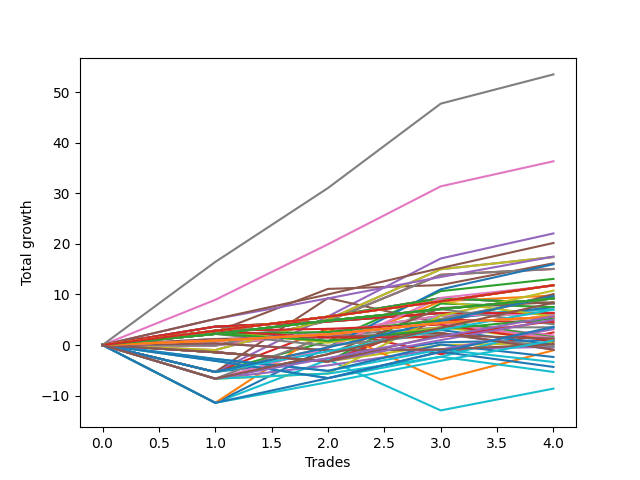

# Short Wallace Doodle 016 
- Symbol: TSLA_Unlimited
- Date Range: 03/23/2022 - 07/08/2022
- Trading Period: 7:20-12:30
- Number of Trades: 4



| Name | Win Percent | Profit | Avg Profit / Trade | Avg Time / Trade |      | Name | Win Percent | Profit | Avg Profit / Trade | Avg Time / Trade |
| ---- | ----------- | ------ | ------------------ | ---------------- | ---- | ---- | ----------- | ------ | ------------------ | ---------------- |
| Sorted By <br> Profit | | | | | | Sorted By <br> Win Percentage ||||
| Seven | 100.00 | 26775.00 | 6693.75 | 159:37 |     | Seven | 100.00 | 26775.00 | 6693.75 | 159:37 |
| Six | 100.00 | 18180.00 | 4545.00 | 82:25 |     | Six | 100.00 | 18180.00 | 4545.00 | 82:25 |
| Forty-Six | 75.00 | 11040.00 | 2760.00 | 66:16 |     | Eighty-Five | 100.00 | 10095.00 | 2523.75 | 63:40 |
| Eighty-Five | 100.00 | 10095.00 | 2523.75 | 63:40 |     | Eighty-Four | 100.00 | 8750.00 | 2187.50 | 41:25 |
| Eighty-Four | 100.00 | 8750.00 | 2187.50 | 41:25 |     | Five | 100.00 | 8085.00 | 2021.25 | 76:48 |
| Sixty | 75.00 | 8705.00 | 2176.25 | 44:08 |     | One Hundred Twenty-Eight | 100.00 | 5915.00 | 1478.75 | 14:20 |
| Four | 75.00 | 8705.00 | 2176.25 | 44:08 |     | One Hundred Twenty-Three | 100.00 | 5915.00 | 1478.75 | 14:20 |
| Five | 100.00 | 8085.00 | 2021.25 | 76:48 |     | One Hundred Eighteen | 100.00 | 5915.00 | 1478.75 | 14:20 |
| Sixty-Two | 75.00 | 7990.00 | 1997.50 | 80:46 |     | One Hundred Thirteen | 100.00 | 5915.00 | 1478.75 | 14:20 |
| Fifty-Nine | 75.00 | 7525.00 | 1881.25 | 27:21 |     | Eighty-Three | 100.00 | 5915.00 | 1478.75 | 14:20 |
| Three | 75.00 | 7525.00 | 1881.25 | 27:21 |     | One Hundred Twenty-Seven | 100.00 | 4600.00 | 1150.00 | 10:22 |
| Forty-Four | 75.00 | 6540.00 | 1635.00 | 33:27 |     | One Hundred Twenty-Two | 100.00 | 4600.00 | 1150.00 | 10:22 |
| One Hundred Twenty-Eight | 100.00 | 5915.00 | 1478.75 | 14:20 |     | One Hundred Seventeen | 100.00 | 4600.00 | 1150.00 | 10:22 |
| One Hundred Twenty-Three | 100.00 | 5915.00 | 1478.75 | 14:20 |     | One Hundred Twelve | 100.00 | 4600.00 | 1150.00 | 10:22 |
| One Hundred Eighteen | 100.00 | 5915.00 | 1478.75 | 14:20 |     | Eighty-Two | 100.00 | 4600.00 | 1150.00 | 10:22 |
| One Hundred Thirteen | 100.00 | 5915.00 | 1478.75 | 14:20 |     | Sixty-Five | 100.00 | 3170.00 | 792.50 | 16:00 |
| Eighty-Three | 100.00 | 5915.00 | 1478.75 | 14:20 |     | Fifty-Seven | 100.00 | 3170.00 | 792.50 | 16:00 |
| Sixty-Eight | 75.00 | 5875.00 | 1468.75 | 33:32 |     | Forty-One | 100.00 | 3170.00 | 792.50 | 16:00 |
| Seventy | 75.00 | 5385.00 | 1346.25 | 56:38 |     | One | 100.00 | 3170.00 | 792.50 | 16:00 |
| Forty-Seven | 50.00 | 5035.00 | 1258.75 | 93:42 |     | One Hundred Twenty-Six | 100.00 | 2800.00 | 700.00 | 06:16 |
| Forty-Three | 75.00 | 4900.00 | 1225.00 | 23:30 |     | One Hundred Twenty-One | 100.00 | 2800.00 | 700.00 | 06:16 |
| One Hundred Fifteen | 75.00 | 4850.00 | 1212.50 | 47:35 |     | One Hundred Sixteen | 100.00 | 2800.00 | 700.00 | 06:16 |
| Sixty-Nine | 75.00 | 4735.00 | 1183.75 | 39:23 |     | One Hundred Eleven | 100.00 | 2800.00 | 700.00 | 06:16 |
| Fifty-Three | 50.00 | 4690.00 | 1172.50 | 23:10 |     | One Hundred Six | 100.00 | 2800.00 | 700.00 | 06:16 |
| One Hundred Twenty-Seven | 100.00 | 4600.00 | 1150.00 | 10:22 |     | Eighty-One | 100.00 | 2800.00 | 700.00 | 06:16 |
| One Hundred Twenty-Two | 100.00 | 4600.00 | 1150.00 | 10:22 |     | Forty-Six | 75.00 | 11040.00 | 2760.00 | 66:16 |
| One Hundred Seventeen | 100.00 | 4600.00 | 1150.00 | 10:22 |     | Sixty | 75.00 | 8705.00 | 2176.25 | 44:08 |
| One Hundred Twelve | 100.00 | 4600.00 | 1150.00 | 10:22 |     | Four | 75.00 | 8705.00 | 2176.25 | 44:08 |
| Eighty-Two | 100.00 | 4600.00 | 1150.00 | 10:22 |     | Sixty-Two | 75.00 | 7990.00 | 1997.50 | 80:46 |
| Sixty-Seven | 75.00 | 4235.00 | 1058.75 | 23:35 |     | Fifty-Nine | 75.00 | 7525.00 | 1881.25 | 27:21 |
| One Hundred Thirty | 75.00 | 4185.00 | 1046.25 | 47:40 |     | Three | 75.00 | 7525.00 | 1881.25 | 27:21 |
| Sixty-Four | 75.00 | 4125.00 | 1031.25 | 08:50 |     | Forty-Four | 75.00 | 6540.00 | 1635.00 | 33:27 |
| Fifty-Six | 75.00 | 4125.00 | 1031.25 | 08:50 |     | Sixty-Eight | 75.00 | 5875.00 | 1468.75 | 33:32 |
| Forty-Eight | 75.00 | 4125.00 | 1031.25 | 08:50 |     | Seventy | 75.00 | 5385.00 | 1346.25 | 56:38 |
| Forty | 75.00 | 4125.00 | 1031.25 | 08:50 |     | Forty-Three | 75.00 | 4900.00 | 1225.00 | 23:30 |
| Zero | 75.00 | 4125.00 | 1031.25 | 08:50 |     | One Hundred Fifteen | 75.00 | 4850.00 | 1212.50 | 47:35 |
| Fifty-Four | 25.00 | 3755.00 | 938.75 | 31:55 |     | Sixty-Nine | 75.00 | 4735.00 | 1183.75 | 39:23 |
| Fifty-Two | 50.00 | 3745.00 | 936.25 | 22:42 |     | Sixty-Seven | 75.00 | 4235.00 | 1058.75 | 23:35 |
| Fifty-One | 50.00 | 3515.00 | 878.75 | 16:45 |     | One Hundred Thirty | 75.00 | 4185.00 | 1046.25 | 47:40 |
| One Hundred Fourteen | 75.00 | 3505.00 | 876.25 | 25:20 |     | Sixty-Four | 75.00 | 4125.00 | 1031.25 | 08:50 |
| Sixty-Five | 100.00 | 3170.00 | 792.50 | 16:00 |     | Fifty-Six | 75.00 | 4125.00 | 1031.25 | 08:50 |
| Fifty-Seven | 100.00 | 3170.00 | 792.50 | 16:00 |     | Forty-Eight | 75.00 | 4125.00 | 1031.25 | 08:50 |
| Forty-One | 100.00 | 3170.00 | 792.50 | 16:00 |     | Forty | 75.00 | 4125.00 | 1031.25 | 08:50 |
| One | 100.00 | 3170.00 | 792.50 | 16:00 |     | Zero | 75.00 | 4125.00 | 1031.25 | 08:50 |
| Fifty-Eight | 75.00 | 3110.00 | 777.50 | 23:51 |     | One Hundred Fourteen | 75.00 | 3505.00 | 876.25 | 25:20 |
| Two | 75.00 | 3110.00 | 777.50 | 23:51 |     | Fifty-Eight | 75.00 | 3110.00 | 777.50 | 23:51 |
| One Hundred Twenty-Nine | 75.00 | 2840.00 | 710.00 | 25:25 |     | Two | 75.00 | 3110.00 | 777.50 | 23:51 |
| One Hundred Three | 75.00 | 2815.00 | 703.75 | 05:58 |     | One Hundred Twenty-Nine | 75.00 | 2840.00 | 710.00 | 25:25 |
| One Hundred Twenty-Six | 100.00 | 2800.00 | 700.00 | 06:16 |     | One Hundred Three | 75.00 | 2815.00 | 703.75 | 05:58 |
| One Hundred Twenty-One | 100.00 | 2800.00 | 700.00 | 06:16 |     | One Hundred Seven | 75.00 | 2610.00 | 652.50 | 09:18 |
| One Hundred Sixteen | 100.00 | 2800.00 | 700.00 | 06:16 |     | One Hundred Eight | 75.00 | 2385.00 | 596.25 | 11:35 |
| One Hundred Eleven | 100.00 | 2800.00 | 700.00 | 06:16 |     | One Hundred Two | 75.00 | 2045.00 | 511.25 | 03:42 |
| One Hundred Six | 100.00 | 2800.00 | 700.00 | 06:16 |     | One Hundred Twenty-Five | 75.00 | 1800.00 | 450.00 | 62:05 |
| Eighty-One | 100.00 | 2800.00 | 700.00 | 06:16 |     | Forty-Nine | 75.00 | 1750.00 | 437.50 | 13:32 |
| One Hundred Seven | 75.00 | 2610.00 | 652.50 | 09:18 |     | Seventy-One | 75.00 | 1720.00 | 430.00 | 74:28 |
| One Hundred Ninteen | 50.00 | 2505.00 | 626.25 | 20:00 |     | One Hundred Nine | 75.00 | 1565.00 | 391.25 | 13:11 |
| One Hundred Eight | 75.00 | 2385.00 | 596.25 | 11:35 |     | Ninety-One | 75.00 | 950.00 | 237.50 | 01:20 |
| Fifty-Five | 25.00 | 2190.00 | 547.50 | 33:12 |     | Ninety-Seven | 75.00 | 770.00 | 192.50 | 03:33 |
| One Hundred Two | 75.00 | 2045.00 | 511.25 | 03:42 |     | One Hundred One | 75.00 | 680.00 | 170.00 | 01:30 |
| One Hundred Twenty-Five | 75.00 | 1800.00 | 450.00 | 62:05 |     | Ninety-Six | 75.00 | 525.00 | 131.25 | 02:51 |
| Forty-Nine | 75.00 | 1750.00 | 437.50 | 13:32 |     | Forty-Two | 75.00 | 485.00 | 121.25 | 20:00 |
| Seventy-One | 75.00 | 1720.00 | 430.00 | 74:28 |     | One Hundred Twenty-Four | 75.00 | 455.00 | 113.75 | 39:50 |
| One Hundred Nine | 75.00 | 1565.00 | 391.25 | 13:11 |     | Ninety-Eight | 75.00 | 360.00 | 90.00 | 04:01 |
| Forty-Five | 50.00 | 1245.00 | 311.25 | 43:06 |     | One Hundred Ten | 75.00 | 85.00 | 21.25 | 15:40 |
| Ninety-One | 75.00 | 950.00 | 237.50 | 01:20 |     | Sixty-Six | 75.00 | -180.00 | -45.00 | 20:05 |
| Ninety-Seven | 75.00 | 770.00 | 192.50 | 03:33 |     | One Hundred | 75.00 | -460.00 | -115.00 | 04:28 |
| One Hundred One | 75.00 | 680.00 | 170.00 | 01:30 |     | Ninety-Nine | 75.00 | -460.00 | -115.00 | 04:28 |
| One Hundred Twenty | 25.00 | 635.00 | 158.75 | 30:13 |     | Forty-Seven | 50.00 | 5035.00 | 1258.75 | 93:42 |
| Ninety-Six | 75.00 | 525.00 | 131.25 | 02:51 |     | Fifty-Three | 50.00 | 4690.00 | 1172.50 | 23:10 |
| Ninety-Three | 50.00 | 515.00 | 128.75 | 04:41 |     | Fifty-Two | 50.00 | 3745.00 | 936.25 | 22:42 |
| Forty-Two | 75.00 | 485.00 | 121.25 | 20:00 |     | Fifty-One | 50.00 | 3515.00 | 878.75 | 16:45 |
| One Hundred Twenty-Four | 75.00 | 455.00 | 113.75 | 39:50 |     | One Hundred Ninteen | 50.00 | 2505.00 | 626.25 | 20:00 |
| Ninety-Eight | 75.00 | 360.00 | 90.00 | 04:01 |     | Forty-Five | 50.00 | 1245.00 | 311.25 | 43:06 |
| Fifty | 50.00 | 205.00 | 51.25 | 15:28 |     | Ninety-Three | 50.00 | 515.00 | 128.75 | 04:41 |
| One Hundred Ten | 75.00 | 85.00 | 21.25 | 15:40 |     | Fifty | 50.00 | 205.00 | 51.25 | 15:28 |
| Seventy-Three | 50.00 | 40.00 | 10.00 | 10:20 |     | Seventy-Three | 50.00 | 40.00 | 10.00 | 10:20 |
| Ninety-Two | 50.00 | -175.00 | -43.75 | 02:30 |     | Ninety-Two | 50.00 | -175.00 | -43.75 | 02:30 |
| Sixty-Six | 75.00 | -180.00 | -45.00 | 20:05 |     | Sixty-Three | 50.00 | -525.00 | -131.25 | 118:35 |
| One Hundred | 75.00 | -460.00 | -115.00 | 04:28 |     | Sixty-One | 50.00 | -4315.00 | -1078.75 | 67:58 |
| Ninety-Nine | 75.00 | -460.00 | -115.00 | 04:28 |     | Fifty-Four | 25.00 | 3755.00 | 938.75 | 31:55 |
| Sixty-Three | 50.00 | -525.00 | -131.25 | 118:35 |     | Fifty-Five | 25.00 | 2190.00 | 547.50 | 33:12 |
| Ninety-Five | 25.00 | -1185.00 | -296.25 | 09:38 |     | One Hundred Twenty | 25.00 | 635.00 | 158.75 | 30:13 |
| Ninety-Four | 25.00 | -1680.00 | -420.00 | 09:35 |     | Ninety-Five | 25.00 | -1185.00 | -296.25 | 09:38 |
| One Hundred Five | 25.00 | -2170.00 | -542.50 | 13:25 |     | Ninety-Four | 25.00 | -1680.00 | -420.00 | 09:35 |
| One Hundred Four | 25.00 | -2665.00 | -666.25 | 13:21 |     | One Hundred Five | 25.00 | -2170.00 | -542.50 | 13:25 |
| Sixty-One | 50.00 | -4315.00 | -1078.75 | 67:58 |     | One Hundred Four | 25.00 | -2665.00 | -666.25 | 13:21 |

## NO STOPLOSS

### Test Zero
* Sell when price hits the middle line of the 20p bollinger
* No Stoploss
* Results:
```
Total Trades: 4
Percent Up: 25.00
Percent Down: 75.00
Total Points Moved Down: 8.25
Potential Profit: 4125.00
Total Points Ups: 1.01 Count Ups: 1
Total Points Downs: 9.26 Count Downs: 3
```

<details><summary>Trades</summary>

<code>In: 2022-05-04 09:42:00		Out: 2022-05-04 09:47:00		Total Position Time: 05:00		Total Move Down: 2.82		Total to Date: 2.82</code> <br />
<code>In: 2022-05-10 10:44:00		Out: 2022-05-10 10:52:05		Total Position Time: 08:05		Total Move Down: 2.78		Total to Date: 5.60</code> <br />
<code>In: 2022-05-31 07:49:00		Out: 2022-05-31 07:58:10		Total Position Time: 09:10		Total Move Down: 3.66		Total to Date: 9.26</code> <br />
<code>In: 2022-06-17 10:11:00		Out: 2022-06-17 10:24:05		Total Position Time: 13:05		Total Move Down: -1.01		Total to Date: 8.25</code> <br />


</details>

### Test One
* Sell when the price hits the upper line of the 20p 1std bollinger
* No Stoploss
* Results:
```
Total Trades: 4
Percent Up: 0.00
Percent Down: 100.00
Total Points Moved Down: 6.34
Potential Profit: 3170.00
Total Points Ups: 0.00 Count Ups: 0
Total Points Downs: 6.34 Count Downs: 4
```

<details><summary>Trades</summary>

<code>In: 2022-05-04 09:42:00		Out: 2022-05-04 09:51:10		Total Position Time: 09:10		Total Move Down: 3.64		Total to Date: 3.64</code> <br />
<code>In: 2022-05-10 10:44:00		Out: 2022-05-10 11:06:35		Total Position Time: 22:35		Total Move Down: 1.01		Total to Date: 4.65</code> <br />
<code>In: 2022-05-31 07:49:00		Out: 2022-05-31 08:04:10		Total Position Time: 15:10		Total Move Down: 1.68		Total to Date: 6.33</code> <br />
<code>In: 2022-06-17 10:11:00		Out: 2022-06-17 10:28:05		Total Position Time: 17:05		Total Move Down: 0.01		Total to Date: 6.34</code> <br />


</details>

### Test Two
* Sell when the price hits the upper line of the 20p 2std bollinger
* No Stoploss
* Results:
```
Total Trades: 4
Percent Up: 25.00
Percent Down: 75.00
Total Points Moved Down: 6.22
Potential Profit: 3110.00
Total Points Ups: 0.09 Count Ups: 1
Total Points Downs: 6.31 Count Downs: 3
```

<details><summary>Trades</summary>

<code>In: 2022-05-04 09:42:00		Out: 2022-05-04 10:18:30		Total Position Time: 36:30		Total Move Down: -0.09		Total to Date: -0.09</code> <br />
<code>In: 2022-05-10 10:44:00		Out: 2022-05-10 11:06:45		Total Position Time: 22:45		Total Move Down: 2.64		Total to Date: 2.55</code> <br />
<code>In: 2022-05-31 07:49:00		Out: 2022-05-31 08:07:05		Total Position Time: 18:05		Total Move Down: 3.23		Total to Date: 5.78</code> <br />
<code>In: 2022-06-17 10:11:00		Out: 2022-06-17 10:29:05		Total Position Time: 18:05		Total Move Down: 0.44		Total to Date: 6.22</code> <br />


</details>

### Test Three
* Sell when price hits the middle line of the 50p bollinger
* No Stoploss
* Results:
```
Total Trades: 4
Percent Up: 25.00
Percent Down: 75.00
Total Points Moved Down: 15.05
Potential Profit: 7525.00
Total Points Ups: 0.09 Count Ups: 1
Total Points Downs: 15.14 Count Downs: 3
```

<details><summary>Trades</summary>

<code>In: 2022-05-04 09:42:00		Out: 2022-05-04 10:18:30		Total Position Time: 36:30		Total Move Down: -0.09		Total to Date: -0.09</code> <br />
<code>In: 2022-05-10 10:44:00		Out: 2022-05-10 11:15:40		Total Position Time: 31:40		Total Move Down: 4.85		Total to Date: 4.76</code> <br />
<code>In: 2022-05-31 07:49:00		Out: 2022-05-31 08:08:50		Total Position Time: 19:50		Total Move Down: 9.13		Total to Date: 13.89</code> <br />
<code>In: 2022-06-17 10:11:00		Out: 2022-06-17 10:32:25		Total Position Time: 21:25		Total Move Down: 1.16		Total to Date: 15.05</code> <br />


</details>

### Test Four
* Sell when the price hits the upper line of the 50p 1std bollinger
* No Stoploss
* Results:
```
Total Trades: 4
Percent Up: 25.00
Percent Down: 75.00
Total Points Moved Down: 17.41
Potential Profit: 8705.00
Total Points Ups: 1.01 Count Ups: 1
Total Points Downs: 18.42 Count Downs: 3
```

<details><summary>Trades</summary>

<code>In: 2022-05-04 09:42:00		Out: 2022-05-04 10:45:50		Total Position Time: 63:50		Total Move Down: -1.01		Total to Date: -1.01</code> <br />
<code>In: 2022-05-10 10:44:00		Out: 2022-05-10 11:21:20		Total Position Time: 37:20		Total Move Down: 6.08		Total to Date: 5.07</code> <br />
<code>In: 2022-05-31 07:49:00		Out: 2022-05-31 08:29:45		Total Position Time: 40:45		Total Move Down: 9.92		Total to Date: 14.99</code> <br />
<code>In: 2022-06-17 10:11:00		Out: 2022-06-17 10:45:40		Total Position Time: 34:40		Total Move Down: 2.42		Total to Date: 17.41</code> <br />


</details>

### Test Five
* Sell when the price hits the upper line of the 50p 2std bollinger
* No Stoploss
* Results:
```
Total Trades: 4
Percent Up: 0.00
Percent Down: 100.00
Total Points Moved Down: 16.17
Potential Profit: 8085.00
Total Points Ups: 0.00 Count Ups: 0
Total Points Downs: 16.17 Count Downs: 4
```

<details><summary>Trades</summary>

<code>In: 2022-05-04 09:42:00		Out: 2022-05-04 11:07:20		Total Position Time: 85:20		Total Move Down: 2.57		Total to Date: 2.57</code> <br />
<code>In: 2022-05-10 10:44:00		Out: 2022-05-10 11:24:05		Total Position Time: 40:05		Total Move Down: 8.53		Total to Date: 11.10</code> <br />
<code>In: 2022-05-31 07:49:00		Out: 2022-05-31 10:14:20		Total Position Time: 145:20		Total Move Down: 0.76		Total to Date: 11.86</code> <br />
<code>In: 2022-06-17 10:11:00		Out: 2022-06-17 10:47:30		Total Position Time: 36:30		Total Move Down: 4.31		Total to Date: 16.17</code> <br />


</details>

### Test Six
* Sell when the price hits the middle line of the 1std VWAP
* No Stoploss
* Results:
```
Total Trades: 4
Percent Up: 0.00
Percent Down: 100.00
Total Points Moved Down: 36.36
Potential Profit: 18180.00
Total Points Ups: 0.00 Count Ups: 0
Total Points Downs: 36.36 Count Downs: 4
```

<details><summary>Trades</summary>

<code>In: 2022-05-04 09:42:00		Out: 2022-05-04 11:07:40		Total Position Time: 85:40		Total Move Down: 8.94		Total to Date: 8.94</code> <br />
<code>In: 2022-05-10 10:44:00		Out: 2022-05-10 12:23:45		Total Position Time: 99:45		Total Move Down: 11.00		Total to Date: 19.94</code> <br />
<code>In: 2022-05-31 07:49:00		Out: 2022-05-31 08:14:15		Total Position Time: 25:15		Total Move Down: 11.46		Total to Date: 31.40</code> <br />
<code>In: 2022-06-17 10:11:00		Out: 2022-06-17 12:10:00		Total Position Time: 119:00		Total Move Down: 4.96		Total to Date: 36.36</code> <br />


</details>

### Test Seven
* Sell when the price hits the upper line of the 1std VWAP
* No Stoploss
* Results:
```
Total Trades: 4
Percent Up: 0.00
Percent Down: 100.00
Total Points Moved Down: 53.55
Potential Profit: 26775.00
Total Points Ups: 0.00 Count Ups: 0
Total Points Downs: 53.55 Count Downs: 4
```

<details><summary>Trades</summary>

<code>In: 2022-05-04 09:42:00		Out: 2022-05-04 11:35:05		Total Position Time: 113:05		Total Move Down: 16.44		Total to Date: 16.44</code> <br />
<code>In: 2022-05-10 10:44:00		Out: 2022-05-10 12:47:00		Total Position Time: 123:00		Total Move Down: 14.63		Total to Date: 31.07</code> <br />
<code>In: 2022-05-31 07:49:00		Out: 2022-05-31 11:55:25		Total Position Time: 246:25		Total Move Down: 16.69		Total to Date: 47.76</code> <br />
<code>In: 2022-06-17 10:11:00		Out: 2022-06-17 12:47:00		Total Position Time: 156:00		Total Move Down: 5.79		Total to Date: 53.55</code> <br />


</details>

## STOPLOSS OF 5

### Test Forty
* Sell when price hits the middle line of the 20p bollinger
* Stoploss is -5 points
* Results:
```
Total Trades: 4
Percent Up: 25.00
Percent Down: 75.00
Total Points Moved Down: 8.25
Potential Profit: 4125.00
Total Points Ups: 1.01 Count Ups: 1
Total Points Downs: 9.26 Count Downs: 3
```

<details><summary>Trades</summary>

<code>In: 2022-05-04 09:42:00		Out: 2022-05-04 09:47:00		Total Position Time: 05:00		Total Move Down: 2.82		Total to Date: 2.82</code> <br />
<code>In: 2022-05-10 10:44:00		Out: 2022-05-10 10:52:05		Total Position Time: 08:05		Total Move Down: 2.78		Total to Date: 5.60</code> <br />
<code>In: 2022-05-31 07:49:00		Out: 2022-05-31 07:58:10		Total Position Time: 09:10		Total Move Down: 3.66		Total to Date: 9.26</code> <br />
<code>In: 2022-06-17 10:11:00		Out: 2022-06-17 10:24:05		Total Position Time: 13:05		Total Move Down: -1.01		Total to Date: 8.25</code> <br />


</details>

### Test Forty-One
* Sell when the price hits the upper line of the 20p 1std bollinger
* Stoploss is -5 points
* Results:
```
Total Trades: 4
Percent Up: 0.00
Percent Down: 100.00
Total Points Moved Down: 6.34
Potential Profit: 3170.00
Total Points Ups: 0.00 Count Ups: 0
Total Points Downs: 6.34 Count Downs: 4
```

<details><summary>Trades</summary>

<code>In: 2022-05-04 09:42:00		Out: 2022-05-04 09:51:10		Total Position Time: 09:10		Total Move Down: 3.64		Total to Date: 3.64</code> <br />
<code>In: 2022-05-10 10:44:00		Out: 2022-05-10 11:06:35		Total Position Time: 22:35		Total Move Down: 1.01		Total to Date: 4.65</code> <br />
<code>In: 2022-05-31 07:49:00		Out: 2022-05-31 08:04:10		Total Position Time: 15:10		Total Move Down: 1.68		Total to Date: 6.33</code> <br />
<code>In: 2022-06-17 10:11:00		Out: 2022-06-17 10:28:05		Total Position Time: 17:05		Total Move Down: 0.01		Total to Date: 6.34</code> <br />


</details>

### Test Forty-Two
* Sell when the price hits the upper line of the 20p 2std bollinger
* Stoploss is -5 points
* Results:
```
Total Trades: 4
Percent Up: 25.00
Percent Down: 75.00
Total Points Moved Down: 0.97
Potential Profit: 485.00
Total Points Ups: 5.34 Count Ups: 1
Total Points Downs: 6.31 Count Downs: 3
```

<details><summary>Trades</summary>

<code>In: 2022-05-04 09:42:00		Out: 2022-05-04 10:03:05		Total Position Time: 21:05		Total Move Down: -5.34		Total to Date: -5.34</code> <br />
<code>In: 2022-05-10 10:44:00		Out: 2022-05-10 11:06:45		Total Position Time: 22:45		Total Move Down: 2.64		Total to Date: -2.70</code> <br />
<code>In: 2022-05-31 07:49:00		Out: 2022-05-31 08:07:05		Total Position Time: 18:05		Total Move Down: 3.23		Total to Date: 0.53</code> <br />
<code>In: 2022-06-17 10:11:00		Out: 2022-06-17 10:29:05		Total Position Time: 18:05		Total Move Down: 0.44		Total to Date: 0.97</code> <br />


</details>

### Test Forty-Three
* Sell when price hits the middle line of the 50p bollinger
* Stoploss is -5 points
* Results:
```
Total Trades: 4
Percent Up: 25.00
Percent Down: 75.00
Total Points Moved Down: 9.80
Potential Profit: 4900.00
Total Points Ups: 5.34 Count Ups: 1
Total Points Downs: 15.14 Count Downs: 3
```

<details><summary>Trades</summary>

<code>In: 2022-05-04 09:42:00		Out: 2022-05-04 10:03:05		Total Position Time: 21:05		Total Move Down: -5.34		Total to Date: -5.34</code> <br />
<code>In: 2022-05-10 10:44:00		Out: 2022-05-10 11:15:40		Total Position Time: 31:40		Total Move Down: 4.85		Total to Date: -0.49</code> <br />
<code>In: 2022-05-31 07:49:00		Out: 2022-05-31 08:08:50		Total Position Time: 19:50		Total Move Down: 9.13		Total to Date: 8.64</code> <br />
<code>In: 2022-06-17 10:11:00		Out: 2022-06-17 10:32:25		Total Position Time: 21:25		Total Move Down: 1.16		Total to Date: 9.80</code> <br />


</details>

### Test Forty-Four
* Sell when the price hits the upper line of the 50p 1std bollinger
* Stoploss is -5 points
* Results:
```
Total Trades: 4
Percent Up: 25.00
Percent Down: 75.00
Total Points Moved Down: 13.08
Potential Profit: 6540.00
Total Points Ups: 5.34 Count Ups: 1
Total Points Downs: 18.42 Count Downs: 3
```

<details><summary>Trades</summary>

<code>In: 2022-05-04 09:42:00		Out: 2022-05-04 10:03:05		Total Position Time: 21:05		Total Move Down: -5.34		Total to Date: -5.34</code> <br />
<code>In: 2022-05-10 10:44:00		Out: 2022-05-10 11:21:20		Total Position Time: 37:20		Total Move Down: 6.08		Total to Date: 0.74</code> <br />
<code>In: 2022-05-31 07:49:00		Out: 2022-05-31 08:29:45		Total Position Time: 40:45		Total Move Down: 9.92		Total to Date: 10.66</code> <br />
<code>In: 2022-06-17 10:11:00		Out: 2022-06-17 10:45:40		Total Position Time: 34:40		Total Move Down: 2.42		Total to Date: 13.08</code> <br />


</details>

### Test Forty-Five
* Sell when the price hits the upper line of the 50p 2std bollinger
* Stoploss is -5 points
* Results:
```
Total Trades: 4
Percent Up: 50.00
Percent Down: 50.00
Total Points Moved Down: 2.49
Potential Profit: 1245.00
Total Points Ups: 10.35 Count Ups: 2
Total Points Downs: 12.84 Count Downs: 2
```

<details><summary>Trades</summary>

<code>In: 2022-05-04 09:42:00		Out: 2022-05-04 10:03:05		Total Position Time: 21:05		Total Move Down: -5.34		Total to Date: -5.34</code> <br />
<code>In: 2022-05-10 10:44:00		Out: 2022-05-10 11:24:05		Total Position Time: 40:05		Total Move Down: 8.53		Total to Date: 3.19</code> <br />
<code>In: 2022-05-31 07:49:00		Out: 2022-05-31 09:03:45		Total Position Time: 74:45		Total Move Down: -5.01		Total to Date: -1.82</code> <br />
<code>In: 2022-06-17 10:11:00		Out: 2022-06-17 10:47:30		Total Position Time: 36:30		Total Move Down: 4.31		Total to Date: 2.49</code> <br />


</details>

### Test Forty-Six
* Sell when the price hits the middle line of the 1std VWAP
* Stoploss is -5 points
* Results:
```
Total Trades: 4
Percent Up: 25.00
Percent Down: 75.00
Total Points Moved Down: 22.08
Potential Profit: 11040.00
Total Points Ups: 5.34 Count Ups: 1
Total Points Downs: 27.42 Count Downs: 3
```

<details><summary>Trades</summary>

<code>In: 2022-05-04 09:42:00		Out: 2022-05-04 10:03:05		Total Position Time: 21:05		Total Move Down: -5.34		Total to Date: -5.34</code> <br />
<code>In: 2022-05-10 10:44:00		Out: 2022-05-10 12:23:45		Total Position Time: 99:45		Total Move Down: 11.00		Total to Date: 5.66</code> <br />
<code>In: 2022-05-31 07:49:00		Out: 2022-05-31 08:14:15		Total Position Time: 25:15		Total Move Down: 11.46		Total to Date: 17.12</code> <br />
<code>In: 2022-06-17 10:11:00		Out: 2022-06-17 12:10:00		Total Position Time: 119:00		Total Move Down: 4.96		Total to Date: 22.08</code> <br />


</details>

### Test Forty-Seven
* Sell when the price hits the upper line of the 1std VWAP
* Stoploss is -5 points
* Results:
```
Total Trades: 4
Percent Up: 50.00
Percent Down: 50.00
Total Points Moved Down: 10.07
Potential Profit: 5035.00
Total Points Ups: 10.35 Count Ups: 2
Total Points Downs: 20.42 Count Downs: 2
```

<details><summary>Trades</summary>

<code>In: 2022-05-04 09:42:00		Out: 2022-05-04 10:03:05		Total Position Time: 21:05		Total Move Down: -5.34		Total to Date: -5.34</code> <br />
<code>In: 2022-05-10 10:44:00		Out: 2022-05-10 12:47:00		Total Position Time: 123:00		Total Move Down: 14.63		Total to Date: 9.29</code> <br />
<code>In: 2022-05-31 07:49:00		Out: 2022-05-31 09:03:45		Total Position Time: 74:45		Total Move Down: -5.01		Total to Date: 4.28</code> <br />
<code>In: 2022-06-17 10:11:00		Out: 2022-06-17 12:47:00		Total Position Time: 156:00		Total Move Down: 5.79		Total to Date: 10.07</code> <br />


</details>

## TRAIL STOP OF 5

### Test Forty-Eight
* Sell when price hits the middle line of the 20p bollinger
* Trailing Stop is -5 points
* Results:
```
Total Trades: 4
Percent Up: 25.00
Percent Down: 75.00
Total Points Moved Down: 8.25
Potential Profit: 4125.00
Total Points Ups: 1.01 Count Ups: 1
Total Points Downs: 9.26 Count Downs: 3
```

<details><summary>Trades</summary>

<code>In: 2022-05-04 09:42:00		Out: 2022-05-04 09:47:00		Total Position Time: 05:00		Total Move Down: 2.82		Total to Date: 2.82</code> <br />
<code>In: 2022-05-10 10:44:00		Out: 2022-05-10 10:52:05		Total Position Time: 08:05		Total Move Down: 2.78		Total to Date: 5.60</code> <br />
<code>In: 2022-05-31 07:49:00		Out: 2022-05-31 07:58:10		Total Position Time: 09:10		Total Move Down: 3.66		Total to Date: 9.26</code> <br />
<code>In: 2022-06-17 10:11:00		Out: 2022-06-17 10:24:05		Total Position Time: 13:05		Total Move Down: -1.01		Total to Date: 8.25</code> <br />


</details>

### Test Forty-Nine
* Sell when the price hits the upper line of the 20p 1std bollinger
* Trailing Stop is -5 points
* Results:
```
Total Trades: 4
Percent Up: 25.00
Percent Down: 75.00
Total Points Moved Down: 3.50
Potential Profit: 1750.00
Total Points Ups: 1.83 Count Ups: 1
Total Points Downs: 5.33 Count Downs: 3
```

<details><summary>Trades</summary>

<code>In: 2022-05-04 09:42:00		Out: 2022-05-04 09:51:10		Total Position Time: 09:10		Total Move Down: 3.64		Total to Date: 3.64</code> <br />
<code>In: 2022-05-10 10:44:00		Out: 2022-05-10 10:56:45		Total Position Time: 12:45		Total Move Down: -1.83		Total to Date: 1.81</code> <br />
<code>In: 2022-05-31 07:49:00		Out: 2022-05-31 08:04:10		Total Position Time: 15:10		Total Move Down: 1.68		Total to Date: 3.49</code> <br />
<code>In: 2022-06-17 10:11:00		Out: 2022-06-17 10:28:05		Total Position Time: 17:05		Total Move Down: 0.01		Total to Date: 3.50</code> <br />


</details>

### Test Fifty
* Sell when the price hits the upper line of the 20p 2std bollinger
* Trailing Stop is -5 points
* Results:
```
Total Trades: 4
Percent Up: 50.00
Percent Down: 50.00
Total Points Moved Down: 0.41
Potential Profit: 205.00
Total Points Ups: 3.26 Count Ups: 2
Total Points Downs: 3.67 Count Downs: 2
```

<details><summary>Trades</summary>

<code>In: 2022-05-04 09:42:00		Out: 2022-05-04 09:55:00		Total Position Time: 13:00		Total Move Down: -1.43		Total to Date: -1.43</code> <br />
<code>In: 2022-05-10 10:44:00		Out: 2022-05-10 10:56:45		Total Position Time: 12:45		Total Move Down: -1.83		Total to Date: -3.26</code> <br />
<code>In: 2022-05-31 07:49:00		Out: 2022-05-31 08:07:05		Total Position Time: 18:05		Total Move Down: 3.23		Total to Date: -0.03</code> <br />
<code>In: 2022-06-17 10:11:00		Out: 2022-06-17 10:29:05		Total Position Time: 18:05		Total Move Down: 0.44		Total to Date: 0.41</code> <br />


</details>

### Test Fifty-One
* Sell when price hits the middle line of the 50p bollinger
* Trailing Stop is -5 points
* Results:
```
Total Trades: 4
Percent Up: 50.00
Percent Down: 50.00
Total Points Moved Down: 7.03
Potential Profit: 3515.00
Total Points Ups: 3.26 Count Ups: 2
Total Points Downs: 10.29 Count Downs: 2
```

<details><summary>Trades</summary>

<code>In: 2022-05-04 09:42:00		Out: 2022-05-04 09:55:00		Total Position Time: 13:00		Total Move Down: -1.43		Total to Date: -1.43</code> <br />
<code>In: 2022-05-10 10:44:00		Out: 2022-05-10 10:56:45		Total Position Time: 12:45		Total Move Down: -1.83		Total to Date: -3.26</code> <br />
<code>In: 2022-05-31 07:49:00		Out: 2022-05-31 08:08:50		Total Position Time: 19:50		Total Move Down: 9.13		Total to Date: 5.87</code> <br />
<code>In: 2022-06-17 10:11:00		Out: 2022-06-17 10:32:25		Total Position Time: 21:25		Total Move Down: 1.16		Total to Date: 7.03</code> <br />


</details>

### Test Fifty-Two
* Sell when the price hits the upper line of the 50p 1std bollinger
* Trailing Stop is -5 points
* Results:
```
Total Trades: 4
Percent Up: 50.00
Percent Down: 50.00
Total Points Moved Down: 7.49
Potential Profit: 3745.00
Total Points Ups: 3.26 Count Ups: 2
Total Points Downs: 10.75 Count Downs: 2
```

<details><summary>Trades</summary>

<code>In: 2022-05-04 09:42:00		Out: 2022-05-04 09:55:00		Total Position Time: 13:00		Total Move Down: -1.43		Total to Date: -1.43</code> <br />
<code>In: 2022-05-10 10:44:00		Out: 2022-05-10 10:56:45		Total Position Time: 12:45		Total Move Down: -1.83		Total to Date: -3.26</code> <br />
<code>In: 2022-05-31 07:49:00		Out: 2022-05-31 08:19:25		Total Position Time: 30:25		Total Move Down: 8.33		Total to Date: 5.07</code> <br />
<code>In: 2022-06-17 10:11:00		Out: 2022-06-17 10:45:40		Total Position Time: 34:40		Total Move Down: 2.42		Total to Date: 7.49</code> <br />


</details>

### Test Fifty-Three
* Sell when the price hits the upper line of the 50p 2std bollinger
* Trailing Stop is -5 points
* Results:
```
Total Trades: 4
Percent Up: 50.00
Percent Down: 50.00
Total Points Moved Down: 9.38
Potential Profit: 4690.00
Total Points Ups: 3.26 Count Ups: 2
Total Points Downs: 12.64 Count Downs: 2
```

<details><summary>Trades</summary>

<code>In: 2022-05-04 09:42:00		Out: 2022-05-04 09:55:00		Total Position Time: 13:00		Total Move Down: -1.43		Total to Date: -1.43</code> <br />
<code>In: 2022-05-10 10:44:00		Out: 2022-05-10 10:56:45		Total Position Time: 12:45		Total Move Down: -1.83		Total to Date: -3.26</code> <br />
<code>In: 2022-05-31 07:49:00		Out: 2022-05-31 08:19:25		Total Position Time: 30:25		Total Move Down: 8.33		Total to Date: 5.07</code> <br />
<code>In: 2022-06-17 10:11:00		Out: 2022-06-17 10:47:30		Total Position Time: 36:30		Total Move Down: 4.31		Total to Date: 9.38</code> <br />


</details>

### Test Fifty-Four
* Sell when the price hits the middle line of the 1std VWAP
* Trailing Stop is -5 points
* Results:
```
Total Trades: 4
Percent Up: 75.00
Percent Down: 25.00
Total Points Moved Down: 7.51
Potential Profit: 3755.00
Total Points Ups: 3.95 Count Ups: 3
Total Points Downs: 11.46 Count Downs: 1
```

<details><summary>Trades</summary>

<code>In: 2022-05-04 09:42:00		Out: 2022-05-04 09:55:00		Total Position Time: 13:00		Total Move Down: -1.43		Total to Date: -1.43</code> <br />
<code>In: 2022-05-10 10:44:00		Out: 2022-05-10 10:56:45		Total Position Time: 12:45		Total Move Down: -1.83		Total to Date: -3.26</code> <br />
<code>In: 2022-05-31 07:49:00		Out: 2022-05-31 08:14:15		Total Position Time: 25:15		Total Move Down: 11.46		Total to Date: 8.20</code> <br />
<code>In: 2022-06-17 10:11:00		Out: 2022-06-17 11:27:40		Total Position Time: 76:40		Total Move Down: -0.69		Total to Date: 7.51</code> <br />


</details>

### Test Fifty-Five
* Sell when the price hits the upper line of the 1std VWAP
* Trailing Stop is -5 points
* Results:
```
Total Trades: 4
Percent Up: 75.00
Percent Down: 25.00
Total Points Moved Down: 4.38
Potential Profit: 2190.00
Total Points Ups: 3.95 Count Ups: 3
Total Points Downs: 8.33 Count Downs: 1
```

<details><summary>Trades</summary>

<code>In: 2022-05-04 09:42:00		Out: 2022-05-04 09:55:00		Total Position Time: 13:00		Total Move Down: -1.43		Total to Date: -1.43</code> <br />
<code>In: 2022-05-10 10:44:00		Out: 2022-05-10 10:56:45		Total Position Time: 12:45		Total Move Down: -1.83		Total to Date: -3.26</code> <br />
<code>In: 2022-05-31 07:49:00		Out: 2022-05-31 08:19:25		Total Position Time: 30:25		Total Move Down: 8.33		Total to Date: 5.07</code> <br />
<code>In: 2022-06-17 10:11:00		Out: 2022-06-17 11:27:40		Total Position Time: 76:40		Total Move Down: -0.69		Total to Date: 4.38</code> <br />


</details>

## STOPLOSS OF 10

### Test Fifty-Six
* Sell when price hits the middle line of the 20p bollinger
* Stoploss is -10 points
* Results:
```
Total Trades: 4
Percent Up: 25.00
Percent Down: 75.00
Total Points Moved Down: 8.25
Potential Profit: 4125.00
Total Points Ups: 1.01 Count Ups: 1
Total Points Downs: 9.26 Count Downs: 3
```

<details><summary>Trades</summary>

<code>In: 2022-05-04 09:42:00		Out: 2022-05-04 09:47:00		Total Position Time: 05:00		Total Move Down: 2.82		Total to Date: 2.82</code> <br />
<code>In: 2022-05-10 10:44:00		Out: 2022-05-10 10:52:05		Total Position Time: 08:05		Total Move Down: 2.78		Total to Date: 5.60</code> <br />
<code>In: 2022-05-31 07:49:00		Out: 2022-05-31 07:58:10		Total Position Time: 09:10		Total Move Down: 3.66		Total to Date: 9.26</code> <br />
<code>In: 2022-06-17 10:11:00		Out: 2022-06-17 10:24:05		Total Position Time: 13:05		Total Move Down: -1.01		Total to Date: 8.25</code> <br />


</details>

### Test Fifty-Seven
* Sell when the price hits the upper line of the 20p 1std bollinger
* Stoploss is -10 points
* Results:
```
Total Trades: 4
Percent Up: 0.00
Percent Down: 100.00
Total Points Moved Down: 6.34
Potential Profit: 3170.00
Total Points Ups: 0.00 Count Ups: 0
Total Points Downs: 6.34 Count Downs: 4
```

<details><summary>Trades</summary>

<code>In: 2022-05-04 09:42:00		Out: 2022-05-04 09:51:10		Total Position Time: 09:10		Total Move Down: 3.64		Total to Date: 3.64</code> <br />
<code>In: 2022-05-10 10:44:00		Out: 2022-05-10 11:06:35		Total Position Time: 22:35		Total Move Down: 1.01		Total to Date: 4.65</code> <br />
<code>In: 2022-05-31 07:49:00		Out: 2022-05-31 08:04:10		Total Position Time: 15:10		Total Move Down: 1.68		Total to Date: 6.33</code> <br />
<code>In: 2022-06-17 10:11:00		Out: 2022-06-17 10:28:05		Total Position Time: 17:05		Total Move Down: 0.01		Total to Date: 6.34</code> <br />


</details>

### Test Fifty-Eight
* Sell when the price hits the upper line of the 20p 2std bollinger
* Stoploss is -10 points
* Results:
```
Total Trades: 4
Percent Up: 25.00
Percent Down: 75.00
Total Points Moved Down: 6.22
Potential Profit: 3110.00
Total Points Ups: 0.09 Count Ups: 1
Total Points Downs: 6.31 Count Downs: 3
```

<details><summary>Trades</summary>

<code>In: 2022-05-04 09:42:00		Out: 2022-05-04 10:18:30		Total Position Time: 36:30		Total Move Down: -0.09		Total to Date: -0.09</code> <br />
<code>In: 2022-05-10 10:44:00		Out: 2022-05-10 11:06:45		Total Position Time: 22:45		Total Move Down: 2.64		Total to Date: 2.55</code> <br />
<code>In: 2022-05-31 07:49:00		Out: 2022-05-31 08:07:05		Total Position Time: 18:05		Total Move Down: 3.23		Total to Date: 5.78</code> <br />
<code>In: 2022-06-17 10:11:00		Out: 2022-06-17 10:29:05		Total Position Time: 18:05		Total Move Down: 0.44		Total to Date: 6.22</code> <br />


</details>

### Test Fifty-Nine
* Sell when price hits the middle line of the 50p bollinger
* Stoploss is -10 points
* Results:
```
Total Trades: 4
Percent Up: 25.00
Percent Down: 75.00
Total Points Moved Down: 15.05
Potential Profit: 7525.00
Total Points Ups: 0.09 Count Ups: 1
Total Points Downs: 15.14 Count Downs: 3
```

<details><summary>Trades</summary>

<code>In: 2022-05-04 09:42:00		Out: 2022-05-04 10:18:30		Total Position Time: 36:30		Total Move Down: -0.09		Total to Date: -0.09</code> <br />
<code>In: 2022-05-10 10:44:00		Out: 2022-05-10 11:15:40		Total Position Time: 31:40		Total Move Down: 4.85		Total to Date: 4.76</code> <br />
<code>In: 2022-05-31 07:49:00		Out: 2022-05-31 08:08:50		Total Position Time: 19:50		Total Move Down: 9.13		Total to Date: 13.89</code> <br />
<code>In: 2022-06-17 10:11:00		Out: 2022-06-17 10:32:25		Total Position Time: 21:25		Total Move Down: 1.16		Total to Date: 15.05</code> <br />


</details>

### Test Sixty
* Sell when the price hits the upper line of the 50p 1std bollinger
* Stoploss is -10 points
* Results:
```
Total Trades: 4
Percent Up: 25.00
Percent Down: 75.00
Total Points Moved Down: 17.41
Potential Profit: 8705.00
Total Points Ups: 1.01 Count Ups: 1
Total Points Downs: 18.42 Count Downs: 3
```

<details><summary>Trades</summary>

<code>In: 2022-05-04 09:42:00		Out: 2022-05-04 10:45:50		Total Position Time: 63:50		Total Move Down: -1.01		Total to Date: -1.01</code> <br />
<code>In: 2022-05-10 10:44:00		Out: 2022-05-10 11:21:20		Total Position Time: 37:20		Total Move Down: 6.08		Total to Date: 5.07</code> <br />
<code>In: 2022-05-31 07:49:00		Out: 2022-05-31 08:29:45		Total Position Time: 40:45		Total Move Down: 9.92		Total to Date: 14.99</code> <br />
<code>In: 2022-06-17 10:11:00		Out: 2022-06-17 10:45:40		Total Position Time: 34:40		Total Move Down: 2.42		Total to Date: 17.41</code> <br />


</details>

### Test Sixty-One
* Sell when the price hits the upper line of the 50p 2std bollinger
* Stoploss is -10 points
* Results:
```
Total Trades: 4
Percent Up: 50.00
Percent Down: 50.00
Total Points Moved Down: -8.63
Potential Profit: -4315.00
Total Points Ups: 21.47 Count Ups: 2
Total Points Downs: 12.84 Count Downs: 2
```

<details><summary>Trades</summary>

<code>In: 2022-05-04 09:42:00		Out: 2022-05-04 11:01:05		Total Position Time: 79:05		Total Move Down: -11.44		Total to Date: -11.44</code> <br />
<code>In: 2022-05-10 10:44:00		Out: 2022-05-10 11:24:05		Total Position Time: 40:05		Total Move Down: 8.53		Total to Date: -2.91</code> <br />
<code>In: 2022-05-31 07:49:00		Out: 2022-05-31 09:45:15		Total Position Time: 116:15		Total Move Down: -10.03		Total to Date: -12.94</code> <br />
<code>In: 2022-06-17 10:11:00		Out: 2022-06-17 10:47:30		Total Position Time: 36:30		Total Move Down: 4.31		Total to Date: -8.63</code> <br />


</details>

### Test Sixty-Two
* Sell when the price hits the middle line of the 1std VWAP
* Stoploss is -10 points
* Results:
```
Total Trades: 4
Percent Up: 25.00
Percent Down: 75.00
Total Points Moved Down: 15.98
Potential Profit: 7990.00
Total Points Ups: 11.44 Count Ups: 1
Total Points Downs: 27.42 Count Downs: 3
```

<details><summary>Trades</summary>

<code>In: 2022-05-04 09:42:00		Out: 2022-05-04 11:01:05		Total Position Time: 79:05		Total Move Down: -11.44		Total to Date: -11.44</code> <br />
<code>In: 2022-05-10 10:44:00		Out: 2022-05-10 12:23:45		Total Position Time: 99:45		Total Move Down: 11.00		Total to Date: -0.44</code> <br />
<code>In: 2022-05-31 07:49:00		Out: 2022-05-31 08:14:15		Total Position Time: 25:15		Total Move Down: 11.46		Total to Date: 11.02</code> <br />
<code>In: 2022-06-17 10:11:00		Out: 2022-06-17 12:10:00		Total Position Time: 119:00		Total Move Down: 4.96		Total to Date: 15.98</code> <br />


</details>

### Test Sixty-Three
* Sell when the price hits the upper line of the 1std VWAP
* Stoploss is -10 points
* Results:
```
Total Trades: 4
Percent Up: 50.00
Percent Down: 50.00
Total Points Moved Down: -1.05
Potential Profit: -525.00
Total Points Ups: 21.47 Count Ups: 2
Total Points Downs: 20.42 Count Downs: 2
```

<details><summary>Trades</summary>

<code>In: 2022-05-04 09:42:00		Out: 2022-05-04 11:01:05		Total Position Time: 79:05		Total Move Down: -11.44		Total to Date: -11.44</code> <br />
<code>In: 2022-05-10 10:44:00		Out: 2022-05-10 12:47:00		Total Position Time: 123:00		Total Move Down: 14.63		Total to Date: 3.19</code> <br />
<code>In: 2022-05-31 07:49:00		Out: 2022-05-31 09:45:15		Total Position Time: 116:15		Total Move Down: -10.03		Total to Date: -6.84</code> <br />
<code>In: 2022-06-17 10:11:00		Out: 2022-06-17 12:47:00		Total Position Time: 156:00		Total Move Down: 5.79		Total to Date: -1.05</code> <br />


</details>

## TRAIL STOP OF 10

### Test Sixty-Four
* Sell when price hits the middle line of the 20p bollinger
* Trailing Stop is -10 points
* Results:
```
Total Trades: 4
Percent Up: 25.00
Percent Down: 75.00
Total Points Moved Down: 8.25
Potential Profit: 4125.00
Total Points Ups: 1.01 Count Ups: 1
Total Points Downs: 9.26 Count Downs: 3
```

<details><summary>Trades</summary>

<code>In: 2022-05-04 09:42:00		Out: 2022-05-04 09:47:00		Total Position Time: 05:00		Total Move Down: 2.82		Total to Date: 2.82</code> <br />
<code>In: 2022-05-10 10:44:00		Out: 2022-05-10 10:52:05		Total Position Time: 08:05		Total Move Down: 2.78		Total to Date: 5.60</code> <br />
<code>In: 2022-05-31 07:49:00		Out: 2022-05-31 07:58:10		Total Position Time: 09:10		Total Move Down: 3.66		Total to Date: 9.26</code> <br />
<code>In: 2022-06-17 10:11:00		Out: 2022-06-17 10:24:05		Total Position Time: 13:05		Total Move Down: -1.01		Total to Date: 8.25</code> <br />


</details>

### Test Sixty-Five
* Sell when the price hits the upper line of the 20p 1std bollinger
* Trailing Stop is -10 points
* Results:
```
Total Trades: 4
Percent Up: 0.00
Percent Down: 100.00
Total Points Moved Down: 6.34
Potential Profit: 3170.00
Total Points Ups: 0.00 Count Ups: 0
Total Points Downs: 6.34 Count Downs: 4
```

<details><summary>Trades</summary>

<code>In: 2022-05-04 09:42:00		Out: 2022-05-04 09:51:10		Total Position Time: 09:10		Total Move Down: 3.64		Total to Date: 3.64</code> <br />
<code>In: 2022-05-10 10:44:00		Out: 2022-05-10 11:06:35		Total Position Time: 22:35		Total Move Down: 1.01		Total to Date: 4.65</code> <br />
<code>In: 2022-05-31 07:49:00		Out: 2022-05-31 08:04:10		Total Position Time: 15:10		Total Move Down: 1.68		Total to Date: 6.33</code> <br />
<code>In: 2022-06-17 10:11:00		Out: 2022-06-17 10:28:05		Total Position Time: 17:05		Total Move Down: 0.01		Total to Date: 6.34</code> <br />


</details>

### Test Sixty-Six
* Sell when the price hits the upper line of the 20p 2std bollinger
* Trailing Stop is -10 points
* Results:
```
Total Trades: 4
Percent Up: 25.00
Percent Down: 75.00
Total Points Moved Down: -0.36
Potential Profit: -180.00
Total Points Ups: 6.67 Count Ups: 1
Total Points Downs: 6.31 Count Downs: 3
```

<details><summary>Trades</summary>

<code>In: 2022-05-04 09:42:00		Out: 2022-05-04 10:03:25		Total Position Time: 21:25		Total Move Down: -6.67		Total to Date: -6.67</code> <br />
<code>In: 2022-05-10 10:44:00		Out: 2022-05-10 11:06:45		Total Position Time: 22:45		Total Move Down: 2.64		Total to Date: -4.03</code> <br />
<code>In: 2022-05-31 07:49:00		Out: 2022-05-31 08:07:05		Total Position Time: 18:05		Total Move Down: 3.23		Total to Date: -0.80</code> <br />
<code>In: 2022-06-17 10:11:00		Out: 2022-06-17 10:29:05		Total Position Time: 18:05		Total Move Down: 0.44		Total to Date: -0.36</code> <br />


</details>

### Test Sixty-Seven
* Sell when price hits the middle line of the 50p bollinger
* Trailing Stop is -10 points
* Results:
```
Total Trades: 4
Percent Up: 25.00
Percent Down: 75.00
Total Points Moved Down: 8.47
Potential Profit: 4235.00
Total Points Ups: 6.67 Count Ups: 1
Total Points Downs: 15.14 Count Downs: 3
```

<details><summary>Trades</summary>

<code>In: 2022-05-04 09:42:00		Out: 2022-05-04 10:03:25		Total Position Time: 21:25		Total Move Down: -6.67		Total to Date: -6.67</code> <br />
<code>In: 2022-05-10 10:44:00		Out: 2022-05-10 11:15:40		Total Position Time: 31:40		Total Move Down: 4.85		Total to Date: -1.82</code> <br />
<code>In: 2022-05-31 07:49:00		Out: 2022-05-31 08:08:50		Total Position Time: 19:50		Total Move Down: 9.13		Total to Date: 7.31</code> <br />
<code>In: 2022-06-17 10:11:00		Out: 2022-06-17 10:32:25		Total Position Time: 21:25		Total Move Down: 1.16		Total to Date: 8.47</code> <br />


</details>

### Test Sixty-Eight
* Sell when the price hits the upper line of the 50p 1std bollinger
* Trailing Stop is -10 points
* Results:
```
Total Trades: 4
Percent Up: 25.00
Percent Down: 75.00
Total Points Moved Down: 11.75
Potential Profit: 5875.00
Total Points Ups: 6.67 Count Ups: 1
Total Points Downs: 18.42 Count Downs: 3
```

<details><summary>Trades</summary>

<code>In: 2022-05-04 09:42:00		Out: 2022-05-04 10:03:25		Total Position Time: 21:25		Total Move Down: -6.67		Total to Date: -6.67</code> <br />
<code>In: 2022-05-10 10:44:00		Out: 2022-05-10 11:21:20		Total Position Time: 37:20		Total Move Down: 6.08		Total to Date: -0.59</code> <br />
<code>In: 2022-05-31 07:49:00		Out: 2022-05-31 08:29:45		Total Position Time: 40:45		Total Move Down: 9.92		Total to Date: 9.33</code> <br />
<code>In: 2022-06-17 10:11:00		Out: 2022-06-17 10:45:40		Total Position Time: 34:40		Total Move Down: 2.42		Total to Date: 11.75</code> <br />


</details>

### Test Sixty-Nine
* Sell when the price hits the upper line of the 50p 2std bollinger
* Trailing Stop is -10 points
* Results:
```
Total Trades: 4
Percent Up: 25.00
Percent Down: 75.00
Total Points Moved Down: 9.47
Potential Profit: 4735.00
Total Points Ups: 6.67 Count Ups: 1
Total Points Downs: 16.14 Count Downs: 3
```

<details><summary>Trades</summary>

<code>In: 2022-05-04 09:42:00		Out: 2022-05-04 10:03:25		Total Position Time: 21:25		Total Move Down: -6.67		Total to Date: -6.67</code> <br />
<code>In: 2022-05-10 10:44:00		Out: 2022-05-10 11:24:05		Total Position Time: 40:05		Total Move Down: 8.53		Total to Date: 1.86</code> <br />
<code>In: 2022-05-31 07:49:00		Out: 2022-05-31 08:48:35		Total Position Time: 59:35		Total Move Down: 3.30		Total to Date: 5.16</code> <br />
<code>In: 2022-06-17 10:11:00		Out: 2022-06-17 10:47:30		Total Position Time: 36:30		Total Move Down: 4.31		Total to Date: 9.47</code> <br />


</details>

### Test Seventy
* Sell when the price hits the middle line of the 1std VWAP
* Trailing Stop is -10 points
* Results:
```
Total Trades: 4
Percent Up: 25.00
Percent Down: 75.00
Total Points Moved Down: 10.77
Potential Profit: 5385.00
Total Points Ups: 6.67 Count Ups: 1
Total Points Downs: 17.44 Count Downs: 3
```

<details><summary>Trades</summary>

<code>In: 2022-05-04 09:42:00		Out: 2022-05-04 10:03:25		Total Position Time: 21:25		Total Move Down: -6.67		Total to Date: -6.67</code> <br />
<code>In: 2022-05-10 10:44:00		Out: 2022-05-10 11:44:55		Total Position Time: 60:55		Total Move Down: 1.02		Total to Date: -5.65</code> <br />
<code>In: 2022-05-31 07:49:00		Out: 2022-05-31 08:14:15		Total Position Time: 25:15		Total Move Down: 11.46		Total to Date: 5.81</code> <br />
<code>In: 2022-06-17 10:11:00		Out: 2022-06-17 12:10:00		Total Position Time: 119:00		Total Move Down: 4.96		Total to Date: 10.77</code> <br />


</details>

### Test Seventy-One
* Sell when the price hits the upper line of the 1std VWAP
* Trailing Stop is -10 points
* Results:
```
Total Trades: 4
Percent Up: 25.00
Percent Down: 75.00
Total Points Moved Down: 3.44
Potential Profit: 1720.00
Total Points Ups: 6.67 Count Ups: 1
Total Points Downs: 10.11 Count Downs: 3
```

<details><summary>Trades</summary>

<code>In: 2022-05-04 09:42:00		Out: 2022-05-04 10:03:25		Total Position Time: 21:25		Total Move Down: -6.67		Total to Date: -6.67</code> <br />
<code>In: 2022-05-10 10:44:00		Out: 2022-05-10 11:44:55		Total Position Time: 60:55		Total Move Down: 1.02		Total to Date: -5.65</code> <br />
<code>In: 2022-05-31 07:49:00		Out: 2022-05-31 08:48:35		Total Position Time: 59:35		Total Move Down: 3.30		Total to Date: -2.35</code> <br />
<code>In: 2022-06-17 10:11:00		Out: 2022-06-17 12:47:00		Total Position Time: 156:00		Total Move Down: 5.79		Total to Date: 3.44</code> <br />


</details>

## SPECIAL EXIT CONDITIONS 

### Test Seventy-Three
* Sell when the linear regression slope changes to negative
* No Stoploss
* Results:
```
Total Trades: 4
Percent Up: 50.00
Percent Down: 50.00
Total Points Moved Down: 0.08
Potential Profit: 40.00
Total Points Ups: 4.96 Count Ups: 2
Total Points Downs: 5.04 Count Downs: 2
```

<details><summary>Trades</summary>

<code>In: 2022-05-04 09:42:00		Out: 2022-05-04 09:47:05		Total Position Time: 05:05		Total Move Down: 2.86		Total to Date: 2.86</code> <br />
<code>In: 2022-05-10 10:44:00		Out: 2022-05-10 10:57:05		Total Position Time: 13:05		Total Move Down: -2.07		Total to Date: 0.79</code> <br />
<code>In: 2022-05-31 07:49:00		Out: 2022-05-31 08:04:05		Total Position Time: 15:05		Total Move Down: 2.18		Total to Date: 2.97</code> <br />
<code>In: 2022-06-17 10:11:00		Out: 2022-06-17 10:19:05		Total Position Time: 08:05		Total Move Down: -2.89		Total to Date: 0.08</code> <br />


</details>

## TAKE PROFIT

### Test Eighty-One
* Take Profit of 1 Point
* No Stoploss
* Results:
```
Total Trades: 4
Percent Up: 0.00
Percent Down: 100.00
Total Points Moved Down: 5.60
Potential Profit: 2800.00
Total Points Ups: 0.00 Count Ups: 0
Total Points Downs: 5.60 Count Downs: 4
```

<details><summary>Trades</summary>

<code>In: 2022-05-04 09:42:00		Out: 2022-05-04 09:43:30		Total Position Time: 01:30		Total Move Down: 0.86		Total to Date: 0.86</code> <br />
<code>In: 2022-05-10 10:44:00		Out: 2022-05-10 10:45:15		Total Position Time: 01:15		Total Move Down: 1.23		Total to Date: 2.09</code> <br />
<code>In: 2022-05-31 07:49:00		Out: 2022-05-31 07:50:10		Total Position Time: 01:10		Total Move Down: 2.28		Total to Date: 4.37</code> <br />
<code>In: 2022-06-17 10:11:00		Out: 2022-06-17 10:32:10		Total Position Time: 21:10		Total Move Down: 1.23		Total to Date: 5.60</code> <br />


</details>

### Test Eighty-Two
* Take Profit of 2 Point
* No Stoploss
* Results:
```
Total Trades: 4
Percent Up: 0.00
Percent Down: 100.00
Total Points Moved Down: 9.20
Potential Profit: 4600.00
Total Points Ups: 0.00 Count Ups: 0
Total Points Downs: 9.20 Count Downs: 4
```

<details><summary>Trades</summary>

<code>In: 2022-05-04 09:42:00		Out: 2022-05-04 09:45:50		Total Position Time: 03:50		Total Move Down: 2.20		Total to Date: 2.20</code> <br />
<code>In: 2022-05-10 10:44:00		Out: 2022-05-10 10:51:45		Total Position Time: 07:45		Total Move Down: 2.62		Total to Date: 4.82</code> <br />
<code>In: 2022-05-31 07:49:00		Out: 2022-05-31 07:50:10		Total Position Time: 01:10		Total Move Down: 2.28		Total to Date: 7.10</code> <br />
<code>In: 2022-06-17 10:11:00		Out: 2022-06-17 10:39:45		Total Position Time: 28:45		Total Move Down: 2.10		Total to Date: 9.20</code> <br />


</details>

### Test Eighty-Three
* Take Profit of 3 Point
* No Stoploss
* Results:
```
Total Trades: 4
Percent Up: 0.00
Percent Down: 100.00
Total Points Moved Down: 11.83
Potential Profit: 5915.00
Total Points Ups: 0.00 Count Ups: 0
Total Points Downs: 11.83 Count Downs: 4
```

<details><summary>Trades</summary>

<code>In: 2022-05-04 09:42:00		Out: 2022-05-04 09:47:00		Total Position Time: 05:00		Total Move Down: 2.82		Total to Date: 2.82</code> <br />
<code>In: 2022-05-10 10:44:00		Out: 2022-05-10 10:52:05		Total Position Time: 08:05		Total Move Down: 2.78		Total to Date: 5.60</code> <br />
<code>In: 2022-05-31 07:49:00		Out: 2022-05-31 07:57:45		Total Position Time: 08:45		Total Move Down: 3.04		Total to Date: 8.64</code> <br />
<code>In: 2022-06-17 10:11:00		Out: 2022-06-17 10:46:30		Total Position Time: 35:30		Total Move Down: 3.19		Total to Date: 11.83</code> <br />


</details>

### Test Eighty-Four
* Take Profit of 4 Point
* No Stoploss
* Results:
```
Total Trades: 4
Percent Up: 0.00
Percent Down: 100.00
Total Points Moved Down: 17.50
Potential Profit: 8750.00
Total Points Ups: 0.00 Count Ups: 0
Total Points Downs: 17.50 Count Downs: 4
```

<details><summary>Trades</summary>

<code>In: 2022-05-04 09:42:00		Out: 2022-05-04 11:07:25		Total Position Time: 85:25		Total Move Down: 5.15		Total to Date: 5.15</code> <br />
<code>In: 2022-05-10 10:44:00		Out: 2022-05-10 11:10:00		Total Position Time: 26:00		Total Move Down: 4.08		Total to Date: 9.23</code> <br />
<code>In: 2022-05-31 07:49:00		Out: 2022-05-31 08:07:15		Total Position Time: 18:15		Total Move Down: 4.23		Total to Date: 13.46</code> <br />
<code>In: 2022-06-17 10:11:00		Out: 2022-06-17 10:47:00		Total Position Time: 36:00		Total Move Down: 4.04		Total to Date: 17.50</code> <br />


</details>

### Test Eighty-Five
* Take Profit of 5 Point
* No Stoploss
* Results:
```
Total Trades: 4
Percent Up: 0.00
Percent Down: 100.00
Total Points Moved Down: 20.19
Potential Profit: 10095.00
Total Points Ups: 0.00 Count Ups: 0
Total Points Downs: 20.19 Count Downs: 4
```

<details><summary>Trades</summary>

<code>In: 2022-05-04 09:42:00		Out: 2022-05-04 11:07:25		Total Position Time: 85:25		Total Move Down: 5.15		Total to Date: 5.15</code> <br />
<code>In: 2022-05-10 10:44:00		Out: 2022-05-10 11:15:45		Total Position Time: 31:45		Total Move Down: 4.86		Total to Date: 10.01</code> <br />
<code>In: 2022-05-31 07:49:00		Out: 2022-05-31 08:07:30		Total Position Time: 18:30		Total Move Down: 5.22		Total to Date: 15.23</code> <br />
<code>In: 2022-06-17 10:11:00		Out: 2022-06-17 12:10:00		Total Position Time: 119:00		Total Move Down: 4.96		Total to Date: 20.19</code> <br />


</details>

## TAKE PROFIT Stoploss of Two

### Test Ninety-One
* Take Profit of 1 Point
* Stoploss is -2 points
* Results:
```
Total Trades: 4
Percent Up: 25.00
Percent Down: 75.00
Total Points Moved Down: 1.90
Potential Profit: 950.00
Total Points Ups: 2.47 Count Ups: 1
Total Points Downs: 4.37 Count Downs: 3
```

<details><summary>Trades</summary>

<code>In: 2022-05-04 09:42:00		Out: 2022-05-04 09:43:30		Total Position Time: 01:30		Total Move Down: 0.86		Total to Date: 0.86</code> <br />
<code>In: 2022-05-10 10:44:00		Out: 2022-05-10 10:45:15		Total Position Time: 01:15		Total Move Down: 1.23		Total to Date: 2.09</code> <br />
<code>In: 2022-05-31 07:49:00		Out: 2022-05-31 07:50:10		Total Position Time: 01:10		Total Move Down: 2.28		Total to Date: 4.37</code> <br />
<code>In: 2022-06-17 10:11:00		Out: 2022-06-17 10:12:25		Total Position Time: 01:25		Total Move Down: -2.47		Total to Date: 1.90</code> <br />


</details>

### Test Ninety-Two
* Take Profit of 2 Point
* Stoploss is -2 points
* Results:
```
Total Trades: 4
Percent Up: 50.00
Percent Down: 50.00
Total Points Moved Down: -0.35
Potential Profit: -175.00
Total Points Ups: 4.83 Count Ups: 2
Total Points Downs: 4.48 Count Downs: 2
```

<details><summary>Trades</summary>

<code>In: 2022-05-04 09:42:00		Out: 2022-05-04 09:45:50		Total Position Time: 03:50		Total Move Down: 2.20		Total to Date: 2.20</code> <br />
<code>In: 2022-05-10 10:44:00		Out: 2022-05-10 10:47:35		Total Position Time: 03:35		Total Move Down: -2.36		Total to Date: -0.16</code> <br />
<code>In: 2022-05-31 07:49:00		Out: 2022-05-31 07:50:10		Total Position Time: 01:10		Total Move Down: 2.28		Total to Date: 2.12</code> <br />
<code>In: 2022-06-17 10:11:00		Out: 2022-06-17 10:12:25		Total Position Time: 01:25		Total Move Down: -2.47		Total to Date: -0.35</code> <br />


</details>

### Test Ninety-Three
* Take Profit of 3 Point
* Stoploss is -2 points
* Results:
```
Total Trades: 4
Percent Up: 50.00
Percent Down: 50.00
Total Points Moved Down: 1.03
Potential Profit: 515.00
Total Points Ups: 4.83 Count Ups: 2
Total Points Downs: 5.86 Count Downs: 2
```

<details><summary>Trades</summary>

<code>In: 2022-05-04 09:42:00		Out: 2022-05-04 09:47:00		Total Position Time: 05:00		Total Move Down: 2.82		Total to Date: 2.82</code> <br />
<code>In: 2022-05-10 10:44:00		Out: 2022-05-10 10:47:35		Total Position Time: 03:35		Total Move Down: -2.36		Total to Date: 0.46</code> <br />
<code>In: 2022-05-31 07:49:00		Out: 2022-05-31 07:57:45		Total Position Time: 08:45		Total Move Down: 3.04		Total to Date: 3.50</code> <br />
<code>In: 2022-06-17 10:11:00		Out: 2022-06-17 10:12:25		Total Position Time: 01:25		Total Move Down: -2.47		Total to Date: 1.03</code> <br />


</details>

### Test Ninety-Four
* Take Profit of 4 Point
* Stoploss is -2 points
* Results:
```
Total Trades: 4
Percent Up: 75.00
Percent Down: 25.00
Total Points Moved Down: -3.36
Potential Profit: -1680.00
Total Points Ups: 7.59 Count Ups: 3
Total Points Downs: 4.23 Count Downs: 1
```

<details><summary>Trades</summary>

<code>In: 2022-05-04 09:42:00		Out: 2022-05-04 09:57:05		Total Position Time: 15:05		Total Move Down: -2.76		Total to Date: -2.76</code> <br />
<code>In: 2022-05-10 10:44:00		Out: 2022-05-10 10:47:35		Total Position Time: 03:35		Total Move Down: -2.36		Total to Date: -5.12</code> <br />
<code>In: 2022-05-31 07:49:00		Out: 2022-05-31 08:07:15		Total Position Time: 18:15		Total Move Down: 4.23		Total to Date: -0.89</code> <br />
<code>In: 2022-06-17 10:11:00		Out: 2022-06-17 10:12:25		Total Position Time: 01:25		Total Move Down: -2.47		Total to Date: -3.36</code> <br />


</details>

### Test Ninety-Five
* Take Profit of 5 Point
* Stoploss is -2 points
* Results:
```
Total Trades: 4
Percent Up: 75.00
Percent Down: 25.00
Total Points Moved Down: -2.37
Potential Profit: -1185.00
Total Points Ups: 7.59 Count Ups: 3
Total Points Downs: 5.22 Count Downs: 1
```

<details><summary>Trades</summary>

<code>In: 2022-05-04 09:42:00		Out: 2022-05-04 09:57:05		Total Position Time: 15:05		Total Move Down: -2.76		Total to Date: -2.76</code> <br />
<code>In: 2022-05-10 10:44:00		Out: 2022-05-10 10:47:35		Total Position Time: 03:35		Total Move Down: -2.36		Total to Date: -5.12</code> <br />
<code>In: 2022-05-31 07:49:00		Out: 2022-05-31 08:07:30		Total Position Time: 18:30		Total Move Down: 5.22		Total to Date: 0.10</code> <br />
<code>In: 2022-06-17 10:11:00		Out: 2022-06-17 10:12:25		Total Position Time: 01:25		Total Move Down: -2.47		Total to Date: -2.37</code> <br />


</details>

## TAKE PROFIT Trailstop of Two

### Test Ninety-Six
* Take Profit of 1 Point
* Trailing stop is -2 points
* Results:
```
Total Trades: 4
Percent Up: 25.00
Percent Down: 75.00
Total Points Moved Down: 1.05
Potential Profit: 525.00
Total Points Ups: 3.32 Count Ups: 1
Total Points Downs: 4.37 Count Downs: 3
```

<details><summary>Trades</summary>

<code>In: 2022-05-04 09:42:00		Out: 2022-05-04 09:43:30		Total Position Time: 01:30		Total Move Down: 0.86		Total to Date: 0.86</code> <br />
<code>In: 2022-05-10 10:44:00		Out: 2022-05-10 10:45:15		Total Position Time: 01:15		Total Move Down: 1.23		Total to Date: 2.09</code> <br />
<code>In: 2022-05-31 07:49:00		Out: 2022-05-31 07:50:10		Total Position Time: 01:10		Total Move Down: 2.28		Total to Date: 4.37</code> <br />
<code>In: 2022-06-17 10:11:00		Out: 2022-06-17 10:18:30		Total Position Time: 07:30		Total Move Down: -3.32		Total to Date: 1.05</code> <br />


</details>

### Test Ninety-Seven
* Take Profit of 2 Point
* Trailing stop is -2 points
* Results:
```
Total Trades: 4
Percent Up: 25.00
Percent Down: 75.00
Total Points Moved Down: 1.54
Potential Profit: 770.00
Total Points Ups: 3.32 Count Ups: 1
Total Points Downs: 4.86 Count Downs: 3
```

<details><summary>Trades</summary>

<code>In: 2022-05-04 09:42:00		Out: 2022-05-04 09:45:50		Total Position Time: 03:50		Total Move Down: 2.20		Total to Date: 2.20</code> <br />
<code>In: 2022-05-10 10:44:00		Out: 2022-05-10 10:45:45		Total Position Time: 01:45		Total Move Down: 0.38		Total to Date: 2.58</code> <br />
<code>In: 2022-05-31 07:49:00		Out: 2022-05-31 07:50:10		Total Position Time: 01:10		Total Move Down: 2.28		Total to Date: 4.86</code> <br />
<code>In: 2022-06-17 10:11:00		Out: 2022-06-17 10:18:30		Total Position Time: 07:30		Total Move Down: -3.32		Total to Date: 1.54</code> <br />


</details>

### Test Ninety-Eight
* Take Profit of 3 Point
* Trailing stop is -2 points
* Results:
```
Total Trades: 4
Percent Up: 25.00
Percent Down: 75.00
Total Points Moved Down: 0.72
Potential Profit: 360.00
Total Points Ups: 3.32 Count Ups: 1
Total Points Downs: 4.04 Count Downs: 3
```

<details><summary>Trades</summary>

<code>In: 2022-05-04 09:42:00		Out: 2022-05-04 09:47:00		Total Position Time: 05:00		Total Move Down: 2.82		Total to Date: 2.82</code> <br />
<code>In: 2022-05-10 10:44:00		Out: 2022-05-10 10:45:45		Total Position Time: 01:45		Total Move Down: 0.38		Total to Date: 3.20</code> <br />
<code>In: 2022-05-31 07:49:00		Out: 2022-05-31 07:50:50		Total Position Time: 01:50		Total Move Down: 0.84		Total to Date: 4.04</code> <br />
<code>In: 2022-06-17 10:11:00		Out: 2022-06-17 10:18:30		Total Position Time: 07:30		Total Move Down: -3.32		Total to Date: 0.72</code> <br />


</details>

### Test Ninety-Nine
* Take Profit of 4 Point
* Trailing stop is -2 points
* Results:
```
Total Trades: 4
Percent Up: 25.00
Percent Down: 75.00
Total Points Moved Down: -0.92
Potential Profit: -460.00
Total Points Ups: 3.32 Count Ups: 1
Total Points Downs: 2.40 Count Downs: 3
```

<details><summary>Trades</summary>

<code>In: 2022-05-04 09:42:00		Out: 2022-05-04 09:48:50		Total Position Time: 06:50		Total Move Down: 1.18		Total to Date: 1.18</code> <br />
<code>In: 2022-05-10 10:44:00		Out: 2022-05-10 10:45:45		Total Position Time: 01:45		Total Move Down: 0.38		Total to Date: 1.56</code> <br />
<code>In: 2022-05-31 07:49:00		Out: 2022-05-31 07:50:50		Total Position Time: 01:50		Total Move Down: 0.84		Total to Date: 2.40</code> <br />
<code>In: 2022-06-17 10:11:00		Out: 2022-06-17 10:18:30		Total Position Time: 07:30		Total Move Down: -3.32		Total to Date: -0.92</code> <br />


</details>

### Test One Hundred
* Take Profit of 5 Point
* Trailing stop is -2 points
* Results:
```
Total Trades: 4
Percent Up: 25.00
Percent Down: 75.00
Total Points Moved Down: -0.92
Potential Profit: -460.00
Total Points Ups: 3.32 Count Ups: 1
Total Points Downs: 2.40 Count Downs: 3
```

<details><summary>Trades</summary>

<code>In: 2022-05-04 09:42:00		Out: 2022-05-04 09:48:50		Total Position Time: 06:50		Total Move Down: 1.18		Total to Date: 1.18</code> <br />
<code>In: 2022-05-10 10:44:00		Out: 2022-05-10 10:45:45		Total Position Time: 01:45		Total Move Down: 0.38		Total to Date: 1.56</code> <br />
<code>In: 2022-05-31 07:49:00		Out: 2022-05-31 07:50:50		Total Position Time: 01:50		Total Move Down: 0.84		Total to Date: 2.40</code> <br />
<code>In: 2022-06-17 10:11:00		Out: 2022-06-17 10:18:30		Total Position Time: 07:30		Total Move Down: -3.32		Total to Date: -0.92</code> <br />


</details>

## TAKE PROFIT Stoploss of Three

### Test One Hundred One
* Take Profit of 1 Point
* Stoploss is -3 points
* Results:
```
Total Trades: 4
Percent Up: 25.00
Percent Down: 75.00
Total Points Moved Down: 1.36
Potential Profit: 680.00
Total Points Ups: 3.01 Count Ups: 1
Total Points Downs: 4.37 Count Downs: 3
```

<details><summary>Trades</summary>

<code>In: 2022-05-04 09:42:00		Out: 2022-05-04 09:43:30		Total Position Time: 01:30		Total Move Down: 0.86		Total to Date: 0.86</code> <br />
<code>In: 2022-05-10 10:44:00		Out: 2022-05-10 10:45:15		Total Position Time: 01:15		Total Move Down: 1.23		Total to Date: 2.09</code> <br />
<code>In: 2022-05-31 07:49:00		Out: 2022-05-31 07:50:10		Total Position Time: 01:10		Total Move Down: 2.28		Total to Date: 4.37</code> <br />
<code>In: 2022-06-17 10:11:00		Out: 2022-06-17 10:13:05		Total Position Time: 02:05		Total Move Down: -3.01		Total to Date: 1.36</code> <br />


</details>

### Test One Hundred Two
* Take Profit of 2 Point
* Stoploss is -3 points
* Results:
```
Total Trades: 4
Percent Up: 25.00
Percent Down: 75.00
Total Points Moved Down: 4.09
Potential Profit: 2045.00
Total Points Ups: 3.01 Count Ups: 1
Total Points Downs: 7.10 Count Downs: 3
```

<details><summary>Trades</summary>

<code>In: 2022-05-04 09:42:00		Out: 2022-05-04 09:45:50		Total Position Time: 03:50		Total Move Down: 2.20		Total to Date: 2.20</code> <br />
<code>In: 2022-05-10 10:44:00		Out: 2022-05-10 10:51:45		Total Position Time: 07:45		Total Move Down: 2.62		Total to Date: 4.82</code> <br />
<code>In: 2022-05-31 07:49:00		Out: 2022-05-31 07:50:10		Total Position Time: 01:10		Total Move Down: 2.28		Total to Date: 7.10</code> <br />
<code>In: 2022-06-17 10:11:00		Out: 2022-06-17 10:13:05		Total Position Time: 02:05		Total Move Down: -3.01		Total to Date: 4.09</code> <br />


</details>

### Test One Hundred Three
* Take Profit of 3 Point
* Stoploss is -3 points
* Results:
```
Total Trades: 4
Percent Up: 25.00
Percent Down: 75.00
Total Points Moved Down: 5.63
Potential Profit: 2815.00
Total Points Ups: 3.01 Count Ups: 1
Total Points Downs: 8.64 Count Downs: 3
```

<details><summary>Trades</summary>

<code>In: 2022-05-04 09:42:00		Out: 2022-05-04 09:47:00		Total Position Time: 05:00		Total Move Down: 2.82		Total to Date: 2.82</code> <br />
<code>In: 2022-05-10 10:44:00		Out: 2022-05-10 10:52:05		Total Position Time: 08:05		Total Move Down: 2.78		Total to Date: 5.60</code> <br />
<code>In: 2022-05-31 07:49:00		Out: 2022-05-31 07:57:45		Total Position Time: 08:45		Total Move Down: 3.04		Total to Date: 8.64</code> <br />
<code>In: 2022-06-17 10:11:00		Out: 2022-06-17 10:13:05		Total Position Time: 02:05		Total Move Down: -3.01		Total to Date: 5.63</code> <br />


</details>

### Test One Hundred Four
* Take Profit of 4 Point
* Stoploss is -3 points
* Results:
```
Total Trades: 4
Percent Up: 75.00
Percent Down: 25.00
Total Points Moved Down: -5.33
Potential Profit: -2665.00
Total Points Ups: 9.56 Count Ups: 3
Total Points Downs: 4.23 Count Downs: 1
```

<details><summary>Trades</summary>

<code>In: 2022-05-04 09:42:00		Out: 2022-05-04 09:59:05		Total Position Time: 17:05		Total Move Down: -3.13		Total to Date: -3.13</code> <br />
<code>In: 2022-05-10 10:44:00		Out: 2022-05-10 11:00:00		Total Position Time: 16:00		Total Move Down: -3.42		Total to Date: -6.55</code> <br />
<code>In: 2022-05-31 07:49:00		Out: 2022-05-31 08:07:15		Total Position Time: 18:15		Total Move Down: 4.23		Total to Date: -2.32</code> <br />
<code>In: 2022-06-17 10:11:00		Out: 2022-06-17 10:13:05		Total Position Time: 02:05		Total Move Down: -3.01		Total to Date: -5.33</code> <br />


</details>

### Test One Hundred Five
* Take Profit of 5 Point
* Stoploss is -3 points
* Results:
```
Total Trades: 4
Percent Up: 75.00
Percent Down: 25.00
Total Points Moved Down: -4.34
Potential Profit: -2170.00
Total Points Ups: 9.56 Count Ups: 3
Total Points Downs: 5.22 Count Downs: 1
```

<details><summary>Trades</summary>

<code>In: 2022-05-04 09:42:00		Out: 2022-05-04 09:59:05		Total Position Time: 17:05		Total Move Down: -3.13		Total to Date: -3.13</code> <br />
<code>In: 2022-05-10 10:44:00		Out: 2022-05-10 11:00:00		Total Position Time: 16:00		Total Move Down: -3.42		Total to Date: -6.55</code> <br />
<code>In: 2022-05-31 07:49:00		Out: 2022-05-31 08:07:30		Total Position Time: 18:30		Total Move Down: 5.22		Total to Date: -1.33</code> <br />
<code>In: 2022-06-17 10:11:00		Out: 2022-06-17 10:13:05		Total Position Time: 02:05		Total Move Down: -3.01		Total to Date: -4.34</code> <br />


</details>

## TAKE PROFIT Trailstop of Three

### Test One Hundred Six
* Take Profit of 1 Point
* Trailing stop is -3 points
* Results:
```
Total Trades: 4
Percent Up: 0.00
Percent Down: 100.00
Total Points Moved Down: 5.60
Potential Profit: 2800.00
Total Points Ups: 0.00 Count Ups: 0
Total Points Downs: 5.60 Count Downs: 4
```

<details><summary>Trades</summary>

<code>In: 2022-05-04 09:42:00		Out: 2022-05-04 09:43:30		Total Position Time: 01:30		Total Move Down: 0.86		Total to Date: 0.86</code> <br />
<code>In: 2022-05-10 10:44:00		Out: 2022-05-10 10:45:15		Total Position Time: 01:15		Total Move Down: 1.23		Total to Date: 2.09</code> <br />
<code>In: 2022-05-31 07:49:00		Out: 2022-05-31 07:50:10		Total Position Time: 01:10		Total Move Down: 2.28		Total to Date: 4.37</code> <br />
<code>In: 2022-06-17 10:11:00		Out: 2022-06-17 10:32:10		Total Position Time: 21:10		Total Move Down: 1.23		Total to Date: 5.60</code> <br />


</details>

### Test One Hundred Seven
* Take Profit of 2 Point
* Trailing stop is -3 points
* Results:
```
Total Trades: 4
Percent Up: 25.00
Percent Down: 75.00
Total Points Moved Down: 5.22
Potential Profit: 2610.00
Total Points Ups: 1.36 Count Ups: 1
Total Points Downs: 6.58 Count Downs: 3
```

<details><summary>Trades</summary>

<code>In: 2022-05-04 09:42:00		Out: 2022-05-04 09:45:50		Total Position Time: 03:50		Total Move Down: 2.20		Total to Date: 2.20</code> <br />
<code>In: 2022-05-10 10:44:00		Out: 2022-05-10 10:47:30		Total Position Time: 03:30		Total Move Down: -1.36		Total to Date: 0.84</code> <br />
<code>In: 2022-05-31 07:49:00		Out: 2022-05-31 07:50:10		Total Position Time: 01:10		Total Move Down: 2.28		Total to Date: 3.12</code> <br />
<code>In: 2022-06-17 10:11:00		Out: 2022-06-17 10:39:45		Total Position Time: 28:45		Total Move Down: 2.10		Total to Date: 5.22</code> <br />


</details>

### Test One Hundred Eight
* Take Profit of 3 Point
* Trailing stop is -3 points
* Results:
```
Total Trades: 4
Percent Up: 25.00
Percent Down: 75.00
Total Points Moved Down: 4.77
Potential Profit: 2385.00
Total Points Ups: 1.36 Count Ups: 1
Total Points Downs: 6.13 Count Downs: 3
```

<details><summary>Trades</summary>

<code>In: 2022-05-04 09:42:00		Out: 2022-05-04 09:47:00		Total Position Time: 05:00		Total Move Down: 2.82		Total to Date: 2.82</code> <br />
<code>In: 2022-05-10 10:44:00		Out: 2022-05-10 10:47:30		Total Position Time: 03:30		Total Move Down: -1.36		Total to Date: 1.46</code> <br />
<code>In: 2022-05-31 07:49:00		Out: 2022-05-31 07:51:20		Total Position Time: 02:20		Total Move Down: 0.12		Total to Date: 1.58</code> <br />
<code>In: 2022-06-17 10:11:00		Out: 2022-06-17 10:46:30		Total Position Time: 35:30		Total Move Down: 3.19		Total to Date: 4.77</code> <br />


</details>

### Test One Hundred Nine
* Take Profit of 4 Point
* Trailing stop is -3 points
* Results:
```
Total Trades: 4
Percent Up: 25.00
Percent Down: 75.00
Total Points Moved Down: 3.13
Potential Profit: 1565.00
Total Points Ups: 1.36 Count Ups: 1
Total Points Downs: 4.49 Count Downs: 3
```

<details><summary>Trades</summary>

<code>In: 2022-05-04 09:42:00		Out: 2022-05-04 09:52:55		Total Position Time: 10:55		Total Move Down: 0.33		Total to Date: 0.33</code> <br />
<code>In: 2022-05-10 10:44:00		Out: 2022-05-10 10:47:30		Total Position Time: 03:30		Total Move Down: -1.36		Total to Date: -1.03</code> <br />
<code>In: 2022-05-31 07:49:00		Out: 2022-05-31 07:51:20		Total Position Time: 02:20		Total Move Down: 0.12		Total to Date: -0.91</code> <br />
<code>In: 2022-06-17 10:11:00		Out: 2022-06-17 10:47:00		Total Position Time: 36:00		Total Move Down: 4.04		Total to Date: 3.13</code> <br />


</details>

### Test One Hundred Ten
* Take Profit of 5 Point
* Trailing stop is -3 points
* Results:
```
Total Trades: 4
Percent Up: 25.00
Percent Down: 75.00
Total Points Moved Down: 0.17
Potential Profit: 85.00
Total Points Ups: 1.36 Count Ups: 1
Total Points Downs: 1.53 Count Downs: 3
```

<details><summary>Trades</summary>

<code>In: 2022-05-04 09:42:00		Out: 2022-05-04 09:52:55		Total Position Time: 10:55		Total Move Down: 0.33		Total to Date: 0.33</code> <br />
<code>In: 2022-05-10 10:44:00		Out: 2022-05-10 10:47:30		Total Position Time: 03:30		Total Move Down: -1.36		Total to Date: -1.03</code> <br />
<code>In: 2022-05-31 07:49:00		Out: 2022-05-31 07:51:20		Total Position Time: 02:20		Total Move Down: 0.12		Total to Date: -0.91</code> <br />
<code>In: 2022-06-17 10:11:00		Out: 2022-06-17 10:56:55		Total Position Time: 45:55		Total Move Down: 1.08		Total to Date: 0.17</code> <br />


</details>

## TAKE PROFIT Stoploss of Five

### Test One Hundred Eleven
* Take Profit of 1 Point
* Stoploss is -5 points
* Results:
```
Total Trades: 4
Percent Up: 0.00
Percent Down: 100.00
Total Points Moved Down: 5.60
Potential Profit: 2800.00
Total Points Ups: 0.00 Count Ups: 0
Total Points Downs: 5.60 Count Downs: 4
```

<details><summary>Trades</summary>

<code>In: 2022-05-04 09:42:00		Out: 2022-05-04 09:43:30		Total Position Time: 01:30		Total Move Down: 0.86		Total to Date: 0.86</code> <br />
<code>In: 2022-05-10 10:44:00		Out: 2022-05-10 10:45:15		Total Position Time: 01:15		Total Move Down: 1.23		Total to Date: 2.09</code> <br />
<code>In: 2022-05-31 07:49:00		Out: 2022-05-31 07:50:10		Total Position Time: 01:10		Total Move Down: 2.28		Total to Date: 4.37</code> <br />
<code>In: 2022-06-17 10:11:00		Out: 2022-06-17 10:32:10		Total Position Time: 21:10		Total Move Down: 1.23		Total to Date: 5.60</code> <br />


</details>

### Test One Hundred Twelve
* Take Profit of 2 Point
* Stoploss is -5 points
* Results:
```
Total Trades: 4
Percent Up: 0.00
Percent Down: 100.00
Total Points Moved Down: 9.20
Potential Profit: 4600.00
Total Points Ups: 0.00 Count Ups: 0
Total Points Downs: 9.20 Count Downs: 4
```

<details><summary>Trades</summary>

<code>In: 2022-05-04 09:42:00		Out: 2022-05-04 09:45:50		Total Position Time: 03:50		Total Move Down: 2.20		Total to Date: 2.20</code> <br />
<code>In: 2022-05-10 10:44:00		Out: 2022-05-10 10:51:45		Total Position Time: 07:45		Total Move Down: 2.62		Total to Date: 4.82</code> <br />
<code>In: 2022-05-31 07:49:00		Out: 2022-05-31 07:50:10		Total Position Time: 01:10		Total Move Down: 2.28		Total to Date: 7.10</code> <br />
<code>In: 2022-06-17 10:11:00		Out: 2022-06-17 10:39:45		Total Position Time: 28:45		Total Move Down: 2.10		Total to Date: 9.20</code> <br />


</details>

### Test One Hundred Thirteen
* Take Profit of 3 Point
* Stoploss is -5 points
* Results:
```
Total Trades: 4
Percent Up: 0.00
Percent Down: 100.00
Total Points Moved Down: 11.83
Potential Profit: 5915.00
Total Points Ups: 0.00 Count Ups: 0
Total Points Downs: 11.83 Count Downs: 4
```

<details><summary>Trades</summary>

<code>In: 2022-05-04 09:42:00		Out: 2022-05-04 09:47:00		Total Position Time: 05:00		Total Move Down: 2.82		Total to Date: 2.82</code> <br />
<code>In: 2022-05-10 10:44:00		Out: 2022-05-10 10:52:05		Total Position Time: 08:05		Total Move Down: 2.78		Total to Date: 5.60</code> <br />
<code>In: 2022-05-31 07:49:00		Out: 2022-05-31 07:57:45		Total Position Time: 08:45		Total Move Down: 3.04		Total to Date: 8.64</code> <br />
<code>In: 2022-06-17 10:11:00		Out: 2022-06-17 10:46:30		Total Position Time: 35:30		Total Move Down: 3.19		Total to Date: 11.83</code> <br />


</details>

### Test One Hundred Fourteen
* Take Profit of 4 Point
* Stoploss is -5 points
* Results:
```
Total Trades: 4
Percent Up: 25.00
Percent Down: 75.00
Total Points Moved Down: 7.01
Potential Profit: 3505.00
Total Points Ups: 5.34 Count Ups: 1
Total Points Downs: 12.35 Count Downs: 3
```

<details><summary>Trades</summary>

<code>In: 2022-05-04 09:42:00		Out: 2022-05-04 10:03:05		Total Position Time: 21:05		Total Move Down: -5.34		Total to Date: -5.34</code> <br />
<code>In: 2022-05-10 10:44:00		Out: 2022-05-10 11:10:00		Total Position Time: 26:00		Total Move Down: 4.08		Total to Date: -1.26</code> <br />
<code>In: 2022-05-31 07:49:00		Out: 2022-05-31 08:07:15		Total Position Time: 18:15		Total Move Down: 4.23		Total to Date: 2.97</code> <br />
<code>In: 2022-06-17 10:11:00		Out: 2022-06-17 10:47:00		Total Position Time: 36:00		Total Move Down: 4.04		Total to Date: 7.01</code> <br />


</details>

### Test One Hundred Fifteen
* Take Profit of 5 Point
* Stoploss is -5 points
* Results:
```
Total Trades: 4
Percent Up: 25.00
Percent Down: 75.00
Total Points Moved Down: 9.70
Potential Profit: 4850.00
Total Points Ups: 5.34 Count Ups: 1
Total Points Downs: 15.04 Count Downs: 3
```

<details><summary>Trades</summary>

<code>In: 2022-05-04 09:42:00		Out: 2022-05-04 10:03:05		Total Position Time: 21:05		Total Move Down: -5.34		Total to Date: -5.34</code> <br />
<code>In: 2022-05-10 10:44:00		Out: 2022-05-10 11:15:45		Total Position Time: 31:45		Total Move Down: 4.86		Total to Date: -0.48</code> <br />
<code>In: 2022-05-31 07:49:00		Out: 2022-05-31 08:07:30		Total Position Time: 18:30		Total Move Down: 5.22		Total to Date: 4.74</code> <br />
<code>In: 2022-06-17 10:11:00		Out: 2022-06-17 12:10:00		Total Position Time: 119:00		Total Move Down: 4.96		Total to Date: 9.70</code> <br />


</details>

## TAKE PROFIT Trailstop of Five

### Test One Hundred Sixteen
* Take Profit of 1 Point
* Trailing stop is -5 points
* Results:
```
Total Trades: 4
Percent Up: 0.00
Percent Down: 100.00
Total Points Moved Down: 5.60
Potential Profit: 2800.00
Total Points Ups: 0.00 Count Ups: 0
Total Points Downs: 5.60 Count Downs: 4
```

<details><summary>Trades</summary>

<code>In: 2022-05-04 09:42:00		Out: 2022-05-04 09:43:30		Total Position Time: 01:30		Total Move Down: 0.86		Total to Date: 0.86</code> <br />
<code>In: 2022-05-10 10:44:00		Out: 2022-05-10 10:45:15		Total Position Time: 01:15		Total Move Down: 1.23		Total to Date: 2.09</code> <br />
<code>In: 2022-05-31 07:49:00		Out: 2022-05-31 07:50:10		Total Position Time: 01:10		Total Move Down: 2.28		Total to Date: 4.37</code> <br />
<code>In: 2022-06-17 10:11:00		Out: 2022-06-17 10:32:10		Total Position Time: 21:10		Total Move Down: 1.23		Total to Date: 5.60</code> <br />


</details>

### Test One Hundred Seventeen
* Take Profit of 2 Point
* Trailing stop is -5 points
* Results:
```
Total Trades: 4
Percent Up: 0.00
Percent Down: 100.00
Total Points Moved Down: 9.20
Potential Profit: 4600.00
Total Points Ups: 0.00 Count Ups: 0
Total Points Downs: 9.20 Count Downs: 4
```

<details><summary>Trades</summary>

<code>In: 2022-05-04 09:42:00		Out: 2022-05-04 09:45:50		Total Position Time: 03:50		Total Move Down: 2.20		Total to Date: 2.20</code> <br />
<code>In: 2022-05-10 10:44:00		Out: 2022-05-10 10:51:45		Total Position Time: 07:45		Total Move Down: 2.62		Total to Date: 4.82</code> <br />
<code>In: 2022-05-31 07:49:00		Out: 2022-05-31 07:50:10		Total Position Time: 01:10		Total Move Down: 2.28		Total to Date: 7.10</code> <br />
<code>In: 2022-06-17 10:11:00		Out: 2022-06-17 10:39:45		Total Position Time: 28:45		Total Move Down: 2.10		Total to Date: 9.20</code> <br />


</details>

### Test One Hundred Eighteen
* Take Profit of 3 Point
* Trailing stop is -5 points
* Results:
```
Total Trades: 4
Percent Up: 0.00
Percent Down: 100.00
Total Points Moved Down: 11.83
Potential Profit: 5915.00
Total Points Ups: 0.00 Count Ups: 0
Total Points Downs: 11.83 Count Downs: 4
```

<details><summary>Trades</summary>

<code>In: 2022-05-04 09:42:00		Out: 2022-05-04 09:47:00		Total Position Time: 05:00		Total Move Down: 2.82		Total to Date: 2.82</code> <br />
<code>In: 2022-05-10 10:44:00		Out: 2022-05-10 10:52:05		Total Position Time: 08:05		Total Move Down: 2.78		Total to Date: 5.60</code> <br />
<code>In: 2022-05-31 07:49:00		Out: 2022-05-31 07:57:45		Total Position Time: 08:45		Total Move Down: 3.04		Total to Date: 8.64</code> <br />
<code>In: 2022-06-17 10:11:00		Out: 2022-06-17 10:46:30		Total Position Time: 35:30		Total Move Down: 3.19		Total to Date: 11.83</code> <br />


</details>

### Test One Hundred Ninteen
* Take Profit of 4 Point
* Trailing stop is -5 points
* Results:
```
Total Trades: 4
Percent Up: 50.00
Percent Down: 50.00
Total Points Moved Down: 5.01
Potential Profit: 2505.00
Total Points Ups: 3.26 Count Ups: 2
Total Points Downs: 8.27 Count Downs: 2
```

<details><summary>Trades</summary>

<code>In: 2022-05-04 09:42:00		Out: 2022-05-04 09:55:00		Total Position Time: 13:00		Total Move Down: -1.43		Total to Date: -1.43</code> <br />
<code>In: 2022-05-10 10:44:00		Out: 2022-05-10 10:56:45		Total Position Time: 12:45		Total Move Down: -1.83		Total to Date: -3.26</code> <br />
<code>In: 2022-05-31 07:49:00		Out: 2022-05-31 08:07:15		Total Position Time: 18:15		Total Move Down: 4.23		Total to Date: 0.97</code> <br />
<code>In: 2022-06-17 10:11:00		Out: 2022-06-17 10:47:00		Total Position Time: 36:00		Total Move Down: 4.04		Total to Date: 5.01</code> <br />


</details>

### Test One Hundred Twenty
* Take Profit of 5 Point
* Trailing stop is -5 points
* Results:
```
Total Trades: 4
Percent Up: 75.00
Percent Down: 25.00
Total Points Moved Down: 1.27
Potential Profit: 635.00
Total Points Ups: 3.95 Count Ups: 3
Total Points Downs: 5.22 Count Downs: 1
```

<details><summary>Trades</summary>

<code>In: 2022-05-04 09:42:00		Out: 2022-05-04 09:55:00		Total Position Time: 13:00		Total Move Down: -1.43		Total to Date: -1.43</code> <br />
<code>In: 2022-05-10 10:44:00		Out: 2022-05-10 10:56:45		Total Position Time: 12:45		Total Move Down: -1.83		Total to Date: -3.26</code> <br />
<code>In: 2022-05-31 07:49:00		Out: 2022-05-31 08:07:30		Total Position Time: 18:30		Total Move Down: 5.22		Total to Date: 1.96</code> <br />
<code>In: 2022-06-17 10:11:00		Out: 2022-06-17 11:27:40		Total Position Time: 76:40		Total Move Down: -0.69		Total to Date: 1.27</code> <br />


</details>

## TAKE PROFIT Stoploss of Ten

### Test One Hundred Twenty-One
* Take Profit of 1 Point
* Stoploss is -10 points
* Results:
```
Total Trades: 4
Percent Up: 0.00
Percent Down: 100.00
Total Points Moved Down: 5.60
Potential Profit: 2800.00
Total Points Ups: 0.00 Count Ups: 0
Total Points Downs: 5.60 Count Downs: 4
```

<details><summary>Trades</summary>

<code>In: 2022-05-04 09:42:00		Out: 2022-05-04 09:43:30		Total Position Time: 01:30		Total Move Down: 0.86		Total to Date: 0.86</code> <br />
<code>In: 2022-05-10 10:44:00		Out: 2022-05-10 10:45:15		Total Position Time: 01:15		Total Move Down: 1.23		Total to Date: 2.09</code> <br />
<code>In: 2022-05-31 07:49:00		Out: 2022-05-31 07:50:10		Total Position Time: 01:10		Total Move Down: 2.28		Total to Date: 4.37</code> <br />
<code>In: 2022-06-17 10:11:00		Out: 2022-06-17 10:32:10		Total Position Time: 21:10		Total Move Down: 1.23		Total to Date: 5.60</code> <br />


</details>

### Test One Hundred Twenty-Two
* Take Profit of 2 Point
* Stoploss is -10 points
* Results:
```
Total Trades: 4
Percent Up: 0.00
Percent Down: 100.00
Total Points Moved Down: 9.20
Potential Profit: 4600.00
Total Points Ups: 0.00 Count Ups: 0
Total Points Downs: 9.20 Count Downs: 4
```

<details><summary>Trades</summary>

<code>In: 2022-05-04 09:42:00		Out: 2022-05-04 09:45:50		Total Position Time: 03:50		Total Move Down: 2.20		Total to Date: 2.20</code> <br />
<code>In: 2022-05-10 10:44:00		Out: 2022-05-10 10:51:45		Total Position Time: 07:45		Total Move Down: 2.62		Total to Date: 4.82</code> <br />
<code>In: 2022-05-31 07:49:00		Out: 2022-05-31 07:50:10		Total Position Time: 01:10		Total Move Down: 2.28		Total to Date: 7.10</code> <br />
<code>In: 2022-06-17 10:11:00		Out: 2022-06-17 10:39:45		Total Position Time: 28:45		Total Move Down: 2.10		Total to Date: 9.20</code> <br />


</details>

### Test One Hundred Twenty-Three
* Take Profit of 3 Point
* Stoploss is -10 points
* Results:
```
Total Trades: 4
Percent Up: 0.00
Percent Down: 100.00
Total Points Moved Down: 11.83
Potential Profit: 5915.00
Total Points Ups: 0.00 Count Ups: 0
Total Points Downs: 11.83 Count Downs: 4
```

<details><summary>Trades</summary>

<code>In: 2022-05-04 09:42:00		Out: 2022-05-04 09:47:00		Total Position Time: 05:00		Total Move Down: 2.82		Total to Date: 2.82</code> <br />
<code>In: 2022-05-10 10:44:00		Out: 2022-05-10 10:52:05		Total Position Time: 08:05		Total Move Down: 2.78		Total to Date: 5.60</code> <br />
<code>In: 2022-05-31 07:49:00		Out: 2022-05-31 07:57:45		Total Position Time: 08:45		Total Move Down: 3.04		Total to Date: 8.64</code> <br />
<code>In: 2022-06-17 10:11:00		Out: 2022-06-17 10:46:30		Total Position Time: 35:30		Total Move Down: 3.19		Total to Date: 11.83</code> <br />


</details>

### Test One Hundred Twenty-Four
* Take Profit of 4 Point
* Stoploss is -10 points
* Results:
```
Total Trades: 4
Percent Up: 25.00
Percent Down: 75.00
Total Points Moved Down: 0.91
Potential Profit: 455.00
Total Points Ups: 11.44 Count Ups: 1
Total Points Downs: 12.35 Count Downs: 3
```

<details><summary>Trades</summary>

<code>In: 2022-05-04 09:42:00		Out: 2022-05-04 11:01:05		Total Position Time: 79:05		Total Move Down: -11.44		Total to Date: -11.44</code> <br />
<code>In: 2022-05-10 10:44:00		Out: 2022-05-10 11:10:00		Total Position Time: 26:00		Total Move Down: 4.08		Total to Date: -7.36</code> <br />
<code>In: 2022-05-31 07:49:00		Out: 2022-05-31 08:07:15		Total Position Time: 18:15		Total Move Down: 4.23		Total to Date: -3.13</code> <br />
<code>In: 2022-06-17 10:11:00		Out: 2022-06-17 10:47:00		Total Position Time: 36:00		Total Move Down: 4.04		Total to Date: 0.91</code> <br />


</details>

### Test One Hundred Twenty-Five
* Take Profit of 5 Point
* Stoploss is -10 points
* Results:
```
Total Trades: 4
Percent Up: 25.00
Percent Down: 75.00
Total Points Moved Down: 3.60
Potential Profit: 1800.00
Total Points Ups: 11.44 Count Ups: 1
Total Points Downs: 15.04 Count Downs: 3
```

<details><summary>Trades</summary>

<code>In: 2022-05-04 09:42:00		Out: 2022-05-04 11:01:05		Total Position Time: 79:05		Total Move Down: -11.44		Total to Date: -11.44</code> <br />
<code>In: 2022-05-10 10:44:00		Out: 2022-05-10 11:15:45		Total Position Time: 31:45		Total Move Down: 4.86		Total to Date: -6.58</code> <br />
<code>In: 2022-05-31 07:49:00		Out: 2022-05-31 08:07:30		Total Position Time: 18:30		Total Move Down: 5.22		Total to Date: -1.36</code> <br />
<code>In: 2022-06-17 10:11:00		Out: 2022-06-17 12:10:00		Total Position Time: 119:00		Total Move Down: 4.96		Total to Date: 3.60</code> <br />


</details>

## TAKE PROFIT Trailstop of Ten

### Test One Hundred Twenty-Six
* Take Profit of 1 Point
* Trailing stop is -10 points
* Results:
```
Total Trades: 4
Percent Up: 0.00
Percent Down: 100.00
Total Points Moved Down: 5.60
Potential Profit: 2800.00
Total Points Ups: 0.00 Count Ups: 0
Total Points Downs: 5.60 Count Downs: 4
```

<details><summary>Trades</summary>

<code>In: 2022-05-04 09:42:00		Out: 2022-05-04 09:43:30		Total Position Time: 01:30		Total Move Down: 0.86		Total to Date: 0.86</code> <br />
<code>In: 2022-05-10 10:44:00		Out: 2022-05-10 10:45:15		Total Position Time: 01:15		Total Move Down: 1.23		Total to Date: 2.09</code> <br />
<code>In: 2022-05-31 07:49:00		Out: 2022-05-31 07:50:10		Total Position Time: 01:10		Total Move Down: 2.28		Total to Date: 4.37</code> <br />
<code>In: 2022-06-17 10:11:00		Out: 2022-06-17 10:32:10		Total Position Time: 21:10		Total Move Down: 1.23		Total to Date: 5.60</code> <br />


</details>

### Test One Hundred Twenty-Seven
* Take Profit of 2 Point
* Trailing stop is -10 points
* Results:
```
Total Trades: 4
Percent Up: 0.00
Percent Down: 100.00
Total Points Moved Down: 9.20
Potential Profit: 4600.00
Total Points Ups: 0.00 Count Ups: 0
Total Points Downs: 9.20 Count Downs: 4
```

<details><summary>Trades</summary>

<code>In: 2022-05-04 09:42:00		Out: 2022-05-04 09:45:50		Total Position Time: 03:50		Total Move Down: 2.20		Total to Date: 2.20</code> <br />
<code>In: 2022-05-10 10:44:00		Out: 2022-05-10 10:51:45		Total Position Time: 07:45		Total Move Down: 2.62		Total to Date: 4.82</code> <br />
<code>In: 2022-05-31 07:49:00		Out: 2022-05-31 07:50:10		Total Position Time: 01:10		Total Move Down: 2.28		Total to Date: 7.10</code> <br />
<code>In: 2022-06-17 10:11:00		Out: 2022-06-17 10:39:45		Total Position Time: 28:45		Total Move Down: 2.10		Total to Date: 9.20</code> <br />


</details>

### Test One Hundred Twenty-Eight
* Take Profit of 3 Point
* Trailing stop is -10 points
* Results:
```
Total Trades: 4
Percent Up: 0.00
Percent Down: 100.00
Total Points Moved Down: 11.83
Potential Profit: 5915.00
Total Points Ups: 0.00 Count Ups: 0
Total Points Downs: 11.83 Count Downs: 4
```

<details><summary>Trades</summary>

<code>In: 2022-05-04 09:42:00		Out: 2022-05-04 09:47:00		Total Position Time: 05:00		Total Move Down: 2.82		Total to Date: 2.82</code> <br />
<code>In: 2022-05-10 10:44:00		Out: 2022-05-10 10:52:05		Total Position Time: 08:05		Total Move Down: 2.78		Total to Date: 5.60</code> <br />
<code>In: 2022-05-31 07:49:00		Out: 2022-05-31 07:57:45		Total Position Time: 08:45		Total Move Down: 3.04		Total to Date: 8.64</code> <br />
<code>In: 2022-06-17 10:11:00		Out: 2022-06-17 10:46:30		Total Position Time: 35:30		Total Move Down: 3.19		Total to Date: 11.83</code> <br />


</details>

### Test One Hundred Twenty-Nine
* Take Profit of 4 Point
* Trailing stop is -10 points
* Results:
```
Total Trades: 4
Percent Up: 25.00
Percent Down: 75.00
Total Points Moved Down: 5.68
Potential Profit: 2840.00
Total Points Ups: 6.67 Count Ups: 1
Total Points Downs: 12.35 Count Downs: 3
```

<details><summary>Trades</summary>

<code>In: 2022-05-04 09:42:00		Out: 2022-05-04 10:03:25		Total Position Time: 21:25		Total Move Down: -6.67		Total to Date: -6.67</code> <br />
<code>In: 2022-05-10 10:44:00		Out: 2022-05-10 11:10:00		Total Position Time: 26:00		Total Move Down: 4.08		Total to Date: -2.59</code> <br />
<code>In: 2022-05-31 07:49:00		Out: 2022-05-31 08:07:15		Total Position Time: 18:15		Total Move Down: 4.23		Total to Date: 1.64</code> <br />
<code>In: 2022-06-17 10:11:00		Out: 2022-06-17 10:47:00		Total Position Time: 36:00		Total Move Down: 4.04		Total to Date: 5.68</code> <br />


</details>

### Test One Hundred Thirty
* Take Profit of 5 Point
* Trailing stop is -10 points
* Results:
```
Total Trades: 4
Percent Up: 25.00
Percent Down: 75.00
Total Points Moved Down: 8.37
Potential Profit: 4185.00
Total Points Ups: 6.67 Count Ups: 1
Total Points Downs: 15.04 Count Downs: 3
```

<details><summary>Trades</summary>

<code>In: 2022-05-04 09:42:00		Out: 2022-05-04 10:03:25		Total Position Time: 21:25		Total Move Down: -6.67		Total to Date: -6.67</code> <br />
<code>In: 2022-05-10 10:44:00		Out: 2022-05-10 11:15:45		Total Position Time: 31:45		Total Move Down: 4.86		Total to Date: -1.81</code> <br />
<code>In: 2022-05-31 07:49:00		Out: 2022-05-31 08:07:30		Total Position Time: 18:30		Total Move Down: 5.22		Total to Date: 3.41</code> <br />
<code>In: 2022-06-17 10:11:00		Out: 2022-06-17 12:10:00		Total Position Time: 119:00		Total Move Down: 4.96		Total to Date: 8.37</code> <br />


</details>