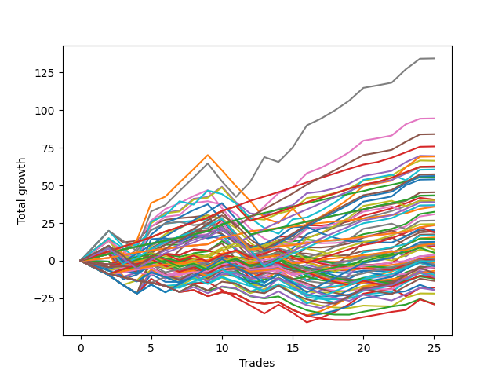

# Short Wallace Doodle 019 
- Symbol: TSLA_Unlimited
- Date Range: 03/23/2022 - 07/08/2022
- Trading Period: 7:20-12:30
- Number of Trades: 25



| Name | Win Percent | Profit | Avg Profit / Trade | Avg Time / Trade |      | Name | Win Percent | Profit | Avg Profit / Trade | Avg Time / Trade |
| ---- | ----------- | ------ | ------------------ | ---------------- | ---- | ---- | ----------- | ------ | ------------------ | ---------------- |
| Sorted By <br> Profit | | | | | | Sorted By <br> Win Percentage ||||
| Seven | 84.00 | 67185.00 | 2687.40 | 122:04 |     | Eighty-Three | 100.00 | 37945.00 | 1517.80 | 23:31 |
| Six | 88.00 | 47260.00 | 1890.40 | 68:20 |     | Eighty-Two | 100.00 | 27790.00 | 1111.60 | 21:15 |
| Eighty-Five | 92.00 | 42050.00 | 1682.00 | 53:49 |     | Eighty-One | 100.00 | 17905.00 | 716.20 | 12:31 |
| Eighty-Three | 100.00 | 37945.00 | 1517.80 | 23:31 |     | One Hundred Twenty-Eight | 96.00 | 31325.00 | 1253.00 | 20:00 |
| Four | 76.00 | 34775.00 | 1391.00 | 38:24 |     | One Hundred Twenty-Three | 96.00 | 31250.00 | 1250.00 | 20:47 |
| Sixty-Three | 72.00 | 34630.00 | 1385.20 | 95:17 |     | One Hundred Twenty-Seven | 96.00 | 21700.00 | 868.00 | 17:45 |
| Sixty | 76.00 | 33195.00 | 1327.80 | 34:36 |     | One Hundred Twenty-Two | 96.00 | 21625.00 | 865.00 | 18:31 |
| One Hundred Twenty-Eight | 96.00 | 31325.00 | 1253.00 | 20:00 |     | One Hundred Twenty-Six | 96.00 | 11815.00 | 472.60 | 09:01 |
| One Hundred Twenty-Three | 96.00 | 31250.00 | 1250.00 | 20:47 |     | One Hundred Twenty-One | 96.00 | 11740.00 | 469.60 | 09:47 |
| Eighty-Four | 92.00 | 31120.00 | 1244.80 | 48:51 |     | Eighty-Five | 92.00 | 42050.00 | 1682.00 | 53:49 |
| Seventy-One | 64.00 | 30305.00 | 1212.20 | 56:00 |     | Eighty-Four | 92.00 | 31120.00 | 1244.80 | 48:51 |
| One Hundred Thirty | 80.00 | 28705.00 | 1148.20 | 31:43 |     | Six | 88.00 | 47260.00 | 1890.40 | 68:20 |
| One Hundred Twenty-Five | 84.00 | 28140.00 | 1125.60 | 37:43 |     | Seven | 84.00 | 67185.00 | 2687.40 | 122:04 |
| Eighty-Two | 100.00 | 27790.00 | 1111.60 | 21:15 |     | One Hundred Twenty-Five | 84.00 | 28140.00 | 1125.60 | 37:43 |
| Sixty-Two | 80.00 | 27010.00 | 1080.40 | 57:27 |     | One Hundred Twenty-Four | 84.00 | 18455.00 | 738.20 | 33:15 |
| Five | 80.00 | 22715.00 | 908.60 | 61:53 |     | One Hundred Sixteen | 84.00 | 5700.00 | 228.00 | 07:34 |
| One Hundred Twenty-Seven | 96.00 | 21700.00 | 868.00 | 17:45 |     | One Hundred Thirty | 80.00 | 28705.00 | 1148.20 | 31:43 |
| One Hundred Twenty-Two | 96.00 | 21625.00 | 865.00 | 18:31 |     | Sixty-Two | 80.00 | 27010.00 | 1080.40 | 57:27 |
| Three | 72.00 | 20285.00 | 811.40 | 26:43 |     | Five | 80.00 | 22715.00 | 908.60 | 61:53 |
| Seventy | 68.00 | 19975.00 | 799.00 | 40:49 |     | One Hundred Twenty-Nine | 80.00 | 19425.00 | 777.00 | 27:25 |
| One Hundred Twenty-Nine | 80.00 | 19425.00 | 777.00 | 27:25 |     | One Hundred Eleven | 80.00 | 2085.00 | 83.40 | 07:43 |
| Fifty-Nine | 72.00 | 19375.00 | 775.00 | 24:21 |     | Four | 76.00 | 34775.00 | 1391.00 | 38:24 |
| One Hundred Twenty-Four | 84.00 | 18455.00 | 738.20 | 33:15 |     | Sixty | 76.00 | 33195.00 | 1327.80 | 34:36 |
| Sixty-Eight | 64.00 | 18175.00 | 727.00 | 28:13 |     | One Hundred Thirteen | 76.00 | 12175.00 | 487.00 | 17:18 |
| Eighty-One | 100.00 | 17905.00 | 716.20 | 12:31 |     | Sixty-One | 76.00 | 8395.00 | 335.80 | 52:08 |
| Two | 68.00 | 16220.00 | 648.80 | 23:34 |     | One Hundred Twelve | 76.00 | 5495.00 | 219.80 | 15:32 |
| Fifty-Eight | 68.00 | 15405.00 | 616.20 | 21:13 |     | Sixty-Three | 72.00 | 34630.00 | 1385.20 | 95:17 |
| Sixty-Nine | 64.00 | 13320.00 | 532.80 | 33:43 |     | Three | 72.00 | 20285.00 | 811.40 | 26:43 |
| One Hundred Thirteen | 76.00 | 12175.00 | 487.00 | 17:18 |     | Fifty-Nine | 72.00 | 19375.00 | 775.00 | 24:21 |
| One Hundred Twenty-Six | 96.00 | 11815.00 | 472.60 | 09:01 |     | Seventy | 68.00 | 19975.00 | 799.00 | 40:49 |
| One Hundred Twenty-One | 96.00 | 11740.00 | 469.60 | 09:47 |     | Two | 68.00 | 16220.00 | 648.80 | 23:34 |
| Seventy-Three | 44.00 | 10105.00 | 404.20 | 13:14 |     | Fifty-Eight | 68.00 | 15405.00 | 616.20 | 21:13 |
| Fifty-Seven | 60.00 | 9735.00 | 389.40 | 17:07 |     | One Hundred Eighteen | 68.00 | 9460.00 | 378.40 | 15:17 |
| One Hundred Eighteen | 68.00 | 9460.00 | 378.40 | 15:17 |     | One Hundred Seventeen | 68.00 | 2670.00 | 106.80 | 13:16 |
| Sixty-Seven | 64.00 | 9455.00 | 378.20 | 20:12 |     | Seventy-One | 64.00 | 30305.00 | 1212.20 | 56:00 |
| Forty-Seven | 48.00 | 8730.00 | 349.20 | 58:37 |     | Sixty-Eight | 64.00 | 18175.00 | 727.00 | 28:13 |
| Sixty-One | 76.00 | 8395.00 | 335.80 | 52:08 |     | Sixty-Nine | 64.00 | 13320.00 | 532.80 | 33:43 |
| One | 60.00 | 7745.00 | 309.80 | 18:41 |     | Sixty-Seven | 64.00 | 9455.00 | 378.20 | 20:12 |
| Forty-Four | 56.00 | 7255.00 | 290.20 | 25:09 |     | One Hundred One | 64.00 | -2175.00 | -87.00 | 03:26 |
| One Hundred Fifteen | 60.00 | 6270.00 | 250.80 | 27:51 |     | Fifty-Seven | 60.00 | 9735.00 | 389.40 | 17:07 |
| One Hundred Sixteen | 84.00 | 5700.00 | 228.00 | 07:34 |     | One | 60.00 | 7745.00 | 309.80 | 18:41 |
| One Hundred Twelve | 76.00 | 5495.00 | 219.80 | 15:32 |     | One Hundred Fifteen | 60.00 | 6270.00 | 250.80 | 27:51 |
| Sixty-Six | 60.00 | 5425.00 | 217.00 | 17:41 |     | Sixty-Six | 60.00 | 5425.00 | 217.00 | 17:41 |
| Sixty-Five | 56.00 | 4890.00 | 195.60 | 14:58 |     | Ninety-One | 60.00 | 1375.00 | 55.00 | 02:11 |
| One Hundred Three | 56.00 | 3695.00 | 147.80 | 09:23 |     | One Hundred Fourteen | 60.00 | -115.00 | -4.60 | 23:43 |
| Ninety-Three | 44.00 | 2690.00 | 107.60 | 05:32 |     | One Hundred Six | 60.00 | -3360.00 | -134.40 | 02:50 |
| One Hundred Seventeen | 68.00 | 2670.00 | 106.80 | 13:16 |     | Forty-Four | 56.00 | 7255.00 | 290.20 | 25:09 |
| One Hundred Eleven | 80.00 | 2085.00 | 83.40 | 07:43 |     | Sixty-Five | 56.00 | 4890.00 | 195.60 | 14:58 |
| Fifty-Six | 44.00 | 1445.00 | 57.80 | 13:11 |     | One Hundred Three | 56.00 | 3695.00 | 147.80 | 09:23 |
| Ninety-One | 60.00 | 1375.00 | 55.00 | 02:11 |     | Ninety-Six | 56.00 | 1315.00 | 52.60 | 02:25 |
| Ninety-Six | 56.00 | 1315.00 | 52.60 | 02:25 |     | One Hundred Two | 56.00 | -1200.00 | -48.00 | 07:44 |
| Zero | 44.00 | 695.00 | 27.80 | 13:48 |     | Forty-Six | 52.00 | 250.00 | 10.00 | 41:25 |
| Forty-Nine | 48.00 | 670.00 | 26.80 | 11:45 |     | Forty-Three | 52.00 | -625.00 | -25.00 | 17:47 |
| Forty-Six | 52.00 | 250.00 | 10.00 | 41:25 |     | Forty-Five | 52.00 | -8950.00 | -358.00 | 35:35 |
| Ninety-Eight | 32.00 | 90.00 | 3.60 | 03:24 |     | Forty-Seven | 48.00 | 8730.00 | 349.20 | 58:37 |
| One Hundred Fourteen | 60.00 | -115.00 | -4.60 | 23:43 |     | Forty-Nine | 48.00 | 670.00 | 26.80 | 11:45 |
| Ninety-Seven | 36.00 | -235.00 | -9.40 | 03:06 |     | Forty-Two | 48.00 | -2280.00 | -91.20 | 14:57 |
| Forty-Three | 52.00 | -625.00 | -25.00 | 17:47 |     | Fifty-One | 48.00 | -2395.00 | -95.80 | 14:30 |
| One Hundred Two | 56.00 | -1200.00 | -48.00 | 07:44 |     | Forty-One | 48.00 | -4695.00 | -187.80 | 12:52 |
| Ninety-Five | 28.00 | -1275.00 | -51.00 | 07:34 |     | Seventy-Three | 44.00 | 10105.00 | 404.20 | 13:14 |
| Ninety-Two | 44.00 | -1540.00 | -61.60 | 04:41 |     | Ninety-Three | 44.00 | 2690.00 | 107.60 | 05:32 |
| One Hundred Five | 40.00 | -1790.00 | -71.60 | 12:14 |     | Fifty-Six | 44.00 | 1445.00 | 57.80 | 13:11 |
| Fifty | 44.00 | -1995.00 | -79.80 | 12:45 |     | Zero | 44.00 | 695.00 | 27.80 | 13:48 |
| One Hundred One | 64.00 | -2175.00 | -87.00 | 03:26 |     | Ninety-Two | 44.00 | -1540.00 | -61.60 | 04:41 |
| Forty-Two | 48.00 | -2280.00 | -91.20 | 14:57 |     | Fifty | 44.00 | -1995.00 | -79.80 | 12:45 |
| One Hundred | 32.00 | -2355.00 | -94.20 | 03:46 |     | Fifty-Three | 44.00 | -5210.00 | -208.40 | 19:07 |
| Fifty-One | 48.00 | -2395.00 | -95.80 | 14:30 |     | One Hundred Seven | 44.00 | -5975.00 | -239.00 | 04:52 |
| Sixty-Four | 40.00 | -2465.00 | -98.60 | 12:01 |     | Fifty-Two | 44.00 | -9665.00 | -386.60 | 18:47 |
| One Hundred Six | 60.00 | -3360.00 | -134.40 | 02:50 |     | One Hundred Five | 40.00 | -1790.00 | -71.60 | 12:14 |
| Ninety-Nine | 32.00 | -3965.00 | -158.60 | 03:33 |     | Sixty-Four | 40.00 | -2465.00 | -98.60 | 12:01 |
| One Hundred Twenty | 36.00 | -4080.00 | -163.20 | 20:57 |     | One Hundred Ninteen | 40.00 | -5435.00 | -217.40 | 18:44 |
| Ninety-Four | 28.00 | -4605.00 | -184.20 | 06:59 |     | One Hundred Four | 40.00 | -5645.00 | -225.80 | 11:37 |
| Forty-One | 48.00 | -4695.00 | -187.80 | 12:52 |     | Ninety-Seven | 36.00 | -235.00 | -9.40 | 03:06 |
| Fifty-Three | 44.00 | -5210.00 | -208.40 | 19:07 |     | One Hundred Twenty | 36.00 | -4080.00 | -163.20 | 20:57 |
| Forty-Eight | 36.00 | -5315.00 | -212.60 | 09:44 |     | Forty-Eight | 36.00 | -5315.00 | -212.60 | 09:44 |
| One Hundred Ninteen | 40.00 | -5435.00 | -217.40 | 18:44 |     | One Hundred Eight | 36.00 | -5695.00 | -227.80 | 05:16 |
| One Hundred Four | 40.00 | -5645.00 | -225.80 | 11:37 |     | One Hundred Ten | 36.00 | -6710.00 | -268.40 | 06:47 |
| One Hundred Eight | 36.00 | -5695.00 | -227.80 | 05:16 |     | One Hundred Nine | 36.00 | -9730.00 | -389.20 | 06:14 |
| One Hundred Seven | 44.00 | -5975.00 | -239.00 | 04:52 |     | Forty | 36.00 | -10920.00 | -436.80 | 10:48 |
| One Hundred Ten | 36.00 | -6710.00 | -268.40 | 06:47 |     | Ninety-Eight | 32.00 | 90.00 | 3.60 | 03:24 |
| Forty-Five | 52.00 | -8950.00 | -358.00 | 35:35 |     | One Hundred | 32.00 | -2355.00 | -94.20 | 03:46 |
| Fifty-Two | 44.00 | -9665.00 | -386.60 | 18:47 |     | Ninety-Nine | 32.00 | -3965.00 | -158.60 | 03:33 |
| One Hundred Nine | 36.00 | -9730.00 | -389.20 | 06:14 |     | Fifty-Four | 32.00 | -14375.00 | -575.00 | 25:09 |
| Forty | 36.00 | -10920.00 | -436.80 | 10:48 |     | Fifty-Five | 32.00 | -14495.00 | -579.80 | 25:34 |
| Fifty-Four | 32.00 | -14375.00 | -575.00 | 25:09 |     | Ninety-Five | 28.00 | -1275.00 | -51.00 | 07:34 |
| Fifty-Five | 32.00 | -14495.00 | -579.80 | 25:34 |     | Ninety-Four | 28.00 | -4605.00 | -184.20 | 06:59 |

## NO STOPLOSS

### Test Zero
* Sell when price hits the middle line of the 20p bollinger
* No Stoploss
* Results:
```
Total Trades: 25
Percent Up: 56.00
Percent Down: 44.00
Total Points Moved Down: 1.39
Potential Profit: 695.00
Total Points Ups: 31.13 Count Ups: 14
Total Points Downs: 32.52 Count Downs: 11
```

<details><summary>Trades</summary>

<code>In: 2022-03-25 07:42:00		Out: 2022-03-25 07:54:10		Total Position Time: 12:10		Total Move Down: -0.31		Total to Date: -0.31</code> <br />
<code>In: 2022-03-25 07:43:00		Out: 2022-03-25 07:54:10		Total Position Time: 11:10		Total Move Down: -0.24		Total to Date: -0.55</code> <br />
<code>In: 2022-03-28 07:34:00		Out: 2022-03-28 08:04:10		Total Position Time: 30:10		Total Move Down: -11.78		Total to Date: -12.33</code> <br />
<code>In: 2022-04-01 07:32:00		Out: 2022-04-01 07:41:40		Total Position Time: 09:40		Total Move Down: 3.10		Total to Date: -9.23</code> <br />
<code>In: 2022-04-06 11:04:00		Out: 2022-04-06 11:08:05		Total Position Time: 04:05		Total Move Down: 6.92		Total to Date: -2.31</code> <br />
<code>In: 2022-04-06 11:57:00		Out: 2022-04-06 12:06:05		Total Position Time: 09:05		Total Move Down: 1.45		Total to Date: -0.86</code> <br />
<code>In: 2022-04-08 09:24:00		Out: 2022-04-08 09:42:00		Total Position Time: 18:00		Total Move Down: -1.77		Total to Date: -2.63</code> <br />
<code>In: 2022-04-08 08:13:00		Out: 2022-04-08 08:15:45		Total Position Time: 02:45		Total Move Down: 2.07		Total to Date: -0.56</code> <br />
<code>In: 2022-04-08 09:24:00		Out: 2022-04-08 09:42:00		Total Position Time: 18:00		Total Move Down: -1.77		Total to Date: -2.33</code> <br />
<code>In: 2022-04-28 09:49:00		Out: 2022-04-28 10:06:10		Total Position Time: 17:10		Total Move Down: 1.39		Total to Date: -0.94</code> <br />
<code>In: 2022-05-02 12:15:00		Out: 2022-05-02 12:37:35		Total Position Time: 22:35		Total Move Down: -4.50		Total to Date: -5.44</code> <br />
<code>In: 2022-05-04 09:25:00		Out: 2022-05-04 09:47:00		Total Position Time: 22:00		Total Move Down: -3.56		Total to Date: -9.00</code> <br />
<code>In: 2022-05-04 09:42:00		Out: 2022-05-04 09:47:00		Total Position Time: 05:00		Total Move Down: 2.82		Total to Date: -6.18</code> <br />
<code>In: 2022-05-17 08:54:00		Out: 2022-05-17 09:02:20		Total Position Time: 08:20		Total Move Down: 2.93		Total to Date: -3.25</code> <br />
<code>In: 2022-05-24 09:10:00		Out: 2022-05-24 09:24:15		Total Position Time: 14:15		Total Move Down: -2.70		Total to Date: -5.95</code> <br />
<code>In: 2022-05-31 07:45:00		Out: 2022-05-31 07:58:10		Total Position Time: 13:10		Total Move Down: 1.64		Total to Date: -4.31</code> <br />
<code>In: 2022-06-17 10:07:00		Out: 2022-06-17 10:24:05		Total Position Time: 17:05		Total Move Down: -2.29		Total to Date: -6.60</code> <br />
<code>In: 2022-06-17 10:09:00		Out: 2022-06-17 10:24:05		Total Position Time: 15:05		Total Move Down: -1.24		Total to Date: -7.84</code> <br />
<code>In: 2022-06-17 10:10:00		Out: 2022-06-17 10:24:05		Total Position Time: 14:05		Total Move Down: -0.36		Total to Date: -8.20</code> <br />
<code>In: 2022-06-17 10:14:00		Out: 2022-06-17 10:24:05		Total Position Time: 10:05		Total Move Down: 1.65		Total to Date: -6.55</code> <br />
<code>In: 2022-06-29 12:10:00		Out: 2022-06-29 12:32:25		Total Position Time: 22:25		Total Move Down: -0.34		Total to Date: -6.89</code> <br />
<code>In: 2022-06-29 12:11:00		Out: 2022-06-29 12:32:25		Total Position Time: 21:25		Total Move Down: -0.18		Total to Date: -7.07</code> <br />
<code>In: 2022-06-30 08:29:00		Out: 2022-06-30 08:35:45		Total Position Time: 06:45		Total Move Down: 5.67		Total to Date: -1.40</code> <br />
<code>In: 2022-07-06 11:09:00		Out: 2022-07-06 11:10:10		Total Position Time: 01:10		Total Move Down: 2.88		Total to Date: 1.48</code> <br />
<code>In: 2022-07-06 11:42:00		Out: 2022-07-06 12:01:25		Total Position Time: 19:25		Total Move Down: -0.09		Total to Date: 1.39</code> <br />


</details>

### Test One
* Sell when the price hits the upper line of the 20p 1std bollinger
* No Stoploss
* Results:
```
Total Trades: 25
Percent Up: 40.00
Percent Down: 60.00
Total Points Moved Down: 15.49
Potential Profit: 7745.00
Total Points Ups: 35.46 Count Ups: 10
Total Points Downs: 50.95 Count Downs: 15
```

<details><summary>Trades</summary>

<code>In: 2022-03-25 07:42:00		Out: 2022-03-25 07:56:05		Total Position Time: 14:05		Total Move Down: 2.18		Total to Date: 2.18</code> <br />
<code>In: 2022-03-25 07:43:00		Out: 2022-03-25 07:56:05		Total Position Time: 13:05		Total Move Down: 2.25		Total to Date: 4.43</code> <br />
<code>In: 2022-03-28 07:34:00		Out: 2022-03-28 08:24:05		Total Position Time: 50:05		Total Move Down: -14.51		Total to Date: -10.08</code> <br />
<code>In: 2022-04-01 07:32:00		Out: 2022-04-01 08:02:45		Total Position Time: 30:45		Total Move Down: -3.11		Total to Date: -13.19</code> <br />
<code>In: 2022-04-06 11:04:00		Out: 2022-04-06 11:08:40		Total Position Time: 04:40		Total Move Down: 9.83		Total to Date: -3.36</code> <br />
<code>In: 2022-04-06 11:57:00		Out: 2022-04-06 12:13:35		Total Position Time: 16:35		Total Move Down: 3.76		Total to Date: 0.40</code> <br />
<code>In: 2022-04-08 09:24:00		Out: 2022-04-08 09:44:10		Total Position Time: 20:10		Total Move Down: -0.84		Total to Date: -0.44</code> <br />
<code>In: 2022-04-08 08:13:00		Out: 2022-04-08 08:20:05		Total Position Time: 07:05		Total Move Down: 3.78		Total to Date: 3.34</code> <br />
<code>In: 2022-04-08 09:24:00		Out: 2022-04-08 09:44:10		Total Position Time: 20:10		Total Move Down: -0.84		Total to Date: 2.50</code> <br />
<code>In: 2022-04-28 09:49:00		Out: 2022-04-28 10:08:55		Total Position Time: 19:55		Total Move Down: 4.75		Total to Date: 7.25</code> <br />
<code>In: 2022-05-02 12:15:00		Out: 2022-05-02 12:47:00		Total Position Time: 32:00		Total Move Down: -10.36		Total to Date: -3.11</code> <br />
<code>In: 2022-05-04 09:25:00		Out: 2022-05-04 09:51:10		Total Position Time: 26:10		Total Move Down: -2.74		Total to Date: -5.85</code> <br />
<code>In: 2022-05-04 09:42:00		Out: 2022-05-04 09:51:10		Total Position Time: 09:10		Total Move Down: 3.64		Total to Date: -2.21</code> <br />
<code>In: 2022-05-17 08:54:00		Out: 2022-05-17 09:06:00		Total Position Time: 12:00		Total Move Down: 4.49		Total to Date: 2.28</code> <br />
<code>In: 2022-05-24 09:10:00		Out: 2022-05-24 09:29:10		Total Position Time: 19:10		Total Move Down: -1.23		Total to Date: 1.05</code> <br />
<code>In: 2022-05-31 07:45:00		Out: 2022-05-31 08:04:10		Total Position Time: 19:10		Total Move Down: -0.34		Total to Date: 0.71</code> <br />
<code>In: 2022-06-17 10:07:00		Out: 2022-06-17 10:28:05		Total Position Time: 21:05		Total Move Down: -1.27		Total to Date: -0.56</code> <br />
<code>In: 2022-06-17 10:09:00		Out: 2022-06-17 10:28:05		Total Position Time: 19:05		Total Move Down: -0.22		Total to Date: -0.78</code> <br />
<code>In: 2022-06-17 10:10:00		Out: 2022-06-17 10:28:05		Total Position Time: 18:05		Total Move Down: 0.66		Total to Date: -0.12</code> <br />
<code>In: 2022-06-17 10:14:00		Out: 2022-06-17 10:28:05		Total Position Time: 14:05		Total Move Down: 2.67		Total to Date: 2.55</code> <br />
<code>In: 2022-06-29 12:10:00		Out: 2022-06-29 12:33:25		Total Position Time: 23:25		Total Move Down: 0.77		Total to Date: 3.32</code> <br />
<code>In: 2022-06-29 12:11:00		Out: 2022-06-29 12:33:25		Total Position Time: 22:25		Total Move Down: 0.93		Total to Date: 4.25</code> <br />
<code>In: 2022-06-30 08:29:00		Out: 2022-06-30 08:42:00		Total Position Time: 13:00		Total Move Down: 6.30		Total to Date: 10.55</code> <br />
<code>In: 2022-07-06 11:09:00		Out: 2022-07-06 11:11:10		Total Position Time: 02:10		Total Move Down: 4.23		Total to Date: 14.78</code> <br />
<code>In: 2022-07-06 11:42:00		Out: 2022-07-06 12:01:35		Total Position Time: 19:35		Total Move Down: 0.71		Total to Date: 15.49</code> <br />


</details>

### Test Two
* Sell when the price hits the upper line of the 20p 2std bollinger
* No Stoploss
* Results:
```
Total Trades: 25
Percent Up: 32.00
Percent Down: 68.00
Total Points Moved Down: 32.44
Potential Profit: 16220.00
Total Points Ups: 32.51 Count Ups: 8
Total Points Downs: 64.95 Count Downs: 17
```

<details><summary>Trades</summary>

<code>In: 2022-03-25 07:42:00		Out: 2022-03-25 08:01:25		Total Position Time: 19:25		Total Move Down: 3.98		Total to Date: 3.98</code> <br />
<code>In: 2022-03-25 07:43:00		Out: 2022-03-25 08:01:25		Total Position Time: 18:25		Total Move Down: 4.05		Total to Date: 8.03</code> <br />
<code>In: 2022-03-28 07:34:00		Out: 2022-03-28 08:24:45		Total Position Time: 50:45		Total Move Down: -12.20		Total to Date: -4.17</code> <br />
<code>In: 2022-04-01 07:32:00		Out: 2022-04-01 08:07:00		Total Position Time: 35:00		Total Move Down: -2.53		Total to Date: -6.70</code> <br />
<code>In: 2022-04-06 11:04:00		Out: 2022-04-06 11:09:40		Total Position Time: 05:40		Total Move Down: 12.93		Total to Date: 6.23</code> <br />
<code>In: 2022-04-06 11:57:00		Out: 2022-04-06 12:20:05		Total Position Time: 23:05		Total Move Down: 4.40		Total to Date: 10.63</code> <br />
<code>In: 2022-04-08 09:24:00		Out: 2022-04-08 09:45:20		Total Position Time: 21:20		Total Move Down: -0.01		Total to Date: 10.62</code> <br />
<code>In: 2022-04-08 08:13:00		Out: 2022-04-08 08:22:25		Total Position Time: 09:25		Total Move Down: 4.82		Total to Date: 15.44</code> <br />
<code>In: 2022-04-08 09:24:00		Out: 2022-04-08 09:45:20		Total Position Time: 21:20		Total Move Down: -0.01		Total to Date: 15.43</code> <br />
<code>In: 2022-04-28 09:49:00		Out: 2022-04-28 10:09:15		Total Position Time: 20:15		Total Move Down: 7.87		Total to Date: 23.30</code> <br />
<code>In: 2022-05-02 12:15:00		Out: 2022-05-02 12:47:00		Total Position Time: 32:00		Total Move Down: -10.36		Total to Date: 12.94</code> <br />
<code>In: 2022-05-04 09:25:00		Out: 2022-05-04 10:18:30		Total Position Time: 53:30		Total Move Down: -6.47		Total to Date: 6.47</code> <br />
<code>In: 2022-05-04 09:42:00		Out: 2022-05-04 10:18:30		Total Position Time: 36:30		Total Move Down: -0.09		Total to Date: 6.38</code> <br />
<code>In: 2022-05-17 08:54:00		Out: 2022-05-17 09:07:10		Total Position Time: 13:10		Total Move Down: 5.75		Total to Date: 12.13</code> <br />
<code>In: 2022-05-24 09:10:00		Out: 2022-05-24 09:31:20		Total Position Time: 21:20		Total Move Down: 0.69		Total to Date: 12.82</code> <br />
<code>In: 2022-05-31 07:45:00		Out: 2022-05-31 08:07:05		Total Position Time: 22:05		Total Move Down: 1.21		Total to Date: 14.03</code> <br />
<code>In: 2022-06-17 10:07:00		Out: 2022-06-17 10:29:05		Total Position Time: 22:05		Total Move Down: -0.84		Total to Date: 13.19</code> <br />
<code>In: 2022-06-17 10:09:00		Out: 2022-06-17 10:29:05		Total Position Time: 20:05		Total Move Down: 0.21		Total to Date: 13.40</code> <br />
<code>In: 2022-06-17 10:10:00		Out: 2022-06-17 10:29:05		Total Position Time: 19:05		Total Move Down: 1.09		Total to Date: 14.49</code> <br />
<code>In: 2022-06-17 10:14:00		Out: 2022-06-17 10:29:05		Total Position Time: 15:05		Total Move Down: 3.10		Total to Date: 17.59</code> <br />
<code>In: 2022-06-29 12:10:00		Out: 2022-06-29 12:34:15		Total Position Time: 24:15		Total Move Down: 1.71		Total to Date: 19.30</code> <br />
<code>In: 2022-06-29 12:11:00		Out: 2022-06-29 12:34:15		Total Position Time: 23:15		Total Move Down: 1.87		Total to Date: 21.17</code> <br />
<code>In: 2022-06-30 08:29:00		Out: 2022-06-30 09:06:05		Total Position Time: 37:05		Total Move Down: 3.29		Total to Date: 24.46</code> <br />
<code>In: 2022-07-06 11:09:00		Out: 2022-07-06 11:12:15		Total Position Time: 03:15		Total Move Down: 6.55		Total to Date: 31.01</code> <br />
<code>In: 2022-07-06 11:42:00		Out: 2022-07-06 12:03:45		Total Position Time: 21:45		Total Move Down: 1.43		Total to Date: 32.44</code> <br />


</details>

### Test Three
* Sell when price hits the middle line of the 50p bollinger
* No Stoploss
* Results:
```
Total Trades: 25
Percent Up: 28.00
Percent Down: 72.00
Total Points Moved Down: 40.57
Potential Profit: 20285.00
Total Points Ups: 31.96 Count Ups: 7
Total Points Downs: 72.53 Count Downs: 18
```

<details><summary>Trades</summary>

<code>In: 2022-03-25 07:42:00		Out: 2022-03-25 08:01:05		Total Position Time: 19:05		Total Move Down: 3.04		Total to Date: 3.04</code> <br />
<code>In: 2022-03-25 07:43:00		Out: 2022-03-25 08:01:05		Total Position Time: 18:05		Total Move Down: 3.11		Total to Date: 6.15</code> <br />
<code>In: 2022-03-28 07:34:00		Out: 2022-03-28 08:25:10		Total Position Time: 51:10		Total Move Down: -12.01		Total to Date: -5.86</code> <br />
<code>In: 2022-04-01 07:32:00		Out: 2022-04-01 08:13:40		Total Position Time: 41:40		Total Move Down: -1.71		Total to Date: -7.57</code> <br />
<code>In: 2022-04-06 11:04:00		Out: 2022-04-06 11:10:10		Total Position Time: 06:10		Total Move Down: 15.87		Total to Date: 8.30</code> <br />
<code>In: 2022-04-06 11:57:00		Out: 2022-04-06 12:20:05		Total Position Time: 23:05		Total Move Down: 4.40		Total to Date: 12.70</code> <br />
<code>In: 2022-04-08 09:24:00		Out: 2022-04-08 09:48:20		Total Position Time: 24:20		Total Move Down: 0.84		Total to Date: 13.54</code> <br />
<code>In: 2022-04-08 08:13:00		Out: 2022-04-08 08:22:40		Total Position Time: 09:40		Total Move Down: 5.47		Total to Date: 19.01</code> <br />
<code>In: 2022-04-08 09:24:00		Out: 2022-04-08 09:48:20		Total Position Time: 24:20		Total Move Down: 0.84		Total to Date: 19.85</code> <br />
<code>In: 2022-04-28 09:49:00		Out: 2022-04-28 10:18:05		Total Position Time: 29:05		Total Move Down: 6.93		Total to Date: 26.78</code> <br />
<code>In: 2022-05-02 12:15:00		Out: 2022-05-02 12:47:00		Total Position Time: 32:00		Total Move Down: -10.36		Total to Date: 16.42</code> <br />
<code>In: 2022-05-04 09:25:00		Out: 2022-05-04 10:18:30		Total Position Time: 53:30		Total Move Down: -6.47		Total to Date: 9.95</code> <br />
<code>In: 2022-05-04 09:42:00		Out: 2022-05-04 10:18:30		Total Position Time: 36:30		Total Move Down: -0.09		Total to Date: 9.86</code> <br />
<code>In: 2022-05-17 08:54:00		Out: 2022-05-17 09:10:25		Total Position Time: 16:25		Total Move Down: 6.05		Total to Date: 15.91</code> <br />
<code>In: 2022-05-24 09:10:00		Out: 2022-05-24 09:31:10		Total Position Time: 21:10		Total Move Down: 0.48		Total to Date: 16.39</code> <br />
<code>In: 2022-05-31 07:45:00		Out: 2022-05-31 08:08:50		Total Position Time: 23:50		Total Move Down: 7.11		Total to Date: 23.50</code> <br />
<code>In: 2022-06-17 10:07:00		Out: 2022-06-17 10:32:25		Total Position Time: 25:25		Total Move Down: -0.12		Total to Date: 23.38</code> <br />
<code>In: 2022-06-17 10:09:00		Out: 2022-06-17 10:32:25		Total Position Time: 23:25		Total Move Down: 0.93		Total to Date: 24.31</code> <br />
<code>In: 2022-06-17 10:10:00		Out: 2022-06-17 10:32:25		Total Position Time: 22:25		Total Move Down: 1.81		Total to Date: 26.12</code> <br />
<code>In: 2022-06-17 10:14:00		Out: 2022-06-17 10:32:25		Total Position Time: 18:25		Total Move Down: 3.82		Total to Date: 29.94</code> <br />
<code>In: 2022-06-29 12:10:00		Out: 2022-06-29 12:36:35		Total Position Time: 26:35		Total Move Down: 2.35		Total to Date: 32.29</code> <br />
<code>In: 2022-06-29 12:11:00		Out: 2022-06-29 12:36:35		Total Position Time: 25:35		Total Move Down: 2.51		Total to Date: 34.80</code> <br />
<code>In: 2022-06-30 08:29:00		Out: 2022-06-30 09:06:05		Total Position Time: 37:05		Total Move Down: 3.29		Total to Date: 38.09</code> <br />
<code>In: 2022-07-06 11:09:00		Out: 2022-07-06 11:11:05		Total Position Time: 02:05		Total Move Down: 3.68		Total to Date: 41.77</code> <br />
<code>In: 2022-07-06 11:42:00		Out: 2022-07-06 12:39:00		Total Position Time: 57:00		Total Move Down: -1.20		Total to Date: 40.57</code> <br />


</details>

### Test Four
* Sell when the price hits the upper line of the 50p 1std bollinger
* No Stoploss
* Results:
```
Total Trades: 25
Percent Up: 24.00
Percent Down: 76.00
Total Points Moved Down: 69.55
Potential Profit: 34775.00
Total Points Ups: 29.56 Count Ups: 6
Total Points Downs: 99.11 Count Downs: 19
```

<details><summary>Trades</summary>

<code>In: 2022-03-25 07:42:00		Out: 2022-03-25 08:07:50		Total Position Time: 25:50		Total Move Down: 6.57		Total to Date: 6.57</code> <br />
<code>In: 2022-03-25 07:43:00		Out: 2022-03-25 08:07:50		Total Position Time: 24:50		Total Move Down: 6.64		Total to Date: 13.21</code> <br />
<code>In: 2022-03-28 07:34:00		Out: 2022-03-28 08:33:25		Total Position Time: 59:25		Total Move Down: -9.75		Total to Date: 3.46</code> <br />
<code>In: 2022-04-01 07:32:00		Out: 2022-04-01 08:20:05		Total Position Time: 48:05		Total Move Down: -0.88		Total to Date: 2.58</code> <br />
<code>In: 2022-04-06 11:04:00		Out: 2022-04-06 11:16:15		Total Position Time: 12:15		Total Move Down: 22.80		Total to Date: 25.38</code> <br />
<code>In: 2022-04-06 11:57:00		Out: 2022-04-06 12:21:15		Total Position Time: 24:15		Total Move Down: 6.60		Total to Date: 31.98</code> <br />
<code>In: 2022-04-08 09:24:00		Out: 2022-04-08 10:06:40		Total Position Time: 42:40		Total Move Down: 1.21		Total to Date: 33.19</code> <br />
<code>In: 2022-04-08 08:13:00		Out: 2022-04-08 08:37:00		Total Position Time: 24:00		Total Move Down: 7.96		Total to Date: 41.15</code> <br />
<code>In: 2022-04-08 09:24:00		Out: 2022-04-08 10:06:40		Total Position Time: 42:40		Total Move Down: 1.21		Total to Date: 42.36</code> <br />
<code>In: 2022-04-28 09:49:00		Out: 2022-04-28 10:30:55		Total Position Time: 41:55		Total Move Down: 6.78		Total to Date: 49.14</code> <br />
<code>In: 2022-05-02 12:15:00		Out: 2022-05-02 12:47:00		Total Position Time: 32:00		Total Move Down: -10.36		Total to Date: 38.78</code> <br />
<code>In: 2022-05-04 09:25:00		Out: 2022-05-04 10:45:50		Total Position Time: 80:50		Total Move Down: -7.39		Total to Date: 31.39</code> <br />
<code>In: 2022-05-04 09:42:00		Out: 2022-05-04 10:45:50		Total Position Time: 63:50		Total Move Down: -1.01		Total to Date: 30.38</code> <br />
<code>In: 2022-05-17 08:54:00		Out: 2022-05-17 09:40:10		Total Position Time: 46:10		Total Move Down: 4.11		Total to Date: 34.49</code> <br />
<code>In: 2022-05-24 09:10:00		Out: 2022-05-24 09:34:00		Total Position Time: 24:00		Total Move Down: 2.40		Total to Date: 36.89</code> <br />
<code>In: 2022-05-31 07:45:00		Out: 2022-05-31 08:29:45		Total Position Time: 44:45		Total Move Down: 7.90		Total to Date: 44.79</code> <br />
<code>In: 2022-06-17 10:07:00		Out: 2022-06-17 10:45:40		Total Position Time: 38:40		Total Move Down: 1.14		Total to Date: 45.93</code> <br />
<code>In: 2022-06-17 10:09:00		Out: 2022-06-17 10:45:40		Total Position Time: 36:40		Total Move Down: 2.19		Total to Date: 48.12</code> <br />
<code>In: 2022-06-17 10:10:00		Out: 2022-06-17 10:45:40		Total Position Time: 35:40		Total Move Down: 3.07		Total to Date: 51.19</code> <br />
<code>In: 2022-06-17 10:14:00		Out: 2022-06-17 10:45:40		Total Position Time: 31:40		Total Move Down: 5.08		Total to Date: 56.27</code> <br />
<code>In: 2022-06-29 12:10:00		Out: 2022-06-29 12:47:00		Total Position Time: 37:00		Total Move Down: 1.64		Total to Date: 57.91</code> <br />
<code>In: 2022-06-29 12:11:00		Out: 2022-06-29 12:47:00		Total Position Time: 36:00		Total Move Down: 1.80		Total to Date: 59.71</code> <br />
<code>In: 2022-06-30 08:29:00		Out: 2022-06-30 09:11:00		Total Position Time: 42:00		Total Move Down: 5.78		Total to Date: 65.49</code> <br />
<code>In: 2022-07-06 11:09:00		Out: 2022-07-06 11:11:10		Total Position Time: 02:10		Total Move Down: 4.23		Total to Date: 69.72</code> <br />
<code>In: 2022-07-06 11:42:00		Out: 2022-07-06 12:44:40		Total Position Time: 62:40		Total Move Down: -0.17		Total to Date: 69.55</code> <br />


</details>

### Test Five
* Sell when the price hits the upper line of the 50p 2std bollinger
* No Stoploss
* Results:
```
Total Trades: 25
Percent Up: 20.00
Percent Down: 80.00
Total Points Moved Down: 45.43
Potential Profit: 22715.00
Total Points Ups: 36.00 Count Ups: 5
Total Points Downs: 81.43 Count Downs: 20
```

<details><summary>Trades</summary>

<code>In: 2022-03-25 07:42:00		Out: 2022-03-25 08:09:20		Total Position Time: 27:20		Total Move Down: 9.89		Total to Date: 9.89</code> <br />
<code>In: 2022-03-25 07:43:00		Out: 2022-03-25 08:09:20		Total Position Time: 26:20		Total Move Down: 9.96		Total to Date: 19.85</code> <br />
<code>In: 2022-03-28 07:34:00		Out: 2022-03-28 08:35:05		Total Position Time: 61:05		Total Move Down: -7.68		Total to Date: 12.17</code> <br />
<code>In: 2022-04-01 07:32:00		Out: 2022-04-01 08:33:30		Total Position Time: 61:30		Total Move Down: 1.01		Total to Date: 13.18</code> <br />
<code>In: 2022-04-06 11:04:00		Out: 2022-04-06 12:47:00		Total Position Time: 103:00		Total Move Down: 9.77		Total to Date: 22.95</code> <br />
<code>In: 2022-04-06 11:57:00		Out: 2022-04-06 12:47:00		Total Position Time: 50:00		Total Move Down: 4.20		Total to Date: 27.15</code> <br />
<code>In: 2022-04-08 09:24:00		Out: 2022-04-08 10:11:20		Total Position Time: 47:20		Total Move Down: 1.10		Total to Date: 28.25</code> <br />
<code>In: 2022-04-08 08:13:00		Out: 2022-04-08 10:11:20		Total Position Time: 118:20		Total Move Down: 0.81		Total to Date: 29.06</code> <br />
<code>In: 2022-04-08 09:24:00		Out: 2022-04-08 10:11:20		Total Position Time: 47:20		Total Move Down: 1.10		Total to Date: 30.16</code> <br />
<code>In: 2022-04-28 09:49:00		Out: 2022-04-28 12:29:40		Total Position Time: 160:40		Total Move Down: -12.89		Total to Date: 17.27</code> <br />
<code>In: 2022-05-02 12:15:00		Out: 2022-05-02 12:47:00		Total Position Time: 32:00		Total Move Down: -10.36		Total to Date: 6.91</code> <br />
<code>In: 2022-05-04 09:25:00		Out: 2022-05-04 11:07:20		Total Position Time: 102:20		Total Move Down: -3.81		Total to Date: 3.10</code> <br />
<code>In: 2022-05-04 09:42:00		Out: 2022-05-04 11:07:20		Total Position Time: 85:20		Total Move Down: 2.57		Total to Date: 5.67</code> <br />
<code>In: 2022-05-17 08:54:00		Out: 2022-05-17 09:47:55		Total Position Time: 53:55		Total Move Down: 5.82		Total to Date: 11.49</code> <br />
<code>In: 2022-05-24 09:10:00		Out: 2022-05-24 09:39:55		Total Position Time: 29:55		Total Move Down: 4.90		Total to Date: 16.39</code> <br />
<code>In: 2022-05-31 07:45:00		Out: 2022-05-31 10:14:20		Total Position Time: 149:20		Total Move Down: -1.26		Total to Date: 15.13</code> <br />
<code>In: 2022-06-17 10:07:00		Out: 2022-06-17 10:47:30		Total Position Time: 40:30		Total Move Down: 3.03		Total to Date: 18.16</code> <br />
<code>In: 2022-06-17 10:09:00		Out: 2022-06-17 10:47:30		Total Position Time: 38:30		Total Move Down: 4.08		Total to Date: 22.24</code> <br />
<code>In: 2022-06-17 10:10:00		Out: 2022-06-17 10:47:30		Total Position Time: 37:30		Total Move Down: 4.96		Total to Date: 27.20</code> <br />
<code>In: 2022-06-17 10:14:00		Out: 2022-06-17 10:47:30		Total Position Time: 33:30		Total Move Down: 6.97		Total to Date: 34.17</code> <br />
<code>In: 2022-06-29 12:10:00		Out: 2022-06-29 12:47:00		Total Position Time: 37:00		Total Move Down: 1.64		Total to Date: 35.81</code> <br />
<code>In: 2022-06-29 12:11:00		Out: 2022-06-29 12:47:00		Total Position Time: 36:00		Total Move Down: 1.80		Total to Date: 37.61</code> <br />
<code>In: 2022-06-30 08:29:00		Out: 2022-06-30 10:09:35		Total Position Time: 100:35		Total Move Down: 2.06		Total to Date: 39.67</code> <br />
<code>In: 2022-07-06 11:09:00		Out: 2022-07-06 11:12:05		Total Position Time: 03:05		Total Move Down: 5.58		Total to Date: 45.25</code> <br />
<code>In: 2022-07-06 11:42:00		Out: 2022-07-06 12:47:00		Total Position Time: 65:00		Total Move Down: 0.18		Total to Date: 45.43</code> <br />


</details>

### Test Six
* Sell when the price hits the middle line of the 1std VWAP
* No Stoploss
* Results:
```
Total Trades: 25
Percent Up: 12.00
Percent Down: 88.00
Total Points Moved Down: 94.52
Potential Profit: 47260.00
Total Points Ups: 23.20 Count Ups: 3
Total Points Downs: 117.72 Count Downs: 22
```

<details><summary>Trades</summary>

<code>In: 2022-03-25 07:42:00		Out: 2022-03-25 08:01:30		Total Position Time: 19:30		Total Move Down: 4.14		Total to Date: 4.14</code> <br />
<code>In: 2022-03-25 07:43:00		Out: 2022-03-25 08:01:30		Total Position Time: 18:30		Total Move Down: 4.21		Total to Date: 8.35</code> <br />
<code>In: 2022-03-28 07:34:00		Out: 2022-03-28 09:16:30		Total Position Time: 102:30		Total Move Down: -0.94		Total to Date: 7.41</code> <br />
<code>In: 2022-04-01 07:32:00		Out: 2022-04-01 08:37:10		Total Position Time: 65:10		Total Move Down: 4.14		Total to Date: 11.55</code> <br />
<code>In: 2022-04-06 11:04:00		Out: 2022-04-06 11:10:05		Total Position Time: 06:05		Total Move Down: 15.08		Total to Date: 26.63</code> <br />
<code>In: 2022-04-06 11:57:00		Out: 2022-04-06 12:22:15		Total Position Time: 25:15		Total Move Down: 7.70		Total to Date: 34.33</code> <br />
<code>In: 2022-04-08 09:24:00		Out: 2022-04-08 10:16:55		Total Position Time: 52:55		Total Move Down: 3.84		Total to Date: 38.17</code> <br />
<code>In: 2022-04-08 08:13:00		Out: 2022-04-08 08:22:25		Total Position Time: 09:25		Total Move Down: 4.82		Total to Date: 42.99</code> <br />
<code>In: 2022-04-08 09:24:00		Out: 2022-04-08 10:16:55		Total Position Time: 52:55		Total Move Down: 3.84		Total to Date: 46.83</code> <br />
<code>In: 2022-04-28 09:49:00		Out: 2022-04-28 12:47:00		Total Position Time: 178:00		Total Move Down: -11.90		Total to Date: 34.93</code> <br />
<code>In: 2022-05-02 12:15:00		Out: 2022-05-02 12:47:00		Total Position Time: 32:00		Total Move Down: -10.36		Total to Date: 24.57</code> <br />
<code>In: 2022-05-04 09:25:00		Out: 2022-05-04 11:07:40		Total Position Time: 102:40		Total Move Down: 2.56		Total to Date: 27.13</code> <br />
<code>In: 2022-05-04 09:42:00		Out: 2022-05-04 11:07:40		Total Position Time: 85:40		Total Move Down: 8.94		Total to Date: 36.07</code> <br />
<code>In: 2022-05-17 08:54:00		Out: 2022-05-17 09:59:30		Total Position Time: 65:30		Total Move Down: 8.72		Total to Date: 44.79</code> <br />
<code>In: 2022-05-24 09:10:00		Out: 2022-05-24 09:37:00		Total Position Time: 27:00		Total Move Down: 3.86		Total to Date: 48.65</code> <br />
<code>In: 2022-05-31 07:45:00		Out: 2022-05-31 08:14:15		Total Position Time: 29:15		Total Move Down: 9.44		Total to Date: 58.09</code> <br />
<code>In: 2022-06-17 10:07:00		Out: 2022-06-17 12:10:00		Total Position Time: 123:00		Total Move Down: 3.68		Total to Date: 61.77</code> <br />
<code>In: 2022-06-17 10:09:00		Out: 2022-06-17 12:10:00		Total Position Time: 121:00		Total Move Down: 4.73		Total to Date: 66.50</code> <br />
<code>In: 2022-06-17 10:10:00		Out: 2022-06-17 12:10:00		Total Position Time: 120:00		Total Move Down: 5.61		Total to Date: 72.11</code> <br />
<code>In: 2022-06-17 10:14:00		Out: 2022-06-17 12:10:00		Total Position Time: 116:00		Total Move Down: 7.62		Total to Date: 79.73</code> <br />
<code>In: 2022-06-29 12:10:00		Out: 2022-06-29 12:47:00		Total Position Time: 37:00		Total Move Down: 1.64		Total to Date: 81.37</code> <br />
<code>In: 2022-06-29 12:11:00		Out: 2022-06-29 12:47:00		Total Position Time: 36:00		Total Move Down: 1.80		Total to Date: 83.17</code> <br />
<code>In: 2022-06-30 08:29:00		Out: 2022-06-30 12:05:15		Total Position Time: 216:15		Total Move Down: 7.49		Total to Date: 90.66</code> <br />
<code>In: 2022-07-06 11:09:00		Out: 2022-07-06 11:11:05		Total Position Time: 02:05		Total Move Down: 3.68		Total to Date: 94.34</code> <br />
<code>In: 2022-07-06 11:42:00		Out: 2022-07-06 12:47:00		Total Position Time: 65:00		Total Move Down: 0.18		Total to Date: 94.52</code> <br />


</details>

### Test Seven
* Sell when the price hits the upper line of the 1std VWAP
* No Stoploss
* Results:
```
Total Trades: 25
Percent Up: 16.00
Percent Down: 84.00
Total Points Moved Down: 134.37
Potential Profit: 67185.00
Total Points Ups: 41.40 Count Ups: 4
Total Points Downs: 175.77 Count Downs: 21
```

<details><summary>Trades</summary>

<code>In: 2022-03-25 07:42:00		Out: 2022-03-25 08:08:15		Total Position Time: 26:15		Total Move Down: 7.40		Total to Date: 7.40</code> <br />
<code>In: 2022-03-25 07:43:00		Out: 2022-03-25 08:08:15		Total Position Time: 25:15		Total Move Down: 7.47		Total to Date: 14.87</code> <br />
<code>In: 2022-03-28 07:34:00		Out: 2022-03-28 12:47:00		Total Position Time: 313:00		Total Move Down: -15.87		Total to Date: -1.00</code> <br />
<code>In: 2022-04-01 07:32:00		Out: 2022-04-01 12:17:50		Total Position Time: 285:50		Total Move Down: 9.21		Total to Date: 8.21</code> <br />
<code>In: 2022-04-06 11:04:00		Out: 2022-04-06 11:17:00		Total Position Time: 13:00		Total Move Down: 24.54		Total to Date: 32.75</code> <br />
<code>In: 2022-04-06 11:57:00		Out: 2022-04-06 12:47:00		Total Position Time: 50:00		Total Move Down: 4.20		Total to Date: 36.95</code> <br />
<code>In: 2022-04-08 09:24:00		Out: 2022-04-08 10:47:00		Total Position Time: 83:00		Total Move Down: 9.32		Total to Date: 46.27</code> <br />
<code>In: 2022-04-08 08:13:00		Out: 2022-04-08 10:47:00		Total Position Time: 154:00		Total Move Down: 9.03		Total to Date: 55.30</code> <br />
<code>In: 2022-04-08 09:24:00		Out: 2022-04-08 10:47:00		Total Position Time: 83:00		Total Move Down: 9.32		Total to Date: 64.62</code> <br />
<code>In: 2022-04-28 09:49:00		Out: 2022-04-28 12:47:00		Total Position Time: 178:00		Total Move Down: -11.90		Total to Date: 52.72</code> <br />
<code>In: 2022-05-02 12:15:00		Out: 2022-05-02 12:47:00		Total Position Time: 32:00		Total Move Down: -10.36		Total to Date: 42.36</code> <br />
<code>In: 2022-05-04 09:25:00		Out: 2022-05-04 11:35:05		Total Position Time: 130:05		Total Move Down: 10.06		Total to Date: 52.42</code> <br />
<code>In: 2022-05-04 09:42:00		Out: 2022-05-04 11:35:05		Total Position Time: 113:05		Total Move Down: 16.44		Total to Date: 68.86</code> <br />
<code>In: 2022-05-17 08:54:00		Out: 2022-05-17 12:47:00		Total Position Time: 233:00		Total Move Down: -3.27		Total to Date: 65.59</code> <br />
<code>In: 2022-05-24 09:10:00		Out: 2022-05-24 10:04:20		Total Position Time: 54:20		Total Move Down: 9.61		Total to Date: 75.20</code> <br />
<code>In: 2022-05-31 07:45:00		Out: 2022-05-31 11:55:25		Total Position Time: 250:25		Total Move Down: 14.67		Total to Date: 89.87</code> <br />
<code>In: 2022-06-17 10:07:00		Out: 2022-06-17 12:47:00		Total Position Time: 160:00		Total Move Down: 4.51		Total to Date: 94.38</code> <br />
<code>In: 2022-06-17 10:09:00		Out: 2022-06-17 12:47:00		Total Position Time: 158:00		Total Move Down: 5.56		Total to Date: 99.94</code> <br />
<code>In: 2022-06-17 10:10:00		Out: 2022-06-17 12:47:00		Total Position Time: 157:00		Total Move Down: 6.44		Total to Date: 106.38</code> <br />
<code>In: 2022-06-17 10:14:00		Out: 2022-06-17 12:47:00		Total Position Time: 153:00		Total Move Down: 8.45		Total to Date: 114.83</code> <br />
<code>In: 2022-06-29 12:10:00		Out: 2022-06-29 12:47:00		Total Position Time: 37:00		Total Move Down: 1.64		Total to Date: 116.47</code> <br />
<code>In: 2022-06-29 12:11:00		Out: 2022-06-29 12:47:00		Total Position Time: 36:00		Total Move Down: 1.80		Total to Date: 118.27</code> <br />
<code>In: 2022-06-30 08:29:00		Out: 2022-06-30 12:47:00		Total Position Time: 258:00		Total Move Down: 8.91		Total to Date: 127.18</code> <br />
<code>In: 2022-07-06 11:09:00		Out: 2022-07-06 11:12:30		Total Position Time: 03:30		Total Move Down: 7.01		Total to Date: 134.19</code> <br />
<code>In: 2022-07-06 11:42:00		Out: 2022-07-06 12:47:00		Total Position Time: 65:00		Total Move Down: 0.18		Total to Date: 134.37</code> <br />


</details>

## STOPLOSS OF 5

### Test Forty
* Sell when price hits the middle line of the 20p bollinger
* Stoploss is -5 points
* Results:
```
Total Trades: 25
Percent Up: 64.00
Percent Down: 36.00
Total Points Moved Down: -21.84
Potential Profit: -10920.00
Total Points Ups: 51.27 Count Ups: 16
Total Points Downs: 29.43 Count Downs: 9
```

<details><summary>Trades</summary>

<code>In: 2022-03-25 07:42:00		Out: 2022-03-25 07:50:10		Total Position Time: 08:10		Total Move Down: -4.81		Total to Date: -4.81</code> <br />
<code>In: 2022-03-25 07:43:00		Out: 2022-03-25 07:50:10		Total Position Time: 07:10		Total Move Down: -4.74		Total to Date: -9.55</code> <br />
<code>In: 2022-03-28 07:34:00		Out: 2022-03-28 07:44:55		Total Position Time: 10:55		Total Move Down: -6.55		Total to Date: -16.10</code> <br />
<code>In: 2022-04-01 07:32:00		Out: 2022-04-01 07:41:40		Total Position Time: 09:40		Total Move Down: 3.10		Total to Date: -13.00</code> <br />
<code>In: 2022-04-06 11:04:00		Out: 2022-04-06 11:08:05		Total Position Time: 04:05		Total Move Down: 6.92		Total to Date: -6.08</code> <br />
<code>In: 2022-04-06 11:57:00		Out: 2022-04-06 12:02:25		Total Position Time: 05:25		Total Move Down: -5.13		Total to Date: -11.21</code> <br />
<code>In: 2022-04-08 09:24:00		Out: 2022-04-08 09:42:00		Total Position Time: 18:00		Total Move Down: -1.77		Total to Date: -12.98</code> <br />
<code>In: 2022-04-08 08:13:00		Out: 2022-04-08 08:15:45		Total Position Time: 02:45		Total Move Down: 2.07		Total to Date: -10.91</code> <br />
<code>In: 2022-04-08 09:24:00		Out: 2022-04-08 09:42:00		Total Position Time: 18:00		Total Move Down: -1.77		Total to Date: -12.68</code> <br />
<code>In: 2022-04-28 09:49:00		Out: 2022-04-28 10:06:10		Total Position Time: 17:10		Total Move Down: 1.39		Total to Date: -11.29</code> <br />
<code>In: 2022-05-02 12:15:00		Out: 2022-05-02 12:22:45		Total Position Time: 07:45		Total Move Down: -5.24		Total to Date: -16.53</code> <br />
<code>In: 2022-05-04 09:25:00		Out: 2022-05-04 09:37:20		Total Position Time: 12:20		Total Move Down: -5.04		Total to Date: -21.57</code> <br />
<code>In: 2022-05-04 09:42:00		Out: 2022-05-04 09:47:00		Total Position Time: 05:00		Total Move Down: 2.82		Total to Date: -18.75</code> <br />
<code>In: 2022-05-17 08:54:00		Out: 2022-05-17 09:02:20		Total Position Time: 08:20		Total Move Down: 2.93		Total to Date: -15.82</code> <br />
<code>In: 2022-05-24 09:10:00		Out: 2022-05-24 09:14:45		Total Position Time: 04:45		Total Move Down: -5.30		Total to Date: -21.12</code> <br />
<code>In: 2022-05-31 07:45:00		Out: 2022-05-31 07:48:15		Total Position Time: 03:15		Total Move Down: -6.42		Total to Date: -27.54</code> <br />
<code>In: 2022-06-17 10:07:00		Out: 2022-06-17 10:24:05		Total Position Time: 17:05		Total Move Down: -2.29		Total to Date: -29.83</code> <br />
<code>In: 2022-06-17 10:09:00		Out: 2022-06-17 10:24:05		Total Position Time: 15:05		Total Move Down: -1.24		Total to Date: -31.07</code> <br />
<code>In: 2022-06-17 10:10:00		Out: 2022-06-17 10:24:05		Total Position Time: 14:05		Total Move Down: -0.36		Total to Date: -31.43</code> <br />
<code>In: 2022-06-17 10:14:00		Out: 2022-06-17 10:24:05		Total Position Time: 10:05		Total Move Down: 1.65		Total to Date: -29.78</code> <br />
<code>In: 2022-06-29 12:10:00		Out: 2022-06-29 12:32:25		Total Position Time: 22:25		Total Move Down: -0.34		Total to Date: -30.12</code> <br />
<code>In: 2022-06-29 12:11:00		Out: 2022-06-29 12:32:25		Total Position Time: 21:25		Total Move Down: -0.18		Total to Date: -30.30</code> <br />
<code>In: 2022-06-30 08:29:00		Out: 2022-06-30 08:35:45		Total Position Time: 06:45		Total Move Down: 5.67		Total to Date: -24.63</code> <br />
<code>In: 2022-07-06 11:09:00		Out: 2022-07-06 11:10:10		Total Position Time: 01:10		Total Move Down: 2.88		Total to Date: -21.75</code> <br />
<code>In: 2022-07-06 11:42:00		Out: 2022-07-06 12:01:25		Total Position Time: 19:25		Total Move Down: -0.09		Total to Date: -21.84</code> <br />


</details>

### Test Forty-One
* Sell when the price hits the upper line of the 20p 1std bollinger
* Stoploss is -5 points
* Results:
```
Total Trades: 25
Percent Up: 52.00
Percent Down: 48.00
Total Points Moved Down: -9.39
Potential Profit: -4695.00
Total Points Ups: 52.15 Count Ups: 13
Total Points Downs: 42.76 Count Downs: 12
```

<details><summary>Trades</summary>

<code>In: 2022-03-25 07:42:00		Out: 2022-03-25 07:50:10		Total Position Time: 08:10		Total Move Down: -4.81		Total to Date: -4.81</code> <br />
<code>In: 2022-03-25 07:43:00		Out: 2022-03-25 07:50:10		Total Position Time: 07:10		Total Move Down: -4.74		Total to Date: -9.55</code> <br />
<code>In: 2022-03-28 07:34:00		Out: 2022-03-28 07:44:55		Total Position Time: 10:55		Total Move Down: -6.55		Total to Date: -16.10</code> <br />
<code>In: 2022-04-01 07:32:00		Out: 2022-04-01 07:48:05		Total Position Time: 16:05		Total Move Down: -5.75		Total to Date: -21.85</code> <br />
<code>In: 2022-04-06 11:04:00		Out: 2022-04-06 11:08:40		Total Position Time: 04:40		Total Move Down: 9.83		Total to Date: -12.02</code> <br />
<code>In: 2022-04-06 11:57:00		Out: 2022-04-06 12:02:25		Total Position Time: 05:25		Total Move Down: -5.13		Total to Date: -17.15</code> <br />
<code>In: 2022-04-08 09:24:00		Out: 2022-04-08 09:44:10		Total Position Time: 20:10		Total Move Down: -0.84		Total to Date: -17.99</code> <br />
<code>In: 2022-04-08 08:13:00		Out: 2022-04-08 08:20:05		Total Position Time: 07:05		Total Move Down: 3.78		Total to Date: -14.21</code> <br />
<code>In: 2022-04-08 09:24:00		Out: 2022-04-08 09:44:10		Total Position Time: 20:10		Total Move Down: -0.84		Total to Date: -15.05</code> <br />
<code>In: 2022-04-28 09:49:00		Out: 2022-04-28 10:08:55		Total Position Time: 19:55		Total Move Down: 4.75		Total to Date: -10.30</code> <br />
<code>In: 2022-05-02 12:15:00		Out: 2022-05-02 12:22:45		Total Position Time: 07:45		Total Move Down: -5.24		Total to Date: -15.54</code> <br />
<code>In: 2022-05-04 09:25:00		Out: 2022-05-04 09:37:20		Total Position Time: 12:20		Total Move Down: -5.04		Total to Date: -20.58</code> <br />
<code>In: 2022-05-04 09:42:00		Out: 2022-05-04 09:51:10		Total Position Time: 09:10		Total Move Down: 3.64		Total to Date: -16.94</code> <br />
<code>In: 2022-05-17 08:54:00		Out: 2022-05-17 09:06:00		Total Position Time: 12:00		Total Move Down: 4.49		Total to Date: -12.45</code> <br />
<code>In: 2022-05-24 09:10:00		Out: 2022-05-24 09:14:45		Total Position Time: 04:45		Total Move Down: -5.30		Total to Date: -17.75</code> <br />
<code>In: 2022-05-31 07:45:00		Out: 2022-05-31 07:48:15		Total Position Time: 03:15		Total Move Down: -6.42		Total to Date: -24.17</code> <br />
<code>In: 2022-06-17 10:07:00		Out: 2022-06-17 10:28:05		Total Position Time: 21:05		Total Move Down: -1.27		Total to Date: -25.44</code> <br />
<code>In: 2022-06-17 10:09:00		Out: 2022-06-17 10:28:05		Total Position Time: 19:05		Total Move Down: -0.22		Total to Date: -25.66</code> <br />
<code>In: 2022-06-17 10:10:00		Out: 2022-06-17 10:28:05		Total Position Time: 18:05		Total Move Down: 0.66		Total to Date: -25.00</code> <br />
<code>In: 2022-06-17 10:14:00		Out: 2022-06-17 10:28:05		Total Position Time: 14:05		Total Move Down: 2.67		Total to Date: -22.33</code> <br />
<code>In: 2022-06-29 12:10:00		Out: 2022-06-29 12:33:25		Total Position Time: 23:25		Total Move Down: 0.77		Total to Date: -21.56</code> <br />
<code>In: 2022-06-29 12:11:00		Out: 2022-06-29 12:33:25		Total Position Time: 22:25		Total Move Down: 0.93		Total to Date: -20.63</code> <br />
<code>In: 2022-06-30 08:29:00		Out: 2022-06-30 08:42:00		Total Position Time: 13:00		Total Move Down: 6.30		Total to Date: -14.33</code> <br />
<code>In: 2022-07-06 11:09:00		Out: 2022-07-06 11:11:10		Total Position Time: 02:10		Total Move Down: 4.23		Total to Date: -10.10</code> <br />
<code>In: 2022-07-06 11:42:00		Out: 2022-07-06 12:01:35		Total Position Time: 19:35		Total Move Down: 0.71		Total to Date: -9.39</code> <br />


</details>

### Test Forty-Two
* Sell when the price hits the upper line of the 20p 2std bollinger
* Stoploss is -5 points
* Results:
```
Total Trades: 25
Percent Up: 52.00
Percent Down: 48.00
Total Points Moved Down: -4.56
Potential Profit: -2280.00
Total Points Ups: 55.18 Count Ups: 13
Total Points Downs: 50.62 Count Downs: 12
```

<details><summary>Trades</summary>

<code>In: 2022-03-25 07:42:00		Out: 2022-03-25 07:50:10		Total Position Time: 08:10		Total Move Down: -4.81		Total to Date: -4.81</code> <br />
<code>In: 2022-03-25 07:43:00		Out: 2022-03-25 07:50:10		Total Position Time: 07:10		Total Move Down: -4.74		Total to Date: -9.55</code> <br />
<code>In: 2022-03-28 07:34:00		Out: 2022-03-28 07:44:55		Total Position Time: 10:55		Total Move Down: -6.55		Total to Date: -16.10</code> <br />
<code>In: 2022-04-01 07:32:00		Out: 2022-04-01 07:48:05		Total Position Time: 16:05		Total Move Down: -5.75		Total to Date: -21.85</code> <br />
<code>In: 2022-04-06 11:04:00		Out: 2022-04-06 11:09:40		Total Position Time: 05:40		Total Move Down: 12.93		Total to Date: -8.92</code> <br />
<code>In: 2022-04-06 11:57:00		Out: 2022-04-06 12:02:25		Total Position Time: 05:25		Total Move Down: -5.13		Total to Date: -14.05</code> <br />
<code>In: 2022-04-08 09:24:00		Out: 2022-04-08 09:45:20		Total Position Time: 21:20		Total Move Down: -0.01		Total to Date: -14.06</code> <br />
<code>In: 2022-04-08 08:13:00		Out: 2022-04-08 08:22:25		Total Position Time: 09:25		Total Move Down: 4.82		Total to Date: -9.24</code> <br />
<code>In: 2022-04-08 09:24:00		Out: 2022-04-08 09:45:20		Total Position Time: 21:20		Total Move Down: -0.01		Total to Date: -9.25</code> <br />
<code>In: 2022-04-28 09:49:00		Out: 2022-04-28 10:09:15		Total Position Time: 20:15		Total Move Down: 7.87		Total to Date: -1.38</code> <br />
<code>In: 2022-05-02 12:15:00		Out: 2022-05-02 12:22:45		Total Position Time: 07:45		Total Move Down: -5.24		Total to Date: -6.62</code> <br />
<code>In: 2022-05-04 09:25:00		Out: 2022-05-04 09:37:20		Total Position Time: 12:20		Total Move Down: -5.04		Total to Date: -11.66</code> <br />
<code>In: 2022-05-04 09:42:00		Out: 2022-05-04 10:03:05		Total Position Time: 21:05		Total Move Down: -5.34		Total to Date: -17.00</code> <br />
<code>In: 2022-05-17 08:54:00		Out: 2022-05-17 09:07:10		Total Position Time: 13:10		Total Move Down: 5.75		Total to Date: -11.25</code> <br />
<code>In: 2022-05-24 09:10:00		Out: 2022-05-24 09:14:45		Total Position Time: 04:45		Total Move Down: -5.30		Total to Date: -16.55</code> <br />
<code>In: 2022-05-31 07:45:00		Out: 2022-05-31 07:48:15		Total Position Time: 03:15		Total Move Down: -6.42		Total to Date: -22.97</code> <br />
<code>In: 2022-06-17 10:07:00		Out: 2022-06-17 10:29:05		Total Position Time: 22:05		Total Move Down: -0.84		Total to Date: -23.81</code> <br />
<code>In: 2022-06-17 10:09:00		Out: 2022-06-17 10:29:05		Total Position Time: 20:05		Total Move Down: 0.21		Total to Date: -23.60</code> <br />
<code>In: 2022-06-17 10:10:00		Out: 2022-06-17 10:29:05		Total Position Time: 19:05		Total Move Down: 1.09		Total to Date: -22.51</code> <br />
<code>In: 2022-06-17 10:14:00		Out: 2022-06-17 10:29:05		Total Position Time: 15:05		Total Move Down: 3.10		Total to Date: -19.41</code> <br />
<code>In: 2022-06-29 12:10:00		Out: 2022-06-29 12:34:15		Total Position Time: 24:15		Total Move Down: 1.71		Total to Date: -17.70</code> <br />
<code>In: 2022-06-29 12:11:00		Out: 2022-06-29 12:34:15		Total Position Time: 23:15		Total Move Down: 1.87		Total to Date: -15.83</code> <br />
<code>In: 2022-06-30 08:29:00		Out: 2022-06-30 09:06:05		Total Position Time: 37:05		Total Move Down: 3.29		Total to Date: -12.54</code> <br />
<code>In: 2022-07-06 11:09:00		Out: 2022-07-06 11:12:15		Total Position Time: 03:15		Total Move Down: 6.55		Total to Date: -5.99</code> <br />
<code>In: 2022-07-06 11:42:00		Out: 2022-07-06 12:03:45		Total Position Time: 21:45		Total Move Down: 1.43		Total to Date: -4.56</code> <br />


</details>

### Test Forty-Three
* Sell when price hits the middle line of the 50p bollinger
* Stoploss is -5 points
* Results:
```
Total Trades: 25
Percent Up: 48.00
Percent Down: 52.00
Total Points Moved Down: -1.25
Potential Profit: -625.00
Total Points Ups: 55.64 Count Ups: 12
Total Points Downs: 54.39 Count Downs: 13
```

<details><summary>Trades</summary>

<code>In: 2022-03-25 07:42:00		Out: 2022-03-25 07:50:10		Total Position Time: 08:10		Total Move Down: -4.81		Total to Date: -4.81</code> <br />
<code>In: 2022-03-25 07:43:00		Out: 2022-03-25 07:50:10		Total Position Time: 07:10		Total Move Down: -4.74		Total to Date: -9.55</code> <br />
<code>In: 2022-03-28 07:34:00		Out: 2022-03-28 07:44:55		Total Position Time: 10:55		Total Move Down: -6.55		Total to Date: -16.10</code> <br />
<code>In: 2022-04-01 07:32:00		Out: 2022-04-01 07:48:05		Total Position Time: 16:05		Total Move Down: -5.75		Total to Date: -21.85</code> <br />
<code>In: 2022-04-06 11:04:00		Out: 2022-04-06 11:10:10		Total Position Time: 06:10		Total Move Down: 15.87		Total to Date: -5.98</code> <br />
<code>In: 2022-04-06 11:57:00		Out: 2022-04-06 12:02:25		Total Position Time: 05:25		Total Move Down: -5.13		Total to Date: -11.11</code> <br />
<code>In: 2022-04-08 09:24:00		Out: 2022-04-08 09:48:20		Total Position Time: 24:20		Total Move Down: 0.84		Total to Date: -10.27</code> <br />
<code>In: 2022-04-08 08:13:00		Out: 2022-04-08 08:22:40		Total Position Time: 09:40		Total Move Down: 5.47		Total to Date: -4.80</code> <br />
<code>In: 2022-04-08 09:24:00		Out: 2022-04-08 09:48:20		Total Position Time: 24:20		Total Move Down: 0.84		Total to Date: -3.96</code> <br />
<code>In: 2022-04-28 09:49:00		Out: 2022-04-28 10:18:05		Total Position Time: 29:05		Total Move Down: 6.93		Total to Date: 2.97</code> <br />
<code>In: 2022-05-02 12:15:00		Out: 2022-05-02 12:22:45		Total Position Time: 07:45		Total Move Down: -5.24		Total to Date: -2.27</code> <br />
<code>In: 2022-05-04 09:25:00		Out: 2022-05-04 09:37:20		Total Position Time: 12:20		Total Move Down: -5.04		Total to Date: -7.31</code> <br />
<code>In: 2022-05-04 09:42:00		Out: 2022-05-04 10:03:05		Total Position Time: 21:05		Total Move Down: -5.34		Total to Date: -12.65</code> <br />
<code>In: 2022-05-17 08:54:00		Out: 2022-05-17 09:10:25		Total Position Time: 16:25		Total Move Down: 6.05		Total to Date: -6.60</code> <br />
<code>In: 2022-05-24 09:10:00		Out: 2022-05-24 09:14:45		Total Position Time: 04:45		Total Move Down: -5.30		Total to Date: -11.90</code> <br />
<code>In: 2022-05-31 07:45:00		Out: 2022-05-31 07:48:15		Total Position Time: 03:15		Total Move Down: -6.42		Total to Date: -18.32</code> <br />
<code>In: 2022-06-17 10:07:00		Out: 2022-06-17 10:32:25		Total Position Time: 25:25		Total Move Down: -0.12		Total to Date: -18.44</code> <br />
<code>In: 2022-06-17 10:09:00		Out: 2022-06-17 10:32:25		Total Position Time: 23:25		Total Move Down: 0.93		Total to Date: -17.51</code> <br />
<code>In: 2022-06-17 10:10:00		Out: 2022-06-17 10:32:25		Total Position Time: 22:25		Total Move Down: 1.81		Total to Date: -15.70</code> <br />
<code>In: 2022-06-17 10:14:00		Out: 2022-06-17 10:32:25		Total Position Time: 18:25		Total Move Down: 3.82		Total to Date: -11.88</code> <br />
<code>In: 2022-06-29 12:10:00		Out: 2022-06-29 12:36:35		Total Position Time: 26:35		Total Move Down: 2.35		Total to Date: -9.53</code> <br />
<code>In: 2022-06-29 12:11:00		Out: 2022-06-29 12:36:35		Total Position Time: 25:35		Total Move Down: 2.51		Total to Date: -7.02</code> <br />
<code>In: 2022-06-30 08:29:00		Out: 2022-06-30 09:06:05		Total Position Time: 37:05		Total Move Down: 3.29		Total to Date: -3.73</code> <br />
<code>In: 2022-07-06 11:09:00		Out: 2022-07-06 11:11:05		Total Position Time: 02:05		Total Move Down: 3.68		Total to Date: -0.05</code> <br />
<code>In: 2022-07-06 11:42:00		Out: 2022-07-06 12:39:00		Total Position Time: 57:00		Total Move Down: -1.20		Total to Date: -1.25</code> <br />


</details>

### Test Forty-Four
* Sell when the price hits the upper line of the 50p 1std bollinger
* Stoploss is -5 points
* Results:
```
Total Trades: 25
Percent Up: 44.00
Percent Down: 56.00
Total Points Moved Down: 14.51
Potential Profit: 7255.00
Total Points Ups: 54.49 Count Ups: 11
Total Points Downs: 69.00 Count Downs: 14
```

<details><summary>Trades</summary>

<code>In: 2022-03-25 07:42:00		Out: 2022-03-25 07:50:10		Total Position Time: 08:10		Total Move Down: -4.81		Total to Date: -4.81</code> <br />
<code>In: 2022-03-25 07:43:00		Out: 2022-03-25 07:50:10		Total Position Time: 07:10		Total Move Down: -4.74		Total to Date: -9.55</code> <br />
<code>In: 2022-03-28 07:34:00		Out: 2022-03-28 07:44:55		Total Position Time: 10:55		Total Move Down: -6.55		Total to Date: -16.10</code> <br />
<code>In: 2022-04-01 07:32:00		Out: 2022-04-01 07:48:05		Total Position Time: 16:05		Total Move Down: -5.75		Total to Date: -21.85</code> <br />
<code>In: 2022-04-06 11:04:00		Out: 2022-04-06 11:16:15		Total Position Time: 12:15		Total Move Down: 22.80		Total to Date: 0.95</code> <br />
<code>In: 2022-04-06 11:57:00		Out: 2022-04-06 12:02:25		Total Position Time: 05:25		Total Move Down: -5.13		Total to Date: -4.18</code> <br />
<code>In: 2022-04-08 09:24:00		Out: 2022-04-08 10:06:40		Total Position Time: 42:40		Total Move Down: 1.21		Total to Date: -2.97</code> <br />
<code>In: 2022-04-08 08:13:00		Out: 2022-04-08 08:37:00		Total Position Time: 24:00		Total Move Down: 7.96		Total to Date: 4.99</code> <br />
<code>In: 2022-04-08 09:24:00		Out: 2022-04-08 10:06:40		Total Position Time: 42:40		Total Move Down: 1.21		Total to Date: 6.20</code> <br />
<code>In: 2022-04-28 09:49:00		Out: 2022-04-28 10:30:55		Total Position Time: 41:55		Total Move Down: 6.78		Total to Date: 12.98</code> <br />
<code>In: 2022-05-02 12:15:00		Out: 2022-05-02 12:22:45		Total Position Time: 07:45		Total Move Down: -5.24		Total to Date: 7.74</code> <br />
<code>In: 2022-05-04 09:25:00		Out: 2022-05-04 09:37:20		Total Position Time: 12:20		Total Move Down: -5.04		Total to Date: 2.70</code> <br />
<code>In: 2022-05-04 09:42:00		Out: 2022-05-04 10:03:05		Total Position Time: 21:05		Total Move Down: -5.34		Total to Date: -2.64</code> <br />
<code>In: 2022-05-17 08:54:00		Out: 2022-05-17 09:40:10		Total Position Time: 46:10		Total Move Down: 4.11		Total to Date: 1.47</code> <br />
<code>In: 2022-05-24 09:10:00		Out: 2022-05-24 09:14:45		Total Position Time: 04:45		Total Move Down: -5.30		Total to Date: -3.83</code> <br />
<code>In: 2022-05-31 07:45:00		Out: 2022-05-31 07:48:15		Total Position Time: 03:15		Total Move Down: -6.42		Total to Date: -10.25</code> <br />
<code>In: 2022-06-17 10:07:00		Out: 2022-06-17 10:45:40		Total Position Time: 38:40		Total Move Down: 1.14		Total to Date: -9.11</code> <br />
<code>In: 2022-06-17 10:09:00		Out: 2022-06-17 10:45:40		Total Position Time: 36:40		Total Move Down: 2.19		Total to Date: -6.92</code> <br />
<code>In: 2022-06-17 10:10:00		Out: 2022-06-17 10:45:40		Total Position Time: 35:40		Total Move Down: 3.07		Total to Date: -3.85</code> <br />
<code>In: 2022-06-17 10:14:00		Out: 2022-06-17 10:45:40		Total Position Time: 31:40		Total Move Down: 5.08		Total to Date: 1.23</code> <br />
<code>In: 2022-06-29 12:10:00		Out: 2022-06-29 12:47:00		Total Position Time: 37:00		Total Move Down: 1.64		Total to Date: 2.87</code> <br />
<code>In: 2022-06-29 12:11:00		Out: 2022-06-29 12:47:00		Total Position Time: 36:00		Total Move Down: 1.80		Total to Date: 4.67</code> <br />
<code>In: 2022-06-30 08:29:00		Out: 2022-06-30 09:11:00		Total Position Time: 42:00		Total Move Down: 5.78		Total to Date: 10.45</code> <br />
<code>In: 2022-07-06 11:09:00		Out: 2022-07-06 11:11:10		Total Position Time: 02:10		Total Move Down: 4.23		Total to Date: 14.68</code> <br />
<code>In: 2022-07-06 11:42:00		Out: 2022-07-06 12:44:40		Total Position Time: 62:40		Total Move Down: -0.17		Total to Date: 14.51</code> <br />


</details>

### Test Forty-Five
* Sell when the price hits the upper line of the 50p 2std bollinger
* Stoploss is -5 points
* Results:
```
Total Trades: 25
Percent Up: 48.00
Percent Down: 52.00
Total Points Moved Down: -17.90
Potential Profit: -8950.00
Total Points Ups: 64.74 Count Ups: 12
Total Points Downs: 46.84 Count Downs: 13
```

<details><summary>Trades</summary>

<code>In: 2022-03-25 07:42:00		Out: 2022-03-25 07:50:10		Total Position Time: 08:10		Total Move Down: -4.81		Total to Date: -4.81</code> <br />
<code>In: 2022-03-25 07:43:00		Out: 2022-03-25 07:50:10		Total Position Time: 07:10		Total Move Down: -4.74		Total to Date: -9.55</code> <br />
<code>In: 2022-03-28 07:34:00		Out: 2022-03-28 07:44:55		Total Position Time: 10:55		Total Move Down: -6.55		Total to Date: -16.10</code> <br />
<code>In: 2022-04-01 07:32:00		Out: 2022-04-01 07:48:05		Total Position Time: 16:05		Total Move Down: -5.75		Total to Date: -21.85</code> <br />
<code>In: 2022-04-06 11:04:00		Out: 2022-04-06 12:47:00		Total Position Time: 103:00		Total Move Down: 9.77		Total to Date: -12.08</code> <br />
<code>In: 2022-04-06 11:57:00		Out: 2022-04-06 12:02:25		Total Position Time: 05:25		Total Move Down: -5.13		Total to Date: -17.21</code> <br />
<code>In: 2022-04-08 09:24:00		Out: 2022-04-08 10:11:20		Total Position Time: 47:20		Total Move Down: 1.10		Total to Date: -16.11</code> <br />
<code>In: 2022-04-08 08:13:00		Out: 2022-04-08 10:11:20		Total Position Time: 118:20		Total Move Down: 0.81		Total to Date: -15.30</code> <br />
<code>In: 2022-04-08 09:24:00		Out: 2022-04-08 10:11:20		Total Position Time: 47:20		Total Move Down: 1.10		Total to Date: -14.20</code> <br />
<code>In: 2022-04-28 09:49:00		Out: 2022-04-28 10:57:25		Total Position Time: 68:25		Total Move Down: -5.22		Total to Date: -19.42</code> <br />
<code>In: 2022-05-02 12:15:00		Out: 2022-05-02 12:22:45		Total Position Time: 07:45		Total Move Down: -5.24		Total to Date: -24.66</code> <br />
<code>In: 2022-05-04 09:25:00		Out: 2022-05-04 09:37:20		Total Position Time: 12:20		Total Move Down: -5.04		Total to Date: -29.70</code> <br />
<code>In: 2022-05-04 09:42:00		Out: 2022-05-04 10:03:05		Total Position Time: 21:05		Total Move Down: -5.34		Total to Date: -35.04</code> <br />
<code>In: 2022-05-17 08:54:00		Out: 2022-05-17 09:47:55		Total Position Time: 53:55		Total Move Down: 5.82		Total to Date: -29.22</code> <br />
<code>In: 2022-05-24 09:10:00		Out: 2022-05-24 09:14:45		Total Position Time: 04:45		Total Move Down: -5.30		Total to Date: -34.52</code> <br />
<code>In: 2022-05-31 07:45:00		Out: 2022-05-31 07:48:15		Total Position Time: 03:15		Total Move Down: -6.42		Total to Date: -40.94</code> <br />
<code>In: 2022-06-17 10:07:00		Out: 2022-06-17 10:47:30		Total Position Time: 40:30		Total Move Down: 3.03		Total to Date: -37.91</code> <br />
<code>In: 2022-06-17 10:09:00		Out: 2022-06-17 10:47:30		Total Position Time: 38:30		Total Move Down: 4.08		Total to Date: -33.83</code> <br />
<code>In: 2022-06-17 10:10:00		Out: 2022-06-17 10:47:30		Total Position Time: 37:30		Total Move Down: 4.96		Total to Date: -28.87</code> <br />
<code>In: 2022-06-17 10:14:00		Out: 2022-06-17 10:47:30		Total Position Time: 33:30		Total Move Down: 6.97		Total to Date: -21.90</code> <br />
<code>In: 2022-06-29 12:10:00		Out: 2022-06-29 12:47:00		Total Position Time: 37:00		Total Move Down: 1.64		Total to Date: -20.26</code> <br />
<code>In: 2022-06-29 12:11:00		Out: 2022-06-29 12:47:00		Total Position Time: 36:00		Total Move Down: 1.80		Total to Date: -18.46</code> <br />
<code>In: 2022-06-30 08:29:00		Out: 2022-06-30 09:32:15		Total Position Time: 63:15		Total Move Down: -5.20		Total to Date: -23.66</code> <br />
<code>In: 2022-07-06 11:09:00		Out: 2022-07-06 11:12:05		Total Position Time: 03:05		Total Move Down: 5.58		Total to Date: -18.08</code> <br />
<code>In: 2022-07-06 11:42:00		Out: 2022-07-06 12:47:00		Total Position Time: 65:00		Total Move Down: 0.18		Total to Date: -17.90</code> <br />


</details>

### Test Forty-Six
* Sell when the price hits the middle line of the 1std VWAP
* Stoploss is -5 points
* Results:
```
Total Trades: 25
Percent Up: 48.00
Percent Down: 52.00
Total Points Moved Down: 0.50
Potential Profit: 250.00
Total Points Ups: 64.74 Count Ups: 12
Total Points Downs: 65.24 Count Downs: 13
```

<details><summary>Trades</summary>

<code>In: 2022-03-25 07:42:00		Out: 2022-03-25 07:50:10		Total Position Time: 08:10		Total Move Down: -4.81		Total to Date: -4.81</code> <br />
<code>In: 2022-03-25 07:43:00		Out: 2022-03-25 07:50:10		Total Position Time: 07:10		Total Move Down: -4.74		Total to Date: -9.55</code> <br />
<code>In: 2022-03-28 07:34:00		Out: 2022-03-28 07:44:55		Total Position Time: 10:55		Total Move Down: -6.55		Total to Date: -16.10</code> <br />
<code>In: 2022-04-01 07:32:00		Out: 2022-04-01 07:48:05		Total Position Time: 16:05		Total Move Down: -5.75		Total to Date: -21.85</code> <br />
<code>In: 2022-04-06 11:04:00		Out: 2022-04-06 11:10:05		Total Position Time: 06:05		Total Move Down: 15.08		Total to Date: -6.77</code> <br />
<code>In: 2022-04-06 11:57:00		Out: 2022-04-06 12:02:25		Total Position Time: 05:25		Total Move Down: -5.13		Total to Date: -11.90</code> <br />
<code>In: 2022-04-08 09:24:00		Out: 2022-04-08 10:16:55		Total Position Time: 52:55		Total Move Down: 3.84		Total to Date: -8.06</code> <br />
<code>In: 2022-04-08 08:13:00		Out: 2022-04-08 08:22:25		Total Position Time: 09:25		Total Move Down: 4.82		Total to Date: -3.24</code> <br />
<code>In: 2022-04-08 09:24:00		Out: 2022-04-08 10:16:55		Total Position Time: 52:55		Total Move Down: 3.84		Total to Date: 0.60</code> <br />
<code>In: 2022-04-28 09:49:00		Out: 2022-04-28 10:57:25		Total Position Time: 68:25		Total Move Down: -5.22		Total to Date: -4.62</code> <br />
<code>In: 2022-05-02 12:15:00		Out: 2022-05-02 12:22:45		Total Position Time: 07:45		Total Move Down: -5.24		Total to Date: -9.86</code> <br />
<code>In: 2022-05-04 09:25:00		Out: 2022-05-04 09:37:20		Total Position Time: 12:20		Total Move Down: -5.04		Total to Date: -14.90</code> <br />
<code>In: 2022-05-04 09:42:00		Out: 2022-05-04 10:03:05		Total Position Time: 21:05		Total Move Down: -5.34		Total to Date: -20.24</code> <br />
<code>In: 2022-05-17 08:54:00		Out: 2022-05-17 09:59:30		Total Position Time: 65:30		Total Move Down: 8.72		Total to Date: -11.52</code> <br />
<code>In: 2022-05-24 09:10:00		Out: 2022-05-24 09:14:45		Total Position Time: 04:45		Total Move Down: -5.30		Total to Date: -16.82</code> <br />
<code>In: 2022-05-31 07:45:00		Out: 2022-05-31 07:48:15		Total Position Time: 03:15		Total Move Down: -6.42		Total to Date: -23.24</code> <br />
<code>In: 2022-06-17 10:07:00		Out: 2022-06-17 12:10:00		Total Position Time: 123:00		Total Move Down: 3.68		Total to Date: -19.56</code> <br />
<code>In: 2022-06-17 10:09:00		Out: 2022-06-17 12:10:00		Total Position Time: 121:00		Total Move Down: 4.73		Total to Date: -14.83</code> <br />
<code>In: 2022-06-17 10:10:00		Out: 2022-06-17 12:10:00		Total Position Time: 120:00		Total Move Down: 5.61		Total to Date: -9.22</code> <br />
<code>In: 2022-06-17 10:14:00		Out: 2022-06-17 12:10:00		Total Position Time: 116:00		Total Move Down: 7.62		Total to Date: -1.60</code> <br />
<code>In: 2022-06-29 12:10:00		Out: 2022-06-29 12:47:00		Total Position Time: 37:00		Total Move Down: 1.64		Total to Date: 0.04</code> <br />
<code>In: 2022-06-29 12:11:00		Out: 2022-06-29 12:47:00		Total Position Time: 36:00		Total Move Down: 1.80		Total to Date: 1.84</code> <br />
<code>In: 2022-06-30 08:29:00		Out: 2022-06-30 09:32:15		Total Position Time: 63:15		Total Move Down: -5.20		Total to Date: -3.36</code> <br />
<code>In: 2022-07-06 11:09:00		Out: 2022-07-06 11:11:05		Total Position Time: 02:05		Total Move Down: 3.68		Total to Date: 0.32</code> <br />
<code>In: 2022-07-06 11:42:00		Out: 2022-07-06 12:47:00		Total Position Time: 65:00		Total Move Down: 0.18		Total to Date: 0.50</code> <br />


</details>

### Test Forty-Seven
* Sell when the price hits the upper line of the 1std VWAP
* Stoploss is -5 points
* Results:
```
Total Trades: 25
Percent Up: 52.00
Percent Down: 48.00
Total Points Moved Down: 17.46
Potential Profit: 8730.00
Total Points Ups: 70.34 Count Ups: 13
Total Points Downs: 87.80 Count Downs: 12
```

<details><summary>Trades</summary>

<code>In: 2022-03-25 07:42:00		Out: 2022-03-25 07:50:10		Total Position Time: 08:10		Total Move Down: -4.81		Total to Date: -4.81</code> <br />
<code>In: 2022-03-25 07:43:00		Out: 2022-03-25 07:50:10		Total Position Time: 07:10		Total Move Down: -4.74		Total to Date: -9.55</code> <br />
<code>In: 2022-03-28 07:34:00		Out: 2022-03-28 07:44:55		Total Position Time: 10:55		Total Move Down: -6.55		Total to Date: -16.10</code> <br />
<code>In: 2022-04-01 07:32:00		Out: 2022-04-01 07:48:05		Total Position Time: 16:05		Total Move Down: -5.75		Total to Date: -21.85</code> <br />
<code>In: 2022-04-06 11:04:00		Out: 2022-04-06 11:17:00		Total Position Time: 13:00		Total Move Down: 24.54		Total to Date: 2.69</code> <br />
<code>In: 2022-04-06 11:57:00		Out: 2022-04-06 12:02:25		Total Position Time: 05:25		Total Move Down: -5.13		Total to Date: -2.44</code> <br />
<code>In: 2022-04-08 09:24:00		Out: 2022-04-08 10:47:00		Total Position Time: 83:00		Total Move Down: 9.32		Total to Date: 6.88</code> <br />
<code>In: 2022-04-08 08:13:00		Out: 2022-04-08 10:47:00		Total Position Time: 154:00		Total Move Down: 9.03		Total to Date: 15.91</code> <br />
<code>In: 2022-04-08 09:24:00		Out: 2022-04-08 10:47:00		Total Position Time: 83:00		Total Move Down: 9.32		Total to Date: 25.23</code> <br />
<code>In: 2022-04-28 09:49:00		Out: 2022-04-28 10:57:25		Total Position Time: 68:25		Total Move Down: -5.22		Total to Date: 20.01</code> <br />
<code>In: 2022-05-02 12:15:00		Out: 2022-05-02 12:22:45		Total Position Time: 07:45		Total Move Down: -5.24		Total to Date: 14.77</code> <br />
<code>In: 2022-05-04 09:25:00		Out: 2022-05-04 09:37:20		Total Position Time: 12:20		Total Move Down: -5.04		Total to Date: 9.73</code> <br />
<code>In: 2022-05-04 09:42:00		Out: 2022-05-04 10:03:05		Total Position Time: 21:05		Total Move Down: -5.34		Total to Date: 4.39</code> <br />
<code>In: 2022-05-17 08:54:00		Out: 2022-05-17 11:08:20		Total Position Time: 134:20		Total Move Down: -5.60		Total to Date: -1.21</code> <br />
<code>In: 2022-05-24 09:10:00		Out: 2022-05-24 09:14:45		Total Position Time: 04:45		Total Move Down: -5.30		Total to Date: -6.51</code> <br />
<code>In: 2022-05-31 07:45:00		Out: 2022-05-31 07:48:15		Total Position Time: 03:15		Total Move Down: -6.42		Total to Date: -12.93</code> <br />
<code>In: 2022-06-17 10:07:00		Out: 2022-06-17 12:47:00		Total Position Time: 160:00		Total Move Down: 4.51		Total to Date: -8.42</code> <br />
<code>In: 2022-06-17 10:09:00		Out: 2022-06-17 12:47:00		Total Position Time: 158:00		Total Move Down: 5.56		Total to Date: -2.86</code> <br />
<code>In: 2022-06-17 10:10:00		Out: 2022-06-17 12:47:00		Total Position Time: 157:00		Total Move Down: 6.44		Total to Date: 3.58</code> <br />
<code>In: 2022-06-17 10:14:00		Out: 2022-06-17 12:47:00		Total Position Time: 153:00		Total Move Down: 8.45		Total to Date: 12.03</code> <br />
<code>In: 2022-06-29 12:10:00		Out: 2022-06-29 12:47:00		Total Position Time: 37:00		Total Move Down: 1.64		Total to Date: 13.67</code> <br />
<code>In: 2022-06-29 12:11:00		Out: 2022-06-29 12:47:00		Total Position Time: 36:00		Total Move Down: 1.80		Total to Date: 15.47</code> <br />
<code>In: 2022-06-30 08:29:00		Out: 2022-06-30 09:32:15		Total Position Time: 63:15		Total Move Down: -5.20		Total to Date: 10.27</code> <br />
<code>In: 2022-07-06 11:09:00		Out: 2022-07-06 11:12:30		Total Position Time: 03:30		Total Move Down: 7.01		Total to Date: 17.28</code> <br />
<code>In: 2022-07-06 11:42:00		Out: 2022-07-06 12:47:00		Total Position Time: 65:00		Total Move Down: 0.18		Total to Date: 17.46</code> <br />


</details>

## TRAIL STOP OF 5

### Test Forty-Eight
* Sell when price hits the middle line of the 20p bollinger
* Trailing Stop is -5 points
* Results:
```
Total Trades: 25
Percent Up: 64.00
Percent Down: 36.00
Total Points Moved Down: -10.63
Potential Profit: -5315.00
Total Points Ups: 35.84 Count Ups: 16
Total Points Downs: 25.21 Count Downs: 9
```

<details><summary>Trades</summary>

<code>In: 2022-03-25 07:42:00		Out: 2022-03-25 07:46:50		Total Position Time: 04:50		Total Move Down: -4.41		Total to Date: -4.41</code> <br />
<code>In: 2022-03-25 07:43:00		Out: 2022-03-25 07:46:50		Total Position Time: 03:50		Total Move Down: -4.34		Total to Date: -8.75</code> <br />
<code>In: 2022-03-28 07:34:00		Out: 2022-03-28 07:39:20		Total Position Time: 05:20		Total Move Down: -2.18		Total to Date: -10.93</code> <br />
<code>In: 2022-04-01 07:32:00		Out: 2022-04-01 07:41:40		Total Position Time: 09:40		Total Move Down: 3.10		Total to Date: -7.83</code> <br />
<code>In: 2022-04-06 11:04:00		Out: 2022-04-06 11:06:35		Total Position Time: 02:35		Total Move Down: -1.42		Total to Date: -9.25</code> <br />
<code>In: 2022-04-06 11:57:00		Out: 2022-04-06 12:06:05		Total Position Time: 09:05		Total Move Down: 1.45		Total to Date: -7.80</code> <br />
<code>In: 2022-04-08 09:24:00		Out: 2022-04-08 09:42:00		Total Position Time: 18:00		Total Move Down: -1.77		Total to Date: -9.57</code> <br />
<code>In: 2022-04-08 08:13:00		Out: 2022-04-08 08:15:45		Total Position Time: 02:45		Total Move Down: 2.07		Total to Date: -7.50</code> <br />
<code>In: 2022-04-08 09:24:00		Out: 2022-04-08 09:42:00		Total Position Time: 18:00		Total Move Down: -1.77		Total to Date: -9.27</code> <br />
<code>In: 2022-04-28 09:49:00		Out: 2022-04-28 09:53:10		Total Position Time: 04:10		Total Move Down: 2.64		Total to Date: -6.63</code> <br />
<code>In: 2022-05-02 12:15:00		Out: 2022-05-02 12:19:20		Total Position Time: 04:20		Total Move Down: -1.24		Total to Date: -7.87</code> <br />
<code>In: 2022-05-04 09:25:00		Out: 2022-05-04 09:37:20		Total Position Time: 12:20		Total Move Down: -5.04		Total to Date: -12.91</code> <br />
<code>In: 2022-05-04 09:42:00		Out: 2022-05-04 09:47:00		Total Position Time: 05:00		Total Move Down: 2.82		Total to Date: -10.09</code> <br />
<code>In: 2022-05-17 08:54:00		Out: 2022-05-17 09:02:20		Total Position Time: 08:20		Total Move Down: 2.93		Total to Date: -7.16</code> <br />
<code>In: 2022-05-24 09:10:00		Out: 2022-05-24 09:14:45		Total Position Time: 04:45		Total Move Down: -5.30		Total to Date: -12.46</code> <br />
<code>In: 2022-05-31 07:45:00		Out: 2022-05-31 07:47:55		Total Position Time: 02:55		Total Move Down: -3.87		Total to Date: -16.33</code> <br />
<code>In: 2022-06-17 10:07:00		Out: 2022-06-17 10:24:05		Total Position Time: 17:05		Total Move Down: -2.29		Total to Date: -18.62</code> <br />
<code>In: 2022-06-17 10:09:00		Out: 2022-06-17 10:24:05		Total Position Time: 15:05		Total Move Down: -1.24		Total to Date: -19.86</code> <br />
<code>In: 2022-06-17 10:10:00		Out: 2022-06-17 10:24:05		Total Position Time: 14:05		Total Move Down: -0.36		Total to Date: -20.22</code> <br />
<code>In: 2022-06-17 10:14:00		Out: 2022-06-17 10:24:05		Total Position Time: 10:05		Total Move Down: 1.65		Total to Date: -18.57</code> <br />
<code>In: 2022-06-29 12:10:00		Out: 2022-06-29 12:32:25		Total Position Time: 22:25		Total Move Down: -0.34		Total to Date: -18.91</code> <br />
<code>In: 2022-06-29 12:11:00		Out: 2022-06-29 12:32:25		Total Position Time: 21:25		Total Move Down: -0.18		Total to Date: -19.09</code> <br />
<code>In: 2022-06-30 08:29:00		Out: 2022-06-30 08:35:45		Total Position Time: 06:45		Total Move Down: 5.67		Total to Date: -13.42</code> <br />
<code>In: 2022-07-06 11:09:00		Out: 2022-07-06 11:10:10		Total Position Time: 01:10		Total Move Down: 2.88		Total to Date: -10.54</code> <br />
<code>In: 2022-07-06 11:42:00		Out: 2022-07-06 12:01:25		Total Position Time: 19:25		Total Move Down: -0.09		Total to Date: -10.63</code> <br />


</details>

### Test Forty-Nine
* Sell when the price hits the upper line of the 20p 1std bollinger
* Trailing Stop is -5 points
* Results:
```
Total Trades: 25
Percent Up: 52.00
Percent Down: 48.00
Total Points Moved Down: 1.34
Potential Profit: 670.00
Total Points Ups: 33.24 Count Ups: 13
Total Points Downs: 34.58 Count Downs: 12
```

<details><summary>Trades</summary>

<code>In: 2022-03-25 07:42:00		Out: 2022-03-25 07:46:50		Total Position Time: 04:50		Total Move Down: -4.41		Total to Date: -4.41</code> <br />
<code>In: 2022-03-25 07:43:00		Out: 2022-03-25 07:46:50		Total Position Time: 03:50		Total Move Down: -4.34		Total to Date: -8.75</code> <br />
<code>In: 2022-03-28 07:34:00		Out: 2022-03-28 07:39:20		Total Position Time: 05:20		Total Move Down: -2.18		Total to Date: -10.93</code> <br />
<code>In: 2022-04-01 07:32:00		Out: 2022-04-01 07:42:35		Total Position Time: 10:35		Total Move Down: -2.27		Total to Date: -13.20</code> <br />
<code>In: 2022-04-06 11:04:00		Out: 2022-04-06 11:06:35		Total Position Time: 02:35		Total Move Down: -1.42		Total to Date: -14.62</code> <br />
<code>In: 2022-04-06 11:57:00		Out: 2022-04-06 12:13:35		Total Position Time: 16:35		Total Move Down: 3.76		Total to Date: -10.86</code> <br />
<code>In: 2022-04-08 09:24:00		Out: 2022-04-08 09:44:10		Total Position Time: 20:10		Total Move Down: -0.84		Total to Date: -11.70</code> <br />
<code>In: 2022-04-08 08:13:00		Out: 2022-04-08 08:20:05		Total Position Time: 07:05		Total Move Down: 3.78		Total to Date: -7.92</code> <br />
<code>In: 2022-04-08 09:24:00		Out: 2022-04-08 09:44:10		Total Position Time: 20:10		Total Move Down: -0.84		Total to Date: -8.76</code> <br />
<code>In: 2022-04-28 09:49:00		Out: 2022-04-28 09:53:10		Total Position Time: 04:10		Total Move Down: 2.64		Total to Date: -6.12</code> <br />
<code>In: 2022-05-02 12:15:00		Out: 2022-05-02 12:19:20		Total Position Time: 04:20		Total Move Down: -1.24		Total to Date: -7.36</code> <br />
<code>In: 2022-05-04 09:25:00		Out: 2022-05-04 09:37:20		Total Position Time: 12:20		Total Move Down: -5.04		Total to Date: -12.40</code> <br />
<code>In: 2022-05-04 09:42:00		Out: 2022-05-04 09:51:10		Total Position Time: 09:10		Total Move Down: 3.64		Total to Date: -8.76</code> <br />
<code>In: 2022-05-17 08:54:00		Out: 2022-05-17 09:06:00		Total Position Time: 12:00		Total Move Down: 4.49		Total to Date: -4.27</code> <br />
<code>In: 2022-05-24 09:10:00		Out: 2022-05-24 09:14:45		Total Position Time: 04:45		Total Move Down: -5.30		Total to Date: -9.57</code> <br />
<code>In: 2022-05-31 07:45:00		Out: 2022-05-31 07:47:55		Total Position Time: 02:55		Total Move Down: -3.87		Total to Date: -13.44</code> <br />
<code>In: 2022-06-17 10:07:00		Out: 2022-06-17 10:28:05		Total Position Time: 21:05		Total Move Down: -1.27		Total to Date: -14.71</code> <br />
<code>In: 2022-06-17 10:09:00		Out: 2022-06-17 10:28:05		Total Position Time: 19:05		Total Move Down: -0.22		Total to Date: -14.93</code> <br />
<code>In: 2022-06-17 10:10:00		Out: 2022-06-17 10:28:05		Total Position Time: 18:05		Total Move Down: 0.66		Total to Date: -14.27</code> <br />
<code>In: 2022-06-17 10:14:00		Out: 2022-06-17 10:28:05		Total Position Time: 14:05		Total Move Down: 2.67		Total to Date: -11.60</code> <br />
<code>In: 2022-06-29 12:10:00		Out: 2022-06-29 12:33:25		Total Position Time: 23:25		Total Move Down: 0.77		Total to Date: -10.83</code> <br />
<code>In: 2022-06-29 12:11:00		Out: 2022-06-29 12:33:25		Total Position Time: 22:25		Total Move Down: 0.93		Total to Date: -9.90</code> <br />
<code>In: 2022-06-30 08:29:00		Out: 2022-06-30 08:42:00		Total Position Time: 13:00		Total Move Down: 6.30		Total to Date: -3.60</code> <br />
<code>In: 2022-07-06 11:09:00		Out: 2022-07-06 11:11:10		Total Position Time: 02:10		Total Move Down: 4.23		Total to Date: 0.63</code> <br />
<code>In: 2022-07-06 11:42:00		Out: 2022-07-06 12:01:35		Total Position Time: 19:35		Total Move Down: 0.71		Total to Date: 1.34</code> <br />


</details>

### Test Fifty
* Sell when the price hits the upper line of the 20p 2std bollinger
* Trailing Stop is -5 points
* Results:
```
Total Trades: 25
Percent Up: 56.00
Percent Down: 44.00
Total Points Moved Down: -3.99
Potential Profit: -1995.00
Total Points Ups: 34.45 Count Ups: 14
Total Points Downs: 30.46 Count Downs: 11
```

<details><summary>Trades</summary>

<code>In: 2022-03-25 07:42:00		Out: 2022-03-25 07:46:50		Total Position Time: 04:50		Total Move Down: -4.41		Total to Date: -4.41</code> <br />
<code>In: 2022-03-25 07:43:00		Out: 2022-03-25 07:46:50		Total Position Time: 03:50		Total Move Down: -4.34		Total to Date: -8.75</code> <br />
<code>In: 2022-03-28 07:34:00		Out: 2022-03-28 07:39:20		Total Position Time: 05:20		Total Move Down: -2.18		Total to Date: -10.93</code> <br />
<code>In: 2022-04-01 07:32:00		Out: 2022-04-01 07:42:35		Total Position Time: 10:35		Total Move Down: -2.27		Total to Date: -13.20</code> <br />
<code>In: 2022-04-06 11:04:00		Out: 2022-04-06 11:06:35		Total Position Time: 02:35		Total Move Down: -1.42		Total to Date: -14.62</code> <br />
<code>In: 2022-04-06 11:57:00		Out: 2022-04-06 12:15:20		Total Position Time: 18:20		Total Move Down: -2.09		Total to Date: -16.71</code> <br />
<code>In: 2022-04-08 09:24:00		Out: 2022-04-08 09:45:20		Total Position Time: 21:20		Total Move Down: -0.01		Total to Date: -16.72</code> <br />
<code>In: 2022-04-08 08:13:00		Out: 2022-04-08 08:22:25		Total Position Time: 09:25		Total Move Down: 4.82		Total to Date: -11.90</code> <br />
<code>In: 2022-04-08 09:24:00		Out: 2022-04-08 09:45:20		Total Position Time: 21:20		Total Move Down: -0.01		Total to Date: -11.91</code> <br />
<code>In: 2022-04-28 09:49:00		Out: 2022-04-28 09:53:10		Total Position Time: 04:10		Total Move Down: 2.64		Total to Date: -9.27</code> <br />
<code>In: 2022-05-02 12:15:00		Out: 2022-05-02 12:19:20		Total Position Time: 04:20		Total Move Down: -1.24		Total to Date: -10.51</code> <br />
<code>In: 2022-05-04 09:25:00		Out: 2022-05-04 09:37:20		Total Position Time: 12:20		Total Move Down: -5.04		Total to Date: -15.55</code> <br />
<code>In: 2022-05-04 09:42:00		Out: 2022-05-04 09:55:00		Total Position Time: 13:00		Total Move Down: -1.43		Total to Date: -16.98</code> <br />
<code>In: 2022-05-17 08:54:00		Out: 2022-05-17 09:07:10		Total Position Time: 13:10		Total Move Down: 5.75		Total to Date: -11.23</code> <br />
<code>In: 2022-05-24 09:10:00		Out: 2022-05-24 09:14:45		Total Position Time: 04:45		Total Move Down: -5.30		Total to Date: -16.53</code> <br />
<code>In: 2022-05-31 07:45:00		Out: 2022-05-31 07:47:55		Total Position Time: 02:55		Total Move Down: -3.87		Total to Date: -20.40</code> <br />
<code>In: 2022-06-17 10:07:00		Out: 2022-06-17 10:29:05		Total Position Time: 22:05		Total Move Down: -0.84		Total to Date: -21.24</code> <br />
<code>In: 2022-06-17 10:09:00		Out: 2022-06-17 10:29:05		Total Position Time: 20:05		Total Move Down: 0.21		Total to Date: -21.03</code> <br />
<code>In: 2022-06-17 10:10:00		Out: 2022-06-17 10:29:05		Total Position Time: 19:05		Total Move Down: 1.09		Total to Date: -19.94</code> <br />
<code>In: 2022-06-17 10:14:00		Out: 2022-06-17 10:29:05		Total Position Time: 15:05		Total Move Down: 3.10		Total to Date: -16.84</code> <br />
<code>In: 2022-06-29 12:10:00		Out: 2022-06-29 12:34:15		Total Position Time: 24:15		Total Move Down: 1.71		Total to Date: -15.13</code> <br />
<code>In: 2022-06-29 12:11:00		Out: 2022-06-29 12:34:15		Total Position Time: 23:15		Total Move Down: 1.87		Total to Date: -13.26</code> <br />
<code>In: 2022-06-30 08:29:00		Out: 2022-06-30 08:46:50		Total Position Time: 17:50		Total Move Down: 1.29		Total to Date: -11.97</code> <br />
<code>In: 2022-07-06 11:09:00		Out: 2022-07-06 11:12:15		Total Position Time: 03:15		Total Move Down: 6.55		Total to Date: -5.42</code> <br />
<code>In: 2022-07-06 11:42:00		Out: 2022-07-06 12:03:45		Total Position Time: 21:45		Total Move Down: 1.43		Total to Date: -3.99</code> <br />


</details>

### Test Fifty-One
* Sell when price hits the middle line of the 50p bollinger
* Trailing Stop is -5 points
* Results:
```
Total Trades: 25
Percent Up: 52.00
Percent Down: 48.00
Total Points Moved Down: -4.79
Potential Profit: -2395.00
Total Points Ups: 37.02 Count Ups: 13
Total Points Downs: 32.23 Count Downs: 12
```

<details><summary>Trades</summary>

<code>In: 2022-03-25 07:42:00		Out: 2022-03-25 07:46:50		Total Position Time: 04:50		Total Move Down: -4.41		Total to Date: -4.41</code> <br />
<code>In: 2022-03-25 07:43:00		Out: 2022-03-25 07:46:50		Total Position Time: 03:50		Total Move Down: -4.34		Total to Date: -8.75</code> <br />
<code>In: 2022-03-28 07:34:00		Out: 2022-03-28 07:39:20		Total Position Time: 05:20		Total Move Down: -2.18		Total to Date: -10.93</code> <br />
<code>In: 2022-04-01 07:32:00		Out: 2022-04-01 07:42:35		Total Position Time: 10:35		Total Move Down: -2.27		Total to Date: -13.20</code> <br />
<code>In: 2022-04-06 11:04:00		Out: 2022-04-06 11:06:35		Total Position Time: 02:35		Total Move Down: -1.42		Total to Date: -14.62</code> <br />
<code>In: 2022-04-06 11:57:00		Out: 2022-04-06 12:15:20		Total Position Time: 18:20		Total Move Down: -2.09		Total to Date: -16.71</code> <br />
<code>In: 2022-04-08 09:24:00		Out: 2022-04-08 09:48:20		Total Position Time: 24:20		Total Move Down: 0.84		Total to Date: -15.87</code> <br />
<code>In: 2022-04-08 08:13:00		Out: 2022-04-08 08:22:40		Total Position Time: 09:40		Total Move Down: 5.47		Total to Date: -10.40</code> <br />
<code>In: 2022-04-08 09:24:00		Out: 2022-04-08 09:48:20		Total Position Time: 24:20		Total Move Down: 0.84		Total to Date: -9.56</code> <br />
<code>In: 2022-04-28 09:49:00		Out: 2022-04-28 09:53:10		Total Position Time: 04:10		Total Move Down: 2.64		Total to Date: -6.92</code> <br />
<code>In: 2022-05-02 12:15:00		Out: 2022-05-02 12:19:20		Total Position Time: 04:20		Total Move Down: -1.24		Total to Date: -8.16</code> <br />
<code>In: 2022-05-04 09:25:00		Out: 2022-05-04 09:37:20		Total Position Time: 12:20		Total Move Down: -5.04		Total to Date: -13.20</code> <br />
<code>In: 2022-05-04 09:42:00		Out: 2022-05-04 09:55:00		Total Position Time: 13:00		Total Move Down: -1.43		Total to Date: -14.63</code> <br />
<code>In: 2022-05-17 08:54:00		Out: 2022-05-17 09:10:25		Total Position Time: 16:25		Total Move Down: 6.05		Total to Date: -8.58</code> <br />
<code>In: 2022-05-24 09:10:00		Out: 2022-05-24 09:14:45		Total Position Time: 04:45		Total Move Down: -5.30		Total to Date: -13.88</code> <br />
<code>In: 2022-05-31 07:45:00		Out: 2022-05-31 07:47:55		Total Position Time: 02:55		Total Move Down: -3.87		Total to Date: -17.75</code> <br />
<code>In: 2022-06-17 10:07:00		Out: 2022-06-17 10:32:25		Total Position Time: 25:25		Total Move Down: -0.12		Total to Date: -17.87</code> <br />
<code>In: 2022-06-17 10:09:00		Out: 2022-06-17 10:32:25		Total Position Time: 23:25		Total Move Down: 0.93		Total to Date: -16.94</code> <br />
<code>In: 2022-06-17 10:10:00		Out: 2022-06-17 10:32:25		Total Position Time: 22:25		Total Move Down: 1.81		Total to Date: -15.13</code> <br />
<code>In: 2022-06-17 10:14:00		Out: 2022-06-17 10:32:25		Total Position Time: 18:25		Total Move Down: 3.82		Total to Date: -11.31</code> <br />
<code>In: 2022-06-29 12:10:00		Out: 2022-06-29 12:36:35		Total Position Time: 26:35		Total Move Down: 2.35		Total to Date: -8.96</code> <br />
<code>In: 2022-06-29 12:11:00		Out: 2022-06-29 12:36:35		Total Position Time: 25:35		Total Move Down: 2.51		Total to Date: -6.45</code> <br />
<code>In: 2022-06-30 08:29:00		Out: 2022-06-30 08:46:50		Total Position Time: 17:50		Total Move Down: 1.29		Total to Date: -5.16</code> <br />
<code>In: 2022-07-06 11:09:00		Out: 2022-07-06 11:11:05		Total Position Time: 02:05		Total Move Down: 3.68		Total to Date: -1.48</code> <br />
<code>In: 2022-07-06 11:42:00		Out: 2022-07-06 12:21:15		Total Position Time: 39:15		Total Move Down: -3.31		Total to Date: -4.79</code> <br />


</details>

### Test Fifty-Two
* Sell when the price hits the upper line of the 50p 1std bollinger
* Trailing Stop is -5 points
* Results:
```
Total Trades: 25
Percent Up: 56.00
Percent Down: 44.00
Total Points Moved Down: -19.33
Potential Profit: -9665.00
Total Points Ups: 45.00 Count Ups: 14
Total Points Downs: 25.67 Count Downs: 11
```

<details><summary>Trades</summary>

<code>In: 2022-03-25 07:42:00		Out: 2022-03-25 07:46:50		Total Position Time: 04:50		Total Move Down: -4.41		Total to Date: -4.41</code> <br />
<code>In: 2022-03-25 07:43:00		Out: 2022-03-25 07:46:50		Total Position Time: 03:50		Total Move Down: -4.34		Total to Date: -8.75</code> <br />
<code>In: 2022-03-28 07:34:00		Out: 2022-03-28 07:39:20		Total Position Time: 05:20		Total Move Down: -2.18		Total to Date: -10.93</code> <br />
<code>In: 2022-04-01 07:32:00		Out: 2022-04-01 07:42:35		Total Position Time: 10:35		Total Move Down: -2.27		Total to Date: -13.20</code> <br />
<code>In: 2022-04-06 11:04:00		Out: 2022-04-06 11:06:35		Total Position Time: 02:35		Total Move Down: -1.42		Total to Date: -14.62</code> <br />
<code>In: 2022-04-06 11:57:00		Out: 2022-04-06 12:15:20		Total Position Time: 18:20		Total Move Down: -2.09		Total to Date: -16.71</code> <br />
<code>In: 2022-04-08 09:24:00		Out: 2022-04-08 09:57:40		Total Position Time: 33:40		Total Move Down: -4.05		Total to Date: -20.76</code> <br />
<code>In: 2022-04-08 08:13:00		Out: 2022-04-08 08:31:20		Total Position Time: 18:20		Total Move Down: 1.25		Total to Date: -19.51</code> <br />
<code>In: 2022-04-08 09:24:00		Out: 2022-04-08 09:57:40		Total Position Time: 33:40		Total Move Down: -4.05		Total to Date: -23.56</code> <br />
<code>In: 2022-04-28 09:49:00		Out: 2022-04-28 09:53:10		Total Position Time: 04:10		Total Move Down: 2.64		Total to Date: -20.92</code> <br />
<code>In: 2022-05-02 12:15:00		Out: 2022-05-02 12:19:20		Total Position Time: 04:20		Total Move Down: -1.24		Total to Date: -22.16</code> <br />
<code>In: 2022-05-04 09:25:00		Out: 2022-05-04 09:37:20		Total Position Time: 12:20		Total Move Down: -5.04		Total to Date: -27.20</code> <br />
<code>In: 2022-05-04 09:42:00		Out: 2022-05-04 09:55:00		Total Position Time: 13:00		Total Move Down: -1.43		Total to Date: -28.63</code> <br />
<code>In: 2022-05-17 08:54:00		Out: 2022-05-17 09:16:15		Total Position Time: 22:15		Total Move Down: 1.34		Total to Date: -27.29</code> <br />
<code>In: 2022-05-24 09:10:00		Out: 2022-05-24 09:14:45		Total Position Time: 04:45		Total Move Down: -5.30		Total to Date: -32.59</code> <br />
<code>In: 2022-05-31 07:45:00		Out: 2022-05-31 07:47:55		Total Position Time: 02:55		Total Move Down: -3.87		Total to Date: -36.46</code> <br />
<code>In: 2022-06-17 10:07:00		Out: 2022-06-17 10:45:40		Total Position Time: 38:40		Total Move Down: 1.14		Total to Date: -35.32</code> <br />
<code>In: 2022-06-17 10:09:00		Out: 2022-06-17 10:45:40		Total Position Time: 36:40		Total Move Down: 2.19		Total to Date: -33.13</code> <br />
<code>In: 2022-06-17 10:10:00		Out: 2022-06-17 10:45:40		Total Position Time: 35:40		Total Move Down: 3.07		Total to Date: -30.06</code> <br />
<code>In: 2022-06-17 10:14:00		Out: 2022-06-17 10:45:40		Total Position Time: 31:40		Total Move Down: 5.08		Total to Date: -24.98</code> <br />
<code>In: 2022-06-29 12:10:00		Out: 2022-06-29 12:47:00		Total Position Time: 37:00		Total Move Down: 1.64		Total to Date: -23.34</code> <br />
<code>In: 2022-06-29 12:11:00		Out: 2022-06-29 12:47:00		Total Position Time: 36:00		Total Move Down: 1.80		Total to Date: -21.54</code> <br />
<code>In: 2022-06-30 08:29:00		Out: 2022-06-30 08:46:50		Total Position Time: 17:50		Total Move Down: 1.29		Total to Date: -20.25</code> <br />
<code>In: 2022-07-06 11:09:00		Out: 2022-07-06 11:11:10		Total Position Time: 02:10		Total Move Down: 4.23		Total to Date: -16.02</code> <br />
<code>In: 2022-07-06 11:42:00		Out: 2022-07-06 12:21:15		Total Position Time: 39:15		Total Move Down: -3.31		Total to Date: -19.33</code> <br />


</details>

### Test Fifty-Three
* Sell when the price hits the upper line of the 50p 2std bollinger
* Trailing Stop is -5 points
* Results:
```
Total Trades: 25
Percent Up: 56.00
Percent Down: 44.00
Total Points Moved Down: -10.42
Potential Profit: -5210.00
Total Points Ups: 45.00 Count Ups: 14
Total Points Downs: 34.58 Count Downs: 11
```

<details><summary>Trades</summary>

<code>In: 2022-03-25 07:42:00		Out: 2022-03-25 07:46:50		Total Position Time: 04:50		Total Move Down: -4.41		Total to Date: -4.41</code> <br />
<code>In: 2022-03-25 07:43:00		Out: 2022-03-25 07:46:50		Total Position Time: 03:50		Total Move Down: -4.34		Total to Date: -8.75</code> <br />
<code>In: 2022-03-28 07:34:00		Out: 2022-03-28 07:39:20		Total Position Time: 05:20		Total Move Down: -2.18		Total to Date: -10.93</code> <br />
<code>In: 2022-04-01 07:32:00		Out: 2022-04-01 07:42:35		Total Position Time: 10:35		Total Move Down: -2.27		Total to Date: -13.20</code> <br />
<code>In: 2022-04-06 11:04:00		Out: 2022-04-06 11:06:35		Total Position Time: 02:35		Total Move Down: -1.42		Total to Date: -14.62</code> <br />
<code>In: 2022-04-06 11:57:00		Out: 2022-04-06 12:15:20		Total Position Time: 18:20		Total Move Down: -2.09		Total to Date: -16.71</code> <br />
<code>In: 2022-04-08 09:24:00		Out: 2022-04-08 09:57:40		Total Position Time: 33:40		Total Move Down: -4.05		Total to Date: -20.76</code> <br />
<code>In: 2022-04-08 08:13:00		Out: 2022-04-08 08:31:20		Total Position Time: 18:20		Total Move Down: 1.25		Total to Date: -19.51</code> <br />
<code>In: 2022-04-08 09:24:00		Out: 2022-04-08 09:57:40		Total Position Time: 33:40		Total Move Down: -4.05		Total to Date: -23.56</code> <br />
<code>In: 2022-04-28 09:49:00		Out: 2022-04-28 09:53:10		Total Position Time: 04:10		Total Move Down: 2.64		Total to Date: -20.92</code> <br />
<code>In: 2022-05-02 12:15:00		Out: 2022-05-02 12:19:20		Total Position Time: 04:20		Total Move Down: -1.24		Total to Date: -22.16</code> <br />
<code>In: 2022-05-04 09:25:00		Out: 2022-05-04 09:37:20		Total Position Time: 12:20		Total Move Down: -5.04		Total to Date: -27.20</code> <br />
<code>In: 2022-05-04 09:42:00		Out: 2022-05-04 09:55:00		Total Position Time: 13:00		Total Move Down: -1.43		Total to Date: -28.63</code> <br />
<code>In: 2022-05-17 08:54:00		Out: 2022-05-17 09:16:15		Total Position Time: 22:15		Total Move Down: 1.34		Total to Date: -27.29</code> <br />
<code>In: 2022-05-24 09:10:00		Out: 2022-05-24 09:14:45		Total Position Time: 04:45		Total Move Down: -5.30		Total to Date: -32.59</code> <br />
<code>In: 2022-05-31 07:45:00		Out: 2022-05-31 07:47:55		Total Position Time: 02:55		Total Move Down: -3.87		Total to Date: -36.46</code> <br />
<code>In: 2022-06-17 10:07:00		Out: 2022-06-17 10:47:30		Total Position Time: 40:30		Total Move Down: 3.03		Total to Date: -33.43</code> <br />
<code>In: 2022-06-17 10:09:00		Out: 2022-06-17 10:47:30		Total Position Time: 38:30		Total Move Down: 4.08		Total to Date: -29.35</code> <br />
<code>In: 2022-06-17 10:10:00		Out: 2022-06-17 10:47:30		Total Position Time: 37:30		Total Move Down: 4.96		Total to Date: -24.39</code> <br />
<code>In: 2022-06-17 10:14:00		Out: 2022-06-17 10:47:30		Total Position Time: 33:30		Total Move Down: 6.97		Total to Date: -17.42</code> <br />
<code>In: 2022-06-29 12:10:00		Out: 2022-06-29 12:47:00		Total Position Time: 37:00		Total Move Down: 1.64		Total to Date: -15.78</code> <br />
<code>In: 2022-06-29 12:11:00		Out: 2022-06-29 12:47:00		Total Position Time: 36:00		Total Move Down: 1.80		Total to Date: -13.98</code> <br />
<code>In: 2022-06-30 08:29:00		Out: 2022-06-30 08:46:50		Total Position Time: 17:50		Total Move Down: 1.29		Total to Date: -12.69</code> <br />
<code>In: 2022-07-06 11:09:00		Out: 2022-07-06 11:12:05		Total Position Time: 03:05		Total Move Down: 5.58		Total to Date: -7.11</code> <br />
<code>In: 2022-07-06 11:42:00		Out: 2022-07-06 12:21:15		Total Position Time: 39:15		Total Move Down: -3.31		Total to Date: -10.42</code> <br />


</details>

### Test Fifty-Four
* Sell when the price hits the middle line of the 1std VWAP
* Trailing Stop is -5 points
* Results:
```
Total Trades: 25
Percent Up: 68.00
Percent Down: 32.00
Total Points Moved Down: -28.75
Potential Profit: -14375.00
Total Points Ups: 47.93 Count Ups: 17
Total Points Downs: 19.18 Count Downs: 8
```

<details><summary>Trades</summary>

<code>In: 2022-03-25 07:42:00		Out: 2022-03-25 07:46:50		Total Position Time: 04:50		Total Move Down: -4.41		Total to Date: -4.41</code> <br />
<code>In: 2022-03-25 07:43:00		Out: 2022-03-25 07:46:50		Total Position Time: 03:50		Total Move Down: -4.34		Total to Date: -8.75</code> <br />
<code>In: 2022-03-28 07:34:00		Out: 2022-03-28 07:39:20		Total Position Time: 05:20		Total Move Down: -2.18		Total to Date: -10.93</code> <br />
<code>In: 2022-04-01 07:32:00		Out: 2022-04-01 07:42:35		Total Position Time: 10:35		Total Move Down: -2.27		Total to Date: -13.20</code> <br />
<code>In: 2022-04-06 11:04:00		Out: 2022-04-06 11:06:35		Total Position Time: 02:35		Total Move Down: -1.42		Total to Date: -14.62</code> <br />
<code>In: 2022-04-06 11:57:00		Out: 2022-04-06 12:15:20		Total Position Time: 18:20		Total Move Down: -2.09		Total to Date: -16.71</code> <br />
<code>In: 2022-04-08 09:24:00		Out: 2022-04-08 09:57:40		Total Position Time: 33:40		Total Move Down: -4.05		Total to Date: -20.76</code> <br />
<code>In: 2022-04-08 08:13:00		Out: 2022-04-08 08:22:25		Total Position Time: 09:25		Total Move Down: 4.82		Total to Date: -15.94</code> <br />
<code>In: 2022-04-08 09:24:00		Out: 2022-04-08 09:57:40		Total Position Time: 33:40		Total Move Down: -4.05		Total to Date: -19.99</code> <br />
<code>In: 2022-04-28 09:49:00		Out: 2022-04-28 09:53:10		Total Position Time: 04:10		Total Move Down: 2.64		Total to Date: -17.35</code> <br />
<code>In: 2022-05-02 12:15:00		Out: 2022-05-02 12:19:20		Total Position Time: 04:20		Total Move Down: -1.24		Total to Date: -18.59</code> <br />
<code>In: 2022-05-04 09:25:00		Out: 2022-05-04 09:37:20		Total Position Time: 12:20		Total Move Down: -5.04		Total to Date: -23.63</code> <br />
<code>In: 2022-05-04 09:42:00		Out: 2022-05-04 09:55:00		Total Position Time: 13:00		Total Move Down: -1.43		Total to Date: -25.06</code> <br />
<code>In: 2022-05-17 08:54:00		Out: 2022-05-17 09:16:15		Total Position Time: 22:15		Total Move Down: 1.34		Total to Date: -23.72</code> <br />
<code>In: 2022-05-24 09:10:00		Out: 2022-05-24 09:14:45		Total Position Time: 04:45		Total Move Down: -5.30		Total to Date: -29.02</code> <br />
<code>In: 2022-05-31 07:45:00		Out: 2022-05-31 07:47:55		Total Position Time: 02:55		Total Move Down: -3.87		Total to Date: -32.89</code> <br />
<code>In: 2022-06-17 10:07:00		Out: 2022-06-17 11:27:40		Total Position Time: 80:40		Total Move Down: -1.97		Total to Date: -34.86</code> <br />
<code>In: 2022-06-17 10:09:00		Out: 2022-06-17 11:27:40		Total Position Time: 78:40		Total Move Down: -0.92		Total to Date: -35.78</code> <br />
<code>In: 2022-06-17 10:10:00		Out: 2022-06-17 11:27:40		Total Position Time: 77:40		Total Move Down: -0.04		Total to Date: -35.82</code> <br />
<code>In: 2022-06-17 10:14:00		Out: 2022-06-17 11:27:40		Total Position Time: 73:40		Total Move Down: 1.97		Total to Date: -33.85</code> <br />
<code>In: 2022-06-29 12:10:00		Out: 2022-06-29 12:47:00		Total Position Time: 37:00		Total Move Down: 1.64		Total to Date: -32.21</code> <br />
<code>In: 2022-06-29 12:11:00		Out: 2022-06-29 12:47:00		Total Position Time: 36:00		Total Move Down: 1.80		Total to Date: -30.41</code> <br />
<code>In: 2022-06-30 08:29:00		Out: 2022-06-30 08:46:50		Total Position Time: 17:50		Total Move Down: 1.29		Total to Date: -29.12</code> <br />
<code>In: 2022-07-06 11:09:00		Out: 2022-07-06 11:11:05		Total Position Time: 02:05		Total Move Down: 3.68		Total to Date: -25.44</code> <br />
<code>In: 2022-07-06 11:42:00		Out: 2022-07-06 12:21:15		Total Position Time: 39:15		Total Move Down: -3.31		Total to Date: -28.75</code> <br />


</details>

### Test Fifty-Five
* Sell when the price hits the upper line of the 1std VWAP
* Trailing Stop is -5 points
* Results:
```
Total Trades: 25
Percent Up: 68.00
Percent Down: 32.00
Total Points Moved Down: -28.99
Potential Profit: -14495.00
Total Points Ups: 47.93 Count Ups: 17
Total Points Downs: 18.94 Count Downs: 8
```

<details><summary>Trades</summary>

<code>In: 2022-03-25 07:42:00		Out: 2022-03-25 07:46:50		Total Position Time: 04:50		Total Move Down: -4.41		Total to Date: -4.41</code> <br />
<code>In: 2022-03-25 07:43:00		Out: 2022-03-25 07:46:50		Total Position Time: 03:50		Total Move Down: -4.34		Total to Date: -8.75</code> <br />
<code>In: 2022-03-28 07:34:00		Out: 2022-03-28 07:39:20		Total Position Time: 05:20		Total Move Down: -2.18		Total to Date: -10.93</code> <br />
<code>In: 2022-04-01 07:32:00		Out: 2022-04-01 07:42:35		Total Position Time: 10:35		Total Move Down: -2.27		Total to Date: -13.20</code> <br />
<code>In: 2022-04-06 11:04:00		Out: 2022-04-06 11:06:35		Total Position Time: 02:35		Total Move Down: -1.42		Total to Date: -14.62</code> <br />
<code>In: 2022-04-06 11:57:00		Out: 2022-04-06 12:15:20		Total Position Time: 18:20		Total Move Down: -2.09		Total to Date: -16.71</code> <br />
<code>In: 2022-04-08 09:24:00		Out: 2022-04-08 09:57:40		Total Position Time: 33:40		Total Move Down: -4.05		Total to Date: -20.76</code> <br />
<code>In: 2022-04-08 08:13:00		Out: 2022-04-08 08:31:20		Total Position Time: 18:20		Total Move Down: 1.25		Total to Date: -19.51</code> <br />
<code>In: 2022-04-08 09:24:00		Out: 2022-04-08 09:57:40		Total Position Time: 33:40		Total Move Down: -4.05		Total to Date: -23.56</code> <br />
<code>In: 2022-04-28 09:49:00		Out: 2022-04-28 09:53:10		Total Position Time: 04:10		Total Move Down: 2.64		Total to Date: -20.92</code> <br />
<code>In: 2022-05-02 12:15:00		Out: 2022-05-02 12:19:20		Total Position Time: 04:20		Total Move Down: -1.24		Total to Date: -22.16</code> <br />
<code>In: 2022-05-04 09:25:00		Out: 2022-05-04 09:37:20		Total Position Time: 12:20		Total Move Down: -5.04		Total to Date: -27.20</code> <br />
<code>In: 2022-05-04 09:42:00		Out: 2022-05-04 09:55:00		Total Position Time: 13:00		Total Move Down: -1.43		Total to Date: -28.63</code> <br />
<code>In: 2022-05-17 08:54:00		Out: 2022-05-17 09:16:15		Total Position Time: 22:15		Total Move Down: 1.34		Total to Date: -27.29</code> <br />
<code>In: 2022-05-24 09:10:00		Out: 2022-05-24 09:14:45		Total Position Time: 04:45		Total Move Down: -5.30		Total to Date: -32.59</code> <br />
<code>In: 2022-05-31 07:45:00		Out: 2022-05-31 07:47:55		Total Position Time: 02:55		Total Move Down: -3.87		Total to Date: -36.46</code> <br />
<code>In: 2022-06-17 10:07:00		Out: 2022-06-17 11:27:40		Total Position Time: 80:40		Total Move Down: -1.97		Total to Date: -38.43</code> <br />
<code>In: 2022-06-17 10:09:00		Out: 2022-06-17 11:27:40		Total Position Time: 78:40		Total Move Down: -0.92		Total to Date: -39.35</code> <br />
<code>In: 2022-06-17 10:10:00		Out: 2022-06-17 11:27:40		Total Position Time: 77:40		Total Move Down: -0.04		Total to Date: -39.39</code> <br />
<code>In: 2022-06-17 10:14:00		Out: 2022-06-17 11:27:40		Total Position Time: 73:40		Total Move Down: 1.97		Total to Date: -37.42</code> <br />
<code>In: 2022-06-29 12:10:00		Out: 2022-06-29 12:47:00		Total Position Time: 37:00		Total Move Down: 1.64		Total to Date: -35.78</code> <br />
<code>In: 2022-06-29 12:11:00		Out: 2022-06-29 12:47:00		Total Position Time: 36:00		Total Move Down: 1.80		Total to Date: -33.98</code> <br />
<code>In: 2022-06-30 08:29:00		Out: 2022-06-30 08:46:50		Total Position Time: 17:50		Total Move Down: 1.29		Total to Date: -32.69</code> <br />
<code>In: 2022-07-06 11:09:00		Out: 2022-07-06 11:12:30		Total Position Time: 03:30		Total Move Down: 7.01		Total to Date: -25.68</code> <br />
<code>In: 2022-07-06 11:42:00		Out: 2022-07-06 12:21:15		Total Position Time: 39:15		Total Move Down: -3.31		Total to Date: -28.99</code> <br />


</details>

## STOPLOSS OF 10

### Test Fifty-Six
* Sell when price hits the middle line of the 20p bollinger
* Stoploss is -10 points
* Results:
```
Total Trades: 25
Percent Up: 56.00
Percent Down: 44.00
Total Points Moved Down: 2.89
Potential Profit: 1445.00
Total Points Ups: 29.63 Count Ups: 14
Total Points Downs: 32.52 Count Downs: 11
```

<details><summary>Trades</summary>

<code>In: 2022-03-25 07:42:00		Out: 2022-03-25 07:54:10		Total Position Time: 12:10		Total Move Down: -0.31		Total to Date: -0.31</code> <br />
<code>In: 2022-03-25 07:43:00		Out: 2022-03-25 07:54:10		Total Position Time: 11:10		Total Move Down: -0.24		Total to Date: -0.55</code> <br />
<code>In: 2022-03-28 07:34:00		Out: 2022-03-28 07:48:45		Total Position Time: 14:45		Total Move Down: -10.28		Total to Date: -10.83</code> <br />
<code>In: 2022-04-01 07:32:00		Out: 2022-04-01 07:41:40		Total Position Time: 09:40		Total Move Down: 3.10		Total to Date: -7.73</code> <br />
<code>In: 2022-04-06 11:04:00		Out: 2022-04-06 11:08:05		Total Position Time: 04:05		Total Move Down: 6.92		Total to Date: -0.81</code> <br />
<code>In: 2022-04-06 11:57:00		Out: 2022-04-06 12:06:05		Total Position Time: 09:05		Total Move Down: 1.45		Total to Date: 0.64</code> <br />
<code>In: 2022-04-08 09:24:00		Out: 2022-04-08 09:42:00		Total Position Time: 18:00		Total Move Down: -1.77		Total to Date: -1.13</code> <br />
<code>In: 2022-04-08 08:13:00		Out: 2022-04-08 08:15:45		Total Position Time: 02:45		Total Move Down: 2.07		Total to Date: 0.94</code> <br />
<code>In: 2022-04-08 09:24:00		Out: 2022-04-08 09:42:00		Total Position Time: 18:00		Total Move Down: -1.77		Total to Date: -0.83</code> <br />
<code>In: 2022-04-28 09:49:00		Out: 2022-04-28 10:06:10		Total Position Time: 17:10		Total Move Down: 1.39		Total to Date: 0.56</code> <br />
<code>In: 2022-05-02 12:15:00		Out: 2022-05-02 12:37:35		Total Position Time: 22:35		Total Move Down: -4.50		Total to Date: -3.94</code> <br />
<code>In: 2022-05-04 09:25:00		Out: 2022-05-04 09:47:00		Total Position Time: 22:00		Total Move Down: -3.56		Total to Date: -7.50</code> <br />
<code>In: 2022-05-04 09:42:00		Out: 2022-05-04 09:47:00		Total Position Time: 05:00		Total Move Down: 2.82		Total to Date: -4.68</code> <br />
<code>In: 2022-05-17 08:54:00		Out: 2022-05-17 09:02:20		Total Position Time: 08:20		Total Move Down: 2.93		Total to Date: -1.75</code> <br />
<code>In: 2022-05-24 09:10:00		Out: 2022-05-24 09:24:15		Total Position Time: 14:15		Total Move Down: -2.70		Total to Date: -4.45</code> <br />
<code>In: 2022-05-31 07:45:00		Out: 2022-05-31 07:58:10		Total Position Time: 13:10		Total Move Down: 1.64		Total to Date: -2.81</code> <br />
<code>In: 2022-06-17 10:07:00		Out: 2022-06-17 10:24:05		Total Position Time: 17:05		Total Move Down: -2.29		Total to Date: -5.10</code> <br />
<code>In: 2022-06-17 10:09:00		Out: 2022-06-17 10:24:05		Total Position Time: 15:05		Total Move Down: -1.24		Total to Date: -6.34</code> <br />
<code>In: 2022-06-17 10:10:00		Out: 2022-06-17 10:24:05		Total Position Time: 14:05		Total Move Down: -0.36		Total to Date: -6.70</code> <br />
<code>In: 2022-06-17 10:14:00		Out: 2022-06-17 10:24:05		Total Position Time: 10:05		Total Move Down: 1.65		Total to Date: -5.05</code> <br />
<code>In: 2022-06-29 12:10:00		Out: 2022-06-29 12:32:25		Total Position Time: 22:25		Total Move Down: -0.34		Total to Date: -5.39</code> <br />
<code>In: 2022-06-29 12:11:00		Out: 2022-06-29 12:32:25		Total Position Time: 21:25		Total Move Down: -0.18		Total to Date: -5.57</code> <br />
<code>In: 2022-06-30 08:29:00		Out: 2022-06-30 08:35:45		Total Position Time: 06:45		Total Move Down: 5.67		Total to Date: 0.10</code> <br />
<code>In: 2022-07-06 11:09:00		Out: 2022-07-06 11:10:10		Total Position Time: 01:10		Total Move Down: 2.88		Total to Date: 2.98</code> <br />
<code>In: 2022-07-06 11:42:00		Out: 2022-07-06 12:01:25		Total Position Time: 19:25		Total Move Down: -0.09		Total to Date: 2.89</code> <br />


</details>

### Test Fifty-Seven
* Sell when the price hits the upper line of the 20p 1std bollinger
* Stoploss is -10 points
* Results:
```
Total Trades: 25
Percent Up: 40.00
Percent Down: 60.00
Total Points Moved Down: 19.47
Potential Profit: 9735.00
Total Points Ups: 31.48 Count Ups: 10
Total Points Downs: 50.95 Count Downs: 15
```

<details><summary>Trades</summary>

<code>In: 2022-03-25 07:42:00		Out: 2022-03-25 07:56:05		Total Position Time: 14:05		Total Move Down: 2.18		Total to Date: 2.18</code> <br />
<code>In: 2022-03-25 07:43:00		Out: 2022-03-25 07:56:05		Total Position Time: 13:05		Total Move Down: 2.25		Total to Date: 4.43</code> <br />
<code>In: 2022-03-28 07:34:00		Out: 2022-03-28 07:48:45		Total Position Time: 14:45		Total Move Down: -10.28		Total to Date: -5.85</code> <br />
<code>In: 2022-04-01 07:32:00		Out: 2022-04-01 08:02:45		Total Position Time: 30:45		Total Move Down: -3.11		Total to Date: -8.96</code> <br />
<code>In: 2022-04-06 11:04:00		Out: 2022-04-06 11:08:40		Total Position Time: 04:40		Total Move Down: 9.83		Total to Date: 0.87</code> <br />
<code>In: 2022-04-06 11:57:00		Out: 2022-04-06 12:13:35		Total Position Time: 16:35		Total Move Down: 3.76		Total to Date: 4.63</code> <br />
<code>In: 2022-04-08 09:24:00		Out: 2022-04-08 09:44:10		Total Position Time: 20:10		Total Move Down: -0.84		Total to Date: 3.79</code> <br />
<code>In: 2022-04-08 08:13:00		Out: 2022-04-08 08:20:05		Total Position Time: 07:05		Total Move Down: 3.78		Total to Date: 7.57</code> <br />
<code>In: 2022-04-08 09:24:00		Out: 2022-04-08 09:44:10		Total Position Time: 20:10		Total Move Down: -0.84		Total to Date: 6.73</code> <br />
<code>In: 2022-04-28 09:49:00		Out: 2022-04-28 10:08:55		Total Position Time: 19:55		Total Move Down: 4.75		Total to Date: 11.48</code> <br />
<code>In: 2022-05-02 12:15:00		Out: 2022-05-02 12:43:20		Total Position Time: 28:20		Total Move Down: -10.61		Total to Date: 0.87</code> <br />
<code>In: 2022-05-04 09:25:00		Out: 2022-05-04 09:51:10		Total Position Time: 26:10		Total Move Down: -2.74		Total to Date: -1.87</code> <br />
<code>In: 2022-05-04 09:42:00		Out: 2022-05-04 09:51:10		Total Position Time: 09:10		Total Move Down: 3.64		Total to Date: 1.77</code> <br />
<code>In: 2022-05-17 08:54:00		Out: 2022-05-17 09:06:00		Total Position Time: 12:00		Total Move Down: 4.49		Total to Date: 6.26</code> <br />
<code>In: 2022-05-24 09:10:00		Out: 2022-05-24 09:29:10		Total Position Time: 19:10		Total Move Down: -1.23		Total to Date: 5.03</code> <br />
<code>In: 2022-05-31 07:45:00		Out: 2022-05-31 08:04:10		Total Position Time: 19:10		Total Move Down: -0.34		Total to Date: 4.69</code> <br />
<code>In: 2022-06-17 10:07:00		Out: 2022-06-17 10:28:05		Total Position Time: 21:05		Total Move Down: -1.27		Total to Date: 3.42</code> <br />
<code>In: 2022-06-17 10:09:00		Out: 2022-06-17 10:28:05		Total Position Time: 19:05		Total Move Down: -0.22		Total to Date: 3.20</code> <br />
<code>In: 2022-06-17 10:10:00		Out: 2022-06-17 10:28:05		Total Position Time: 18:05		Total Move Down: 0.66		Total to Date: 3.86</code> <br />
<code>In: 2022-06-17 10:14:00		Out: 2022-06-17 10:28:05		Total Position Time: 14:05		Total Move Down: 2.67		Total to Date: 6.53</code> <br />
<code>In: 2022-06-29 12:10:00		Out: 2022-06-29 12:33:25		Total Position Time: 23:25		Total Move Down: 0.77		Total to Date: 7.30</code> <br />
<code>In: 2022-06-29 12:11:00		Out: 2022-06-29 12:33:25		Total Position Time: 22:25		Total Move Down: 0.93		Total to Date: 8.23</code> <br />
<code>In: 2022-06-30 08:29:00		Out: 2022-06-30 08:42:00		Total Position Time: 13:00		Total Move Down: 6.30		Total to Date: 14.53</code> <br />
<code>In: 2022-07-06 11:09:00		Out: 2022-07-06 11:11:10		Total Position Time: 02:10		Total Move Down: 4.23		Total to Date: 18.76</code> <br />
<code>In: 2022-07-06 11:42:00		Out: 2022-07-06 12:01:35		Total Position Time: 19:35		Total Move Down: 0.71		Total to Date: 19.47</code> <br />


</details>

### Test Fifty-Eight
* Sell when the price hits the upper line of the 20p 2std bollinger
* Stoploss is -10 points
* Results:
```
Total Trades: 25
Percent Up: 32.00
Percent Down: 68.00
Total Points Moved Down: 30.81
Potential Profit: 15405.00
Total Points Ups: 34.14 Count Ups: 8
Total Points Downs: 64.95 Count Downs: 17
```

<details><summary>Trades</summary>

<code>In: 2022-03-25 07:42:00		Out: 2022-03-25 08:01:25		Total Position Time: 19:25		Total Move Down: 3.98		Total to Date: 3.98</code> <br />
<code>In: 2022-03-25 07:43:00		Out: 2022-03-25 08:01:25		Total Position Time: 18:25		Total Move Down: 4.05		Total to Date: 8.03</code> <br />
<code>In: 2022-03-28 07:34:00		Out: 2022-03-28 07:48:45		Total Position Time: 14:45		Total Move Down: -10.28		Total to Date: -2.25</code> <br />
<code>In: 2022-04-01 07:32:00		Out: 2022-04-01 08:07:00		Total Position Time: 35:00		Total Move Down: -2.53		Total to Date: -4.78</code> <br />
<code>In: 2022-04-06 11:04:00		Out: 2022-04-06 11:09:40		Total Position Time: 05:40		Total Move Down: 12.93		Total to Date: 8.15</code> <br />
<code>In: 2022-04-06 11:57:00		Out: 2022-04-06 12:20:05		Total Position Time: 23:05		Total Move Down: 4.40		Total to Date: 12.55</code> <br />
<code>In: 2022-04-08 09:24:00		Out: 2022-04-08 09:45:20		Total Position Time: 21:20		Total Move Down: -0.01		Total to Date: 12.54</code> <br />
<code>In: 2022-04-08 08:13:00		Out: 2022-04-08 08:22:25		Total Position Time: 09:25		Total Move Down: 4.82		Total to Date: 17.36</code> <br />
<code>In: 2022-04-08 09:24:00		Out: 2022-04-08 09:45:20		Total Position Time: 21:20		Total Move Down: -0.01		Total to Date: 17.35</code> <br />
<code>In: 2022-04-28 09:49:00		Out: 2022-04-28 10:09:15		Total Position Time: 20:15		Total Move Down: 7.87		Total to Date: 25.22</code> <br />
<code>In: 2022-05-02 12:15:00		Out: 2022-05-02 12:43:20		Total Position Time: 28:20		Total Move Down: -10.61		Total to Date: 14.61</code> <br />
<code>In: 2022-05-04 09:25:00		Out: 2022-05-04 09:59:30		Total Position Time: 34:30		Total Move Down: -9.77		Total to Date: 4.84</code> <br />
<code>In: 2022-05-04 09:42:00		Out: 2022-05-04 10:18:30		Total Position Time: 36:30		Total Move Down: -0.09		Total to Date: 4.75</code> <br />
<code>In: 2022-05-17 08:54:00		Out: 2022-05-17 09:07:10		Total Position Time: 13:10		Total Move Down: 5.75		Total to Date: 10.50</code> <br />
<code>In: 2022-05-24 09:10:00		Out: 2022-05-24 09:31:20		Total Position Time: 21:20		Total Move Down: 0.69		Total to Date: 11.19</code> <br />
<code>In: 2022-05-31 07:45:00		Out: 2022-05-31 08:07:05		Total Position Time: 22:05		Total Move Down: 1.21		Total to Date: 12.40</code> <br />
<code>In: 2022-06-17 10:07:00		Out: 2022-06-17 10:29:05		Total Position Time: 22:05		Total Move Down: -0.84		Total to Date: 11.56</code> <br />
<code>In: 2022-06-17 10:09:00		Out: 2022-06-17 10:29:05		Total Position Time: 20:05		Total Move Down: 0.21		Total to Date: 11.77</code> <br />
<code>In: 2022-06-17 10:10:00		Out: 2022-06-17 10:29:05		Total Position Time: 19:05		Total Move Down: 1.09		Total to Date: 12.86</code> <br />
<code>In: 2022-06-17 10:14:00		Out: 2022-06-17 10:29:05		Total Position Time: 15:05		Total Move Down: 3.10		Total to Date: 15.96</code> <br />
<code>In: 2022-06-29 12:10:00		Out: 2022-06-29 12:34:15		Total Position Time: 24:15		Total Move Down: 1.71		Total to Date: 17.67</code> <br />
<code>In: 2022-06-29 12:11:00		Out: 2022-06-29 12:34:15		Total Position Time: 23:15		Total Move Down: 1.87		Total to Date: 19.54</code> <br />
<code>In: 2022-06-30 08:29:00		Out: 2022-06-30 09:06:05		Total Position Time: 37:05		Total Move Down: 3.29		Total to Date: 22.83</code> <br />
<code>In: 2022-07-06 11:09:00		Out: 2022-07-06 11:12:15		Total Position Time: 03:15		Total Move Down: 6.55		Total to Date: 29.38</code> <br />
<code>In: 2022-07-06 11:42:00		Out: 2022-07-06 12:03:45		Total Position Time: 21:45		Total Move Down: 1.43		Total to Date: 30.81</code> <br />


</details>

### Test Fifty-Nine
* Sell when price hits the middle line of the 50p bollinger
* Stoploss is -10 points
* Results:
```
Total Trades: 25
Percent Up: 28.00
Percent Down: 72.00
Total Points Moved Down: 38.75
Potential Profit: 19375.00
Total Points Ups: 33.78 Count Ups: 7
Total Points Downs: 72.53 Count Downs: 18
```

<details><summary>Trades</summary>

<code>In: 2022-03-25 07:42:00		Out: 2022-03-25 08:01:05		Total Position Time: 19:05		Total Move Down: 3.04		Total to Date: 3.04</code> <br />
<code>In: 2022-03-25 07:43:00		Out: 2022-03-25 08:01:05		Total Position Time: 18:05		Total Move Down: 3.11		Total to Date: 6.15</code> <br />
<code>In: 2022-03-28 07:34:00		Out: 2022-03-28 07:48:45		Total Position Time: 14:45		Total Move Down: -10.28		Total to Date: -4.13</code> <br />
<code>In: 2022-04-01 07:32:00		Out: 2022-04-01 08:13:40		Total Position Time: 41:40		Total Move Down: -1.71		Total to Date: -5.84</code> <br />
<code>In: 2022-04-06 11:04:00		Out: 2022-04-06 11:10:10		Total Position Time: 06:10		Total Move Down: 15.87		Total to Date: 10.03</code> <br />
<code>In: 2022-04-06 11:57:00		Out: 2022-04-06 12:20:05		Total Position Time: 23:05		Total Move Down: 4.40		Total to Date: 14.43</code> <br />
<code>In: 2022-04-08 09:24:00		Out: 2022-04-08 09:48:20		Total Position Time: 24:20		Total Move Down: 0.84		Total to Date: 15.27</code> <br />
<code>In: 2022-04-08 08:13:00		Out: 2022-04-08 08:22:40		Total Position Time: 09:40		Total Move Down: 5.47		Total to Date: 20.74</code> <br />
<code>In: 2022-04-08 09:24:00		Out: 2022-04-08 09:48:20		Total Position Time: 24:20		Total Move Down: 0.84		Total to Date: 21.58</code> <br />
<code>In: 2022-04-28 09:49:00		Out: 2022-04-28 10:18:05		Total Position Time: 29:05		Total Move Down: 6.93		Total to Date: 28.51</code> <br />
<code>In: 2022-05-02 12:15:00		Out: 2022-05-02 12:43:20		Total Position Time: 28:20		Total Move Down: -10.61		Total to Date: 17.90</code> <br />
<code>In: 2022-05-04 09:25:00		Out: 2022-05-04 09:59:30		Total Position Time: 34:30		Total Move Down: -9.77		Total to Date: 8.13</code> <br />
<code>In: 2022-05-04 09:42:00		Out: 2022-05-04 10:18:30		Total Position Time: 36:30		Total Move Down: -0.09		Total to Date: 8.04</code> <br />
<code>In: 2022-05-17 08:54:00		Out: 2022-05-17 09:10:25		Total Position Time: 16:25		Total Move Down: 6.05		Total to Date: 14.09</code> <br />
<code>In: 2022-05-24 09:10:00		Out: 2022-05-24 09:31:10		Total Position Time: 21:10		Total Move Down: 0.48		Total to Date: 14.57</code> <br />
<code>In: 2022-05-31 07:45:00		Out: 2022-05-31 08:08:50		Total Position Time: 23:50		Total Move Down: 7.11		Total to Date: 21.68</code> <br />
<code>In: 2022-06-17 10:07:00		Out: 2022-06-17 10:32:25		Total Position Time: 25:25		Total Move Down: -0.12		Total to Date: 21.56</code> <br />
<code>In: 2022-06-17 10:09:00		Out: 2022-06-17 10:32:25		Total Position Time: 23:25		Total Move Down: 0.93		Total to Date: 22.49</code> <br />
<code>In: 2022-06-17 10:10:00		Out: 2022-06-17 10:32:25		Total Position Time: 22:25		Total Move Down: 1.81		Total to Date: 24.30</code> <br />
<code>In: 2022-06-17 10:14:00		Out: 2022-06-17 10:32:25		Total Position Time: 18:25		Total Move Down: 3.82		Total to Date: 28.12</code> <br />
<code>In: 2022-06-29 12:10:00		Out: 2022-06-29 12:36:35		Total Position Time: 26:35		Total Move Down: 2.35		Total to Date: 30.47</code> <br />
<code>In: 2022-06-29 12:11:00		Out: 2022-06-29 12:36:35		Total Position Time: 25:35		Total Move Down: 2.51		Total to Date: 32.98</code> <br />
<code>In: 2022-06-30 08:29:00		Out: 2022-06-30 09:06:05		Total Position Time: 37:05		Total Move Down: 3.29		Total to Date: 36.27</code> <br />
<code>In: 2022-07-06 11:09:00		Out: 2022-07-06 11:11:05		Total Position Time: 02:05		Total Move Down: 3.68		Total to Date: 39.95</code> <br />
<code>In: 2022-07-06 11:42:00		Out: 2022-07-06 12:39:00		Total Position Time: 57:00		Total Move Down: -1.20		Total to Date: 38.75</code> <br />


</details>

### Test Sixty
* Sell when the price hits the upper line of the 50p 1std bollinger
* Stoploss is -10 points
* Results:
```
Total Trades: 25
Percent Up: 24.00
Percent Down: 76.00
Total Points Moved Down: 66.39
Potential Profit: 33195.00
Total Points Ups: 32.72 Count Ups: 6
Total Points Downs: 99.11 Count Downs: 19
```

<details><summary>Trades</summary>

<code>In: 2022-03-25 07:42:00		Out: 2022-03-25 08:07:50		Total Position Time: 25:50		Total Move Down: 6.57		Total to Date: 6.57</code> <br />
<code>In: 2022-03-25 07:43:00		Out: 2022-03-25 08:07:50		Total Position Time: 24:50		Total Move Down: 6.64		Total to Date: 13.21</code> <br />
<code>In: 2022-03-28 07:34:00		Out: 2022-03-28 07:48:45		Total Position Time: 14:45		Total Move Down: -10.28		Total to Date: 2.93</code> <br />
<code>In: 2022-04-01 07:32:00		Out: 2022-04-01 08:20:05		Total Position Time: 48:05		Total Move Down: -0.88		Total to Date: 2.05</code> <br />
<code>In: 2022-04-06 11:04:00		Out: 2022-04-06 11:16:15		Total Position Time: 12:15		Total Move Down: 22.80		Total to Date: 24.85</code> <br />
<code>In: 2022-04-06 11:57:00		Out: 2022-04-06 12:21:15		Total Position Time: 24:15		Total Move Down: 6.60		Total to Date: 31.45</code> <br />
<code>In: 2022-04-08 09:24:00		Out: 2022-04-08 10:06:40		Total Position Time: 42:40		Total Move Down: 1.21		Total to Date: 32.66</code> <br />
<code>In: 2022-04-08 08:13:00		Out: 2022-04-08 08:37:00		Total Position Time: 24:00		Total Move Down: 7.96		Total to Date: 40.62</code> <br />
<code>In: 2022-04-08 09:24:00		Out: 2022-04-08 10:06:40		Total Position Time: 42:40		Total Move Down: 1.21		Total to Date: 41.83</code> <br />
<code>In: 2022-04-28 09:49:00		Out: 2022-04-28 10:30:55		Total Position Time: 41:55		Total Move Down: 6.78		Total to Date: 48.61</code> <br />
<code>In: 2022-05-02 12:15:00		Out: 2022-05-02 12:43:20		Total Position Time: 28:20		Total Move Down: -10.61		Total to Date: 38.00</code> <br />
<code>In: 2022-05-04 09:25:00		Out: 2022-05-04 09:59:30		Total Position Time: 34:30		Total Move Down: -9.77		Total to Date: 28.23</code> <br />
<code>In: 2022-05-04 09:42:00		Out: 2022-05-04 10:45:50		Total Position Time: 63:50		Total Move Down: -1.01		Total to Date: 27.22</code> <br />
<code>In: 2022-05-17 08:54:00		Out: 2022-05-17 09:40:10		Total Position Time: 46:10		Total Move Down: 4.11		Total to Date: 31.33</code> <br />
<code>In: 2022-05-24 09:10:00		Out: 2022-05-24 09:34:00		Total Position Time: 24:00		Total Move Down: 2.40		Total to Date: 33.73</code> <br />
<code>In: 2022-05-31 07:45:00		Out: 2022-05-31 08:29:45		Total Position Time: 44:45		Total Move Down: 7.90		Total to Date: 41.63</code> <br />
<code>In: 2022-06-17 10:07:00		Out: 2022-06-17 10:45:40		Total Position Time: 38:40		Total Move Down: 1.14		Total to Date: 42.77</code> <br />
<code>In: 2022-06-17 10:09:00		Out: 2022-06-17 10:45:40		Total Position Time: 36:40		Total Move Down: 2.19		Total to Date: 44.96</code> <br />
<code>In: 2022-06-17 10:10:00		Out: 2022-06-17 10:45:40		Total Position Time: 35:40		Total Move Down: 3.07		Total to Date: 48.03</code> <br />
<code>In: 2022-06-17 10:14:00		Out: 2022-06-17 10:45:40		Total Position Time: 31:40		Total Move Down: 5.08		Total to Date: 53.11</code> <br />
<code>In: 2022-06-29 12:10:00		Out: 2022-06-29 12:47:00		Total Position Time: 37:00		Total Move Down: 1.64		Total to Date: 54.75</code> <br />
<code>In: 2022-06-29 12:11:00		Out: 2022-06-29 12:47:00		Total Position Time: 36:00		Total Move Down: 1.80		Total to Date: 56.55</code> <br />
<code>In: 2022-06-30 08:29:00		Out: 2022-06-30 09:11:00		Total Position Time: 42:00		Total Move Down: 5.78		Total to Date: 62.33</code> <br />
<code>In: 2022-07-06 11:09:00		Out: 2022-07-06 11:11:10		Total Position Time: 02:10		Total Move Down: 4.23		Total to Date: 66.56</code> <br />
<code>In: 2022-07-06 11:42:00		Out: 2022-07-06 12:44:40		Total Position Time: 62:40		Total Move Down: -0.17		Total to Date: 66.39</code> <br />


</details>

### Test Sixty-One
* Sell when the price hits the upper line of the 50p 2std bollinger
* Stoploss is -10 points
* Results:
```
Total Trades: 25
Percent Up: 24.00
Percent Down: 76.00
Total Points Moved Down: 16.79
Potential Profit: 8395.00
Total Points Ups: 62.07 Count Ups: 6
Total Points Downs: 78.86 Count Downs: 19
```

<details><summary>Trades</summary>

<code>In: 2022-03-25 07:42:00		Out: 2022-03-25 08:09:20		Total Position Time: 27:20		Total Move Down: 9.89		Total to Date: 9.89</code> <br />
<code>In: 2022-03-25 07:43:00		Out: 2022-03-25 08:09:20		Total Position Time: 26:20		Total Move Down: 9.96		Total to Date: 19.85</code> <br />
<code>In: 2022-03-28 07:34:00		Out: 2022-03-28 07:48:45		Total Position Time: 14:45		Total Move Down: -10.28		Total to Date: 9.57</code> <br />
<code>In: 2022-04-01 07:32:00		Out: 2022-04-01 08:33:30		Total Position Time: 61:30		Total Move Down: 1.01		Total to Date: 10.58</code> <br />
<code>In: 2022-04-06 11:04:00		Out: 2022-04-06 12:47:00		Total Position Time: 103:00		Total Move Down: 9.77		Total to Date: 20.35</code> <br />
<code>In: 2022-04-06 11:57:00		Out: 2022-04-06 12:47:00		Total Position Time: 50:00		Total Move Down: 4.20		Total to Date: 24.55</code> <br />
<code>In: 2022-04-08 09:24:00		Out: 2022-04-08 10:11:20		Total Position Time: 47:20		Total Move Down: 1.10		Total to Date: 25.65</code> <br />
<code>In: 2022-04-08 08:13:00		Out: 2022-04-08 10:11:20		Total Position Time: 118:20		Total Move Down: 0.81		Total to Date: 26.46</code> <br />
<code>In: 2022-04-08 09:24:00		Out: 2022-04-08 10:11:20		Total Position Time: 47:20		Total Move Down: 1.10		Total to Date: 27.56</code> <br />
<code>In: 2022-04-28 09:49:00		Out: 2022-04-28 11:00:45		Total Position Time: 71:45		Total Move Down: -10.10		Total to Date: 17.46</code> <br />
<code>In: 2022-05-02 12:15:00		Out: 2022-05-02 12:43:20		Total Position Time: 28:20		Total Move Down: -10.61		Total to Date: 6.85</code> <br />
<code>In: 2022-05-04 09:25:00		Out: 2022-05-04 09:59:30		Total Position Time: 34:30		Total Move Down: -9.77		Total to Date: -2.92</code> <br />
<code>In: 2022-05-04 09:42:00		Out: 2022-05-04 11:01:05		Total Position Time: 79:05		Total Move Down: -11.44		Total to Date: -14.36</code> <br />
<code>In: 2022-05-17 08:54:00		Out: 2022-05-17 09:47:55		Total Position Time: 53:55		Total Move Down: 5.82		Total to Date: -8.54</code> <br />
<code>In: 2022-05-24 09:10:00		Out: 2022-05-24 09:39:55		Total Position Time: 29:55		Total Move Down: 4.90		Total to Date: -3.64</code> <br />
<code>In: 2022-05-31 07:45:00		Out: 2022-05-31 09:43:35		Total Position Time: 118:35		Total Move Down: -9.87		Total to Date: -13.51</code> <br />
<code>In: 2022-06-17 10:07:00		Out: 2022-06-17 10:47:30		Total Position Time: 40:30		Total Move Down: 3.03		Total to Date: -10.48</code> <br />
<code>In: 2022-06-17 10:09:00		Out: 2022-06-17 10:47:30		Total Position Time: 38:30		Total Move Down: 4.08		Total to Date: -6.40</code> <br />
<code>In: 2022-06-17 10:10:00		Out: 2022-06-17 10:47:30		Total Position Time: 37:30		Total Move Down: 4.96		Total to Date: -1.44</code> <br />
<code>In: 2022-06-17 10:14:00		Out: 2022-06-17 10:47:30		Total Position Time: 33:30		Total Move Down: 6.97		Total to Date: 5.53</code> <br />
<code>In: 2022-06-29 12:10:00		Out: 2022-06-29 12:47:00		Total Position Time: 37:00		Total Move Down: 1.64		Total to Date: 7.17</code> <br />
<code>In: 2022-06-29 12:11:00		Out: 2022-06-29 12:47:00		Total Position Time: 36:00		Total Move Down: 1.80		Total to Date: 8.97</code> <br />
<code>In: 2022-06-30 08:29:00		Out: 2022-06-30 10:09:35		Total Position Time: 100:35		Total Move Down: 2.06		Total to Date: 11.03</code> <br />
<code>In: 2022-07-06 11:09:00		Out: 2022-07-06 11:12:05		Total Position Time: 03:05		Total Move Down: 5.58		Total to Date: 16.61</code> <br />
<code>In: 2022-07-06 11:42:00		Out: 2022-07-06 12:47:00		Total Position Time: 65:00		Total Move Down: 0.18		Total to Date: 16.79</code> <br />


</details>

### Test Sixty-Two
* Sell when the price hits the middle line of the 1std VWAP
* Stoploss is -10 points
* Results:
```
Total Trades: 25
Percent Up: 20.00
Percent Down: 80.00
Total Points Moved Down: 54.02
Potential Profit: 27010.00
Total Points Ups: 52.20 Count Ups: 5
Total Points Downs: 106.22 Count Downs: 20
```

<details><summary>Trades</summary>

<code>In: 2022-03-25 07:42:00		Out: 2022-03-25 08:01:30		Total Position Time: 19:30		Total Move Down: 4.14		Total to Date: 4.14</code> <br />
<code>In: 2022-03-25 07:43:00		Out: 2022-03-25 08:01:30		Total Position Time: 18:30		Total Move Down: 4.21		Total to Date: 8.35</code> <br />
<code>In: 2022-03-28 07:34:00		Out: 2022-03-28 07:48:45		Total Position Time: 14:45		Total Move Down: -10.28		Total to Date: -1.93</code> <br />
<code>In: 2022-04-01 07:32:00		Out: 2022-04-01 08:37:10		Total Position Time: 65:10		Total Move Down: 4.14		Total to Date: 2.21</code> <br />
<code>In: 2022-04-06 11:04:00		Out: 2022-04-06 11:10:05		Total Position Time: 06:05		Total Move Down: 15.08		Total to Date: 17.29</code> <br />
<code>In: 2022-04-06 11:57:00		Out: 2022-04-06 12:22:15		Total Position Time: 25:15		Total Move Down: 7.70		Total to Date: 24.99</code> <br />
<code>In: 2022-04-08 09:24:00		Out: 2022-04-08 10:16:55		Total Position Time: 52:55		Total Move Down: 3.84		Total to Date: 28.83</code> <br />
<code>In: 2022-04-08 08:13:00		Out: 2022-04-08 08:22:25		Total Position Time: 09:25		Total Move Down: 4.82		Total to Date: 33.65</code> <br />
<code>In: 2022-04-08 09:24:00		Out: 2022-04-08 10:16:55		Total Position Time: 52:55		Total Move Down: 3.84		Total to Date: 37.49</code> <br />
<code>In: 2022-04-28 09:49:00		Out: 2022-04-28 11:00:45		Total Position Time: 71:45		Total Move Down: -10.10		Total to Date: 27.39</code> <br />
<code>In: 2022-05-02 12:15:00		Out: 2022-05-02 12:43:20		Total Position Time: 28:20		Total Move Down: -10.61		Total to Date: 16.78</code> <br />
<code>In: 2022-05-04 09:25:00		Out: 2022-05-04 09:59:30		Total Position Time: 34:30		Total Move Down: -9.77		Total to Date: 7.01</code> <br />
<code>In: 2022-05-04 09:42:00		Out: 2022-05-04 11:01:05		Total Position Time: 79:05		Total Move Down: -11.44		Total to Date: -4.43</code> <br />
<code>In: 2022-05-17 08:54:00		Out: 2022-05-17 09:59:30		Total Position Time: 65:30		Total Move Down: 8.72		Total to Date: 4.29</code> <br />
<code>In: 2022-05-24 09:10:00		Out: 2022-05-24 09:37:00		Total Position Time: 27:00		Total Move Down: 3.86		Total to Date: 8.15</code> <br />
<code>In: 2022-05-31 07:45:00		Out: 2022-05-31 08:14:15		Total Position Time: 29:15		Total Move Down: 9.44		Total to Date: 17.59</code> <br />
<code>In: 2022-06-17 10:07:00		Out: 2022-06-17 12:10:00		Total Position Time: 123:00		Total Move Down: 3.68		Total to Date: 21.27</code> <br />
<code>In: 2022-06-17 10:09:00		Out: 2022-06-17 12:10:00		Total Position Time: 121:00		Total Move Down: 4.73		Total to Date: 26.00</code> <br />
<code>In: 2022-06-17 10:10:00		Out: 2022-06-17 12:10:00		Total Position Time: 120:00		Total Move Down: 5.61		Total to Date: 31.61</code> <br />
<code>In: 2022-06-17 10:14:00		Out: 2022-06-17 12:10:00		Total Position Time: 116:00		Total Move Down: 7.62		Total to Date: 39.23</code> <br />
<code>In: 2022-06-29 12:10:00		Out: 2022-06-29 12:47:00		Total Position Time: 37:00		Total Move Down: 1.64		Total to Date: 40.87</code> <br />
<code>In: 2022-06-29 12:11:00		Out: 2022-06-29 12:47:00		Total Position Time: 36:00		Total Move Down: 1.80		Total to Date: 42.67</code> <br />
<code>In: 2022-06-30 08:29:00		Out: 2022-06-30 12:05:15		Total Position Time: 216:15		Total Move Down: 7.49		Total to Date: 50.16</code> <br />
<code>In: 2022-07-06 11:09:00		Out: 2022-07-06 11:11:05		Total Position Time: 02:05		Total Move Down: 3.68		Total to Date: 53.84</code> <br />
<code>In: 2022-07-06 11:42:00		Out: 2022-07-06 12:47:00		Total Position Time: 65:00		Total Move Down: 0.18		Total to Date: 54.02</code> <br />


</details>

### Test Sixty-Three
* Sell when the price hits the upper line of the 1std VWAP
* Stoploss is -10 points
* Results:
```
Total Trades: 25
Percent Up: 28.00
Percent Down: 72.00
Total Points Moved Down: 69.26
Potential Profit: 34630.00
Total Points Ups: 65.34 Count Ups: 7
Total Points Downs: 134.60 Count Downs: 18
```

<details><summary>Trades</summary>

<code>In: 2022-03-25 07:42:00		Out: 2022-03-25 08:08:15		Total Position Time: 26:15		Total Move Down: 7.40		Total to Date: 7.40</code> <br />
<code>In: 2022-03-25 07:43:00		Out: 2022-03-25 08:08:15		Total Position Time: 25:15		Total Move Down: 7.47		Total to Date: 14.87</code> <br />
<code>In: 2022-03-28 07:34:00		Out: 2022-03-28 07:48:45		Total Position Time: 14:45		Total Move Down: -10.28		Total to Date: 4.59</code> <br />
<code>In: 2022-04-01 07:32:00		Out: 2022-04-01 12:17:50		Total Position Time: 285:50		Total Move Down: 9.21		Total to Date: 13.80</code> <br />
<code>In: 2022-04-06 11:04:00		Out: 2022-04-06 11:17:00		Total Position Time: 13:00		Total Move Down: 24.54		Total to Date: 38.34</code> <br />
<code>In: 2022-04-06 11:57:00		Out: 2022-04-06 12:47:00		Total Position Time: 50:00		Total Move Down: 4.20		Total to Date: 42.54</code> <br />
<code>In: 2022-04-08 09:24:00		Out: 2022-04-08 10:47:00		Total Position Time: 83:00		Total Move Down: 9.32		Total to Date: 51.86</code> <br />
<code>In: 2022-04-08 08:13:00		Out: 2022-04-08 10:47:00		Total Position Time: 154:00		Total Move Down: 9.03		Total to Date: 60.89</code> <br />
<code>In: 2022-04-08 09:24:00		Out: 2022-04-08 10:47:00		Total Position Time: 83:00		Total Move Down: 9.32		Total to Date: 70.21</code> <br />
<code>In: 2022-04-28 09:49:00		Out: 2022-04-28 11:00:45		Total Position Time: 71:45		Total Move Down: -10.10		Total to Date: 60.11</code> <br />
<code>In: 2022-05-02 12:15:00		Out: 2022-05-02 12:43:20		Total Position Time: 28:20		Total Move Down: -10.61		Total to Date: 49.50</code> <br />
<code>In: 2022-05-04 09:25:00		Out: 2022-05-04 09:59:30		Total Position Time: 34:30		Total Move Down: -9.77		Total to Date: 39.73</code> <br />
<code>In: 2022-05-04 09:42:00		Out: 2022-05-04 11:01:05		Total Position Time: 79:05		Total Move Down: -11.44		Total to Date: 28.29</code> <br />
<code>In: 2022-05-17 08:54:00		Out: 2022-05-17 12:47:00		Total Position Time: 233:00		Total Move Down: -3.27		Total to Date: 25.02</code> <br />
<code>In: 2022-05-24 09:10:00		Out: 2022-05-24 10:04:20		Total Position Time: 54:20		Total Move Down: 9.61		Total to Date: 34.63</code> <br />
<code>In: 2022-05-31 07:45:00		Out: 2022-05-31 09:43:35		Total Position Time: 118:35		Total Move Down: -9.87		Total to Date: 24.76</code> <br />
<code>In: 2022-06-17 10:07:00		Out: 2022-06-17 12:47:00		Total Position Time: 160:00		Total Move Down: 4.51		Total to Date: 29.27</code> <br />
<code>In: 2022-06-17 10:09:00		Out: 2022-06-17 12:47:00		Total Position Time: 158:00		Total Move Down: 5.56		Total to Date: 34.83</code> <br />
<code>In: 2022-06-17 10:10:00		Out: 2022-06-17 12:47:00		Total Position Time: 157:00		Total Move Down: 6.44		Total to Date: 41.27</code> <br />
<code>In: 2022-06-17 10:14:00		Out: 2022-06-17 12:47:00		Total Position Time: 153:00		Total Move Down: 8.45		Total to Date: 49.72</code> <br />
<code>In: 2022-06-29 12:10:00		Out: 2022-06-29 12:47:00		Total Position Time: 37:00		Total Move Down: 1.64		Total to Date: 51.36</code> <br />
<code>In: 2022-06-29 12:11:00		Out: 2022-06-29 12:47:00		Total Position Time: 36:00		Total Move Down: 1.80		Total to Date: 53.16</code> <br />
<code>In: 2022-06-30 08:29:00		Out: 2022-06-30 12:47:00		Total Position Time: 258:00		Total Move Down: 8.91		Total to Date: 62.07</code> <br />
<code>In: 2022-07-06 11:09:00		Out: 2022-07-06 11:12:30		Total Position Time: 03:30		Total Move Down: 7.01		Total to Date: 69.08</code> <br />
<code>In: 2022-07-06 11:42:00		Out: 2022-07-06 12:47:00		Total Position Time: 65:00		Total Move Down: 0.18		Total to Date: 69.26</code> <br />


</details>

## TRAIL STOP OF 10

### Test Sixty-Four
* Sell when price hits the middle line of the 20p bollinger
* Trailing Stop is -10 points
* Results:
```
Total Trades: 25
Percent Up: 60.00
Percent Down: 40.00
Total Points Moved Down: -4.93
Potential Profit: -2465.00
Total Points Ups: 36.06 Count Ups: 15
Total Points Downs: 31.13 Count Downs: 10
```

<details><summary>Trades</summary>

<code>In: 2022-03-25 07:42:00		Out: 2022-03-25 07:54:10		Total Position Time: 12:10		Total Move Down: -0.31		Total to Date: -0.31</code> <br />
<code>In: 2022-03-25 07:43:00		Out: 2022-03-25 07:54:10		Total Position Time: 11:10		Total Move Down: -0.24		Total to Date: -0.55</code> <br />
<code>In: 2022-03-28 07:34:00		Out: 2022-03-28 07:44:55		Total Position Time: 10:55		Total Move Down: -6.55		Total to Date: -7.10</code> <br />
<code>In: 2022-04-01 07:32:00		Out: 2022-04-01 07:41:40		Total Position Time: 09:40		Total Move Down: 3.10		Total to Date: -4.00</code> <br />
<code>In: 2022-04-06 11:04:00		Out: 2022-04-06 11:08:05		Total Position Time: 04:05		Total Move Down: 6.92		Total to Date: 2.92</code> <br />
<code>In: 2022-04-06 11:57:00		Out: 2022-04-06 12:06:05		Total Position Time: 09:05		Total Move Down: 1.45		Total to Date: 4.37</code> <br />
<code>In: 2022-04-08 09:24:00		Out: 2022-04-08 09:42:00		Total Position Time: 18:00		Total Move Down: -1.77		Total to Date: 2.60</code> <br />
<code>In: 2022-04-08 08:13:00		Out: 2022-04-08 08:15:45		Total Position Time: 02:45		Total Move Down: 2.07		Total to Date: 4.67</code> <br />
<code>In: 2022-04-08 09:24:00		Out: 2022-04-08 09:42:00		Total Position Time: 18:00		Total Move Down: -1.77		Total to Date: 2.90</code> <br />
<code>In: 2022-04-28 09:49:00		Out: 2022-04-28 10:00:55		Total Position Time: 11:55		Total Move Down: -2.33		Total to Date: 0.57</code> <br />
<code>In: 2022-05-02 12:15:00		Out: 2022-05-02 12:24:35		Total Position Time: 09:35		Total Move Down: -6.27		Total to Date: -5.70</code> <br />
<code>In: 2022-05-04 09:25:00		Out: 2022-05-04 09:40:05		Total Position Time: 15:05		Total Move Down: -9.62		Total to Date: -15.32</code> <br />
<code>In: 2022-05-04 09:42:00		Out: 2022-05-04 09:47:00		Total Position Time: 05:00		Total Move Down: 2.82		Total to Date: -12.50</code> <br />
<code>In: 2022-05-17 08:54:00		Out: 2022-05-17 09:02:20		Total Position Time: 08:20		Total Move Down: 2.93		Total to Date: -9.57</code> <br />
<code>In: 2022-05-24 09:10:00		Out: 2022-05-24 09:24:15		Total Position Time: 14:15		Total Move Down: -2.70		Total to Date: -12.27</code> <br />
<code>In: 2022-05-31 07:45:00		Out: 2022-05-31 07:58:10		Total Position Time: 13:10		Total Move Down: 1.64		Total to Date: -10.63</code> <br />
<code>In: 2022-06-17 10:07:00		Out: 2022-06-17 10:24:05		Total Position Time: 17:05		Total Move Down: -2.29		Total to Date: -12.92</code> <br />
<code>In: 2022-06-17 10:09:00		Out: 2022-06-17 10:24:05		Total Position Time: 15:05		Total Move Down: -1.24		Total to Date: -14.16</code> <br />
<code>In: 2022-06-17 10:10:00		Out: 2022-06-17 10:24:05		Total Position Time: 14:05		Total Move Down: -0.36		Total to Date: -14.52</code> <br />
<code>In: 2022-06-17 10:14:00		Out: 2022-06-17 10:24:05		Total Position Time: 10:05		Total Move Down: 1.65		Total to Date: -12.87</code> <br />
<code>In: 2022-06-29 12:10:00		Out: 2022-06-29 12:32:25		Total Position Time: 22:25		Total Move Down: -0.34		Total to Date: -13.21</code> <br />
<code>In: 2022-06-29 12:11:00		Out: 2022-06-29 12:32:25		Total Position Time: 21:25		Total Move Down: -0.18		Total to Date: -13.39</code> <br />
<code>In: 2022-06-30 08:29:00		Out: 2022-06-30 08:35:45		Total Position Time: 06:45		Total Move Down: 5.67		Total to Date: -7.72</code> <br />
<code>In: 2022-07-06 11:09:00		Out: 2022-07-06 11:10:10		Total Position Time: 01:10		Total Move Down: 2.88		Total to Date: -4.84</code> <br />
<code>In: 2022-07-06 11:42:00		Out: 2022-07-06 12:01:25		Total Position Time: 19:25		Total Move Down: -0.09		Total to Date: -4.93</code> <br />


</details>

### Test Sixty-Five
* Sell when the price hits the upper line of the 20p 1std bollinger
* Trailing Stop is -10 points
* Results:
```
Total Trades: 25
Percent Up: 44.00
Percent Down: 56.00
Total Points Moved Down: 9.78
Potential Profit: 4890.00
Total Points Ups: 36.42 Count Ups: 11
Total Points Downs: 46.20 Count Downs: 14
```

<details><summary>Trades</summary>

<code>In: 2022-03-25 07:42:00		Out: 2022-03-25 07:56:05		Total Position Time: 14:05		Total Move Down: 2.18		Total to Date: 2.18</code> <br />
<code>In: 2022-03-25 07:43:00		Out: 2022-03-25 07:56:05		Total Position Time: 13:05		Total Move Down: 2.25		Total to Date: 4.43</code> <br />
<code>In: 2022-03-28 07:34:00		Out: 2022-03-28 07:44:55		Total Position Time: 10:55		Total Move Down: -6.55		Total to Date: -2.12</code> <br />
<code>In: 2022-04-01 07:32:00		Out: 2022-04-01 07:50:45		Total Position Time: 18:45		Total Move Down: -6.91		Total to Date: -9.03</code> <br />
<code>In: 2022-04-06 11:04:00		Out: 2022-04-06 11:08:40		Total Position Time: 04:40		Total Move Down: 9.83		Total to Date: 0.80</code> <br />
<code>In: 2022-04-06 11:57:00		Out: 2022-04-06 12:13:35		Total Position Time: 16:35		Total Move Down: 3.76		Total to Date: 4.56</code> <br />
<code>In: 2022-04-08 09:24:00		Out: 2022-04-08 09:44:10		Total Position Time: 20:10		Total Move Down: -0.84		Total to Date: 3.72</code> <br />
<code>In: 2022-04-08 08:13:00		Out: 2022-04-08 08:20:05		Total Position Time: 07:05		Total Move Down: 3.78		Total to Date: 7.50</code> <br />
<code>In: 2022-04-08 09:24:00		Out: 2022-04-08 09:44:10		Total Position Time: 20:10		Total Move Down: -0.84		Total to Date: 6.66</code> <br />
<code>In: 2022-04-28 09:49:00		Out: 2022-04-28 10:00:55		Total Position Time: 11:55		Total Move Down: -2.33		Total to Date: 4.33</code> <br />
<code>In: 2022-05-02 12:15:00		Out: 2022-05-02 12:24:35		Total Position Time: 09:35		Total Move Down: -6.27		Total to Date: -1.94</code> <br />
<code>In: 2022-05-04 09:25:00		Out: 2022-05-04 09:40:05		Total Position Time: 15:05		Total Move Down: -9.62		Total to Date: -11.56</code> <br />
<code>In: 2022-05-04 09:42:00		Out: 2022-05-04 09:51:10		Total Position Time: 09:10		Total Move Down: 3.64		Total to Date: -7.92</code> <br />
<code>In: 2022-05-17 08:54:00		Out: 2022-05-17 09:06:00		Total Position Time: 12:00		Total Move Down: 4.49		Total to Date: -3.43</code> <br />
<code>In: 2022-05-24 09:10:00		Out: 2022-05-24 09:29:10		Total Position Time: 19:10		Total Move Down: -1.23		Total to Date: -4.66</code> <br />
<code>In: 2022-05-31 07:45:00		Out: 2022-05-31 08:04:10		Total Position Time: 19:10		Total Move Down: -0.34		Total to Date: -5.00</code> <br />
<code>In: 2022-06-17 10:07:00		Out: 2022-06-17 10:28:05		Total Position Time: 21:05		Total Move Down: -1.27		Total to Date: -6.27</code> <br />
<code>In: 2022-06-17 10:09:00		Out: 2022-06-17 10:28:05		Total Position Time: 19:05		Total Move Down: -0.22		Total to Date: -6.49</code> <br />
<code>In: 2022-06-17 10:10:00		Out: 2022-06-17 10:28:05		Total Position Time: 18:05		Total Move Down: 0.66		Total to Date: -5.83</code> <br />
<code>In: 2022-06-17 10:14:00		Out: 2022-06-17 10:28:05		Total Position Time: 14:05		Total Move Down: 2.67		Total to Date: -3.16</code> <br />
<code>In: 2022-06-29 12:10:00		Out: 2022-06-29 12:33:25		Total Position Time: 23:25		Total Move Down: 0.77		Total to Date: -2.39</code> <br />
<code>In: 2022-06-29 12:11:00		Out: 2022-06-29 12:33:25		Total Position Time: 22:25		Total Move Down: 0.93		Total to Date: -1.46</code> <br />
<code>In: 2022-06-30 08:29:00		Out: 2022-06-30 08:42:00		Total Position Time: 13:00		Total Move Down: 6.30		Total to Date: 4.84</code> <br />
<code>In: 2022-07-06 11:09:00		Out: 2022-07-06 11:11:10		Total Position Time: 02:10		Total Move Down: 4.23		Total to Date: 9.07</code> <br />
<code>In: 2022-07-06 11:42:00		Out: 2022-07-06 12:01:35		Total Position Time: 19:35		Total Move Down: 0.71		Total to Date: 9.78</code> <br />


</details>

### Test Sixty-Six
* Sell when the price hits the upper line of the 20p 2std bollinger
* Trailing Stop is -10 points
* Results:
```
Total Trades: 25
Percent Up: 40.00
Percent Down: 60.00
Total Points Moved Down: 10.85
Potential Profit: 5425.00
Total Points Ups: 42.94 Count Ups: 10
Total Points Downs: 53.79 Count Downs: 15
```

<details><summary>Trades</summary>

<code>In: 2022-03-25 07:42:00		Out: 2022-03-25 08:01:25		Total Position Time: 19:25		Total Move Down: 3.98		Total to Date: 3.98</code> <br />
<code>In: 2022-03-25 07:43:00		Out: 2022-03-25 08:01:25		Total Position Time: 18:25		Total Move Down: 4.05		Total to Date: 8.03</code> <br />
<code>In: 2022-03-28 07:34:00		Out: 2022-03-28 07:44:55		Total Position Time: 10:55		Total Move Down: -6.55		Total to Date: 1.48</code> <br />
<code>In: 2022-04-01 07:32:00		Out: 2022-04-01 07:50:45		Total Position Time: 18:45		Total Move Down: -6.91		Total to Date: -5.43</code> <br />
<code>In: 2022-04-06 11:04:00		Out: 2022-04-06 11:09:40		Total Position Time: 05:40		Total Move Down: 12.93		Total to Date: 7.50</code> <br />
<code>In: 2022-04-06 11:57:00		Out: 2022-04-06 12:20:05		Total Position Time: 23:05		Total Move Down: 4.40		Total to Date: 11.90</code> <br />
<code>In: 2022-04-08 09:24:00		Out: 2022-04-08 09:45:20		Total Position Time: 21:20		Total Move Down: -0.01		Total to Date: 11.89</code> <br />
<code>In: 2022-04-08 08:13:00		Out: 2022-04-08 08:22:25		Total Position Time: 09:25		Total Move Down: 4.82		Total to Date: 16.71</code> <br />
<code>In: 2022-04-08 09:24:00		Out: 2022-04-08 09:45:20		Total Position Time: 21:20		Total Move Down: -0.01		Total to Date: 16.70</code> <br />
<code>In: 2022-04-28 09:49:00		Out: 2022-04-28 10:00:55		Total Position Time: 11:55		Total Move Down: -2.33		Total to Date: 14.37</code> <br />
<code>In: 2022-05-02 12:15:00		Out: 2022-05-02 12:24:35		Total Position Time: 09:35		Total Move Down: -6.27		Total to Date: 8.10</code> <br />
<code>In: 2022-05-04 09:25:00		Out: 2022-05-04 09:40:05		Total Position Time: 15:05		Total Move Down: -9.62		Total to Date: -1.52</code> <br />
<code>In: 2022-05-04 09:42:00		Out: 2022-05-04 10:03:25		Total Position Time: 21:25		Total Move Down: -6.67		Total to Date: -8.19</code> <br />
<code>In: 2022-05-17 08:54:00		Out: 2022-05-17 09:07:10		Total Position Time: 13:10		Total Move Down: 5.75		Total to Date: -2.44</code> <br />
<code>In: 2022-05-24 09:10:00		Out: 2022-05-24 09:31:20		Total Position Time: 21:20		Total Move Down: 0.69		Total to Date: -1.75</code> <br />
<code>In: 2022-05-31 07:45:00		Out: 2022-05-31 08:07:05		Total Position Time: 22:05		Total Move Down: 1.21		Total to Date: -0.54</code> <br />
<code>In: 2022-06-17 10:07:00		Out: 2022-06-17 10:29:05		Total Position Time: 22:05		Total Move Down: -0.84		Total to Date: -1.38</code> <br />
<code>In: 2022-06-17 10:09:00		Out: 2022-06-17 10:29:05		Total Position Time: 20:05		Total Move Down: 0.21		Total to Date: -1.17</code> <br />
<code>In: 2022-06-17 10:10:00		Out: 2022-06-17 10:29:05		Total Position Time: 19:05		Total Move Down: 1.09		Total to Date: -0.08</code> <br />
<code>In: 2022-06-17 10:14:00		Out: 2022-06-17 10:29:05		Total Position Time: 15:05		Total Move Down: 3.10		Total to Date: 3.02</code> <br />
<code>In: 2022-06-29 12:10:00		Out: 2022-06-29 12:34:15		Total Position Time: 24:15		Total Move Down: 1.71		Total to Date: 4.73</code> <br />
<code>In: 2022-06-29 12:11:00		Out: 2022-06-29 12:34:15		Total Position Time: 23:15		Total Move Down: 1.87		Total to Date: 6.60</code> <br />
<code>In: 2022-06-30 08:29:00		Out: 2022-06-30 08:59:20		Total Position Time: 30:20		Total Move Down: -3.73		Total to Date: 2.87</code> <br />
<code>In: 2022-07-06 11:09:00		Out: 2022-07-06 11:12:15		Total Position Time: 03:15		Total Move Down: 6.55		Total to Date: 9.42</code> <br />
<code>In: 2022-07-06 11:42:00		Out: 2022-07-06 12:03:45		Total Position Time: 21:45		Total Move Down: 1.43		Total to Date: 10.85</code> <br />


</details>

### Test Sixty-Seven
* Sell when price hits the middle line of the 50p bollinger
* Trailing Stop is -10 points
* Results:
```
Total Trades: 25
Percent Up: 36.00
Percent Down: 64.00
Total Points Moved Down: 18.91
Potential Profit: 9455.00
Total Points Ups: 43.40 Count Ups: 9
Total Points Downs: 62.31 Count Downs: 16
```

<details><summary>Trades</summary>

<code>In: 2022-03-25 07:42:00		Out: 2022-03-25 08:01:05		Total Position Time: 19:05		Total Move Down: 3.04		Total to Date: 3.04</code> <br />
<code>In: 2022-03-25 07:43:00		Out: 2022-03-25 08:01:05		Total Position Time: 18:05		Total Move Down: 3.11		Total to Date: 6.15</code> <br />
<code>In: 2022-03-28 07:34:00		Out: 2022-03-28 07:44:55		Total Position Time: 10:55		Total Move Down: -6.55		Total to Date: -0.40</code> <br />
<code>In: 2022-04-01 07:32:00		Out: 2022-04-01 07:50:45		Total Position Time: 18:45		Total Move Down: -6.91		Total to Date: -7.31</code> <br />
<code>In: 2022-04-06 11:04:00		Out: 2022-04-06 11:10:10		Total Position Time: 06:10		Total Move Down: 15.87		Total to Date: 8.56</code> <br />
<code>In: 2022-04-06 11:57:00		Out: 2022-04-06 12:20:05		Total Position Time: 23:05		Total Move Down: 4.40		Total to Date: 12.96</code> <br />
<code>In: 2022-04-08 09:24:00		Out: 2022-04-08 09:48:20		Total Position Time: 24:20		Total Move Down: 0.84		Total to Date: 13.80</code> <br />
<code>In: 2022-04-08 08:13:00		Out: 2022-04-08 08:22:40		Total Position Time: 09:40		Total Move Down: 5.47		Total to Date: 19.27</code> <br />
<code>In: 2022-04-08 09:24:00		Out: 2022-04-08 09:48:20		Total Position Time: 24:20		Total Move Down: 0.84		Total to Date: 20.11</code> <br />
<code>In: 2022-04-28 09:49:00		Out: 2022-04-28 10:00:55		Total Position Time: 11:55		Total Move Down: -2.33		Total to Date: 17.78</code> <br />
<code>In: 2022-05-02 12:15:00		Out: 2022-05-02 12:24:35		Total Position Time: 09:35		Total Move Down: -6.27		Total to Date: 11.51</code> <br />
<code>In: 2022-05-04 09:25:00		Out: 2022-05-04 09:40:05		Total Position Time: 15:05		Total Move Down: -9.62		Total to Date: 1.89</code> <br />
<code>In: 2022-05-04 09:42:00		Out: 2022-05-04 10:03:25		Total Position Time: 21:25		Total Move Down: -6.67		Total to Date: -4.78</code> <br />
<code>In: 2022-05-17 08:54:00		Out: 2022-05-17 09:10:25		Total Position Time: 16:25		Total Move Down: 6.05		Total to Date: 1.27</code> <br />
<code>In: 2022-05-24 09:10:00		Out: 2022-05-24 09:31:10		Total Position Time: 21:10		Total Move Down: 0.48		Total to Date: 1.75</code> <br />
<code>In: 2022-05-31 07:45:00		Out: 2022-05-31 08:08:50		Total Position Time: 23:50		Total Move Down: 7.11		Total to Date: 8.86</code> <br />
<code>In: 2022-06-17 10:07:00		Out: 2022-06-17 10:32:25		Total Position Time: 25:25		Total Move Down: -0.12		Total to Date: 8.74</code> <br />
<code>In: 2022-06-17 10:09:00		Out: 2022-06-17 10:32:25		Total Position Time: 23:25		Total Move Down: 0.93		Total to Date: 9.67</code> <br />
<code>In: 2022-06-17 10:10:00		Out: 2022-06-17 10:32:25		Total Position Time: 22:25		Total Move Down: 1.81		Total to Date: 11.48</code> <br />
<code>In: 2022-06-17 10:14:00		Out: 2022-06-17 10:32:25		Total Position Time: 18:25		Total Move Down: 3.82		Total to Date: 15.30</code> <br />
<code>In: 2022-06-29 12:10:00		Out: 2022-06-29 12:36:35		Total Position Time: 26:35		Total Move Down: 2.35		Total to Date: 17.65</code> <br />
<code>In: 2022-06-29 12:11:00		Out: 2022-06-29 12:36:35		Total Position Time: 25:35		Total Move Down: 2.51		Total to Date: 20.16</code> <br />
<code>In: 2022-06-30 08:29:00		Out: 2022-06-30 08:59:20		Total Position Time: 30:20		Total Move Down: -3.73		Total to Date: 16.43</code> <br />
<code>In: 2022-07-06 11:09:00		Out: 2022-07-06 11:11:05		Total Position Time: 02:05		Total Move Down: 3.68		Total to Date: 20.11</code> <br />
<code>In: 2022-07-06 11:42:00		Out: 2022-07-06 12:39:00		Total Position Time: 57:00		Total Move Down: -1.20		Total to Date: 18.91</code> <br />


</details>

### Test Sixty-Eight
* Sell when the price hits the upper line of the 50p 1std bollinger
* Trailing Stop is -10 points
* Results:
```
Total Trades: 25
Percent Up: 36.00
Percent Down: 64.00
Total Points Moved Down: 36.35
Potential Profit: 18175.00
Total Points Ups: 46.09 Count Ups: 9
Total Points Downs: 82.44 Count Downs: 16
```

<details><summary>Trades</summary>

<code>In: 2022-03-25 07:42:00		Out: 2022-03-25 08:07:50		Total Position Time: 25:50		Total Move Down: 6.57		Total to Date: 6.57</code> <br />
<code>In: 2022-03-25 07:43:00		Out: 2022-03-25 08:07:50		Total Position Time: 24:50		Total Move Down: 6.64		Total to Date: 13.21</code> <br />
<code>In: 2022-03-28 07:34:00		Out: 2022-03-28 07:44:55		Total Position Time: 10:55		Total Move Down: -6.55		Total to Date: 6.66</code> <br />
<code>In: 2022-04-01 07:32:00		Out: 2022-04-01 07:50:45		Total Position Time: 18:45		Total Move Down: -6.91		Total to Date: -0.25</code> <br />
<code>In: 2022-04-06 11:04:00		Out: 2022-04-06 11:16:15		Total Position Time: 12:15		Total Move Down: 22.80		Total to Date: 22.55</code> <br />
<code>In: 2022-04-06 11:57:00		Out: 2022-04-06 12:21:15		Total Position Time: 24:15		Total Move Down: 6.60		Total to Date: 29.15</code> <br />
<code>In: 2022-04-08 09:24:00		Out: 2022-04-08 10:06:40		Total Position Time: 42:40		Total Move Down: 1.21		Total to Date: 30.36</code> <br />
<code>In: 2022-04-08 08:13:00		Out: 2022-04-08 08:37:00		Total Position Time: 24:00		Total Move Down: 7.96		Total to Date: 38.32</code> <br />
<code>In: 2022-04-08 09:24:00		Out: 2022-04-08 10:06:40		Total Position Time: 42:40		Total Move Down: 1.21		Total to Date: 39.53</code> <br />
<code>In: 2022-04-28 09:49:00		Out: 2022-04-28 10:00:55		Total Position Time: 11:55		Total Move Down: -2.33		Total to Date: 37.20</code> <br />
<code>In: 2022-05-02 12:15:00		Out: 2022-05-02 12:24:35		Total Position Time: 09:35		Total Move Down: -6.27		Total to Date: 30.93</code> <br />
<code>In: 2022-05-04 09:25:00		Out: 2022-05-04 09:40:05		Total Position Time: 15:05		Total Move Down: -9.62		Total to Date: 21.31</code> <br />
<code>In: 2022-05-04 09:42:00		Out: 2022-05-04 10:03:25		Total Position Time: 21:25		Total Move Down: -6.67		Total to Date: 14.64</code> <br />
<code>In: 2022-05-17 08:54:00		Out: 2022-05-17 09:35:50		Total Position Time: 41:50		Total Move Down: -3.84		Total to Date: 10.80</code> <br />
<code>In: 2022-05-24 09:10:00		Out: 2022-05-24 09:34:00		Total Position Time: 24:00		Total Move Down: 2.40		Total to Date: 13.20</code> <br />
<code>In: 2022-05-31 07:45:00		Out: 2022-05-31 08:29:45		Total Position Time: 44:45		Total Move Down: 7.90		Total to Date: 21.10</code> <br />
<code>In: 2022-06-17 10:07:00		Out: 2022-06-17 10:45:40		Total Position Time: 38:40		Total Move Down: 1.14		Total to Date: 22.24</code> <br />
<code>In: 2022-06-17 10:09:00		Out: 2022-06-17 10:45:40		Total Position Time: 36:40		Total Move Down: 2.19		Total to Date: 24.43</code> <br />
<code>In: 2022-06-17 10:10:00		Out: 2022-06-17 10:45:40		Total Position Time: 35:40		Total Move Down: 3.07		Total to Date: 27.50</code> <br />
<code>In: 2022-06-17 10:14:00		Out: 2022-06-17 10:45:40		Total Position Time: 31:40		Total Move Down: 5.08		Total to Date: 32.58</code> <br />
<code>In: 2022-06-29 12:10:00		Out: 2022-06-29 12:47:00		Total Position Time: 37:00		Total Move Down: 1.64		Total to Date: 34.22</code> <br />
<code>In: 2022-06-29 12:11:00		Out: 2022-06-29 12:47:00		Total Position Time: 36:00		Total Move Down: 1.80		Total to Date: 36.02</code> <br />
<code>In: 2022-06-30 08:29:00		Out: 2022-06-30 08:59:20		Total Position Time: 30:20		Total Move Down: -3.73		Total to Date: 32.29</code> <br />
<code>In: 2022-07-06 11:09:00		Out: 2022-07-06 11:11:10		Total Position Time: 02:10		Total Move Down: 4.23		Total to Date: 36.52</code> <br />
<code>In: 2022-07-06 11:42:00		Out: 2022-07-06 12:44:40		Total Position Time: 62:40		Total Move Down: -0.17		Total to Date: 36.35</code> <br />


</details>

### Test Sixty-Nine
* Sell when the price hits the upper line of the 50p 2std bollinger
* Trailing Stop is -10 points
* Results:
```
Total Trades: 25
Percent Up: 36.00
Percent Down: 64.00
Total Points Moved Down: 26.64
Potential Profit: 13320.00
Total Points Ups: 48.12 Count Ups: 9
Total Points Downs: 74.76 Count Downs: 16
```

<details><summary>Trades</summary>

<code>In: 2022-03-25 07:42:00		Out: 2022-03-25 08:09:20		Total Position Time: 27:20		Total Move Down: 9.89		Total to Date: 9.89</code> <br />
<code>In: 2022-03-25 07:43:00		Out: 2022-03-25 08:09:20		Total Position Time: 26:20		Total Move Down: 9.96		Total to Date: 19.85</code> <br />
<code>In: 2022-03-28 07:34:00		Out: 2022-03-28 07:44:55		Total Position Time: 10:55		Total Move Down: -6.55		Total to Date: 13.30</code> <br />
<code>In: 2022-04-01 07:32:00		Out: 2022-04-01 07:50:45		Total Position Time: 18:45		Total Move Down: -6.91		Total to Date: 6.39</code> <br />
<code>In: 2022-04-06 11:04:00		Out: 2022-04-06 11:32:10		Total Position Time: 28:10		Total Move Down: 14.09		Total to Date: 20.48</code> <br />
<code>In: 2022-04-06 11:57:00		Out: 2022-04-06 12:47:00		Total Position Time: 50:00		Total Move Down: 4.20		Total to Date: 24.68</code> <br />
<code>In: 2022-04-08 09:24:00		Out: 2022-04-08 10:11:20		Total Position Time: 47:20		Total Move Down: 1.10		Total to Date: 25.78</code> <br />
<code>In: 2022-04-08 08:13:00		Out: 2022-04-08 09:25:15		Total Position Time: 72:15		Total Move Down: -2.20		Total to Date: 23.58</code> <br />
<code>In: 2022-04-08 09:24:00		Out: 2022-04-08 10:11:20		Total Position Time: 47:20		Total Move Down: 1.10		Total to Date: 24.68</code> <br />
<code>In: 2022-04-28 09:49:00		Out: 2022-04-28 10:00:55		Total Position Time: 11:55		Total Move Down: -2.33		Total to Date: 22.35</code> <br />
<code>In: 2022-05-02 12:15:00		Out: 2022-05-02 12:24:35		Total Position Time: 09:35		Total Move Down: -6.27		Total to Date: 16.08</code> <br />
<code>In: 2022-05-04 09:25:00		Out: 2022-05-04 09:40:05		Total Position Time: 15:05		Total Move Down: -9.62		Total to Date: 6.46</code> <br />
<code>In: 2022-05-04 09:42:00		Out: 2022-05-04 10:03:25		Total Position Time: 21:25		Total Move Down: -6.67		Total to Date: -0.21</code> <br />
<code>In: 2022-05-17 08:54:00		Out: 2022-05-17 09:35:50		Total Position Time: 41:50		Total Move Down: -3.84		Total to Date: -4.05</code> <br />
<code>In: 2022-05-24 09:10:00		Out: 2022-05-24 09:39:55		Total Position Time: 29:55		Total Move Down: 4.90		Total to Date: 0.85</code> <br />
<code>In: 2022-05-31 07:45:00		Out: 2022-05-31 08:48:35		Total Position Time: 63:35		Total Move Down: 1.28		Total to Date: 2.13</code> <br />
<code>In: 2022-06-17 10:07:00		Out: 2022-06-17 10:47:30		Total Position Time: 40:30		Total Move Down: 3.03		Total to Date: 5.16</code> <br />
<code>In: 2022-06-17 10:09:00		Out: 2022-06-17 10:47:30		Total Position Time: 38:30		Total Move Down: 4.08		Total to Date: 9.24</code> <br />
<code>In: 2022-06-17 10:10:00		Out: 2022-06-17 10:47:30		Total Position Time: 37:30		Total Move Down: 4.96		Total to Date: 14.20</code> <br />
<code>In: 2022-06-17 10:14:00		Out: 2022-06-17 10:47:30		Total Position Time: 33:30		Total Move Down: 6.97		Total to Date: 21.17</code> <br />
<code>In: 2022-06-29 12:10:00		Out: 2022-06-29 12:47:00		Total Position Time: 37:00		Total Move Down: 1.64		Total to Date: 22.81</code> <br />
<code>In: 2022-06-29 12:11:00		Out: 2022-06-29 12:47:00		Total Position Time: 36:00		Total Move Down: 1.80		Total to Date: 24.61</code> <br />
<code>In: 2022-06-30 08:29:00		Out: 2022-06-30 08:59:20		Total Position Time: 30:20		Total Move Down: -3.73		Total to Date: 20.88</code> <br />
<code>In: 2022-07-06 11:09:00		Out: 2022-07-06 11:12:05		Total Position Time: 03:05		Total Move Down: 5.58		Total to Date: 26.46</code> <br />
<code>In: 2022-07-06 11:42:00		Out: 2022-07-06 12:47:00		Total Position Time: 65:00		Total Move Down: 0.18		Total to Date: 26.64</code> <br />


</details>

### Test Seventy
* Sell when the price hits the middle line of the 1std VWAP
* Trailing Stop is -10 points
* Results:
```
Total Trades: 25
Percent Up: 32.00
Percent Down: 68.00
Total Points Moved Down: 39.95
Potential Profit: 19975.00
Total Points Ups: 45.92 Count Ups: 8
Total Points Downs: 85.87 Count Downs: 17
```

<details><summary>Trades</summary>

<code>In: 2022-03-25 07:42:00		Out: 2022-03-25 08:01:30		Total Position Time: 19:30		Total Move Down: 4.14		Total to Date: 4.14</code> <br />
<code>In: 2022-03-25 07:43:00		Out: 2022-03-25 08:01:30		Total Position Time: 18:30		Total Move Down: 4.21		Total to Date: 8.35</code> <br />
<code>In: 2022-03-28 07:34:00		Out: 2022-03-28 07:44:55		Total Position Time: 10:55		Total Move Down: -6.55		Total to Date: 1.80</code> <br />
<code>In: 2022-04-01 07:32:00		Out: 2022-04-01 07:50:45		Total Position Time: 18:45		Total Move Down: -6.91		Total to Date: -5.11</code> <br />
<code>In: 2022-04-06 11:04:00		Out: 2022-04-06 11:10:05		Total Position Time: 06:05		Total Move Down: 15.08		Total to Date: 9.97</code> <br />
<code>In: 2022-04-06 11:57:00		Out: 2022-04-06 12:22:15		Total Position Time: 25:15		Total Move Down: 7.70		Total to Date: 17.67</code> <br />
<code>In: 2022-04-08 09:24:00		Out: 2022-04-08 10:16:55		Total Position Time: 52:55		Total Move Down: 3.84		Total to Date: 21.51</code> <br />
<code>In: 2022-04-08 08:13:00		Out: 2022-04-08 08:22:25		Total Position Time: 09:25		Total Move Down: 4.82		Total to Date: 26.33</code> <br />
<code>In: 2022-04-08 09:24:00		Out: 2022-04-08 10:16:55		Total Position Time: 52:55		Total Move Down: 3.84		Total to Date: 30.17</code> <br />
<code>In: 2022-04-28 09:49:00		Out: 2022-04-28 10:00:55		Total Position Time: 11:55		Total Move Down: -2.33		Total to Date: 27.84</code> <br />
<code>In: 2022-05-02 12:15:00		Out: 2022-05-02 12:24:35		Total Position Time: 09:35		Total Move Down: -6.27		Total to Date: 21.57</code> <br />
<code>In: 2022-05-04 09:25:00		Out: 2022-05-04 09:40:05		Total Position Time: 15:05		Total Move Down: -9.62		Total to Date: 11.95</code> <br />
<code>In: 2022-05-04 09:42:00		Out: 2022-05-04 10:03:25		Total Position Time: 21:25		Total Move Down: -6.67		Total to Date: 5.28</code> <br />
<code>In: 2022-05-17 08:54:00		Out: 2022-05-17 09:35:50		Total Position Time: 41:50		Total Move Down: -3.84		Total to Date: 1.44</code> <br />
<code>In: 2022-05-24 09:10:00		Out: 2022-05-24 09:37:00		Total Position Time: 27:00		Total Move Down: 3.86		Total to Date: 5.30</code> <br />
<code>In: 2022-05-31 07:45:00		Out: 2022-05-31 08:14:15		Total Position Time: 29:15		Total Move Down: 9.44		Total to Date: 14.74</code> <br />
<code>In: 2022-06-17 10:07:00		Out: 2022-06-17 12:10:00		Total Position Time: 123:00		Total Move Down: 3.68		Total to Date: 18.42</code> <br />
<code>In: 2022-06-17 10:09:00		Out: 2022-06-17 12:10:00		Total Position Time: 121:00		Total Move Down: 4.73		Total to Date: 23.15</code> <br />
<code>In: 2022-06-17 10:10:00		Out: 2022-06-17 12:10:00		Total Position Time: 120:00		Total Move Down: 5.61		Total to Date: 28.76</code> <br />
<code>In: 2022-06-17 10:14:00		Out: 2022-06-17 12:10:00		Total Position Time: 116:00		Total Move Down: 7.62		Total to Date: 36.38</code> <br />
<code>In: 2022-06-29 12:10:00		Out: 2022-06-29 12:47:00		Total Position Time: 37:00		Total Move Down: 1.64		Total to Date: 38.02</code> <br />
<code>In: 2022-06-29 12:11:00		Out: 2022-06-29 12:47:00		Total Position Time: 36:00		Total Move Down: 1.80		Total to Date: 39.82</code> <br />
<code>In: 2022-06-30 08:29:00		Out: 2022-06-30 08:59:20		Total Position Time: 30:20		Total Move Down: -3.73		Total to Date: 36.09</code> <br />
<code>In: 2022-07-06 11:09:00		Out: 2022-07-06 11:11:05		Total Position Time: 02:05		Total Move Down: 3.68		Total to Date: 39.77</code> <br />
<code>In: 2022-07-06 11:42:00		Out: 2022-07-06 12:47:00		Total Position Time: 65:00		Total Move Down: 0.18		Total to Date: 39.95</code> <br />


</details>

### Test Seventy-One
* Sell when the price hits the upper line of the 1std VWAP
* Trailing Stop is -10 points
* Results:
```
Total Trades: 25
Percent Up: 36.00
Percent Down: 64.00
Total Points Moved Down: 60.61
Potential Profit: 30305.00
Total Points Ups: 48.12 Count Ups: 9
Total Points Downs: 108.73 Count Downs: 16
```

<details><summary>Trades</summary>

<code>In: 2022-03-25 07:42:00		Out: 2022-03-25 08:08:15		Total Position Time: 26:15		Total Move Down: 7.40		Total to Date: 7.40</code> <br />
<code>In: 2022-03-25 07:43:00		Out: 2022-03-25 08:08:15		Total Position Time: 25:15		Total Move Down: 7.47		Total to Date: 14.87</code> <br />
<code>In: 2022-03-28 07:34:00		Out: 2022-03-28 07:44:55		Total Position Time: 10:55		Total Move Down: -6.55		Total to Date: 8.32</code> <br />
<code>In: 2022-04-01 07:32:00		Out: 2022-04-01 07:50:45		Total Position Time: 18:45		Total Move Down: -6.91		Total to Date: 1.41</code> <br />
<code>In: 2022-04-06 11:04:00		Out: 2022-04-06 11:17:00		Total Position Time: 13:00		Total Move Down: 24.54		Total to Date: 25.95</code> <br />
<code>In: 2022-04-06 11:57:00		Out: 2022-04-06 12:47:00		Total Position Time: 50:00		Total Move Down: 4.20		Total to Date: 30.15</code> <br />
<code>In: 2022-04-08 09:24:00		Out: 2022-04-08 10:47:00		Total Position Time: 83:00		Total Move Down: 9.32		Total to Date: 39.47</code> <br />
<code>In: 2022-04-08 08:13:00		Out: 2022-04-08 09:25:15		Total Position Time: 72:15		Total Move Down: -2.20		Total to Date: 37.27</code> <br />
<code>In: 2022-04-08 09:24:00		Out: 2022-04-08 10:47:00		Total Position Time: 83:00		Total Move Down: 9.32		Total to Date: 46.59</code> <br />
<code>In: 2022-04-28 09:49:00		Out: 2022-04-28 10:00:55		Total Position Time: 11:55		Total Move Down: -2.33		Total to Date: 44.26</code> <br />
<code>In: 2022-05-02 12:15:00		Out: 2022-05-02 12:24:35		Total Position Time: 09:35		Total Move Down: -6.27		Total to Date: 37.99</code> <br />
<code>In: 2022-05-04 09:25:00		Out: 2022-05-04 09:40:05		Total Position Time: 15:05		Total Move Down: -9.62		Total to Date: 28.37</code> <br />
<code>In: 2022-05-04 09:42:00		Out: 2022-05-04 10:03:25		Total Position Time: 21:25		Total Move Down: -6.67		Total to Date: 21.70</code> <br />
<code>In: 2022-05-17 08:54:00		Out: 2022-05-17 09:35:50		Total Position Time: 41:50		Total Move Down: -3.84		Total to Date: 17.86</code> <br />
<code>In: 2022-05-24 09:10:00		Out: 2022-05-24 10:04:20		Total Position Time: 54:20		Total Move Down: 9.61		Total to Date: 27.47</code> <br />
<code>In: 2022-05-31 07:45:00		Out: 2022-05-31 08:48:35		Total Position Time: 63:35		Total Move Down: 1.28		Total to Date: 28.75</code> <br />
<code>In: 2022-06-17 10:07:00		Out: 2022-06-17 12:47:00		Total Position Time: 160:00		Total Move Down: 4.51		Total to Date: 33.26</code> <br />
<code>In: 2022-06-17 10:09:00		Out: 2022-06-17 12:47:00		Total Position Time: 158:00		Total Move Down: 5.56		Total to Date: 38.82</code> <br />
<code>In: 2022-06-17 10:10:00		Out: 2022-06-17 12:47:00		Total Position Time: 157:00		Total Move Down: 6.44		Total to Date: 45.26</code> <br />
<code>In: 2022-06-17 10:14:00		Out: 2022-06-17 12:47:00		Total Position Time: 153:00		Total Move Down: 8.45		Total to Date: 53.71</code> <br />
<code>In: 2022-06-29 12:10:00		Out: 2022-06-29 12:47:00		Total Position Time: 37:00		Total Move Down: 1.64		Total to Date: 55.35</code> <br />
<code>In: 2022-06-29 12:11:00		Out: 2022-06-29 12:47:00		Total Position Time: 36:00		Total Move Down: 1.80		Total to Date: 57.15</code> <br />
<code>In: 2022-06-30 08:29:00		Out: 2022-06-30 08:59:20		Total Position Time: 30:20		Total Move Down: -3.73		Total to Date: 53.42</code> <br />
<code>In: 2022-07-06 11:09:00		Out: 2022-07-06 11:12:30		Total Position Time: 03:30		Total Move Down: 7.01		Total to Date: 60.43</code> <br />
<code>In: 2022-07-06 11:42:00		Out: 2022-07-06 12:47:00		Total Position Time: 65:00		Total Move Down: 0.18		Total to Date: 60.61</code> <br />


</details>

## SPECIAL EXIT CONDITIONS 

### Test Seventy-Three
* Sell when the linear regression slope changes to negative
* No Stoploss
* Results:
```
Total Trades: 25
Percent Up: 56.00
Percent Down: 44.00
Total Points Moved Down: 20.21
Potential Profit: 10105.00
Total Points Ups: 33.16 Count Ups: 14
Total Points Downs: 53.37 Count Downs: 11
```

<details><summary>Trades</summary>

<code>In: 2022-03-25 07:42:00		Out: 2022-03-25 07:49:05		Total Position Time: 07:05		Total Move Down: -2.81		Total to Date: -2.81</code> <br />
<code>In: 2022-03-25 07:43:00		Out: 2022-03-25 07:49:05		Total Position Time: 06:05		Total Move Down: -2.74		Total to Date: -5.55</code> <br />
<code>In: 2022-03-28 07:34:00		Out: 2022-03-28 07:42:05		Total Position Time: 08:05		Total Move Down: 0.90		Total to Date: -4.65</code> <br />
<code>In: 2022-04-01 07:32:00		Out: 2022-04-01 07:45:05		Total Position Time: 13:05		Total Move Down: -3.85		Total to Date: -8.50</code> <br />
<code>In: 2022-04-06 11:04:00		Out: 2022-04-06 11:23:05		Total Position Time: 19:05		Total Move Down: 22.86		Total to Date: 14.36</code> <br />
<code>In: 2022-04-06 11:57:00		Out: 2022-04-06 12:17:05		Total Position Time: 20:05		Total Move Down: 0.55		Total to Date: 14.91</code> <br />
<code>In: 2022-04-08 09:24:00		Out: 2022-04-08 09:42:05		Total Position Time: 18:05		Total Move Down: -1.92		Total to Date: 12.99</code> <br />
<code>In: 2022-04-08 08:13:00		Out: 2022-04-08 08:20:05		Total Position Time: 07:05		Total Move Down: 3.78		Total to Date: 16.77</code> <br />
<code>In: 2022-04-08 09:24:00		Out: 2022-04-08 09:42:05		Total Position Time: 18:05		Total Move Down: -1.92		Total to Date: 14.85</code> <br />
<code>In: 2022-04-28 09:49:00		Out: 2022-04-28 09:56:05		Total Position Time: 07:05		Total Move Down: 2.09		Total to Date: 16.94</code> <br />
<code>In: 2022-05-02 12:15:00		Out: 2022-05-02 12:21:05		Total Position Time: 06:05		Total Move Down: -3.05		Total to Date: 13.89</code> <br />
<code>In: 2022-05-04 09:25:00		Out: 2022-05-04 09:38:05		Total Position Time: 13:05		Total Move Down: -5.43		Total to Date: 8.46</code> <br />
<code>In: 2022-05-04 09:42:00		Out: 2022-05-04 09:47:05		Total Position Time: 05:05		Total Move Down: 2.86		Total to Date: 11.32</code> <br />
<code>In: 2022-05-17 08:54:00		Out: 2022-05-17 09:15:05		Total Position Time: 21:05		Total Move Down: 4.47		Total to Date: 15.79</code> <br />
<code>In: 2022-05-24 09:10:00		Out: 2022-05-24 09:45:05		Total Position Time: 35:05		Total Move Down: 6.52		Total to Date: 22.31</code> <br />
<code>In: 2022-05-31 07:45:00		Out: 2022-05-31 08:04:05		Total Position Time: 19:05		Total Move Down: 0.16		Total to Date: 22.47</code> <br />
<code>In: 2022-06-17 10:07:00		Out: 2022-06-17 10:19:05		Total Position Time: 12:05		Total Move Down: -4.17		Total to Date: 18.30</code> <br />
<code>In: 2022-06-17 10:09:00		Out: 2022-06-17 10:19:05		Total Position Time: 10:05		Total Move Down: -3.12		Total to Date: 15.18</code> <br />
<code>In: 2022-06-17 10:10:00		Out: 2022-06-17 10:19:05		Total Position Time: 09:05		Total Move Down: -2.24		Total to Date: 12.94</code> <br />
<code>In: 2022-06-17 10:14:00		Out: 2022-06-17 10:19:05		Total Position Time: 05:05		Total Move Down: -0.23		Total to Date: 12.71</code> <br />
<code>In: 2022-06-29 12:10:00		Out: 2022-06-29 12:24:05		Total Position Time: 14:05		Total Move Down: -0.41		Total to Date: 12.30</code> <br />
<code>In: 2022-06-29 12:11:00		Out: 2022-06-29 12:24:05		Total Position Time: 13:05		Total Move Down: -0.25		Total to Date: 12.05</code> <br />
<code>In: 2022-06-30 08:29:00		Out: 2022-06-30 08:43:05		Total Position Time: 14:05		Total Move Down: 4.08		Total to Date: 16.13</code> <br />
<code>In: 2022-07-06 11:09:00		Out: 2022-07-06 11:23:05		Total Position Time: 14:05		Total Move Down: 5.10		Total to Date: 21.23</code> <br />
<code>In: 2022-07-06 11:42:00		Out: 2022-07-06 11:58:05		Total Position Time: 16:05		Total Move Down: -1.02		Total to Date: 20.21</code> <br />


</details>

## TAKE PROFIT

### Test Eighty-One
* Take Profit of 1 Point
* No Stoploss
* Results:
```
Total Trades: 25
Percent Up: 0.00
Percent Down: 100.00
Total Points Moved Down: 35.81
Potential Profit: 17905.00
Total Points Ups: 0.00 Count Ups: 0
Total Points Downs: 35.81 Count Downs: 25
```

<details><summary>Trades</summary>

<code>In: 2022-03-25 07:42:00		Out: 2022-03-25 07:55:00		Total Position Time: 13:00		Total Move Down: 0.90		Total to Date: 0.90</code> <br />
<code>In: 2022-03-25 07:43:00		Out: 2022-03-25 07:55:00		Total Position Time: 12:00		Total Move Down: 0.97		Total to Date: 1.87</code> <br />
<code>In: 2022-03-28 07:34:00		Out: 2022-03-28 07:36:05		Total Position Time: 02:05		Total Move Down: 1.76		Total to Date: 3.63</code> <br />
<code>In: 2022-04-01 07:32:00		Out: 2022-04-01 07:33:15		Total Position Time: 01:15		Total Move Down: 1.90		Total to Date: 5.53</code> <br />
<code>In: 2022-04-06 11:04:00		Out: 2022-04-06 11:05:10		Total Position Time: 01:10		Total Move Down: 1.27		Total to Date: 6.80</code> <br />
<code>In: 2022-04-06 11:57:00		Out: 2022-04-06 12:05:35		Total Position Time: 08:35		Total Move Down: 1.30		Total to Date: 8.10</code> <br />
<code>In: 2022-04-08 09:24:00		Out: 2022-04-08 09:48:20		Total Position Time: 24:20		Total Move Down: 0.84		Total to Date: 8.94</code> <br />
<code>In: 2022-04-08 08:13:00		Out: 2022-04-08 08:15:25		Total Position Time: 02:25		Total Move Down: 1.14		Total to Date: 10.08</code> <br />
<code>In: 2022-04-08 09:24:00		Out: 2022-04-08 09:48:20		Total Position Time: 24:20		Total Move Down: 0.84		Total to Date: 10.92</code> <br />
<code>In: 2022-04-28 09:49:00		Out: 2022-04-28 09:50:10		Total Position Time: 01:10		Total Move Down: 4.48		Total to Date: 15.40</code> <br />
<code>In: 2022-05-02 12:15:00		Out: 2022-05-02 12:16:55		Total Position Time: 01:55		Total Move Down: 1.65		Total to Date: 17.05</code> <br />
<code>In: 2022-05-04 09:25:00		Out: 2022-05-04 11:07:40		Total Position Time: 102:40		Total Move Down: 2.56		Total to Date: 19.61</code> <br />
<code>In: 2022-05-04 09:42:00		Out: 2022-05-04 09:43:30		Total Position Time: 01:30		Total Move Down: 0.86		Total to Date: 20.47</code> <br />
<code>In: 2022-05-17 08:54:00		Out: 2022-05-17 08:55:10		Total Position Time: 01:10		Total Move Down: 1.23		Total to Date: 21.70</code> <br />
<code>In: 2022-05-24 09:10:00		Out: 2022-05-24 09:31:45		Total Position Time: 21:45		Total Move Down: 0.89		Total to Date: 22.59</code> <br />
<code>In: 2022-05-31 07:45:00		Out: 2022-05-31 07:46:25		Total Position Time: 01:25		Total Move Down: 1.36		Total to Date: 23.95</code> <br />
<code>In: 2022-06-17 10:07:00		Out: 2022-06-17 10:45:25		Total Position Time: 38:25		Total Move Down: 1.11		Total to Date: 25.06</code> <br />
<code>In: 2022-06-17 10:09:00		Out: 2022-06-17 10:32:10		Total Position Time: 23:10		Total Move Down: 1.00		Total to Date: 26.06</code> <br />
<code>In: 2022-06-17 10:10:00		Out: 2022-06-17 10:28:35		Total Position Time: 18:35		Total Move Down: 0.82		Total to Date: 26.88</code> <br />
<code>In: 2022-06-17 10:14:00		Out: 2022-06-17 10:15:50		Total Position Time: 01:50		Total Move Down: 1.20		Total to Date: 28.08</code> <br />
<code>In: 2022-06-29 12:10:00		Out: 2022-06-29 12:15:20		Total Position Time: 05:20		Total Move Down: 1.10		Total to Date: 29.18</code> <br />
<code>In: 2022-06-29 12:11:00		Out: 2022-06-29 12:12:15		Total Position Time: 01:15		Total Move Down: 1.17		Total to Date: 30.35</code> <br />
<code>In: 2022-06-30 08:29:00		Out: 2022-06-30 08:30:10		Total Position Time: 01:10		Total Move Down: 1.17		Total to Date: 31.52</code> <br />
<code>In: 2022-07-06 11:09:00		Out: 2022-07-06 11:10:10		Total Position Time: 01:10		Total Move Down: 2.88		Total to Date: 34.40</code> <br />
<code>In: 2022-07-06 11:42:00		Out: 2022-07-06 11:43:25		Total Position Time: 01:25		Total Move Down: 1.41		Total to Date: 35.81</code> <br />


</details>

### Test Eighty-Two
* Take Profit of 2 Point
* No Stoploss
* Results:
```
Total Trades: 25
Percent Up: 0.00
Percent Down: 100.00
Total Points Moved Down: 55.58
Potential Profit: 27790.00
Total Points Ups: 0.00 Count Ups: 0
Total Points Downs: 55.58 Count Downs: 25
```

<details><summary>Trades</summary>

<code>In: 2022-03-25 07:42:00		Out: 2022-03-25 07:56:05		Total Position Time: 14:05		Total Move Down: 2.18		Total to Date: 2.18</code> <br />
<code>In: 2022-03-25 07:43:00		Out: 2022-03-25 07:56:05		Total Position Time: 13:05		Total Move Down: 2.25		Total to Date: 4.43</code> <br />
<code>In: 2022-03-28 07:34:00		Out: 2022-03-28 07:36:15		Total Position Time: 02:15		Total Move Down: 3.05		Total to Date: 7.48</code> <br />
<code>In: 2022-04-01 07:32:00		Out: 2022-04-01 07:33:15		Total Position Time: 01:15		Total Move Down: 1.90		Total to Date: 9.38</code> <br />
<code>In: 2022-04-06 11:04:00		Out: 2022-04-06 11:05:35		Total Position Time: 01:35		Total Move Down: 2.02		Total to Date: 11.40</code> <br />
<code>In: 2022-04-06 11:57:00		Out: 2022-04-06 12:06:20		Total Position Time: 09:20		Total Move Down: 1.82		Total to Date: 13.22</code> <br />
<code>In: 2022-04-08 09:24:00		Out: 2022-04-08 10:11:40		Total Position Time: 47:40		Total Move Down: 2.18		Total to Date: 15.40</code> <br />
<code>In: 2022-04-08 08:13:00		Out: 2022-04-08 08:15:45		Total Position Time: 02:45		Total Move Down: 2.07		Total to Date: 17.47</code> <br />
<code>In: 2022-04-08 09:24:00		Out: 2022-04-08 10:11:40		Total Position Time: 47:40		Total Move Down: 2.18		Total to Date: 19.65</code> <br />
<code>In: 2022-04-28 09:49:00		Out: 2022-04-28 09:50:10		Total Position Time: 01:10		Total Move Down: 4.48		Total to Date: 24.13</code> <br />
<code>In: 2022-05-02 12:15:00		Out: 2022-05-02 12:17:00		Total Position Time: 02:00		Total Move Down: 2.87		Total to Date: 27.00</code> <br />
<code>In: 2022-05-04 09:25:00		Out: 2022-05-04 11:07:40		Total Position Time: 102:40		Total Move Down: 2.56		Total to Date: 29.56</code> <br />
<code>In: 2022-05-04 09:42:00		Out: 2022-05-04 09:45:50		Total Position Time: 03:50		Total Move Down: 2.20		Total to Date: 31.76</code> <br />
<code>In: 2022-05-17 08:54:00		Out: 2022-05-17 08:55:20		Total Position Time: 01:20		Total Move Down: 2.11		Total to Date: 33.87</code> <br />
<code>In: 2022-05-24 09:10:00		Out: 2022-05-24 09:32:30		Total Position Time: 22:30		Total Move Down: 2.13		Total to Date: 36.00</code> <br />
<code>In: 2022-05-31 07:45:00		Out: 2022-05-31 08:07:15		Total Position Time: 22:15		Total Move Down: 2.21		Total to Date: 38.21</code> <br />
<code>In: 2022-06-17 10:07:00		Out: 2022-06-17 10:46:35		Total Position Time: 39:35		Total Move Down: 1.98		Total to Date: 40.19</code> <br />
<code>In: 2022-06-17 10:09:00		Out: 2022-06-17 10:45:25		Total Position Time: 36:25		Total Move Down: 2.16		Total to Date: 42.35</code> <br />
<code>In: 2022-06-17 10:10:00		Out: 2022-06-17 10:38:55		Total Position Time: 28:55		Total Move Down: 2.03		Total to Date: 44.38</code> <br />
<code>In: 2022-06-17 10:14:00		Out: 2022-06-17 10:27:15		Total Position Time: 13:15		Total Move Down: 1.87		Total to Date: 46.25</code> <br />
<code>In: 2022-06-29 12:10:00		Out: 2022-06-29 12:36:35		Total Position Time: 26:35		Total Move Down: 2.35		Total to Date: 48.60</code> <br />
<code>In: 2022-06-29 12:11:00		Out: 2022-06-29 12:34:20		Total Position Time: 23:20		Total Move Down: 1.88		Total to Date: 50.48</code> <br />
<code>In: 2022-06-30 08:29:00		Out: 2022-06-30 08:30:45		Total Position Time: 01:45		Total Move Down: 2.04		Total to Date: 52.52</code> <br />
<code>In: 2022-07-06 11:09:00		Out: 2022-07-06 11:10:10		Total Position Time: 01:10		Total Move Down: 2.88		Total to Date: 55.40</code> <br />
<code>In: 2022-07-06 11:42:00		Out: 2022-07-06 12:47:00		Total Position Time: 65:00		Total Move Down: 0.18		Total to Date: 55.58</code> <br />


</details>

### Test Eighty-Three
* Take Profit of 3 Point
* No Stoploss
* Results:
```
Total Trades: 25
Percent Up: 0.00
Percent Down: 100.00
Total Points Moved Down: 75.89
Potential Profit: 37945.00
Total Points Ups: 0.00 Count Ups: 0
Total Points Downs: 75.89 Count Downs: 25
```

<details><summary>Trades</summary>

<code>In: 2022-03-25 07:42:00		Out: 2022-03-25 07:56:25		Total Position Time: 14:25		Total Move Down: 3.08		Total to Date: 3.08</code> <br />
<code>In: 2022-03-25 07:43:00		Out: 2022-03-25 07:56:25		Total Position Time: 13:25		Total Move Down: 3.15		Total to Date: 6.23</code> <br />
<code>In: 2022-03-28 07:34:00		Out: 2022-03-28 07:36:15		Total Position Time: 02:15		Total Move Down: 3.05		Total to Date: 9.28</code> <br />
<code>In: 2022-04-01 07:32:00		Out: 2022-04-01 07:41:40		Total Position Time: 09:40		Total Move Down: 3.10		Total to Date: 12.38</code> <br />
<code>In: 2022-04-06 11:04:00		Out: 2022-04-06 11:06:00		Total Position Time: 02:00		Total Move Down: 3.22		Total to Date: 15.60</code> <br />
<code>In: 2022-04-06 11:57:00		Out: 2022-04-06 12:13:35		Total Position Time: 16:35		Total Move Down: 3.76		Total to Date: 19.36</code> <br />
<code>In: 2022-04-08 09:24:00		Out: 2022-04-08 10:12:00		Total Position Time: 48:00		Total Move Down: 3.04		Total to Date: 22.40</code> <br />
<code>In: 2022-04-08 08:13:00		Out: 2022-04-08 08:17:05		Total Position Time: 04:05		Total Move Down: 3.10		Total to Date: 25.50</code> <br />
<code>In: 2022-04-08 09:24:00		Out: 2022-04-08 10:12:00		Total Position Time: 48:00		Total Move Down: 3.04		Total to Date: 28.54</code> <br />
<code>In: 2022-04-28 09:49:00		Out: 2022-04-28 09:50:10		Total Position Time: 01:10		Total Move Down: 4.48		Total to Date: 33.02</code> <br />
<code>In: 2022-05-02 12:15:00		Out: 2022-05-02 12:17:30		Total Position Time: 02:30		Total Move Down: 3.16		Total to Date: 36.18</code> <br />
<code>In: 2022-05-04 09:25:00		Out: 2022-05-04 11:07:55		Total Position Time: 102:55		Total Move Down: 3.62		Total to Date: 39.80</code> <br />
<code>In: 2022-05-04 09:42:00		Out: 2022-05-04 09:47:00		Total Position Time: 05:00		Total Move Down: 2.82		Total to Date: 42.62</code> <br />
<code>In: 2022-05-17 08:54:00		Out: 2022-05-17 09:02:20		Total Position Time: 08:20		Total Move Down: 2.93		Total to Date: 45.55</code> <br />
<code>In: 2022-05-24 09:10:00		Out: 2022-05-24 09:36:50		Total Position Time: 26:50		Total Move Down: 3.29		Total to Date: 48.84</code> <br />
<code>In: 2022-05-31 07:45:00		Out: 2022-05-31 08:07:30		Total Position Time: 22:30		Total Move Down: 3.20		Total to Date: 52.04</code> <br />
<code>In: 2022-06-17 10:07:00		Out: 2022-06-17 10:47:30		Total Position Time: 40:30		Total Move Down: 3.03		Total to Date: 55.07</code> <br />
<code>In: 2022-06-17 10:09:00		Out: 2022-06-17 10:46:30		Total Position Time: 37:30		Total Move Down: 2.96		Total to Date: 58.03</code> <br />
<code>In: 2022-06-17 10:10:00		Out: 2022-06-17 10:45:25		Total Position Time: 35:25		Total Move Down: 3.04		Total to Date: 61.07</code> <br />
<code>In: 2022-06-17 10:14:00		Out: 2022-06-17 10:28:35		Total Position Time: 14:35		Total Move Down: 2.83		Total to Date: 63.90</code> <br />
<code>In: 2022-06-29 12:10:00		Out: 2022-06-29 12:47:00		Total Position Time: 37:00		Total Move Down: 1.64		Total to Date: 65.54</code> <br />
<code>In: 2022-06-29 12:11:00		Out: 2022-06-29 12:37:10		Total Position Time: 26:10		Total Move Down: 2.91		Total to Date: 68.45</code> <br />
<code>In: 2022-06-30 08:29:00		Out: 2022-06-30 08:31:10		Total Position Time: 02:10		Total Move Down: 3.58		Total to Date: 72.03</code> <br />
<code>In: 2022-07-06 11:09:00		Out: 2022-07-06 11:11:05		Total Position Time: 02:05		Total Move Down: 3.68		Total to Date: 75.71</code> <br />
<code>In: 2022-07-06 11:42:00		Out: 2022-07-06 12:47:00		Total Position Time: 65:00		Total Move Down: 0.18		Total to Date: 75.89</code> <br />


</details>

### Test Eighty-Four
* Take Profit of 4 Point
* No Stoploss
* Results:
```
Total Trades: 25
Percent Up: 8.00
Percent Down: 92.00
Total Points Moved Down: 62.24
Potential Profit: 31120.00
Total Points Ups: 26.23 Count Ups: 2
Total Points Downs: 88.47 Count Downs: 23
```

<details><summary>Trades</summary>

<code>In: 2022-03-25 07:42:00		Out: 2022-03-25 08:01:35		Total Position Time: 19:35		Total Move Down: 4.01		Total to Date: 4.01</code> <br />
<code>In: 2022-03-25 07:43:00		Out: 2022-03-25 08:01:35		Total Position Time: 18:35		Total Move Down: 4.08		Total to Date: 8.09</code> <br />
<code>In: 2022-03-28 07:34:00		Out: 2022-03-28 12:47:00		Total Position Time: 313:00		Total Move Down: -15.87		Total to Date: -7.78</code> <br />
<code>In: 2022-04-01 07:32:00		Out: 2022-04-01 08:37:10		Total Position Time: 65:10		Total Move Down: 4.14		Total to Date: -3.64</code> <br />
<code>In: 2022-04-06 11:04:00		Out: 2022-04-06 11:07:30		Total Position Time: 03:30		Total Move Down: 6.01		Total to Date: 2.37</code> <br />
<code>In: 2022-04-06 11:57:00		Out: 2022-04-06 12:20:05		Total Position Time: 23:05		Total Move Down: 4.40		Total to Date: 6.77</code> <br />
<code>In: 2022-04-08 09:24:00		Out: 2022-04-08 10:16:55		Total Position Time: 52:55		Total Move Down: 3.84		Total to Date: 10.61</code> <br />
<code>In: 2022-04-08 08:13:00		Out: 2022-04-08 08:20:40		Total Position Time: 07:40		Total Move Down: 3.23		Total to Date: 13.84</code> <br />
<code>In: 2022-04-08 09:24:00		Out: 2022-04-08 10:16:55		Total Position Time: 52:55		Total Move Down: 3.84		Total to Date: 17.68</code> <br />
<code>In: 2022-04-28 09:49:00		Out: 2022-04-28 09:50:10		Total Position Time: 01:10		Total Move Down: 4.48		Total to Date: 22.16</code> <br />
<code>In: 2022-05-02 12:15:00		Out: 2022-05-02 12:47:00		Total Position Time: 32:00		Total Move Down: -10.36		Total to Date: 11.80</code> <br />
<code>In: 2022-05-04 09:25:00		Out: 2022-05-04 11:21:15		Total Position Time: 116:15		Total Move Down: 4.31		Total to Date: 16.11</code> <br />
<code>In: 2022-05-04 09:42:00		Out: 2022-05-04 11:07:25		Total Position Time: 85:25		Total Move Down: 5.15		Total to Date: 21.26</code> <br />
<code>In: 2022-05-17 08:54:00		Out: 2022-05-17 09:06:00		Total Position Time: 12:00		Total Move Down: 4.49		Total to Date: 25.75</code> <br />
<code>In: 2022-05-24 09:10:00		Out: 2022-05-24 09:39:05		Total Position Time: 29:05		Total Move Down: 4.26		Total to Date: 30.01</code> <br />
<code>In: 2022-05-31 07:45:00		Out: 2022-05-31 08:08:15		Total Position Time: 23:15		Total Move Down: 4.03		Total to Date: 34.04</code> <br />
<code>In: 2022-06-17 10:07:00		Out: 2022-06-17 12:10:35		Total Position Time: 123:35		Total Move Down: 4.12		Total to Date: 38.16</code> <br />
<code>In: 2022-06-17 10:09:00		Out: 2022-06-17 10:47:30		Total Position Time: 38:30		Total Move Down: 4.08		Total to Date: 42.24</code> <br />
<code>In: 2022-06-17 10:10:00		Out: 2022-06-17 10:46:35		Total Position Time: 36:35		Total Move Down: 3.91		Total to Date: 46.15</code> <br />
<code>In: 2022-06-17 10:14:00		Out: 2022-06-17 10:38:55		Total Position Time: 24:55		Total Move Down: 4.04		Total to Date: 50.19</code> <br />
<code>In: 2022-06-29 12:10:00		Out: 2022-06-29 12:47:00		Total Position Time: 37:00		Total Move Down: 1.64		Total to Date: 51.83</code> <br />
<code>In: 2022-06-29 12:11:00		Out: 2022-06-29 12:47:00		Total Position Time: 36:00		Total Move Down: 1.80		Total to Date: 53.63</code> <br />
<code>In: 2022-06-30 08:29:00		Out: 2022-06-30 08:31:15		Total Position Time: 02:15		Total Move Down: 4.20		Total to Date: 57.83</code> <br />
<code>In: 2022-07-06 11:09:00		Out: 2022-07-06 11:11:10		Total Position Time: 02:10		Total Move Down: 4.23		Total to Date: 62.06</code> <br />
<code>In: 2022-07-06 11:42:00		Out: 2022-07-06 12:47:00		Total Position Time: 65:00		Total Move Down: 0.18		Total to Date: 62.24</code> <br />


</details>

### Test Eighty-Five
* Take Profit of 5 Point
* No Stoploss
* Results:
```
Total Trades: 25
Percent Up: 8.00
Percent Down: 92.00
Total Points Moved Down: 84.10
Potential Profit: 42050.00
Total Points Ups: 26.23 Count Ups: 2
Total Points Downs: 110.33 Count Downs: 23
```

<details><summary>Trades</summary>

<code>In: 2022-03-25 07:42:00		Out: 2022-03-25 08:01:45		Total Position Time: 19:45		Total Move Down: 4.93		Total to Date: 4.93</code> <br />
<code>In: 2022-03-25 07:43:00		Out: 2022-03-25 08:01:45		Total Position Time: 18:45		Total Move Down: 5.00		Total to Date: 9.93</code> <br />
<code>In: 2022-03-28 07:34:00		Out: 2022-03-28 12:47:00		Total Position Time: 313:00		Total Move Down: -15.87		Total to Date: -5.94</code> <br />
<code>In: 2022-04-01 07:32:00		Out: 2022-04-01 08:40:50		Total Position Time: 68:50		Total Move Down: 4.95		Total to Date: -0.99</code> <br />
<code>In: 2022-04-06 11:04:00		Out: 2022-04-06 11:07:30		Total Position Time: 03:30		Total Move Down: 6.01		Total to Date: 5.02</code> <br />
<code>In: 2022-04-06 11:57:00		Out: 2022-04-06 12:20:45		Total Position Time: 23:45		Total Move Down: 5.52		Total to Date: 10.54</code> <br />
<code>In: 2022-04-08 09:24:00		Out: 2022-04-08 10:18:50		Total Position Time: 54:50		Total Move Down: 5.62		Total to Date: 16.16</code> <br />
<code>In: 2022-04-08 08:13:00		Out: 2022-04-08 08:22:30		Total Position Time: 09:30		Total Move Down: 5.04		Total to Date: 21.20</code> <br />
<code>In: 2022-04-08 09:24:00		Out: 2022-04-08 10:18:50		Total Position Time: 54:50		Total Move Down: 5.62		Total to Date: 26.82</code> <br />
<code>In: 2022-04-28 09:49:00		Out: 2022-04-28 09:50:30		Total Position Time: 01:30		Total Move Down: 5.86		Total to Date: 32.68</code> <br />
<code>In: 2022-05-02 12:15:00		Out: 2022-05-02 12:47:00		Total Position Time: 32:00		Total Move Down: -10.36		Total to Date: 22.32</code> <br />
<code>In: 2022-05-04 09:25:00		Out: 2022-05-04 11:34:05		Total Position Time: 129:05		Total Move Down: 6.80		Total to Date: 29.12</code> <br />
<code>In: 2022-05-04 09:42:00		Out: 2022-05-04 11:07:25		Total Position Time: 85:25		Total Move Down: 5.15		Total to Date: 34.27</code> <br />
<code>In: 2022-05-17 08:54:00		Out: 2022-05-17 09:07:00		Total Position Time: 13:00		Total Move Down: 5.11		Total to Date: 39.38</code> <br />
<code>In: 2022-05-24 09:10:00		Out: 2022-05-24 09:42:05		Total Position Time: 32:05		Total Move Down: 5.30		Total to Date: 44.68</code> <br />
<code>In: 2022-05-31 07:45:00		Out: 2022-05-31 08:08:40		Total Position Time: 23:40		Total Move Down: 5.82		Total to Date: 50.50</code> <br />
<code>In: 2022-06-17 10:07:00		Out: 2022-06-17 12:12:00		Total Position Time: 125:00		Total Move Down: 4.97		Total to Date: 55.47</code> <br />
<code>In: 2022-06-17 10:09:00		Out: 2022-06-17 12:10:00		Total Position Time: 121:00		Total Move Down: 4.73		Total to Date: 60.20</code> <br />
<code>In: 2022-06-17 10:10:00		Out: 2022-06-17 10:47:30		Total Position Time: 37:30		Total Move Down: 4.96		Total to Date: 65.16</code> <br />
<code>In: 2022-06-17 10:14:00		Out: 2022-06-17 10:45:25		Total Position Time: 31:25		Total Move Down: 5.05		Total to Date: 70.21</code> <br />
<code>In: 2022-06-29 12:10:00		Out: 2022-06-29 12:47:00		Total Position Time: 37:00		Total Move Down: 1.64		Total to Date: 71.85</code> <br />
<code>In: 2022-06-29 12:11:00		Out: 2022-06-29 12:47:00		Total Position Time: 36:00		Total Move Down: 1.80		Total to Date: 73.65</code> <br />
<code>In: 2022-06-30 08:29:00		Out: 2022-06-30 08:35:40		Total Position Time: 06:40		Total Move Down: 5.39		Total to Date: 79.04</code> <br />
<code>In: 2022-07-06 11:09:00		Out: 2022-07-06 11:11:40		Total Position Time: 02:40		Total Move Down: 4.88		Total to Date: 83.92</code> <br />
<code>In: 2022-07-06 11:42:00		Out: 2022-07-06 12:47:00		Total Position Time: 65:00		Total Move Down: 0.18		Total to Date: 84.10</code> <br />


</details>

## TAKE PROFIT Stoploss of Two

### Test Ninety-One
* Take Profit of 1 Point
* Stoploss is -2 points
* Results:
```
Total Trades: 25
Percent Up: 40.00
Percent Down: 60.00
Total Points Moved Down: 2.75
Potential Profit: 1375.00
Total Points Ups: 21.83 Count Ups: 10
Total Points Downs: 24.58 Count Downs: 15
```

<details><summary>Trades</summary>

<code>In: 2022-03-25 07:42:00		Out: 2022-03-25 07:46:25		Total Position Time: 04:25		Total Move Down: -2.18		Total to Date: -2.18</code> <br />
<code>In: 2022-03-25 07:43:00		Out: 2022-03-25 07:46:25		Total Position Time: 03:25		Total Move Down: -2.11		Total to Date: -4.29</code> <br />
<code>In: 2022-03-28 07:34:00		Out: 2022-03-28 07:36:05		Total Position Time: 02:05		Total Move Down: 1.76		Total to Date: -2.53</code> <br />
<code>In: 2022-04-01 07:32:00		Out: 2022-04-01 07:33:15		Total Position Time: 01:15		Total Move Down: 1.90		Total to Date: -0.63</code> <br />
<code>In: 2022-04-06 11:04:00		Out: 2022-04-06 11:05:10		Total Position Time: 01:10		Total Move Down: 1.27		Total to Date: 0.64</code> <br />
<code>In: 2022-04-06 11:57:00		Out: 2022-04-06 11:58:15		Total Position Time: 01:15		Total Move Down: -2.04		Total to Date: -1.40</code> <br />
<code>In: 2022-04-08 09:24:00		Out: 2022-04-08 09:25:15		Total Position Time: 01:15		Total Move Down: -1.91		Total to Date: -3.31</code> <br />
<code>In: 2022-04-08 08:13:00		Out: 2022-04-08 08:15:25		Total Position Time: 02:25		Total Move Down: 1.14		Total to Date: -2.17</code> <br />
<code>In: 2022-04-08 09:24:00		Out: 2022-04-08 09:25:15		Total Position Time: 01:15		Total Move Down: -1.91		Total to Date: -4.08</code> <br />
<code>In: 2022-04-28 09:49:00		Out: 2022-04-28 09:50:10		Total Position Time: 01:10		Total Move Down: 4.48		Total to Date: 0.40</code> <br />
<code>In: 2022-05-02 12:15:00		Out: 2022-05-02 12:16:55		Total Position Time: 01:55		Total Move Down: 1.65		Total to Date: 2.05</code> <br />
<code>In: 2022-05-04 09:25:00		Out: 2022-05-04 09:28:25		Total Position Time: 03:25		Total Move Down: -2.37		Total to Date: -0.32</code> <br />
<code>In: 2022-05-04 09:42:00		Out: 2022-05-04 09:43:30		Total Position Time: 01:30		Total Move Down: 0.86		Total to Date: 0.54</code> <br />
<code>In: 2022-05-17 08:54:00		Out: 2022-05-17 08:55:10		Total Position Time: 01:10		Total Move Down: 1.23		Total to Date: 1.77</code> <br />
<code>In: 2022-05-24 09:10:00		Out: 2022-05-24 09:13:00		Total Position Time: 03:00		Total Move Down: -2.48		Total to Date: -0.71</code> <br />
<code>In: 2022-05-31 07:45:00		Out: 2022-05-31 07:46:25		Total Position Time: 01:25		Total Move Down: 1.36		Total to Date: 0.65</code> <br />
<code>In: 2022-06-17 10:07:00		Out: 2022-06-17 10:11:15		Total Position Time: 04:15		Total Move Down: -2.04		Total to Date: -1.39</code> <br />
<code>In: 2022-06-17 10:09:00		Out: 2022-06-17 10:12:25		Total Position Time: 03:25		Total Move Down: -2.70		Total to Date: -4.09</code> <br />
<code>In: 2022-06-17 10:10:00		Out: 2022-06-17 10:12:45		Total Position Time: 02:45		Total Move Down: -2.09		Total to Date: -6.18</code> <br />
<code>In: 2022-06-17 10:14:00		Out: 2022-06-17 10:15:50		Total Position Time: 01:50		Total Move Down: 1.20		Total to Date: -4.98</code> <br />
<code>In: 2022-06-29 12:10:00		Out: 2022-06-29 12:15:20		Total Position Time: 05:20		Total Move Down: 1.10		Total to Date: -3.88</code> <br />
<code>In: 2022-06-29 12:11:00		Out: 2022-06-29 12:12:15		Total Position Time: 01:15		Total Move Down: 1.17		Total to Date: -2.71</code> <br />
<code>In: 2022-06-30 08:29:00		Out: 2022-06-30 08:30:10		Total Position Time: 01:10		Total Move Down: 1.17		Total to Date: -1.54</code> <br />
<code>In: 2022-07-06 11:09:00		Out: 2022-07-06 11:10:10		Total Position Time: 01:10		Total Move Down: 2.88		Total to Date: 1.34</code> <br />
<code>In: 2022-07-06 11:42:00		Out: 2022-07-06 11:43:25		Total Position Time: 01:25		Total Move Down: 1.41		Total to Date: 2.75</code> <br />


</details>

### Test Ninety-Two
* Take Profit of 2 Point
* Stoploss is -2 points
* Results:
```
Total Trades: 25
Percent Up: 56.00
Percent Down: 44.00
Total Points Moved Down: -3.08
Potential Profit: -1540.00
Total Points Ups: 30.57 Count Ups: 14
Total Points Downs: 27.49 Count Downs: 11
```

<details><summary>Trades</summary>

<code>In: 2022-03-25 07:42:00		Out: 2022-03-25 07:46:25		Total Position Time: 04:25		Total Move Down: -2.18		Total to Date: -2.18</code> <br />
<code>In: 2022-03-25 07:43:00		Out: 2022-03-25 07:46:25		Total Position Time: 03:25		Total Move Down: -2.11		Total to Date: -4.29</code> <br />
<code>In: 2022-03-28 07:34:00		Out: 2022-03-28 07:36:15		Total Position Time: 02:15		Total Move Down: 3.05		Total to Date: -1.24</code> <br />
<code>In: 2022-04-01 07:32:00		Out: 2022-04-01 07:33:15		Total Position Time: 01:15		Total Move Down: 1.90		Total to Date: 0.66</code> <br />
<code>In: 2022-04-06 11:04:00		Out: 2022-04-06 11:05:35		Total Position Time: 01:35		Total Move Down: 2.02		Total to Date: 2.68</code> <br />
<code>In: 2022-04-06 11:57:00		Out: 2022-04-06 11:58:15		Total Position Time: 01:15		Total Move Down: -2.04		Total to Date: 0.64</code> <br />
<code>In: 2022-04-08 09:24:00		Out: 2022-04-08 09:25:15		Total Position Time: 01:15		Total Move Down: -1.91		Total to Date: -1.27</code> <br />
<code>In: 2022-04-08 08:13:00		Out: 2022-04-08 08:15:45		Total Position Time: 02:45		Total Move Down: 2.07		Total to Date: 0.80</code> <br />
<code>In: 2022-04-08 09:24:00		Out: 2022-04-08 09:25:15		Total Position Time: 01:15		Total Move Down: -1.91		Total to Date: -1.11</code> <br />
<code>In: 2022-04-28 09:49:00		Out: 2022-04-28 09:50:10		Total Position Time: 01:10		Total Move Down: 4.48		Total to Date: 3.37</code> <br />
<code>In: 2022-05-02 12:15:00		Out: 2022-05-02 12:17:00		Total Position Time: 02:00		Total Move Down: 2.87		Total to Date: 6.24</code> <br />
<code>In: 2022-05-04 09:25:00		Out: 2022-05-04 09:28:25		Total Position Time: 03:25		Total Move Down: -2.37		Total to Date: 3.87</code> <br />
<code>In: 2022-05-04 09:42:00		Out: 2022-05-04 09:45:50		Total Position Time: 03:50		Total Move Down: 2.20		Total to Date: 6.07</code> <br />
<code>In: 2022-05-17 08:54:00		Out: 2022-05-17 08:55:20		Total Position Time: 01:20		Total Move Down: 2.11		Total to Date: 8.18</code> <br />
<code>In: 2022-05-24 09:10:00		Out: 2022-05-24 09:13:00		Total Position Time: 03:00		Total Move Down: -2.48		Total to Date: 5.70</code> <br />
<code>In: 2022-05-31 07:45:00		Out: 2022-05-31 07:46:55		Total Position Time: 01:55		Total Move Down: -2.88		Total to Date: 2.82</code> <br />
<code>In: 2022-06-17 10:07:00		Out: 2022-06-17 10:11:15		Total Position Time: 04:15		Total Move Down: -2.04		Total to Date: 0.78</code> <br />
<code>In: 2022-06-17 10:09:00		Out: 2022-06-17 10:12:25		Total Position Time: 03:25		Total Move Down: -2.70		Total to Date: -1.92</code> <br />
<code>In: 2022-06-17 10:10:00		Out: 2022-06-17 10:12:45		Total Position Time: 02:45		Total Move Down: -2.09		Total to Date: -4.01</code> <br />
<code>In: 2022-06-17 10:14:00		Out: 2022-06-17 10:27:15		Total Position Time: 13:15		Total Move Down: 1.87		Total to Date: -2.14</code> <br />
<code>In: 2022-06-29 12:10:00		Out: 2022-06-29 12:29:35		Total Position Time: 19:35		Total Move Down: -2.01		Total to Date: -4.15</code> <br />
<code>In: 2022-06-29 12:11:00		Out: 2022-06-29 12:29:35		Total Position Time: 18:35		Total Move Down: -1.85		Total to Date: -6.00</code> <br />
<code>In: 2022-06-30 08:29:00		Out: 2022-06-30 08:30:45		Total Position Time: 01:45		Total Move Down: 2.04		Total to Date: -3.96</code> <br />
<code>In: 2022-07-06 11:09:00		Out: 2022-07-06 11:10:10		Total Position Time: 01:10		Total Move Down: 2.88		Total to Date: -1.08</code> <br />
<code>In: 2022-07-06 11:42:00		Out: 2022-07-06 11:58:20		Total Position Time: 16:20		Total Move Down: -2.00		Total to Date: -3.08</code> <br />


</details>

### Test Ninety-Three
* Take Profit of 3 Point
* Stoploss is -2 points
* Results:
```
Total Trades: 25
Percent Up: 56.00
Percent Down: 44.00
Total Points Moved Down: 5.38
Potential Profit: 2690.00
Total Points Ups: 30.57 Count Ups: 14
Total Points Downs: 35.95 Count Downs: 11
```

<details><summary>Trades</summary>

<code>In: 2022-03-25 07:42:00		Out: 2022-03-25 07:46:25		Total Position Time: 04:25		Total Move Down: -2.18		Total to Date: -2.18</code> <br />
<code>In: 2022-03-25 07:43:00		Out: 2022-03-25 07:46:25		Total Position Time: 03:25		Total Move Down: -2.11		Total to Date: -4.29</code> <br />
<code>In: 2022-03-28 07:34:00		Out: 2022-03-28 07:36:15		Total Position Time: 02:15		Total Move Down: 3.05		Total to Date: -1.24</code> <br />
<code>In: 2022-04-01 07:32:00		Out: 2022-04-01 07:41:40		Total Position Time: 09:40		Total Move Down: 3.10		Total to Date: 1.86</code> <br />
<code>In: 2022-04-06 11:04:00		Out: 2022-04-06 11:06:00		Total Position Time: 02:00		Total Move Down: 3.22		Total to Date: 5.08</code> <br />
<code>In: 2022-04-06 11:57:00		Out: 2022-04-06 11:58:15		Total Position Time: 01:15		Total Move Down: -2.04		Total to Date: 3.04</code> <br />
<code>In: 2022-04-08 09:24:00		Out: 2022-04-08 09:25:15		Total Position Time: 01:15		Total Move Down: -1.91		Total to Date: 1.13</code> <br />
<code>In: 2022-04-08 08:13:00		Out: 2022-04-08 08:17:05		Total Position Time: 04:05		Total Move Down: 3.10		Total to Date: 4.23</code> <br />
<code>In: 2022-04-08 09:24:00		Out: 2022-04-08 09:25:15		Total Position Time: 01:15		Total Move Down: -1.91		Total to Date: 2.32</code> <br />
<code>In: 2022-04-28 09:49:00		Out: 2022-04-28 09:50:10		Total Position Time: 01:10		Total Move Down: 4.48		Total to Date: 6.80</code> <br />
<code>In: 2022-05-02 12:15:00		Out: 2022-05-02 12:17:30		Total Position Time: 02:30		Total Move Down: 3.16		Total to Date: 9.96</code> <br />
<code>In: 2022-05-04 09:25:00		Out: 2022-05-04 09:28:25		Total Position Time: 03:25		Total Move Down: -2.37		Total to Date: 7.59</code> <br />
<code>In: 2022-05-04 09:42:00		Out: 2022-05-04 09:47:00		Total Position Time: 05:00		Total Move Down: 2.82		Total to Date: 10.41</code> <br />
<code>In: 2022-05-17 08:54:00		Out: 2022-05-17 09:02:20		Total Position Time: 08:20		Total Move Down: 2.93		Total to Date: 13.34</code> <br />
<code>In: 2022-05-24 09:10:00		Out: 2022-05-24 09:13:00		Total Position Time: 03:00		Total Move Down: -2.48		Total to Date: 10.86</code> <br />
<code>In: 2022-05-31 07:45:00		Out: 2022-05-31 07:46:55		Total Position Time: 01:55		Total Move Down: -2.88		Total to Date: 7.98</code> <br />
<code>In: 2022-06-17 10:07:00		Out: 2022-06-17 10:11:15		Total Position Time: 04:15		Total Move Down: -2.04		Total to Date: 5.94</code> <br />
<code>In: 2022-06-17 10:09:00		Out: 2022-06-17 10:12:25		Total Position Time: 03:25		Total Move Down: -2.70		Total to Date: 3.24</code> <br />
<code>In: 2022-06-17 10:10:00		Out: 2022-06-17 10:12:45		Total Position Time: 02:45		Total Move Down: -2.09		Total to Date: 1.15</code> <br />
<code>In: 2022-06-17 10:14:00		Out: 2022-06-17 10:28:35		Total Position Time: 14:35		Total Move Down: 2.83		Total to Date: 3.98</code> <br />
<code>In: 2022-06-29 12:10:00		Out: 2022-06-29 12:29:35		Total Position Time: 19:35		Total Move Down: -2.01		Total to Date: 1.97</code> <br />
<code>In: 2022-06-29 12:11:00		Out: 2022-06-29 12:29:35		Total Position Time: 18:35		Total Move Down: -1.85		Total to Date: 0.12</code> <br />
<code>In: 2022-06-30 08:29:00		Out: 2022-06-30 08:31:10		Total Position Time: 02:10		Total Move Down: 3.58		Total to Date: 3.70</code> <br />
<code>In: 2022-07-06 11:09:00		Out: 2022-07-06 11:11:05		Total Position Time: 02:05		Total Move Down: 3.68		Total to Date: 7.38</code> <br />
<code>In: 2022-07-06 11:42:00		Out: 2022-07-06 11:58:20		Total Position Time: 16:20		Total Move Down: -2.00		Total to Date: 5.38</code> <br />


</details>

### Test Ninety-Four
* Take Profit of 4 Point
* Stoploss is -2 points
* Results:
```
Total Trades: 25
Percent Up: 72.00
Percent Down: 28.00
Total Points Moved Down: -9.21
Potential Profit: -4605.00
Total Points Ups: 39.89 Count Ups: 18
Total Points Downs: 30.68 Count Downs: 7
```

<details><summary>Trades</summary>

<code>In: 2022-03-25 07:42:00		Out: 2022-03-25 07:46:25		Total Position Time: 04:25		Total Move Down: -2.18		Total to Date: -2.18</code> <br />
<code>In: 2022-03-25 07:43:00		Out: 2022-03-25 07:46:25		Total Position Time: 03:25		Total Move Down: -2.11		Total to Date: -4.29</code> <br />
<code>In: 2022-03-28 07:34:00		Out: 2022-03-28 07:39:20		Total Position Time: 05:20		Total Move Down: -2.18		Total to Date: -6.47</code> <br />
<code>In: 2022-04-01 07:32:00		Out: 2022-04-01 07:42:35		Total Position Time: 10:35		Total Move Down: -2.27		Total to Date: -8.74</code> <br />
<code>In: 2022-04-06 11:04:00		Out: 2022-04-06 11:07:30		Total Position Time: 03:30		Total Move Down: 6.01		Total to Date: -2.73</code> <br />
<code>In: 2022-04-06 11:57:00		Out: 2022-04-06 11:58:15		Total Position Time: 01:15		Total Move Down: -2.04		Total to Date: -4.77</code> <br />
<code>In: 2022-04-08 09:24:00		Out: 2022-04-08 09:25:15		Total Position Time: 01:15		Total Move Down: -1.91		Total to Date: -6.68</code> <br />
<code>In: 2022-04-08 08:13:00		Out: 2022-04-08 08:20:40		Total Position Time: 07:40		Total Move Down: 3.23		Total to Date: -3.45</code> <br />
<code>In: 2022-04-08 09:24:00		Out: 2022-04-08 09:25:15		Total Position Time: 01:15		Total Move Down: -1.91		Total to Date: -5.36</code> <br />
<code>In: 2022-04-28 09:49:00		Out: 2022-04-28 09:50:10		Total Position Time: 01:10		Total Move Down: 4.48		Total to Date: -0.88</code> <br />
<code>In: 2022-05-02 12:15:00		Out: 2022-05-02 12:20:25		Total Position Time: 05:25		Total Move Down: -2.11		Total to Date: -2.99</code> <br />
<code>In: 2022-05-04 09:25:00		Out: 2022-05-04 09:28:25		Total Position Time: 03:25		Total Move Down: -2.37		Total to Date: -5.36</code> <br />
<code>In: 2022-05-04 09:42:00		Out: 2022-05-04 09:57:05		Total Position Time: 15:05		Total Move Down: -2.76		Total to Date: -8.12</code> <br />
<code>In: 2022-05-17 08:54:00		Out: 2022-05-17 09:06:00		Total Position Time: 12:00		Total Move Down: 4.49		Total to Date: -3.63</code> <br />
<code>In: 2022-05-24 09:10:00		Out: 2022-05-24 09:13:00		Total Position Time: 03:00		Total Move Down: -2.48		Total to Date: -6.11</code> <br />
<code>In: 2022-05-31 07:45:00		Out: 2022-05-31 07:46:55		Total Position Time: 01:55		Total Move Down: -2.88		Total to Date: -8.99</code> <br />
<code>In: 2022-06-17 10:07:00		Out: 2022-06-17 10:11:15		Total Position Time: 04:15		Total Move Down: -2.04		Total to Date: -11.03</code> <br />
<code>In: 2022-06-17 10:09:00		Out: 2022-06-17 10:12:25		Total Position Time: 03:25		Total Move Down: -2.70		Total to Date: -13.73</code> <br />
<code>In: 2022-06-17 10:10:00		Out: 2022-06-17 10:12:45		Total Position Time: 02:45		Total Move Down: -2.09		Total to Date: -15.82</code> <br />
<code>In: 2022-06-17 10:14:00		Out: 2022-06-17 10:38:55		Total Position Time: 24:55		Total Move Down: 4.04		Total to Date: -11.78</code> <br />
<code>In: 2022-06-29 12:10:00		Out: 2022-06-29 12:29:35		Total Position Time: 19:35		Total Move Down: -2.01		Total to Date: -13.79</code> <br />
<code>In: 2022-06-29 12:11:00		Out: 2022-06-29 12:29:35		Total Position Time: 18:35		Total Move Down: -1.85		Total to Date: -15.64</code> <br />
<code>In: 2022-06-30 08:29:00		Out: 2022-06-30 08:31:15		Total Position Time: 02:15		Total Move Down: 4.20		Total to Date: -11.44</code> <br />
<code>In: 2022-07-06 11:09:00		Out: 2022-07-06 11:11:10		Total Position Time: 02:10		Total Move Down: 4.23		Total to Date: -7.21</code> <br />
<code>In: 2022-07-06 11:42:00		Out: 2022-07-06 11:58:20		Total Position Time: 16:20		Total Move Down: -2.00		Total to Date: -9.21</code> <br />


</details>

### Test Ninety-Five
* Take Profit of 5 Point
* Stoploss is -2 points
* Results:
```
Total Trades: 25
Percent Up: 72.00
Percent Down: 28.00
Total Points Moved Down: -2.55
Potential Profit: -1275.00
Total Points Ups: 39.89 Count Ups: 18
Total Points Downs: 37.34 Count Downs: 7
```

<details><summary>Trades</summary>

<code>In: 2022-03-25 07:42:00		Out: 2022-03-25 07:46:25		Total Position Time: 04:25		Total Move Down: -2.18		Total to Date: -2.18</code> <br />
<code>In: 2022-03-25 07:43:00		Out: 2022-03-25 07:46:25		Total Position Time: 03:25		Total Move Down: -2.11		Total to Date: -4.29</code> <br />
<code>In: 2022-03-28 07:34:00		Out: 2022-03-28 07:39:20		Total Position Time: 05:20		Total Move Down: -2.18		Total to Date: -6.47</code> <br />
<code>In: 2022-04-01 07:32:00		Out: 2022-04-01 07:42:35		Total Position Time: 10:35		Total Move Down: -2.27		Total to Date: -8.74</code> <br />
<code>In: 2022-04-06 11:04:00		Out: 2022-04-06 11:07:30		Total Position Time: 03:30		Total Move Down: 6.01		Total to Date: -2.73</code> <br />
<code>In: 2022-04-06 11:57:00		Out: 2022-04-06 11:58:15		Total Position Time: 01:15		Total Move Down: -2.04		Total to Date: -4.77</code> <br />
<code>In: 2022-04-08 09:24:00		Out: 2022-04-08 09:25:15		Total Position Time: 01:15		Total Move Down: -1.91		Total to Date: -6.68</code> <br />
<code>In: 2022-04-08 08:13:00		Out: 2022-04-08 08:22:30		Total Position Time: 09:30		Total Move Down: 5.04		Total to Date: -1.64</code> <br />
<code>In: 2022-04-08 09:24:00		Out: 2022-04-08 09:25:15		Total Position Time: 01:15		Total Move Down: -1.91		Total to Date: -3.55</code> <br />
<code>In: 2022-04-28 09:49:00		Out: 2022-04-28 09:50:30		Total Position Time: 01:30		Total Move Down: 5.86		Total to Date: 2.31</code> <br />
<code>In: 2022-05-02 12:15:00		Out: 2022-05-02 12:20:25		Total Position Time: 05:25		Total Move Down: -2.11		Total to Date: 0.20</code> <br />
<code>In: 2022-05-04 09:25:00		Out: 2022-05-04 09:28:25		Total Position Time: 03:25		Total Move Down: -2.37		Total to Date: -2.17</code> <br />
<code>In: 2022-05-04 09:42:00		Out: 2022-05-04 09:57:05		Total Position Time: 15:05		Total Move Down: -2.76		Total to Date: -4.93</code> <br />
<code>In: 2022-05-17 08:54:00		Out: 2022-05-17 09:07:00		Total Position Time: 13:00		Total Move Down: 5.11		Total to Date: 0.18</code> <br />
<code>In: 2022-05-24 09:10:00		Out: 2022-05-24 09:13:00		Total Position Time: 03:00		Total Move Down: -2.48		Total to Date: -2.30</code> <br />
<code>In: 2022-05-31 07:45:00		Out: 2022-05-31 07:46:55		Total Position Time: 01:55		Total Move Down: -2.88		Total to Date: -5.18</code> <br />
<code>In: 2022-06-17 10:07:00		Out: 2022-06-17 10:11:15		Total Position Time: 04:15		Total Move Down: -2.04		Total to Date: -7.22</code> <br />
<code>In: 2022-06-17 10:09:00		Out: 2022-06-17 10:12:25		Total Position Time: 03:25		Total Move Down: -2.70		Total to Date: -9.92</code> <br />
<code>In: 2022-06-17 10:10:00		Out: 2022-06-17 10:12:45		Total Position Time: 02:45		Total Move Down: -2.09		Total to Date: -12.01</code> <br />
<code>In: 2022-06-17 10:14:00		Out: 2022-06-17 10:45:25		Total Position Time: 31:25		Total Move Down: 5.05		Total to Date: -6.96</code> <br />
<code>In: 2022-06-29 12:10:00		Out: 2022-06-29 12:29:35		Total Position Time: 19:35		Total Move Down: -2.01		Total to Date: -8.97</code> <br />
<code>In: 2022-06-29 12:11:00		Out: 2022-06-29 12:29:35		Total Position Time: 18:35		Total Move Down: -1.85		Total to Date: -10.82</code> <br />
<code>In: 2022-06-30 08:29:00		Out: 2022-06-30 08:35:40		Total Position Time: 06:40		Total Move Down: 5.39		Total to Date: -5.43</code> <br />
<code>In: 2022-07-06 11:09:00		Out: 2022-07-06 11:11:40		Total Position Time: 02:40		Total Move Down: 4.88		Total to Date: -0.55</code> <br />
<code>In: 2022-07-06 11:42:00		Out: 2022-07-06 11:58:20		Total Position Time: 16:20		Total Move Down: -2.00		Total to Date: -2.55</code> <br />


</details>

## TAKE PROFIT Trailstop of Two

### Test Ninety-Six
* Take Profit of 1 Point
* Trailing stop is -2 points
* Results:
```
Total Trades: 25
Percent Up: 44.00
Percent Down: 56.00
Total Points Moved Down: 2.63
Potential Profit: 1315.00
Total Points Ups: 20.30 Count Ups: 11
Total Points Downs: 22.93 Count Downs: 14
```

<details><summary>Trades</summary>

<code>In: 2022-03-25 07:42:00		Out: 2022-03-25 07:46:15		Total Position Time: 04:15		Total Move Down: -1.30		Total to Date: -1.30</code> <br />
<code>In: 2022-03-25 07:43:00		Out: 2022-03-25 07:46:15		Total Position Time: 03:15		Total Move Down: -1.23		Total to Date: -2.53</code> <br />
<code>In: 2022-03-28 07:34:00		Out: 2022-03-28 07:36:05		Total Position Time: 02:05		Total Move Down: 1.76		Total to Date: -0.77</code> <br />
<code>In: 2022-04-01 07:32:00		Out: 2022-04-01 07:33:15		Total Position Time: 01:15		Total Move Down: 1.90		Total to Date: 1.13</code> <br />
<code>In: 2022-04-06 11:04:00		Out: 2022-04-06 11:05:10		Total Position Time: 01:10		Total Move Down: 1.27		Total to Date: 2.40</code> <br />
<code>In: 2022-04-06 11:57:00		Out: 2022-04-06 12:00:20		Total Position Time: 03:20		Total Move Down: -2.80		Total to Date: -0.40</code> <br />
<code>In: 2022-04-08 09:24:00		Out: 2022-04-08 09:28:40		Total Position Time: 04:40		Total Move Down: -2.01		Total to Date: -2.41</code> <br />
<code>In: 2022-04-08 08:13:00		Out: 2022-04-08 08:15:25		Total Position Time: 02:25		Total Move Down: 1.14		Total to Date: -1.27</code> <br />
<code>In: 2022-04-08 09:24:00		Out: 2022-04-08 09:28:40		Total Position Time: 04:40		Total Move Down: -2.01		Total to Date: -3.28</code> <br />
<code>In: 2022-04-28 09:49:00		Out: 2022-04-28 09:50:10		Total Position Time: 01:10		Total Move Down: 4.48		Total to Date: 1.20</code> <br />
<code>In: 2022-05-02 12:15:00		Out: 2022-05-02 12:16:20		Total Position Time: 01:20		Total Move Down: -1.85		Total to Date: -0.65</code> <br />
<code>In: 2022-05-04 09:25:00		Out: 2022-05-04 09:26:45		Total Position Time: 01:45		Total Move Down: -1.19		Total to Date: -1.84</code> <br />
<code>In: 2022-05-04 09:42:00		Out: 2022-05-04 09:43:30		Total Position Time: 01:30		Total Move Down: 0.86		Total to Date: -0.98</code> <br />
<code>In: 2022-05-17 08:54:00		Out: 2022-05-17 08:55:10		Total Position Time: 01:10		Total Move Down: 1.23		Total to Date: 0.25</code> <br />
<code>In: 2022-05-24 09:10:00		Out: 2022-05-24 09:13:00		Total Position Time: 03:00		Total Move Down: -2.48		Total to Date: -2.23</code> <br />
<code>In: 2022-05-31 07:45:00		Out: 2022-05-31 07:46:25		Total Position Time: 01:25		Total Move Down: 1.36		Total to Date: -0.87</code> <br />
<code>In: 2022-06-17 10:07:00		Out: 2022-06-17 10:12:00		Total Position Time: 05:00		Total Move Down: -2.74		Total to Date: -3.61</code> <br />
<code>In: 2022-06-17 10:09:00		Out: 2022-06-17 10:12:00		Total Position Time: 03:00		Total Move Down: -1.69		Total to Date: -5.30</code> <br />
<code>In: 2022-06-17 10:10:00		Out: 2022-06-17 10:12:10		Total Position Time: 02:10		Total Move Down: -1.00		Total to Date: -6.30</code> <br />
<code>In: 2022-06-17 10:14:00		Out: 2022-06-17 10:15:50		Total Position Time: 01:50		Total Move Down: 1.20		Total to Date: -5.10</code> <br />
<code>In: 2022-06-29 12:10:00		Out: 2022-06-29 12:15:20		Total Position Time: 05:20		Total Move Down: 1.10		Total to Date: -4.00</code> <br />
<code>In: 2022-06-29 12:11:00		Out: 2022-06-29 12:12:15		Total Position Time: 01:15		Total Move Down: 1.17		Total to Date: -2.83</code> <br />
<code>In: 2022-06-30 08:29:00		Out: 2022-06-30 08:30:10		Total Position Time: 01:10		Total Move Down: 1.17		Total to Date: -1.66</code> <br />
<code>In: 2022-07-06 11:09:00		Out: 2022-07-06 11:10:10		Total Position Time: 01:10		Total Move Down: 2.88		Total to Date: 1.22</code> <br />
<code>In: 2022-07-06 11:42:00		Out: 2022-07-06 11:43:25		Total Position Time: 01:25		Total Move Down: 1.41		Total to Date: 2.63</code> <br />


</details>

### Test Ninety-Seven
* Take Profit of 2 Point
* Trailing stop is -2 points
* Results:
```
Total Trades: 25
Percent Up: 64.00
Percent Down: 36.00
Total Points Moved Down: -0.47
Potential Profit: -235.00
Total Points Ups: 23.22 Count Ups: 16
Total Points Downs: 22.75 Count Downs: 9
```

<details><summary>Trades</summary>

<code>In: 2022-03-25 07:42:00		Out: 2022-03-25 07:46:15		Total Position Time: 04:15		Total Move Down: -1.30		Total to Date: -1.30</code> <br />
<code>In: 2022-03-25 07:43:00		Out: 2022-03-25 07:46:15		Total Position Time: 03:15		Total Move Down: -1.23		Total to Date: -2.53</code> <br />
<code>In: 2022-03-28 07:34:00		Out: 2022-03-28 07:36:15		Total Position Time: 02:15		Total Move Down: 3.05		Total to Date: 0.52</code> <br />
<code>In: 2022-04-01 07:32:00		Out: 2022-04-01 07:33:15		Total Position Time: 01:15		Total Move Down: 1.90		Total to Date: 2.42</code> <br />
<code>In: 2022-04-06 11:04:00		Out: 2022-04-06 11:05:35		Total Position Time: 01:35		Total Move Down: 2.02		Total to Date: 4.44</code> <br />
<code>In: 2022-04-06 11:57:00		Out: 2022-04-06 12:00:20		Total Position Time: 03:20		Total Move Down: -2.80		Total to Date: 1.64</code> <br />
<code>In: 2022-04-08 09:24:00		Out: 2022-04-08 09:28:40		Total Position Time: 04:40		Total Move Down: -2.01		Total to Date: -0.37</code> <br />
<code>In: 2022-04-08 08:13:00		Out: 2022-04-08 08:15:45		Total Position Time: 02:45		Total Move Down: 2.07		Total to Date: 1.70</code> <br />
<code>In: 2022-04-08 09:24:00		Out: 2022-04-08 09:28:40		Total Position Time: 04:40		Total Move Down: -2.01		Total to Date: -0.31</code> <br />
<code>In: 2022-04-28 09:49:00		Out: 2022-04-28 09:50:10		Total Position Time: 01:10		Total Move Down: 4.48		Total to Date: 4.17</code> <br />
<code>In: 2022-05-02 12:15:00		Out: 2022-05-02 12:16:20		Total Position Time: 01:20		Total Move Down: -1.85		Total to Date: 2.32</code> <br />
<code>In: 2022-05-04 09:25:00		Out: 2022-05-04 09:26:45		Total Position Time: 01:45		Total Move Down: -1.19		Total to Date: 1.13</code> <br />
<code>In: 2022-05-04 09:42:00		Out: 2022-05-04 09:45:50		Total Position Time: 03:50		Total Move Down: 2.20		Total to Date: 3.33</code> <br />
<code>In: 2022-05-17 08:54:00		Out: 2022-05-17 08:55:20		Total Position Time: 01:20		Total Move Down: 2.11		Total to Date: 5.44</code> <br />
<code>In: 2022-05-24 09:10:00		Out: 2022-05-24 09:13:00		Total Position Time: 03:00		Total Move Down: -2.48		Total to Date: 2.96</code> <br />
<code>In: 2022-05-31 07:45:00		Out: 2022-05-31 07:46:40		Total Position Time: 01:40		Total Move Down: -0.42		Total to Date: 2.54</code> <br />
<code>In: 2022-06-17 10:07:00		Out: 2022-06-17 10:12:00		Total Position Time: 05:00		Total Move Down: -2.74		Total to Date: -0.20</code> <br />
<code>In: 2022-06-17 10:09:00		Out: 2022-06-17 10:12:00		Total Position Time: 03:00		Total Move Down: -1.69		Total to Date: -1.89</code> <br />
<code>In: 2022-06-17 10:10:00		Out: 2022-06-17 10:12:10		Total Position Time: 02:10		Total Move Down: -1.00		Total to Date: -2.89</code> <br />
<code>In: 2022-06-17 10:14:00		Out: 2022-06-17 10:18:30		Total Position Time: 04:30		Total Move Down: -0.66		Total to Date: -3.55</code> <br />
<code>In: 2022-06-29 12:10:00		Out: 2022-06-29 12:17:25		Total Position Time: 07:25		Total Move Down: -0.57		Total to Date: -4.12</code> <br />
<code>In: 2022-06-29 12:11:00		Out: 2022-06-29 12:17:25		Total Position Time: 06:25		Total Move Down: -0.41		Total to Date: -4.53</code> <br />
<code>In: 2022-06-30 08:29:00		Out: 2022-06-30 08:30:45		Total Position Time: 01:45		Total Move Down: 2.04		Total to Date: -2.49</code> <br />
<code>In: 2022-07-06 11:09:00		Out: 2022-07-06 11:10:10		Total Position Time: 01:10		Total Move Down: 2.88		Total to Date: 0.39</code> <br />
<code>In: 2022-07-06 11:42:00		Out: 2022-07-06 11:46:05		Total Position Time: 04:05		Total Move Down: -0.86		Total to Date: -0.47</code> <br />


</details>

### Test Ninety-Eight
* Take Profit of 3 Point
* Trailing stop is -2 points
* Results:
```
Total Trades: 25
Percent Up: 68.00
Percent Down: 32.00
Total Points Moved Down: 0.18
Potential Profit: 90.00
Total Points Ups: 23.76 Count Ups: 17
Total Points Downs: 23.94 Count Downs: 8
```

<details><summary>Trades</summary>

<code>In: 2022-03-25 07:42:00		Out: 2022-03-25 07:46:15		Total Position Time: 04:15		Total Move Down: -1.30		Total to Date: -1.30</code> <br />
<code>In: 2022-03-25 07:43:00		Out: 2022-03-25 07:46:15		Total Position Time: 03:15		Total Move Down: -1.23		Total to Date: -2.53</code> <br />
<code>In: 2022-03-28 07:34:00		Out: 2022-03-28 07:36:15		Total Position Time: 02:15		Total Move Down: 3.05		Total to Date: 0.52</code> <br />
<code>In: 2022-04-01 07:32:00		Out: 2022-04-01 07:34:30		Total Position Time: 02:30		Total Move Down: -0.54		Total to Date: -0.02</code> <br />
<code>In: 2022-04-06 11:04:00		Out: 2022-04-06 11:06:00		Total Position Time: 02:00		Total Move Down: 3.22		Total to Date: 3.20</code> <br />
<code>In: 2022-04-06 11:57:00		Out: 2022-04-06 12:00:20		Total Position Time: 03:20		Total Move Down: -2.80		Total to Date: 0.40</code> <br />
<code>In: 2022-04-08 09:24:00		Out: 2022-04-08 09:28:40		Total Position Time: 04:40		Total Move Down: -2.01		Total to Date: -1.61</code> <br />
<code>In: 2022-04-08 08:13:00		Out: 2022-04-08 08:17:05		Total Position Time: 04:05		Total Move Down: 3.10		Total to Date: 1.49</code> <br />
<code>In: 2022-04-08 09:24:00		Out: 2022-04-08 09:28:40		Total Position Time: 04:40		Total Move Down: -2.01		Total to Date: -0.52</code> <br />
<code>In: 2022-04-28 09:49:00		Out: 2022-04-28 09:50:10		Total Position Time: 01:10		Total Move Down: 4.48		Total to Date: 3.96</code> <br />
<code>In: 2022-05-02 12:15:00		Out: 2022-05-02 12:16:20		Total Position Time: 01:20		Total Move Down: -1.85		Total to Date: 2.11</code> <br />
<code>In: 2022-05-04 09:25:00		Out: 2022-05-04 09:26:45		Total Position Time: 01:45		Total Move Down: -1.19		Total to Date: 0.92</code> <br />
<code>In: 2022-05-04 09:42:00		Out: 2022-05-04 09:47:00		Total Position Time: 05:00		Total Move Down: 2.82		Total to Date: 3.74</code> <br />
<code>In: 2022-05-17 08:54:00		Out: 2022-05-17 08:57:20		Total Position Time: 03:20		Total Move Down: 0.01		Total to Date: 3.75</code> <br />
<code>In: 2022-05-24 09:10:00		Out: 2022-05-24 09:13:00		Total Position Time: 03:00		Total Move Down: -2.48		Total to Date: 1.27</code> <br />
<code>In: 2022-05-31 07:45:00		Out: 2022-05-31 07:46:40		Total Position Time: 01:40		Total Move Down: -0.42		Total to Date: 0.85</code> <br />
<code>In: 2022-06-17 10:07:00		Out: 2022-06-17 10:12:00		Total Position Time: 05:00		Total Move Down: -2.74		Total to Date: -1.89</code> <br />
<code>In: 2022-06-17 10:09:00		Out: 2022-06-17 10:12:00		Total Position Time: 03:00		Total Move Down: -1.69		Total to Date: -3.58</code> <br />
<code>In: 2022-06-17 10:10:00		Out: 2022-06-17 10:12:10		Total Position Time: 02:10		Total Move Down: -1.00		Total to Date: -4.58</code> <br />
<code>In: 2022-06-17 10:14:00		Out: 2022-06-17 10:18:30		Total Position Time: 04:30		Total Move Down: -0.66		Total to Date: -5.24</code> <br />
<code>In: 2022-06-29 12:10:00		Out: 2022-06-29 12:17:25		Total Position Time: 07:25		Total Move Down: -0.57		Total to Date: -5.81</code> <br />
<code>In: 2022-06-29 12:11:00		Out: 2022-06-29 12:17:25		Total Position Time: 06:25		Total Move Down: -0.41		Total to Date: -6.22</code> <br />
<code>In: 2022-06-30 08:29:00		Out: 2022-06-30 08:31:10		Total Position Time: 02:10		Total Move Down: 3.58		Total to Date: -2.64</code> <br />
<code>In: 2022-07-06 11:09:00		Out: 2022-07-06 11:11:05		Total Position Time: 02:05		Total Move Down: 3.68		Total to Date: 1.04</code> <br />
<code>In: 2022-07-06 11:42:00		Out: 2022-07-06 11:46:05		Total Position Time: 04:05		Total Move Down: -0.86		Total to Date: 0.18</code> <br />


</details>

### Test Ninety-Nine
* Take Profit of 4 Point
* Trailing stop is -2 points
* Results:
```
Total Trades: 25
Percent Up: 68.00
Percent Down: 32.00
Total Points Moved Down: -7.93
Potential Profit: -3965.00
Total Points Ups: 23.76 Count Ups: 17
Total Points Downs: 15.83 Count Downs: 8
```

<details><summary>Trades</summary>

<code>In: 2022-03-25 07:42:00		Out: 2022-03-25 07:46:15		Total Position Time: 04:15		Total Move Down: -1.30		Total to Date: -1.30</code> <br />
<code>In: 2022-03-25 07:43:00		Out: 2022-03-25 07:46:15		Total Position Time: 03:15		Total Move Down: -1.23		Total to Date: -2.53</code> <br />
<code>In: 2022-03-28 07:34:00		Out: 2022-03-28 07:36:50		Total Position Time: 02:50		Total Move Down: 0.58		Total to Date: -1.95</code> <br />
<code>In: 2022-04-01 07:32:00		Out: 2022-04-01 07:34:30		Total Position Time: 02:30		Total Move Down: -0.54		Total to Date: -2.49</code> <br />
<code>In: 2022-04-06 11:04:00		Out: 2022-04-06 11:06:20		Total Position Time: 02:20		Total Move Down: 0.13		Total to Date: -2.36</code> <br />
<code>In: 2022-04-06 11:57:00		Out: 2022-04-06 12:00:20		Total Position Time: 03:20		Total Move Down: -2.80		Total to Date: -5.16</code> <br />
<code>In: 2022-04-08 09:24:00		Out: 2022-04-08 09:28:40		Total Position Time: 04:40		Total Move Down: -2.01		Total to Date: -7.17</code> <br />
<code>In: 2022-04-08 08:13:00		Out: 2022-04-08 08:18:10		Total Position Time: 05:10		Total Move Down: 1.02		Total to Date: -6.15</code> <br />
<code>In: 2022-04-08 09:24:00		Out: 2022-04-08 09:28:40		Total Position Time: 04:40		Total Move Down: -2.01		Total to Date: -8.16</code> <br />
<code>In: 2022-04-28 09:49:00		Out: 2022-04-28 09:50:10		Total Position Time: 01:10		Total Move Down: 4.48		Total to Date: -3.68</code> <br />
<code>In: 2022-05-02 12:15:00		Out: 2022-05-02 12:16:20		Total Position Time: 01:20		Total Move Down: -1.85		Total to Date: -5.53</code> <br />
<code>In: 2022-05-04 09:25:00		Out: 2022-05-04 09:26:45		Total Position Time: 01:45		Total Move Down: -1.19		Total to Date: -6.72</code> <br />
<code>In: 2022-05-04 09:42:00		Out: 2022-05-04 09:48:50		Total Position Time: 06:50		Total Move Down: 1.18		Total to Date: -5.54</code> <br />
<code>In: 2022-05-17 08:54:00		Out: 2022-05-17 08:57:20		Total Position Time: 03:20		Total Move Down: 0.01		Total to Date: -5.53</code> <br />
<code>In: 2022-05-24 09:10:00		Out: 2022-05-24 09:13:00		Total Position Time: 03:00		Total Move Down: -2.48		Total to Date: -8.01</code> <br />
<code>In: 2022-05-31 07:45:00		Out: 2022-05-31 07:46:40		Total Position Time: 01:40		Total Move Down: -0.42		Total to Date: -8.43</code> <br />
<code>In: 2022-06-17 10:07:00		Out: 2022-06-17 10:12:00		Total Position Time: 05:00		Total Move Down: -2.74		Total to Date: -11.17</code> <br />
<code>In: 2022-06-17 10:09:00		Out: 2022-06-17 10:12:00		Total Position Time: 03:00		Total Move Down: -1.69		Total to Date: -12.86</code> <br />
<code>In: 2022-06-17 10:10:00		Out: 2022-06-17 10:12:10		Total Position Time: 02:10		Total Move Down: -1.00		Total to Date: -13.86</code> <br />
<code>In: 2022-06-17 10:14:00		Out: 2022-06-17 10:18:30		Total Position Time: 04:30		Total Move Down: -0.66		Total to Date: -14.52</code> <br />
<code>In: 2022-06-29 12:10:00		Out: 2022-06-29 12:17:25		Total Position Time: 07:25		Total Move Down: -0.57		Total to Date: -15.09</code> <br />
<code>In: 2022-06-29 12:11:00		Out: 2022-06-29 12:17:25		Total Position Time: 06:25		Total Move Down: -0.41		Total to Date: -15.50</code> <br />
<code>In: 2022-06-30 08:29:00		Out: 2022-06-30 08:31:15		Total Position Time: 02:15		Total Move Down: 4.20		Total to Date: -11.30</code> <br />
<code>In: 2022-07-06 11:09:00		Out: 2022-07-06 11:11:10		Total Position Time: 02:10		Total Move Down: 4.23		Total to Date: -7.07</code> <br />
<code>In: 2022-07-06 11:42:00		Out: 2022-07-06 11:46:05		Total Position Time: 04:05		Total Move Down: -0.86		Total to Date: -7.93</code> <br />


</details>

### Test One Hundred
* Take Profit of 5 Point
* Trailing stop is -2 points
* Results:
```
Total Trades: 25
Percent Up: 68.00
Percent Down: 32.00
Total Points Moved Down: -4.71
Potential Profit: -2355.00
Total Points Ups: 23.76 Count Ups: 17
Total Points Downs: 19.05 Count Downs: 8
```

<details><summary>Trades</summary>

<code>In: 2022-03-25 07:42:00		Out: 2022-03-25 07:46:15		Total Position Time: 04:15		Total Move Down: -1.30		Total to Date: -1.30</code> <br />
<code>In: 2022-03-25 07:43:00		Out: 2022-03-25 07:46:15		Total Position Time: 03:15		Total Move Down: -1.23		Total to Date: -2.53</code> <br />
<code>In: 2022-03-28 07:34:00		Out: 2022-03-28 07:36:50		Total Position Time: 02:50		Total Move Down: 0.58		Total to Date: -1.95</code> <br />
<code>In: 2022-04-01 07:32:00		Out: 2022-04-01 07:34:30		Total Position Time: 02:30		Total Move Down: -0.54		Total to Date: -2.49</code> <br />
<code>In: 2022-04-06 11:04:00		Out: 2022-04-06 11:06:20		Total Position Time: 02:20		Total Move Down: 0.13		Total to Date: -2.36</code> <br />
<code>In: 2022-04-06 11:57:00		Out: 2022-04-06 12:00:20		Total Position Time: 03:20		Total Move Down: -2.80		Total to Date: -5.16</code> <br />
<code>In: 2022-04-08 09:24:00		Out: 2022-04-08 09:28:40		Total Position Time: 04:40		Total Move Down: -2.01		Total to Date: -7.17</code> <br />
<code>In: 2022-04-08 08:13:00		Out: 2022-04-08 08:18:10		Total Position Time: 05:10		Total Move Down: 1.02		Total to Date: -6.15</code> <br />
<code>In: 2022-04-08 09:24:00		Out: 2022-04-08 09:28:40		Total Position Time: 04:40		Total Move Down: -2.01		Total to Date: -8.16</code> <br />
<code>In: 2022-04-28 09:49:00		Out: 2022-04-28 09:50:30		Total Position Time: 01:30		Total Move Down: 5.86		Total to Date: -2.30</code> <br />
<code>In: 2022-05-02 12:15:00		Out: 2022-05-02 12:16:20		Total Position Time: 01:20		Total Move Down: -1.85		Total to Date: -4.15</code> <br />
<code>In: 2022-05-04 09:25:00		Out: 2022-05-04 09:26:45		Total Position Time: 01:45		Total Move Down: -1.19		Total to Date: -5.34</code> <br />
<code>In: 2022-05-04 09:42:00		Out: 2022-05-04 09:48:50		Total Position Time: 06:50		Total Move Down: 1.18		Total to Date: -4.16</code> <br />
<code>In: 2022-05-17 08:54:00		Out: 2022-05-17 08:57:20		Total Position Time: 03:20		Total Move Down: 0.01		Total to Date: -4.15</code> <br />
<code>In: 2022-05-24 09:10:00		Out: 2022-05-24 09:13:00		Total Position Time: 03:00		Total Move Down: -2.48		Total to Date: -6.63</code> <br />
<code>In: 2022-05-31 07:45:00		Out: 2022-05-31 07:46:40		Total Position Time: 01:40		Total Move Down: -0.42		Total to Date: -7.05</code> <br />
<code>In: 2022-06-17 10:07:00		Out: 2022-06-17 10:12:00		Total Position Time: 05:00		Total Move Down: -2.74		Total to Date: -9.79</code> <br />
<code>In: 2022-06-17 10:09:00		Out: 2022-06-17 10:12:00		Total Position Time: 03:00		Total Move Down: -1.69		Total to Date: -11.48</code> <br />
<code>In: 2022-06-17 10:10:00		Out: 2022-06-17 10:12:10		Total Position Time: 02:10		Total Move Down: -1.00		Total to Date: -12.48</code> <br />
<code>In: 2022-06-17 10:14:00		Out: 2022-06-17 10:18:30		Total Position Time: 04:30		Total Move Down: -0.66		Total to Date: -13.14</code> <br />
<code>In: 2022-06-29 12:10:00		Out: 2022-06-29 12:17:25		Total Position Time: 07:25		Total Move Down: -0.57		Total to Date: -13.71</code> <br />
<code>In: 2022-06-29 12:11:00		Out: 2022-06-29 12:17:25		Total Position Time: 06:25		Total Move Down: -0.41		Total to Date: -14.12</code> <br />
<code>In: 2022-06-30 08:29:00		Out: 2022-06-30 08:35:40		Total Position Time: 06:40		Total Move Down: 5.39		Total to Date: -8.73</code> <br />
<code>In: 2022-07-06 11:09:00		Out: 2022-07-06 11:11:40		Total Position Time: 02:40		Total Move Down: 4.88		Total to Date: -3.85</code> <br />
<code>In: 2022-07-06 11:42:00		Out: 2022-07-06 11:46:05		Total Position Time: 04:05		Total Move Down: -0.86		Total to Date: -4.71</code> <br />


</details>

## TAKE PROFIT Stoploss of Three

### Test One Hundred One
* Take Profit of 1 Point
* Stoploss is -3 points
* Results:
```
Total Trades: 25
Percent Up: 36.00
Percent Down: 64.00
Total Points Moved Down: -4.35
Potential Profit: -2175.00
Total Points Ups: 29.75 Count Ups: 9
Total Points Downs: 25.40 Count Downs: 16
```

<details><summary>Trades</summary>

<code>In: 2022-03-25 07:42:00		Out: 2022-03-25 07:46:35		Total Position Time: 04:35		Total Move Down: -3.33		Total to Date: -3.33</code> <br />
<code>In: 2022-03-25 07:43:00		Out: 2022-03-25 07:46:35		Total Position Time: 03:35		Total Move Down: -3.26		Total to Date: -6.59</code> <br />
<code>In: 2022-03-28 07:34:00		Out: 2022-03-28 07:36:05		Total Position Time: 02:05		Total Move Down: 1.76		Total to Date: -4.83</code> <br />
<code>In: 2022-04-01 07:32:00		Out: 2022-04-01 07:33:15		Total Position Time: 01:15		Total Move Down: 1.90		Total to Date: -2.93</code> <br />
<code>In: 2022-04-06 11:04:00		Out: 2022-04-06 11:05:10		Total Position Time: 01:10		Total Move Down: 1.27		Total to Date: -1.66</code> <br />
<code>In: 2022-04-06 11:57:00		Out: 2022-04-06 12:00:35		Total Position Time: 03:35		Total Move Down: -3.10		Total to Date: -4.76</code> <br />
<code>In: 2022-04-08 09:24:00		Out: 2022-04-08 09:29:05		Total Position Time: 05:05		Total Move Down: -3.94		Total to Date: -8.70</code> <br />
<code>In: 2022-04-08 08:13:00		Out: 2022-04-08 08:15:25		Total Position Time: 02:25		Total Move Down: 1.14		Total to Date: -7.56</code> <br />
<code>In: 2022-04-08 09:24:00		Out: 2022-04-08 09:29:05		Total Position Time: 05:05		Total Move Down: -3.94		Total to Date: -11.50</code> <br />
<code>In: 2022-04-28 09:49:00		Out: 2022-04-28 09:50:10		Total Position Time: 01:10		Total Move Down: 4.48		Total to Date: -7.02</code> <br />
<code>In: 2022-05-02 12:15:00		Out: 2022-05-02 12:16:55		Total Position Time: 01:55		Total Move Down: 1.65		Total to Date: -5.37</code> <br />
<code>In: 2022-05-04 09:25:00		Out: 2022-05-04 09:30:45		Total Position Time: 05:45		Total Move Down: -2.99		Total to Date: -8.36</code> <br />
<code>In: 2022-05-04 09:42:00		Out: 2022-05-04 09:43:30		Total Position Time: 01:30		Total Move Down: 0.86		Total to Date: -7.50</code> <br />
<code>In: 2022-05-17 08:54:00		Out: 2022-05-17 08:55:10		Total Position Time: 01:10		Total Move Down: 1.23		Total to Date: -6.27</code> <br />
<code>In: 2022-05-24 09:10:00		Out: 2022-05-24 09:14:20		Total Position Time: 04:20		Total Move Down: -3.26		Total to Date: -9.53</code> <br />
<code>In: 2022-05-31 07:45:00		Out: 2022-05-31 07:46:25		Total Position Time: 01:25		Total Move Down: 1.36		Total to Date: -8.17</code> <br />
<code>In: 2022-06-17 10:07:00		Out: 2022-06-17 10:12:15		Total Position Time: 05:15		Total Move Down: -2.96		Total to Date: -11.13</code> <br />
<code>In: 2022-06-17 10:09:00		Out: 2022-06-17 10:12:45		Total Position Time: 03:45		Total Move Down: -2.97		Total to Date: -14.10</code> <br />
<code>In: 2022-06-17 10:10:00		Out: 2022-06-17 10:28:35		Total Position Time: 18:35		Total Move Down: 0.82		Total to Date: -13.28</code> <br />
<code>In: 2022-06-17 10:14:00		Out: 2022-06-17 10:15:50		Total Position Time: 01:50		Total Move Down: 1.20		Total to Date: -12.08</code> <br />
<code>In: 2022-06-29 12:10:00		Out: 2022-06-29 12:15:20		Total Position Time: 05:20		Total Move Down: 1.10		Total to Date: -10.98</code> <br />
<code>In: 2022-06-29 12:11:00		Out: 2022-06-29 12:12:15		Total Position Time: 01:15		Total Move Down: 1.17		Total to Date: -9.81</code> <br />
<code>In: 2022-06-30 08:29:00		Out: 2022-06-30 08:30:10		Total Position Time: 01:10		Total Move Down: 1.17		Total to Date: -8.64</code> <br />
<code>In: 2022-07-06 11:09:00		Out: 2022-07-06 11:10:10		Total Position Time: 01:10		Total Move Down: 2.88		Total to Date: -5.76</code> <br />
<code>In: 2022-07-06 11:42:00		Out: 2022-07-06 11:43:25		Total Position Time: 01:25		Total Move Down: 1.41		Total to Date: -4.35</code> <br />


</details>

### Test One Hundred Two
* Take Profit of 2 Point
* Stoploss is -3 points
* Results:
```
Total Trades: 25
Percent Up: 44.00
Percent Down: 56.00
Total Points Moved Down: -2.40
Potential Profit: -1200.00
Total Points Ups: 36.15 Count Ups: 11
Total Points Downs: 33.75 Count Downs: 14
```

<details><summary>Trades</summary>

<code>In: 2022-03-25 07:42:00		Out: 2022-03-25 07:46:35		Total Position Time: 04:35		Total Move Down: -3.33		Total to Date: -3.33</code> <br />
<code>In: 2022-03-25 07:43:00		Out: 2022-03-25 07:46:35		Total Position Time: 03:35		Total Move Down: -3.26		Total to Date: -6.59</code> <br />
<code>In: 2022-03-28 07:34:00		Out: 2022-03-28 07:36:15		Total Position Time: 02:15		Total Move Down: 3.05		Total to Date: -3.54</code> <br />
<code>In: 2022-04-01 07:32:00		Out: 2022-04-01 07:33:15		Total Position Time: 01:15		Total Move Down: 1.90		Total to Date: -1.64</code> <br />
<code>In: 2022-04-06 11:04:00		Out: 2022-04-06 11:05:35		Total Position Time: 01:35		Total Move Down: 2.02		Total to Date: 0.38</code> <br />
<code>In: 2022-04-06 11:57:00		Out: 2022-04-06 12:00:35		Total Position Time: 03:35		Total Move Down: -3.10		Total to Date: -2.72</code> <br />
<code>In: 2022-04-08 09:24:00		Out: 2022-04-08 09:29:05		Total Position Time: 05:05		Total Move Down: -3.94		Total to Date: -6.66</code> <br />
<code>In: 2022-04-08 08:13:00		Out: 2022-04-08 08:15:45		Total Position Time: 02:45		Total Move Down: 2.07		Total to Date: -4.59</code> <br />
<code>In: 2022-04-08 09:24:00		Out: 2022-04-08 09:29:05		Total Position Time: 05:05		Total Move Down: -3.94		Total to Date: -8.53</code> <br />
<code>In: 2022-04-28 09:49:00		Out: 2022-04-28 09:50:10		Total Position Time: 01:10		Total Move Down: 4.48		Total to Date: -4.05</code> <br />
<code>In: 2022-05-02 12:15:00		Out: 2022-05-02 12:17:00		Total Position Time: 02:00		Total Move Down: 2.87		Total to Date: -1.18</code> <br />
<code>In: 2022-05-04 09:25:00		Out: 2022-05-04 09:30:45		Total Position Time: 05:45		Total Move Down: -2.99		Total to Date: -4.17</code> <br />
<code>In: 2022-05-04 09:42:00		Out: 2022-05-04 09:45:50		Total Position Time: 03:50		Total Move Down: 2.20		Total to Date: -1.97</code> <br />
<code>In: 2022-05-17 08:54:00		Out: 2022-05-17 08:55:20		Total Position Time: 01:20		Total Move Down: 2.11		Total to Date: 0.14</code> <br />
<code>In: 2022-05-24 09:10:00		Out: 2022-05-24 09:14:20		Total Position Time: 04:20		Total Move Down: -3.26		Total to Date: -3.12</code> <br />
<code>In: 2022-05-31 07:45:00		Out: 2022-05-31 07:47:45		Total Position Time: 02:45		Total Move Down: -3.29		Total to Date: -6.41</code> <br />
<code>In: 2022-06-17 10:07:00		Out: 2022-06-17 10:12:15		Total Position Time: 05:15		Total Move Down: -2.96		Total to Date: -9.37</code> <br />
<code>In: 2022-06-17 10:09:00		Out: 2022-06-17 10:12:45		Total Position Time: 03:45		Total Move Down: -2.97		Total to Date: -12.34</code> <br />
<code>In: 2022-06-17 10:10:00		Out: 2022-06-17 10:38:55		Total Position Time: 28:55		Total Move Down: 2.03		Total to Date: -10.31</code> <br />
<code>In: 2022-06-17 10:14:00		Out: 2022-06-17 10:27:15		Total Position Time: 13:15		Total Move Down: 1.87		Total to Date: -8.44</code> <br />
<code>In: 2022-06-29 12:10:00		Out: 2022-06-29 12:36:35		Total Position Time: 26:35		Total Move Down: 2.35		Total to Date: -6.09</code> <br />
<code>In: 2022-06-29 12:11:00		Out: 2022-06-29 12:34:20		Total Position Time: 23:20		Total Move Down: 1.88		Total to Date: -4.21</code> <br />
<code>In: 2022-06-30 08:29:00		Out: 2022-06-30 08:30:45		Total Position Time: 01:45		Total Move Down: 2.04		Total to Date: -2.17</code> <br />
<code>In: 2022-07-06 11:09:00		Out: 2022-07-06 11:10:10		Total Position Time: 01:10		Total Move Down: 2.88		Total to Date: 0.71</code> <br />
<code>In: 2022-07-06 11:42:00		Out: 2022-07-06 12:20:35		Total Position Time: 38:35		Total Move Down: -3.11		Total to Date: -2.40</code> <br />


</details>

### Test One Hundred Three
* Take Profit of 3 Point
* Stoploss is -3 points
* Results:
```
Total Trades: 25
Percent Up: 44.00
Percent Down: 56.00
Total Points Moved Down: 7.39
Potential Profit: 3695.00
Total Points Ups: 36.15 Count Ups: 11
Total Points Downs: 43.54 Count Downs: 14
```

<details><summary>Trades</summary>

<code>In: 2022-03-25 07:42:00		Out: 2022-03-25 07:46:35		Total Position Time: 04:35		Total Move Down: -3.33		Total to Date: -3.33</code> <br />
<code>In: 2022-03-25 07:43:00		Out: 2022-03-25 07:46:35		Total Position Time: 03:35		Total Move Down: -3.26		Total to Date: -6.59</code> <br />
<code>In: 2022-03-28 07:34:00		Out: 2022-03-28 07:36:15		Total Position Time: 02:15		Total Move Down: 3.05		Total to Date: -3.54</code> <br />
<code>In: 2022-04-01 07:32:00		Out: 2022-04-01 07:41:40		Total Position Time: 09:40		Total Move Down: 3.10		Total to Date: -0.44</code> <br />
<code>In: 2022-04-06 11:04:00		Out: 2022-04-06 11:06:00		Total Position Time: 02:00		Total Move Down: 3.22		Total to Date: 2.78</code> <br />
<code>In: 2022-04-06 11:57:00		Out: 2022-04-06 12:00:35		Total Position Time: 03:35		Total Move Down: -3.10		Total to Date: -0.32</code> <br />
<code>In: 2022-04-08 09:24:00		Out: 2022-04-08 09:29:05		Total Position Time: 05:05		Total Move Down: -3.94		Total to Date: -4.26</code> <br />
<code>In: 2022-04-08 08:13:00		Out: 2022-04-08 08:17:05		Total Position Time: 04:05		Total Move Down: 3.10		Total to Date: -1.16</code> <br />
<code>In: 2022-04-08 09:24:00		Out: 2022-04-08 09:29:05		Total Position Time: 05:05		Total Move Down: -3.94		Total to Date: -5.10</code> <br />
<code>In: 2022-04-28 09:49:00		Out: 2022-04-28 09:50:10		Total Position Time: 01:10		Total Move Down: 4.48		Total to Date: -0.62</code> <br />
<code>In: 2022-05-02 12:15:00		Out: 2022-05-02 12:17:30		Total Position Time: 02:30		Total Move Down: 3.16		Total to Date: 2.54</code> <br />
<code>In: 2022-05-04 09:25:00		Out: 2022-05-04 09:30:45		Total Position Time: 05:45		Total Move Down: -2.99		Total to Date: -0.45</code> <br />
<code>In: 2022-05-04 09:42:00		Out: 2022-05-04 09:47:00		Total Position Time: 05:00		Total Move Down: 2.82		Total to Date: 2.37</code> <br />
<code>In: 2022-05-17 08:54:00		Out: 2022-05-17 09:02:20		Total Position Time: 08:20		Total Move Down: 2.93		Total to Date: 5.30</code> <br />
<code>In: 2022-05-24 09:10:00		Out: 2022-05-24 09:14:20		Total Position Time: 04:20		Total Move Down: -3.26		Total to Date: 2.04</code> <br />
<code>In: 2022-05-31 07:45:00		Out: 2022-05-31 07:47:45		Total Position Time: 02:45		Total Move Down: -3.29		Total to Date: -1.25</code> <br />
<code>In: 2022-06-17 10:07:00		Out: 2022-06-17 10:12:15		Total Position Time: 05:15		Total Move Down: -2.96		Total to Date: -4.21</code> <br />
<code>In: 2022-06-17 10:09:00		Out: 2022-06-17 10:12:45		Total Position Time: 03:45		Total Move Down: -2.97		Total to Date: -7.18</code> <br />
<code>In: 2022-06-17 10:10:00		Out: 2022-06-17 10:45:25		Total Position Time: 35:25		Total Move Down: 3.04		Total to Date: -4.14</code> <br />
<code>In: 2022-06-17 10:14:00		Out: 2022-06-17 10:28:35		Total Position Time: 14:35		Total Move Down: 2.83		Total to Date: -1.31</code> <br />
<code>In: 2022-06-29 12:10:00		Out: 2022-06-29 12:47:00		Total Position Time: 37:00		Total Move Down: 1.64		Total to Date: 0.33</code> <br />
<code>In: 2022-06-29 12:11:00		Out: 2022-06-29 12:37:10		Total Position Time: 26:10		Total Move Down: 2.91		Total to Date: 3.24</code> <br />
<code>In: 2022-06-30 08:29:00		Out: 2022-06-30 08:31:10		Total Position Time: 02:10		Total Move Down: 3.58		Total to Date: 6.82</code> <br />
<code>In: 2022-07-06 11:09:00		Out: 2022-07-06 11:11:05		Total Position Time: 02:05		Total Move Down: 3.68		Total to Date: 10.50</code> <br />
<code>In: 2022-07-06 11:42:00		Out: 2022-07-06 12:20:35		Total Position Time: 38:35		Total Move Down: -3.11		Total to Date: 7.39</code> <br />


</details>

### Test One Hundred Four
* Take Profit of 4 Point
* Stoploss is -3 points
* Results:
```
Total Trades: 25
Percent Up: 60.00
Percent Down: 40.00
Total Points Moved Down: -11.29
Potential Profit: -5645.00
Total Points Ups: 49.32 Count Ups: 15
Total Points Downs: 38.03 Count Downs: 10
```

<details><summary>Trades</summary>

<code>In: 2022-03-25 07:42:00		Out: 2022-03-25 07:46:35		Total Position Time: 04:35		Total Move Down: -3.33		Total to Date: -3.33</code> <br />
<code>In: 2022-03-25 07:43:00		Out: 2022-03-25 07:46:35		Total Position Time: 03:35		Total Move Down: -3.26		Total to Date: -6.59</code> <br />
<code>In: 2022-03-28 07:34:00		Out: 2022-03-28 07:44:45		Total Position Time: 10:45		Total Move Down: -3.85		Total to Date: -10.44</code> <br />
<code>In: 2022-04-01 07:32:00		Out: 2022-04-01 07:43:15		Total Position Time: 11:15		Total Move Down: -3.29		Total to Date: -13.73</code> <br />
<code>In: 2022-04-06 11:04:00		Out: 2022-04-06 11:07:30		Total Position Time: 03:30		Total Move Down: 6.01		Total to Date: -7.72</code> <br />
<code>In: 2022-04-06 11:57:00		Out: 2022-04-06 12:00:35		Total Position Time: 03:35		Total Move Down: -3.10		Total to Date: -10.82</code> <br />
<code>In: 2022-04-08 09:24:00		Out: 2022-04-08 09:29:05		Total Position Time: 05:05		Total Move Down: -3.94		Total to Date: -14.76</code> <br />
<code>In: 2022-04-08 08:13:00		Out: 2022-04-08 08:20:40		Total Position Time: 07:40		Total Move Down: 3.23		Total to Date: -11.53</code> <br />
<code>In: 2022-04-08 09:24:00		Out: 2022-04-08 09:29:05		Total Position Time: 05:05		Total Move Down: -3.94		Total to Date: -15.47</code> <br />
<code>In: 2022-04-28 09:49:00		Out: 2022-04-28 09:50:10		Total Position Time: 01:10		Total Move Down: 4.48		Total to Date: -10.99</code> <br />
<code>In: 2022-05-02 12:15:00		Out: 2022-05-02 12:20:50		Total Position Time: 05:50		Total Move Down: -2.90		Total to Date: -13.89</code> <br />
<code>In: 2022-05-04 09:25:00		Out: 2022-05-04 09:30:45		Total Position Time: 05:45		Total Move Down: -2.99		Total to Date: -16.88</code> <br />
<code>In: 2022-05-04 09:42:00		Out: 2022-05-04 09:59:05		Total Position Time: 17:05		Total Move Down: -3.13		Total to Date: -20.01</code> <br />
<code>In: 2022-05-17 08:54:00		Out: 2022-05-17 09:06:00		Total Position Time: 12:00		Total Move Down: 4.49		Total to Date: -15.52</code> <br />
<code>In: 2022-05-24 09:10:00		Out: 2022-05-24 09:14:20		Total Position Time: 04:20		Total Move Down: -3.26		Total to Date: -18.78</code> <br />
<code>In: 2022-05-31 07:45:00		Out: 2022-05-31 07:47:45		Total Position Time: 02:45		Total Move Down: -3.29		Total to Date: -22.07</code> <br />
<code>In: 2022-06-17 10:07:00		Out: 2022-06-17 10:12:15		Total Position Time: 05:15		Total Move Down: -2.96		Total to Date: -25.03</code> <br />
<code>In: 2022-06-17 10:09:00		Out: 2022-06-17 10:12:45		Total Position Time: 03:45		Total Move Down: -2.97		Total to Date: -28.00</code> <br />
<code>In: 2022-06-17 10:10:00		Out: 2022-06-17 10:46:35		Total Position Time: 36:35		Total Move Down: 3.91		Total to Date: -24.09</code> <br />
<code>In: 2022-06-17 10:14:00		Out: 2022-06-17 10:38:55		Total Position Time: 24:55		Total Move Down: 4.04		Total to Date: -20.05</code> <br />
<code>In: 2022-06-29 12:10:00		Out: 2022-06-29 12:47:00		Total Position Time: 37:00		Total Move Down: 1.64		Total to Date: -18.41</code> <br />
<code>In: 2022-06-29 12:11:00		Out: 2022-06-29 12:47:00		Total Position Time: 36:00		Total Move Down: 1.80		Total to Date: -16.61</code> <br />
<code>In: 2022-06-30 08:29:00		Out: 2022-06-30 08:31:15		Total Position Time: 02:15		Total Move Down: 4.20		Total to Date: -12.41</code> <br />
<code>In: 2022-07-06 11:09:00		Out: 2022-07-06 11:11:10		Total Position Time: 02:10		Total Move Down: 4.23		Total to Date: -8.18</code> <br />
<code>In: 2022-07-06 11:42:00		Out: 2022-07-06 12:20:35		Total Position Time: 38:35		Total Move Down: -3.11		Total to Date: -11.29</code> <br />


</details>

### Test One Hundred Five
* Take Profit of 5 Point
* Stoploss is -3 points
* Results:
```
Total Trades: 25
Percent Up: 60.00
Percent Down: 40.00
Total Points Moved Down: -3.58
Potential Profit: -1790.00
Total Points Ups: 49.32 Count Ups: 15
Total Points Downs: 45.74 Count Downs: 10
```

<details><summary>Trades</summary>

<code>In: 2022-03-25 07:42:00		Out: 2022-03-25 07:46:35		Total Position Time: 04:35		Total Move Down: -3.33		Total to Date: -3.33</code> <br />
<code>In: 2022-03-25 07:43:00		Out: 2022-03-25 07:46:35		Total Position Time: 03:35		Total Move Down: -3.26		Total to Date: -6.59</code> <br />
<code>In: 2022-03-28 07:34:00		Out: 2022-03-28 07:44:45		Total Position Time: 10:45		Total Move Down: -3.85		Total to Date: -10.44</code> <br />
<code>In: 2022-04-01 07:32:00		Out: 2022-04-01 07:43:15		Total Position Time: 11:15		Total Move Down: -3.29		Total to Date: -13.73</code> <br />
<code>In: 2022-04-06 11:04:00		Out: 2022-04-06 11:07:30		Total Position Time: 03:30		Total Move Down: 6.01		Total to Date: -7.72</code> <br />
<code>In: 2022-04-06 11:57:00		Out: 2022-04-06 12:00:35		Total Position Time: 03:35		Total Move Down: -3.10		Total to Date: -10.82</code> <br />
<code>In: 2022-04-08 09:24:00		Out: 2022-04-08 09:29:05		Total Position Time: 05:05		Total Move Down: -3.94		Total to Date: -14.76</code> <br />
<code>In: 2022-04-08 08:13:00		Out: 2022-04-08 08:22:30		Total Position Time: 09:30		Total Move Down: 5.04		Total to Date: -9.72</code> <br />
<code>In: 2022-04-08 09:24:00		Out: 2022-04-08 09:29:05		Total Position Time: 05:05		Total Move Down: -3.94		Total to Date: -13.66</code> <br />
<code>In: 2022-04-28 09:49:00		Out: 2022-04-28 09:50:30		Total Position Time: 01:30		Total Move Down: 5.86		Total to Date: -7.80</code> <br />
<code>In: 2022-05-02 12:15:00		Out: 2022-05-02 12:20:50		Total Position Time: 05:50		Total Move Down: -2.90		Total to Date: -10.70</code> <br />
<code>In: 2022-05-04 09:25:00		Out: 2022-05-04 09:30:45		Total Position Time: 05:45		Total Move Down: -2.99		Total to Date: -13.69</code> <br />
<code>In: 2022-05-04 09:42:00		Out: 2022-05-04 09:59:05		Total Position Time: 17:05		Total Move Down: -3.13		Total to Date: -16.82</code> <br />
<code>In: 2022-05-17 08:54:00		Out: 2022-05-17 09:07:00		Total Position Time: 13:00		Total Move Down: 5.11		Total to Date: -11.71</code> <br />
<code>In: 2022-05-24 09:10:00		Out: 2022-05-24 09:14:20		Total Position Time: 04:20		Total Move Down: -3.26		Total to Date: -14.97</code> <br />
<code>In: 2022-05-31 07:45:00		Out: 2022-05-31 07:47:45		Total Position Time: 02:45		Total Move Down: -3.29		Total to Date: -18.26</code> <br />
<code>In: 2022-06-17 10:07:00		Out: 2022-06-17 10:12:15		Total Position Time: 05:15		Total Move Down: -2.96		Total to Date: -21.22</code> <br />
<code>In: 2022-06-17 10:09:00		Out: 2022-06-17 10:12:45		Total Position Time: 03:45		Total Move Down: -2.97		Total to Date: -24.19</code> <br />
<code>In: 2022-06-17 10:10:00		Out: 2022-06-17 10:47:30		Total Position Time: 37:30		Total Move Down: 4.96		Total to Date: -19.23</code> <br />
<code>In: 2022-06-17 10:14:00		Out: 2022-06-17 10:45:25		Total Position Time: 31:25		Total Move Down: 5.05		Total to Date: -14.18</code> <br />
<code>In: 2022-06-29 12:10:00		Out: 2022-06-29 12:47:00		Total Position Time: 37:00		Total Move Down: 1.64		Total to Date: -12.54</code> <br />
<code>In: 2022-06-29 12:11:00		Out: 2022-06-29 12:47:00		Total Position Time: 36:00		Total Move Down: 1.80		Total to Date: -10.74</code> <br />
<code>In: 2022-06-30 08:29:00		Out: 2022-06-30 08:35:40		Total Position Time: 06:40		Total Move Down: 5.39		Total to Date: -5.35</code> <br />
<code>In: 2022-07-06 11:09:00		Out: 2022-07-06 11:11:40		Total Position Time: 02:40		Total Move Down: 4.88		Total to Date: -0.47</code> <br />
<code>In: 2022-07-06 11:42:00		Out: 2022-07-06 12:20:35		Total Position Time: 38:35		Total Move Down: -3.11		Total to Date: -3.58</code> <br />


</details>

## TAKE PROFIT Trailstop of Three

### Test One Hundred Six
* Take Profit of 1 Point
* Trailing stop is -3 points
* Results:
```
Total Trades: 25
Percent Up: 40.00
Percent Down: 60.00
Total Points Moved Down: -6.72
Potential Profit: -3360.00
Total Points Ups: 31.30 Count Ups: 10
Total Points Downs: 24.58 Count Downs: 15
```

<details><summary>Trades</summary>

<code>In: 2022-03-25 07:42:00		Out: 2022-03-25 07:46:25		Total Position Time: 04:25		Total Move Down: -2.18		Total to Date: -2.18</code> <br />
<code>In: 2022-03-25 07:43:00		Out: 2022-03-25 07:46:25		Total Position Time: 03:25		Total Move Down: -2.11		Total to Date: -4.29</code> <br />
<code>In: 2022-03-28 07:34:00		Out: 2022-03-28 07:36:05		Total Position Time: 02:05		Total Move Down: 1.76		Total to Date: -2.53</code> <br />
<code>In: 2022-04-01 07:32:00		Out: 2022-04-01 07:33:15		Total Position Time: 01:15		Total Move Down: 1.90		Total to Date: -0.63</code> <br />
<code>In: 2022-04-06 11:04:00		Out: 2022-04-06 11:05:10		Total Position Time: 01:10		Total Move Down: 1.27		Total to Date: 0.64</code> <br />
<code>In: 2022-04-06 11:57:00		Out: 2022-04-06 12:02:20		Total Position Time: 05:20		Total Move Down: -4.38		Total to Date: -3.74</code> <br />
<code>In: 2022-04-08 09:24:00		Out: 2022-04-08 09:29:05		Total Position Time: 05:05		Total Move Down: -3.94		Total to Date: -7.68</code> <br />
<code>In: 2022-04-08 08:13:00		Out: 2022-04-08 08:15:25		Total Position Time: 02:25		Total Move Down: 1.14		Total to Date: -6.54</code> <br />
<code>In: 2022-04-08 09:24:00		Out: 2022-04-08 09:29:05		Total Position Time: 05:05		Total Move Down: -3.94		Total to Date: -10.48</code> <br />
<code>In: 2022-04-28 09:49:00		Out: 2022-04-28 09:50:10		Total Position Time: 01:10		Total Move Down: 4.48		Total to Date: -6.00</code> <br />
<code>In: 2022-05-02 12:15:00		Out: 2022-05-02 12:16:55		Total Position Time: 01:55		Total Move Down: 1.65		Total to Date: -4.35</code> <br />
<code>In: 2022-05-04 09:25:00		Out: 2022-05-04 09:30:35		Total Position Time: 05:35		Total Move Down: -2.95		Total to Date: -7.30</code> <br />
<code>In: 2022-05-04 09:42:00		Out: 2022-05-04 09:43:30		Total Position Time: 01:30		Total Move Down: 0.86		Total to Date: -6.44</code> <br />
<code>In: 2022-05-17 08:54:00		Out: 2022-05-17 08:55:10		Total Position Time: 01:10		Total Move Down: 1.23		Total to Date: -5.21</code> <br />
<code>In: 2022-05-24 09:10:00		Out: 2022-05-24 09:14:20		Total Position Time: 04:20		Total Move Down: -3.26		Total to Date: -8.47</code> <br />
<code>In: 2022-05-31 07:45:00		Out: 2022-05-31 07:46:25		Total Position Time: 01:25		Total Move Down: 1.36		Total to Date: -7.11</code> <br />
<code>In: 2022-06-17 10:07:00		Out: 2022-06-17 10:12:25		Total Position Time: 05:25		Total Move Down: -3.75		Total to Date: -10.86</code> <br />
<code>In: 2022-06-17 10:09:00		Out: 2022-06-17 10:12:25		Total Position Time: 03:25		Total Move Down: -2.70		Total to Date: -13.56</code> <br />
<code>In: 2022-06-17 10:10:00		Out: 2022-06-17 10:12:45		Total Position Time: 02:45		Total Move Down: -2.09		Total to Date: -15.65</code> <br />
<code>In: 2022-06-17 10:14:00		Out: 2022-06-17 10:15:50		Total Position Time: 01:50		Total Move Down: 1.20		Total to Date: -14.45</code> <br />
<code>In: 2022-06-29 12:10:00		Out: 2022-06-29 12:15:20		Total Position Time: 05:20		Total Move Down: 1.10		Total to Date: -13.35</code> <br />
<code>In: 2022-06-29 12:11:00		Out: 2022-06-29 12:12:15		Total Position Time: 01:15		Total Move Down: 1.17		Total to Date: -12.18</code> <br />
<code>In: 2022-06-30 08:29:00		Out: 2022-06-30 08:30:10		Total Position Time: 01:10		Total Move Down: 1.17		Total to Date: -11.01</code> <br />
<code>In: 2022-07-06 11:09:00		Out: 2022-07-06 11:10:10		Total Position Time: 01:10		Total Move Down: 2.88		Total to Date: -8.13</code> <br />
<code>In: 2022-07-06 11:42:00		Out: 2022-07-06 11:43:25		Total Position Time: 01:25		Total Move Down: 1.41		Total to Date: -6.72</code> <br />


</details>

### Test One Hundred Seven
* Take Profit of 2 Point
* Trailing stop is -3 points
* Results:
```
Total Trades: 25
Percent Up: 56.00
Percent Down: 44.00
Total Points Moved Down: -11.95
Potential Profit: -5975.00
Total Points Ups: 39.44 Count Ups: 14
Total Points Downs: 27.49 Count Downs: 11
```

<details><summary>Trades</summary>

<code>In: 2022-03-25 07:42:00		Out: 2022-03-25 07:46:25		Total Position Time: 04:25		Total Move Down: -2.18		Total to Date: -2.18</code> <br />
<code>In: 2022-03-25 07:43:00		Out: 2022-03-25 07:46:25		Total Position Time: 03:25		Total Move Down: -2.11		Total to Date: -4.29</code> <br />
<code>In: 2022-03-28 07:34:00		Out: 2022-03-28 07:36:15		Total Position Time: 02:15		Total Move Down: 3.05		Total to Date: -1.24</code> <br />
<code>In: 2022-04-01 07:32:00		Out: 2022-04-01 07:33:15		Total Position Time: 01:15		Total Move Down: 1.90		Total to Date: 0.66</code> <br />
<code>In: 2022-04-06 11:04:00		Out: 2022-04-06 11:05:35		Total Position Time: 01:35		Total Move Down: 2.02		Total to Date: 2.68</code> <br />
<code>In: 2022-04-06 11:57:00		Out: 2022-04-06 12:02:20		Total Position Time: 05:20		Total Move Down: -4.38		Total to Date: -1.70</code> <br />
<code>In: 2022-04-08 09:24:00		Out: 2022-04-08 09:29:05		Total Position Time: 05:05		Total Move Down: -3.94		Total to Date: -5.64</code> <br />
<code>In: 2022-04-08 08:13:00		Out: 2022-04-08 08:15:45		Total Position Time: 02:45		Total Move Down: 2.07		Total to Date: -3.57</code> <br />
<code>In: 2022-04-08 09:24:00		Out: 2022-04-08 09:29:05		Total Position Time: 05:05		Total Move Down: -3.94		Total to Date: -7.51</code> <br />
<code>In: 2022-04-28 09:49:00		Out: 2022-04-28 09:50:10		Total Position Time: 01:10		Total Move Down: 4.48		Total to Date: -3.03</code> <br />
<code>In: 2022-05-02 12:15:00		Out: 2022-05-02 12:17:00		Total Position Time: 02:00		Total Move Down: 2.87		Total to Date: -0.16</code> <br />
<code>In: 2022-05-04 09:25:00		Out: 2022-05-04 09:30:35		Total Position Time: 05:35		Total Move Down: -2.95		Total to Date: -3.11</code> <br />
<code>In: 2022-05-04 09:42:00		Out: 2022-05-04 09:45:50		Total Position Time: 03:50		Total Move Down: 2.20		Total to Date: -0.91</code> <br />
<code>In: 2022-05-17 08:54:00		Out: 2022-05-17 08:55:20		Total Position Time: 01:20		Total Move Down: 2.11		Total to Date: 1.20</code> <br />
<code>In: 2022-05-24 09:10:00		Out: 2022-05-24 09:14:20		Total Position Time: 04:20		Total Move Down: -3.26		Total to Date: -2.06</code> <br />
<code>In: 2022-05-31 07:45:00		Out: 2022-05-31 07:46:55		Total Position Time: 01:55		Total Move Down: -2.88		Total to Date: -4.94</code> <br />
<code>In: 2022-06-17 10:07:00		Out: 2022-06-17 10:12:25		Total Position Time: 05:25		Total Move Down: -3.75		Total to Date: -8.69</code> <br />
<code>In: 2022-06-17 10:09:00		Out: 2022-06-17 10:12:25		Total Position Time: 03:25		Total Move Down: -2.70		Total to Date: -11.39</code> <br />
<code>In: 2022-06-17 10:10:00		Out: 2022-06-17 10:12:45		Total Position Time: 02:45		Total Move Down: -2.09		Total to Date: -13.48</code> <br />
<code>In: 2022-06-17 10:14:00		Out: 2022-06-17 10:27:15		Total Position Time: 13:15		Total Move Down: 1.87		Total to Date: -11.61</code> <br />
<code>In: 2022-06-29 12:10:00		Out: 2022-06-29 12:29:30		Total Position Time: 19:30		Total Move Down: -1.99		Total to Date: -13.60</code> <br />
<code>In: 2022-06-29 12:11:00		Out: 2022-06-29 12:29:30		Total Position Time: 18:30		Total Move Down: -1.83		Total to Date: -15.43</code> <br />
<code>In: 2022-06-30 08:29:00		Out: 2022-06-30 08:30:45		Total Position Time: 01:45		Total Move Down: 2.04		Total to Date: -13.39</code> <br />
<code>In: 2022-07-06 11:09:00		Out: 2022-07-06 11:10:10		Total Position Time: 01:10		Total Move Down: 2.88		Total to Date: -10.51</code> <br />
<code>In: 2022-07-06 11:42:00		Out: 2022-07-06 11:46:40		Total Position Time: 04:40		Total Move Down: -1.44		Total to Date: -11.95</code> <br />


</details>

### Test One Hundred Eight
* Take Profit of 3 Point
* Trailing stop is -3 points
* Results:
```
Total Trades: 25
Percent Up: 64.00
Percent Down: 36.00
Total Points Moved Down: -11.39
Potential Profit: -5695.00
Total Points Ups: 41.31 Count Ups: 16
Total Points Downs: 29.92 Count Downs: 9
```

<details><summary>Trades</summary>

<code>In: 2022-03-25 07:42:00		Out: 2022-03-25 07:46:25		Total Position Time: 04:25		Total Move Down: -2.18		Total to Date: -2.18</code> <br />
<code>In: 2022-03-25 07:43:00		Out: 2022-03-25 07:46:25		Total Position Time: 03:25		Total Move Down: -2.11		Total to Date: -4.29</code> <br />
<code>In: 2022-03-28 07:34:00		Out: 2022-03-28 07:36:15		Total Position Time: 02:15		Total Move Down: 3.05		Total to Date: -1.24</code> <br />
<code>In: 2022-04-01 07:32:00		Out: 2022-04-01 07:34:35		Total Position Time: 02:35		Total Move Down: -1.05		Total to Date: -2.29</code> <br />
<code>In: 2022-04-06 11:04:00		Out: 2022-04-06 11:06:00		Total Position Time: 02:00		Total Move Down: 3.22		Total to Date: 0.93</code> <br />
<code>In: 2022-04-06 11:57:00		Out: 2022-04-06 12:02:20		Total Position Time: 05:20		Total Move Down: -4.38		Total to Date: -3.45</code> <br />
<code>In: 2022-04-08 09:24:00		Out: 2022-04-08 09:29:05		Total Position Time: 05:05		Total Move Down: -3.94		Total to Date: -7.39</code> <br />
<code>In: 2022-04-08 08:13:00		Out: 2022-04-08 08:17:05		Total Position Time: 04:05		Total Move Down: 3.10		Total to Date: -4.29</code> <br />
<code>In: 2022-04-08 09:24:00		Out: 2022-04-08 09:29:05		Total Position Time: 05:05		Total Move Down: -3.94		Total to Date: -8.23</code> <br />
<code>In: 2022-04-28 09:49:00		Out: 2022-04-28 09:50:10		Total Position Time: 01:10		Total Move Down: 4.48		Total to Date: -3.75</code> <br />
<code>In: 2022-05-02 12:15:00		Out: 2022-05-02 12:17:30		Total Position Time: 02:30		Total Move Down: 3.16		Total to Date: -0.59</code> <br />
<code>In: 2022-05-04 09:25:00		Out: 2022-05-04 09:30:35		Total Position Time: 05:35		Total Move Down: -2.95		Total to Date: -3.54</code> <br />
<code>In: 2022-05-04 09:42:00		Out: 2022-05-04 09:47:00		Total Position Time: 05:00		Total Move Down: 2.82		Total to Date: -0.72</code> <br />
<code>In: 2022-05-17 08:54:00		Out: 2022-05-17 08:57:55		Total Position Time: 03:55		Total Move Down: -0.82		Total to Date: -1.54</code> <br />
<code>In: 2022-05-24 09:10:00		Out: 2022-05-24 09:14:20		Total Position Time: 04:20		Total Move Down: -3.26		Total to Date: -4.80</code> <br />
<code>In: 2022-05-31 07:45:00		Out: 2022-05-31 07:46:55		Total Position Time: 01:55		Total Move Down: -2.88		Total to Date: -7.68</code> <br />
<code>In: 2022-06-17 10:07:00		Out: 2022-06-17 10:12:25		Total Position Time: 05:25		Total Move Down: -3.75		Total to Date: -11.43</code> <br />
<code>In: 2022-06-17 10:09:00		Out: 2022-06-17 10:12:25		Total Position Time: 03:25		Total Move Down: -2.70		Total to Date: -14.13</code> <br />
<code>In: 2022-06-17 10:10:00		Out: 2022-06-17 10:12:45		Total Position Time: 02:45		Total Move Down: -2.09		Total to Date: -16.22</code> <br />
<code>In: 2022-06-17 10:14:00		Out: 2022-06-17 10:28:35		Total Position Time: 14:35		Total Move Down: 2.83		Total to Date: -13.39</code> <br />
<code>In: 2022-06-29 12:10:00		Out: 2022-06-29 12:29:30		Total Position Time: 19:30		Total Move Down: -1.99		Total to Date: -15.38</code> <br />
<code>In: 2022-06-29 12:11:00		Out: 2022-06-29 12:29:30		Total Position Time: 18:30		Total Move Down: -1.83		Total to Date: -17.21</code> <br />
<code>In: 2022-06-30 08:29:00		Out: 2022-06-30 08:31:10		Total Position Time: 02:10		Total Move Down: 3.58		Total to Date: -13.63</code> <br />
<code>In: 2022-07-06 11:09:00		Out: 2022-07-06 11:11:05		Total Position Time: 02:05		Total Move Down: 3.68		Total to Date: -9.95</code> <br />
<code>In: 2022-07-06 11:42:00		Out: 2022-07-06 11:46:40		Total Position Time: 04:40		Total Move Down: -1.44		Total to Date: -11.39</code> <br />


</details>

### Test One Hundred Nine
* Take Profit of 4 Point
* Trailing stop is -3 points
* Results:
```
Total Trades: 25
Percent Up: 64.00
Percent Down: 36.00
Total Points Moved Down: -19.46
Potential Profit: -9730.00
Total Points Ups: 41.31 Count Ups: 16
Total Points Downs: 21.85 Count Downs: 9
```

<details><summary>Trades</summary>

<code>In: 2022-03-25 07:42:00		Out: 2022-03-25 07:46:25		Total Position Time: 04:25		Total Move Down: -2.18		Total to Date: -2.18</code> <br />
<code>In: 2022-03-25 07:43:00		Out: 2022-03-25 07:46:25		Total Position Time: 03:25		Total Move Down: -2.11		Total to Date: -4.29</code> <br />
<code>In: 2022-03-28 07:34:00		Out: 2022-03-28 07:38:50		Total Position Time: 04:50		Total Move Down: 0.66		Total to Date: -3.63</code> <br />
<code>In: 2022-04-01 07:32:00		Out: 2022-04-01 07:34:35		Total Position Time: 02:35		Total Move Down: -1.05		Total to Date: -4.68</code> <br />
<code>In: 2022-04-06 11:04:00		Out: 2022-04-06 11:06:20		Total Position Time: 02:20		Total Move Down: 0.13		Total to Date: -4.55</code> <br />
<code>In: 2022-04-06 11:57:00		Out: 2022-04-06 12:02:20		Total Position Time: 05:20		Total Move Down: -4.38		Total to Date: -8.93</code> <br />
<code>In: 2022-04-08 09:24:00		Out: 2022-04-08 09:29:05		Total Position Time: 05:05		Total Move Down: -3.94		Total to Date: -12.87</code> <br />
<code>In: 2022-04-08 08:13:00		Out: 2022-04-08 08:20:40		Total Position Time: 07:40		Total Move Down: 3.23		Total to Date: -9.64</code> <br />
<code>In: 2022-04-08 09:24:00		Out: 2022-04-08 09:29:05		Total Position Time: 05:05		Total Move Down: -3.94		Total to Date: -13.58</code> <br />
<code>In: 2022-04-28 09:49:00		Out: 2022-04-28 09:50:10		Total Position Time: 01:10		Total Move Down: 4.48		Total to Date: -9.10</code> <br />
<code>In: 2022-05-02 12:15:00		Out: 2022-05-02 12:18:55		Total Position Time: 03:55		Total Move Down: 0.55		Total to Date: -8.55</code> <br />
<code>In: 2022-05-04 09:25:00		Out: 2022-05-04 09:30:35		Total Position Time: 05:35		Total Move Down: -2.95		Total to Date: -11.50</code> <br />
<code>In: 2022-05-04 09:42:00		Out: 2022-05-04 09:52:55		Total Position Time: 10:55		Total Move Down: 0.33		Total to Date: -11.17</code> <br />
<code>In: 2022-05-17 08:54:00		Out: 2022-05-17 08:57:55		Total Position Time: 03:55		Total Move Down: -0.82		Total to Date: -11.99</code> <br />
<code>In: 2022-05-24 09:10:00		Out: 2022-05-24 09:14:20		Total Position Time: 04:20		Total Move Down: -3.26		Total to Date: -15.25</code> <br />
<code>In: 2022-05-31 07:45:00		Out: 2022-05-31 07:46:55		Total Position Time: 01:55		Total Move Down: -2.88		Total to Date: -18.13</code> <br />
<code>In: 2022-06-17 10:07:00		Out: 2022-06-17 10:12:25		Total Position Time: 05:25		Total Move Down: -3.75		Total to Date: -21.88</code> <br />
<code>In: 2022-06-17 10:09:00		Out: 2022-06-17 10:12:25		Total Position Time: 03:25		Total Move Down: -2.70		Total to Date: -24.58</code> <br />
<code>In: 2022-06-17 10:10:00		Out: 2022-06-17 10:12:45		Total Position Time: 02:45		Total Move Down: -2.09		Total to Date: -26.67</code> <br />
<code>In: 2022-06-17 10:14:00		Out: 2022-06-17 10:38:55		Total Position Time: 24:55		Total Move Down: 4.04		Total to Date: -22.63</code> <br />
<code>In: 2022-06-29 12:10:00		Out: 2022-06-29 12:29:30		Total Position Time: 19:30		Total Move Down: -1.99		Total to Date: -24.62</code> <br />
<code>In: 2022-06-29 12:11:00		Out: 2022-06-29 12:29:30		Total Position Time: 18:30		Total Move Down: -1.83		Total to Date: -26.45</code> <br />
<code>In: 2022-06-30 08:29:00		Out: 2022-06-30 08:31:15		Total Position Time: 02:15		Total Move Down: 4.20		Total to Date: -22.25</code> <br />
<code>In: 2022-07-06 11:09:00		Out: 2022-07-06 11:11:10		Total Position Time: 02:10		Total Move Down: 4.23		Total to Date: -18.02</code> <br />
<code>In: 2022-07-06 11:42:00		Out: 2022-07-06 11:46:40		Total Position Time: 04:40		Total Move Down: -1.44		Total to Date: -19.46</code> <br />


</details>

### Test One Hundred Ten
* Take Profit of 5 Point
* Trailing stop is -3 points
* Results:
```
Total Trades: 25
Percent Up: 64.00
Percent Down: 36.00
Total Points Moved Down: -13.42
Potential Profit: -6710.00
Total Points Ups: 41.31 Count Ups: 16
Total Points Downs: 27.89 Count Downs: 9
```

<details><summary>Trades</summary>

<code>In: 2022-03-25 07:42:00		Out: 2022-03-25 07:46:25		Total Position Time: 04:25		Total Move Down: -2.18		Total to Date: -2.18</code> <br />
<code>In: 2022-03-25 07:43:00		Out: 2022-03-25 07:46:25		Total Position Time: 03:25		Total Move Down: -2.11		Total to Date: -4.29</code> <br />
<code>In: 2022-03-28 07:34:00		Out: 2022-03-28 07:38:50		Total Position Time: 04:50		Total Move Down: 0.66		Total to Date: -3.63</code> <br />
<code>In: 2022-04-01 07:32:00		Out: 2022-04-01 07:34:35		Total Position Time: 02:35		Total Move Down: -1.05		Total to Date: -4.68</code> <br />
<code>In: 2022-04-06 11:04:00		Out: 2022-04-06 11:06:20		Total Position Time: 02:20		Total Move Down: 0.13		Total to Date: -4.55</code> <br />
<code>In: 2022-04-06 11:57:00		Out: 2022-04-06 12:02:20		Total Position Time: 05:20		Total Move Down: -4.38		Total to Date: -8.93</code> <br />
<code>In: 2022-04-08 09:24:00		Out: 2022-04-08 09:29:05		Total Position Time: 05:05		Total Move Down: -3.94		Total to Date: -12.87</code> <br />
<code>In: 2022-04-08 08:13:00		Out: 2022-04-08 08:22:30		Total Position Time: 09:30		Total Move Down: 5.04		Total to Date: -7.83</code> <br />
<code>In: 2022-04-08 09:24:00		Out: 2022-04-08 09:29:05		Total Position Time: 05:05		Total Move Down: -3.94		Total to Date: -11.77</code> <br />
<code>In: 2022-04-28 09:49:00		Out: 2022-04-28 09:50:30		Total Position Time: 01:30		Total Move Down: 5.86		Total to Date: -5.91</code> <br />
<code>In: 2022-05-02 12:15:00		Out: 2022-05-02 12:18:55		Total Position Time: 03:55		Total Move Down: 0.55		Total to Date: -5.36</code> <br />
<code>In: 2022-05-04 09:25:00		Out: 2022-05-04 09:30:35		Total Position Time: 05:35		Total Move Down: -2.95		Total to Date: -8.31</code> <br />
<code>In: 2022-05-04 09:42:00		Out: 2022-05-04 09:52:55		Total Position Time: 10:55		Total Move Down: 0.33		Total to Date: -7.98</code> <br />
<code>In: 2022-05-17 08:54:00		Out: 2022-05-17 08:57:55		Total Position Time: 03:55		Total Move Down: -0.82		Total to Date: -8.80</code> <br />
<code>In: 2022-05-24 09:10:00		Out: 2022-05-24 09:14:20		Total Position Time: 04:20		Total Move Down: -3.26		Total to Date: -12.06</code> <br />
<code>In: 2022-05-31 07:45:00		Out: 2022-05-31 07:46:55		Total Position Time: 01:55		Total Move Down: -2.88		Total to Date: -14.94</code> <br />
<code>In: 2022-06-17 10:07:00		Out: 2022-06-17 10:12:25		Total Position Time: 05:25		Total Move Down: -3.75		Total to Date: -18.69</code> <br />
<code>In: 2022-06-17 10:09:00		Out: 2022-06-17 10:12:25		Total Position Time: 03:25		Total Move Down: -2.70		Total to Date: -21.39</code> <br />
<code>In: 2022-06-17 10:10:00		Out: 2022-06-17 10:12:45		Total Position Time: 02:45		Total Move Down: -2.09		Total to Date: -23.48</code> <br />
<code>In: 2022-06-17 10:14:00		Out: 2022-06-17 10:45:25		Total Position Time: 31:25		Total Move Down: 5.05		Total to Date: -18.43</code> <br />
<code>In: 2022-06-29 12:10:00		Out: 2022-06-29 12:29:30		Total Position Time: 19:30		Total Move Down: -1.99		Total to Date: -20.42</code> <br />
<code>In: 2022-06-29 12:11:00		Out: 2022-06-29 12:29:30		Total Position Time: 18:30		Total Move Down: -1.83		Total to Date: -22.25</code> <br />
<code>In: 2022-06-30 08:29:00		Out: 2022-06-30 08:35:40		Total Position Time: 06:40		Total Move Down: 5.39		Total to Date: -16.86</code> <br />
<code>In: 2022-07-06 11:09:00		Out: 2022-07-06 11:11:40		Total Position Time: 02:40		Total Move Down: 4.88		Total to Date: -11.98</code> <br />
<code>In: 2022-07-06 11:42:00		Out: 2022-07-06 11:46:40		Total Position Time: 04:40		Total Move Down: -1.44		Total to Date: -13.42</code> <br />


</details>

## TAKE PROFIT Stoploss of Five

### Test One Hundred Eleven
* Take Profit of 1 Point
* Stoploss is -5 points
* Results:
```
Total Trades: 25
Percent Up: 20.00
Percent Down: 80.00
Total Points Moved Down: 4.17
Potential Profit: 2085.00
Total Points Ups: 25.02 Count Ups: 5
Total Points Downs: 29.19 Count Downs: 20
```

<details><summary>Trades</summary>

<code>In: 2022-03-25 07:42:00		Out: 2022-03-25 07:50:10		Total Position Time: 08:10		Total Move Down: -4.81		Total to Date: -4.81</code> <br />
<code>In: 2022-03-25 07:43:00		Out: 2022-03-25 07:50:10		Total Position Time: 07:10		Total Move Down: -4.74		Total to Date: -9.55</code> <br />
<code>In: 2022-03-28 07:34:00		Out: 2022-03-28 07:36:05		Total Position Time: 02:05		Total Move Down: 1.76		Total to Date: -7.79</code> <br />
<code>In: 2022-04-01 07:32:00		Out: 2022-04-01 07:33:15		Total Position Time: 01:15		Total Move Down: 1.90		Total to Date: -5.89</code> <br />
<code>In: 2022-04-06 11:04:00		Out: 2022-04-06 11:05:10		Total Position Time: 01:10		Total Move Down: 1.27		Total to Date: -4.62</code> <br />
<code>In: 2022-04-06 11:57:00		Out: 2022-04-06 12:02:25		Total Position Time: 05:25		Total Move Down: -5.13		Total to Date: -9.75</code> <br />
<code>In: 2022-04-08 09:24:00		Out: 2022-04-08 09:48:20		Total Position Time: 24:20		Total Move Down: 0.84		Total to Date: -8.91</code> <br />
<code>In: 2022-04-08 08:13:00		Out: 2022-04-08 08:15:25		Total Position Time: 02:25		Total Move Down: 1.14		Total to Date: -7.77</code> <br />
<code>In: 2022-04-08 09:24:00		Out: 2022-04-08 09:48:20		Total Position Time: 24:20		Total Move Down: 0.84		Total to Date: -6.93</code> <br />
<code>In: 2022-04-28 09:49:00		Out: 2022-04-28 09:50:10		Total Position Time: 01:10		Total Move Down: 4.48		Total to Date: -2.45</code> <br />
<code>In: 2022-05-02 12:15:00		Out: 2022-05-02 12:16:55		Total Position Time: 01:55		Total Move Down: 1.65		Total to Date: -0.80</code> <br />
<code>In: 2022-05-04 09:25:00		Out: 2022-05-04 09:37:20		Total Position Time: 12:20		Total Move Down: -5.04		Total to Date: -5.84</code> <br />
<code>In: 2022-05-04 09:42:00		Out: 2022-05-04 09:43:30		Total Position Time: 01:30		Total Move Down: 0.86		Total to Date: -4.98</code> <br />
<code>In: 2022-05-17 08:54:00		Out: 2022-05-17 08:55:10		Total Position Time: 01:10		Total Move Down: 1.23		Total to Date: -3.75</code> <br />
<code>In: 2022-05-24 09:10:00		Out: 2022-05-24 09:14:45		Total Position Time: 04:45		Total Move Down: -5.30		Total to Date: -9.05</code> <br />
<code>In: 2022-05-31 07:45:00		Out: 2022-05-31 07:46:25		Total Position Time: 01:25		Total Move Down: 1.36		Total to Date: -7.69</code> <br />
<code>In: 2022-06-17 10:07:00		Out: 2022-06-17 10:45:25		Total Position Time: 38:25		Total Move Down: 1.11		Total to Date: -6.58</code> <br />
<code>In: 2022-06-17 10:09:00		Out: 2022-06-17 10:32:10		Total Position Time: 23:10		Total Move Down: 1.00		Total to Date: -5.58</code> <br />
<code>In: 2022-06-17 10:10:00		Out: 2022-06-17 10:28:35		Total Position Time: 18:35		Total Move Down: 0.82		Total to Date: -4.76</code> <br />
<code>In: 2022-06-17 10:14:00		Out: 2022-06-17 10:15:50		Total Position Time: 01:50		Total Move Down: 1.20		Total to Date: -3.56</code> <br />
<code>In: 2022-06-29 12:10:00		Out: 2022-06-29 12:15:20		Total Position Time: 05:20		Total Move Down: 1.10		Total to Date: -2.46</code> <br />
<code>In: 2022-06-29 12:11:00		Out: 2022-06-29 12:12:15		Total Position Time: 01:15		Total Move Down: 1.17		Total to Date: -1.29</code> <br />
<code>In: 2022-06-30 08:29:00		Out: 2022-06-30 08:30:10		Total Position Time: 01:10		Total Move Down: 1.17		Total to Date: -0.12</code> <br />
<code>In: 2022-07-06 11:09:00		Out: 2022-07-06 11:10:10		Total Position Time: 01:10		Total Move Down: 2.88		Total to Date: 2.76</code> <br />
<code>In: 2022-07-06 11:42:00		Out: 2022-07-06 11:43:25		Total Position Time: 01:25		Total Move Down: 1.41		Total to Date: 4.17</code> <br />


</details>

### Test One Hundred Twelve
* Take Profit of 2 Point
* Stoploss is -5 points
* Results:
```
Total Trades: 25
Percent Up: 24.00
Percent Down: 76.00
Total Points Moved Down: 10.99
Potential Profit: 5495.00
Total Points Ups: 31.44 Count Ups: 6
Total Points Downs: 42.43 Count Downs: 19
```

<details><summary>Trades</summary>

<code>In: 2022-03-25 07:42:00		Out: 2022-03-25 07:50:10		Total Position Time: 08:10		Total Move Down: -4.81		Total to Date: -4.81</code> <br />
<code>In: 2022-03-25 07:43:00		Out: 2022-03-25 07:50:10		Total Position Time: 07:10		Total Move Down: -4.74		Total to Date: -9.55</code> <br />
<code>In: 2022-03-28 07:34:00		Out: 2022-03-28 07:36:15		Total Position Time: 02:15		Total Move Down: 3.05		Total to Date: -6.50</code> <br />
<code>In: 2022-04-01 07:32:00		Out: 2022-04-01 07:33:15		Total Position Time: 01:15		Total Move Down: 1.90		Total to Date: -4.60</code> <br />
<code>In: 2022-04-06 11:04:00		Out: 2022-04-06 11:05:35		Total Position Time: 01:35		Total Move Down: 2.02		Total to Date: -2.58</code> <br />
<code>In: 2022-04-06 11:57:00		Out: 2022-04-06 12:02:25		Total Position Time: 05:25		Total Move Down: -5.13		Total to Date: -7.71</code> <br />
<code>In: 2022-04-08 09:24:00		Out: 2022-04-08 10:11:40		Total Position Time: 47:40		Total Move Down: 2.18		Total to Date: -5.53</code> <br />
<code>In: 2022-04-08 08:13:00		Out: 2022-04-08 08:15:45		Total Position Time: 02:45		Total Move Down: 2.07		Total to Date: -3.46</code> <br />
<code>In: 2022-04-08 09:24:00		Out: 2022-04-08 10:11:40		Total Position Time: 47:40		Total Move Down: 2.18		Total to Date: -1.28</code> <br />
<code>In: 2022-04-28 09:49:00		Out: 2022-04-28 09:50:10		Total Position Time: 01:10		Total Move Down: 4.48		Total to Date: 3.20</code> <br />
<code>In: 2022-05-02 12:15:00		Out: 2022-05-02 12:17:00		Total Position Time: 02:00		Total Move Down: 2.87		Total to Date: 6.07</code> <br />
<code>In: 2022-05-04 09:25:00		Out: 2022-05-04 09:37:20		Total Position Time: 12:20		Total Move Down: -5.04		Total to Date: 1.03</code> <br />
<code>In: 2022-05-04 09:42:00		Out: 2022-05-04 09:45:50		Total Position Time: 03:50		Total Move Down: 2.20		Total to Date: 3.23</code> <br />
<code>In: 2022-05-17 08:54:00		Out: 2022-05-17 08:55:20		Total Position Time: 01:20		Total Move Down: 2.11		Total to Date: 5.34</code> <br />
<code>In: 2022-05-24 09:10:00		Out: 2022-05-24 09:14:45		Total Position Time: 04:45		Total Move Down: -5.30		Total to Date: 0.04</code> <br />
<code>In: 2022-05-31 07:45:00		Out: 2022-05-31 07:48:15		Total Position Time: 03:15		Total Move Down: -6.42		Total to Date: -6.38</code> <br />
<code>In: 2022-06-17 10:07:00		Out: 2022-06-17 10:46:35		Total Position Time: 39:35		Total Move Down: 1.98		Total to Date: -4.40</code> <br />
<code>In: 2022-06-17 10:09:00		Out: 2022-06-17 10:45:25		Total Position Time: 36:25		Total Move Down: 2.16		Total to Date: -2.24</code> <br />
<code>In: 2022-06-17 10:10:00		Out: 2022-06-17 10:38:55		Total Position Time: 28:55		Total Move Down: 2.03		Total to Date: -0.21</code> <br />
<code>In: 2022-06-17 10:14:00		Out: 2022-06-17 10:27:15		Total Position Time: 13:15		Total Move Down: 1.87		Total to Date: 1.66</code> <br />
<code>In: 2022-06-29 12:10:00		Out: 2022-06-29 12:36:35		Total Position Time: 26:35		Total Move Down: 2.35		Total to Date: 4.01</code> <br />
<code>In: 2022-06-29 12:11:00		Out: 2022-06-29 12:34:20		Total Position Time: 23:20		Total Move Down: 1.88		Total to Date: 5.89</code> <br />
<code>In: 2022-06-30 08:29:00		Out: 2022-06-30 08:30:45		Total Position Time: 01:45		Total Move Down: 2.04		Total to Date: 7.93</code> <br />
<code>In: 2022-07-06 11:09:00		Out: 2022-07-06 11:10:10		Total Position Time: 01:10		Total Move Down: 2.88		Total to Date: 10.81</code> <br />
<code>In: 2022-07-06 11:42:00		Out: 2022-07-06 12:47:00		Total Position Time: 65:00		Total Move Down: 0.18		Total to Date: 10.99</code> <br />


</details>

### Test One Hundred Thirteen
* Take Profit of 3 Point
* Stoploss is -5 points
* Results:
```
Total Trades: 25
Percent Up: 24.00
Percent Down: 76.00
Total Points Moved Down: 24.35
Potential Profit: 12175.00
Total Points Ups: 31.44 Count Ups: 6
Total Points Downs: 55.79 Count Downs: 19
```

<details><summary>Trades</summary>

<code>In: 2022-03-25 07:42:00		Out: 2022-03-25 07:50:10		Total Position Time: 08:10		Total Move Down: -4.81		Total to Date: -4.81</code> <br />
<code>In: 2022-03-25 07:43:00		Out: 2022-03-25 07:50:10		Total Position Time: 07:10		Total Move Down: -4.74		Total to Date: -9.55</code> <br />
<code>In: 2022-03-28 07:34:00		Out: 2022-03-28 07:36:15		Total Position Time: 02:15		Total Move Down: 3.05		Total to Date: -6.50</code> <br />
<code>In: 2022-04-01 07:32:00		Out: 2022-04-01 07:41:40		Total Position Time: 09:40		Total Move Down: 3.10		Total to Date: -3.40</code> <br />
<code>In: 2022-04-06 11:04:00		Out: 2022-04-06 11:06:00		Total Position Time: 02:00		Total Move Down: 3.22		Total to Date: -0.18</code> <br />
<code>In: 2022-04-06 11:57:00		Out: 2022-04-06 12:02:25		Total Position Time: 05:25		Total Move Down: -5.13		Total to Date: -5.31</code> <br />
<code>In: 2022-04-08 09:24:00		Out: 2022-04-08 10:12:00		Total Position Time: 48:00		Total Move Down: 3.04		Total to Date: -2.27</code> <br />
<code>In: 2022-04-08 08:13:00		Out: 2022-04-08 08:17:05		Total Position Time: 04:05		Total Move Down: 3.10		Total to Date: 0.83</code> <br />
<code>In: 2022-04-08 09:24:00		Out: 2022-04-08 10:12:00		Total Position Time: 48:00		Total Move Down: 3.04		Total to Date: 3.87</code> <br />
<code>In: 2022-04-28 09:49:00		Out: 2022-04-28 09:50:10		Total Position Time: 01:10		Total Move Down: 4.48		Total to Date: 8.35</code> <br />
<code>In: 2022-05-02 12:15:00		Out: 2022-05-02 12:17:30		Total Position Time: 02:30		Total Move Down: 3.16		Total to Date: 11.51</code> <br />
<code>In: 2022-05-04 09:25:00		Out: 2022-05-04 09:37:20		Total Position Time: 12:20		Total Move Down: -5.04		Total to Date: 6.47</code> <br />
<code>In: 2022-05-04 09:42:00		Out: 2022-05-04 09:47:00		Total Position Time: 05:00		Total Move Down: 2.82		Total to Date: 9.29</code> <br />
<code>In: 2022-05-17 08:54:00		Out: 2022-05-17 09:02:20		Total Position Time: 08:20		Total Move Down: 2.93		Total to Date: 12.22</code> <br />
<code>In: 2022-05-24 09:10:00		Out: 2022-05-24 09:14:45		Total Position Time: 04:45		Total Move Down: -5.30		Total to Date: 6.92</code> <br />
<code>In: 2022-05-31 07:45:00		Out: 2022-05-31 07:48:15		Total Position Time: 03:15		Total Move Down: -6.42		Total to Date: 0.50</code> <br />
<code>In: 2022-06-17 10:07:00		Out: 2022-06-17 10:47:30		Total Position Time: 40:30		Total Move Down: 3.03		Total to Date: 3.53</code> <br />
<code>In: 2022-06-17 10:09:00		Out: 2022-06-17 10:46:30		Total Position Time: 37:30		Total Move Down: 2.96		Total to Date: 6.49</code> <br />
<code>In: 2022-06-17 10:10:00		Out: 2022-06-17 10:45:25		Total Position Time: 35:25		Total Move Down: 3.04		Total to Date: 9.53</code> <br />
<code>In: 2022-06-17 10:14:00		Out: 2022-06-17 10:28:35		Total Position Time: 14:35		Total Move Down: 2.83		Total to Date: 12.36</code> <br />
<code>In: 2022-06-29 12:10:00		Out: 2022-06-29 12:47:00		Total Position Time: 37:00		Total Move Down: 1.64		Total to Date: 14.00</code> <br />
<code>In: 2022-06-29 12:11:00		Out: 2022-06-29 12:37:10		Total Position Time: 26:10		Total Move Down: 2.91		Total to Date: 16.91</code> <br />
<code>In: 2022-06-30 08:29:00		Out: 2022-06-30 08:31:10		Total Position Time: 02:10		Total Move Down: 3.58		Total to Date: 20.49</code> <br />
<code>In: 2022-07-06 11:09:00		Out: 2022-07-06 11:11:05		Total Position Time: 02:05		Total Move Down: 3.68		Total to Date: 24.17</code> <br />
<code>In: 2022-07-06 11:42:00		Out: 2022-07-06 12:47:00		Total Position Time: 65:00		Total Move Down: 0.18		Total to Date: 24.35</code> <br />


</details>

### Test One Hundred Fourteen
* Take Profit of 4 Point
* Stoploss is -5 points
* Results:
```
Total Trades: 25
Percent Up: 40.00
Percent Down: 60.00
Total Points Moved Down: -0.23
Potential Profit: -115.00
Total Points Ups: 54.32 Count Ups: 10
Total Points Downs: 54.09 Count Downs: 15
```

<details><summary>Trades</summary>

<code>In: 2022-03-25 07:42:00		Out: 2022-03-25 07:50:10		Total Position Time: 08:10		Total Move Down: -4.81		Total to Date: -4.81</code> <br />
<code>In: 2022-03-25 07:43:00		Out: 2022-03-25 07:50:10		Total Position Time: 07:10		Total Move Down: -4.74		Total to Date: -9.55</code> <br />
<code>In: 2022-03-28 07:34:00		Out: 2022-03-28 07:44:55		Total Position Time: 10:55		Total Move Down: -6.55		Total to Date: -16.10</code> <br />
<code>In: 2022-04-01 07:32:00		Out: 2022-04-01 07:48:05		Total Position Time: 16:05		Total Move Down: -5.75		Total to Date: -21.85</code> <br />
<code>In: 2022-04-06 11:04:00		Out: 2022-04-06 11:07:30		Total Position Time: 03:30		Total Move Down: 6.01		Total to Date: -15.84</code> <br />
<code>In: 2022-04-06 11:57:00		Out: 2022-04-06 12:02:25		Total Position Time: 05:25		Total Move Down: -5.13		Total to Date: -20.97</code> <br />
<code>In: 2022-04-08 09:24:00		Out: 2022-04-08 10:16:55		Total Position Time: 52:55		Total Move Down: 3.84		Total to Date: -17.13</code> <br />
<code>In: 2022-04-08 08:13:00		Out: 2022-04-08 08:20:40		Total Position Time: 07:40		Total Move Down: 3.23		Total to Date: -13.90</code> <br />
<code>In: 2022-04-08 09:24:00		Out: 2022-04-08 10:16:55		Total Position Time: 52:55		Total Move Down: 3.84		Total to Date: -10.06</code> <br />
<code>In: 2022-04-28 09:49:00		Out: 2022-04-28 09:50:10		Total Position Time: 01:10		Total Move Down: 4.48		Total to Date: -5.58</code> <br />
<code>In: 2022-05-02 12:15:00		Out: 2022-05-02 12:22:45		Total Position Time: 07:45		Total Move Down: -5.24		Total to Date: -10.82</code> <br />
<code>In: 2022-05-04 09:25:00		Out: 2022-05-04 09:37:20		Total Position Time: 12:20		Total Move Down: -5.04		Total to Date: -15.86</code> <br />
<code>In: 2022-05-04 09:42:00		Out: 2022-05-04 10:03:05		Total Position Time: 21:05		Total Move Down: -5.34		Total to Date: -21.20</code> <br />
<code>In: 2022-05-17 08:54:00		Out: 2022-05-17 09:06:00		Total Position Time: 12:00		Total Move Down: 4.49		Total to Date: -16.71</code> <br />
<code>In: 2022-05-24 09:10:00		Out: 2022-05-24 09:14:45		Total Position Time: 04:45		Total Move Down: -5.30		Total to Date: -22.01</code> <br />
<code>In: 2022-05-31 07:45:00		Out: 2022-05-31 07:48:15		Total Position Time: 03:15		Total Move Down: -6.42		Total to Date: -28.43</code> <br />
<code>In: 2022-06-17 10:07:00		Out: 2022-06-17 12:10:35		Total Position Time: 123:35		Total Move Down: 4.12		Total to Date: -24.31</code> <br />
<code>In: 2022-06-17 10:09:00		Out: 2022-06-17 10:47:30		Total Position Time: 38:30		Total Move Down: 4.08		Total to Date: -20.23</code> <br />
<code>In: 2022-06-17 10:10:00		Out: 2022-06-17 10:46:35		Total Position Time: 36:35		Total Move Down: 3.91		Total to Date: -16.32</code> <br />
<code>In: 2022-06-17 10:14:00		Out: 2022-06-17 10:38:55		Total Position Time: 24:55		Total Move Down: 4.04		Total to Date: -12.28</code> <br />
<code>In: 2022-06-29 12:10:00		Out: 2022-06-29 12:47:00		Total Position Time: 37:00		Total Move Down: 1.64		Total to Date: -10.64</code> <br />
<code>In: 2022-06-29 12:11:00		Out: 2022-06-29 12:47:00		Total Position Time: 36:00		Total Move Down: 1.80		Total to Date: -8.84</code> <br />
<code>In: 2022-06-30 08:29:00		Out: 2022-06-30 08:31:15		Total Position Time: 02:15		Total Move Down: 4.20		Total to Date: -4.64</code> <br />
<code>In: 2022-07-06 11:09:00		Out: 2022-07-06 11:11:10		Total Position Time: 02:10		Total Move Down: 4.23		Total to Date: -0.41</code> <br />
<code>In: 2022-07-06 11:42:00		Out: 2022-07-06 12:47:00		Total Position Time: 65:00		Total Move Down: 0.18		Total to Date: -0.23</code> <br />


</details>

### Test One Hundred Fifteen
* Take Profit of 5 Point
* Stoploss is -5 points
* Results:
```
Total Trades: 25
Percent Up: 40.00
Percent Down: 60.00
Total Points Moved Down: 12.54
Potential Profit: 6270.00
Total Points Ups: 54.32 Count Ups: 10
Total Points Downs: 66.86 Count Downs: 15
```

<details><summary>Trades</summary>

<code>In: 2022-03-25 07:42:00		Out: 2022-03-25 07:50:10		Total Position Time: 08:10		Total Move Down: -4.81		Total to Date: -4.81</code> <br />
<code>In: 2022-03-25 07:43:00		Out: 2022-03-25 07:50:10		Total Position Time: 07:10		Total Move Down: -4.74		Total to Date: -9.55</code> <br />
<code>In: 2022-03-28 07:34:00		Out: 2022-03-28 07:44:55		Total Position Time: 10:55		Total Move Down: -6.55		Total to Date: -16.10</code> <br />
<code>In: 2022-04-01 07:32:00		Out: 2022-04-01 07:48:05		Total Position Time: 16:05		Total Move Down: -5.75		Total to Date: -21.85</code> <br />
<code>In: 2022-04-06 11:04:00		Out: 2022-04-06 11:07:30		Total Position Time: 03:30		Total Move Down: 6.01		Total to Date: -15.84</code> <br />
<code>In: 2022-04-06 11:57:00		Out: 2022-04-06 12:02:25		Total Position Time: 05:25		Total Move Down: -5.13		Total to Date: -20.97</code> <br />
<code>In: 2022-04-08 09:24:00		Out: 2022-04-08 10:18:50		Total Position Time: 54:50		Total Move Down: 5.62		Total to Date: -15.35</code> <br />
<code>In: 2022-04-08 08:13:00		Out: 2022-04-08 08:22:30		Total Position Time: 09:30		Total Move Down: 5.04		Total to Date: -10.31</code> <br />
<code>In: 2022-04-08 09:24:00		Out: 2022-04-08 10:18:50		Total Position Time: 54:50		Total Move Down: 5.62		Total to Date: -4.69</code> <br />
<code>In: 2022-04-28 09:49:00		Out: 2022-04-28 09:50:30		Total Position Time: 01:30		Total Move Down: 5.86		Total to Date: 1.17</code> <br />
<code>In: 2022-05-02 12:15:00		Out: 2022-05-02 12:22:45		Total Position Time: 07:45		Total Move Down: -5.24		Total to Date: -4.07</code> <br />
<code>In: 2022-05-04 09:25:00		Out: 2022-05-04 09:37:20		Total Position Time: 12:20		Total Move Down: -5.04		Total to Date: -9.11</code> <br />
<code>In: 2022-05-04 09:42:00		Out: 2022-05-04 10:03:05		Total Position Time: 21:05		Total Move Down: -5.34		Total to Date: -14.45</code> <br />
<code>In: 2022-05-17 08:54:00		Out: 2022-05-17 09:07:00		Total Position Time: 13:00		Total Move Down: 5.11		Total to Date: -9.34</code> <br />
<code>In: 2022-05-24 09:10:00		Out: 2022-05-24 09:14:45		Total Position Time: 04:45		Total Move Down: -5.30		Total to Date: -14.64</code> <br />
<code>In: 2022-05-31 07:45:00		Out: 2022-05-31 07:48:15		Total Position Time: 03:15		Total Move Down: -6.42		Total to Date: -21.06</code> <br />
<code>In: 2022-06-17 10:07:00		Out: 2022-06-17 12:12:00		Total Position Time: 125:00		Total Move Down: 4.97		Total to Date: -16.09</code> <br />
<code>In: 2022-06-17 10:09:00		Out: 2022-06-17 12:10:00		Total Position Time: 121:00		Total Move Down: 4.73		Total to Date: -11.36</code> <br />
<code>In: 2022-06-17 10:10:00		Out: 2022-06-17 10:47:30		Total Position Time: 37:30		Total Move Down: 4.96		Total to Date: -6.40</code> <br />
<code>In: 2022-06-17 10:14:00		Out: 2022-06-17 10:45:25		Total Position Time: 31:25		Total Move Down: 5.05		Total to Date: -1.35</code> <br />
<code>In: 2022-06-29 12:10:00		Out: 2022-06-29 12:47:00		Total Position Time: 37:00		Total Move Down: 1.64		Total to Date: 0.29</code> <br />
<code>In: 2022-06-29 12:11:00		Out: 2022-06-29 12:47:00		Total Position Time: 36:00		Total Move Down: 1.80		Total to Date: 2.09</code> <br />
<code>In: 2022-06-30 08:29:00		Out: 2022-06-30 08:35:40		Total Position Time: 06:40		Total Move Down: 5.39		Total to Date: 7.48</code> <br />
<code>In: 2022-07-06 11:09:00		Out: 2022-07-06 11:11:40		Total Position Time: 02:40		Total Move Down: 4.88		Total to Date: 12.36</code> <br />
<code>In: 2022-07-06 11:42:00		Out: 2022-07-06 12:47:00		Total Position Time: 65:00		Total Move Down: 0.18		Total to Date: 12.54</code> <br />


</details>

## TAKE PROFIT Trailstop of Five

### Test One Hundred Sixteen
* Take Profit of 1 Point
* Trailing stop is -5 points
* Results:
```
Total Trades: 25
Percent Up: 16.00
Percent Down: 84.00
Total Points Moved Down: 11.40
Potential Profit: 5700.00
Total Points Ups: 19.09 Count Ups: 4
Total Points Downs: 30.49 Count Downs: 21
```

<details><summary>Trades</summary>

<code>In: 2022-03-25 07:42:00		Out: 2022-03-25 07:46:50		Total Position Time: 04:50		Total Move Down: -4.41		Total to Date: -4.41</code> <br />
<code>In: 2022-03-25 07:43:00		Out: 2022-03-25 07:46:50		Total Position Time: 03:50		Total Move Down: -4.34		Total to Date: -8.75</code> <br />
<code>In: 2022-03-28 07:34:00		Out: 2022-03-28 07:36:05		Total Position Time: 02:05		Total Move Down: 1.76		Total to Date: -6.99</code> <br />
<code>In: 2022-04-01 07:32:00		Out: 2022-04-01 07:33:15		Total Position Time: 01:15		Total Move Down: 1.90		Total to Date: -5.09</code> <br />
<code>In: 2022-04-06 11:04:00		Out: 2022-04-06 11:05:10		Total Position Time: 01:10		Total Move Down: 1.27		Total to Date: -3.82</code> <br />
<code>In: 2022-04-06 11:57:00		Out: 2022-04-06 12:05:35		Total Position Time: 08:35		Total Move Down: 1.30		Total to Date: -2.52</code> <br />
<code>In: 2022-04-08 09:24:00		Out: 2022-04-08 09:48:20		Total Position Time: 24:20		Total Move Down: 0.84		Total to Date: -1.68</code> <br />
<code>In: 2022-04-08 08:13:00		Out: 2022-04-08 08:15:25		Total Position Time: 02:25		Total Move Down: 1.14		Total to Date: -0.54</code> <br />
<code>In: 2022-04-08 09:24:00		Out: 2022-04-08 09:48:20		Total Position Time: 24:20		Total Move Down: 0.84		Total to Date: 0.30</code> <br />
<code>In: 2022-04-28 09:49:00		Out: 2022-04-28 09:50:10		Total Position Time: 01:10		Total Move Down: 4.48		Total to Date: 4.78</code> <br />
<code>In: 2022-05-02 12:15:00		Out: 2022-05-02 12:16:55		Total Position Time: 01:55		Total Move Down: 1.65		Total to Date: 6.43</code> <br />
<code>In: 2022-05-04 09:25:00		Out: 2022-05-04 09:37:20		Total Position Time: 12:20		Total Move Down: -5.04		Total to Date: 1.39</code> <br />
<code>In: 2022-05-04 09:42:00		Out: 2022-05-04 09:43:30		Total Position Time: 01:30		Total Move Down: 0.86		Total to Date: 2.25</code> <br />
<code>In: 2022-05-17 08:54:00		Out: 2022-05-17 08:55:10		Total Position Time: 01:10		Total Move Down: 1.23		Total to Date: 3.48</code> <br />
<code>In: 2022-05-24 09:10:00		Out: 2022-05-24 09:14:45		Total Position Time: 04:45		Total Move Down: -5.30		Total to Date: -1.82</code> <br />
<code>In: 2022-05-31 07:45:00		Out: 2022-05-31 07:46:25		Total Position Time: 01:25		Total Move Down: 1.36		Total to Date: -0.46</code> <br />
<code>In: 2022-06-17 10:07:00		Out: 2022-06-17 10:45:25		Total Position Time: 38:25		Total Move Down: 1.11		Total to Date: 0.65</code> <br />
<code>In: 2022-06-17 10:09:00		Out: 2022-06-17 10:32:10		Total Position Time: 23:10		Total Move Down: 1.00		Total to Date: 1.65</code> <br />
<code>In: 2022-06-17 10:10:00		Out: 2022-06-17 10:28:35		Total Position Time: 18:35		Total Move Down: 0.82		Total to Date: 2.47</code> <br />
<code>In: 2022-06-17 10:14:00		Out: 2022-06-17 10:15:50		Total Position Time: 01:50		Total Move Down: 1.20		Total to Date: 3.67</code> <br />
<code>In: 2022-06-29 12:10:00		Out: 2022-06-29 12:15:20		Total Position Time: 05:20		Total Move Down: 1.10		Total to Date: 4.77</code> <br />
<code>In: 2022-06-29 12:11:00		Out: 2022-06-29 12:12:15		Total Position Time: 01:15		Total Move Down: 1.17		Total to Date: 5.94</code> <br />
<code>In: 2022-06-30 08:29:00		Out: 2022-06-30 08:30:10		Total Position Time: 01:10		Total Move Down: 1.17		Total to Date: 7.11</code> <br />
<code>In: 2022-07-06 11:09:00		Out: 2022-07-06 11:10:10		Total Position Time: 01:10		Total Move Down: 2.88		Total to Date: 9.99</code> <br />
<code>In: 2022-07-06 11:42:00		Out: 2022-07-06 11:43:25		Total Position Time: 01:25		Total Move Down: 1.41		Total to Date: 11.40</code> <br />


</details>

### Test One Hundred Seventeen
* Take Profit of 2 Point
* Trailing stop is -5 points
* Results:
```
Total Trades: 25
Percent Up: 32.00
Percent Down: 68.00
Total Points Moved Down: 5.34
Potential Profit: 2670.00
Total Points Ups: 34.37 Count Ups: 8
Total Points Downs: 39.71 Count Downs: 17
```

<details><summary>Trades</summary>

<code>In: 2022-03-25 07:42:00		Out: 2022-03-25 07:46:50		Total Position Time: 04:50		Total Move Down: -4.41		Total to Date: -4.41</code> <br />
<code>In: 2022-03-25 07:43:00		Out: 2022-03-25 07:46:50		Total Position Time: 03:50		Total Move Down: -4.34		Total to Date: -8.75</code> <br />
<code>In: 2022-03-28 07:34:00		Out: 2022-03-28 07:36:15		Total Position Time: 02:15		Total Move Down: 3.05		Total to Date: -5.70</code> <br />
<code>In: 2022-04-01 07:32:00		Out: 2022-04-01 07:33:15		Total Position Time: 01:15		Total Move Down: 1.90		Total to Date: -3.80</code> <br />
<code>In: 2022-04-06 11:04:00		Out: 2022-04-06 11:05:35		Total Position Time: 01:35		Total Move Down: 2.02		Total to Date: -1.78</code> <br />
<code>In: 2022-04-06 11:57:00		Out: 2022-04-06 12:06:20		Total Position Time: 09:20		Total Move Down: 1.82		Total to Date: 0.04</code> <br />
<code>In: 2022-04-08 09:24:00		Out: 2022-04-08 09:57:40		Total Position Time: 33:40		Total Move Down: -4.05		Total to Date: -4.01</code> <br />
<code>In: 2022-04-08 08:13:00		Out: 2022-04-08 08:15:45		Total Position Time: 02:45		Total Move Down: 2.07		Total to Date: -1.94</code> <br />
<code>In: 2022-04-08 09:24:00		Out: 2022-04-08 09:57:40		Total Position Time: 33:40		Total Move Down: -4.05		Total to Date: -5.99</code> <br />
<code>In: 2022-04-28 09:49:00		Out: 2022-04-28 09:50:10		Total Position Time: 01:10		Total Move Down: 4.48		Total to Date: -1.51</code> <br />
<code>In: 2022-05-02 12:15:00		Out: 2022-05-02 12:17:00		Total Position Time: 02:00		Total Move Down: 2.87		Total to Date: 1.36</code> <br />
<code>In: 2022-05-04 09:25:00		Out: 2022-05-04 09:37:20		Total Position Time: 12:20		Total Move Down: -5.04		Total to Date: -3.68</code> <br />
<code>In: 2022-05-04 09:42:00		Out: 2022-05-04 09:45:50		Total Position Time: 03:50		Total Move Down: 2.20		Total to Date: -1.48</code> <br />
<code>In: 2022-05-17 08:54:00		Out: 2022-05-17 08:55:20		Total Position Time: 01:20		Total Move Down: 2.11		Total to Date: 0.63</code> <br />
<code>In: 2022-05-24 09:10:00		Out: 2022-05-24 09:14:45		Total Position Time: 04:45		Total Move Down: -5.30		Total to Date: -4.67</code> <br />
<code>In: 2022-05-31 07:45:00		Out: 2022-05-31 07:47:55		Total Position Time: 02:55		Total Move Down: -3.87		Total to Date: -8.54</code> <br />
<code>In: 2022-06-17 10:07:00		Out: 2022-06-17 10:46:35		Total Position Time: 39:35		Total Move Down: 1.98		Total to Date: -6.56</code> <br />
<code>In: 2022-06-17 10:09:00		Out: 2022-06-17 10:45:25		Total Position Time: 36:25		Total Move Down: 2.16		Total to Date: -4.40</code> <br />
<code>In: 2022-06-17 10:10:00		Out: 2022-06-17 10:38:55		Total Position Time: 28:55		Total Move Down: 2.03		Total to Date: -2.37</code> <br />
<code>In: 2022-06-17 10:14:00		Out: 2022-06-17 10:27:15		Total Position Time: 13:15		Total Move Down: 1.87		Total to Date: -0.50</code> <br />
<code>In: 2022-06-29 12:10:00		Out: 2022-06-29 12:36:35		Total Position Time: 26:35		Total Move Down: 2.35		Total to Date: 1.85</code> <br />
<code>In: 2022-06-29 12:11:00		Out: 2022-06-29 12:34:20		Total Position Time: 23:20		Total Move Down: 1.88		Total to Date: 3.73</code> <br />
<code>In: 2022-06-30 08:29:00		Out: 2022-06-30 08:30:45		Total Position Time: 01:45		Total Move Down: 2.04		Total to Date: 5.77</code> <br />
<code>In: 2022-07-06 11:09:00		Out: 2022-07-06 11:10:10		Total Position Time: 01:10		Total Move Down: 2.88		Total to Date: 8.65</code> <br />
<code>In: 2022-07-06 11:42:00		Out: 2022-07-06 12:21:15		Total Position Time: 39:15		Total Move Down: -3.31		Total to Date: 5.34</code> <br />


</details>

### Test One Hundred Eighteen
* Take Profit of 3 Point
* Trailing stop is -5 points
* Results:
```
Total Trades: 25
Percent Up: 32.00
Percent Down: 68.00
Total Points Moved Down: 18.92
Potential Profit: 9460.00
Total Points Ups: 34.37 Count Ups: 8
Total Points Downs: 53.29 Count Downs: 17
```

<details><summary>Trades</summary>

<code>In: 2022-03-25 07:42:00		Out: 2022-03-25 07:46:50		Total Position Time: 04:50		Total Move Down: -4.41		Total to Date: -4.41</code> <br />
<code>In: 2022-03-25 07:43:00		Out: 2022-03-25 07:46:50		Total Position Time: 03:50		Total Move Down: -4.34		Total to Date: -8.75</code> <br />
<code>In: 2022-03-28 07:34:00		Out: 2022-03-28 07:36:15		Total Position Time: 02:15		Total Move Down: 3.05		Total to Date: -5.70</code> <br />
<code>In: 2022-04-01 07:32:00		Out: 2022-04-01 07:41:40		Total Position Time: 09:40		Total Move Down: 3.10		Total to Date: -2.60</code> <br />
<code>In: 2022-04-06 11:04:00		Out: 2022-04-06 11:06:00		Total Position Time: 02:00		Total Move Down: 3.22		Total to Date: 0.62</code> <br />
<code>In: 2022-04-06 11:57:00		Out: 2022-04-06 12:13:35		Total Position Time: 16:35		Total Move Down: 3.76		Total to Date: 4.38</code> <br />
<code>In: 2022-04-08 09:24:00		Out: 2022-04-08 09:57:40		Total Position Time: 33:40		Total Move Down: -4.05		Total to Date: 0.33</code> <br />
<code>In: 2022-04-08 08:13:00		Out: 2022-04-08 08:17:05		Total Position Time: 04:05		Total Move Down: 3.10		Total to Date: 3.43</code> <br />
<code>In: 2022-04-08 09:24:00		Out: 2022-04-08 09:57:40		Total Position Time: 33:40		Total Move Down: -4.05		Total to Date: -0.62</code> <br />
<code>In: 2022-04-28 09:49:00		Out: 2022-04-28 09:50:10		Total Position Time: 01:10		Total Move Down: 4.48		Total to Date: 3.86</code> <br />
<code>In: 2022-05-02 12:15:00		Out: 2022-05-02 12:17:30		Total Position Time: 02:30		Total Move Down: 3.16		Total to Date: 7.02</code> <br />
<code>In: 2022-05-04 09:25:00		Out: 2022-05-04 09:37:20		Total Position Time: 12:20		Total Move Down: -5.04		Total to Date: 1.98</code> <br />
<code>In: 2022-05-04 09:42:00		Out: 2022-05-04 09:47:00		Total Position Time: 05:00		Total Move Down: 2.82		Total to Date: 4.80</code> <br />
<code>In: 2022-05-17 08:54:00		Out: 2022-05-17 09:02:20		Total Position Time: 08:20		Total Move Down: 2.93		Total to Date: 7.73</code> <br />
<code>In: 2022-05-24 09:10:00		Out: 2022-05-24 09:14:45		Total Position Time: 04:45		Total Move Down: -5.30		Total to Date: 2.43</code> <br />
<code>In: 2022-05-31 07:45:00		Out: 2022-05-31 07:47:55		Total Position Time: 02:55		Total Move Down: -3.87		Total to Date: -1.44</code> <br />
<code>In: 2022-06-17 10:07:00		Out: 2022-06-17 10:47:30		Total Position Time: 40:30		Total Move Down: 3.03		Total to Date: 1.59</code> <br />
<code>In: 2022-06-17 10:09:00		Out: 2022-06-17 10:46:30		Total Position Time: 37:30		Total Move Down: 2.96		Total to Date: 4.55</code> <br />
<code>In: 2022-06-17 10:10:00		Out: 2022-06-17 10:45:25		Total Position Time: 35:25		Total Move Down: 3.04		Total to Date: 7.59</code> <br />
<code>In: 2022-06-17 10:14:00		Out: 2022-06-17 10:28:35		Total Position Time: 14:35		Total Move Down: 2.83		Total to Date: 10.42</code> <br />
<code>In: 2022-06-29 12:10:00		Out: 2022-06-29 12:47:00		Total Position Time: 37:00		Total Move Down: 1.64		Total to Date: 12.06</code> <br />
<code>In: 2022-06-29 12:11:00		Out: 2022-06-29 12:37:10		Total Position Time: 26:10		Total Move Down: 2.91		Total to Date: 14.97</code> <br />
<code>In: 2022-06-30 08:29:00		Out: 2022-06-30 08:31:10		Total Position Time: 02:10		Total Move Down: 3.58		Total to Date: 18.55</code> <br />
<code>In: 2022-07-06 11:09:00		Out: 2022-07-06 11:11:05		Total Position Time: 02:05		Total Move Down: 3.68		Total to Date: 22.23</code> <br />
<code>In: 2022-07-06 11:42:00		Out: 2022-07-06 12:21:15		Total Position Time: 39:15		Total Move Down: -3.31		Total to Date: 18.92</code> <br />


</details>

### Test One Hundred Ninteen
* Take Profit of 4 Point
* Trailing stop is -5 points
* Results:
```
Total Trades: 25
Percent Up: 60.00
Percent Down: 40.00
Total Points Moved Down: -10.87
Potential Profit: -5435.00
Total Points Ups: 46.97 Count Ups: 15
Total Points Downs: 36.10 Count Downs: 10
```

<details><summary>Trades</summary>

<code>In: 2022-03-25 07:42:00		Out: 2022-03-25 07:46:50		Total Position Time: 04:50		Total Move Down: -4.41		Total to Date: -4.41</code> <br />
<code>In: 2022-03-25 07:43:00		Out: 2022-03-25 07:46:50		Total Position Time: 03:50		Total Move Down: -4.34		Total to Date: -8.75</code> <br />
<code>In: 2022-03-28 07:34:00		Out: 2022-03-28 07:39:20		Total Position Time: 05:20		Total Move Down: -2.18		Total to Date: -10.93</code> <br />
<code>In: 2022-04-01 07:32:00		Out: 2022-04-01 07:42:35		Total Position Time: 10:35		Total Move Down: -2.27		Total to Date: -13.20</code> <br />
<code>In: 2022-04-06 11:04:00		Out: 2022-04-06 11:06:35		Total Position Time: 02:35		Total Move Down: -1.42		Total to Date: -14.62</code> <br />
<code>In: 2022-04-06 11:57:00		Out: 2022-04-06 12:15:20		Total Position Time: 18:20		Total Move Down: -2.09		Total to Date: -16.71</code> <br />
<code>In: 2022-04-08 09:24:00		Out: 2022-04-08 09:57:40		Total Position Time: 33:40		Total Move Down: -4.05		Total to Date: -20.76</code> <br />
<code>In: 2022-04-08 08:13:00		Out: 2022-04-08 08:20:40		Total Position Time: 07:40		Total Move Down: 3.23		Total to Date: -17.53</code> <br />
<code>In: 2022-04-08 09:24:00		Out: 2022-04-08 09:57:40		Total Position Time: 33:40		Total Move Down: -4.05		Total to Date: -21.58</code> <br />
<code>In: 2022-04-28 09:49:00		Out: 2022-04-28 09:50:10		Total Position Time: 01:10		Total Move Down: 4.48		Total to Date: -17.10</code> <br />
<code>In: 2022-05-02 12:15:00		Out: 2022-05-02 12:19:20		Total Position Time: 04:20		Total Move Down: -1.24		Total to Date: -18.34</code> <br />
<code>In: 2022-05-04 09:25:00		Out: 2022-05-04 09:37:20		Total Position Time: 12:20		Total Move Down: -5.04		Total to Date: -23.38</code> <br />
<code>In: 2022-05-04 09:42:00		Out: 2022-05-04 09:55:00		Total Position Time: 13:00		Total Move Down: -1.43		Total to Date: -24.81</code> <br />
<code>In: 2022-05-17 08:54:00		Out: 2022-05-17 09:06:00		Total Position Time: 12:00		Total Move Down: 4.49		Total to Date: -20.32</code> <br />
<code>In: 2022-05-24 09:10:00		Out: 2022-05-24 09:14:45		Total Position Time: 04:45		Total Move Down: -5.30		Total to Date: -25.62</code> <br />
<code>In: 2022-05-31 07:45:00		Out: 2022-05-31 07:47:55		Total Position Time: 02:55		Total Move Down: -3.87		Total to Date: -29.49</code> <br />
<code>In: 2022-06-17 10:07:00		Out: 2022-06-17 11:27:40		Total Position Time: 80:40		Total Move Down: -1.97		Total to Date: -31.46</code> <br />
<code>In: 2022-06-17 10:09:00		Out: 2022-06-17 10:47:30		Total Position Time: 38:30		Total Move Down: 4.08		Total to Date: -27.38</code> <br />
<code>In: 2022-06-17 10:10:00		Out: 2022-06-17 10:46:35		Total Position Time: 36:35		Total Move Down: 3.91		Total to Date: -23.47</code> <br />
<code>In: 2022-06-17 10:14:00		Out: 2022-06-17 10:38:55		Total Position Time: 24:55		Total Move Down: 4.04		Total to Date: -19.43</code> <br />
<code>In: 2022-06-29 12:10:00		Out: 2022-06-29 12:47:00		Total Position Time: 37:00		Total Move Down: 1.64		Total to Date: -17.79</code> <br />
<code>In: 2022-06-29 12:11:00		Out: 2022-06-29 12:47:00		Total Position Time: 36:00		Total Move Down: 1.80		Total to Date: -15.99</code> <br />
<code>In: 2022-06-30 08:29:00		Out: 2022-06-30 08:31:15		Total Position Time: 02:15		Total Move Down: 4.20		Total to Date: -11.79</code> <br />
<code>In: 2022-07-06 11:09:00		Out: 2022-07-06 11:11:10		Total Position Time: 02:10		Total Move Down: 4.23		Total to Date: -7.56</code> <br />
<code>In: 2022-07-06 11:42:00		Out: 2022-07-06 12:21:15		Total Position Time: 39:15		Total Move Down: -3.31		Total to Date: -10.87</code> <br />


</details>

### Test One Hundred Twenty
* Take Profit of 5 Point
* Trailing stop is -5 points
* Results:
```
Total Trades: 25
Percent Up: 64.00
Percent Down: 36.00
Total Points Moved Down: -8.16
Potential Profit: -4080.00
Total Points Ups: 47.89 Count Ups: 16
Total Points Downs: 39.73 Count Downs: 9
```

<details><summary>Trades</summary>

<code>In: 2022-03-25 07:42:00		Out: 2022-03-25 07:46:50		Total Position Time: 04:50		Total Move Down: -4.41		Total to Date: -4.41</code> <br />
<code>In: 2022-03-25 07:43:00		Out: 2022-03-25 07:46:50		Total Position Time: 03:50		Total Move Down: -4.34		Total to Date: -8.75</code> <br />
<code>In: 2022-03-28 07:34:00		Out: 2022-03-28 07:39:20		Total Position Time: 05:20		Total Move Down: -2.18		Total to Date: -10.93</code> <br />
<code>In: 2022-04-01 07:32:00		Out: 2022-04-01 07:42:35		Total Position Time: 10:35		Total Move Down: -2.27		Total to Date: -13.20</code> <br />
<code>In: 2022-04-06 11:04:00		Out: 2022-04-06 11:06:35		Total Position Time: 02:35		Total Move Down: -1.42		Total to Date: -14.62</code> <br />
<code>In: 2022-04-06 11:57:00		Out: 2022-04-06 12:15:20		Total Position Time: 18:20		Total Move Down: -2.09		Total to Date: -16.71</code> <br />
<code>In: 2022-04-08 09:24:00		Out: 2022-04-08 09:57:40		Total Position Time: 33:40		Total Move Down: -4.05		Total to Date: -20.76</code> <br />
<code>In: 2022-04-08 08:13:00		Out: 2022-04-08 08:22:30		Total Position Time: 09:30		Total Move Down: 5.04		Total to Date: -15.72</code> <br />
<code>In: 2022-04-08 09:24:00		Out: 2022-04-08 09:57:40		Total Position Time: 33:40		Total Move Down: -4.05		Total to Date: -19.77</code> <br />
<code>In: 2022-04-28 09:49:00		Out: 2022-04-28 09:50:30		Total Position Time: 01:30		Total Move Down: 5.86		Total to Date: -13.91</code> <br />
<code>In: 2022-05-02 12:15:00		Out: 2022-05-02 12:19:20		Total Position Time: 04:20		Total Move Down: -1.24		Total to Date: -15.15</code> <br />
<code>In: 2022-05-04 09:25:00		Out: 2022-05-04 09:37:20		Total Position Time: 12:20		Total Move Down: -5.04		Total to Date: -20.19</code> <br />
<code>In: 2022-05-04 09:42:00		Out: 2022-05-04 09:55:00		Total Position Time: 13:00		Total Move Down: -1.43		Total to Date: -21.62</code> <br />
<code>In: 2022-05-17 08:54:00		Out: 2022-05-17 09:07:00		Total Position Time: 13:00		Total Move Down: 5.11		Total to Date: -16.51</code> <br />
<code>In: 2022-05-24 09:10:00		Out: 2022-05-24 09:14:45		Total Position Time: 04:45		Total Move Down: -5.30		Total to Date: -21.81</code> <br />
<code>In: 2022-05-31 07:45:00		Out: 2022-05-31 07:47:55		Total Position Time: 02:55		Total Move Down: -3.87		Total to Date: -25.68</code> <br />
<code>In: 2022-06-17 10:07:00		Out: 2022-06-17 11:27:40		Total Position Time: 80:40		Total Move Down: -1.97		Total to Date: -27.65</code> <br />
<code>In: 2022-06-17 10:09:00		Out: 2022-06-17 11:27:40		Total Position Time: 78:40		Total Move Down: -0.92		Total to Date: -28.57</code> <br />
<code>In: 2022-06-17 10:10:00		Out: 2022-06-17 10:47:30		Total Position Time: 37:30		Total Move Down: 4.96		Total to Date: -23.61</code> <br />
<code>In: 2022-06-17 10:14:00		Out: 2022-06-17 10:45:25		Total Position Time: 31:25		Total Move Down: 5.05		Total to Date: -18.56</code> <br />
<code>In: 2022-06-29 12:10:00		Out: 2022-06-29 12:47:00		Total Position Time: 37:00		Total Move Down: 1.64		Total to Date: -16.92</code> <br />
<code>In: 2022-06-29 12:11:00		Out: 2022-06-29 12:47:00		Total Position Time: 36:00		Total Move Down: 1.80		Total to Date: -15.12</code> <br />
<code>In: 2022-06-30 08:29:00		Out: 2022-06-30 08:35:40		Total Position Time: 06:40		Total Move Down: 5.39		Total to Date: -9.73</code> <br />
<code>In: 2022-07-06 11:09:00		Out: 2022-07-06 11:11:40		Total Position Time: 02:40		Total Move Down: 4.88		Total to Date: -4.85</code> <br />
<code>In: 2022-07-06 11:42:00		Out: 2022-07-06 12:21:15		Total Position Time: 39:15		Total Move Down: -3.31		Total to Date: -8.16</code> <br />


</details>

## TAKE PROFIT Stoploss of Ten

### Test One Hundred Twenty-One
* Take Profit of 1 Point
* Stoploss is -10 points
* Results:
```
Total Trades: 25
Percent Up: 4.00
Percent Down: 96.00
Total Points Moved Down: 23.48
Potential Profit: 11740.00
Total Points Ups: 9.77 Count Ups: 1
Total Points Downs: 33.25 Count Downs: 24
```

<details><summary>Trades</summary>

<code>In: 2022-03-25 07:42:00		Out: 2022-03-25 07:55:00		Total Position Time: 13:00		Total Move Down: 0.90		Total to Date: 0.90</code> <br />
<code>In: 2022-03-25 07:43:00		Out: 2022-03-25 07:55:00		Total Position Time: 12:00		Total Move Down: 0.97		Total to Date: 1.87</code> <br />
<code>In: 2022-03-28 07:34:00		Out: 2022-03-28 07:36:05		Total Position Time: 02:05		Total Move Down: 1.76		Total to Date: 3.63</code> <br />
<code>In: 2022-04-01 07:32:00		Out: 2022-04-01 07:33:15		Total Position Time: 01:15		Total Move Down: 1.90		Total to Date: 5.53</code> <br />
<code>In: 2022-04-06 11:04:00		Out: 2022-04-06 11:05:10		Total Position Time: 01:10		Total Move Down: 1.27		Total to Date: 6.80</code> <br />
<code>In: 2022-04-06 11:57:00		Out: 2022-04-06 12:05:35		Total Position Time: 08:35		Total Move Down: 1.30		Total to Date: 8.10</code> <br />
<code>In: 2022-04-08 09:24:00		Out: 2022-04-08 09:48:20		Total Position Time: 24:20		Total Move Down: 0.84		Total to Date: 8.94</code> <br />
<code>In: 2022-04-08 08:13:00		Out: 2022-04-08 08:15:25		Total Position Time: 02:25		Total Move Down: 1.14		Total to Date: 10.08</code> <br />
<code>In: 2022-04-08 09:24:00		Out: 2022-04-08 09:48:20		Total Position Time: 24:20		Total Move Down: 0.84		Total to Date: 10.92</code> <br />
<code>In: 2022-04-28 09:49:00		Out: 2022-04-28 09:50:10		Total Position Time: 01:10		Total Move Down: 4.48		Total to Date: 15.40</code> <br />
<code>In: 2022-05-02 12:15:00		Out: 2022-05-02 12:16:55		Total Position Time: 01:55		Total Move Down: 1.65		Total to Date: 17.05</code> <br />
<code>In: 2022-05-04 09:25:00		Out: 2022-05-04 09:59:30		Total Position Time: 34:30		Total Move Down: -9.77		Total to Date: 7.28</code> <br />
<code>In: 2022-05-04 09:42:00		Out: 2022-05-04 09:43:30		Total Position Time: 01:30		Total Move Down: 0.86		Total to Date: 8.14</code> <br />
<code>In: 2022-05-17 08:54:00		Out: 2022-05-17 08:55:10		Total Position Time: 01:10		Total Move Down: 1.23		Total to Date: 9.37</code> <br />
<code>In: 2022-05-24 09:10:00		Out: 2022-05-24 09:31:45		Total Position Time: 21:45		Total Move Down: 0.89		Total to Date: 10.26</code> <br />
<code>In: 2022-05-31 07:45:00		Out: 2022-05-31 07:46:25		Total Position Time: 01:25		Total Move Down: 1.36		Total to Date: 11.62</code> <br />
<code>In: 2022-06-17 10:07:00		Out: 2022-06-17 10:45:25		Total Position Time: 38:25		Total Move Down: 1.11		Total to Date: 12.73</code> <br />
<code>In: 2022-06-17 10:09:00		Out: 2022-06-17 10:32:10		Total Position Time: 23:10		Total Move Down: 1.00		Total to Date: 13.73</code> <br />
<code>In: 2022-06-17 10:10:00		Out: 2022-06-17 10:28:35		Total Position Time: 18:35		Total Move Down: 0.82		Total to Date: 14.55</code> <br />
<code>In: 2022-06-17 10:14:00		Out: 2022-06-17 10:15:50		Total Position Time: 01:50		Total Move Down: 1.20		Total to Date: 15.75</code> <br />
<code>In: 2022-06-29 12:10:00		Out: 2022-06-29 12:15:20		Total Position Time: 05:20		Total Move Down: 1.10		Total to Date: 16.85</code> <br />
<code>In: 2022-06-29 12:11:00		Out: 2022-06-29 12:12:15		Total Position Time: 01:15		Total Move Down: 1.17		Total to Date: 18.02</code> <br />
<code>In: 2022-06-30 08:29:00		Out: 2022-06-30 08:30:10		Total Position Time: 01:10		Total Move Down: 1.17		Total to Date: 19.19</code> <br />
<code>In: 2022-07-06 11:09:00		Out: 2022-07-06 11:10:10		Total Position Time: 01:10		Total Move Down: 2.88		Total to Date: 22.07</code> <br />
<code>In: 2022-07-06 11:42:00		Out: 2022-07-06 11:43:25		Total Position Time: 01:25		Total Move Down: 1.41		Total to Date: 23.48</code> <br />


</details>

### Test One Hundred Twenty-Two
* Take Profit of 2 Point
* Stoploss is -10 points
* Results:
```
Total Trades: 25
Percent Up: 4.00
Percent Down: 96.00
Total Points Moved Down: 43.25
Potential Profit: 21625.00
Total Points Ups: 9.77 Count Ups: 1
Total Points Downs: 53.02 Count Downs: 24
```

<details><summary>Trades</summary>

<code>In: 2022-03-25 07:42:00		Out: 2022-03-25 07:56:05		Total Position Time: 14:05		Total Move Down: 2.18		Total to Date: 2.18</code> <br />
<code>In: 2022-03-25 07:43:00		Out: 2022-03-25 07:56:05		Total Position Time: 13:05		Total Move Down: 2.25		Total to Date: 4.43</code> <br />
<code>In: 2022-03-28 07:34:00		Out: 2022-03-28 07:36:15		Total Position Time: 02:15		Total Move Down: 3.05		Total to Date: 7.48</code> <br />
<code>In: 2022-04-01 07:32:00		Out: 2022-04-01 07:33:15		Total Position Time: 01:15		Total Move Down: 1.90		Total to Date: 9.38</code> <br />
<code>In: 2022-04-06 11:04:00		Out: 2022-04-06 11:05:35		Total Position Time: 01:35		Total Move Down: 2.02		Total to Date: 11.40</code> <br />
<code>In: 2022-04-06 11:57:00		Out: 2022-04-06 12:06:20		Total Position Time: 09:20		Total Move Down: 1.82		Total to Date: 13.22</code> <br />
<code>In: 2022-04-08 09:24:00		Out: 2022-04-08 10:11:40		Total Position Time: 47:40		Total Move Down: 2.18		Total to Date: 15.40</code> <br />
<code>In: 2022-04-08 08:13:00		Out: 2022-04-08 08:15:45		Total Position Time: 02:45		Total Move Down: 2.07		Total to Date: 17.47</code> <br />
<code>In: 2022-04-08 09:24:00		Out: 2022-04-08 10:11:40		Total Position Time: 47:40		Total Move Down: 2.18		Total to Date: 19.65</code> <br />
<code>In: 2022-04-28 09:49:00		Out: 2022-04-28 09:50:10		Total Position Time: 01:10		Total Move Down: 4.48		Total to Date: 24.13</code> <br />
<code>In: 2022-05-02 12:15:00		Out: 2022-05-02 12:17:00		Total Position Time: 02:00		Total Move Down: 2.87		Total to Date: 27.00</code> <br />
<code>In: 2022-05-04 09:25:00		Out: 2022-05-04 09:59:30		Total Position Time: 34:30		Total Move Down: -9.77		Total to Date: 17.23</code> <br />
<code>In: 2022-05-04 09:42:00		Out: 2022-05-04 09:45:50		Total Position Time: 03:50		Total Move Down: 2.20		Total to Date: 19.43</code> <br />
<code>In: 2022-05-17 08:54:00		Out: 2022-05-17 08:55:20		Total Position Time: 01:20		Total Move Down: 2.11		Total to Date: 21.54</code> <br />
<code>In: 2022-05-24 09:10:00		Out: 2022-05-24 09:32:30		Total Position Time: 22:30		Total Move Down: 2.13		Total to Date: 23.67</code> <br />
<code>In: 2022-05-31 07:45:00		Out: 2022-05-31 08:07:15		Total Position Time: 22:15		Total Move Down: 2.21		Total to Date: 25.88</code> <br />
<code>In: 2022-06-17 10:07:00		Out: 2022-06-17 10:46:35		Total Position Time: 39:35		Total Move Down: 1.98		Total to Date: 27.86</code> <br />
<code>In: 2022-06-17 10:09:00		Out: 2022-06-17 10:45:25		Total Position Time: 36:25		Total Move Down: 2.16		Total to Date: 30.02</code> <br />
<code>In: 2022-06-17 10:10:00		Out: 2022-06-17 10:38:55		Total Position Time: 28:55		Total Move Down: 2.03		Total to Date: 32.05</code> <br />
<code>In: 2022-06-17 10:14:00		Out: 2022-06-17 10:27:15		Total Position Time: 13:15		Total Move Down: 1.87		Total to Date: 33.92</code> <br />
<code>In: 2022-06-29 12:10:00		Out: 2022-06-29 12:36:35		Total Position Time: 26:35		Total Move Down: 2.35		Total to Date: 36.27</code> <br />
<code>In: 2022-06-29 12:11:00		Out: 2022-06-29 12:34:20		Total Position Time: 23:20		Total Move Down: 1.88		Total to Date: 38.15</code> <br />
<code>In: 2022-06-30 08:29:00		Out: 2022-06-30 08:30:45		Total Position Time: 01:45		Total Move Down: 2.04		Total to Date: 40.19</code> <br />
<code>In: 2022-07-06 11:09:00		Out: 2022-07-06 11:10:10		Total Position Time: 01:10		Total Move Down: 2.88		Total to Date: 43.07</code> <br />
<code>In: 2022-07-06 11:42:00		Out: 2022-07-06 12:47:00		Total Position Time: 65:00		Total Move Down: 0.18		Total to Date: 43.25</code> <br />


</details>

### Test One Hundred Twenty-Three
* Take Profit of 3 Point
* Stoploss is -10 points
* Results:
```
Total Trades: 25
Percent Up: 4.00
Percent Down: 96.00
Total Points Moved Down: 62.50
Potential Profit: 31250.00
Total Points Ups: 9.77 Count Ups: 1
Total Points Downs: 72.27 Count Downs: 24
```

<details><summary>Trades</summary>

<code>In: 2022-03-25 07:42:00		Out: 2022-03-25 07:56:25		Total Position Time: 14:25		Total Move Down: 3.08		Total to Date: 3.08</code> <br />
<code>In: 2022-03-25 07:43:00		Out: 2022-03-25 07:56:25		Total Position Time: 13:25		Total Move Down: 3.15		Total to Date: 6.23</code> <br />
<code>In: 2022-03-28 07:34:00		Out: 2022-03-28 07:36:15		Total Position Time: 02:15		Total Move Down: 3.05		Total to Date: 9.28</code> <br />
<code>In: 2022-04-01 07:32:00		Out: 2022-04-01 07:41:40		Total Position Time: 09:40		Total Move Down: 3.10		Total to Date: 12.38</code> <br />
<code>In: 2022-04-06 11:04:00		Out: 2022-04-06 11:06:00		Total Position Time: 02:00		Total Move Down: 3.22		Total to Date: 15.60</code> <br />
<code>In: 2022-04-06 11:57:00		Out: 2022-04-06 12:13:35		Total Position Time: 16:35		Total Move Down: 3.76		Total to Date: 19.36</code> <br />
<code>In: 2022-04-08 09:24:00		Out: 2022-04-08 10:12:00		Total Position Time: 48:00		Total Move Down: 3.04		Total to Date: 22.40</code> <br />
<code>In: 2022-04-08 08:13:00		Out: 2022-04-08 08:17:05		Total Position Time: 04:05		Total Move Down: 3.10		Total to Date: 25.50</code> <br />
<code>In: 2022-04-08 09:24:00		Out: 2022-04-08 10:12:00		Total Position Time: 48:00		Total Move Down: 3.04		Total to Date: 28.54</code> <br />
<code>In: 2022-04-28 09:49:00		Out: 2022-04-28 09:50:10		Total Position Time: 01:10		Total Move Down: 4.48		Total to Date: 33.02</code> <br />
<code>In: 2022-05-02 12:15:00		Out: 2022-05-02 12:17:30		Total Position Time: 02:30		Total Move Down: 3.16		Total to Date: 36.18</code> <br />
<code>In: 2022-05-04 09:25:00		Out: 2022-05-04 09:59:30		Total Position Time: 34:30		Total Move Down: -9.77		Total to Date: 26.41</code> <br />
<code>In: 2022-05-04 09:42:00		Out: 2022-05-04 09:47:00		Total Position Time: 05:00		Total Move Down: 2.82		Total to Date: 29.23</code> <br />
<code>In: 2022-05-17 08:54:00		Out: 2022-05-17 09:02:20		Total Position Time: 08:20		Total Move Down: 2.93		Total to Date: 32.16</code> <br />
<code>In: 2022-05-24 09:10:00		Out: 2022-05-24 09:36:50		Total Position Time: 26:50		Total Move Down: 3.29		Total to Date: 35.45</code> <br />
<code>In: 2022-05-31 07:45:00		Out: 2022-05-31 08:07:30		Total Position Time: 22:30		Total Move Down: 3.20		Total to Date: 38.65</code> <br />
<code>In: 2022-06-17 10:07:00		Out: 2022-06-17 10:47:30		Total Position Time: 40:30		Total Move Down: 3.03		Total to Date: 41.68</code> <br />
<code>In: 2022-06-17 10:09:00		Out: 2022-06-17 10:46:30		Total Position Time: 37:30		Total Move Down: 2.96		Total to Date: 44.64</code> <br />
<code>In: 2022-06-17 10:10:00		Out: 2022-06-17 10:45:25		Total Position Time: 35:25		Total Move Down: 3.04		Total to Date: 47.68</code> <br />
<code>In: 2022-06-17 10:14:00		Out: 2022-06-17 10:28:35		Total Position Time: 14:35		Total Move Down: 2.83		Total to Date: 50.51</code> <br />
<code>In: 2022-06-29 12:10:00		Out: 2022-06-29 12:47:00		Total Position Time: 37:00		Total Move Down: 1.64		Total to Date: 52.15</code> <br />
<code>In: 2022-06-29 12:11:00		Out: 2022-06-29 12:37:10		Total Position Time: 26:10		Total Move Down: 2.91		Total to Date: 55.06</code> <br />
<code>In: 2022-06-30 08:29:00		Out: 2022-06-30 08:31:10		Total Position Time: 02:10		Total Move Down: 3.58		Total to Date: 58.64</code> <br />
<code>In: 2022-07-06 11:09:00		Out: 2022-07-06 11:11:05		Total Position Time: 02:05		Total Move Down: 3.68		Total to Date: 62.32</code> <br />
<code>In: 2022-07-06 11:42:00		Out: 2022-07-06 12:47:00		Total Position Time: 65:00		Total Move Down: 0.18		Total to Date: 62.50</code> <br />


</details>

### Test One Hundred Twenty-Four
* Take Profit of 4 Point
* Stoploss is -10 points
* Results:
```
Total Trades: 25
Percent Up: 16.00
Percent Down: 84.00
Total Points Moved Down: 36.91
Potential Profit: 18455.00
Total Points Ups: 42.10 Count Ups: 4
Total Points Downs: 79.01 Count Downs: 21
```

<details><summary>Trades</summary>

<code>In: 2022-03-25 07:42:00		Out: 2022-03-25 08:01:35		Total Position Time: 19:35		Total Move Down: 4.01		Total to Date: 4.01</code> <br />
<code>In: 2022-03-25 07:43:00		Out: 2022-03-25 08:01:35		Total Position Time: 18:35		Total Move Down: 4.08		Total to Date: 8.09</code> <br />
<code>In: 2022-03-28 07:34:00		Out: 2022-03-28 07:48:45		Total Position Time: 14:45		Total Move Down: -10.28		Total to Date: -2.19</code> <br />
<code>In: 2022-04-01 07:32:00		Out: 2022-04-01 08:37:10		Total Position Time: 65:10		Total Move Down: 4.14		Total to Date: 1.95</code> <br />
<code>In: 2022-04-06 11:04:00		Out: 2022-04-06 11:07:30		Total Position Time: 03:30		Total Move Down: 6.01		Total to Date: 7.96</code> <br />
<code>In: 2022-04-06 11:57:00		Out: 2022-04-06 12:20:05		Total Position Time: 23:05		Total Move Down: 4.40		Total to Date: 12.36</code> <br />
<code>In: 2022-04-08 09:24:00		Out: 2022-04-08 10:16:55		Total Position Time: 52:55		Total Move Down: 3.84		Total to Date: 16.20</code> <br />
<code>In: 2022-04-08 08:13:00		Out: 2022-04-08 08:20:40		Total Position Time: 07:40		Total Move Down: 3.23		Total to Date: 19.43</code> <br />
<code>In: 2022-04-08 09:24:00		Out: 2022-04-08 10:16:55		Total Position Time: 52:55		Total Move Down: 3.84		Total to Date: 23.27</code> <br />
<code>In: 2022-04-28 09:49:00		Out: 2022-04-28 09:50:10		Total Position Time: 01:10		Total Move Down: 4.48		Total to Date: 27.75</code> <br />
<code>In: 2022-05-02 12:15:00		Out: 2022-05-02 12:43:20		Total Position Time: 28:20		Total Move Down: -10.61		Total to Date: 17.14</code> <br />
<code>In: 2022-05-04 09:25:00		Out: 2022-05-04 09:59:30		Total Position Time: 34:30		Total Move Down: -9.77		Total to Date: 7.37</code> <br />
<code>In: 2022-05-04 09:42:00		Out: 2022-05-04 11:01:05		Total Position Time: 79:05		Total Move Down: -11.44		Total to Date: -4.07</code> <br />
<code>In: 2022-05-17 08:54:00		Out: 2022-05-17 09:06:00		Total Position Time: 12:00		Total Move Down: 4.49		Total to Date: 0.42</code> <br />
<code>In: 2022-05-24 09:10:00		Out: 2022-05-24 09:39:05		Total Position Time: 29:05		Total Move Down: 4.26		Total to Date: 4.68</code> <br />
<code>In: 2022-05-31 07:45:00		Out: 2022-05-31 08:08:15		Total Position Time: 23:15		Total Move Down: 4.03		Total to Date: 8.71</code> <br />
<code>In: 2022-06-17 10:07:00		Out: 2022-06-17 12:10:35		Total Position Time: 123:35		Total Move Down: 4.12		Total to Date: 12.83</code> <br />
<code>In: 2022-06-17 10:09:00		Out: 2022-06-17 10:47:30		Total Position Time: 38:30		Total Move Down: 4.08		Total to Date: 16.91</code> <br />
<code>In: 2022-06-17 10:10:00		Out: 2022-06-17 10:46:35		Total Position Time: 36:35		Total Move Down: 3.91		Total to Date: 20.82</code> <br />
<code>In: 2022-06-17 10:14:00		Out: 2022-06-17 10:38:55		Total Position Time: 24:55		Total Move Down: 4.04		Total to Date: 24.86</code> <br />
<code>In: 2022-06-29 12:10:00		Out: 2022-06-29 12:47:00		Total Position Time: 37:00		Total Move Down: 1.64		Total to Date: 26.50</code> <br />
<code>In: 2022-06-29 12:11:00		Out: 2022-06-29 12:47:00		Total Position Time: 36:00		Total Move Down: 1.80		Total to Date: 28.30</code> <br />
<code>In: 2022-06-30 08:29:00		Out: 2022-06-30 08:31:15		Total Position Time: 02:15		Total Move Down: 4.20		Total to Date: 32.50</code> <br />
<code>In: 2022-07-06 11:09:00		Out: 2022-07-06 11:11:10		Total Position Time: 02:10		Total Move Down: 4.23		Total to Date: 36.73</code> <br />
<code>In: 2022-07-06 11:42:00		Out: 2022-07-06 12:47:00		Total Position Time: 65:00		Total Move Down: 0.18		Total to Date: 36.91</code> <br />


</details>

### Test One Hundred Twenty-Five
* Take Profit of 5 Point
* Stoploss is -10 points
* Results:
```
Total Trades: 25
Percent Up: 16.00
Percent Down: 84.00
Total Points Moved Down: 56.28
Potential Profit: 28140.00
Total Points Ups: 42.10 Count Ups: 4
Total Points Downs: 98.38 Count Downs: 21
```

<details><summary>Trades</summary>

<code>In: 2022-03-25 07:42:00		Out: 2022-03-25 08:01:45		Total Position Time: 19:45		Total Move Down: 4.93		Total to Date: 4.93</code> <br />
<code>In: 2022-03-25 07:43:00		Out: 2022-03-25 08:01:45		Total Position Time: 18:45		Total Move Down: 5.00		Total to Date: 9.93</code> <br />
<code>In: 2022-03-28 07:34:00		Out: 2022-03-28 07:48:45		Total Position Time: 14:45		Total Move Down: -10.28		Total to Date: -0.35</code> <br />
<code>In: 2022-04-01 07:32:00		Out: 2022-04-01 08:40:50		Total Position Time: 68:50		Total Move Down: 4.95		Total to Date: 4.60</code> <br />
<code>In: 2022-04-06 11:04:00		Out: 2022-04-06 11:07:30		Total Position Time: 03:30		Total Move Down: 6.01		Total to Date: 10.61</code> <br />
<code>In: 2022-04-06 11:57:00		Out: 2022-04-06 12:20:45		Total Position Time: 23:45		Total Move Down: 5.52		Total to Date: 16.13</code> <br />
<code>In: 2022-04-08 09:24:00		Out: 2022-04-08 10:18:50		Total Position Time: 54:50		Total Move Down: 5.62		Total to Date: 21.75</code> <br />
<code>In: 2022-04-08 08:13:00		Out: 2022-04-08 08:22:30		Total Position Time: 09:30		Total Move Down: 5.04		Total to Date: 26.79</code> <br />
<code>In: 2022-04-08 09:24:00		Out: 2022-04-08 10:18:50		Total Position Time: 54:50		Total Move Down: 5.62		Total to Date: 32.41</code> <br />
<code>In: 2022-04-28 09:49:00		Out: 2022-04-28 09:50:30		Total Position Time: 01:30		Total Move Down: 5.86		Total to Date: 38.27</code> <br />
<code>In: 2022-05-02 12:15:00		Out: 2022-05-02 12:43:20		Total Position Time: 28:20		Total Move Down: -10.61		Total to Date: 27.66</code> <br />
<code>In: 2022-05-04 09:25:00		Out: 2022-05-04 09:59:30		Total Position Time: 34:30		Total Move Down: -9.77		Total to Date: 17.89</code> <br />
<code>In: 2022-05-04 09:42:00		Out: 2022-05-04 11:01:05		Total Position Time: 79:05		Total Move Down: -11.44		Total to Date: 6.45</code> <br />
<code>In: 2022-05-17 08:54:00		Out: 2022-05-17 09:07:00		Total Position Time: 13:00		Total Move Down: 5.11		Total to Date: 11.56</code> <br />
<code>In: 2022-05-24 09:10:00		Out: 2022-05-24 09:42:05		Total Position Time: 32:05		Total Move Down: 5.30		Total to Date: 16.86</code> <br />
<code>In: 2022-05-31 07:45:00		Out: 2022-05-31 08:08:40		Total Position Time: 23:40		Total Move Down: 5.82		Total to Date: 22.68</code> <br />
<code>In: 2022-06-17 10:07:00		Out: 2022-06-17 12:12:00		Total Position Time: 125:00		Total Move Down: 4.97		Total to Date: 27.65</code> <br />
<code>In: 2022-06-17 10:09:00		Out: 2022-06-17 12:10:00		Total Position Time: 121:00		Total Move Down: 4.73		Total to Date: 32.38</code> <br />
<code>In: 2022-06-17 10:10:00		Out: 2022-06-17 10:47:30		Total Position Time: 37:30		Total Move Down: 4.96		Total to Date: 37.34</code> <br />
<code>In: 2022-06-17 10:14:00		Out: 2022-06-17 10:45:25		Total Position Time: 31:25		Total Move Down: 5.05		Total to Date: 42.39</code> <br />
<code>In: 2022-06-29 12:10:00		Out: 2022-06-29 12:47:00		Total Position Time: 37:00		Total Move Down: 1.64		Total to Date: 44.03</code> <br />
<code>In: 2022-06-29 12:11:00		Out: 2022-06-29 12:47:00		Total Position Time: 36:00		Total Move Down: 1.80		Total to Date: 45.83</code> <br />
<code>In: 2022-06-30 08:29:00		Out: 2022-06-30 08:35:40		Total Position Time: 06:40		Total Move Down: 5.39		Total to Date: 51.22</code> <br />
<code>In: 2022-07-06 11:09:00		Out: 2022-07-06 11:11:40		Total Position Time: 02:40		Total Move Down: 4.88		Total to Date: 56.10</code> <br />
<code>In: 2022-07-06 11:42:00		Out: 2022-07-06 12:47:00		Total Position Time: 65:00		Total Move Down: 0.18		Total to Date: 56.28</code> <br />


</details>

## TAKE PROFIT Trailstop of Ten

### Test One Hundred Twenty-Six
* Take Profit of 1 Point
* Trailing stop is -10 points
* Results:
```
Total Trades: 25
Percent Up: 4.00
Percent Down: 96.00
Total Points Moved Down: 23.63
Potential Profit: 11815.00
Total Points Ups: 9.62 Count Ups: 1
Total Points Downs: 33.25 Count Downs: 24
```

<details><summary>Trades</summary>

<code>In: 2022-03-25 07:42:00		Out: 2022-03-25 07:55:00		Total Position Time: 13:00		Total Move Down: 0.90		Total to Date: 0.90</code> <br />
<code>In: 2022-03-25 07:43:00		Out: 2022-03-25 07:55:00		Total Position Time: 12:00		Total Move Down: 0.97		Total to Date: 1.87</code> <br />
<code>In: 2022-03-28 07:34:00		Out: 2022-03-28 07:36:05		Total Position Time: 02:05		Total Move Down: 1.76		Total to Date: 3.63</code> <br />
<code>In: 2022-04-01 07:32:00		Out: 2022-04-01 07:33:15		Total Position Time: 01:15		Total Move Down: 1.90		Total to Date: 5.53</code> <br />
<code>In: 2022-04-06 11:04:00		Out: 2022-04-06 11:05:10		Total Position Time: 01:10		Total Move Down: 1.27		Total to Date: 6.80</code> <br />
<code>In: 2022-04-06 11:57:00		Out: 2022-04-06 12:05:35		Total Position Time: 08:35		Total Move Down: 1.30		Total to Date: 8.10</code> <br />
<code>In: 2022-04-08 09:24:00		Out: 2022-04-08 09:48:20		Total Position Time: 24:20		Total Move Down: 0.84		Total to Date: 8.94</code> <br />
<code>In: 2022-04-08 08:13:00		Out: 2022-04-08 08:15:25		Total Position Time: 02:25		Total Move Down: 1.14		Total to Date: 10.08</code> <br />
<code>In: 2022-04-08 09:24:00		Out: 2022-04-08 09:48:20		Total Position Time: 24:20		Total Move Down: 0.84		Total to Date: 10.92</code> <br />
<code>In: 2022-04-28 09:49:00		Out: 2022-04-28 09:50:10		Total Position Time: 01:10		Total Move Down: 4.48		Total to Date: 15.40</code> <br />
<code>In: 2022-05-02 12:15:00		Out: 2022-05-02 12:16:55		Total Position Time: 01:55		Total Move Down: 1.65		Total to Date: 17.05</code> <br />
<code>In: 2022-05-04 09:25:00		Out: 2022-05-04 09:40:05		Total Position Time: 15:05		Total Move Down: -9.62		Total to Date: 7.43</code> <br />
<code>In: 2022-05-04 09:42:00		Out: 2022-05-04 09:43:30		Total Position Time: 01:30		Total Move Down: 0.86		Total to Date: 8.29</code> <br />
<code>In: 2022-05-17 08:54:00		Out: 2022-05-17 08:55:10		Total Position Time: 01:10		Total Move Down: 1.23		Total to Date: 9.52</code> <br />
<code>In: 2022-05-24 09:10:00		Out: 2022-05-24 09:31:45		Total Position Time: 21:45		Total Move Down: 0.89		Total to Date: 10.41</code> <br />
<code>In: 2022-05-31 07:45:00		Out: 2022-05-31 07:46:25		Total Position Time: 01:25		Total Move Down: 1.36		Total to Date: 11.77</code> <br />
<code>In: 2022-06-17 10:07:00		Out: 2022-06-17 10:45:25		Total Position Time: 38:25		Total Move Down: 1.11		Total to Date: 12.88</code> <br />
<code>In: 2022-06-17 10:09:00		Out: 2022-06-17 10:32:10		Total Position Time: 23:10		Total Move Down: 1.00		Total to Date: 13.88</code> <br />
<code>In: 2022-06-17 10:10:00		Out: 2022-06-17 10:28:35		Total Position Time: 18:35		Total Move Down: 0.82		Total to Date: 14.70</code> <br />
<code>In: 2022-06-17 10:14:00		Out: 2022-06-17 10:15:50		Total Position Time: 01:50		Total Move Down: 1.20		Total to Date: 15.90</code> <br />
<code>In: 2022-06-29 12:10:00		Out: 2022-06-29 12:15:20		Total Position Time: 05:20		Total Move Down: 1.10		Total to Date: 17.00</code> <br />
<code>In: 2022-06-29 12:11:00		Out: 2022-06-29 12:12:15		Total Position Time: 01:15		Total Move Down: 1.17		Total to Date: 18.17</code> <br />
<code>In: 2022-06-30 08:29:00		Out: 2022-06-30 08:30:10		Total Position Time: 01:10		Total Move Down: 1.17		Total to Date: 19.34</code> <br />
<code>In: 2022-07-06 11:09:00		Out: 2022-07-06 11:10:10		Total Position Time: 01:10		Total Move Down: 2.88		Total to Date: 22.22</code> <br />
<code>In: 2022-07-06 11:42:00		Out: 2022-07-06 11:43:25		Total Position Time: 01:25		Total Move Down: 1.41		Total to Date: 23.63</code> <br />


</details>

### Test One Hundred Twenty-Seven
* Take Profit of 2 Point
* Trailing stop is -10 points
* Results:
```
Total Trades: 25
Percent Up: 4.00
Percent Down: 96.00
Total Points Moved Down: 43.40
Potential Profit: 21700.00
Total Points Ups: 9.62 Count Ups: 1
Total Points Downs: 53.02 Count Downs: 24
```

<details><summary>Trades</summary>

<code>In: 2022-03-25 07:42:00		Out: 2022-03-25 07:56:05		Total Position Time: 14:05		Total Move Down: 2.18		Total to Date: 2.18</code> <br />
<code>In: 2022-03-25 07:43:00		Out: 2022-03-25 07:56:05		Total Position Time: 13:05		Total Move Down: 2.25		Total to Date: 4.43</code> <br />
<code>In: 2022-03-28 07:34:00		Out: 2022-03-28 07:36:15		Total Position Time: 02:15		Total Move Down: 3.05		Total to Date: 7.48</code> <br />
<code>In: 2022-04-01 07:32:00		Out: 2022-04-01 07:33:15		Total Position Time: 01:15		Total Move Down: 1.90		Total to Date: 9.38</code> <br />
<code>In: 2022-04-06 11:04:00		Out: 2022-04-06 11:05:35		Total Position Time: 01:35		Total Move Down: 2.02		Total to Date: 11.40</code> <br />
<code>In: 2022-04-06 11:57:00		Out: 2022-04-06 12:06:20		Total Position Time: 09:20		Total Move Down: 1.82		Total to Date: 13.22</code> <br />
<code>In: 2022-04-08 09:24:00		Out: 2022-04-08 10:11:40		Total Position Time: 47:40		Total Move Down: 2.18		Total to Date: 15.40</code> <br />
<code>In: 2022-04-08 08:13:00		Out: 2022-04-08 08:15:45		Total Position Time: 02:45		Total Move Down: 2.07		Total to Date: 17.47</code> <br />
<code>In: 2022-04-08 09:24:00		Out: 2022-04-08 10:11:40		Total Position Time: 47:40		Total Move Down: 2.18		Total to Date: 19.65</code> <br />
<code>In: 2022-04-28 09:49:00		Out: 2022-04-28 09:50:10		Total Position Time: 01:10		Total Move Down: 4.48		Total to Date: 24.13</code> <br />
<code>In: 2022-05-02 12:15:00		Out: 2022-05-02 12:17:00		Total Position Time: 02:00		Total Move Down: 2.87		Total to Date: 27.00</code> <br />
<code>In: 2022-05-04 09:25:00		Out: 2022-05-04 09:40:05		Total Position Time: 15:05		Total Move Down: -9.62		Total to Date: 17.38</code> <br />
<code>In: 2022-05-04 09:42:00		Out: 2022-05-04 09:45:50		Total Position Time: 03:50		Total Move Down: 2.20		Total to Date: 19.58</code> <br />
<code>In: 2022-05-17 08:54:00		Out: 2022-05-17 08:55:20		Total Position Time: 01:20		Total Move Down: 2.11		Total to Date: 21.69</code> <br />
<code>In: 2022-05-24 09:10:00		Out: 2022-05-24 09:32:30		Total Position Time: 22:30		Total Move Down: 2.13		Total to Date: 23.82</code> <br />
<code>In: 2022-05-31 07:45:00		Out: 2022-05-31 08:07:15		Total Position Time: 22:15		Total Move Down: 2.21		Total to Date: 26.03</code> <br />
<code>In: 2022-06-17 10:07:00		Out: 2022-06-17 10:46:35		Total Position Time: 39:35		Total Move Down: 1.98		Total to Date: 28.01</code> <br />
<code>In: 2022-06-17 10:09:00		Out: 2022-06-17 10:45:25		Total Position Time: 36:25		Total Move Down: 2.16		Total to Date: 30.17</code> <br />
<code>In: 2022-06-17 10:10:00		Out: 2022-06-17 10:38:55		Total Position Time: 28:55		Total Move Down: 2.03		Total to Date: 32.20</code> <br />
<code>In: 2022-06-17 10:14:00		Out: 2022-06-17 10:27:15		Total Position Time: 13:15		Total Move Down: 1.87		Total to Date: 34.07</code> <br />
<code>In: 2022-06-29 12:10:00		Out: 2022-06-29 12:36:35		Total Position Time: 26:35		Total Move Down: 2.35		Total to Date: 36.42</code> <br />
<code>In: 2022-06-29 12:11:00		Out: 2022-06-29 12:34:20		Total Position Time: 23:20		Total Move Down: 1.88		Total to Date: 38.30</code> <br />
<code>In: 2022-06-30 08:29:00		Out: 2022-06-30 08:30:45		Total Position Time: 01:45		Total Move Down: 2.04		Total to Date: 40.34</code> <br />
<code>In: 2022-07-06 11:09:00		Out: 2022-07-06 11:10:10		Total Position Time: 01:10		Total Move Down: 2.88		Total to Date: 43.22</code> <br />
<code>In: 2022-07-06 11:42:00		Out: 2022-07-06 12:47:00		Total Position Time: 65:00		Total Move Down: 0.18		Total to Date: 43.40</code> <br />


</details>

### Test One Hundred Twenty-Eight
* Take Profit of 3 Point
* Trailing stop is -10 points
* Results:
```
Total Trades: 25
Percent Up: 4.00
Percent Down: 96.00
Total Points Moved Down: 62.65
Potential Profit: 31325.00
Total Points Ups: 9.62 Count Ups: 1
Total Points Downs: 72.27 Count Downs: 24
```

<details><summary>Trades</summary>

<code>In: 2022-03-25 07:42:00		Out: 2022-03-25 07:56:25		Total Position Time: 14:25		Total Move Down: 3.08		Total to Date: 3.08</code> <br />
<code>In: 2022-03-25 07:43:00		Out: 2022-03-25 07:56:25		Total Position Time: 13:25		Total Move Down: 3.15		Total to Date: 6.23</code> <br />
<code>In: 2022-03-28 07:34:00		Out: 2022-03-28 07:36:15		Total Position Time: 02:15		Total Move Down: 3.05		Total to Date: 9.28</code> <br />
<code>In: 2022-04-01 07:32:00		Out: 2022-04-01 07:41:40		Total Position Time: 09:40		Total Move Down: 3.10		Total to Date: 12.38</code> <br />
<code>In: 2022-04-06 11:04:00		Out: 2022-04-06 11:06:00		Total Position Time: 02:00		Total Move Down: 3.22		Total to Date: 15.60</code> <br />
<code>In: 2022-04-06 11:57:00		Out: 2022-04-06 12:13:35		Total Position Time: 16:35		Total Move Down: 3.76		Total to Date: 19.36</code> <br />
<code>In: 2022-04-08 09:24:00		Out: 2022-04-08 10:12:00		Total Position Time: 48:00		Total Move Down: 3.04		Total to Date: 22.40</code> <br />
<code>In: 2022-04-08 08:13:00		Out: 2022-04-08 08:17:05		Total Position Time: 04:05		Total Move Down: 3.10		Total to Date: 25.50</code> <br />
<code>In: 2022-04-08 09:24:00		Out: 2022-04-08 10:12:00		Total Position Time: 48:00		Total Move Down: 3.04		Total to Date: 28.54</code> <br />
<code>In: 2022-04-28 09:49:00		Out: 2022-04-28 09:50:10		Total Position Time: 01:10		Total Move Down: 4.48		Total to Date: 33.02</code> <br />
<code>In: 2022-05-02 12:15:00		Out: 2022-05-02 12:17:30		Total Position Time: 02:30		Total Move Down: 3.16		Total to Date: 36.18</code> <br />
<code>In: 2022-05-04 09:25:00		Out: 2022-05-04 09:40:05		Total Position Time: 15:05		Total Move Down: -9.62		Total to Date: 26.56</code> <br />
<code>In: 2022-05-04 09:42:00		Out: 2022-05-04 09:47:00		Total Position Time: 05:00		Total Move Down: 2.82		Total to Date: 29.38</code> <br />
<code>In: 2022-05-17 08:54:00		Out: 2022-05-17 09:02:20		Total Position Time: 08:20		Total Move Down: 2.93		Total to Date: 32.31</code> <br />
<code>In: 2022-05-24 09:10:00		Out: 2022-05-24 09:36:50		Total Position Time: 26:50		Total Move Down: 3.29		Total to Date: 35.60</code> <br />
<code>In: 2022-05-31 07:45:00		Out: 2022-05-31 08:07:30		Total Position Time: 22:30		Total Move Down: 3.20		Total to Date: 38.80</code> <br />
<code>In: 2022-06-17 10:07:00		Out: 2022-06-17 10:47:30		Total Position Time: 40:30		Total Move Down: 3.03		Total to Date: 41.83</code> <br />
<code>In: 2022-06-17 10:09:00		Out: 2022-06-17 10:46:30		Total Position Time: 37:30		Total Move Down: 2.96		Total to Date: 44.79</code> <br />
<code>In: 2022-06-17 10:10:00		Out: 2022-06-17 10:45:25		Total Position Time: 35:25		Total Move Down: 3.04		Total to Date: 47.83</code> <br />
<code>In: 2022-06-17 10:14:00		Out: 2022-06-17 10:28:35		Total Position Time: 14:35		Total Move Down: 2.83		Total to Date: 50.66</code> <br />
<code>In: 2022-06-29 12:10:00		Out: 2022-06-29 12:47:00		Total Position Time: 37:00		Total Move Down: 1.64		Total to Date: 52.30</code> <br />
<code>In: 2022-06-29 12:11:00		Out: 2022-06-29 12:37:10		Total Position Time: 26:10		Total Move Down: 2.91		Total to Date: 55.21</code> <br />
<code>In: 2022-06-30 08:29:00		Out: 2022-06-30 08:31:10		Total Position Time: 02:10		Total Move Down: 3.58		Total to Date: 58.79</code> <br />
<code>In: 2022-07-06 11:09:00		Out: 2022-07-06 11:11:05		Total Position Time: 02:05		Total Move Down: 3.68		Total to Date: 62.47</code> <br />
<code>In: 2022-07-06 11:42:00		Out: 2022-07-06 12:47:00		Total Position Time: 65:00		Total Move Down: 0.18		Total to Date: 62.65</code> <br />


</details>

### Test One Hundred Twenty-Nine
* Take Profit of 4 Point
* Trailing stop is -10 points
* Results:
```
Total Trades: 25
Percent Up: 20.00
Percent Down: 80.00
Total Points Moved Down: 38.85
Potential Profit: 19425.00
Total Points Ups: 36.02 Count Ups: 5
Total Points Downs: 74.87 Count Downs: 20
```

<details><summary>Trades</summary>

<code>In: 2022-03-25 07:42:00		Out: 2022-03-25 08:01:35		Total Position Time: 19:35		Total Move Down: 4.01		Total to Date: 4.01</code> <br />
<code>In: 2022-03-25 07:43:00		Out: 2022-03-25 08:01:35		Total Position Time: 18:35		Total Move Down: 4.08		Total to Date: 8.09</code> <br />
<code>In: 2022-03-28 07:34:00		Out: 2022-03-28 07:44:55		Total Position Time: 10:55		Total Move Down: -6.55		Total to Date: 1.54</code> <br />
<code>In: 2022-04-01 07:32:00		Out: 2022-04-01 07:50:45		Total Position Time: 18:45		Total Move Down: -6.91		Total to Date: -5.37</code> <br />
<code>In: 2022-04-06 11:04:00		Out: 2022-04-06 11:07:30		Total Position Time: 03:30		Total Move Down: 6.01		Total to Date: 0.64</code> <br />
<code>In: 2022-04-06 11:57:00		Out: 2022-04-06 12:20:05		Total Position Time: 23:05		Total Move Down: 4.40		Total to Date: 5.04</code> <br />
<code>In: 2022-04-08 09:24:00		Out: 2022-04-08 10:16:55		Total Position Time: 52:55		Total Move Down: 3.84		Total to Date: 8.88</code> <br />
<code>In: 2022-04-08 08:13:00		Out: 2022-04-08 08:20:40		Total Position Time: 07:40		Total Move Down: 3.23		Total to Date: 12.11</code> <br />
<code>In: 2022-04-08 09:24:00		Out: 2022-04-08 10:16:55		Total Position Time: 52:55		Total Move Down: 3.84		Total to Date: 15.95</code> <br />
<code>In: 2022-04-28 09:49:00		Out: 2022-04-28 09:50:10		Total Position Time: 01:10		Total Move Down: 4.48		Total to Date: 20.43</code> <br />
<code>In: 2022-05-02 12:15:00		Out: 2022-05-02 12:24:35		Total Position Time: 09:35		Total Move Down: -6.27		Total to Date: 14.16</code> <br />
<code>In: 2022-05-04 09:25:00		Out: 2022-05-04 09:40:05		Total Position Time: 15:05		Total Move Down: -9.62		Total to Date: 4.54</code> <br />
<code>In: 2022-05-04 09:42:00		Out: 2022-05-04 10:03:25		Total Position Time: 21:25		Total Move Down: -6.67		Total to Date: -2.13</code> <br />
<code>In: 2022-05-17 08:54:00		Out: 2022-05-17 09:06:00		Total Position Time: 12:00		Total Move Down: 4.49		Total to Date: 2.36</code> <br />
<code>In: 2022-05-24 09:10:00		Out: 2022-05-24 09:39:05		Total Position Time: 29:05		Total Move Down: 4.26		Total to Date: 6.62</code> <br />
<code>In: 2022-05-31 07:45:00		Out: 2022-05-31 08:08:15		Total Position Time: 23:15		Total Move Down: 4.03		Total to Date: 10.65</code> <br />
<code>In: 2022-06-17 10:07:00		Out: 2022-06-17 12:10:35		Total Position Time: 123:35		Total Move Down: 4.12		Total to Date: 14.77</code> <br />
<code>In: 2022-06-17 10:09:00		Out: 2022-06-17 10:47:30		Total Position Time: 38:30		Total Move Down: 4.08		Total to Date: 18.85</code> <br />
<code>In: 2022-06-17 10:10:00		Out: 2022-06-17 10:46:35		Total Position Time: 36:35		Total Move Down: 3.91		Total to Date: 22.76</code> <br />
<code>In: 2022-06-17 10:14:00		Out: 2022-06-17 10:38:55		Total Position Time: 24:55		Total Move Down: 4.04		Total to Date: 26.80</code> <br />
<code>In: 2022-06-29 12:10:00		Out: 2022-06-29 12:47:00		Total Position Time: 37:00		Total Move Down: 1.64		Total to Date: 28.44</code> <br />
<code>In: 2022-06-29 12:11:00		Out: 2022-06-29 12:47:00		Total Position Time: 36:00		Total Move Down: 1.80		Total to Date: 30.24</code> <br />
<code>In: 2022-06-30 08:29:00		Out: 2022-06-30 08:31:15		Total Position Time: 02:15		Total Move Down: 4.20		Total to Date: 34.44</code> <br />
<code>In: 2022-07-06 11:09:00		Out: 2022-07-06 11:11:10		Total Position Time: 02:10		Total Move Down: 4.23		Total to Date: 38.67</code> <br />
<code>In: 2022-07-06 11:42:00		Out: 2022-07-06 12:47:00		Total Position Time: 65:00		Total Move Down: 0.18		Total to Date: 38.85</code> <br />


</details>

### Test One Hundred Thirty
* Take Profit of 5 Point
* Trailing stop is -10 points
* Results:
```
Total Trades: 25
Percent Up: 20.00
Percent Down: 80.00
Total Points Moved Down: 57.41
Potential Profit: 28705.00
Total Points Ups: 36.02 Count Ups: 5
Total Points Downs: 93.43 Count Downs: 20
```

<details><summary>Trades</summary>

<code>In: 2022-03-25 07:42:00		Out: 2022-03-25 08:01:45		Total Position Time: 19:45		Total Move Down: 4.93		Total to Date: 4.93</code> <br />
<code>In: 2022-03-25 07:43:00		Out: 2022-03-25 08:01:45		Total Position Time: 18:45		Total Move Down: 5.00		Total to Date: 9.93</code> <br />
<code>In: 2022-03-28 07:34:00		Out: 2022-03-28 07:44:55		Total Position Time: 10:55		Total Move Down: -6.55		Total to Date: 3.38</code> <br />
<code>In: 2022-04-01 07:32:00		Out: 2022-04-01 07:50:45		Total Position Time: 18:45		Total Move Down: -6.91		Total to Date: -3.53</code> <br />
<code>In: 2022-04-06 11:04:00		Out: 2022-04-06 11:07:30		Total Position Time: 03:30		Total Move Down: 6.01		Total to Date: 2.48</code> <br />
<code>In: 2022-04-06 11:57:00		Out: 2022-04-06 12:20:45		Total Position Time: 23:45		Total Move Down: 5.52		Total to Date: 8.00</code> <br />
<code>In: 2022-04-08 09:24:00		Out: 2022-04-08 10:18:50		Total Position Time: 54:50		Total Move Down: 5.62		Total to Date: 13.62</code> <br />
<code>In: 2022-04-08 08:13:00		Out: 2022-04-08 08:22:30		Total Position Time: 09:30		Total Move Down: 5.04		Total to Date: 18.66</code> <br />
<code>In: 2022-04-08 09:24:00		Out: 2022-04-08 10:18:50		Total Position Time: 54:50		Total Move Down: 5.62		Total to Date: 24.28</code> <br />
<code>In: 2022-04-28 09:49:00		Out: 2022-04-28 09:50:30		Total Position Time: 01:30		Total Move Down: 5.86		Total to Date: 30.14</code> <br />
<code>In: 2022-05-02 12:15:00		Out: 2022-05-02 12:24:35		Total Position Time: 09:35		Total Move Down: -6.27		Total to Date: 23.87</code> <br />
<code>In: 2022-05-04 09:25:00		Out: 2022-05-04 09:40:05		Total Position Time: 15:05		Total Move Down: -9.62		Total to Date: 14.25</code> <br />
<code>In: 2022-05-04 09:42:00		Out: 2022-05-04 10:03:25		Total Position Time: 21:25		Total Move Down: -6.67		Total to Date: 7.58</code> <br />
<code>In: 2022-05-17 08:54:00		Out: 2022-05-17 09:07:00		Total Position Time: 13:00		Total Move Down: 5.11		Total to Date: 12.69</code> <br />
<code>In: 2022-05-24 09:10:00		Out: 2022-05-24 09:42:05		Total Position Time: 32:05		Total Move Down: 5.30		Total to Date: 17.99</code> <br />
<code>In: 2022-05-31 07:45:00		Out: 2022-05-31 08:08:40		Total Position Time: 23:40		Total Move Down: 5.82		Total to Date: 23.81</code> <br />
<code>In: 2022-06-17 10:07:00		Out: 2022-06-17 12:12:00		Total Position Time: 125:00		Total Move Down: 4.97		Total to Date: 28.78</code> <br />
<code>In: 2022-06-17 10:09:00		Out: 2022-06-17 12:10:00		Total Position Time: 121:00		Total Move Down: 4.73		Total to Date: 33.51</code> <br />
<code>In: 2022-06-17 10:10:00		Out: 2022-06-17 10:47:30		Total Position Time: 37:30		Total Move Down: 4.96		Total to Date: 38.47</code> <br />
<code>In: 2022-06-17 10:14:00		Out: 2022-06-17 10:45:25		Total Position Time: 31:25		Total Move Down: 5.05		Total to Date: 43.52</code> <br />
<code>In: 2022-06-29 12:10:00		Out: 2022-06-29 12:47:00		Total Position Time: 37:00		Total Move Down: 1.64		Total to Date: 45.16</code> <br />
<code>In: 2022-06-29 12:11:00		Out: 2022-06-29 12:47:00		Total Position Time: 36:00		Total Move Down: 1.80		Total to Date: 46.96</code> <br />
<code>In: 2022-06-30 08:29:00		Out: 2022-06-30 08:35:40		Total Position Time: 06:40		Total Move Down: 5.39		Total to Date: 52.35</code> <br />
<code>In: 2022-07-06 11:09:00		Out: 2022-07-06 11:11:40		Total Position Time: 02:40		Total Move Down: 4.88		Total to Date: 57.23</code> <br />
<code>In: 2022-07-06 11:42:00		Out: 2022-07-06 12:47:00		Total Position Time: 65:00		Total Move Down: 0.18		Total to Date: 57.41</code> <br />


</details>