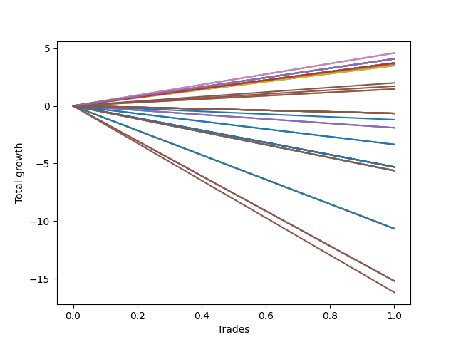

# Short Wallace 008 
- Symbol: TSLA_Unlimited
- Date Range: 03/23/2022 - 07/08/2022
- Trading Period: 7:20-12:30
- Number of Trades: 1



| Name | Win Percent | Profit | Avg Profit / Trade | Avg Time / Trade |      | Name | Win Percent | Profit | Avg Profit / Trade | Avg Time / Trade |
| ---- | ----------- | ------ | ------------------ | ---------------- | ---- | ---- | ----------- | ------ | ------------------ | ---------------- |
| Sorted By <br> Profit | | | | | | Sorted By <br> Win Percentage ||||
| Fifty-Eight | 100.00 | 2290.00 | 2290.00 | 19:15 |     | Fifty-Eight | 100.00 | 2290.00 | 2290.00 | 19:15 |
| Two | 100.00 | 2290.00 | 2290.00 | 19:15 |     | Two | 100.00 | 2290.00 | 2290.00 | 19:15 |
| One Hundred Twenty-Nine | 100.00 | 2040.00 | 2040.00 | 01:15 |     | One Hundred Twenty-Nine | 100.00 | 2040.00 | 2040.00 | 01:15 |
| One Hundred Twenty-Four | 100.00 | 2040.00 | 2040.00 | 01:15 |     | One Hundred Twenty-Four | 100.00 | 2040.00 | 2040.00 | 01:15 |
| One Hundred Ninteen | 100.00 | 2040.00 | 2040.00 | 01:15 |     | One Hundred Ninteen | 100.00 | 2040.00 | 2040.00 | 01:15 |
| One Hundred Fourteen | 100.00 | 2040.00 | 2040.00 | 01:15 |     | One Hundred Fourteen | 100.00 | 2040.00 | 2040.00 | 01:15 |
| One Hundred Nine | 100.00 | 2040.00 | 2040.00 | 01:15 |     | One Hundred Nine | 100.00 | 2040.00 | 2040.00 | 01:15 |
| One Hundred Four | 100.00 | 2040.00 | 2040.00 | 01:15 |     | One Hundred Four | 100.00 | 2040.00 | 2040.00 | 01:15 |
| Ninety-Nine | 100.00 | 2040.00 | 2040.00 | 01:15 |     | Ninety-Nine | 100.00 | 2040.00 | 2040.00 | 01:15 |
| Ninety-Four | 100.00 | 2040.00 | 2040.00 | 01:15 |     | Ninety-Four | 100.00 | 2040.00 | 2040.00 | 01:15 |
| Eighty-Four | 100.00 | 2040.00 | 2040.00 | 01:15 |     | Eighty-Four | 100.00 | 2040.00 | 2040.00 | 01:15 |
| One Hundred Twenty-Eight | 100.00 | 1855.00 | 1855.00 | 01:10 |     | One Hundred Twenty-Eight | 100.00 | 1855.00 | 1855.00 | 01:10 |
| One Hundred Twenty-Seven | 100.00 | 1855.00 | 1855.00 | 01:10 |     | One Hundred Twenty-Seven | 100.00 | 1855.00 | 1855.00 | 01:10 |
| One Hundred Twenty-Six | 100.00 | 1855.00 | 1855.00 | 01:10 |     | One Hundred Twenty-Six | 100.00 | 1855.00 | 1855.00 | 01:10 |
| One Hundred Twenty-Three | 100.00 | 1855.00 | 1855.00 | 01:10 |     | One Hundred Twenty-Three | 100.00 | 1855.00 | 1855.00 | 01:10 |
| One Hundred Twenty-Two | 100.00 | 1855.00 | 1855.00 | 01:10 |     | One Hundred Twenty-Two | 100.00 | 1855.00 | 1855.00 | 01:10 |
| One Hundred Twenty-One | 100.00 | 1855.00 | 1855.00 | 01:10 |     | One Hundred Twenty-One | 100.00 | 1855.00 | 1855.00 | 01:10 |
| One Hundred Eighteen | 100.00 | 1855.00 | 1855.00 | 01:10 |     | One Hundred Eighteen | 100.00 | 1855.00 | 1855.00 | 01:10 |
| One Hundred Seventeen | 100.00 | 1855.00 | 1855.00 | 01:10 |     | One Hundred Seventeen | 100.00 | 1855.00 | 1855.00 | 01:10 |
| One Hundred Sixteen | 100.00 | 1855.00 | 1855.00 | 01:10 |     | One Hundred Sixteen | 100.00 | 1855.00 | 1855.00 | 01:10 |
| One Hundred Thirteen | 100.00 | 1855.00 | 1855.00 | 01:10 |     | One Hundred Thirteen | 100.00 | 1855.00 | 1855.00 | 01:10 |
| One Hundred Twelve | 100.00 | 1855.00 | 1855.00 | 01:10 |     | One Hundred Twelve | 100.00 | 1855.00 | 1855.00 | 01:10 |
| One Hundred Eleven | 100.00 | 1855.00 | 1855.00 | 01:10 |     | One Hundred Eleven | 100.00 | 1855.00 | 1855.00 | 01:10 |
| One Hundred Eight | 100.00 | 1855.00 | 1855.00 | 01:10 |     | One Hundred Eight | 100.00 | 1855.00 | 1855.00 | 01:10 |
| One Hundred Seven | 100.00 | 1855.00 | 1855.00 | 01:10 |     | One Hundred Seven | 100.00 | 1855.00 | 1855.00 | 01:10 |
| One Hundred Six | 100.00 | 1855.00 | 1855.00 | 01:10 |     | One Hundred Six | 100.00 | 1855.00 | 1855.00 | 01:10 |
| One Hundred Three | 100.00 | 1855.00 | 1855.00 | 01:10 |     | One Hundred Three | 100.00 | 1855.00 | 1855.00 | 01:10 |
| One Hundred Two | 100.00 | 1855.00 | 1855.00 | 01:10 |     | One Hundred Two | 100.00 | 1855.00 | 1855.00 | 01:10 |
| One Hundred One | 100.00 | 1855.00 | 1855.00 | 01:10 |     | One Hundred One | 100.00 | 1855.00 | 1855.00 | 01:10 |
| Ninety-Eight | 100.00 | 1855.00 | 1855.00 | 01:10 |     | Ninety-Eight | 100.00 | 1855.00 | 1855.00 | 01:10 |
| Ninety-Seven | 100.00 | 1855.00 | 1855.00 | 01:10 |     | Ninety-Seven | 100.00 | 1855.00 | 1855.00 | 01:10 |
| Ninety-Six | 100.00 | 1855.00 | 1855.00 | 01:10 |     | Ninety-Six | 100.00 | 1855.00 | 1855.00 | 01:10 |
| Ninety-Three | 100.00 | 1855.00 | 1855.00 | 01:10 |     | Ninety-Three | 100.00 | 1855.00 | 1855.00 | 01:10 |
| Ninety-Two | 100.00 | 1855.00 | 1855.00 | 01:10 |     | Ninety-Two | 100.00 | 1855.00 | 1855.00 | 01:10 |
| Ninety-One | 100.00 | 1855.00 | 1855.00 | 01:10 |     | Ninety-One | 100.00 | 1855.00 | 1855.00 | 01:10 |
| Eighty-Three | 100.00 | 1855.00 | 1855.00 | 01:10 |     | Eighty-Three | 100.00 | 1855.00 | 1855.00 | 01:10 |
| Eighty-Two | 100.00 | 1855.00 | 1855.00 | 01:10 |     | Eighty-Two | 100.00 | 1855.00 | 1855.00 | 01:10 |
| Eighty-One | 100.00 | 1855.00 | 1855.00 | 01:10 |     | Eighty-One | 100.00 | 1855.00 | 1855.00 | 01:10 |
| Fifty-Nine | 100.00 | 1820.00 | 1820.00 | 28:05 |     | Fifty-Nine | 100.00 | 1820.00 | 1820.00 | 28:05 |
| Three | 100.00 | 1820.00 | 1820.00 | 28:05 |     | Three | 100.00 | 1820.00 | 1820.00 | 28:05 |
| Sixty | 100.00 | 1745.00 | 1745.00 | 40:55 |     | Sixty | 100.00 | 1745.00 | 1745.00 | 40:55 |
| Four | 100.00 | 1745.00 | 1745.00 | 40:55 |     | Four | 100.00 | 1745.00 | 1745.00 | 40:55 |
| One Hundred | 100.00 | 995.00 | 995.00 | 01:50 |     | One Hundred | 100.00 | 995.00 | 995.00 | 01:50 |
| One Hundred Ten | 100.00 | 855.00 | 855.00 | 02:25 |     | One Hundred Ten | 100.00 | 855.00 | 855.00 | 02:25 |
| Fifty-Seven | 100.00 | 730.00 | 730.00 | 18:55 |     | Fifty-Seven | 100.00 | 730.00 | 730.00 | 18:55 |
| One | 100.00 | 730.00 | 730.00 | 18:55 |     | One | 100.00 | 730.00 | 730.00 | 18:55 |
| One Hundred Twenty | 0.00 | -325.00 | -325.00 | 03:10 |     | One Hundred Twenty | 0.00 | -325.00 | -325.00 | 03:10 |
| Fifty-Five | 0.00 | -325.00 | -325.00 | 03:10 |     | Fifty-Five | 0.00 | -325.00 | -325.00 | 03:10 |
| Fifty-Four | 0.00 | -325.00 | -325.00 | 03:10 |     | Fifty-Four | 0.00 | -325.00 | -325.00 | 03:10 |
| Fifty-Three | 0.00 | -325.00 | -325.00 | 03:10 |     | Fifty-Three | 0.00 | -325.00 | -325.00 | 03:10 |
| Fifty-Two | 0.00 | -325.00 | -325.00 | 03:10 |     | Fifty-Two | 0.00 | -325.00 | -325.00 | 03:10 |
| Fifty-One | 0.00 | -325.00 | -325.00 | 03:10 |     | Fifty-One | 0.00 | -325.00 | -325.00 | 03:10 |
| Fifty | 0.00 | -325.00 | -325.00 | 03:10 |     | Fifty | 0.00 | -325.00 | -325.00 | 03:10 |
| Forty-Nine | 0.00 | -325.00 | -325.00 | 03:10 |     | Forty-Nine | 0.00 | -325.00 | -325.00 | 03:10 |
| Forty-Eight | 0.00 | -325.00 | -325.00 | 03:10 |     | Forty-Eight | 0.00 | -325.00 | -325.00 | 03:10 |
| Seventy-Three | 0.00 | -600.00 | -600.00 | 06:05 |     | Seventy-Three | 0.00 | -600.00 | -600.00 | 06:05 |
| Fifty-Six | 0.00 | -950.00 | -950.00 | 16:10 |     | Fifty-Six | 0.00 | -950.00 | -950.00 | 16:10 |
| Zero | 0.00 | -950.00 | -950.00 | 16:10 |     | Zero | 0.00 | -950.00 | -950.00 | 16:10 |
| One Hundred Five | 0.00 | -1675.00 | -1675.00 | 03:50 |     | One Hundred Five | 0.00 | -1675.00 | -1675.00 | 03:50 |
| Ninety-Five | 0.00 | -1675.00 | -1675.00 | 03:50 |     | Ninety-Five | 0.00 | -1675.00 | -1675.00 | 03:50 |
| One Hundred Fifteen | 0.00 | -2650.00 | -2650.00 | 10:50 |     | One Hundred Fifteen | 0.00 | -2650.00 | -2650.00 | 10:50 |
| Forty-Seven | 0.00 | -2650.00 | -2650.00 | 10:50 |     | Forty-Seven | 0.00 | -2650.00 | -2650.00 | 10:50 |
| Forty-Six | 0.00 | -2650.00 | -2650.00 | 10:50 |     | Forty-Six | 0.00 | -2650.00 | -2650.00 | 10:50 |
| Forty-Five | 0.00 | -2650.00 | -2650.00 | 10:50 |     | Forty-Five | 0.00 | -2650.00 | -2650.00 | 10:50 |
| Forty-Four | 0.00 | -2650.00 | -2650.00 | 10:50 |     | Forty-Four | 0.00 | -2650.00 | -2650.00 | 10:50 |
| Forty-Three | 0.00 | -2650.00 | -2650.00 | 10:50 |     | Forty-Three | 0.00 | -2650.00 | -2650.00 | 10:50 |
| Forty-Two | 0.00 | -2650.00 | -2650.00 | 10:50 |     | Forty-Two | 0.00 | -2650.00 | -2650.00 | 10:50 |
| Forty-One | 0.00 | -2650.00 | -2650.00 | 10:50 |     | Forty-One | 0.00 | -2650.00 | -2650.00 | 10:50 |
| Forty | 0.00 | -2650.00 | -2650.00 | 10:50 |     | Forty | 0.00 | -2650.00 | -2650.00 | 10:50 |
| One Hundred Thirty | 0.00 | -2810.00 | -2810.00 | 10:55 |     | One Hundred Thirty | 0.00 | -2810.00 | -2810.00 | 10:55 |
| Seventy-One | 0.00 | -2810.00 | -2810.00 | 10:55 |     | Seventy-One | 0.00 | -2810.00 | -2810.00 | 10:55 |
| Seventy | 0.00 | -2810.00 | -2810.00 | 10:55 |     | Seventy | 0.00 | -2810.00 | -2810.00 | 10:55 |
| Sixty-Nine | 0.00 | -2810.00 | -2810.00 | 10:55 |     | Sixty-Nine | 0.00 | -2810.00 | -2810.00 | 10:55 |
| Sixty-Eight | 0.00 | -2810.00 | -2810.00 | 10:55 |     | Sixty-Eight | 0.00 | -2810.00 | -2810.00 | 10:55 |
| Sixty-Seven | 0.00 | -2810.00 | -2810.00 | 10:55 |     | Sixty-Seven | 0.00 | -2810.00 | -2810.00 | 10:55 |
| Sixty-Six | 0.00 | -2810.00 | -2810.00 | 10:55 |     | Sixty-Six | 0.00 | -2810.00 | -2810.00 | 10:55 |
| Sixty-Five | 0.00 | -2810.00 | -2810.00 | 10:55 |     | Sixty-Five | 0.00 | -2810.00 | -2810.00 | 10:55 |
| Sixty-Four | 0.00 | -2810.00 | -2810.00 | 10:55 |     | Sixty-Four | 0.00 | -2810.00 | -2810.00 | 10:55 |
| One Hundred Twenty-Five | 0.00 | -5325.00 | -5325.00 | 69:00 |     | One Hundred Twenty-Five | 0.00 | -5325.00 | -5325.00 | 69:00 |
| Sixty-Three | 0.00 | -5325.00 | -5325.00 | 69:00 |     | Sixty-Three | 0.00 | -5325.00 | -5325.00 | 69:00 |
| Sixty-Two | 0.00 | -5325.00 | -5325.00 | 69:00 |     | Sixty-Two | 0.00 | -5325.00 | -5325.00 | 69:00 |
| Sixty-One | 0.00 | -5325.00 | -5325.00 | 69:00 |     | Sixty-One | 0.00 | -5325.00 | -5325.00 | 69:00 |
| Eighty-Five | 0.00 | -7595.00 | -7595.00 | 177:00 |     | Eighty-Five | 0.00 | -7595.00 | -7595.00 | 177:00 |
| Seven | 0.00 | -7595.00 | -7595.00 | 177:00 |     | Seven | 0.00 | -7595.00 | -7595.00 | 177:00 |
| Six | 0.00 | -7595.00 | -7595.00 | 177:00 |     | Six | 0.00 | -7595.00 | -7595.00 | 177:00 |
| Five | 0.00 | -8090.00 | -8090.00 | 159:40 |     | Five | 0.00 | -8090.00 | -8090.00 | 159:40 |

## NO STOPLOSS

### Test Zero
* Sell when price hits the middle line of the 20p bollinger
* No Stoploss
* Results:
```
Total Trades: 1
Percent Up: 100.00
Percent Down: 0.00
Total Points Moved Down: -1.90
Potential Profit: -950.00
Total Points Ups: 1.90 Count Ups: 1
Total Points Downs: 0.00 Count Downs: 0
```

<details><summary>Trades</summary>

<code>In: 2022-04-28 09:50:00		Out: 2022-04-28 10:06:10		Total Position Time: 16:10		Total Move Down: -1.90		Total to Date: -1.90</code> <br />


</details>

### Test One
* Sell when the price hits the upper line of the 20p 1std bollinger
* No Stoploss
* Results:
```
Total Trades: 1
Percent Up: 0.00
Percent Down: 100.00
Total Points Moved Down: 1.46
Potential Profit: 730.00
Total Points Ups: 0.00 Count Ups: 0
Total Points Downs: 1.46 Count Downs: 1
```

<details><summary>Trades</summary>

<code>In: 2022-04-28 09:50:00		Out: 2022-04-28 10:08:55		Total Position Time: 18:55		Total Move Down: 1.46		Total to Date: 1.46</code> <br />


</details>

### Test Two
* Sell when the price hits the upper line of the 20p 2std bollinger
* No Stoploss
* Results:
```
Total Trades: 1
Percent Up: 0.00
Percent Down: 100.00
Total Points Moved Down: 4.58
Potential Profit: 2290.00
Total Points Ups: 0.00 Count Ups: 0
Total Points Downs: 4.58 Count Downs: 1
```

<details><summary>Trades</summary>

<code>In: 2022-04-28 09:50:00		Out: 2022-04-28 10:09:15		Total Position Time: 19:15		Total Move Down: 4.58		Total to Date: 4.58</code> <br />


</details>

### Test Three
* Sell when price hits the middle line of the 50p bollinger
* No Stoploss
* Results:
```
Total Trades: 1
Percent Up: 0.00
Percent Down: 100.00
Total Points Moved Down: 3.64
Potential Profit: 1820.00
Total Points Ups: 0.00 Count Ups: 0
Total Points Downs: 3.64 Count Downs: 1
```

<details><summary>Trades</summary>

<code>In: 2022-04-28 09:50:00		Out: 2022-04-28 10:18:05		Total Position Time: 28:05		Total Move Down: 3.64		Total to Date: 3.64</code> <br />


</details>

### Test Four
* Sell when the price hits the upper line of the 50p 1std bollinger
* No Stoploss
* Results:
```
Total Trades: 1
Percent Up: 0.00
Percent Down: 100.00
Total Points Moved Down: 3.49
Potential Profit: 1745.00
Total Points Ups: 0.00 Count Ups: 0
Total Points Downs: 3.49 Count Downs: 1
```

<details><summary>Trades</summary>

<code>In: 2022-04-28 09:50:00		Out: 2022-04-28 10:30:55		Total Position Time: 40:55		Total Move Down: 3.49		Total to Date: 3.49</code> <br />


</details>

### Test Five
* Sell when the price hits the upper line of the 50p 2std bollinger
* No Stoploss
* Results:
```
Total Trades: 1
Percent Up: 100.00
Percent Down: 0.00
Total Points Moved Down: -16.18
Potential Profit: -8090.00
Total Points Ups: 16.18 Count Ups: 1
Total Points Downs: 0.00 Count Downs: 0
```

<details><summary>Trades</summary>

<code>In: 2022-04-28 09:50:00		Out: 2022-04-28 12:29:40		Total Position Time: 159:40		Total Move Down: -16.18		Total to Date: -16.18</code> <br />


</details>

### Test Six
* Sell when the price hits the middle line of the 1std VWAP
* No Stoploss
* Results:
```
Total Trades: 1
Percent Up: 100.00
Percent Down: 0.00
Total Points Moved Down: -15.19
Potential Profit: -7595.00
Total Points Ups: 15.19 Count Ups: 1
Total Points Downs: 0.00 Count Downs: 0
```

<details><summary>Trades</summary>

<code>In: 2022-04-28 09:50:00		Out: 2022-04-28 12:47:00		Total Position Time: 177:00		Total Move Down: -15.19		Total to Date: -15.19</code> <br />


</details>

### Test Seven
* Sell when the price hits the upper line of the 1std VWAP
* No Stoploss
* Results:
```
Total Trades: 1
Percent Up: 100.00
Percent Down: 0.00
Total Points Moved Down: -15.19
Potential Profit: -7595.00
Total Points Ups: 15.19 Count Ups: 1
Total Points Downs: 0.00 Count Downs: 0
```

<details><summary>Trades</summary>

<code>In: 2022-04-28 09:50:00		Out: 2022-04-28 12:47:00		Total Position Time: 177:00		Total Move Down: -15.19		Total to Date: -15.19</code> <br />


</details>

## STOPLOSS OF 5

### Test Forty
* Sell when price hits the middle line of the 20p bollinger
* Stoploss is -5 points
* Results:
```
Total Trades: 1
Percent Up: 100.00
Percent Down: 0.00
Total Points Moved Down: -5.30
Potential Profit: -2650.00
Total Points Ups: 5.30 Count Ups: 1
Total Points Downs: 0.00 Count Downs: 0
```

<details><summary>Trades</summary>

<code>In: 2022-04-28 09:50:00		Out: 2022-04-28 10:00:50		Total Position Time: 10:50		Total Move Down: -5.30		Total to Date: -5.30</code> <br />


</details>

### Test Forty-One
* Sell when the price hits the upper line of the 20p 1std bollinger
* Stoploss is -5 points
* Results:
```
Total Trades: 1
Percent Up: 100.00
Percent Down: 0.00
Total Points Moved Down: -5.30
Potential Profit: -2650.00
Total Points Ups: 5.30 Count Ups: 1
Total Points Downs: 0.00 Count Downs: 0
```

<details><summary>Trades</summary>

<code>In: 2022-04-28 09:50:00		Out: 2022-04-28 10:00:50		Total Position Time: 10:50		Total Move Down: -5.30		Total to Date: -5.30</code> <br />


</details>

### Test Forty-Two
* Sell when the price hits the upper line of the 20p 2std bollinger
* Stoploss is -5 points
* Results:
```
Total Trades: 1
Percent Up: 100.00
Percent Down: 0.00
Total Points Moved Down: -5.30
Potential Profit: -2650.00
Total Points Ups: 5.30 Count Ups: 1
Total Points Downs: 0.00 Count Downs: 0
```

<details><summary>Trades</summary>

<code>In: 2022-04-28 09:50:00		Out: 2022-04-28 10:00:50		Total Position Time: 10:50		Total Move Down: -5.30		Total to Date: -5.30</code> <br />


</details>

### Test Forty-Three
* Sell when price hits the middle line of the 50p bollinger
* Stoploss is -5 points
* Results:
```
Total Trades: 1
Percent Up: 100.00
Percent Down: 0.00
Total Points Moved Down: -5.30
Potential Profit: -2650.00
Total Points Ups: 5.30 Count Ups: 1
Total Points Downs: 0.00 Count Downs: 0
```

<details><summary>Trades</summary>

<code>In: 2022-04-28 09:50:00		Out: 2022-04-28 10:00:50		Total Position Time: 10:50		Total Move Down: -5.30		Total to Date: -5.30</code> <br />


</details>

### Test Forty-Four
* Sell when the price hits the upper line of the 50p 1std bollinger
* Stoploss is -5 points
* Results:
```
Total Trades: 1
Percent Up: 100.00
Percent Down: 0.00
Total Points Moved Down: -5.30
Potential Profit: -2650.00
Total Points Ups: 5.30 Count Ups: 1
Total Points Downs: 0.00 Count Downs: 0
```

<details><summary>Trades</summary>

<code>In: 2022-04-28 09:50:00		Out: 2022-04-28 10:00:50		Total Position Time: 10:50		Total Move Down: -5.30		Total to Date: -5.30</code> <br />


</details>

### Test Forty-Five
* Sell when the price hits the upper line of the 50p 2std bollinger
* Stoploss is -5 points
* Results:
```
Total Trades: 1
Percent Up: 100.00
Percent Down: 0.00
Total Points Moved Down: -5.30
Potential Profit: -2650.00
Total Points Ups: 5.30 Count Ups: 1
Total Points Downs: 0.00 Count Downs: 0
```

<details><summary>Trades</summary>

<code>In: 2022-04-28 09:50:00		Out: 2022-04-28 10:00:50		Total Position Time: 10:50		Total Move Down: -5.30		Total to Date: -5.30</code> <br />


</details>

### Test Forty-Six
* Sell when the price hits the middle line of the 1std VWAP
* Stoploss is -5 points
* Results:
```
Total Trades: 1
Percent Up: 100.00
Percent Down: 0.00
Total Points Moved Down: -5.30
Potential Profit: -2650.00
Total Points Ups: 5.30 Count Ups: 1
Total Points Downs: 0.00 Count Downs: 0
```

<details><summary>Trades</summary>

<code>In: 2022-04-28 09:50:00		Out: 2022-04-28 10:00:50		Total Position Time: 10:50		Total Move Down: -5.30		Total to Date: -5.30</code> <br />


</details>

### Test Forty-Seven
* Sell when the price hits the upper line of the 1std VWAP
* Stoploss is -5 points
* Results:
```
Total Trades: 1
Percent Up: 100.00
Percent Down: 0.00
Total Points Moved Down: -5.30
Potential Profit: -2650.00
Total Points Ups: 5.30 Count Ups: 1
Total Points Downs: 0.00 Count Downs: 0
```

<details><summary>Trades</summary>

<code>In: 2022-04-28 09:50:00		Out: 2022-04-28 10:00:50		Total Position Time: 10:50		Total Move Down: -5.30		Total to Date: -5.30</code> <br />


</details>

## TRAIL STOP OF 5

### Test Forty-Eight
* Sell when price hits the middle line of the 20p bollinger
* Trailing Stop is -5 points
* Results:
```
Total Trades: 1
Percent Up: 100.00
Percent Down: 0.00
Total Points Moved Down: -0.65
Potential Profit: -325.00
Total Points Ups: 0.65 Count Ups: 1
Total Points Downs: 0.00 Count Downs: 0
```

<details><summary>Trades</summary>

<code>In: 2022-04-28 09:50:00		Out: 2022-04-28 09:53:10		Total Position Time: 03:10		Total Move Down: -0.65		Total to Date: -0.65</code> <br />


</details>

### Test Forty-Nine
* Sell when the price hits the upper line of the 20p 1std bollinger
* Trailing Stop is -5 points
* Results:
```
Total Trades: 1
Percent Up: 100.00
Percent Down: 0.00
Total Points Moved Down: -0.65
Potential Profit: -325.00
Total Points Ups: 0.65 Count Ups: 1
Total Points Downs: 0.00 Count Downs: 0
```

<details><summary>Trades</summary>

<code>In: 2022-04-28 09:50:00		Out: 2022-04-28 09:53:10		Total Position Time: 03:10		Total Move Down: -0.65		Total to Date: -0.65</code> <br />


</details>

### Test Fifty
* Sell when the price hits the upper line of the 20p 2std bollinger
* Trailing Stop is -5 points
* Results:
```
Total Trades: 1
Percent Up: 100.00
Percent Down: 0.00
Total Points Moved Down: -0.65
Potential Profit: -325.00
Total Points Ups: 0.65 Count Ups: 1
Total Points Downs: 0.00 Count Downs: 0
```

<details><summary>Trades</summary>

<code>In: 2022-04-28 09:50:00		Out: 2022-04-28 09:53:10		Total Position Time: 03:10		Total Move Down: -0.65		Total to Date: -0.65</code> <br />


</details>

### Test Fifty-One
* Sell when price hits the middle line of the 50p bollinger
* Trailing Stop is -5 points
* Results:
```
Total Trades: 1
Percent Up: 100.00
Percent Down: 0.00
Total Points Moved Down: -0.65
Potential Profit: -325.00
Total Points Ups: 0.65 Count Ups: 1
Total Points Downs: 0.00 Count Downs: 0
```

<details><summary>Trades</summary>

<code>In: 2022-04-28 09:50:00		Out: 2022-04-28 09:53:10		Total Position Time: 03:10		Total Move Down: -0.65		Total to Date: -0.65</code> <br />


</details>

### Test Fifty-Two
* Sell when the price hits the upper line of the 50p 1std bollinger
* Trailing Stop is -5 points
* Results:
```
Total Trades: 1
Percent Up: 100.00
Percent Down: 0.00
Total Points Moved Down: -0.65
Potential Profit: -325.00
Total Points Ups: 0.65 Count Ups: 1
Total Points Downs: 0.00 Count Downs: 0
```

<details><summary>Trades</summary>

<code>In: 2022-04-28 09:50:00		Out: 2022-04-28 09:53:10		Total Position Time: 03:10		Total Move Down: -0.65		Total to Date: -0.65</code> <br />


</details>

### Test Fifty-Three
* Sell when the price hits the upper line of the 50p 2std bollinger
* Trailing Stop is -5 points
* Results:
```
Total Trades: 1
Percent Up: 100.00
Percent Down: 0.00
Total Points Moved Down: -0.65
Potential Profit: -325.00
Total Points Ups: 0.65 Count Ups: 1
Total Points Downs: 0.00 Count Downs: 0
```

<details><summary>Trades</summary>

<code>In: 2022-04-28 09:50:00		Out: 2022-04-28 09:53:10		Total Position Time: 03:10		Total Move Down: -0.65		Total to Date: -0.65</code> <br />


</details>

### Test Fifty-Four
* Sell when the price hits the middle line of the 1std VWAP
* Trailing Stop is -5 points
* Results:
```
Total Trades: 1
Percent Up: 100.00
Percent Down: 0.00
Total Points Moved Down: -0.65
Potential Profit: -325.00
Total Points Ups: 0.65 Count Ups: 1
Total Points Downs: 0.00 Count Downs: 0
```

<details><summary>Trades</summary>

<code>In: 2022-04-28 09:50:00		Out: 2022-04-28 09:53:10		Total Position Time: 03:10		Total Move Down: -0.65		Total to Date: -0.65</code> <br />


</details>

### Test Fifty-Five
* Sell when the price hits the upper line of the 1std VWAP
* Trailing Stop is -5 points
* Results:
```
Total Trades: 1
Percent Up: 100.00
Percent Down: 0.00
Total Points Moved Down: -0.65
Potential Profit: -325.00
Total Points Ups: 0.65 Count Ups: 1
Total Points Downs: 0.00 Count Downs: 0
```

<details><summary>Trades</summary>

<code>In: 2022-04-28 09:50:00		Out: 2022-04-28 09:53:10		Total Position Time: 03:10		Total Move Down: -0.65		Total to Date: -0.65</code> <br />


</details>

## STOPLOSS OF 10

### Test Fifty-Six
* Sell when price hits the middle line of the 20p bollinger
* Stoploss is -10 points
* Results:
```
Total Trades: 1
Percent Up: 100.00
Percent Down: 0.00
Total Points Moved Down: -1.90
Potential Profit: -950.00
Total Points Ups: 1.90 Count Ups: 1
Total Points Downs: 0.00 Count Downs: 0
```

<details><summary>Trades</summary>

<code>In: 2022-04-28 09:50:00		Out: 2022-04-28 10:06:10		Total Position Time: 16:10		Total Move Down: -1.90		Total to Date: -1.90</code> <br />


</details>

### Test Fifty-Seven
* Sell when the price hits the upper line of the 20p 1std bollinger
* Stoploss is -10 points
* Results:
```
Total Trades: 1
Percent Up: 0.00
Percent Down: 100.00
Total Points Moved Down: 1.46
Potential Profit: 730.00
Total Points Ups: 0.00 Count Ups: 0
Total Points Downs: 1.46 Count Downs: 1
```

<details><summary>Trades</summary>

<code>In: 2022-04-28 09:50:00		Out: 2022-04-28 10:08:55		Total Position Time: 18:55		Total Move Down: 1.46		Total to Date: 1.46</code> <br />


</details>

### Test Fifty-Eight
* Sell when the price hits the upper line of the 20p 2std bollinger
* Stoploss is -10 points
* Results:
```
Total Trades: 1
Percent Up: 0.00
Percent Down: 100.00
Total Points Moved Down: 4.58
Potential Profit: 2290.00
Total Points Ups: 0.00 Count Ups: 0
Total Points Downs: 4.58 Count Downs: 1
```

<details><summary>Trades</summary>

<code>In: 2022-04-28 09:50:00		Out: 2022-04-28 10:09:15		Total Position Time: 19:15		Total Move Down: 4.58		Total to Date: 4.58</code> <br />


</details>

### Test Fifty-Nine
* Sell when price hits the middle line of the 50p bollinger
* Stoploss is -10 points
* Results:
```
Total Trades: 1
Percent Up: 0.00
Percent Down: 100.00
Total Points Moved Down: 3.64
Potential Profit: 1820.00
Total Points Ups: 0.00 Count Ups: 0
Total Points Downs: 3.64 Count Downs: 1
```

<details><summary>Trades</summary>

<code>In: 2022-04-28 09:50:00		Out: 2022-04-28 10:18:05		Total Position Time: 28:05		Total Move Down: 3.64		Total to Date: 3.64</code> <br />


</details>

### Test Sixty
* Sell when the price hits the upper line of the 50p 1std bollinger
* Stoploss is -10 points
* Results:
```
Total Trades: 1
Percent Up: 0.00
Percent Down: 100.00
Total Points Moved Down: 3.49
Potential Profit: 1745.00
Total Points Ups: 0.00 Count Ups: 0
Total Points Downs: 3.49 Count Downs: 1
```

<details><summary>Trades</summary>

<code>In: 2022-04-28 09:50:00		Out: 2022-04-28 10:30:55		Total Position Time: 40:55		Total Move Down: 3.49		Total to Date: 3.49</code> <br />


</details>

### Test Sixty-One
* Sell when the price hits the upper line of the 50p 2std bollinger
* Stoploss is -10 points
* Results:
```
Total Trades: 1
Percent Up: 100.00
Percent Down: 0.00
Total Points Moved Down: -10.65
Potential Profit: -5325.00
Total Points Ups: 10.65 Count Ups: 1
Total Points Downs: 0.00 Count Downs: 0
```

<details><summary>Trades</summary>

<code>In: 2022-04-28 09:50:00		Out: 2022-04-28 10:59:00		Total Position Time: 69:00		Total Move Down: -10.65		Total to Date: -10.65</code> <br />


</details>

### Test Sixty-Two
* Sell when the price hits the middle line of the 1std VWAP
* Stoploss is -10 points
* Results:
```
Total Trades: 1
Percent Up: 100.00
Percent Down: 0.00
Total Points Moved Down: -10.65
Potential Profit: -5325.00
Total Points Ups: 10.65 Count Ups: 1
Total Points Downs: 0.00 Count Downs: 0
```

<details><summary>Trades</summary>

<code>In: 2022-04-28 09:50:00		Out: 2022-04-28 10:59:00		Total Position Time: 69:00		Total Move Down: -10.65		Total to Date: -10.65</code> <br />


</details>

### Test Sixty-Three
* Sell when the price hits the upper line of the 1std VWAP
* Stoploss is -10 points
* Results:
```
Total Trades: 1
Percent Up: 100.00
Percent Down: 0.00
Total Points Moved Down: -10.65
Potential Profit: -5325.00
Total Points Ups: 10.65 Count Ups: 1
Total Points Downs: 0.00 Count Downs: 0
```

<details><summary>Trades</summary>

<code>In: 2022-04-28 09:50:00		Out: 2022-04-28 10:59:00		Total Position Time: 69:00		Total Move Down: -10.65		Total to Date: -10.65</code> <br />


</details>

## TRAIL STOP OF 10

### Test Sixty-Four
* Sell when price hits the middle line of the 20p bollinger
* Trailing Stop is -10 points
* Results:
```
Total Trades: 1
Percent Up: 100.00
Percent Down: 0.00
Total Points Moved Down: -5.62
Potential Profit: -2810.00
Total Points Ups: 5.62 Count Ups: 1
Total Points Downs: 0.00 Count Downs: 0
```

<details><summary>Trades</summary>

<code>In: 2022-04-28 09:50:00		Out: 2022-04-28 10:00:55		Total Position Time: 10:55		Total Move Down: -5.62		Total to Date: -5.62</code> <br />


</details>

### Test Sixty-Five
* Sell when the price hits the upper line of the 20p 1std bollinger
* Trailing Stop is -10 points
* Results:
```
Total Trades: 1
Percent Up: 100.00
Percent Down: 0.00
Total Points Moved Down: -5.62
Potential Profit: -2810.00
Total Points Ups: 5.62 Count Ups: 1
Total Points Downs: 0.00 Count Downs: 0
```

<details><summary>Trades</summary>

<code>In: 2022-04-28 09:50:00		Out: 2022-04-28 10:00:55		Total Position Time: 10:55		Total Move Down: -5.62		Total to Date: -5.62</code> <br />


</details>

### Test Sixty-Six
* Sell when the price hits the upper line of the 20p 2std bollinger
* Trailing Stop is -10 points
* Results:
```
Total Trades: 1
Percent Up: 100.00
Percent Down: 0.00
Total Points Moved Down: -5.62
Potential Profit: -2810.00
Total Points Ups: 5.62 Count Ups: 1
Total Points Downs: 0.00 Count Downs: 0
```

<details><summary>Trades</summary>

<code>In: 2022-04-28 09:50:00		Out: 2022-04-28 10:00:55		Total Position Time: 10:55		Total Move Down: -5.62		Total to Date: -5.62</code> <br />


</details>

### Test Sixty-Seven
* Sell when price hits the middle line of the 50p bollinger
* Trailing Stop is -10 points
* Results:
```
Total Trades: 1
Percent Up: 100.00
Percent Down: 0.00
Total Points Moved Down: -5.62
Potential Profit: -2810.00
Total Points Ups: 5.62 Count Ups: 1
Total Points Downs: 0.00 Count Downs: 0
```

<details><summary>Trades</summary>

<code>In: 2022-04-28 09:50:00		Out: 2022-04-28 10:00:55		Total Position Time: 10:55		Total Move Down: -5.62		Total to Date: -5.62</code> <br />


</details>

### Test Sixty-Eight
* Sell when the price hits the upper line of the 50p 1std bollinger
* Trailing Stop is -10 points
* Results:
```
Total Trades: 1
Percent Up: 100.00
Percent Down: 0.00
Total Points Moved Down: -5.62
Potential Profit: -2810.00
Total Points Ups: 5.62 Count Ups: 1
Total Points Downs: 0.00 Count Downs: 0
```

<details><summary>Trades</summary>

<code>In: 2022-04-28 09:50:00		Out: 2022-04-28 10:00:55		Total Position Time: 10:55		Total Move Down: -5.62		Total to Date: -5.62</code> <br />


</details>

### Test Sixty-Nine
* Sell when the price hits the upper line of the 50p 2std bollinger
* Trailing Stop is -10 points
* Results:
```
Total Trades: 1
Percent Up: 100.00
Percent Down: 0.00
Total Points Moved Down: -5.62
Potential Profit: -2810.00
Total Points Ups: 5.62 Count Ups: 1
Total Points Downs: 0.00 Count Downs: 0
```

<details><summary>Trades</summary>

<code>In: 2022-04-28 09:50:00		Out: 2022-04-28 10:00:55		Total Position Time: 10:55		Total Move Down: -5.62		Total to Date: -5.62</code> <br />


</details>

### Test Seventy
* Sell when the price hits the middle line of the 1std VWAP
* Trailing Stop is -10 points
* Results:
```
Total Trades: 1
Percent Up: 100.00
Percent Down: 0.00
Total Points Moved Down: -5.62
Potential Profit: -2810.00
Total Points Ups: 5.62 Count Ups: 1
Total Points Downs: 0.00 Count Downs: 0
```

<details><summary>Trades</summary>

<code>In: 2022-04-28 09:50:00		Out: 2022-04-28 10:00:55		Total Position Time: 10:55		Total Move Down: -5.62		Total to Date: -5.62</code> <br />


</details>

### Test Seventy-One
* Sell when the price hits the upper line of the 1std VWAP
* Trailing Stop is -10 points
* Results:
```
Total Trades: 1
Percent Up: 100.00
Percent Down: 0.00
Total Points Moved Down: -5.62
Potential Profit: -2810.00
Total Points Ups: 5.62 Count Ups: 1
Total Points Downs: 0.00 Count Downs: 0
```

<details><summary>Trades</summary>

<code>In: 2022-04-28 09:50:00		Out: 2022-04-28 10:00:55		Total Position Time: 10:55		Total Move Down: -5.62		Total to Date: -5.62</code> <br />


</details>

## SPECIAL EXIT CONDITIONS 

### Test Seventy-Three
* Sell when the linear regression slope changes to negative
* No Stoploss
* Results:
```
Total Trades: 1
Percent Up: 100.00
Percent Down: 0.00
Total Points Moved Down: -1.20
Potential Profit: -600.00
Total Points Ups: 1.20 Count Ups: 1
Total Points Downs: 0.00 Count Downs: 0
```

<details><summary>Trades</summary>

<code>In: 2022-04-28 09:50:00		Out: 2022-04-28 09:56:05		Total Position Time: 06:05		Total Move Down: -1.20		Total to Date: -1.20</code> <br />


</details>

## TAKE PROFIT

### Test Eighty-One
* Take Profit of 1 Point
* No Stoploss
* Results:
```
Total Trades: 1
Percent Up: 0.00
Percent Down: 100.00
Total Points Moved Down: 3.71
Potential Profit: 1855.00
Total Points Ups: 0.00 Count Ups: 0
Total Points Downs: 3.71 Count Downs: 1
```

<details><summary>Trades</summary>

<code>In: 2022-04-28 09:50:00		Out: 2022-04-28 09:51:10		Total Position Time: 01:10		Total Move Down: 3.71		Total to Date: 3.71</code> <br />


</details>

### Test Eighty-Two
* Take Profit of 2 Point
* No Stoploss
* Results:
```
Total Trades: 1
Percent Up: 0.00
Percent Down: 100.00
Total Points Moved Down: 3.71
Potential Profit: 1855.00
Total Points Ups: 0.00 Count Ups: 0
Total Points Downs: 3.71 Count Downs: 1
```

<details><summary>Trades</summary>

<code>In: 2022-04-28 09:50:00		Out: 2022-04-28 09:51:10		Total Position Time: 01:10		Total Move Down: 3.71		Total to Date: 3.71</code> <br />


</details>

### Test Eighty-Three
* Take Profit of 3 Point
* No Stoploss
* Results:
```
Total Trades: 1
Percent Up: 0.00
Percent Down: 100.00
Total Points Moved Down: 3.71
Potential Profit: 1855.00
Total Points Ups: 0.00 Count Ups: 0
Total Points Downs: 3.71 Count Downs: 1
```

<details><summary>Trades</summary>

<code>In: 2022-04-28 09:50:00		Out: 2022-04-28 09:51:10		Total Position Time: 01:10		Total Move Down: 3.71		Total to Date: 3.71</code> <br />


</details>

### Test Eighty-Four
* Take Profit of 4 Point
* No Stoploss
* Results:
```
Total Trades: 1
Percent Up: 0.00
Percent Down: 100.00
Total Points Moved Down: 4.08
Potential Profit: 2040.00
Total Points Ups: 0.00 Count Ups: 0
Total Points Downs: 4.08 Count Downs: 1
```

<details><summary>Trades</summary>

<code>In: 2022-04-28 09:50:00		Out: 2022-04-28 09:51:15		Total Position Time: 01:15		Total Move Down: 4.08		Total to Date: 4.08</code> <br />


</details>

### Test Eighty-Five
* Take Profit of 5 Point
* No Stoploss
* Results:
```
Total Trades: 1
Percent Up: 100.00
Percent Down: 0.00
Total Points Moved Down: -15.19
Potential Profit: -7595.00
Total Points Ups: 15.19 Count Ups: 1
Total Points Downs: 0.00 Count Downs: 0
```

<details><summary>Trades</summary>

<code>In: 2022-04-28 09:50:00		Out: 2022-04-28 12:47:00		Total Position Time: 177:00		Total Move Down: -15.19		Total to Date: -15.19</code> <br />


</details>

## TAKE PROFIT Stoploss of Two

### Test Ninety-One
* Take Profit of 1 Point
* Stoploss is -2 points
* Results:
```
Total Trades: 1
Percent Up: 0.00
Percent Down: 100.00
Total Points Moved Down: 3.71
Potential Profit: 1855.00
Total Points Ups: 0.00 Count Ups: 0
Total Points Downs: 3.71 Count Downs: 1
```

<details><summary>Trades</summary>

<code>In: 2022-04-28 09:50:00		Out: 2022-04-28 09:51:10		Total Position Time: 01:10		Total Move Down: 3.71		Total to Date: 3.71</code> <br />


</details>

### Test Ninety-Two
* Take Profit of 2 Point
* Stoploss is -2 points
* Results:
```
Total Trades: 1
Percent Up: 0.00
Percent Down: 100.00
Total Points Moved Down: 3.71
Potential Profit: 1855.00
Total Points Ups: 0.00 Count Ups: 0
Total Points Downs: 3.71 Count Downs: 1
```

<details><summary>Trades</summary>

<code>In: 2022-04-28 09:50:00		Out: 2022-04-28 09:51:10		Total Position Time: 01:10		Total Move Down: 3.71		Total to Date: 3.71</code> <br />


</details>

### Test Ninety-Three
* Take Profit of 3 Point
* Stoploss is -2 points
* Results:
```
Total Trades: 1
Percent Up: 0.00
Percent Down: 100.00
Total Points Moved Down: 3.71
Potential Profit: 1855.00
Total Points Ups: 0.00 Count Ups: 0
Total Points Downs: 3.71 Count Downs: 1
```

<details><summary>Trades</summary>

<code>In: 2022-04-28 09:50:00		Out: 2022-04-28 09:51:10		Total Position Time: 01:10		Total Move Down: 3.71		Total to Date: 3.71</code> <br />


</details>

### Test Ninety-Four
* Take Profit of 4 Point
* Stoploss is -2 points
* Results:
```
Total Trades: 1
Percent Up: 0.00
Percent Down: 100.00
Total Points Moved Down: 4.08
Potential Profit: 2040.00
Total Points Ups: 0.00 Count Ups: 0
Total Points Downs: 4.08 Count Downs: 1
```

<details><summary>Trades</summary>

<code>In: 2022-04-28 09:50:00		Out: 2022-04-28 09:51:15		Total Position Time: 01:15		Total Move Down: 4.08		Total to Date: 4.08</code> <br />


</details>

### Test Ninety-Five
* Take Profit of 5 Point
* Stoploss is -2 points
* Results:
```
Total Trades: 1
Percent Up: 100.00
Percent Down: 0.00
Total Points Moved Down: -3.35
Potential Profit: -1675.00
Total Points Ups: 3.35 Count Ups: 1
Total Points Downs: 0.00 Count Downs: 0
```

<details><summary>Trades</summary>

<code>In: 2022-04-28 09:50:00		Out: 2022-04-28 09:53:50		Total Position Time: 03:50		Total Move Down: -3.35		Total to Date: -3.35</code> <br />


</details>

## TAKE PROFIT Trailstop of Two

### Test Ninety-Six
* Take Profit of 1 Point
* Trailing stop is -2 points
* Results:
```
Total Trades: 1
Percent Up: 0.00
Percent Down: 100.00
Total Points Moved Down: 3.71
Potential Profit: 1855.00
Total Points Ups: 0.00 Count Ups: 0
Total Points Downs: 3.71 Count Downs: 1
```

<details><summary>Trades</summary>

<code>In: 2022-04-28 09:50:00		Out: 2022-04-28 09:51:10		Total Position Time: 01:10		Total Move Down: 3.71		Total to Date: 3.71</code> <br />


</details>

### Test Ninety-Seven
* Take Profit of 2 Point
* Trailing stop is -2 points
* Results:
```
Total Trades: 1
Percent Up: 0.00
Percent Down: 100.00
Total Points Moved Down: 3.71
Potential Profit: 1855.00
Total Points Ups: 0.00 Count Ups: 0
Total Points Downs: 3.71 Count Downs: 1
```

<details><summary>Trades</summary>

<code>In: 2022-04-28 09:50:00		Out: 2022-04-28 09:51:10		Total Position Time: 01:10		Total Move Down: 3.71		Total to Date: 3.71</code> <br />


</details>

### Test Ninety-Eight
* Take Profit of 3 Point
* Trailing stop is -2 points
* Results:
```
Total Trades: 1
Percent Up: 0.00
Percent Down: 100.00
Total Points Moved Down: 3.71
Potential Profit: 1855.00
Total Points Ups: 0.00 Count Ups: 0
Total Points Downs: 3.71 Count Downs: 1
```

<details><summary>Trades</summary>

<code>In: 2022-04-28 09:50:00		Out: 2022-04-28 09:51:10		Total Position Time: 01:10		Total Move Down: 3.71		Total to Date: 3.71</code> <br />


</details>

### Test Ninety-Nine
* Take Profit of 4 Point
* Trailing stop is -2 points
* Results:
```
Total Trades: 1
Percent Up: 0.00
Percent Down: 100.00
Total Points Moved Down: 4.08
Potential Profit: 2040.00
Total Points Ups: 0.00 Count Ups: 0
Total Points Downs: 4.08 Count Downs: 1
```

<details><summary>Trades</summary>

<code>In: 2022-04-28 09:50:00		Out: 2022-04-28 09:51:15		Total Position Time: 01:15		Total Move Down: 4.08		Total to Date: 4.08</code> <br />


</details>

### Test One Hundred
* Take Profit of 5 Point
* Trailing stop is -2 points
* Results:
```
Total Trades: 1
Percent Up: 0.00
Percent Down: 100.00
Total Points Moved Down: 1.99
Potential Profit: 995.00
Total Points Ups: 0.00 Count Ups: 0
Total Points Downs: 1.99 Count Downs: 1
```

<details><summary>Trades</summary>

<code>In: 2022-04-28 09:50:00		Out: 2022-04-28 09:51:50		Total Position Time: 01:50		Total Move Down: 1.99		Total to Date: 1.99</code> <br />


</details>

## TAKE PROFIT Stoploss of Three

### Test One Hundred One
* Take Profit of 1 Point
* Stoploss is -3 points
* Results:
```
Total Trades: 1
Percent Up: 0.00
Percent Down: 100.00
Total Points Moved Down: 3.71
Potential Profit: 1855.00
Total Points Ups: 0.00 Count Ups: 0
Total Points Downs: 3.71 Count Downs: 1
```

<details><summary>Trades</summary>

<code>In: 2022-04-28 09:50:00		Out: 2022-04-28 09:51:10		Total Position Time: 01:10		Total Move Down: 3.71		Total to Date: 3.71</code> <br />


</details>

### Test One Hundred Two
* Take Profit of 2 Point
* Stoploss is -3 points
* Results:
```
Total Trades: 1
Percent Up: 0.00
Percent Down: 100.00
Total Points Moved Down: 3.71
Potential Profit: 1855.00
Total Points Ups: 0.00 Count Ups: 0
Total Points Downs: 3.71 Count Downs: 1
```

<details><summary>Trades</summary>

<code>In: 2022-04-28 09:50:00		Out: 2022-04-28 09:51:10		Total Position Time: 01:10		Total Move Down: 3.71		Total to Date: 3.71</code> <br />


</details>

### Test One Hundred Three
* Take Profit of 3 Point
* Stoploss is -3 points
* Results:
```
Total Trades: 1
Percent Up: 0.00
Percent Down: 100.00
Total Points Moved Down: 3.71
Potential Profit: 1855.00
Total Points Ups: 0.00 Count Ups: 0
Total Points Downs: 3.71 Count Downs: 1
```

<details><summary>Trades</summary>

<code>In: 2022-04-28 09:50:00		Out: 2022-04-28 09:51:10		Total Position Time: 01:10		Total Move Down: 3.71		Total to Date: 3.71</code> <br />


</details>

### Test One Hundred Four
* Take Profit of 4 Point
* Stoploss is -3 points
* Results:
```
Total Trades: 1
Percent Up: 0.00
Percent Down: 100.00
Total Points Moved Down: 4.08
Potential Profit: 2040.00
Total Points Ups: 0.00 Count Ups: 0
Total Points Downs: 4.08 Count Downs: 1
```

<details><summary>Trades</summary>

<code>In: 2022-04-28 09:50:00		Out: 2022-04-28 09:51:15		Total Position Time: 01:15		Total Move Down: 4.08		Total to Date: 4.08</code> <br />


</details>

### Test One Hundred Five
* Take Profit of 5 Point
* Stoploss is -3 points
* Results:
```
Total Trades: 1
Percent Up: 100.00
Percent Down: 0.00
Total Points Moved Down: -3.35
Potential Profit: -1675.00
Total Points Ups: 3.35 Count Ups: 1
Total Points Downs: 0.00 Count Downs: 0
```

<details><summary>Trades</summary>

<code>In: 2022-04-28 09:50:00		Out: 2022-04-28 09:53:50		Total Position Time: 03:50		Total Move Down: -3.35		Total to Date: -3.35</code> <br />


</details>

## TAKE PROFIT Trailstop of Three

### Test One Hundred Six
* Take Profit of 1 Point
* Trailing stop is -3 points
* Results:
```
Total Trades: 1
Percent Up: 0.00
Percent Down: 100.00
Total Points Moved Down: 3.71
Potential Profit: 1855.00
Total Points Ups: 0.00 Count Ups: 0
Total Points Downs: 3.71 Count Downs: 1
```

<details><summary>Trades</summary>

<code>In: 2022-04-28 09:50:00		Out: 2022-04-28 09:51:10		Total Position Time: 01:10		Total Move Down: 3.71		Total to Date: 3.71</code> <br />


</details>

### Test One Hundred Seven
* Take Profit of 2 Point
* Trailing stop is -3 points
* Results:
```
Total Trades: 1
Percent Up: 0.00
Percent Down: 100.00
Total Points Moved Down: 3.71
Potential Profit: 1855.00
Total Points Ups: 0.00 Count Ups: 0
Total Points Downs: 3.71 Count Downs: 1
```

<details><summary>Trades</summary>

<code>In: 2022-04-28 09:50:00		Out: 2022-04-28 09:51:10		Total Position Time: 01:10		Total Move Down: 3.71		Total to Date: 3.71</code> <br />


</details>

### Test One Hundred Eight
* Take Profit of 3 Point
* Trailing stop is -3 points
* Results:
```
Total Trades: 1
Percent Up: 0.00
Percent Down: 100.00
Total Points Moved Down: 3.71
Potential Profit: 1855.00
Total Points Ups: 0.00 Count Ups: 0
Total Points Downs: 3.71 Count Downs: 1
```

<details><summary>Trades</summary>

<code>In: 2022-04-28 09:50:00		Out: 2022-04-28 09:51:10		Total Position Time: 01:10		Total Move Down: 3.71		Total to Date: 3.71</code> <br />


</details>

### Test One Hundred Nine
* Take Profit of 4 Point
* Trailing stop is -3 points
* Results:
```
Total Trades: 1
Percent Up: 0.00
Percent Down: 100.00
Total Points Moved Down: 4.08
Potential Profit: 2040.00
Total Points Ups: 0.00 Count Ups: 0
Total Points Downs: 4.08 Count Downs: 1
```

<details><summary>Trades</summary>

<code>In: 2022-04-28 09:50:00		Out: 2022-04-28 09:51:15		Total Position Time: 01:15		Total Move Down: 4.08		Total to Date: 4.08</code> <br />


</details>

### Test One Hundred Ten
* Take Profit of 5 Point
* Trailing stop is -3 points
* Results:
```
Total Trades: 1
Percent Up: 0.00
Percent Down: 100.00
Total Points Moved Down: 1.71
Potential Profit: 855.00
Total Points Ups: 0.00 Count Ups: 0
Total Points Downs: 1.71 Count Downs: 1
```

<details><summary>Trades</summary>

<code>In: 2022-04-28 09:50:00		Out: 2022-04-28 09:52:25		Total Position Time: 02:25		Total Move Down: 1.71		Total to Date: 1.71</code> <br />


</details>

## TAKE PROFIT Stoploss of Five

### Test One Hundred Eleven
* Take Profit of 1 Point
* Stoploss is -5 points
* Results:
```
Total Trades: 1
Percent Up: 0.00
Percent Down: 100.00
Total Points Moved Down: 3.71
Potential Profit: 1855.00
Total Points Ups: 0.00 Count Ups: 0
Total Points Downs: 3.71 Count Downs: 1
```

<details><summary>Trades</summary>

<code>In: 2022-04-28 09:50:00		Out: 2022-04-28 09:51:10		Total Position Time: 01:10		Total Move Down: 3.71		Total to Date: 3.71</code> <br />


</details>

### Test One Hundred Twelve
* Take Profit of 2 Point
* Stoploss is -5 points
* Results:
```
Total Trades: 1
Percent Up: 0.00
Percent Down: 100.00
Total Points Moved Down: 3.71
Potential Profit: 1855.00
Total Points Ups: 0.00 Count Ups: 0
Total Points Downs: 3.71 Count Downs: 1
```

<details><summary>Trades</summary>

<code>In: 2022-04-28 09:50:00		Out: 2022-04-28 09:51:10		Total Position Time: 01:10		Total Move Down: 3.71		Total to Date: 3.71</code> <br />


</details>

### Test One Hundred Thirteen
* Take Profit of 3 Point
* Stoploss is -5 points
* Results:
```
Total Trades: 1
Percent Up: 0.00
Percent Down: 100.00
Total Points Moved Down: 3.71
Potential Profit: 1855.00
Total Points Ups: 0.00 Count Ups: 0
Total Points Downs: 3.71 Count Downs: 1
```

<details><summary>Trades</summary>

<code>In: 2022-04-28 09:50:00		Out: 2022-04-28 09:51:10		Total Position Time: 01:10		Total Move Down: 3.71		Total to Date: 3.71</code> <br />


</details>

### Test One Hundred Fourteen
* Take Profit of 4 Point
* Stoploss is -5 points
* Results:
```
Total Trades: 1
Percent Up: 0.00
Percent Down: 100.00
Total Points Moved Down: 4.08
Potential Profit: 2040.00
Total Points Ups: 0.00 Count Ups: 0
Total Points Downs: 4.08 Count Downs: 1
```

<details><summary>Trades</summary>

<code>In: 2022-04-28 09:50:00		Out: 2022-04-28 09:51:15		Total Position Time: 01:15		Total Move Down: 4.08		Total to Date: 4.08</code> <br />


</details>

### Test One Hundred Fifteen
* Take Profit of 5 Point
* Stoploss is -5 points
* Results:
```
Total Trades: 1
Percent Up: 100.00
Percent Down: 0.00
Total Points Moved Down: -5.30
Potential Profit: -2650.00
Total Points Ups: 5.30 Count Ups: 1
Total Points Downs: 0.00 Count Downs: 0
```

<details><summary>Trades</summary>

<code>In: 2022-04-28 09:50:00		Out: 2022-04-28 10:00:50		Total Position Time: 10:50		Total Move Down: -5.30		Total to Date: -5.30</code> <br />


</details>

## TAKE PROFIT Trailstop of Five

### Test One Hundred Sixteen
* Take Profit of 1 Point
* Trailing stop is -5 points
* Results:
```
Total Trades: 1
Percent Up: 0.00
Percent Down: 100.00
Total Points Moved Down: 3.71
Potential Profit: 1855.00
Total Points Ups: 0.00 Count Ups: 0
Total Points Downs: 3.71 Count Downs: 1
```

<details><summary>Trades</summary>

<code>In: 2022-04-28 09:50:00		Out: 2022-04-28 09:51:10		Total Position Time: 01:10		Total Move Down: 3.71		Total to Date: 3.71</code> <br />


</details>

### Test One Hundred Seventeen
* Take Profit of 2 Point
* Trailing stop is -5 points
* Results:
```
Total Trades: 1
Percent Up: 0.00
Percent Down: 100.00
Total Points Moved Down: 3.71
Potential Profit: 1855.00
Total Points Ups: 0.00 Count Ups: 0
Total Points Downs: 3.71 Count Downs: 1
```

<details><summary>Trades</summary>

<code>In: 2022-04-28 09:50:00		Out: 2022-04-28 09:51:10		Total Position Time: 01:10		Total Move Down: 3.71		Total to Date: 3.71</code> <br />


</details>

### Test One Hundred Eighteen
* Take Profit of 3 Point
* Trailing stop is -5 points
* Results:
```
Total Trades: 1
Percent Up: 0.00
Percent Down: 100.00
Total Points Moved Down: 3.71
Potential Profit: 1855.00
Total Points Ups: 0.00 Count Ups: 0
Total Points Downs: 3.71 Count Downs: 1
```

<details><summary>Trades</summary>

<code>In: 2022-04-28 09:50:00		Out: 2022-04-28 09:51:10		Total Position Time: 01:10		Total Move Down: 3.71		Total to Date: 3.71</code> <br />


</details>

### Test One Hundred Ninteen
* Take Profit of 4 Point
* Trailing stop is -5 points
* Results:
```
Total Trades: 1
Percent Up: 0.00
Percent Down: 100.00
Total Points Moved Down: 4.08
Potential Profit: 2040.00
Total Points Ups: 0.00 Count Ups: 0
Total Points Downs: 4.08 Count Downs: 1
```

<details><summary>Trades</summary>

<code>In: 2022-04-28 09:50:00		Out: 2022-04-28 09:51:15		Total Position Time: 01:15		Total Move Down: 4.08		Total to Date: 4.08</code> <br />


</details>

### Test One Hundred Twenty
* Take Profit of 5 Point
* Trailing stop is -5 points
* Results:
```
Total Trades: 1
Percent Up: 100.00
Percent Down: 0.00
Total Points Moved Down: -0.65
Potential Profit: -325.00
Total Points Ups: 0.65 Count Ups: 1
Total Points Downs: 0.00 Count Downs: 0
```

<details><summary>Trades</summary>

<code>In: 2022-04-28 09:50:00		Out: 2022-04-28 09:53:10		Total Position Time: 03:10		Total Move Down: -0.65		Total to Date: -0.65</code> <br />


</details>

## TAKE PROFIT Stoploss of Ten

### Test One Hundred Twenty-One
* Take Profit of 1 Point
* Stoploss is -10 points
* Results:
```
Total Trades: 1
Percent Up: 0.00
Percent Down: 100.00
Total Points Moved Down: 3.71
Potential Profit: 1855.00
Total Points Ups: 0.00 Count Ups: 0
Total Points Downs: 3.71 Count Downs: 1
```

<details><summary>Trades</summary>

<code>In: 2022-04-28 09:50:00		Out: 2022-04-28 09:51:10		Total Position Time: 01:10		Total Move Down: 3.71		Total to Date: 3.71</code> <br />


</details>

### Test One Hundred Twenty-Two
* Take Profit of 2 Point
* Stoploss is -10 points
* Results:
```
Total Trades: 1
Percent Up: 0.00
Percent Down: 100.00
Total Points Moved Down: 3.71
Potential Profit: 1855.00
Total Points Ups: 0.00 Count Ups: 0
Total Points Downs: 3.71 Count Downs: 1
```

<details><summary>Trades</summary>

<code>In: 2022-04-28 09:50:00		Out: 2022-04-28 09:51:10		Total Position Time: 01:10		Total Move Down: 3.71		Total to Date: 3.71</code> <br />


</details>

### Test One Hundred Twenty-Three
* Take Profit of 3 Point
* Stoploss is -10 points
* Results:
```
Total Trades: 1
Percent Up: 0.00
Percent Down: 100.00
Total Points Moved Down: 3.71
Potential Profit: 1855.00
Total Points Ups: 0.00 Count Ups: 0
Total Points Downs: 3.71 Count Downs: 1
```

<details><summary>Trades</summary>

<code>In: 2022-04-28 09:50:00		Out: 2022-04-28 09:51:10		Total Position Time: 01:10		Total Move Down: 3.71		Total to Date: 3.71</code> <br />


</details>

### Test One Hundred Twenty-Four
* Take Profit of 4 Point
* Stoploss is -10 points
* Results:
```
Total Trades: 1
Percent Up: 0.00
Percent Down: 100.00
Total Points Moved Down: 4.08
Potential Profit: 2040.00
Total Points Ups: 0.00 Count Ups: 0
Total Points Downs: 4.08 Count Downs: 1
```

<details><summary>Trades</summary>

<code>In: 2022-04-28 09:50:00		Out: 2022-04-28 09:51:15		Total Position Time: 01:15		Total Move Down: 4.08		Total to Date: 4.08</code> <br />


</details>

### Test One Hundred Twenty-Five
* Take Profit of 5 Point
* Stoploss is -10 points
* Results:
```
Total Trades: 1
Percent Up: 100.00
Percent Down: 0.00
Total Points Moved Down: -10.65
Potential Profit: -5325.00
Total Points Ups: 10.65 Count Ups: 1
Total Points Downs: 0.00 Count Downs: 0
```

<details><summary>Trades</summary>

<code>In: 2022-04-28 09:50:00		Out: 2022-04-28 10:59:00		Total Position Time: 69:00		Total Move Down: -10.65		Total to Date: -10.65</code> <br />


</details>

## TAKE PROFIT Trailstop of Ten

### Test One Hundred Twenty-Six
* Take Profit of 1 Point
* Trailing stop is -10 points
* Results:
```
Total Trades: 1
Percent Up: 0.00
Percent Down: 100.00
Total Points Moved Down: 3.71
Potential Profit: 1855.00
Total Points Ups: 0.00 Count Ups: 0
Total Points Downs: 3.71 Count Downs: 1
```

<details><summary>Trades</summary>

<code>In: 2022-04-28 09:50:00		Out: 2022-04-28 09:51:10		Total Position Time: 01:10		Total Move Down: 3.71		Total to Date: 3.71</code> <br />


</details>

### Test One Hundred Twenty-Seven
* Take Profit of 2 Point
* Trailing stop is -10 points
* Results:
```
Total Trades: 1
Percent Up: 0.00
Percent Down: 100.00
Total Points Moved Down: 3.71
Potential Profit: 1855.00
Total Points Ups: 0.00 Count Ups: 0
Total Points Downs: 3.71 Count Downs: 1
```

<details><summary>Trades</summary>

<code>In: 2022-04-28 09:50:00		Out: 2022-04-28 09:51:10		Total Position Time: 01:10		Total Move Down: 3.71		Total to Date: 3.71</code> <br />


</details>

### Test One Hundred Twenty-Eight
* Take Profit of 3 Point
* Trailing stop is -10 points
* Results:
```
Total Trades: 1
Percent Up: 0.00
Percent Down: 100.00
Total Points Moved Down: 3.71
Potential Profit: 1855.00
Total Points Ups: 0.00 Count Ups: 0
Total Points Downs: 3.71 Count Downs: 1
```

<details><summary>Trades</summary>

<code>In: 2022-04-28 09:50:00		Out: 2022-04-28 09:51:10		Total Position Time: 01:10		Total Move Down: 3.71		Total to Date: 3.71</code> <br />


</details>

### Test One Hundred Twenty-Nine
* Take Profit of 4 Point
* Trailing stop is -10 points
* Results:
```
Total Trades: 1
Percent Up: 0.00
Percent Down: 100.00
Total Points Moved Down: 4.08
Potential Profit: 2040.00
Total Points Ups: 0.00 Count Ups: 0
Total Points Downs: 4.08 Count Downs: 1
```

<details><summary>Trades</summary>

<code>In: 2022-04-28 09:50:00		Out: 2022-04-28 09:51:15		Total Position Time: 01:15		Total Move Down: 4.08		Total to Date: 4.08</code> <br />


</details>

### Test One Hundred Thirty
* Take Profit of 5 Point
* Trailing stop is -10 points
* Results:
```
Total Trades: 1
Percent Up: 100.00
Percent Down: 0.00
Total Points Moved Down: -5.62
Potential Profit: -2810.00
Total Points Ups: 5.62 Count Ups: 1
Total Points Downs: 0.00 Count Downs: 0
```

<details><summary>Trades</summary>

<code>In: 2022-04-28 09:50:00		Out: 2022-04-28 10:00:55		Total Position Time: 10:55		Total Move Down: -5.62		Total to Date: -5.62</code> <br />


</details>