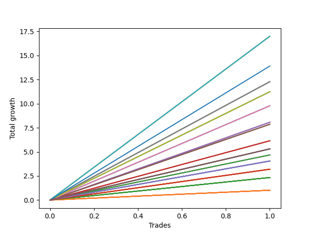

# Short Wallace Doodle 015 
- Symbol: TSLA_Unlimited
- Date Range: 03/23/2022 - 07/08/2022
- Trading Period: 7:20-12:30
- Number of Trades: 1



| Name | Win Percent | Profit | Avg Profit / Trade | Avg Time / Trade |      | Name | Win Percent | Profit | Avg Profit / Trade | Avg Time / Trade |
| ---- | ----------- | ------ | ------------------ | ---------------- | ---- | ---- | ----------- | ------ | ------------------ | ---------------- |
| Sorted By <br> Profit | | | | | | Sorted By <br> Win Percentage ||||
| Seventy-One | 100.00 | 8495.00 | 8495.00 | 47:20 |     | Seventy-One | 100.00 | 8495.00 | 8495.00 | 47:20 |
| Sixty-Three | 100.00 | 8495.00 | 8495.00 | 47:20 |     | Sixty-Three | 100.00 | 8495.00 | 8495.00 | 47:20 |
| Fifty-Five | 100.00 | 8495.00 | 8495.00 | 47:20 |     | Fifty-Five | 100.00 | 8495.00 | 8495.00 | 47:20 |
| Forty-Seven | 100.00 | 8495.00 | 8495.00 | 47:20 |     | Forty-Seven | 100.00 | 8495.00 | 8495.00 | 47:20 |
| Seven | 100.00 | 8495.00 | 8495.00 | 47:20 |     | Seven | 100.00 | 8495.00 | 8495.00 | 47:20 |
| Seventy-Three | 100.00 | 6950.00 | 6950.00 | 28:05 |     | Seventy-Three | 100.00 | 6950.00 | 6950.00 | 28:05 |
| Sixty-Nine | 100.00 | 6140.00 | 6140.00 | 22:55 |     | Sixty-Nine | 100.00 | 6140.00 | 6140.00 | 22:55 |
| Sixty-One | 100.00 | 6140.00 | 6140.00 | 22:55 |     | Sixty-One | 100.00 | 6140.00 | 6140.00 | 22:55 |
| Fifty-Three | 100.00 | 6140.00 | 6140.00 | 22:55 |     | Fifty-Three | 100.00 | 6140.00 | 6140.00 | 22:55 |
| Forty-Five | 100.00 | 6140.00 | 6140.00 | 22:55 |     | Forty-Five | 100.00 | 6140.00 | 6140.00 | 22:55 |
| Five | 100.00 | 6140.00 | 6140.00 | 22:55 |     | Five | 100.00 | 6140.00 | 6140.00 | 22:55 |
| Seventy | 100.00 | 5620.00 | 5620.00 | 20:00 |     | Seventy | 100.00 | 5620.00 | 5620.00 | 20:00 |
| Sixty-Two | 100.00 | 5620.00 | 5620.00 | 20:00 |     | Sixty-Two | 100.00 | 5620.00 | 5620.00 | 20:00 |
| Fifty-Four | 100.00 | 5620.00 | 5620.00 | 20:00 |     | Fifty-Four | 100.00 | 5620.00 | 5620.00 | 20:00 |
| Forty-Six | 100.00 | 5620.00 | 5620.00 | 20:00 |     | Forty-Six | 100.00 | 5620.00 | 5620.00 | 20:00 |
| Six | 100.00 | 5620.00 | 5620.00 | 20:00 |     | Six | 100.00 | 5620.00 | 5620.00 | 20:00 |
| Sixty-Eight | 100.00 | 4890.00 | 4890.00 | 17:00 |     | Sixty-Eight | 100.00 | 4890.00 | 4890.00 | 17:00 |
| Sixty | 100.00 | 4890.00 | 4890.00 | 17:00 |     | Sixty | 100.00 | 4890.00 | 4890.00 | 17:00 |
| Fifty-Two | 100.00 | 4890.00 | 4890.00 | 17:00 |     | Fifty-Two | 100.00 | 4890.00 | 4890.00 | 17:00 |
| Forty-Four | 100.00 | 4890.00 | 4890.00 | 17:00 |     | Forty-Four | 100.00 | 4890.00 | 4890.00 | 17:00 |
| Four | 100.00 | 4890.00 | 4890.00 | 17:00 |     | Four | 100.00 | 4890.00 | 4890.00 | 17:00 |
| Sixty-Six | 100.00 | 4035.00 | 4035.00 | 14:20 |     | Sixty-Six | 100.00 | 4035.00 | 4035.00 | 14:20 |
| Fifty-Eight | 100.00 | 4035.00 | 4035.00 | 14:20 |     | Fifty-Eight | 100.00 | 4035.00 | 4035.00 | 14:20 |
| Fifty | 100.00 | 4035.00 | 4035.00 | 14:20 |     | Fifty | 100.00 | 4035.00 | 4035.00 | 14:20 |
| Forty-Two | 100.00 | 4035.00 | 4035.00 | 14:20 |     | Forty-Two | 100.00 | 4035.00 | 4035.00 | 14:20 |
| Two | 100.00 | 4035.00 | 4035.00 | 14:20 |     | Two | 100.00 | 4035.00 | 4035.00 | 14:20 |
| Sixty-Seven | 100.00 | 3930.00 | 3930.00 | 14:10 |     | Sixty-Seven | 100.00 | 3930.00 | 3930.00 | 14:10 |
| Fifty-Nine | 100.00 | 3930.00 | 3930.00 | 14:10 |     | Fifty-Nine | 100.00 | 3930.00 | 3930.00 | 14:10 |
| Fifty-One | 100.00 | 3930.00 | 3930.00 | 14:10 |     | Fifty-One | 100.00 | 3930.00 | 3930.00 | 14:10 |
| Forty-Three | 100.00 | 3930.00 | 3930.00 | 14:10 |     | Forty-Three | 100.00 | 3930.00 | 3930.00 | 14:10 |
| Three | 100.00 | 3930.00 | 3930.00 | 14:10 |     | Three | 100.00 | 3930.00 | 3930.00 | 14:10 |
| Sixty-Five | 100.00 | 3075.00 | 3075.00 | 12:10 |     | Sixty-Five | 100.00 | 3075.00 | 3075.00 | 12:10 |
| Fifty-Seven | 100.00 | 3075.00 | 3075.00 | 12:10 |     | Fifty-Seven | 100.00 | 3075.00 | 3075.00 | 12:10 |
| Forty-Nine | 100.00 | 3075.00 | 3075.00 | 12:10 |     | Forty-Nine | 100.00 | 3075.00 | 3075.00 | 12:10 |
| Forty-One | 100.00 | 3075.00 | 3075.00 | 12:10 |     | Forty-One | 100.00 | 3075.00 | 3075.00 | 12:10 |
| One | 100.00 | 3075.00 | 3075.00 | 12:10 |     | One | 100.00 | 3075.00 | 3075.00 | 12:10 |
| One Hundred Thirty | 100.00 | 2655.00 | 2655.00 | 08:35 |     | One Hundred Thirty | 100.00 | 2655.00 | 2655.00 | 08:35 |
| One Hundred Twenty-Five | 100.00 | 2655.00 | 2655.00 | 08:35 |     | One Hundred Twenty-Five | 100.00 | 2655.00 | 2655.00 | 08:35 |
| One Hundred Twenty | 100.00 | 2655.00 | 2655.00 | 08:35 |     | One Hundred Twenty | 100.00 | 2655.00 | 2655.00 | 08:35 |
| One Hundred Fifteen | 100.00 | 2655.00 | 2655.00 | 08:35 |     | One Hundred Fifteen | 100.00 | 2655.00 | 2655.00 | 08:35 |
| One Hundred Ten | 100.00 | 2655.00 | 2655.00 | 08:35 |     | One Hundred Ten | 100.00 | 2655.00 | 2655.00 | 08:35 |
| One Hundred Five | 100.00 | 2655.00 | 2655.00 | 08:35 |     | One Hundred Five | 100.00 | 2655.00 | 2655.00 | 08:35 |
| One Hundred | 100.00 | 2655.00 | 2655.00 | 08:35 |     | One Hundred | 100.00 | 2655.00 | 2655.00 | 08:35 |
| Ninety-Five | 100.00 | 2655.00 | 2655.00 | 08:35 |     | Ninety-Five | 100.00 | 2655.00 | 2655.00 | 08:35 |
| Eighty-Five | 100.00 | 2655.00 | 2655.00 | 08:35 |     | Eighty-Five | 100.00 | 2655.00 | 2655.00 | 08:35 |
| Sixty-Four | 100.00 | 2340.00 | 2340.00 | 07:15 |     | Sixty-Four | 100.00 | 2340.00 | 2340.00 | 07:15 |
| Fifty-Six | 100.00 | 2340.00 | 2340.00 | 07:15 |     | Fifty-Six | 100.00 | 2340.00 | 2340.00 | 07:15 |
| Forty-Eight | 100.00 | 2340.00 | 2340.00 | 07:15 |     | Forty-Eight | 100.00 | 2340.00 | 2340.00 | 07:15 |
| Forty | 100.00 | 2340.00 | 2340.00 | 07:15 |     | Forty | 100.00 | 2340.00 | 2340.00 | 07:15 |
| Zero | 100.00 | 2340.00 | 2340.00 | 07:15 |     | Zero | 100.00 | 2340.00 | 2340.00 | 07:15 |
| One Hundred Twenty-Nine | 100.00 | 2025.00 | 2025.00 | 06:45 |     | One Hundred Twenty-Nine | 100.00 | 2025.00 | 2025.00 | 06:45 |
| One Hundred Twenty-Four | 100.00 | 2025.00 | 2025.00 | 06:45 |     | One Hundred Twenty-Four | 100.00 | 2025.00 | 2025.00 | 06:45 |
| One Hundred Ninteen | 100.00 | 2025.00 | 2025.00 | 06:45 |     | One Hundred Ninteen | 100.00 | 2025.00 | 2025.00 | 06:45 |
| One Hundred Fourteen | 100.00 | 2025.00 | 2025.00 | 06:45 |     | One Hundred Fourteen | 100.00 | 2025.00 | 2025.00 | 06:45 |
| One Hundred Nine | 100.00 | 2025.00 | 2025.00 | 06:45 |     | One Hundred Nine | 100.00 | 2025.00 | 2025.00 | 06:45 |
| One Hundred Four | 100.00 | 2025.00 | 2025.00 | 06:45 |     | One Hundred Four | 100.00 | 2025.00 | 2025.00 | 06:45 |
| Ninety-Nine | 100.00 | 2025.00 | 2025.00 | 06:45 |     | Ninety-Nine | 100.00 | 2025.00 | 2025.00 | 06:45 |
| Ninety-Four | 100.00 | 2025.00 | 2025.00 | 06:45 |     | Ninety-Four | 100.00 | 2025.00 | 2025.00 | 06:45 |
| Eighty-Four | 100.00 | 2025.00 | 2025.00 | 06:45 |     | Eighty-Four | 100.00 | 2025.00 | 2025.00 | 06:45 |
| One Hundred Twenty-Eight | 100.00 | 1600.00 | 1600.00 | 03:10 |     | One Hundred Twenty-Eight | 100.00 | 1600.00 | 1600.00 | 03:10 |
| One Hundred Twenty-Three | 100.00 | 1600.00 | 1600.00 | 03:10 |     | One Hundred Twenty-Three | 100.00 | 1600.00 | 1600.00 | 03:10 |
| One Hundred Eighteen | 100.00 | 1600.00 | 1600.00 | 03:10 |     | One Hundred Eighteen | 100.00 | 1600.00 | 1600.00 | 03:10 |
| One Hundred Thirteen | 100.00 | 1600.00 | 1600.00 | 03:10 |     | One Hundred Thirteen | 100.00 | 1600.00 | 1600.00 | 03:10 |
| One Hundred Eight | 100.00 | 1600.00 | 1600.00 | 03:10 |     | One Hundred Eight | 100.00 | 1600.00 | 1600.00 | 03:10 |
| One Hundred Three | 100.00 | 1600.00 | 1600.00 | 03:10 |     | One Hundred Three | 100.00 | 1600.00 | 1600.00 | 03:10 |
| Ninety-Eight | 100.00 | 1600.00 | 1600.00 | 03:10 |     | Ninety-Eight | 100.00 | 1600.00 | 1600.00 | 03:10 |
| Ninety-Three | 100.00 | 1600.00 | 1600.00 | 03:10 |     | Ninety-Three | 100.00 | 1600.00 | 1600.00 | 03:10 |
| Eighty-Three | 100.00 | 1600.00 | 1600.00 | 03:10 |     | Eighty-Three | 100.00 | 1600.00 | 1600.00 | 03:10 |
| One Hundred Twenty-Seven | 100.00 | 1170.00 | 1170.00 | 03:05 |     | One Hundred Twenty-Seven | 100.00 | 1170.00 | 1170.00 | 03:05 |
| One Hundred Twenty-Two | 100.00 | 1170.00 | 1170.00 | 03:05 |     | One Hundred Twenty-Two | 100.00 | 1170.00 | 1170.00 | 03:05 |
| One Hundred Seventeen | 100.00 | 1170.00 | 1170.00 | 03:05 |     | One Hundred Seventeen | 100.00 | 1170.00 | 1170.00 | 03:05 |
| One Hundred Twelve | 100.00 | 1170.00 | 1170.00 | 03:05 |     | One Hundred Twelve | 100.00 | 1170.00 | 1170.00 | 03:05 |
| One Hundred Seven | 100.00 | 1170.00 | 1170.00 | 03:05 |     | One Hundred Seven | 100.00 | 1170.00 | 1170.00 | 03:05 |
| One Hundred Two | 100.00 | 1170.00 | 1170.00 | 03:05 |     | One Hundred Two | 100.00 | 1170.00 | 1170.00 | 03:05 |
| Ninety-Seven | 100.00 | 1170.00 | 1170.00 | 03:05 |     | Ninety-Seven | 100.00 | 1170.00 | 1170.00 | 03:05 |
| Ninety-Two | 100.00 | 1170.00 | 1170.00 | 03:05 |     | Ninety-Two | 100.00 | 1170.00 | 1170.00 | 03:05 |
| Eighty-Two | 100.00 | 1170.00 | 1170.00 | 03:05 |     | Eighty-Two | 100.00 | 1170.00 | 1170.00 | 03:05 |
| One Hundred Twenty-Six | 100.00 | 510.00 | 510.00 | 01:10 |     | One Hundred Twenty-Six | 100.00 | 510.00 | 510.00 | 01:10 |
| One Hundred Twenty-One | 100.00 | 510.00 | 510.00 | 01:10 |     | One Hundred Twenty-One | 100.00 | 510.00 | 510.00 | 01:10 |
| One Hundred Sixteen | 100.00 | 510.00 | 510.00 | 01:10 |     | One Hundred Sixteen | 100.00 | 510.00 | 510.00 | 01:10 |
| One Hundred Eleven | 100.00 | 510.00 | 510.00 | 01:10 |     | One Hundred Eleven | 100.00 | 510.00 | 510.00 | 01:10 |
| One Hundred Six | 100.00 | 510.00 | 510.00 | 01:10 |     | One Hundred Six | 100.00 | 510.00 | 510.00 | 01:10 |
| One Hundred One | 100.00 | 510.00 | 510.00 | 01:10 |     | One Hundred One | 100.00 | 510.00 | 510.00 | 01:10 |
| Ninety-Six | 100.00 | 510.00 | 510.00 | 01:10 |     | Ninety-Six | 100.00 | 510.00 | 510.00 | 01:10 |
| Ninety-One | 100.00 | 510.00 | 510.00 | 01:10 |     | Ninety-One | 100.00 | 510.00 | 510.00 | 01:10 |
| Eighty-One | 100.00 | 510.00 | 510.00 | 01:10 |     | Eighty-One | 100.00 | 510.00 | 510.00 | 01:10 |

## NO STOPLOSS

### Test Zero
* Sell when price hits the middle line of the 20p bollinger
* No Stoploss
* Results:
```
Total Trades: 1
Percent Up: 0.00
Percent Down: 100.00
Total Points Moved Down: 4.68
Potential Profit: 2340.00
Total Points Ups: 0.00 Count Ups: 0
Total Points Downs: 4.68 Count Downs: 1
```

<details><summary>Trades</summary>

<code>In: 2022-05-24 09:17:00		Out: 2022-05-24 09:24:15		Total Position Time: 07:15		Total Move Down: 4.68		Total to Date: 4.68</code> <br />


</details>

### Test One
* Sell when the price hits the upper line of the 20p 1std bollinger
* No Stoploss
* Results:
```
Total Trades: 1
Percent Up: 0.00
Percent Down: 100.00
Total Points Moved Down: 6.15
Potential Profit: 3075.00
Total Points Ups: 0.00 Count Ups: 0
Total Points Downs: 6.15 Count Downs: 1
```

<details><summary>Trades</summary>

<code>In: 2022-05-24 09:17:00		Out: 2022-05-24 09:29:10		Total Position Time: 12:10		Total Move Down: 6.15		Total to Date: 6.15</code> <br />


</details>

### Test Two
* Sell when the price hits the upper line of the 20p 2std bollinger
* No Stoploss
* Results:
```
Total Trades: 1
Percent Up: 0.00
Percent Down: 100.00
Total Points Moved Down: 8.07
Potential Profit: 4035.00
Total Points Ups: 0.00 Count Ups: 0
Total Points Downs: 8.07 Count Downs: 1
```

<details><summary>Trades</summary>

<code>In: 2022-05-24 09:17:00		Out: 2022-05-24 09:31:20		Total Position Time: 14:20		Total Move Down: 8.07		Total to Date: 8.07</code> <br />


</details>

### Test Three
* Sell when price hits the middle line of the 50p bollinger
* No Stoploss
* Results:
```
Total Trades: 1
Percent Up: 0.00
Percent Down: 100.00
Total Points Moved Down: 7.86
Potential Profit: 3930.00
Total Points Ups: 0.00 Count Ups: 0
Total Points Downs: 7.86 Count Downs: 1
```

<details><summary>Trades</summary>

<code>In: 2022-05-24 09:17:00		Out: 2022-05-24 09:31:10		Total Position Time: 14:10		Total Move Down: 7.86		Total to Date: 7.86</code> <br />


</details>

### Test Four
* Sell when the price hits the upper line of the 50p 1std bollinger
* No Stoploss
* Results:
```
Total Trades: 1
Percent Up: 0.00
Percent Down: 100.00
Total Points Moved Down: 9.78
Potential Profit: 4890.00
Total Points Ups: 0.00 Count Ups: 0
Total Points Downs: 9.78 Count Downs: 1
```

<details><summary>Trades</summary>

<code>In: 2022-05-24 09:17:00		Out: 2022-05-24 09:34:00		Total Position Time: 17:00		Total Move Down: 9.78		Total to Date: 9.78</code> <br />


</details>

### Test Five
* Sell when the price hits the upper line of the 50p 2std bollinger
* No Stoploss
* Results:
```
Total Trades: 1
Percent Up: 0.00
Percent Down: 100.00
Total Points Moved Down: 12.28
Potential Profit: 6140.00
Total Points Ups: 0.00 Count Ups: 0
Total Points Downs: 12.28 Count Downs: 1
```

<details><summary>Trades</summary>

<code>In: 2022-05-24 09:17:00		Out: 2022-05-24 09:39:55		Total Position Time: 22:55		Total Move Down: 12.28		Total to Date: 12.28</code> <br />


</details>

### Test Six
* Sell when the price hits the middle line of the 1std VWAP
* No Stoploss
* Results:
```
Total Trades: 1
Percent Up: 0.00
Percent Down: 100.00
Total Points Moved Down: 11.24
Potential Profit: 5620.00
Total Points Ups: 0.00 Count Ups: 0
Total Points Downs: 11.24 Count Downs: 1
```

<details><summary>Trades</summary>

<code>In: 2022-05-24 09:17:00		Out: 2022-05-24 09:37:00		Total Position Time: 20:00		Total Move Down: 11.24		Total to Date: 11.24</code> <br />


</details>

### Test Seven
* Sell when the price hits the upper line of the 1std VWAP
* No Stoploss
* Results:
```
Total Trades: 1
Percent Up: 0.00
Percent Down: 100.00
Total Points Moved Down: 16.99
Potential Profit: 8495.00
Total Points Ups: 0.00 Count Ups: 0
Total Points Downs: 16.99 Count Downs: 1
```

<details><summary>Trades</summary>

<code>In: 2022-05-24 09:17:00		Out: 2022-05-24 10:04:20		Total Position Time: 47:20		Total Move Down: 16.99		Total to Date: 16.99</code> <br />


</details>

## STOPLOSS OF 5

### Test Forty
* Sell when price hits the middle line of the 20p bollinger
* Stoploss is -5 points
* Results:
```
Total Trades: 1
Percent Up: 0.00
Percent Down: 100.00
Total Points Moved Down: 4.68
Potential Profit: 2340.00
Total Points Ups: 0.00 Count Ups: 0
Total Points Downs: 4.68 Count Downs: 1
```

<details><summary>Trades</summary>

<code>In: 2022-05-24 09:17:00		Out: 2022-05-24 09:24:15		Total Position Time: 07:15		Total Move Down: 4.68		Total to Date: 4.68</code> <br />


</details>

### Test Forty-One
* Sell when the price hits the upper line of the 20p 1std bollinger
* Stoploss is -5 points
* Results:
```
Total Trades: 1
Percent Up: 0.00
Percent Down: 100.00
Total Points Moved Down: 6.15
Potential Profit: 3075.00
Total Points Ups: 0.00 Count Ups: 0
Total Points Downs: 6.15 Count Downs: 1
```

<details><summary>Trades</summary>

<code>In: 2022-05-24 09:17:00		Out: 2022-05-24 09:29:10		Total Position Time: 12:10		Total Move Down: 6.15		Total to Date: 6.15</code> <br />


</details>

### Test Forty-Two
* Sell when the price hits the upper line of the 20p 2std bollinger
* Stoploss is -5 points
* Results:
```
Total Trades: 1
Percent Up: 0.00
Percent Down: 100.00
Total Points Moved Down: 8.07
Potential Profit: 4035.00
Total Points Ups: 0.00 Count Ups: 0
Total Points Downs: 8.07 Count Downs: 1
```

<details><summary>Trades</summary>

<code>In: 2022-05-24 09:17:00		Out: 2022-05-24 09:31:20		Total Position Time: 14:20		Total Move Down: 8.07		Total to Date: 8.07</code> <br />


</details>

### Test Forty-Three
* Sell when price hits the middle line of the 50p bollinger
* Stoploss is -5 points
* Results:
```
Total Trades: 1
Percent Up: 0.00
Percent Down: 100.00
Total Points Moved Down: 7.86
Potential Profit: 3930.00
Total Points Ups: 0.00 Count Ups: 0
Total Points Downs: 7.86 Count Downs: 1
```

<details><summary>Trades</summary>

<code>In: 2022-05-24 09:17:00		Out: 2022-05-24 09:31:10		Total Position Time: 14:10		Total Move Down: 7.86		Total to Date: 7.86</code> <br />


</details>

### Test Forty-Four
* Sell when the price hits the upper line of the 50p 1std bollinger
* Stoploss is -5 points
* Results:
```
Total Trades: 1
Percent Up: 0.00
Percent Down: 100.00
Total Points Moved Down: 9.78
Potential Profit: 4890.00
Total Points Ups: 0.00 Count Ups: 0
Total Points Downs: 9.78 Count Downs: 1
```

<details><summary>Trades</summary>

<code>In: 2022-05-24 09:17:00		Out: 2022-05-24 09:34:00		Total Position Time: 17:00		Total Move Down: 9.78		Total to Date: 9.78</code> <br />


</details>

### Test Forty-Five
* Sell when the price hits the upper line of the 50p 2std bollinger
* Stoploss is -5 points
* Results:
```
Total Trades: 1
Percent Up: 0.00
Percent Down: 100.00
Total Points Moved Down: 12.28
Potential Profit: 6140.00
Total Points Ups: 0.00 Count Ups: 0
Total Points Downs: 12.28 Count Downs: 1
```

<details><summary>Trades</summary>

<code>In: 2022-05-24 09:17:00		Out: 2022-05-24 09:39:55		Total Position Time: 22:55		Total Move Down: 12.28		Total to Date: 12.28</code> <br />


</details>

### Test Forty-Six
* Sell when the price hits the middle line of the 1std VWAP
* Stoploss is -5 points
* Results:
```
Total Trades: 1
Percent Up: 0.00
Percent Down: 100.00
Total Points Moved Down: 11.24
Potential Profit: 5620.00
Total Points Ups: 0.00 Count Ups: 0
Total Points Downs: 11.24 Count Downs: 1
```

<details><summary>Trades</summary>

<code>In: 2022-05-24 09:17:00		Out: 2022-05-24 09:37:00		Total Position Time: 20:00		Total Move Down: 11.24		Total to Date: 11.24</code> <br />


</details>

### Test Forty-Seven
* Sell when the price hits the upper line of the 1std VWAP
* Stoploss is -5 points
* Results:
```
Total Trades: 1
Percent Up: 0.00
Percent Down: 100.00
Total Points Moved Down: 16.99
Potential Profit: 8495.00
Total Points Ups: 0.00 Count Ups: 0
Total Points Downs: 16.99 Count Downs: 1
```

<details><summary>Trades</summary>

<code>In: 2022-05-24 09:17:00		Out: 2022-05-24 10:04:20		Total Position Time: 47:20		Total Move Down: 16.99		Total to Date: 16.99</code> <br />


</details>

## TRAIL STOP OF 5

### Test Forty-Eight
* Sell when price hits the middle line of the 20p bollinger
* Trailing Stop is -5 points
* Results:
```
Total Trades: 1
Percent Up: 0.00
Percent Down: 100.00
Total Points Moved Down: 4.68
Potential Profit: 2340.00
Total Points Ups: 0.00 Count Ups: 0
Total Points Downs: 4.68 Count Downs: 1
```

<details><summary>Trades</summary>

<code>In: 2022-05-24 09:17:00		Out: 2022-05-24 09:24:15		Total Position Time: 07:15		Total Move Down: 4.68		Total to Date: 4.68</code> <br />


</details>

### Test Forty-Nine
* Sell when the price hits the upper line of the 20p 1std bollinger
* Trailing Stop is -5 points
* Results:
```
Total Trades: 1
Percent Up: 0.00
Percent Down: 100.00
Total Points Moved Down: 6.15
Potential Profit: 3075.00
Total Points Ups: 0.00 Count Ups: 0
Total Points Downs: 6.15 Count Downs: 1
```

<details><summary>Trades</summary>

<code>In: 2022-05-24 09:17:00		Out: 2022-05-24 09:29:10		Total Position Time: 12:10		Total Move Down: 6.15		Total to Date: 6.15</code> <br />


</details>

### Test Fifty
* Sell when the price hits the upper line of the 20p 2std bollinger
* Trailing Stop is -5 points
* Results:
```
Total Trades: 1
Percent Up: 0.00
Percent Down: 100.00
Total Points Moved Down: 8.07
Potential Profit: 4035.00
Total Points Ups: 0.00 Count Ups: 0
Total Points Downs: 8.07 Count Downs: 1
```

<details><summary>Trades</summary>

<code>In: 2022-05-24 09:17:00		Out: 2022-05-24 09:31:20		Total Position Time: 14:20		Total Move Down: 8.07		Total to Date: 8.07</code> <br />


</details>

### Test Fifty-One
* Sell when price hits the middle line of the 50p bollinger
* Trailing Stop is -5 points
* Results:
```
Total Trades: 1
Percent Up: 0.00
Percent Down: 100.00
Total Points Moved Down: 7.86
Potential Profit: 3930.00
Total Points Ups: 0.00 Count Ups: 0
Total Points Downs: 7.86 Count Downs: 1
```

<details><summary>Trades</summary>

<code>In: 2022-05-24 09:17:00		Out: 2022-05-24 09:31:10		Total Position Time: 14:10		Total Move Down: 7.86		Total to Date: 7.86</code> <br />


</details>

### Test Fifty-Two
* Sell when the price hits the upper line of the 50p 1std bollinger
* Trailing Stop is -5 points
* Results:
```
Total Trades: 1
Percent Up: 0.00
Percent Down: 100.00
Total Points Moved Down: 9.78
Potential Profit: 4890.00
Total Points Ups: 0.00 Count Ups: 0
Total Points Downs: 9.78 Count Downs: 1
```

<details><summary>Trades</summary>

<code>In: 2022-05-24 09:17:00		Out: 2022-05-24 09:34:00		Total Position Time: 17:00		Total Move Down: 9.78		Total to Date: 9.78</code> <br />


</details>

### Test Fifty-Three
* Sell when the price hits the upper line of the 50p 2std bollinger
* Trailing Stop is -5 points
* Results:
```
Total Trades: 1
Percent Up: 0.00
Percent Down: 100.00
Total Points Moved Down: 12.28
Potential Profit: 6140.00
Total Points Ups: 0.00 Count Ups: 0
Total Points Downs: 12.28 Count Downs: 1
```

<details><summary>Trades</summary>

<code>In: 2022-05-24 09:17:00		Out: 2022-05-24 09:39:55		Total Position Time: 22:55		Total Move Down: 12.28		Total to Date: 12.28</code> <br />


</details>

### Test Fifty-Four
* Sell when the price hits the middle line of the 1std VWAP
* Trailing Stop is -5 points
* Results:
```
Total Trades: 1
Percent Up: 0.00
Percent Down: 100.00
Total Points Moved Down: 11.24
Potential Profit: 5620.00
Total Points Ups: 0.00 Count Ups: 0
Total Points Downs: 11.24 Count Downs: 1
```

<details><summary>Trades</summary>

<code>In: 2022-05-24 09:17:00		Out: 2022-05-24 09:37:00		Total Position Time: 20:00		Total Move Down: 11.24		Total to Date: 11.24</code> <br />


</details>

### Test Fifty-Five
* Sell when the price hits the upper line of the 1std VWAP
* Trailing Stop is -5 points
* Results:
```
Total Trades: 1
Percent Up: 0.00
Percent Down: 100.00
Total Points Moved Down: 16.99
Potential Profit: 8495.00
Total Points Ups: 0.00 Count Ups: 0
Total Points Downs: 16.99 Count Downs: 1
```

<details><summary>Trades</summary>

<code>In: 2022-05-24 09:17:00		Out: 2022-05-24 10:04:20		Total Position Time: 47:20		Total Move Down: 16.99		Total to Date: 16.99</code> <br />


</details>

## STOPLOSS OF 10

### Test Fifty-Six
* Sell when price hits the middle line of the 20p bollinger
* Stoploss is -10 points
* Results:
```
Total Trades: 1
Percent Up: 0.00
Percent Down: 100.00
Total Points Moved Down: 4.68
Potential Profit: 2340.00
Total Points Ups: 0.00 Count Ups: 0
Total Points Downs: 4.68 Count Downs: 1
```

<details><summary>Trades</summary>

<code>In: 2022-05-24 09:17:00		Out: 2022-05-24 09:24:15		Total Position Time: 07:15		Total Move Down: 4.68		Total to Date: 4.68</code> <br />


</details>

### Test Fifty-Seven
* Sell when the price hits the upper line of the 20p 1std bollinger
* Stoploss is -10 points
* Results:
```
Total Trades: 1
Percent Up: 0.00
Percent Down: 100.00
Total Points Moved Down: 6.15
Potential Profit: 3075.00
Total Points Ups: 0.00 Count Ups: 0
Total Points Downs: 6.15 Count Downs: 1
```

<details><summary>Trades</summary>

<code>In: 2022-05-24 09:17:00		Out: 2022-05-24 09:29:10		Total Position Time: 12:10		Total Move Down: 6.15		Total to Date: 6.15</code> <br />


</details>

### Test Fifty-Eight
* Sell when the price hits the upper line of the 20p 2std bollinger
* Stoploss is -10 points
* Results:
```
Total Trades: 1
Percent Up: 0.00
Percent Down: 100.00
Total Points Moved Down: 8.07
Potential Profit: 4035.00
Total Points Ups: 0.00 Count Ups: 0
Total Points Downs: 8.07 Count Downs: 1
```

<details><summary>Trades</summary>

<code>In: 2022-05-24 09:17:00		Out: 2022-05-24 09:31:20		Total Position Time: 14:20		Total Move Down: 8.07		Total to Date: 8.07</code> <br />


</details>

### Test Fifty-Nine
* Sell when price hits the middle line of the 50p bollinger
* Stoploss is -10 points
* Results:
```
Total Trades: 1
Percent Up: 0.00
Percent Down: 100.00
Total Points Moved Down: 7.86
Potential Profit: 3930.00
Total Points Ups: 0.00 Count Ups: 0
Total Points Downs: 7.86 Count Downs: 1
```

<details><summary>Trades</summary>

<code>In: 2022-05-24 09:17:00		Out: 2022-05-24 09:31:10		Total Position Time: 14:10		Total Move Down: 7.86		Total to Date: 7.86</code> <br />


</details>

### Test Sixty
* Sell when the price hits the upper line of the 50p 1std bollinger
* Stoploss is -10 points
* Results:
```
Total Trades: 1
Percent Up: 0.00
Percent Down: 100.00
Total Points Moved Down: 9.78
Potential Profit: 4890.00
Total Points Ups: 0.00 Count Ups: 0
Total Points Downs: 9.78 Count Downs: 1
```

<details><summary>Trades</summary>

<code>In: 2022-05-24 09:17:00		Out: 2022-05-24 09:34:00		Total Position Time: 17:00		Total Move Down: 9.78		Total to Date: 9.78</code> <br />


</details>

### Test Sixty-One
* Sell when the price hits the upper line of the 50p 2std bollinger
* Stoploss is -10 points
* Results:
```
Total Trades: 1
Percent Up: 0.00
Percent Down: 100.00
Total Points Moved Down: 12.28
Potential Profit: 6140.00
Total Points Ups: 0.00 Count Ups: 0
Total Points Downs: 12.28 Count Downs: 1
```

<details><summary>Trades</summary>

<code>In: 2022-05-24 09:17:00		Out: 2022-05-24 09:39:55		Total Position Time: 22:55		Total Move Down: 12.28		Total to Date: 12.28</code> <br />


</details>

### Test Sixty-Two
* Sell when the price hits the middle line of the 1std VWAP
* Stoploss is -10 points
* Results:
```
Total Trades: 1
Percent Up: 0.00
Percent Down: 100.00
Total Points Moved Down: 11.24
Potential Profit: 5620.00
Total Points Ups: 0.00 Count Ups: 0
Total Points Downs: 11.24 Count Downs: 1
```

<details><summary>Trades</summary>

<code>In: 2022-05-24 09:17:00		Out: 2022-05-24 09:37:00		Total Position Time: 20:00		Total Move Down: 11.24		Total to Date: 11.24</code> <br />


</details>

### Test Sixty-Three
* Sell when the price hits the upper line of the 1std VWAP
* Stoploss is -10 points
* Results:
```
Total Trades: 1
Percent Up: 0.00
Percent Down: 100.00
Total Points Moved Down: 16.99
Potential Profit: 8495.00
Total Points Ups: 0.00 Count Ups: 0
Total Points Downs: 16.99 Count Downs: 1
```

<details><summary>Trades</summary>

<code>In: 2022-05-24 09:17:00		Out: 2022-05-24 10:04:20		Total Position Time: 47:20		Total Move Down: 16.99		Total to Date: 16.99</code> <br />


</details>

## TRAIL STOP OF 10

### Test Sixty-Four
* Sell when price hits the middle line of the 20p bollinger
* Trailing Stop is -10 points
* Results:
```
Total Trades: 1
Percent Up: 0.00
Percent Down: 100.00
Total Points Moved Down: 4.68
Potential Profit: 2340.00
Total Points Ups: 0.00 Count Ups: 0
Total Points Downs: 4.68 Count Downs: 1
```

<details><summary>Trades</summary>

<code>In: 2022-05-24 09:17:00		Out: 2022-05-24 09:24:15		Total Position Time: 07:15		Total Move Down: 4.68		Total to Date: 4.68</code> <br />


</details>

### Test Sixty-Five
* Sell when the price hits the upper line of the 20p 1std bollinger
* Trailing Stop is -10 points
* Results:
```
Total Trades: 1
Percent Up: 0.00
Percent Down: 100.00
Total Points Moved Down: 6.15
Potential Profit: 3075.00
Total Points Ups: 0.00 Count Ups: 0
Total Points Downs: 6.15 Count Downs: 1
```

<details><summary>Trades</summary>

<code>In: 2022-05-24 09:17:00		Out: 2022-05-24 09:29:10		Total Position Time: 12:10		Total Move Down: 6.15		Total to Date: 6.15</code> <br />


</details>

### Test Sixty-Six
* Sell when the price hits the upper line of the 20p 2std bollinger
* Trailing Stop is -10 points
* Results:
```
Total Trades: 1
Percent Up: 0.00
Percent Down: 100.00
Total Points Moved Down: 8.07
Potential Profit: 4035.00
Total Points Ups: 0.00 Count Ups: 0
Total Points Downs: 8.07 Count Downs: 1
```

<details><summary>Trades</summary>

<code>In: 2022-05-24 09:17:00		Out: 2022-05-24 09:31:20		Total Position Time: 14:20		Total Move Down: 8.07		Total to Date: 8.07</code> <br />


</details>

### Test Sixty-Seven
* Sell when price hits the middle line of the 50p bollinger
* Trailing Stop is -10 points
* Results:
```
Total Trades: 1
Percent Up: 0.00
Percent Down: 100.00
Total Points Moved Down: 7.86
Potential Profit: 3930.00
Total Points Ups: 0.00 Count Ups: 0
Total Points Downs: 7.86 Count Downs: 1
```

<details><summary>Trades</summary>

<code>In: 2022-05-24 09:17:00		Out: 2022-05-24 09:31:10		Total Position Time: 14:10		Total Move Down: 7.86		Total to Date: 7.86</code> <br />


</details>

### Test Sixty-Eight
* Sell when the price hits the upper line of the 50p 1std bollinger
* Trailing Stop is -10 points
* Results:
```
Total Trades: 1
Percent Up: 0.00
Percent Down: 100.00
Total Points Moved Down: 9.78
Potential Profit: 4890.00
Total Points Ups: 0.00 Count Ups: 0
Total Points Downs: 9.78 Count Downs: 1
```

<details><summary>Trades</summary>

<code>In: 2022-05-24 09:17:00		Out: 2022-05-24 09:34:00		Total Position Time: 17:00		Total Move Down: 9.78		Total to Date: 9.78</code> <br />


</details>

### Test Sixty-Nine
* Sell when the price hits the upper line of the 50p 2std bollinger
* Trailing Stop is -10 points
* Results:
```
Total Trades: 1
Percent Up: 0.00
Percent Down: 100.00
Total Points Moved Down: 12.28
Potential Profit: 6140.00
Total Points Ups: 0.00 Count Ups: 0
Total Points Downs: 12.28 Count Downs: 1
```

<details><summary>Trades</summary>

<code>In: 2022-05-24 09:17:00		Out: 2022-05-24 09:39:55		Total Position Time: 22:55		Total Move Down: 12.28		Total to Date: 12.28</code> <br />


</details>

### Test Seventy
* Sell when the price hits the middle line of the 1std VWAP
* Trailing Stop is -10 points
* Results:
```
Total Trades: 1
Percent Up: 0.00
Percent Down: 100.00
Total Points Moved Down: 11.24
Potential Profit: 5620.00
Total Points Ups: 0.00 Count Ups: 0
Total Points Downs: 11.24 Count Downs: 1
```

<details><summary>Trades</summary>

<code>In: 2022-05-24 09:17:00		Out: 2022-05-24 09:37:00		Total Position Time: 20:00		Total Move Down: 11.24		Total to Date: 11.24</code> <br />


</details>

### Test Seventy-One
* Sell when the price hits the upper line of the 1std VWAP
* Trailing Stop is -10 points
* Results:
```
Total Trades: 1
Percent Up: 0.00
Percent Down: 100.00
Total Points Moved Down: 16.99
Potential Profit: 8495.00
Total Points Ups: 0.00 Count Ups: 0
Total Points Downs: 16.99 Count Downs: 1
```

<details><summary>Trades</summary>

<code>In: 2022-05-24 09:17:00		Out: 2022-05-24 10:04:20		Total Position Time: 47:20		Total Move Down: 16.99		Total to Date: 16.99</code> <br />


</details>

## SPECIAL EXIT CONDITIONS 

### Test Seventy-Three
* Sell when the linear regression slope changes to negative
* No Stoploss
* Results:
```
Total Trades: 1
Percent Up: 0.00
Percent Down: 100.00
Total Points Moved Down: 13.90
Potential Profit: 6950.00
Total Points Ups: 0.00 Count Ups: 0
Total Points Downs: 13.90 Count Downs: 1
```

<details><summary>Trades</summary>

<code>In: 2022-05-24 09:17:00		Out: 2022-05-24 09:45:05		Total Position Time: 28:05		Total Move Down: 13.90		Total to Date: 13.90</code> <br />


</details>

## TAKE PROFIT

### Test Eighty-One
* Take Profit of 1 Point
* No Stoploss
* Results:
```
Total Trades: 1
Percent Up: 0.00
Percent Down: 100.00
Total Points Moved Down: 1.02
Potential Profit: 510.00
Total Points Ups: 0.00 Count Ups: 0
Total Points Downs: 1.02 Count Downs: 1
```

<details><summary>Trades</summary>

<code>In: 2022-05-24 09:17:00		Out: 2022-05-24 09:18:10		Total Position Time: 01:10		Total Move Down: 1.02		Total to Date: 1.02</code> <br />


</details>

### Test Eighty-Two
* Take Profit of 2 Point
* No Stoploss
* Results:
```
Total Trades: 1
Percent Up: 0.00
Percent Down: 100.00
Total Points Moved Down: 2.34
Potential Profit: 1170.00
Total Points Ups: 0.00 Count Ups: 0
Total Points Downs: 2.34 Count Downs: 1
```

<details><summary>Trades</summary>

<code>In: 2022-05-24 09:17:00		Out: 2022-05-24 09:20:05		Total Position Time: 03:05		Total Move Down: 2.34		Total to Date: 2.34</code> <br />


</details>

### Test Eighty-Three
* Take Profit of 3 Point
* No Stoploss
* Results:
```
Total Trades: 1
Percent Up: 0.00
Percent Down: 100.00
Total Points Moved Down: 3.20
Potential Profit: 1600.00
Total Points Ups: 0.00 Count Ups: 0
Total Points Downs: 3.20 Count Downs: 1
```

<details><summary>Trades</summary>

<code>In: 2022-05-24 09:17:00		Out: 2022-05-24 09:20:10		Total Position Time: 03:10		Total Move Down: 3.20		Total to Date: 3.20</code> <br />


</details>

### Test Eighty-Four
* Take Profit of 4 Point
* No Stoploss
* Results:
```
Total Trades: 1
Percent Up: 0.00
Percent Down: 100.00
Total Points Moved Down: 4.05
Potential Profit: 2025.00
Total Points Ups: 0.00 Count Ups: 0
Total Points Downs: 4.05 Count Downs: 1
```

<details><summary>Trades</summary>

<code>In: 2022-05-24 09:17:00		Out: 2022-05-24 09:23:45		Total Position Time: 06:45		Total Move Down: 4.05		Total to Date: 4.05</code> <br />


</details>

### Test Eighty-Five
* Take Profit of 5 Point
* No Stoploss
* Results:
```
Total Trades: 1
Percent Up: 0.00
Percent Down: 100.00
Total Points Moved Down: 5.31
Potential Profit: 2655.00
Total Points Ups: 0.00 Count Ups: 0
Total Points Downs: 5.31 Count Downs: 1
```

<details><summary>Trades</summary>

<code>In: 2022-05-24 09:17:00		Out: 2022-05-24 09:25:35		Total Position Time: 08:35		Total Move Down: 5.31		Total to Date: 5.31</code> <br />


</details>

## TAKE PROFIT Stoploss of Two

### Test Ninety-One
* Take Profit of 1 Point
* Stoploss is -2 points
* Results:
```
Total Trades: 1
Percent Up: 0.00
Percent Down: 100.00
Total Points Moved Down: 1.02
Potential Profit: 510.00
Total Points Ups: 0.00 Count Ups: 0
Total Points Downs: 1.02 Count Downs: 1
```

<details><summary>Trades</summary>

<code>In: 2022-05-24 09:17:00		Out: 2022-05-24 09:18:10		Total Position Time: 01:10		Total Move Down: 1.02		Total to Date: 1.02</code> <br />


</details>

### Test Ninety-Two
* Take Profit of 2 Point
* Stoploss is -2 points
* Results:
```
Total Trades: 1
Percent Up: 0.00
Percent Down: 100.00
Total Points Moved Down: 2.34
Potential Profit: 1170.00
Total Points Ups: 0.00 Count Ups: 0
Total Points Downs: 2.34 Count Downs: 1
```

<details><summary>Trades</summary>

<code>In: 2022-05-24 09:17:00		Out: 2022-05-24 09:20:05		Total Position Time: 03:05		Total Move Down: 2.34		Total to Date: 2.34</code> <br />


</details>

### Test Ninety-Three
* Take Profit of 3 Point
* Stoploss is -2 points
* Results:
```
Total Trades: 1
Percent Up: 0.00
Percent Down: 100.00
Total Points Moved Down: 3.20
Potential Profit: 1600.00
Total Points Ups: 0.00 Count Ups: 0
Total Points Downs: 3.20 Count Downs: 1
```

<details><summary>Trades</summary>

<code>In: 2022-05-24 09:17:00		Out: 2022-05-24 09:20:10		Total Position Time: 03:10		Total Move Down: 3.20		Total to Date: 3.20</code> <br />


</details>

### Test Ninety-Four
* Take Profit of 4 Point
* Stoploss is -2 points
* Results:
```
Total Trades: 1
Percent Up: 0.00
Percent Down: 100.00
Total Points Moved Down: 4.05
Potential Profit: 2025.00
Total Points Ups: 0.00 Count Ups: 0
Total Points Downs: 4.05 Count Downs: 1
```

<details><summary>Trades</summary>

<code>In: 2022-05-24 09:17:00		Out: 2022-05-24 09:23:45		Total Position Time: 06:45		Total Move Down: 4.05		Total to Date: 4.05</code> <br />


</details>

### Test Ninety-Five
* Take Profit of 5 Point
* Stoploss is -2 points
* Results:
```
Total Trades: 1
Percent Up: 0.00
Percent Down: 100.00
Total Points Moved Down: 5.31
Potential Profit: 2655.00
Total Points Ups: 0.00 Count Ups: 0
Total Points Downs: 5.31 Count Downs: 1
```

<details><summary>Trades</summary>

<code>In: 2022-05-24 09:17:00		Out: 2022-05-24 09:25:35		Total Position Time: 08:35		Total Move Down: 5.31		Total to Date: 5.31</code> <br />


</details>

## TAKE PROFIT Trailstop of Two

### Test Ninety-Six
* Take Profit of 1 Point
* Trailing stop is -2 points
* Results:
```
Total Trades: 1
Percent Up: 0.00
Percent Down: 100.00
Total Points Moved Down: 1.02
Potential Profit: 510.00
Total Points Ups: 0.00 Count Ups: 0
Total Points Downs: 1.02 Count Downs: 1
```

<details><summary>Trades</summary>

<code>In: 2022-05-24 09:17:00		Out: 2022-05-24 09:18:10		Total Position Time: 01:10		Total Move Down: 1.02		Total to Date: 1.02</code> <br />


</details>

### Test Ninety-Seven
* Take Profit of 2 Point
* Trailing stop is -2 points
* Results:
```
Total Trades: 1
Percent Up: 0.00
Percent Down: 100.00
Total Points Moved Down: 2.34
Potential Profit: 1170.00
Total Points Ups: 0.00 Count Ups: 0
Total Points Downs: 2.34 Count Downs: 1
```

<details><summary>Trades</summary>

<code>In: 2022-05-24 09:17:00		Out: 2022-05-24 09:20:05		Total Position Time: 03:05		Total Move Down: 2.34		Total to Date: 2.34</code> <br />


</details>

### Test Ninety-Eight
* Take Profit of 3 Point
* Trailing stop is -2 points
* Results:
```
Total Trades: 1
Percent Up: 0.00
Percent Down: 100.00
Total Points Moved Down: 3.20
Potential Profit: 1600.00
Total Points Ups: 0.00 Count Ups: 0
Total Points Downs: 3.20 Count Downs: 1
```

<details><summary>Trades</summary>

<code>In: 2022-05-24 09:17:00		Out: 2022-05-24 09:20:10		Total Position Time: 03:10		Total Move Down: 3.20		Total to Date: 3.20</code> <br />


</details>

### Test Ninety-Nine
* Take Profit of 4 Point
* Trailing stop is -2 points
* Results:
```
Total Trades: 1
Percent Up: 0.00
Percent Down: 100.00
Total Points Moved Down: 4.05
Potential Profit: 2025.00
Total Points Ups: 0.00 Count Ups: 0
Total Points Downs: 4.05 Count Downs: 1
```

<details><summary>Trades</summary>

<code>In: 2022-05-24 09:17:00		Out: 2022-05-24 09:23:45		Total Position Time: 06:45		Total Move Down: 4.05		Total to Date: 4.05</code> <br />


</details>

### Test One Hundred
* Take Profit of 5 Point
* Trailing stop is -2 points
* Results:
```
Total Trades: 1
Percent Up: 0.00
Percent Down: 100.00
Total Points Moved Down: 5.31
Potential Profit: 2655.00
Total Points Ups: 0.00 Count Ups: 0
Total Points Downs: 5.31 Count Downs: 1
```

<details><summary>Trades</summary>

<code>In: 2022-05-24 09:17:00		Out: 2022-05-24 09:25:35		Total Position Time: 08:35		Total Move Down: 5.31		Total to Date: 5.31</code> <br />


</details>

## TAKE PROFIT Stoploss of Three

### Test One Hundred One
* Take Profit of 1 Point
* Stoploss is -3 points
* Results:
```
Total Trades: 1
Percent Up: 0.00
Percent Down: 100.00
Total Points Moved Down: 1.02
Potential Profit: 510.00
Total Points Ups: 0.00 Count Ups: 0
Total Points Downs: 1.02 Count Downs: 1
```

<details><summary>Trades</summary>

<code>In: 2022-05-24 09:17:00		Out: 2022-05-24 09:18:10		Total Position Time: 01:10		Total Move Down: 1.02		Total to Date: 1.02</code> <br />


</details>

### Test One Hundred Two
* Take Profit of 2 Point
* Stoploss is -3 points
* Results:
```
Total Trades: 1
Percent Up: 0.00
Percent Down: 100.00
Total Points Moved Down: 2.34
Potential Profit: 1170.00
Total Points Ups: 0.00 Count Ups: 0
Total Points Downs: 2.34 Count Downs: 1
```

<details><summary>Trades</summary>

<code>In: 2022-05-24 09:17:00		Out: 2022-05-24 09:20:05		Total Position Time: 03:05		Total Move Down: 2.34		Total to Date: 2.34</code> <br />


</details>

### Test One Hundred Three
* Take Profit of 3 Point
* Stoploss is -3 points
* Results:
```
Total Trades: 1
Percent Up: 0.00
Percent Down: 100.00
Total Points Moved Down: 3.20
Potential Profit: 1600.00
Total Points Ups: 0.00 Count Ups: 0
Total Points Downs: 3.20 Count Downs: 1
```

<details><summary>Trades</summary>

<code>In: 2022-05-24 09:17:00		Out: 2022-05-24 09:20:10		Total Position Time: 03:10		Total Move Down: 3.20		Total to Date: 3.20</code> <br />


</details>

### Test One Hundred Four
* Take Profit of 4 Point
* Stoploss is -3 points
* Results:
```
Total Trades: 1
Percent Up: 0.00
Percent Down: 100.00
Total Points Moved Down: 4.05
Potential Profit: 2025.00
Total Points Ups: 0.00 Count Ups: 0
Total Points Downs: 4.05 Count Downs: 1
```

<details><summary>Trades</summary>

<code>In: 2022-05-24 09:17:00		Out: 2022-05-24 09:23:45		Total Position Time: 06:45		Total Move Down: 4.05		Total to Date: 4.05</code> <br />


</details>

### Test One Hundred Five
* Take Profit of 5 Point
* Stoploss is -3 points
* Results:
```
Total Trades: 1
Percent Up: 0.00
Percent Down: 100.00
Total Points Moved Down: 5.31
Potential Profit: 2655.00
Total Points Ups: 0.00 Count Ups: 0
Total Points Downs: 5.31 Count Downs: 1
```

<details><summary>Trades</summary>

<code>In: 2022-05-24 09:17:00		Out: 2022-05-24 09:25:35		Total Position Time: 08:35		Total Move Down: 5.31		Total to Date: 5.31</code> <br />


</details>

## TAKE PROFIT Trailstop of Three

### Test One Hundred Six
* Take Profit of 1 Point
* Trailing stop is -3 points
* Results:
```
Total Trades: 1
Percent Up: 0.00
Percent Down: 100.00
Total Points Moved Down: 1.02
Potential Profit: 510.00
Total Points Ups: 0.00 Count Ups: 0
Total Points Downs: 1.02 Count Downs: 1
```

<details><summary>Trades</summary>

<code>In: 2022-05-24 09:17:00		Out: 2022-05-24 09:18:10		Total Position Time: 01:10		Total Move Down: 1.02		Total to Date: 1.02</code> <br />


</details>

### Test One Hundred Seven
* Take Profit of 2 Point
* Trailing stop is -3 points
* Results:
```
Total Trades: 1
Percent Up: 0.00
Percent Down: 100.00
Total Points Moved Down: 2.34
Potential Profit: 1170.00
Total Points Ups: 0.00 Count Ups: 0
Total Points Downs: 2.34 Count Downs: 1
```

<details><summary>Trades</summary>

<code>In: 2022-05-24 09:17:00		Out: 2022-05-24 09:20:05		Total Position Time: 03:05		Total Move Down: 2.34		Total to Date: 2.34</code> <br />


</details>

### Test One Hundred Eight
* Take Profit of 3 Point
* Trailing stop is -3 points
* Results:
```
Total Trades: 1
Percent Up: 0.00
Percent Down: 100.00
Total Points Moved Down: 3.20
Potential Profit: 1600.00
Total Points Ups: 0.00 Count Ups: 0
Total Points Downs: 3.20 Count Downs: 1
```

<details><summary>Trades</summary>

<code>In: 2022-05-24 09:17:00		Out: 2022-05-24 09:20:10		Total Position Time: 03:10		Total Move Down: 3.20		Total to Date: 3.20</code> <br />


</details>

### Test One Hundred Nine
* Take Profit of 4 Point
* Trailing stop is -3 points
* Results:
```
Total Trades: 1
Percent Up: 0.00
Percent Down: 100.00
Total Points Moved Down: 4.05
Potential Profit: 2025.00
Total Points Ups: 0.00 Count Ups: 0
Total Points Downs: 4.05 Count Downs: 1
```

<details><summary>Trades</summary>

<code>In: 2022-05-24 09:17:00		Out: 2022-05-24 09:23:45		Total Position Time: 06:45		Total Move Down: 4.05		Total to Date: 4.05</code> <br />


</details>

### Test One Hundred Ten
* Take Profit of 5 Point
* Trailing stop is -3 points
* Results:
```
Total Trades: 1
Percent Up: 0.00
Percent Down: 100.00
Total Points Moved Down: 5.31
Potential Profit: 2655.00
Total Points Ups: 0.00 Count Ups: 0
Total Points Downs: 5.31 Count Downs: 1
```

<details><summary>Trades</summary>

<code>In: 2022-05-24 09:17:00		Out: 2022-05-24 09:25:35		Total Position Time: 08:35		Total Move Down: 5.31		Total to Date: 5.31</code> <br />


</details>

## TAKE PROFIT Stoploss of Five

### Test One Hundred Eleven
* Take Profit of 1 Point
* Stoploss is -5 points
* Results:
```
Total Trades: 1
Percent Up: 0.00
Percent Down: 100.00
Total Points Moved Down: 1.02
Potential Profit: 510.00
Total Points Ups: 0.00 Count Ups: 0
Total Points Downs: 1.02 Count Downs: 1
```

<details><summary>Trades</summary>

<code>In: 2022-05-24 09:17:00		Out: 2022-05-24 09:18:10		Total Position Time: 01:10		Total Move Down: 1.02		Total to Date: 1.02</code> <br />


</details>

### Test One Hundred Twelve
* Take Profit of 2 Point
* Stoploss is -5 points
* Results:
```
Total Trades: 1
Percent Up: 0.00
Percent Down: 100.00
Total Points Moved Down: 2.34
Potential Profit: 1170.00
Total Points Ups: 0.00 Count Ups: 0
Total Points Downs: 2.34 Count Downs: 1
```

<details><summary>Trades</summary>

<code>In: 2022-05-24 09:17:00		Out: 2022-05-24 09:20:05		Total Position Time: 03:05		Total Move Down: 2.34		Total to Date: 2.34</code> <br />


</details>

### Test One Hundred Thirteen
* Take Profit of 3 Point
* Stoploss is -5 points
* Results:
```
Total Trades: 1
Percent Up: 0.00
Percent Down: 100.00
Total Points Moved Down: 3.20
Potential Profit: 1600.00
Total Points Ups: 0.00 Count Ups: 0
Total Points Downs: 3.20 Count Downs: 1
```

<details><summary>Trades</summary>

<code>In: 2022-05-24 09:17:00		Out: 2022-05-24 09:20:10		Total Position Time: 03:10		Total Move Down: 3.20		Total to Date: 3.20</code> <br />


</details>

### Test One Hundred Fourteen
* Take Profit of 4 Point
* Stoploss is -5 points
* Results:
```
Total Trades: 1
Percent Up: 0.00
Percent Down: 100.00
Total Points Moved Down: 4.05
Potential Profit: 2025.00
Total Points Ups: 0.00 Count Ups: 0
Total Points Downs: 4.05 Count Downs: 1
```

<details><summary>Trades</summary>

<code>In: 2022-05-24 09:17:00		Out: 2022-05-24 09:23:45		Total Position Time: 06:45		Total Move Down: 4.05		Total to Date: 4.05</code> <br />


</details>

### Test One Hundred Fifteen
* Take Profit of 5 Point
* Stoploss is -5 points
* Results:
```
Total Trades: 1
Percent Up: 0.00
Percent Down: 100.00
Total Points Moved Down: 5.31
Potential Profit: 2655.00
Total Points Ups: 0.00 Count Ups: 0
Total Points Downs: 5.31 Count Downs: 1
```

<details><summary>Trades</summary>

<code>In: 2022-05-24 09:17:00		Out: 2022-05-24 09:25:35		Total Position Time: 08:35		Total Move Down: 5.31		Total to Date: 5.31</code> <br />


</details>

## TAKE PROFIT Trailstop of Five

### Test One Hundred Sixteen
* Take Profit of 1 Point
* Trailing stop is -5 points
* Results:
```
Total Trades: 1
Percent Up: 0.00
Percent Down: 100.00
Total Points Moved Down: 1.02
Potential Profit: 510.00
Total Points Ups: 0.00 Count Ups: 0
Total Points Downs: 1.02 Count Downs: 1
```

<details><summary>Trades</summary>

<code>In: 2022-05-24 09:17:00		Out: 2022-05-24 09:18:10		Total Position Time: 01:10		Total Move Down: 1.02		Total to Date: 1.02</code> <br />


</details>

### Test One Hundred Seventeen
* Take Profit of 2 Point
* Trailing stop is -5 points
* Results:
```
Total Trades: 1
Percent Up: 0.00
Percent Down: 100.00
Total Points Moved Down: 2.34
Potential Profit: 1170.00
Total Points Ups: 0.00 Count Ups: 0
Total Points Downs: 2.34 Count Downs: 1
```

<details><summary>Trades</summary>

<code>In: 2022-05-24 09:17:00		Out: 2022-05-24 09:20:05		Total Position Time: 03:05		Total Move Down: 2.34		Total to Date: 2.34</code> <br />


</details>

### Test One Hundred Eighteen
* Take Profit of 3 Point
* Trailing stop is -5 points
* Results:
```
Total Trades: 1
Percent Up: 0.00
Percent Down: 100.00
Total Points Moved Down: 3.20
Potential Profit: 1600.00
Total Points Ups: 0.00 Count Ups: 0
Total Points Downs: 3.20 Count Downs: 1
```

<details><summary>Trades</summary>

<code>In: 2022-05-24 09:17:00		Out: 2022-05-24 09:20:10		Total Position Time: 03:10		Total Move Down: 3.20		Total to Date: 3.20</code> <br />


</details>

### Test One Hundred Ninteen
* Take Profit of 4 Point
* Trailing stop is -5 points
* Results:
```
Total Trades: 1
Percent Up: 0.00
Percent Down: 100.00
Total Points Moved Down: 4.05
Potential Profit: 2025.00
Total Points Ups: 0.00 Count Ups: 0
Total Points Downs: 4.05 Count Downs: 1
```

<details><summary>Trades</summary>

<code>In: 2022-05-24 09:17:00		Out: 2022-05-24 09:23:45		Total Position Time: 06:45		Total Move Down: 4.05		Total to Date: 4.05</code> <br />


</details>

### Test One Hundred Twenty
* Take Profit of 5 Point
* Trailing stop is -5 points
* Results:
```
Total Trades: 1
Percent Up: 0.00
Percent Down: 100.00
Total Points Moved Down: 5.31
Potential Profit: 2655.00
Total Points Ups: 0.00 Count Ups: 0
Total Points Downs: 5.31 Count Downs: 1
```

<details><summary>Trades</summary>

<code>In: 2022-05-24 09:17:00		Out: 2022-05-24 09:25:35		Total Position Time: 08:35		Total Move Down: 5.31		Total to Date: 5.31</code> <br />


</details>

## TAKE PROFIT Stoploss of Ten

### Test One Hundred Twenty-One
* Take Profit of 1 Point
* Stoploss is -10 points
* Results:
```
Total Trades: 1
Percent Up: 0.00
Percent Down: 100.00
Total Points Moved Down: 1.02
Potential Profit: 510.00
Total Points Ups: 0.00 Count Ups: 0
Total Points Downs: 1.02 Count Downs: 1
```

<details><summary>Trades</summary>

<code>In: 2022-05-24 09:17:00		Out: 2022-05-24 09:18:10		Total Position Time: 01:10		Total Move Down: 1.02		Total to Date: 1.02</code> <br />


</details>

### Test One Hundred Twenty-Two
* Take Profit of 2 Point
* Stoploss is -10 points
* Results:
```
Total Trades: 1
Percent Up: 0.00
Percent Down: 100.00
Total Points Moved Down: 2.34
Potential Profit: 1170.00
Total Points Ups: 0.00 Count Ups: 0
Total Points Downs: 2.34 Count Downs: 1
```

<details><summary>Trades</summary>

<code>In: 2022-05-24 09:17:00		Out: 2022-05-24 09:20:05		Total Position Time: 03:05		Total Move Down: 2.34		Total to Date: 2.34</code> <br />


</details>

### Test One Hundred Twenty-Three
* Take Profit of 3 Point
* Stoploss is -10 points
* Results:
```
Total Trades: 1
Percent Up: 0.00
Percent Down: 100.00
Total Points Moved Down: 3.20
Potential Profit: 1600.00
Total Points Ups: 0.00 Count Ups: 0
Total Points Downs: 3.20 Count Downs: 1
```

<details><summary>Trades</summary>

<code>In: 2022-05-24 09:17:00		Out: 2022-05-24 09:20:10		Total Position Time: 03:10		Total Move Down: 3.20		Total to Date: 3.20</code> <br />


</details>

### Test One Hundred Twenty-Four
* Take Profit of 4 Point
* Stoploss is -10 points
* Results:
```
Total Trades: 1
Percent Up: 0.00
Percent Down: 100.00
Total Points Moved Down: 4.05
Potential Profit: 2025.00
Total Points Ups: 0.00 Count Ups: 0
Total Points Downs: 4.05 Count Downs: 1
```

<details><summary>Trades</summary>

<code>In: 2022-05-24 09:17:00		Out: 2022-05-24 09:23:45		Total Position Time: 06:45		Total Move Down: 4.05		Total to Date: 4.05</code> <br />


</details>

### Test One Hundred Twenty-Five
* Take Profit of 5 Point
* Stoploss is -10 points
* Results:
```
Total Trades: 1
Percent Up: 0.00
Percent Down: 100.00
Total Points Moved Down: 5.31
Potential Profit: 2655.00
Total Points Ups: 0.00 Count Ups: 0
Total Points Downs: 5.31 Count Downs: 1
```

<details><summary>Trades</summary>

<code>In: 2022-05-24 09:17:00		Out: 2022-05-24 09:25:35		Total Position Time: 08:35		Total Move Down: 5.31		Total to Date: 5.31</code> <br />


</details>

## TAKE PROFIT Trailstop of Ten

### Test One Hundred Twenty-Six
* Take Profit of 1 Point
* Trailing stop is -10 points
* Results:
```
Total Trades: 1
Percent Up: 0.00
Percent Down: 100.00
Total Points Moved Down: 1.02
Potential Profit: 510.00
Total Points Ups: 0.00 Count Ups: 0
Total Points Downs: 1.02 Count Downs: 1
```

<details><summary>Trades</summary>

<code>In: 2022-05-24 09:17:00		Out: 2022-05-24 09:18:10		Total Position Time: 01:10		Total Move Down: 1.02		Total to Date: 1.02</code> <br />


</details>

### Test One Hundred Twenty-Seven
* Take Profit of 2 Point
* Trailing stop is -10 points
* Results:
```
Total Trades: 1
Percent Up: 0.00
Percent Down: 100.00
Total Points Moved Down: 2.34
Potential Profit: 1170.00
Total Points Ups: 0.00 Count Ups: 0
Total Points Downs: 2.34 Count Downs: 1
```

<details><summary>Trades</summary>

<code>In: 2022-05-24 09:17:00		Out: 2022-05-24 09:20:05		Total Position Time: 03:05		Total Move Down: 2.34		Total to Date: 2.34</code> <br />


</details>

### Test One Hundred Twenty-Eight
* Take Profit of 3 Point
* Trailing stop is -10 points
* Results:
```
Total Trades: 1
Percent Up: 0.00
Percent Down: 100.00
Total Points Moved Down: 3.20
Potential Profit: 1600.00
Total Points Ups: 0.00 Count Ups: 0
Total Points Downs: 3.20 Count Downs: 1
```

<details><summary>Trades</summary>

<code>In: 2022-05-24 09:17:00		Out: 2022-05-24 09:20:10		Total Position Time: 03:10		Total Move Down: 3.20		Total to Date: 3.20</code> <br />


</details>

### Test One Hundred Twenty-Nine
* Take Profit of 4 Point
* Trailing stop is -10 points
* Results:
```
Total Trades: 1
Percent Up: 0.00
Percent Down: 100.00
Total Points Moved Down: 4.05
Potential Profit: 2025.00
Total Points Ups: 0.00 Count Ups: 0
Total Points Downs: 4.05 Count Downs: 1
```

<details><summary>Trades</summary>

<code>In: 2022-05-24 09:17:00		Out: 2022-05-24 09:23:45		Total Position Time: 06:45		Total Move Down: 4.05		Total to Date: 4.05</code> <br />


</details>

### Test One Hundred Thirty
* Take Profit of 5 Point
* Trailing stop is -10 points
* Results:
```
Total Trades: 1
Percent Up: 0.00
Percent Down: 100.00
Total Points Moved Down: 5.31
Potential Profit: 2655.00
Total Points Ups: 0.00 Count Ups: 0
Total Points Downs: 5.31 Count Downs: 1
```

<details><summary>Trades</summary>

<code>In: 2022-05-24 09:17:00		Out: 2022-05-24 09:25:35		Total Position Time: 08:35		Total Move Down: 5.31		Total to Date: 5.31</code> <br />


</details>