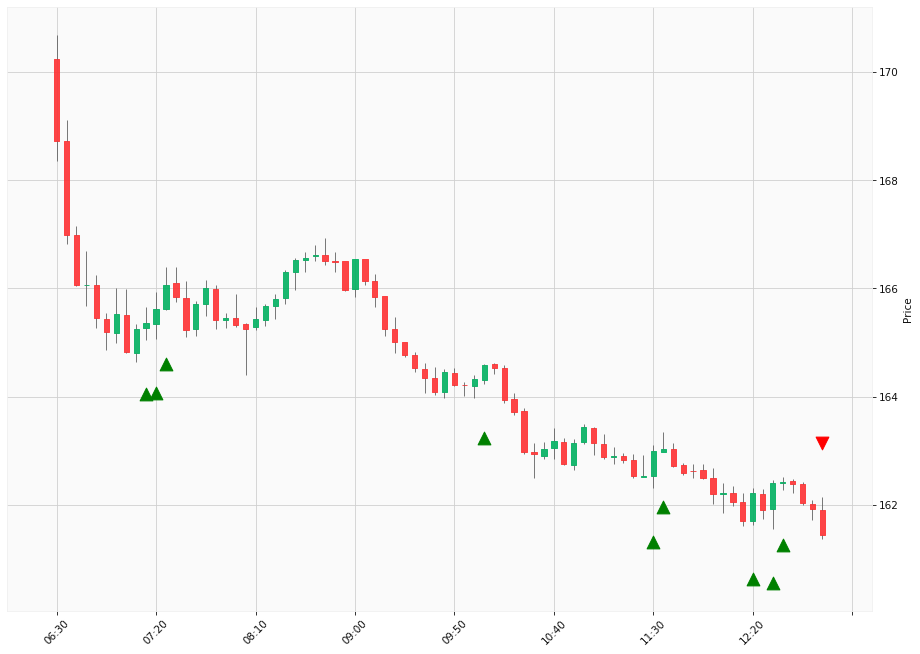

# Trading Summary for 2024-04-15

Percents are based off entry time.

Negative moves on shorts make money.

EOD is 12:55 pm

| Time In | Time Out | Time Delta |    | In Indicators | Out Indicators | Percent Move |    | Price In | Price Out | Dollar Move |
| ------- | -------- | ---------- | -- | ------------- | -------------- | ------------ | -- | -------- | --------- | ----------- |
| 07:15:00 | 12:55:00 | 05:40:00 | | Long HLT 301 | Long Day End Short Day End | -2.36 % | | $165.36 | $161.45 | $-3.91 |
| 07:20:00 | 12:55:00 | 05:35:00 | | Long HLT 101 Long HLT 104 Long HLT 106 Long HLT 210 Long HLT 507 | Long Day End Short Day End | -2.52 % | | $165.63 | $161.45 | $-4.18 |
| 07:25:00 | 12:55:00 | 05:30:00 | | Long HLT 105 Long HLT 106 Long HLT 304 Long HLT 347 | Long Day End Short Day End | -2.78 % | | $166.06 | $161.45 | $-4.61 |
| 10:05:00 | 12:55:00 | 02:50:00 | | Long HLT 105 Long HLT 203 Long HLT 242 Long HLT 345 Long HLT 347 Long HLT 410 Long HLT 505 | Long Day End Short Day End | -1.91 % | | $164.59 | $161.45 | $-3.14 |
| 11:30:00 | 12:55:00 | 01:25:00 | | Long HLT 613 | Long Day End Short Day End | -0.94 % | | $162.99 | $161.45 | $-1.54 |
| 11:35:00 | 12:55:00 | 01:20:00 | | Long HLT 206 Long HLT 214 Long HLT 305 Long HLT 341 Long HLT 342 | Long Day End Short Day End | -0.97 % | | $163.03 | $161.45 | $-1.58 |
| 12:20:00 | 12:55:00 | 00:35:00 | | Long HLT 646 | Long Day End Short Day End | -0.47 % | | $162.22 | $161.45 | $-0.77 |
| 12:30:00 | 12:55:00 | 00:25:00 | | Long HLT 613 | Long Day End Short Day End | -0.58 % | | $162.40 | $161.45 | $-0.95 |
| 12:35:00 | 12:55:00 | 00:20:00 | | Long HLT 203 Long HLT 214 | Long Day End Short Day End | -0.60 % | | $162.43 | $161.45 | $-0.98 |
|  |  |  |  |  |  |  | |  |  |  |
| Totals: |  |  |  |  |  | -13.15 % | |  |  | $-21.66 |