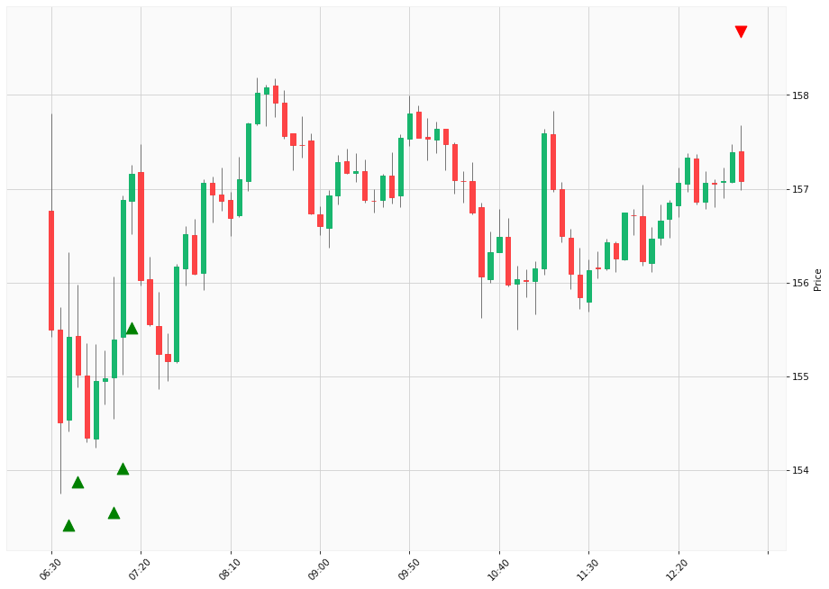

# Trading Summary for 2024-04-16

Percents are based off entry time.

Negative moves on shorts make money.

EOD is 12:55 pm

| Time In | Time Out | Time Delta |    | In Indicators | Out Indicators | Percent Move |    | Price In | Price Out | Dollar Move |
| ------- | -------- | ---------- | -- | ------------- | -------------- | ------------ | -- | -------- | --------- | ----------- |
| 06:40:00 | 12:55:00 | 06:15:00 | | Long HLT 647 | Long Day End Short Day End | 1.07 % | | $155.42 | $157.08 | $1.66 |
| 06:45:00 | 12:55:00 | 06:10:00 | | Long HLT 647 | Long Day End Short Day End | 1.33 % | | $155.02 | $157.08 | $2.06 |
| 07:05:00 | 12:55:00 | 05:50:00 | | Long HLT 106 | Long Day End Short Day End | 1.09 % | | $155.39 | $157.08 | $1.69 |
| 07:10:00 | 12:55:00 | 05:45:00 | | Long HLT 101 Long HLT 104 Long HLT 106 Long HLT 210 | Long Day End Short Day End | 0.13 % | | $156.88 | $157.08 | $0.20 |
| 07:15:00 | 12:55:00 | 05:40:00 | | Long HLT 304 | Long Day End Short Day End | -0.05 % | | $157.16 | $157.08 | $-0.08 |
|  |  |  |  |  |  |  | |  |  |  |
| Totals: |  |  |  |  |  | 3.56 % | |  |  | $5.53 |