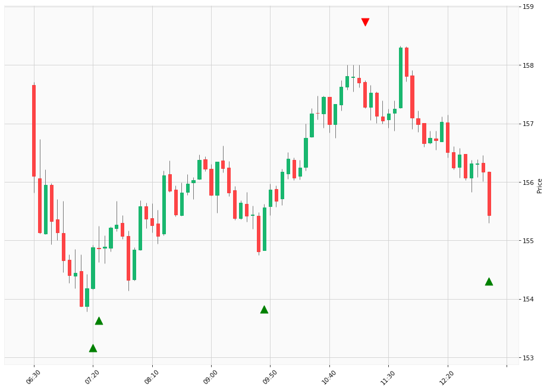

# Trading Summary for 2024-04-17

Percents are based off entry time.

Negative moves on shorts make money.

EOD is 12:55 pm

| Time In | Time Out | Time Delta |    | In Indicators | Out Indicators | Percent Move |    | Price In | Price Out | Dollar Move |
| ------- | -------- | ---------- | -- | ------------- | -------------- | ------------ | -- | -------- | --------- | ----------- |
| 07:20:00 | 11:10:00 | 03:50:00 | | Long HLT 101 Long HLT 103 Long HLT 104 Long HLT 123 Long HLT 210 Long HLT 237 Long HLT 315 Long HLT 343 Long HLT 402 Long HLT 507 Long HLT 508 | Short HLT 505 | 1.55 % | | $154.88 | $157.28 | $2.40 |
| 07:25:00 | 11:10:00 | 03:45:00 | | Long HLT 105 Long HLT 206 Long HLT 217 Long HLT 304 Long HLT 342 Long HLT 347 | Short HLT 505 | 1.56 % | | $154.86 | $157.28 | $2.42 |
| 09:45:00 | 11:10:00 | 01:25:00 | | Long HLT 646 | Short HLT 505 | 1.11 % | | $155.56 | $157.28 | $1.72 |
| 11:10:00 | 12:55:00 | 01:45:00 | | Short HLT 505 | Long Day End Short Day End | -1.18 % | | $157.28 | $155.43 | $-1.85 |
|  |  |  |  |  |  |  | |  |  |  |
| Totals: |  |  |  |  |  | 5.39 % | |  |  | $8.39 |