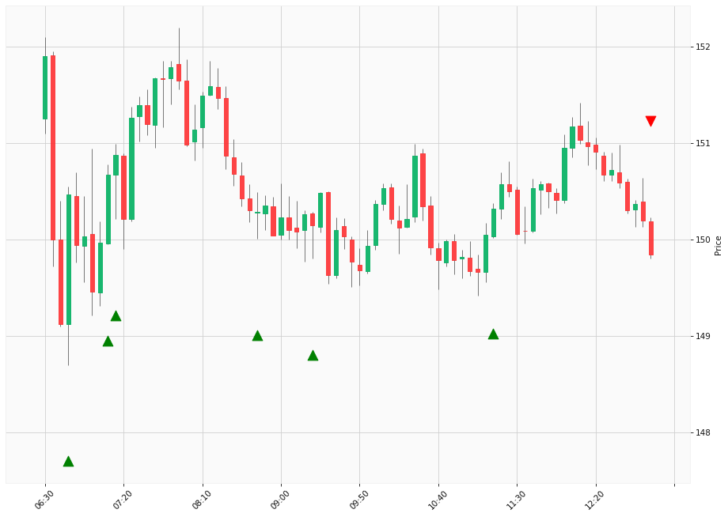

# Trading Summary for 2024-04-18

Percents are based off entry time.

Negative moves on shorts make money.

EOD is 12:55 pm

| Time In | Time Out | Time Delta |    | In Indicators | Out Indicators | Percent Move |    | Price In | Price Out | Dollar Move |
| ------- | -------- | ---------- | -- | ------------- | -------------- | ------------ | -- | -------- | --------- | ----------- |
| 06:45:00 | 12:55:00 | 06:10:00 | | Long HLT 646 | Long Day End Short Day End | -0.42 % | | $150.47 | $149.84 | $-0.63 |
| 07:10:00 | 12:55:00 | 05:45:00 | | Long HLT 101 Long HLT 104 Long HLT 106 Long HLT 210 Long HLT 235 Long HLT 345 Long HLT 346 Long HLT 507 Long HLT 648 | Long Day End Short Day End | -0.55 % | | $150.67 | $149.84 | $-0.83 |
| 07:15:00 | 12:55:00 | 05:40:00 | | Long HLT 105 Long HLT 304 Long HLT 347 | Long Day End Short Day End | -0.69 % | | $150.88 | $149.84 | $-1.04 |
| 08:45:00 | 12:55:00 | 04:10:00 | | Long HLT 218 | Long Day End Short Day End | -0.30 % | | $150.29 | $149.84 | $-0.45 |
| 09:20:00 | 12:55:00 | 03:35:00 | | Long HLT 105 Long HLT 347 | Long Day End Short Day End | -0.21 % | | $150.15 | $149.84 | $-0.31 |
| 11:15:00 | 12:55:00 | 01:40:00 | | Long HLT 342 | Long Day End Short Day End | -0.32 % | | $150.32 | $149.84 | $-0.48 |
|  |  |  |  |  |  |  | |  |  |  |
| Totals: |  |  |  |  |  | -2.48 % | |  |  | $-3.74 |