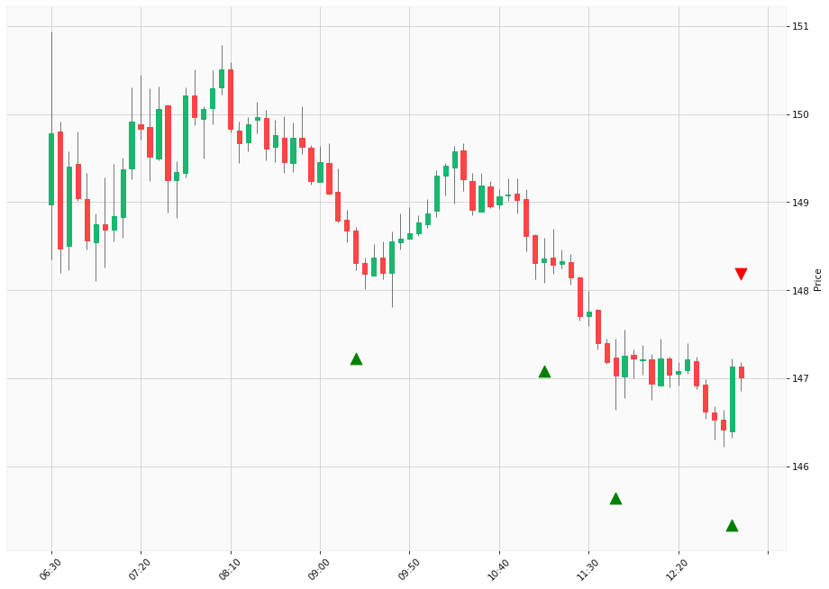

# Trading Summary for 2024-04-19

Percents are based off entry time.

Negative moves on shorts make money.

EOD is 12:55 pm

| Time In | Time Out | Time Delta |    | In Indicators | Out Indicators | Percent Move |    | Price In | Price Out | Dollar Move |
| ------- | -------- | ---------- | -- | ------------- | -------------- | ------------ | -- | -------- | --------- | ----------- |
| 09:20:00 | 12:55:00 | 03:35:00 | | Long HLT 615 | Long Day End Short Day End Long HLT 206 Long HLT 305 Long HLT 341 Long HLT 342 | -0.88 % | | $148.31 | $147.01 | $-1.30 |
| 11:05:00 | 12:55:00 | 01:50:00 | | Long HLT 218 | Long Day End Short Day End Long HLT 206 Long HLT 305 Long HLT 341 Long HLT 342 | -0.91 % | | $148.36 | $147.01 | $-1.35 |
| 11:45:00 | 12:55:00 | 01:10:00 | | Long HLT 615 | Long Day End Short Day End Long HLT 206 Long HLT 305 Long HLT 341 Long HLT 342 | -0.01 % | | $147.03 | $147.01 | $-0.02 |
| 12:50:00 | 12:55:00 | 00:05:00 | | Long HLT 613 | Long Day End Short Day End Long HLT 206 Long HLT 305 Long HLT 341 Long HLT 342 | -0.08 % | | $147.13 | $147.01 | $-0.12 |
|  |  |  |  |  |  |  | |  |  |  |
| Totals: |  |  |  |  |  | -1.88 % | |  |  | $-2.79 |