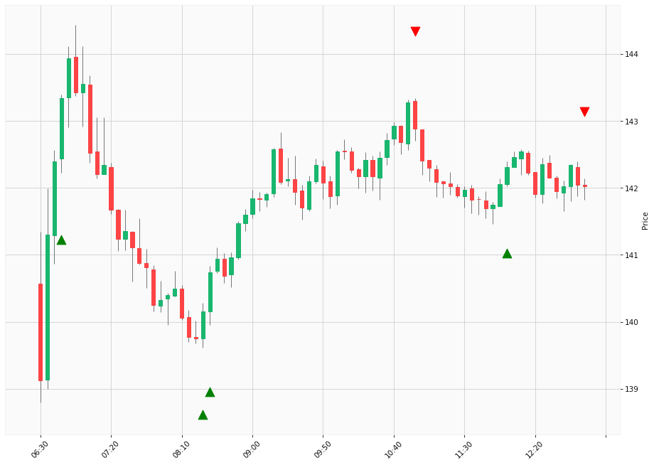

# Trading Summary for 2024-04-22

Percents are based off entry time.

Negative moves on shorts make money.

EOD is 12:55 pm

| Time In | Time Out | Time Delta |    | In Indicators | Out Indicators | Percent Move |    | Price In | Price Out | Dollar Move |
| ------- | -------- | ---------- | -- | ------------- | -------------- | ------------ | -- | -------- | --------- | ----------- |
| 06:45:00 | 10:55:00 | 04:10:00 | | Long HLT 213 | Short HLT 646 | -0.32 % | | $143.34 | $142.88 | $-0.46 |
| 08:25:00 | 10:55:00 | 02:30:00 | | Long HLT 343 | Short HLT 646 | 1.94 % | | $140.16 | $142.88 | $2.72 |
| 08:30:00 | 10:55:00 | 02:25:00 | | Long HLT 105 Long HLT 108 Long HLT 111 Long HLT 203 Long HLT 206 Long HLT 214 Long HLT 305 Long HLT 341 Long HLT 342 Long HLT 345 Long HLT 347 Long HLT 410 Long HLT 602 | Short HLT 646 | 1.52 % | | $140.74 | $142.88 | $2.14 |
| 10:55:00 | 12:00:00 | 01:05:00 | | Short HLT 646 | Long HLT 304 | -0.40 % | | $142.88 | $142.31 | $-0.57 |
| 12:00:00 | 12:55:00 | 00:55:00 | | Long HLT 304 | Long Day End Short Day End | -0.20 % | | $142.31 | $142.03 | $-0.28 |
|  |  |  |  |  |  |  | |  |  |  |
| Totals: |  |  |  |  |  | 3.34 % | |  |  | $4.69 |