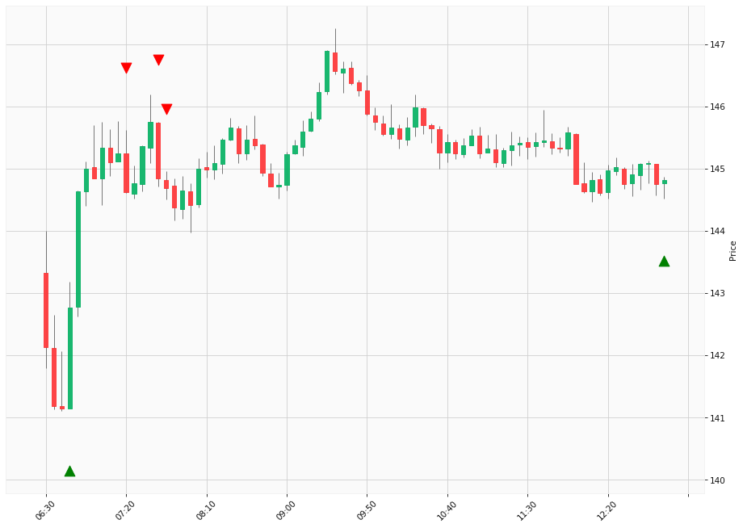

# Trading Summary for 2024-04-23

Percents are based off entry time.

Negative moves on shorts make money.

EOD is 12:55 pm

| Time In | Time Out | Time Delta |    | In Indicators | Out Indicators | Percent Move |    | Price In | Price Out | Dollar Move |
| ------- | -------- | ---------- | -- | ------------- | -------------- | ------------ | -- | -------- | --------- | ----------- |
| 06:45:00 | 07:20:00 | 00:35:00 | | Long HLT 361 Long HLT 646 | Short HLT 106 | 1.30 % | | $142.77 | $144.62 | $1.85 |
| 07:20:00 | 12:55:00 | 05:35:00 | | Short HLT 106 | Long Day End Short Day End | 0.14 % | | $144.62 | $144.82 | $0.20 |
| 07:40:00 | 12:55:00 | 05:15:00 | | Short HLT 613 | Long Day End Short Day End | -0.01 % | | $144.84 | $144.82 | $-0.02 |
| 07:45:00 | 12:55:00 | 05:10:00 | | Short HLT 203 Short HLT 304 | Long Day End Short Day End | 0.09 % | | $144.69 | $144.82 | $0.13 |
|  |  |  |  |  |  |  | |  |  |  |
| Totals: |  |  |  |  |  | 1.08 % | |  |  | $1.54 |