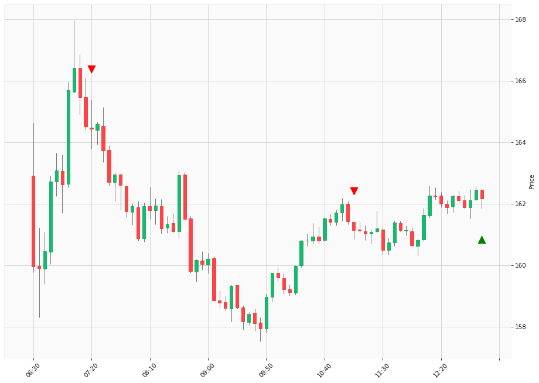

# Trading Summary for 2024-04-24

Percents are based off entry time.

Negative moves on shorts make money.

EOD is 12:55 pm

| Time In | Time Out | Time Delta |    | In Indicators | Out Indicators | Percent Move |    | Price In | Price Out | Dollar Move |
| ------- | -------- | ---------- | -- | ------------- | -------------- | ------------ | -- | -------- | --------- | ----------- |
| 07:20:00 | 12:55:00 | 05:35:00 | | Short HLT 105 Short HLT 347 | Long Day End Short Day End Short HLT 315 | -1.37 % | | $164.43 | $162.17 | $-2.26 |
| 11:05:00 | 12:55:00 | 01:50:00 | | Short HLT 105 Short HLT 203 Short HLT 347 Short HLT 410 | Long Day End Short Day End Short HLT 315 | 0.64 % | | $161.14 | $162.17 | $1.03 |
|  |  |  |  |  |  |  | |  |  |  |
| Totals: |  |  |  |  |  | 0.74 % | |  |  | $1.23 |