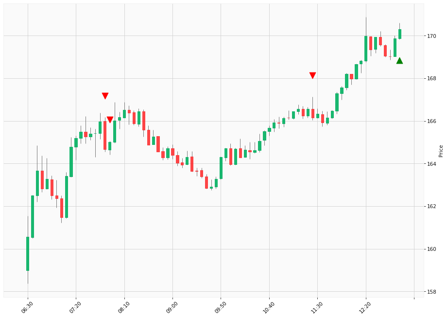

# Trading Summary for 2024-04-25

Percents are based off entry time.

Negative moves on shorts make money.

EOD is 12:55 pm

| Time In | Time Out | Time Delta |    | In Indicators | Out Indicators | Percent Move |    | Price In | Price Out | Dollar Move |
| ------- | -------- | ---------- | -- | ------------- | -------------- | ------------ | -- | -------- | --------- | ----------- |
| 07:50:00 | 12:55:00 | 05:05:00 | | Short HLT 103 | Long Day End Short Day End | 3.43 % | | $164.66 | $170.31 | $5.65 |
| 07:55:00 | 12:55:00 | 05:00:00 | | Short HLT 345 | Long Day End Short Day End | 3.21 % | | $165.01 | $170.31 | $5.30 |
| 11:25:00 | 12:55:00 | 01:30:00 | | Short HLT 613 | Long Day End Short Day End | 2.50 % | | $166.15 | $170.31 | $4.16 |
|  |  |  |  |  |  |  | |  |  |  |
| Totals: |  |  |  |  |  | -9.15 % | |  |  | $-15.11 |