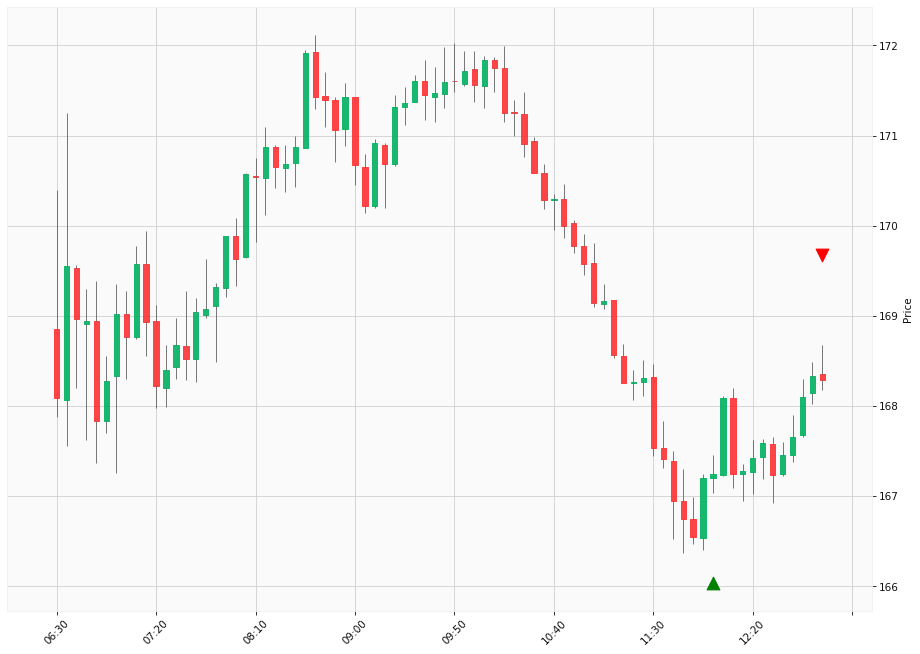

# Trading Summary for 2024-04-26

Percents are based off entry time.

Negative moves on shorts make money.

EOD is 12:55 pm

| Time In | Time Out | Time Delta |    | In Indicators | Out Indicators | Percent Move |    | Price In | Price Out | Dollar Move |
| ------- | -------- | ---------- | -- | ------------- | -------------- | ------------ | -- | -------- | --------- | ----------- |
| 12:00:00 | 12:55:00 | 00:55:00 | | Long HLT 106 Long HLT 242 Long HLT 301 Long HLT 346 Long HLT 410 | Long Day End Short Day End | 0.63 % | | $167.24 | $168.29 | $1.05 |
|  |  |  |  |  |  |  | |  |  |  |
| Totals: |  |  |  |  |  | 0.63 % | |  |  | $1.05 |