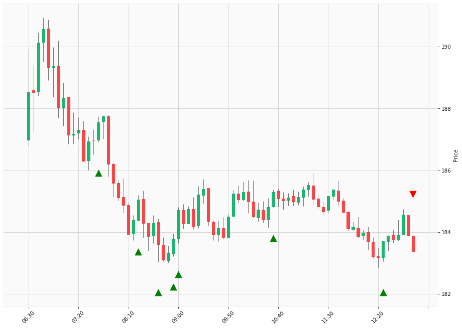

# Trading Summary for 2024-04-30

Percents are based off entry time.

Negative moves on shorts make money.

EOD is 12:55 pm

| Time In | Time Out | Time Delta |    | In Indicators | Out Indicators | Percent Move |    | Price In | Price Out | Dollar Move |
| ------- | -------- | ---------- | -- | ------------- | -------------- | ------------ | -- | -------- | --------- | ----------- |
| 07:40:00 | 12:55:00 | 05:15:00 | | Long HLT 206 | Long Day End Short Day End | -2.22 % | | $187.55 | $183.38 | $-4.17 |
| 08:20:00 | 12:55:00 | 04:35:00 | | Long HLT 106 Long HLT 346 | Long Day End Short Day End | -0.90 % | | $185.05 | $183.38 | $-1.67 |
| 08:40:00 | 12:55:00 | 04:15:00 | | Long HLT 648 | Long Day End Short Day End | -0.12 % | | $183.60 | $183.38 | $-0.22 |
| 08:55:00 | 12:55:00 | 04:00:00 | | Long HLT 101 Long HLT 104 Long HLT 210 Long HLT 301 Long HLT 343 | Long Day End Short Day End | -0.21 % | | $183.77 | $183.38 | $-0.39 |
| 09:00:00 | 12:55:00 | 03:55:00 | | Long HLT 206 Long HLT 342 | Long Day End Short Day End | -0.72 % | | $184.71 | $183.38 | $-1.33 |
| 10:35:00 | 12:55:00 | 02:20:00 | | Long HLT 214 | Long Day End Short Day End | -1.04 % | | $185.30 | $183.38 | $-1.92 |
| 12:25:00 | 12:55:00 | 00:30:00 | | Long HLT 405 | Long Day End Short Day End | -0.18 % | | $183.71 | $183.38 | $-0.33 |
|  |  |  |  |  |  |  | |  |  |  |
| Totals: |  |  |  |  |  | -5.39 % | |  |  | $-10.03 |