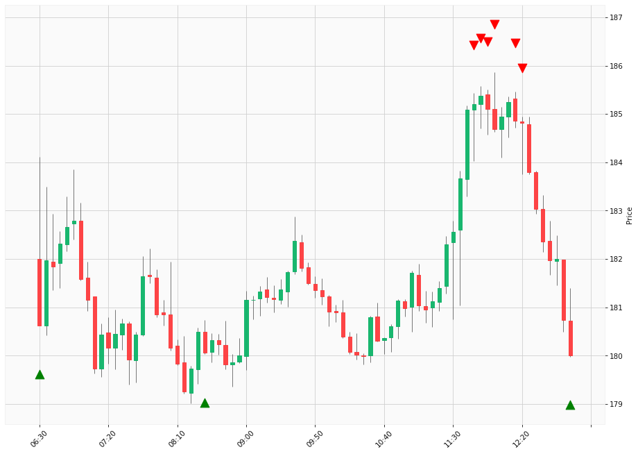

# Trading Summary for 2024-05-01

Percents are based off entry time.

Negative moves on shorts make money.

EOD is 12:55 pm

| Time In | Time Out | Time Delta |    | In Indicators | Out Indicators | Percent Move |    | Price In | Price Out | Dollar Move |
| ------- | -------- | ---------- | -- | ------------- | -------------- | ------------ | -- | -------- | --------- | ----------- |
| 06:30:00 | 11:45:00 | 05:15:00 | | Long HLT 613 | Short HLT 614 | 2.53 % | | $180.63 | $185.20 | $4.57 |
| 08:30:00 | 11:45:00 | 03:15:00 | | Long HLT 206 Long HLT 342 | Short HLT 614 | 2.85 % | | $180.07 | $185.20 | $5.13 |
| 11:45:00 | 12:55:00 | 01:10:00 | | Short HLT 614 | Long Day End Short Day End | -2.81 % | | $185.20 | $180.00 | $-5.20 |
| 11:50:00 | 12:55:00 | 01:05:00 | | Short HLT 147 Short HLT 614 | Long Day End Short Day End | -2.90 % | | $185.37 | $180.00 | $-5.37 |
| 11:55:00 | 12:55:00 | 01:00:00 | | Short HLT 614 | Long Day End Short Day End | -2.76 % | | $185.10 | $180.00 | $-5.10 |
| 12:00:00 | 12:55:00 | 00:55:00 | | Short HLT 301 | Long Day End Short Day End | -2.53 % | | $184.68 | $180.00 | $-4.68 |
| 12:15:00 | 12:55:00 | 00:40:00 | | Short HLT 103 | Long Day End Short Day End | -2.63 % | | $184.86 | $180.00 | $-4.86 |
| 12:20:00 | 12:55:00 | 00:35:00 | | Short HLT 410 | Long Day End Short Day End | -2.61 % | | $184.82 | $180.00 | $-4.82 |
|  |  |  |  |  |  |  | |  |  |  |
| Totals: |  |  |  |  |  | 21.61 % | |  |  | $39.73 |