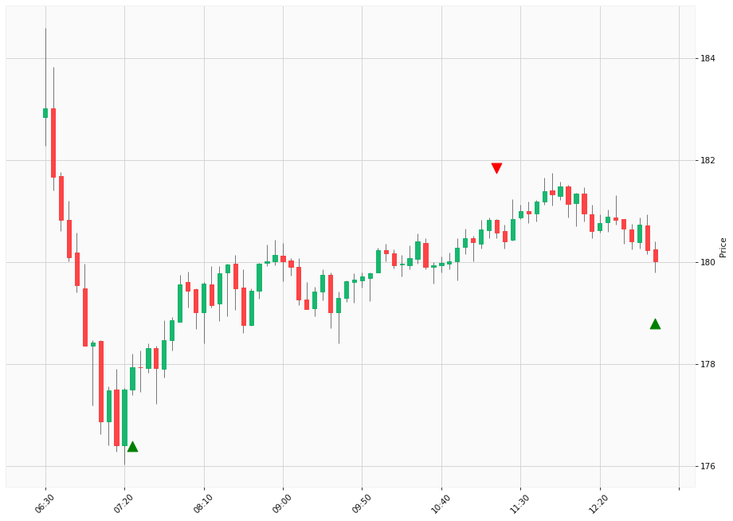

# Trading Summary for 2024-05-02

Percents are based off entry time.

Negative moves on shorts make money.

EOD is 12:55 pm

| Time In | Time Out | Time Delta |    | In Indicators | Out Indicators | Percent Move |    | Price In | Price Out | Dollar Move |
| ------- | -------- | ---------- | -- | ------------- | -------------- | ------------ | -- | -------- | --------- | ----------- |
| 07:25:00 | 11:15:00 | 03:50:00 | | Long HLT 237 Long HLT 242 Long HLT 301 Long HLT 345 Long HLT 508 | Short HLT 646 | 1.49 % | | $177.93 | $180.58 | $2.65 |
| 11:15:00 | 12:55:00 | 01:40:00 | | Short HLT 646 | Long Day End Short Day End | -0.31 % | | $180.58 | $180.02 | $-0.56 |
|  |  |  |  |  |  |  | |  |  |  |
| Totals: |  |  |  |  |  | 1.80 % | |  |  | $3.21 |