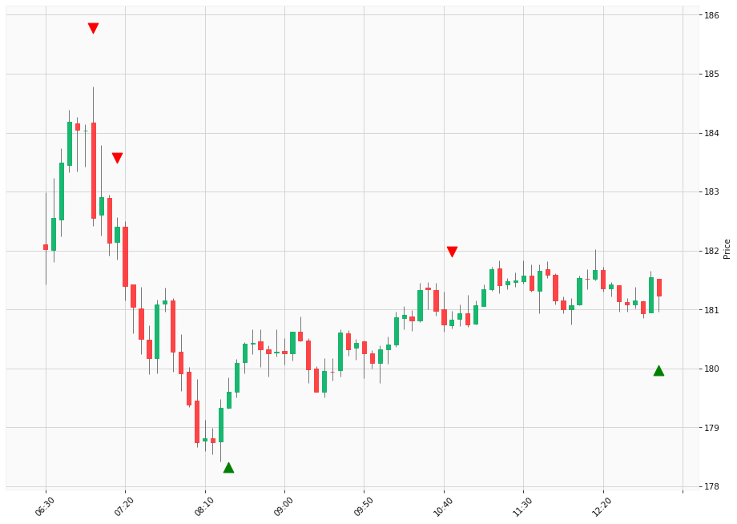

D
# Trading Summary for 2024-05-03

Percents are based off entry time.

Negative moves on shorts make money.

EOD is 12:55 pm

| Time In | Time Out | Time Delta |    | In Indicators | Out Indicators | Percent Move |    | Price In | Price Out | Dollar Move |
| ------- | -------- | ---------- | -- | ------------- | -------------- | ------------ | -- | -------- | --------- | ----------- |
| 07:00:00 | 08:25:00 | 01:25:00 | | Short HLT 106 Short HLT 508 | Long HLT 105 Long HLT 347 | -1.62 % | | $182.56 | $179.61 | $-2.95 |
| 07:15:00 | 08:25:00 | 01:10:00 | | Short HLT 304 | Long HLT 105 Long HLT 347 | -1.53 % | | $182.40 | $179.61 | $-2.79 |
| 08:25:00 | 10:45:00 | 02:20:00 | | Long HLT 105 Long HLT 347 | Short HLT 304 | 0.68 % | | $179.61 | $180.83 | $1.22 |
| 10:45:00 | 12:55:00 | 02:10:00 | | Short HLT 304 | Long Day End Short Day End | 0.23 % | | $180.83 | $181.24 | $0.41 |
|  |  |  |  |  |  |  | |  |  |  |
| Totals: |  |  |  |  |  | 3.60 % | |  |  | $6.55 |