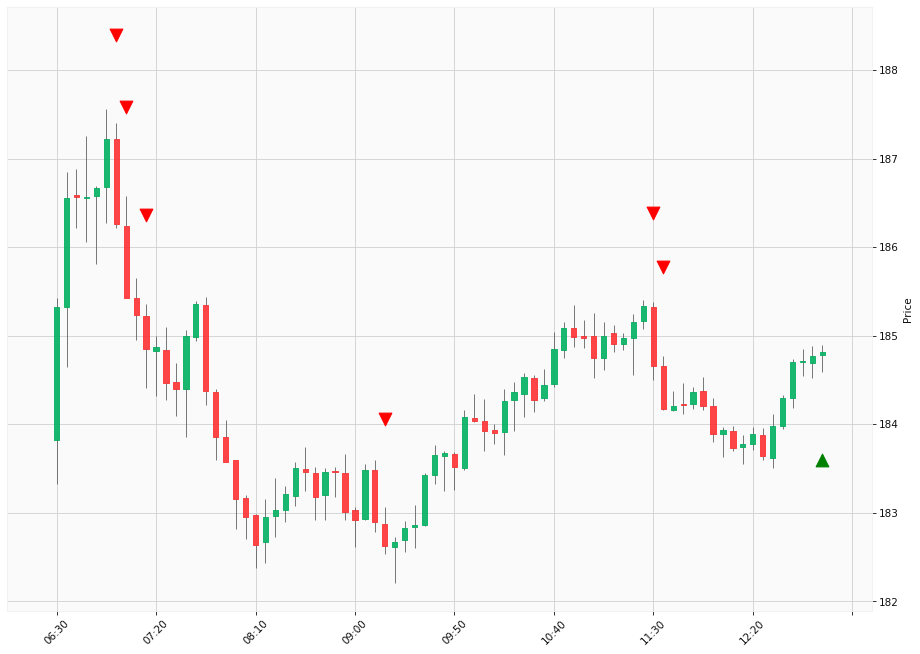

# Trading Summary for 2024-05-06

Percents are based off entry time.

Negative moves on shorts make money.

EOD is 12:55 pm

| Time In | Time Out | Time Delta |    | In Indicators | Out Indicators | Percent Move |    | Price In | Price Out | Dollar Move |
| ------- | -------- | ---------- | -- | ------------- | -------------- | ------------ | -- | -------- | --------- | ----------- |
| 07:00:00 | 12:55:00 | 05:55:00 | | Short HLT 103 | Long Day End Short Day End | -0.78 % | | $186.26 | $184.81 | $-1.45 |
| 07:05:00 | 12:55:00 | 05:50:00 | | Short HLT 106 Short HLT 108 Short HLT 235 Short HLT 345 Short HLT 346 | Long Day End Short Day End | -0.33 % | | $185.43 | $184.81 | $-0.62 |
| 07:15:00 | 12:55:00 | 05:40:00 | | Short HLT 304 | Long Day End Short Day End | -0.02 % | | $184.85 | $184.81 | $-0.04 |
| 09:15:00 | 12:55:00 | 03:40:00 | | Short HLT 203 | Long Day End Short Day End | 1.20 % | | $182.62 | $184.81 | $2.19 |
| 11:30:00 | 12:55:00 | 01:25:00 | | Short HLT 613 | Long Day End Short Day End | 0.08 % | | $184.66 | $184.81 | $0.15 |
| 11:35:00 | 12:55:00 | 01:20:00 | | Short HLT 203 Short HLT 305 | Long Day End Short Day End | 0.35 % | | $184.17 | $184.81 | $0.64 |
|  |  |  |  |  |  |  | |  |  |  |
| Totals: |  |  |  |  |  | -0.49 % | |  |  | $-0.87 |