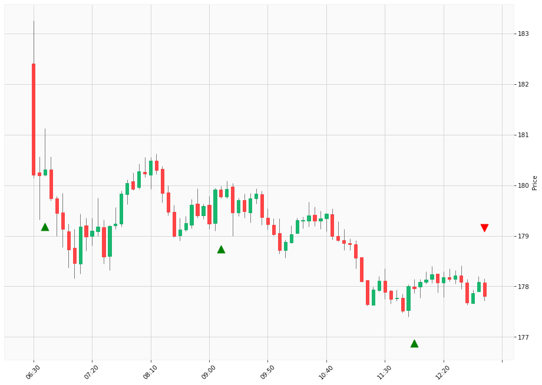

# Trading Summary for 2024-05-07

Percents are based off entry time.

Negative moves on shorts make money.

EOD is 12:55 pm

| Time In | Time Out | Time Delta |    | In Indicators | Out Indicators | Percent Move |    | Price In | Price Out | Dollar Move |
| ------- | -------- | ---------- | -- | ------------- | -------------- | ------------ | -- | -------- | --------- | ----------- |
| 06:40:00 | 12:55:00 | 06:15:00 | | Long HLT 647 | Long Day End Short Day End | -1.39 % | | $180.31 | $177.81 | $-2.50 |
| 09:10:00 | 12:55:00 | 03:45:00 | | Long HLT 203 Long HLT 214 | Long Day End Short Day End | -1.10 % | | $179.78 | $177.81 | $-1.97 |
| 11:55:00 | 12:55:00 | 01:00:00 | | Long HLT 105 Long HLT 110 Long HLT 203 Long HLT 214 Long HLT 302 Long HLT 341 Long HLT 342 Long HLT 345 Long HLT 347 Long HLT 410 | Long Day End Short Day End | -0.08 % | | $177.96 | $177.81 | $-0.15 |
|  |  |  |  |  |  |  | |  |  |  |
| Totals: |  |  |  |  |  | -2.57 % | |  |  | $-4.62 |