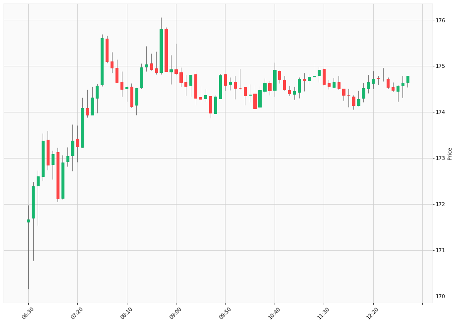

# Trading Summary for 2024-05-08

Percents are based off entry time.

Negative moves on shorts make money.

EOD is 12:55 pm

| Time In | Time Out | Time Delta |    | In Indicators | Out Indicators | Percent Move |    | Price In | Price Out | Dollar Move |
| ------- | -------- | ---------- | -- | ------------- | -------------- | ------------ | -- | -------- | --------- | ----------- |
|  |  |  |  |  |  |  | |  |  |  |
| Totals: |  |  |  |  |  | 0.00 % | |  |  | $0.00 |