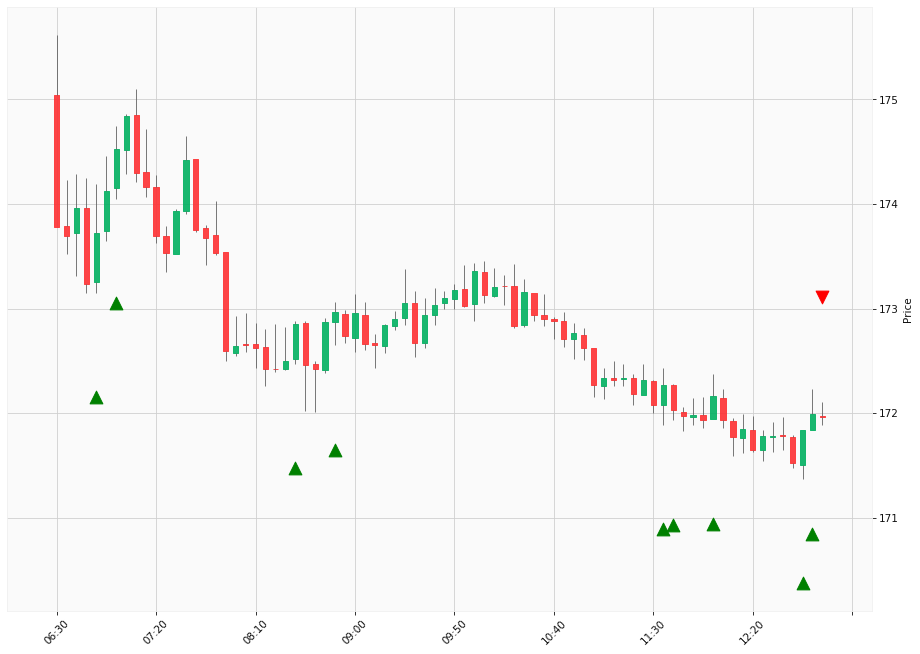

# Trading Summary for 2024-05-09

Percents are based off entry time.

Negative moves on shorts make money.

EOD is 12:55 pm

| Time In | Time Out | Time Delta |    | In Indicators | Out Indicators | Percent Move |    | Price In | Price Out | Dollar Move |
| ------- | -------- | ---------- | -- | ------------- | -------------- | ------------ | -- | -------- | --------- | ----------- |
| 06:50:00 | 12:55:00 | 06:05:00 | | Long HLT 646 | Long Day End Short Day End | -1.01 % | | $173.72 | $171.96 | $-1.76 |
| 07:00:00 | 12:55:00 | 05:55:00 | | Long HLT 206 Long HLT 217 Long HLT 342 | Long Day End Short Day End | -1.47 % | | $174.53 | $171.96 | $-2.57 |
| 08:30:00 | 12:55:00 | 04:25:00 | | Long HLT 242 Long HLT 345 | Long Day End Short Day End | -0.51 % | | $172.85 | $171.96 | $-0.89 |
| 08:50:00 | 12:55:00 | 04:05:00 | | Long HLT 110 Long HLT 111 Long HLT 214 Long HLT 302 | Long Day End Short Day End | -0.58 % | | $172.97 | $171.96 | $-1.01 |
| 11:35:00 | 12:55:00 | 01:20:00 | | Long HLT 601 Long HLT 613 | Long Day End Short Day End | -0.18 % | | $172.27 | $171.96 | $-0.31 |
| 11:40:00 | 12:55:00 | 01:15:00 | | Long HLT 341 Long HLT 342 | Long Day End Short Day End | -0.04 % | | $172.03 | $171.96 | $-0.07 |
| 12:00:00 | 12:55:00 | 00:55:00 | | Long HLT 613 | Long Day End Short Day End | -0.12 % | | $172.16 | $171.96 | $-0.20 |
| 12:45:00 | 12:55:00 | 00:10:00 | | Long HLT 315 Long HLT 601 | Long Day End Short Day End | 0.07 % | | $171.84 | $171.96 | $0.12 |
| 12:50:00 | 12:55:00 | 00:05:00 | | Long HLT 214 | Long Day End Short Day End | -0.02 % | | $171.99 | $171.96 | $-0.03 |
|  |  |  |  |  |  |  | |  |  |  |
| Totals: |  |  |  |  |  | -3.87 % | |  |  | $-6.72 |