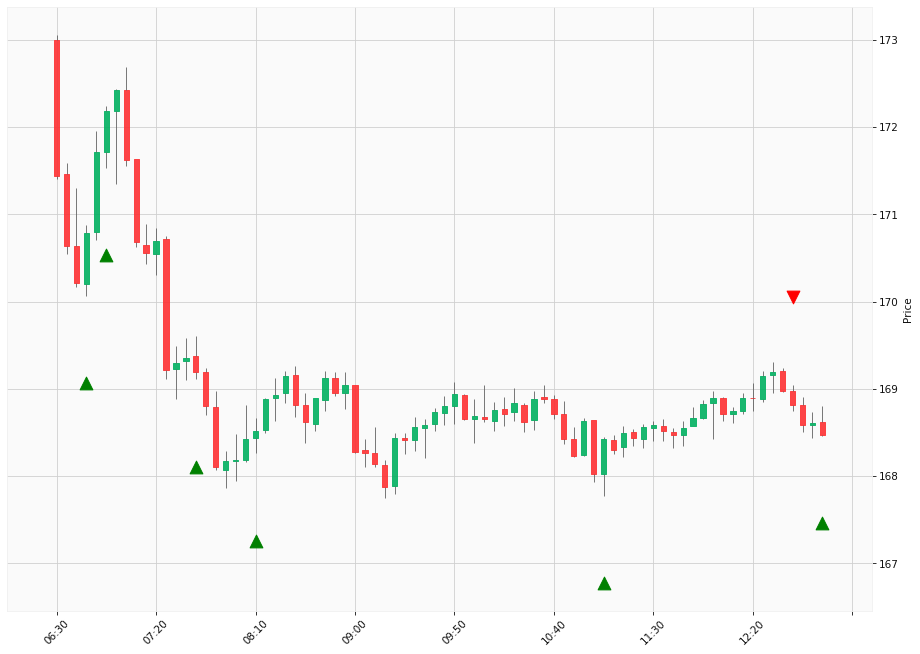

# Trading Summary for 2024-05-10

Percents are based off entry time.

Negative moves on shorts make money.

EOD is 12:55 pm

| Time In | Time Out | Time Delta |    | In Indicators | Out Indicators | Percent Move |    | Price In | Price Out | Dollar Move |
| ------- | -------- | ---------- | -- | ------------- | -------------- | ------------ | -- | -------- | --------- | ----------- |
| 06:45:00 | 12:40:00 | 05:55:00 | | Long HLT 646 | Short HLT 203 Short HLT 242 Short HLT 402 | -1.16 % | | $170.79 | $168.81 | $-1.98 |
| 06:55:00 | 12:40:00 | 05:45:00 | | Long HLT 217 Long HLT 342 | Short HLT 203 Short HLT 242 Short HLT 402 | -1.96 % | | $172.18 | $168.81 | $-3.37 |
| 07:40:00 | 12:40:00 | 05:00:00 | | Long HLT 509 | Short HLT 203 Short HLT 242 Short HLT 402 | -0.22 % | | $169.19 | $168.81 | $-0.38 |
| 08:10:00 | 12:40:00 | 04:30:00 | | Long HLT 105 Long HLT 347 Long HLT 505 | Short HLT 203 Short HLT 242 Short HLT 402 | 0.17 % | | $168.52 | $168.81 | $0.29 |
| 11:05:00 | 12:40:00 | 01:35:00 | | Long HLT 646 | Short HLT 203 Short HLT 242 Short HLT 402 | 0.23 % | | $168.43 | $168.81 | $0.38 |
| 12:40:00 | 12:55:00 | 00:15:00 | | Short HLT 203 Short HLT 242 Short HLT 402 | Long Day End Short Day End | -0.20 % | | $168.81 | $168.47 | $-0.34 |
|  |  |  |  |  |  |  | |  |  |  |
| Totals: |  |  |  |  |  | -2.74 % | |  |  | $-4.72 |