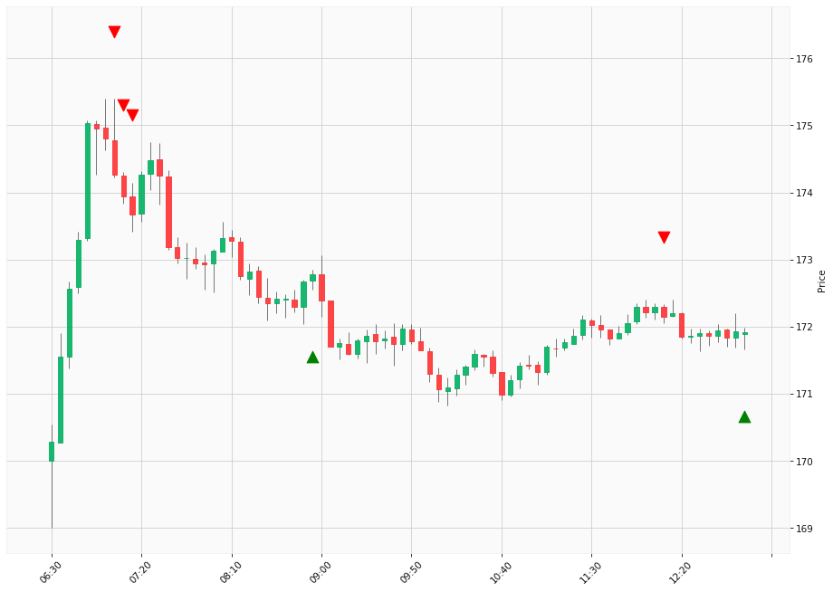

# Trading Summary for 2024-05-13

Percents are based off entry time.

Negative moves on shorts make money.

EOD is 12:55 pm

| Time In | Time Out | Time Delta |    | In Indicators | Out Indicators | Percent Move |    | Price In | Price Out | Dollar Move |
| ------- | -------- | ---------- | -- | ------------- | -------------- | ------------ | -- | -------- | --------- | ----------- |
| 07:05:00 | 08:55:00 | 01:50:00 | | Short HLT 301 | Long HLT 203 | -0.85 % | | $174.26 | $172.78 | $-1.48 |
| 07:10:00 | 08:55:00 | 01:45:00 | | Short HLT 106 Short HLT 508 | Long HLT 203 | -0.67 % | | $173.94 | $172.78 | $-1.16 |
| 07:15:00 | 08:55:00 | 01:40:00 | | Short HLT 106 | Long HLT 203 | -0.51 % | | $173.67 | $172.78 | $-0.89 |
| 08:55:00 | 12:10:00 | 03:15:00 | | Long HLT 203 | Short HLT 613 | -0.36 % | | $172.78 | $172.15 | $-0.63 |
| 12:10:00 | 12:55:00 | 00:45:00 | | Short HLT 613 | Long Day End Short Day End | -0.13 % | | $172.15 | $171.92 | $-0.23 |
|  |  |  |  |  |  |  | |  |  |  |
| Totals: |  |  |  |  |  | 1.80 % | |  |  | $3.13 |