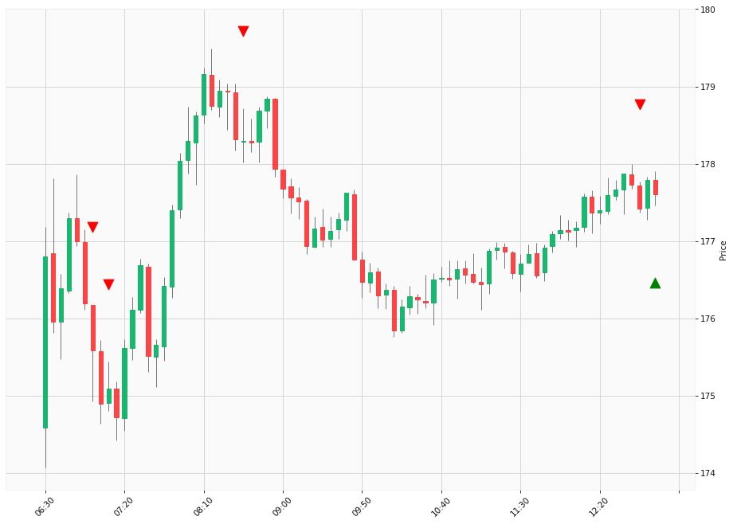

# Trading Summary for 2024-05-14

Percents are based off entry time.

Negative moves on shorts make money.

EOD is 12:55 pm

| Time In | Time Out | Time Delta |    | In Indicators | Out Indicators | Percent Move |    | Price In | Price Out | Dollar Move |
| ------- | -------- | ---------- | -- | ------------- | -------------- | ------------ | -- | -------- | --------- | ----------- |
| 07:00:00 | 12:55:00 | 05:55:00 | | Short HLT 108 Short HLT 235 Short HLT 345 | Long Day End Short Day End | 1.15 % | | $175.59 | $177.61 | $2.02 |
| 07:10:00 | 12:55:00 | 05:45:00 | | Short HLT 304 | Long Day End Short Day End | 1.44 % | | $175.09 | $177.61 | $2.52 |
| 08:35:00 | 12:55:00 | 04:20:00 | | Short HLT 105 Short HLT 203 Short HLT 304 Short HLT 344 Short HLT 347 Short HLT 410 | Long Day End Short Day End | -0.39 % | | $178.30 | $177.61 | $-0.69 |
| 12:45:00 | 12:55:00 | 00:10:00 | | Short HLT 101 Short HLT 104 Short HLT 210 Short HLT 345 | Long Day End Short Day End | 0.11 % | | $177.42 | $177.61 | $0.19 |
|  |  |  |  |  |  |  | |  |  |  |
| Totals: |  |  |  |  |  | -2.31 % | |  |  | $-4.04 |