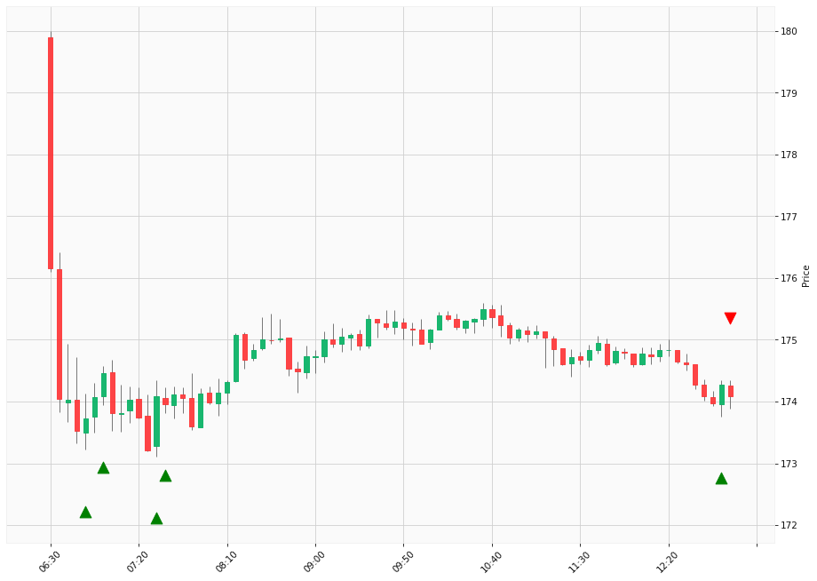

# Trading Summary for 2024-05-15

Percents are based off entry time.

Negative moves on shorts make money.

EOD is 12:55 pm

| Time In | Time Out | Time Delta |    | In Indicators | Out Indicators | Percent Move |    | Price In | Price Out | Dollar Move |
| ------- | -------- | ---------- | -- | ------------- | -------------- | ------------ | -- | -------- | --------- | ----------- |
| 06:50:00 | 12:55:00 | 06:05:00 | | Long HLT 647 | Long Day End Short Day End | 0.21 % | | $173.73 | $174.09 | $0.36 |
| 07:00:00 | 12:55:00 | 05:55:00 | | Long HLT 106 Long HLT 123 Long HLT 508 | Long Day End Short Day End | -0.21 % | | $174.46 | $174.09 | $-0.37 |
| 07:30:00 | 12:55:00 | 05:25:00 | | Long HLT 102 Long HLT 613 | Long Day End Short Day End | 0.01 % | | $174.08 | $174.09 | $0.01 |
| 07:35:00 | 12:55:00 | 05:20:00 | | Long HLT 110 Long HLT 214 Long HLT 302 Long HLT 341 Long HLT 342 | Long Day End Short Day End | 0.07 % | | $173.96 | $174.09 | $0.13 |
| 12:50:00 | 12:55:00 | 00:05:00 | | Long HLT 646 | Long Day End Short Day End | -0.10 % | | $174.27 | $174.09 | $-0.18 |
|  |  |  |  |  |  |  | |  |  |  |
| Totals: |  |  |  |  |  | -0.03 % | |  |  | $-0.05 |